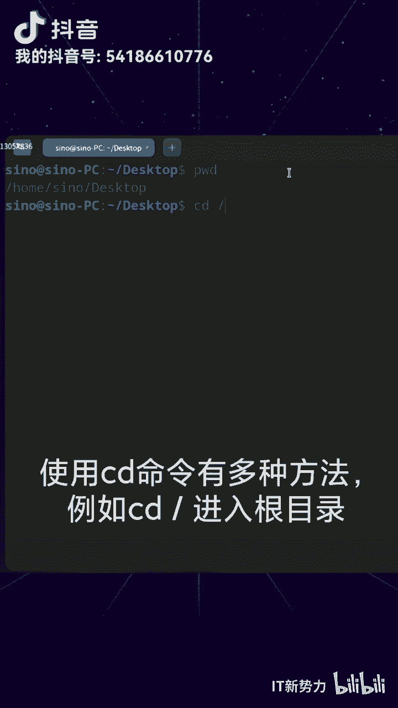
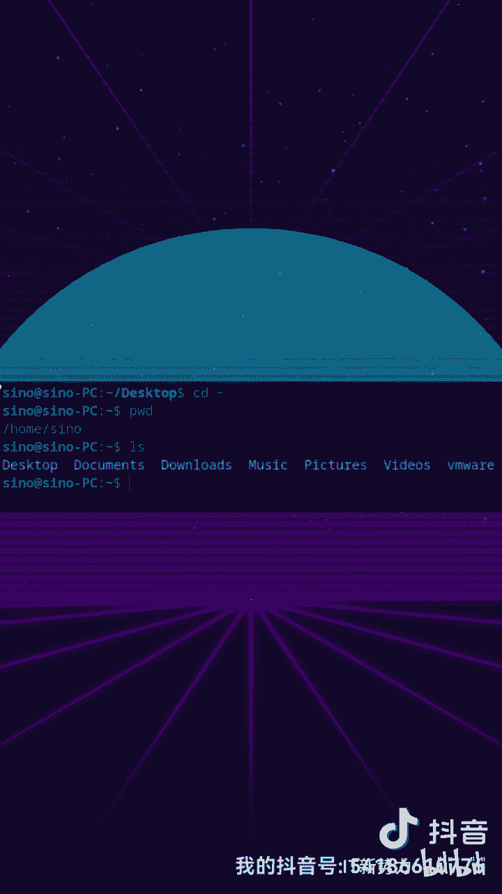
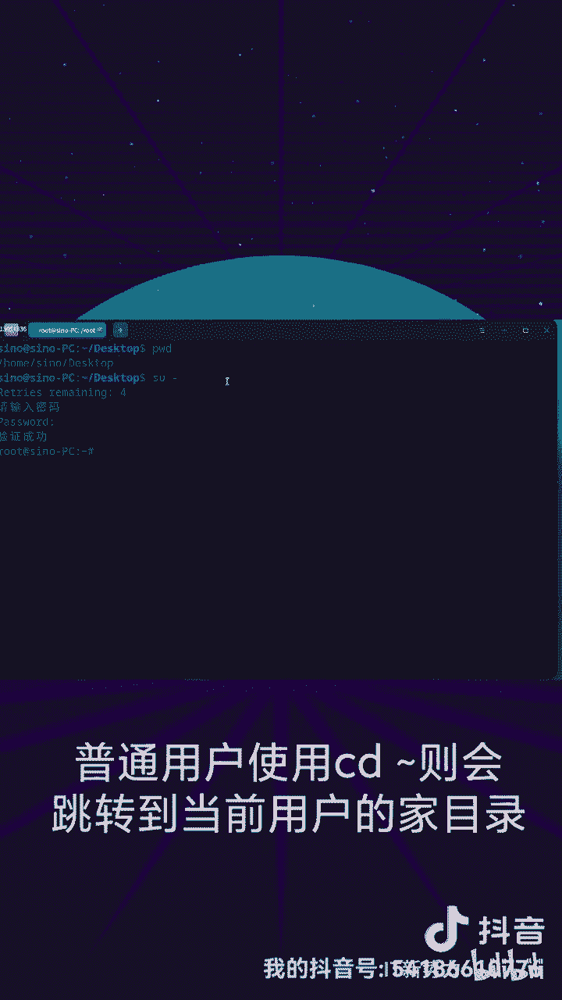

# linux中cd命令的用法 - P1 - 开源码头 - BV1vu411f784

🎼linux中CD命令的用法在终端输入PWD即可显示目前所在的文件目录位置。使用CD命令有多种方法，例如CD屏进入跟目录。

🎼CD绝对文件路径进入对应的文件目录。🎼CD点点返回上一层目录。

🎼CD当前目录下载文件目录名称即可进入相应文件目录。🎼在root身份下输入CD波浪号，会跳转到的root目录。普通用户使用CD波浪号则会跳转到当前用户的加目。

🎼关注IT新讯，获取更多知识。