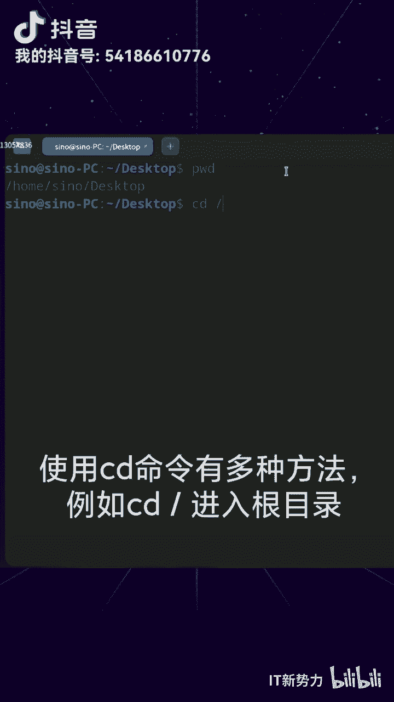
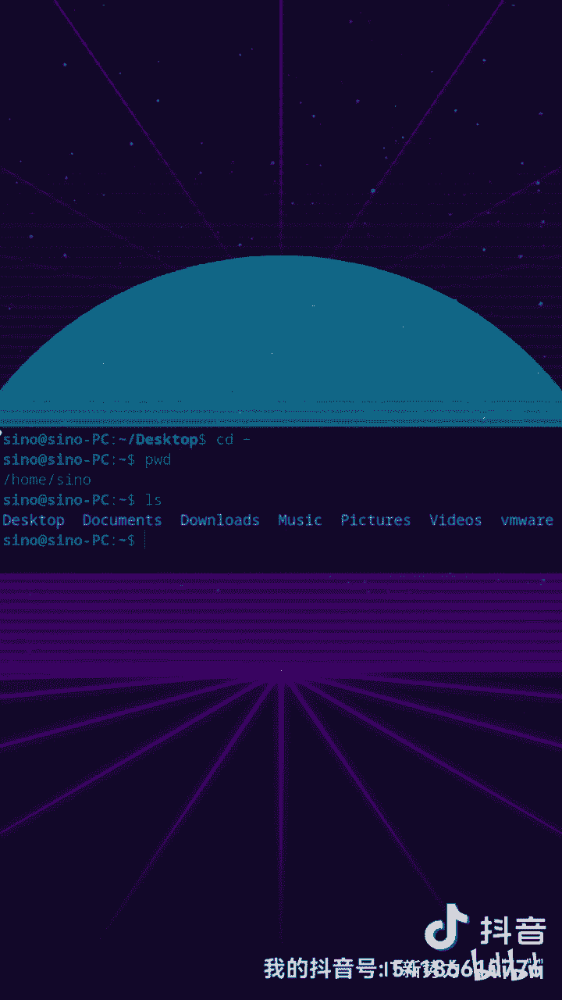
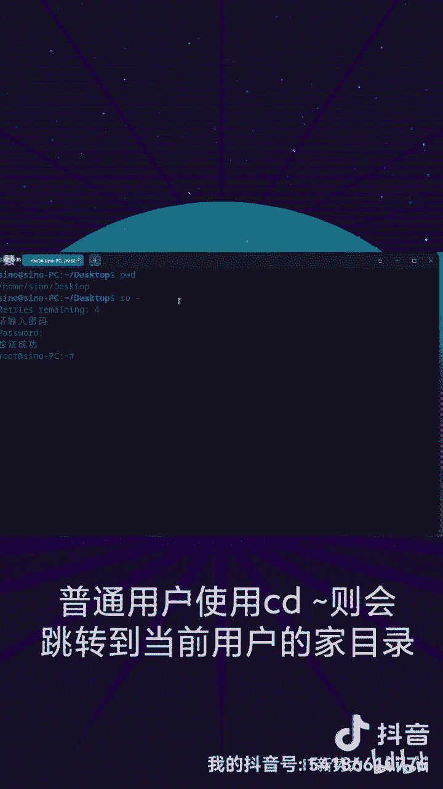

Linux命令行基础：P1：`cd`命令详解

在本节课中，我们将要学习Linux命令行中一个最基础且至关重要的命令——`cd`命令。`cd`是“change directory”的缩写，用于在文件系统中切换当前工作目录。掌握`cd`命令是高效使用Linux终端的第一步。

首先，我们需要知道当前位于哪个目录。在终端中输入`pwd`命令，即可显示当前所在的完整文件目录路径。


```bash
pwd
```

上一节我们介绍了如何查看当前目录，本节中我们来看看如何使用`cd`命令进行目录切换。`cd`命令有多种使用方式，以下是几种最常用的方法。



**1. 切换到根目录**
使用`cd /`命令可以立即进入整个文件系统的根目录。

```bash
cd /
```

**2. 使用绝对路径切换目录**
通过指定目标目录的完整路径（即绝对路径），可以直接切换到该目录。例如，要进入`/usr/local/bin`目录。



```bash
cd /usr/local/bin
```

**3. 返回上一级目录**
使用`cd ..`命令可以返回到当前目录的父目录（即上一层目录）。

```bash
cd ..
```

**4. 使用相对路径切换目录**
如果目标目录位于当前目录之下，可以直接使用其目录名（相对路径）进入。例如，当前目录下有一个名为`Documents`的文件夹，要进入它。

```bash
cd Documents
```



**5. 快速返回用户主目录**
`~`符号代表当前用户的主目录。输入`cd ~`或直接输入`cd`，可以快速跳转回自己的主目录。

```bash
cd ~
# 或简写为
cd
```
需要注意的是，在`root`超级用户身份下，`cd ~`会跳转到`/root`目录；而普通用户使用`cd ~`则会跳转到`/home/用户名`目录。

本节课中我们一起学习了Linux `cd`命令的核心用法。我们了解了如何查看当前目录，以及通过**绝对路径**、**相对路径**、特殊符号`/`、`..`和`~`来灵活地在文件系统目录间进行切换。熟练运用`cd`命令是后续所有文件操作的基础。