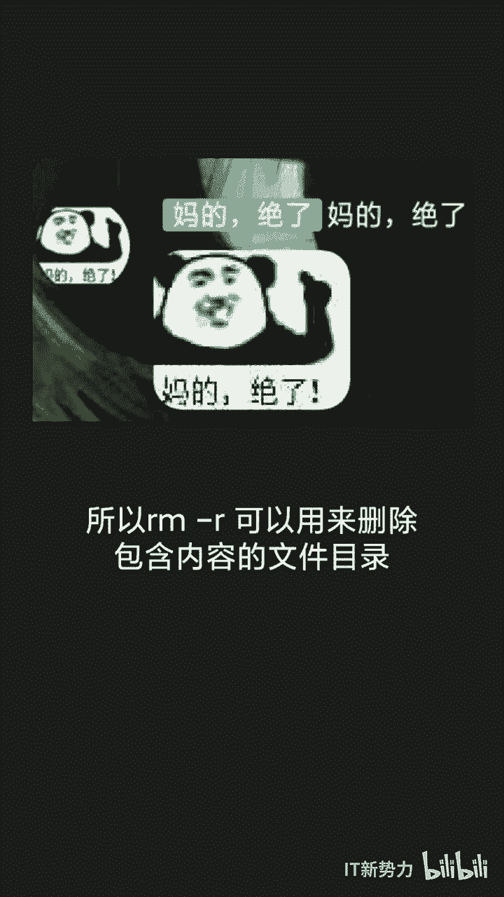

# linux初入者的糗事百科 - P1：471e25962526d87d7c7107af37744e86 - 开源码头 - BV17P4y1h7Dz

🎼有人说，程序员的一生要扇三次空。

🎼山库的结果大多都是跑路，有的是失误，有的是暴富。🎼linux商户的命令是RM杠2FP新号RM命令删除一个目录中的一个或者多个文件或者目录，只有RM命令不会删除目录，通常文件通常可以恢复。

RM加2可以删除文件目录及文件目录下的文件。🎼2级recur表示递归处理，指定目录下的所有文件与子目录一并处理。所以RM档2可以用来删除包含内容的文件目录。FG force强制删除文件或目录。

并且从不过问。

🎼PA表示，跟目录minix熊的所有文件都在根目录下。🎼星号是Vux系统中的通配图，表示所有文件撇新就表示登录录下的所有文件。

🎼所以RM杠RM新的执行结果就是删除跟录录下的所有文件，对服务器执行此命令就会删除存放于服务器中的所有文件。🎼俗称神谷。

🎼所以你学会了吗？🎼关注公众号IT新势力，获取更多有趣小知识。

