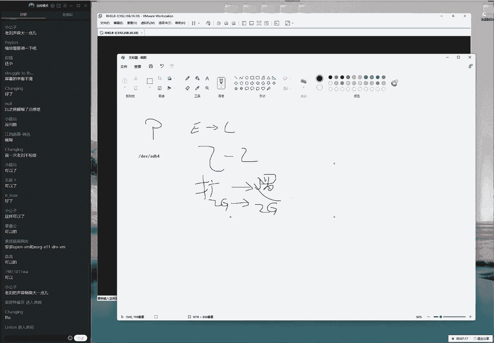
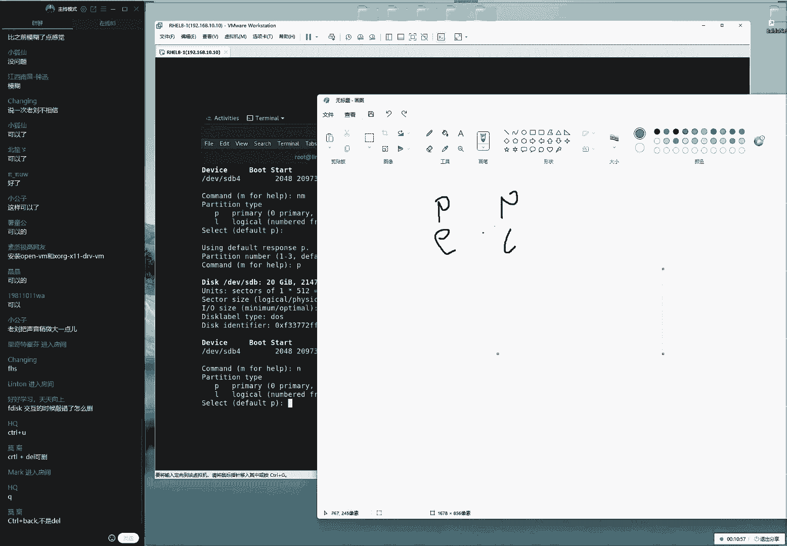
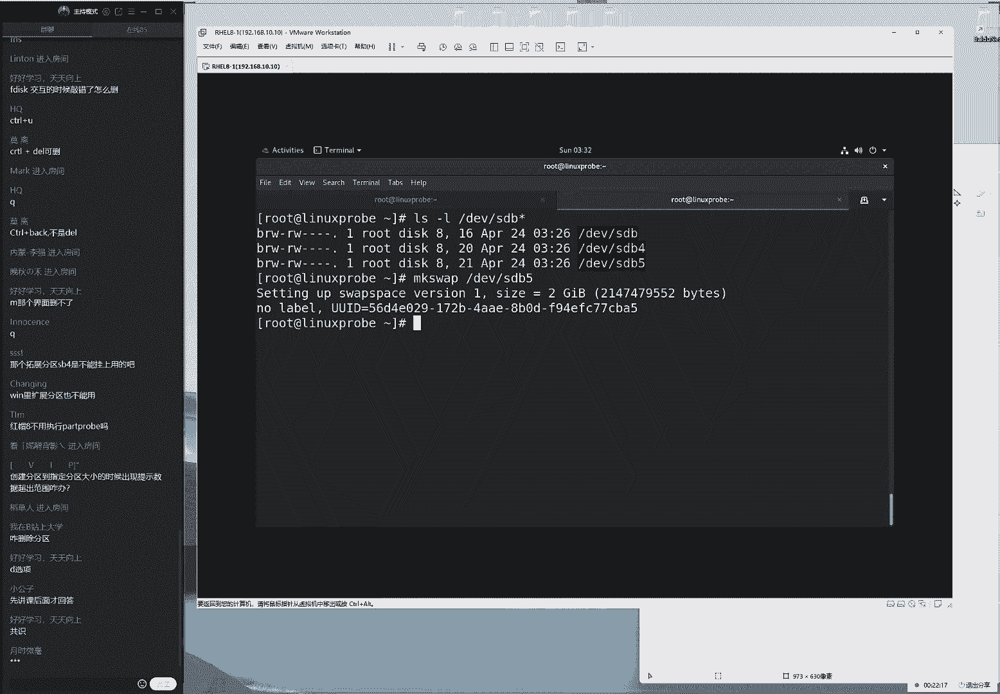
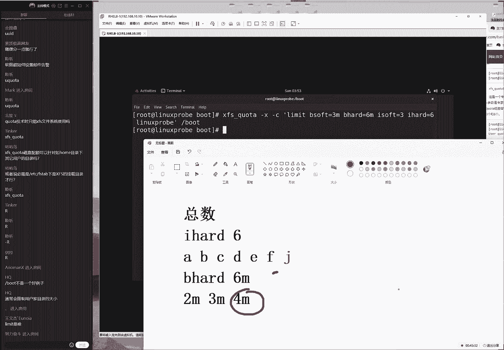
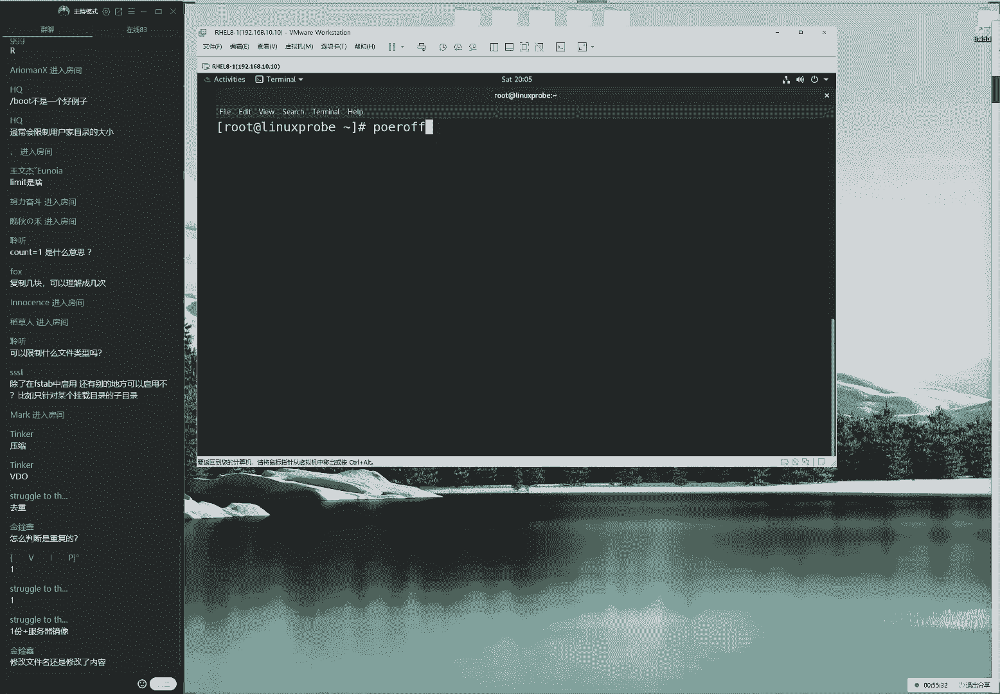
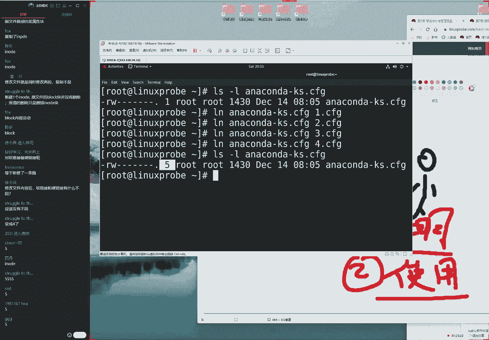
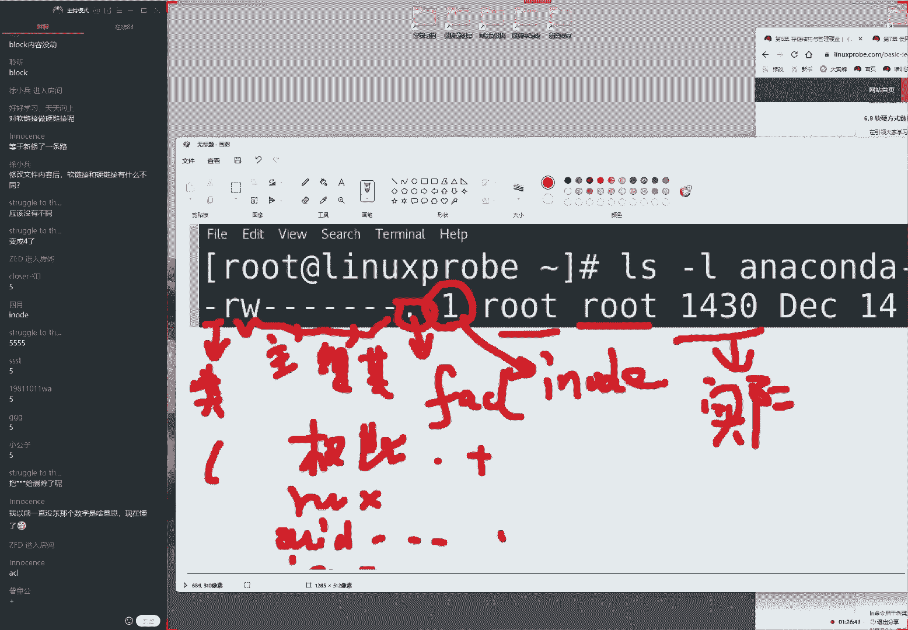

# linux就该这么学第34期 - P10：10【第34期第十节课】红帽RHCE认证培训课程-Linux就该这么学 - 能力努力 - BV1L14y1878S

后会说别的全都没落，这里体弱都是怪我的手都要酸，这地方还有书籍的一天，温柔贴心的，through the razer，可客行也别上，我没有遇见，来北京几几片奇迹。

完了我ok同学，我们来开始我们今天这个课程啊。

大家先打一下，一，我们来测试一下我们这边这个生活环境，哎呀今天是稍微晚了一点啊，今天下午的刷刷刷短信了，然后说我们这边因为有疫情嘛，北京市朝阳区啊，派人街道出现疫情了，然后的话呢我们算作是时空闭。

接着然后刚才六点多的时候，突然间想起来干嘛点菜了，然后下单啊，所以耽误了两分钟时间啊，实在不好意思，哎，真，但是我我但是我，但是我们也希望就是如果这个视频哎呀，被个三个月，五个月乃至1年之后。

我们的学员看到的时候，会感觉到非常的可笑，知道就这样会非常荒唐的一种呃，混乱的时期吧。

然后给百姓造成这么大的困扰啊，千万不要看。

千万不要再继续延续下去了，反正我们这边确实有出现疫情了，然后现在的话呢可能又面临着哎呀封城吧。

不知道又要封小区啊，好在的话呢，我们这边的物资还是比较丰富的，好废话不多说啊，刚才其实刚才确实是去买东西了啊，然后我们现在来大家翻开我们的书看一下，我们今天的话呢6。6小节下来，我们继续来后面去讲了。

那我先开一下这个人数的话呢，76位同学还好了，看来我们昨晚没有被吓到对吧，因为昨天的话呢主要是讲了一个理论知识，理论知识的话那叫一个枯燥，然后我们今天的话呢，就要来去进入到这个实操的一个阶段了。

同学们啊，我们就可以落实到行动当中，到底看一看，我们到底该怎么来去管理一个新的硬盘，那么我们先把这个虚拟机，还原到一个基数的啊，先还原到一个最舒适的一个状态下，然后去关机，因为我们在工作时候的话呢。

这个硬盘都支持手扎法，我们可以直接插入即用，但是这个虚拟机的话呢，它是一个软件嘛，他那他来对于一个硬件来进行一个模拟的，一个操作，有可能造成一些不稳定的情况出现，呃，我们这个这么说的话。

原因就是因为我当时用的比较早，我当时是一九版本的这么一个虚拟机，当时的话呢他在模拟鹰进来的时候，他每一次开机的时候，它它它都会卡在开机的那个界面，它就是进不去的，所以的话我也留下一个呃。

就是在添加这个硬件的时候，都想取关机之后再进行操作，而且的话这个不是一个个例，当时我用的是14版本的时候，添加这两块网卡，那两个网卡它就会变成一个mac地址冲突，这样的一个报错。

所以我们现在的话推荐大家啊，把我们添加的硬盘的这个操作的呃，这时候的话呢，一定要先是关机之后再进行操作，然后我们添加好了之后再去开机，大家要想嘛，他毕竟是一个虚拟机的一个软件，但它毕竟是一个软件。

所以的话呢它呃他还是有一些不完善的。

我们这样做的话更加稳妥一点，把我们的这个精神和注意力嘛，就是完全都投入在这个配置服务上面，而不用总担心这个虚拟的软件。

再给我们造成一些麻烦，好呃，怎么样，画面有点小是吗，画面有点小，没有这个问题。

应该这个跟昨天是一样的啊，前后就有这个问题吗，看这个这个画面应该是跟昨天一样的，这话大家翻开我们的书啊，看一下这个6。6小节，我们讲一下这个交换分区。

这边他在开着机啊，我们来给大家去说着，我们这个啊，那我来给大家去说一下，这个怎么去添加交换分区，以及交换分区是什么样的一个东东，那么首先的话呢，我们这个交换分区叫做哎s w a p，我们叫做交换分区。

它的这个作用的话呢，实际上它就是当物理内存不够的情况下，它会把一部分的这个硬盘的资源，采取临时去充当上的内存来去使用，这样的话呢，我们的一个内存里面，就可以把那些不太常用的数据，先临时存放到硬盘里面了。

这样我们的这个呃，然后呃然后我们去存放在硬盘里面了，让我们的内存的话呢，可以进行一个充分的利用，因为我们知道的内存的话呢，速度要比硬盘要快的，那这样的话我们就可以把啊，最快速这个内存的资源。

来进行一个充分的使用，所以我们这个叫做交换分区，这个的话其实在windows里面也是有的，我们其实都在啊，那我先来给大家看一下，这个其实的话在windows里面也是有的，我们可以进入到c盘里面。

然后我们可以去显示一下系统里面，这个详细的文件的列表，然后就是我们可以点一下属性，然后我们点一下查看，就是我们再去进行查看的时候，如果说我们显示的系统当中的一个有呃，隐藏文件我们可以看一下，之后的话。

就会在这里边出现一个很大的一个文件，可以看到这个大小的话，那大概是我看一下哦，现在我现在好像只有哦，不现在是有呃呃十个gb对吧，那好那我现在这个windows的话呢，也是有这么一个文件。

它就是用来去临时去充当内存来去使用的，当内存我们不够的情况下，就可以去把这个数据，先去存放到这个文件里面，哪来去减少我们的物理内存的一个，负载的一个压力，好这个是这么去算的，ok把它改回来。

那么我们先来给大家说一下的话呢，那想去想，那我们一般情况下去做一下，这个扩容的话呢，一般分为两步走，第一步的话呢，先去查看一下，我们这个内存的一个使用量情况，如果说确认内存不足了。

那么这个时候的话呢我们就哎不对，我们先去叫做查看情况吧，第二的话呢就是去啊，怎么样呢，我们要对于这个s分区进行一个扩容操作。

要去添加一个硬盘，然后来进行一个扩展操作，好我先来给大家一步一步去操作，首先的话呢进入到我们的服务器里面去，输入一下叫做free杠h，那我们以这个带有单位的形式去显示一下，内存的一个使用量情况。

那么这个内存的话分成两种了，我刚才讲到了，就是我们第一个的话就叫做，我们叫做物理内存，它也就是我们这个真实的一个购买出来的，一个设备，怎么今天那么慢呀，啊今天有点慢啊，这不太，这也不是我们正常的水平啊。

同学们稍等一下啊，画面有点小是吗啊，好不用着急，同学们如果觉得画面有点小的话，稍等一下是虚拟机。

还，那么肯定是这个播放器的原因，稍等一下，我重新再去分享一下我们的屏幕。

同学们再来去感受一下诶，好同学们现在看一下啊，可以了吗，哎等一下啊，我想一想哦，这样就对了吧，这样就对了，同学们再看一下，那大家感受感受啊，现在的话呢我们点球怎么样了，可以吧，嗯ok可以了。

还是看还是看不清吗，可以我们再试一下，大家在那我们再试一下，可能是有网络延迟啊，因为我这边改了，ok啊，最大化窗口吧，最大化窗口是什么操作啊，然后说还是不清晰是吗，呃同学们，其他同学有这个情况吗。

就是我们一定要反馈一下，如果说您要是出现这个问题，我们一定要说出来，但是如果说你没有这个问题的话，我们尽量也说出来，正好我们看一下这个人数，如果要是大多数成分都有问题的话。

我们这边去重启一下吧，然后大家这样吧，我先把这个自身给大家打出来。

如果我们现在看这个字的这个呃，大小的话呢，能够看得清楚也没有问题，其实看了，一下跟昨天没有什么没有什么区别啊，是一样的，好我们先来这样吧，来去使用到free杠，那我们那我们那我们先来以赵为单位。

来去显示一下，这个内存的一个使用量情况啊，我们看到它的话呢，现在的物理内存一共是有两个gb，现在的话已经使用了是1400兆，那么我们现在空闲的话有900兆，另外的话还有我们跟硬盘的一个交互值。

这个我们得到缓存信息，这句话也不去看，也就是说实际上看到了我们现在的话呢，我们的物理内存已经满了这种，那那那我们这种情况下如果已经满，了的情况下，那我们该怎么样对它进行扩容呢。

好那我们可以看到下面的话呢，就是我们这个交换分区啊，交换分区的话呢，现在大小总共也是两个g b，当前的话呢并没有被使用，而它都是一个空闲的好吧，也就是说现在能够证明的说我们的呃。

呃那么我们现在可以去证明一下，就是说呃内存的话呢肯定是够用的，但是的话呢并不那么的富裕，这要给大家讲到我们的linux的一个机制，跟windows有一些区别的，windows的话呢是我们的这个内存。

它一般来说都是负载是非常低的，比如说就以我为例啊，开着一个虚拟机，开着这个商号频道，但是的话呢我们的物理内存，在这个负载压力，大家可以看到的其实还是很低的，就打，那我们可以看到，大概的话就是20%左右。

但是的话呢，我们再去使用到我们的linux的时候，它里面这个内存的这个值，基本上就是一个满值，我们一般会排啊，它呃，它的话一般会在80%到，90%之间徘徊，这个的话属于一个正常的情况啊。

但是呃一旦具备大量的去使用到这个，四分区的时候，以及被大量占用的时候，那么就代表我们的物理存它是出。

现了一些瓶颈问题了，好那我们就先未雨绸缪啊，顺便我们去讲一下这个技术的一个操作方，法，来对它进行一个扩容操作，也就是说我们原先是这么大，想要对它进行扩容操作了，如果我没有记错的话。

这好像也是红毛一到考题之一啊，他以前是考，现在考不考，我们不知道了，但这个非常实用的一个操作，首先的话呢，我们来重新去做一下回忆，我们的话呢，我们啊要想找到我们的这个设备，文件的话呢，一般情况下它是在。

第一位目录里面他去保存的对吧，然后话呢又根据一个服务对吧，我们去知道了它的这个名称的话呢，第二块被识别到硬盘的设备名称，根据u d e v的服务，它应该是叫做s t b好，我们根据这个原则啊。

看到这个协议，却能够就能够大概能够猜得出来，虽然系统刚刚开机，但是我们就能够猜得出来，这个文件大概的一个名称了，也没有问什么，问太大问题好，接下来的话呢再来啊，接下来的话再来对它进行一个分区格式化。

挂载的一个操作，先来讲一下分区啊，今天的话呢我看一下这个，事例啊，今天的话呢我们会给大家哦，是这样的，我看了一下，昨天的话呢，下课之前我们讲了一个，通过呃分一个主分区，来对对我们这个磁盘来进行一个分区。

格式化挂载的一个操作，今天的话呢我们来给大家去，通过这个扩展分区的一个方式，创建出来一个分区吧，因为如果光讲这个主分区的话，大家可能对于这个扩展分区不是很熟悉好，我们先来进行一个分区操作。

来进行一个交互式的配置，另外的话呢给大家强调一下，就是呃我们待会儿的话呢，我们去使用一个扩展分区来去做这，个交换分区的扩容的10号的话，大家千万不要问老师，为什么呃我们要用到扩展分区啊。

那我们这个主分区能否去作为。

这个交换分区呢，那我们首先来给大家说一下，这个答案的话是肯定是可以的，我们今天的话呢会先给大家去讲，那我们今天给大家讲这个扩展分区里面，现在出来这个逻辑分区，主要是为了去弥补。

我们昨天我们只讲这个主分区，的一个小遗憾，那我们今天会给大家讲一个扩展分区里面，新建出来一个逻辑分区这样的一个实例啊。

所以说呃如果在我们工作的时候，大，家啊他的话我们根据实际情况呃，或者的话呢我们愿意去使用到主分区，新建出来一个啊交换分区的话呢，这个也是可以行的啊，但这个啊分区的类型。

对于我们实际配出来出来这个服务的话呢，是没有什么影响的，来我先解释完了之后，把避免大家有误会啊，接下来我们来正式开始，我们今天这个配置的这个环节，首先的话呢点一下n来去新建一下，我们这个分区分区的话呢。

它分为两个类型，第一个为p为主分区，第二的话呢为e它是叫做扩展分区，我们来敲一下e，那这个会展分区，跟主父君简单回忆一下，他都是写入到了第一个扇区上面的信息，它每一个信息的话呢占用是16个字节。

最大是占用64字节，它最多是写四个信息对吧，所以他的这个编号的话呢，主分区跟扩展分区各占的是呃，这个我们是昨天给大家讲一个理论基础，那我们见到的话呢，它就这个范围确实是1~4，默认为一看到这个时候。

我们脑子里面过一个话，就是这个啊老刘生了一个儿子啊，做刘老八对吧，这个编码的话呢是可以随意去他们啊，它是可，以随啊进行一个随机指令的，或者我们可以来啊，去选择您想要的一个数字，我它并不是说。

如果说有一个叫刘老八的一个孩子，他前面并不一定有七个哥哥，同样的道理，我们现在可以把这个主呃，扩展分区编码的话呢设定为是四好。

这样的话没有问题的，这样的话呢我们就可以看到了，我们如果说把这个编码设置为四的话呢，硬盘的名称就待会儿会变成的是，dv目录里面的s d b4 这样的一个名称，编码可以随机指定啊，这个没有啊。

这个话并不是指的是分区的这个数，大家一定要注。

意好，另外的话呢，还有就是我们现在去设置一下，这个起始的扇区，这个话呢不用去设置，可以按一下回车就可以了，从最开始的我们去使用，这样的话呢，再来就是说这个结束的扇区，结束战区的话有两个写法。

第一就是我们告诉他，我们需要的山区的个数，有第二种方法的话呢，就是可以看到了，要不要指定一下山区的个数，要么就要去指定一下我们这个所需的容量，区分战区的个数很难啊，那我没有那么好，也没有关系了。

那我就可以直接去输入我想要的这个大小，就来进行扩展，也可以，它会自动我来进行一个扩容操作，那我们加一个两个gb，如果大家觉得两个bgb有点小对吧，我们今天那我们今天作为一个扩展分区。

那我们能不能稍微大一点呢，因为我们扩展分区等于说指向的一个呃，全新的一个空间，那我们可以在里面新建出来了很多，这个逻辑分区。

如果说你现在这个扩展分区是两个gb，那好了，你在新建出来一个两个gb的一个逻辑分区，大家能够理解我这个思路啊，就这个扩展分区的话呢，里边可以新，建出来很多这个逻辑分区，如果说我们第一个扩展分区。

那么这个的话逻辑分区以为两个gb，那么这个即便有扩展分区，但我们也没有空间再继续呈现出来。

第二个逻辑分区了，大家一定要理解啊，所以我们现在可以稍微大一点，比如说的话呢给大家一个十个g，比我们稍微大一点点啊，好我们来加一个10g按下回车呃，大家的话需要注意两点，第一点的话就是我们现在的话呢。

去加这个单位值，一定要是一个大写的一个，千万不是一个小写的，第二话就是我们同学会问，到邵老师哎，昨天你还有一个没有讲是什么呢，就是一个参数是一个小写l和一个小写t，这两个怎么回事呢。

可以来看一下这个帮助帮助里面提到了，如果是一个小写l的参数，指的是列出来这个分区表的一个类型，然后的话如果说是一个小写t的话呢，指的是个修改这个分区表的类型，这是什么意思啊。

这个意思就是说如果您的分区特别多的话，我们想要做一个标识，知道每个分区它的作用的话呢，您就可以修改一下它的这个标签了，这个怎么去实现啊，首先我们可以敲一下消息，l键啊去敲一下消息，ig。

热巴当中允许打的这个标签有哪些，这个标签的话呢只是给人去看的计算机，它是不啊，他的话呢是并不会去读的，来我们猜一下消息，l可以看到的话呢，当前总共有啊好多个，反正100多个吧。

哦他有这么多的这个分区的标签呃，我们可以随便呢按照不我们不这样随便啊，既然要改，那我们家啊，那我们就好好改，那可以看一下当前的这个需求，现在我的分区我先研究一下狂，现在我现在研究下狂扫啊。

我的话呢现在要新建出来是一个交换，分区，所以这个编码的话呢应该是82对吧，大家看一下，82对应的话呢，就是呃linux里面的交换分区啊，s w a p啊，没有问题好大家问了一个问题。

大家说我们再去使用到交互式配置的时候，如果敲错怎么删，敲错了不能删啊，直接按住ctrl c退出就可以了啊，然后我们因为只要没有敲w保存，其他的这个操作都可以直接退出就可以了，退出之后重新进再配啊。

再错再配啊，在啊，然后这块直到您配置的对了，直到我们最后一次敲对了之后的话，再敲一下w就可以了，我们否则没有保存，来接下来我们看一下，既然分区编码为82，好，我们就改它们，这怎么改呢，来再敲一下编码啊。

再敲一下操作符，叫做p，来展示一下我们这个分区表的一个信息，好查一下分析表现，其实大家说啊ctrl加delete可以实删不，大家如果要是说已经新建好了，要想去删的话，它是比较麻烦的。

比如说现在有一个扩展分区了，要想删我们需要敲d，然后取输入分区编号来进行删除，所以的话呢我们现在如果你要操作的话，也可以直接退掉，再重新进就行了好的，然后的话呢我们来看一下，就是现在的话。

呢这个标签类型为扩展分区啊，ok没有问题啊，那我们现在在里面的话呢，去新建出来一个逻辑分区，它这个大小除以两个g b。一下n，这个哎不不，这个有点小问题，大家看到其实我刚才就敲错了，我应该敲一个n。

但是的话因为我这个手指可能比较滑啊，我去敲，所以我现在敲的一个小写m了，这个时候怎么办呢，一般情况下可以继续操作就没有问题了，因为大家看到呃，它让我们继续来去输入，但是如果说大家啊。

我们如果说您输入的这个信息，有一些问题的话，那么您可以推掉之后，再重新去进就行了，好那我们好在现在没有什么影响，他输错了之后，就像我们现在似的，它给我们一些呃提示出来的这个信息。

我们也可以按住ctrl c来退出啊，退出掉之后再重新再去配置，没有问题，推到它之后的话呢，大家看到他又返回到了，我们配置这个主界面当中了，我们再去敲一下这个n，新建出来一个逻辑分区，这个时候会看到了。

之前的话呢是这个两个选项，第一个的话呢它是一个p。

它指的是一个主分区，第二的话呢是一个e，它指的是一个扩展分区对吧，现在的话呢变了，第，一个的话呢是为主分区，第二的话呢是为逻辑分区，因为扩展分区指的是有一个，那我们已经有了扩展分区之后。

它会自动的变成了一个叫做逻辑分区。

这样的一种形式，这个逻辑分区的话呢，是在一个新的扇区里面去啊，写的这么一个分区信息，在使用的时候的话呢，跟主分区是一样的，可以去做，来，我们接下来的话呢，再来我们去敲一下这个小写l。

定义一下我们的类型啊，敲一下，然后看到说我们定义一下起始的扇区，这个也不用去管它，我们就选择默认就行了，从头开始去用按下回车，这个时候这个其实有时候他也需要去改的。

是要求我们去新建出来，一个为300兆的一个空间，作为我们的分区，然后来进行一个分区格式化挂载，就我们算成绩结果的话，就是怎么这就是我们就是怎么讲的，非常简单的一个操作，结果的话呢。

就是同学们去做这个操作的时候，就做这个实验时老师报错，这个是怎么回事呢，就是红宝给大家建了一个小坑，我们假，设说啊虽然不严谨，但是我们跟呃跟大家形象一点是这样的，如果我们现在画了一个矩形。

这个矩形的话呢指的是磁盘的这个容量，或者的话呢这个是为呃磁盘的这个扇区，这边是理应这边的话呢是无穷，或者说我们这个呃容量的一个上限好吧，这是我们的一个呃磁盘的一个容量。

他的话呢我们一般情况下会从最开始去使，这样的话呢就是呃这个怎么讲呢，他就会呃呃啊啊，那么它可以对于我们这个硬盘的话呢，进行一个充分的一个使用了，那个考题里面是这么一个事情，他的话呢特别的阴险啊。

非常的狡诈，他会在这个中间的话呢，前面的一部分加了一个山，那他他在里面去新建出来一个分区，加到了这个呃，其中的前面的一部分，因为我们知道了这个起始的扇区，跟接触的扇区可以进行手动指令。

所以的话他在这个前面加了一个扇区，所以的话呢这个前面升的空间只有200兆，而后面的话它可能会有十个g b特别的大，这个时候我们再去新建出来一个分区的时，候，如果说按照这个起始扇区零开始去写的话。

于是您就，只能新建创建一个v啊v啊，v200 兆的一个空间，因为您不能够说跨一个分区，再去新建一个分区，这个空间不能这么去用的，这个时候怎么解决呢，就那么您就需要在这个手动的，在呃这样的方式。

在我们新建的这个分区的这个开头的话呢，去指定一下它呃的这个起始的山区。

然后指定一下他之前，就是我们呃，会看到有这么一个这么一个分区。

把它最后那个数加上一，然后的话呢我们指定它为起始山区。

再去新建就没有问题了，当前不存在这个呃，那我们当前并不存在这个问题，因此，的话可以直接选择默认的分区就可以了啊，我们选择一下默认的起始扇区就可以了，第二的话呢指的是我们的结束在扇区这呃，金属山区的话呢。

同样呢我们还是使用一个大写的，加两个g啊，现在创建出来一个为2g的一个啊，现在的话，我们创建出来一个为2g的一个分区，另外的话呢还有一个问题，同学们问到了说呃我们对啊，要我们要是敲错怎么办啊。

大家想问的应该是这个问题，我刚才没有理解，因为我呃因为的话呢我理解是大家配错了，比如说刚才想新建出来两个分区，但，是新建出来三个分区了，所以的话您需要敲一下这个操作符，敲错了，后来我现在突然间意识到了。

同学们想问的应该是这个问题，就是如果说你现在敲错了对吧，但是你现在敲退格键呃，也能敲是吧啊好吧，那当我没说，因为我刚才好像是嗯呃，因为有些情况下这样的话是删不了的，您需要按住shift键。

然后或者按住这个呃，ctrl键才可以去删除掉它，好这个当我没说啊，然后我们来猜一下这个加两个g呃，现在出现出来的一个逻辑分区，它的话的名称是dv目录里面的s b5 编码，从五以后大。

小为2g来查看一下p分区表，可以看到啊，没有问题，这就是我们的一个逻辑分区的一个设备了，它是一个分区的一个设备文件呃，现在我们需要做什么呢，既然聊到了，想去修改一下标签，如果现在的分区特别的多。

我想知道每个分区的一个作用的话呢，可以进行修改吗，我们敲一下这个t来去修改一下，我们这个分区的这个标签，点一下回车，他说请输入一下，我们要想进行修改的分区的编码，我们为五对吧，那我看一下这个编码吧。

好那就这个设备的编码为五，他说请输入一下，你想要，去设置的标签的这个号码，我们刚才看到了，然后他是82对吧，我们敲一下82，于是做好了之后再敲一下这个p，于是可以看到了，那这样的话呢。

就会对它进行一个标签的一个修改，就当我们以后再去管理这个设备的时候，您就知道它大概的一个作用了，但是的话呢这个其实改不改都可以，我一般是从来不改的，呃只有当年的这个硬盘的话呢，就呃。

呃它只有当年的这个设备，特别的多的情况下，那么这个分区也特别的多的情况下的话，才需要去设置一下啊，避免我们用忘记每个，设备的一个作用，这样的话导弹会导致一些问题，好多做好之后啊，大家说点一下q。

那他可不是点q，他的话是点一下这个w，那之前一个保存退出好，大家问了一个问题，大家说啊扩展分区s t e p4 ，它是不能够挂载上面去使用的吧，啊对是这样的，然后我们来加一下w来进行一个保存退出，呃。

做好之后的话呢，我们来去查看一下这个文件，我们来去dv目录里面的s b，然后选一个星号做通配，看一下有没有新建的出来哦，当前的话呢很顺利，新建的出来，了，但是有一定的这个情况有一定的概率。

我们是出现过大，大概的话那10%到20%，就是呃如果说您的这个设备之前有过分区，然后华为正在被带来的呃系统当中的话呢，再在意这个硬盘当中，新建出来的这个新的分区，然后就会可能导致呃设备繁忙。

被占用的情况下，会导致分区表同步不更啊，它的话会导致分区表的同步信息啊，并不同步，那也就是说导致啊。

那我那话我们那个群里面，这个不太导致内啊，我们内核里面的这个分区表的这个信息。

并没有同步过去，就会导致，我们这个文件的话并没有被自动新建出来，也就是说刚刚的话呢，我们的这个顺利操作，就应该能够映射出来这么一个文件了。

如果说这个没有情况下，同学们啊可以记一下这个备注好就好了，我们因为我们经常上课的时候嘛，我们为大家讲到一些呃排除的方法，如果要是遇到了，我们该怎么去做，那我们该怎么解啊，解决啊，大家先记一下。

咱因为在这个做实验呢，因为在这个上课的时候吧，可能一些问题并不会那么的容易的就出现，但是在工作的时候的话呢，万一赶上了也是很头疼的，来我们现在去敲一下啊，叫做这个part prop。

那part prop，然后大家问到我说，我们的windows里面的这个扩展分区也不能用对，当然不能用，因为它是根据它这个扩展分区的这个属性，他就是这么去定义的，那它是不能这样直接去挂载的。

因为它只是一个指针，只占到一个新的扇区而已，大家说的红毛肉八里面不需要去加呃，呃不需要去加这个命令嘛啊，part problem需要强啊，但是有一定的这个呃，但是还是有一定条件需要去交的。

就是这个文件如果没有自动出现的时候，才需要去敲，我们一定要理解它这个命，令的含义，而不是说看别人配完了之后啊，别人去敲了，就以为他也是配置分区的，其中的一个必须敲的命令，它并不是的。

只有这个文件没有出现的情况下，他才需要去敲好，那么他很容易问到另外一个问题，这个问题特别的少见啊，但是我也遇到过，大概的话实际上是2011年呢，特别的恶心的一个系统，它经常报错。

当时的话呢我们就敲过这个pad pro还不生效，呃，后来的话呢也呃也留下心理阴影了，后来怎么去处理呢，就是去重启一下，就是说如果说这个我，们的文件没有自动去产生出来，那么会啊去敲了这个命令之后的话呢。

如果说您使用是一个早期的红毛的系统，那么可能确实他还他他的话呢，可能还是出不了，那么这个时候你就可以使用这个必杀技，就是去重启一下，没有其他的好办法啊，大家可能说我们工作的时候，服务器不能老去重启了。

随随便便从此再也不叫事啊对吧，但是没有办法啊，这个我们去试过无穷多多的方法呃，完全不管用，比如说我们通过这样的命令来去更新，什么的，也都不好使啊，所以最后的，这个解决方法就只能是重启一下服务器。

它就会去重新去加载一下这个分区表，就有这个文件了，这是第二部，那么如果说我们这个前面两部都做了，但是的话呢还是没有出来这个文件的话呢，就是单位就是第三个可能性了，就是我们刚才配置啊。

我们这个选项当中的话呢有错误的信息了，肯定是配错了啊，否则经过这两个步操作之后。

就百分之百就会出现了，好，然后我们现在的话来去做好这个操作之后，呃，然后我们来去做一下这个分区啊，想想格式化和发展，另外的话大家可以仙湖，江我看一下大家另外提一个问题，大家说创建分区指定大小的时候。

如果说出现了数据超出范围怎么办啊，因为您的逻辑分，因为你的逻辑分区的容量，不能够超越过扩展分区，这是一个呃逻辑上的一个问题，或者说这是一个呃非常怎么讲。

非常重要的一个限制，就是说我们的话呢，呃扩展分区它虽然是一个指针，它会去指向一个新的空间，我们来对它进行声明，比如说我声明出来这个空间是这么大，那好了，我们现在出来这个逻辑分区的话呢。

比如说我们想现在出来一个这么大的一个，空间自然是不可以的，这个没有任何的办法啊，也就是只能是您把您扩展分区再去扩展，或者的话您去新建出现一个主分区，或者怎么样的，它是不能够超过我们的物理限制的。

这个是啊，这个他没有办法去做解答好。

下面我们来继续来给大家去说，我们有了这个文件之后的话呢，因为现在我们的物理的限制，或者我们这个分区容量的这个限制，它是一种物理的这么一个基础的限制，它跟我们的操作，或者它跟哪种属性没有关系，好啊。

他抄了就是抄了抄了他就是新建不了，那他没有，他是，没有解决办法的，来，我们来接下来给大家去说一下。

我们的这个格式化，那我们要想去对于我们这个交换分区，来进行格式化的话呢，那我们就要去使用的一个命令啊，因为大家现在提问啊，但是我不会的话，我们先不回答了，我们现在给大家去往后面去讲。

要不要我们我们东一下西一下，有点乱了，虽然大家都可能相关，但是不用，但是并不是那么相关，现在我这个思路给大家去说了，要想去对于我们这个交换分区来进行，格式化的话，它有一个专业的命令。

它有一个专门的命令叫做啊make a，slap啊这么一个命令，他用来去专门去对我们这个交换分区，来进行格式化的，它可以后面直接写上设备的名称，比如说tv目录里面的s b4 啊不啊，低温温度里面的啊。

s d b5 ，我们的逻辑段的名称。

通过这样的方法对它进行一个格式化操作，专业的命令，它跟我们昨天讲的那个格式化的命令。

不太一样，昨天我们讲的是类似于这样的命令对吧，然后会有我们的呃，或者说话他是这样的一个形式，这是专门用来去做交换分区的，大家可以去记一下。

好我们接下来再来说呃，make s w a p后面，写上dv目录里面的s b5 敲一下，回收啊，格式化好了，这个速度特别的快，我不知道大家有没有这种感觉，还是我自己的偏见啊，就是我们啊这怎么讲呢。

就是我们的再去使用到诶linux，再去做格式化的时候的速度要比windows更快，我不知道这是我的偏见还是是他呃，他还是一个大家一个呃，呃非常普遍的一种经历，大家可以去试一下，可能会有十个g或20个g。

但是我们格式化的时候特别的快，我不知道这是我的偏见，还是说这个确实是我们这个呃技，术的一个优势吧，好我们可以看到我们敲下回车之后的话呢，这两个gb的这个空间的容量的，磁盘的分区立即就格式化好了。

没有什么去喝水的时间了，接下来再来去让他去加载上，要想对它进行加载的话呢，就是说在呃那么呃呃对它进行挂载的话呢，的交换分区它是不需要挂在目录上面的，它可以直接挂载到我们的系统里面。

它有一个专门的命令，我们是叫做s w a p on，来把这个设备给大家启用就可以了，它代表的就是专门的去来自它进行一个，格式化，以及对它进行挂载的一个，命令大家可以记一下这两个命令啊。

以后要是要用得上的，来我们来s w a p啊，后面写上我们的文件名称，n下五做好之后，马上回到另外一个窗口啊，我们再来去敲一下这个命令，于是你就可以看到了，我们要画原先就要分区的大小设为两个gb。

现在变成了四个gb的扩容是成功的，但是现在这样做完的话呢，考试的时候是一分都没有的，就是我们现在这样做完之后，是考试一个分支都没有的，这个的话呢原因就是大家去想一下，是什么原因。

就是我们现在这样做完了之后，考试是一分，都没有的，我们最可惜的一点就是，明明这个副配置的很好，但是我们考试的时候看不到成绩，其实这个话就是啊，这个是我们啊比自己不会更加可惜的一点。

这就是因为怎么样没有重启啊，保存对吧，他的话呢会在下一次重启之后，它就会失效了，它并不会永久地为用户去提供服务，我们需要编辑一个文件，这个文件是在etc目录里面的file system top文件来。

同学们大家一起来编辑一下这个文件，这个文件编辑过后，它会在cs重启之后之后的话呢，自动把我们的这个设备给它挂载上，这样的话考，试的时候才有分值，这大家一定要注意啊，这个我们一定要注意来。

接下来的话呢我们来写一下设备的名称，dv目录里面的s b5 啊，交换分区后边是我们这个挂载点计划分区，不需要外来点，我们啊中文都知道啊，我们的这个呃交换分区它是没有过来点的。

他是直接怪大到我们的系统里面的，所以我们知道啊，那我们的系统的话他也知道，所以当前只要告诉他是交换分区，是我们自己人，他就会把我们自动挂载了，不需要写我们的那个啊挂载点。

接下来的话呢还有我们这个格式也是为，s大v p我们就点，那也就是说下两次第三的话呢，指的是我们的这个权限为default，默认即可，当然我们对它进行一个编辑操作，下面的话呢还有就是零零。

代表就是是否自动备份以及是否自动加减，选择零零，这样做好了之后，我们点一下这个保存并退出，ok没有问题了，做好之后再来reboot去重启一下。

重启好之后，我们来检查一下，它是否依然被挂载到系统当中。

可以来被访问，那另外大家问的一个问题，大家说划分一个slap分区，可以用p划分磁盘做逻辑分析嘛，好没读懂再读我。

我再来一遍啊，大家问到说划分分区好的，那可以用p划分磁盘做逻辑分析吗。

完全没有问题，今天迟到了吧，刚刚我们讲过的啊，现在啊因为我们特别的奇怪啊，就是我们每一期讲的这个时候，同学们都会问到说。

老师是不是只有逻辑分区可以做扩展分区，啊，不啊，是不是我们只有逻辑分区，可以去做交换分区啊，然后我也被提问啊问了很多遍了啊，然后我刚才就先给大家说一下，我们的主分区跟这个逻辑分区的话呢。

他都可以去做交换分区，原因的话呢，交换分区原因的话呢，就仅仅是因为昨天下课之，前我们是讲过去新建车牌组分区，然后对它进行一个分区，一个说法挂载，所以的话呢我们今天还是去啊，所以的话我们今天要让大家能够。

所以今天我们使用的是扩展分区，里边在啊去创造出来这个呃分区，然后这样的一个方式虽然话有点麻烦，但是但是我们都给大家来去操作了一遍啊。

这么一个事情好，最后我们来具体我们要避免这样的误会啊，避免说说，我们这个是不是不能用主分区制作呀，没有这个问题，来去free gm来查看一下，我们这个当前的内存的这个使。

用量情况也没有问题好也没有问题好，这样的话大家问到说，那我们现在的话呢，我们的服务器里面这个内存都很大了，那我们一般交换分区给多少合适呢，我们一般服务器的内存是128g，那我们给1。5倍也太多了。

一般情况下的话呢，我们按照传统的这个教材上面写的是，大概是两倍就可以了，然后如果说我们要是实际情况，内存比较大的话，情况下的话呢，根据实际情况来进行调整，如果说你的内存128g，看您做什么业务啊。

如果说的业务对于内存的吃的量比较，小的话呢我觉得给点0。5都可以对吧，平时我的内存都使用不满，那我给他0。5也都是浪费的，因为他也用不上，但如果说我现在128g的，这个服务器，我是做数据库的。

这个我们是非常有感触的，如果说你要做网站还也还无所谓，如果你要做数据库，那这个内存是往上啊，嗯非常的高啊，那我们就可以比如说还是两倍，按照这样的这个原则去走，根据业务来进行调整。

那然后我们来给大家看好了之后，就是来自新建出来一个逻辑分区的，那我们来新建出来一个交换分区之后，的话呢下面大家可以来再来分开，我们来看一下这个呃，磁盘的一个配额的一个课程，另外的话大家现在提的这个问题。

我想大家的话呢可能更关心的是一点，就是老师你现在必须要告诉我一个数值，比如说你的交换分区跟你这个内啊，跟我们这个内存的一个比例到底是多少，因为我们的内心为什么会提这种问题呢。

是因为我们怕设置过之后就不好改了，我现在我比如我内存128g对吧，我觉得我够用了，那我交换分区给它是比如说64g，我现在担心的是什么呢，担心的，是以后啊64g不够用了，那我们该怎么把它进行扩容呢。

或者说我们这不值得把啊，先去删除之后再进行操作呢，大家想问的可能是这个，或者我们对于自己的这个，业务的发展的话呢，没有一个很清晰的规划的时候，这个很正常啊，因为我们自己也不知道自己有个呃。

到明天之后怎么去发展，这个就可以去选择一个技术，叫做i love vm去实现，待会儿会给大家讲到这个先不着急，所以我们这个分区大小的话，你可以随便去新建啊，这个小要大都没事啊。

我们待会儿啊会大家去说怎么去，改好，下面的话呢来给大家往后面去说说一下，我们叫做磁盘配额，这个磁盘配额的话呢，实际上就是为了去限制一部分人会去啊。

会去大量的去使用我们硬盘的这个资源，我们比如说现在有一个服务器，是我们公司的，现在的话带宽又很大，就会有一些小破坏分子，小笨蛋们啊，他们会在这个上班期间的话呢，会下载电影，然后我们下了之后去啊。

回家路上去看，这个的话呢，虽然也没有太大问题，但是就怕什么呢，如果说我们现在在这个服务器里面，下了很多很多游戏啊，电影什么的，把这个，服务器里面这个资源1234都占满了。

就有可能导致这个服务器的崩溃对吧，因为我们这个啊业务的这个信息，比如说我们的日志啊什么的，他无法写入的时候，就导致这个服务它是起不来的，我们当时在2014年的时候做过第一啊，当时的话我们做过一个网站。

还是一个很好，当时还是一个啊非常小的一个博客啊，但是现在关了，就是当时我们呃这个服是我啊，当时我们这个服务器使用的是呃这个服务，然后再去搭建出来的，然后这个服务的话，总会报一个502的一个错误，当。

时的话呢以为是它这个负载值太高的原因，结果的话呢找了半天负载值也不高，还呃内存也没有问题，后来才知道是硬盘装满了，它也会出现这样的问题，会导致业务的不稳定性，那么我们怎么样能够保证说呃。

我们就像呃我们刚才所讲的，他把这个硬盘的话呢分成几份，每个人去限制其中的一部分，比如说我们现在给它划分成了，1234好了，那么每个人就只能使用百分啊，那么他啊，每个人就只能使用百分之四十五百啊。

那么就只能去使用25%的，这个磁盘，它是一个限额，呢这个就叫做cos技术的，我们来去限制每个人或者每个用户组，它能够去使用的一个最大的容量，以及它能够去写入的一个文件，个数的一个上限。

来去保护我们的整台服务器的一个稳定性，好，它不能够去进行一个超额使用，来这个我们叫做磁盘配额呃，自然配合的话，它默认情况下它没有支持，我们需要先去开启一下它呃。

我们现在的话先去进入到我们，那我们现在还是要进入到我们的，a t c目录里面，去，编辑一下，我们的fl system tap这样的一个文件，然后我们来去那么对它进行一个开，启现在的话。

因为大多数的这个系统我们都是啊。

我们的x f s系统，所以的话呢。

我们当前就是我们基于我们的x3 f这个，文件系统来去做一下磁盘配额，先去找一下什么这个分区使用的是x啊，是一个文件系统呢，我们看到我们主要画的是我们的根目录，还有的话呢我们的启动分区不同目录。

我们现在就在后面的这个全交，后面加一个开启参数就可以了啊，那也就是说我们现在的话呢，想要对于我们这个开机目录啊，我们的boot分区让他去允许一下，我们的四川配合技术，这个的话，大家会看到有一个问题。

我们加这个参数之后，没有一个颜色的着色，当我们给它改成了这样的一个形式的时候，大家会看到他反而出现了一个颜色的着色，这个的话呢，实际上就是我们编译器的一个bug了，就像我们在之前讲课的时候。

我们明明说的是一个关键词哦，对我想起来是第是啊，还是在我们这个第四章节的时候讲的，当时就写了一个脚本，然后画呢，它里面只有我们的查看我们的列表，文件的这个命令，它有一个颜色着色。

其他的话呢比如说这样的命令，查看负载还记得吗，然后，我们还有一个去显示当前目录，这样的命令的话，他没有一个着色，大家会问说。

为什么只有这个命令它有着色呢，其实这个就是一个着色的问题，它是一个关键词匹配的一个效果。

那我们看到了当前的话呢，我们如果说输入的是u s r p呃，这样的一个参数的话，它会有一个颜色着色，但是这是错误的，因为的话这是一个老哥们的一个参数，我们当前呢，我们要想去使用到当前的这个文件系统。

它叫做呃它前面只有一个u啊。

呃u扩展，它只要这么一个参数，我们不要以单纯的它有没有变，颜色来区分，说我们这个参数没有写，对它它它也仅仅是一个参考值而已，如果说我们要去给大家写一个啊，老版本的这个参数反而会出错，都做好之后的话呢。

我们有两个方法上去生效一下，第一个方法的话呢，我们就叫做mt，然后的话呢是更o remt呃，然后我们去写上我们的目录名称，我们那我们这样去做也可以去生效呃，第二个方法的话呢。

我们建议大家可以去reboot一下，这样的话呢可以进行一个完整的一个呃。

信息的同步，因为我们第一步去去使用的mt，高remind的话呢，有些时候它它是并，不生效的，所以我们刚才也是直接就去重启的。

也没有查看它最后有没有同步成功，这样的一个效果，因为我们觉得这个并不重要了。

因为在大陆，因为在呃在因为在在这个呃很多情况下，这个对于目录的这个操作它都是避啊，最后会避免不了会去重启一次的啊，这个话呢是一个信息通，信息同步的一个问题，现在的话呢我们再来给大家去说啊。

看看它大家问了一个问题，大家说说配置文件的时候，写的格式是用哪种文件啊。

是用哪种格式去啊，多上一下啊，大家说配置文件的时候写的格，式啊，大家应该写指的是这个文件对吧好，那我们是用哪种格式写啊，是用哪种格式化，就写那种格式吗，啊对是这样的啊，当然是这样的，就是我们当前的话。

您是什么样的一个文件系统的格式，那么您就此处就需要填写上，您格式化的时候那个格式的名称就可以了，这是必须的啊，这个不是问题，好我们做好之后啊，要想让它看有没有生效的话，那我们可以去使用的mod命令。

来进行一个查看，查看一下我们所有的这个设备，以及我们的目录，它所对应的一个权限啊。

列表里面就可以显示出来，所有的一切了，但我可以看到了，信息量太大了，但让我们找不到重点了，就像我们这个啊开啊，如果这个警报特别多的话，那反而会让我们分心，这个时候怎么办呢，去做一些过滤。

讲述里面最重要的那个信息，给用户去呈现出来，让用户去关注它，去啊去啊找他，想要看到这个信息，然后我们来去过滤一下，所有跟我们的开机不同目录相关的权限，才列举出来，大家可以看到这个时候的后面。

我们就加了一个三配额的一个参数，它生效了，也就是说虽，然说我们加了这个需要给大家写到屏幕上。

因为这个并不是很呃，因为的话这个字比较小，它好大家可能看起来它并不那么的清晰，也就是说我们加这个参数，它虽然是啊加了一个u，但是的话它就显示出来这个参数，它还是这个样子的。

但是我们写的时候一定要去写的是第一个，千万不是第二个，大家要注意他没有这两个字母，然后这个我们要注意一下。

就在红毛肉八的一个小问题，好音乐的话，它针对我们文件系统的变化。

第二的话呢，就是我们这个技术开启之后的话呢，按照我们这，个思路的话，第二步就要去了解一下，我们能够去做哪些限制，我们又可以做两部限制，第一步限制的话呢是限制文件的这个大小，第二步的线不。

那我们可以去做两个限制，第一的话呢是限制我们文件的大小，第二话呢是限制我们文件的个数，这个是我们开启了这个扩大技术之后，能够去做的这个事情，那么要想去限制文件大小的话呢。

我们实际上就是限制了文件的block块对吧，然后的话呢，我们如果要是想去限制文件的个数的话呢，实际上限制的是文件的属性块啊，这个怎么理解啊，首，先要去说一下啊，i know啊，我们叫做属性块。

首先他去说一下它，它怎么实现呢，首先我们去限制这个文件的话呢，这个大小实际上就是呃，由于我们的所有的文件，它都是由两部分组成的，第一部分的话呢是一个i know的数据块，为属性块。

最后有一个指针指向到我们真实保存文件，数据的这么一个不大块，然后当我们文件比较大的情况下的话呢，进行收尾相连，把我们的多个block块合并到一起，就变成了一个完整的一个文件，可以去读取这样的一个形式啊。

那我们就可以去限制我们，最终我们，去使用block块的一个容量，当比如说我现在有一个水池子，这个水的话，这个水池子里的容量是500立方，比如比如说啊这个的话，我500立方啊并不重要，那好啊。

那我们往里面放水的时候，最多我们可容积的那个水也就是500立方，它会随着它那个水池子的容量而变化，水池子的话呢，如果说是300立方，那么水也就变成了300立方，这是限制的，是通过限制融。

它通过限制容器的这个呃，呃容量，来去限制最多新建出来的文件的一个大小，这样的话它是通过我们的啊，数据块来去实现出来，的它有两个参数，第一个参数的话呢它是为软限制啊。

soft啊block它指的就是叫做软限制啊，第二的话呢我们为啊换我们为啊硬限制来，大家记一下软件制和硬件值，这两个，这两个的话呢区别是说，当我们达到了软件之后的话呢，它会给我们一个提醒。

但是他这个提醒是写到我们信用这个，信息里面呢，我们用户是看不到的硬限制，但是的话如果说我们达到了这个呃，最大的这个上限的时候，则进行一个强硬的禁止这样的一个区别，好这个大家需要记一下好。

那我们除了这个以外的话呢，还，有一个就是文件属性块的一个限制，这个的话呢我们文件属性块这个限制，它实际上啊主要是影响啊，这个我们能给它缩写叫做be soft，缩写叫be soft。

这个话呢我们叫做b号了，我们给它写下来，这是我们参数最终的一个写的方法，叫软硬限制，还有一句话，就是我们去限制一下文件的这个个数，这个怎么理解呢，就是嗯当我们有一个文件的情况下的话呢。

它是由两部分组成的，它有既有水晶块，还有这么一个呃数据块，那好了，我们刚才提到了数据块，可能是他可能是有很多个对吧，但是的话，呢属金块它只有一个，看来保存我们这个文件呢，比如说大小啊，名称啊。

修改时间啊，属性啊等等这样的这个啊信息年代，也就是说每一个文件都会至少有，那么啊每一个文件它就会有一个这个呃数，那么它每一个文件他都会啊，有且只有一个这样的一个属性块，那好了。

那我们就可以通过限制这个属性块的，这个数，来去，达到限制文件的这么一个个数的一个效果，它的话呢也有这个软硬限制之分啊，坏了呃，i soft，来我们给大家写下来后，还有我们这个硬限制。

这样的话我可以通过这样的，方式来去限制一下文件的这个数，这两个参数做完之后的话呢，我们要给大家提一个小问题，不过我们还有一个小的一个啊，需要注意的一点，就是，这个硬限制必须要是大于了我们的软限制。

否则它达到我们的啊。

映像之前他也没有什么提醒了，这个需要啊，我们需要把它注意一下，他这个要稍微大一点点好，我们都做完之后，第三步的话，第一步有了这个技术的支持，第二步知道我们能够去做哪些事情了。

第三步的话就是来去准备一下实验环境，来去代入一下实操，首先把我们这个不同，目录的话呢设置一个比较大一点的权限，清晰权限，因为的话呢，我们的管理员入侵用户，是不受这个控制的啊。

也就是说我们的话当前我们的管理员等啊，等啊稍等一下啊，777哎，没有问题啊，c h m o d杠r f，然后是777，然后是boot目录，哎，等一下啊，没有问题吧，啊c h m o d哎，等一下啊。

c h m o d啊，就要加大啊，这个参数是大小是吗啊，等一下同学们稍等一下哦，那是我记错了，它它它的话这个参数是一个大小，它只是一个低微的一个操作，指的是把里面的所有文件的话呢都设。

成一个七七的一个权限，ok啊，那可能是我记错了，同学们啊，这是啊，这是我的一个小疏忽，好我们看到的话，现在这个所有的权限都是七七权限了。

这样的话呢，原因就是我们待会需要去使用的一个，普通用户来对于这个实验的话呢，进行一个验证，因为我们的管理员，我们的啊超近用户root，它是不受这个限制的，即便它达标了，它到了一个硬限制的话呢。

他也不会对他的这个行为来进行禁止操作，所以我们要需要用普通用户来进行验证，而普通用户的话，默认情况下对于这个目录是没有一。

个权限的，因此我们需要进行这一步操作啊，刚才我还有一个啊，我刚才记错了，他是一个大小儿好，我们做好之后的话呢，下面第四步就要去准备好实验环境了，就要来编辑了，我们去选一个命令来进行一个配置啊。

差啊来去这样去做呃，使用这个名字来去完成，首先的话是一个消息x这个的话叫做啊。

这个我们叫做专家模式哪条的，我们给大家写一下全称吧，它的话呢是叫做专家模式，也就是说它可以功能更加丰富一点，第二的话呢它有一个杠c，这个的话呢它指的是啊使用一个非交，互式的方式来进行配置。

我们比如说我们刚才分区的这个名字，它就是一个交互式的配置，那它是一个交互式的一个配置的一个工具，那如果说我现在想要写到我们这个shell，脚本里面，或者说我想要通过命令行，直接下去完成的话。

那我们现在就需要去选一个，非交互式的一个方式来进行一个直接配置。

那我就要加一个杠c，然后的话呢把我要去加这个参数，直接追加到我们这个刚才的这个参数的，后面就可以来去完成了，来我们后面给大家写下来，后面的话呢我们要去限制的，实际上，就是呃要对谁进行限制。

就是我们要写三个元素嘛，就是这个呃时间地点人物事对吧，那我们现在对应来说就是要想对于谁。

以及他对于哪个目录进行，什么样的一个操作，也就是说对于哪个目录，那对啊，对于哪个目录啊，对于目录，然后的话呢针对于哪个用户，然后的话它的这个啊有哪些权限，或者说的话有哪些限制，也就是说吧。

要我们要把这三个事情啊来都写到后面去。

这样的话才可以去实现出来一个，非交互的方式来配置，我们这个交换分区这样的一个效果来，首先的话呢我们写，下我们关键词来限制一下的话呢，be soft限制一下软的这个大小的话呢，为三兆这个单位值的话呢。

它是一个小写的，这样的话呢，我们的硬件值最大的就是这个容量为六兆，这样的一个方式，还有的话呢我们在软限制哦，大家说我们是去使用到不同目录，不是一个好例子啊，不用关啊，不用关心，不用关心。

把自己的这个重心不管它好不好，那不管这个目录好不好啊，也没关系，把它把我们这个重心放到这个技术上面，我们讲这个扩大技术就ok了，来不要管目录的含义了，就下面的话呢我们就，设置好了。

我们的这个硬盘的最大的容量限制，也就是说为六兆，接下来的话呢，还有说我们新建出来这个文件的，一个个数限制，软限制为三个，硬限制的话呢是为六个，这个的话呢软限制的话呢，它是会写到我们系统这个信息里面的。

它并不会再输出到屏幕上面，不过的话呢这个呃，硬限制的这个效果是非常的直观的，我们可以看到，它把我们给禁止掉的一个行为，另外大家希望会问一个问题，呃，不我们先把它写完吧，哎那也就是说我们现在已经有了。

这个限制的这个参数，接下来要去写，限制谁限制的话，用户名称叫做linux pb，后面的话写下来是我们的目录名称，针对于哪个目录来进行的这个操作好，都做好之后啊，我现在我想到一个问题。

就是大家会问到老师，那我到底这个对于文件的这个限制啊，哀号的呀也好啊，然后还有我们对于文件的这个数，以及文件的这个大小的这个限制，到底它是针对于一个文件的话呢，还是针对于所有的文件呢，我们来理解一下哦。

我们这个问题，大家说我们这个单词什么意思呢，这个单词的意思是限制的，意思就是我们英文的直接翻译完，就可以了啊，限制的意思，他可能会有申诉啊，对吧，我们叫做speed啊，speed啊。

speed这样一个限制啊，来这样的话就是一个限制的意思，限制我们后面一些操作啊，英文的一个直译，下面我给大家说一下，这样的我们会想到一个问题，哎我想什么问题来着，突然不好使啊，突然间忘记了哦。

我想到就是说大家很多问，说这个现实到底是针对一个文件，还是针对于很多个文件呢，它限制的是文件的一个总个属于，就是说它是限制的是一个总数，我们如果说要是有一个文件，那，我们现在这个大小的话呢。

如果是为六兆，这个的话，它如果是为六个，这个大家比较好理解，就是说我们去新建文件的时候，只能有一个两个，三个四个五个六个没有问题，第七个时候他会报啊，它会出现一个报错这样的一个问题。

然后呢我们还要限制这个文件的这个容量，如果说有一个文件的话，容量是为两兆啊，它占空间是两兆，还有一个唯一啊的话，还有一个为三兆，那我们在这出来出来一呃，那我们当我们再出来出来一个文件的时候。

比如说它是四兆的时候，它就会产生出来报错了，也就是说它限制的永远是这个文件，以及文件个数的一个总个数。

那大家记一下，这是一个文件的总个数啊，它跟我ok，我们来继续啊，另外的话大家可以有问题的话，可以先互相交流一下啊，因为我们可能这样的话，大家看这个聊天版的时候，思路容易被打断了，现在脑子不太好使啊。

这是我的问题，所以我们现在先给大家去讲，大概8。20吧，我们讲完第六章节之后，然后我们再给大家讲第七章节，好，我们来继续，岁数大了，现在这个脑子确实有，点是非常非常非常的这个啊不够用了啊。

尤其是这个参数特别的多啊，这个有点太烧脑了，来我们做好之后的话，就可以去切换到一个普通用户了，来切换到用户的用户，使用到linux pro啊，管理员的话不受这个的限制。

看不到实验的效果来进入到linux pro，因为的话呢不准目录，当前已经设置了七七权限了，所以它它也有权限来对它进行一个小操作，能够去进行实验的验证吧，来进入到里面之后去新建文件，举例来讲。

比如说a b c d e f几个了，123456没有问题，按下回车成功了，当我们，出现出来第七个的时候，会产生出来一个报错次方，配合限制，就会去防止一些小破坏分子，老创建出来很多个文件。

或者说限制一下文件的这个总的个数，这个时候我们就可以通用这样的方式，来去实现好，我们现在的话呢把这个文件都给它删除掉，来删除掉之后再去剪一下呃，对于我们文件的这个大小的限制的话呢，也是同样的，避免。

有一个人会大量占用我们这个磁盘的空间，否则如果说我们要是没有去使用，这个磁盘配额的话，大家想其实要想搞垮一台服务器太简单了，就是我们，要想买一台服务器给搞垮了，就是跟就是都不用过脑子。

比如说我们可以去使用到dd命令对吧，都不用过脑子，直接去设置一个我们的输入来源，比如说dv目录里面的zero对吧，我们叫零块文件，然后的话呢我们去输出的时候，输出到我们的本地，比如这个啊。

那我们啊啊那我们在呃随便取一个名字，我们叫做哈哈，然后的话呢叫做bs等于这个大小随便了，我可以稍微大一点，比如说2000个g好了，那我们这个服务器，就，那那我们这个服务器如果容量它不足的话。

它就会崩溃了对吧，那好了，那，我们现在的话可以稍微小一点啊，我们给它一个为四兆的一个大小，然后看了等于是一啊，也就是说我们现在的话呢，当前新建出来一个为四兆的文件，名称的话呢叫做哈哈来，我们敲一下。

回车就会已经哦这个大小一定要是大写的，这个大小就是这个啊，这块我们的容量单位一样是大写的。

有些同学我们去写这个参数的时候，容易混淆，比如说现在我刚刚出现了这个问题，刚刚的话呢我去执行一个命令，是一个删除命令，我使用的这个参数是一个小写的，但是的话同学们也给我纠正了，一下如果要想去设置一下。

我们的这个权限的话呢，那么我们但这个命令则是一个大写的杠杆，对于我们有些时候会比较混淆，还有话的时候我们写的这个参数啊，这个单位是必须要是一个小写，还有些是一个大写的。

这要我们去加以区分好，我们来继续啊，我们做好之后的话，就会有一个容量为四兆的一个文件出来了，名称的话是叫做哈哈，然后再查看一下这个文件的属性信息，来查看一下这个文件的属性信息，没有问题。

是刚刚新建出来的，也是成功了，确认下文件已经存在了，好我们，再来在新建出来一个为六兆的一个文件，也没有问题吧，因为看到没，他会把这个文件给它覆盖掉，然后换了这个容量就变成了六兆。

于是可以看到容量为四为六兆，四兆变六兆，没有任何问题，这就是我们的磁盘配额的一个方式，但是如果呃这一个效果，但是如果说我们把这个容量的话呢，修改成十兆了，新建出来一个为十兆的文件。

就会出现这样的一个报错啊，就那么它就会出现这样的一个报错了，好，那这就是我们去做这个扩大磁盘配额的，一个限制的一个实验了，大家能够很清晰地，看到这样的一个实验效果，大家看的。

但是我们朋友可能会问到说老师，那我现在比如说我现在想要去收费，这种来自于让我们的用户去使用这个呃，磁盘的这个呃。

然后那我们来去使用磁盘这个容量，那好了，比如说我现在收费100兆的话呢，比如说每年是100块钱的话，然后我们还可以，比如说我们还有很多套餐200兆，然后我们可以是200块钱，那我们怎么样啊。

当用户去付费之后，去进行一个容量的一个升级呢，比如说现在当前容量限制为六兆，我们怎么把它变成60兆呢，这个其，实也能够去实现的。

我们使用的叫做磁盘配额的一个，编辑命令啊，前面加上异地啊，qua这样再去实现，当然了，我们先这样做是错误的，您需要先去返回到我们的管理员，这个身份下，因为用户是不能够编辑自己的，这个资源配合权。

现在只有我们的管理员，才能够编辑自己以及其他人的这个权限，来我们来编辑一下它，所以大家就啊这句话，大家有大家就应该能够知道，为什么我们的管理员他不受这个限制，因为它可以自己配置嘛，所以他不受这个限制。

来我们现在来去设计一下我们的这，个侧翻配额，如果想编辑我们自己的这个词，翻配额的话呢，那么您可以去使用的是一个杠啊，呃那么好，我记得应该是个杠一吧，我记错的话，当我说错了，我看一下呃，磁盘配额。

我们的方式是嗯啊不，我们不用加这个，刚毅，可以直接按下回车就来编辑自己的这个呃，不有我看我我我我看一下啊，哦都需要去家去使用到这个命令的话呢，它都需要加上用户的这个名称，要想编辑自己的话。

也需要加上更优，然后显示这个管理员的名称啊，他也需要去加，那么如果想要去编辑其他用户的话呢，则，是一个更优，具体我们另外一个用户的这个名称，因为我印象当中好像不用加一个港优啊，是我记错了啊。

以我们实际为准，ladies prob，按下回说，针对于我们的这个linux prop用户的，这个参配合来进行编辑，这个文件的话是有坑的，大家看完之后的话呢容易拍错一点，就是它总共是分为六个字段。

大家看一下它总共是分为六个字段，同学们开始编辑的时候的话呢，会编辑错这个字段，我们来看一下，首先呢是这样子的，我们有六个字段，但是的话呢，它第一个字段跟第四个字段的话呢，指的是当前使用。

之我觉得这个参数写的特别的恶心，因为他把我们这个啊当前使用之，也写到这个配置文件里面了，我们去编辑这个值的话呢，没有任何的意义，所以它指的是当前正在使用的一个信息，我们需要编辑的话呢，这个是软件的。

这个是硬限制，我们需要编辑的是这两个信息好了。

所以大家一定要加以区分，当前使用者只是供参考，我们不要去修改它，好，我们现在看到当前的话呢，这个容量是维斯兆，因为刚才新建的第二个文件的时候，它没有生效嘛，好它没有成功，那我们现在修改一下，如果先。

将文件这个总的容量限制为六兆，修改成60兆的话，后面加一个零就可以了，还是使用到我们的编译器vm去实现的，大家会发现，编译器第四章节里面学的这个编译器vm，被大多数很多的这个服务，实际上都是默认调用的。

那我们来猜一下wq保存并退出这个服务，配置好之后，它是不用重启的，可以直接就生效，我们只需要马上就去再去切换回，刚才那个用户的名称，在进入到不同目录当中，再去执行一下，我们刚刚那个命令，同学们会看到了。

没有问题，把这个文，件给它新建出来了，也没有任何的报错，时尚文件就这么乖乖地出现在我们，那么这个目录里面了，同样的话呢，也可以再来把这个文件的话呢，修改为30兆，可以看到，也也那么也没有问题。

直到说就超过了我们刚才那个磁盘配额，新建为一个啊200兆的文件，它超过了我们刚才这个三配合的容量，限制的，它又会出现跟那个报错了，所以就这就是一个非常好用的一个，三配合的一个方式。

大家的话如果在公司当中，那会有一些同事的，会占用大量的这个磁盘容量的话呢。

我们就可以使用，这样的方式来去对它进行限制，其实的话呢这个在公司的时候，这个也可以呃，这是一个非常好的一种搭配的一种呃形式，这个我们叫做虚拟主机对吧，大家以前有没有买这个虚拟主机的话呢，虚拟主啊。

虚拟主机这样的一种服务形式的话，大家应该也知道，他就是说我们会提供一种网站服务，然后呢这个网站服务的话呢，是通过限制这个磁盘容量来进行收费的，这个话已经被淘汰掉了，我们现在已经很。

现在已经很多年没有去用过这种技术，或者没有听说过这种技术了，然后后来的话，呢变成了这个哎我们的呃vp i s，后来又变成了这个云主机，巴拉巴拉，然后我们后面的话呢，现在有了更多这样的一个服务形式。

但是我们最开始的话就可以通过啊，把我们我们这个网站的这个虚啊虚拟目录，然后把我们这个网站的目录，绑定到某一个固定的一个呃目录上面，应该就是把我们的网站的话呢，的这个所在的一个呃。

呃那我还不如这怎么理解呢，就是把我们的网站的一个数据嘛，存放到某一个呃有这个里面，然后的话呢我们对它进行限制，限制我们的用户登录这个名称，比如说是张三，然后限制这个用户，对于这个啊第一个写的一个上限。

然后我们就可以去实现出来，去限制它，去使用网站目录里面这个资源的一种啊，上线了，这个的话因为很因为他家可能也没有用过，所以我们现在形容起来可能比较费劲，尽量让大家能够理解他什么意思，但是我们确实啊。

可以通过这样的方式来去实现的好，那我们来给大家说，完了之后的话，我来讲一下后面一个6。8小节，讲一下这个video，其实它的这个我们的话呢，video的话是一个新家啊，是一个我们这个新加入的一，个技术。

他考试还是没有的，他要是有了一个新的技术，我们叫做video，那我们叫做video叫做虚拟数据优化技术，这个什么意思呢，就是我们能够对于我们的叫虚拟数据优化，它能够让我们的这个硬盘的这个。

空间的话呢进行一个非常充分的一个使用，或者它只要有条件来对于这个数据来进行，压缩也好啊，或者说它进行一个节约也好啊，它都会对于我们这个数据来进行。

一种压缩啊，比如说我们可以看到在这张表格里面，六杠七里面我们可以看。

到当有不同的文件啊，当我们有一个v d o的一个设备卷了之后，那我们在里面保存的这个不同的设备，那么呃不我们在里面的话，保存了不同的文件，那么它的这个前后的压缩比，它也都是很可观的对吧。

我们看到这个之前的话呢是原始大小，后面的话呢是压缩过后大小会看到有些呃，比如说我们的配置文件的话啊，会看到它有将近50%这个缩小，然后就会有这样的一个方式，去节省我们硬盘的这个空间，但我们看到的话呢。

不同的这个情况下，比如说我们这个啊不同数据类，型的话也会有不同的一个压缩比例，但是它总之还会有，对于我们这个数据的话呢进行一个压缩，我们能够啊把一个小硬盘，或者我们一个呃，呃容量比较小的硬盘的话呢。

进行一个充分使用的一个技术，这个是红毛红毛肉巴当中的话呢，新考到的一个，据说另外的话它也可以实现一个，将多个文件做一个链接，然后来去减少进行重复存储，这样的一个效果。

我们先给大家举一个例子啊，我们先不给大家举个例子，先看一下这个实操吧，先还原一下虚拟机。

避免我们这个实验跟前面两个实，验是有些冲突，然后我给大家举一个例子。

其实它有点像是我们那个百度网盘对吧，我们现在使用百度网比较多一点，如果说我们有一个用户，他在百度网盘里面去上传了一个文件，我先给大家举一个例子，是这样的，如果现在有一个百度云，然后发在里边。

可以往里面去保存很多，很多的这样的一个电影，我等一下我想画一个云，但我找不到，那就这个代替吧，比如说建一个百度云，然后啊现在里面可以保存很多这个数据，如果说现在有第一个用户了。

如果有一个用户往里面的话呢，保存的，一个电影刚往里面去保存的一个电影，这块电影的容量非常的大，比如说啊这个电脑啊，画这某一个电影啊，这个容量的话呢非常的大，体积占用空间也比较多。

好往上面去上传了一个啊电影，当有第二个用户的话呢，呀他啊，他又去上传了一个同样的一个啊，电影的时候，那么请问百度网盘，它会在他硬盘里面保存两份相同的数据吗，啊或者当有一个第三个人又去，或者的话啊。

会有第四个，第五个会有1000个人，他们会去上传同样的一个文件，到百度云里面，那百度云里面到底是百度啊啊，啊那么他到底是保存了几份呢，如果按照我们刚才所讲的，我们按照传统意义上来讲。

我们比较常见的文件系统的话呢，肯定是有多少个文件保存多少份，这个也是我们的呃，这句话也算是一个常识嘛，但是在去使用到这个技术的时候，它就可以让我们重复去上传的，这个文件的话呢，压缩比不断的去降低。

然后的话已知能够达到呃，几乎是略到啊这么一个效果。

先，这句话有点像是一个链接文件的，一个效果了，来我们先这样啊，先去把它关机，然后给大家重新去做一步操作，power of来把它关。

机之后添加一个硬盘，避免我们这个硬盘的话呢，它开机的时候会有些小问题。

尽量排除掉虚拟机给我们带来的影响，然后点一下添加今天这个东西啊，虽然是实操，但是的话大家需要理解的东西比较的复杂，好，我们给大家讲的时候，能够感觉到还是很有压力的，来点击下一步。

下一步新建出来一个为20gb的一个空间，那么的话，这个就是我们的物理的一个大小了，待会的话，我们的video还可以有一个叫做逻辑大小，这句话，我们的逻辑大小可以根据一定的这个比例，一般情况下我们是三。

比一或者五比一或者十比一，然后来进行一个设置逻辑大小，因为它既然有一个压缩的一个过程，所以20个gb的这个硬盘大家要理解。

我现在所说的话，就是它竟然有一个压缩的一个大小的，一个呃功能了，那好了，我们原先有一个硬盘，它是20个gb了，那他就不能当做20个gb去使用了，他起码也得是个40个g b。

它因为它会有一个压缩的一个过程吧，所以我们根据一些服务，比如说我会保存一些配置文件的，情况下的话呢，那么呃如果说我保存这个数，它都是一些配置文件，一般，情况下我会是十比一，那如果说要是数据库的话。

那么我们一般会把啊稍微再缩小一点，如果保存的是图片啊，或者我们相关的这么一个存储数据的话，那么一般是三比一，就是我们会有这样的一个原则，会把它进行一个扩展，这个话指的是一个物理大小。

这个的话呢我们叫做逻辑大小。

它可以进行一个扩展的，我们一般情况下就是呃十比一或者三比一，这样的一种方式来我们点一下，进入到服务器里面，一定要去使用关联的这个身份。

来去登录到我们的服务器，另外大家可以看一张图，啊我们再来去理解一下，到底我们的video做到了，我们这个什么的一个位置，首先的话呢当用户需求来，他来换来去对啊，他对于我们这个信息来进行，写入的时候的话。

他就要先去经过我们的文件系统，然后的话呢它会经过我们的这个video设备卷，来进行一个处理，它的话大家有问题，大家现在已经提出来了，他是可以去怎么样去掉重复的，那他会去掉我们这个重复的。

然后他的他经常并不是去掉重复的，它实际上是把我们这个多个重复的，进行压缩，然后并且的话呢它会有一个很好的一个，功能我们叫做这个增量备份，我们要讲去背，那因为大家这个能理解，就是呃比如说我们现在一个网站。

这个网站的话呢，数据是很大的，比如说很大的一个数据，我们每天都要对它进行一个备份，但是我们的网站数据的话呢，又不是每天所有的信息都要发生一次变化，那好了，我们就可以对它已经发生了变化了。

或者它它增加出来的这个数据，来进行一个备份，这样的话呢我们当然需要恢复的时候，一个东西，比如说它很小，每天的话产生出来它，这个变化的这个值，然后跟他去做一下合并，于是你就得到了一个呃，跟今天是一个呃。

完全一样的这么一个备份了，但是您保存的时候，第一个和第二个的差距。

可以感受到还是很大的这样的一个区别好，然后的话呢我们来给大家往后面去说吧，看一下这个实验的效果，像这个video嘛，主要就是看一下实验效果，而且特别的明显，您能给我很清晰的感觉到，您这个钱花值了啊。

21和gb的这个空间能够保存很多，很多这个数据来，个分值还是很划算的，来，首先第一步需要先去安装一下，我们的video的这个设备卷啊，但是我们依然去做一下，我们只是让大家去敲一下这个命令，看看效果不。

呃不我们只让大家去敲一下这个命令，看一下大概有这么一个样子就可以了，我们这样敲完之后的目的是让大家以后，如果说您用的是红毛热由器啊。

红毛说利用啊，那么您可能需要去安装一下，这个默认已经是支，持了这个技术，在考试的时候我们也不用选，如果考试时候没有情况下啊，就可以了，这是我们安装的一个过程，下面的话呢就来创建出来。

我们这个video的阶段了，这句话我们虚拟数据优化，这个参数特别的长，说实话我也记不住啊，我们要给大家去说呃，你再怎么去找的方法，既然这个命特别长，我也记不住，那我我就找了一个好。

那我那我们就找一个很好的方法，去使用到第二章节里面那个man命令吧，我们去查看一下它里面这个帮助的信息，于是大家可，以看到下面的话呢是一个事例页面啊，它会有一个实例，然后他会告诉我们看到。

他说会告诉我们一些可用的这个参数啊，巴拉巴拉的好，那也就是说我们这个可以去使用呢，慢慢去查看了它里面的这个帮助文档，那好了，我们现在可以这么去做，去使用到video，我们来做一下过滤去使用的啊。

这个帮助文档的这么一个命令，去使用到过滤符去，那不那么看我们，那我们现在使用到固定的命令，过滤出来它一些特定的关键词，然后我们就不能那啊，那我们就也能够去找到它，所对应的一个信息。

了我所对应的一个事例了，嗯比如说的话逻辑大小这么一个词啊，logical size对吧，logical size来以他为一个键词，我们进行一个搜索，没有搜出来，我现在要给大家关键词啊，关键词有了之后。

同学们再去找就好，找多了，来大家说一下这个单词啊，logical来看一下，好，其实就出来了，我们看到这个就是我想去敲那个命令，当我们找不到的时候，当我们要是不好记的时候的话呢，你只要知道哪里去找他。

那也没有问题，然后我再搜一下另外一个video 0诶，你看这个词就比较简单一点了，也就是说我们可以搜索一下，这个关键词，于是可以找到我们帮助文档里面，那么可以看到第一个就是我们这个实力了。

也就是我们所需要的这个命令，来大家看看这个，我觉得这个关键词比大家所说呃，去所说的这个更加准确吧，啊可以看到这个，而且过程吧还帮我们显示出来了，特别好，待会我们创建出来，这个过程就是它底下显示这个信息。

如果要是跟他不一样了，那么也说明我们的这个新建也是错了，要想去新建的话呢，使用的是这个命令，特别的方便，来我现在给大家复制了不，给大家就是那就手枪了，因为没有啥i e来看一下这个话呢。

首先写的是我们的video，然后去创建出来一个名称为啊，这个名称的一个虚拟物理卷，然后我们的话呢设备名称，dv目录里面的s d b对吧，我们新建出来的这个硬盘，刚添加它的一个硬盘大小的话是唯一啊。

20个gb，那我们按照这个原则来讲的话呢，不要太大了，顶多就是十比一，我们来给大家变成一个200个gb的，一个容量为逻辑大小，这个话200个gb的话呢，不一定都能够创建的出来。

但是呃他的话不一定能都啊它都能够，去使用到，但是起码我们这个上限啊，我们给它进行一个扩容，这个我觉得关键词的话，大家提到很多关键词，但是我依然觉得我的关键词，是跟大家好一点的。

大家看当我去输入这个关键词之后啊。

这啊这个我们会大概大概记一下vidio 0，这个我就关键词不错。

他的话不仅显示出来，我们出钱出来这个解释，还有这个命令的话呢显示出来了，我们命令执行过后，它执行出来的这个命令的这个结果，于是你可以做一下对比，这个信息是不是跟这个信息是保持一致呢，那好了。

说明这个文件的话，呢也是按照它里边所教给我们的方法啊，正常的去创建出来了，没有任何的问题来，现在已经有它了，我们该怎么去看呢，我们去使用到这个的参数，它使用的是一个呃status来去查看的。

然后name的话等于是我们video卷这个名称，然后vidio 0来敲一下，回车就已经有了啊，这个话呢设备只要能够看到这个信息，就证明这个设备他已经是出现了有了，那我们现在就第二不。

来对它进行一个格式化操作，我们分居就不用去做了，因为它容量本身就不大了，我们来对它进行一个格式化操作，dv目录里面的，啊video 0进行格式化，因为我们之间已经呃。

我看一下x f s d v目录里面的v d0 啊，不对他不是这个名称，它的话是dv目录里面的啊，这个目录，然后里面的video 0啊，呃mp目录我们一定要写下来，因为比如说像read。

还有我们的l v m呢，它都是放在这个目录里面的，mp目录，它并不是放到dv目录里面，本身它会有一个链接文件，这个大家看一下啊，我们这时候格式化稍微慢了，因为它逻辑出来这个大小是200个gb。

我们待会挂载之后的话呢，所看到这个空间容量也会是200个g b，但是我们，实际上使用的时候要以实际为准，来我们现在的话来继续，大家说如果我们第一步手滑怎么去撤销啊。

第一部指的是新建出来这个video券嘛啊，那么这个时候你可以再去重新再去呃，去追一下我们这个正确命令就可以了，把它进行一个覆盖，如果要是不可以的话，您就只能是把这个硬盘。

然后先把它给剔除掉之后再进行操作，剔除的话呢，我待会给大家查一下命令，具体是什么样的一个参数好，我现在的话呢在等它格式化好，有点慢啊，有点慢啊，接下来我们再来给大家，ok没有问题，接下来。

我们来就让他去生效一下u d v，然后a d m然后settle让他去生效一下，好了之后的话呢，我们就可以去记录挂载了，星期呢出来一个挂载点，我们随便来了，叫video新建的挂载点。

然后我们会做一下挂载操作，dv目录里面的map，里面的video 0怪到所对应的设备目录当中，来猜一下，回收都做好之后，df跟h以带有单位的形式展示一下，我们到挂载信息，您可以看到大小的话。

逻辑大小设为200个gb，去回忆一下，我们为什么要去使用它这个技术啊，这个技术它有两个。

好处对吧，第一个好处就是能够进行信息的啊，它能够进行数据的一个压缩啊，不论是什么样的一个数据，它都可以进行一个压缩，只不过压缩比率的话呢它不太相同，第二的话就是可以查重，如果要是有两个相同的数据的时候。

它可以只保存一份啊，不这样的话不对啊，这样的话呢说起来并不严谨，但是我们保存两个相同数据的时候，可以很大的去节省空间，并且相同数据保存的越多，它每一个新产生的出来，这个备份压缩比例就会越高。

更会节省我们这个空间，后面的话可以甚至说是，忽略不计的好。

我们来给大家演示一下啊，有个这么观感信息了，还差一步就是来编辑一下这个文件，虽然说这个我们跟考试，所以说我们现在不是考试啊，但这个我们每次做的时候都不要偷懒了，把我们配置好的这个设备信息的话。

都放到这个文件里面，保证下一次的考保啊，保证在我们考试的时候能够想得起来，如果考试的时候没有去做，少了点什么东西似的，都把它给敲，上来x fs，然后video巴拉巴拉，ok没有问题。

点一下这个保存并退出，没有问题，然后我们再来mt杠a再挂载一下，看一下这个效果，他已经是挂载上了，没有问题啊，刚才那部有点多余啊，吉米他已经默认挂载上了，做啊都做好之后的话呢，我们可以去使用的啊。

这个命令，来查看一下我们的运行的一个状态啊，status status呃，呃status来看一下，这就是我们这个当前video卷的一个，使用量情况，但是它是以这个kb为单位的，实在太小了。

那我们可以加一个小写h啊，以人类可读的形式来去写啊，但是呃来去显示，但，是他说我们不支持一个长，但是我们不支持一个短格式，因为你的短格是跟这个帮助信息的短格式，是产生了冲突了。

你只能是使用长格式的形式来去呃，实现加单位好，我们这样加上他这个人类可读啊，human啊，能够读这样的一个字样，于是可以看到了当前的话呢有一个设备啊，video 0，当前的话呢它的物理大小是20个gb。

已经使用了四个g b，这个不用管，它里面是自动占有的，空弦的话是六个gb，也就是说它的物理大小的话呢，目前已经可以被使用的是16gb的空间好，那我们先来给大，家演示一下。

进入到我们的video设备卷当中，然后的话呢我们来新建出来一个嗯，我们来去新建出来一个文件，这个文件的话呢，还是从零块文件当中来进行获取，来去输出到的话呢，当前目录当中叫做哈哈，好看的话等于是一。

然后b s的话呢，我们就随便给他一个啊，稍微大一点的数值吧，比如说两个gb好，我现在现在出来一个为两个gb的空间，如果说我们刚刚的话呢，使用是一个传统意义上的一个分区，那么此时两个gb的话呢。

就是两个gb没有其他的呃，呃没有其他的这个可能性，它的这，个实际的这个空间一定呃不，它放到实际占用的这个空间一定是大于了，不过这个怎么就怎么理解呢，就像昨天那个文件一样。

它会占用满一个blo块，也就是说它实际的这个大小，它会大于了我们实际的这个呃。

实用的这个大小啊，所以我们现在新建出来一个v，两个gb的这个空的一个文件，至少的话它也会占用两个g币的这个空间，好刚刚的话呢它没有出现出来啊，我们再把它给充电一边，可能是因为刚才我拖动窗口的原因吧。

哎哎等一下q的这个没有删减出来吗，稍等一下啊，嗯现在的话稍等出来，这个文件没有成功好，那我们换一下这个原因，我们先不找，我，先给大家去换一下，另外的话呢我把这个实验环境先保存下来。

不知道为什么他没有筛选出来，那我们找一个大文件好了，我们还是让我们书上来啊，我们找一个大文件，在我们的mad目录里面的cd rom，挂载目录光盘当中，我们找到一个大文件。

这个文件的话呢我们看到的大小是很大的，我们来复制到我们这个当前目录当中，大小是啊，400还是500个呃兆吧，哦好像好像是400多兆，好，我们看一，下这个容量啊，400多张啊，400啊，看到这个荣耀的话。

它是460，那我现在复制过来一个很大的一个文件，460兆，于是来再查看一下我们的video，我开两个窗口，我开两个窗口，这样的话大家看得更加清晰一点呃，460兆，那好了。

我现在的话呢去查看一下video的一个状态，这个其实跟以前是一样的好吧。

那也就是说之前的话呢，我们的这个磁盘容量是四个gb，加了一个4。6啊，他加了他加了一个460兆的一个文件，界面上的一个4。4了。

好这个话属于正常，这个我也体现不，出来它有多好啊，那我们现在可以这样去做，把我们刚才那个新建出来这个文件的话呢，来来进行一个复制，按照我们之前所讲的，它复制出来这个文件会跟它是一模一样的。

它这样的空间的话呢，这个熔炼也是一样的，这个体积不变呃，去复制一个，比如说叫做哈哈来，我们现在随便再复制出来一份，那么它也依然会占用的是440，十兆的空间对吧，我们等它复制好之后再去查看一下。

您会看到它占用的不再是400兆的空间，而变成了是4。5g，也就是说它才仅仅占用的是100兆的，一个空间它会有一个缩小，另外的话大家看到这边的话呢，我们的压缩比率正在不断的提高，当我们保存这个数字越多。

相同的文件的话呢，越多的时候，它会有一个压缩比例不断提高，这么一个过程，好比如说我们现在的话，再来把这个文件复制一遍，再复制出来一个的时候，大家可以看一下，复制好了。

返回去看它压缩比例的话呢在不断的提高，但是它实际上占用的这个空间的话呢，没有发生变化了，当我们保存到第三个文件，第四个文件的时候，大家可以来感受一下，这个叫变化，当我们，有四个文件。

四个文件的话应该占用的空间是两个gb了，但是我们总的这个大小的话呢，还是那个啊这么大，它没有发生变化，因为它前面四个gb是被占用啊，他把他他是被系统占用满的，这个我们可以忽略掉。

但是我们实际上我们的文件，占用的这个空间的话呢是越来越小，而它压缩比例的话它有点高。

这样的一个效果，那我们可以看到了，这个话也就是我们的video设备卷的一个好处，那我们认为的话还是很有意义的，如果我们公司的这个数据的话呢，呃数据比较大，而且的话呢相同数据，比较多的情况下。

比如说是吧啊，那我们比如说像是百度网盘这样的业务，那么你就可以去使用这样的这个技术，避免说相同的这个文件保存1000份，把我们的这个啊服务器给占满了，交换意义并不大啊，这样的一个效果好。

然后的话大家可以来继续来说啊，大家说我们为什么还用这，100兆的这个空间呢，我说我说我们的文件相同，应该不占用空间才对啊，不他应该占用空间，因为它不仅仅是哦这个怎么理解呢，它不仅仅是作为一个链接。

如果说它是一个链接的话，大家想会有一个问题，那我们删除掉原始文件之后，那个文件还能不能被访问呢，如果大家说说两个文件是相同的，那我们把这个文件给它删除掉了啊，不不这个怎么理解这个事情。

大家说如果我们想要两个文件，这个文件的话呢，他两个是相等的，那我为什么在新建出来的第二个文件，它还占用100兆的空间呢，它应该是占用的是一个，非常小的一个单位值，它只是作为一个链接嘛，其实这是错误的。

因为大家想，如果说我们把第一个文件给它删除掉了，对吧，那我们第二个文件，我们是把它给复制出来的，那么，它还能访问吗，从我们刚才这个链接的形式来去说，它那么它那么它肯定是不可以了，因为它只是一个链接而已。

所以我们当前的话呢，它不仅仅是一个链接，而它也是保存一定的这个数据，它会经过一样的，它它会经过一定的这个算法，来进行压缩而已，但是他的话会保留我们这个文件，以便能够去被恢复的一个数据啊。

即便说前面一个文件，或者说我们复制出来这个文件，它被删除掉了，但是我们这个文件的话依然是非常安全的，那这样的一个效果，然后大家会这可能说起来比较乱啊，大家可能会有一个问题，老师。

那你现在是不是说到我们一个链接文件，那你现在这个链接文件，我们把原文件给它删除掉之后，新闻建议的话呢也就啊五也对啊，那么也就不能够被访问了，那我们在操作当中，能不能保证，我们这个新老文件都能够被访问呢。

并且还能够不占用空间呢，就是我们同学刚问的这个问题，接到两个文件，它是一模一样的，那我们能不能把第二个文件作为，第一个文件的一个链接文件，然后的话还能够实现出来，说我们把这个新文件啊跟老文件的话呢。

它之间没，有太大关联，把旧文件给它删除掉之后，新文件还依然能够被访问，并且新文件占的空间还是非常小的呢，比如说它只是占有一个呃，呃它只是占用了我们一个呃，呃我们这个块儿这个大小呢，这个也是可以去实践的。

这个我们大家可以翻开书看一下，6。9小节，我们叫做软硬链接，先来说一下这个软件链接的话呢，实际上它就是我们的，在那我们就是在我们的系统当中，我们在windows里面这个快捷方式来打一下啊。

快捷方式的一个快解决方式，这样的一个技术，但是我们放到最后去讲，说明，大家也能够体会到这个技术的话，应该不呃呃呃应该的话并没有那么简单，那当然的话先呃先出一个小题目，大家来感受一下，如果我们现在的话。

在这个我们的windows里面，新建出来一个为快捷方式的文件，然后选中一个文件，然后我们找到它，然后随便找到它，我们点一下它，然后点一下确认，点一下下一步选点啊啊，接下来我们点开下一步好。

那我们就有一个快捷方式了，当我们去双击这个文件的时候，那么我们就能够看到这个表，里面的所有的信息，这个没有问题吧，好那好，现在请问一个，问题如果说我现在去删除掉了，我们做快捷方式那个原文件了。

那我们现在这个新文件，还是否依然能够打得开呢，好大家先，这个小问题，这是我们的windows里面的一个常识的嗯，大家想一想，如果说我们现在把我们的原始文件给它，删除掉了，也不用删除掉，其实我们改个名字。

到时候或者说我们换一个目录，或者我们剪辑到u盘里面了，请问我们的新闻界还是否能够被打，他们是否还能打得开呢，他应该是不可以的对吧，这个我们是一个共识。

ok没有问题啊，当然这个没有问题就ok了，来我来，演示一下，还是还原一下虚拟机啊。

回答同学们刚才那个问题，我能不能既要让他两个之间没有关系。

又让第二个文件它能够手空接地，啊啊啊啊，并且它这个新文件跟老文件啊之间的话呢，旧文件被删除掉之后，它还能够被打开，这个就是我们叫做软硬链接。

好先于我们来给大家讲一下，软链接的话，就等同于就是我们这个快捷方式的，我们有两个方式叫软硬链接，软链接就是直接使用我们的命令，将是一个小小s来去设置的，它就等于是我们的windows里面的快捷方式。

它的格式是加一个小，写s后面情况的是先去写啊，先去写上我们的原始文件名称，再去写上原始文件名称，然后再去写上我们的新的文件名称，这样我们就可以去实现出来，对于我们的啊文件。

去做快捷方式的一个效果，我们举一个例子，举一个例子，这可能光说比较抽象啊，说一下我们什么叫做windows里面的快捷方式的，这种效果去使用的艾伦n，然后是一个小s后面加上原始文件名称，随便去讲一个。

我们就以这个文件为例好了也无所谓，一个消息s后面加上文件名称，后面写上我们的新的文件名称，比如说，叫哈哈点c f g这样做好，按下回车，ok搞定了好，我们现在可以看到这句话。

就是我们的这个原始文件里面的内容，它是这个样子的，再来看一下我们的话呢，这个新出来的这个文件里面的内容，这两个新的文件是一模一样的，然后的话呢，我们现在把这个原始文件给它删除掉。

然后再去看一下我们的新文件，大家会看到新文件是打不开的，这就是我们叫做快捷方式嘛，这个大家非常好的理解，并且的话呢它符合于我们的常识，他就是这样的，对了，同学们的问题，我既想让它不占空间，又想。

让它新版文件没有关系。

这个的话呢我们叫做硬链接，可以去实现的，硬链接可以实现它的格式是阿尔文，然后就是直接后面，写上我们的原始文件名称，然后再去写上我们的新的文件名称。

就可以去实现啊，这非常神奇啊，先看一下效果，然后我给大家举例，然后看一下它这个里底层的一个原理，首先还是随便找一个文件，它已经出现问题了，所以它是一个黑底的一个红字的一个效果，好，我们不管它。

可以看到它已经是无法打开了，我们先这样啊，还是随便找一个文件，以这个文件为例，直接，作为一个硬链接，后面加上文件名称，比如说谁迟到了呀，我看陆毅同学迟到了是吧，哎肝啊肝啊，肝是迟到了吗。

怎么记得刚好像见过你了啊，那我们把它叫这个小叶吧，当我们这个旧文件跟新文件呃，作为一个硬链接，然后我们猜下回车看一下，这里边的话呢，是旧的文件里面的内容是这个样子的，好再看一下。

这是我们的新的文件里面的内容啊，就我们这个写的同学啊，按一下回车啊，可能是网不好啊，来我们看一下新的文件里面，内容是一模一样的，好我现在去删除掉原始文件，接下来见，证一下奇迹了。

新文件的话呢依然是能够打得开的，这个就是叫做硬链接好看完这个实战之后，大家就开始会想了，说老师这个怎么会实现呢，它为什么会有这样的这个效果，我们呃我们画的如果要是自己看书的话。

基本上看到这句哦就啊就啊啊，那么就可以了，知道这样的一个命令，但是我们希望能够去多问一句。

说为什么为什么会有这样的效果，于是我来给大家先去，最后我给大家去说一下，它底层怎么去实现的，稍等我先喝口水，来啊我当我们去学linux的时候，只要多问几个为什么，然后你就会发现我们已经抛弃到这个底层。

系统是怎么去运行的，比如说之前的话呢，别人小朋友们都是直接按下命令的好，那我们画的其他都是我们去敲下命令之后，按下回车就可以知道啊。

它会有一个回血，然后会把我们这个命令来去执行，而我们就可以多问一句为什么，然后知道它底层怎么去实践呢，然后引出来了我们的pass变量，然后的话呢，我们今天又讲给大家抛出一个小问题啦，就是为什么。

凭什么凭什么我们加了一个小写s之后。

它的变化是呃，它会会有这么一个变化呢，就要给大家提到了软件链接的一个区别，我们先给大家说一下软链接啊，但是其实已经说出答案了对吧，那样的话不一定对啊，我来给大家说说一下，我们这个该怎么去理解这个事情。

首先画一个小圆圆，那这个的话呢指的是啊，当然啊哈也不行，不用猜啊，先来我要给大家去说一下，大家问的一个问题，说呃硬链接是复制了一份吗，显然是不是的，如果要是复制的话，那我们的命令叫做cp啊。

并且的话呢这样的空间肯定要比它，肯定是要大很多的，它显然它不是个复制，他又怎么去实现了呢，就非常的神奇了，是这样的，首先的话呢比如说这个圈圈啊，它就是我们的硬盘，一个的话呢就是我们的i o的呃。

这个属性块，还有一个呢就是我们的blog数据块，每一个文件由两部分组成，那v属性块以及呃，这个数据块组成出来的每一个文件，好比如说我们现在的话，这两个文件它都是在的，新建出来的一个文件了。

当有一个用户去访问的时候的，这个流程是怎么样呢，用户要想去访问到这两个文件啊，文啊要想来去读取这个文件里面的内容，这个用户是这样的，首先他需要先去读取一下，我们的i know的这个节点。

读取一下我们这个属性啊，然后的话呢属性里面会有一个小尾巴，指针指向到我们的捕捞块，当然了，这个后面可能还会有很多个补刀块，这个我们都不说好吧，那我们只说第一个通过这样的一个流程，就能够去访问到我啊。

我们换了这个数据的一个实际内容了，然后对它进行一个完整的读取，这是我们的默认情况下，但如果说我们要是做一个，windows里面的快捷方式的话呢，或者我们去做一下这个词的这个呃，怎么少一个胳膊啊，来啊。

那我给大家说一下这个，如果说我们大家去使用到，一个软链接的话呢，它则是又去新建出来一个指针，这个指针的话呢，它会让我们的用户啊，它会新建啊，当我们新建出来一个是一个快捷方式啊，如果设计一个软连接的话。

加了一个小写s的情况下，他现在出来之前，它是啊，它实际上是一个指针，它会通过这个指针的话呢，会去指向到我们原先那个属性框，它又通过我们这个属性框的话呢，找到我们这个文件的实际内容，这样的一个流程。

所以的话呢它也是属于快捷方式，它也属于链接，它是指向到我们原始的这个水晶块了，那么当我们把这个文件给它删除掉的时候，那我们也就找不到了，我们的数据的实际内容了，这样的一个流程也就是叫做软连接。

它符合于我们刚才这个常识，但是的话呢我们还有另外一种方式，我们叫做硬连接，它新建出来的话，它就不是一个指针了，它则是又把我们怎么样呢，i know的这种呃呃呃话，他把我们这个信息块又复制出来了一遍。

当用户再去读取这个文件的时候，他啊大家都明白了，我们既可以通过原始的文件去访问，又可以通过我们这个新的文件来去访问，最后的话呢，都能够去访问到我们文件里面的内容，这样的一个流程，我们把它叫做硬链接好。

然后大家的话呢现在嗯啊你现在纠结，然后再想一想我能够提出什么问题呢，那会啊或者我们想一想说老刘，那你讲的这个对吗，你现在给我画一个小圈圈，然后这个圈里面有两个信息块，那我但啊。

但是你怎么能够证明你所说的，这个是对的呢对吧，这是我们第一个问题啊，我们现在我们非常的呃严谨，就是我们要证明一下自己是对的，就像说啊这个老刘今天的话呢啊，健康宝弹窗了是吧对吧。

那我们所以我们需要自己去做一下核酸，然后证明一下我自己是健康的，这样的对吧，那我们现在既然出现这样的一个问题了，我们再给大家去证明一下，我们讲的这个事情也是对的，来证明一下，首先第一个事情就是证明一下。

第二个问题的话，就是什么时候它是不能用的，因为它呃因为呃因为的话它非常好用，我们的一个使用场景啊，什么情况啊，它能够去使用来，我现在去说一下，第一个怎么能够证明我所说这个啊。

这个是正确呢，因为它里面它是呃它是呃它是啊，它是一个底层的一个呃的一个东东。

好这个时候我们这样啊，再还原一下虚拟机，我们的话呢以一个文件为例，我们来多做几个硬链接。

你来感受一下差异，然后就明白了，首先找一下，我随便找一个文件，然后的话呢我们来艾伦，然，我们来不用猜，同学们看一下，我们这个实际操作就好了，找一个文件，这个文件的话呢以它为例吧。

查看一下这个文件的一个属性信息，是这个样子，这是文件的属性信息，当前的一个情况，我们对于这个文件来做一下链接文件，第一个文件叫一，然后第二个文件叫二，特别好记啊，1234好，然后45678无所谓了。

我现在的话呢，对于这个文件做了六次硬链接操作，再来看一下文件的属性信息，于是大家可以看出来有什么区别没有啊，大家看一下，请问我们这个文件的属性，有哪里发生变化吗，这个大家可记住了啊。

这个是我们的原始文件，它是我们的原始文件，它可不是我们连接错后啊，之后那个文件大家感谢大家，大家大家大家感受一下，是不是一变了五了呢对吧，看一下这个数字变成了1~5了。

这个数字就指的是我们啊，我们文件的一个i o的一个属性块。

所以当我去删除掉一个原始文件的时候，我每局不当，我去删除掉一个新出来的一个文件的时候，那么它会有这样的一个效果呃，我们现在看到从4月2号讲课，到现在已经讲了20多天了对吧。

现在我们终于可以给大家去说一下，到底我们去查看这个文件属性的时候。

它的一个完整的一个含义了。

就是一些怎么讲呢，就是一些小的细节组唱出来了，我们学到第六章节了，学了有一个月时间了，终于能够把这个每个这个字段的话呢，给大家进行一个详细的讲解了，我们认为这也是我们讲课的一个优势啊。

我们总能够把这个细节，或者我们一些嗯并不常见的问题，然后我们以提问的方式自己说出来，然后这样的话呢同学们可以对于我，们这个系统有一个更加充分的认识，好比如说我们先来看一下。

终于我们给大家讲一下输出出来这个结果，那么它代表什么含义，第二章节我们当时讲到说，他不用关心底层啊，它里面这个属性信息，因为我们会在我们后面给大家去讲，到今天就是时候了，好首先来说一下第一个。

第一个的话呢指的是我们文件的一个类型，大家记一下，我们前面是指的是文件类型，它的话有减号，还有d还有p还有一个小写l，如果是链接文件的话。

则是一个小写l啊，于是我们可以来看一下啊，比如说我，们的这个文件啊，不不不，这个我们叫做软链接文件，如果我们做的是一个软链接文件，那么它好了，那么它就会变成一个小写l l为链接文件，这样的一个样啊。

因为的话呢它叫做软链接嘛，它会执行到我们这个文件好，那我们接下去说第二个。

这个的话呢，我们的三段分别为我们的这个属性信息，前三位的话呢，我们我们为文件的这个所有者，中间三位的话呢，我们为文件的所有组以及的话呢，最后是我们的这个其他人啊，这三个字段。

这个的话总共我们称为叫做权限信息，这个权限信息，的话里面又不tell，一般权限，还有什么呢，还有我们的特殊权限，比如说我们的s u i d，s g i e和s b i t对吧，巴拉巴拉。

我们可以在上面去加上a呀，i呀啊这么啊加上我们很多叫隐藏权限，他最终啊，它都是通过这九位来去做一下表示的，而这个点号的话呢，点号大家可能没有关注过，这个点号叫做sfc co，叫做files啊。

这叫做文件访问控制列表技术，也就是说这个点号如果它是为点的话，证明他没有反应空门这么一个，技术啊把它加到上面去，如果点变加号的话，指的是这个文件上面有访问控制，这个我们第五章节的时候给大家讲到过。

而这个数字的话呢代表的是啊，大家看一下啊，这个话呢，我们代表的就是我们文件的一个属性块，当我们这个属性块的这个个数清零了，然后的话呢我们才能够去对他的话呢，来进行一个呃完整的删除，只要这个数字还有一。

那么这个文件的话，就说明它没有被覆盖掉啊，它还可以把啊，那么我们还可以把它给找回来，下面的话呢，就是这个的话是我们文件的所有者，及话这个是我们文件的所有组的一个名称，这句话指的是我们文件的一个大小。

它是文件的一个实际大小，它并不是我们占用的大小，所以它它它是我们的一个实际大小，它占用大小的话会比这个数字，它会比这个数字要更大一些。

然后下面的话指的是我们叫做修改时间，我们叫做time，它指的是我们最后一次去修改，文件内容的时间，他的话有别于c time啊，这是我们的更改时间，最后的话呢，还有就是我们去叫做文件的名称，这个最好理解。

我们可以看到就可以呃。

就呃那我们可以看到这，样的一个啊效果呃，所以的话呢我们啊通过今天这个讲课，大家也都感受到了，我们能够抠一些细节，让我们细节掌握清楚之后的话呢，再去解释每个字段的时候，大家会有一个非常深入的了解好。

这就是我啊，这就是我们给大家讲到了这两个的区别，另外的话同学们会问到第二点，就是我们这个使用场景问题。

既然说这个硬链接这么的好用对吧，那我们就不要去使用到软链接了，那当然我们要去使用到硬链接呢，但是我们为什么有些时候我们不能去用呢，也就是说我们一般情况下，我，们会推荐我们的学员们去使用一下。

硬链接的方式来去做链接方式，但是有一些方式得到，但是有些场景你是用不了的，这样啊只要是能用，那我们就用，但是我们有些时候它啊它是用不了的，第一个使用场景的话，就是它不能对于目录去做啊，它有两个的限制。

第一来说它是不同对于目录去做的，因为的话呢我们的目录自带有两个，i know的数据块好，然后第二的话呢，就是我们它是不能够，跨硬盘跟跨分区去做的，它不能够跨硬盘啊和跨分区去做，比如说我现在的话有一个。

那我那我先要，两个设备对吧，我现在是要它是在两个目录下，这个就不可以了，因为的话它是两条，因为啊它因为啊因为他的话是两个目录不，它是两个设备，它是不能够跨设备和跨分区去做的，因为大家想。

如果说我先作为一个全新复制的一个，i know的一个节点对吧，但是我现在到了我自己的分区，那我怎么样能够知道对方，它的这个硬盘当中所保存的一个位置呢，所以这个是不能够跨分区可换硬盘的。

那也就是说只要我们能用的情况下，只要是不符啊，那么只要在这两个前提啊，他只要在这两个情，况之外的情况下，我们都使用到叫做硬链接这样的一个方式。

大家说怎么清零，很简单，只要把我们这个文件都给删除掉了，就清零了啊，下面一个问题怎么样，之前不知道这个是啥意思，现在懂了是吧，呃这就是我给大家去抠一下细节，因为当时我给大家说一句鸡汤吧吧。

因为讲了这么一，因为讲了一个多月了，也会有一种误解，就是我们特别呃，就是我们特别希望老师，一节课就能把我给教会了，我们就希望就是今，年第二章节都已经让我看见了，你就给我讲讲呗，但是真的不能这么去讲了。

因为一讲的话，我们比如说这叫做属性块大小啊。

不这个号我们叫做呃，这个我们叫做i know的数据块的一个数。

我们如果这么一句带过的话，大家依然是不理解的，所以我们通过这样的方式啊，给大家深入的去讲解，也那么也是加深了一下印象吧，好大的话，现在可以来提问，然后我们来给大家说一下，那么我们先来给大家说一下。

我们的这个第七小节的一个raid磁盘g列组，原本我今天下午规划的时候的话呢，第七，章节今天是应该能够讲得完的啊，但是的话呢现在目前看了一段时间，可能是讲不完了，因为第七章节第一小节7。1小节，到7。

2~7。1。1小节，讲这个理论差不多就20多分钟，然后的话呢我们做这个实验的话，大概是40多分钟，我们为了今天不要赶课时，我们还是我们稳扎稳打啊，把我们这期的话呢把我们的每一期都讲好，所以的话呢。

我们今天这个课程规划是这样的，改一下，今天我们只讲了7。1。1小节，讲完我们read main jj组的一个理论基础，然后的话呢我们就然后，呃然后我们就下课，明天的话呢会又像今天似的，完全都是实战。

然后会给大家去讲一下这两个拔高题目，我们该怎么对于这个硬盘进行，一个高级的管理能力，好，我们先给大家说一下这个7。1小节，7。1。1小节，我们说一下这个瑞典之类组啊，不还不是7。1。1。

我说错了，是7。1啊，说一下瑞典这边sion组的一个介绍信息，好大家问了一个问题，大家说修改硬链接的文件，会影响到原始文件吗，啊这个问题非常好，大家先思考一下，前同学也可以来听啊，也可以来去思考一下。

那我，们去修改了我们的链接文件里面的内容，那我们的原始文件里面的内容，会会发生变化吗，好第二个问题啊，大家说这个应该会啊，同学们能不能稍微自信一点啊，然后下面一个问题，大家说我们去使用到啊。

这个命令的时候，只能用到我们的这个文件系统吗，大家说是这样的，因为它本身就叫做呃。

根据这个文件系统去做的，那我来给大家去说呃，x f系统专用的一个命令，下面一个问题，大家说扩展分区划分好之后能够扩容吗，扩展分区域划分好了之后是不能扩容，但是的话呢我们可以。

去使用的l v m去去来去实现，也就是说他需要去使用的l v m去实现，然后下面一个问题，大家说我们的呃x f s下划线，cox命令，自拍配额，可以针对于后目录里面的其他用户，来去做吗。

只要我们的home目录它已经支持了，这个技术是可以取实现的，然后大家问了一个问题，又啊又问了一个问题，大家说除了我们再去使用到fast time当中，还有其他地方可以取用不啊。

比如说只针对于某个挂载目录的子目录，不可以这样去做，它必须要是针对于一个设备卷来去做的，必须要针对于某一个分，区或者某一个设备卷，或者某一个硬盘来去设置，不能够针对于某一个视频当中的，某一个目录去做。

这个是可以的，好啊，不不不不不不不，这个我觉得我刚才好像是说错了，不不不，这个是这个啊，不不不，这个是我刚才说错了。

因为大家这个问题的话呢，我觉得是有点奇异，大家的问题啊，我我这样回答是对的，但是我们这会他会他会产生歧义，怎么样讲课的时候就怕产生歧义，因为咱们下课之后，同学们的话可能会捐。

那我们这个实验怎么去理解这个事情呢，首先来讲同学们提的这个问题，就是我们除了在这个file system，time文件里面来去生效，还有其他地方可以去生效吗，就是没有啊，没有真的是没有。

只能修改这个文件来去生效，但是第二个问题说，它只能够去针对某个呃，换子弹目录的这个子目录来去生效吗，这个是可以实现的，也就是说我们去设置这个开启的呃，扩大技术的这个磁盘，或者是一个逻辑卷或者是一个分区。

比如说我们现在针对于是dv目录里面的，s b5 ，比如说啊这么去做的，它的挂载目录的话，叫做哈哈只能是针对于这个文件啊，只能是针对于这个设备卷来去做，但是如果说我们要在呃。

实际上去设置这个磁盘配额的时候，我们可以针对于linux probe用户，让它只能够针对于啊，哈哈目录里面的一个子目录，对它进行一个权限控制，对于我们哈哈的这个目录，本身没有限制的话呢。

这个是可以去实现的好吧，同学们注意大家记一下，要想去设置我们的这个扩大技术，它是不能够针对于子目录直接进行设置的，它需要对于它的上一级目录，也就是说它是跟呃设备挂载模组一层级，来进。

行这么一个设置加上我们这个参数，但是它实际上进行管理的时候的话呢，它可以针对于我们这个子目录，来进行一个全新的设定，ok非常的严谨啊，非常到位了，好下面一个问题，大家说挂载的设备与以及目录啊。

必须是一对一吗，呃必须是一对一，否则的话呢会出现一种情况，这个情况就是第二次聚怪的这个设备，会覆盖掉第一次的这个设备下载这个信息，然后的话呢，我们嗯呃第一次挂载这个设备信息的话呢，并不会被呃。

它并不会被真正覆盖掉啊，而是被隐藏起来了，但是我们用户，访问目录的时候，只能看到第二次挂载出来的，这个设备的信息，最后把第二个设备给他们啊，去做这个卸载操作了，才才才啊才啊。

又能够去看到第一个设备里面的这个信息，这样的一个技术，然后接下来再说的是啊，大家说呃扩大技术，我说的是ok不论您说的是哪一个，我们都给大家解释清楚这两个方式啊，这两个情景，因为大家提问的时候。

其实可能我们的理解起来，还是有一些奇异的，所以同学们听起来会有一些奇异，因此我们选择的是，把我们能够想到的都给大家就说了，任何场景，下可能会要比较啰嗦，但是呢我们能够遇到一些场景，大家想提的问题。

我们都给大家一起说，都把它给说清楚了，因为大家没有听出来的啊，既然没有提出来的问题，我们都给大家回答出来，下面一个问题，大家说能不能一个设备挂载两个目录啊，理论上来说可行。

但是实际上操作当中会遇到一些问题，在下面一个问题，大家说video的这个物理卷以及逻辑卷，有没有上限吗，比如说100t对应1000t可以吗，可以没有问题，来下面一个问题啊，没有了啊，下面一个问题没有了。

我们来继续，后面给，大家去说第七小节。

第七小节去说一下red，还有l v m，咱们其实上课的这个节奏感是很强的对吧，咱们这个节奏感是很强的，就是一直在争取，就是一直在让我们呃，两个小时的时间进行一个充分的利用，这是你家先后后转。

每节课都会有一种，很大的收获，这两个小时的收获一定要起码要比自学哦，不敢啊，也不敢吹牛，起码要比自学要有四个小时以上的，这个收获好，我们来看一下啊，这个技术的话呢叫做raid磁盘阵列组，我们讲一下7。

1小节，大概的话呢时间都是十分钟吧，不不不大概有20分钟吧，我们讲完了之后，我们给大家做一下答疑时间，然后我们聊，然后我们明天的话来带入一下这个实战，来大家翻开书看一下7。1小节，瑞的磁盘阵列组。

这个技术的话呢，实际上是来自于1988年。

这是一个我非常喜欢的一个，学校啊，这个学校的话呢叫做美国加利福亚大学，伯克利分校啊，来大家记一下啊，这个我们叫做美国这个这个这个学校，我特别喜欢美国加利福尼亚大学，california，加利福尼亚啊。

不好意思啊，然后大家可能看这个词之后，大家可能看这个的话呢，呃看起来是比较的眼熟，然后我觉得诶这个好像，我这个我好像见过啊，我记得当时我第一次去给大家讲课的时候，大概是提到这个词是在第12期。

第13期时间是2016年，当时同学们说这个词我好像见过这，个剧我好像见过，那个那个那个那个什么来着啊，然后后来突然间想起来了，这个是那个有一个组合叫做天啊，它是叫做啊啊天啊，讲什么的啊。

就是有有还有这么一个组合啊，然后里面有一个人叫做王源是吧，然后他的话好像就是这个学校毕业的，这个话还真的不太一样，他的话呢毕业那个学校叫做，伯克利音乐学院，这个呢是专门搞计算机的一个学校。

这个两个名称虽然一样啊，但是的话呢，它实际上里面的这个专业是不一样的，科学家的话呢我们特别喜欢，如果，因为现在是4月23号嘛对吧，距离这2023年的这个春节也不远了，大概大概还要有啊七八个月时间了。

好那我们来给大家说一下，如果要是在明年春节的时候，我们见了亲戚啊，跟我们聊天的时候，不要老聊什么哈佛呀，耶罗生啊，什么，就巴拉巴拉一些我们比较常见的这种学校，其实你也可以聊一聊这样这个学校。

因为这个学校对于我们这个整个i t行，业的这个呃促进作用的话呢，实际上是更加大一点的，它里边有有他有他就是这个学校吗，我感觉个人感觉他的这里面的这，个学生的这个呃技术的水平。

以及去这个软件的这个水平的话，应该要比八省理工学院要更好一点，因为我们一些常见的服务，我能够想得到的，比如说相对read对吧，比如比如说我们的free bsd这样的一个软件，它都是由这个学校来去维护的。

还有什么他有办案的，这些，就是我们现在，我们就是我们现在之所以能够上网，之所以我们上网是一种方式，之所以我们呃就是呃，我们呃之所以我们先上的这么的稳定，都是通过这个办的服务来去做的。

这个呃域名解析服务啊，他还去实践的，所以这个，学校的话呢怎么去吹一下子也不过分，那也就是说只要我们是搞计算机的，尤其是我们搞linux的这个啊，同学的话呢其实可以多关注一下这个学校。

以后有机会的话可以去这边去，留学的时候可以去参观一下，好吧，那我来给大家说下这个技术的话呢，实际上就是这个学校，然后的话呢在1988年的时候，然后就研发出来的，当时的话。

这个词跟现在这个词的含义是不一样的，这个是呃在一个机房里面有几个学生，然后发现机房里面有几个废弃掉，这个小的硬盘，他又想了一下，说这几个，小硬盘我们有点太浪费了，因为他说要特别的想要想去用吧。

也特别的小，把它扔了吧，有点可惜对吧，非常的鸡肋，合并呢，我们合并过后，然后就可以变啊，那我们就可以把它变成，一个很大的一个空间了，是这么去想的，所以的话呢当时这个瑞的话呢，第一个r叫做呃。

我们这个好像叫做cheap，反正就是啊便宜的意思，我们啊大家可以去搜一下这个历史，当时的话呢这个瑞的叫做便宜，叫廉价的磁盘阵列组，但是的话呢，我们当前并没有廉价这个意思了。

因为在面向于我们企业端来去看的话，我们可能更多的是在意到这个，数据的这个文啊，数据的安全性以及业务的这个稳定性，可能现在花这个多少钱，我们并不在乎了，所以的话呢现在这个含义是有变化的。

第一个r的话呢我们变成了磁盘阵列组啊，他啊然后我们来给大家讲一下这个技术，这个技术的话呢主要它会解决两个问题，第一个技，然后那我们来讲呃，呃第一个问题的话，就是。

现在虽然说现在大家会把这个呃cpu的话呢，叫做这个牙膏厂啊，花太呃呃呃呃单啊呃但是的话在我，们这个计算机当中，cpu虽然现在发展起来比较的慢啊，然后现在的话虽然说刚刚发布红啊。

现在的话应该是到第九代里面的，这个第12版本是吧啊，第12代的这个啊cpu，但是的话呢我们想一下，现在我们拆开了我们的主机，这个里面的话呢，cpu然后内存其实是运行速度很快的，还有的话呢比如主板电源。

它没有什么太大的这个瓶颈，现在它现在我们拆开了之后，会发现台式机里面的硬件的瓶颈的话，实际上是卡在了这个硬盘上面的，呃，然后的话呢我们手机里面的这个限制，实际上是，卡到电池上面的。

我认为这两个是一个需要突破的事情，而至于说cpu我们一直在吐槽，就是我们一直在吐槽这个cpu的话，其实它已经能够满足我们这个家用的一些，呃基本需求了，那呃或者我们讲的就是，当我们这些设备坏掉了之后。

没有关系，我们只需要去换就行了，但是硬盘不可以的，因为呃硬盘里面保存的是数据，换了之后数据就没有了，那么于是我们再去解决两个问题，第一个问题就是现在来讲，目前硬盘的这个吞吐速度，io速度嘛。

吞吐速度慢还是有点慢的啊，我们怎么样能够提，高就是我们呃就是我们说的比较呃，我们比较好理解的，就是我们去提高硬盘的这个读写能力，他速度太慢了，我们怎么来去提高一下呢，第二个要想去解决这个问题。

就是这个安全性，因为的话呢硬盘是千万不要出问题的，它不像其他的这个设备只换了之后，那我们可以把它换啊，那我们可以来呃替换一下就好了，但是这个硬盘里面保存的是数据，数据怎么样能够安全性的一个保证。

我们怎么样都会进行一个自动的备份，于是就是我们要去给大家解决第二个问题，这两个问题的话呢，以及根据我们第三个考虑成本的因素，来进行一个权衡，就组成了我们当前要去使用的，叫做瑞的一个级别。

然后我们来给大家去说一下，我们几种常用的方案，然后它看看它怎么去实现的，对于这两个问题，以及对于成本的这个控制，我们在工作当中的话呢，可以进行一个选择，来，我们先来给大家去操作一下啊。

怎么现在相当于是冗余，当然没有问题，因为我们现在我就现在就是呃，就是以我们接触到这个公司威力嘛，可能人家不太在意，说我现在更换一个设备对吧，它所面临这个成本，我，是可以接受的，但是我无法接受。

就是我可以接受，我去更换一个设备所带来这个成本的变化，但是我无法接受我的数据丢失掉，他给我造成这个影响，当时撞向美国世贸大街啊，他的话是啊，撞向了美国这个呃两栋大楼对吧。

然后当时啊会有很多公司就呃破产了，它主要原因的话，就是它的这个数据，放到它大楼的这个机房里面，他并没有做地备份，于是那两个楼倒塌了之后的话呢，不仅人死了，数据也都丢了啊。

那么画这个数据它就是啊非常的可惜，然后的，话我们现在就是有这么一种方案，他说我们做备份以外的话呢，我们可以把我们的这个数据，在我们的本地也可以做一下冗余，比如说我们现在有一个方案做到瑞典零。

它的话就是说我们准备出来两个硬盘，当我们一个硬盘呃进行信息啊，到我们进行信息读取的时候的话呢，或者说我们进行信息写入的时候的话呢，第一个信息留下来之后，他会去写入到第一个盘里面对吧。

当我们写入到第二个盘里面的时候，不不当我们第二个信息留下来之后，第二盘里面第三个信息留下来之后，他，会写入到第三个盘里面，不呸呸呸啊，他会他会写入到第一个里面，第四个啊，记录下来之后到第二个判例名。

但我们现在假，那我们做一个假设，如果说我们现在硬盘它出现了瓶颈了，这个非常理论的一个值，就是如果现在我们的硬盘，是我们计算机上面的一个瓶颈，而我们去写入一个信息，在这个等待时间又恰巧是等同于了。

我们去切换到下一个硬盘的，一个写入时间的话，也就是说我们在信息流写入之后的话呢，第一个信息流正在写的当啊呃过程当中，我们去写过的第二个信息流，当，我们写，当我们去写第三个信息的时候的话呢。

第一个正好写完，如果能达到这样的效果的话，也就是说我们能够提高两倍的这个解速度，大家能理解吗，就是我们通过这样的这个方案，左一下右一下，左一下右一下，实现了一个负载均衡了，它可以提高两倍的这个读写速度。

然后我们再来的话呢，就是呃对于我们这个安全性来讲，它肯定是非常的灾难性的对吧，因为如果说啊但是很不严谨，如果说某一个品牌啊，某一个品牌它的损坏率非常高，特别高，它是1%好吧，它的损坏率真不可。

能啊举个例子啊，举个例子，如果说某一个品牌的硬盘特别的劣质，它是1%的损坏率，那么好了，他比如说使个3年损坏率是1%，那好了，那么他现在这个损坏率就是1%，加上1%，就变成了1/50。

任何一个盘损坏之后，数据就全都丢失掉了，这个就是一个安全性的一个很大的下降，风险提高了两倍，那我们来看一下这个成本成本没有变化，虽然使用的是两个盘，但是的话呢使用空间是百分之百，也就是说你之前两个。

盘20个g加20个g，最后保存之后的话呢，啊最后你在上线之后呃，可以去使用的这个空间就是40个g1 ，这是没有变化的，也就是说使用率是百分之百哦，那我们可以理解上来说，就是成本是没有变化的。

这个我们叫做read 0，大家其实可以看到了，也可以说出来了，当我们去使用到这个呃架构的时候的话呢，会面临着一个很严重的问题，就是我们任何一个盘损坏之后，就会导致数据的丢失。

如果要是我们要是使用当中的话呢，会感觉到很爽，我们要是一直去用的话，就会一直去爽直，到这个突然间有一个盘损坏之后，九发然间就发现不爽了，这个时候怎么办呢，或者同学会问到我说老师，那我现在作为一个企业。

我不太关心说你这个成本问题，我也不去追求说硬盘的读写的速度问题，你就给我一个最安全的方案，有没有啊啊这个是有的，我们叫做瑞的一啊对，因为里面的任何一个盘损坏之后，他都无法恢复数据，就直接丢掉了。

我们现在有另外一个方案，我们是叫做瑞的一信息流的话，那那我们看一下这些信都是这么写的，当有一个信息留下来之后的话，它会去写到，两个盘里面这个没有问题啊，它并且会写两份作为一个备份啊，或者我们叫叫啊或啊。

或者呃或者的话我们叫呃作为一家备份啊，冗余当第二个节奏下来之后呢，会写到两个盘里面，依然的会写到两个盘里面，于是他通过这样的这个方式啊，会发现的话呢，我们这个写的这个速度的话呢，是没有什么太大变化的。

从理论上来说一定是有变化的，因为你需要在两个盘之间来进行切换嘛，需要消耗你cpu的这个资源，这个切换的这个资源你无法统计出来，因为它太小了，然，后者的话呢它不好统计，所以我们从理论上来说是有。

但是从实际操作当中的话呢，是嗯可以忽略不计，如果说我们忽略掉这些不算的话呢，它的这个写入速度实际上是跟之前是保持，基本是一致的啊，它没有变化，这个读取速度会是翻番的，因为写入的时候是写的是两份。

他说他在读取的时候的话呢，它是可以从两边分别做读取，所以的话呢速度啊都是啊啊，写速度的话是没有变化，但是读取速度的话提高两倍啊，读取速度提高两倍这样的一个变化，然后来看一下我们这个成本的话呢。

那么也会发现也那么也是两倍的，因为之前的话呢一个盘是20个g b，保存的是啊这份数据，另外一个盘的话呢又是20个g b，保存的是相同的数据，保存是相同的数据，等于说作为一个备份啊，他做了一个冗余。

那么这样的话呢，这个可用空间就变成了50%，如果可控性，那么他啊他们可以去存储这个空间的，这个容量是实际空间在50%，实际上也就是说我们的成本的话呢，增加两倍成本，而且还要考虑到其他开销。

这是我们成本的一个变化，最后的话就是我们这个首，先来说就是我们这个安全性，安全性的话呢，你会发现其实也提高了两倍的，因为任何一个盘，它都有另外一个盘的一个完整的备份，所以的话呢它的成本上来说。

他的话安全性来说也是提高了两倍啊，任何一个盘损坏之后，对于我们这个数据的话，是没有一个直接的影响的，非常的安全啊，没有问题啊，没有问题，它允许有百分之啊，大家说有50%的坏盘，不是50%。

是在同一个组里面，我们现在只有两呃，现在我们是由两块盘组成的一个点一，他如果要是有十块盘组成的，瑞典，一那好了，那么我们只要有一块盘啊，我们比如说我们现有四个盘子组成，就点一啊，因为我们这边划不下了。

好咔咔咔咔画，没关系，只要有一个盘好的，那我们的业务就不会被熔断，这样的一个效果好，大家问了一个问题，那说那那么我们单排的瑞典零，是由服务器的瑞德卡去锁定吗，呃这个我们待会给大家去细聊。

因为它单盘raid 0比较特殊啊，一般情况下我们也不让啊，啊我们一般情况下也不会这样去做，然后我们来说一下这个方案的话，同学们也看明白了，会发现它有一个很致命的一，个问题就是他只解决了一个安全性问题。

而对于我们这个写入速度的话呢，是没有一个提升的，这时候怎么办呢，我们能不能去兼顾一下我们的这个安全性，以及写入速度，我们的成本呢，因为我们不可能说不考虑成本，去做一件事情，并不是在一个下牙塔里面好了。

这就我们就选择了另外一个推荐方案，我们叫做read 5，就是我们既兼顾了我们的安全性，以及的话呢，我们这个成本和我们去写的这个速度啊，我们来啊来看一下read 5的话，最少是由三块盘组来进行一个组成的。

read 5的话呢，首，先第一啊信息留下来之后，他会写不到第一个盘里面，这个没有问题，但是同时的话呢，他会把我们这个既有交易信息，保存到另外两个盘里面，就有交易信息的话呢。

可以理解成就是我们压缩过后那个数据，然后当我们第二个信息留下来之后的话呢，他会写到我们另外两个盘里面也没有问题，当我们把信息流写到第啊，当我们第三个信息流写到这个盘里面的，之后的话呢。

前两个盘里面也会保存这个数据的，这个既有交易信息，这个奇偶c n c c，它等于说它会被r的g偶交n c c g，偶怎么写的g偶好吃藕丑吧啊，既有校验信息，它的话，它会保存到我们的这个其他的盘里面。

当我们有一个盘它出现损坏之后的话呢，没关系，因为你你的这个数据，实际上在另外两个盘里面的话呢，是有备份的，只不过它这个它只不过是经过压缩的，你可以马上的怎么样呢，新啊去顶替上来一块盘作为你的恢复盘。

然后这样的话呢，也可以去对于这个数据来进行一个，尝试的恢复，也能够去把这个数据恢复回来，他的话呢并且它去节省一定的这个成本，因为它里面保存是一个压缩过后，的的这么一个信息。

我们可以呃其实这样称呼的话呢不太严谨，我们可能更愿意把它称呼，就是呃为了照顾到成本，我们把安全性和读写速度进行的妥协，它是一种妥协，它并不是最优方案好，那么大家可能会问一个问题。

就是说那我们现在如果不考虑钱的情况下，我们呃有没有最优的一个方案，既能够保证我们的，就是我们在不考虑成本的情况，而在这个情况下，既能够保证我们去读写的这个速度，还有能保证我们这个数据的安全性呢。

这个时候就我们可以把它变成一个叫做raid，一零，这样的一个方案，他的话最少是由四个盘来去做的啊，四个盘来去做的，完完事儿的话呢，这个的读法有时候呃，首先我们需要注意两点，很多我们自学书籍的同学。

会把它读成叫做一零就错了啊，不呸呸呸啊，如果把它做到十就错了，一零就对了，大家再听一遍啊，啊刚刚说错了，是这样的，如果我们要是读的话呢，把它叫做read 10就错了，一定要读成叫做read 10。

怕不是十，它是一零，因为它是由一和零组成的，它是先量量去做的，瑞典一又去做两两做的锐的一，然后呢两组之间做的瑞典零，所以的，话呢它是瑞典一零好，这第一个问题，这是第一个问题，好第二个问题。

同学们说老师read 1010，它是由瑞典一和一个零，它不就是一个一和一个零吗，啊那么我能，那我是不是我能够认为说，只要两组之间做了瑞德一，或者是做得瑞典零，然后的话呢它又每组之间做的瑞典一。

或者呃或者啊做啊，他会啊或者做一个零，他都可以被称为一零呢，这是一个错误的一个概念，当时的话呢我们最开始遇到这个问题，是2015年的所有同学提出来的，这是一个很错误的一个概念，当你手动去做瑞。

典一零的时候可以拆分去做对吧，当我们手动再去做的时候，一定要保证是先做read 1，后续做零，因为如果你反过来的话，则叫read 01，这是一种最差的方案，这是一种最差的方案，就是差到没有任何啊底线呢。

没有人去用这种方案，为什么呢，我们来给大家模拟一下，如果说我们叫瑞啊，瑞的零一，我想给大家说下这么一个事情啊，一零和6。01的区别，不是说它组成是一零组成或者二零组成，无所谓，它的这个格式一定很重要的。

首先四个盘它先是两两之间，他要是先做的瑞典零是什么样，的概念呢，如果说两两之间他先做的一个瑞典零好吧，然后的话呢，又把两两之间又去做了一个瑞典一，于是会有这样的一个效果，第一个信息留下来之后的话呢。

他会把信息同时写到两个盘组里面对吧，完事儿的话呢，当我们第二个细节都下来之后的话呢，也是写入到了我们的两个盘组里面，同学们提一个问题，那你觉得这个有没有这个提高写入速度呢，完全没有好吧。

他把这个信息等于说两组之间，完全给它写的是同样的数据，他没有提高它的写入速度，完全没有提高它的写入速度，并且的话呢写下来之后，在这个零的这方面，它要是左边一下，然后放在右边一下。

他还把数据给大家拆分做写入了，这样的话呢，实际上左边那个盘它根本就是吃不饱的，等待右边那个盘写入之后，他再继续再去写入，这样的话会造成资源浪费，所以它所以我们同学啊，我们一定要记住啊，有一个误区。

就是瑞典一零，就等同于就是瑞的一和瑞典零，组成出来一个磁盘阵列组是错误的，它的读法很重要，并且的话呢它的这个顺序也很重要，先去做the read，一去做点零，不能，变啊变了它就不对了。

零一是一个最差的一个方案，没有人去用啊，没有人去用，来给大家看一下，是这样的啊，那我们来给大家看一下这个样子的，首先的话呢是瑞典一零，它的这个级别针对组做完之后的话呢，它是首先两组之间做的，瑞典零。

第一个信息留下来之后，它会分别去写入到第呃不，他会先去写入到第一个呃，歌词本啊，他会写到第一个磁盘组里面，然后的话通过瑞典一给他做一下冗余，它会把两个盘里面都有同样的数据。

当我们第二个系留下来之后的话呢，会写到第二个盘里，面同时作为冗余写到两个相同的数据，第三个第四个，第五个，然后我们依次的还是这样的一个流程，于是又非常的呃非常完美，就解决了两个问题。

第一个问题信息流的一个呃，就是我们硬盘的一个吞吐效率问题，因为大家看到了，还是从一个象牙塔的这个角度上出发，如果说我们第一个盘的这个形容速度啊，不如果说我们现在硬盘出现了瓶颈。

而我们这个写入速度这个等待时间的话呢，又恰巧等于说是切换到另外一个盘去进行，写入的一个时间差，那么就等于说我们现在把这个信，息流到里面之后，它正在处理当中的时候的话，那我们就已经让盘组开始进行处理了。

然后他写完了之后正好又切换回来的话呢，我们的速度上来说是有两倍的提升的，吞吐速度一定是有提升，这个是肯定值啊，这个是必须的，它可能会有两倍以上，它可能会有两倍的提升，但是我们所说是一个理论值。

它有可能是非常的少，比如说1。7或1。6，无所谓，做它啊会有一个速度上的提升，这是肯定的，速度的提升改变以外，我们还有发现安全性的一个变化，安全性的话就是说任何一个盘它。

都会有一个至少会有一个它数据保区啊，它里面是保持一模一样数据的，另外一个冗余盘，任何一个盘损坏了没有关系，都不用管，同一个组里面有一个好的这个啊，资本这组就没有问题，我们的业务也不会中断单位。

我们换两块的时候，大家应提出来了，换两块也没有关系，因为我们的瑞典一零，最多允许是50%的坏盘，就是就是说我们现在使用四个盘，你可以换两个，八个盘，你换四个啊，没有关系，只要是同一组里面的这个呃。

硬盘只要还有一个保存的是这个数据，而且它是好的，那，么它有没有问题，他最允许50%的这个快盘，然后这也就是说我们这个安全性的话呢，也是有提高啊，它也是有提高的，完事的话就说一下最后这个成本啊。

其实我们要考虑到这个成本的问题，首先来说，如果说我们每个硬盘的大小是20个g b，对吧，那我先40啊，不，那我们现在如果是四个盘去做了这个read，一零，那么两两之间做了这个re的一，也就是说。

两组之间保存的数据是一模一样的，之前我只需要吃呃啊比如说这个啊，说到吃饭啊，不合适，因为吃饭的话呢他只吃要吃一次，就行了，比如说我现在的话我需要记一个电话号码，现在的话呢我准备刷两张纸。

上面写的是同样的电话号码，所以的话呢我保存数据，如果是一样的情况下的话呢，我们实际上它的可用率就是，它能够保存这个空间的话只有50%，因为你两个盘保存的数据是一样的，那你20+20，20+20。

但是用户实际上能够保存的空间的话呢，它还是20啊，那大家能够理解，那也就是说它的这个呃空间的话，变成了50%，这个也是50%，所以我们这个成本上来说是有提升，的它是两倍的提升。

也就是说它是安全性有两倍的提升，速度上呃，吞吐效率上来说有两倍提升，成本上有两倍提升这样的一种方，ok没有问题哦，下面的话还有一个问题啊，现在的话，我们再给大家再去多扩展点东西吧，虽然已经九点多了。

就点啊，9。10分了，但是我们还给大家再说一下，除此以外的话呢，还有什么比较好的朋友们，就是同学们会说，老师我现在我不差钱，你不要说钱的问题啊，你给我一个最优解啊，不要说什么一呃一零啊什么的。

我感觉一零也不太完美，有没有就是最为完，美的啊，但是没有啊，就是说啊在不考虑成本的情况下，相对于来说我能够做的最多的努力，就像追一个女生一样对吧，虽然这个女生答不答应有差啊，那么他是呃。

那么呃这个我们是不能控制的，但是我们可以付出自己的心啊，所有这个时间跟精力去努力一把，这怎么去实现呢，我们来给大家讲呃，不考虑如果不考虑成本的这个情况下，我们可以去做一零加热备盘。

这样的一个呃这样的一种方法，我们将非分盘也行，但是我们一般把叫做热备盘好，我给大家写一下这样的，如，果有这么一个方案，特别点一零，看似完美啊，现在的话呢我诶哒哒哒哒，我今天呃比如说今天讲完课了，弹窗了。

对吧啊，非常的非常的生气啊，非常的可笑，不知道过几年之后啊，我们同学们在听这个视频的时候，会不会觉得很可笑啊，这个荒唐的时代啊，在家里坐着都没有出门，突然间弹窗了，对吧对吧，大家可以。

大家都可以为我证明，去去的时间也没有出门，突然间啊弹窗了好，就比如说我今天下午大概讲完课了，要去做核酸去了啊，今天要去做核酸去了，我出，然后我现在出了门了，现在的话，就是我们的机房刚出门。

咔咔坏了一块诶，这个时候我们不用着急对吧，我们可以继续排队，没关系啊，瑞典一零啊，通过理论基础，我们非常的扎实啊，一边排着队，一边心里默念，没关系啊，瑞典102个组之间做了啊，做了啊，read一啊。

之间有备份，有还有冗余，最后允许50%的这个换盘文章，我开始排队啊，等着被捅皮眼儿，当我已经排队排到50%的时候，突然间他又换一块，这时候就很尴尬了，我是排还是不排呢，排的话前面还有100个人，不排。

就排到后边就排了三五百个人了，这，就走的太可惜了，那我那我又得回去修，于是的话呢我在反复在啊，所以的话我所以的话，我现在正在纠结当中啊，突然间又换一块，如果说就这么巧，大家就不要老说。

老师有没有这么巧的这种可能性呢，这种情况太极端了，它不存在，你不用去讲了，后面我也不用去听了，你一定要听，因为有些事情的话，他就是那种小概率事件，但是一旦改了之后吧，就会变得特别的致命，特别的奇怪啊。

就是老是越不行，出现什么事情吧，有可能出现什么样的一个事情啊，如果说有这样的这个情况怎么去记，那，么我们怎么解决呢，如果出现这样的情况了，如果已经坏了，这个情况下啊，就不用去管了。

就是你就可以去踏踏实实的跑路去了，干嘛干嘛去了，可以吃饭啊对吧，我们做完后之后可以去吃饭了都可以啊，放松心情，然后找一个地方重新找一个啊新的城市，然后开始你的新的生活，但是除此以外。

我们能不能在之前做一些方法啊，或者一些找一些技术，能够保证我们的数据不要丢失呢，有这套热备盘，热备盘的话呢，它是这样的，它是一个平时不会工作的，他是冷的，他的是放到旁边的这么一个，硬盘叫热备盘。

它是放到旁边的一个盘，它是不会工作的，但是的话这个效果是这样的，当有一个盘出现损坏之后，马上我们的这位盘的话就会去顶替上去，完事儿的话呢，我们来来去做同步，马上他又会把它的这个啊。

同一组里面的这个数据同步过来，变成了之前那个样子，我们做完核酸之后啊，被被捅完了之后又回来，回来之后的话呢，只需要把热备盘给替换一下，把它给扔掉啊，不不不，那那我们知道啊，那我们只需要把坏的这个硬盘。

直接坏了一个硬盘给它扔掉，然后呢或者我们修好之，后把它给放回一块新的热备盘，这样就可以了啊，这就是我们这边盘的一个作用，可以在瑞典一零基础之上的话呢，再去多加几块，我们可以来去实现出来挂了之后自动顶替。

无需人为干预这样的一个特点，然后另外的话呢我们给大家说到的，就是这个同学会问到说这个热备盘，既然这么好，他像他就像他的话，就像热备盘，就像我们这个备胎一样啊，如果说我们现在想要多个备胎啊。

当我们有了事情之后，他能够帮我们自动顶啊，它能够帮我们自动来进行一个顶替，那么这有什么上限吗，啊对吧，我们这个备胎有没有什么上限呢，这是有上限的，大家要注意这个上限的话呢，如果说我们要愿意的话。

可以十块20块的上，如果没有这个啊，那那么我们如果要是考虑到这个成本的话，可以上一块换两块都可以，上限取决于我们的这个呃，它取决于我们的成本，它实际上技术来说是没有上限的，这么一个问题叫做说啊。

就是我们叫做热备盘，有，然后我们今天的话就给大家讲完了，讲完了之后的话呢，我们明天会给大家去代入一下实战，这个瑞典一零怎么配的啊，然，后以及瑞德五加设备盘怎么去做的，然后以及当我们有一个盘位损坏之后。

我们该如何进行一个恢复的一个操作，我们会给大家讲一下，read这样的一个分支列组6号的话，呃，另外的话大家可以先来提问题，我来我来回答一下问题啊，大家现在可以来提出一下问题，我们来给大家回答一下。

我们还有一个我我我我们还有一个教训啊，我们给大家说一下，是这样的，嗯，之前的话呢，或者说我们是在一个虚拟环境里面，来去做这个实验，数据化不孵化，跟我，们关系不大，但是的话呢以后我们工作的时候。

实际上是一个真实的一个，人类的一个协作环境，我们出现了一个问题，就是我们有一个诗歌，那大家如果要是说要，大家要是听过我们的课的话，应该知道我要说是谁是吧啊，有这么一个诗歌。

这个诗歌的话呢是我们的老学员了啊，然后当时的话呢学完这个r h c之后啊，分顺利的考下了这个认证，特别开心，然后说我反正我感觉我应该稳了啊，然后找了一个工作啊，非常的呃，薪水的话也很快啊，也非常的可观。

但是的话那个公司呢很小，那我，给大家说一个案例嘛，它不是在一个虚拟环境里面完全进行的，我们要学会保护自己啊，就有一个诗歌啊，去年公司公司的话呢非常小，这个公司里面只有三个人，一个老板啊。

老板兼任自己的财务跟这个监理啊，这个话呢虽然说当前工商是不允许的，但是的话呢实际上是这么操作的，第二个的话呢是那个老板的啊，应该是老婆啊，对啊，他是啊啊啊啊，他还负责进货啊，销售等等的。

就是你们那个师哥啊，师哥是负责技术的，后来有一天说我们想做一个公司的企，业形象站啊，做一个网站，然后的话就在公司这个服务器里边的话呢，就在公司的这个机房里面买了一台服务器，然后做这个网站。

后来的话就发现这个硬盘的速度特别的慢，当时的话在网络速度都变得特别的慢了，也不告了，当时的话就说怎么来做一下扩容呢，后来啊你们师哥啊非常聪明想的一种方案，想到了哎，老这个老刘啊，第六章节啊。

不第七章节讲过一个技术叫做red，有一个技术叫做read 0，它的话呢是一个原地抠饼一样的技术啊，凭空而来的就是一个啊性能的提升，那么换他啊，就找到了两个硬盘，做了一个瑞典一零，特别好啊。

网站的话呢效率一下就提升上去了，再也硬盘的问题就算解决了，但是就是赶巧不巧的，突然间一个盘坏了，真的是这么回事，关键两个盘啊，咔咔坏掉一块盘了，结果判了会发，就发现这个硬盘无法访问之后。

王者就直接崩溃掉了，根本就打不开了，这个数据的话根本就无法恢复，因为两个盘里面保存的是完全不同的数据，我们根本不知道那个盘里面保存，什么样的信息的信息完全都被破坏掉了，于是的话呢那个诗歌就是非常的呃。

怎么讲，非常的生气啊，说啊说当时我是为了去解决这个问题，然后才给你上了这个方案的，而且的话呢我即便跟你说了，就得一零，你也不会同意的，因为这个的成本的增加，咱们这种小公司对吧，我们三个人出啊。

虽然说除了啊，就是我们现在公司里面非常的小，只有三个人，而且的话呢啊只有我这么一个呃呃啊，并且只有我一个人搞技术，说这个成本的话会增加两倍，如果说我们先做一个计价啊，比如说投入上20万，那想好了。

我们现在作为一个备份一样的瑞典一零，你起码你要变成40万的，对吧你要多花一倍的钱，如果即便跟你说了，你也不会同意的，后来的话呢，那老板说说你没有跟我说，你怎么会同意呢，对吧啊不啊，你啊他啊他这么说说。

你没有跟我说，你怎么知道我不会同意呢，于是的话呢，然后后来打仲裁去了，后来还去很长时间的，就这啊来去啊，跟他们去来进行一个交涉啊，特别的糟心，也就是说，同学们要知道啊，我们再给大家讲这个理论基础的话呢。

跟实战是有一些差异的，我们一定，要学会，这不叫推锅，这叫做保护自己，我们可以去提的时候可以来说，比如说我们现在既然知道了对吧，他比较好，我们家可以报方案嘛，我们报一个瑞典一零，根据实际情况去说啊。

不要让大家觉得我们非常的贵啊，但是我们可以去根据实际情况来去来，去报方案啊，比如说t10 加五个热备盘，我们可以上报嘛，然后我们五个人啊，这五个备份盘啊，我们往上报，我们否了，觉得这个太贵了啊。

没关系有啊，那还有便宜的瑞典一零对吧，我们再给他加一个这个位盘，低一省四个盘的钱，看看能不，能接受啊，如果还不行，还给否了啊，没关系啊，落到纸面上面，或者我们要有证人reno 5，好不好使啊，可以啊。

试一试啊，read 5也嫌贵，毕竟要多出来25%的盘，那啊那我们需要有一个盘保存的是这个啊，既有交易信息还是有占空间的好了，最后一个盘6。10，因为我们要有这么一个沟通的记录啊，千万不要上来之后。

我们自己就决定说使用哪一种，你看起来更优，但是的话呢，可能对于自己是有一些风险的一种方案，那我们就一定要小心，这也是除了技术以外，我们需要考虑的一个点，可能更多的一个运维人员的经验的话。

基累可能前期是技术，可能后期的话呢就是一种经验吧，我这我这啊，这是我们认为，因为更多的经验可能需要大家自己去摸索，我们说出来的话，大家可能记忆也不深刻，而且的话呢可能空当中的话呢。

也不会碰到那么奇葩的事情，但是我们但经验的增长，主要就靠一些事情不断的去积累当中，然后出现的只不过就这个事情太啊，特别的嗯，怎么说呢，这个风险特别大啊，所以我们找时间给大家去说出来。

只是说其他的就无所谓了，比如说cpu坏了或者，说这个系统的这个调又没有做好，价值特别高啊，这些都无所谓，但是如果这种面临着这种法律仲裁，这样的问，这样能看到问题的时候，我们一定要去保护自己就好了。

一个小问题啊，不一个小的一个事例啊，给大家去说一下，那下面一个问题的话，大家怎么说啊，一定要学会甩啊，同学们说一定要学会甩啥甩锅吗，大家问了一个问题，大家说瑞典一可以做这类盘吗，完全没有问题啊。

也可以去做，但是你要知道，瑞典一和日日尾盘的一个区别是什么，大家要想到啊，我们为什么要说这个热备盘，你想一下瑞的一，大家想一下瑞的一是啥，是有两个盘，然后的话呢同时都在工作的，可以娶很多个小老婆。

诶这个你你虽然娶了好多个小老婆，但是的话呢每个老婆都他他会啊，他都会在工作，这个人负责洗衣服，这个人负责做饭，打好了，这个是呃都在工作几个情况下，你觉得啊他的话呢啊并不亏。

虽然说两个人干的都是同一个事情，但是的话他正在工作的，而这个热备盘的话是这样的，又取了一个，就是我们当前啊，比如说我们找另，外一个对吧啊，那我这有点太色情了，就是说啊，如果说我们现在找一个热备盘的话呢。

它是平时是一个完全闲置的一个状态，他没有任何的工作，大家能够接受就可以了，所以比如说哪一个盘，比如说啊是100块钱就往这啊，那啊，那么你也要至少投入500块钱的一个，闲置的资源。

这个我们是否能够接受这么一个问题，好吧哦，所以大家要知道，瑞典一个热备盘的一个区别，它还不是说能够同时冗余这么一个问题，它是一个闲置的一个状态，好我们现在就给大家说，完了之后，明天就来给大。

家带入实战看看到底怎么回事，给他给大家操作操作，说一下我们今天这个课程的一个总结，今天的话呢我们给大家讲一下read 105啊，还有一和零这几种方案的一种区别，以及的话呢我们瑞的一个简简单介绍。

讲一下我们这个硬盘一个分区格式化挂载，讲一下交换分区磁盘配额，video以及链接文件啊，大家的话我们不仅给大家讲出来实战，而且的话这个理论知识的话呢，尽量的详细了，同学们剩下的事情就交给你们了。

回去之后反复去看视频，多琢磨琢磨，不着急，我，先给大家回答一个问题啊，就是分区格式化挂载，跟作文一样的分区格式化挂载video，做不做都没有关系，因为你们最后如果要是为了考试的话呢。

所以现在学不学也没关系，因为你因为大家考试之前还要再去的啊，那我肯定还要再去学一遍的，那我们来说一下玉玺呃，我们画的原先规划的是，今天是6783个章节对吧，我们本周。

但是实际上我们看到了就是明天没有讲完，嗯所以的话我，明天就只能是第七章节，今天不是啊，不仅是没有讲完，而且也仅仅是开，是开了个小头，所以明天的话呢我们就是第七章节讲完，就是我们明天的课程规划了。

是这么一个意思，另外给大家说句呃，另外给大家规划一下，就是同学问到说老师，那我想考试，那我们这个书籍的话呢，后面的话这个章节有没有必要去学呢，其实要是从负责的角度上来说的话呢，没有必要去。

如果你为了考试的话，因为的话跟考试无关，但是的话呢从负责这个角度上来说的话呢，就是最好，去学，因为后面的这个章节的话呢，对于我们比如说排错能力啊，这种提升对吧，还有一些比如说一些参数什么的。

一些具体的介绍，还是听一听更好，但是如果说我们同学说啊，说我就为了考试，那我们学到哪这些就够了呢，我们一般建议啊，是学到第八章和第九章就可以了，最晚第九章就可以了，第九章以后的所有的内容跟考试无关。

所以我们下周的规划是这样的，下周的话呢我们的课程还是三个章节，八九十三个章节，我们先不讲考试，还是按照呃我们这个进度来给大家去讲，也就是四，月的二我们下周安排啊，还是29 33和5月1号当天三天。

继续八九十三个章节，然后的话呢我们会从5月6号，5月7号，5月8号三天去检查一下enzo，同时的话呢我们来做一下月考工作，也就是说这是第16章节的东西啊，也就是说呃，我们原本规划是4月底给大家约考试。

这个规划的话就暂时先暂停啊，这个原因的话呢，也因为现在这个疫情的原因嗯，呃在国内的话，我今天看了一下，好像有我今天下午看到这个数据，说有76个城市啊，现在已经被封了，现在的话呢现在已。

经是这个疫情在国内的话呢越演越烈啊，这个封城的话呢，比这个病毒的话呢可怕多了，我们担心同学们回头约看考试之后，您没有办法去这钱打水去打水漂了，这我觉得这个钱犯不上对吧，我们可以啊，这这个考啊。

那我们可以等一个疫情稳定下来之后，等这个防控这个手段的话呢，能够呃能够满足我们这个考试的需求之后，我们再给大家约考试，我们等他一下，我们等到5月初，起码等到上海解封之后，我们再给大家约考试。

因为我们约定啊，所以我们呃原定的这个时间暂时取消快的，话呢我们月考时间就是5月6号，那我们来给大家约考，在此之前的话，同学们就不用联系了啊，这个考试是暂时就是真的不约。

我们最早月考的时间也会改到5月6号，提前给大家说一下，避免下周上课之前同学们会着急约跑啊，没有那么回事了，就让下面一个问题啊，下面一个问题他就可以来提问了，下面就可以来提问了，我看一看啊。

都有什么有才的评论啊，哦我们知道的会给大家去说一下，不知道的话呢啊会给大家搜一搜再说，但基本上问题不大啊，瑞德六瑞德六没有问题，但是我，需要给大家先去搜一下资料，长画画，讲的跟大家详细一点。

同学问到说read 0要不要做一个热备盘啊，日本盘的话，如果你要做到瑞典零上面，没有任何的意义了好吧，六零后那一瞬间资料就丢失掉了，这背盘没有用，那就是没有任何用处，不要去浪费钱了。

瑞的零的话没有任何用处，不可以的呃，技术上来说是能做得上，我这个我试过，但从理论上来说没有任何意义，日尾盘不会起作用的，他任何人都不会起作用的，数据一定会丢失，没有任何回复，没有任何呃恢复的可能性。

只有说我们的这个，数据您真的是不重要啊，您也真的是不需要它了，已经有备份的数据啊什么的，我就追求的是一个写入速度啊，或者一个读取速度，那好了，你就可以用瑞典零，除此以外，其他情况。

我们都不太推荐大家去用瑞典零啊，然后大家在下面一个问题，然后说呃大家说日谍六的话，我给大家搜一下资料，到我们发到群里面，给大家细致讲解一下，上海啥时候可以解封啊，这个问题不应该问这个问题。

不应该在这个直播间问啊，可以去那个人家那个新闻发布会上去问啊，下面一个问题啊，当然了，这个问，题我估计他也回答不出来，因为这个问题我们各回答不出来了，我们因为我们这个小区也要被封了啊。

我们连什么时候被封都不知道，也更不知道什么时候被解封，上海的同学，你们要辛苦一下了，我听说已经被封了一个多月了，就不快有一个月了吧，明天啊就是啊啊，3月24号到4月24号，可能就已经有一个月了。

确实比较辛苦好，下面一个问题大家说呃，大家问了一个问题，大家说等夏天会变题吗，不会辩题，我们预计时间，现在红毛669，在官网上面已经有测试版了，我们看到，大家从网上一搜都不搜到了，非常多了啊。

但是我相信他没有这么快，我现在没有这么快，现在是测试版已经出来了，我预计的话应该至少半年时间，会在今年的年底，我感觉我当然不说不准啊，但是我感觉至少也要到90月份，669，差不多是这个情况。

然后大家说01510，最多允许多少块硬盘，这个大家可以看一下我们的表格，表格里面是有的啊，这这我我我我我看一下啊，大家问的不是最少问题，是最多最多没有，上线啊，下面一个问题，最少的话零是两块啊。

一的话是两块，五的话是三块四的话啊啊啊，然后的话呢这个十的话是四块，这是最少上线最多不少啊，最多没有上线好，下面一个问题，大家说数据与最大安全化为一对，我们追求的是这个稳定性。

这也就是为什么我们在公司的服务器，有些时候会看到红毛reo 5，或者红毛real 6的这个呃，这个系统就是因为在公司的话呢，可能追求更多的去追求是一个稳定性，不像是老刘啊。

我比较喜欢搞一些电子的一些设备吗，我这个手机基本上是每年一换，啊到9月份啊，就是嗯必换一款新的，我每年都会去换，我们从来没有见过说服务器的设备，服务器的机房每年换一次新的，没有这种可能性呃。

追求企业追求的是稳定性啊，以及就是说我们这种对于，肯定可以压倒一切这种想法，它是它实际上会更加深入一点，他不并不能像我们生活当中，可以随意的去替换掉，这个是很重要的，以及系统之后大家想这个稳定性。

比如说我们现在红毛变成红毛热巴了，当红红红毛若有九发布之后，我们第一次我，们第一时间换了红毛，若有九他但这个安全性以及兼容性，以及我们之前这个软件，还依然能够去使用，有什么bug什么的问题。

我们都需要进行测试之后才敢上马，否则肯定是不敢去用的，为什么我们在公司的时候，服务器的版本都比较老，一定要往前去学一个最新的，因为大家要知道这个版本的这个变化嘛，或者软件的这个升级嘛，他是早晚的事情。

他现在还不升，有他的理由，但是一定会升，我们一般情况下会总结出有三个情况，第一个情况就是功能不行啊，第一个情况就是功能不能够满足，当前的这个需要了，比如说我现在公司我昨天我去做什么啊。

那比如说我是做信息收集的好了，我建议那我啊之前的设备比较老了，我我现在的话呢呃之前的设备只能去做唉，或者的话我做一下这个身高体重的识别，现在我需要一个新的功能啊，去测体温了，那好了，在疫情期间。

这个功能非常的重要，我就要升级一下我的硬件的资源了，也就是说当我需要升级硬件的时候，功能不满足了，或者说我们现在去取钱的，时候我们的atm机摄像头可以刷脸了，这个时候我们就要冲击一下我们的软件了。

这是第一种情况，那么这是我们第一个情况，第二个情况的话，就是我们这个软件的一个版本更新，就如果说比如说我们现在这个呃红毛瑞，由六个红毛热巴之间就很大了，对于服务的功能上来讲，它有一些变化了，或啊啊。

或者说的话呢，我们这个服务器的这个安全性来讲，它也是有一些呃需求了，比如说我们这个老版本的服务器啊，我最先看啊，我最近好像记得说windows 7对吧，在去年的时候已经是呃停止维护，了啊，然后的话呢。

现在这个三抽s8 好像也已经停止维护了，对吧，就是说如果要是再出现了漏洞了，没有人帮我们去做修复了，那么以及的话呢，这个软件的更新已经停滞了，情况下的话，漏洞无法被修复了，那么这个时候我。

那我们也会选择更新成一个最新的一个版，本的一个软件，这种情况下我们也比较常见，就是如果说我们现在有一个，然后的话呢，现在需要一个新的软件了，这个新的软件的话呢，这个开发肯定是基于这个新版本去啊。

他来他还他还去做一下研发的，比如说我们现在，做一个程序员，我想要写出一个程序来，那我可能说呃面向于所有的服务器的系统，或者说我们面前所有的版本的这个啊系统，来去编写我的程序，那好吧，我，那我。

那我可能会去选择一个使用人数最多的，一个版本的这个服务器的一个系统，或者的话我选择一个最新的情况下，就是需要一些新的软件的话，它会往前去追一追这个新的系统，背一个平台嘛。

他以后就啊来进行一个后期维护的时候的，话也会更加省事一点，因为它毕竟是一个最新的一个系统，遇到这些3d的啊，所以说我们，一旦遇到这三个情况的时候，服务器的这个版本啊，一般情况下也会往上去升级的。

但是除此以外，可能更多的时候你会看到这个里面的，追的这个机房的业务，就是追求的是稳定性可能会更多一点，这个不可否认他升级是用他升级是肯定的，只不过时间问题这么一个事情好，我给大家解释一下。

然后这是我们的一个小经验，不知道对不对啊，下面一个问题就是，因为这是我们遇到的一些情况，就是我就是我们遇到了，说机房愿意升级系统的一个场景，我遇到这三，个情况，那我更多的情况，大家可以补充下面一个问题。

大家说服务器的单格瑞的零啥啊，是怎么回事，那么就没有意义，那不不有，当然有意义了，就是我们呃这个写入速度和读，还有这个呃读取速度都提高了啊，然后大家说能把昨天上传的时间改一下吗，昨天是22啊。

网上网页上是18，已经改过了，那也可以讲一下两块排行坐瑞的五吗，两块坐坐瑞的五也没有问题，他就是说我们在同一个盘里面，保存的是对方的，这个就有交易信息，但是如果说哎不对啊，两个盘两个盘做对得五是不。

可以的，两个盘不可以做，对的五至少是由三个盘做的，否则的话就是变成热点一了呀对吧，它不是压缩的东西了，然后大家说vg卷，也就是说阿b m这个逻辑卷管理器，可以去做v dio吗，呃是可以去做的。

但是可能会比较慢，因为alvm如果作为底层的话，你在上面再去做一个video，作为一个虚拟数据优化，我觉得他会速度特别的慢，你要这个速度会特别的慢，硬盘会出现卡顿，因为lvm实际上就没有一个负载均衡。

你在上面加一个v d o，加上一个数据优化，下一个压缩的一个过程，我觉得会对于这，个硬盘的写入速度会有一个很大的影响，然后大家问到说，武汉这期的月考人数够了吗，啊目前没有做统计。

我们大概会在5月6号当天给大家统计，大家说疫情是什么时候开始的，我这边是在昨天开始的，然后上海的话是在3月24号开始的，好下面一个问题，大家说2020和2021嗯，啊大家问的是疫情啊。

疫情是2019年的年底，然后2020年的年初开始报道的，然后下面一个问题，不能退费吗，如，果出现的话呢能退费，但是特别麻烦，不不能够退费，特别麻烦，是这样的，如果出现疫情不能去的情况下。

你需要拍一张你不能去的原因，比如说网上找了一个新闻，其实也也其实也其实也行，或者的话呢，你要让你这个呃相关的这个单位嘛，比如说开一张纸，然后证明一下确实被隔离了就可以了啊，单纯化退费周期特别的长。

我们建议大家的话呢确认好之后就报名，超级麻烦，报名之前一定要想好超级麻烦，而且沟通起来特别的慢，要给他们发邮件啊，就是很，生气跟他们沟通起来，下面一个问题大家说呃，可以考试，江苏不上去嗯，上海的话。

我听到新闻里面说是5月上旬能够解封，但是不知道说的算不算数嘛，因为之前好像不是说是4月4月，不是说4月3号就解封了吗，但是现在4月23都没有解封，我们有没有这一期，我们有没有上海的考生啊。

我每一期都很多，但这一期好像上海的学生并不多啊，可以打一下一，我们统计一下人数啊，然后下面一个问题，大家说我们i love bm，是不是目前最好的系统优化方案，好不l，vm当然不是了，当然不是。

l v m当然不是最好的优化方案了，而且而且的话l vm我觉得我怎么感觉，那最好的，或者说我们相对较好的，他都不算呢，因为他解决的不是一个优化问题，它实际上解决的是一个使用问题，它跟优化没有关系。

好当然啊有上海考生是吧，而且兵线减少了，现在只有同学们说四个人啊，然后我们每一期的话呢，这个上海考生实际上人数巨多，这期大家辛苦了，确实生活受到很大影响，对上海考生就更不要着急了。

我建议大家等这个疫情完全恢复了，然后再报名考试，因为你不知道你刚报名之后又被封了，就说到了很麻烦，因为我听说已经反复过几次了，大的话可以来提问题，然后我们来给大家大象下面一个问题，大家说江苏的呀。

那要不我肯定要去上海，遇到疫情很麻烦，对我们建议大家是去上海考，不是这样的话呢是比较好的，因为我们都去过机器的话，那都是今年新换的速度卡啊，咔咔的好，性能非常好，所以嗯你可以很享受。

这个硬件带来的这种快感，而且的话呢基本上不会出现，说因为硬件原因导致你这个操作是呃，就是怎么讲，你不用担心说，没考过，就是自己的原因了，就是但是硬件使用起来确实很爽，因为是去年刚装修的。

然后换了设备都非常的新，大家问了一个问题，大家说广州不麻烦吗，广州啊不麻烦，广州的话现在虽然有，虽然有疫情，但是的话呢比较的轻一点，我们认为在5月下旬，5月底啊没有问题，当然这个我们说的不算啊。

其实我们但是我们的猜测是很准的，下面一个问题大家说不是有考试吗，应该考完了吧，不上海又被取消了，不呸呸呸呸呸啊，广州又被取消了，广州原定是4月20，1号被取消了，深圳没有取消上海广州，然后广州被取消了。

广州被取消了，郑州被取消了，成都被取消了，就说广州，郑州还有成都三个城市都被取消了，嗯是这么一个情况，原本上周还还还还是很开心的，结果发现又被取消掉了，然后大家说video算硬链接吗。

video不算硬链接。

