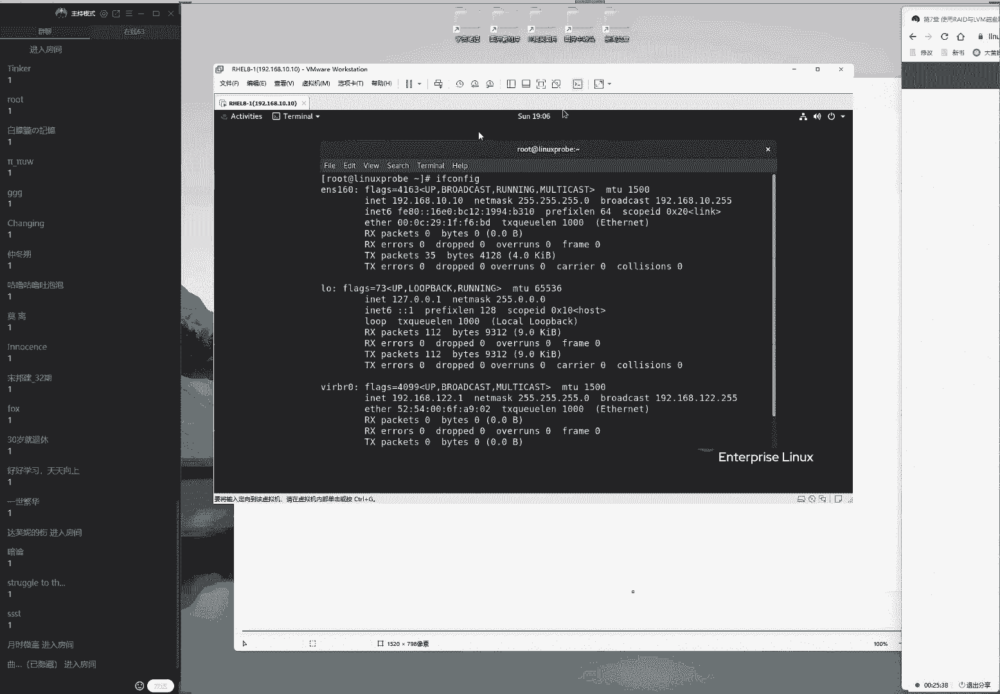
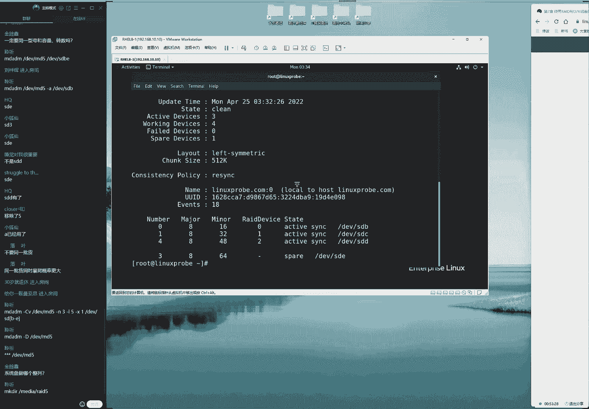
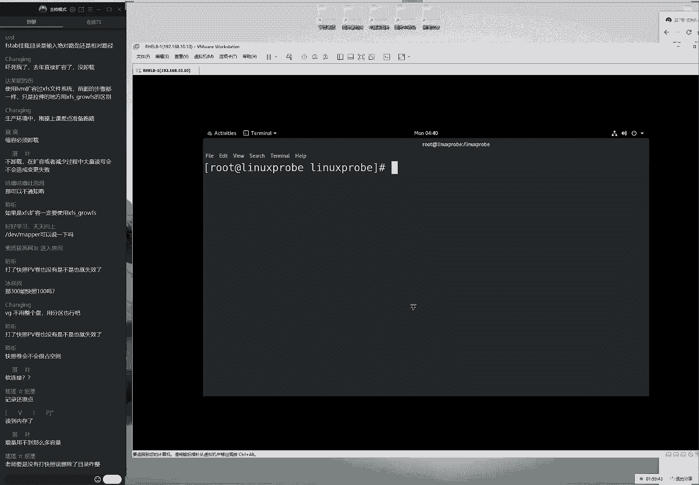
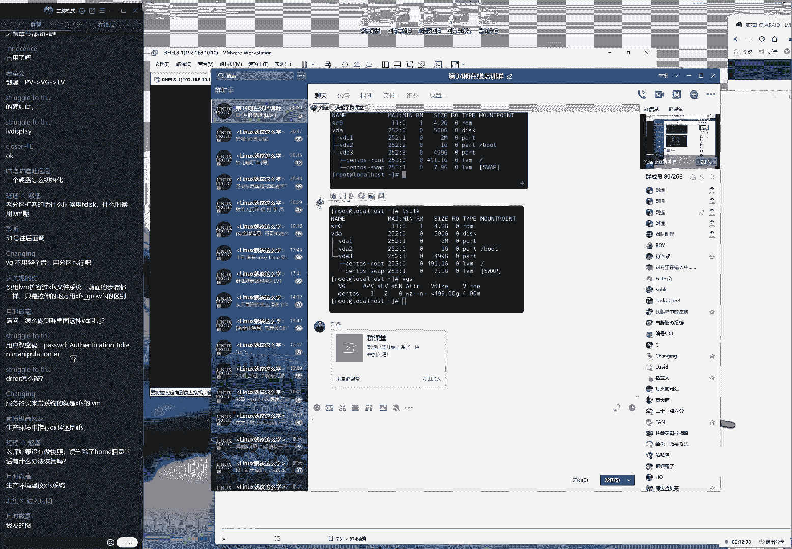

# linux就该这么学第34期 - P11：11【第34期第十一节课】红帽RHCE认证培训课程-Linux就该这么学 - 能力努力 - BV1L14y1878S

i can't。

ok来观同学，我们来开始我们今天这个课程啊，大怎么样啊，大家怎么样啊，去囤菜去了，只不过刚才看这个人比较少啊，所以等了一下，现在60个人还差不多吧，好同学们，先打一下。

一我们来开始我们今天这个正式的课程，那我们来先打一下，一同学们，那我们来准备一下，开始今天这个正式课程，石头我先把水拿过来，ok啊好了，我们继续，刚刚的话呢是高估了自己的臂长了啊，放的比较远。

好同学们先打呃测呃，测试一下我们这个上课声音，大家都听到我说话声音吗，然后能不能看到我们的画面啊。

今天的话呢我们来正式开始咱们这个第七章节的这个内容，我们先来给大家去讲一下这个raid，昨天的话呢是说了一下这个理论基础，今天的话呢就要来辅助于实战了，到底这个read该怎么进行配置。

我们给大家准备了几个小实验，同学们可以共同参考，首先的话呢是我们这个书上面的7。1。1小节，然后，呢呃那我们是来给大家去配置的一个，我看一下配置了一个瑞的一零的一个磁盘阵列组。

那么这个磁盘阵列组最少是使用的是四个盘来去完成的。

我们在做这个实验之前啊。

还是有一个呃建议的嘛，就是我们要把这个虚拟机首先还原到一个最初始的状态。

然后这样的话呢我们跟其他的这个呃呃直接配置logo，这呃过的这个服务没有什么冲突，第二的话呢就是把这个关机之后来进行操作，因为它毕竟是一个虚拟机模拟出来的一个硬件设备，嘛它主要是呃热插拔。

或者说我们开机的时候直接添加的话呢。

可能会造成这个不稳定性，或者说它会一些问题嘛，技术能让我们把这个重点和我们这个全身心都投入到配置的服务上面。

而不是为这个军机在去排错，所以我们现在选择的话呢，先把虚拟机给他，关机之后就啊，然后往我啊，然后我们往里面去添加硬盘这样的一种方式啊，大家问了一个问题，晶晶同学说到了说我们设置防火墙呃。

我们去设置设备失败了啊，是说把设置模拟损坏的时候出啊，出问题了是吧，那么这个时候的，话您就可以不用着急啊，待会我们给大家讲到的时候，你可以对比一下跟我的这个操作有什么区别啊，那我们选择下一步。

我们现在的话呢我们把硬盘添加成稍微小一点点的，四个硬盘都稍微小一点，这样的话呢但是格式化跟挂载的时候速度会更快一点，好我们现在的话呢20个gb的硬盘，我们给它改成五个gb，然后我们其他的话呢选择默认。

然后我们选择五个gb，然后我们现在等于说就往里面添加上四块相同大小的五gb的这个磁盘，类型的话呢，我们全能选的就这个sa模式，不过，这个模式也是无所谓的，我们往里面添加四个硬盘大小的话呢。

分别为五个gb，然后我们选择一下添加啊，让我们选择一下开机，这也就是说我们现在有五个硬盘啊，那我们就是123455个硬盘大小的话呢，相同都是为五个gb，那我们四个硬盘组成之后的话呢，也就是20个gb。

但是由于我们剧组成的叫read 10，两组之间先去做raid 1，然后的话呢在两组之间再去做一下瑞典零，那么我们啊两组之间各有一个冗余，所以我们的可用率的话呢是50%，待会也就是说会是5+5加。

5+5最后等于说他打最后我们用户能够看到的使用空间的话。

那么会是十个g币，好，现在我们去使用到关联的这个身份来登录到这个服务器里面，大家一定要注意啊，就是您一定要去使用它关联的这个身份来增加呃，来去登录到我们这个服务器里面。

因为呃普通用户是没有权利采取管理啊，我们这个硬盘的，所以您需要先去点击这个没有被列出的选项，这边的话呢去手动去输入一下，密码的话呢是叫做red hat这样的操作，过后我们就登录到了管理员的身份下。

就可以来进行后续的这个实验了，好现在登录好之后。

还有我们这个协议的一些规范的话呢，应该能够猜得出来，这个并不难，我们新生出啊，我们的话新生成出来的这个硬件文件的这个名称，他的话呢我们给大家看看啊，那我们可以看到分别的话呢是dv目录里面的b到e。

也就是说12344个，因为它是系统当中内核识别到的四个怎么样的新的设备啊，这样的一个效果做好之后，我们来去，进行一个创建，我们使用的命令专门用来去管理软件，瑞的好，叫做m d a d m命令。

后面的话首先加一个大写c这个指的是创建的意思，它指的是创建一个磁盘阵列组，现在啊然后加一个小写v，它指的是显示我们创建的这个过程，接下来的话呢是啊，他最后指的是我们啊，接下来我们写的这个名称啊。

那么换了这个指的是待会儿组成词汇这类组之后。

我们所让用户所看到的一个名称，这等于说就是我们使用的四个盘，叫做啊md 0这样的一个形式，它并不能够说呃完全的以我们呃组成的硬盘的名称来进行命名，比如说现在的话呢我们是使用的是四个盘去做。

那么待会儿这个设备的名称它不可能是叫dv目录里面的，然后b然后对吧，然后b c d e这样的话呢非常的长，而且的话啊也不太利于我们去阅读，而且现在的话只有四个盘去做，如果我们在工作的时候。

大家用的是100块盘去做怎么办呢，那啊那么我们这个啊啊信息啊就会特别的多，特别不利于去写和读啊啊，那么我啊我们也不会低于去读嘛，因此的话我们就要给它。

一个统称就是我们待会儿的话呢使用这个四个盘去完成之后，统一的一个名称，我们把它叫做md 0，这个名称的话大家选择默认就可以了，我们一般情况下也不用去改，这有点相当于就是我们现在这个第34期对吧。

我们34期现在有100多位同学啊，我们现在在减人数的话呢，有67位同学啊，跑了我66位，那么我们就可以统称为第34期，这样的话我们那我们就不用为我们每一位同学到这个信息。

然后来做一下备注了，好那就是说这是我们呃统合完了之后，那合并，之后的一个名称，当前这个文件是没有的，今天的话呢是一个个n小四，这个指的就是一个使用几块盘去完成，当前的话呢使用的是一个四块盘去做的。

资本之内组杠一个小写l啊，它只认为级别级别为瑞典一零，但也就是说我们现在使用的是四块盘去做的一个月一零的盘阵列组，它的话呢使用的硬盘是b杠e，它使用的是四块盘去做。

使用一个通配符的方式来去体现出来他所参与的这个成员啊，设备的这个呃信息，然后我们来猜一下，回车就可以来进行创建了，那我们看到其实这，个书上的话呢使用的是另外一种方法，我们现在使用的这个通配符。

但是的话呢书上是呃写了这个四块硬盘的这个分别的名称，然后然后我们这个比较笨一点，但是这两个方法啊，那我们都是困啊，这两个话我们都是可以的，但是我一般情况下会借用这个通配符。

只不过这边书上嘛我们面向的就是呃就是一个普通的读者，如果我们用到这个通配符，虽然说第三章节讲过对吧，但是万一要是他不会用的话，到时候说又多了一个差评，所以我们干脆书上总写的非常的非常简单，这种呃最。

简单这种呃方式，但是您可能看起来会特别的臃肿，好我们充电好之后，随着我刚才说了很多废话啊，于是我们可以继续选一个大姐q去查看一下它这个简要信息了，这个文件就已经把它给创建出来了，可以看到的话。

那大小可用空间是十个gb，没有问题，ok啊是啊，他这十个g b它的这个级别的话呢是为呃read 10没有问题，它使用的是四个盘去完成的，他的话有零和热备盘，他说的，但是这个信息的话呢过于简单了。

我们可以去选一个大写钢笔，或者我们可以去选一个长格式去查看它，这个完整的信息我们来写下一个大写，刚地查看一下它里面的这个详细信息，诶，看到它已经完成了呃，这边的话呢因为它会有一个同步的过程。

只不过因为刚才我们等了一会儿，所以他已经完成了，这个时间的话大概是一两分钟左右，所以同学们一定要记住了，就是我们在创建这台绿车啊，这个设备的时候的话呢，不要充电完之后就马上就来进行操作。

一定要先去省一个大写杠d，然后我们确认一下它已经是数字化完成了，或者我们把它理解成叫做同步完成了之后，我们再进行一个，下一步操作好吧，同学们啊一定要记住，就是呃我们去敲完这个收件命令之后。

一定要等待一段时间，然后再进行一个操作好，大家问了一个问题，大家说这种是创造，是软件锐的吧，然后说呃这列卡不是在系统里面操作的吧，对我们的话现在使用的是一个软件锐的一个形式。

因为同学们没有必要为了我们今天这一节课啊，两个多小时去买五个硬盘过来，没有啊，没有太大标性啊，就是我们虽然也可以使使用硬件去完成，但是毫无必要啊，我们现在这个这个啊操作的话。

基础的话呢那他说的话基本上跟硬件是相同的。

主要考虑一个性价比的一个原因啊，没有必要啊，这个没有啊。

其实其实也没有必要好，现在的话呢我们来继续有这个四个模拟出来的硬盘，我们就能够完成今天这个实验了，再去查看一下系统，这个信息能够看到已经同步完成了，下面我们干嘛呢，我们可以对它进行一个格式化操作。

我记得上一节课说同学们就问了这个问题，是老师为什么你老是用的这个啊四版本的文件系统呢。

是不是说我们现在这个新版本的这个文件系统不太好，用呢或者有些服务并不支持呢，呃其实完全没有这个意思，是因为我们每一次做实验吧，只能选择一个，那我们选择一个的话，大家会问说问我们为什么不用啊。

但是话那大家呃大家可能会问到说，那我们为什么不啊，我们没有，那我们为什么要选择它呢，其实这个文件系统的话没有太大的这个关系的，大家可以去任意去选择，没有呃非常的重要这个区别。

所以的话呢我们当前今天的话呢我们就以我们新的文件系统啊，x fs来给大家去做这个演示，同学们就千万不要问说不要啊，说啊为，什么要用四版本啊，就是这两个都是可以互相换的，这个啊拿着文件系统的格式。

对于我们这个实验的话呢，没有直接影响啊，没有这影响大家放心呃，完那我们给他个置换好之后的话呢，下一步其实那我们其实在说就是就做一下挂的操作了，来dv目录里面的啊，然后我们这个啊不对。

我们还没现在出来目录啊，因为我们讲到了挂载操作的话呢，实际上就是将一个设备与一个目录去做关联的这个动作，我们把它叫做怎么样呢，挂载操作对吧，它所使用的命令叫做mount，那我们要去做挂载操。

作这个目的的话呢，是让我们的用户能够通过访问这个目录就可以去实现访问硬件资源啊，那么就可以去实践出来访问硬盘里面资源这样的一个效果啊，这个贯口真的是需要气很长啊，那好那我们有了这个理论基础之后。

就可以出现出来一个挂载目录了，挂载目录的话呢，挂载过后就变成了挂载点，这两个名称虽然不同，但指的都是同一个事情来，现在出来一个800目录，我们好宇说叫什么呢，看是谁知道了啊，野人制作的同学啊。

是迟到了吧，那我们就给他新建一个叫做小野同学吧，来新建出来一个目录，叫小野，来做一下挂载dv目录里面的md 0挂到小野的目录上面呃，左边的话呢指的是设备的名称，右边的话呢指的是我们挂载的目录的名称。

两者一挂好了之后，马上就可以去使用到da啊，命令查看一下当前挂载的这个信息，使用一个消息h让它带有一个呃带有这么一个，单位值啊，它有一个单位值，我们看到它有一个m，它有一个g这样的话它会有一个单位。

方便于我们用户的话来进行一个阅读，好现在的话呢去查看好了之后就可以来继续下一步了，下一步的话呢就是来去编辑一下文件，etc目录的打file system type，那我们去敲一下这个文件系统的配置文件。

首先的话呢里边还是要写上设备的名称啊，md 0，第二点的话呢是我们这个挂载点的名称，我们叫做小野蔡，文件系统的话呢，我们就是新的啊，我们的这个文件系统啊，x f s权限的话呢选择是default。

然后我们零零不要自动备份，不要自动自己，这样的话呢我们开机的时候还更快一点，其实我们到此就ok了，保存退出就可以了，但是的话呢我们希望同学们不要有太多的顾虑，就是这个计算机嘛它会比我们更加的呃理性。

更靠谱一点，他的话没有认为当中那些缺点，我反正我们是这么认为的。

所以的话当我们he啊，当我们确定了把这个服务配置好之后的话呢。

下一次的重启过后，他就跟啊那啊，那么他就会给我们一个确定性的配置成功，他们会依然为用户提供服务，挂载到我们系统，当中啊。

那么我们于是来通过这个重启操作来进行一个验证，因为有些时候啊我们可能跟一个人去说了，说我们现在的话呢有这么一件事，然后我们写在一张纸条上面的，他可能会忘记，但是计算机的话呢这一点不会的。

只要我们能够把它拍好了，然后能够去啊正常的开机，那么大家可以看到，即便重启了这个设备的话呢，也依然会被挂到我们所对应的目录上面，是没有问题的，好那我们现在的话大家就会问一个问题了，邵老师诶。

我现在突然间忘了你昨天讲的是什么了，我们为什么要去使用它这个词分之内组呢，我们叫做呃瑞典一零呢，那么那我们要给大家提到。

如果不考虑成本的这个情况下去使用的瑞典一零，我们换到实际上，那么的话呢我们实际上呃是有两个好处的，第一来讲的就是我们可以去加快硬盘的读写速度对吧，就是我们这个读写速度。

第二的话呢就实际上就是能够具体到一个冗余备份，那我们如果要是呃树洞比较啊，说的话比较通俗一点吧，数据不容易丢失啊，我们要是有出现坏盘的话呢，它能够有一个盘位啊，来啊进行一个顶替。

或者我们叫做保存着一模一样的一个数据，这样的一个效果好，大家问了一个问题，大家说啊我们的这个编辑过后，这个文件这个怎么备份啊，这个文件不需要备份，它本身就是编辑文件的这么一个操作。

它和谈备份呢啊然后我们来继续来给大家操作一下啊，大家说坏了啊，如何使用啊，热备盘啊，这个非常好，我们啊我们马上就给大家讲到，那我马上给大家讲到时间的话呢，现在是07：18，大概7。

38吧啊大家都能够看到我们现在这个操作吧，我们一步一步来啊，不着急，下面的话呢我们来给大家操作啊，大家看一下，那也就是说它有两个好处，如果说出现坏盘了，我们也没有太我呢我们也不知道他在的，他去担心。

那我们现在进入到所对应的文件夹当中，然后里边的话默认是空白的，这个是跟预期一样，我们去找来一些文件来复制过来一些文件到我们这个当前目录当中，当做是测试对象啊，主要看这个文件有没有丢失信息。

能不能去读取呢，来看一下里面就有信息了。

有信息之后的话呢，我们来点击这个编辑虚拟机的这个设置，然后我们随便去移除掉一个硬盘啊，然后我们从理论上来说的话呢，使用瑞典一零去组成的磁盘阵列组，任何一个盘的这个损坏，它都不会影响它的数据的。

因为任何一个盘都有一个跟它一模一样的一个备份盘好，所以就同学们可以来告诉我一下，避免我们同学们觉得是不是老刘打上之前都已经做好准备了啊，为什么第二块啊，为什么第三块呢，来大家可呃随便去选一块吧。

2345随便啊，大家随便报一个数字，我们来给大家选择一件移除，然后看一下文件数据也不会丢失，有人卖香肠啊，然后就是底下有人说说啊，为什么你切的是这根呢，啊为什么你切的不是那一根呢，所以我们就随便来了。

大家说第五个对吧，好我们就随便第五个了，大家怎么互动起来不是那么的积极，只能一下移除啊，选择一下移除。

点一下确认，那没有问题，这也非常暴力了吧，因为我们可以通过命令去完成，当然命令的话大家会认为说都是这个命令的话呢，它都是内部东西，我也看不明白，所以我们干脆把它给移除了，移除过后的话呢。

这个是不是就是彻底丢失掉了，我们可以去使用到这个杠大地的这个参数可以来看到，马上您就可以体现在这个输入信息当中了，可以看到它这个结果里面就有一个盘已经选择的是移除了，大家说的一个问题。

大家说同一组里面呢不能换俩一块吧，啊这个看您使用的是几个盘去完成的，如果说您使用的盘就是两块盘组成的同一个呃组的话，那么你就只能是换一块，那么如果说你使用的是三块牌的话，那么你可以换75%。

就只要同一组里面有一个好牌都没有问题来啊，大家说四是吧，那那那啊那啊那个是来不及了啊，那个是来不及了，已经是一啊，那我那我们已经把第五还给他移掉了啊，慢了一点点，好，这块的解码已经给大家一掉了。

一掉之后的话呢，再去查看一下这个文件里面的信息，大家可以看到，其实肯定不会有丢失吗，来可以看到这个里面的这个信息的话呢，没有任何问题，随便去看，随便去耍都可以的，好大家看到的一个问题就是老师。

那我现在的话呢，如果说现在出现坏盘了啊，那我们该怎么来进行一个恢复呢，大家就可以接着看一下啊。

对于数据的这个恢复，实际上也分为两部的，第一步的话就是我们需要人类来进行操作，但我们如果如果啊，但我们如果没有热备盘的这个情况下，那么的话我们需要做两个事情吗，第一步事情就是先去插入一张好牌。

然后的话呢我们呃啊呃这个其实也无所谓，如果说我们可以先插一张好牌，然后我们再做一下信息的同步，然后再拔一下硬盘，然后然后然后再拔掉我们这个旧的换盘也可以，或者的话你可以直接把这个画板给它拔出来。

其实也可以好，那我们现在就得啊，那我们现在这个操作就是这么去做的，当出现一个盘损坏之后，那我们现在把这个盘给他拔掉了对吧，然后的话呢我们现在去顶替上去一张新盘，这张新盘的话呢。

我们只要手动去把它顶替上去，它就会自动来进行一个同步，它会同步我们之前这个同一组里面的这个硬盘里面相应的数据。

然后它也是非常的稳定的，也没有太大问题来，我们现在的话已经把这个盘给大家移掉了，大家可以再去确认一下，我有人迟到了啊，所以我再去捡啊，再去去给大家解释一下，现在的话呢四个盘子组成的是瑞典一零。

那么那啊那啊那我们可以看到呃，最后一个盘的话，第五块被移掉了，那么当前的话数据应该是有影响，但是我们能够去查看到哦，不现在的数据是没有影响的，是硬盘有影响，但是我们的数据没有影响。

现在的话呢我们需要做的这个事情就是要去把它先去关机。

哎，然后去添加一块我们的新的硬盘到里面去诶。

稍等一下。

现在的话呢我们本来关机之后再往里面添加一块新的硬盘，它又会成为第五块被识别到硬盘，我们选择一下，下一步选择五选择五好，我们现在的话把硬啊换硬盘给大家拔掉了。

再添加上的一块新的硬盘，点一下确认，点一下开机，在我们工作的时候。

大家是不需要给服务器关机的，但是的话呢我们在虚拟机里面的时候，您是需要建议大家首先要关机，然后再进行添加，否则呃有可能模拟硬件的时候会有问题啊。

可能会有问题来，大家说在生产环节当中是插上自动恢复吗，它也不是的，我们需要手动再去添加上去啊，它也需要进行一个手动添加，因为这是一个很真，因为这是他，因为他是一个有问题的事情，就像有呃。

就像我们在在这个服务器里面，如果说现在有一个盘他突然间坏掉了，那我们现在再插一个盘，它是自动的一个恢复吗，我那我们认为他如果要是自动恢复了，反而是不合理的。

因为我们这个盘它可能不是作为这个呃磁盘阵列组的，它可能用在呃是其他地方，但是它突然间盘我们自动给它格式化了，我们可能认为也是不太合理的，也会造成一些数据的丢失。

所以的话呢这一步也算是系统给我们一些保护吧，它是不允许我们直接去呃自动恢复的，它需要用户手动再去确认一下，然后才行来重启过后的话呢，来去查看一下这个文件呃，如果同学们刚才所问到的，它会自动恢复吗。

大家可以看到它没有自动回复，现在有这个盘已经回来了，这叫做dv目录里面的s e d这个文件是有是有，但是它没有自动往里面去添加进去，我们需要做什么操作呢，需要先在再去查看一下我们的这个文件信息。

大家仔细看一下，就是我们村这一组最后一个信息，他最后的话呢是这个已经被移除的一个状态了，对吧好，我们现在我们现在需要做的事情，就是再开一个窗口去把它给它添加进去，dv目录里面的md 0，然后一个杠a啊。

不md 0，一个杠a将我们的排行给它加到底，里面具设备名称啊，s c d蔡文再回车，他说啊设备繁忙啊，稍稍等一下啊，dv目录里面的md哎，等一下啊，他说他说a s d d繁忙哦，大家说应该是e是吧。

稍等一下，我确认一下，我确认一下啊，不对啊，第一块被区别的哦，是a b c d啊，对啊，第四块还是d呀，哦不对不对不对哦，不好意思啊，这个是我的一个呃呃刚刚这是我脑子的问题啊，这个的话我们跟技术无关。

因为还有一呃，因为的话还有还有一个我们的这个呃系统盘啊，因为我们这块系统盘是占用了a了不是，所以的话呢它这个我们添加上的这个硬盘，它应该是b c d e啊，不好意思啊，刚才是我的一个疏忽啊。

这确实跟技术无关了，主要是我刚才没有反应过来啊，忽略到我们这个系统盘的a了啊，ok啊ok ok这是我的问题，来将我们这个硬盘i c e给大家往里面一加走，你啊，然后就把这个添加成功了。

现在成功之后马上再去刷新一下，这个你会看到自动点啊，这不算这也不算自动顶替吧，但是它算自动的一个恢复，于是可以看到数据开始重建，已经重建了15%，45%，这就是我要给大家讲到这。

老刘这个计算机还是比较好的对吧，我们的话呢i92 代，然后咔咔的话64g的这个内存，但是我们可以看到同步时间大概也得有个十秒20秒的时间，如果说我们先四个盘，他不是五个gb，他可能是20个gb的话。

那么四个就是80个g b，那我们可用率就是50%之后变成了40gb的话呢，它这个数据同步起来也是比较慢的，所以同学们做这个实验的时候，您可以把这个啊我们的硬盘的话呢选择稍微小一点。

它那我们可以把我们这个时间跟精力更多的话呢，去投入到我们这个配置服务上面，而不用去等待它去同步的这个时间了，好我们等他同步好了之后的话呢，就没有问题了，然后我们可以看到这个这个小野目录的话。

依然被挂载到系统当中，同时可以去查看一下这个里面的文件也都没有丢失，这就是一个呃相对于比较完整的，就是在我们这个服务器当中创建出来一个软件瑞的一个方法安装，以及当初现换盘了。

我们该怎么来进行一个恢复的这样一个操作好，那我们现在的话呢来给大家往后面去说，说到这个热备盘。

那现在是需要用户进行一个手动的一个顶替，让用户去插入一张盘，然后的话呢我们这个数据自动的这个同步过去还是比较麻烦的，我那呃那么我们能不能去啊，好的时候的话呢就是先去提前准备出来，一张啊空白的光盘啊啊啊。

那我们啊那我们现在先去准备一张好的空白的这么一个硬盘放到旁边，当有一个盘出现损坏之后的话呢，这个好的硬盘自动的把我们顶替上去，然后来去啊来进行一个数据的同步，来这样我们来自动点击上去。

来进行一个信息的一个同步，这样的话呢我们用户啊，当然这样的话呢当我们管理员去的时候，只需要把硬盘给他拔掉就可以了，而不用说一旦出现化班之后那么的紧张啊，主要为了谈的话，就主要为了缓解这个焦虑嘛。

这个的话也可以去实现呢，我，们把它叫做热备盘呃，这呃这位盘的话呢可以有很多块。

这个话大家可以因为它毕竟是一个虚拟机嘛，所以同学们可以多用啊，可以多做几块也没有问题的，它的这个参数是一个小写x好，我现在的话呢再去还原一下虚拟机，然后我们来给大家完整的去做一下这个实验。

待会的话呢会给大家演示一下。

就是说如果我们现在不需要去使用到这个read了，我们该如何对它进行一个完整的删除，这话是我们之前那个呃课都没有的，所以这也算是一个新增的一个内容，能让大家完整的演示一，下就是去使用rd。

然后以及对于rd进行一个编辑，最后的话呢进行一个完整的删除这样一套啊，这样的话呢非常详细的一套流程来我们选择一下编辑，然后那游戏曲稍微再教训了，我们把这个硬盘的话呢稍微再小一点点，还是用五个gb好了。

现在我们需要添加五个啊，现在的我们需要添加四张硬盘啊，添加上四个硬盘，还有一个硬盘的话呢，我们是作为热备盘来去使用的，所以3+1啊，三个盘做raid，一个盘做备份啊，这，作为我们的热备盘。

所以我们总共是添加上四个硬盘，这个没有问题好，大家问了一个问题，大家说说一定要是同一个型号，同一个容量，同样转元素吗，呃从理论值上来说的话呢，因为理论值肯定也不花钱嘛，从理论值上来说的话呢。

我们建议大家如果说要去做瑞的话，那肯定是同一个型号同一个啊，就是我们最好是同一个品牌，同一个型号，同一个元素，同一个容量啊，这样的话肯定是最好的，但是这个理论值对吧，但是呃从我们这个实操上来说的话呢。

其实没有太没有太大必要性，主要啊，只要是呃就是怎么讲呢，呃我呃我刚才所说的是一个最好的一个情况，但是一般情况下人生没有完美的，很难时间，就就呃就这样的一个情况啊。

所以的话呢我们一般情况下就是只要容量是一样的就可以，比如说我们取两个20gb的硬盘就可以去做一个，没有必要说其他的这个其他参数卡那么严，但是最好的情况下，尤其是瑞德一和瑞典不，他有他的话。

尤其是瑞的零和瑞德一零，最好还是使用同一个呃速度的。

但是呃正常情况下的话呢，我们使用的是同一个容量的话，其实也行，但是，这个就嗯怎么讲呢，限制的条件越少，那我们换的性能就会越差，但如果限制的越多的话呢。

可能我们去购买，或者说我们去搭建的时候就会越麻烦一点来。

那我们接下来给大家来去操作一下啊，大家说不要同意批货对吧，然后坏的话大家就会突然间就会全坏啊，大家怎么样啊，对这个就是我所说的，这时候我们也是遇到过，这时候啊，这是我啊，这句话也是我们遇到过的。

记得有一回的时候，我们也是买同一个p4 的这个硬盘啊，然后的话呢突然间一下坏了两块，当时地画第一话的时候，我，还在想不会是老刘这个人品不行吧，不能够啊啊第二话再换的时候，我突然间就意识到了。

可能这个硬盘的原因好赞啊，我们不是一个生产环境，我们只是一个呃折腾的一个环境，我们只是自己玩加工的一个电脑啊，所以我们还影响问题不大啊，好的话呢，京东这个服务也特别的好啊，还给换了个新好了。

可以自动打完广告之后，我们来继续来往后面去说啊，那我们来继续往后面去说，添加上又添加上四个硬盘，这个名称的话，先去确认一下dv目录里面的s b c d e，其实我们第二个实验。

的时候没有必要去确认一下这个设备的名称啊，只不过因为老刘这个脑子不太好啊，我再确认一下，d啊b c d4 个盘都已经乖乖的躺在了目录当中，等待我们去呃操作了，那这个啊等啊都准备我们再去操作了。

来来来来来，我们接下来m d a d i命令一个大写c创建一个小写v显示出来，我们这个过程dv目录里边啊，大家问了一个问题，我看一下上面一个问题，我把它忽略掉了，大家说啊，今天是啊，怎么样啊。

今天是工作日变成小班授课了对吧，ok，啊我还是我啊，我还没什么问题呢，来dv目录里面的md 0来设备来去设置一下，我们待会儿绑定之后，我们创建好了之后，我们这个设备的名称。

它就等于说我们那个班级的名称吧，如果说大家想一想，其实也可以的呀，凭什么不可以啊，比如说我们现在是c e b c d c s d e d和s e这么去写的话，怎么不可以呢对吧。

而且我们一眼就能够看得出来它是由哪几块牌组啊来进行一个组成的，但是你有没有想过，如果我们这样写完了之后，我们再往里面添加硬盘，或者说我们取消掉硬盘或，者这硬盘啊啊那这样操作过后，那我每次都要去改一次。

名字很麻烦，所以干脆白叫做啊，第34期，就代指了我们所有参与的这个成员来，接下来的话呢我们来选一个是一个小呃，小写n它指的是由几块牌组组成的呢，我们总共是由三块牌子组成的一个级别v5 的一个四分之列组。

顺便的话呢带有了一块怎么样呢，备胎啊，作为一个热备盘，作为一个备胎，那我们组成的这个硬盘的名称，dv目录里面的s b，然后是b杠一，其实这样去写的话，我们会感觉到明，显比书上面我们去写诗啊。

四个设备的路径以及名称更加简单一点啊，但是的话呢实在是不敢去写，如果要是敢写的话，同学们只要有呃，不但是啊我们只要敢写了，然后我们再画啊，那都是我们的问题了，这所以我们书上的话呢。

有些其实可以再去呃复杂一点的，这也是为什么我们要大家既然报个班嘛，一定要来在线上课了，因为有些时候我们这个操作是跟书上面是不太一样的，书上要是完全一样的话呢，就是档就会档次比较低一点了。

然后会比较简单一点了，来我，们今天的话呢去操作好之后，你看我现在在说废话，原因是什么呢，原因就是因为它没有同步好啊对吧，看到了吗，啊啊已经好了是吧，ok可以了，那我们必须要等待他一下两分钟啊。

然后他就通通不好了，确认一下已经是状态啊，已经是没有问题了，状态的话也是这个啊，正常情况下再来进行后续的这个操作哦，大家怎么说，那大家说啊，md 5啊，它这个可以这样去做。

另外的话呢还有一点呢就是我们这个设备的名称的话呢。

建议大家都用这个m d0 ，因为我们在红毛周六的时候，大概时间是，我去试过这个四分之内组，后来的话呢我想当后来我当时我就想改一个名字，就是dv，比如说dv目录里面的流传啊，提一下我的名字啊。

万一这个视频被泄露出去，起码我们的同学们知道这视频是啊，这个话是谁录的啊，来我们可以以这样的一个名称来进行命名，在红毛reo 6里面我去试过一次，没有成功，所以有的干脆啊。

我就是我们所有的这个re的磁盘阵列组，我们都把它叫做dv目录里面的md 0诶。

呃也没有太，大必要去换吗，下面一个问题好，大家问了一个问题，大家说啊这个名字很有钱啊，金辛金啊是吧啊，来说说到这个啊，气动盘做哪个阵列啊，系统盘的话呢，我们一般情况下会做瑞典一零啊。

会比较的这个稳妥一点，但是这个也考虑到这个成本嘛，来这个并不是强制的哦，哎对了，还有其实我们还有一些问题呃，我突然想到了以前我上过一个档，以前的话呢我买过一个云服务器，然后的话呢其实那个不是云服务器。

就是一个v p s啊，到我这我我我反正我我我，当时买的是一个国内一个小厂商的，然后的话我当时想去挂机，去用一些比如说什么软件啊什么的，然后来做一下测试，我当时买完之后吧，我买完之啊不，我是在买完之前。

然后我发，然后我去了解了一下，我说你们这个设备呃有没有做硬件瑞的呀，他们说有，我们是瑞典一零，但是的话呢我去实测的时候发现啊速度还是可行的，但是的话呢就是这个安全性吧，老觉得不靠啊，就是话老不太靠谱。

当我们有先给大家提一个小问题，就是呃当我们遇到了一个不能够去查看硬件信息的情况下，不能够查看硬件，就是我们去到他的机房里面去查看硬件信息的这个情况下。

也不能够像我们现在一样编辑虚拟机的这个信息的这个情况下，那么我们该如何去识别出来它是read 0还是read 10呢，这个问题大家去思考一下，我们可以留一小作业啊，大家可以去网上搜一搜也行。

当我们在就是在网上买一台服务器，那我们该怎么去区别一下它到底底层是做的是瑞典零，还是做的瑞典一零，因为根据磁盘阵列组的话呢，它的目的实际上也是为了去让用户屏蔽掉底层文件系统的这样的，一些特性对吧。

我们呢我们呃用户只看到这个名称了，而不用担心说底下是由几块盘去组成出来的，进行一个合并的过程，但是如果说这样的话，就会造成一些比如说超售啊，或者说呃一些呃偷工减料这样的一种呃可能性对吧。

那我们之前可能它需要四个盘去做，而我这个局啊，他啊那啊那么我们呢我们这个可能只需要两个盘去做。

那我们该怎么来进行一个识别啊，大家说我们可以用dd去做一个大文件来去测一下速度，但是零和一零的话，速度理论来说是一样的，速度上是没有区别，的好，这个问题我觉得很有意思吧，啊大家去思考一下。

我们往后面去说的啊，留一个小悬念啊，留一个小悬念，留一个小豁口啊，这样的话我们来继续来呃，etc目录里面的x fs来，我们来给他去格式化啊，make sl system，然后是x f s设备名称。

dv目录里面的md 0，来给大家注意一下，格式化操作会发现硬盘小一点，速度更快一点啊，基于我们的生命呃，再重建出来一个目录，作为我们的挂载目录，看看是哪位小朋友迟到的呀，啊叫做晚秋的何同学啊。

那叫做这个小啊，那叫做这个小秋吧，来小邱非常优美，啊小邱同学把这个设备给大家做一下挂载dv目录里面的md 0，然后的话呢过小秋的这个目录作为加挂载。

这样做好了之后来编辑一下etc目录里面的fcm top文件，把我们这个信息系啊给写到里面去，虽然说这个考试不考，是不是觉得很香啊，以后在有遇到这种情况下的时候，我们如果没有做这步操作。

您感觉到哪里好像很就是感觉很就是怎么感觉呢，就是感觉很别扭啊，少点什么东西似的来，这样的话养着哦，先把，这个信息的话呢写好之后保存并退出之后之后的话呢就可以去干嘛呢。

重启一下吧，还是啊重启一下啊，眼见为实，老刘说他会在下一次的时候依然挂在上，那就所以说说老刘帅气的这个呃外表以外的话呢，看看到底说话也靠不靠谱，来重新去启动一下啊，大家说错了，小秋崩了得出问题了是吗。

我刚才是敲错了是吗，好啊不好意思啊，刚才说啊，果然是崩了哎好崩了之后怎么办呢，如果说卡到这个界面了，同学们已经说明大家又赚到了啊，赚到了赚到了赚到了啊，本身没有啊，本身呢我们，书上这一节是没有排错的好。

那如果出现这个问题了，怎么办呢，大家赚到了啊，这时候啊那啊这个出现这个问题的话呢，首先不要紧张啊，不要紧张，先拿紧的水杯，那淡定的喝一口水，然后的话再喝一口，接下来进入到对大家说出来了。

输入一下我们关联的密码，然后的话呢把我们该那个文件来etc目录里面的fl system type来啊，小秋是吧，你看啊哦我那我把这个信息给他更正过来，报孙膑退出，再重启一下就可以了。

所以大家千万不要慌，在考试的时候更是如此，输入一下关联的密码，把这个信息一更正，于是这个服务器又能够乖乖的起来了，在考试的时候。

我们给大家说是我，我就我们给大家说实话啊，在考试的时候你要说不会很难，因为我们说句实话，考题都给大家了，题都看了半个月都看了，一个月了。

你要说你再不会有点说不过去，但是的话呢就是主要的原因就卡到了，有时候会发慌啊。

然后就有时候可能会突然就想不起来这样的一个问题，然后话刚才在这个07：18的时候，有同学提了一个问题，然后说这个热备盘怎么去实现呢，那于是我现在就给大家讲一下啊，38分了啊，到那我们到点了。

我们来给大家去说一下设备盘怎么来进行一个验证，现在的话呢是有三个盘去组成了一个raid 5，然后的话有一个盘作为热备盘，我们需要做的事情很简单，就是把这个硬盘。

随便选择移除一块来，随便选择234，然后随便来，比如说我三吧。

这也就无所谓了，选择一下三，选择一下移除一，说好之后的话呢，来去查看一下我们这个系统，这个瑞典分店内组的这个详细信息，于是你就会发现它有一定延迟诶，然后再再再等一下，还没有变化，还没有变化，还没有变化。

但是不用着急，还没有变化，ok有现在有还有现在还有变化了啊，然后的话呢怎么样呢，一六尾盘自动的顶啊，把它给顶上去了，就是这样的一个效果，同学们可以来看一下这个效，果第三个盘被移除掉了。

然后的话呢我们的设备盘自动的顶替上去了，可以踏踏实实地出门去做核酸去了，不用有心啊，换我们不用担心说服务器崩掉之后没人管来，可以看到现在就是非常顺利的，正在同步，已经同步了80%了，还是非常快的。

硬盘小一点，把我们的这个生命可以节约到其他的这个服务上面，通铺好之后，可以看到三个盘乖乖的又开始做这个呃，为我们提供服务了，进入到我们这个小区的这个目录当中，然后的话我们可以随便去新建收藏文件嘛。

也是没有问题的，好大家刚才说呃我们的这个目录名称写错了是吧，对然后于是我们刚才进行了一个更正，好大家也就是说我们嗯当我们出现问题之后吧，我们首先不要慌张啊，一定要去想着怎么去把它解决了。

其实他一定是有问题吧。

那我们其实一定是有办法把它给解决的，但是如果说您做这个题目啊，做特别的嗯怎么讲呢，特别的嗯特别呃，但是就做的特别的呃，不好吧，呃做的特别的差，然后还可能导致您这个服务器被崩溃掉了。

比如说您在考试的时候的话呢，突然间手一滑，然后的话呢或者键盘，上面有一只小苍蝇啊，然后你手然后他然后的话你手一葫芦，然后您不小心葫芦出来这么一个命令，然后您又不小心敲击架回车，就如果说您出现了这种呃。

就是呃如果说您在考试当中出现了一种不可逆的一种呃错误操作的话，如果说出现的话呢，也不要慌，您可以去举手啊，你好啊，然后的话呢跟老师说去re啊，然后还去重建，去rebuilt一下这个机器就可以了。

在考试的时候重建操作可以做很多次，然后就可以把我们这个系统的话呢重置为一个您进入考场的，时候的地啊，那个最初始的一个状态，那么大家可以去评估一下，如果说我现在评估。

我现在这个操作已经是出现很严重的问题了，考试那么肯定考不过了，那么这个时候您就可以让那么就可以让考官暴击，对于系统的话呢进行一个重置，其实这个时间肯定是呃完全是足够的，因为上午的还是cc。

他考的是两个半小时对吧，他呃其实呃两个半小时这个题目我们一般情况下也就做一小时，做的慢的同学的话呢可能做一个半个小时也差不多了，如果说出现一次问题，完整的去rebuild一下，影响，基本上是为零的。

您就是两个半小时做两遍都来得及，所以在考试的时候切记不要慌，一定是有半点啊。

那我们一定是有半个给大家解决的，千万不要紧张，那我们现在的话呢再来啊，我们接下来再来，但已经有这么一个数据文件，并且已经自动恢复，这个情况下的话呢，给大家讲一下，当我们呃过程当中。

如果我们现在不需要去使用的这个呃这个磁盘阵列组合，我们该怎么把它给删掉呢，因为我们在日常3号当中啊，会发现有时候删是删不干净的，大家记一下，就是在我们工作的时候，有时，候删是删不干净的。

所以的话呢我们先来给大家说一下怎么把给删干净呃，首先第一步的话呢，首先需要返回到另外一个目录当中，不能够在您当前工作目录下去卸载掉一个目录，否则它会提示出来繁忙。

于是的话呢我们现在去使用到u mount命令，把刚刚那个设备，然后跟我们这个目录的话呢取消关联，这是我们的第一步反向操作嘛，再来把我们这个文件里面这个信息给它删除掉，file system tap。

那fs tb文件把它给删掉，删掉它里面所定的挂载信息，既然要删嘛，就一定要把它给删干净，核里边的跟我们这个呃分区信息的话呢，都要给大家一起上干净啊，没有问题，来接的话呢，我们做好之后。

我们来去使用到这个m d d m命令，然后我们后面写着设备组的这个名称，本来我们这个硬盘的话呢分别做一下移除，我们选的是一个小写f，然后我们看一下啊，当前的话呢是有四个盘啊。

不当前的话是有三个版b d e3 个盘，于是我把这个三个盘的话呢分别选择一下移除啊，我其实的话这个小写f的意思是设置为失败模式，或者说我们把它选择一下，就是呃呃本来去停止使，用这三个盘啊。

停止使用这三个盘来，我们现在的话呢把这个三个盘分别去设置一下，停止使用，呃，刚才我们上课之前，同学们提了一个问题，就是说啊就做这个晶晶同学吧，说到a为什么我去使用消息f的时候会有报错呢。

我没有像你一样成功呢，这个的原因可能是不是因为你没有把它给卸载掉呢，啊去检查一下是不是这一步出现的问题跟我们不太相同，好，那我们现在把设置成失败之后，我们的话呢下一步就要来选择一下这个移除。

其实我们按照这个红毛大纲里面这个教的方法，的话那就是可以直接就是咨询一下这个小写f，然后就可以把它选择一下移除就可以了，但是按照我们这个规范的这个操作的话，那最好就是先卸载，然后的话呢再去设置失败。

然后再去把它给移除啊，然后我们再去选择一下移除，这样的话更加的这个标准一点操作来，我们现在将三个盘分别都选择一下移除，移除之后再去查看一下这个思维之类组的一个信息的时候。

大家可以您可以看到这个信息的话呢，就会没有硬盘了，这个时候的话呢我们基本上就，已经把它给删干净了，还差最后一步，我们就是m d a d m命令，然后是stop，然后接下来是dv目录里面的md 0。

把它给停用，停用过后我们再来查看一下，就会发现这个文件的话呢已经是没有了，并且的话呢去查看一下这个文件里面的详细信息的话呢，也已经是空白了，那么就是这个样子的好，然后最后大家都在问啊。

怎么在这个服务器里面的排位有限啊，该怎么加排位呢啊这个我们三个都讨论好，下面一个问题，大家说在怎么样在删除的时候会出现说device or resource busy啊，这个原因就是因为您。

没有白给先去做卸载操作，就是您一定没有做卸载操作，需要先把这个一呃先去做一下卸载操作，让我们这个计算机的话呢没有去使用这个资源，然后再进行操作啊，已经卸载了什么啊，当然这两个问题啊。

我们同学我刚才问那个问题以后，大概是哦有卸载了是吧啊，这就不知道了，这就不知道了，因为您当然每个人的操作环境是不一样的，那么您就看一下刚才我这个操作跟您的有什么区别吧，好大家问下一个问题。

大家说如果有一块移动盘，再加上去怎么操作，是不是就直接整一个杠，a操作对，就一杠a操作就可以了，一样的操作，但是啊做不了是吗啊，那不会的，一定是有区别啊，一定是有区别，一定是一些小细节的区别。

或者的话您可以把今天这个视频完整的再去用视频的形式，不用这个压制出来这个视频的形式，然后播放一下，然后呢我这边啊做的这个所有的操作，每一步啊，枪毙了之后的话，那按一下空格暂停。

然后您在您的本地再去敲一遍，每一步一样啊，这样我们敲完之后就会是一模一样的，肯定是有一些小细节，有时候我也是这样的，有时候我去做饭啊，虽然，因为我们做这个计算机已经做了大概有了呃，10年了吧。

12年时间了，我对这个很熟悉，但有些时候我去做饭的时候，我老是做不出来我妈妈那个味道啊，他就是你眼瞅着他炒一个鸡，就你你就眼瞅着他炒一道菜吧，西柿炒鸡蛋，就我炒上那个菜总是那么的咸，总是那么的酸。

所以可能呃一些细节的原因会导致我们这个实验的失败吧，所以我们不用去纠结说为什么我会失败啊，不用纠结这个问题了，反复去做一下，看看一些细啊，去细微的差异啊，就可以了，现在的话呢我们来给大家去下。

面来说一下我们的l o v m，其实的话呢其实这个细节是很其实这句话这个细节是很重要的。

我我们那个顺序也是很重要的，那好我们先来给大家说下面一个7。2小节，7。2小节，其实这个的话呢不用太去纠结说为什么我会出错啊，出错这个结果并不重要，主要是一个配置的过程，找到原因才重要，来说一下7。

2小节，还有我们的i love bm，还有一个问题啊，就是我们同学们这个呃这样给大家说一下啊，我就是我每次考完试之后的话呢，都会有同学说，老师哎呀，我感觉我这回考的不好对吧。

然后我感觉这道题的话呢感觉还不是很熟练，巴拉巴拉巴拉，然后说了很多，其实的话呢我们感觉大家其实可能更多的，您不是需要有人去安慰大家了，就是我们说哎您其实已经可能很好了，然后的话呢我们这个题目的话。

那下回再努努力就好了，我感觉其实大家可能需要的不是安慰自己，可能是需要的就是一个呃，好我们继续来给大家去说吧，说一下我们的lvm这个逻辑卷管理器啊，这个话呢就是去解决了，我们昨天讲的一个分区格式化挂载。

以及今天讲的那个raid当中，我们会遇到的一个嗯痛点，它不是一个bug，它也不是一个问题，它是一个痛点是什么呢，当我们去分区好了之后，再想进行一个扩容的时候，它是呃很难的啊。

或者的话我们要讲的进行缩小的话，它就会更难了，比如说我们现在把这个磁盘的这个存储空间的话呢，把它比作是一个长方形，那我们现在的话呢分别啊，那我们现在分别有这么几个分区好吧，第一个分区，然后第二个分区。

第三个分区，然后我们现在有这么几个分区，第，一个分区我用绿色啊，那我先我用一个绿色，第二个分区的话呢，我用一个红色，然后呢，那我们现在这个白颜色是一个空闲分区啊，它这里边是一个空闲的一个容量。

那好那我请问请问一下，在windows里面我们能不能对于这个绿色的这个分区来进行扩容呢，就是我们现在比如说一个分区，它是一个c盘，这边的话呢全都是空闲的。

请问我能不能现在对于这个c盘来进行一个扩容操作呢，能还是不能呢，大家说可以，大家还有人说不能好了，呃，我不知道大家怎么为什么会说可以啊，可能会有一，些技术可以去实践，但是的话呢我要给大家说到的。

从我的经验上来说，以及从windows里面默认的这个磁盘管理器当中，我们去选择的话呢，是不可以的，是不行的，它必须是连续的扇区去操作，因为呃大家也许是有方法去完成，或者的话您已经使用了一些管理器了。

所以您才可以的，但是如果说您没有使用这些技术，在默认情况下确实是不可以的，好这个时候怎么办呢，那我们就只能去删除掉某一个这个分区，然后再进行扩容，这是我们的经验，这个也是一个痛点。

那我们现在就有一个问题了，我们现在无法去判断自己今后的这个业务的增长，就像现在的话呢是4月24号，我无法去估计出来我6月24号啊，或者说我8月24号，或者我们10月24号，我半天之后我的体重那好了。

那我现在该怎么买衣服呢，那我这个体重可能是涨，可能是减，那我该怎么去买衣服呢，于是的话呢我们就希望有一种带有弹力的衣服，这样的话我稍微胖个五斤，他也能穿，这样的话呢。

那我在啊稍微啊那话呢我们带有一些弹力的，当我们这个扩容跟缩小的时候，都有一定的这么一个呃，调整的空间的这样的一个技术，我们把它叫做l v m，叫做逻辑的管理器，他就为了去解决两个痛点。

第一个问题就是我如果现在有多个小的硬盘，我们该怎么来进行一个合并使用啊，就是说我们可以将多个硬盘进来进行合并，合并过后的话呢，可以让用户去看到我们合并过后的这样一个设备卷组。

而不用去关心底层是由哪个牌子组装出来的，就是说这样用户只看到一个成品，而不关心说底层是由哪个盘组成的，进行一个组合啊，第二的话呢就是我们能够让用户能够根据自己的这，个业务的增长。

但我现在觉得哎呀我感觉今年这个经济好像不太好对吧，我感觉可能呃要去减少我的这个余地，这个呃那我还需要减啊，需要减少和呃削减我们这个成本了，那么我怎么样啊，那么的话。

那我那那么我们可能就会去呃减少对于一服务器硬盘的这个投资，但是的话呢结果发现我们是做核酸的对吧，然后可能我这个业务爆发式的增长啊，那我现在可能需要对于我这个硬盘的空间进行扩容。

才能够保证啊去保存更多人的这个信息，那么我们该怎么样去调整我们的业务的，硬盘能够自动的去扩容跟缩小，如果没有这个技术的话呢，大家就每一次都只能是把这个硬盘给他啊。

先去删除掉之后再进行操作，特别的麻烦，而且还很不现实，来我们给大家去说一下，我们这张拓扑图是这样的。

首先大家看到了我们的l bm的话呢，实际上是由三个这个三个这个方式不播啊，有它有三个环节去组成出来的，这个我们可以叫做三个元素嘛，或者说我们叫做三个环节，第一个环节的话呢我们把它叫做pv操作。

pv操作的话呢意思就是说叫做物理卷啊，叫做物理卷，这个怎么，理解呢就是要让我们的硬盘能够去支持我们的l v m的一个技术，我们把它叫做物理卷呃，举一个例子，如果说在中国的话。

那么可能第一件事情不是让你去呃去登记信息，可能你第一个需要先表一下中心对吧，然后你需要去表达a c i g的意愿，接受一下考核，这是第一件事情，那好了，也就是说要让你能够去认同他。

也要让你能够去呃呃对它来进行一个支持操作，我们本来就叫做pv操作，也说第一步要让我们的硬盘能够去支持了我们这个技术，我们，把它叫做物理卷，那第二步的话呢叫做这个vg的一个卷组，这也同样的。

如果说你通过了考核了，那我们可以把你拉到我们这个组织里面，这个话我们叫做vg，这些叫做卷组，它叫做物理卷，它的呃不它的话是叫做卷组，它是把已经支持了我们在l a m技术的这样的一个物理卷的话呢。

进行一个合并，比如说我现在有三个盘，这三个盘的话呢硬盘分别是为五个gb，那好了，5+5+5+5，最后我们这个15个g b就变成了我们这个vg卷组的一个资，源池的一般的这个资源大家要理解这个词叫资源池。

也就是说我们来进行一个合并的时候的话呢，合并过后的这个空间就等啊，它就成为了一个我们卷组里面的资源池，叫做这个vg操作，然后我们最后一个操作叫做lv操作，它就可以将我们这隔壁的解读里面。

资源池里面的这个资源的话呢，按照需要来进行一个分配，比如说我现在啊，比如说啊就咱就说啊啊比如说上海现在的话有这个啊防控了，那好了，现在的话呢比如说现在从山东，然后呢现在掉了很多白菜，过去从北京调过去的。

很多烤鸭又从天津到呃调过去了，很多煎饼好，那么我们到了上海之后，是只有在天津的上海人啊，不那啊，那也就是说呃只有在上海这个呃北的话，那就是说我们在进行切割的时候，他不用说啊，非得说天津人才可以吃煎饼。

北京人吃烤鸭，它是一个综合到一起变成一个资源池，或者的话我们叫做按需分配的，就是我会根据我对自己的需要来进行切割，然后这个我们看看这张图啊，这张图的话就是非常的清晰，我呃如果说我们现在有三个盘。

我们就还，没有解释清楚，再给大家解释一下，如果说我现在有三个盘大小的话呢，不一样，我们以这个呃来去做比喻，那么三个呃这个硬盘的话呢，需要先去做一下这个pv操作，让他们分别去支持了我们的这个物理卷。

然后的话呢我们来进行一个合并，合并成一个很大的一个卷组，合并成一个整体了，那么这个操作我们叫做vg的一个操作，当我们在进行切割的时候的话呢，切割的时候是按照您的需要来进行切割的。

并不是按照说之前谁给的多少来进行切割的好了，那我们现在可以切成两份啊，对，吧可以吗可以啊，就那也就是说按照我们的这个需要再进行切割的这个操作，我们把它叫做啊lv的一个操作好。

另外的话呢看一张图图里边的话呢，还有一个这个呃元素，我们叫做pd p e的话，它指的是一个最小的一个单元，我们会我们讲啊，这个我们就要记一下这句话。

我们叫做呃最小单元值，这个的话也它也是我们计算机当中我们一些比较啊。

非常常见的这样的一个呃规则啊，比如说话呢我那我们可以看一下呃内存值，随着我现在拖动我的鼠标，内存值的话呢，是在这边是有一个，呃体现的，但是随着打的，但是我们不管怎么去拖动这个鼠标去修改这个内存值。

大家可以看到了，这个数字的话呢，一定都是四的倍数，这要换我们同啊的话，我们同时可以看到上面有个去介绍说的话。

我们的内存的话必须是四的倍数，这也是同样的，如果说我们要想来对它进行划分的话，那就好了，那么我们的i v一定也要是一个四的倍数，它的话呢也就是p的这个乘它它它的这个成他他的话的这个乘积。

然后我们才能够啊去创建出来我们的lv的一个设备卷，它必须是l4 的倍数，那也就是说我们现在要想新建出来一个为400兆的一个，iov的一个逻辑卷，那我们就有两个方法了，第一个方法的话呢是一个小写l。

它指的是我们的p e的个数，然后的话呢我们也可以也可以写一个大写l，大写i指的是我们最后我们所需的一个容量的一个大小，他指的是最终我们所需的一个容量大小，我们现在已知的是p一的话呢，等于的是一个四。

所以它就是一个二元一次方程对吧，比如说我们现在需要去算呃，我现在的话呢需要有一个呃值，然后的话呢这个值乘以的p e，然后它等于的是最后等于是400兆，那么请问我现在需要多少个p呢，这个很清晰。

可以算出来这个值是为100，也就是说我们可以记纲，他说呃一个小写l我需要100个p，我也可以是一个大写l告诉他我需要的是400兆空间，这两个等同啊，效果是一模一样的，没有任何问题来呃。

接下来的话呢我们来给大家去看一下这个操作方法，以及它相的这个命令特别的多啊，我们通过截图我来给大家去展示一下，会更加这个简便一点，观看的话会有点稍微有点呃稍微有点复杂，因为我们去，救命的话呢。

这个我很有发言权，然后这个的话呢记十多个命令还是很难的，但是我们一眼望过去，他会发现其实不要去应记它，它是有规律的，就那我那我们首先这十多个命令它是有三个环节，然后的话呢对应的是命令啊。

一一对应的p v v g啊，还有啊还有我们作为这个逻辑算他的话呢，首先它在哪一步，那么它这个前面就会以它哪一步啊，小写的一个l v，然后换来看到它来进行一个开头了，所以说我们在哪一步，那我们就可以。

在哪一步上面我们去敲一下它所对应的命令了，但我们可以看到的话呢，它是这样的，它有这么几个基本操作，首先第一来说就是我们去扫描。

其实扫描个啥呀，我从来不爱用扫描这个命令，因为大家可以看到扫描这个命令的话，显示出来这个信息特别的少，我特别不爱看，我喜欢看tv啊，display，我特别喜欢看这个命令。

这个呃就是我们虽然这个信息的话呢也能看到，比如说大小什么的，但是我是不太喜欢看的，我喜欢看这个命令，它特别的详细。

所以我们推荐大家呃，理解来说的话，就是我的理，解啊可能并不准确，这是一个简要信息，这是一个简要信息，这个简要信息分别去查看我们的物理卷，卷组以及逻辑卷的一个简要信息的一个命令，我不喜欢看好。

那么的话我喜欢去看这个命令，那叫做详细信息模式来，大家可以记一下啊，详细信息模式，如果这两个要去选，我喜欢用第二个啊，display啊啊display，我们来讲一下详细信息模式。

这个比较推荐他查看的是一个物理卷的一个详细信息模式，还有卷组啊，逻辑卷的一个详细信息模式，下面的话呢还有一个叫做pv创建的一个过程，这就指的，是要让我们某个设备能够去支持了我们这个物理卷的话呢。

则是来对它进行一个创建的一个操作，大家记一下创建操作就是这个，然后下面一个问题，这个话啊这个叫做创建转组，他则是刚才我们讲到的八，已经支持了我们这个逻辑卷的这样的一个设备的话呢。

吸纳到我们这个资源池里面，我们把它叫做啊创建我们的钻组，下面的话呢最后指的是创建收纳组记卷，他是把我们已经去加入到自然池vg卷组里边，这个资源的话呢再进行切割的一个操作，我们把它叫做啊创建出来逻辑。

传这样的一个效果，还有的话呢我们叫做移除，这个指的就是让已经去支持了我们的lvm技术的一个呃，物理的一个硬盘，他啊不再去支持我们的l bm的这个技术了哦，那我们选择一下啊，不让他去支持了。

取消掉它对于物理卷的一个支持，这个的话呢我们指的是我们现在去将已经加入到这个vg卷组里边，这个资源池里面的物理卷的话呢，选择一下移除，把它给返还回去，这样的话呢它还支持就是我国那呃。

呃那也就是说我们的话物理卷各个还都去支持了我们的物理卷，还支持了我们，的l b m但是的话呢我们的卷组是被删除掉了，那么我们可以把这些已经被呃返回到啊，那么呃那也就是说我们现在比如说现在有两个卷组吧。

我们现在有一个正组a，有一阵子b那我现在可以把这个剧组a给它解散掉，这样的话呢，我们就组a里面的这个资源池里面的物理卷就会被空闲下来，那我们可以把这个信息再放到另外一个，比如说c的这个卷组里面。

再进行一次二次创建，这样可以去实现，也就是说同一个物理卷不能在同一个啊，那就是同啊，呃同一个物理卷它是不能，够在呃多个卷子当中来进行服役的，最后的话呢我们选择一下啊，逻辑卷的一个移除。

它指的是将已经分配早的一个逻辑卷的一个资源，或者说我我啊，或者的话呢是资源池里面这个容量的话呢，再把这个资源返回到我们这个vg卷组当中，也就是说把资源池里面这个容量的话呢，再给大家还回去这样的一个效果。

下面还有两个命令啊，大家看一下，首先大家说第一个指的是叫做扩容命令，他就是说呃如果说现在我们这个钻组的这个自源池，它有15个gb，我们比较小了，再往里面再吸，纳一个硬币啊，那我们再吸纳一个物理盘进来。

再吸纳一个pv进来，那好了，这个操作我们叫做扩容操作，还有下面一个叫做这个减少操作，如果说我现在的话呢是15gb，我们这个资源池我们的逻辑卷啊，不不啊，这呃呃不，这是我们的这个卷组啊，这组15个gb啊。

我们自愿池的话呢是15个g b，我们很多呃，呃那我们现在那啊呃那么如果我们现在用不了的话，那它是由三个盘组成出来的，那我们现在就可以把其中的一个盘再给他还回去，这样的话我们可以用啊，那我们就可以把它这。

个资源池的这个空间变成十个g b，那么同样同时我们这个pv又被空闲下来了，他就可以被接到其他的这个位置卷轴地名了，最后的话呢我们是对于我们的唯一卷来进行扩容。

现在也就是说只要我们这个卷组里面它还有这个资源，那么就可以把这个资源的话呢从资源池里面继续来往往里面去转，然后我们就可以对于lv的话呢进行一个扩容操作，之前，比如说是300兆。

那么我们这个只要vg里边啊，只要还有资源，那么我们就可以把里面的这个资源再往里面做扩容，比如说变成四，百兆，然后如果我要是用不了的话呢，那我们就可以把这个资源带给换回去，然后对方资源池就会越大。

然后我们这个呃呃而卷组的话它会越啊，它的话就会越小一点，等于说我们这个资源池的话呢，这个资源可以进行一个相互的传递嘛，或者我们可以进行一个灵活的一个嗯呃搭配好这样的一个过程好大。

你们听完之后有点乱了是吧好，那我那我先给大家提一个问题吧，就以这个为例，请问为什么我们的vg的这个卷组以及我们的lv的这个命令，它所相对的它都会有一个扩容跟缩小，的一个命令。

但是的话呢我们的物理卷它的左它的这个最底下确实有两处丢失呢，就是我们刚才可能说的比较乱一点，但是这个是一个小问题，这是一个小问题，请问为什么我们这边有两个命令是被缺失掉了，呃大家思考一下。

为什么这边没有呢，为什么物理卷没有呢，啊，嗯大家想一下，这个问题为什么我们此时多了两个空出来，我先喝口水，大家想一下，ok啊，大家基本上已经说出来了，就是这个硬盘，稍等一下，大家说的很对。

但是我先去倒杯水，稍等一下，are we an ext，阿贝extend lv reduce啊，vg啊，扩容vg减小好，当然话问了一个问题，嗯啊不这个问题啊，不用着急，稍等一下啊，大家不用刷屏啊。

因为你刷屏的话，相信问题就被刷上去了，我们同学们都花2400啊，所以每个问题我们都会很重视的，然后大家问了一个问题，大家说呃首先来说一下我们这个问题吧，这个的话呢它没有这个扩容和缩小的一个命令。

它的话主要就是因为它是一个硬件的，硬件是无法通过命令的话来进行一个扩容和缩小的，我那么我们在在啊，所以我们要强调一下，就是pv卷，也就是说它，是一个物理卷，物理卷是不能够通过命令来进行扩容的。

我们从京东上面买一个硬盘，大小是锁死的啊，如果说你买了一个硬盘，那么的话呢如果说是一个tb，那么您到手之后变成两个tb的话呢，那么就说明他发错货了啊，只有这么一种可能性，还有一种可能性啊。

我记得我当时在第二啊，第二是在第22期的时候说过啊，说我啊啊啊啊，我们当时说过啊，说我们的话呢，我们的物理硬盘的这个容量是被锁死的，我们是买回来之后啊，买之前是多大就会买多大啊啊啊，然后我那我买回来之。

后就会是多大的，后来我们基地第22期吧，然后有人说说老师不对，说我们都见过说我从网站上面，然后我说呃，然后我记得当时在淘宝上面，我说好像是见过说有一个硬盘，就有一种技术说的话呢是五个gb。

通过一些软件的话呢修改可以修改的非常的大，这种的话呢就是呃就是我们其实在讲他就是骗自己的，他的这个实际容量的话呢，还是他之前的五个g b，这个没有问题，其实到了如果大家来呃。

呃其实的话如果大家感兴趣这种技术的话呢，这种就属于比较的这种啊，非法技术，了这种就是毫无意义的这种骗子的，记得当时我也有经验，我当时的话呢有一次坐火车出去玩，大家如果来北京的话呢，您可以来北京站。

那然后的话呢您可以做那个，然后吧您出了北京站之后，您可以上那个天桥，那个天桥上面相当于就是我们北京人的免税店啊，现在就是北京人的啊免啊啊的一个呃免税的一个店吧，就是里面各种的假货什么都有。

当时当然我们因为我上一次去北京站，大概5年多之前了，什么都有，什么假手电筒啊，特别的多啊，反正的话其实还有一个东西就是假的充电宝，就是你买一个充电宝上面特别牛逼啊。

就是一个像巴张大一样的一个这么一个充电宝，上面给你写了40000mA时啊，就是特别的夸张啊，我然后还叫哎就是一个啊非常非常大的一个容量，大概40000mA时这么一个很大的一个啊充电宝。

然后的话呢它还可以当场让大家去试一下，然后充电的这个速度还非常的快，结果的话你一问卖50块钱，你说这玩意儿你去哪买去呢对吧，然后你就可以买啊，那么而且的话呢这个手感还非常的好，当你。

买完之后你上了火车了，然后你就会发现自己又年轻了，这个啊充电宝你拆开之后会发现只有一节这个1460的一个电池，然后其余的都是水泥疙瘩，然后或者的话呢会有一些什么啊铁片儿啊，铜片这种东西，然后去压重量。

所以大家要记住啊，对于硬件这个大小的这个修改，它是不打它的话呢，是并不存在的，要是有的话呢，请大家打电话去报警了，这种东西就是啊骗人的了，所以这边两处是有命令的，这个缺失好，下面还有一个问题。

大家打出来了，说说这种卷组的话呢，建议用主分区，还是逻辑分区，这个问题我们需要给大家反问一句，请问主分区和逻辑分区有什么区别呢，好下面第二个问题，大家说说同事买的是i5 ，发过来是i7 啊。

说明发错货了啊，我们给大家去补一下差价吧，来下面一个问题，说里面有水泥啊，还有两个电池。

那你有两个电池，那你说明啊那啊那么你说明你比啊买的是比我好啊，我那个啊买充电宝里面只有一个电池。

然后其他都是水泥疙的好我们来继续放铁片，都算比较良心了。

一般都放水泥啊，来我们来继续啊，还有人还有人放石子，但是放石，子的话它容易被听出声音了。

所以都用水泥来，我们现在关机之后来进行操作，我们按照书上来吧，我们现在往里面的话添加上两个硬盘来给大家去做一下，我们的i love bm这个实操，来点一下这个添加，然后的话呢我们点一下这个添加信息。

然后同学们问了两个，问了一个问题，大家说我们这个三个命令的区别是什么，这三个命令的话呢就是输出信息的一个复杂程度的问题，其他没有什么区别，就是说呃一个是简单信息，或者我们看起来的话比较简要的呃。

然后的话呢我们的信息是否，完整就仅此而已，它的区别很大，区别没有太大区别，就是我们去显示出来这个卷组以及逻辑卷嘛。

他们这个信息无非就是我们每个命令，但是我可以给大家演示一下，你可以很明显地感受到，其实这个问题不用问，你只要去敲过一遍，自然会知道它的区别，就是你能够感觉到好。

这个信息显显示的比较少啊，比较高冷，另外的话这个信息显示他啊他写的啊是比较完整的，他告诉我了，他不仅告诉我们这个容量是多少，他还告诉我们它是由哪个牌组成出来的，就这样的，就是大家也对比一下。

吧因为这个可能因为这个很难解释，给大家一看，自然就明白了，下面一个问题啊，下面一个问题。

下面一个问题大家说啊，是不是要增加硬盘的话，需要先解散我们的lv和vg呢。

当然不是，当然不是，那如果要是这样的话，这个技术没有人用了，那我们每一次都要把硬盘给他，不仅是格式化，还要把它给删掉，那这样的话就是呃不对不对不对啊，其实完全不用，那同学们放心啊，它是一定要有一个基础。

就是它要在不影响我们业务的这个情况下，然后我们来进行扩容跟缩小，如果他每一次的话对，于我们这个信息来进行一次完整的删除，把我们这个硬盘给格式化了，那这个技术我觉得我反正不会用。

所以它这个扩容跟缩小跟恢复，全都是在业务不要中断这个情况下来进行的，请大家放心好，然后大家还问了一个问题，大家说瑞典一零跟瑞德五的硬盘可以跟阿b一起去整合去使用吗，可以的，完全没有问题啊。

然后啊并且的话如果说你要想去同时去使用它read和l啊vm这样的话呢，我建议大家先去做read，后续做l v，m啊好我们来给大家去操作一下，首先第一步pv create来去。

让我们的硬盘去支持一下l bm成为一个物理卷dv目录里面的s b，如果大家没有预期的话，估计您第一次听就会就会觉得呃有点难度了，因为后要跟不上了，但是还好啊，今天我们下课之后又休息五天时间。

大家也可以去看视频来去贴，往后提前往前再来去呃，追一追了，来我们现在的话呢添加上两个硬盘，让他们去支持了我们的i love vm的一个技术，成为了一个物理卷，好啊回答同学们，刚才。

那个问题请问刚才那个两个操作不跟那个三个命令它有什么区别呢，可以很清晰的看得出来pv i s这个信息怎么样呢，大家一起说少不少少啊，当然少了我们，那我们每个这个设备就这么一点信息还够难的啊。

这个话呢呃他高啊，他啊够我们去看的吗，肯定不够对吧，于是我们可以用换另外一个命令can来去看一下，是不是好像也那么回事啊，半斤八两也是，他只是告诉我们这个大小仅此而已。

然后的话呢呃pv display来预测一下第三个信息，第三个命令于是显示出来这个信息又多又好啊，我们就会非常喜欢，就是这个三个信息大家可以去做一下区分，比如说我们可以区分说前呃，前面两个值显出来大小。

并且是一个简要信息，后边的话呢我们是显示出来一个详细信息，它里面还告诉我们说它是由谁组成的，巴拉巴拉很多这样的一个啊非常详细的内容，但仅此区分啊。

只不过我比较喜欢去看完整的信息，这样的话呢坑更加的这个准确一点，而且的话对于这个信息能够看得更多一点好，第二的话呢我们叫做vg create，只能说要把。

刚刚那两个已经支持了我们l vm技术的这个物理卷，天然占到一个很大的这个卷组里面，方便于说待会儿的话呢去做逻辑卷的一个切割，下面我们来给大家去做一下vg creek，来去创建一下呃。

我们的话呢这个要给它取一个卷子的名称，这个同样也是我们现在是有两个盘去组成出来的啊，那也就是dv目录里面的s d b和c，你这样去写的话呢不太好，因为它有可能特别多的话呢，呃就会导致这个啊名字特别的长。

于是我们要给大家一个啊统一过的名称，就像我们第34期一样，随便，给他一个名称，好比说我看是谁迟到了没，有人迟到啊，有人迟到叫做小翔同学迟到了吧，我心飞翔同学，我叫小叫做小翔，我现在新建出来一个逻辑传啊。

还是别这样拒绝了，这样写的话，同学们会啊，不太好记，我们这样吧，我们把这个名啊，把这个名称我们叫做卷组好吧，把它叫做卷组，这组的名称就叫正主，可以吧，然后我们后面写上要把谁加到里面去。

dv目录里面的s b，然后第二的话叫dv目录里面的s d c，这时候还差最后一步，那还差最后两步，第一步就要大声说一句走，你同时按下回，车走你好，没有问题，搞定了，专组已经出现。

这个时候不用等转组的创建，跟我们的瑞典创建不一样，它是不需要等待，直接进行后面的操作就可以了，它不涉及到我们对于硬盘数据的一个同步过程，做完了搞定可以了啊，下一步来lv correct来进行切割。

切割的话呢也是要给它切割出来，这个设备卷的这个名称需要选一个小写n来进行一个命名，好比如说我这个逻辑卷的话呢，名称我们就把它叫做逻辑传罗辑传，这么随意啊，逻辑传罗辑传就像老刘的儿子，就叫老刘的儿子。

你看这样的话，这个，起名非常的简单啊，叫逻辑传的名称叫逻辑传一啊，换我们就可以看得出来他是一个逻辑传，接下来我们写这个参数有两个方法。

一个小写l指的是p一的个数，每一个p一是四，所以很久很简单嘛，我们现在的话假设有一个方程，它是一个x好了，它乘以一个p e p e的话呢，大小也是为私照。

也就是说它最后等于的是一个y那也就是说我们现在的话，如果x等于是100，那么我们乘以四，最后那个y就等于是一个400，就这样的一个方程。

我们可以自己去调整呃，大小的话呢，我们给大，家写成一个100吧，无所谓了，按一下回车，于是的话就会出现一个报错了，因为我们忘记指定卷组的名称，卷组名称我们是叫做卷组，来组名称叫段组。

后面写到后把追加到后面去，a一下回车，他就告诉我们说转组没有找到，不可能vg卷组没有被找到哦，不好意思啊，这是我的问题卷卷啊啊卷组，不好意思啊，这个啊这个是呃呃呃ok ok这个是我带这个是我的一个舒缓。

带有口音了啊，带有口音了，来卷组卷组，这个跟技术无关，主要是我脑子问题了，来卷组敲一下，回车说我们的lv逻辑卷已经，创建成功了，于是来啊，lv display来看一下详细信息，你说这款信息都痛快了对吧。

这个信息显示的又全又啊，又多又大又长对吧，你看我就觉得这个信息我看一下怎么舒服怎么来，你看这他就说我们这个卷组的这个所对应的一个路径以及转呃，他们画以及我们这个的名称，哎罗一卷的名称。

这是我们的卷子的名称，这个的话呢是我们的唯一标识符，可以通过这个信息也可以继续挂到我们的文件里面，这是我们这个惯性系当中也会有的，这指的是我们当前的话呢使用了多少个p e，然后的。

话呢我们当前但这个大小是多少，400兆，没有问题，好下面的话呢我们来进行一个格式化操作，但是我们这个时候需要注意，必须要去使用到我们这个四版本文系统来进行格式化，因为的话呢最新的我们的x f30 系统。

它是不支持ibm，他需要有自己的命令可以直接做扩容了，所以他看不上l vm。

所以我们现在的话是使用的这个四版本来进行操作，这个我们的逻辑卷的话呢，它这个寻找的方法有一个技巧，就是在dv目录里面的话呢，它会一个卷组的名称，然后来命名一个文件夹里边。

的话呢会有一个逻辑卷的一个设备来进行一个映射这样一个关系，所以大家可以去呃创建好之后，你就可以去找到它在dv目录里面的这个卷组，然后的话呢还有这个逻辑卷啊，逻辑传这样的一个信息啊，怎么样的啊。

大家说100前面带不带加号有什么区别吗，呃这个不用着急，我待会儿给大家演示一下了，好下面一个问题，大家说默认是私照吗，对默认是四兆，大家说我们的呃微信系统x fs能不能缩小呢，是不可以缩小的。

那我们去试过，而且我去试过很多种方法都没有成功啊，所以他，不能够去缩小，大家说说啊，见过去使用到x f s的一个l v好，那你见过没有问题，我的意思是也可以创建出来成功，但是你无法缩小，那还有啥意义呢。

就是虽然说也可以把格式化成功，我也可以把格式化成功，但是它缩小不了，那就丧失了去使用lvm的一个呃，还就是丧失了对他使用的一个意义了嘛，对吧，我们要去省l v m就是可以进行一个动态的调整和缩小。

那好了啊，扩容跟我讲，那他塑造不了我们，那我也没有去使用它的意义了，所以我们就啊选择我们的第四版本吧。

来我们这样，的方式就可以去找到我们的逻辑卷来对它进行一个格式化的操作，来它叫做呃卷组名称叫做卷组，然后完了逻辑作品名称叫做逻辑卷就可以搞定了，好咱们现在大家一个问了一个问题，对嗯他确实不能缩小。

这个我去试过很多次了，而且我试了很多种方法，网上啊网上的文章找了很久很久都没有成功的，所以这个就是只能是呃呃我们先这个就等于它是一种保护嘛，它是一种保护我们，但是我们给大家讲到说。

其实的话呢扩容操作对于数据的丢失是啊非常小的，但是呢如果要是缩，小的话就像一杯水一样，大家在小时候有没有就是比较烫的情况下，家人给我们倒水，他会有一种方法，就是拿一个大杯子。

然后的话呢我们把我们的杯子里面的水先倒大杯子里面，再给它倒回来对吧。

我们的物理知识来讲的话呢，就是呃液体的这个蒸发速度的话呢，是跟液体的这个温度，还有液体这个上面的风的流速和呃上面啊，还有这个液体接触空气的表面积有关，然后的话又根据我们的物理知识对吧。

说液体蒸发吸热制冷，所以当你把两个杯子里，面的这个水互相来去倒的时候的话呢，会让您的这个里面的这个水啊，可以快速降温之后就可以喝了，但是我们当初啊但啊但是我们去到那个水的时候，您去找一个杯子。

那个杯子的容器一定要比您手里那个杯子要大，否则您水比如是300ml，您拿了一个烟灰缸来对吧，那那那肯定就撒掉了，所以我们去缩小这个操作肯定是有一些风险的。

您不可能说把500兆的这个啊空间的这个目录自然给它减少到300兆，还不造成数据丢失，所以的话这个是个问题啊。

我们待会给大家演示一，下大家会看到我们去缩小的时候，它提示出来那个报警信息要比我们扩容的时候要跟他严厉一点，那他会非常的严厉的告诉我们说这个操作是有危险的，你一定要谨慎之后再进行一个确认好。

下面的话呢我们再来一下下面一个问题啊，下面还有一个呃没有什么问题，我们来继续来给大家去说，嗯下面的话我们来继续来给大家去说说什么呢啊，格式化好了之后来做一下挂载吧，随便新建一个目录，我们这个目录的话。

那名称我们是叫什么呢，我感觉该植入一下广告了，又隔两又又又，鸽两天了，大家有点啥忘记了啊，来linux problem，那我们来输入一下我们的广告，新建一个我们的目录。

来继续使用到mt dv目录里面的卷组的名称叫做转组啊，好这个好随意啊，然后罗辑传的名称叫罗辑传，罗辑传特别好记，对不对啊，这个就感觉非常的好记啊，linux按下回车，把设备作为加挂载，于是出现问题了。

df跟h一看，诶老师你骗了我了，你刚刚他说是400兆，但是你到手变成380，你个中间商赚差价了啊。

这个完全没有这么回事，怎么回事呢，给大家解释一下啊。

有些问题主要是误会，首先的话，呢还是我们的话呢，这个硬件制造的时候是按照一比1024这样去造的，但是的话呢我们呸呸呸，谁说的啊，我啊我们的硬件去造的时候是按照e啊啊，它是按照一比1000这样去造的。

但是我们系统的话呢是按照一比1024这样去算的，这两种的话呢它都属于标准也没有问题。

但是我们最后去换算的时候，它最后会有一个向下的浮动。

这个属于正常，这个的话呢其实呃不用带他去太去纠结，但它有一个问题，如果考试的时候要求我们嗯啊这个如果考试要求我们创建出来一个为。

400兆的一个容量的分区，那么请问此时变成380了。

它符合题意吗，如果不符合，我们是不是要充电的时候，一个小写l或者一个大写l的时候，需要给它写成420兆呢，420兆之后它才显示上面也会变成了400兆，那么那这两种哪种符合题意呢，突然间想到了。

我好像这个问题好像在咱们这一期好像提到过啊，好大家想一下啊，如果提到过，那么再再再去加深下印象，如果考试当中要求创建，请您创建出来一个为400兆的一个分区，请问参数怎么去写，是写一个消息啊，那么。

是写400兆还是写420兆呢，大家可想好了，你写400兆。

最后到手380还符合t一吗，这个问题大家想一下，ok复合题没有问题。

这个问题我是不是在咱们这这期好像提过呀，好像是提过啊，所以给大家讲一下，就是考试当中的话呢，他考题里面要求那个数字就是白的，那么呃把这啊这百照抄直接写400兆即可，不要去手动去再去算一下。

这样的话呢反而是错误的啊，考题里面怎么去说了，直接去写这个错误算我的啊。

没有任何问题来做好之后来去写我们的文件etc目录里面的呃，file system time，那fs t e b文件找到他，往里面走，好屯屯刚问了一个问题，就是说啊其实没有问啊，是我啊，刚才是我啊。

刚才话是我的这个啊，内心啊实在是忍啊啊，实在是忍不住，然后想给大家加加点餐啊，所以我给自己提了一个问题，是这样的，就是我们刚才显示出来这个闲言信息之后吧，大家会发现了我们有这么大长串的这个信息。

这个信息是干嘛用的呢，他的话实际上我们是叫做硬件的唯一标识服务，我们也可以通过这个标识符来直接挂载我们的这个文件里面，这个信息也是可以做到，的，那这个的话也是可以做得到的。

来我们后来就直接etc目录里面的fell sim tab下面会给大家演示到啊，因为我们会做一些网络存储的时候，会用到这个呃名称来给大家去做一下挂载，然后通过这样的u u i d做挂载。

只不过因为咱们这个是一个本地图剧卷嘛，它不是一道网络卷，所以我们现在的话呢不给大家这样去敲了，避免大家会产生歧义，会认为哦我们的我们的逻辑站必须要去使用这样的方式啊，没有那么回事儿，来逻辑卷。

首先我们写下逻辑卷的一个路径，一定要写上一个完整，的路径带有我们的目录名称的，接下来的话呢是挂载的目录挂载到哪里去呢，挂载到了叫做linux probe。

那linux prob然后挂载到我们所对应的目录下，下面的话呢还有我们这个文件系统的这个格式是e t4 ，大家问了一个问题，说啥时候教教啊，uu i d大概的话呢那个章节叫做ice sci呃。

大家说大家翻一下书，那就啊就啊就那个啊，那我们给大家讲到了啊，sci网络存储那章节会大家通过ui d去挂载这个信息，我们来一步一步来嘛，来default全新默认选择零零，不要备份，不要自检。

选择零零搞定。

再来重新，启动一下，看看他下一次的启动之后是否依然为我们挂载上。

因为就像我们刚刚是的啊，我会手啊，因为我会手滑一下就叫做参数了，就它就没有起来了，如果不太自信，像我一样，你就可以去重启，然后去确认号。

再进行下面的这个操作，另外的话呢它在重启当中，我们给大家介啊来去，大家去说一下啊，i lvm的话呢，我们去使用它主要有两个好处，第一的话就是我们可以将硬盘进行合并。

让用户不用关心底层的这个文件系统的这个特点了，第二的话就是可以根据我，们这个业务的需求，您可以进行一个扩容，也可以进行一个减少，都可以，不用说，非得说在创业的初期就把自己这个所有的一切都给大家卡死了啊。

或者呃当我们在讲去变更硬件这个资源的时候，就会变得特别的麻烦，给自己吃负担，没有这个问题啊，怕没有这个必要性，所以的话呢我们先来给大家讲一下。

该怎么样对于我们的l vm来进行一个空容跟一个缩小的一个操作，从2010年开始，到2022，考了9年时间，是考的是阿拉bm的一个缩小，现在的话呢只是不考了，但是这个技术的话呢还是有啊，还有话啊。

这个话这个技术还是很有意思的，来句使用到df和h来看一下呃，这个信息的话呢依然被挂到我们这个目录当中，重启了，也依然不影响我们两个的感情啊，不影响我们两个的这个啊契约精神也可以的，没有问题。

现在大家问了一个问题啊，我看一下大家问了一个问题，大家问说到底能不能减少啊，说风险有多大，这个问题的话呢，我，们会给大家待会儿演示的时候，您可以看到，首先回答大家的问题啊，就是缩小是可以呃。

呃缩小的话呢是可行的，只不过我们需要先去做一些前期的这个铺垫，就像做手术一样，如果说做手术，那有没有他有没有风险呢，啊他能不能做呢，首先能肯定是能的，但是我们需要先做术前的评估，如果说啊身体很好。

那我那那我们可能会做的记几率会比较大一点，如果的话呢身体并不那么的好，但是又是必做不可的话呢，那我们就需要做更多的准备工作就可以了对吧，可以去做，但是无非就是我，们做术前检查的时候，先看一下基本情况。

需要需要再去做一些额外的准备，比如说实在是这个文件系统问题太大了，那我们先做一下备份，然后我们再去做一下减少，或者的话这个维生系统很健康，没有太多的问题，那我们可以直接组缩小，问题也不大啊，是这样的好。

我们来给大家操作一下，因为可能光说理论的话，我们通过理论去解去解释理论还是不容易让大家信服，所以我们干脆带带一下实战，先说一下扩容操作，当前的话呢文件系统的这个大小是380兆啊，我们实际上敲这。

个参数是400兆，我们大家做一下扩容扩容操作的话呢，我们需要先去做一下卸载文件系统，先把我们的维生系统给它卸载掉，然后我们来进行操作呃，来去先去卸载大文件系统，叫做linux prod。

另外的话呢我们现在给他去操作了啊，然后来去做一下扩容操作lv啊，extend来做一下扩容操作，当前的话呢是为400兆对吧，那我给大家扩容一下，到800兆，稍微大方一点，双倍啊对吧。

然后我们设备做的这个路径，dv目录里面的卷组里面的逻辑传这样的一个信息，然后写好之后来做一下扩容，这个的话，呢是通知我们这个系统它发生了变化，我们来呃一出fl system check。

使用到这个命令检查一下我们的文件系统，他有没有这个被损坏，嗯然后大家问了一个问题，大家说说我们必须要具备卸载吗，卸载的话不就影响业务了吗，是这样的，这个还是一个标准的一个意思。

因为刚刚如果大家把这个视频往回去倒一这么几秒钟时间的话呢，会啊会听到我突然间犹豫了一下，嗯，就是我想说这个问题就是按照我们的标准来的话呢，就是呃建议大家先去做卸载，然，后做扩容，但是不卸载也行。

所以大家可以去权衡一下呃，跟饭前吃，跟我们去吃饭之前洗手一样，如果我们要洗手的话，那更好，如果不洗手的话，那问题也不大啊，是啊是这样的，所以的话这就是我们给大家演示的，但是我们去演示的时候。

那肯定要最标准嘛对吧，然后这样的话的同学们在过程当中出现一点小插曲，这样的话问题也不大了，来先去检，再再去检查一下我们的这个文件系统，它有没有发生损坏，其实大家只要注意一下。

当前我们只对于文件系统的话呢大小发生了变化啊，系统，还是不知道的，也就是说我们现在的话呢，对于我们这个文件系统它发生了变化了，但是我们系统的分区表和这个内核没有被同步到这个信息，那那我可以看到了。

他只要没有报错都没有问题，他没有说出现报错这样的一个提醒，那我们就可以这样去做，叫做reset to fail system，对于我们的文件系统对它的这个容量的话呢来进行一个变更。

等同于就是说通知一下我们的文件系统它发生的变化，来dv目录里面的逻辑卷啊，不然后是卷组，然后换里面的这个逻辑卷来进行一个操作逻辑转，然后大，声说一句走，你a下回车就搞定了。

这就是我们对它进行扩容的一个操作，因为我们刚刚的话已经把这个信息写入到我们那个文件里面的啊，etc目录里面的啊，f t b文件里面了，所以的话呢您当前可以直接去选一下我们这个mt杠a啊。

然后呢就可以直接把这个信息挂到我们的当前设备当中了，于是可以去使用到df跟h一看诶，他就已经来了，可以看到它已经挂载过来了，大小的话呢是为767，也就是我们为800兆，那800兆没有问题。

好下面的话呢我们呃来给大家说一下，这，个缩小操呃的呃呃的这个操作，大家会比较担心说缩小这个操作会不会造成数据就呃在这个呃丢失呢，这个问题的话呢，其实我们这个系统会比大家更加担心大家这个错误的操作。

所以它会有一系列的这个检查和这个提醒呢，我们来给大家演示一下，还是首先第一步需要先把它给它卸载掉，卸载掉我们的文件系统，这还是标准操作啊，当然我同学们如果不屑的话也可以啊，因为我们给大家演示的时候。

一定要是最标准的这种，方法这样的话，大家在我们这个基础之上再出点小插曲，问题的话也不大，但是如果我们都已经减少或者这样一个操作的话呢，大家在有点这个不太一样的地方，就差距就太大了，对吧好，我们来继续。

我们来进行缩小的话，当前是为800兆，想要进行缩小的话呢，我们需要先去选一个命令叫做文件系统的这个检查命令，也就是说刚刚的话是先扩容，然后画到后检查，但是反过来我们需要先去检查一下我们的关键系统。

因为缩小操作它是不允许说明系统有问题的情况下来进行的，来dv目，录里面的卷组里面的逻辑卷，所以同学们来看一下，如果要想进行缩小，我们需要先去检查文件系统有没有问题，那如果文件系统没有问题了。

那是不是就百分之百有没有问题了呢，也不一定啊，因为的话呢这个系统可能还会有一些其他的考量，那这个时候怎么办呢，我们需要去resist to fisystem，需要再把这个我们要想修改啊。

那比如说我们现在是为800兆吧，我想修改，我想为啊修改到200兆好了，我现在想修改到200兆，那么我们就要先去通知我们的文件系统，我们要把它变更为200兆，这样，的一个信息，敲一下回车。

他就告诉我们说诶我那我对你已经批准了，已经能够把它修改为点买到了，这个是什么样的一个行为呢，他就是说像是呃获得我们系统的一个同意，给大家举一个例子啊，因为我们学因为我在研究生阶段。

当时的话呢我们学会一门课，就是对于青春期学生的这么一个处理，其中的话呢有一个非常经典的一个案例，据说有一个职高生，然后完了看了班里的同学们都去纹身了，他也心存呃激动吧对吧，他也非常想去纹一个身。

但是他又怕父母骂，他怎么办呢，他就回去之后先跟父母说了，说我想啊不他回去之后跟父母说，他先回去之后跟啊，他先跟父母说说，我要去纹身，我已经纹了一个身啊，我已经纹了一条龙。

然后的话呢这个时候如果父母的反应是说啊班音啊，那么呃那么如果他有两个选择。

第一个选择父母说啊，搬着腿打折对吧，他如果要是有报错的话呢，但是也没有损失，因为你可以哈哈一笑说唉其实的话呢我其实并没有去纹身，对那那啊那么我们对于我们文系统它也没有什么损啊，他会啊。

他啊他啊他啊他也是没有损坏，因为它没有正式的来进行一个一个操作呢，但如果说父母同意呢，如果是一个正确的，或者说啊父母肯定的这么一个回复的话呢，这边是同意了，那好了，那他可以继续去纹身，同样的道理嘛。

就是说我们先去试探一下对方这个态度，如果他要是说可行。

那我们就去做，他说不行，那就算了啊，但是我们先进行一个通知，控制好了之后没有问题，然后好，那他也就同意了，lv reduce来进行一个缩小操作，一个大写l指定一下我们最后我们所对应的一个文件里的。

那我们，最好指定一下它对应的一个大小为200兆，好这个时候的话呢，后面还要再去写上我们逻辑卷的一个信息卷组的名称，以及逻辑卷的一个名称，非常好记好，这个时候的话大家需要注意一下。

就是我们此处要去实际去缩小，这个到多少的话呢。

一定要跟刚才我们声明的时候是一样的，因为你刚才说的时候是说我想去纹身，我想去纹一条龙，然后的话呢可能父母觉得这个龙很吉祥对吧，结果你闻了一只鸡，这个就很生气了对吧，你明明说好纹了一条龙。

你闻了一只一只鸡，这个话就很呃然。

而生气而啊他跟声明的是不符的，也不行，所以他声明的是多少，当我们缩小的时候的话也要是多少，就这么一回事，来，接下来我们去敲一下回车，再去敲一下回车，于是可以看到了它不仅对于我们的那个呃设备卷的话呢。

会有一系列的这个检查，而且的话呢还对于我们是有一些警告的，比如说他说啊警告我们正在缩小这个逻辑卷的话呢，会变到200啊，他会啊进行缩小到200兆，然后的话他说这个操作的话可能会导致您的数据的丢失。

说您是否确认，呢我们来点一下这个y就把它确认了，这个时候我们就会把这个容量从800兆变成了200兆啊，变成了50个p这样的一个呃这样的话的一个呃效果，于是我们可以再去使用，那么那个a大家看一下。

做挂载之后看一下这个话的容量，基本上200兆这样的一个效果，所以大家就知道了，其实的话呢缩小就像这种做手术一样，这种行为嘛不要太过于担心，因为会有专业的医生，他帮我们做术前的评估。

如果他认为没有太大把握的话，他也不让我们去做的，就像我们系统它来进行检查的，时候的是吧，他先去检查了几个系统的完整性，如果说有什么损坏什么的，他已经给我们报错了，如果的话呢他没有报错的情况下。

也会有一些人给我们评估，或者说啊去检查一下我们这个啊缩小到了这个大小，是否呃系统能够被接受，经过两项检查之后，我们再进行这个操作，一般情况下是没有问题的，好呃接下来的话呢我们再给大家去说。

另外一个，我们先给大家讲完之后，来给大家回答一下问题，说下每一个章节叫7。2。4小节，说一下这个快照卷，快招券的话，现在又是一次快速。

备份我们在虚拟机里面可以去使用到这个快照，点一下确认，点一下这个拍照就可以完成了，然后当我们在需要的时候，可以直接点击恢复拍照就就可以啊，恢复到之前的地呃的呃保存时的一个状态了。

那么后来我们去使用的l vm的时候，也是有一个快照卷的，这个的话呢它效果是这样的，如果说我们现在有一个分区，它使用的是一个i love vm去实现的，那么这个分区里面的内容的话呢，我们可以这样子来。

我们来1234567啊，好这个里面是里面保存的文件，我们可以打一个快照，这个拍照的话呢它有两个特点，第一个特点就是它这个容量必须要跟我们打快照，这个呃磁盘的话呢容量是保持一致的。

其实这个话我都没有想说啊，因为我觉得这是一个默认的前置条件，但是同学们今天刚是不是该话是问到了，说我们是不是要必须同一个容量啊，所以我还是怕大家嗯会有呃会产生一些问题，这句话我要给大家去说。

我们快招券的话，这个容量必须要跟我们要打那个快招券是一样的，也就是说要打分区是一样的，因为我们不能呃，呃因为的话呢我们现在做不到说，用100兆的这个空间啊来备份出来300兆的这个资料，这个是不可以的。

所以容量的话必须要保持一致，第二个特点的话就是这个啊这个快照卷的话呢是单词有效的，如果说我现在我对于我们我们的这个快照卷的话，打完之后对于我们的文件内容来进行修改，巴拉巴拉巴拉啊，那我现在修改好了。

修改过后突然间发现我修改错了，想要进行恢复的话呢，可以直接把这个快照卷给它合并它啊，那我们来给它合并上去，这样我们可以把这个画成卷直接合并上去，这样的话我们数据就恢，复到了一个最初始的一个状态了。

但是我们也知道了，就是这个回答卷的话，一旦恢复之后，他就怎么样，他就不能够在使用了，它是一个单词有效的，所以大家记一下这个第二个特点就是它是一个单次有效的一个快照卷，好大家问了一个问题，我看一下啊。

大家说说那个300兆能快到100吗，这个问题啊，实际上啊这就是嗯不是啊，这个话也它也是不可以的，刚才我说的是有歧义嘛，就是这个容量的话必须要保持一致啊，这个可能刚刚我说说话还是有点歧义啊。

他就是说我们这个快照卷，的话必须要保持一致的，要打多少快照，那么就比如说要备份100兆的这个资料，那么就必须要是100兆的这个空间，然后来做一下备份，然后来去做一下快照，它不能够多不能够少。

它必须要就是完全一样。

好大不大不大都没有，对于这种东西，那么的就是啊很纠结呢，就是我们要备份的时候，那个容量一定要是一致就可以了，好下面的话给大家去操作一下啊，啊我们再打一下快照卷，现在往里面的话呢，随便去复制一些文件进来。

为了见证一下实验效果吗，来先进入到我们的，先进入到我，们这个目录当中，然后的话呢我们来复制过来一些文件，随便来复制过来一些文件随便来随便来，主要为了看效果吧，复制过来之后看一下里边已经满了好了。

没有问题，下面的话呢我们就这样嗯，我想一想，我想一想，那么的话呢我们就lv啊，不我们这个需要做卸载了，这个就不用做c载了，我们现在进入到另外一个目录里面，尽量的话呢不要跟他保持在同一个目录里面。

才有可能导致是不是繁忙嘛，就有他有这么一个报错，我之前给大家操作永远都是最标准的，所以我们在讲课的时候，您会基本上看不到什么报错，因为我们都是按照标准方法来去来去实操的嘛，来correct特别的标准。

这样的话大家在我们基础之上再出点问题，就问题就不大了，如果说我们都很随意，同学们就会在自己的这个操作当中遇到了更多的问题了，一个大写l呃，扩招计量的大小是200兆。

所以的话呢我们的拍照的大的大小也必须200兆，那我们是一个200兆的一个容量，接下来的话呢是一个小写s它指的是快照的意思，叫做snapshot这么一个缩写，它只为快照卷类型，然后接下来是一个小写n快照。

卷的名称我们为s n a p随便去写黑啊，这个也没有太大关系，后面是指的是要向谁去打一下快照dv目录里面的逻辑卷的卷名叫做罗，叫叫做卷组，然后我们后面叫逻辑卷这样的一个名称，逻辑卷搞定。

按下回车就出来了，额扩招卷能出来之后的话呢，不需要等待，这个我也不知道他怎么去实现呢，有一说一我不知道他怎么去实现呢，但是这个快照卷打200兆一秒就完成，不知道为什么就这么厉害啊。

所以这个的话呢很方便啊，但是他后来是一次有，效的我感觉啊这个的话效果可能就是直接他又不要，他要是不像是复制出来的，复制的话，200兆也不能说这么快吗，完全不给我们牛顿的这个面子了。

因为按照牛顿这个能量守恒定律来讲的话呢，你这个即便是一个固态硬盘里面这个数据的，你要是给它嗯进行一个挪动的话，你起码也要需要一点时间嘛，按照这个三六顿来讲对吧好，虽然这两个东西我是完全不懂啊。

但是我们起码知道啊，日常操作当中的话呢，这个经验上来讲也不可能这么快好，转链接和软链接我我感觉关系不大，软链接的话，它修改过后也会修改的原始文件，我感觉他不是，我感觉有点像是一个增量备份一个效果。

他会先打一个快照卷，就是当前设备卷的一个情况，然后的话呢有点像这种增量备份，就是它进行一个增量备份，然后我们把他把我们所有的这个操作了都给他记下来，他修改这个信息，然后再给他，然后的话再给他恢复吗。

这个我我我只要这个的话，我们就呃呃是不太知道原因了，总之他是打快照之后一秒完成，我们去试过特别大的硬盘，我们都试过十几20几g的啊，上t的我们都，试过这一秒的完成特别厉害，好啊好吧。

他的呃他呃他非常厉害，我们就把它处理好了之后的话呢，就进入到我们的linux probe的这个里面呢，可以看到这个里面的话呢信息都是有的，于是我现在不小心我突然间有一只小苍蝇要落到我的这个键盘上了。

一只小一只小可爱啊，然后我们现在的话呢不小心我敲了一下这个的命令，这个的话哦不好啊，不好意思啊啊啊啊，那我们敲敲这个命令，我们差点抄错了啊，这就指的是删除我们当前目录当中所有的文件来敲一下。

回车可以大家看一下，于是，我们的一个目录里面的所有文件的话，它都被清空掉了，就出问题了，如果说我们先不小心敲到这个命令了，导致我数据的丢失了，怎么办呢，不用着急，哎我们的快招券可以帮我们忙。

返回到另外一个目录当中，我们要去恢复快照卷，需要先去卸载一下我们的文件系统，这个也是个标准操作，大家请尽量给我们保持一致嘛，有条件则系载啊，然后我们恢复之后再把它给挂在上，这个还是一个规范的操作。

先去做下载操作，然后的话呢我们将要做convert，它叫做转换，然后的话呢march来去做一下这个，合并我们的快照卷子名称，dv目录里面的这个转组，然后呢我们的这个逻辑卷，这样我们再回车。

我们啊不这个名称是叫做s n a p，他是不用告诉我们这个命令，他需要去备份到哪里去的，不他是不用告诉我们这个设备不他这个交通设备吗，我们叫做扩张卷吗，我们是不用告诉我们这个设备卷，它需要被备份到。

需要去汇报到哪里去，因为他对谁打的，他有这个信息，然后的话呢，所以我们只需要去输入这个命令，他就会自动的给我们去恢复到第一位目录里面的这个卷组里面，这个逻辑，卷这个设备当中。

我们是不需要再进行一个手动去指定的这样的一个效果，挂载的话呢，我记得还是外来的linux pm录下对吧，按下回车df跟h看一下，于是其实我们可以看到这个信息之后，就会觉得很暖心了。

因为此处又多出来了一些使用空间，如果没有猜错的话，他应该已经很靠谱的把我们的数据给它找回来了，就是我们叫做快照卷的一种使用方法，嗯，大家可以来去感受一下好，那我们换，我们现在给大家讲完吧，讲完了之后。

我们今天可以进行一个充分的答疑，因为第八章节今天要单，开今天要单开的话呢，我觉得今天来不及了，所以我们今天的话就踏踏实实的把第七章节给大家讲完，来在最后来说完这个7。2。5小节，最后来说一下完整的删除。

如果说我们现在不想要去使用的，i love bm，我们怎么还给删了，其实山大家都会，只不过说删不干净，这是一个特别讨厌的事情，就就像嗯我们再去做瑞的一样，同学们总是会反光消失，我怎么就删不干净呢。

就是特别后悔在公司的服务器上面做这个服务之后吧。

就删，不干净了，他又不像其他的服务，为什么我们之前没有讲过呢，因为之前比如说安装一个服务，就是这么去装的，如果想去那啊，那么我们如果要想去删的话呢，他也是这样去删的去说。

那么就可以去使用到remove来去删的，这个没有太大问题，但是对于硬盘的这个管理吧，它涉及到硬盘啊，内核啊，分区表啊，分区挂载信息等等的，它很复杂，那我们老是删不干净的话。

如果我们要把这个我们的l o b m给它删掉，那么啊那啊那我们如果把这个我们呃把它给删掉之后的话呢，如果说我们的这个ftse。

还有可能导致我们我们这个服务器起不来，于是这个问题我们在这个当中给大家解决掉了，就是完整的去解释一遍来，首先我要做第一步操作，就是先去返回到另外一个目录当中，因为呃比如说啊大家会啊。

对我我正好今天因为时间充足啊，今天时间充足，我们今天只讲了第七章节，大家总会问这个说老师你是不是在给我们变魔术啊，你是流传还是刘谦啊，你说为什么你上课的时候做这个实验老能那么顺利。

然后我们下课之后就老是不，行呢，这为什么呢，比如说我先给大家做一步操作，我现在按照书上面也是一模一样的，我去卸载掉我们的文件系统，大家看好了，我去卸载掉，我现在不呃不再去使用它了。

于是我会有这样的一个报错诶，为什么呀，但是我们回去之后对啊，但是呃我们在上课的时候，大家看啊，我在开另外一个窗口啊，不不不啊，我们先返回到这边，再开一个，再进入到当前目录当中，再看一下，却又能够成功呢。

等下target is busy啊，因为这边还在挂载着，那我我我是呃是这样，是这样，同学们去操作的时候会发现是失败，的，但是的话呢相同的命令我去敲的时候就没有问题，那么是为什么呢，就是因为一些小细节。

因为我们刚刚的话是当前登录在这个目录当中的，所以您无法被卸载掉，就是我们可能您这个问题也没有配啊哈，呃如果说已经是碰见了，并且的话已经很注意了，但是还有一些小细节就一定要注意。

所以可能这个命令的话很不起眼，它所代表的含义需要大家来去理解，所以呢这个是一个我觉得是一个积累的一个过程，这是一个积累的过程，我那我那我们每个人可能，都要经历这么一次经验，然后才能够记得牢。

但是有些时候吧我们又不能说让大家每一个坑都去走一遍，比如在工作环境当中去深入到所有文件，然后再去尝试恢复，像这样的这个操作，要不大家又不能去做，所以这一话尽量要在上课的时候，我们就来去呃会啊。

所以啊所以我们能啊，所以我们会讲上课的时候尽量能给大家提出来了，就是我们只要能够想得到的，都会给大家提出来一些可能性啊，于是的话我们把这个文件当中啊，我们的俄语卷的这个信息给它删除掉，然。

后点一下保存并退出，也就设备已经被卸载掉了，然后的话呢我们的文件里面的信息已经把它给清空了，那我们就要来说一下这个思路了。

创建的时候的话呢，我们是叫做pv，然后是vg，最后的话呢是一个lv这样的一个过程，那我们要想把它给卸载掉的话呢，则是一个反过来的过程，需要先去lv把它给删掉，然后再去删一下这个vg。

最后删这个pv来去一步一步这样去做，诶，对大家说出来了啊，并且我们学叫什么啊。

蜀童工同学啊，我现在已经在打戏的这个步骤，看来我这个说的比你快了啊，来我们再来啊，再来再来看看这个嘴是比手快，所以同学们在上课的时候，千万不要一边听我们讲课，一边去敲命令，因为你会跟不上的。

有可能应该嘎刚敲完一抬头，我想下一个实验了，所以上课的时候踏踏实实地听就好了，不要去这个敲啊，不要去做这个实验，下课之后踏踏实做这个实验啊，说这三句废话了啊，大家继续继续继续啊。

av remove来把我们的逻辑卷的话给大家移除掉，lloween remove，然后是叫什么来着，想一想啊，嗯叫做卷组里面的逻辑卷来把它给移除掉一呃一出掉了之后啊，不还没有成。

功他说我们是否来去移除掉数据库，我呸呸呸呸呸啊，我们是否来自移除掉我们这个逻辑卷呢，哎怎么有数据库的事了，来点一下这个one，于是看到罗一阵已经被移除掉了，呃再来我们的vg啊。

这个remove pvp的这个卷轴给它移除掉，转组叫做转组嗯，等下回收没有问题，最后的话呢pv remove让已经去支持了我们德基卷的这么一个呃，一个硬盘的话呢。

不再去支持dv目录里面的s b和s e c两个，ok搞定了，比如说呃如果想要看简要信，息的话，那么就是l v i s对吧，然后还有这个稍等一下，缩小一点点，看起来更舒服一点来，然后然后是lv s。

然后不等你等一下你怎么回事，lv s然后是v g s，还有这个pv s，于是可以看到了，它里面不再有一个叫做转组的专组，也没有一个叫逻辑转的逻辑转。

也没有由dv目录里面的s c b和s e c两个设备组成出来的，任何的逻辑算设备，也就是说这句话就是一个完整的删除。

重启过后，福袋f进入到系统的同时的话，也不会出现有报错的情况，是这，样的ok没有问题，大家说大家说一个问题，我来从后往前说吧。

今天的话呢我们就不给大家往后面去讲了，第八章节啊，8。1小节，如果太仓促的话，讲不明白，一小节大概就要讲半个小时到35分钟左右，所的话呢我们留到下礼拜踏踏实实的，我们开启我们这个防火墙的这个章节。

那就是今天的这个i love vm和这个read，其实这两个考试，他都不考，也就是说我们今天讲的这个所有的东西跟考试没有任何关系，但是在工作的时候基本上是百分之百会用到的。

如果说一家公司没有用到read，我很瞧不起他啊，就是说呃这两个的话都很实用，但是的话呢我认为l o v m大家可能更多需要去操作一下，因为这个在家用的话当中也可能会去使用到，那好。

这是我们的第一个让我们给大家做一下l b m这个扩容操作，或许之后有时间你可以去操作一下，只要说一下我们下周的一个时间的一个实验的一个安排，不下周的一个时，间的一个安排，稍等一下。

下周的话呢我们的时间是4月29号来稍等一下，4月29号，我们的话呢预期的内容会讲一下，第八章节会大家讲完方火墙，然后的话呢我们的4月4月的30号，我们的时间的话呢是讲第九章节，我们的这个ssh远程连接。

接下来的话呢我们的5月1号当天还是有课的，但因为大家之前问过啊，说5月1号有没有课呢，5月一是有号的啊，那么5月1号当天是有课的啊，啊这把我气的，5月1号当天是有课的，这个啊自己这个怎么也是二嫖啊啊。

5月1号，当天是有课的，咱们是讲了第十章节，讲一下，讲一下这个网站，经过我们下周这个学期，同学们就能够去完成了我们的h3 c的所有的内容了，然后如果不出意外的话呢。

我们会在下下周大概是5月6号开始给大家去预约考试，因为今天下午说同学们有人给我发信息说一下，说想约一下考试，然后这个问题其实已经跟大家说过了，因为我们这一期的话呢先不约，我们5月6号说统一约，不是提前。

大概想约就约的，因为现在也没有出时间嘛，所以我们现在的话呢到5月6号之前都不给，大家去，如果要是疫情有反复的话，那5月6号我们可能还会继续延期，但是最早这个时间就是5月6号了，请大家给点啊。

可以带带去年，您等待吧，不用他也不用那么着急了，好大的话，现在有问题可以来提问了，我们来给大家回答一下问题，我先去倒杯水，稍等一下嗯，大家现在可以来提问，然后我们来先去，我先喝口水吧，回来，好回来。

第一个问题大家说啊下面一个问题呃，大家说老分区扩容的话，什么时候用fdisk，什么时候用l v m呢，呃如啊，这个看着这个老分区有没有阿洛vm吗，老这个老分区如有i love vm的话。

一定一定有i love vm，如果要是没有的话呢，则就扩容起来特别麻烦，下面一个问题，大家说vg也不用整个盘用分区也可以了，vg当然可以用分区也可以，就是哎对这个问题很好，我们刚才表述有点问题。

我们的物理卷不仅是可以由物理硬盘组成的，它也可以由物理，它也可以是由物理硬盘里面的某个分区继续构成的，说dna目录里面的sb他可以自己加到这个卷轴里面去，他也可以去分一个区，分出来50%。

我们i c b一把这个50%加入到我们的l a v m或者瑞当中，都可以去实现，这个问题，非常好，我们来给大家再去说一下好下面一个问题，大家说说一个硬盘怎么初始化这个操作。

那我们该怎么理解一下初始化这个操作呢，其实初始化不就是格式化吗，对吧，我们只需要进行格式化，就对它进行初始化了，这个问题只是两种表述方法而已，好大家说我们看来是一比一的操作。

但是的话呢目前在dns转发那个方面就出现了问题啊，之前章节没有问题，这个话的dns实际上有三个功能模式嘛，就是主模式，从属模式，还有这个缓存模式，大家所说那个转发事件应该指的就是那个缓存服务器的。

应该就是指的是dns那个缓存服务器的一个章节，缓存服务器的这个操作失败的话呢，我跟大家没有呃，缓存服务器的这个操作失败，我相信不是您的问题，因为缓存服务器的那个参数只有一条叫做for waters。

对吧，只有这么一套参数，大家想错错不了，因为太简单了，所以这个实验出错跟您无关，是取决于您所在城市，比如说现在的上海，比如说一些敏感城市是不允许直接做dns转发的，因为我们的国家怕我们做坏事啊。

不怕我们学坏，所以的话呢有些地区是被禁止掉了，我们当时写这本书的时候是2017年写的第一版吗，当时我2015年的时候，我试过谷歌的dns还可以直接做转发，2017年的时候就做不了了。

所以他实际上是取决于上游dns的一个限制的好，下面一个问题，大家说快照卷会不会很占空间，当然会，那我们指定了这个大写l并不是白给的，它就是指定是他就指的是要去占用的空间。

它是一个呃会占用我空间的这么一个的一个的一个技术，他他因为后面这个如果要是不占空间的话，后面这个参数有没有必要改了，也是对吧，下面一个问题。

大家说我们去使用l我去使用的ibm就扩容我们的x f的文件系统，前面步骤都一样啊，只是说在拉伸的时候去使用到x fx group file system是有区别的，还是这个意思啊，我觉得没有必要。

就是说既然我们的x fs文件系统，它有自己的这个cho命令，它又不能缩小放大我们的l v m的话呢又也是一样的，那没有必要去选x f s对吧啊，然后如果他要是非得要用的话也可以。

但是他就跟阿b没有太大关系了，因为大家要想啊，阿b m它不仅仅可是一个技术，它也会消耗你的系统资源呢对吧，它也会消耗你的自动字，没有说我们会把两个有叠加消耗系统资源这样的这个服务放到一起。

就是没有太大必要性，虽然可以这样去用，但是没有意义好，所以有些同学们会在考试的时候不，所以大家会问的一个问题说我们能不能去使用read和lbm呢，我们的理论之来说是可以的，你可以去试一试。

您先配l vm，后续做瑞的那个会卡死的特别的慢，您可以先去测一下硬盘的读写速度，然后先然后啊然后把这个硬盘去做l bm，再去做read，然后您再测一下速度会有一个大幅的减少，硬盘的速度会大幅的减少。

减少的非常明显，所以您如果要是一定要用到read和lbm的话，那么也先要去做read，再去做l bm，这样的话呢对于这个性能的损失还是能够可控的，建议大家就是在去使用一个技术之前吧，想好它的应用场景。

不是说越多越好对吧，下面一个问题啊，下面一个问题说说，请问一下怎么能够做到群里面那种vg呢，群里面是哪种vg，我稍等一下，稍等一下群里面的vg。

我看一看啊，群里面的vg是什么样子呢，嗯群里面的vg啊，先等一下，这样因为这个需要去找一下，我先我先我先看看下面一个问题吧，群里面这个位置这种类是怎么了，也没有问题啊，下面有问题。

大家说呃d r o r怎么破，这是具体是什么啊，我还说这个这个单词我怎么没见过呢，原来是跟后面您要一起呀。

这个操作的话，您需要先告诉我您做过什么操作，只有我这样的这个操作，我基本都看不出来您前面做了什么操作，您需要先告诉我您做了什么命令呀，啊尽量提问题的话呢，就是要正式一点，下面一个问题。

大家说服务器买的时候，系统就是带有x y啊啊，the x fx和vm，可以的啊，可以的，一般情况下，因为他是怕你以后其他的卷子也会去使用的bm，所以的话它默认自大了，但是就以x f i文件系统为例。

起码那个卷意义就不大了，但是他是怕您其他的物理卷或者分区想去省i b，所以它默认就帮您自带了这个阿拉bm自带的，它是一个很普遍的一个情况，实际上从2014年的年底，所有的盘都是阿拉b m复盘。

都是l love bm，只不过我说意义大不大的问题呃，如果要是不考虑说缩小的话，x fx也行好，因为我缩小，因为我们缩，因为大家为什么有感觉到说有什么嗯，或者说不太方便的点。

那是因为我们缩小这个操作做的少，你要多做这个缩小操作，你就知道了，这个确实不太方便，但是我们确实很少做缩小吗，下面一个问题大家说如果做快照了，好了啊。

我们换到误删除了我们的home目录里面的文件有办法恢复吗，啊啊不不不好意思啊，我没我没我没有我没有读懂，是这样的，大家说如果没有做快照，那我们误删除了home目录里面的文件有办法恢复吗。

是没有任何办法恢复的，只有一个办法，把硬盘拔掉之后去找人去做数据恢复，除此以外没有任何的可能性，没有任何可能性，才下去那边的图，大家就刚才说的那个问题嘛。

应该是一位同学说到我们的根目录就做了l v m是它自带的，嗯，可以的，然后大家问到说我们的工作的时候是选择e t4 的还是xr fs呢，就以我为例嗯，我的话会去选择x f s，因为我不需要缩小的啊。

因为我们现在不需要任何额，我们做这个linux已经做了12年了，我们没有一次所讲过这个磁盘我的业务永远是往上增长的，所以的话呢我们也认为大家应该也是一样的，所以我会去选择x f s。

因为的话呢它支持更大的存储空间了，并且的话呢我们再去实测的时候，我是在2014年年底之后去实测过一次，就是呃就是我们这个我的x f s跟呃跟ex 4的一个比较，后来我去试了一下。

并没有像他官网上面说的进步那么大，然后看他读写速度还有怎么样的一个提高，他并没有的，而且的话呢当时我感觉对于不可能是我的原因，但是我去实操的时候，我发现再读取一些比较细和碎的文件的时候。

我感觉四版本的这个文件系统，他在第二次读取的时候反而速度更快一点，就是我们现在去读取一些小文件，然后读取一些比较碎的文件的时候，他说他就是我们当他第二次再去读取的时候，它的速度感觉比x f s更快一点。

但是的话呢由于现在这个主要的这个维护的版本是我们的x f s了，所以我感觉可能这个以后比如说变得更好的几率会更大一点，所以我现在去选择全都是选择x f s了，所以我们呃推荐一下吧，好下面一个问题。

因为我们默认情况下就是l bm不用去选择，默认就是进入到我们的红毛热巴当中，然后的话呢您可以去呃看一下，其实这个不用太担心，因为lvm即便没有去做，你后面也可以去做，但是他都帮我们做好了。

我们可以去使用的i v啊，display，然后该可以看到实际上默认的根目录，对大家没有听错，计算分区也是阿乐bm来，他都已经帮我们默认做好的，然后我来给大家回答一下问题，如果要是没有问题的话呢。

可以先先好好休息一下，不过今天这个人有点少啊，71位同学，我感觉下周的时候应该发一条广告了，大家应该来继续上课来了，如果要是一两节课没有赶上的话，没关系，因为啊每节课的话呢，这个知识并没有那么的连呃。

没有也很连贯，不是有那么的依赖关系啊，这句话今天如果比如说硬盘实在没有听懂，没关系，我们会在明天的防火墙不是没有太大影响的，来哦，今天要上班是吧，对今天借了五一了，今天借了五一了，然后所以我我们这边。

所以我所以我所以我们今天这边的这个身边人嘛，很多今天都没有去上班，所以的话呢我就误以为今天没有上班，因为朝阳区这边的疫情有点有一点反复，海淀的话呢现在目前还没有爆出来，但是我感觉现在也不要去报名考试了。

因为说话也可能会呃传过去的，因为北京的话呢这个人员流动比较密集的好，下面一个问题大家说刚才不是做了阿b吗，tel的mapper对这个map的话就是忘了，对不对，map的话实际上它就是一个链接文件。

dv目录里面的map，然后里面的某个文件实际上它就是一个链接文件，它就链接到了某个文件的一个链接文件，所以的话呢mapper这个目录它就是一个快捷方式，它有一个向下的兼容性，好大家讲的。

然后大家问一个问题，大家说防火墙讲网络配置吗，说上次网络配置的参数没有搞懂，可以的，我们会给大家细致讲解的，礼拜五我们就会讲到，而且会很详细，然后大家说啊，困惑中说，如果系统起不来了。

软尖锐的也会失效了，那么软件就read的意义是在哪里，软件瑞的意义的话呢，就是我们可以嗯低成本对吧，低成本轻量级可以实现出来负载均衡以及数据安全，阮杰瑞的他虽然是我不大家要理解一下这个事情啊。

软件read它虽然是软件锐的，但是呃以及今天我们做这个实验，虽然说它是有理啊，不是这个问题，大家需要捋一下思路啊，我我我因为我认为这是一个很重要的一个嗯偏见问题。

就是大家会认为我们今天做这个实验没有意义，为什么没有意义呢，是因为我们的两个硬盘大都是由虚拟机模拟出来的，所以您肯定是感觉不到有速度的变化的，因为它两个硬盘都是我当前硬盘去模拟出来的。

所以的话呢速度是没有变化的，但是如果说它我们使用是啊，真正使用两个硬盘去组成的一个red的零或者一零，基本上是软件锐的，它的速度上来说也是有提升的，所以这就是它的意义，以及两个硬盘做的软件锐。

它也可以有一个数据的冗余，它也是有效果的，只不过今天我们的软件模拟出来的时候使用的是同一个硬盘，所以你感受不到速度的变化而已，嗯这个的话是一个这个是一个误区，这是一个误区，好下面一个问题大家说啊。

说如果要说请教一下对吧，说如果要是多存储，多路径要去做lvm的话，需要去怎么去做，稍等一下呃，这个的话我们就出来这么多，我们需要给大家讲课之后去搜一下文章，如果要是有好的话，我会发到我们这个群里面。

然后大家问到说，如果要是在装系统的时候自动安装好的位置卷组，然后再通过vg卷组分配l bm到磁盘，哦，对这个不是问题，这是一个陈述句，等一下大家就问一个问题，大家说装系统的时候用用叫用到软件瑞的。

不能够是在不存目录当中吧，呃也可以啊，甚至在根目录都可以去做raid啊，但是啊阮杰瑞的话，那就要看您系统支不支持的，我记得红毛若巴好像不支持，就是我们默认情况下根目录不允许用read。

但是以后系统也许会支持，大家说说，瑞的速度上可以和一些硬件瑞的差不多，这个差不多吧，但是肯定会有差异，但是肯定是有差异，这个需要严谨给大家去测试一下才能够回答了，然后下面一个问答。

还说dv目录里面的map和dv目录里面的vg和lv的对应关系，该怎么去查，他一般情况下它会有这么一个名称。

这个查不了，但是这个是一个经验问题，如果说我们现在要想去在dv里面找到一个逻辑卷，那么则是在dv目录里面的逻辑卷的卷组名称就这么去写吧，它是卷组的名称，然后写了一个逻辑卷，就等我找到他了。

如果是dv目录里面的map的话，他们则是叫dv目录里面的map，然后里面的话会以卷组的名称来作为它的前奏转组，然后减号逻辑转这样去完成的它的对应关系，这两个名称大家只要去记一个即可。

大家只要记住一个就可以了，比如说我们之前您是用的红毛reo 5对吧，红毛是不是呃reo 4或者怎么样的，那么我们可能当时就只有这么一个名称，现在的话呢多了这么一个名称了，为了照顾到老学员的这个呃。

所以他才会有两个这个名称，保留了之前的作为一个链接文件，照顾大家啊，但是大家去操作的时候去选择一个您更喜欢的名称，好记得即可好，然后有问题可以大家去提问，然后现呃然后我们就可以先好好休息一下了。

另外的话下周五还是有课，4月19号，大家千万不要忘记，大家说卷组里面的物理卷，好的大小必须一致吗，能不能不一样，当然可以不一样啊，没有问题，我们可以有三个，比如说呃我今天我想我今天的话呢。

哎呀就举了一个好例子啊，但是我又不得不说，因为我们有同理心对吧，比如说我想吃馒，我比如说我想吃馒头，但是我家没有粮食了好了，我可以跟隔壁的张叔家借半斤，又跟隔壁的李叔家借了200克。

我可以跟隔壁的张阿姨家，那也借了半斤好了，我们就回馒头之后，我觉得很感谢他们，所以的话呢我可能给张叔啊，李婶对吧，我们一人分了几个馒头，其实实际上是一样的，可以的，我们获取的时候的大小没有严格的限制。

并不需要完全一样，甚至的话呢比如说这个容量不一样啊，转速不一样啊，品牌不一样啊，都可以不一样，而且的话呢我们在进行切割的时候还回去，比如说我跟我的呃张叔关系特好好了，他居然给他面粉少。

但是我会多还一区啊，但我可以多还回几个馒头，就是我们的lv的切割的时候，实际上可以根据自己的需要来进行大小的定义，是这样的，来下面一个问题啊，啊大家问题大家说怎么样了啊，说左脚踩右脚跳到更高，啥意思。

我看这个问题啊，就啊成功的勾起我的这个兴趣了啊，大家问题是这样说的，说服务器上面已经做了硬件瑞的好的嗯，那么虹猫热巴当中最后做了软件锐的啊，那是不是可以在性能上面有双倍的提升。

我感觉这样的话牛顿都有点要生气了啊，这个肯定不可以的，这些话这几个牛顿的棺材板我就感觉快被掀起来了，这肯定不可以的，同学们，你们想太多了啊，我同学是你想太多了。

这个我们物理的这个呃我们现在生活在这个呃社会当中的话呢，这个有一些限制啊，物理限制还是不能够被避免的，因为大家想啊，你使用的是一个硬件锐了，那么你已经做好了，你再给他再进七个的话。

那对应的底下硬盘还是那两块啊，还是那两块硬盘啊，所以他这个转速不有，所以他这个能力不有这个成本提升的好，然后大家有个问题，大家说说考试的时候顺手执行一下我们的排位脚本会违规吗，不会违规的啊，不会违规的。

因为在考试的时候你是执行不了的，ok待会有问题的话，可以去说，然后我们来给大家回答一下问题，下周还是有课，千万不要忘记有什么问题您可以说出来。

然后我们先继续渲染一下视频，您可以继续来说，我能够看得到。

大家就来说我能看得到啊，没有关好。

大家辛苦了，那其实这个问题我觉得不应该提，你想啊两个硬盘对吧，然后的话呢我们把两个硬盘做一个六点，又把这个做好，热点零，我们分成两个区，又把分成了两个区，又做一个瑞典零，又把这个做好。

日的零又分了两个区，两个分区的话又做一个瑞零，那我这个速度感觉可以啊，这个非常开心啊，我但是我但是我们也希望，但是这个技术希望这个技术早点成熟好，只有硬件锐的才有明显的提升，其实只要用两个硬盘。

我们都可以感受到这个变化，只不过因为我是在，我们本地去做的嘛，他没有改变大而已，它毕竟是一个虚拟机，好大家有的话可以大家说呃，另外的话这个理论知识理论跟硬件raid是一样的，不用担心说老师。

那你等了零和一五和一零是不是跟硬件瑞的里边就不太一样了，我觉得这还有用吗，是一样的，不用太多。

