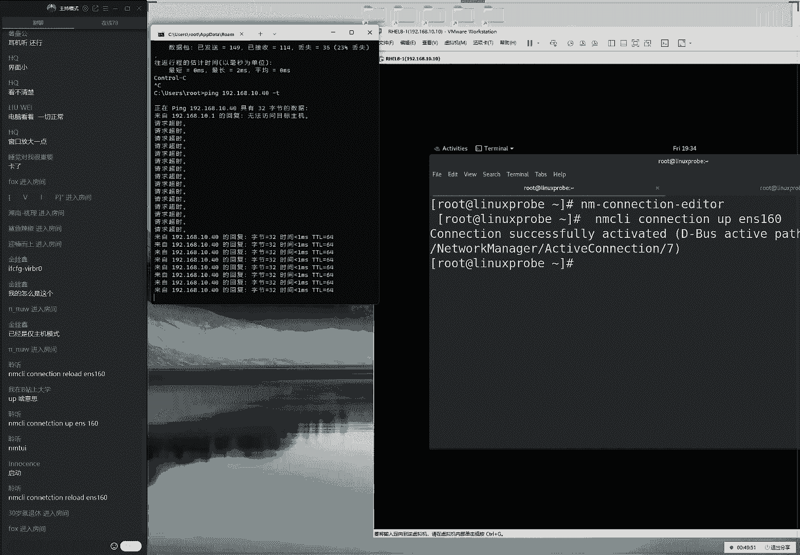
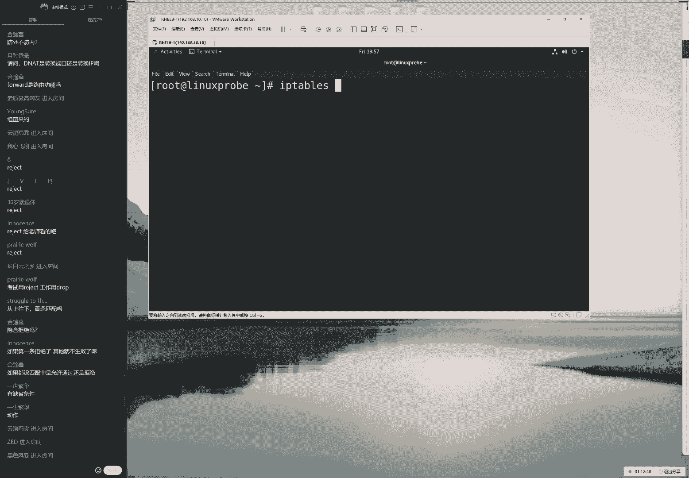
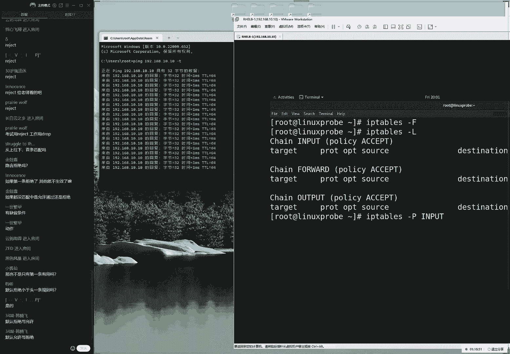
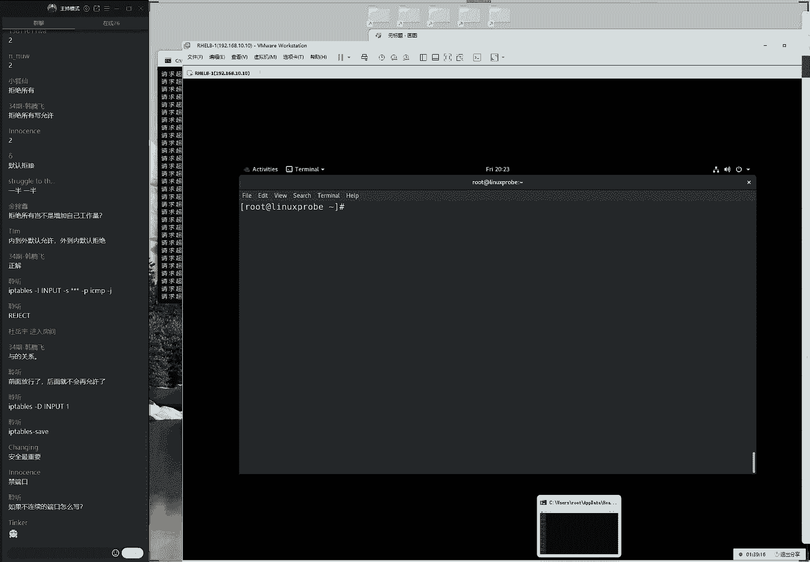
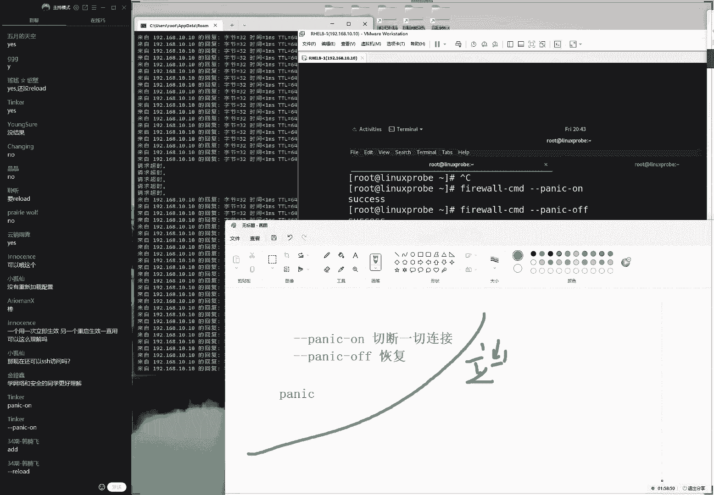
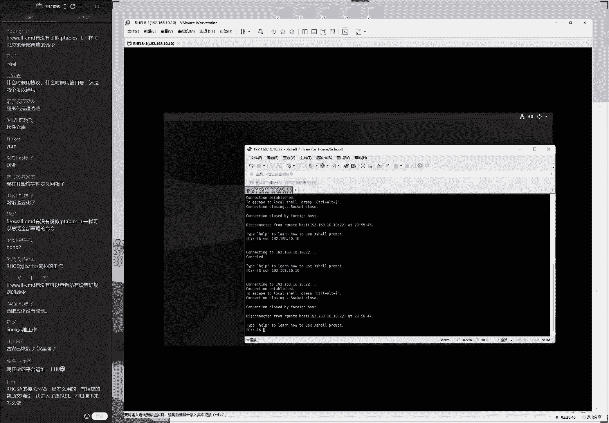
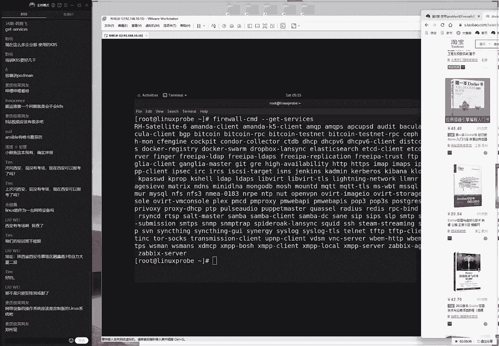

# linux就该这么学第34期 - P12：12【第34期第十二节课】红帽RHCE认证培训课程-Linux就该这么学 - 能力努力 - BV1L14y1878S

both cause i need a door one day，you might be a fl，ok来同学，我们来开始今天的这个课程，那今天这个人数不多啊，那么大家想一下一吧。

我们来开始我们今天这个课程，人越少越好，哎咱们小班授课，唉挺好，那我们来给大家看一下我们今天的欢乐课程安排，我们今天给大家讲一下第八章节，讲一下这个防火墙，那么的话呢我们今天这个课程看起来有点多啊。

但是的话呢其实并不难啊，对不对啊，大家先等一下i一能听好刷声音的同学是谁来了，最后池塘同学叫做晚秋同学，咱们啊大家先打一下e啊，好同学叫，做努力奋斗，同学怎么怎么没有打一啊啊。

那我们打一啊，同学们听到我说话声音了那么大，那我们打一下一咱们测试一下上课环境啊，避免掉这样的话，我们避免如果说这个声音比较小，或者的话干啊，或者我们根据啊，或者我们根本听不到的话呢。

呃影响您的这个上课体验，所以的话我们先去测试一下，但我一开始说话就有声音了啊，但我也呃看上课的话，你就应该能够看到画面了，这样的话才是一个正确的情况，那如果要是有什么波动啊，大家提前做好准备。

然后我们每节课上课之前，的话一般提前啊，那我们啊一般情况下会提前十到15分钟开启这个直播间，同学们就可以来去进入到直播间里面，来去感受一下有没有卡顿这个情况了啊，好了，多说几句废话。

主要原因就是想等一下我们同学们61位还好了啊，不错，我们开始接这个正式的课程了，大家先翻开书看一下第八章节，讲一下这个防火墙，其实啊这个防火墙的话它并不难。

因为的话我们实际上第八章节它是延续的这个6783个系统的，这个防火墙的工具，我们会给大家讲四种方法来配置您的防火，墙，而我们实际工作当中的话呢，只要去选择一个您最喜闻就可以了，也就是说我们的话呢。

今天这个课程会去激励这个6783个系统当中的四个方法，来去配置我们的防火墙，而您只需要去选择一个最喜欢的就可以了，因为他就像是我们的门卫一样对吧，现在因为我们这个小区有隔离嘛，给大家举一个例子啊。

现在比如说现在有一个正门，现在的话呢正门我们安那啊，那么我们现在要有一个正门，这个门口的话呢，它有几个保安，比如说现在有四个表，那我们现在有四个保安吧，就是，我们现在有四个工具来配置我们的防火墙。

这个四个保安里面只要有一个人没有让我们出去，那我们就是怎么样呢，就是出不去的，所以我们学完了之后，您可以去选择一个四个保安当中，四个防火墙配置工具当中，您最喜欢的去配置一个就可以了。

嗯嗯并且的话呢我们也不太建议大家，如果四个都去配的话，还有可能产生这个冲突，所以我们去选择一个您最喜欢的，现在的话还我们还没有讲，那么我们讲完之后的话呢，你可以再去做这个决定啊，先不那么着急好了。

又说了很多废话啊，实在不能再等了，我们必须要开始今天这个课程了，那大家说我们声音有点小是吧，呃声音应该不小，你可以调大s的这个音量跟上节课是一样的，来我们来正式开始第四次啊。

正式开始咱们今天这个课程了，讲一下这个防火墙，在讲这个防火墙之前的话呢。

我们现在去说一下这个网卡怎么配置，因为之前同学们一直在问到丧尸，为什么我配置的这个服务，但是我看不到效果呢，就是因为我们的虚拟机的网络没有互通，所以我们现在先来给大家讲一下这个网络的配置方法啊。

这句话并，不算拖延课程啊，是因为我们之前是一个前置条件，先把网络给他配好了，网络能通信了，然后的话呢我们绘制后面我们配置这些服务的话，才能够看到这样的一个效果，我们换句话来说就是能够去拼得通。

这是一个前置条件，也是一个我们必须要去做的一个基础性的一个操作，来说一下我们的网卡的一个配置方法。

那我们同学也可以一起啊，可以我们来一起去操作呀，这个比较简单，来点一下虚拟机，点一下虚拟机，点一下配置，然后我们点一下这个编辑网络配置器这个选项呃，当我们，第一次安装系统的时候的话呢。

我们选择这个模式叫做金主机模式。

来大家先记一下，how sly叫做金主机模式，他不名思义嘛，就是金主机之间能进行呃来进行一个啊数据的一个交换，叫做这个金主机模式，它只能是虚拟机之间以及我们的这个主机之间来进行一个数据的交互。

这个我们叫做金主机模式，还有一个话呢我们就叫做nt模式，这个就相当于就是把我们这个路由器嘛呸啊，还有相当于是把我们这个虚拟机当做是一个大漏洞啊，当做是一个路由器，可以让我们虚拟机里面的这。

个系统能够去上网，也就是说它是可以去上网的一种模式，我们可以这样去理解，然后的话我们还有一个叫做这个桥接模式啊，bridge这个的话呢则是直接就是呃类似于说我们的虚拟机。

它可以呃去复制我们物理机的这种呃上网方式来去直接去上网，那么也就是说这个配置起来的话，它会更加简单，那么我们来给大家说到，那么我们现在的话只需要让我们虚拟机能够跟我们这个物理机，就是说。

我们现在所说的这个真迹能够进行一个相互的沟通，我们所说的真假，因为我待会的话给大家讲课的时候，我可能不会那么的严格的区域呃，注意我现在所说的这个词到底是啊真机的话呢，还是我们当前使用这个主机。

但是我当时只要说到这个真机都代表的是我当前正在使用的这个系统，所以我们待会这个词的话呢，可能用的比较的宽泛一点，可能用在那，也就是说这两个词的话，那我们可以来进行一个选择性的去使用，到当前能够看得到的。

就是我们当前正在使用的这么一个系，统当前使用的啊电脑，我们把它叫做啊物理机，那么我们待会儿的话呢，要想要他去实现跟一个虚拟机，也就是说虚拟机里面的系统，我们把它叫做虚拟机系统里面来啊。

它要能够去相互进行一个数据交换的话呢，我们就只要去选择这个金主机模式就可以了，因此我们现在的话呢只需要去确认一下，就是您看一下现在有两个这个网卡，那我们来去选择一下这个第一个网卡，哎我们碰到编号为一。

它对应的就是叫做金主机模式，下面的话呢这个八它对，应的就是那个nt模式，我们先先去选择一下这个一啊，叫这个金主机模式的来叫做how long way，可以达成，那我们这样去写，那么我们来看一下这个模式。

首先确认一下它的这个模式为金主机模式就可以了，然后我们当前的话呢已经连接就可以了，那也就是说当前我去确认一下我的这个主机的模式已经启用了，这是需要做第一步事情。

第二部事情的话呢就来编辑我们这个虚拟机的这个网卡，来点一下我们这个右下角选择一下网卡的这个设置，我们看一下，那既然已经启用了，那我那么我，们的网卡有没有呃来去使用它呢。

因此再来去确认一下我们当前的网卡也使用的是叫做金主机模式，ok没有问题，这两点确认了，也就是说当前虚拟机开启了这个新主机模式，并且我们虚拟机里面的系统的话呢也已经使用上了。

这个时候我们就可以来去进行下一步了。

也就是说我们现在使用的是这样的金主机模式，下一步的话呢是打开我们这个电脑，然后我们点一下这个设置，然后我们的话呢我们点一下这个网络，这那我们就以我现在这个主机威力了啊，然后点击这个以太网现。

在有两个网卡嘛，vm net 1，vm net 8，那vm net一指的是那个啊，好啊，他的话指的是金主机模式对吧，我先来看一下，那我们就在windows里面需要找到我们的vm的一所对应那个虚拟网卡。

稍等一下，我不知道为什么我们这个win啊，windows 11每回的这个配置选项当中都找不到他，稍等一下，同学们来网卡吧，我去搜索一下，我搜一下，我搜一下，我搜一下下来，那就是网络吗，因为啊很少啊。

稍等稍等一下，这个很这个很气人啊，学会我们的linux的windows，结果都找不到，来看一下同学们，当我找到他之后，我们点一下叫做，呃配置选项当中我们来点一下这个属性a我感觉不对啊。

这个选项好像跟我们平时用的那个界面不太一样，稍等一下的同学们，我把它找到它，诶，这个界面的话就是我们平常去使用的一个界面了，那么我们同学们啊不管有什么方法吧，只要能够找到这个界面就没有问题。

来找到这个界面，找到这个界面的话呢，我们去双击一下这个v m31 ，它就是我们安装好虚拟机之后，就会默认产生的一个网卡，它是一个虚拟网卡，也就是说它使用这个vm等于一的话呢，跟这个号分类模式进行一。

个数据的一个交互，也就是说我们去使用的是这个网卡，然后的话呢就可以跟虚拟机里面来进行一个交互了，也就是说我们需要把我们当前这个网卡的地址的话，能配置成可以虚拟机里面，系统里面要同一个网段就可以了。

来去双击一下，但是如果说您听我这个没有概念的话，没关系，我来那啊，那我要给大家操作一下，点击一下属性，点击一下这个设置，我们选择一下i p v4 ，那我就把它设置好了，当前我的地址的话呢。

我们的物理机也就是说我们的真迹啊，这两个词我待会待会，那我，们去说两个词都可以啊，这两个词的话呢待会我们可能去混用的来，那也就是说我当前的这个真机的话呢，地址就是幺九二点168。10。1。

然后换了自研码是24啊，那我们现在这个虚拟机里边它的地址的话呢已经配过了，那我们待会儿再给大家配一遍地址的话呢，是幺九二点一八点10：10，可以看到这个的话呢，前三位我们叫做网络为网络。

他们啊网络位相同，钻研码是24，那么换主机位主要是1~254之间，我们就可以进行一个数据交互，因此的话呢我们现在，把它拍好之后，这样啊，当我们都把它做好之后，就可以来去拼凑我们虚拟机的这个内部了。

那么这个时候大家呃可能会问两个问题啊，大家话怎么样说是呃界面有点小是吧，然后呃这个话其实大不了了，但是您可以按照我现在这个步骤再去操作一下。

那也能点的出来，以自己的这个屏幕上面看见比较大，然后大家现在可能会问两个问题，就是我我就是我现在能够想到的啊，大家问的有呃很重要的两个问题，就是第一个问题说老师呃，你这个课程的话。

虽然说是零基础开始去学，但是它，有基于了网络知识，什么是ip，我都不知道怎么办呢，我们今天给大家来去用五分钟时间去说一下吧，然后让大家打消息里面的这个顾虑。

但是的话呢我们今天这个课程实际上并不会面向于c c n a s，c n p中网络课程，用这种知识只能是够用就可以了，来我我我，我现在给大家先简单的去说吧。

就是同学们问的第一个问题是老师到底什么是我们的同一个网段，或者我们再问的俗一点，就是我该怎么配置，我的网卡的这个地址能够跟虚拟机里面能够去啊相，互呃去成熟数据呢，那我们来给大家讲一下。

既然我这个真机是幺九二点168。10。1，然后我们那我们的这个自爆源码的话呢，它后面写的是三个r五点，实际上的话这样的话就代表这是一个c类的一个地址，那我们这个前面的三位我们把它叫做网络位。

然后呢那我们最后一位的话呢叫做这个主机位，也就是说大家要简单去理解吧，如果说我们后面这个啊自源码是三个二五点的话，那么我们的这个前面只要这个前面的三个字段是相同的啊，虽然有点粗糙啊，这么去讲，然。

后换到我们后面的一位，只要范围是1~254之间，那么它就同属于同一个网段，我们来给大家举一个例子，比如说当我们看到的是192068，那但是如果我们今天这节课呢，如果被一个网络老师听见了。

他他可能会很生气啊，因为我们讲的特别的粗糙，但是自己当然啊，但是这样讲的话也够用了，我们这通过这样的一个原则配置出来，这个地址总是他总是能够去进行一个通信的，比如说像这样的一个地址对吧。

那我们看到前三位如果相同，那我后面的这个主机位的话呢，又，在范围内，那么它就指的是同一个网段，它可以进行一个数据的交互，然后大家好像还问第二个问题，说老师，那我现在知道了，但我的资源哪。

为什么有些时候我们看到的不是这么去写呢，它有可能是这么去写呢，写了一个24呢，这个简单给大家去说一下啊，首先原则上来说，我们这个上面的这个写法跟下面的写法等同的意思，他们两个我们去写哪个都可以的。

那么我们就怎么换算过来呢，首先我们所看的这个三个二五啊，就是我们看到这个呃呃255的话，它实际上我们叫做，十进制的数字我们可以打开一个计算器，你可以去看一下，唉，我们来点成这个程序员模式。

我们就是选择一个十进制啊，选择一个十进制对吧，然后我们去输入一个255，然后点击一个二进制，可以换算成就是八个一，那也就是说二进制是八个一，等于就是255。

那于是也就是说111111上面的话呢是不是一个啊，上面就是一个十进制，下面的话呢就是一个啊，上面那话底下就是二进制，然后我们因为我们虽说是一个系统性的一个课程啊，我们讲的是操作系统，我们不。

希望说讲广告支持白啊啊啊，然后本来啊白给吓跑了，我们就表演给大家去说吧，那也就是说我们会把上面那个十进制转成一个二进制，那也就是说如果我们把这个上面的十进制都转成二进制了。

那得到了这个效果就应该就是呃呃那么就是呃呃八个一，然后的话呢又八个一，然后又八个一，然后最后的话呢是零对吧，然后00000000呃，八个零等于就是十进制的零。

也就是说我们把上面这个255给它转换成了二进制之后，得到的是这个样子，那好了，我们就知道了，这个，网络位的话呢，呃那我们知道，那么也就是说它这个前面的24位都是唯一，也就是它是为网络位。

所以我们的这个写法里面有两种写法吗，第一种写法就是写三个五点，还有一种写法的话呢，就是呃那我们就直接写一个斜杠24，也就是说待会儿我们不管大家怎么去配置您的网卡。

待会儿的话呢如果看到这两种写法等同的意思就可以了，好那我们简单给大家五分钟时间说了一下，就是呃什么是同一个网段，以及我们资本页码该怎么去配啊，有这么一个原则性问题，然后再往。

大家可以去搜一下这个cca的这个课程，然后他呃，然后我们可以从对于这个网络知识的话有一个更加深入的了解，比如说一些网络协议啊什么的。

还都是有些帮助的，不过我们作为一个系统性的课程就呃够用了，下面的话呢我们来给大家去说一下，就是我们要想当然让我们这个虚拟机里面的这个数据，能够去互通的话呢，还需要做一件事情。

就是把我们虚拟机里面这个网卡也配置成是一个同一个网段了，那我们，配置起来的话也是有四个方法，我会从难到易给大家去演示一下，你也可以去选择一个，那么你就可以我这个啊为参考。

然后从里边的话呢四选一选一个最喜欢的，并不会像我们似的，在每一次配置网卡的时候，四种方法都去重复来去执行一次，没有必要好同学们，大家理解我这个原则，就是我们现在的话呢是为了给大家讲课。

所以四个方法都去依次演示，但是您去配置的时候，可不是说每次配的时候都要配置四次的啊，大家能理解好，下面我们来开一个窗口，放到左上角，大家看一下，我，们拼一个地址是192016那点啊。

幺九二点一六八点十点是要说清楚啊，电10。20ceo，我有说话，我怕说不清楚会给大家打到我们的屏幕上面来，大家先看一下，加一个杠小t指的是一个啊持续拼的一个效果。

现在来现在的话呢我们去持续拼一个地址为1920~8点10。20，主机是不能够通信的，那于是显示出来一个请求超时的一个报错啊，大家怎么样说，声音有点小是吗啊，同学有其他同学有这个问题吗，正好倒杯水啊。

强觉得声音小吗，如果你要觉得声音小，你打一下二，吧，如果你觉得声音合适的话，打一下一，记得算一下，这个水啊拔凉啊，放身太长了，来啊，声音可以没有问题是吧，那您就是这样吧。

如果我们隔壁同学您的声音比较小的话呢，那么你可以尽量调大s的这个音箱，呃，小学是这样的，如果要是您听起来这个声音很正常的，或者说想学卡顿的话呢，呃最后我们也能互动一下，比如说有同学说卡了。

但是的话您没有卡，但是您也一定要说出来，因为大家如果都不说话的话，那么就呃就会让我们以为大家可能网络都不太好，然后的话呢有一位同学网速是最好的，结果的话他也卡了，就是说想学都已经，掉线了。

但是呃然后呃然后的话呢我们有同学啊，还能上啊，还是能够发出来信息的，所以我们这边的话也会去从此启一下，可能会反复的去重启，咱们这边这个讲个环境，耽误大家上课体验了，所以如果您要是卡或不卡。

最好都能够及时反馈一下咱们这个课的话，其实都有那么强，可能不会说呃太多了，去看咱们的公平啊，所以如果你要卡的话啊，那我们一定要多发几次信息，那我我呃那么我能够看得到好，下面给大家去说一下啊。

就是四个方法来配置一下我们的网卡，然后您从里面的话，呢可以去选择一个最喜欢的呃，我们先不做评判，我们先来给大家依次来去演示一下，您自己去选择，首先第一步来讲一下，第一个方法。

就是既然大家讲到了linux的一切的话，它都是文件，所以我们在配置服务的时候的话呢，他就是在编辑我们这个服务所对应的一个配置文件，没有问题吧，那没有问题，那好了，那么我们的网络它是一个服务吗。

它当然是一个服务了，所以我们可以通过配置网啊，那我们可以通过修改网卡信息的方法来去实现出来，配置网络这样的一个服务的一个效果好了，这个思路有点乱，我来给大家演示一下。

首先找到网络配置文件所对应的一个路径，它的话也是在etc目录里面自由点小是吧好吧，稍微大一点啊，这个大家不用看清啊，这个事情您不用看清，因为呃拼得通跟拼不通，它输出的这个结果是截然不同的，这个非常的短。

然后那我们呃那么我们拼图之后字会特别的长啊，这个的话您不用看清，您可以看到这样的一个效果就行了，下面的话呢我们把右边的这个字稍微放大一点，这个你必须要能够看清这个你必须要能够看清来，现在我们找到这。

个网卡所对应的文件啊。

所对应的一个路径，etc目录里边那system config，然后的话呢是网络配置信息目录啊，network scripts来找到他，这个里边的话呢会有一个以我们这个网卡不。

然后的话呢我们呃诶那我们可以去使用到这个table键来自动补齐，这个之前给大家讲到过，我们可以通过这样的一个网卡名称。

大概能判断出来这个操作系统对吧，我们简单给大家再去回忆一下啊，这是因为时间比较久了，呃如果说我们这个系统的话呢，它是一个五和六版本的话，他们是一个比较早的一个系统的话呢。

那么它就是一个啊这样的一个形式诶，然后它是一个啊0123来去排序，然后我们啊然后呃这样的一个呃网卡名称，那么如果要是七版本的话，它叫做e n o，然后是啊，然后我们这样啊e e e e n o。

然后等一下n o16777728 ，它会有这样的一个名称对吧，然后还有的话e n o啊，比如说33594968啊，那我们可以啊这样的一个名称，这名称它要变了，它的话呢叫做呃幺呃，160或者一或者是一。

个有呃呃呃这样的一个名称啊，192啊这样的一个名称，那我们要以自己的实际为准，所以的话呢我们一定要看一下，当前如果您在红毛肉巴里面，那么您输入的这个名称也一定要以这个实际为准。

我们可以通过这个table键的话来自动补齐，就是我们不要去照抄，因为呃有同学做这个实验的时候，比如说你是在红毛热期里面做这个实验，也其实没有问题，呃之前的话的命令是没有问题的。

但是如果说您在做这个服务的时候，这个名称是有一些问题的，所以您一定要以这个实际为准呃，我们可以通过呃这个table键的话呢自动补齐来去输入一下，或者的话您可以通过我们的f config命令。

来查看一下您实际的这个网卡名称，这样我们可以去看一下，更加的稳妥一点，那就一定要以及这个实际情况来去输入，大家也可以去看一下，就是您看一下这个我们的名称是否跟我一样，如果跟我不一样的话。

大家可以打到屏幕上面，我们看看大家都是什么名称来，我们敲完之后的话呢，进入到这个配置文件里面，第一种方法呢就是通过我们的配置文件的方法来去配置网卡的参数，我们，来直接了啊，我们就不给大家再去装了。

就直接摊牌了，就是我们也会配，点一下a进入到编辑模式里面，接下来的话呢第二步去找到我们所对应的一个ip地址的一个参数行，来把这个十的话呢修改成二零，时间就是修改的这个网卡服务所对应的一个参数来。

我们把它修改成一个二零，然后的话我们点一下这个返回到命令模式下，然后w q叹号保存并退出，进入的冒号模式里面，保存并退出，这个时候，等一下回收诶等等，那我们把文件给保存好了啊。

保存好之后的话呢，可以看一下，左边依然是拼不通的啊，左边的话呢依然是拼不通的。

这个主要原因的话呢，就是我们之前画面要给大家去说，全第一件事情就是lilies中的一切中的一切啊，都是文件对吧，一切都是文啊，都是文件，然后第二句话呢就是我们配置一个服务，配置服务就是在修改配置信息。

或者说叫做配修改配置文件，然后第三的话呢就是要想让配置好的这个参数能够立即生效的话啊，要想让参数能够立即生效，那我们需要去，重启一下所对应的服务，需要重启对应的服务。

张华这个几句话在我们后面的话呢来去不断来进行重复的。

所以大家要记住，就是要想要让我们配置好这个参数能够去生效的话，它默认是病啊啊，他的话在默认情况下它并没有生效的，我们需要您去重启一下这个服务，大多数情况下它才能够去成效，我们去重启的话呢。

命令是这样去写的呃，网卡的命令的话比较特殊，我们呃也不做参考了吧，因为早啊，因为我们在做网卡这个服务的时，候它这个呃配置文件的话呢，需要先去reload一下，再去up一下，我们画的叫做sem。

这个的话呢有点像呃，有点不太一样，我们就不一啊，所以我们就不给大家做参考了，但是可以看到当我去敲下回车之后，一旦把我的网卡信息一旦重启了，并且的话呢左边啊也没有，并且了，当我们修修还好了。

这个配网卡配置参数，并且重启了网卡服务之后，于是你可以马上看到了网络就能够通信了，这就是通过修改配置文件的方法能够去实践出来啊，网，络互通这样的一个效果啊，保证我们这个网络模式它是相同的。

为进主机模式就可以去通信了，然后大家可以看一下，首先我们记一下有两点，第一点的话呢。

如果您要是修改了我们配置文件的方法来去实现出来参数的变更，那么请注意一定要去呃去执行两步，一定要去先去result后续up一下，这个的话result这个操作只有通过配置文件修改的方法才需要去执行。

待会我们会给大家讲剩下的三种方法，其中的话呢这后面的三种方法他们都是不，需要的第二点的话呢，就是如果说您配置好的这个网卡参数它并没有生效的话呢，您要去检查一下。

就是我们啊呃如果按照我现在方法把它配好之后，大家如果没有通信的话呢。

我们一般情况下建议大家再去检查一下您虚拟机的这个网络模式，有我们需要检查两点。

第一点的话呢，就是您这个虚拟机里面的网卡的这个模式必须要为金主机模式。

因为我们刚刚配的这个地址的话呢，配置在了我们的vm一上面，vm的一对应的就是金这个金主机模式，因此您需要我去捋一下思路的同时。

去把这个参数给它配好，第二的话呢就稍等一下vm的一对吧，那第二点的话呢就是看一下这个链接有没有选中，我们不知道什么原因，但是事实就是发生了，我们有很多同学呃，不知道为什么这个选项的话呢，之前是勾过啊。

他们之前是选中过了，但是后来他又被取消掉了，所以如果说这个网络不通的话呢，您去选择一下，把这个选择已经连接啊。

然后我们去点一下确认就可以了，这是第一个方法来配置我们的网卡信息啊，大家话说为什么我的这个名称是这个样子，因为你选的是一个桥，接网卡，然后的话下面第二个问题啊。

不然我们先说第二种方法，第二种方法的话啊，同学们另外提一个问题啊，就是其实同学们想提的这个问题是这样的，为什么我的这个网卡的话跟你的名称不一样。

因为的话呢您所说的这个网卡实际上叫做桥接网卡，是在我们红毛肉巴里面，军机里面都默认都有的，就是这个网卡啊，这个哈我也是有的啊，但是的话呢如果说您没有这个网卡对吧，这就是出问题了。

就是因为您呃去安装系统的时候没有去安装上它，就是我们没有去安装一块网卡，这时，候怎么办呢，也不用着急去选择一下编辑设置。

就是这样的，如果说你没有这个网卡信息啊，也不用着急，选择一下添加，选择一下添加网卡，选择网络适配器。

选择完成，选择一啊，添加好了之后的话呢，去点击确认，再去重启一下您的这个服务器就有了，也就是说您如果是安装系统的时候没有添加网卡的情况下，现在添加也来得及啊，这第一个问题以及第一个我们需要注意的事情呃。

第二个的话呢就是我们第二啊，第一种配置方法，第二种的话呢是通过我们的命令行来进行配置的，因为同，学们会讲到说老师你这个前面一个命令方法好是好。

但是太难了，因为我们看到需要去敲三个命令，大家需要记一下笔记吗，啊我感觉大家还是需要的啊，我感觉同学们你们还是需要的，来，我把这个笔记截图到咱们的屏幕上面吧，或者您现在可以截张图，这个三三条命令嗯。

您可以记得这个书上面不用先不要去手抄啊，你可以截张图，待会儿的话咱慢慢去写，第一个方法命令我啊，就啊我们就给大家啊，我们还给他截张图吧。

啊第一种方法通过配置文件的方法来去实践出来啊，编辑修改，网卡参数的一个效果是第一种方法，第二种方法的话呢，同学们就说到老师，老师这个方法太难了，我们的我们有一个比较简单一点的方法来去实现出来。

网卡信息的电更呢其实是有的，来先把的话呢给大家啊终止一下，然后拼一下10。30。

因为待会的话呢我们要换一个地址再去测试一下这个编辑的效果嘛，第二个命令的话呢我们叫做呃nm q u i命令，大家来敲一下，这个的话呢是基于我们命令行的一个类图形化界面的一个小工具。

帮助我们来配置网卡信息，切完这个回收之后，啊同学们看到这样的一个界面，就证明我们的这个工具的话已经进入了，即便是我们在我们的服务器上面没有图像界面，我们也可以去使用这个工具来进行配置，没有问题。

待会儿另外看到这个界面之后会有点嗯似曾相识的感觉，其实这是正确的，因为如果说您接触linux比较早的话，大概是从2010年开始就有这个工具了，这个工具的话呢。

早年间它不叫这个名字来给大家总结一下，就是说这个命令的话呢，在早年间是他啊，他时间是有的，在红毛real 5个红毛real 6，本里边的话呢也它也是有的，我们是叫做set up，诶，大家记一下。

那么在红毛肉七跟红毛肉八里面的话呢，他改了个名字叫做呃nm toy，所以同学们记一下，大家不要吃亏了，在工作的时候，如果说您是一个老版本的服务器，那么你也可以去使用这个工具，只不过名称不太相同而已啊。

我们这个工具特别的眼熟，2010年到现在我们使了十多年了。

那我们一直用这个工具特别的好使来呃，去进入到这个里面之后的话呢，去敲可以通过这个方向键啊，大家知道这个这个方向键啊，就是我们去玩，游戏的时候使用这个方向键，然后我们去选择一下第一个选项。

代表就是编辑一个网卡，来，我们来编辑一个connection，来编辑一个网络绘画来说，来敲一下回车，现在的话当前我们的网卡名称哎去选中它呃，然后我们来选择一下编辑选项，都是通过这个方向键来进行控制哦。

然后我们按一下这个回车来进行选中，让我们来去修改一下我们的网卡地址，现在发的地址是10。20进行修改，10。30，那我们来确认好啊，三啊大家不能说我啊我们这个参数要去使用一个up操作，是什么意思。

up指的，是启用的意思，实际上我们可以把它理解成就是去启动的意思啊，来我们现在的话呢把它修改成点三零这样的一个效果啊，我的一个参数啊，不是效果，来我们来10。30，后面还可以看到刚刚配置的时候。

后面是写的是三个二五点，现在的话就写的是一个斜杠，24，刚才给大家解释过了，原因就是开始的话呢是两种写法，我们两种写法的话都是被允许的这种写法啊，等会哦，那我们这样的写法的话会给大家简单一点。

来我们写好了之后点一下，ok然后我们点一下这个退出，点一下，这个退出，这样的话呢我们呢我们就实现了对于网卡参数的这个变更问题，然后第二个的话呢就是来去啊，对变更操作嘛，今天用词不是很准确啊。

第二步操作就是来再去启用一下网卡，大家可以关注一下，左边我们去求修改好网卡参数，并且去重启完卡后，马上左边我们的物理机就能够去拼图我们虚拟机的内部了。

这个就是一个简单的一起来说网卡配置的方法了，呃我能够想到的，其实我们在上课的时候，我觉得好老师不应该给知识给大家讲这种东西，就仅此而已了，应该多讲讲排，除的方法，我现在我会去想我的每一步。

我我因为我我在一边给大家讲课的时候，我也啊我也会一直在想，同学们会遇到什么问题呢，同学们在操作中有哪些小细节可能会被忽略掉呢，我能够想得到的，对于这部操作的话呢，我又想到了一个可能出问题的一个点。

就是同学们配好了之后，网络还是不通，这是因为我们安装系统的时候的话，有一个选项，大家可以翻开书，第一节我们安装系统的时候去选择是否启用网卡，当时的话呢我是这么说的一句话，在4月3号的时候，大家还记得啊。

当，时我说说现在画的这个网卡大家可以启用或者不行都可以了，因为我们会在第八章的时候都给大家启用对吧，所以说呃如果说您当时没有去点那个蓝点，没有去启用它的话呢，网卡肯定有啊。

那啊那我换我的网卡可能没有启动，这个时候怎么办呢，您需要这样啊，我们来再重新进入到这个工具里面，选择第二个选项，代表启用一个绘画，您需要把它的话呢去确认一下，我们可以看到前面带有一个星号。

指的是启用这个啊网卡绘画，让我们去选择一下这个呃启用，然后就可以去通信了，可，以看到当我们按下这个取条件之后嘛，然后这边就啊他就不能够通信了，再按一下启用，于是马上可以看到网络又可以通信了。

所以如果说您4月3号安装系统的时候，没有系统网卡，可能导致这一步啊，那么这一步可能导致您配置网卡失败，那么请注意一点啊，那么请注意一下呃。

第三个配置方法的话，同学们会继续想到是老师诶，这个工具的话呢好用是好用，并且的话呢配置起来的话，这个难度也并不高，他只需要使用到这个a m t u i的命令过后。

只需要再去使用的nm c l a connection，然，后说到up后面写的网卡名称in s160 就可以去使用这个网卡了，也并不那么的难，但是的话呢我是一个呃比较喜欢啊漂亮界面的一个同学对吧。

那么我想有一个非常漂亮的一个工具来进行配置这块，他太丑了，怎么办呢，我们可以来继续讲第三个方法，如果说我们对于这个颜值有要求的话，我们可以有第三个方法，这个话呢我们就叫做网络配置器编辑工具来啊。

connection editor，来同学们打一下这个命令，我把字稍微大一点点，这个的话就是一个图形化界面的一个网卡配置工具啊，network connection editor网。

络绘画编辑器选项来敲一下，回车来，同时我们进入到这个界面里面了，如果说你这边前面两个有点太丑了，那么我们下面第三个一定让大家能够满意，来去双击一下，我们要陪要要要我们要想去配着这个网卡信息。

还是去选择一家ip d啊，i我们的ip地址修改成啊10。40没有问题吧，然后选择一下保存，点一下这个关闭，其实对于途家界面的话呢，我讲的一我话讲的一直比较快一点。

因为我不太希望大家一直基于图像界面来进行操作，因为呃我们这个界面里面的所有按钮的功能，是被呃写死的，如果说我们要是太依赖于屠杀界面的话，有些工作我们感觉不是那么的灵活。

我们还是建议大家使用前面两个方法来配置您的网卡，但如果说在考试的时候，我们希望大家能够通啊，那我们能够通过图拉界面来去完成，因为这样的话呢它会更加的呃安全，我们避免了我们输错参数这样的一种可能性。

来再去启用一下网卡，启用好了之后，看左边马上就能够去通信了，这个的话呢就是我们第三个方法，通过图形化界面来配置网卡参数的这样的一个方式来，现在就是第三。

个方法配置我们的网卡，通过通牙界面，还有第四个方法的话呢，实际上更加简单了，如果大家觉得那好了，那我知道前面三个方法了，但是的话呢我还是需要最简单的方法，我也是需要去输入两条命令才能够去完成，那么老师。

那你告诉你一个方法呃，我不用去输任何的命令，我就可以去实践出来网卡参数的这个修改，我们该怎么去实现呢，最后一个方法就是通过图形界面这个小电脑。

然后来进行一个操作，它不需要去输入任何的信息，我们把真机就是这个物理机，拼物理啊，拼虚拟机里，面这个地址的话呢拼成dn 50来修改过后再去测试一下这个效果，敲完之后又不能通信了。

因为点五零这个主机还没有在线呃。

去这样同学们打开我们这个虚拟机的图形化界面，这就是基于我们图形化界面来接它，它才能够进行一个操作了，嗯然后的话呢我们来点击一下这个编辑选项，选择一下这个有线网连接选项，再来选择一下网络设置。

其实这个好简单啊，我们如果我们说啊没有给大家讲的话，其实可以自己都操作出来了，这边的话呢再来看一下这个网络已经启用了，点一下，这个小齿轮哎小点，这个小太阳也那么也可以来我们点一下这个点一下这个小齿轮。

然后的话呢我们来看一下这边有一个i p v4 的一个选项的一个菜单，这算是菜单吗，测试按钮吧，或者是呃这是一个菜单，让我们去选择到这边有一个选项啊，地址选项当中把四零改五零点一下，应用将来怎么样呢。

您啊那么您只需要把这个蓝色的按钮给大家点击of再给点一下启用，于是可以看一下左边，马上我又能够去通信起来了，这个的话就是我们通过我们的图形界面的方式来去实践的配。

置网卡这样的一个方式呃，所以这四个方法同学们你们更喜欢哪一种呢，就是告诉我1234就可以了啊，然后我们后续的话呢可以更多的去偏向于某种配置方法，会给大家多去演示几啊，会给大家多去演示几遍。

然后以后的话呢我们也会把这四个方法呃，虽然大家会有偏好嘛，但是我们也会给大家按照这样的方式1234来进行配置啊，大家问了啊，大家问了一个问题，大家都第一种啊，比较好是吧，行好。

大家比较喜欢通过配置文件的方法去实现，大家说能讲一下去使用的呃，我们，的命令查看网卡状态，这个命令配置我们的ip地址吗，这个我们讲不了，因为据我所知它是不能够配置网卡信息的哦。

我们其实还有另外一个就是第五个方法，我们叫做n m c l i，它可以配置，但是同学们你们说那个命令是配置不了，它是用来去查看万卡信息的，这个的话呢也可以配置，第这个是第五个方法，但是我们不给大家去讲。

他们画这个原因，就是前面四个方法已经能够去适应所有的工作场景了，我们没有必要去使用第五个方法配置，第五个方法，基于纯命令行去配置起来，参，数巨长无比，同学们，我们会在后面大概是在明天给大家来做一下演示。

您可以去感受一下，所以这个没有必要啊。

我们没有必要好，我们没有必要用这样的非常非常复杂的方法来进行配置，下边的话呢我们来继续来给大家去说啊一下这个防火墙了。

前面的话都算是铺垫啊，主要是为了能够让这个网络能够通信，这样的话我们配置好防火墙之后。

我们才能够看得到这个实验的效果，大家能理解我现在所说的啊。

下面就来给大家说一下这个防火墙了，把它给删掉了，然后把它给删掉了下，面的话呢我们再来我们来说，那我们来说一下这个八杠一，这个八杠一的话指的就是我们这个防火墙了，那我们来看一下这张图啊。

图片八杠一它指的是防火墙的一个作用，那么什么是防火墙呢，简单来说一下，实际上它就是为了保护我们这个公司内部，或者说我们这个家庭内部的一个安全性了，有点相当于就是我们的防盗门，以我们的企业为例。

你说企业为什么要花钱去买一个防火墙呢，它无疑不就他就是为了保护我们的这个公司内网的安全对吧，呃也就是说公司花钱买设备主，要是为了服务自己，主要是为了保护内网的安全，这个的话呢是一个基本的一个作用。

那么我们就像他那把比一做，就是我们家庭内网当中我们的方，那就是我们的这个方盗门一样，家里面为什么要安防盗门呢，是为了防止外部的坏人进入到我们的家庭的内部，所以我们才需要一个防盗门这样的一个设备。

这是我们去购买这样的一个设备的一个原因，好那我们先来给大家去说一个简单的问题，给大家举一个简单的问题，我们之所以这样去说，主要是建立在一个假设上面，就是内网和，对不对，来大家告诉我呃，一般情况下来讲。

因为我刚才所讲的一些事件都建立在一个条件之上，就是大家一起说是不是我们这个内网是比较的安全的，那么好了，我们需要买一个防盗门来保护我们这个家庭内部不受外部的坏人的啊，这么大这么一个破坏。

所以我们就要买一个防火墙呃，家里边的话呢很少有人说买了啊，那啊那我们去装了门之后，是啊说啊为了不让家人出去对，不对，他们主要为了防他防止外人去进来，那么也就是说这个门它是在那儿的。

但是的话呢我们主要的功能是为了防止坏人进来，但是又有一个问题了，房他这个门是在那的，我们又啊，那我们又可以出去，这个怎么去理解呢，所以说我们这个在传统上这个概念上来讲的话呢，我们这个叫做3。5列啊。

我们来现在的话呢我们现在已经不提了啊，他的话现在提的方法是通过我们之前不是他，他的话是通过我们这个呃流量的位置，跟这个呃发起的位置来去判别它每个作用，那我们比如说，现在有一个流量啊，这可能比较抽象。

我先给大家画张图说如果有一个流量，留下我们的内网的这个话对于我们来讲，我们叫做input类啊，大家说一下啊，这个啊门它都在呢，这个墙的话它也是在那它不仅是可以防护外部到内部，他也可以做做很多这个事情。

不但是我们主要做的事情还是为了防止内啊，他为了防止外面的这个坏人进来嘛，这个流量的话呢我们叫做输入点，叫做唉input桥店呃，比如说现在的话时间是2022年4月29号，那那么我们今，天的话呢一到月底了。

该发工资了啊，对于我们来讲是一个输入的过程，所以的话呢我们把它叫做输入的流量啊，这是我们要去做第一个事情，第二个事情的话呢，如果说今天啊我们的小区没有被封的话呢，可能尽量要去庆祝一下，要出去吃顿饭。

那好了，那我们如果说请女朋友吃了顿饭，那么对于我们来讲的话，就是一个输出的一个过程了，叫做输出流量，大家记一下，他有啊，他要有进，它有出对于我们如果吃了顿饭来讲的话呢，它是一个输出过程。

它只是输出的一个流量啊，这是我们的两个流量了，还有第三个流量呢，还有我看一下呃，第三个的话呢叫做这个转发链，那这个话叫做转发链forward了，那我们如果说这个信息它并不由我们自己来进行处理。

那我们可以来进行一个转发链，我们把他的话转完再去转发，转发到一个第三方的一个电脑上面，我们叫做这个转发链，还有的话呢还有两种，我，们一个的话呢叫路由，前一种叫路由后，这个的话呢主要是对啊pro入侵。

还有叫做post rout，它的话呢主要是对于我们这个在做我们的呃地址的一个分配的时候，我们才会使用到了一个路由器，都还有一个呃路由后转发，但是的话呢我们大多情况下就是我们去买一个防火墙。

主要是为了防止从外部到内部的这么一个信息，这么一个控制好，那也就是说现在的话如果一个流量它的这个方向的话呢，是一个从外部到内部的一个流入，那我们一般情况下就要进行一个控制了，那我们当匹配到。

一个流量之后该怎么来进行一个控制，大家说防外不防内部，它不是这个意思，因为我刚才就在想这个问题，怎么那那那我们就需要怎么给大家解释，他不是防卫不防弹啊，啊他他他的话呢。

这个是根据我们这个所定义的一个位置来进行一个呃限制的，那我们比如说把这个方法形的这个规则写到对应的这么一个呃，这怎么讲呢，我们的一个嗯规则的这么呃，这个我们把所有的这个防火墙的这个规则写到哪个位置上面。

他就会去生效，我们来给大家做演示吧，因为我家在想，但是很难去，解释，因为这个比较抽象，这也看不到好，那我们现在给大家说一下，说一下，当当我们匹配到一个流量之后，那么我们该怎么样对于这个流量来进行控制。

它的话，如果说有一个流量它匹配到他啊，他匹配到之后的话呢，它有四个这个处理的这个方法，第一个方法的话呢我们来进行一个放行，第二的话呢我们来进行一个拒绝，第三的话呢也叫做拒绝，这有点稍微有点抽象。

我想半天，我说怎么给大家解释一下呃，流量的这么一个控制呢，但是很难我们再给大家演示一下吧，所以当我们写错了，啊规则这么一个位置之后的话呢，规则练它也不会生效啊，我们需要写的啊。

需要把规则写到对应的一个呃规则链上面，它才够，它才能够去生效，还好我们还有第四个记录成一个信息保存到我们这个服务器里面，也就是说当我们这个流量被匹配到了之后，它有四种方法来进行唉。

叫a c c e p t啊，叫做允许来着上一下，他要当匹配到一个量之后的话，它有四个处理方法，这个特别的抽象，所以我们在给大家讲课的时候也很有压力啊，再给大家讲，怎么能举个例子呢，呃当我们匹配到一。

个流量之后，那我们该怎么进行处理它，它它它又是产生了分歧了，它有四个方法，第一个方法的话呢我们叫做允许它，以字面意思来说他要做允许，第二种的话呢是叫做拒绝，第三种的话呢也叫做拒绝。

第四的话呢记录长信息保存到我们这个电脑里面，那我们其实的话呢比较简单一点，就是这个对于流量的放弃，现在就是说它指的是能够让流量去流入到我们这个服务器的，这个内网里面，就是说具体一个方形流量这么一个过程。

那么这两个的话呢，下面两个拒绝的区别，主要就是说这，它指的是不能够让这个呃用户流入到啊，同时的话呢那啊他不会给用户一个回血啊，不会给这个对方一个反馈，然后呢我们下边的话呢是啊。

既不让流量进入到我们这个电脑当中，又会给对方一个反馈，我要给大家举一个例子吧，因为这个其实比较抽奖，会给对方一个反馈呃，这两个区别举例来讲，比如说老刘现在正在讲课啊，那我们现在正在讲课，换一个小红人。

然后这边还有一个门，也是一个防盗门，然后现在正，在讲课，坐在椅子上面，正在讲课，如果说当当有人敲门了，这个时候啊，那我们会说啊那啊那啊那啊，那我会去询问一下啊，对方是谁，那么如啊。

我们比如说啊对方说是我们的家人好了，那么就可以做方形，当有一个家人啊，他可以就流到我们这个内网的话，这个流量它就是一个从外部到内部的一个过程，那么我们本来就叫做允许来。

我们写下第一个叫允许这个超级好理解，这个不用多说，但如果说当当一枪轮说谁呀，那说我是一个卖保险的啊，那么好老刘是不需要的，对不对，那么这个时候，我就可以说啊，我们的话不需要。

那么这个的话我们把它叫做诶拒绝流量，他就是说我那么我那么好，我们会明确的去拒绝对方给我们这个流量信息，第一点就是它有两个特点，第一个就是对方依然是不如他，他是不能够进入到我们公司内网里面的。

因为我呃因为我们给拒绝了，它是不能够进入到底啊，我们这个公司服务器里面的，第二的话呢，对方会明确的知道我们把它给拒绝了，这个大家能够理解的，就是我们现在的话呢对它进行拒绝的这个信息也会给大家回想过去。

对方会知道，啊一我不能够进，第二的话呢，对方把我给拒绝了，那这是我们第二个场景，比如说当当他又敲门了，然后我说啊是谁，如果说他说他他是卖保险的对吧，但是我们一看这个啊，这个话他这个啊信息啊。

我们来查看一下，比如说它里面的话呢还还有很多刀啊，或者病毒这样的这个东西，拿一把刀，并且还呀还不是一个人来的啊，打了十个人来的出来讨债来的，这种情况下的话呢，我们肯定也不能让对方进入到我们公司内网里面。

并且的话呢我们还要做到什么样的默不出声，这个时候我们叫丢，同时的话呢对方是啊得不到我们的回想，他不知道我们是在家还是不在家，他不知道我，那我们是在家，然后我们不处理，还是说我们不在家。

它可以去隐藏我们这个服务器的一个状态，那我们呢我们可以让对方去以为我，我们这个服务器它没有是在线的这样的一个状态，对那这是两个这个拒绝量的一个区别，那么我们现在给大家提一个小问题啊，这那我们知道了。

那我们这个呃两个的这个区别啊，drop，然后我们这两，个的区别，那么在考试的时候该如何去选择呢，啊这啊这呃呃我们给大家提一个小问题吧，就以这个为例，请问在考试的时候该如何选择。

比如说现在要求考生请你去拒绝一个流量啊，来自于某个地址的一个某个流量，请你把它给拒绝掉，请问您现在该去选择哪一种，db还是reject，这两个好像看起来是相同的，都是拒绝。

而且的话呢红帽考试是一个只看结果，不看过程，那是不是我选择哪一种都可以呢，大家就说叫做我，那我们应该怎么去选择，叫做拒绝流量，对不对，哎我们需要去选择这个流，量大家一定要记住，千万不要去db对。

他要给考，他需要给老师看吗，不他是给脚本判卷子啊，红帽考官的话，它是以脚本判分，那如果说我们去选择第一种的话，对方的这个脚本他是看到我们是请求超时的，他是反映不了的，他不啊。

他并不会知道我们这个是防火墙配对的，把这个端口号给他禁止了，他还是对方往前掉了，大家能理解吗，就是他在通过脚本来判断的时候，它无法判断出来到底是我们的防火墙配对了，还是我们这个呃网还他啊，防火墙配对了。

还是我们这个服务器网线掉了，所，以我们一定要去选择第二种方法来进行配置，大家一定要注意一下，这是考试的一个小技巧，那我们这个知道这个之后吧，同学们刚又在想，怎么能够去让大家解释一下这个规则链呢。

因为我们现在讲了有我规则链，那么什么叫做输入量，什么叫做这个输入流量呢，实际上叫做3。5链，它这个链的话指的是他这个所对应的一个方向跟位置，当这个流量从哪里来的时候的话呢。

它这个方向决定了它所对应的一个规则链，那么什么叫规则链呢，规则链指的是这样的防火墙的规则，有一个，特点它是这样的，它会啊有很多规则，然后的话呢从上往下来去写。

但我们把大量这个规则给大家总结成一个整体的话呢，我们把它叫做规则链啊，然后我们可以作用到某一个啊方向上面，那我们比如说这是一个流入的一个方向啊，我们可以加上去结交的规则链，然后呢我们就有很多和这个规则。

规则的话它有两个特点，第一个规则啊，我们啊就让我们来给大家解说，第一个特点就是一个从上往下做匹配，什么意思呢，如果说我们现在有很多个规则，因为现在有这个呃很多这个限制啊。

比如我们小区现在的话呢外卖不能进好很多这个啊，那我们先先先啊，现在说很多限制啊，需要做核酸才能进，比如说我现在有几个啊，这样的话几个规则，第一个规则是说你需要凭48小时核酸。

你才可以进入到这个小区里面好吧，那我们来说48小时核酸结果才能进啊，进入到小区里面，然后第二条的话就是小区的外卖啊，外卖小哥可以没有核酸，结果就可以进入到我们这个小区里面，因为他们需要送物资。

这没有问题吧，啊这个啊这个啊，那我们现在这时候给大家去讲特别的，啊特别的好，因为大家对这个都有啊，因为我们这一对啊对啊，都说啊都非常熟悉，这第二条，第三条的话呢，比如说所有的男性啊都可以进入到小区里面。

比如说有这么一条规则啊，虽然不知道为什么这么去写，但是他如果要是有的话呢，它的这个匹配的规则，第一个特点就是一个从上往下做匹配啊，防火墙的策略是从上往下做匹配，如果说从上至下。

如果说我们要写一个方向的规则，他呃比如说我现在的话呢，我是一个外卖员啊，但是我没有核酸，那么我现在的话它是从上往下做匹配的，他会先匹配到我们的这个第一条，再去匹配到我们的第二条，然后画第三第四第五。

那么它会上这样的顺序来进行匹配，他会说第一条就把我们给拒绝了，对不对，因为我们当前没有核酸结果啊，这样的一个特点，它是又从上往下做匹配，第二点的话就是那如果说我现在是个外卖员，我没有核酸结果。

但是我符合第二条啊，那我是否能够进入到小区里面呢，是不可以的，第二个特点就是匹配啊，叫做匹配到季节止，也就是说我们一旦把你匹配到了啊，只要有啊上面有上面的话是有一条啊，配，对啊，配套截止配套结束。

如果上面有一条白金匹配到了，那么你符合要求的话呢，则结束即便有下面的更加的适合于你的条目，它也不会去怎么样呢，为你去进行一个配啊匹配了，因此根据这两条的特点，同学们能够心理上是不是要有要有点呃规划了。

就是我们要把那些更加的精准的，更加的重要的那个策略方，那我们需要往上去写啊，大家记一下，所以根据这两个的特点，您需要把更加精准的，比如说现在的话呢我需要描述一个人，我不能说他是一个男人。

这样的话太宽泛了，我可以说，啊比如说这个男人的话呢，上面的话呢啊头发比较少，脸画脸上有三颗痦子，然后呢嘴话呢这个啊也是比较大，信息越精准，它匹配起来这个流量的话就会跟大家准确，会错误地去影响别人。

好我们这样的一个效果好，所以大家记一下这两点的这个特点，下面来给大家去说一下，就是我们今天的话呢如果时间允许的话，会给大家讲四个方法来配置我们的防火墙，第一个方法没有跑了，ip tables。

这个的话呢是一个我们在2015年之前会，去用到的一个防火性能配置工具，它是基于我们这个内核去实现的，呃大概是在2015年之前呃，工作当中的话呢，你又不能够避免你以后不去使用到老版本的服务器。

所以我们现在先来给大家去讲这个，但是讲完之后就可以把它忘了，因为呃以后用的几率可能并不会很大，用到之后的话再过来查也来得及，不要把重心放得太多，然后第二种方法的话呢。

我们叫firework gc md跟firework on config，他的话这两个是基于两个，当然了，同学们如果，你们公司正好正在用这个ip tables的话，那么就说明啊这个学着了。

正好一学员就能用啊，但是我们要给大家去说两个啊，另外两个这个的话呢是在我们红毛肉七跟红毛若八当中去使用的，这个是一个基于我们的文额叫做文字界面，也就是我们的命令行的一种配置工具。

这个的话呢是基于我们这个图形化界面的一个配置工具，今天我们给大家讲两个呃，呃我们将我们这两个都会啊给大家去讲，这两个的话，我们统一把它称作叫做firework这样的一个防火墙的配置服务。

就给大家理去理解一，下啦就是说这个的话呢是我们的服务名称，而我们左边两个的话呢是我们的配置工具的名称，我们再说配置一个呃某一个服务的时候，实际上要通过它的配置工具来进行修改。

比如说同学们速度服务就要去使用到vr速度的服啊，配置工具来去实现是一样的vi速度，也或者的话呢像我们这个crown的计划任务一样，它需要去使用的crown top一样，所以我们在配置一个服务的时候。

可不要去敲这个名称，这个名称它是服务名称它是不一样的，这是第一啊，这是我们的前三个，还有最后一个卡是，一个卡bug一样的这个级别的一个工具叫做pokepit，那这个话叫驾驶仓库。

我们会在最后会给大家去讲，如果今天来得及，今天应该来不及哦，哦哦那么我会在明天给大家去讲这个服务的话呢，就是一个像卡bug一样的存在，如果同学们觉得前面讲的比较难，或者的话，哪怕今天后面都没有听懂。

没关系，只要就是甚至来说嗯，稍微夸张一点啊，他只要把这个掌握清楚了，他就能够考试通过，就是这么一个卡bug一样的存在，所以的话呢红帽考官到考纲里面是没有是啊，这句话，所有教材里面他也是没有的。

但是的话呢我们阴差阳错的在2020年的时候，我们在年底做测试的时候，发现了在红帽这个叫做e p l和这个基本仓的仓库叫做bass os里面，这个服务的话就是可以通过图像界面，通过网页配置一切的呃。

配置基本上是一切的这个选项跟参数跟我们的服务器的一些性能，但是的话呢红帽考官里面，是没有给大家提到的，这个也算是一个卡bug，这个大家可以当做是一个兜底嘛，如果考试的时候我们前面都忘了。

那么你可以去使用第四个方法来去实现，它，不仅可以配置防火墙，我们之前讲的所有的仪器新建用户啊，防火墙啊啊，还有我们的分区格式挂载去做rl lvm都可以去使用这个去实现。

所以这个工具的话大家就知道就可以了，我们千万不要哦。

我们千万不要外面去乱说，因为当前考试的时候，据我们的反馈。

而且已经有了很长时间了，我们同学们在考试的。

时候会有一定的这个学员会去选择这种方法来去实现，因为红帽考官的话呢，不看过程的，他只告诉你一个需求，说比如说分出一个分区300兆，他不看你怎么去完成的，所以的话呢方法去呃自己选择我。

那我我们这个方法的话呢就是完全忽略掉了，可以啊，完全不用任何的命令行就可以去实现这样非常凶残的一个命令来，现在给大家去讲第一个啊，虽然不用，但是我们要去学嘛，第一个命令叫做iptables啊。

大家一起来说说叫做iptables，他的话呢是一，个纯居命令行来配置防火墙的一个工具啊，它是一个内核级别的，来看一下表格八杠一啊啊啊表格八杠一大家问的一个问题，大家说如果第一条拒绝了。

那我们现在就不生效了吗，对如果第一条把你给拒绝了。

那么其他剩下的如果再有啊，把你进行一个预啊来啊，进行一个瞎操作，这个策略都不生效了啊，匹配即结束，好来看一下第一个参数，表格八杠一来看一下一个大写l，我们就按照我们这个实例来给大家去讲了。

大写l指的是查看一下当前防火墙当中有哪些默认的策略，因为我，们想给大家提到说策略策略策略策略有哪些，怎么去看呢，看到策略是有这些啊，看到输入流量它的话，这个默认的策略有四条啊，他这个是有四条好。

大家问了两个问题，大家说说，如果没有脾胃重，是允许通过还是拒绝呢，这个要看默认情况。

他看的是这个默认的策略，它有两个啊，他还是有两个写错误的方式的。

我们来给大家去说吧，然后下面还有一个问题，大家说说，那岂不是只有第一条有用吗。

同学们这个理解是错误的，这个理解的话是这样的，呃，如果这个这个其实这个问题不用给大，家回答啊，是这样的，如果啊，那我们这么我就这么还给大家说一下吧，这个问题问的挺没有水平的啊，是这样的。

如果说我们现在的话呢是有很多条这个策略，然后的话呢我们是否只有第一条升降啊，当然不是了，因为第一条可能没有被啊，因为我们如果作为一个流量的话，第一条我们没有被解决上啊对吧，我们第一条我们可以没有我呀。

第二的话他也没有我第三条在匹配上的啊，所以他是直到匹配上了才结束这个匹配，而并不是说只有第一条才匹配成功，所以大家一定要去思考一下，啊不能说我们给大家一个就是这么一个灌输的一个过程，一。

但我就我们一定要去思考啊，然后大家现在问的另外一个问题就是老师，那我们如果说我们现在有很多条这个策略，这个啊问题是很好的说，那我们先很多条策略，然后的话呢我们现在从上往下做匹配，并且的话呢匹配到即截止。

那我如果说动啊，他那那如果说我们都把它给错过了，怎么办呢，如果没有一条被匹配到了，我们该怎么去处理呢，这个时候它会有一个默认策略，最后是兜底，我们默认情况下的话呢，默认情况下是允。

许如果说没有被被围大的话，a c c e p t那么则默认放行所有，那么如果说我们可以把它修改一下。

修改成默认拒绝，指的是默认拒绝，当我们看到默认情况下，它是呃允许所有我们写的是拒绝规则。

那么如果说我们可以把修改成叫做拒绝所有。

我们则写的是一个允许规则，待会啊我们和大家举啊，但我们和大家举一个例子，现在先来给大家说一下啊，ip tables，然后穿了这是一个杠l，显示一下已有的这个策略有哪些。

我们现在的话呢可以去加一个大写f指的是列举一下当前我们呃不，呸呸我们是来去清空一下已有的这个策略，来敲一下，回车来再来去查看一下，会发现我们的策略的话呢已经被清空掉了。

我们现在的话三个这个规则链里面都是空白的，大家问另外一个问题，大家说我们的默认拒绝小于头一条策略吗，啊稍等一下啊，大家问一个问题，大家说默认拒绝小鱼头一条策略吗，呃没有理解啊。

腾讯在可以再对您的这个问题再去来进行一个细致的描述啊，然后后来我们来继续来给大家去说，你为我们讲课的时候脑子不太好，我也觉得不太够用啊，所以同学们，尽量把这个问题描述的更加清楚一点，特别好。

不要那么慢啊，一定要快起来，来，我们现在来的话呢，再去清空之后，可以查看一下规则链里面就没有规则了，那么同学们现在问了一个问题，同学们问了这个问题，我觉得非常好说，如果没有被被匹配到的话。

那我们则默认是允许全部还是拒绝所有呢，那么这个的意思就是说我们的默认生下来这个测到底是什么。

当前是允许所有，所以我们可以看一下里面没有规。

则这个情况下我们去拼一下内部好不好，那拼一下当然好了，去看一下效果，这个实验啊一定要去频繁去测试一下效果，同学们啊，我来给大家演示一下，要光说理论有点抽象。

来看一下啊，偏通没有问题吧，好因为我们默认情况下没有策略，则允许全部这啊，这是啊他啊他是这么去理解的，好同学问到说老师，那我能不能把它修改一下呢，当然可以，我们其实我们希望咱们这个课的这个进度更快一点。

我不希望说我们上课的时候，像我们就日常上课嘛，然后去提问题，大家去思考，我们希望能。

够去更快去互动起来，所以同学们一定要互动起来稍微快一点，你可以打一或打二啊，这样的话呢我们就啊告诉我是或不是就可以了。

大代表就是默认拒绝所有了，我们一个gp ptol来去协议表规则列设置一下ptol，再去查看一下，看一看到默认的规则链设置为拒绝，那好看一下左边拼的这个请求就被拒绝了，也就是说如果没有规则的情况下。

我们则默认咀嚼作用，给大家举个例子，这个例子的话其实不用举了。

大家大家大家都明白了，但是我依然想给大家去举，因为我觉得那个例子啊，因为我觉得这个例子举的特别的好，呃，什么叫默认允许所有呢拒绝拒绝的规则，比如说现在有一个公园啊，以我为例叫龙潭湖公园。

我因为我住的比较近嘛，嗯比如说给大家举一个例子啊，举个例子大概五分多钟啊，大家能够立马就明白什么叫做呃默认允许将默认拒绝，我这边有个公园叫叫做这个龙潭湖啊，大家如果要是有机，要是有机会的话呢。

没准还能碰到我啊，叫龙潭湖，如果有一天啊，不不不，我先跟大家说一下啊，现在去说一下龙潭湖的一个基本的一个，呃情况就是默认的话所有人都可以进啊，就是说它是一个免费的一个公园啊，任何人都可以进入。

没有这个没有问题啊，这个公园默认的条件是素人都可以进入，它是一个兜底，刀啊刀啊，然后啊到夏天的时候啊，喜欢去钓鱼啊，然后就是把壶里面这个鱼都给钓走了，有一天我就发现啊，然后拿着几个鱼筐就出来了。

然后哎还然后还特别生气，是为什么呢，因为他们钓鱼被发现了，于是的话公务员把他们的那个头像啊给拍了几张照片，放到公园，的门口了，但是的话呢其他人都可以去进入到这个里面，也就是说默认是允许所有的。

然后的话呢我们单独去写拒绝规则，这个叫做默认允许所有续写，具体规则这样的一个情况，还有一种情况是这样的，比如说但是我没有去过啊，好像每年的会费是50万美元啊，才能够成为你们的会员啊，我也是啊。

看人家网上百度上说的啊，那么这种，汇总的话默认情况下就是没有人可以进去进入啊，默认没有人可以进入啊，默认啊默啊，默认任何人都不能进入，没有人可以进入，不叫做任何人吧，不能进入，这是他默认兜底的一个策略。

然后的话呢如果说我们要是有钱的情况下，您可以去买它这个呃会员啊，会员非常贵啊，那么您就等于说开了一个白名单，我们单独去写一个允许的策略，如果说我们默认它是一个拒绝的话，我们去写一个允许策略。

只有我们允许策略语言匹配到您了，那么您才能够去进入到里面去，这个就是默认拒绝，作用，然后我们去写允许规则好，下面给大家提一个小小的一个小问题，请问如果这两种情况我们都可以去选择的话。

您认为哪种更加的好呢，大家理解一下这个问题，就是请问这两种您认为哪种更好呢，允许所有，然后我们去解拒绝更加安全还是拒绝所有，我们去解允许更加安全呢，大家可以去思考一下，这个是一个呃。

其实没有一个绝对的好或不好，因为这个容易产生歧义，但是一般情况下我们会认为拒绝所有会更好一点对吧，我们来进行一个单独的对这个没有问题，我们会因为我。

们会认为我们去拒绝所有额之后单独进行这种全新的设定更加精准，可以让我们这个服务器只让允许的人流入，只让允许的流量的啊，流入的方向的流量来进行一个呃进入，这样的话还会更加安全一点，这个没有问题好。

下面就来说说，完了之后给大家说一下该怎么去写了，今天理论有点多啊，理论有点多，同学们有点太痛苦了，下面给大家去说一下。

那好了，现在就是拒绝所有，对不对，因为它是默认拒绝所有，有没有任何的题目，也就是说默认区啊，拒绝所有了，那我们该怎么进行放行呢，来看一下叫ib table加一个大写i啊，input指的是规则链。

五个练啊，练的话呢还有它指的就是我们流量的一个方向，input指的是流入，然后呢output指的是流出，还有一个forward做转发啊，不由我处理啊，踢个皮球给别人去，今天我就遇到了啊。

如果今天你这个啊弹窗了怎么办呢，会有一些相关部门帮你去处理的时候，就会帮你去做一下这个forward，帮你做一下转机，哈哈叫路由器路由后转发，这个我们会在后面给大家去说，这个会在后面给大家去说啊。

路由器路由后转发，那也就是，说现在的话对于我们这个流入的过程。

因为大家想一下，我们现在是真机，我们来去流入的啊，那我们现在发送流量到这个虚拟机里面，对于虚拟机来讲，它是一个流入的过程，所以我们叫做输入的流量来，既然是一个小小s，看一下表格，八杠一指的是来源。

我们因为它是基于我们的网络七层里面，我们知道它是叫做数据链路层的，所以它可以基于我们的，它是网络七层里面这个中间的数据链路层，它所以它可以基于我们的对方的来源ip地址。

协议端口号，我们目标的地址来进行一个控，制的来一个小写s当对方来来地址，比如说我们本期是幺九二点一六八点12。十点吧，这个网段的话，如果说它是来自于这个网段的话，点十点这个网段的话，24次方减码。

那么我们则对它来进行一个拒绝操作，来一个杠小g，然后是reject来，诶不对，我们应该是允许对吧，来进行一个放行，允许操作做完之后马上看左边，您就可以看到网络又能够通信了，因为我们我们现在是拒绝所有。

但是我现在的话呢只去允许说啊。

我给大家画一张，我们给大家画画数轴吧，来我们先是拒绝所，有的它是一个黑颜色的，拒绝所有的，然后的话我们再单独开了一个允许菜单，就是说如果说诶有一个小豁口，比如说现在被隔离了对吧，我们来举一个例子。

入侵我们生病了，突然有一种啊比较紧急的情况了，好了，我们可以在那我们可以单独开一个豁口，只要你符合这个条件的主机，只要你是这个网段里面的主机，你依然可以去流入到我们这个公司内网里面。

这就是我们叫做白名单啊，去解允许的这个策略，那我们现在再给大家说一下，就是防火墙的这个策略，它是从上往下做匹配的，第二点他的话呢是一起来说它是啊匹配到即结束，所以我们有两个java的这个策略。

gi指的是大家记一下，杠i指的是加入到最上面，杠a指的是加入到最下面，所以要想让您的这个参数是更加优先的，我们要把这个信息使用到刚i参数，好呃我那我我给大家举举一个例子，现在就是说默认拒绝所有了。

我们现在的话呢开了临时一个窗口，允许这个段的主机可以去做访问，那么我们在这个上面之啊再去做一个说啊，比如说单独右里边的话，又一个小破坏分子幺九二点168。10。1。

这个主机的话呢它是不能够去访问我们这个主机的，而这个里面的话呢，其他的主机它是从192点到8。10。2，一直到254都可以继续去访问，只有他不能访问了，等于说在这个允许列表当中再去拒绝一个。

我们该怎么去写呢。

大家看好是这么写的，ip tables，哎同样大家好啊，我现在这个第一条不要删ip tables，然后的话呢我们来一个大写的一个a a再到后面去看一下效果input，然后一个小小韩式主机。

1920~8点10。1，这个主机24位噪音码对它来进行reject，进行一个拒绝，操作a加回车，大家看一下，左边依然没有变化，是能够拼得通的啊，依然的话呢还是拼得通的啊，没有问题啊，为什么呢，为什么呢。

因为他只能是一个杠a参数。

这个杠a参数它是加到了我们前面一个规则链的后面，它加到我们前面规则的下面，也就是它会成这个样子，他就是说默认的话呢还是允许所有的，我既然我已经被允许了，所以的话呢我就不会再进行下面的匹配了。

大家能理解我现在所说的这个意思，那么这时候我们需要属于一个刚刚答案，把这条的话呢，同样的一条大家看一，下区别，我现在家里刚i啊，参数其他都不变，于是可以看到马上就能够拼得通了啊，没有问题好。

当我把这个条目的话呢，多去敲几遍，大家会发现哎哟我敲错了，我刚才想敲一次，我敲了两次了，我们再去使用到ib tables，一个大写l的时候，大家看一下效果，这个会有点卡啊，我们不管他啊。

这个的话呢因为我现在可能开的比较多，现在的话我现在应该去敲上一条，但是我现在不小心我敲了两次，我们来怎么样能够进行一个呃精准的删除呢，因为刚刚看到了一个大写f是清空所有，如果现在我，只想要去清空。

大家看一下，我这边的话呢，第一条跟第二条是一模一样的，我想删除掉一条，我想删掉其中的第一条怎么办呢，刚是清空所有了好了，我可以这样去做一个大写的d，这样大家看一下做的参数，它这里面都用的是大写的。

然后我们指定这个来源信息的话呢，使用的是一个小写的表格，八杠一还算是规整吧，来input链当中我们删除掉第一条，对面两条一样嘛，删一条。

然后打上说一句走，你按一下回车再去看，就这样的话呢，我们的题目就只有一条了，它是单独去精准删除一条，而不，是一个大写f删除掉所有，因为大家发现了一个问题啊，就是这个服务的话跟我们刚才所讲的是不一样的。

之前讲到了配置一个服务，就是在修改这个服务锁定的配置信息，同时的话呢要想让它能够去生效的话，需要去重启一下，但是的话呢这个服务它是不需要重启的，它配好之后低级生效，因为它使用的叫做runtime模式。

他指的是当前配置好过后马上生效。

大家重启之后就会失效，我们需要去怎么样呢，大家看一下这个条目被删掉了，之后它就一条相同的了，我们后来需要使用到system，然后是呃thief，不不不不，我们使用的service这个命令来进行保存。

保存一下防火墙的这个策略，嗯，嗯叫做service ibtable save来进行保存哦，他说这个已经是找不到了是吧，那我们就这样啊，这那那那我们要想要配置好这个策略，能够保存下来的话呢。

可以去使用这个命令来去完成，他并它并不生效啊，在后面我们在后面这个服务里面是可以生效的，也就是说现在的话呢配置好这个服务，它是一个当前升降模式，从，此之后就会失效了，我们需要的话呢把它呃呃配置好之后。

需要去手动来去执行一下这个命令，才能够保证cs重启过后依然能够去生效，它主要为了避免一个问题。

这个也是我之前遇到的一个问题，为什么就说它的这个防火墙跟其他的服务不一样，它呃其他服务是这样的，配好之后重启才能续生效啊，这样的话呢这个是呃，但是我们为什么我们的防火墙配置好了之后，他就会立即生效。

而是从你之后他有失效呢，就是有时候我会这样去做，我会去敲错了，比如说我敲成iv tables，然后我去啊，限制了我自己登录这样的一个情况，比如说我先做这个操作了，那现在这个服务器它是一个远程的。

我那我该怎么办呢，这个时候我就没有办法了，如果它是呃啊拍好之后，他就是改不过啊，他就是啊改不了的话，那我那么我就没有办法了，但是现在好处就是我可以去重启一下这个服务器，然后看到我可以让同事也好啊。

通过这个终端也好，只要我去重启一下这个服务器，那我们前面配置好这个错误的防火墙策略也就被消失掉了啊，这样的话就是一个很好的一个保护的一个机制嘛，这，个我们叫做wrong time啊。

这个style我给大家说到叫run time模式。

下面后来继续给大家说一下我们的ip tables里面的一些好用的参数，好啊好好玩的一些参数，现在我们再把这个防火墙策略给他改回来，我们把默认的话呢这个策略设置成允许策略。

我们来动手去写一写拒绝的这个条目该怎么去写，来现在我们是鱼目啊，我们等会儿我们现在是默认是允许所有，顺便再去清空一下防火墙，大家看一下左边马上你就能够对照着看到这个实际上的一个呃去对照。

看到这个实验的效果特别的方便，这样，做好了能看看实验的效果，现在是默认允许所有续写拒绝规则反过来再来，比如说我先这样呃，我是单独对你进行拒绝，来app tables一个gi input。

这个反过来了就来做一遍了啊，这个非常简单，来干一个小写s来源的地址，比如说是幺九二点168。十点这个网段，然后的话呢我们现在啊对他的话进行一个拒绝，这个有点绕啊，因为我希望能够把这个咱们的课程的难度。

把他的话提高到书以上，因为我觉得说的太简单了，我就稍微难一点了，现在的话呢我去设置一个防火墙的策略，是一个控，制输入来源，如果说它是满足于这个网段的用户，那么我们对它的这个杠p potato协议。

i s m p，那么我们则把它进行一个拒绝操作，reject来进行一个reject，您可以看到马上左边显示出来了无法连接的端口，这样的一个显示出来的信息，好像啊，那好我们现在首先给大家去说第一点。

什么叫做reject是那么好，我们现在所看到的这就叫做拒绝啊，叫做啊直接拒绝，那么于是您可以看到左边它会显示说我们有一个来自于这，个主机的一个回复信息告诉我们，我们被拒绝了。

无法连接到所对应的这个端口号，就叫做拒绝流量，还有一个我们叫做啊，然后我们先这样单独在指令上这个主机，当这个主机再去访问的时候，其他主机则是拒绝，于是可以啊，通过这样的一个实验。

您对比一下什么叫做reject，可以看到两种情况都是不能够去访问到我们这个服务器的内部了，但是他得到了这个呃响应是不一样的，对方第二种情况，他，不知道我们是在线还是我们把它还是对方把我们给拒绝了。

所以大家可以来对比一下这两个的区别好，然后第二个的话呢就是如果说我们现在啊稍等一下，同学们先问的一个问题是吧啊，大家说那拒绝所有，那岂不是给自己增加工作量吗，这个话呢我认为问题是出在了。

大家认为这个配置起来更加的复杂，但是我们换句话来说，配置我们的文件的时候呃，配置是非常复杂的，权限，是不是也给自己增加工作量呢，对是的，这个是肯定的，但是以我们的权限为例，如果我们更加细致的配置。

好的方法，那我们啊更加细致配置好了这个文件上面的权限，您的文件也会更加安全吧，那同样的当我们在防火墙上面下的功夫越大，那我们配置起来的话呢，啊这个房间就会更加安全啊，好回答同学们的问题了啊。

然后我们再来给大家说一下，第二点，同学们会问到说老师，那到底我们现在访问其他的这个服务受不受影响呢，它是不受影响的，因为它使用的gp，它为ptop为协议，现在只有拼的这个请求。

我们的s m p受影响，如果说现在从远程啊，随便找一个工具ssh连接到，等一下我先找一，个工具也不用太随便了，我们的qq打不了这个远程来使用到这个叉sh。

来使用到这个远程连接工具使用的s i s h，1920~8点十点时看到，虽然我拼不通，但是的话呢我却可以往里面去进，这个就叫做防火墙的基于端口号的这个控制。

可以看到我能够去切换进去，没有问题的，单独限制某个端口号是可行的好下面的话呢我们就以数量为例了啊。

比如说我现在又想换了，现在我是能够去远程连接到对方服务器的，那我现在不能说我现在只能禁止对方的拼的请求吗，我能不能限，制某一个协议的请求呢，比如说当前的我们的s h远程连接协议，那它能否进行限制呢。

也可以的，来ip tables输入连，因为它对于我来讲是一个输入的过程，一个小小s是否去呃添加这个来源也无所谓的，但是我们这样去写的话，更加的严谨一点，来192068。十点这个网段。

当有一个这个网络的用户去访问我们啊，当啊当有这个网络的用户通过tcp协议好吧，访问我们本机的22端口号的时候，那么我们对它来进行一个叫做拒绝流量来a一下回车，然后再来马上再去访问一下。

我们这个防火墙把佩佩再来去访问一下，我们这个防火墙所在这个服务器，于是你可以看到了20端口号，马上就不能够被访问了。

好当然了，我们再给大家放，当然啊当然了，我们再给它换回来啊，就是说我们把那条给它改一改，今天就有防火墙，不就是在各种玩嘛，来把它改成，就是虽然这个网段我都不啊，那我们都没有把豆瓣给拒绝了。

但是只有你有特别喜欢，我们给他单独做放行，于是可以看一下，再去访问，又能够访问了，这就是发布前我们基本的一个管理方法好，那么同学会问到邵，老师那好吧，我现在已经会了，基于我们这个协议以及机动号来啊。

那么我们来进行控制，那我们怎么拿，我们能不能聚一个逗号的一个范围来进行控制呢。

呃比如说我们知道的话呢，这个黑客比较喜欢于比如说限制啊。

去访问我们的我们的3000~5000的口号，能不能进行一个批量的一个控制呢，就像我刚才这个鼠标突然间抖了一下，我感觉啊他啊他啊他是被人控制的。

这个时候我们怎么样能够对于这个端口号范围来进行控制的，那么也很简单，只不过这个区别就是它的话呢我们去，写的时候不是一个减号，写成一个5000，因为大家做这个实验的时候，很容易出现这个问题。

就是说参数结果的话它并不生效，这个原因的话呢就是在ip tabs里边，我们端口号的段它用到冒号做间隔的啊，所以大家记一下，这个不是难点，主要难点就是一个格式啊，我们需要注意一下端口号的段。

它是以冒号为间隔符来去限制端口端口号段了，好我们有这些基础之后啊，我们就够用了啊，那我们的防火墙，我们来看我们的呃，我们的i p t boss就够用了。

下面的话来说一下，下面一个叫firework，其实我，们今天这个重点啊讲了一个半小时了，我们今天主要这个重点的话是想给大家讲的这个fireword，只不过今天啊耽误时间比较久了。

我们先给大家讲的这个呃网卡配置方法，又给大家顺便讲了一下下啊，我们这个我们的方火墙基本的一个理论，今天终于要引出我们这个重头戏叫做firework，那这个的话也是一个基于我们的网络。

数据链路层的一个方位层配置工具，也是一个内核级别的，他的话也可以基于我们这个对方来源的地址啊，dog号啊，协议啊，以及我们本期的一些地址信息来进行一个匹，配它要是有别于应用级别的。

比如说我们配置一个wave设备啊，他的话是比如说我们基于一个应用层的话，应用层的这个设备的控制智能是限制一些，比如说是qq啊，可以去选择，或者说的话呢这个啊阿里旺啊啊我们有限公司不啊是啊。

还有这个啊微信啊等等的，有些公司上班的时候不让啊哈他啊是不能用qq的，那好了，咱们就可以基于这样的一个工具啊，然后我们去限制说某一个服务的一个名称可以去实现的。

而我们的话现在firework它是基于这个数据链路层，所以它需要它是不能够继，续服务名称来进行限制的，它只能是基于我们这个端口号地址协议将来进行限制，他两个配置工具。

这个两个配置工具的话呢分别叫做farewell gc m d，还有一个号叫firework杠config，第一个工具的话刚才已经知道了对吧，它是基于我们的命令行的，今天又很可惜时间有限。

今天如果不出意外的话，只能讲到这个啊c m d了啊，我们那我们明天的话给大家讲的这个图画工具，这两个工具的话呢配合起来，它配置的内核里面的这个信息是一模一样的，所以这两个没有好坏，我们有一个原则。

就是这样能，够打得开图画界面，只要工作室有啊，通话界面的话，只要有g u r就用同化界面配置起来是一模一样的，它两个信息并且是实时同步的，我们待会儿会给大家演示第二个选项啊，第二个大家需要注意的啊。

第二个大家需要注意的就是呃，有别于我们之间的这个其他系统，还要引进了一个新的技术，我们叫做zoom，叫做zom，叫区域技术，这个技术的话呢我们有点像是啊，它叫做区域技术。

其实我们更多的话呢会把它叫做模板技术，呃我们举个例子来讲，防火墙的策略可能，会有成千上万条，他可能特别的多，他可能会有几千条，那我如果说我现在有一个突发情况，我需要去清空我的防火墙和策略也好。

或者我现在还有一个笔记本电脑，这个笔记本电脑的话呢，我需要白天去公司，下午去咖啡厅，晚上回到家了，好，那我到公司的时候是拒绝所有的呃，这个访问只允许用户访问我的本机的文件。

这样的一个信息到了咖啡厅的话呢，是拒绝所有的流量，然后呢但是我可以去上网这样的一个方向的策略，到了家里面呢更加安全了，去开放所有的一切方向，策略好了，如果说我现在一个笔记本。

我需要每天在这三个地方去不断的去切换使用场景，那我到一个地方之后，拿别人先去买咖啡，我需要先去配防火墙，特别的麻烦，我能不能把我配置好的这个防火墙和策略，比如说我给它进行命名呢，到了某一个点之后。

我只要去开启叫做咖啡馆的一个防火墙策略集合，还有能够自动帮我们把这个上百张啊啊，充满上千条这个防火墙的策略自动的去进行替换呢，这个叫做zoo啊，所以大家可能听到这个词叫做zom，不理解它这个含义。

现在给大家解释一下，立马，就明白了什么叫做作用，就是区域叫做模板对吧，我们可以对于这个防火墙策略做啊做啊，把那么啊做成一个模板来实现一个快速变更这样的一个效果，大家可以来看一下我们的表格，八杠二。

这里面就列举了一些我们内置的这个区域的名称，我们需要的话呢注意有三个，大家其他的都不用去看，因为大家明白了，就是它一定是不符合我们的工作需要的，我们的话呢呃举个例子啊，去买衣服也好对吧。

我们呃这个身高是1米79，那我好了，我去选衣服的时候，我会自动pass到1米6以下，的，然后我会去选择1米75跟1米8这两个尺寸，然后的话呢我基于这个啊我更加合适的这个尺寸我来进行购买。

但是它并不是一个完全贴合的，所以我们现在的区域有很多区域有很多，我们他不用去都去玩，我们只需要去去管一个您认为呃最合适的，然后的话呢以这个最合适的为基础来进行修改就可以了啊，大家听我说一遍。

就是它的话呢没有特别合适的，那也就是说他要我们去选一个相对合适的，然后我们来对它进行修改，他的话是有稍等一下啊，他的话是有三个标，大家需，要注意的，第一个需要注意的话呢叫做trust啊。

就是叫做放行所有，如果说我们现在想干脆省事儿啊，就是我们想去放行所有流量的话。

那我们就叫做trust，因为这个有些时候用到，比如说在考试的时候。

考试要呃，在我们红20c考试的时候，要求说啊，在我们红方考试的时候，要求说我们是不能够关闭防火墙的啊，但是的话呢我们又不但是啊，但是防火墙也会给我们做一些限制，那我们就这样子方木墙这个服务我不关。

但是我会去放行，所有我们就把它默认请这个集合代表的是放行所有，这，啊这个是一个这个的话是一个比较特殊的一个啊策略啊，他的话需要记住它的原因就是它比较特殊，第二话叫drop，这个话也是一个区域的一个名称。

叫做的区域名称就拒绝所有，如果说我想要来去一瞬间拒绝掉所有的流量啊，那么其实使用到这个db区域也可以啊，然后就将就是呃一个就是我们刚才给大家讲的，也许所有，然后我们去写啊，拒绝规则。

第二的话呢就是我们去呃拒绝所有，然后我们来去写这一个允许规则这样的一个效果来啊，云啊这个语言写错了啊，也无所谓啊，这个是，我们再去学啊，允允许所有，然后我们去写拒绝的流量，这个的话呢我们是拒绝所有了啊。

拒绝了，然后我们去写了一个允许的策略，这两个的区别大家一定要注意好，那我们先来给大家说一下，第三个也是我们呃中药人，大家需要去记得叫做public这个区域，为什么呢，它有什么特殊点呢，它就它啊。

它既不是完全开放，也不是完全关闭，它是我们当前正在使用的啊，他是我正在正当啊，我们当前正在使用的，比如说现在啊有这么十条路啊，有这么一个劫匪，我们如果要是知道啊，比如说第三条路上，有一个劫匪哦。

它有一个限制的一个流量，那么我们怎么样能够把它，绕开呢，那么就很简单，我们只要走其他路就可以了，我们啊只要啊没有去经过它就可以了，所以的话要想让我们配置好的这个策略能够生效。

我们就一定要配置在那个流量一定要经过的一个区域上面，也就是当前正在生效的叫做public这个区域上面啊，这是第一点啊，不这个是我们第二点大家需要注意的，第二个比较重要的一个区域。

第三个比较重要的一个知识点啊，就是我们这个保存的一个啊，它就是一个保存的一个呃信息的一个的一个事情，我们先把理论技术给它讲好了，一轮基础扎实的，后面给大家去讲课啊，后面给大家带入一下实战呃。

第三个我能够想到的大家容易犯错，这个点就是防火墙保存位置的一个问题，一个话叫做这个round time，指的是当这个当前升价表拿当前生效，还有一个叫做呃永久生效表啊，呃permanent对吧。

那permanent叫做永久生效，叫做永久生效表，它的话呢保存这个防火墙的策略，它有两个位置，一个话叫run time等于当前生效，它的作用是当前生效，但是的话呢重启之后失效了，这个很不符合题意。

在考试的，如果我们这样去配考试的时候特别开心啊，我们一路咔咔咔拍，拍完之后特别的顺利，结果也能够检验的出来的情况下，但是最后可能没有成绩，就是因为您走了之后，考场服务器一旦重启，您的这个配置。

这个选项都被删除掉了，第二个选项的话呢，prominent为永久生效模式，永久生效，它的特点就是永久生效，但是的话呢当单啊，但是当前不生效啊，这两个的区别，所以我们设置成永久生效表里面。

即便这个实验的效果我们没有剪出来，但是您走了之后，一旦重启了，立马生效，考试的时候有分这两个的区别，大家记住呃，那我们同学就会问到说老师，那你到底告诉我们啊，怎么样能够让他当年的野生效从启之后还生效呢。

我们很简单，就是去加一个参数叫做permanent，配置的时候加permanent设置成永久生效表，然后第二步的话怎么办，第二步的时候就使用到一个命令叫firework杠samd，杠杠reload啊。

叫做一级同步，因为的话要想让我们这个呃表里面的这个信息能够生效的话呢，它有两个方法，要不然就是从起下这个服务器，能够让我们的这个有效生效表里面的这个服这个服务的话啊，不是这个策略能够去生效。

第二个方法的话就是去使用这个方法，叫刚刚reload，也可以去生效，这两个的话，那我们就都给大家去说一下，叫做杠杠reload，这两个方法都可以配置好之后，重启一下也行，或者去使用这个命令。

刚刚来到的都行啊，这两个方法的话先给大家说清楚了，那基于我们上面给大家讲了三点啊，基于我们上面给大家讲的三点，我们那我们就知道了基本的一个理论基础。

该知道这个firework的话该怎么去使用了，来给大家同学们带入一下实战，讲一下这个firework on c md，看一下这个操作前的难度，其实呃大不大。

那我们先把这个虚拟机还原一下啊，还原一下到一个催初始的一个状态，这个我吃过这个亏啊。

因为他也算是一个保安，我们如果上一个保安做过一些策略，我们跟我们当前的话有一些冲突的话啊。

结果这个服务明明是放行，但是我们用户依然不能够访问，就是因为我们之前做过一些操作，结果的话呢，他两个互相冲突了，所以我们选择一个我更喜欢的，我现在需要做的就是把iptables清空。

同时把它保存一下状态，不要给我们捣乱，那做好之后没有问题，来看一下mtables gi啊，一个大写l啊，里面都是空白了，配置一下firework gc md，那我们刚才首先来说第一点啊。

先来讲一下怎么样去查看一下系统这个状态，来大话说啊，当前生效不是这个单词吗，啊没有问题，不是这啊没有问题，因为您所说是英文，我所说是这个呃配置写有一个呃的一个选项，所以的话它跟英文是不是一个完全对应的。

那比如说我们继续查看内存的时候，使用的是叫做free命令对吧，他的话跟英文里面这个自由没有任何关系，所以有些时候我们的英文单词并不直接对应的是命令啊，这是一个问题，好现在我要给大家说一下。

叫做fireal gun 3 b，然后呢我们刚刚我们这边来给大家敲一下吧，叫做get i方zo，来查看一下我们的默认区域，确认一下，确认视为public没有问题哦。

同学们还有一个问题啊，就是同学问到说我们这个参数为什么有些时候是不一样的，大家需要注意了，这就是我们在通过自己的服务配置的时候，我们需要去遵守是firework gc md。

但这个命令参数我们需要后面去叙述的这个参数，同学们有同学打的这个吧，是我们的i c表调用这个firework这个里面的这个叫做模块参数，两个是不一样的，所以大家千万不要混淆。

我们现在敲的是firework on sevd里面的参数。

并不是我们其他这个呃参数，大家一定要记住啊，我们可以通过这个门，然后去查看一下这个文件里面所对应的信息，能够去匹配上的这个呃，但是我们千万不要混淆好，可以看到当前生效的话呢，叫做这个public。

那他他他能不能换呢，他啊他也可以换来，我们叫做sd风柱，待会大家会发现了啊，这个firework on semd这个命令有一个特点，就是它里面的这个所有的参数使用都是长歌式，我反正不太喜欢啊，不我啊。

一我这个怎么讲呢，我我从二从2020年开始吧，也不太喜欢，但是到现在了，我反而很喜欢了，就是因为他现在虽然长了，它只能是形式，它只能去使用长歌式了，但是的话呢我们可以用到table键做不齐了。

呃文件和命令对吧，但是在鸿蒙热巴里面，它不仅可以补齐命令根文件，还可以补齐参数了，其中这个名字就是一个特点，那就是一个示例，它可以通过命令的补齐来，可按两下tab键，可以告诉我们可以补齐的信息。

default做来，接下来啊，说来去设置一下我们的这个默认区域，呃，随便来吧，我们把它设置成叫做trust，设置成允许所有按下回车好，没有问题，再来查看一下，我们当前默认区域已经变成叫做trust了。

这个虽然那也就是说虽然这个命令比较长了，三这个参数长了，但是我们可以用到tb键补齐了，这样的话我们的里外里一算其实也不亏啊，这个话还是比较简单的，也没有难太多，长歌式的话也是很香的好。

下面一个的话呢就是呃第二个跳过了，因为它需要重启之后才能看到这个防火墙啊，他能够说这个网卡能够去升效，第二个实例我们先跳一下，该去呃如何对于这个网卡来进行绑定。

因为一个服务器上面可能会有很多号网卡，这样的话呢我们一个网卡它可能是对外，一个可能是对内，那我们就不能去使用默认规则了，因为大家想一下我那我那我现在有两个网卡，一个对外，一个对内。

那么我们对外这个网卡一定是更加的严苛的，对于里面的话一定是更加放松的，如果说我现在只使用一个more的策略，叫做public，那你想对于这两个是否合适呢，不合适的对吧，因为它需要有两个不同的这个绑定。

比如说这个的话呢设置成db，这个的话呢叫做trust，它要绑定着不同的区域，它是否能够完成呢，这个我们明天会给大家做一下演示，因为他需要重启之后才能够去升价了，因为他需要重启网卡啊，以及服务器。

还有的话就是举个例子啊，这个大家如果不理解老师，为什么一个服务器上面有多个网卡可以绑定成不同的区域呢，要想象一下我们家里面的门，我们啊可以去看一眼对吧，呃我们家里面只有一个铁门，就是防盗门是按在外面的。

但是我们家里边的话呢会有一个木门对吧，呃就是因为我们家里面的话环境稍微的是更加安全的，所以我们家里边只需要按照木门就可以了，那也就是说不同的这个区域虽然都是门，但是虽然它它都是一个啊进行一个人穿行。

一个流量进行放行的一个位置，但是它里面所对应的这个规则肯定是啊，他们画可是有严苛。

也可以有放松这两种啊，门和门是有区别的，来这个例子我就要挺到位啊，挺好啊，下面我给大家说一下，就是说呃我我们该如何来对于我们这个防火墙里面的这个策略，来进行一个配置。

另外的话大家可以来看一下我们的这个事例啊，有这个四跟五，我们先跳过，我们待会儿给大家演示，因为这个的话例子放到最后去讲比较合适，我们来看一下这个四个五呃，如果说我们要想着去对于一个流量来进行放行。

我可以这样去做farewell杠3d，然后我们去设置一下叫永久升价表啊，叫叫做永久生效表来对它进行放行，叫做添加，然后后面我们可以去写成一个服务的名称，我们随便去写，按下回车，于是可以看到了。

他说我们这个话呢协议已经默认存在了，并且的话呢是操作成功了，也就是说他默认情况下已经在里边区域对于这个呃呃协议进行放行了，我们的话呢他当前已经是有了的，我们可以去快去查询一下啊。

require来进行一个查询，查询一下这个协议可以看到这个里面的话呢，它为e指的是它是为当前生效的。

也就是说我们要想去放行一个流量，它使用的这个参数是这样去解的，叫做添加一个协议，把一个协议，然后这是我们的协议名称啊，协议名称添加到里面去的话呢，我们叫做对于流量啊，叫做协议名称。

他指的是去放行一个流量，去放行一个协议，然后去remove来去移除的话呢，指的是拒绝掉一个流量，大家去记一下，这是一个我们的参数的一个规则，这个的话指的是上面指的是允许一个流量，下面是拒绝拒绝。

就是把这个协议从我们列表当中给它去掉，这样的一个效果，另外的话呢我们来一起来呃，那那那我们那我们去绕一下啊，什么叫做rong time，一个什么叫做prominent，叫永久升价表以及当前升价表。

大家听完这个之后可能会比较想吐啊，因为这个特别的让举个例子。

比如说我想查询一下，说当前我们这个协议啊，s h是否永久的被允许，那我们就学那啊，那啊那么我们就要使用到这个命令对吧，来按一下回车呃，当前的话呢是雷，yes好了，我先这样做一波操作，大家看好啊。

我现在去使用到remove操作，把我的这个协议从当前表里面啊，当前保存位置当中给它移除掉，我们来给它移除了，好，请问我现在去执行这条命令，去查询一下这个服务是否被允许，请问我得到的回信应该是个yes呢。

还是个no呢，同学们这个虽然我前面说的比较绕啊，但同学们去思考一下好，大家问了一个问题，大家说啊说有哪些协议，这个协议的名称的话，第一可以做网啊，可以从网上去查。

第二的话呢可以去从这个firework config里面去看，还有第三个我玩啊，第三个方法，如果说老师诶，你现在说了一个协议，但那个协议我不知道他干嘛用的，或者我不知道他锁定的这个端口号是多少的话呢。

你可以看这个啊e t c目录里面的service文件，我特别喜欢这个，给大家推荐一个这个文件里面保存的是所有的协议名称，端口号啊，以及介绍都有啊，比如说同学们问到说刚才这个协议叫什么名字呢。

叫s s h它的作用和端口号啊，h端口号，tcp协议一啊，帮我们列举出来了，特别的方便，他说这是一个远程连接的一个协议，通过这样的这个呃文件可以去看到他，同学们可以记一下，同学们看看是谁问的来的好。

大家问了一个问题啊，ok这把跳过了跳过跳过咱们这个课啊。

我就有一个目标，让咱们的同学们不要看一遍就能够求啊，就能够学会，就加快我们这个课程的节奏，实际上是照顾到我们基础比较薄弱的同学，是让一让的，现在的话呢该提速来，现在来给大家看啊，去敲一下，同学们回答了。

同学说到底是yes还是no呢，来啊yes或no不重要啊，结果并不重要，主要是一个思考的过程，为什么为什么会这样子，对吧好，现在看到就是结果是为es，但我要去理瑜伽思路查啊，先啊，我们来看一下，查询一下。

说这个协议是否永久生效，就被允许我们把它给移除了，把它给做拒绝了，所以的话呢我们理所应当，我们再来去查询的时候，永久生效表它一定是个no了啊，大家看一下，它一定是个no，因为他在下一次重启过后。

他一定是被拒绝的了，这个没有问题，但是由于它还没有重启。

我们刚才讲到了永久升价表的话呢，它就到这个呃permanent，它里面设置的过这些信息，它里面设置过的这个信息，他需要去重启或者去使用到刚刚reload才可以去生效，所以同学们来记一下。

如果打成no同学记一下。

为什么，那就是因为虽然我们做了，但是的话呢您需要去重启它才能够去生效，好再给大家捋一下啊，这个月虽然虽然虽然啰嗦了，但是我刚刚看到打二龙，但是我同学看到打no同学的话还不占少数。

再给大家啰嗦于最后一句是这样的，当前生态表里面啊，当前啊我们看一下这个信息，有呃永久升价表里面这个服务已经被拒绝了，但是的话呢当前这个服务的话呢还依然能够被访问，要想让他当前和永久都被拒绝的话。

需要去使用到farewell杠c m b怎么样呢，杠杠reload哎，没关系，学们错了没关系，思考这个过程说明我们钱花值了，之前不会，现在会了，同学们钱花值了，说明这是学会了，去重启了。

去reload之后再去看，yes bno，因为永久生效表里面这个信息替代了这个wrong time里面的信息，诶，大家看一下这个的区别啊，可以先简单思考一下，我倒杯水，讲这个方。

因为我们讲防火墙的时候吧，特别的抽象，理论基础的话呢也是比较的扎实一点的，同学们会听到我说说老师你讲的这些都是啥呀，都有点太糊涂了，因为防火墙里面这个东西我们呃大家看不了。

因为它是在我们这个唉内核里面的这个信息，我们看不到它里面到底是不是这样的，所以我们只能给大家讲理论基础，让大家知道里面是这个样子的，但是我们又不能给大家去看一个东西，就在去九等，就是我们在买一个东西啊。

我那我们可以大家去描述，但是总不但是我们总看不到里面是什么东西，总结的话那不好理解，所以的话呢我们只能是打好理论基础之后，现在给大家说一下这个实战，看看到底怎么回事啊，给大家来去呃，操作操作讲方法强嘛。

他确实很难，所以有些培训机构根本就不讲了，因为我们的24c跟20c他没他没有对方火枪这个考核，所以他就不讲了，但是我觉得让他大家还是觉得会比较好一点。

那我们还要给大家去说的好，下面的话再来啊，再来就是我们完全没有什么不讲，而且我们要给大家往深了讲啊，在考试在我们工作的时候不要吃亏呃，还有两个比较重点的，大家看一下第三个，第四个，第五个这个实验啊。

叫做这个panic，这个我没办法，我们放到下面，我们为什么要放到现在去讲呢，这叫做紧急模式啊，这代表就是紧急模式，切断一切的网络连接，就是去瞬间切断一切网络啊，一切连接一切连接。

然后的话呢还有就是啊还有下面这个叫做off，指的是恢复，大家举一个例子啊，然后我们就指的是恢复啊，恢复到正常模式，这个话呢我们叫做紧急模式，由我们现在的话就是一个紧急救员的一个模式。

所有人都被隔离了对吧，我们现在是一个紧急模式，但紧急模式的话意思就是切断一切连接。

如果说我现在怀疑我现在被人入侵了好了，我现在比如说左边开一个窗口。

我现在再去拼拼的话呢，主要为了去测试啊，测试一下这个网络有没有被中断，好拼一下，1920~8点是电视，但是如果同学不愿意用拼也没关系。

你也可以换成其他的协议啊，只不过因为这个比较省事嘛，不用他就枪毙了，我们也可以通过我们的呃叉shell进行远程连接。

这两个都给大家去试一下，当前的话呢既能够拼得通，也可以进行远程连接。

怎么样哎，不行了是吗啊。

为啥不行哦，因为我们前面给拒绝掉了，好不好意思啊，刚才是我有点糊涂了，这就是我们的一个命令，不是啊，这就是我们两个实验之间打架了，好让我先这样这样这样这样我我先在这样啊。

permanent设置永久生效表里面来进行配置，添加上我们这个协议来啊，added service，然后我们的协议啊，s h永久生效表里面添加好了之后。

i farewell gc md刚刚reload立即生效，于是的话呢我们做好之后再去查询一下，希望同学们也能够像我们一样多去敲几遍，那再去查询一下这个服务是否被允许，ok是个yes了。

好再去进行远程访问的时候，就能够看到又可以恢复了，好现在我去能够去切换啊对吧，现在能够去切啊，现在能够去进入没有问题，左边的话也能够拼得通，可以的，但是有一个叫做紧急模式，如果现在我怀疑我被人入侵了。

现在我们第一不要紧，杀毒啊，不是什么的，第一步要拔网线啊，但是如果说我们先受到物理的限制吧，啊没有办法去把我现在的话呢好来，那我们就来不及了啊，那我们现在可以这样了，firework杠3d。

然后是panic on，代表就是开启这个紧急模式，于是大家可以看到，那么会在这一瞬间。

左侧的所有的片就被戛然而止了，而我们这边的话呢再去远程ssh的时候。

同理的也会被拒绝，这就是叫做紧急模式。

它会切断一切的网络连接，仅供特殊情况下去使用啊。

是这样的好，我们现在的话呢可以再来，我们去关闭掉这个紧急模式。

恢复正常啊，看一下左侧能够拼得通，那么看我们同时这边也能过去被访问了。

这就是我们的叫叫做基金模式，一般情况下不用去用啊，但是有这么个东西大家要知道就好了，下面的话呢还有一个啊，现在的话我们还有一个就是大家会问到邵老师，那我们该怎么样基于这个端口号来进行限制呢。

大家其实刚才问到了，就是说我们该机端口号来进行控制呢，那是基于的协议了，那我们一个协议可能他并没有支持的一个就是我们一个端口号的话呢，可能并没有一个固定的一个协议啊。

就是说我们现在的话有一个服务这个文件啊。

叫做这个service，比如说有一个协议是什么呢，它是2345678啊，别叫别就就咱这么着，但是轮口号不能是超过65535对吧，比如说有一个端口号是什么呢，是66666啊，有没有这么一个65000啊。

比如说有端口号6666，我来看一下啊，还啊还真有这么个逗号，比如说我再来啊，嗯9876这个号有没有人用，还真有人用啊，真的什么都有用啊，那再来呃，12345有没有好像是叫做一个电信。

是一个也好像也被人用了聊天工具啊，再来一个23456啊，我看一下还真有人用这个很讨厌了，来再来一个六三，巴拉巴拉巴拉好，这个没有，比如说我现在开启了一个端口号啊，那我现在有一个黑啊啊。

那比如说有一个坏人。

他通过这个断口号来对于我来进行控制了，那这个时候如果我再写一个协议的话。

那么就没有对应的一个协议名称了，怎么办呢，可以机动号来进行控制啊。

我们可以来给大家操作一下，比如这个逗号来对它进行一个单独的限制，没有一个协议名称这样去做，farewell杠三mb啊，这个首先来说第一步永久升价表，记住同学们考试的时候一定要这样去用。

一定要加上这个单词，叫做永久生效啊，但这个单词即便考试的时候我们没有看到这个效果，但是你也能够怎么样，考试重启过后拿到分值，如果没有加上这个参数为run time啊，它指的是在下一次重启过后就会失效了。

考试时候没有成绩的，基本都看到这个效果，也没有成绩的，所以大家一定要加上这个参数数，如果有条件的话，你可以闻到，记得这个胳膊上面看看哪还有地儿写，来考试的时候的话呢，给自己一个提醒，特别好。

来给添加上这个端口号啊，端口号端口号的话呢是为63456啊，63456，然后tcp协议我们给大家写下来，进行一个上等一下叫做pa ram，叫做呃remove port。

来接下来禁止的这个端口号将要做完啊，他说我们现在的话呢没有啊可用的这个tcp，但是的话呢我们这个操作已经是成功了，不用管啊，这个话他只要说我们这个操作成功了就可以了，然后呢我们现在可以再来。

比如说我现在给他拒绝了，我们花又想允许一个呃端口号，我们怎么来进行允许呢，我们来给它添加一下就可以了，添加端口号怎么这么去写，比如说我想要允许端口号八零端口号为网站端口号对吧。

可以通过远程来访问我们本地的网站，按下回车也没有问题，当我们都做好之后，可以去使用的firework杠c m d，然后叫做列举出来登口号这样的一个操作的一个参数，你可以看到嗯，等一下哦。

对我们需要让它去生效一下，firework on sam，你看其实我也发现这个错误，但是好在我设置成永久升价表了，即便我没有去决斗的，但是我重启之后也是有分值的，一定要记住好。

我们可以看到就能把我刚才所配置的这个添加端口号，这个协议给大家做一下允许了，那么只不过的话默认情况下它没有被允许，所以它它会提示出来这么一个信息，他并没有被被列举出来这样的一个问题。

好下面的话呢给大家看完这个之后啊。

大家应该就能够总结一下了，就是我们对于这个fireal gun 3 d的话呢，它是可以进行一个端口号和协议的这一个放行的，要想去放行一个端口号，我们的话呢则是一个这样的一个协议啊。

不我我们呃这个这这样的一个参数，我家总我给大家总结一下吧，好farewell gsv它之所以能够做补齐，就是因为不用啊，不用大家去记来，大家记一下，这个话呢不就不用去背啊，但是我们要用。

但是我们要能够认识，这个的话呢是用来去允许一个端口号啊，这叫允许端口号，这个话呢后面是指的是允许一个协议，好大家记得这两个称它是成对的，这个的话呢是用来去禁止的一个端口号。

这个的话呢是用来去禁止掉一个协议，两个成对出现，大家去记一下，同时再记忆点设备啊，配啊，我们配置的时候加上这个prominent为永久生效表啊，然后没配好之后的话呢，记得去reload一下，然后去生效。

这个就是一个完整的过程呃，除了这个以外的话，我们也可以给大家比较高级点的一些使用方法啊，比如说我们看一下这边第十个这个实例啊，他又提到了我们能不能对于这个端口号啊来进行一个转发呢。

啊这个端号这个转发实际上也作为我们这个流量的一个转发，它可以去隐藏我们自己本身这个端口号这样的一个作用呃。

这个听起来有点有时有还有点难度啊，我当时我给大家举一个小例子，比如说的话呢现在一个协议叫做s s h，它进行一个远程链接的，他的话占用的这个协议是20端口号的这个tcp协议啊。

啊这就是我们这个协议以及端口号，那么我现在有一个问题了，如果说我现在的话呢，想要去允许对方防我们本地的啊，去访问我们本地的这个协议啊，进行远程的控制，但是好像我们又不想让他知道我端口号对应的是哪一个。

那怎么办呢，我们可以单单开一个等号为888等号，这样的话单有一个用户访问我们本地的八八端口号的时候，把这个流量的话呢转发给22端口号上面，对方都得到了这个回响，也是对方反应八八段口号的时候。

就能够访问到我们的s s h这个协议了，但是等于说就是进行一个转发呃，再举一个简单的例子啊，比如说我爱老刘喜欢某一个女生，但是的话呢我不太好意思去表白，那我那那我怎么样，那我那我写一封情书啊。

发送一个流量，写一封情书，做一份流量啊，大爷啊，转发给门外啊，张大爷由张岱转发给这个小花，比如说这么一个过程，最后的话呢小花也能够收到，是这样的一个过程，就是说访问这个协议的话呢。

实际上哈尔访问的这个协议只不过作为一个转发，我们需要做的就是在防火墙上面跟所有八八端口号收到这个流量，都转发一下这样的一个作用好大家说是为了保护22吗，对啊可以这么去理解。

这样的话还是有这样的一个保护作用的，同时的话呢22端口号也可以默认被访问。

当然啊，当然的话大家可以把给拒绝也没关系，因为他只要一个被防御就可以了，来这行也是可以起到一个呃迷惑对方的一个作用。

因为大家知道，比如说我我好像一直用的这个服务器都是linux对吧，我的端口号的话也好，也是啊，也是我们这个22端口号，但是同学们你们可以去访问一下我的服务器，22端口号一直访问不了我的协议的话。

端口号我把它改了，变成3389了，虽然说这个好像看起来没有啥意义啊，但是会给人一个假象，就是我选的是文档字，这个其实怎么讲呢，你要说就有用吧，也没有太大用，你要说他没用吧，也有点用。

就是这么一个小的一个小实验吧，好这个根据我们这个实验需求来决定的。

来去使用到farewell杠3d，对于这个为例，我们来去操作一下farewell杠三md，然后后来我们来杠杠采为永久生效表，这个其实有些时候我们每个工作场景下，可能他会问宋老师，这个应用场景好像比较窄。

我们现在好像也用不到啊，不要就不要这样去想，因为现在我们无法判断以后工作场景当中用到哪些命令，以后用到了呢，这不就那那那就现在去就白给抄上了，a permanent永久升价表，添加一个转发规则列。

那叫做forward，然后我们当前的话转发端口号嘛，那为端端口号八八，然后我们一个冒号跑操口，这个其实我也记不住，所以大家看到其实我也是在找抄这个它参数的这个特别长，特别的复杂。

我们哦我们会在明天给大家去讲一下，到底该在考试的时候该怎么去配，虽然这考试不考啊，但是我们会给大家说一下，在我们工作的时候该怎么去配，让我们来进行一个转发，当有一个对方流量发送的是八八端口号。

我们就转发to，那转发到端口号22上面，然后看到我们本机的地址给大家写的清楚啊，然后的话呢等于是幺九二点幺六八点10。11下回车，哎，果然每一次都是这样去敲，都能敲错，来看一下同学们。

我有一些写错的地方，他说我们这个point这个格式写错了，然后说edit哦，是写错了，叫edit forward point，有这有时候我这个我这个确实啊我这样去操作容易写错了。

forward point来按下回车，没有问题，生效了，再来for work杠cvd，其实大家也能感觉到，在我们工作的时候，我会很少这样去直接去贝尔去敲，可以过来查了，那并且的话在我们考试的时候。

可以通过通话界面来进行配置，来redo去生效reo，升降好之后来进行远程访问。

我们来后面加端口号吗，八八端口号你可以按一下回车，可以看到也能够访问，输入我们的用户名称，叫做root密码的话呢叫做red hat，可以看到还是没有问题的，同时我可以去重启一下这个服务器。

reboot这边的话服务器也会同步访问，那他的话也会同步响应去重启它，证明我们访问的确实是啊确啊，确实的话呢是我们这台服务器，同时我们可以给它重启过后再去看一下这个协议的话呢，依然是生效的。

因为它是一个永久生效的一个策略，它加入了一个永久升级表啊，云朵升价格里面了，他的话也依然可以被访问呃，下面我给大家说一下我们这个负规则。

这个复规则的话呢，它也叫做复杂的规则，它有两个解决方法，它翻译起来的话是有歧义的，我们这个词它叫做rich，叫做富裕的，它有两个翻译起来了，这个中文一个的话呢叫做负，就是负，它的话叫做呃富裕的意思啊。

这个也可以这么理解，他发现他和他的话翻译成他把翻译成啊非常复杂的这个规则，它有两个翻译的这个负啊，大家可以来记一下，因为很多书上面的这个，但这个话有很多种写法，它有两个复，它，它这个意思它都是对的啊。

叫做rich，翻译出来它是复也行啊，复杂也可以啊，也就是说这个复规则的话，它是一个更加的复杂的一种规则，它为什么会复杂呢，因为它要对于这个流量进行更加精准的一个配置，它需要进行更加精准的配置。

它就要更加的复杂，比如说有一个人，他是一个男人，好了，他就是一个简单描述，但我们说这个男人上面头发上有四根毛啊，嘴的话呢是一个很大的一个嘴，她这个鼻子上面有一颗痦子，脸上有一个酒窝。

眼睛的话呢有一个单眼皮，一个双眼皮儿，他可以感觉到了，我现在描述之王啊，那我们先对于他今天这样的描述的话呢，特别的复杂，但是更加的精准啊，这个人的话呢可以很清晰的立体地展现出来了。

诶就是说要想对于一个流量进行更加精准的匹配。

就一定要更加的复杂，要去使用到这个复规则呃，重启好了之后，我们来从远程再继续访问这个端口号为888，您可以来看一下啊，依然是有效的。

并不会说因为重启之后就失效了，在考试的时候放轻松啊，肯定是有分的啊，可以可以看到远啊，远啊，远程登录没有问题，再去呃，输入密码也没有问题。

明天会给大家讲一下远程链接这个协议，我们不着急，先看一下效果就可以了，把重心放到方块钱到上面呃，接下来我们再来进入到这个防火墙，不会进入到我们心目当中去，说一下我们的富贵做的配置方法。

其实这个讲理论的这个章节嘛。

我就有一种很痛苦的感觉，同学们不知道有没有感觉到，就是觉得讲的特别的慢，大家有没有感觉今天刚讲了两个小时，但是只讲了两个章节，就是因为讲理论的这个章节进度都超级的慢。

因为我们要给大家讲理论之后再去大家去做实战，可能不像您看书的一样啊，可能这个嗯就会感觉到嗯就好像看明白了，就那我们就往后去翻了，我们会给大家说一下他为什么会是这样的哦，可能会多问几个，为什么好。

那我们现在的话给大家说一下这个负规则，不规则的话呢，现在有一个实例是这样的。

如果现在有一个用户，他能够从远程来进行访问访，问我们本期的s h这个协议现在验证啊，现在进行验证，而ssh幺九二点168点是电池，能够通过远程来进行访问的，没有问题，幺哎等等啊，等一下192点。

幺老板那边10：10，大家当前是能够进行远程访问的，没有问题，现在我们需要做一步操作。

对于我来进行限制，那好了，我现在的话呢，如果我往大了说我那我是一台主机，我是一个从外部访问的用户，我在往小里说，我是来自于一九二零幺点168点是这个网段了，再往小里边说。

我的地址是1920~8点10。1，这个主机好了，但，要想对我进行进行一个精准的限制，我们该怎么进行操作呢，啊不我觉得这个数量有点简单了，我不太满足，我现在这样啊，其实有点不太满足，有点太简单了。

我们更加复杂一点，比如说好，大家先可以把书合上了，我给大家讲一个有想一个稍微比较难一点的，例如说现在我能够远程访问，没有问题。

没有限制，防火墙是被允许的，我先先这样去做farewell g，因为我想因为我想给大家演示一下。

叫叫做优先级，虽然都是自己的规则，但是这个一般规则啊，但是这话一般规则的优先级没有负规则高，也，就是说负规则优先级是超过了我们的一般规则的，我们该怎么去理解这个事情啊，我们一般啊。

所以这样的话我们就可以两个一起给大家讲了，既讲的负规则，又给大家去讲了一下优先级问题，来remove，然后是port啊，这个叫service吧，无所谓了。

协议的名称s h现在的话呢是对于我们的永久升调表里面进行操作，限制用户访问我们的s h生效啊，然后再来re load，让他立即同步一下啊，呸呸呸呸啊，将良老师之后敲了多少，敲多少，打多少，瞎敲了。

reload没有问题嗯，做好做好之后再来去访问一下。

看一下效，果唉没有问题，已经是被禁止掉了，在讲课的时候总是在给大家讲新的例子啊，脑子一直在转，有什么新的例子给大家演示一下呢，可以看到刚开始可以去访问的，现在不可以了，因为呃防火墙把你给禁止掉了。

现在好了，那就是说我们的默认策略，或者说我们叫一般策略是把我们给禁止了。

那我们添加一项负规则规则，这样去做来firework gc m d叫做添加一个负规则，rich规则为永久生效表，permanent，然后添加一个负规则，添加一个rich，然后呃rich room复规则。

手啊手啊，我们首先的话还要再去设置一下，我们这个c组可以基于ip v4 ，也可以基于i啊，基于ip v6 ，我们这个特别讨厌啊，他需要进去手动去指定一下默认的i p v4 ，否则的话他会给我们一个梯形。

还有一个弹窗啊，他说我们这个协议的话，它并不生效来i p v4 ，然后我后面的话呢再来单位有一个用户叫做source啊，叫做source address。

单位一个用户来源是来自于192等1下幺九二点168。10。1，这个主机的话，那我们则对它来进行一个放行操作啊，这样的一个操作大家可以看一，下service name，service name。

当对方访问的是20端口号s这个协议的话，则进行允许按下回车，没有问题嗯，我看一下啊，当这个用户访问的时候，对它进行一个允许，再来我们去重启一下，用来绕吧。

听起来还是能够理解的，让大家再去重新去加载一下，立立即生效，这边用户再去访问的时候。

可以看到又能够访问了，也就是说我们去使用的默认的这个策略，去拒绝了所有的用户访问我们本期的rh r端口号，但是的话呢我们又去允许了某一个用户通过负规则的一个允，许策略还有能够具备访问了这样的一个方式啊。

我们这个负规则就有优先级是超过我们默认规则这么两个事情，大家可以记得这个书上面可以看到这个两个并不冲突好，它有一个优先级的一个问题好下面呢我来给大家去说一下，就是其实的话呢这个通过我们的命令行进行操作。

它并不是一个非常好的一个完美的选择，因为去使用到那fire gc md的话，大家可以来看到我们现在所做的这个事情，它很复杂，看到去敲的话呢，它这个命令需要敲这么多。

而这个的话呢实际上要通过我们的ip table去做的话，就没有那么多了，来看一下，现在应该有三行对吧，但是如果这个同样的这个操作，要想去使用到ip tables去做，它有多少行呢，稍等一下。

我把它缩小一点点，如果这个操作我们要去用到ip tables去操作，那么就是一个大写，刚i input，五个链，那它对于从外部到内部流量使用的是叫做流入流量，然后我们来继续写一个小写。

s代表的就是叫做来源地址，可以缩写成一个小小s，来源地址为1920~8点十点，这个网段没问，题访问我们本地的22端口号，the point等于是22，然后的话呢我们这个动作的话呢叫做拒绝reject。

于是一个小写的刚啊，然后就是一个呃消息了，刚j然后reject拒绝，所以大家可以看到同样的这个事情，但是我们不同的命令去完成的话呢，还是有一些区别的，上面一条可能用了两行半，下面一条的话只用了一行。

那么大家可能就会嗯问我们的一个问题，要给我们增加了这么多操作呢，首先来讲他的话呢需要设置这个选项更，多了，首先它需要设置成呃运动成价表，以及的话定义一下默认区域，以及需要使用到长格式去写。

反而会更加麻烦了，那我们有没有什么办法能够简单去操作呢，可以的，我们叫做farewell gsm b啊，不我们叫做farewell done config，明天会给大家去说一下。

该如何通过图大界面的方式来配置我们的方向墙，这两个信息是一个完全同步的，只不过的话呢这个我们默认还要需要配置一下我们的方，还需要配置一下软件仓库，这是有的，话呢没有了。

我们需要先来给大家讲一下配置文件软件仓库，配件仓库完了之后才能够进行一个安装firework gc md这么一个事情，所以我们等到明天给大家去细聊，大概时间也要半个多小时，我们那我们就讲扎实了。

把这个呃每节课的话呢能够学的比较扎实一点，比较好，我们放到明天给大家去说，听完我们同学们听完理论课程之后吧，这两个小时总会觉得特别的痛苦，这是很正常的，我们每同学们反馈之后啊，都会反馈说老师这个理论。

能不能稍微少一点啊，听完这个之后很头疼，而且今天这个理论好像跟这个实操的话呢关系又不是很大啊，怎么怎么理解呢，就是我们虽然没有贴理论，但是这样命令的话，那我们直接去敲也能够成功。

但是的话呢总之学完了理论之后，能够知道我们在做这个操作是为什么，主要是为多问一句，为什么，另外来说一下，因为我们的ip tables的话呢，今天学了，但是就可以呃备选。

因为在以后的服务器里面可能用的比较少了，主要是面向于我们的，这个老版本服务器五和六去使用的，但是我们不能够保证大家以后不用到这样一个老服务器，所以才给大家去讲的，而且学完了之后，他也是有帮助的。

一些什么表啊，链呀，规则链呀什么这个防火墙匹配的一个策略规则呀，从良之下或者说啊匹配到之后就会截止啊，这样的这种理论基础还是呃具有嗯一些很好帮助的啊，明天的话呢讲一下第八章节没有问题能够讲完。

然后后来我们明，天会给大家讲一下第九章节，但是又想不到s s h了，明天会讲到网卡的一个高级配置方法，因为我们昨天我们上礼拜六的时候讲了一个，还有i love vm。

大家记得实际上这两个就是对于我们的硬盘进行一个高级的管理方法，然后今天的话呢又去讲了一个配置网卡的一个方法啊得啊，那我们又讲了四个方法陪着我们的网卡。

但是同学们也应该能够感觉得出来这个配置网卡的话还是比较简单的，我们对于网卡也没有，那我们有没有一些比较高级的使用方法，那我们明天就为大家解，我们叫做报考的，这个我们现在不叫绑定了，我们叫做聚合技术。

我们我们明天给大家说，等同于就是在我们今天这个基础之上，对于我们的硬件，我们总是在拔高嘛，在不断再去增加难度好，同学们可以提问了，然后有什么问题不用，然后可以去说出来。

另外的话呢就是我们这周给大家总结一下，我们跟考官去说了一下，因为后来考官今天没有上班，在这周，都没有上班，因为的话他在上海，他还没有复工，现在被隔离在家里面了啊，隔离在现在隔离在公司了，也不能够去呃。

我们去处理这个考场的这个事情，所以的话呢如果不出意外的话，我们5月6号可能不能够约考了，可能要拖到5月中旬，因为现在的话呢全国疫情都不是很好，我们主要的战场北京，上海和深圳，现在啊不是北京，上海跟广州。

现在3d都被封了，现在的话都是有这一个现现代化，现在都是有限制的，所以的话呢我们5月6号呃，从目前来看可能是不能约考试了，可能要在五，月中旬了，但是同学们你们不用着急，因为只要你们能够啊。

5月中旬你们不用着急，这个问题只要能大过去接着上课的话，我们有什么新的情况都会给大家去说的，如果说现在这个疫情恢复了呃，我们主要看一下五一之后的政策，如果五一过后的这个政策放松了。

那我们就给大家第一时间取悦对吧，大家这个不用太担心了，我们看一下最新的政策了，五一过后，反正5月6号肯定是悬了这么一回事，好大家有什么问题大家可以来去说了，我来给大家回答一下啊，大家心中的一些呃疑虑。

啊第一个问题啊，大家说说什么时候用协议，什么时候用端口号，还是两个可以通用，两个通用，我们可以自己去选择，看哪个顺手用哪个好，下面啊对今天讲完之后确实比较掉头发，特别的理论基础特别的强。

那下面一个问题大家说说，现在可以开始推软件定义网络了，然后下面没问题，大家说fareal gone seventy，有没有类似于every table guy。

可以显示出来所有策略的命令，有的啊，大家说bg的吗，不他不是bg的，我们现在使用的是team。

在红帽的五和六里面，这个又出来有点话长啊，同学们先不要掉头发了啊，他他，他当然当然当然当然，但是他没有办法对吧，他其实很复杂，这样的，我们省的技术叫做绑定的绑定技术，它就像什么沙发呀，它是一个外来词。

听都能听得出来，这是叫绑定技术，叫绑定吗，它还是一个外来词，我们用的是绑定啊，一个呃在一个技术在七跟八里边的话呢，我们的技术叫team技术，叫聚合技术了，还是不太一样的，我们我们明天给大家去说的啊。

但是我明天给大家讲这个绑定这个聚合的话呢，这个我们会在考前辅导的时候给大家去说，然后下，面一个问题大哦对，然后同学们刚才问的一个问题啊，说列举出来所有策略的这个我记得，但是我需要给大家查一下。

待会给大家去说，现在挑一些比较好说的问题，因为一定会被刷上去之后就找不到了，大家说嗯啊这个问题是一样的，待会给大家找一下，大家说西安恢复了没有星号啊，但是西安的考生我们凑不够八个人，你需要等待啊。

合肥也没有限制的，但是您需要凑够八个人，你可以在其实我们建议是这样的一个小小的建议，就是如果说大家要是有时间的话，您可以在群里面问一，问比如说我们在合肥也好啊，我们是在武汉也好啊，我是在西安也好啊。

群里面问一问，说有没有咱们在同一个城市里面的考生啊，或者说我们愿意在啊这个城市里面考试的，我们先去凑一凑，比如说你可以凑到五五，比如说你可以凑到五啊，五或者六个人的话呢，基本问题就不大了。

到时候我们月考的时候您就五六，那么您啊您可以直接去月考了，如果说要是大家没有互相了解一下，比如说我们人数不确定的话呢，那我们则会在当天月考当天去统计一下人数，但是优势，但是有时当天有，要有学员没有来。

要是没有来上课的话呢，就很没有看到这个消息，就有可能不扣八个人了，到时不有有点小插曲吗，所以您可以先了解一下有哪位同学愿意考，这样的话我们先记一下联系方式，到时候我们可以通知一下啊。

跟他这个准确的去到位，下面一个问题，大家说我们的rh cc的模拟环境怎么去用，有相应的帮助文档吗，进入到虚拟机，不知道怎么下载啊，不知道下载之后该怎么去用呃，有帮助文档吗，没有，但是有辅导视频。

您可以看一下行情辅导视频里面r 14 i c章节会有使用，方法好，虽然说我们去使用shell的话，有没有推荐一本书呢，是有的啊，但是这本书的名称我忘了，大家可以百度上去搜一下，他晚上去搜一下。

如果没有记错的话，好像叫做shell脚本功率，绿颜色的，上面带一只青蛙的一个书籍不错，那也大家可以去网上去搜一下，淘宝上面去搜，我记得好像叫做linux shell shop脚本攻略。

这本书我看过大家第四章节的补充的话呢，是比较的和比较的是比较好的，还不是这个不是这个也不是这个是带只小青蛙的，是这个好，大家可以去搜一下嗯，就这本书我们认为是对于我们第四章节的知识进行一个很好的补充。

它的话呢嗯怎么讲呢。

他这个难度也不是很大，并且的话呢这个呃衔接第四章节算作是技巧来讲也是比较的呃，很好过渡的啊，看一下这个出版社，人民邮电出版社好，这还是我们自己家的产品，我看一下啊，只不过是图灵出版社是吧啊图灵子公司的。

看来是我们的这个我们公司里面其他的一个子一个子部门的。

这也是因为我看到很多书里，其实看到这本书也是啊是吧。

也都是我们人民邮电出版社出版的，还好吧，说很多好，下面一个问题，然后大家问到说云服务其实有好多不配置防火墙配合啊，说防火墙啥的还有用吗，当然有用，但是有用。

不要以现在这个自己是否使用到而判断出来以后对吧，我们是否会用到，不要这样去用，不要这样去想说老师我现在没有用，我觉得我现在学了他也不也没有太大用处，不要这样去想。

因为我们不知道以后的工作场景是什么样子的，所以多学一门手艺，多学点技术没有坏处，然后大家现在继续来聊聊啊。

我来给大家去想啊，我来给大家说了，大家问了说有一个命令能不能列举出来所有的策略啊，我记得是有的，但是我一直想，我这边想是想是想不起来，因为它太长了，主要是它特别长，哎呀他这个东西吧有点多呀。

来get service来看一下哦，这是所有的被允许的策略，于是可以通过这样的方法来举例举出来，还有的话呢叫做激活的区域，不是叫做呃description描述service，列举出来所被允许的协议。

所有的区域好像不是这个嗯，诶啊就是这个这就是列举出来当前所有被允许的这个协议，可以这样来去看嗯，可以的，然后下面一个问题大家都没有看到青蛙什么。

有青蛙没有青蛙吗，那是我记错了呃，有青蛙的啊，那可能没有青蛙吧，可能是我记错了，不好意思啊，但是这本书肯定是没有错的。

还是说因为我买的第一版有青蛙啊，嗯并不重要吧，反正这我我我再给大家看一下啊，千万不要买这本书，这本书我没有看过，说咱就咱就咱就直接说啊，第三本我没有看过，我看的第二版，第二版的话我看过确实不错。

跟第四章节的话衔接起来比较到位，第三版的话一切会更好，但是我确实没有看过好，下面一个问题，大家都说呃，我们会教容器docker吗，或者有什么书可以推荐吗，的话基本上就只有一本书可以去学了。

就是只有那本啊，docker就是这本书，但是的话我们不听我们不，我们不会去讲道扣，我们讲的是我们讲的是pdman，pdman实际上就等于说就是我们为了去替代掉docker。

然后新产生的一个容器技术会去讲postman，但是不会讲特别多，反正这本书我看过叫做docker基础入门，这本我看过，还有个小鲸鱼，上面放了很多集装箱啊，稍等一下啊，名称我记不住了，我给大家看一下。

他买一个小金鱼，化妆小华生集装箱，那本书我也看过啊，也是很不错的，呃不是这本不是这本是一本大鲸鱼。

大家可以用我这个线索自己去搜一下吧，那本书我看过也确实不错，也不是这个，好下面一个问题，大家说嗯大家说的一个问题，我觉得sible您可以先不用看书，您先看我们这个书上第16章节就可以了。

如果觉得这个都学完了之后还没有吃饱，那么你可以再去搜一本埃塞宝的书，但是我觉得基本上第16章节以及我们和田辅导，大家能有一个基本的认识了，问题不大了，其实来讲，我觉得那本书都可以了，好下面一个问题。

大家说我们的容器的是pdm对，是这样的，大家说小金鱼这本书我有确实显示器对我也看过，而且那个出版社就是我们认识的一个这个作者，其实我后面还给大家写了一个序的，待会可以来去说，我们来给大家回答一下问题啊。

图图灵出版社啊，我们的一个子部门，因为我们属于是一个我们叫做一部出版社，不，我们叫做呃一部社区，它实际上是人民有点出版社里面的一个i t信息分社的第一部门呃。

然后的话呢等于说途径出版社是从出版社买的版号，但是也是属于人民邮电出版社里面的一个产品，我感我感觉现在技术书籍里面云平邮电出版社的质量还是不错的，而且的话呢第二来讲就是中信出版社也不错。

第三的话就是机械出版社也不错，因为最近买了很多书，会发现这三个出版社的东西还是不错的，其他出版社的话不敢苟同，尤其是一些什么人教出版社什么的，就是那种就千万不要买，因为那种都是为了给学生看的去学呃。

为了学校采购的，写的都不是人话，而且的话特别的怎么讲，特别的粗糙，我们买了很多本书，那个纸的颜色能够看得出来有很大差异，像大家买这种教材，它只不是白颜色，它是黄颜色的那种，很劣质的，很薄的那种。

所以我们现在买书什么的，我会对我，我也会多少会认一些出版社，这三个这个我们刚才所说的这三个出版社基本上可以闭眼睛买，不会踩太大的坑，好大家现在有有什么问题，你可以来告诉我啊，大家说西安说没有考场。

现在西安可以报考了吗，哦刚才我说错了，同学们，我刚才说错了，如果西安有的话，您需要在当地已经跟好考场去联系一下，我们这边是没有的，只要加个差不多，我觉得你就可以在当地报考就可以了，西安我们没有合作考场。

因为呃西安如果我没有记错的话，只有一家叫open兰博对吧，open兰博是被倒闭了，呃西安的oppo兰博是北京那边拆分出去的，我们认为他不太靠谱，所以我们没有跟他合作，嗯好吧，因为欧布兰博以前总部在北京。

现在的话只剩下上海跟西安部，上海部我估计可能也在疫情期间差不多了，现在只有西安部，我们怕不靠谱，所以我们没有跟他合作，因此西安目前我们没有合作，考场是这样的，好，下面一个问题应该您说的就是欧盘兰博版来。

大家一定要小心哦，呃因为他之前已经被倒闭过了，然后下面一个问题，那说是不是就安被安排到成都了，对我们成都是有考场的，而且很靠谱，然后下面一个问题啊，可以来句说嗯是怎么样呢，咱们的培训班不能报。

咱们的培训班可以报哦，对不是这样的，咱们的培训班报不了西安考场，但是咱们的培训班的学员可以直接找他们报名，他们是他们是可以直接报考的，因为我们沟通过，只不过确实觉得不太靠谱，所以就没有合作，嗯。

我们也没有合作，因为觉得不太靠谱，因为我们去试，接下来都会去看一眼的，因为也怕出问题，以前在深圳那边就出现过一些问题。

比如说塔塔对吧，现在塔塔还是在营业的。

但是我们就发生了一些很不愉快的问的问题，就是我们给他们的很多考生。

但是没有及时来排考，于是我们就不会再跟他们有任何合作了，现在合作现在能够继续合作起来的，也是我们认为比较靠谱的，不会给我们找麻烦呢，因为我们说说实话，考试费也不赚钱，我们不希望在上面有任何的麻烦。

都会找一些比较靠谱的，甚至可能会贵一点，但是起码是比较靠谱的，不会是为了省200块钱，然后我们折了4000块钱，这种比较靠谱一点，不能把自己的信誉压到里面去好大家有的话可以来去说吧。

然后我们给大家回答一下问题，有点小鸡汤了，下面一个问题，我们是有合作的，好大家说演示一下怎么样分辨率为1980啊，1920~1080啊，演示说什么分辨率吗。

没有太理解。