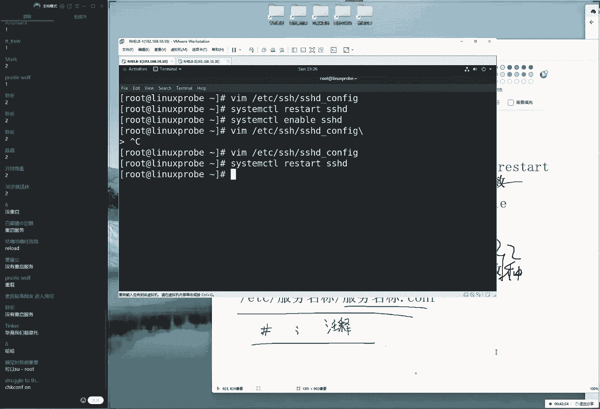
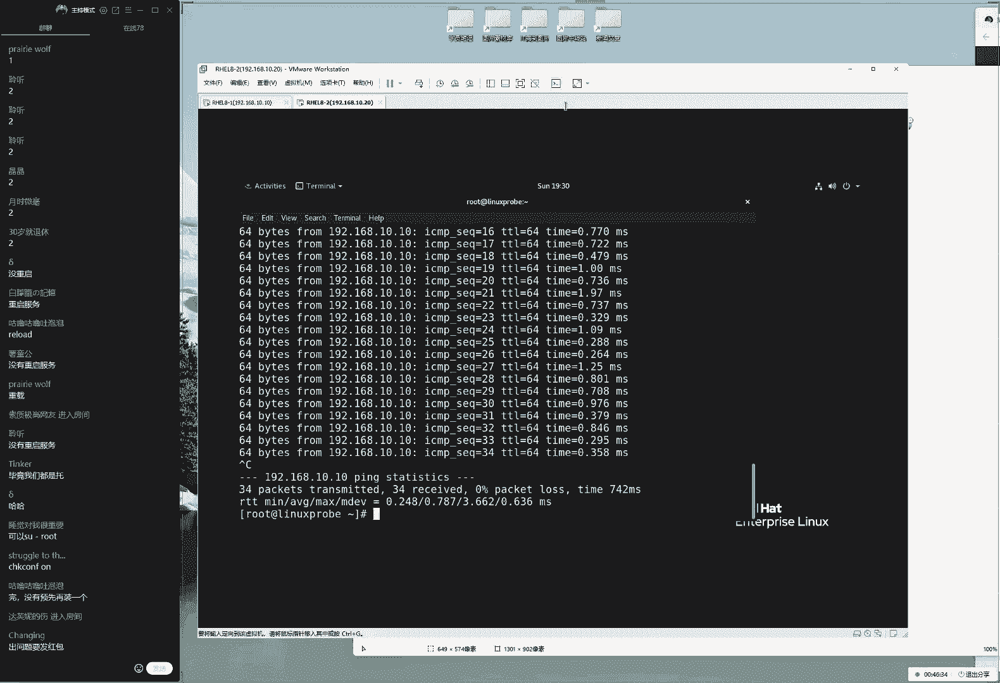
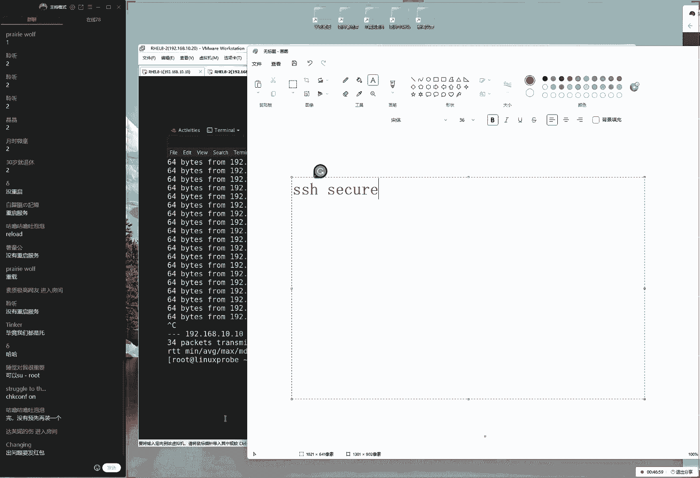
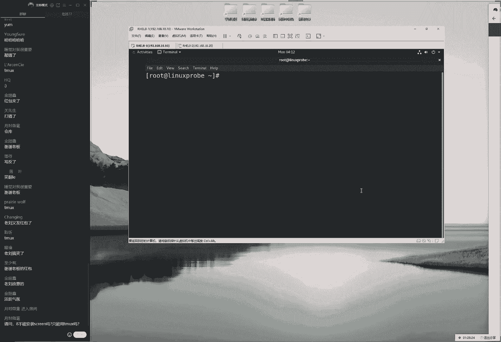
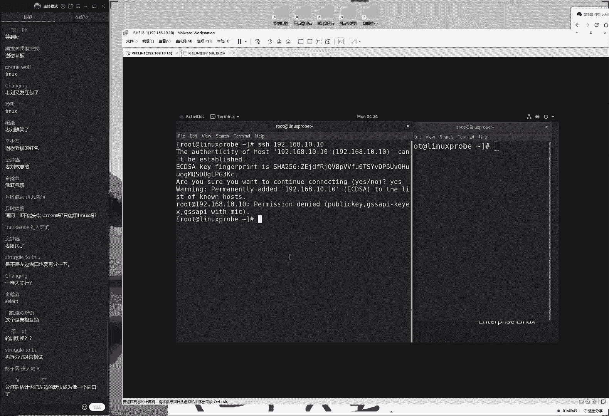

# linux就该这么学第34期 - P14：14. 红帽RHCE认证培训课程-Linux就该这么学 - 能力努力 - BV1L14y1878S

get up get up，you're so listen to happy，now，i'm like a friend，ok，我们觉得我们来开始咱们今天这个课程啊，大家先打一下一。

我们来开始今天这个课程了啊。

先来测试咱们这个上课环境，大家看一下咱们的屏幕的话呢，那么看到咱们这个画面啊，然后换来我们这个声音是否流畅，好今天这个人数的话，刚刚等了一小下下啊，61位同学还好，我们估计今天这个人数能达到。

75以上吧，应该问题不大，那我们现在给大家说一下，我们今天这个课程安排是这样的，我今天下午大概规划了一下咱们这个课程，呃，我们的话呢今天给大家讲到第十小节，然后我们会去简单讲一下这个网站服务。

但是的话呢可能不会特别多，我们时间的话大概也两个小时左右，我们从下周开始的话呢，去讲一下自动化运维，等于说我们就把这个r h3 c和20，c的所有东西吗，那我们提前给大家都讲完了。

这样的话呢我们如果想要去考试的同学，那么虽然这考试现在还约不了啊，因为现在这个全国疫情吧，变得非常的严重啊，但是的话呢，我们那我们就可以提前去做一下准备工作，那也就是说我们下周讲完了，这个课之后。

同学们就可以去做一下，rhc的一个备考工作了，因为当但是这个月考的这个事情的话，可能要拖到5月的一个十几号了，因为现在全国疫情比较严重的话，尤其是北京和上海确实比较严重，都已经封城了。

所以的话大家可能需要耐心啊，大家可能是需要耐心等待一下了，好我们来先翻开书吧，看一下我们这边这个9。2小节讲一下，这个s是服务，因为大家今天问到同学也比较多少，是什么时候能够学考试，比较着急。

说我们下周能玩啊，那我们下周聚完了之后，呃这个暂时还不可以，还是要等一下具体的一个政策，然后大家说r gc考试内容都讲完了啊，大家都啥耳朵啊，是明天啊，不不是我们在下礼拜的时候就讲完了啊。

我们下礼拜的话呢，讲自动化运维当前还没有讲完呢，大家说深圳也约不了吗，深圳也不能约，因为广东的话呢属于他们属于华南考场，华南考场现在全都停止了，所以要等一等了，呃，好我们来继续来给大家去说。

因为现在这个疫情的话呢确实很严重，昨天啊我也接到电话了，然后北京的这边的话呢也一直在做排查，然后因为我跟一个呃确诊的一个病例，然后都同时去过一个超市了，所以的话呢昨天才在七点半的时候，给我打了个电话啊。

但是的话呢我们虽然同意啊，但啊虽然我们同意呃，呃虽然我们一起去的这个超市，但是我是4月9号去的，我啊我比他提前了20多天去的啊，这就是很扯的事情啊，不过也其实都能看得出来，咱们国家对于这个事情很重视啊。

好我们来给大家往后面去说说一下，这个9。2小节，我比那个人提前去了20多天啊，都已经提前半个多月了，来看一下，就在二小节讲一下这个服务叫做s s h，也就是说我们现在这个国内的话。

对于这个防控力度非常的大，我们对于这个考试的话呢，但这些呃不能够控制这些变量的话，那实在太多了，可能说不好哪个城市就被封了，所以我们叫的啊，所以我们就先等一等，先不要着急了，我们课就好好去听就好了。

然后对于考试的话呢，就先放一放，先来看一下啊，就点二小节，我们说一下，我们的s h叫做远程连接的一个协议，叫远程控制吗，那也就是说，我们如果说有些我所做的这个啊，那我现在所在这个城市啊，是在北京。

那我以台服务器是在上海，那么我就可以通过这个远程连接协议，然后就直接对它进行控制，这就是我们去使用的linux服务器的，一个很好的一个呃协议，我们可以进行一个远程的控制啊，远程的一个控制。

那么我们对比是在这个windows里边，这个图形化界面的话呢，我们可以给大家去说，就是它这个延迟性会更低一点啊，呃因为的话呢我们的s h，它是基于一个文字界面的，它是基于命令行的这样的。

一个方式来进行控制的，他传啊他就h传说的是一个文字，而上面的话呢我们的啊，windows它它传输的是一个视频跟一个呃啊，它传输的是它实际上是一个画面好吗啊，以及是一个视频的一个形式。

但我们的话去使用到linux这个s h，它实际上传输的是一种文字界面，因此的话呢它具有了一个效率更快，然后的话以及延迟更低这样的一个特点，那么我们来先给大家去说一下，就是呃我们有一个原则性的一个问题。

就是我们的linux里面的一切都是文件，这个最后再给大家啰嗦一句啊，因为这是一个理论基础，我们明白了这一点，才能够知道我们该怎么去配置我们的服务，首先来讲linux系统中的一切都是文件。

这个没有任何问题好吧，这个我们说了很多遍了，大家大家都已经听烦了啊，但我们第二点的话呢，就是那是那啊，那么既然一切都是文件了，所以我的话呢我们配置一个服务，就是在修改这个服务的，怎么样呢。

就在修改我们的配置文件对吧，因为它都是文件嘛，所以我们在配置一个服务，也就是在修改这个服务所对应的，一个配置文件，第三的话呢就是要想让我们一起来说说啊，要想啊要让新的参数啊，新的参数新的参数能够生效。

那我们一起来说，是不是要需要去重启一下，对应的服务才可以啊，但是会有一些例外，比如说网卡服务他们就不用啊对吧，因为我们就只需要去启用一下就可以了啊，它不需要第四个，它好啊，是不需要加入到选项当中。

它就会在下一次的时候依然能够去启用，因为这个主要是大家已经问到了，就是说因为它的话主要涉及到了，我们的网卡里面有一个参数去启动参数，只要把这个启动参数设置成了，是为启用模式啊，那么就能够自动启用了。

那么呃那呃，但是对于我们这个大多数服务来讲啊，还是都需要加入到这个启动项当中，才能够保证，然后我们下一次重启过后，下一次重启后依然能够为用户去提供服务，能够长期使用啊，依然长期有效啊。

那我们今天给大家去说一下这个四点原则，那我们既然也提到了我们的s h，那么就要去找到它所对应的配置文件，然后再去实现出来，这对啊对这个服务的一个配置工作，那我们来先来给大家看一下，那么这个怎么去找呢。

根据我们第六小节啊，第六章节，第一小节6。1里面所讲的，f h s这样的一个协议，那我们知道了他的所有的配置文件的话呢，我们系统的配置文件，以及我们的服务配置文件，大家一起来说出来啊。

第六章节对面的这个知识啊，那么我们的配置文件，应该情况下还是放在什么目录里面呢，应该是放到了大家已经说出来了，叫etc目录，但没有问题，etc目录里面大家说啊，好久开始约，然后最迟什么时间呃。

我们预计的话呢会在5月的中旬，然后才开始制约了，咱们这一期月考时间确实要稍微晚一点，最迟的话呢我们认为应该就在6月，最迟的话，我们最早我们最晚的话呢大概6月上旬吧，说这个有点心虚，因为这个很不准。

因为这个现在全国疫情的话，变化比较的快速，所以现在暂定的就是5月中下旬，差不多这么一个时间好，大家已经说出来了，我们现在画的这个目录，所对应的就是一个etc的一个目录，它里面保存的就是我们系统里面的。

配置文件，以及我们的各个服务的一个配置文件，总之一句话就是要想要找配置文件，就找他啊，大多数情况下啊，那么大多数情况下它是在这个目录里面，基本上来说95%吧，但是我们有一些反例啊。

就是我们比如说同学们会问到说我们的呃，一名解析服务啊，他有些配置文件，它也是放到我们的vim录里面的，这个也有，但是其余的目录里面的话呢，软件的话呢，也会有这些的话呢，我们各占5%。

但是我们大多数情况下，就在这个目录里面就能够去找到了，这个啊它具有一个广泛的适用性，这是我们的第一点，既然能够确定的是哪一个目录了，那我们接下来怎么去寻找呢，就给大家提到了。

其实我们在配置一个服务的时候的话呢，我们的一个服务的配置文件它非两种类型，一种的话呢我们叫做主配置文件，这个主配置文件的话呢，它就是保存的是最重要的配置参数，叫主配置啊文件，这个我们来去理解一下啊。

我们先给大家写一下这个定义，但它的里面的定义是啊，保存着最重要的，最重要的配置参数的这样的一个文件，我们把那那我们就把它叫做主配置文件，大家看这个三国演义里边的话，有一个片段啊。

说这个诸葛亮去七擒了孟获，大家会去想，为什么要去七擒孟获呢，他是最重要的一个身份，所以我那我们只要把这个孟获给搞定了，那么其他人也就啊没有问题了，所以我们要怎么样呢，擒贼先擒王，我们一般情况下。

要想去配置一个服务的时候，都先去找个叫做这个主配置文件的，一个文件，然后我们来去查找一下，它里面基本上就有我们想要的这个参数了，第二的话呢我们把它叫做一般配置文件，这个的话呢就可以啊，感觉出来了。

这个的作用啊，这个的重要性的话稍微的低一点点了，它主要的话呢就是保存着，一般重要的这个文件，保存着一般重要的这个配置啊，配置参数啊，不好意思，这个我有点不太严谨啊，配置参数同学以前所写的这个微啊为准啊。

保存着一般重要的配置参数，它的话呢一般情况下，它是由主配置文件来调用的一个关系，它是由主配置文件来进行调用的，一个子配置文件这样的一个作用啊，这样的一个情况，那么我们既然提到了。

就是说我们的一个配置文件的话呢，就是它是由两部分啊，它可能啊他可能是有两呃，两种这样的一个方式去保存的，那我们怎么去找到这个主配置文件呢，它有一个简单的一个寻找的一个口诀，他是这样的。

它的话呢是在e d c目录里面，它会以服务的名称来命名一个文件夹，然后的话呢在以服务的这个名称，命名一个文件，最后点c o n f结尾，大家先记一下这个原则，虽然会有返利啊，虽然有啊。

虽然会有一些服务跟他不一样，但是95%以上都是这样去找的，或者的话呢以它为一个呃模板，然后来进行一个简单的调整，它会有一种可能，比如说最后的话呢可能是以config结尾啊，或者说它会以其他这个词结尾。

或者它这个服务名称后面加了一个d，或者少一个d，因为叫做这个守护进程，叫做呃守护进程这样的一个词，所以的话就是，但是我们只要知道这么一个原则了啊，以我们复名称命名的一个文件夹。

然后的话呢以复名称命名的一个文件，然后我们这样去写的话，大部分情况下我们能够猜得出来，它就是主配置文件了，除了这个以外的话呢，我们还有一些情况，比如说买sql服务对吧，我们的数据库。

还有的话呢我们的这个缩减服务对吧，我们来给大家看到唉，呃自动的我们的呃自动文件系统啊，out to the master，把好比还有啊，还有我们的mysql这样的服务的话呢。

它会是直接在我们这个系统里面，然后再去写这样的主配置文件，但是基本上我们也能看得出来，那么大多数情况下，它都会以我们现在所写的这个为准，我们叫做主配置文件，好我们现在找到它这个锁定主题文件。

我们来给大家去操作的啊，呃是这样的，首先的话呢，去找到这个服务的一个主配置文件，它是这样去找的，我们可以通过我们的table键来进行补齐，来看一下，他的话呢叫做啊以系列名称来进行命名。

后面的话呢我们的s h i k a两下table键，它里面它里面会有很多的，以s开头的这样的一个文件，那么这个文件啊啊那我们这个服务的话呢，它的这个主配置文件的名称叫做啊。

s s h d下划线config，虽然这个名啊，虽然这个名字啊，就跟我们刚才讲那个口诀有点出入，但是基本上我们能够猜出来，这个就是我们的主配置文件了，好我们去敲一下，回车之后，金融到里面看一看。

它有它它都有什么样的一个东西，那大家看到了这个里面的话，大部分都是一个蓝色字，其实啊这个所看的这个蓝颜色字的话呢，它有一个共同点，就是它里面的这个所有的这个语句的，前面都有一个井号。

这大家需要记一个事情，就是所以这个井号开始的，跟这个分号开始的，那我们都把它叫做这个注释信息，大家需要注意两点，第一点，很多同学的话呢，只知道一几号开始的叫做注释信息。

但是实际上以分号开始的也叫做注释信息，这两种都叫做注释，第二的话呢就是需要注意的啊，我们做的这个注释信息，它是对我们的服务的功能一种说明，或者的话呢，它是一种对于参数的中介绍信息，它是给人去看的。

机器是不读的，所以的话呢遇到注释信息的时候，我们可以简单去呃看一下，它在它的那个大概作用就行了，它并不会在我们这个服务器里面，真正的去起什么作用，它主要是一种说啊，它主要就是呃来进行一个说明的一个作用。

好我们来给大家看一下，是这样的啊，以我们说这个书上为例，给大家简单的去做一个小小的操作，比如说我现在先去检查一下函数，它因为在我们这个编译器里边vm嘛，它的这个冒号模式，我们当时讲它这个作用了。

那它分为三个模式，为它为啊，它是为命令模式，输入模式以及冒号模式，这个的话呢默化模式它有呃几个作用，第一的话就来进行一个文件的保存，第二话呢进行文件的退出，第三个的话呢是用来去设置编辑环境。

那我们就可以这样去了，来进入到梦啊，来进入到我们的梦哈模式里面，枪啊去敲一个冒号，然后是赛车u，这个时候按下回车诶，可以显示一下函数，设置一下我们的编译环境，这样的一个效果啊，这样的一个效果。

大家说我们去使用的dnf安装完的软件，配置文件和大部我们的配置文件，也大多部分大部分也是在etc目录里面。

不是这样的啊，是这样的啊。

只要我们没有呃特别的声明呢，他做的配置点它都会放大，它都会放到e t c目录里面的，那所以我们说95%的话呢，它是有很好的一个适用性啊，好我们要给大家看到啊，大家说这个叫做赛程又没有问题，好。

我们现在给大家简单做一个小小的介绍啊，不是小小的一个实例嘛，既然说到了配置服务吗，随便找一个，比如说第16条，这个指的叫做permit root login，它指的是是否允许呃我们的管理员去登录。

那么当前的话呢是为is，它指的是管理员和他那好了，我们现在的话先简单去从远程去做一个，去做一个连接的测试，另外的话呢昨天同学没有提啊。

然后我就默认大家都已经下载好了，这个的话呢，我们可以通过windows的一些工具来，远程连接到linux这个服务器，因为大家都没有提，所以我们就没有给大家去传那个软件啊，呃是这样的。

呃如果说你要想去手一台windows的话呢，来啊来啊来去连接一台linux服务器，那么您需要下载一个第三方的软件，那么如果说您是两台linux之间，来进行互相的数据传输的话。

那么则自带有了s s是这样的命令，那么您不需要再去下载了，那么如果说大家要去使用到windows的话呢，呃呃同学们有用过哪些工具可以说出来啊，然后我们用的比较多一点的，那我先说啊，反正就是我用过的啊。

比如说同学们昨天提到的叫做circular crt，对吧，这个我也挺喜欢用的，但是好像是收费版本的s e c o r e啊，然后还so cuc r t这个我用过，而且的话呢啊也挺好用啊。

只不过我当时我做的，n a和c3 p的时候，用它来管理路由器的时候用过，然后后来呃呃然后的话好像后来是收费了，淘宝上面买一个破解的一个呃，破解版本好像还有三五十块钱，然后我就觉得这个软件的话。

好像也没有那么香了，后来我就换成了另外一个工具叫做char shell，那这个的话呢在这个国内是收费的，但是在国外的话呢它是免费的，他是被国内的一家公司很无良的代理了，那同学们如果要想去下载的话。

您可以在这个谷歌上面，搜索到他的一个免费版本，然后并且的话呢我觉得从官网上下载，更加的这个靠谱一点，然后第二话，还有还有还有我们的这个第三个对吧，叫做这个party，这个大家的发音一定要注意啊。

这个话呢它并不叫做puty，它叫party啊，他的话呢这个等它跟前面两个啊，以及大家所说的这个啊，我用的确实不多啊，这个的话呢我们的一些区别很明显，就是它不需要进行安装。

如果说我们经常去做一些底层的基层啊，这些工作需要出差啊，这个时候可能就会把这个工具，放在u盘里面，然后到那之后就可以去使用了，它是不需要进行安装的，它是免安装版本，可以放u盘里面就可以去用了。

我觉得这个还是有点特色的，这还有点特色的，其实的话呢还有什么呢，当然他要说哦，final shell是吧，这个也可以，但我们还有其实还有很推荐的一个，这个的话呢我们推荐大家用这个工具呃，稍等一下。

这个名字很长，我给大家记下了，诶，等一下哦，好像我给卸载掉了，那个工具就叫做s h的一个连接工具，它的这个工具的话呢，简称也是叫做s h，但是很好用，它分为两个中，它分为两个端啊。

它跟这个叉shell是一样的，它跟x shell是一样的，分为两个端，一个进行远程的控制，一个进行的是远程的，稍等一下啊，他一个进行远程的控制，一个进行远程文件传输啊，我们待会给大家讲到。

他为什么他可以去实践出来文件的传输，s s h下载这个啊，我会找一下这个文件名称，因为它正好等同于了这个s c h的那个名，称，也呃也也也也是很好用的，因为当时有段时间我被骗了。

我被百度上面那个叉叉给骗了，所以的话呢我就一段时间这个呃工具，后来觉得也挺香，也挺好使的啊，大家可以下载一下这个工具的话呢，我给大家找到了啊，这个只不过可能国内用的人比较少吧。

s h叫做secure shell，大家可以去搜一下，这个也挺好用的，你可以从百度上一搜就能搜到这个工具了，好这个的话也很好用，大家说我们可以去使用的，win 10或者win 11的c m d也可以。

但我觉得第三方这个软件的话，它还是有一些先天性的一个优势的，比如说的话呢，我呃比，那我们，比如说现在，我就不太喜欢用到这样的一个终端，cmd进行原有啊，进行一个远程的访问。

那么的话我也不太喜欢用到这个party，因为它不能够记录我们这个保存的历史，比如说我现在有一台服务器，我可能每周回我每天都要去访问一次，那我每次去输入这个ip地址啊，然后我们账号密码比较麻烦。

那我可以进行一个信息的保存，那我们保存服务器好的时候，就要用到一些比较专业的软件了，反正我还是觉得这个比较香一点，大家可能觉得呃自己用软件也很舒服啊，那我们可以去选择一个你喜欢就可以了啊。

然后我们接下来给大家去说了。

那么进入远程链接的时候的话呢，我们先去使用到这个呃x的一个工具ssh啊，ex shell，哎，来去说不像我们服务器的地址，一九二零六八点10：10，大家看这个字有点小对吧，然后把声音调大一点点。

同学们稍等一下，这个字其实小也没有关系，因为大家不需要看里面具体的这个内容，只需要看一下它们连接成功就可以，他只要联动，他只要能够连接成功，就证明我们这个实验室做成功了，大家不用关心，比别人。

在这个具体的显示出来的内容是什么，因为它连接出来的那个内容，肯定是稍等一下啊，稍等一下下啊，它里面的这个内容的话呢，肯定是呃连接信息而已，不用去多去关注，他是呃稍等一下，我看看那个字怎么调大一点。

大家说我们的i c p是什么，i s c p的话是在linux里边我们去使用到的，它不仅不能在windows里面去使用，稍等一下，我看看这个字怎么唱，稍微调大一点啊，我就简单看一下啦。

如果没有的话就算了啊，好像应该是有大家说摁住啊，cn那么点下ctrl加滚轴啊，啊果然是果然是ok啊，这这个原来这么简单，同学们看他经验比我丰富啊，来那我们给大家去连接一下啊。

还真这样还是很方便的啊，同学们又教了我一招来进行远程联机，一九二零六八点10。10a下回车好，我们来去输一下这个用户名称叫做root，密码的话呢，就是为红帽耳叫做red hat，来敲一下回车。

ok没有问题，登录成功了好了，做好之后的话呢，我们来exit退出它，然后推出下它也那么就很顺利。

没有问题，下面给大家做一个演示啊，下面给大家做一个演示，就是我想要来去禁止掉我的管理员，去直接登录服务器，因为我的密码如果被人知道的话呢。

那么对方也可以去直接关联的身份，就可以登录到我们这个服务器了，根据第五章节，管理员的这个权限的话，它是最大的，限制是最小的，它可以对硬件的它要进行编辑好，它很不安全，怎么办呢。

那我们可以把它给禁止掉，首先进入到我们的主配置文件当中去，使用到我们的vim编辑器，稍等一下，跳到一个稍微舒服点的位置，然后我们把这个yes给它改成一个no，就是说我们不再去允许管理员去登录。

我们的服务器，这样的一个作用好，我们点一下这个e s c键，返回到命令模式，相约在w q报存兵退出来来敲一下回车。

这个时候的话呃，我们给大家提一个小问题啊，这个问题其实很简单，我觉得呃，那我们请问，现在我再去远程连接这个服务器，我还能否去使用大管理root去做登录呢，大家告诉我一哈就可以了，这个可以稍微快一点。

我们当做是一个送分题来，大家告诉我1号就可以了，大家请问我现在我设置过号了，我还能否去使用管理员的这个身份，入侵用户登录我们的服务器呢，啊打着同学啊，很给我面子啊，肯定是为了配合咱们的演出啊。

其实的话呢这个还是可以的。

来先看一下效果，确实还是可以的，为什么呢，看一下是不是我们刚刚有讲过了啊，是这个我们讲到了，要想让我们配置出来的，这个新的参数能够继续生效，我们需要去重启下对应的服务啊，这个操作我们做了吗。

还没有做，所以现在我们还是可以去做访问的啊，然后来这同学们system啊啊，control restart，来去重启一下我们的s h这个服务，所以大家有没有感觉到在我们上课的时候。

做这个实验都特别的顺利，然后但是我们回去之后的话，您再去做，说老有点出错啊，就感觉这刘某这这这这这我们讲完课。

怎么感觉跟变魔术一样啊，怎么上课的时候看的是这样的，但是我们拿回家之后就变了个样子呢，可能就是一些小细节细节太重要了，来我们去重启一下这个服务。

s h e是把它给重启了，顺手怎么样呢，把这个服务加入到启动项里面，让它下一次重启过后依然能够去有效，它能够自动去启动，等啊它来去啊。

一直为用户去提供服务，来咱们这样去enable一下，他来enable转好，s s h大家是ta为了陪我们的演出啊，为了让我们去引出后面这个知识流言来。

我们先做好之后的话呢，我们来去再去连来再来进行连接，输入一下用户名称叫做root啊，然后密码的话呢，我对天发誓，我真的现在我输入的是red hat，真的没有故意输错啊，我可以对这个我是呃对天发誓。

然后我现在下回车，但是大家可以看到我现在这个链接的话呢，它是失败了，这就是说我们进行一个学生访问的时候，已经禁止了啊，并啊，并且拒绝了我们从远程的一个呃。

管理员登录这样的一个操作实力，那么同时的话呢，为了避免我们以后这个实验有影响，我们再把这个参数文件改回来，再去允许他去使用关联的这个身份，来去登录我们的服务器，我们的话呢需要去重启一下这个服务。

然后的话呢就可以再去来进行远程的啊，再来再来进行远程链接了。

可以用到关联的这个身份来去登录服务器，那么我们这个加入选项这个操作的话呢，它只需要去做一次就可以了。

enable操作只能去做一次，但是我们在这个呃，重启服务的这个操作的话呢，我们需要在每一次修改参数过后，都要去启动一次，它才能够去生效，但是的话呢这也是对于大部分的服务，是这样的。

有些服务的话他也不需要去重启，但是我们先给大家举个例子先，至少都有他啊，他啊他怎么回事就行了，因为我们99%的服务，它都是需要去重启一下的，有些服务确实不需要，但是我们呃目前没有啊。

但是我们目前还没有啊，我们现在目前还没有看到吗，好这就是我们要给大家说两点啊。

第二啊，接下来我们要给大家去开一台，另外一台linux的这个服务器，再开一台linux的服务器，然后我们大家看一下，先有两个标签，这边的话呢左边呢我们的这个电脑。

它的地址的话呢会是大家记一下啊，那我们左边这个电脑的话呢，地址是会是幺九二点一六八点10：10，那么以后我们都把它固定了啊，同学们记一下我们的第一台服务器，就是我们第一台主机的话，它永远会是点10：

10，第二台的话以他永远会去点10。20，然后第三台的话呢，它啊它要是有的话啊，好我们会永远会是点10。30，也就是说同学们记下来以后，我们在做这个实验的时候，不用把自己的这个重心。

放到配置网卡上面了啊，不用老担心说哎，这个地址到底是哪个主机啊，就不用去想了，我们从今往后所有的地址，第一台，第二台，第三台都这么去写啊，把自己的重心，把自己的这个重心王权啊。

啊完全都投入到配置服务上面。

而不关心这个网卡参数了，好这里我们先给大家说完了，接下来我们进入到这个第一台服务器上面，我们去iptables清空一下，然后避免它给我们捣乱吧，我们主要使用的是firewall防火墙，四个保安。

这样的话呢能够呃让我们这个呃防呃，让我们这个防火墙里面这个策略吧，它不会有一些呃重复的这个点，因为大概的话就在第19期，高二跟第22期的时候，我就记得犯过错误，当时咱们讲课的时候。

我就怕咱们在上课的时候出现问题，因为一旦在上课的时候出现问题了，排错，因为这个排错的话呢其实很简单，但是它这个时间是不定的啊，他有可能说啊排五分钟，还有可能排50分钟，他可能拍半个小时。

当时我记得第19期或者第22期。

就出现这样一个问题了，我们就讲到这个啊远程连接服务s h，结果的话呢把防火墙都给他放行了，我们去使用到firework on 3 m b，然后咔咔一顿操作啊，然后把这个服务加到里面去。

各种的操作都没有问题，然后我们去检查的网卡呀，我们的ez linux都检查了一流超购啊，然后我们就把这个服务的话就都给启用了，确认都没有任何问题了，结果的话呢我们排错排了半个多小时。

后来我才想起来是因为我们正好的话呢，我们第九章节讲的是这个啊，远程连接协议吗，第八章节讲的是防火墙，就是因为第八章节讲完之后，我们忘记把这个防火墙策略给他，怎么样呢，给它清空一下了。

当时在红毛肉七里面有一个服务，叫做tcp viper的一个工具，当时我们就以这个啊服务为例，加入了一下对于s h这个禁止条目，然后呢我们一tc目录里面的还有点底纳，我当时我编辑过这个文件，然后的话呢。

把我们的s hd这个服务给他禁止了，结果的话我们讲第八章的时候，结果就发现诶怎么都检查了一遍，还是不行呢，就是后来发现诶，他确实是这么一个啊防火墙冲突的问题。

把我们的ip boss给他清空了啊，去着重去管理我们的这个fire one防火墙，好，我们今天都做好之后，可以去从我们的这个第二台主机啊，这是第二台主机地址的话呢，是1920~8点10。20。

最后再啰嗦一句啊，最后再啰嗦一句了，以后我们就这两个标签，我们就默认大家看一下这两个标签呃，左边那台就是10：10，右边那台就是10。20，它是为服务器，它是为客户端，当然了，他们可以互为因果。

那我们这个的话呢其实并不严格，区分服务端跟客户端来，大家怎么样说，这必须要发的啊，但是的话呢耽误时间也是很啊很自责的，来我们给大家看一下，现在先从远程去拼，我现在地址的话呢是10。20。

所以我去拼一下服务器，1920~8点10：10，来点石点石拼冲，他没有问题，走你啊，大家说完啊，没有预先安装一个啊，没有预先安装啊，什么服务呢还是什么，然后我们来去重新去拼一下。

看到这个网络是能够通信的，另外的话呢，它是一个呃会一直拼下去。

没有一个呃结束的一个次数，那么在这啊。

这有些啊他啊他啊他是有一些区别的，windows里边的话它是拼四次啊，linux的话它会一直拼。

如果想让他去暂停的话，我们可以去按一下ctrl c再把它给停止掉，因为这个同学们好像也问过这个问题，怎么还给停止了啊，很简单，ctrl c来去终止在我们正在进行的这个服务，然后现在给大家来演示一个。

简单的演示一个什么事情呢，我想给大家演示一个有点难度的，现在这个太水了，大家感觉到了，就是我们要给大家讲一个底层逻辑。

我们的i o，我们的s h，这个的话呢是一个安全的一个，远程连接协议，呃它的话呢第一个s叫做secure啊，secure，它指的是一个非常安全的一个连接协议，这个怎么去理解这个事情呢。

你不能看人家怎么去吹的吧，比如说老刘老说自己长得帅对吧，但是我们没有见过面，怎么知道我帅呢，那我怎么能够去证明一下这，我所说这个那啊那我怎么来来去证明一下，我所说这是一个呃正确的真理呢。

所以我们可以来看一下啊，就是在这个呃呃呃服务当中，能不能啊，我们的啊s1 h然后画下划线，config找到了这个主配置文件，因为在我他之所以他敢叫做安全，远远程连接协议，就是因为s h里面的话呢。

有了一个新东西啊，这就是不他也不算新东西，它就是一个从红毛reo 6开始启用的，一个二版本的一个加密验证的一个方式，我来给大家看一下，里面有个参数，里面有个参数啊，找不到，那算了吧。

反正这里面有一个参数啊，可以看到它是一个vr版本的，他的话对比于说v一版本的话，它更加安全了，加密算法的话呢更加的严苛了，他说的安全实际上都是相对的，我这边我找不到了，反正有一个参数。

就是一个vr版本的一个参数一个开启，然后它它是有别于第一代的，它是怎么回事呢。

它就有它是呃有一些对比的，因为我们知道在这个电脑当中的话呢，远程的访问或者远程的控制，这样的一个协议，同学们可以说出来，比如说我们的网站协议啊对吧，还有的话呢文件传输协议。

以及我们之前我会常用的一个叫tnt，一个服务，这个的话呢就是一个呃，并不安全的一种连接协议，他的话这三种协议都有一个共同点，就是他通过这个明文来去传输这个信息，所有的这个信息。

都会通过这个铭文来进行传输，只要我们公司的这个服务单啊，只要我们公司这个居网内有一个小孩，破坏分子在这个网关上面的话呢，放一个嗅探工具哎，装一个小嗅探工具，然后能够帮我们啊去做一下拦截啊，嗅探工具。

然后他会把所有的这个工具的话呢给他呃，获取一下这个信息，他要推啊，它可以通过关键词的匹配，然后比如说呃匹配一下用户名称啊，这样的这个关键词就能够猜出来，我们所述那个值它是什么了。

那我们就要相对来说要进行加密了，加密过后的注意一个呃的这个数据，他都可以啊，防止被别人给破解这样的一个效果，所以它叫做啊，他就是他他是叫做呃，非常安全的一个远程连接协议。

它的话只限于说我们控制linux服务器，来去使用的啊，然后我们来给大家说一下，它有两个链接的这样的一个模式，第一种模式的话呢叫做口令模式，也就是说它的话都是通过加密了。

然后他都他都是经过了这个加密方式的，但是在这个加密之上的话，它就更加安全了，它叫做账号密码的一种可能验证方式，他支持了常规的考验证方式，它的话呢也支持了我们这个叫做密钥，验证方式来啊。

它可以通过我们的呃，公要跟cl来进行一个加密和解密，大家问了一个问题，大家说大鲨鱼啊，第二个同学问到说，我们在etc目录里面有两个文件，但是两个文件是什么区别呀，但是您这个文件名称被变成星号了。

看不到啊，看不到，然后呃大家可以再发一遍啊，比如说同学们想提问问题的时的时候啊，比如说想发一个网址，然后腾讯的话大家以为是发了个网址呢，他他以为是发了个广告呢，可以拆两段吧对吧，你可以拆两段去发。

我也能够看得懂啊，这个啊，但是这个三个星号确实看不懂，然后我们来给大家看啊，就是说我们在进行远程访问的时候的话，它有点它有两个的这个验证方式，一种的话呢，是通过口令的方式来进行验证的。

也就是说需要让用户去输入这个账号和密，码来进行访问，第二的话，他也通过这样的一个密钥去登录了，当然我知道大家会说了啊，说我们这个词的话叫做蜜月是吧，他的话呢虽然钥匙的药，但是我们读音的话叫做蜜月。

但是它是有争议的，呃我们就以什么数学怎么来的，我们就把它叫做这个cl文件了，那当我们可以玩到这个4月文件都可以，我们只不过大家听点跟大家顺耳朵啊，这样的话呢呃比较好记一点，它的话呢可以去实验出来。

我们两个文件的这样的一个加密算法，它的话呢会有一个公钥信息，会有一个sl信息，所以我现在所所说的这个sl啊，就是大家所说的那个4月，他俩啊它的话两个是一样的，来sl文件跟公钥文件。

他两个的话呢是用来去做加密和解密的，c l文件呢是用来去做加密的，然后的话呢我们的呃要文件的话呢，是再去做解密更验证的，所以大家记一下这两个的区别，来解密跟验证这样的一个作用。

那有了这个加密的这个加持啊。

然后以及这两种验证方式，这样的一个那登录方式的话呢，它就可以让我们的服务器登录更加安全了，再来现在打开另外一台linux的服务器，我现在的话啊，我看有同学迟到了，今天这个迟到的人数有点多多呀。

啊是这样的啊，再总结一下。

如果您今天迟到了，我还说今天有75同学呢，现在80人了，挺好啊，但是迟到人数有点多啊，刚才60人，现在80人，差20个人好，我给大家说一下啊，我们现在做什么实验呢，讲的是s1 h。

那今天有1/3的人都迟到了啊，今天讲的什么协议呢，我们讲到s s h进行远程连接访啊访问，然后的话呢我们现在准备出来了两台主机，两台主机，两台不同的主机呃，其中的话呢一台是linux的服务器啊。

另外的话呢也是一台linux的服务器，现在我们需要做的就是从其中一台。

再去远程连接到另外一台主机来，直接我们的ssh客户端，服务端都默认安装好了，我不这个我们是不用去管的，直接ssh一九二点一六八点10。10a下回车，远程过去，他第一次登录的时候。

他会说是否去接收对方的这个指纹信息，我们选择的是一个为yes，ok没有问题，嗯，下回车，然后再来的话呢，请说一下我们这个呃管理员入群，用户在远程的这个密码，我们来去输一下，叫做red hat。

ok没有问题呃，我们登录好之后的话，大家可能会呢呃大家可能会问一个问题，就说那我们现在怎么能够知道。

我已经从这台主机远程到这台主机呢，我们怎么能证明一下他确实成功了呢，我觉得再好的证明不如去重启一下吧，来去reboot一下。

当我在我的本机去敲一下reboot的时候，看看是谁重启了，看看是哪个小可爱，是不是左边一台主机重启了。

所以这说明这就是一个叫做远程连接协议，他能够啊远程控制协议，它可以通过远程来去管理，我们把它呃，它管理我们的茅台主机，大家说我们的功效信息是，它是通过那md 5加密码不。

它并不是它它通过的最哈基值啊，256，这样的话加密的方式来去做出来的啊，rs c然后256这样来加密出来的，这个我们待会儿给大家有一个演示。

但是我们加密过后，那个文件里面会标注出来，加密的这样的一个格式，好大家问了一个问题，大家说我们的ssh文件里面啊，配置文件里面会有两个，一个的话那叫s h，一个叫做s h d，有区别吗，有区别。

那是有区别的，我们一个叫做主配置文件，其余的话我们就叫做自配置文件啊，它的两个的话呢参数一般情况下，它两个还是不一样的啊，他两个参数一般来说它都是不一样的，就我们一些比较重要的参数。

大家这么理解一件事情啊，大家可能会问这个确定问题是这么去问的，就是说，为什么我们不把做的参数，都写到主题文件里呢，因为对于一些比较大型的服务距离啊，就比如说我们的网站服务啊，数据库服务，大家想。

如果我们把所有信息都写在一个，主播软件里面的话，主配软件打开可能都需要几分钟时间了，太臃肿了，它像一个大一个小说而已啊，就也找到重点了，所以的话呢我们就选择是这样的一个方式，但是我们所说的是。

一般情况把最重要的参数具有通用性的，或者大家同学们问到了，叫做这叫做这个全局参数的话呢，或者说最重要的才到这个参数，写在一个主题文件里面，然后的话呢在分配变类，比如说这个是用来管理解成啊这个安全的。

这是用来去管理解成稳定的，这用来的话呢去管理远程账号了，然后我们再把这些信息的话呢分辨别位，来进行管理这样的一个作用，所以我们主配软件里边的话，有一个经典的一个误区，就是这个里边的话呢，这是错误的。

即便说是一个非常小的一个服务，就类似于刚才我们提到的叫做auto fs对吧，叫自动文件系统，它都有好几个配置文件的啊，就是说这个呃有一个误区，这个是错误的，我们会在呃最后我们再换过来，为什么呢。

呃我们会提到一个问题，说老师为什么我在配置这个服务时候，我们我们没有找到某个参数呢，就是因为我们的眼睛只盯着这个主播，人家啊，那我们就只啊就啊，就是我们，那我们的眼睛只看那个主配置文件了。

我们可以把这个呃呃再去看一看，这个其他一般配置文件去找一找，它里边可能是通过第样的方式来去获取的。

这样的一个参数来，我们现在的主服务器又重启好了，我先加再来去远程链接一下，也没也没有也也没有啥意义啊，反正就是他肯定是能够成功的，那这肯定没有问题的。

下面我为大家演示一下，就是说呃有一个简单的一个小问题啊，现在去说一下，请问通过口令的验证方式更加的安全，还是通过我们这个sl，就是我们通过我们的密钥方式来进行加密，更加安全的一个小问题啊，送分题。

请问呃，请问我们现在啊sl文件，请问我们通过口令的方式来去加密，来去登录比较安全，还是通过sl登录比较安全呢，大家说sl啊，当然sl比较安全了，但是为什么会这样呢，首先来讲我认为第一是算法问题。

它更加复杂了，第二的话呢是长度问题，我们的密码就是再复杂了，比如说我我的呃密码，比如说啊我数一数啊，12345678 90，大概的话怎么着也不能超过20位吧，太差，因为在超过20位的话就很长了，那好了。

我们的这个呃，加密出来这么一个cel文件的话呢，它可能会有几百或者是啊会有上千位，他最多的话呢反正我见过的啊，4096啊，二啊，2048，这都是非常常见的，所以这个的话呢更加安全一点啊。

这个长度和加密算法来讲是你安全的，那我们先给大家做一个实验，就是我现在能不能通过这个cl的一个方式，来去登录服务器呢，那这个是我们做的第一步，第一来讲就是去启用一下这个cr的方式，不再通过口令了啊。

我们已经呃，呃更加安全的方式来去登录，我们这个服务器，然后第二步的话呢，是，当我们这个通过sl的方式去，登录服务器之后，然后的话呢我去禁止掉口令去登录，也就是说我们有了一个更加安全的一个，登录方式之后。

就把这个纤维啊简单的，但是我们也不能说不好吧，因为现在毕竟呃现在的话呢，我们主流上还是输入账号密码去登录，比如说我们去银行取钱也好啊，去输什么啊，转账也好，都是通过密码去登录。

但是我们认为还是有一些局限性的，它并不如指纹，或者的话呢它可能并不如人脸安全，当然这个我可能比较片面啊，但是呃多那种验证方式或者的话，那我们两个都去用的话呢，它会更加安全了。

因为呃在这个cl上面也可以加口令，好吧，就是说我们如果认为cl跟这个口令，您觉得很难取舍，没办法啊，没关系，cl上面加口令啊。

两个我们可以呃，那么的话两个我们可以一起去用，那我们怎么办呢，我们需要先这样啊，先的话呢从我们这个服务器上面，然后的话我们来去生成出来一个不，我们的话呢现在是这样啊，我们现在的话呢。

是需要在我这个客户端上面，是在客户端上面生存出来，这个四要跟公钥，然后我们把公钥发送给对方，那我们来给大家操作一下，首先我们的呃ssh，然后的话呢我们来去敲一下这个命令，大家记一下ssh key命令啊。

generation啊。

generate叫做生成，来给大家打到屏幕上面吧，大家说我们可以呃看键盘上面的磨损痕迹，就能够猜得出来啊，咱们做运维的同学，合作开发的同学，这个键盘的磨损最多的，就是ctrl c和ctrl v了啊。

其他也看不出来啥，来，我们来继续我们的s h k杠，他是来去生成出来这个密钥文件的，来敲一下，回车呃，然后看一下是这样的啊，他说请定义一下我们这个公钥文件啊，和这个cel文件保存的一个的一个位置。

这个我们没有必要去改啊，我们找不到任何理由去修改它的这个好处，所以干脆就回车就好了，有些时候我们会看到很多小朋友啊，又会愿意改，这样就会改这样的这个参数，其实这样改不改无所谓。

因为你看不到明显的这个好处的时候，无所谓，改不改，那不用为了改而改好，我们来给大家看一下，下面一条就是说，我们是否要给我们这个密钥文件的话，去设置一个密码，这个话就是说我刚才所提到的，你可以给你的公啊。

那么可以给你这个验证方式再加一个密码，但是我们认为没有必要了，我们可以就按一下回车就好了，第二的话就是说呃你是否确认呢，当然我们确认吧，我们毕竟都是成年人了，我们对自己的行为负责任。

再狠狠的去敲一下回车，于是的话他就给出了一个什么呀，那给了一个小，这是一个小鸡吗，还是一个小圣诞树啊，把他给出了这么一个小袜子吧，这样的一个图案，这个图案的话，大家可以看到这个加密的方式是r s a。

2048啊，2048位啊，这个的话呢我们其实来讲，它可并不是我们这个cel文件，它既不是公钥，也不是sl，它只是映射出来这样的一个呃，大致的这么一个呃图形而已，它只是我们它呃产生出来这么一个结果。

我说那我们怎么去看，生出来这个公钥跟饲料呢，它是在我们家目录里面的，实际上它会有一个隐藏的目录，叫做ssh，前面加一个点号，这里面就会有一个公钥和c，和一个cl文件了。

这个是我们接收到了别人发给我们的公钥，我们不用管，现在的话看看一下啊，首先来说就是我们的这个cl文件，我先来说一看，先来看一下啊，不行行啊，那我们先给大家先给大家看一下吧，因为反正这两个的话看两个都行。

是不是来首先来看一下这个sl文件。

也是可以看到了，这个里面的话呢，总共是有2048位组成的，我们就不用给大家做调查了，肯定比我们同学们你们的密码啊，什么qq密码啊，大家对比一下自己的qq密码，然后看一下这个的区别。

它总共的话2048位组成出来的，然后它里边有数字字母大小写，还有这种除号啊，这种特殊符号组成的特别的复杂，我见过最复杂的啊，好像是我在抖音里边看过的一个视频，有一个日本人啊，然后的话他把那个咱们这个。

好像把一个什么设备，好像是手机还是什么游戏还是什么电脑啊，是啊还设置了一个超级复杂的一个密码，然后呢是一个纯好啊，好像是一个纯数字的，然后敲密码都敲了一分多钟啊，反正基本上啊。

反正他呃反正就是这个啊非常的复杂，但是它一定不如这么复杂，打游戏，然后各种的字符，这个我们要去手敲，我估计要敲呃，十分钟吧，好那也就是说我们现在的话这是次要信息，第二的话还有一个叫做公钥信息。

信号信息不要给别人用的啊，cell信息是自己在本地进行加密的，然后的话呢我们现在来，我们来看一下我们这个公钥信息，这个公钥信息的话呢，是用来去做发送给对方，然后换到对方来进行一个验证，根基解密的。

就说他确认一下，是我们本人举一个小例子啊。

我们看过一个电影叫1942，好像是张艺谋拍，对吧啊我我好我好，我好像忘记了说啊，在这个以前的话呢，呃在河南闹了一场很大的灾荒，然后当时的话呢很多人吃不饱饭，就会去逃荒嘛，娇妻中有一个片段。

就是有一个母亲，然后的话拿着一个家里的一个东西，好像是郭航是个碗行业啊，然后反正就是啊有这么一个东西啊，好像是一个瓷器摔碎了，然后这样的话呢两半了之后的话呢，加两个兄弟，然后啊各拿一半。

这样的话呢我们当以后去相见的时候，两个人把东西给他拼到一起了，咱们就知道是自家人了，就是进行一个简单的轻量级的一个。

验证方式，那么我们现在的话呢实际上也是这样的，它的话呢是在cl在我们的本地上已经有了，我们现在的话需要把这个公钥给对方，让对方知道哎。

只要这个信息匹配得上啊啊啊啊，那我们只要把这个信息给他匹配啊，啊给他啊，匹配上了，它就能够代表说对方主机，就是我们所对应的那个信任的主机，他的话有一个命令叫做ssh copy id命令，大家记一下。

这个命令是用来去传输的，所以这个两个的命令一定要是先后去执行，不能去传输错了啊，不能去传输错了。

大家说冯小刚是吗啊，好像不是很记得不是很清楚啊，因为毕竟老刘这个节目当中，我只有一个最喜欢的导演了，姜文，其他的我们都不太关注了，来我继续啊，我现在给大家去说一下什么呢，就是同学们说到了邵老师。

你现在说要把这个公钥信息发送给对方，但是我不相信你，因为你说传说就传输了，到底是公有还是需要你说了算，那我怎么能够证明你所呃不呃，那么你怎么能够证明你自己说的是正确呢，好我们来这样来给大家演示一下。

我们通过这样的命令，可以把这个文件的话呢传过去，但是传过去的是什么。

到底是不是像我所说的是公钥信息呢，我来给大家做一个演示。

除了长得帅以外，我们是不是还要证明一下，自己说的话很靠谱啊，啊说长得帅以外，我们还是很靠谱的啊，能够靠脸吃饭，还要靠诶，哪去了，他默认情况下没有吗，哦我看了一下，稍等一下稍等稍等一下啊，稍等一下。

他不是情况下没有吗，那我们就去生成一次，因为这个服务器吧，我每次都给大家去呃，去还原一下系统，所以的话他把上一次的这个s s，这个信息已经被清空掉了，好那我没关系啊，这样子来进行远程连接啊。

进行远程的传输好，现在的话需要去输入一下，对方管理员的密码，我们叫做red hat，按下回车啊，传过去了，穿过去之后，就会在我们的本地，就会出现这么一个子目录吧，有了吧啊。

现在有了来查看一下这个文件的话呢，我们叫做s1 h稍等一下啊，这个文件叫做认证文件，然后于是我来看一下，这个时候呃。

这个文件的话呢，是我在我本地去接收到的一个文件，然后大家可以来看一下这里面的内容，然后我们就记其中的一部分吧，四个a开头，然后是b3 n，然后完了结尾是v加d好吧。

我们就记这么一个开头和结尾，大家看一下，跟我的本地的这个公钥信息，是不是一模一样啊，那b3 n然后加v加d没有问题，也就是说确实是拿公钥信息传过去的，这是我们的第一点，第二点的话呢。

就是那我们现在想去做一个什么事情呢，量不走b一公交信息啊和3号信息，既然已经到位了，我们现在的话呢呃搞定啊，就这么去写了，第二步的话呢，我们是不是要能够去禁止掉口令登录啊，禁止口令登录。

只允许密钥登录呢。

这样的话更加安全，密钥登录，这样更加安全，来给大家操作一下，进入到这个服务器当中去，找到里面的这个主配置文件，etc目录里面的s h，然后的话呢里面的s h d啊，找到这个主配置文件，大家问了一个问题。

我们使用的sap行不行啊，也行啊，只不过我们没有讲吧，我们没有讲，所以我们就不用等到我们用啊，所以我们得到啊，所以我们等到讲到了，已经讲完了之后，同学们继续用就行了，因为我们现在没有讲吧。

现在讲的话大家会想诶，这个服务干嘛用的呢，所以我就不给大家就是呃跳上去讲了。

所以我们现在的话啊没有啊，我们先不用啊。

现在的话我们来这样啊，来编辑一下这个文件，i s s h d，找到里面的这个参数，如果没有记错的话，他应该是在下面，大概的话呢行数是在第啊，在这啊，他说是否来去允许我们的密码登录password啊。

authentication，好，我们把它给它关闭掉，不再允许呃，他通过密码进行登录，然后吸取上回的教训，同学们吸取上回的教训，我们把他的话呢需要重启一下诶，等一下我敲我敲这啥啊，我靠我靠我靠。

我可以开大小写了，来重启一下s s h d，吸取刚才的教训，重启一下这个服务，让新的参数能够去生效，大家会问到说我们的需求呢。

我们的s h一下其他主机就有了，对刚才没有，现在就有了，现在我们可以给大家看一下啊，现在就是说我们这个服务器的话呢，只允许sc是这个密码登录了，所以我们先给大家演示一下，我现在我模拟成一个客户端。

我现在的话呢通过这个客户端，s h直接远程服务器的地址，一九二点一六八点10：10，然后大声说一句，怎么样啊，然后就登录成功了，他都不需要去输密码了，因为又引出来第二个知识点了啊，第二个知识点。

第一个知识点它两个登录的方式，第二个知识点，mia优先级高于了密码优先级，大家记一下密钥优先级啊，高于了账号密码验证的这样的一个方式，这两个呃，我们有一个优先级的一个区分的啊。

然后这是我们的第一个就能够登啊，登录成功了，并且他不是啊。

他不需要去输入任何密码，第二的话呢我们是啊，刚才我这个词儿这样是啊啊，刚才我们这边我看到我的教案啊，但是我这个教案刚打开的是呃第十章节啊，我刚才咔咔讲了半天啊，但是我居然没有反应过来。

看见这个脑子确实有点，看来这个脑子确实有点呃很够呛啊啊，不过好在因为比较熟悉了来，不过我看看今天这个时间啊，应该讲不到第十章了，今天讲的有点细，讲点慢了，这个理论有点多，来再去远程连接一下吧。

来一九二零六八点10：10，来去输入一下用户密码啊，输一下用户账号啊，因为密码已经不当去输入了，大家看到密码窗口变成灰颜色了，因为当前的话呢只允许通过密钥就验证啊，密码验证方式给它关闭了。

这个的话呢就是我给大家去讲到的两种，两种方式，我们可以去任选其，以及该去如何去生成出来，我们这个密钥文件这样的一种方式啊，这样的一个完整的一个实验，其实我们学到这儿的话。

大家就会心中有一些小小的呃想法了。

邵老师诶，你看这个东西是怎么回事啊，也就是说我们可以通过我们的s h，去远程连接呃一个服务，那么好了嗯，那么我们他这个远程连接它，实际上这个本质是什么呢，不就是传输信息吗，把我们的一个命令给他传过去。

咔咔咔去做处理，然后又把处理这个结果的话呢又翻回来了，所以呢这也就是说传说的是信息啊，我发送信息发一个文字过去，他要把这个文字过来了，那好了，他既然能过去传输文字，我们能不能去传输图片呀对吧。

我们可以这么理解这个事情吧，因为也要因为它这个远程控制，不就是在传输这样的一个呃字符吗，那我们能不能传输图片呀，啊那我们来，那我们当我们能够去传输图片之后，我们能去传输文件啊，那我们能去传输视频啊。

这样的这种方式好，这个的话呢，我们就可以给大家讲，另外一个这样的一个命令了，它就是基于了我们的s s h协议，进行远程传输文件这样的一个命令，它不需要单独去配置了，他就直接去了。

我们的s s h协议就可以来来就来去，直接去来去传输我们的文件啊，就是同学们刚所提到的，所以我们来去呃，一步一步走的扎实了，当我们学过之后，等我们以后再有这样的这个传输文件，这样的需求的时候。

就可以去使用这个命令了，在我们这个呃，纵观一下这个技术的一个发展史，实际上会发现很多技术说起来好像挺牛，实际上都是一些小问题去解决出来的，比如说一开始去传输文件，去传输文字，后来可以去传文件。

他是慢慢的来往前去拱他，所以当以后有有啊，再去找一个女朋友的时候对吧，或者说再去找一个男朋友的时候，如果这个男朋友说啊，我对你的话呢，我非常喜欢你，我跟你只是朋友对吧，我们并不会怎么怎么样。

就千万不要相信对吧，因为我们人类一个天性就是会去怎么样呢，不断去挑战自己的这个上限啊，跟别人这个啊。

这个啊技术的一个，更加高难度的这么一个技术，所以的话呢，这个技术的发展就像我们去交朋友一样，关系的话也会越来越好，会发现技术的话呢也会越来越呃，这个怎么讲，难度越来越深，但是它底层的逻辑。

都是为了解决一个一个的小问题，而产生出来的，来我们给大家说一下啊，是这样的，这有一个命令叫做s p名啊，但是我好像卡掉了啊。

等一下啊，我们一个命令叫做sap命令，他的话就可以来进行一个文件的传输，呃比如说我现在的话呢，是在服务器b上面啊，不对，我现在是在服务器a上面来，答案是这样的，我们在服务器a上面来exit退出掉它。

然后先推掉它，现在看啊，我现在在这个客户端上面呢，客户端上面的话呢，我现在新建出来一个文件，好比如说这个文件的话呢，我们是叫做哈哈啊，比如说啊就无所谓了，我来哈哈一个文件。

然后后来我们的内容是巴拉巴拉巴拉，然后巴拉巴拉巴拉，然后巴拉巴拉巴拉巴拉巴拉巴拉巴拉好，我现在可以随便去写一些信息，这个信息不重要啊，无所谓，主要是来说就是我有这么个文件，了我现在有一个需求。

就是把这个文件通过我们的s h，是这个协议传到这边这台服务器的java里面，这是一个小需求，怎么那怎么办呢，就很简单了，因为它既然是基于我们的s s，是这样的一个协议。

那么我们就不用再去单独再去配置这个，账号和密码登录这样的一个方式了，可以直接怎么样呢，sap然后这是我们就在这要做第一步啊，第一步就是准备出台这个文件，要他要是在我们本，它需要在我们本地是有的。

第二步的话呢，就是去输入一下我们这个命令i啊，然后我们后面的，文件名称，然后后面的话再去写上，要去传送到对方的点服务器的，哪一个路径下来，一九二点168。10诶，等一下幺九二点幺六八点10：10。

对方到哪一个目录呢，到对方的家目录里边，入城目录下没有问题吧，来敲一下回车，第二步，第三步，那喝口水，啊怎么讲课，这个时间过得有点太快了，很难以置信，现在已经07：55了啊，这个时间都去哪儿了啊。

给大家简单说一句啊，然后是这样的，今天的话呢，我们原本想给大家讲的第十章节啊，不呸呸呸啊，从来没有想过，就是我们原本来想给大家讲一下第十章节，但是现在看起来的话呢，时间有点紧张了啊，因为理论知识的话呢。

我们打扎实了之后，已经把每个实验做出来之后的话呢，基本上可能第九章节需要讲两天了，我们今天的话就只讲了第九章节，讲完就ok了，我们下周的话呢给大家讲enzo，那大家的话可以提前看一下。

第16章节的这个内容，我们把第七第16章提前提前啊，我们呃我们那我们先把它给放到前面去去，给大家去讲，这样的话，大家可以把24c和20c的东西，都给它掌握了，可以提前做背，今天可以提前做备考。

因为我们大多数同学，实际上是想考这个认证的，所以我们就把这个提前的都给他讲完，讲完之后大家可以踏踏实实做备考，后面的这个知识的话呢，我们慢慢给大家去讲，也不用着急了，因为我们之前给大家讲的时候。

同学们作为反馈招师，我现在着急考试，你该先把第16章给我们讲一讲吧，所以我们干脆就把这个第16章讲完了，如果你要是不想去考试同学的话，那么就正好了，那么啊那么就更好了，下面呢啊等我们讲完下周课了之后。

同学们就可以踏踏实实的去听课了，不用有同学去着急了，好我们给大家呃，因为我们如果不去把第16章提前的话，大家会比较着急，先去学，这是我们的一个历史的一个小的，一个讲课技巧啊。

来啊这也是大家反馈比较多的一点，现在的话呢我们来去远程去传输一下，就传过去了，进入到服务器端去查看一下，会发现原本是没有的。

现在的话就有这么一个文件叫哈哈，没有问题，搞定了，这是来进行一个远程文件传输的，一个的一个命令，他也就是说它可以把文件传过去对吧，我们的格式的话是这样去做的，大家来记一下，如果要想把一个文件给他传过去。

然后那我们计划要去使用的i c p命令，然后我们本地的文件名称啊，我就简单去写了，我们再到本地文件名称就叫本地文件啊，咱们去写吧，然后换了远程这个服务器的一个地址，然后冒号。

然后是远程目录这样的一个格式，就可以把我们的本地文件去传过去了，呃，因为的话呢它也是之前已经配过了，s s h这个密钥登录，所以它不需要去输密码了，这个的话呢大家先记一下，这是把文件传过去。

后来又有人去想了，想了一下什么问题呢，想了一下说啊，大家问了一个问题，大家说我们的ip跟冒号是呃跟呃，ip跟目录之间是冒号吗，对是啊，他之间是拿冒号做间隔服，大家又问了一个问题，我们去使用它哦。

我们去使用到文件传输协议ftp，跟简单文件传输协议t ftp有啥区别吗，啊跟我们拿啊，呃我们的这个文件命令它有区别啊，它有很大区别，我们会给大家讲完我们的ftp之后，您会有一个很深入的一个理解。

然后以及我们的ftp跟tftp都有很大的区别，从协议上来说，ftp他认为tcp协议的21端口号，然后的话呢，u t p协议，一个稳定性上都有差异，所以说这个差别的话太多了啊，所以我们就放到后面。

我们哦我们慢慢给大家去聊啊，而不是一句带过了，我们就慢慢给大家后面去聊聊，但是它这个差别是有的，而且的话呢还有一个很显著的一个差别，就是我们的ftp的话默认没有安装啊，它需要在我们这个服务器里面安装。

然后有三个月的验证模式，它这个是需要进行安装进行配置的，而我们的话呢，s s h m e已经启用了客户端啊，以及这个服务端都已经安装过了，那很香，对不对啊，那不就很香。

然后大家说我们的i c p去传输文件，类型不限吧，啊我们的，但是我们的呃文件传输协议，ftp文件传输类型也是不限的呀，所以这个我们刚才给大家说那个两点，一种是自己体验上的不同。

还有一种就是从协议上的不同，这个大家可以先去记一下，我们会具体讲到这个章节的时候，给大家去介绍一下，然后我们现在给大家去说啊，就是说我们现在可以通过这个命令，给大家传过去了，把文件后来又有一个大神就行。

哎呀你这个文件能够传过去了，那我怎么没，那那我如果要是知道对方服务器密码的话，那我怎么能够把这个文件给他传回来呢，就像呃有一个人啊，比如说我现在一个很好的朋友，这个朋友的话他被隔离了啊，就比如说啊。

但是我们现在啊，但是的话我们现在没有呃，然后的话呢我们这个朋友，比如说他说那个呃，能不能帮我去家里拿个东西啊，或者说我们家里养只猫，帮我去喂一下猫呢，好，如果说对方把他的这个加密的密码，告诉我了好了。

那我能不能直接把这个对方的文件，或者说啊，对方家里面的这个文件给他，拽到我们家里来呢，这个也可以去实现的好，首先我们要知道两点，第一点就是对方的密码，你一定要知道对吧，那否则肯定不可以的啊。

第二的话就是你要准确的知道，这个文件保存的一个路径，就可以把这个文件给它，拉到我们的本地来了，来我们现在这样子，首先对方的服务器的一个远程地址，远程服务啊，远程服务，或者我们就远程地址吧，远程地址。

然后后面的话呢，指的是它所对应的一个远程的一个我，我这边我写了一个远程本地，啥意思啊，叫远程目录啊，来啊远程文件的意思啊，远程文件有远程文，远程目录啊，刚才不太严谨了，来远程地址，然后呢远程目录。

然后呢里面的这个远程文件，然后后面我们再来一个空格，写的是一个本地目录啊，这样的一个方式，或者我们写上本地文件，就可以来进行一个远程连接，来进行远程下载了，可以把对方的文件，才从远程下载到我们的本地。

现在的话呢我给大家说一下啊，我们来给大家操作一下，想要什么啊，隔空取物啊，可以理解，可以这么去理解，没有问题，先这样啊，我现在的话呢，在这个服务器上面新建出来一个文件，这个文件无所谓啊。

这句话我们无所谓啊，我来叫做ho吧，无所谓，我们叫做ho，然后我们来输入一下信息，这个信息的话呢，我们这样来12334556677啊，刚才并不是卡掉了，是因为我的手是因为我的嘴比我手快而已。

所以我刚才说到三三的时候就打，就打到七七了啊，来我们现在的话呢随便去哎，巴拉巴拉啊好了，随便挑一些数字证明一下，这个电视其实是刚刚建立出来的，有这么一个文件了，在服务器上面，我们现在的话作为客户端。

怎么把这个文件给他拉过来呢，冒号对方的家目录啊，然后里面呢叫做厚厚的文件，保存到我们的本地的节目录，然后这时候再加一句口诀走，你哎搞定了，把这个文件下载到我们本地之后，会发现内容是一样的啊，这是废话的。

肯定是一样的，传输成功，这就是我们可以基于我们的s s h协议啊，能够传字来，能够传文件吗，可以传图吗，可以传视频吗，可以的都行，单把这两个这个格式记下来，我觉得挺有用啊，我觉得挺有用，挺好啊啊。

然后现在来我们来给大家去说一个事情啊，其实我们的一个，其实我想给大家强调一个事情，就是不要去太羡慕别人的这个成就了，因为的话呢，可能看似您可能看起来比较的高深，但实际上都是一点点努力而而来的。

他都是在一个痛点之上，然后去想出来这个解决方案，它其实其实我们这句话，其实呢我们的呃社会当中的很多东西，它都是这么发展出来的对吧，那么我们其中就有一个很严重的，一个痛点了，就是远程的一个网络波动问题。

这个是我一个我们远程波动问题，波动问题是一个很严重的问题，呃比如说我现在是在北京，那么我现在在野生到一台上海的服务器，没有任何问题，但是如果现在我在美国的，加利福尼亚州的洛杉矶啊。

里面的巴拉巴拉某一个小镇，我买了一台呃服务器，那好了，现在我要从北京连接到美国的啊洛啊，洛杉矶，那么这个时候有可能出现网络波动，甚至的话呢网络和条件会有这种情况对吧，那么我们在进行远程连接的时候。

如果出现网络波动了，它会很严重的后果，比如说我们在用ss h的时候，正在安装一个很大型的软件，都安了99%了，突然间它被中断了，这个时候的话呢，我们就需要先去买这个服务啊，给大家先去完整的切下去卸载掉。

然后再去按特别的麻烦，或者的话呢，比如说啊，或者打，99%了，突然间把卡啊停电了，这个时候下一次的时候还要再来一遍，很麻烦，那我们现在能想一个什么办法，叫做不间断绘画呢，叫做不间断绘画符。

叫不间断绘画符，当我们的网络啊，当我们的网络波动，甚至网络掉线，甚至说我们的客户端重启了，但是对于我们这个工作他都不受影响呢，这个可以去实现的叫做不间断会画符，这个的话呢在我们这个呃。

以前的服务里面也是有的，不567里面的话呢，这个服务叫做i c r e n服务，改了这个tmu x，也就是复名称不一样了，它里面的这个所有的操作啊，操作命令的话呢基本上是一致的，没有太大问题啊。

基本上没有太大问题，大家说我们要想去使用到linux，该怎么把文件传到windows呢，这个需要在windows上面去配置出来，是相应的服务，或者的话，您可以在您的linux本地，配置一个文件传输服务。

然后通过windows去访问都是方法，或者的话两台虚拟机啊。

或者说里面是台虚拟机，虚拟机里边只要安好的这个哎，vm tools。

拖拽的方式来进行安装好吧，来去来去传输文件，也可以去实现好，现在我来给大家说，大家有说叫叫叫叫做tmu x。

他可以去实践出来，这样的一个不见得会画的一个服务，当我们的网络波动，或者当我们这个呃客户端停电啊，或者说我们突然间死机，他都不受影响，它的这个实验原理的话呢，是把我们这个工作抛到后台啊，工作抛到后台啊。

后台去执行抛啊，抛到后台去执行，他并不会说因为网络的波动而受影响，记得当时我是2019年的时候，我当时讲课的时候呃，还没有像我们现在这么好，这个讲个环境，当时电脑也不好啊对吧。

因为电脑当时就当时用的是笔记本，因为当时我2019年的时候，我的啊，因为还没有疫情嘛，经常出差也好啊，经常出去玩也好，就是老出去，所以我当时用的笔记本讲课，就有一次特别的很生气啊。

当时我的笔记本电池已经寿命已经很差了，已经大不差，差不多待机半个多小时就已经到极限了，结果有一天的话呢，我想到之前啊，家里人应该是擦地啊，把我那个电源线给它擦掉了，结果的话呢我不知道我电源线掉了。

然后我就咔咔开始讲了，讲了半个多小时之后，突然间电脑关机了啊，就是当时出现了一次很大的一个教学事故，那么这个时候其实就讲到了，我们该怎么去避免这样的情况，当然我那个避免的情况就是。

从此以后我讲课就开始关门了啊，以后做人都够去外边等着去呃，对于网络这个波动的话呢，我们也想办法把它给解决掉对吧。

这个时候我们先安装上它，安装了一下这个服务，叫做screen，叫做不叫做tmu x t mu x，能够把我们想得到的一切问题，都给他解决掉，tm x然后大声安装啊，敲一下回车诶，等一下啊。

t u x不对吗，没关系，我来用到这个新号做通配符，好久没有装了啊，不太熟悉了，来t u s a不对，还还啊还啊还啊还是不对吗，t mu x没问题啊，啊稍等一下啊，t mu x没问题啊。

哦我说我那我搜一下tm u x一开一，然后以他开头了不能够啊，等一下，是不是我有一个软件仓库都没有配好啊，好稍等一下啊，怎么样，大家说我打错了是吗，没有啊，我看一下啊，我还嘴犟一下啊，啊不好意思。

是我打错了啊，看来不是点仓库的问题，是我的眼睛问题，来t m u x啊，是我的问题，是我的ok啊，这是我的我的我的我的这是脑子问题啊，来tm u x来同学们是我的问题tm u x啊。

来点一下敲去敲一下外啊，这个问题太小了啊，一定要当我们在出错时候，再发来tmu x tmx呃，安好之后的话呢，我们来给大家说一下这个服务的话呢，最好的情况下也，去取一下，但是的话呢实际上不齐也行。

我们可以直接t m u x，然后就去啊，一个大写i s采取新建出来一个绘画，它的这个本质的话，实际上它就是我买这个呃给他关了，就其实一个呃这么一个就够用了，他的话，这个本质就是把我们这个工作。

碰到后台去执行，那我们怎么样能够知道，我们这个服务已经启用了呢，我们就可以这样去做t m o x，一个大写s后面给他一个绘画的名称，比如说我们叫做哈哈啊，然后我们这个时候按下回车。

大家请同学们仔细看好我这个屏幕啊，大家请仔，细啊它是一个小小s啊，大家请仔细看好我这个屏幕，那我当我敲下回车那一瞬间，我新建出了一个绘画，叫做哈哈，然后当我们参加回车之后，那一瞬间，做这个进入的留言。

绘画的，这个所有的操作都会碰到后台去保存啊，而不会导致这个服务器的这个，而不因为我网络波动原因导致这个呃丢失，来敲一下回车，大家看到了吗，当我现在回程的一瞬间，屏幕突然间闪了一下，此时此刻。

我就不在一个默认的一个终端下了，而我现在进入到的是一个服务界面下，但是我们虽然看不看，当然我们，虽然可能这样敲起来看不到效果，但是但是他后来这个实际上已经进入了，它并没有一个提醒。

他终于有了下面一行绿颜色的字啊，然后可以看到了这个绿颜色的字的话呢，提示出来了，首先绘画的名称，以及我们当前开启了哪个服务，我们主机的名称以及系统的时间，以及系统一个日期，也就是说。

终于在黄毛绕八里面有一行小绿行啊，它有一个小标签了，当底下出现一行绿色的字的话呢，代表就是这个服务已经进入到了后台模式，我们现在，所追求的所有的操作，大家现在可以看到，我现在的话所执行的所有的操作。

它都会保存到后台去执行啊，然后我们先给大家看一下，当我去追究到这个程度的时候，我现在给它关闭啊，现在模拟成，现在我们再去模拟成一个网络啊，网络中断的这么一个情况，我现在把它给突然间关了啊。

我们没有任何进啊，也没有进行任何的保存，这就等于对它等同于什么呢，它等同于我们去执行了一个叫做tom命令，然后我们现在可以看到，它是一个动态更新的一个呃，任务的一个状态嘛，呃如果说我们。

现在没有去使用这个服务，我现在把它给关闭掉，那么就彻底关闭掉了，他不会啊，那么他也找不回来了，但是好在的话呢，我们刚刚已经把它抛到后台去执行了，大家怎么样呢，说老刘故意的啊，老刘真的不故意的。

刚才确实没有看到啊，我没有想，我没有大家想象当中那么的严谨啊，是我的问题，是我的问题来，虽然我也很想说是我故意的，但是其实但是我们那但是我们其实不大，但其实不是故意的，哎呀要不咱咱们宿舍只要凭良心啊。

刚才确实没有看到，来，我给大家看一下啊，那我们先做好，之后的话呢，就可以重新进入到我们这个绘画里面，来看一下这个的叫做ios是吧，t m u s啊，ios当我们把这个网络恢复好了之后。

重新登录到这个服务器之后，会看到有一个叫做detouch状态的，这么一个绘画，叫做哈哈哈，他的话现在是中断了，我们现在的话如果想要去恢复的话呢，tm u x一个杠t，然后呃不哎再重新哎挂载上杠七。

然后是绘画的名称哈哈然后走，你于是可以看到，他把我们的这个绘画给大家找回来了，这就是我们刚刚去执行并的那么一个状态，好，这个可能不太明显，因为这，个语言的话呢字很多，把我们刚才这个记录给他刷上去了。

我现在给大家演示一下，比如说我现在的话呢去重复去呃，那比如说我现在的话呢，随便去执行这个命令，大家可以看到我现在没有问题吧，好我现在把它给关闭掉，关闭之后再来重新登录这台服务器之后，tm u x呃。

哦ok啊，然后是一个钢器绘画名称叫做哈哈走，可以看到他要把这个绘画给他找回来了，即便我们把它关闭了很多次，依然能够找回来，另外大家也会发现了，其实我在这个描述是不准确的，我刚才描述的话呢是保存。

我们历史执行记录啊，不不啊，我啊不我，我刚才说的是把我们的这个工作的话呢，抛到后台来去执行，刚才我说的并不严谨了，它不仅仅是把工作抛到后台，因为工作抛到后台的话，指的是对应的命令，而他现在的话呢。

是把我们的一个工作状态都给保留下来了，然后发现我们执行的一个顺序，以及他作为这个回旋，他是把我们这个工作状态都保存到后台了，这个是呃是更加稳定的，它可以让我们直接接着，我们这个操作就可以来去完成了。

然后，就回来就变成我们后续这个操作了，然后的话呢现在还有一个问题啊，现在我们还我们现在还，其实我们现在还有一个问题。

就是现在的话呢，如果说我我现在想要去管理啊，我们这个服务器，那么我就可以上来之后，我们先去新建出来一个绘画，然后我们就开始去往里面去做很多事情了，但是的话呢稍等下一个呃，然后新建一个new。

这是绘画名称，会画绘画名称，绘画名称，大家说我们红毛若巴里面，不能去使用到这个之前的这个服务了吗，不能去使用了，只能用到tm u x是这样的，绘画名，称他改，他就说要改了一个服务名称吧。

然后的话呢这是新建的一个命令，大家可以来记一下，另外的话如果想要去恢复的话呢，我们叫做恢复命令啊，它叫做呃a t t a c h，然后刚t绘画名称，这样来去进行一个恢复操作好，那我们现在的话。

这两个操作是新建出了一个终端，供用户去使用，如果说老师我现在不想这么复杂，我现在我就想去写一个文件，这怎么去做呢，就是我现在是新建出一个完啊，新建成一个完整的一个bt来了，我现在就想去写一个文件。

就是啊有什么啊，那么那我们，就比较简单的点这个工作呢，那么就可以这样子tmu x啊，我们可以不接啊，那我们可以不新建会话，可以直接把你想要做这个事情放到后面去，直接就好了。

来比如说我先打开一个文件叫哈哈，然后点tx t来编辑这个文件，因为的话这个命令的话作为一个整体，它里面是有空格的，所以根据我们第三章节里面，他需要用到双引号给它引起来，哎来猜一下回车啊。

他说我们这个绘画的话呢，必，须要是with care啊，不能够去说是t m u s to，他说不能够进行一个强制的设置，没有理解什么意思啊，稍等我再看一下tm u x稍等一下啊，我们直接编辑这个文件。

稍等一下，哦我知道为什么了，因为的话呢，我们当前就出了一个小的一个小插曲啊，因为我刚刚把这个窗户给它扩大了，所以的话呢我并没有看到底下那行绿，因为我现在是在绘画里面，所以的话呢我在绘画里面。

我那我就不能再新建出来新的绘画了，我需要先去退出掉它，然后我们再去新建它，好吧，大家理解我现在所说的这个意思啊，刚刚因为我们把这个窗口给它调大了，我们又看到底下一行绿啊，绿色的话代表是已经在绘画当中了。

来编辑这个文件，哈哈点test没有问题，然后开始巴拉巴拉去敲，大家看好，我现在随意去敲，我现在也就是说刚刚是完成一个呃，刚刚的话呢是开启一个新的窗口，然后再去进行管理，现在的话就是纯粹的去完成某一项。

单独的工作，就是进行一个单独的命令，正在敲一敲，突然间哎家里的这个网线被小猫碰掉了，哎咔叽哎掉了，怎么办呢，这个时候啊我们就可以打开这个终端啊，然后的话呢我们把这个绘画给它恢复回来。

它会自动的会有新建出来一个绘画，编码为零，然后我们就可以把这个方法给找回来了，他又回复他，他又可以恢复到之前我们退出时候的，那个状态，特别的方便，大家可以看到呃，有这么一个服务的话呢。

以后再也不用担心说我们工作做一半，然后这个网络啊啊啊，然后的话呢那我们这个网线掉了，造成这个然后会造成这样的一个问题了，然后这是我们第一个他能够去做这个事情，叫做不坚定绘画服务。

第二个的话呢就是我们叫做多窗口切换，大家的话应该知道老刘从来不炒股，但是昨天我们打开这个界面的时候，呃，实际上大家看到了下一个软件，叫做这个同花顺啊，为什么呢，我想以这个为例给大家讲一个东西啊。

这特意给大家下载好的，千万不要炒股，有是有风险的，然后是这样的啊。

我为了给大家讲课，单独去下载一个软件，会有这么一个界面，大家看到啊。

然后我还不爱，我还不太会用，反正就是类似于这样的一个界面呃，为什么会有这样的一个界面的功能呢，因为嗯，因为它实际上进行了一个窗口的切割，他是很方便的事情，就比如说我呃他为什么需要炒股，用这样的软件呢。

因为它里面这个信息特别的杂对吧，然后的话他很多，他的话不同人的需求也很大，那好了，我现在能不能像他一样做窗口切割，它切割了很多窗口，这个左上角左下角，还有这个右边接到窗口的切割好。

那我们在工作的时候可不可以这样去用呢，ok这个可以把它剪掉了，没有用了，那我们再给大家再在，那我们在工作的时候怎么去用呢，那好那我这个左边可以打开一个帮助文档，右边的话呢可以打开一个，比如说啊炒股票。

然后呢我们到我们这边的这个左下角，可以去编辑我们的配置文件，这边的话呢还有一个编辑配置文件二，那我们能不能对于这个窗口来进行切割，既然窗口这么大。

我们能不能也切割出来呢，啊也可以啊，也可以来点一下这个退出，我来给大家操作一下，看看该怎么样，对于我们的窗口来进行这个切割。

能够让我们一个窗口里面做很多事情来，我们现在是这样的new，然后一个小写s新建出了一个绘画，比如说叫做哈哈无所谓啊哈哈，我们新建出来这个绘画的啊，大家说这个已经超过很多年这个了啊，这个股票是吧。

我们还因为从来不太接触这个啊，正好看到这个软件的话呢，觉得这个讲的这个事例比较合适，所以才下了一个来tm u x啊，tmu x，然后的话呢，我们来去做一下这个窗口的切割。

如果说我们要想把这个窗口一分为二，上下劈的话啊，就是说我们上下劈两半的话，我们叫做sweet window，那let's sleep window，把它上下切切两半，这样的话呢我们就可以上面诶。

等一下啊，window然后我们看到啊，但那就会有两个窗口了，上面干一件事，下面干一件事，上面是不是可以打开帮助文档啊，然后那啊那啊那我们在地下进行配置，就可以去参考上面那个文档了，挺方便的啊，也挺好。

那如果说我们先把它给退掉了，那我如果说我想再去啊，好那我们来去呃，左右切的话呢，加一个小写h左右切切两半啊，右边的话呢可以去配置，或者的话我们左边可以聊天，右边可以去配置都可以啊。

然后呢那我们除了这样切以外，我们还可以在这个已经切出来，这个的窗口当中的话呢，再去切也可以去完成tm u x，然后split window可以的话，再去上下棋来，可以切成很多份的split。

我们可以去再去切，于是可以看到这样的一个效果，可以去切很多份，那么如果如果啊，那我们现在有很多的窗口了，我们现在的话呢要想去进行配置的话，也没有问题，来来来，可以来进行一个管理呀，进行一个编辑啊。

都行啊，那我们现在就是说，如果说要想去进入到下一个这个窗口当中，我们怎么办呢，我们来啊，不我们先不给大家讲怎么去啊，切换窗口，我们先给大家说一下，如果想要做一下窗口的兑换，怎么去操作，大家看一下。

现在总共是有三个，左边的话呢是一个很大的，右边的话是有两个小的，如果说我现在把这个上下两个，我想要去兑换一下位置，我想把我那我想要去交换一下位置，我们再看一下，我现在这个规模是在右下角哦。

那那那我们则是这样的tm u x，然后的话呢sweep啊去切换一下，切换一下这个窗口，如果说想要把这个窗口跟上面的一个互换，那我们应该是一个更优吧，来大写的u，然后大声说一句走，你来看一看。

到上下兑换了，如果说我想把这个新的这个窗口，跟左边这个兑换，那我们则是一个大写的l啊对吧，切换成到左边吧，大写一个l啊，left，然后走，你哎等一下，他说我们不能够跟左边互换了呃稍等一下。

那就是一个杠r吧，稍等一下啊，不对，看一下，他说我们不能够去使用一个大写l啊，sleep啊，没有问题啊，大写io是它是存在的，他说我们没有识别一个大写，i这样的一个参数，那难道是一个小写参数吗。

稍等一下，我去看一下，t mu x，啊稍等一下，我看看跟左边这个互换没问题啊，是一个大写七啊，没问题啊，啊有参数果然没有，果然是没有那个大写l啊，他有那个大写d大写d指的是切到底下去。

大写u指的是往上走，然后我再看一看啊，往左切的话呢是，左右互换应该是小姐弟吧，我来试一下这个参数又有变化来，呃select需要一样大才行是吧，有可能，那我们这样这样，我先按照这样的一个上下切，我看一看。

因为我们这个之前其实是用过的，那这样这样这样我先把它给关闭掉，它是不是必须要一样大才行呢，来我这样tm x诶，这功能确实比较少啊，来这献丑了，来b p p a p a n e，然后我们去切到左边去。

来大写l不行不行不行，这个回头我给大家查一下吧，我们今天时间有，我们先给大家讲完课之后，我来查一下具体什么样的一个原因，它是窗口互换吗，我们现在要往左切的话，不是大写l吗，它是一，个小写d吗。

难道也不对啊，大写d吗，哎靠怎么回事啊，好吧是这样的啊，我们现在的话有一些小小的插曲，他是这么着的呃，我们不知道为什么什么原因，他的话呢左右互换跟上下互换，用的都是u和d啊。

u的话指的是换到左边跟换到上面，然后呢d的话指的是放在右边，以及换到下面，我不知道为什么原因是什么原因啊，但是大家先记一下，u跟b这两个是可用的好，那我们现在给大家去说一下，我现在这个光标的话呢。

是在我这个右边，如果我想切到我这个左边怎么办呢，t mu x，然后，是select，然后是pan，然后我们来去切换，切换到左边去，大写l这个肯定有吧，好没有问题，于是我现在就可以把它这个窗口的话。

切到左边去，然后可以再切，比如说我现在切这个tm x，然后sweet window，然后一个大写，然然后一个小写h再切出一个，然后我们现在就可以退掉吧，再去纵向去切，我现在是光标是在他这个左下角。

光标在左下角，我现在想要去切到右边去，那就是这样，sweat pan，然后是杠r走，诶，挺好，过去了挺好，然后我们现在可以再来，我现在的话再把这个窗口现在是在右侧，我现在就有一个输入的一个界面。

我现在想切到左侧侧，然后就下u x lpan，然后去杠杆一大写l走，下面就过去了，要想往上切的话呢，我们则是su啊，大写u往上走啊，这样的话我们来进行一个切换的一个工作，呃。

这样的话呢我们可以把这个窗口的话呢，切成很多份，这样的话，我们就可以在不同的这个窗口之间，来进行个人的切换，然后在不同窗口上我们打开不同的东西，这样的话，可以增加我们这个工作的这个效率。

这样的话呢是一个很好的一个好处，好大呃，然后的话呢，我们来介绍给大家去说一个问题啊。

就是我们还有一个叫做部件绘画的，一个功能啊，这是我啊，这啊，这是我们给大家讲的第一个和第二个功能，还有的话就是我们叫这个第三个功能，叫做窗口的一个呃，共享的一个同步的一个功能，叫做窗口的一个共享。

他也是解决的一个问题，它也是要由这个服务区实现的，因为这个服务有一个很大的一个问题，就是如果同学们要是出现了，比如说我们在配置一台服务器待的话，突然间啊，虽然说我们现在已经能够去呃去实践出来。

远程的这样一个不见得会画了，即便网络中断了，这个服务也不受影响，但是如果说我们现在开始当中嘛，大家要想了，如果说我现在配置当中，突然间有一些东西我不会配了，或者出现了报错了我们，那我们需要跟别人求助了。

但是这个时候的话呢，一般公司的服务器里面，肯定不让我们去安装什么qq啊，或者一些什么方式，就像呃那么呃，那么呃那么呃像这样的一个软件，那我们怎么样能够，让对方看到我们的电脑呢。

或者让对方也能够进行同步的操作呢，如果说通过什么微信啊，电话什么去说吧，老感觉说不明白。

这个时候我们就可以使用到这个，共享绘画服务了啊，它可以让对方的话呢，也能够去获取到我们屏幕上这个信息，并且它也可以让我们这个用户进行，直接的这个操作，好比如说我给大家举一个例子啊，现在开启两个窗口。

我们把这两个窗口的话呢，模拟城是两个用户，这两个用户的话，它都是同时已经登录到服务器里面了，好现在的话我开启两个窗口，模拟城是两个主机啊，他们两个主机都已经是，同时连接到服务器里面了，如果要想让对方啊。

为了让大家更有代入感啊，为了让大家有更更更加有代入感，我那我再来前面，我那我这边的话呢通过ssh确实去连接一下，连接到我们的某台主机上面，虽然这是我本季啊啊我们不管现在的话呢，我们去远程连接到哦。

因为当前不允许通过本地，去管理员登录了是吧，这就是我们一个服务和服务和服务之间，一些充分啊，这些冲突问题，我们先来还原一下，在上课的时候我们不耽误时间啊，就不再修改这个参数了。

来呃，然后关关于那个参数，一个大写r啊和大写i不能用的原因，我待会儿下课之后给大家来找一下，看看是不是被u和d给他代替掉了，反正现在功能上来说，优跟d也能用，我们待会大家去说一下。

具体给大家录一个实锤看看到底怎么回事，然后最后的话呢我们来这样啊，来我我们先开启一个终端，然后我们去连接一下，1920~8点10：10，连接到我们的本机，连接到某一台主机啊，连接到远远程一台主机上面。

要输入一下red hat，登录成功，把它放在旁边，然后呢我们再开一个窗口，远程联机密码的话呢。

red hat好，这样的话就更加有代入感了是吧，刚才可能大家可能觉得这个有点假啊，现在的话呢我们就更好理解了，现在的话呢是两个窗口，分别的话呢都远程连接到一台服务器上面，如果说想让对方能够去试试。

看到我们的屏幕，然后能够帮我们自己登录进行管理的话呢，总体的啊就要去打电话说的清楚，那我们可以这样去做，在其中一台主机上面，我们去新建出来一个绘画t m u x一个啊，新建一个小写的啊。

然后是一个小写s新建出来一个绘画，绘画名称无所谓啊，我们叫做哈哈就好了，一个绘画叫哈哈走你啊，他说我们这t m u s没有安装是吧，好我们重新安装一下，因为刚才还原虚拟机啊，来还原一下，不需要重启。

直接来就行，来新的绘画叫做哈哈，这样的话呢我们的一边就新建好了，另外一边的话它只需要同步就行了，tm u x，然后是呃a t t t m u s，a t t a c a 10杠七绘画名称哈哈。

于是大家可以看到这样的一个效果，当我们两台主机都是同一时间，连接到某台主机的时候，并且的话呢，当我们的这个用户能够去同步到，他稍等一下，并且能够去同步的去使用同一个终端的话，稍微把这个字稍微小一点。

这样的话呢，它就能够看到完整的一个界面了，它两个大小也尽量的调到是一样的好，于是大家可以看到这样的一个效果，我们两个人的话呢，虽然是在两个终端下，但是我们所有的这个操作，全都是进行一个同步的。

并且的话呢这个传输的效率还是很高的，它不会出现什么像中啊卡顿呀，像这种我们远程的时候，这种出现这样的情况，还是这个话，那还是很方便的，查看一下的命令，它都会自动更新，然后并且的话呢都是一个实时同步的。

这样的一个效果也没有任何问题，好像这就是我们的第三个，我们的tu x这个服务，它能够去使用的一个功能，那叫做屏幕的一个共享啊，当我们对方想知道我们服务器什么情况，以及它也能够进行操作的话呢。

就可以去考虑使用这个服务再去实现了，然后我们呃大家在问的一个问题，大家说可以多个相同用户，登录到同一台服务器吗，那linux没有什么区分吗，当然是可以啊，它也不啊，他的话也不用去区分它是呃。

这句话是可以进行操作的，而且的话呢从安全性来说，从原则上来说也没有什么影响的，也都挺啊，这样的话是可以呃，它是可以被允许的，大家说边上那么多星号啥意思啊，因为两个窗口大小不一样啊。

他两个窗口的这个大小不一样，所以的话呢这右侧要跟他保持一致嘛，所以的话呢他要把这个星号，这不是型号，是点号给他，把它给它删掉了，为了保证两个窗口的大小是一样的，这样的话我们同步信息的时候。

才能看起来是同样的那个啊的这个内容，大家问了一下，说刚才能不能我们左右去切啊，会不会刚才上面就切成上下，然后而不是左右去切呢，呃这个不会的，我们去切的时候，大家只要你选择这个参数是它是左右切。

然后他没有加入这个小写h的话呢。

它都是我们这个上下切，加了一个小写h的话，他们则是一个左右切，它不会说，因为这个左边，比如说我们现在是这样的一个情况啊，比如说我现在的话，他现在有这么一个情况，然后它还会有一个竖线。

然后这边的话是有两个，这边有一个第一个，这边有一个第二个，这边有一个第三个，但我去切的话呢，比如说我现在这个一这边我去切哦，我我我不知道大家意思是不是这样啊，那么我们再去切的话呢，如果要加一个小写h。

那么则切出来的是一个四，他也不会去切出来，是这样的好吧，他会说切出来是一个大个的。

这样的一个窗口好，然后的话呢我们来给大家往后面去说吧，先给大家讲完了之后，我来给大家最后再去测试一下，我们刚刚那个参数为什么不好使，那我们来看一下这个数量的，这就点四角级检索日志信息，这是怎么回事呢。

这也是我们新书里面给大家去加入的，预知信息，里边的话呢，但是我们也知道了信息啊，这个系统里边的话，运行的这个信息特别的多。

他的话呢主要的文件被保存到了，warm里面的log里面的message这个文件里面，大家可以来感，大家可以来感受一下啊，就是当我们在远程连接也好啊，日常的工作也好啊，会积攒到他会去。

不知不觉当中积攒了很多，很多这样的一个日志信息来给大家看一下，它会保存到vm里面的log呃，这个呃目录当中里面会有很多文件，它主要的话呢会有这么一个文件叫做message，大家可以来看一下。

如果大家要是有这个呃呃呃，大家如果在公司有服务器的话，您可以看一下这个文件的大小，我见过最大的这个文件好像有几十个gb，特别大啊，就这文件非常的大，现在我们这个服务器的这个message文件的话呢。

也是不小啊，但是我这个啊，但是我这台机器应该比较小，因为我这台是刚刚安装出来的，他每一次都有还原，现在也就是说所有的这个信息的话，都会往里面下去啊，拼命的去追加，然后会追加到我们这个文件的。

这个最后面大家可以看到，当我们去查看这个文件的时候，会显示出来这样的一个滚动的信息，它的话呢会你显示出来所有这个信息，看起来我也特别的乱，那么于是我们现在就讲了一些问题。

我们能不能根据一些条件，然后的话呢找到我们最需要的这个日志，而不是说我们全都去输入到屏幕上面。

让我们的用户去呃来进行查找，让，用户去查找的话很low啊，比如说我们要再去使用的grab，和这个管道服做过滤也挺麻烦，我感觉这样的话也不方便，而且呃也不，反正这也不好使吧，那我们能不能有什么方法。

能够专门的去控制我们的呃信息的检索呢。

这有一个命令，我们的话呢是叫做journal control命令来，大家可以来记一下，如果想要去记录一下自己的这个日志信息，我们就可以啊，如果想去管理一下日志信息。

那我们就可以去使用到这个叫journal，叫日志管理工具，然后我们可以根据，那我们待会儿给大家一些使用场景，根据一些情，况我们来根据这个级别，然后以及根据服务名称以及时间，来进行检索。

总之能够给大家一些实例，找到在工作当中找到您最需要的一个信息，然后可以看一下我们这个书上没有提到了，我们系统当中的话呢，这个日志分为了三种，第一种的话呢叫系统日志，第二种叫做用户日志。

第三的话呢我们做到程序日志，这三种模式的话，大家可以很清晰的去区分出来，首先系统日志保存，是系统相关的这样一个信息，然后呢我们这个用户信息的话，指的是我们用户访问的一个信息，以及用啊我们。

用户自己去创建出来一些文件的这个过程，最后呢我们这个程序信息，我们程序集当中运行的一些信息，比如说我们去重启了一个服务，那么则会进入到这个程序，它所对应的一个程序信息当中。

那我们然后的话又根据我们这个表哥，九杠七啊，不然我们根据我们的表哥九杠九，可以得到啊，可以得知，然后我发现我发现一个问题啊，这就跳到九杠九了，这是书上一个刊物，我下课之后去修改一下。

让大家看一下我们的这个书上面九杠九，我们根据这个日级，别又又又可知啊，当中的话呢它最高为emergency，它是一个最高级别的一个日记的一个情况，emergency他说是一个等级最高。

它是系统出现了一呃严重性呃，这样的一个呃故障的时候，它才会产生出来这样的一个信息等级，然后放在最底下，它是为ng，它指的是没有优先级，它不做日志处理，或者底或者叫几个debug是一个啊。

他的话是一个最轻的，也就是说这个话呢，我们的认知的级别是一个，从上至下来进行排序的，根据九杠九有可得知啊，我们我们一般情况下要是看，也就看这个以上啊，叫做critical是吧，叫做。

这个严重的一个紧急情况，那我们如果要是根据日的这个分类来讲，我们能不能只看那个最重要呢，我们要是看这个文件的话，那么看这个message文件，它会把所有的这个信息，全部去输入到屏幕上面。

他这个底下的信息其实我们不用去看的。

那我们怎么样来去过滤呢，这么去做，大家看一下，根据我们的日的级别可知啊，我们就可以只去获取这个critical以上的，这个日志信息的这个不呃报错的内容，来来一个杠p普通啊，然后是console，它不可。

它可不是协议了，它只能是在这个级别c r i t啊是吧。

c，r i t，我看一下critical的这个缩写c r i t啊，没问题。

来我们敲一下回车，它过滤出来所有的这个紧急模式以上的，然后的话因为我这个服务器吧，它是一个啊，这个服务器的话，他每次都会去重启一次，他会还原一下这个状态，所以他这个信息可能看起来比较少，但是也没关系。

我们只能够看到信息就可以了，在我们工作的时候，您会看到这个信息会很多，当然我们看到这个信息越少越好，因为它是用崩溃，因为他是崩溃的这个信息吗，然后我们先来给大家去说一下，是这样的啊，这是根据这。

个系统的这个日级别来经过滤的，除此以外的话呢，那我们能不能根据时间来进行过滤呢，如果这个日志已经过了1年了，我们看不看他无所谓了，就像我对吧，昨天接了一个电话，说我20天之前去过这个超市。

然后对于现在来讲的话呢，没有啥没有啊，也没有也没有啊，也没有太大意义了，如果说我只想看今天的啊，比如说我今天这个服务器被入侵了，或者说我今天这个因为呃初期的原因，跟一个阳性患者啊，同一时间去超市了。

如果说想去查一下，说健康宝同呃呃在今天扫描这个二维，码的人这个信息，那我们就定义一个since，然后定义一个today，定义为今天让我们敲一下，回车就列举出来了，只有今天我们扫出来这个信息的这个人啊。

以及的话呢，这是我们今天产生出来的这个呃日志出来。

这个信息就是限定一下时间，然后呢我们还有这样的一个方式啊，比如说那我今天我现在也怀疑被人入侵了，但是的话呢我又去进一步的去啊，但我又啊又进一步的去缩小了范围了，我是今天上午十点钟起床。

比如说啊我是11点钟发现我被人入侵了，好了，我估计这个时间大概就是，九点到12点之间吧，好那我们可以定义一下这个since的话呢，我们还可以定一下这个时间，每小时分钟秒都可以这样去做。

减两小时指的就是我现在12点好了，我往前倒了俩小时，这两个小时的日志帮我显示出来啊，就是说鉴定一下我们具体的时间，它不仅时间就出来，每一天每一分每一秒都可以限制出来，这个按小时来进行划分。

然后的话呢我们还有一个问题啊，就是说我们限制一个网，那我们来去找到一个段呢，比如说我现在怀疑我的服务器被人入侵了，或者说某一个阶段吧，呃，出现了问题了，这时候怎么办呢，限定一下时间。

比如说他是从今天早上起来，12点，我感觉别人入侵了，然后的话呢大概到14点了，我们把这个问题给解决掉了，那好了，这个前后就没有什么太大必要性了，主要就是这个时间段我看啊，那么我需要看一下。

有哪些用户正在对我的服务进行操作。

以及登录记录啊，然后我们也不用去区分级别，来，我们来给大家写一下，这个话呢，我们也可以去继续去使用到这个since去写，首先定义一下我们这个起始的时间段，比如说12点，然后呢我们得到多。

少呢这个我们虽然很过去之后，你看不到结果，因为我这个虚拟机，他会被每次都被还原了一下，所以当天今天并没有在12点到14点之，间产生任何的日志，那我们敲一下回车，它显示出来了啊。

如果要想去显示出来这个信息啊，我来给大家这样去写，我们从七点钟开始上课的，19点开始上课，然后我之前还原过一次虚拟机，到今天下课的话是21点好，这个期间内我在讲课啊，那我们也对于这个服务的话。

进行一些编辑了，于是我下回车可以列举出来，这样的一个日志信息，那也就，是说我们可以根据一个时间段，或者我们根据某一天，或者我们根据一个时间点，那我们来去获取出来日志信息，这样的话就更加精准了。

那么我们除了这个以外的话呢，还可以根据这个日期来进行划分啊。

比如说我现在的话它也不是时间了，这个时间的话呢，比如说我现在想要去找到，说2022年对吧，然后呢我们的1月1号到1月3号，扫过二维码的人。

或者东部波系统的这个呃信息，我们该怎么去做呢，这样来还是journal，我们还是使用到这个since，定义一个我们的时间点，它可以根据这，个日期和时间他都可以去做啊，这个非常的灵活来，比如说的话呢。

我现在我想要让他从2020年，然后的话现在是5月1号好，今天时间很好记啊，我想从呃4月1号，然后的话呢到5月1号这期间的这个日志，我们给它显示出来，可以的，然后是until，然后到2022年的5月1号。

这个非常简单，只不过这个格式的话呢，时间用到冒号做间隔，日期用到这个减号组间隔，这个大家一定要注意一下，这个格式要求就行了，哎点一下回车诶，帮我们显示出来了啊，但是话由于这个系统的时间肯。

定跟我不太一样啊，它没有显示，但没有关系，我们站在一个格式来记下就行了，除了这以外的话呢，我们还有一个压轴用的啊，大家看到这个之后，就老师这个也不是很常用，因为我们无非就是通过日志的级别。

然后我们根据这个时间来进行过滤，还有一个级别，那啊那我们还有一个需要去设置这个条件，实际上就是我们这个程序的名称了，好比说我今天的话呢，我这个某一个程序，今天我们讲的s s h这个协议的话呢。

他说他他突然间崩溃了，那我们这个服务突然间进不去了，那我们可，能更多的关注的是这个服务。

它所产生的一个日志信息，那我们怎么办呢，限定一个单独的啊，限定某一个程序，它所产生出来的日志信息，是我们过程当中更为常用的一种呃，顾虑条件，来我们写一个小写u就可以了，后面写的是服务名称。

比如说我们的ssd按下回车就能找到啊，所有跟我们这个服务相关的知识信息，我认为是更好一点的对吧，他有两次接收的用户，这个登录信息这样的一个记录，我觉得挺方便啊，这么一个事，儿好。

那我们今天先给大家去说那么多，我们按照这个课程规划啊，我今天下课说呃，今天我们下午的时候上课之前，我还大概规划了一下，我说第十章节开不开啊，后来我就做一下心理的纠结啊，我们原本今天这个课。

因为以为要讲一个半小时到一个小时，零二分钟左右，所以我们当然想了一下，第十章节应该开，后来今天看一下这个实际情况，一下40分钟，所以我们就呃不往后面去讲了。

我们把这个课程规划给大家去说一下，呃是这样的，今天的话呢我们就讲到第九章节ok了，就不要，就不要就不要开第十章了，第十章节即便讲了，下礼拜礼拜五六日我们讲安细胞，再下礼拜大家回来又过了半个月了。

基本上也都忘光了，所以我们第十章节放半个月之后去讲，我们今天的话来给大家说一下，就是第九章节，我们今天只有今天我们只讲的这个不确定，绘画以及s s是这个协议了，同学们啊，不论是什么情况啊。

不论是买一台服务器也好啊，找一台朋友的这个云主机也好啊，试一试啊，在，我们的windows上面下载一个连接工具，通过这个windows去尝试访问到一台linux主机啊，今天就是一个小作业。

通过我们的ssh连接一下啊，当然如果要是对方允许的话，如果比如借了一台朋友的云主机，对方允许的情况下啊，你可以在这个本机生成出来，一个公钥跟私钥文件，把公钥再传过去，再试试，通过这个公钥信息去登录一下。

看看能不能可行啊，就是这么一个作业的一个要求，那我们下周的话呢给大家去说一下啊，下周的话呢，我们三个时间是5月的6号对吧，5月6号7号8号，我们三天五六，七这三天的话呢我们就给大家讲安细胞了。

我们会提前给大家跳到第六章节来，678跟大家迟到了啊，跟大家迟到了的话，我们再给大家重复一下，这个原因是这样的，因为的话呢我们接着到现在啊，大家已经学完了，我们就是我们现在这个考试嘛。

它实际上是分为两个级别，一个的话呢是r h3 c最低啊，它是一个最基础的对吧，它是考核的我们对于系统的一个呃呃的呃，一个管理啊，基本的一个管理能力，然后呢我们的rh c的话呢。

它是考核的是我们对于服务的，以及我们的enzo的一，个管理能力，最后的话呢是rh c，咱们这个课程啊，主要就是学完了之后，能够考下rh c e和s和h c，e r h c的话呢，呃会涉及一部分。

但是不会那么的多，所以你不能够完全覆盖h c的考试内容，那我们今天的话呢，就是接到第19章节的结束，我们就能够把这个24c的，所有的一切都掌握了，因为它是对于我们的系统的位移能力，它并不涉及。

所以23c到此结束可以了，然后下面的话呢就是我们的i cable了，我们自动化运维从2020年8月，1号以后啊，不考其他的服务了，按照我们这个传统的概念上来讲的话呢，rtc应该是对于服务的考核。

刚才我也是差点说漏嘴了，呃一呃，因为呃我们之前去考h c的时候，我们传统意义上来说，像我们这种老人家都认为，rh c，他就是为了考复而设计的这么一名考试，但是的话呢，现在的anc b取代了原先的。

r是c e的考试内容，它变成了rtc的唯一考试内容了，其实他这个东西它提出的不是很好，它实际上是rh c里面的d o，407的内容，然后瞎挂到了r h c e，对大家的话是有两个方面的。

第一方面就是好的方面，因为他与他这个我们现在所考的是c的，这个课程的话呢，实际上是20c的内容，所以的话呢这个含金量是不是更高了，这个的话，证书的有效期和这个证书的含金量是呃，被提高了的。

但是的话呢坏的一方面，就是它它它它的这个换算，这个难度也更大了，更多一点了，这就是好坏两方面，但是我们认为还是好的，一方面，因为我们花同样的价格，我们可以考到一张含金量更，高的证书。

因为我们同样对比来说，reo 8的证书，含金量一定比日期的要高很多，因为难度上来说也是啊，大家可以对比出来的，所以的话呢我们是这样的，今天已经既然我们的24a c结束，然后的话呢我们下周的5673天。

我们就去专门去讲一下enzo，那就讲一下我们自动化运维这个服务，我们又通过三天的时间，相当于就是考前辅导给大家做完了，这样的话大家就能够去踏踏实实的，如果您需要去备考的话，那么大家就啊那么如果说你想。

要去考认证的话呢，那么你他大概也就踏实了，因为你就都学完了，那这样的话，你就可以踏踏实实的去做备考工作了啊，那我们备考工作就可以开始进行了，如果你要是不想去考，我们的r h c这样一个认证的话呢。

那么你也可以踏实了啊，就是我们也不会去赶课室，然后尽快去讲完这个安c宝啊，然后我们在这个11 12 13，14 15这几个章节，然后去赶课时了，我们也不用这个着急了，我们后面的课可以踏踏实实去学了。

这也是我们从2020年开始，调整的一个小的一个细节，会把第16章放到第十章之前去讲，然后就是同学们要知道就好了，就是我们后面这个章节的话呢，第十章节以后每章节的话呢还都是有的，我们会继续给大家去讲。

只不过放到5月10号之后去讲了，千万不要听完下礼拜之后就不来了，这是大家第一，这不这是大家需要知道第二件事情啊，第一件事情，知道我们我们为什么要调一下这个课，第二的话知道我们这个后面的课还是有的。

千万别下礼拜来了之后就大家就哦不来了，这是我们第二件事，第三的话就是考试的事情，按照我们这，个以前的规划，按照我们4月2号那个规划，我还说5月这个上旬对吧，我们然后呃当时我们说是4月下旬，5月上旬给啊。

会给大家约一下，5月下旬或者6月上旬的这个考试，我们提前一个月嘛，但是从目前这个情况下来说，北京上海和广州啊，以及若干的城市都是疫情比较严重的对吧，然后呃能够体会到这个国家局这个中。

这个病毒这个新冠的一个重视程度，它的话呢会导致大家约考之后，一些不必要的麻烦，比如说您现在在在上海，你可能在南京对吧，或者你在江苏，你约了上海的，考试的比如说上海解封了，但是您在当地城市被封城了。

那么就会很麻烦，去考试，还在这特别特别麻烦，再给大家退的话，就要跟他们去提供一些相关的一些材料，会很麻烦，所以的话呢我们选择就是等这个疫情过后，或者说等五一过后，我们看完这个政策是否松下来了。

我们在5月的十几号的时候，5月中旬看看具体情况，5月13号，5月14号，5月15号，这三天如果要是疫情恢复的差不多了，然后我们这个政策的话也比较明朗的话呢，我们会在13 十，45这三天给大家约考。

总之下礼拜就不约了啊，这么一件事情啊，这么的三个事情来一鼓作气就给大家去说，完了啊，说完了，大家有什么问题，您现在可以来提问了啊，然后我刚才有没有说到的，以及我们对于这个课的一个规划问题。

然后大家问了一个问题，大家说journal control主要管理的是哪个文件，大家说还有还有啊，还有几天对，还有几天时间，但是我们5月6号肯定不能够约考了，因为广东的华南考场的考官被隔离了啊。

一直没有联系上，然后大家说以前，的学生都考完了吗，会不会挤这一期的名额呢，然后到27号之间，我们考了五场，然后现在的话呢，呃郑州成都和深圳考场又被去啊不啊，郑州成都跟广州考场又被取消掉了。

除了这三个城市以外，其他我们没有之前的考生了，全都已经消化掉了，已经都给解决掉了啊，在上海和北京和深圳，我们没有以前的考生了，都已经就报考完了，都已经考完了，所以这三个城市的考生。

你们可以踏踏实实的去做准备，应该会有位置的，因为有了新的考，场的时间都会禁止咱们这一期的学员先考，但是这个时间这个行业人数也是很紧张的，因为现在可以看到咱们这个群里面，现有200个同学在线听课的人数。

不要以，就是千万不要认为说在线听课才80多，个人觉得就好，约了没有那么回事儿，是，就我们现在80同学在线，就同样的一旦约考试的时候，还是呃说到这个位置啊，以及这个考官的这个限制的这个。

所以说我们先不给大家去说吧，因为，到时候再因为我们到时候去预约的时候，或许很顺利呢，现在这个担忧就是没有必要的了，好下面一个问题，大家说如果这次没有考，那我们会跟着下一期啊，可以跟着下一期技术学吗。

可以的，但是大家想好，如果这一期我们有考，下一期跟着学，完全没有任何问题，但是再下一期到年底那一期可就有点悬了，因为你可能就会变题了，所以把时间规划好，大家说西安有考场吗，西安没有考场啊，西安没有考场。

刚才说上海有位置了，上海没有位置，上海现在被封城了，大家想考也考不了的啊，然后，大家说可以有空就过来听直播吗，这要看大家是不是我们的活动日报名的啊，如果是的话，就可以来继续来听。

然后大家说这次月考推迟了，考试时间也会推迟吗，会会的，我们再一次的话呢，会在5月中旬给大家月考，我们预计月考时间约到的时间，大概是6月的中旬左右，那不会特别早，会给大家一个月时间去做准备吗。

然后大家问了一个问题，大家说把客户端的生成密钥，发送给了服务端，没啊，没毛病啊，说需要服务端的密码，那我感觉这密钥也没有比密码更加，没有比密码更加高明多，少啊，我认为这个理解，我我认为这个理解是错误的。

我认为这d也是错误的，说我们要是把这个密钥的话，要想让对方能过去接收，我们也需要第一次去输入一下对方密码，然后才能够去传得上去，这是必须的，如果说我现在不知道对方密码，我能我。

那我就能够直接把这个密钥文件，或者某一些文件传到对方服务器上面，我认为这个才是有问题的bug，就是设计缺陷了这个安全漏洞了，所以呢第一次通过验证的方式，通过密码去传上去，我认为是合理的。

而且我认为是一个呃，基本上是一个很安全，而且很可行的一种方案，我们找不到更好的了，然后下面一个问题，大家说我们的rh cs考试当中的话呢，video做slap分区啊，i love vm。

这些题目会告诉我们使用哪个盘吗，会的，他会在网页里面，明确告诉我们去使用哪个盘，如果没有告诉我们去使用哪个盘，我们会在考前辅导的时候，告诉大家需要去使用哪个盘，然后大家说，我们的密钥是以后不用密码的吗。

对它优先级的问题，但是我们密钥也可以去设置一个，单独的密码，大家呃问了一个问题，大家说红帽会不会直接发布，现在已经有测试版了，我我我啊，我们这边已经看到很多很多消息了，它会有一个过渡期。

大概的话呢就是1~3个月时间不等，就是它会发在红毛瑞九真正发布之后，大概会有1~3个月时间，然后会把考试变更的啊，会变更成鸿茅日久久，最后换的这个有一个缓冲期，差不多这么一个这么一个历史的一个过程。

也是我，们从2015年做培训到现在，我们看过两次，大概就是1~3个月这么一个时间差，不过我们给大家说实话，到时候就不要去想那个时间差的问题了，要变题了，那几个月时间大家根本就约不上的那几个。

那那那几个月的时间会很紧张的位置，它不像我们这个网络培训嘛，我们这个班收多少人都可以啊，都可以讲，但是现在这个尤其在新冠的这个情况，在这个背景之下，我们一个考场只能坐十个人。

以前我们一个考场里面能坐18个人，我们一个考场里面有，20个位置能坐18个人，有两个备用机，然后现在的话呢由于这个疫情的影响，现在是隔一个做一个，所以的话现在每个考场只能坐十个人，所以每一天的话呢。

每个考场只能考十个同学，是这样的，然后大家问的一个问题，大家说我们的isolence可以禁用吗，在这个工作的时候可以禁用，在考试的时候不能仅用h3 c跟hc，考试的时候要求h是c呃，是这样的。

在我们的h3 c跟r h c e考试的时候，c linux是要求开启，而且的话呢必须是enforcing模式不能关闭，但是答案是c的话呢是不考的，可以直，接官方好像可以直接管sadness。

可以直接关network manager都可以关啊，我们给大家吹一个呃，就是对吧，这考试相关的好处就是呃，红帽考过的东西它不会再考，它只要在r h c c跟r h c考过的东西，它不会在h c再考了。

它不像四科对吧，你没有去考过所在啊，所以话在c，所以话呢在这个cci e的这个笔试里面，也会出现到一些之前考过的题目，然后大家问到说，tu x c可以在xxl上面去用吗，可以的啊。

叉cl等于说是客户端的连接一，个连接工具，它跟我们的远程的服务器上面的话，没有任何的关系，可以的没有问题，然后大家的话有问题。

现在可以来跟我说，然后我们给大家互动一下，做个答疑，另外的话呢还有一个问题，就是刚刚的话切换窗口，那个我去给大家再去操作一下，看看到底是怎么回事，我们我们看一看啊，我们看一看为什么刚刚去切换的时候。

我们想要去左右两边对调，但是他却失败了。

我们找一下原因，那个大写l跟大写r看看到底是怎么回事，来稍等一下，另外的话大家有的话可以来去说，对于考试的，话呢先不用太着急，虽然我们每一期月考都跟打仗一样，但是，不用过度的担心，因为大家已经付费了。

都是我们的付费学员，我们这边的话就是自己的事了，就说我们没有遇到考试，是我们的问题，是我们的失职，所以这个问题我们会给大家去做解决，我会给大家解决，你们不用不用特别着急这个事情。

而且从历史的这个经验上来看，不会有太大问题，呃如果比如说我们约的是6月差，比如说我们5月中旬对吧，开始约约到6月中旬，基本6月中旬您没有约上的话，那7月中旬也没有问题，就错一个月嘛。

然后我们等7月中旬再开了，下一班的时候也会像同学们这一期一样，我们会呃跟大家去说清楚，我们头一个月的话呢，先不约考，先给我们的这个老轩去约一下子，然后把我们这一期的这个考生，都会先给大家消化掉。

所以对大家的影响的话呢，我觉得无非也就是啊稍等一下，我们去sweet window，我觉得他这也就无非是好上下先切，先先左右，切吧，无非也就是多等一个月的问的问题来，先左右切。

然后的话再还原到刚才我们这个情况，tm x sweet window，然后一个小写h走好，诶，等一下啊啊消息啊，不要加小h来上下期好，现在我想把这个窗口，我现在的话。

我想把这个窗口给它切到这个窗口来好吧，我就说我现在从这个右下角跳到左，调到左边来，我们这样去做，大家看一下我这个操作哦，呃tm x然后是select，啊u啊不对，u的话是往上了，啊d吧，不行，不行。

这是上下切，那要这么着的话呢，u的话难道难道就是，好这个跟我们刚才预想的是一样的啊，u跟d是商价钱，l呢，嘿很奇怪啊啊，ok啊，这是切换没有问题，刚才是我的一个测试，我想测试一下这个切换有没有问题。

ok切换没有问题，好我现在就再去试一下对调，那刚才我试了一下这个切换，上下切换，左右切换没问题，让我试一下，给他换过去，swept哦，他说这个去去这个swap去切不行吧，我现在这个右边的这个呃。

右上角我想跟大家上下对调，那上下对调来切换，到底下去，大写d走，ok上上上下对调没有问题，上下调完了之后，我现在右下角，我想要调到左边去，哦不可以，他说只有d小写d跟大写d和u可用。

但是u的话不是切到上面吗，我再试一下大写u对啊，大学又到切到上面去了，我再切到大写u呢，到左边了，哦好吧，是这样吧，我们理解一下，就是说如果我要想把它切到左边的话呢，我还是用的是大写u。

它会不断的往上提，但等于说它只有u跟d两个选项，那我往上切的话呢，我这个想去切到上面的话，那我们再加u，如果说我在网上的话，他在啊，那我们就再切一下u，然后如果说我现在在这边，我说那如果说我现在在这儿。

我想要切到右，那我想要切到右下哎，那我想要切到这边的话，右上的话呢，他没有办法去表示说这个右上跟右下，所以我们需要分两步，如果说我现在在这个左边，我想切到这边去好了，我先这样t m u s就先这么。

就我们来进行呃，来进行互换的话呢，是这样的嗯，t bx，然后是swap，它不能够表示出来，右下它只能一个一个换，他只有他只有先换到这个右上角好，我们这样一个大写d换到右上角，然后的话呢。

再来它从它再给它换到我们的右下角啊，稍等一下到这样的话，我们就会会可以看到这个窗口就变成了，就变成这个右下角又给它换过来了，所以说又把左边的话，右这个又下来了，只能这么一步一步去换。

它不能够直接表示左上或者右下好，所以，它只能是使用到u和d来去实现，小时候王宝宝偶尔我们数量，这个问题会不会去更正一下，好大家问了一个问题，大家说呃都没学好对啊，都没有学完就月考吗。

嗯这个问题的话呢是因为我们在5月中旬，我们约的是6月的中旬的考试，有一个月时间，而且的话呢在5月中旬，在下礼拜我们就能够学完了，做考试相关的内容，嗯这个就好，大家可以去看一下考研辅导视频啊。

不就可以去看一下上一期的视频，大家都明白我们为什么要这样去做了，因为我们每一期的话呢都会有一个约好。

的一个周期，因为大家想，如果要是我们现在等讲完了之后再约，大家的话应该在保证，就是您现在的话呢距离考试之前，我们认为大概就是2~3周，大家的话准备好考试之后，就开始做备考就可以了。

如果说大家在我们学完了之后，或者在您备考之后再去，这个周期一直很长的，他该打他，打坏的话是30~45天就要去约考，最慢啊，他最早也要30多天，大家最后会发现很尴尬的事情，大家已经备好的很充分了。

已经该记得都记得都记得，要，吐了结果的话，那距离你考试还有45天，结果就会进入到一个遗忘期，到时候呃您最好准备好的一个阶段，结果没有去考试，结果已经过了45天了，一个半月了之后又再去考试。

而且这个期间的话一直要想着这个事，这是嗯怎么讲呢，这是我们从2015年开始，到现在到现在啊，我们总结出来的，一个很好的一个约好的周期，最最主要对大家说是最合适的，然后大家问了一个问题，大家说说。

有见过说使用linux原因，导致服务器内核持续增长的，这样的一个问题吗，我们没有遇到过sdx，只要配置好之后，对于服务没有影响的，然后大家说到rh 3 c我们的server b虚拟机，在做分区的时候。

相关的题目没有看到，多余的硬盘，需要手动添加吗，怎么添加，这个的话在考试的时候不需要，如果没有记错的话，好像是说需要去使用到一块，没有被分配的硬盘去做v deo，然后的话呢。

我们在那个v d a那个盘里面，是有空白分区的，所以在考试的时候可以直接用就可以了啊，然后的话呢如果在考试的时候呃，呃但是我们如果在做模拟环境里面，要是您找不到那个磁盘，您可以看一下考研，辅导视频。

以考研辅导视频里面的那个为准啊，因为我们也在看到的视频里面，是给大家完整的去做一遍这个实验的，然后你可以看看我们怎么去做的，然后大家说准备h呃，如果要准备hc的话，需要什么配置，rh c的话。

它需要配置比较高一点，比如说rh e v，它可能需要六台主机去做集群，我记得是，然后把我们的rhc的话呢，是五个主机去做的细胞，其他的话就没有太大要求了。

