# linux就该这么学第34期 - P15：15【第34期第十五节课】红帽RHCE认证培训课程-Linux就该这么学 - 能力努力 - BV1L14y1878S

声音有点小。好，喂喂喂，同学们再来试一下，我们声音现在好了吗？啊，如果声音还小的话呢，我看一看啊，我再把它调高一点点，稍等一下。同学们可能刚才确实是我碰到了呃，顺便我再看一下这个线，稍等一下。

马上马上马上。因为好像很多朋友都反馈声音有点小啊。😊，呃，行，大家再试一下可以吗？啊，没有问题是吧？电脑声音挺大的，还可以。好，那我们来给大家去说一下啊。今天的话呢我们从头给大家去说吧。

今天人数有上一几个同学啊，是这样的话呢，我们的原先的2020年8月1号以前我们去考到C呢，也就是说它实际上我们的传统意义上来讲，C它考核是我们对于服务的一种管理能力。

它他的话需要我们配置几它需要我们配置1多种服务，然后以及会有一个服务大的一个呃搭建这么一个考核，我们需要的话呢，比如说配置一个网站出来啊，或者配或者的话呢配置一个文件传输服务啊等等等啊。

会有这样的一种考核，它会有很多一种考核的这种于服务的一种管理能力。然以及搭建出来很多种服务这样的一种考试内容。但是的话呢我们又知道了我们众所周知。2020年8月1号以，所有的这个红帽的这个C考试的话。

它变成了一个自动化运维的课程。现在的话呢也就是说2020年8月1号以的所有的考试啊CE考试的话呢，它都变成了C。😊。

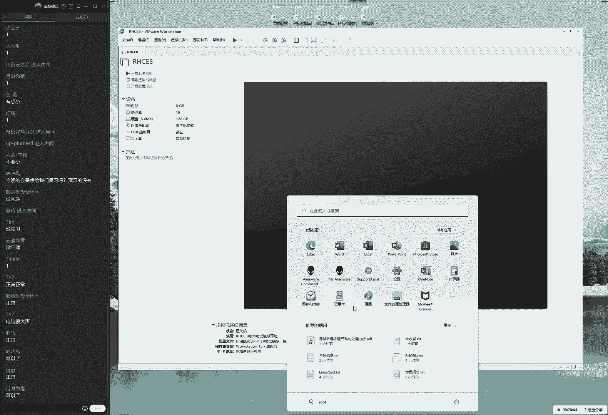

变成一个sible自动化运维的一个课程啊，大家可能听我们这个课比较奇怪啊，因为我们同样内容我们说了两遍。因为的话呢刚才这个麦克风声音有点小，所以我再把我刚才说过这个问题的话，再大家去重复一遍。

就是我们这个考试内容的话，它发生了变化了。2020年8月1号以后，那他现在考考开始考的是这个自动化运维考的是一个ible的一个内容那自动化运维的一个课程。那么这个话就是它实际上之前也是考过。

但它是C里面考过的。我们现在所看到这个考题的话呢，实际上它是C里里边的D期的考试内容。也就是说我们同学们，你们现在考的这个啊，那么你们现在所考试这个内容，实际上他们原始于到HC里面内容的。

也就是说这个难度的话呢，会比我们之前往前十多年考C要更难了很多。但是的话呢我们好在现在两年时间过去了。我们现话作为那我们现在呃作为考题比较稳定一段时期的话呢，现在能给大家提供一个比较完整的一个题库。

也就是说虽然考试的难度增加了。😊，但是我们去备考起来的话呢，这个付出的时间跟精力的话呢，并没有一个明显的增加。这是要给大家说到，就是首先大家说要心理的一个预期。这个的话呢难度确实比较呃确实变大了。

所以同学们说说之前没有做预习的话呢，看来还没有重视啊，对这个一定要重视起来。第二点的话呢，就是我那么我们现在这个考试的话呢，时间需要往后拖一拖。因为现在这个全国疫情的原因，我们暂定的话呢。

我们我们原先说的是5月6号，但是呃我们现在也不能给大家去约。因为北京的话呢，已经算是软封城了。然后的话呢上海的话呢，目前已经是真封城了。然后现在在广州的话呢，目前也是所有的考试都被停考了。

现在深圳的话呢，还可以考，但是人数的话呢可能不太够。所以我们现在的话呢，预计时间是在5月的中下旬再给大家约考试，约的时间的话呢，大概是6月的中下旬，到时候看看政策有没有呃放宽。好。

那我们怎么招说的话呢都不影响我们今天先把我们这个课给大家讲了，这样的话大家可以去准备一下备考工作了。那么我们今天这个。😊。

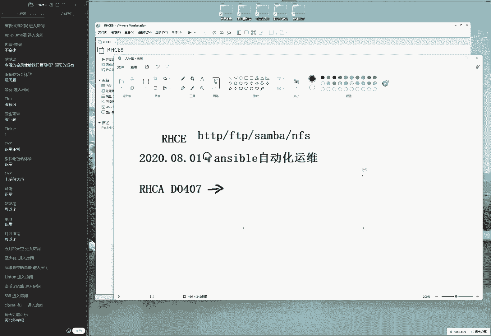

实验环境的话，大家先可以从我们的这个网网站当中去下载一下我们这个实验环境。也就是说这个实验环境的话，大家可以进入到我们学员页面里面。

然后去下载一下这个下的话我记得好像是好像是好像总共的话大小是10个GB吧今天反馈过啊，说这个软件包特别大这个都需要下载。

对他都需要去下载大家进入到我页面里这个里话们一个考试环境大话先去下载一下它里就可以抛弃们一个服务大家先去下载特别概有1个G同学们都下。大家说河北能考河北没有红考场们大家先去下载着啊。

先把我们这个软件包给下载好大小的话大概是10个GB个下载好话，家可以去说一下大概的话10个G大小那下载好之话会有这样一个界面我们要给大家说到一点就是呃由于的话这个软件包打包的候是考官帮我我去打包。

那个考试环境就是它。😊。

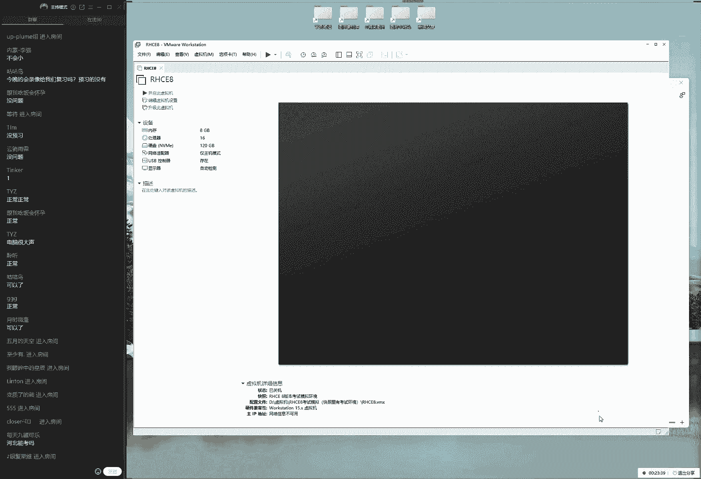

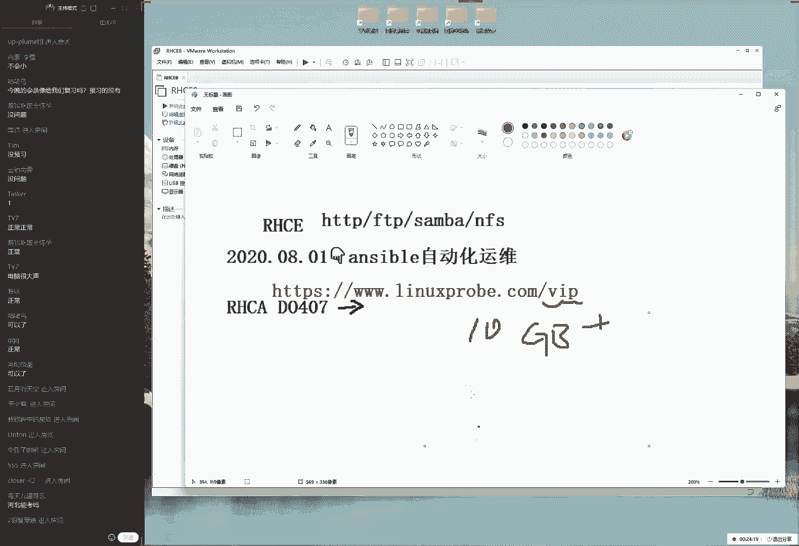

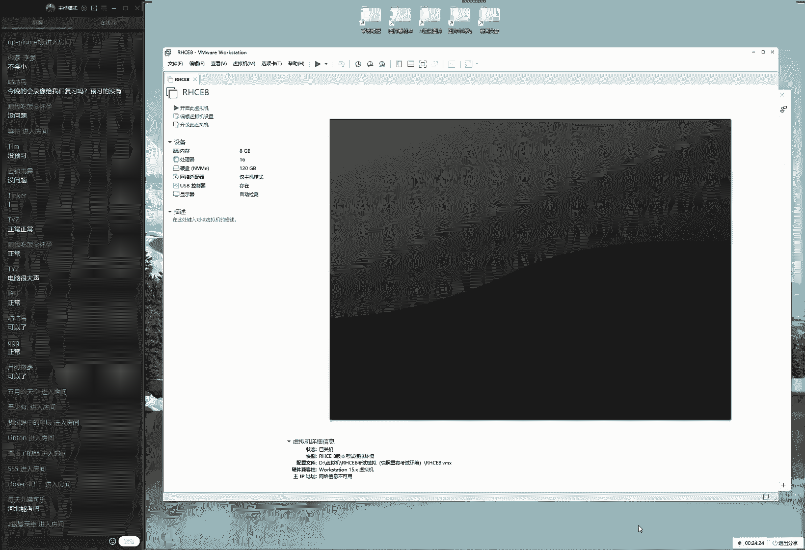

啊他当时这个考试的机器的话呢，跟我们当前加过这个电脑的话有点区别。所以我们同学们有一定概率。如果说我们点击一下这个还原虚拟机，因为他做好两个快照，大家看到它做好两个快照了。

上面的话呢是我们那我们可以看到上午的话呢是H3AC他能做好一个快照了。然后那我们这个下午HC的话，它也有一个快照，那我们同学们再去还原快照的时候，有一定几率是出问题的。大家看一下我现在这个操作。

我现在就给大家讲一下啊，这个是有一定概率，当我们去还原到虚拟机的这个快照的时候，它会有这么一个报错。如果说你看到这个报错的话呢，不要特别着急啊，我们会有解决方法的。如果说您呃还原快照的时候。

看到这个报错了啊，没有关系，那么按我这样的这个操作，大部分的情况下就能够把它解决掉了，怎么办呢？首先我们点击在这个编辑的虚拟机。大家说天津考场这次游戏吗？河南有考场吗？这个话我们先不给大家去说啊。

先把我们这个课讲完吧啊因为大家在问的话有点乱了，我们很多个省市吧，等我们下课之后给大家慢慢去。😊。

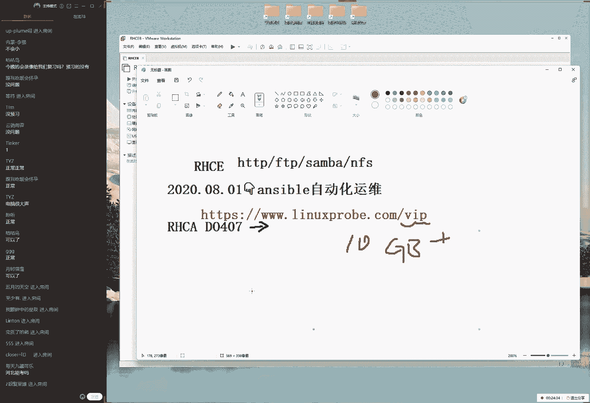

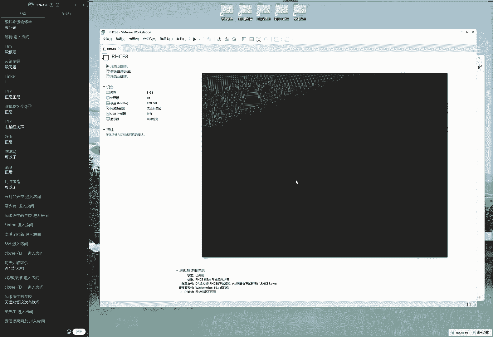

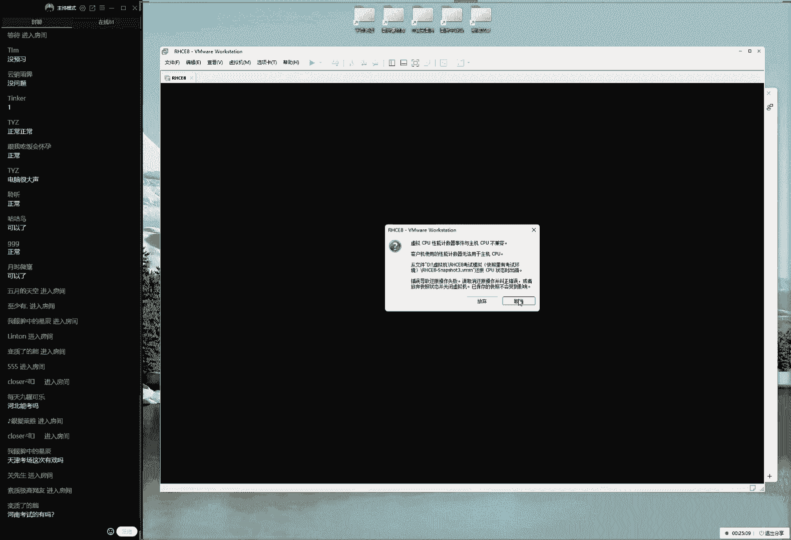

捋一下，然后我们先点，如果遇到这样的报错，怎么解决呢？首先第一步不要着急，哎，到先去倒杯水。😊，哎，好了，哎，这杯水倒好了哎，这个啊呃这个我们就第一步做好。第二步的话呢，点击一下这个编辑虚拟机啊。

刚才坐上啊，因为我刚才正好烧了壶水啊，刚做开，然后倒了杯水把插器上了。第二步的话呢就是我们去点击一下这个内存啊，看一看就可以啊，8个GB足够了。然后我们这个处理器的话呢，我们需要去选择一下啊。

我看一下啊，当前的话呢这个还不能去选，因为它应该是困在这个快照号里边，我们点击一下这个运行虚拟机看它能不能跑起来啊，稍等一下，我们点击放弃。然后我们再点击一下这个编辑虚拟机。

然后我们点击一下这个处理器的话呢，我们选择一下处理器的话呢，核心数量它还是为一。然后呢我们的呃内核数量，我们当前就以我这个实际为准。因为的话呢我这个电脑要法尔赛一下啊，我现在这个电脑的话呢。

是I9的十二代，所以我们可以点击一下性能，以您的这个实际为准。那我现在这个核心数的话呢是16。所以啊按照我们现在自己的这个实际情况去选择一下。那我们这个处理器的数量是一，那话内核的数量就是16啊。

以我们实际的情况去选择。😊。

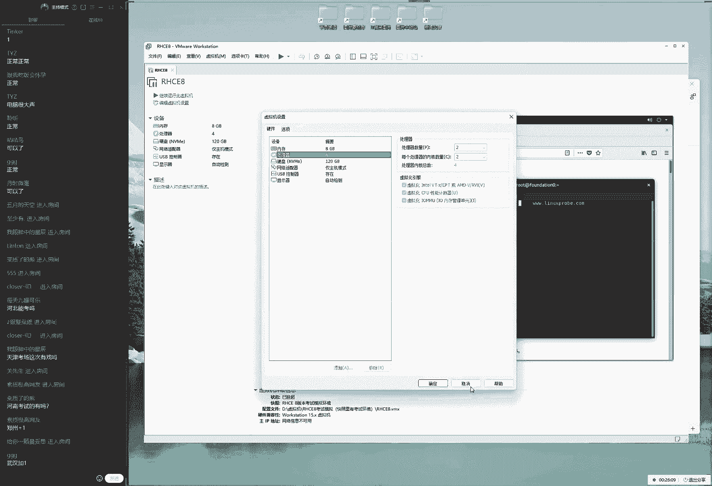

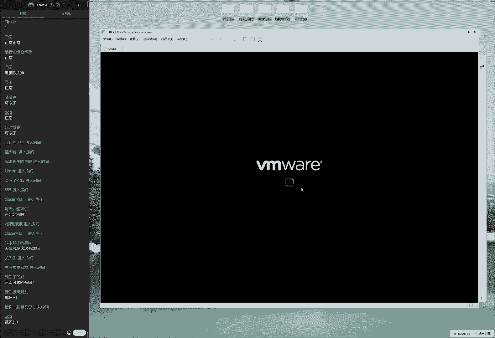

然后的话呢我们把这个中间给大家取消掉啊，那我们取消掉第二个虚拟呃，那我们去取消掉处理器的性能计数器。那我们点一下确认它的话呢并不会影响到我们虚拟机里边再去做这么一个虚拟化工作。

但是话我们再点一下这个开机就理论上来说就能够打得开了。当我们当我们刚刚看到才那个界面的时候呢，要点击一下后我们进入到这个编辑内核界面当中去输入一下我们的这个账户的名称叫做root然后密码的话呢是一个大写的A。

然后是阿西莫夫呃AOV然后我们按一下回车进入到我们这个内核编译界面当中，我们需要在内核当中的话呢去下一个断点这样话我们就可以进入到救援模式里了。

这就是我们去解决掉我们这个虚拟机这个CPU它不支持以及的话呢去重置下我们用户密码这样的一个前置条件。进入到里边之后话呢，我们加这个断点叫做这个是我们下午那一门课这个话是我们上午的。😊。

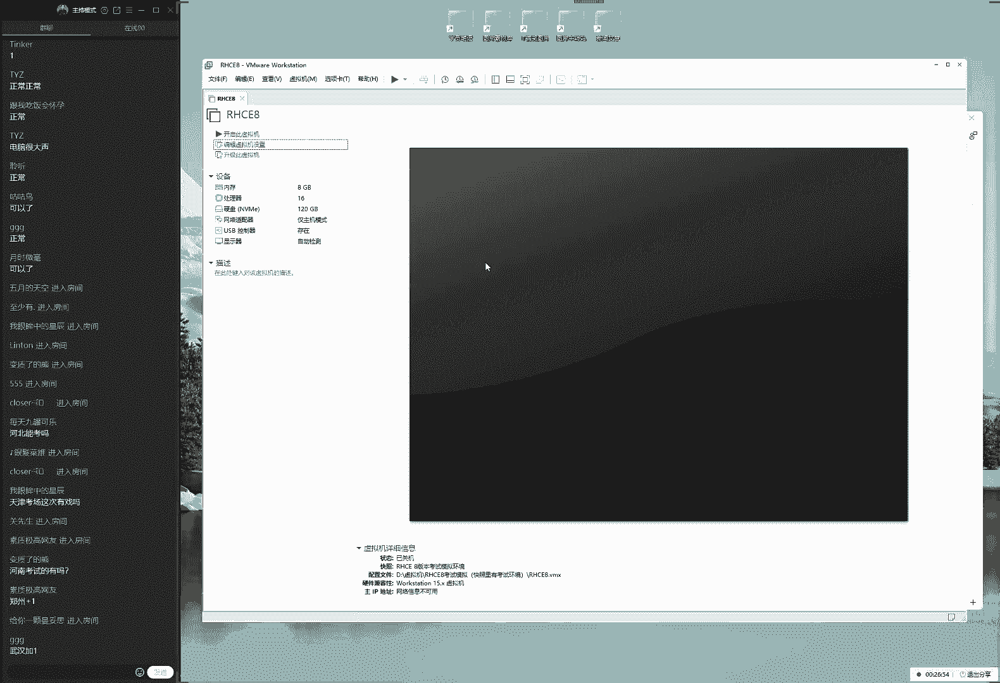

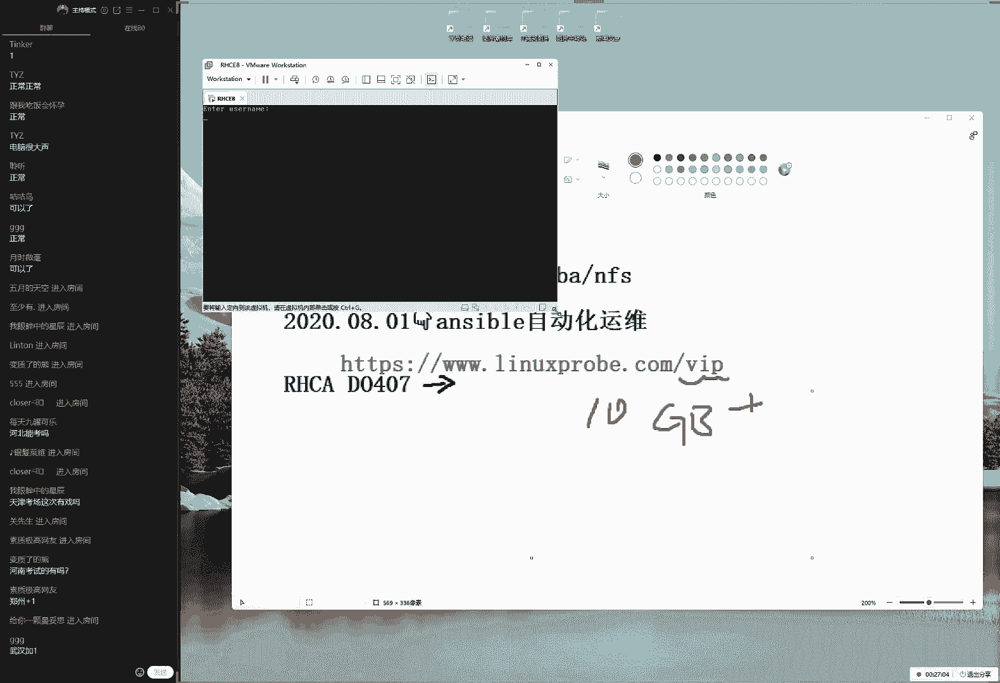

第二台机器里面这个是我们考到过的。所以的话我们破解密码这个操作。大家的话应该是并不陌生。我们在里面去下一个断点 break记得还要去加一个conl吧吧？

们设置一下我们这个登录终端视为唯一个同化界面0这做好之一个trol加X去执行。这个话自由小这没关系啊自由端小或者话我们没有跟上没关系啊，先听我先听我们往后啊先听我们往后去讲。

因为我都给大家准备好一个文字的一个版本了啊，那我们现在往后面去说了啊，以听咱们这个课就把新放下来啊，不用那么着急。因为我们这边都会给大家准备出一个非常要不说怎么自己专业。

以我们这边都给大家准备好一个非常非常详细的文档了，待会的话我们讲完这套流程了的话我们能做什么的一个事情了。

然后就把文档给大家这样话大家可以找找文档自己去操作了那我们进入到这个单进入到我们这个单用户模式模式里的话呢，进入到边模式里面们让我们这个操作这个目录。😊。

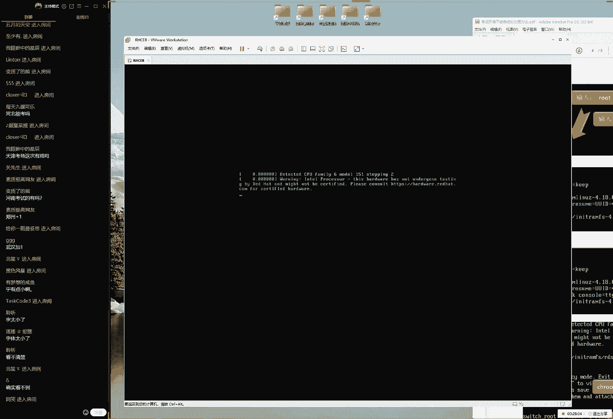

有这个科写权限，我们来去mountmount。然后的话呢让它可以有这个读写权限。然后并且的话呢去进入到我们这个系统的目录当中。等于说我们可以对系统里面的文件来进行编辑了。

然后来去输出一下我们叫等于说把我们当前关联的密码的话重置为叫重置好了等于稍等一下把我们用户的密码给它重置好，然后就要加一个参数N从标准模式当中进行接收。O没有问题。

然后话呢我们有一个文件叫做在跟录当中创建一个自动重置标签的一个文件。这样的话它得会它会在下一次开机的时候，把我们的lin的标签嘛，都再重置了。

那我们重置用户密码这个操作它已算完成了做好之后troll来两次保存。接下来它就会自动帮我们去把我们给它设置好，并且的话呢待会我们就可以去使用到用户的身份叫做root账号名。😊。

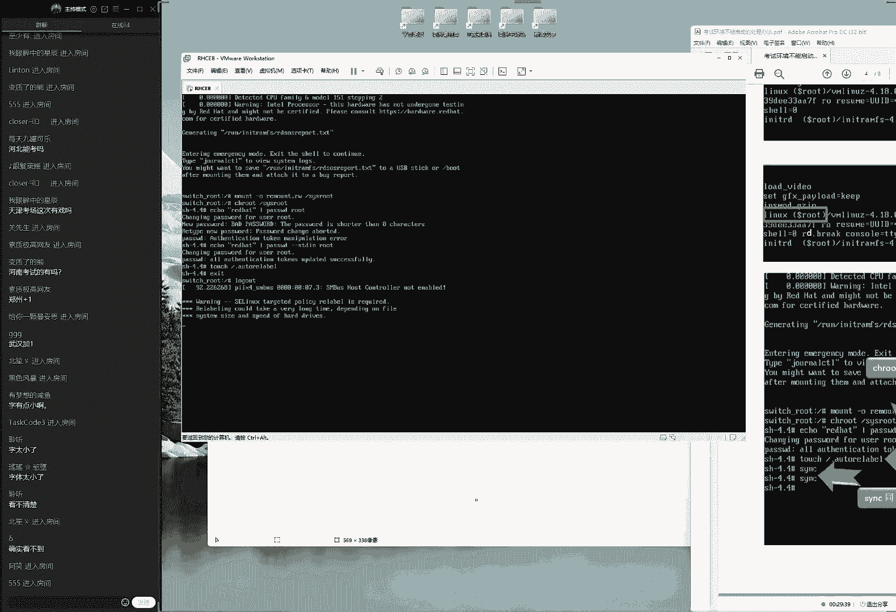

然后的话呢以及密码叫做re has登录到我们这个实验环境里面了。以上的话呢就是我们如果说欢虚拟基因的这个快照，然后出现问题。然后大家如果打不开实验环境的话呢，一种解决方法啊啊后大家看看可以空供参考。

这是第一件事情。第二的话呢就是啊这啊这个是我们第二个事情呃这个事情了啊，第三个事情就是这样的。如果说您真的遇到这样的一个问题了。首先不要着急啊，然后我们可以进入然后我我们给大家准备好了一个文档了。

大家的话呢现在可以进入到我们的。😊。

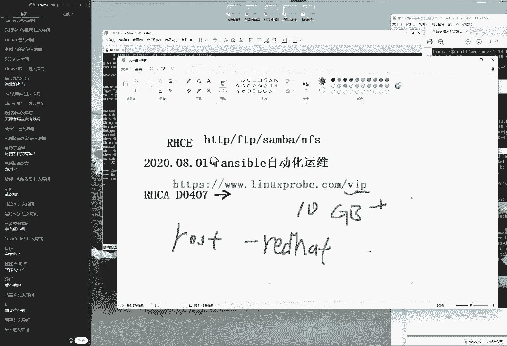

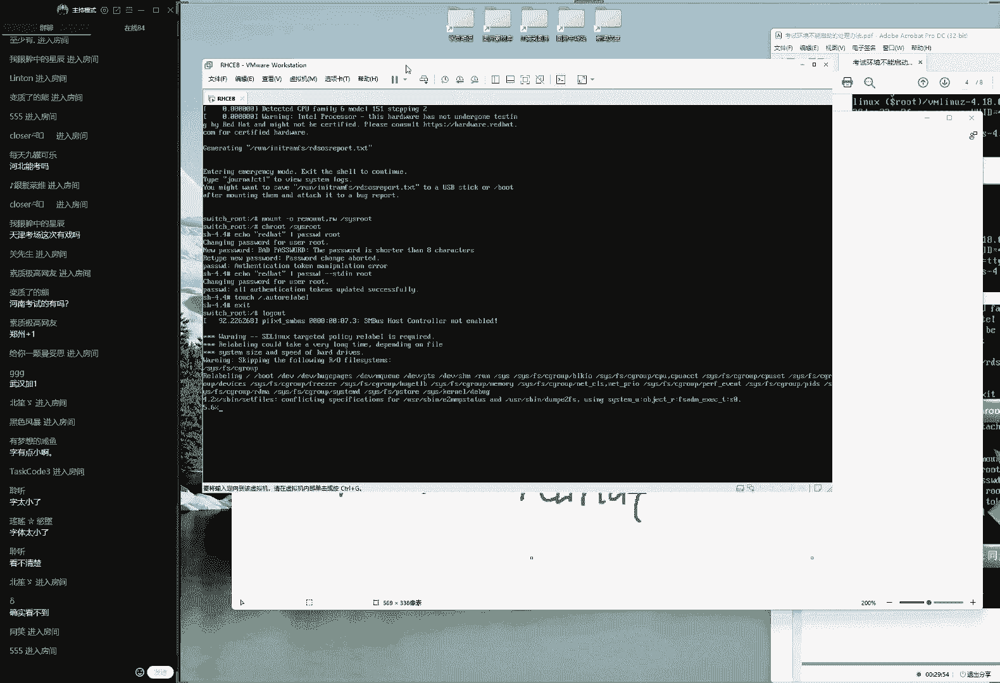

学员的群当中，稍等一下，先进入到我们学员群里面。我把这个文件给大家传到学员群里面去。如果说你的如果说你已遇到这个问题了，现在大家进入到我们34期群，然后的话呢我们我那我们点击在这个文件的选项标签。

接下来的话呢我给大家传进到里面去这个文件叫做考试环境不能启动的解决方法。好，大家可以去下载一下。这个里面的话呢，就把我刚才这些所有的操作都给大家呃用截图的方式，以及用文字的形式给大家描述好了。

并且的话呢相对来说比较的详细。大家看可以按照我们这个步骤去操作就可以了。好，呃，这个我们先去讲完了，然后我们把它给关闭掉。大家就可以先去下载着啊。😊。

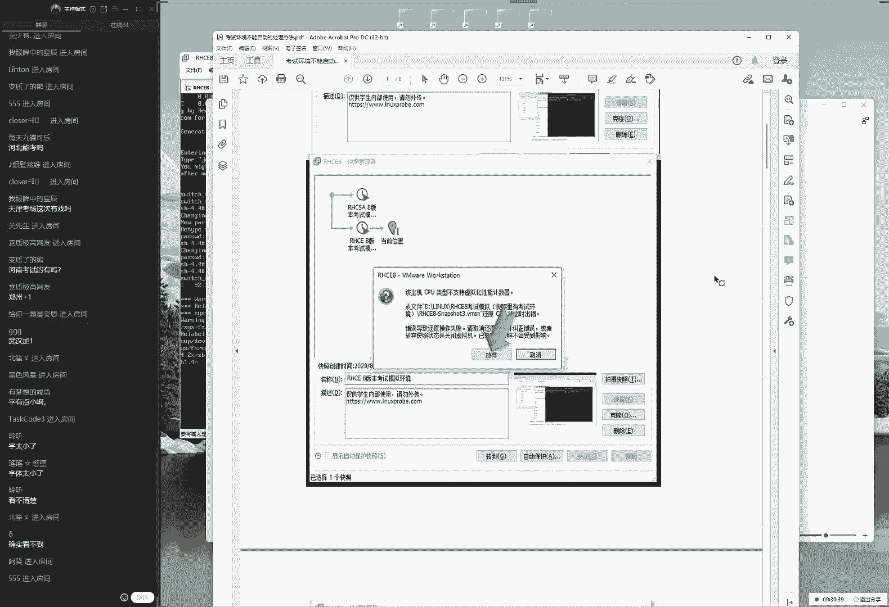

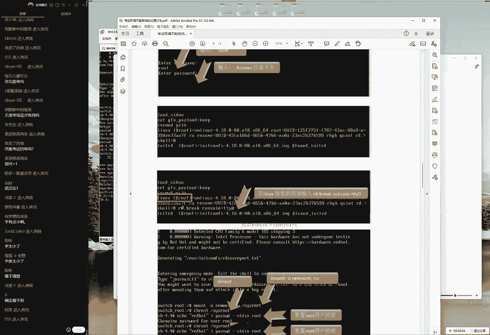

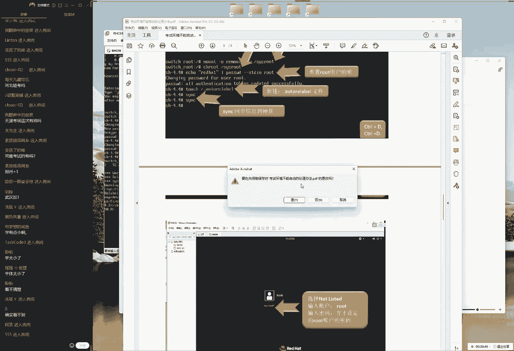

如果要是遇到这样的问题了，就可以按照这样的这个方法进行操作。那么这是第一件事情啊，不这个就是我们的第一件呃，需要给大家说的一个前置的事情。第二的话呢就是我们如果要是想要去去做这个实验环境的话。

大家对于这个硬件配置要求是比较高一点的。现在的话呢，据我们这个反馈来讲，我那我们这个处理器的话呢，必须是I5以上的。并且的话呢这个内存一定要是8个GB以上。因为我们在虚拟机里面，它要套6个虚拟机。

这个对于我们虚拟机的这个呃硬件要求的话呢是比较高一点的，它对于我们这个真机的硬件要求的话呢，是比较高一点的。所以您应该去找一个这个硬件稍微好一点的机器来做我们这个实验。😊。

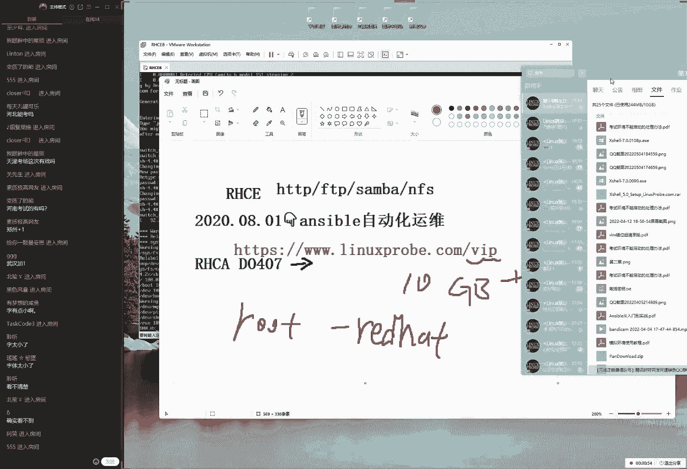

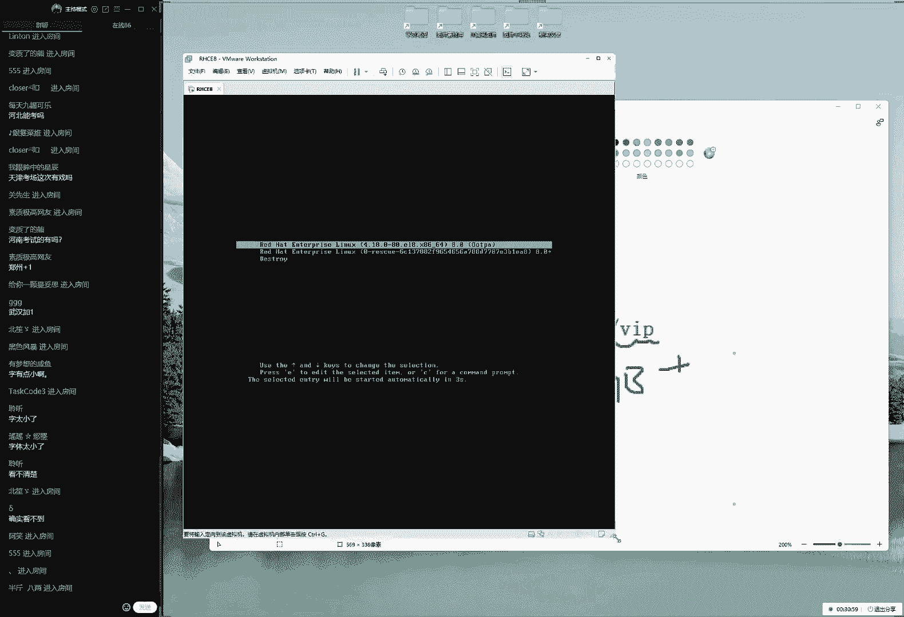

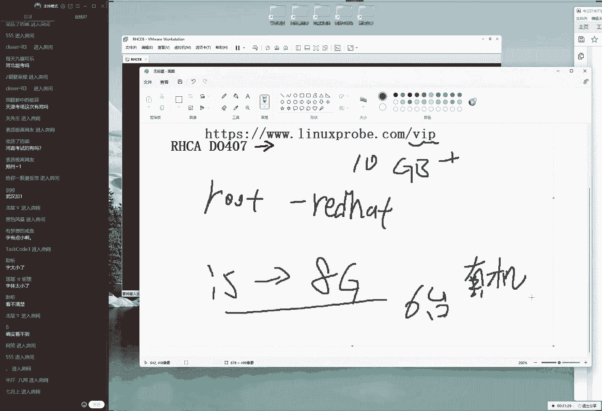

，然后我们今天来给大家去操作一下啊，这边正在开机过程当中，我们等他一下啊，我们默认开机之后，需要先把我们里面的虚拟机的话都给大家打开之后才能够看到红包的考题。另外给大家说一个小插曲啊。

就是这些以上操作的话，在考试当中是不需要去做的。因为在我们进入到考之前的话，考官都已经帮我们把系统给重置好了。我们只需要带人的身份证，然后做到我们这个考场里面就准备考试就可以了。所以的这个界面的话呢。

以及系统的部署部署操作都会在大家进入这个考之前考官帮大家去做好的。好，当我们进入到这个界面之后，这就是考试模拟环境的一个最后的一个小卡卡。我们就要去把把它卖过去就可以进入到这个庐山真面目。

看到里面的考题来点击一下这个没有被列出输入一下用户的名称叫做root然后密码的话就是我们刚刚去重置这个密码。那如果大家以我为准的话呢，那么把就叫做。

大家先去敲一下进入到我们这个红包系统当中再给大家重复一遍啊，因为同学们。😊，数有点多呀，现在87，刚才我们上课的时候是五六好像是好像是67啊，20个同学迟到了。那我再说一下啊。

就是我们现在这个操作的话考在考试的时候是不需要的，只是说因为模拟环境的问题，我们需要去手动去重置一下而已。大家说我们的AMD可以吗？呃，我这边没有AMB的这个实验环境。大家如果要是有的话可以去试一下啊。

不过好像不太行吧，我估计有点悬啊，如果要是可以的话呢，大家最好来我们继续来去说一下，是这样的，当我们进入到系统之后啊，大家去使用到我们这个命令，然后来去查看一下，当前的话呢只有一个主机。

就是我们这个考试环当中的话呢，左侧有一个活动按钮，在我们考试的时候也是这样的啊，去点一下这个小红帽子，然后就点题了，对不对？就是点题了啊，点一下这个小红帽子就能够看到红帽的考题了。哎，这个双压啊。

大家看到这个红帽的考题红帽考题里面有要求了，说我们有6台虚拟机的这样的一个系统。另外大家我们现在所以给大家讲的这个课程。大家话既可以。😊。

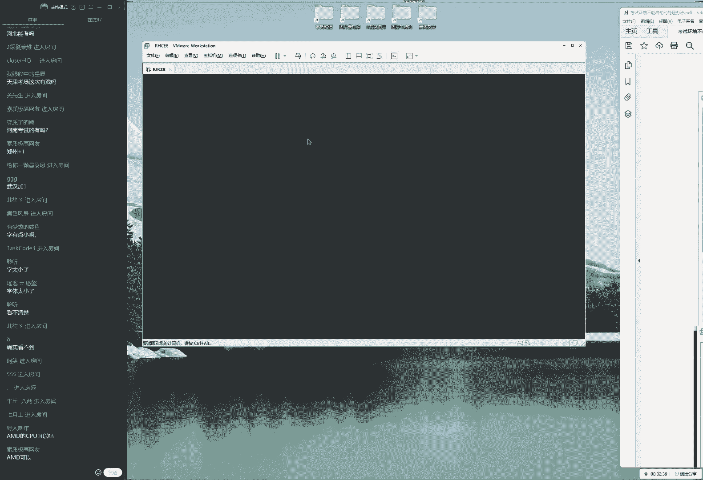

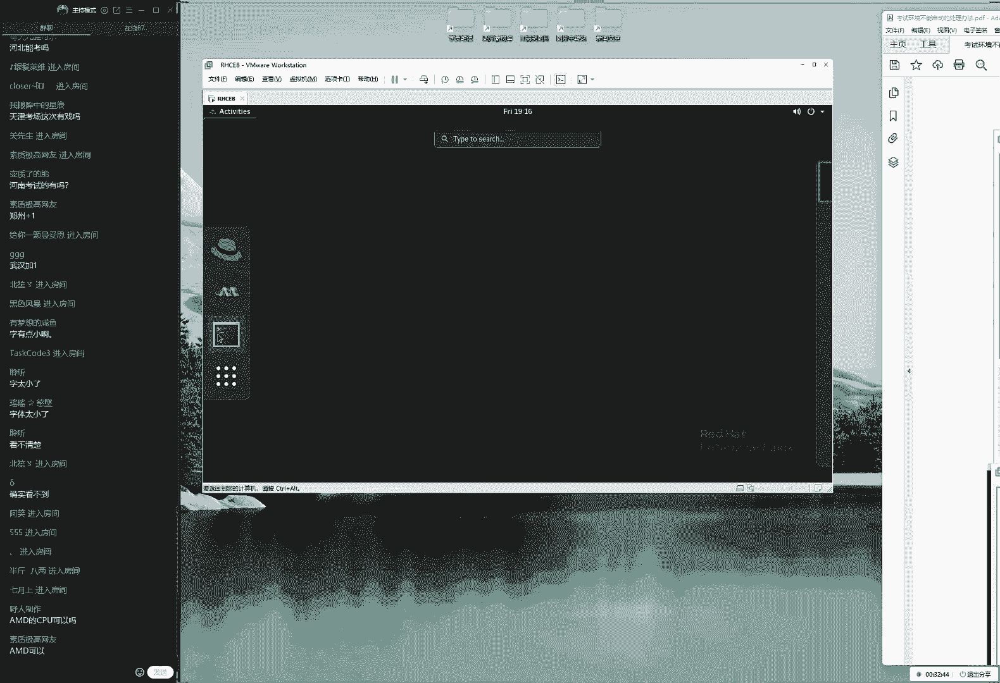

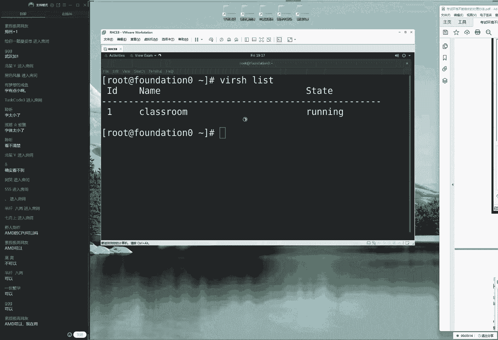

那咱们网页上面就是在我们学员页面里面是有红帽考题的。好吧，就是我们现在给大家讲的这个事情。再给大家讲这个考就再给大家讲再给大家讲这个内容的话呢，在红帽的这个页面里面是有考题的。啊。

大家话呢进进入到这个页面里面，就能够看到红帽的考题，有上午的H3AC还有下午的HCE我们现在的话看的是上那我们现在看的是下午的HCE请大家找一下我们所对应的一个考题。第二个事情的话呢。

就是如果说我们今天呃有同学没有做预习的话呢，就可以下线下了啊，那么呃就可以先下线了。因为。😊，今天这个呃呃因为的话我们今天这个讲课难度还是比较大的。如果没有预做预习，那肯定听不懂。

所以的话我们就建议大家踏踏实实的下线，然后把这个预习视频看完了，然后我们再过来上课了。呃，这是第这是我们去获得考题的一个方法进入到学员啊进入到我们学员学的这么一个页面当中。

第二个事情的话第二个方法就是大家翻开我们的这个书第十六章节，但是会给大家讲课的时候待会我们给大家讲课的时候啊，呃我们会针对于这个考题，然后给大家做一个实验嘛。如果我们讲课过程当中的话。

某一个考题您没有听明白。那么您可以看一下第十六章节，第十六章节，实际上就是把红包的这个考题给大家拆分出来了。然后每一道考题给大家单独列了一个小节。所以如果待会我讲课当中，大家就得快了。

那么就可以翻开书去看一下我们具体的一个文字介绍。好，随着我刚才说的很多废话啊，主要推延一点时间啊，所以可以看到当前的话呢有6个主机，然后我们现在的话可以看到只有一个主机正在运行。这个时候怎么办呢？

如果说我们要想把另外一的舞台主，那我们如果说现在也要想把另外的。😊。

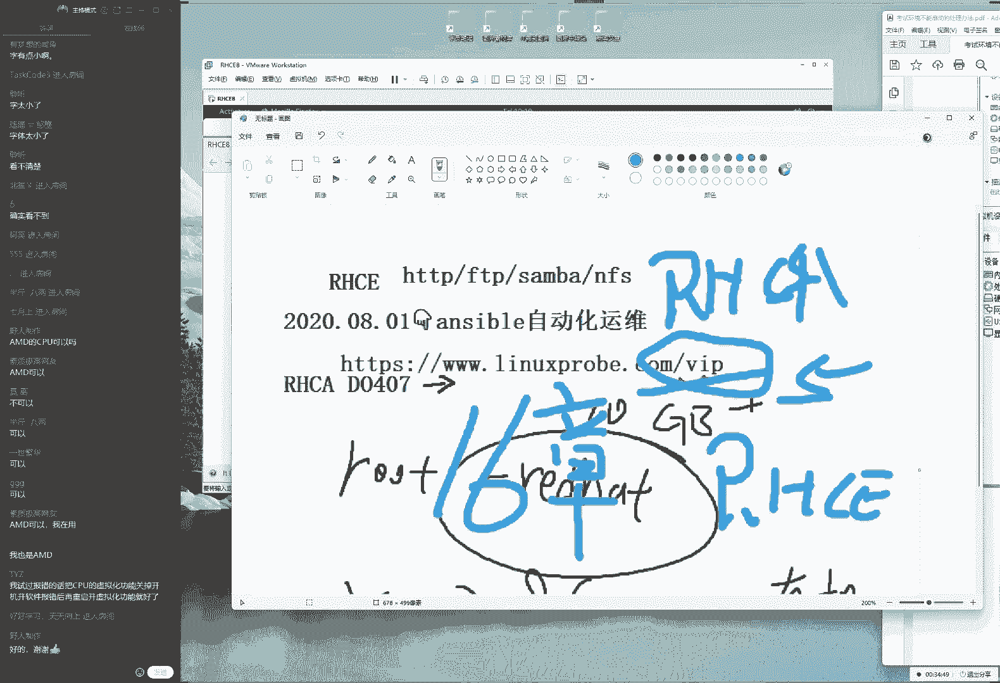

台主机都给大列举出来，我们后面加一个哦，那看一下就能看到了剩下的5台主机没有被开启。那么怎么办呢？我们给它开启就可以了啊。不对，这个它呃这个主机的话呢还不是虚拟机。

这个主机是指的是我们的真机就是说我们现在这个6台主机它都没有均运行。好了，我们现在这样我们去使用的命令。然后话呢把我们这个呃操作端叫做哎ba给它设成自动启动啊，这样的话呢我们在下一次重启过后。

它也依然呢能够为用户提供服务，它是能够自动启动的。然后的话呢我们把这个主机的话呢给大启动一下star然这个要怎么看能不能成功呢，大家看一下在这个左边会有一个虚拟机的控制选项。我们点一下这个contrl。

然后去设置一下这个control。我们来查看一下当前的话呢这个虚拟机我故意打不开啊，啊可以看到它现在打不开的。因为它没有启动。我们现在的话呢通过我们的命令。

手动对它进行一个启动操作启动过后我们就可以在这个界面当中可以点开它然后再点一。😊。

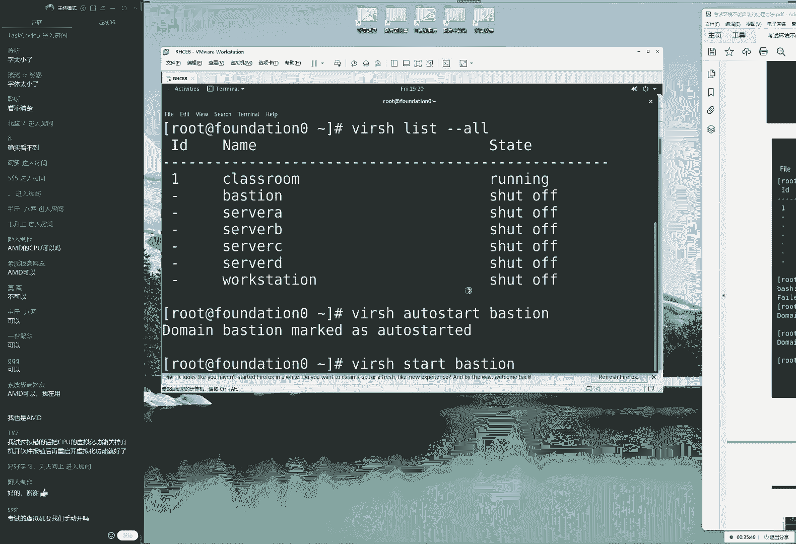

这个ctrl，然后再点一下这个cl按钮，大家可以看到了。这边的话呢，虚拟机正在启动当中。也就是说同样的这个操作，我们需要进行几次呢，就要进行呃6次。

那也就是说把我们这个5呃6个主机都分别再给它去启动一下，我们就可以。😊，来去正式开始我们这个实验环境了。再给大家强调一下这个人数越来越多啊，再给大家强调一下，就是我们现在所做这个操作。

在考试当中不需要去做。这都是由考官帮我们去做好的。只不过因为模拟环境，我们刚才是手动去启动的啊，自己配置这个实验环境。所以以下操作，我们才需要自行去启动啊，我们把这个操作。

我们就把这个几个操作系统1234ABCD啊，分别给大家都去启动一下，最后的话呢还有一个叫做worktation，我们依次都把它启动好了，就可以来开始我们今天正式的课程了。

worktation唉走走走好走好来再看一下，把6位主机都给大家启动了。也就是说我们现在一个虚拟机里面实际上是套了6个虚拟机，算我们虚拟本身原来是有7台虚拟机，因此大家在做这个实验环境的时候。

尽量选一个电脑性能比较好一点的服务器去做啊。因为这个确实比较的需要性能稍微的高一点。好把我们这个所有虚拟机都给打开了之后，它正在开机，我们来给大家看一下考题。当我们后面考题当中的话呃对。😊。

问题刚才正好回答过了，然后说考试当中虚拟机需要我们手动打开吗？是不需要的。来，我们先在给大家去说一下啊。这个的话呢我们所看到这个界面就是红榜考试的这个考题界面了。如果说您看到这个字有点小的话呢。

那么您可以进入到我们学员页面里面，然后您去找到我们这个网页，然后大家可以去大家可以去看一下这个网页的话在我们学员页面里面是有的。

在后面加上VIP然后里面会有一个叫CE考题的一个页面去找一下它在电在自己的电脑上面去看，就呃非常的清晰了。然后的话呢以及我们现给大家提供的是一个考试的真题，就是说在考试当中的话呢。

您看到这个文字会跟我是一模一样的。除了可能是说比如说一些参数，让我们去说让我们去说的这个密码，或者说让我们去新建出来一个一个呃用户名称不一样。除此以外，其他内容都是一模一样的。

这就是考试当中给大家考出来的一个环境。所以我们现在的话呢对于这个考题不会稍微呃并不会特别的快。我们会围绕这个考题来一个字一个字的给大家去扣一遍。😊。

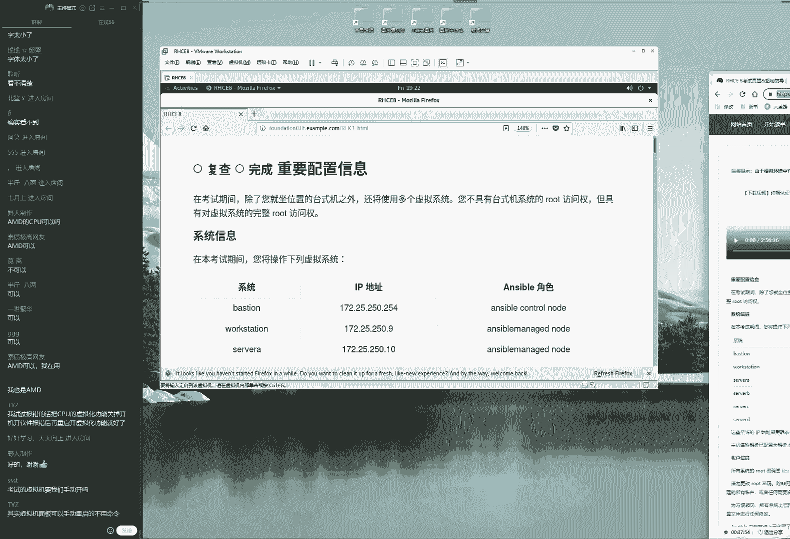

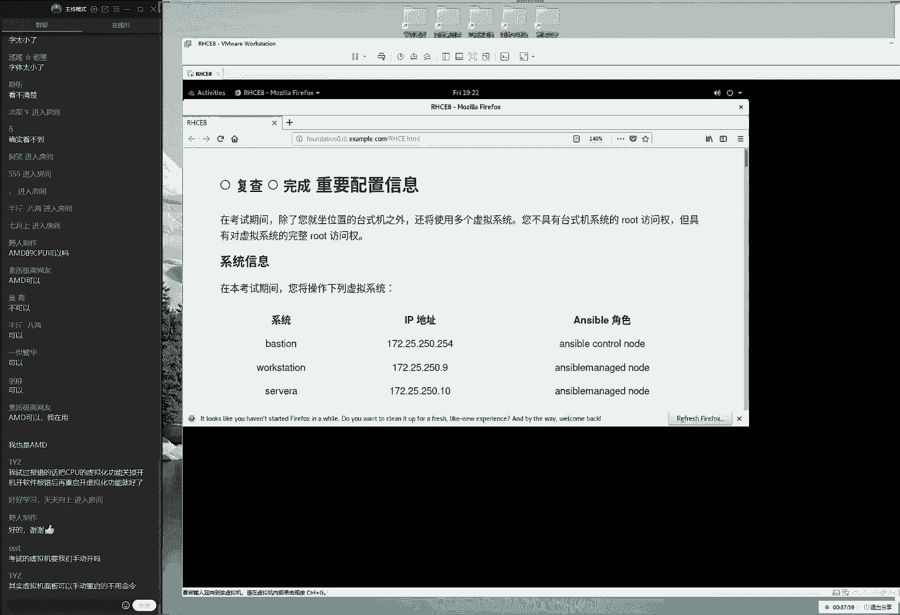

目的的话呢是为了让大家能够对于这个考题进行呃一个充分的了解。在考试当中就不用去审题了。也就是说我们现在就把考试当中审题呃，再把我们考试当中审题的这个时间给大家省出来啊，所以我们现在讲的稍微的细一点点。

今天的话的这个课，我们的的话，大概要讲三天，就是我们今天的物六日啊讲三天啊，把我们这个撤离给大家玩明白了。对于这个对于考试当中对于我们考试的前来讲的话呢非常的重要。好。

我们首先来说看这个考试的这个第一句话，他说重要的配置信息，首先点题他说您呢就是说以下信息的话呢非常的重要啊，废话啊，那第二的话要看一下里边所说的信息是这样的，说在我们考试当中的话呢。

您所做的这个台式机之外，还将有多个虚拟机。这个我们知道了，我们里边的话有6个虚拟机，就是说我们如果说在考试当中进入到考场之后，我们会见到的有一个椅子有一个桌子，我们需要坐在椅子上面。

然后把手机和我们的这个证件的话放到桌子上面。桌子上面的话呢，只有一个电脑那这个是一个电脑啊这个。😊。

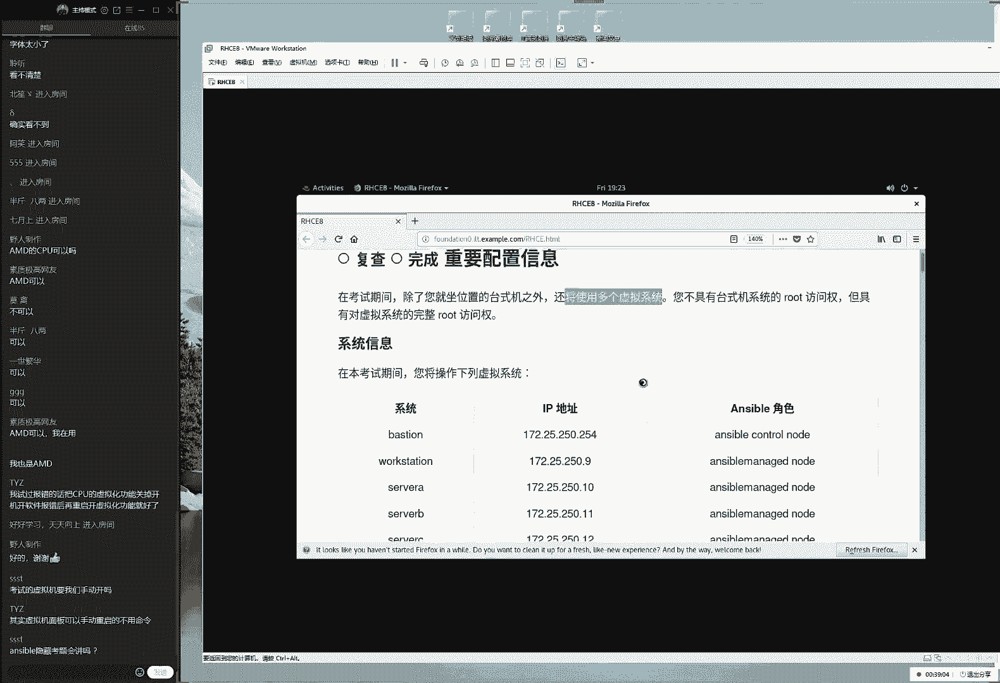

个电脑呃，稍等一下啊，换个电脑。😊，这个电脑的话呢是一台真机，也就是说我们的面前只有一台真机，只有一台物理机。然后话呢这个物理机里面有6台虚拟机这样的一个实验环境。然后我们来给大家看一下，是这样的。

然后他说我们并不具备我们这个呃物理机的root访问的权限。但是我们对于虚拟机有完整的root访问权限。也就是说我们的真机的密码，虽然说我们刚自己破解了。但是在考当中的话呢，它是没有的。

我们做的这个操作都是在这个6个虚拟机里面来进行的操作。好了，啊那那啊那么也就是说我们做有的这个操作都需要在这个6个虚拟机里边，然后我们来进行一个操作。另外的话大家现在提的这个问题。

那我们先不给大家回答了。因为我们现在讲课当中的话呢，东一下西一下，大家听起来也比较累。我们先按照我们这个思路给大家讲完了。基本上我们讲完了，您您提的这个问题的话呢，自然也就明白了。好。

我们按照我这个思路往下面去讲了啊，是这样的。首先看一下虚拟机，首先来看一下考题里面，对于虚拟机的一个描述，也就是那也就是说知道了现列系统当中的话，有6个虚拟机。😊。

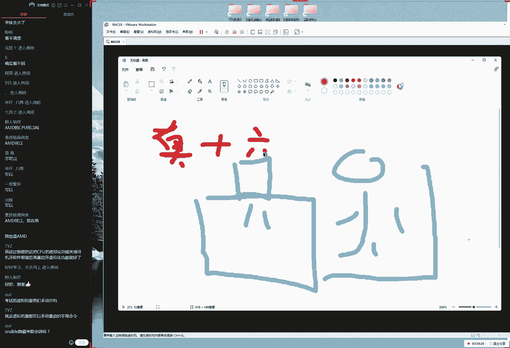

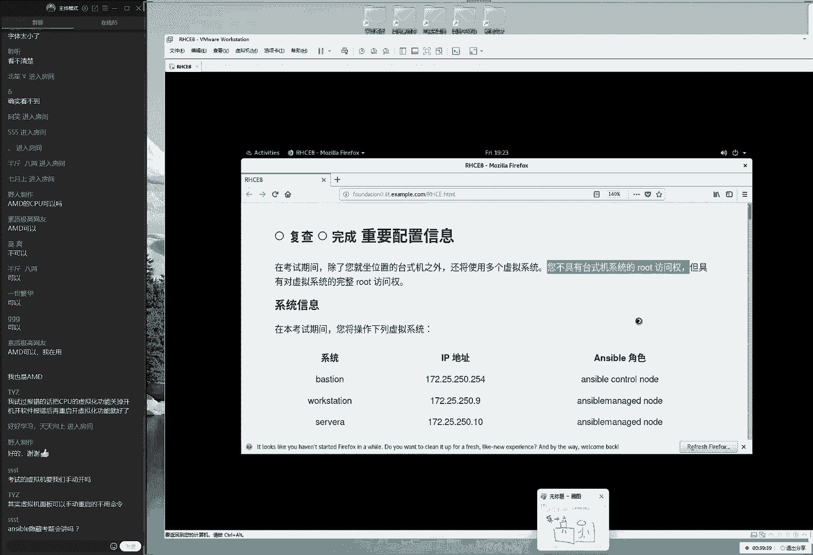

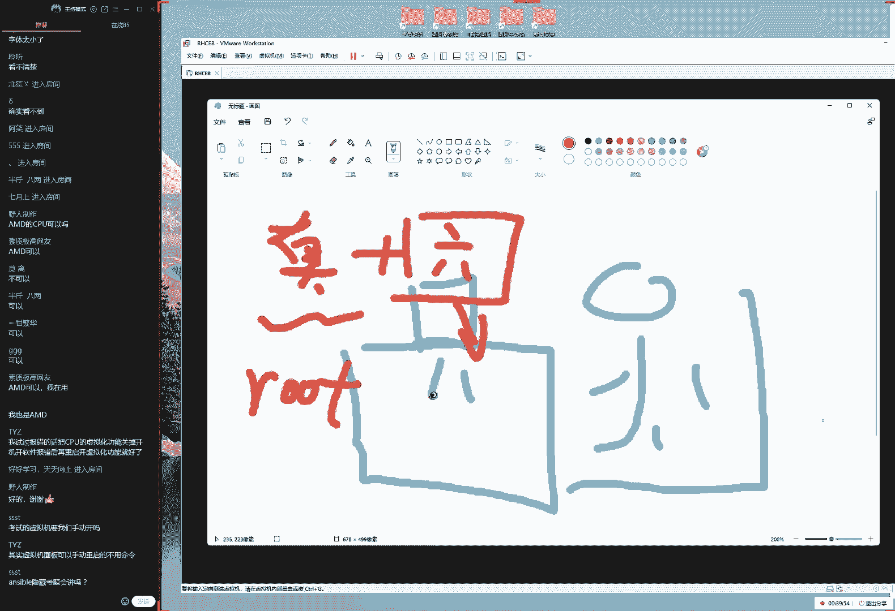

那么这六个虚拟机的话呢，分别的IP地址以及它主机的这个名称显示到了屏幕上面啊，可以看到有这样的话以下这些信息。我们建议的话大家可以啊大家会可以像我一样拿出一张纸来啊，可以拿张一张纸来不要特别大。

然后大家再拿出一杆笔，然后的话呢把以下信息写到自己的这个纸上面。为什么呢？因为我们以下的这个所有操作都需要对于训拟机，这6个训拟机来进行操作。那么我们老是抬头啊看一下，看一下，看一下吧，有点累。

所以的话呢我们现在就呃一起来操作啊，172。25。250。254。所以我们先把以下信息的话，先写到一张纸上面，避免了我们在做考题当中嘛，然后老是来回来去翻呃去翻网页，特别的麻烦。

所以我建议大家在考当中的话呢，也是准备一张纸出来，然后把以下信息的话呢写到自己自己自己的这个纸上面。这样的话呢作为这个考题的时候眼睛盯着屏幕，然后也不用来回来去老切了。呃，比较的专注一点。

所以稍等一下同学们，我先把以下信息也都写到一张纸上。😊。

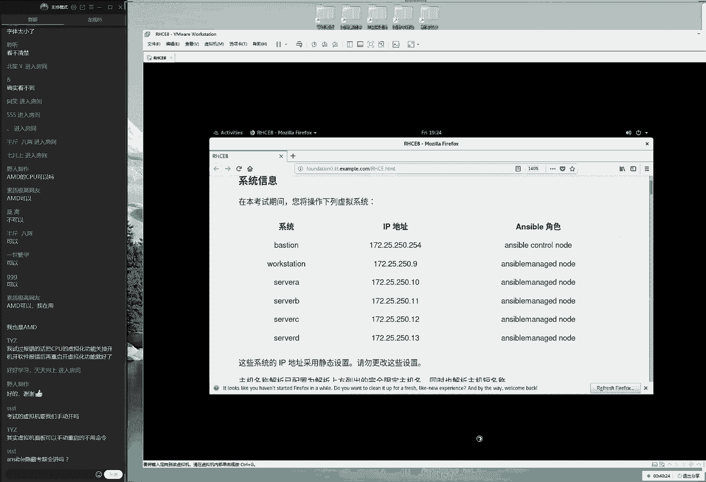

我现在的话呢只需要去写我的IP地址，把我这IP地址的话呢，分别都写下来。待会儿的话呢，还有对应的一个名称，我待会儿会告诉大家再需要怎么去写。稍等，我先把它写下来啊，172。25。250点。

不要看这个910111213好像看起来相同，但实际上他们是待会儿会属于不同的分组的，因此哎待会儿我们老需要去反映一下。他们比如说告诉我们说某一个分组的名称。那么好了，呃，DV组对应的是哪个IP地址呢？

那我们就要翻过来去看一下，挺麻烦的，稍等一下，我抄好了，一共的话呢是6台虚拟机。那我们把地址的话呢，分别写到我们的一张纸条上面。😊，贴到屏幕上面，待会儿的话呢只需要关注这个网页就可以了，不用再去老切。

那我们再继续往后面去说看一下的话，它里边有6个虚拟机。但是我们像但是我回说再看一下这个题目啊，为这个题目里面说到了说我们所有主机的IP地址的话呢，网卡都变成了一个静态的一个设置，并且的话呢请勿进行更改。

并且的话已经进行好的域名的一个解析，我们也不要去进行修改。也就是说里边的话要求大家所有的网卡信息以及IP地址以及我们的EDNS信息都已经啊包括说我们的DS服务啊。

都已经帮我们在考试当中已经呃在都在我们考试的呃考试之前帮我们配好了。我们的话呢不要去动就好了。也就是说所有的这个网卡信息已经有了这个信息不要进行修改修改的话呢，反而会扣分。

这就是这它又是提到了红包考试当中的一个原则性问题就是一个也算是一个一个规则吧。所有的红包当中考过的内容，它不会再去考第二遍。那既然我们的上的。😊。

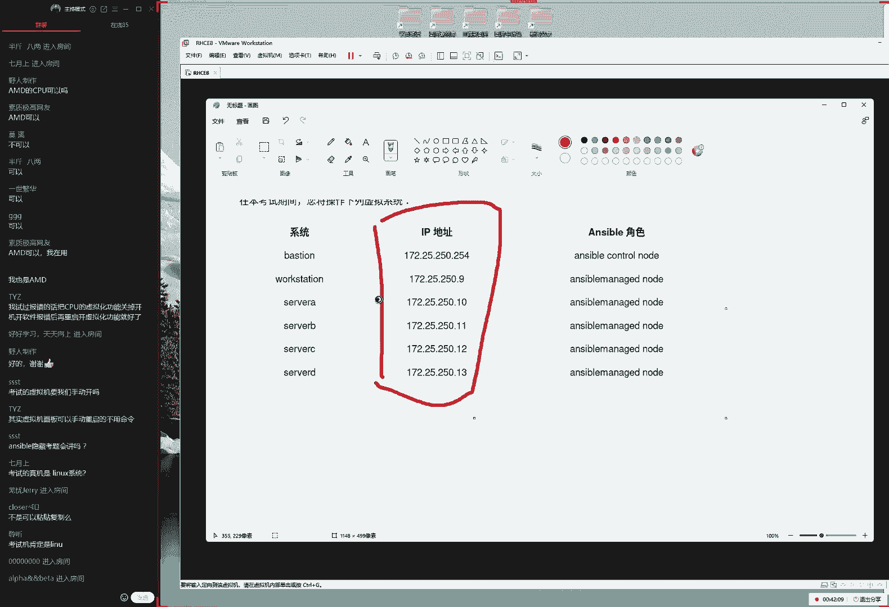

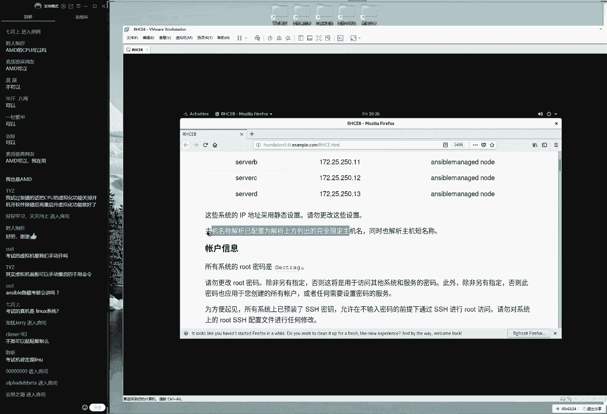

3AC啊已经考过对于网卡的配置。那好了，那么在2C里面就不会再去考到对于网卡的配置。所以它就这么一回事啊，那所以说那么话这一些信息已经配置好了，不要去动就好了。然后接下来我们来看一下往下面去说。

他说我们所有的这个密码的话呢都叫做flag，并且的话呢我们的密码也已经都重置好了。么以及的话呢所有的这个密码都会以这个名称为准。啊，我们看一下，并且我们每个主机之间的SSH这个密钥链接都已经配置好了。

我们请勿进行修改。好，我们总结一下这三呃我们总结一下这三个啊我们总结一下这三段话啊，他所说的这个事情。首先第一件事情就是我们当前我们6个虚拟机里边，他刚才提到了。

也就是说6个虚拟机里边的所有的系统我们都有注册用户的访问权限那我们既然有了，那怎么能够有呢？证明它要告诉我们它的密码好了，所以就把去点题，第一句话的意思就是说我们有6台虚拟机的这个。😊。

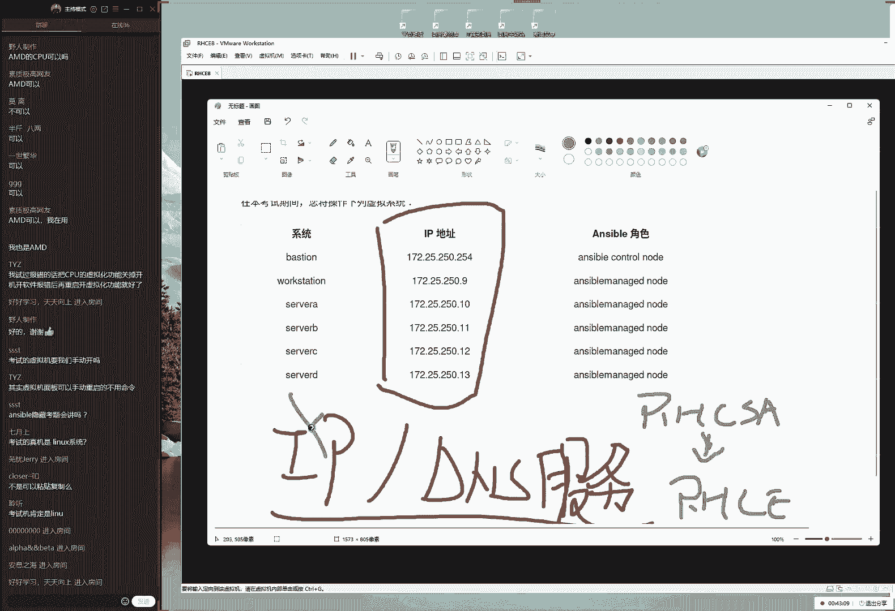

管理员的访问权限。关联员的密码的话呢是叫做root稍等一下，我把它翻译成人话，大家都能看得明白啊。在考当中的话呢，其实大家的水平都差不多。只不过对于这个考题的呃的一个呃理解的话呢可能会有偏差。

所以我们在考试当中的在我们考之前给大家给大家聊明白了把后面一些小坑给大家掰开揉给大家先去提前做一个讲解来说第一个段话的意思是说我们管理员的话给了给我们管理员的这个权限了账号的话呢是叫做root密码的话呢叫做flag在考当中话也要以实际为准。

考试当中有它有可能不是这个名字，不过也无所谓啊，以他这个实际为准就可了。这是他第一段话所说的事情。第二段话呢就是说我们已经做好了我们的呃SSH这个连接的密钥信息了。根据我们第八章节里面所学习的。

也就是说我们的SSH的我们这第九章节去学习的啊。那就是说我们在进行远程链接的时，有两个验证的方式。第一种的话就是我们传统意义上来讲就是这个账号和密码这这个口令验证方式。第二的话就是我们叫做密钥文件。😊。

然后来进行一个呃加密传输，对吧？我们来进行一个呃密钥的一个验证方式啊，密钥验证方式。那么它会有两个文件，一个是公钥，一个是私钥。那么私钥的话是在本地做加密的公钥是作为验证和解密的。呃。

不过的话当也不用关心了。他说到了就是说他每个系统之间已经帮我们自己去做好了。那我们只需要去使用就可以了。而不需要再进行任何的修改。修改的话呢，反而会扣分，也就是说第二的话呢。

意思是我们所有的主机之间都可以直接通过SSH进行连接，并且不需要去输密码了啊，他是他去方便我与我们进行一个配置来就就是直接呃远程访问SHH这样的一个效果。也就是说第九章节里面学习的这样的一个验证方式。

我们考中的话呢，他也不考。他帮我们自动把它配好了，挺方便好，那么他考什么呢？我们看到第三的话他就出来了。他说我们的控制节点上面会有一个用户叫做这个用户的话呢已经预设了SSH这个密钥了。

且的话他也能够进行。😊，登录以及下面有一段话。他说的话呢，我们的大家说我们这个真机是一台windows吧，大家想啥呢？啊？那后来我我们卡当中我们的的真机也是一台linux。

然后的话呢这个里面的虚拟机的话也是lin后面的考试不涉及到windows的系统啊，然后我们来继续来给大家去说一下下面这个信息。这就是说有一个用户叫做这个用户的呢他的密钥的话已经帮我们设置好了，好的。

然后他说请勿进行修改。他说我们可以去使用到管理员的这个账户叫做root，然后去速切换到这个用户啊，明白他大概这个意思了，然后再看一下下面这个信息，他说重要信息并且标黄了有一个底色，说明他真的很重要。

然后看一下，他说除非你有指令，否则那所有的工作都需要在控制节点上面来去完成，并且归我们的用户所有我们的所有的命令的话都要由这个用户来去执行。这也在卡当中的话呢是。😊，跟考试里面的名称是一模一样的。

因为这个出题的这一个人啊，大家如果要是从网呃百度上去搜一下，能够搜到他。这个人的话呢叫做g，他就是红帽那个考官，然后他是负责出题的啊。因为当时我们也见过2019年的时候，大概是3月份参加的一个活动啊。

当时的话呢，我们在好像是在疫情之前，对吧？当时我们见过他是一个大光头个挺高啊，他的话呢就是红帽这个考官专门负责出题的这个人的话呢，就以自己的名字命名的一个用户。他的意思就是说我们当前的话呢。

对于所有的这个呃副的配置都要去使用这个用户，叫做g用户来进行配置。也就是说我们呃考试当中考试中考试中呃全程使用用户来进行操作。并且的话呢我们配置好的所有的文件，都需要给大家放到对应的目录里面放松目录。

他也是没有分值的。大大家需要记一下这个话，然后看一下他的意思就是说考试当中的话呢，虽然说他给了我们的管理员的入题用户。😊，的密码。但是的话呢我们不能去用，他就是这个意思，对吧？

他说我们需要在全程去使用这个用户graag，并且需要把这个文件放到对应的目录里面。他这个考试当中的话呢。😊，他之所以这么要求，的原因首先他这个的要求是为让大家能够不要去使用到入题用户来进行一个管理。

因为呃我们的管理员呃我们那我们的管理员入题用户的话呢，他虽然也能够去完成这样的工作。但是他不受权限的控制。大家对这己这个那么话他如果要是不说他如果是不说这个控制的话呢，可能会呃比较简单一点了。

所以他要求我们做的这个操作不能使用管理员需要受到权限的控制。这样的话呢，我们才能够去对于权限来进行一次考核。这是对于权限的考核。第二的话呢，这个的要求主要是为了脚本判卷的比较方便。

因为大家知道后面考试的话呢，是脚本判卷的脚本的话呢，就需要把大家的这个工作的这个成果嘛。然后会遇到一个地方之后，看一下大家做的对不对？如果大家做出来这个作业的话是东一下西一下东一下西一下。

那么这个脚本他呃他们他找不到的。因此他需要能有一个固定的位置，方便于说脚本来进行一个寻找。然后来进行一个判分，所以他限定了我们去存放。😊，文件的这么一个目录。好，接下来我们往下面再往后面去看。

他说的话呢，我们所有的这个信息都已经配置好了啊，并且的话呢我们请不要再进行呃，我稍等一下啊呃他说的话呢我们在进入考场之前，我们的考官以及验环境里面有一些配置好的一些服务以及预留的一些参数。

请不要进行修改。我们可以在下面追加而不能够进行这么一个修改。呃，然后的话呢以及我们所有所有的操作都要被保留下来，写到配置文件里面。他说的话呢我们考当中我们的防火墙默认是没有的，它默认是没有启动的。

并且的话呢我们的呃系统也属于强制的模式。也就是说在考当中的话呢，然上午的已经考过了防火墙了。所以考当中的话呢在下午的H考当中大家比较轻松了，大家不用去担心防火墙的问题。跟防火墙全都不考全都没有启动。

赶紧帮我们给关闭掉了大家再一下，重复一下就是红包当中是完全没有防火墙的事情的。😊。

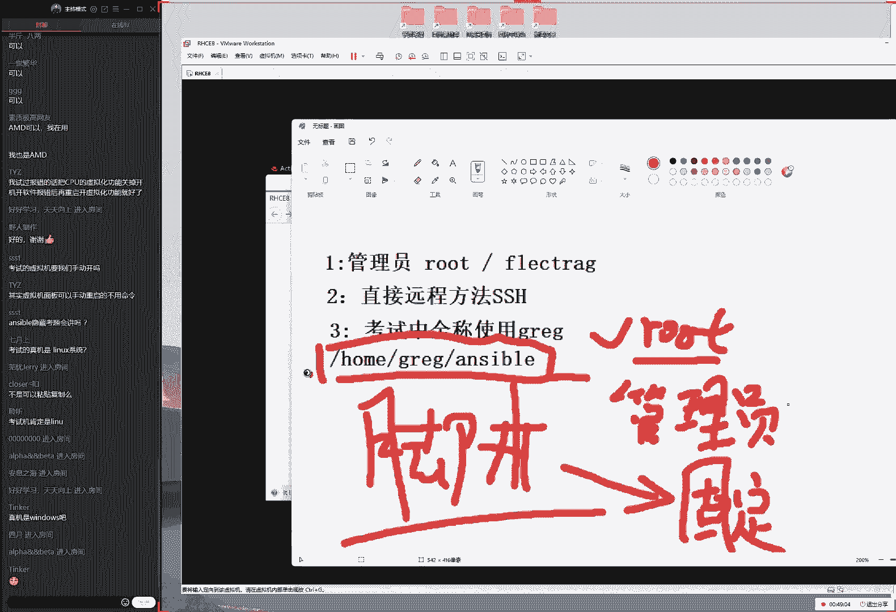

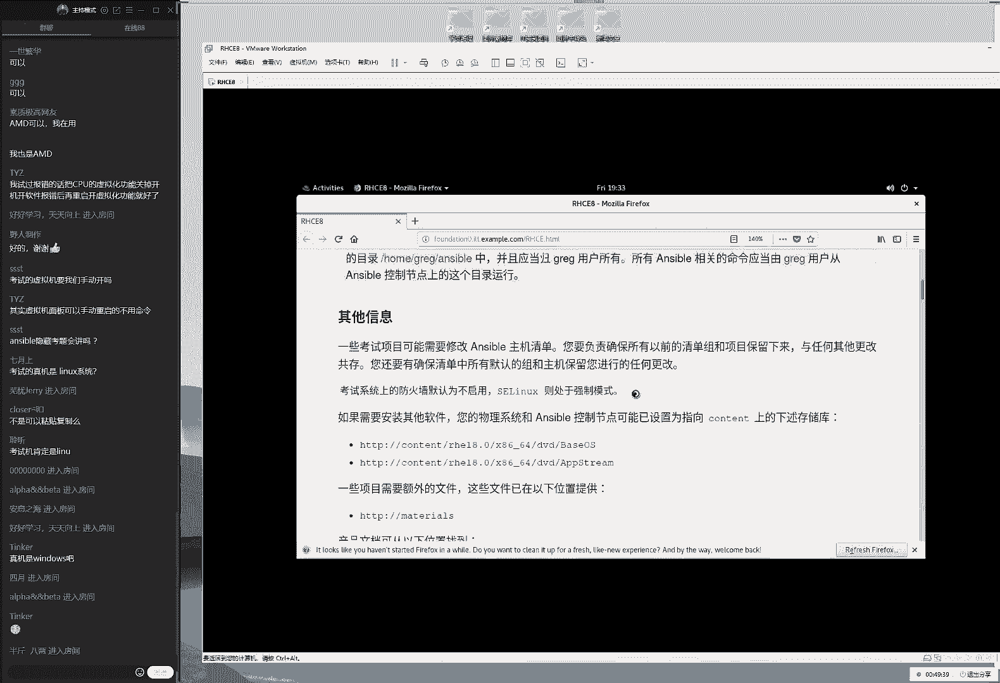

tables跟fwork全都被禁用了。然后其呃然后我那我们只需要去关注一下我们这个呃安纶子系统。这个的话呢，我们会在下周的时候给大家去讲一下它到底什么怎么回事。

但是它对于我们的呃它呃它呃但是对于我们今天所讲课的话，它并没呃它并没它它并没有什么影响。😊。

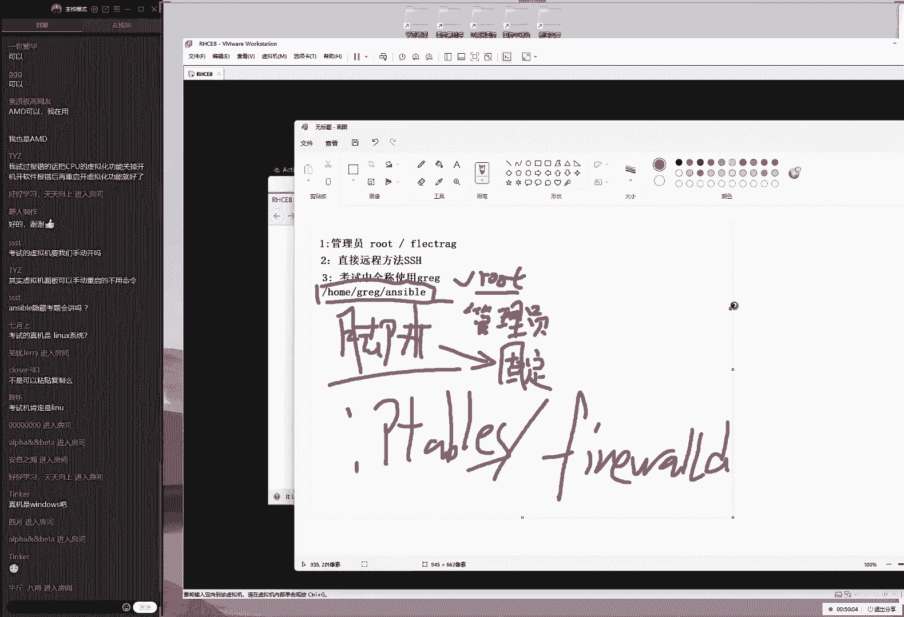

呃，然后我们下面再往后面去看啊，他说我们的话呢有两个这样的一个网址。这两个网址里边的话呢，会包括了我们的软件仓库的这个软件包所存放的一个路径。如果说我们要想配置呃我们的软件仓库的话呢。

可以把路径指向到这两个目录就可以了。待会给大家去操作，这就是我们上节课给大家去说到上礼拜日说到的。在我们考当中的话呢，我们不需要自己去搭建我们的软件仓库。在我们的考官会帮我们去搭建好。

我们只需要来去指向到它就可以了。下面一句话就是说还有说一些额外的项目软件啊，可能会在下面的考考题当中的话呢，是被需要的，所以我们再点开它看一下这个文件的话呢这里边会出现一些文件，这些文件的话呢。

我们现在都不需要去看，为什么呢？因为这些都是我们下面考题当中需要用到的文件。他需要针对于每他需要针对于每一道题目来进行配置。那我们当前不需要去看看到哪一道题目的时候，自然需要把它给用到的。

大家说考试的时候，我们进入的也是这个个用户吗？叫做对，是这样的。😊，啊这个名称是固定的这个红帽考官嘛，是一个大光头。然后他这个以自己的名字命名的一个用户。

所以所以考他在所有考试的时候都叫这个名字叫做greg。然后下面当然这个并不重要，那并并并他并不重要，但是我们就大家知道这么个事情就可以了啊。这个将又去节省了大家在考试的时候的一个审题的时间了啊。

然后我们下面一个事情就是说产品的文档可以从以下的目录当中去找到，也就是说他怕我们考试当中的话呢，比较的呃紧张，他怕我们有一些参数的话找不到呃，他会给了我们一些帮助文档，我一我一直不太理解这个操作啊。

就那也就是说这个文件的话呢，在考过程当中也是会给大家提供的就这个网页啊，虽然我们不能够上网，但是话他把这个网页的话帮我们给大家打包好了。然后我们在考试当中的话呢，就然后我们就可以这样去点。

但大家这个就是这个操作很就就会觉得很骚嘛，对吧？就是虽然我们不能去连接外网，但是他把这个网页的话呢，把这个网站都往我们。😊，作为一个离线处理了。这就算是一种卡bug了。

所以我们如果要是考试的时候特别的慌张。有一些参数忘记怎么样的话呢，只要我们能够啊去找得到它，那么也能够把这个参数给它找得到。其实这个还有点像是这种美国考试一种风格了。因为我当时有听说过。

因为的话中国的话是一种叫做应试教育一种考试方法。然后在美国的话呢是一种理解一种考试方法，所以它会给大家一些参考资料，只要你能知道怎么去完成，那我觉得就也可以嘛并不大并不需要大家来去背诵啊。

但是这个文件的话，在考试当中呃我们不太推荐大家去看。因为它比较耗费时间，如果考试当中你都已经去看这个文件了，那么就证明你确实没有好好复习，你确实预习的并不充分。那么所以我觉得你已经看到这个文件的话呢。

在考试当中一定是遇到了很大的问题了。所以我们建议大家既然考题都已经提供了，我们就不给大家照班子了。就是考试之前的话呢，好好把题给它背一背。这种机会很难得的啊。

然后下面再往下面去捋他说又有一个还它有一个还原色的话，这个还原词的话呢，好像之前出现过对不对？第二次。😊，这个两段话的话都是黄颜色的，并且的话他说的都是一件事情。

他说我们所有的这个操作都必须要去使用到这个用户叫做去完成。并且这个文件需要放到这个ho目录里的里目录当中，否则你就真没成绩，他又重复了一遍。

就是说他写了两遍意思就是说如果再按照这样的一个要求去做就真的是没有成绩。这个话呢实际上就是为了他方便去拍卷子设置的这么一个固定的一个目录。当时的话呢我是2014年的候，12月我是2014年的时候。

12月24号。然后我去上海的时候考一个呃考了一个红包的一个呃高级认证啊401。其中的话呢就讲到了有需要对于一个软件包来进行编写。就我们编写软件包叫M然后呢我们的RPM就需要把它放到对应的一个目录里面。

当时的话呢我就记得是我好像是放到加目录里面。后们比如说这个文件的名称无所谓了，我们随便去写。😊，结果的话呢，当时我就比较粗心，我好像是把这个大小写给他搞混了。我把这个P的话呢给它家写成一个大写P了。

于是我们费呃我们费了半个多小的值的时间编辑了1个RPM。最后的话一分都没有，也就是大家这个我们这这个我们就一定要明白啊，就是我们一定要保证我们自己做完了做对的这样的一个题目保存到正确路的一个路径下。

这样的话呢，我们。😊，踩在考试当中呃，能够踩分，然后才能够拿啊才才能够踩点，能够去给分。然后再给大家去说一下，就是我们今天和明天给大家做完了之后，我们会在后天去跑一下我们这个实验环境，会有一个判分脚本。

这个就这这这这就非常的啊这个非常的好了，会有一个判分的一个脚本，会判一下我们今天和昨天呃那我会判一下我们今天跟明天两天所讲的这个内容是否讲对了啊，然后我们可以看到大概的一个成绩。红帽考试的话呢。

是一个满分至300分，只要考个210就能够及格的一个考试啊，就能够及格的一个考试，大家的话就可以看一下自己的一个水平如何，然后考试的话呢，现在考时间是4个小时。如果说4个小时，大家再没有做完。

就证明就证能不能证明是真的不会了。我记得当时大家提过一个问题。说老师这个红帽考试万一我做不完怎么办呢？不存在这样的一个可能性。因为像我们的中考高考一样啊，确实时间比较紧张。

然后我们可能需要做题的速度的话呢，要稍微的快一点。但是其实在红帽考试当中。😊，就完全没有必要所以啊这个那么的紧张了啊，因为考试是4个小时，4个小时之后，如果你要是再没有做完，那就啊肯定不是时间的问题。

肯定就是因为我们这个预习没有预习到位。其实是自己不会才没有做完。好吧，这没有任何的借口了，时间是非常的充裕的4个小时，基本上呃以我为例吧。我的HCE的的考试。我是201呃不对呸呸。

我是2020年的年底考的12月几号，我忘了大家可从网上去查一下我考试记录是我的编码能够查到了编码是120-128-491啊，128-491。然后当时我2012012年12月份考的。当时呃4个小时的考试。

我大家考了一个小时，040分钟就考完了。所以。😊，大家的话对于这个时间一定要放轻松，不要担心做不完。好，我们下面又有一些啊没有了。下面就是一些考试要求。大家回答一下同学们的问题。

就是红包花这个考试是否有一些变化呢，有一些变化，它增加了一些隐藏题目。然后这个隐藏题目的话呢，我们也会给大家讲到咱们这个呃已经有的这样的一个题目，加上我们的隐藏题目。

然后我们都会为在这个5流日3天会大家进行一个充分的讲解的。咱们这一期不要那么着急了，本身这个考试时间也被推后了，所以我们就就稳章本打，然后就把这个每个服务都给大家讲明白了。但是如果说你们有做预习的话。

那听不懂还是听不懂啊，但是我们会尽量给大家跟大家详细一点。呃，下面的话大家说今天视频好模糊啊，我是不是有调讯机的分辨率呢？没有同学们看这个字模糊吗？我把稍微大一点点。同学们先看这个字能够看清吗？

如果可以的话打一下一不的话打一下2我看看能不能想一些其他办法。然后大家说考试环境里面是让用户进，有的是让KLOSK用户去进不用管。😊，以考题为准啊，以考题为准，好吧，不用去纠结这个问题。是老师呃。

万一考试当中不叫做Graag怎么办呢？不怎么办啊，以实际为准就可以了。考试当中，比如说叫他啊那我们考试当中，比如说叫啊这个用户叫做这个张三。好了，那就以张三为例就好了。他会用红颜色字帮我们标注出来。

我们就以张三为例就可以了。另外的话呢，以我们这个考题的回呃反馈来讲的话，那不存在的，他就叫gag，没有人叫张三，没有人叫其他用户。所以以自己的实体为准。另外的话呢，如果说我们的用户密码。😊，也变了。好。

那就就以自己的这个实际为准。这个话呢问题不大啊。但是以我们的这个反馈来讲，用户巨大的它不变啊，这个密码的话，它可能会变。那他可能会以自己的这个实际为准。好，大家看起来不模糊是吧，有点模糊，有点模糊。

那这么着吧，我把字再稍微调大一点，再稍微调大一。如果大家看得清的话就没有问题。如果看不清的话呢，还是您这样您打开您的学员的页面，然后在里边的话，自己找一下这个页面在自己的本机去看就肯定没有问题了。

那就没有问题了。来大家说我迅机里面有一个查看里面有一个自适应自适应的话尽量不要调，因为调完之后它会有一个拉伸的一个效果，看起来那个字特别的宽啊，我看起来不太舒服，所以我们就保持这个原言比例吧。

然后我们来给大家看一下这样的。首先看一下这个题目再给大家重申一下。今天我们所讲的这个课程要求大家有一个预习没有预习的话确实很难您可以一边看到书上第十6章节一边听着我们去讲课大家先这样啊，打开两个网页。

第一个网页的话，打开一个网页这个网页的话呢是我们的。😊，HC的这个考题在记己的这个本机当前页面当中去看着考题，如果看不清的问题啊，如果您看不清我们现在这个界面没关系，打开您的本地的R这呃浏览器。

只后找到HC的这个考题页面就能够看得清了。然后话呢手边上打开一个纸质版的我我们的书第十六章节，我们给大家讲的每一个题目以及的一个具体讲解，都会在第1六章节给大家一个体现。然后第十六章节讲的特别的细。

来大家呃稍等一下，我先喝口水，我看一下这个题目。😊，来，嗯，怎么样呃，屏幕有点太小了是吧？行，我稍等一下，我把对吧那那我把它调整一下吧。但是这样调完之后吧，虽然这个界面大了一点点。

但是的话呢它会有一个拉伸，你知道吧？我我我不太喜欢那个拉伸效果。😊，稍等一下，我大家应该想因为大家想说的是这个吧，然后拉伸，然后保持比例，哎，还能保持比例来来去拉伸呢。先我闹试一下。好，大家看一下这个。

我反正我感觉好像更加的虚了一点。不过大家可能看起来字稍微大一点了。那我们去续吧。那大家以自己这个本地来去看也更加清楚一点。来看一下题目。首先他说安装跟配置ible，那因为我考的是安ible嘛。

因此我们配置这个服务的话呢，也必须是ible。他是说在这个控制节点上面。😊。

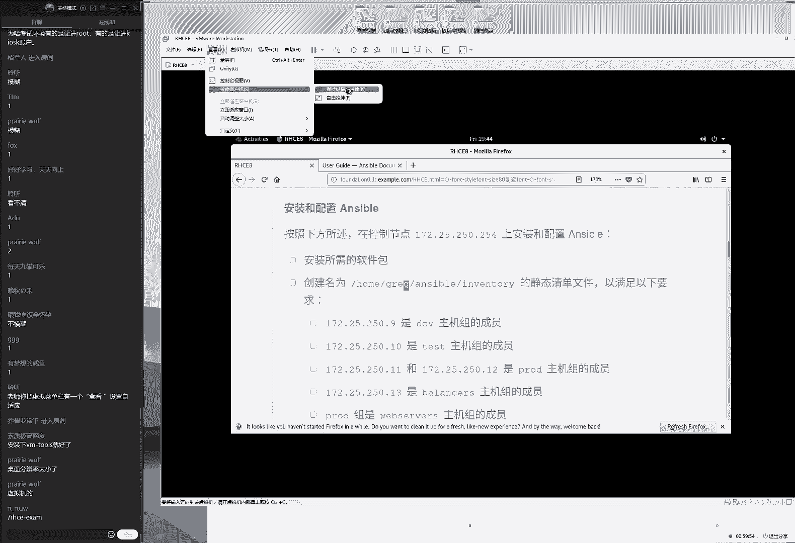

来去安装一下这个able它是按照点给分的。那么既然这是第一个题目，我们就来把它去完成。大家先低头看一下自己的这个桌子上面是不是有张纸啊，桌子这张纸上面的话呢会有我们这个服务器。

每一个这个服务器地址的一个介绍。好，首先大家说一下啊，我们这个服务器地址的话有一个需要给大家讲的一个坑是这样的。大家看到这么一个地址跟考试当中的话呢，它也是这么去命名的啊。然后我们看一下。

其中的话有一个叫做这个主机的话呢，这个主机叫做控制节点端啊，大家记一下，这叫叫做控制节点端，我们所有的配置选项。我们所有的配置。大家记住我这个词是所有是所有的是百分之百的这个所有的配置的话呢。

都是在这个呃主机上面来进行操作的。大家记一下百分百操作都是在这个主机上面来进行的这个呃配置。它的话呢，这个地址大家可以来记一下。接下的话呢还有5台主机。其中第一台主机的名称跟下面的四台的话呢不太一样。

这是红宝给大家下的一个坑。😊。

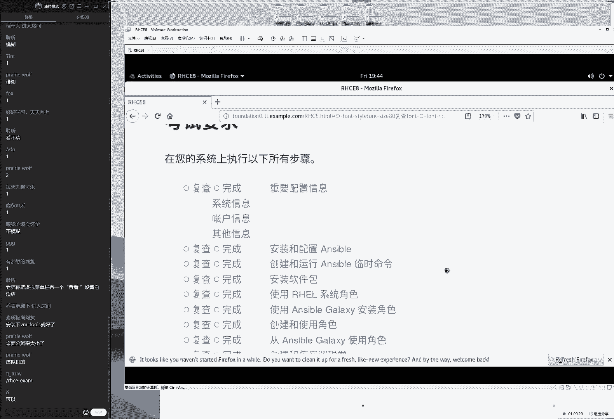

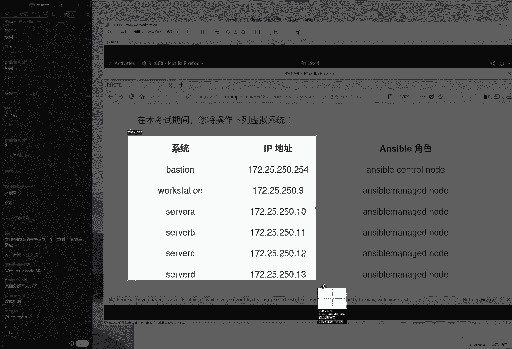

大家一定要记住一下，就是我们这个5个主机的话呢，所有的这个用处都是一模一样的。也就是说上面这个主机的话是用来做配置的。下面的话呢都是用来去做测试的。即便说我们第二个主机。

它的这个名称跟其他的4个的话不太一样。但是这是红包故意给大家下一个展眼法。考试当中一模一样，没有任何的区别一模一样一模一样啊，大家不要因为这个名称它不太一样，就认为它有一些特殊的功能啊，完全没有好。

现在大家都记住了，我们既然做的操作都是在这个主机上面来进行的。那我们来看一下这个题目就要来了啊。呃，第一个题目是说这样的进入到我们对应的这个主机机点上面，然后来去安装一下在考当中的话呢。

已经帮我们安好了，那我们在实验环境里边的话去确认一下它有没有安没有安，们自己去安一下就好了。来进行连接我们的SSH安装这个服务的话呢，当前我们需要去使用管理员去登录到我们这个控制节点上面。

它既然提到了我们有6台虚拟机的这个root访问权限，所以大家不用着急啊，这个是。😊。

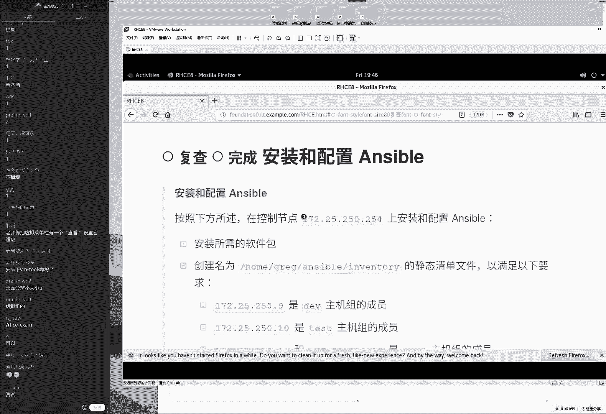

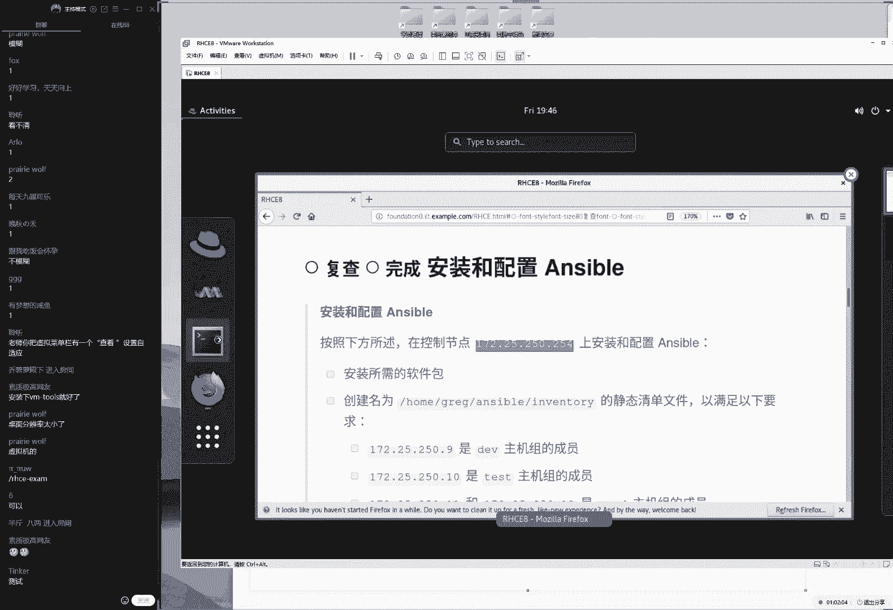

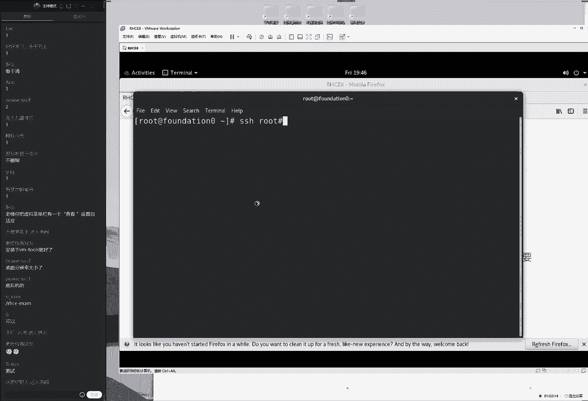

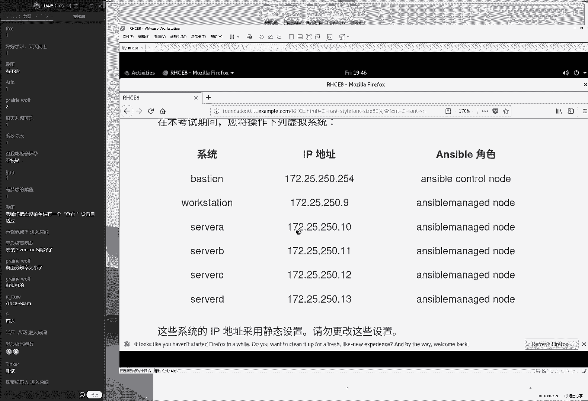

这是符合题意的密码的话已经给定我们了。当然我们需要注意一下，就是在考当中这个关联员的密码的话呢，以网页为准。大家记住啊，在考当中的话呢，我们的密码以网页为准。但是的话呢。😊。

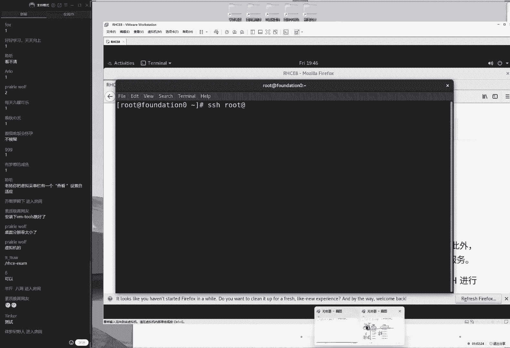

我们当今的模拟环境里面的密码，我们统一叫做rat hat。虽然网页上面显示的叫做flag，但是所有的虚拟机里面的密码都叫做re hat。好，我这个字写的比较丑啊，我再给大家打一遍啊。

拍不上帅气的老刘来叫做ra hat。大家记一下呃，这个问题大家请牢记一下，在网页当在考试当中以网页为准。在模拟环境里面的话都叫做ra hat，这个是主要是我的原因啊，这个是我其实的话这个是我手欠了。

所以的话呢当时我因为那个密码特别难敲。所以我们在。😊，在回找之前，我把信机里面的密码都给修改成叫做红帽了。这样的话，因为我啊因为的话我比较好记，所以大家要记一下就好了。在考当中以网页为准。

在这个考当中的话呢，在我们做呃环境的当中，我们速度密码叫做红叫来去登录一下，叫做ro用户，然后去172。25250254。哎，这是我的一个习惯。

我把我我比较喜欢把密码的话叫叫做re敲点比较顺手17225。250。254来找到我们台主机摁一下回车。但安装一下安装那我们怎么去配呢啊在这个我们的主机上面已经配置好软件仓库了。

我们不需要但我们是不需要配置任何的软件仓库信息，只需要做一步骤叫做DNFinstore，然后去安装一下，叫做软件这个时候狠狠的摁下回车就可以点题了。

把第一道题目做完可以看到他说我们现在的话呢我们已经安装过了啊，2。8的版这个版本也比较的新吧，反正也。😊。

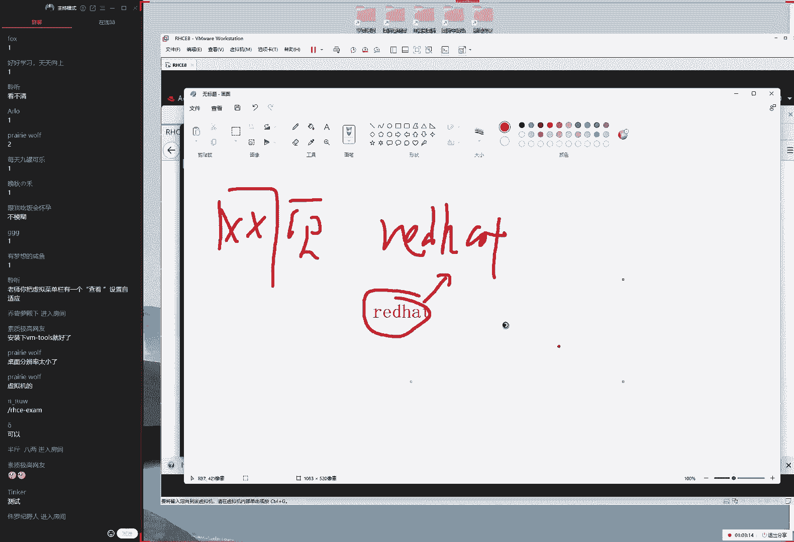

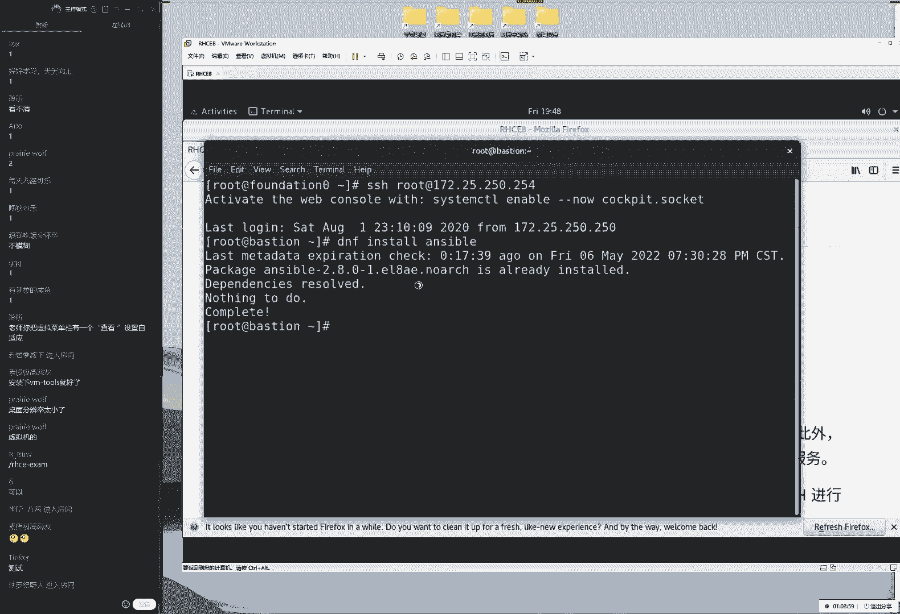

这个是我们考试的一个一个系统嘛。然后当呃我们去确认了一下，他确认已经安装好了。在考试的时候的话呢，也尽量的按照我这天这个操作，也尽量的去呃进行一个确认吧。然后确认好了之后，我们退出掉它。

那么为那我们为什么要把它给退出呢？就是因为考当中，大家看一下两个还原色字标注了所有的这个操作都要用到greg用户身份来去创建，然后并且放到对应的目录里面。

所以如果去使用到呃去使用到管理员的这个身份去做这个实验，大家会感觉到非常的顺啊，没有任何的权限的控制，特别的顺。然后所有的这个权限的话，都被我们去放行。因为管理员的这个身份不受权限的控制。

但是考试的时候也会发现扣分特别的惨。所以当前一定要去使用到用户来进行登录，然后是172。25250。254，然后达成数一句走你就登录成功了。去达成数一句走你说我说的不够响亮吗？172。25。250。

254哦，是这样的，突然想到了在考试当中。😊。


这个是用户是有的，但是在模我们的模拟环境里面，这个用户还没有我们需要自己再去手动去新建一下。再给大家说一下这个用户的话，当前没有那这个用户当前没有没有没有没有对对对，这个是我比较的生疏了啊。

这个呃忘了忘了忘了来，我们需要自行去新建一下，但是同学们请放心啊，帅的老刘已经给大家有我说了啊，就是在考当中的话呢，这个用户已定是存在的，他一定是存在的，我们呃是不用再去手动去新建了。

当前只为的模拟环境有一些出入啊，好，做好了吗？做好了，来再重新来一次啊，当总没有发生过，好不好？那把我们的时间倒回到7点。😊。


啊，7点49分了啊，不会吧，我们还没有讲呢，怎么已经过了将近一个小时了。今天我们是不是说的太细了，那我们稍微那我们后面再稍微快一点吧，不用那么再不用再那么慢了啊。然后7点49了啊，7点50了。

我的天来进入链接吧，来，我们再gr个用户。😊，今天讲的太细了，所以大家考试的时候就不用去审题了，上面咔咔到去就开始做就行了。172。25。250。254来进行链接。登录进去之后的话呢。

来看一下第一个题目，他说安装我们所需的软件包，我们也没有这么可以去安装的了，都已经安好了。他们下面去说到就是说请创建一个。😊，名称为这个的主机清单文件。然后呢并且符合以下要求。

大家可以看一下我们这个书上第十6章节里面提到了这个的话呢叫做呃主机清单文件。哎 inventoryventory文件，这个叫做呃仓库的意思，叫叫inventory。

它指的就是我们要去控制的这个节点它有哪些。大家首先要知道什么是ible吧我们再给大家啰嗦一下吧。今天还是稍微细一点，就是什么是ible呢，就是有一个主机。如果说我们先配置一台服务器。

然后我们准备了一台ensible的这个服务器。然后我们通过网络的话呢，把一些客户端跟它相连。这样的话呢，我们就比如说想要在某个节点上面去创建出来一个用户这样的一个操作。

那我们就不用在每台主机上面都去做些那它都去做这个操作了，我们可以直接在我们这个服务器上面，然后去跑一下我们对应的命令，它会自动把我们这个工作的话呢，同步到每台节点上面。这个每台的这个节点。

我们把它叫做数控节点。也就是说每一个被控制的客户端。每一个被控制的客户端，我们把我们把它做一个节点，我们的话呢也把它叫做这个数控主机啊，大家来去。😊，一下呃，这就是我们的一able的一个作用。

然后呢我们的able的呃这个服务端，我们刚才自己去安装了一下，我们的服务器服务软件自己安装了一下客户端的话呢，我们呢是基于我我们的远程访问协议，然后来去完成的。所以话我们的SS就是我们的客户端。

我们不需要单独去安装其他的客户端软件了，就是客户端就不用去安装就省了。那我们来去说一下这个文件的一个作用，就是说我们现在的话呢一共有6个受控节点啊不我们现在一共有5个受控节点。我们可以看到等一下。

我数一下啊。第一的话呢我们的是我们的这个控制端。其他的话呢都是我们这个受控节点，总共的话呢是有5台。也就是说我们需要把这5台的地址的话，写入到这个ventory的文件里面。

让他们成为我们叫做叫做售控节点。就是说告诉我们的系统，我们去管理那我们去管理的是谁来我们。😊，去编辑一下这个文件啊，同呃同这个同样的一个动作啊，同同样的一个事情给大家重复了三种不同的说法啊。

所以话大家呃哪个好去理解。基于我呃就去理解一下我现在这个呃动作，就是去设置一下我们要想去控制谁就把谁的信息写不到这个文件里面来编辑一下这个文件走进到里面去，突然想到一个事情。

他说我们做的这个操作都需要给它放到一个叫做ho目录里面的g里面的的子目录，所以我们先把这个目录给新建出来确认一下有这个目录了。然后的话呢我们再去编辑这个文件一定要点题啊。

一定要沿按照这个题目去做来摁一下回车呃进入到里面之后的话呢，我们这么去写。既然来说有5台受控节点是5台吧。对，没有问题啊。

1234455台主机我们就把这个主机的信息的话分别往里面去写172252509指的是叫做受控节点嘛。那我们控制的是谁就把的这个信息往里面去写172。250。250。11，然后172呃这个没有必要。😊。

啊，同学们来掰掰复制走走啊，往下一粘就行了。因为它的区别点就是后面那个IP地址嘛。最后一位来我们来保存一下5个受控节点的地址分别写到里面去了。另外的话呢红帽考题一共是300分。

大家数一下CE在我们的网页里面的考题有多少道呢？那大家数一下我们的HCE考题的内容有多少道题目。然后我们拿300分去除一下考试的题目的数量，就知道我们每一道题目的一个分值来看一下啊。

他说我们的话呢172。250点9这个主机啊，省略一点啊，他说是DV组的成员啊，也就是说可以对于我们这个用户组来进行分组。这个很简单啊，这个的话呢格式方法就是。😊。

在这个主机的IP地址的前面加上一个中国号，中国号里面的话有会有一个名称。大家说是平均的吗？是对它是平均的，它按照踩点给分了，它大致相同。

所以说一一道题目的话呢大概是20分左右啊来我们来DV目录啊这是DV我们的主机组只要它属于哪一个组的，我们就把这个组的名字写到个对应的地址上面就可以了。大家说如果加了隐藏题目应该不止隐藏题目是替换关系啊。

大如增加的话呢，我们每一道题目大概也就十八九分那跟2分相比的话呢，我就可以忽略不计。只要我们大致理解一下，不用那么严格。因为一道题目的话，我们也不一定能多做对。所以我们就简单理解一下。

就是每一道题目的话，大概平均分值是2分就可以了。来接下来再来啊具体说到底是17分8分，我们觉得并不关心啊大概一个分值就是20多分嘛，大概现里有个数，我们比如说就是追求210分及格。

我就做个1三4道就可以了那我们就做个十道题差不多就O了，所以就大概得有个数知道考完试。😊，到底我我那到底我们今天晚上是啊吃烤串啊还是吃什么啊，那我们还那我们还是怎么去庆祝一下啊。

就是转给转给新的一个预期来，我们接下来再来PD因为毕竟分是考官的事情，不管只关心一下自大概的一个分值他说十1跟12的话组的成员那11都是一个组13的话叫做balance这个组N个人不太推荐家去敲我比较懒我会直接去复制就粘贴一下在考当中的话尽量去复制学鼠标键盘都是租的没有必要省去用以考试的时候你就直接去复制复制好一是怎样肯定是较准确的不会说手敲的候容易敲错。

我手比较大我有可能就真有可能我敲这个的候能会敲到这个三者敲个W就有出现种可能性。所以干脆就复制就好了啊，我复制就好了来我们分组做好了之点给分一。😊，都是一个分值啊。他说PLD组的话呢。

优势叫做web server组的一个成员组。唉，这什么意思呢？上面有一个组叫POD组有没有有他说这个组的话又是这个组的一个成员组。

也就是说它是一个层级关系的这个PD组的话属于叫做web server组的一个成员组稍等一下，我们则这么去写叫做children是吧它叫做子组有点像是一个变量。

这有点像是一个就是一个层级关系我们去大家去写既然来讲它是web server组的一个成员大家都打出来了叫web serverweb server加S吗有Sb server组的一个成员叫做children它里边有一个子组叫做D组这样去查看的时。

这两个主机它既属于叫web server组又属于叫做PD组它一样的啊呃都做好之后的话呢，他说再创建出来一个名称为这个的配置文件，并且满足以下要求这题目话其实到这就可以了。但是在考试当中的话呢。😊。

不太好，为什么呢？因为刚才讲到了ible它是使它它是使用到我们的啊远程连接协议SSA是进行远程控制的。大家有知道的，我们第一次在远程连接到一台主机的时候，是不是有一个问题啊。

就是我们需要去接受一个叫做finprint叫做指纹信息的一个东西。然后大家需要去输入一下yes来去访问，大家应该有印象啊，这个应该是有印象了。上礼拜日的时候，我们去连接我对吧？

也就是说第一次去连接主机的时候，它会要求我们去接受一下用户的这个指纹信息，然后呢才能够进行一个远程控制，这是第一件事情。第二件事情的话就是我们登录别人主机嘛，那肯定要去输入对方的账号和密码。

如果每一次都需要去输入一下对方的账号和密码，显得有点麻烦了。所以我们。😊，把用户的这个账号和密码的话呢，干脆就写到下面去啊，干脆写到下面去。这样的话呢我们每次去登录的时候，就不用再去输入对方账号密码了。

它会自动帮我们去做验证。这个我们叫做变量去完成写成一个它指的是对速度主机都去生效的一个变量变量叫做变量名称指的是对方的用户名称叫做root密码 password大家不要为什么我们的密码不是跟网页一样呢为老手欠了之前密码叫ag后来手欠了一下我把所有的虚拟机里面的密码都变成一个红叫做。

以是一问考试的时候以网页为准我们去模拟环境的时的话密码的话叫做这样做好之，我们每一次去控制的时不再去输入密码了，的简单特容易。考试的样去做大家比别人做别人做要快很多的啊。😊。


来，我们做好了这个文件，第一道题目点题了。😊，然后第二的话呢，他说创建出来一个名称为这个的配置文件，然后能够满足一下要求。好，也就是说我们的的工作是完成自动化运维。我们呃一个任务。

只要我们配置好了ible这个服务。然后的话呢把这个任务放到这个服务里面，然后就可以去批量去然后他就可以去进行一个批量的执行了。然后这个服务的话呢，它这个配置文件，它分为了三个地方去保存。

它的话呢一个文件叫做ETC目录里边的点C这个文件的话呢是它的配置文件。第二个配置文件的话呢，是它放到自己的加目录里面，然后叫做点C它也是一个配置文件。第三个配置文件的话呢。

它指的是当前目录下的一个叫做ible的一个文件。这三个文件的话呢，它都是呃可以生效的，它都属于叫做cible的主配置文件。那么这个时候怎么进行一个区分呢？它这个优先级是一个从低到高的。

也就是说从低到高的这个优先级是最高的啊，也就是说如果说同时出现了这个三个文件的话，那么。😊，以当前目录当中生效的这个文件，优先级是最高的。也就是大家理解一下这三个文件如它要是都在的情况下。

那么我们当前目录当中要是有这个文件，以当前目录当中的为准。如果要是没有的话，看看加目录里面有没有加目录里面没有，再以这个为准。所以这三个文件它是一个都可以同时存在。但是以当前目录当中生效这个为准。

优先级是最高的啊，这样的一个效果，给大家举一个例子啊，比如说我们去生长答法的时候。😊，那么食堂的话呢，会默认提供餐盘，对吧？然后我们这边放菜呀，这边放啊饭呀，这边放汤。但是如果说我自己的话呢吃的比较多。

我会自己带一个小碗啊，那我啊那我自己带了一个缸。那好了，那么就会把这个饭装到我的缸里面。也就是说默认情况下会放到这个默认餐盘里面啊，放到呃默认的一个配置文件里面。但是如果用户自己提供的话呢。

则以用户这个优先金是最高的这样的话来去打饭啊，这样的一个效果。例子举的话呢，可能不是很严谨。但是意思就是这样的，用户既然自己定义了，那么就以用户定义那个为准。😊。


哎呀，我的妈呀，8点了哎呀，这个就很着急了，8点了8点8点了来继续啊。那好了，我们来看一下。他说创建一个名称为这个的配置文件。那那也就是说待会儿的话呢。

我们的工作目录是这个他的话呢如果说以这个名称来进行命名的话，则优先级是最高的意思。他说创建一个名称为这个的配置文件，那怎么办呢？就把这个文件给它复制过来就可以了，把我们原先生效的这个配置文件说错了。

不好意思啊，它里边的话这个名称少写一个目录，这就是我们之前给大家讲的主配置文件找的一个路径啊，EC目录里边以服务的名称命名的一个文件夹，然后里以服务名命名的一个文件，最后是CF结尾啊，不好意思。

少敲了一个服务名称啊，少了一个不太严谨了，以它这个实际为准嘛。来把这个文件的话呢给他复制到我们的对应的目录里面就点题了啊，创建出来一个名称为这个的配置文件，并且的话呢满足以下要求。

他说主机的清单的文件名称为这个哎，这不是考过了吗？吧？上面不是有吗？它怎么回事呢？它是因为说。😊。


就是在参数里面进行定义的意思。等于说我们去指向它。现在刚刚有这个文件，没有人知道它的存在。所以我们需要把它给指向一下来编辑一下我们的配置文件呃，就直接这样吧。

进入到user目录里面不呸呸进入到home目录里面的g里面的I目录当中。然后相对于路径的方式去访问，就就会变得很快很多，来显示一下行数看一下，首先来说是第十四行。它说叫做inventory。

我们的主机清单的文件所存放的路径，要管谁要给谁一个清单啊，要呃要管谁给谁一个清单。嗯。😊。


要管谁给谁一个清单，然后我把这个文件给大家复制一下，复制到我们这个对应的目录当中。呃，看一下对应的这个行当中十四行没有问题。下面一行，他说我们的playbook的中中的这个脚本的话呢。

我们使用的这个路径放到这个目录当中。好，首先来说如果大家没有看到后面这个预期视频的话，您可能不知道什么叫做playbook不过没关系，他既然有这么一个参数，我们先把这个参数给大家写下来。

待会儿的话呢我们会在明天吧会给大家讲一下什么叫playbook以及该如何进行管理，总之还有这个参数，先把这个参数给大家写下来，这个行数的话呢，既然指定了嘛，先把它指定上，先把这道题目的分值拿稳了。

后面这个题目再说了。来首先来说看一下行数，另外这个考试环当中的话呢，这个行数是跟考试的时候是一样的模拟环境跟考试是一样的。有些同学的话就会像我一样啊，会记一下这个行数就会记一下行数，68行是吗？

我还给他错过了来看看啊，686868我看看这个比较粗心啊，果然是啊看一下说用户的这个路径，果然是果然是用户的角色路径。😊。


这叫做这这叫做角色啊。好，这个是我我这个是我比我比较粗心的啊，大家可以来记一下6十8行，我们把这个大它粘到里面去。这样的话呢我们这个ok没有问题啊。大家说的对了啊，这个比我还更加熟练了。

看看是我没要做预习来看一下是这样的第一道题目就都做完了。那我们就做完了之后的话，再给大家两个加分项啊，再两再给大家两个加分项。这道题目做到这里就O了，就能够拿分了，15分那就吹到兜里面了。

但是的话呢我们不满意，我们再给大家加两个这个加分项的这个参数首先的话呢还是往上提一提啊，往后面写到这边吧。

第十三行是这样的嗯我们给大家加两个参数我们看一下后面应该有参数一个叫做house key checking。好看一下有还呃第十71行大家看啊他说我们有一个第71行就在68行的下面。😊。


呃，他说是否来去接收用户的这个指纹信息。当前的话呢我们把它给它呃取消到他这个注入信息。也就是说第一次连接的时候自动去输一下yes，然后不去检查用户的这个指纹信息。

这样话我们连接起来会更加的稳定和更加准确，不用再去输入那个yes了，这是一个加分项，我们给大家敲下。第二的话呢我们来给大家看到还有叫做re user我们登录用登录到对方主机的时候使用什么身份来进行管理。

我们当前配置的时候是使用的是对吧？那但是我们再去远程管理对方主机的时候，使用的用户叫做ro用户来看一下哎真有1007行啊，大家比啊大家看这是几行数啊。

107行说指定一下用户的这个名称叫做root它来管理对方主机的，我们叫做ro用户大家一定要区分一下，就是呃到底是不是要把它改成叫root呢？当然是我们要给大家啰嗦一句啊。

是这样的当前所有的这个配置叫做主机上面来进行的地址的话呢是172。250啊，要172。25。😊。


250。254啊，怎么老忘出25，这个话记得叫做。我们在所有的这个配置光当中的话呢，使用的叫做graag用户来进行的。但是我们配置出来这个playbook也好啊，我们配那我们来进行简程控制的话呢。

都是这样的叫做录取用户去完成的。因为后面会对于这个控制节点的话呢，也就是我们这个被控制这个服务器。然后我们来对它进行一个硬盘的管理，以及对于副的这个启动关关闭跟安装的话呢，都需要关联的这个身份去完成。

所以当前的我们去使用的这个用户身份叫做graag。但是我们再去。😊。


呃，管理主机的时候，调用的这个身份是为呃超级管理员入取用户，所以当前需要把107行是吧？107行给它改成叫做root。好，今天我们讲的超级细啊，之前讲的超级细。那我们做完了之后，大家可能会问老老师。

那你到底这个服务有没有做完了？那我们能不能除了给我们讲完每一道题目的做题的方法之后，你能不能想办法把我们每一道题目做一下验证呢？所以我们所以我们这一期的话讲的稍微的慢一点。那大家千万不要催了。

我们是这么回事啊，之前的话呢我们我呃我那我们每一期讲课的时候都是这样，先去直接做题，然后我们会大家讲一下做题的一个方法，做题的话也没有像今天讲的那么细啊，然后的话呢我们第二步的话呢就是我们来去判分了。

但是我们今天给大家加一个就是做为一个验证，做为一个测试。我们会把我们的做一道那我们最会把我们做的每一道题目做一个测试，测试一下它有没有做成功，然后测试一下出来的效果。然后最后的话呢。

如果每一道题目都做测完了，没有问题，最后再判一下分，这样的话能让大家打消到心里的这个。😊。


顾虑啊，能够对于我们这个做完的题目更加的信任跟肯定啊这么一回事好，我们来给大家去测试一下，大家已经说出来了啊叫做ible杠M然后拼大家说考试的时候也可以做测试是吗？当然可以啊，没有问题。

来这样我们怎么去做呢？叫做ible。然后我们让我们去写一个指的是对于我们的所有的受控节点。然后因为我们把配置过这个主义清单了嘛。然后我们对于做这个受控节点，我们都去执行一下这个拼的一个动作。

其它时间是个模块，大家已经说出来，我们就以拼为例嘛。它实际上来说是一个模块呃，先暂且不理解啊先没关系，只要按照我这个方法去做一下，它会显示叫做叫做success等于是测试成功。

它能够在每个主意之间进行一个拼的操作，来看到没有问题。也就是说呃所有的节点都能够拼通绿颜色字，说明每个节点的话，都帮我们配好了，并且已经能够进行一个网络测试能够连通了呃这是第一个测试。第二个测试的话呢。

我们叫做able杠 version。😊。


是我刚才讲到了啊，帅气老刘讲到了他这个呃配置文件的话呢分为三个保存路径。优先级是最高的这样的一个路径的话呢指的是当前目录下。那我所说的是准不准呢？

大家可以来看一下是准的所以当前的话我们的配置文件生效的路径就是点题点题点题点这个题目跟他是一模一样的这道题目没有任何问题。如果说300分出去15道题就是20分到手了。

这道题目的话谁来了我们都有这道题目就没有问题。这是第这是第一个题目第二个题目的话是这样的。他说创建跟运行个临时命令啊，他说下面一个问来往下面去读吧他说创建和运行我们的个临时命令好。

重复一下他的题目啊再来说作为一个系统的管理员明我们管理员这个身份叫做用户。说我们需要在说控的这个节点上面来安装软件好一句废话下面下面去看。他说请按照正文的描述创建出来一个名。😊。


为这个的shall脚本。然后的话呢把我们这个ensible的离时命令在各个节点上面来去运行，通过我们的yM仓库去安装，然后配置出来以下的这件仓库。呃，我给大家总结一下吧，是这样的。

在我们的这个主机上面的话呢，一共有6个虚拟机。😊，一共是有6个虚拟机。然后我们一个数据那我们换其中一个虚拟机叫，它作为这个控制终端的对吧？它上面的话已经配置好了软件仓库了，上面已经有了。

而我们的剩下的5个的话呢没有配置软件仓库，我们需要做什么呢？需要在这5个主面配置出来软件仓库的配置文件。大家需要注意就是当不需要安装什么软件，只需要把我们软件配好了。这怎么写？一个文件加？

T目录里的大家应该熟练尝是加一个S没有S这个是我们的目录的名称后其我们的某一个名称为例。后尾一个文件我上一节大家讲这是我们配置这库配置文件的一个方法。

要在这个目录里新建来一个文件那么当前的话我们需要批量在这个5个节点上面来去完成以上这个操作。这就需要一个模块。那给大家讲我算是一个框架是一个框架用来去管理远程主。😊，一个框架。

它的话呢其实在他来说它没有什么功能，它基本上没有什么功能，它主要是靠模块去完成的。它的每一个模块去完成某一项工作。比如说我现在这个家庭啊，那我们买了这个房之后，虽然可能花了几百万几千万。

但是到手之后的话呢是一个家 two四壁什么都没有，我们需要自己去买。比如说锅碗瓢盆，对吧？然后我们自己去买呃各种的东西，那我们每一种东西的话呢，功能是它又是呃不一样的。

所以就是说我们的安ible实际上它就是一个框架。我们的话因它就是一个基本的框架，我们需要在这个框架里面调用模块来去完成，然后去完成某项工作。

那这个怎么去知道它有哪些模块以及我们该怎么去找到我们所需的模块呢？我们这样去做。来首先去使用的ible啊去使用的iible，然后后面我们叫做document的DOC。😊。


然后我们来列举出来我们所有唉，稍等一下啊。able后不对啊ableible减号DC然后一个小写L列举一下我们当前有哪些可已经支持的这个模块的名称。我现在给大家去说的是什么？

我现在给大家去说的是一个推理的一个过程。我我再告诉大家怎么去寻找这个啊模块的名称。但是在考试当中，大家就不用去像我一样去寻找了。你可以把这个模块的话，提前先记下来。

我现在给大家去说一个从零开始去推理的一个过程，我告诉大家，我怎么能够去找得到它的，以及我为什么去去选择它的一个理由。来给大家看一下，我们列举出来了所有的已经支持的这个模块的名称特别的多嘛，太多了。

那怎么做一下过滤呢？第二章节我们的这个g这个暗行做提取的一个命令。稍等一下啊。😊，终端还卡掉了吗？OK呃，第二章节稍稍等一下啊，还卡掉了。😊，啊，不知道为什么，他卡掉了，我们重新登录一下吧。

可能是我不知道为什么，我重新卡掉了，再重新我我反正我感觉是终端的问题。登录用户叫做gra。然后172。25。250点呃254，我记得是然后对，大家可以拿出您的纸来。然后这张纸上面的话呢继续去补充一下。

在这个稍等一下，我先写172。25。50。254。我们这个地址的话呢，我们给大家写下来，它是一个叫只能是我们这个控制节点。大家拿起您的笔来拿起您的纸来写到旁边，然后话呢我们这个分组也记下来。

因为他以后可能会说到比如说DV组啊我们就可以快速反映出来，它是点9换t组就是点10PD组啊，就是11跟12。同时的话呢PD组也是叫做web server组。所以话呢我现在把这个信息嘛。

就是每个组的组名跟IP地址的话，我们都会给它写到旁边，以后再来说带到balance组，我就不用老去来回来去翻我的网页了，那我就知道它是点3这个主机这样的一个目。因为他以后的话他会只说这个组的名字。

不说这个IP的名字了，我们好找不用老去翻它了啊。😊。


来我们给大家看一下，我们再进入到这个题目里面，说一下这个怎么去找呢？来去使用的ible document有一个消息做一下过滤。第二章节里面学习的g命令，后话我们的呃第三章节里学习的管道服做一下过滤。

既然提到了我们要配置出来一个跟仓库相关的一个模块了仓库的模块一定是带仓库的一个名称摁一下回车后以可以来看到ible document我们先进入到这叫做home目录里面的因为要以当前目录当中剩下的这个配置文件为准嘛。

进入到这个目录里面后列举一下ible不好意ible跟打法了来这样走过滤出来所有跟我们仓库相关的大家可以看到就有两个并不多了。首我们先可以看到的话这个是说用来管理软件包，就是我们安卓软件的话。

使用的是叫做如果要想去安装如想去添加移除仓库的配置文件的话，要去使用的是第二个这是我的一个推理的过程。那好了，我。😊。


使用到第二个模块。那那也就是说我需要去使用到第二个模块来去完成以下这个工作。好，我这样去做iblereitory叫做仓库的意思啊。

reitory叫加划线reitory我们这么去做ible然后是他说了他是在所有的这个收款节点上面对吧？它是在每一个收款节点上面来去执行这个工作，它就是个然后话是一个小写M它指要是调用某一个模块。

那么我们的模块名称就这么推理出来了。他说它在这个每个收物节点上面的话呢，使用这个模块去新建出来的这个仓库的名称以及信息是如下的，那我们怎么样把这个参数给大家写到里面去呢。

我们就需要在这个模块里面去加参数了。但是说实话其实我也记不住这个模块里面，它有哪些可用的参数，怎么办呢？我们一般推荐大家再开一个终端再开一个终端。

还是远程连接到这台主机上面然后是172250254250254又少说了1个25啊，不知道为什么这地址是。😊。


一啊来172。25。250。254多念几遍考试的时候就能够更加轻松了。来这个地址的话呢，一般来讲以自己的这个座位为准啊。我们如果要是做到第一个位的话，那么就地址基本就是这个。如果做到第二个的话呢。

可能是172。25点呃172。2。250。254，这个就是我们座位的号码。来，我们进入到我们这个对应的目录当中。呃如果说我要想去查看到某一个模块具体的一个介绍。刚才是获取的名称了。具体的介绍的话呢。

可以去使用到这个方法来去完成，叫做reitoryitoryok。😊，单独去看某一个模块这个介绍，于是我们就可以去使用到这个命令来进行查看。呃，anipible减号document来进行查看。

最后的话呢会有一个字段啊。😊，字段啊，看到里边的话说有一个示例啊，examplesex来找到它啊，大家看到一个问题，大家说讲到哪里了，讲到我们第二个题目了，examp示例，稍等一下，找到这个示例界面。

因为我也不好因为我也记不住太多了啊，所以我我每次也会我来查一下，他说的话呢会有以下的这样的一个参数，其实他做的是一个什么呢？这个操作这道题目它实际上考的叫做连连看，对吧？他就是说这边我这边是一个中文。

请把这个中文翻译成英文，它把这个中文的话呢翻译成这样对应的一个参数，就是考的一个连连看嘛。好了，第一个参数它说软件仓库的名称是为这个名称。好了，我们就这样这个参数叫做name怎么去写呢？

一个杠A后面两个单引号引起来做了参数使用单引号引起来按我的一个规则标问为什么，那就是只这么定义的就好了。然后第一个参数name然后的话呢它里边看到它里边。😊。


我们用到这个双引号引起来啊，双引号引起来。因为它这个事例里面的话虽然没有写，但是后面这个参数里面它有空格了，所以我们干脆把这个也给大加上这个双引号，它总之它错不了，加上话更好，但有点多余。

但是我们为了保证我们这个参数统一嘛我们保证我们的这个参数统一性，所以我们都把它加上这个双引号第一个参数他说我们的软件参库的名称是为这个名称，所以我们把它写到里面去。

他说的话我们的基础的UL地址是为这个名称，什么叫做基础L呢？实际上就是软件参库寻找的一个路径，就叫做这个东西叫做基础的L这个参数我们找到它然后我们往里面一粘第二个参数我们也不要手敲嘛，就是一个连连看。

对应的参数找到了，对应的值找到了，往里面一粘做完了。他说下面我们的PG的这个模式为启用模式启用模式再往后面去找一做这个参数叫做叫GPG check好了。

GPG check然后的话它这个参数是个yes no是吧？😊。


不是一0它并不是一和零了，所以我们给大家写一个yes ok下面一个参数连连看啊，他说GBG check这个me文件UL地址的话呢是为这么大长串呃，连连看找一下这个中文呢所对应的这个参数是什么？

下找找找找它是在上面我给大家搜一下吧GBG啊GBG啊郭德纲嘛G啊GD来那看一下GGDG啊，在这再找一下在这啊GPG点K来看一下这个名称不太好读啊。好，GPGG吧。

我记得是O这个名称然后把这个路径的话呢往里面一粘没有问题。下面的话呢还有最后一个参数哇，最后又叫成功了啊，最后要成功了。他说我们这个软件参库的话呢状态为启用模式来找一找最后一个参数然后大家说一可不可以？

其实知道大家想问这个问题嗯。😊。


其实的话我待会给大家就说这个原则吧。😊，呃，大家问我们这边的话写yes和 no可以写一和2那我们写一和零可不可以啊？呃实际上的话我我我需要给大家去说一下，就是呃行是行。

但是我们从来不推荐因为在考试的时候怎么文怎么来没有必要非得要写一个一意理由和意义是什么呢？没有什么意义。在考试的说白了就是花钱去买一个证只要你能够把钱花出去了，把证拿回来了，那就好样。

如果你说把钱花出去了，这没回来会感觉到非常的空虚和遗憾，所以考试的时候怎么文怎么来，就以它配置文件里面这个为准，它是个y还是个no，就以它这个为准，他就写的是yes。

那我那么我也写yes他要写个no我也no，所以这个怎么文怎么来好了。然后下面的话呢比如说叫enable的然一可不可以也行。

但是但就以他这个官方的文件里面这个为准样话我错之我可以跟他去拍桌子跟他说你这个提出错了或者本有问题，而不用说因为我这个改过参数了，然后有点小有点小心虚，所以考试的时候怎么文怎么来，这是我考试的一个原则。

😊，参数都写完了啊，无非就是一个格式，看起来比较长的一个问题。那我们做完之后的话呢，我先开两个窗口。第一个窗口我来去做第二个窗口我来去看公众信息。第三个窗口我来去做测试。好，第同低头啊。

低头看一下屏幕低头看一下自己的这个手边这张纸啊，随便找一个主机，比如说大家找一下DV组看一下是什么呢？叫做呃172。25250。9，它是台客户主机吧？

啊他是来测受控节点来按一下回车进入到里面去进入到它的这个ETC目录里面的EM点ra哎呀还是有个S刚才没太自信，刚才少写了一个S啊，EM点ra点D然后里边的话呢没有配置文件啊，有是吧？啊，好尴尬啊。

不过没关系。😊，这个里边的话呢，默认的情况下，它是有3个，但是它都没有生效。我们它里边的话呢没有有啊，他们语音在考试的时候是没有的，但它也没有我们自己新建出来这个软件仓库。

它只有三个我们的呃默认的软件仓库。我们先这样跑一下这个命令，跑一下这个命令。在我们的这个控制节点ba上面运行一下这个命令啊。于是的话呢很开心，它出现了很多包错，越它越报错，证明我们今天这个。😊。


课程话更加丰富啊。这样的话呢我们就可以稍等一下啊，给大家讲一讲我们排错的一些方法。他说我们有一个描述信息呃de呃 required我们的描述信息是必须的，不好意，同学们刚才是我疏忽了啊，太大意了。

我这边少了一个参数叫描叫做描述信息，我真是一目失行啊，像我这样考试的就容易扣分来我这边少了一个题目，他说描它这个描述信息是个啥啊，描述信息叫做descript好，这个参数我忘了写了啊。

这个就是一个纯就是一个纯失误了啊，这个是一个纯失误太曼达哈了来这种扣分就非常的冤了啊，来往里面一粘描述信息往里面一写，他说叫做XEX294无所谓是什么我都不用看啊，往里面一是啥是啥里面一粘就行了。

我们一下回车再跑一遍那再来一再来一轮哎，看到啊还原代表就是修改成功生效了。于是我们在这个收控节点上面，我就看到这里就多出来了一个文件叫做参。😊。


户的配置文件去查看一下里边所有的这个信息跟网页里面是不是一模一样啊，没有任何问题。这就是第一个软件仓库的一个配置方法啊。大家说是我故意的啊，真的不是故意的，不好意思啊，这个是我的一个。😊。


哎呀，疏忽了疏忽了疏忽了啊，虽然说大家想希望我是故意的，但是我真的不是故意的啊。来，我这真真的是粗心了。所以大家考试的时候一定要以我为戒啊，不要向我学习。来看一下这个配置文件。那参数跟网页里面一模一样。

这样是我错了，可以去拍但可以去拍桌子了啊。第二个软件仓库，所以第二个软件参库是个啥？第二个软件仓库实际上就是把第一个软件参库的这个信息去改一下。好了，我们来看一下这个题目里面怎么说了。呃。

他说创建一个名称为这个的脚本。呃然后的话呢，把我们这个命令的话呢，往里面一粘为什么这样去做呢？因为我们虽然这个我们换到中国的话呢是比较讲究说这个诚信啊，对吧？我们全球就在讲究这个诚诚信。

然要去考试怎么样？但是大家想如果说我考试的时候有这么一条题目，但是我是执行的命令，他怎么知道我有没有执行对呢？所以我们需要把我们执行过的这个命令保保把它保存到一个文件里面。

这样的话呢就能够让这个脚本判到成绩了，就是这么一个就是说把我们刚才所执行工过的这个命令。😊。


保存成一个文件。然后这样的话呢，我才去说我就把这个呃服务给配好了。那么他才能过去相信我。好，也就是说我现在需要做这个事情就是这样的。首先啊把这个文件的话呢给大家复制一下，否则如果没有这个文件。

我说我做了，但是谁信呢于是我需要先按照他这个题目要求新建出来这个文件好吧，然后的话第二步稍等一下，我先把这个刚才执行过的这个命令啊，先保存一下，先复制一下。

然后的话呢我们再进入到我们刚才所新建出来这个目录当中，把我对它又是一个少脚本，本它第四章节讲过，它里边的话呢考到的是三个原则，有三个结构，本的声明本的注释本的命令本呢呃声明。

它是叫做病里面的by可以去执行。基本的注释可以写可以不写无所谓啊。比如说我无所谓这个话这个话我们写不写没关系，反正我他不太爱写。因为呃比较它这个写的比较多的话比是它是比较麻烦一点啊，比较的这个辛苦。

所以它里面没有要求的这个参数的话以。😊。


写所以话注释可以不用去写啊呃，费手，主要也累啊。于那么于是我们把这个格式写好之后，写一个教本的声明，就可以把后面这个已经执行过的命令往里面一粘就符合题也了。然后看一下里面要求的话呢。

说软件仓库一软件仓库2，第二个软件仓库实际上就是把前面一个软件仓库里的这个命令的话呢，来YY一复制，然后把后面后去写一下P，然后去粘贴一下。

那我们需要做事情就是把第一个命令里面所对应的这些参数改成这个参数里面所对应的这个值给大家改成一个它第二个软仓库里面所对应的值，实际上就是一个重复工作嘛，我们给大家复制一下，但是大家听起来虽然有点简单了。

但是实际上呃得到这么一个考件辅导的培训不容易，大家要理解我们的这个付出啊，就是大家听起来有点轻松了。但是我当2020年8月1号去考试的时候，我们是很辛苦的。这些当时没有人跟我们讲过。

但是这个确实呃能够很大去提高大家这个通过的几率。好，大家写了一个问题，大家写了一个啥啊写一个呃阿。😊。


啊，这个万一考官是个基督教怎么办啊，这个也不用去想，同学们行这个没有必要啊，这个没有这个啊没有必要啊，这个我们该考完了，该考完之后晚上去吃饭呢，还晚上还要去吃烤串了啊，所以考完试一个4个小时的考试。

谁看谁能做得快一点。😊。


比如说做做两小时做完了，另外两个小时另外两个小时的时间不就可以省下来去干别的事去了嘛我们就尽快做钻，最后可以走行了。然后我们往里面一粘，把这些不同的参数往里面一替换啊，稍等一下啊，往里面一替换。

这样的话呢这道题目就做完了99%了。最后的话呢1%就是给这个文件把稍微大一点的权限，让他们能可以去执行。然后我们再去手动去执行一下，看没有报错，只要没有报错就可以想着今天下午吃什么饭了。

然后去找去晚上怎么去庆祝了。然后顺便看一下下面这道题目来先跑着这个脚本看一下没有任何报错，只要没有红颜色的，绿颜色代表大家记一下，绿颜色代表是执行成功，黄颜色代表是执行成功，且进行了修改操作。

他说又出现了红颜色的话红颜色代表是报错。所以说出现绿颜色跟黄颜色都代表是正常情况，不用着急来绿颜色跟黄颜色属于正常情况，不用着急，它它都属于正常，它都属于正确的。

如果出现它只有出现红颜色才代表是执行失败的。来我们可以看一下都跑完了，于是在我们这个。😊。


测试节点上面的话呢，又会多出来第二个文件。这个文件我都不用去看了，肯定是正确的。因为我们提完的这个参数都是直接复制的，不存在说敲错这种可能性。大家说说考试的时候我们写文件啊。

如果说比如说有1个AA的文件，我们写成啊星号星号星号这样有分吗？呃，不用看了。如果只要跟题目里面要求不一致，那我们就没有分。

所以一定要考试的时候以他这个实几为准来复制一下啊来复制一下他大家说可以提前交卷吗？可以啊啊，没有问题。所以我考试的时候4个小时的考试，我考一个小时040分钟，然后我就走了啊。

一个小时040分钟就考完了真的是并不难这真的并不难好，第二个20分到手了，大家可以拿一张纸出来啊，既然15道题目满分300分，那不就是一道题20分嘛？画就可以画成字啊。

第二个政字画出来第二个第二个笔画啊，40分到手了。😊。


下面一个题目，他说安装一下软件包，他说创建一个名称为这个的playbook。然后的话呢我们来依次安装。😊，一下一下信息。首先来说一下什么叫playbook呢？第一个来说啊playbook的话呢。

我第一次接入这个词是看莎士比亚的那个话剧啊，叫做playbook就是一个剧本嘛。同学们就是一个剧本，它就是什么意思呢？它就是一个sha脚本啊，把我们要去做这个要把我们做这个动作是不是很麻烦啊？

1234这样去做是这样一条一条的这样的命令好麻烦啊。那于是我就要把我这些我们的ible的这个语句，然后话写成一个脚本，写成一个啊，让我们写成一个脚本，然后我们来进行一个批量去执行我们的这个语句。

这个脚本的话呢在我们当前就把它叫做剧本叫做playbook就这么去理解。当然大家不要去说老师不对啊，这个那我们所说的脚本叫做脚本。然后我们这个叫做剧本脚本跟剧本只是说在我们的不通服务加脚本不一样。

但功能的话都是从上往下来去执行这么一个效果。这个playbook也就是说大家知道这个中文了，叫剧本一下是就感觉到好理解了，叫剧本把我们要去做这个事情，然后往里面一写，就是一个剧本就是一个脚本了。但是。

😊，烦就烦的他这个ible是什么语言去写。大家应该知道啊。这个呃大家告诉我我们的ible是使用什么语言去写的这个剧本呢？大家应该知道叫做y某语言对吧？

叫做某语言叫YML这个特讨厌啊这个叫语言语言有一个特是用on对我们的框架用到thon去写的。但是我们的脚本的话，用到这个去写的语言有一个特点是什么呢？

我们去脚本的时候里面用的都是我们的呃命令去完成的本的声明本注是本的命令大家去使用到的时候，里边调用的是模块，这个还不是很讨厌的事情，最讨厌的事情就是因为它的格式要求，它的格式要求及其的变态，及其的变态。

它需要是横向及纵向都要对齐，所以大家去写这个的时候，纵向也要对齐这个是一个很容易出错的问题。呃一个点，我们现在给大家演示一下什么叫纵向对齐呢？

就是你不光要考虑到横向你要考虑到纵向这特别的恶心来给大家演示一下，另外的话呢我们会有格式要求。😊，我以自己的这个实体为准给大家来做一下演示。呃，第一次我记我去敲这个的时候，插手电脑给砸了啊。

要不是考虑到这个两脑是刚买的，我估计就已经是包就已经被啊敲坏了啊。就是因为就是你看这个东西吧，你去看跟网页上面或者跟我们去敲这个啊商课去讲的话一模一样。结果的话他老是出错，就是因为有些时候你把屏幕的话。

这个稍微的看的这个字稍微小一点啊，你真的看不出来差一个空格，上下差一个空格，就它出错了。这个人句讲理经啊很讨厌。来，首先他的要求说新建出来一个名称为这个playbook，于是我们先把它写下来。

然后对于我们这个 ya某语言的话，有一个格式要求就是三个减号啊，作为开头就叫做 ya某语言，它一个个式要求，代表就是 ya某语言的脚本都要用到三个减号来去做一下。😊。


呃，开头我们理解成就是三个减号，先先去呃先去做一下标识啊。然后的话呢三个减号开头叫压木语言。然后下面的话呢指的是我们这个playbook的一个名称，一个简号，一个空格。

后面叫做playbook的名称叫做name。一般情况下，我会建议大家使用我们的以这道题目的这个标题，然后来去取这个软件的包的名称来去取这个脚本的名称。这样的话呢以后呃大家去进行维护的时候。

我们知道哪一个文件对应的是哪个题目，所以我建议大家使用的是这样的一个名称来去命名。第二的话呢他说说创建一个名称为这个playbook三个减号是祭天啊，就是我们现要写三个简号祭天指定一下名称。他说的话呢。

安装软件包。他说把这个PHP跟marry啊数据库跟这个文语言安装到这三个主机上面，也就是说限定了一下执行范围。那我们看一下低头看一下这么几个组DV组t组D组跟balance组好了。

把balance组给它甩掉了，没有它的事。😊。


对应哪个主机去执行，这个才叫做house，这个我我就呃稍微快一点。因为对于这个格式要求，对于它的语法的操作符没有什么可讲的。我们今然作为域维来讲，它么定义的，我们怎么就去敲就好了没讲的。

我直接去写V组组还有还有一个叫做组在这三个组面去执行我们这个本我们面再来t等于指的是我们要去做这个事后下面去写第一定义一下我们剧本的名称。第二剧本要给谁去执行啊。

定义下我们执行的范围这个话已经在我们是个前面定义好了，它所定的地址了，所以可以直接用就可以了。task这个后面是我要这个动作一般的话我们的这个动作，大家会用到非常标准的格去写。

安t我们给大家写一个非常准确的一个名t这样去写。😊，不仅的话自己辛苦，而且的话很耽误时间啊，所以的话呢我们考试的时候不要进门，就是非常详细的去写一个动作的名称。因为大家看一下它里面要求了。

没有要求题目里边只要没有要求的，就像我们在生活当中的话呢，法无禁止编是我们的权利，我们就可以去做啊，那我们可以直接把这个名称给它写成one two three four好吧。

第一个动作就把它叫做one第二个就是to啊，第三个就是thre吧，就是one two three four这样去写，不用自己去费心啊，费力的去取给大啊去取名字，拿出这么一回事啊。

来啊第呃第一个叫做呃one，然后看一下这里面的要求啊，怎么跳哪去了，稍等一下，看一下这个题目要求，他说安装一下软件包哈为PHP。😊。


跟marray比。安卓软件使用的是什么呢？说实话。我们其实是知道的，为什么呢？因为刚才我们去过滤的时候，是不是第二个，我们去过滤说有什么跟y门仓库相关的命令的时候，好像不小心看到了。来给大家看一下啊。

😊。


不小心看到了有一个用来去管理软件包的一个命令。大家看到这个模块的名称就叫做M本身啊，这个模块呢就叫做yM本身呃，所以的话呢我们就呃直接用到这个模块，大家说写一号可以吗？也可以啊，当然比我。

我们建议用英文因为一号的话比较的出细。因为可能中因用这个数字的话可能就会比的比较的这样一个嗯突出这个信息了吧。反正我建议大家去写英文。当然大家写数字的话也可以来我们这个模块的名称就叫做来我们继续来去写。

反正我不太喜欢写这样的一个数字。因为大家看到这个如果说这里面都是这样的一个呃做这个信息的时候，对于数字的话特别的突显出来。所以我觉得有一些时候配置起来的话呢，会让自己觉得很乱。

反正这么回事来下面的话呢再来呃再来一下，然后看一下这个examp实例当中就介绍到了那这个模块的话怎么去用呢？看一下，首先它有两个参数，第一个叫做name指的是们。😊，要去安装软件包的这个名称。

第一个软件包的名称，稍等一下啊，稍等我们这么去写，我们要去遵循这个VM的这个引导。因为大家看到我现在要去写的话，那我们下面去哪里去写呢？我们不去管A回车它会出现在我们该去写的这个位置。

第一个参数叫做name冒号第一个软件包叫做要纵向对齐的纵向对齐看一下第二个参数必须要跟对齐，否则我们差一点点它都不可以会给我报错我回演示一下就这个参数必须要完全对齐，跟它要要保持齐平参数跟参数齐平呃。

每个是这样的每个模块每个动作的话呢，我们的每个它叫做它叫play每个play之间要对齐，每个模块之间要对齐，每个play之间对齐。

个模块对齐个模块之间这个参数对齐个它都是一个纵向对齐的差一点都不可以我后面去写第二个参数叫做state指的是软件包的话，我们安装成什么样子看下这个参数他说。😊。


最新版啊LATEST然安装一下我们的PP为一个最新版它的格式要求。O我们写完，然后没有什么后面的这个参数了，我们继续往下面去审题。他说还有第二个软件包。

我们叫做这个它依次只能安一个于的我们再去写第二个play。第二叫做 two three是 two two个就是然后我们使用的模块还是模块。然后我们换的名称叫做后我们的状态为为最新版啊。

然这样做好没有问题。然后看一下ok对于这两个软件包的名称没有问题。下面一个问题啊，那我们看下下呃下面一个题目，他说将我们一个很长的一个软件包，然后软件包组安装到第V组上面，它就是出了一个。😊。


小坑啊为什么呢？如果说大家第一次去考试的时候就会看不清了，看到这个的话呢指的是软件包，对吧？这个话呢指的软件包组，软件包组指的是含有多个软件包的一个软件包的一个集合。

所以它叫软件包组它的软件包的然多了一个组这个字，但是它它去写的时候的名称是有一些差异的这也算是下了一个小坑。但我们要去写第二个play，因为它是对于DV组来进行操作。

它大家看一下那我们第一个play的话呢，它是对于这个三个组的主机来进行的操作。下面一个play它仅仅是说只对于这个DV组来进行操作。所以的话呢我们就去写第二个play它每个play的话呢。

跟这个名称啊不能有重复。所以我们就第一个叫做A嘛，第二个就叫做B这样的话呢我们好去区分。第二个B他说的话呢对于这个DV组来进行操作houseDV组这个格式我不给大家去说。因为我们要想去考试。

必须要按他这个格式要求去做。我们在做运维不再我们并并没有做开发所以开发里面定义好的一些规则，只能这样去用，也也只能。😊。


头等嘛，它要求比较严格。好，我们现在第V组，然后来安装一下软件，它的话呢名称已经知道了软件呃模块名称那one two three吧。第第三个就是thre。然后后呢我们的亚模块的这个名称呃。

安装软件包的话是叫做RPM development tools好长啊，于是我们可以用到复制的方法去完成name它因为之间有它因为它它这个名称之间有空格了。所以我们按照第三章节这个转移符给大家讲到过的。

通过冒号做啊，那我们通过双引号把它引起来作为一个整体。后接下来late为一个最新版那late最新版的一个名称来去安装。如果这样去做话就错了。因为它说了里面题目要求说软件包组好了，软件包组的话呢。

前面就加上一个符号指的就是软件包组的意思了。这样做完之后三就把题目分了。下面最后有一个问题，它说将DV组里面的主机上面所有的软件包更新为最新版本啊。

它的话呢还是使用的是亚模块去做的来第四个动作one two three。😊。


第四个动作来这样one two three four后我们所有软件包安装成最新版本，然后就是name等于的话呢就是用到通用到通配符星号，指的是所有它指的是所有的这个软件包。这个状态为最新版这样做好之后。

大家可以看到我们实际上分为了两个play啊，我们看到的话呢第一个play为我们这个DV组还有这个啊我们其他两个组安装了两个软件包。第二个的话play它是安装了一个软件包组以及升级的这个软件为最新版本。

我们现话点一下这个保存并退出。我们现在进入到这个DV组上面做一下测试，我们就我们给大家去演示一下。比如说当前的话呢去安装一个叫做PH的一个软件包啊，大家先看一下我当前在DV组上面安装一个软件包叫P。

的呢这个就会开始去安装，然后我们是否去确认我敲一下不要手动去安装确认一下在果然是没有被安装过？我们给大家急速掉它点一下N结束掉它。😊。


自己手动去安装。然后的话呢我们现在去使用的anible，然后是playbook，后面加入我们的playbook的名称，以它的这个实力为准，叫做package their ya。来。

同学们按一下回车去使用的anible减号playbook就可以来去执行一下我们刚才所要写好的那个脚本，或者是我们叫做剧本来去执行啊，再去倒杯水啊，稍等一下。😊。


哎，不好意思啊，安yible playbook。啊，少打了一个book，因为该着因为着急该人去喝水，所以少打一些东西。啊，今天讲的话有点像有我今天正在插剧正追行啊，稍微有点慢。然后的话呢。

我们今天讲的有点慢，我感觉大家应该也今天也没有听，因今天没有听通过啊。😊。


我们现在才画第三道才画第三道稿，才讲了60分的题目。呃，大家听这的话也不过瘾。我们今天讲的话也不会太过瘾。所以的话我们今天时间的话就往后再拖一拖。我们今天的话大概会给大家讲呃3个小时吧。

我们讲到10点钟，我们多这的东西呃，原本9点钟下课，但是看起来好像有点太少了啊。所以的话我们今天往后拖一拖，大概拖个40分钟，拖1小时左右，我们给大家。😊，多加点东西。这样的话呢。

我们明天或者后天大家在做题目的时候，才不会说做一半，然后就卡住了。后面这个题目越听越有意思。来，我们大家没有大家啊没有什么事吧，那大家那我们这个节奏肯定是没有毛病的，就是说主要就是有点慢。

因为我们介绍特别详细。大家其实我们讲课的时候完全可以快很多。因因为第十6章节有书了，大家看书上其实这个介绍很详细的，但是我们介让大家看书也能啊学会，然后听实验的话也能够更加详细点。

这不是我们讲课一个宗旨嘛，但是其实有点慢点慢啊，不过没关系，我们节奏感掌握好，然后我们把时间拖的时间长一点就好了。下面一个题目下面一个题目，他说啊我们不带废话了，同学们，你们可以聊着啊，我先就不废话了。

等我在聊的话，这个时间就比较久看下面一个题目啊第四道题目他说使用到re的一个系统角色，然后的去完成一下工作它什么意思呢？嗯我一琢磨啊，对了，然后怕大家问的这个隐藏题目什么意思啊。

这个隐藏题目是跟我们当前这个题目是一个替换关系。就是说红帽考试CE只有这5道题目。😊。


固定的它会用隐藏题目去替它去替换掉我们已有的这个题目。所以的话呢这个两个题目它是一个互换的啊。当前的话呢有一个角色叫做time sC然后换在我们的隐藏题目的话，有可能是叫做这两个这个名称互换啊。

叫做隐藏题目实际上讲都是一回事他说什么呢？叫做系统的角色这个系统的角色就理解成就是我们这个每个人的这个工作职责啊，大家说是替换任意题目？

不当然不是它是替换的是对应的题目啊然后因为大家只要呃这个大家不用问，其实因为大家只要看完了那个隐藏题目呢，您自然会知道它替换是哪一个题目，因为这里边的字都是一样的，只不过这里边的参数变了。

所以你可以很清晰的知道它替换是哪个题目。然后我们来给大家先看一下这么回事啊然后我先给大家去说我乱乱了。然后看这么回啊呃这个角色什么意思呢？这个角色是这样的，如果说我现在有这个playbook了，对吧？

我现在就是说我们这个playbook里面包含了很多这样的一个。😊，命令那大家想一下什么叫playbook可就是里面包括了很多这样的一个动作，包括了很多这样的一个play。然后变成一个剧本了。

但是如果说我们现在在家里面我比较懒，我请了一个保洁阿姨，对吧？我工作比较忙，我可能需要一个保洁阿姨帮我收拾一下房间。

那请问这个保洁阿姨我需要跟他调用多少个play呢那我可能调用第一个play他帮我去扫地调用第二个play他帮我去蹲调第三个play他帮我来去呃做饭，第四个play帮我去倒垃圾。

第五个play帮我去干嘛干？那好了，如果说我现在有很多个play，那我现在能不能那我们可能做一下合并呢？这个合并过后就叫做角色角色叫叫做保洁阿姨我们调一个保洁阿姨之后叫做这个角色。

那我们调一个保洁阿姨之后，不用再告诉他他需要做什么样的一个事情，他就自带有了很多playbook这个剧本，他就会按照他这个里预设的动作的话任务1234去执行。也就是说将动作将这里边的将play。😊。

合成成一个playbook。它又可以将这个playbook的话呢，合并成一个角色。这就是一个角色的一个概念里面包含了很很多这个剧本。这个playbook。然后呢我们这个角色的话呢，它有三个来源。

第一个这个来源的话呢，就是我们系统里面自带的。它里边的话呢自带有一些角色，这叫做系统它叫做系统自带的角色。然后还有第二种角色叫做自己创建的，叫做自己创建的这个角色。这是另外一种呃可以自己创建出来角色。

这些是可以的呀啊，第三个角色的话呢，这个来源是叫做外部这个获取的。比如说我们自己作为保洁阿姨。那好，我我那么我自己家里可能就有人去做这个保洁阿姨，对吧？第二的话就是我们可以自己成为保洁阿姨。

第三的话就是我们可以从外面去找人，好，这个三个这个考那那我们这个三个角色这个来源红帽考试的话呢，他考几道呢？他考他他考的是哪几种呢？啊，那我们这个话呢这个三种角色的这个获取方法。

大家应该知道了就是红帽考试的话，它没有做选择题，它是全他啊他都要了，所以红帽考题，它。😊，三个他都考到了，并且的话呢这三个考题，他考了他这个三个考点他考了四道题目，总共的话呢就是15道题目。

总共是15道题目的HHCE就光这么这么一点破事儿啊，他考了4道题目，大家算一多少分，80分。所以要想考过HCE你这个呃这么点这个汇取角色这些知识嘛，就必须要很扎实。所以说这个角色是必会的东西。来。

那我给大家去说一下，他怎么做到的这个三个题目，他考了啊他呃我先给大家去说一下他怎么三个事情，他考了4个题目，他他是怎么做到的。😊，首先来说一下我们第一个题目。

他说使用一个呃红帽系统当中real系统的一个系统角色。也就是说它三个这个角色它是有三个来源啊，第一个这个角色来源叫做系统角色系统里面自带的那怎么去实践呢？

我们需要先去使用到我们的这个root用户登录到我们的这个服务器里面在考试的时候也可以这样去做的呀。来172。25。250。254来登录到里面去安装上一个软件包。这个软件包的判断名称呃，我想一想啊。

叫做real杠sstem杠 rose是吧？我看一下啊，sstem。😊。


啊，阿TEM system点杠ro来安装一下这个软件包，这个软件包安好了之后，我们就可以调用系统这个角色了。然后我来进行行一个编写。来安好了之后的话呢。

我们就可以进入到哎呀这是考我记忆力呢user目录里面的呃sha呃user呃 shareuser share啊，然后的话呢我看一下啊。😊，里边的ensible。看下对不对啊。啊，不对啊。

里边的话呢DOC document看一下，还是照个词说啊，来看一下，还看一眼吧啊，real system呃 system role来给大家看一下这个里边的话就会多出来了很多系统的这个角色。

然后其中的话呢，我们看到当我们安好这个软件包之后，就会在这里面多出了一个叫做时间同步的一个角色。然后的话呢我们就可以按照它要求来创建了。他说安好这个软件包之后。

我们就可以来创建出来呃一个playbook。然后的话呢来去执行以下的工作。这个的话呢，我们原先2020年的8月1号到2021到2021年的时候。😊。


去使用的方法的话呢，是通过手动去编写的方法。后来的话同学们都反过来说太难了，说老师我根本就记不住。所以的话这道题目很多多人都次大家都选择放弃了。后来的话呢有一次机会，2021年的年初的时候。

春节我我是实在没事儿干。然后我说有没有什么简单的方法可以去做为一道题目呢？后来我才发现了这道题目是有模板的啊，所以的话很呃所以的话就很对不起我们这个之前学姐同学。😊。


呃，也放弃了。实际上这道题目是有技巧的，怎么办呢？这个playbook实际上它不用去写，它里面是有的，我们只需要去找到它就可以了。怎么去找呢？

首先就进入到user里面的share里面的document里面的r，然后的话进入到这个目录里面这也是因差阳错的一次机会。我找到了说有一个文件，这个文件叫这个名字是它是叫这个名字。

大家可以要记一下这个完整的路径然后我们来查看一下这个实际上叫playbook啊，来看一下这就是一个最经简的一个time sNC时间同步的一个playbook了。

后来的话呢我就选择了一下说把这个文件的话呢直接复制过来，这就就非常简单了啊，把这个文件的话呢，直接复制一下，复制到它所对应的一个名称下就可以了。这个也就是说这个文件的话呢，我们不需要自己去写。

可以直接复制一下模板，并且我可以给大家保证就是考试的时候也有这个模板，可以直接复制就可以了，是不是感觉一下就轻松多了来，然后来复制过去，复制过来之后的话呢，来复制过来之后。

进入到我们的home目录里面的。😊，后的话进入到ible目录当中找到这个文件，然后加以小小的编辑就可以了。我们只需要编辑几个参数。首先他说在所有的收款节点上面来去执行，那我们就这样去做，将这个t的话呢。

我们给他写成一个，在所有节他在所有的节点上面来去执行。他说使用这个角色废话啊，这也不用去做了。他说配置这个角色，他说使用当前生效的NTP的时间供应商的服务器呃，也不用去配置，这就也是个废话啊。

只是一个描述信息。因为这个里面已经在我们里边是有体现了，不用去动。他说配置这个角色使用时间服务器地址。好，这个需要改一下啊，也不能说呃完全不改。

这个需要改一下时间服务器的地址给他填写到house name里面这个参数模块我们都不用去查了。里面模板都有了，最后他说启动一下我们这个同步啊叫做。😊。


时间同步的一个互交互啊，这么一个参数。然后啊它就可以自动的，然后与我们这个NTP的服务器来进行一个数据的交换，保证它是一个最新的一个时间。这样的一个效果。可以看到当前的话呢。😊。


呃，已经开启了，没有问题。下面的话呢这几行就变成很多余了。123456。所以大家需要做的事情就是把这6行呢给它删除掉6D剪切一下。这道题目的话做完了来保存并退出大家可以来看到这道题目的之后。

效果就是这样的里面的模板大家可以从网可以从我们这个目录当中来去复制也不用去手写了，只需要把这个参数做下替换就行了。这样题目做完后话呢，我建大家的话再去执行一下我们的后是playbook吧？

不ible然后去查看一下gaxy星空嘛然后是list查看一下我们这个角色可以看到里边的话就会有我们这个时间同步的这么一个服务器的一个用户最好的话呢再去编辑一下我们模板我里面还有一个就是说一个叫做吧ose才我们好像写过8行大家刚说过的。

我们跟一个角色调用的一个目录，然后我们再把我们刚刚所写再把刚刚的话我们定义好这个目录。😊，加到这个目录的后面，他帮他帮我们能够方便去进行调用ible。稍等一下。

看一下咱们这个书上文写 share去调一下我们这个角色后是因为它属于一个系统角色嘛。刚才那个目录如果我们不去手动去折整理一下的话。

它可能是获取不了给大家写好然再去查看一下查啊这的话能够看到了我们所对的一个目录然后就生效了。也就是说这个目录的话，当前能够自动去加载它就能够调掉这个角色的一个身份了。

大家说出来了说如果我们跑这个脚本的话，一个错但这个结果是正确的我们跑一下这个原因是怎么回呢？因为让我们去设置了一个我们服务器17225254254这个地址作为我个服务器。但我们在模拟环境里。😊。

这个主机它是没有提供这个时间呃服务器的这么一个服务的。所以的话待会我们去跑这个play部的时候，它可能会有一些报错。但是在考试的时候，呢他说它它是啊没有问题的。来，我们去使用到sible。😊。

playbook，然后我去跑一下它这个时间的话呢会比较久。它的过程当中嘛会有一些红颜色的一些报错。这个报错的话呢，是因为我们对方那个服务器它不它并不存在。他去拼的时候嘛，他去同步的时候有问题。

但是最后的话呢，这个结果是正它是这一个正确的，没有问题。来先把它跑起来啊，先把它跑起来，我再给大家做一下验证的这个方法。待会出现这个红颜色报错的时候，当录没有看到就好了。在考试的时候没有这个问题。😊。

来，稍等一下啊，跑起来。嗯，啊就是这个报错那大家可以呃不用看，那大家可以把眼闭上啊，可以休息一下哦。好，那跑完之后大家看一下。最后的话看一下这个结果，最后这个结果的话呢，是说有17个成功了。

其中做了四项修改。并且的话呢有6个忽略，但是没有失败，那没有失败的，也就是说所有的它它都是成功的。它即便说跟那个服务器它这个通信失败了。但是这个参数有没有改过来呢？有啊。

进入到DV组里面查看一个文件ETC目录里边的crown，然后呃crowned来进入到CRLOND查看一下这个文件。😊，可以看到这个文件里面的话就定义好了。

我们开启了这个时间同步服务的这么一个参数的服务器所对应一个路径。也就是说刚刚的话呢，我们所织经过的这个命令，它确实已经在我们所有这个所有的节点上面的配置文件里面都加以修改了。所以话这道题目没有任何问题。

这道题目就可以拿分走人了。大家再拿起您的笔来画一个小数道啊，把我们这个正字的话呢写的更加的完整一点，已经写完了第四个正字了那那我们就写完呃第四个笔画了。大家觉得是不是其实并不难呢啊。

大家如果觉得并不难的话，那么下一道题目会给大家一个惊喜啊，就这道题目。他说我们需要的话呢，从外部去获取一个这样的一个角色，哎，galaxy，然后从外部获取，从外部获取怎么去实现呢？很简单。

我们来首先他说我们需要在这个目录当中去新建出来一个这个的文件。好吧，我先这样把这个文件先给大家复制下来。其实我们考试的时候有一个小技巧，就是不要管他怎么说，那怎么说，我们并不关心他只要是要求了。

我们就把这个文件先给大家新建出来。好吧，就是我们现在不关心他怎么去说的。我们先把这个文件给它新建出来。😊。


先去把这个文件的路径写对，然后再去做题目啊，这样我们做对之后才有分嘛，避免说像我一样比较粗心来首先的话呢我们进入啊像呃我们首先编辑一下，进入到这个文件里面说说从以下路径当中下载文件啊下载这个角色。

并且安装到这个目录当中，然后会有两个角色，就是说它叫做呃外b角色啊，大家说我们的这个时间服务不是不是考过了吗？考过，但是我们当讲他实际上是以这个服务作为一个对象来去讲c的，它是讲。

然后大家说CFG前面的r前面有一个斜杠吗？呃，没有斜杠啊，有啊怎么有啊有啊有有等一下是写错了吗？他他是有这个斜杠的，稍等一下有这个斜杠啊，没有问题。大家说是大家说是这个吗。

不好意思不好意思不好意思果是错了啊，这个话我们的参数前面没有这个斜杠，这个斜杠是打错了啊不好意思来确认一下没有问题。后是 galaxy后查看一下我们的这个。😊。


角色都有了，挺好啊，这个已经生效了，对吧？好，刚才是我呃刚才是我写错了啊，多一个小斜杠。😊，然后但是这个在考试的时候比较致命了啊，然后再来继续编辑这个文件。这个文件的话呢，他他说有两个这样的一个。

他说有两个这个角色，然后把这个两个角色这个来源分别是这个网址，我们怎么办呢？很简单，我们所需要做这个事情就是像我一样，首先啊还是一个烂梗啊，就先去喝口水。😊。


啊，这呃。战术性喝水啊。


今天这个估计是一个啊今天估计是一个持久战，因为今天要讲的时间比较长，大家天做好准备，该点个外卖，点个外卖啊，珍惜自己没有被封城的这个时间啊，多吃呃就多吃点这种外卖啊什么的。因为一旦封城之后。

你会非常想念外面的味道的。😊，好，我们来继续啊来三个减号来去来去写。首先我们的source啊SC指的是用户一个来源地址，用户来源地址，我们不用去写它是什么？我们根本就不关心啊。

直接把这个网址的话呢复制一下，后面的话到后面去说这个角色的名称应该是这个名称好那我写一个name后面写成它的名称复制就好了。再后面去走第二个角色还是还是一个SRC source地址。

我们的网址名称点一下复制，后面的话呢指的是name后面冒号指的是用户的名称，这样做完啊这道题做完了，这道题目的话呢，大家觉得难吗？

其实我感觉这道题目就是送分题目后面这个好就是这样的有一道难有点单有难还有道简单，老是这么穿插来去进行来看一下这道题目总共的参数就这么读20多分啊，相当于每敲一下回车啊。

相当于就每敲一个这一个键盘大概能值个0点5分吧总共话分值是2分我们为了那我们为了去导入一下这个角色，我建议大家这么去操作。首先。😊。


进入到它所呃，那我们首先怎么把这个这两个用户要导入呢？因为现在没有导入嘛，现在只是写出来这个文件了，怎么做来导入呢？首先来说呃 galaxy list先来看一下啊。

并没有这两个用户吧看一下这两个用户的名称在在下面没有体现出来。因为它当前没有做加载怎么办呢？啊这样大家看好了 galaxy，然后去一个消息R只是导入文件啊。对我们前面还有一个安装安装一下杠R。

然后是rose我们的目录名称然后让我们去一回车把这两个用户的话呢做一下导入再进入到rose目录当中吧来进入到这个目录当中再来去执行一下这个命令等于说把这个在这两个目录下的话呢都把这两个用都都把这两个角色对它调用一下。

😊，再来再去执询一下我们刚才那个命令，大家看一下效果。就会发现当前的话这个目录当中出现了这两个用户，这道题目的话都做完了，哎，就可以再画一条横线。哎呀，我怎么每一次都会把笔给它盖上呢？啊，来。

我们这就做完五道题目了啊，就拿到100分了。其实还是比较好的嘛。如果说我们这个考试是300分。😊，那么我们的210分就通及格的话呢，基本上已经做完一半了啊。如果说我们的目标是为了考试通过的话啊。

那么就已经做完一半的题目了。下面继续啊，下面来继续。他说创建跟使用角色，果不其然啊，它又是考到了第三种创建的方法，我们去收啊需要通过这个手动的方式来创建出来一个这个角色，这个怎么办呢？

还有三个这个可试的这个获取方式嘛，第一个就是系统的对吧？第二就是我们从外部获取了，他分别去考第一系统呢已经考过了，第二的话呢，从外部获取的也考过了。第三的话就是自己去创建一下，大家怎么样。

大大家说郑州已经封3天了是吧？说上海已经封40多天了啊，上海同学比较辛苦，上海同学比较辛苦，来，我们继续啊。😊。


然后下面我们来继续下面下面我来继续。😊，呃，现在这个现在这个疫情防控成这个样子，我也不敢多说话啊，就是主要大家就比较辛苦嘛，大家就尽量能够去改善下自己的这个生活，尽量少受到防疫的影响吧。

然后对于这个病毒的话呢，我们也是心存畏惧的，所以大国家为了我们好好我就不多说了继续老多想火但为这种讲课吧继续啊继说下建一个角色个角色的话名称叫做叫做阿帕奇哎这就是一个网站用户嘛，等于说他有以下功能。

我们先不用去看，先把这个用户给他创建出来，首先进入到他所要求的一个目录当中其实我们说实话啊，我来考试的时候，实际上我是不看细节的，因为他是什么目录。

什么名称我都不管考试的直接这样他说了他说在这个目录里面吧，我来去到里面去说新建一个名为这个角色。根本不第一次考试不就直接要求什么名无所谓，直接创建来。😊。


我每次都选择复制啊，然后选择一下粘贴就可以了。来新建出来一个角色。那我们新建出来这个角色，当就是一个保洁阿姨，我们需要自行给他一些功能。所以他在这个里边的话呢，会有很多个虚拟出来的目录。

我们在这些目录里面在每一个目录里面填写进去正确的信息。然后我们这个角色的话就那么也就算是能够正确的新建出来了这样的一个效果。然后里边的话呢会有很多个目录。

我们就要给大家去进入到正确目录里面去做正确的事情，首先来说说的话呢，因为我在因为我在思考因为我在思考该去做哪个这样的一个操作。首先家说他说我们的网站服务的话已经安装过了。

他说并且要在系统启动时启动并启用。哎呀，这不他又有点不像去人化的这个人话啊。好了，我们先给大家去新建一个吧有一个目录的话呢，先进入到这个任务目录当中，他就要做这个事情嘛。

然后这个在这个目录里面呢会有一个叫做主文件，就是我们要把这个要做这个。😊。


事写到这个主文件里面，这个文件里面的话呢，不要去写叫做house，就是给谁去用。因为保加仪不限定是谁加的。他说软件包已经安装了，实际上的话他并没有安装啊。

我们需要自行来去安装一下我们再去安装一下这个因为应该已经用过了，以我们可以直接就调用就可以了，不需要再去查了，因为我也用过了。他说HTPD已经把它安装过了。也就是说后面考试的时候吧，他这个考试是一方面。

他这个也是给大家有一些坑啊，他说已经安装了，实际上并没有安装，我们需要自行安装一下，这是第一件事情。第二个事情他说他需要在系统启动时启用并启动。这个什么意思呢？我给大家翻译一句是成人化。

就是说他要他是要求我们当前这个服务就能够启动啊，并且的话呢会在下一次重启过后依然有效，大家理解一下就是他等于说我们把这个服务安装好了吧。对然我们现在就要去启动它，并且的话会在下一次启动过后的话呢。

加入启用当中，下一次的时候依然能够为用户去提供服务这个。😊。


块怎么去找呢？这个模块我我要给大家去公布个答案吧，这个模块叫做这个service对吧？叫做服务嘛。所以它这个模块名称叫吧，叫做serv那它它就叫做这个service来去。😊，这个来去实践。

大家说我们的命令的话呢是叫做system controll enable没问题。但是那是我们的命令，我们现在需要去手动模块的方式来去完成来按一下回车。刚才那个例子其实讲的特别的好，但是不太合适啊。

所以我们把这个录屏给关了之后给大家去说那个例子，刚刚看了一个新闻。因为也是跟上海相关的。然后例子特别合适啊，就可以很好去解释一下为什么角色里面它是不用去写这个受众对象的，因为它调用了一个关系的问题。好。

我们先往后面去讲吧。哎，这个例子，因为我刚看到了特合适啊，我觉得这是一个也是也是也是有缘分吧。那我看一下叫做这个service啊，于是看到它这个呃事例当中的话有两个参数，一个叫做name。

一个叫做这个state叫做这个服务以及这个动作好了，我们这样去做state后第二个话play我们把来叫做one two嘛。

第二个就是to模块名称叫做service然后看一下这个第一个动作第一个参数叫做name然后软件名称HTVD动作。😊，话叫做state，然后started，其实我还是推荐大家去手动去复制吧。

因为手枪的话容易出错，所以我就直接去复制就好了。代表就是当前立地启用啊，当前立地启动。然后话呢，还有下面它叫做重启，不是这个，然后说重新加载也那也不是这个这个吧，叫做呃加入到形象里面enable的。

他说加到形动象当中，这样的话呢，我们就会以自动去来去执行。好了，我们把这个参数我再写上，这就是我们去在考试的一个方法，考试的时候就是答案已经在系里面是有了。

只不过我们要知道该从该从哪里去找到这个答案就可以了。像下面一个问题呢就是说说方火墙已经启动，并且正在运行。其实这个话呢是一个骗子的话，对吧？这句话前后矛盾了。😊。


呃，看到这个话，他说防火枪已经启用了，并且正在运行。但是我们往上面去看。😊，他刚他啊他刚刚说过啊，有点精神分裂了，他说我们的话呢，防火墙没有并没有启动，对吧？我们的防火墙并啊并没有启动。

所以他到底有没有启动呢？实际上它并没有启动。他要求他啊他说已经启动了。实际上他实际上我们去做。但是很多同学去考试的时候误以为了他已经完成了。所以的话呢考试时候就扣分了。所以我再给大家讲一下。

就是当前的话呢，防火墙他并没有启动，他也没有去开启这个防火墙的这个允许策略，我们需要自行去启动一下。好了，我们给大家去说一下这个防火墙的话呢去做一下过滤嘛。那防火墙使用的是什么呢？

防火墙的这个英文叫做firewall于是我们来做一下过滤firewall呃，这样去做搜索一下跟firewall相关的啊，一下吓了一跳啊，太多了啊，这个太多了。那么在考试的时候的话呢。

我们就只能给大家做到这一步了。就是。😊。


呃，有这么一个范围，然后根据自己的这个需要，然后您找一找跟产么相关的。比如说这个是跟我们这个系统相关的，我们不用它，这个肯定也不是，这也不是大概一扫就能过去了。这个的话可能跟这个服务相关的。

这个是什么东西，我这我呃我都不知道啊，还好啊好像说配置什么IP地址，这个也不是往下找找找找找找找啊，于是找到这么一个。😊。


啊，稍等一下啊，没有啊。啊，稍等一下啊，有这么一个服务叫做fa world。哦，在这儿呢，大家看看这个服务的话呢是比较的看起来比较像的。这个话是看起来比较像的。😊。

O这的话就是我们讲的这个fwork方强。我先给大家去说的是一个推理的一个过程。但如果考试的时候的话，大家呃大家的话也可以直接来去执行就好了。那么于是我找到这个模块的名称了。

firewall杠呸呸呸这是一个推理的过程。大家怎么去找到的实际上没有必要试的时可以不去装了，直接去敲就可以了但是这个例还要看一下，就是我们这个例到底该怎么去执行一些参数还要知道的。

因为我也记不住里面的examp里面示例里面都有哪些可用的参数好，好多呀，好多好多防红强他说方红墙已经启动了，然我们现在已经呃需要怎么办呢？我们需要放行一下web服务器的这个规则。

好我们这样去做放行一下服务器的规则b服务器是个啥，那就是HP吧对吧？他没有说加密，那么就是我们的。😊。


HTTP哎，你看这个像不像啊，我看反正我看这个像，那那怎么办呢？可以直接来复制过来就可以了。那也就是说他这个实例当中第一个实例我一看就挺合适的，所以我可以直接把它第一个实例就拿过来就用就好了。

把第一个实例拿过来直接。😊，呃，one two three第3个，然后是防火墙的模块叫fireair world，然后完了往里。一粘，然后我们这个上下对齐。来把它上下对齐这样子这这样这样稍等一下。

要想偷过来，没还没投成O然后把它上下对齐。我们的服务名称的话呢，我们的HTEP它当前是HTPS所以把这个删掉一个S这它就符合提意了。后现给大家说一个事情，就是这个题目是有一道坑，就是它已经启动了。

并且在运行其实这是骗大家的并没有启动我们当前的话第三个参数指的是它在CS重启过后，它就能够继续生效。但是的话呢大家看到它当前没有生效，我们怎么办呢？

再继续找里面叫做呃media指的就是正在生效来找到它指的是让它当前也生效，哎，这个参数也需要加上啊man永久生效模式否则的话它是在这个当前生效模式里面的。哎，这个加过了是吧。

有有有了我们继续继续找当前这边还有一个当前生效模式的当前生效，我们选择一下y。😊。


这样的话把我们这个参数都给大家凑齐了，这样的话呢等于说就把这个网站服务给大家做放行了。没有问题。下面一个题目，下面一个要求，他说呃他说我们的这个网站模板的话已经存在了，请输出以下内容，然后的话。

包括一些要求，这怎么回事呢？他是说我们之前吧我们给大家第二章节讲命令的时候，讲一个命令叫做CP命令，它来复复制文件的时候，他说它会有一个语言文件，对吧？它会有一个叫做这个目标文件。

它复制出来这个内容的话，它是一模一样的。如果说我们某一个文件，它的内容是这样的，大家我们先给大家画一下，比如巴拉巴拉巴拉那么它是这样的一个内容。那好了，那我们复制出来这个新文件。

它会那么它也会变成这样的一个样子，它两个是一模一样的。那我们现在有一个叫做金价的一个技术，大家可以从网上去搜一下这个话在这个价实际上是一个日本这个神庙，他们前面那个门的意思，然后的话它也是一个日本人。

他们所研发出来的一个技术，来大家看一下叫这个金价技术。它的话效果就是这样的，他考虑一个问题，就是他去复制文件的时候，它能不能不要就是。😊。


文件都是一模一样的。大家理解一下这个问题，就是说它之前这个就是两个文件它是一模一样的。这个新文件跟新文件它是一模一样的。大家想那我们能不能把这个原文件里面不要写这样的这个常量，写上这个字符串。

而是写变量的。比如说大家看一下这个效果有点抽象，但大家尽量理解一下，叫这个金价技术。这个话就是日本的一个妙，它前面那个门的意思，大家可以网上搜一下这个图片，或者我给大家搜一下我们再给大家搜一下吧。

反正就是一个日本人写的这么一个技术那他想一个问题，那我们能不能把这个原文件里面写入这样的一个变量呢，比如说我们再给大家先去写啊，第一个叫做用户名称，哎，这样去写叫用户名称，对吧？

然后第二的话呢叫用户密码，然后我们来给它啊然后第三的话叫做主机名称啊，他调用的这个变量然后当我们一个文件叫原文件，它复制到另外一个文件的话，它并不是复制这个变量而是他复制的过程当中，他做两个事情。

第一步做复制。第二步的话怎么样意思说是不是把这个变量提取出来，然后替换成常量啊，于是的话他会把这个名称，用户名称替换成。😊，码叫等主这个主题名称叫做linux，于是会有这样的一个效果。

它也就是说新老文件不一样，这是第一点。第二点，原文件里面写的是变量，而不写的是常量啊。第三点这个技术叫叫叫做这个我们的模块叫做t叫做金价技术的一个模块叫做这个t大写下来t叫做模板的意思t来按一下回车这里边的话会有一些事例。

叫找找到最后唉ex找到一下最下面这个参数也很长说实话我也记不住以我每回过来查一下了金价的话，这个文件的最后结尾叫做 g two文件来我们往下去敲one two three最后一步one two three们往下去写下来感觉好像少了一步先不管啊反正我感觉好像少了一步。

但我也无所谓反正最以我们这个时间为准，它有可能是我记错了啊one two three第四步叫做t我们的模块文件它指的就是要想去使用。😊。


加技术，我们需要去使用到这个tlate这个模块。然后的话呢把这个原文件指定一下，再把这个看一下啊，对吧？SRC然后还叫做DST啊dination目标啊。

来SSSRCSRC这这个文件就这个来源地址啊源文件是这个好把它复制到它。然后呢这个复制到哪去呢？复制到这儿好了，大家可能会问邵师这两个文件的话呢，现在还没有啊。

这两个文件它现在还没有我但是的话呢我们并不关心好吧，就先把这个文件先给大家写出来，它这会有的，我们不不用关心它不关心它来one two three大家说fire word没有对齐，fire没有对齐吗？

我看对挺齐的啊，也没问题嘛啊，可以了，我看见没有问题，对挺齐的来one two three然后我们f第四t原文件目标文件写完了可以了。好点下保存名退出，我来给大家去看一下这个文件啊。

先给大家看一下这个文件。😊。


然后给大家往后面去说的，也就是说的话呢，当前这个文件的话呢，现在是没有的。然后的话呢，我想想啊，我老感觉好像少上什么东西的啊，无所谓，我先这样去那我们现来去这样去做吧。如果要是包错了。

我们给大家解释一下怎么去怎去把它解决掉。也就是说话呢我们现在就这个四个动作，把这个服务安装上了，网站服务安装上了，我们会在下礼拜5的时候给大家讲一下网站服务怎么回事。然后以及我们看一下啊。

以及的话呢我们把这个网站服务当前启用并且永久生效，加到景象当中没有问题。第三步把防火墙做放行，我们的网站服务的协议写清楚啊，没有问题。第四步复制一下我们的进价文件，然后的呢我们这个是原文件。

当前没有把这个文件话复制到这个地方去O挺好，我看见也挺顺的啊，确认一下没有问题。那我们当前少了一个文件，就这个文件现在没有啊，但怎么办呢？😊，这个文件我们这么去做，它有一个子目录。

这个的话呢我们叫做template看一下我记得准不准啊，叫tlate啊，叫做tlate进入到这么一个模板文件当中。然后啊里边是没有这个叫做index个文件，我们需要自行新建，还是我的老原则。

就是我能够去复制的东西，我一定会选择复制，因为我怕错了，我比较粗心是我摁下会新建出来这个文件这个文件他又提到了，他说我们需要的话呢去输出一下以下信息，于是我可以把这些信息直接粘到里面去这样完之后吧。

大家看一下里边是有一有它有一个坑的，所以说红考试嘛，不仅的是技术，还考的是人品，老考的就是特别的有坑的东西看啊，他说他说wherecom to house name主机名称。

后面的话指的是IP地址也就是说让我们去设置一下主机名称以及IP地址它每一个复制过去的话呢，比说我们这个主机第一主机复制过去，它是第V组，一下头值复制过去之后，它又变成叫。😊。


com to啊，wherecom是是在vecom啊，就O啊ve come to。然后主机名称，比如说叫做什么呢？DV组，然后的话呢，然后它的IP地址什么来的？啊啊，IP地址就是172点呃172。25。

250点呃9。好，然后第二个主机的话呢复制过去。😊。


那就是t组就是on，然后是172。25。250。9，就说它会每一次复制中过去之后的话呢，也会以当前那个客户端的那个主机名称，然后作为一个呃来做一个提取把变量的话提取出它具体这的这个主机名称。

然后把地址的话也把它替换成当当前的一个网卡信息来一下提取的大家说我们调的是叫house name不对同学不啊，这个它写的不对，这个话呢是叫做里的变量，不是我们并不是我们调的这个的变量啊。

大家理解一下它的话调是变量不是变量那怎么去做那那我们怎么能够知道这个变量叫什么名称呢？虽然说考试的虽然说考之前啊大家肯定已经把这个变量名称给背下来了。但是的话呢我们假装现在不知道我们怎么去推理一下呢？

这个是有意义的啊，来这样去做有一个模块这个叫什么呢？叫做ible外我另外我也看出同学确实没有今天确实没有预习啊，叫聆听同学，确实没有。😊。


啊，这个确实会这样加紧时间去做预习了啊。大家说DV和ts的不主机名称吧。对我给只举个例子啊，它这个完整名称应该是叫做。😊。


忘了啊，也无所谓。待会我们来给大家看一下吧，应该是叫做呃主机名称，应该是叫做servver a，然后点example点com。我记得是啊，反正它不叫这个名称，不过也无所谓。待会它调用出来这个值。

具体是哪一个，具它以哪一个为准就可以了。来怎么去获取这个变量值啊，推理一下过程是这样的。首先ible这个模块啊，使用的是我们这个模板嘛，不它只用是我们框架嘛，调用一个模块，这个模块叫做set up啊。

不然后我们对于所有主机都去生效一下。😊。


对，在所有主义上面都去执行一个消息M指的是调哪个模块叫做set up。哎，哎这个没有空格啊，set up这个模块的话呢是专门用来去获取变量的啊，来获取变量的，加一个A，是因为我们去执行这个模块之后吧。

它会去获取我们所有这个变量信息。当然我们当然当然我那我们肯定不希望说获取所有这个他爱多看不过来啊，可能看完之后就但我们都已经是啊下课了，怎么办呢？太多了做过滤啊，但么加参数什么是参数啊，4月3号讲过啊。

参数是为了让我们的命令更好听回工作需求，对吧？参数是对于命令的补充。好，那于是的话呢我们它这种副词副词修饰动词。所以话我们当前加一个杠A做过滤过滤的话呢，我们是这样f过滤叫做这个过滤器的意思。

大家如果要是回家之后把己这个过滤器给它拆开的话里面会有这个词叫f做过滤的意思啊，做筛选筛选什么呢？筛选给它一个条件什么呢？只要带有。😊，主机名称叫做house name的时候，那我们就把它给过滤出来。

但是我们会讲一个问题，它这个名称有可能不叫做house name，它有可能叫什么呢？它有可能是叫做house name，然后或者说啊前面可能会有东西，后面也会呃后面加呃前面我们后面给加加加上东西。

它可能是在其其中的一部分。😊。


如果说我们这个编位名称叫这个东西怎么办呢？它是在加在中间了，所以的话呢我们需要使用到通配符通配符这样去做。大家看好呃，把这个值给它过滤，给大给大啊括起来，前后两边加上通配符的星号。

指的是中间只要包括有这个win键词，则帮我们去搜索出来，叫做house nameA一下回车哎摁一下回车哎，等一下啊啊摁一下回车开始跑起来，或许做跟house name相关的。于是大家找到了。

我们叫做这个名称还同样的，我也是是省事了啊，把大家给调用过来。然后我们往里面一粘啊，这是第一个我们的house name。当然我们这样做完之后，如果要想调用一个变量的话，有一个问题，就是。😊。


我们调用变量的话，它指的是前后的话呢用到代括号给它引起来，这样去做，代表就是正确的了。调二用的是一个变量。然后中间的话一定要是我们壳那我话这个中他这个中间必须要是有一个空格。

然后这话也是我们之前出问的一个问题。同学们这样做完之后果发现没有分，但原因就是这个虽然说里边还是一个还是一个呃它一个很重要的事情嘛，就是大家看一下这个调用变量的话呢。

在我们ible里面它的变量名称和这个大括号的这个里边的话呢，建议大家是要有一个空格的，就是在此处我给大家画下来啊，在此处是要有两个要有空格的。虽然说我们要是不加这个空格的时候。

调用这个变量是没有任何问题的，但是最恶心就是排文脚本，它不给分，这是我们之前出现的一个问题，所以大家一定要按照标准去操作，这是按照标准去操作。这边一定要空格去做间隔标准去操作，这是第一点。

第二点的话就是我们同学们这样做完了之后，然后就会非常开心的啊，最果发现错了啊，这道题目错要。😊。


错了，为什么呢？你们看一下这个题目，里面要求说这一块呢，我们的house name是授管节点的完全限定域名。😊，它并不是house name，也就是说啊他说需要一个空格是吗？它并不是单单纯需要一个空格。

它是叫做完全限定域名。也就是说它虽然写的叫做house name，但它并不是house name就是故意给大家抛一个梗house name解剖视叫做house name家下当然显示是主机名称际不获取的是主机名称它叫做完全限定主机名这个这个时大家比慌。

没慌意思呢？这我百度上一搜以搜出来QDN做完全限定主机名这就有我们腔导就是因为考试的有一些新鲜的词根本反不东完全限定主机名这个东百度一搜就但考试百不了。

以大家一下完全限定主机名就是一个非常完整的一个名它会主名加表出来更多细节一个名称。😊，所以的话如果是这样去做，那么就错了。考试的时候有一个很烂的一个梗啊，就是这个就是一定要注意的。

所以我把这个词替换一下，做FQDN然后稍等稍等一下FQ。😊。


呃，FQDN然后中间引呃引起来走走走好，没有问题。另外这个公式啊，大家可以记下来，这个公式大家记下来，以后把这个词只要替换成你所需要的就可以了。来，大家把这个词记下来，就是这个句子吧，先截张图。

把中间的这个FQDN替换成你所需的关键词啊，替换成你所需的关键词关键词就可以了。来，我们做一下过滤，过滤过后啊，大家先就要先截张图吧，先截一下，因为这个命令会以后很常用，只要要去获取变量的话。

就用这个命令。😊。


然后我们就替换的是这个fil后面这个关键词这样的一个过程。


呃，现在的话呢我们来给大家最后往后面去说，然后下面来去获取到这个词，这个词就对了。大家需要注意两点。第一点怎么样呢？把这个词写对啊，一定要写的这个名称。

然后下面第二步把这个中括把这个大括号的这个里边各加一个空格，前后两边一定要有这道题目就啊没有任何问题。下面就是呃他说这个话呢我们的IP地址是设文节点的1个IP地址，这就没有什么坑了。好，我们获取一下。

😊。


所有的IP地址搜索跟IP相关IP然后走你第二个就没有什么坑了。因为IP只有1个IP所以的话呢IP就是IP我们找到他他说这边的话会有一个子它一个负变量。

后里的话会有一个变量这个变定义的就是我们的IP地址所以我们去调用。首先还是写一个括号我们面把这个常量给大删除掉。这个金加特别好用。只要我们把这个词定义好了。

就能去生效首先定义两个号括号里各加两个空格做好把变量往里一调用里的这个变量做A点SS后调用它就可以出现我们I地址了。这样做好之保存并退出做完这道题目看起来有点难。

实际上呢并不难另外大家看一下它里面没有要求做验证，我们就不用去做了。因为下一道题目的话要求我们去做验证了。也就是说这个呃三个的这个验证模式话就是说三个我们的这个角色的获取方式。

4个题目它第四个题目考是什么第四个题目就是对于我们前面生成出来这个文生出。😊。


这个角色来进行调用，它叫他他就是我们这个第四个角色的。这个不他就是我们呃呃第四个去考核我们这个角色的这么一个题目。😊，呃，大家可以继续来画一条横线啊。

于是的话我们第二个正就写了第一个就写了呃嗯那我们写了第一笔了。现在我们做完了六道题目，120分做第七道题目是这样的，看一下这个题目，这道题目的话，这个的内容很多。

大家看一下这个完整的都是这个第七道题目的描述，大家看完这个之后就把它放弃了。我记得当时2020年8月1号到现在啊，大概2021年的上旬的时候，我记得好多同学都把它放弃了。说到题目太难了，根本都看不懂。

说他说了什么事情啊，其就是因为当时我们的一个失职，我没有给大家做肯研辅导。因为我们也没有搞明白，但是的话呢，现在我们搞明白了。这个的话呢其实这个题目看见有点多，但是的话这道题目应该是我们整个考当中呃。

第三简单的一个题目了。好，我给大家也先去解释一下，他什么意思呢？他就是说我们需要调用一下我们刚刚新建好这个角色啊，阿帕奇怎么办呢？他说首先新建出来一个名称为这个playbook。好嘞啊他题目虽然的多。

但是我们一个一个这样去做，这个呃去做事情。😊。


讲啊，对吧我们把这个事情的话呢拆分出来。把一件很庞大的事情拆分成很多这样的一个小项，我们来一点点的去做啊，把东把工作给它拆分成可以执行的小项。这样的话呢，我们在做的时候就会有。😊。


呃，知道我们下一步该怎么去做了，来去敲一下回车。呃，看一下门的名称，没有问题，摁一下回车完你们去写。他说将先呃他说先取器建出来一个名称为这个playbook，没有问题。

他说这个playbook里面的话呢，包含一个play啊，好一个废话，因为这个里面必然是有动作嘛。他说这个play的话，它是在这个balance组当中去执行，并且会调用这个balance这个角色。😊。


呃，也就是说他需要有一个play。这个play的话呢，动作是这样的。首先三个减号祭天啊，这一个个式要求。然后下面第一个play他好像说有三个play，对吧？好。

我们第一个play叫做one他说调一个角色，这个角色它仅仅是在某一个主机上面来去执行执行的对象是谁啊？叫这个对象balance这个组。

然后他说调一个角色叫做rose调这个角色的名称叫做这个角色叫做哎他没有S啊，家居住这个主机组的话，它是有一个S他这个角色他没有这个S，所以这个是我为什么喜欢去复制的这么一个原因。

红帽其实他是想下他是想给大家去呃下这么一个坑的。😊。


但是只要你是复制的话，您就踩不上这个坑。所以这个坑的话呢，我我那我们呃压根就没有去啊去呃。踩过的来，我们看到第一个题目做完了。嗯，然后大家会问说老师，那这道题目一共有四行呢，为什么你只看到第一行呢？

因为下面的这个四行，下面的这个三行，包括最后一行都是验证方法，我们不用去看这道题目做完了。第二个play他说再包括一个play这个play的话呢包含以下这个动作。好。

这么去做来首先还是一个呃play name所以大家看到这个题目时候第一次看的比较慌，第二次就好了啊，第三次就比较的这个顺眼了。这道题目超别简单。他说在这个主题组上面然后来去执行，对吧？

然后他调用的这个角色叫做PP，这是我们上面一道题目从内部获取，他是从呃外部获取的一个角色，我们已经获取好了，有这个角色了，可以直接就用就可以了。第二个角色名称往里面一粘做完了。

下面一个题目他说在我们的唉等一下啊，只有这么两个角色吗，只有这么两个步骤吗？好，还有另外一个步骤，它需要在我们这个b server组里面调用一下我们的ipad奇刚定义好。😊。


的角色他虽然并没有说，但是如果我们不调用的话，等于说他没有网站服务嘛。因为他这个网站服务的安装，防火型的放行和这个服务的启用，它都是在这个呃阿帕奇这个角色里面。😊，定义的。

所以我们看到我们当前再变了一个角色。叫做阿帕奇。好，这样的话呢，我们这道题目做完了。这道题目满打满算啊，一共就敲了多少行，我稍等一下，我看一下啊，这道题目满打满算总共的话呢13行做完了20分到手了。

这道题目呃每一道教那也就是说每一行参数，那对应的就是1点5分吧。好，我们来给大家敲一下回车保存并退出。这道题目做完之后的话，我给大家演示一下啊，它怎么样的一个执行效果，然后以及它。😊。

怎么进行验证的一个方法，稍稍等一下啊，来验证一下这个方法，这是我们总共的一个所有敲完的题目的答案。然后先给大家演示一下anible，然后是playbook，后面去跑一下这个脚本rose。😊。

然后点某摁一下回车，大家可能问老师，那我们这个角色呃不需要再进行什么设置吗？都不用的那他要题目考的就是一个考核。我们跑完了之后会给大家演示一下，它怎么去进行验证，我们会把每一道题目给大家做验证。

做验证之后，最后明天吧。如果来得及的话，给大家跑个分，看看到底这道题目做对不对？来先跑起来找没有红颜色的报错都属于正常情况，它试时的就等着就好了啊，等啊们等就好了。OK做完了再回位之后啊。

当我们再回过来之后看一下这道题目的话呢，其实这个前面都是一种验证嘛。他说当我们定用好这个角色了之后，他会在主机之间是先负载均衡。好，这个好吧，O第二行，他说当我们浏览这个主机的时候，会输出以下信息。好。

那我们是吗？这么神奇吗？来我们看一下输入一下网址摁一下回车。他说当我们浏览这个网页的时候会去输出以下信息。哇，真的是好神奇啊，对吧？他说当我们重新加浏览器的时候，他会。😊。


从另外一个网站当中去获取以下信息并输出。也就是说这个B变C地址会发生变啊，它会啊它那么它它也会它会发生变化。也就是说这个话B变C下面地址也会发生变化。真的这么神奇吗？

来点一下F5刷新刷新刷新我们看到果然是这么神奇啊，B变C11变12果然这么神奇两台服务器之实现了负载均衡具体怎么实现呢？不用去管大家如感兴趣的话。

可以等考完试之后去看这个角色叫做balance这个角色去看里面怎么去写就好了。不过当前我们考的只是调用，我们不用去考它怎么去编写编写是在H里的7去考的。我们当前只要作为调用三个调用角色完成就可以了。来。

非常神奇简单啊。第二个这个验证那看一下第二个这个验证他说当我们再去访问一个文件叫做hello的时候，它将访问到以下信息，且的话呢它会去输出一个完全性的主机名我们来看一下啊。

再加这个hello这个词是可以看到我们的所有的的。😊。


这个信息。如果说我们前面没有安装PHP这个软件的话，那我们也就看不到这个信息。所以的话能看到这个页面的话，就证明我们这个实成功了。不仅如此，还在主机之间实现了负载均衡。看一下当前的话呢它是为B对吧？

那不为C点点F5F5可以看到他不仅可以在两台之间实现负载均衡，并且两台主机的话，都显示出来这个信息了，符合题验证通过第三个第三个题目啊，他说他说我们去访问这个页面的时候，他会去输出以下信息。

大家看一下他说访问这个页面的时候，它会输出以下信息没有问题啊，没有任何问题。然后他说啊这是嘛可以看到没有任何问题。他说并且会输输出PHP的这个所有的信息没有任何问题，并且他说我们去刷新过后。

它没有自动跳转哦。他可没有自动跳转，他不会去实现负载均衡。所以我们当我们去点击F的时候，大家看到点击F5了数据没有任何的变化，这就是这道题目做完了，这道题目。😊，案才多。但是做起来却异常的简单。

这个就是我们的。呃，这就是我们的第七道题目。调用我们的系统当中角色的一种方法啊。然后第七道题目O总15道题目我已经讲到了一半是吧？15道题目讲了一半。

那我们再给大家讲最后一道大家讲最后一道吧我们天讲10点钟差不多讲完一半正我们明天还剩七道题目就能给大家去跑一下我们的这个脚本了。下面题目大家坚持一下大概1点钟们给大家讲就O了。

是这样的他说创建跟使用逻辑卷这考是我们的第七章节的第二小节的M吧？他说他这个我们的VM话是一个管理设备的一个服务后它是一种技术。

可以帮我自动创建出来以下名称的一逻辑卷也就是管理器它话实际上是分到三步去完成首先来说第一步叫做PV操作叫做物理卷二叫做VG叫做逻叫做这个卷组。

第三步的话我们叫做P这个话我们叫做逻辑卷啊来这样我们去三步去完成的他说的话呢。😊。


已经有这个呃，他已经去支持了我们的卷组了。也就是说前面的两步都已经做完了。那我们只需要去做最后一个，稍等一下，我把屏幕给它关上啊，有点乱有点乱有点乱有点乱。

我把这个屏幕先关一关干干净净的这么多把这都给他删干净了。O这样我们来继续来他说的话呢就是说我们当前的话呢，会新建出一个最后一个逻辑卷就可以了。好，我们现在按照他的要求去完成。首先编辑出来这个文件。

那么要想创建出来一个逻辑卷的话呢，我们要去使用的LVM也就是我们的LV这个操作的这个逻辑卷。😊。


在这个模块来呃首先我们先去写上这么一个格式要求。然后话来我们的这个动作还是这个play吧，我们还是以这个题目的这个名称为例。然后这样来给大家去写。这样我们就在考完试之后，比如考4个小时两小时都考完了。

另外两个小时时间做检去做检查的时候，知道每一个脚本啊，每一个剧本，它对应的是哪一个题目再来看一下这个要求，他说创建出来一个名称为这个playbook。

并且它是在所有的节点上面来去执行所有的节点就是说一个连连看嘛，翻译成英文所有的节点只是就是哦做的节点就O了。然后tasks对于做的这个哪些任务去完成。好，这我也不知道没关系，我们往下面去看。

先把这个格式有了。他说创建出来符合以下要求的逻辑卷，也就是说PVB这已经有了最后一个LV帮我们创建出来就好了。LV怎么办呢？我不知道什么模块没关系，我知道是LV了。

我再过滤一下 document一个消写L第二章节的跟第三章节里的管道符做过滤V相关的。😊。


这一个呃模块都帮我们列举出来。好了，不然后我们就不卖关子了啊。😊，因为看一下最后的这个介绍，我们也能够知道LVOL实际上就是用来去管理怎么样。大家看到配置LVM这个逻辑卷这么一个模块。

所以我不所以我们直接去看就好了，不给他家卖关子了。LVOL配置下逻辑卷A下回车这个回车的话呢找到最后的这个示例啊，最后考完试之后大家会发现这个看特别亲切啊我们都考试通过就靠这个啊示例页面了。

他就能够完成了来把它复制过来到里面去，首先有几个字段，我们按照他的要求注一去填写。首先第一个VGVG的话呢，他就说我只能说我们的卷组嘛。第七章节第二小节7。

2里面卷组的名称已经有了来往里面一粘他说第二个说我们的逻辑卷的名称LV为data来啊data往里面去写。他说的话呢大小是为1500兆来这个时候就要去手敲了啊，我们这个时候就不要去复制了。

因为大家看一下他说为1500兆。那我们写的时候到底是这么去写。😊。


还是这么去写还是这么去写呢？这个会产生歧义了，到带不带单位，单位怎么去写啊，这句话会产生歧义的话呢，我们会以看一下这个事例。示例里面要求了说它创建出来是一个为152兆的文件，152没有单位。好了。

100啊，那么它创建的时候没有加单位，这是官方的文档。所以的话呢，即便它下面好有加的是吧？那也无所谓。也就是说这两个写法都正确的，我们不用加单位值，它默认就为以兆为单位了。

所以我们只需要写1500即可啊，这第一个这个操作。第二个操作，他说。😊。


使用四文本的文件系统进行格式化操作格式化，我也不知道是什么东西啊，我也不知道是什么模，使用什么模块没关系推理嘛。呃，那就格式化嘛，我那我们怎么理解就是文件系统的格式化嘛？就是跟文件相关的吧。

我们来过过滤一下所有跟文件相关的。其实这么去讲的话有点累啊。但是啊家理解一下啊，就是我们过滤出来跟所有的文件相关的，然后可以来一条一条看这个的介绍嘛？或者话大家可以过滤一下跟系统相关的对吧？

跟系统相关的这样的一个条目，看看有哪些可以管理的呀啊，或者我们拼到一起叫什么呢？叫做fi system叫做文件系统。大家看一下这条他说创建一个文件系统就叫做格式化。

所以的话呢我们给大家说一下叫做file system这个模块名称叫做fi system叫做格式化，叫一个文件。在考试的时候就不要这样去敲了啊。😊。


就是直接考试之前一定要记住这个模块的名称，考试之间大家用用就好啊，比较再去敲的话，再再去速度有点慢了。来看下这个事例啊，非常简单，叫做fi system type就是指的识边间系统的这样的一个格式。

很简单，我们再来给大家去做。哎，稍等一下啊，我好像写错了，没有人怎么没怎么没有人提醒我呀，来第一个这个动作啊，one two three four啊，这个就呃不太严谨了啊。😊，啊，稍等一下呃。

one two three four我们这个play的话呢没有写它这个名称，这个叫做第一个one的话选的是模块来的，叫做LVOI了是吧？然后啊VG然后巴拉巴拉这样去写OK稍等一下。😊。

ONE然后这样我们写下来，这下面一行出现在哪呢？它这个参数行出现在这个位置，我们可以这样去做。呃，control v过滤将获取到所有要去修改的这样一个列。然后的话呢一个大写的A。

然后再来呃table键空格空格空格跟它对齐EXC键哎，整体过来挺好啊，但这也无所谓啊，这这这个主要就是为这主要就就是为了就主要为了去秀一下啊，实际上我们考试的时候摁空格也行N table也行。

没有必要为像我一样去去追求效率啊，这样去做。第二步已经有了这么一个逻辑卷了，对它进行格式化操作fill system格式化的一个模块，fi system这个模块名称，然后看一下这个参数。

然后文件系统的这个格式叫做EXT4。😊，然后的话呢，下面DV设备的名称，我们知道这个逻辑卷怎么去找呢？它是在DV目录里面，它会有一个最组的名称命为一个文件夹叫做research。

然后话以逻句的名称命名一个文件叫做data于是就这么做就可以了。第二步完成下面就有一个问题。他说的话呢，大家说他说说我们如果出现失败的话，它会有一下信息，并且将它变成0兆。

也就是说这个题目啊我给大家去说一下这么回事啊，给大家卖关子了，就这么回。首先要求啊就是说它实际上他又想去做一个判断语句，它他想去做一个if对吧？我们就知道脚本的话呢，它是从上往来去执行。

如果说第一个它就执行失败了那我们后面再去做什么的话，它就是失败的，那我们能不能加判断语句呢，对吧？我们叫做多重分制条件测试语句叫if件测试语句怎么去加呢很简单这么去使用到问就可以了。

它里面的这个if叫做问叫根据一定的条件条件满足情况下才会来去执行，就加一些判断语句，叫做叫做这个条件判断语句，然后话我们现是这样的啊，它有几个它有几个情况。如果说我们现。😊。


一个逻辑卷，那还会有一个卷组，如果有这个卷组，并且这个卷组容量很大，那么则会出现出来一个为1500兆的一个逻辑卷，这是第一种情况。第二种情况，如果说有这个逻辑卷，但是话呢这个啊VG的这个卷组的话。

容量比较小，那么就会创造出来1个800兆的一个空间啊的一个呃卷组。😊，那么就算出来一个轮卷啊，它都轮一转，不是它并不是卷左啊，就算建出来一啊，那么会呃进行一个缩小缩到800兆。

那轮卷变800兆会稍微小一点。如果说它它一个呃容量不足则不退出，它会再继续缩小之后再创建出来。但如果说连0兆都不能够进行创建的话，那么则进行第三步就是来去输出一条输出一条信息，输出一个报错信息。

而不是说崩溃啊，输出一个报错信息给用户一些提示说输创失败这么一个效果就它会有这么三次的判断，第一次满足条件150兆，第二次不满足80兆啊。如啊如果说最后啊它还不行。

输出一个提示信息给用户而程序并崩啊并不崩溃这样的一个报错好，我们先给大家去说一下，首先说它输出的这个信息的话呢，是叫这个名称想去输出信息。们话叫做debug这样的一个模块。但是我们这样去写的话不对。

同学们大家想啊，如果说我们现在如果说我们现在这个底下大家理下这个思路啊。如果现在我去选一个模块叫bug。😊。


这写就可以了，不对的呀，因为它是一个从上往下来去执行。那也就是说它不论前面有没有执行成功，它都会去执行到这个呃模块，对吧？那么就不对了，它是应该只有上面两个，它是呃失败了，它才会去执行后面这个语句。

对吧？否则的话它也呃那么它就会呃它会呃它会去重复来去执行了，这时候怎么办呢？我们需要把它前面这两个动作啊作为一个整体。然后的话呢，我们对于这个前面两个整体，我们来做一下判断，是这么一回事。好了。

我们这样去做啊。首先前面加一个block。😊。


把这个前面的话呢，所有的这个一切作为一个整体啊，作为一个整体。然后我们把这个往后推一推啊，它既然作为整体的话，那么它待会出现这个参数的时候，应该是在这一行出现这个参数。😊，稍等一下啊，我block。

我看他这个VI编译器怎么给我定义的，稍等一下冒号，然后都啊它在这个地方出现了这个参数是吧？好，我这样去做。😊，呃，ctrol把它作为一个整体control然后复制掉，呃找到我想去复制的这个东西啊。

想去编辑这个东西啊，大写的A。然后我们我们点table键找到它对齐，然后我们E键然后再来整体往后推，也就是说把它的话这些都作为一个整体的block那我们把它作为一个整体既样话呢再来对它进行一个救援叫做rescu大家看一下RESCE rescuecu这时候特别容易出错。

就是你对于谁进行救援呢？你是对于什那么对于谁进行救援，那么跟跟来进行对齐。那我们是跟这个play对齐嘛它并不是的我们并不是对于这个play进行救行援的，我们是对于这个block整体来进行救援的。

所以话我们一定要跟他对齐，这个时候我老犯一个错误，就老是这么着去看差不多了就可以了。这样的话会很粗心。😊，千万不要这样去我们一定要对齐，大家看到这个其实没有对齐，怎么办呢？呃有两个方法。

第一是这样的controrl v做做这个纵向选择来看一下对对他有没有对齐他没有他没有对齐R跟B必须要对齐这样代表就是对于这个block来进行这个救援模式于是我再一删再来一个controrl对齐一下。

这是第一个方法。第二方法的话，大家可以拿一张纸，如说什么什么纸什么的然后我们来去在考试的时候去比一下啊，者拿或者您拿一张卡片也可以，拿一张身份证啊或者卡片什么都可以啊，稍等一下，然后你去比一下呃。

可以设置这张卡片，然后你去比一下看一下这个的这个B必须要跟这个R要对齐的，它是一个纵向对齐，则的话也崩它崩溃的。大家在考试一张纸出来，然后做一下比，或者以像我一样trol然后来去比一下。

好下面我来比一下。就是说如果说对齐了。😊。


说前面这个语句如果执行失败的话，那么则会进行一个救援模式了。好了，这已经定义了。那么我们下面就要去写一下我们我那我们这个救援模式里面它有哪些功能。首先来说debug。😊。

就是它这个模块用来去输出一下信息的。首先去使用到debug这个模块啊，然后去输出一个信息。这个debug模块的话呢，它没有什么太大的用处，它主要就为了去输入信息去使用的。debug看一下啊。

它里边的话会有一个参数叫做mesage。它用这个message的就用来去输出一个信息的。那换这个s里边的话呢还可以有调应变量。个它调应的变量嘛不我们不需要调应变量的，我们可以直接啊输出一个信息。

这个信息已经给定了，我们可以只需要去双引号家扩起来，然后往里面一去输入就可以了来来往里面一粘就可以了。因为里边有空格啊，所以我们去使用到双引号把它给引起来，作为一个整体，然后看一下说如果说充电失败了。

那么则进入到旧A模式里面，并且会去输入并且会去输入一下信息。这步的话呢我们做完了。😊。


再往下面去看，他说并且将大小修改为800兆啊，他还来没有放弃啊。他说如果要是失败的话，则再来一步，再来一步为800兆。好，那我们继续来啊叫做name one two three嘛。第三步。

那么也就是说大小的话为300兆啊，其实没有必要去手敲啊，往下复制吧，4YY啊往下复制四行往里面一粘，因为它实际上它就是把这个变量嘛，不他之前就是把这个大小嘛，修改为80兆，仅此而已，现在都一样。

所以这么去做就比较省时间了。大小为呃他修改小一点，然后就继续来进行操作。然后另外一个话这个问题我要大家去说一下啊，就是大家看一下，他说需要使用到四文本的文件系统来进格式化。他写到了这个呃操作的后面。

然后当时我们去想过，但是现在我们还是否需要进格式化呢呃。😊。


针对于我们这个问题，就是说我们现在是one two three第三步。第四步，我们是不是需要再去做一下这个操作。针对于这个问题，我们去问了一下考官，考官的答复是考题里面是按照顺序来去执行的，他没有要求。

可以不用去做。然后所以的话呢我们当前只需要把它修改为00兆为800兆这样的一个情况，则不需要进行格式化。这是我们给大家一个肯定的一个答复。也就是说新建出来这个逻辑卷1500兆，他需要创建出来之后。

并且进行格式化啊EX4但是为800兆的情况下则不需要创建出来啊，则不需要进行格式化这么一个问题，大家请一定要注意啊，这是跟考官进行求证了，并且我们呢不断的考生去验证过，确实是靠谱的。

所以这样的话呢大家又就写下来大家我们第二次做这个呃分区的时候，是不用再进格式化了啊，就我们再创建出来之后不用进行格式化了。这道题目的话呢还没有完，他又啊他又他又说了一个。

他说如果说我们这个卷组还他也不存在的情况下，则报他则会显示出来这么一个报错。他说并且不要以任何的方式来进行挂载。也就是说我们只要。😊。


做一些格式化就可以了，而不将呃而不要技能挂载而我们本身也没有呃那我们本身也没有这样呃去做这个打算啊。但这句话我们需要重视大家说呃如果说我们这个卷组它并不存在，走去输出一下信息。

大家看到这个就是因为我们反馈之后，他再进行了一个修改。他之前这个句号放到这个他他他可写到这边他给他写到这个写到这边这个后面的。然后换然后我们同学们他来去他去粘的时候。

就把这个句号再粘到他的这个输出信息的这个后面了，所以话呢最后他再把这个句号放到这个底下的，所以的话呢那我们要去输出的这个信息也是仅有这么一串信息，而没有底下这个句号啊，他已经特意把这个信息放到底下了。

你大复制的时候，就请切记千万不要这么去复制，一定要是这么去复制啊，来我们来复制一下，他要去输出的这个信息。他说如果这个卷组并并不存在去输出一下信息。实际上他还又进行了一个debug对吧？则是又来。😊。


呃，又来去输出一个信息，然后是debug来去输出一个message。这个信息的话呢还是不用去管，直接去粘就好了。它里面既然啊已经有了，并且有空格用到双引号给引起来作为一个整体但是他会发现啊。

其实它实际上分为了三个条件呢。第一个条件就是它既有这个卷组，大家理解一下这个有点乱，但是话是这么回事，它现在分为三个情况。第一种就是它既有这个research这个卷组。

它又满足这个大啊创建这个大小这个条件RARCH啊，加这个R研究的意思。来他说它呃有三个情况。第一，它既有这个卷组，它又有满足这个条件，它创建出来一个1500兆的一个分区啊，没有它们没有问题。

第二个这个可能性就是它有这个research。但是话呢这个里面的这个容量不足了，它创建了一它创建它的话会它会稍微的呃小一点他们就修改一下这个它里面所对应这么一个信息一点点。这第二个情况。😊。


小一点点。第三个情况的话就是它既没有这个满足条件，它又没有这个rese这个卷组。那么这个情况下属于第三个情况了。那好了，我们先捋一下这个思路。前面的话呢作为一个block，然后我们对它底下进行救援。

也就是说前面的话第一个操作，它是作为一个block了。好了，没有问题。后下面的话呢只是说recu它只是这个底下两个是救援模式SCERESCUE呃进行救援的当中，我们遇到这两个情况。

实际上我们要对于这两个情况再进行判断，因为这两个的区别，大家可以看出来这两个区别有什么？这两个区别仅有一个点就是这个卷组它是否是是存在的，如果要是存在的话，则满足第一个条件。如要不存在的话。

那么就满足第二个条件，所以它在第二个判断是这样的，我们需要去使用一个问，大家可能看起来这个有觉得很痛苦，对不对？大家这个觉得很难。但是这个我要给大家讲，这已经是我们经过了两两年的时间反复的不断去思考。

😊。


出来一个最经简的一个模式了。因为我们之前没有这种答案的情况下，我是用到play，我去我我我去写了很多个play，然后去完成的，特别的麻烦，而且还还不一定对。

这就是我们通过两年的时间给大家不断的摸索出来一个最简单的一个方法，以及的话呢保保证能够去对的这么一个情况。所以如果实在不行的话，当做是一个文章去背背，就当做是一个什么呃小说也好啊或怎么样呢。

当是一些纯文字一个作文把个背下来也能够考通过这个是红去考现在考试的一个小bug啊，就是可以背文去背文件也能够考过。好，我们给大家去说一下啊，那也就是定一个变量嘛。

这个话我给大家去写好M要是VGS里边的话，如果要是有一个rese的话，么则这么去写。如果他已经没被定义过的话啊。😊，如果说这个re这个卷组它被定它已经被定义的话，则创建出来这么一个呃卷。

它则创建出来这么一个卷组。如果说他要没有被定义的话，没有这个卷组的话，没有这个VG的话呢，那么则输出这么一段话，而不创建出来一个800兆的一个分区呃都做好之后，我想一想我思路啊，看一看没有什么缺了吧。

1234总共的话呢呃123总共是三步。然后话我们的resQ里面分为了两步就能问的一个判断。😊，呃，没有太大问题了，我们先跑一跑，如果没有报错的话，就说明正确的。大家说怎么样呢？不用再写这么一个救援了。

不用再去写。然后大家说如果写对一半错一半会有分嘛，没有分。嗯，所以啊不它会有分，但是我们要看怎么我们要看怎么去写了。如果说你写到这里，然后您写错了，那么你会有一半的分，因为你踩到第一个点了。

后面两个点没有踩上。但是如果说您是写完了一半之后吧，这个文件没有没有被创理出来，那么则没有分，所以要看大家这个错那个点错到哪一个位置了。不过一般情况下，我们写前面这两个play也没有问题吧。

50的分那么野生野野生30%的分吧，是能够拿到的。这道题目确实比较难来点一下保随屏退出。呃，不仅大家学起来难，我们讲起来也有点绕啊，反正有点绕。😊，需要大家反复来去看。

这也是我们思考了很长时间才写出来的，也也很辛苦。然后看这个事例的话呢，没有问题。然后我们这个呃商业环境里边的话呢，由于它都没有这样做呃research这个卷组。

当前的话呢没有一个research这个卷组，所以它会有5次会去输出这个信息，在考试的时候，它会根据情况来进行判断。但是当前的话呢，大家看不到效果。但我们明天会给大家去跑一下那个。😊。

脚本同学们会知道我们先这样做是对的。来我先去跑一下 playbook后LV文件，然后说一句走尼大家看一下这个效果。

大家会看到5次说re这个卷组不存在这样的一个输出信息看到啊输他输出了5次这个报错证明说这个卷组并不存在。所以话呢底下他说出来了，我们这个卷组并不存在这样的一个报错。呃，好，那我们就今天给大家说那么多吧。

今天我们给大家讲几道题目呢，看一看啊，今天稍等一下，总共的话呢这个是15道题目，这个隐藏题目的话是跟我们正它是跟我们这个正题来去互换的。所以我们今天讲了123啊123456，然后78讲了8道题目。

大家大家没打满算我们今天讲了160分再讲三道题目就可以考通过了。明天我们来继续吧，明天我们后面还有7道题目，加上我们的这个隐藏题目会给大家讲完，明天的话呢是今天大概还有两个多小时。

并且我们明天可能会给大家跑一下我们这个脚本，大家可以看到我们这个判分的这一个过程。😊。


到底我们最后这个成绩能到多少分呢？啊，然后那么呃但是大家需要注意啊，大家会常问一个问题，是我们同学们常问的说考试的时候，我们能不能跑这个啊判分脚本呢？大家其实在7点多的时候提过这个问题。

但是大家问的是测试啊，在我们考试的时候，您是可以去做测试的。就是我们像我们刚刚似的去做一种测试是没有问题的。但是在考试的时候，您是没有权限来去执行判分脚本的。就是我们自己不能给自己判分。

但是啊做测试是可以的，所以大家一定要区分一下啊，7点多的时候，其实在想这个问题。后来我想同学们一该不会把它理解错了吧。但是我还是再去给大家强调一下，就是还要要给大家去说一下吧。

就是在我们去考试的时候可以做测试，但是不能够判分啊，自己不能给自己判分，只有考官可以判分。但是我们在底下去做实验的时候，您可以自己判分，确认一下没有问题，然后再去考试啊，可以准备去。😊，呃。

更加充分一点。好，大家话就听完了之后，可以有问题来去说了。不过我相信大家可能今天提到这个问题的话呢会比较少，因为可能会觉得都很很难理解。但是。😊，嗯，这可能就是我们。的一个优势吧，就是我们能够让大家。

呃，怎么讲能够一个以正确的方式给大家展现到大家面前。大家需要做的事情不是在去思考，怎么就去。😊，解答这个问题了，而是怎么去理解一下我们这个答案，他怎么去完成这个事情。好，大家现在有问题可以来去说。

我先倒杯水了。大家的话有问题可以来去说了。然后我们今天晚上的话呢还会把今天这个视频传到学员页面里面，同时大家可以去做下载了，来大家问有一个问题，大家说呃快10点了，对，10点了。

然后大家说武汉有没有疫情可以提前约考试吗？武汉不行，武汉也不行。因为现在人数不太够。我们今天出了一个考试时间是深圳的。然后约离时间是是深圳好像是5月呃10号吧，还是几号，好像是5月10号。

然后我跟考官说我说太近了，就不这个呃这个也不太现实。所以我们这期的话大概是在5月中下旬，然后给大家约考，约到是6月中下旬。所以大家今天和明天学完之后就具备了HI跟HC的考试能力了。到大家考试的话呢。

我感觉大家可能会时间比较久，可能会有一个会大概有30天到40天之间吧。对以大家这个时间就比较准备还是比较充分的。😊，但是考制时间。还不能够给大家去说，因为我们这边还没有给大家约出来。

因为现在全国这个疫情嘛变化实在太快了，我们等一天比较稳定了之后再给大家去说OK现我我先去我先去喝口水吧。大家有问题的话也可以来去说，大家也辛苦了。今天其实确实辛苦啊，讲了三个多小时呃，今天讲了3个小时。

也是我没有想到的，我先喝口水。大家有问题话可以来去说了。😊，我也是考虑过很多很多次，我鼓，然后我在想，我说今天我们要不要？中途休息个5分钟啊，结果还是没有休息。😊，喝了有6杯水了。好，大家也比较辛苦了。

另外的话是这样的，今天我们讲的这个培训内容，大家只要听一遍就好了。就是我们现在所讲的这个东西。😊，今天这个课程大家请听一遍，大家就是只听一遍，不要听第二遍。因为听第二遍会特别的啰嗦。

我们今天议大家回来聊天啊，会答疑啊，会给大家讲这一些乱七八糟的，会超级的啰嗦。所以今天我们讲课这个培训，今天我们虽然晚上会啊12点之前顺到学员页面里面，但是大家不要去下载了。

那么啊大家只要听一遍就可以了。然后的话呢以后都是听HHC备考视频，好吧，同学们啊是这样的。😊，今天讲的这个视频只要听一遍，不要就是我们千万不要听第二遍，会特别啰嗦。请大家直接去看HC的考前辅导视频。

在学习页面里面可以做下载，一定要从学页面里面去下考前辅导视频去看那个更加的精简跟专注到这个备考会比较好，大家问了一个问题，大家问一个问题，大家说考核性当中第二个题目的中文是怎么是怎么打进去的我没有打啊。

因为打的话需要安装软件包叫啊，这个软件包啊ibu，我们当前没有安装，话我可以直接选择一下复制，然后选择一下粘贴就可以了。第二个问题大家10号对，今考官给我说10号啊，这个完全不现实啊。

这个我们等着6月驾旬，我们准备充分的之后再月考。然后下面一个题，大家说我们文本是不是有问题，跟答案去做老不得分，正常。因为我们因为我们去做视频的时候，我们不也没有得分吗？所有的分好像是240吧。

我记得是还210我也忘了反正240多。我记得那个本是有问题。😊，但是大家放心啊，考试的时候没有问题啊考试的时候到有问题的话，考官就可以去下岗了。大家说一个月能练手吗？没有问题，一个月啊那一个月太充足了。

我们一般情况下是15到21天就可以了，不要太长太长的话反而会容易遗忘。呃不要太长。下面一个问题说我们的HI改的house name和IP地址重启就还原了。呃，不存在不可能嗯，不可能有这种情况。

如果要是还从周就还原的话，说明您修改的方法不对。比如说您是使用的 confi。为什么我们昨天同学们提到了。

说我们可以去使用的大家上礼拜日时候提到过说去使用的我们的哎命令也可以去修改一下我们的网卡 ID信息。然后当时的话呢，我说不要用到这个命令去修改。😊，的原因就是这个命令修改过后。

在下一次重启过后就会被还原了。它是一个当生效的一个命令。所以的话呢它重启之后就会失效的。我们建议大家使用的这些命令去完成。所以您可以按照我现在所敲这个命令啊，再去配置一下。

看看它重启过后还它还有它它还能不能去失效，就不可能去失效了。来NM connectioned这三个嗯这两个然后加上这个文件通配置文件的方法来进行修改ssem config。

然后是network scriptT。😊，然后主机网卡的名称FCMGNS160哎大家要像我一样熟练才可以。来这个方法您去编辑过后，再重启，看看还有还能不能还原。

主机名称通过文件的方法去进行修改的方法来去实现。他下一次就不会还原了如果再没还原，那就见鬼了，那就不用管它这个问题了，说明这个机器的问题。下面一个问题。

大家说怎么样隐藏题目上下分区跟之接调换文件的硬件题目是互换嘛？对，是互换的。呃，然后报到里面的电话VDA的系统变量嘛，是这样的，大家说已经已经在一天敲一遍了是吧？但是我不在我们并不是很推荐。

因为后来我们从实际的情况下，就从我这个情况下来去说的话呢现在现在的话我们每一次都会有新鲜感，然后会去敲，我们也非常的高兴，非常的愿意，但是一旦您敲了半个月敲了一个月之后。

说实话其实您不能够保证每天去敲一遍了，就会很烦了，我不知道大家会有种感觉啊。😊，呃，所以的话呢我建议大家去敲的话呢，尽量保持在自己临考试之前14天。如果说认为自己的基础比较差。好了，21天就足够了。

不要太长时间，反而可能您已经准备的很充分了。但是我们知道这个曲线是这样的，就会呃特别的疲倦了。结果的话您就是我们一定要保证您自己在最高点的时候去考试，这个比较合适。

然后大家说敲两啊敲啊去敲两呃去敲200遍是吗？那太就是太多了，完全没有必要啊。😊，们也没有也没有这么夸张，不过我大概我考之前因为没有考题嘛，但是我敲的比较多，我大概敲了30多遍，确实是这么回事。

我因为我每天敲一遍嘛，呃，每天敲两遍，有可能我大概备考用了20多天。所以我考两门的话，我考我两门考了300分啊，就是两门分别是300分。😊，也算是2020年考的比较高分的了。因为刚刚编题嘛。

能考300分的也是比较少数。但是现在的话你考300分就很正常了。因为都考题了嘛。然后下面一个问题，大家说说安呃说我们的auto FS哦，就是那个自动文件系统，对吧？

他说直接登录我们的remote user无法进入到加目录啊，即便我们的NFS已经配好了呃。😊，Reus这个我想一想啊，考试当中没有这个问题。大家说的是H23SA吧。

我记得是H3S里面的au to FS已经配好了，但是无法进入加目录。即便NFS已经配好了，我感觉可能是方火墙的问题。因为我做过这个题目没有问题。然后大家说我使用的anible document。

使用的gra都要记住吗？这个命令需要记住，有两个需要大家去记的。呃，有两个需要大家去记的，这个很好，我给大家总结一下，是这样的，有两个需要去记的。第一个命令叫做unsable document。

然后一个al过滤，然后关键词，这个是叫做搜叫做过滤出来模块名称。这个你需要记一下，这是一个万能公式。第二个万能公式是这样的。unsable。😊，呃，哦杠M set up。杠After过滤哎。

杠A的参数单引号，哎呀，怎么没了啊，做A的单引号做fter a。做filter单引号，但我写的这当然这个啊它是一个单引号啊，filter FLTRfilter过滤，然后关键词这个的话呢是用来就是双引号。

这点打不起，有点打不有点打不全呀，太多了啊啊，这个代引号用到英文的，哎，这是英文的吧啊，这个是英文的来稍等一下。😊，OK没问没有问题，然后型号型号这这个是用来去通位变量的。呃，变量名，稍等一下啊。

同学们，我给他打完了，这样的他大家可以问到自己的身上啊。如果要是有一天去考试的时候，这两个超级实用。来，我们把它怎么能记下来呢？啊，稍稍等一下吧。😊，这两个完通公式好好记一下，特别的好用。

如如果我们的模块名称或者我们的变量忘了的话，就这两个啊，百就是百事百灵考试的时候。特别的实用。哦，稍等一下稍等一下，我把这个放到一屏，这样的话大家看就比较舒服一点。哎呀，不行。

那就那就就这样那就就这样了。大家说我们的两个同时报多少钱啊，420，而且两个是必须同时报的啊不能分开报互网公司对对此有要求。

然后大家说当中out f主目录必须要刻共用户写入这样的话报错是什么原因好像没错。那么有这报错的话，给他一个普通权限就可以了。这种情况非常的常见啊，就是给他一个普通权限令77用加给设置一个权限就可以了。

或者给他7五就足够。其实7五就够。然后大家问了一个问题，对大家要说出来两个命令了，大家去记一下这两个也也挺好使。然后大家需要注意一下。

这个变量只能是一般变令有一个编名称叫做魔法变量叫做magical叫做做法变量法变量是不能够。😊，通过这样的方法来去获取到。明天我们第一个实验就有遇到这样的一个变量的形式。😊，会给大家去续说怎么去获取。

然后最好去记一下，在模法变量，这是获取不了的。嗯，但是我们明天会给大家去说。还有的话呢就是嗯也没有然后的，就两个公式，大家记一下一个模块名，一个变量名，基本上呢我们就能够够用了。好。

大家有问题话可以来继续说，我先倒杯水，那继续来给大家继续来说，大家也辛苦了。😊，然后我们呃然后我们明天有课，大家不要忘记，今天已经10点了，确实耗的比较晚。明天还有课，大家千万千万不要忘了就好了。

那我这样的话，我感觉明天加上今天两天就能够讲完了，我们就可以。周日可以见断干货了啊，说说第十章节了。好，大家可以先去说，我先把这个视频先关上，先去渲染一下。😊。

