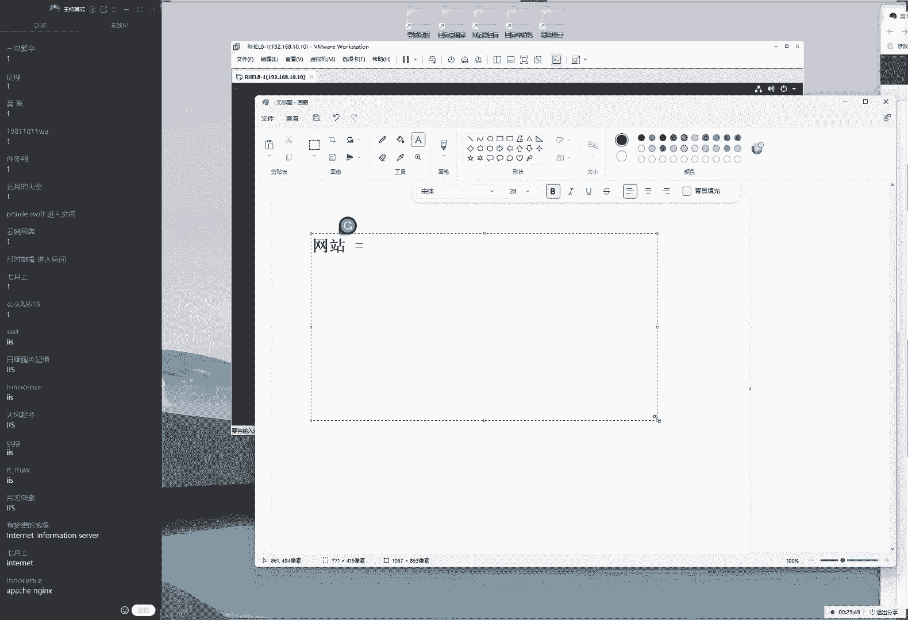
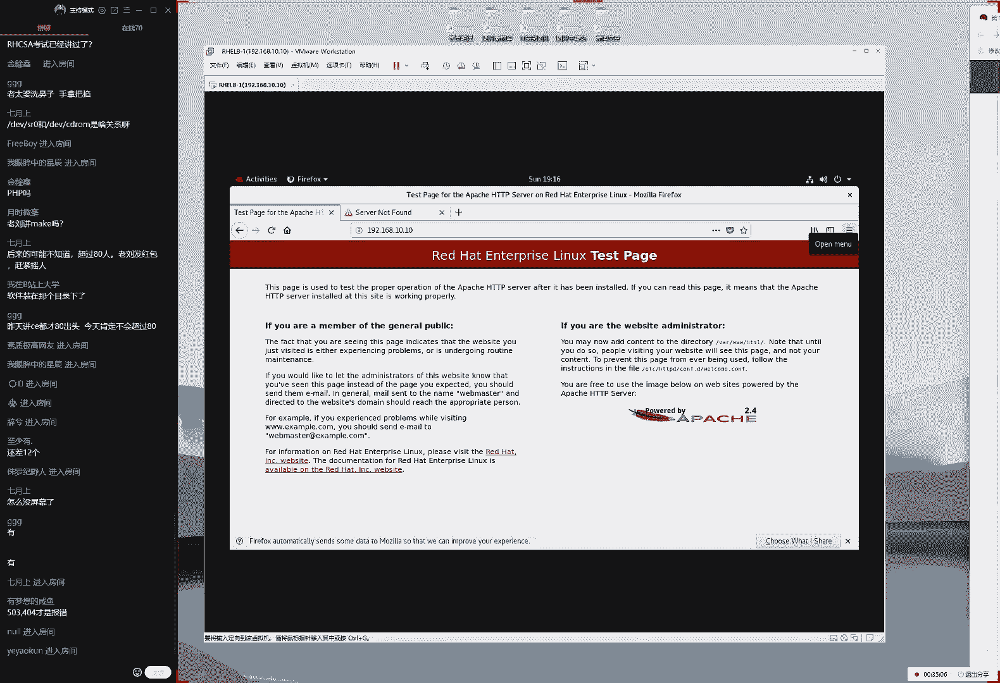
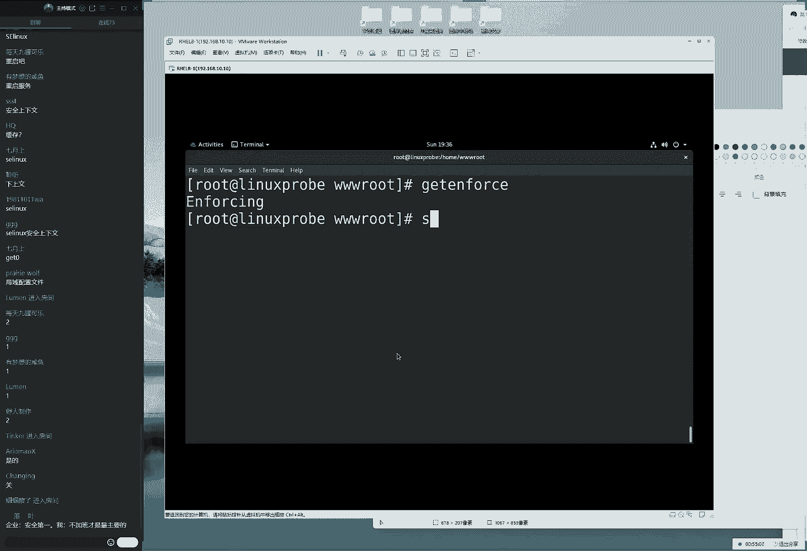
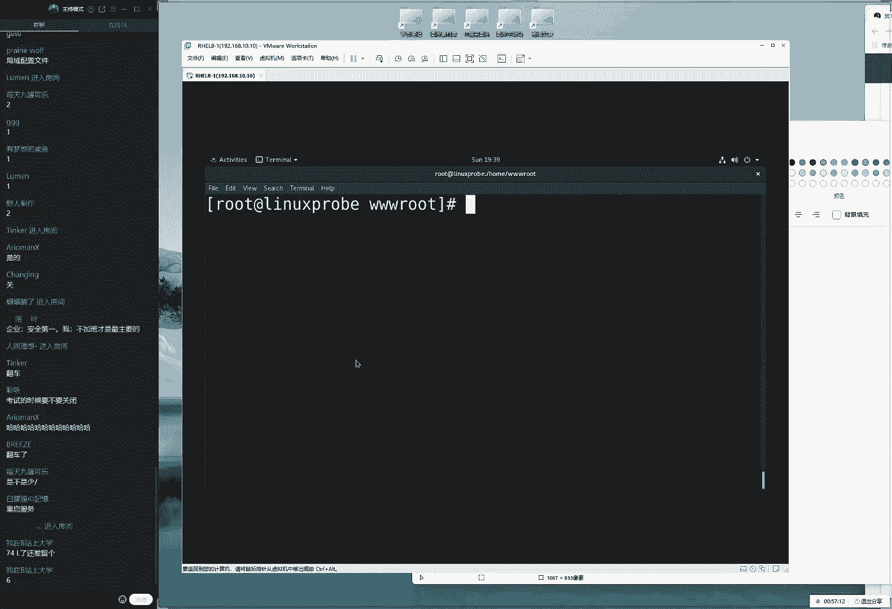
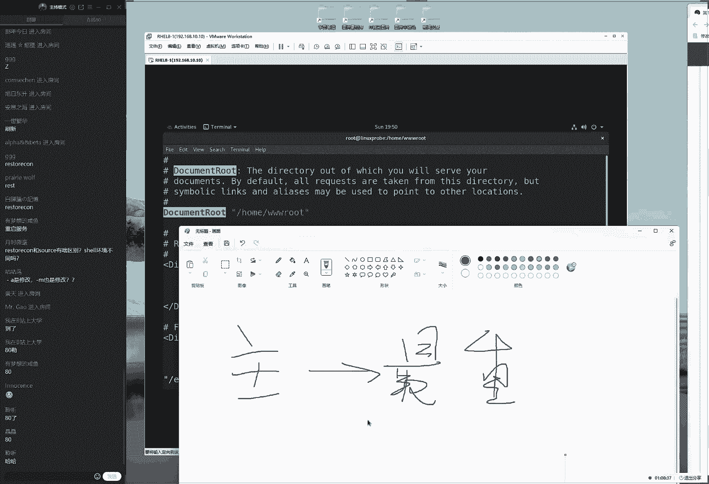
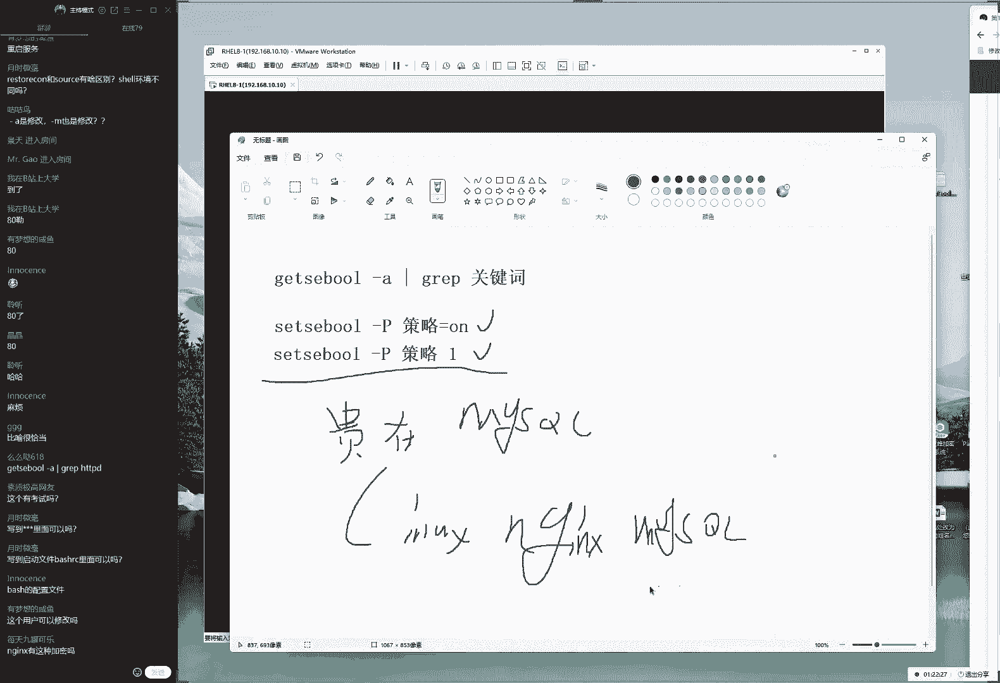

# linux就该这么学第34期 - P17：17【第34期第十七节课（上半部分）】红帽RHCE认证培训课程-Linux就该这么学 - 能力努力 - BV1L14y1878S

来，同学们现在正听到我说话声音吗？喂喂喂，现在声音怎么样？刚才这个录屏又关了啊，很气人很气人。好，现在大家再打一下一吧同学们再辛苦一下啊，同学们现在这个声音还小吗？啊，再试一下，现在59听好马上60了。

待会我们这个人数再来20人啊，肯定也没有问题的。待会要这个人数达到80人，我们给大家发一个红包啊，不低于200块钱呢以大家要是在群里面教一下，看看谁愿意来上课。然后我们抓紧时间啊，礼拜日干什么不好。

我们过来听课来做好对吧？来大家先打一下一啊，没有问题。第十章节我们讲一下这个网站服务，大家在群里面也提醒一下我们这个师兄弟们啊我们准备开始上课了，61还差19个我待会发红包。

那我们来给大家看一下第十章节，我们讲一下这个网站服务。那么大家先翻开书第十章节网站服务对吧？帕奇啊这个的话呢就是我们的网站服务他的话实现出来就是一个网站的服务那么给大家提一个小问题。

请问windows当中我们常用的网站服务搭建。😊。

一个工具是什么呢？好，提一个问题。那我们在linux里面的话，我们有两个搭建的工具啊，比较常用，一个是阿帕奇啊阿帕奇。还有一个话呢我们的唉这个服务大家应该比较熟悉了啊。

然后的话我们还有一个windows当中，我们比较常用的话是什么呢？哎，大家说出来了，这个就是我们的linux windowsdow之间去搭建网站服务，我们比较常见的一种服务。

那我们今天的话呢主要就是讲的这个阿帕奇，对吧？然后话呢我们要想去实现出来一个网站服务，实际上它就是要有这样的一个相应的服务程序来去提供一个后台的支持啊，有点废话啊。

但是它主要的话实现的是一个网站的一个服务。那么我们现在给大家做一个简单的小小的一个科普，什么是的网站呢？其实这有点废话了。为大家对于这个网站一定是很熟悉了。我们每天都要去使用到。

但是我们要对它进行一个定义，对吧？那么什么是网站的网站实际上它就是那能够让我们的用户通过浏览器，然后去访问到的一些文本啊，或者说视频或或者说图片这样的这个字，我把它称作这个网站服务。

那么我们要想去搭建这个网站。😊。

服务的话呢，需要先去配置一下我们的lin里边的软件仓库，然后去安装一下这个软件包。大家的话呢先需要注意啊，我那我们需要先注意两个事情。第一个事情就是我们还会配置软件仓库呢。我们的软件仓库。

我们同学们还是否熟悉，因为又过一个礼拜了啊这是我们上周讲的，我们是否还会啊那我们是否还能够去很熟练把它配置出来。第二的话呢就是我们再去安装的时候，请大家注意了。

它去使用到我们这个安装命令的后面一定要记得是软件包的名称，所以虽然我们的标题今天的阿帕奇，对吧？但是我们在网站的服务软件包啊，要以我们这个实际的为准啊，HTTPD这是我们的软件包的名称。

所以大家千万不要敲我们这个服务的名称，它并不是阿帕奇对吧？大家已经打出来了，我们这个配置软件仓库的话呢，四个要素啊，我们要去配置出来的这个四个参数已经打出来了。那我们最后啊最后最后再给大家去过一遍。

大家已经很熟悉了配置这个软软件仓库，但是是为了避免我们同同学们又遗忘了，最后再来一遍。😊。

啊，然后我们就不再讲这个软件参库配置方法了。所以如果说您。😊，时间没有跟上的话呢，最后一次机会抓紧了。首先编辑一下我们的这个虚拟机，点击一下光盘的设置，选择一下链接，选择一下我们下载好的光盘的系统镜像。

就是我们安装系统的时候，使用那个镜算文件啊，这个大小是6。67个G函吧？就一个很大的一个文件系先从网上去下载好的，然后我们选择一下链接光盘选择链接选择镜像O没有问题。接下来的话呢去挂载一下我们这个设备。

它的话呢是将我们的呃系统当中新建出了一个挂载点。稍等一下，我新建出来一个挂载点。然后的话呢将我们的光盘的设备与目录去做关联。这样的话就可以让用户去通过目录否问到光盘里面的这呃资料和内容了。好。

这是我们的第二步去做挂载操作。因为这我已经做过了啊，所以它会有一个提示信息出来。那么都这两步做完了之后，下面就是去编辑我们的软件仓库的配置文件了。然后这个因为已经给大家之前讲过两遍了。

所以我们就不再给大家再去重新去敲了，然后我们就去看一下，哎等一下啊，我们就给大家去。😊，去看一下同学们有有个印象啊，其实已经很熟悉了。它的话呢在红猫肉8当中，它需要配置两个。

第一个的话呢就是我们这个基础的呃软件的目录。还有话就是我们一些呃其他的软件仓库的一些软件啊，它需要它分啊它可分成两个这个一个目录了。因为随着这个软件包越来越多啊。

那在红猫re9红猫re1我们可以预见的就是它这个目录的话还会继续保留是两个，甚至以可能会到三个，但这就是我们配置起来越来越复杂的一点吧。但然是就是我们需要配置两遍了。怎么样老老啊怎老太婆洗鼻子啊。

手拿把掐啊，这个是歇后语啊，然后大家说HCS的考试已经讲过了HCS考试我们不在上课讲我们通过视频给大家去提供就足够了啊，然后我们给大家看下面有两个这个配置参数。然后这个的话呢。

首先就是我们的唯一标志符是一个中国号。然后的话呢这个是我们的一个描述信息。然后这个的话呢就是我们用来去挂载光盘镜像所对应的一个路径。这个指的是我们本。😊，第挂载的一个协议。

然后接下来是是否去启用它以及我们是否来进行一个校验啊这样的一个效果。大家先看一下这两个如果需要截图的话，我们就不讲了，就赶紧把这张图。然后我们下个知的话呢，把它把配置一下。

大家说DV目录里面的S20跟DV目录里面的这个啥关系叫做链接文件的的关系啊，大家看一下这个的话呢就是我们可以去查看一下这个这两个名称，随便去选一个你喜欢的。

比如说我喜欢的就是DV目录里面的cro所以话它实际上它就是一个什么呢链接文件链接的S20的这样的一个名称比较好记。所以它才会有这么一个名称。那我可以来去记一下，这就是一个链接文件啊，链接文件来。

那么我们现在的话来给大家去安装一下这个网站服务了。HTTPD软件包的名称，大家一起来跟我说说来叫做HTTPD叫做软件包的名称，可不是服务的名称。来，我们的ipad其实是我们的公司跟协议的名称。

而我们的软件包的名称叫做H。😊，D来它搭建出来是一个呃我们的外b网站服务所需的一个软件包的一个软件包啊，然后我们来继续来敲一下Y。那我们去使用到命令去安装的时候，它会进行一次确认。

它说我们是否来进行安装敲一下进行确认。那么这样的话软件包就能够把它给安装好了。这就是我们去使用软件仓库的一个很好的好处，我们可以自动去分析软件包的依赖关系。然后的话呢根据我们的RPM里边的这个软件规则。

自动的话啊呃自动的将软件包来进行一个安装，去降低了软件的安装难度。就当啊它相当于就是我们去饭馆里面，我们不用去关心，今天虽然说这个有啊那我们啊可能话现在买菜不太方便。但是我们都不用关心。

我只需要去说出我需要的菜名，它会帮我们自动去按照这个顺序，然后去找出相应的食材帮我们制作完成啊，这就是软件包的一个好处。那我们安装的时候的话呢，我们去使用的是有两个命令。第一个的话呢叫做软件仓库的命令。

就是叫做store软件包的名称。还有一个的话呢叫做DNF大家就。😊。

我们还玩还呃之前话有一个腾讯的游戏啊，也叫DNF啊，但是的话这个含义完全不一样。这个话也是用来安装码啊安装软件包的这样的一个命令。大家的话这两个可以去任选。我们一般来讲体会不到这两个的区太大的区别。

简单的说来的话就是我们去使用到DNF的时候，可以让两个人同时去安装这个软件包。然后话这个效率来讲会更高一点。那我们按照传统意义上来讲，说这个呃第三代的这个EM这个的话呢，我们的安装的命令。

它安装的时候会把一些呃并不必要的软件包也一起去安装，就是所以我们现在的话推荐大家可以安装的时候去使用到DNF再去完成，这是可以的。然后大家有问题，大家说今天讲呃make吗？

不make的话呢指的是通过源码编译，对吧？这个话我们会在最后给大家讲，大概会在第20张吧，大概会在第二张5月的月底时候给大家去说m然后是make installt。然后我们去通过原码编译的方法来去安装。

那个感觉很有意思。但是呃原码编译嘛，毕竟少一点。😊，我们还是通过软件仓库的话，先给大家讲往先给大家讲从第10章到第19章都使用软件仓库。最后一张给大家都啊最来去讲一下啊编源码。然后大家怎么样说。

今天63啊，怎么样超过80人啊，发红包该摇人是吧？行，我我再给大家发一条稍等一下啊，稍等一下下，我给大家在群里面发条消息啊，稍等一下稍等一下啊，现在是8点40，然后8点50哎。

稍等一下哎等会啊8啊8分30，然后是呃8。60O嗯，我们把它记一下啊，因为待会儿的话呢需要去编辑一下哦，现在我们继续给大家去说大家说我们昨天讲HC才80出头，今天人数估计不到80，应该差不多啊。

现在已经67了啊，现在差12人了。来我们给大家往后面去说来啊把安装好之后的话呢，去使用到啊s cL，然后是restar，然后是我们软件包的名称。😊。

HTTPD啊，刚才这个视频里面泄露了我们学员的信息了啊，刚紧得查一下。要不然的话我们这个学员信息不保啊。来，我们现在大家先去啊啊重启一下，然后的话呢我们去把这个服务加入到启用箱当中。

保证我们下一次的时候还依然能够去启用，就是我们这个网站服务嘛，即便没有配置它。但是的话它已经默认能够去启动了，怎么没有屏幕呢啊，同学们其他同学有这个问题吗？😊，应该是网络波动吧。

呃您可以再推再进一下就可以了。来，我们现在的话呢去启动一下这个服务，去重启一下我们这个网站服务，并且的话呢将这个服务加入到启动当当中，保证我们下一次的时候还依然能够去启用。好，我们来去输入一下。😊。

打开浏览器，输入一下我们这个服务器本地的一个地址，192。168。10。10啊，去输入一下我们本地的IP地址。于是您就可以访问到这么一个页面了。实际上这个的话呢就是我们的网站服务的一个默认页面了。

那我们看到那我们看到看到很多这个网上这个文章里面就会大家去说啊，这个话我们叫做报错页面，就是这个是不对的。并不是说我们只要没有看到网站的内容，它都属于叫做报错页面。这个话这个我们是叫做默认页面。

它并不属于报错页面。这块的默认页面的话呢，它指的是呃我们要不然就没有权限去看到网站里面的内容。要二然的话指的就是我们目录里面没有内容好，那也就是说我们现在看所看到这个这么一个页面啊。

就是这么一个呃界面的话，它不属于报错，它属于叫做默认页面，默认页面有两个出现的可能性。第一个的话，对，大家所说的就是我们出现这样的这个报错了。比如说404啊，呃502叫做报错的时候，才叫做报错页面。

我们现在叫做默认页面，就是说啊并不是说我们没有看到网站的内容，它都属于叫做报错。这有点它。😊，啊，它这有两个情况。第一个情况的话呢是说我们没有权限去看。要么就是权限不足。

要不然的话就是我们的网站目录内没有网站数据啊，这是两啊两个可能性啊，那我们先来看一下书啊，书上面讲到了我们的网站的话呢默认的加目录是在目录里面的3W里面的H啊这个目录。所以我我先去走到网站的根目录当中。

进入到网站的根目录里面狠狠的去敲一下回车。接下来接给大家提一个小问题啊，非常小非常小就是啊非常简单啊，请问我们一般网站的这个首页文件叫什么名字啊，因为前面的话呢我们课时啊有点赶啊。

现在话呢已经讲了Z了所以我们就可以稍微的放松一点了。😊。

所以我们可以稍微放松一点了，可以多糊弄一点。包括说我们。😊，稍等啊，我现在没有卡没有卡，我先倒杯水。好。昨天就吃了一个亏啊，昨天那个茶泡有两个多小时，所以特别苦。今天的话呢就是临上课之前再再把叉7。好。

大家都打出来了啊。我们的网站首页文件的话呢叫做index h其实我们上课的时候尽量能够多互动一点啊，然后这样的话同学们有一个思考的过程。

因为我们去玩游戏跟别人啊就是大家去想啊就是我们自己玩游戏跟看别人玩游戏那个感觉也是不一样的。以话我们尽量能够多互动一点。大家要积极互动啊，然后给大家看啊有一个思考的过程啊，打出来了啊。

这个话首页文件叫做index一说H这是我们的首页文件啊，它的话一般叫这个名字。当然有同学会说首势对对啊，说我还见过比如说index点或者话d啊这样啊吧？还有的话index然比如说巴拉巴拉啊。

还有的话比如说论坛啊，就是这样的一个形式。这样话也会出现。但是我们现在默认情况下的话呢，我们就以这个为准好我们来我去。😊。

出来这个文件index hL其实我们给大家讲课的时候吧，我们的不同的学员的基础是不一样的。它不像我们在上学的时候，上学上小学的时候，所有的小学生没有学习过呃初中的课程，所以我们的水平都是一样的。

但是我们当前这个培训的话呢，我们的学员可能已经工作了5年了，有可能您刚刚毕业5年还有可能您还没有毕业，还有5年才毕业以我这个可能基础不大一啊我这我们的这个基础跟经验可能有一些差异。

但是这些基础的话呢我们应该是都是有应该都是有所了解的来编辑一下我们这个文件d偷偷补了一下课啊，这个补课可以明目张胆的啊这个非常的好，我们非常推荐一定要补课啊一定要听课来我们往里边的话。

随便写一行这个广告那e to点来按下回车这时候再去刷新一下网站的内容，于是就能显示出来了。这就是我们来去搭建出来一个网站的方法。好，我们可以下课了。开玩笑啊，今天看这。😊。

没有那么简单。也就是说同学们要要大家大家又要一定要理解我现在所说这个呃事情啊，就是我们要是搭建一个网站的话，到此结束了啊。但是我们为了让大家能够去对于这个服务有一个更好的一个了解。

以及我们能够通过这个服务去学习一些服务的配置方法，所以我们才有了后续配置的一些操作，但是并不意味着我们在工作的时候非得要这么复杂的去做后面这件事情。这样去做就已经到头了啊。

这就就是来搭建出来一个静态网站这样的一个方法。好，但是为了让我们继续去来去学习嘛啊，我们要给大家呃故意去挖一些坑。

然后我们通过这个啊把坑给大家填平来去进一步去长啊去长呃去增长经验来我们先给大家提一个要求，就是请问我们的默认的网站的加目录扫到P了那我们的默认的网站的目录是在哪里呢？

它是在我们的啊大家问到了说网站源码上传到哪里，这边刚刚说过了吗？来了叫做万目录里边的3W里边的HTML哎这个网。😊，这个目录就是用来去存放网站源码的。好，下面给大家提一个问题。请问如果说我不喜欢它啊。

不要问为不要问我为什么不喜欢它就是不喜欢怎么办呢？我如果说我想换一个到新的目录我想换呢或目录里边的3W目录，这个操作怎么去做。好，这就给大家提到了，并不是在工作的时候都一定要就是我们要做这步操作。

但是我就想做了啊，通过这个服务的话呢？去学习一下这个怎么办呢？啊，那么我们怎么样来去大家说啊不是吧啊，这个是的是的是的啊，来，我们再给大家去说一下啊，要想去变更一下我们网站的这个目录。

如果说想换了怎么办呢？首先新建出来这个目录，新建出来这个目录或目录里边的怎么样的，一起说3W点啊，就是我们88，那给大家去写来3W目录创建出来这个目录。然后我们去理解一下什么呢？

然后大家说我们的同学叫做月石微豪同学说不是在这个目录里？不是的不是的不是的。😊。

我们当前所讲的这个为准。呃，您说这个情况的话呢，有一些情况是存在的。比如说您不是通过我们的软件仓库去安装，可比如说您通过源码去安装源码安装也不是这个目录哦，是的。

就是我们如果说您通过原码的编译的安装的方法。然后我们家里一个参数叫做perf吧？然后我们可以指定一下安装的这个路径，有可能您自定义的到了这个目录当中，或者的话呢您使用的一些脚本来编译的话。

也有可能是这个目录。不过这都是不过我们默认情况下是在这个目录没有错没有错没有错。好，我们接下来再往后面去给大家去说了，就是要想去编更这个里面的这个所在所对应的一个目录。

实际上就是去修改这个服务的一个运行参数。那我们又已知哎就是lin当中的话呢，一切都是文件。所以我们要想去编辑一个文件里面的参数，实际上就是在找这个服务所对应的一个配置文件。

修改配置文件那我们现给大家提一个问题了，请问编辑什么文件呢？它这边有一个比较重要的一个文件叫做主配置文件。里边的话呢包含的是。😊。

最重要的配置参数。所以我们根据这个思路捋下来，就是要想去编辑一个服务，大概就啊大概率啊就是在去编辑这个服务的一个主配置文件。这个主配置文件的话，它是在我们的ETC目录里边的以服务名称命名的一个文件夹。

然后以边以服务名称命名的一个文件。后这个里边以CONF结尾，但这个有点特殊啊，它里面又加了一个呃它里面又它啊里面又加了一个目录，但是这个并不妨碍我们一眼就能够看得出来。

这个就是我们这个服务所对应的一个主配置文件，虽然里面加了一个子目录，但是这个不妨碍我们一眼能够看得出来，它应该就是我们这个服务程序的一个主配置文件了。来，我们来摁一下回车啊。

摁一下回车搞定它大家问一个问题。大家说到说我们端口号是80还是8080我们是80端口号啊，网站服务的话，默认口号是8080。如果是我们的加密的话则是443啊。

我们的8080也是一个但是会大家有一个演示S域的那个端口号的控制当中。大家会见到。😊。

所有的网站服务它被允许的端款号啊，然后我们看到我们的默认情况下是80。所以要大家要从晚啊，大家要知道从外部去访问的话，记得把防火墙去做一下放行。好。

那我们现在的话呢来去编辑一下我们这个服务程序的一个主配置文件大家看到这个文件之后啊，同学们就会觉得哎好像有点难啊，都是密密麻麻的这种小字它怎么回事呢？这个不要担心，因为它主要就是一些呃帮助信息。

我们在的配置文件里面，所有以井号开始的，所有以分号开始的，我们都把它叫做帮助文档助文档主要是对服务的功能一种介绍。或者的话呢对于我们某一行参数的一种说明，我们啊是给人啊那我们这个是给人去看呢。

它并不会被机器所读取，它并不是参数，我们于是往下去找找到我们想要去配置的。这有一个参数叫做稍等一下它有一个参数叫做document root是吧？document找到这个参数。😊，哎，我记错了吗？

DOCUMENT啊没啊没有记错没有记错，它是打写啊被区分了。来document root这个的话呢行数是在第122行。大家问了一个问题，说8端口号一定是80和443吗？

可以改以改不过我们今上课不给大家去说了啊，因为上课的时候要给大家东一下西一下就乱了，下下了先按照我这个思路啊，同学们先按照我这个思路给大家去讲课。

然后我讲完之后的话呢可以可以拔但是我们这个基础一定要去扎实，现在先把基术打扎实了，后我们拔可以不限话题来给大家看一下行数啊，122行document root这个指的就是我们网站的目录所存放的一个路径。

同学们说想换一个可不可以我可以换我们给大家换成才我所说的叫做ho目录里边的3 rootot目录来大家换到但是这个目录也可以改同学如果不喜欢可以换成自己的名字目录里们名称一个文件夹都是可行的来我们点一下这个保存。

😊，并退出做好之后，呃，大家需要注意一下啊，我们先做好之后再去刷新网站的内容的话呢，没有发生变化。这是为什么呢？来，同学们刚才有个同学说一偷啊偷偷啊补了课了啊，同学是谁？亲约上同学？😊。

来提一个问题，为什么我们现在编辑过的这个服务，但是编辑过的这个服务的参数并没有生效呢？起码他应该给我1个404说我站数据不存在吧。大家说到了重启重启什么？重启啊服务对不对？啊叫做这个重启服务。

并不是重启这个服务器，同学们是重启这个服务叫做sstem啊，怎么样？一思说叫做re哎非常好hTTPD啊，重啊重启一下我们的网站服务提一个问题啊，4月3号的时候去说过这个命令啊，来这个我们上课的时候。

我给大家讲呢，大家要跟我互动起来就是请问一下，我们在4月3号的时候讲过两个命令，一个叫做re一个叫reload。请问当前我们去执行哪个命令比较合适。

或者这两个命令有哪些不同就是就是我们现在去执行这两个命令都行吗？还是说只能去执行哪一种，还是说这两个有什么区别？同学们思考思考啊，待会待会回答会回答家公布答案。但是我们起码。😊。

呃，要思考一下，然后现在71个同学啊，待会看看有没有同学还继续来上课了。只要待会儿这个人数超过80，我们就给大家发一个红包啊，不低调啊不低呃不低调呃。😊。

呃，不低不低于200块钱给大家发到我们这个群里面。大家收到了说restar的话UID是不一样的。那个不叫UI那个叫做P啊。对大家说的没问题。

我们给大家说一下是这样的re话指的就是一个完整的重启然reload的话指的就是重去加载这个服务程序的配置文件。那么我们来去理解一下话就是re会更加彻底。

我们比的喜欢用这样话是一个推荐的一种方式re如果我们不重启这个服务只想去加载一下它这个最新的配置文件，那么也可以去使用到reload，但是有一定概率，但是非常小啊，小概率是不生效的。

所以我干脆就使用到这个上面一条我们现在的话来去重启过后又看到这个页面了。同这个我知道啊这个你刚刚讲过它有两个情况。第一个情况的话呢非常开心啊，所以都开始拍所以都开始拍手了啊。

讲课讲非常开心那我到这个情况它有两个可能。一个可能网站目录没有数据，于是我又3 root，然后往里面去。😊。

新建出来一个首页文件index点 hML后我们来呃巴拉巴拉啊 to随便再换一个网址，这也是我们的亲儿子 tolin点 co啊。

我们自己的网站是这个也是我我们的一个自己的自己的一个新网站 to最近几天就一直在弄这个网站里面的内容估计到年底这本这个网站的内容也能出本书啊，现在正在抓紧重啊。那这是我们往里面编辑一个内容。

编写好之后的话再去刷新一下网网站的这个页面啊，可以看到没有任何的变化。那么怎么回事呢？大家想到说第二个可能性就是权限不足，是不是因为权限的问题呢，有可能好了，我们这样去做，能够看的话就是可以读可以执行。

对吧？可以进入到这个目录，那么就是CHMO对于目录进必规操作大写。😊。

755目录名称 home目录里边的3W rootot目录没有比这个更啊更啊没有比这个更加严谨的操作了。来摁一下回车，再来刷新一下页面还是不行。大家看到了，我们现在的话呢把网站目录变更之后。

把站内容一直不显示出来。😊。

啊，把能够想到的能够事的都给大家已经说出来了。那么还有哪些可能性呢？大家先翻开数啊，往后找一找啊，十点三小节就要来了。大家说重启服务不需要重启服务。那，因为的话呢我们是对于服务的配置文件的修改。

需要去修啊需要重启对应的服务。但是我们现在修改的并不是服务程序的配置文件，是我们的网上的数据，网上数据修改过后不需要去重启。好，下面给大家去说来了，答应啊叫缓存，哎呀，同学们不对啊，这是啊第十。

三小节看来真没有预习啊啊，就是我们叫做Ilin。这个的话呢是美国的安全局，大家看这样我们要看一下啊，十点三小节美国的安全局与啊开源社区一起去研发出来的一个安全子系统叫安全子系统它的话呢就有啊它会跟我们之前讲过一些服务的话呢。

会有很大的区别。比如说我们第二章节我们学习的是什么呢？我们学习的是什么什么么什么的命令，对吧？啊，然后我们第三章节学习是什么什么的操作服务。然后我们现在的话要去学习。😊，什什么的服务对吧？好。

那也就是说我们之前学习的是命令或者操作服务或者一种服务，但是这个就很厉害了，这就很厉害了。它叫做安全子系统。这怎么回事呢？它就是说我们在我们第五章节讲的这个权限之外。

它虽然已经有了一般权限特殊权员隐藏权限和FACel了，但是我们依然不满足我们能不能去限制一个服务，它只能去做哪些事情，以及某一个文件只能够被某个服务所获取呢？换句话来说。

就是让这个服务只能去做自己该做的事情。这个就叫做IA来大家总结一下，就是它的话呢，它又是对于这个权限又的一次补充，叫做IAlin。它的核心就是让程序啊做呃只能做自己该啊自己。😊，该做的事情。

这个就是我们的S文系统的这样的一个呃存在的理由。那那我给大家举一个例子啊，比如说比如说嗯美图秀秀啊这么一个软件啊，但没有用过它打一下E啊，叫美图秀秀用过的打一下一没用过打一下2啊，这个叫美图秀秀。

它的话呢是一个修图的一个软件。然后比如说他想要去获取一个照片的这个信息，那么我们就可以对它来进行一个设置比如说他可以去获取一个照片进行一个信息啊，这个话这个操作它是一个呃可以被同意的啊，并且的话呢。

他可以去获取这个信息。但是他如果获取的是我们的支付宝的这个余额，这个时候它就不行了，对不对？但也就是说当我们这两个这个文件啊，这是一个错啊，它就不能够这样来获取。但家没有用过是吗啊有用就没有用过。好。

就是一个修图一个软件啊。比如说他去获取一张照片，这个操作的话呢是可以的。那么如果说他想要去获取一个我们的话呢啊其他这个信息啊，银行的这个账号，那么这就不可以了。那我们这个权限怎么去做的是做到我们这两个。

😊，信息上吗？这个两个信息如果要是说去说是这个可以读，可以写这样这个权限的话呢，它是对于所有人都生效的。我们怎么能够去限定一个服务，它能不能去啊，它还被访问呢？

所以我们要去使用的Ilin去限制我们这个啊服务的功能。你又只能去获取这个照片，你不能够去获取其他的这个信息。所以这个控制叫做控制服务的功能，我们把它叫做Ilin的域lin域可能老游得比较丑啊。

所以我们就老用到美图秀秀去P一下，把自己P的稍微帅一点啊，来这个我们去限制服务的功能，只能欧去获取哪些资源。那包括说这个文件，包括说这个呃端口号，包括说我们去调用进程里面的一些信息，它都属于服务的功能。

它叫做它的话是对于我们的功能的这个限制。还有的话就是我们也可以在文件上面去打一个标签，它限制说谁可以来进行一个访问。这个我们叫做安全上下文。大家记一下，我们也可以在这个文件上面去打一个标签。

比如说这个照片有10张照片，其中有一张照片，我们上。😊，打一个标签，说只能用到支付宝啊来去访问它是一个我们的银行卡的一个余额的一个照片啊。那么这个话这个上面打一个标签，就是只能够被谁啊被哪个服务所获取。

这样的话呢美图秀秀能够功能上能够去获取某一些照片的这个资源。但是它一个文件的话依然访问不了，这就是通过域管服务的功能，通过上下文去管文件，只能够被谁获取。通过这么上管天下管地双管齐下。

它是不是在我们这个之前讲过一些服务上面又去套了一层，它让我们的服务只能去做我啊我们自己该做的是这个事情叫S我们有两个命令，大家来记一下。首先的话呢我先给大家去说一下文件嘛。

要想知道我们这个有没有开我们有一个文件叫做C目录里面的Slin里面的fig大家来打开它这里边的话呢有三个的工作的模式哎呀这个词打错了啊。这个叫做警告模式。

我我把它打错了英文水平还是有待提高来大家看一下啊，是这样的这个文件。😊。

里边的话有三个这样的一个工作模式。第一个工作模式的话呢叫做enforcing叫做强制开启模式。就是说我们一旦做的啊做了这么一个呃错误的行为了。当他去越权去访问某些资源的时候，那么则对它进行禁止操作。

也就是说代表是强制开启吧，叫做强制模式。只要你做了这个出格事情，马上对你进行禁止，就做不了了，叫做强制模式。还有一个叫做promissive是吧？这个的话代表就是一个警告模式。

虽然说你做了一个出格的事情，但是我我并且我不会对你来进行禁止，但我会进行行一个警告写到系统啊，那么我们啊来去写到系统的这么一个信息里面，这样的话，系统的日志里面帮助我们以后可以来进行查询。

它是一个警告的一个模式。还有一个叫做禁用模式diable它的话指的是禁用模式，它禁用的它禁用的并不是我们去越权做这样的一个操作。它禁用的是我们的的本身，所以的话呢我们当前既然要去学习它嘛。

我们都去使用到enforcing模式去强制开启。但是。😊。

但但是什么的事都有一个但是啊，但是在工作的时候，我们大概率同学们你们上来会把S给它关闭掉，对吧？因为这个配置起来是比较麻烦的。提前打一个预防针啊，第二点的话就是配置我们之后的话呢，可能也没有太好的效果。

因为它有些服务的话是能够被绕开的但是终归怎么说嘛，有这么一个服务的加持能够让我们的服务器跟大家稳定，这是没有错误的。好吧。但也就是说呃在工作的时候大家关不关，我那呃也就呃可以自己来去决定了。

但是我们整套的培训，包括到最后一天，我们都会保持一直都是开启的一个状态。好吧，就是我们这套培训一直都是开启的一个状态，我们就会都给大家去配置一下。包括说我们配置服务的时候都需要去考虑到它。

但是同学们在工作的时候其实说实话肯定会关的。因为我们这边的反馈来讲，就是我同学们到这个机房房少里说吧，别太夸张了，40%吧或50%吧，都会关尤其是一些。😊，自己公司的一个服务器啊。对，好。

我们不就都不说了。好，我来来来给大家说一下。😊。

那么要想来让它去配置它的这个模式的话呢，就改这个参数。如果我们还有两个参数啊，我们还有两个命令。这个我们第一个叫做get in force指的就是获取一下我们这个当前啊。

就是查看一下我们当前lin这个状态。如果说想知道一下我当前这个状态，我们就使用到叫做get来获取一下代表关闭这就是我们直接去查看就行了。它直接给我们一个英文啊。

可以那我可以看到说当前的话呢这个呃 slin这个状态为强制开启模式。如果说我要想临时关闭呢，它它都是一个临时的啊，那我们就去使用到set in force，然后来去临时关闭一下零代表就是临时关闭。

还有的话呢我们的s做临时开启。了，我们来给大家操作一下。既然我怀疑是问题就去院看命啊，我怀疑我可能得了新冠了。那我去那我可以先去拍一个CD看一看，我到底有没有非部的阴影，对吧？

set in force零临时关闭它。😊。

然后我们来看一下刷新效果。呃。

稍等一下啊，稍等一下稍等一下。哎，讲那么热闹，怎么突然间讲稍等一下啊，应该能够看到内容呗。有呃有有有有有有一点那个小插曲啊，稍等一下，同学们哎呀，这个车翻的呀。😊，哎，应该能够看到了啊，稍等一下啊。

老刘现在很尴尬啊。home目录里面的3W rootot我来看一下home目录里面的3W rootot。哎，等一下啊，看一下考试时候要不要关考试不要关，因为考试的时候也他没有影响到我们。

影响他都没有影他都没有影响我们就当不存在不好了嘛，反正跟大家说实话，反正在反正在C里啊，第一件事我就会把它关了，目录里的3W rootot没毛病啊，来等一下同学们我刷个新还是不行啊稍等一下稍等一下啊。

稍等一下，大家说我是不是少了一个斜杠我看我来看一下啊，home目录里面的3W root没毛病啊。好，我把这个底下改一下啊，这个我我它指的是我们对于这个目录的这个全新的设定。然后如果要是没有的话。

可以他有可能提示出来错。😊。

哎呀，不可能啊啊，他不他是不应该啊，但是我们也把它给修改一下，上下两个我们都把它改了，然后再来啊去重启一下我们这个服务程序。刚刚我是不是我看一下啊，刚刚我啊重启了呀，没问题啊。

来呃sstem controll，然后restar HEPD。😊，来重启一下重启一下我们这个网站服务再刷新。哎，没呃就没有问题了。好了，当录没有发生过啊，我来说一下这个原因是这样的，我们再去编辑配啊。

在编辑配置文件的时候啊，底下需要加一一个对于目录的一个权限的放行，要不要不然我们这个用户访问的时候就会提示出来才这个报错。等于说呃让他能够去访问到我们这个目录，那么以及访问录这个录啊。

去访问我们这个哎目录的时候，需要给他一个访问权限。也就是说下面的一个目录，也需要图样进行修改。好，等等我我们没有发生过啊，同学们啊把当当录我没有发生过。那我们再来先把这个S给它强制开启一下。😊。

再来去刷新一下这个网页。于是我提示出来这么一个信息。他说for它只是被禁止了。当前我们的网站访问请求被禁止了。那好了，我现在的话就啊那么就把给临时开啊，把给临时关闭一下，临时关闭了我们再去刷新一下。

就能够看到网站里面的内容了，就有点是就是是哎赵本山给范围那个小品啊，一旦我做完这个轮椅了，我立马我这个还啊就能够去访问到这个资源了啊，那我们也能够想明白了。哎，智商占领啊智商占领高地了啊。

然后就像一个啊像就像我们那个呃小品一样，然后当我们把这个轮椅给它撤掉的时候，再把lin给大临时开启再刷新又不行了。那就是说他确实是由Slin给它捣乱啊，确实是由我们捣乱。那么现在它是由哪方面去捣乱。

也就是说它是上管了我们的服务的功能，下管了我们的这个服务的这个上下文现在是由哪个导致的呢？我们现在来去分析一下。😊。

就是呃它的话呢是由安全上亚文去使呃，它来去进行限制的。为什么呢？因为网站服务它还是利用的这个网站服务本身，网站服务本身它没有任何的变化，它变更的是什么呢？它变的是网站的这个存储的路径。

网站的源码保存的路径之前是这个现在的话呢是这个好了，网站的目录发生了变化了。那我们去回忆一下，突然间就能够想的明白了。第第六章节第一小节FHS里边讲到过home目录的话。

它的这个本身的作用是用来去保存我们的个人用户主页功能的呸啊，它用来去保存我们每个普通用户自己的这个加目录的对吧？啊。

根据我们之前所讲的home目录的话是用来去存放普通用户加目录数据的那么现在也就是说是我们的网站服务去访问的是人家的加目录里面的数据，我感觉不太合适，吧？那么这个时候。😊。

我们怎么办呢？我们可以去使用到一个命令叫做IOS要想去看目录的话，加一个小写D。要想去看里面这个详细信息的话呢，是一个小写L对吧？然后我们可以去查看到这个目录原本目录的一个权限。

看看新网文件的这个权限有何不同。看一看没有什么不同啊，也是一个75的一个默认权限没什么毛病啊，有没有太大问题。但这个时有一个奥妙之处就是在于加一个大写杠Z啊，是啥原理呢？

就是啊带一个大写杠Z查看我们的文件的上下文啊卖过来，对吧？我们把这个轮椅撤掉之后，马上会发现病毒又重新占领高地了，怎么回事呢？就是因为我们之前的网站加目录里边的这个标签，它是叫做啊网站服务的系统文件。

但是的话呢当前我们的这个目录里面呢3加的话呢，它指的是用户的加目录。于是怎这样我们再一对比发现新网目录权限不同，导致我们就这个服务它是访败，它获取不了这个。😊。

里的这个资源它没有权限被啊我们的啊S这个生态文给它禁止了。这时候怎么修改呢？我们去使用到一个命令叫S manager来进行修改。哎，这个时候的话大家需要注意一下啊。

我们有一些学习比较早同学大概的话是在红re5的时，如果说您学习的时间是2008之前啊那么那么您使用的是红re以前系统的话呢那么您之前学习的这个命令叫做CHCO这我明白那这我也用过哎，用过很长时间。

但是话现在我们使用的命令叫做S manager我们理解一下啊，就这两个命令的话，当前都可以去用。但是我们更推荐您在红猫热8当中啊，不在红猫re7个红猫8当中都去使用这个命令，为什么呢？

给大家两个理由第一个理由就是这个命令的话呢，我们起来参数会更少并且的也是永久生效的跟我们的这个CO命令的话是一模一样的也是一个我们这个2015年开到现在的一个新的不是2014年的年底到现在的一个新命令。

等于说。😊。

后期的这个知识的话，它会啊它啊它啊啊它会更好。它是永久生效的。并且的话它是一个比较新的一个命令。第二的话呢就是这个命令的话呢，我们啊之前的这个命令在红包四和5里面去用的话呢。

包括说我们这个red hand这个呃，我们这个哎个人版的话呢，去使用这个系统的去使用这个命令的时候，它有一个局限性，就是它只能去配置我们文件上面这个上下文。而呃我们知道S管理的时候，它有上下文。

它还有一个就是这个域，对吧？那我们这个的话只能管我们这个文件上面这个呃这个信息。😊，但是S manager既可以管文件，上面是个上下文，也可以管我们的Slin的功能。所以我们去使用这个命令的话呢。

更加的方便一点啊，都啊都都可以通过这个命令来去完成。那我们先给大家编辑一下，给大家打个样看看这个到底怎么回事呢？

给大家演示一下S manager我们还有还我们把给大家强制开启一下再刷会发现肯定是问不了啊，先把这个给大家临时开我们给大家先给它开启了，大家会说怎再做弊？因为你没有开，所以我们才能访问的给开启了。

然后接下来去设置一下我们的Slin上面的文件的访问空列表这个叫做啊文件的这个上下文来进行修改杠A这个杠A的话呢，这个参数有歧义。杠A的本意代表添加。但呢实际上意义代表就是一个修改。

以大家翻译一下我们这个书包括说帮包括说我们去去翻译一下这个帮助文档杠A的含义写的是添加。但是它的实际作用是修改，然杠T指的是。😊。

我们要去修改的这个值是什么。然后我们来去复制一下它原本的这个值。也就是说这个值我不用去记，我不用去记这个词。我只要是啊访映失败了。我想要把我这个新了保持一致的话呢，我可以过来查。

但是我们要知这个原始目录是在哪里。好，我们现在的话往后面站到参数的后面指的是要修改成什么。还有就是要修改哪个目录呢？我们要修改到目录名称叫做目录里边的3W root目录来摁一下回车。还现在76个人了。

非常好，还有4个同学我就给大家发红包了啊，不低于200块钱了。来大家看一下啊，去使用到这个命令就可以把这个目录的这个S这个值给它修改了。同时再把这个目录里面的所有的这个文件的话。

也都给大家设置一下这个全新的上下文的这个值来摁一下回车来进行一个通配设定吧。那我们给大家做一下这个设定。做完之后话，大家会看到我不仅去刷新一下这个网页看不到效果，它还是看不到网站里面的内容。

同时我再去使用到我们查看到上下文的命。😊。

命令去查看目录的这个信息的时候，会发现它还是用户的加目录参数没有变化。😊，参数没有变化。他怎么回事呢？同学们他怎么回事呢？为什么我们设定过了，大家没有生效，不仅目录的上下文没有做修改。

我们的网站的数据也依然无法被访问。大家想一想有什么命令没有去执行。刚才同学去哪了？刚有同学说已经提前预习好了啊，可以说出来了那个命令。😊，哎，今天这个茶还有点苦啊。来说出来吧。重启服务不对啊。啊。

这个的话呢叫做立即生效啊RESTOR这个从字面意思上来说叫做这个恢复，对吧？或者叫做这个存储。大这是这待会的话呢，这个实际上叫生效的意思，使用这个命令。然后我们一般情况下加一大小R代表就是递归操作。

对于目录嘛，V显示的是一个过程。然后对于我们这个目录，让这个意思就是说要让我们新配置的上下文能够生效。大家再再说一下，就是让我们新配置的Slin这个上下文的值立即生效。来摁一下回撤啊。😊。

来我们升掉好之后，这个非常可爱啊，大家看到这个的话呢是一个一个我们的原始值，对吧？啊不啊在啊它在这儿，然后它变成这么一个新的值了，这就是我们变化的一个过程。这样做好之后不用通击服务。

直接一下这个F5狠狠的摁一下一下，然后就可以看到了哇，这就是我们的网站的内容，没有问题，这就是我们去修改网站里面的一个参数以以及设置我们的S这个上下文来去实现出来网站访问的这一个小实例。

那么大家现在也会问一个问题老师你能不能再给我讲一个就是呃网站的这个功能呢，以及再给我们讲一个我们的S域的一个配置的方法呢。到底对于服务的功能的放行，我们该怎么去做呢？

我们先来给大家去一下家问一个问题当这个问题是这样的说我们去使用到这两个命令有啥区别，是这样的，首先的话呢这个其实很简单首先RSCE这个话是用来专门去让Slin个上下文去生效的一个命令。然后。😊。

如果说您之前使用过sourcece的话呢，您的使用场景是什么情况呢？我们一般使用的场景，我相信您也是就直接写一个文件名称。比如说类就我们类似于这样的一个效果，对吧？

这两个的话呢就是呃效果都是让我们新配置出来的这个参数能够生效。但是这个只的是专用于Slin个下文。这个只的是重新去加载某个文件，然后这个两个的话还是要大区别的。它不能让Slin生效。

它是专门让我们这个配置出来的这个参数来去同步的意思啊，所以这个就是两个的小区别啊，然后我们这两当啊当然了这两个非常的不搭解。所以我们去敲的时候千万不要把它敲混了。来下面我们接着给大家去说有一个功能啊。

叫做啊我们的网站服务叫做个人主页功能，大家记一下叫个人主页功能，个人主页功能。这个怎么理解呢？就是如果说我们现在这个网站的服务器当中有个100个用户有个100个用户。那么好了。

呃我想为这100个用户批量新建出来网站的目录。这个怎。😊。

去操作呢，大家看一下来，我们现在网站当中的话有100个用户。那我想为这个100个用户批量的来去新建出来他们的网站。这个时候我们就可以去使用这个功能，叫个用户这功能。但是我要给大家讲。

就这个服务的话用的比较少，当然有这么一个事啊，我以通过这个例子来给大家做一下演示。工作的用的几率比较小会比较小而已。他可以在我们每个用户自己的这个加强度里面去新建出来一个网站的一个服务程序。

大家说杠A是修改杠M也是修改吗？是这样的啊，杠A我们从实我们从实操上来说也是修改。因为我觉得因为怎么讲呢？因为从我们的从这个官方的文档里面我们去查到的，包括我们从字面上很好理解杠A就是添加的意思。

但是我觉得这样讲话是不太负责任的。因为杠A从这个实操的结果上来看，它就是这个修改的意思，所以对是的杠A是修改杠M也是修改来我们现在给大家做好之后话呢。

可以这样进行操作去编辑一下我们的网站服务程序的一个主配置文件啊找到它。😊。

里边找一圈的话，有没有跟这个个人用户主页功能相关的参数呢？我们发现没有。😊，啊，这个其实应该给大家互动一下了啊，但是我刚刚看了一下，同学们好像哎今天好人数并不多。

而且好像没有做好预习嘛啊O啊啊8啊现在是80人啊，挺好挺好挺好挺好，大家这个号召力比我强来那我给大家发个红包啊，大家记提醒我别忘了来是这样的啊。

那我们看完这个参数之后发现里面没有这是同学们之间问一个问题。老师为什么这边没有这个参数呢？这要给大家强调一点，就是这个主配置文件里面啊，它是包含的是最重要的配置参数，它里面并没有包含所有的配置参数。

这一大作为一个区分啊，就是大家记住它是里边包含的是最重要的配置参数，而并非所有，所以我们这个副的功能的话呢，它有一个子配置文件跟主配置文件的话，它是一个调用的一个关系。

它是在一起说ETC目录里面的HTTP里边的般是子配置文件所存放的一个等一下所存放的一个路径是的HTP。😊。

少了啊少了一个P来啊HTTP点config点D走走走好走好，这儿啊，看到了这个目录，拿这个文件找到它编辑，这个就是我们个用户主功能所对应的一个功能文件了。进入它看一下里面这个信息。😊，来啊。

大家怎么样这个人数到了是吧？啊，不用着急啊，老刘跑不了，待会给大家发红包啊。😊，呃，下面的话呢我们来看一下这边这个参数大概是在第十七行。他说我们这个个用户主主页功能是被关闭掉了，服务的功能先不管。

我们主要通过这个来练手嘛啊这个功能并不重要，主要练手，我们先把它给它家注释掉啊，或者的话我们去把第二4行的这个参数给大照抄一下。他就是说我们等于说呃去开启各用户主页功能，并且话大家记一下这个目录。

这个目录就是我们每个用户存房自己在自己加目录里边那个网站的数据目录。好了，我们来去复制一下它点一下保存点一下退出，记得去重新去启动一下网站服务的这个程序，让我们新配置出来这个参数能否生效。

但是我们的加权项的这个操作，您就不需要再去做一遍了。这个操作大家看一下这个操作只需做一遍即可不用再去多做了。但是您多做的也没关系啊，也多做也没有关系。来我现在的话呢进入到随便一个用户身份下。

我就叫做切换一个用户身份叫做lin这是我们的一个网站啊，所以这个广告一定要多熟悉一下。😊，linux点然后走进入到里面去在自己的加目录里面新建出来一个目录。这样的话待会用户去访问的时候。

就可以在这个目录里面去访问到我们这个用户自己的一个网站数据了。进入到里去往里面一往里面走走走走新建出来一个首页文讲课快这个节奏感很强打字也第个网站也是我们一也是我们一的网站么一节把我们这几个站给大家抖抖给大家混个熟摁下回车也就是说待会话们用户去访问到一个叫网站就能够到这个里的网内容。

资源不好。但是这个实验是能成功的都做自这加目录权限大一55这样让别人能够去访问自己的这加目录一个波浪线。😊，指的是用户的加目录的意思。也就是说我们需要给自己的这个加目录可以读可以执行的这个权限。

否则用户也反问不了嘛？那么因为会人家会提示说没有权限去做访问，需要给人家R的权限来进行读取，需要给人家执行权限来进入到这个目录，所以给1个75权限就够用了啊。

77就没有必要了啊75够用了做完之后的话退出到我们的超级用户管理员啊，ro用户做完了吗？做完了去刷新一下这个网站网站的后面写一个斜杠一个波浪线用户名称通过这样的方式就能够访问到我们每个用户自己的这个加目录这个格式的话呢是这样的。

首先网站的名称以我们为例啊，就是192。168。10。10后面指的是用户名称，一个波浪线加用户名通过这样的这个格式就可以去访问到我们某一个用户所对应的一个加目录的一个数据了啊。

他所对应的一个加目录的一个数据了。😊。

然后的话呢现在当然却看到这个结果又是这个样子的，于是我们有请赵本山同志啊端出他的这个啊捧出他这个宝物啊，小轮椅来。当我们把这个人安排到了这个轮椅上之后，哎卖过来了。

这个时候再来把给大家临时关闭掉怎么样呢？范围做的轮椅了智商占领了高地了于是一哎又能够访问了。那就说一个排除法嘛，吧？再来这个如果还不够明显，这个如果还不够明显再来给开启了再刷新又不行了。好了，的问题。

这个呃就确认了那好了那个这那么这个是什么样的一个呃问题呢？这就是我们的slin域了，为什么呢？因为他认为个人用户主功能不安全，因为他访问的是我们用户自己加威里面的数据，所以默认给禁止了。

这叫做的域的限制。他认为我们的这个功能的不安全。我之前我记得是第19期第18期有一个你们的师问我一个问题师这个功能。😊。

怎不安全了，我怎么觉得挺安全的呢？为什么会把它给禁止呢？这个说不好，它就像我们到了冬天的时候，我们的妈妈老觉得我冷，老让我们去穿秋裤是一样的。他认为我们了，他觉得我们不安全了。

我们自己配置的再安全也不行。那这个时候怎么办呢？我们需要告诉我们的父母说我长大了，我冷了，我那我会穿衣服的，同样我要告诉我的怎么样说我有能力把这个给他做安全了，你不用为我操心了。这个时候大家看好啊。

我先把开了啊，怎么办呢？叫做get下小get值去获取一下I对于功能的这个限制t值杠列举所有这个时候摁一下回车等下摁一下回车真的是一个爱管事的一个服务啊这么多都管着呢他都管着呢，怎么办呢？

我们当然不能一个一个去看啊，我们可以这么去。😊。

看叫做管道符做过滤，用我们的任意门，把这个要像原先要去输入到屏幕的这个数据传给后面的命令，再家进行一次二次加工，过滤出来跟网站相关的。我们这个就看起来顺眼多了啊。啊，好，我们看一看哪些比较的可能。

这个其实猜也能够猜得出来。为什么呢？你看首先这个是网站网站服务，这个是启用，这个的话呢是加这个的话是目录连起来启用网站加目录功能。😊。

我觉得好像靠谱，但然它它是不是也不一定。但是我们先记下来呃，对对对，把这个三数给大家抄到这个书，抄到这个屏幕上啊，跳的比较快，get IE Bur值杠A过滤关键词。😊，来做过滤。

然后的话呢是set s值某一个呃这个条，就或者说我们叫做S这个策略吧。然后等于呃on来给大家开启，现在为of把它给禁止掉了，于是给大家开启一下，摁住鼠标左键。

然后拖拽鼠标右键一下点击复制鼠标左键好set s值呃粘贴到里面去，等号等于是on开启它然后按再回车呃，这样做的话呢，考试时候不对啊，这个考试时候不对，大家记一下啊，这样去做考试时候一分都没有，为什么呢？

因为是当前生效模式，它一起说从启考后失效了，我们需要去选一个大写杠P为永久生效模式大家记一下啊，考试时候必须要大写杠P永久生效，否则没有分啊，当然这个当然我们这样做完之后也没有分啊。

因为考试现在不考它了。但是这个记一下大写刚P为永久生效模式，这个很重要啊否则每一次都要去设置。😊。

那就不对了，大一定要给一个大P。另外的话还有一个写法。呃，大概的话呢，这个写法是几年之前就就在用的，只不过我们不太推荐that s要想去开启的话呢，就是一个一也行。

就是这样杠P然后是一个策略一个空格一个一这样的话其也行。但是我不大推荐。因为这样的话呢，有些同学可能不大爱看就是也不太好读。所以我们接议大使用使用第一种方法。

但是如果要是有你的同事使用到第二个方法的话们那么我我们也希能够看得懂。好，这样做完之后再去刷新一下这个网站会发现这个网站的内容已经显现出来了，这就是我们叫S对于我们的域的一个限制，没有任何问题。好好。

大家说我们可以写入到行行星里这个没看到这个被屏蔽掉的这个文件名称，还是什么东西大家说这个有考试吗？以前有现在没有了最后一次考试时间是2020年的731然后就没有了现在已经彻底没有了。😊。

我们认为非常的可惜，它确实比较可惜。而且之前这个特别其实其实这个之间它啊比较简单嘛，所以它算是一个送分题。但是现在的话呢没有送分题了，都是一个比较难的东西了。来，我们先给大家做完了之后啊，为了对于这个。

😊。

那也就是说我们对于我们的这个讲解的话，大概有一个初步的认识了。下面的话呢我们来针对于这个服务再来进行一点小小的扩展，就可以来拆试我们今天这个正式的课程了。大家没有听啊，大家没有听错啊。

我们今天这个正式的课程没有开始。在给大家讲最后一点那我现在就是说可以所有的大家怎么样说可可以把这个文件写到RC文件里面吗？这个怎么理解呢就是可以是这样的，大家说这个问题我我大家去扩展去讲解一下。

大家说有一个文件有两个文件第一个文件它是在ET目录当中叫做RC这个是有的第二个文件的话呢，它是在我们这个用户的这个加目录里吧？一个叫做点RC一个文件这个文件的作用是什么呀啊，大家既然要编辑它了。

就应该对这文件有有点知道对它是有点了解的啊，这个文件的作用的话呢是在我们开启这个终端以及开机的时候去加载一个文件大家问题是这样的能不能要把我命令然后的话呢我们去set s值。😊，我们第一个大写刚P。

然后巴拉巴拉的一个策略等于啊写到这个里面。这样的话呢，我们在每一次开机的时候，它都会自动的帮我们去执行一下这个命令可不可行呢？可行。但是这个问题就是呃有点多余啊，就是这样话这样做特别的麻烦，毫无必要啊。

因为我可以加一个刚P参数之后就能够去生效了。这个的话呢是呃做的很多余。但是这样话这个操作方法是可行的。但是我们依然不推荐，为什么呢？因为这个文件还有一个特点，它不仅仅是在我们开机时候会去执行。

还有什么呢？还有在我每一次开启终端的时候也会去执行。大家看一下啊，我随便去输出一行信息，点一下保存并退出，关闭这个终端，然后这个时候的话呢我在开启这个终端。

于是大家看到了我这边的话这个左上角就会出现了这么一个XXX这么一个报错这么的的哎一个信息，我每开启一个终端，它都会去输出这么一行信息。于是也就是说同样一条命令。

我们需要在每一次开启终端的时候都要重新去执行一次。我们认为样。😊。

不合理的啊，所以给大家。😊，讲透了，挺好挺好。哎，然后接下来再来，这这就是咱们讲课的时候的一个。😊，这这个这个呃这个怎么讲的一个好的一点啊，咱么会给大家讲透了是呃不给大家单纯的说行或不行。

要给大家去说一下为什么行或为什么不行，或者为什么啊会去推荐它呃，然后下面一点的话呢就是我们给大家加一个密码。说我们现在的话去访问这个用户主页功能的时候，所有人都可以直接访问到这个网站内容啊，也不太安全。

我们能给大家加一个密码呢？可行哎，然后我们通过这个实验吧，再给大家多操作操作有一个命令啊来进行一个密码的一个生成。这个话是我们拿帕奇服务自带的一个密码生成工具。我们要想让用户去访问这个网站的时候。

有一个弹窗，让我们这个用户去输入一个账号和密码。那我们就可以这样去做HT passwordsword啊，然后我们来去设置一下我们用户的这个访问用户的密码。

访问网站的密码来生成到哪里去呢生成到我们的ET目录里边，我们的网站加目录所对应的一个网站的数据目录所存放的一个路径叫做password。然后话呢我们的登录的用户名称。大家记住啊，我们要想给大家这个网站。

😊。

这一个登录的密码。那么好了，这个账号密码的话呢，它并不是调用的是我们系统里面的这个账号和密码，也就是大家所说称的叫做pa模块啊，它的话呢是呃单纯的用于登录这个网站的一个用户。

所以我们可以直接用同学们的名单来进行命名啊，比如说啊比如说啊素质极高网友，那我就叫做小高好吧，我们新建一个叫那我们新建出来一个用户姓名叫做小高啊，账号叫小高，然后我们摁一下回车密码的话呢就是ra敲一遍。

再来敲两遍做完了有一个用户叫小高。这样的话我们就可以把这个文件去做一下指向。当我一个用户再去访问到网站的时候，他需要先去登录这个小高账户的这个身份。但这个账号密码才能够去访问到网站。

这就是我们现在给大给大家做的一个操作先登录再做网站。这以后大家要求想做一个个人网站啊，不想别人访问的话，那么就也可以按照我现在这个操作给你们的网站建一个密码。当然了同学们这个密码吧。哎呀不太好。为什。

😊，呢呃后期管理还每次要更新很麻烦啊，或者的话呢我们想要通过比如说呃一些高级的方法啊，通过什么指纹呀，什么扫脸登录什么的，这个确实实现不了，为它是我们的帕奇站服务的一个自带的功能它的好处就贵在什么呢？

贵在简单了啊，就是一个轻量级贵在简单，它不需要其他的这个服务给做支撑，也不需要买scle需要数据库什么的就简单一点主要是一个轻量级。大家说这个用户可以修改吗？当然可以修改啊。

当然可以修改这个还因为小高也是也是同命名来命名的啊，可以自己的名字命名没有关系接下来我们去设置一下允许伪静态吗？这个就是我们来做美态技术，现在我们是不需要它的，以我们就可以直接写一个闭掉了。

大家说我们其他这个服务也有这个加密功能吗？也有的啊，只不过我们没有用过啊。因为我们自网站也是N一个架构啊大家所说的NG后的话呢买scle跟但是我们。😊。

自用的是买socle的这个数据库进行实现的。但是从我的这个了解来来说也可以。但是具体的参数就要从网上去查一下。好看一下这个参数吧。来，我们回归到正题啊，回归到正题了。来看一下大家说每天9罐可乐啊。

这个一看就不是上海的学员啊，上海的话现在这个可乐算是奢侈品了，来看一下啊，我们就来开始啊，是这样的说是否允许伪形态技术，我们当不需要它于是把它给禁用掉啊，后我们书上面开启的无所谓。

他说去加载一下我们这个认证文件所存放的一个路径。这个的话就是我们刚刚生成出来那个小高用户保存的一个数据库啊的一个文件啊密码文件ETC目录里的HTPD里面的呃pasWD这个文件小高嘛密接下来叫做认证名称。

这个参数有问题，这个参数是作者定义错了是怎么回事呢？从字面上来理解同学们。😊。

啊，大这个问题跟我们可不太相关了啊，这负载均衡，我先不给大家去说了啊，先看这个啊，把这个重心先放到咱们这个当前所讲的这个课上面啊，不就不给大家去说了，大家可以回来讨论一下嘛。来看下这个操作啊。

叫做认证名称。这个参数是写错了，就是说这个字面上理解叫做啊authorize啊，name就是要叫做认证名称啊，对于这个啊名称来进行认证，也就是说登录用户名称，然后我们写上个小高，这张操做错了。

这个参数的话呢，实际上的作用是用来一起说它的这个实际上的这个作用是用来去。😊，提示出来信息啊，这个就很那个很啊很难理解了，这个参数确实写错了，它可以叫做banner，对吧？提示出来一行提示出来信息。

然后到啊我们这个哎屏幕上面，但是这个参数叫做认证名称，但它实际作用是显示出来一行提示出来这个信息。所以会有一些新手同学们会比较的诧异，或者说很容易被混淆。大家记住一下这个叫做提示出来这个信息。

我可以随便去写入一行信息，待会打印到屏幕上面给用户一个提示的真正用来去限制我们用户这个名称呢叫做require user叫做去获取一下用户的名称叫小高，这个才是登录的用户名称。

以及认证的方式auor type那basic为基础的认证模式也就为账号密码认证模式，这样保存并退出。😊，这个大家因为不考啊，我稍快一点，大家说CE里面不是有这题吗？CE里面没有这个题啊，没有这个题来。

我们再来呃去呃怎么样对重启一下这个服务。不好意思啊，啊重启一下这个服务脑子老了跟不上来重启一下这个服务让它能够去生效，去刷新一下咱们这个网站内容，大家会看到就要提示一个窗口了。

让我们点一下取消或者我们去输入一个错误的信息。大家会看到他就会登录不了的，来看到那也就是说要想给我们的网站加一个密码，那我们就可以这样去做简单的加一个密码啊，去简单的加一个密码。

简单的去加一个密码来再来放问一下呃，我们当前的话呢会提示出来一个提示信息，可以看到这个屏幕上面会有一个提示信息，他说这个网站的话呢，他说了一行信息，给用户的一个提示，登录一个用户的这个身份的时候。

如果写错或者写成一个本地用户身份。比如说叫密码的话呢是叫做 hat摁一下回车是无法登录的。因为它并不调用的是我们本地的。😊。

叫做模块叫做可插拔认证模块，它并没有定用本地的账户身份，而是使用的叫做小高。我们自己新建那个文件。在ETC目录里面的passwordETC目录里面的HTPD里面的password文件里面所定义过的这个文件好。

我们来登录一下密码叫摁下回车密码验证成功就可以登录到这个用可以登录到这个网站里面。这个就是通过我们的预放行以及通过编辑配置文件的方法来去实现出来个用户功能网站的一个小实验供大家参考虽然在考试的虽然在工作虽然在考试的时虽然在考试的时候它没有以及在工作时的话呢。

我们并不必要去做这个操作。但是通过这样的一个实验，还是能够去学习到很多东西的另外的话给大家发一个红包，怕忘了五一啊发一个劳动最光容吧可以选择qQ个红包封面啊同打开您的手机。😊，打开34群又发红包了啊。

听个上课听课就是很开心。呃，来我们。😊，发一下红包。稍等一下啊稍等一下。😊，走发，大家先领着，我先去倒杯水。O我们哎等啊稍等一下啊。😊，啊，怎么样啊，没有抢到啊，没了，不可能吧，稍等一下，同学们。😊。

稍同学稍等一下啊。😊，哦，嘿你看这事闹的，不好意思啊，我我我刚才发了1个200块钱红包。然后的话呢我这个数字我选错了，我选了一个10个人了。然后我看一下啊啊我看一下，我看一下啊，何展涛同学抢到了38。

36块啊，这算土豪了吧，然后看一看啊，张书超同学抢到了37。93块啊。然后前同学的话呢，平面普遍都是24。5块啊，最少也得17块啊，17。77块，19。0啊19。07分，不好意思啊，这是我的一个收忽。

稍等一下。😊，哎呀，不好意思不好意思，这回就土豪了啊，这回土豪了，这大家今天很开心啊，稍等一下啊，我重新再稍等一下，我再重新给大家发一个。刚才我应该输100个，但是我刚才。😊，呃，手滑了手滑了手滑了。

稍等一下，同学们。😊，啊，请允许我充一下钱，然后给大家发红包啊，稍等一下。😊，哎，可能。能够抢到的同学真的是手速很快啊，很啊就很厉害，很让人羡慕。稍等一下，再给大家发1200啊，这不是老刘小气啊。

是因为QQ红包最多一次只能发200，要能发200，给他发2000了。我之前记得有一次咱们这个讲课的时候，一下给大家发了5个红包。当然这是有条件的啊，就是我们有一个互动啊，然后OK发出去了，检去检查一下。

😊，哎，这回抢的啊，这回就没有问题了，我自己也抢了一下，抢了2块钱。这就说明是发100个了。好，我们来继续同学们来同学们开始开始开始开始开始来开始啊。来下面一个1天五效节，叫做虚拟主机的主页功能啊。

不呸呸，这个叫做虚拟主机的网站功能，这怎么回事呢？就说如果有一个草根站长，像我一样啊，比如说之前我们自己有一台服务器。😊，那好了，我是一个小站长，我想做自己的一个网站。那我自己去买一台服务器。

这个太奢侈了太奢侈了。那么我们能不能想一个办法，一台服务器。那我们如果是一个小网站大家理解啊，就是说我们现在虽然有自己一个服务器。但是如果说我们现在是一个草根网站啊，草根的一个站长。

我自己去单买一个服务器，太奢侈了。但是的如果说我们现在是一个大牛，那我们自己去买一台服务器，这个合理对吧？那如果说我现在是呃呃那比如说我现在是哎马云那我先去买很多个服务器，那么也都没有问题。

但是要为了解决一个问题，就是如果说我现在是一个小网站啊，中小网站，那么这台服务器的话呢，我一个人用有点浪费。所以怎么办呢？我可以招一个合租，让我们很多个人一起去使用这个服务器里面的这个资源。

这个就叫做网站的主页啊叫做网站主机功能，我们或者叫做虚主机功能，它可以根据一定的这个功能啊，在这个资源来进行划分虚拟主机功能可以把一个服务器里面这个资源来进行切割用户的话呢，可以通过访问不同的域名。

访问不同的IP地址。😊，而访问不同的顿口号来去实现出来不同的。😊，网站内容的这样的一个显示。来，我们来继续来续说那也就是说啊什么来着，怎么呃怎么这一口水感觉把我这个智商给顺进去了。

突然间脑子突然间空白了哦，是这样的啊，原在就是说呃现在的话呢用户是可以通过这个三个的资源，然后的话呢去访问到我们的。😊，网站的不同的目录，然后去实现出来不同的网站的这个响应。

那也就是说我们的的一态服务器里面就可以放很多个网站了，可以来去共享我们的这个服务器里面这个资源了。呃，做好之后，那我们先给大家做第一个啊先去还一下这个虚拟机，因为这样的话能够让我们这个实验更加的完整。

尽量我们做这个实验的时候啊，都要给大家还原一下虚拟机，说一下理由，是因为我们希望把每个实验都给大家完整去做。因为有些命令是有这个共通点的。有些时候我们只需要去做一次就不用再去做了。

但是这个有可能会让您在配置这个某一些服务的时候学习的不够完整，因此我们先给大家说一下理由，就是我们会尽量的我们也不偷懒，会把每一个服务都给大家完整的做一下演示。如果大如果大家以后都能能够用得上的话啊。

也能够完整的把它配出来，因此说一下理由，大家问到还原虚拟机啊，就是这么一回事啊，我们不偷懒啊，我们从来不偷懒，把这个每一个行命令给大家敲准确了。来安装一下网站服务程序。😊。

然后再来重新去启动一下网站的服务程序。先做第一个实验，先做第一个实验，稍等啊，交到启动箱里面，先做第一个实验，通过用户访啊啊让用户通过访问不同的网站的啥，通过网通过访问网站的域名来去访问。

我们现在假定说有三个域名，我们先自己的啊，大家允许我们先打广告3W点linuxpro点com看书的linux点库啊呃linux库点com看命令的linux。😊，down点com啊看系统的这三个网站啊。

就是呃破库裆啊，然后记一下这三个网站，我们就以这个网站为例，带入用户的话呢，去访问到这个三个网站的时候，能访问到不同的网站里面的内容，然后实现出来不同访问的效果。现在的话呢先去新建出来它。

新建出来一个目录叫做ho目录里面的3W rootot。然后里边的话呢先新建出来一个叫做linux pro再来一个哎等一下啊，他说目录不存在，再加上它再来linux呃当。然后linux库。😊。

这个域名可是很贵的啊，当时花了当时好像是从一个外国人手里买的，反正说是英语啊，当可能是个美国人，当然买的花了好花花了好几千美元的。所以这个域名的话也很老啊，然后现在的话呢作为linux名大全去用的。

过年底还会出本书，下面再来我们把这个三个目录新建出来之后的话，大家看到了我之所以我们换到了这个目录里呢3w rootot这个目录当中去新建出来这个目录归啊中国来说就是一句话，就是不偷懒啊。

我们现在的话呢会再给大家去讲一遍Ilin这个上下文。因为的话呢我们喜欢讲啊，我们给大家讲一下linux上下文会通过咱们这个讲课不断的去加深一下印象。😊，好来，我们往里面去走，往里面去写银行信息。

虽然说我现在写入这个信息吧。😊，很简单，同学们待会看这个变化的话呢，也不会特别大，就是这么一行字的变化。但是大家一定要知道我们这个底层的这个逻辑，它是访问到不同网站里面的内容。同学们如果要是感兴趣的话。

您可以把这个网站啊可以把这个网站里面这个呃数据的话呢，替换成比如说红的呀，黄的呀，蓝的呀这种颜色啊，可能就会看起来更加的醒目跟显眼一点。但是我们觉得没有必要啊，所以我就现在用这个文字的形式。😊。

给大家做一下代替啊，做一下代替lenin down点comok。😊，破裤裆，挺好，哎，其他域名很值钱。现在的话呢我们来给大家做好之后去。😊，编辑一个文件。

这个文件的话呢是在ETC目录里面叫做house文件。它是呃作为我们这个DNS解析的。如果说我们要想去解析一个域名，比如说输于一个啊3W点lin库点com的时候，那么它会在我们这个互联网当中。

把我们这个域名给它解析成我们对应的一个IP地址，然后就可以让我们用户去访问了。那如果说我们现在没有一个DNS怎么办呢？啊，我们就可以去编辑这个文件叫做ETC目录里面的house文件来去进行一个强制解析。

现在有一个问题啊，就是如呃我们如果说我们现在编辑了我们的本地的文件，ETC目录里面的house文件又有了DNS就是我们现在啊现在也就是说网卡上面配置的DNS然后以及的话呢，这个文件我们也编辑了。

请问这两个哪个生效，哪个优先级是最高的。😊。

来给大家提一个问题，先互动着，我们来给大家往后面去说这个文件的话呢，作为我们的域名的一个强制解析用的来地址是192。168，把它强制解析到192。168点10点10。效果是啥？没关系。

马上就能够见到答案了。但是先给大家问一个问题，请问哪个生效啊。如果说我先既有DNS网卡上面DNS也配了。那么我的。😊。

这个文件也配了，哪个生效呢？大家说文件生效没问题，非常好。第十三章节里面给大家会给大家去细讲优先级是最高的。所以有些时候大家访问不了什么youtube啊，facebook对吧？

然后就可以通过这样的方法来去访问啊。因为我们众所周知的一些原因。然后的我们的国家怕我们坏了，以就不让我们访问一些谷歌呀facebooktube啊什么耐飞呀什么都不让我们去访问但家就会有一些同学吧？

因为它使用的这个方法叫做DNS污染，然后于是我们就可以去把这个服务器把这个网址嘛，然后跟着比如说youtube里边这个对应的服务器地址解析到我们的windows这个文件里面。

然后的话呢就可以去做显示解析就可以去直接就翻出去了，对吧？这个话呢是可行的，就是它什么原因啊它什么原理呢？就是因为它的这个优先级是最高的。

所以我们可以去不用他们提供那个DNS就没有DNS污染了就可以直接就出去了啊就高了。好，那么我们来做好之后效果就是我们去拼一下拼一下这个3W点。😊。

点来lin点com效果就是这样的，虽然我们没有DS，但是我们能够拼通了，拼通出来地址的话，又是我们这个文件里面所指定的这样的一个效果。来再来lin没有问题。lin点com然后走啊没有问题。

再来啊再来来走这下个域名我们第一个域名我们是在7年前做的。第二个域名是在5年前做的第三个域名的话，这个当是我们在去年做的是呃适隔了7年。😊。

然后我们做出来这三个网站，没想到拼出来这个后缀别人破户裆啊，还是。😊。