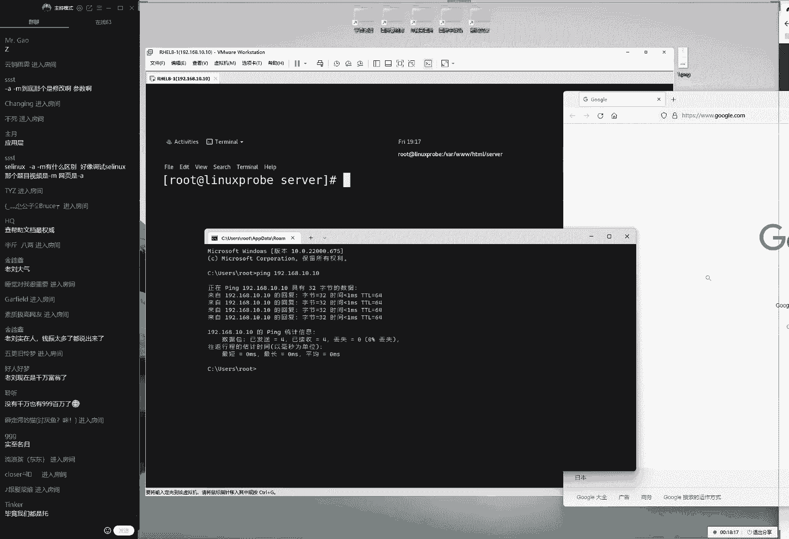
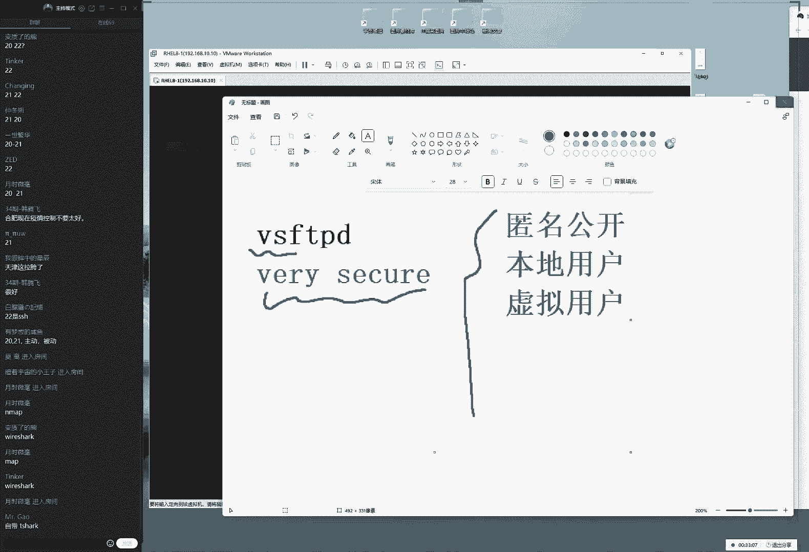
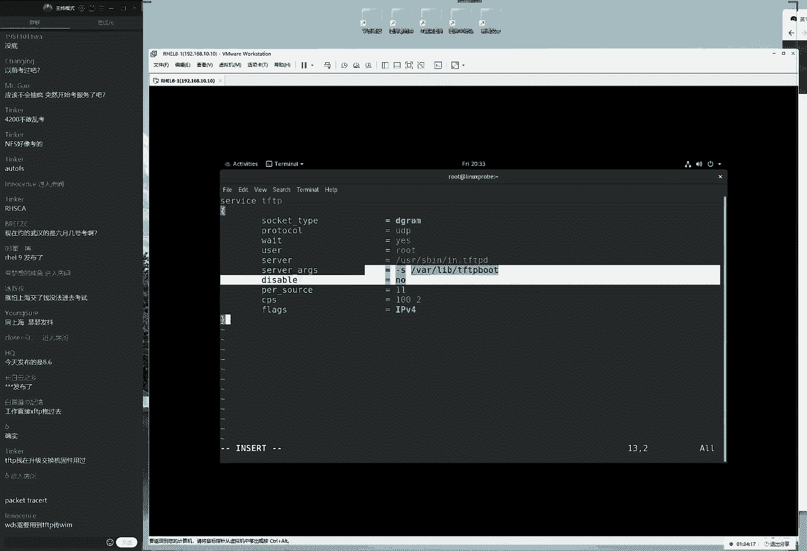
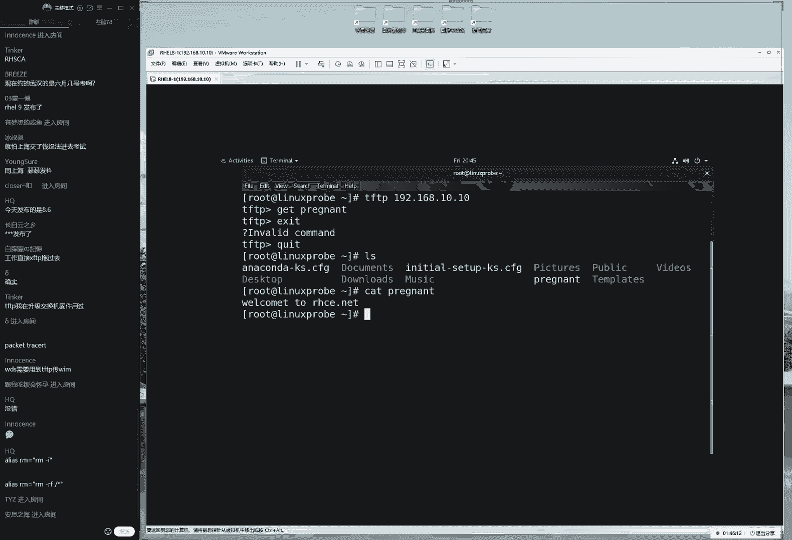
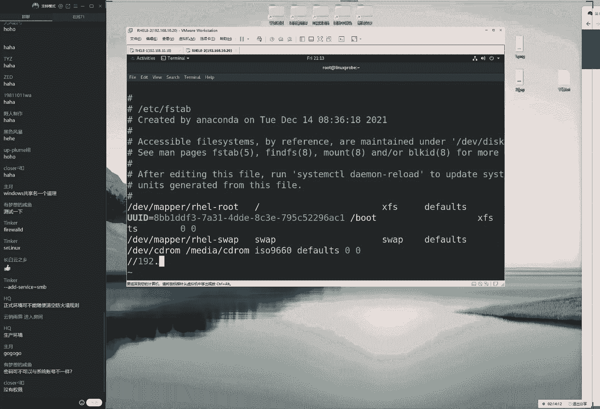
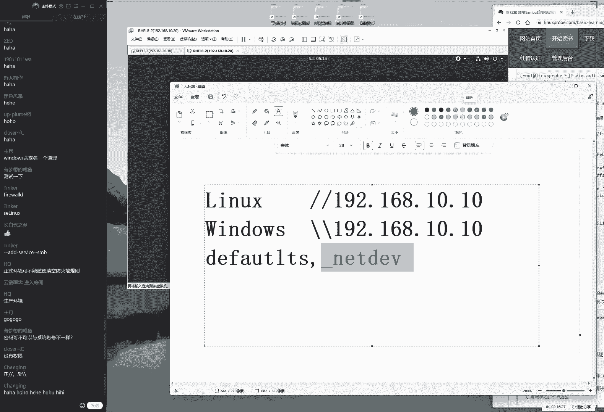

# linux就该这么学第34期 - P19：18【第34期第十八节课】红帽RHCE认证培训课程-Linux就该这么学 - 能力努力 - BV1L14y1878S

来，同学啊刚才的话可能有回音啊，再最后再试试一下，最后再试一把，我们开始了。那我们来打一下一同学们现在可以刷起来了啊。大家听得到声音的话打一下一，然后我们来正式我们开始接待这个课程。

先为我们这个第十章节收个小尾巴。然后的话呢我们就给大家去说一下这个月考的这个事情。哎，还真这礼拜的话有点小的一个进展啊，来大家先看一下我们这边这个书籍吧，10。6小节。

我们来做一下我们这个ipad机网站服务的一个收尾工作啊，那我们给大家讲最后一个小实验，就是我们可以去呃那我们可以去使用我们的ipad机网站服务的话呢，去做一个访问控制。那我们给大家一个简单的小实验啊。

也是对于我们上周的话呢一个简单的复习。好，大家怎么样说，大家说现在约的是5月份就考试吗？呃，现在的话约的是6月份的，而且时间还没有出来。我待会儿吧，我那那么我们给大家去说，因为现在人数比较少嘛。😊。

我现在群里面在去吼一嗓子，哎，把我们同学们都给吼进来。哎，我还原我还原以为这们最已经上了一个半月课了，所以大家应该都啊其着来上课来了啊。但是好，但是看来啊有同学今天还是迟到了啊，稍等一下。

同学们我在群里面吼一嗓子吧，然后看看同学们那其他同学有没有来上课的。然后这样的话呢，我们待会统一去说，这样的话，我们就更有效率了。来今样我们重新先安装一下这个网站服务，呃来翻开书1点6小结。

啊同学们做好笔记，尽量把这个笔记的话呢，发到自己的这个博客里面。😊。

然后我们最后一天的话会给大家那个小礼物啊，也不也不也不最后一天了。就是在我们下周嘛，然后我们就给大家统计一下这个笔记的这个编写情况，然后就给大家发那个小礼物了。来，我先吼一嗓子啊。

这人数正在现在到48个空还不错的，现是这样啊，那也就是说我们把网站服安装好之后，给大家做一个小实验。就是我想要去限制一下我们的用户去访问的时候的话，只有某些浏览器的用户才可以去做访问。

比如说我现在的话呢只需允许火狐浏览器的用户去访问我们的网站。而其他浏览器的话，那么不能去访问。那么这我们就把它叫阿帕奇叫做访问控制，可以非常简单的去做这个访问控制。

它只有它只有满多条件情况下才可以去访问到我们的网站里的内容。就相当于就是我们加了一个密码。以来这样来去理解。如说我们加了一个条件，只有那么它只有蛮多条件情况下才可以去进行一个访问。另外大家先去回忆一下。

我们这个怕间隔的时间比较长啊，我们从礼拜日间隔到礼拜5又过了5天时间。😊。

简单回忆一下上礼拜我们讲了什么呢？我们讲到第十章节阿帕奇，我们的网站服务，对吧？然后我们又去讲了什么呢？我们讲了Slin的域和Slin的叫做安全上下文。那我们啊哦那我们给大家先去写一下吧。那首先来说。

我我那话到我们的域，它主要是对于我们的服务的功能的一种限制。那后就是说它会去限定我们的服务里边它会有哪些功能。然后我们可以去使用的一个叫做set in force的一个命令来去临时刻开启和关闭我们的。

😊，服务。然后话以及我们可以去获取一下它具体有哪些我们的啊在这个策略集。然后我们可以搜索一个关键词。然后并且的话呢我们可以来把我们这个呃功能的话呢来进行一个允许。

然后我们这个策略等一个来进行一个放行这个话呢我们的这个服务功能的一个限制。还有话呢就是我们的S这个安全上下文，它就是说它是对于我们的这个文件来进行控制的。这我们简单回忆一下。

因为这是上节课我们礼拜日的时候讲过的。然后这个话呢对于我们的文件的这个一个设定。那我们换到每个文件上面都会打一个标签。那么这个查看的方法的话呢，是使用的是呃一个杠小D它是用来查看目录的嘛。

然后的话呢加一个大写Z这指的就是去查看某一个目录上面我们的安全上下文它所对的这个值。但如果说我们去查看文件的话呢，那么则没有那个小写的一个D啊。

但是要加上那个大写的Z代表就是去查看某一个文件上面我们的这个这个它所对应这个。😊，是什么？然后它等于说限定了我们的某个文件，它只能够被哪些服务所进行一个获取。所以我们这就是上节课给大家讲到的。

通过我们的域和上下文的话呢，来一起去管理我们的服务。它最终又实验什么样一个效果呢就是那我们双管齐下。最后的这个结果就是让这个程序的话呢，或者说让这个服务嘛让服务只能去做呃自己该做的事情，对吧？

就是来去限定一下我们这个服务的功能，它是对比说我们第五章节讲的一个权限以外，它呃对于我们这个服务的功能又可以去做了一些限制，那并且的话呢它也可以让我们这个呃资源或者说呃或者说我我们的文件的话呢。

只能被呃指定的服务所获取。这样的话呢，我们可以从这两方面来去限制我们的这个服务的一个功能所获取这样的一个方式，那我们来给大家往后面去说，就是来去讲到这个吧。

就是来去继续来讲到我们的编辑配置文件的一个小实验。那我们现在的话呢先去找到我们的网站服务程序，它所定的一个主配置文件啊。😊。

问了一个问题，大家说用防火墙也可以做控制，那哪些不能访问，哪些能访问啊，防火墙也可以去做到的。不过的话呢，我我们同学们内容讲啊，内容我们是叫做waF啊。😊。

他的话呢我们所讲的比如啊这个是我们第八章节里边的防火墙做不到的。因为的话呢我们的第八章节讲的我们的ip tables，还有这个firework这个防火墙的话呢，它是基于这个数据链路层来去做这个限制的。

它不能够基于服务的名称，所以话它没有办法去指定。比如说像是我们限制一下QQ啊或者什么这些软件的话，么那么它是做不了的，它只能是基于我们这个端口号，然后我们的呃它只能是基于我们的端口号，我们的协议。

然后我们的这个唉来源的这个地址来进行一些限制。然后大家问了一个问题，大家说我我们一个小杠A和一个小杠M到底哪个是修改和这个参数杠M是修改啊杠M去修改。但是的话呢我们从实操上来说，杠A的话。

它的作用也是修改，它对于文件上面来说那是这样的。然后我们这个链接再给大家去说一下再大家去说一下这样的杠A和杠M在操作当中没有什么区别杠我们按照理论上来讲，它就是添加的意思。

但是我们从实操上来发现它也是修改的意思。😊，因为我们在一个文件上面，它只能是有一个上下文。第二的话呢，对于我们的这个呃杠I小M来讲的话呢，它的本意就是修改，所以也没有最话它也没有毛病。

这就是我们上节课其实给大家去解释过这个问题，就是从字面上来说，杠A是添加杠M修改没有问题。如果我们这么去给大家讲课的话呢，也非常的安全，但是我们不能这么去讲啊。

因为它实际上来说杠A的效果就是添加它就是修改。所以因此呃如果大家愿意像我们一样去深究一下，说到底这个底层逻辑或者说到底这个操作干嘛用的好了，那么就按照我现在这个思路去理解就可以了。杠A添加杠M是修改。

但是实操上来说，这两个效果是一样的。如果说我们为了考试，因为同学们问到说我们是个视频里面跟网页里面不一样那么这个时候的话呢就以网页上为准就可以了。

杠A杠M没有什么区别啊这个杠A杠M在在我们这个考试当中没有任何的区别啊吧这都是可行的啊，这给大家解释清楚了，如果我们能够理解的话，就按照我这个思路去理解，如不可以的话，那没关系啊。

按照我们的网页去操作就可以了啊。如果要是这个视频跟网页有区啊如。😊。

这个视频跟网页有出入的话，那么以网页为准，那要么以网页为准就好了。来，那然后我们来继续了编辑一下我们这个网站服务所对应的一个配置文件，找到它。那它的话呢是在我们的ETC目录当中，它这个主配置文件吧。

那么那么肯定就是在ETC目录当中，我们的啊服务名称命名的一个文件夹啊，然后的话呢里边它有一个子文件啊，它一个子文件夹，然后我们找到它这个的话呢就是我们的这个网站服务程序所对应的一个配置文件。😊，啊。

现在58个同学啊还是很好很好很好，今天要能达到哎呀今天60个同学啊，也就是呃王少说60个同学，今天要能到到80人。那那我们再给大家发一个红包啊啊，好。

那我们同学们可以在群里面叫一下我们的师哥师弟师兄师弟嘛啊，然后叫一下。然后如果我们的这个人数达到80人的话呢，上周发了400，对不对？然后我们这周的话呢再看一看情况，然后我们再给大家再发个红包啊。

反正上周我们发了不少啊，上我们发了400块钱的来大家先叫一叫吧。咱们这个上课人数越多咱们越热闹。而且的话有些时候我们这个答疑啊，大家会问到邵老师，咱们咱们这个上课答疑吧。😊。

那能不能比如说我们放到课后去做呢？其实呃理论上来说也是可以的。但是我但是我们非常希望是大家呃大家发现了这个我们说话语速也很快嘛，对吧？然后我其实我们答疑的话并不会花费太多的时间。

并且我们希望大家能够在上课当中的话，大家可以提出问题来。因为您提的这个问题啊学的话呢可能现在是只没有想到。但是以后工作的时候的话，他可能会碰到对吧？所以的话我们希望上课的时候，大家可以更多的去回答啊。

那么以及去互动以及去提问，我们语速也很快嘛，那么我们每次回答问题用不了两分钟时间，但是我们可能会集思广益，能大能不能听到更多同学们的这样的一个反馈。而且我们每个同学这个呃工作经验的话呢是不一样的。

可能有些同学的话已经是建立在自己已经呃工作几年这个技础上提出来的这个问题，非常的高水平啊，非常的啊非常的有价值的那所以的话呢我们在上课的时候，大家人多一点啊，我们可以学习到更多的东西啊，教学相涨吧。

我们互相学习来我们看人数啊59说这么半天废话啊，但是。😊，那一个人来，我们来找一找啊，先找到我们这个对于我们的目录的这个设置的这个选项当中。首先我们找到它啊，然后的话呢我们添加上这个限制。

就是说我们现在想做一个限制，说的话呢，只有我们的火狐浏览器才可以去。😊，才可以干嘛呢？才可以去哎老刘大喜啊，那么才可以去访问我们的网站的内容。如果要是非浏啊非火狐浏览器的话，则不能去访问。好了。

我们来对于这个目录来进行一个权限的设定。😊，呃，稍等进进行一个全新的设定目录里面的3W里面的HTML里面的server啊，我们对于这个目录来进行一个设定啊，今天吃的太饱啊，咱们现在这个因为讲课了嘛。

所以我们现在这个收入也是不断提高啊，现在吃的太饱了。哎呀，等稍稍等一下，我稍稍稍等一下，我先我先去呃倒杯水了。😊，来倒杯茶回来了啊，咱们培训现在做的越来越好啊，钱赚的也多了，现在吃的也太饱了。😊。

倒杯茶啊O走了啊set然后的话它有一个化有一个全称set叫做 environmentment if就是set environment if就是说设置一下活电面量。

如果说我们的用户的活电面量是什么的情况下，那么则进行一个判断，对吧？那么可以进行一个缩写叫做s就是说如果说呃用户的呃呃这个呃标识，我们来设置一下用户的user agent就是说用户的浏览器的标识。

如果说用户的浏览器用用户的浏览器的这个标识，如果说是个啥啊，如果是个啥呢？如果说是火狐的话，然后大家就要记住啊，是这样的啊，我们现在做这个实例的话呢，一定要以这个浏览器这个名称要为准啊。

好听起来数句废话啊，但是这个经常发现的一个错误，比如说我们现在打开这浏览器，因为比如说这个有些浏览器嘛，比如说谷歌呀对？比如说呃火狐啊一些浏览器嘛，它这个名称可能跟我们之前遇到这话可能有点区别。

因为它因为它会有一个名称的一个。😊。

的一个区别。我们来看一下，大看一下，不是这个啊呃名称的一个大小写的一个区别很重要。我们来点开大家看到这的话就是说我们的聊头那这个呃火狐的第一个字需要大写。大家看一下，如果说要想去限制一下。

说只有火狐可以去做访问的话，那么我们。😊，就要去使用到一个大写F了啊，怎么样那老刘是千万富翁了啊，还没有还没有还没有来，我们来继续来给大家操作一下。来firefox。

那也就是说如果说用户里的浏览器的标识是火狐的话，那么给大那么给大家一个小写的一个两个消写F，那等于说给取一个别名，那等于是一那等于说待会再去建到这两个消写F的时候，就等同于建到这么一个名称了。

那那么会有这样的一个作用。然后来对它进行一个限制，它就是它啊这个的话呢就相当于是一个方火墙的一个限制的，叫做先去允许后去拒绝。这个意思就是说只要没有被允许的在一个主机。

则全部被大家给大家拒绝掉来给大家看一下它就是说它没有被允许的话，则全部拒绝，大家记下这个格式非常的重要。这是在我们再配啊再配置阿帕奇服务的时候。

经常会去使用到的一个哎经常会去使用到的一个参数来叫做oldder，然后是允许逗号它就是说我们会去先去进行这个允许的这个策略。然后只要在那么我们的呢只要在允许里面没有你的话，那么则最后兜底。😊。

进行一个全部拒绝。这句话的意思就是这样来的理解啊。大家看一下，就是说先去允啊先去允许。然后的话只要没有被允许的主机全部去做啊去做拒绝，这是一个兜底啊这么一个策略。大家要记住，所以我们一般去写的话呢。

就这么去写。如果说我要给反过来先写后允许那么好了那就是说先去进行一个拒绝。如果说我们只要没有把它给拒绝的话呢，那么则进行一个全部允许这样的一个反过来的一个说法，就相就是我们去写防火墙策略的时候。

是不是一个正写反写去设置一下我们的防火墙默认的规则。比如说我们的input链里面对吧？我们设置一下大杠ep啊，我们来去设置一下这啊默认的这个规则啊。

他们是同样的一个效果的丢包样不多说啊也不算废话继续往去说接来我们来去一个允许说如果的话呢我们的用户的这个标识。如果说是一个两个消息的话，是伪火狐的话，那么怎么样咱们则进行一个允许。

否则全部拒绝就这么简单，就是我们上一课。😊。

礼拜日的时候为什么啊没有给大家讲呢？就是因为这个时候可能会耽误时间了啊，但是这但是这个参数比常简单。大家看一下这个参数总共才有5行啊，其实我们要讲的话呢，也就5分钟，但是咱们不就是希望能慢慢讲吗啊。

所以我们给大家单独列出来一天。今天收这个小尾巴啊，收的一个小尾巴来重新去建立出来我们这个网站服务所对应的一个配置文件了啊，不呸呸啊，网站数啊啊用来去存放数据的一个文件了，这已就存在了是吧？

server来把它家给新建出来，然后的话呢在这个目录当中去新建出来一个首页文件来让我们给它首页文件新建出来。😊，呃，往里面的话呢，随意去敲入一些信息，别随意了啊，我们敲一些广啊去敲入一些广告信息吧。

这个毕竟我们这个课就最后半个月了，已经5月中旬了，也就到5月底了，我们这广告一点到位啊，记一下我们这个主站来点一下保存并退出大声说一句配好了非顺利常听话非常的顺利做好之后我们去重新去启动我们的网站服务。

当然同学们对于这个有点陌生的话啊，请翻回去看一下上周日的这个课程啊，我们就不给大家去赘述。来来这个讲这个网站服务啊就讲不完了。所以咱们就是啊不能够往前走三步往后退两步，所以我们就是一路往前啊。

如果说对于我们这个网站服务有点生疏目录的话于这个配文件有陌生们就回去看一视频，去走了来我们现在再来给大家操作同学们后面三同学像我们的来常像我们的托，非常像我的。😊，啊去重新去启动一下我们的网站服务。

顺便的话呢将我们的网站服务加入到启动箱当中，保证我们下一次的时候，还依然能够一起来说，依然能够去有效，等于说微护计只是去提供服务。考试的时候一定要这样去做，否则考试的时候就没有分了。

因为考试之后的话它是一个重启之后判卷子一个考试的一个形式，所以一定要保证我们做完了这个答案，一定要是能够经得起重启的检验的等一下，我刚才是做过了啊，做过了做过了来我们做完了之后的话呢去访问一下。

我们现的话可以通过浏览器去访问吧，先打开一下我们的呃火狐，我看看有没有啊，还真有你看这听给面子啊，现在的话呢啊稍等一下，我先打开我的真机，然后的话呢我们来打开我的浏览器，我这边的话呢准备出来两个浏览器。

然后先去打开一个我的终端来打开CMD现在要怎么样呢？怎么样啊，毕竟我们都是托啊，好，我们继续啊来看一下拼拼一下，就是服务器里边的这个地址，192。8。咱们这个讲课啊啊是没有。😊。

是完全没有托了，怎么因为咱们是不需要的。咱们是一个付费之后，参大加家培训，大家都已经花了钱了啊，大家已经花了钱，就没有必要再给大家啊再回呃再家一去准备托了啊，我们去续也是节约成本。

来看一下网络能够通信吗。O网络能通啊，网络能够通信。然后我们现在来给大家访问一下，通过我们的虎狐浏览器来192068点10点10，后面我们去敲一下回车，访问一下咱们的网站。

但是访问的结果的话呢就是失败了。来大家看一下。😊。

现在的话呢，我们通过我们的火炉啊火呃通过我们的浏览器火狐去访问一下我们的网站。😊，呃，然后的话呢访问的这个结果是失败的。大家看到提问一下为什么啊，提个问题，为什么？其实我们讲课的时候啊。

如果要是一路咔咔特别顺啊，其实就大家是不负责任的。嗯，正好呃这个大家理解一下，就是如果我们一路都很顺利，对大家来说很不负责任的。因为少讲的也很重要的东西就是排错啊。如果我们说培训费是2400的话，对吧？

那可能2000块钱觉对是技术400块钱一定是排错啊，我们一定要去思考一下，同学们来思考一下，为什么为什么我现在访问我们的网站失败了啊，访问我们的网站失败了。来提个问题，大家说防火墙。

还有同学其他的想法吗？为什么访问这个数目失败了，有没有同学考虑到是不是我这个参数写错了，我这个参数写错了，所以我们的服务没有起来吗？来，我确认一下来看一下，没有问题。那第二个什么可能性呢？

是不是我们的网络不通呢？跟网卡相关吗？来拼一下啊，同学前同学思考一下同请我们一定要思考一下啊，不会都啊不会都是我们的托儿吧，我们现在在建证是65啊，要是我们的托话，大家打一下一。😊。

啊，如果您是我们的托打一下E啊，怎么今天互动人数那么少啊，有点出乎我的意料了啊来啊大家是我们的托话打一下E啊，怎么互动人数那么少啊。这就是我们网。那那我们可以看一下啊，这个没有问题。

然后呢我们的网卡也没有问题啊然后的话呢我们来看一下，但是依然访问失败了，现在公布一下答案吧。那这个答案就是我们的防火墙啊，肯定没有办法允许吧？我们来去对家进行一个放行怎么操作呢大家都是我们的托是吧？

那我们就可以下课了啊来我们继续啊来啊先去清空一下我们的ip table然后话呢我们把我们的ip然后把我们的ip table里这个策略有它保存一下啊，先把我们这个第一个防火墙给它搞定了。第二个是这个啥呢？

第二个是这是大家说要换火狐是吧？这个就是火狐啊，一个最新版本，就是这么一个样子啊，这是这就是火狐同学们看一下啊，这个不是那个呃这什么大家看一下，这个确实是火狐嗯这个啊这个可能是一个版本比较新嘛。

来我们现在话可以看到现在的话呢这个访问起来失败的。😊。

接来对于这个防火墙来进行放行firewall杠MD。然后的话呢我们来去添加一下我们这个服务。然这是网站协议走你啊保存好呃，最好对对，我们养成这个习惯啊。

养成这个习惯叫做man永久生效模式来走你然再来让他去生效一下，其实现在不用生效了，因为它上面已经敲过一下了，过我们养成习惯嘛，将去生效一下，做好保存，然后干嘛呢？去刷新没有问题了。

这就是我们排错的一个方式，比如说可能每个服务的思度不一样啊，但是我觉得但是我觉得大多数的这个服务对拍错速度就是这样的。第一来说就是我们的这个服务本身有没有起来，第二个网卡能不能通信。第三。

我们的防火墙是不是放行这三点大家记一下好吧同学们来我们接下来的话呢再来我们去访问一下，后面加一个service后面加我们这个目录名称，大家可以看到啊显示出来这个信息了，火狐可以访问，那怎么办呢？

我们现在再去访用另外一个浏览器去访问一下大家可以看到同样的这个内容同样的网址，😊。

通过谷歌浏览器这个Achrome去访问一下，得到的是这样的一个信息。通过限制我们用户浏览器的这个标识，然后来去限制我们这个用户访问网站那里边的那这个哎里面的这个信息就是这样来去做完的。

然后的话这就是我们第十章节给大家收了一个小尾巴。然后我们今天的话来正式开始。😊，我们这边的这个第十一章节的这个内容。第十一章节的话呢，我们讲一下这个VSFPD就是俗称的这个文件传输服务嘛。

既然有了网站服务，那不讲讲文件传输服务，是不是感觉很啊那么那么是不是感觉非常的空虚啊。所以我们今天的话呢要给大家讲一下网站服务之后的一个服务。我们叫做文件传输服务器啊，我来给大家操作一下。

另外的话我们讲之前给大家去说一下这个月考的一个事情啊，教给大家去说一个约考的一个事情。由于我们的话呢，后面的这个课程，大家人数会越来越少。

然后的话呢我们希望的话呢能够让大家啊很方便很顺利的很便捷的约到考试。因为如果要是您后面的话呢要是缺啊因为答应坚持听课已经坚持一个半月了。如果说最后比如说两天哎就因为一些事情没有来上课，最后错误的约考。

然后可能一下被拖到七8月份啊，那就会啊那那么那那么会啊非常的可惜。所以的话呢我们现在趁人还很多啊，我现在给大家去说一下月考的一个事情，说一下，就是如果说。😊。

约，那么就好好听啊，就要去啊抓紧这个时间窗口，然后按照我们这个时间流程来去约考就行了。如果说大家要是不想约考的话呢呃那当总没有发生过，那么就可以去倒杯水去了。

然后我们要给大家去说一下这个月考的一个时间点问题。就是我们这周的话呢大家先不着急，我要给大家说了啊，我们考虑的很全面，就是这周的话呢，我们来给大家约两个城市。第一个城市就是武汉对吧？我们特别的神奇。

武汉又约到了8个人啊，所以我们同学们的话呢呃有8位同学都已约到了武汉了，然后非常的好，非常的非常的没有非常好，那也就是说武汉已经约上了，然后已经时间确认了，然后话还有这个大连这两个城市的话呢。

我们已经是给大家约完了，然后这两个城市的话，呢我们就到此结束，然后就不再约了。呃呃如果说您还没有约，那么就等着下一期了。因为我们这一期的话呢，考试时间都已经约满了。

所以现在的话就是在约的话已经凑过8个人了。但但是我们提前已经给大家发过信息了。所以接到上课之前吧，如果还没有约，那这两个城市的话就那么可以去啊。😊，呃，调过了。那么我们来去说一下。

这两个城市已经搞定了呃，已经完成了考试的时间就是武汉跟大连。然后的话呢，还有一个需要大家去跟我们一起去记一下。这个事情，就是我们会在下周下周五给大家约考的这个时间。那就是说下周五需要去约考的时间是。😊。

稍等一下啊，下周五需要约考的时间，下周五是5月20是吧？好，我大家记一下。那么话呢我我那么我们会在5月20号的时候，我们那也就是在下周五的时候会给大家约一下北京。然后还有这个上海，还有广州和深圳。

因为这个四个城市的话呢是我们主要的这个考试地点。然后的呢我们这个不用给大家统计人数，因为就肯定会够人数。大家能理解。因为我们这个几个城市的话呢，凑8个人跟玩一样啊，凑18个人都是没有问题的。

所以这四个城市的话呢，我们会在下周今天礼拜五的，我们会在下周跟考官确认一下时间。然后我们会给大家约考。所以520这啊我们会在当天给大家去约这四个城市的这个考试。所以这个呃也就是说前面6个城市的考生。

你们不需要做任何的事情。那也就是说呃等待就可以了。等着520的当天我们来约考就行了。这就是下一次约考的一个事情。然后话还有就是我们今天下午的时候跟考官那边确认了一下。然后有以下的考场的话呢。

呃有一些考生，但是话呢并没有凑够人数。如果您想要约考的话呢，您可以现在跟我来联系，然后我们登记一下信息，凑够人。😊，之后，然后去付款，然后去约考。然后以下这个城市的话呢写个信息呃。

也就是说上面这些城市的所有的学员不要跟我联系，然后的话等待时间就可以了啊，不需要联系，也不需要也不需要登记，也不需要干什么，就等来我们520当天约考就行了。然后的话呢，我们的呃下面那些城市。

您需要跟我来联系一下。就是说如果说你想要去约考的话，需要来跟我登记一下。然后人数凑一下人数到8个人，我们来给大家约一场。这样的话，你可以就近在你自己的这个当地约考了，就不用再去呃出省了，对吧？

第一个城市的话就是济南啊，然后这是考官跟我们的这个呃一个城市列表，还有这个合肥，他们也约的差不多了。然后的话呢，还有这个郑州。😊，还有的话呢，这个成都还有青岛啊非常的全面了啊，我们做为红包就这么专业。

还有这个杭州。还有的话呢就是南京除此以外没有了啊，就是我们能给大家约这个城市的话呢，尽量了，我们这期的话人数也挺多。能给大家约的就这么多然后的话呢如果您要在这个几个城市当中，您又愿意去考试。

你又愿意在当地去考，不愿意去上海好吧，那么就可以登记一下了。登记的这个格式请按照这个这个格式发给我，比如说您的这个城市的名称，城市的名称，然后啊我没有写，我就大家不用问了。比如说天津啊。

比如说这个其他其他其他就不用了，就大家不用问了啊，然后话武汉还能加什么？武汉的话啊不能加了，哎，好可以因为是8个人嘛，然后今天有一位同学大家可以看到今边有一个付款截图。然后一个大连一个是这个武汉。

好像能再加一个人，好像是来大家记一下吧，但是我也不一定了啊，然后来去说一下这个城市的名称，加上您想约考的这个时间。比如说你想约的是6月好吧，那就写一个6月，如果你想约的是5月，咱们写一个5月按照我。😊。

直这个格式发给我就可以了，按照这个格式发给我。比如说就像是这样的。比如说是这样呃，南京啊，好吧，然后的话呢我们南京估计全呃，就呃济南吧，济南，然后你写一个6月，然后后我会下课之后的话呢。

把您的一个信息给您统计一下。然后我们数一数多少个济南。比如说我这边一数有5个济南好然后的话呢我会跟考官那边确认一下，他那边有多少人，然后我跟其他考场的话，我们去串一串。如果要是能凑到8个人。

那不就合成一场了嘛，对吧？所以我们先统计一下人数，就这么一个事吧？同学们最后最后再说一句啊，因为我怕待会下课之后，同学们发信息特别的多，我也回不过来，就是如果说您是以下如果说您是这四个城市的考生。

您不需要跟我来联系，等520当天约考行了，时间也也非常好记。但如果说您是以下城市的考生，您又想约考，那么您需要在今天在QQ上给我发信息，然后统计一下人数，就这么一回事。好，然后话大家问到说上海啊。

上海的话，等下我们给大家看一下具体的这个政策，然后跟考官去约。😊。

时那说南京咋全了，因为南京可能比较少啊，因为南京考能比较少，都选择去上海了。来，我们先给大家去说一下，下周我先来给大家去说一下下面一个章节吧。

我们讲一下VS来说下这个文件传输服务过啊我们这个上课节奏比快，两掺说第一个啊我们的文件传输服务上来了第11章节FP文件传输服务文件传输服务。

然后给大家去说一下那我们之前大家上学时候我们去学习过这个文件传输服务可以告诉我大家所学习的的这个端口号是多少吗？我们讲一下啊VS就是这个文件传输服务FP他所对的这个口号是多少。

口号是多少怎样说大家不说南京大家不是说济南没有吗就以我说这个为准又有了也算是好事啊，然后给大家后去说啊，因为济南大家反馈了好久好久了跟考争取来的，因为我之前实没有了大家。😊。

看一下是这样的啊，大家说合北县疫情控制的不是呃不是很好，但是现在可以约嘛，要总结下人数。来先看一下这个大家说一下这个端口号啊，20和22吗？不对啊，这个的话呢是多少来到21，对不对？

因为话呢22实际上是我们的SSH啊，这个可能大家记给记混了。那我们之前学习的时候的话呢，这个服务我们学习的是多少21对吧？其实这也对了，但是的话呢21实际上是我们的这个控制端口。

就是说我们去发送指令的但他实际上它占用了两个端口号第一个的话是20，第二个是21，所以待会儿我们配置这个服务的时候，大还记住大家记一句话吧，那记到我们这个书上面。😊，待会儿如果要是配置这个F的时候。

我们从远程就是说通过我们这个真机去访问的时候，它访问失败了。那么就检查一下我们的这个防火墙端口号20和21有没有给大家同时开启，需要怎么样呢？2021都给它开啊，20端口号的话呢。

用来去传输数据的21端口号来进行一个指令发送来进行控制了。所以这两个端口号的话呢，都需要去开一下。同学们来记一下，这是先没有呃就是呃这呃这就是说呃先没有讲课，但这要先给大家去说一下排错啊。

待会可能会遇到一个。😊，排错的一个环节。然后的话呢就是来去说一下我们这个文件传输服务。它有一个问题。我们的FTP的话它是一个不安全的一个服务。但我们知道啊我们那么我们这个系统当中的话呢。

网站服务不安全啊，然后还有什么呢？我们文件传输服务不安全。他会有一些不安全的服务。那么我们我们为了能够让这些服务的话也能够去使它然不安全嘛，为它都是通过明文来去传输信息的这三个服务啊。

包括说我们这个文件传输服务，它都是通过明文来去传输信息的。如果说是文件的话呢，通过明文来进行传输也没有太大问题，对吧？但是啊明文啊就是它没有经过加密嘛，如果说是文件的话呢，其实也无所谓。

但是它做的这个口令验证嘛，它都是通过明文的，那么就有可能有一个小分子，他在这个网关上面去做一个修探工具，做一个修探工具，做到网关好部署上一个这个服务啊，另外给大家提个小问题。

同学们你们用过一些修探工具吗。比说什的以去抓别人的一个数据包，我之前看一个文章啊，就是说有一个。😊，人然后话呢去破解了人家好像是隔壁的一个呃邻居的一个wifi。后来在人家那个呃设备上面的话呢。

就抓了这么一个包，然后就抓取到就别人的这个所有的这个信息。比如说上网的记录啊，然后什么淘宝的购买记录啊什么的，就能够抓取到，这个还是比较危险的。然大家说这可以用到一些工具可以去实现，对吧？

然后那也就是说我们这个话呢是很那么话那这就是说这个非常安他是一个非常呃呃危险的这么一个服务。如果说有一个人啊他在一个网关上面去做这么一个事情，就有可能导致我们做出据，他会被呃抓走了。

那么会以看到我们做的这个登录的信息。那么为了去解决这个问题，就是那么话呢我们现既要去能够去使用这个服务，又要保证这个安全，所以的话呢我们现在去使用到了一个服务叫做VSD就像我们去吃饭一样，对吧？

我也刚刚知道说这个呃反正就是说有一些菜的话呢，它是有毒的，比如说但是然后的话那我们需要先把它给煮熟之后才能去吃。也就是说我们既要。😊，去吃那些菜，但是又要去避免它这个毒性。那好了。

我们要给大家讲一下这个服务叫做VSFPPD啊。来，大家先看一下这个服务。那么这个话呢VS指的是什么呢？叫做very security，就是叫做非常安全，叫做非常啊security嘛它是一个名词吗？

它是一个动它是一个形容词啊啊，SECCORE吧。那它它指的是一个非常安全的一个文件传输服务。它的话呢，这个非常安全。它建立在了这个三种的验证模式上面。也就是说这个服务的话呢。

它叫做非常安全的文件传输服务。😊，它的这个安全怎么来去体现出来呢？体现到的就是它有三个验这个验证模式。第一个验证模式的话呢，我们叫做匿名的一个公开模式，叫做匿名公开模式。这个的话呢虽然不安全。

但是更加简单了一点。第二的话呢叫做什么呢？叫做本地用户模式来去登录一下。那我们第三个的话呢，我们叫做虚拟用户，叫做虚拟用户来去登录我们这个服务。那么我们今天讲课讲哪种呢？我们作为成年人。

那我们就不做选择题了。那我们就三个就全都要了。好吧，那我们今天的话呢会围绕我们这个文件传输服务的一个搭建以及管理，以及对于我们这个三个登录模式的一个深入的讲解。我们今天就给大家都去搞定一下下。

我们今天的话呢就来第一个实验吧，我们叫做基于我们的这个虚拟的一个。哎，那么呃先给大家去说一下我们叫做公开模式。就是说所有用户的话呢都可以去访问的一个模式。来先把我们这个虚拟机还原一下。

这样的话呢能够保证我们的。😊。

这个数据吧跟之前没有冲突。然后的话呢我们现在的话呢在讲课之前吧，先把这个给大呃去清空一下防火墙。然后的话呢把这个防火墙给大家先设置好了，这也是一个好习惯啊。首先来说网卡呀，这个网卡没有问题。

网卡自带有了这个地址了。因为我之前已经配过了。第二的话呢就是我们的这个防火墙 table这个fire world我先把这个firewood防火墙，这个对方呃对于我们的这个文件传输服务来进行一个放行。

这就是我们为什么去讲大家讲课的时候，一定要打好基础的一个原因。因为我们第呃当我们第呃第呃呃当我们之前学好了之后，应该是第啊应该是第八章对吧？

那我们把第八章节我们的防火墙跟网卡学好了之后不我们呃我们是在第八章学的这个配置网卡，然后第九章节得是配置呃我们的防火墙一旦学好之后，同学们就会发现我们现在可以完全投入到这个新服务的这个学习当中了。

而不用老去讲说这个命密干嘛用的对吧？其就打好基础的一个重要性。呃好，我们现在的话把我们这个网卡跟防火墙都配好了之后，下面一步。😊，来安装一下我们对应的一个服务。大家说不用加区域吗。

不用加区域那区域话呢更加严谨。但是它指的是对于针对于我们当前生效的这个区域来去操作的。我们当前生效区域的话呢，它就是public，所以我们当前可以不用去叫做t来好看一下哎。

非常好可以看到当前的话呢我们为公开这么一个区域。所以的话我们当前配置的时候不用再去哎给大家去设置一下叫做这个啊zo等于public了，这样的话呢比较省事，但是的话呢可能略微偷懒了一点点，但是问题不大啊。

但是我们现已经做完了，可以了啊，那我们接下再来说啊，咱们讲个非常有激情，对吧？然后看一下这个人数70人还差10个同学啊啊说到做到啊，在1个在我们1个师兄弟上线。😊，我们就给大家发红包啊。

上我们上一课可可发了400了，今天怎么着也不低于也不能低于200块钱啊，还是非常还非常有面子的啊。同学们叫一叫群里面的师兄弟赶紧上线了啊。来VS啊S一下回车来安装一下。

然后至于说怎么配置软件仓库我就真不再讲了。因为软件仓库已经讲了三遍了。果再讲的话呢就就咱咱们这个后面这个课啊镜度就慢了。以的话呢软件仓库配好了之后自己安装就可以了。

VS如果每节课都再往后倒一倒的话呢太慢了啊，这老刘的话这个急性的们来给大家安装好VSD啊安装好安装好之后的话呢，我就知道了，最后再允许老刘最后再多一句啊，同学们啊。

如果经听腻的话请大家赶紧倒杯水去来给大家说几句话啊，然后就应该知道我想说是什么吧？后再说一遍啊，最后最后最后来系统当中的话呢，中的怎么样的一切都是文件啊，中的一切。😊。

是文件，最后一遍了，我也听我已经说我已经说很多遍了啊，一切都是文件，但是没有办法嘛。因为要想让我们同学们会配置这个服务，就要找到我们服务的配置文件，以及修改过后要干嘛呢？来。

首先第一句话说我们的话一切都是文件没有问题，所以的话呢怎么样呢？所以我们配置一个服务，就是在修改文件，这没有这个没有问题吧，对吧？那好了，在配置服务就是在修改这个服务的一个配置文件。

第三句话要想让我们配置好这个参数，让啊想让新的怎么样新的参数生效，我们需要去重启对应的服务。这个话呢是一个大多数情况下需要去做这个事情。这同学们会问到说是我这个服务参数都已经配的很好的。

为什么它不生效呢？就是因为我们没有去重启对应的服务。最后一句话，为什么我们配好了之后也能看到效果了，考试时没有分值呢？😊，我稍等一下，我也直点着啥了啊，那么我们最后没有分值呢？那我就是他最后一步。

就是说我们要让这个服务能够一直去生效的话呢，需要加入到开机启动向中。这样的话呢才能够保证我们下一次的时候一然能够为用户提供服务考试的时候也依然是有分值的。好，这次句话我就不再多说了啊。

大家记下来这个非常的重要的这样话我按照这个顺序1234往下去配就错不了也差不了了。来那也就是说我们现在话既然已经找到了这个服务那么把它装好了。下面一步就要找到它所对应的一个主配置文件。

主配置文件的话呢是在ETC目录里面以服务的名称命名的一个文件夹，对吧？然后它以服务命称的一个文件，最后是点CONF结尾的一个文件，所以这个文件太给面子了。

它就是老刘所说的叫做主配置文件一眼能够看出来的叫做主配置文件没有问题来我们按一下回车走啊找到一边啊会有很多配置参数。那我们所以井号跟分号行开始的是啥呢？啊我们叫做不用看行叫做这个注制信息行。😊。

我们的话呢它只是对于我们的服务的功能的介绍或者某一行参数的一种说明。所以我们不用去看。现在的话呢我们看到里边的话大多数都是注释啊，可用的这个参数的话呢并不多。但如果遇到这样的这个情况下。

我们可以这样去做。大家看看我现在这个操作啊，既然里面注释多参数少，那么我们可以这样子进入到服务的配置文件当中，然后的话呢把这个文件给它解切走，解析了啊一边边去啊，那我走哎。

我们给大那我走走哎走一个啊另外一个名字解切走，然后的话干嘛呢？啊然后然后我们干嘛呢？然后啊我们给大家过滤一下。既然我讲到了所有的分号行开始的啊，以缩有井号行开始啊，叫做叫啊它是为注释信息。那好了。

我就可以这样去做来我们过滤出来当前性当中所有的叫做注释信息，然后我们来按一下回车。呃，有了当前所有的注释信息了之后，怎么办呢？做反选，那做反选，那我们反选到所有注啊这个呃信息。😊。

那呃反省到所有这么一个单小井行的一个内容的行。那么它出来就是我们的叫叫做配置参数行了。再通过我们第三章节里面学习的叫做重零相符啊，把这个信息的话呢，输出到一个文件里面。

输出到我们刚才这个配置文件的这个文件当中。这样的话呢于是可以看到刚刚的话呢我们配置文件里面的这个参数，还有这个呃呃信息的话，它就混合到一起的，特别的乱。但是好在我们过滤之后发现怎么样呢？

现在在不影响这个附的这个功能的这个前提之下，这个行数一块变成了12行了，一下子看起来更加的清晰了。好，大家看到这个非常简单吧啊，就是说我们可以去快速去过滤掉所有的这么一个信息。

然后支付宝留可用的这个参数啊，支信息我们不用看了啊，它总共是有12行，那我们先给大家去说一下这十2行的一个作用啊。首先的话呢第一来说就是说是否来允许我们的公开模式。

那也就是说它可以来去匿名来去访问我们这个服务它是不需要进行口令验证的。这是第一个就是要做公开匿名模式。😊。

它可以直接来去访问我们这个网站服务呃，不它可以直接访问我们的文件传储服务，而且它是不需要密码了。它也就是说一个公开的一个形式。它的话呢。😊。

当现没有被允许，我们可以把它给放行一下。今天讲到第一个服务吧。😊，啊，不那我们啊哦，那我们先给大家讲吧，讲完之后再给大家去做统一的去。说一下我们这个修改的一个方法。

第二的话呢指的是我们的本地用户是否可以去做访问。啊，第三的话呢就是说我们的本地用户他登录之后，他是否可以去写入文件啊，包括说他是否可以来进行上传。下面的话呢他是说叫做文件的反言码。

这个话呢我给大家去说一下什么叫反言码，这个有很难理解啊我给大家解释一下像文件的反言码大家看一下它的话呢，实际上它是啊来进行一个计算，去啊他最后去算出来了我们的文件所对应的一个具体的一个值。

然后因为我们的话呢要给大家去说一下里层的一个原理了。因为我们的linux等当中的话呢，这个字小吗？啊大家看一下这个字小吗？如果小的话，大家告诉我啊，如不小的话，打一下一啊，大家看这个字小吗？

因为我怕他写不下啊，所以我稍微的小了一点点。大家需要记住啊，在我们系统当中的话呢，我们的所有的文件的这个默认的权限啊。在我们系统当中的话呢，所有的我们的文件的权限为666。然后呢我们的所有的目录的话呢。

这个权限是为777啊，字有点小是吧啊，还行哎，我们给它稍微大一点，相觉得没问题啊。😊。

稍微大一点点。那也就是说大家呃呃是这样的啊，那我们在我们系目当中的话呢，所有的文件的这个呃权限。还有的话呢我们的呃每个目录的这个权限的话呢，它分别是哎616跟777。但是的话呢我们会看到。

最终我们去创建出来的一个文件啊，比如说我们叫做哈哈对吧？来看一下春建出来一个文件叫做哈哈再创建出来一个目录叫做吼吼。好，于是我们来查看一下，查看一下我们这个文件，它所对应的一个权限值。

得到这个值是这个样子。大家啊再去查看一下我们的某个目录，它所对应的一个权限值，它是这个样子的。哎，啊稍等一下啊，查看一个文件上面的这个权限值是这个样子的。查看一个目录，这个权限值，是这个样子的。

同学们快速告诉我我们的。😊。

文件跟目录，它的这个权限值流数字法是多少来，大家去算一下啊，因为大家都付学费了啊，所以的话呢不要看别人去做这个的呃去做练习，自己不去做呀，对吧？所以我们一定要去算一算啊。

这样的话加上一下第五章节权限的一个知识。而且我们上课的时候算错了。咱们给大家去讲一讲，还是比较好的。来大家看一下，请问一下我们对于我们的文件上面的这个权限是多少呢？是644，对不对？啊。

对于我们的这个目录的话呢，就是75，那么于是会发现哎跟我讲的有问题。那么我那么我们是讲到了，我们的文件的话呢是666。然后呢，那他现在的话呢是1个644，也就是说它啊减去了一个X。

然后呢这个最后等于是它最后这个值它变小了，然后下面这个我们的话呢也是减去的一个X就等于是1个755。那么如果说有这么一道方程，大家去解一下，如果说我们已经知道这么一个方程。

请求一下我们的一个最后这个值的一个大小，最后我们可以算出来，这个消息X，它就是我们的文件的。😊。

返页码，它话呢默认是为022，所以的话呢我们的616减去022对吧？然后它才等于是644这样的一个效果。好，那这个它那么它这啊它有什么样的用处？呢家看一下啊，717减去022等于是1个755。

也就是说它实际上这个值就是叫做文件的反言码。它的话可以通过调整这个值的大小，通过调整这个值大呃的呃这个啊通过调整我们文件的反页码一个大小来去实现出来。对于我们最终生出来这个文件的一个大小的一个控制啊。

比如说我们现在把它画这个呃这个只设的设置稍微大一点。比如说设置为777。好了，那我们新建出来的这个目录的这个权限的话呢，那么就是717减去777，所以新建出来这个目录就没有任何的权限了。

那也就是说去设定我们默认新建出来的这个文件，它所对应的一个权限。它就相当于就是我们官当中的那个税。那那么话我们比如说希望那那我们比如说希望这个到手之后这个钱更多一点，那么税就要更少一点。

通过呃调整这个税的这个高低。😊，对吧然后话就可以去实现出来，对于我们最终到手的这个钱是多少。比如说这个话是公司开给我们的这个钱。好，这是公司开给我们的钱。然后呢那他啊他需要减去这个税。

最后就等于了我们这个哎百姓到手之后，这个最终的这个钱通过调整这个税的大小，通过文件的返言码来调整最后我们新建出来这个文件的一个大小，以它要这样的一个效果。然后大家需要有两个注意事项。

第一就是说它的一个原理就是说通过我们调整文件返页码的一个大小来去实现出来。对于我们最终文件大小的一个变更，这个怎么去计算出来，大家一定要知道。第二的话就是说如果这个值为77的话。

那么如果他是一V啊那么他如果是为717，那么它指的是对于我们的目录的话呢，这个权限是000。对于我们的文件的话呢，它也是000。因为我们的文件的这个满权限是616，但是616减去77。

它不能啊它是没有啊它是啊没有这么一个复数形式的，它只能是000。因为权限是没有负数，它不能再去欠权限。所以大家记一下，如果说我们要想新建出。😊，这个文件没有任何的权限。

那么则把这个税的话调到最高就可以了。等于说就他又来去调整这个最终文件大小这么一个效果。然后它它这么一个参数。下面的话它指的是说是否去显示出来一个提示信息给用户一些提示呢？就是当用户进入到一些目录的时候。

会给一个用户一些提醒的一个意思。下面呢就是说我们去是否开启我们的信息记录，然后把我们系统的话呢，所有登录这个信息都写入到我们系统里面的这个日当中啊，我们看到我们的日志文件，它是在稍等一下。

是否记录成日志呢，我们来如果需要记录成日志，那我们就需要开启这个参数等于是yes，我看一下啊，当前的话呢好像是没有，或者我们记错，不是这个目录。好，也没关系，我先给大家去好好去讲着啊。

它应该是在这个文件里面。但是我们登录之后，大家看一下这个文件里面的信息有没有发生更多的变化了。好，那我们接下来给大家往后面去说他说的话呢我们去写这个信息是否以标准的格式来去写这个信息。

那我们选那我们当前选择是一个yes，他说我们这个数据的传输是否从零开来去进行一个传输。也就是说他需要使用到两个端口号。😊。

第一个话呢是为21，第二个是为20。

21的话呢是为呃我们的命令的控制。然后呢，20的话呢是对于呃数据的一个传输。所以它啊进行一次确认说我们的这个数据的传输是否从20开啊呃这个端口号来去进行。

然后下面的话呢就是说我们是否以独立的形式来去监听这个端口号。这个没有必要啊，这个我们很少去修改它。如果说只有我们这个服务起不来的时候。

比如说我们启动这个服务它提示出来它提示出来有啊它话提示出来有报啊有这么一个呃报它会有一个报错的一个界面，它会提示出来报错信息的话呢，比如说端口号被占用或者说我们这个服务没有权限的时候。

我们才会去开启这个端口号，它是以独立的形式来去运行这个服务的一个意思。但是它有两个情况需要去开启。第一就是说端口号被占用。二话就是说我们的服务没有权限。这个是我见过的两个场景，但是一般情况下是见不到的。

然后第二的话呢我们来往后面去说就是我们是否开启我们的IPV6级别的一个支持。当前开不开无所谓。下面的话呢叫做这个怕模块，这个我们叫做可插拔认证模块。😊。

会待会给大家讲到这个会有一个具体的讲解它干嘛用的，这个先不用去看，就相当就是一个名称吧，待会会去说一下这个文件怎么去修改一些这个文件的一个作用，以及判模块该怎么去应用。

下面的话呢就是说去是否开启我们用户的一个黑名单的一个文件，这个话叫做叫做黑名单啊，后呢我们这本书的话，第二版的这个书是现在不让叫做这个我们要给它改个名字叫做禁止名单啊，大家记一下啊。

就是我们需要把这个词我下课之后去修正一下黑名单改成叫做禁止名单，现在不让这个叫黑名单了来黑名单的话呢，我们给它改成叫做黑名单，我们现在叫做禁止名单。它就是说我们来是否来去禁止某些用户来进行登录。

那么如果说这个参数是为啊开启状态的话呢，那么在底层就会有一个文件，稍等一下啊，因为美国那边有一个运动嘛，然后就不让不让叫做黑名单了。所以我们这边也要同步去修改一。刚看一书上面还有黑名单，这有问题了。

所以我先记到这个我底下这张纸上面下课之后去修正一下，叫做这个禁止列表来。😊。

现在的话呢去查看一下这个文件。这个文件是有这样的两个文件。就是说如果这个文件的话呢，里边出现了这个用户名称，那么则不能够去使用它这个用户的名称来登录我们的服务器。

这样的一个意思叫做唉禁止列表来来看一下这两个文件，我们需要来注意一下，如果我们这个参数是为yes的话，那么则用户是不能够去通过这两个目录当中的这个名称来登录我们的服务器的。好。

那我们现在给大家讲第一个实验吧。我们接下来下课之后再去修正一下来我们现给大家去说一下我们这个下面给大家去说一下我们这个怎么去开启我们的虚拟用户布啊，接下去说一下我们怎么去开启一下这个公开模式的一个访问。

首先的话第一条参数就是说我们是否来允许我们的公开模式来进行访问。那么当前设为一个y啊，就是说用户的话可以不用去输入密码就可以登录到我们这个服务器里面了。

下面的话呢我们还有就是说设置一下我们的公开模式访问过后，那我们是否能够去写入信息。那么以及写入信息之后的话呢，我们那我们的文件的这个大小是多少呢？我们给大家设置一个文。😊。

的一个呃呃默认的返源码。然后下面的话呢就是说我们的呃用户登录之后，是否能够去上传文件啊，他说是否能够去上传文件，我们等于是1个yes，等于说那么我们的用户的话呢。

它不仅可以通过呃没有密码的一个形式来去登录我们的服务器啊，它登录我们的服务器的话呢是不需要密码的。因为它是一个呃公开的一个模式，并且的话他还可以去上传文件啊，然后那我们去写文件之后的话呢。

他还可以对这个文件来进行一个修改操作啊，包括说我们去进行一个上传操作。我们把这些权限都给大家去设置好。这样待会我们用户去访问过后，就又能够对于这个文件来进行上传建立和删除操作都没有问题了。

然后大家我们看到啊还有一个叫做这个呃第二次这个有权限。这个指的就是我们对于我们的文件的话呢进行一个编辑的一个权限。包括说我们对于这个文件来进行剪辑跟复制的一个权限。好大家记一下啊，这个三个参数的话呢。

它这个区别，大家需要记一下。第一个参数的话，它指的是那我们的用户是否有权限来就上传我们的文件，这个大家需要记。😊。

然后第二的话就是说他是否能够去呃来呃他来去新建出来这个文件，叫做新建目录的一个权啊，来去新建文件的一个权限。然后还有我们的第三个的话呢叫做其他的解手权限。

这个指的它主要指的就是我们对于这个文件来进行一个剪切，然后进行一个复制，进行一个粘贴和进行一个删除的一个操作。所以同学们记一下这个三个权限我们都给了过后，才能够对于这个文件进行一个完整的控制。好。

然后我们先在给大家写好之后，三个的呃都它都等于是yes，然后我们点一下这个保存并退出。😊。

做好了，我们来去重新去启动一下网站服务。因为大家刚看到我写的四句话了，对吧？当我们第三句话就是要想让我们配置好的这个参数能够去生效的话，就需要去重启一下所定的服务。

并且的话呢怎么样顺手把这个服务加入到系统当中，保证我们下一次的时候还依然能够去启动啊，还为我们提供服务。呃都做好之后，同学们就可以来去做一下测试了。我们给大家准备了一个小工具叫做啊先去安装一下啊。

来我们去安装一下一个小工具。这个话呢我们啊这个工具专门用来去做文件测试的。它的话可以在我们的系统当中居于命令行啊，然后就可以通过这个小工具来进行一个远程连接了。来我们先来去连接一下。

然后我们去输入一个啊小写的，然后我们来去输入192。168，稍等一下192。16810。10。然后我们来嗯输入一下我们这个服务器的地址，然后是一个小写的，然后是命令名称，然后摁一下空格回车。好。

然后我们。😊，然后我们先确认好之后的话呢，来去输入一下我们的呃匿名户的一个名称。这个的话呢在我们的呃其他工具里面是不用去输入的。但是的话呢这个呃工具还要再去输入一下。

然后的话呢我那它指的是通过公开的方式来进行访问的意思。然后呢我们那么我们当前的密码不用去输入的，按一下回车就登录成功了。也就是说可以看到的话呢，当前我们的文件传输服务。

就可以去使用到匿名公开模式就可以去登录到这个里面了。然后我们来给大家操作一下，比如说我们可以对于这个文件来进行一个建立操作吗？可以的，来去操我来去操作一下。然后可以看到新建是失赖的，呃。

这个新建权限是失赖的，那么让我们想到什么呢？让我们想到有两个可能性。第一个可能性的话呢就是我们因为这个防火墙。但是防火墙的话应该不会那么我们本地的话呢是不经过防火墙的，应该没有太大问题。

第二的话就是我们的I。第三的话就是我们的权限。我现在想到了他说新建文件出现问题。所以我们通过一个排速的角度下去思考一下。首先第一点。😊。

我们要知道通过我们的匿名用户去访问的话，它所对应的目录是哪里呢？匿名用户访问之后啊，不那我看到我们的匿名用户哎匿名用户公开模式去访问的话，它默认是在我们的这个目录下啊。

大家可以来记一下然后我们现在话可以来进入到这个目录当中去查看一下它所对应的一个权。它所对应的一个情况目录里的FDP然后看一下当前目录的一个权限情况，它是否有写有权限呢。我们看到呃当前管理员是为root。

它还真的是没有权限去做写入是吧？那好了，我给大家设微大点的权限给他一个77权限啊，对于里面这个子目录来进行一个权限设定，然后加一个大小R叫DV操作当他对于我们的这个目录里面的新建文件的话呢。

都会自动去继承这个满权限也就是说给了一个77权限了。好，我们先进入到里面的这个POB目录当中，切换成功了，然后我们来去输入这个创建这个文件的一个命令新建一个文件叫做哈哈。比如说看到他说创建它还是失败了。

那我现在已经考虑到比如说房卡防火墙啊，还有我们的。😊。

今间的一般权限。除此之外，还有什么呢？其实就是我们的啊。😊，S了对吧？好，我现在给大家演示一下。那么这个功能的话呢，主要它就是对于我们我们的服务的功能的限制。因为我们的公开模式的话。

它是一个不太安全的一个的呃的它它的呃等这么种访问模式。所以的话呢我们来去ge值过滤一下做跟FPP相关的。实际上它就是说因为我们这个公开模式嘛，它不用密码就可以去登录。所然的话他都可以直接访问了。

它那么它很不安全。所以的话它是不允许我们的匿名用户来直接访问我们的。😊。

呃，文件传入服务，然后以及来进行这个创建操作啊，那也就是说它只能够进行一个登录跟下载，它不能去呃来去新建文件。那就是我们的呃我们的功能的限制。所以我们来找一下，实际上的话看起来这条表象。

说来去开启一下我们的公开匿名用户去写入的一个权限来我来去set值把它开启一下得大一个记得加一个大写的参数大纲P指的是我们下一次的话呢依然有效的意思，然后等于是开启它来写下它开启然后第二条的话呢。

我们还给大家开一条，比如说我们再开一下这个啊，这个标用的比较多，它指的是开启完全的访问权限。啊那我们去开启这一条之后的话呢，基本上以后这个操作它也不会给我们捣乱了。

我给开启一下set值大纲设成啊这个完全开启一个。😊，放模式来按一下回车啊，他说杠大P啊，杠小P不行啊，它必须是大P来稍等一下，杠大P啊，没有问题。

都做好之后再去新建出来再去新建出来这个目录叫做哈哈于是可以看到新建成功了。当然了，我们可以对它进行改名字。比如说啊进行一个改名嘛，增删改查，它进行一个改名也没有问题。

改名之后的效果可以看到它它发生变化了。再把这个目录的话呢给大删除掉。那删除掉这个目录来走掉那没有问题。好，大家可以看到的话，通过我们现在这个实验就可以对于我们这个文件的话呢进行一个控制了。

并且我们可以对于这个文件里面的这个内容啊，那么啊那也就是说我们可以对于这个文件传储服务里面这个呃子文件的话呢进行一个建立和改名和删除的一个操作。大家可以来去记一下这个还非常实用的。

另外的话呢我们当前所讲的这个模式叫做公开的匿名模式。它所对应的一个加目录的话，那也就是说它登录之后，它所对应的一个目录是在这里。因为我们若要是三个模式的话呢，它所登录。😊。

位置是啊完全不一样的。我们每一次登录之后啊，都不知道自己是在哪里的。哦这个我们需要。😊，大概去记一下，就是我们如果要是不知道我们登录模式的话，那我们登录过后，我们也不知道我们所对应的是哪个目录。

所以的话呢我们先来去记一下。呃这样我们可以通过我们之前所学习的这个知识，就可以登录人家在服务器之后，那我们可以大概猜出来我们所对应的一个位置了。然后第二的话呢我们叫做本地用户啊。

本地用户的话呢这样的一个模式。本地用户的一个模式。它登录之后是在它所对应的一个加目录里面的啊，它所就是叫做当前登录用户们，或者说这个自己用户叫做这个自己的加目录这么一个呃保存路径。

然后的话呢我们可以来翻开书看一下11。2。2小节，我们指的是本地用户来登录的话呢，呃不用去配置任何信息了。因为它虽然说很常用。但是的话呢它并不需要太多去进行一个配置。

也就是说我们会在服务当中遇到很多这样的这个情况，虽然它很常用，它很实用，但是配置起来的话呢却非常的简单啊，大家千万不要对于一些比较高难的一些服务产生抵触心理。好。

那我们先看一下的话首先啊我们先把我们这个虚拟用，那我们先把这个公开放模式给大。😊。

都取消掉了，因为它也不太安全。我们先把所有的这个呃公开访问的模式，这个参数都给大去掉，然后禁止掉它的登录。这样的话呢更加安全。这个操作的话大家也也成习惯啊，进服务器之后先去看一眼。

第二话呢看到就是说当前的话呢，我们的登录的用户啊，它如果是为本地用户身份，那么则可以直接访问，没有问题，也可以写也可以去设置一下我们的这个权限看起来也不需要其他这个那么我们看起来也不需要其他参数。

也就是说我们的话呢我们的文件传输服务默认支持了本地用户直接登录啊，那我们点一下保存并退出也就是说既然我们的参数都已经支持了，已经不用再去配置了。那我们重重启无所谓了。

我们重启一下来禁止掉我们的匿名用户来访问这样更加安全来敲一下回车退出它啊，没有问题。😊，然后的话呢。呃，我们重新登录一下我们的FTP，然后后面的服务器的地址，192。

168电视电视按下回收输入一下我们当前用户的密码。我输入一下我们当前用户的这个名称。喂，啊管理员入取用户，这个时候大家可以看到当我去输入去之后，他都没有让我们去输密码，他就直接给我们来个报错了。

这个是哪里有问题呢？大家想一下啊，为什么我们当前我们的嗯这个管理员直接登录我们的文件传输服务的时候，还没有去输密码就直接给我们来个报错呢？这个哪里可能出现了问题。其实这个的话呢刚刚讲过大家思考一下。

是哪里出了问题。另外的话呢，现在有73位同学了啊，73位同学这个人数还是还还还是很不错的啊，咱们虽然说已经讲了一个半月了。然后话呢还有大概半个多月的课程啊，但是同学们也尽量能够接着他上课了，不要落对啊。

现在不要掉队了啊，然后大家先回答着这个问题，为什么我们这边还不能够去。😊，呃登录我们的服务。然后我们这个管理员出了什么问题。然后的话呢我就给大家发一个红包吧。然后但是这样的啊。

因为咱们之前给大家说过发1个200，但是人数没有凑够，然后就给他发1个100吧。了能保证我们这个活动能够进行下去嘛。

样们才有趣味性啊然后我们来给大家发一个红包发到我们这个群里面等一下我有没有发对稍等一下发到咱们群里面吧这个就是这么个，为我不能给大家发20，0话。

因实没有达到的话们后期的我们的学员们看这个视频的时我们这个活动就进行不下去了。本身也不不钱的事。主要就是如果是没有凑够人，就直接大家发1个200话以后们就没有召力等一下，我先发一个大家先回答。

顺便去抢一下红包啊来我们来给大家回答这个问题啊，大家说因为我们叫做黑名单里叫做禁止名单，我们不让叫黑名单了啊，因为话美国那边发一个因为美因有一个他们那边说我不他不能叫黑名单了。因为的话呢这个是有。😊。

是对不对？然后现在只能叫做禁止名单。原来我们现在要去找到它。那既然里边有一个两个文件里面都对应的叫做黑名单，他说有种族歧视，它不能叫黑名单，为什么叫白名单呢？对吧？那那我们来去编辑一下这个文件。

第一个话呢我们来第一个禁止文件是叫这个名称来找一下第一个禁止文件里面，果然里边就有一个管理员叫做root用户，我把它给删掉。那就把它给删掉之后，第二个还有一个禁止名单，我们给大家找到它。

然后摁一下回车里边果然还有一个管理员叫做root用户，于是我把它给删掉，两个root给大删干净了，就可以去登录一下我们的服务了，保存名退出那么可以了吗？不可以对吧？第三句话是什么？

第三句话就是要想让我们的配置出来的这个新的参数能够生效，我们需要去重启一下所对应的服务。好，第四句话还需要去做吗？第四句话指的是呃要想让我们配置好这个参数能够生效，也需要加到请项当中。

让他下一次依然能够去生效。😊，那么我们先第啊第四话之前做过了，所以就不用去做了，直接第三句话做完了之后FTP然后是19206810点10。然后说一句什么呢？我说一句我们的呃口号啊，说一下我们的咒语啊。

然后是zoA一下登陆回车，然后去输一下我们的关联的账号叫做用户。然后密码的话就叫就是我们本地的这个账号A一下回车登录成功，登录成功之后不用多说啊。

直接就是新建咔一顿新建新建一个呃文件名啊来去新建出来一个文件啊，没有问题，再给给这个文件的话呢，改个名字也没有问题。这个就操作就去操作一下啊，这个文件给删掉之后也没有问题。大家可以看到增删改查啊。

就是我们来进行一个建立改名删除都没有问题。他说250啊，这个词的话他并没有什么歧义啊，主要就是因为他只是一个编码而已。大家不要看完这个非常的生气啊，他只是一个编码而已。

可能一个外国人他也没有考虑到说在中国这个数字还有一个特殊的含义啊。😊，那我们总之看到了最后的这个结果的话呢，是一个很正常很顺利的一个过程。好，大家看一下啊，有那也就是说有三个模式。第一个模式的话呢。

我们叫做公开模式。第二话叫叫做本地模式。他们两个所对应的这个登录的路径的话呢，第一个是在上面这个。第二的话呢，它它它是在自己的这个加目录。还有一个第三个的话呢叫做是一个虚拟用户。虚拟用户顾名思义。

它就是专门虚拟出来一个用户，用来去登录我们这个服务器。它所默认登录之后的话呢，它是在对应的叫做映射用户的加目录来呃映射用户的加目录，大家记一下这个几个位置大家都要搞明白了，以后工作的时候就吃不了亏了。

大家记一下。😊。

特别的重要啊，当我们这个使用三个不同用户身份来登录我们的服务器的话，它所对应的这个三个位置是不一样的，特别实用。以后我们工作的时候登录之后就知道自己是在哪儿了啊，他就是知道是在什么位置了。😊，来。

大家说能不能演示一下网页登录可以啊。😊。

也登录们啊，完全没有问题啊，浏览器就可以去操作。😊，啊通过网页浏览器嘛讲到哪儿了？讲到第十一章节第十一章节第十一章节来让我们来去登录一下我们的FTP然后去网页登录吧，然后去没有问题了。

去冒号双截杠我们本机的地址198大家说我们本没有设置也没有问题吗？我现在设置的当已设置过了稍等一下看一下目录里的找到主文件这边是有的有的有有的啊，大家一说突然间不太自信了啊，这边是设置过了。

可能刚才打的比较快，大家没有看清应该是没有看清打比快来现在话我们来给大家登录一下，通过网页去登录然后我们的账号话是ro密码话叫说一句怎录那也就成功了没有问题这就是我们的文件传输服务通过我通过我们的网页以及通过我们命令行我们的小工具他们能够基于我们的本地用户身份来进行访问。

那么也没有问题然给大家提个问题啊，就是我们这个服务他凭什要。😊。

就是他啊他啊凭什么能够。去使用我们系统的这个账号密码登录这个服务呢。大家听到这个问问题之后去思考一下，就是凭什么我们的VSFPD这个服务，它可以基于我们的。😊。

呃，本地账号去登录呢，大家可能觉得这个问题不是个问题，就是因为它也是以我们的这个呃系用的一个服务嘛，而且的话它是我们系里面自带的一个服务。大家就觉得好像很正常。但是这个是不正常的。

就相当于我们现在这个防疫工作啊，会有一些人的话呢，明明是阴性，但是需要给强制隔离起来，对吧？那么这个到底是不是有没有侵犯人权呢，可能需要过年之后才能够呃被呃讨论对吧？

但是我们现在觉得会觉得这个是有问题的，那比如说现在这个情况，大家来理解一下，就是为呃这个服务他凭什么就能够去获取到我们本机的账号密码了，这个怎么去实现了呢？

这个实际上它就是因为它调用了一个模块叫做怕模块，它进行一个验证的。也就是说同学们看一些我们就当中这个服务的时候，不要觉得呃他本身就应该是这样子的，他底层一定是有一些逻辑的。比如说就以这个服务为例了。

要给大家讲到他就使用了一个模块叫怕模块没有什么是理所应当那一定他都底层有一些逻辑在里面的，所以我给大家看一下啊，不要觉得他就。😊，大家不要觉得这个事情啊本身就是这个样子的，不，它一定不是这个样子的。

他一定是经过人的改造之后，他是这个样子的。比如说我们先看一下这个服务。下面这个服务的话呢，我呃我们叫pa模块，这个的话呢全称我们叫做可插拔这种模块这个其实不用给大家去讲。

因为这个是ho里的它有一门课叫做hoC里的R333大家可以去搜一下它是C里的课叫系统安全这个里的话会给大家讲，如果去编写我们这个pa模块。当前的话呢我们就没有我们当前就不给大家讲怎么编写了。

我们先给大家讲一下怎么啊我需要给大家讲一下。😊，它怎么来进行一个使用就好了。它它已经的一个作用啊，这样插方了。这个的话呢我们就把怕模块叫做可插把它生成模块。

就相当于就是它本身它是没有权限来获取我们这个账号密码了，它是没有权限的，它是进行一个月权操作了。但是它怎么去操作呢？它是我们之前去写一个服务的话，如果是这样的，那么好了，它需要分为两部分。

其中一部分的话呢是服务的功能。大家看一下，如果说我们现在写一个程序，它需要分为两个部分。比如说我们的QQ吧，或者说我们的微信啊，它分为两部分。但话呢第一部分是我们的服务的功能，对吧？好。

这是我们的这个软件的功能。第二的话呢就是我们这个口令验证的一个方式。也就是说它需要既能够验证一下我们这个QQ的密码，又可以去实现出来一些功能。好了，它需要选成两部分。

而我们现在的话呢是我们只去写这个功能，然后去调用一个接口，然后话呢，我们去调用某一个文件，然后通过这个文件来进行验证。也就是说我们只去关心这个服务的功能了。把这个验证的功能的话呢，抛给其他的人再去做样。

😊，一个效果。举一个生活当中的一个例子啊，同学们大家上这个京东网站的时候，对吧？我们现在经然啊我们现在去买电器嘛，我反正我我现在比较信的为这个京东啊呃京东的话呢，比如比如说我们登录的时候。

大家有没有试过用这个QQ登录啊，大家可以打一下一这个大家有没有去关注，就是我们可以通过QQ去登录这个京东，这个大家应该关注吧，可以打一下一啊。

我们比较喜欢网购同学应该都啊大家应该大家的话都应该是呃我们去使用过对吧？然后我们可以去使用支付宝他登录这个淘宝啊，大家这个用的比较多好了，那么大家有没有想过一个问题，就是为什么京东可以去使用QQ登录呢。

是说我们把QQ的密码给了京东了吗？感觉不太安全吧，就是说我们登录QQ的时候，他来进行验证的时候，他有没有去给把这个账号密码给了这个京东呢，他其实他并没有的对吧？京东只是调用了1个API接口。

然后授权你这个QQ来进行一个呃验证的一个操作。如果说我们这个口令验证通过的话呢，最后大家反回过去一个信息就可以了。😊，也就是说京东他是不知道我们的账号密码了，但是他可以通过这个一个接口来进行一个验证。

这个的话呢我们叫做可插拔认啊叫叫做可插拔认证模块。然后这个的话呢也在我们这个服务当中也去使用到了，叫做可插拔认证模块叫pa模块，它是本身啊那我我们这个服务它是不能够去来去获取我们这个账号密码信息的。

但是的话呢他可以通过我们这个pa模块来进行验证。最后的话把这个返回的结果给这个用户，然然后再去反馈给这个服务，就可以知道这个账号密码是不是正确了这么一个效果。这个的话呢我们叫做pa模块，我们来编辑一下。

找它怎么回事啊。大家说统一用户身份很相像啊，很相像大家话对于这个更加深入的了解。大家可以以后我们开的课时候给大家讲了啊红包系统安全333的时候会给大家去讲。包括说我们之前同学们问过一个问题。

说我们能不能去限制一下用户登录这个次数。比如说我们通过远程登录的时候，我们的远程协议。然后我们访问三次以上就会给他进行一个啊记录一个信息，然后访问5次以上就。😊。

呃呃啊那么呃则就进止到某1个IP地址，这个的话呢也可以通过这个p模块去，它也可以去完成的。来，我们找到这个配置文件。首先找到ETC目录里面的VSFPD好。

我们来找到它找到我们的这个VSFPD点confi找到这个主配置文件。当前的话呢我们的模块的名称。我们是叫做pa呃，不现在的话我们怕模块名是叫啊，它是啊它是叫这个名字。

也就是说我们现在的话呢今天这个我我们的呃呃验证工作是由这个文件所完成的。我们现在的话呢就需要在自己去新建出来一个验证文件。😊。

然后的话呢就可以呃只张到我们的新文件。这样我们可以通过我们自己的一个可验证的一个数据库来去登录我们的文件传储服务了。那我们怎么去完成呢？好，大家先看我今天这个操作。

这个超级难所以我们放最后给大家去讲三个验证模式嘛，最后一个压轴出来了这个叫做虚拟用户虚拟出来一个用户专门用来登录我们的P服务首先新建出来一个文件文件名称无所谓所谓。

我来新建出来这么一个文件这个文件里的话呢单数行是用户名称偶数行是用户密码张李四单数行账号偶数行是密码张然后密码的话叫四也同样的新建出来两个用户张三李四密码为没有问题张三李四两个用户报存名退出这个这个文件里就包含了这个两个新建出来的用户的账号和密码我在这个账号我们在这个文件不能直接去使用。

为来说就是这个格式这个格式跟我们要求的这个格式不相符。我们的文件。😊，服务是不能够直接调呃啊它呃它来进行使用的。第二的话它就是一个铭文信息，它也不安全。

我们就要对它进行一个加密操作来进行一个加密操作D load命令杠大T指的是需要加密更小T指的是通过什么一个加密协议为机值进行加密杠一个息指的是要想去加密的文件名称是么？

我给要想去加密的这个文件名称后面写的是加密之后那个文件的名称的一个输入的一个数据库的名称来那么这个文件的话呢。

我它指的是我们加密过后这个数据库的一个名称来大家来我们给大家写完那就是说我们对于这个明文信息来进行加密生出来一个数据库文件它的话呢既符合了我们的我们的服务程序调用的一个格式又能让更加安全了话们要再继续来把这个原始文件给大删除掉这个文件没有用啊。

吧？也不太安全了，把这个文件给大删除掉。然后的话呢把我们这个新生成出来这个文件给小一。比如说我们的1个600对吧？😊，按照数上来，就是说我们给他权限稍微再小一点。

这样其他人的话呢是没有权限来去访问到文件里面的内容的。好，这个数据库已经有了。下面一步的话呢，就是呃这个数据库里面有我们的两个的用户信息，三李4下面的话呢，我们就要新建出来一个映射用户了。

那就是这个思路是这样的，现有这么两个虚拟用户张三李4。然后下面的话呢还需要在我们的本地有一个映射用户。这个什么意思呢？就相当于就是我们呃在系统当中的话呢，去新建出来的文件。大家看一下啊。

当我们在系统当中去新建出来一个文件。这个文件的话呢，都他都他都是一定要有一个本地用户的一个身份的。看到新建出来一个文件的话呢，他都需要在本地有一个用户的一个信息的这样的话呢。

当我们再去管理这个服务的时候，或者说我们管理这个文件的时候才能够找到对应的一个人那好了，就相当于我们出国了之后，如果说我们没有护照的情况下，那他怎么来描那么他怎么来对于我们来进行描述呢。

他是没有办法进行描述，对不对？因为我们他在他们本国。😊。

这个呃信当中是没有我们的信息的，他们在本国的数据库里面是没有我们的信息的。所以他需要一个护照来对于我们这个身份来进行验证。那好了，如果说是这样的话，那如果是这样的话。

呃我们也需要新建出来一个本地的一个用户。然后呢来作为这个张三李四的一个他的呃一个本地的一个映射用户。这样的话呢，张三李四做完了这个所有的这个操作都会直接归为叫做呃映射用户这个身份下。

这样的话呢他两个新建出来的这个文件都归这个映射用户所有。因为他还是这个问题，就是本国的数据库里面没有我的信息，我们本地的系统当中也没有这个用户的信息。所以我们本地用户的这个呃新建出来这么一个文件嘛。

他这个所有者跟所有组不可能是张三李四。因为当前系统当中没有张三李四这两个用户，所以我们需要有一个本地映射用户来去呃处理和接纳它里面这个所有所有的操作来新建出来一个用户吧，我们把它叫做随便来啊。

我们书上面就按照这个书上面来吧，说叫什么随便去写。😊。

好了，书上面啊，我看一下也无所谓啊啊虚叫做虚拟的一个意思。好吧，这个无所谓。为了让大家觉得好，因为我看看了半天，我觉得还不要那我们还是不要这用这个，我们就还我们就还呃可以去换个词嘛。因为这个词的话。

因为太过于正式的。大家可能会认为必须是这个词的。所以我们换一。比如说我们换成哈哈吧。来新建出来一个用户叫做哈哈，这样的话呢，他就。😊，三四一个用户跟做完映射之后嘛，新建出来的速度文件。

三李四新建出来的文件都归这个哈哈用户所有来本来在本地作为一个映射关系。来那么这个哈哈用户的话，他本地的加目录就成了是目录里的这一个目录们给大家继续把这个目录稍一权限我们用户可以进行一个操作。

下面的话就来编辑我们的文件来自己手动去创建出来一个模块这个话呢我们就给大家去讲了，因为他需要在我们的里给大家去细讲简单来理解一下就是位我刚才所生成出来的一个数据库文件啊。

就是我们刚才去使用到去加密出来那个文件然后是re然后用一个模块一个函数文件。这样话就可以通过这个文件里的账号密码登录我们的服务器等一下登录一下就可以登录我们这个数据库了们这个文件的话。😊。

写到前面我们缀把省略掉我们的文件名称，这个一定要零对啊。如果要是文件名称发生变化的话呢，一定要以自己的这个实际为准。来，我刚啊也不太确认了。

我刚新建出来这个文件是不是这个目录啊来我来看一下这个缀点配文件里面写到前面ET目录里的成出来个数据库文没有问题包含三李四两个用户的这个信息我们确认好了缀写到前面然后叫做叫做数据库的意思数据库requid然后调用一下用户验证的这个模块样用户我们就待会就可以去使用到我们这个账号密码录这个服务对我看一下这个我下来保存并退出好重新启动一下这个服务就可以个就能去生效了。

然后我们现继续来编辑一下我们这个主配置文件找到们这个主配置文件话需要编辑。😊，我们这个模块这个名称了。后面加上点VU指向到我们这个新的文店名称。这个话呢还没有完，我们还需要去开启一下其他的这个功能。

比如说要开启一下我们的虚拟用户登录的一个参数。当前的话呢，虚拟用户是不允许登录的。我们需要开启一下它s虚拟用户啊去开启一下我们的虚拟用户登录这个权限。

后以及定义一下我们的虚拟用户在我们本地用户的一个呃身份叫做哈哈啊，这个我们的用户名称，下面呢还有就是说是否来去允许我们叫做劳动机制，我们先给写下来，待大家说它的一个作用，叫做叫劳动机制。这个什么意思呢？

就是说我们如果说现在我们的一台服务器，它是lin这个服务器。那么根据我们刚才所定义的。那么它如果说是使用的一个虚拟用户来登录的话呢，他们它是它默认所登录的一个路径，是在我们虚拟用户的一个加目录里面。

指要是应用户加目录那他也就是说当前是在这个目录下好了，那如果说他登录之后是在这个目录下，那他能不能去切换目录呢？就它是它是能不能从。😊。

这个目录切换到其他的目录来去编辑其他文件里面的这个信息呢。从我们我们这个常理上来说的话呢肯定是不可以的。因为这样的话呢很不安全。但是我们虽然理是这么个理，但是我们怎么去限制呢？

就是我们然知道这样做很不安全。它登录之后就可以去切换不同的目录，然后于我们这个目录里面的这个信息进行随意的修改了，导致我们的整台服务器都面临着危险，但是我们怎么来进行一个控制呢啊。

怎么来去限制它不要去跳转到其他这个目录呢？这个我们把它叫做叫做劳动机制，这个我们会比较常用，现在的话呢我们的体承熟服务要使用到一次。后们下面的话呢还有一个叫叫做域名解析服务。

我们今天就是在明天或者后天会大家讲到里边也会叫做这个劳动机制，为了保护我们这个服务的一个安全呢？它就它主要就是把我们这个权限。

或者说我们用户访问的这个呃一个目录信息来限定到某一定的这个范围内来保证我们这个服务的一个安全。它是不能够跳到其他的目录再进行一个编辑的。😊。

。这么一个操作。然后下面的话呢，我们的叫我看我看一下这个参数啊，然后是呃local啊，我看一下本地启用没有问题都行。挺好，呃，点一下保全名退出都做完了之后吧，我先用哎不我们说还有一个小时历是这样的呃。

就进行一个拔高操作，就是说我们先有两个用户叫张三李四，他两个用用户的话呢，映射到了一个叫做哈哈的一个用户身份下。那我们这两个用户的话呢新建出来这个文件归哈哈这个呃用户所有了啊，这没有问题。

但是我希望这两个用户的话呢，这个权限是不同的。也就是说同一时间新建出来这两个文件。😊。

不啊，当然我们在同一时间新建出来这两个用户，但是我希望这两个用户的话呢，他们的权限是不同的。大家理解这个意思啊，就是说同一时间新建出来两个文件啊，两个呃两个用户。

并且都应射到同一个映射的一个用户身份下了。但是我希望这两个用户的这个权限是不一样的。这个的话呢怎么去实现呢？也可以行来给大家操作一下。首先新建出来一个参数。

这个参数指的是我们要想去对于我们的某一个这个用户的身份来进行一个单独的设定，我们就要给他一个目录，然后把我们在里面的话呢，以他这个用户名称来命名一个文件。

然后来去写它具体的这个参数来我们今前定义出来一个目录叫做我们的用户的配置文件，这么一个目录叫做VU字，然后我们来写一个DR啊这么一个名称，来复制一下我们这个目录的名称。

然后点一下保存名退出去进入到这个目录当中会发现啊它不存在，对不对？我们需要再去手动去新建一下。因为他自己去手动去创建出来，所以它默认是没有的。😊。

新建过后，我们往里面这样去做，新建出来两个账号，一个呃新建出来两个文件，对应两个账号。张三跟李四。然后的话呢，我们对于这个张三文件来进行编辑。如果说我们将三李四两个用户同讯时间新建出来的，那么好了。

如果想要对于张三用户有更多的这个权限，而例四什么都没有的话，则这样去做李四空白，张三里边去写参数。然后对于我们这个虚拟用户的话去编辑的时候。😊，这个作者偷懒了，作者并没有为这个虚拟用户去设置单独的权限。

他使用的是我们的匿名公开用户的这个权限。所以大家去写这个参数容易混淆。老师这个参数是不是写错了，怎么感觉好像之前见过呢？这是正确的。好吧，就是他偷懒了，他使用的是一个呃匿名公开用户的一个参数格式。

那是但但是它这个作用的话呢，确实给虚拟用户去使用的这个作者偷懒，他没有去单独去写一个参数来我们的话呢使用呢我们的匿名公开用户的模式的一个参数写下来，首先他允许去上传文件。第二的话呢。

他是说是否可以去写入我们的文件是否能够去创建出来文件来是否能够去创建出来我们的文件，下面的话呢再来就是说我们是否能够对于我们的这个文件的话呢来进行一个其他的写入权限包括说我们的改名和删除和剪切这样的这个操作。

其他的这个写入权限，我们就怎么样呢都一起给了啊，来一并都给给掉它来保存并退出。这样做完之后，这样做完之后，我们的张三用户。😊，用户虽然同一时间新建的出来，但是账载用户就具备了这个上传修改、删除啊。

还有剪切等等这样的这个操作权限了。做好之后的话呢，我们再来。😊，呃，干嘛呢？重启一下吧，就可以来做一下这个实验的。restar，然后是VSFPD那然后去把这个服务台重启一下它重启过后登录一下。

首先登录一下这个账号叫做稍等一下啊。😊，呃，192068电视电1账号叫张三密码的话呢是偶数行叫做re啊红帽登录过后的话呢，我们来去新建出来它它是在我们这个映射用户的这个加目录里面去新建的。

所以的话呢这个目录它是在我们的货目录里面的哈哈这个目录当中，我们先可以看到里面的话它是空白的啊来对它进行一个验证啊，它里面是空白的。好，我们去新建出来一个文件叫做哈。

让我们来看到这个目录里面多出来一个文件。以话大家记一下三个模式我给删了啊，这个还还是很来记一下这个三个模式。首先我们的话呢匿名公开模式，它所对应的一个路径。大家最后如果没有记的话。

记下来这样的话我们登录之后我们就可以很清晰的知道自己所在哪个目录下可以马上开就可以开展工作了，不用先去了解这个所在路径了这叫做自己的啊这样自己的加目录这么去写大家看明白了。然后我们叫做虚拟用户。

它指的是映射的加目录。好吧，大家这样一看就明白了。我们进入三个模式。😊。

对应一个路径。这样的话呢，我们可以到服务器之后马上开展工作。而不我们先去了解一下这个大概的一个情况。我觉得还挺好。这个三个模式的话给大家总结一下，寄到咱们这个书上面啊，写到我们这个书上面。下周之后的话。

把我们的笔记发到博客上面去做打卡，这样的话我们就下礼拜吧，以为太拖太久了，我们下礼拜就会给大家发那个签名的书籍那个小礼物了。大概就会在520521522这么三天后如果你要是已经写笔记的同学的话呢。

记得把那也就是说记得下周一定要来上课啊，下周签万这三天课，别忘记了，下周就要送小礼物了。来我们接给大家说完之后啊，但是我们下周估计能不能结课呢也不一定啊，我们我我估计下周也结不了课。

可能要在2021223天讲不完，那估计下次的话得拖到2728两天啊，但也无所谓。那也就是说我们下周给大家发那个签名书记的小礼物。但并就是说虽然下周课讲完吧，但是不影我们发礼物了。

来我们给大家新建好这个文件之后就来改个名字rename。😊。

随便改个名字，试一下其他的这个使售权限。😊，啊，其他小有权限是说再进行测试没有问题，再把这文件给它删除掉，它删除掉这个目录没有问题。就是说我们的这个张三用户的话呢，这个权限啊非常的足，什么都没啊。

什么权限都有了，非常的方便便捷。😊，好用啊，下面的话我们给大家推出掉啊，再去使用到这个李四用户去登录一下李4，然后密码的话是red hat。😊，登录一下，哎，不好意思啊，是我输输错了啊，是我输错了。来。

😊，李四用户他的他这个登录还是没有问题的，他也能够去下载文件，他只不过能去他只能他只不过是不能够上来进行上传。O啊登录没有问题。然后来去设置一下创建出来文件，他会发现已经把它给禁止掉了。

就是因为在同一时间新建出来这两个用户张三李四，但是里锁定的这个权限的话是不一样的。我们的四用户是没有任何的权限的。包括说新建文件也是不能够做到的。好，然后我们呃大家先休息一个一两分钟。

我来给大家总结一下啊，大家先休息着我们来给大家往后面去说啊就我们就不用看屏幕了，是这样的也就是说我们现在给大家讲一个服务我们叫做VSP啊这个的话呢就是啊Q人有点多会大会我给大家发一下信待会我们。😊。

给大家登记一下吧，我看一下啊，QQ站的同学们约好这个主要的城市，有郑州，还有合肥啊，还有成都啊，比较多啊，比较多比较多。好，然后我们加程是好像人比较少。我主要就是郑州合肥，还有这个成都比较多啊。好。

我们给我们现在往后面去说的啊，现在我给大家讲这个三个登录模式，然后讲了一个服务叫做VS他用来去做文件传输的。它的话呢非常安全，它基于的是我们的文件传输服务。它的号的话是21以及221个TCB协议。

它有三个验证模式，我们的话呢分别啊这明写下来了啊，三个验证模式。它的话呢所对应的这个三个登录的一个呃位置，大家可以来记下来。

这样话以后我们工作当中遇到了这个服务的时候登录过后就能够知道第一时间知道我们所在的一个路径，大家可以来去记一下。然大家会问一个问题老师我觉得这个文件传输服务吧，太过于难了。我我就想传一个服务而已。

为什么讲的这么复杂呢？就有没有什么稍微简单一点，就是我们能够平时我们三5分钟。😊。

就可以配置出来的一个简单的一个小服务。我们只是简单的进行一个文件传输，还能不能去实现呢？也有的，还有一个简单文件传输协议，也可以去实现。这个的话呢我们是叫做TFTP也能去实现。

叫做简单文件传输协议TFTP来，大家可以来记一下，叫简单文件传输呃，协议69端口的UDP协议来去实现的。呃，也就是说我们刚刚如果大家没有听明白。没关系，觉得有点难了是吧？然后的话，我们今天就待会儿。😊。

给大家讲了这么一个，这个需要大写叫TFDP叫简单文件传输协议，就是包证大家啊今天虽然很难，但是呃不影影响他的工作。以后工作当中，如果要是想去传输文件的话，也可以有一个备用呃也可以用一个简单的备用方案。

也可以去实现的。好，大家先休息一分钟，我我我先倒杯水。😊。

OK回答了啊，同学们，今天这个好沉闷啊，怎么今天是呃今天这个互动人数并不多呀。同学们先打一下一啊，大家现在这个人数有多少啊？75个同学啊，但是感觉互动起来这个人数不到5个同学视频很难吗？

怎么今天这么的沉闷呢？😊，啊，大家怎么接那么的沉闷，呢咋回事啊？今天啊还有啊还是因为有啥心事啊，5月13号啊，还是这个日子也不错呀，一般月初月中旬开发也也也应该呃应该是呃应该是已经发工资了吧。

应该很开心的事情啊，怎么接那么的沉闷呢？是有点难是吧？啊，好，是这样，同学们难不用管了，难不用管了啊，因为这考试不考啊，这个还是超纲了啊，超纲超纲了啊，我们今天这个讲课啊，就是这么讲啊。

大家就总结成一句话吧。😊，多啊，咱么话就啊多也不用说了，咱们咱们就说一句话啊，就是呃就这就这咱们咱这么说一句话啊，就是不要以咱们讲课这个难度去衡量那个考试的难度。好吧。

咱们讲课难度啊就完全的超过了考试的难度了。这个今天所讲这一些考试时候啊完全不考啊，什么都没有。😊，所以的话呢不要以咱们讲课的时候，大家听课的时候就觉得这么难这个想法，然后就啊特别去害怕啊。

不要再这么担心。讲课的话呢确实很难确实很难。所以这个之前也给大家讲过，就是我们这个讲座跟讲课的一个区别嘛。我们希望大家在上课时候。😊，难一点，或者我们啊多遇到一些问题。这样的话呢。

我们在工作跟考试的时候就轻松了啊。但是考试的时候没有啊，那我们在工作时候可也可以轻松很多了。来，我们来继续来给大家去说。呃，然后说啊大家说说13号是礼拜5哎，13号礼拜5啊，没也没也也是没毛病啊。

对的对的对的哈，13号礼拜5，然后大家说上海普通静默啥都不发啊，然后说没底儿啊，这个有没有底没关系，因为这个考试也不考，对吧？这个有没有底无所谓。因为在我们工作的时候没有说呃。😊。

因为我们在工作时可以百度上去查嘛，包括说我们可以看见这个书上去配置。所以在工作时候的话呢，可以过来查的，没有说非得要是啊断了网上之后去工作的。所以这个之后大概有个印象就可以了。

然后这个话就是下面一个大家说怎么样呢？下面一个问题大家说说不会抽峰了吧，突然间考服了吧，不会啊不会不会然后下面一个问题，大家说420不敢乱考啊，420不敢乱考也也是没毛病啊，400我们都不会乱发。

但是这跟考试无关就是无关啊考试内容里面不报告它啊，然后下面一个问题，大家说现在约在武汉是6月几号啊，现在不是6月几号，现在是5月31号，然后已经超过人数了，已经满完了，然后家说红包发布了啊，红包发布。

但是一个测试版，对吧？大家看一下这个周期实际上应该会在今天10月份时候发布，现在只是测试版而已啊，一旦刷严谨同学们还没有发布啊。

大家容易到我们的其他同学来我们接给大家去说一下哎下面一个叫TFD面没有听明白同学们没关系。😊。

给大家兜个底儿啊吧，大来来啊兜大家兜个底儿，工作时候简单来怎么来去简单去传个文件。设师我就想传个文件，你给我搞这么复杂干嘛呀？你就给我讲讲怎么讲哎来那么啊，那我还要去传个文，那我要去传个文件来了。😊。

来DNF安装来安装一下叫做TFTP叫做TFTP叫做服务端。然后以及TFTP它这个呃小工具加这个星奈的一个服务，我们给大家安装上这个服务的话呢叫做这个星奈他去专门管理我们这个TFP的。因为T它非常的简单。

它非常的小它并没有自己一个独立的一个服务程序，所以它需要星奈的服务给大家去啊带起来有点像是这样的一个东西，大家看一下这个是啥啊，特别的清晰，我们要给大家讲这个服务啊，大家看一下啊。

大家怎么样说大家说说就怕上海叫做前面法去考试啊，有种可有一种可能性啊，所以一定要考虑好。然后现给大家去说一下这个服务叫TFDP啊，叫做简单文件传储服务，它的话呢它过于简单了，简单到的话。

它从功能上来说就非常简单，它里面有一些功能是没有的。比如说比如说什么呢？同学一起说说比如说个啥，比如说这个服务里面有一些什么功能是刚刚没有的呢？比说那也就是说我们刚才讲这个服务V里有一些功能。😊。

是它里面所没有的，我们跟他说反了啊，因为它的功能更全，它的话呢更加简单。比如说列举文件列表的功能它就没有，对吧？啊，包括说我们去来去呃好多操作这呃这些操作嘛，它都是没有的。

然后的话我们现在所讲这个服务叫做TFTP它是一个简单文件传输协议。它的话呢不仅功能上来说更加简单了，有点像对于被阉割过的一个文件传输服务的。不过的话它也也它也很好用吧。它的话呢非常的小。

他连自己的这个服务程序嘛都很小。我一般说实话我我也不太喜欢用这个服务。我之前最开始什么时候用过呢是2020年的不呸呸呸啊，2012年的时候。😊，当时的话呢哎呀就暴露年龄了啊，呃当时我还2012年的时候。

我当时还在上学啊。当时的话呢呃思科呃当时的话呢我们学习过这个思科还学过呃华为，对吧？我们当时学习过思科。然后呢当时我们去用一个小工具叫做l。当时的话呢叫l。

然后我们来去做这个练习题的时候叫做叫做l哎是这么去写。我好像都忘了，因为我们当时用一个小工具，然后话呢，我们来去呃来配置我们这个教研机路由器，当时的话呢，我们有一次比赛，当时的话呢，就是正好呃。

然后就是用到这么一个设备，然后我们需要把系统的哎信息哎系统的呃信息下载到我们的电脑的当中。然后当时的话我们正那2012年的时候，也也就是十年之前第一次用到这个服务，来把这个呃信息。

然后把这个文件下载到我们的呃本地。然后我们去使用到这个服务了。这个服务的话，当时我就使用。😊，中大概在10天之前吧，有我当时我我遇到一个很大的一个问题，就是它这个话很不稳定，它老出现掉线的一个情况。

当然话它也以跟网络相关啊，它主要的这个区别就是它特别的简单，它不需要进行任何的可令验证，就可以直接进行一个下载，它很方便。但是的话呢它不太稳定。但但是已经过了10年了，应该没有这个问题了。

并且的话呢它是不需要进行任何的可令验证的，非常的简单，它的话呢功能也非常简单，它这个程序也非常的简单，它自己没有一个独立的一个程序，它的话呢是由星贷的服务所引起的。就是说我们要想去开启这个服务。

但我们把它比作就是星贷是这个插电板，然后啊它就是这个其中的一个服务，我们需要的话干什么呢？需要把这个开关给大开启了，然后去重启一下这个星态的服务。

然后那我们就把这个服务给那我们就那我们可以把这个服务给它启动了了这么一个过程。也就是说它自己没有一个独立的一个发起程序，它需要OCR服务给大家都带起来。然后大家说我们在音呃教算机的这个呃版本的时候用过。

对吧？对当时我下载。😊。

这个信息的时候也用过，但是非常的好用嘛，就是虽然的这个轻量级也不用信它也不用进行什么呃呃口令验证什么的，就是主要就是方便。来我们安装好之后啊，来星net。然后的话呢，我们来去写一下这个文件。

这个文件的话首先给大家承认一下我们的一个错误啊，就是在红猫六7里边它都有这么一个文件。这个文件的话呢，它里边会用我们这个网页上面的这些信息。然后我那我们只需要把这个信息里边在这个开启选项。

给啊那我们给它改成开启。它指的话啊这也就是说我们当前的话它指的是是否把它给禁用。我们当前的话把它改一个no，它指的就是不要进行禁用，代表就是开启这个我们的TFDP的一个服务。

但是非常可惜一事情就是到现在为止，就是我们依然没有找到在红猫热巴当中这个配置文件它所存放的一个路径，就是它肯定是要有。但它当然的话它可能藏的比较深，可能是在某一个文档里面是有的。

但是我们现在依然没有找到它。所以我们现在的话只能够通过网页来给大家复制进来了。😊。

这个文件的话呢肯定是要有的，但是我们没有找到它啊，就是确实很可惜。我们这个在红魔肉八里面的一个小遗憾，也是我们正本书里边可能唯一的一个bug了。就是这个文件只能是通过网页来去复制过来的。这个的话呢。

实际上就是从我从红呃。😊，呃，之前那个系能中来去复制出来的一个文件，也是但是话这个没有问题啊。但是这个文件的话最好能找一个模板来给它复制过来，这样它它会它会更加简单了。来我们给复制过来这个文件。

然后我们把这个金用模式给改成启用。这样话重新去启动一下这个服务。虽然这个操作的红里不去但最好去做一这样表就是把我们这个服务的这个程序给起来。

但用户是无法访问的我们还需要再去启用一下我们服务这两个服务都启用了这样才可以进行一个访问，并且让养成个好习惯。我的还要且让我同学养成一个好习惯啊，我们还需要把我们ip给清空一下，保存一下我们个状态。

以及设置一下我们防火墙够永久去允许永久去允许我们这个端端口的这个文件成储服务，这我们下一次访问的时候依然能够有效能够被放行这些操作的虽然待。😊，把这个续积给还原了，也也并不生效。但是这样的好习惯啊。

好的传统还是要养成的啊。我们在我们的这个讲当中不要偷懒给大家多做几遍。这样话同学们做考试跟工作的时候，如果没有去做就觉得哪里老不太顺手了。

老感觉好像少什么东西的吧好时间忘了来我们继续来大家往后面去说啊防火墙做好，我们的服务起来，下面的话呢就是同学们把笔记写好，因为马上这个就要演示一下这个效果了。把笔记写完到此结束配完了。哎。

大家觉得这个还没有过瘾，对不对？因为我们好像更多的这个参数是用来配置防火墙跟我们的这个网卡的了，好像这个服务没有怎么配么就成功了？我大家说一下话这个服务叫TPF这个加目录它是在目录里面的TF目录当中。

也就是说登录过后，它是在这个目录下，好吧，我们现在先进入到这个目录下啊，先进入到目录里的TFDP boot。😊。

嗯，哎，不对，里的lab里的F boot哎呀我看我记错了啊，生疏了生疏了，看来我们刚才没有撒谎啊，确实我用的还是真不多来记同学TF登录过后我们对的一个路径个路径记下来然我按一下回车进入到里面去新建一个文件看一下重名叫什跟会怀是吧拼的不。

这个英语反来我新建出来一个文件叫preg好像是这个对跟我会怀来按一下回车后我们来往里面去写一些信息吧。

说便去写再写一我们的广告虽然文件名关系了吧来广告一定要打勾数写下一个我们网址点一下保存名退出看老刘英语平还可以啊来我们写完了之后自己夸自己一下啊，然后做完之后看。😊。

一下这个文件内容已经有了，然后确认一下没有问题RC点net网址也没问题，广告也到位了。下面关掉他关掉他之后开启另外一个终端。假设说我是另外一个用户，我当前的话呢系统当中没有这个文件啊。

没有这个怀孕这个文件，然后我现在去连接一下怎么办呢？TFTP走干嘛TFTP后192068视电视太心急了啊，学这就是我太心急了啊，记当时我几年之前啊，当时还比较年轻的时候，也然后我们当时也犯过这个错误。

刚刚的话呢，我应该是这样的TFDP然后加上这个啊服务器的一个地址，192068视电视对吧？结果的话呢，我怎么着，我就直接然后我就直接就是。😊。

兄这个命额啊，其实话了这个问题我也是之前出现过呃，之前的话几年之前当时的话呢我们还是一个小网站，当时老刘还是一个小刘的时候啊，就是几年之前了。当时我们的网站的话想去做一下网站备份，然后我做完之后的话呢。

我把这个这是一个非常很不好的一个习惯啊，我把这个备份文件的话放到我们的网站加目当中，然给保存到网站加目当中。这样的话我干嘛来这个当然我现在也不会出现这样问题了啊。

我把我们的网站备份啊传到我们的网站网站这个根目录里面了。然后的话呢我们通过浏览器把我们的网站的数据给下载到我们的本地了，就为了偷懒嘛，为要自己备份什么特别麻烦。

所以我就把我这个数据吧我给写到我们的网站这个目录里面，然后去通过浏览器嘛去下载我们的备份文件。然后的话呢我们就遇到一个问题。当时我可能脑袋有点问题。然后话呢我们就是当然我还考虑到了。

我说这样的话呢不太安全。因为万一有黑客嘛，然后把我们这。😊。

数据给他下单啊，走了，那这样的话呢不太好。于是的话我想要去删除掉我这个文件，然后我还加了几个参数，然后我巴拉巴拉，然后我还就一顿敲。我说我说我想把这个文件给它删掉，结果的话呢。😊。

我也不知道自己怎么想的，好像是有人叫我还是怎么回事啊，我只敲了一半。这个情况我不知道大家有没有出现过，但是我出现过，而且好像不出哎啊而且好像出现过不止一回两回了，然后我就敲这么压断，然后就按下回车了。

然后就那次吧基本上用了半天时间才把数据给他恢复回来，特别的麻烦。然后就是同学们以要所以我们一定要记住，就是我们去敲的时候，尤其是删除的。然后像我们还有我们像我们这样的命令。

一定要敲完了把这个回车啊给它抠掉了，把这个回车给它抠掉了。当我们确认敲对了之后，再把回车给它装上，然后再按一下回车。就是但然虽然虽然比较夸张吧。但是就一定要谨慎一下我们做的这个操作，一定要准确的。

然后接下来的话呢我们再来去进入到里面之后会发现。😊。

我们之前所讲的这一切都变得没有意义了。因为之前所讲的这个三个验证模式在此处没有体现，因为它不需要任任何的验证模式就可以去实现出来。get pregnant pregnant走你啊，按下回车成了。

然后呢退出。😊，哎，退出。再去看一下当前目录当中就会出现了这个文件了。再一看这个文件就来了。这就是说我们去使用到TFTP这个服务来去传输文件TFTP这个服务配置起来1分钟啊。

配完了去下载和我们去获取某一个文件，不需要任何的验证模式，直接下载就可以搞定这个话非常的简单啊，大家可以共参考。如果说我就想去传个简单的文件，我就可以使用这样的方法未尝不可那我们把这个文件给他传过去了。

只要能够传的过去什么的一个方式无所谓，只要这个事能做成就可以了。然后怎么样呢？我们把命令做一个边名是吧？这样的话很不安全。然后是这样的啊，然后我们看一下这个时间，今天的话呢时间很尴尬。

8点40我们话如果今天下课有点早如果要是往后去讲的话呢，有点赶后来我们现在的话呢我们总结一下，就是我们往后去讲讲一下第十二章节这个桑马服务。但是话呢今天这个时间可能稍久一点点可能会到9点的11二3分啊。

大家跟女朋友做好准啊，那我们跟。😊。

呃，我们的家人啊最好呃做一好我们的解释工作啊，呃说一下今天晚回家的这个原因。😊，来呃来看一下这个第十二章节，我们就废话不多说了，先给大家往前去赶一赶。等9点以后这个时间就是我们给大家赠送的了啊。

7点到9点这个时间是大家花钱买的时间，我们非常的珍惜和在意给大家多说废话了，就开始讲课了，等9以后们一个大一的时，大家慢慢去家聊一聊也。然后看一下我们这个服务叫做桑。这个词一听好像很热情洋溢啊。

这个也是叫桑马舞蹈的一个词叫做桑要大家说一个历史我一个历史的一个过程，1987年的时候有一个作者有一个人啊，是个大神，他名的话我我还不会念啊，就这么一个人吧。

这个词谁谁会念就念一下叫做特里奇维尔反正我这么一个就这么一个人叫做他当遇到一个问题，他有一台他有windows他者有一台说有一台windows好，他要想买一个文件，通过传递给。😊，他传不过去。

因为当时没有一个跨平台的一个服务，能够去做文件共享，能够去把文件给他传过去。那么然后他就想，那么怎么办呢？然后呃然后当时微软公司和呃我们的IBM公司啊，微软公司跟呃微软公司这两个公司的话呢。

研发了一个技术。这两个公司啊，微软还有这个蓝巨人一起研发出来了一个技术叫做呃局域网共享技术。这是一个协议。这个话呢呃这个协议它是可以实现出来局域网内跨平台的文件共享的。

但是话他当时没有实现出来lins这共享，但是它却可以实现出来共享，并且打印机共享都可以去使用这个服务来去实现。叫做啊。😊，呃，我我来给大家搜一下我们的SMB的中文的一个叫法。

因为这个词的话好像也是一个缩写SMB都大看一下SMB的话呢全称叫做server呃叫做我看一下啊，叫做居域网信息块服务。看一下给大家看一下。

因为它好像也是一个缩写啊SMB我看到他的话呢叫做服务器信息块的一个服务名称。然后大家可以看到他好像是在居域网内进行数据共享的这么一个作用。哎，这个还换行了啊，然后我们这个作者叫做斯维奇特维奇是吧。

我看一下啊，特里奇维尔同学啊，他就是他就基于用我们这个协议啊，开发了一个软件。然后后面加一个serv他想大家去注册一个商标。结果的话呢他就说这个商标的时候被拒绝了。

因为他虽然说可以很好去实现出来两台linux以及windows之间这个共享。他可以去实现出来lin和windows这个共享，他也可以去实现出来linux和lin之间这个共享。但是话呢。😊。

这个词在我们的这个词单里面是没有含义的。所以的话呢它这个商标注册被驳回了。哦但啊但是这个用了很多年，就是我们之前的话呢，如果您去的比较早的话呢，我们可能会用到这个服务。但是的话呢这个用了很多年之后吧。

它被呃改名了。因为这个服务的话，他注册商标的时候，它注册失败了。后来的话呢它。😊，呃，变成另外一个名字叫做桑巴。那么为什么叫桑巴呢？因为桑巴这个词里面既包括了我们的这个CA名称。

它的话又是一个很受洋洋溢的一个舞蹈的一个名称。所以他这个词也很好嘛。看来外国人也喜欢好词，所以的话用到这个桑这个词来作为他的这个服务的一个命名了。桑这个舞蹈，大家应该可以去搜一下。

他也是一个呃一个呃跳的一个舞蹈。然后我们现在没给大家找那个舞蹈的一个样子。但是大家可以搜一下，我记得好像是前年那个猴年，然后话当时那个春晚上面请过一帮这个非洲裔的一个演员嘛。

然后当时跳过这个舞蹈叫这个桑巴舞。然后当我记得一个猴年嘛，但我记得特别清楚啊，然后大家可以搜一下，然后当时的话呢就可以看到这个呃呃的一个样子。然后我们给大家去说一下话这个服怎么去配置。

个我们的舞蹈就给大家跳过了。那就是说这个桑这个词的话，他既是一个舞蹈的名称，他又是一个我们的服务的一个名称，他可以去前出来两台这个服务以window服之间进行文件共享。😊。

这样的一个作用。然后另外给大家就说一个小插曲啊，就是这个人叫做特里奇威尔同学的话，这个名字很好听啊。特里奇威尔这个人的话呢，他不仅去写出来这么一个服务叫做桑吧。

我们的话呢之前呃我们的话呢我们呃我那我我们现在所使用的这个服务叫做分布式版本控制系统啊，叫做唉呃叫做分布式版本控制系统，这个系统的话呢，实际上也是由他而来。因为的话呢。

当时我们的呃开源社区实际上他并没有一个版本控制系统，他是他的话是使用一个商业的一个软件。后来的话呢是这个人他在商个世纪的时候，他去破解了那个商业的的一个软件。我们就这呃就这个我们怎么理解呢？

就是当时的一个呃就是我们当时这个系统嘛，还是比较小的一个系统，还是比较他是还他还是一个比较小众的一个系统。😊，所以的话他并没有一个自己的一个呃呃他有自己的一个社群。

但是的话呢他并没有一个软件的一个托管的一个呃很庞大的或者一个很呃这个怎么讲？他他并没有一个呃稍等一下，我给大家搜一下这个词吧。因为他有一个商业软件。

他的话呢并没有一个自己一个独立的开远的一个版本控制的一个呃托管系统，这个叫做版本控制的一个历史，我需要给大家搜一下，然后的话呢呃当时有一家商业公司，然后决定说可以免费的支援我们的这个系统。

然后来去使用他们的这个商业软件。结果的话就是这个人叫特别啊叫做这个特别奇，他要把人那一个软件要要给他破解了，也许也没什么恶意，主要就是为了去学习嘛，结果就把人给惹毛了。因为本身也是免费提供的嘛。

结果就就是这个哎不对啊，是这个吗？不是吧，然后就把人给惹毛了。然后就是把这个版权给他收回了。这个收回来之后的话呢，这个我们的祖师爷啊，然后就是这个人然后的话呢就是基于了我们这个版本控制的这个需。😊。

然后写出来这个万控制系统，我给大家找一下，有这么一个名称。然后我看一下，应该就是叫这个名称吧。不对啊，这个是我们的。😊，SVN不是这个名称，大家可以留意小作业吧，回之后搜一下。就是我们之前的话呢。

开源社区实际上它是基于的是一个免费的一个商业软件去实现的。然后的话就是因为这个人的破解，然后才迫使了我们去研发了自己的一个开源版本控制系统的一个托管软件。然后话呢。

包括说我们现在最大的一个同性交友网的一个网站啊呃Ghab实际上G呃GUB。😊，啊，不呃。就是叫版本控制系统嘛这么一个网站都是由这个版本他都是这么一个软件来去研发出来的。所以的话呢这个人怎么讲呢？

他自己写出来这个软件是很有用的并且的话呢他实际上也在潜移默化再去影响着我们这个系统一个开发的一个进程。个等于说他对于我们这个软件的一个影响是很大的。我们的因为这个没有给大家准备。

以这个故事可能并不是很精彩。如果大家想去看一下这个故事的一个精彩的话呢，可以去网上去搜一下这个人还是很有传奇特点的。然后我们现在给大家操作一下，那怎么去实现呢首先第一个就来安装一下我们这个s这个软件。

然后以及做s来对于我们这个本机来作为一个客户端有必要也也没有必要没有必要安装一下我们这个这个软件来来安装一下我们这个s软件啊，大家大家不重要啊重要的去了解一下更多这个东西。包括说历史故事什么的。

其实有些时候可能更多的需要去问一下为什么，包说们。😊。

社会啊，可能大家会觉得会习以为常，但是我会有想到很多其实很多习以为常的这个习惯。实际上要去深究一步，还是很有意思的。来找一下找到我们这个服务程序所对应的一个主配置文件。

这个的话就是我们这个服务的一个所对应的主配置文件了。另外的话大家去插句话啊，同学们应该能够很清晰的知道就是什么叫做文件共享呢？什么叫文做文件传输呢？刚刚所讲两个服务叫做VSPD以叫做TFP的话。

它实现叫做文件的共，它叫做文件的传输。比如说我现在有一个啊比如说我现在有两台服务器啊，比较阔啊，我有两台服务器。我现在话有一台服务器A有一台服务器B好了。

我现在如果说我现在想要去修改一个服务器B上面的某一个文件，那我需要怎么办呢？我需要把这个文件的话呢，先下载到我的本地进行修改修改过后再给它传上去这叫这叫做文件的传输，这叫文件的传输过程。那如果说我现在。

😊。

我现在去呃，那么如果说我现在还是有两台服务器呃，服务器A服务器B。然后的话呢，我们现在是做文件共享。那如呃比如说那我们现在这个服务器B上面有一个文件需要做修改的话。

那我可以让我的这个服务器A直接访问在这个服务那来去直接访问这个服务器B在服务器B上面直接进行修改。这个我们到文件的共享啊我们不用再去传来去啊再这用的话。

我们来去再来去反复来去传来传啊再给它传过来再再再来来再给大传输过去了。也就是说进行一个文件的共享的话呢，可以在我们这个服务器本地直来可以直接来去编辑我们文件里面的内容，它可以来去实现。

那我们找到这个桑白这个服务的主配置文件之后，我们来看一下。其实这个参数还是有点长啊，但是的话呢里面的这个注式的话呢并不多，所以我们需要一定的这个经验，您才能够决定哪些参数是不必要的，哪些参数是重要的。

来首先我们找一下啊，首先前面的五行我们能够看得明白，肯定是没有必要的。因为前面的这个五行，它主要就是我们对一些。😊。

说明吧就是说一下我们这个服务啊，首先我们就给大家恭喜一下，说啊恭喜我们找对了，这就是我们的一个主配置文件了。其中的话呢这个文件作为一些事例啊，可以有一些帮助信息。然后如果我们要是不会配置的话呢。

您可以去看一下这个文件里面的一个对应的内容，然后找一些灵感啊，稍等一下啊，他说这个文件的话呢，会有示例啊，在在这他说如果我们要是不会配置这个服务的话。

那么我们可以进入到那我们可以去查看一下这个文件里面所对的一个参数的事例，然后我们可以去找一下灵感。然后话呢下面就是说呃如果说看完之后还不会配置的话呢，可以去找一下老刘，对吧？然后我们可以报一个班啊。

来参加我们这个培训啊，2400块钱啊，帮我们考个20CE啊，发到这个划算啊。来我们看一下123455行啊，五行信息，那么就没有用了，把我们这个说明信息以及我们的广告都给他删掉了5DD删掉它。

下面来给大家去说一下第一行呢第十1行，这指的就是我们共享出去那个全职信息。第十二行的第十八行的话呢，这个。😊，是我们的本地的加目录，就是说当用户去访问这个我们的文件共享服务的这个sba的时候。

是否要把我们这个当前用户的这个加目录给共享出去。呃，虽然说也很方便，可以直接获取到这个用户己的这个加目录。但是的话呢一我们现在不需要2有点危险，所以我们怎么办呢？把它给删掉就好了。1234567啊。

7DD把它给删掉，下面的话呢，第十一行到1八行，它指的是共享我们的打印机吗？啊，我们关键打印机干嘛呢？我们先不需要好吧，就是如呃我们现在呃我们要是我那我们要是需要的话呢，那么你可以。😊，把它保留。

但是我们现在确实不需要把它给删掉就可以了。切DD把它给删掉。呃，然后下面再来他说是否来去共享啊，它也是我们打印机的这个驱动文件。他说是否去共享呢？我们也不用也不用共享吗？把它给删掉。

来把它给删掉来那删掉之后的话呢，最后看一下刚刚的话呢，我们这个参数总共有有37行。这样的话呢，我们看一下这个参数就只有了十0行了。就是当我们积攒的更多了之后。

实际上我们可以很大胆的去去掉那些没有用的这个参数，让我们这个服务的话呢运行起来更加高效，把一些参数可以把它取掉，没有太大问题。然后看一下第十行，第十行，他说我们打印机这个类型，这也没有太大必要。

因为我们现在没有打印机嘛，对吧？先这个等于说扫马服务主要的功能的一个对象打印机了，我们现在不需要它，于是把它给删掉。第九行他说是否加载我们的打印机，我们都说了，我们呃也没有用吧，把滴D把它给删掉。

他说我们打印机的这个名称，我都说了，我不用不用不用了，然后把它删掉。第七行，他说我们啊是否来去设一打印机呢，我们把它给删掉。也就是说。😊，这样话我们上了之后，最中的这个有的参数就那么四行了。

其他的话都跟我们的加目录跟我们的呃呃这个设备相关了。那也就是说最后的这个s这个服务，它就有这么四行，我们需要去配置了。然后以及的话呢，我们待会给大家需要去新增一些参数。

先来看一下我们手头已经有的这个参数，一共有这么四行来大家看一下呃，首先来说一下我们这个参数总共是有这么四行。第一行的话呢，它指的是我们的一个叫做全局参数进行一个定义。他说呃我们这个里面定义的这个信息。

做的这个参数为全局生效的，这个就不用看了。第二指的它是我们这个工作这个加目录，它指的是工作组，或者我们叫做工呃它叫做这个工作组的工作组，它怎么理解呢？呃，如果说两个主机。

他们同时间他们都属于到同一个工作组的话呢？可以在网链当中查看到它里面对应的这个信息，我们来找到呃我们的系统当中点一下网络。呃，我们呃如果说两个主机。😊。

他的这个工作组都是属于到同一个组的话，可以通过网上邻居，或者说这个网络功能啊。就是因为我们学的比较早同学都知道啊，在我们的早期的系统里面的话，这叫网上，这个叫做网上邻居。

这个里面的话可以找到他所对应的这个共享信息，就可以直接去访问了，而不用再去输入他所对应的一个地址了。叫做网上邻居里面可以找到叫做工作组啊。网上邻居。哎，说的非常的这个呃。😊，呃，非常的好。

那我们来看一下这个桑吧这个工作组。下面的话呢指的是我们验证的这样的一个模式，它指的是本地的一个用户模式。它的话总共是分为了4个模式。第一个模式的话呢，我们。😊，是叫做公开匿名模式。

它也就是说所有人都可以来直接进行访问的一个模式。第二的话就是说我们通过账号密码来进行验证的一个模式。第三的话呢指的是通过对方来源的某啊，他通过对方来源是某个网段，或者说通他通过某个用户来这个地址的时候。

我们来对它进行限制。那也就是说通过对方来源的地址，然我对它进行限制。然后他如他是来自某一个组的话，么则进行一个放行。这是我们的前三最后一个叫做这个serv，他指的是当用户这个主机，它是某一个地址的时候。

他具体是某一个用户的时候，他才可以直接进行访问。比如说我当前只想让某一个主机来进行访问，那我们就设置一下最后一个就是192。168，然后点比如说点写一个地址针对于这个主机来进行放行。

下面的话那我们可以针对于某一个主机的名称来进行限制。比如说我们针对于lin这个域名或者说这个主机名称来的这个用户来对它进行放行。也就是说上面是根据我们的域名来进。😊。

放下面的话是根据主机的这个呃具体的地址来进行放行。我们现在的话这两个我现在都呃现在我们都不用去用。当前使用的模式为用户信息验证模式，就是说使用到账号密码来进行验证这样的一个叫做呃用户信息验证模式。

然后我们现在的话呢又要注意一个问题，就是在红猫67里面配置起来跟78里面是有区别的。因为在红猫这个67里边的话呢，在呃呃主流系统里面它的话呢使用的是p模块来去完成的那我们知道去使用pa模块的话。

就不用我们再做什么事情了。但是在红猫re78里边的话，它使用了一个新的数据库。就是说它在红猫67里面使用的是p这就不用多说了。在红猫七8里边的话呢，叫做呃TTB。😊，PDP3呃，不稍等一下啊。

呃PDB吧PDB3啊，大家看一下，这是一个新的一个数据库。呃那他也就是说把我们这个桑这个数据库的这个信息单独的来去写入到了一个数据库里面。然后的话呢我们通过这个数据库来PDB啊，没有问题。

然后话呢我们通过这个数据库里边去添加用户这个信息，等于说之前用的是现在的话呢，那我们换了。那我们好了呃之前要想把这个用户信息添加到里面去的话呢，使用的是这个命令啊。😊。

SMB password我们都给大家写下来。这样的话，虽然我们现在不用到这个命令，但是以后工作的时候，如果你要遇到一个老版本的服务器，大家不会吃亏了，大家知道该怎么去配置了。在红魔肉7N8里边的话。

相当一个用户添加到这个数据库里边的话呢，是叫做呃DBEDI好，大家记一下吧。虽然说上面一个名大家可能用到不多了。但是以后工作时候万一别吃亏呢？以后要是遇到老版本的服务器呢。大家大家怎么说啊。

56785678里面5和6用的是这个那用它用的是上面那个然后7跟8用的是下面这个大家需要记一下。好，我们现在做好之后来去写这个参数。首先要想去共享出去的这个设备的名称，比如说我们叫什么呢？😊。

比如说我们叫做linux，随便给他一个名称啊，无所谓啊，那它就指的是我们要想去共享出去的这个设备的这个名称。也就是说我们要想工具啊，想要去共享出去我们的目录的名称。然样的话解一个描述信息，描述信息的话。

可以写可以不写。比如说我们可以写啊一个描述信息，然后来他进行一个介绍嘛，我们随便去写一个描述信息就好了。大家可以看出来这个可以随便去写这个也没有没看大问题，主要给人去看的下面的话呢我来定义一下。

我们要想共享出去的一个目录的名称，叫做linux。也就是说我们的共享那也就是说我们待会的话呢会有两个名称，这个是我们的共享名称。下面是我们共享出去的一个呃目录名称，请问一下到底我们用户去访问的时候。

写的是共享名称呢，还是我们的目录名称呢？大家想下这个问题，就是我们用户访问的时候是写lin还是写的是一个斜杠跟目录，然后写上lin就是目目录名称还是一个共享名称。这个大家先去思考这个问题。目录，然后。

😊。

这个共享。咱们的话呢，今天这个课比较简单嘛，大家听着应该也不就很难，对不对？然后我们今天的话也可以多提几个问小问题，大家这样的话呢。😊。

在在我们听课的时候，如果没有啊如果没有吃饱，对不对？这样的话，我们可以一边去思考着去增加一下我们这个上课难度。下面就是说是否来进行共享。我们当然写的是一个no嘛。

因为我们当前需要是一个账号密码的一个验证方式，我们现在需要让对方通过账号的一个密码信息，然后才能够进行一个访问操作，所以我们给他改一个no啊，然后以及是否可以进行一个写入呢？

大家说我们我那我们写的是一个目录名称啊，还有同学说啊不要写一个斜杠，那到底我们写的是去访问的时候，到底是这个名称呢，还是这个名称呢？大家想一下这个问题。如果说这个并不明显，我们可以换一下。

比如说我们把这个共享名称写成是叫做哈哈啊，然后的话那我们下面写一个目录名称，请问我们去访问的时候啊，我们这样这样这样这样啊，这个有点太乱了是吧？那我们这个共享名称叫哈哈。

那我们的话的这个呃目录叫做啊那我们给它改名字。同学们打出来。😊，请问待会儿我们用户去访问的时候，到底是哈哈还是吼吼啊？同学们打出来到底是我们的共享名称还是我们的目录名称？

大家这样的话打起来比较简单一点了啊，不用打我们该那个网址名称了啊，linuxpro就就留给我们打吧，第二太长了啊，来我们先做出我们的判断啊，再做出我们的判断。现在哈哈跟吼吼势均力敌啊，50%了。

同学们做出你的选择。😊，做好之后怎么样呢？保存并退出，重新启动一下。咱们今天这个讲课很简单嘛啊，没有什么难度嘛。来s吧，直近配置起来这个服务嘛很简单啊，这一呃我们每一个都不呃都不难。

然后的话呢把这个服务的话呢顺便加个选程当中，保证下一次能够依然能够去启动。嗯对，我忘了忘了忘了还没新出来。我们的这个对应目录呢啊，新在出来所对应的目录。😊，今天这个讲课啊越讲越轻松，大家没有感觉到啊。

这个非常简单了。来重启，然后加入好，enable，然后看一下，然后再加是restar去重启一下我们的这个s码服务，然后把它加入想象当中，保证我们下一次的话依然能够启动。😊，都做好之后。

我看看还有什么没有做的啊，还有什么需要做的，看一看没有什么需要做的。也就是说sma服务就这么简单，要想去共享一个文件。

要想去快平台在我们的打开服务器之间或者去使用到我们的系统跟他们的windows之间去做一下文件共享。那我们就可以去使用到s这个软件来去实现，就这么简单几行参数就几行代码就可以去实现了。大家问了一个问题。

家大家说出来了，说我们的哈哈占了大多数还有人说，还有人说样说还有其他的这个说法呢。好大家去说一下啊啊，到底是哈哈还是呢啊，我们最终这个答案啊，应该是哈哈他只的是共享名称。大家要记一下。

所以大家记下来我们用户去访问起来的时候输入的是共享的名称，而不是我们的目录名称。因为大家想因为我们的话呢如果要是输的是一个目录的名称，但等于是要泄露一下服务器底层这么一个共享目录的名称了。

这样话也不太安全。😊。

所以的话呢它实际上是写的是共享名称。所以大家接下来s玛写的是共享名称，大家说测试一下，没问题啊，我们给大家测试一下。我们准来那我们准备出来两台系统，那一台的话呢是linux，一台的话呢还是linux啊。

😊。

哎呀，鲁呃有台我们来两台lin啊，我们那个院前有两棵枣树啊，一棵是枣树，另外一棵还是枣树，两台系统，一台是lin，另外还是0。呃，首先的话呢第一步网络能够通信，这个不用多说了。因为我刚已经在这个之前嘛。

我已经配过了。哎，没有没有没有没有啊，刚没有，先拼一下这个网络192018。10。10。😊。

呃，先看一下点1点1。哎，来10点10点1能够拼得通，没有问题。网络能够拼通。第二步的话呢，防火墙不用多说防火墙一定拼不通。我现在这样呃。

现在我这个客户端上面啊安装上这个软件叫做sba来进行一个这个远程检测看看对方主机上面有哪些可用的桑共享来我先安装下这个小工具。

然后去使用到这个工具叫s后这个命令叫做稍等一下是看一下啊就是这个呃如果老刘没有记错，脑子如果够用的话应该是一个大写后面写的是服务器的地址192681010查看一下对方服务器哪些可用的共享去查看的时候会发现说这个服务没有可共享不可能啊那我8点40那我这个那我8点半到现在我们干什么呢？

吧？那我们配的就是一个服务也没有配错，为什么他说我们不可达我去不了呢我们要找回到我们前面。😊。

半小时的时间做什么事情。首先第一个可能性就是服务没有起来来tat后面的服务名称桑啊桑爸爸啊，来，我写一下ok服务已经启动没有问题。第二步干嘛呢？第二步啊它服务起来了。第二步网卡有没有启动呢。

网卡肯定能启用了，并且客端这边也能它它也是能够拼通这边的这个网络了。第三步就是防火墙，还有最后一步我们的好，我我想我先一步一步来防火墙 table清功它，然后干嘛呢？

叫firewall非常好啊先第一步讲到它这就是我们一个排速的一个思路嘛，当以后我们出错的时候。😊，虽然老刘啊不能陪大家走完啊去走啊，那我们最后走完一生，但是这个思路你一定要有的之后。

再渐到其他的服务时候也就不慌了，知道该怎么去配置了。当我们就在抛错的时候，我我不慌，我起码我就知道了网卡服务，防火墙还有我们的啊服务的功能的限制，对吧？我们都可以去排一个错啊。

防火墙是一个大头来我们这个服务的话呢，我想一下它做桑巴还是叫做SMB呢应该叫做SMB啊，来看一下哦，不对，我这猜了半天给猜错了，就叫桑吧啊，桑吧走没有问题，添加成功。然后家人们再来我们的。😊。

永久生效模式，然后当天也生效一下reloadO没有问题。坐好。然后下面的话呢我们来这样getS步置值看一下我们的呃跟s相关的，我们的域的限制有哪些有哪些呢，我看一下当前他说我们无法做写入。好了。

我们先不看啊。如果我们现在这个顺序都给大家演示过后，们有啥意思了，我们能不能再一点难度呢？现在我们假装先不知道是我们的S的域的限制啊，现在我们假装不知道好吧，呃，现在都没有开，但是我们假装不知道。

我现在假装再去试一下，于是可以看到把我们的防火墙配好了之后，马上就可以去访问了。他说请呃请输一下我们关联的密码下回车，他告诉我们说当前有一个共享叫做哈哈啊，他说我们一个广告，他说可以去做访问。好了。

我们这样给大家操作一下。😊，呃，大家说我们需在去使用到商家环境的时候，不可以随便清空防伪的规则。可以的那我们就按照我们刚才所使用的这个方法去使用的firewall去做啊。

将我们这个这个给大家做一下添加啊，那么也没有问题也可以这样大写杠后是put然是来源地址1928同一个网我们杠协杠是我们做这个动作后话要做放行其实我偷懒个还有我们这个协议叫做个桑。

我们给大家放行其实这个也可以只不过我们偷个啊来我们现来给大家继续但我们在虚拟机以这就无所谓了我偷懒我们接下来给大家操作啊操作一下去使用到我们这个客户端来进行远程访问。

那我们在我们的本地也新建出来一个未来点来去挂载一下我们这个远程的存储也叫做也无所谓的。因为通明的话也好记编辑一下这个。😊。

也就是说呃要想对挂载的话，呃，我看一下啊，他就说需要输入一下密码。然后的话呢，我们才可以去做访问。如果说我要想让挂载这个信息能够呃能够一时生效的话呢，我们就需要每一次都进行一个账号密码的一个验证了。

也是很麻烦。那我们这样的啊，大家想要这个思路。也就是说我们要想去实现出来我们的两台链的这个共享。😊，他需要去输入一下密码，就有点复杂。那我现待会的给大家操作吧。

先去试一下我们的windows来先去使用到我们的windows来去访问一下，来写上两个反斜杠，后面是19268。它既然去实现成来一个跨平台的一个共享服务啊，我先去使用到我们的windows先去访问一下。

看看有什么报错。如果要是没有报错的话，然后我们再配置一下我们的文件，省得当然有包错啊，就白折挡了。来程访问一下呃我们能换到windows来去输入一下关联员的账号，我们叫做root用户。

然后密码来话叫re这个时候摁一下我们的口诀。那我们的咒语，没有问题嗯，有问题。😊。

啊，不好意思，我知道什么问题了，用户没有添加，果然是啊那我们的这个我们用户没有添加。因为的话呢我我这个接触比较早啊，所以的话呢当时我们是有一个坏习惯，用这个p模块去实现了78里面没有惯我这个臭毛病。

我们用户的话没有加到里面，就是没有交到里面需要把我们这个本地的用户叫做个用户加入到我们这个数据库里面啊，然后他才可以去去使用这个身份来去登录我们的这个服务这个话呢是我的一个坏习惯啊。

大家不要大家千万不要学我这步就给忘掉了如果说第一次去添加这个服务的话呢要生成出来数据库的这个文件需要加一个杠 a参数，然后现在出来我们这个smer服务的一个数据库文件刚优质的是用户的名称。

用户名称叫什么呢？我们叫lin它是我们的本地用户然密码的话呢叫做这样话呢不好意思啊， hat来你哎很人啊。第三次啊。😊。

这密码随便改好，告诉你OK那也就是说我们现在把一个系统用户加入到了这个扫码服务里面了，就可以去使用到这个呃我们的呃用户信息啊，用户身份登录我们这个扫码服务了。同时的话呢。

它就在里面信息再刷的所有的文件都会归这个本地用户所有来192068点10。10，然后我们一起来说走你好。😊。

哦，账号账账号名称叫做linux这是我一个坏习惯。刚刚我的一个坏习惯，没有把这个加入到里面去，还以为它使用的是怕模块去实现了呢。讲了半天课啊，把自己给绕进去了，他用的不是怕模块。

一定要添加到这个扫服务对应的一个数据库里面后密码的话是叫后再来第二步走你于是就可以看到了这个文件出来了，共享目录双击一下报错了他无法被访问不加卖关子了，为什么呢？因为Ilin域的限制。

因为它说我们不太安全，我们没有给它可读可写的权限去这样去做get不值，然后怎么样呢？过滤出来所有跟。😊。

桑码相关的，我们需要开启一下它可以读，可以写的这个权限啊，也没有权限。对，非常好。我们开启这一条，它指的是去开启所有的这个解有权限。上面这一条的话呢指的是开启我我们的加目录的解有权限。好。

我们当前的话需要的是这一条，开启所有的这个访问权限。然后我们去。😊，sIC不，当然这个壳都不卡啊，所以这个大家不用去记。因为待会儿我们呃待会我们去考呃，待我们去做。呃，工作的时候您可以过来查就可以了。

那去百度上查也可以来我们去开启这条再去然后我们再往里面去走，就可以看到切换成功了。包括说在里面的话呢去新建文件也没有问题新建一个文件叫做读我后我们里边的话去写入几个广告吧。咱们这个广告老不做广告啊。

有点生疏了。第一个站看书的二的话呢看命令的第三个命令啊第三个网站看系统的第个考完后以及考试之前必须要看一看啊考试之前一定要看一看考试考试心得啊。

我们点啊我们点保存没有报错那是必须的都做好之后来进入到我们这边的客户端客户端的话呢我们既然实现出来了一台windows跟一台window的共享这样话我们就有点小脾气。

我们两之么做共享台lin之更加简单我们首先把这个要去验证这个账号密码的话，叫做linux这个用户这个账号密码嘛。我们写到一个文件里这样话呢我们每次。😊。

去登录的时候。它能够帮我们自动来进行调用。来，我们先安装一下软件包，它可以去实现出来两台linux之间的这个共享的一个制式的软件包叫做CIFS。😊，来去安装一下。

然后这样的话我们就可以去实现出来两台lin之间这个文件共享了。然后一下建出来一个文件。呃，这个文件的话呢，我们就随便去校载好了。然后就按照我们这个书上面为例，这无所谓啊。

这个文件名称以及后缀都无所谓主要里面包含有三项信息。第一项信息就是我们的工作组，然后以及用户的名称它里面包含了三项信息把这三项信息的话呢都写到里面之后，下一次就可以直接登录了。

不用再去每一次都去验证一下账号密码样这个信息了来我们第一个账号就是我们的账号名称叫做lin后我们的密码的话就是我们刚才加入那它就是指的是我们加入到那个命令里面的那个时候我们所呃设置的那个密码，对吧？

大家还记得我们刚才所指的这个命令我们当时的密码呢叫做re，我们接下来第三个叫做指的就是我们这个工作组。😊，个工作组的话ETC目录里面的桑里面的呃找到它啊，这叫做桑啊SEMBA这个大一定要大写。

我们给写下来工作组的名称桑吧那没有问题。这样话呢我们把这个信息三项信息，它所挂载所需要的这个三信息就把它写到里面去。三项需要挂载信息写调里面去之后的话把权限给稍小一点。

就可以让我们的这个系统自动去挂载我们的桑巴共享，同时也能够稍等一下，同时的话也能够自动来进行验证了，不用我们一次大家去输入，来新建出来这个目录叫做本地挂载点，哎稍等一下本地的一个挂载点。

把这个错误的给删掉，成这个好习惯啊，不能就我们把给删干净啊。好，然后的话呢我们来嗯稍等一下。然后我们编辑一下这个文件，设置一下我们这个挂载文件，等于说我们把这个文件给它下好之后。

它不仅是当前以及我们永久，它都会把我们把这个设备的话呢挂载到我们当前目录不它都会把我们这个设备，挂载到我们这个。😊，对应的目录下啊，然后我们就可以一直再去使用了。首先的话呢。

我们的挂载的这个远程的服务器的路径，两个斜杠是192068电视电视大家会大大家发现了我们的话呢，我们的这个是跟windows反过来的啊，它的话是两个反斜杠。windows的话呢。

它是两个呃不它啊它两个是这么去写的。😊。

啊，我我们的话呢它是反过来的192068点1电10，它的话呢是这样去写的，192068点1电1。所以这两个写法大家一定要注意啊，就是它的画呢时间啊。

它呃他啊他需要给它反写过来那然后我们来继续来给大家去写。😊。

这边的话呢，他是要反斜杠吗？他应该不叫反斜杠了，他应该他应呃他这个。😊，呃，就到他就叫做呃，他就就应该是叫做这个呃稍等一下。它的名称叫哈哈吧呃，斜杠对吧？它不是反斜杠的。要看一下故障名称叫做哈哈。

没有问题啊，它也是用户所看到的一个名称啊。哈哈啊，它叫做这个正斜杠是吧？来哈哈后面写的是我们这个挂载点，我们叫做那我们叫做这个挂载点名称叫做，我确认一下啊，看一下，因为你名称比较乱。

我们的本地挂载的话呢叫目录O没有问题，啊，可以的，然后下面的话呢我们的挂载的格式CFS没有问题，它指的是我们这个三万服务嘛。再后面的话呢，我们给大家去说一下我们的验证文件了。既然他他去登录的时候。

他每一次都需要去验证一下它这个账号密码比较麻烦。那好了，我们来去验证一下它的这个文件啊，来进行一个调用。这样的话呢，我们每一次就不用再去手动去输入了，就可以直接读取我们这个文件里面的这个三项信息。

就可以把我们这个信息，他也可以把我们这个设备的话呢，直接做挂载了。来，我们就00不要备份，不要自检保存好。呃，最后重启一下吧，重启过后它会依然它会马上就帮我们给它挂载上了。或者的话。😊。

我们可以继续使用那mondon杠A直接过来啊，但是为了让大家有一个更加直观的，以及同学们会报到说老师。那我们是不是要加什么参数啊？比如说呃稍等一下。😊，如果要是有报错的话，给大家加一下这个参数。

因为它毕竟是一个远远程挂载嘛，它要是没有包错的话，我们就继续给大家看一下效果。因为我觉得重启过后看起来效果更加的直观，因为它有一个参数叫做斜杠啊，那呃斜杠。😊。

呃。呃，nDV它指的是我们去挂载一个远程设备的时候，需要加这么一个参数。这样的话呢，它指的是等我们的网络启动过后再去挂载一个设备。这样的话它更加稳定。但是我们看一下有没有报错，如果没有报错的话呢。

那我们就可以这那我们这个也不用去讲来看一下，没有问题，那就不用去加。我们后面的话会大家讲到来，我们现在的话呢去登录这个服务器。登录过后的话呢，去使用到我们的DF命令去查看一下当前系统当中有没有一个设备。

它是叫做哈哈，它从远程正在挂载过来到我们的这个。😊。

在目录当中啊，它过来到我们本地的目录当中可以看到依然没有问题。啊，当我们重启过后，这个设备自动的过载上来了。

同时的话呢进入到这个目录里面看一下哎啊进入到我们这个目录里面看到就会有刚刚那个windows里边创建出来那个文件，可以我们也去编辑这个文件嘛，对吧？我们可以也可以继续去编辑这个文件。

然后比如说我可以随便去写一些信息，比如说写下来今天这个时间，对吧？2022年的0月啊，然后我们的话我们啊2022年的5月13号，我们写下今天这个时间对它进行一个编辑操作，稍等一下哎啊这本不太好使啊。

等一下2022年5月13啊，证明一下咱们这课也是新录的啊啊也是呃也它啊并不呃并不是啊我们之前给大家录过的那确实是一个在线直播嘛。所以才说了一下今天这个时间啊做好之后的话呢，我们来保存并退出进入到我们的。

😊。

服务器当中哎，怎么样怎么保存不了了啥呀呃，他说。这个文件被编辑了多次，我们是否来进行保存呢？啊，我们确认一下保存。再来看一下这个文件O啊，没有问题啊，可能是因为我刚才敲的时候可能敲错了。

我可能敲是R吧啊，因为我刚才这个时候可能敲的比较的远一点。好我们点一下保存并退出之后，然后我们进入到我们的这个服务端里面进入到它所对应的这个灌载目录。然后进入到里面去查看。

它会发现这个文件的话它的话这个里边的这个内容已经发生了这个变化。这就是给大家讲到了，我们可以去实现出来跨平台的文件共享这个小实验，看起来比较简单嘛。这个桑马服务它并不难。

它就是可以实现出来两台这个呃系统之间进行文件共享这样的一个小实验。然后我们的话呢明天会给大家继续往后面去讲第12。2小节，我们讲一下如果说我现只要求两台linux之间这个共享。

那我们有没有这个更为简单的一些服务的一些方法也可以去实现。明天给大家来去细聊一下。然后呢呃那我们今天这个课程安排，就是这样。😊。

那今天的话呢我们的呃的复习内容就是RC的备考。因为我们现在同学们大部分同学都已经准备考试了。所以的话呢我们今天这个备考工作就是我们的复习内容，大家会做好我们的RC备考。

如果说您现在还没有下载这个考前辅导视频以及环境的话呢，请马上去下载。😊，去下载一下，然后在我们学员页面里面待会去下载一下吧，因为它比较大，估计可定可能要下几个小时，现在就赶紧去炒换之后。

咔给大家下载起来了，这是第一个事情。第二话就是说一下我们的这个预习。那么我们放到明天就会给大家讲一下第二章节收尾工作。今天的话讲课还是比较顺利的啊，我们给大家讲一下第十二章节。

明天然后我们会大家讲一下第十三章节明天第十三章节讲讲不完，但是我们会尽量给大家讲到13。三小节，然后那就讲到我们这个呃从属服务器的这个加密章节请大家如果要是感兴趣的话，可以提前做好准备。

但是这个难度比较大，也虽是我们正本书里面最难的一个章节之一了吧。然后我们等到礼拜日的时候就可以做第十三章节跟第十4章节的一个收尾工作。这周的话呢我们能够给大家讲到第十四章节，下周是否能够结课。

我们不太确定那发也差不多，但是也有可能讲不完，但是我们以具体情况为准吧。但是我们要给大家去说，就是如果说您讲预约考的话，有这么一个情况。然后再给大家去说一下，我们就给大家不再再去哆嗦了。

就是今天同学去说完之后就最后一次了，好吧。😊，呃，首那么我们换的首先是这样的。如果说您是在武汉跟大连的同学，然后的话呢，现在这个月考已经结束了。因为我们之前也在QQ群里面已经给大家发过了。呃。

因为对于些呃呃，然后我们是在礼拜四吧，然后给大家发这个信息。😊，大家来去约考。也就是说呃如果说您是在武汉或者大连的考生，如果说您之间还没有约考，那么现在就约不了了。您需要等着我们的下一期再约了。

您大概的话呢需要在6月的。😊，不您需要在7月的上旬来跟我联系了。好吧，然后您看看下一班的同学里面有没有能凑到8个人。然后的话呢，我们的北京、上海、广州、深圳的话呢，我们的同学由于见疫情的影响。

这些城市的话呢都不太好。现在只有广州稍微好一点点。但是话呢我们的月底还能不能好下去，也不一定，所以的话呢我们会等下周的时候看一下政策，然后给大家约考试。我们那那么也就是说我们会在5月20的时候。

下礼拜5的时候给大家去，那么我们会大家一个呃正式的一个答复，到底怎么去约。然后比如说下礼拜5还是约不了的话，那我们会大家解决方案，到底怎么去解决这个问题，是给大家嗯，比如说我们会约一个时间。

然后再去上课也好啊，或者说我们会大家留一那我会大家一个方式吧。然后我们来去安排一下我们的后续的这个考试工作。然后那也就是说如果说您是以下这四个城市的这个考生的话，您必须要在520当天要来上课了。

然后才能知道我们到底怎么去安排的。然后如果实在不行的话，我想。😊，能是呃手机发短信呗，那就是对吧？如果大家想约的话，然后我们给大家留一个呃，那我们给大家留去留，那我们给大家去留一个电话。

然后然后您需要发短信，然后就可以约一下我们怎么样出，就是我们通呃，就是因为我们下周会因为我们下周之后还有可能就结课了。那我们怎么样能够跟大家保持一个呃去联系嘛，主要他主要这么一个问题。

所以我们下周的时候给大家一个统一个答复。然后还有就是我们下面一些城市的话呢，就是我们从来没有约到过这么多的城市的这个。😊，考场，那大家一定要珍惜，就是如果说您是在当地的考生，您想在当地考试。

那么您需要您来跟我联系一下。但是我们不能够保证就是您一定能够约得上。因为要看一下人数，如果反正就我们能保证大家是如果说您在当地的考试的考场能够约到4个人以上，那我们就能给大家约一场。

因为最多要求8个人嘛需要8个人，但是我们到学生只要超过4个人，另外4个人我来想办法。所以说如果要有报名的意向的话，请您发一下您的城市，然后加上您的这个月份啊，就比如6月份。

然后您发给我我要给大家登记下信息，登记好了之后有具体时间了，我会给大家发QQ上这个信息吧。然会给大家有一个通知，到时候再决定您报不报名都可以。

那但是您需要先告诉我大概这个人数然后我们先做一下统计心里有个数，然后我决定约不约这个城主要是这个问题大家有现在可以来跟我们去说。对于这个课程还有我们这个预习还有这个考试的问题。

我就说完了大家需要补充的大家说广州有疫情，那我们不约然后大家。😊，约的是5月几号呢？现在约的没有具体时间都没有具体时间，需要看具体情况。大家说那我们的武汉不能约了吗？武汉不能约了。

但是您可以把您想约的这个信息，按照这样的这个格式发给我啊，比如说6月份或者7月份，然后我们看一看能不能凑到8个人，但是我感觉选了啊，然后大家说只能考说能考说啊我们能考一门吗？是不可以的。

红包CSHC必须一起去考试，红包律师有要求的啊，红包公司对对其有要求，大家说我们的话呢在呃5月20号能够报名上6月份的考试吗。😊，呃，应该是可以，所以我们才让大家5月20号能够来上课。

然后大家听我说的时候，实际上也是在很呃不太自信。因为我们520当天的话呢，能否约到6月份的考试很没有把握，所以我们可能是这样吧，反正下礼拜五的时候，如果要是能约，咱就约了。

如果不能约给大家留个呃那我们就留一个那我们就留一个微信也好，或者我们留一个电话也好，对吧？然后我们会给大家发短信也好，打电话也好，后续给大家时通知嘛，对大家我们就有时间了之后，比如说我们到6月中旬了。

能约6月底了，或者6月上旬能约6月底了，那我们会大家发短信。他其实吧我们以前每月都很顺利的，不是也没有像这样的，就主要因为现在这个疫情原因吧。因为我们现在给大家约了，可能到时候到时大家也要取消。

因为会他会他会更加麻烦。所以我们可能要等到这个疫情的这个政策啊，会好了之后再给大家去约。大家说郑州有考生吗，郑州有考生，刚才我看一下QQ上面郑州考生好像还挺多的，我数一下。😊，啊，看一下2啊3。哦。

我因为我这边QQ上只能显示一落信息，然后一另外一摞的话就打不开了，就只能是点开全部之后才能看到所有的信息。反正我看到这边已经有的郑州考生已经有3个了啊，董一波同学，然后还有。😊，啊，刘旭航同学是吧？

还有一个呃吕正航同学啊，约的是武汉啊，反正我看了今天有三个同学，大家说怎么样呢？说本身就在广州不受影响吧。对，有如果您在本身就在广州的话，也受影响。比如说北京的考场就会受影响了，北京也很大嘛。😊，呃。

也受影响了，因为我们的考场是在海淀，海淀现在已经有确诊了。然后大家说成都现有几个，成都呃，稍等，我看一下啊，成都成都好像特别少哎，我我我看一下一个两个。😊，王怀安同学也是啊成都两个。

然后啊两个两个两个啊，也并不多也并不多。然后因为这些城市的话呢，主要就是我们这些比较少的考生。我们现在主要就是北京上海广州深圳这四个城市现在话到北京基本上每个月能够有15人左右啊。

不不15人也不太够差不多吧。我们每期大概我们北京的考生大概有30多个。然我们平均到每个月的话大概有15个左右。上海的话呢我们每期大概能约到40人左右。

然后呢我们的广州的话呢跟深圳这两个地方基本上也是40人左右啊，就是差不多这么一个感觉，就是北京大概是35到40，然后上海是40。然后广州跟深圳加在一起是40左右啊，大概是这么一个感觉。

所以我们主要的这个战场是北疆广深这几个城市。然后但是由于现在这个疫情嘛，主要就爆发在这个北上广深这个这些城市了。所以我们这个月考工作可能就要整体往后推推了。

大家说济南有几个济南我看一下啊济南啊我先看不到，因为大家这个信息发布了之后，那个QQ被折叠起来的。我只能点击查看全部之后才能够看到大家的月考，所以我再等一等了。😊，好，大家问一个问题。

大家说深圳20号能约到6月底前后吗？这个不一定要看具体黄贸那边怎么预约的了，要看考官的时间，然后考场的时间，以及大概我们会大家去协调，尽量能够晚一点吧。大家复习时间会更加充分。

其实现在我们去看一下CCC备考两个礼拜时间差不多。然后说杭州什么时间联系我，此时此刻来登来来跟我来联系，然后我来给大家登记一下这个人数凑够了四五个人吧。因为有可能同学们到时候就不考了。😊，嗯。

超过四五个人，然后我们给大家约一场是这么着。好吧，然后下面一个问题，大家说那我们的HHCE最后一道隐藏题目怎么去说，还没有回复。我呃，我们问了那个考官呢，他们因为现在被隔离的没有上班。

所以他呃没有给我们答复，还是要等一等。然后大家问到说。😊，说我们的对已经问到呃，就是HC隐藏题目，网页上没看明白怎么去操作的。这个现在没有给我们答复，我们再等一等。因为考官嘛他现在被隔离了。

他需要等到隔离或去公司之后才能给大家确认，再等一等就好了。那就反正就最一道题目了，大家先看其他题目吧，然后就一到题目先放一放。反正最后一个参数而已，并不我们并不影响我们整个的考试。

然后大家如要需要约考的话，登记一下这个人数就告诉我就可以了。然后其他城市的话呢就比如说我们上面一些城市就不用告诉我了。等到我们下礼拜五的时候呃，给大家去约考一下。那大家说最后一道题目是不是写的不对啊。

他有一个文件的名称写的不对。然后我们具体确认一下名他主要就为了去确认一下最后那个文件里面的名称啊就可以了。😊，就是要复制一下那个需要找到一下那个文件的名称。但是那个文件的名称的话呢，考官在没告诉我们。

就要等一等，其他的没有问题。然后大家下一个问题，大家说那道题再找一下那个文件就行，跟time SNC1样。对，但然是那个考官没有给我们答复嘛，所以我们也不太敢自己去写那个文件名称，具体嗯。

等那个考官回复之后为准吧，更加准确一点。然后大家说哎说了一个文件名称，但是我没有看到哎被打上星号了啊，那那就不用管了，待会我们给大家去。😊，或者你可以发到群里面啊，我们同学叫做3个S加一个小T同学。

你可以发到群里面。这样的话呢，我看一下对不对？然后我们跟考官那边去确认一下姐因为我我们这边跟考官确认过后吧，我我因为我这边跟他说了，他说他需要去考他需要考环境里面去跑一下去，他看到底是哪个文件。

大家要是能告诉我文件名称的话呢，我们这边。😊，可以把文件名称直接发给考官，让他确认一下就可以了。是或不是啊，就不用问他是到啊，到底是哪一个了。😊，好，那我们同学就可以来先提问了，然后可以先休息一下。

因为大家也辛苦了。然后我们下周的话呢还是有课，然后以及明天有课，千在不要忘记。好，我先我那我先倒杯水了。😊。

OK大家辛苦了。