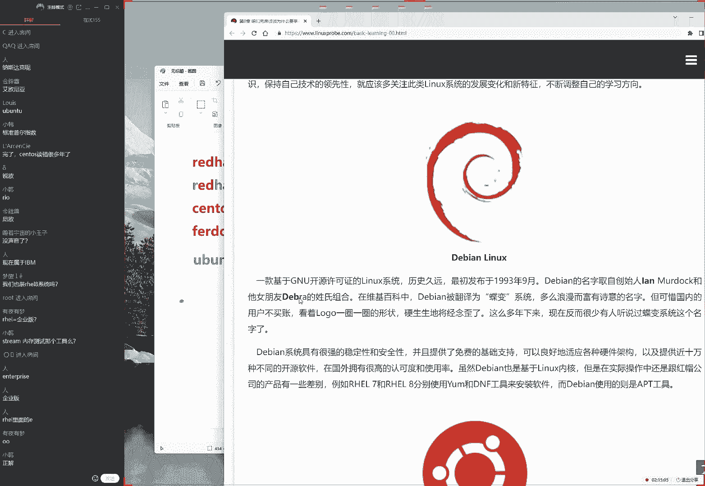

# linux就该这么学第34期 - P1：1-【第1节课】红帽RHCE认证培训课程-Linux就该这么学 - 能力努力 - BV1L14y1878S

So i wanted to let you go，I wouldn't be crazy about me，I was in the day，I'm taking the last time。

Taking the last train for my fuchsist，I'm taking the lights，I'm pretty like，She'll go，OK来同学。

我们来开始我们今天这个课程啊，今天特别的开心，因为今天是我们的，等于说2022年开始呃，我们考题稳定之后的第一版，那也是我们的第34期，好大，先打一下一好吧，然后我们来测试一下咱们这边这个烧烤环境。

刚刚啊我话故意用了一个小技巧，然后把声音开的有点小，废话大家听，我现在这个声音应该是比较大一点了，然后我我的话呢，我们讲课的时候质量的声音大一点，这样的话那我们同学们再去听的时候，声音就比较清晰了。

好那我们来给大家看一下，今天的话呢我们这个课程就要正式开始啊，我们在今天这个上课之前的话呢，需要先给大家做一个开班仪式，这个开班仪式这个重要性啊还是非常重要的，我们希望大家知道咱们这个课。

那我们什么时候去学习，以及我们学完了之后啊，我们的啊，那我们怎么去考试等等，很多我们跟这个课程相关的这个信息，我们需要在上课之前的话呢，先给大家呃先来啊，那我们先来进行一个串讲。

这样的话在我们去学习的时候，大家可以完全的去投入到我们这个学当中啊，不用再去关心，比如说考试的这个费用啊，时间啊，地点呀，包括说我们在激活当中遇到一些问题啊，那我们比较常遇到的一些问题。

那我们都可以给大家一起来回答一下了，然后大家的话呢这个留言比较的多，然后的话呢我们就刚才给大家看着，比较重点的一点问题啊，重要的一些问题我们来给大家回答一下，因为我们每期在第一天开班啊。

那我们去上课之前的话呢，都会有同学去反馈一些最近的一些问题，比如同学们问的第一个问题，就是我们为什么要去使用叫QQ群视频，为什么不用到其他这个软件啊，那么我们要给大家说一下这个原因，主要的话呢。

就是因为我们之前也试过一些其他的这个软件，结果的话那些软件需要大家登啊，那我们啊大家的话需要单独去下载一下，这个好想问这个软件特别的麻烦，我们先让大家只是点击一下这个QQ区视频。

但是我们实际上看到还会有还有，那么还会有很多同学因为自身原因也好，因为系统的这个呃系统也好，那我们还是进不来，所以我们尽量的话呢，就降低我们这个参加培训的一个门槛，因此我们最终决定了。

我们去使用这个QQ区视频这个功能，第二的话呢对我们先给大家写了，我们先给大家说一下，我们去选择，以及我们去做这个事情的一些呃理由以及初衷，这样的话呢，我们培养大家在上课之前就没有那么多顾虑了。

首先来说就是我们这个上课软件的一个问题，第二的话呢就是我们这个三个声音，因为除了画面以外，第二重要的就是这个声音了，我们的话对于这个声音还是比较自信的，因为我们已经啊几年时间都用这个上课。

环境也没有变过，废话上个收音应该是没有问题，但是那保不齐这个软件有点小小的调整，那么如果说您觉得声音小，或者说昨夜声音大的话呢，声音大就把自己声音调小一点就好了，声音如果小的话呢，如果小的话呢。

您可以呃下课之后吧，我们来呃，那我们作为呃，那我们可以做一个调查或者做一个反馈，等我们下节课的时候，大家调整一下我们的音响，但是我不建议调整我这边的音响，因为我把我的声音调大了之后。

会让大家听到一种啊爆破声音会比较强一点，所以建议大家调整自己的声音，那么这是第二个问题，第三个问题就是同学们刚才问到了啊，就是说我们这个软件嘛，哈哈都是从这个啊百度网盘啊。

啊它还是下载的这个百度网盘的话呢，他要不充VIP特别的慢，那我们不能收到其他的这个网盘呢，这个我们也去过啊，那么呃呃这个话其实我们也试过，比如说我们的阿里云盘对吧，这个我们去试过，但是目前来说的话。

它是不能够上传压缩包软件的，因此我们现在还是使用到百度网盘的一个理由，等后续他支持了，那我们自然会来去变更一下，咱们这个存储的空间，这没有问题呃，我们要给大家解释一下，现在上传软件的一些呃理由对吧。

我们那我们为什么要去使用这些软件呢，还有啊就是我们还有一个词叫好，这是大家提的三个比较常见的问题，跟我们上课之前嘛，大家来去互动了一下，然后的话以及我们有一个思考，另外的话我这个是一个在线培训。

大家应该对于这个没有什么质疑吧，他确实不是，就是我们此时此刻真的不是在给大家放视频，真的是有人在讲的呃，我每期在线培训的一个好处的话，就是，我们实际上也会对于上一期培训进行一个反思。

我们对于上一期培训的一个反思的话呢，就是因为我们呃我们错了，因为上一期的话呢，我们的同学们的反馈就是我们会啊，不是啊，上上期就是说第32期的时候是我们错了，因为上第32期的时候开班。

第一天有同学说说我们能不能少讲点段子，然后我们可以啊，多讲点这个干货，后来的话呢我们第32期改不了了，后来我们第33期的时候，就是完全就是赶进度，最后我们讲了一期，讲下来的话呢。

最后看一看时间完全没有减少，并且的话大家的兴趣度并不高，这我们坦白讲，所以的话第四啊，所以这个第四点是我给我自己总结的，这也是我们做错了一件事情，就是我后来我思考了一下，大概用半个多月的时间吧。

我觉得把一个知识，能够清晰地传递到他的耳朵里面，或者我们能够把这个书上的内容，我要我们认为讲出来的话呢，它并不是我们讲课，或者说我们这个培训机构能够做的一个，最好的事情，我们能够做的最好的事情。

应该是让大家有兴趣的去听完咱们这个课程，所以我们的第34期的话呢，会回归到咱们之前的一个讲究状态，我们不会去赶课程进度，然后的话呢我们呃那我们会去给大家去穿插，大量的这个比如说一些心得也好。

或者我们在上课当中嗯，同学们常犯的一些问题，就是我们的往期学员的一些问题会答呃，不计时间代价，然后给大家去啊进行一个课程的一个补充，以及的话会讲很多这个生活当中的这个例子。

来去对于这个课程来进行一个补充和讲解，所以的话呢咱们这一期的这个课程，可能会稍微的慢一点，咱每期的咱们看每一天的时间还是两个多小时，但是有可能咱们这一期的培训，可能会达到25天或者26天。

可能比可能会比我们之前的预期，可能会多个3~4天啊，这个话呢对大家来讲也没有太大的这个问题，主要就是您可能到啊5月中下旬的时候，你可能需要多出个呃两天呢过来听课就好了，那么我们对于我们的话呢。

做的这个费用都已经交完了，那么这个增加了课程的话呢，全都是凭着我们对大家的这个负责任，然后给大家去加的，因此第34期的话呢，我如果没有呃，呃如果说我们没有去猜测错的话，那应该这一次能够比啊。

其实这个猜测这个词不太准确，我们认为我们非常相信能力，比我们的网前起码比三十三七，32起脚好很多好，那我们先按照我这个思路啊对啊，那我们先按照我这个思路给大啊，来给大家去做一下我们这个开盘仪式。

我们先不做答疑啊，我们先不做答疑，因为为什么呢，并不是啊，并不是对安啊，这个问题的话，那并不重视，是因为大家您现在提的这个问题，基本上啊基本上会在我们待会儿也会有普及，就是我现在给大家做这个开班仪式。

会把大家常遇到的这个56年当中遇到的问题，会给大家串一遍，所以您现在提的这个问题的话呢，呃也很重要，但是有可能待会我会啊，那啊那我们待会儿给大家提到，所以我们就干脆啊系统一点这个在线培训吧。

咱们这个系统性的培训不就靠一个系统吗，跟大家连贯一点，虽然我那我现在呢我这个思路说，如果没有说清楚，或者我们没有讲到地方的话，大家可以补充啊，在那啊，那我们再来提问好，那我们来啊。

那我们再来继续来叙说啊，为了证明一下咱们这是一个在线培训，我们简单做一下，我们简单做一下啊，我们做一下互动啊，大家问的说没，所以这一期的话课表时间长，课表时间长，对我们这一期。

到了5月17号或者5月22号，我忘记了呃，实际的话这个时间可能会比5月，就是比我们那个课表要更长一点好，那么于是我们的第一点就要出来了，就是这个上课时间问题，上课时间的话呢。

我们大家都知道了这个输入法啊，我们上课时间的话呢会从啊每周56日，那我们这个上课时间的话呢，是说啊是从19点开始，然后的话呢到20一点啊，就是到七点钟到九点钟，我们这个呃每次的培训的时间大概是两个小时。

也有可能大家说啊不要怎么样啊，大家说不要拖延，不要拖堂太严重，这个做不到啊，这个做不到，我们有啊，我们有可能会讲三个小时啊，但是对于大家来讲的话呢，您可以比如说着急可以先下线，没关系啊。

我们会有一个录播，但是拖堂这个不可避免啊，而且这是加量不加价，这是我们对大家的负责任，那么于是的话我们上课时间，理论上来说是从七点到九点，这个最少是两个小时，不能再少了，那么呃这个话其实也是最好的。

那么我们的上课时间是每周五啊，每周六啊，每周日我们每周讲三天，那么这个时间的话也已经是确认了，所以我们这一期的课程的话呢，如果不出意外的话，应该是从4月2号到多少呢，到5月的呃，到几号我看一看啊。

同学们问他说，为什么是应该啊，因为这是一个在线培训，根据大家的互动反馈，我们来做调整，有可能到时候讲的不就多一点了吗，所以这个只是一个大概啊，我们这个开课时间能够确认，捷克时间确认不了啊。

所以我们如果不出意外的话呢，捷克时间大概是5月20号会，或者5月21号有可能更晚，这是一个最早的时间，那么如果说大家要是想要唉，去记录一下这个时间的话呢，您可以现在进入到咱们的网站后面。

我们现在给大家说几个网址，请大家同步去打开一下，就不要找理由，因为我每一期的朋友都会找理由说，老师我先听课啊，听完课之后我再去打开这个网页，不要就是此时此刻我们再给大家讲的过程当中，您就打开它。

这样的话呢，您看着点，我们正好给大家说一下啊，这些资源我们该怎么去使用好，首先第一点就是我们这个上课的时间，第二的话就是我们这个上课的时间表，大家来打开咱们这个网页，您可以看到诶。

可以看到有这么一个日历，这个日历里边的话呢，我们的前面啊，如果说啊不那啊，那我看下大家的问题啊，大家说MACBOOK不能全屏啊，能就不能换个啊，换不了啊，我们这同学大部分同学呃，这个情况下是能够打开。

我们就选择这种培训方式，您可以去安一个虚拟机，或者您可以换一个windows系统来去试一下，然后我们再来下一个问题，大家说左右两边窗互动窗口关不掉，对互动窗口关不掉。

但是我们会尽量的去调大一下咱们这个画面的，所以您可以就是啊只要你能够看到这个画面，就是你只要还能看到这个画面里面的这个字，那么您去后续听课就没有问题，我们会把所有的这个输入窗口。

就全都会调到这么大的大小，所以这个字你只能看得清，就没有问题好大家可以来看一下，这边的话呢，我们的这个上课时间表，后面只要后面带有了一个星号，哎只要带后面带有了一个星号。

那么代表就是当天有课的同学问了一个问题，叫孤独啊，大家问到说那五一我们放假吗，啊，这啊，那我们带着这个问题可以来看一下这张表格，于是您可以来看到哦，我看一下这个时间是5月27号，我还说的比较保守一点。

应该是到5月27号到5月底啊，足足两个月嘛，然后我们就能有，我们于是看到啊，这个日期的后面如果带有一个星号，代表当天有课，所以带着这个问题，我们来看一下这个课表，于是看到5月1号当天是有课的。

我们也是利用这个节假日的时间，给大家去讲课吗，呃所以的话呢，我们那同学们可以用您的手机去打开，咱们这个网址，这样的话呢，如果说您当天啊您不确定有没有课的话呢，就可以来看一下这个网页里面。

他是怎么去写的啊，这边的话呢我们会给大家啊，非常的严格的去按照，咱们这个课表来给大家去讲课，这个话也是一种契约精神，我们只要这个啊课表已经发布了，并且是在我们同学们报名之前，就已经有这个课表了啊。

或者的话呢这是在我们看啊，这个或者您报名比较早的话呢，那这个课表也是在提前一个月发布的，所以我们也会啊严格按照这个时间来去进行，我会把呃4月2号到5月27号，每个56日的晚上七点到九点钟。

我一定会腾出来，然后这边的话呢呃没有特殊意外情况下，我们是一定不会改时间的，这也是一种契约精神，然后如果同学们大概问到了，说如果说我们当天没到山可怎么办呢，当天没到有啊，当天没有来上课啊，不要紧。

因为大家可以看到了，我们正在讲课过程当中的话呢，这边是有一个录屏的，所以你看我现在在说话，这边的话也在去跳动，就是我们现在给大家讲的这个此时此刻，这个课程每天都在录屏，我们会在每天的晚上12点之前。

这个我已经坚持了7年时间了，每天晚上哎我们就说12点吧，他有可能是晚一个呃，晚一小时，有可能在凌晨一点钟，因为他有时候这个压制时间比较长，反正每天晚上啊应该是24点之前，我们会把这个当天的培训视频啊。

会把当天的培训的课程，然后后来我们去压制好，就变成一个视频嘛，压制成视频上传到序页面里面，上传到学页面里面，所以的话如果同学们您今天没有来上课，没有关系啊，但是如果您没有耐上课的话呢。

怎么能在这听到我这句话呢，啊这是一个悖论，好啊，那我们啊并不重要，如果说你以后没有来上课的话，也不用担心您可以进入到我们这个网址后面，加上VIP3个字，特别的好记，那么于是大家可以打开咱们这个网址了。

这里就是我们这个学员页面，这个里边的话呢不仅有录屏的这个课程，还有我们这个考试环境啊，还有我们这个啊纤维这个软件，它都可以去去下载的，因此同学们就不要找什么理由了，也不用等你啊。

那我那我们的话也不用等啊，我们下课之后再来，那我们啊那我们再进行操作，就是我们此时此刻您就现在就打开这个网址，就是我们现在嘛你就打开这个网址，因为这个网址的话，还需要验证一下学校的这个账号。

您正好去验证一下您的这个学员账号有啊，他能不能找正常来去使用，所以的话您现在就是啊立即吧打开这个网址，然后您可以去看一下网页里面的内容，您是否能够看得到，如果看不到的话，请今天晚上马上来联系我。

并且的话呢，您需要登录一下您的学员的这个账号，如果说您的学员账号您呃呃记不住的话呢，或者您啊忘记密码的话呢，那么请今天晚上啊，只要有啥啊，只要有问题，只要有错误就马上来，今天晚上一定要来跟我来去联啊。

那么就今晚啊必须来联系到这老刘，那必须联系老刘，那我们今天晚上就把大家的问题的话，那我们再来啊，都给大家去处理一下啊，老刘啊，OK好，这是我们这是我们的第一个问题，就是这个上课时间问题。

作为一个开完仪式，我们就先给大家讲清楚了，这样的话呢课后啊，不这也这也是我们以后去上课的时候，您就知道哪天有课以及该怎么呃，准时来上课了，好，这是我能够想到关于上课时间的问题的，一些常见问题。

大家还有什么需要补充吗，那如果没有的话，我们来去下一个问题啊，我们去下一个问题，关于说考试啊，关于说考试，这个会在我们的下面一个问题给大家聊到，这也是咱们一个系统性培训的一个好处啊，都会大家去提到好。

这是第一个问题，大家有需要补充吗，那账号是什么，账号是您的姓名啊，账号是您的姓名，密码的话呢，是您的手机号码啊，默认手机号您可以打开一下，大家说考试环境根本打不开啊，不不存在这个问题。

然后说考试之前就可以报名考试了吗，是的，我们一般情况下会在4月下旬或者5月初，给大家预啊，来去预约5月底或者6月初的这个考试啊，今天这个人数还是很多的，160一个同学了，非常好非常好。

那我们来这是第一个问题，大家有对于第一个问题有什么问题，你可以提出来，没有问题的话，我们就往下面去说，咱们这个开班仪式讲究的就是个效率，其呃虽然说今天不涉及到我们相关的这个，技术方面吧。

不会安装系统啊什么的，但是好理论的知识啊，肯定要大家需要打击啊，需要给他打扎实啊，然后大家问了几个问题，大家比如说啊虚拟机软件包啊，巴拉巴拉啊，网站上有吗，跟现在没有没有太大关系的，我们先不回答啊。

下面一个问题，大家说江苏有疫情，没有办法考试，没关系啊，没关系，等到5月初的时候或者6月下旬再看一看好，不过这个跟咱们现在第一个话题没关系的话，那我就下一，那我就下一个了啊。

呃下面的话呢就是我们的第二个跟考试相关的，其实我们刚看到第一个问题没有回答完，同学们已经迫不及待了，已经说到说这个红帽考试了，那么红帽考试的话呢，先来说一下，是这样的啊，啊对对对，我先给大家说一下啊。

第一天是开班仪式，不讲技术啊，也不会去安装虚拟机，所以的话同学们就放松就可以去放松心情，然后我们今天就把这个考研辅导，您可以把屏幕关了，您不用看屏幕，那您就听我说就可以了，等我们明天开始。

就是按照我们这个系统啊，去安装虚拟键等等很多这个操作，所以今天的话就是完全给大家做一个开盘仪式，知道我们后续怎么去学习，这也是我们之前呃几期培训当中，我们大概是在27吧，我记得有个同学啊。

也是第一天来听课的时候就很着急，说到溜啊，赶紧去安装系统吧，我们就说到了，就这个开班仪式的一个重要性，以及今天是第啊进化的啊，那么我们今天是间是一个开办仪式啊，废话大家这个常见的问题。

我们现在先给大家说清楚，大概的话占用时间是一个小时，然后我们后然后的话呢我们八点到九点钟，应该是会涉及到第零章节，会给大家讲一下我们这个系统的一个历史，以及大概的一些理论基础，好先来说一下第二个问题。

就是红帽的这个考试啊，呃我们的话说，从这个培训是从2015年开始做起的，大家应该知道我们到现在出过两本书籍了，呃我们这个啊培训的话，最开始去做的时候，并没有想要去做一个红帽考试相关的这个培训。

但是由于我们这个课程，它里面包括红帽考试里面的所有内容，后来的话大概是2016年的时候稍等，我先喝口水，然后给大家说一下，我们这个培训大概的一个过程，大概的话是2016年的时候。

就有同学说想要去参加这个培训，然后我们去考研认证，结果的话发现突破率还是很高的，因为我们这个课程里面，包它里面包括所有呃跟考试相关的一些资料嘛，后来的话呢我们从2016年开始。

等于说就开始去专注去做一下啊，考啊考试这么一个培训了，虽然说大家可以考可以不考，但是的话呢我们的资料都是给大家提供的，首先来说一下这个考试费啊，红帽这个考试费话呢，我们是不给大家加任何插件。

没有任何任何的插件，没有啊，重拿一分钱，然后呢我们的红帽是cc以及红帽是CE的话呢，现在的报价应该是四啊，他们依然是依然的话是4200块钱，这个实际上是从2022年1月1号开始，时间是涨价了。

然后的话呢由于它这个结算周期，我们在上一期的时候，大家就聊到过，它实际上是三个月，所以的话呢如果不出意外的话，他应该是从5月份开始，他就应该涨钱，那涨到4500块钱，但是的话呢我们今天在上课之前。

因为今天礼拜六还上班了，那我们今天问了一下这个考场，然后我说到，然后我们说大概5月份，那我们要报考的话，这个费用怎么算呢，红帽的考官给我们发了还是4200，然后给我发了一个笑脸啊，我也不知道什么原因。

但是的话呢目前来说，就是这个考试费依然没有涨，但是具体没有涨的原因我也不确定啊，就红帽考官的话呢也是这么一个呃比较呃，半正式的一个回复，大家可以放心，就是这一期的话呢确实没有任何差价，还是4200。

然后的话那我们这个上午的话呢是r h cc，下午的话呢他考的是HC，满分的话呢依然为300分，那么大家只要考过210分就可以通过了，那我们这个考试的话呢，目前持有是在线下实地去考试的啊。

大家听到这个之后非常的开心对吧啊，那话那我们这个考试的话，都是一个实例的一个考试啊，所有的这个考题的话呢，我们会给大家去提供，然后我们这个培训的话呢，呃预计会在就是我们现在要约考的话呢。

您大概也要提前一个月了，所以因为现在考生实在太多了，那么所以您呃我们这一期培训大家算一下，从4月2号开课到5月底讲完，那我们参加培训，那我们参加考试的话呢，怎么着也应该是5月底或者6月下旬了。

所以我们这一期的话呢，本期的这个约考时间那也就定了，那也就定了，那就是打，那那么就是在5月初，然后我们去预约一下6月上旬的这个考试，这也就是大概的一个时间了，需要提前一个月来去约。

那么我们这个考试的话呢，地点大家可能会比较关心的说，老师那我所在这个城市有没有红帽考场呢，啊大家没有问，但是我替大家先问一下啊，这个大家可以先访问一下咱们这个网站，后面的话呢可以叫啊。

红包认证这么一个导航里面，你可以点一下全国考点分布，然后这个网址比较长啊，所以啊，所以我们给大家提供的方式是通过鼠标去点击，或者的话您可以直接如果说你是啊，那么如果说你是在看录播的话啊。

如果找不到他的话，你也可以直接去访问这个网址，当然了，更重要的是这个网址，就是我们后面加上VIP这个网址去页面，您现在必须已经此时打开了。

然后我们今天晚上如果有什么问题的话，我们会大家重新制作啊解决，那我们来看一下这边的话呢，我们的红帽考场主要的话呢就是在北京，上海广州深圳，然后还有这个山东的济南青岛，还有这个东北的辽宁，还有天津。

然后以及武汉，然后这些的话呢是我们比较重要的这个考场，那么如果说同学们嗯，您所在这个城市，那并不那并没有出现在我们的网页里面的话，也不用着急，因为我们后续也增加了一些考场。

但是我们现在没有被及给大家更新到网页上面，所以的话大家可以啊问一问，比如说江苏有吗，江苏没有江苏，您需要来上海考试，好，比如说成都有吗，成都不是有一个吗，对成都是有的，我们也有，这就是我们提到了。

只不过因为这个考场是新增加的，我们还没有在埃及放到我们的网页上面，你可以等一等啊，或者的话这个并并没有大家报考，那我们会在过两天，那我们时间我们时间充裕了，我们会大家去更新一下这个网页。

但是网页上已经有的话，就是确认是有的，郑州呢，郑州呃，不确定，我们需要回去之后给大家去查一下，郑州好像有，又好像没有，然后长沙有吗，长沙我也好像没有记清楚，我需要会议之后给大家去查一下。

如果大家着急的话，您可以大概是在九点钟吧，我们讲完课了之后，你就马上问我，然后我们把录屏一关，就可以给大家打开我们这个报考的表格里面了，然后就可以看一看有没有了，然后大家看一下下面有有有什么问题。

大连大连有大连有考场，但是周期比较慢，那么那也就是说，我们现在给大家约的这个城市的话呢，除就是我们现在给大家约的，说实话已经很全了，咱们凭良心说，已经算是在全国当中呃，怎么讲呢，没有任何差价。

这个情况下能够约的是非常非常的方便的，北京上海广州真啊，广州深圳这几个城市大家不用说了，肯定能行，这个没有任何问题，并且的话呢每个月啊每个月啊，大家说说啊，怎么样说天津有是吧，对我啊，我刚才只要说过。

有的就一定是有的，大家说在内蒙也有啊，对内蒙的话呢也有，据我了解报价应该是5000多，我们有同学去考过啊，可能每个人价格不一样，那个同学考完了之后是5800块钱啊，他加差价差加了不少。

当时的话呢是19年，当时没有疫情，后来那个同学的话呢选择来到北京，然后连着坐高铁连着来在北京玩了两天回去了，等于说你可以去考虑一下，因为我们这边说咱们就是说实在话，我们就换了这个培训费已经赚的很多了。

我们的话呢现在考试费不是不加差价，大家可以随便去问啊，黑哥白叫红帽，考官都可以，这次加200块钱，是等于说全国最低，那么如果大家可以看一下您所在这个城市，如果说您所在城市就报价。

比如说啊报个4500对吧，那我们这边又没有的情况下的话，您可以就是在您当地举报就可以了，但是如果差有点离谱，到时候我们再想想解决办法，但是我们能够尽量的还是给大家呃就近去约，我们尽我们的能力。

然后我们看看北京上海广州深圳，这是没有问题的，大概的话呢每个月那大概会有两到三场，没有问题啊，但是有一个问题就是这个啊，考场的一个人数问题，之前的话呢，我那我们的话呢每一场可以坐18个人。

加上两个备用的这个机器，但是由于现在有这个诶现在有疫情了，那么这个时候的话呢，现在他需要隔一个做一个，所以我们没啊换，每一场只能坐十个人，那么因此也就是说北京上海这样的这个城市。

每个月大概能够约的这个考量是20~30人，我们基本也都够用了，那么呃那么我们只说其他的这个城市的话呢，比如说同学啊问啊，那我就是问到了啊济南，比如说大连，比如说武汉啊，天津有没有啊。

有这个只不过说月考的周期比较长一点，您可以在5月初或者呃不呃，如果说您是北上广深的话呢，您可以在5月的初啊，您可以在5月初联系我，那么如果说您是以下这些城市的话呢，那么您尽量的。

您是在4月底就要跟我来去联系了，我们先来给大家去算一下这个人数，当然了，现在不要联系，我需要给大家加上啊，避免我下课之后，同学们这个不要着急啊，我先给大家解，就是现在啊不要联系。

因为我们现在的话呢等于说第33期呃，我们还有很多同学没有约上，实际上因为这个疫情原因吧，比如说大家要是之前加过我们33集群的话，您应该可以互动一下，来来来可以来聊一聊，我们现在深圳的话做的考生都取消了。

我们现在的话呢广州也取消了大概十位同学，上海的话呢取消了两场，那么大概会有十位同学没有考，所以的话呢我们现在实际上是在4月份的时候，4月份我们会安排老学，我们去消化一下这个老玄。

给老学员都要给他安排上考试，所以我们4月份的话呢是不安排考试了，我们就不会啊，我们不安排我们同学们去考试了，这是我们能够给大家讲的，跟考试相关的，大家可以看，大家也能够感受到我们这个开班仪式。

这个重要性吧，先把先啊先给大家讲清楚了，考的时间地点人物事啊，这样的话同学们再去啊，大家去学习的时候就不用有太多的顾虑了，知道大概这个月考啊，自己以及合理去安排自己这个考试时间。

和学习的这个周期就都没有问题了，然后我们下面还有一个问题啊，就是说那我们这个红帽考试通过率还行吗，啊我们画的是非常行的，现代化了，上游的我们的啊红帽的考试现在基本上都换了，满分率能达到50%以上。

就是说我们那我啊我们花了上午的考试，能够有50%的同学，有大概有是有一半吧，能够考满分，通过率的话呢是非常高的，我现在已经将近有一年多时间，我没有见过上午的挂科了，然后他那我们这个下午的HC的话呢。

通过率大概是百分九，大概是在98以上啊，这没有问题之最这么高的话呢，首先我们进视频课程吧，我们啊里面包含了所有的红帽考试相关内容，对吧，因为大家能够选择到我们以及听到老刘说话啊，其实是让我们比较自信啊。

这就是我们比较自信的一点，就是确实现在教的比较好啊，这个我记得当时我是在20122020年嘛，但是好像当时好像疫情比较严重的时候，当时我就说过说，因为我们现在做这个培训，做红帽认证比较专业，做的就是好。

然后同学说说到有你这太骄傲了对吧，后来我跟同学们去说过这个问题，大家一定要能够分清楚什么是自信啊，什么是骄傲，什么叫做虚假信息，就是骗人对吧，因为我们现在做有6年多时间了。

就是我们从报名到考试到现在嘛啊，交培训叫麒麟，我们现在跟红帽打交道，6年多时间，通过率确实很高，所以的话呢我们对这方面还是很自信的，还是有一定的这个啊实力的，那么我们现在的话第一就是我们这个课程啊。

不论你想不想去考红帽认证，我们并不关心对吧，我们花了培训课程的话呢，是包含了我们的红帽考试所有内容的，就是里边的话呢所有都关它，它里边的话啊，兜里面啊他都已经是包含了的，那么即便说你没有去考试。

没有关系，应该学都学了啊，这个话呢啊默认情况下它都是有的，第二的话呢这是第一个我们的原因，第二的话呢就是我们这个呃，我们会有一个考研辅导，我们会给大家提供考试的那个考试原题。

然后我们之前的话呢会给大家去说啊，这个我们这个大家去说吧，红帽考试的这个真题，红帽考试原题，为什么给大家去说红帽考试原题啊，因为呃有很多机构大啊，大家啊他们的话那个题目其实并不准确。

我们先给大家提供的是一个红帽考试原题，就是您可以看完之后，是跟考场里面是一字不差的，是从考场里面拿U盘给大家考出来的，就是只要考场里面有题目的变更了，那么我们会第一时间去跟考场那边，把题目考出来。

所以您现在此时能够看到的，以及我们上课的时候非常开心的跟大家去说，这是红帽考试稳定之后，我们的第一班，就是因为已经有三个月时间没有辩题了，非常稳啊，第二就是我们会给大家去提供一个啊，好像付导视频啊。

会大家以这个视频的这个形式，带着大家去做一遍啊，这是我们的这个对于考前辅导能够提供的东西，还有的话呢就是对还有这个考题的这个答案，没有答案可不行啊，还有这个考题的答案，这也会给大家去提供。

这个的话我们也是丝毫不啊，不用给大家来去隐瞒的，因为大家可能第一节课看到这个会有一种感觉，说到底，你这那你这个培训就是要通过刷题去考过的吧，这我我这个话我们实际上也不用去解释。

因为你只要听完了咱们这个培训，自然你就能知道到底是不是刷题考过了，所以的话呢我们认为自然是我们的学员，我们就把要能够给大家提供的东西，先给大家说明白，就是说用或不用，但是如果大家不用的话呢。

其实也能够考过，但是我们会给大家提供好来去，尽量去提高这个通过率，这是第三个肯定辅导视频以及最后的模拟环境，大家可以带着我们这个前面的这个三项东西，然后给那我们可以在这个模拟环境里面，来去练习一下。

这个我们是能给大家提供的呃，综上所述，所以我们就有了很高这个通过率的一个原因，这个我们也是比较自信的一个理由啊，对啊，这是我们给大家能够想到的第二点关宏啊，关于我们这个考试能够呃。

需要给大家提到的一些问题，大家要是有什么问题，大家有什么问题，您可以来去说出来，然后我们再给大家回答一下，好大家问了一个问题，大家说考试费怎么办对吧，这个考试费话呢，我们之前是代收。

后来的话呢我们现在不收了，这个大家约考的时候，您是直接转账给考试机构，我们这边不收啊，转账给考场，然后还有这个我们是不收的，所以这个没有任何的这个水分在里面啊，直接专业考场。

我的话我然后我们这边给大家个信息报考，报考完了之后，你自己去付款，付完款啊，付款之后我们考场会给大家安排时间啊，大概是这么一个流程呃，具体的话呢，但是不能太早，您需要最早也在4月底跟我来联系。

不能再早了，再早的话，我们会33期的考生去安排一下考试好，另外的话我先喝口水，另外看他开场同学们的问题，如果您的问题特别有针对性的话，我们会赶紧给大家回答一下，这是第二点，我们给大家说到的。

然后大家可以来继续说，我来给大家看一下问题，稍等一下，啊当然当然当然怎么是这样的，呃如果您的这个问题特别的呃，个人的话，比如说你提了一个，比如说这个您自己的这个系统啊，或者说这个软件的问题等等。

这个咱们在上课的时候不给大家去说，您可以先稍等一下，我们会在每天晚上会有一个答疑时间，到时候给大家去说，就不占用咱们上课时间了，因为你这个问题比如说一个好问题啊，不那我们说完之后。

大家所有人都可以听到了，然后我们会说一些经验啊等等的，对于个人的问题，我们就呃只能呃那我们就会啊，那我们会来我们的课后，针对于某个同学，我们来给大家回答一下，这样的话更有针对性，也不用特别的仓促啊。

可以好好给大家去说，大家说了一个问题，大家容器会讲嘛，容器会讲，但是以视频的形式来给大家提供，因为每个人考试的时间是不一样的，所以的话呢我们现在只有自动化运维，他这个我们是在线培训。

其他的话都是视频的形式给大家提供，这样的话您可以反复去看，然后大家说济南可以约4月底的考试吗，呃4月底的考试不行了，因为我们等于说4月份，我们我们都希望能够给33期的考生去约了，如果要是有空位置的话。

可以大家说红帽认证是不是会过期啊，红帽认证的话呢，按照他的这个官方的手册里面是写了，有它有效期是3年，但是他并没有写到期之后能怎么样，所以我是从2015年开始，我考的不。

我从2012年开始考第一门RHCE，我2015年考了RHC，到现在我没有再去考过这个证啊，不2020年又考了一个认证，然后到现在的话，我也我也没有去考认证，包括说我们的老学2015年考下来的话呢。

现在依然能够正常使用，也就是说同学问到这个问题啊，那么大一个回复就是红帽的话呢，官方的认证有效期是3年，但是到期之后没有任何的影响啊，最后的话呢红帽可能也没有想出来，到期之后能怎么办。

所以他只是一个理论值得有的啊，一个时间限制，来大家下面一个问题，大家说啊，大家说怎么样说这个认证算是一个入门槛，进去之后也没啥用啊，时不时挂靠华为的认证，能够靠他啊，靠挂靠赚钱啊，这就是怎么讲呢。

呃这个我们会在我们后续给大家去说吧，首先来说这个说法是错误的，而且完全错误的，而且错误的有点太离谱了啊，不过的话这个问题我们会在下课吧，或者我们找一天如果讲课讲累的话，我们会给大家去充分的剖析一下。

这种这种思想的一个原因啊，以及我们说一下自己的一个看法，好下面一个问题，大家说说广州4月底可以约考吗，不可以啊，也可以，但是看一下具体我们的位置，下面一个问题，大家说说现在网页上面的考题。

大概啥时候会出现大规模的辩题，大概会在今年年年底，如果说就是说如果说您要想考的话，那你就赶紧按部就班的，咱们这一期培训好好学，好好考就完了，大概的话那我6月呃，如果说您现在4月，现在是4月2号。

如果说您按部就班的去学习，您呃，大概率的情况下，您会在5月下旬，5月，那就是5月底以及或者6月初，就能够达到我们这个呃，那么基本上就能够考过了，但是如果说你没有考过的话呢，我们会在年底的时候变题。

因为大家可以算一下这个周期，这个二零，因为我们在这个之前的话呢，2012年的时候，是红帽REO6的一个系统对吧，后来的话呢2014年的年底时候，他又发布了一红帽日七，然后的话呢。

它实际上它是从2014年的年底发布红帽肉，70后是2015年变的题，然后后来我们这个红帽来这个系统，它是每3年之后他会发布一次新的系统，所以如果不出意外的话呢，呃那么呃呃并且他确实也没有除以八。

他是在2017年的时候发布的红帽热巴啊，大家可以查一下这个时间对吧，没有问题，然后后来后来SABO啊，什么啊，他是在2020啊，呃9年对吧，他发布的红帽热巴，他就是呃稍微的晚了一点。

他应该是每3年发布一次，他就是晚了3年，因为他被IBM收购了嘛，他等于说他耽误一段时间，因为他要赶上这么一个呃新冠肺炎，等于说他这个辩题他会晚了很多，我们现在的话，因为中国大陆从19年的年底。

到爆发这个疫情之后的话呢，中国大陆的考题比其他的这个国家要晚了半年，所以的话呢我们2019年的时候辩题了之后，2020年8月1号开始，才更新了红帽热巴的这个考试，所以的话呢如果不出意外的话。

那么每3年发布一次，大概就是在今年的年底大概啊，但是我们并保证大概就是在今年的年底，大概11月份，您就应该能够看到红帽六九的这个系统了，就能够看到了，所以的话呢他辩题的这个时间，如果不出意外的情况下。

我们推测嘛3年发布一次，他应该是在今年的年底或者明年的年初，会变成红帽real9的这个考题，到时候所有的这个考试信息以及这个书籍啊，培训等等的就都要去有一个变化了，所以您要考的话，今年年底啊。

比如说哪怕90月份啊，那么我们是认为这个时间也是比较不错的，但是如果再过了明年，这时间有点悬了，每一天都有可能变题了，然后进了这个问题啊，大家现在提到问题啊，就问题不大了。

然后我来说一说一下我们这边的这个第三点啊，第三的话呢是一个小福利啊，这小福利呢是这样，不不我们先给大家去说吧，第三点的话呢是一个我们的帮助手册，因为我们在商科当中嘛，同学们总会提出一些问题。

然后的话呢我们对于一些问题，也是一直在给大家做一下总结，特别好，这样的话呢我们同学们啊，后续如果提出过相同的问题了，就可以来去更快被解决，那我们这帮助手册的话，大家可以进入到咱们的网址里面。

然后后面的话呢我们建了这个啊啊help，这么一个单词，您就可以访问到我们这个帮助手册，然后另外的话呢还有就是呃，如果说您现在使用手机比较多一点的话呢，我们可以把这个帮助手册。

我们可以给大家做成一个文件啊，可以给大家做一个文件的一个形式，然后给大家发送一下，并且的话呢以后我们就经常会在这个QQ的啊，那我会经常在这个微信朋友圈里面，会给大家发一些跟开课相关的，比如端啊。

那我们同学们比如今天你可以看一下，今天就发了开课通知了啊，我们那么那么的话呢，我们呢我们后续还会给大家发一下，比如说跟考试约考相关的啊，我们会大家提醒一下考试了，或者我们提醒一下，比如说今天突发情况。

我们那我们今天上不了课了等等，这样的这个可能性，所以的话我们需要给大家做一个，比较轻量级的一个验证，那怎么能验证一下是不是我们的学员呢，就是我们报名的时候，同学们都登记的是QQ。

那我们怎么能够知道大家的微信呢，所以我们来给大家做一个，非常轻量级的一个验证方式，这也是我也是我们这些用的一个方法，就是话呢现在这个时间是19：37分对吧，好，现在的话呢我们从48分开始。

然后我们一直到19：52分吧，呃呃呃53分5分钟的时间，那么大家现在可以打开您的手机，现在打开您的手机了，然后我们先把那大家可以按照这样的一个，固定格式给我发消息。

这样的话我们会把这5分钟内给我发消息的，同学，我说那我啊我们那我们会给大家做一个备注啊，备注好之后的话呢，以后我们再给大家，比如说发考试通知啊，包括说我们会给大家，比如说今天听课呀。

这些相关的消息你就可以收到了啊，好吧，然后就那么大，但是一定要严格按照这个时间，因为呃比如说这个视频被他被泄露出去了，然后看盗版视频的同学，然后结果也看了这个视频了，也给我发消息，到时候就要那到。

那我们到时候他就不能绑定了，所以的话呢我们要严格按照这个时间，你按照这个格式发给好了，如果说你以前加过微信的话呢，您就这么着给我发三十四七，就是一定要说一下啊，就是34期您是34期的。

所以34集相关的这个消息我才会发给你的，然后的话呢加上或者说你要写一个空格，显示您的这个姓名，然后您现在就发给我的微信就可以了，然后我们今天下课之后大概九十十一点钟吧。

然后我们会把大家这个信息做一下备注，这样的话以后您就34期这个消息，在微信上面不也能看得到了吗，然后我们就大概一个样是吧，就是我们大概就是这么一个样子，比如说啊流传。

那么就是34期流传这么一个消息就可以了，如果说您之前没有加过的话，那那大家可以访问一下咱们这个网页，那么您可以去扫一下这个二维码，也可以看得到啊，然后也可以去加一下，但是我们不建议大家同一时间去加。

因为同一时间去加的话呢，呃有可能我这边就加不了了，有可能显示那个添加繁忙，最好可以分流一点，比如今天加，明天加呀对吧，我们分两天加，因为您现在同一时间扫二维码的话，我估计我这个就加不了了。

好所以就是一个简单一个验证的方法，就是到十呃，19。53，就等这么34分钟在超时间了，就等于说他这个视频就不被啊，就没有什么保障了，可能被泄露出去了，好这是我们的第三个问题的话，第四个问题的话。

就是我们会给大家一个送书活动，这个话也是当时我们减肥的时候用的一个方法，就是我们发现这个减肥跟学习来讲的话，他都他他都是有点痛苦的事情，那我们那么我们怎么能够保证，我们去学习的时候的话呢。

我们来这个签名的书籍能够来去坚持下去呢，所以前面的这个书籍，那也是我们这个给大家一个活动，就是我们花了每天在上课的时候，您可以把今天这个学习的这个心得的话呢，我们会给大家分享到啊。

那么您可以去注册一个技术博客，然后的话把我们今天所学习的知识啊，把学习的这个内容发到这个博客里面，那我们算作是一个打卡，这样的话等我们到最后一天的时候，会给大家赠送一个我们的这个签名的书籍。

也就是第一版，第二版价格的话大概100多块钱好，那我们最后啊，那我们最后会送这个两本，就第一本和第二本我们会给大家打包好了，会送两本这个签名的书籍，第一版，第二版，这个话也是一个我们自己一个小活动呃。

然后给大家说一下这个原则，因为我们第一次说这个活动的时候，大家以为我们做啊啊啊啊，然后那我们第呃那我们换啊，第一次，那么还是说这个活动的时候，大家还啊，大家以为是有什么其他这么一个规则呢。

那我们来说一下这个原则，就是大家好了，不需要再啊，那么那我们这个原则首先来说，那么去注册的话呢，一定要是一个技术平台啊，CSDN比啊，比那我们比如说一些常见的网站啊，博客园好看，中国对吧啊。

就比如说一些网站啊，博客园啊，那么您可以随便去注册一下，然后你找一个技术相关的一个网站，还有什么，比如看看中国对吧，那你去注册一个博客，这样的话呢我们啊这样的话呢，我们每天我们下课之后。

把你所学习的这个呃知识，您可以大概去写一个笔记，然后我们画我的啊，去写一个啊，那我们去啊大概去写一个笔记，然后再把您这个书嘛，那我们输出这个笔记，您得给他去拍一张照片，至少一张照片啊，证明一下啊。

是自己去写这个笔记，要不然我不好，那我们不知道您的笔记是从哪里去复制来的，最后还至少要有一张照片，还真来去拍一下您的这个书啊，就我们来拍一下您书里面的内容也好啊，封面也好，这都可以。

所以的话呢来拍一张照，然后发到您的这个博客里面，等到最后的时候，我们会给大家去做那个前面的书籍了，那么好呢，我们的原则啊，那我们就在这个原则，就是大家不需要带我们的这个书籍名称啊。

大家不需要给我们的输出任何的推广，因为现在的话我们的人气也很高，基本上把这个市场都做饱和了，所以大家不需要为我们的书做成呃做什么宣传，所以大家不用带我们这个书的名称，也不用带我们的网址啊，不需要带网址。

所以他这个原则态上来说就是大啊，那么我想同学们，对自己每天写这个笔记负责就好了，对自己啊写的笔记负责就好了，大家的话不用做啊，不用为我们做任何的宣传，也不用任何的这个心理压力。

这样的话我们只是说这个活动的话，您可以呃，您可以去进入到咱们的网站里面，后边的话呢我们加上福利两个字，您就可以看得到了，然后可以看一下这个活动具体的一个介绍，然后我们可以来好的那啊。

那我们现在就可以去注册博客，今天晚上就可以去做打卡了，好这就是我们能够想到的一些常见问题，我们都给大家去提到了，稍等一下我看看啊，我看一看哦，另外的话我们我这边上课之前啊，特别的用心。

还给大家写一个小便签啊，说了一下这几个事情，我看一看有哪些没有提到哦，还有一点就是同学们会问到说，那我们该怎么去写这个博客啊，有没有什么啊哈，那我们之前有没有什么啊啊，可以啊，那我们呃可以呃。

我们呃比较好这么一个呃，呃那我们那么我们可以来看一下呢，所以的话呢我们今天晚上想想，这怎么给大家提供呢，那我们今天晚上吧，还有在朋友圈里面吧，那我们今天晚上，那么就会在微信的这个朋友圈里面。

会给大家分享，怎么啊诗歌的这么几个博客，大家可以来去做一下参考啊，诗歌的博客来做一下这个参考好，那么我们就说完了，我们这四点，然后就换作是我们这个开班仪式，比较常见的几个问题，那么我们今天晚上的话呢。

会在我的微信朋友圈里面，会给大家发诗歌的案例以及帮助文档啊，大家好啊，可以备注一下，那大概到点了，拿到53诶，不好意思，我好像说错了，刚才的话呢好像不是48，刚才好像是38好，那我们也没有关系。

那现在所以有时间到点了，大家不用发了，因为等于说我们会把大家的信息，待会做一下备注好，大家有什么问题，您可以来去说一下，然后我们也会在QQ群里面，大家好，OK那啊那没有问题，我那我给大家写下来。

待会儿的话，如果说你没有加微信，没关系啊，我们Q上也很常用吧，我给他写下来，待会的话也会把我们这个泵动手册，还有这个案例发到QQ群里面一份，你可以关注一下，QQ群也可以来啊，大家有什么问题。

您可以来说一下，这是我们能给大家讲到这四点比较常见的问题，如果没有的话，那我们就来开始咱们这个第零章节，我们开班仪式就算结束了，把大家常见的问题捋了一遍，后续再有问题的话呢，我们慢慢再给大家去说。

来看一下我们这边第零章节吧，大家可以翻开咱们的这本书啊，在上课之前我们看了一下啊，大家好像说有同学说书没有收到啊，也很正常，因为您可能是31号报名的对吧，或者您干脆就是4月1号，4月2号报名的啊。

没这么快呢，大概我们会在三五天之内会给大家送到最快嘛，如果要是有疫情的话，那您可能会再更晚一点，不过没关系，我们会有一个电子版，你可以在群里面去下载到。

或者的话呢你可以打开网页，也能够看得到好手里，我们首先啊啊但没关系，我们先给大家看一下这个网页吧，是这样的啊，这个字大家如果看不清没关系。

您就可以看一下您的这个书籍，然后的话呢我们看一下啊，大家说什么，我收到了两本啊，有可能是我给您寄重复了，可能是因为你跟我说了两遍啊，然后的话呢我们这边这个信息给大家登记重了，所以给大家。

所以所以所以可能给您寄两本啊，不过的话你就留着就好了啊，好下面一个问题大家说啊，隔离在小区输在公司有点难受啊，也没问题走，那我们好像是有一个电子版的，好，怎么样，哪提前买过一本了。

OK那我们来看一下咱们这本书翻开之后的话呢，首先第一段啊。

另外我也发现了之前我讲课的一个问题，就是我们可能会更多的去解答一种私人问题，就比较耽误时间了，呃问题很好，然后我们可以在线下之后，我那我们可以在下课之后给大家去聊一聊，说来说的话呢。

我们来看一下我们这边这个地钉章节，简单做一下介绍，马上就开始去介绍我们的LINUX系统的一个历史了，唉然后以及我们的啊开源软件的一个优势。

以及我们使用它当中的一些小技巧和好处，好，我们接下来给大家说一下，首先嗯首先首先啊先做一下自我介绍啊，流传那没有问题，这个的话第0。1我就把它跳过了，因为大家既然已经开始给我们的服务费，都已经是花钱了。

你一定对我是有了解的，所以这个时间我们就不给大家耽误了啊，那我们就直接跳过了，但是我们要给大家去说一下，就是我我们的话呢，这个在线培训并不是大家可以来看一下，这也是我们唯一需要给大家说的。

就是您可以看一下这个输出定价是99块钱，并不是2400，所以的话呢我们在上课的时候，并不仅仅会把这个书上的内容，给大家拿去复述出来，我们会给大家增加很多书上没有的，过程当中的一些案例。

然后换到我们一些啊经验跟心得，所以的话呢我们这个课程会在这个数字啊，知识上增加很多的东西，因此更需要大家把笔记给他做好，这样的话呢书上没有东西，您做一下补充以后，我们来啊再去看的时候。

就有一个啊很好的一个复习材料了，另外的话呢就是我们再给大家去讲的时候，如果说你的基础非常好了，那么这个时候的话呢也要稍微的啊，那那我们也要稍微的啊啊耐心一点，因为有些同学的话呢可能基础不是很好。

所以我们可能会围着某一个技术点，可能会给大家讲个五到10分钟，那这样的话呢你可能会觉得比较无聊，但是你要能够理解到，有些同学的基础并不是很好，我们就这么去讲了，都有可能不太好去理解呢。

那么我们谁都有一个，从基础开始去学习的一个过程，所以我们教大家的话呢，就是如果说这个技术点已经掌握的话，你可以去倒杯水，以前没关系，呃但是的话呢我们不希望大家去催促，因为你已催促的话呢。

我呢我们这边如果一跳的话，我们这边跳起来的话呢，也很快的，大家能够理解我，因为我因为我因为我们在给大家讲课的时候，也有可能会跳一些章节，或者说跳一某个技术点，这样的话单啊。

但是技术比较弱的同学就听起来比较有压力了，所以我们再给大家讲讲课之前嘛，先给大家说一下，就是如果说某一个技术点你已经掌握了，您可以喝杯水去，但是我们要给大家照顾到，基础比较薄弱的同学啊。

这些大家需要先给大家说一下，那么如果说你的基础比较弱的话呢，也就提到了，就是说你一定要做好预习，那么就一定要做好预期，前面的几节课我们会啊，给大家充分的来去讲解咱们这个知识点，但是的话呢。

后面我们要保证大家也能够听得多一点吗，因此后面可能还会稍微快，所以的话呢，您可以现在赶紧进入到学员页面里面，然后去访问一下，看看有没有问题，没有问题的话呢，把这个预期视频啊，把这个预期视频下载一下啊。

把预期视频下载到您的本地，这样的话呢我们下课之后，您就可以提前做一下预习了，比如说这种开班仪式，其实我们同学们如果要是提前都做好预习的话，开班仪式时间50分钟，可以把它省略掉了。

但是的话呢我们啊还是需要做一套这个呃，预习工作来，今天我们同学们需要做这个事情，好大家有什么问题，我来给大家看一下啊，时间到了就能都都能发微信了啊，刚才好像是我说错了，同学不好意思啊，刚才我说错了。

就是我们同学们发那个微信上的一个信息，刚才是我看错表了，大家画这个时间应该是38，但是我看成48了，好，那刚才是我的一个问题，大家发吧，大家就发一下34期，然后您家人的名字刚才是我说错了。

同学这是我的问题，因为咱们在上课的时候，我需要顾着左边这个啊，大家这个啊信息也要说，然然啊啊也要看一下，这个时间有点乱来，这是我的问题啊，您就发一件三十四七姓名，您现在就发吧，如果您没有发，您现在就发。

我们到八点钟整都可以好吧，刚才是我的一个疏忽啊，时间都能看错了。

来大家看一下第零章节，我们来个人介绍，直接省略掉，那没有问题，然后的话呢我们来看一下，就是啊这个话呢那我们给大家去念了，以前我每回都给大家训练一下，后来的话呢发现啊，其实这个可能还是比较偏向于个人的。

这段话的话呢，包括说我们再去学习的时候，是给我的这个呃感触跟感动是比较多的，然后我们就是想给大家去说一下什么呢，0。2小节，一个简单的一个小鸡汤，主要大家知道今天我们去选择我们这个培训。

并且的话呢我们自信的认为去做这个培训，去做红帽这个考试的话呢是非常专业的，通过率是超级高的，就是我们自己都无法相信自己，能把这个培训做的这么好啊，当然了，同学们不要有什么抵触心理，因为你已经付费了啊。

并且的话呢我们除了考试费以外没有啊，其他需要收费的东西了，所以我们现在能给大家说的一定是最呃，那么就肯定是非常靠谱的，没有什么啊什么啊，其他什么啊，销售的这种呃这种话了，废话呢我们能够给大家去说。

比如说考试通过率等等的，一定是大家，您能够听到的是最靠谱的一些消息了，好那么我们就是说到0。2小节嘛，既然大家选择了我们的培训，我们认为大家的选择是正确的，并且的话现在通过率确实也很高。

但是啊啊大家去考不考这个认证的话呢，可以评论自己这个情况来去做一下选择，但是我们依然会给大家提供，所有这个配套的材料，那我建议你选择，那么就坚持把这个课听完，那么大，一定会有一个很，那我们啊大家就会啊。

有一个非常快速这么一个进步好。

还这里我们0。2小节，我们把它跳一下了啊，这都是比较鸡汤一点的，稍等我先倒杯水，大家如果有什么问题的话呢，你也可以来跟我们说一下啊，这也是我们这一期培训，跟之前的一些小小的区别。

之前咱们这个培训吧就是两个小时咔咔一顿讲，没有一个很好的一个互动的一个机会，然后我们现在的话呢尽量的啊我们讲50分钟，能够歇个5分钟，大概这样的一个频率，这样啊，那么大啊，大家大家要是有什么问题的话呢。

你也可以去说出来了，不用说带着问题，然后等待二小时，这样的话我们可以啊互动一下，把大问题的话都解决了，解决之后我们踏踏实实的听后面这个课，我们把这个节奏的话呢掌握的稍微好一点，但是我们会尽量给大家去哦。

充分的回答好，大家现在先可以先休息一下，等我2分钟，我倒杯水啊，或者一分钟吧，OK好回来了，哎有点快了来，那我们来接大家去说啊，那么好的开源精神，那么也就是说我们的哎LINUX系统的话。

它是一个开源的一个系统，我们就给大家刨出来那个呃鸡汤了啊，我们这给大家说一下干货，那么后来我们的LINUX系统它是一个开源软件，一个软件，那么好的开源软件跟B软件它这个区别的话呢。

好那我们来给大家说一下什么是开软件，什么是闭源软件，B软件它有什么样的一个区别，闭源软件它有一个区别呢，首先来说开软件它有几个比较好的一个特点，我们要给大家说一下，开源软件和B软件的一些区别。

另外我再给大家说过程中，我那么我那我们也会给大家去写到咱们这个呃，屏幕上面，你可以去学，那么你可以做一下笔记啊，那么后来我们开软件的一些好处啊，大家可以来看一下啊。

下面的话呢会有一些呃开许可的一些啊昵称啊，稍等一下，这个有点乱是吧，我把它给删掉啊，开元区可以先昵称，那么我们这个的话呢大概了解一下就可以了，然后您可以看一下这个名字。

但是您不用说太着急的去了解每一个这些区别，因为的话只有您去写了这个软件之后，您到时候您再过来看就好了，因为现在看了倒也忘了，那我们主要来看一下，就是说开源软件赋予了我们用户的几大自由，这个是有共同点的。

大家来看一下，它有五个自由，第一个自由的话呢，我们啊大家说开源等于免费诶，就不太对了啊，开源它并不等于免费，开源的书籍，我们书页开源，但是你需要花钱去买，在这个培训啊，当然了，开源并不等于盗版啊。

然后的话还有就是开源的话呢，它赋予了这个用户几个自由，这个才是真正的与B软件的一些区别啊，所以说同学们大家来聊一聊，第一来说的话，这叫叫叫做这个使用自由，大家听完之后说老师不对啊。

使用自由是每个人都有的，比如说QQ和微信，他们是闭源软件，但是他为什么也有使用自由呢，所以使用自由指的是，用户可以去使用这个软件的自由，它并不能够去分它，它并不能够去啊来进行一个区别。

那么第二个复制自由，复制自由的话，指的是用户可以来将这个软件复制给某个人，还好第三个我们叫传播自由，这个话它实际上是有争议的，我们现在说这话他是写六啊，他画啊，那我们可以来啊。

那我们可以来给大家做一下扩展啊，叫做传播自由，复制自由的话，那我们比如说叫U盘嘛，或者说光盘的话呢，小面积来去复制啊，比如说我那那我现在的话有一个软件，它特别的好使。

我通过U盘把这个软件我拿去复制给了别人了，这话我们叫做复制九传播自由，那我就软件啊它非常的好，我建了一个网站，我把软件放到网站上面，供100万人就算啊，那么啊他啊他啊进行一个下载。

它是一个大规模的大范围这么一个分享，所以的话呢它实际上是有一个区分的啊，就是一个复制自由以及传播自由来大范围，那么我们来给大家说一下的话呢，这个实际上有些人他是没有的，比如说微软的windows。

我们先要大家去黑一下了，那么是啊这个是没有的，windows的话它是正版软件，它都需要去激活的，我们是不能够通过网站呀，或者说U盘来进行一个复制的，所以的话呢那比如说啊，正版的需要进行一个授权。

它就没有一个传播自由，第四的话呢我们叫做这个修改自由，修改自由的话呢，它指的并不是说我们去修改软件里面，某一个参数，它啊这样的一个自由，而是进行了一个定制化的一个修改，比如说给大家举一个例子。

大家说这个修改自由，我知道，因为比如说我去玩一个游戏里面也好啊，那我去啊升级这个，它也属于一种对于数据的修改吧，它是啊啊，那么他所说的这个修改他的啊并不正确的，因为话呢我们现在所说的这个修改。

是对于这个软件进行一个深度化的一个定制，比如说我可以去把某一个软件里面，这个功能给去掉呀，或者的话呢我们可以把某一个软件进行一个，深度化的一个定制，比如说有些功能进行一个呃修改啊等等的。

所以的话它指的是一个深度的一个定制化，它并不仅仅是说那我们比如说像是这个QQ诶，大家怎么在啊，大家怎么在我，我这个我看了一下哎呦，同学们，我发现一个问题啊，同学们为什么要在QQ上给我发消息呢。

我说的不是QQ啊，大家的每个人的QQ我这边都有备注，我说是发到微信上面啊，所以我这一点看啊，我QQ上面一群啊，有有有有啊，是有很多这个啊信息的啊，大家发错了，大家发错了啊。

所以这个同学的话呢就去在那个啊，那么大家需要发到我们的呃，那大家需要啊，大家来需要大家一起发一下，并不是发到QQ上面，需要发到微信上面啊，这个大家是没有听清了啊，你发了这个啊，那我们这个大家发错了啊。

那么的话那我那么话呢我们所说的这个修改，那比如说现在就像这样的，我们那我们修改一个软件呀，修改一个图片，这样的话呢这个它并不属于叫做修改自由，那么我们指的是对于软件的一个深度化的，一个定制的一个自由。

这个话我们是啊叫做修改自由，第五的话，那我们就衍生自由，那也就是说我们现在有一个软件它为A啊，大家可能这个会认为跟盗版相关的，实际上的话呢很相像，但并不是，那比如说现在一个软件为A好了。

这个软件A的话它非常的好用，那么我既然有了一个修改器，那么好了，我现在对它进行一个深度化的一个修改，好这个用鼠标写字比较丑啊，但没但没关系，那好我现在的话呢，我现在进行一个深度化的一个定制之后的话呢。

它形成了一个软件为B，那么啊如果说这个软件B它发啊啊啊，那么话我们如果这个软件B它发的好用的话呢，那我们就可以把这个软件币再去发布，那么这个软件B则为软件A的衍生品啊，他们还是可以再去发布一个的。

但是一旦有区别，它跟DOBE软件的一个区别，盗版软件之前它是为B元，现在的话呢我们来进行修改，而之前的话他如果是为开源的话，哎这个看起来有点像是一个笑脸啊，那我们来看一下啊。

就是说如果软件之前是一个开软件的话呢，那我们就有权利对他进行一个，深度化的一个定制，然后我们再去发布出一个啊第二款的一个软件，我们叫衍生品的一个软件，为啊它为软件B这样的话呢。

如果说有一个用户他向我们去付费话，如果是啊是有啊，某呃说有一个用户他想去使用这个功能了，他觉得我们那他觉得我们的软件的话，使用起来比之前它它啊它会更好的话呢，他们如果他向我们去付费话。

那么我们是有一个收费自由的，大家可能觉得这个不太好去理解，说老师啊，那也就是说你现在有一个软件，你把人家软件给修改了，然后的话呢你还可以去收费，这个不它不属于盗版吗，它不属于盗版。

这个的原因就是因为它是一个开源软件，它也是啊受益于开源这个啊社区了，所以我们就有权利对它来进行一个修改，以及再去发布，并且也会有人在我们的基础之上，再来进行一个修改再发布。

这个话就是我们开软件的一些特点，开软件的一个特点好，大家好，相亲，那么大家就会问一个问题，这是我们的第一点啊，就是开软件的一个特点，大家明白了，那这个特点有什么样的一个好处吗。

你先那我们现在说了六个自由对吧，就像我们比较，那我们现在知道他的啊，那我们现在知道他有呃呃他有这么六个自由了，那我们接下来的话呢它有什么样的一个好处呢，所以要给大家说一下，开软件。

它实际上是有四个非常显著的一个好处的，开软件的好处，这四个啊好啊，这个六个特点，最终形成了我们开软件的四个好处。

大家可以来看一下，我们尽量不要给大家去看书上的，书上的这个东西很多很多的啊，我们这样给大家用通过讲故事的形式，或者我们稍微的呃总结的这个形式，来给大家去聊一聊，那么我们先来给大家说一下啊。

其实这啊其实这个时候你可以不看书啊，这个不其实你不用看书，看书反而很乱，我们就给大家说一下，我们总结好的东西，那么这六个特点的话呢，让我们的这个开源软件它有了几个好处。

诶，等一下啊，它有几个好处，我怎么找不到他了啊。

我看一下有啊，这个话呢我们呢看一下是在0。4小节吧。

也无所谓啊，0。3小节大家可以把书合上吧，那那我们来给大家看一下咱们的屏幕就好了，来接下来我们来给大家看一下，是这样的啊，我下面给大家看一下，是这样的哦，看一下大家的问题，大家说发QQ了，对吧啊。

你要发个微信上面来这么简单的事情啊，同学们应该不会犯错误的啊，那可能啊，那所以可能刚才说我没有说清楚，那肯定是我的问题，来我们来说一下啊，开软件的话呢，它有四个好处，这六个特点了。

那我们有什么样的一个好处呢，四个好处首先来说低风险这个太重要了，因为对于我们这个软件来讲，对于我们这个啊公司来讲的话呢，低风险那是非常重要的，因为大家想啊，如果说有一个某一个软件。

比如说啊微软的windows，如果说微软倒闭了啊，虽然这个几率超级小无比，但是我们就想一下，比如说腾讯倒闭了对吧，那么他所使用这个软件还有人可以去维护吗，没有的，因为软件代码的话呢，只有他所享有。

那么就出问题了，软件没有一个后续的一个服务了，但是如果说是一个开源软件的话呢，由开源社区来去推动，所以你软件倒闭了，没关系，我们所有代码啊，那么啊代码它都是公开出去的，所以我们在那啊。

那么我们可以由后续由开源社区来去推动，这个软件一个后续的一个发展，所以的话呢风险比较低，我们不用担心说这个软件它没有啊，后续这么一个服务了，好第二的话就是这个高品质，这个非常好去理解。

如果说一个软件它没有啊，开源就像我上我啊，我等等，我先给大家写了高品质这个啊，咱们讲课的时候一下，尤其像我一样就非常的小心，一定不要乱，也就是咱们在系统性的培训，跟看书的区别是什么呢。

大家看书的时候东一下西一下，比如说哎看到这个词了，不大好理解，就去百度上去搜了，然后就会乱了，然后就可能就会待会就去啊，比如说我们会先去啊网上去搜一下这个解释，然后就会去刷抖音了对吧。

所以废话咱们这个在线培训的一个好处，就是我不会按照咱们这个进度条来给大家去说，这样画了两个小时，听下来之后性价比超级高，大家能够把之前这个书上的内容，给大家做一个总结，但是也要求我啊。

就是啊咱们讲课的时候，咱们这个思路也不能乱啊，所以有些时候的话呢，那我们给大家答疑什么的，可能就把这个思路给单独跑偏了，山药我记得好像聊到特别远，聊到北京烤鸭了都啊，就是咱们讲课的话呢还是要漂的啊。

要做一下总结，到第二话就这个高品质，当然这个例子的话呢，我们来尽量给大家不要太偏啊，但是我们大家做一个例子，当时完了我上高中的时候，我学习过C语言，哎，高职的时候学习过C语言。

当时的老师啊去留了一个作业，说写一个软件哎，写软件写好之后的话题交给他，他还去判成绩哎，叫做这个平时成绩，这个的话判成绩诶，大家应该知道啊，我们这个话这个成绩摆啊摆啊摆，他这个话50%是上课成绩。

50%期末成绩好了，那么就有一个问题了，如果说我们提交这个软件，它是一个编译过后的一个软件的话呢，就有可能导致它来去复制别人的这个软件，或者的话我给大家举一个例子，他让他的话要求我们去输出。

从啊呃1~3000这么一个数字，那么这个时候的话呢，如果我们要用啊，那我们啊要想要去使用啊，这么一个输出信息的话呢，去输出它，那我们可以有很多种方法，比如说我可以这样去做，然后输出一，然后输出2345。

我也可以这样去写，最后的话呢效果也一样，但是如果我们看啊，但是我们更加好的方法，肯定是这样去使用到一个循环，定义一个它等于一，然后的话呢我们来做一个循环，那也就是说，如果说一个人把他软件代码给他。

公开出去的话呢，他肯定不会去使用到前面一种非常low的方法啊，就是说啊非常low的代码，非常差的代码，它一定是不好意思给大家去开源的，所以的话呢一般情况下，开软件的代码的质量要稍微好一点。

这是我们对于高品质的一个理解，第三的话呢就是这个低成本，这个低成本的话呢指的就是尖锐，它是开源的尖啊，开源啊，另外给大家说了啊，作业总结，开源的话呢，实际上它就是将程序的话呢，以及程序的源代码一起的。

给用户去提供这样一种服务的一种形式，所以大家想一个问题，如果说某一个人，他都已经把程序的代码都已经公布出去了，那么他还可能去收费吗，很难了，因为它可以把代码的话给大家做破解。

或者他可以干脆把代码里面这个收费的，这个模块给它删除掉对吧，那所以的话呢一般情况下，开源的这个做开源的这个作者，他是通过服务员去收费的啊，啊那么我们一般情况下的话呢，开源的软件。

所以也就是说可以去免费的，或者我们去啊去啊，少量费用就可以拿去使用的，它并不通过软件本身来去盈利，第四的话呢就是更更透明，这个特别好去理解，我记得当时我看啊，那么我们当啊就是我当时去接触互联网的时候。

大概是2008年的时候，我记得当时20122007年吧，当时您只要去百度上面，您随便去搜一个网址，比如说啊某一个网站就会出现很多这种广告，里面，我不知道大家有没有见过啊，这广告特别的多。

比如说这么一个网页里面，它有可能这个广告是一条一条一条一条的，特别多，这个时候你可能去下载某一个软件，结果软件的话刚下载好了，结果就发现电脑里面的话，多出来了很多其他的软件，比如说什么游戏啊什么的。

就叫对吧，这就是因为您下载这个软件里面，把它里面的话呢捆绑了很多这种广告软件，或者换掉啊啊或者话啊捆绑了很多这种病毒，那么这个时候他怎么回事呢，就是因为闭源的软件里面，这个代码它并没有公开的。

所以我们不知道它里面绑定了什么东西，所以它里面就会有这样的这个呃呃方式来去啊，绑啊，他来去捆绑这个第三方这个软件，而开软件的话，他们就没有这个问题，因为他啊不会有人，那他不会有人把这个木马。

还有这个病毒这样的这个代码的话呢，直接放到我们这个软件里面，这样的话等于说他刚放里面的时候，就会让所有人都看到了，所以的话呢这个软件的话它也是更加透明啊，这是我们开软件的一个好处啊。

然后呢我们接着来给大家说一下，就是我们这四个好处，但是这个我们不需要大家去记忆，它也会发现了，那就是我们在给大家讲的时候，大家不需要去记，因为这几个好处，我们坦白讲是我自己总结出来的。

是我认为开源软件给我带来的好处，但是大家可能并不认可，或者您现在并不理解，没关系，我只是说一下，我们用这几年时间里面的一些感受，您可以在我们今后10年吧，您可以去感受感受，或许第一条第二条您认可。

第三条，第四条的话呢，可能在你工作的时候并没有遇到，那没有关系，我慢慢给大家做一下总结，所以废话这个感受啊，实际上大家不用就是我们啊啊那么好。

我们同学们千万不要去背它，因为这是啊啊呃因为的话这是我们给大家总结。

是我在过去的过程当中的话呢，遇到了一些好处啊。

大家可以来去啊，慢慢来去啊总结，然后我们来看一下对比说我们的windows系统的话，它有哪些好处，我们来来进行一个比较详细的一个介绍，那我们该怎么去理解，那么黄老师，我们首先啊大家提了一个问题。

大家说啊现在不是有勒索病毒吗，啊有了啊，有了也就这种话，有乐此病毒跟开软件这么一个特点的话，那关系不大，因为的话呢就像我们老师提到的，因为我们有因为我们有些时候的话，有很多同学是比较喜欢。

比如说美国呀或者欧洲啊，那种啊非常自由的一种环境，然后就会有人说哎那这个美国不有流浪汉吗，对吧，那美国人也有坏人呀，我们不能这么说啊，因为这个环境的话呢，比如说我们开软件去写程序这么一个环境。

它确实非常的呃他啊他话确实非常友善，非常的好，但是里边的话呢个别软件的一些自己的行为，它并不能够代表开软件整体的这么一个行业的，一个呃的呃，他嗯这个软件的话呢，一两个的话。

它并没有一个非常好这么一个作用吧，好那我来给大家看一下该怎么来去了解一下哦，那我们对比出这个系统之间一些区别，首先的话呢稳定且有效率，这个没得说，因为以我来讲，因为我现在这个呃服务器的话呢。

2017年的时候买的啊，到那我们到现在了5年了，我就没有关过机啊，这波啊这个话是很正常的，5年的一台LINUX没有关过机，那就是说很正常，至于说我们的windows5年能不能不关机，还能不能这么稳定。

我不知道，但是我知道啊，这个我这台服务器是非常的稳的，第二的话呢就是呃稳定且有效率，这是因为我们可以进行一个什么呢，大家一起说出来叫做深度化的冰制，对不对，那你有什么意思呢，如果一个软件我并不需要它。

所以我可以把它给删掉，或者我把它给它禁用掉，这样的话是不是可以节省我们这个CPU啊，还有内存这样的这个资源呢，所以有效率就来了，这是我们去理解它的一个啊啊，这是我们来对它进行一个理解。

这样的话在第二天啊，就是说免费且少许费用，这个我们啊来说的话呢，中国用户啊应该比较好理解，因为我们之前啊其实好像或者说啊，或者我们同学们可能没有用过，但是我用过啊，这啊这话那我们是可以坦白之前的话呢。

我们的啊windows的系统它都是需要付费的，但是我们却可以从路边上买到光盘，然后我们大概是每张光盘只需要十块钱，就可以去安装出来一个windows了，就是因为软件的话它可以存作为一个破解版本。

那我们就是可以去免费去使我们在这啊，这个系统了，大家想啊，对于一个闭源的一个系统，那我们都给那啊，那我们都可以来做一下破解，那么我们对于一个开源的一个软件，那我们破解起来跟它更加简单了呢。

所以开软件的话呢，一般情况下它是不啊，并不会加入这个收费功能的，因为大家想啊，如果他加入了一个收费功能的话，那我们可以完全把这个功能都给去掉了哦，我们好了，B2软件。

我们那我们可能会去提供一些什么激活码啊，这样的这个思路对吧，但是我们对于开源软件，那我们干脆好了，可以去删除掉你的这个收费功能啊，那所以一般情况下的话呢，开源软件，它是并不会通过这个软件来直接盈利的。

但是我们会给大家去聊的，那么它通过什么样的一个方式来去啊赚钱，然后的话这是我们的这个啊，免费减少学费用的一个理解，第四的话来吧，然后啊，然后啊然后我们的第三条漏洞少且快速修补，这个也好。

这个话也很好理解，因为软件的代码它是公开的，所以这个代啊好像这个漏洞，即便它没有被暴露出来之前，就已经被很多人看到过了，就像说某啊某一个井盖啊，啊不我们给大家画张图吧。

因为这个有些时候光讲座特别的抽象啊，因为我这个思路很清晰，但是同学们可能啊第一天听啊，可能会有点觉得早啊，那我们可能不太好理解的一个例子啊，比如呢我们比如说建了一个马路，这个马路上的话就会有一个井盖。

当然您可能会大概率认为，我这个例子有点多余啊，但是我们这啊，但是我们依然照顾到我们基础比较弱的同学，那我们比如说这儿有一个马路，这一个井盖，如果它是一个闭源的，等于说把灯关了啊，也没有太阳这个人啊。

比如说我们的windows系统啊，因为我们现在在去学习这个开源系统啊，所以我们要去黑一下他竞争对手，等我有一天在那我们再去啊，讲其他系统了，到啊，那我们啊到时候再给大家改，在啊。

那比如说我们现在条马路这一个井盖，如果说它是一个闭软件好了，它就是一个关了灯的，只有说啊我们每个人都在走啊，走啊走啊，只有那个人他走到里面去了，然后我们才知道哦这个漏洞，但能力调我现在所说的意思吧。

但是如果说是一个开源的软件，它就不是这样的，它是一个开着灯的这个漏洞的话，它就在这，他没有井盖，于是的话呢我这个人我走到这儿，那我啊那那啊那么我们就可以发现这个漏洞，所以的话呢我们就可以把这个漏洞啊。

尽快的给它修补上，这就是说我们对于第三条，这个漏洞少且快速修补的一个理解，当然了，这个也许并不正确啊，因为也分时候，比如有啊，比如同学问到了，说有些漏洞啊，这个我们上个月说。

它里面就是有这么一个新的漏洞，特别的烦劳达补丁搞了很久，但是大体情况下来说，确实我们认为开软件的代码的质量不差，而且的话呢修补的效率很高，大概是在R1，我记忆并不深刻了，因为我们接触时间比较久。

我的思路已经就是呃时间观念有点混淆，2016年吧，或者2017年那个心脏出血漏洞，大家有没有看过啊，心脏出血漏洞，我们再给大家开另外一个窗口吧，我们开两个窗口啊，这样的话避免啊不要乱掉啊，是这样的。

我们201几年我忘记了，有一个叫做这个心脏啊，叫做batch，心脏出血漏洞，心脏啊出血漏洞我忘记几年了啊，当时的话呢这个漏洞出来之后，红帽的团队啊，BAZILLA对吧，当时的话呢发布那个补丁。

我如果没有记错的话，好像才过了16个小时就发布了动补丁了，所以的话呢这漏洞的修补还是比较快的啊，把叫做啊巴啊巴克ZA点red hat点com，大家可以访问一下这个网址，这话红帽会发一些补丁啊。

一些第三啊，那么以及一些特性啊，漏洞啊什么的，还有一些安全须知还会发到这个网址上面，然后下面的话呢就是这个多用户跟多任务，这个的话呢是我们的这个系统它必须要自带的，因为它这个系统的话呢。

最开始的时候是1970年开始啊，LINUX系统发布之后，然后我们去衍生过来的嘛，当然大家想一下啊，就是我们现在对于这个多用户真多任务，我们的理解是非常淡漠的，大家可能看完之后就过去了。

或者我们张图你根本就不会看这么久，但是你去想一下什么叫多任务多用户呢，我们先对于自己的这个产权，和我们自己的这个产品是非常的重视的，比如说我们记得这个啊牙刷牙膏，您是不会借给其他人去用呢。

但是为什么牙刷不能借给别人去用呢，因为这个属于我们自己的东西，那我们就要去啊自己所享有，那好了，那我们在呃现在的话呢，那我们在这个呃网吧里面啊，之前我们是叫网吧啊，当时我还小的时候。

现在的北京也刚刚有网吧，当时的话呢我们是叫做网吧，现在好像是叫网咖对吧，因为后来我们啊之前这个啊往那，那那我换到我们啊之前上网，他只是去这个上网，现在的话呢还需要有很多这种服务啊，等等等等的。

所以啊现在这个已经变了，从上网到的服务了，但是大家想一下，在1970年的时候，实际上可能在中国还没有电脑，但是的话在这个啊美国的话呢只有一些，比如说军方啊，比如说高校啊。

比如说哎科研机构里面他们可能有科研机构，他们可能有，那么的话他们有也只能是啊非常少的，所以的话呢我们是需要有一个电脑的，同在这个情况下需要让很多个人啊，让N个人，然后的话呢使用终端来去连接。

这时候就有一个问题了，那么好了，有一个电脑，那我们现在有很多人投啊，他啊那么啊他说要来啊，他就要进行使用，那么好了，那如果说我们某一个人里面，他是故意的啊，或者他啊这个操作啊操作失败。

然后导致这个服务器崩溃了，就有可能导致其他人他就用不了了，这个时候的话呢就会从它的根上开始，就把每个任务都做一下分开，这样这样的话呢，可以让我们这个系统更好去支持，多任务以及多用户这么一个环境。

这个大家可以来感受一下，所以去使用LINUX系统的时候，您可以让很多个人同时去使用啊，那啊LINUX系统可以让很多人同时使用，但是我们一般情况下windows啊啊，那我们这个手机的话呢。

我们的手机一般情况下则只有一个人可以使用，这个的区别，大家可以来感受一下啊，一般只有一个人使用好，下面还有一个就是我们啊更加安全的用户，以及文件这个权限，这个会在第五章的时候给大家来细聊一下。

这也是为了让我们很多人能够，同时使用的一个好处，以及这个话呢会让我们这个系统变得更啊，更加的安全呃，您之前的话一定听别人说过，肯定听人说过，百分百听别人说过，说LINUX系统的话呢。

它是要比windows更加安全的啊，当然这个肯定不是我说，但是大家一定听说过LINUX系统的话，那一定是比windows更加安全的，这个话呢并不严谨，我先自己去呃说一下，那么话。

首先他应该指的是在同一水平的这个情况下，配置出来的两台系统，他那那么的话呢，我们的开源系统可能会比他更加安全了，但是话它也就有啊，意味着更多的安全性的这个配置。

所以的话呢我们的LINUX系统它有一个特点，就是更加复杂，并且的话它会更安全，但是这个安全的话呢，一定是来自于它复杂的这个配置啊，比如说我们看到一个女生啊，身材还特别的好。

她跟你说她每天啊每天都是什么啊，吃很多很多饭什么的，就千万不要信他一定是有很好的付出，然后去锻炼呀，节食也好啊，所以看到一个人的时候，不要去羡慕他啊，一定要知道他一定是付出了很多这个代价的好。

所以的话呢这个同样的，至于说这个更复杂这几个字的话呢，是一个非常痛苦的一个词，因为我会在第五章，第六章和第九章的时候，会围绕这个三个权限，我们呃我们会围绕三个安全机制来给大家进行。

一个深入性的一个讲解的，然后呢最后第二条啊，倒数第二条更适合于小内核的这个呃，呃呃呃好像更适合小的嵌入式程序，这个不用说了，因为我们在每个在上大学的时候，多学过这个单片机。

或者说大家可以去网上去搜一下啊，你现在可以去网上去搜一下，如果没有记错的话，叫做树莓派啊，raspberry raspberry rise啊，berry哦，可能记错了啊，不过没关系，你可以去搜一下。

叫做树莓派，这是一个非常小的一个卡片机一样的，然后换了，那我们就可以在这个树莓派上面非常小，这个大小的话呢大概就是您啊手机一样大，甚至还要更小一点啊，它像一个卡片一样，或者像一个明信片一样。

一个大小就可以去安装上一个呃，我们的啊LINUX的一个系统了，它是非常的便捷好用的一个系统，它可以安装的非常小，那么放到最后，这也就是说相对来说它不会耗费太多这个资源，我们可以进行一个深度化的一个定制。

然后并且的话呢，它这个稳定性它也是啊非常高的好。

我们于是的话可以来看一下这张图，因为我们在这本书吧，这个名字的话呢，呃我们现在是在讲的是开源软件。

所以我们要去黑一下啊，再去使用到我们的边软件的时候，就会有出现这样的崩溃什么的，这样的这个崩溃的话呢，一般情况下，那我们会啊也没有太好的办法。

但是在我们工作的时候啊，生产环境里面，这是非常致命的，我们需要避免一切的不稳定，以及去啊影响我们啊安全性这样的这个问题好，然后我们来给大家做一个总结啊，我们说好了之后啊，这是我们做的一个简单的一个总结。

然后大家有什么可以提的问题，您可以去说出来，比如说大家可以来，我大家有啊，大家有什么问题可以去说出来，或者的话呢，其实我们更希望大家提出一些质疑，比如说啊我们现在并不认可，比如说第二条对吧。

那那也许我们公司为了某一个软件我们付费了，我们可能付了10万块钱，他并不少啊，那那这个大看来大家可以来啊提出问题了，然后的话呢我们来给大家说一下，我们的LINUX的一个历史，以及他去盈利的一个方式啊。

我们先去休息一下，大概2分钟，我们还有2分钟啊，咱们这个课穿插一下啊，可以大概休息一下，然后大家怎么样说啊，我们啊故意去黑一下windows，对，如果有一天我出了一本书。

叫做windows9X三文学的时候，到时候我再去道歉吧，但是因为我们现在就讲开软件，我也许片面了啊，但没关系，我们希望大家能第一节课我们要给大家做到了，不是要把呃，不是要给大家讲技术，把大家给吓跑。

我是让大家第一节课，能够对于这个系统能够感兴趣，然后以及就是呃就是我们一定要认可，我们报这个培训，报对了，我们这个系统还真的好使，我我非得把它给学会不可，所以第一节课我们不会出任何的丧气话。

我们不会说哎上个月出现那个漏洞，大家啊，大家这个啊有没有做什么嗯啊补丁啊什么的，我们不会说这种丧气话，但是他也会有问题啊，他肯定会有这种问题，但是我们整体上来说，在这个全球范围内还是比较常用的啊。

我们先给大家讲一下，今天大家提到了啊，我们待会儿再给大家喝水啊，大家知道的就是我们在啊，全球每年的话呢，会有一个500强的一个超算计算机的一个比赛，叫超级计算机比赛，每年全球500台超级快。

就是最快的超级计算机的这个比赛里面的话呢，啊windows跟LINUX这个比例是多少呢，我们要给大家说道，那这也可以说一下市场的份额了，因为大家会听完这个之后，说到底你就是太片面了。

为什么我爸我妈都没有听说过LINUX呢，人家听说过苹果没有听说过啊，这个的话呢就是因为我们面向这个啊，群体是不一样的，它面向的是服务器端，那比如说我们现在这个全球13台啊，不啊不。

那我们就一个全球500强，这么一个服务器的话呢，每年啊它都有比赛，去年的话呢比赛是440啊，是499台啊，全的话呢都是LINUX系统，只有一台是LINUX系统，没有windows。

所以呃我们的父母他们也许没有听说过红帽，没关系，很正常，因为面向鱼的这个呃客户群体是不一样的，我们的LINUX主打是服务器端，没毛病，非常好啊，所以我们再去使用的时候的话，会发现真香。

反正我的感受是这样的，这也是我为什么从2012011年开始，去接触这LINUX之后，到现在了11年了，我们没有换过的一个理由好，我先去喝口水，马上回来，我先去，大概一分钟，大家可以先休息一下。

尽量给大家听课，不要太累啊，好我们来给大家去说一下，是这样的啊，啊给大家说三个事情吧，哎今天第一天嘛是这样的，首先第一件事情就是老刘啊，我每次喝水的时候都有种负罪感，因为咱们这个在线培训吧。

现在有157个同学在线啊，每个人单独每个人的话耽误一分钟，就俩小时就可以下线，那我们那我们就可以下课了，废话我们在上课的时候，尽量的把我们这个时间充分的利用起来，我们尽量的话呢不要耽误时间。

所以我每次喝水的时候都有一种负罪感啊，觉得很不好意思呃，尽量少喝水啊，第二点的话就是我要给大家去说的，就是呃我们之前讲课的话呢，有一些呃有些担忧，就是因为我们会对于一些词，比如说下面这种词。

比如说刚才就这张图跟大家没掐一下时间啊，这个时间其实讲了很久，讲了20多分钟了对吧，这种东西其实我们可能一眼，比如我们自己看书的话。

一眼就过去了，就这个东西啊，就这就是我们这张图诶，哪去了，不会吧不会吧，不会吧，啊这怎么成这样了，哎比如说我们这张图，大家可能看书的时候也就过去了。

但是我们刚刚讲了20分钟了，就是我们再去讲课时会有一个担忧，就是同学们听完之后觉得这个啊非常的啊漫长，而是他就是我们会认为这个没有太大必要，但是我要给大家说到，就是我们先给大家讲个时候吧。

打开大大家这个心里边一些顾虑，那么画以及给大家讲课的时候，尽量呢不要去出现太难理解的一些词汇，比如说有一个技术一个点啊，那我们要用一个技术点去解释那啊，那我们要是去使用技术去解啊，来去解释一个啊。

技术词就是我们的一个技术的一个专业词，去解释一个技术的一个专业词的时候，我认为还是不好理解，所以我们总会用一些生活上的例子，比如说我们生活当中的一些小案例，然后我想啊，然后我们来给大家做一下解释。

但是的话呢我们就相当啊，大家可以啊比较耐心，然后我们可以去听一下，不用说，比如说老师啊，我这个已经会了，然后我就选择跳过了，这话还是要照顾到我们基础比较薄弱的同学，然后来去说一下我们这边的这个第三点啊。

第三点的话就是同学们下课之后啊，可以进入到我们这个学员页面里面，刚刚我刚才想到的，就是在这我们还需要再去强调一下，我觉得这个强调一下不过分。

就是我们同学的话进入到学员页面里面，然后今天的话呢，我们把培训视频还会上传上去的，你可以再听一遍对吧，我们第一遍听的时候的话可能有点小小的压力，第二遍听的时候会感觉到诶可以做一下笔记了。

有些呃知识点我们可能就会呃比较的啊好一点，可以来做一下笔记，我们可以给大家做一下总结，来，我们这就是希望大家嘛，我们就是把带这个呃情绪跟呃，呃把我们这个情绪嘛，还有我们这个苏宁这个专努力。

在我们在上课的时候都可以集中，这样的话呢，我们两个月时间，可以取得一个比较好的一个成就，非常好，而且的话我们对于此非常的自信，因为今天第一天啊，我想说的东西特别的多，大家也能感受到了，我很会动一下诶。

带你回啊，但是我但是我会赶紧回来，就是我也会动一下，然后再回来一下，就是我因为第一天嘛开班仪式，他是融入了第一节课开班仪式，然后加上第零章节，他确实东西有点多，所以的话呢大家听起来的话会有一点啊。

稍微有点累，但是以后会好一点的啊，今天毕竟第一天嘛，要想给大家介绍东西太多了好呃，我们也想把作文阅读给大家讲，都给大家讲出来嘛，好首先来说一下我们这个历史吧，但是我们可以稍微快一点。

我们那我们只会跟大家说一下，跟我们这个系统相关的好，比如说我们来看一下，就是说有这么一个历史，1965年，当时的话呢贝尔实验室，然后以及本啊以及啊这个学校，然后我们打造出来一个系统。

这个系统的话呢它发展的话并不顺利，当然了，这跟我们其他关系不大啊，所以我说来大家过一下这个历史就可以了，大家知道这么一个时间点啊，1965年，当时的话呢有这么一个实验室，建了一个学校，建了一个公司。

然后的话打造出来一个系统，这个的话啊这个系统它它并不太顺利，然后的话它就是啊停止了，到69年的时候啊，这个系统也就被停止了，后来的话呢啊这个人他也就是C语言之父嘛，它有用C语言要重新去写出来一个系统。

诶，LINUX这个系统他画了，写出来之后被很多人所赞赏，然后的话认为他非常的受欢迎。

1973年的时候诶，我刚才说错了，不好意思啊，是啊，呃这个人是C语言之父。

他又啊基于这个C语言写出了一个新的系统，LINUX系统就来了，这个啊这就跟我们看着有点相关性了啊，1973年的时候，C语言之父写出了一个系统，LINUX没有问题来了，这个时候的话用那个系统这个发布啊。

然后啊然后花了1979年的时候，但是的话呢，那个人他实际上是属于ATST公司的，所以的话呢，ATST公司看到这个系统非常不错，于是的话呢就把这个软件它原先是一个开源的，于是的话呢给他做了闭源商业嘛。

按照这个啊马啊啊，按照马克思主义来说啊，啊资本家都是呃这呃呃追求于啊，追求于啊，追求于利润的对吧，所以的话呢我们把这个软件就给他做了，这个闭源处理了，所以的话呢很多软件的话呢，都不能免费去使用了。

包括我们的LINUX的系统，再后来的话呢我们会发现了，说还有很多这个黑客啊，极客程序员啊，还是想能够一起去自由去分享自己的这个软件，去交流心得，可能并未来赚钱啊，1983年的时候。

然后又有一个大胡子叫做啊啊啊，这反正这么一个人吧啊啊呃STAN这么一个人，他的话他是一大胡子啊，这个人的名字不太会念，那不过没关系啊，然后的话那我们啊这个人的名字比较长啊，我们也不太会念，不过没关系。

因为他也不会因为废话，他也不会念我的名字，那我们来看一下这个人的话是一大胡子，可以搜一下这个他他啊，他这么一个百度百科里面的介绍，他的话呢就是发起了一个项目，叫做开放源代码计划啊，智人U项目。

但是的话呢大家记一下啊，废话呢GU它只是一个想法，它只是一面旗，哎他指一面旗子说，我们能不能继续的去开放源代码呢，它这个全称就是开放啊，他指的是开放源代码计划来的，稍等一下啊，开放源代码计划啊。

那我们能不能像之前一样，还是啊自由的去分享我们软件呢，那么可以大家去来去呃，呃呃创造出了一个非常好的合集的，一个开源的交流环境呢，但是他只是一个想法而已，大家知道我们所说的这个想法。

可能他并不能实际去落地的，就像我们的女朋友啊对吧，反正我的女朋友大概是从2009年开始，就说啊，但是现在成了我的淡化，现在已经是结婚了啊，他大概是从2009年开始就在跟我说，说他要减肥。

已经瘦到2022年了，已经说了13年了，然后的话呢可能并没有实现，所以的话他一个软件的这个计划他并没有落地，但话到了197几年，我们1989年的时候，他终于啊开啊，诶不对，我看一下啊，他发起的这个项目。

1989年的时候好像没有太好的这个进展啊，啥啥好像啥都没有，1987年的时候，哎不对，是1987年的时候，他的话呢发布出来一个软件叫做C编辑器，现在的话呢我们可以去百度上一搜，就有很多免费的这个软件。

但是的话呢当时啊他当时是没有一个免费，CMA7的，这个大家可能不好理解，说老师不可能说C语言的编辑器，我现在百度上一搜，可能还有很多很多这样的一个软件啊，C语言编译器，但是的话呢当时确实是没有的。

当时他都是收费的，那话当时第一款C语言编译器它要输出，现了它的好处就是它首先它有一个想法了，第二的话呢它有一个编译器了，于是啊大家会看到一个呃呃他们啊，那么我们这个想法啊，他很会啊。

相当于一个啊电影啊对吧，这个加这个他也可以赚钱了对吧，那就有这个想法了，将这个工具了，就可以把这个想法给它落地了，于是的话呢就可以去写出自己的这个，开源软件了啊，这个加这个就可以赚钱了，对不对啊。

这是我们这个啊姜文里面的一个电影，里面的一个片段，然后后来再来啊，一九啊，近几年看一下这个时间点，你看我也记不住啊，不过没关系，因为我们是不需要记他的，然后后来我们再来一个阿修罗啊，安德鲁达神啊。

1984年的时候，他写出来一个软件，但这个软件跟我们没有关系，只是说他写出来的那个软件的话呢，被我们的这个祖师爷看到了，然后他又写出一个力气统啊，然后第一个发布，所以的话呢我们这个时间点。

我们尽量给大家进来啊，做一下这么一个总结啊，数量也比较乱啊，所以的话呢我们尽量给大家总结一下，跟我们相关的1987年的时候啊，1987年的时候发布的这个系统，然后的话呢1991年的时候。

我们的系统已经发布了啊，LINUX系统的这么一个啊发布，当时的话呢我们的祖师爷啊，LINUX托瓦茨对吧，好他的话呢还是在芬兰赫尔辛基上大学，应该是让他应该是张大三啊，马上上大四，他是一个学生。

还要发布这么一款系统，大家能够理解啊，当时这个系统的话呢，我们现在我就是我就是我们在写书的过程当中，我也看过那个代码，说实话啊代码写的非常好，1991年的时候啊，30年之前就写的非常好了。

但是我说实话他其实的话呢，他写的并不是非常的好啊，它里面的话这个软件代码是什么呢，呃我们能够看起来是非常用心，而且的话代表着形这个啊参数啊非常的规范，但它终归来说只是一个内核的一个，最初始的一个版本。

它并没有那么的这么一个啊，非常啊，它并没有非常的嗯这个我们形容词我们想不到，但是就是非常的好，并没有达到我们现在所看到这么一个成就，这么一个潜力吗，好那么我画了我们后来呃啊他啊啊，然后哈他发布之后吧。

因为它的这个时间点看啊，它是干得非常好，因为当时的话呢发布这么一个计划之后吧，并没有一个非常好的一个软件，后来的话等于说他走的这个时间点走，他是走的非常好的，所以后来这个系统啊这个内核就大啊。

它就是成为了GU啊，他这个昵称就是叫做GULINUX，他马上就收到这个组织的一个大力的，一个呃支持，所以的话呢，我们认为他这个时间点走的也是非常好的，后来的话呢在时间点走的特别好。

他就一步一步走的特别的巧，1994年是有一个人啊，叫做bob yd，这是一个外国人，一看就能看得出来吧，这个话呢这个bob y他是一个啊，他的话实际上他是个富二代啊，他的话呢父母啊非常有钱。

他给了他第一笔金啊，然后呢让他去买一家公司，200花钱，就是说他的父母的话呢，他的父母给他一笔钱，大家总会喜欢看一些啊创业的一些故事啊，但是这个创业故事的话呢，他可能并不高级，是他父母给的钱。

给了钱之后的话呢，哎父母给的钱拿开啊，父母啊没有给别的，他买了一家公司，那个公司的话呢是做电脑集成的啊，他做了他啊，他购买一家公司，后来的话这个集成公司嘛他改了个名字，他的话啊把这个电脑啊，电脑啊。

公司这个诶集成公司的话呢，他想了一个折，怎么着呢，利用这个公司的技术加上LINUX内核，再加上常用的这个软件，那我们能不能把这个内核加上这个常用软件，打包成一个操作系统呢，于是这个人那叫做啊鲍勃阳。

那他就是把这个啊内核加上车，这个软件打包到一起了，成了一个操作系统了，后来他他想了一个名字，这个名字叫做red hat，诶就出来了，也就是红帽公司的一个来历，然后对于这个是有争议的。

因为大家可以看一下官方的这个文件里面，红帽公司的成立时间一，他哈啊啊啊啊，就是我们看了一些啊，这个呃他那个呃相关的这么一个呃，新当中的话呢，他有两个说法，1993年以及因啊以及啊啊。

93年跟94年两个时间点的一个介绍，这就是因为当时的话这个公司他是被收购走的，等于说93年收购之后，94年改的名字，所以废话在这个时间点两个时间它都是正确的，也就是说换了红帽公司。

这个成立大概就是九大花大，大概就是九三到94年之间啊，花这个时间的话是有点赚啊，他啊他是有争议的，因为它毕竟是一个被收购走的一个公司，现在换了94年的时候，他等于说也是自己的一个小公司，也不用说太好了。

这么一个转折，我们认为LINUX的一个转折点实际上是来自于，我看一下98年的时候对吧，来1998年的时候，那么今年97年了，1998年的时候，我们认为这是一个很大的一个转折。

因为等于说他之前只是一个小公司，然后的话以及一个开源组织一个支持，后来的话由啊英特尔，惠普等等公司的一个大力的支持，等于说有了这个大厂的这个支持，我们，所以我们认为，98年之前的系统的发展是比较慢的。

或者我们去回忆一下98年之前，你有没有听说过这么一个系统呢，这个系统也将近10年时间了，但是我们没有听到我的98年之后，我们会快速的去啊普及的这么一个操作系统，包括说哎呀等一下英特尔我给大家打错了啊。

这个不啊，我们一定要严谨，英特尔，包括的话，有一段时间我们去买电脑和笔记本的时候，它里面都是哎内置的这个操作系统呢，这是一个转折点，98年虽然说是一个转折点，后来的话呢这个打铁还需自身硬啊。

这换到红帽公司里面的蒸汽，2012年的时候成为了第一家啊，这个营收超过10亿美元的这么一个公司啊，10亿美元，10亿美元，第一个公司他还是在2012年完成的，等于说又过了10年了。

现在的话呢这个成就更高一点了，我们来给大家做一下总结啊，这个总结的话呢，就是说那我们来看一下这个总结来说，就是说这个系统的话呢一路发展起来，首先来说并不容易，这个但是跟我们无关啊。

但是化了第二点就是它的时间点走的非常好，他每一步的话呢都赶上一个时间点了，比如说98年我们的这个呃网络的发展啊，我们的互联网的发展，他也赶上这么一个浪潮了，然后还有就是红帽公司啊。

大家可能会关心这个红帽公司的一个事情，前面的话只是一个大概一个流程，时间点，这个不用去记，但是我们来做一下总结，首先的话呢红帽公司成立时间，1993年或94年无所谓啊，93年或94年。

这个我们不用太关心，但是您一定要知道，红帽公司他现在有什么样的一个成就，我们如果要用一句话总结一下，红帽公司现在这个成就的话呢，我们可以用两句话总结吧，就是我们的话第一句话就是呃红帽公司的话呢。

现在作为一个LINUX系统的一个领导者，以及开源软件对吧，现在它是一个主打的，现在呃如果说你要想去学习网络课程，您可能会去刚才同学呃，大呃呃大概啊大概是问到了，那如果说你想去学习网络的话。

你可能会去学习一下，比如说那我学习思课呀，还是选择华为啊，这可能会去纠结一下，但是一定要去选择LINUX这个系统的话，那么这也没有什么可以选择，这是一个龙头行业，哪怕是被垄断的。

我们说垄断这个词有点呃不太严谨，但是我们这样去说也没毛病啊，再去使用到我们这个系统的时候，最盈利的公司他就是红帽啊，他也是一个非常垄断的一个地位，没有第二个认证可以跟他去媲美了。

第二点的话就是现在的话呢，这个红帽公司在整个行业当中，已经在美国社会当中的话呢，这个重要性也很高，我们刚才看了一个文章啊，上课时间特意看的说，在美国的世界500强公司的排名里面。

百分百的就是啊我们美国的啊，世界的啊，不不他是这样的啊，世界500强公司里面，我们给大红帽吧，既然我们虽然我们的工资啊，并不用红帽给啊去给我们开，但是的话呢，我们这个对于红帽这个系统还是很有感情的。

世界500强公司里边的话呢，把我我反正我看到了百分百的呃，百分百的金融行业，百分百的什么行业，他们全都会去使用到了红帽公司级的这个产品，并且的话如果说您要炒股的话，那你应该知道就是红帽的话呢。

它是叫做标普500的一个指数里面的一个成员，大家就知道啊，我换了这个叫标普版啊，这个也就很快了，因为我也不炒股，所以的话我们尽量的少说跟炒股相关的，因为为什么呢，因为我们并不炒股。

我们怕说多了之后容易出现啊不太严谨的地方，那我们就给大家说一下，如果你要炒股的话，你应该知道有一个叫标普500对吧啊，标普500的一个指数，这其中的话呢就是取了哎，等我们来看一下啊。

这样这我们需要照着词儿说了啊，这话500只股票里面它是取了诶，400多只啊，这个大家去搜吧，哦哦我突然找不到了，照着词儿也没有找到啊，非常尴尬啊，我看一下啊。

反正就是说标500里面就取了400多只工业股，还有运输股，金融股对吧，然后的话还有一个系统学派，就是我们取得这个呃这个呃几个股票，然后的话我们其中红帽公司，就是其中的一个成员。

他可以在啊一定程度内来去反映，美国的这个经济，他这个代码的话呢就是红帽嘛，大家可以去搜一下啊，红帽公司这个啊代码这个话，也就是说它可以在一定程度上来去表明，美国经济的一个表现，起码的话它是在五1%啊。

它是有一个，我，反正我们认为这个也是一个，比较大的一个成就了好，这个非常尴尬啊，我们没有，我们居然没有啊，居然没有给大家找到这么一个概念，大家可以去网上去搜一下标普500，你可以搜一下里面是有红帽的。

然后我们来看一下啊，这个常用的一些LINUX系统的一些介绍，给大家看一下这个0。5小节，哎呀这个没有说出来，真的是非常不甘心啊，下课之后一定要把这个给他去标明白啊，这个居然没有找到好。

首先来说的话呢，我们常用的这个LINUX系统它有哪些呢，首先这个红帽啊，它是呃非常重要的，第二的话呢我们来看一下啊，看一下第二的话呢叫做这个CENTOS。

来给大家打一下，第一话叫做red hat，第二话就叫这个CENTOS，还有一个红帽这个桌面版啊，for di啊，这个叫这个叫红帽企业版，现在大家知道的话，红帽这个软件的话，它就是一个企业版。

我们画这个全称实际上是叫做啊，那啊叫做纳斯达克呢，这个我们也并不清楚了，因为在纳斯达克上市的公司特别的多，他这个上市机制的话呢，我们也不明白啊，所以我们还是专注去讲一下这个系统吧。

这个炒股大家千万不要问啊，问度就是尴尬，确这个确实不了解本人我刚才讲赵着词说的啊，说这个标普500，我还给大家做一个科普啊，结果还啊结果还没有啊，居然啊居然啊居然没有找到好，我们来看一下啊。

现在的话呢我们所说这个红帽企业版系统啊，它这个昵称是叫做red hat enterprise linux，他这个简称的话呢是叫做real系统，大家可以来一起发个音叫real呃，以后我们讲课的时候的话呢。

会大家会提到说real系统，当我去说real系统的时候，请同学们一起啊，高大啊，大家我们一定要知道他就是他，他就指的是红帽企业版系统，叫做红帽企业版系统以后，他就说real的时候大家就知道了。

RIO就跟那个在其他就有点像，是我们在超市里面买那个九那个呃，他那个呃爬的发音差不多叫real，它是一个自己造的词，大家都看得出来的，对吧啊RHELMR取的这个第一个词，然后呢啊RHELL。

所以的话呢这个词是一个自造的，叫real，大家可以来发个音以后，我们再说，请大家打开REO系统，大家知道我们说的是什么叫红帽企业版系统啊，我们啊再给大家啊，在啊，那我们呃在呃其实我们再给大家说一下。

就是我这两天的话呢，也是呃在是就是大概有一个月了，我也是在收集红帽企业版系统的这个光盘，和里面的这个资料，我已经收集了这个345678，所有的这个企业版系统，到时候我们大家如果感兴趣的话。

可以下课之后跟我要一下，那呃那么呃那我可以给大家拍个照片或，怎么样呢，您可以来去感受一下，这这啊这也是啊，这也是我们这个一个月当中，我们呃比较好的一个事情，就是说我们可以来感受一下红帽企业版系统。

从三版本到八版本，它那个封面的一个变化，它是越来越美观啊，他可以来啊，大家啊，那我们那我们可以来感受一下，现在的话呢我们所学习的这个红帽企业版系统，它是一个八版本的，它也是一个最新的。

他在这个发布时间的话呢，是在2019年的年底，实际上他是在2020年的，但年初他他他来啊，正他来去正式去使用的，中国大陆的话呢，红帽HC的这个考试，他是从2020年8月1号开始的。

它比其他国家要晚了半年啊，大家知道中国的香港啊，一定要严谨啊，中国的香港呢红帽考试RHC认证，实际上是从2020年的1月份开始了，但是中国大陆的话呢是从8月份开始的，因为大家知道什么原因对吧。

而视频20221啊，因为的话当时在武汉非常的严重，那个啊新冠肺炎，于是的话呢等于说我们大陆的话，被延期了八个月，即使它被延期了八个月，但是对于我们来说没有任何的影响。

因为那八个月我们没有任何的考生去考试了，因为疫情非常严重，但是这也就意味着说我们中国的话呢，呃我们他大陆啊虽然说晚了八个月啊，去变更了红帽热巴这个系统，但是4号并不影响红帽REO9发布之后。

全球统一变成红帽real9考试，所以如果不出意外的话，还是我那句话，2022年的年底，或者最晚最晚2023年的年初，一定会变成红帽real9，到时候题目跟讲义，跟我们这个书就完全都要变化了。

非常大非常大，我们基本上每4年吧，不每3年啊，到4年之间会有这么一次大的一个变化，这个话呢我们叫做CENTOS啊，它就是一个也是企业版，这个话我们到时候给大家来聊一聊，今天我们给大家在他。

因为我们太呃我们太多时间来给大家做介绍了，因为这个又有点小变化，我们上因为我们在上一期讲的时候，实际上还没有变化，但是大家已经看过新闻了，这话CENTOS又变了，变成了CENTOS。

CentOS stream的对吧，所以他这个的话又有点可以聊东西了，但是我们今天时间有限，先不给大家聊，以后我们班给大家聊这个软件的一个变化，它也是面向于服务器端的。

接下来的话呢这是一个桌面版的一个系统啊，fedora桌面版有点类似于有点啊，如果我们要是说起来的话啊，对标一下，就是说红帽这个企业版就等同于就是他们windows啊。

是他们windows里面那个2003，比如说2008对吧，这种啊服务器版，然后的话呢我们的fedora系统的话呢，还有下面给大家提到的叫乌班图诶，叫做乌班图的话呢。

这种桌面版就是它面向于就是windows里面的，一起来说出来是不是我们的win7啊，win10类似于桌面版，当然啦大家可能这个会说到说失，它即便是一个桌面版，但我但是我我啊，但是我们也没有去使用到啊。

就是因为现在这个LINUX，在桌面版的这个支持的话呢，越啊清在变得越来越好，但是他现在还依然并不够好，我们现在更多是在服务器端来去使用的。

下面的话还有几个系统，大家来看一下，叫DEBAND这个词非常的美啊，大家都这个我们叫做这个DEBAND，这个的话呢它的这个名字来自于创始人啊，这个词我不会念啊，我还是不会念，大家可以来看一下。

这个的话是一个男主人，其实是一个系统，一个创始人的名字，然后的话他这个女朋友的话呢叫做啊。

好这个我这个词的话依然不会念，我们尽量不要念错，废话，我们尤其对于人的名字一定要尊重，废话呢这个啊，然后他又娶了他女朋友的前面的一个在这啊，这个字，然后他又娶了一个啊他们啊呃后面的一个词啊，这个词。

然后变成了一个这个操作操作系统，于是大家可以看到了这个系统的话，实际上是一个非常美好的一个故事，就是说他的话跟他叫女朋友两个人的名字，他就组成的，它也是一个服务器版，现在的话他也可以作为我们这个桌面版。

他也都有，但主要是作为我们啊这个服务起来就使用的，但是由于这个我们中国人的话呢，读音的话更多喜欢拼音啊，于是我们来看起来这个词之后，是不是有一种感觉叫做是一个大便系统啊对吧，所以的话这它有一个啊。

它是有一个外号了，我们一般情况下，如果说您上百度，贴吧啊等等这样的这个平台的时候，会有人去说他叫叫做这个大便系统，您一定要知道啊，这是一个呃谐音嘛，叫这个大便系统，您要知道他所说的大便系统。

并不是说啊这个系统非常的啊，它非常的差。

并没有的啊，他说的是我们叫做DEBAND系统，并且的话您看一下这个logo啊，就更加能够去贴切的去理解这个词了，但这个换了这个系统，它依然是一个非常好的一个服务器的一个软件，它非常好非常好啊。

这个话我们有机会给大家去聊啊，那我们可以啊，那我们可以来啊，那我们那我们可以来给大家去试一下吧，啊既然咱们这个不要去深讲，但是我们可以再去试一下，那我们在上课的时候，大家那我们可以来试一下。

下面的话呢我们这个系统啊。

Open sa，这个话呢，我们来讲它是在欧洲那边用的比较多的，它是来自于德国的一个操作系统，但是我们没有去使用过，说实话这个系统特别的多，我们都没有去使用过我跟这个系统呃，最啊最啊。

最为啊最为最为深入的一次这么一个啊对啊，那我们跟这个系统的话呢，他最为深入这么一个呃，呃他这么一个事儿的话呢，主要就是大概是在2018年吧，当时我们参加这么一个大会议，当时好像我们旁边那个桌子。

好像就是他们这个系统的，于是的话呢他们就散会之后，把他们的这个啊材料给了我一份，然后就是也就没有了，所以的话呢这个系统的话呢，我们接触的并不多的话，大家在工作的时候的话呢，可能在公司会用到。

但是我们想下个人还是比较少一点的，下边的话呢叫做这个KELLY，大家所说这个KELLY的话呢，它实际上是用的这个很多啊，喜欢去做啊，喜欢做安全的这个人，他会去使用到这个里面的话。

会集成了很多黑客的这个工具，然后这个话也可以做一些渗透测试啊等等，他们啊他们会使用到这个系统，还有的话下面一个系统啊，这个系统的话等于说它就可以进行一个，深度化的一个定制。

它指的就是一个深度化的一个定制，它的一切都可以是啊都可以由用户所定义，所以的话如果说呃您的呃由用户啊决定和定制，废话，如果说我那我们以后这个系统学得非常的呃，熟悉了之后，那么您可以安装一下这个系统。

然后您啊，大家可以来对于这个系统来进行一个，深度的一个呃，呃这么呃呃呃，来让我们来下下面一个啊深度的一个定制，下面的话呢叫深度系统，深度系统这话是一个国产软件，但是我们对于这个国产软件的话。

它是有一些争议的，因为的话他这个底层，实际上它是来自于其他系统的，但是吧他这个我们目前来看，还是国内汉化的比较好的，并且的话呢会有一些自己技术的，一些这个啊系统了，这个话大家可以去下载一下。

叫做这个深度系统的话，我们那啊那我们就总呢，但是我好，那我们总之就是说我们现在的话呢，更多的是使用的是红帽企业版系统，当我们以后再去使用的时候，包括说我们再去考试的时候，大家需要注意哦，就是我。

那我那我们现在所使用这个红帽企业版系统，红帽企业版系统，他的话呢就是我们今后去学习的，以及我们在去考当中，需要使用到的一个操作系统，这个大家需要去记一下，然后我们来看一下这个小节，0。6小节。

这里面都提到了，说我们画这个系统的话，它是非常好的，然后我们给大家做了一些简单的这个介绍，这个的话原因啊，那我给大家说一下，就是因为的话呢，每一个系统的这个发布之后的话，它都有一个稳定期。

那么话他这个公司这个企业的这个变化，它并不会那么的快，那我们比如那么好呢，我们啊那稍等一下啊，那我们比如说啊，哎呀我OK我们等一下哎，因为这个啊咱每一次这个讲课啊，每一次基本上都要间隔半个月。

所以这个嗓子有点不太好，哎呀我记得有一次讲完课之后，嗓子里面都可以啊，涂都可以涂，都可以吐出血丝来了，我记得有一次特别的特别的什么，因为这两个小时嘛，因为我怕大家听不清楚。

所以也算是半嚷嚷的再给他再去说，所以稍等一下，我先喝杯水，反正在夏天的时候，还反正今天这个天气还比较好，还不算特别热，我记得只要一到夏天的时候，因为那个空调一开之后，那个声音特别的大。

所以我只能是啊光着膀子吧，所以我们没有给大家视频，所以每次讲完课之后，活人都是喊这个，等现在我们这个天气还比较好，稍等一下，我先喝口水，OK我们来继续跟大家聊，今天第一天嘛，对于太多了。

来我们这个换红帽企业版系统，然后啊那我们在我们现在的话呢，这个区间版本它是一个八版本，但是在我们公司的话呢，现在可能你还会去使用到四啊，或者五或者六这样的一个版本，废话那也就是说这个升级的话。

它是早晚会升级的，但是他需要一个时间，但是他虽然没有升级啊，但是它也并不能够否定，它是一个非常好的一个操作系统，也就是说，虽然我们现在的话呢再去使用到windows的时候，大家可能还会用到。

比如说啊win7啊这样的这个系统，但是并不能够否认说啊，win10它是非常好的一个操作系统，也就是说他虽然还好，这个升级它需要时间的，但是我们要去学习的时候的话呢。

即便您的公司还用的是一个早期的一个系统，比如说5678对吧啊啊啊，那那比如说我们现在公司还用的是567，但是您才去学习的时候，一定要去新建一个最新的版本，因为它升级它是一个早晚的事情，当然这个理由的话。

大家可以来看一下我们这个链条，幼小节里面会大家去提到的，然后华我们0。8小节啊，好哦，那我们下面一个小丁点七小节，给大家提到的就是我们红帽认证嘛，他的话呢是什么样的一个呃组织架构，首先来说的话呢。

红帽公司这个认证的话是一个啊，他的话是一个这样的一个架构，它里面是分为三个级别，上头一下诶，怎么复制不了这个图片了。

嗯怎么复制完了之后是个事啊，来我们可以看。

那我们来直接看张图吧，把它复制一下诶，很奇怪，你看我复制一张图片了吗。

啊大家看一下，每次讲课的时候，都会有一些比较灵异的事件出现，OK好可以了，来我们来看一下这张图片的话呢，他画这个啊，最底层他考核的是对五啊，他考核是我们对于这个系统的一个关呃，的一个关于能力。

他也是上午去考，大家如果想去考的话，那我们上午他就是考的红帽的啊，系统啊考核啊，关于能力来给大家打一下系统的关系能力，比如说我们的开机关机啊，对于我们的分区格式化挂载呀，对于我们的用户的管理啊等等的。

这些都是我们对于这个上位这个考核，那花那我们换了中午的话呢，它则是考的自动化运维，这个我们会我们后面给大家去说，到现在画的只有自动化运维啊，自动化运维了啊，换我们这个换的最顶级的一个RTC的话呢。

他考核是对于红帽公司自己的一些产品，比如说红帽的这个集群呀，啊红帽的卫星网络呀等等这样的这个服务，现在的话呢我们用的比较多一点的话，可能就是红帽的这个呃呃集群网络RHCVS。

就是哦那我们像这样的这个系统，还有的话呢我们的RHN，而是因为像这样的一个巨头好，那我们现在来给大家去，说完之后，就是说咱们去考试的话呢，以及我们去学习的时候怎么面向，就是红帽扎啊。

那我们就是啊上午的话，我们上午的这个系统的这个考核，以及下午的对于自动化运维这么一个考核，但是我们的这个深度的话呢，会涉及到很多红帽公司自有的这个产品，所以的话那我们的这个难度基本上能够覆盖了。

红毛是CE以上啊，50%以上，这个没有问题好，那我们来看完这个之后的话，还有一个问题啊，就是同学们会问到老师，为什么我考完这个编码，同学们都不一样啊，就是我啊换我们每个人考完这个呃。

这个话啊啊之后都有这么一个证书，这个证书的话，那这个开头每个人都是不一样的，大家来看一下这个事例啊，稍等一下啊，看一下这个事例呃，首先稍等一下，看一下这个的视力，不知道为什么我去复制了十大有问题。

就是大家来复制的，就是我们来看一下这个编码的话，那就是我的120杠128杠491，就是同学们现在考完试之后的话，因为我们上一期高考人考过了，是在12月份，大家可以来看一下我们这个编码，它是2021开头。

对不对，那么它就是啊这样开头的啊，但他的话那啊，那么话他代表的是2021年的这个考生，那么话大家现在考完试之后的话呢，就是一个2022年的一个考生啊，它代表是啊这么一个含义，对了，这个开头的话。

就代表说这个人他考试了一个年份，后面的话他是一个随机码，那我们同学们考完试之后啊，那么您所拿到的这个证书也会跟我是一样的，那我就除了这个编码和这个名字以外的话呢，都是跟我一样的，大家可以来大家看一下。

我们这个证书的一个样子，这个话就是红帽的HCAC上午那门的，下午的话呢，我们的HCE是这样的，待会拿到这个证书之后，这个名字和这个编码不一样，除此之外都是一样的，好让我们来看一下这个话呢。

考试的话呢满分是300分，当然了，这个我们现今天给大家只是作为一个小点啊，是只啊只啊只是做一个啊简单这么一个科普了，因为我们后面会给大家再去细致的去讲解一下，这个考试的这个分支的组成。

以及我们该怎么来有一些小技巧的，那么我们这个考试的话呢，现在的话满分300分，只要能够考上210分就能考试通过，所以的话呢这个分值比的话。

大概就是70%就可以了，那我们现在的话呢我们画啊，我们现在的话还有一个我们的顶级认证啊，红帽的架构师，这是红帽架构师的一个认证，大家可以来看一下这个啊，我不知道为什么我在复制的时候他有问题啊。

所以我们看看网页就好了，这个是我们之前考过一个架构师的一个认证，当然这个是比较周期比较长的了，因为的话呢这个需要考五次，然后的话呢它总共是13个方向，这个的话一般情况下从我们的备考。

然后到最后这个结束的话，大概也要有个一年半到两年时间，这个比较长了，但是我们可以有啊，但是我们去考一个，我们这个呃前面的这啊就这么两个呃，这个我们去考前面的两个人证，那H3C以及RHCE的话呢。

这个是比较快的，这两个的话大概只需要三个多月就可以拿下了，好然后我们给大家去说，完了之后，大家可以聊什么问题，可以来说一下，今天的话呢，我们简单给大家做了一下这个开关仪式，知道我们今天要去学习什么。

然后以及我们学完之后，那我们能够去做什么，今天的东西吧比较多一点，然后我们能够把呃能够想到的，先来给大家简单说了一下，如果大家有什么需要我们去补充的，或者说你没有听明白了，没关系，你可以来去说出来。

我花了，那我每天这个可解锁之后，都会有一个大一的一个时间好，大家可以来去说出来，然后有什么问题我们来给大家做一下答疑，然后我来啊，不不不，另外我来给大家说一个事情啊，说两个事情。

第一的话就是我们待会的话，如果你已经发过微信，我们我们给大家备注好之后的话呢，那么大家可以关注一下，我们这个微信朋友圈里面，我们今天晚上会给大家发一个，哎笔记的案例对吧，笔记的案例以及的话呢。

我们这个帮助手册，我们会给大家发到我们的朋友圈里面，您关注一下啊，就是朋友圈里面有，您可以去看一下，这是第一点，第二点的话呢就是我们看一下诶，好像没了啊，哦对，然后那我们第二点或者QQ群里面也去发一遍。

那也就是说在这个朋友圈里面会发一遍，然后会在这个QQ群里面也去发一遍，然后也会那么也会去发一下这个信息，还有的话，就是如果说你想要去参加咱们那个，送书活动的话，会有一个签名书籍的话呢。

请记得就是赶紧去进入到咱们的网址后面，加上福利两个字，你可以去看一下，最近啊，就我们来写一下这个笔记，哎对啊，对自己负责任，最后的话呢我们每一期结束啊，结束之后都会给大家送送那个签名书籍的。

还有的话就是我们的这个学习面，大家可以先去访问一下，如果说大家访问这个眩晕面有问题的话呢，呃请今天晚上来务必跟我来联系，然后我们看看日学员账号的问题啊，什么问题我们来给大家解释一下。

所以也就是说这个啊网址，请大家现在一定要打开，然后以及下载一下这个啊相关这个视频，以及相关这个资料，大家现在去下载一下，好大问题，现在可以来去说，我们来给大家回答一下问题，但是先稍等一下。

因为今天确实嗓子比较的啊，现在主要这个嗓子比较疼，我再去倒杯水啊，至于这个讲课千万不能吸，只要一歇半个月了，再这样的话有点嗯有点累了，稍等一下，我到我，那我先倒杯水，大家可以来继续来去说。

然后我们待会儿翻译一下聊天记录，可以给大家回答一下问题，好大家也辛苦了，我稍等一下，我先倒杯水，马上回来，今天这个喝水量有点超过我的预期，所以我那个壶里没有水了，大概一分钟一分钟。

OK啊啊地方是这样的啊，今天的话我们的课堂就可以讲完了，然后大家有问题的话，可以来就说，如果是没有问题的话，就可以先下好好先休息一下了，我们会在明天的时候还是七点钟来上课，大家千万不要忘记就好了。

稍等一分钟马上回来，啊今天这个真的是都考虑的非常充分了，我今天把我的这个网络啊调的特别好，电信的联通的，然后手机都充满电了，就是唯一没有想到的就是这个嗓子不太好，大家如果今天要愿意的话。

你可以看一下今天这个录屏的这个视频，我感觉我最后说话声音，感觉跟七点钟的时候已经不太一样了啊，不过也没关系啊，我们休息一晚了之后，明天继续啊，不会影响到明天第二天上课的好爹啊，然后给大家说一下问题啊。

来给大家说一下问题大，有问题还可以来去说出来，然后我们来看一下啊，大家问到同学说到啊好第一个问题非常好，大家说到说搞硬件，LINUX学习这些有趣有用的吗，感觉讲的是LINUX运维。

对咱们这个课主要是运维课程，但是学完之后的话呢，对于您做硬件是有帮助的，今天第一天，不要以第一天的课程来判断怎么整套课程，今天什么都没有讲，今天只是开班仪式而已，好今天课的话呢答第二个问题。

大家说今天课到此结束了吗，是这样的，两个小时我们就讲完了，然后大家后面就是一个答疑时间了，大家时间不限的啊，大家有问题可以继续去说，知道最后一个问题啊，所以您在上课的时候不要压力，说实这个问题我发了。

你没有看到吗，啊不用担心，我每节课下课之后都跑不了，那会给大家一个答疑，哎呀今天真的是来继续啊，下面一个问题，大家说说，更新的，红帽real9说永久会员还可以看真题和讲解吗，如果说您是我们中文学员的话。

九十十一十二都没有问题啊，然后大家下面来一个问题，大家说之前考过的H3C，现在还能直接考HCE吗，不能这个我们问过这个问题啊，我们的考场的答复是啊，这种情况下的话呢。

一般是由于您在上学的时候到红帽考试院，当时的话呢给您考虑RH3C，这种情况下呢属于升级考试，所以您需要都再去考一遍，因为主要原因就是您之前考的23，C就是一个呃送的，基本上就是一个。

所以他们并不是跟真正考试那个是啊，但证书是一样的，但是后来这个难度还是有一些区别的，所以你需要重新都去考试一遍，然后大家问到一个问题，大家说除了想找啊，不说想找一个运维类的工作。

除了考证还需要什么样的能力呢，好我这样我们认为的话呢，这个跟这个能力跟证书并不冲突，首先的话呢我们认为证书就甭说了对吧，因为大家想要报我们的培训，大多数同学都想去考一个认证，这个很正常。

第二的话呢就是我们认为还需要有一些，比如说真实的运维工作经验，但是如果没有的话，那么就要去找一些案例，你去看，第二话就有些排斥能力，以及一些，比如说啊自动化运维开发这样的这个技术。

我认为这可能是后续学习的一个方向啊，但是我们学完了这个之后，你可以去找一下你喜欢的方向，比如说你可以去学一下Python也好啊，或者往上面去学习架构师也好啊，这都是比较好的方向。

但是这个我们觉得每个人不一样，反正以我来讲，我的选择就是往架构师方向发展了，这是我2015年说的一个决定，目前来看的话呢还是比较正确的，比较适合我的，然后下面一个问题，大家说怎么能够找到高薪运维的行业。

哎呀这有点像是有一个同学啊，去了这个啊一个山上面找了一个老和尚，然后问说我怎么样能够啊度过幸福快乐的一生，这问题太笼统了，但是我们的建议的话呢，就是找准一个方向，然后努力就好了。

比如说您觉今天学员我们的这个课啊，今天啊我们好，那我们换今天不算啊，学了我们这个整套课程考下HCE之后，总之总之觉得还不错的话呢，您可以考下HCA，我们那我们认为您考HCA之后，虽然我们不做啊。

但是我们很但是啊，但是我们很推荐，基本上您的月薪能够保持在1万上下啊，稳了，并且我们说的是没有任何的工作经验的情况下，如果你有工作经验的情况下，可能两三万也没有问题，但是我们认为这是一个方向。

但是他这个问题的话呢过于笼统，所以我们也只能用一个过于笼统的回答，来给大家回答了，好下面一个问题，下面一个问题啊，大家问到说我是想问，如果下午没有过哦，这个问题非常好，那么我们给大家聊一聊，是这样的。

上午的话呢考一门，下午考一门，上午RHCAC如果没有考过的话，那么您可以啊去补考一下H3C，然后你就可以拿到两门认证了，但是您在呃在此之前什么都没有，那么你可以拿到两个认证，那么如果说您是上午的过了。

下午的没过，比如同学们这个情况啊，下午的没过，那么您也依然能够拿到一个证书，就是红帽的H3C，然后的话您可以单独去补考一个RHC，这种情况下就是您去考过了，但是您没有考啊，就是啊这怎么讲。

就是你啊这个中国话啊，就是啊非常的啊博大精深，就是您啊考过了，但是的话呢您没有通过这种情况下的话，您可以是只去补考某一门的，这大家要去理解啊，就是啊哪门没过吧，就是哪门没过哪门啊，没过不考哪个不用全考。

那不考哪个不用全考，这个就要来给大家去啊，全考不用去啊，全考呀，这输入法怎么回事儿啊，那下面一个问题，大家说云南最近的考场在哪，可以说一下吗，因为他的考场如果我没有记错的话，最近的话好像就是成都在。

再来就是广州了，所以您应该是去成都的考生，下面一个问题，大家说课程学习之后，想要去深入去学习LINUX，有什么好的建议吗，我们该认为HC是一个好的方向，Python也是个好的方向，当然了。

Python现学人太多了，而且他有点简单了，我们认为没有挑战性，然后下面一个问题啊，下面一个问题，大家说容器docker讲多少，我们现在不是到啊，docker我们说到容器，我们的容器的话呢讲的是pom。

废话docker为零啊，我们不我们并不讲下面一个问题，大家说如果以后想考2HC哦，我认为这个有点太远了，大家说但是如果想要去学习的话，有什么推荐看的书籍吗，有大家可以去淘啊，淘宝上您可能搜不到。

您去闲鱼上搜去扫啊，去闲鱼上面搜搜那个RTC教材，有红帽的官方教材，那个是一个红颜色大本，特别厚，那个每一本基本上呃，厚度得有个3cm那么大啊，大家可以搜一下，那个话工价差不多是一本100块钱。

然后你可以去如果想去学习的话呢，去闲鱼上面您去搜红帽的官方讲义，RHC的，您可以去买那个啊啊，每本大概100块钱，也有可能再便宜一点，当然这个分身的厚，一般这种书我们不太建议大家自己去看。

尤其是夏天不能去看啊不啊，尤其是呃冬天不要自己去看，因为那个说吧，自大航西那个每一页纸啊，它居然特别的厚34cm厚，但是那个内容特别的少，可能一页里边的内容可能也就个13行，20行。

而且有大量的这种草稿纸，所以啊那啊所废话冬天不要去看，因为冬天的话你翻页特别快的时候特别的冷，所以我们这种教材的话呢，一般都是从网上下电子版本，一般不建议大家去买纸质版啊，因为这个很没有必要。

我认为很不值好，下面一个问题大家说想问一下啊，这个啊，这个话说做服务器共享存储是用的CENTOS，还用的这个NAS呢，我们认为接触的并不多，所以您需要问一下其他的这个学员，可以回去交流一下。

我们有把握才会跟大家去说更加靠谱一点，大家说会用Python跟PHP适合走什么方向，这俩的话呢不太搭界，但是我们认为可以走作化运维好，或者我们可以做一个网站前端，然后但是没有做完的前端的话。

我跟现在这个运维不太相关了，然后的话我那我们是呃，那我们认为是这样的，这个算是一个隐身的一个东西吧，然后我们也确实没有想到大家的问题，会是那么的笼统呢，是这样的，呃我的话呢以我本人来说。

我学习过这个C语言，C加加div v BP h p，还有啊思科我都学习过对吧，呃我但是我大家看到了我们最终的选择，并没有说因为我会什么，所以我选择了什么，是因为我是需要什么，然后我用到了什么。

大家可以理解我现在所说的，所以您之前会员，那些可能并不会百分百会用到，但是您可以供参考，但是也有可能您以后工作，或者您选择这个方向之后，跟您现在所学习过的不太搭界，但是不要沮丧，这个很正常好。

我们来下面一个问题，大家说长沙有考场吗，哎好大家比较着急啊，这个问题问第二遍了，嘿你看我就不想给它打开吗，因为里面可能会涉及到学员的信息哦，我看一下啊，长沙好的，给大家定了。

大家大家就啊大家都放心了是吧啊，长沙没有考场，长沙说咱就说死了，长沙没有考场，然后大家下面一个问题嗯，来来来来，怎么样，千万千万考虑到这个0000啊，这么多零基础同学不用担心，因为我们的培训的话呢。

今天报名的时候跟大家去说了零啊，零基础也能听到会，所以这个我们零基础同学的话呢会很舒服，在前期会很舒服，但是的话呢呃如果说你基础比较好的同学的话，也别骂街啊，这个我们后续会给大家更多这么一个干货的。

就是前面照顾到基础比较薄弱的同学，后面让大家也能够吃得饱，大家放心，我们对于这个课程的话呢，把控力还是有的，只不过今天第一天上课嘛没有体现出来而已啊，大家见面一个问题，大家说4月底可以在郑州考试吗。

4月底郑州考试，我们还没有去约，但是我们郑州是有考场的，我再照着词儿给大家去说郑州，等一下同学们，啊不好意思啊，我看错了，我我在照着词儿给大家去说，因为我手里边是有一个考场分布图的，我刚才说错了。

郑州没有红帽考场，哎不啊，有有有有啊，不好意思啊，不好意思，这是我说错了，郑州有红帽考场，但是4月份我们还没有去约，郑州考场是在郑州市二七区啊，有的是有的，不好意思啊，好刚才是有啊，各位视频太自信了啊。

其实是有的，但是我们突然间没有看到啊，看花眼了，就在第三行，结果没有看到郑州有红帽考场，当然4月底我们没有约，如果您想约4月底的考场的话，您可以在4月中旬来联和我来联系一下。

然后大家说说最近想升级永久会员可以吗，还是会员网站上的一个价格吗，大家不用担心，等到最后出了红帽日有酒的时候，也许会有更优惠的方案呢，不要着急，好吧，都是我们的学员，我们不会去培养大家的。

然后这个问题不用担心不用担心，就是呃可能大家把我们这个太商业化了，然后下面一个问题，大家说如果说操作系统都国产化了，有什么推荐的操作系统可以考呢，或者这个考试认证，这个的话呢，我们首先有一个词。

当然这个问题你我我我这样说完之后，大家可能觉得不高兴，就是有一个有争议的词叫做国产系统，什么叫国产系统呢，国产系统是基于一个第三方的软件呃，比如说某一个软件，然后某一个系统去嗯衍生出来的。

或者改一个壳子就算演，这就算是国产系统吗，还有说要从底层开始变成一个国产化呢，这个我们认为是有争议的，但是从我们的目前的语境上来去聊，那么我们来聊的话呢，我们现在目前看到大多数的人认为，只要这个界面。

或者说只要这个公司它是中国的，那我们就是叫做国产系统对吧，呃我们目前来看的话呢，扩展系统并没有那么好的，但是我们依然可以给大家推荐一个呃，首先的话呢第一个就是这个深度，第二的话呢就是这个通信。

第三个的话呢哎呀有一个特别不好的叫红旗，但是他这个因为可选的比较少，所以就只能说下了叫红叫做啊，叫这个叫做红旗，也除此之外还也没有特别好的了，说实话，这个因为我们是嗯也希望他的越越来越好吧，比如比啊。

毕竟是呃我们这个嗯找回来大家的感情，但是因为我们见过好的了，我们就认为他们并不足够好，大家能理解我所说的就是我不用花说太透了，但是我只能是说，我因为我们见过一些好的东西了。

所以现在的话呢我们认为它还不够好，他也他也许会越来越好吧，等它越来越好了，我们再给大家推荐这些东西，起码目前我们不给大家推荐的好，让大家麒麟中标啊，可以啊可以啊，这个我们才是一个啊输入了啊。

然后中中标麒麟，他们啊他啊他们两个，他们两个他们两个是一个啊中标麒麟，然后呢这个只插话这个它叫中标麒麟，世界上的这个红旗啊叫中科，它叫做这个啊，中标麒麟还叫中科红旗，后来的话呢嗯就时代不争气。

然后就把那个呃牌子给拿下来了，好下面一个问题，大家说啊，ENZO不是RHC的课程吗，怎么交到这个程度，哎呀这个时候行家非常好，ANZABLE现在考到了，对不对，RHCE就考ANZABLE，诶，怎么回事。

原来不是RHC的吗，RHC里面有门课叫做什么呢，一起说出来DO407，DU407里面的ANZB的课，直接下挂到了HZ，也就是说，我们现在所考的R7C的考试编码叫做294，这门考试。

现在它实际上它就是RSC的，这个怎么理解这个事呢，呃往好了说，红帽公司的话呢是为了让这个证书更有含金量，然后从我们这个市场来说的话呢，ANSIBLE使的人数特别的多，这也是很有他也是很有含金量的。

从我们这个啊用户角度上来说的话呢，难度也会更大一点的，所以我们给大家总结一句话来说，就是红帽公司为了去适应这个市场的需求，以及去提升自己的这个啊证书的含金量，于是的话呢把HC的考试内容下挂到HC了。

对于我们用户来讲的话呢，对于我们考生来讲的话呢，难度是更大了，但是的话呢罕见是更呃高了，所以您如果有两个人挣一个红帽六七的，一个红帽肉八的，那么肯定红帽热巴这个认证含金量更高一点，因为难度也太大了。

而我们作为培训机构的话呢，我们会给大家，我那我们能够做的就是能给大家呃，更加轻松的去涂抹这个认证，性价比更高，这是我们能够做的，但是一堆大家可能听完之后并不高兴就好啊，大家说老师。

那你这个意思就是说我们去背题库吗啊，所以这个我们先不解释，因为只要您听完了这个培训之后，自然会知道不是的啊，如果要是是的话，我们再去解释太多也是是的，所以的话呢这个大家可以去听完这个课之后。

就会有感触了，然后下面一个问题大家说怎么样，有人在新创产业上班吗，好好看一下，说统计系统基于的是深，其基于是这个DPM啊，深度系统它是基于DEBIAN的，呃这个的话对于国产系统的话呢。

我刚才说的比较的片面了，是我的问题呃，首先的话呢来说，它其实它也能够称作是国产系统，为什么呢，比如说3TOS系统，它就是基于了这个real系统衍生出来的，那么凭什么CENTOS就是以一个独立的一个公司。

独立的一个项目而红，呃，比如说呃麒麟对吧，它基于乌班图衍生出来的，他平时它不是一个国产系统的，所废话我刚才说的有点片面，但是对于这个当前的这个语境来讲的话呢，确实对于这个国产系统是有一些争议的。

我们目前不太明朗，就是看了这个系统的一个未来的发展，呃，目前来看的话呢确实没有呃，值得我们就是特别的嗯非常的这种呃，惊讶的这种嗯这种嗯非常大，这种好的这个呃这个好的方面吧。

