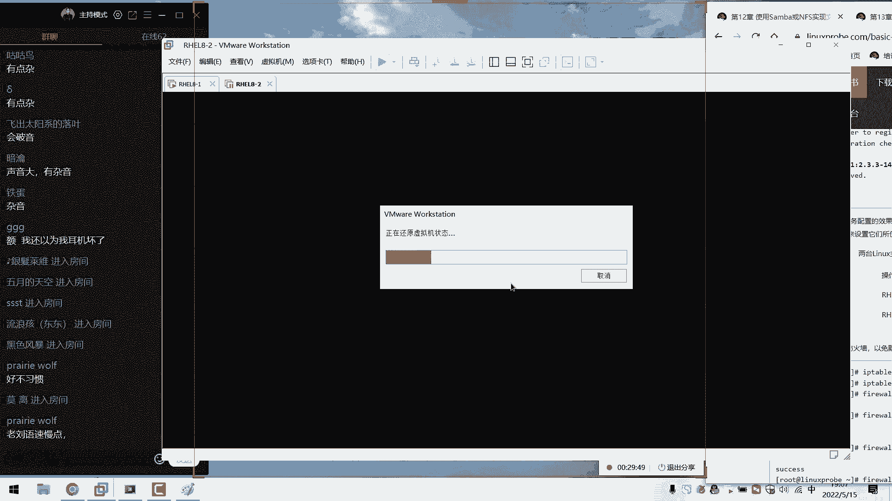
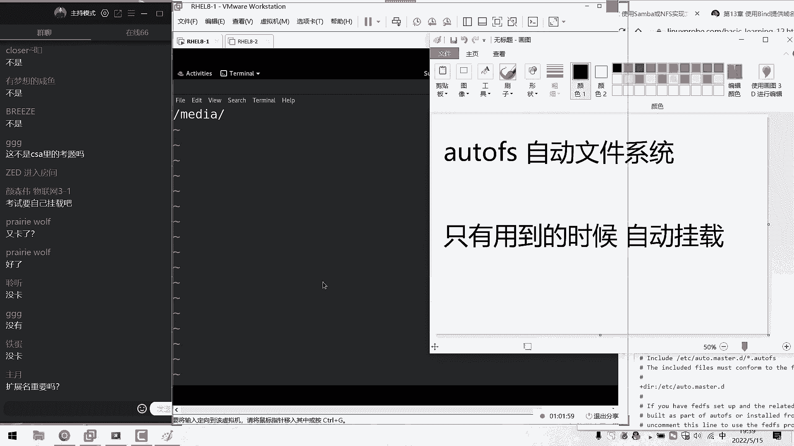
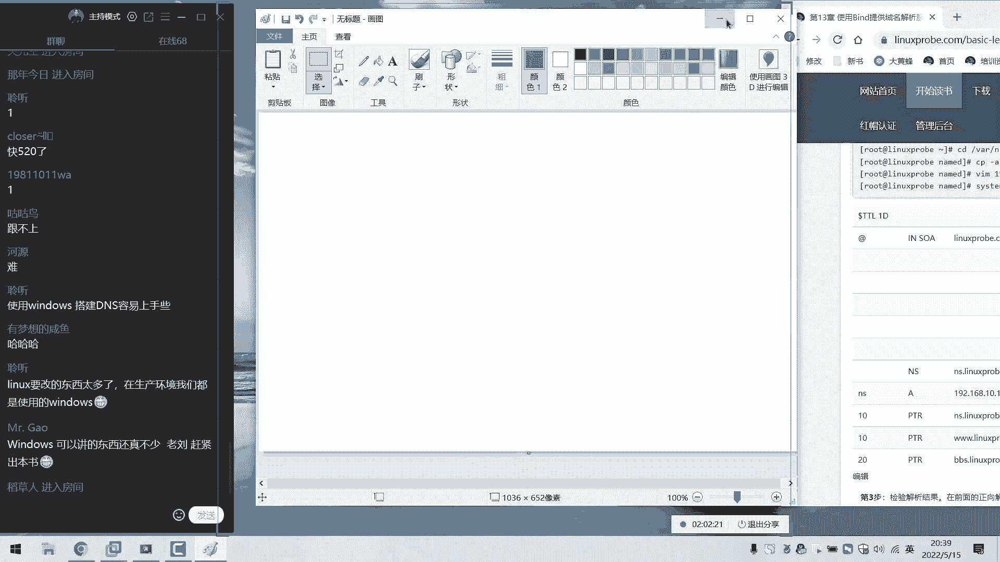

# linux就该这么学第34期 - P20：19【第34期第十九节课】红帽RHCE认证培训课程-Linux就该这么学 - 能力努力 - BV1L14y1878S

对。okK同学，那我们来开始我们今天这个课程啊，然后大家先打一下一啊，大家听得到我说话吗？然后声音是否清晰，刚才我们大概试了一下啊。😊，呃，没有什么问题。然后昨天的话呢，因为一点小问题啊，一点小插曲。

呃，所以的话呢老刘被隔离了。昨天我们临上课之前给大家发一条消息嘛，大概3点多的时候，然后我我们这边接到消息了。所以呃由于被隔离的原因，所以我们的这个课的话呢暂停了一次，昨天也是正常到了夜里。

大概呃三点半吧。虽然说从下午3点半就开始通知我们做隔离。但是的话呢，实际上到隔离呃，出发的话，到了夜里三点半了，没啊，现在没有感冒了。然后的话呢。😊，其实这个病毒离我们还是很远的。

只不过就是因为可能是同一度建筑里面的。现在北京的防疫政策要求我们呃同样去隔离，所以我们就只能是配合了。然后昨天折腾到了夜里三点半吧，然后我们出发到了北京国际机场，然后我们这边酒店住下的话呢。

大概6点多吧，然后6点多的时候已经困的不行了。然后又然后就赶紧睡觉嘛，然后开始呃收拾东西准备睡觉了，结果的话呢7点钟开始送早开始开呃7点钟的时候开始就是呃送早饭，然后就大概睡了有半个小时吧。

7点多吃完早饭呢，大概然后我们突然想到这个呃电脑里面，大家可以感觉到，记得我们这个屏幕会稍微小一点。然后7点半的左候我们吃完饭了，结果的话呢想起这个环境没有搭，大概搭一下环境，然后跑了这个虚拟机啊。

大概8点多的时候又准备睡觉了，结果的话9点钟开始测体温，然后开始做核酸。9点多，然后其实我没有什么睡意了，然后开始接复出我们这个环境，到10点钟的时候实在困的不行了。然后刚刚。😊。

这个的话呢10点半的时候又上班测体温了啊，然后10点半做呃测完体温，躺在床上还没20分钟啊，又过来送中午饭啊。然后等于说经正到了中午12点吧也没正经睡觉，然后我当时我又想了一下。

今天中午就真的不睡觉的话然后就现在吧肯定是很没有精力的嘛。然后12点的时候终于准备睡觉了。然后剩了大概有两个多小时吧，下午3点的时候又开始上门啊去做体温了。然后测完体温之后。

下午5点钟的时候又过来送晚饭。所以今天的话呢呃给大家简单去说了一下，我们昨天的一个情况，首先就是因为隔离的原因确实的话呢，昨天可耽误一天，然后以及的话呢，今天呃我们这边的话也是很多的复出了。

然后对于身体的哈这个精力上来说，所以同学们可能看到这个画面比之前小了一点点，但是大家我们尽量克服吧。然后我们这边把这个屏幕也是要了拉大一点点了。所以我待会会尽量的把文字给大家调大，然后的话大家就可以。

😊，能够看清里面的这个文字了。啊后大家觉得这个声音还可以吗？有一点杂音是吧？哦，有杂音的话，可能是因为我这边碰到了他现在使他现在用的是这个呃电脑里面自带这个呃麦克风，所以我待会我会尽量的不要碰到它好吧。

所以大家现在听到我们这个声音可以吗？没有问题是吧？那我们就开始今天这个正式的课程了，往后去讲啊，往后去讲往后的第十二章节，我们来继续来给大家去聊。首先的话呢是我们做一下简单的回忆。

我们上啊我们礼拜五讲什么呢？就啊我们虽然是礼拜五讲的，但是感觉已经过了好久了啊怎么样呢？有耳机嘛，感觉耳机声音会好一点啊，同学们是这样的，我们先做ex调查吧。同学们觉得我们现在这个声音可以吗？

如果你们觉得可以的话打一下一如果你觉得这个声音有问题的话，呃，我们再给大家调整一下，因为我这边把我这边这个麦克风拿过来了，只不过没有连啊，因为我们大概6点半的时候做过一次测试，同学们说声音还挺大的。

然后我们就然后我们觉得很伤心啊。因为这个麦克风我们可以买的600多块钱买的，结果反而不如我们今天。😊。

这个呃自带这个麦克风好了，所以同学们看一下啊，有点问题是吧？左边挡住有点杂啊，左边挡住没关系，左边大家不看，左边是大家这个聊天板。所以的话屏幕我们会给大家看，大家需要看的啊，有点杂音是吧？好。

那就这样吧，同学们我们先尽量克服。如果说实在不行了，我们再给大家换啊，再给家换再给大家换麦克风。然后我们的话呢隔离时间是10天啊，所以今天的话是5月155月15号到25号。

也就是说覆盖了咱们今天的课跟下礼拜的三天课，我们都要以这个环境来去进行。如果说您觉得这个声音有点杂，那我们就下节课吧，我们给大家调整好，然后我们再家继续今天去说有点小有有点小仓促。

那我们要给大家往后面去说啊，现来去说一下叫做网络文件共享。哎啊网络文件共享服务，我们来给大家讲一下，叫做network file system，然后来给大家讲啊NF啊然后它是一个S把这个自筛调大一点。

这是一个新的环境。所以我们要给大家打一下这个的话今天我们这个声音有点杂音，但我们。😊。

我们就把我们所啊那我们就尽量把我们所说的所有的话吧，都给大家落实到这个呃屏幕上面，大家可以来看到啊，如果听不清，也那么也能够看得清叫做稳啊叫做网络文件系统。

它的话就是说如果说我们要想去实现出来两台linux系统之间来进行一个文件的传输。那好了，我们上节课给大家讲的一叫做这个桑服务，它可以去做跨平台。

大啊大家一起说它是不是可以一起去做跨平台这样的一个文件共享啊，跨平台的文件共享。而我们的话呢当前使用的是叫做啊两台linux之间来进行文件共享的话呢，那我们则可以去使用这个服务。

这个服务配置起来就会特别的简单。那也就是说这个服务我们配置起来的话呢，会有点呃快啊，所以话大家一定要做好准备。因为大家可能还没有准备好，这个服务就已经大概配完了，因为它特别简单。

所以说如果说我们的工作的这个场景就是用在啊两台linux服务器之间来做文件共享。那么这个服务我认为是比较的呃方便的对吧？那我们来给大家操作一下。首先的话呢在红包路7跟红包热8当中，这个服务的话。

都已经是。😊。

认已经是安装过了，我们什么都不用去做，我们只需要去呃来进行一个配置就可以了。首先找到不不不不不不不，我们首先要先讲一下这个防火墙的问题吧。首先把我们这个防火墙默认清空一下。😊。

这样的话呢能够让我们的这个网络嘛以及这个防火墙的这个策略对我们来进行放行啊，这样的话呢能够保证我们从外部的用户也可以对它进行一个访问。大家要加这个参数叫做永久生效模式。

这个这个那我们这个行惯一定要那我们一定要养成啊。因为如果说我们这个配置这个我们在配置防火墙策略的时候，如果说我们没有加这个永久生降模式。

大家一起说是不是就会它有可能导致下一次重启过后防火墙把我们给禁止了，对吧？以我们要给大家加这个参数，以及加这个呃发货杠刚re的这样的一个参数，让我们配置好的这个参数的话呢，当前也能够去生效。好了。

我能够考虑到于防火墙方面的这个配置，那我就做完了。那么我还有什么方面呢？就是这个网卡方面对不对？好，再那我们再把我们能够想到这个网卡方面的这个配置信息，我们再去检查一下。

首先我们呢网卡的IP地址198试1，这也是今天连夜啊在这个上午的时候给大家装出来两台虚拟机，所以我们现在的话开启两台虚拟机。😊。

话呢都为linux的这个服务器啊怎么样呢？呃语速慢一点，语速的话正常啊，跟咱们之间的语速是正常的，老流没有换。那咱们这个实验环境换了啊，那我们来给大家往后来继续说啊，今天网那我们把网卡给大家配好了。

那么左边的话呢还是192。68点10。10，右边的话呢还是点20。那好了，我现在从右边这个主机往左边去拼一下来，我们拼通的3W，呸呸呸呸啊，说这个广告了啊，192。168点10。

10拼通像我们这个左边的服务器，能够保证我们的网络是能够互通的，并且防火墙经行放行了，我能够考虑到点，也就这么两点了。好，这是我们做这个服务之前前期需要做一下铺垫的。好了，然后第二点的话呢。

就是大家有说的杂音是吧？啊，杂音的话呢，可能是因为。😊。

我这边呢。啊，这个非常艰苦啊，鼠标键是拿一个我那个笔记本，然后再用的，可能是我在触动鼠标的时候会有杂音。这样那我就尽量少动鼠标和键盘啊，我们今天只敲需要该撬的东西。

可能我一敲这个键盘可能它就会有点彩杂音吧？大家现在听我说话就没有杂音了吧。那我就尽量我那我就去少碰啊，咱们多说，咱们少碰啊那我们来给大家往后面去看一下那我们来继续呢我们想一想该配那我们想要怎么配置呢？

在配置这个服务之前啊，我们要首先要还有一个目录，这个目录的话是用来去共享文件的。比如说我想要去共享的这个文件的名称啊，我想去共享出去一个文件夹嘛，那么两台服务器都是那好了。

那么这个目录的名称叫哈哈好了来我现在出来一个目录叫哈待会用来去做文件共享的那然后的话呢我们再进入到这个目录当中，进入到这个目录里，那进入到这个哈哈的这个目录里面再去新建出来一个文件。

我们便给大家取一个名字叫读我点t，我们随便往里面去写。😊，信息待会我们的话呢这个用户就可以读取到里面的这个内容了。我们来去简单做一下做一下我们这个小的测试嘛。点一下WQ叹号保存并退出。

这样的话呢我们的这个文件就已经保存好了啊，怎么样ok没有啊没有问题。来那我们另外大这个声音尽量大一点啊。今天我们这个声音大一点啊，我们这个大家应听，因为应该应该问题不大啊。

我们话就是着重去听我们这个内容吧。大家可能对这个音效的话呢，可能其实不如我们之前那个了，毕竟那个之前花钱买的啊，那个麦克风特别好来我们继续来继续继续。然后我们来编辑好这个文件，我想号是可以做的啊啊。

一想，那我们把这个防那我们把这个呃网络配好了，防火墙配好了，文件也有了。那我觉得这个文件好还不太够，对吧？因为当前的话呢，所有人那我们再当前其他人可能是看不到的。

所以我们再把这个目录的这个权限给它改大一点，然后我们就能够做完了，在配置这个服务之前能够做的一些切机铺垫接下来我们来讲一下。😊，我们的啊网络文件系统怎么来进行配置？那么我们的网络文件系统的话呢。

是在一个配置文件当中来进行编辑的。这个文件的话，大家来记一下这个文件我们默认进入之后里面是空白的。但是的话呢这个里面它实际上保存的是我们一起说它是不是我们的叫做共享信息啊。

就是我们要想去共享出去什么样的一个文件系统，就是我们要想去共享啊，那我们啊要想去互享出去什么目录，那我们就把这啊那我们就把这个信息，按照一定这个格式写到啊那么来去写入到这个文件里面。

那我们来去敲一键回车，我们给大家去赘述了一下啊，主要原因就是大家看清楚这个文件的名称，不要少敲那个小啊不要少敲这个消写S。因为的话呢它里面这个内容都是默认是空白的。如果大家敲作一个小写S的话呢。

看到这个内容也是一样的，它也是空白的。但是锁定的文件一起说是不是不一样啊，吧？因为现在老刘队现在其实在格离酒店啊，现在在格离酒店里面，所以我我们现在的话呢也看不到别人了，所以我们现在特别的希望。😊。

同学们能够你们去互动起来，能看到点人气儿啊。现在已经我估计可能未来半个月也见不到人了。所以今天我们就是讲课的时候吧，大家跟我们能够互动起来啊，能看下点人气儿啊。那我们来往里面去写。首先的话呢。

第一列写的是我们这个共享的这个目录名称，那我们再来做答这个哈哈。然后的话呢我们下面再来后面写的就是允许谁来对我们来进行访问。大家大家理解一下啊，这个指的就是要想允许谁来进行一个访问。那么还有三个写法。

第一个写法就是一个星号代表就是所有人的话呢都可以去访问我们这个共享的一起说目录，对吧？然后第二个写法啊，就是我们单独去指定某一个主机，例如说192。168点10。20。好了。

我单独指定你你啊这个用户可以啊这个主机可以去访问我们的这个目录，这是第二个写法，还有第三个写法是什么呢？把最后这个主机位，我们改成一个星号，代表就是这个网段用户可以去访问我们的呃共享信息。

这就是说我们有三个。😊，那好了，我现在的话呢就只允许我们的另外的主机来进行访问，这样的话呢也更加安全了。那么也就是192018点10。20这样去写就可以了。后面的话加了三个参数，第一可以读，可以写啊。

我们要给的这个目录的话，一定这个权限，叫叫叫做这个通配服非常好。😊，第三章节啊，学到这个通背符就用上了。首先的话呢可以读可以写一个R一个W。然后接下来的话呢叫做同步。😊。

叫做。啊，再落的话呢，我们把这个呃写的这个信息实时的同步啊。😊，SYNC它是啊他会把我们这个呃网络它它进行一个呃共享信息的话，他会把这个信息的话呢，直接的去使入到我们的硬盘里面。

这样的话呢来进行一个实时的同步。然后这样的话呢避免说这个服务器突然间死机之后造数据的这个丢失啊。然我们写第三个参数叫做对于我们的管理员的一个映射啊，把它映射成一个普通的一个管理员啊。

叫做我那我们先把它写全大家我们其实前两个参数大我们还比较好的理解啊，但的话第三个参数其实很同学还不太理解说为什么要我们要把我们的管理员映射成为一个普通用户呢？我们来给大家举一个技术上的一个例子啊。

再给大家举一个我们这个生物上的一个例子。大家想既然说这个服务的话呢，在作用的这个呃对象的话呢，是两台lin的这个服务器。那么好了，既然是那我们既然这个啊所有的这个主机就是同一个系统。

那么它的关联的名称的话，他们也都是一样的。那么请问如果说我们现在由客户端的管理员啊，那么来去访我们的服务器的话呢，我们的管理员超级录取用户能否。😊。

去管理那台主机里面的这个信息呢，这个可能呃听起是呃听到这我们听见啊那我我们会觉得比较抽象啊。但我们再给大家举个例子，就是啊如果说对方使用的是一个管理员的身份来去登录我们这个服务器。

那么他除了可以去使用我们的规定的这个目录里面的这个信息。他是否能够去跳转到其他的目录呢？或者他可以去编辑我们啊我们里边的话啊做的这么一个文件信息吗？这是不可以的，对不对？

因为大家想如果说我们现在这个目录里面指定的这个用户身份，归一个普通用户所有，那么好了，那么当有一个关那么我们都有呃另外一个人使用管联员的这个身份来登录到我们这个服务器的话，那么他使的是什么身份呢？

他使用的还是管理员吗？我那我那我们认为不太安全了，所以我们需要把这个呃管理员的话呢，映射成一个普通的一个身份，这样的话呢，他只能够去做文件的共享，他不能够去做一些预计的一些事情。我们理解来讲的话。

有点类似于叫做劳动机制，叫做这个chan rootot。但是的话呢又比较轻量级，我们简单。😊。

可以这么大去理解啊。另外我们还一个小例子。如果这个记住这样的例子，当家因为啊那我们听起来很绕的话呢，我们再给大家举一个例子。比如说我们的隔壁的这个邻居啊，这个朝鲜啊金正恩，对吧？那比如说那个小胖子。

他他那么他他如果来到中国了。那么请问他能不能去调用中国的一些，比如说呃钱呀军队啊这些资源呢，其实还一想也知道，那肯定不可以，对吧？虽然说这个金正恩他在他的这个朝鲜国家，对吧？

那肯定是那那么他具有一个最高权限，但是你来了我们国家了，他那边他变成一个客人了，对吧？他就不能国再去行使，他原先在他们的国家行使的一些权利了。所以需要去保证我们的本地的一个安全。

所以要把对方的这个管理员的这个权限的话呢，进行一个降级，建成成一个普通用户这样的话他他会更加安全那我们现在做好之后点一下这个保存并退出啊，这样的话我们就做好了这个文件的话呢，大家要记一下啊。

在红包五和6里面，实际上。😊。

去重启我们的呃网络呃网络呃服务。那我们的话呢只需要去使用到这个命令就可以了，让他去生效一下。大家可以来记一下，在红包五和6里面不需要去重启我们的网络存储服务。

我们只需要去使用到这个命令来进行一个同步就可以了。但是在红包七跟八里边的话呢，那么我们还是需要去重启一下了。所以这个是一个小的一个变化。所以说如果同学们要是使用的是一个早期的一个系统的话，比较老。

那那么我们就需要去呃就是只用一个，那我们就只需要做一次就可以了。如果说你使的是7跟8的一个系统。那么您需要像我一样，再把这个给大家去启动一下我们的是不是后面加一个conserver啊。

来网络文系统conserver啊，来看一下这个对不对啊，没有问题来这样的话我们再来大家说二对？就是说我们这个不能够形取这个关联的这个权限了，其实我们在配置这个服务的时候，总会遇到这样的问题。

就是说从理论上来说肯定是不可以的。但是我们该怎么来进行限制呢？这就是我们要去加参数的这么一个目的了。来。😊，这个是什么意思啊？我们这个代表就是去同步一下这个文件里面，它所对应的这么一个共享信息啊。

环节变量不对啊，呃它是代表就是我们去同步一下这个文件里边，所有这个共享信息，等于说它有点像是reload的这样的一个操作。好，接样的话我们再来我们需要再去重启另外一个服务，它这个服务的话呢。

目的是让我们的用户能够去读到它所共享出去这么一个信息，然后我们才可以进行一个挂载，也就是说我们去启动这个服务之后，对方就可以来对我们进行一个探测了。

知道我们有啊那么知道我们在我们的本机有哪些可用的这个共享信息。那我们都这么做好之后，下面干嘛呢？下面我们就可以进入到这个客户端了，大家可能还没有感觉到啊，那么我们可能他感觉这个服务还没有配完，对吧？

但实际上已经结束了啊，比如我们同学们啊今天是一个小太阳啊，但是这个名称我们看不到。但是啊比如同学们只要稍微来的晚一点点了，今天就已经错过了啊，这个服务已经讲完了，就这么快来我们给大家看一下啊。

进入到客户端上面进入到。😊。

那我们进入到一台客户端上面，他只需要做三个事情。第一个事情新建出来一个我们的挂载点，叫做哈哈。哎，就是说我们要给它挂载到我们的本地的什么目录下。来第二点的话呢，就是我们要想去挂载一下那个信息。

那么就要去直接去输入一个信息进行挂载就可以了。但是我觉得话有点乏味。就是我们假装说先不知道他在主机上面有哪些可能共享，这样的话呢，我们增加一点趣味性。

我们方去使用到双mount命令来去探测一下说对方主机上面有哪些可能共享一个杠享后面我们写上这个服务器的一个地址，192点啊168对吧？168点10。10来看来今天确实没是足啊。

这个地址都已经说了这个地我们说了好久了，居然忘了来来去探测一下，说对方主机上面有哪些可能共享，在我们工作时候也是这样的对吧？如果要是我觉得哎等一下啊，一下，他说网络不可达啊。

那我们先不挂那也就是说呃在我们工作的时候也是这样的。如果要是我们不知道对方主机上面有哪些可能共享，那么我们就可以。😊，去使用到这个双mount的话呢，先去看一眼。这样的话呢我们就可以知道有个数了。啊。

我看一下他说的话呢，我们的呃不可达啊，他怎么样呢？说掉线了啊，画面没了是吗？啊，稍等一下。😊。

喂同学们，现在听得到吗？呃，难道是喝水时间吗？来，同学们打一下一，现在听得到我说话声音吗？是不是老天爷得给我们机会一下，我倒去倒杯去啊去倒杯水啊，网不太好，稍等一下啊，那我马上回来。😊，好，好。

那啊吃好了是吧？那行，那我们来继续吧。😊，O同学们，那我们来继续那我们来继续继续继续呃，如果说再卡好不好？大家马那么大家啊就马上告诉我，因为我们这边的话又准备一个无线网卡都已经准备出来了。

马上可以切换啊，只需要一秒钟的时间可以切换过去。所以如果说您待会再卡了，或者说您觉得这个网络的话有点波动的话，随时告诉我随时话这个可以解决。来那我们讲到哪了啊，我刚才讲到的是哪卡卡了啊。

讲到这两个服务吧，对吧？那我们讲来一遍这个服务的话呢目的就是说啊那我们需要把这个服务给加起来，这个服务的话呢，我们的目的是让我们的这个对方主机能够去探测到我们有哪些可能共享。但是的话呢我们去试了一下啊。

好像没有成功192068我们现在我们的本机去尝试一下192068在我们的本机探测一下，本机能够看到共享出去那一个信息。但是哎但是啊在客户端上面是看不到的。在我们客户端上面是看不到的。

是没有看到这个共享信息。所以的话呢我们理解一下，肯定还是这个防火墙的问题来我们判断一下这。😊，原因啊还有防火墙没有开全，我们的话呢还要开启叫做RPC band，我们就要把这个探测服给它开启。

开启这个服务之后，唉，非啊非常好。防火墙那非常好。这个思路我们一定要有来，我们来看一下RPC band。他说的话呢，RPC已经不存在啊，那就是RPC啊，我看一下啊，名称还真忘了，没关系。

我们来看一下这个啊我们这个服务的话不丢人对吧？因为这个好家不配了，我看一下啊RPC刚的哎这个天猫老来了也没错啊，这边有一个减号，不好意思啊，同学们不好意思啊不好意思啊。

忘了忘了它不叫做啊它的话呢是有一个减号了，他需要加一个减号。你说这玩意儿这个确实不好记啊，来RPC的后来的话呢再来一个叫做mount啊，这个指的就是让对方主机上面能够进行一个远程的挂载。

当然我们这两个服务再开。哎，这个时候。😊。

就是再也没有什么问题了，就肯定就行了。我来再给大家开一下啊mount，然后我们去让它去重新去加载一下to个栏，让它重新去加载一下我们这个生效文件，它当前生效，重启之后也生效。😊，哎呀。

想操过了没有但是没有找到那个刚刚reload。还真没有好吧，大家继续啊自己的键盘啊，就是啊所以就为了省所以就就为了省事了啊。来，那我们去重新去启动一下我们这个网啊重新去启动一下我们这个防墙。

然去重新下载完过后的话呢再去查看一下，大家也看到，那么就可以查看到了。就是说当前的话呢客户端啊，就可以去获取到我们这个服务器上面有一个共享信息，恰巧的话呢，他说我们共享了这个主机的话呢，是10。20。

好了，那我那也就是说我又正好是10。20，所以我就可以把这个信息的话呢，给挂载到我们的本地刚才说有三个事情，大家记得吗？我们刚才说有三个事情。第一个事情的话呢是什么呢？啊，那我们需要新建出一个挂载点。

对吧？第二个事情的话呢，我们就可以直接去使用它慢脑来键挂载了。然后我们对应的这个格式的话，大家一定要记清楚，就是它跟桑码是有区别的啊，我们直接这么样来进行一个操作，看一下啊，刚T指的是我们这个协议。

然后我们的网络文件系统，后面的话呢是我们的服务器的一个地址，192。168点10点。😊，好，大家需要注意一下，就是我们再去挂载这个s巴的时候，它有两个啊那么话它要是有两个斜杠的。而挂到我们这个服的话。

它是没有这样的两个斜杠的。大家一定要记住啊。然后后面的话呢指的是我们挂载的是我们对方服务器的一个路径。它的话呢，在sma的时候挂载的是我们的唯一的一个名称，对吧？

大家还记得就是它的个啊它的我们在挂载这个sma的时候，挂载是这个中国号里面的一个唯一标志符。然后的话呢，它里面是一个啊它会啊它这面话会有一个呃共享的名称。而我们现在的话呢。

当前是写的是对方主机的一个共享目录名称，所以大家一定要这个有啊是它是有它是要能够去区分一下的。这个的话是远程的这个目录的名称。而我们下面的话呢，后面再写一个我们本地的一个名称，这样做完之后。😊。

又没了啊，大家不要吓我啊，同学我啊同呃同学们我们还有吗？啊，我们还在吗？同学们打一下一，今天可能需要大家多呃辛苦一下啊，今天大大家可能需要多辛苦一下。😊，OK继续来，我们没有问题是吧？好来来来来。😊。

哎，我们还在就行。呃，如果就是网络卡啊，这个可以解决可以解决啊。来我们能够把想到的呢今天们都给大家做到了，都给大家想到这个备用方案了。来，我们现下来去挂载一下。他说的话呢，网络不可用。哎。

你这个问题我还真没想到啊，192。168啊，果然少打了1个6啊。😊，哎呀，不了不溜了。来，我们点一下168。那这样的话，我们做好之后来DF杠H看一下，就是能够把我们这个信息的话呢挂到我们的本地了。

这就是我们第二步需要做的事情。然后的话呢，同样哎可以去进入到我们这个目录当中，查看一下。刚刚的话呢，大概就是在7点20分的时候，对吧？啊？7点15分的时候出列出来那个文件，看一下文件里面的这个内容。

确认一下，没有问题，证明一下说我们这个客户端跟服务器能够去同步信息了啊，也是没有问题。来，我们接样的话呢再来。😊，编写最后一个文件。第三步，要让我们的这个文件系统的话呢。

一直能够去挂到我们的这个服务器上面。要不我们一直提供服务来编辑一下这个。😊，system文件来对它进行一个配置。首先的话呢是这个远程服务器的一个信息。这样我们写好之后，下一次重启多少次了啊。

那我们下一次再重启多少次，是不是都不我去可去使对吧？自动帮我们载家个问题说我们的话我们唯一现的主机名称I地址可以？可以的这边可以写域名那我们一定要记住就是配好了。

那我们就可以去写域名呃只不过的话我们第十三章节待会大家讲以在所有都是以I为准的。但是实际上我们在很多的服务器配置里面我们的域名主机名这个地址可以互换的大家说我们的客户端不需要去启动这个服务？

这这个服务需要启动不过这个服务默认启用了红78里我们是不用再去配置的以大我们会把有另外一个名称啊我们所说网络系际上也以给大另外一个。😊。

大家会觉得这个感觉没有配置完配完了，对吧？这个的话呢我们也有一个其他的名称叫做呃极品飞车，对不对？叫做这个速度与激情呃，need for就是说速度与激情啊，就是我们配置前的话特别的快。

我们需要的是一个速度，所以我们配置起来的话呢特别的快。这我觉得这个名称的话呢也很好记吧？来我们继续来继续来家写下来这个目录的名称，我们呃远程的服务器的话呢，共享的目录是哈哈。

然后的话呢我们的这个共享的本地目录的话呢，我们也是叫做哈哈本地报家点，然后我们的本那我们的本地的这个呃格式我们给大家写下来，然后话de权限默认。然后接下来我们选择00不要备份，不要自动校验。

我们选完之后点击一下保存名退出，接下来就要去怎么样呢？就是我们的接水时间了。来同学们我现在去重启一下服务器，它会自动帮我给大挂载上同时我去倒杯水，一定要冒号吗？一定要冒号。

必须要冒号它监跟我们的服务器的一个地址，以及我们这个。😊。

他去啊他他去监顾我们这个服务器的这个地址以及我们所对应的一个目录的，所以我们一定要给他写下来。好呃，看一下已经进来了是吧？那待会等下一把吧。那我们下一把的时候再去接再去接视啊，已经起来了。

然后我们来继续给大家见证一下，咱们新不先，咱们动起来今天看今天感觉这个老刘这个话有点多啊，我估计可能下礼拜的时候可能就会开这个哎可能就会开摄像头了啊，因为可能突然见不到人了，觉得非常的寂寞。

所以我们下一我所以我们下周的时候，我们看看能不能有没有条件把摄像头给开开，咱们可以换一种讲课形式。哎，然后我们来去呃我们来去看一下我们当前这个挂载信息，呃，现在的话呢我们呢刚才挂载信息里边看一下。

还真哎没有了，不可能啊，我看一下啊，没有画载上，稍等一下，果然是所以有些时候吧我们尽量一定要去重启之后进行一次检验。呃，检验一下他有没有成功，检验一下他没有成功，所以心亏重启了一下。😊。

要不然的话这个就被糊弄过去了。来，我们秉承着对大家负责的态度啊，看一看是哪出了问题。来看一下啊，192。168哎，点10。10，这也不能再错再错的话就是脑子问题了啊。然的话呢我们的冒号。

我们的本然后我们的这个服务器的一个路径本地的路径，然后默认权限00没问题啊啊，没问题没问题来怎么样呢说可以看到帅箭老流了啊，9点像是我们的托啊，同学们你们说有点假啊。

这样别人的这个呃其他学生一看好像是我们的托了，这一看就是糊弄的啊，啊这大家是来去等稍稍等一下稍等一下啊，抽点问题。我们还是我们还是比较要脸的，现在出个问题吧，我们尽量不要糊弄过去，正好原因找原因啊。

找找找找一找原因啊，来再重新再挂载一下。现在去选择命令来再去做一下挂载我们的我们的NFS文件系头，然后是192。68点10。10。然后的话呢我们。😊。

本机的这个，然后去远程的路径，以及本机的路径。你看哎。😊，也不行了。不能够啊，稍等一下啊，看一下mountt杠T，然后NFS192068点10。10。😊。

为啥为没还是没跟他啥，为啥他不行了？192068，他说网络不可达，对网络不可达可能，应该呃他不能不他不能不打呃，他他不能打不了啊。因为我们这个网络配好啊，这个防火墙也配好了，不能够啊，稍等一下啊。

同学们看看是哪出的问题啊，不按套路出牌，今天这个上来先出师不利啊啊，昨晚上我就就觉得已经到头了，结果今天更不利来。😊。

呃，稍等一下，嗯，学出点废话来掩盖一下老老刘心中的这个。😊。

呃，尴尬啊，今天我们来看一下来虚拟机的网络打开看一下，我觉得不是这个问题。来192068点10点10，哎，网络怎么不行了？我的我的网卡呢哦，朋友我知道为什么？哎呀说一下原因啊，说一下原因。

我们今天的话呢这个问题啊，它不是出现在了我们配置这个服务上面，它出现在了我昨天被隔离的这个事情。昨天的话呢我因为被隔离。所以的话呢我们的那个啊I9的1二代的，我们的3IA内存的一个外星电脑吧。

我那我们这没有拿，所以的话呢我这两个虚拟机是今天上午的时候，然后的话7点多的时候搭出来的。我少我当时配好了网卡之后，我少改了一个参数，我想起来了，同学们原谅我，我想起来了。😊，早起来实在脑子太懵了啊。

太实在太懵了啊，睡了再睡了半个多小时，我们少改了一个参数，网卡的自启动on boot肯定是没有开启，果然是on boot没有改成yes。所以的话呢我们刚才重启过后，那个服务没毛病，但是网卡没起来。

所以我们给它改一个on boot等于是yes再来重启一下，再来呃再来次重启来掩盖让老刘这个尴尬啊，再重启过后就百分百没有问题了。再有问题。😊。

那就可以退钱了，真的，咱就咱就有说啊，这这这个问题太基础了，其实这个实在是太基础了啊，太不应该了来。😊。

好，等一下同学们等一下同学们，我们等他一下下。另外的话我们回答一下同学们的问题啊。然后我们坦白说，就是昨天问昨天同学们给我们登记的那个信息，就是您要在那个成都啊，济南呀考试的一个信息保存在台式机里面啊。

我们忘拿了。所以的话呢我们下周的时候就统一把。520当天会给大家约考试。所以如果说您想要在其他的省市去考试的同学啊，不好意思了，那个信息没了，所以的话呢，您你下礼拜五也来见啊也来过来上课完了。

我们这个具体时间的话呢，也要礼拜5的时候给大家在上课的时候去说了，咱们就不啊没有办法再去私底下QQ给大家去说了，所以下礼拜五的话呢，不要来啊不要现不要迟到啊，课上不上无所谓了。

但是那个约考时间大家应该听一下。来，我们开才可以看到的话，就是我们重启过后这个话呢我们的网络文系统依然是挂来到我们这个服务器上面的没有任何的问题，非常的顺利啊，挽回老留这个面子啊。好了。

这就是我们用来啊去时间出台两台类那似这个服务器来去做文。😊。

来去做文件共享这样的一个小实验。然后我们下面再给大家来去捋一捋。下面还有一个服务叫做auto file system叫做自动的文啊自动文件系统。我来给大家看一下，大家说啊怎么样呢？

呃说可以看到设计到老刘，下周一定要准上课啊，也也也还不一定啊，因为那个摄像头我不知道它能不能跳出来而且看不看人无所谓啊，毕竟长得比较丑。然后不想不想下大家这个上课的这个心情啊。

那我们给大家讲另外一个服务叫做au f s to f s，这叫什么呢？叫做自动的文件系统自动文件系统相信有多么的高级自动文件系统，那我看家解决什么样的一个问题，对吧？因为它肯定是要一个痛点嘛，是什么呢？

就如果说我们现这个服务器大家听一下啊，如果说它有一个服务器啊，然后的话呢上面挂载了好多好多的这个网络存储。就像我们刚刚一样，比如说s马也好啊，什么FTP也好无所谓。😊。

挂了很多的网络存储。那么从理论上来说，它是不是要跟那个服务器，然后进行一个数据的一个交互啊，它是不是会从理论上来说消耗我们这个网络呀，还有CPU这个计算资源呢？好了，那我们现在想一个问题。

比如说我们那啊比如说我们系统里面这个光盘光盘的话呢我那我们每天上课两个多小时，我们只需要用到一条命令，就是去安装软件的时候才会去使用到光盘里面的这个内容。但是的话呢啊但是光盘里面这个内容啊。

啊我们啊但是我我们的系统光盘的话呢，它会一直去挂到我们这个服务器上面，会挂两个半小时。但是我们实际上去使用的话呢，可能才30秒。那么它是不是也会或多或少去消耗我们这个系统这个CPU跟网络资源呢？

所以我们给大家提一个那我们给大家提出一个需求来。如果说我工作的时候，我的这个网络存储里边啊那么如果说我在工作的时候，我当前挂的这个网络存储吧，特别的多，有几十条上百条那我觉得它消耗我这个系统的这个资。

😊，我能不能说只有当我需要用到的时候，他才帮我们自动去挂载呢？就是说只有用到的时候，哎呃呃只有用到的时候，然后的话呢自动挂载。那这啊那我们话这个多好呢？对吧？凭什么没有用的时候。

则不会相耗系统的这个资源他只是当用到的时候才会去啊自动挂载，这个挺好，我觉得这个的话我们把它叫做自动的媒电系统，咱们来给大家来去操作一下啊，大家说怎么样呢？说啊按照需要来进行挂载没毛病啊，共产主义了。

是不是啊我们来按需分配啊，那我们来看一下啊，下面的话呢我们来去找到这个服务来从对我们先去还原下这个虚拟器啊，把这个虚拟器还原到一个最初始的一个状态。这样的话呢，保证我们的每一个实验之间都是相互独立的。

这样的话同学们以后再去配置的时候，是不是也能够从零开始去配呢啊，非常好哎呀老刘现在已经出现这这种迹象了，现在这个太多了，比如说我们之前的话不太严谨了啊，不太严谨的不太严谨了啊，我们来继续啊。😊。

来去安装一下，叫做auto FS来安装一下稳自动文件系统。但是我们说实话啊，这个服务我们常用吗？说实话我不常用，为什么呢？因为我就那么几个这个服务器，我来我用为我来回来去也就那么俩仨。

那你说这个给大家配置一个这个服务吧。😊，你说不消耗我这个网络存储的这个资源了，那我这个服务跑起来，它也需要消耗系统的这个资源。所以同学们要讲到什么呢？性价比问题。如果说我们就那么俩仨像啊。

就像我们一样啊，没有必要了。如果说我们这个网络存储有个10203050那这还是划算的。所以根据需求来去说那根据我们这个需求决定是否来去使用来我们来按一下回车来进行一次安装安装的话呢。

我们还是点一下这个Y，然后大喊一声东尼啊，然后人家外边以为我们里面发生什么事了呢啊，但人也不敢进来看了，来我们卡了好那我们那我们就喝水啊，对同学们现在好了吗？啊，有没有卡顿的情况。😊，哎，我们来继续啊。

没有卡是吧？来，我们来继续。😊，呃，那我们来继续继续。如果卡没卡，大家一定要告诉我啊，因为有同学说卡了，但是大家还不说话，我还以为大家都卡掉线了啊。那同学还算是是网络比较好的，还能够发出来信息呢。

所以同学们一定要告诉我一下啊，我们呃一定要告诉我一下。😊，我们来呃共克时间，在一个关键时刻啊，把这个课给大家讲好。呃，然后的话呢我们来去配置一下我们这个服务。这个服务的话它分为两个文件啊。

第一个文件的话呢，我们是把它叫做ETC目录里面的auto键master。其实有文件后面说的是这个是什么文件呢？它都已经叫master了。所以我们其实很好就能够猜出来，它叫做主配置文件嘛。

大家看一下它都已经它它都已叫叫master了，所以它肯定是叫主文件了，它就是我们这个服务的一个主配置文件，但是我们要给大家捋一下思路是什么呀？主配置文件里边大家起来问这个问题啊。

请问主配置文件里面是否啊是否包含了所有配置参数呢。这个小问题啊送给大家。请问。😊。

主配啊主配文件里面是否包含了所有的赔偿信息呢？大家告诉我一号就配了。嗯，然后今天的话我们不仅是互动啊，要给大家回答一下问题，呃，复习一下之前所讲过东西，还有就是看大家有没有卡顿呀。😊，喂。

然后他他他他并不是对不对？因为的话呢主配置件里面。😊，包含的是最重要的配置信息，而并非所有的。我们来敲一下回车。果然这个里边的话呢，实际上只是一些定义。

定义了我们对于某一些目录的一些呃配置文件所保存的一个路径。比如说我来给大家演示一下啊，比如说我们现在想针对于哪个目录来进行操作。那我就我们我们就把某个目录的话呢。

写到左侧然后的话呢针对于这个目录里边的这个配置文件的话呢，我们写到右边来给大家去操作一下，稍等一下，我把这个这边有纸拿走一我们会产生这种声音继续来我们来看一下这样这样这样大家不说这是，这是我们S考题吗？

哎，这还真是考题啊，还真是考题考多了他最开始考的时候是在20122011年2012年的时，们当记得是红包开始发布的时候，他就开考到了。所以这个的有年头了。

大概得考了13年了啊大概得考了12年或者13年了，这个时间其实很久了我们来去给大家配置一下。比如说我想它自动挂载的是什么。😊，目录呢我们给大家解下一个目录的名称。

我们要针对这个目录里边的自动挂载信息来进行设定。那好了，我们这个呃我们这个信息的话呢，就以这个文件里面我们来进行定义。也就是说呃我们要针那我们要想针对于这个目录里边的挂载信息来进行自定义的呃。

这门给大家进行一个配置的话呢，那么具体的这个配置信息并不是写到我们的这个。😊，哎，主文件里面它的话呢是写到这个子配啊，它它是有子配文件的话来进行一个调用，就相当于就是说我们呃买一本书，对不对？

那么比如说我想学习某一个章节，并不那我们需要先看一下目录啊。然后然后的话呢我们的目录会去指向一下它的具体这么一个哎页数，这样的话等于说它是进行一个指向的一个作用。具体里面这个文件的内容的话呢。

我们需要再行行一个编辑就可以了。好了，那也就是说针对于这个目录里面的这个信息，我们来针对于这个文件里面来进行填写啊，在这个文件里面去填写对应的这个目录里面的挂载信息来我们来保存并退出啊，又卡了。

没有版公学啊又好了是吧？好，我们来继续来我们今天的话呢呃来看一下看一下今天这个酒店还可以啊，今天店还可以。然后我们今天因为特意安排了一个网络比较好的一个环境。可能住述环境一般不但是防译啊，咱也不多说。

反正就是网络肯定没毛病啊。来我们来继续继续继续啊。😊，同学们大家不要吓我啊来，我们来这样啊来编辑一下呃，找到我们刚才所定义好的这个名称，一定要跟我们的文件里面的话呢保持一致的啊，一定要是保持一致。

然后的话呢我们来敲一下回车啊，然后来进行编辑。既然说我们要是针对于我们的media目录里边来在这个外信息来进行一个控制。那我们前面已经定义好它这个上一级目录了。所以我们要想针对于这个里边。

比如说某一个目录，我看看是谁迟到了啊，我看看谁迟到了啊，大家后大家说后缀名重要吗？不重要啊，并不重要。在红包任6里边的hold缀名必须是MSC结尾的，但是在红包日七跟八里边无所谓啊，可以改可以改了啊。

现在可以改了。来比如说我看谁迟到了啊，我看看啊Z同学迟到了啊，ZZED迟到了好了，我就这么去写啊，如果说我想要说我们去访问这个目录的时候，他帮我们自动挂载一下我们的这个光盘，那好了，我们就这样去写。

那么由于前面已经定义好了，它所对应的这个哎上一级目录的名称，所以我们只需要去写它里边。😊。

目录的一个名称ZD就可以了。好，这个名称有意思啊，像是一个好像很眼熟啊，好像是一个电影里面的一个角色名称，对吧？来，我们来继续啊。来首先写下这个目录的名称。

后面的话呢我们写一下 systems指的是文件系统的一个格式，然后我们写下来啊9660为光盘格式来们然后的话呢可以读然后但是只能够读，然后这样起来就可以了。

后面的话呢指的就是我们的这个灌载目录的一个名称啊，那也就是说我们具体设备的这个名称，第V目录里边的C room给大家解什么意思啊。

也就是说当有一个用户他去访问了一个叫做media目录里边的CD的一个目录的时候，那么就会自动的以这个格式以光盘的格式，以纸如的形式去挂载我们的光盘是这样的一个效果。其实难吗其实我们捋一下思路的话。

并不那么的难啊，来点一下这个保存并退出做好之后怎么样呢？第三条要想让我们配置过的这个参数能够收效的话，我们需要去从启他。😊，对应的服务啊，即便为啊即便连率气的老刘也不例外啊，来去system。

然后是restem controll restart，然后是au fS啊，这个都要这么去做啊，没有例没有例去然服务话加到行程当中保证我们下S的还依然能够有效考试的时候这个肯定错不了那这个都扣不我们的分这样做好之后我们就可以来尝试一下我样我先把我们当前这个光盘给它卸载掉这样的话们了让这个验更加个准确到时我们这个挂载目录没有被定义啥意思啊。

说啥第V目录里边呢啊S20我个默认有挂载了是吧？已经卸载掉还觉那我给大家操作一下首先证一下奇迹了进入到我们的目录当中，然后看一下当前的话的这个目录里面没有任何的文件。

大家可以看到啊没有任何的文就不是流传。😊，给大家演示一下。😊，这证奇迹的时刻了，进入到CED目录当中，没有任何的目录。然后的话呢就进入到这个目录里面，不仅能够进入成功。

里边的话呢还能够看到所有的光盘里面的这个信息。因为的话呢，光盘已经帮我们自动的给大家挂载上了，这个我们就把它叫做自动的文件系统。当我们需要用到的时候才会自动去挂载上，平时不会消耗我们系统的这个资源。

这个叫做自动文件系统啊，大家可以来去呃心理人员来去盘算一下。看看我们的公司值不值得上这么一个服务。如果说就这么像老刘一样，两这么两个三个服务器，那可能无所谓。如果说真的是挂了几十个服务的话。

那么就可以跟老板去申请加工资了啊，这就是。😊，又提升效率的这么一个小的方面。那我觉得还是比较好的。好，然后后我们来给大家说一下今天这个重头戏啊，我们前面的40分钟啊，一般用不上也不一定啊。

也也也不太一样。主要看我们用户的这个需求。可能同学们现在没有用上，但以后就啊当然我们以后可能会用得上。然要是这样的啊，今天的话我们的前面40分钟主要给第十2章节话了收了个小尾巴。

我们今天这个重头戏就要来了。第十3第十3章节DNS啊，第十3章节的话呢，是我们整本书里边最难的一个章节啊，很难有之疑。第十3章节巨难。我们来给大家啊需要下功夫来给大家去说。

但是我们只要卖过第13章节这个坎了，后面这个东西就会很简单了。所以呃同学们会戏称说第十三章节听完之后想要掉头发啊，想要去抓狂。所以同学们不要太大心理负担，我来给大家多说两句啊。

就是第十三章节配置的是DNS配置DNS的话呢，说实话如果同学们说opS用的几率并不大的话啊。😊。

DNS你就可以把它放弃了，就是不用它就是在我们工作的时候的话呢，几乎是不用配置DNS的，就是我们自己配置1个DNS几率太小了，配置一个我们的文件传输服务。

配置一个我们的呃网站都有可能在配置1个DNS这个几率反正是我是很很少，好吧。所以但啊但是我们第十三章节，今天啊经过我们这个学习的过后，同学们会对于这个网络的支持，有一个呃更加深入的一个了解。

以及知道我们在这个路由器里边这个小盒子里面，到底怎么来去运行这个DNS服务的，会有一个很深入的一个了解。所以我们要求今天这个课的话呢，实际上。😊，是只听大概啊不用记参数这么一个水平就可以了。

然后这个的话呢考试的话呢呃在我们的红帽HAC里面是没有了。然后呢，在我们的红HC里边的话也没有他只在HC里面，他考到过一次啊DNS之看7没看明白啊的话再试一试。然后话我们就是这样的啊。

在这个红帽HC里面是有过呢。其实C的话有没有有里面有啊401啊里面是考到了在红包啊这红包卫星网络里面是考到它了。然后的话呢。

但是在201几年2014年的12月份的结啊结果在话在啊2014年的12月份就没有了啊，就是再也没有了，就是2014年的12月份以后，我就打，12月份以后就再也没有了。

也就是说红帽的这个所有的考试当中对于DNS这个考核权限下架啊，权限下架这么说什么原因呢？就是说大家要去别的培训机构啊，花了多少钱报名肯定是不着它的。😊，啊，肯定是学不了他的，我们就。😊。

来给大家增加一点扩展知识了。他说为啥没有啊，他不他并不重要吗？呃，主要就是在我们企业当中可能配置的比较少，而且的话难度确实有点高。它并不适合于我们的RCE这个水平去配置。他其实他觉实。😊。

确实超纲了确实超纲了。以前C里边也只考到了就是这个正向服务器，他也只看到他只考到了这个主服务器的这个正向解析，然后配置一下就可以就可以了。而我们今天的话会给大家讲这个主服务器从服务器缓存服务器。

这就是三种服务器类型，然后的话在我们这个主服务器和从储服务器之间配置一下TSI个加密然后在主服务器跟从属服务器之间互作正反解析。然后最后的话我们要给大家去做一叫做这个分离解析技术。

就是相在就是一个CDN我们今天解析来一个大全套啊给大家一个大全套给大家看个到到底我们这个DNS它能干点啥说这么多废话啊，给大家归起大家这个兴趣了啊。咱们学习的时叫有兴趣。

然后正是这个上主题DNS是个啥呢？DNS我们俗称叫做域名解析服务给大家下来今天双我们今天这个声音老卡。我给大家录到我们这个主页上面DNSDNS做name server吧？域名解析。😊。

服务器哎，这个的话这边用来去做域名解析的。我们同学们呃回忆一下，我们用DNS的这个场景是啥呀？是不是我们平平时去访问网站啊？比如大家去经常访问的一些什么网站呀。我们大家知道啊。

我们现在一个主流的大家都非常喜欢的一个网站啊，那我每天都要去访问的一个网站叫做3W点lin点com突然打一广告啊，猝不及防啊，猝不及防啊，这关插路出发呀，来我们啊在我们上网的时候，我们去输入一个网址。

去输入一个域名就可以去访问到一个IP地址呢？大家有没有想过一个问题就是。😊，为啥？因为我们的互联网里面，它是基于了公网的IP地址来进行传输的，它基于的是1个TCPI的协议，对吧？这个没毛病。那好了。

为什么我们可以输输一个域名就可以访问到对方的对于这么一个啊，那么就可以访问到对方的服务器呢，而对方的服务器一定是1个IP地址啊，就是因为有一个啊服务器。

当我们去做的这个域名以及对应的1个IP地址的这么一个解析工作了。那么这个解析方式的话呢，我们给大家解释一下。哎，之前我们是啊只是一个使用者。今天我们是一个管理员，所以的话呢我们需要。😊。

给大家来去捋清一下。呃如果说我们要把一个域名，然后我们解析到一个IP地址上面。比如说这么一个地址啊，大家地址肯定不对啊，那也无所谓。

比如说我们现在话要把难道比如说我们现在要要想把一个域名解析到一个对应的IP地址上面这样的话呢我们把它做那我们这个时候是把那我们是把它叫做正向的解析服务来大家记一下啊。

如果说是不将一个域名解析到一个IP地址上面，我们则把它做正向解析服务。如果说是把一个地址的话呢，解反向解析到一个域名上面啊我们要说出来啊，那么则把它叫做反向域名解析。来大家记一下。

域名转地址这个话我们叫做正向啊地址转域名，我们就把它叫做反向啊，大家说对它保存是我们的域名地址的一个对关系非常好啊因为我们同学就会问到这个问题啊，我先把它写完吧啊。今天咱们这个嘴头不太利落啊。

但这个手头叫利落写了，我把这个写下来听，把写清楚了网络波动啊，不影响来这个话我们叫做正向解析。😊，这个就做反向解析，今天不用记啊，同学们把屏幕关了都可以。然后就听一下大概的这个意思。这样的话呢。

我们对于今天这个课听完了之后。😊，就可以对于这个网络的这个知识有一个更加深入的一个了解了。来正向解析反向解析。那好了，从经回问的一个问题，说老师，那到底DNS部是干嘛用呢？

DNF啊其实DNS的一个功能的话呢，大家会说老师我知道它就是我把我们的域名解析到1个IP地址上面。实际上嗯太准确。它实际上是保存的是我们的域名和地址的一个对应关系。大家记一下这个关系啊。

它实际上里边保存的是域名及IP地址的一个对应啊以及IP地址。😊，的对应关系。所以的话呢它是哎挂你线了，这是啥呀？来它实际上它不能够啊它不仅能够去做正向，它也可以去做反向。只不过我们做正向做多了。

对于它只能这样去做了啊。实际上大家也可以去做反向解析。其实是我们的啊DNS一个概念以及正反解析就给大家说完了。然后我们来看一下这个图啊，看一下最这张图13-1，怎么来快速的啊。

咱们这个理论基础就可以快点。大大家一听就明白啊来，我们接下来再来那就是说我们的常用的DNS的一个定义以及正那么以及正反解析，平时用的更多的是正向解析，我们用的反向解析的话呢，少一点，但它有这个功能。

那那我们就要给大家来玩一玩。那我们来看一下，首先有这么一个图，13-1，这就指的就是实际上我们每个域名的这个最后的话呢都会有一个点叫做域名的一个根域叫做域名的一个根域。那好了。

那那那也就是说比如说然后我们在这个啊域名的这么一个点后边的话呢，这样去选择。😊，一个后缀啊，再选择一个后缀。这个后缀的话呢，它它是根据我们一起来说，它是不是根据我们的呃公司类型。

或者根据美呃我们的某个地区来进行定义的。比如说如果说我们是一家商业公司呢我可以去选择一个后缀是点com吧？如果说我是一个学校，那么我们则选择一个后缀，去选择一个教育后缀。那如果是个政府呢。

那么就可以选择一个政府的一个后缀。如果要是一个比如说巴拉巴拉，就是我们可以去，那我们可以去选嘛，让我们可以去选择一个网络公司，对吧？我们去选择一个网络公司的一个后缀。

也就是说我们可以根据自己的这个公司性质也好，我们根据这个自己的这个用途也好，那我们可以去选择一个后缀，然后那我们也可以根据国家来进行选择。大家可以再举个例子，比如说我们的中国的大陆对吧？

那我们是点CN这就是我们的中国还的话呢什么呢？比如说啊还有比如说呃韩国是个啥还韩国还真不知道韩国呃他应该是这个吧，对吧？他们的一个缩写。😊，然后还还有多啊还有说还有什么呢？还有比如说中国的台湾，对吧？

我们这个要啊我们一要政治的啊，我们要给大家说准确啊，政治政治定要正确来这个台湾然后还有呢比如说的话呢香港特别行政区，对吧？中国的相港特别行政区点啊就是一个香港，就是我们可以根据这个省市地区。

我们然后我们来进行选择啊，也就是说我们可以根据这个网整的功能，或者我们所在地区，然后我们来进行一个选择，那这个我们选择完hold缀之后啊，就可以来去注册一下自己的这个名称了。大家问到说我们申请到啥。

那们就选择啥，对吧？那就是说我们去选择一个后缀之后就可以来去选择一下它里面注册这个名称了。这个名称的话呢，注册是要收费的啊，然后啊在这个中国的话呢，一般情况下啊，我们会用到什么呢？啊，我们会去哪注册呢？

给大家推荐一下吧，咱们这个不能讲课，在象牙塔里面啊，要做要落实到这个实战里面，一般在中国啊我推荐在那我去推荐一下啊，当然腾讯，说实话我用腾讯比较少。我啊以前啊。😊，垄断了。

我们这啊这个我这个我们可不可敢说啊，反正就是呃中国的话呢竞争不如外国激烈，只能这么说啊，我们也不敢乱说。也就是说之前的话有一个叫外网，我觉得不错，这个话呢也是有一些背景的。后来的话呢外网被收购了啊。

或者说叫合并了呢，给谁呢给了阿里了，后来变成阿里云了，所以的话呢，我认为阿里云现在等于说是国内做的域名比较不错了。然后的话呢，对，这是阿里云，我觉得国内做的比较不错的。呃，如果是国外的话呢。

我们也也给大家推荐一个。😊，叫做godady这个网站的话呢，呃这个呃厂商他们等于说是全球最大的一个域名注册商。如果说阿里如果说阿里是全中国最大的一个域名注册商，那么好了。

godady就是一个全球最大的一个呃的一个厂商啊，所以大家可以去呃去选择一下。反正要是中国的话，一个点com的一个域名。呃，一般情况下，如果没有优惠的情况啊，您去注册一个大概的话呢是60人民币。

那大概是60块钱。如果你要改上618啊，或者说赶上什么其他活动的话呢，可能我感觉应该能到应该能到3呃，应该能到40块钱差不多吧，反正就是呃它的话呢是每年的价格，也就是说我们要去注册一个域名。

每年的价格就是40到60。那然后的话呢如果要是国外的话呢，常年是9。9美元啊，然后就可以去注册一个。但是赶时间。😊，赶上活动了，比如说黑色星期五啊，黑色星期五我见过的太多的是0。99美元去注册一年。

这个非常的呃这个就非常的便宜了。所以。😊，如果说我们要想去注册一个域名，国内的国外的给大家推荐一下。那我们就可以在这个里边的话呢，去选择一个您喜欢的一个后缀。然后我们也非常不要脸啊。

我们把它的然后还那我们把我们的房址啊跟这个什么啊谷歌呀，facebook给他放在一块了，好像是一个级别了。那也就是说我们的话呢在这个域名呢跟着到这个后面去选择一个后缀，然后再去选择一个具体的名称。

这个名称就是一个必须是一个唯一的一个名称了。也就是说我们的名称不能够产生冲突。如果要是已经有人把这个给他注册的话呢，那我们则就不能再进行注册了。也就是说他只能被一个人所注册。然后后来的话这个牌面了是吧？

哎O非常好。然后就是这个话呢它就有一个就是怎么讲呢？谁先到谁先得啊如啊如果说我们把这个域名给他注册了。那么好了，那么再有人想去用的话，那么他就不那么他就只能从我们手里他进行一个收购了。

但他也可以进行申诉，但申诉的话几率并不大。然后我们有一个诗歌那个诗歌的话，第十二期的特别特别有头脑，当时因为我们的网址已经注。😊，好了，所以我们才能够招生嘛。然后当时的话呢，因为我们网站的话呢还比较小。

后来啊大家这个师哥一听，嗯，这个培训老又讲的又帅啊又好。那好了，注册了一个域名linp点com。然后因为对我们刚啊，因为我们当时给大家讲过，就是域名注册的话呢，先到先得。如果我们一旦注册之后啊。

别人再想去注册也不行了。所以的话呢，别人就只能从我们手里里来进行收购。那个师哥的话呢，点CN的域名还便宜一点，大概的话，一年20块钱。😊，就注册了这个域名了，买完之后什么都没干啊，直接就转手就卖了啊。

卖多少钱呢？2400，等于说等于说正好啊这2400就抵了咱们这个学费了。对，这就是我们当时一个同学的一个创业的经历，以等于说那一瞬间那个学费就算回来了反正也是很有价值的嘛。

等于说我们现在的话个域名也不是我们正也是别人的。但是这个是我们师哥先去注册一下后让我们给卖出去了这么一个投资经历吧。

后那也就是说啊从而是发成了2400还是比较划算的也就是说我们去选择这个域名的这个名称的时候，是一个唯一的注册过后就不用了。当我们这个也选择好了根域选了缀了域名名称也后选一个前缀前缀的话就不要了。

只要我们注册好一个域名之，们以进行一个选择了。比如说我们就是一个3W点点的是一个主站，后作为一个结尾后我们在写上这个名称了。只不过的话呢由于我们的每一个域名的后面他都会有一个点号。

所以我们再去输去输入的。😊，默认情况下可以不用去输入。那不用再去输入。来，那我们现在再来给大家去说一下，是这样的啊，那我们也就知道一个域名的一个组成是由这几部分来去组成出来的。

接下来的话呢我们来去说一下啊，然后呃这是由几个部分来组成出来的，以及我们的这个域名的这个正向及反向的一个解析给大家讲完了之后的话呢，要给大家去说一下什么叫做主服务器从服务器缓存服务器。那我们众所周知。

现在的话呢，我们全球。😊，一共有多少台这个IPV4级别的第的这个跟与服务器呢？来一个小问题啊，一个小问题非常小。来，大家会来告诉我一下，请问当前全球有多少台跟与服务器，就是啊我们的IPV4级别的13台。

对吧？说了说说了13台怎么样了啊，那个域名到期了是吗？那行，那我赶紧给注册过来了。写下来写下来哎这个养成一个好习惯，养成一个好习惯，这种。😊，呃，稍等一下。那养成一个好习惯啊，正好顺边准备一张纸。

下了之后把那个云给它注册回来。😊，是不是又又不又省钱了吗？万一以后老刘这个平均越做越大，这个不就又省钱了吗？来点CN好，结了写了写了啊，下课之后把出给给出走回来。然后我们给大家去说一下啊。

大家想知道大家想说出来了，就是说我们十三台根预服务器的话呢，现在它是变啊它是遍布在全球。这十三台根预服务器的话呢，实际上它就是叫做主服务器。

主服务器是用来去同步我们啊他去管理我们这个域名基地址利用关系的。我们来看一下这13年根预服务器所在的一个路径，主他的话所在一个地址，他的话呢主要我们看一下啊，大家看一下表格是刚啊13-1啊。

13-1这个的话呢1三台根预服务器在奥巴马阶段，大家知道现在这个的话呢，这个总统叫拜登对吧？然后上一任叫特朗普，再成一任叫啊。😊，奥巴马对吧？然后的话呢，他这个当时当时呢也就是说在1年之前就提出来了。

说美国要逐步的放开对于互联网的一个霸权。当是有这么提啊当时我记得还好像这么提过，当时的话呢，咱们中国领导人是邓小平，不不当时中国领导人呃当时是谁来的，我我我忘了啊，当时他去访华的时候。

好像说过说要去逐步去放开对于互联网的一个霸权啊，说是胡歌是吧？啊，这咱不能乱说啊，来呃然后我们还继续继续继续这个我们挑过挑过挑过啊，总之也就是说美国在十0年之前就提出来，说现在的话有有13台根预服务器。

这13代根据服务器大家去数一下啊，有10台是在美国跟欧洲跟英国，然后去部署的，然后的话呢只有呃我看一下啊，只有一台放到瑞典了，一台放到日本了，还有一台呢啊没了，那我还说少了。

是有11台放在美国跟英国跟欧盟了，只有一台放在瑞典，一台放在。😊，日本其他国家全没有啊，大家说这个不能忘是吧？十年之前对好，那我们来看一下啊，也就是说那美国他提出来给大家放开。

但是的话呢我们看到IPV4级别实际上现在这13家根据服务器啊，或者说我们这个13个机房吗？际过十年之后还没有放开。实际上还是在这个美国跟欧洲中国的话呢依然是没有的。

然后现在在这个其他国家的呢依然没有IPV4级别的话呢，依然是主要是掌握在西方的这个手里面。大家听完之后说是不对啊，说我看新闻了，说我们中国已经呃有了，那我们中国有的话呢，是一个IPV6级别的啊。

的话在IPV4级别确实没有那我们现在就要给大家提两个问题。第一就是说什么叫主服务器呢？主服务器的作用是用来这个13家根据服务器啊，主服务器的作用是用来去管理我们的域名及地址对应关系的。

就是管理域名及I地及地址对应关系的及IP地址对应关系的啊，我怎么都达抵制来了。看平没。😊，啊，看来没是没少聊这种啊闲话啊。来，大家记一下。

也就是说主服务器的作用是用们来去管理我们的域名及地址对啊及地址呃对应关系的。那么我们现在就有一个问题了，那如果说离中国最近的一台主服务器，它是在日本。那好啊，我们如果要想去上网的话。

是不是要先去绕到日本去做一些域名解析，再给它绕回来呢？😊，那么显然是不对的对吧？呃，那也就是说中国人的上网的所有的这个数据都要经过一下日本了吗？肯定是没有的。那么那那那么怎么去实现呢？

就是是在它的主服务器虽然是固定的，但是我们还有一台从属服务器呢，从属服务器可以从国家层面开始，它从国家层面开始，国家省市级别下来，这样的话呢作为从属服务器。

它还去同步我们的域名及地址对啊它啊啊呃及地址的的一个对应关系，就是说虽然主服务器离我们有点远，但是我们可以的话呢，同步到我们的本地。比如说我给大家举一个好玩的一个例子啊，这个比较好理解。😊。

比如说老牛啊住在一个村里面，这个村的话呢没有网，没有手机，没有信号，没有报纸。我每天的话呢，我需要知道一下当天的。比如说呃天气，那这个时候我需要从我们的村走到县城，然后知道一下天气，再决定带啊。

待会我们再去啊然后我们再回家啊，这样的话，我们决定啊要不要去带一把雨伞，就比如说我现在每天需要第一步先去县城里面去问一下天气再回来，决定带不带伞，然后我们再去出门。如果说正常的DNS解析。

就是这样的对吧？我们要想去访问一个网站，先向DNS去发送请求，然后的话呢，我们DNS给我们回应了，告诉我们的服务器地址了，我们再去访问这台服务器，那么好了。😊，这个很麻烦啊，每天都要去签。

那啊那那那我每天都要去呃都要去走很长的路。怎么样？那那那我们怎么样能够去减轻这一部分这个时间消耗呢？以及要去找到日本呢？很简单，找一个村口的张大爷啊，或者后呢我们去找一个张大爷啊。

然后让每天这个张大爷他先去同步一下张大爷同步了啊这个主服务器里面这个数据了，他做到他的话呢做到我们啊跟进的村口，他做到村口，这样的话呢，我们再去访问的时候就可以向张大爷去获取这个信息。

然后去加快了我们这个访问的速度，这就是我们的从属服务器。从属服务器，他并不制造啊啊，他并不会去生产出来这个数据，而是只是作为数据的一个搬运工啊，好这个话呢听讲啊听讲啊好像比啊好像听过很多遍了。

是不是来那也就是说从属服务器的目的，他是为了去同步数据，他起到了两个作用。第一个来说就是加快他通过张大爷的话呢去加快了用户的请求速度。😊，他让用户啊请求喝去茶询的这个效率提高了，对吧？他就加速了。

第二点的话，他就降低了这个主服务器的这个压力了，降低了这个单一服务器的压力了。怎么理解呢？好，我们比如说现在的话呢全球70亿人。那现在我们这个中国啊这个有14亿人，全球有70亿人。好了。

假设说有40亿人能够啊他们会上网，每天啊那么好了，这40亿人的话呢，每个人每天只访问一个网站，并且只访问一次，那么也会产生40亿次的这个请求。那么好，那就是40亿次这个请求。

如果说每人每天访问10个网站啊，并且每个网站他只访问一次的话呢，那么也会产生400亿次的这个请求。😊，他是不可能处理的过来的。我们每年的这个春节的时候去抢车票，大家想一想，12336多难抢啊。

那还是13亿人，还大概有四五个亿人，对吧？去抢车票都抢不过来呢。那如果说那是3台根据服务器光靠主服务器来去处理，肯定是不行的。所以他需要有从属服务器怎么样呢的一个参与啊，怎么样呢？

继续来说啊可以打个电话吧，来这没有啊，这没有啊，他们啊没有他没有打电话，必须要啊亲自让张大爷去同步从属服务器的必要性，那是非常重要的。然后再来的话呢，我们叫做缓存服务器。缓存服务器的话呢。

还有第三种这个服务形式，它的作用的话，也是作为这个转发的，他是作为这个域名及地史对定关系的一个转发的一个作用。当然很难理解什么叫同步转发呢？转发就是我不会去保留这里面的数据，我只是帮你做转发啊。

就是说从属服务器有里面会保存数据，方便于说我们第二次再有人再去查的时候，加快这个访存速度。但是缓存服务器。😊，我只帮你去转发，我不会去帮你去保存这两个区别的话呢，我们会给大家带着来去演示一下。

也就是说我们现在的话呢，主服务器有三种的工作类型，以及两种的工作方式来叫做这个正向解析反机反向解击。😊，大到先生。😊，啊，等1小时了，8点了8点了8点了来反向解析总结一下，是这样的。

第一点知道什么是DNS了。第二的话呢，我们就知道了DNS的一个大概的一个呃域名的一个组成。然后我们又讲一下正向反向解析。然后主存缓大概的一个定义，大家就明白了。然后下面的话呢说缓存是在我们的本地。

让后转发给别人的啊，这个我们给大家演示一下。如果今来不及的话我们到下我给大家演示一下，来我们现在的话来给大家去说一下第一个，也就是说要想去配以置一下DNS的话呢，我们我们使用什么软件呢？

这个叫做ban叫ban第一个B的话呢，我就聊一聊，哎，这是老刘特别喜欢的一个。😊，的一个词啊叫做B叫做布克利，对吧？大家记住啊，这个软件的话呢，名称叫做B啊BND我们全球现在所有的98%吧。

这争不太严谨啊，95%以上吧那这个呃我们的域名解析服务器都是使用的是这个服务才搭建出来的。它非常的稳定。我们虽然说在红毛肉期里面2015年的时候有一个新的服务叫做BOUND。

但是的话呢我们坦白讲我们用的很少，而且现在主流配的DNS的话呢都用的是这个服务。那么这个服务怎么来呢？这个服务就是我比较喜欢的一个学校叫做美国加利芬大学克利分校。哎，我来大家给大家捋一捋啊。

这好像有啊好像是好像之前听过啊。😊，现在的话呢是5月15号啊。😊，还有10个月甲股春节了，以后再有亲戚们聊到说这个什么去哈佛呀、耶鲁啊啊什么啊，就是我们就不要去羡慕了啊。因为真正对于我们开源行业。

以及我们这个计算机贡献更大的一个这么一个呃学校的话呢，哈佛耶鲁主要是总统啊什么呃反正就是呃我们跟计算机方面不是很多，主要就有两个。第一的话就是我们的麻省理工，对吧？

第二的话就是我们的这个呃美国加利芬大学伯克利分校，我给大家打拳吧啊，美国加涅芬大学加利哎加算呃加利福尼亚这样的话同学们如果要是以后在聊天的时候，除了在我们春节的时候聊这两个学校以外啊，加利福尼亚啊。

然后也可以聊下这个学校，后伯克利分校，这个学校的话呢，可以去吹一吹啊。因为他对于我们开学行业这个贡献的话呢，要比其他学校更大啊，他要更多啊，伯克利分校，这个好像听说过对吧？

因为在第七章节里面学习那个这个呃去习斯贝之列组的时候，我们也去用到过这个。😊，那我们当然也去讲过这个学校。那么这个学校的话呢它有三个比较重要的这么一个成就啊。

这个学校的话对于我们开学行业的这个影响巨大啊，它有三个成就。第一个成就的话呢就是这个read，对吧？我们现在如果没有read，大家想一想在我们企业当中怎么能够保证我们这个磁的这个安全性以及效率呢？对吧？

这个read我们常重要第一第二话就是我们今量要给大家讲的叫做ban，如果说要是没有ban的话呢，也许我们这个人类也会进化到现在去使用域名解析服务器，但是我们这个上网的方便程度以及稳定性。

或者说它作为一个互联网里面的一个技术性的一个设施。它已经接受他经接受住了一个时间的一个检验。我们认为还是需要感谢它的。现在的话也是由这个玻利学学校来进行一个维护跟发布的。我们这个学校非常的牛叉啊。

第三个是什么呢？大家说这个学校名字有点长，不起来。然后还有一个东西什么呢？fr bSD对不对？当时的话呢我们这有一个系统叫做ix系统的话，当时因为它是属于一个什么公司，做AT对吧？大家还应该有印象啊。

😊，还是有印象吗？呃，要没印象的话呢那那那那我会非常呃那我我们会呃非常的这个伤心啊。4月2号的时候给大家聊了一个小时，我们当时我们聊这个历史，当时啊有有一大胡子，当对吧？

他发起了一个项目叫GNU开放在代码计划。当时的话呢啊这么一个系统它变成一个毕业软件了，然后让我们同学们会啊然后来让我们这个开行业，就非到伤心。当时这个系统的话呢，被这个哎贝尔实验室。😊。

你看他这个啊去研发出来的啊，贝尔实验室的话呢，这个bell实验室又属于AT啊，它又属于这个公司。后来的话呢这个呃系统变成了一个B源的一个软件了，它变成一个商业软件，注册很多这个啊呃商业的专利了。

后来的话呢因为经营不上，现在我们很少会去使用这个软件了，对不对？后来的话怎么样呢？后来就卖出去了啊，因为这个啊啊他们就啊这个公司就把这个系统给它卖出去了，卖了几份呢？大家想一想。

我们它总共卖出去几个公司呢？大家可以来补充一下啊，说一下第一个什么呢？😊，IBM啊，大家一起来说他卖了了几份呢？第一卖给了IBM于是的话呢有了啊现在这个呃他有了一个自己的一个系统，唉，相机系统，对吧？

然后还他还啊他卖给谁呢？他还卖给了散公司，对，没有问题。他卖给了散公司一份，还卖给谁呢？还卖给了苹果一份。就是我们现在的话使用的这个手机系统，对吧？我们现在的话这个手机电脑这个手机系统。

他卖出去的5份吧。我记得是他卖给惠普，他卖卖还好卖给惠普一份啊，也就是说卖给了这么几个厂商。第一个我们的哎三公司啊，就是我们这个啊还有苹果卖出去了几份，还有两份卖给谁，大家去搜一搜，反正还还是有啊。

还是有还还卖出去了几份，好像卖出去给一份给好像给惠普了，我记得是还是卖给谁，我忘了啊，然后其中的话呢，最后最后一份送出去了，送了一份给谁呢？送给了不可理分校啊，送给了这个学校。

这个学校现在啊一直在维护叫做freePSD叫做free。😊，免费的这么一个系统。也就是说当前这个系统是唯一免费的一个un系统的一个衍生版本了，这个非常的伟大。我认为它也算是知名度非常高的一个操作系统。

这三个软件都是由这个学给大去做做这个开发后以及进行维护的，我认为这个非常的伟大啊，这非常的伟大。然后大家可以来记一下吧，所就记住了，那也就是说第一个B第一个B就是伯利分校的一个的一个词。

然后第二个词BND就是叫做internet对吧？然后域名解析服务器net域名解析name server，然后是手护进程域名解析服务器它去组成出来这么一个软件名称，但是我们去安装的时候的话。

不要去安装叫band我们一定要安装叫叫叫做这个劳动机制为DNS作为一个基术性的一个服务如说DNS垮掉了。那么它其他的这个服配置的再好才对但是我们但是我们是找不到它的，所以。😊。

一定要保证我们这个服务的一个安全。所以我们要给大家加这么一个叫ch入的一个插件。保证我们的这个服务器的一个安全。来，我们先把这个服务器给大家换原一下，到最初始的一个状态，然后来给大家配置一下。呃。

我们这个服务的话呢，今天不会讲的特别的多。然后但是的话呢很有意思。大家今天学完了之后，会对我们这个服务理跟大家深我的一个了解。大概的话呢，我们的课。😊。

今天比我想要更加顺利。我今天想的就是会不会今天这个今天这个网网络环境不太行，然后耽误时间，好像没有耽误啊。除了老刘说了点闲话，喝两杯水以外，没有什么其他的这个问题。今天的话呢如果没有出意外的话。

我感觉今天能够讲到13。3。😊。

努力的话呢，谁在代4都我看得都。好，我们来继续。来安装一下ban route来加上这个劳动插件。我们来看一下啊，其实这个入的话呢很清晰就啊可以看得出来，很直观就能够看得出来这个ch入的话呢就是一个插件。

这个大小的话呢跟主程序差的比较多。这个主程序的话是2。1兆啊，这个插件的话呢是99K可以看得出来，这是一个插件保证安全的来我们来点一下这个Y来点一下确认啊，没有问题。

internet name server手不进城啊，没有问题。另外的话是这样的。我想问一个问题，就是我们同学们你们所在这个城市有没有这个风控了，大家如果要是有风控的话，告诉我一下城市的名字。

因为明天嘛虽然老刘被封了。但是我们的考官可像被解封了，因为他已经等14天了，我们肯定会给大家约一下考试大家所在同有没有就是出现风控的这个情况啊，如果要有的话告诉我一下，然我们可以再等一等。

如果没有的话呢，我们明天给大家去约一下。如果按照红个处理效率来说礼拜一一约礼拜五礼拜四差不多已经给回复了。这是下礼拜五的话呢，上课一定要。😊，及时上课不要迟到。来，我们来继续啊继续。对。

我们把笔记也写好。等我们下节课的话呢会给大家收那个笔记了，就给大家发了一个小礼物啊。前面的书籍一份小心意。来，我们来找那我们首先找到我们的DNS的一个主配置文件啊，上海就不用说了。

上海大家跟也非常的辛苦。来找到我们这个文件叫做主配置文件，这个里边的话呢，我们的大部分都是一些引用的参数跟配置文件，我们不用管主要管两行第十1行跟第17行。

第十一行指的就是它是由哪个网卡来去提供了这个DNS的一个域域名解析服务。因为我们都知道啊，就是一台服务器产品大说到了，那也就是说我们的一个这个服务器上面可能会有很多块网卡。

但是我们并不想所有的网卡它都去支持DNS所以我们可以去选择有哪个地址来去提供。那如果说我先不讲去限制，那我们就去设置成一个an指的是任何的网卡，任何的地址都可以去提供这个DNS请求。

就是说我们不做限制的意思。然后第17行。😊，指就是呃第十四七行指的就是我们允许谁来进行一个使用。当于就是一个我们自带的防火墙，只有满足条件了，用户才可以去使用。由我们提供DS的一个服务啊。

这个的话呢我们也可以改可以修改成一个样话就是任何人的话都可以来进行一个访问了下节课的话呢就是礼拜5相常重要。那大家千万不要迟到了啊，然后点一下这个保存名退出。

大家可能现在感觉不到这个月考人数多么的疯狂啊，但是下礼拜五的时候，估计我们每天都要忙到12点1点我们每天基本上那天呃能够约到七八十人到9100人差不多那七八十人肯定是有的来然我们点一下保存名退出这是我们的主配置文件编辑好之后话我们要编辑另外一个文件叫做域名的区域信息文件。

这个就是定义的我们每个域名它所定的一个配置文件所对一个路径。呃，有点就是相当于就是我们刚那个自动文件系统把我们要想去定义的这么一个路径。它。😊，配置文件所定的一个信息。

写到它里面某一个文件里面来这样去做这个文件，我们叫做域名的区域信息文件。好，这个时候。😊，敲讲灰车，然后说一句你们的咒语走你好，这个里边的话呢，我们可以看到大部分的话都是重视。

其中的话里面下面还会有一些帮助信息，一些事例我们可以供参考。然后我们需要去使用哪一个呢？大看一看，就是我们看一看这些哪些更加符合于我们的需要。如果想来看是正向机反解析文件，我们更加适合哪一个呢？

其实第一个比较适合。第二的话呢看起来也比较顺眼，只不过的话呢，第二个不是那么的顺眼。第二的话指的是主机名称，第第一个话指的是域名。但是实际上我们这些我们都不需要。那我们都不需要。

我们可以直接移动到最上面，然后的话呢，我们可以去输一个啊很大的一个数字，要点击地D来给清空。也就是说这个域名的区域信息文件里面的所有信息我们都是不需要的，我们全都是不需要的。😊，啊。

OK我们来进行一个编写，稍等一下，我先去倒杯水，刚才那个没有到啊，稍等一下。Yeah。OK啊，回来了，这次。😊，打就我们打水时间比较长啊比较长，这回也离得比较远。来这个现在唯一的一个跟之前的这个区别。

😊，就是我们这个打水的地方有点远了，现就放在手边上。来我们来去配置一下。首先来说的话呢，就是我们这个政策解析文件。正策解析文件的话呢就是我们首先写成一个zom。然后大家说约好之后可考试。

看约的时约时一般我是约一个月以后的也就是说在5月20号大概约是6月2号的考试，大概是6底不用老那我们准怎么办呢准备好因为你们约的是一个月之后的考试。

你们会准备好的然后今天实际上已经约了就实际上我们这期已经晚了太多了，已经晚了太多了。实际上应该经约开准备备考了。

以我们继续啊来解下点如果想要对我们这个政解析文件来进行解析的话那我们就要去个域名对一个名在这个域名解析到一个对应但我们大家去解到一个对应一个地址上面后我们就这样去了。然后大家说武汉已经准备在备考了。

汉经约了5月31号嘛，然武汉常神奇，就是每一次都能凑8个人我也不知道为什么很神奇。然后正好8个人。😊，9人都没有，就是正好8个人就特别好。然后我们来继续啊定义一下我们这个服务的类服务类型为这个主服务器。

因为我们刚才讲到了他有三个这个呃工作的这样的一个形式为主服务器从服务器缓存服务器对吧？那好了，这个主服务器大家定义一下这个类型。

因为只有主服务器才用来去管理我们的域名及地址接下来一起说对应关系的来我们来继续续再来的话我们叫做fi我们解下一下这个文件名称其实我我们给大家去说啊，我们每一期同学们都会去说老师没有准备好啊。

然后的话然后每一期的话都呃大家可能后大家啊都会说啊我怎么感觉这个题那么难呢？其实是我作为一看考试这个结果只能挂科的话呢，可能也就1%啊，然可能每两个月3个月顶多出现一个HC的一个挂科。

然后I的话一年多没有见到了。所以的话大家对于种紧张的这个心态能够理解。但是刚来覆去就那么点事。😊，考题都给答家的对吧？我们给答案啊，那我们也也经给大家提供了一个时间稳稳当当的，不要那么大心理压力。

当你考过之后，就跟考研似的啊，对吧？就是我们考试一样，不要新文件说那么乎啊，自己一旦考过了就知道怎么回事了，参与参与就知道了。来不用听他们这么吓唬人啊，然我们首先来写下来就是对于我们这个解析文件。

对于我们这个域名再做一个叫做做这个正叫做这个哎正向解析文件这个文件的话，当前是没有的，待会儿的话呢，我们来去新建出来的。他的意思就是说针对于这个域名里面，他所对应的一个地址信息。

那么我们怎么样呢就把它写在这个文件里面，这个文件的话呢，还没有，那我们待会儿再给大家有就好了。然后我们来继续呃，让我们来定义一下我们这个允许谁来进一个呃同步这个什么意思呢？我们真有一个师姐这个师姐的话。

大概是22期吧了。然后呃当时问过一个问题说啊我我就呃问你一个问题，我来考考你。那你说这个呃主服务器的作用是什么呢？这个主。😊，服务器的这个作用啊，它是用来去管理我们的域名及地址对应关系的啊。

OK没有问题。那好了，它这个从属服务器呢啊，那我们来考一考啊，这个从属服务器的话呢，这个作用是用来去同步我们域名及地址啊对应关系的。可以把这个主服务器里面这个信息啊，通过相对的形式下载到自己的本地。

让用户可以向从属服务器去发送请求，来去降低我们的这个单一主服务器的压力，来去加快用户的解读速度，没有毛病吧，没有毛病。好了，现在给大家提一个问题了。😊，那么好了。

那如果说我现开一台从鼠服务器的一台虚拟机，就是我先开一台虚拟机，然后呢，我们里边部署一台从鼠服务器，我先对准那13台跟预服务器开炮啊。

就说我先来部署一个虚拟机里面部署一个DNS的一个从储服务器对准那13台跟预服务器，我能否同步到全球所有的域名以以及地址对应关系的这个信息啊，所以大家回答这个问题啊，就是来自你们师姐的这个一个问题。

请问事儿是这么个事能不能行啊，怎么样呢？大家说能不能讲一下重务器拉不下来啊，这个大伟大家去说吧，这个因为现在跟客户问朋友打说后下面来啊大家说不能大说为什么不能啊，但是想为什么不能呢？理是这么个理，对吧？

从鼠服务器的目的工作原理的话就是为他这个工作目的就是它同步信息的，为什么不能呢？是因为怎么样呢？从属服务器里面啊。

那就因为主服务器里面没有定义我们这个从属服务器那个地址只有在这里面我们去允许的哪些服务器能够去同。😊，同步，然后你才能够去同步，并不是说来个人就那啊那么就啊他都可以做同步，这个是不可以的对吧？

也就是这个参数我待会给大家来去先写一个呃禁止所有，就是说我们现在没有去允许呃所有主题来进行访问。待会儿我们来写下来之后，同学们就能够看到了。就是这个现在没有呃允许任何主题来进行一个访问。

然后先完后文再来。😊，啊，写一个后面的话写一个反向地址。如果说我们因为我刚才讲到了，就是说也可以将IP地址反向解析到一个域名上面哈。比如说是19268。10。0反解析的话呢。

我们就写一个网络位网络位的话就是10。168，然后这个192然后我们给大家反向解析过来。后话呢我们的啊DR这是一个格式我们来去写代表就是一个反解析文件，就是我们一要给大家反写过来。对于网络位的话呢。

反写，但是我们反写的时候一定要这么可以了。千万不要光写成就是01861这么的话那什么都不是啊，就跟那个权限一样，就是每一位的话，这个是保留的，它不能互相互的话这么去换没有意义了啊。

太过分了所以我们要对于网络来这个反解析的话呢，是把网络位里面的每一个字段啊来进行一个互换就可以了。并不互换字段里的这个具体的这个数字，那这样话反正就没有意义了。说明天上还有课。

明天晚上可以因为我们昨天没有上课嘛。大家如果觉得我们不讲。😊，耽误进度，明天我们继续来上课的话，可以打一下一啊。如果觉得明天不想上课的话，打一下2。如果说少数服多数吧。

如果说我们明天啊想上课的同学打一下一，然后我们就明天我们把昨天课给他补上不得了吗？对吧？我们给他补上，然后这样的话不仅是谈这个上课进度啊，怎么样啊，好像好像大家有点好，那后台有点不太喜欢啊啊，好吧。

世学界有点呃复习时间有点那啥吧。好，看来可能可能时间有点仓促啊，是吧？因为今天讲有点难。😊，好，那我们就还是按照还是我们还是我们按照这个我们约定的吧，就是我们礼拜五、礼拜六礼拜日。

那我们下次上课就是5月2是号，好吧，我们就继续了。来，那我们这个调应的文件的话呢，就是给它反应过来写下1920到8点1ARP就是说待会的话呢，我们去做一线反应解析。😊，反向解析里面所对应的一个域名信息。

就保存到这个文件里面。在这样的一个效果。好，我们接下来再来允许谁来进行同步吗？哎，不我们不允许啊，不允许任何人来对我们来进行一个同步操作来写一个呢们给大家结束掉没有问题这样写好一个反弧掉我们怎么样老刘要多休息。

老刘现除能见到大家以外见不到别人，我每天都在休息啊同学不用大家不用考虑我大家只要想上课就大家把给大补上啊，没有没有没有有没有任何问题。那是这样的啊，我看一下啊，首先的话呢我们定义了两个文件。

第一做正向解析文件。的话呢是把我们这个域名以及地址对关系的这个信息写到这个文件里面定一个反解析文件说待会的话如果有一个用户解析的是这个反域名里的这个地址解析成一个域名调这个文件的话就没有必要给反写了。

为为他是进行一个调用的一个关系我们可以正向去写19208点10点。😊，就是说这个文件的话呢，可以给它正写，因为它是被一个加载的一个关系，只是给人去看的。所以我们没有必要具备它自己。

我们把这两个的文件名称记下来，也就是说这是我们的正向解析模板文件。哈华底下叫做反向解析模板文件，我们来找到它。😊，来来来来来进入到one目录里边的name的目录当中，我们找一下有两个文件。

这个文件的话呢大家看一下啊，这个文件的话呢我们是叫做正向解析mo文件。我们来给大家复制一下，这个叫做正向解析文件。然后的话呢我们老刘错了啊，老刘改啊，又把它改过来了来192068。

10哎怎怎么边忘多了一条啊，稍等一下啊，同学们稍等稍等稍，我看一看啊，大家说了个啥啊，是我写错了吗？😊，啊，大家眼睛比较雪亮啊，我看一下为啥多了一条，我看一看啊，192。68点10点AIPA没错啊。

看一下。😊，10点168。192还可以啊，我应该坚持自己啊，来没有写错啊。老刘宝到背了来继续这个正向解析文件的这个模板文件的名称来复制一下它。这个的话呢我们是叫做域名解析文件嘛。

然后我们找到它目录里面的name进入到这个目录当中。然后的话来复制一下这个文件叫做正向解析模板文件来复制一下它将一个杠A参数杠A参数指的是杠P杠D杠R保留我们这个文件原始的属性所有者所有组以及相关信息。

然后大家说说反向解析文件里面倒有第二行数量没有啊，数量没有那就说明不标准啊，以我现在所讲的这个为准啊，更加标准一点。然后话我们再来啊我们再来啊然后话我们来看一下这个反解析文件解析文件的话呢。

对应的是这个名称。那好了，我们来讲少了个分号哎，还真是少了个分号。你说这个脑子哎呀这个很气人啊。😊，来稍等一下，少了一个分号，最后一行啊，在这儿少了一行少了一个分号，哎，走哎，分上它哇。

这是我的一个失误。来大家复制一下反向解析呃呃文件的话呢，反向解析模板文件的名称叫做look back来复制一下反向解析模板文件就对应上了，就是这两个文件的话呢，一定要跟我们跟那个文件里面保持一致啊。

这个信息的话呢保持同步啊，然后干嘛呢？然后去编辑一下我们这个文件EDC目录里面的呸呸呸那。😊，呃，word目录里面的name里面的linux pro点com点zom叫做正向解析 mobile板文件来编辑一下它。

然后说出我们的咒语走你。😊，一定要70同学们来。😊，啊，咱们考试的时候这边听到啪啪响啊。来，我们现在看一下，就是我们这个文件里边的话呢，看起来有点乱。但是我给大家捋一下思路。

首先的话呢这里我们写的是域名的一个根域的名称，这是个个式要求，我们域名的根域的话呢，就叫做lin说广说广告的时候特别的开心啊。lin点com。然后最后一个点代表就是域名的根域。

我们之前的话呢是访问网站的时候不用去加。但是我们先自己作为一个域名管理员，我们自己在配置DNS，所以我们它一定要严谨啊，更加标准一点。

后面的话呢写的是关联的一个邮箱啊关联的邮箱地址叫做root atlin点com怎么说这么开心啊。这种广告叫点号结尾。但是由于这个符号啊跟下面这个泛解析啊，产生了冲突，叫做空头解析嘛，产生了冲突。

所以它即便是个邮箱，但是它这个啊符号改成一个点号，那O没有问题。然后下面的话呢再来如果想要将我们这个域名解析到一个对应的IP地址上面，那我们就把这么去写。首先它叫做。😊，nameme server啊。

其条我给它缩写了一下，放在前面。它指的就是我们域名解析服务器所对应的一个路镜。这个的话呢，在考试的时候没有在工作的时候的话，不用改，因为我们去买一台这个那啊那呃因为我们去买一个域名。😊。

每年啊花了三五十块钱啊，花了这个钱买的就是这个域名解析服务的这个服务。所以的话呢还有这个呃还有还有里面这个商标。所以的话呢它我我们会把呃这个地址的话呢就是我们这个 server我网址这个域名的话呢。

是由我们的供应商为我们去做提供的所以我们不用去写就是说把这个地址可以解析到一个对应的IP地址上面，然后我们给大解析到192068点电。那么由于前面已经定义好了域名的一个根域了。所以当前的话可以省略掉。

也就是说可以直解前面的这个啊名称就可以了。然后我们去做解析解析到一个所对应的一个IP地址上面，这样去就了。那么我们同理也是这样的。如果说要想将3W点点个广告非常的开心。

我每次说的非常开心解析到一个对的IP址面，那么是一个那么则去写一个A记录，然后写到就是1928我们书上的话给大家列举一下其他的就是了A记录以外，其他可以去解一下。😊。

啊，比如说集及到一个别名啊，或者解及到一个文件这样的一个信息。然后我们就给大家看一下吧，先接将这张图，因为避免我们今天这个视频。😊。

被呃已经被泄露出去了啊，所以可能会被一些。😊。

呃，网上其他的这个同学看到。所以的话呢我们就为了方便于说我们相同学看到了。对来看一看啊。大家如果要是没有书，就来看一看啊，我们这边就给大家提供了一下，可以将图啊当然了如果说网上找到这个视频。

您最好再去买一本书嘛。我们这本书叫该怎么学对吧？咱们买个书再去看一遍更加有针对性啊，这样的话呢看笔记也更加方便。来，我们给大家说完了之后，就是说要解析到一个IP地址上面。

那么则使用的是A那么那么则是使用的是第一个啊写一个A就可以了。对应一个IP地址上面。然后的话呢我们这个指的是解解析到一个别名，也可以解析到一个字符串上面。它的位去实现。

那我们更多的话呢使用的是一个解析到IP地址上面这样的一个方式。后面的话呢我们就是说可以进行缩写嘛，将3W可以做缩写缩写成一个啊3W就可以了啊。也就是说做缩写，就把我们这个文件就配好了。

待会就可以将我们这个3W点lin域名解析到一个对应的IP地呃的一个IP地址上面。这样的话我们来点一下这个保存并退出。😊。

然后干嘛呢？我们来呃配置一下反向解析文件，反向解析文件192。68。然后的话呢点10点ARPV我们这样去做ARP没有问题。然后的话呢我们的域名的一个根域叫做稍等一下linspro点com点。

然后我们再来我们就叫做。😊，哎，稍等一下，邮箱的地址，哎，等一下啊。ro然后今天确实有点难啊，大家这个有点超纲，但是这个本它本它本不应该我们去收这种痛苦的。因为因为它属于C里边东西。的话呢C都不考了。

这个确实超纲啊所以这个话呢同学们问么不？因为考试难度很都得很难不大家得配完个之面这些服务的话就不，不？比如网站服务什么的当时觉得很痛苦的服务，现在一看起来就觉得都是浮云了。来我们现在给大家操作一下。

然后我们现在的话呢把它写好，我找一下反向反向解析文件里写的叫PR来我们来继续我们的域解析服务 server我们的反解析文件里面不需要写直接写A就可以了然是198101再解析对输地址98101好反向解析到一个域名叫做点去写。

😊，它前面已经定义过了这个域名的一个呃那么已经定义过了这个主机的一个主机位啊，这个地址的一个主机位，所以我们只需要去省略前面呢只需要写主机位就可以了。

也就是那么那么也就是说不需要在去网络直接主机位就可以了一下保存退出话叫做主服务器里面叫做正反解析模式就算配了算难也不是么也不会那么难。

我在重新启动一下这个N要做name的服务同时的话呢将这个服务加到程当中保证我们下一次的候依然能够动做完之后我想一想要干防火墙防火墙绑卡去一下防火墙我能够想到给大家做出来workM所以我同学在做这个实验的容易出错的原因就是这个防火墙把这服务加到个当中保证我们下一次的时候依然能够用次候依然能够被我们行放行。

后load下去生效。当我们第九章，防火墙能够。😊，扎式的情况下，大家会发现我们完全不用关心这个命字的一个作用，可以完全去投入到我们这个心服的一个学习当中。所以同学们一定要打好基础来做好之后干嘛呢？啊。

下面下一步就是来去检查一下这个效果，把我自己本地的这个网卡指向到我们本地的这个域名解辑服务，看看它能不能生效，来配置一下网卡，我这前给大家讲了四个方法来配置我们的网卡啊。第一个第二个第三个第四个。

然后我们上节课的话呢，讲了第一个就是我们呃我们我们之前给大家讲了四个方法来配置我们的网卡了。上一节课的话呢，第十章节，最后一个小节，基于我们的IP地址来配置我们这个新主机功能，网站功能，对吧？

然后当时我们给大家重复了一下第一个就是我们编辑文件的一个方法来配置第二个方法的话呢，我们就来依次给大家演示。这样的话呢，我们一边往后面去学着，一边呢给大家能去回忆着之前学习过的一些知识啊。

挺好啊一一举多得了。来第二个方法就是通过我们的这个啊基于命令行的一个工具来进行配置来把我们这个地址给大家修改。😊。

下修改一下我们的地址，把我们当前的这个DNS地址啊，我指向到我们的本机192。L8。10。10，实接我们的本机使用由我们自己提供的这个DNS的一个解析服务。这样的话呢我们到最后点一下okK啊。

点一下怎么样呢？点一下back点一下退出太好了。那我们知道除了我们配置文件以外的修改方式以外的话呢。😊。

我们都可以直接去up来启用一下，它立即生效，做完之后见证奇迹了啊，刘谦就可以请上来了。见证一下奇迹了。来拼一下呃，192。

168呸呸呸呸啊输入一下域名3W点点输入域名拼拼出来地址为啊它既能够拼通拼出来地址就是10点10没有问题，说明我们的主这个主服务器里面叫做解析服务嘛，它是能够生效的。我们也可以去使用一个专业的工具啊。

来去来去进行一次探测，来我们去使用这个工具。这个工具的话呢可以来去做一下域名的这个正向机反向解析都可以去来去实现。首先输入域名，这大家进行一次正向解析，输入域名解析成为我们的IP地址。

然后再输入一个我们的IP地址，192。68点10。10反向解析成为我们一个域名。这个不是最酷的最酷的就是我们的解析的这个服务器是我们自己我们的登号呢会为53UTP协议。也就是说它是由我们自己。😊。

8点钟到8点34分的努力而搭建出来这么一个服务。我认为这很有价值啊，还很啊还是很有意思的。😊，好，然后我们现在块再开另外一台虚拟机，我们来给大家玩一玩。

看看这个从储呃服务器怎么来跟这个主服务器来进行一个信息的同步啊，大家先喝水，我大家去重启一下。这个我现在还原出来另外一台虚拟机。另外同学们听到咱们这个讲课吧，怎么今天这个人数那么的少了。

我看69个同学互动人数不到9个，哎，今天这个人数呃，今天这个今天这个呃互动不是很积极啊，还是因为这个很难啊，还是说我觉得这个并不重要了。虽然考试不考啊，但是我们学院的时候是不是。😊。

7点多的时候还不知道DNS有那么多的这个呃可以学习的技术。但是今天一学哦，哎DNS不他。😊，呃，那我们知道它所定义啊它所定这么一个定义了，并且的话呢我们还知道了DNS它可以做这个正反。

之前我们啊只是常用这个正，不知道它这个反，还有知道这个主存缓这三个模式了。哎，你看现在又就知道一下说这个从鼠服务器大家就可以见到啊，这个从鼠服务器怎么样能够给大家去同步到这个主服务这个信息一功服务啊。

大家可以看到这个老刘就给大家这个活怎么样。那大家说我们去使用到windows在搭建DNS容易上手一些啊，那就请你出去啊，这个太气人了，这个虽然是可以啊，而且我们这个非常的认可啊，但是毕竟我们在吧。

毕竟在所以所以。😊，等我有等等等有一天啊，老刘出了一本书，说哎windows9该怎么学的时候。😊，到时候再给大家讲windows啊，但是我们再讲linux，所以我们就是无条件的去支持linux的这个好。

其实其实这个DS们还是咱有什么说什么啊，这一看就是间谍啊，间谍间谍间谍就是他们windows微软公司派来的间谍。😊，砸场子来的啊，这玩意砸场子来的，然后是这样的啊，这个的话呢其实已经简单了很多了。

大家就得现在很难啊，我现在现在这样啊，我现我现在配我现在正在配置这个哎从储服务器，从储服务器的这个DNS这个服务的配置方法，基本上跟主服务器一样，我就一般给大家配置着大家看就可以了。

但是首先来说明不是录播好吧，然后我想给大家去说一下什么意思呢？就是大家说这现在去配置这个windows嘛，更简呃也更简单对吧？这个我们是认可的。

实际上我也实际上我也喜欢windows但是啊我要给大家去说，你要能看到linux的一个努力啊，怎么理解呢？我现开始看着DNS的这个时间是2013年啊，我当时我还在上学。

哎当时我还在上学第三2013年我还在上学。当时的话呢。😊，我们的这个DS啊这个服务啊给大家讲怎么讲呢？呃，是一个通过报错来去配置的这么一个服务，就这全都是报错。我们就是呃不用给大家再去说特别复杂。

举一个小例子。刚才我们来去复制文件的时候，是不是加了一个叫CP杠A，对吧？叫做CP杠A的一个参数。当时我说过啊，来然后然后当我们去复制的叫做正啊叫这个正反解析末尾文件，记得吧？

当时有我当呃当我们呃呃就我们当时有两个文件，当加了一个参数像啊叫杠A。其实同学们你们可以去试一下的红包二的7跟八里面不加杠A也行。😊。

杠A的意思就是杠P杠D杠R的一个缩写。杠P杠D2杠R等于说是保留我们原始文件的所有者以及缩组以及权员信息。所以的话呢我们通过这些杠A复制出来的这个文件，大家看一下。

它实际上是保留了我们的文件的原先的权限，以及所有组的这个名称的话呢，自动归属为啊，我我我我我我要给大家看一下啊，哪去了？呃，rap里面的named啊，我看一下。看一下哎，不是不是不是啊。

咱word里面的name怎么还保打了？wm里面的name的看一下。😊，这里边的话呢，所有组自动归属于到同一个名称，那为域名解机服务。但我们要加这个参数的，其实在红包肉8里面不加也行了。😊。

就是因为在红包re5里面，2013年的时候要讲的配置一个经S到处都是坑啊，然后的话各种包错实际上在红包8里面其实这怎么讲呢？杠A加了这个呃这个参数之后的话呢，保留这个原始组更加严谨了。

但是不加其实也是一个服也能配出来。但是我们要给大家讲课就是那个最严谨的方式再给大家讲课。当然在以后再配置这个服务的时候也会感觉到确实比之前那个五版本要简单很多了。这近也是一个进步嘛。

当时五版本的话真的是很痛苦的。所以我们演成了一个习惯，就是我的一个习惯就是总会把这个事情做的尽量的完美一点。后的标准一点。这样我比如说少加了一个A它不会报错，但是我多加一个它更加严谨，我们会这么去做。

这也是可能之前学习的时候养成了一个习惯。但是呃不得不说啊现在我们的系统不容易那么的容易出错了。所以我们所说起来的话配置的这个难度实际上也是在下降的。因为也不因它这个包错少了，所以我也配置更加简单了还是。

😊。

好一点的啊，没有那么难了。好，我们来给大家看一下啊，这个图属服务器的服务安完了，在这干嘛呢？就是来咱们来去指向到主服务器嘛，来去同步一下信息就可以了。

来呃我们的ETC目录里面的name点config那来找到它。😊，来这样这样这样。然后的话呢我们来去配置一下我们的这个第十一行，谁也可以来进行一个信息的同步，写一个any。

下来的话指的就是啊我们允许谁来进行一个使用呢？写一个any任何人都可以来进行一个使用。都做好之后，比于说我们要编辑一下我们的域名的区域信息文件。

让我们这个呃从属服务器能够去同步我们的这个主服务器的这个信息。然后是这样的啊，大家听到这些今天怎么怎么今天怎么点这个课啊，一是很快，二是很顺。所以的话呢今天没有跟上啊，就是配置文这个方式啊，没有跟上。

没关系。😊，今把这个视频啊保存下来。这样的话呢，当以后如果您再需要配置DNS的时候，重新去看一下这个老刘这前今天这个课，对吧？然后基本上已经够在三四十分钟之内啊，就可以把这个DNS配置出来了。

留作备用啊，你们留作备用就好了。大家说一下这个从鼠服务器，从属服务器这么去配。首先我们要想去同步什么的信息，首先要去写上这个域名的名称叫做zo然后后面写上我们的域名的名称点com那这样去写好呃。

要去同步谁嘛？这个张大爷啊不太不能去问美国的天气问的就是我们村的天气对吧？我们来写一下我们这个村的名称域名同步的具体的这个域名的名称。然后接下来我们的这个呃服务的一个类型。

它为从鼠服务器我们来从鼠服务器。这样的话呢，他能够让我们的这个用户。😊，来给它呃进进行一个同步吧。因为主服务器是用来去管理我们的域名地址对啊对应关系的。从鼠服务器它是用来同步的。

然后接下的话我们定义一下这个主服务器，它的一个地址啊，我们接来这样和才单够进行同步吧。192068，我们现在是一个从属服务地址是点20。那么主服务器的话，就是点10听我们讲课很轻松。

就是不用去关系地址是什么了？永远会是点10和点20特别方便。然后接来大家说怎么样能够在网上批量注册DNS啊，就像windows来去加域名一样，会自动加上DNS啊。

说如果公司有几百台服务器都要配置这个DNS怎么样好一些这个我给大讲完之后吧，然后给大家来去操作一下。然后再去说一下fi啊，然后的话呢我们再写下这个从鼠服务器，有人保存的一个路径。😊，稍等一下。

我先把这个写下来。我们现在的话呢把这个从鼠服务器的这个文件保存到我们的这个服务器的本地linux。然后的话呢点com点做，等于说待会儿的话，从我们这个主服务器里面。然后的话呢，我们去同步到这个信息。

然后我们会保存到这个从鼠服务器的某一个目录里面OK啊，这样的话呢，我们写好路径，待会儿可以在这个路径里面找到它所对应的一个文件了。然后的话我们先把这个再反馈弧给大家反过来。然后大家说自动化运维也可以。

待会要给大家演示一下。然后我们现在的话呢来去。😊，进行一个同步啊，然后还有一个同还有一个反向解析文件啊，10。198，然后是192，然后是因呃ADDR。然后我们的ARP等于说我们做反应解析的话呢。

它是把这个文件能够。这个同步过来，因为我们必须要给它写下来。这样的话呢，它才能够去同步到这个信息。如果我们不指定的话，这个从储服务器它不像缓存服务器一样，会去直接同步。

而是需要去定义过后才能够进行一个同步。来因然后是我们写下来，后面写一个它这个从储服务器的一个类类类型，然后再去指向到我们这个主服务器来，然后写下来这个主服务器的地址，192068点10。10。

然后写下来这样做好。😊，OK然后这个分号比较少，我们的域名的解析服务器里边，主服务协附径后面一定要有一个分号。然后再来的话呢就是。😊，保存一下我们的返现解析文件。这样的话呢我们就可以把它正写过来了。

不用把地址段给它反写，可以直接把它正写来192068，然后点10点ARP这样的话呢，我们给大家做一下。😊，正写过来呃，没有问题，因为加载文件嘛，我们可以没有必要给自己找麻烦，然后我们就可以把它正结过来。

这样调用起来更加方便。做完之后反过弧一个分号，极速调查没有问题。然后这样做完之后看一下啊，有没有问题，正向解析文案解析，然后我们的网络地址ARP然后ADDR啊1连68。😊，没有问题。

我们点一下这个保存并退出啊，稍等一下啊，可以，然后我们的防火墙配好了，我们的网络的话呢，也能够通信。作为从属服务器，我看看能不能跟大家去做一下同步啊，没有问题。

然后下面再来重新去启动一下我们的DNS服务。OK然后大家可以看到，顺便把这个服务加到想象当中，保证我们下一次的时候啊依然能够去启动。😊，OK可以的，没有问题。好，进入到我们这个从属复习当中。

进入到我们这个目录里面。V目录里面的。name的就是大家可以看到，我们在这个目录里面的话，它它会同步到我们这个数据嘛。也就是说在这个主服务器从储服务器里边，它能够同步到我们这个主服务器里边的这个数据。

没有问题。那我们能不能去使用呢？大家可以来看一下，它实际上是经过加密了。😊，看话时间是经过加密了。那么这个能不能去使用呢？还是继续来编辑一下我们这个网卡，然后去使用一下我们自己的这个DNS。

看看它能不能去生效。来稍等一下呃，name connection editor来编辑一下了。大家能够去生效，老刘感冒了吗？没有感冒啊，然后来继续我因为我在可能这个声音嘛，比较闷一点。然后看一下192。

然后去使用一下我们这个从鼠服务器自己的第一个DNS的一个地址然后首要到我们本机现在的话呢等于说从鼠服务器地址是点20来192。168，然后点10。20啊，没有问题。然后点，然后点呃C来进行保存。

没有问题。我看一下再确认一下，再确认一下啊，保存上了没有？保存上了。ok这样。😊。

点击一下关闭，然后再来。重新去启动一下我们这个DNS。好，再把我们这个网卡给大家启用一下。OK做好。那么接来进呃鉴证一下我们这个最后的这个结果了。也就是说现在作为一台从储服务器。

我们现在从主服务器来去获取的这个信息。那我们怎么样把这个数据能够去使用？那我们现在在这个从储服务器的本地的网卡指向当自己的这个地址。然后话我们就可以去使用到专业的命令来进行检查。

看看是不是能够去使用到我们从储服务器同步上的这个信息来进行一个检查了，来进行一个效果的检验，输入一下我们的域名。😊，然后的话呢，我们来看到这个解析出来的这个结果是10。20。啊，端口号的话呢是53。

没有问题。后面我们可以去写一下我们这个服务器的一个反向解析一个地址啊，我们的IP地址10点10我们来敲一下回车啊，也没有问题。可以看到将地址的话呢解析到了一个域名。

这就是我们的这个主服务器从服呃以及从属服务器这个正反解析两个方式。然后的话我们更酷的一点就是它的话呢是由我们的本机去实现的，说明从储服务器不仅能够同步过来。

它的话呢也可以去实现出来这么一个域名解析这样的一个效果。😊，好，这个话可以大家共参考吧。然后我们后面的话呢，就等下周给大家去讲。因为加米的话呢，基本上又要到半个多小时。

所以我们就等到下礼拜五的时候给大家来去细聊啊。😊，OK啊，大家问题的话，现在可以来去说一下，我们后面就不再给大家多讲了。然后我们下周的话呢，等于说继续从第十三章节的这个加密TSIG来给大家去说。

那个TSIG要讲起来又要半个多小时，我估计40分钟，我们待会来给大家去细说一下吧。然后我们礼拜五的时候给大家去细说。然后我来紧说一下我们今天这个复习跟预习的一个内容。那我们今天的话呢这个复习的内容就是。

😊。

我们的HC的一个备考工作。好，大家可以来记一下。我们的HC的备考。然后就是大家如果已经准备好考试了，或者说有意向去考试的话呢，大家现在可以来去看一下HHC是一个备考内容。那么以及的话呢。

在我们下一次去上课的时候，礼拜5，然后大家可以这样去需要约考的话，我们等于说最后一次机会。我们每期的话呢会有这么一天时间，也就是这个时间是确认了是5月20号，大家的话可以来去约考，这个是5月20。

这个当天也比较好记的一个时间，然后说一下预习。下次的话呢，我们上课时间是在5月的20号呃，5月的20号，它的话呢是在我们会给大家讲的第十三章节，也就是说5月20号不仅要约考，然后我们讲第十3章节。

它是在第十三章节会给大家讲完。😊，然后的话呢，我们来看一下啊，第十四章节呃，没有问题。就是说5月21号下礼拜6那另外的话呢，我们明天没有课啊，同学们，然后我们就不再补。今昨天这个课了。

我们会等到但那也就是说把这个课给他往后延期嘛。然后我们45月21号的话呢，我们预计会给大家讲，不不不，我感觉礼拜五不用讲那么少。我感觉礼拜五的话，下礼拜五可以讲两个章节，第三和第14两个章节差不多。

因为第十三章节差不多了啊，第十3、第十四两个章节，然后5月21号的话呢，我们会给大家讲一下，稍等一下，我看一下啊，1314，然后16的话呢，我们讲过安ible了。第十5第17也就是说第15和第17。😊。

两个章节15跟17。然后我5月22号的话呢，我们也有两个章节，一个是18，1个19。也就是说下礼拜的话呢，应该是节表课，但是。

