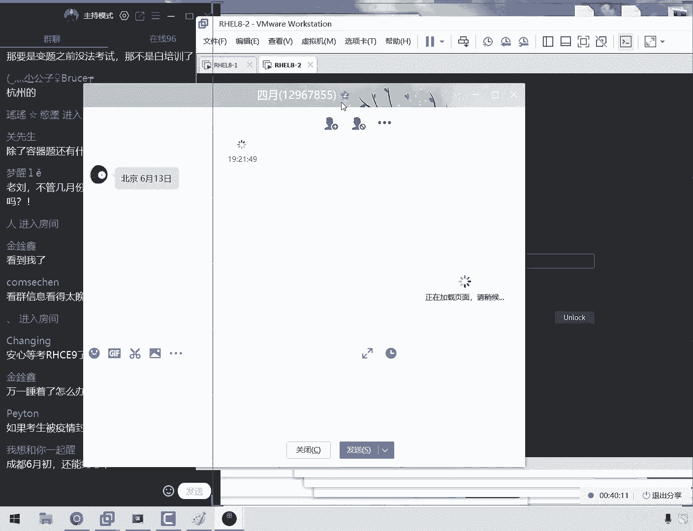
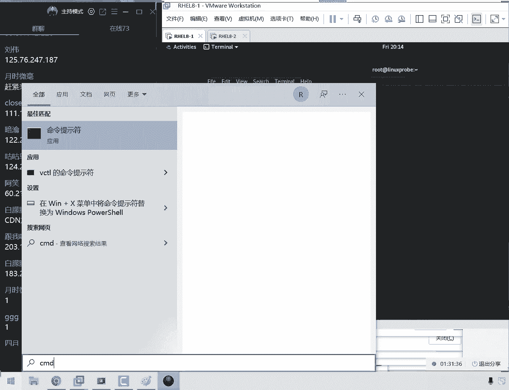
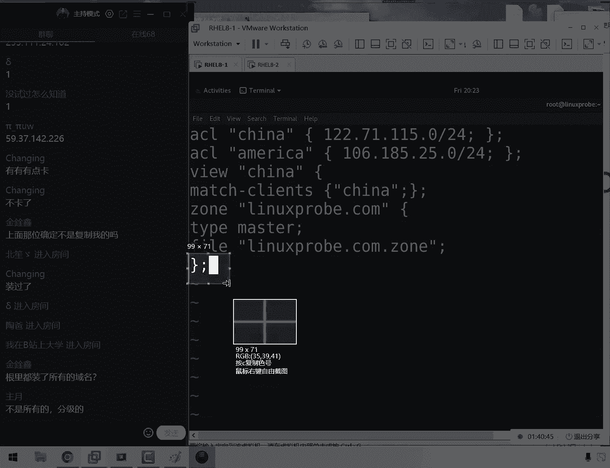
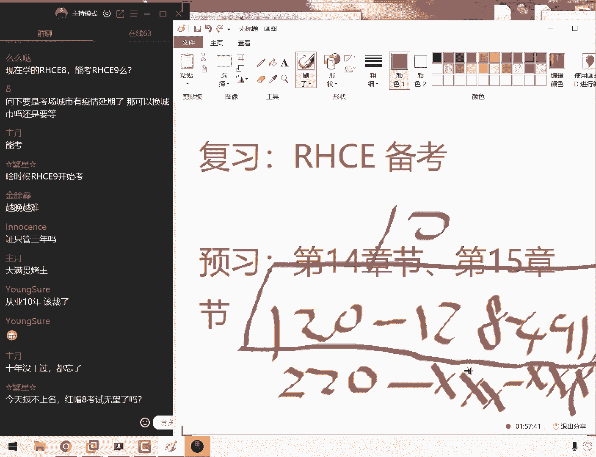

# linux就该这么学第34期 - P21：20【第34期第二十节课】红帽RHCE认证培训课程-Linux就该这么学 - 能力努力 - BV1L14y1878S

ok同学，我们来开始我们今天这个课程啊，大家先听一下我这个声音啊，大家觉得是否清晰呢，我们先打一下一好吧，然后对今天很多事情需要大家去说一下，哎呀有一个改题，还有一个辩题这么一个事情。

所以大家先等一下一把，先给我们大概十分钟的时间吧，我们把这个需要给大家去说这个事情给大家捋清楚了，然后是这样的啊，呃先给大家说一下我们报考的一个原则性的一个问题，就是话呢大家自行考虑清楚是否要报考。

因为的话呢我们现在呃考场的话呢，这个座位是比较少的，所以的话呢我们尽量呢就是呃如果说你没有确定您要把呃，那么的话您是否需要考试的话，可以再稍微等一等，那么我们要给我的单数。

我们也要给需要报考的同学提前要去把呃，那我们通过今天这个时间，然后给大家去说清楚好，那么我们先来说一下第一件事情，然后我们现在是有一些呃需要报考的时间，还有这个呃辩题的一个问题。

这样先给大家依次去说一下吧。

首先的话我稍等，我我也打开一个画图板啊，这样的话可能给大家说个清楚，首先的话就大家看到这个新闻了，根据的话呢红马这个便携的周期。

所以的话呢现在的时间是2022年的5月20号，所以如果不出意外的话呢，我们这边也跟闯关去劝了一下，会在8月中旬就会变题了，也就会变成红毛瑞九，也就是说最快的时间大概就是8月中旬。

然后我们现在的话已经进入到了一个呃临近变体的一个，我说的啊这么一个时间，所以的话呢先报考的人呃，这个额数量的话，大家这个考生特别的多，所以现在就是第一个问题，如果说您却想要去从事这个语文行业的话呢。

我认为这可能是最后的一个窗口期，因为我们三个月之后辩题，然后就基本上又是半年的时间需要去稳定这个题库，所以可能现在的话呢是您到2023年呃，起码是2月份之前可能最后一次机会了，这是第一个。

所以我们现在这个位置也比较的紧张，第二的话就是我们原本的话如果要是用不上的话会很麻烦，然后我们今天啊啊，然后呢我们上个礼拜的时候也是大家这个考官努力的去沟通了一下。

最终的话呢我们也取得一些呃考场的这个时间啊，并且的话呢如果不出意外的话，这个时间就已经确认了，那也就是说您报考的这个时间就是我们今天所说的这个时间，那么就是您最后我们去考试。

这个时间基本上也没有什么变化了，然后我们来给大家去公布这么一个事情，第一就是说啊这个啊我我这就是我们第一个问题，然后还那我们来说第二个问题吧，第二话就是同学问到了说这个容器啊，然后还有还有这个我啊。

我们换来我们的上午里边考试中有一些参数的一个变态，然后的话呢我们这边跟考官也是确认了一下，所以如果说您再去看这个视频跟看网页当中有一些区别的话呢，他们是有出入的话呢，那么请大家以先这个网页为准哦。

我们大概是修改了三个地方，也就是说当前的话呢网页上的这个答案，那么就是准确的，那么就没有问题了，值得换，只不过因为这个容器这个题目的话呢，我们现在还没有环境，所以我们现在没有办法给大家去录。

但是这个容器的话呢，总共的分值也就是大概30分，那么以及的话呢我们嗯会尽快给大家来去提供吧，然后现在的话当然已经在网页上面了，大家这样去敲影问题不大，但是这个的话我们会尽量给大家呃。

那我我们会尽快给大家去提供这个容器的视频，但是这个大家需要等一段时间，现在确实还没有，因为他又变铁了啊，这也是刚刚看到的那么一个消息，然后呢这是我们这个第三个教我们去说第三个问题。

就是这个大家比较关心的考试时间了，为什么大家之前想要去约考，但是我们一直我们说没有约呢，那大家说那如果来不及考试咋办，那就那么如果说你没有来及考试，那么你就不用，那么您就不用考了，六九之后没有题库。

没有教材，没有考题差，就啥都没有，就是我们讲我们也不会去讲，所以的话呢考题也不稳定，那您智商可能考题太稳定了，通过率又再往上走一走的，然后再去考，那基本上又得半年左右吧，好了我们就不多说了啊。

因为我们同学们今天你不用担心说越不语，因为今天这个位置的话，那肯定就是呃今天晚上必然会被约满的，那我们就直接说了，只要考试时间的话呢，我现在所说这个时间就是已经确定了，那么如果没有意外的情况下。

您考试的时候就是这些啊啊那么就是这个时间，那么付款之后你就一定有位置啊，这是我们一些呃前提条件，然后我再去说一下北京哎，北京话，到北京的话呢，实在很不好意思，就是呃北京这一场的话呢。

我我啊我们去问了一下，就这一块呢我们的这个诶教室比较大，但是的话呢也只能坐15个人呃，因为我们之前的话有些学员因因啊因为是分的比较早了，所以话我们提前约了有这么四五个同学，现在的话呢。

所以北京的话呢现在只有十个位置了，所以的话呢我们来公布一下时间，就是北京就是6月13号就确认了，也不会改了，然后但是我们除非有疫情啊，然后换到上海的话，这个时间也是确认的。

然后上海的话也是只能约十个人啊，就是6月24号这个时间也是固定的，除此以外啊，除了啊我们产生了其他这个啊特殊情况以外的话呢，这个时间不会发生变化，同学们一定会问到说老师这时间还会不会。

那我们这个时间它会被改呢，它会改啊，但是的话呢只有极少数情况下，他单位去改啊，比如说大面积的啊产生了这么一个呃封城啊，这样的这个情况才有可能赶来，否则这个时间就是固定的，然后广州的话就是6月24号。

对大家没有听错，我们现在都给大家约的是6月下旬的一个时间，所以的话呢您大啊，那么所以说您备考的这个时间是很充裕的，然后这个广州的话呢是6月24号，深圳的话呢我们就很有面子了啊。

深圳的话因为我们在上一期还有一些悬，然后我们的话呢这个约了两场，我们约一个6月22号，但是的话我们原则上来说，这个是给我们的第34集选取约的结果的话没有约满诶，这个非常好，所以的话呢我们就是等于说啊。

这个啊我们的话呢这个时间大概还有一两个位置啊，等啊，那我们啊会有啊这么一个情况，然后还有6月23号，这个是我们专门为我们当期学员取悦的，所以同学们啊，也就是说23 22啊，那啊那我们都可以去选。

但是尽量选择23，这个是给大家专门约了一个时间，只要除了此以外的话呢，那我们作为一个很负责任的一个培训机构，是不是不那那那那我们肯定会啊，希望大家能够在自己的这个呃啊当地去考试嘛，所以我判断南京啊。

我们也给大家约到了，哎大家没有听错，南京也约到这个非常的这个非常厉害啊，因为我们上一期都没有约到，这个时间的话呢，是6月14号啊，不啊呃6月16号，然后的话还有济南，然后这就是6月7号。

然后除此以外就没有了，然后我们之前的话已经给大家约了武汉跟济南，而这两个时间的话呢，还有我们的武汉，但是啊但是这已经是满员了啊，我们能够约到的考场里的一个信息，就为大家来去公布出来了。

然后至于说空大该啊，然后至于说同学们下午问到的一些城市，比如说是天津啊，呃青岛啊，还有大连这些城市，然后这些城市的话呢就都呃我们这边确认了一下，是没有了，然后起码是6月份就没有了，7月份有没有不一定。

但是起码的话现在我们56月份都是可能要困过去了，78月份的话呢，呃要是有，那么就再给大家去约，如果没有的话呢，呃您可以到时候当然就会很麻烦了，那我们尽量让您看一下吧，如果说你所在这个城市。

比如说你是在河北对吧，那么你去北京或者天津都可以的情况下，那么就来北京就好了，然后我们来说一下这个怎么约考啊，然后呢在最后再给大家说一下，由于这个月卡的话呢是一个线下考试，它不是线上的。

所以的话他收到很多这个原呃，他会收到很多这个啊考场信息这么一个控制，所以的话呢我们每一期的这个考试人数，每场只能做十个人，所以我们今天的话呢会严格的按照大家报考的这个人啊，报考这个顺序来给大家提交。

所以大家听好我们报考的一个方式呃，现在这个人数有91，然后我们主要就是北上广深，大家除一下这个四啊，而且我们群里面其实还有很多同学，基本上每个城市可能约到20多个人吧，这不是搞经营销，确实有这么一个。

因为他确实位置比较紧张嘛，然后我们就好这个格式这样的啊，当然的话呢首先要找个单，您报名时那个qq号码就是您付款截图发给你哪个qq号码，比如说举个例子啊，啊同学们非常呃已经非常快了，已经发给了。

比如说随便点开一个同学的信息，你看啊，就是我们同学们点开这个信息之后，诶这个好啊，那我们看一看一下，就是话呢大家会有这边的这个呃所在这么一个城市跟姓名。

所以的话呢啊大家一定要找到您报名的时候那个qq号码，然后啊否则的话就会有这样的一个情况，就是您虽然报名了，但是您联系的qq号码的话，那并不是我常用的，所以的话呢我们没有备注您的姓名，不知道是谁。

那么啊那么也会错过这个报考的时间，那么也就是第一步，你要找到我们报考的那个qq号，一般情况下现在是有两个，第一个的话呢是5604s1 ，这个是i可能会比较常用的，第二的话啊，这是我啊，我们换之前用到的。

所以这两个的话都有可能啊，只是说其他的话呢，我们现在拥有四个qq号，因为每个q号只能加5000好友，然后我们等于说这个号码了之后，然后我们又开了一个新号，然后这个新号的话现在已经3500多人了。

所以现在的话同学们啊大概情况下啊啊那我们换啊，大概率情况下大家可以去搜一下，大概率就是这个qq号，所以您可以先去找一下，看看是不是通过这个qq号报名的，要是不是的话呢，也有可能，那么就是下面一个qq号。

那么如果说你找到了这个哎也有可能啊。

我们要啊，我们一定要严谨啊，也有可能，那么如果说你找到了这个报名的qq号了。

那么这个时候您就可以按照这样的格式来发，我就是的话呢您报名的这个城市加上具体的这个时间，就是比如说您想报名的这个城市的名字，加上您这个具体的时间啊，我们一定要写清楚您所在这个城市。

比如说你要告诉我您是在北京外环啊，那啊那好，那我们就要在写一下北京，然后后面的话呢去写一个时间，比如说北京6月23就千万不要要发给我，比如说北京这样的一个词对吧，就是我们如果按照这样的格式取悦的话。

枪啊不要发给我，我们就跟他就是我们直发城市名称，这样的话千万不要这样，因为我会去问您说啊，北京时间6月23号可不可以，因为我不知道您是啊，那我啊因为我们不知道您是否知道这个时间。

那我们还要再给您去确认一下，然后再去报名了，所以的话这样的话那我们可能就是说啊，那么就会没有您的位置了，因此的话请大家一定要明确告诉我，就是您呃报考的这个时间。

然后就是再加上我们所在这个城市这样的一个信息准确的发给，今天的话呢我们下课之后大概会在九点钟左右吧，九点钟左右，然后就会给大家啊回信息，所以的话呢同学们待会儿就会收到我们给大家发信息了。

并且的话呢我们会严格的按照非常严格的，按照大家给我发qq的这个信息的顺序，我要给大家发消息，然后我们每个城市的话大概有十个考生的啊，在这个作为我们一般情况下的话呢，会发12个，因为还有两个位置的话呢。

会多发两个这个考试的表，因为的话还有很呃呃因为的话会有些考生可能报名之后啊，就问那他们可能会发完信息之后，他就啊他们就决定啊，就他们就不会去考试了，所以的话呢我们一般一般啊。

所以我们一般啊会多发两个呃这样的一个表格，这样的话大家可以按照这个顺序来去提交就好了，呃一般情况下是呃，如果一个号找十个人，我们会发11个或者12个表，所以的话大家收到之后就尽快填写就可以了。

那么大家现在需要做什么事情呢，就是除了这个以外，如果您需要报考，那么就可以去提交了，然后按照这个消息反驳，然后同时的话要做两个事情，如果大家要是不需要考试的话呢，您就去倒杯水，然后我马上说完了。

然后第一件事情就是您需要先这样，第34期的这个培训群，哎大家现在一起点开啊，点开第34期的这个培训群，我们现在把就是我们晚上大家现在看现在是07：14吧，我们要把晚上该做的事情咱先提前做一做。

这样的话我们晚上的时候就可以直接报考了，省的就多啊，那我们省的耽误时间了呃，第一件事情就是找到qq号了，发完信息了，对不对好，然后的话您点开这个34期的这个培训群，然后点开这个文件，然后文章啊。

接下来呢我们在里边给大家传了这么一个文件，大家叫做注册红帽的id这么一个文件啊，红帽的呃这么一个id。

大家的话打开这个文件之后。

有这么一个信息了啊，这就是为了说我们啊我们考完试这个啊，那我们考研这个哎证书之后的话呢，可以跟您的这个证书编码来去做一下绑定，避免重名的这样的一个情况，所以说对红毛是从2019年开始。

就要求我们所有的考生都要去注册这么一个账号，然后才可以去提交考试信息，就是大家需要啊，那么啊那么这也就是大家需要第一件事情啊。

需要做的就下载一下这个文件，然后待会我们一边给大家讲个过程中。

大家一边的啊去把这个文件的话呢都给大家注册一下好吧，那就按照我们这个流程来去注册一下，这个话并不难，然后我们在讲课当中的话，就不会再给大家答疑了，因为这个的话呃非常简单，如果说您注册账号当中。

您出现了一些问题，大家在群里面讨论讨论，就问题不大了好吧，这是第一个问题，第二个呃就是我们呃发信息之后，这是我们发信息啊需要做的一件事情，啊r啊，r h i啊的一个i d的一个账号，诶。

这个鼠标都不太好使了，唉来看来红帽的一个i d这第二件事情就要做好，我们的第三件事情就是如果说同学们，你们要是报名的时候正好有位置啊，没有鼠标垫啊，来，那么如果说第三件事情就是呃如果说你报名的时候。

您发信息发得很快，那么正好是前12个学员，那么我会给您发一个报名表，这个版本表的话呢，您收到之后会是这样子的。

是一个可视表，那么大家知道之后会是这样子的一个表格，然后底下的话呢会有很多这样的一个介绍信息，那么请大家的话呢就是仔细的把这个交易信息的话去读一读，然后大家看一下这个会有一个表格，填写一下自己这个信息。

然后的话我们往下读啊，底下的东西呢啊，然后非常啊，那我们这边有个非常好啊，这边有一个提醒，然后让大家底下还有一些这个信息，第三件事情的话呢，就是当您收到表格了之后，那么您就去付款。

然后现在的话就要赶紧去提现了啊，把这个钱准备好了，晚上我们就可以给大家报考了，然后我们付款拨号的话呢，我们会给大家把，那我们会把这个信息给大家提交，提交拨号的话，我们会给大家发这么一句话。

当你说到这句话的时候，稍等一下啊，但是到这句话的时候，那么证明您报考这个信息就已经成功了，除非特殊情况，否则您就会当啊，那么就啊啊，那么您就会在您当天报考那个时间就一定有位置。

然后大家可以去考试了，然后就这么一个情况呃，刚刚的话呢我们用了十分钟的时间啊，15分钟的时间给大家把大把我们这个报考的时间，报考流程以及报考的这个呃注意事项给大家来去说了一下。

然后我们现在有哪里没有说清楚呢，那大家可以来提问了，我们再用五到十分钟的时间吧，来给大家来去聊一聊约考的一个事情，然后大家问了一个问题，大家说7~8月这边还能约到考场吗，我们认为是可能嗯不好约了。

因为现在就在人数的话呢，其他考场也是很多的，可能位置比较紧张，可能比现在还要紧张，然后大家说约不上的人咋办，约呃约约不上的人啊，就会嗯，反正就相当于一个小教学事故吧，但是我们尽量给大家解决好吧。

然后下面一个问题大家都考试的时候可以自备啊，可以自带鼠标和键盘吗，可以的，没有问题，说北京只有6月13号嘛，是这样的，因为我们每个机构等于说6月份准备平均那么一天，因为机构很多嘛。

现在北京现在这个评机构很多呃，分到每个机构的话，只能分到一两天时间，差不多这么一个感觉，大家要大家问的说，那要是其实越也约不上咋整啊，这个到时候再说吧，因为现在也说，因为现在也说不好。

万一要是约上了呢对吧，那我们约起来还是很顺利的，万一要是约上了的话，那我们现在这个担忧也问题不大，不过说实话可能有点悬，然后下面一个问题，大家说如今的环境多久提供，我们估计悬了啊。

大家考试之前的话肯定会有，但是月底之前差不多吧啊反正最近两天估计还是选在下面带一个呗，啊下面加一个问题，大家说说说说邱老师，如果这次没有约上啊，可以的，没有问题啊。

不但是看大家是不是在活动日报名的就可以了啊，然后说深圳低风险可以去深圳嘛，啊这个政策问题大家需要从百度上去搜啊，然后下面一个问题大家说成都怎么说，成都的话呢说没有考场位置了，然后下面一个问题就是没有。

就是没有安排考场，因为等于说大家能理解这个事情啊，就是现在北上广深这四个城市考生都约不过来了，就是人特别的多，所以的话呢后面肯定就怎么他怎么就他他就有啊，六个考官对话的方面可能不会就是嗯你不太愿意去。

因为大家就想这个问题去的程度之后去了，然后坐着飞机去，坐飞机回，但是只考一天，性价比不高，所以现在北上广深他都他都啊，现在主要是集中啊，它主要是集中在北京和上海了，然后下面一个问题。

这也不是我们呃不给大家约，以及的话呢这个也不是我们培训机构很无能，主要就是因为现在这个具体情况就是这样的，因为一旦辩题的话，肯定就像我们这边给大家去说的，就会有很多考生着急了，然后现在就像我们现在一样。

人数超级多，然后来去约考，然后大家先看一下，我们现在这个在线人数有100个同学了，99了，这已经突破了，基本上是我们第一天培训时的那个水平了，所以黑大可以看出来这个月考的一个热情。

但是完了我们也很有底线，所以的话呢我们把这个考试时间，第一时间建立为了我们的当期的43期学员好，下面一个问题大家说好，问题不大了，然后大家说如果遇上之后考试的时候疫情复发了咋办啊，不用担心啊。

考这个话考场会给大家直接停好，然后会给大家统一做延期了啊，因为通报可能作文不一般啊，比啊会比大家更加怕死，而且可能更加怕麻烦，你说我一旦一个城市大家想一个问题啊，本身考官现在不够用啊。

这个考官区这个所在城市10号被隔离15天，实在损失太大了，所以的话呢现在大家不用担心疫情的问题，因为一旦有疫情了，考关键我直接去啊，为大家办啊，办理延期完，这个就大家就怎么理解呢，大家想考也考不了了。

因为考官也不敢来了，他会先去忙其他城市的，然后当有一个问题大家说啊，说那如果别提之前还没法考试，那不就白培训了啊，不能这么理解，变化是有的，但是的话呢嗯变化百分之六七十是不变的。

起码百分之三四十可能会变，但是起码大部分是它是会延续下去的，好然后给大家说一件事情，我刚才用手机上看了一下，当然的话呢就是我我这边看了一下呃，同学们还在问说说老刘啊，说怎么样嗯，说这个宝宝好用的时间。

不管几月一直会约考，对没有问题，然后是这样的，这个时间的话大家就不用大家不用管了，大家这个信息的话就不用看了，我把这个删掉了，那么怎么回事呢，因为我刚刚看到qq上面，qq上面看到我累计收到这个信息。

我刚才看了一下，有70人啊，已经遇到了70人，所以的话呢这不用你说呃，这个是对不对，不用去纠结了。

那我们给大家看一下刀，把一段给他拆掉，我们现在这个q上收到这个人数是70人，所以我们要给大家说两个事情，就是我们会严格的按照大家报名的这个顺序，然后再给大家提交这个信息，如果您没有位置的话，那么就没有。

那么就确实没有位置了，请大家能够谅解，然后的话呢我们今天晚上的话呢会给大家把这个信息处理完，然后我们在睡觉，所以的话呢大家可能收到就呃如果说我们九点钟下课，那我们您可能收到第一条信息是十点钟。

所以的话大家就今天晚睡一会儿吧，我觉得这两个话因为是个笔记本出来被隔离了，所以的话他可能呃可能会比较慢，但是我今天怎么着，十点钟也会给大家回第一条信息。

然后大家就晚点睡吧，如果要是没有位置的话呢，我们之前就没给大家回过。

那么如果要是呃，那如果要是呃大概是没有位置的话。

比如说呃比如说你发信息的顺序是第13个人，因为我们会严格按照这个顺序，就是我们报名的时候那个顺序第一位同学看到没，是07：08给我们发个信息。

那好了，我就按照这个顺序来给大家去约考，如果说您是第13个以后的，我就给大家发一条信息啊，那么就说很抱歉，那么请您下一次再约就好了好吧，我们会给大家会会给大家发一条信息就可以，也可以看看吃吃睡觉了。

然后就给大家说完了啊，然后其他问题有其他问题吗，你可以去说一下，然后再给大家啊，可以看可以截张图，然后的话呢我会严格按照咱们这个报考的顺序来给大家去操作，还有信息没有点开，我就不给大家点开了。

因为点开意义也不大了好吧，比如这个东西还没有，还是没有名字啊，这不就是我刚才说的那个情况吗。

那这不就我我啊啊，这就是我刚才说的那个情况，就是您看因为您没有啊，因为您联系的时候，您的那个qq号码您联系错了，等于说您应该联系的啊，那么说您联系应该是这个序列号，但是您联系错了。

所以的话我们没有登记您的这个姓名，那我把它关了啊，据大家一定要联系正确的qq号，这样的话那报名信息才是有效的，好了。

我再给大家往后面去说，大家说啊，济南之前说没有考场，现在又有了对，有了啊，然后我们也是给大家争取来的啊，确实很不容易，来大家继续来往，大家就说说万一睡着了咋办啊，万一睡着的话。

就等到7月8月份再说吧啊吧，那么就是等到那就让其他的考生，就让我们其他的师兄弟们先去考啊，然后我们来给大家先去说一下今天这个讲课内容吧，呃因为的话对于考试这个是啊，但是啊但是这么一个事儿的话。

多说也没有太大问题啊，突出的话也没有太大意义，我们主要待会儿基本上今天就能报个名字，差不多了，然后我们明天给大家做一个总结吧，如果要是但凡有位置99%的位置，然后会给大家再去约一场，如果是没有的话呢。

就等着礼拜一我们跟考场里边再去沟通一下吧，然后好吧，这么一个情况，看看能不能嗯，看看能不能在每一场再多加一两个位置，我们看一看，只能是这么去解决了，因为考过诶。

呃因为的话每个机构等于说每个月只平均到一两场嘛，这个还是比较麻烦的话，大家说啊啊说啊，合肥啊，怎么没有考场呢，不太公平啊，这句话呢非常公平，因为我们没有遇到的这个时间。

全国所有的机构在合肥都不会有任何的考场，大家可以去问这个评审机构有任何文啊，任何培训机构去问一下，绝对不会有，那所以的话这个非常公平啊，虽然都没有啊，所以大家就是只能在这个当地机构去不大。

只能是在呃呃周边的城市，或者的话呢您看看78月份的时候再问一下我，好吧，哦不对，那我就不多说了，因为大家这个问题的话，基本上就回答的回答差不多了，然后至于说更多的问题的话呢，我们先给大家讲讲课。

然后我们明天吧给大家来做一个总结，看看今天这个月考的一个情况的一个总结，好，我来给大家去说一下，然后今天的话这个人数超级多，我感觉电脑有点吃不消了，我如果要是有崩溃的话呢。

我们可能会晚上会晚点儿再给大家发消息了好吧，反正基本反正今天起码大家十点半左右吧，十点半之前应该能收到我的第一条消息，我会尽快的啊，我会那么呃那么我们这边也会尽快的来给大家往后面去说了啊。

先做一下回忆啊，说了20分钟了，我们来给大家做一下回忆，上节课我们讲什么呢，礼拜日的时候，我们讲的这个dns这个主服务器跟从服务器之间去做的叫做什么呢，正向及反向解析啊，大家可能听到这都没有兴趣学了啊。

老师这个啊，然后啊这个我们考试也没有啊对吧，那他是没有，但是对于我们这个网络知识的这么一个积累还是很有帮助的，来我们来做一下总结，上节课我们讲了一个dns对吧，我们讲了一个半的服务。

它的话呢我们讲到这个主服务器跟从属啊，跟从属服务器之间去做一下什么呢，正向及反向解析的一个同步，这个我们稍微给大家做正反，我们都给大家去玩了一遍了，正反都没有问题。

然后继续嗯，那么我们现在给大家去做一下叫做p s i d加密，就是来保证一下这个主服务器跟从属服务器之间来进行数据交互，这么一个安全性，那么是为什么呢，大家来网上啊，翻开书看一下啊。

另外的话呢我们还有一个收集签名的一个小活动对吧，然后我们这个等到我们明天或者后天吧，然后来给大家发那个前面的小礼物。

因为现在我还在北京诶，呃因为的话呢我们现在还在还在北沟里，现在还是在酒店当中，所以大家今天那个小礼物的话也不用着急吧，反正现在也寄不出去，然后要等，然后需要等一等了啊，好，大家先看一下。

这张是我们的图片是三杠二to，不图大家看一下，也就是说我们大哥这个啊，那也就是说我们的这个呃客户的话呢，像我们这个dns一个究竟的服务器发送请求之后，服务器跟服务器之间需要进行多次的。

咱们一起来说dv的这个查询，那好了，他需要进行很多次向根据的服务器，像点com这个域名，像我们的i d c的这个供应商对吧，还有什么呢，还有像我们自己的这个服务器发送请求，那么进行多次这样的这个查询。

任何一次怎么样呢，被人家所篡改这一个地址，它那么就有可能导致后面所查询到的这个所有信息就全都是错误的了，为了避免说这样的这个问题，所以同学们怎么样呢，在我们这个呃进行多次这个查询的光当中。

我们去加上这么一个叫做tsi，这里一个加密的一个字符串，它的作用就是当我再去发送信息的时候，那当我们再去发送信息的时候，他会先去发送一个字符串，比如说是a b c啊，发一个天王盖地虎。

当对方回复了哎宝塔这车幺的时候，证明对方是我们自己人，然后再进行一个数据的一个交互，这样的话它就可以保证我们这一部分的一个安全了对吧，那这样的一个方式，然后大家说啊，因为顺便又看到一个问题啊。

大家说啊说能够保证按照严格的顺序去执行了。

非常严格非常啊非常严格，第一位学员07：08就07：08，因为我们说实话啊，这也不赚钱对吧，我们也给大家说的很清楚了，所以说这个东西我们绝对不给自己找麻烦的啊，我们绝对不会给自己找麻烦。

所以如果说是07：15发的，那但是07：30的人，他们是约上了，但是您没有约上，可以过来找我了，所以我们这个不给自己找麻烦，肯定会按照这个啊报名的顺序，严格按照这个报名的顺序。

就是您发信息的那个顺序去发的，所以说如果说您现在还没有发的，同学，就不用关心考试的这个呃，考试的这个哎来啊，咱们就不用关心考试的这个时间了，因为一定是没有了，就踏踏实实听课的，同学们。

那不用再提这种考试问题了，就不用再去关心了，来我们先来给大家操作一下，同学们来，现在的话呢我们来就进入到我们这个主服务器当中，这边我们还有两台服务器，这台是主服务器。

然后这台的话呢我们是这个从属服务器啊，来我们他还是听课了啊，他还是听课了，那我们来看一下这个主服务器的话呢，先去做一下dns s的一个加密，其实的话呢我们只需要就是一个字符串啊。

来我们来去使用到我们的命令来进行一个加密啊，security啊，kin啊，就是它指的是生成一个我们的dns，一个加密的意思来说，字符串字符串杠a啊，然后的话呢我们一个加密的一个协议，大家说怎么样呢。

刚准备考，那马上又要变题了，我们也很着急，我们也很烦，哎呀老刘都老了，学不动了，现在等于说去年刚发了一本新书，今年又开始辩题，这个每3年一次周期真是不可抗拒啊，他这个也非常痛苦非常痛苦啊。

让我们来定义一下我们这个加密的协议为md 5，然后的话呢我们的钢笔它指的是我们加密的这个次数，我们128，这样的话呢杠n我们的这个啊，那我们定义成为啊它这个呃呃密钥文件这么一个类型。

然后接下来我们密钥文件它所对应的一个名称，然后我们给大家写好这个名称的话呢，名称也可以无所谓的，但是待会我们去写文件的时候来进行调用的时候，大家一定要记住它，另外这个窗口有点小，变成一个小豆腐块了啊。

但是没有办法，因为现在我这个屏幕太小了，一个笔记本哎呀，同学们，那就将就一下，我把这个字稍微的放小一点，同学们提个小问题，大家现在看到现在的话呢，我们直接搬了这个命令之后。

就会在我们这个呃当前目录当中有一个公钥文件，还有一个cl文件，请问我们现在需要的是把我们的这个公钥文件发送给对方，还是把我们的这个cel文件啊，那我们现在是需要发光要文件给对方。

还是发cell文件给对方啊，一个小问题，大家看一下这个文件内容，请问我们现在需要把挂件给对方，还是把cell信息给对方啊，大家怎么样，大家说啊，我说怎么样呢，说刚才后面又发了消息。

是不是又被刷到后面去了对啊，因为你发了消息专项，比如说你又以最后以它为准备，然后大家说把公共信息发送给对方，对吧对啊对，但是的话呢我们其实可以看得出来，确实没有预期，因为这个虽然考试不考啊。

我们发送的话呢，既不是公钥和私钥，我们两个都不要啊，好吧，我们我们要的是什么呢。

它是叫做非对称式加密算法，他的话不需要发送公钥跟私钥啊，我们不需要发，我们什么都不需要发，我们就需要就是这么一个字符串。

只要两边的这个字符串匹配上了就可以了，他不需要再进行啊啊3号加密跟公钥解密了，同学们，那这个预期重要性就把体现出来了，公钥私钥我们都不要，我们要的就是这么一个字符串而已，所以实际上我认为我个人认为啊。

配置这个dns这个加密协议更麻烦了，还可以随意去生成出来这么一个字符串就可以了，结果的话还记得啊，非常复杂，还是需要进行一个生成啊，他还是还要去生成这么一个文件了，反而麻烦了，但是这个啊文件虽然有了。

但是我们不用它啊，有了，但是我们不用，我们就是玩，我们就是为了有呀，有这么一个文件就可以了啊，有这么一个字符串就可以了，这样的话呢我们来进入到我们这个配置啊，配置目录当中，进入到我们的这个呃。

因为解析服务dns s的这个配置文件当中，然后的话呢我们来在里面大家看一下，我现在的话在里面稍等一下，我现在这个屏幕确实有点小啊，稍等一下啊，屏幕有点小，我怎么样给它调整的舒服一点呢，大家看起来舒服了。

这样的话呢我们就不用老去切这个窗口了，看一看啊，看一看，同学们看一下这个字，我看有点小，同学们你们看着想吗，就是大家看那个字是否能看清的，因为我这个屏幕左右两边给挡上了。

同学们你们看一下这个大小的这个字能看清吗，科学上可能是一啊，不能的话打一下二，然后对于说同学们现在想要月考这个问题我就不再多说了啊，比如说同学们要注意啊，现在看来我们要是约要要要是没有约翰怎么办啊。

怎么这巴拉巴拉这样的问题我们先不说了，因为您今天要是约上了呢，那么您要是约上的话，那您现在这个担忧和我们现在这个解释不就没有意义了对吧，等您就是啊今天先约吧，如果说您没有约上的情况下，您明天再说好吧。

万一介绍约上了，那不就很尴尬了啊啊那我们不休息话，就我们先不给大家去说了，然后那我那我们下面一个啊去，ok没有问题是吧，大家看见没有问题就行，我这还有点小好，我们来看星际生活中这么一个文件。

也就是说需要有这么一个文件，然后的话呢在我们这个本地去加载这个字符串，然后的话再来我们这个唉，然后啊那我们先这样的啊。

现在这个主服务器上面去加载这个文件，这个呃呃然后的话这个字符串里面，然后呢再在我们的这个存储服务器的话呢，也啊叫字符串简字串就好了，然后他就在这个从数服务器的话呢，也去下载一个文件。

这样的话当然就他俩去传输信息的时候，只要两边的这个信息能够做匹配，那么就能够让他进行一个正确的传输就可以了对吧，也就是说我们现在需要两步，第一步生成，第二步在主合同当中去同步一下这个密码文件就可以了。

这个格式是这样的，首先的话呢是我们定义一个名称，这个名称的话呢我们可以随便去写，但是一定要跟我们这个从属服务器要保持一致，它叫做我们的密钥文件的一个名称，但实际上它并不这么的重要啊，好吧。

我们只是一个名称而已，我们接下来它是一个主从之间进行一个数据传输的一个意思来组合，从然后的话呢我们定义一下他这个加密的一个算法，那我们加密的时候他是打他啊使用的啊，这么一个加密的协议需要给大家写清。

这样的话呢我们待会去加载的时候，大家可以基于我们这个算法来给对方来制作一下匹配，这个的话我们的这个啊，那我们给大家写一个小写的形式，没有问题，这个我去试过加密的时候，它是一个大写的。

写完这个文件里面的话呢，大小写皆可啊，这个没有问题，然后我们加密的这个字符串，我们可以从它引号里的引起来，哎没有了，稍等一下啊，找一下我们刚才要的就是这么一个字符串，于是找到这个字符串啊。

我们要的就是这个字符串吧，这个字符串可不能丢，把这个往里面一粘，同学看起来这个真的不香吗，啊可以再小一点啊，这个你们看这个看起来真的不像了，我怎么看着有点小啊，来我们看看啊。

所以我们看起来刚才那个人数巅峰的时候有102啊，所以我看得出来有18位同学就是关门啊，就是啊专门过来听一下这个考试时间了啊，就走了，好说明已经发生信息了，等我去回信息了好，但是这样的啊。

我现在把这个文件给他写好了，也就是说这是我们加密的一个字符串，这是我们的密钥的名称，这无所谓啊，它好，它实际上也并不是一个密钥文件的，来保存并退出，对于我们第四章节的编译器的使用方法就呃非常的熟练了。

接下来给这个权限的话呢，稍微小一点，让别人看不了，这样的话才能够保证我们的文件的安全，给他一个权限，640啊，稍微小一点，让别人读了，然后呢再把它作为一个链接文件，做到我们的配置文件目录当中。

这样的话呢方便一说以后进行一个调用来走，你把这个话我们这个啊最后一步比前面都要重要啊，一定要按下回车，然后大声说一句我们的咒语，这样话有气势啊，你气势到位了，学到最后的时候就是一个玄学啊。

就是明明配置的时装是一模一样，怎么样，我就不要做不出来呢，啊最后可能到最后我啊我啊，觉得就是非常的迷信了，哎这就奇怪了啊，老觉得为什么他做不出来呢啊或者说怎么他都啊老出问题呢，来我们来给大家去看一下。

呃首先的话呢我们在前面需要加上我们的这个密钥文件，所对应的一个路径，心脏的话因为被隔离了啊，这非常可惜啊，所以电脑的配置实在有点太实在太慢了啊，这个话好像是一个i5 的一个笔记本，哎呀我真的是费劲啊。

不过也好在去啊，证明一下我们之前所说的那个话嘛，就是呃我们这个服务器实际上对于性能的这个要求是比较低的，即便是一个i5 啊，开两个虚拟机，再带一个100多人的一个讲课群啊。

再开100多个啊啊q的这个窗口也没多大问题啊，因为这个对于我们这个服务器的消耗实际上还是比较低的，4月2号上给大家讲过，他可以把五它可以把我们这个服务器的性能的话呢，啊更好的去使用它。

去掉了一些我们并不需要的一些功能吧，好我们给大家讲一下，我们刚才所有生成出来这么一个妙文件，然后后来我们接下来再去写一个允许允许一下，说我们从组合到啊从属服务器这个妙文件的话呢，能够被允许。

这样的话做好之后，那我们的这个主服务器就开启了这个t s i g的一个加密功能啊，我们这样做完之后对，还有这个分号封号，千万不要写错啊，大家怎么样呢，说啊咒语没有念念了啊。

我真的念了这啊啊念了念了念了来，我们接下来我们点一下这个保存并退出，但同学们一说也不太自信啊，同学们好，大一这么一说啊，不太自信，老刘这么自信的人，突然间我得去啊，再去看一眼啊，看一眼。

他说我这个路径写错了，我看一下啊，没有写错啊，同学们不要骗我来，我们这样都做好之后的话呢，下面一个问题就是我们来进行进入到这个存储服务器了。

还有啊就是我们相隔之前的话，要给大家重新配置了一下这个环境。

因为我这是礼拜礼拜三的时候手欠了，然后我把这个系统给他呃，还呃给大家去关机了，所以的话呢我们又重新去配了一遍，配完之后的话呢，刚刚啊大概五分钟之前啊，然后我们上课之前嘛给大家配了一下。

应该也就是说作为台从属服务器，我们可以使用我们自己的这个网卡，然后还去使用我们自己的这个啊服务，然后的话去做一个就是啊去做一下正向及反向这么一个解析，就是说主从之间已经能够进行呃数据的一个交互了。

那我们现在的话呢去删掉这个从属服务器当中，去同步来这个存储文件好，那我们先把这个文件给它删掉，删掉里面所有的这么一个文件删掉它，然后我们现在看就是不能够再去做这个啊从属服务器这么一个解析了。

大家还记得我们这个从属服务器的一个作用吗，从属服务器的这个作用稍等一下啊，先来重新启动一下我们的d n s服务，办的name的服务啊，大家都写错了啊，好像我没有理解大家的这个所说的啊，好像我确实写错了。

我看具体是哪一行，他说我配置文件当中第四行写错了，第四行写错了，第四行是吗啊，稍等一下，稍等一下，我看一下，他说我们能呃的穿for。key当中的第四行信息出错了，1234啊，我们果然是少了一个分号啊。

这个字嘛我就说有点小吧，这确实有点小，所以看起来都啊不太很清楚的保存并退出了啊，那我们就玩啊，那我们就玩啊，那我们就把宣传配置好了，瞎配一遍啊，这样的话呢我们出错之后再给大家排座。

其实我们也不太希望大家讲课当中那么的顺利，没有排错的话就少了一点灵魂啊，那只有跌倒了才知道怎么样能够爬起来，然后跑的更快，来我们先介绍介绍链接啥的，嗯链接少了是吧，链接啊没事，我们没啊，没也没关系。

我们的话继续来给大家去说啊，出错之后再给大家解决，现在的话我们去重启一下这个主服务器的这个dns这个服务来name，然后大声说一句走你啊，这回口号说了啊，就是我们的咒语说完了，这没有问题了。

现在的话呢也那也就是说主服务器的这个解析当中，已经做了这个p s i h加密了，那么我们现在的话呢在这个从属服务器当中我们要干嘛呢，一来一起说，是不是这样，我们也要去开启在这个ti之间啊。

这啊他这么一个加密呢。

这样的话两边都去做这里一个加密了，这边左边说天王盖地虎，这边你可以说啊，天王盖地虎两边信息匹配对上了成功之后一模一样了，一模一样啊，一样呃一样了，那么这样的话呢就可以就来去传输这个信息了。

当我们这边的这个主服务器，他做加密从属服务器没有做加密，那么我感觉自己配啊，那么啊自己就是啊不能再去同步这个信息了，所以我们来去看一下当前的目录当中是没有文件的，我们之前去重新启动dns服之后。

马上就能够同步来的这个信息，这一次我们就不配了，发现没有了，就是因为对方开了，我们没有开，那么解决方法的话，那就不找关子了啊，不单卖关子了，不带上弯子不再卖啊，那我就不再给大家介绍了啊。

卖关子绕弯子给大家说一下怎么去做啊，很简单啊，进入到vm里面的name里面的cheretc目录单啊，这个耳目当中实际上就是去新建出来这么一个文件，两边加的一样的文件，那才是一样的。

但就是我们去改这个信息的时候，同学后面的老师这个能不能去复制呢，当然能够去复制呢，只有两边的信息都比对上一模一样了，才证明是我们的自己人呀，对不对，所以说这两边的这个信息既然是一模一样的。

那我们何尝不能够去从哪去翻啊，那我们来去啊，选择啊，复制和粘贴呢，这样的话不就更有效率的嘛，对吧啊，一下少了30个同学，刚才102，跑了，我正好走了30个同学，你们这个呃为了考试这个目的太明显了。

但那些30位同学都走掉了，看来今天晚上我们都不说少了不唠，今天晚上真的是兵家啊必争之地啊，这么点位置，但是我们尽力了尽力了，真的不是搞经营销，而且我们给大家保证能约了就全灭了，然后没有约上的话。

那就真的是没有位置了，然后也不会说过两天又突出来一个位置，尽力了已经没有了呃，所以的话呢我们就这个确实也是一个客观的一个原因嘛，因为我们先来给大家去做的，这两边做的是一样的东西。

因为这个东西它跟我们的网络培训不一样，我们这个网络培训只要有只要啊他们只要是有网络啊，再带张嘴就能讲哎，有网络有嘴就可以讲啊，并且的话呢考场还有位置的，现在还要没有疫情，还要跟其他机构去竞争一下价格。

而我们对于这个价的竞争不来啊，因为我们现在没有差价嘛，他会不会先去考虑一些能够加钱的一些机构去约跑一下，但是这个我们认为也没太没太必要，对吧呃现在呃实际上已经很贵了，我觉得再加钱去考意义就不大了好了。

我们给大家做一个链接，同样的一个操作一做etc目录当中，再来etc目录里面的transferring key，哎走你来走你走，你得加钱，对是得加钱啊，不当然你们现在不用加钱，下一期加不加钱就不知道了啊。

他们啊他们就扣啊，他们就扣我们4200，这不一定了，所以的话呢带不能接受的流失差价，没办法不，这个是完全没有的，因为我们现在没有说穷到说挣这份钱上面啊，然后的话呢所以大家会有这个考试费的话呢。

我们会给大家呃付款方式，然后直接待在考场，我们是完全不经手的，嗯然后我们来给大家继续往后面去配啊，继续往后面去来给大家去配置一下，那我们来include来去加载一下我们的文，看这个还有赵小岑说啊。

因为这个说实话我也不太熟，因为这个是在我的，我当时我也考过这个2014年的12月24号考的过了8年了，这其实也记不住啊，所以我们给大家照着传说啊，这话也不丢人，来我们再去加载一下这个文件啊。

今天脑子有点频，因为还是那个因为还是那个原因啊，因为也可能是被隔离了，所以的话呢感激我给大家多说几句话，同学们互相体谅啊，所以说这老刘今天第一次看到这么多人啊，非常开啊。

也非常也是非常开心，翻的也翻得开心，然后继续这嗯，这个已经过一个礼拜了啊，今天是第七天吧，我记得是上礼拜六来的吧，那就是第一啊，那今天就是第六天，第一次见到这么多人啊，非常的这个激动啊。

来我们来继续写一个server，那我们底下的话需要指定一下我们这个服务器的一个路径，那么这个既然作为它从属服务器主服务器的这个路径的话，永远会是1920点，168点是电池，那么听我讲课就比较好嘛。

就是不用老去担心说地址变了，地址不会变啊，变得只有我们的心，对不对，就是只有我们编的这个配置的服务，从属服务器永远会是10。20，这个不会改好，然后的话呢我们来继续给大家去说。

往后面走去加载一下我们这个妙文件的一个名称，这个名称的话呢，就是只要跟我们这个该组对应的这个文件里面保持一致就可以了，然后的话它它啊它实际上他并没有说实际上去作为一个妙文件。

只不过我们这个文件里保持一致，开头结尾一样，它它它它等于说是允许我们这个密钥进行验证，这样的一个方式做完之后的话呢，我们点一下保存并退出这几个分号，请千万不要忘记，然后还继续点一下保存并退出啊。

大家说说上周啊，不是说要开摄像头吗，啊想了一想啊，算了吧，因为大家想啊，如果老刘战番啊，要长得好看的话，我可能讲网络课程嘛，对不对，但凡长得要是能看的话，也肯定早开了对吧，就是因为长得太丑了。

所以的话呢同学大家啊就只听声音吧，就只听我们讲课吧，啊卖艺不卖身了好不好啊，这长得太丑了，主要是来那我们派一大影响的啊，重新启动一下，重新启动一下我们的dns在啊去进入到我们的etc目录的啊，不是啊。

进入到我们这个dns这个目录当中，其实啊进去进入到从属目录当中去看一下这两个文件的话，又把它下载下来了，也就是说刚刚的话呢主服务器去开了t s i d加密啊。

那么今天的话呢我们这个存储服务器他也太p s i g加密了，两个都加密了，天王盖地虎他也会天王盖地虎两个人，诶呵呵一笑自己人，所以信息又传过来了，团队我们还是那个问题，说到对于你虽然长得帅啊。

虽然长得帅一点，但是的话呢你传过来这个数据是加密过后的，我怎么知道它是否被破坏呢，它是否能够被使用呢，那么这个时候我们再给大家验证一下了，就是说我们首先配置一下我们的网卡，第三个方法配置我们的网卡。

把网卡的一起说啊，大家一起说，同学们，那把网卡的这个dns地址改成我们的本金，使用我们本机自己的dns去解析这个域名，要能够解析出来的话，那么就证明自己是有本地的dns这个服务区实现的啊，没有问题啊。

有点绕口，但是这个啊话糙理不糙，就是这么回事啊，那我把这个dns指向到我们的本机一模一样的ip地址啊。

怎么童叟无欺啊，完全没有任何的水分，于是再次重新启动一下nm c l r n m c l r，然后connection editor，然后去补，然后去up一下网卡名称，启动它做好之后来去进行一个检查。

n s look at命令，这样的话呢就可以来去输入一个域名，输入一个域名正向解析出来一个ipad纸啊，然后呢我们再去输一个反向的域名啊，再去输一个反向的地址，反向解析成一个域名。

这样的话就是我们的从属服务器之间去做的p s h加密，以及去做的叫做正反解析，没有问题，加密过后数据依然安全，那并且能够很准确的帮我们解析出来，这个的话就给大家说了一个小小的一个小尾巴，那还没有讲完。

还有大家啊先不着急啊，然后还没有讲完啊，然后我们还有那我们还有这个能够去给大家讲的dns这个东西，dns还有什么呢，我们来看一下叫做那缓存服务器，这句话缓存服务器的话呢实际上是这个样子的。

我先给大家聊一下理论啊。

其实大家不要关啊，大家不要太去关心，说我们做这个实验，这个结果并不重要，因为我们配置这个实验，大家想我们从2015年开始讲。

讲到现在讲了7年多了，不可能出错了，所以说这个结果并不重要。

那我们先来讲一下什么叫缓存服务器呢，这个缓存服务器啊，我们可以理解成就是一个网关啊，先画一个网关啊，稍等啊，我的天呐，这个人数有点多呀，嗯好啊，待会我看一下啊，我怎么看，还有人发厦门呢。

厦门就不用发了啊，就可以出去了啊，然后我们来继续啊，所以大家其实大家发的时候请您发我们应有的，然后以及有画画考场的这个呃所在这个位置啊，没有的话，那就直接不了，然后我们来继续啊，然后来给大家看一下。

那我们假设说这是一个网关啊，不是这个是一个公司居网，然后呢我们现在啊，那我们现在有一个网关，这个的话我们在网关上面画稍微好看一点好不好，那画一个稍微好看一点，那么的话我们在这个网关上面去做一个dns。

做一个dns，这样的话呢我们做一个缓存服务啊，做一个缓存服务器，它的这个作用的话呢，就是当我们这个公司的服务，当当我们这个公司里面啊，比如说有很多台主机，那么有一台两台三台，当有第一个用户怎么样呢。

它通过我们去访问一个网站，访问我们最受欢迎的一个i p网站是什么呢，一起说出来是不是我们的3w。linux prom com对吧，我们来去访问一下我们这个网址，当我们去访问一下这个网址。

然后的话呢他会去把这个域名的话去做一下解析，将解析的这个结果返回给我们之后，再去访问这个网站，具体的这个服务器这么一个流程对吧，那么呃也就是说我们要是在这个上面去做一个dns的话呢，最为缓存服务器。

当有第二个人他再来去进行一个解析的时候，那么他怎么样呢，因为前面人刚刚去解析过这个网址，那么他就可以像我们这个本地去请求一下，然后就拜拜，那那么就可以把这个数据直接下载到我们本地的。

等于说它的缓存服务器嘛，它就啊他会去缓存在它这个呃网关的这个本地最近查询过这个记录，这样的话他可以去就近的这个张大爷这个啊去进行一个询问他，他这就像这个松鼠张大爷一样，错过了张大爷已经获取这个信息了。

所以我们就不用再去这个县城了，他们也不用去箱里面了，所以的话我们可以直接把这个信息再去获取之后，就可以访问这个网站了，它的话可以去节省一部分，我们去查询这么一个开销啊，但是的话呢这个我们说实话啊。

说他啊，我们说我们其实我们听说给大家说句实话啊，这个在解当中的话用的比较少，其实用的是比较少的，因为但是做bs查询的时候，它是一个按照毫秒级别去分的，我们可能感知不到，他还帮我们去做转发这样的一个过程。

但是的话呢这还是挺有意义的啊，我们来给大家去操作一下呃。

我们的话怎么去做这个实验，能让大家看到效果呢，它既然是一个转发的一个效果，我们这样啊，准备出来两台服务器，我现在捡了一个拓扑，大家看啊，跟着我这个思路，首先的话呢他既然说他的这个作用是做转发，那好了呃。

两台服务器，第一台服务器的话呢，上面那大家问的说d服务器只能去做网关吗，能不能做旁路，当然可以，完全没有问题，然后我们现在再来啊，当我们现在准备这么一个拓扑，我先去，那我现在去捋一下思路啊。

现在有两台服务器，那啊那我们吃完了，这个是服务器a服啊，服务器上啊，那我们在这个第一台服务器上面配置这个域名解析服务，配置上的第一台，然后的话它有两个网卡，大家跟着我这个思路有点快。

那就是说我们现在有两个服务器，第一个服务器主要有两个网卡，红颜色指的是对外的桥接网卡，然后在我们这个绿颜色的话呢，叫做呃金主机模式，只能是在我们这个内蒙进行，联通叫做house斯类模式嘛。

好我们给大家联通，也就是说我们先要两台主机，一个服务器a一个服务器b在服务器a上面去做dns这个缓存服务器，然后我们现在是这样的啊，不它只能是连接内网，对不对，这是内网。

那么我们现在的话把这个服务器a配好之后，让服务器b去解析一个域名，如果说要是能够解决成功的话，那么证明肯定是由服务器a帮我们群组准他来帮我们寻求转发的，对不对，比如说我们现在小学的时候啊。

老刘的话呢从小叼嘴馋哎呀，就是啊，那那我们当时上小学的时候标嘴馋啊，摊牌了啊，然后的话呢当时上小学的时候是不允许出校门了，吃完饭之后呢，我记得好像是吃饭时间是11点钟，吃完饭之后要休息到一点半。

休息时间特别长，但我有嘴馋怎么办呢，就会有人嗅到这个商机了啊，然后怎么样呢，虽然说这个栅栏我出不去，但是的话呢我可以喊，然后这边会有一个小卖铺，一个阿姨会把我要的东西，比如说辣条啊三份，对不对。

就是说呃呃那呃那我们比如说我是校长的话，当我看到一个学生，他手里有啊，他手里有啊，这样的话有零食的时候的话，那么就证明它一定是由别人给他递进来的，也就是说只要他能够获取这个信息。

就证明的一定是这个信息是由别人帮他转发过来的啊，那我们这么一个小实验，那么大家可以捋一下这个思路啊，想要这个辣条，想要这个拓扑图，想一下有两个服务器，一个服务器a一个服务器b。

那么当服务器b能够去解决出来数据的时候，就一定有石油服务器a去做这么一个传递好，那我们给大家操作一下，首先的话呢把两台虚拟机都还原到一个最初始的一个状态。

这样的话才能保证我们这个服务的一个公平性，对不对，这个我们一定要还原到最初始的一个状态。

然后的话呢我们来给大家还原好续集之后，然后我们现在的话呢来把它呃关机啊，关机之后来稍等一下，现在我把它给关机。

我感觉今天我还想讲一下第14章了啊，感觉时间有点紧啊，有点有点啊，有点少啊，好然后的话呢我们现在关机之后添加上我们的网卡，现在一个网卡，然后的话呢我们把我们这个网卡的话呢设置成桥接模式。

那等于说它是呃练到了我们的呃电脑的这个呃网络上面了，等于说我们点一下桥接，还可以去上网了，点一驾驶区，那就是现在有两个网卡，那么也就是说他之前那个网卡的话呢，它这个圆是网卡，是连接内网的。

那么地址的话呢是邀92068点是电视，我哦，那我那我我给大家写来吧啊，我想起来啊，是这样的，那么它有两个网卡，对内网卡，就是1920~8点是电池，这个是致电影有了的，这是一个老网卡。

然后换到我们的服务器的话呢，电视二零，也就是说现在我们需要添加一个新的网卡，然后我们需要把这个新的网卡的话，配置成跟我们现在这个物理机一模一样的一个网络形式就可以了，然后呢我们来设成d i c p。

也能够去连同我们的内网这样的一个流程，另外的话今天这节课有点难啊，但是不要以今天这些啊，但是我们不要以今天这节课，这个难度去衡量考试，因为这个跟考试无关啊，这样超纲了，现在已经不考了，学校超纲。

但是我的因为大家以后我们再去接受网络的时候嘛，对于这个dns也更加深入的一个认识，所以我们要给大家去讲一下，但是这个考试不考啊，不用那么着急，让我看看他们现在正在陆续上线啊。

陆续上线的话挺好，就把我们dns挺好就可以了，考试不用管这事了啊。

正好我们先来给大家操作一下啊，去定义一下我们这个第二个网卡，我们把第二个网卡的话呢添加到我们这个系统当中，他默认情况下是没有它配置文件的对吧，因为他是第二个啊，新添加的网卡了。

让我们添加一下第二个网卡的话呢，还是为以太网，然后我们选择一下第二个网卡，把第二个网卡的名称来写下来，保存一下，定义一下第二个网卡名称，当做好之后，dsp没有问题。

大家不要大家千万不要惊讶，就是这么简单，来我们做好之后dns，然后去设置一下网卡走，你启动了192对吧，192，然，后大声说一句走，你这样话都做好之后，来等稍等一下啊，也不太给面子，对不对，为什么呢。

因为我们没有配置dns，对不对，来稍等稍等一下啊，哎不用配dns，稍等一下，看看能不能行，好像不太行啊，上一下，我先喝口水啊，他是老板不行，我先喝水，压上来了，来我们来接着来，往后面去说，看来不太行啊。

原因的话呢找一下网卡上面主要是网卡的原因，来我们看一下网卡ex 192 d h c p没毛病吧，啊8p q嗯，还真是8p了，来看一下啊，d i c p啊，没有问题没有问题真没问题，同学们有一说一啊。

真没问题，就不用加钢铁来，是这样的，同学们，因为呢我现在酒店被隔离了，然后这个是酒店隔离网络的原因，稍等一下，等我一分钟时间，我去开一下我的手机的5g，我绕，过这边酒店的这个限制好吧。

这边是因为被限制住了，是我这边的问题啊，网络地址网络地址的话，如果没有猜错的话，他应该没有被分配到，看一下192应该地址没有被分配到诶，等一下哦，我知道为什么了，我好像又知道了。

是不是我这个虚拟机的d i s c p没有关啊。

我虚拟机的d i s c p功能是不是没有关，但是我虚拟机的d i c p模式说一下啊。

桥接模式没毛病啊，我看见没毛病吗，那他说没有dns指向dns不啊，不是dns指向问题，大家想如果我dns没有指向的话，那我p p t值总能。

够拼得通吗啊这个也不是问题，不是他也不是这个原因啊，我看一下它都开启了啊，他开启了第二cp，但是我使用的模式是桥接跟金属机模式跟nt模式没关系，但是我为了避免它这个软件出了问题，所以我们把它给关上啊。

把它关闭d i c p功能没有我们我们等到明天吧。

我给大家讲电视cp来点一下圈啊，然后再来一遍，帅气老刘再施个魔法，看看能把我这个网卡能不能起得来，能不能上下网，192，然后大声说一句咒语走，你在我们考试的时候啊，那啊我们看我们也是，能不能最吵啊。

能不能大家都在说走，40。8，好，同学们就已经是实锤了啊，实锤实锤实锤了，嗯，是由我们这个虚拟机啊，不不他就是由我们这个酒店，那就是说他给我们禁止了，那么现在的话呢这样同学们稍等一下。

我去切换一下我的手机的网络，5g网络，没有办法，我觉得在家里面准备得非常的充分，两条光啊，两条光纤网络，联通电信四个笔记本，然后我们准备的非常的充分，也就是说啊有一个台式机，一个外星人，三个笔记本。

然后准备的各方面都很充，分啊，两个麦克风都准备好了，结果被隔离的时候，只能一切都听人家的，稍等一下，同学们，我现在正在开网络5g然后漫游没有问题，然后好，这个非常可怜啊，只能在开热点了。

朋友稍等一下再开一下热点嗯，ok我换我去，我去切换一下网络啊，是网络原因，是网络原因，ok我们来给大家操作一下，ok同学啊，大家现在听到我说话声音吗，我们先换了一个网络啊，我们先换了一个网络。

换了一个网络，大家现在听到我说话声音吗，好大家可以打一下一啊，同学们啊，大家听听我说老师的话，打一下，一回来了，我又回来了啊。

同学们好，我又回来了，大家说外星人隔离几天啊，带了一个外星人啊，大家都说我这个带的是一个带了一个外星人呃，然后的话呢但是那个上面没有实验环境啊，所以说先用那个联想给大家去讲，没关系不重要。

那不重要不重要，来我们继续哦，中间换了一，个网络老刘这么帅气。

怎么能因为这个网络配不通，结果没有讲过d s的，那非常可笑了，这就是非常基础的一个服务，马上等一下，这位小同学们。

我现在重新去重启一下，我现在把我的网络已经切换到了我手机的5g啊，我们中国的5g啊。

最大的肯定这个没有问题，好稍等一下，同学们，我要重新登录。

另外我看到呃可能没有问题吗，嗯也不太确定哈，也也是也也是不太自信啊。

我们来试一下这个网络这个事情吧，老刘现在没有呃这个太大把握，但是应该没有问题，来再去查查，再去查看一下我们的p地址，什么玩意儿，这玩意儿这个是个啥啊，不知道了无所谓，我们拼一下8。8。8。8，好。

听懂了没有问题，好了哦，可以了，那也就是说我们现在的这个网络是通过买来配通了，没有任何问题，大家看一下啊，没有问题，现在是服务器a吗，他也可以去拼图内网，非常顺利，让他拼图一下。

我们自己那肯定更没有问题了啊，再拼凑一下这个从属服务器，点10。20，既能够向外通讯，又能够将内通讯，没有这么好的实验环境了，准备得非常充分啊，这样做好之后的话呢。

我们再来去配置一下我们这个dns安装一下我们这个班的chain root，保证我们这个服务器的一个安全啊，肯定没有位置啊，肯定没有问题了，来我们进行安装。

那么这个的话呢我们的缓存服务器配置起来超级简单啊，超级简单，他就是说我们指向一台啊，那不不，我们先把这个防火墙清空一下，有时候大家做这个实验嘛，就会像我一样比较心急，就是怎么讲呢。

大家会认为说老师这个有必要吗，有必要，因为我们有些时候这个服务出错，或者我们看到的效果，我们跟大家配置起来是没有什么关系的，主要就是因为他其他的服务，dns它其他的服务出了问题来。

firework gc m d，然后呢我们在刚刚reload去生效防火墙搞定了，哎等一下我打的，我只打了个啥呀，啊c m d，那这个键盘有点小啊，笔记本自带的键盘有点小，手有点大啊，摁起来有点费劲。

来farewell gc md ga result i p table清空，还有什么呢，还有帮派天空了，我就想一想没有太大问题了，呃然后的话呢我们现在再去安装一下dns版的插入的。

我也呃我刚才已经装过了，但是再给大家再去进行一次验证看一下啊，确实已经安装过了，下面的话呢来去编辑一下我们的dns这个主配置文件，第11第17行指的是由谁可以去做一下我们的这个dna啊。

去做一下预备解析，以及谁可以去游我啊，那么以及谁可以去使用由我们提供一个dns s的一个解析服务，第二是第11行，第17行左左，那它啊它所定义的这么一个事情，下面的话呢还有我们需要加上自行参数。

指的就是我们要去缓存的是哪个服务器的一个地址。

也就是说当大家捋一下这个思路是这样的啊，当我们当我们是这样的，当我们这个服务器b啊，当我们这个服务器b他想要去请求一个网址的时候，那么的话呢，他呃需要金融服务器a去做一下请求。

那么这个服务器a需要提前定义好一个远程的一个上游的dns，一个服务器地址，当有一个呃服务器b发送请求过后的话呢，他会向我们这个唉呃制定的一个地址。

它来去进行一个数据的转发啊，所以我们当前只到一个上游的一个dns地址，我们用国，那我们就我们国家自己的那个吧对吧，就是四个幺四点啊，不不，那我们要写下来上游地啊啊的一个地址啊，四个114。

然后我们来给大家看一下，这个的话呢转发起来应该问题不大啊，1141啊，然后是114，那我们配着这个服务的话呢，其实非常简单，我们只需要这么一行参数就可以把它配完了。

所以同学们如果配着这个实验要是出错的话呢，主要的原因并不对大家自己，而是在于您所在这个城市在dns有没有去允许您去做这个同步，比如说我们这有些同学反馈，这个我们当时是在2018年的时候就做过这个实验。

然后4年之前吧，呃现在的话呢我不知道是那个呃具体的一个情况，当时2018年，的时候当时我们就在讲这个课程，然后的话呢当时去去做这个事，怎么样都不成功，但是我们也知道了这个实验的话呢。

它这个参数只有一行参数，我很想抽，但是我抽不了，就这么一行有什么可错呢，结果就会发现了，所以的话这个实验能否成功，还是取决于您上，就是您所在这个城市的啊，还是这个还是很重要的，好多了不说。

我们来给大家看一下这个时间啊，开会员看一下这个实验，同学问到说这个肯定没有问题，那么也不太确认啊，所以我们先给，大家看一下这个实验成果出来了，然后再给大家呃去检查一下。

然后我们现在进入到这台客户端上面啊，模拟成一台客户端。

客户端的话呢配置一下自己的这个网络啊，因为最尴尬的点就是在给大家讲半天，结果的话呢实验讲错了啊，这个非常尴尬啊，几率有点小，但是有可能我们先给大家把实验效果摆在眼前来试点二零。

大家说麦克风的噪音有点啊有点大是吧，呃可能是因为我开的比较多啊，所以它可能是因为风扇的原因稍等，我把这个笔记本离我稍微近一点，然后把这个底下那，个散热器，让它稍微远一点，给它有一个空间错开它啊。

让风能够直接下去啊，大家再听一听啊，啊这个今天今天笔记本压力确实有点大啊，估计待会儿月考的时候又会呀产生一头啊，就非常的高，马来dns s一九二零幺八点10：10，没毛病啊。

把我们这个从属服务器dns指向到我们这个主服务器。

然后我们点一下这个保存并退出，然后点一下退出就做好之后重新启动一下我们的网卡，好像也不用什么配置啊，但我们把它启用一下，启动一下网卡来去做一下眼啊验证，也就是说我们现在的话，我再给大家演示一下。

也就是说我们现在的话是一个网络模式为金主机模式。

这个啊那啊那么大家去看一下，金主机模式是只能是在我们虚拟机以及真机之机啊，它以及是在真机之间来进行一个数据的一个交互，那他啊他要是能够去传输数据的话呢，就一定是因为有人帮我们去啊，他还帮我们去做转发了。

所以的话呢要不然我们就点一下这个高级，点一下这个诶不对啊，他还不是这么着去做呃，要不然的话呢，我们就需要在我们的这个物理机上面去点击这个呃v m8 这个网卡了，拿下再稍等一下呃。

点击一下vm的八这个网卡，然后呢我们把这个金主机模式给它设置成稍等一下，把这个金主机模式设置一下，这样做转发，然后设置成的话呢是由我们这个本地网卡去做转发，这样的话可以可行。

但是的话呢这个起来就是呃违背了他这个呃模式这么一个概念了啊，还啊它是可以做转发的，那么我们第二个方法的话呢，就是由我们这个服务器a帮我们去啊，他要去做直接转发来，我们来看一下啊。

输入我们大家最喜欢那个网站啊，3w。linux prod com，大家可以看到啊，肯定的话呢是不可以的，对吧啊，这个访问起来一定是失败的，因为他没有dns s，也没有网络好。

那么我们现在给大家解决第一个问题，就是dns s这个解析问题，那给大家看一下，现在去拼，那么既然已经把这个从呃，那么既然已经把这个存储网卡，不过他们今已经把这个客户端配置好了。

呃dns的话呢就先到这个主服务，器了，我们去输入一个我们的域名，3w。linux prod com，这个时候a在回车，大家可以看到，现在的话呢我们解析的这个服务器它是来自于192点到八点10：10。

这个网卡来实现的，问题不大，然后但是我们解析不出来这个域名啊，好这个情况的话呢，我已经预想到了，因为我现在所处的这个地方吧，那可能是这个网络原因，好，我们这样的话不用着急，我来给大家捋一下思路。

也就是说如果说我现在的话想去解析这个地址，然后现在被禁止掉的话，那我们就这么去做，再去重新去编辑回dns这个，主服务器的这个文件，那既然这个四个呃，414不太行，那我们就四个点八，用谷歌这个啊。

看看国外这个香不香，来点一下，保存并退出。

来保存并退出，然后重新启动一下我们的这个dns，我想一想啊，该弄的我们全弄了。

来我们先做好之后的话呢，也再去重新再去解决一下这个工具，大家去输入一下我们这个域名来看一下，换了一个四个点八没有啊，那啊那就没有问题了，大家看一下啊，现在的话呢我们本期的这个啊ip地址是我们的本机10。

20，童叟无欺啊，叫做金主机模式，那再看一下，网络模式也也他也是为锦州啊，他也是一个i为啊，ok啊，没有问题啊，呃主机模式嘛，然后我们来拼一下，然后去呃去使用到我们这个解析吧。

它因为拼的话它听不懂得我们的具体的这个网络，但是他可以去做一下解析，因为现在所有的这个dns这个请求都会由服务器a帮他去做转发，那我们先这样来啊，我们去输一下3w。linux prop incom。

输入一个域名，帮我们正向解析成我们的一个地址，画的非常好，再来输入一个地址4。8，帮我们反向解析成一个域名这样的一个效果，这个话呢我们把它，叫做bs的缓存服务器啊，大家怎么样呢，大家说啊，老刘啊。

刚住进来的时候说这是住过的网络最好的隔离酒店啊，对因为啊还是啊啊，那么说明还是啊说明还是对这个网络的这个啊说明这还是呃呃太少了，今天这个时间都差点没有做成功，这还用我们这个分享的呃。

这个呃还是用这个手机去完成的好，这个问题没有问题了，就是说缓存服务器啊超级简单，不要有心里这么啊这啊那么也就是说千万不要有心理负担，只要把我们这个主服务器当中这个文件当中定义好，要去转发这个服。

务器的一个地址，我们自己不用配置dns，他可以帮我们做直接证啊，他他去做一下转发了，所以的话呢我们也可以把这个缓存服务器，现在转发服务器也都行啊，这么一回事，然后我们最后我来给大家去。

最后去说一下，叫做分离解析，分离解析的话呢，我们实际上叫做cdn技术好，我们给大家举一个小例子啊，这个比不完再不来，我们再给大家说一下，我们举一个例子啊，比如说老刘赚了钱了也不用。

比如因为我们现在培训做的确实好啊对吧，好那么比如说老刘现在赚了一大笔钱，那好那我们靠什么赚的钱呢，靠的是我们的网站，比如说啊，那我们现在这个网站叫做3w。linux probe。com啊，这么一个网址。

那我们现在就那那么我们现在是把这个网站部署在国内，它还部署在国外呢，大家想啊，如果部署在上海诶好了，那那部署在上海中国人啊去访问起来速度特别的快啊，那也就是说部署在北京啊，中国用户的话呢访问起来啊。

固定用户访问起来特别的快，但是好在国外用户访问起来特别的慢啊，然后但是我们现在的话，我们也会，有一些海外的一些选，我们现在在日本跟韩国的考生和学生，我们把这个啊服务器放到美国了。

那么后来国外用户访问起来嗖嗖的啊，但是我们国内用户的话呢反映不了了啊，因为一些啊对啊，那我们现在咱们怎么那啊那啊那啊那我们怎么来解决这个问题呢，这个问题我们就很好去解决了，前提是老刘挣了钱了。

那我们就可以不出两台服务器嘛，不出两台服务器，一台服务器放到北，京一台服务器放大了啊，美国这样的话呢，当中国的用户去访问的时候，防的是北京的服务器，mac用户访问起来的话呢，访问是美国的服务器。

那不就可以了吗，但是有一个前提就是前提就是他必须访问的是同一个网址哦，这个就很神奇了，就是说它是访问的同一个网址，但是却可以根据它的来源的地址不同，然后的话解析出来不同的效果。

找到不同的服务器就这么神奇，然后再给大家举一个小例子啊，因为想到了其实大家已经虽然已经大家的话其实已经明白了啊。

当然我们大家在啊，当我们再给大家举一个例子。

让大家可以更加深入去来去来了解一下他怎么去实现的，另外的话呢这个就是特别的实用啊，比如说我们先起的这个网站，就再去使用这个技术啊，大家怎么来进行验证呢，大家可以现在点啊，现在可以放下手中的泡面啊。

然后的话点开自己的这个啊啊c md。

然后大家打开我们的命令提示符，这个字可以稍微大一点啊。

这个可以有，这个也不花钱，这个就可以有了诶，稍等一下，字稍微大一点。

大一点，再一点再再打再打再打再打再打好，怎么没怎么怎么怎么没，有大家稍等一下啊，稍等一下，我们先这样啊，待会打开我们的这个命令终端命令提示符，然后我们把这个字啊稍微的提示大一点，ok然后就开太大了啊。

来，我们调整到一个合成大小，现在的话大家一起操作一下，打开我们的命令提示服务终端，然后去输入一下我们的网址，拼一下3w点，latest problem，这个广告一定要多做啊，我们会有一个很深。

但我们会有一个很神奇的事情出现，我们所有人都去拼一下这个ip地址，请您把您拼出来，这个结果的话发到我们，的聊天栏里面来往里面一粘来复制再粘贴，我们会发现所有人拼出来这个结果是不一样的。

另外的话呢它也算是一个我们的啊小实验吧，然后大家可以去拼出来这个结果看一下，如果说您看到有人前面两位跟您是一样的，它是一个啊，那我们来看一下，如果这个地址的前面的两位跟您是一样的话。

证明这个同学跟您是所在的是同一个省，如果说前面三位跟您都一样的话呢，您和这位同学的这个距离我感觉应该不超过1km，这是我们的一个呃怎么一个小实验啊，因为我们现在的，话呢是使用阿里云的这个服务吗。

能啊就他啊他是会去啊啊就进来就获取这么的这么一个信息的。

所以说它也是很多这个节点去组成出来的，那当我们去访问到同一个网址的时候。

但是他的解析出来这个结果是不一样的，这个技术它怎么去实现它们，大家先去看一下这个结果是不是感觉很神奇呢，为什么我们拼的是同一个网啊，那啊拼出来是啊，那我们去拼的是同一个域名。

他是不一样的呢，就是这么去实现的。

我来给大家演示一下，来今天的这个和实验环境吧，是有点确实确实啊，确实点烂，缺点烂，我先把这个网络再给它切换回来啊，现在这个稍等一下，好同学，我环，那大家听一下，我现在有说话声音可以吗。

啊因为我怕我这边这个网络啊不太稳定，所以的话呢我就把它连接成了这个酒店这个网络了，虽然他做这种实验不太行，但是他基本上是有线网吧，他还比较稳一点，他让我回来了，等一下同学们听得到吗，啊我又回来了。

今天好像又啊出来进去的又啊又耽误一点时间，好，没有问题的，大家来让我们来继续啊，这个起码网络是稳的嘛，对吧好，大家看一下哦，没有问题，我们还有同学是啊，60。217。

不过就在我隔壁吧，啊聪明你呃，你们，也是被隔壁家，大家也是被呃被控制在酒店了吗。

我我我哦，我再看一下啊，因为如果是前面两位都是一样的话，起码是在北京啊，然后呢如果说前面三位都是一样的话呢，证明你应该也是在我们酒店里面啊，来我们看一下啊，六零点啊，看来我们不太一样啊，六零的207。

ok我们先来给大家往后面去说啊。

打开这台服务器啊，然后的话呢我们去还原一下虚拟机，保证它是一个最舒适的一个状态保啊。

保证我们这个服务的话。

来重启一下，服务器还原好，然后再来安装一下我们的这个dns bchain root劳动机制，安上它啊，chrt这个因为现在这个环境吧也不是很顺手，所以的话他现在椅子也不是很深入啊，这个做的也不舒服。

所以我们可能要更呃更多，咱共同去克服一下了，那我们现在去安装好这个dns功耗的话呢，来配置一下我的网络。

那我就把我这个服务器的话呢，天天上两个网卡。

跟一个外国的服务器，这样的话，那我就，用打啊，那我那我现在用用我这个虚拟机就可以来去拼通我啊，那我现在这个结果了，那也就是说我现在准备出来一台呃，服务器，本质上两个ip地址，当有人去访问的时候。

他们会去拼车，还是同样的这么一个地址的，它还拼车是同样的一个服务器，这样的一个效果。

我看一下122。71。115对吧，来我们先是一个模拟的，是一个北京用户来我们这个地址是不是北京，我也不知道啊，来我问他，他也无所谓，绑定上这个地址，待会用户可以通通的一二，也就是说待会中国用户就可以去。

拼凑这个地址115。1啊，然后再来添加上第二个王，第二添加上第二个网卡啊，106106的话其实还真不是啊，美国用户啊，因为的话就是我们因为我们在这话，我因为我正好去啊，就随便写了一个地址啊。

他这两个的话可能并不是中国跟美国当然无所谓啊。

也就是说这个地址的话呢，呃模拟的是不同的网段啊。

模拟是不同的网段，啊是有两个人一模一样啊，咱们就说明很有缘分啊，可以交个朋友了对吧，因为你们有可能就住在一起，来我们现在做好，然后我们这边的网关和dns不用去写，来模拟成两个用户，一个是我在上。

稍等一下，我再我再重新去记一下，122122练起，因为我们这样的时候就手段去翻了啊，115点叉对吧，然后是一个106。一八五点二五点叉啊，这个网段ok上面这是中国，下面就是美国好了。

我先给写到这个纸上面了，省来省得来来去找，翻网页特别麻烦啊，反正我反正我不太喜欢，我刚喜欢写到纸上面来，我们点一下这个保存，点一下这个返回点一下什么的，点一下退出啊，没有问题了，重新。

启动一下我们的网卡啊。

不过现在网确实有点卡，来去启动一下它啊，这个谐音梗用的好烂，让我们在喜好这个网络之后呢，再去拼一下，首先啊在配置服啊，每个服之前我们稳扎稳打，把每一个地址的话呢，每一个前置条件都给大家配好。

这样的话呢再来配置我们这个服务，保证它我们每一走的啊没啊，那我们走的每一步都是很扎实的，1106。一八五点二五点哎，没有问题，拼读一下我们本期的两个网卡，这基本功要再不行，那就老留着。

这个就是啊出问题了，老了老了来没有啊，这个还，没有问题，第二步的话呢去配置一下我们的防火墙，ip tables，刚清空一下它，那么现在我们配置的还是dns，所以我们对于这个方向来进行放行，放火墙。

放行一下dns服务，把它加入到我们允许的列表当中，添加上这个服务dns，然后加一句咒语，然后东尼啊，那没有问题，是当前生效的话呢，去去去料理一下当前生效以及永久生效，来点一下保存并退出走，你好啊。

做好之后啊，没有问题了，再去安装一下我们这个ban的嵌入劳动机制，有了这个插件的话呢，这个嵌入能够保证我们的服务器跟安全啊，不会，被别人走啊，那么就会啊当有一个人在去入侵了我们这个服务之后。

那么它就像呃那我们可以来尽可能去保证我们这个服务器的安全。

如果有一个人，比如说是我啊，因为说别人不太合适，那怎么办呢，那么就把它给切掉就可以了，那就是说这个拆入的话呢，可以啊，第一时间保证我们这个啊病毒并不会去外泄它，它就可以说即便说这边已经被人入侵了。

他已经成了一个事实了，但是的，话呢我们可以把它给切掉，或者啊或者说啊通过啊花这么一个圈叫嵌入的，他那么保证说破坏了这个范围就这么大了，他竟然已经烂，那啊那么就已经烂就好了，但是它不能再烂更多的。

这就是我们去啊这个叫做嵌入的一个插件的一个作用啊。

已经装过了是吧，来我们继续啊，老罗已经装过了，装过头了，那我们来继续这样拼啊，打开一下我们这个主配置文件，etc目录里面的name config，主配置文件里边的话呢，第11第17行呃。

就是我们的这个呃我们的一个呃服务器嘛，很多时候很多人玩卡，组成出来的，那么谁可以去提供这个dns请求呢，只要dns这个服务呢，我们选择一个any。

然后的话以及谁可以去使用由我们提供这个dns这个查询服务呢，我们选择一些any，任何人都可以取出来，那么那它就是指的是啊，所有人都可以去使用，由我们去提供这个dns这个产品请求。

第二步的话呢去编辑一下我们这个域名的这个区域信息文件，大家可能还会比大的话，可能还会再去讲述老师这个怎么去实现呢，我觉得我还没有搞明白，就是为什么它会呃，或者我们讲说凭什么我们去p的是同一，个网址。

但是解析出来这个结果是不一样的，好那么这咱们大家去理解一下，怎么去实现呢，这个实验的方法是这样的，我给大家举一个例子啊，我给大家，我先给大家敲一下这个代码啊，大家去想着凭什么啊。

另外的话呢呃还有一个小区，还有一个小区修改的就是我们今天使用的分离解析，就要把我们这个底下有一个13个根据信息给它删掉，否则它会产生冲突，我们需要把它给删掉啊。

因为根据服务器的13台信息会给我们这个分解析产生冲突，它不它两个是不对啊，他两个是不能，够同时去使用的好，现在我来给大家提一个问题，就是为什么我们现在去解析一个域名。

两个人不同来源地址解出来的这个结果不同啊，他后来这两个的信息他两个是不一样的啊，现在讲的这个问题，然后再给大家公布一下答案啊，首先我们往后面去做，首先的话呢定义一下我们一个叫做拆啊。

让我们进行一个叫做这个啊中国的一个别名，那么也就是说当我们看到这个中国的时候，就等同于了电了后面这么一个字符串，也就是说这么一个网络地址，我这是怎么理解呢，这就是一个变，量吗。

那那那么也就是说定义一个变量叫做中国，那叫做这个china，然后当我们有一个用户，那访问的是啊，当我们啊当我们有用户来自于中国这个网段的时候啊，那么就会打匹配到我们这个规则这个变量名称。

然后还有这个美国，然后我们后面的话呢就是106。185，这样去做啊，america啊，美国106185，然后是二五点，这个网段的话，也就是说它是一个变量。

这样的话呢好处就是以后我们啊底下不用老去写ip地址了，可以直接写一个变量名称就可以了，这样的话我们以后再去进，行一个修改文啊，到时候他也跟啊，他也会更快一点，让我们对于这个中国幺二这个网络来进行定义。

如果说来叫做匹配，叫做match，当我们匹配到一个fat代表，就是当我们匹配到一个客户端的时候，当这个客户端它是来自于中国的时候，大家看一下，当我们匹配到一个用户，这个用户来自于中国的时候。

那么一起来说怎么样呢，那么我们就会让他去读取一下我们对于这个域名定义的一个信息，大家看一下啊，这样公布答案了，这是怎么去实践了，马上要给大家公布一下这个答案了，首先上一，个用户啊。

如果说来自于中国这个网段的话，那么它是来自于中国这个网段的话呢，那么好了，定义成它是一个主服务器类型，因为主服务器是用来去管理域名和啊地址定关系的，然后他就加载这个文件。

叫做linux property com，点住没有问题吧，好的，就是我们这个的话它都是每一行结尾都要加一个分号啊，不它啊需要注意这么一个格式问题，这个因为他们因为我们在做，因为我们在去做运维嘛。

开发人员怎么去写，我们就怎么去用就好了，他这个，格式要求不加分号就会报错，但至于说为什么要加一个分号，他为什么坚持自定义的，可能是因为它这个参数比较长，他需要去让我们去限定每一行语句的这个结束吧。

因为大家看到啊，待会有大，就这个就是怎么理解呢，大家总会面说，老师你必须要告诉我说，为什么每一行记得要加一个分号啊，然后以及的话呢会有这么一个分号，这么一个结尾，其实我给大家去说。

大家的话可能对于这个解，释的话呢可能很不买账对吧，这个太呃就是太简单了，不大家去想这个问题。

那如果说我们现在举两个例子说啊，我们需要在每一行的参数后面需要加一个分号了，我们给大家举两个例子吗，第一来说网站服的阿帕奇需要吗，他不需要需要吗，他也不需要。

他们有什么服务需要打每一个参数的后面加一个分号截止呢，有dns服bcrude，还有什么呢，还有我们的b r c p服务对吧。

这两个符它都需要在后面去加上这个分号，没有问题好了。

但是呢呃当然我们同学会发现只有我们的dns服务，它的分，号后面啊不他这个大括号后面需要加这个分号。

我们的d i c p服务的话呢，他也每一行后面都要需要加一个分号，但是大括号后面不加分号，这个怎么去解释了，也无法解释，所以说这些小细节的话。

大家一定要啊，大家一定要注意好，然后我们现在啊点com。china，我们定一下它是点中啊，后面的话它是点啊china，中国一个用户，我们来123456啊，六yy我们往下复制六行，然后我们再往下去粘贴。

因为它里面的信息是一，样的啊，america啊，美国啊，美帝国主义是不是啊，america啊，然后的话呢我们再来啊，我们一定要说人家啊是帝国主义啊，表示家啊，那我们来看一下啊。

america然后呃match client america，ok没有问题，调用这个文件，美国好，我们来看一下啊，呃是这样子的，嗯，分享一下大家说国内的话需要把境内的所有地址都写到里面去吗。

呃如果说您二三去做dns s的话，您需要去做，但是您大概率不会去做啊，因为dns s这个服配置起来的几率太小了啊，好我们来给大家看一下啊，嗯好大家看下这个于之前回答会在我，们前面一个问题。

同学们看这个参数，看这个代码回答我这个问题，他怎么去实现呢，他怎么去实现呢，当有不同的来源地址的用户去访问到同一个域名的时候，能够解决出来不同的效果呢，先看看这个，然后我来给大家讲一个故事，有没有疫情。

之前2018年的时候看过一个新闻，2018年的2月份，当时过春节上过央视新闻。

大家看这个代码啊，先不要分啊，不然大家看可以先听一下这个呃，一个解释，2018年2月份，个游客春节啊，春节不好待在家里啊，去韩国玩去了啊，可能觉得韩国一些啊，那好那他又去韩国了，开了一家店。

当时还有一个啊，当时啊好啊，当时有一个电影叫做来自星星的，你当时有一个片段叫什么呢，叫啊炸鸡啊，加上啤酒说呀，你一定要去首尔吃一个炸鸡加啤酒这么一个套餐好，他要去啊，吃起来首尔啊，so对吧好。

他去首尔之后的话呢，他就去点了这么一份套餐，结果的话呢那个地点特别的贴心，给他一份中文的套餐啊，对啊，中文的一个菜单特别的贴心，然后呢他就是啊点完这个之，后但是呢他有可啊啊啊，但是他会啊。

但是他会韩语啊，他啊看完这么一个中文的菜单之后，他又看了一个韩国的菜单，结果会发现的话呢里面的图片是一模一样的，但是价格是不一样的，中国的话呢是60块钱，韩国的话呢换算完之后是40块钱啊，他啊就他啊。

所以呢这就会有一个问题，就是啊会有一个差价的问题，所以的话呢他也是为啊，所以啊所以的话他也是给他啊，所以这也是一个问题啊，就是因为他看到这个信息的来源是不一样的啊，这个例子的话呢大家理解一下，也就是说。

呃因为他看的这个文件是不一样的，所以的话呢他给他啊，所以他就已经给大家说出来了，就是说当他看一个中文的一个文件的时候，它所定的这个信息是中文的，这个文件里面这个值，当看到这个韩文的时候的话呢。

他看到这个里面这个信息的值也会发生变化。

它调用的文件不同，导致他最后解析出来的这个结果是不一样的，然后的话当时已经被曝光过了，我记得好像是2018年，我过了4年了，嗯，然后我们来看一下这样的啊，他去访问的时候，他做，访问是一个点china啊。

然后呢也就是说当它来自于美国的时候，它调用的文件不一样，我们作为这个事，就是那么也就是说我们所说的那个啊要去做一些手脚的话，就是在这个文件里面所去做手脚，那好了，既然你读的是这个文件。

我那我那那么你最后所看到的这个信息，它不就是我跟你在这个文件里面定义的这么一个数据吗，对吧好了，当时我记得2018年的时候呃，央视报道之后啊，那个炸鸡店好像还挺有名的哈，还做了一个回应啊。

说因为当时嘛啊汇率啊，他做那个菜单的时候，那，个汇率比较高哈哈对吧，然后就是说所以的话呢当时就写的是啊价格比较高，然后看结果的话呢，所以的话当时就啊他能没有更新这么一个理由好。

也就是说我们现在复制过来这个文件啊，正向解析模板文件，然后america e r a m e r i c a来我们编辑一下这个文件，手脚做到文件上面，文件里面写的是什么值，但是用户一听就是什么值。

根据来源信息的不同，我们给它调用不同的文件，不同文件里面会写不同的值，于是啊用户解析出来的这个结果就，是不同的内容啊，就是不同的这个结果来root，怎么样宫保鸡丁啊，然后是啊linux prob。

com它宫保鸡丁的话就不用去韩国吃了，我们家门口做的是最正宗的，来我们来继续来重定向啊，国内的话呃敌归查询没毛病啊，我们的n s look up，因为这个中国的话呢跟外国是有规律差的。

所以的话这个不能说是呃人家做的不好，但肯定是没有考虑到汇率的变化啊，因为现在这个中国这个经济嘛，然后肯定跟国外是有一些区别的，来我们来去做一下解析，然后我们去本期历史车来到我看一下手里边这张。

纸啊122。71。115。1是吧，我看稍等一下啊，我们当有一个用户来自中国网络的话，那么它解析出来这个结果就是12071点，115。1，来3w点啊，然后是in a，然后地址的话呢是106。18，诶不对。

呸呸呸呸呸，122071。115。1，ok写好点一下，保存并退出，我我能不能偷个懒啊，干嘛这么去做呀，直接这两个文件既然一样的话，我干嘛不给大家复制一下呢，对吧啊，我们再把它复制过去。

只需要把这个地址给它修改一下就可以了，来修改一下america，其实那也就，是说这两个信息是一模一样的，只不过他最这个里面定义的这个地址是不一样的，那么当用户是来自通网络的时候。

它可以调用到不同的站网站数据里面这个内容了，106。185，实际上的话呢这个技术特征的特别的多，就是我们所说的c d n码来弗雷迪弗雷解析，25。1，我们现在的话呢这个节点不是自己，大家讲。

那是那个阿里云自己买的，倒是啊当时也不少钱，来25。1自己，大家太麻烦了，那我们点一下这个保存退出，主播辛酸配完了dns配完之后的话呢，我们去重新启，动一下dns，其实我们其实要想给大家去讲的话呢。

尽量呢不要太快啊，然后大家可以看一下，就是它会有一个报错，那就是我给大家讲的时候，尽量的不要太快，不要太顺利，我们尽量能出几个小小这样的这个小错误，他说到了说我们第主配人间当中第55行出了问题。

第55行第二的是我们的呃去呃数据文件，他说的话呢数据文件当中第九行出现了问题，来我看一下区域数据文件当中第五九行出现的问题，来稍等一下，同学们，第九行说现在的企业当中。

d r c p跟dns不都是部署在网络设备上面吗，啊没有问题，是这样的，这个问题的话呢，我在当啊，我当时在啊，当时我就问过这个问题，说现在的这个呃我们的哎王凯的分配的这种服务吗。

呃d i c p还有dns s不都是由他们这个网络设备去做呢，比如说流动器端机上面去做的吗，对不对，那为什么我们需要，去学的，但是答案会是这样的，那么我们就可以去用这样的设备去做。

但如果说我们的网关就是一台linux的服务器呢，那这个时候我们还需要再去买一台路由器吗，所以说这个功能您那也就是说系统上也能去做，在设备上的话，他也可以去做，只不过在社会上面去做的比较多一点啊。

但是我们在的啊啊的服务器，我们的操作系统上面也可以去做这个啊啊，就是我们怎么讲呢，他做不做，那是他的事，但是我们能做，我们要给大家说清楚，来我们接下来给，大家看一下啊。

这个原因的话就是这个的小括弧好像少写了一个，你看啊这是一对，对不对，你看这是一个呃呃这个话啊，那我们这啊他这两个是一对，这个的话它也是一对，我是我好像是少写了一个反过弧啊，一个大括号。

他这个是啊写啊写这么一个大括号啊，写一个大括号，写下来，分号结束调查，点一下保存并退出，再做完点一下重启，当然我们不否认，就是现在的话呢，我们公司网关可能更多是由逻辑去做的，那还有东西要多去去做。

那么服务器也能去，做啊我们都行，就跟在家里的时候是吧，这个老刘的话呢不太喜欢做饭，家里人都做了，那那啊那啊那我们就可以直接吃现成的了，如果他们没做的话呢，那我们也可以自己去做啊，也不会把啊。

那么也不把自己饿着，对不对，来我们来啊，named的，我觉得自己是有好处的，重启一下这个网啊，重启一下dns服务就可以搞定了，来验证一下这个结果吧，然后是这样的，我们先把它跳转到一台存储。

先我们跳转到这个客户端上面的话呢，已经给大家讲了四个方法来拍摄，我，们的网卡，我们今天就用最简单的方法来去修改了，第四个方法就是来编辑一下，就是来点击一下这个图标，通过图标的方式来去啊。

就是我通过点击这个图标啊，然后我们来去配置一下，来设置一下我们的这个网卡，我们chinese来我们配置一下网络呃，服务器的地址的话，那就是122。71。1154电来了啊，也就是说点十吧，那我们再来啊。

点十不太吉利，我们来点88好不好，然后我们的话呢我们的dns地址是呃，1~2点71。1，15。1没有啊，这这这没问题，然后我们的话呢我们那我们的网关播去写好，我们点一下确认去关闭再开启好吧。

中国人一次就能成功来拼一下3w。linux prod。com，来看到它能够集齐成功，没有任何的问题对吧，大家看到它解析出来这个地址也是我们所呃。

那么也是我们之前给他定义好的，我先修改一下我这个客户端，它的ip地址，我们修改一下是106，看一下啊，看一下不用着急啊，106我们这个家到底下的一，个饭馆名字啊，就暴露一下自己的位置啊，然后还106。

185。25对吧，点啊随便来点88，那好了，我们定义一下，然后大家问到说路由器交换机也是linux内核吧，啊据我了解华为的话呢好像是啊，思科的话呢我们也不太了解，也不敢也不敢乱说啊。

因为我们主攻的还是我们的这个操作系统吧，会给大家去说，不确定的话，大家查一查的啊啊啊让我们再给大家说，1060185。25。1啊，我们的dns地址来点开应用，点开关闭，点一下开启啊，点击开启好。

再去看拼一下，大家看到，我们现在模拟成了另外一个网段，用户再去拼到同一个网址的时候，依然能够拼通，但是解析出来这个结果不一样了，比106。185了，这就是我们叫做分离解析技术，当用户来自不同网段的时候。

解析出来不同的效果，可以去怎么样呢，就访问，这就是我们的第13章节最后一个小节给大家啊，我们需要给大家说到的，然后的话呢由于我们今天要给大家约考啊。

所以的话我们今天就先给大家讲那么多，明天的话我会给大家讲一下第14章节，第15章节两个章节嗯，所以的话呢我，们今天就先小小的小夏的26分钟，我们先提前下课，我们先休息一下，也就是这样。

我们会在九点钟左右就会给大家去约考了，我们的话今天确实空间量比较大，所以会让大家可以稍等一下了，好吧好大家，我们的话先可以来去说，我最后再给大家去说一下我们这个注意事项，第一个注意事项的话呢。

就是如果说您之前没有购房信息啊，或者起码是在七点半之前没有给我发信息的话，就不用关心考试的时间问题了，以及也不用关心说考试费怎么交或者考试费呃，回复讲的问题了，为的话呢这个肯定没那边肯定是没有位置了。

就等着下一次就可以了，所以说如果您要之前已经给发过消息的话呢，呃有一定概率你也是没有位置了，不过尽量吧我们一个考场的话会给大家现在每个考试，今天还有个考试的时间，有十个位置。

但是的话呢我会发12个考试办公表，这样的话因为有两个同学就是他呃呃呃大家可以去考虑一下吧对吧，会有两个富裕的，这样的话呢大家去报名了之后的话，基本上也就十个11个这么一个感觉，然后大家需要做的话。

就是今天晚点睡啊，我们今天09：35，现在啊不我现在08：35啊，感觉这个录播像是一个呃啊，我们来给大家说一下这个准确时间啊，八点啊，现在是我们的08：35，那好吧。

也就是说呃我第一条信息会大家回复的话呢，我待会儿再去休息一下，九点钟我会给大家看下发第一条信息，第一条信息的话，那是谁来帮啊，看一看啊，李爽啊，李俊整同学对不对好，那因为他是第一名同学。

然后我会按照这个顺序严格的按这个顺序，然后往下去点出来啊，会很严格，我们会在第一条呃，我们会在呃读内，容的时候会给大家回第一条消息呃，最后一条的话呢，我感觉您有没有位置，我感觉都会在呃。

十点钟之前您会收到一条消息，就是您如果没有位置的话，我们也会给您发一条消息，您就可以啊，他睡睡觉了好吧，同学们啊，有现在可以来去说，我们来给大家回答一下问题，hc备考大家说准备考二是c e9 了啊。

先不用准备考h c e9 ，因为是c9 ，咱们讲我还不知道呢，所以先不着急，同学们，我们也需，要先看一下题目啊，来我们来说一下h c e，然后呢我们今天的备考就是h c的这个备备考阶段了。

然后来去说一下预期的话呢，就是明天我们给大家讲两个章节，第14章节和第15章节，请大家提前做好准备工作，然后第14第15是我们明天的这个课程，明天还有课，请大家今天这个人数就挺好，90多个人我非常满意。

然后就呃所以他明天嗯这次要请大家聚量，能上课来吧，好了，同学们继续来，肯定考不了，它的题目变化是很大的啊，他肯定要搁，他肯定要根据当时的这个呃题目跟环境来去，从它会重新出题，题目或是完全一呃。

是完全一点都不像的，然后大家说啥时候可以考上c9 ，如果不出意外的情况下，8月的下旬啊，8月的中下旬就可以考r hc 19了，不过是这样的，这个认证的话呢是考的越早越好，呃怎么理解呢。

因为大家知道老刘没有红毛瑞五的认证，这是我的一个遗憾，因为当时的话呢我实际上是2010年开始去学的，2010年就是红毛reo 5，当时的话呢因为主要是因，为钱的问题啊，因为12年之前没有那么多钱。

然后的话呢当时考试费的话，我记得是3600块钱，当时还是还是很便宜的，十天60在没钱，所以就耽搁了一下201啊，最后呢我这个证书你没有注意话，就没有颠起来，要是有五的话呢，就能更大气一点啊。

其实这个东西就是你考的越早，证明就是你从业时间就会越早，比如说我们可能是吧，比如说我可能是这个编码对吧，我是120，零开头的同学们，你们考完之后是220开头的，因为是2022年吧，我的编码是120杠。

128杠491，这个很这个很好理解，如果说您打大家在大家的话，再打大家再去面试啊，然后就是比如说两个编号来啊，这边的话呢还有一个2022年考下一个考生，比如说叉叉叉叉，这种情况下大家去选择。

如果两个人剪的一模一样啊，但是肯定不太一样了，如果两个人都是捡的一样，大家怎么去选择呢，大家肯定选择第一个人吧，因为这个人啊长得帅不帅，我们也啊那么好，我也呃那么呃，也先不用管这个人的话呢。

起码他能证明已经从业10年时间了，起码已经考过正宗啊，他已经考过认证，已经考过10年了啊，所以的话呢这个早一点前面抢抢这个编号的话呢，是有一个好处的，不过这个我觉得无所谓了，因为看一下那个安排嗯。

然后大家说说正只管3年嘛，管大家一辈子，这个证书的话呢，考完之后这个编码祝大家一辈子，今天考完了之后，10年没考，这个编码还是大家的被人抢走，然后大家有了下面一个问题，大家说说从业10年该裁了。

不能告诉同学们，只要你啊，只要你这，个能力能够拿得住人，10年了以后可以往跟魔女头上爬一爬，是这样的，吹一个屁啊，这个行业现在没有竞争对手，没有能打的竞争对手，国内的话呢都是一帮这些散伤对吧对就对。

就很不争气，也不能说中国人这个厂商不争气，全球都是很争气，所以现在环保公司现在是被垄断了，这个操作系统只要你再去决定this，那基本上就没有什么其他的选择，也就。

这玩意儿就是哎呀这个地位很很就是很气人啊，这句话也很气人，来这句话这个其实我怎么做好，我们继续来给大家往后面去讲。

