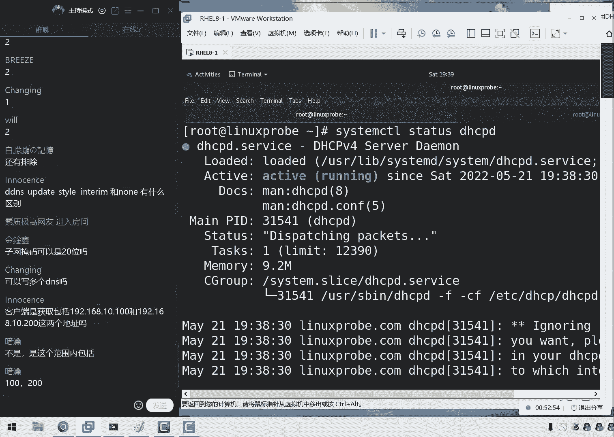
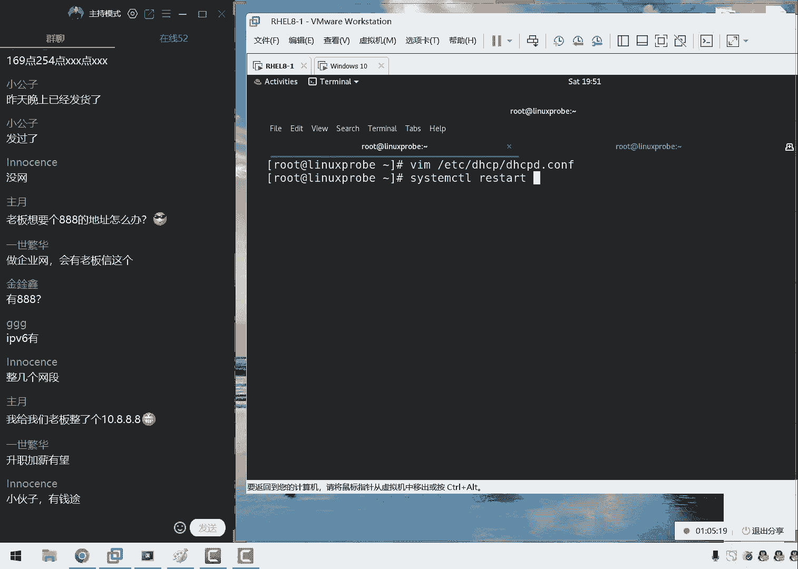
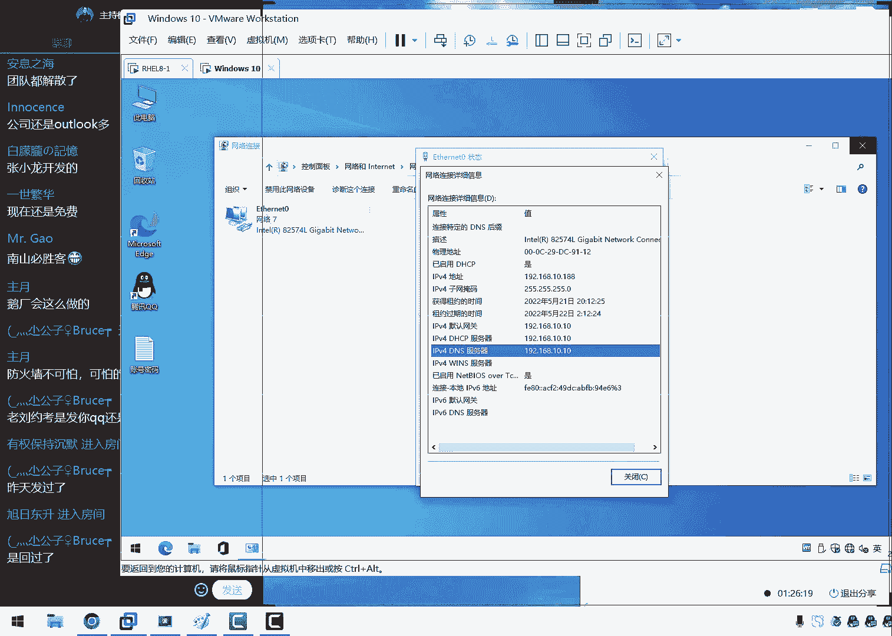
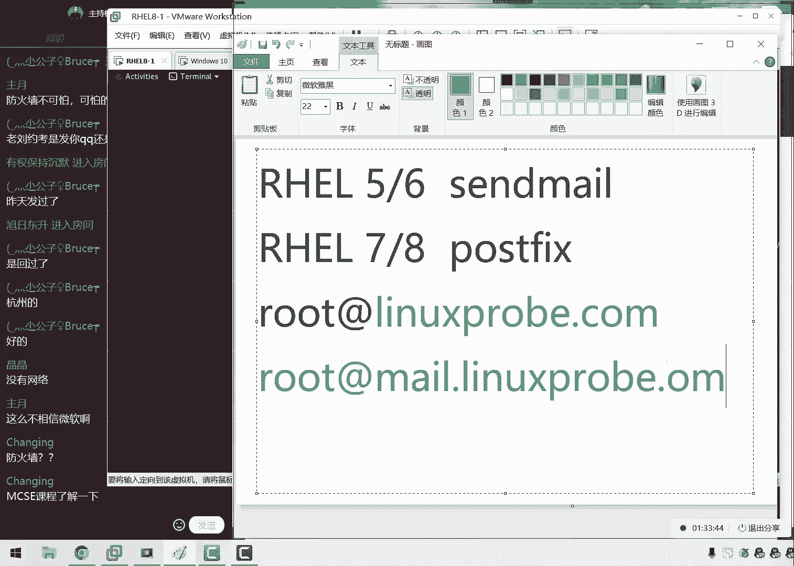

# linux就该这么学第34期 - P22：21【第34期第二十一节课】红帽RHCE认证培训课程-Linux就该这么学 - 能力努力 - BV1L14y1878S

ok我们就我们就重新开了一下啊，大家现在先看我们的这个屏幕上本就没有那个竖条对吧，那个竖条大概是那个录屏那个小的一个边界线啊，去掉了啊，更那么就是一个更加完美的体验了，然后给大家先去做一下总结。

那今天这个人数也正好应证了咱们啊咱们昨天所说过的啊，咱们这个大部分的学员都是为了考试的，学完考试之后的话呢，后面就去备考去了，那也就是说呃今天咱们咱们今天所讲这个课的话呢，听得更好不好。

但是呢如果没有听的话，对大家的考试没有太大的影响，主要是为了以后我们在配置服务的一个拍摄能力，以及啊这能跟某个服务嘛，然后就在一些配置的啊，一些服务的一些能力好，我们来给大家做一下总结。

昨天我们干了啥呢，我们昨天我们去约了考试了，然后昨天的话呢我们约了很多个城市，因为我比呢他们稍等一下啊，没有笔，我这边写完笔记啊，ok啊回来了啊，拿根笔来，这样的话呢我们有一些注意事项。

我们今天给大家去说清楚，下课之后，我那我们就可以去衔接，这样去干了，第一件事情的话呢，就是我们昨天所做的就是我们给大家约了一下考试，北上广深四个城市啊，我们来我们全部覆盖。

然后同时的话呢还有一些其他这个城市，比如说济南呀，还有武汉这个城市，我们也给大家约到了啊，这句话也是那么的话也是非常方便的，至于说有些城市的话，确实现在您用完之后还没有反馈，比如说是啊。

天津站的这个城市的话呢，我们也正在购物当中，那么您可以再等一等，好啊，我记得还有呃郑州对吧，然后我们还有几个城市，我们可能会在下周的时候看看能不能约得上，要要要啊，那我们要是呃跟考场学沟通过后。

他们要是还有啊考试的时间，那么我们会给大家发一个通知就好了，所以说如果说您之前给我们登记过了，那么你就不需要再去登记就好了，那么你等着就啊，那么大家可以等一下我们的消息就可以了。

我们大概会在呃下周345这么几天会给大家发消息，就是有，那么就给大家具体的时间，如果是没有的话，那您就可以去考虑一下其他西亚的城市吧，比如说天津的话要来北京的话对吧。

然后的话那可能您在江苏就要来南京或者上海这样的一个呃选择了，然后还有的话呢就是呃比如说您之前那您没有跟我来登记，然后的话呢我们现在还想报名的话呢，那么大家发给我的这个格式是这样的，是以城市的名称来命名。

让加上具体的时间来啊，然后呃不不，然后加一个大概的时间来去发给我的，因为现在的话呢我们经过昨天的这个月考，现在就只剩下一个时间了，就是深圳的6月啊，就是啊就是啊是只剩下一个，就是深圳的6月22号。

还有啊这么一看考试的时间，然后呢其余的这个所有的城市就全都满了，然后升完啊，然后啊啊然后的话这个时间我们下面，然后我们在下午的时候去约了一下，大概的话还有那么一两个三个位置吧，然后呃除此以外的话呢。

北京上海深圳啊，北京上海广州都已经是约满了，而且是约的超级满，可能还有些同学需要调剂一下，可能约到第二天了，但是的话呢基本上来说大家都觉得非常的顺利，然后的话这就是我们大概一个月考的情况。

如果大家如果要是您之间没有约啊，那么就您需要发一下这个信息了，之前的话呢你可以挑日子，现在就挑不了了，就只能是按啊，按照我按照我们先这个啊格式发过，然后我们来去排考试时间，出来考试之间之后。

那么就看一下具体这个人数，大概的话呢这个时间也不固定了，可能是在7月底，可能会是在8月初，这需要以红方这边来去呃，来去安排了来，这是第一个事情，就是昨天有一个同学们啊，大家可以好好踏踏实实去做啊。

那么啊来去做一下备考了，如果没有约的话，就按照这个格式发布，然后再给大家登记一下，要是有就直接报，要没有的话，那他们就等着就好了。

然后我会给大家发qq上那个消息啊，然后我们后续再给大家继续安排啊，昨天有多少个鱼人约，昨天的话我们处理到了晚上12点，昨天我们大概约了65位同学，然后今天的话呢早晨起来呃。

加上中午大概约了有七八位同学啊，差不多，然后大家怎么说啊，不开摄像头吗，还是不开，然后说成功约了几个人，成都好像没有约吧，啊成都时间还没有出来呢，所以我们还没有约。

六九下载地址，我现在还没有啊，等等等我们过两天吧，然后大家说博客的活动花了多久，那现在就来吧啊那我们是这样的，那在我们第一天上课的时候的话，给大家梳理一下，就是呃如果说大家想要一本我们的新闻和书籍。

一份小礼物啊，虽然也不值钱，但是是一份心意吧，然后的话呢我们就可以进入到咱们网站的后面来看的，同学们还是比较啊，还是比较喜欢我们的，对不对，然后我们现在进入到咱们的网站。

后面，要给大家发了个小礼物了，我的画图板呢这个是个好工具啊，来进入到咱们这个网站当中，大家进入到里面去，然后的话呢我们就可以按照这里面的这个要求，大家看一下是不是咱们从第一天开始。

或者的话您可以直接把复制一段往上啊，那么来复制一下咱们书上的文字，也都允许加上一张照片发到咱们这个博客里面，然后我们去做一下签到，居然啊啊啊，然后我们当时说的是，当我们这个课文啊快结束的时候的话呢。

会给大家做一个这个签名的书籍，就是呃我们的这本书呢吗，还要让我们给大家送一个签名书籍，可以算作是我们整套培训的一个总结对吧，大家应该记得啊，咱们有这么一次活动，所以大家可以打开咱们的网站了。

然后如果说您做过这个活动的话，那么现在您就可以打开了，今天我们就给大家说上来呃，如果说你已经做的话，按照这个要求，然后的话呢去选择，大家看一下这个要求吧，然后就是那我们就是啊那啊那我们去选择一下呃。

您觉得写的比较好的笔记，然后就是我们一定按照这个格式发布，因为我们的学员特别多，果不其然，对不对啊，还有就在跟我们去约考试，可能人数也特别多，所以的话大家一定要按照这个格式发过。

就是呃那我们来发的时候就是严格按照这个格式发给我们，然后就啊ok了，然后我们之前的话呢是给大家赠送的是第二版的这个签名的书籍，后来看同学们说那书啊，那么我们现在啊，但是我们换了啊，已经送过第二版了对吧。

后来我们想了一下，也就是说呃从这一期开始吧，只要我们参加这个活动的同学，我们是第一版加第二版的这个签名书都送，所以说呃同学们只要参加这个活动，今天晚上提交给我的这个信息审核没有问题的话。

那么您将收到第一版跟第二版两本书的这个签名的书籍，也算是一个小蜥蜴好学生，那我这个先给大家去啊，放到这边，大家可以去访问一下，然后如果您之前没有发过的话呢，那也就因为这个是只有第一天的时候。

然后然后然后啊然后我们开始去写，然后这个台上有的，然后大家说合肥有吗，合肥好像也没有行，也在等着啊，行也需要等着，大概的话您会在下面的345几天大概会收到我的信息，如果是有，那么就可以约一下。

如果没有的话，就看看能不能其他城市再去呃，选择一下了，然后大家可以看一下，就说成都六个人了吧，然后成都诶忘了，我看一下吧啊成都几个人了呃，呃另外的话我把我们这个信息给大家显示出来，大家看一下呃。

如果说您对，那那如果说你已经找我登记过，但是的话这个信息里面没有您的话，那么您就可以在这儿再补，大家去啊，那么可以再去登记一下，好吧，就是这么一个信息，然后您找一下自己的这个姓名。

您看看是不是我有没有呃，没有写上的，然后大家可以再发一遍，我应该不会有错的啊，然后现在就差这么几个城市，天津成都郑州杭州合肥，就这么几个城市，然后大家看一下，比如说郑州同学，你看看去，实在不行。

就找其他城市吧，因为郑州军有三个同学跟八个这个标准实在差的有点多啊，实在不好努力，然后我们就先来给大家说这么多吧，然后来开始我们今天这个正式的课程，然后我们先做一下简啊简单的铺垫了。

然后我来给大家说一下我们今天的这个课程，今天的话呢我们要给大家讲两个章节。

第一的话就是第14章节叫做d h c p，这我特别喜欢这个章节，这个话呢我们叫做动态主义地址，什么样的分配协议好了啊，大家怎么说啊，大家说啊，要是缺人的话，报个名额，北上广深不缺人。

但是其他城市群人下去啊，还是需要多凑点人数，这样的话那我们也好约嘛来，那我们现在给大家说一下的话，第14章节翻开书啊，今天笔记还要写，同学们今天虽然收笔记啊，但是咱笔记还要继续续写的。

然后我们来给大家看一下啊，就是第14章节第二cp，我们叫做动态主义地址更新协议，来点加起来动态主机地址更新协议好啊，或或那么或者把它叫做动态主机地址分配协议吧，好那我们这样去说。

他的话呢可以自动来去为我们的主机一起去分配我们的网卡信息，那我们要记住的就是，它会自动的为我们这个主机去分配我们的网卡信息，它不仅限于是什么的ip地址，因为很多啊大家都啊。

那我们啊那我们呃因为之前做这个实验的时候，大家总会说它分配的是一个ip地址的一个信息，其实他的并不是完全，它是分配的是一个网卡信息方法信息当中的话，子网掩码，然后还有这个子网掩码，还有网关等等。

这样的这个信息都不属于在网卡信息当中，所以同学们来记一下，今天我们讲第14章节叫d i s c p图，它是分配的是一个网卡信息，它不仅限于地址而已，它的话呢这个原理是这样，大家看图说话啊，看一下第14。

1啊，它实际上是什么呢，它就是要把我们的一个主机，把我们的服务器嘛跟这个客户端通过网线相连，然后的话呢就可以有啊自动分配这样的一个效果了，比如说现在化的客户端有啊，很多很多谈的这个客户端。

他们都没有办法的信息，我们需要的话呢，第一点就是能够为他们去分配我们的ip地址来去批量来去分配，当前有啊几千台主机，那我们现在怎么来进行一个批量的分配，手动设置起来特别的麻烦。

我们之前给大家讲了四个方法来配置网卡，但是都很麻烦，那我们怎么样批量去实现呢，那么第2c p的啊，大家可以去选择一下，第二点的话就是当我们分配好这个app啊，那我们啊当分配好地址之后的话呢。

我们怎么样来进行一个回收的一个工作，比如说我现在开了那啊那啊那啊，那我们比如说那我现在开了一家店，这个店里的话呢是啊他们啊，那么他是在卖咖啡的，那么呃当有人进来之后，他们需要一边喝咖啡，一边去上网。

那好了，需要分配一个wifi的一个ip地址对吧，那么当这个人喝完之后走了，那么这个地址是否能够被回收给下一个人继续来去使用呢，这叫做回收机制啊，这个话也可以由电视cp来去这么一个管理。

能够去让我们的ip地址的这么一个资源池里面的这个呃地址的话呢，能够更加高效跟充分来进行一个使用k tc一个回收的一个功能，大家说会讲我们的第二cp报文吗，不会讲啊，不会讲理论。

因为的话呢那个属于我们的思科的课程叫做cca里面会给大家讲。

咱们现在是讲了网啊，咱们啊咱们讲的是操作系统。

讲的是一个运维搭建啊，据说理论就是d i c这个这个理论我们放啊放到思科里面啊，他们也不会去讲dnx的这个搭建吧，所以我们可能每个人的这个分啊，所以这个每个分分工是不一样的。

那我们先来看一下d i c p服务的话呢，它有一些话术来给大家看一下，首先的话呢是这样的。

首先是这样的，首先的话第一个话术叫做作用域，我们要先学一些黑化，这样的话当我们再去配置的时候，他是不是一些理论的一些呃基础跟一些术语我们能听到，那么可以看的懂了，首先来说这是第一个叫作用域。

作用域的话呢是指的一个很大的一个呃，那它指的是一个很大的一个地址的一个范围，就比如说啊我们怎么理解这个事情呢，就是比如说它是一个很大的一个网段，这个网络的话呢，它并不是为我们的这个用户。

待会儿都要去分配一个地址，它的话呢是呃先进行一个声明声明，我们可能会要去使用到的一个网段，也就是说地址的话呢特别的大，但是它并不是待会儿为我们所有的用户真实去分配一个地址。

以及叫做排除范围这样的一个东西，然后第二的话呢我叫的这个超级作用域，超级作用域化就指的是多个网段，然后我们画的它是一个很大的一个范围，比如说我今天啊特别的饿，那我回到家之后，我只是这个啊做了饭。

说我今天我把饭都给吃掉对吧，但是呢我比如说我不太喜欢吃馒头好了，这个里边我没有去吃的啊，这个我们叫做排除范围，而我啊先进行一个声明，说我带了我可能会去吃的是什么呢啊这个我们叫做作用域。

就是先进行一个声明，说明我可能会要去使用大的一个地址的一个范围嘛，而我里边我没有去吃的东西，我们叫做排除范围，就是这个啊叫做唉作用域减去排除范围才是真正为用户地址啊，他是啊真正为用户去分配的地址范围吗。

所以的话呢排除范围就是他不会为用户啊，它不会分配走的一个ip地址，也就是说作用域在它需要去减去了啊，是这样的，作用语，它需要去减去了，排除范围小，这是一个唉公式啊，就等于一个词叫做地址池。

也就是说地址池的话呢，它是真正为用户去分配的，地址范围大里边是啊，呃这一代就是说唉作用域需要排除范围之后，才是真正的用户地址的一个范围叫地址池，地址池的话呢可以等于它可以是小于等于作用域。

因为它可以没有啊，因为它的话呢可以没有排除范围，但是地址值一定是不能够大于作用域的，但我们来记一下这个话才是真正为用户去呃，呃真正为用户分配的一个地址好吗，那我们这么去写吧，这个还比较简单一点啊。

另外的话我们现在给大家讲个课，同学们就可以去操作起来了，就是如果说你需要用彩把您的城市建的这个呃，待在一个时间发给我就可以了，然后的话呢如果说你之前写过笔记的东西，那么您就现在也是按照这个要求。

您就把那个笔记也总结好，然后下课之后啊，不然您现在就可以发给我了，下课之后咱们统一处理，然后我们三个就给大家一个回复了，咱们这样的话效率更高吧，当然我们九点钟下了课之后。

我们刚月考月考该给大家发礼物发礼物，但是礼物估计要选啊，估计可能需要等一段时间，因为现在北京现在这个因为快递停了吧，可能大概得下个礼拜了吧，反正就差不多吧啊那我们大概就是下礼拜左右。

然后我们会给大家出去的时间，以及这个寄快递，然后下面的话呢我们叫做租赁，这个租赁的话呢，我们把它叫做啊玉对吧，那我们来去啊，不是这个的话呃，不这个的话它这两个这个指的就是我们先给大家讲一下哎。

绑定一个地址，这个的话指的就是我们进行一个绑定操作，比如说我们今天的话跟女朋友去吃啊，那我们出去来去吃顿饭去啊，今天也是一个节日，对不对，好了，那我们来进行一个预约，那么也就是说呃它可以将某个地址。

将某个地址，然后的话呢与我们的主机某个地址与主机绑定这样的一个操作，当然我们有一个用户，他在去使用到我们这个d i c p服务的话呢，它会永久的去固定到某一个地址上面，比如说今天我要对吧。

今天也是一个情人节，那好朋友呢，比如说我今天想请女朋友去吃个比较好的一个西餐了，那我可以先去预约一个位置，这个位置的话当我预约过后，即便我没有去，但是这个位置的话呢依然会被我保爱保留下来。

这个我们把呃来去做一下绑定，还有一个叫做茱萸，现在就是说它会有一个回收的一个机制，它分为两个，他的话有两个，第一个的话呢我们叫做默认作业时间，第二的话呢我们叫做最大的作业时间，当我们有一个呃地址啊。

给它分配走了之后的话呢，那我们要怎么样有一个回收的一个机制，这个是很重要的，比如说麦当劳同学们来举个例子啊，现在有这么几个术语，同学们先大概给大家过一遍啊。

待会我们给大家讲的时候，你就知道我们讲的什么意思了，来再来说一下麦当劳。

我当然记得画面好像是2016年，2017年的时候，当时上过一个新闻，有这么一个人啊，然后他去麦当劳里面吃啊，他还啊他去吃饭去了，结果呢他干啊啊啊，他去吃饭去了，这个时候的话呢，他刚刚点完了餐。

突然间肚子疼了，他又走了，结果的话回来之后餐没有了，他们啊，因为啊因为被保哎啊，因为被保洁阿姨给他收走了，那比如说就拿那啊啊，那我们啊那我们比如说这样的这个情况，那怎么去处理呢，这个时候就要做一个标记。

告诉别人这个地址的话呢，我们还正在来进行一个使用的这个啊，所以我们要需要给大家写一个纸条是吧，这个餐还没有吃完，但是的话呢我只有一个人，我现在要去厕所，我们一会儿回来，那么要写这么一个纸条。

然后告诉他先不要来进行回收，然后呢那我们来来啊进行啊，他啊他的话来进行呃，它需要进行呃，它需要进行这么一个使用，那么这个的话呢在我们这个a d r c p服务里面的话呢，它为了也能够去进行一个翻台。

它这个地址也需要回收，如果要是没有回收的话，那么这个啊每一个人他是个吃饭的时间，他并没有那么长，就会造成资源浪费了，对不对，那好了，他分两个时间，这个话呢我们叫做moon啊，这啊啊默认时间。

那也就是说到达这个时间之后，那么他会给我们这个餐桌的话要做一个标记，比如说我们先是个保洁阿姨，当你这个餐啊，它在桌子上面，然后呢，但是你不在的时候，他会做一个标记，五分钟之后再过来看看。

如果五分钟过后你还没有回来的话，那么就会进行一个强制的回收，这个非常清晰对吧，它这两个话呢分为我们的默认作业时间以及最大的作业时间，这个叫做最大的作业时间，默认作业时间就是先去做一个标记。

然后我们接下来说这个啊说啊这个人的话呢可能是以啊啊，这个人可能是做错啊，他啊他啊他啊他啊他有可能回来对吧，我们再做一个标记，它是有可能回来的，作为一个简简单的标记，但是的话它并不会大家进行一个回收。

但是到了最近啊啊，但是到我们a最大的作为时间的时候，则进行一个强制回收，所以大家一定要记住两个的区别，因此呃默认作业时间一定要是小于等于啊，我们这个呃最大的作业时间的。

所以这个就是一个进行强制回收的一个过程，这两个时间我们写好之后就可以来进行一个地址的回收使用的，这个挺好玩的，反正呃啊这个我们待会可以来啊，就当我们来给大家来进行一个演示。

然后我们现在给大家说完之后的话呢，来动手做这个服务之前啊，还有一个事情，就是我们这个主机的话呢。

我们来做这个实验吗，我们需要先去关闭到虚拟机自带的一个电视cp服务，大家看到我们刚刚上课之前，我也是准备了一下试验环境啊，其中有一点就是我们需要点击在这个编辑，大家一起去操作一下。

因为的话呢之前我们在这我们在讲什么服务啊，忘了啊，边有这么一个服务呃，完全就是来自于我们来，那我们完成编辑的时候，当时我们去啊开启过虚拟机里边提供这个第二cp功能。

好像对于我们这个网卡绘画的那个章节是吧。

大家还应该有啊，大家啊大家啊，那我们应该还记得啊，所以的话大家现在需要再重新点回到我们这个虚拟机配置选项当中，然后的话呢我们点击一下这个设置，点击一下这个虚拟网络编辑器这个选项。

这个时候的话呢我们去选择一下，把这个功能给它关闭掉，大家看一下这个功能，把它看啊啊，那我们先把它关闭掉，这样的话到关闭之后啊，他就不会跟我们自己配着这个电视cp服务产生的这个冲突。

然后我们点一下确认没有问题。

然后大家问的一个问题，大家说今天要买这边的少卡啥，同学们是发错了吧啊，然后我们来继续啊，大家怎么着，我看一个问题啊，大家说今天要买这边的上环啊，唐诗这是在拆键盘吗，那我们来继续了啊。

我们来配置这个服，把我们这个那那我们现在把我这啊，那我们把我们虚拟机里边这个虚拟网卡电视cp功能关闭之后，那么就没有人跟我们去发生冲突了，我们就可以来去配置了。

把我们这个虚拟机还原到一个区初始的一个状态，保证我们的实验之间是产啊，让我想一想啊，还有什么要说了，那还有这个防火墙，对不对，我们叫做ip tables啊，ib tables。

然后还把我们这个d i c b服务也给它加入到这个选项当中，保证我们的下一次的时候，还依然能够去对方火墙里面的这个流量来进行放行，然后大家问一个问题，大家说说哪些设备需要进行手动或者动态啊。

比如说这问题我认为有点宽泛，而且有点不太准确，就以我理解来说吧，就是的话呢那我们记得这个房子它分为两个模式，一种的话呢我们叫做静态模式。

它指的是由手动来进行配置的，这里边的参数我们写下来指的是手动配置模式，第二的话呢叫做d2 cp模式，叫做动态分配模式，当我们自己在配置一台d2 cp服务器的时候，我们需要保证我们自己在这个网卡。

他首先来说它是手动的，然后呢他需要保证人类就是说服务器它需要去手动模式来啊，那啊他有啊，他需要一个诶固定的一个地址，然后的话呢那我们的这个所有的客户端，它虽然是一个动态一个地址，这样的一个理解好。

我不知道我回答对不对，反正同学们这个问题也不严谨，那我就先按啊，按照我这个理解来去说了，来我们来保证我们这个课的一个进度吧，咱们这个效率要提高的啊，让我们先来去reload一下。

把我们dl c p加入到启动项当中，然后让他去能够去对于这个防火墙来进行放行，下一次的话呢防火墙啊起码不会给我们捣乱，下面一步的话呢就是来去安装一下这个dl c p了。

第二cp的话后面加一个d叫做第2c p d好，下面给大家提一个小问题，你看咱们这个课程就很有压力啊，对不对，咱们这个问题表示啊很突然诶不对，这个叫做d r c p conserver吧。

它它它是叫做啊dl c p d，它叫做dl c p杠server。

好这两个区别大家去呃记录啊，大家啊大家需要去记一下，另外给大家提一个小问题啊，虽然说这个服务它不是了，但是有些服务的话它是是的，比如说网站服务，比如说我们的远程连接服务，比如说我们的文件传输服。

比如说太多了对吧，大家提一个小问题，为什么我们的很多的服务的结尾都是以d开头的，大家理解一下这个问题，就是为什么我们的很多的服务，它的这个名称的后面都是以d结尾的呢，这个地有什么啊特殊的含义吗。

啊大家先聊聊这个问题啊。

我们先往后面给大家去配置，咱们这个课效率特别的高，这样的话呢我们呃每天啊每天两个小时的这个时间，满满的收获感来etc目录里面，既然讲到了配置一个服务，就是在修改这个服务所对应的一个配置文件。

那么我们怎么找啊，那我们找什么呢，找这个服务所对应的一个叫做主配置文件来d i s c p，然后是d i c p，然后是d i c p，d。config这样的一个形式。

那我们接下来找到他这个所对应的主配置文件，这个里边的话默认是空白的，但是他给我们写了三方信息，首先来说他说这个他就是一个我们电视c p的一个主配置文件，第二的话他说我们这是一个示例文件。

如果说我们要是不知道怎么去配置的话呢，我们可以去看一下我们所对应的一个示例文件，第三的话呢就是说哎如果说这个看完视力文件之后，我们还不会配置，可以报一下老刘的培训啊，2400块钱啊。

不仅能够靠加h c e这个不啊，这个我啊啊这个服务即便我们考试没有，但是我们也会讲啊，非常的超值啊，这么三句话，但是这个话主要的关键点就是前面两句，第一来讲就是告诉我们，我们找到了它所对应的配置文件。

虽然是空白的，但它也是这个啊主配置文件的意思，第二的话就是说我们可以从里面去参考一段这个参数，然后您去选择一个您觉得合适了，其实我们大家摊牌啊。

我们现在给大家讲的这个实验，就是这一段给他复制过来的，然后我们给大家去改了改。

所以大家在考试跟工作的时候啊，考试时还不解，那我们在工作的时候的话呢，自己想去配置一下这个服务，但是这个参数老是记不住的话，没关系，看一下示例的文件，从里面一抄也行啊，我们来看一下，我要给大家呃。

然后我们再给大家说一下怎么来进行配置的吧，这个看起来有点乱，我要给大家一行一行逐行讲解一下。

对大家另外一个问题回答出来了，为什么我们的每个服务的后面它是以d结尾呢，因为叫做手进城，叫做demand对吧，叫做守护进程，这个进程的话呢叫做守护进程，它跟一般的进程不一样啊，他是一个守护的一个角色。

我们看一些童话故事里面说这个守护者这种身份啊，守护进程他是说它跟一般继承是有区别的。

比如说大家看啊，当有一些服务对吧，当有一些命令大家看啊，这样的命令，这样的命令，这样的命令它的画面执行过后，他都是呃呃执行过后就会马上就会被啊他们啊。

他也就是说这个我们叫做一般进程，它是支啊，执行过后的话，它就会把它给结束掉了，一般进程就是他执行过后就会结束掉啊，那我们就是说呃工作结束就停止，我们可以来，那我们可以来这么去理解，工作结束就停止。

那么这就像我们去找一个工作啊，当我们早上起来去上班啊，下午就啊，那我们就下午，那我就可以下班了，这啊这个效果，那我们这个意思也差不多，但是的话呢这个守护进程就他那么就呃，那么就是说它会随机的开机开机。

随机等的关闭而关闭，他会一直为用户提供服务的，来咱们先咱们就像老刘一样啊，他没有啊，他没有这个上班时间对吧，他会一直为红啊，为用户提供服务，一直为用户提供服务，这样的形式。

比如说我们的网站服务就是需要这样的这个形式，因为任何时间任何地点当用啊，当有一个用户去访问我们的网站的时候，都要能够去得到他想要的内容，所以说网站服务就一定要是一个手进程。

到说我们现在所讲的这个d i c p服务也是一样的，当有一个用户它需要地址的时候，他就应该得到一个地址对吧，它所以说他要一直啊等待用户去提供服务，叫做手进城这样的一个形式啊。

不过在鸿蒙六八点，不是这个也无所谓啊，他这个服的名称它没有发生变化吗，lc来b r c p d l c p。config做好呃，然后我们现在来给大家配置一下，既然说前面几行都是无所谓的啊。

说啊那我们他把它给删掉呃，然后我们往里面去复制吗，就别复制了，复制了，还有感觉很没有诚意，我们要给大家去手敲吧啊咱们诚意满啊，非常的强，来首先来讲的话呢，就是我们先写一下，第一行叫做全局变量。

首先我们是否允许叫做动态主页地址更新协议啊，第二啊这我们叫做d d n s，大家说这啊，那我们再去配置这个d i c d这个主备啊，怎么去配置，因为我们现在d i c d主要配置就是这个主服务器。

其实的话呢我们也呃我们会把它做这个啊b i c p中继代理，但是这个话用的太少了，所以呢我们就不给大家去讲了，我们现在只是讲的这个主我们用的比较多一点的，那就是我们来配置一下dns不。

我们来配置一下di c p这个主服务啊，来b啊，叫d d n s用不到的东西是我或者我们比较少用的东西对吧，那好了，大家可以以后我们需要用到的时候把那么去往上一搜啊，不就是咱们这个课的一个怎么讲啊。

这一个最有优势的一个点吧，啊东西都可能反而记不住啊，来我们来继续，因为当时在红桃667这本书里面，大家可以翻译一下吧，其实我们有的d l c b中级代理，当时我们已经写出来这个章节了，结果的话呢删了啊。

就是觉得没有他没有太大意思，因为在拍摄d i c d的这个时候，他几率都比较小，因为我们当时写完第二cd这个章节之后，第14章写完之后，大家大家会产生质疑的，说到流第四章节吧，没有必要吧，删了吧。

因为那么呃那么是为什么呢，因为现在画的在公司很多这种电视cp这种服务嘛，并不是说我们这个啊什么系统做不了，是因为的话呢主要是由设备去做了，比如说计算机路由器去完成的，但是我们还要给大家去提到。

就是我们有些功能的话呢，确实是设备能够去做计算机路由器也可以去做系统也能去做好，那我们就要给大家去讲一下基于系统是怎么去做的啊，万一以后我们要用到呢，对不对，好，我们来继续，我们来首先来讲一下第一行。

就是说我们是否要去使用叫做d d n s，这个的话，那么我们就叫做啊动态主地址更新协议。

我这个我们叫做动态主机名啊，解析协议叫做动态啊，叫做啊d d n s动态dns解析协议，动态dns啊。

动态域名解析协议吧，然后我们这个话呢现在是不需要的，所以我们把它给它禁止掉，第二的话呢，我们接下来就是忽略掉客户端给我们的一个更新信息，来忽略掉个客户端给我们的更新信息，接下来我们就要去写这个作用域了。

现在给大家提一个小问题啊，大家给大家说到的，就是请问我们的这个作用域是实际为用户去分类的一个地址范围吗，因为我们现在需要去写这个作用域的一个信息，最终日的话呢是一个很大的一个网段。

请问是否就意味着说任何呃就那啊那啊，那么是否就是它代表着我们所有的这个里面的ip地址，待会都有可能为用户去分配到呢，啊这个小问题大家告诉我一和二就可以了啊，一代表就是肯定的。

就是说这里面的地址都要为用户去分配，第二的话就是二则啊，告诉我啊，这里面的地址的话，那不一定我们后续分配就好了，我们来给大家往后面去聊聊啊，大家说是二对吧，其实也不一定都不一定，为什么呢。

因为啊也有可能是是的，为什么呢，因为啊因为还有啊，因为还有排除范围，对不对，对，大家大家大家大家我们要记住啊，这个的话呢也就是说作用于我们现在所说明的这个信息。

也有可能是真的就是为用户去分配的一个网段了，就是从1~254都行，为什么呢，因为可以没有排除范围，就像老刘啊，我啊，那比如说老刘我比较啊，如果说我啊并没有我啊，没有啊，没有去吃的东西。

所有的东西我全都吃了，那好那么也就是说没有排除范围，那么好了，作用域就等同于了我们的地址池，那所以说排除范围的话呢，可以有可以没有好吧，然后呢我们啊啊但是地址值一定是小于等于的作用域。

如果说我们都没有声明的情况下，那么肯定是不能用的好，然后大家说我们进行一个交互跟一个禁止有什么区别，那么就是说啊它里面是一个开启一个关闭啊，然后下面的话呢我们来就是呃设置一下地址池信息了啊，地址池的话。

其实啊其实啊它就是一个字面意思，大家可以去把这个参数放网上一查就可以了，这是一个字面意思啊，就是代表就是一个开启跟关闭，有的话我们定义一下地址池，地址池，大家记住。

我的地址池的话是真正维护去分配的地呃的呃一个地址啊的一个范围，这个地址值的话呢它是从一开始的，然后我们一个c类的网段的话呢，它是从呃1~254，它不能超过254啊对吧，我们去记一下吧。

所以我们地址池的话呢，我们就给它写下来是呃10。100，然后我们后面再来就是1920~8点10。200，也就是说我们定义了一个地址池这个范围的话，那才是真正为用户续提供的一个呃分配的一个范围。

那么也就是说排除法也不用去写我们吃了什么。

那么就是啊比如说啊那我们比如说现在有啊，现在有很多这个吃的，现在有个桌子上面有很多吃的，我们去吃掉的啊，不那我们啊，那我们现在这个啊上面所有的已经有的这个饭菜，我们则进行的是一个声明，进行一个声明。

整张桌子都是我们的声明，待会我们可以去吃，然后的话呢我们去吃掉的这些东西，它指的就是叫做地址池，而我们没有去吃掉的话呢，它就是啊直接归为叫做啊排除范围，所以说排除范围是不需要再去单独去写一遍的。

好啊，那我们来继续给大家去写，下面的话就是我们来为用户去分配的呃一个呃自保源码，那也就是说我们借来里边缩写这个所有的这个信息，都是给我们的这个客户端去提供的。

那也就是说我们现在缩写这个信息都会直接填写到我们这个客户端，这个网卡的这个参数里面，好了，我们接下来第二个就是设置一下给客户端这个自爆源码这个信息，三个五啊，点零。

那为客户端去分配的一个自爆源码的一个信息，再来的话呢就是设置一下我们这个呃给客户端的一个网关地址，吓一跳嘛，就是我们这个网关地址，网关的话呢说实话其实现在没有，但是的话呢不写的话呢啊少学个参数。

所以我们先给大家写下来，就是网关当前他并不生效，他也没有任何作用啊，但是的话这个参数大家可以来记一下，叫做哎下一跳地址，它指的是网关地址，我们写下来吧，幺九二点一六八点10：10，哎我们写下来啊。

写清楚的，接下以分号结字啊，他以这个呃它需要后面加一个极速符，写一个分号，接下来的话呢我们定义一下这个dominosa，大家其实就看这个词之后就觉得很眼熟，对不对，我们写下dns地址。

不过我觉得这个参数也要去学一下吧，那我们这样去做四个点八，然后点啊，然后我们写下了一个dns地址，待会儿我们所写的这些参数，再往前码啊，网关dns这些参数都一会儿会啊变成参数填写到客户端这个网卡里面的。

好，我们接下来续写我们的默认做的租约时间啊，那么当啊他的话这个单位是以秒为单位的，那也就是说当我们到了这个呃六个小时的时候，大家可以计算一下哈，我们接下来这段话按照秒为单位，六个小时。

216021600秒，那就是六个小时的时候，当到六个小时的时候，我们会去给大家做一个标记，但是的话呢并不会进行一个强制的回收啊，大家记一下，然后当我们做完标记之后的话呢，到最大的作为事件的时候。

如果说到达最大租约时间了，那么稍等一下最大的作息时间了，那么我们就是12个小时，那么就会进行一个强制的回收，哎那也就是说诶保洁仪先给大家做一个标记，并不会给他擦桌子，把饭给他倒掉了啊。

会先放一个小的一个标志物，这样的话呢过一会儿之后再过来看一看吧，如果这个人还没回来啊，就把他给收走了，然后来给大家反过服务，大家会看一看的啊，实际上这个服务的话呢就跟我们昨天那个很相像呃。

他每一行结尾的话，它会有一个分号，但是最后一个分号不但是最后一个括弧的后面是没有分号，请大家一定要注意这一点，然后的话呢我们来继续啊，下面有一个问题啊，我们先给大家演示一下吧，来大家先给大家演示一下。

重新去重启一下我们这个d i d i s c p服务，然后的话把我们这个第二cp放到我们这个呃选项当中，保证我们下一次的时候依然能够去启动，今天这么顺嘛，没有个报错啊，显得好像是很简单一样。

ok没有问题啊，running启动了好大三，下面大家又问了一个问题，大家说资本眼马可以是20位吗，没毛病啊，可以啊，可以写多个dns吗，可以啊啊通过逗号间隔吗，大家说那我们的客户端的地址只能是点啊。

只能是100跟220个地址吗，不是它是范围，他指的是从100~200之间，也就是说有101个例子的对吧，对这个非常严谨啊，好下面我们来启用它之后的话呢。

在我们的本地去测测不出来，我们开一下客户端吧，准备一下客户端出来，准备一台windows吧。

因为正好啊，因为我们下一个实验就要用到这台windows，好开起来开几台windows，那稍等一下，大家等我们这个windows启动了，今天这个笔记本开两个虚拟机，有点难为他了。

顺便上课之前还下了一个小工具。

稍等一下，我把这个工具给它抛到里面去，下一个试验就要用到outlook，今天这个实验还挺顺。

稍等一下再等他开机，我们准备在客户端看看客户端能不能去自动去分配到保卡信息。

这个的话呢，我们每个人都要去使用到的，比如说我们当前此时此刻，每时每秒，我们的路由器，我们那个小的路由器都会为我们的所有的设备去分配ip地址，但是的话呢我们之前只有那啊啊，但是我们之前只是去使用了。

我们并没有去配置它，今天我们拍完之后，大家是不是对于我们电视cp服务就有一个更加深入的一个了解了呢，啊非常好啊，怎么样的啊，这一块呢我们这个啊有这个呃散热的声音了啊，风扇已经转起来了，确实有点为难他了。

然后下面一个问题大家说他是一个b区间啊，这个怎么一点的话呢，我觉得b我觉得呃这一段话的意思就是这样的啊，我给大家解释一下吧，我觉得没有那么难理解啊，首先来说这个地址池的一个范围。

比如说我们写的是一个1920~8点10。100这样的一个地址的话，就等就是他啊，所以这个格式是这么写的啊，但是的话它等同于了就是192。68，然后点10。100，然后是1920~8点10。101。

然后巴拉巴拉巴拉，然后怎么理解呢，它是一个区间，也可以，它是一个闭环啊，那么啊它是一个啊，大家怎么记都可以，反正就是他这个意思就是说从100~200啊，总共方案是101个地址，大家怎么都可以。

不过我觉得我不用太纠结，我们就可以为用户区分配啊，它里面就没有排除范围了啊，这句话它是呃范围的意思啊，范围的意思只不过因为他这个呃，因为它所对应的这么一个参数的格式嘛，他就是啊没有这么一个减号而已。

所以大家可能看起来有点抽象，但是这个意思啊是一个区间的一个意思，然后我们先给大家去看一下windows啊，准备一台windows作为我们的客户端啊，然后的话呢我们把这个小工具给爸妈啊，先往里面抛一下。

这个工具是我们待会儿就要去使用到的，所以我先往里面套着啊，这俩实验直接先把这个实验环境给它做出来，然后的话呢我先把这个实验跑起来啊，同学们是这样的，不用纠结啊，就是我现在所做这个操作跟大家无关啊。

这怎么回事呢，这是因为下一个实验我先把实验环境给它装上，这样的话待会就可以直接去做了啊，咱们新人不歇马啊，别啊别闲着他，然后找一个outlook 2010的一个激活码，就有点像盗版啊。

不过我们只为了测试呃，用一次我那我就会把这个狙击给他删掉的啊，平时也也不用它来放一个虚拟机，再放一个激活码，稍等再来跑起来，然后我们点开我们这个虚拟机里面这个系统，稍等一下，点开我们虚拟机的这个系统诶。

点不开啊，点啊点的开点不开啊，点的开哦，我看一下啊，现在是这样，现在是这样，我好像弄错了，这个虚拟机的话呢，它现在是一个桥接模式，我们现在不需要它是桥接模式，我们现在的话需要改一下。

需要的话呢啊盗版啊没事，我们到时候我们下课之前，我会把这个整个这个系统给它都删掉的，我会给大家录个视频啊，这我没，反正因为我们本来也没用嘛，它就是一个实验环境，这笔记本我我平时也不用的。

来我们点一下这个金主机模式，来点一下确认啊，别来啊，就别连啊，它反而它配也不太行，来我们给大家造成金主机模式，然后我们再来这个虚拟，基本上我们也不用啊。

只是来去做一些小实验，进行一个邮件测试，来稍等一下，然后大家问一个问题，大家说说呃，那呃想问的话，那第一个地址说是100还是101呢。

会是100啊，会是100，刚才所说的很清楚啊，就是从100，然后是1101102，103104050060708096万，一直到200，当然我们做完这个实验之后，你就会看到。

因为第一个分别走的地址肯定会是100吧啊其实这个问题不用问，因为你等一会就可以看到这个实验效果了，来是要试用是吧，好我们不给大家找理由了，这些确实到啊，可能是可能是不太道德了。

不过这个就是做一个小实验诶，怎么回事，很气人了，稍等一下，稍等一下，我把它调一下网络模式好吧，那我们先做第一个实验吧，因为它好像是网络不通，所以的话他不让我们去安啊，那我们先这样，我把它给关闭掉啊。

当时没有发生过，然后我们来给大家看一下这个网卡信息怎么来进行自动的一个分配，我们来点击一下这个网卡信息，点一下这个属性，然后的话呢啊大家都不要承认是吧，ok我们来继续，那我们来点开这个网络。

然后我们选择一下这个呃以太网，然后我们选择一下更改网络适配器啊，看看这个怎么点出来的，然后点击一下这个网卡，是这样的，我们需要把这个网卡的话呢，我们只要把这个地址看到没，现在地址已经分配过来了。

为什么呢，就是因为我们当前这个网卡的话呢，它是一个第二cp的一个模式，所以它自动会分配到我们这个地址好，这个应该在啊，但是我们先把它给禁用掉啊，大家再重大啊，大家再重新看一遍，因为我们这个实验啊。

因为这个虚拟机是在我们上课之前开的，大家说啊这啊所以我们没有看到这个呃会呃，所以我们并没有看到这个啊获取信息这么一个过程，所以我们现在把它给重新开一下，再来一双击，大家看一下。

然后我们去点击一下这个详细信息，大家会发现只要把我们这个网卡的话变成一个d i c p的一个模式，那么好了，那我们所定的一个我们的地址以及资本页码以及网关d h c p的么。

这啊那我们这个所有的信息就会被我们自动采取分配了，这就是我们d i c p的一个的一个小实验啊，另外同学们问到这个问题，那我们这个到底第一个地址是啊什么呢，所以我们可以看到它这个地址是点100啊。

没问题，好，下面一个问题大家问到说今天晚上还约考吗，今天晚上约，但是没有时间了，您需要登记一下信息之后，然后等具体的安排，大家问了一个问题，大家说如果是我们的v p s获取信息。

那么ip到底后面该怎么进行排查哦，但是您这个信息被打上码了，被打上星号了，我们没有看到你发的具体是什么样的一个问题，但是我们可以给大家提供一个思路，是这样的，当然如果说我们先从一个客户端啊，不配。

我们现在要从服务器啊来去备我们的这个客户端，从服务器分配一个地址给客户端的话呢，那么这个过程它会解读到系统的日志文件里面。

所以说如果说您啊单进行分配的时候出错了。

可以去看日志这个哦，我们的文件的话呢，日志文件它是在我们的上学相关学问，它是在我们的呃v目录里面的log里面的message这个文件里面。

然后来进行来进行一个写入的，这个日志写的挺全啊，比如说同学们问到说老师为什么我现在分辨信息分配错了，那么就可以看这个对吧，然后我们在下面又有一个小问题说，那如果说我要想把一个地址跟这个网卡做一下绑定。

那我们该怎么去实现呢，比如说我们现在有一个老板特别的迷信啊，那既然我们这个啊，那我们先既然这个地址是从啊100~200的好了，这个老板的话特别想一个ip地址的一个啊值叫一啊，188啊，要发发。

那比如说建一个老板，他就要求非得要是第88个地址，那怎么办呢，那么就有两个办法啊，第一来讲的话呢就是我们每天第一个到公司，然后在他之前先开87台电脑，他在开的时候就是第88了对吧。

第二个方法的话呢就是去做一下绑定，通过我们的日志文件找到他所的啊，对应的这个信息该排除排除啊，然后我们通过这个认知里面这个信息去做一下绑定。

把它的这个主机跟我们的这个呃地址绑定过后，那么他在开机的时候，即便他没有来啊，那么他也会白发，那么他也会把它给保留下来的啊，这也没有任何问题。

来我先来继续来编辑一下我们这个d i c p服务的一个对应的一个，文件信息，d r c p，然后第2c p d。config，找到这个锁定的主配置文件，然后答案基本的一个问题。

大家说如果要是在做企业网啊，或者老板信这个有可能啊，他啊然后说如果啊如果啊如果要有啊，如果要是有人要三个八，一直咋整，这个整不了，因为我们家啊那i p v4 级别就没有八八这么一个数啊，最多就是255。

顶多给了个250，这个是赢啊，这啊这啊啊要是再高的话，高不了了啊，好了，我们来继续啊，然后我们来给大家写下来啊，接下来我们写下来，然后绑定一下地址，那么大家现在想一个问题啊，就是它有一个悖论啊。

就是我们在这个互联网里面怎么样来去判定一个主机呢，实际上就是通过我们的ip地址，ip地址的话呢，但有个问题就是我还没有给他分配ip地址呢，但是我怎么知道他ip地址呢。

大家想一个问题啊，就是我们常说说我们的ip地址，就是我们的在互联网里面的一个身份证号码好了，那接下来说我们的身份证号码，现在我们还没有呢，那我们怎么样来进行一个绑定呢，就是根据我们叫做身份信息嘛。

比如说我们的指纹呀，啊比如说我那么一些信息在我们这个计算机里边的话，也有一个值叫做什么呢，叫做mac地址对吧，叫做啊这个我们叫做网卡的物理地址，那我啊那么我们每个人去看这个这个信息的时候。

感觉都是不一样的啊，这个的话呢在我们这个运维里面，我们它并不是口红，它也不是啊啊那我们来给大家来这个的话呢，我们叫做网卡的物理地址，因为的话我们这个词啊，mike大他他他啊他是有很多这么一个解释的。

之前有个师姐就说我说老师这个我知道啊，它是啊它啊它是一个品牌啊，它是一个恐怖品牌啊，它的话呢实际上就是我们叫做网卡的物理地址。

他就是他会去收录在我们这个啊网卡设备上的这么一个信息，好我们先啊去绑定一下，也就是说把我们的主机上面的mac地址跟我们这个ip地址做绑定，下一次他再一开就行了，好我们来去绑定一下。

第二个绑定的方法呢是这样的，首先来说为这个主机来来去设置一个名称，比如说我看谁吃谁迟到了啊，随便去写，比如说叫做呃小王同学吧，叫做这个小华同学叫小华，然后我们比如说对于这个神经绑定的话。

先做一个标识以后也好，知道是谁吗，就是因为大家都是地址的话也不好记，所以给他定一个名称以后知道那么多啊，他就是知道对应的是这个啊主机是谁了，接下来定义一下主机的名称，以太坊地址。

然后呢我们的这个网卡的mac地址的话，可以来去进行一个查看就可以了，然后在我们这个里边的话去查看到这个对应的信息，然后我们对着二往里面一填就可以了。

但是有些情况下的话呢，那我们可能是看不了它所对应的一个卖地址的，这个时候的话呢我们就可以讲到了，通过我们的目录里面的log里面的message这个文件去找到它所分配的过程。

这么一个报错以及记录的这么一个信息，然后里边的话呢也会有它所对应的一个主机信息，比如说大家看一下呃，它分别走的地址是10。100对吧，就是连100我找了一下没有好，那怎么办呢，啊也没关系。

我们可以去使用这个命令叫做t杠f来去持续去刷新某一个文件，最后的几行来啊，持续刷新我们的文件的最后几行。

查看一下系统的这个分配走的日信息，日志信息的话呢，当前好像是跟我们的网卡分配没有太大关系啊，于是我们这样重新点回到客户端，让他的话再重新去分配走一次ip地址。

这样的话呢我们在日志信息当中又会记录一次，mac地址，剩下三同学问，那怎么样呢，呃说我给老板选了一个特别吉利的一个号，对吧啊啊三个点八也挺好，然后我们看一下点iip地址。

然后我们选一下借用经过后的话，在一开启马上回来，马上就看我们系统里面这个信息，于是你就可以看到了，就有了对吧，我们现在有一个地址，它是被分配走了点10。100对吧，它分配走到哪儿了呢。

他这个对方的ip地址啊，对方的物理地址就这么一段信息，于是我把这段信息一复制不就知道了，对方我们的老板对吧，他们所对应的一个地址了，如果要是没人去分配啊，当不方便去看人家电脑的时候。

就可以按照我这个方式来去获取一下，所以说这个文件里面啊全都是宝贝，所以大家如果是遇到报错了，那这个问题其实的话呢可能更多的可以看一下这个文啊，看一下文件来找一下思路，来找一下排错的思路。

首先我们写下来啊，对方的一个mac地址，物理地址写下来啊，然后接下来的话呢再来我们来进行绑定，当有一个主机想要去跟一个地址去做绑定的过程当中，那么就需要去写清楚这两点信息，第一就是麦克。

第二就是对方的地址，来1920~8点10。8啊，点啊十，然后我们可以先写下来他想要的这个例子啊，188，让我们点一下这个保存并退出，然后说一句走你就走了啊，去重新去启动一下d i c p服务。

搞电话过后再来，很简单，同学们这个就非常简单了啊，不给他们去卖关子了啊，啊不用再去呃，故作神秘了，来看一下启用，然后再看到，因为这个呃，因为这个因为这个道理很简单。

就是当我们已经把这个服务器跟他绑定好了之后，他只要啊，那么他只需要在重启再点击查看详细信息，就会发现其他信息都能够自动获取，其中我们的地址的话呢，也会被变成了我们所啊想要这么一个地址，188没有问题。

这个的话呢就是讲了一下，该怎么来配置一下我们的d i c p的一个服务，以及该怎么去做一下我们的ip地址的一个绑定，非常简单啊，非常简单，然后我们就先来点吧，我们往后面去说，大家可以来提问啊。

因为我们第14章节的话呢，是我们整本书里面最简单的一个章节。

没有之一了，基本上非常简单，我们就给大家讲完了，然后我来给大家说一下，今天这个重头戏啊，第14章节相当于开胃菜，因为第14章节简单的，我就点啊啊，有点太简单了。

我们要给大家去说一下下面一个章节来去部署出一个叫做邮局系统，并且的话他需要去牵扯到我们昨天所讲的一个叫做dns音频解析的，一个服务，等于说之前的话呢我们会讲到约啊，就是我们往后面去讲的时候。

他会有这种感受啊，就是我们讲过这个服务的话呢，他会越来越呃多的去牵扯到我们之前所讲的一些服务，之前我们讲的是单个的服务，后面的话呢我们会有人这样的这种家暴服务可能会去使用到很多，之前已经去呃，稍等一下。

之前已经是减过的服务，然后的话呢我们来诶，怎么还无效了，好吧，换一个啊，稍等一下，同学们啊，稍等一下，稍等一下，这句话尴尬了，其实这个应该在上课之前去做了啊，所以没有把他啊，说明没有把他给他啊。

没有把大家当外人，所以就所以就上课说这是一个疏忽疏忽疏忽，来稍等一下啊，确实应该上课时间先干一下，这个先先先要搞定的啊，来我们给大家看一下这个呃，最后再给大家提一下了，如果说同学们。

如果说同学们要是已经做了咱们这个从事活动的话，现在就可以来去整理了，下课之后就可以发过了啊，然后我就也不再提醒了，大家可以进入到这里面该去准备了，如果是月卡的话，发的城市翻的这个时间。

我今天晚上给您查一查，有就约没有跳过，等着以后再约啊，我们这两件事啊，来等一下诶，这个可以了，你看这不挺好吗，可以点一下继续啊，这不就蒙混过关了吗啊但是啊但是我们会当着他啊，但是我们会把给卸载掉的啊。

待会我们下课之前，我会把录到咱们这个视频里面，那只作为实用，但是把它给删了，我一会上他也没有用，然后我们先来回跑着，然后来看一下第15章节，第15章节的话呢，这个叫做邮局系统。

来看一下地窖的这个邮局系统，它是干嘛用的呢，就是大家看一张图，那这样的话是一个美国地图啊，美啊这个美国地图，然后大家会发现一个问题，就是中国的话呢是不分时区的，但是的话呢美，国它是分时区的对吧。

这边的话呢是美国的西海岸，这边的话呢它是一个东海岸，那好了，东西海岸之间差几个小时呢，差了几个小时，同学们差四个小时吧，记得是还差五个小时，我好像忘了，大概就是四五个小时啊，大概就是四五个小时，那好了。

那么比如说我这边是晚上六点钟，然后的话那你这边的话就是刚刚两点钟到，但是我们已经下班了，但是你还没有下班，那我要想去传一个文件的时候，那我就收不到了对吧，那么这时候就会有一个问题，当然我这个时间的话。

那可能是呃，那我这个，时间的话可能不太对啊，不过这个啊差这个四个小时，反正肯定是有的，那就是说当有两个人需要来传输信息的时候，但是对方已经下班了，这怎么去完成呢，所以我们要有一个叫做邮件系统哇。

咱们今天这个月考人数有点多呀，啊还这还被折叠了，我看我看一下吧，啊同学们还发一个西安啊，啊西安没有啊，西安没有啊，所以把这个信息删掉就再发一遍了啊，我们现在没有西安考场，然后我们来继续来给大家去说。

就是既然来讲它会有一个时差的问题，但是的话呢我们之前所学啊，去所学，它叫啊叫叫做打电话式的服务，比如说我们那我们的网站服务好，还有我们叫做叫呃叫做文件传输服务和文件共享服务，大家想一下这些服务的话呢。

就把它叫做叫这个啊，我们这些服务的话把它叫做啊打电话式的一个服务，就是说我们的客户端跟服务器都是必须同时在线的，大家想一下，比如说这个是我们的客户端，这边的话呢是我们的服务器。

如果说我们的网站服务器已经被啊，那么啊比如我们比如说网站服务系统关闭的情况下，请问大家还能否去获取我们网站里，面的这个数据呢，那么那那那那那他这个答案肯定是啊，不可以，对不对，就是说他像打电话一样。

需要说我发送一个信息，然后的话他把这个信息处理过后，再给我们发过来打电话一样来进行处理，那么就有问题了，那我啊来去传输这个信息，但是我不想保持在线，这个怎么去完成呢，我们需要选。

那那那我们需要选一个相信啊，它像是一个寄送邮件这样的一个方式，即便说我现在我没有在线，但是它会有一个信箱把邮件保存到信箱里面，等我回来之后我再看不就行了吗，对吧，这个服务的。

话呢就是当时啊我们可以看一下美国那边的去开发出来的，我们开三章地图，这句话是上个世纪70年代，当时有一个项目叫阿帕网项目，大家看一下，这叫阿帕网项目的一个美国的一个呃计划，当时的话大家看一下这个时间。

1970年，也就是说在上个世纪70年代，这是在什么时间段呢，我们的历史好的同学可以去说一下啊，美国在上世纪70年代发生过哪些重要的事件呢，啊在大概就是56年之前，当时的话呢实际上是在一个很关键的时期。

是在什么呢，啊大家搜一下历史，咱，们啊越战大家再具体一点，比如说我们叫做美苏冷战，其实就是这样对吧，因为的话呢美国跟苏联进入到冷战阶段了对吧，然后当时的话呢美国有很多呃比较新的技术出现了。

然后后来呢啊他们那边啊苏联也产生出来的很多新的一些技术，所以说我们认为冷战期间的话呢，两国之间互相攀比，前面的一些技术被发明出来了，其中的话呢当时美苏冷战期间有一个不太起眼的一个项目，就到了阿胖的项目。

他怎么回事呢，因为美国也是一个呃啊他啊，啊那啊当啊这个叫阿胖的项目，当时我那边美国他也是一个啊非常大的一个国家嘛对吧，他这句话呢他应该是排在世界的啊，他的这个呃土地的面积应该是排在了全球第二名吧。

然后应该是排到第二或第三，美国也是很大的，第一啊，那就是苏联，第二的话就是加拿大吧，还是美国航棒了，第二应该是美国，第三的话应该是中国，或者说第二是中国，或者呃第三是美国好了。

那么当时就会有一个叫做阿帕网的一个项目，当时的话呢就是说我们有一个阿帕网，的项目，它能够让啊在美国这个各个州之间来进行一个数据的一个交互，当时的话呢这个项目并没有那么的起眼。

但是这个项目被啊后续进行发展了，这个项目的话呢，后来就是我们现在这个互联网的一个出行，所以说我们那我们的互联网的它就是由三个技术新连代打来的，这个基础。

当时只是一个小的实验室之间来进行数据交互的这么一个呃技术，但是后来变成互联网了，这是他啊在这么一个发展过程，但是大家会发现其中的话呢，当有了这个互联网以后，大的一个项目就是他需要去发送邮件了。

当有一个人想要从西海岸发送邮回邮件发送过去，对方服务器已经关机了，这个时候，那么他就无法接收了，所以的话呢当时又有一个技术产生出来了，以及他啊他也是个呃，他也啊也是一个非常方便的一个技术。

叫做啊邮局系统啊，那那么也就是说我们叫做叫做电子邮件系啊，等啊，它会有这么一个服务，那么我们在虹猫若巴里面的话呢，需要给大家说到这个的话呢，它是有这么几个服务来进行一个组成的，大家看到，那我们来看一下。

大家说啊，阿帕朗不是已经过时了吗，对我们现在它是一个我们的互联网的一个出行，互联网并不过时，对吧好，我们来看一下，那所以我们知道我们互联网是怎么来的，它实际上也是呃通过这个伟大的一个项目吧。

或者说这么一个伟大的他通过这个时期然后去产生出来的，让我们来看一下，实际上呢就是说我们要想去解决这个问题，既然已经有了一个小型的互联网的一个出行了，那么接下来说网络通了。

那我们怎么样能够把这个信件当对方主机不在线，我们也能够把这个文件给他传过去呢，这是一个难题好了，所以上说我们中国排第三是吧，对好看到我没有记错啊，来我们来继续来继续说一下，但是我们中国的人口第一对吧。

然后我们来看一下啊，是这样的，他有几个角色来着共同去完成的，就比如说呃有一封信，我们现在的话呢是从我想要去给小红，但是话呢小红他不在，我们就必须要给啊来啊，那么就需要做一下转发。

然后我们再最后传递给某一个人，那好了，那么这个其中这三个角色我们怎么去理解呢，首先我那我那啊，那么我们的发电端跟收件端那是必不可少的啊，这个角色我们叫做啊邮件的收发端，它来进行一个收发的。

那么这也就是我们的用户可以去使用的，第二个话呢我们叫做呃转发端，这就是说当然如果说我们现在有一个啊呃那我们现在有一封邮件，他从啊网易有箱转发到谷歌邮箱，那好了，当有两个不同邮局的时候。

那么需要去做一下叫做转发啊，转啊它有这么一个转发的作用，他都是根据我们发送邮件这么一个呃作用来进行划分，它所定的一个角色信息的，还有一个什么呢，叫做m d a角色，这个挺好的，我感觉在把它进行保存的。

当对方发送一封邮件过来之后，他又经过了转发端，转过来之后，那我们到我们的本地了，那么啊要把它进行一个妥善的保存，然后这样的话呢当有一个用户再来进行一个呃新建收取的时候，他才会他才能够去看到。

然后有谁给他寄个邮件，对不对，那就是说经过这么几个角色，第一个角色先来进行一个邮件的发送，第二话呢进行邮件的转发，第三步的话呢来去进行啊啊现在呢呃啊他啊他啊他啊他还需要来啊，他需要来进行一个保存。

第四步的话呢来去收取我们这个邮件，12344，个步骤来及功能来去完成的，那么这些服务的话呢，我们给大家讲到几个服啊，那么需要去使用到几个软件，第一个软件的话呢，我们叫做呃邮件的收发端。

就是我们刚才给大家安装好的，已经安装过了啊，需要点一下关闭是吧，然后看能不能把它开启了，好ok我们打开它，那这是我们的微软公司啊，他们微软公司自带的一个软件来进行一个邮件收发的。

然后换完线版本的话是2010呃。

来打开它，大家在做邮件的这个收发端，然后第二的话呢我们的邮件转发这个的话呢，我们这个行当，中也是自带的。

把这个在红毛肉七里面的名称给大家写下来，这个词有点乱啊啊。

outlook是我们这个收发端的名称，然后我们转发跟发送的话呢，我们是叫做cinema，这是在我们的红帽二楼啊，在红帽七跟八里面的话呢，他又改了一个名字，但是这两个的话基本上也可以去呃互相去使用啊。

他们两个的这个区别啊，它并不大，让我们来进行收取的话呢叫做double cut，这个我们来去记一下，也就是说今天需要使用到这个软件，特别，的多啊，需要去折腾很多软件来去完成。

还是啊outlook来进行收取，那也就是说今天我们需要使用到的1234，大概会使用到四个软件，除此之外的话呢还需要使用到一个dns，因为的话呢dns服这个软件。

可以让我们的这个邮件的这个呃名称更加的立体，比如说我们现在有一个邮箱，那既然知道了它会将域名解析成一个对应的ip地址，那比如说会有这样的一个信息，大家可以看啊，大家啊可以可以啊。

可以很近的看得出来它是一个邮件信息，大家看一下，啊我们来看一下，是这样的，当我们看到这么一个信息的时候，它的话呢它是一个邮箱，我们可以看得出来，但是如果说大家给我这么一段信息，我可能会觉得他这个信息呃。

我们呃那我们可能需要去猜一下了对吧，但是我们要知道它实际上它都是通过dns作为这个解析，它把一个域名反向解析成为一个我们的ip地址啊，它叫做这个正确解析嘛，将我们的域名正向解析成了一个地址。

这两个作用虽然是相同的，但是我们希望的话，那我们今天这个时间更加立体，所以我们在今天配置所有。

的复之前我们先把我们第2c p跟dns给它配置出来。

这样的话能够让我们配置出来，这个实验的话呢，看起来更像那么回事儿啊，这么一回事，然后大家说为什么我们不用国产这个软件啊，因为国产软件的话，大家所提到这个名称我也特别喜欢去用啊。

我们来去给大家打开它看一看啊，然后我们为什么要去省微软自带呢，就是因为这个软件的话。

大家知道我们也特别喜欢去用，然后但是的话呢当时我们第一本书写的时候是2016年，然后我们第二啊啊当然啊我们当时去写的时候，这个软件的话呢正好被腾讯给收购走了。

结果的话那我们就不太敢用了，因为会因啊，因为他i呃呃因为的话呢怕他后期有什么收费一些服务什么的。

所以我们2017年的时候犹豫一下。

我说要不要用这个国产软件呢，因为这个特别的方便的话。

从这个界面上来看也要很啊，他也好啊，他也是非常好的，但是这个就不太敢用。

因为怕啊这个啊他会啊，他会呃在呃它是有它它会有一些问题呃，不过这两个也无所谓了，大家比较喜欢用这个国产软件，然后也，可以去用也没有太大问题，然后只不过因为我们为了出书嘛，避免会有这样的嫌疑。

因为腾讯这个尿性了对吧，因为怕他回头跟qq会员什么绑定到一起了，要不要充qq会员，他不能用，这样的话大家可能会误会受到刘，你是不是疼啊，那我们是不是收广告费了，对不对，然后我们所以我们就这两个无所谓啊。

因为对于我们这个客户端这个收发软件，我们来说没有太大必要性啊，没有太大区别，然后接下来的话呢我们来配置一下我们这个dns啊，让我们这个实验的话更加立体，配置一下这个主，服务器里面叫做正向解析文件。

唉先去找到大家所对应的一个主配置文件，第11行，第17行指的就是谁可以去使用啊，由我们不3a它指的是第11行，指的是由哪个网卡去提供我们dns s的一个解析服务，我们修改强调是any啊。

它指的是任何一个网卡，任何一个地址在我们服务器上面都被用去啊，那么他都可以去用为啊，为我们用户去提供dns的一个解析服务，第17行指的是谁可以去使用我们提供dns的一个解析服务，那么写的是一个any。

并没有任何限制，来点一下这个保存并退，出就怕腾讯收费主要是这么一个问题啊，其他的没什么啊，那么我们其他没有什么顾虑，消化回合啊，因为我今天看了一条新闻啊，说腾讯的这个vip出到十了啊。

然后我看好像续到三星的话需要1000多块钱，所以这个腾讯嘛很不稳定，我就怕我这个书我刚写好了，然后他开始说歪了，那你说我改还是不改啊，这个是我的一个顾虑啊，所以我们就用这个啊啊系统里面他们这个自带的了。

然后这个的话呢起码我们不会收微软的钱对吧，因为我们这还是一个非常小的压机构，他肯定不会给我，们广告费的，这就避免了一个嫌疑问题来啊，废话不多说了，我们来进入到我们dns配置界面当中。

因为的话呢我们坐标给大家讲过dns啊，所以我就稍微快一点了，然后我们干嘛呢，我想一想啊，配置之前好像还有两个事就需要去做，首先第一点就是我们的这个主题名称啊，也改好了。

第二点的话呢就是我们去把我们的防火墙给他去清空一下吧，因为我突然间忘记有没有清空过了，在我们配着这个敷的时候，我给你打，有些时候我们明明把这个复配的，特别好啊，但是他结果的话呢，他老是呃不能够通信。

特别的麻烦，他就是因为防火墙给我们禁止了啊，协议啊，3d mail，然后就把它写下来，加入到选项当中呃，然后的话已经成功了，再给大家另外一条，然后p o p3 把我们这几个已经知道的。

我们的邮件服务的这个协议嘛，我们都往里面加一加来看一看啊，还有几个啊叫做dns，ok往里面加一加，还有什么呢，我们的差不多了，我们把我们的防火墙对，还有我们的dns，把我们这几个流量啊都给大家开。

都给大家做一下，放心，待会儿的话呢就把我们，这个做的重心就都可以放在配置服务上面的，而不用总担心说这个防火墙没有给我们放行，他说啊说怎么样呢，这主要是我们对服务的功能来我们的这个限制啊，特别的多，对。

来我们给大家操作一下呃，防火墙放行完了，我想一想啊，配置完之后啊，网卡还有了主机名，有了防火墙，有了还有什么呢，差不多都齐了吧，ok齐了之后我就开始配了，来etc目录里面自带稍微大一点啊。

etc目录里面的啊去呃域名的区域信息文件，我们往里面去写，首先他既然要做叫做正向域名的解析文件，所以我们，写下来我们要去解析这个域名的名称，然后我们去复制出来叫做正向解析模板文件就可以去实现出来了。

来叫做latest problem。com，这个软件的话呢我们也非常喜欢用我们，然后一般的话在一个作者的话呢也是非常厉害的一位高手啊，就是开发商啊，就是他们去开发啊，就是他们家去开发啊啊很多软件。

然后他很厉害，然后只不过就是怕腾讯收费啊，不过这两个软件大家无所谓，如果大家觉得我们现在提供这个呃4s这个软件的话呢，不太，美观，其实这个只是作为测试，大家可以用这个关键点也都可以啊。

那我们接下来接下来就是我们叫做正确的新模板文件，然后名称，然后文件名称我来看一下啊，有点分心了，看一看啊，手机名称，然后我们的文件名称没有问题好，接下来是允许我们的存储服务器来进行同步吗。

既然没有存储服务器，那么就为了安全起见，写一个n我们写成一个啊，没有允许存储服务器来进行同步来吧，除掉它来写完之后保存并退出，下面的话呢进入到什么呢，进入到里面去复制一。

个叫做正向解析某个文件来给它复制出来，一定要跟我们跟那个文件里面保持通明，这样的话它才是一个正确的一个调用的一个关系，this is prob。com点坐那看脑子没乱啊，现在同学们一边聊天，一边去讲。

看来也没有太大论啊，也没有太乱，然后大家问的一个问题，大家说我们公司的话呢还是用了这个新闻里面自带的软件比较多对吧，没有问题，大家说约跑的话是发qq还是发这里肯定要发qq上了。

因为呃讲课的时候非常有点乱，也基本啊，所以大家发评论上去之后，我们下合照给大家去，处理一下，昨天晚上处理到大概在晚上12点多一点点，然后我们就虽然只论联系录节目都已经回了啊。

然后我们接下来去写一面的一个根据linux probe。com点，但最后这个点千万不要省，叫做域名的根据，然后边是一个邮箱优先的这个符号，用到点和做的i t，因为下面的话跟我们这个解析服务产生了冲突了。

接下来是我们的name server，指的是我们这个域名解析服务器所对应的一个路径啊，它所对应的一个名称让我们给大家做一个地址的解析啊，息记录，然后再来我们解析一个三，那我们去写一个呃二级域名。

我们他的话就是一个缩写嘛，因为他前面已经定义好了域名的一个根据，所以我们可以把它缩写，这个信息可以缩写，只缩写到这个前面的一部分，我们的二级域名，然后做一下强制解析，我想一想啊。

现在我这个主机的地址应该就是解释电池，我因为我这个换了一个环境，不太确认，我确认一下，ok没有问题，看来还是很自信的来进入到里面去解决掉，我们的本地也没毛病，接下来我们，再去解析一下。

说当有一个邮件发送过来之后，我们将邮件的话呢也给它收取到我们的这个本地，那么我们就这么去写，来我们去写一个这样的一个符号，代表就是收取到了所有的邮件，以及它没有二级域名，然后我们写下这个代表。

就是啊我们写下来，当邮件收取过后，我们转发到某个主机上面，然后大家需要注意一下，就是这个啊它这个呃数字时，这个代表的就是一个优先级啊的一个意思，来我们来给他写好了，我看一看没有太大问题。

来点一下保存并退出，重新去启动一下我们的重，新去启动一下dns的服务，s y s t e m，然后是control restart，然后是这边的in s name的，发来看，脑子不太好使啊。

来去enable一下，把它永久生效都做好了之后干嘛呢，我们去进入到客户端里面啊，既然客户端刚刚我翻了个啥，其实是刚才第2c p嘛，哎不对，我好像是放了个啥b2 c p，我们现在有两个服务区。

我们来一块去讲的，我们没有还原虚拟机，我们现在使用的是dd i c p服务器分配走的这个ip地址，对不对，那么这样的话呢，我们就需要把它的那个dns地址指向到我们的本机，所以我们需要改一。

下我们的dns地址需要改，改成是要九二点168。十点，是大家一定要跟上我啊，现在我这个速度也是很清晰的，但一定要跟上我们今天这个节奏来电池电池质量到我们的本机。

然后这边的话呢我们需要去重启一下我自己的一个电视cp服务。

然后我翻过来我去啊，我去重启一下对方客户端的这个网卡，那么它就会被分配走了一个我们最新的一个参数，这样的话不就成功了吗，大家说昨天已经发过了啊，您是约的是哪个，您是约的是哪一个城市啊，如果没有给大家回。

或者诶不啊也不，应该啊，应该给您回过了啊，因为我们如果没有位置的话，我们也会给大家回，如果呃乙酸化的那个为准吧，来我们来继续来点一下这个关闭，然后点一下禁用，点一下开启，因为昨天如果要是有位置的话。

1000万就一定给您回了啊，如果是没有位置的话，今天也没有位置，让我们来点一下这个取用，来大家看一下，启用过后的话呢，去双击下我们这个网卡信息，大家可以看到信息都不变啊。

但是我们这个dns地址变成了我们的本机不啊呸呸。

变成我们的服务器，来，我们来继续，然后我来去拼来去，拼一下啊，怎么样呢，是回过了是吧，那是回过就那那就没有问题，就以我昨天给您回信息为准嘛，因为我不知道哪个同学对应的是哪个同学。

但是就以我昨天回来那个为准就好了，那昨天回来就是有就是有没有就是没有的，来我们去拼一下，拼的话就是拼一下我们的这个域名，mt。linux prod。com，其实在我们的二级域名。

接下来说网络已经能够拼通dns s已经指向了，那我们这个服务器上面的dns服已经也那么已经配好，我想一想啊，防火墙已经放行了，没什么可以去配的吧，好我们去敲一下，可，以看到没有任何问题。

也许大家配置起来呃没有那么顺利，但是我刚才所说的几项的话呢，大家依次去排查一下，就会找到问题了，可能这就是以后大家的话去熟练度嘛，以后我们配置每一个服务呃，没有用过。

但是这个思路一定要有一定就是多去考虑到防火墙跟我们的icc linux，所以他很讨厌，但是也一定要去考虑到了，他那会被他这对于我们这个功能进行一个禁止嘛对吧，那还会有这样的一个情况。

然后下面的话呢再来啊，下面再来啊，我们来去金融游的网络了，我们，也安装好了，我们的out to do可以是一个小工具了，现在的话呢我先顺手把这个凹凸多给他点开一下，因为我刚才点了一下，好像没有。

好像没有点开啊，哎呀好像真是啊，我为了避免我们大家做完这个实验室还是看不到结果，所以的话呢我需要先把这个凹凸多给给大家点开一下啊，点开它，点开它，点开它看看，点不开，我们赶紧再去下一个新版本。

哎呦好还好，还好像还真打不开，打这个是咋整的呀，啊怎么样，大家说杭州的是吧，那杭州的话昨天已经给您明确的回复过了，杭州现在没有出卡，的时间啊，等待就可以了啊，因为我们昨天所回复那个为准就好了。

大家不用错误啊，大家不用担心说错过了月考，只要你登记过的话，就会给大家发消息，out to look，2010，我刚才真的安装过了啊，大家看到了对吧好，我点开点开点开了，ok可以了，那既然这边没有问题。

那我就放心了，主要他那个啊客户端不出问题，那我们这边服务端就不会出问题，就怕这边我们把负都配好之后吧，看不到效果，感觉很不爽，来我们来就没有问题了啊，就没有顾虑了，没有顾虑了，我们来给大家配置一下。

大家需，要注意一下，要想去发送邮件的话呢。

那大家记一下，在红帽的五和六版本里面，real的五和六里面这些的话呢我们是叫做smap，只要在七和八里边的话呢，我们是叫做post fix，大家记一下这两个的名称不一样。

所以大家以后再配置一个老版本服务器的时候，以老版本的这个服务器为准啊，非常的不信任微软啊，之前就吃过这个亏啊。

其实我们吃过这个亏，但是他这个取决于我对于这个windows的话呢并不熟悉。

这是我的问题，比如说现在的话呢，我记得当时我还年轻啊，特别年轻，当时我们还是很年轻，没有那么多经验的情况下啊。

哎呀当时的话呢我们就做这么一个实验，从我们的服从啊。

我们的这个客户端拼一下这个服务端，1920~8点十点是能够拼得通对吧，但是呢我们没有这么去做，我是从服务器去拼的客户端，结果的话大家会发现拼不通，就是我没有去从客户端拼服务器，我从服务器拼的客户端。

但是我还很年轻，结果大家会发现，并且我们先给大家做个演啊，来啊，那我们先给大家进行演示，了从windows可以拼成linux，linux的话拼不通高冷的windows，结果的话呢当时我排错了。

我拍了好久，然后说我去网卡的问题吧，然后啪啦啪拉去检查，结果会发现是windows的防火墙，所以的话呢我对于windows啊，我还是啊非常的那种，怎么讲呢，非常的小心吧，还尽量不要出错啊。

可能配置的时候都配好了，结果是他他啊这个是在客户端上面出了岔子，那非常的不划算啊。

非常的可惜啊，那我们接下来接下来讲我们要去发送的话，那这个邮件叫做post fix一个服务。

那啥叫默认的服务呢，就是我们的默认已经安装过了，但，是不知道为什么在红烧啊，热巴里面它没有安装，那我们需要给他安装一下，安装一下啊，post fix安装一下，这些代表就是去发送这个邮件，怎么样。

防火墙对，是一个windows的防火墙的问题，配置了半天linux，结果死在windows上面，太可惜了啊，这太气人了，主要是那我们来看一下啊，他们的windows竟然没有问题。

那我们的这个linux更不能差事儿，嗯我们来干嘛大张啊，安装好了配呃，让我们安装好这个服务，post fix，接下来呢我们给大家去说实话啊，其实postfix不用配，大家能理解，我现。

在所说的这个意思啊，有些服务是不用配，直接用就行了，比如说我们现在直接重启一下这个post fix就行了，就能去用了，就能发送邮件了，然后的话呢已经把它给enable一下，其实就能够用了。

比如说给大家做一个演示，叫做mail，然后我们发送的邮件发送给我们的本地管理员入校做啊，管理员嗯，然后我们本地的一个哎不对，我们本机还没有去设置网卡对吧，我们的网卡需要去指向到我们本地的一个dns地址。

算了吧，就不用呃，那我们就先不给大家去做这个实验了，就是呃其实这个服务安装好之，后就可以去用了，但是的话呢我们为了让大家加深下印象，简单的还是要进行一个配置的好吧，也就是说现在这个操作的话呢。

只是为了大家去增加一下印象，工作的时候安好，这就用就行了，不用配啊，好我们给大家操作一下，他想破脑袋想一想，那他有什么可以配的，就是我们啊来去啊，我们来为了给大家去讲呃，为了修改啊啊来进行修改。

所以我们看一看啊，看到里边的话大部分都是注释，大部分的话都是注释，大部分都是注释，然后我们呃找一找其中的话呢，看一下行数吧，我们显示出，来函数之后怎么样呢，说啊微软的课了解一下，我就不了解了。

大家你们去了解一下吧，我们就专注于linux啊，我们这条路走到黑啊，就专注于它，然后我们来看一下函数，然后就没有什么可改，它都是注释嘛，然后我看一下啊，然后所有者所有组诶，这个可以改一改。

这的话我们看一下改了对不对，它的它代表的就是我们本期的这个主题的名称，这个我们改一下吧，改不改无所谓啊，不过这个改的更好，那我们可以改一下，比如说我们本期的这个服务器的一个名称。

我们本地服务器名称是个啥啊，我们看一下啊，是这个名字是吧，我们是我们的网址名字，我们改一下house name control，然后是set house name，来我们改一下它。

把它的话呢改成叫做melon linux prod in com，主机名称改一下啊，这是叫做邮件服务，再一看这边的话就把改啊，就把它改好了，主机名称改好看，一些配置文件同步也要进行修改确认。

好好继续找回我们该那个文件，把我们这个主题名称所对应的来写好，melon linux problem come好，它实际上就是一个变量啊，但我们可以通过调用这个变量来引出来这个常量信息。

它具体的那个值再来的话呢，我们叫做我的，发件域名，这个发现域名的话也改一下吧，就是说我们去发送发送邮件出去之后，我们所对应的一个后缀允许是哪一个，好了，这个我们可以去改一下，叫做linux probe。

com，这就千万不要去写成前面加上这个mail了，为什么呢，要我那我给大家说啊，我们给大家说一下原因啊，就它指的就是我们发送出去的那个呃邮件信息的话呢。

它的这个后缀是什么，那比如说我们想发送出去那个邮件是这个样子的，那我们当前就是只写后面这一段就可以了，好吧，如果说我们要想要去让我们发送出去那个邮，件是这个样子的，反正我没有见过他，他非常的长了。

melon linux provincom，那好了，那么您就可以呃把这个信息写到这边。

它指的是我们发送邮件之后，那个后缀是啥。

我们就写下啊，我们自己的这个本机呃的一个域名，我们的一个广告啊，linux problem com，后面的话呢再来往下走一走啊，下面还有一个也指的是我们要去发送的时候，这个邮件允许的一个域名。

我们写下来它就可以调用前面我们所对应的一个变量名称就可以了，看一下就调了，我们前面那个变量值就是我们它是允许发送邮件，它所对应的控制名，称好钓鱼在前面的变量就少的去写了，请问这个变量名称就可以了。

下面它指的就是呃我们当前这个服务器里面是有很多个网卡，我们可以用哪个网卡去提供这个邮件的发送服务，那我们现在就只有一个也无所谓，那我们可以去写一个地址，也可以去写一个名称，我们也可以写一个o。

它指的就是允许所有本金的这个网卡都可以来去发送邮件啊，等于说没有限制的意思好我们接下来往下再走一走，看看还有什么可以改的，看一下我们书上面吧，书上面的也是这个意思，下面的话还。

有就是说我们要想去发送邮件啊，看一下大概的号码行数的170多行了，他说这么一行，他说我们要想去发个说明，是想要去发送一封邮件，那么我们那个发送邮件的那个墓地的地啊，对啊啊，那我们对方邮件这个后缀是什么。

那我们也是调用的前面两个变量，也就是说我们只能是在我们公司内网之间来进行发送，来这个啊所有的这个邮件的后缀必须啊，它必须是以这个结尾的，也就是说它只能是在我们公司内部来进行发送。

它不能够来去发送到其他的主机，等于说呃多做一些，限制啊多啊，我们来多做一些限制，来通过这个呃一些限制的话呢，就对于这个服务进行一个讲解，大家对于这个服务器有点印象啊，其实配合他无所谓啊。

要是没有配置的话呢，它等于说就可以去发邮邮件到任何主机的意思，来，我们给大家安装好postfix都做好之后的话呢，下面还有一个问题，就是我们收到邮件之后。

我们保存到哪里去呢，我们邮件保存在这个位置很重要。

那好了，我们要给它一个用户来进行一个简单的一个测试，我来给大家看看谁迟到了，那我，们顺便取一个名字吧，新建出来一个用户，当着大家面儿去，新建出来一个用户叫做啊东东，好了啊，同学是迟到了啊，我看看啊。

旭旭东东同学叫这个东东嘛啊非常可爱啊，现在说一个用户叫做东东啊，当然大家都听得出来没有任何手脚啊，然后再来的话呢就是为这个用户设置一个密码，东东的话的账号。

然后密码是red hat right hand，掐两遍，下面给大家提一个问题，其实这个服务大家有没有学过呢，没有学过，但是我们先给大家提个问题，请问待会儿的话呢，我们可以让这个用户通过他本机的账。

号和密码，也就是说它可以通过它的系统的账号密码来访问我们的服务器，邮件服务i去访问我们的邮件服务，请问他怎么去实现呢，这个图我们没有讲过，有没有看到里面这个底层源码。

但是我们的猜他凭什么他就可以去使用它本地的账号东东，然后就可以登录到我们的服务器的邮件服务呢，那凭什么呢啊我们想一想这个原因，然后我们接下来啊，就是它使用的是他本机的账号和密码，本身就能登录了啊。

然后我们去登录在这个用户吧，叫东东，然后的话呢我们来看一下啊，这个用，户的话，当前啊里边没有保存路径好，那我们就先不要有，我们先往后面去讲，要想去保存一个邮件信息。

我们使用的服务叫做这个double cut，右耳像是一个品牌的一个名字叫double cut，好大家没有想到吗，啊其实这个服务就是怕模块了，大家想一想。

在我们讲的一个服务叫文件传输服务当中，我们提到过叫pm模块，叫做可插拔式认证模块对吧，它就是可以通过调用这个模块的方式，让我们的服务可以去使用我们本地的账号密码。

来去见证某一个服务的登录选项，来这么一个意思，怕模块嘛，那所以，说我们这个pose fix就是基于的怕模块来就验证的，非常简单，来安装一下这个服务，叫做这个double cut，要想去收取邮件。

那这个服务肯定少不了，否则对方发送的来邮件之后，我们无法将接收，那么就还有这个邮件也会被丢失掉的，来教这个double call的服务的话呢，就是怎么讲呢，就真的不用再去配了。

因为double co服他就是用来进来他他啊他就是用来去收取邮件的，他不需要去赔了，他也不需要再去限定说啊，只能去收取什么样的一个呃信息了，因为我们的发电端已经进行了控制了，他已经无法进行，接收了好了。

我们那我们也为了改而改一改吧。

是这样的，首先来讲进入到这个double cod这个主配文件里面，这段话呢非常的清晰，大家可以看到它就在我们的e t c m录里面，以服务名称命名的一个文件夹，然后以出名的一个文件，最后的话呢还是点啊。

到最后这个啊早结束的，所以这个非常的这个明显，一看就知道叫做主配置文件，所以说要想配就配置，就把配置主配置文件啊，点config结尾好，可以看到没有问题。

这是非常的规范，另外的话里面大部分都是注释啊，我们可以看到其实可用的它，这个参数并不多，我们找一找吧，我们看到第23行，第24行，这个有意思，我们改一改。

他说我们来去允许哪些协议的这个呃邮件可以被接收好了，我们来启用一下，第24行，一开启，那等于说这仨协议我们认了，待会儿就可以去挖啊，不发送邮件了，另外的话呢我好像发现一个问题，就是这三个协议里面。

好像这个协议跟这个协议我们没有给它加入到防火墙里面吧，我们所以现在来啊b这个防火墙更能使坏，我们来去firework杠c md再走，他一下子来，permanent永久生效模式当中，这个参数一。

定要记住要永久生效，当前生效啊，不让他在这个下一次重启过后的话呢，依然生效，然后是呃edit service，将这两个服务加入到也就是协议嘛加入到允许列表当中。

下一次的时候他就能够去呃对这个流量来进行放行了，l m t p，然后说一句，加上我们这个当前l l m t p不是个协议吗，那不管他了，来让我们再把我们这个当前已经生效的这个参数去加载一下啊。

已经写好这个参数上去加载一下，能够当前也生效，这样做好之后啊，没有问题，当然我这个协议的，话如果要是导致我们这个服务失败了，我们再给大家网上搜一搜，看看他到底是个啥名字啊。

说明他这个名称跟我们的这个协议名称不太一样的意思，来我们给他退出，然后下面我们再加一行参数啊，就是说我们再去禁用掉，我们这个系统强制进行加密连接这样的一个选项，因为的话呢我们当前并没有配置加密协议。

我们就是说要他通过啊啊非加密的方式也可以用连接，所以我们来禁止一下，说禁止他啊，那我们来做代表，就是啊呃禁止掉啊强制加密这样的一个功能，然后下面再来，往后面去找一找，然后看到的话那就是b49 行。

他说我们去允许谁可以去登录我们的邮局当中去查看他的邮件，就说我们可以进行一个限制吧，如果我们需要的话啊，比如说我现在的话呢，想要让我们的用户只能是在我们这个公司内网里面，它就使用，这样的话。

即便我们的账号密码被人知道了，但是太登录啊，它也是无法登录的，那我们就这样去做，写下我们公司的这个内网的ip地址，1920~8点十点这么一个网段，24位自保险码，也就是说限定一下呃，有哪些用户可以。

登录我们这个服务器就怎么样呢，基于应用来进行了一个地址段的一个限制啊，我们来点一下这个保存并退出，有它有这么个功能保存并退出，另外的话我们这个也是用呃要给大家讲到的，比如说这个功能就是它会有一些冲突。

比如说这个话呢呃我们可以通过这样的一个呃参数来去完成，并且的话呢我们也可以通过防火墙来进行啊，它来啊它来进行配置，就是说他这个载器当中的话呢会有很多功能，它是有重复性的。

但是的话呢任何一个只要把它配啊啊，那我们只要把给配过了，那么他都可以去实现同样的效果，所以这个并没有好或不好啊，所以我们可以通过防火墙去进行限制，也可以啊，我们可以可以通过这个参数配置下也可以好。

下面我们来定义一下一个文件，这个文件的话呢作用是限定一下说呃，待会我们这个邮件保存到的一个位置，这个文件的话是有一个呃问题的，大家看到这个文件的话呢，是在这儿啊，比较木木藏的比较深还是比较深，稍等啊。

稍等一下，来我们看一下这个话move藏的比较深一些子配置文件，其中的话呢叫做十缸mail哎这个挺好，这个叫做邮件的保存的路径，就是说待会儿我们收到邮件之后，还会默认被保存到哪一个位置。

那也就是说把信息保存到目录里面，还是哪个v啊啊它还是哪一个目录当中打开哒啊，里面会有一些默认的一些选项，都是它里面全都是注释啊，都不用看哪，都是注释，我们找到的话呢，就前面几行把这一行给它开启啊。

这一行代表就是我们的这个邮件保存的一个路径啊，待会收到邮件之后啊，别啊我们别把它扔了，保存到自己家录里面，大家然后来进行保存，保存并退出，哎等会儿我们再给大家看一下，这个它是有个坑的。

我们来给大家复制下来。

这就指的是我们待会儿的话呢保存的一个目录，然后大家可以对照着来去新建出来。

它首先的话呢它指的是第一个一个波浪线，大家看一下它这个指的是每一个用户自己加目录的一个名称。

然后我们指的就是在目录嘛，第二话呢叫做啊它里面的一个子目录啊，然后他就来保存邮件，这也没毛病，后面的话呢还有一个大写的这么一个词，这句话也是一个我们的啊，保存这么一个位置。

实际上的话呢这个名称是写错了啊。

啊因为它里面的话呢还有一个隐藏目录，他没有啊，他并没有写，所以说这个只能是作为参考而已，那好吧，所以我们去新建目录的时候，大家按照我这个为准去切换到我们刚才同学的名称下，就叫叫做这个东东。

让我们新建的时候需要这么去新建，我们在自己加目录里面，这个没有毛病啊，然后我们写一个这个子目录啊，也没有毛病，但是的话呢里边有一个子目录，它是一点号开始的，这个我们一定要把手动去新建出来。

然后里面再去写上这么一个大写词，所以这个怎么讲呢，就是呃配置文件里面故意给大家下坑了，配置文件里面他没有去写这个隐藏目录，但是我们如果不新建出来的的话，那么它保存文件的时候也会出错。

所以这个大家一定要小心啊，这也是我们培训机构能够啊比大家配置起来，或者说我们以后去呃，就是能够让我们呃我们呃让我们配置起来比大家更加顺手的一个啊，原因吧就是有些时候配置文件里面确实说的不是很清楚。

所以大家记一下这个小坑，配置文件里面写的跟实体需要新建出来的不一样，当时我们2016年的时候，我们配偶当呃，当时我们去写这本书嘛，然后2017年的时候出版了，我们在这个第一本书，在2016年的时候。

我们就为了找这个隐藏参数，然后找了很久，后来才知道的，然后我们一定要记下来，隐藏目录他没有写，但是我们就必须要有啊，他可以啊，他啊他可以没有说，但是我们呃不能够没有去新建，所以这个非常的霸道。

让我们做好之后的话呢，在我们的这个东东用户加目录里面新建好了，来退出掉，它，退出调查之后重新启动一下java cod，就把我们这个服务给他配好了，javcd重启，对我们对了对了对了，还有一个小服务啊。

顺便给大家去讲了吧，先把这个服务加到九当中，保证我们下一次的时候还依然能够去启用，另外还另外我们还有一个小实验，顺便给大家讲了，这个话我们叫做邮件的别名，这是什么意思呢，当有一个用户，比如说啊东东啊。

那我们就要做啊，那我们再给大家取个名称啊，那我们东东西西吧，让我们来给大家取一个名字，比如说这个用户当年他是没有的。

那么呃如果说没有这个用户的情况下，那我们要想让它这个呃用户信息也能够去收取的邮件信息收取邮件，东东用户的这个呃和这个啊，那我们这两个用户的这个邮件啊，东东西西这个邮件都会被保存到某一个用户这个身份下。

这个怎么去实现呢，也就是说用户即便这个它没有存在，但是的话呢这个账户也可以去收取邮件，只不过西西的邮件会被保存到东东的这个呃啊，它这个里面这个怎么去实现呢，作为邮件的这个别名，也就是说西西就是东东啊。

我们来做一个别名，大家一定要区分一下，它并不是出现了一个转发，呃他呃呃呃就呃就我们两个一定要来进行一个区分，就是这个话叫做用户的别名，它是一个别名东东就是西西西就是他们啊叫做别名，西西变成东东了。

它是一个别名，它并不是一个转发，他并不是说西西收到邮件之后转发到了这个东东下，它就是直接作为一个别名了啊，他它是一个边缘的这样的一个效果怎么去实现呢。

我们这边给大家就把配好之后啊，正好一块去做这个实验了，更有效率一点，没有必要给大家绕弯子了，来不用再去故作神秘了，我们来配一下啊，叫做软链接呃，你可以这么理解吧，也没毛病，只不过在我们这里叫别名啊。

大家稍微因为它每个服务的这个叫法不一样，但这个作用来说就是叫叫做呃连接文件了，叫做这个快捷方式，可以这么理解来编辑一个文件，就在这个叫做这个别名文件啊，来编辑一下它。

然后换到我们这个前面的左一行写的是我们要去转发，叫做这个别名用户的名称叫做西西，然后呢它转发到什么呢，转发到东东就这么写就可以了，也就是说西西的邮件它就是一个呃虚假用户，它叫做用户的别名。

转发到某一个用户身份下，后面写到右边，点一下保存并退出，做完了吗，做完了，我们要去重启一下，他的话只需要去使用这个命令就可以了，也就是说要想让我们这个服务能够去承受下来了。

我们只需要去争这个名字就可以了，我们去试过了，那并不可以了，我们需要去重新去启动一下这两个服务才能够去生效，也就是说在红牛肉巴里多了两个步骤，需要需要去重启一下我们的服务才行了。

它并不能够通过我们这个服务，但这个命令直接就生效了，这个还是比较麻烦的一点，好重启两个服务做好了之后，我想一想还有什么可以要去做什么，po p3 mp 4啊，s m t p这三个协议我们也都依次放行了。

我们就给大家来做一下这个演示吧。

大家说啊类似于我们的别名对吧啊，没有问题，就是指的是我们对于我们的用户的一个别名都做好之后啊，我现在也来来做一下演示，到底该怎么样来去实现一个邮件的发送，我们现在去讲了几个服务。

比如说我们今天这个实验的话，基于了四个实验啊，我们现在基于了四个服务来实现的，首先是我们第二cp，它可以让我们的主机之间来进行一个数据的交互，它是一个网络的一个基础房卡信息的一个啊配置。

第二话呢我们叫dns对吧，我们叫做预备解进行服务，韩国让我们的域名转换成我们的ip地址，叫做dns服务，这有了还有什么呢，叫做post fx能发，还有什么呢，还有能收叫double kt。

我们这个服务都建好了之后，现在又用到第五个服务了，这个软件啊叫做outlook，他们啊是啊，这个是我们兄弟们自带的。

只不过因为我这个软件嘛啊他没有子弹，所以我们现在从网上去下载了一个呃微软公司的一个工具，然后的话呢我们来去下载一下，然后下载好之后，我们来进行配置，选择一下，下一步选择一下啊，确认一下。

然后他说我们现在的话呢是否要使用到这个工具诶。

然后进行电击，那肯定是废话，我们选择下一步，他说请说一下我们这个账号名称，那么就是东东，那拼音就好了，拼音，然后我们就放在这个邮箱地址，就是东东，然后是at linux problem come。

这个我们不能忘啊，广告一定要到位，然后我们的密码的话呢，就是使用的是我们本地的这个账号密码来进行登录的，就是叫做red hat，red hat，它就它它掉那怕模块嘛，呃两个字。

red hat之后我们来点击一下登录，是这样的，我们的话在第一次登录的时候，它会使用到加密的方式来进行联机，它会提示出来报错，大家不要紧张啊，它会提示我们说是否使用到民用的方式来使用非加密的形式来进行。

来来来啊，它就在它在进行，它在进行一次尝试的时候，我们再点击一下确认就可以连接过去了，好那先等一下，他先通过加密的方式去进行连接，来，我们先倒杯水，正好，ok有点慢啊，有点慢呃。

另外的话呢再给大家重复一下啊，就是我们同学们跟大家有同学迟到了，然后我们刚才说的话没有听到，然后再给大家说一下啊，如果说您之前已经参加了我们所说的活动，然后今天啊今天的话呢你就可以把那个笔记总结好。

您待会儿就可以发给我了，我们今天的话到三个之后就给大家做做一大家审核，审核过后的话呢，就会发那个小礼物，我会有我们这个签名的书籍，认识两把啊，这个啊非常的超值啊，我们会第一版，第二版会有这个两版的书。

大家在我们这个博客里面的话呢，去写笔记的时候，还是啊不用跟我们说任何的广告，把笔记只要写好了，那我们就可以看得出来，就会呃那么呃那么我们就会给大家发了个小礼物，所以如果说你已经参加了这个活动的话。

那不妨先就开始去整理就好了，然后我们下课之后发给我就要换，我们审核过后会给大家发一条小消息的啊，后面加上复利两个字，可以看得到了，第二话就是如果说您昨天想约卡，但没有约上了。

或者您约了也没有约上了啊好吧，或者说您这个小呃，我们啊去想去啊啊，那么我们啊那我们来想啊，就啊来去约一下具体时间的话呢，那么您就可以不管什么原因吧，那么你就可以发一下，就是您这个所在的这个城市名称。

然后加上您这个大概的这个时间，然后就可以去约了，但是如果说您之前已经发过的话，就不用分了，因为我们刚才同学们问到了，说老师昨天我约了啊，我们又在一线城市，但是现在这个信息的话呢，因为现在其实没有出来。

那所以的话呢我们就可能需要等待一段时间，如果说您之前已经发过的话，那就不用再发了，就是说如果说你之前没有发过的话，你可以发过来我们，那我们那我们可以帮大家去查一下有没有具体的时间。

不过我们会给大家统计上，如果人数测报了，比如说又凑到八九个人了，那我们会再去约一场，那我们现在看到他已经失败了，他说是否使用到加密的啊，它是否使用到非加密的方式来进行连接，那肯定是去。

那那那我们点一下是的，点一下下一步，于是的话就可以顺利地登录了，是这样的啊，ok没有问题啊，确实啊确实没有问题，确认很顺利啊，非常紧张啊，然后点一下完成，因为这个今天用到的服务特别的多，任何一个出错了。

我们今天这个服务这个界面都解不掉了，来怎么样呢，说啊怎么样呢，酒店是免费的吗，是免费的，来继续啊，来我们来继续点一下下一步啊，然后下面一个问题，大家说笔记写了一本了，没有博客啊，见网好久了。

借网好久了啊，好吧，我们来点一下这个确认，但如果说同学们你们没有写博客也没关系吧，打比记拍下来，只要写得很真，我们全发出，我们全给大家发小礼物啊，都给都给都给，然后我们来啊。

继续来登录到我们这个博客里面。

然后给大家演示一下，这个特别简单啊，首先是安装一个小工具叫max，就这个东这个他这个很讨厌啊。

大家看一下啊，在567里面这个的话呢我们的客户端的小工具叫mail，不呸呸呸啊，在我们红毛54567里面的话呢叫做mail，这个小工具在八里面他又改名字了，这个八里面的这个名字叫malex。

特别讨厌他都改名字啊，这个是它它是一个小工具，用来做这个邮件发送的。

我们来给大家进行一个安装的，安装过后我们来给大家演示一个叫mao x来我们来确认安装点一下y，然后说一句我们的咒语走你啊，走了走掉之后的话呢，我们来去发送一封邮件到我们这个随便来了。

到这个东东用户身份下啊，linux probe com哎叫做呃邮件的话，中间是一个呃at符号at啊，linux prime in com，来我们来讲回车，他说请输入我们的这个标题啊，subject呃。

标题的话随便啦，我们就给他写什么呢，为了标识出来给谁的邮件，我们就这样咚咚咚咚咚咚咚咚啊，这就发动就发送邮件发啊，发送出去，然后呢我们那那么我们接下来去写这个内容，内容的话也随便去写了。

就写了这么多信息，然后咚咚咚咚咚咚，然后同时的话大家看一下啊，如果说我现在写完了，我想要去发送的话呢，单个一个点啊，单个一个点号代表就是发送的意思，三个一个句号代表就是发送跟这个提交的意思好。

我们点一下这个发送提交走，你啊，我们来啊把这个提交了。

然后的话呢我们现在就可以进入到这个呃，这里边我们就看到，于是的话呢我们刚才发送给多多分这封邮件的话呢，就可以在我们这个客户端下去，说到了这个就是我们再去进行一个邮件发送的一个小实验，没有问题吧。

它是基于了我们d i c p和dns根叫做post fx加door count服务一起去实现的。

特别好玩儿好，然后我们还有一个叫做命令的别名啊，不我们还有一个叫做用户的别名对吧啊，叫命令别名啊，他不用啊，不这个话叫做用户的别名，还有点乱啊，别名有一个叫做信息用户，有东东有西西西西用户来发送邮件。

我原本是要发送给信息这个用户的，但是的话呢信息用户本身又不存在，我们先往里面随意去写入一些信息啊，巴拉巴拉随便去敲，随便写一些信息，信息用户本不存在，发送信息用户根本就不存在。

但是信息用户这份邮件的话呢。

依然能够被东东用户所说的，因为东东用户是是七七用户的，叫做啊别名用户对吧，那它会有这样的一个转发的一个效果，但是这个窗转发不太准确，实际上叫做它实际上叫做呃用户的别名啊。

这样的一个效果来可以看到没有问题，然后的话我们现在大家又会提一个问题，这个非常讲这个话非常有意思，而且我们看到这样的这个信息，大家可能看起来很简单啊，其实这个很很呃是很难的，他要他继续了。

我们四个服务从开始七点钟配啊，配置我们的d i c p到现在一个小时40分钟了，基本上就是配置的，我们今天就打，那我们今天就把这个啊，就把这个拍完了，然后我们现在同学会提一个问题，是老师。

你现在也就是说所有的这个客户端都是在他们的windows下面来进行配置的，有没有我们less能用的呢，比如说我现在需要办公，我就需要每天去收取邮件，这个问题你给我解决解决怎么样，那好吧。

这个呃我们那我们就给大家说一下，接下来讲我们很多人愿意是这样的，同学们啊，如果说我们愿意把大家记得这个工作场景，然后切换到linux下面的话呢，其中邮件是一个很大的一个坎儿，就是我需要去收取邮件。

但是的话呢我们又不能去省到linux这个客户端怎么去用呢对吧，所以我给大家说一下，也没有问题，不用这个啊，这个话他也不他有啊，他就是啊他已经呃能给大家解决了。

如果说大家想在我们的呃信用下来进行办公的话呢，也有客户端了，我那我们来给大家操作一下，如果说我们决定了我们的以后的这个工作环境用到linux去完成了。

给大家推荐一个超级好用的啊这么一个客户端的小工具叫雷鸟，叫做啊，我们按照我们我们我们可以看操作，叫做叫做这个雷鸟叫叫这个啊这个软件啊，thunder board来我们来去安装一下它。

呃，以后再去想换工作场景的时候，就不用找借口了，说老师说我就老怕这个系统里面有些功能它它吧并啊他啊并没有支持，就没有这个问题了。

可以用到雷鸟去完成了，来安装一下，在那bird，然后大家会问到说老师，那你这以后这个比如说界面特别丑什么的，怎么办，这怎么解决呢，老九丑啊，这没有办法了，但是我们的软件的话呢，有办法。

我们就拿这个在那bird可以去完成，我们先把它啊给它安好，其实看到这个安装的进度了，大家就应该可以会心一笑了啊，为什么呢，因为安装这么慢，一定是图形化界面。

所以我们按好了吗，按好了，按好了之后点一下这个活动按钮。

点一下这个所有程序，然后这里边就会有一只小鸟等着大家去点击了。

点一下这个雷鸟走你啊，大家说雷鸟不是迅雷吗，不迅雷就叫thunder啊，然后把这个雷鸟叫thunder bird，加了一个bird，小鸟的意思啊，也就是说迅雷没有啊，没有鸟吧。

那我们来接下来那安装到系统当中之后。

点开这个工具就出来了，oh简单演示一下吧，简单演示一下入群用户，那么我们的密码的话呢，我们还是用到这个账户吧，叫东东来进行连接东东，然后我们的账号东东at lis provide co，呃。

然后我们的密码的话就是red hat一些系统密码调用的pm模块啊，然后我们接下来选择一下链接，他说连接失败，为什么呢，因为我们非加密方式连接来进行连接，需要手动来进行一个确认，我们点击手动确认。

因为的话呢我们现在当前没有配置加密连接呃，我们没有配置，没有配置加密证书，我们现在选择一下非加密连接，那值得啊。

那么我们选择一下啊，通过系统里面这个密码来进行验证，没有问题，选择一下完成，他说的话呢，我们没有经过这个证书验证的这一个服务的话呢，很完全可能会被人盗取信息，巴拉巴拉巴拉一些呃啊啊的啊，它会有一些提醒。

我觉得这个无所谓，我们点一下啊，接受许可，然后我们去接受一下这个风险。

点一下完成，因为这个即便是我们自己已经签发的证书了对吧，因为我们以后会以往讲3a的话，以后有机会给大家讲一个服务，我们会给大家生成出来证书，就即便说这个服务的话呢，我们使用的一些工具。

一些软件生成出来一个ca证书，他依然会有这样的这个报错的，因为我们自己本地生成出来这个c证书并不可信，所以也会有这么一个报错了，所以说这个风险的话，那肯定是有他有啊，他肯定会有这么一个提醒。

这是无法解决的，除非说我们去买一个收费的这么一个，这么在这么一个证书才能够解决的，我觉得呃可能这个呃并不那么重要，那我们现在的话给大家演示一下，可以看到当我们安装好这个the underbird之后。

可以看到所有这个邮件的话呢，都会在我们这本地也可以找得到，没有任何问题，可以看到这个是啊发送给这个用户信息的，这是发给这个东东的，不仅我们能去收取邮件，我们还可以怎么样呢，来进行一个邮件的发送啊。

另外的话呢我们把我们这个windows给它卸载掉啊，呃其实不用这个软件啊，我们卸载掉控制面板，因为大家无所谓，因为我们看到有些这个培训机构嘛，老看我们非常生气啊，所以老会找我们的茬。

所以我们就把这个剪掉啊，确认卸载了啊，我们这个outlook的话没有啥用，我们就把它给卸载掉了，我们可没用盗版啊，只是试用了一下，试用一下部分啊，试用了一下，觉得啊有啊，就这一句话啊。

觉得这个界面不太好看，所以我们也白摘掉了，以后我也不用了，然后我们来给大家操作一下这样的卸载一下钟离啊，然后我们去发送一下啊，再进行一次测试嘛，那我们来选择一下提交。

还是我们这个linux的这个呃雷鸟好用，然后我们发送一下邮件的话呢，发送给管理员叫做入群用户来总你入群用户at linux prob。com，哎呀不对，现在一个问题想到一个问题，我怎么登录成功呢。

我们的本机的网卡没有设置这个dns吧。

稍等一下，同学们，我本机的这个网卡啊，这就很这就很神奇了啊，我本机的网卡dns我没有配置啊，他怎么登录成功的，我们的linux problem这个域名是解析不出来的，好我也走。

我们先把这个问题先放一放啊，我们先把这个dns也配好，不知道为什么，是不是因为我们本地配置这个服务，所以它自然它就可以去访问呢，不知道啊，我们先无所谓，我们先把这个dns给他配好，这个很神奇啊。

我就很诡异了，来我们选择一下退出，我们明明没有配置过这个服务，结果没有个报错，我还想给大家讲一下，报错呢，来我们重新把这个网卡给大家取出一下，有些时候啊大家会把这个重心会很嗯啊啊啊。

大家可能会去想的更多一点，就是为什么我们配的很好，但是的话呢它报错了，我们就找不到原因，其实我们更多的无所谓，我们也会碰到，说明明我们配错了，它怎么跑起来呢，这个也是一个问题啊。

好了我们来重启一下这个房卡，拼一下melon leeprom hm，看一下能不能拼通。

没有问题，现在我们去发送邮件给我们的管理员用呃，呃发送给我们的管理员，root at linux problem come，就等于是同学们稍等一下啊，发送邮邮件给我们的管理员叫做rt。

然后是at lis probably come，然后邮件内容的话就无所谓了，我们就巴拉巴拉去写root root root root，我们发送给谁嘛，我们就用谁的名字来命名这个邮件里面的内容。

这样的话呢可以好去区分。

然后标题我们随便去写一写，然后点击一下发送，发送过后没有问题啊，然后就可以进入到我们这个系统当中去，使用到我们的本地的mail命令，可以看到开一下我们的管理员啊，然后他有没有收到一封邮件。

于是我们可以看到他收到邮件了，发送人的话是东东，我们可以查看一下邮件的内容，输入编号为一啊，去查看一下，可以看到你的信息发送完了，没有任何问题，也就是说这个雷鸟功能的话呢，它这个软件它不仅可以去收。

也可以去发，并且的话呢它收也没有问题啊，来看一下啊，我们两边都去测试一下，毕竟是我们自己家的产品，对不对，它是我们基于我们的这个啊开源系统软件去开发出来的，所以我们给大家多去介绍介绍也不过分。

来东东用户再发送一封邮件到给他看看他收他能不能收得很顺利啊，能不能秒到秒到账一样啊，非常顺利，来123123456789来发送123走。

马上去看，会看到就好，先刷几，ok那啊那啊那啊那啊，那我们就来了啊，虽然等了两，虽然等了一会吧，但是也发现很方便吧，大家可以看到使用到这个软件的话，也可以去实践出来一个邮件的一个说法，没有任何的问题。

这个的话就给大家演示了一下，该怎么样继续做我们的很多的服务来去做一个啊很完整的一个架构，那这么一个实验给大家说一下，是这样的，就是的话呢大家能感觉到我们以后的每个章节当中的话呢。

用到的这个服务会特别的多，我们学些都是单个单个的命令啊，或者我们单个单个的服务，后面的这个章节，我们所有的这个呃实验的话呢，都会是这篇分析来吧，有点慢啊，然后再去完成的。

所以说如果说您之前提过问题是老师，那你今天来讲一些复有什么样的一个用处呢，我们再去啊操作当中有什么啊，使用这么一个场景呢，那我们明天的这个课以及下一位这个课就千万不要错过了，好今天我给大家说一下。

今天没跑了，就是20c一备考，今天讲的都不重要，那因为他考试没有嘛，已经约好了，那现在这个重心只有一件事情，就是好好的准备这个参加考试，除此之外就相对啊往后稍一稍了来，把这个备考工作做好了。

拿到一个很好的成绩，然后就踏踏实实的就呃就，可以再来啊，那么可以再来过来，听说那都没有问题对吧，可以再来重新再去做这个实验，然后我们来说一下，明天的话呢，我们的明天还是有课的，5月22好。

今天520521人数有点少啊，5月22号这个人数就应该多点了啊，没有女朋友了，那就已经是啊，那我们明天的话又会给大家讲两个章节，第17章节跟第18章节。

因为第16章节是我们的安保自动化运维给大家放前面讲完了，所以明天我们是两个章节，17跟18时间的话呢，应该也，是两个多小时，大家天天做好准备工作，明天的课比今年的课东西要多啊，东西要多，来。

大家现有问题可以来去说，大家说这个好low啊，啊是不是啊，是因为这个界面很low吗，那我觉得还好吧，我们注我们注重的是功能，我们住的啊，那我们住的是它里面这个功能啊，啊我觉得这个功能没有问题。

只不过这个界面的话呢，我们有我们就是因为见过更好的了，所以确实有些时候觉得这个确实有点呃，其实有点不太好看，因为它这个颜色也比较单调了，不过我觉得功能吧啊我们不要只看外表的，就，像找一个女朋友一样。

来到我们的话，可以来去说一下，我们来给大家回答一下问题，然后的话还有就是我们因为现在被隔离嘛，所以有些时候可能这个实验环境哎确实有点费劲，大家也可以听得出来，咱们现在讲课时会有风扇的声音。

我们可能做这个实验的时候，这个虚拟机还挺卡的啊，因为现在这个椅子跟这个桌子稍微快一点的说吧，说这个现在我坐这个椅子跟这个桌子的高度是一样的，所以的话呢我现在呃，怎么讲呢。

我现在想啊这个非常的也是很痛苦嘛，呃但是既然感觉这个事情了，因为现在这个新闻疫情，现在这个防疫的话呢，这个工作如火如荼，我们就只能是配合支持了，会有一些您觉得不太满意的点，我们会尽量呢也去解决啊。

希望大家也能够理解吧，我估计待会大家会听到这个声音，会是呼啊，会是有点啊飘忽不定，就是因为今天这个椅子跟这，个一样高的，大家能理解我的天哪，现在在蹲着讲一样。

最后确实对于我们这个身材也是一个很大的要的一个挑战了。

希望疫情抓紧过去，然后大家现在有个问题啊，已经好听到这个声音有点什么了是吧。

来我们一起把卸载掉了啊，卸载掉卸载掉了就没有用了，我们把它就关了啊，这踏踏实实的，因为这没有用啊，来然后大家现在有问题，可以来说说博客最晚能晚几天发呢，我觉得您最好您能在礼拜日之前吗。

因为我们按照原定计划是隔离十天啊。

然后我们上礼拜六来的，也就是说我们会，在礼拜三回去，礼拜三回去了，我就给大家上礼物了。

所以你看看是方便的话，同学们，你们在礼拜一礼拜二两天最晚吧，然后把那个博客发给我看看，没问题，给大家礼拜三进箱礼物可以吗，好下面一个问题，大家说我我把这个电脑就把原谅了是吧。

电脑风扇声音我现在都听到呼呼的，跟周围啊，非常的过分，来下面一个问题，大家说说怎么样让一个正在运行的服务崩了，然后重启做不到，那这个的话需要由程序自己那边去定义，好崩啊，崩溃这个代码。

不过如果一定要强行关闭的话呢，可以使，用到q命令把它给结束掉，但是它下一次的啊，但是他是否重启，那就不一定了。

要看这个程序怎么定啊，来进行定义的了，好像下面一个问题呢，是我们的上个h4 c考试规定环境考完试了，第二台的虚拟机所有配置都在，但是网卡挂了，服务都用不了，怎么办，这个的话呢我们同学们反馈过这个问题。

就是信息的一个bug，就是我们配置过的所有的这个网卡参数，3s走解过后就没了啊，这个话呢是有这个问题啊，所以的话呢我们先给大家建议，就是呃考试的时候可以重启，在我们的这个做。

实验的时候的话就就那就先别重启了啊，就没有什么其他影响了。

大家说下面一个问题，大家说我们这两个工具去使用了，亚马求安装，什么都操作不了，不可能，那你需要提供一下具体的报错啊，我在我们这边是可以用的，没有任何问题，再下面一个问题，大家说我们再去使用。

那我们的安菲克自动化运维的时候，总是会提示是说我们的呃s h pass没有安装，查看过几个的啊，这个文件里面没有s h的pass or是这样的啊，我大概理解是这样的，大概理解是这样的嗯。

呃大概理解是这样的，他说的，话呢我们的这个服务实际上他啊他他所说这个呃。

他所说的这么一个名称啊，实际上它并不是一个它是不是它并不是一个服务呢。

他想说的是我们去连接的时候，他第一次连接的时候是需要去数一下用户的一个指纹信息，他应该是指的是这么一个操作吧，然后这个的话呢我们会给大家有一个参数，然后叫做呃好呃。

这个我们给大家写下来，然后给他改一个no啊，house king checking，对吧啊，house checking，我觉得是这么一个词，记不住了，house checking是这么写吗。

然后就是说我们第一啊，那我们来讲编制的时候不要，来进行一个指纹信息的一个验证，他可能指的是这个啊，大家看一下是不是我们这个参数没有给大家载，我们这个配置件里面就加上呢，好下面一个问题大家说啊。

说可以只重置第二台虚拟机吗，完全没有问题，叫做rebuilt可以重置，然后大家说卡两个小时都不行啊，如果卡住的话呢，那么就是卡住了，那么就呃大家问一个问题，大家说r h c e判分，如果卡住的话。

那么就把这个排名脚本关闭，然后再开一遍啊，它卡住就是卡住了，它不会在啊，他啊他也，不会恢复了，所以说如果大家在评分的时候卡住了，那么就把把排位脚本给他关闭掉，再重新再去开一遍，再重新再去跑一遍就开了。

在那啊那啊那啊，那那不就再跑一遍，下面一个问题，大家说刚才因为答应问题标的这个怎么讲呢，这个确实有点挑战，因为大家因为我们现在没有看到大家这个实验环境呃，但这个问题的话有点也是有点笼统啊。

所以我们只能是猜一下，就是说我们之前大概出现过什么问题，然后跟大家进行描述的话，但是相同我也会给大家先去说一说，说定位的话呢，同，学们进一步需要通过您的这个环境，还有截图，还有报错，需要去看一看。

但基本上我们能够根据经验的话，大概能知道大家所说是什么样的一个事情，下面一个问题，大家说刚才那个网卡这个问题说重启时候第二台打不了分了啊，只能是可以只重置第二台机器吗，是可以的，对可以的。

来下面一个问题，然后说我们安装我们的enzo哦，是这样的，i细胞的话呢，我们去安装的时候尽量用到我们的模拟环境去做啊，然后呢我们如果非得要自己去做的话呢，可以，去把我们的acc的官网去下载。

或者的话呢是使用的python全安装也可以，大家说呃这个安装的话可以网上去搜一下，然后下面一个大家说c里面这个隐藏题目会提前到几个题目，这个不一定，但是根据我们的反馈来讲，我我呃是这样的，从原理上来说。

我们是不推荐大家的，呃是这样，大家听一下这个理论啊，从理论上来说，对吧啊，但是从实际上的反馈上来说，隐藏题目一般情况下只会出现一，道，然后会替换到我们原有的题目，所以说隐藏题目实际上只会出现这一道。

但是这个因为我们不确定您在考试的时候，遇到的是哪一道这个题目对吧，既然题都给都给了，而且我们遇到这个考试时间是6月中下旬，大家说我们的c里面的我们的呃拥护那个角色，然后那个路径怎么说，我去确认了一下。

考官说没有问题，就是这个考试答案当中啊，考啊，他就说是我们网页里面写的那个路径，没有错啊，我们去确认过没有，他说是这个路径，大家说有一个在博客里面写了，就是s s是pass。

ok那我们就可以发完之后看一下，你可以发到qq上面，我看一下啊，因为你发这个网址，我现在录到这个视频里面，可以看到是三个星号容器里面会出题目是必出吗，容器目前来看是必出，是呃是的，应该是有一道两道题目。

但这两个题目实际上我们给大家提供答案了，那个答案是正确的，黑两个题目一块去做就可以了，那个答案虽然说排版可能不是很不是很美观吧，但是那个答案是考官直接发，给我们的，所以呃肯定是正确的。

也不存在说这个镜像无法拉取这样的问题了，当时我问他可以来一次说吧，我就倒，我先倒杯水。

然后大家可以先好好休息一下。