# linux就该这么学第34期 - P23：22【第34期第二十二节课】红帽RHCE认证培训课程-Linux就该这么学 - 能力努力 - BV1L14y1878S

我本机的一个数据安全，所以我们先来去还原一下这个虚拟机，先把我们这个第七章节里面。

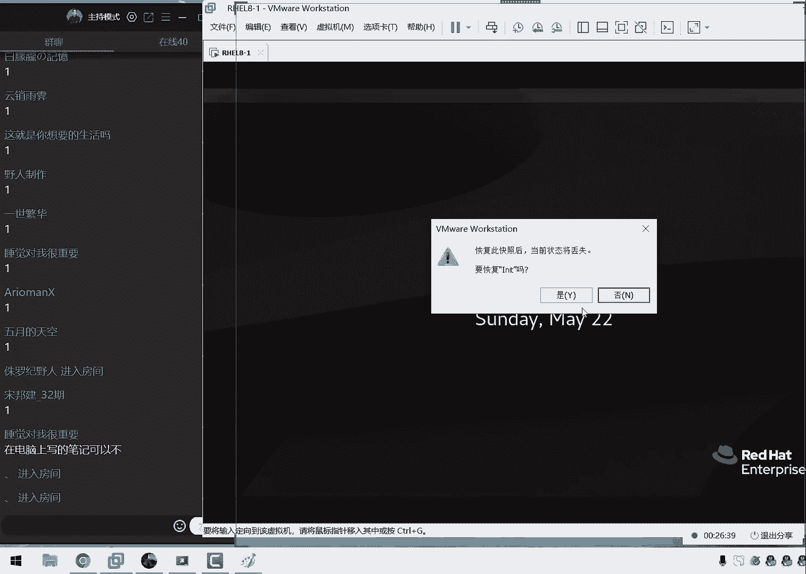

那个瑞典来给大家去讲一下，就是说我们现在需要分成两步给大家去做，稍等一下啊。

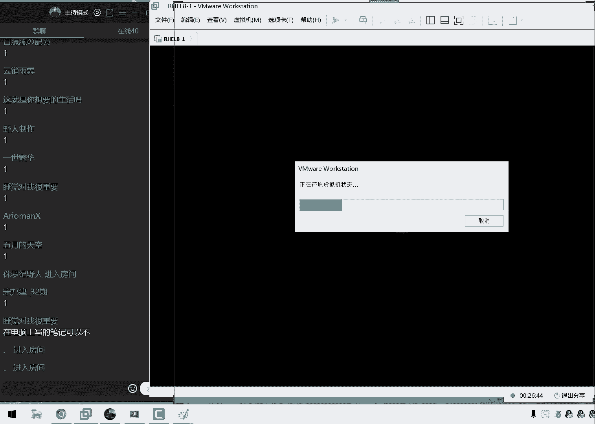

我们那我们现在需要就去做了，我第一步的话呢，是在我们的本地来去搭建出来，一个瑞的次分裂列组，然后的话呢我们来把这个思维之类组，通过我们的这个互联网，通过我们的这个数据的一个网络嘛。

然后我们可以去分享给对方，然后来进行一个远程的共享，这是第十啊，这是第17章节我们需要做的这个事情，然后大家一定要有所区别。

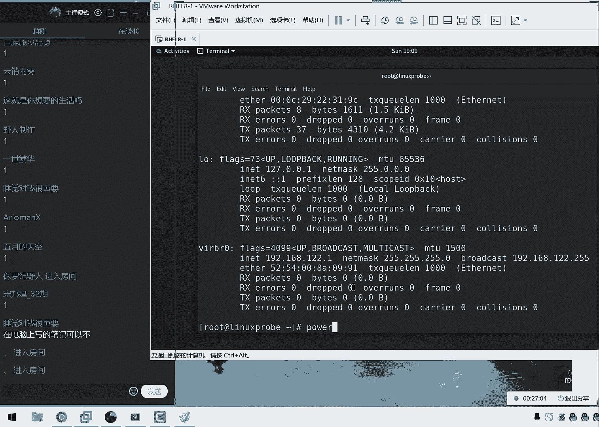

它跟桑巴的话呢，跟一些文件传输服务是不一样的，我们先不啊，并不是仅仅是共享出去一个文件，而是共享出去的一个呃，单独这么一个设备硬盘，这个是很有意思的一个实验，然后我们先给大家出这么多理论啊。

大家可以来看一下我们这个实操。

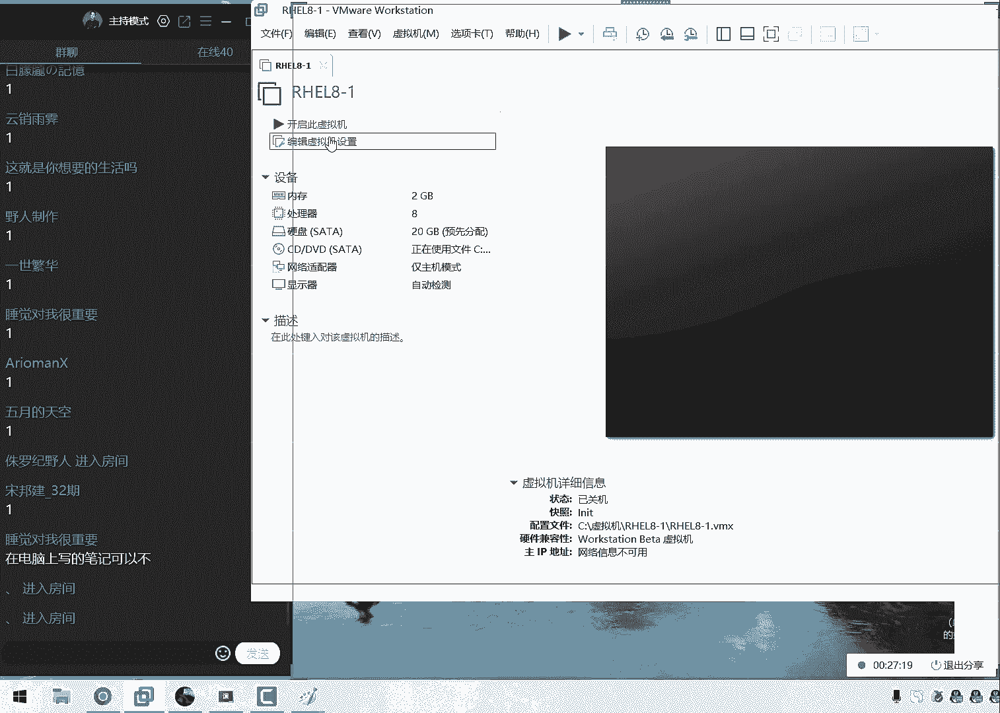

然后我们先关闭之后再去添加，添加上四个硬盘，这样的话呢，我们可以对于这个硬盘先去做一个raid，保证我们本地的安全，然后我们再给别人来去提供这样的一个啊，网络存储，然后这个硬盘的话就不要说。

那么就稍微小一点了，因为您这个硬盘如果太大的话，那么可能会导致待会儿来去共享的时候，速度会比较慢啊，所以我现在给他四个五个这个硬一个硬盘，那么我们待会做一个瑞典一零，那么待会儿的话可用空间就50%嘛。

那么它就是先添加上四个硬盘，来去做一个啊，大小为五，然后我们四个五个gb，然后那么就是50%哎，十个g b的一个呃，呃瑞典一零的四分之列组，然后通过互联网把这个啊，给大家做一下共享。

那么的话呢这个的客户端可以是一台windows，那么也可以是一台我们的kda的引擎，操作系统啊，windows和呃，那么这个是一个进行一个跨平台进行，共享的这么一个小实验，大家可以来看一下我们这个效果。

然后四个五个gb的这个硬盘往里面添加啊，那么这事儿就做完，做完了一半了啊，然后有了这个基础呢。

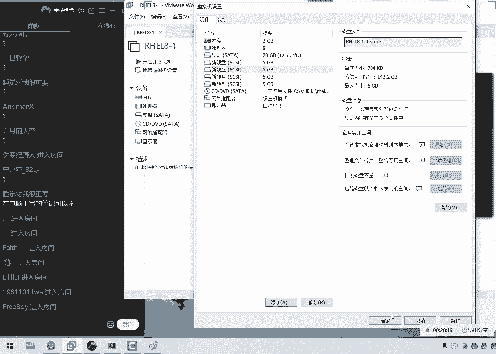

点一下添加，另外给大家说一下，是这样的，我们推荐大家的话呢，再去呃来做这个实验的时候，最好的情况下哦，哦不好意思，我看一下啊，因为我们这个bios里面，他的这个scars这样的一个协议的。

这个优先级比那个sa要高，那么这个的话呢其实哦好吧，我们来给大家重新去启动一下，先去进入到bios里面，稍等一下，这种情况下的话呢，需要先进入到bios里面，然后把这个啊启动于这个优先级的话呢。

给大家调整一下，但是这个啊在我这，在我们工作的时候般会用用呃，我们一般情况下是碰不到的，不过也没关系吧，我们那也就是说，我们现在的话需要把这个硬盘给它往下挪，这是glassy，然后的话呢这是sa的诶。

没毛病吧，然后看一下，然后现在的话呢，我们需要把这个sat的硬盘往上提，然后等于说要把这个硬盘往上提，因为它里面有系统，然后我们把它留到这，把它弄到最上面去来，我看一下选中的话是a加回车吗。

那ok我看下a加回车诶，好像不对，我再看一下啊，好像说我们需要点一下什么啊，选中的话不是回车啊，是回车啊，是啊希望先点一下减号是吧，还是加号，我来看一下啊，啊加号加号加号ok啊，没有问题。

那那我们现在把我们这个系统盘的话呢，挪到这个最上面，然后我们点一下保存并退出，看一下是f 10，ok这个情况啊比较少见啊，因为的话这个虚拟机里面，默认sa会比这个sc要更加优先。

所以我们它会到安装系统那个界面了。

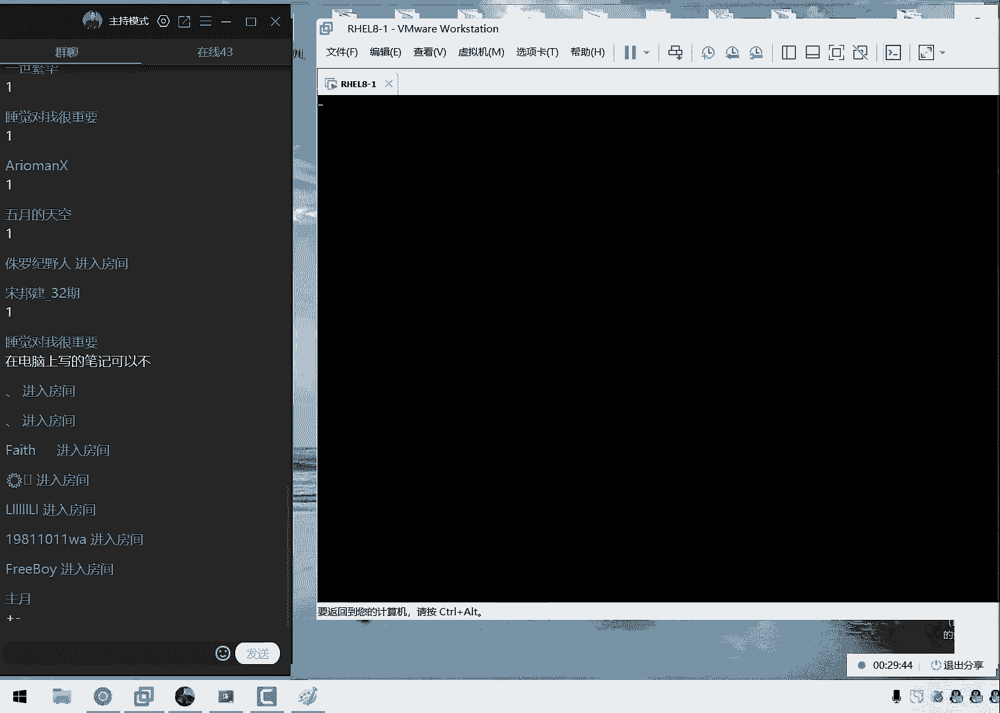

好大，然后我们来给大家哎，那我那我们去记录一下，那我们第七章就给大家讲过，怎么去做瑞的啊，所以说话这个我们就稍微快一点了，我们主要来讲一下，我们到诶这个共享协议啊。

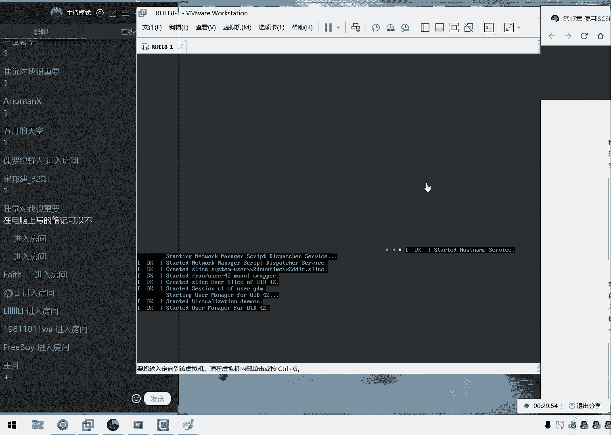

呃来怎么样来进行一个共享，并且的话呢我们来部署一下哦，我们的a windows客户端，因为我们在去使用的时候的话呢，我们的这个使用场景里面的客户端，很多都是windows系统的啊。

那我们平时的话呢可能很少会用呃。

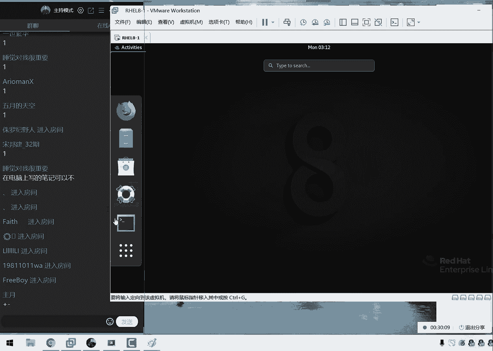

呃我们的本机上下镜链接来，我们来给大家操作一下，首先的话呢先创建出来一个分支列组啊，那么换来我们的设定一下它这个名称，杠c代表是创建的意思，杠v是显示过程，因为这个第七章节给大家讲到过。

所以我就稍微快一点了啊，然后我们就是处理出来这个设备的名称，dv目录里面的md 0，那就是说待会的话，我们自媒裂练组的名称就有了，第二的话呢就是想我先想一想啊，杠n对吧。

我们来指定一下这个4万的数量就是四，那么这个说是有一个这个盘的一个硬盘，组成一个什么呢，组成一个级别为一零的一个思维之列，组对吧，然后我们可以去设定一下呃，四川的名称，那么接下来讲的就是第二排。

第三第四，第五个被识别到硬盘的这个设备，那么就是dv目录里面的s b，那我想一想，那么就是b c d e4 个牌子的啊，那我可以取到这个通配符来进行一个匹配，然后就可以了。

那我们现在的话呢每个硬盘大小是五个gb，它并不大，但是我们也要等一等，等，他的话都已经进行一个同步完成了之后，我们再来去呃，我们现在啊现在等打下门啊，等他需要先进行一个同步操作。

然后我们再进行一个后续的这个呃共享，那么我们现在的话它能在同步当中，我们先来安装一下工具，这个工具的话呢，是来进行一个交互式的一个配置的，要想配置一个我们的这个设备的共享，它的话呢并不难。

它可以通过这个交互式的方式来进行啊，它来进行一个直接的配置，来记一下这个工具名称来。

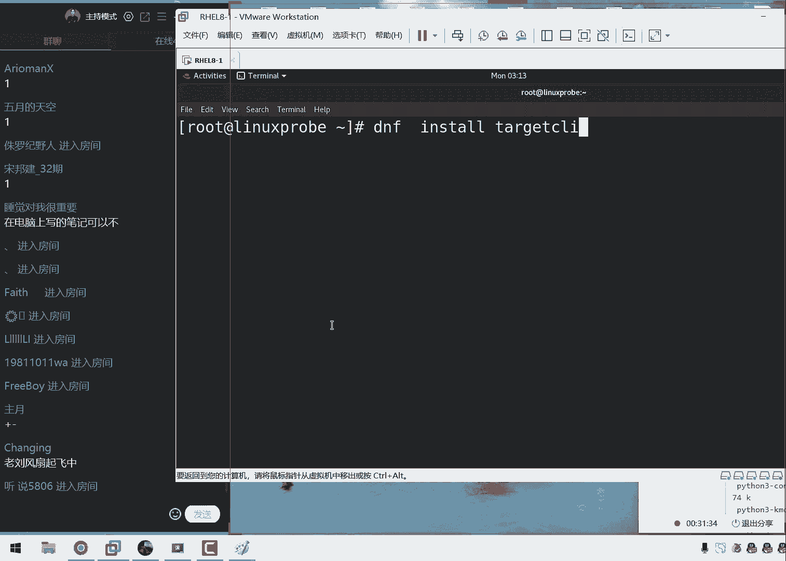

大家可以来记一下啊，target c r y啊，tget control，大家记一下这个工具的话呢，可以去实现一个交互式的一个配置，它可以让啊进行一个交互式的配置开啊。

那我们只需要把它所需的一些参数的话呢，放到它的一个呃对应的一个位置就可以了，也就是说，我们并不需要把这个参数，写到配置文件里面，而是需要啊，它会把我们需要这个参数的话呢，给它映射成一个目录的一个形式。

当然我们这个正确的这个参数的话呢，放录到我们叫做正确的目录当中，但是的话呢这是一个虚拟的一个目录，然后我们呢啊啊啊，然后我们就可以来进行一个使用了，也就是说这样的一个思路。

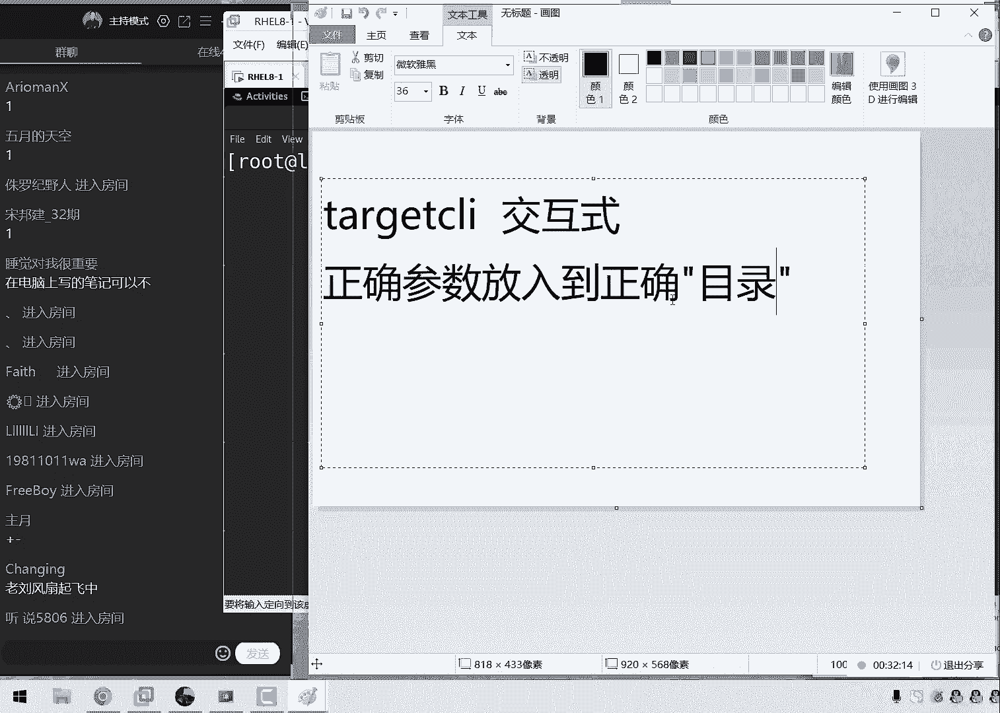

那好我们先来安装一下这个交互式的方式，有这个工具，那我们安装起来做这边特别的快了，没有这个工具特别讨厌，所以我们配置一个啊，服务端的时候会非常的慢，好我们先来去安装一下它。

那chara c l i怎么样，老刘的风扇又在飞起当中，对现在老刘这个风扇已经扛不住了啊，今天屋里确实比较热，来我们，那我们再等一等啊，我跟你说了很多废话，主要原因的话呢是等一下这个re的。

看看有没有同步完成，通完成了之后，我们才能够去使用到这个硬盘管理，别人去做共享吗，好我们来呃，同步好了，然后我们去唱k c i，对于这个实验的话，大家可能可能还不太理解。

老师这个好像之前讲过数据的这个共享，它有什么差别呢，啊，这我们先啊简单给大家去说，之前共享的文件，现在共享的硬盘，到底说我们共享完硬盘之后，它有什么样的一个效果，我们待会儿大家来去进行一个细聊。

看一下这个实操好，我们现在的话呢，现在就准备出来这么一个工具，target cyy，然后狠狠的去敲一下，哎不对，那先不要狠狠的去敲，先去从我呃，我看一下啊，是不是要先去重启一下这个服务啊，好不用。

那我看一下啊，那我们就直接进行操作就行了，target的c l i来进行一个呃操作，然后我们看到的话，它里边他就说我们可以去输一个help，来查看一下，里面也有一些功能啊，这里没有太大的意思啊。

可以看到它的话呢，就是把我们的一些参数，变成一个目录的一个形式，保存在了我们的这个工具里面，然后我们就是可以看到，那我们可以来查看，那么当前有哪些目录啊，也就是说它里面会有很多个目录。

我们只需要把正确的信息放到这啊，放入到正确目录里面，然后我们这个服务就可以跑起来了，那我们现在这个关键点，就是，我们应该知道每一个目录的一个作用对吧，然后我们就可以往里面填写信息了，那我们来啊。

很他很乱啊，所以我要照顾大家去说，所以的话呢我们来给大家看第一个，第一个目录的话，里面保存的是我们要想去共享出去的，这个设备的名称，既然来说它是一个共享设备的，一个这么一个服务。

所以他那么他肯定要有设备嘛，所以我们需要先进入这个目录里面，来进入到这个目录里面，然后的话呢，我们要把想要去共享出具的，这个设备信息的话呢，放到里面去，并且给大家举一个别名，当用户这个嘴要小吧。

再稍微大一点好，那我们来去来去操作一下，就是我们现在来讲去共享出去，这个设备名称的话呢，前面再去前一那啊，那啊，那我们在这个前面，再再给大家去写一个别名。

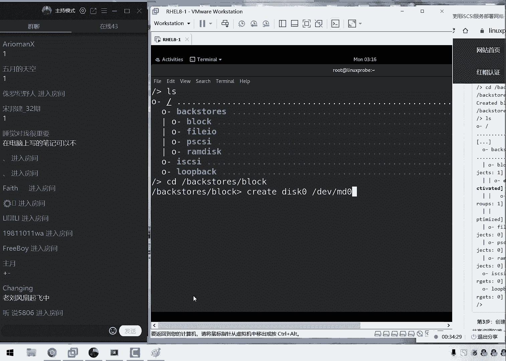

这样的话当用户去看的时候，他是看到了叫做这样的一个名称。

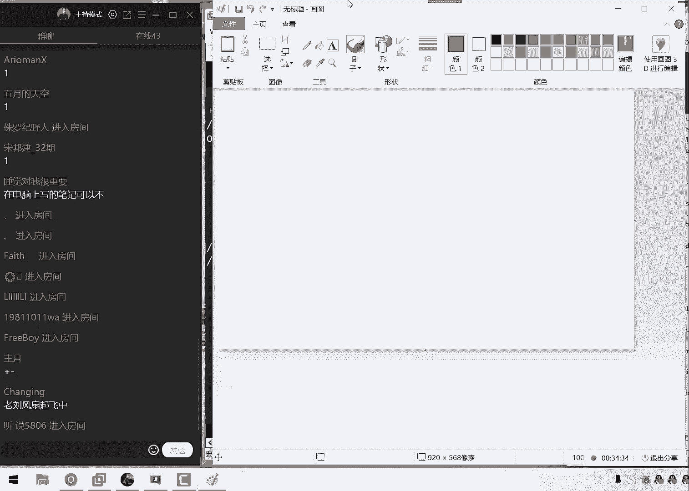

也就是说我们来给大家做一个别名，一样的文件啊，disk 0就等同于了我们刚才所声明出来，刚才这个设备的名称了，用户所看到这个信息，他们会看到是这个名称。

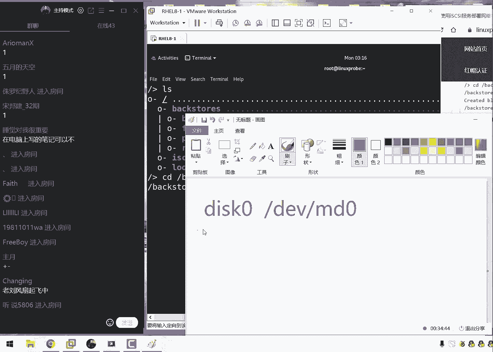

好吧简单啊，那我们来对它进行一个别名操作，来我们往里面添加，这样的话呢，这里面就会出现了一个我们的dv目录，里面的一个设备信息，待会儿再有人去访问我们这个服务的时候，那我们的这个scarc服务。

就会直接的把这个呃，设备信息给他做一下挂载，可以看到呃大小的话呢，它只为十个gb，因为它是5%是可用性嘛，所以我们作为一个6。10，那我们四个盘去做，那么大小是十个g b，也能够对应方上说明的话呢。

我们呢我那么说明我们这个设备的话呢，它是存在了好，这是我们的第一步，要把我们这个设备加入到里面去，第二步的话再翻回来啊，它既然是一个目录吧，那我们就可以去使用到对应目录的，这个操作。

那这个命令来对它进行操作，来我们进入到里面的这个根目录啊，他所定的就是他所教的这个根目录里面，来找到这边，然后下面的话呢，我们需要进入到这个目录当中诶，呃scc目录当中，然后的话呢我们需要去。

那么您现在需要去添加一下，我们叫做共享信息，然后我们再去创建出来一个它，它会自动去生成出来这么一个字符串，这个字符串的话呢，就是待会儿我们的用户他去访问当中，会去访问到的一个名称。

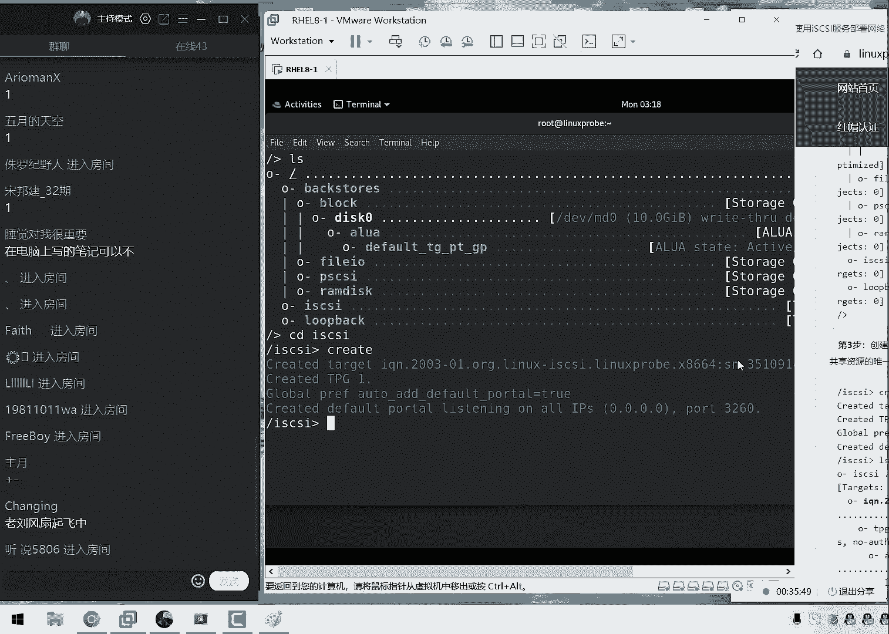

也就是说我们要想去共享数据这个信息，那我们还有一个共享名称，当用户去访问这个共享名称的时候，就会自动去调用我们这个资源池里边，也就是说现在是有一个硬盘，我们需要把这个硬盘的这个资源的话呢。

跟一个名称做绑定，当用户去绑定这呃呃，当我们呃，当我们用户去访问这个名称的时候，做挂载的这个操作的时候，就会去把这个资源，那么我把这个啊资源给我们的用户了，这样的一个过程，所以这个名称的话呢。

呃我们需要先去创建出来，它，第二步的话呢，需要把这个呃设备。

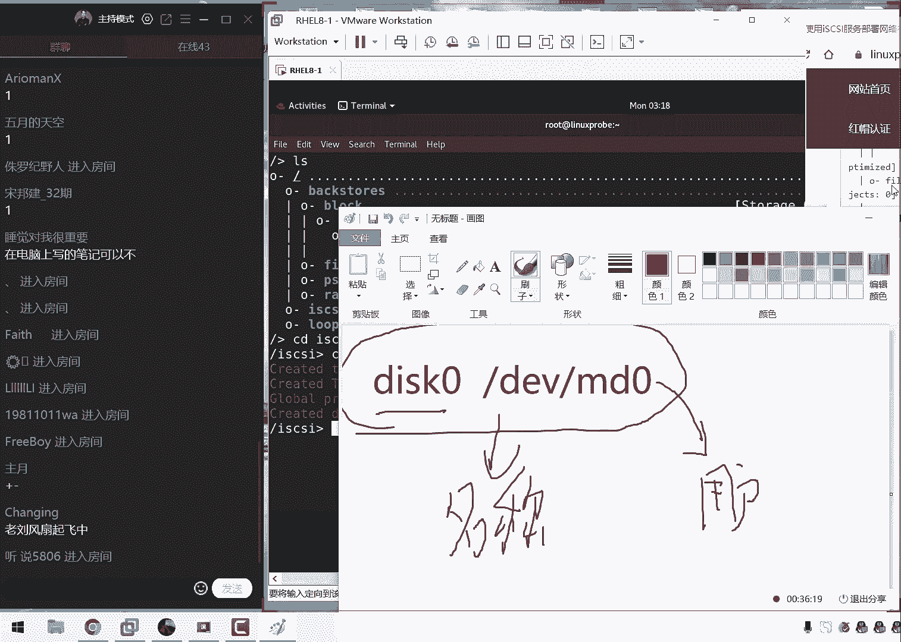

跟这个名称去做一下关联，这个思路有点乱啊，不过我们现在给大家一路来啊，那么啊那我先给大家操作着，这样的话呢它会有一个名称，这个名称的话，它会是一个随机产生存在的一个唯一值，然后我们现在可以看到。

这是很孙子一件事情啊，我们来看一下这个信息，这个信息里面的话呢，每一行当中都会有一个句号，其中的话呢唯独是第三行没有句号呃，这个的话是我们在红白五和六里面，配的时候的一个很严重的一个问题。

在七跟八里边的话呢，也是很常见的一个问题，因为在五和六里面。

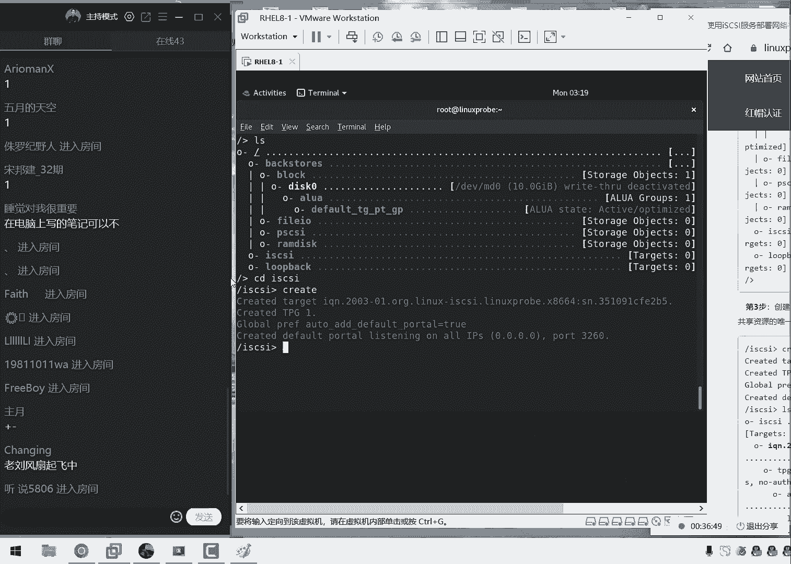

我们特别的依赖于这个名称，但是的话呢在七和八里面也是存在，这个问题，我来给大家讲一下，就是这个服务的话，大家看起来其实并不难，对不对，他啊，因为他总共就是有这么三四个目录。

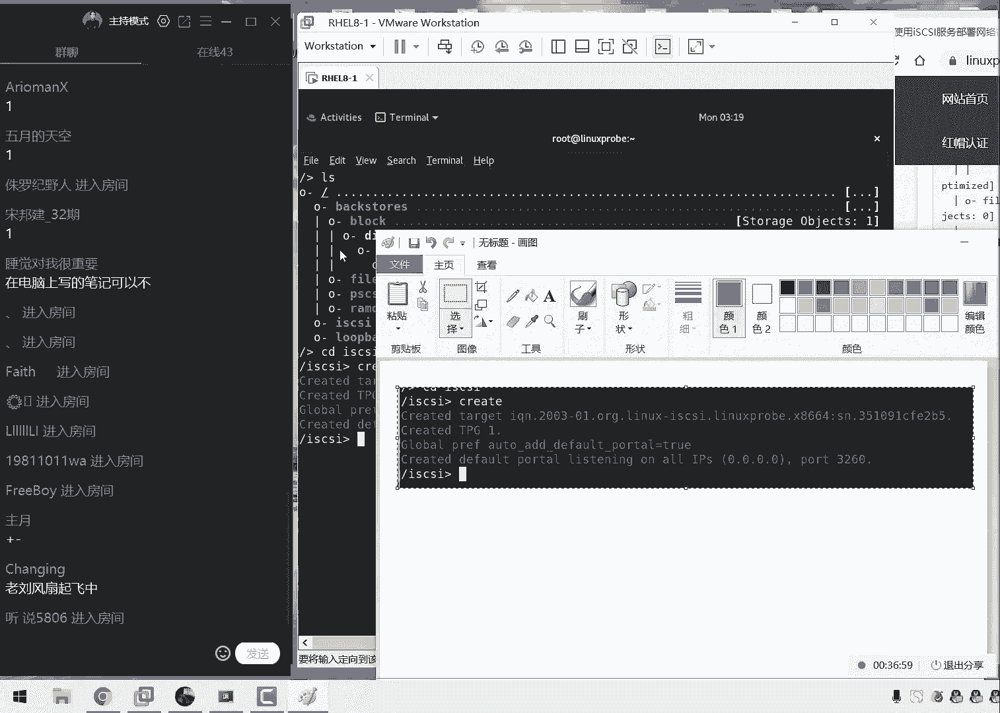

它并不难，但是吧这个难点就是它会有一些空，比如说大家看到这个的话呢。

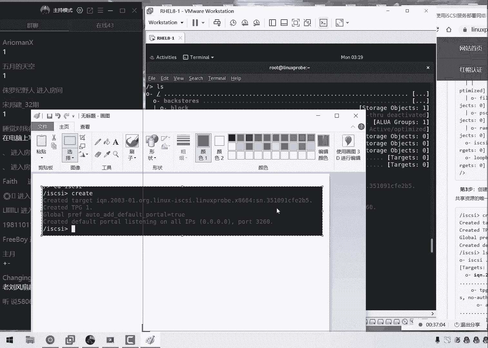

它生成出来一个共享出去的一个名称，我们需要让用户去进行一个访问。

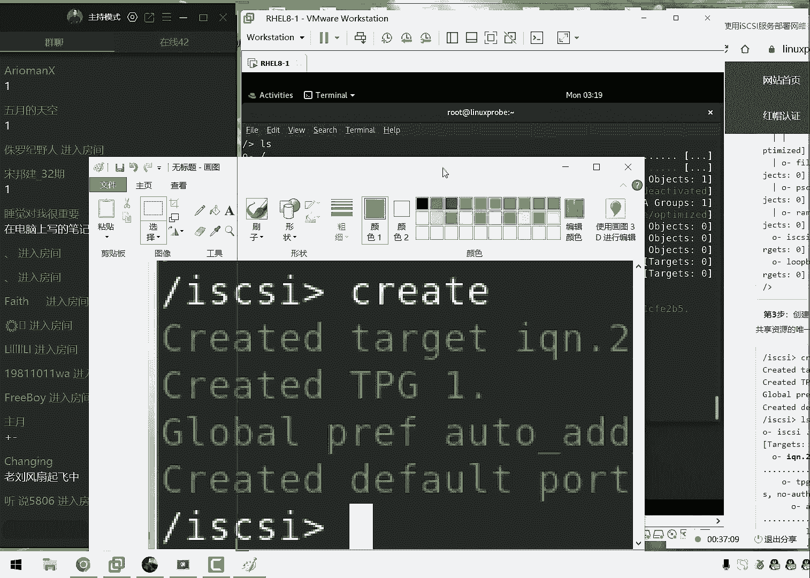

只要他要去输出了12344行话，那么我们可以看到的话呢，它的每一行的这个后面。

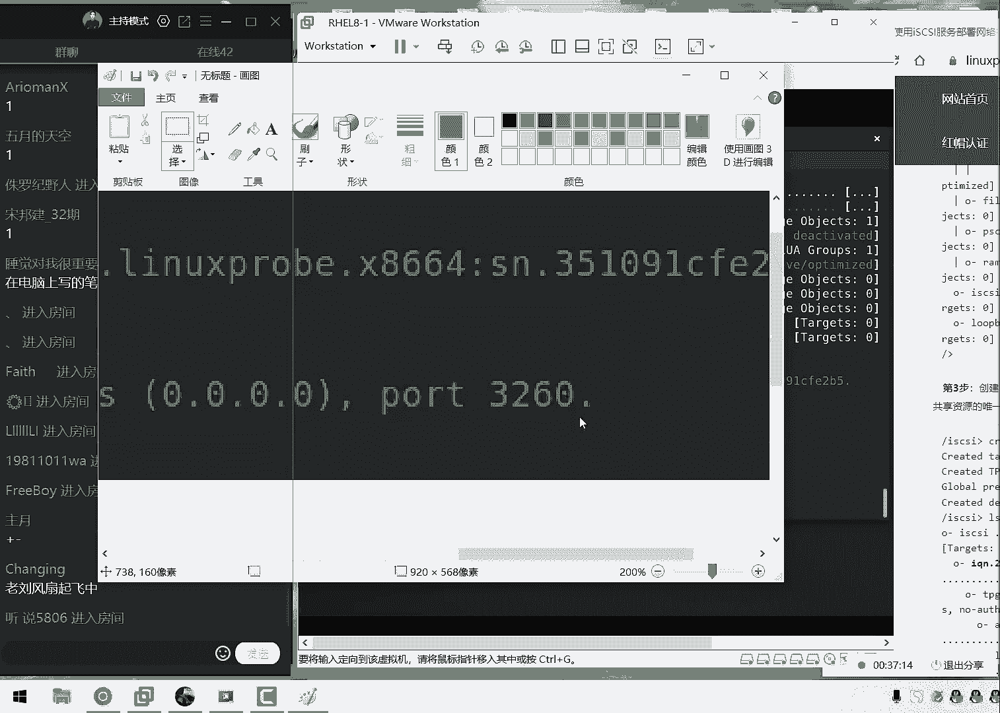

它都是有一个句号结尾的，然后但是的话有些时候它又没有句号结尾，我们来给大家分析一下这个情况，首先第一行大家看到第一行的话呢，它有一个句号结尾，第二行的话它也有一个句号结尾，第三行它没有句号结尾。

第四行它也有一个句号结尾，但是它其实际上它并不是句号，怎么理解呢，这三个句号当中有一个是假的啊。

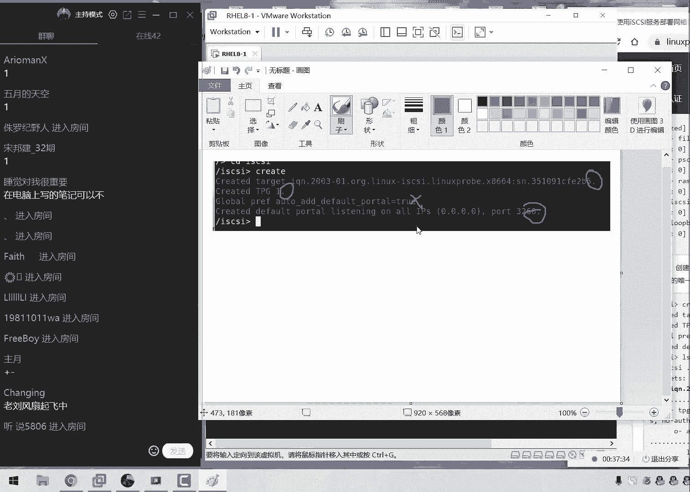

不不啊不不嗯，他啊全都啊啊啊啊不，那我需要给大家就是说这三个句号，好像他啊他们啊全都是真的，但是只有这个第三行。

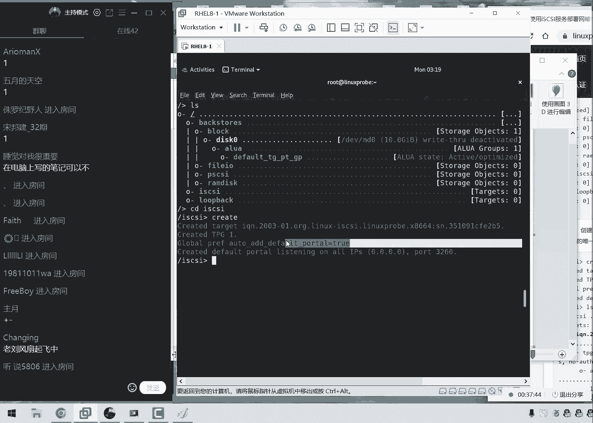

它里面没有一个句号，那我们来看一下第一行，第一行里面的话，它也有很多这个句号，但是所有的句号都是它的这么一个名称的，一个组成部分，也就是说这个编程里面的，所有的前面所出现的这个句号，都是它的这个名称。

只有最后一个句号，它不是的，所以大家知道他这个复活时老出错的原因，就是复制的时候粗心了。

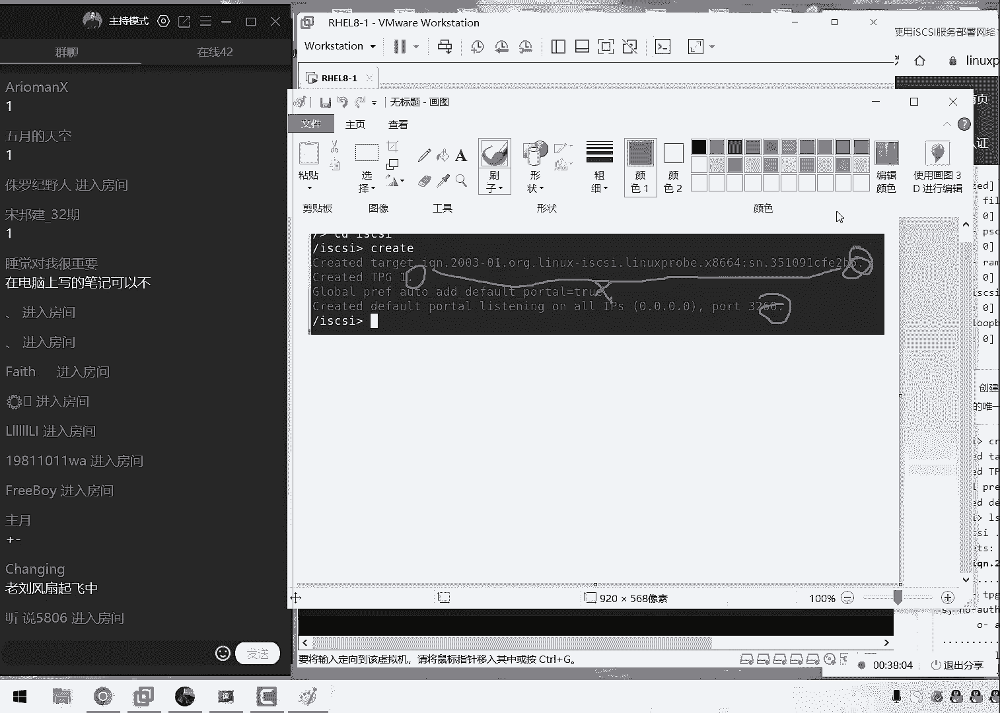

我们直接复制的时候这样复制的，按住鼠标左键，然后一怒怒怒怒怒叫巴拉巴拉巴拉，然后直接啊然后就啊啊，如果复成这个样子的话，那么他就说错了，所以说最后一个句号它是一个句号啊，所以一定要把一个小心的给它啊。

去掉它，然后我们来进行复试，这样就没有问题了，大家再跟我一起操作一下，记住最后一个句号，它并不是名称，一定要把它给啊，那我们那我们一定要注意。

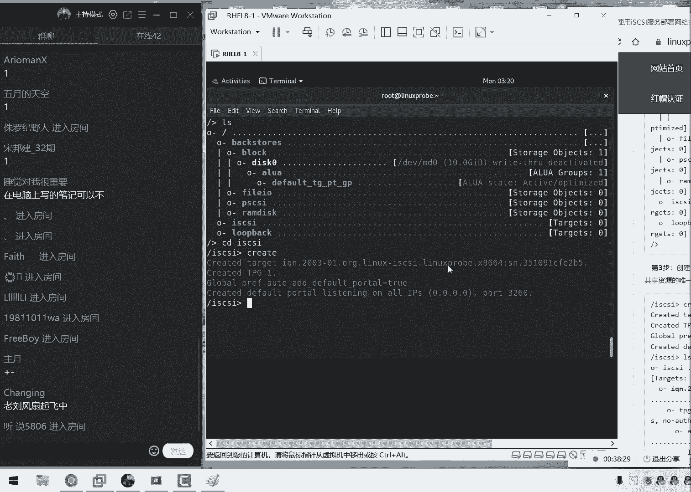

然后我们可以把它放在一个记事本里面，待会的话让我们的用户来进行访问，其实这个操作的话呢可以没有。

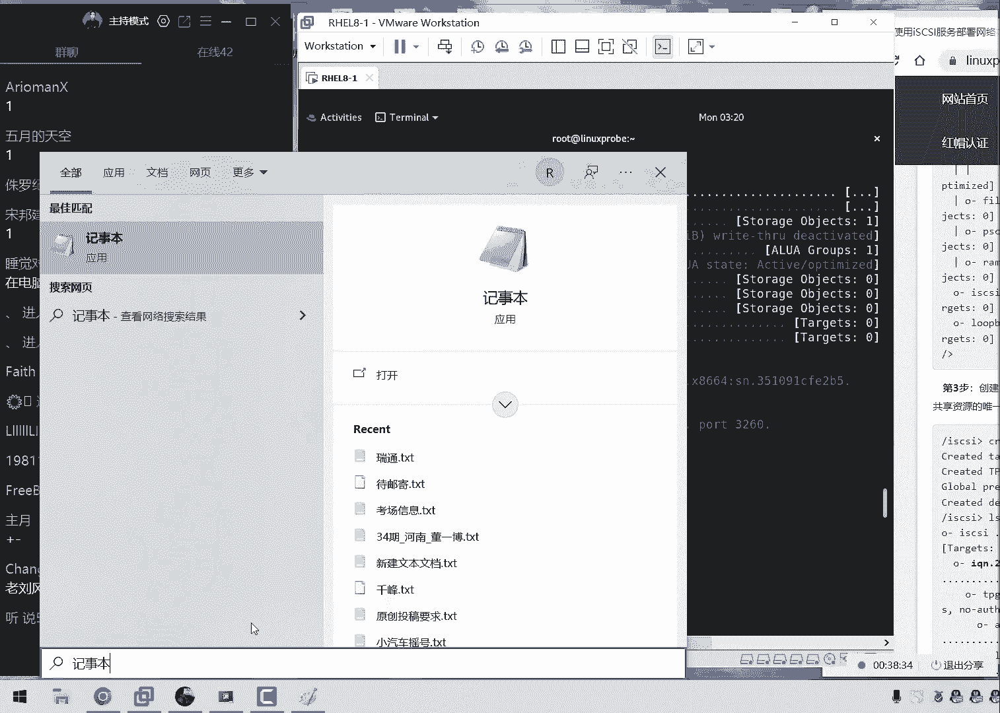

为什么呢，因为这个可以用来查，就是啊，那也就是说这个名称如果忘记的话。

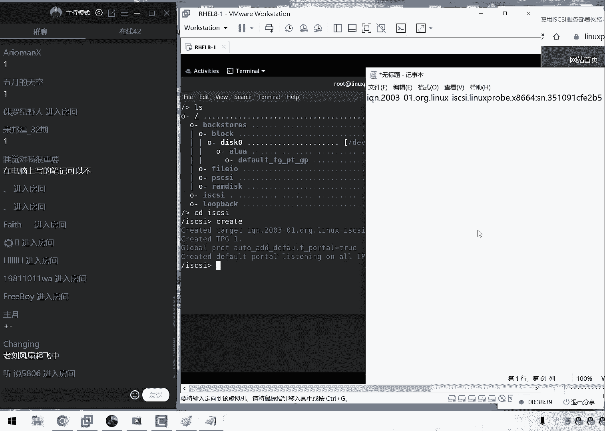

可以过来查，但是我们为了一会儿我们查一查去啊，它很不方便吧。

所以我们先把给他啊，那我们先给大家找出来啊，那我们先把它找出来，待会的话可以直接给用户提供了，不过这个呃有没有也无所谓，那我们来给大家看好啊，现在就会有这么一个啊，他会新建过后。

他会新建出现一个与其这么一个名称相同，这么一个目录，然后我们现在需要做的话，又那么就是再去解啊，那我们来再去走到，这个所对应的一个目录当中，来进入到啊这个所对应的一个目录当中，再往里面走，他要生啊。

新生成了一个啊虚拟目录这样的一个形式，然后我们可以看到的话呢，这个里边啊稍等一下再进行聊啊，再那么再往里面走一个目录可以看到的话。

那这个里面它啊它会有三个这个子目录，这三个子目录的话呢，让我们来给大家解说一下，第一个我们叫做访问控制啊，我们来给大家看一下，第一个访问控制它指的是谁可以去访问我，我他指的是谁可以访问啊。

那我们需要先添加一个白名单，那我还到啊。

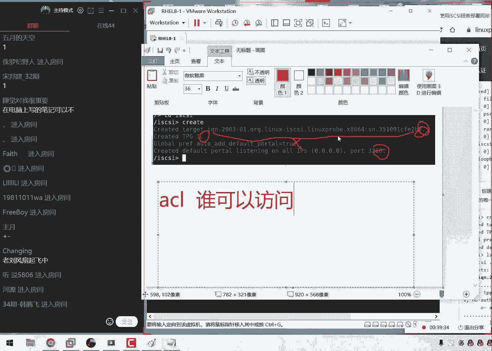

那么我们这个呃白名单目录的话呢，它是写的是我们的用户的一个名称好，那我们先进入到这个目录当中啊，来进行一个生成啊，访问空列表啊，那么进入到这个目录当中，然后我那我们现在需要新建一个条目。

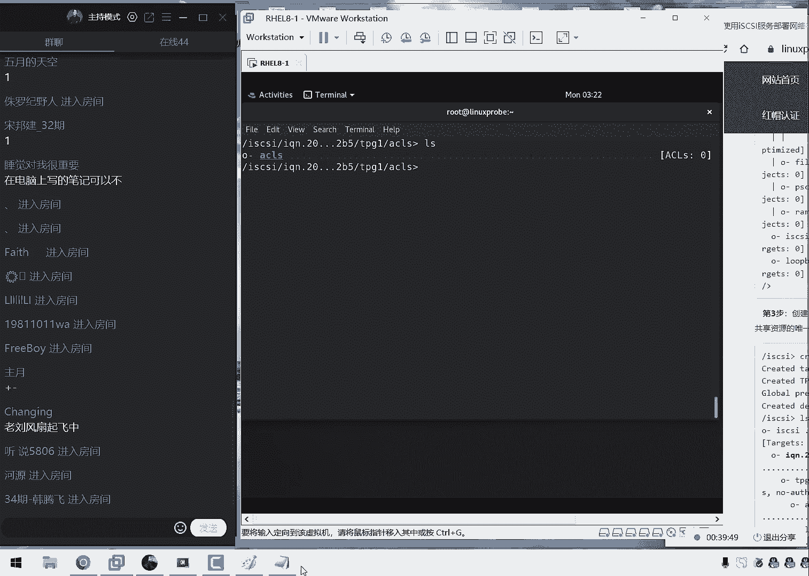

来进行一个访问控制，这个名称的话呢它很乱，怎么理解呢，它这个服务的话，它并不是通过密码来进行控制的，它是通过用户的名称来进行控制的，但是的话呢用户的名称，它又是一个唯一的一个值，所以我们怎么理解呢。

就是啊用户的这个客户端的名称，就是我们的密码，只要用户端的啊，那么只要这个客户的密码，跟我们所要求的这个防控的这个值，听成一致了，那么就证明他可以验证通过了，所以这有点乱啊，这个怎么讲呢。

就是它没有密码，但是他必须要解决一下，用户怎么这个名称值，然后用户的名呃，呃用户的名称值就是我们的密码，那我们这个时候也要选择一个随机值吗，那么所以我们建议大家是这样的，既然我们的用户名称。

那么呃那不那我们接下来说，那我们的共享名称它是这么一大坨对吧，那好了，我们可以直接把这个后面再加上一个词，然后来作为用户的这个名称，这样的话我们记号去分辨，说它是用来去访问哪些共享呢。

又可以区别出来出来它是哪一个共享，这样的一个信息，所以我们推断的话，所以我们推荐大家可以使用这个名称，后面加了一个词，然后就作为我们的这个用户名称了，然后这样的话呢记好记又好看，然后我们可以来学啊。

那么呃那我们可以通过这个名称啊，马上可以确认出来这个主机的一个作用，然后他以及去访问的这个共享信息，并且的话呢那么它里面这个值它是呃啊，并且的话这个值它也不会跟别人产生冲突。

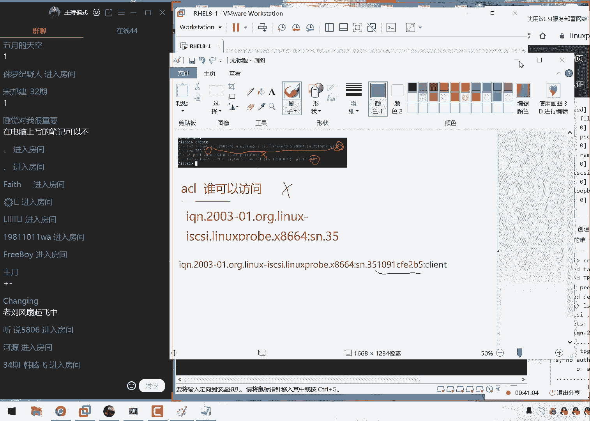

我觉得这个比较方便的一点是，大家可以供参考，所以我们现在就新建出来这个共享名称了，然后我们再去创建出来一个，共享的这么一个密码吗，它不叫密码，它叫做它叫做访问空列表，那也就是说只有这个名称。

它等于我们这个所创建出来这么一个，呃名称的时候的，用户才可以来对我们来进行一个访问，因为我们今天按照这个说上来，因为书上的话有点乱啊，不因为我们现在这个操作录呃，如果串行的话呢有点乱啊。

不过好像已经串行了目的，那那么也无所谓啊，那我们现在给它新建出来，这样的话呢给大家来看到，也就是说这样一个名称，待会儿我们的用户名称，必须是这一大坨的话，那么才可以对它来进行一个访问操作好。

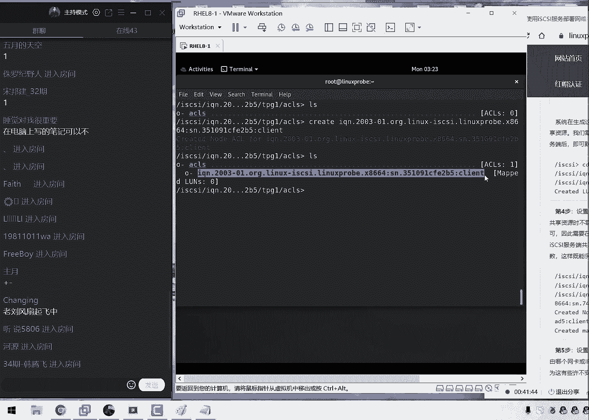

那我们先把这个值的话呢，给大家复制到我们这个剪切板里边，到我们记事本里面，这样的话呢来做一个保存，待会儿用户的名称就以这个来进行修改，那么如果说这个名称跟他不一样的话。

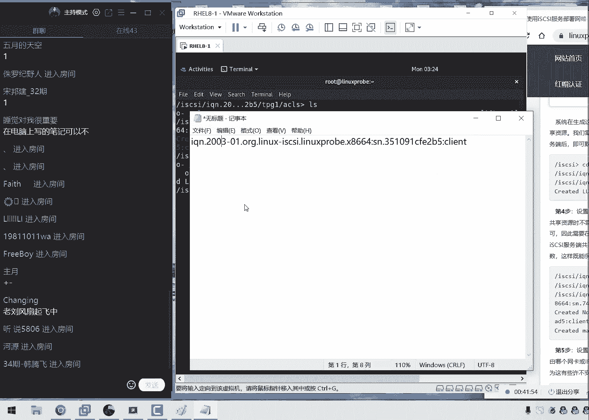

那么就会直接啊就会发生失败了，所以这个也是很重要，好接下来我们来往后面再去退一个目录啊，来推一个虚拟目录，再看一下，还有两个目录，这个目录的话的作用是用来去存放。

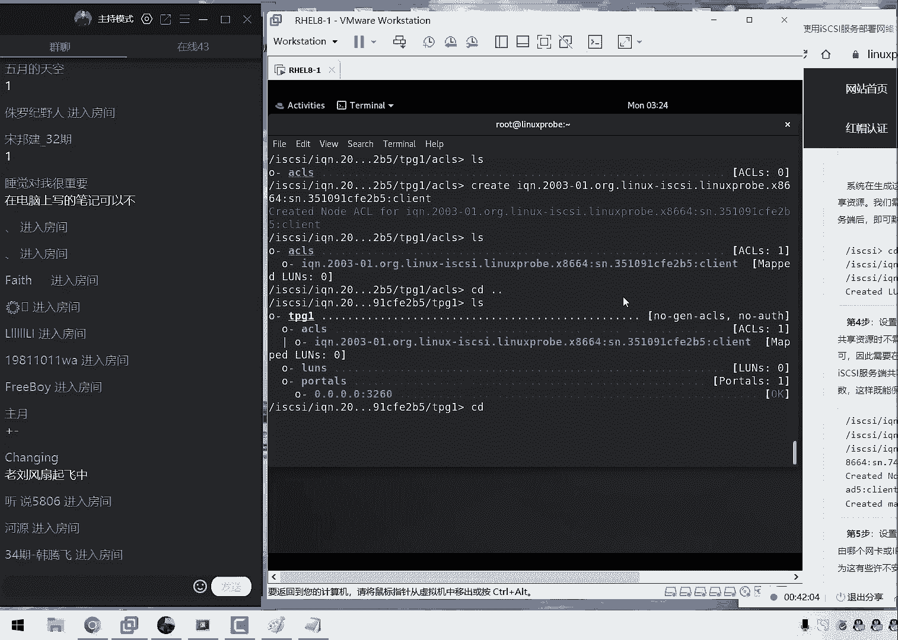

叫做支持信息，怎么理解呢，就是现在有啊，那我们现在有一个呃磁盘的这个信息，硬盘的信息，现在已经放到了我们的这个服务当中，但是他还没有跟任何的这个名称做绑定，所以我们现在需要做一件事情。

就是跟我们的这个呃硬盘的话呢，跟我们的这个访问的这个名称做绑定，当用户去访问到某一个啊，具体的呃呃呃呃，那我们当啊用户去访问的时候，访问到具体的名称就可以访问到啊，那么它它就会自动的。

帮我们把某个硬盘来去做一下挂载，等于说需要将这个资源池跟名称做挂载，这么一个不来啊。

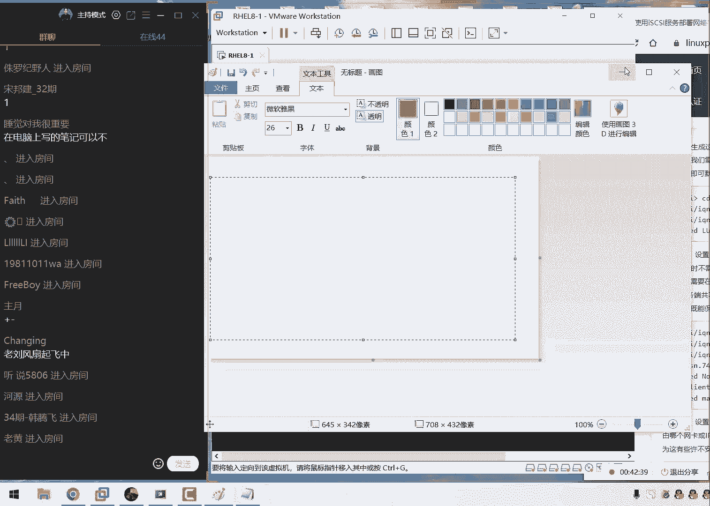

他还注意一下关联这样的一个效果好了，我们先这样来来去做，来我们去创建一下它，然后刚才那个设备的名称的话，应该是叫做diss 0，所以我们给它写下来，这个可以用到tb键补齐的，这个非常的方便。

大家可以来一起去记一下，就是说我们再去使用到这个命令的时候，他就一个交互式的配置啊，他给cl它的时候的话可以用到table键补齐，那啊啊，切换操作的时候，他都是使用的这呃这个table键可以补齐的好。

那我们可以做完这个操作之后，可以看到了，他就帮我们绑定了，说它这个设备的话呢已经跟我这个名称啊，它已经发生了绑定了，当绑定过后，这个名称已经绑定的时候啊，他来集合访问的时候就可以成功了啊，非常简单。

那下面的话最后一个叫做好控制端接口，那也就是说我们要想对它进行访问的时候，去使用哪个ip加进行访问呢，或者说是由谁去提供了它，那我们就给大家解说到了，同一个服务器上面，那么啊某啊那么好。

那我们的某一个服务器上面，它可能会有很多个网卡以及ip地址，那么我们到底有哪个ip地址，去提供这个服务呢，当前我们是啊没有被允许对吧，它是呃拒绝所有了，那我们现在需要去删除掉啊，啊delete一下。

删除掉它里面默认的这个值，然后的话呢我们需要他怎么样呢，他说需要再添加一下端口号是吧，3260端口号唯一默认值，就是说我们需要添加上一个ip地址，让我们的用户去通过啊。

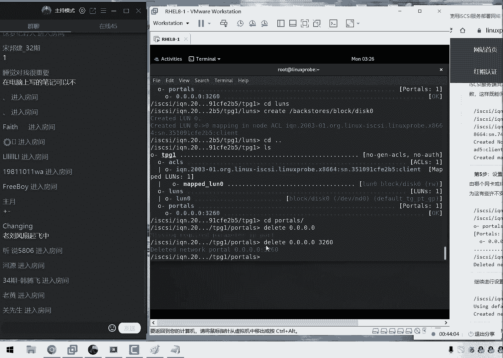

某一个地址来进行访问，那也就是说这是服务端的一个设置负呢，那么啊，那比如说现在服务器上面有很多个地址，但是我现在只想让点20k被防的这个呃，共享服务那么好了，我就让他去啊，直接去点二零来进行一个访问。

或者说啊，他这个点三零站的一个啊地址来进行访问，所以当前就是去开启一个我们的服务器。

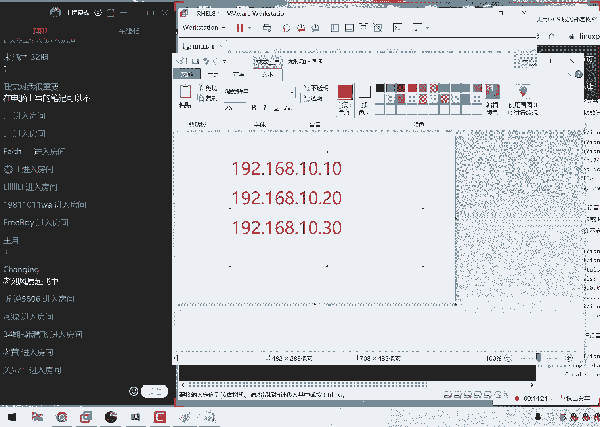

上面的这个呃地址，来对它进行一个呃提供这么一个服务，然后我们端口号的话呢是为3260，端口号，这个不用写它啊，默认会为我们去设置啊，端口号3260啊，sci服务的配置起来非常的简单。

它只需要进行一个交互式的配置，就可以把它搞定了，来点十点是a一下，回车啊，没有问题啊，我们的呃服务的端口号3260，自动填写了我们的我们的服务器的地址，点式电池也都是天啊，那么呃那么也都是正确的。

那都做好之后的话呢，我们可以把它给退出，退出之后来大家看好，我现在把它退出了，退出过后的话呢，我们现在可以去重新去启动一下，我们的s s s s的这个服务，这样的话啊，我们那我们呢。

那么我们的用户就可以被访问了，实际上的话呢，不，到2020年之前的话呢，他全都是考的这个呃，我们来配置一下呃，那我们来去挂载一下，由交易机去提供这么一个网络存储，那大概就叫周期啊，我刚才说错了，是从呃。

他们的话呢呃它也就是说在201啊，他是在我们的呃，他就在开啊，他会啊他会去考到，我们需要去自己去配置一个，我们的设计师啊，呃设备来进行共享，并且的话呢我们也需要进行一个挂载，因为的话呢在红毛肉七里面。

就是因为有了这个工具了，那我们来看一下，他没有这个工具的话呢，那么我们也要像红毛五和六里面一样，需要去写这个配置文件，大家可以来感受一下，就是它有多么的复杂，然后他以为这个格式和参数还多啊。

他们多么的难写，它并没有考到这个服务端的配置啊，他只考了这个客户端的配置了，那么我们换句话来说，或者说以后我们工作的时候，他之所以看他会让我们接着这个存储，再一个原因。

也就是因为在我们这个红毛七跟八里面，它有一个交互式的一个工具的，我们只需要把正确的这个参数，添加到正确的目录里面，他所说的那个目录，然后有，那我们这个服务就把它给大剪出来了，所以的话呢第17章节。

我们认为是一个非常简单的一个章节，它并不难啊，它并不难来，我们现在来给大家去操作一下，稍等一下啊，ok我们来给大家操作一下。

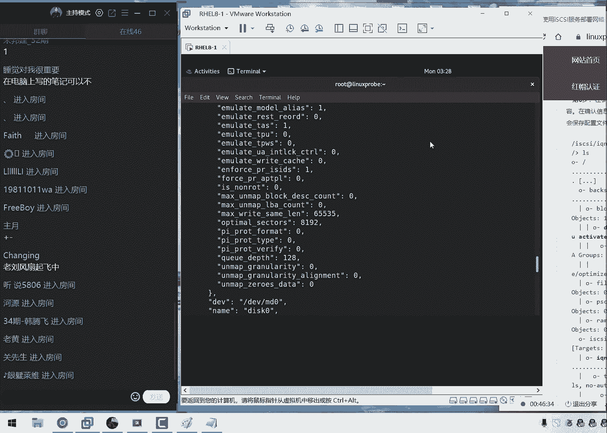

打开另外一台虚拟机，那么接下来说啊，它可以进行一个跨平台的一个共享。

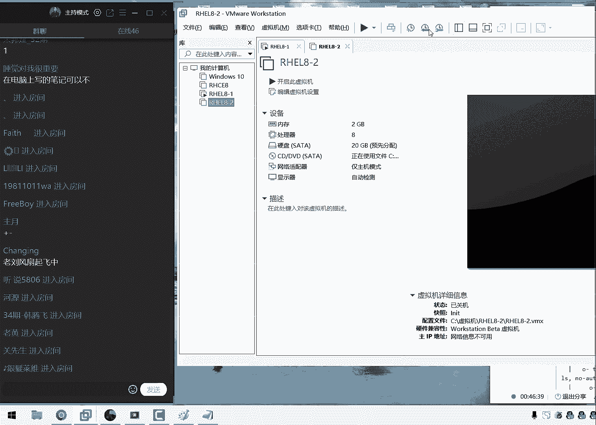

另外那我们就再开几台啊操作系统啊，在开启它另外一台操作系统。

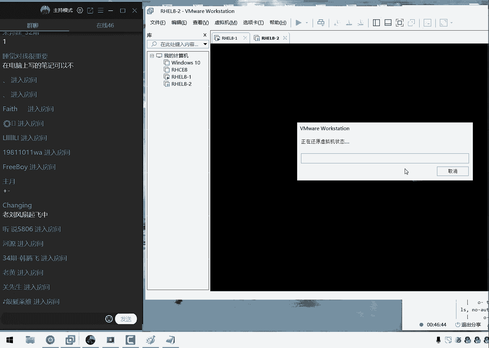

我们来进行一个挂载操作，然后我们再开一台windows啊，两台啊，两呃两台linux，然后再来开一台windows，先去使用到我们的啊对了，还有这个防火墙啊，先去使用到我们的linux系统。

来进行一个远程的挂载，然后的话呢我们把它给啊啊啊，然后我们再做一下卸载操作，卸载过后我们再去使用的windows，在外在我们这个网络存储，然后我们来说这两个实验的话呢，都给大家去操作一下。

添加一下服务名称啊，或者我们可以写一些端口号都可以啊，呃sci然后的话呢我们来让它去生效一下，他说我们的sci这个服务的协议并没有存在，好了，那就是说这个动口号的比，这个对应的这个c的名称。

好像跟我们平时叫的这个叫法，是有点区别的啊，那么很简单啊，我们可以直接去搜索一下端口号，3。6端口号它所对应的一个名称，然后我可以看到了哦，这个名称它发生了变化了啊，后面加一个超get。

它指的是服务名称，所以的话呢，我们就要把这个名称的后面加一个超get的，这样的一个写法，于是我把它写好，按一下tab键，然后补齐，按下回车搞定了，然后我们把防火墙给他做放行，我想一想。

咱们今天网卡配好了，防火墙，配好了服务配好了，还有什么呢，没有什么的，好了我就可以了，呃做好之后的话呢，来去使用到我们这个客户端，客户端啊，他需要做一些事情。

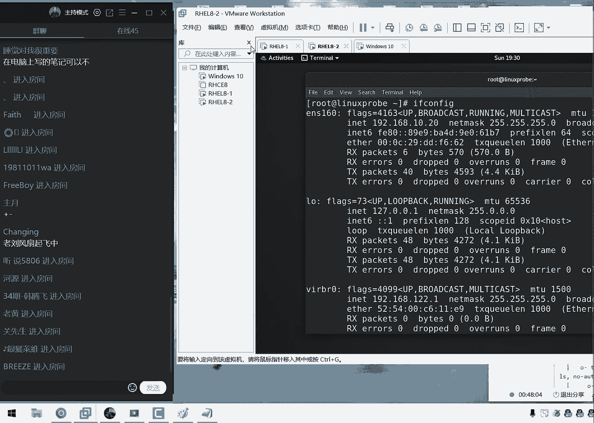

首先来说，就是保证这个网络的一个连通性嘛，来首先来说两个网卡同一个网段，然后我们同啊，并且同一个模式，然后我们去拼一下一九二零六八点10：10。

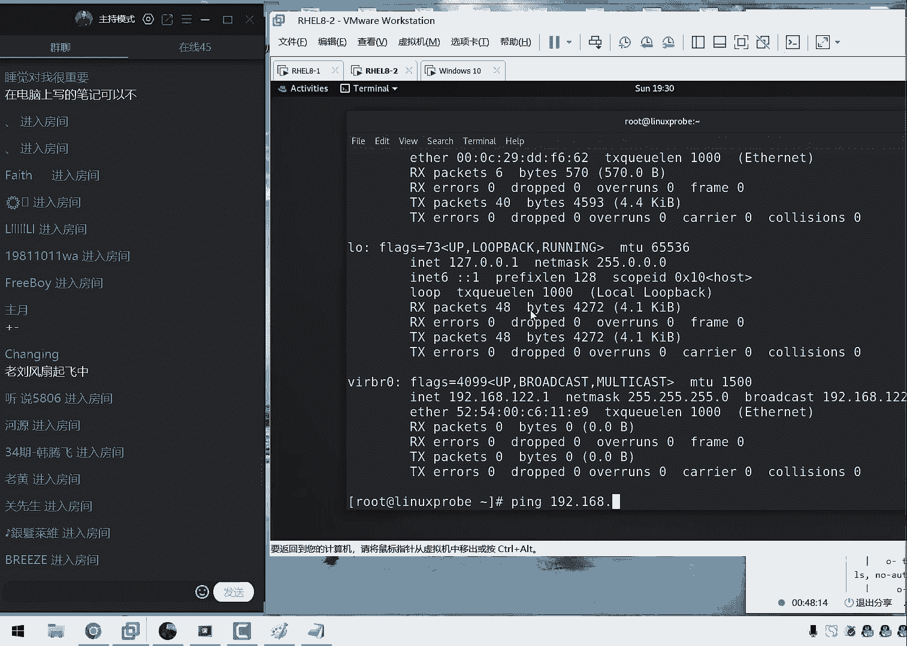

然后说一句都您啊看一下能够把它拼通了，这个的话呢，就是我们来进行一个网络的一个测试。

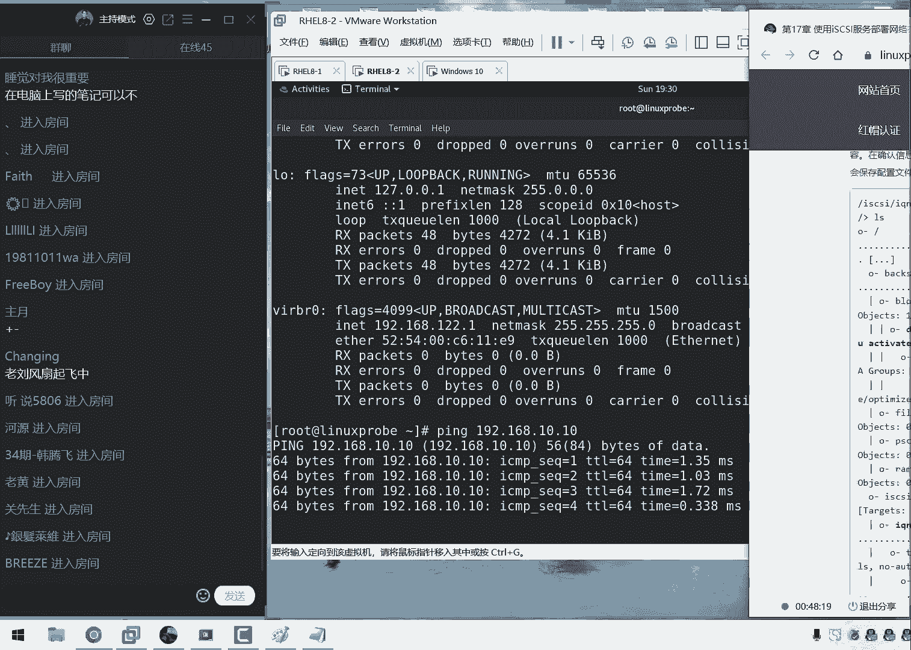

然后看到这个客户端的话呢，已经能跟我们这个服务器进行一个联通了，毕竟我们看一下书上啊，还需要自己再去安装一下，我们的这个呃客户端的一个程序，然后我们可以直接就用就行了，他并不需要去安装客户端。

它可以直接就用啊，那么它可以直接来进行一个使用，那么以及来进行一个观点操作，那我们现在的话呢先去想一想干什么呢，先去配置一下我们的密码值对吧，因为他既然来讲，它是通过我们这个客户端的这个主机名称。

来进行一个验证的，它必须要等于我们这个防空列表当中，它所定义的一个值，这个必须要知道的，所以我们现在去返回到这个啊服务器里面，查看一下，当前的话呢我们的防控制表当中，我们的这个设备的名称。

它允许的名称啊，不对，就我们看啊也不太严谨了啊，他并啊它并不是设备的名称，它指它它指的是我们这个呃客户端，它是允许的一个名称，把这个名称复制一下，然后的话呢我们进入到客端里面，编辑一下客户端这个名称呃。

我们来进入到里面去啊，etc然后是我们写下名称，这话特别的长，我们可以用到tb键补齐，然后它以服务名称命名的一个文件夹，然后我们来看一下啊，tb键补齐里面正好有一叫做初始化名称啊，这样的一个文件。

那我们编辑一下它，这里边就会需要我们定义一下，这个主机名称了，然后我们现在的话就把它给它啊删干净，然后我们把它里面所允许的一个防御啊，防空列表里面的这个名称完了啊，再往里面一粘就可以了，其实很简单对吧。

它只是一个我们去获取的一个呃过程，让我们点一下保存退出，接下来重新启动一下我们的客户端的，我们的呃服务的名称，来重新启动一下我们q端的这个程序，然后我们哎不对，后面加一个d啊，后面需要加一个d。

它指的是这个客户端的一个说法，进程的一个服务名称，顺便的话把这个复位加到九当当啊，情况项当中，能够保证我们下一次的时候，还依然能够去有启用，这样的话呢，到此那我们这个服务端跟后端的话，就把它都配完了。

其实第十章啊啊哎呀，其实完我们就发啊，那我们这边第17章节很简单，它就是我们进行一个远程的一个次共享，然后我们来进行一个挂载的一个操作，非常简单，那我们先来给大家操作一下。

要想去看哪一个服务器上面的一个呃，一个远程设备的话呢，我们需要分两步走，第一步的话呢是发现第二步去做挂载操作，我们在做这个服务服务之前的话呢，我们来给大家操作一下，我们来点击一下这个呃这个编辑选项。

然后我们可以来不，我们先不点编辑选项，点击一下这个虚拟机的这个配置选项，我们来点击一下设置，大家首先来确认一下。

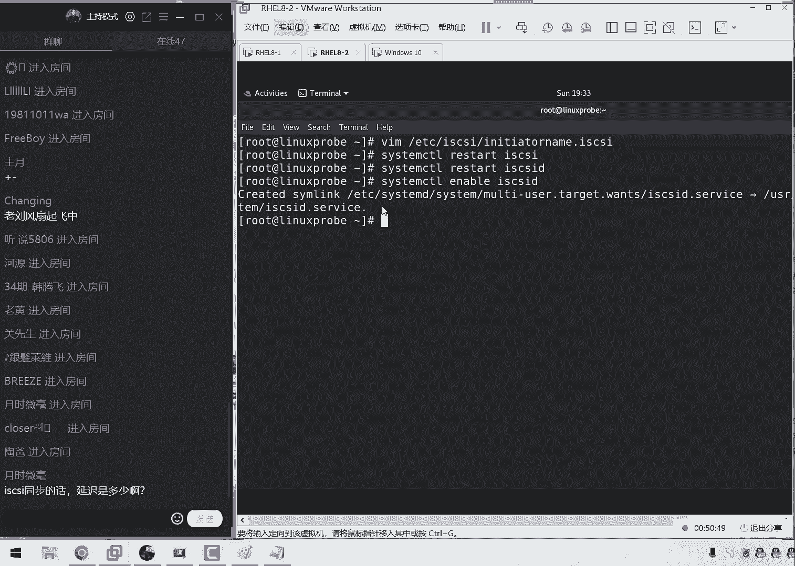

当前的话呢我们的硬盘只有一块，然后我们现在的话呢它只有一个硬盘对吧，大家可以看到他那边的硬盘数量是一。

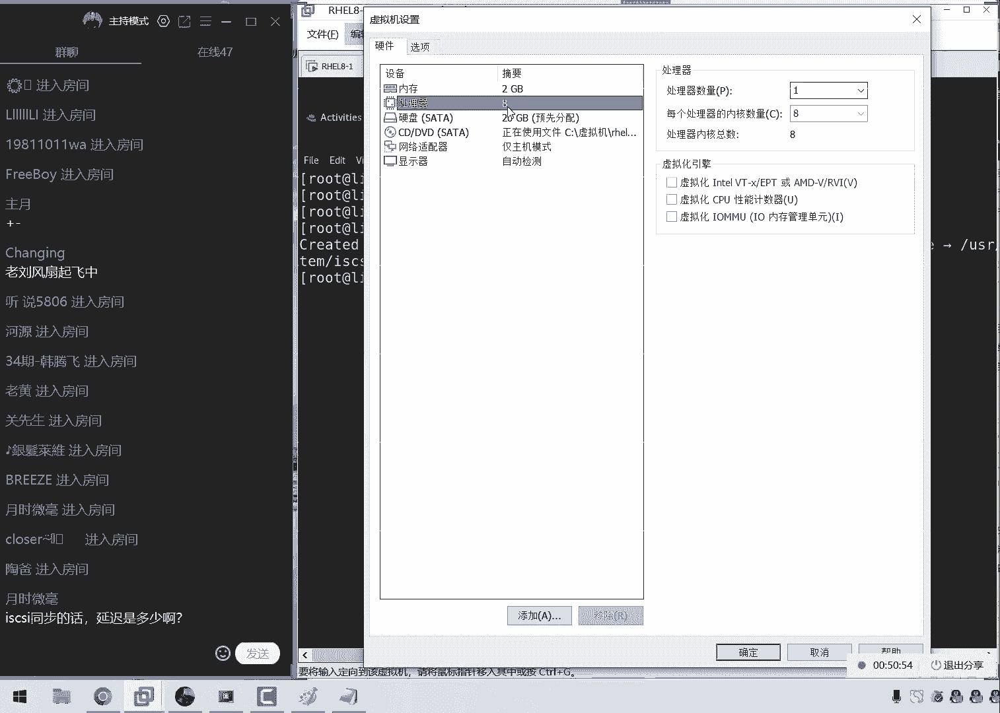

然后只有一个，没有另外一个，然后我们现在可以打开另外一个终端，然后我们来看一下dv目录里面的md 0啊，不呸呸啊，要不我，那我们来看一下所有的，我们这个设备的名称呃，它里面就应该只有个a，它没有b。

因为它只有一块硬盘，这没有问题吧，好然后我们来给大家操作一下，该怎么样，能够把远程的这个磁盘，给它挂载到我们的本地，然后像我们去使用到我们本地磁盘一样的，进行一个管理，这个是非常方便的。

并且的话呢我们知道权限非常的高，那我们一定要使用的管理员的身份来进行，必须是管理员才可以进行这个操作，然后大家说这个延迟有多少的话，这个延迟可以忽略不计啊，我们在使用的时候就像使用本地硬盘一样。

可以考虑成没有延迟都可以，那它取决我们的网络呢，然后我们来第一步来进行发泄，就是先呃进行一个发现操作啊，发现一下对方的这个服务器上面，还有哪些共享，因为共享这个名称特别的长。

那么假设说我先作为一个客户端，那么呃比如说我先是一台客户，那我现在需要先知道对方服务器什么，他有哪些可用的共享，然后的话呢，我们把这个可能的共享过到我们的本地，所以第一步叫做发现操作啊。

discover这些第一个发现操作，然后我们啊啊，接下来我们要去设置一个标识，这个标识的话呢，我们目前没有太好的解释，但是我们从查看啊，但是我们查看了一下这个命令的，我们那我们可以看到这个标识的话呢。

它主要作用就是来去发现对方主力上面，它有哪些可共享这个呃，所以它它所以它之前是一个探测的一个，标识吧，然后并且的话他这个写法只有一种写法，这我们就给大家查到了一个解释，来，我们来去去填写一下。

我们这个服务器的一个地址，然后的话呢192068点是电池，其实对于我们这个网络，设备的一个共享服务，它可能更多的不是取决于我们的，这个设备的一个瓶颈，它只是它取决的是一个网络的一个瓶颈。

我们给大家举个例子，比如说你想去下一个电影，请问下一个电影的这个速度取决于什么呢，其实它并不是取决于你的硬盘的一个啊，写入速度的，它更多可能是取决于网络的速度对吧，因为网速慢，所以我们下的慢。

所以大家有大家去想这个问题，我们之前是通过总线啊对吧，然后我们把这个啊数据，然后我们啊等啊，稍等一下啊，我们先画，那我们比如说是把这个硬盘插到这个呃。

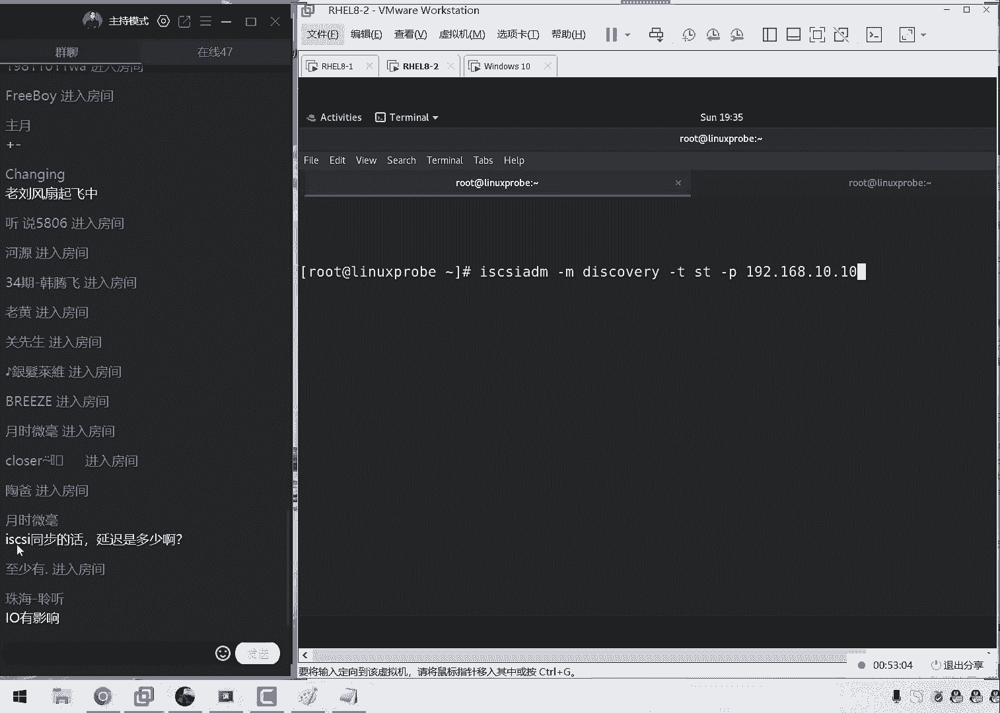

呃那我们将这个硬盘插在这个主板上面，它是通过总线来进行呃，它进行一个数据传递的，它的话它也是做非常高的，但是我们现在它这个设备，它并不是在这个主板上面的，它是放到我们的呃，啊它是放到我们的呃。

其他的地方了，然后它是通过网络来进行传输的，所以的话呢这个瓶颈，实际上它是出在这个网络上面了对吧，所以我们才可能才需要一个，我们的专业的设备，来保证我们来进行传输当中，它的一个稳定性。

它这个是受到网速限制的，所以当我们去使得我们的这个协议的时候，他可能更多的需要考虑到网络因素，就他这个呃限制速度肯定会变慢。

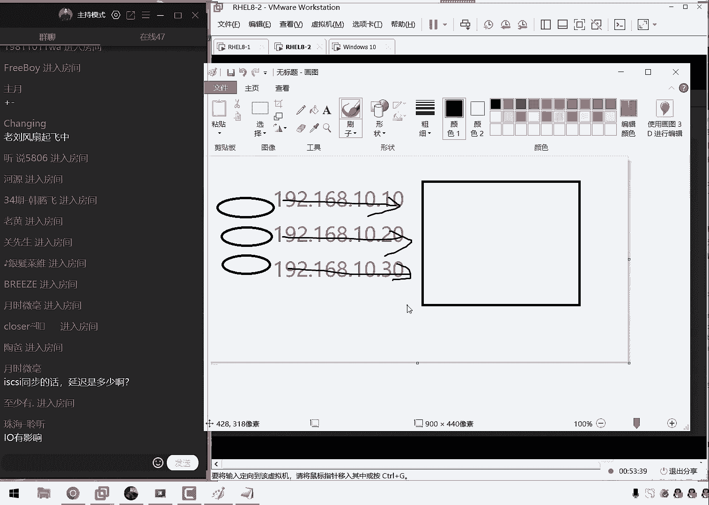

但是取决于这个网速嘛，让我们来给大家操作一下，然后我们来去探测一下，说对方主义上面还有啊，他有哪些可能的共享，于是我们可以看到了，说当前主机上面的话呢有一个共享名称，然后为这个的设备。

然后我们可以把它给挂载过来，据说过来过后他是个啥，那我们还不知道，不过我啊啊啊，但是的话呢我们已经有了这么一个名称了，所以我们就可以直接点一下复制，这样来进行挂载操作了，来我们来给大家挂载一下。

我们啊还是使用到这个命令，然后我们需要把自己设置成一个节点的，一个主机，刚大t指的是我们要想去设置一下，共享的这个名称是什么，然后我们这个我们不用去手敲的，同学们可以直接复制就可以了。

然后我们再换成钢p，他指的还是服务器的一个地址啊，刚p还是服务器地址，就是1920~8点10：10，后面我们来进行登录，它可以是一个传过去的一个登录词，它也可以是一个消极的一个呃，参数来进行登录。

这样的话呢我们来进行一个发现，然后再进行一个登录之后，大家可以来看到它底下就会显示出来，成功了，那么就可以看到当前设备当中，就会多出来一个第二个硬盘，所以这就是我们第六章节，第一小节给大家聊聊过的。

他根据我们的ud微服务，来，对于我们这个社会的生态性，命名的时候的话呢，它可并不是因为我们在啊主板上面，这个插槽的顺序，决定了它所对应的一个设备的名称，它是根据我们的内核里边的这个识别顺序，来去决定的。

所以我们当前这个呃客户端。

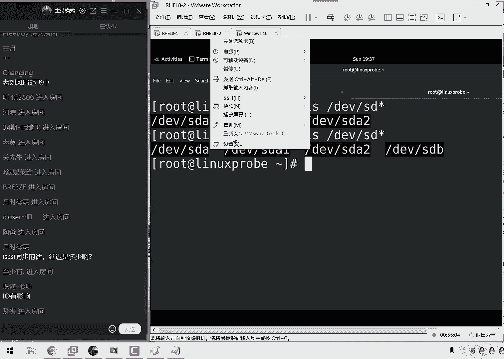

它并没有第二个硬盘，但是我们现在第六章节给大家讲到的。

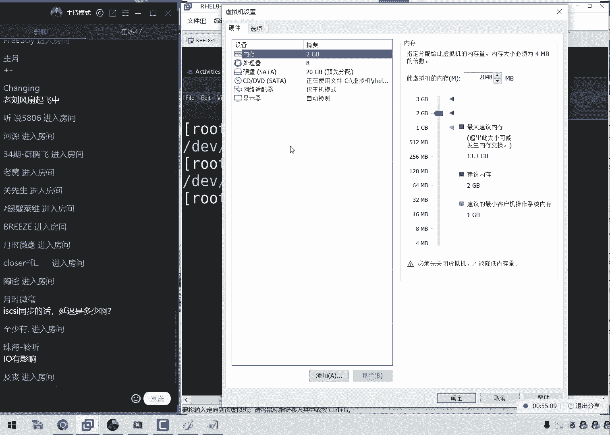

它依然会被分配到了一个设备的名称，就是这样的一个原因，所以因为它是由于我啊，因为啊它是由我们的设备的啊来去啊，他啊他啊他啊，他还将视频的一个顺序来去决定的，然后的话我们因为客户端嘛，我们主要他啊。

那我们现在我们把这个先做一下卸载操作，我们就帮着这个数量给大家去做吧，因为的话呢先对它进行格式化挂载之后吧。

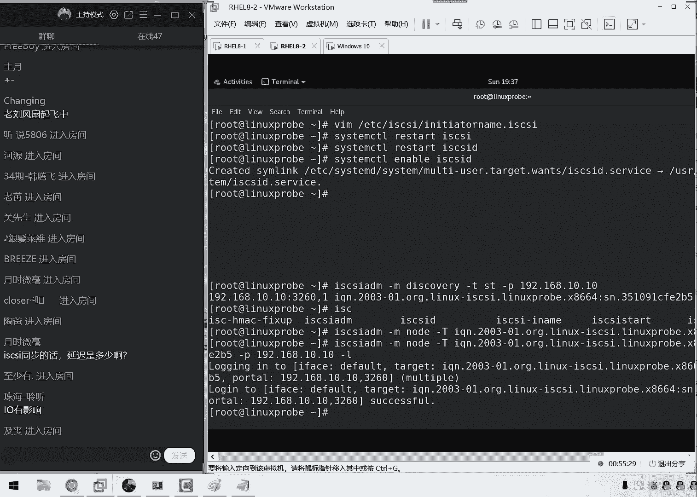

这个数据已经没有了，所以的话呢我们先把它给卸载掉，去，使用一台windows的主机来进行挂载。

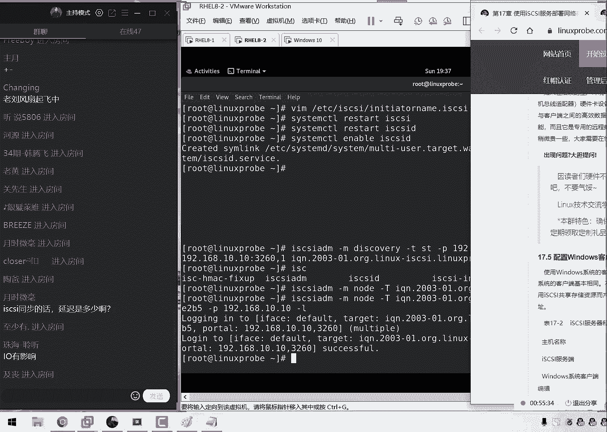

然后我们以这台windows的客户端，因为我们平时这个实验端啊，我们很少用到windows，所以我们来讲一下windows怎么来去做，我们需要先把它给卸载掉，先把这个设备需要先给大家做下载。

否则那我们这边是不能够同步去做挂载的，否则这边连它它两边会有冲突，然后我们先把它给卸载掉，然后大家可以看一下，那我们该去如何去使用它一台windows的主机，来挂载一个我们的网络存储设备。

然后我们来跟大t来去往里面一粘贴，这是我们的这个设备的名称，然后我们一个消息的u，来去做一些细的操作，这样就完成了啊，那也就是说我们刚刚的这个，所有的这个操作，然后完啊。

我们完成之后再去看一下dv目录里面，就它就会有没有第二个硬盘了，这是一个简单的，我们来进行一个呃远程设备的一个挂载。

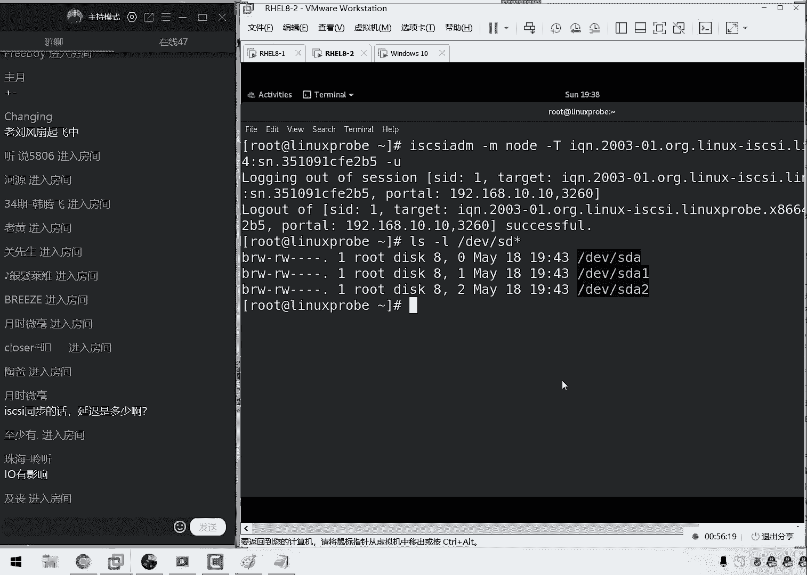

以及进行卸载的这么一个操作。

然后我们今天这个重头戏的话呢，要给大家演示一下该去如何，是那么呃那我们要给大家演示一下。

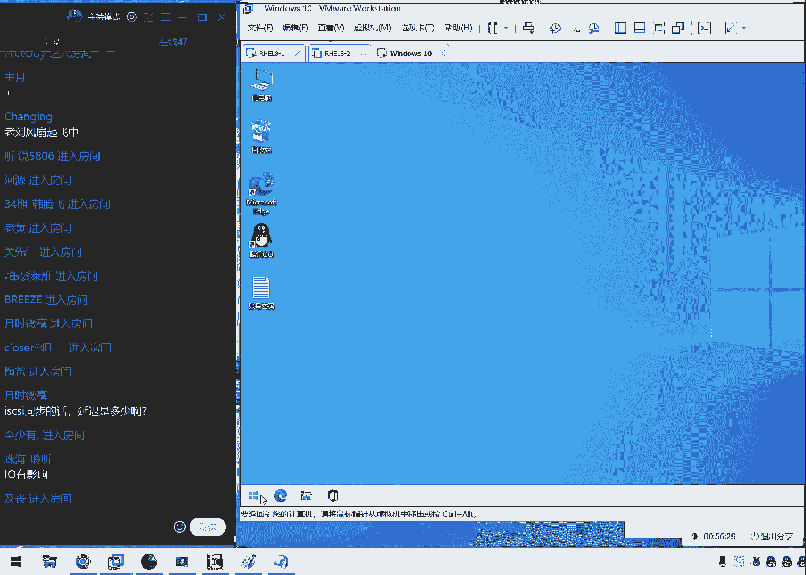

该去如何去属于它，windows主机来去挂载一下，我们这个网络存储设备，因为这个可能用的更多一点，首先保证一下网络这个连通性，1920~8点10：10。

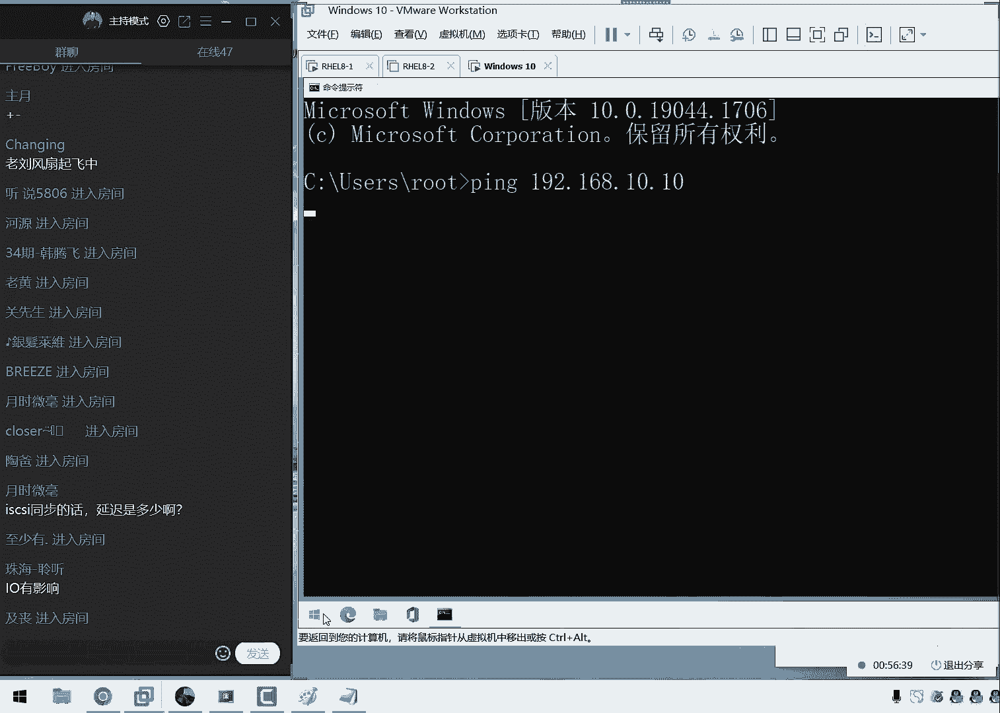

然后我们来跳一下啊，果然不通啊对吧，网络不通，这肯定不行，这就是我们要做这个实验之前，大家呃也会提问啊，说老师我们这个服务明明配置的很好，但是为什么老婆生效呢，的原因就是因为可能是因为网络不同对吧。

这个网络一定一定要在啊，我们配置每个服之前先去点一点，来我们点一下这个网络，既然来说，它这个服务器是1920~8点10：10，那好了，它是一个c类的一个三个r五点啊，gr 4位的一个ip地址。

所以的话呢，我们当前就把我们自己也把它配置到同，一个网段就可以通信了，192018。10。20吧，我点呃呃点三零吧，好我们这样啊，因为我们是我们这个呃第三个主机嘛，所以我们就用到点三零。

然后网关p s不用写，这个当年用不到，我们点一下确认确认确认完毕完毕完毕。

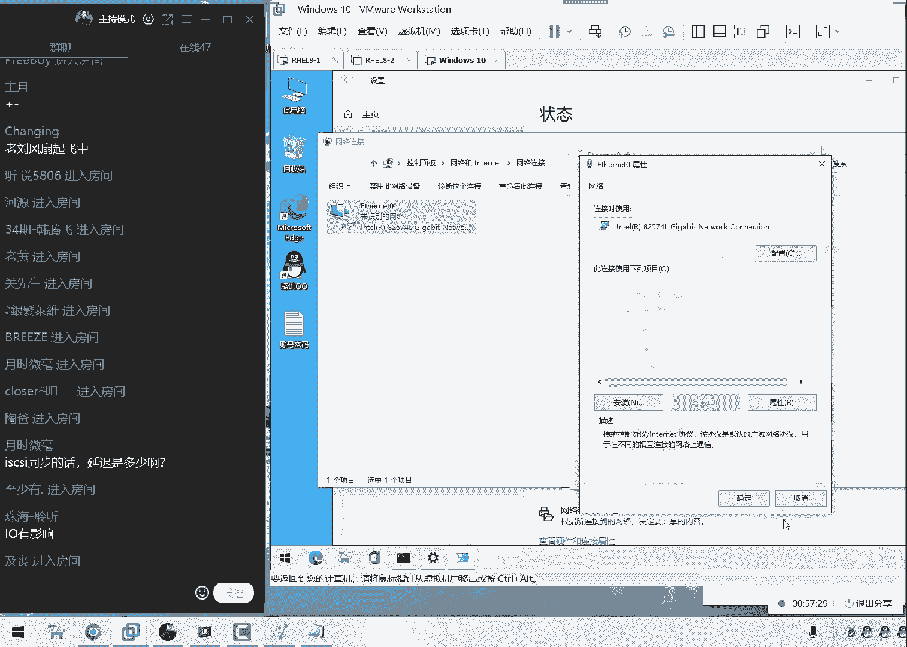

ok让我们把我们的网卡配好了之后，在一起拼单会发现已经能够拼通了。

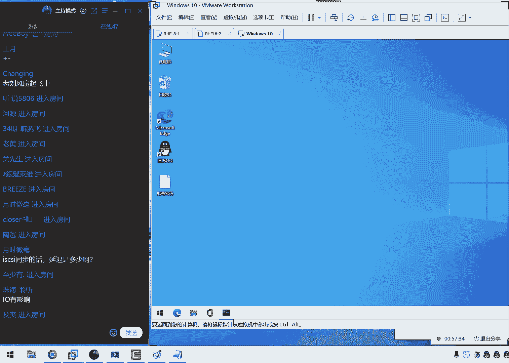

其实我们对于网卡这一块呢，它并不难，主要就是我们老旺啊，那我们除了这个老旺以外的话，就没有太大的问题了，然后我们再去使用它windows来去挂载一下。

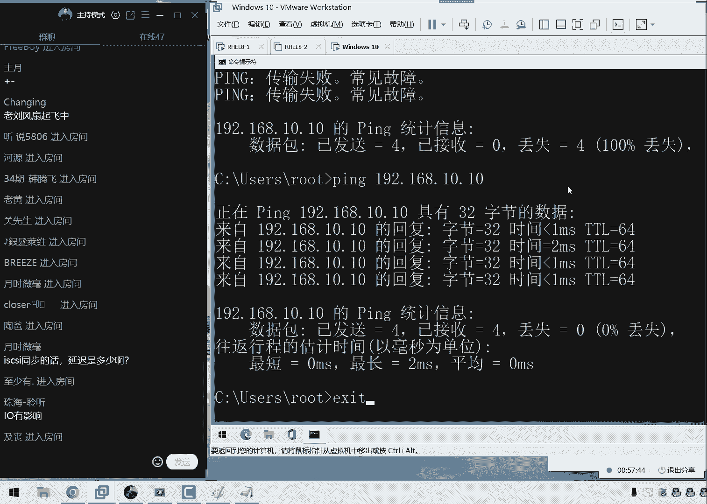

我们的sci网络存储的方法是这样的，首先点击一下这个开始按钮，我们既然都已经会linux了，所以这个啊windows的话呢也不在话下啊，还它并不难，主要找一找它是有一个叫做控制面板，不是呃，对对对。

控制面板吗的一个的一个界面，然后的话我们在控制栏里面，我们需要点一下这边点一下这个小图标呃，然后的话呢我们点一下这个管理中心啊，点一下管理工具在里边的话呢，我们可以找到了，我们叫叫呃。

这边我们就会有一个发起工具了，双击加这个图标，他第一次会问我们说是否去启用，然后因为我已经点过了，所以他第二次会直接打开了，那么要想去使用它windows来进行挂载的话，也很简单，首先先去啊。

避免记得这个嫌疑啊，宋老师这个啊，虚拟机里面有没有第二个硬盘呀，所以先去确认一下，当前虚拟机里面它并没有第二个硬盘，它只有一个硬盘而已好了，这是第一个事情，第二个事情确认一下我们的电脑里面。

它也只有一个硬盘而已啊，这是一个光盘啊，然后去啊，东尼啊，现在那么现在没有了，就是它里面只有一个硬盘，然后这是第一个事情，第二个事情的话呢，就是我们点击加配置，需要把我们这个发起的名称。

就是我们这个服务的一个名称嘛，跟我们刚才那个防空啊，防空列表当中保持一致，这样的话呢，它才能够有权利来进行一个访问操作，点一下更改，然后我们点一下这个复制。

然后他还说我们的windows 10哪里下的啊，我们从百度上去下的，就是随便下的一个版本啊，也不是呃贵准备的，所以大家其实呃不用太纠结，因为我们先记得这个电脑的话，实际上去做也行啊，那么点下确认就好了。

基本单位就是说啊，只要是一台windows主机都可以啊，它前的版本无所谓，七版本呀，八版本啊，十版本他都可以啊，这个使用起来是一样的，首先我们把这个设备的名称改好啊，名称跟我们的这个反馈为呃。

混合框架板当中的话呢保持一致呃，然后的话我们点一下这个目标，让我们来说一下这个服务器的一个地址，接下来说网卡已经通了，然后呢啊防火墙也已经配了，那我们就直接来了，我们点一下快速连接。

在后面呢说有一个问题是，老师快速连接有多快呢，快速连接就是当我们一点击完成之后，这个事情就算是完成了，所以我们点一下这个完成，点一下确认，然后我们再把这个服务就算是配完了，并且这个设备就已经自动。

为我们去做挂载了，它不需要我们去发现跟登录windows傻瓜化，把我们都完成了啊，所以说我们这个呃非常的呃容易吗，那那我们再去收到他们的windows的时候，会感觉到特别非常简单。

但是我们再去说到我们这个啊，开源系统的时候，总会感觉到很难啊，他会感觉到很难，但是却能够很好的去锻炼到，我们配置这个服务的一个能力，然后以及这个底层的一个理论基础了，那我们点一下这个管理，大家看到。

当我点击这个电脑的这个管理当中，然后大家会发现了，此时虽然说我这个电脑当中只有一个硬盘，对吧，大家看一下，再进行一个确认啊，再再再进行一个确认来，当今虽然我电脑里面只有一个硬盘，但是的话呢。

我们这个磁盘管理器里面就会多出来一个，硬盘，大小是为十个gb，它是一个瑞典一零，用服务器提供的一个网络存储，诶，我们来看一下，首先我们来确认一下这个磁盘，然后点一下下一步，然后就呃就可以了啊。

那么就那下面一步的话，就是我们去点开我的电脑，来到这个界面当中，啊啊啊加点开我的电脑，那基本当中，然后的话呢我们来去选择到这个分区，点一下这个新建分区，然后我们点击一下下一步，然后就是设定一下这个大小。

所有的这个空间都化为一个分区，然后点击下一步下一步，然后他选择是否自动来进行一个呃分区啊，来进行一个操作，我们选择一下下一步，分区格式化挂载操作自动完成，那傻瓜化的一个操作啊。

windows里边就会弹出来另外一个啊，这么一个设备卷了，那么当初出现这个设备卷之后的话呢，然后大家可以看到，其实我们，那我们就可以像使用到我们自己的，这个电脑一样，来去使用到这个里面的这个资源啊。

这个的话呢就是我们叫做远程设备共享了，这么一个小呃呃的一个简单服务，大家看到其实它并不难，我们连那我们连说带点到现在啊，这个才用了35分钟啊，将就啊，这个非常的简单啊，所以的话呢我们以后工作的时候。

只要考虑到对于我们的网速的一个开销，只要说网啊啊，那么我们只要是这个网啊，他们有一个问题的话呢，那我们去使用这个服务也没有太大问题，它主要取决于网速的一个影响，然后我们来看一下第18章节。

然后大家可以往后翻一翻，第17章节，我们的我们的网络设备存储，这个非常简单，我们就调过了，今天的话第18章节也是很难的，另外大家可以来继续来提个问题，然后我去把我们这个给它取消掉，因为的话呢我看一下。

咱们书上有没有这个章节啊，书上没有的话，我们再给它添加到里面去，就是我们现在的话呢，如果说我们不想去使用它了，然后这个是小，他是一个小疏忽，等于说我们现在这个啊。

windows里面没有对它进行一个卸载的一个操作，因为在我们的第七章节里面的话呢，像是我们的逻辑转管理器和read的话，它都有一个取消的一个操作对吧，但是在我们的windows里面。

好像基于这个章节没有取消的一个操作，这个有点尴尬啊，我们先给大家演示一下，就是呃，当我们已经呃，不需要再去使用它这个设备的时候，该怎么把它给取消掉呢，其实也其实也很简单，我们点一下啊，断开链接。

然后的话我们点击一下确认，然后就可以了，当然我们可以把它给删除掉，我们看一下啊，我们点一下属性吗，哦我看一下把它给删干净了哈，因为当前这个其实不需要，然后我们把这个名称的话呢，也随便去改一改。

比如说我们的发起名称改成叫做linux pro，随便改一个啊，改广改广告，让他连接不成功，然后我们点一下确认，我电脑里面就没有这个磁盘了，所以说这个我们的呃要想把它取消掉，链接的话，还是比较简单的。

然后看一下这里面的这个信息，也可以点一下这个删除，就把它给删干净了啊，就这个非常的简单，这把它给删掉了，ok没有问题了，这个非常简单，只是一图啊，咱们啊只要啊，那我们只需要点击鼠标。

就可以把这个操作给大家拍完了啊，好但这也是，当然这也算是一个小的一个呃缺陷啊。

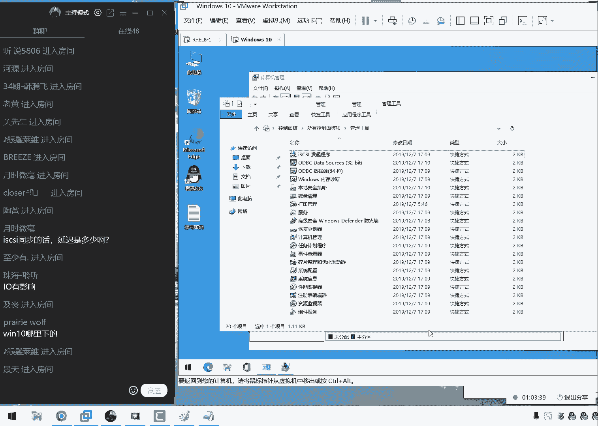

咱们这个书里面确实没有讲怎么去删，那我们去当然当面又把它给删干净了啊，这样的话大家看起来会更加过瘾，可以看到一条龙服务，都可以看到所有的这个配置的，这个操作就完成了，然后大家说。

我们现在只允许一个客户端驱散吗。

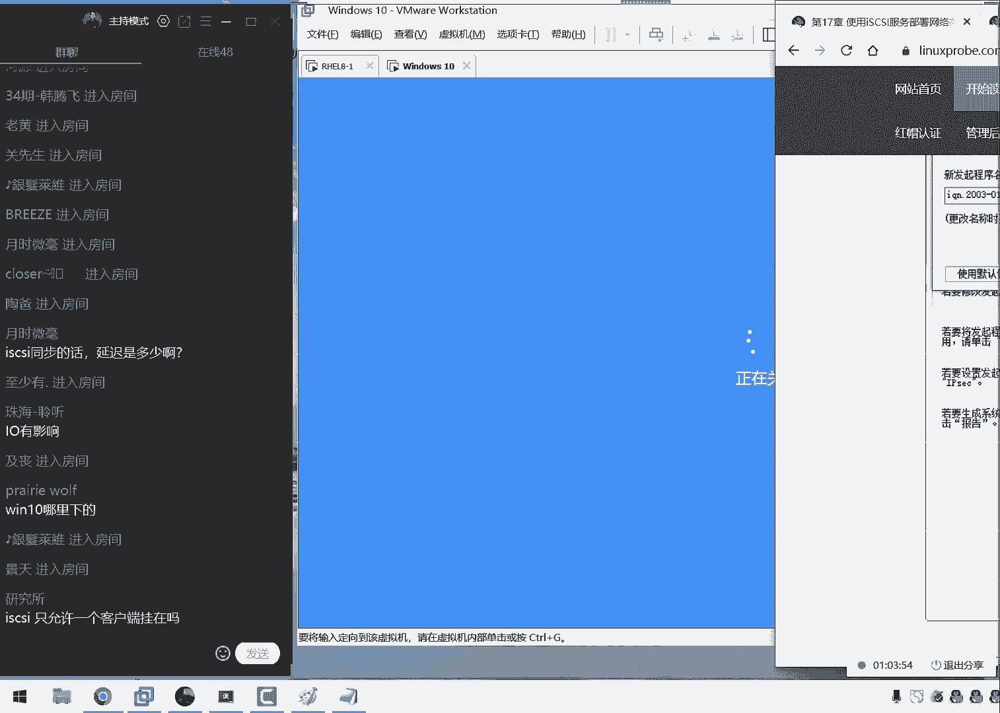

对是这样的啊，我们在这个网络设备存储，它这个服务只允许同一个设备啊。

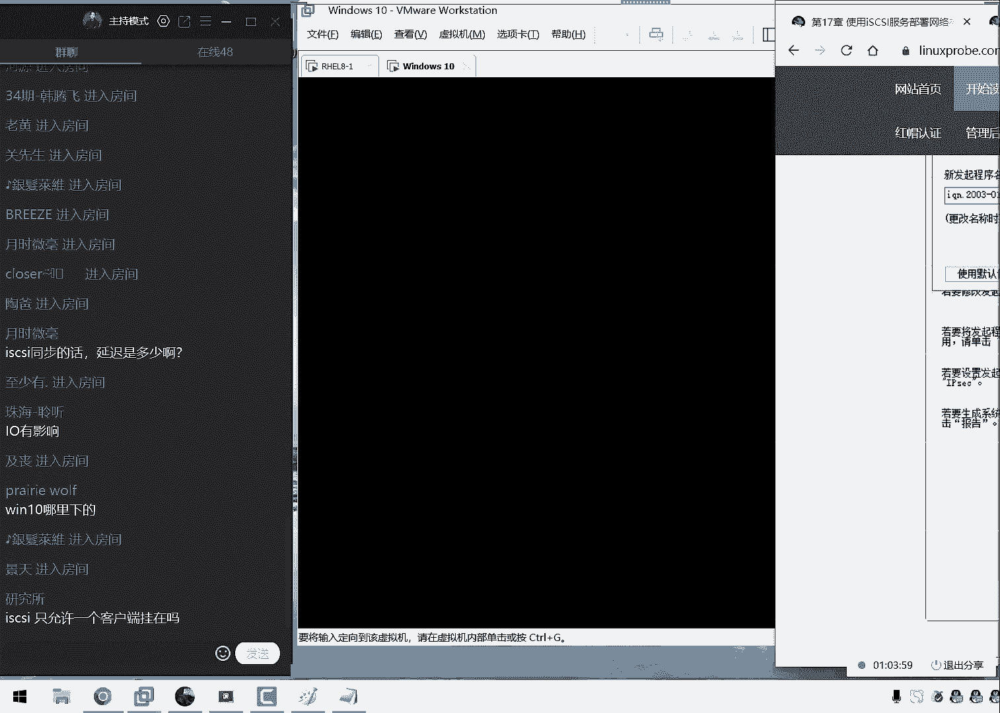

在呃同一个主机正在去使用，它，不能够去多个主机去同时去使用。

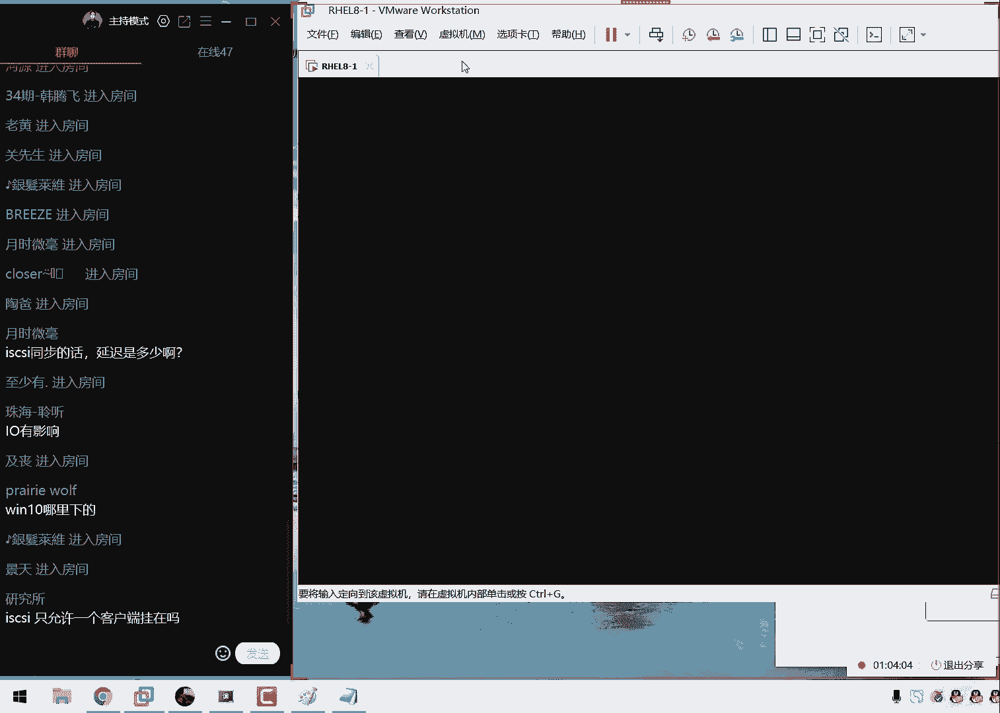

它会产生冲突的这样一个情况，然后我们来给大家看一下，这边的第18章节，我们来讲一下这个数据库，这个话呢，我们的数据库大家用的比较多一点，是什么呢，啊先提一个小问题，在我们公司里面。

我们的数据库一般用的是什么呢，反正我们公司用的是mysql啊，不知道啊，不知道的话，同学用的是什么样的一个数据库的，一个这一个服务呢，大家说呃我们用的是在让我们用的是呃，嘉文的一个服务是吧。

然后说如果是公网上共享的话，是不是不太实用，对就我我们就给大家去说啊，这个鞋为什么我们讲的有点仓促呢，就是因为这个服务说实话，在公园里面就是几乎是为零的，因为大家想即便你去了韩国了，韩国的网速。

大家网上去搜一下韩国网速，每秒下载速度能达到100多兆吗，也但只要100多兆的话也不快啊对吧，因为大家想，我们把一个硬盘插到我的主板上面内，速度是最快的，我们要想给他共享出去的话呢。

作为一个云存储还可能还好，但是如果要是作为一个只是一个单纯的，要想不想给别人去用的话呢，说实话那个效率确实很低啊。

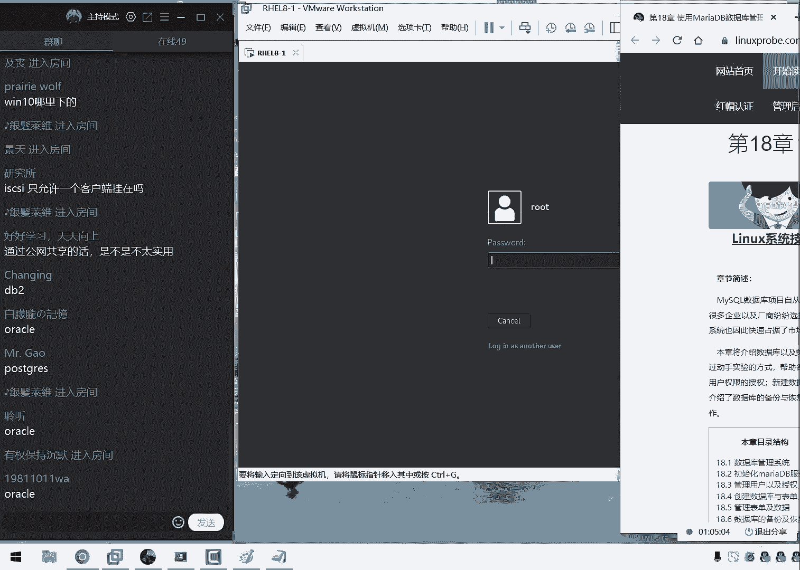

他去看他受到网络，这么他需要受到网络的这呃。

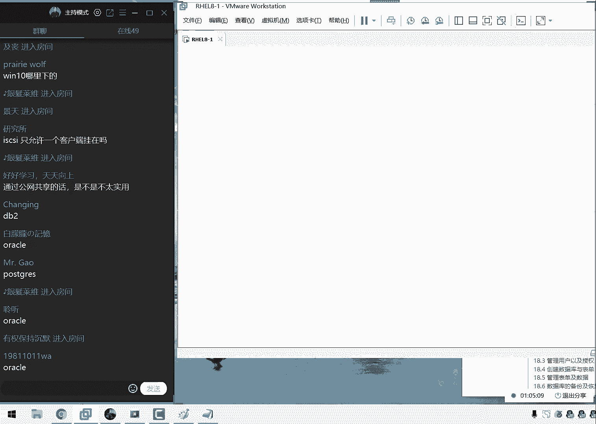

他这么一个限制，以及呃插到主板上面没有网络的波动。

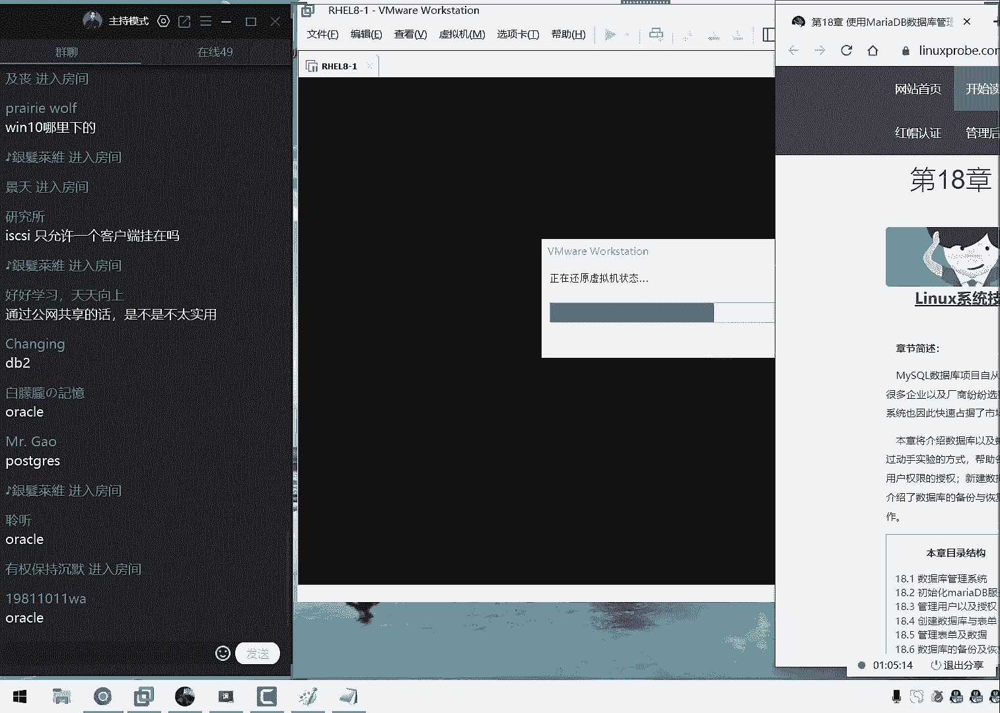

它没有波动的啊，但是通过互联网的话，它可能会造成网络波动，造成数据的丢失，所以的话呢即便加一个我们的设备卷啊，那啊不那我们即便加了一个我们的设备，它也我们呃有些情况下也是不太稳定的。

然后我们来给大家看一下大家数据库啊，说的是甲骨文是吧，好了，那样的话我们要给大家说一下，今天我们第18章节给大家讲一讲，这个数据库，这个数据库的话呢，我们不会显得特别的深，但是我们啊因为这个数据库啊。

需要删了之后，他有一个专业的认证啊，o c a o c p，然后这样的一个认证，然后我们今天给大家讲的，就是一个基本的一个管理，在我们这个平台下，我们要想对于这个数据库来监督管理，怎么进行一个啊。

基本的一个增删改查的一个能力，以及在我们这个数据库里面，进行一个账号的新建，然后改名了还不啊，对于我们的呃账户的新建，然后让我们再去改密码，然后以及去啊，对于我们我们当前这个用户来进行授权。

跟学校授权等等这样的一个基本的操作啊，这个我们一定要有的，也就是说我们今天这个课啊，主线还是我们的这个操作系统，但是我们数据库该学还得学，因为学完了之后，我们就一起来说，是不是我们可以对于稍等一下。

哎这样的话，因为我们当我们需要证号的话就可以啊，对于数据库，但有些基本需求的时候就可以直接上手了，而不用等我们同事去做了，但是这个虽然说的话，很难，通过一个小时的时间给大家去精通了它，但是这个也够用啊。

这也够用了，来啊说啊可以进行删库操作，对今天我们学完了之后，你可以去山库啊，这个完全没有问题了，因为我们对于我们的这个数据的增删改查，的一个彻底的删除，以及啊恢复操作都给大家讲到。

所以以后要是有同学啊也会数据库的话，一定要小心啊。

就是一定要小心这个操作，不要把数据给呃给他搞坏了，其实我们刚开这个课的时候，第三章节大家写完之后，就会觉得，这老师这个的这个啊系统的一个课文，那我们没法讲这个数据库呢对吧，这就那我们主要是作为一个呃。

理论的一个基础，这样的话，我们以后工作的时候就不会吃亏了啊。

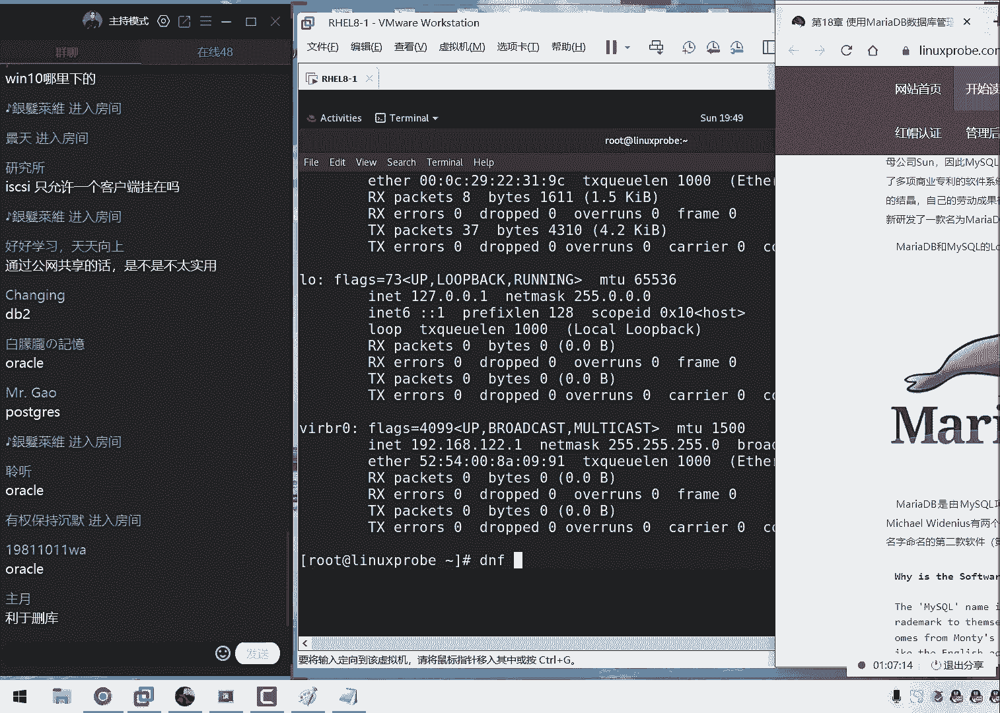

但是基本操作不用等同事去做了来，首先来说啊，就是说我们现在这个呃公司的话呢，用到这个数据库叫做mysql啊，数据库的话呢，呃mary db的话呢，这个两个是通用的，也就是说我们在公司的时候呃。

不论您去使用的是哪一个数据库，那么都可以去直接上手就开了，那么他这个呃呃呃，sql语句是跟这两个数据库sql的语句，就在两个数据库里面都是一模一样的啊，你说的这个完全一样的话也不太尽然。

但是99%是一样的，所以在我们公司的时候，不论您是使用到哪个数据库，那么我们一定要都说自己学过了，没有问题，让我们去使用的这个sql语句，然后至于说这个历史的话，那么以及这两个区别。

那我们就不再给大家来去赘述了，大家可以来看一下，咱们这个网站上面会有一些介绍，这主要吧，就是因为甲骨文公司收购的这个sun公司啊，我们给大家说一下吧，主要的话呢这个时间点因为我记不住了。

好像是2014年，好像是啊家家顾问公司，oracle收购了一家公司叫sun公司，这个sun公司的话呢，有一个产品叫做mysql的话啊，于是买sl这个产品就归了这个唉，欧瑞克公司。

就是说现在我们所说的oracle啊，实际上就是一个公司的名称，他也就有一个产品就叫做mysql，这个产品的话呢，是当时由sun公司给他收购过来之后，然后给它归为自己的一个商业一个软件了。

后来的话呢大家也知道了啊，因为商业上的一些竞争啊，然后的话呢oracle发布了一个产品叫做oracle linux，然后大家记来记一下啊，好oracle linux产品啊。

它它这个产品发布了这个产品的话呢，它是基于的，我们的红帽的企业版系统去研发出来的，但是在这个系统发布之后，它的宣传的这个呃噱头的话呢，是说，修复了红帽铁板系统里边的100多项漏洞，这怎么理解这件事情呢。

就是红帽的话一直以来他有很呃，它有这么呃他呃他这个系统的话呢，都号称是最稳定的操作系统啊，是一个当前最稳定，最安全的一个呃开源的一个操作系统，结果的话呢，那你发布了之后，并且是你继续我的系统是啊。

来进行开发的过后，然后你还说啊哈呃呃然后呃他当时说的说，我们这个系统的话呢修复了100多项漏洞，大家可以搜一下那个新闻，最开始的时候就是这样的，然后当然就会觉得很不好嘛。

因为你既然基于我研发出来你的操作系统，你还说我不可能去砸了我的饭碗，也正好当时的话呢，汇报公司就跟他有一些梁子结下了，当然大家对于这个资本啊，我这么一个这个怎么着啊，对于呃呃反正这么一个事情的话。

反正啊从我们这个角度上来说，红毛肯定是很生气的，但是对于这个资本的话呢，他肯定是啊有非常多这个考量的啊，所以我们之前还给大家聊一下这一段历史，但是我们现在不聊了，因为我们认为资本的这个呃考量的话呢。

可能会比我们考虑更多一点，但是总之总之就是呃，红宝公司跟家公司的关系确实不是很好啊，并且没有任何的合作，我记得波波二零呃，我我这个具体时间忘了啊，也就是2014年吧等等啊，那也就是说从2014年开始。

红毛瑞尔七开始就把这个默认的这个啊mysql，给大家替换下来了，所以的话呢，这个也算是红宝公司的一个表态吧，从2014年开始，就开始去大量的去支持，我们这个新的数据库，叫做啊mia db的一个数据库了。

所以这个时间的话也很久有8年多时间了，以及去使用这个呃数据库，作为自己的一个呃默认的一个植入的，一个软件的话，已经有8年时间了，这个时间也是很久了，那么也可以表明出来，红帽公司对这个产品的一个重视。

然后大家可以搜一下这个历史啊，然后呢我们的呃mari数据库，然后他他也实际上它也是我们原先啊，这个呃mysql那个作者他自己的一个呃。

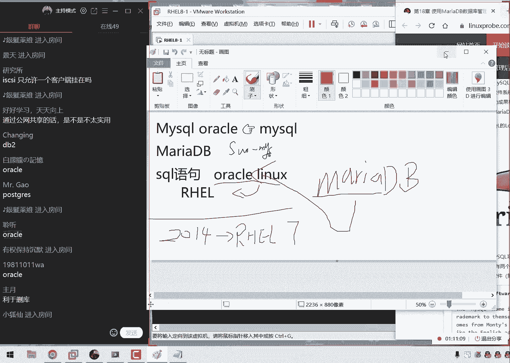

他啊他啊自己啊对啊，他自己的呃，好我们来给大家操作一下，然后我们来去安装啊，买啊mary db安装下这个数据库啊，他的家的这个名字啊，然后我们来去mai dd来进行安装，然后安好之后的话呢。

它里面这个风格语句都使用的是这个mysql的，然后可能您之前去机构买sql的话，会感觉到很眼熟，然后我们安装一下这个mary tb，然后呢还有一个叫叫做maria conserver，来来安装一下。

这个也是我们作为服务端嘛，啊maria d b跟server来作为副端给大家安装上站，一个主城区一个服务端就都齐了啊，连安装好啊，一个主城是一个服务端，安装好之后的话，呢我们来进行一个重启。

当我们这个服务起来之后，就可以来进行一个初始化的一个工作了，来大家可以来一起去操作一下，因为这个很简单，但是如果您要是没有这个mysql，这个基础的话呢，可能这个命令还是要重新去适应一下的。

那都弄好之后啊，我们来去启动一下我们的mary db啊，就是来启动一下我们这个新的数据库，然后我们去使用到star来进行启动，启用过后就可以来进行处理化操作了，对于我们这个数据库肯定的呃。

呃呃数字化的这个过程的话呢，它是有点难度的，因为数据库的，话呢它是需要配置一些基本信息，来我们给大家启用过，后来进行出来操作了什么呢，马斯克啊，呃so cute，来去使用到这个命令。

来进行一个初始化操作啊，进行初始化的一个安装操作啊，来我们来去按一下回车，当我们这个非常非常重要啊，刚才提到了，它里面需要对于我们数据库里面，一些基本信息来进行修改，所以大家去猜测的话，一定要小心。

因为如果说您现在这个密码敲错了，或者您忘记的话，当我们在进行这个数据库的时候，他会提示出，来失败的还需要在破密码的地方比较麻烦，然后我们先看一下，就是说请说一下，我们这个当前管理员。

在我们这个数据库里面的密码，但是后来默认值它就会空的，所以我们可以直接敲回车就可以了，直接敲一下回车来进行一个进入就可以了，大家看到，也就是说我们在进行初始化的时候，默认情况下它是没有密码的。

我们可以直接切换进去好，那我们可以直接敲下回车就可以了，他说是否当前设置一下，我们管理员的这个密码，这个时候也要小心，就是我们刚才提到了吧，这个是一定，要小心，因为你一旦剪辑了这个y。

然后去输入一下密码之后的话呢，要给忘掉，特别麻烦，所以当前一定不要忘，一定要看清，我们设置成两次啊，为红帽啊，red hat，那么两次敲完之后没有问题，他说是否来去来把这个我们的这个呃。

那我们需要把这个用户给它移除吗，它指的是是否来去禁止掉，公开访问的一个模式，我们选择一下，yes，那这样的话它会更加安全，他就没有办法啊，他啊退出登录了，他需要进行账号密码的一个验证。

才可以进行一个访问，接下来他说是否来去允许我们的用户，从远程进行访问，那我们来选择一下啊，不过他指的是是否在去禁止我们这个呃，管理员进行一个远程访问，我们选择1000万，这样的话它会更加安全。

再来说是否来自移除掉，我们的测试性数据库以及访问权限啊，所以我们点一下吧，再来他说试玩，让他立即生效呢，我们来点一下吧啊立即生效一下，都做好之后，大家可以看到就是它进行一个初始化，完成就做完了。

但是这个说法过程的话它只有一次，所以同学们一定要小心啊，刚刚，我们所猜这个所有的这个按键的话呢，看清楚之后再取消，尤其是密码啊，一定要小心，登录好之后，我们就可以去使用到这个密码，来进行登录了。

所以这个命令的名称的话还叫做mysql啊，让我们去使用一下这个命令来进行登录，更优质了一下用户名称gp指的是它有密码，那密码的话呢，我们写到这个下面来敲一下回车，密码的话就是right side，红帽。

就是我们刚刚去自己去新建出来那个密码，来进行一个重置的一个密码，所以大家一定要小心这个密，码千万不要忘记，那么我们就看到这边就可以看到了，那我们进入到这里就可以看到了，就可以去进入到我们的数据库了。

那么这个数据库的话呢，每一个这个色q语的，后面要有一个分号结尾，比如说我想要去查看一下。

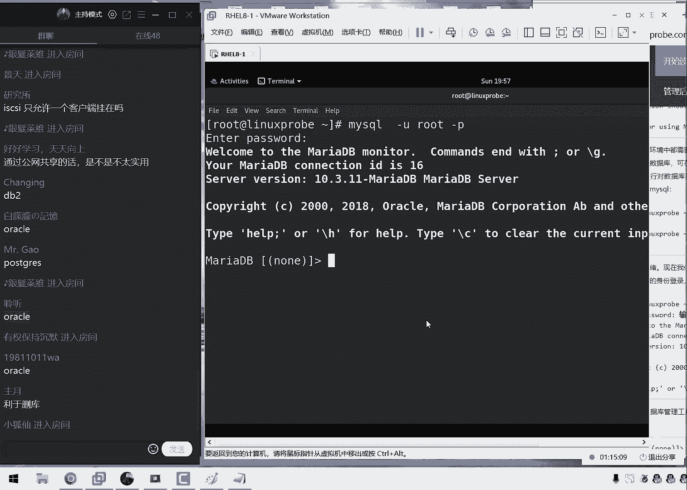

当前我们这个数据库里面有多少个数据库，啊，对吧，那也就是说因为mysql跟我们的啊，当前这个工具嘛，我们统称叫做数据库的管理工具，来给大家写下来，当前我们的maridb的话呢，以及买sql。

它实际上的名称叫做数据库管理工具，数据库管理工具，这个里面的话呢管理工具它。

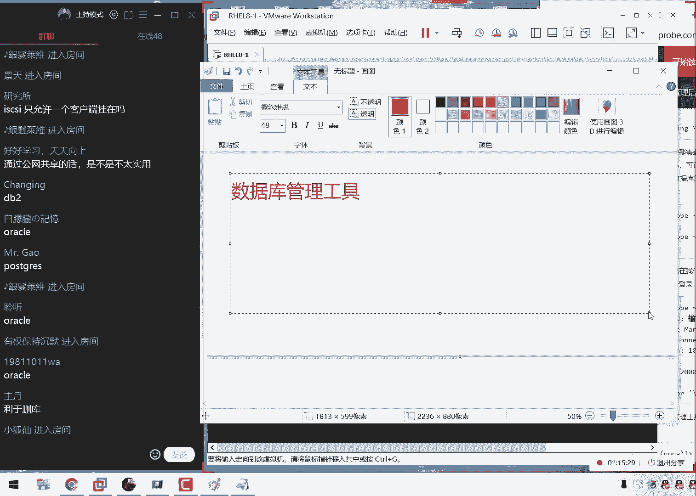

里面需要很多这个数据库，那我们要想去查看一下，当前有哪些已有数据库的时候，我们叫做呃呃database，然后我们来去show它一下，后面一定要加一个分号结束啊啊，那我们把它结束掉。

因为所以这个搜索语句都特别的沉，他为了去标明每一个语句的这个阶级，就需要加一个分号，把它给结束掉，然后我们才会再回车，然后就可以看到当前有三个数据库，是在我们这个数据库的一个，管理工具当中的。

我们现在的话呢来给大家去呃，做这么几个基本的一个操作，大可以来感受一下，首先呢咱们来，说就是对于观点来啊，对于我们这个关系原来讲啊，那我们想要去新建出来一个普通用户，这样这个普通用户可以去完成。

我们一些基本的操作，然后的话呢，以及想要对于我们的管理员来对啊，那么来对它进行一个密码的一个重置，这个本来进行操作呢，首先比如说我们立马的叫做红帽啊，the red hat和改。

那我去改一下我关联的这个密码，这叫做set password，另外大家看一下我们这个书上面了，跟我们后面这个呃值的话呢，它啊它会呃它会，一个啊他会啊有这样的一个呃的一个写法，它可以啊，它需要啊来啊。

他需要这么去写啊，其实的话呢我们的啊这个它并没有区分的，所以说大家记一下啊，四分语句里面的呃大小姐他也没有区分，大家来记一下，我们疏散的话，它这个只是为了好看啊，做的关键词大小写不用区分。

但它只是为了好看而已，然后所以大家可以看一下，书上面这个写法是正确的，然后我们要把它消息的话，他也没有问题，来我们给他重置一下，当前的话呢把密码给他重置成这个值，然后这样做好之后就可以了，来去退出两台。

大家都记住啊，就是所有的这个sql语句的后面，都要以一个分号给他截，那么来给大家来做一下，叫做这个结束服务，除此以外倒没有什么其他的问题，来我们来杠u就登录一下来去使用，那么还是使用到管理员。

然后我们现在还去输入到，我们之前那个密码叫做red hat，大家看到就是我现在的话去说一下red hat，然后但是我们现在登录失败了，我现在确实没有故意输错啊，然后我们现在需要去注意一下。

我们的这个新的密码，我们叫做linufb，大家看好了，我，们现在去数一下，我们这个新密码就可以登录了，其实这也没有什么可说的，因为他就是一个立马重置的一个过程，这个假不了，那这个非常简单。

而我们现在需要让大家注意的，就是我们要给大家提一个难度，就是我们老，那就是我们现在我们再去做啊，平时工作的时候的话，老去思考一个管理员，我们能不能去新建出来一个普通用户。

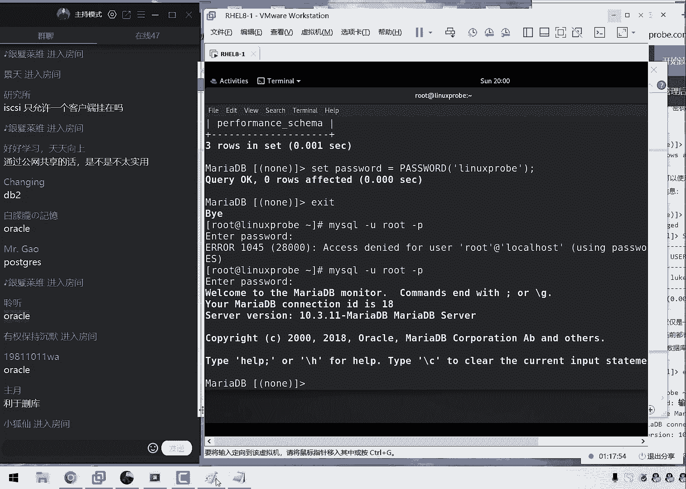

只要为这个不用户来进行授权，第一步走，就是我们能不能去精炼出来一个普通用户，创建出，来一个普通用户，然后的话呢，我们来对于这个用户来进行授权，让他可以去完成某些工作，然后让我们的用户去使用这个普通用户。

来去完成某些工作，之后的话呢，就能够把这个用户给大家去取消授权，那么就会有这样的一个流程，这样的话我们就可以让我们的同事呀，也可以去管理我们的这个数据库，同时的话呢它也很安全，因为它并不是管理员嘛啊。

那那那呃那也就是我们的原则，在我们能够满足工作这个前提之下啊，把我们这个权限越小一点，这样的话能够保证我们这个服务，器越安全一点好了，我们现在来给大家做第一步操作啊。

另外另外另外我们所说的这三个操作的话，它都属于叫做管理命令，它都需要去使用到我们的管理员，来进行登录，我们叫做入侵用户来进行的这个操作，操作啊。

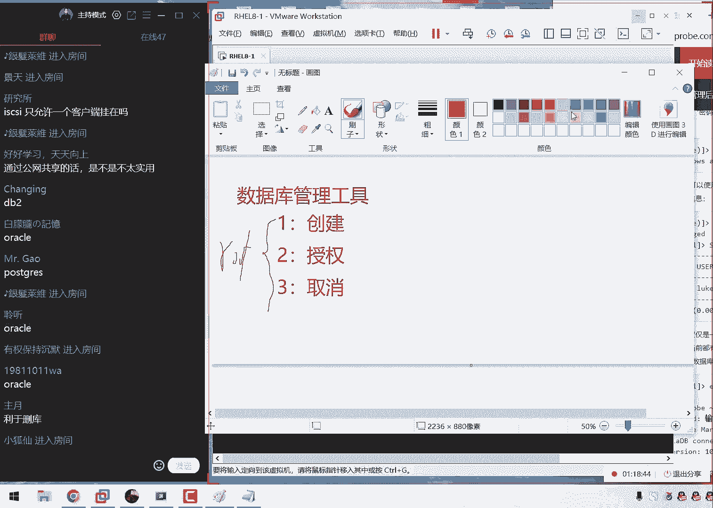

它还进行这么一个操作，叫做啊啊管理员来进行登录啊，来进行登录之后来进行一个操作，来我来给大家新建出来吧，我看谁迟到了啊，小狐仙同学迟到了是吧，那我新建出来一个用户，这个用户名称的话，那我们就随便了啊。

叫做这个仙仙吧，让我们来新建出来这个用户，新，鲜，然后我们就看到本机local host，也就是说我们现在说的一个本机的用户，叫做这个，先先主要我们对于这个用户的话呢，在继续设置一个密码。

然后我们设置一个密码值呃，identity，identa，identity fade啊，来等一下i d e n t，稍等一下验证的意思，i f i e d啊啊它的密码的话呢，我们给大家对它进行一个设置。

密码的话叫做这个linux club，这样做好之后也很简单啊，就有了，然后我们可以去查看一下这个用户信息，是在我们的这个本地的一个叫做买sql，数据库里面就会，保存下来在这个新鲜的一个用户。

不过呃看不看都无所谓，因为它已经是存在了，之后的话呢，就肯定是呃已经是写入到这个文件里面了，我们查看一下这个目录信息哦，很多很多很多，那确实很多，不过我们大概看一下吧，它里面会有一个用户。

我看到它没有吗，有肯定有肯定有啊，一定有，只不过比较乱啊，稍等一下一定有啊，在这儿有啊，是他已经有了，那也就是说新店有的一个普通用户，它是为本地的啊，它叫这个仙仙好了，那我们现在要去使用到这个普通用户。

来进行登录一下呃，第一步，来去新建出来这个用户，第二步来去使用它这个用户来进行登录，更优质了一下用户的名称叫做新鲜，然后干嘛呢，一个更小屁只能叫做它有密码，密码值的话呢，写到我们的后面。

然后a3 回车立马只写一下linux probe，广告特别好，来按一下回收呃，做好之后来去手啊，来来去查看一下啊，show database查看一下我们当前数据库有哪些，按下回车大家会发现诶也没有问题。

技能登录也能看，只不过出了点小问题，就是刚刚我们的数据库有三个，现在的话呢数据库只有一个，就那么就是因为大家需要再去，记一下一个事情，就是mysql跟mary db。

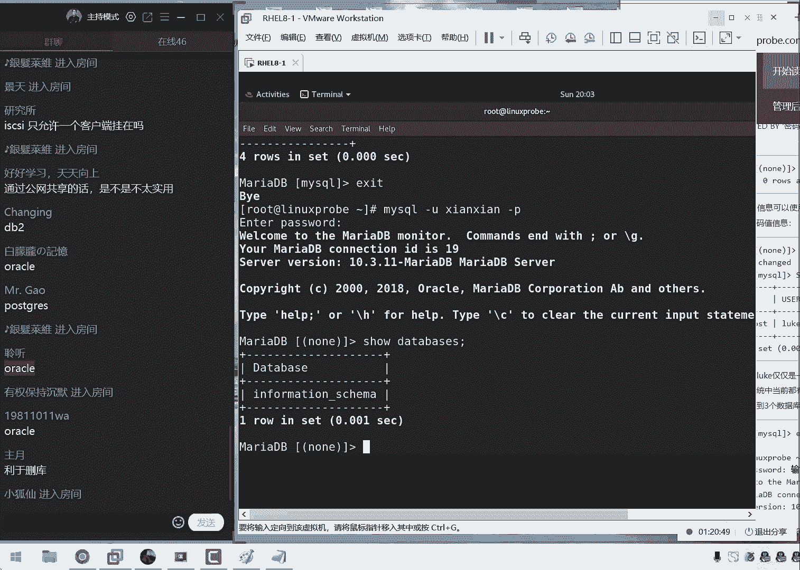

作为一个数据库的一个呃管理工具，当我们没有权利来进行管理的时候，那我们就会默认把它给隐藏起来，那么因此我们现在需要做第二部事情，需使用到管理员来，对于我们的普通用户来进行一个，授权操作啊。

授权它可以对于我们刚刚这两个数据库。

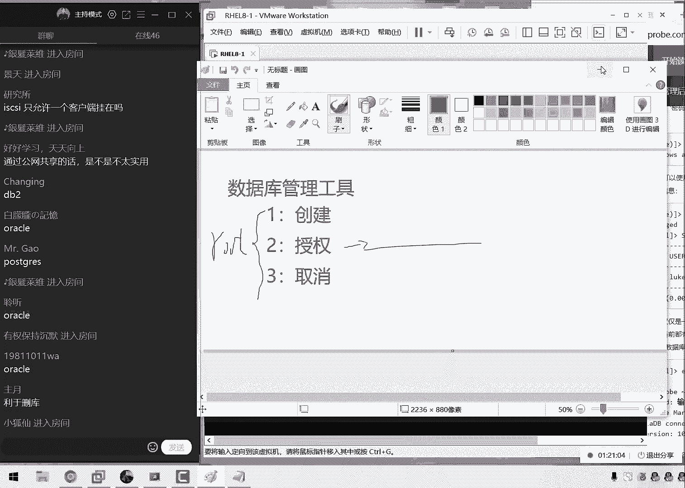

来进行一个管理操作啊，所以我们现在再退回大关，然后到关联的这个身份下，然后再去使用到我们管理员啊，r o t啊，入群用户来京登录gp，说一下我们用户的一个新密码，这个我们刚改过了啊，叫做lis。

prob，另外的话呢我们会在下礼拜五的时候，给大家讲一下，也就是说我们今天这节课的话呢，有啊还呃呃那么还是呃还是挺丰富的，我们不仅给大家讲一下我们的第18章节，我们啊还给大家讲一下买这个mysql啊。

这两个都给大家去演示一下，然后我们现在做完之后的话呢，可以来看到使用的关键登录吧，那好了，那呃那我们现在对于这个用户，先先来进行授权授权命令grand来进行授权，这个后来我们这个词叫做这个呃。

grand他的话呢意思就是授权的意。

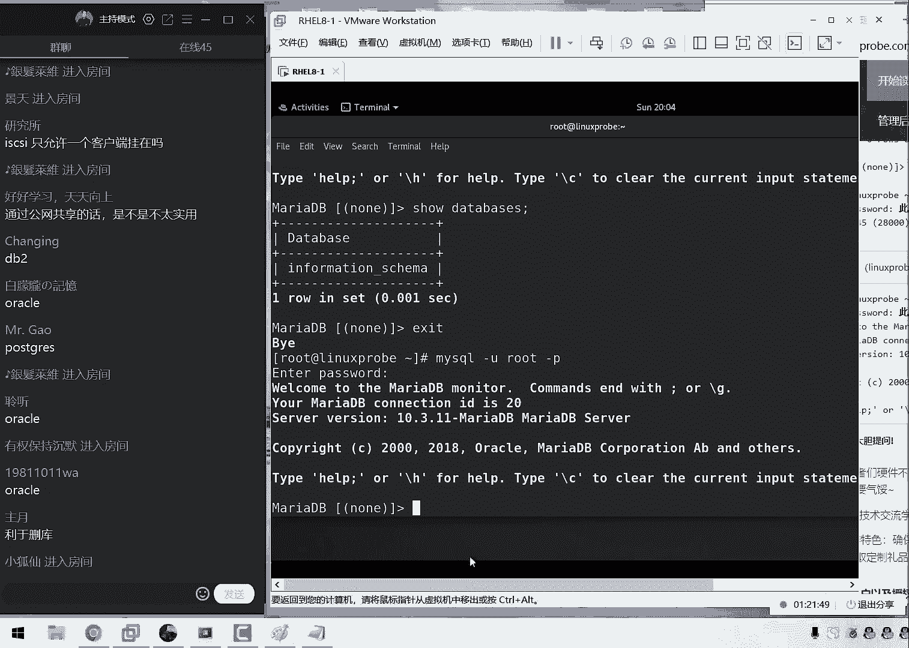

思大家看清了，然后那我们比如说啊，来进行一个对于谁来进行一个授权操作，我们就给他写了一个grant，然后我们授予某一个爵位啊，或者说我们授予某一个信息给谁，就这样一个流程对吧好啊。

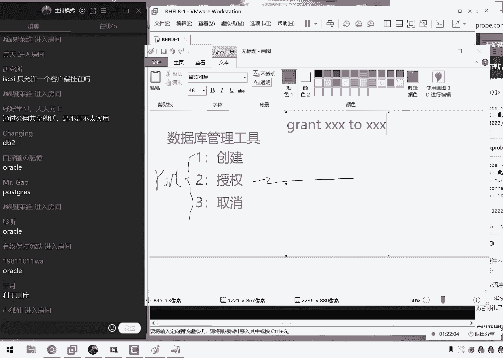

那我们比如说，那现在我们来对它进行一个授权操作grant，那我们需要授权什么权限呢，啊并且这个大小写无所谓啊，给大家讲到了就打小写无所谓，我们说的是为了出版好看，所以的话它有一个大小姐的一个区分啊。

那么以及啊这个也无所谓，那也就是说我们去使用的grand的话，小姐也没有问题的，来去使用的gram进行授权，第一个的话呢，代表就是一个进行一个查询权限啊，我们先给大家写下来，然后这个比较长啊。

首先来讲叫做查询权限，也就是说哦哦那我们叫家写吧啊，第一叫做这个查询权限。

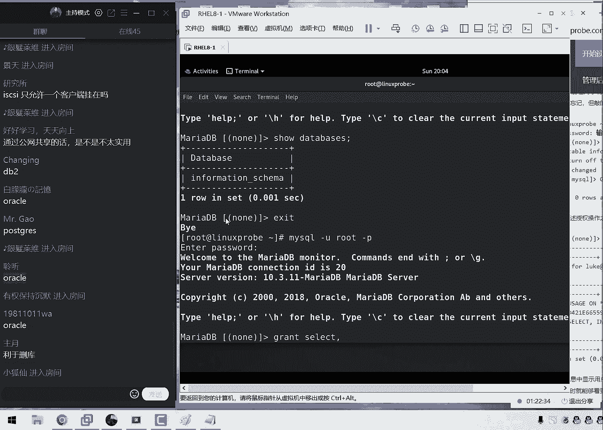

它指的是能够去查看里面这个啊，我们这样给大家一边去说一遍，给大家写吧，查询权限指的是能够去看我们表单里面，内容的一个权限。

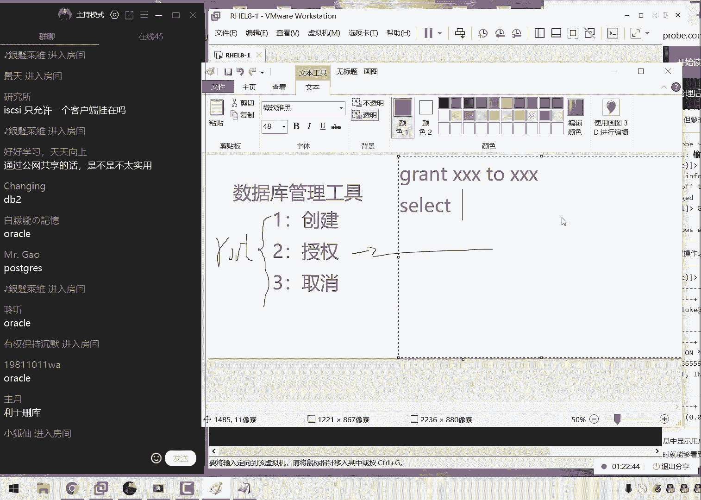

等于说它是一个查看的权限，然后第二的话就代表就是一个删除权限啊，delete这个很好理解嘛，就是来对于我们这个表单里面的这个内容，来进行删除或，者说我们去删除到某个表啊。

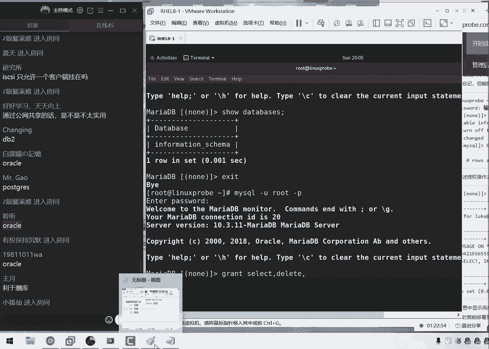

去删除到某一个表单的意思，delete来进行删除权限，然后的话还有就是我们叫做更新权限。

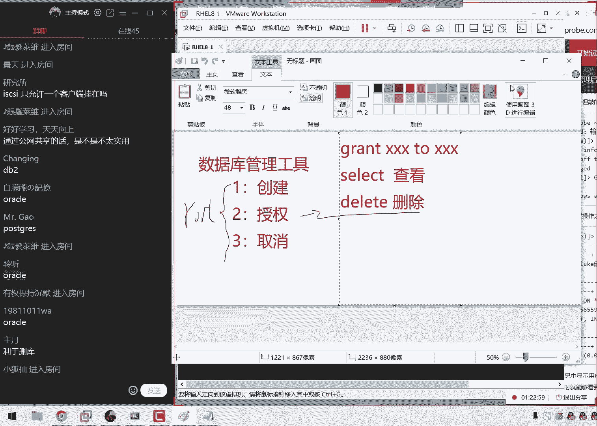

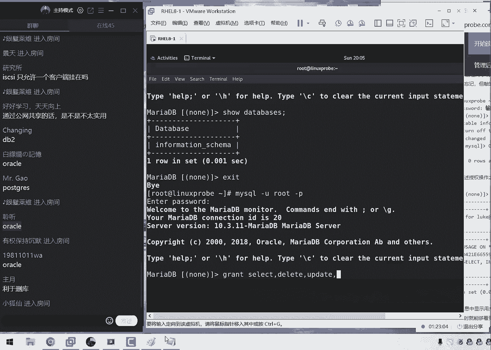

来给大家写下来啊，update来进行一个修改的一个权限，最后一个的话呢我们把它叫做插入权限来，这个的话呢，就是我们来进行一个写入的一个权限，来进行插入跟写入的一个权限插入。

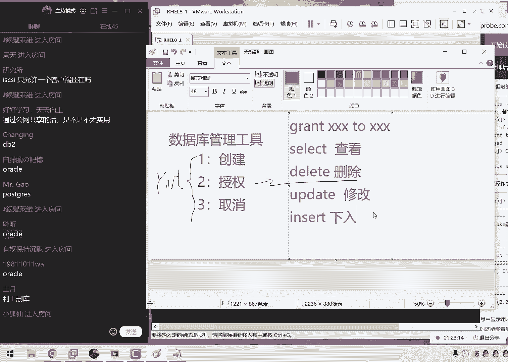

或者我们叫做写入权限都可以啊，啊insert来，我们把这个四个权限给大家写下来，也就是说能够看能够删，能够改，能够差啊，就这么四个权限增删改查，吧好这个虽然这个顺序跟我讲的不太一样。

但是这个功能上来讲的话是没有问题，那么给谁呢，我们需要设置到哪个表单上面，它有一个表单，我们看到叫my sql，对于我们的表达，那么我们对于我们的是一个啊my sql。

这个名称的这个数据库里面的所有的表达，我们都来进行一个授权，所以可以去用到这个信号作为通配符，通配这个数据库里面的所有的表呃，呃做的这个表单，这样做完之后的话呢，我们来去给谁进行授权。

但不就是一个to给它用户的名称，我们叫做这个先先它是一个本地，用户我们就给他写一个at符号，写一个local house啊，按下回车搞定了啊，这个非常简单，那叫做这个授权操作，我们主要记住的就是有两点。

第一点我们要给大家几个权限啊，以及设定到它具体的它是哪个表单上面，第二话就是说课语句的后面以分享结束，但是啊敲多了太好报错，我们那啊那啊那我们就有，那么也就有了来我们都做好之后。

再重新去使用到这个先进的用户，来去登录一下，然后我们去啊登录sql u，是考到了这个服务的，然后的话呢它实际上它就考到了一个，可能大家想啊，不我们先去找到这个新鲜登录啊，刚新鲜登录之后的话。

他只能看到一个数据库里面这个内容，现在的话他应该能看到三个了不，他应该能看到点子了啊，他能看到这个mysql这个数据库里面，这个表单的内容了，来我现在去输入一下叫做linux prom。

一下回车好动作成功了，然后我们去收集下base来查看一下，当前能够看到有一个叫做，有一个叫做叫做my sql的一个数据库，然后我们可以走到这个数据库里面去，看一下，叫做，啊切换嘛。

然后去使用到这个命令来进行切换，切完之后再来查看一下里面说的表单，别到里面的这个信息就都能够看到了，这就是我们对于这个用户来进行，授权的一个操控，另外的话呢我们给大家讲的这个。

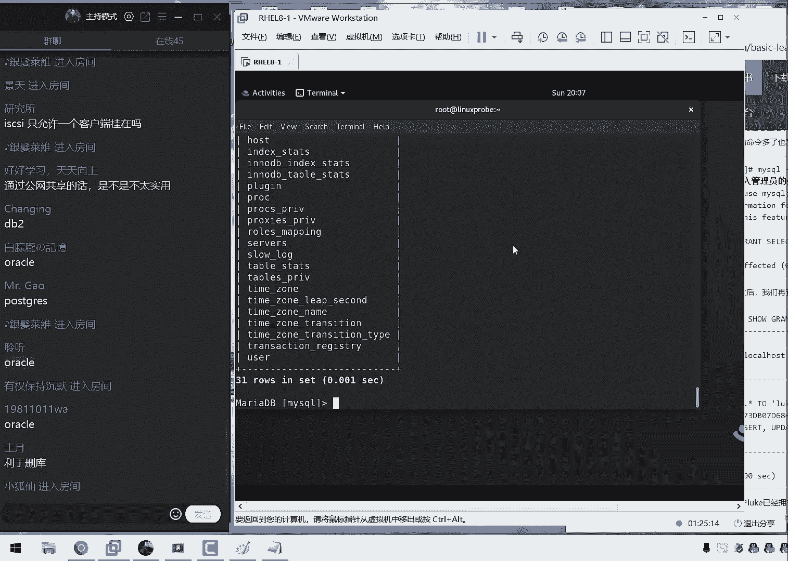

实际上的话呢，我们这个数据库的一个呃服务的话呢，它是以前活动是考得过的，但是的话呢考虑这个周期特别短，它只从2015年的3月份，考到了2020年的8月份，也就是说周期的话就跑了5年时间。

主要对外的表态嘛，它是呃，这是我们这个新的数据库的一个发展，但，是红帽，这对考，不过因为这是一个呃呃这个能理解的是。

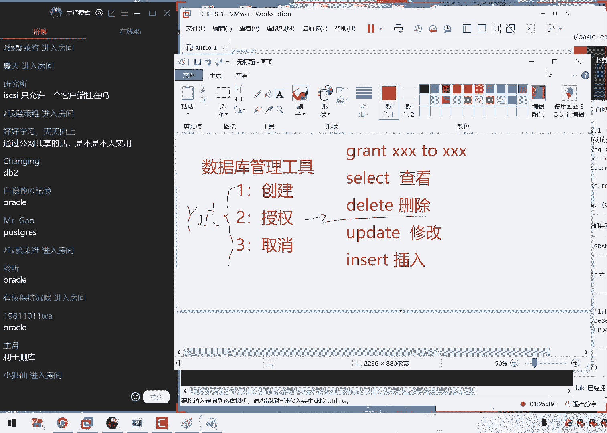

但是结果因为我们呃对于数据库没有考过，那么然后我们就会啊产生了挂科，这样的这个问题的话呢，呃那么好的，这个呃红帽他也没有让大家讲的就考不过，所以的话呢，红帽这个2015年到2020年。

实际上这个数据库是一个送分题，它就是一个呃表态一个作用，所以的话，反而，更加简单了，就是因为这个数据库，它只考了一个搜索功能，只要我们会搜索了。

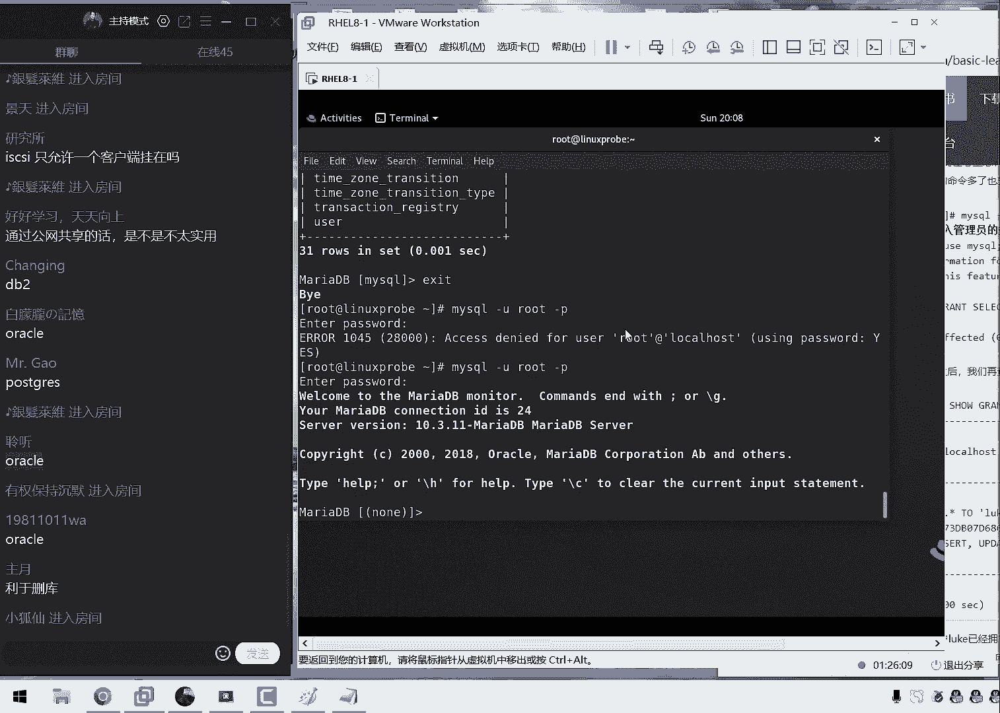

就是只要在考试的时候，我们都已经把这个给搭建好了啊，我们考试都不用去搭建了，在我们在考试的时候，我们只需要去收dota，然后去查看一下我们的这个数据库的，这个名称，然后去查看一下我们表单的名称。

然后再去查看一下我们这个表单里面的，那个呃内容的一个信息，我们只需要记住这三个视频，这个命令就可以搞定了，然后这是表单的这个名称，然后就按，下回车就搞定了，这三个命令，大家可以去记一下。

可以通过这三个命令来去查询医药信息，然后我们来给大家看一下，那我们虽然不考了，但是我们该学也要去学，所以到我们啊，还是把这个课给大家研究啊，那我来给大家做啊。

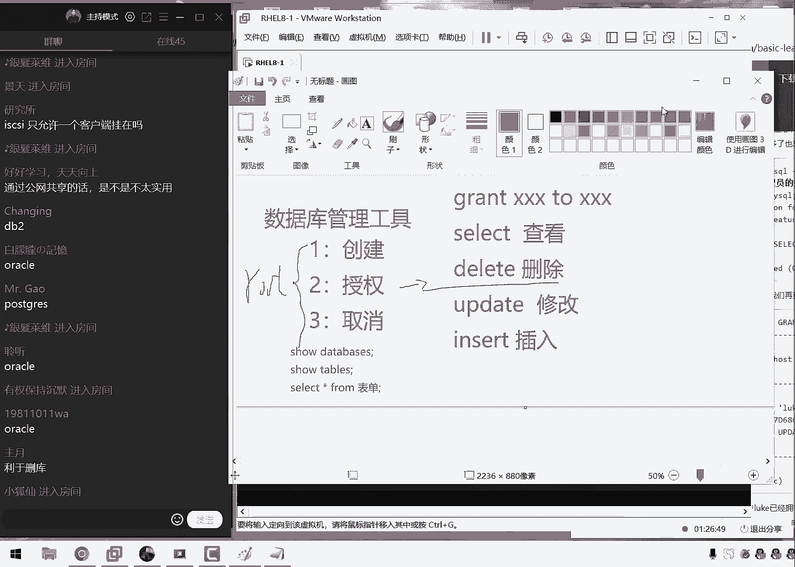

那我们来继续给大家讲完，那么我们来有这个管理员登录之后的话呢，来给大家取消掉授权来去使用到啊，revoke命令，也就是说我们现在来给大家讲的时间，有点超纲，压根儿就没有植物这些啊，他们有他就没。

有这些东西了，只不过我们学完了之后，那他都会呃更好的去来去满足。

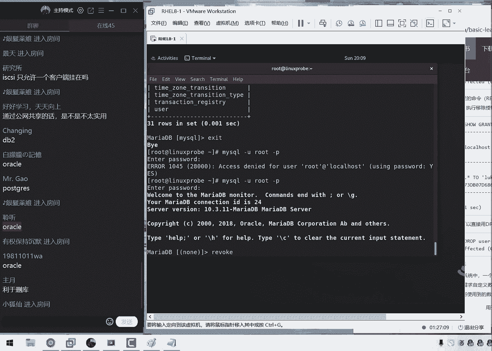

我们这个日常的一个工作需要，来下面一个词叫做这个revoke，它指的就是取消掉授权的意思，如果说我们现在对于某一个用户授权过后，结果后悔了好了，我们可以去选择到这个revt 0的话呢。

把这个已经授权这个权限给再给它拿掉啊，叫做这个取消授权，或者说来去进行一个呃权限，这么一个取消诶，还有这么一个呃取消授权那么一个作用啊，来进行一个权限的分离，然后我们给大家做一个权限。

然后的话呢还有这个，我们具体的一个值还有这么一个格式来。

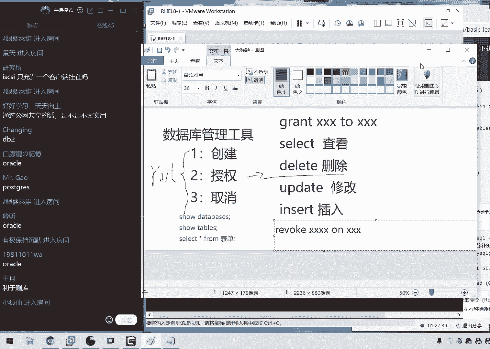

我们去使用的这个revoke来进行操作，那我们该差了四个权限，我们刚写了四个权限，这个增删改查啊对吧，来进行一个查权限，然后这个删权限还有这个插入权限，还有这个更新权限，把这四个全是线给它取消掉。

哪个表单上面的这个权限呢，我们叫做mysql这个数据库里面的所有的表达，下面的这个权限从哪里去拿掉呢，从我们叫做先接的这个用户身份下，给它拿掉，所以说这个命令看起来有点长，但是这个逻辑感是很强的。

对吧啊，那我们a一下回车，啊把它搞定了，搞定过后，我们再来重新去使用，到我们这个先进的用户，登录到我们这个数据库里面啊，然后可以来看一下，它，又不能够去看到，刚刚我们的这个mysql数据库里面啊。

不我们来看，那他他又看不到我们这个买sql这个数据库，以及它里面的表单信息了啊，show database来查看一下，可以看到它有没有了，这就是我们对于一个用户来进行改名，然后以及进行一个建立。

然后能够进行一个啊授权，争取授权的一个方法，然后我们大家会比较产生一个疑问，说老师其实我们现在这个工作需求的，话呢更多是个啥，稍等一下，同学们哦，刚才已经是上海加入节目，因为这个座椅吧特别高。

然后这个桌子的话呢特别矮，我稍微的调整一下，我们稍等一下啊，因为刚刚这个伤口的时候，就感觉到了这个腰感觉不太行，我稍微的diy一下啊，把这个上面垫点东西，ok啊好像好多了，然后我们来继续哇。

这个确实好多了，底下垫了一个电影啊，电影几本书确实高度好多了，这个早就没有想到了，来我们稍等一下，好那我们来继续来给大家去说，好多好多了，看来是前段时间真的是吃亏了，然后我们登录之后的话呢。

我们来看到这里面，就看不到它里面这个原始这个信息了，要么要给它推出掉啊，刚才同学们怎么没有结果活动啊，咱们再解释说是45个同学，刚才完全没有活动，但是我在纠结了一下啊，其实我们讲课的时候。

我也在想很多问题啊，所以的话我刚在想，我说在群里面前45同学生在线听课，不会掉线了吧，然后同学们看到在呃，看到大家现在已经开始说话了啊，他在说闲话的时候还人品牌啊，人还挺多的，原来我还纠结了。

然后我然后我刚才想了一下，我说咱不能掉线了吧，不能忘路了，然后啊所以我还特意看了这个啊，网络啊，网络看一下没有问题，然后扔不能够啊，怎么讲了半个小时都没人说话呀，然后我们来看一下，是这样的。

首先代替环啊，手环里面的身份来登录之后，来给大家讲一讲啊，就是我们基本这个操作有个傻呀，就是我们说的就是我们这个怎么讲呢，今天考试不考了，那我们就给大家讲一讲，到底我们工作的时候能干点啥对吧。

就是我们今天考试不考了，那我们就不用围着这个考试去讲了，还是别让我们这个工作的需求，我们能够干点啥呢，其实来讲我们更多的我们说实话，防火墙就这么几件事，增删改查，而且我们说实话有那么多增加和修改。

这个工作吗，没有，其实我们更多的就是去查看这么一个工作，就是说我们待会儿会给大家讲一讲，该怎么来进行一个查看，能够去准确的就是这个怎么讲呢。

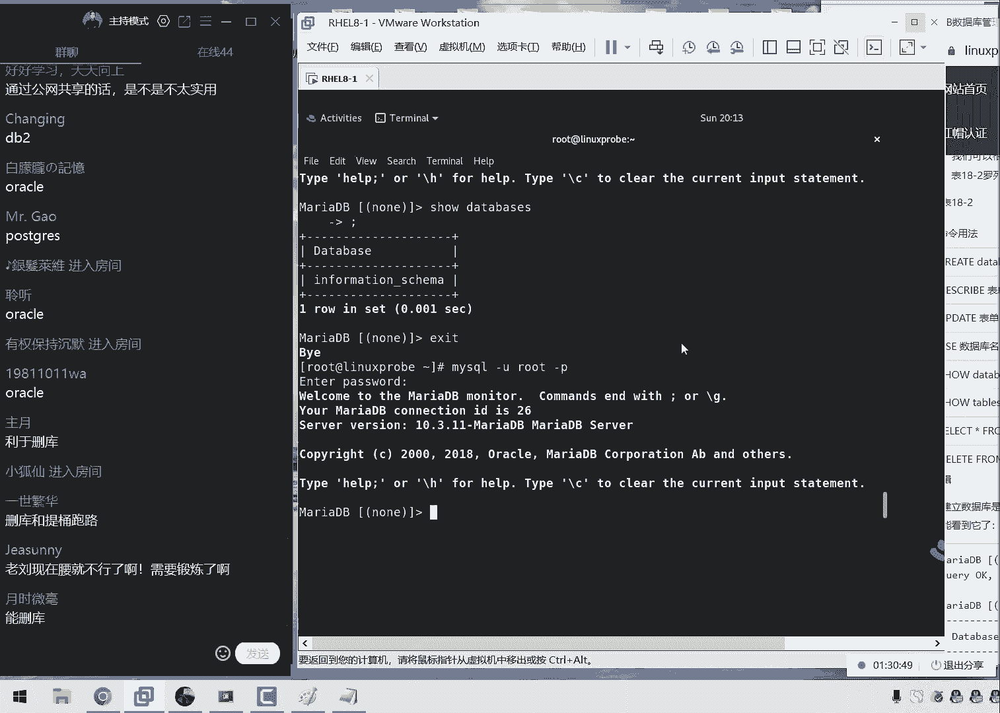

就是去查看一个信息并不难，但是怎么样能够进行一个准确的查看，这个挺难的啊。

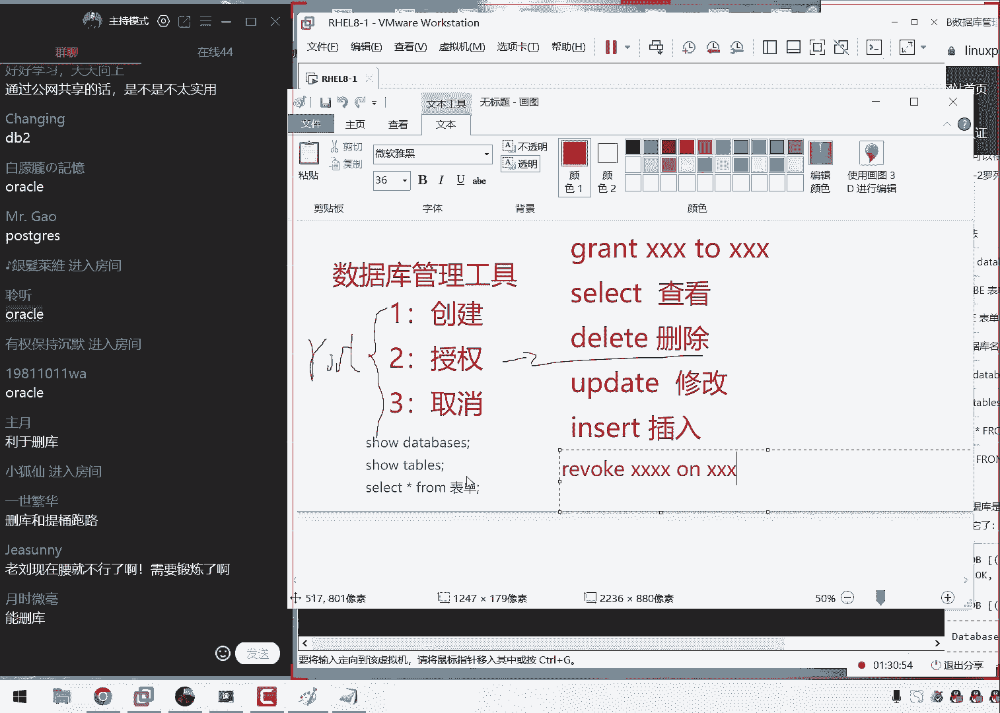

叫做啊准确的一个查找，那我们先给大家讲第一个吧，啊增加嘛，来我们家一个一个大家玩啊，就今儿个大家都玩透了，来继续检查一下，说当前有哪些数据库啊，当前有这么三个数据库，这三个数据库的话呢，我都不要。

那我再去新建出来一个新的数据库来，叫做呃新建一个我们这个数据库啊，create database，大家查看呃，咱去创建出来一个新的数据库，数据库啊，呃然后我们数据库的名称，就数据库的名称就不用多说了。

肯定是我们的广告的词啊，叫做linux prob广告，这个打折到位了，然后我们新建好了一个数据库之后，再来去show database，然后来去查看一下，就会出现了一个新的数据库，其实我讲完这个之后。

我都不知道我该讲什么了，因为这个太简单了，对不对，这他他他就是去新建一个数据库的一个呃，呃一个操作，然后我们可能更多的，您可能觉得难的这个点，就是我们这个词可能之前没有见过对吧，然后这些关键词的话呢。

操作系统的这个命令啊，仅此而已，但是我们这个逻辑一旦掌握了之后，它是什么词，其实呃光纠结，但是我们这个操作已经崩溃之后啊，就是他干什么事情我们就知道了，那我们现在也有一个数据库了。

那么数据库里面啥都没有，那么觉得很空虚对吧啊，家庭私立的，那我们往里面再加点东西好不好，那我们往里面加点料，是使用到这个切换命令来去使用到呃use，然后是叫做数据库的名称，切换到我们这个数据库里面。

然后去搜tables查看一下里面有哪些表单，这个是这样的啊，也就是说我们的一个数据库里面啊。

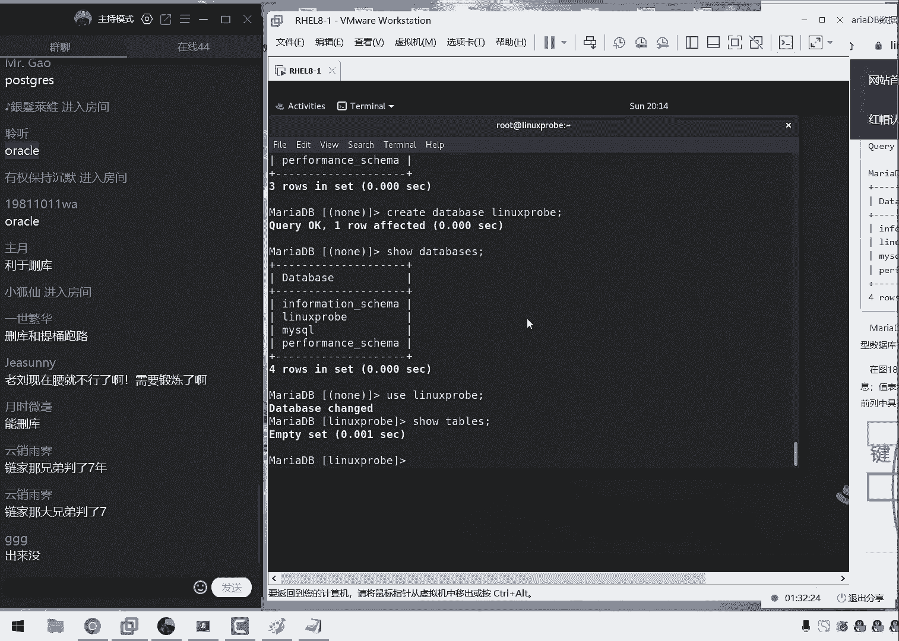

大家问一个问题，大家说啊老刘的腰子不太行了，老刘腰子啊也是真啊，现在也还挺好的啊，来啊老老老腰的也挺好的，来看一下这样的啊，当我们去有一个数据库的时候，怎么理解呢，是这样的，我我想的不太好，举例子。

比如说我们现在有一个数据库的，一个管理工具，这个就是一个数据库的一个管理工具，然后的话呢，这个里边的话还会有很多个数据库，这就是我们的数据库啊，它有一个两个三个数据这样的一个数据库。

数据库的大小差距于里边的话呢，这个数据的这个多少，然后的话呢再来讲的就是呃，那么什么是我们的表单呢，表单指的是现在，比如说这里面有这个数据库了，然后的话我们往里面可以增加一点表单，这样就是文件嘛。

我们可以把这个数据库比作是一个目录，好，这个特别好，哎呀咱们早就没有，这个怎么早没想起来呢，数据库现在就是我们的目录啊，数据库是我们的目录，表单就是里面的文件，然后的话呢，那我们需要在这个文件里面。

有一定的这个格式进行一个格式化操作，然后的话呢我们往这个哎，那我们现在然后我们在这个文件里面的话，去写信息这样的一个流程，然后我们就啊，有了一个数据库的一个架构了，然后这么一个方式。

那也就是说数据库我找到一个管理工具，里面有很多的数据库，数据库里面有很多个表单，表单的话呢，表单里边的话呢会有很多这样的一个格式，大家看一下，那这个表单的话呢，我们一定要有一个格式。

如果要是没有格式的话，我再给大家再举一个例子啊，这个其实已经之前是举报的，比如说我们现在就把几个人的这个信息啊，然后呢我们把它写到我们这个数据库里面，比如说张三李四王五，然后我们看我们分别他这个身高。

体重信息啊啊比如张三，然后呢还有这个啊李四，然后还有这个王五，比如说我们把这几个信息，分别写入到我们这个数据库里面，如果没有格式的话，大家看啊大啊大啊，大家看起来特别的乱对吧，比如说我们再给大家写一个。

上分的一个身高，比如说啊是1米79，然后呢李四的身高是1米60啊，one 5这个身高是1米59啊，比如说我们这么写一个信息，然后我再细节啊，张三的话呢，他这个呃年龄是29，然后呢李四是30。

然后榜五是42，比如说我现在给大家提个问题，请问张三的身高是多少啊，大家忘了，对不对，因为这个格式太乱了，我们根本就记不住啊，说因为他们有一个固定的一个格式嘛，啊他说啊站在身高是一啊。

他这个身高的话呃是呃179是吧，好了，这是因为我们刚刚讲过了，所以大家还能记得住，这个非常尴尬啊，但是从理论上来说，如果我们要啊，那我们如果要是没有个格式的话，那么证明这个肯定是记不住的啊。

哦这个我有啊，这个我有啊，这个啊很难去理解，比如说大家说这个身高一米七九，你们还记得啊，这就很生气了啊，就这么乱了，先给大家提个问题，李四多大了，李四同学们还记得吗，我刚才说李四多大了啊，如果记得的话。

呸我们的100块钱吧。

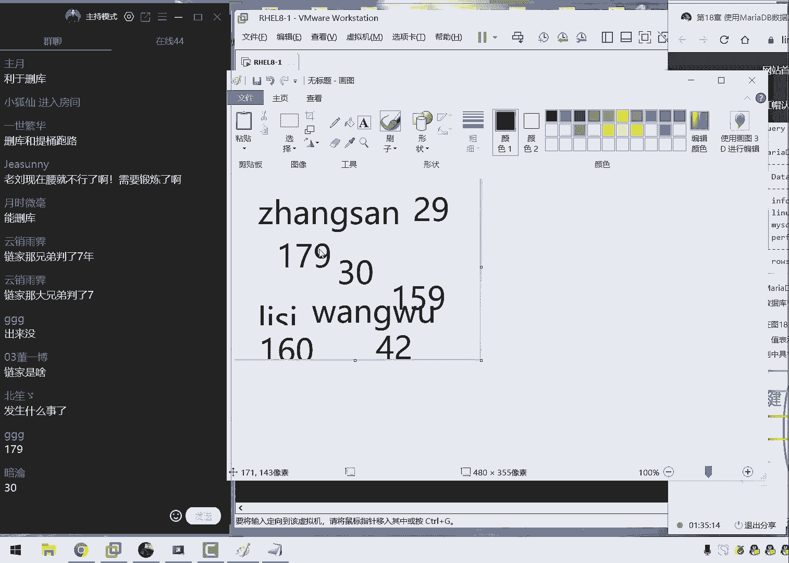

来大家怎么都记得那么没有啊，大家怎么记得这么没啊，没有啊没有啊。

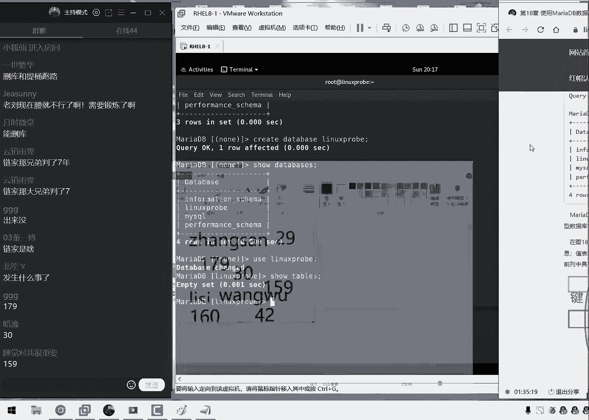

他啊他来啊都是呃很没有意义的事情啊，来啊大家记这个记得太快了啊，然后我们来给大家看一下，那就是说我们这有一个格式，这个格式的话呢是这样的一个表单，里面的一个完整格式，它是由建行列值。

表头几个这个字段来组成出来的，同学们中距离子多大了啊，30 39也无所谓了，主要的就是继续下这个表单里面的格式样，想的创建出来一个表单，这个很重要啊，这个刚才的这个年龄并不重要，张三的话呢我们先放一放。

再看一下啊，这个表单里面就是这个首先有表头，这个表头，那好像这个表头指的是每一列的这个名称，比如说这个呃他这个号，然后呢还有这个名称价格什么的这些信息，我们的一个名称我们叫做表头。

然后的话呢它有一个键值，这个价值，指的是它的一个唯一的一个标识值，我们可以对它进行一个索引，还有这个行行指的是横着的列，指的是啊竖着的，这还有具体里面这个值，也就是说我们现在需要先有一个表头。

这个表头的话呢，定义一下，每个字段里面保存的这个信息是什么，然后就可以往里面加啊来啊，进行一个信息的插入了，比如说张三啊，年龄真的是30分啊，然后我们写啊他啊报他这个身高。

也就是说我们现在的话有以这个为例啊，就是说有一个姓名啊，这个姓，然后后来还有这个呃年龄，然后还有这个身高好了，我们三个这个信息写到我们这个表头里面，就属于表头，然后我们往里面插入信息，这个季节完了。

张三李四王五，然后我们往里面依次来去添加，那么看来我那我们啊它会有一个戒指，它指的是一个啊它锁定的这么一个位置嘛，啊1234来进行一个排序，它指的是键值，这是补啊，这那也就是说这个是键值，这个是表头。

这个的话呢是纵向的列，这个是我们的啊啊行，然后其中的话，那我们每个值我们咱把那每个这个啊，具体里面这个值我们把它叫做这个值啊，这样的话呢我们组成了一个完整的表单，呃，听着有点乱。

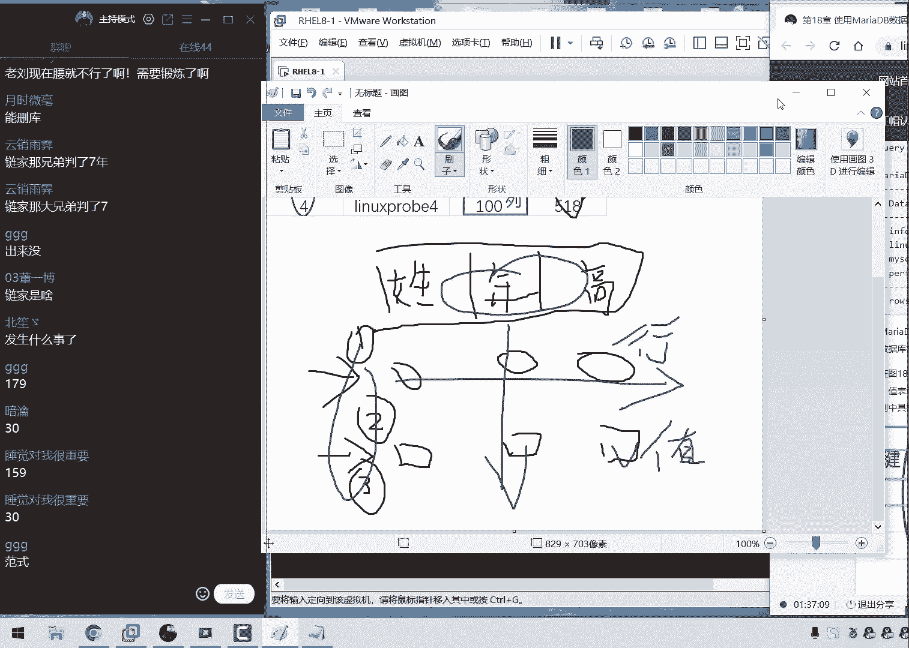

我再给大家操作一下，比如说我现在进入到了一个叫做啊，来进入到了一个我们的数据库里面啊，linux prom里面了，然后我再给大家去创建出来一个表单，那表单的话呢我们在做这个呃table。

然后我们创建出来一个my book，这个名称的一个表单好吧，那么往里面插入三个字段的这个信息，第一个字段的话呢我们就叫做名，第二的话呢我们就要对这个呃呃呃呃呃，那么呃第二个啊，不就我们先呃呃。

我还要举了一下这个类型啊，只能一下类型，第一个字段的话呢，我们就是说我们这个数据的名称，他的话是一个为字符类型，这个数据的名称不能够超过15位，第二的话呢是书籍的页数啊。

书籍的页数某第二是书籍的这个价格，它是为一个整数，第三的话呢数据的页数，我们它也是一个整数，也就是说我们先往里面参加啊，先去插入三个这个表头，这样的话表头分别是，我们那我们的书籍名称价格啊。

还有它有多少页，然后我们可以来去describe，来去查看一下这个表单，他d e s i r i v e啊，看一下这个表单，它具体有哪些表头的这样的一个信息，可以看到啊，表头现在有三项。

这三条信息的话呢，分别就是这个数据的一个信息嘛，让我们在黑板里面去插入一下。

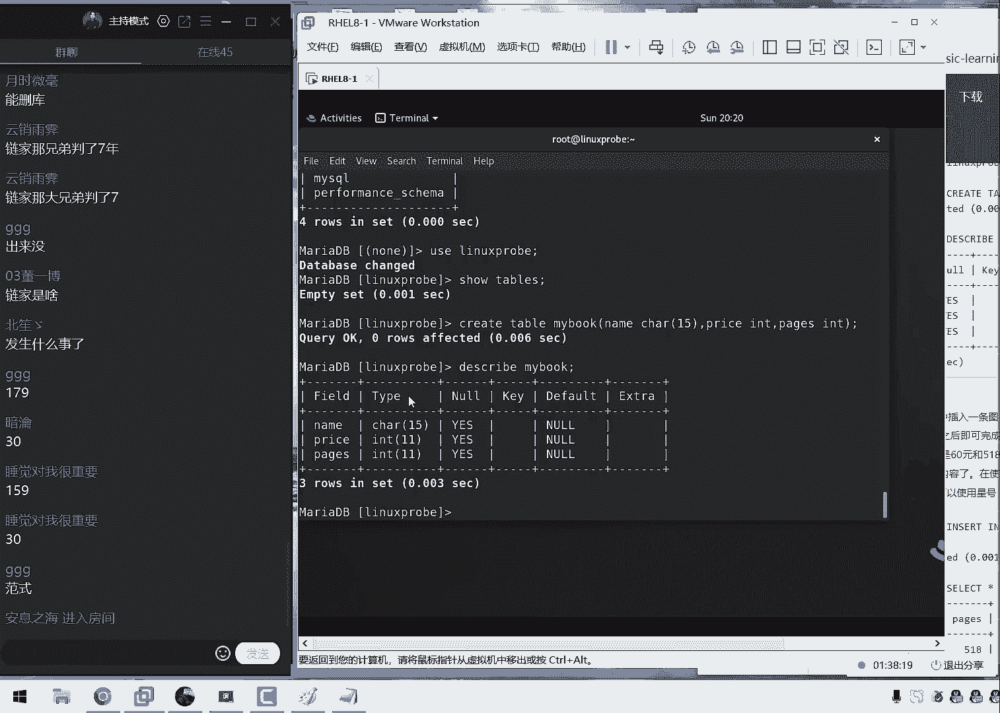

既然有一个表单了，它可以往里面去插入三个字段的这个信息，第一个字段的话呢我们为书籍的名称，第二的话呢我们为书籍的这么一个好价格，还有我们最后数据有多少页，这三个信息有点我们有这个呃。

具体这么一个格式之后，就可以往里面添加了，然后把我们的书籍的名称的话呢，它是唯一个字符行为，就是说它最多是由15个自来组成出来的，他们他就是说书籍的这个名称，它是唯一个字符型，其他的话它都为整数类型。

它是唯一一个数字类型，叫做这个整数类型，这个的话呢我们啊如果之前会呃，评论语言的话，您应该对这个是有一些印象的。

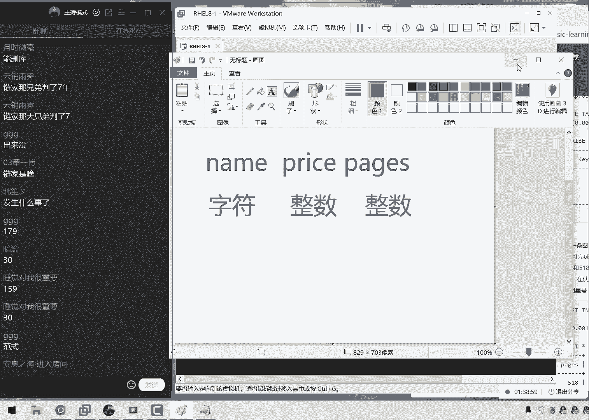

然后我们往里面去做一下插入操作，来来去操作一下啊，insert，然后是intro，我们往里面插入my book，这个表单，往里面插入三个阶段的这个信息，第一个阶段我那我为名称，第二个为价格。

第三个为页数，然后的话呢，我们的values，指的是它具体的这个值是什么呢，我们往里面插一本书的这个信息，第一本书的信息，它每一个字段的话，需要用到单引号维的引起来，这也是一个呃格式要求。

那我们这样去写字有点小，我再稍微大一点吧，来我们这样第一本书的名称啊，linux probe，然后我们逗号他的话呢这个价格为，比如说随便来了啊，79块钱，然后我们接下来再来逗号，它的页数518。

随便去写，这样做完之后点一下这个分号结束掉它，这样的话我们就往里面去插入的一啊，那我们就往里面插入的一个信息了，当我们插入信息之后怎么去看呢，就是这个增删改查吧，咱们来去看的话怎么办呢。

那我们来进行一个搜索就可以了，去选择去查看某一个表单里面所有的内容，那么就用到这个星号做的i p来，使，用到一个星号去查看一个我们的表单里面，所有的这个信息，然后就会把我们这个信息给他列出来了。

这就是我们所说的表头见直行啊，他啊啊，那我们把这个信息，它会按照我们的表头里面所对应的，这么一个格式去填写出来，好，这就是一个很简单的一个插入的一个操作，基本到这儿。

我们同学们这个啊平时的工作就差不多了，然后大家会想说师，那我现在如果有一个值不能啊，那我那我，那我们比如说我们现在想要进行一个修改，才能怎么办呢，好那么也可以进行修改操作，修改操作的话呢。

说实话用的不多，而且有一些风景啊，是这样的，比如说我们现在这个书卖79卖不动啊，太贵了，怎么办呢，update啊，更新一下，比如说我现在想更新一下这个表单里边的，保一个值，比如说什么呢。

价格现在原先卖79，太贵了，没人买好了，我们给他改一改69好不好啊，啊69还不行，那么再稍微再低一点好，改为69，然后按一下回车，改完了再一查看我们表单里面这个信息，表单里面这个信息变成了69了。

就是说，我们可以对于这个信息来进行一个修改，然后最后一步的话，那我那我，那，我们也可以对于这个信息来进行一个，删除操作，我们可以把它给删干净，另外的话呢还有就是我们的上等下，我们先给删掉了delete。

然后我们写下delete啊，然后我们去呃，删掉我们这个表单里面的，这个所有的这个信息，然后我们往里面的话再重新再去插入一下，然后是delete，然后from哦，delete是不用再加上这个星号了吧，啊。

我们不用加这个星号，可以直接删，我们往里面一删啊，然后我们按照这个书上的话，给大家多插几本书的这个信息，来给大家操作一下，那么我们可以看到这个表单里面，就是空的了，然后我们接下来给大家去演示一下。

就是说我现在的话，往里面多插几本书的这个信息，这样的话大家看起来会更加的这个有感觉，因为我们如果要是只有一本书的这个信息，大家会感觉到就是我们呃搜索呃，那么就是搜索半天吧，他都是搜索到是同一个信息。

所以我们先不管他，我们先往里面去插入四条语句，然后这四个语句的话就是四个书的信息，分别为1234，我们的这个书籍的名称，然后插入好之后，去查看一下表单里面的内容来from，然后是my book来看一下。

这就是我们的默认的表单里面的所有内容，那1234本书价格的话呢，呃它是为3580，然后就是我们现在的话呢啊30 50 80，然后我们有这么四个价格，然后呢我们这个书的页数都是一样的，好。

我们现在给大家操作的就是，我们到底，当我们的过程中遇到了这么一个表达了，我们刚好，那我们到底该怎么去玩它呢，首先第一个玩法，就是我们要能够准确的去搜索它，我们需要这个信息，比如说我们现在没啊。

那比如说我们现在每本书，写这个信息特别的多，但我们又看到了所有这么一个呢，呃它里面只有数据的名称，看他所定的这个价格是不一样的呢，业主既然相同，你既然相同的话，那我看你干嘛呢对吧。

而且的话他非常的这个啊很啊，他这个信息很大，它会很多余，那如果说我只想看书籍的名称跟价格，我们怎么去看呢，改这个改前面，把这个星号改成我们字段的名称，改成表头的名称来，然后逗号我们的这个价格。

然后price这样做完之后，我不去看页数了，因为页数他说啊，因为它的呃这个信息都是一样的，或者它并不重要，我们只看它所对应的一个名称跟价格，这样去做，那么就是说我黑仔我们去搜索表单的时候。

去查看信息的时候，只看我需要的信息，就这么去做，非常简单好，下面第二个问题说老师呃除了这个以外，还有一个问题，那比如说我现在想要去搜索，所有由于按照条件来进行搜索的啊。

比如说我们在红毛的r7 c7 号的时候，2015年3月份的202，但我们呃2020年8月份的时候，他考到了，说如果有一个用户叫做bob。

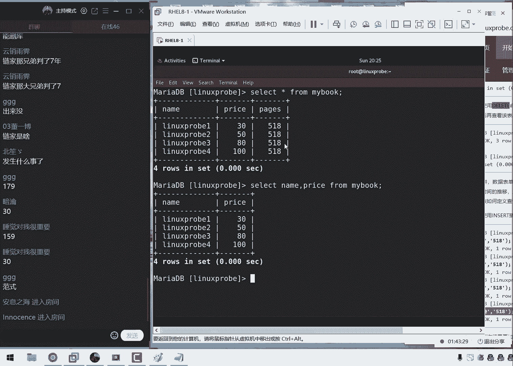

那么好了，请你输入这个bob用户，它所对应的一个手机号码，这个怎么去做呢，当时也可以打到啊，等啊，那我们怎么去搜索，就是说我们知道一个用户的名称该怎么做，他这个电话号码呢，呃我们可以做一下过滤。

比如说在考试的时候，它有一个叫bob用户，还有这个手机号，还有这个房产啊，巴拉巴拉啊。

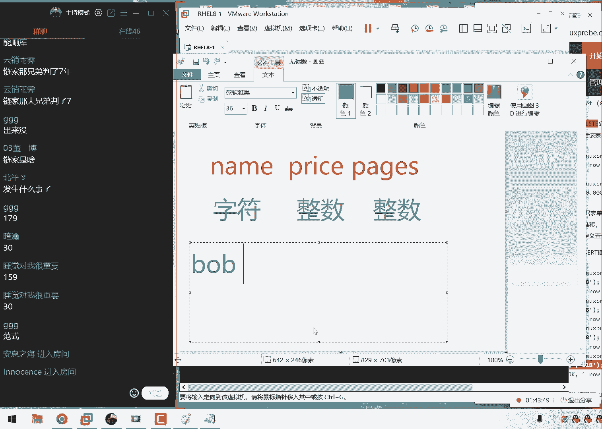

这些信息啊，那我们现在都不用去看，我们只看这个bob跟电话号码，那它也很多，他可能会有几百个，我们一个一个看吧，也挺麻烦，其实我们也可以这么去做，可以选择一下复制，然后选择一下粘贴，找一个文件对吧。

然后我们新建出来一个文件，其实这些都是一些小技巧，后面考试只看结果，不看过程，所以的话呢我们往里面一粘，往里面一添加，然后往里面一走，然后说一句走，你然后干嘛呢，做一下graph，做过滤。

其实这个方法居然很low嘛，但是这个方法是可行的，这样输入bob用户的名称a，再回车搜出来了对吧，就这个考试的时候做法是无所谓的，我们通过这个例子给大家说一下啊，后面考试的结果很重要，过程不重要。

只要你能够完成，他不提怎么去完成这个步骤，它并不是一个呃，像我们中国这种传统考试一样啊，非得有一个啊啊最为规范的一个标准答案，它并没有的来，我们给大家退出掉它，然后的话呢我们现在就想去设定一个条件。

那我们见外啊low啊，那么跟网游不能那么low啊，那么当你按条件来进行搜索也行啊，我们这样去使用到威尔加条件来，比如说我现在威尔一下，为了什么呢，为了说我就想去搜索一下一个名称好了。

我们就啊name限定一个条件，说我只想搜索出来名称为三的这本书，哎，为latex problem，这个三这本书就那么就这样去做linux，然后按三，然后按一下啊，反而我们按一下分号结束了，它按价回收。

可以看到就单独加一个条件，我只需作为某一本书的这个信息就出来了，那么也很也很简单，并且的话呢我可以按照我这个要求，我只看见那个书的这个呃名字，它它里面所对应的这么一个信息啊，只是看它里面价格跟名称。

我们不看它这个有多少页啊，也可以看得出来，那除了说我们可以搜索出来，这个书的这个名称，然后按照这样的条件来进行搜索的话呢，也可以按照这个价格去搜嘛，比如说我们只搜索，说价格等于30块钱的书，可不可以呀。

没有问题啊，等号30只看说价格等于30块钱的书，看一个便宜的书啊，按下回车看到啊，价格为30块钱的书，不同的条件，不同的结果显示出来了，除了说，我们可以按照指定的条件来进行搜索，我们也哎呀这个八点半了。

咱们每次上课都跟打仗了一样啊，我们都是嘎嘎的，结果一天点了八点半了，真没想到啊，结果今天这个其实嘴也没闲着，然后就一直往后赶了，哎咱们每节课两个小时的时候，收获我感觉是满满的，因为怎么讲呢。

大家可能自学的话，睡两小时可能会看一会手机，看会电脑又会开出来，然后又回去玩一会儿就两个小时，就是完全在给大家强烈的这种压力下，同学们应该是很不敢，然后去转移心思吧，因为你可能运转过去之后。

再回来就用整个下一招了哦，不过我觉得这样也很好，那可以来这个自学的话呢，效率很高一点，然后我们现在大家说下，这就是既然有一个条件了，那么这个条件不能说光有一个等号吗，有没有什么大约号小编号呢，也有。

比如说我现在设定一个条件，好比说大家可以说加加这个嵌套吗，不可以啊，不可以加哦，哦哦哦行行行，这个签证也可以去用，因为大家所说的那个嵌套，实际上指的叫做多条件啊，也可以去实现它，只不过不叫签套啊。

人家叫多条件可以去实现，来我们先来给大家操作一下，比如说这个价格设为30好啊，那我们改一改，比如说我们改它改成我便宜的书，我不看啊，我这边有品位，我只看36年以上的书，来大啊，那么写一个大于号30。

只需搜索出来价格大于30块钱的书，按下回车啊，不好意思啊，手臂较粗，按照这个反啊，我们按照反斜杠了啊，来稍等一下，嗯啊没有完成是吧，那就再再再再进一下吧，来重新再去进一下。

然后是uc一下lis prob，然后我们去搜索这个键盘还特别小，因为它笔记本嘛，来我们来给大家看一下搜索出来的，所有书大于30块钱的这个信息，然后一下回车，然后可以搜出来了，小于30块钱书我不看啊。

于是就有一个234啊，linux pro 234这个信息，三个信息显示出来这个，然后除了这个以外的话呢，还有比如说小于号也能玩一玩，对不对，比如说我们小鱼小于的50块钱的书，我就想个便宜的。

小于50可不可以呀，可以呀，啊诶下回说小于50的书列出来没有问题，还有啥，我想一想啊，我看一下叫啊小于等于能不能行啊，哎那啊这也没问题，就是说搜索一个，小于等于50块钱的书，哎搜索出来了，它可以加等号。

小于等于除了这个以外，我想还有啥，看看这个叹号啊，叫取反之对吗，我们叫做啊，它不等于，比如说我只想看一本书，说价格不等于五出来的数，加减乘除都出来了，哎加回车啊，价格不等于50万呢，说不我们去显示出来。

这个没有问题，然后我们来看一下这个表，这个表格里面是有的，18杠三啊，里面有所有的这个条件，或者说我们做这个多个条件也可以去使，那我给大，家玩一下啊，我们现在一个条件，比如说啊比如说我们现在搜索一下。

说小于啊50块钱的书，同学们买一本啊，小一本啊，那么小于50块钱的书，这个啊这个有他只有一个是吧，那好吧，我们再换，那我们再换一个大于40块钱的书，大家看啊，我大于40块钱的书好。

所以说还有这个三个结果没有问题，大于三大于40块钱的书，结果有三个，那我们能不能再加一个条件呢，说并且我们指定一下数据的名称啊，就是说我们给它两个条件可不可以啊，可以我们加一个这个and我们来做一下这。

样的一个语句叫做and，比如说同学问到说我们能不能加两个条件，可以这样去做啊，and并且的话呢，我们的这个数据的名称，必须是等于某一个值，要是有的话则显示没有的话则不显示pro 2。

然后按下回车看到可以出来了，它满足条件会显示出来，它不显示啊，它并没有满足条件的话则不显示出来，这就是我们可以加一个and语句，来进行一个啊，来进行一个啥，来进行一个多条件的一个的一个判断啊。

这样的一个值这都做好之后的话，那我们也可以把这个给它删干净了，然后我们可以去使，用的呃这个删除语句把它给删掉，那我们在做删除自己这个操作之前啊，我现在给大家去说另外一个，我们来看一下这个数据的18。

6小节，说一下，我们说呃说一下我们数据库的备份和恢复，我呃我们那我们是怎么进行操作呢，呃当时的话呢我们从2010年开始。

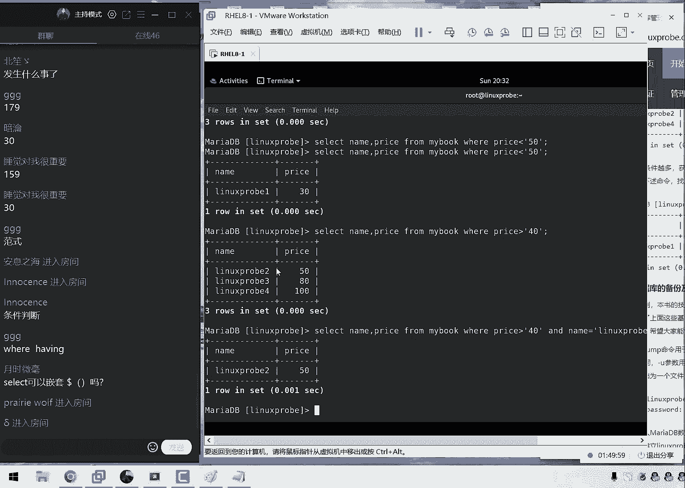

让我们在呃呃呃，那我们当时呃有一个小的网站。

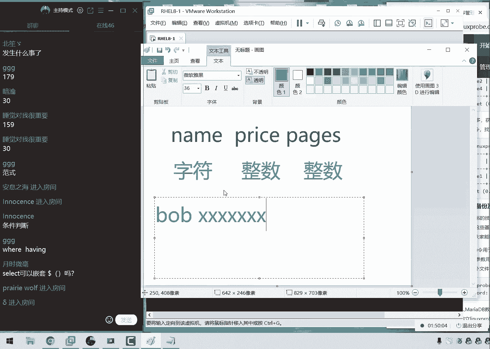

当时我们这个mysql的话，这个版本特别的低，行行行，当我们当行使啊。

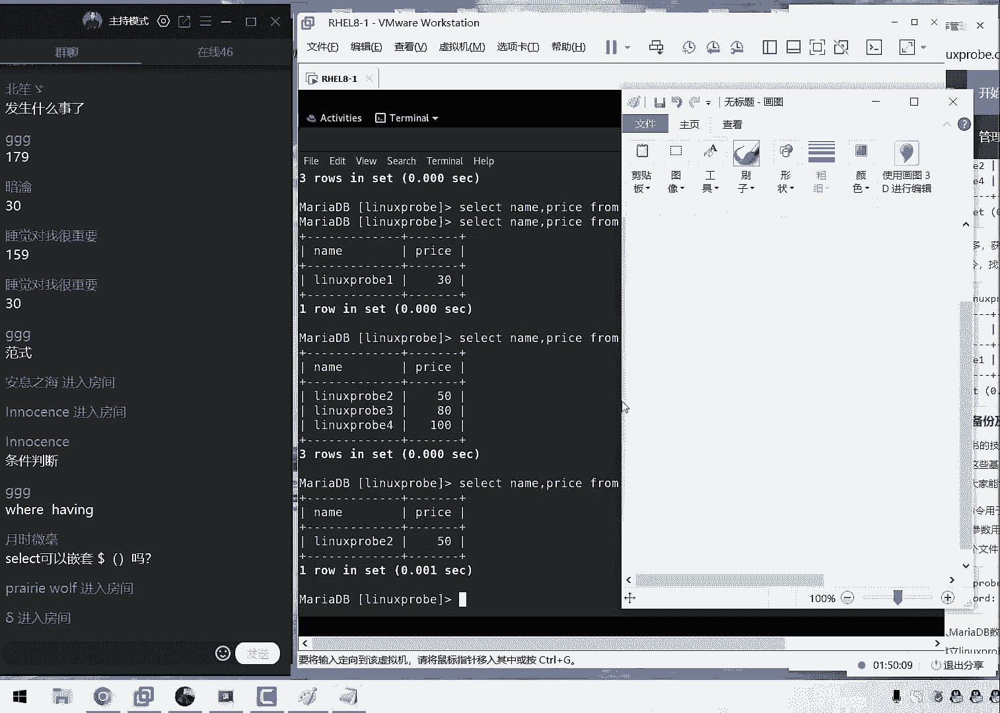

当时的话使用是一个呃四跟五的一个版本，当时用了好多年，然后我们呃然后我们一直用的是4。5，的一个版本，大概的话呢时间我们并没有特别远，大概就是2018年吧，我们升级了变成mysql的这个七版本了。

然后就有一个问题了，就是mysql 7以后的这个数据库版本，它都必须要去使用它专业的命，来进行备份了，我们必须要去使用到mysql db的还行备份了，所以大一定要记一下，如果以后我们公司的这个服务器。

因拿不准是什么样的一个版本，如果是老版本无所谓啊，这个啊这个话我们可以随便去用就可以了，可以直接使用交叉，然后c的vf，然后我，比如说my sql。taran gz，我随便来了啊。

然后我们数据库保存路径，然后巴拉巴拉巴拉，然后我们随便去找一个数据库的一个路径，然后我们作为保存这个啊，这样的话就可以了，但是在七以后，我们一定要去使用到我们专业的命令，来进行操作。

这样的话才会造成我们的数据的丢失，这个很重要，那这个很重要，mysql jm。

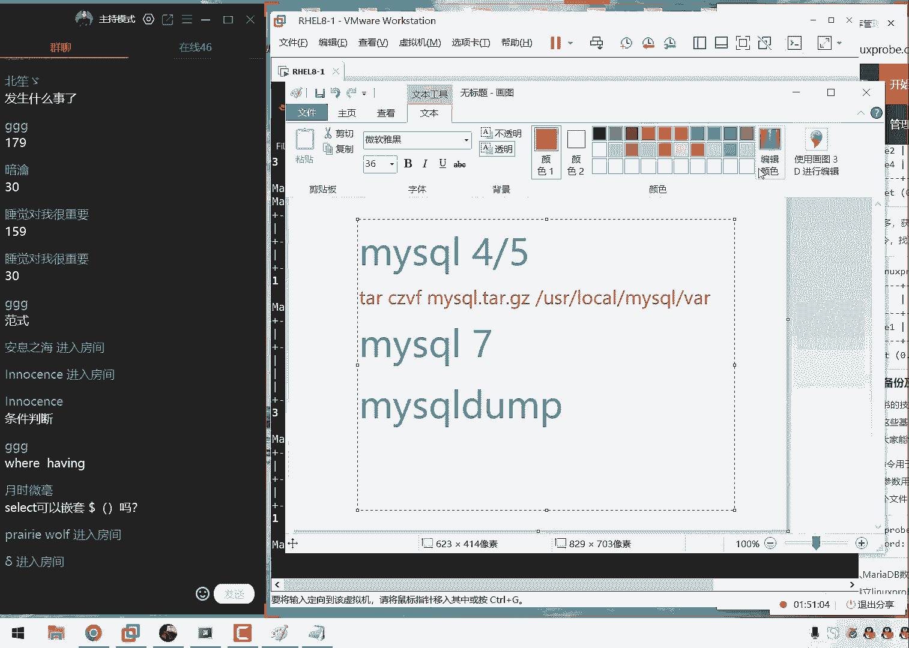

然后做完之后干嘛呢，那呃我们将这样啊做一下备份数据，我们先不动，既然我们还没有给大家讲啊，我们先来给大家做一下备份啊，我们来备份好了之后来把，这个数据给大家来做一下这个呃删除。

正好把这个删除给大家讲完了之后，再讲一下恢复，我们认为在大家在工作的时候，更多的可能用的就是这个会啊，备份跟恢复的这个工作用的比较多一点，咱们那我们既然作为一个运维人员，那我们自然改了。

那我们既然管到我们这个操作系统，那我们该怎么样来进行一个备份呢，很简单，my sql jump，后面加上我们要想去备份的这个啊，数据库的一个用户名称叫做管啊，管理员叫做啊啊管理员啊，r啊r o t啊。

管理员，然后我们写下来要想去备份的，这个数据库的名称linux probe，它指的是我们要想去备份的，这个数据库的名称，闭门写到下面的，然后把我们这个linux probe这个数据库的话，备份一下。

比如说我们随便来了，比如说我们的这个先先好吧，我们叫做先接，然后这个后缀也无所谓，我们给他加一个后缀，加一个备份文件啊，往里面一导出，数一下我们管理员啊，超级用户的密码啊，red hat，诶，不对啊。

好像改了对吧，把密码叫做linux prod，来linux probe下回车，就把我们这个数据库的这个信息给它，自动的给它啊导出了，然后比如说我们的linux club这个数据库的，信息就导出成功了。

大家说怎么样呢，山库跑路了对啊，在商务朋友之前，你可以把这个数据先备份一下，万一要是有很严重的这么一个刑法的话，到时候可以把它拿出来啊，可以减刑啊，那我啊这个我也看行，然后下面一个问题。

大家说说我们可以去使用的shell自动备份，没毛病啊，非常好，可以的啊，可以通过这个shell自动备份，然后加一个时间，其实我觉得，加一个计划任务，比如说每天备份一次。

或者说能让我每个礼拜备份一次都可行啊，我这我啊这啊我看也，行，让我们来去使用到买的sql root gp password，然后我们去写一下我们的这个密码值，我感觉啊其实每节课讲的特别多的话呢。

大家其实会感觉到很愉悦啊，如果讲的特别少的话，反而会感觉到很水，哎呀不知不觉8。35了，我们来继续啊，啊就希望我们这个每节课大家会有一次，大家都会有很多很多个生活，不是说怎么讲呢，因为它是一个网络课程。

因为如果要是一个呃，因为他因为他是一个网络课程，他又是一个晚班，他又是一个蒋雷电四系统的，一个比较枯燥的这么一个课程，怎么教这个，课呢记得特别的缓慢的话很容易，但是大家犯困。

所以我们今天的话呢拿起我们的斗志了，好了，我们来进入到这个数据库里面，然后我们昨天我给它删掉呢，很简单嘛，就是我们可以去先收database，查看一下我们这个数据库的列表，然后巴拉巴拉有汉啊。

耶耶耶耶耶挺多啊，没有问题，把切换进去，然后说编码不一样，咋处理，待会给大家去说吧，然后我们先讲完，然后是柚子一下latex prob，然后我们来进入到这个数据库里面，然后可能那个我想一想啊。

show tables有一个叫买布和一个表单啊，看他不顺眼了，对，不对啊，我们给它删掉它，delete把它给删掉，然后删掉这个表单，删掉这个表单，然后买book表单给他删干净了。

然后大家再去看一下show chables，还有这个表单吗，有，然后但是我们再去查看里面，这个内容的时候，大家会说说老师这个没有了对吧，因为把它给删干净了，这就是我们叫做删除它的，这个操作的一个作用啊。

清空了啊，那同学们会问到我说溜，那你现在因为我们第一天学这个数据库，我感觉不太放心，你你这个操作的话，那你就反正我看着好像是没有了，但是实际上有没有的话，那我呃我也不，知道怎么来进行一个验证呢。

其实也很简单，就是我们在可以去怎么样呢，删除掉一个数据库，删除掉我们的database的linux probe这个数据库，也就是说，我们可以把我们这个数据库给他删掉，这就没有什么呃。

这个没有什么问题了吧，大家来去show database来查看一下，也就是说，我们把我们的这个数据库都给它删掉了，肯定已经是很干净了吧，大家不会产生这种歧义了啊，既然我们的数据库都已经删掉了。

那我们表单里面这个信息自然也就没有了，这就是由顺便给大家讲了一下，该去如何去删除掉我们这，个数据库的一个操作命令啊，您可以来就记到这个书上面，可以记一下了，让我们来接下来再来。

我们现在能够去恢复一下这个数据，让我们再去create database linux probe，我们这个数据库再给他建立回来，建建立回来一个数据库a再回车，然后再去查看一下数据库，肯定有了。

就看不看无所谓了，来看一下数据库回来linux pro，但是里面的话呢没有任何的数据，这个没有问题吧，啊啊不不，我再给大家进入到里面去看一眼啊，经验证，虽然老刘很帅，但是这个该验证的这个啊。

这个地方还是要去验证一下，不能消，耗大家对我们的信任来看一下啊，确实没有了，然后我们退回到这个啊目录下，那么怎么来进行数据的恢复呢，那么这样去做my sql对吧，直接使用到my sql来进行恢复。

使用到什么呢，输入重定向往里面导入，就可以对于我们这个数据来进行恢复了，更优啊啊他指的是我们关联的这个账号啊，r o t呃，然后的话呢，我们刚p要去恢复这个数据库的名称，linux pub。

然后我们导入一下这个文件，然后文件名称的话呢，我想了想说，先先点dumb是吧，来我往里面一导入管理员密码，这叫做linux probe呃，入侵用户，密码叫做linux pro，刚刚改过，按下回车导入诶。

那管理员呃，liness probe，linux probe，账号root，我看一下mysql杠优root gp linux prob，先先走，你然后是linux prop走啊，没有问题。

我们把这个信息导入之后，再重新去进入到我们的这个数据库里面，大家会看到的话呢，我们先一顿操作下来之后，我们这个数据库入侵用户的密码是个linux pro，老棒啊，来这个很不应该是show tables。

show database，查看一下我们的数据库文件还是在的，他肯定在对我们进行一个，因为我刚进的是一个恢复操作，进入到我们这个数据库里边，use dness prob，小回车搞定，然后干嘛来。

着去show tables查看一下表单啊，还在，然后我们查看一下表单里面的所有内容，这段的所有内容的话又都回来了，大家可以来看到这样的话呢，呃刚才我们并没有卡掉啊，刚才这个声音比敲了这个画面要快。

是因为我刚才说的比较快，但是手没有跟上啊，但是我没有卡好了，我们要给大家看完了这个之后，基本上同学们就能够领会到，我们对于数据库的一个管理能力了，然后我们今天这个课程的话呢，讲了一小时40分钟。

后面的20分钟的时间了，我们我们来给大家说一下这个考试相关的，一些事情，然后因为的话呢，我们再切这个讲课的时间吧，不多了啊，不多了，就下礼拜五了一天了啊，这段话呢我们把一些能够想到一些事情。

提前给大家说一说，这样的话呢，我们呃如果说您是在看录播的话，就可以直接关了，如果你要是三点的话，还是要听一听的，因为对大家来说是有用处的，然后还有的话呢，大家都会有种感觉，我能够理解，对不对啊。

觉就是学了，但是感觉又没有学啊，机的话呢好像好像也能够接触点东西，但是还有很多记不住，也不太知道每个命令的一个呃，呃就是咱们这个怎么讲的啊，具体的这么一个过程，同学们就应该能够感受到了。

对于我们这个数据库，首先我们不要有恐惧心理，第二的话呢，对于我们这个数据库里面，表达的这个管理方法，风神改成这个我们都非常的熟练了，对于用户的这个改名，还有这个新建和这个啊授权操作等等，啊啊啊。

一个恢复操作，大家的话都应该是非常的熟练了就可以了，好吧，然后我们进黑云，在我们工作的时候把这本书哎，然后以及如果到时候签名书的话就更好了，放到我们的m v2 ，那如果要是需要用到数据库管理命令的时。

候，可以过来查就行了，我们我们对大家的要求，就是只要知道大概的一个自由即可，不用去记你们的命令，三个语系的命令不用去记，如果您愿意的话，可以去记一些我们的抄袭，怎么命令都比，这个sql语句。

和大家以后用的几率比较大一点，然后我来给大家说一下，我们今，然后我给大家说一下我们这个考试的内容。

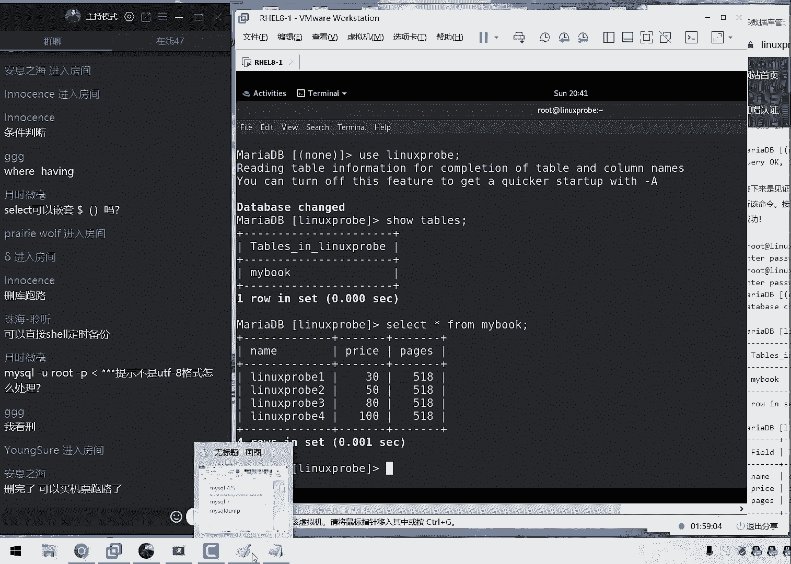

因为我们上课吧，因为呃因为它是一个在线培训，所以的话呢好多新的消息，我们就希望能够第一时间给大家去说出来，这样的话呢对于我们当前的学员特别好，特别有帮助，然后这就是为什么很多培训机构提供的。

是一个录播课程，嗯，然后我们就会有一个很鄙视的，一个呃的一个感觉，就是因为呃5月27号是吧，5月27就是因为这个录播嘛，来进行调整，以及的，话呢以一些新的消息吧，说实话通过短信啊，通过qq啊。

微信什么的，老师通知不到位，所以的话我们这个在线培训通发啊，去发通知，也是一个非常重要的一个工作的一个内容，来大家看一下，如果说你已经背上啊，如果说你已经遇上考试了，咱们就开始去做备考就可以了。

只要说如果你要是呃，然后就是下周的话还要上课啊，不要忘记是5月27号，我们会给大家讲两个章节，第19第20时间的话呢，大概是两个半小时啊，有大概两个半小时，大家，提前做好准备工作啊，时间挺长。

两个半小时，然后因为我们规划了一下，有点尴尬，第19章的话呢，大概时间是一个小时，然后的话第12，然后呃呃呃嗯，然后呢，我们的最后一个章节，大概是大概是将近两个小时，如果要是拆成两天去讲的话呢。

大概需要多来一天，所以我们下周五的时候的，时间会稍微长一点，两个小时半个小时啊，大概就两个半小时或两个小时，40分钟左右好吧，然后大家先说的，我再给大家说一下，我们这边遇到的一些问题，就是的话同学们。

你们现在月考约完了，然后，我们这边已经给考场那边提交上去了，费用的话呢全打了，同学们已经都打到考场那边了，但这话呢我们遇到一些问题，就是呃我们之前的话，让大家把这个钱都是一个考场。

然后会有一些同学是转给网的，然后我们现在帮大家转了一下，也没有问题，然后但是的话呢我们转的时候吧，有些同学是南京的，就是有些同学是南京的，然后把钱都给我了，然后我们就是去转给考场的时候吧。

会发现没有位置了，很尴尬啊，就是说我们的同学们，6月16号在那考试的话呢，在南京的考试是吧，南京，是6月16号吗，我先确认一下，避免我说错之后，大家很会啊，会很紧张，会认为好像时间报错了，我看一下啊。

南京考试是6月16号啊，看来没错，也就是说我们的同学在前锋旁边，那个6月16号在南京嘛，然后有些同学把钱打给我啊，然后我们又转过去之后吧，就晚了，晚了之后的话，那就就然后就没有帮上，要的话。

就是这个情况的话呢，可能也是存在的，也就是说同学们好，我们今天现在因为现在这个全国，现在这个病毒，好像现在这个防疫工作做的非常的严格啊，所以的话呢我给大家，一个小建议就是我们这段时间遇到的。

就是在没有说到考试邮件的，这个前提之下的话呢，不要订机票和酒店，好同学们，我们会在考试之前的十天啊，或者说七天吧会给大家发邮件，所以说如果说你是在江苏，或者说你在天津，想来北京或上海考试的话的。

您一定要等到这个邮件收到之后，再去订酒店啊，在预订酒店和机票，一个在呃的这么一个事儿来，就是说第一个啊机票还有这个酒店的话呢，一定要等这个邮件收到之后再确定的话，这个邮件的话。

大概是提前七到十天会给您发啊，这，个到手了就可以去订了，然后的话还有就是这个南京的考生，有那么几位，还真是您需要等一等了，因为可能会调一下时间，我大概会在下礼拜三左右会给您发消息，就说呃是这样吧。

大家尽量嗯就是盼着不要收到我的消息，就是说呃如果说您在下礼拜五之前，如果说您在下礼拜五上课之前，您没有收到我给您发了消息，那么您的这个月考，这个成功率就是99%了好吧。

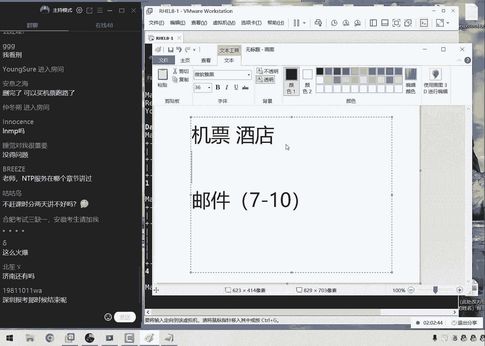