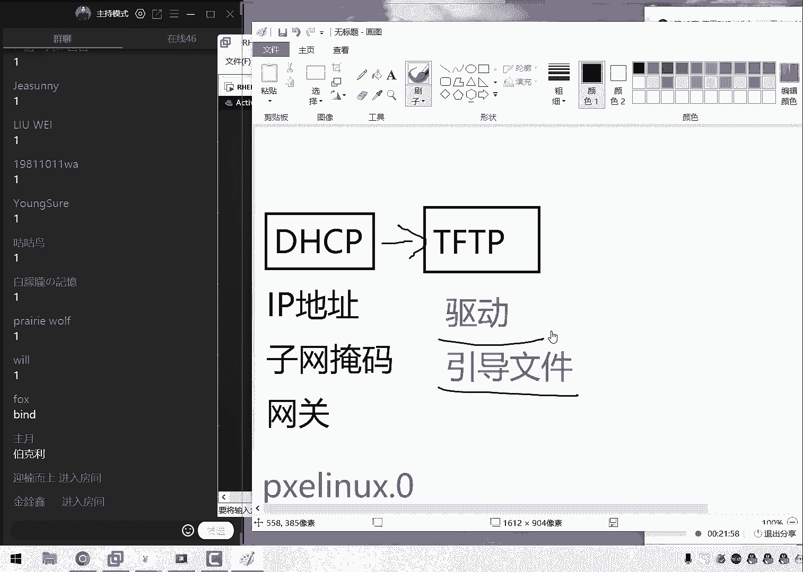
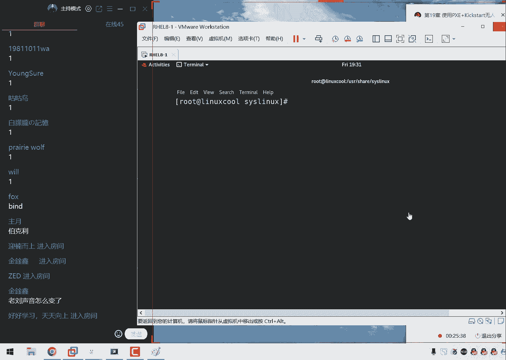
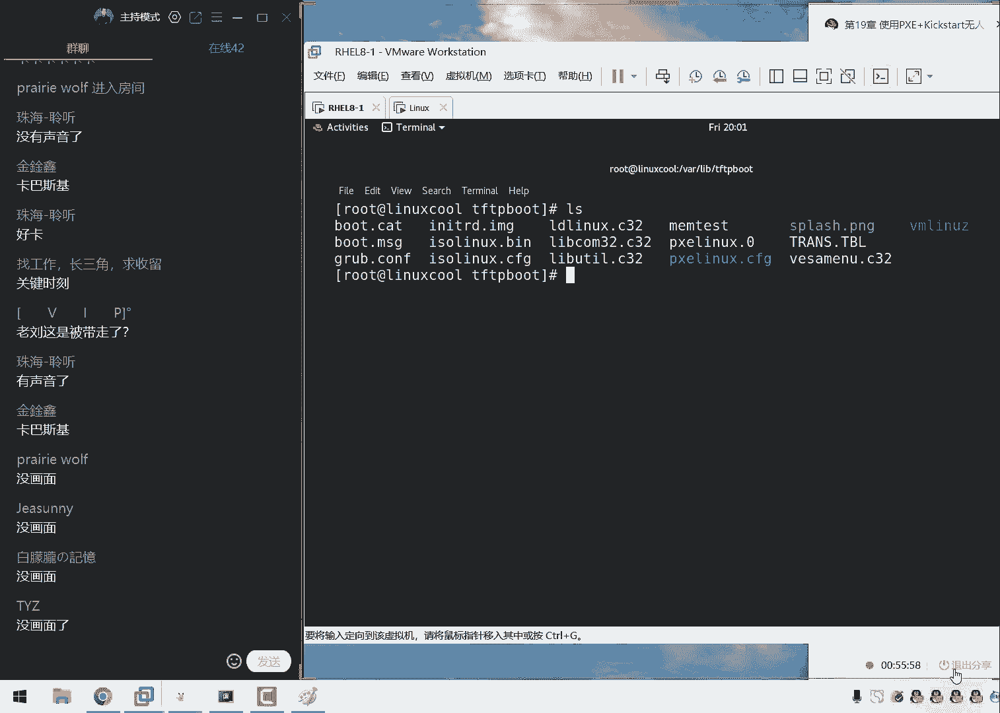
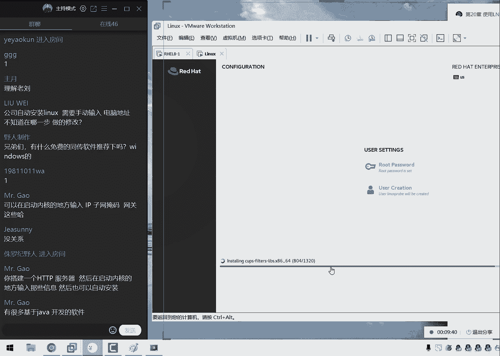
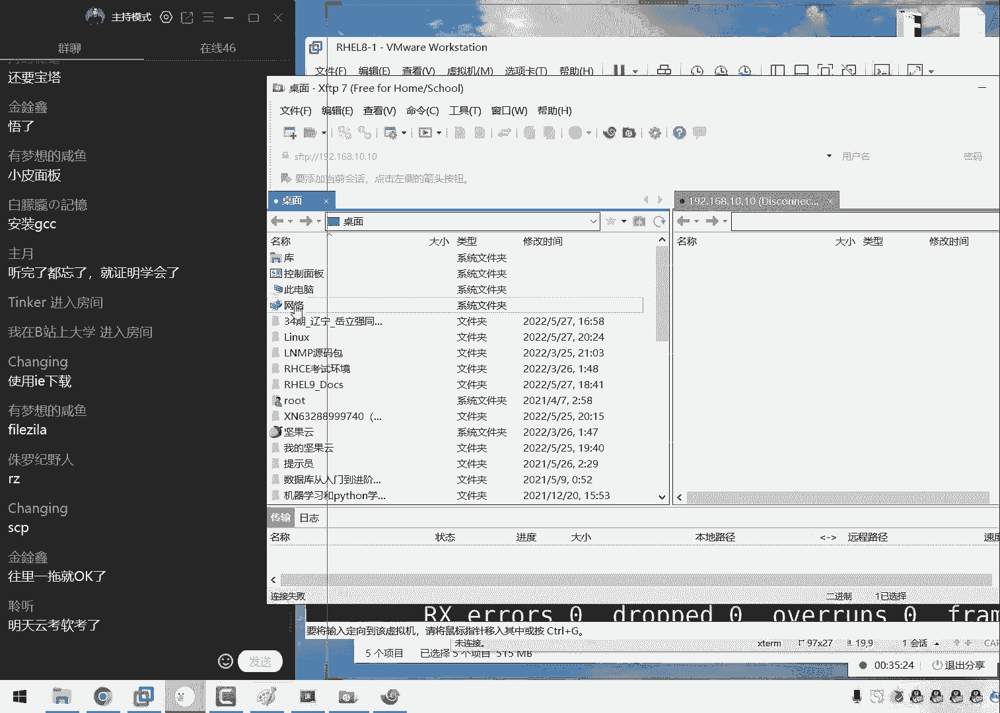
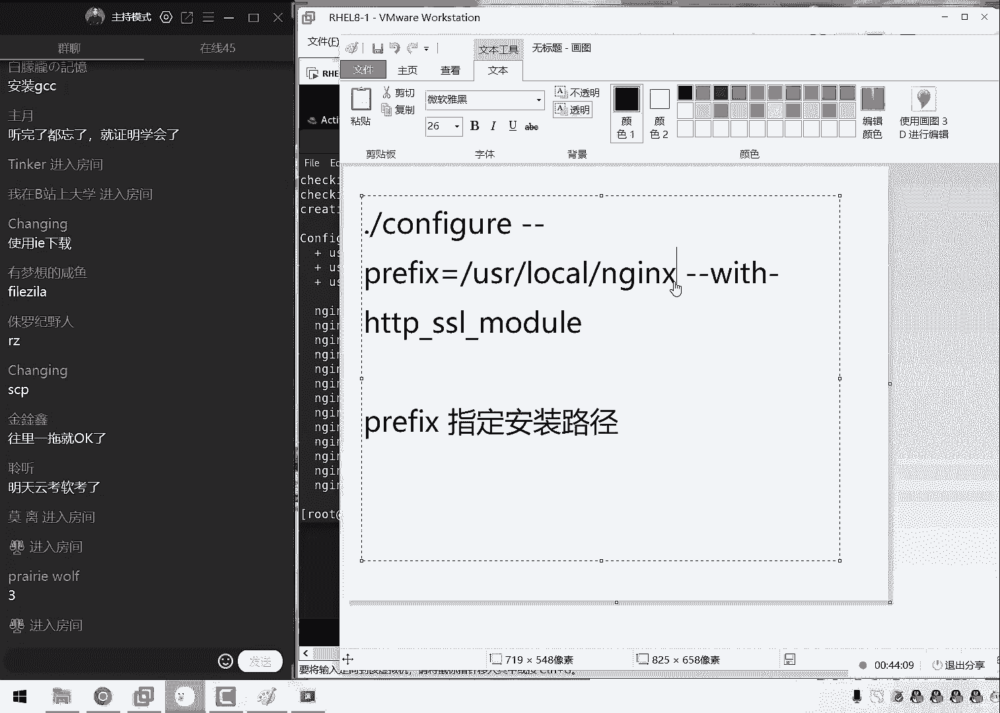
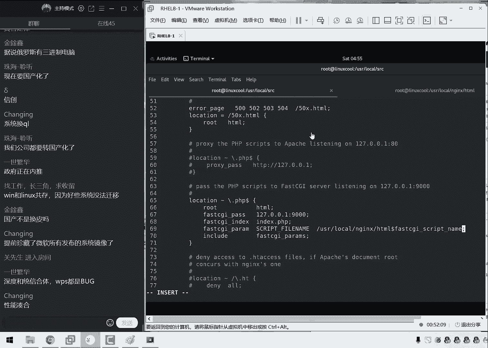

# linux就该这么学第34期 - P24：23【第34期第二十三节课】红帽RHCE认证培训课程-Linux就该这么学 - 能力努力 - BV1L14y1878S

Oh。

Okay。嗯。Yes。OK同学，我们人差不多了啊，先打一下一，我们来开始我们接这个课程啊。O我们那同学们先打一下一吧，然后我们来开始我们接这个课程啊。啊，今天然后我们后来我们还是没有回到家里面。

然后现在的话呢依然是被隔离。然后这个的话也确实超过我们这个。😊，呃，计划了。然后我们原先的话呢计划是想用我们的这个家室啊，那我们想用家里这个电脑给大家去讲的。那么的话这样的话呢配置会好很多。但啊啊。

但是呢很不幸我们这个隔离时间要被延长了。现在从时间变啊变成了14天。😊，正好覆盖了我们这个周末了。所以的话呢我们这一次稍等一下啊，这个鼠标垫还湿啊，稍等一下。

所以的话呢我们这一期的最后两次课确实很呃其实我们这个实验环境的话呢，对大家讲很不公平啊，就是这个实验环境确实有点慢啊。但是我们跑这个呃呃程序的时候的话呢，可能也会稍微有点卡。好，现在没有画面吗？好。

那我们来继续看一下同学们呃，大家先测试一下我们的环境，您看一下有没有画面啊，测试一下我们的画面啊，如果没有画面的话呢，您再退一再再进就可以了，应该没有问题。来，大家打一下一可以吧啊，还没有什么？

没有画面真没有啊啊，大家都没有是吗？好，不用着急，我来给大家分享一下，重新来啊，重新来重来啊，不用着急，可能是因为它这个。😊。

啊，不用着急，我给大家重新分享一下。😊。

来啊，小问题啊，怎么样啊，可程结束了啊，下课了来稍等一下同学们今天是比较特殊的一期。对这个实在是太艰苦了。来啊，那我们来重新分享一下屏幕同学们再来感嚼一下。哎，看看现在我们这个画面能不能看得清呢？

然后现在如果可以的话，大家打一下，一现在现在我们呃有没有了，有了是吧？ok ok那我们继续大家给大家去说啊，今天的话呢我们的原本的课程规划是给大家讲两个章节，因为19号20嘛。

然后呢这个主要原因就是因为哎呀现在在外面的话呢，是音现呢这个呃因为我们现在在外面是不有几，所以的话呢，我们不太确定说明天我们会不会去又换酒店或者的话呢会送回去，所以的话呢。

我们想的是今天如果条件允许的情况下，我们今天给大家讲两个章节，19号20时间的话呢，大概会讲到9点半左右啊，那我们就是说比正常的情况下的话，大概会做半个小时时间，这样的话呢我们呃明那有踏实的。

因为就避免说明天如果要是万一换酒店啊，或者说有其他的一些政策的一些调整，到时候又。😊。

一天，那我们到时候再给大家停课再去调整的话，就会很麻烦。好，那我们要给大家讲着吧。看下第十九章了。如果今天第1九章都讲一个半小时，那就当我们啊那么我们就当做啊是没有说过啊。

那么就是必须要是放到明天给大家去讲了。所以说我们现在慢慢给大家聊着。然后我们也不会给大家去赶课时，大家可以放心啊，然后我们现在给大家去说一下第十九章节我们干什么事啊，我们要去学习什么呢？

第十九章节我们学习的叫做P叉E加Kstar大家去叫做无人之手来去批量安装系统，这个怎么理解这件事情的话呢，就是我们第一节课就是4月3号的时候吧？我们真正开始去学习这个技术的时候，第三节课。

那么我们到时候我们去啊安装过我们的这个操作系统。但是的话呢当时我们是每一台每一台。然后我们啊然后我们来这样来去安装的，那我们要怎么能够去实现一个批量的安装呢？实际上就是由我们第十九章就给大家去介绍到的。

因为的话呢我们中国人有一个传统，就是要从基层开始干起，对不对？所以这个最基础的这个安装系统这个工作，大家以后工作的时候可能会更多去使用到，对吧？😊。

那这个时候如果说我们现在这个工作场景只有一两台机器，那么啊那么也没有问题。但是如果说你的这个工作场景里面有个10020300台机器，那么到时候就会很麻烦了，对吧？那我们安装这300台机器的话。

可能也需要半天时间，或者说那么可能需要两天时间了，很多很多，那么很麻烦。那我们要是除了说我们单独的来去安装系统以外的话，呢，我们也可以去批量的方法再去完成。

其实这个话可以很好去提高我们这个工作的这个效率。那么啊当我们在我那我们当我在工作的时候啊，然后当我们用到这个技术的时候，大家就会呃啊大家自会啊自然会感觉到这个很香了。然后我们。😊。

把这个啊画面我们先调整好之后给大家去说一下。今天的话呢我们要去使用到一些工具。然后我们来去实现一个批量的安装。然后我们来看一下呃，首先的话呢是我们第一个服务，我们要往后面去翻了啊。

大家看到这个我们是用到了很多个服务。因为的话呢第十九章节，实际上它也是算作是一个我们的总结课程，就是我们今天啊那就是我们之前学习了很多个服务到底有什么样的一个用处。

同学们总是表示一个怀疑知那我们昨天去学习的，比如说我们来去解析域名啊，或者说我们来去啊为我们这个客户端去分配地址。那么它到底有什么样的一个用处。那我们能不能把几个之前所学习过的服务的。那么怎么样呢？

其实啊那我们来去啊凑到一起做成一个整大啊，然后我们做成一个很大的一个架构出来，或者说我们做出一个完整的一个实验出来。然后他啊多个服务之间能够进行一个相互的协调，那么以及来去共同去为用户提供某一项的服务。

这个我们今天就是第十九章节跟第二章节要给大家去做这个事情。等于说我们前面所学的这个所有的课程都是为了能够听懂今年我们所学的这个课程做的这个准备。😊，啊大家说了一个啊，说300台啊。

说有啊300台机器装了5天啊，所以的话呢以后300台机器，你就大概只需要呃半天吧。然后啊其余的300天那话我们的前人节的4天啊，那么就可以配加了，这个我们就是啊提高工作效率的一个方法。

然后通过老牛这个不懈努力啊，虽然今天最后一天，但是说的话通过老牛这个不懈努力。现在我们这个人数啊也经从35人到了46人了啊，47了是吧啊，非常好，那我们就不再等了。好吧，我们现在有47人了。

等外了12位同学非常好了。我我那么我想那我们感到非常的满意。那我们现在来想一想啊，同学们把书给大扔奖了啊，然后我们想一想，那我们要想来去批量来去安装系统。同学们你们认为需要什么服务呢？

反正我先啊那我先来去想一想，我觉得第一来讲，肯定就是要想来去传输这个文件，或者说来去传输这个数据，首先他是不是要是有TCPI协议啊，那个是个啥？那就是我们的网卡的一个互通嘛，就是说网络一定要通了。

然后才能够去传文件，然后才有后续这个事情，对吧？😊，所以我们能够想到的，也就是说第一个就是我们的DICP服务。我们来啊部署上DICP服务。大家跟着我这个思路啊，把书扔掉那把啊把书扔掉啊。

我们通过这个推理的过程啊，慢么给大家去说出来大概您需要的是什么样的一个负架构，到时候我们去配置起来的时候。😊，那么大家那啊那么那我们大家也就知道了啊配置的这个顺序啊。

12434这啊那我们按照什么样的一个顺序来把它给完成。首先来讲DICT这是我们推理出来的，为什么呢？因为它需要为我们的这个用户，也就是这个服务器跟客户端嘛，来去提供一个我们的网卡信息。

他来保证这个网络是可以进行一个通信的，所以说它里边要有什么IP地址，还有什么呢？还有这个子网掩码，还有什么呢？还有H打这打个啥子网掩码啊，唉啥意是这个输入法也不太行啊，子网掩码啊，这个推过啊。

然后还有还有这个网关啊，还有我们的啊也没有啥了，对吧？那也就是说我们需要为我们的用户提供这些网卡信息，这个的话呢是我们的第一个服务DICP需要去做到的。然后现在这个人数的话呢是48人了。

然后现在又来一位同学啊，那我们就真不等了，同学们应该能大家大家应该能大家应该能够呃感受到啊，其实大家等一下，那么就真不等开始接这个正式的课程了。C首先的话呢关闭掉我们这个虚拟机里。😊。

自带的这个虚拟宝络编辑器。现在大家总会说到邵老师能不能我们不要等了，7点钟上课7点11了啊，那我们啊没有来的同学就不用听了，对吧？但是我们不能这样啊，都是我们的复位学员能多听一个。

大家要尽量的多听一个啊，然后我们就多等一等。我们首先看到啊就是说现在既然我们自己要配置这个DICP所以的话呢我们就要把虚拟机里边自带这个DICP给它关闭掉，避免这两个怎么样的打架啊。

同学们很多会问一个问题说刘啊，用那个我们虚拟机里边提供这个DICP服务行不行呢啊，也行，但是不就是市场的乐趣了吗？对吧？所以我们来给大家讲就是把虚拟机的给我关了。

把我们自己的配置起来给大家啊那我们给大家来去那我去做一下配置啊，那我们给大家安装上。那我们来安装一下我们DCP如果我没有记错的话，应该是叫做DIC吧？这个软件包的名称，我们来进行一次安装。

另外的话呢刚刚呃刚刚的话呢我们这边跟考长这边去确认了一下啊，果不其然。那然后现在的话红就已经发布了。然。😊。

不是卖焦率，就是如果同学们想要考试的话，抓紧时间啊，在我们这报也可以在别人的那报也可以。但是大呃给大家的时间可能不啊可能并不多了。我们的话呢得到的这个消息大概就是9月份，然后然后就变题了。

所以的话呢呃如果同学们就在在考当中遇到了一些问题。那或者的话呢您呃比如说考试的时候挂科了这样的这个情况的话呢，也不用太担也不用太担心。因为大家如果是6月份底考试的话呢，呃如果万一要考挂了，对吧？

我们七八月份还有一个不考的一个机会。所以我们这些同学们你们的时间特别的快裕，特别的好。那所以的话呢也是赶上一个问呃这么呃也是赶上了一个考题既稳定，又能够。😊，啊，时间很宽裕的这么一个班级。

然后对还有一个同学就是今天问到了说如果要是成都啊，什么其他城市，比如天津啊，还没有约上的同学，还有郑州、杭州也没有约上啊，这个到时候再再那么再等消息吧，现在确实也没有这个安排了。

所以您约上就约约不上的话，就再等一等，大概七8月份也会有消息。来我们先在来给大家看一下，首先配置一下第ICP，然后我们来输入一下我们第ICP的这个主配置文件。由于我们这些服务之前都讲过的。

这这就是我们第十四章节。所以的话呢我们就。😊，给大家讲一下这个重点了。然后我们相同的这个参数就稍微的快一点了。但是如果说同学们想把我们这个视频，大家也看到了，我们最后几天的视频没有加密，对吧？

因为为什么呢？因为我是在外面，所以我现在视频加不了密。所以同学如果说愿意把这个课程啊分享给给自己的朋友的话啊，然后大家一起来去学习的话呢，我们也是拦不住，但是我们希望大家分享的时候带一句话啊。

就是说我们之前是讲过这些服务的。然后的话呢并不是我们呃刚才来去讲就这么的简单了，然后我们会讲的很详细，只不过这个之前讲过了，所以我们今天才讲的稍微的快一点了。然后大家千万不要您的朋友话。

然后呢然后的就以为我们讲这个服务的话，去讲lins服都这么快了啊，只有是完全没有呢，这是一个误会啊，之前讲过了才快的来我们给大家做好了之后，我们来去编写一下这个文件。首先的话大家想一个问题。

就是对方的话呢他是没有一个操作系统的对吧？就是我们先要那我们先要做这么一件事情。😊。

我再给大家打一个厚图版吧啊再给大家画一个啊再给大家打开一个话筒版啊，这样的话再给大家画一下这张图，就是我现在想做一个这么样的一个架构。呃，首先的话呢就是我们去画一个小圆圈，这个代表就是我们的服务器。

然后的话呢底下有很多很多这样的一个方块。这个方块的话呢，长方形代表就是客户端。然后我们现在的话呢就是说服务器上面肯定是那啊那么它啊肯定是要有系统的。然后通过网线进行相连。然后怎么样呢？

就是呃我们在这个客户端是没有系统的。当我们通过网线相连之后，然后我们去按一下开机的，就一瞬间瞬机啊，不然后还有我们所有的客户端就能够批量的给它安装上系统的。那么就是这么一个想法。

那也就是说客户端是没有系统的，所以我们需要去允许两个协议。第一个的话呢我们叫做BOOTP啊MG这就是说代表就是当对方向啊当对方开机的时候，那我们就会去主动的给大家去分配一个我们的地址。

因为大家知道当我们去学习思科这个课程的时候，里边以后有没课然它会有没课程。这个课程里面的话呢叫。😊。

里面提到的DICP协议的话呢，它是经入了这个三个步骤，对吧？第一个的话呢，它是在居域网里面先进行一个广播，说啊我现在需要一个地址，然后的话呢，有没有DICP的这个服务器，然后的话呢。

由这个DIRCP服务器寄到信息之后，向他去发送一个呃那么像啊然后再向他去发送一个数据包进行去确认。最后的话呢，他确认之后才会为他进行一个分配操作。

那也就是说现在他需要向我呃他现在需要向DICP这个服务器。😊，发送了一个请求，但他现在做不到了，他现在呃只能是来进行一个被动的一个接收。所以我们需要去允许两个协议。

这样的话呢就可以让我们这个DSCP服务器主动的为我我们这个呃客户端啊，没有系统这个客户端来去分配我们的DC的这个网卡信息他现在就是一个植物人嘛等于说他说不了话以我在只能给大家进行一个强制的一个放来去恰饭进行第一步叫做发现操作没有问题啊。

这就是我们这个CCA里这个课程。我们来呃然后我来给大家去说一下，接下来就是叫做动态主地址更新协议啊，叫做DDN说实话这我们不用到它。但是这个这是一个个式要求，我们需要把它给写下来。

然后我们选择禁用就可以了。我们现在没有去使用到DN后的话呢接下来下面再来就是一样的，就是忽略掉客户端给我们的更新他给我们更新？这没有必要给大家去取消掉接话给大家提一个小问题第一第一个小问题。

请问我们在DCP里面我们的作用到底是不是为用。😊。

续分配的一个地址范围呢啊或者说请问我们在DICP里面的这个作用域，它一定是为用户去分配的一个地址的一个范围吗？大家告诉我一号就可以了，一代表就是肯定的正确的，二代表就是错误的否定的。

咱讲课就要效率啥要快，对吧？咱们不能说两个小时的时间。😊，跟大家去看一些免费课程一样啊，说话也慢，然后我们讲课也慢，这两个小时下来感觉自己啊也就俩小时，对吧？然后我们希望的话呢这个节奏快起来之后。

同学们这个注意力啊会更加集中了。因为这个我记得是哈佛教授研究过说这个把视频提高到一。5倍素，这样的话学习效率会放高啊。所以刘给大家自带了啊。同学们就是只需要放空自己的这个头脑，然后跟上我们就可以了。

那我们接下来给大家去说一下，就是啊大家告诉我了，说这个作用域的话呢，大家说不一定啊，好，那我再给大家重复一下啊，大家大家一定要请注意，就是作用域的话呢，它并不是真正为用户去分配地址的一个范围。

它里面它里面会包含叫做什么呢排除范一起说排除范围啊，然后呢我们等于说纵用域减去排除范围之后，得那个是什么东西，叫做地址池地址池才是为用户去真正分配地址的一个范围。好了，我们说这么多就是一个作用域。

然后接下来再来啊不过今天我真的没有想到还会哎在这个外面给大。😊，来讲课真没想到啊，然后因为我们上节课都没有给大家准备。然后我当时想的就是老子啊我们呃5月27号早就回家了。

所以的话呢用这个家里的电脑一台艾艾9的一个芯片给大家去讲啊，32G内存跑这个实验，那个感觉肯定是不一样的，结果万万没想到我们现在还是用这个笔记本。所以同学们，你们不知道啊能不能听到这个呃风扇的声音啊。

如果大家能够听到的话。😊，大家可以去稍微克制一下了这个因为我已经感觉他因为我感觉他他啊已经很烫了。那我们接下来定义一下，就是我们为用用户端啊，那我们没来啊，用我们来为客户端啊，开始瞎讲了。

我们来为客户端去分配的一个我们的字码，等于说待会我们所输入这些信息的话呢，都会去体现在我们这个客户端的这个网卡信息上面我们来给他去敲一下，然后第二的话呢，我们定义的就是这个其实大家看首字母也可以指道了。

然后叫什么呢？就是叫做呃域名解析服务器。然后我们还有印象吗？那我们来给大家提一个小问题啊，请问域名解析服务器DNS我们用到了什么服务搭建的呢？

就是我们现在在互联网里面要想配置一个DNS请问快速告诉我那我们不会配没关系，但是请那么请快速告诉我。如果我们需要配的时候我们需要用到什么服务大告诉我，我们可以去啊没有了，没有画面的是吗？

同稍等一下啊不用着急啊不用着急不用着急，我迎下网。😊，有点就是怎么讲的，有点像红军爬啊爬雪山过草地一样，今天克服接惊万难，哎呀，这个真的是。哎，也不好说，人家这是。😊，防疫的这个好吧，稍等一下，同学们。

我现先给大家先聊着，我把这个网络给大家切换一下啊，同学们啊，方正你不用着急啊，现在可能是有点网，但是不太好。我现在的话呢去哎我让我让它好起来。😊，呃，别的不太行，但这个。😊，有这个网设办法的，稍等一下。

😊，哎，同学们现在能够看到画面吗？呃，现在能够呃能够看到画面了吗？😊，啊，看到后面没关系啊，稍等一下。啊，看到人看看到也不用看了，因为我现在在给大家我把这个5G开一下，因为这个网嘛。😊，确实挺次的。

所以我们稍等一下。嗯，同学稍等一下。は。okK同学我们回来了，那答家现在可以了吗？打一下一同学们现在可以了吗？同学们好，现在看一下我们的画面，然后看一下我们的声音啊，大家能否啊大家能否听到呢？😊。

来同学们啊现在可以看到了吗？不会啊O啊，现在可以了是吧？好，大家先看一下我们的画面能不能看得到，然后能不能听到我们的说话声音，没有问题是吧？好，现在来那我现在继续给大家去提个小问题。这个网不太好。

但是我给大家提个小问题。请问如果说我们在公司，我们要想去搭建一个DNS请问我们需要用到什么服务呢？就是我们怎么搭建啊，可能这个大家第十三章节记不住里面的那我记不住这个里面的这个参数，但没关系。

就是我们来就知道一下就可以了。请问我们要想去搭建这个DNS那我们去么是哪个服务这个我们要知道对吧？这大家说出来了，叫做ban同学啊来去想一想这个叫做ban啊，再给大家提个第一个B是啥意思呢？

第一个B就是那个开发公司就是我们那个学校的名字啊，叫做美国佳立附大大学理分校就是马云那个儿子啊，他马云呃让他自己的孩子去那个学校，然后计算机的话呢，跟马理工啊，很他他这两个非常强的一个计算机的一个学校。

😊，然后我们接下来我们去写这个呃动态呃去分配一个地址时的一个信息。然后我们写上一个动态的一个更新。也就是说我们现在的话呢，对方是不会向我们去发送这么一个请求的。

然后我们现在的话呢需要去直接为这个用户来去设置这个网卡信息，然后给他定义一个范围。从100的话呢，我们到就是到192。82就是说从这个100到200。

那也就是说有呃这么那么我们就是准备出来有这么多的这个主机的地址，他用户来进行一个分配。然后第二的话呢就是我们的一个默认的一个作业时间。当我们到了默认作业时间之后的话呢，它并不会去回收我们的IP地址。

而是作为一个标记。当我们下一次的时候到了一个到了一个呃最大的作业时间的时候，那么则进行一个强制的回收。那么也就是说定义一个待会做标记的一个时间，那么为6个小时，其实这个时间的话可以设设的稍微小一点。

因为我们安装系统的话，大概也就半个多小时。所以如果说的积特别多的话呢，那么您可以把这个作业时间改稍微小一点。样的话呢。😊，那我们就可以让您配置出来这么一个呃自动安装服务器的这么一个服务的话。

能够去更有效率来去回收自己的这个我们的呃网卡这么一个地址吗？好，接下来我们再来就是定义一下我们叫做这个下一啊叫做呃网关的服务器。那么网关的话就是写我们本机就可以了。192。

168示写下我们的本机的IP地址。作为网关接着的话他去加载一个文件。这个文件的话呢就是我们的驱动文件了。然后我们需要去加载一下。也就是大家可以看一下我们先给大家配置这个思路啊。

这个思路的话呢就首先来说就是配置一个我们第CP服务器。然后还可以去提供一个呃，这是啥，这是我们DCP的一个原理啊，讲的非常的粗糙。然后我们来看一下是这样的，首先我们配置1个DCP服务器。

然后的话呢我呃我然后我们现在不仅要为用户去分配一个网卡信息，保证这个网络的一个联通性。第二我们做什么事情呢？第二个就是我们去加载一个文件，叫做P0，就是说我们配分配好那那我们分配好网卡信息之后啊。😊。

才能够为用户去加载一个引导文件。也就是说为我们的下一步的话做好铺垫啊这样的一个效果。好，那么这个文件的话呢暂时还没有，那我们先把它给嵌下来啊，我们先把它嵌着，待会就会有了。

待会儿就是说第一步为用用户分配绑卡信息。第二步加载这个文件。然我们来一步一步来不要太着急，我们来保存并退出。然后我们去重新去启动一下这个服务这个服务的话顺便也加到请藏当中。

保证我们下一次的时候还依然能够去使用哎，看这个键盘有点小啊，居然命令都没有敲权，这个不应该来第PD然后们把这个服务的话呢加到请藏当中。这个我们每节课都给大家讲一下，然后会给大家去很多作去重复一下。

大家应该已经听烦了。但是的话大家我们养成这个习惯之后，在工作的时候如果没有去做，大家会反而觉得是不是感很不适应吧？少点的。第二话我们把我们清之后啊，我现在话要把我们的work包给大家都禁止掉。

因为的话这个我们需要用到很多个服务以我干脆就把这个work我先给大家去关闭一下。😊。

因为我们要是去开的话呢，需要开特别多。那我们就啊先把它给关闭掉了。然后我们现在做好DICP之后啊，我们先来去查看一下我们这个DICP这个服务它所对应的一个服务状态，看它有没有起来，O都已经起来了啊。

那么都起来之后的话，那我们下面一个需要给大家做这个事情啊，就是说其实的话呢当我们去安装这个系统之前，它是不是还需要一些引导啊，那么啊它是不是还去需要一些这个驱动引导文件的对吧？来。

就是说驱动啊驱动和引导这个文件文引导文件，这个的话呢，我们就可以去有我们的一些呃简单的一个文件传输服务来去一个实现。那比如说的话呢那我们要想去实现出来一个呃传输文件这么一个最简单的方法的话呢。

那我们就可以去使用到TFDP来去实现。是这样的，那也就是说驱动引导文件的话，当然是没有的那我们现在需要去使用到TFDP来给大家进行一个传输。那那啊那我们为什么要去使用到TFDP呢？因为这个也是有理由的。

因为我们呃我们这是两个的这个服务。😊。

啊它是一个相互关系。那就是说第二个当加载好这个文件之后，这个叫做引导文件。那么它的话呢是要由TFTP给大家做传输的。那么是为什么呢？因为我们直接学习这个文件传输的时候，那么我们讲很多种，比如说s吧？

还有什么呢？叫做VSFPD对吧？这个叫做非常安全的一个文件传输协议，他有三个的验证模式啊，分别为我我们的匿名公开，然后就是协议公开吧，然后还有这个本地，还有这个虚拟用户，它有三个的验证模式。

虽然它很安全，但是的话呢它会很麻那么他怎么那么它会很麻烦，对吧？并且它不仅是配置上麻烦啊，我那我们讲的是客户端对他这个链证的时候也是很麻烦的。

所以的话呢这个时候我们就需要让对方没有任何的验证的这样的一个门槛，对吧？然后的话呢那我们就直接把这个养料，直接把这个文件的话呢给大家传送到他的嘴里传输到他这个服务器里面。

这样的话呢就是我们为什么要去使用到T那我们需要去使用到这个服务的一个原因了啊。TFDP没有任何的这么一个验证功能，直接就把我们这个驱。😊。

和这个啊那我们这个相关的文件啊去动黑档文件都给它传送到我们这个客户端里面。那这样的一个过程。所以我们现在给大安装一下TFTP如果没有记错的话，TFTP需要安装两个。

第一个话叫做TFTP呃二话叫这个net为它本身是没有一个启动一个程序的，它需要用这个奈给开启，对？大家还记得像一个插件板一的一个服务。那就是说我们把这个启动项文件给大家写好了之后。

这个我们需要自行给大家去网上复制一下这个话很可惜，我们现在还是啊没有找没有给大家找到它所对的一个模板文件，但是一定是有的啊，但是的话呢没有找到，这是呃之前给大家讲的时就表示了一个小号嘛。

然后我们现在把这个服务给大家启用一下这样的话就代表就是我们把这个奈服务里面的TFTP服务也给给大家开启了是我们开启之后的话呢，我们需要做这个事情，只需要去重启一下这个奈服务。

然后我们就可以让这个服务的话也能够起来了这样的一个效果，它像一个插件板一。😊。

这个服务起来了。那我们这个TFTB服务的话也就起来了。那么如果说大家在红包5和6里边的话呢，还需要做另外一步操作。在红包肉8里面是不用的。是这样的，说老刘声音咋变了，没有吧还还还是老刘本流啊。

我还是本人可能就是因为在这个房间里待时太长了那我现在如在红包56里面还需要做两个操作。第一个操作的话就是一个叫做TF一个服务你也需要去启用一下。然后这个的话个我这个叫做个TFTP吧吧？

后然后我们还需要做另外一步把这个服务也给他加到这个当中。其实的话呢这个操作也没有太大必要了。就是说我们在红肉8里面我们后两个这个操作的话可以不做了。因为只要我们这个星贷起来了，那么他也就起来了。

那么也就这个服务也就起来了，也就没有问题了。那么我们主要给大家就避免以我们工作的是5和6的就比较麻烦了。另外我们给大家做之后同学们的呢把这个服务尽量把它配好做那我们做好之后的话呢，不仅我们先学了，而且。

😊，快照打一个快照的哎，这样的话呢，张以我们工作需要来去批量安装系统的时候，那我们怎么样呢？就可以把这个快照一恢复。然后再啊把这个往前一接，我们就可以啊去批量来去安装了，非常的简单。好。

那我们现在的话给大家去说一下下面一个就是说TFTP搭好了，其实也没有打，对吧？就是它已经啊安装好了。现在的话我们这个驱动，还有我们这个哎还有我那我们现在这个呃那我们相关的这个文件还没有，那么怎么去找呢？

下面一个我们叫做呃sstem lin的一个软件包，我们要给大家找到这个的话呢就是相当于就是一个呃配置文件的一个帮助文档了。就是说我那我们只要把这个软件包给它安装之后啊。

那它里边的话就会有相关的这个文件给大家产生出来。那我现在给大家给大家安装一下，同学们可能看我们这个章节的话，19。2。3的时候不太理解说老师什么叫做这个软件包呢，或者说我们叫做支持助文档呢？

其实的话呢我们所驱呃那我们所驱呃，那我们所需要这个驱动文件等等的。我们都可以通过安装这个软件包。😊。

来给大家找到。比如说我们先在安装好了，它的话呢那我们啊把它叫做是一个服务，其实并不恰当。它的话呢更多就是一些方助文档了。我们给大家演示一下啊那我们给大安好之后，就会在我们的呃对应的目录当中啊user啊。

然后是我们的lin目录当中，我们找一下哎，这个没吗？我看一下啊呃useruser share啊，然后的话呢我们的Slin目录，我们找一下这个我们找安装好之后里面就会有很多这个驱动文件了啊。

还有我们的呃引导文件。然后我们现在的话就是把我们手需的文件给它往里面一放就行了。然后现在给大家呃去简单的贴个小问题，请问我们的TMP它所对应的一个文件共享目录是在哪里呢？比如说给大家先去做一下回忆啊。

就是我们之前给大家讲那个Vrs的时候，我们先给大家去做回忆啊，另外给大家贴一个小问题，就是请问一下TFTP服务，大家记得吗我们的共享目那我们共享文件的一个目录目录是哪里呢？我再给大家回忆一下。😊。

VISFP的话呢，我们的本地的一个虚拟用户不那我们的呃公开访问模式的话呢，它会是在我们的这个目录里面，对吧？大家应该记得啊目录里面的FTP里面来进行保存。

然后那么我们的本地用户他是在本地用户的这个加目录里面来进行保存。然那么他如果是一个虚拟目录的话，不他如果是一个虚拟用户的话，他们它是在映射用户的这个加目录里面来去保存这个数据。

然后这个的话呢就是我们自己的这个加目录里面来保存这个数据。下面一个问题请问一下大家记得吗我们的TFTP这个服务，它所对应的一个文件保存的路径，就是我们要想去共享一些信息了。

那我们需要把它放到这个TFP目录当中呢那我们需要把这个放到TFP服务当中到哪一个目录里面。后这样的话，当用户去访问这个TFP的时候，那么他默认情况下也就能够看到我们文件的这些信息了。

那我们去哪一个目录呢？啊，怎么样说话要生疏了同学去说一下回忆大家。😊。

啊，这是一个我们的windows间谍啊，不是开玩笑啊，这是怎么回事呢？这个的话实际上它是在我们的怎么样的里的TFT目录当中啊。

然后我们给大家找一下里的b里的TF目录中家可到没问题吧是在这里面同学看这个这个的话这个基本功啊也是有胜个然不是虽然不是很常用嘛。

但这个我们的目录的话还是一定要记牢的话以后工作就以速把这个文件给放这个所对的目录里面那为我们讲到这个目录之后干嘛呢？那就是把这些引导文件吧。

还有这个驱动文件那那么我那我们往里面一传到里面去之人去下载就可以了。那们来按照这个书上进行复制吧。讲一个就是叫这一个文给大家有给大复当前目录当中。再把我们这个光盘里面对应一些引文件给大家复过。

为大家想这个问题。既然我能够。😊。

去使用光盘来给他安装上系统。那么就自然就证明着说我们这个光盘里面就有我们所需的一些安装文件了。所以的话呢我们就把我们这个呃光盘里面的一些呃，那么这个送文件的话呢。😊。

那我给大家复制到我们这个当前目录当中呃，有一些文件之后，大家可以看一下TFTP目录里面就有了引导文件和驱动文件了，都齐了。那我们待会儿就可以让用户来进行访问了。然后现在我想一想啊TFTP服务已经起来了。

然后现在这个引导文件驱动已经到齐了。那么四方都到场了，下面一步的话，也就是说实际上我们当前使用的这个呃软件包的一个作用，就是为了他能够去提供我们这个相关的文件啊，这样的一个作用。那么下面一步还有呢？

我想一想啊，是不是还要需要去提供一个我们的完整的一个软件包了，对吧？就是我们我们现在需要有一个服务来去提供一个完整的一个软件包的一个呃文件传输，那好了。

这样的话对方已经有了一个基本的一个回答的一个机制了，所以话我们就可以去使用到我们的文件传输服务，或者我们的网站服务来去实现了。然后我们就用到这个文件传输服务吧。

然后这个话我们去使用到我们的我看一下书上面书账面用什么也不重要。我看一下我们量跟书账正来的。我看一下书账是什么？那我们就用另外一个服务。因为。😊。

能够把这个文件给它传过去。那么它使用什么服务的话，它并不重要。然后我看一下的话呢，书站面的话，它使用的是一个文件传输服务。那么既然书站讲的是一个文件传输服务，那我们就以网站服务为例了。

那我们现来去安装一个网站服务，这样的话就可以让我们的这个用户通过网站，然后把我们这个光盘镜像呢，都给大传到这个客户端里面也就可以被访问了这样的一个过程。对它传的是一个光盘。来。

我们现在的话呢来给大家看好。然后同学们会说做这个实验的时候啊，记得去打一个快照。😊，当以后我们工作的时候，万一要啊，那我们万一以后要去啊今天工作第一天啊，然后我们的工作就是安装啊。

那我们需要安装这个服务器的时候，用，只要把这个服务器开把网线一连，然后就可以去出去玩去。后回来之的话，这个服务器把它搭好了。我接给大家去说那么既然使用这个网站来去提供这个文件传输。

那我们先来继续给大家做完下面一步的话呢就是我看一下啊别给它整错了啊，下面一步的话就是还是啊将我们这个TFTP的这个加目录里面啊我们先把它做完，因为它是有一个相互依赖关系的。

我们新建出来一个目录P点零的一个目录啊，不这个它呃然后这个最后我们给大结尾一下。这就是说我们现在新建出来一个目录。这个目录里边的话呢来放我们做开机的一个选菜单啊，大家可以看一下我们这个书籍上面的19。

4小节。这句话就指的就是我们安装系统的候，它是不是有这么一个界面啊。我们现在要给大家去实现是一个批量的一个自动去安装系统这么一个小实验。😊。

所以的话它呃可以去实现出来一个自动来去传光盘镜像，它的话应该也能够帮我们自动来去呃进行一个选择跟确认，对吧？这样的话呢，它可以去来进行一个批量安装嘛。那我们这是我们在4月3号的时候的时候建过的一个画面。

就是说我们的话呢去安装这个系统的时候，它会有一个开机的一个界面，然后它会有三个选项。第一个选项的话呢，就是说直接安装我们这个系统。第二话就是说来进行一个测试，然后再进行一个安装的一个效果。

然后不啊它这一个呃它里面的话它所对的一个功能。然的话第三个就是一个排错的一个模式了。所以当时我们想一想，4月3号选择是哪一个呢？选择是第一个就直接来去安装我们这个系统。然后这样的一个选项。

那么这个开机的这个选项菜单的话呢，它也是在我们这个光盘里面是有提供的。我们现在的话呢就需要把这个光盘的这个引导文件。😊。

啊，那么我们现就需要把我们这个开机的这个菜单文件给它复制到我们这个TFTP的这个呃目录当中。然后待会儿的话呢，就可以让我们这个系统自动帮我们去做选择。那也就是说当前的话呢会有三个选择。

那我们怎么样能够让我们这个系统帮我们去点击一下这个第一个按钮呢啊好，我们把这个菜单给它呃它复制过来之后的话呢，进入到里面去来找到这个default，我们大家给以再找到它。

这是我们刚改过名字的一个文件A一下回车。首先的话呢我们先把那我们首先把这个第一行修改成一个呃词汇。然后这个的话呢，我们不用管它的含义啊，这是我们修改成一个我们系统的这个名字啊，然后我们先修改好了之后。

大家可能会说那那我们为什么要给它修改成一个我们操系统的名字呢？主要它是一个标签的名字。当前并不是指的是我们的这个系统来我们第一行我们修改成呃系统名字之后。

标签名字之后我们往下去找大家先把呃现在还是不太理解，为什么要修改成呃我们系统的名字。现在那那我们现在就知道了在61行，就是因为。😊。

这一话呢，它其实并不是我们系统的名字，而是这个标签的名字。然后我们这个啊第一个标签的话呢，就是用来去安装的一个意思。那好了哦所以我们可以看到了。也就是说呃待会儿的话呢，我们安装系统的时候的第一个标签。

它会帮我们自动权它啊它来进行一次选择这样的一个效果。然后我刚才我们给大家提到了，就是说跟呃给大家留一个小伏笔，就是我们提到了待会的话呢，会有我们的网站服务来为用户提供一个完整的光盘镜像。

那么我们当前的话呢，第64行就要加以修改了。因为当前DD64行的话呢，还是使用的是一个光盘来进行安装的，所以的话呢我们这个小伏笔的这个写法啊，是这样的。既然已经确认了，它是由网站服务来进行安装的。

那么我们现在的话呢就要去写上一个网址。😊，这个网址的话，当前可能还是不能够访问的，但是依然没有关系。因为只要把这个服务给他写好。那我们待会儿对这个用户的话呢，就可以呃不我们现在这个服务反问不了。没关系。

因为待会儿只要把它写好了，待会我们就可以让一个用户啊，去访问它的时候，之前我们只要把这个服务单建好就行。来现在写下一个路径，待会的话这个路径里面就会提供一个完整的一个光盘来去传输这样的一个效果。

第二的话呢，我们叫做这个应答文件啊，叫呃这个话我们要给大写下来啊KS然后我们可以再写下一个路径。这个会话我们的文件叫做这个应答文件，待会儿就是说安装系统当中我们会有一些选项。这些选项的话呢。

那它就不会在啊那么他也就不会再向我们进行一个发来啊他去呃他啊来进行一个确认了。那么就会来回啊他会去直接找到这个文件，叫做呃KS点CMG的一个文件来进行确认。也就是说待会我们安装系统的时候。

它会有很多这样的一个选项。那我们正常情况下。😊。

他会来去向我们去发送一个请求来进行一个次呃啊他需来啊他需来进行确认的那那我们现在话是给大家准备出来一个文件。这个文件里面它叫做KS文件，叫做kickstar文件。

它里面就包含了我们呃所有已经写好的一些参数了。当我们安装的时候，1234按照这个步骤来进行安装的时候，到哪一步它会自动的向这个文件来去发送这个请求。然后的话呢去找到这个里面定义好的一些参数。

然后自动的进行一个应答。所以的话呢我们可以去去现一个批量的怎么样呢？我们先给大家安装这个服务，并不叫做批量来去传输系统的这么一个呃呃那么呃那我们先给大家做这个实验。

并不是来去批量来去啊传输出来我们的这呃在这个系统而已。它的话呢是能够第一步能够去批量来去传输我们的系统这个数据。第二步的话也能够来进行一个自动的安装，那自动的再去回答我们这个安装当中遇到的一些问题。

然后帮我们给大家去填写这个参数。好这两个文件的话现在都是没有的。第一就是我们系统的这个。😊。

这个是没有的。第二的话呢就是我们这个应达文件的话呢呃那那我们这个KS文件也没有。不过没关系，我们先给大家保存下来。因为我们的这个网站这个服务啊，现在不也没有吗？好，我们跟着这个思路啊。

现在我们去安装一下这个网站服务，这个网站服务的话呢，一旦搭建好了，同学们就应该知道了，我们现在不干嘛呢？就是要把我们这个相关的文件都给大家放到正确的目录里面就可以了。那么现在给大家提一个小问题啊。

上一个问题，如果大家没有跟上的话，没关系，这个问题那么就一定要呃回答一下了，请问一下我们的网站的加目录是在哪里呢？那提一个小问题，请问一下我们的网站的加目录是呃这个呃默认所存放的一个路径在哪里。

如果现在想搭建一个网站了，请问我现在应该把网站的数据，放到哪里呢？啊，同学们回答一下这个问题，大这个没有问题啊，大家比较熟悉了。

看来我们的网站服务是比文件传输服更加的扎实因为我们毕竟学啊第九章还我们的这个啊第九章节是吧？后我们当时觉得有啊两天时间所以大家这个对于网站服务是别的。😊，熟悉了。

它的话呢是在万目录里面的3W里面的啊网站目录，对吧？然后我们大家说考试要考考试考吗？好像是考啊，但是它里面考的是个安包里面稍微带了一下这个网站服务而已啊。来，我们进入到这个网站加目录里面。😊。

这边保存的是啥，这边保存的就那么就是要想去呃批量去安装系统嘛，那么就是必须要把我们这个系统的这个镜像给它传过去不就是嘛，对吧？那我们来去这样的那既然已经把我们这个光盘镜像挂来到我们的本地了。

那么很简单嘛那就那么就是说我现在已经把我们这个光盘mount。后话就是DV目录里面的C room过载到一个对应的目录下，比如说挂载到这好吧，那比如说挂来到这儿了，那待会我已经把它过载过了。

所以会有一个小提醒那这个啊也经啊并不重要。那我们把光盘挂载好了之后，大家想啊既然我们的光盘能够安装出来系统，那么好，光盘里面就一定包含所有的软件这个啊它里面会包含所有的文件了。

所以我现在就把这个我们的所定的一个目录里面的所有的文件的话呢，都给它复制到我们的本地来，你看这不就齐了吗，对吧？

那么待会它能够啊安装出来我能够安装我出来我们当前的这个系统它也经够安装出来对方这个客户端的一个系统，这就算齐活了。然后下面大家就会有一个问现在不对。你现在。😊，到底是么一个什么实验呢？

我们现在去实现的是一个批量的一个自动化的安装系统这么一个实验。那么我们现在好像呃一仅仅是能够把系统的镜像啊驱动啊，还有引导啊给它传过去了，好像没有什么好就是我们现在好像没有去实现出来一个呃批量了。

然后它能够呃自动帮我们啊去安装这个服务这么一个实验呢，就是因为它没有一个应答文件的。因为待会我们安装系统的时候，它还是要让我们进行一个呃确认，然后我们需要去确认一下，我们安装的每一个参数。

然后就像我们4月3号一样，特别的low特别的慢。那么这个时候怎么办呢？啊，随着我们这个系统我们这个文件复制完了啊，我们这样给大家去说一下，这个应答文件的话呢，实际上它就在我们这个系统的这个加度里面。

当时的话呢我们在4月呃4月4号的时候，我们当时做了一个小的一个伏笔，就是我们来去学习一个命令。这个命令的话呢，我们是按行做题取的。然后我们我们取了一个关啊，那我们然后有那我们去取了一个关键词。

去找了一个文件。😊。

然后去过滤出来这个文件里面，哪一行当中包含了这个关键词，大家记得这个文件吗？这个文件我们按一下回收可以找到它所对应的行，当时还交了一个参数，我们是于一个杠N来去显示一下行数。

大家还记得我们当时这个实验吗？当啊我们就当时说的是在4月4号还是呃4月10号的时候，当时我们去说过说啊它如果这个文件里面特别长的话，那我们可以通过这个杠N参数来进行一个定位。现在的话呢。

我们呃这个重点并不是这个命令，而是我们关注一下这个文件的名称，大家会突然间发现这个文件里面的最后叫做KS突然间眼前一亮。😊，嗯，众里寻达千百度啊，那这一块，我们的得来全部费功夫。

它就是我们系统的呃来行安装的时候所使用的一个应答文件啊，所以我们每个系统安装完过后的话呢，都会在这己啊，那么它都会在自己的这个加目啊呃加目录里面不是包含有这么一个应答文的一个文件。

我们可以直接把这个应答文件。😊，复制到我们刚才对所对应的一个网站加目录里面就好了啊外目录里面的3W里面的呃对应的一个目录，然后看到我们的POB目录吧。我记得是，然后看到POB目录啊。😊。

然后的话里面是叫做呃KS点CG后我这个我记不太清楚了。嗯不过没关系，我们先啊果然好像记错了看C后他说这个目录并不存在录没问题。没是新建出来一个子目录。现在新建出来。

另外我去确认一下这个文是录就是我使我个服务来去传输的这个开机的文件里面大家记得吗？我记得好像是第43行就定义好了我们的文件所对的一个路径看一下安装安装的话叫做救援模不是你检模做安装模大家可以看到它是在我们这个网站当中做没有问题。

好了，我在把这个两个文件啊我我现把这两个网址给打待会刷新就能看到里个内容。😊。

我来给大家看一下这个效果。来，大家怎么样呢？说已经翘楼肌肉呃，已经都记得很深刻了啊，已经变成肌肉记忆了。同学们是已经做好了备好的准备了嘛？我今天好像今天下午的时候啊，今天下午特别忙，然后今天下午的时候。

好像考场给大家发短信了，好像是啊好像是济南的考生收到了，对吧？4呃6月7号的考生已经收到了。然后我们来给大家继续来去。😊。

啊，看一下这两个目录，现在话呢没有问题，这两个目录都可以被访问了。然后待会的话呢只要把这个文件给它放好了。他要能够看到文件里面的这个信息了。但是我现在话呢有一个小问题。

就是为什么我我们的网站目录当中没有看到文件列表呢里的3W里面的文件啊也没有啊，但是没有显示出来文件列表啊，那到底我们慢写对呢？我们的随便找一个文件啊。

media里面的ra我们找一下因为我现在确认一下ok没有问题，看来我们的网站呢是一个数据是对的，然后现在就是插这个文件了嘛？我们现在把这个文件给它复制过去来给大家复制到里面去。

然后这个里面的话一定要加一个POB目录来稍等一下同学后改名KSCG回车点一下保存啊，好啊，整好，那我们现在做好之后再刷新就能够看到这个里面的内容了。他说我们没有权限被访问没有权限被访问没关系。

我们可以给大家稍微大一点权利限可能是因为他没有一个有权限吧。来。😊。

大杠R对于我们的目录来进行操作显示V啊，它指的是显示过程。或者我们可以加一个呃消息的一个强制。然后75权限，对它进行一个强制的权限的设定啊，目录里面的3W吧拉我们来继续来给大家写好。

我们进行一个强制的权限的设定。我们再也刷新就可以看到了，没有问题。也就是说我们可以通过这样的这个方式的话呢，可以去实现出来一个我们的光盘镜像以及我们的相关的文件的一个访问。然后这个没有问题了。

接下来我们去进入到我们刚才所对应的一个目录当中去编辑一下我们的KS文件啊编辑一下里面的这个呃回答问题里面这些参数看看有哪些需要进行修改的。首先的话呢可以来看到就是第一行它指的就是我们系统的一个版本。

现在是红魔8，这个不用改。下面的话就是说我们这个安装系统的话呢，安装到第一个硬盘上面，这个也不用改。然后接下来的话呢我们的它是否使用到文具钻这个技术，这个也不用改。

然后下面说我们是否去重置我们这个硬盘里面做的这个标签，进行一个初始化工作。这个话。😊。

也不用改，然后下面是有带有涂鸦界面的一个系统，这个不用多说。然后这个我们看一看啊，需要改。就是说我们这个换到软件仓库的一个路径。这个软件仓库的这个路径的话呢，我们需要进行一个修改。来，我们现在这样去做。

然后然后看一下啊，然后我们安装这个然然后我们说我们的安装的一个路径，这个也是不对的，也需要改，就是说当前的话呢需要修改一下我们有两行，第一行指的就是我们系统的一个安装路径，系统的安装路径是哪里呢？

系统安装路径就是我们的网站嘛，然后我现在就要这么去写，把这个网站路径直接复制，这好我们比较省时间。然后我们来去写下来网站的安装路径通过网站啊，它这个系统安装路径，通过网站来去提供。

然后他写一下我们的这个网站的这么一不然后我们写来我们的呃系统的安装的一个目录。然后这个是我们之前给大家讲过的，然后它会有两个目录来进行保存嘛。因为现在这个联包越来越多。

然后这个的话第二个是我们软件包的一个目录。然后我们我们的网站目录给大家写全。然后这样去做，没有问题。哎，稍等一下有点小问题。我们的网站。😊。

然后可以被访问。但我们同学们的话呢在做这个实验之前，其实大家也可以呃像我一样，对吧？然后既下来说有两个目录，然后现在有两个网址嘛，现在我们就可以来复制一下两个网址，然后往里面一粘试一下能不能被啊。

它能不能被啊它能不能被访问成功。如果没有问题的话，证明这两个目录的话就写把那么把它写对了。第一个的话就是我们这个目录它指的就是我们系统的还是要安装的时候，所需的一个软件包。它所对应的一个路径。

第二的话呢就指的是我们一些。😊。

呃，相关的文件我们的话呢呃来作为一个补充的个软件仓库来呃它对应的一个路径。我们现在的话两个目录都写完了，没有问题。下面再来的话呢就是往下看，然后就是我们呃系统的这么一个键盘，这个话呢也不用改。

然后然的话就是我们系统的这么一个那我们系统这么一呃它呃里面的么一个设置啊，这个不用看了，那我们呃只有出现乱码的时候，我们才进行修改啊，系统的这么一个支持一个语言，对吧？然后这个话就没有必要改它。

然后下面的话就是说我们的这个网卡，这个还是需要改一下。当前的话是我们DICP去分配的，其实的话呢嗯我想一想啊，DICP自动分配的话也没有太大毛病。如果我们要进行一个手动配置的话呢，这个也行。

不过我们现在没有必要改它，然后这个不不这个也需要改，就是我们需要把这个给它改成一个yes这样的话代表就是我们的网卡的话呢，自动启动这样不改的话，那我们待会安装好之后，这个网络就不通了。

就这个既然能够去实现一个批量的安装嘛。那我们就把这些。😊。

工作的话呢提前做好，那么这那我们去检查以后的这个工作量了。下面的话呢就是我们这个主机名称，这个话也无所谓啊，我们可以就以我们的广告为例了。

下面呢就是说我们的呃那么来去对于我们这个呃那我们来去设一个密码啊，然后我们这个也不用改。然后下面的话呢就是说我们系统的一些我们这个软件包的一个支持，然后系然后我们记录一下系统的这个时间，然后这个服务。

包括说我们系统一下时区，我们设成上海的一个时区。这个的话就是说我们它只就是我们安装系统的时候，它会自动去训建出来一个用户。然后这个话就是我们这个用户就对的一个密码，待会的话呢，这个所有的仪器。

它都会帮我们自动去完成，我们也就是说不用去关心了，所有的这个网卡呀，那我们呃啊包括说我们第一些软件的话呢，都会帮我们自动的去完成。然后现在做完之后的话也没有太大问题了。我们先点一下这个保存名退出。

其实这个实验啊，我们在做这个实验的时候，会有一个小的一个插曲，就是我们讲了6年时间了。😊，啊，我想一想啊，讲了快有7年的时间了，就是我们做这个服务的情况吧，就没有出现过一次就能够直接过的。

因为的话呢呃总会有一些想不到一些小插曲。比如呢因为它需要用到的服务特别的多，我们刚才给大家讲到的，就有12344了，对吧？实并且他还受到了很多服务的这样的一个限制。比如说方强但我们想把它给禁止了。好。

比如说那它会有很多这样的一个服务限制。包括说我们的S，我们现在没有把它关闭哦，同学们可以来看到，所以说我们现在先给大家跑一下这个实验效果要是能不就更好。但是呃估计好不了，所以我们待会儿遇到哪个报错。

再给大家反回来看一下我们是哪些呃没有做对的地方会有哪些输了。对了，我刚突然讲到我们我们的网站服务有没有把它启用呢，好像忘记了对吧？然后我们把这个网站的话呢。

顺便加到启当当中保证我们下一次的话依然能够去启用啊，看来我就做过了啊对自己不太这个呃有点啊有点也不太啊新人自己配置过这些。😊。

然后我再去最后检查一下啊，我看一下里面的lab里面的TFT boot我看一下TFTP这个服务啊，O没有问题，应该也不用给他更大家权限了。先把它跑起来吧，先跑一跑。那如果要是有什么问题呢。

我们再给大家解决就好了。现在的话大家说这个分区要不要设置，分区不需要去设置啊，分区不需要再去设置来另外的话这也是同学们可能会呃比较纠结的一点，因为我们看其他书里面第一节的时候都给大家去讲说这个分区。

其实大家会去讲另外一个问题，就是我们去手动分区的话呢，有什么一个明显的好处吗？就当我第一天去学习的时候啊，那我们会看其他的这个书里面他一般会分几个区，对吧？

比如说我们第一的话就是我们的系统一个根目录对吧？二话就是我那么那我们四个服务巴拉巴拉们那我们给大写全嘛。最后的话呢我们的网站服务，它提供两项东西。第一的话就是我们的这个的镜像啊。

或者我们叫做系统镜像都可以。第二的话就是我们这个这个啊应拉文件，然后他就是有我们的网站服务再去提供。😊。

然后大家去想啊，其实这个自动分区的话呢，没有太大的这个啊区别的。当我们自己手动分区的时候，还啊它只会让我啊让我们的这个所有的系统里面配置出来的这个所有的这个参数呢都是保持一致了。

但是的话呢可能更少有那么他可能并不会针对于我们当前这个系统来去根据这个实际情况来进行调整了。所以话我们更推荐他去使用到一个自动分区的一个方式。然后这样的话呢没有太大的这个区别。

然后我们现在做好之后的话呢，来去怎么样呢？去打一个快照，去打一个快照吧？同学们如果按照我们现在这个方式做完了，那么同便打一个快照，当然以后我们工作的时候再遇到这样的这个相同这个场景的时候。

那么是不是以后通过说轻那那么轻松了。那么只需要别人去安装系统的时候啊，去买U盘啊，去准备设备的时候，通过这个网络什么的，我们那我们就可以直接一开这个虚拟机，就一顿来去松他了啊。

就可以直接去把我们这个工作事半功倍来我们废话不多说来去新建一台虚拟机出来。这台虚拟机的话呢，就是只要它能够保证说它。😊。

跟我们当前这个虚拟机，两台虚拟机啊，我们两台虚拟机的话呢，网络是相同的就可以了。来后我们选择下一步下一步下一步啊，就是选择选择下一步啊，然后这个的话其实我们上课之前就可呃就可以给大家去呃去新建出来的。

但是我想一想啊，然后我说算了吧，还是当我们啊同那那我们还啊给大家打啊啊，当我们去啊那我们来给大家上课的时候再去啊那我们大家去新建出来吧。因为我们这样的话，同学们就可以看到。😊，呃。

一个完整的一个系统的一个P安装的一个过程。然后也不会说啊我们这个系统是不是由其他的这个方式去安装出来的呀，对吧？因为我们现在大家看不到我现在这个电脑本身，所以那我们现在当前是不是有呃其他这个设备啊。

比如说光盘什么的。然后我们现在然再给大家讲的是一个网络安装会不会我们通过U盘呀，那或者我们通过光盘呀再去安装的呢？所以我现在当着大家的面然后把它给新建出来啊，今天发好评了是吧？来看一下。

然后看我们现在这个处理器是有8个核心好了，就有8个核心，有点low，家里那个有12个核心的一下这个就差了很多了啊。

然后说内存我看一下稍等一下当前的话呢我的这个内存这个内存还好16个G当已经使了10个GB过也够用了，给它分两个也是足够的现样的话呢我们这个金主机模式啊跟这个主机跟这个虚拟机保持一致就可以了。

选择一下下一步然我们这块硬盘的这个控制器们能默认就可以了。😊。

我那我们的这个呃呃那我们选择一个我们的呃磁盘的一个类型，然后这没关系，然后说。😊，呃，是我唯一个新建的一个磁盘。我们接来选择一下下一步确认就可以了。他说我们来确给他这个磁盘的一个大小。好。

那我们选择默认就好了。20个GB啊，听好，然后说我们磁盘的名称，这个就说我们跟我们第一天去学习的时候是一样的了。当我们唯一的一个呃区别来讲是什么呢？大家说我们的应答文件。

然后大家问到了说我问到我们的这个KS，我们电脑的名称开始安装如何去实践的呃，这个就是说我看一下同学们说KS等于电脑名称开始自动安装，这个如何取实现的的问题我没有理解啊。

不过的话呢待会儿大家可以来看一下这个效果，待会我们开机之后，这个我们的到每一个环节，同学们我后啊然后虽然它虽然它会很快吧，但是我们待会到每一个环节的时候，我那我们会给大家去说出来它到哪一个呃环节了。

然后同学们可以知道啊，到底我们这个顺序1234它是有哪几个服务，然后按照什么样的一个顺序来去执行的。然后我们待会可以来看一下吧，因为很光说的话比较抽象，我们给大家看一下这个效果。😊。

我们来看一下今在这个硬盘，我先来看一下这个硬件，还有哪还有它有哪些在需要进行调整的。首先的话就是这个内存内存的话呢，我是我想给它稍微大一点，这样安装起来更快一点。

但是的话呢实在做不到了这个电脑已经这个风扇已经吹热风了啊。好，它它已经它经是很辛苦了。这个CPU的话呢，8个核心已经尽力了，已已经不能再多了。然后那我们的硬盘啊20个GB这个已经够用了。

然后这个光盘那好吧，给选择一下移除。既然我们说了不它不要通过光盘去安装，所以把光盘给大移除了。接下来说我们这个啊把那我也把择一下移除啊啊，U盘把它移除，那么它里面是没有的那现在没有插光盘啊。

也没有插其他设备。接下来说一下这个声卡声卡的话，当前没有证据证明可以通过声卡去安装系统，但是话呢，我们依然也把它给选择移除，避免误会它也没有因为它也没有什么样的一个用处，再来的话就是这个打印机。

这个打印机安装不了系统，对吧？同学们。😊，这个大家应该是有共识。但是这个也没有太大用处。所以我们选择一下移除，选择一下确认。好，所以同学们看一下。

当前这台虚拟机网络为仅主机模式只能够将我们信拟息之间来互相进行一个数据交流，对吧？然后呃也没有网络也没有U盘，啥都没有，就是一个纯系统，只有网络而已。

所以待会能够证明的就是如果这个系统能够自动去安装出来系统啊，这话怎么说有点怪的，就是啊待会我们这样能够去批量安装出来系统，那么就证明肯定是由我们的这个网络来去实现出来的啊，就这样的一个意思。

就是说我们把其他这个可能性嘛。对给大家直接选择移除了，待会就不存在说其他的这个作弊的可能性了。然我们选择一下确认选择一下开机，然后我们给大家看一下好，对对对，同学们看好，我们现在和大家介绍一下。

首先是我们第二CP来去分配我们的网卡信息。然后现在的话呢分配好了之后去通过我们的TFDP这个服务去加载我们的第一个文件，叫做PE啊，点这个文件，那我们来给大家安装呃，来进行一个获取TFDP然后P。😊。

呃，P叉E呃的一个文件。然后我们待会看一下有没有报错。如果要是有报错的话，会给大家去说一下具体的原因。😊，嗯，果呃果这个果这果不前啊，我们给大家讲了几年课了，这个就是每一个服务嘛。

不是这个他需要很多的服务来去搭配一起去使用。这个服务还真的是没有一次成功过啊，这个确实很难，因为它需要很多服务。😊，再去共同去实现。然后看一下，他说TFTP这个服务的话呢，获取是失败了呃，P叉。

0这个文件没有了，果然很慢，对吧？也还可以啊，上有项目学问呃，我看一下易地址啊，192068点10。100，说明DICP大家看到了吗？说明DICP已经启用了，并且能够为网卡去分啊。

并且能够为我们这个客户端的这个网卡去分配的IP地址。同志们如果不信的话，可以反回来看啊。这个老刘这个资信还是有的啊，其他的整不了，这个整这个还是挺6的。来我们来看一下Y目录里面的呃。😊。

log里面的message日志文件，哎，嘿这键盘啊，很气人。哎，来message看一下啊，分配走了应该是但是我们找不到很多啊，找到了在这儿啊，也就是说我们的IP地址分配走了。然后我们现在再载一个文件。

可拆lin。0，这个文件没有找到啊，不可能。😊。

来我找一找它我找一找啊 model里面的lab里面的TFDPbo里面有一个叫做P。0的一个文件，肯定得有，对吧？同学们是不是有有没有一个引导文件在这了，有啊啊，也没也没有问题啊。呃，我想想原因的话呢。

是不是因为我们是不是同一个大家怎么说啊，在实际当中只需要配置IP在同一个网段K一就可以去安装系统了吗？对吧？不对的啊，是不用为我们的好网断了，稍等一下。😊，同学们稍等一下，哎，网断了网断了。😊，Yes。

Okay。好的，我来接着来给大家去说。😊，呃，刚刚卡了是吧，顺便去喝了口水啊，正好是一个小时正好该口水了。哎，挺好，哎，我们来接着来给大家去说，现在可以吗？没有画面是吧？哎，不用担心，哎。

其他的基本解决不了，这个画面啊这个还是没问题的，稍等一下。😊。

他们稍等一下，他稍等一下，稍等稍等稍等，哎，不用着急。😊。

好，同学们现在来看一下有没有画面啊，同学们，同学们现在可以了吗？啊，现在这个真的是因为这个防疫期间啊，就很多的不方便。😊。

哎，我真的希望我们能够听我们这个视频的同学。这个在疫情期间的话呢，已经度过去了，真的是希望真的是希望。所以可能您会听到我们现在这个啊在这个疫情期间在这个防疫期间吧，再给大家这么辛苦的去讲课。

会觉得很可笑，真的希望我们在听幕播的同学已经呃呃度过了我们现在这个艰在的这个防疫期间。来，同学们现在有画面了吗？哎，同学们现在还没有画面啊，还没有是吗？嗯，没关系，我再来给大家再去重新再去分享一下吧。

啊，稍等一下。😊。

。哎，喂喂各同学，哎，现在来试一下，哎，现在有了吗？同学们啊，现在有了吧，啊，还是没有啊，真的吗？啊，真没有好吧，那啊好吧，这样我们就。😊，再重新登一下QQ标要准啊，稍等一下，是不是要选择区域分享啊。

这肯定是会的。呀，我们刚经分享过，稍等一下，同学们，我再重新大家进一下吧。😊。

OK同学啊，不用着急不用着急。我现在的话呢哎。😊，哎O同学唉大家不用着急啊不用着急，我现在慢慢的分享哎，先有的事儿啊，上帝说现要有光哎，然后的话慢慢就有空气了，然后慢慢就有地了啊。

大家试一下哎同学们现在听得到了吗？现在咱们这个视频也就恢复过来了。同学们看一下有没有有了，是不是哎非常好来那我给大家去说啊，也就是说我们现在的话呢这个TFTP服务啊，现在换喝了口水，这事还没有解决。

现在这个虽然时间拖了一点时间但这个话事还没有解决，就是我们这个TFP没有起来对吧？然后现在这个服务没有获取成功，那我们怎么回事呢？我想一想啊TFP啊，我们这样子。

我先安装上一个小工具叫TFTP然后我们现在去安装一下，然后我们来自己访问一下看能我们能不能自己访问自己不得了吧，对吧？然后我们来去安装一下这个TFP的这个小工具。

然后我们TFP然后是1928我们服务器的地址可以了，然后我们就获取一个文件叫做我先我先去换一个目录啊然后。😊，是我们换另外一个目录里面，然后我们去使用到TFDP去连接我们的这个服务器。

get一下P叉Elin。0的一个文件。我们看不能把这个文件给它获取到。也就是说现在不就这么点事儿吗，说这个文件获取不到，对吧？然后我们去推出掉它quiit，然后再去查看一下。我看一下啊，果然可以啊。

你看没有问题啊。也就是说我们现在的话当前我们的TFTP这个服务。😊，就跑的这个呃比我还好。那也就是说我们现在这个话呢健康程度比老刘还强。这个我看一看原因啊，那么再重启一次吧。好。

我现在的话就认为这个TFDP服务是没有问题的。在我们本地也能够被访问防强的话呢，已经关了，已经做不了别人了。那我们现在再重新给大家去启用一下，看看我们这个TFDP能不能再去获取一下。

那可能第一次是不是网络原因啊，然后我们等待一下。😊。

看看这个TFDP能不能获取到。嗯啊怎这是一个节目效果，这个真的不是啊，这是也想是啊也想一啊也想一次给大家通过了。然后不太行啊。来我们来看一下I清功。

然后我们去查看一下我们的的一个状态我刚把它关了怎么还开着呢？不能，刚才经关过了吗？还开着呢，把它给关了吧。因为他需要的服务特别多，我们就啊不用再一个一个再啊就再给它开了啊，就再给放行特别麻烦。

所以的话呢我们现在给它关闭一下。好，下来我们现在的话呢去再去重新去启动一下。然后大家看一下啊，我现在会给大家去重启一下。当我重启过后的话呢，我会把所有的这个步骤来给大家去除出来。

所以的话待会一个时间会比较的快同学们一定要跟上啊，首先的话呢第一步就是它会为我们这个客户端来去分配我们这个网卡信息。当我们用户获取网卡信息之后，他会加载我们的应文件对吧？这么一个文件。

然后它会通过我们的TFTP这个文件啊，它会通过我们这个TF这个服务来进行一个。😊。

啊，传输。然后我那我们做的这个驱动的文件，然后帮我们给它传过去。然后这样的话呢，我们这个系统就能实现一个呃自动的这么一个呃响应了。然后接样的话呢就是会通过我们的网站服务啊。

那我们的奇然后话呢将我们这个网站的数据的话去将我们这个网站里面的这个数据啊，就代表就是我们系统里面所有的这个信息，系统的过镜像文件来给大家去完整的去传输到这个客户端上面。然后待会的话呢。

待会会有一个闪过去的一个画面，大家一定要看清，很快大家就来了啊，同学们看好，它会根据我们的KS的CFG文件这个应答文件怎么样呢自动的去选择它所有的需要让我们去点击的这样的一个选项。

大家看一下会有这样的一个效果，当我们第43号的候安装系统的时候，所有的选项会在一瞬间自动的填好，就很快同学们很快一定要看好。因为可能一3错过之后就不再来了，所以同学们看好所有所有的选项看到了吗？

正在帮我们自动填写我们什么都不用管我现在只需要打起水杯来。😊。

哎，他就可以帮我们自动安装了，并且的话呢可以看到我们的关联密码已经帮我们自动出去哎啊他啊他他已经把它给设置好了。并且的话呢当前还有一个普通用户帮我们给它新建出来了。

这个的话呢就是我们叫做批量去按照我们这个系统叫做不用人去干预的这样的一个安装方式。然后它不仅能够去批量的来去传输固安就像，它也可以自动的去应答我们这个系统安装当中遇到了所有端选项，所以这个挺好的。

当我们呃有工作的时候遇到了到那么那我们就可以打那么可以来去做一个快照，当我们以后需要用到的时候把给它开机之后就可以来去批量去完成啊，这个反正挺方便啊，然后当我们这边大家可看到这个客户端正在跑起来啊。

客户端跑，我们进入到客务端看着去进入到我们的网卡信息当中，大家一看是不是当我们这个网卡信息一旦跑起来之后已经发送出去多少个数据包了，对吧？它正在陆陆续续的一。5数据包再往上面看一。5正在网上去找。

也就是说它会把我们这个工盘里面的所有文件的话呢来去。😊。

都传送到我们这个客户端里面，然后就然后我们这个客户端就把它安好了。他啊不用人为去进行一个值守跟安装。然后大家说这个实际当中会有这么快吗？不会的实际当中那它不会像我们这么快，它会比我们更快。

因为我现在这个电脑已经是尽力了当我们去用过自己的这个家用电脑去安装这个这样个系统的时候，大概需要时间大概也就10分钟到12分钟左右我估计今天的话呢可能会有2分钟或者25分钟啊。

我们实际安装的时候会比这个更快啊，大家说这个可以安装win10吗？这个不能安装win10，我们需要使用另外一个软件，叫做copo补降。唉。

然后话呢我们就可以去安装到那我们就可以安装这个windows1了。然后大家问到说我们刚把包括给禁用了。那我们开机的时候没有去启用是吧？哦，对那我可能把它禁用的。但是我们开所我们现在把它给关闭之就可以了。

那大家这边我们给大家安，然后给大家去说一个事情另外大家如要想安装这个windows这个系统啊。然后这个话很可惜就是我们。😊，star做不了那他这个软它这个软件的话呢，它就做不了。

那我们就安装上另外一个软件啊，然后我们给大家安装另外一个人就可以去实践了，叫做co叫补鞋酱。也就是说啊连补鞋架都会用的这么一个程序。

然后大家可以去找到它做然后可以安装我们的这个可以安装他们的微软公司的这个系统。然后我们当前的话只能安现在目前没有任何的这个做出来，它能够安装windows。如果大家要是有兴趣的话，你可以去呃做一个开发。

然后看看能不能E能做出来window反正我们做过确实不行，这是尝试已经尝试过很久了。如果想安装windows的话，用这个这个超级简单这都是超级简单的一个服务。然后下面给大家就说这么一个事啊。

是这样的由于我们现在这个防疫期间，后现在的话呢比这个正常情况下来的话呢，干扰可能会更多一点。然后很多不确定性。我们不知道明天会在哪里。然后我们原本的话是给大家拆两天给大家去讲1920大家听。😊。

知道我什么意思啊？就是说由我们由于我应该是隔离到礼拜三，然后但是啊呃但是话根据这个北京市行业政策，我们先变成14天了。所以的话呢我们现在从礼拜三，今天礼拜5。

我那么话我有可能是28号或者29号可能又要换地了。然后所以的话呢现在我们的建议是这样的，就是我们今天会给大家讲完第二章节，对大家的影响的话呢，就是您可能呃要多等一等啊。我们今天这个接课时间的话呢。

可能会到9点半或者9点40左右啊，除此之外就没有太大问题了。然后这样的话呢，我们就不用说如呃如果说到留呃明天再去哪的话，就大家不用再去把我们这个课给大家暂停了。

因为很有可能明天下午突然今天给大家发一条消息，然后就错过了。第二章大家就听不到了，或者说可能会到下下礼拜了，就会很拖迟的比较久吧。所以我们今天给大家一个建议嘛。然后大家要是允许的话啊。

大家要是不允许的话呢，我们就呃只能是给大家可能放到下就是放到下下礼拜了，就会时间比较长嘛，会有。😊，会有一些同学，因为现在40多个同学可能到了二知道吧？然后就可能比较少，我就丢开，但听不到了。

确定这个怎么讲呢？我觉得在这个呃新冠病毒可能来到这个地球上之后，他都没有想到他自己这么牛逼，他自己能造成这么大的这个影响啊，反正我们都不说吧。因为这个因为这就是现在这个全国的防疫政策，我们也不敢去妄疫。

但是确实造成了很多不便啊，然后我们就是很多人跟我们说，说我然后说现在被需要把你隔离怎么样的，望希望你能够理解。然后的话我们也只能把这个话再去给大家转送过去了，就是希望大家能够理解我们。

就是确实就咱们这一期最后几节课，受到了一些不可抗力的一些影响，挺难啊。好了，我们说这么多啊。然后这边软件包的话已经安装了1320个了，已经安装了778个，我就倒杯水去。😊，待会儿它安好了之后。

我们看一眼效果没啊，没有问题了。然后我们就踏踏实实的给大家讲一下第二章节。今天的话呢对大家影响就是稍微的晚一点，可能您要睡觉了，可能大概会到。😊，哎，9点40吧，好吧。

或者9点或者10点之前肯定没有问题。好，大家可以先去点个外卖。如果要是能点外卖的话，真惜自己点外卖的时间，好好享受一下。😊，来，我是淘边水同学们，你们先稍等一下，这边先跑着。😊，Yeah。OK啊。

那我们来去焦给大家去说大家问了一个问题。大家说在公司自动安装linux的时候，需要去手动去输入电脑的地址，不知道在哪一步啊，需要进行做做这个修改。安装自动权啊，在公司无人助手安装系统。

然后的话呢需要自己手动去输入电脑的地址。然后刚有一个地址叫做这个的话我们叫做house name叫做主机名在那修改这个文件的话呢是在应答文件里面，它是在我们的目录里边的3W里面H目录当中。

里边叫做POB里面的KS点CFG其中的话呢是在前面就可以看到了。在这。😊。

主那主再注一个主机名，我们可以去在这这里去进行一个修改。稍等一下呃，然后的话今天把这个视频给它保存下来。因为这个第一天大家去听了嘛，肯定说咱们是说实话啊，这个是呃真的是不好记啊，大家是在这儿啊。

这个叫做主机名可以在这修改，不知道大家问是不是这个啊，但是这个就是主机地址嘛。然后就是我们第一遍去听的时候，大家肯定是记不住，这个很正常。因为因为我们说实话啊，大家现在看我们这个桌面是一个正方形。

对不对啊？那么为什么呢？因为左边是一个聊天板，因为就是我们的书，所以我啊所以我们即便是天天讲啊，每年都讲，但是的话呢我们啊还是记不住，所以我们也需要照着书给大家去讲呃，所以的话呢如果大家听起来有点费劲。

比如说老师这个参数我没有记住很正常啊，因为我也记不住。虽然说我拿，所以说我们还拿这个去赚钱啊，但是我们依然也记不住，不要心理负担但是我们只要知道这个大啊大概一个安装过程了，当我们接这个视频的话呢。

保存到您的电脑里面，当以后用到的时候哎对不对？重非叫老刘给大家讲课的一个温馨的场景，就到时候再按照这个去配了，因为工作的时候没有说不用不能让大家去查这。😊，资料的可以去查，所以只要知道怎么去配。

或者说呃知道怎去哪里去查都没有问题。然后大家问了一个问题。大家说说我们搭建一个网站服务，我们的app帕奇好听好啊。然后说在安装在启动内核的时候输入这些信息，然后自动安装啊，回答他上一个问题是吧？

大家说可以安装其他的这个lin系统嘛。比如说叉叉70啊，可以啊，没有问题可以的啊，可以是我们的其他的这个啊开系统，只不过说windows现在确实安不了，不知道为什么啊。

可能是因为这个P叉E和这个K star文件没有对于windows硬拿吧。我们怎么去理解。但是现确实windows他们做不了，需要去使用到去做啊。

这个是我们从2015年到现在我就没有建成功过老就听人家说我自己做出来，但是我没有接管，从来没有见到过包括说我们自己去做，也没有也也是完全没有成功过来我们来给大家继续往后面去说这边先往后边去讲着啊。

就这么我们这边的话给大家去跑着然后同学们。😊。

先看着啊，然后我我们往后面给大家聊着啊，去说着第二章节讲了个啥啊。第二章节就是说我们来啊既然学这么多啊，然后的话呢我们自己能不能去搭个博客啊，这呃那呃呃然后我们来就进一步去分享自己所学习的这个知识。

这是第一点对吧？第二点就是我们之前安装软件的时候的话呢，都使用的是这样的一个方式去使用了一个DNF然后去啊安装，然后就呃软件包的名称，这样的一个方式去安装。然后的话呢。

我们当时4月2号的时候给大家讲了一下，就是说我们这个系统的一个发展史。当时的话呢，我们是讲到了就是之前的话呢是通过一个边源代码的方法，编源代码的方式来去安装上某个软件，对吧？

后来的话呢有一个叫RPM的一个东东出来了，他是将我们这个源代码的话呢，将一套安装规则打包到一起，就变成了RPM叫做红包软件包管理器，对吧？叫做re manager这么一个东西。

后来的话呢我们又将大量的这个常用的RPM的话呢变成一个仓库，然后保存到一起，保存在一个。😊，里面这边就有一个y软件仓库这样的一个机制。那我们也就是说之前啊我们实际上是过啊那我们那也就是说之前的话呢。

我们是讲到了通过这个软件仓库的方式去安装软件。然后这样的话呢，我们可以有很多个好处，对吧？当然还记得吗？我们回忆一下4月2号你把时间拉回到42号，时间真的过得超快呃，当时我们讲到过了。

为什么要去使用到软件仓库，对吧？为什么要有1个RPM呢？它就为了去降低我们的软件的安装难度，它怎么去实现了呢？它有两点，第一点大家一起说说啊，第一点是啥？第一点是呃我们不用再去解决这个呃变异环境。

对不对？他那他也就是说他的他们的目的都为了去降低我们的软件的安装难度，然后的话呢，第二步啊，他呢呃不他的目他们的目的啊，有点乱啊。😊，呃，他们的目的都为了去降低软件的安装难度，怎么去实现呢？

RPM它是啊不用代表我们自己去解决这个啊编译环境问题了。那就是说编译的安装规则问题啊，他来帮我们去解啊他来帮我们去建立了这个编译的一个难度，对吧？第二个是啥呢？

就是我们通过将大量的常用的RPM的话放到一起，用户只需要去说出他的需求来软件仓库可以自动去分析出来他所需的软件包，然后来帮他找到之后，按照这个顺序，1234进行安装，也就是说解决的依赖关系。

然后自动去完成了。那我们又想一个问题，大家想但这个事情不可能说老那么好，没有一些缺点吧。啊，我们需要为大家去歉啊，先给大家道个歉，就是4月2号的时候，我们是为啊让大家去接受这个软件包。

仓库的一个安装方式去撒谎了。实际上怎么样的源码安装也是有一些好处的。但我这怎么去理解这个好处呢，就是大家看一下啊既然说他这个RPM它是将程序的这个源代码，跟我们的安装规则的话，打包到一起了。

大家想一个问题。安装规则是个啥呀？它是个死。😊，玩意儿对吧？那也就是说他是有一个高手，或者说他是由一个厂商，根据一个系统的一个架构去写出一安装规则，他只管保，他不管好啊。

就是说他只能保我们能够安装装的上，他不能够保证我们安装起来合适调优，这个怎么解决呢？对吧？好，那我们给大家举另外一个例子啊，大家看一下这个时间啊5月27号下一次购物节618啊，那我们是不是要买些东西呢？

😊，啊，不知道大家现在的这个啊下一次这个购物金有没有要买的东西啊，反正老牛这位购物车是空空荡荡的，啥都没有啊。然后呃比如说您想买一件T恤衫，我先给大家提个问题啊，比如说6啊那我们到夏天了。

想要买点呃衣服了。😊，那么大家讲了，如果说我现在这个身高，那比如说老刘啊老跟别人说1。8米，其实并不到啊，1。79米。比如说我是一个1。79米的一个人。那好了，我去买一件T恤，我买多大号的。

我现有两个选择，第1个1751个180，那么我买哪一个呢？我一般会买180？稍微大一点，我穿上舒服，我就把这个啊希望继于说我买一个T恤恤衫之后的话呢，洗一水啊。

然后啊那我们啊他的话呢会跟我们啊稍微的啊体型相符，对不对啊？然后我们来去选择一个稍微贴近的，这是从我们的长识来去出发的。但是我们有去想，其实这个衣服的话呢，他并没有完全去贴合与我们多少是有些不合适的。

我们只是在这个商场里面去选择一个大概合适的一个尺寸，对吧？也就是说他管保不管好的，他会跟我们有些啊剩下一些啊他他那么他会有一些区别，对吧？他啊那我们第二个选择就是说除了买T恤衫以外啊，618。比如说。

😊，那啊那么比如说您出一张券啊，那您做一套西装去对吧？那我们现在的话呢，我看可能在这个上海啊，现在因为现在这个呃方城啊，我看有啊两个月了是吧？

我看现在还有很多活那那我那我们现在看到如果说现在有些店铺他来做活动。他那我大家订一套西装去这套西装的话呢，有一个很好就叫做这个量体裁衣嘛，他可以根据您的这个身材他帮你去量去。比如说啊这个老刘啊站在这儿。

然后拿一把尺子嘎咔咔给我一去量量出我的这个三围呀，然后把包说我这个身材呀，身高体重啊啊肚度大不大啊什么的啊啊那啊那啊那我们比如说这样去量出来的这个信息肯定怎么样呢？更加去啊，更加适合我。

所以的话呢我们这个安装原代码这样的一个方式去安装啊，实际它并不是一无是处的。他的话呢是可以根据我们这个系统这个实际情况来去跑一套这个程序。然后的话呢理论上来说，大家就是这两个字超级。😊。

理论那该叫做理论值。理论上来说，它会比我们通过这个安装规则，不啊，它会比里面啊内置的安装规则安装出来这么1个RPM的一个程序的话呢，更加的稍等一下啊，这一定要理论啊，它会更加去贴合于我们这个系统。

然后的话呢他可以去实现出来更好的性能巴拉巴拉那为什么说这个理论啊，因为当时我们学习我一门课红包的C，然后里面有一门考试叫做呃442，大家应该去搜一下啊，这因边是有的。

然后我们当时的话呢我学习的时候应该2013年啊，然后我们当时大概就是9年之前吧，当然我学过这个系统的话就是我们当时那边课就学得是调优嘛。后来就是这个调优吧很不过瘾。因为这个比如说是一个网站服务，对吧？

它这个调优之后它的这个呃性能的变化并没有那么明显的。而且的话呢是好的，但是的话呢好多少这个又很难来进行一个衡量啊，稍等一下所以这个怎么去解决呢？稍等一下，我先把这个放到里。😊，Yeah。

那么我们呃所以的话呢，这个待会儿我给大家做完之后，同学们可以感受一下，大家可能感受不到。😊，我们安装过后这个性能的一个变化。但是的话呢起码来说您能够看到这个边缘代码的一个过程。然后我们看到的话呢。

这边第19章节，这个系统已经安好了，我们需要自行点击一下这个总启。然后的话呢，我们所有的这个自动化的安装的步骤都可以自动去完成。大家看一下，现在是这样的，我们现在两个章节给大家串着讲，第19章节。

我们安好这个系统之后的话呢，一切都可以跳过，唯独有一个功能不能够跳过。也就是说我们的安好之后，所有一切都可以把它跳过，只有一个步骤不能够跳过，就是什么呢？就是红包那个许可页面。

因为的话红包的这个许可页面实际上在红包五和六里面是可以跳的。但是在红包肉8里面啊，包括在红包肉期里面都是不可以跳了。就是因为当时肯定会有一些法律风险，对吧？因为我们去批量安装出来这个系统。

如果说没有让用户去手动去点击一下确认，到时候出了问题了，对吧？当然是这个呃呃该是由该由谁去承担呢？所以的话呢，红包公司。😊。

对于这个呃自动安装系统这么一个服务，它唯一的一个需要我们进行手动确认的一个点就是这个许可。然后我们需要点击一下这个许可，就证明一下那它里面所有的免责的协议。

就是它一啊它啊必须要确认一下是我们本人这是怎么讲呢我可以看到它里面做的这个免责的协议，就像我们4月4月3号一样，都需要让我们确认一下是我们本人点的这样的话它才不承担任何法律风险。

然后我们现在点击一下完成。也就是说这就是我们自动化的去安装系统的这么一个完整的实验了。然后除了最后这个许可啊，它是无法的被调过除此以外，后我们可以来进入到系统里面。然后您可以来看一下账号密码都是正确的。

都跟我们安装系统时，它都跟它都是跟我们当前系统保持一致，这个信息是保持一致的。然后我们登录过后，然后我们可以来去访问这这台服务器，没有任何问题。这个常顺利，这就是我们去PD安装系统的这么一个小实验了。

然后跟我们4月3号这个效果是一样的。基于这个实验如果大家感兴趣的话呢，您可以把这个先去打一个快照。😊。

以后用到的时候再去重新洗一下虚拟期就行了。然后我们接下来给大家就是说啊，就是说我们今天做到调优这个话效果可能并不明显。那我们就把我们这个。😊。

呃，重心的话呢给它放到。我们编译这个源代码的一个方式上面。那因为我们还有第二点，就是说讲到第一点，就是说这个呃理论上来说，调优的话呢，可能效果并不那么的么明显叫做这个量体裁衣嘛。

第二点就是什么叫开源软件呢？开源软件，实际上它是一种开源的一种服务形式，对吧？开源软件的意思是啥？大家还想一想，4月2号的时候，是不是说将我们这个服务的程序，对吧？与套什么呢？

与它的这个源代码一起去提供给对方这样的这个服务的形式，我们叫做开源软件，大家再想一想，我们当然怎么说来着？就是说会把这个程序呃这个源代码的话呢，一起去提供给用呃呃用户这样的一种服务形式。

我们叫做开源软件，它有了怎么样的？6个自由和四个好处，对吧？我们当会给大家讲到过，那么现在给大家提一个问题，就是我们提到说他一定要提供的RPM或者我们其他这个软件包的安装方式吗？实际并没有的。

也就是说开源软件的话呢，它没有义务，一定要提供RPM这样的一种安装包。所以。😊。

他只提供这个啊他只提供这个源代码的话呢，怎么办？所以我们今天就给大家讲一下第二章节。既然就基于这个实例嘛，就是再给大家讲一下，如果说您需要去使用到一个程序了，您必须需要使用到一个程序了。那么好了。

我们呃也让大家知道怎么该怎么样对于这个源代码来进行编译来进行安装那这么一个事情。好，这是第一点。第二点呃，我们要给大家讲一个架构叫做啊动态网站的一个架构。当然说说这开源哪白嫖啊，白嫖的话也可以这么理解。

不过的话开源嘛，它就是一个呃怎么讲呢？因为我们每个人等于说他通过这个社区来去呃共同来去享受它里面的这个利益嘛，等于说它就是每个人都会去付出一点点。然后的话，但是我们整个社区啊，可以怎么讲呢？

可以发展的越来越好。现在就是一个大型的社会主义，或者说我们现在这个国家的一个政策，就是我们可能会更多去建设我们自己的这个社区，或者说我们可能更多的去发展我们自己这个开源的一个组织啊。

这样的话例子指的不太对。但是确实更多的去分享，这肯定是没有问题的。😊，啊，他会啊更多去号召任边去分享。那我们现在部署出来一个朋来啊今天我们来去部署出来的一个架构，叫做动态网站架构。

它需要去使用几个软件来去实现出来。第一，我们的linux系统，这个不用给大家去多介绍了。这大家都知道什么东西，就是我们现在讲的这个系统嘛，它作为一个平台，它它必须要基于这个平台。

它可以在他才可以去做出来一个网站嘛，对吧？然后它是一个动态的一个网站，那就是说我们可以来基于它部署出来论坛也行啊，它啊那我们可以来去根据这个自己的这个需求，然后去进行一个部署。

包括说我们自己的网站都是使用这个方式来去安装出来的，这个没有任何问题。大家说我们的之前的话呢，这个动态网站架构，都是用的是脚本来进行搭建的，用的是一个运维呃大佬的脚本，现在都上容器了，脚本的话呢。

三年了就更就就是更新过一次。那说明您您那个脚本啊还也不太好使。我们也知道一个大佬也写了一个脚本。然后话呢他而且他使用的是sha去写的，特厉害啊，这个的话呢，它是每年更新一次，它是每年的6月1号更新一次。

😊，2022年的5月27号呃，然后还有4天又要更新了，叫做LNMPLRG大家做为广告啊，这个可以去访问一下。这个我估计比您那个要更加的呃，我觉得靠谱，反正我们觉得挺好的，他每年更新一次，每年6月1号。

今年6月1号该发布一。8版本了啊，呃我记得没有如果没有记错的话，因为我有时候会把下载下来时候看，因为大家只要学习过第四章节的话，您再去看这个脚本的话呢，会有一种怎么讲呢？

不能够说完全嗯掌握了或者写的出来吧，但是起码我们能够看得懂。我觉得这也是一种。😊，这怎么讲的？就是同学们问到邵师，我现在学完第四张真啊，之后我该怎么记得哎，那么啊那我我们该怎么样去提升自己这个水平呢？

就是多去看吧，就是去看高手们，他们写出来这个程序，对吧？然后啊说哪儿了？😊，对我们四个程序。第一我们的这个系统平台。第二查呢我们的网站服务程序。第三的话呢这个myscle。

我们的数据库服务程序还有啥还有我们的网站的一个动态语言，对吧？那也就是说我们需要去啊基于这四个软件，然后来去部署出来一个动态网站这样的一个实验。然后我们之后缩小的那么当我们达到一个源代码之后。

我们该怎么来进行编译呢？它一共分了5个步骤来我们慢慢给大家聊着啊啊，它跟我们的这个编译编译这个程序是一样的一个步骤。首先的话呢第一个步骤就是这个下载跟安装啊，稍等一下，我把现它给它缩小一点。

大家大家看得到也就是说我们现在需要安装这个三个软件。然后我们还有一些依赖的一些程序。我们现在需要自己去解决一个编译环境以及这个依赖关系。就是说正软件仓库跟M带给我们今天全都没有今天我们什么都没有了。

就是啊只能靠自己再进行一个编译操作。然我们现要去说一下第一个步骤拿到一个。😊，包之后啊，我们第一步干嘛呢？那第一步先把它拿到吧，第一步就是先卸载跟安装，不呸呸下载跟解压操作。

当我们要想去通过这个验证码去安装的话呢，我们就需要先去卸载跟解压操作。这个听简来是个废话，但是有那么的重要啊，就是让我们来去说一下第一个操作叫做卸载跟解压操作。它的话呢对应的命令，我们叫做W get。

然后还有什么呢解压操作，charm呢来行解压啊，这个也可以啊。然后我们看一下啊，同学们，这是第一步卸载跟解压啊，除了说。😊，我们通过这个呃网络下载的话，也可以通过U盘什么的这些方式。

那我们就不那我们就啊呃那我们就把它先载到我们的本地啊。这个后呢那我们今天下载好了之后呃，有了之后第二步的话来进行一个编译操作现解压之我们来进行一个编译操作编译操作的话。

它一般情况下它叫做fi或者的话呢这么一个名字，然后confi啊来具有这么两个名字。这两个脚本的话，它会在这个程序的目录里面来给大家保存说这个编译操作这个编译操作话。

实际上它就是看看我们这个系统你能不能安啊，比如说我们现在去医院啊，对吧它并不是刷了上来之后先跟我们看病的对吧？或者说我们先做那那我们比如说说说明不太合适。比如说我我需要做手术。

他不位上来之后先去做这个手术的，他会先去做一个什么呢？术前评，看看你有没有条件去做那个事。你如老刘这身虚的不行了，我在做的话意义也不大了对吧？以说根据我们这。😊，系统这个情况。

那呃然后的话呢他来去检查一下有无安装条件。如果是有再去安。如果没有的话呢，对吧啊那么啊那么啊那么则就没有啊呃后面接操作了。所以的话呢就是来进行一个编译操作，生成出来一套安装规则，对吧？

它来就是说进行一个编译操作嘛。然后的话呢生成出这个安装规则来，它会有一套安装规则生成出来叫做呃make file文件生成出来这么一个叫做啊编译文件或者叫做这个呃安装规则，我们给它生成出来，有没有的。

它给我们出一篇报告啊，出一份报告文件，然后第二个的话呢就是第123第三个啥来着？第三叫做生成操作生成操作指的就是好，如果他要是可以的话，啊这个啊那我们以通过那我们也通过检查了啊。

那么这块呢这个升体也挺好的，那么就会将我们这个程序的源代码的话呢，加上这套安装规则，然后打包到一起，就会生成出来一个什么呢？这两个就在一起就变成一个叫做什么呢？可执行文件叫做二进制的叫做二进制，哎。

等一下二进制的。😊，可执行文件。也就是说呃第三步叫生成操作。它就是说会去生成出来一个二进制的呃在这个呃我们的相关的文件来进行一个生成。就是说我们这个程序叫一个呃文件就把它生成出来了。生成过后的话呢。

最后一步进行一个安装操作，就是说去执行呃执呃就是来去呃安装或者来进行一个执行操作，执行我们刚才那个生成出来的一个安装文件啊啊执行安装文件这样的一个步骤。所以说1234做完了之后，第五步是个啥。

我们刚才说到第五步了，第五步就是叫清理操作。如果说我们认为啊我们再去编译过程当中的话呢，有很多垃圾文件。如果说你要去学习过C语言的话啊，😊。

那么一定知道就是编译过程当中过后就是这个呃在啊那么它会有很多这个呃垃圾文件，对吧？那我们就可以去清理一下这个编译过程当中产生出来一些无用的文件。然后我们就说就是怎么样呢？啊，清理垃圾文件。

或者说呃清理没有用的文件来我们来进行一个清理操作啊，清理那清理垃圾去减少我们这个硬盘的一个使用程度啊，这样的一个效果也就是说1234啊，5啊5那么的话这有5个步骤，然后完了我们这个生成操作的话呢。

一般情况下写不下了啊，稍等一下。😊，写不下不行啊，写不下也得写是吧？我们来给大家看一下生成操作的话呢，我们叫做make。然后我们下面的话呢make install来进行一个安装。然后话呢。

我们叫做呃呃make呃清理。O我们来这样给大家写完呃，12345没有win7。然后我们来一我们把这个每呃我们把每个步骤的话给大家标一个绿好吧，大家看到我们现在把每个步骤的话给大家标成一个绿颜色。

然后啊对于我们这个步骤的一个介绍的话呢，我们用是一个呃红色字好吧。然后的话呢，我们想所有的命令的话呢，用一个黑颜色字给大家做代替啊，每个这个步骤，然后呢我们所定的命令用的黑颜色字，嘿，怎么点不上了还。

😊，好啊，我们用到黑颜色字来做代替。😊，嗯，怎么回事？稍等一下啊，同学们来记一下我们这个5个步骤，它所对应的一个命令。到时候的话呢，我们用到每个步骤的时候你就知道了。然后另外给大家讲一下。

就是我们今天是去使用这个软件的话，大概应该有6个吧。我记得是呃，如果说大家要是听明白的话呢，您应该听到第二个的时候就会感觉的很无聊了。因为所有的这个原呃来去编译这个程序这个呃代码的话呢。

它都是这么1234的这么四个步骤。然后那我们呃最后有一个步骤可以不用做啊，也就是说编译一个程序就是这么四步，1234。如果说您听到最后的一个听到第六个了。😊，还是感觉到很新鲜的话呢，说明你没听明白。

好吧，大家一定要知道这个原则就是听到第三个第四个时候就会感觉到很无聊了。那个啊那么话啊这样才是对的。如果说听到每一个都感觉到很新鲜，那么就证明这个步骤还是没有搞明白。虽然说待会输出这个信息吧。

特别的眼花缭乱，但它本质上它就这么点事，就是1234咱们四个步骤啊，就是来听下载根解压，然后编译生成安装就这么点事吧完就O了。来我们现在的话呢把这个呃服务器先给它关机，然后我们先把它还原一下这个虚拟机。

大家跟我一块去操作吧。老刘这边这个条件有限啊，井是尽力了。然后同学们你们要是有条件的话啊，啊，土豪随意啊，然后我们话可以把这个内存摔调大一点。因为这个编译过程当中吧，特别吃内存。

我这个当时我给大家分为内存大概是家里面分的是12个G内存，然后那就很爽了。同学们所以内存越大，今天我们这个实验效果就会越爽好吧，同学们我就尽力了啊，咱们有多少就算多少呢，就是它就是一份心意了啊。😊。

我看一看啊，内存的话呢，当前我是16个GB已经使用了一半了，我就给它。😊，哎，真的崩用再多，再多的话都感觉不太行了啊，太监有点已经有点。😊，呃，虚了啊，然后我们来这样，我们给它内存稍微调大一点。

调到6个G吧。好吧，真的是尽力了，6个G以上就真的不太行了。来6个GB点一下开机。😊，然后我们看我们来去呃安装一下INMP。第一个的话呢，我们的mysq软件包先给它安装上。

然后不我们先来安一下我们这个编译环境。然后我们来把我们这个软件包给大家下载好。今天的话呢，我们需要的软件包，大家可以从我们的这个网页上面，大家可以看到网页上面都有呃，123456啊。

啊不我们有它是有5个软件包，大家先去下载着。咱们这个网页上面有的，有5个软件包，大家的话可以先下载好，然后呢，我们这边已经下载好了，我们就使用到W get也行啊都行啊。然后我们或者说什么样的方式。😊。

呃，把这个我软件包您下好下好之后的话呢，我们给大家传到里面去。然后到现在如果说都已经今天了，您再问怎么传文件到我们这个服务器里面，那就不用问了啊。比如说我们搭建一个文件传输服务也行，对吧？

我们去使用到第八章家远程I去使用到我们的远程文件也行，吧？然后我们都可以我们把它传上去，来我们去使用到一个小工具叉吧，然后我们叫做叉FP我觉得是吧？来我们往它往上传，大家说去使用到IE去去下载也行。

但是我们的呃虚拟机里面它可没有IE啊，它是用个火狐不过这无所谓。同学如果今天最后一天呢还在问怎么传文件到虚拟机里面，这样说不过去啊，这样说不过去。然后我们来这样啊给大家敲一19181。

然后我们来传到里面去，其实啊我们没有那么复杂，其实很简单来往里面一传什么方法我就不管了啊，然后我们就。😊。

一就来一顿搜哈就往就往里面传就好了。我慢慢给大家讲了一个重点。😊，嗯。😊，我们的SSH好像。提醒我该喝水了，稍等一下啊，我先喝口水。😊，Yes。嗯。

没没没有连接成功。好，我甭着急啊，我看一看。😊。

啊，对，RZ也行。对，我们要给大家用RZ吧，只不过我们之前没有用过嘛。😊，啊，而啊而子也行，来连练一下192068点10点10。嘿，你看点10点1服务器连接失败，嗯，服务器连接失败啊，往里面拖就行呃。

拖不行，在红包热巴里面不能拖了。即便我们安装装好了，呃，这个软件包也不可以。😊。

呃，VMware toolsth也不可以，红包肉8里面没有桌面这么一个概念，192068点数电石啊，我知道位上了。😊。

我因为我这个笔记本啊，我就是我想的就是今天应该能够回去了。结果的话呢我们那个VM1我们的VM8那个网卡，我们我们没有配哎，因为压根没想到他多讲也也没有让讲太久。

那我这块的金主机模式没同一个网段就这么点我安装一下我们来配置一下我们的网段的话呢就是192081好改一个数就行了改成同一个网段点击确认确认确认后们就进入到里面去了。然后这个无所谓了。

大家有什么方法我就不管了。然后大家说用的Z也是吧那么Z也行走你连接，然后就确认一下，后后密码的没有问题进入到我们找到一个指定目录目录也所谓，只以数为准。因为这个无所谓。

我就数为准大老生在没有必要的这个事情上面浪费大家这个有安。😊。

还没有安，还需要再去装，太麻烦了。算了吧，我们来给大家去使用到这个TFDP呃呃呃我们去用到这个工具来进行链来进行连接。😊，前面还还没有自动连接吗？哎，有了啊。来总理。O没有问题。

userlocal SRC把我们刚那几个文件嘛。往上面一传。那们就可以来去安装了。然后我们也这个也是需要给大家照样去说的啊。所以我们来按照这个书上面的步骤一步一步来。然后这边的话正在安装当中。

我们先来去安装一下这个编译环境。这个编译环境的话呢，跟我们在布署出来这个站动态架构没有任何关系。这个话指的就是我去有一些编译环境。比如说我们的on加加C语言编译环境我们给大家安装上。

就于说我们安装上它这个编译环境。这个话跟网站架构没有关系啊，只是说待会能编译程序而已。先跑起来，然后的话我们来往上面去传的软件包一共是有5个传完了它所对应的目录的话呢是在我们的userloc sRC目录里面待会的话呢我们针对这几个目录。

针对这几个文件大家去一动编译编编译过后，然后就可以去访到我们动态网站了。今天做完之，同学们不要说把这个就停留在老刘配置上面。这个我肯定没有问题。关键就是同学们你们一定要配一遍。

话同学们建议大家也动手去配置一个网站来配这个。😊。

这么一个网站。因为我们从2015年开始做这个网站的时候，谁也没有想到过，我们能够做到这么大，对吧？2015年的时候只是一个小博客，慢慢的呃就会越得越大了。所以的话同学们也要有这种啊想法，对吧？

既然我们学的很多了，包括说以后考察CE了，这都是以后大家的这个成果。那么到时候您可以去写一个网站对吧？对吧？如如果说大家愿意的话，你也可以写一个我们写一个比如说考试新德王啊，对吧？制术之类的。

或者说您可以写一个跟您工作相关的，只要内容够好，那么就一定有人气，以后的话呢，或许这老刘这个培训啊，做不行了，对吧？以后去大家公司来去啊找那么啊那么可以去找一个工作也挺好啊。

也就是说可以把自己的这个经验分享出来，万一哪天火呢啊，说那么多啊，完了看这个时间卡的特别的准。大家发现这老刘这个话啊，虽然说说然说虽然说的这废话，但是怎么样呢？

总能够精准的去卡到他这个安装或者编译这个时间啊，这也是很巧我们这是啊这也是本事啊，说明这也是这个说明咔点。😊，到位然我们给大家安装上。首先的话呢就是网络能够配通，这是没有问题了。

然后我们安装第一个啊RPC啊SVC这个的话呢就是我们的一个呃呃协议一个支软件包。这是我们待会需要安装my的时候使用的主要它当它就是小试一下牛刀吧，就拿它去试一下手。好，我们先来看一下。

首先我们的第一步是啥来呢？就是我们叫做下载跟解压操作。好，下载跟解压。那我们下拉好了，解压咋做了解压就是叉对吧？然后的话呢就是咱们啊那么就是叉ZVF后面加入软件包的名称RPC巴拉巴拉巴拉啊。

我们这边可以用到贴波键补齐。所以说第二章节不对对对啊，那也就是说第二章节的时候，我们先然说到了说这个。😊，呃，他啊特别的方便啊，那我们。😊，也给大家据说了bu解释器的四个好处，大家还记得吗？

第二章节第一小节，但是我们当然给大家去说了，我说不相信我所说的那个四个好处自己去感受。其中有一条就是table键补齐，然后看到只要在这个里面没有重名的这个情况，我只打一个R，我再打一个table键。

你说香不香，反正我就挺香的对吧？自动帮我们补齐，哎这个话这个那我们再来看一遍，这特别的方便123走你这个很香来按一下回车跑起来呃，第一步下载解压，第二步干啥来的，第二步就是去编译，对不对？

看看我们这个数先检查有没有通过有没有这个编译的环境啊，它有没有啊按装这个条件来啊confi是吧？来我们来去进行一个编译操作，那我需要给大家一个原则啊，同学们看到这个之后老师不行啊，它怎么是个no啊。

这个no没有关系，no指的是它没有调它指的是没有这个东西，但是没有但它没有它没有关系，怎么理解呢？就是说比如说。😊，导流的话去做一个手术，然后还他给我做体检。比如说我血糖有点高。

比如说现在啊那么呃但是的话虽然血糖它呃并不符合要求，但它是一个小问题，它不会影响到我们的。所以说只要最后总结的时候，他通过他只要没有包错，只要没有包错，全都是通过。大家要理解这个事情。

就是说他虽然说有些东西，他可能没有，但没有关系啊，它只要没有给我们报错，证明它啊是没有关系的。有他啊他啊他如啊他如果要是有的啊那么啊那么他啊那么它是更好，那话他要是没有的话，那么也没有关系。

来我们接下来话来进行一个生成操作，根据源代码以及我我们的安装文件生成出来一套二进制的可执行文件没有问题，已经出来了，然后我们接下来make install来进行安装。

也就是说这个就是我们安啊生成出来这么一个安装规则。那后我们进行一个安装操作来我们确认好之后没有问题了。所以大家可以下课了。今天就是我们。😊。

做完了啊，也就是说我们的后面的所有实间基本上就是全都是编译，然后呃生成安装这几个步骤进行一个循环。然后我们来给大家讲另外一个下一个软件包。

我们讲一个呃叫这个呃网站服务啊呃我们来给大家讲一下我们下面一个服务。它的话呢就是我们需要自行去做一些几先呃去做一些事情。首先我们的网站服务它所对应的一个用户需要自行创建。那也就是说之前的话呢。

我们的呃软件包里面会帮我们创建出来这个用户作为网站用户，当前的话呢需要自行创建出来。第二步的话呢，才是去进行一个编译操作来去编译这个软件包。那么是为什么呢？因为我们之前的话呢。

我们的呃软件包里面它会帮我们自动去创建出来这个用户，然后以及相应的这个文件权限也会进行设置，呃，但呃但是我们现当前都需要自行去完成啊。所以说它需要先去创建出来这个用户，然后再进行安装呃。

其实也可以反过来，但是就是保证我们这个程序启动呃，之前的话呢，它不会有问题就可以了。来它是有三步的是吧。😊。

它有两步就可以了。来，我们来安呃给它新建出来啊，来安装出来这个用户，一个大写M指的是这个用户的话，它是没有加目录的。接下来设置一下它的话呢，这个解释的终端，我们设置成它是不允许登录服务器的。

它是为一个系统用户，它是不能够登录服务器的。这个用户只是用来待会让我它只是让我们的网站服务程序来进行调用而已，好，我们给它创建出来了。第二步的话就是它进行编译操作。也就是说先要有这个用户。

然后再进行编译。如果说大家呃非得要说我们呃编译过程当中，我们没有想到的话呢，没有关系啊，可以先去那么啊那么也可以后面去补一下了。不过我们按照这个顺序啊，呃，更加严谨来操作来讲，它就是说先要安装出来。

后去给它进行编译操作。来我们来去呃生成啊，不呸呸呸，我们来去下载跟紧压一下我们的网站服务程序，然后我们去进入到网站程序目录当中进行一个编译操作，其实可以看到了它有个编译文件的话呢，还是这个文件名称。

它是一个脚本。😊。

来我们来进行一个编译操作。下面我们还需要加一个参数，叫做呃perfi。这个什么意思呢？我们给大直接复制吧。因为这个命令特别的长啊，不给大家耽误时间了，因为也是照着去敲的，就是这样的啊。

就是说我们啊每个程序的话呢，它所对应的一个安装目录是不一样的。我们理解是这个事？就是说我们每个程序安装过后的话呢，它所对应的一个默认的目录是不一样的。

但是呢我们又怎么知道它所对应的一个路径是呢那么啊我们先把给它跑起来吧。就是说那么我们怎么又知道它所对应的一个路径是在哪里呢？所以的话呢我们就为了避免说我们安装过后就找不到它了。

那么我们就啊给它定义好叫做perfi的一个参数，让大家稍等一下啊，让它待会儿安装过后的话呢，指定一个安装路径啊，就这么一个意思，所以我给大家写下来吧。profix它指的就是指定安装路径。

指定安装路径这么一个意思，所以同学们来记一下啊，如果说要想定义一下你安装出来这个程序到哪里去，那我们就这么去开去写。为什么我这个程序大家需要定义一下呢？就是因为。😊。

啊，那么就是因为待会儿需要进行调用的啊，待会我们已经呃，那我们需要进行一个呃参数的一个修改。那我们就可以在这个目录当中去找到它了。然后接下来的话，我们去开启一个我们的这个加密的一个网站协议。

然后这到呃它的这么一个功能的呃它里面开启了一个模块功能。😊。

好，我们这样做好之后的话呢，来去编译好了之后，下一步干嘛来着？呃，编译生成和安装生成操作来进行一个make。我们可以看到了，就是在这个12344个步骤当中，包括第五个清理步骤当中的话呢。

哪个步骤占的时间最长的时间就是编译操作，编译操作基本上占据了其他编译操作，其实占据了其他编这个呃其他的步骤呢至少有一倍的是一个时长。所以如果一个程序编译10分钟，有5分钟时间差不多都是在编译过程当中啊。

对它就在这个生成当中去去啊它呃它给它占用了。好，我们来谈看现在去跑着啊，这个我们现在能一个生成操作，大概时间也要两三四五分钟吧，两三分钟。我我不太清楚。因为那个电脑吧。😊，哎，好了。

你看这个很大家就很厉害了，非常给面子。好了，那我们就多不说啊，少了也不啊少了呃，那我们就继续再给大家去说来去进行一个安装操作。安装操作是最快的。因为它就是一个。😊，已经生成出来一个安全制的可执行文件了。

那啊那也就是说去双击一下我们这个执行文件的一个效果。所以的话呢这个没有什么太大的问题，它很快，但它会很快啊。今天这个笔记本虽然这个风扇啊吹的呼呼的啊。

但是这个效率还是我很满意的那我们现在的话来去编译一下我们这个NG是一个程序，它所对应的一个配置文件啊，然后这个的话呢，这个程序是来自于一个俄罗斯的一个厂商。

因为它自己这个门户站点所研发出来的一个网站封程序啊。😊，呃，然后我们来给它安装一下。然后按好了之后的话呢，要去编辑一下。首先的话呢，您需要编辑一下这个主配置文件。然后第二行。

然后我们需要修改一下说呃第二行啊需要修改一下，说调用哪个用户，然后以及用户组来去调用这个程序，这就是我们刚经新建好的，因为每个用户去新建的时候都会有一个与其同名的一个基本组。所以的话呢它也是跟他同名的。

大家怎么说呢？大家说虚拟机性能都差不多。呃，还是有一些区别的。主要就是吃内存啊，这个内存的话呢吃的呃比较的多一点。然后我们来看一下，然后后来现在好像是说普京还在跟乌克兰打仗啊。

然后现在好像我看有些网上的人说啊，在抵制这个软件。但是的话呢我感觉嗯作用并不大，咱有一说一，因为现在的话呢主要是由苏联那边，他们呃我他的话确实有很多不错软件，比如说我们这个网站服务程序，对吧？

还有一些程序的话呢，主要也都是俄罗斯厂商的，反正确实不错，我们呢这个网站服务程序我们在用。还有一个什么呢？就是那个telegram，我们也在用。😊。

所以说可能呃。抵制归抵制啊，但是同学们不要说因为看到网上一些文章，就是我们呃呃我看是从4月底吧，到现在到5月初到5月下旬，最会有一些文章说说了底制这种服务程序。

然后大家会担心说万一学完了之后万一要是不用呢，要说这个程序它不行了呢，其实来讲不用太多担心。因为这个程序的话，市场占有率似乎来讲好像要跟打一个平手了，甚至要更高了。所以说这个企业跟公司的话呢。

他这个考量是很严格的。他不会说因为这个呃一他一些呃呃非常简单一些形式嘛，他可能买给呃那么他可能会去换。所以的话呢这个大家去学习的时候，也不要心理负担。但是如果要是换的话呢，那么也更好。

到时候我们再给大家说一本新书的时候，再给大家讲一个新的服务。不过我们从目前来看啊，他并不会说因为他入侵的乌克兰，然后就会到到一些呃更加深层次的这样的一个选择。

包括说我们这个呃基术圈里边可能的这个制裁的话呢，可能也都是停留在考可能。😊。

不那么的深入。好，然后我们来呃往下面找一找，然后我们先要干嘛呢？然后看一看首先第45行过了吧，是不是第45行呢？就是我们在学习的时候，一定要打消一下经典这个顾虑啊。因为我们其实现在去学习的时候。😊，哎。

啊，在章了啊，45行他就说我我们这个首页文件的一个名称。好，我们给大家写下来。首页文件的话，待会我们来部署创来一个博客。那么话呢这个博客的话呢，这个首页的名称index点PHP啊，我们给他写下来了。

待会儿的话呢，这就是我们的这个网站博客，它就是一个网站的一个呃首页文件，它所对应的一个名称。然后大家问到说现在有三进制的电脑啊，没听说过三进制的电脑，反正我听说好像现在国内。😊，呃。

很多的办公的软件包呃会把办好像现在国内把很多的这个电脑都换成国产电脑了，然后换到系统变成了麒麟或者通讯。我听我反正我听过这个消息，我不知道大家有没有听到我不知道这个叫做进步还是叫做倒退。

反正更多普及的这个开源系统的话呢，肯定对于我们来讲是件好事。因为以后这个学习的这个人呀，包括怎么样，肯定会越来越多，但是我们坦白讲，对于这个桌面系统，我们还是自认为打不过微软的，所以我们也在用微软。

我们也在用windows到底这个国内呃但是这个国际这个形式嘛，我们尽量别人不谈，但是我们认为还是对于这个linux的话呢，这个桌面版不要太有太高预期，很难我们就认为怎么讲呢？呃，我们就使用种试用型的。

只要是好用那我们就用不好用的话等等那我们再去用好不用说必去不好用也要用，废话不多说，那我们继续给大家去说吧。然我咱65行其实一行我们就开启一个虚拟机。待会就是说这个我们叫做虚拟。😊。

主机他们待会儿就可以让我们这个用户去访问到我们这个网站加目录了。然后我们大家这个呃回呃就我呃就我们会遇到一个问题，就是呃为什么为什么我们再去访问这个网站的时候，他老说一个包错了，就是404。

他为啥404啊，404是啥啊？同学们来提个问题，同学们404404是个啥，说这网站的这个数据没有被找到，对吧？就是说呃页面没啊页面没有啊没有被找到。那么大家如果说某一个页面没有被找到的话。

那么就证明是我们的问题。但是说如果说各个问题啊，各个文件都没有被找到的话，那么就是网站的问题了，对吧？呃，当我们搭建好了这个服务之后，有一定概率情况下，就是您访问的每个文件都是404都是他都是没有找到。

😊。

同学们，下面一个问题就是为什么呢？就是因为网站的这个呃讯机，它所对应的这个目录嘛，没有指向到我们这个程序所放的一个路径。所以我们现要给你一下，就是待会儿用户访问的网站的时候，他访问到是哪个目录。好。

其实我们现在写这个参数的意思就是说。😊。

待会儿用户访问的时候，他访问的是userloc啊，然后我们写一下这个目录的名称，然后巴拉巴拉我们写好。也就是说这个目录同学们不啊它不仅要给用户去看啊，然后的话呢待会儿我们自己去上传网站数据的时候。

也要上传到这个目录里面哎，没有啊这个果然写错了啊loc rOCAL没有问题来啊大家怎么说大家说哦我看一下windows跟lin共存，因为好多系统没有办法被迁移，所以我看到了很多人在给我提了。

就在那个啊微信上没问题，说说那我们如果要是换成了这个国产系统之后，那我们对于我们的这个长能保软件，那么是不是那那么我们是不是有什么好的方法去做呃支持呢，其实这个。😊，也是有的。

就是如果说以后大家问到说以后我们公司也变成国产化怎么办啊？可以下载一个软件，叫做WNNE对吧？可以在那么可以在开人系统里面去模拟出来windows的一个环境。怎么讲呢？就是就是他可以这么去模拟。

但是可能会跟实据的体验有一些差异。不过同学们你们够用了啊，反正这个软件也能模拟出来windows一个环境够用了。来我们先去访问一下没有问题。

待会的话呢我们的网站数据放到这个目录里面待会用户就可以访问到了后面的话呢我们还需要加上一个什么呢？加上一个参与数就指的是用户去访问的时候，它所访问到的一个文件名称。

然呢我们叫做faFGCFG指的就是用户去访问这个目录啊去访问这个网址的时候，它所对应的这个后面的一部分它网址的这个访问的文件。然后叫做SIPT然后它指的就是用户访问一个网页。

比如说这个网页的话呢这个前面既来讲讲到了。😊。

做对应网站目录。那比如说是3W点linux点com。那好了，它访问的这个目录就是巴拉巴拉，就是底下这一大段，对吧？然后它访问的这个是一个默认的一个页面。那如果说它里面访问的一个数据是后面的。

比如说啊咱们就随便写了。比如说哈哈然后巴拉巴拉巴拉这么一个文件的话，那么就会啊后面就接上它所访问的这个文件的这个名称，我们就要给他一个参数来做定啊，啊它来去做一下替换。因为呃呃用户访问的前面一部分。

它肯定是一样的对吧？因为它如果访问是百度的话，那么他就是跳整到另外一个服务器来进行处理了。也就是说它既然访问我们的服务器的话，那么前面一部分它肯定是固定的。

后面一部分我们进行一个参数啊进行替换这样的一个效果。来我看一看没有问题啊script，然后name巴拉巴拉没有问题，听好，我觉得听好啊，没有问题，点一下这个。😊。

保存并退出做完了吗？做完了。然后我们需要把这个呃服务给他起来。我们的话呢我们的配置文件是在这儿呃，user local呃找一下啊，它这个要想启动我们的这个服务程序，它是在这user local啊。

然后是巴拉巴拉，然后进到这个目录里面来找到它。然后这里面的话呢会有一个文件，这个文件就是我们启动这个服务程序的一个文件了，我们只需要去启动一下这个服务程序。然后大家看到没？我那我们把这个啊。

那我们把这个脚本给它抛，那啊那我们把这个脚本给它跑一下。然后的话呢我们就可以去打开我们的火狐，您去访问一下本机IP地址啊。😊。

来访问一下我们的网站服务，你就可以来看一下效果了啊。来等一下同学们打开火狐有点慢啊啊。😊。

呃呃我们的网站服务程序就出来了，可以看到没有问题。就是说这个话就是我们的这个启动脚本。有的这个启动脚本了，我们只需要去运行一下，它就可以被访问到了。好，然后的话呢，我们先这样啊。

然后我们为了让我们以后启动起来更加方便。我们的话呢把这个目录给它加入到我们的pass目录当啊，去加入到们我们这个pass边啊去加入到我们的pass变量里面。😊。

啊，待会儿的话，我们现在把它加上吧，加到我们本机的这个当前的bRC这个呃我我们的文件里面。这样的话呢效果就是我们定义一下我们的pas变量。😊。

因为大家知道我们的话到pa变量是作为我们的一个解呃的一个小助手，他会告诉我们的bu解释器，我们所执行的命令，它所存放的一个路径，对吧？然后我们现在就是说把它这个新的这个网站服务程序的一个命令文件嘛。

我们保存的一个路径给它写清。这样的话呢，我们待会就可以通过pa变量找到我们的这个网站程序，它所对应的一个命令文件了，这样的话我们做好之后做好之后效果就是这样的。然后大家看一下保存好。

然后我们这样source来去加载两遍，去加载两遍，我们这个程序让它能够生效，那一遍两遍。好，那我们好了之后，我们不仅可以去使用到这个那么我们啊也啊可以看到了现在多了一个变量信息。

它这话多了一个路它现在多了一个寻找命令一个路径，然后也可以去使的这个命令来对它进行启用了啊，因为它已经启用过了，对它有一个报错啊，不过也没关系，这个服务就已经起来了。

也就是说通过这样的方法就可以把我们这个网站服务给它起来了，也非常的方便嘛，也也不会太难。😊。

接下话呢第二步就是来部署出来一个网站了。既然我们今天实现是一个动态网站架构，它不是一个静态的啊，静态化呢9点相当于是我们的ipad奇了，非常简单。我们今天给大家讲一个动态的啊。

带一个数据库来才叫动态是吧？因为它没有数据库的话，也那么它也是一个静态，把它跑起来，要把它呃跟我们的网站副务程序，跟我们这个数据库，跟我们这个呃网页的语言都给大家结合到一起一起去使用。

来添加它另外一个用户叫做myscle。然后话呢呃大写I没有加目录定义一下，它也是不能够登录服务器的呃no log in的一个CR。这样的话呢，它只能够是作为系统用户来进行调用，不能够。😊。

再去登录到我们的服务器。这样话呢来他他这个密码，或者说他这个用户即便被人破解了，也能而且也没有用啊，因为他也不能登录服务器，保证我们这个服务的一个安全。啊。教到这个目录之后啊，我们编译了俩程序了。

下面一个同学们就可以睡觉了对吧？可以不用看了，啊就也不用看这个呃具体的编译步骤了，对吧？因为它这个编译步骤都是这么12344个步骤，卸载解压。然后那我们来进行编译和生成和安装这几个步骤。

但是的话呢我们给大家提供这个myscle啊，非常的是非常有这个啊啊版本非常的高的，大家可以看得出来是8。0版本是目前是比较新的啊，非常有诚意的。因为有些书里面给大家带来是五版本的。说实话。

其实我们都不用五版本了，就是太老了，对吧？所以我们现在给大家提一那我们现在啊非常啊那我们现在给大家提供是一个8版本的，非常有诚意的一个版本啊。就是说大家学完了我们这个课之后，您就可以动手去用了。

然后话并且您安装出来那个东西它也不是一个古董啊，它确实是一个能够去啊实践操作的这么一个。😊，环境要不它是一个可以去来跑起来这么一个啊动态马扎的一个架构，也可以在工作时候去用。来。

我们去对于这个myscle来讲解啊。那么这个八版本的话呢，我们安装的时候就是一个。😊，官方自带的一个镜像啊，它这么一个软件包，它的话呢安装的时候，它不需要进行一个变译安装了。

我那的话呢这个买scle8版本，它的话呢实际上是一个它会解压过后就能够自动去使用这样的一个形式，它特别的快啊，它比这个5。6版本，我们当时使用的是5。6啊，还有这个反正我们当时使用的是1个6版本，对吧？

我们当时使用了大概有了67年8版本用完之后发现是真箱。所以的话如果大家有公司的时候呃，可以去尝试去升级一下啊，买scle的这个8版本跟我们的啊。😊，呃，系统然后8版本的话都是很搭配的也很快啊。

包括说的话呢我们可以呃做很多这个优化，只不过备份的时候，必须要去使用到mysq当面来进行备份啊，它跟5版本不太一样。然后另外的话呢，这个8版本的话，它对于这个安全性来说有更加的这个高的要求。

比如说给大家举一个例子啊，那么对于这个我们之前的话呢，56里面它是个初始化的这个呃它进初始化之后这个密码的话呢，就能够直接去使用啊。但是这个mysq8版本的话呢，则是不能够直接被使用。

我怎么来去理解这个事情啊，大家来感受一下。首先我们先给大家改一个名字。然后的话呢，我们给改好之后啊，稍等一下。😊，啊，看一下mysrcle巴拉巴拉，我们先把这个给它改个名字，然后把这个文件的话呢。

给它放到我们的呃另外一个目录里面。也就是说这个程序的话呢，它不需要进行编译操作，它可以直接把这个解压过后的文件就可以去启用了，就这么简单啊，大家千万不要说呃担心这个跑不起来，没有问题。

那它解压过后就可以直接用了，特别的方便。然后我们进入到这个目录里面的时候啊，我们知道这块mysrcle它是有两个目录的。第一个目录的话呢，呃，另外现在有9点02分了，过了9点了，大家可以跟家人解释一下。

可以跟自己的女朋友和老婆解释一下。😊。

今天的话呢其实稍微晚一点，大概到就点40左右吧啊，大家可以来去解释一下啊。然后我们来继续来给大家去说一下这mysl。那么这mys它有两个目录。

第一个话呢叫做user这个目录的话保存的是我们这个数据库的一个程序目录。也就是说服务程序保存的是在这个目录。那我们要讲到了什么叫数据库一个呃它它它进行的是一个数据库的一个管理工作，对吧？

那也就是说它里面需要有数据库，然后对它进行管理操作。所以大家记下两个目录。第二的话呢叫做user my里边的 data第一个两个目录大家一定要记住。

也就是说这个里面的子目录里面才是真正用来去存放数据库的，也就是说我们所对应的数据库的文件保存的是这个目录里面也就是说它需要多加一个词，它在一个子目录里面进行保存，所以这两个目录大家一定要记住。

也就是说啊这是第一个程序所存放的一个路径。第二个数据库所存它它存放的一个路径，以及我们的这个mycle的这个呃调用的用户也叫mys以及叫。😊，这两个呃用户组这样个信息呃，有这么几个信息之后。

基本上就够用了。啊，我们来继续的往后面去说。啊，另外的话，我们看一下用户有没有新建出来，也没问题，挺好啊，我们来继续新建出来一个，我们来去保存真实数据库所存放的一个路径。这样做完之后的话呢，我们再来。

😊。

把我们这个mys的呃，稍等一下，我们按上说上来啊，我们现在的话呢把我们这个mysqcle嘛，他既然这个解压的时候是呢是我们的管理员来进行解压的那我们当前的话就把这个所呃所有者跟所有组的话呢进行一个修改操作啊。

进行一个修改操作，修改成我们本机的mysq这个用户他说我们的啊修改用户组CHOWN啊chan修改一下所有者。然后我们来进入到里面有一个叫做初始化的一个程序当中，我们找到他。然后的话呢。

我们实实际上就是这个程序啊进行的这个初始化工作。我们来直接去调用这个命令就可以了不给大家去手敲了来看一下这个命令的一个组成。首先的话呢就是定义一下啊，我们现在这个动作为初始化的一个行为。

然后我们现在把这个的话呢就是说定义一下谁进行一个调用关系，来去管理我们这个数据库然后定义了两个目录。第一个目录的话呢指的就是他所对应的一个程序目录。

第二话指的就是我们待会所存放的一个数据库存放啊他来进行一个存放的逻径。😊，也就是说这么两个呃呃数据的一个保存路径，然后我们定义好了之后，点一下这个确认。然后大家可以看到进行一个初始化的工作。

初始化呢就算完成了。所以说在红猫肉8里面安装一个满4号8的一个数据库，是超级快的一个事情。大家说我们数据库升级老不放心。呃，也没有太不放心。我们当时20115年的时候，大概用的是5。6版本，不是5呃。

不是5。6，是5。2版本。😊，然后一直用了大概有个两年没生更新过啊，也没有老更新。因为这个它主要是一个。😊，呃，因为这个丢丢库的话，确实升级起来也挺特也特别的也反正怎么讲呢？也特别的呃，千万要小心。

而且大家你们有没有试过？就是呃如果说你们有一个网站，你们刚开始安装的时候是一个五版本的一个。然后当你到了这个8版本的时候，它里面的这个格式是不一样，这个咋整知道吗？这个我们怎么解决呢？

我们好在我们这个服务程序啊，我们的这个系统，它到版本之后，它也会自动更新啊，然后特别的好。但是的话呢如果说大家自己开发那种CMS那种门户站点啊，自己公司开发那种，就一定要问清楚了，能不能用啊。

它能不能自动去更新。它啊它呃你们能不能把这个数据库里面表单升级自动去升级通过网站服务程序来去升级。如果说你们的公司的CMS系统不支持尽量别碰你碰了之后，你基本上就睡不着觉，就可能会常年呢就接着电话。

然后怎么样的，很痛苦啊，然后我们就啊既然给大家说完之后，那我们就可以来登录了，对吧？我们来登录到我们这个。😊。

数据库里面数据库的话呢，它这个命令我们直接往里面添加就好了。数据库的命令啊，它是在这儿啊，我们它也有一个目录，然后我们把这个目录的话也给它加入到这个pas面量里面，这样的话不是好事嘛？对吧？

以后我们就可以直接在我们当前目录下去执行这个mysql的数据了，然后去呃里面执行你们的命令了，不用老去切换目录了。再pas面里面来一劳永逸来点一下保存并退出。哎，等一叫保存并退出搜你哎。

然后我们来去source去加载一下，让它能够立即生效啊，做完之后就停好做两遍吧。😊。

那我们为什要做两遍呢？因为当时这是一个我的一个习惯？红，因为在红包肉5里面，大概时间是2010年我就吃过这个亏，因为有些命令的话呢。

它做一次它并不生效原因呢放在未知可能是红说这个命令命令别讨厌做过了它并不成功。所以我们习惯说有些命令敲遍也许习但起码可能是一个历史遗留问题吧。

对加些的害了确实有些时敲过一遍不是那的并没有没有没有去生效嘛并不那么的靠谱啊，并不呃那么的这个呃能够去实现我们出来这个要求嘛。然后我们做好之后的话呢，来给大家看一下那去登录的话呢。

我们来再去加载一遍吧啊，再去加载一遍S当这个程序下去加载一下得不太可靠这也是我们之受过的我们去加载一下。我去登录一下我们这个。😊，杠U，然后呢指的是谁以谁身份来进行登录杠P来进行登录。他说哎怎么样？

他说这个文件的话呢，没有被找到啊，就是因为我们现在是一个啊64位的一个系统。然后呢，我们需要把这个函数库文件给大家去复制一下，这个怎么理解呢？就是我们需要给大家复制一下这个函数库的文件啊，它是在这儿。

我看一下啊，我稍等一下，我们跟这说了给大家去说吧，太多了啊，我们看一下它是叫买socle目录当中哎呀us sir。😊，Loal， my circle。哎。

找到啊support files哎 my circle啊，找到它哎，不对，嘿你看。😊，稍等同学们。table键啊这个是table键习惯之后确实很香来，我们需要复制一下mys吧。这是我们这个启动项文件。

也就是说想把我们这个my起来，我们就需要去把这个服务的话它放到我们对应目录里面那也就是说我们刚才个my没有启动。

所以我刚才登录时有一个报错然后把这个程序的话给一个可以读写以去执行的一个权限所有人都可以去执行这个my的这个脚样话以等于说开机可以自动启动的意思我们买s后说一句都之后再来把我们这刚有一个文件大看到一个报错现在服务已经能够起来了。

然后有一个报错说这个文件看到了吗？好像说我们这个文件没有被找到？后这怎么办呢？这大家说上复制，就说一个为我在是个的一版本。们现在这个程序需要我们手动来去个文件给复制一下。

后这个来给它复制一下复制到们应的目录里面复制一下样话等于说于我们。😊，4位的一个系统进行一个支持。都做好之后，我们下面干嘛呢？就是来编辑一下我们这个启动项文件。因为当前的话呢，我们这个启动项文件里面。

它没有定义一下我们的启动项的这个用户。呃，我我们现在希望的这个用户的话呢叫做mysocle。这样的话，他即便别人破解了啊，因为有人通过数据库来破解我们系统嘛。😊，他也能够。呃。

去呃这量去限制我们这个破坏的范围。啊，我看一下啊哦我看一下是这样的，它呃。😊。

哎，我们没有做是吗？我感觉这个那那这个是个问题啊，我看一下呃，书上没有写，书上没有写的话呢，我感觉这也不太严谨了。那好了，书上没有的话，我们就以实际的操作为准。大家按照我这个操作来啊。

就是说我们现在话编辑一下我们这个行动性文件需要还是需要定义一下了。说定义一下我们这个程序所存放的一个路径啊，user完了，这估计又有我们的读者啊会给我们差评了，是吧？比如你故意给我们下坑啊。

所以按照你这个实验去做老成功，不过这行还真是一个错误。就是这个参数没有修改的话，其实以后引起一些呃问题啊，他可能会告他他他他有可能告诉我我我们说这个数据库没有找到，这报错啊。不过也无所谓了。

因为差评已经很多了来点一下保存名推出只要我们的能听那大家能够听到就行了。来我们来点一下这个保存名推出然后都做好之后，我们来去跑一下这个脚本，大家看一看这个程序能不能跑起来啊，然后我们来。😊。

我看一下，然后start把它抛起来，他说可以加一个star来运行开启关闭重启。那我们加一star，看能不能起来。他说呃mysqcle正在启动，但怎么有个报错呀没有报错吗啊，没有报错没有报错。

这个报错它是上一条这个报错他说已经启用成功了，那我们就可以去进行登录了mys然后杠U，然后是root它指的是登录用户名称杠P指的是有密码，然后的话呢摁一下回车，然后等它进行一个登录操作。

大家说网站有没有更新，网站没有更新啊，等于说一个小疏忽啊，一个小疏忽，然后大家说我们登录时密码是啥呀？密码的话默认不是空吗？不对啊，我们去使用到myoccle8的话呢，它有一个叫临时密码。

回者我们叫做初始化密码的一个东西，只不过的话呢，这个怎么讲这个很不起眼，它在哪呢？我们其实已经出现过，同学们可能没有仔细看我能往上导它在初始化的过程当中看到这了吗？这个就是我们叫临时密码。

大家可以这个叫做临时密码 temporary。😊，叫做临时密码啊，temporary呃password。然后他说叫做临时密码已经生成了。然后我们可以来去双击一下。

来复制一下您的这个临时密码去使用到自己的这个临时密码，然后来去访问一下这个my circleqcle，然后呃往里面一粘，然后点一下回车，哎，错了是吗？然后看一下啊，再往里面一复制，再往里面一粘。

再往里面一走。哎，又错了，等一下啊，可能我们又没有复制全。😊，temporary呃 temporaryemporary password is a generate for呃巴拉巴拉。哎。

我看一下没没毛病吧，复制的挺全的呀。我看一下啊，稍等一下我们的临时密码在这一段啊，因为我双击的时候，这个左呃这边左边一个小括号没有被复制上啊，叫做这个临时密码，然后我们往里面一复制，然后往里面一登录。

然后是这样的，然后给大家提一小问题，就是我让给大家去说一个小坑嘛。我们当时结束的时候遇到的，就是红包吧里面请问不那么请问买s本里，这个里面请问我们的临时密码能不能被直接使用呢？大家想这个问题。

就是我们在ms吧里面的这个临时密码，既然就有了，而且的话呢我看这密码的话，大家看一下是不是也很复杂啊，请问我那我们能不能使用这个密码来去直接的来去呃做网站呢。

或者说我们来去直接让这个其他程序来进行调用呢？这个实际上是不能对吧？好大家大家大家在我们都应该知道的啊，这是不可以的，那是为了这个安全性起键，对吧？那么所以的话呢我们必须要这个把这个密码给它重置了。

也就是说初始密码虽然看一下比我写更加安全，但是的话它是。😊。

允许直接被使用的。好了，把它修改一下，修改成叫re他就可以了。反而就怎么讲呢？就是这个初始密码，它是不允许直接被使用的。我们需要必须要去呃对它进行重置操作啊，然后我们就按这个初来给大家去操作吧。

然后我们就来进行复制了，这就是去修改一下我们这个用户的密码，然后我们给他修改成后面一大段我们跑一下按照这个说上来了，因为我们密码修改这个操作之前给大家做到过。

然后下面的话呢就是来去进入到我们来去收 database这个是跟我们的这个marry很相像，其实就是买scle嘛，所以到时候我们公司的时候用到说用呃我们呃要是用到这个数据库的时候，一定要说我们会用啊。

因为就是买scle这样的一个搜索语言嘛，这个没有什么区别，只不过换了一个服务程序啊mry这个这个服务程序跟他的个作者是一模一样的。然后这个他话之是由两个女儿第一个女儿第二个女儿。

所以的话呢大家他用他自己的这个呃两个女儿的名字来命名的。😊。

这一块他的是一个第二个女儿，然后她第二次创业没这的第二个女儿的名字，所以它里面的这块s客语言呢它都是一个相互继承的一个关系。那这边有一个表单啊，这个我可以看到一个叫这个呃用户的表单。😊。

现在话我们来再来再针对于我们这个呃呃这个表单，我们来进行一个重置的一个操作。大家可以看到将我们这个我不我看一下，不是是将这个表单大家可以看到my circle呃 negative，我看一下。😊。

不他没有我们来敲一下吧，他指的就是把我们这个用户密码来进行重置。它应该重置的是这个表单啊，它指的是我们这个用户信息。那密码的话也它重置成了这一些。后也就是说把我们这个说始化密码的话呢。

需要给他来进行一个重置操作。然后重置过后的话呢就可以让这个用户来直接进行一个网上调用了，这也是我们当时出一个问题，大家可能现在知道，但是我们确实当时我写这个咱们这本书的时候，实际上是2018年的时候。

4年之前说实话我还是真不知道，因为我觉得八文本的话呢，跟五文本差不多。然后5文本就可以直接用就行了。8文本的话多这么一个机制。然后2018年的时候出个亏啊，2018年下半年嘛，然后就是他出了很多错误。

然后当时的话就是也没有办把它解决嘛。后来才知道需要去重置一下变成一个新的密码做好好之后话呢我们干嘛呢？我们别走我们去收这些查看一下我们有哪些数据库。然后我们现在可以看到现在有四个默认的。

我们来去创建出来一个自己的re。😊。

随便给他一个名字，然后今儿我们自己讲课嘛，最后一天给大家一个广告嘛啊linux pro，然后按一下回收，现在出来一个linux pro的一个数据库啊，名字叫做linux pro的数据库。查看一下数据库。

也可以看到啊，一边要多出来一个数据库。待会儿我们就把我们的网站的数据帮啊，那么就把我们的网站的数据库里面的数据放到这个数据库里面。😊，做完了做完了ok没有问题。

就是我们的my circlecle最后有1个PHP啊。😊。

拍啊拍啊拍黄片那看一下我们这个PHP它是一个我们动态语言的一个网站架构。那我们呃来进对它进行配置的话呢，来对它进行编译操作的话呢，你总共的话也是那么四个步骤，对吧？

就是那一个下载解压来给大家一步一步操作吧，然后进入到我们这个程序目录当中，我们进入到PHP里。我记得好像有一个段子说现在这个年轻人的话都喜欢用这个呃缩写啊，然后就是有好然后我们现在话小孩子都喜欢用。

然后说有一个人说那你呃这个呃上面这个呃那那么呃那么你是在做什么工作呢，对吧？然后他就给他缩写啊啊他就这么去解答，然后就有人说那你是在拍黄片的呢对吧？然这00后的一个小梗啊。

然后只不过可能戳通我们在做幼人人员的一个新了，然后我们来给大家看到PHP的话呢，我们来看到他实际上是一个网语言。我们现在画的更多时呢就是PHP来去实践一个动态语言的一个解析。

然后我们当时的话其实我上学的时候还很早很早以前，就特别特别。😊。

其实话我们用的不是PHP，而用的什么呢？而是用这样的一个语言，对吧？但是只不过同学们你们可能。我我我我我不知道大家有没有见到过，反正我们当时的网站都是这种AP的形式啊，但是现在的都它现在它变了啊。

如果没有赶上这种AP的一个形式的一个年代，说明您岁数还比较小，可能没有改善过。而我当时是赶上过。然后当时网站的话都是AP的，当时使用的一个数据库，也不是买sl使是啥使用的是微软的那个呃这个数据库。

我不知道大家有没有用过。所以的话当时呃怎么讲呢？所当时把这个网站的效率以及去维护起来特别的麻烦，可不如现在方面啊，包括说我们现在叫做呃关系性数据库啊配置起来是真的是呃感觉到效率拔群非常好。

然后我们现在的话呢来去解压一下，解压一下PHP拍完片，看看里边有什么。😊。

啊，能见得人见不得人的东西。然后我们来去进入到里面去。先来解压第一步。第二步可能的第二步进行一个编译操作。编译操作的话呢，既然我们该已经安装过一些软件包了，那我们来直接给大家复制一下。

然后我们去呃去安那我们现在需要定义一下我我们的PHP的一个安装路径。然后话呢去开启一些功能。这些功能话倒无所谓啊，就是先相关的功能，如果大家没有加也没关系，我们只是说因为PHP它作为一个网页语言。

它在网页上面能够去实现出来一些功能，比如说在网页上面显示出来视频啊，显示出来图片啊，这样的这个功能，我们先给它开启一下后期好去进行一个维护工作。来啊大家打了发信号啥意思，发了点东西吧，当是被隐藏起来了。

来，大家先编译着，我先我啊既然我们看着编译我先倒杯水。😊。

嗯。来，我们继续来说，还编译着，挺好。哎，好，我们继续。😊，哎呀。哎呀，这时间不能再巧了，刚发水到换来。就编译好了，4号不给老刘休息的时间。没关系啊，我们还继续啊，编译好了之后干嘛呢？

编译好了之后生窗还make一下。😊。

到现在大家就可以去着了，对吧？因为它就是编译生成和安装，就这么三个步骤。第二步生成，第三步呃进行生成操作，第四步来进行安装操作，make installt呃lin来去把它安装好了。😊，嗯。

来首行一个编译啊，进行一个生成操作，这个环节稍微的慢一点点，稍微的慢一点点啊，我们等他一下。呃，NGmyical PHP啊，挺好，这么仨嗯，阿帕奇，我们现在第十章就给大家讲了。

今天我给大家讲了一个新的网站啊，诸程区NG哎两个都讲哈一个美国，一个苏联啊，按照这个呃我记得看到一个话剧啊，我记得是老手里边写的茶馆啊，说啊有一个人说啊这样的话呢我们把两个服务都给学了啊。

世界上两个强国啊，他们两个强国来去啊帮我们一起去做这个网站啊，两个强国啊帮助我们去做网站。这两个服务的话呢都可以去使用一下啊，两个强国啊呃。😊，可以共同的来去为我们服务多好，可以去选择啊。

选那去选择美国也可以啊啊，去选择他们也可以啊，都挺好来编译着啊。然后另外给大家去说一下，就是因为现在还在隔离当中。但是的话呢如果不出意外的情况下，隔离14天吧。😊，我们政府的话肯定说到做到的对吧？

他他肯定不能延期嘛当真，所以的话我们应该是在明后天就应该能够回去了。但然那个书籍的话呢，如果您还没有发给我笔记的话，您可以尽快发一下。我大概会在礼拜一的时候，最把礼拜二吧，呃。

如果要是被如果要是婚去之后解封的话，会给大家发那个小礼物。然后是这样的，如果要是您。😊，没呃，要是没还没有发的话，就一定要发过。然后我们给大家整呃去整理好了之后，那个地址啊，我都已经记好了。

礼拜一礼拜就给大家寄送小礼物了。但是如果说您之前没有去写笔记的话，那最后一天写20多条，写20多篇也肯定不行，对吧？因为呃之前就给大家去说过了，就是我们希望我们这个活动嘛是一个很公平公正的。然后的话呢。

就是大家也是。😊，第一对啊，那我们呃对于自己的话，其实是一种激励的。呃，以后有一些同学到最后一天吧，发现其他小朋友们都有这个小礼物，但是自己没有，非正可惜，但是也没有办法，对吧？然后就是这呃尽量吧。

如果您之前已经写的话，尽量一定要发给我。😊，我们的审核实际上没有那么严格，只要能看得出来是大家自己写的，其其实用心了，我们就会给大家送送那个小礼物。哎呀，好，我们然后我们团票可以来继续提问。

然后大家说啊这个风扇已经吹起来了啊。对啊，确实没有啊确呃确呃确实是这个样子啊，我现在给他6个这些内存，现在我用手调着这个这个。😊，接个电脑，它还它还能把压住，这个风扇都已经像大江一样飞起来啊。呃，来。

同学们等一下吧，等它先编辑好了，因为它里面还有一些参数需要改，所以的话呢它有依赖关系，他不就说到了吗？我们需要自行解决依赖关系。所以的话大家现在就先等一会儿。😊，嗯，不用着急。大有问题话可以来去说。

另外的话，啊把啊把笔记写完。另外的话如果您需要约考的话呢，您可以来跟我联系。只不过现在确实所有的城市都没有位置了，您需要等待。那您可以把您的信息登先登记到我这边的这个表格里面。

凑够人数了为大呃来给大家去约。然后我们看到广州同学们提到老说老师我还要约我就共约到4个同学了，对吧？但实际上。😊，要以我这边为准，因为您可能觉得四个同学，但是没有跟我联系。

所以我这边可能只有一两个也给大家约不了。所以大家一定要在我这去呃登记下信息，知道都是谁。因为我们之间又出现过这样的这个情况，就是明明呃大家说的这个济南吧，我记得是已经人数报了，结果我们给大家约的时间了。

结果的话呢好像是7位同学就差一位，然后死活都约不上，后来又被取消掉了也很可惜。所以的话就保证同学们呃已经有把握的事情了。我们尽量尽快落实啊。不过现在四位的话也人很少。好，我们继续来给大家看一下。

大家说那我们活动制报名的有后还可以跟班去学习吗？完全没有问题啊，可以的，跟新报名的时候，在成都是一模一样的。😊，啊，然后我们现在用在变异过程当中，大家可以先休息一下，倒杯水就大啊给我点个外卖。

我们大概5分钟之后回来吧啊也不也有也别5分钟了，您大概两三分钟之后回来。😊，现在是2小时21分，您大概23分的时候回来休息个几分钟。同学们来大家说啊之前我用叉叉编译的时候，为啥提示需要安装GCC。

那必须的那是必须的呀。因为这个编译环境，您需要自己解决嘛，所以您需要安装GCC提供一个C语言跟C加加也的一个编译环境这是必须的。然后大家说课程完了吗？课程没完，大概还有20分钟。然后下面一个问题。

大家说呃考试环境当中啊，大家说考试邮这个呃邮件里面的地址跟我QQ站发的不一致。以邮件里面的为准。今天呃如果说您是呃您应该是济南的济南的话呢，由于今天好像有确诊，所以的话今天考场也跟我说了一下。

您应该是济南的考生跟我说了一下，因为担心被封嘛，所以又换了一个考场。😊，如果要是大家收到邮件了，跟我发的这个地址不一样的话呢，以邮件里面为准。因为我们给大家约的时候是约了一个月之后嘛。

等于说可能在一个月期间内有这个疫情管控，它就会换一个地方，换一个没有疫情的区。但是北京的话估计选了，因为北京现在哪个区都有，现在只有。😊，平谷没有了，好像其他区现全都有疫情，非常的惨烈。好，对。

济南对吧？来同学们来继续来去说吧，然后我们来休息一下，25的时候回来吧，休息个两三分钟，跟家人打个招呼啊，然后我们一会儿回来先跑着。😊，Okay。对。好吧。对。Yeah。OK大家可以看得出来。

这个编译的过程当中，主要就是这个编译跟生成的这个操作特别慢。待会儿我们来给大家演示一下这个安装的步骤。大概大家安装的这个步骤，同学们来看一下。特就特别的快。

所以的话呢主要这个时间要卡在编一跟呃生成这两个操作上面。😊，好，大家问呢说今天是不是又结束了？对，今天是最后一天，第二章节。😊，今天是最后一节，时间是我们第34节的最后一节。

是是大家是不是在提醒我们给大家发个红包啊？😊，啊，今天我看一下啊。稍等一下，我给大家发个红包吧，先持大概是这个意思吧。😊，那咱大家先打开群吧，同学们打开群打开群打开群啊，大家说明天考试了。

明天考明天明天要考个啥试啊，我们没有借给大家约5月28号的考试。好，大家可打开群，我们给大家发一个红包，哪些很有意思啊？今天是还有啊纪念意义的一天嘛，今天是我们第三4期结束。😊，哦。来，同学们哎，放心。

呃，然后现在点开这个。QQ群，同学们来点开QQ群，给大家发个红包。我觉得这个今有纪年以的，今天不发以后没机会了，是不是挺这是不是也挺好，赶紧的给他这个这个把这个活给顶了，这活给啊，我也得整上啊。😊。

同学们，这咱不能差事儿了。今天原本特别可惜，原本啊哈怎么着啊，就是准备好那么一个深验环境，就那个电脑啊，不那个外星人I9的32G内存，就等着最后一天跑这个环境式的。就我也电脑跑这了，就跟玩儿一样啊。

结果呢啊结果还没有结果还没有还没有一还没有用呃还没有使用上。虽然可惜呃稍等一的同学们。😊，那来这就发了啊，这必须得整上了。这个同学们打开QQ群吧。啊，放心啊，不然啊不然大家付款置领红包啊。

之前我记得第一天给大家讲课的时候，然后我让大家加一下那个呃。😊，增到网站这个码是吧？大家就以为是付款码了，然后大家不用担心了，打开这个QQ群吧。😊，啊，肯定是整活没啊没有问题的。正好我们等它编译过程中。

我们也别闲着。啊，单个名啊，老板大气啊，当然你呃当然你们不会是忘了你们交过呃，大家是交过呃，大家是交过培训费的啊，两呃两是2400都交过的啊。😊，这只这个只是一份心而已。啊，其实这这也只是一份心而已啊。

OK同学们先编译着，同学们先休息一下，去点外卖吧。😊，发个1000嘛，没有给大家发了2个100，因为他们每个红包只能发100人，我怕大家领不到。😊，发了200块钱，也就是说咱们这期可以了。

咱们这期整活整了我刚我感觉得1000块钱了。然后对还有同学叫同学们，我记得好像上一期说的啊，就是在上一集说的同学叫做哎同学是不是啊说他啊咱们还有一个还怎还一大红包啊，有一个同学如果他要是S挂科了。

给大家发一个红包发1个3000块钱发群里面，而且不低于3000块钱好吧，有可能发5000块钱啊，但是我相信你们那个钱应该是要不到了，可以跟那个师哥啊，或者说你们可以跟那个师兄商量一下。

看看他能不能主动挂科啊，然后但是确实你S太难挂，想挂你挂不了啊，这很为难因为我们已经一年多没有时间我们一年半，两年时间没有见到S挂科了。

所以我们也希望能够花个三五00块钱当买张门票看一看啊到底是哪个同学能我们能够我们破这个记录。因为你要想考C满分是个难度。S给我挂科，这也是个大神，😊，我而且我们觉得可以去可以当一个榜样了啊。

到第35期的时候可以聊一聊了。就是说到35期的时候又有一个啊当时有一个诗歌的那么没么样又多了一个段子。然后大家怎么样说说啊说哈哈能过吗？啊也能过啊，对我们同学要叫啊，大家可以将图啊啊，这一句，对不对？

我们虽然说到了，就一定我看看你到底能不能过就所以你要为我们同学选呃。😊，啊，谋这个福利。那你想啊现在群里面100多个同学对吧？然后我们要是抢红包的话，一人也能抢100块钱。

那差不多我们要发个三五千0块钱。你想想啊，平时到每人身上也是100块钱。我啊，所以就看你能不能这个呃看看怎么着吧啊，反正我觉得这个也有点难度。来，我们来给大家先跑着啊，先休息吧，同学们，先好好休息一下。

大家三五分钟三五分钟把它跑完的。😊，跑起来哎，那说啥，我看看啊，嗯，34期有人挂科了，就就罚5000，这我可没说啊。同学们因为特殊情况，比如说您没去考试，对吧？或者说下午还是C一真花了。

这个确实有这种情况。大家要以这个视频为准。同学们，同学们听好了，这个一定要视频为准啊，咱都有咱们呃咱们都有咱们都有这个录音的啊。😊，呃，这个。因为有会有因为会有这样的这个情况。比如说你考试的时候。

我第一次听说有一种病，你知道吧？呃，我以前不知道，现在我知道叫做应激性肠胃炎。哎呀，我这我以前是真不知道。然后当时的话呢有然后但是我没给我反馈我说这个问题，说老师我去考试的时候吧，老是拉肚子。

我可能4个小时饭可能拉1回。我说这不可能，我说那你是那你是不是吃东西吃坏了，不对啊，后来就是说因为紧张，只要一只要只要是一紧张，就应激性肠胃炎就显受厕索对吧？然后就会有这种情况。

所以这种情况就他是呃也无法避免的，有并且同学们因为已经工作了，对吧？然后您可能在公司可能那么可能还是个领导。那么哎好了啊，可以了，我们来去安装因为疫完了之后安装，我们我们新人不歇机情。

然后我们给大家安装上，然后的话就是你可能还是个领导，然后可能已经这个工作很多年了。但再让您去考试可能到时候坐到考场里面可能会去收点紧张这种小的这种呃心情嘛，所以的话可能会有一些互相的影响啊，但是我们这。

😊，放这啊，同学叫做啊，那我们该才同该才有同学，因为说到了，因为他上来问的说呃上午的呃说我们上午有没有考试啊，然后如果要挂科了怎么办？然后我们就说到了，说不可能对吧？

说这个我们的上文的H3AC有一年半没讲都没有都没有将挂科了啊，这个话题是这么引开的。好，我们先给大安装好了我们的PHP然后同学们可以回来了，那可以回答了。我们来继续给他整完。下面的话呢来去找一下。

就是我们的PHP的一个主配置文件所对应一个路径，大家给复制过来。这就是我们的PHP的一个主配置文件，那也都知道亲先秦王去编辑一个服务的话，就是在找到这个服务所对应的配置文件。😊。

其中主配置文件是一个最重要的一个存在。然后我们来找到它user localPETC我找到这个目录当中边啊然后我们来复制一下，这边有一个叫default是吧PHP杠M来这个话也是一个配置文件。

我们给大去改一个名字点给它启用一下。然后的话呢我们做好之后我们来看一下啊这个里边的话呢，PHP点D这个目录当中的话呢，也会有一个子网站的一个名称，我们可以把它改个名字我们可以把它改啊。

那那我们可以把也复制也可以来我们给它剪切吧，来把这个default给它去掉3W点config那我们给它改个名字，也就是说我们先作为一个网站嘛，你要一个网站的样子。那么就要把这个网站里面这个数据的话呢。

给它写好，待会儿的话呢那我们这个用户输啊通过这个那么通过我们这个所定一个这个信息来进行访问的时候。😊，那么它也就能够直接访问到这个网站里面的这个数据了。

然后看一下同学们呃PHPRNMP然后PHP杠FPMO没有问题。user local SC我看一下呃，PHP我看一下这个里面会有一个PHP的一个服务程序，就是说PHP这个服务程序现在也没起来。

我们需要找到它的这个启动文件，这个文件的话呢，它是在这个目录里面，也就是说P先要把PHP服务给他起来，然后我们再配置它里面所对应的配置文件FPM然后INIT点D吧。

我是看一下那么书上面也有啊INIT点D。😊，好，在呃在这儿就是这个文件，这就是我们的PHP的一个启动下文件。呃，把这个文件的话呢给它复制一下NNIT，然后是ETC目录里面的NIT点D，然后给它改个名字。

😊，呃，就是启动项文件INIT点D然后的话呢叫做PHP杠FPMPHP杠FPM没问题。听好，让后把它一个做人都可以去写入的一个权人都可以再去执行一个权限。让这个副程序能够跑起来。好。

那我们这样的话我的这个动项文件就算有了。我们接下来把这个配好之后就可以起来了下在干嘛呢其实就已经可以了，但是我们为了让我们这个时间更加完美的话，大家能够想得到。那么作为一个网站的话，他可能不太安全。

所以的话呢我们既然来讲，我们为了呃更加能够让大家在工作的时候能够去使用上。所以的话呢我们给自己加了一个戏啊，给大家加的一个难度，就是我们去进入到一些功能。

因为话他在网站上面都有一些模块功能来调用的一些函数文件。所以话我们现在这去手动去进来对我们这个网站当中一些这个函数来进行它来进行一个禁用来找到它这个副程锁定的一个信息。

想到刚才哪个路user目录里面的也就是说我们现在话站也能够跑起来了。不过我们现在。😊，也怕它不大安全。我们的话需要自行去禁止掉它里面的一些函数。我们的话呢叫做呃diable function。

我记得是diable function来找到它。然后我们往里面一粘，然后把这些这个比较危险的这个函数给大家啊粘到里面去加就禁止的说我们在网站上面来去执行我们一些呃的一些命令。

大家想如果我们要是用户能够啊那么我们呃比如说可以让一些黑客人员可以在这个网站上面去执行我们的这个相关的命令了，对吧？那就那么他也就可以新建出来用户怎么怎么样站在这个行为了，那么会呃非常的这个呃有危险。

所以的话我们给大家进入掉这些函数，这样都做好之后，那么我们也就放心了，去找到刚才我们的这个启动项文件，我们叫做PHP岗啊找到刚才启动项文件，然后去star给它开机一下。😊。

去启用一下我们这个PP这样做好了之后的话，那我们这个网站还有说这个数据库，然后我们都把它做好了之后，那我们就可以来去进行一个最后一步来进行一个验证操作。既然我们的平台，我们的linux已经好了。

然后话呢我们的数据库也好了，网站也好了。P这个语言的支持也好了。我们就进入到us进入到最后一个我们的环节找一个程序跑一跑看这个动态网站架构能不能去实现起来。

我们现在去找到最后一个叫做哎网它是一个我们的呃网站的一个程序，然后我们来去解压一下它它可以去做博客，然后包括说我们现自己的网站也都是使用这个程序来去实现出来的我们去解压好了之后的话呢。

去进入到这个目录当中，然后我们看到里边会有很多的网站数据，呃，我们现在干嘛呢？我们现在先去查看一下我们的网站的加目录里面有没有数据，它是在万目录里面的哎，不对吧，我看一下啊。😊，呃。

我看一下它的话呢是在user local呃目录当中，我看一下哎，不是吗？呃，是这个目录，先看一下网站目录当中，它有没有已经有的文件，要有的话，我们就把它给删干净啊。我看一下啊。

然后是呃这个目录OK有的啊，我们把这个里面的文件给它删干净。😊，啊，然后加一R吧，低V操作一下，okK没有问题。然后接下来的话呢，我们就把我们刚刚这个里面的数字文件给它剪切过去。

来剪切一下word度文件到user local这个目录当中啊。😊，来找到这个目录，然后往里面一粘啊，然后。哎，等一下啊，我刚才是把这个目录给它删掉了吗？啊，果不其然是把它删掉了啊，还看来还是受不了啊。

看来还是比较手欠啊啊，也无所谓。那我们把再新建出来user local。😊，NG，然后是HTML对吧？啊，把现在出来还是比较手欠啊，这个习惯没有改，确实老刘本人对吧？然后我看一下。

新在把这个网站数据目录当中的速字文件剪切过去，user local NGX第三遍了啊，然后是呃。😊，呃，这个目录。剪切到里面去OK没有问题。

然后的话既然我刚才是自己去新建出来的那我们就把这个目录这个这个权限要修改一下，我看一下啊呃。😊，所有者所有组没问题，777啊，755权限也够用。然后他呢是roro没问题啊，挺好，我看一看呃，不行。

我就给大家一个7呃，我我我我觉得啊所有者的话，需要去修改一下，把这个所有者修改成我们刚才自己新建出来这个用户。因为我我把它自己删掉了嘛。删掉之后的话呢，它有可能导致他没有可读权限了。来。

我们这个权限也稍微大一点，其呃来稍微大一点的权限。O这样的话呢就没有什么问题了。我们去刷新一下咱们的网站。

呃，这样的话呢，我们的网站就可以看到这样的一个数据了。然后这样的话呢，我们数据看完之后啊，看来我还看啊看来我还看来我还是把它给写的比较简单了。我看一下书上面这个数量的话给了一个是一个七晰选项。

那我们按照这个七晰权项给大家去设置吧，然后加一个DV操作。因为我们可把它给删掉了。所以的话呢它这个所有者跟所有组，都是我们这个呃它是都是我们这个自己了，我们需要给它改成这个服务程序自己的这个。😊。

本身的这个用户那我们给他一个7级权限加一个杠R，代表就是里面的速度文件的话，都会进行一个权限的设定。那我们进入到这个目录之后的话，来我们来进入到这个页面之后的话，给大家给大家演示一下怎么来进行配置。

这话能看到这个页面，说明我们的网站起来了，然后我们来点一下确认，然后进行安装那我们这块数据库的名称，就是我们刚刚那个们账号的话就是root密码的话就是我们刚刚去重置过的那个密码。

然后就是刚才这个密码我们把它保存下来了，导流这啊非常细心的给它保留下来了。然后把密码给往里面一粘这是我们数据库的密码这是我们数据库的本机的地址。好有这就是我们的这个表的这个前缀，然后没有问题。

这个不用改。因为就是说我们如果要是在同一个数据库里面它有多个网站数据的时候才需要去修改一下，避它会有这个他们之间会有一些问题。但是这个我们现在每个数据库里面只有一个完的数据就它就没有这个问题了。

可以看到它验证通过了那个数据库没有问题，下一步就。😊。

那个网站它能不能跑起来了，他有没有写入权限来点击一下安装，哎，也那么也挺好啊，没有报错。来，我们接下来这个信息就没有问题了。就是您去写一下网站的基本信息。比如说啊我要写那我要想要创染出来一个网站。

比如说什么网站呢？比如说我要超过老刘对吧？就是老刘超过你巴拉巴拉我可以写一个网站的这么一个标题，然后账号密码的话呢，就是您登录这个网站的账号密码，所以这个就没有必要了，跟我们这个服务器相同了。

比如说我给他写下来就是老刘，然后我们密码的话，你可以随便去写，比如说我们re hat写一个红帽，就待会登录网站的这个账号，就无所谓了。然后我们话就是确认一下使用那我们来确认一下他使用这个呃。

他去使使用啊他使他去使用这个密码，然后我们写一个邮箱ro入密码他需要进行一确认，然后我们定一下我们本机的这个让我们去设一下我们的邮箱。

然后他说是否去屏蔽掉我们这个对我们的这个呃呃那我们来去选择安装就可以了。😊，OK没有问题，选择一下登录。然后我们再接下来选择一下说登录账号叫做留密码的话，就是re hat，然后摁一下回收。

OK当我们看到这个界面的时候，就能没有问题了。证明我们这个呃网站整个架构都已经起来了。好了，那就是说我们通过这样的这个方式，您就可以进行架格之后去部署出来一个动态的网站架构也没有任何问题。好。

然后我们还是借着这个时间啊，9点40正好给大家来去说一下，就是呃我们。😊，今天的一个复习跟预习一个内容。那么啊并且我们要给大家今天做一个小的一个总结啊。今天的话呢这个系统实间啊，我们现在是9点43分。

然后现在化系统写的是呃呃凌晨5点钟啊，可能并没有向大家讲那么的勤奋。然后我们来继续来给大家看一下是这样的是这样的。我们今天的话给大家讲两章第第19和第20来去实践出来了批量的安装系统。

以及能够去搭建出来一个动态版来搭建出来一个动态版的架构。然后并且的话呢我们也可以学习了一下该去如何去使用的源码的编译的方式来去安装出来软件。当以后我们工作的时候要遇到的时候也不用这个呃发慌了，对吧？

我们也知道怎么编译有原代码了。那我们今天给大家去说一下我们今天这个复习跟预习的一个内容。首先的话呢复习就是呃有些事情大家就要去知道一下，就是我们做一个小总结，就是如果说大家约好C考试了。

那么就开始去做一下C备考就好了。我们一般情况下的话首先大家提前两个礼拜去做，不要太早，因为您太早的话，就说实话啊，就是点破东西。你提前太早的话，就到时候由就是容易忘了。😊。

提前如果您认为自己的这个基础实在太不好了，那们就提前20天就已足那那那么就足够了。避免您提前两个月。然后就是呃您看始去复习已经很熟练了。结果的话呢，考试约到两个月之后。

到时候他要啊就是您一定要保证您记得这个考题最清晰的时候跟自己考试的时间基本吻合，那啊那么他才是最好的，这是第一点，第二点的话呢就是如果说您还没有约，或者的话您那个笔记写完了之后还没有发给我的话呢。

尽量赶紧联系，然后我我要给大家登记啊，然后给大家去备考，然后给大家约考试，然后这些我们后面一些事情，因为的话呢以后我们再去给大家在线去讲的话呢，机会比较少了，对吧？我们这一期到今就算结束了，所以的话呢。

这种机会再见这种啊能够及时的沟通一下这个信息的这个机会。我们可能认为比较少了。所以的话呢你一定要啊对自己这个事要创新，您比如说需要约考或者要事情去提交笔记的话呢。

一定要及时发给我然后我们给大家安排一下这个小礼物。然后这是第二个事情。第三个事情的话呢是。😊，这样的，就是呃如果说大家想去考红茅肉肉酒的话呢，据我们这边的这个消息应该是在今年的9月份。

大概是9月的中下旬。如果大家确定了，大家想考红茅肉肉酒。好了，那么您大概可以在啊，因为大家问到了说肉肉酒什么时候开课对吧？然后的话呢，我们这边给大家的答复，就是呃您可以在大概9月底或者10月初。

您可以来跟我联系，看看我们到时候看开红茅肉呃，看有没有开红茅肉酒的课。因为换红包肉酒，也实际上是5月21号时候才发布。到现在的话呢，满打满算才6天时间，谁要说现在精通的红茅肉肉酒，那也扯淡。

最后呢我我我们也需要一个时间来进行一个适应和一个就是学习嘛。所以大家隔别的时间，我们从5月27，我们可能会要三个月时间到8月27吧吃到啊，吃到之后的话呢，我们可能9月份会开课到红茅肉酒。

但是具体的话情况您可以以实际为准吧。然后大家可以大家问一下我好吧，然后下面一个问题，大家说容器的视频啥时候能出啊。呃，荣戏视频现在还出不了。因为的话呢，现在还没有深验环境，我们只能再等一等啊。

然后今天话。😊，按照网页去操作就可以了，都到10点了吗？不用到影现影经结束了。大家说这个网站跟老窦的网站呃比一下是吧？对，这个网站就是我们的网站。😊，在这个系统大家可以来去呃感大家可以来感受一下。

虽然界面不太一样，但是这个系统是一样的啊啊，对它这个呃访定是一个外网啊，跟我们这个功能没有关系。然后你可以发表言论啪拉啪拉啪拉，这都是一样的。好好，这里面是没有任何问题的。

然后这个的话这个界面也不太好看。你可以自己改一改。就这个网最后这个网站系统嘛特别好使，您可以呃多去操作操作。然后里面有很多小惊喜，然后包括说我们可以换一个主题。

它非常简单那然后我们可以再去刷新一下这个网站，你就可以看到了啊，另外一种感受啊，非常的好。然后大家说35期应该还是基于红猫肉8吧。对，35期还是基于红猫肉8，这个没有发生变化。因为35期的话。

等于说大概会在6月份开课，所以我们还是在呃还是在保持8版本还没有去升级。好，那么大家可以有问题可以来去说了。另外的话就说大家以后可以学习跟考试更加顺利吧。我们可能。😊，嗯。

会在年底的时候会有这个酒的课程。然后到时候大家也关注完事就这么多。然后大家如果有什么问题的话，您可以来跟我去说了。然后另外的话呢就是到最后的时候，确实最后3天4天的课。

这个后面那4天课实大家听起来有点遭罪。然因为这个风扇的声音盖过了经是盖过非常的大嘛，也确实听起来有点噪音。然后呢对于我们来讲的话呢，确实这个防译工作的话呢，觉得确实可能哎呀就确这个确确实实影响比较大。

但是也不好说，但是我们好在我们影响并不那么大，尽量克服了一下大家有说有什么问题您就可以来去说出来了。们给大家回答一下。如要是没有问题的话呢，就好的去做备考啊考研C之后可以过来跟我要一下小礼物。

们这边会跟红去要小礼物的。然他们不给你小礼物了。但是我这边会尽量给大家去要出来。然后我们给大家送小礼物好吧然后大家说说了一个问题，大家说说6月份找我约7月份的考试吗。😊，也没太早，您可以在6月的下旬。

您跟我来联系，早了也不太行。您在6月下旬跟我来联系，起码也6月15号之后，然家说往后学习的课咋去学呃，您可以关注一下群里面的消息啊，因为我我们也着。因为啊因为我们也需要招生嘛，对吧？

所以您不用担心您自己错过了。因为我们一招生，我们一发广告，您也就看见了。对，所以说啊做公众群里面的消息，多关注网站的消息就没有问题啊，然后大家有问题，您可以来去说，如果想约7月份的考试。

您就等6月中下旬，您跟我来联系，不太早太早的话，也没有时间，我只能帮您把这个信息登记到我的这个呃呃那登记到我这个呃，那么我们只能去登记下身份信息嘛。😊，到我这个小本里面，可能。也要等。那没有什么区别。

好，大家有问题的话可以来去说，大家有好的网站的系统推荐吗？还真有啊，还真有，只不过我们不自己不用而已。有一个叫做shop呃EX的一个系统。我不知道大家用不用shop EX我用的挺多，我呸呸呸啊。

我们以前用的挺多，现在不用了。😊，啊，这个网站嗯。

网站的系统这挺好，这是一个搭建商这个商城的。然后大家可以供参考。还有一个话就是说如果大想搭建出来论坛，那么就用到discuss，这名思说啊discuss这是一个论坛系统。然后还有还有什么呢？

还有我们的博客系统啊，word price这个哎，你看这都有了吗？这个做哎这啥这为啥成这样了啊，想要去做这个商城也有了，想要去做博客也有了，想要做论坛也有了。😊。

好，这个小段没有了。当然了。

から。好同学啊，现在听让我们干又断网了。哎，真的是这回咱们讲课真的太啊真的是太啊辛苦了。好，谢谢同学们现在有了吗？啊，可以了是吧？来继续来说啊，这个老刘肯定不会跑路的，同学们没有画面是吧？

那画面不用看了啊，画面不用看了，我们就给大家去直接说吧。😊。

好，我们给大家发一下，如果想说这个商城的话，我给他打在屏幕上面吧。商城。那么就是shop eX，然后想要论坛discus，我给他打一下来好不好？那同学们现在能听到吗？打一下一同学们，哪现在听得到吗？😊。

今天这个论坛不刚才那个网留他又他又他就又卡掉了，你说这个很群啊，然后换到博客what呃是what price这么几个大家供参考，这老刘不能跑啊，就最后一天了，就到最后一节课到这个时候了，肯定不会跑了啊。

就是因为这个网站掉了一下，你去看电影的话，大家现在都已经是呃看着已经出啊，现在现在都已经开呃出了最后的这个呃呃这个呃。😊。

