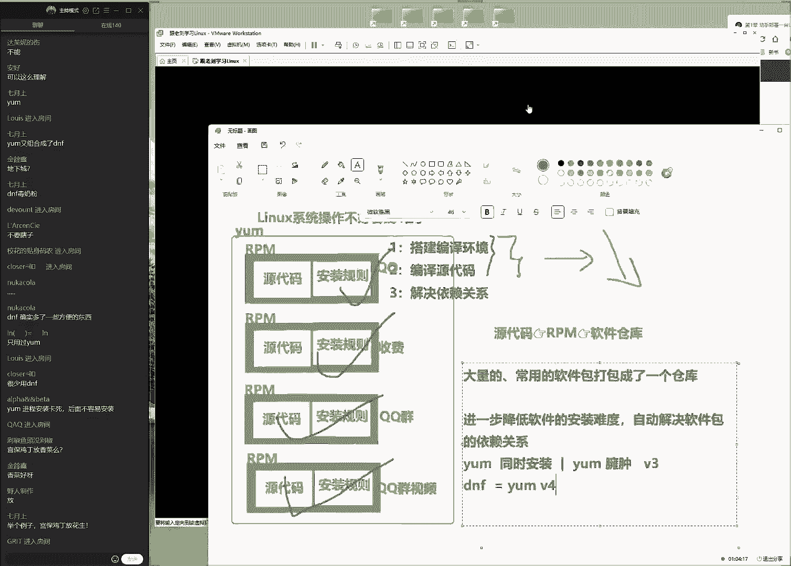
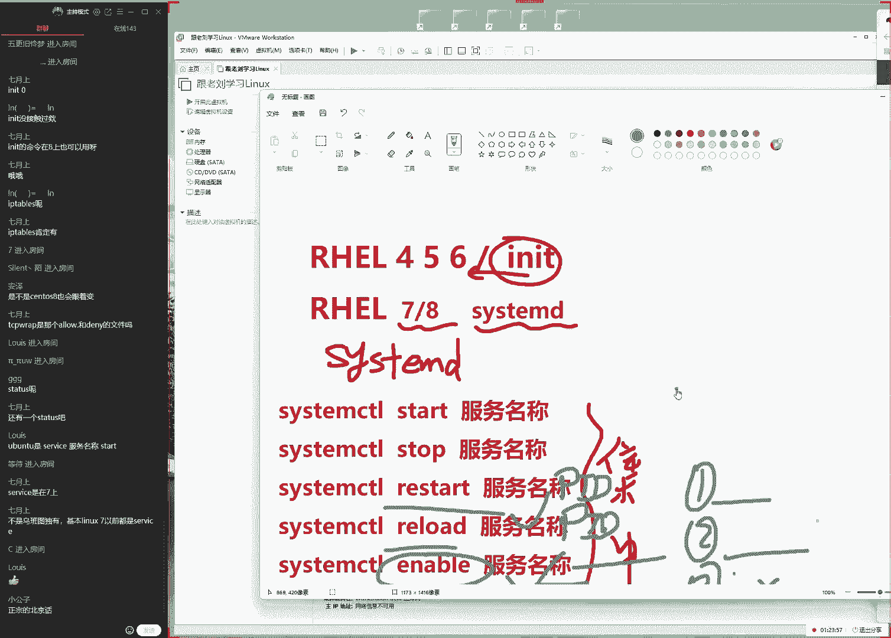
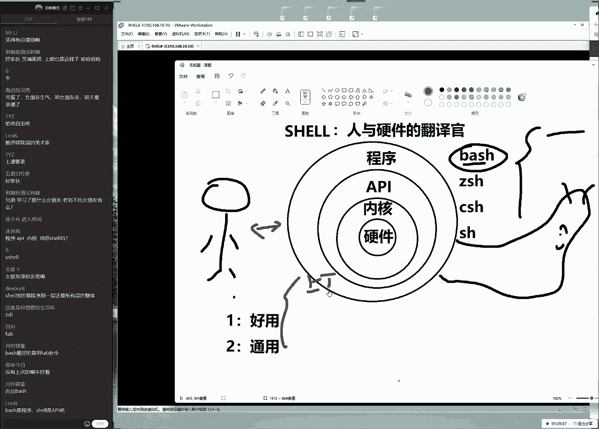
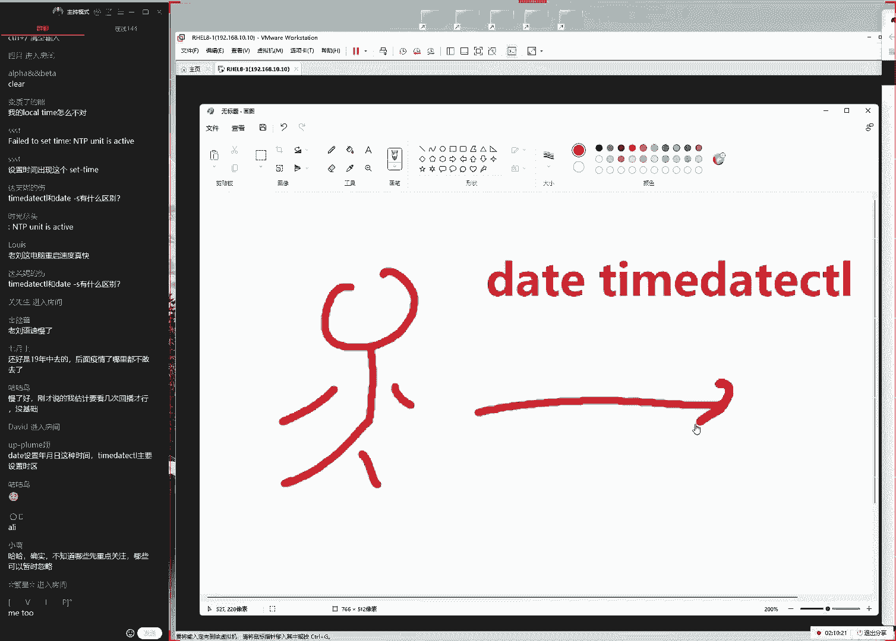
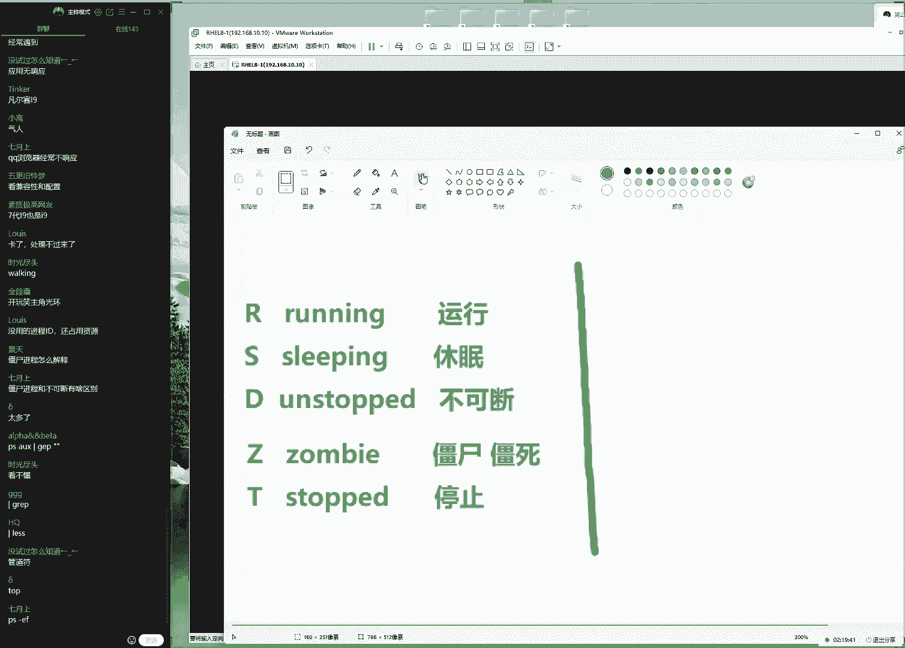
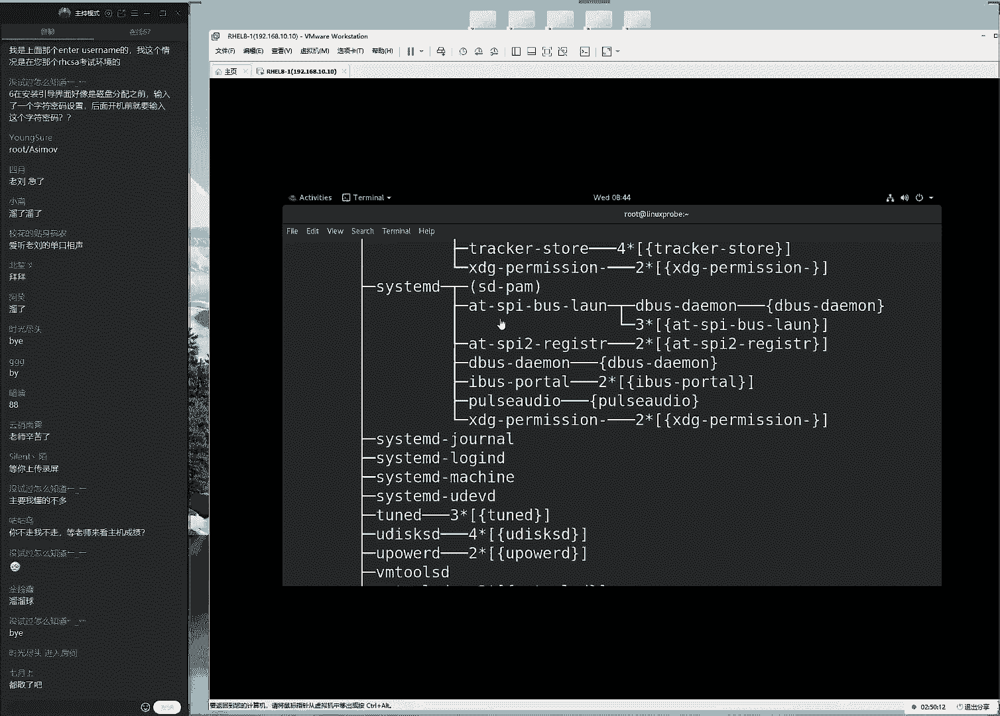

# linux就该这么学第34期 - P2：2【第34期第二节课】红帽RHCE认证培训课程-Linux就该这么学 - 能力努力 - BV1L14y1878S

。🎼I be saying enjoy。O同学，我们来开始我们今天这个课程啊，准点开始。 ok非常好非常好啊。啊9点钟呃19点钟准时开始。好，大家先打一下一好吧，然后我们来测试一下这个上课环境。

大家如果能听到我刷话的声音啊，能够看到我们的画面的话呢，大家打一下一啊，先在对这个环境先进行一个测试嘛。然后的话咱们在这个上课过程当中的话呢，如果说出现的这个卡顿的话者我没有声音啊，这种情况的话呢。

大家我们啊一定要互动起来。然后大家要及时告诉我，然后这边的话呢，可以来去调整一下这个上课环境。O非常好。那今天的话准时上课，19点钟7点钟我们要来了。今天的话呢我们来给大家安装一下我们的las系统。

那我们大家的话呢先打开咱们的这个网站。哎，这咱们的网站啊，大家先打开，因为这个的话也是很多我们资源需要去下载的一个平台。好，我们先在打开它。另外我看今天这个迟到人数啊不多啊，非常好。

那我们来打开咱们的网站，咱们的这个晚班嘛，有点犯困啊，所以的话呢这。😊。

一定要互动起来。来，大家先打开咱们的网站3W点linuxpro点com，咱们这个斗志要瞬间就要起来了。要不然的话这2小时有点呃会有点痛苦了。那么打开咱们的这个网站。

这个时候的话呢我们点击一下下载随说配套工具。这面的话呢我们来去下载一下我们的虚拟机以及红帽这个re8的这个操作系统，那么这边的话这个验证码，那我给大家去说一下啊，验证码的话呢是585141啊。

因为我们现在这个支那么我们因为昨天加人特别的多。好呢这个微信现在还加不上。那我们就直接给大家去说一下了。验证码的话呢就是那个585141大家可以直接访问咱们这个网址，后面的话呢就叫做ts。

然后大家可以去下载到了大家话现在再来两个工具啊。第一个工具的话呢就是我们的虚拟机。第二呢就是我们的红猫re系统，对不对？我们讲过了叫re系统啊，红猫re8，我们去下载一下这两个工具。

然后的话呢我们来去说一下我们今天动手安装我们的lin系统的一个流程。😊，首先的话呢，我们按照这个书上面来给大家看啊，先安装了一下虚拟机，虚拟机的这个过程，我们省略掉啊，为什么呢？

因为我们对大家非常的信任。这个的话安装过程非常的简单，只需要点击下一步就可以完成，他要像安装一个软件一样那么简单啊，安装一个QQ一样简单。我们下载好虚拟机之后。

我们就来去一路选择下一步就可以把它安装好了。这样的话呢我们有了这么一个虚拟机的一个软件之后，我们来给大家讲一下，该去如何去安装我们的系统，咱们啊大家说啊我我的微信没有通过啊，昨天加的啊，很正常。

因为我昨天我的微信解封之后，大家这个所有的申请我都看不到了。包括说您现在您扫一下我的微信，您得到的这个应该是说请求繁忙嘛，因为今天整个一整天我都没有任何人加我这个是不正常的啊，反正我这边一个都没有收到。

大家可以现在去扫一下那个二维码，可以看一下它有什么样的一个提醒。好，然后的话呢我们来打开这个虚拟软件之后，哎，另外我们做一个小调查好不好？那我们做一个小调查啊，大家如果你已经安装好了这个操作系统了。

大家。😊。

打一下六可以吗？那呃大家打一下六，就是如果大家已经安装好操作系统了，那我们打一下六，然后我看看这个人数啊啊这么多是吗？那我们今天可以下课了。O开玩笑开玩笑啊，是不是同学们预习非常的到位。哎呀。

今天非常的欣慰。那我讲课压力就会小很多了，对不对？那不今今们今天话啥也不能下课的啊，但是我讲课的压力就小很多了。我记得有一期讲课的时候，大家都没有去安装，结果就会导致这一节课吧。啊，很有压力。

因为同学们我们稍微一讲快一点，就会说老师哎呀太快了，我这心机都没有下好呢，这个百度网盘嘛，真孙的，这个速度特别的慢，所以的话大家安装好之后的话呢，那我那那么我们这边就没有什么顾虑了。

就能好好给大家讲课了。接天的话大家说来实战不今天啊也来不了实战，今天的话我们主要现来去部署一下环境啊，大家说那今天搞快一点吧，不行啊，因为的话呢我们会有同学系统没有安装好，所以我们按部就班不能快啊。

一步一步稳扎稳打，大家的话。😊，安装好了这个系统了，那就耐心听完。那我们安好这个虚拟机之后啊，虚拟机的安装的过程，我们把它省略掉。因为这个太简单了啊，那那我们把它省略掉。那我们进入到这个呃环境之。

那啊那我们进到这个界面之后的话呢，我们现在需要先去模拟一个虚拟机的一个硬件平台。好，我们现在的话呢需要先新建一个虚拟机的一个硬件平台，我们点击一下这个创建新的虚拟机，这个时候是干嘛呢？

这个时候大家一起说出来，它是不是去安装系统呢？它并不是去安装我们的lins的系统，它需要先做第一步是不是干嘛呢？先去买一个硬件，等于说部署一个或者说叫做设置，或者叫做虚拟出一个什么呢？硬件平台啊。

硬件平台。😊，这样的话呢，待会我们可以在里面再去安装我们的这个操作系统了。来先虚拟出来一个硬件的一个平台。第二步的话呢才去安装我们的linins一个系统。两步走嘛千万不要着急啊。来第一步第二步第一步。

第二步第一步好，我们先来去选择一下呃高级安装自定义，这样的话呢，我们可以对于这个虚拟机进行一个充分的自由的一个配置。这样的话呢呃那我们可以学习更多嘛。

那我们选择这个呃那那呃所以话我那我们需要选择一下下面的啊选择高级模式。这样的话呢这个选项跟参数也会更多一点。选择一下下一步，这边的话呢我们有一个硬件的一个兼容性。

那么由于是我那么话呢我们现在是一个呃第一台虚拟机。所以的话呢那我们选择一个呃最高版本就可以了。因为它不需要考虑到兼容性的这个问题。选择一下下一步，那么大家需要注意一下，就是此时此刻啊此情此景。

就是我们现在的话呢必须要去选择稍后安装操作系统。那么为什么呢？因为如果说你选择到我那我们的这个呃呃呃那我。😊，啊那我们啊如果说您此时你选中了我们的系统的这个光盘的话呢。

它会一种叫做默认的最小化的一个安装形式来去安装这个操作系统。最后的话呢会给我们这个实验平台的话呢，怎么样呢？它是不一样的。所以啊它是啊就是我们这个实验环境吧，它两个是不一样的。所以的话呢。

我们现在此时您必须要去选择这个稍后安装，等于说我们对它进行一个充分的一个自定义的一个安装的一个过程。这个大家需要注意一下。那么我们再给大家强调一下，就是如果说您待会儿安装出来这个操作系统。

因为我们按照经验上来讲啊，我们虽然这么强调，待是同学们还是有同学会呃选错。所以我们要给大家再再去强调一下，如果说您待会儿安装出来这个操作系统，它是一个黑屏。😊，然后的话呢让我们去输入啊文字的一个界面。

那么这个时候就证明您这张啊，那么您这个选项您是选错了。所以的话呢那我们需要选择啊这里选择稍后安装操作系统。大家可能会问了，说老师有必要这么强调这个选项吗啊是有必要的。好，那我们选择一下下一步。

因为我们待会就因为我待会就同学去问说老师为什么我安装出来这个环境跟你不一样呢啊，差就差在这儿了，那我们选择这个稍后安装，等于说我们可以对它进行一个充分的一个自定义的一个过程特别的好。

然后接下来我们再来接下来我们选择一下这个虚拟机啊，las红 red8版本64位，就是选择我们现在所学习的这个操作系统红re8，另外是这样的啊，大家现在提的这些问题都都很不重要啊。

所以的话呢那我们先给大家讲课啊。然后我们待会的话呢应该也是讲个三五十分钟就休息一下。到时候我们休息的时候会给大家同意回答一下问题的。所以的话呢如果说您现在提的这个问题。

那么我没明啊那么如果说你现在提的这个，那么您。😊，现在提的这个问题没有被啊回答好的话呢，那么您可以稍后啊再去发一遍就好了。我们基本上每三五十分钟吧，我们来给大家进行一个统一的一个答疑啊。

我们选择一下下一步。然后的话这边的话呢，还要给这个虚拟机取一个名字，这就无所谓了。比如说我那我就会写着跟老刘学习lin第一节课无所谓是什么？跟老刘学习lins第一节课好。

那我们就这么去写那我们为这个虚拟机取一个名字，这样的话呢好处就是当以后有多台虚拟机的时候，是不是一起说出来，我们呢那我们就知道每台虚拟机的一个作用了。哎。

那么就这样的这样的话呢我们选择一下虚拟机所对应的一个安装的一个路径，然后我们选择随便就到D盘嘛因为的话呢那我安装到D盘。因为D盘的话呢，它的这个容量比较大一点。

那么大家去选择一个容量比较大一点磁盘就好了。这也那这个我们安装路径是无所谓的。所以的话那我们去新建创一个目录，比如说我们给他叫什么呢？叫做。😊，临时虚拟机，好吧好吧，那我随便取一个目录，待会儿的话呢。

虚拟机的这个软件啊，系统就会被安装到这个目录里面选择一下确定。然后再来吗啊去选择一下下一步啊，大家说为什么叫老刘，我也不知道为什么，就是我们从一开始大家这么叫，可能是因为比较苍老吧。啊。

可能那我们选择一下这个处理器处理器的话呢，那我们每个人它都是一个的，这也没什么可说的，大家也不要啊这个对吧？因为啊那么话呢那我们这个呃处理器的个数，一般情况下它都是一个。

因为我们这个家用的电脑CPU就一个。那我们这个是很正常的。但是话呢这个核心数是那啊呃这我们需要去选择一个您对应的那比如说我们现在可以打开您的这个任务管理器，然后的话呢，我们选择一下性能。

然后我们再去呃在里面查看一下这个的话那我可以看到了，当前的话呢啊这个呃话，那我们这个核心数是24，那我就选择一下24就好了。这样的话呢，那我们能够把这个CPU的性能发挥到更好。那么我是2。😊，同学们。

你们可以去选择一个自己所对应的那要师我不知道是多少啊，那我要是不知道是多少怎么办呢？那么没关系，我们有两个方法。第一个下载一个呃软件叫什么呢？叫鲁大师哎，叫鲁大师，您可以去下载一下。

或者的话呢叫驱动精灵。我们们记得好有这么一个工具，您去看一下这边话那也能够看得到的。就是我们有几个方法。第一个的话呢就是通过这个任务管理器，你就像我一样去看一下就可以了。第二步的话呢下一些软件啊。

它也可以看得到的。第三步是什么呢？第三步就是您百度一下，您百度搜索一下你电脑的型号。比如说我的电脑啊，我电脑是多少呢？我的电脑是旺旺反正就是我去搜一下我电脑的这个型号，或者我搜一下我这个CPU这个型号。

或者说我搜一下我主板的这个型号，我可以去找到它啊，这第第三个方法，第一个四个方法的话呢，就是干脆就选择一就好了。因为的话呢数量越多，等于说那那我们去选择这个核心数的话呢，他们就可以让这个性能发挥的更。

😊，好，但是选一对于我们这个后续这个实验的话呢，没有直接影响。所以我们这几个原则，大家可以去根据自己的这个情况，知道就选不知道就不选。那老师好麻烦呀。那我们到底选不选呢？您就随便去选。比如说你选32。

他会给我们提醒呢，选错了会有提醒，所以我们看到32会有报错去去选一下24CPU的这个那我们去选择一个啊它里面所对的这么一个信息，能够把CPU这个性能发挥到更好。呃。

换句话我们来说就是大就是我们待会不会卡啊，它主要就是待会我们操作的时候尽量不要卡的一个问题。然后我们现在这个内存的话呢，先做一个小调查啊，同学们呃，大家现在你们的物理机的笔记本。

或者说你们的电脑但内存是多大呢？啊，同学们大家去可以互动一下啊，因为每一期同学们的硬件的环境是不一样的。同学们来大家说选一会不会有点卡卡呀，不会的。因为你们做一些实验说咱就咱就说句实在话。

你们选什么配置都不会卡。因为现在。😊，要求特别的低啊。同学们说啊，现在电脑的话呢是16个GBOK可以好，那我们给大家有一个原则。就是如果说您物理的内存特别的小的话，还有同学打多少啊，32G内存啊。

我记得还有一个同学上一期啊，非常的凡尔大，特别气人啊500啊，我记得好像上一期有同学说它内存好像是300还是4吧还是呃多啊好吧反而换我们这个呃说啊特别大。那话这也没有关系，就是您的这个内存的话呢。

这个呃内存值如果说您特别小，比如说你小于了呃4个GB的话呢，那您就可以为虚拟机里面分别的稍微小一点。哎，那么如果说您的这个内存的话呢，只要大于了4个GB的话呢。

我们一律我们一律把这个内存设置为2个GB好吧，大家能理解就是我虽然呢我的内存也很大，我内存的话呢，应该不出意外的话啊，我看一下我内存的话呢也是64个GB也还行，对吧？反正够用了。但是我依然把它选择是。

😊，啊，怎么样啊，2048因为2048兆那，那么他就有是他啊他就是呃够用了。好，我们选择一下下一步。接下话来那那呃那么接下来我们是网络模式，这个网络模式的话呢，后续会给大家来去细聊。

其实我们不太喜欢有些国内的书籍。第一节课就给大家讲什么对于磁盘的分区各式化怪载，然后去设置网络什么地址什么的？说实话，第一节课大家其实我们昨天不算开盘仪式，对吧？就是我们啊其实昨天它仅仅是一个开盘仪式。

今年我们才是刚刚开始去学习第一节课我们希望大家能够把知识学懂，而不是说只是按照我们的操作点出同样的效果，大家能够听大家是能够业务所说的意思。因此的话呢，我们现在统一先不讲，先去选择为金主机模式。

至于说为什么这么去选，以及他能够干什么事，我们不管第八章的时候会给大家去细聊第八章节啊，我们去细聊它啊，比现的话呢，我们去简单去讲一下，要一笔带过要好很多。接样的话呢我们选择一下我们的。😊。

这个scar的这个控制器，这无所谓，我们选择一下默认就可以了。它属于是我们这个链接类型。这样的话呢我们选择一下磁盘类型。这边我们需要去选。那么话呢我们这边可以有两个选择scar或者s无所谓。

这两个话大家可以去随便去选择，但是不要去选择虚拟机的NVME这样的话呢会跟我们第六章节里面所对应的一个名称不太一样。所以的话呢我们给大家一个原则性来说，就是如果说您是第一次听课。

那么此时你选择一个呃这两个其中的一个。然后呢那么啊如果说呃您是第二次或者第三次以后我来听课的话呢，您可以再随便去选。因为它涉及到到第六章里面的一些呃的一些呃名称命名的一些规则。

所以的话呢如果说我们那我们现在啊选的是不一样的话呢，会导致第六章的时候，它这个学习是有一些出入的。好，我们选择下下一步。然后去选择一下我们那我们现在去新建一个磁盘选择下一步。

他说的话呢是说将我们的这个所有的这个空间是否立即分配，这个不用去选。还有说那。😊，那我们这个虚拟机的这个系统会频繁的在多个电脑之间来进行一个切换啊，那么啊那么我们就可以选择。

那啊那啊那我们就可以选择下面那个。但是呃如果说我那我们呃那我们先把它呃呃装好之后的话呢呃并不会来去频繁来去切换这个系统的话，那那我们则选择上面那个其实这两个的话呢，对于大家使用来讲没有任何的关系。

所以这几个选项大家随便去个，可以看一下具体的这个介绍。但是大家使用起来没有任何的影响。对于我们的实验的话呢，呃或者我们去选择两个，大家可以安装出来两个系统，您去选择这两个选项，您是感觉不到任何差距的。

我们所说任何那就是它指的是呃没有任何的差距。那我们选择一下下一步再下来的话呢就是说我们这个磁盘的名称，这也无所谓，我们选择一下下一步，也就是说我们现在给大家一笔带过的啊。

主要就是说因为这些对于我们的这个学习系统来讲没有什么太大关系的，这也是我们后期呃要给大家去呃去去讲解的一些知识。所以我们。😊，给大家去跳一下，选择一下完成。

这样的话呢我们就做完了我们的这个第一步啊来呃出在一个硬件环境了。第二步的话呢，我们来再去编辑一下这个讯机的环境。再简单的来去进行一个检查，看它都对不对的。首先来说看一下内存2个GB对不对？对了O啊。

话我们这个处理器和其输没问题，硬盘20个GB啊，高高的够用了CD和DVD选择一下我们的光盘啊，就是选择一下系统镜像大家会问说这哪里去下载呢啊，大家可以啊如果迟到的话啊。

看一下我们点击一下咱们网站里面有一个下载，选择随书配套工具，我们来选择一下下一步好，大家问了一个问题，特别好，我这个叫做剁胶鱼头没剁胶，那吃个啥同学提一个问题非常好。我们待会给大家去说啊。

我们能不能去使用一个云主机来去做们来去做咱们这个实验啊，每个月310块钱，那不香吗？啊，说实话不太香啊，我们来给大家伙去说一下原因。然后来看一下啊，下载这个软件的话。😊，两个。第一的话是虚拟机。

它能够让我们一个物理机上面模拟出来多个系统。来，于是的话呢我们就可以用同一个电脑去做很多个实验了。下面第二的话呢指的是我们这个linux的这个系统红猫re8系统。这也是我们所学习的红猫re8。好。

那我们来下载好之后下载好这个镜像之后啊。对了，这个验证码是多少呢？是585141大家去下载一下O我们来下载好了之后去选择一下这个镜像文件，选择一下浏览选择一下啊，这儿啊选择一下这个镜像文件，镜像文件。

它在这儿选中它没有问题。网络模式不用管它第八章的时候给大家去细聊怎么回事，然后画U盘USB现有没有用呢？没用，把它移除声卡呢也没用，选择移除打印机有没有用呢？没用选择移除做完了显示器啊，这个还要保留的。

我们选择一下下一步确认好之后大给大家去说一个问题。大家提到了啊，杜椒通同学啊就提到了说那我们能不能买一个云主机去做这。😊，这个实验呢，我们的答案的话呢是不能不是说呃虚拟它并不是说云服务器卡。

是因为云服务器上面有些实验你做不了。比如说有些服务我们遇到的，比如说DHCP对吧？或者的话呢我们配置一个域名解析服务DNS再或者的话呢我们去您部署一个远程磁盘存储S这些实验您做不了啊，就是在虚拟机里面。

我就是呃有软件的这个供应商，它就没有办法去实现出来。那么我们即便能够实现的话呢，比如说像桑巴这样的这个服务，或者我们的网络文件共享服务NFS提个问题，大家怎么去测试呢？测试不了的。在这种服务的话。

那我们的要求必须是在我们的本地去做这个实验。然后我们才能看到效果呀。那那我们如果要是买它云服务器的话呢，这些实验即便能够配置出来。但是您看不到效果，链接是失败的，它是连接失败的，这看不到效果的。

所以我们有一个原文上来说，就是不论有没有条件，同学们。😊，都去选择通过本地的形式来去模拟出来这个虚拟机的这个硬啊虚拟机的这么一个系统出来，不要买云服务器，这个会有问题的。这个我们也试过。

当时不要说10块钱了，我们当时买了好几台阿里云的云服务器提供给我们的序员会发现那个排错的时间要比配置服务的时间要更长。所以同学们啊有这么一个事情。选择一下点击开启此虚拟机来去安装一下我们这个操作系统。

当我们看到这个界面的时候，基本上也就是说我们的硬件平台就已经是创建成功了。下面的话呢我们就要来进行一次安装了。先通过这个方向键啊，大家说我们去选择三从S也行，不行。同学们因为的话呢这个三从啊。

这个待给大家去说吧，我们先来给大家去说一下我们这个操作系统呃。😊。

有这么一个事儿啊，我们需要先给大家就是说呃，因为咱们的话同学们提问比较的快一点，然后的话所有的回答的话也会稍微的快一点，就是有一个原则性的一个事情。😊，如果说您是第一次听课同学啊，第一次听课同学呃。

尽可能的保持跟我一样的环境，并不让大家去傻学，是让大家呃如果保持一致的话呢，好排错。因为如果说您的实验环境也不一样。这个系统也不一样。最后第一节课听课就到就是老出错。但是我们因为第一次去学习。

大家在其他的行业做的非常的好，这我们能够理解。但是他既然进入到了一个新系统，老包错，打击我们的这个呃那么就打击我我们的啊自信心。于是的话呢，就有可能会呃觉得非常的这个呃沮丧。

所以的话呢我们第一次听课同学尽量呢保持我们跟呃当前环境是一模一样的啊，尽量跟我们的环境保持是一样的。这样的话呢出错之后，我们怎么样呢就能够好排错啊，我们可以知道是您的操作问题。

还是我们的这个呃系统的问题。所以这么一个问题，好排错好排错啊，这么一个问题先给大家去说清楚。但是可能说的不是很充分。我们待家有时间的话，因为这个安装系统。😊。

概需要半个小时，我们就有充分的时间跟大给大家聊这个问题。就是之前我们遇到的一些坑啊。然后我们来通过这个方向键来去选择一下。第一个选择的话呢，为安装红猫reo8系统。第二个话呢，为什么呢？

大家一起说出来测试和安装我们的红包re8系统。第三个是什么呢？tro shootinging排错模式。我们选择第一个这个时候一定要狠狠的就是一定要狠摁下我们的回车键，拿来就要12气势啊，这样的话呢啊。

这个系统就非常的呃乖巧了，对不对？然后就会顺着我们的心意了啊，大家去敲这个时候就是啊一定要信心啊，不要说哎我们今天这个选项有没有选对呢？没关系，随便去敲，因为它是虚拟机，它不会有太大破坏性能。

就像我们买了一个手机，当时我给我父母买的第一个手机就是真是不敢点。我说你究竟有什么不怕，这就这没有关系的，对吧？点坏也可以恢复的，这个也坏不了，就是软件问题，所以大家第一次去学器时候不要怕出错。

没有关系，随便去，那我们啊可以。😊。

即便去出错，因为你即便重新装一下也就十来分钟，有什么可怕的呢？对吧？来我们来选择一下系统语言，选择英语啊，这个的话呢并不是说崇洋媚外啊，这个它主要原因就是中文有时候他有因为话呢中文它有时候乱码。

第二的话呢就是工作跟考试环境里边的话，它都是英文的。我们现在选了中文，您看着舒服了。到时候考试的时候可咋整啊，到时候考试时候，它还是英文，所以的话呢先提前适应声，走出自己的舒适区，哎。

正好报了这么一个课，把英语也顺便学了，那不更好吗？对吧？那我们选择一下，continue下一步啊，咱们稍等一下啊，正好倒杯水，哎，这样还有点卡。😊，来进入到这个界面之后，选择一下呃。

我们来用一个给大家点吧。第一个的话呢是为键盘啊，这个就是英语没有问题。除了英语以外，其他键盘我还真没见过，那我们选择一下确认就说话呢我每个人的键盘都是那么话它都是一样的，系统的语言支持，英语搞告诉他了。

然后我们选择一下系统的时间，大家问了一个问题啊，大家问两个问题啊，大家问题的话已经啊大家话这个问题已经被回啊，答应是说出来了，考题有中文的，但是的话呢考试系统，那人家是英文的对吧？

考题考官都那那他它都是中文的，但是那个系统里面它是英文的，需要去输入那是命令。对，第二个问题，说老师为什么我的虚拟机里面这个系统的时间不对呢？就是因为我们没有去选人家选择美国了啊。

美国的话呢分为四个时区，然后哎怎么唉不对啊，美国分为四个时区，怎么变成5个时区了，难道是我的这个知识出现偏差了吗？因为的话我记得好像是美国的西哈山区。😊，中部东海岸，哎，怎么这边这边也是美国领土。

为什么还有第五个市区呢？看来我的知识出现偏差了啊。好，那我们来呃去选择下中文吧，那我们就不管他们了。看一下我们的中国啊，中国的话呢是不分时区的。从黑龙江到新疆它都是一个时区。

所以我们随便去选我们可以看到了啊中国地图上话那我们去选择哪里它都是上海行啊，这看来外国人对于我们中国的也不是很了解。但是话上海就能够代表的是中国的时间了。

我们选择一下确认接下我们去选择一下叫做安装的介质啊，就是光盘选择一下完成没有问题。接下来去选择一下 selection软件的安装模式，软件安装模式surface啊，叫做to图界面的一个操作系统。

大家这时候就会提问啊，因为我们第一天嘛就是。😊，同学们会对于老刘有很多不信任感，我知道大家会有的，就是说是啊这呃因为我们同学会听到我说老师。😊，我怎么听人家说学习s不应该太依赖于图形化界面呢？

你怎么上来？就这样我们按装图画界面呢？你这个是不是一个太low了呀？我们要给大家解释一下serviceUY的话呢是带有图形化界面的服务器，它有别于最小化安装为min installation对吧？

它有别于最小化安装，它的话呢这个叫做serviceI它是带有图形化界面的一个服务器系统，它不仅是带有图形化，它还有带有一些基本的工具以及命令。所以的话我们安装好了之后，我们在第二章节学习的很多命令。

它都是自带了。而我们并不会依赖于仅仅依赖于GUY图形化界面啊，这我要给大家去说到然后的话呢我们来呃然后选择一下左下角其实我们这个感觉很不爽。同学们大家看一下是不是感觉很不爽。

因为话这个呃因为啊因为我们可以看到确认按钮是在左上角，这个我感觉很不舒服。不过这个好吧点左上角好了。接下来我们选择一下。😊。

安装介质啊instlation design我们选择一下安装到哪里去。那我们可以来看一下。大家说右侧是什么。好好，这个话是个好问题。右侧指的是我们一些额外的软件包。

现在的话呢我们不需要去安因为您安了之后，后面就没有乐趣了。就是我们后续这个配置服务的话需要分两步第一步的话第一步去我们分三步，第一步安装，第二步来去部署，第三步来去测试。如果说你把它右边给勾的话呢。

安装第一步就帮我们默认完成了，没有乐趣了啊。的话我们把它保留右侧什么都不选，我们每一个都给大家去单独的纯粹去安装啊，每一个都去安啊。

那么我啊那我们把每一个都给大安一遍大家去加深一下印象来这样的话呢我们再来我们来选择一下这啊这不用去选啊，就让我们看一眼啊，就让我们看一眼而已。我们选择下确认就可以了合着来说它不让我们配置了。

它不是需要配置的，就让我们看一眼，看完了可以了啊，其实大家看完这个之后发现安装系统。😊。

的话呢并没有那么难啊，我们选择一下下K down这个的话呢是它用来去收集系统里边内核的报错信息。当我们系统内核崩溃之后，我们可以通过这个报错信息的话呢啊查看日志信息，然后来进行排送当我们给大家提个问题。

我们现在需要吗？我们现在不需要，于是把它给取消掉。它会节省160兆的存储空间啊，不它会节省160兆的内存空间，当我们需要的时候的话呢，再把它给挨上，当前不需要先把它给省下来啊，就像我们这个啊内存一样啊。

那我们先把它省下来，省一点总是好的，我们选择一下完成，接下来网络模式点一下它看一看啊，说启用网卡吗，随便啊，这个大家启用不启用。我第八章节都会给大家讲明白的，讲的特别透。

所以的话呢您现在启不启都没有关系，要想启就点一下它，它它就起来了。然后的话我们来看一下这个主机名称啊，主机名称，主机名称可以随便去写，我们就于我们的网址的。😊，pb点comM。来设置一下我们的主机名称。

来，我们点开应用。这样好了啊。这个的话呢大家这个主机名称的话呢，尽量的话也跟我们保持一致。因为我们后面的话第十三章节，第十六五章节都需要用到主机名称。那我们现在的话呢，如果说您跟我不一样的话呢，也可以。

但是您一定要记住了第十三章和第十5章节的时候，您要同步也要再多做一步啊，这样的一个呃修改操作。那我们建议大家如果第一次去听的话，正好跟我改成一样就可以了。没有反正也没什么太大问题。选择一下下一步。

那选择一下下一步。好，大家来个啊，大家问了一个问题，说这边的话呢不是可以选择啊定制安装分区吗？好，这个问题的话呢，我们现在给大家去说一下。😊。

为什么啊大家会问老师啊大家会啊大家会问一个问题，说老师为什么其他的小朋友们的书里面啊，为什么我们其他小朋友们他在去学习的时候，那人家第一节课老师都会给他们去讲分区格式化画载，起码要分几个区吧。

第一根目录。第二的话呢不存目录。第三的话呢交合分区我怎么看其他小朋友们都这么去学的，你怎么不讲呢？因为的话呢我因为我们认为第一节课啊SWAP因为我们认为第一节课如果我们分区的话呢，不讲它的作用。

大家充其量也只能是点鼠标，然后点住图样的效果。比如说我们现在提一个问题，这个是个啥啊，SWAP好像美国特种一样这么一个名字啊，这个我们需要给大家深入去讲解一下。比如说我们这个呃目录的话呢。

根据我们的FHS协议所定义的是什么样的一个作用。那么话根据我们的UDV服务，它每个服务的一个啊文件名称的一个作用。这个的话呢我们会放到第六章节给大家去说这这个我们第一节课啊就大家说的。😊。

么一遍就是呃我们的话呢会把一些这个知识的话呢，我们会给大家放到后面的这个章节分为两个章节，六跟七小节，进行行一个充分的讲解。而我们不会在第一节课的时候呃，只是单纯的要求大家点出了同样的效果。

而缺乏了理解。所以的话呢我们也希望大家既能够一点我们的系统也能够去相信我们对于这个课程的一个规划。所以您之前看过的一些书没关系，啊，有基术更好，但是我们现在确实不讲。那我们第六章节第七小节。

我们总共要讲三天，就是我们对于这个分区格式化挂载，对于系统的这个学习，那我我们要学习三天，总比现在点点鼠标，那我们要讲的更加深入，所以这是我们的课程的一个规划，也是我们自信的一点。

我们觉得就讲的就是啊规划很合理。接下的话呢我们叫做security policy安全政策，这也不用管啊，这个也不用去设置。因为第五章和呃第五章节，我们的文件系统的权限。

然后我们的用户的身份文件的这个学天设置。😊。

还有话第九章节，我们的IClinux的设置。这个我们会在后面给大家去讲，这个先不管它啊，因为这有点难啊，这有点啊复杂。还有的话就是我们这个系统的一个目的啊，purpose无所谓，这个我们选择没有被定义。

不要去选择一个类型，为什么呢？因为您去选了之后就会让系统的话呢，内置安装好了很多个软件，我们不要将它去安装，我们全端去选择没有被定制，这样的话呢啊我们就可以自己充分的来去定制我们这些材操作系统了。

来我们接下来的话呢，我们再来选择一下这个开始安装啊，接来选择一下开始安装。再来的话呢我们来去选择一下这个设置关联的密码。大家问了一个问题啊，不是大家说说前期讲的太深不好，不前期不是讲的太深。

前期是让大家呃只是单纯的要求大家点出同样的效果来是没有意义的啊，来我们来就是我们输入的是一个理解的一个过程。大家看，其实我们这本书可能。😊，更多让大家背的不多，但是您需要去理解跟听的东西挺呃其实挺多的。

呃，然后我们选择一下这个设置关联的密码，设置关联密码。然后我们密码的话呢就随便了，大家总会说老师。😊，我看人家说说密码一定要复杂，得超过12位，而且还要大啊啊啊啊这个里面的话呢还要包括很多很多这个信息。

其实没有什么必要的。我们第一台啊，因为这是第一，它是一台虚拟机，第二的话呢，它也没有联网，对吧？也没有人去入侵我们的，所以密码怎么简单怎么来，您怎么打顺手怎么来。比如说我的手有反正我手挺大的，反正。😊。

我的手以前啊呃有人说看过可以学习弹钢琴。我上小学的时候啊，后来的话呢没有想到去弹键盘了，反正我手挺大的。所以的话呢我的手正好能把键盘给它覆盖住，所以我就可以随便去打了那把密码设成d设置一下d红。

如果说您的手可能是一个女生好了，您就给他123456好，同学们123456来摁一下回车。然后我们来摁一下回车之后的话呢，来去说是否来去设置一个普通用户来那么串出来一个普通用户，普通用户名称lin啊。

这个话呢也是同样的道理。我们第五章的时候需要去使用到这个普通用户。如果说您此时那老师我就不喜欢这个名字我就不就不就不。没关系，您这边可以改，您改成张三或者是改成李四都行。但是您一定要注意了。

就是第五章节的时候，我们去看这个用户以及去编辑这个用户这个权限信息的时候，请记住了，您此时修改过，请第五章做这个验。😊，时候把名称替换成您所设置的那个。好同学们好，我们来呃rad hat。

然后是rad hat密码就是为红帽啊，就摁一下回车。呃，它的话呢安装的过程很快，但是我们依然是啊心存愧疚，我们不给大家耽误时间，他安的快是他的事，我们往后面也给大家去讲着大家翻开书1。4小节。

做好笔记之后，记得每天晚上拍张照片，这样的话发到自己的这个博客里面做签到。我们最后一天会给大家送那个签名的书籍呢。来，我们先来去安装着啊，先来去安装着安装着，我们来一。4小节。呃，这边的话呢在安装着。

我们不耽误时间，我们来给大家讲一个理论知识啊，这个有大概还有个两分钟啊，给大家讲一理论知识。😊。

稍等啊，半个多小时了，先喝口水。反正一个老师嘛，反正我们一个评判的标准就是如果说你看一个运动员，对吧？他的话呢其实。你可以很好看到他的这个能力。但是如果一个老师你怎么评判他有没有好好讲呢？

有没有拼命去讲呢？或者说他这个水平如何呢？一般情况下啊，比如说有一辆车啊，车的话呢，省油就是百公里，比如说8个油，哎，这车挺省的6个油哇，你这个更省了，一个老师好不好，你就看他喝几杯水。

如果说他如果他啊两他呃他话他每个小时喝水不超过三杯，说明他真的是没好好讲，没有拼命的去啊去去讲出来啊，反正我们基本上每个小时两杯水嘛，正好可以休息一下。来我们说到一点，然后开要开始追一个理论知识啥啊。

这边还在装着啊，这边还在装着，我们正在等他呢。然后我们来去说一下我们这个有一个事情。就是我们最开始的时候19同学们一起说出来198啊1970年的时候，当时的话呢每次冷站，当时有一个系统un对吧？不对啊。

当时把我们这个开学系统的这个。😊。

出现啊，当时的话是unix，后来的话呢是呃1991年的时候，对吧？它有了一个linux的一个系统了。1994年的时候这个小啊这话这个小富二代现在的话呢它是一个哎老他他已经是一个呃老太阳实力啊这个话呢是红帽啊。

他已经是一个非常老牌的一个系统了。他发布了一个红帽这么一个企业版系统大家呃之前的话会听说过说学习linux的时候哎，1973是吗？哎呀，我记错了啊，这是我这个话确实不太严谨啊，19731973啊。

咱们讲话特别严谨啊，太这个啊差三年的啊，来是我的问题，1973年哎呀，好，继续啊机器机器非常好。然后基于这个时间的话是有些争议的啊，因为这个话公司是1993年被收购的，反正这个时间也差不了哎O啊。

然后来你说一下，就是说大家应该也提呃以前我们听过一句话。😊，是这个话怎么说呢？说linux系统特别难学，这个话呢不是我们的授前的学员顾问说的，因为我们学员顾问一定不会这么说，一定会说这个系统好学。

这样的话大家才会报班去学。但是话呢我们坦白讲，linux操作系统的话呢，它很难操作，它不好操作啊，对吧？它很难学。大家有没有同学们会听到呃会啊难学，它为什么呢？

因为啊在上个世纪70年代刚刚开始有这么一个系统之后的话呢，包括说1991年的时候，当时要想在里面去安装出来一个软件是一个特别麻烦的事情。因为开业软件嘛是开放源代码，对吧？

它就是需要我们在一起来说我们是不是要在我们的本地去部署出来一个编译的环境。然后的话怎么样呢？通过编译源代码的方法来去安装一个软件呢？也就是说我们的系统会提供源代码，接下来一起说啊。

然后的话那我们需要在我们的本地做两步操作，一去搭建我们的编。😊，环境。第二步的话呢来编译原代码，我们来给大家讲好，3解决依赖关系。特别的麻烦啊。

也就是说我们之前要想在我们这个性当中去安装上一个软件的话呢，是一个特别的麻烦的事情。也就是说我们的右边的三项啊，后面的三个事实导致了我们安装系统特别的麻烦。那换了啊于是就有了一个技术。这个技术的话呢。

它就解决的一个问题，就是我们的编译的一个规则问题。那我们能不能把我们这个呃编译的环境。😊，以及源代码我们给它打包到一起呢。这个大家此时大家可能想啊，您认为是容器，不是容器。

这个技术叫做red hat package manager啊，我们去解决前面两项。大家看啊，右边是总共是有三个问题。我们解决前两个问题。这时候怎么办呢？它是将我们的这个程序的源代码加上一套什么呢？啊。

安装规则。它将一套安装规则与源代码打包到一起。然后的话呢这就形成了一个新的软件包，这个叫做RPM全称re hat package manager中文叫做红网软件包管理器。好，我们来给大家写下来。

那么于是将这两个软件包啊，将这两个信息打包过后就成了一个RPM它就是说当用户去啊双击去安装这个软件的时候的话呢。

可以根据里面的这个内置规则来自动来去安装上这个软件有点类似于是一个压缩包或者一个EX的一个软件包的一个安装形式啊，大家能够理解是这。😊，个意思这个话有点是有他啊他他啊他话他有点相似的。

他去降低了软件的难度。也就是说他通过去解决了我们的编译的这个环境以及规则的问题。它去怎么样呢？目的是什么呢？目的是降低了软件的安装难度，降低了软件的安装难度啊，它是降低了。

但是的话呢我们现在还有一个问题，当如果说我们的这个系统啊，当我们现在这个操作系统呃，不我们正在去啊上这个课。那么这个课的话呢，使用的这个软件叫做QQ群视频功能，那么也叫QQ课堂。

那么也就是说它需要怎么样呢？我们需要先安装一个QQ的主程序，再安装一个QQ的这个收费的插件。因为现在的话如果他是不入会员的话，它每两他每个小时只能播俩小时啊，他每他每天只能播两个小时。

所以的话呢我们就需要有这么很多软件包。这样的话呢，比如说这个软件包，它是QQ的这个主程序。这个的话呢，它是这个QQ会员收费的这个功能。第三个的话，它是QQ群的这个。😊。

功能但话第四个的话呢就是QQ群视频的这个功能。好，那我们现在如果要想去使用这个QQ群视频，我们就需要安装上这几个软件，然后才能去使用，那么现在好了，我们先装哪个后装哪个呢？而且我怎么能够去找到他们呢。

特别的麻烦，对吧？那比如说我先装它那肯定是失败的。或者我们先给大家提一个问题，如果没有QQ啊，如果没有我们的QQ的这个主程序，我们能不能去使用这个QQ群视频呢？于是大家就会知道啊，肯定是不可以。

这肯定不可以，对吧？官有QQ啊官有QQ群视频没有QQ那你肯定打不开。那光有这个QQ主程序没有群视频，那那么它也那么啊那么话它也打不开。所以的话呢我们是这样的，我们将大量的常用的RPM软件包的话呢。

打包成一个集合，于是由这个源代码变成了RPM又把大量的RPM的话呢，合并了变成了一个叫做软件包啊，叫做软件。😊，残酷叫做ym。这又啊他又来了这么一个呃软件包的一个发展历史。

首先由源代码变源代码安装软件变成了什么呢？RPM又变成了什么呢？叫做软件包啊，叫做软件仓库。好，现在的话面我们要给大家去说两个问题。第一，用技术去解决技术问题是一个很差的讲课方法。

我们要给大家说一个生活上的一个例子。这个怎么去理解呢？这个理解比如说我我讲完课之后，我饿了，我去吃饭，我想吃什么呢？我啊我喜欢吃宫爆鸡丁儿。好，这个时候我会不会做呢？我啊我啊并不会做，但没有关系。

我去了饭馆里边了。然后我跟厨师说，我说我要吃宫爆鸡丁儿怎么做，我不管。于是只要他有食材情况下啊，厨师第一步的话呢？啊，宫爆鸡丁，我想一想啊，好这个好这个话好久没有吃了。好，第一步先起锅放油炸花生米。

第二步放鸡丁儿。第三步啊，调味，第四步装盘。😊，也就是说我有了软件仓库之后，只需要去说出来我的需求，它就能够按照它的依赖的顺序依次的安装所需的软件。这个是它的精华。好，我再给大家重复一遍。

有的软件仓库的一个好处就是它将大量我我我需要给大家写吗？不用买的，它将大量的常用的，记住是大量的这个词一定要记住了，以及常用的这两个词并不冲突，因为大量的指的是在红猫肉8里面，它有7500个软件包。

常用的，比如说一些。呃，不常用的。比如说我们的ensible啊，其实这个也很常用。但是的话它是放到了叫做EPL里边了啊，这个我们后面给大家去说啊，那我们也就是说它将大量的常用的软件包。

或者我们叫做呃RPM的话呢。😊，打包成了一个仓库，这是它的实现形式。目的的话呢是进一步降低软件的。安装难度哎，为什么又说进一步呢？因为RPM已经降低了一次了，所以软件仓库它又进行了一次。

所以的话呢他又去进击啊，他他他又去进一步去降低软件安装的呃安装难度。通过什么呢？通过说自自动解决。😊，啊，软件包的依赖关系问题。哎，这就出来了，您这不就是一个推理的过程吗？啊，这个很有意思啊。

但是这个可能需要得害大去理解一下。好，通过一个生活上的例子来去解释了一下它啊。然后第二个问题大家说老师。😊，哎呀，我看其他的小朋友现在不用ym了，你这个课被淘汰了，人家现在怎么都用DNF呢？啊。

这个是怎么他他啊他怎么回事呢？这个是这样的，它的话呢从2019年11月份之前在红魔reot7系统的话呢，我们使用的一直都用的是ym软件仓库，它的话就安装软件。😊。

它有两个问题啊去使用ym软件包的话呢呃它是有两个问题。大家说啊DNF是毒奶粉啊，低价成为勇士啊，看来啊大家行啊大家看这个呃这块它是一个呃游戏名字啊，其实这不对的好，我们来看一下啊，ym仓库怎么回事呢？

它呀在202呃2019年11月份之前，我们一直使用的是ym软件仓库的安装勇士，它有两个问题，大家说DNF确实多了一些方便的东西。好，这块有点笼统的，我给大家去剖析一下，它多了什么呢？它解决了两个问题。

它主要解决了两个问题。第一，同时安装的问题，同时安装的问题。大家如果要是你呃大家去试过的话啊，大家会发现在同一时间。😊，在一个系统里面，只能有一个人发起一个进程去安装某个软件。在同一个系统里面。

两个人开啊去发起啊去同时去使用yM安装软件的时候，第二个人会安装失败。所以的话呢他为能够去解决呃yM软件仓库的一个安装的一个同呃呃同呃同时安装的一个问题。😊，以及啊以及第二个问题。

有些人说去使用y软件话呢，他去安装软件包的时候会安装一些不必要的东西。比如说啊大家知道这个宫爆鸡丁，对吧？就像我刚才举一个例子，宫爆鸡丁我特别不能容忍一件事情，就是里边的话呢，它会放香菜。哎。

这个就有点画蛇添足的，对不对？这也是的软件仓库你安就安了，但是的话有些人说它会安装一些并不那么必要的软件，它比较臃肿，所以的话呢就是第二个臃肿的问题。为了去解决两个问题，于是有了一个新的技术。

叫做DNF那软件仓库，这是一个新版本，但是话大家要剖析了之后，这个也是我们作为一个功课啊，咱们讲课不能张嘴白来啊，对吧？我们也做一些功课，后来发现的话呢，DNF实际上它就是套了个壳子的一模一样。

它的话呢实际上截止到2019年的11月份软啊软件仓库的话呢，它这个版本是V3啊。然后的话呢DNF的版本。😊，等同于DNF它的V4。也就是说同学们听一下我说这个，并且我说的话负责任。

我们看过他原代面以及官方介绍DNF实际上就等于的是第四版的软件仓库。因此您再去使用的时候的话呢，这两个几乎来说您感知不到差异啊，感知不到差异。接下来再来这边的话呢随着我们聊完了之后，虽然我们讲完了之后。

这边已经安好了，我们选择一下重启啊，我们充分的利用们上课这每分每秒时，大家问了一个问题，大家说公贸基地里边放香菜吗？啊，这个问题千万不要讨论。

因为就像说这个南啊说的话这个啊南方跟北方喝豆腐脑这个放糖还是放在个什么似的啊，这个千万不要讨论一讨论有可能被骂起来大家非常生气啊，公贸基地应该放什么啊，这个话呢事关于我们的南北方这个差异问题了啊。

来我们来继续来，我们点一下这个接受许可。这个是什么意思呢？😊。

就说红帽啊，人家这个系统的话呢有一些小脾气说什么呢？我们看一下，其实这个我们就快一点啊，大概10秒钟就过完了。他说的话呢，红帽公司啊这个商标re以及的话呢，有一叫影子人这么一个呃图片的话呢，是受保护的。

你不能随便去用啊，你要做宣传的话呢，不能这么去使。第二话呢你要安装了一些啊第三方的一些软件的话呢，软件出现的问题啊，不这也是他说红帽公司这个商标以及红帽公司这影子人的话呢，归美国红帽公司所有。

你不能随边去用。你要通过这个盈利的话呢，呃红帽会很不高兴的，他会呃会有一些法律的一些风险。他说的话还有一些限制的一些说明，如果说我们安装了一些第三方的软件，或者我们这个呃安装了一些自己的一些软件的话呢。

导致这个损坏或者系统的这个崩溃或者业务的这个损失的话呢，红帽公司概不负责，人家不管那这个所有损失由你自己承担。最后的话呢还有就是说我们的话呢要去遵守当地的这个法律以及美国的法。😊。

律你两个国家的法律你都不能冲突，你要是冲突的话呢，你冲那也就冲突了。但是跟红帽公司无关。总之撇清了一切一切一切的这么一个关系。然后的话还有人说如果说你是在古巴伊朗啊，叙利亚吧。

还有说朝鲜苏丹和叙利亚啊这么啊那么这么几个呃国家的话呢，你有为于美国的法律，你也不能去用，好像是这么一个说法。不过没关系啊，也就是说看完了吗？看完了好，选择一下接受，如果我们不接受也用不了。

所以就是此时选择一下勾O了，选择一下完成。然后这么一句话右边就是说一个广告啊，一个广告就是叫做红帽的RHN红帽卫星网络。说呃这个小伙子啊，我看你你这也挺有钱，这个气质也很好，谷歌也惊奇花点钱吧，花点钱。

我们红帽公司帮你维护你的系统，我们帮你打补丁，我们给你最新的软件包啊，我们帮你去更新软件，我们自动帮你去做分发。😊，特别方便，您只需要付点钱就行。好了，我们要是愿意给钱，您就买他那个key啊。

买他订阅就给他钱就可以了。他就啊帮我们可以去把它给激活注册以后就可以通过红帽的RAH红帽卫星网络来去更新我们的软件了。如果说我不想要好，就就选择一下完成就可以了，选择一下确认完成。

然后大家说啊俄罗斯也被制裁了。哎，但是咱们这个系统安装的时候，就是那我看我们这个系统我们呃下载的时候，当时呃还没有这么一个事啊，所以话里面并没有提到苏联好。

然后呢我们的俄罗斯现在没有问题啊来选择一下下一步来看一下这样的这张图的话呢，我认为总结的挺好，大家需要截图吗？如果您需要截图赶紧截，我把它给删了，我就去进行下一步了啊，大家需要截赶紧截。

然后可以腾到自己的这个书上面下之后在技住博客上面叭叭一发帖啊，咔咔一发笔记，最后一节课啊里论小书籍挺好来321我调过好，是这样的啊。然后接下来给大家。😊。

说一下，这个时候的话呢，我们就进入到了这个安装的界面当中了。那我们现在需要做什么呢？大家去选择的时候，一定不要去选择这个普通用户。因为的话呢，普通用户的这个权限非常的小，我们在去做操作的时候。

我们去选择到普通用，那我们需要使用到管理员root用户。呃，我们给大家去说一下原则。因为这个大家的话，因为第一次去听这个课，也会有这个问题。说老师又不对了，为什么呢？我清其他的书里面啊。

虽然如果呃如果大家是之前没有看过一些书的话更好啊，但是我们要给大家去说一下，如果说您之前看过一些书书里面说不要去使用ro体用户登录系统，不要听他放屁，好吧，去学习的时候就去使用到管理员去登录。

因为在出去的时候，在我们尤其是在没有去呃去学习权限的这个情况下，如果说您去使用到普通用户，你有很多时间是做不成功的。而且您判断不出来，是因为您的操作原因，还是因为权限原因。😊，因此。

同学们此时此刻先统一去选择管理员root用户。然后我们后面第五章讲完了，您再去选择被普通用户也行。但是我们现在。同一为管理员啊，呃一个用户，他说啊他说不要用管理员的一个原因是什么呢？啊。

他说的原因是什么呢？因为话这个啊说呃责任越大啊，不说这个啊权力越大。说这个话呢呃责任越大。我们去使用管理员的话，有可能会造成系统的崩溃。但是主要的原因还是我们个人的操作原因，只要我们的操作没有问题。

也没毛病。好，然后们会有一些设置的，比如说我们的输入法为英语键盘没毛病啊，啊，选择下一步，他要说policy有一些隐私政策，说我们是否让他能够去获取我们的隐私政策无所谓啊，我们选择下一步。他说的话呢。

你还可以通过这些账号来去登录登录之后。😊。

啊，你就可以把你的多台系统之间的这个信息啊，cendar日历，然后话联系人document文档、photos照片来做同步了啊，于是我们看了看啊，这四个我们中国大陆还好像一个都用不了啊。

所以的话我们就选择要跳过就可以了。选择一下完成。这个时候我们就已经能够去。😊，呃，没有什么能够阻挡我们去学习我们的操作系统了啊没有什么可以去啊可以去阻挡我们去学操作系统了。

然后我们再看一下这个几个视频吧。大家会看到红包肉8为什么给了这么几个小视频呢？来简单看一下啊，34秒啊，34秒。大家说啊老刘能不能啊露脸播啊，不能老刘是卖身不卖身的啊啊，大家听这声音就可以了。

这个毕竟长得比较丑吗？但凡长得好看，你说我可能不去线下去讲课吗？但凡要长得啊那么但凡长得要是还能看，能不露脸吗？就是因为长得太丑了，所以就是大家将就一下啊，就是就是我们就只能是啊光卖身啊。

就只能是光卖艺了。好，大家看一下啊，红包这个视频有大家有什么感受，大家有什么感受吗？其实这个视频放的很莫名其妙，大家看一下啊，比如说这个视频。😊，看到了吗？很莫名其妙，一说有一个鼠标，这个鼠标的话呢。

它可以拖拽窗口可以把这个窗口怎么样呢？拖拽是放大哇，好神奇，对吧？还可以通过鼠标的左呃，左键点击还可以哇缩小的，就是你看到它这个视频时际上是很莫名其妙的。就是我们当进入到一个店里面之后。

我们第一眼看到那个东西是这个东西，这个原因呢是什么呢？红帽他想传达出来的是一个意思。因为一分多钟的一个视频，它不会他实际上他不会教给大家任何东西的。因为要是能够一分钟钟啊钟买来啊给教会的话。

那我们机构就要被饿死了，对吧？😊，他传达给大家是一个呃概念，或者说他表达呃这么一个意思啊，是说我们的红猫re8的图形化界面以及窗口化做的跟windows一样好。大家能够理解他现在所说的吗。

就是我们他所表现出来以及我所说的红猫再给大家传递一个想法，就是我们红猫re8的这个界面做的跟windows一样好了，很多windows行为你可以在红re8里面直接去用。

没有什么太多的这么一个呃不太舒服的地方。好，那我们选择一下关闭。这个时候的话呢我们就已经进入到了这个操作系统里面了。这个时候大家可以把先关上啊，我们后面还有一个理论知识给大家讲完之后。

然后我们再给大家往后面去说，来我们安好了之后啊，你就可以开始听课了。😊。

是这样的，呃，看一下我们的这个章节啊，1。5小节，它指的就是我们去安装我们这个系统之后的话呢，我们有一些命令。大家的话呢需要先去记一下呃，或者您先去看一下，有大概有个印象，我们先来给大家去说。

因为红面用得到，我们先来给大家去说一下啊，就是话呢我们在红帽的re四跟红帽re5的话呢，它这个初始化进程叫做INIT啊，这是红帽reo456。哎我刚才说不严谨了啊，现在我说话严谨了。

在红帽企业版系统当中5啊456这个三个系统的话呢，它的这个初始来进程为INIT在红帽reo啊怎么样说确实比7好看一点了。对我感觉也比7好看了啊，这话也是下的狠新了。在红帽re8里面是很有体现。

然后大家看一下啊，大家看呃在红包哎呀很气人。我这个输入法就老感觉是被人控制了一样来在红帽re7跟红帽re8里边的话呢，这个初始化进程，我们变成叫做sstem这个怎么回事。😊。

呃。什么叫这个呃我们先给大家说一下这个话叫叫叫做初始化进程。它这个名称的一个变化。初始化进程指的是什么呢？它指的是当我们把这个电脑摁下开机键了之后，它就开始去加载我们的驱动啊引导啊各种服务程序啊。

启动网卡啊这个等等这样的这个操作。最后我们看到了我们的登录界面。这个过程我们叫做初始化进程。这个话之前在红包re器之前的话呢，我们这个名称的话，大家可以看到了INT它仅仅是一个叫做初始化进程。

它仅仅是初始化进程而已。后来的话在红包re红包re8里面的话呢，变成了这个sstem啊，这有什么变化呢？说老师这个你跟我讲什么呢？变化点就是sstem它不仅仅是只作为一个初始化进程了。它还怎么样呢？

接管了很多个服务。哎，大家理解一下，如果说它只是一个初始化进程到此结束就OK了。但是的话呢，它现在不仅仅是一个初始化的一个过程了。它。😊，接管了很多个服务。对于我啊对于我们的影响来讲啊，第一来讲。

我们如果说您之前学习的比较早同学，您之前学习的命令全都无效了。这就是为什么我们会说每个大版本号的变更是一个很残酷的一个事实一个事情8。0和8。1和8。2没区别，它就没区别啊。

很小我另外啊我现在所说的没区别是说用户操作上面没区别。但是我们一旦变了从七变八变化就大了，八变九变化也想不了。这个也是了我们之前如果说您学习的这个服务当中用到service这样的命令好了。

在红8里没有了。这个是没有的。还有的话呢我们叫做chefi命令在红里的话呢，也没有了。就是我们类似于这样的命令8里面都没有了。还有我们设及到我们的呃这样的命令的话呢也是没有了。当然说啊在。😊。

我们的IIT在红8里边也可以用啊，是命令可以用，是这个命令可以用。您所说的这个使用的话，如果没有猜作的话，您应该是执行了。比如说INIT0对吧？

我们从去重启或我们去关机呃IIT1您应该去执行这样的命令命令可用，但是已经被接管了。所以的话呢您之前这些命令的话呢，呃是不能用的啊，但是这个还可以用啊，那但是它这个已经被替代了。

它被替换成了我们的IC manager这样的一个命令。好呃有带R吗啊它没有R好，是这样的呃I tables的呢，I tables啊，这个是我们一个。😊，呃，老朋友了。

这件是从我们从红猫re5开始就去使用到一个防火墙，叫I tables。我当时我就想在红猫re8里面呃，还会有I tables吗？当时我就想了一下，我觉得应该不会了吧。因为它被替换了，它也被替换了。

它的话呢被替换成了叫fire world。但是话呢我们现在看到实际上来讲，它还被保留下来了，等于说红猫re8里面同时具备了这两个防火墙管理工具，然后我们这个也算是一个变化吧。

对比于红猫re7的话有一个工具叫做tpers，那个没有了。😊，看到它也是有很大的这个变化。好，那我们接下来给大家去说，大家问到说thantoOS8也会跟着变啊。对，三to的话呢。

现在已经变成了叫做than s stream。😊，现在已经放到上游了，它已经不是跟着变了，它是先变了。这个的话我们到时候给大家去细聊吧。好，我们先来给大家去说一下，就是之前的可多命令它是没有。

它是没有了。以我现在所讲的为准，好吧，以我现在所说的为准，之前那些命令不能用了啊，是能用也不用了来我们来再给大家去说一下老师不对，在红包期里面，你说这个命令被替换了。

为什么我还是能够比如说去使用到service，然后去重启一个服务呢？为什么这个命令还能够生效呢？因为您去执行一下试一试，它会底下提示出来一条信息。他说我们将您的命令给它反转解释成了新的命令。

所以我们来给大家讲在红包红包8里面的话呢？老命令可以用，但是他会告诉你命令生效的并不是它，而是我们帮你转化了一下啊，并且我们是出于尊重，帮你转换成了这个新命令，所以我们再去学习的时候不要去写。😊。

命令了没有了嗯。啊，除非您说用的是2014年之前的这个老系统啊，2014年的这个11月份之前，红猫re6以前老系统才会用到这个命令。来我们来给大家去说一下的话呢，首先啊我们打消同学们的顾虑啊。

然后这样的话大家去学习的时候才会不有呃才才不会有顾虑。来说一下第一个啊，我们用到的话呢叫做system c tL。接下来就叫做restar啊，去重启呃，我我们来去启动star一个服务，我们写上服务名称。

这个的话呢是用来去启动一个服务的一个命令。大家不用去记，也不用去背去呃看就可以了啊，去看一眼，有个印象，这样的话呢，我们后面给大家用的时候就知道它看干嘛用就可以了。第一个是用来去启动一个服务的。

第二个去用来去停止一个服务的。第三个去重启一个服务的。😊，第四个是从新去加载一个服务的啊，然后第五个的话呢，是将一个服务加入到启用当当中，保证我们下一次的时候还依然能够随系统开机而开机。

为用户去提供服务。然后的话还有一个diable啊把一个服务从我们的开机界面当中给它啊开机系统当中给它去掉了，让他下一次的时候不要自动去启动啊，第呃叫做呃diable。😊，好，大家先记一下我们这几个命令。

呃，然后我接下来给大家给大家去说一下啊，这个命令不要去记这6个大概看一眼，有个印象就足够了。因为我们后面给大家去操作的时候，呃，会大家来去做实战的，只是说当前集中的，我们看一个有个印象就足够了。

如果说大家怕自己记不住，那我们就记在书上更好大家可会问一个问题，大家说第三条第四条哎呦不好意思啊，不好意思哎还有一个叫做这个t我居然忘了啊，脑子现在确实不好，其实不好，这是我的问题。

来啊查这个啊第七个指的是查看服务的状态。哎，查看服务的状态。好，那我们接下来给大家去说一下啊，呃大家会问一个问题，呃，大家会问两个问题吧。嗯，大家会问三个问题吧。啊第一个问题。

就是我们的restar跟reload这两个的区别什么意思呢？我们我们没有听懂呃，一个是重启一个是叫做重新加载，重启的话呢指的是将服务关闭。😊，然后去加载它的配置文件之后重新生效。

接第二个的话呢叫reload。它指的是服务并不关闭，直接去重新去加载配置文件，让它能够得以生效。也就是说，这两个的体现上来说就是都是让新的参数能够生效。但是我们有呃去使用到重启的话呢。

PID的值会发生变化。reload的话呢，它不会发生变化，这是它的一个小的区别点。第二个问题。😊，这两个名字是干嘛用过呢？一个是介入到启蒙当当啊，加入到启蒙当当中，保证我们下一次的时候还依然能够去启动。

这个意思也就是说呃，我们有一个服务，我们安好了配好了。第三步的话呢，最后我们考试的时候判分，最后是零分，这就是因为考试的时候，它是一个重启之后判卷。也就是说如果说一个服务，我们没有把它加入到启蒙项里面。

它在下一次重启之后它会失项。所以这个大家需要注意，我给大家举一个小例子吧，我上初中的时候，嗯，我们要用一个生活上一个例子来去解释一个技术的一个例子。否则用技术去解决去来去解释技术就会越来越难受。

来给大家想一想。😊，我爱上初中的时候，是在这个北京市啊崇文区啊十一中分校。上了这个初中，但是大家也知道我住的特别的远，住在这个啊潘家园。呃，我每天的话呢早上起来需要坐34路到36路才能够到我们这个学校。

呃，路程的话呢，基本上我过去呃，算上路途走啊，等车啊，基本上要一个多小时，有时候要一个半小时。😊，从北京现在坐高铁去天津才半个小时。当时我每天我上学，我需要一个半小时的这个呃去。

然后话呢回的时候的话呢更慢。因为他因为有啊那我们大概回的话也得一个半小时。那就是说我每天去就一个半小时。结果话我发现有一天啊，有一天晚上做作业做的特别的晚。第二天上学的时候的话呢，我都到了虹桥了。

就到法华四了啊，下了34度，准备倒36度了。结果发现我书包里面怎么样呢？忘了带作业了。我啊我就做了这个作业，但是我没有拿，这个时候我去了班里面，大家想那老师能够成绩吗？肯定不可以。因为我说我做了。

但是我没有拿，那跟没有做是一样，最后那天也没有成绩。同样的道理，在考试的时候，如果说我们把一个服务配好了，请一定要交到启动项里面，让他能够生效，让他下一次的话依然能够去生那他还依然能够生降。

让他的这个脚本让考试的环节能够判到您的成绩，最后才能够圆满拿分，😊，最可惜的就是您不会的没关系，这也不可惜，最可惜的就是我们会了配了，结果忘了加选项了，没有看到成绩。这个最可惜啊。

第三个就是我们查看系统的这个进程状态，我们就可以去使用到这个查看一下这个服务起来没起呀，我们心里没个数好了，我们去查看一下这个进程的状态。么去使用到这个命令。好，接下来我来给大家去说一下我们这个一。

6小节重置入用户的密码跳过啊跳过这个话呢并不是不讲了。因为这个涉及到了linux命令，我们马上要给大家lin命令大家的话呢可以学完了第二章节之后来看我们这个实验，也自然能够看得明白了。

我们这个的话呢也会给大家在红腔辅导视频里面给大家来去细聊一下一。6小节是按照课程的内容来去他来去添加到第一章节的，并不是按照我们这个课程的难度做这个添加的。所以话先把六1。6小节，我们可以备注一下。

红帽腔辅导的时给大家来去聊。😊，我们现在大家翻开书，看一下我们第二章节来动手啊，来来来来呃来去说一下我们的这个latets的命令了。latets命令的话呢是我们的lins统的一个核心再去配置的时候。

也是最有效率与最有意思的一个事情。来，我现在的话呢先去。😊。

开启我的这个虚拟机，它也可以像我一样啊，打一个快照，这样的话就是在呃就我们点一下这儿打一个快照。这样的话呢我们可以呃很快的还原到某一个状态下，可以点一下这儿，点一个快照。

我们哦啊那我们可以安装好系统之后，打一个快照。这样的话呢，我们可以随时点击还原就可以还原到之前的一个状态了，特别好使啊。然，我们可以把我们这个因为我们每一次去安装。因为我们在去学习的时候嘛。

它都是去折腾我们这个操作系统，就我们要去破坏呀，我们要去尝试一些是不是事情。😊，一些破坏行为。那我们如果说每一次去破坏完我们系统之后，我们再给大家去呃重装一下。那少说也要20分钟。

我们为了去节约我们的生命啊，于是我们可以打一个快照，这样话我们只需要一秒钟就可以看到啊只需要一秒钟上夸张了，不严谨了。123啊四五秒吧，就可以还原到一个状态下了。

去节省我们这个时间啊去保啊来去保护我们的生命。来当我们进入到这个系统里面之后啊，大家也看到了，可以点一下这个左上角啊activities来点一下活跃项目点一下terminal终端，我们有一个小吐槽啊。

就是大家如果您用过这个早期的这个链系统之后的话，您应该知道桌面上面是可以点击一下右键，然后有一个叫做开启终端的。但是在红包肉吧里面没有您只能是点一下左上角。

然后点一下终端才能够点的开桌面上面不能做快捷方式的啊，它不能够做终端的快捷方式。就是说为什么我不知道它这个。😊。

红魔肉8呃，这个产品经理他怎么写啊，他怎么想的，反正的话呢啊当时ctrol T哎，我这我是一把啊control T。😊，啊，等一下，contl tctrol大写题没反应啊。

大家是逗我玩了吗啊这个话contl t我试了一下不行，ctrol大写T也不行。反正换到目前啊我们是只能是点击一下这个啊min请大家打开一下我们的这个终端啊，没有win7。然后话呢我们来可以看一下啊。

这个终端的话呢，我们可以往里面去输命令就可以啊来去进行一个交互了。好，大家先问了一个问题啊，大家没有问，但是大家心里问了啊，就是说什么呢？说老师这个是个啥呀，这怎么这怎么黑的呼丘的。好。

我也给大家去说一下啊，这个的话呢叫做终端，它是作为一个人与机器的一个翻译的一个交互关。好，我们来给大家去说一下下这样的啊，呃，如果说有一个人大家举一个例子啊。

通过一个生物上的一个例子来引出一个技术上的一个例子来说一个生物上的一个例子。说有一天老刘买了一个硬买了一个硬件，什么硬件呢无所谓什么啊，也无所谓。我买了一个硬件买了一个鼠标吧或者买了一个。😊。

啊，或者我们买一个呃电脑。😊，买了一个硬件，请问人能够跟硬件来直接进行交互吗？人能够直接跟硬件来进行交互吗？是不可以的。你什么时候啊，我们什么时候见过一个人对着鼠标说话呀，好恐怖啊，不要这样啊。

马上到清明节了，能不能啊，你像马上4月5号了啊，不能瞎说话啊，人是不能够跟硬件直接交互的啊。如果说你对着一个鼠标说话，那人家肯定是呃特别的吓人。如果说机器语言不一样。如果说一个人对着显示器说话。

要显示器还能搭理我们，说明那个肯定就是一个啊叫什么呢？啊，锤子科技啊，他们发现一个呃啊显示器，但是来说就是人是不能够跟硬件进行交互的，就算您能交互了，也是有程序帮我们做这个解释。

所以的话呢硬件不通电的情况下无法去进行一个机器人，同学们不对不对不对不对？说小同学啊来啊说啊呃蓝音箱。😊，小爱同学同学不对的，我们所说硬件指的是一个单纯的一个硬件，跟小爱同学没关系。siri不对。

同学们啊，大家被啊大家被啊啊被太跑偏了。大家呃我我们所说硬件是一个纯粹的一个硬件，是一个语器件。你们所说小爱同学里面是有程序的那里面是有小米的UI的啊。

我们所说是一个硬件鼠标啊、键盘呀、主板呀、电源啊、内存，南桥北桥啊，这种东西好吧，人是不能够跟硬件进来进行一个直接交互的那怎么来去进行一个交互呢？或者我们会问到说为什么硬盘卖的比白菜贵呢？

因为硬盘里面有一些特殊的功能是啊白菜不具备的，它通过电之后可就厉害了。于是的话呢人为了去使用这个硬件需要套一个什么呢？就要套一个叫内核，有点像是windows里面的一个注册表一样啊。

套一个内核人通过这个内核就可以让硬件做出一些决定。比如做这些行为。比如说通过。😊，内核对于这个硬盘啊，风扇转的快一点啊，电流给的啊大一点啊，增加点啊电压对吧？通过内核，比如说让我们主板响一声，对吧？

我们可以说么啊这种啊控制叫内核。但是我没有想到一个问题，如果说我现在纯粹是通过内核去控制我的硬件的话，我太累了。我现在我既要控制我的风扇，我又要控制我的主板，还有电压呀什么的。

这些肯定是人不能够直接控制了，太累了，怎么办呢？内核想了一个办法，而且它比较有啊话它比较它是比较有危险的。😊，大家想，如果说我们人直接控制我们的内核哦，那我们啊我不知道这个啊它能不能行啊，但理论上存在。

但是的话这个实操上能不能行，我不知道。如果说我现在我啊控制我的内核一加都把电压调成100瓦啊，那么呃不啊啊220伏。如果说我把220伏直接怼到我的这个CPU上面就烧了。好。

虽然这个理论上我不知道能不能实现。但是的话呢呃不我我虽然不知道这个实操上能不能实现。但是理论上来说是存在的。因为硬内核去完整的去控制硬件的这个资源。

因此的话呢我们要想去控制我们的这个内核是很麻烦一件事情，内核想了一个办法，叫做API。😊，叫做啊软件接口啊，叫软件接口。大家如果之间有过编程基础的同学的话。

应该知道啊软件接口API通过调用这个API可以去实现出来很多的这个功能。比如他还问到了说C语言可以啊啊，C语言可以啊，C语言的第一句是什么呀？C语言写程序第一句话，inlude对不对？加载一个什么呢？

函数库文件标准的输入出出文件啊，STDIN啊SDIO啊哎啊SDIN点O对吧？这是我们的C语言里面的第一句，它就是通过调用这个文件，我们就可以去调用API了。就是我们如果要是您去编写过程序的话。

不可能不调用API的这个程序的话呢，我们可以调用一些API这个接口，但是的话呢API的这个接口啊，也是有点麻烦的，这怎么理解呢？我们知道网络SO分为7层，从上面的这个啊应用层到底下的物理层，太麻烦了。

我比如说啊。😊，5号我想呃跟一个女生表白，我想给大家发一条QQ信息，我需要先去对于这个网络7层进行一个解包啊，拆包发送信息，可能发出去了，他就他都已经是有孩子了，对不对？

所以话呢人通啊直接通过这个API很难也是控制这个硬件的，所以怎么办呢？就会有一些程序就会有一些程序，它的话呢通过这个调用API这个接口的方式去解出来一些程序。比如说QQ啊，微信这样的这个程序。

通加了这个程序通过调用API的这个接口，然后的话呢来去写出来一个程序，人就可以通过这个程序来去控制我们的硬件了。大家看一下这个是不是很有意思啊啊，大家不关心说啊为什么在清明节的时候表白啊。

这个只是突然选了一个例子而已啊。😊，来，就是说我们画这个用户就可以通过这个程序来控制这个硬件了。于是大家再看一下，这样一层一层的包裹起来的，这个硬件有点像是什么呢？像是一个壳。于是的话我给大家画一下。

这个话呢我们像面要是一个壳呢，我们再画一个啊蜗牛，你看画一个蜗牛啊，画一个小笑脸啊，换一小笑脸啊，这个大家看得出来，这个是一个像蜗牛壳一样的东西，所以我们会把它叫做点题了，那聊了十0多分钟啊。

点题的叫啊马上开始了。所以的话呢我们知道这个词的话叫hell。这就是说我们会把linux里面这个程序或者我们的终端的话呢，我们把它叫做hell，它像壳嘛，像一个蜗牛的那个壳啊。

大家说啊还啊这还是挺像的是吧？对我也感觉还挺像的啊，画一个触角啊，叫更加这个啊像一点了。这样的话呢我们就可以让用户通过这个hell的这个壳来去访问我们的硬件资源了，所以的话呢hell是什么呢？

点题了hell的作用，它的核心的作用，就是。😊，人。与硬件的翻译官，这就是我们上课的时候的一个很好的一个点，就是我们不会让大家去背说什么是 shellll啊，shall是壳壳干嘛用呢？不理解。

而且的话呢我们点题了推推理出来了它是用来去作人和硬件的一个翻译官的一个作用。就这么点事，把人能够说的话，或者说我们所说的命令转化成机器的语言的指令转成机器的指令。然后的话呢再把我们机器啊硬件处理过。

出后啊处理过后这么一个结果的话呢，再返回成人能够看得懂的这样的一个语言，它就是叫做 shellll。好，现在话大家问了一个问题啊，大家话现在问了一个问题啊，大家说笑的好猥琐啊，猥琐吗？

我怎么感觉还挺可爱的呢？啊，可能画的有点可能话的有点太仓促啊。不不过这没关系啊，这个并不是重点。重点的话呢就是大家想既然它是一个终端，它是一个人与硬件的一个交互关，它就像一个职业一样。这个职业里面的话。

有。😊，做的好，有人做的不好。那么我们谁做的好呢？我们有一个人做的好啊，他有很多个选择，他像一个职业一样。比如说像是翻译官，翻译官是个人吗？不翻译官他是个职业里面有人做的好，有他有人做的不好。

比如说bsh，还有说ZSHCSHSH啊，还就像我们这样他啊他会有很多很多这样的这个翻译官。其中的话呢hell是做的最好的啊，他怎么好呢？😊，呃，我们因为是这样的啊，我们现在会给大家呃大概去说一下。

我认为sha的呃，那我们去说一下这个拜ch的好处。但是的话呢大家可能并不认同。因为您之前如果是使用过lininux的话呢，如果说但凡啊比如说用的时候出现小小的插曲。然后觉得这个b的话呢，并不好用。

老刘你是不是收钱了呀，没有啊，即便说您之前有一些非常不好的经历。比如说我们命令老就是老是执行失败什么的，觉得是这个解释器的问题，但是我们依然要给大家去说要去学习bu解释器。因为它有两个。

我们必须要需要给大家去说的。第一就是说它确实很好用。第二的话就是它具有一个通用性，大多数的linux操作系统里面都默认默认是啊使用的这个bsh。所以呃如果说您不喜欢这个，那么您到了一个新系统里面。

大概率还是会遇到它，所以这个话我们一定要不可避免要去说一下这个blash。那只是说。😊，这个好用这个词该怎么理解呢？它分为四个啊理由。第一个理由的话呢是。

说它的话呢啊可以通过这个上下箭头来去调用我们执行过的一些命令。比如说我现在我之行过的一些命令呢，我可以通过这个方向键来去选择减少我们重复输入的一个啊麻烦事啊，来去来啊去减少我们重复去输入这么一个信息啊。

大家怎么说啊，大家说没有上次画的蜗牛好看嗯，还行吧，怎么那么在意呢？好，O啊，这个并不是重点。第二个话呢就是第二条他说啊我们可以用到table键来做补齐，那也就是说我们去输。

那我们去使用到be解释器来去执行一个命令的时候，只需要去输入一个命令的前面的一部分，比如说也没特别的长啊，大家看一下因为命令很长。我们则举那我们则只需要去输入前面的一部分。

就可以按到table键自动补齐了。哎，看一下啊，table键哎等一下table键自动补齐了，就是非常的方便啊，非常的方便，这第二个好处，第三个好处的话呢，就是它具有一个非常。😊。

好的一个批注理交本的一个支持。第四章节会给大家去细聊啊，第四章的时候给大家去细聊。当前的话呢先带一句话啊，后边的话呢会给大家讲两天啊，第四章节讲两天才能够讲到完。再往后的话呢。

就是它有一个非常好的环境变量的一个支持。😊，这的话呢环境变量的这个知识会有第三章节给大家去说。呃，说实话的话呢，我们这几点大家完全都不用去记。首先就是如果大家信任我们对吧？

的一个判断以及整个行业的一个判断，就是无呃也不用去记了，就只要知道就好了。拜解释器，它是我们的shall里面比较好的一个翻译官，它是一个终端的一个程它的一个呃工具，它的话呢有很多的好处。

它具有了好用以及通用两个特点，足够足够足够了，可以了，什么都不用去记，就记b事是程序，我们老用它啊，它非常好用，我们喜欢它就可以了。好，那既然来说我们知道了要通过这个b来作为一个硬件的一个交互。

那我们现在要做什么事情呢？就是要让我们的人的语言能够精准的传到b事的这个解释器里面，它怎么样呢？能够读得懂，以这是第一件事情。第二件它能够准确的读得懂。所以我们要给大家去说第二个就是如。😊。

何让bsh解释器能够准确的准呃能够呃准确 en准之文准确完了啊准确。的读的懂。我们所说的这就是要说到我们的命令一些格式问题了，它分为三个呃组成元素。第一个元素的话呢，我们来说呃命令。然后的话呢。

还有第二个就是叫做参数。第三个的话呢，我们叫做对象。😊，我记得我上一期讲课的时候啊，开课时间是2月啊，2月8号啊，当时我们正好啊然后开完仪式完了之后讲这个系统的时候，讲第二章间命令，正好是2月14号。

我记得是哎呀，大家都哭了，说啊，然后我们正好2月10号啊，就是我们正好2月14号情人节说命令都有对象啊，我还没有呢，这个人生啊真是这个啊很这个啊啊气愤。那我们来给大家去说啊。

这个命啊完整的一个命令行里面这个三个的话呢是完整的组成形式命令参数对象。有些情况下可能没有对参数也没有对象。但是的话呢，命令总是有的，来给大家去说一下这个怎么一个组合形式以及一些处理事项。

首先的话呢我们来说一下命令，命令指的是我们要去执行到的这个动作，我们要想干什么，就是什么命令。比如说我想去新建一个文件，新建文件命令，新建一个目录，新建目录命令，新建一个用户新建。😊。

用户命令删除掉一个文件，删除文件命令。好了，命令是我们的动作命令。好，比如说我们现在的话呢哈还有这个呃比如说我们现做就叫做答。😊，打啊打谁啊，那这个对象的话呢，指的是命令的承受方。比如说小刚。好。

大家看到了命令和对象的关系就是这样的。命令指的是我要去做这个动作。对象指的是命令的承受方，大家能理解这个啊命令指的是动作，对象指的是命令所承受的啊，它指的是命令的承受方啊，谁承受了它。

所以我们这命令的话呢，就是说打小刚。那这个参数呢参数指的是对于我们的命令的一个参数啊，对于我们命令的一个功能。😊，进行一个定制化，或者说话呢我们进行一个呃副词修饰啊，我们这个记得我们。

在2019年的时候去讲课，大家有说过这个问题啊，说我然后我啊当话我们当时是说到说这个话是对于这个动作的一个啊呃修饰啊，它是一个呃形容词，大家说不对啊，说呃名词啊。

不是说啊名词啊话是通过这个形容词来修复啊，他来进行一个修饰啊，形容词来去修饰。然后呢，动词的话呢，它是通过副词来去修饰。所以的话呢，参数我们可以把它理解成是一个副词，它是来去修饰这个动词的。

咱们怎么理解呢？比如说我们的参数的这个值，它是一个很狠的，对于它来进行一个描述呃，我们举两个例子啊，先举一个技术上的一个例子，说啊小刚咋得罪我了啊，他通过我们这个例子啊，讲明白这个事例啊。

来说一下小刚啊同们这咱们这一期没有人叫小刚嘛，要有的话，那我就换一个词来我们来继续啊说一下这个参数参数的话呢，目的是参数的目的。😊，呃，是为了让命令更好的更好的贴合于工作需要。好。

我来给大家举一个例子啊。呃，大家的话呢我们。😊，我们得想一个生活这样的一个例子，虽然大家也经能够呃其实也能够明白了，但是的话呢也要照顾到技术比较薄弱的同学。我宁可大家听的慢了，也不能说大家听不懂了。

这就出问题了啊。啊，来说一下这样的，大家喜欢做饭吗？啊，我刚才看有同学说说什么是宫保鸡丁啊。当时我就心里啊突然间就慌了一下。然后我说坏了啊，这一些同学们不会啊，不太喜欢吃呃。

那我们要是啊呃不太喜欢呃吃吧。好，比如说我们现在给大家提一个问题。呃，就是说大家有没有同学们喜欢吃寿司呢？就是日本人我叫寿司，东北人的话叫紫菜包饭啊，大家可以打一下一，或者说你们喜欢做的话，可以打一下。

我们东北同学可以啊，那我们可以打一下一，就是呃如果说我们喜欢做紫菜包饭啊，我们喜欢做寿司，你可以打一下一好吧，一个都没有啊，一个都没有。行，是这样的呃，大家没有做过，有没有那个那我们起码我们吃过。😊。

那我们看过对吧？大家会发现啊这个话呢去切那个饭团的时候，拿菜刀切可不可以呀？😊，呃，那我们拿菜刀去切可不可以啊？可以呀。😊，当我们包好了之后，东北紫菜包饭拿这个菜刀直接去切的人有。

但是的话你去看呢一定不专业，切完了之后哪儿都是米饭。那米饭真的在水放多了之后，整个案板上面那个塑料布上面全都是特别的啊脏，对不对啊，那么这个时候。我们要给大家去说了专业的这个师傅啊，一般用柳叶刀啊。

或者他我们叫做柳刀啊换呃然后他他特别的扁平和这个呃修长。而从淘宝上面大家可以去搜一个关键词叫做寿司刀，这怎么回事呢？它会在那个刀的这个啊刀把上呃呃，刀柄上面的话呢，打很多的孔用来偷气。

然后他就在啊它再去切的时候的话呢，它会再去撒一些水，大家可以去网上去试一下。你买这么一把刀很薄，上面打孔切之前切啊切实现在啊他再去蘸水，它切出来的寿司，寿司，一个是一个，它不会的散掉啊。

它这个米饭不会沾在哪里都是特别的方便。好，那这就解释出来了，什么是命令啊。命令就是这把刀啊，我们做这个动作就是这个切的这个动作，它就是我们的命令。好，所大家记一下，命令就是刀，命令就是我们切的这个动作。

什么是参数呢？参数就是。😊，为了能够让我们切的更好，加了一些额外的一些修饰副词。让那我们什么是对象呢？对象指的是命令的一个承受方，指的是寿司。所以这我们再去理出来了。就是说用刀去切一个寿司，怕切不好。

为了更好去贴合于当前的工作需要，我们可以加参数来进行一个修饰。所以这就是命令参数对象的一个关系，那比如说我再再举一个例子啊，比如说命令啊，我们写一个亲哎，这个时候的话呢啊，我们再对象。

比如说我们叫做小美可以啊啊，小美啊，然后我们再来对于这个参数来进行一个修饰，比如说啊温柔的啊，这个时候幼是，如果说有一个人啊作家他说了一句话，说我亲了小美啊，臭流氓，对吧？

但是如果说有一个人说我温柔的就像一个春天的啊，就像秋天的春风一样啊，温柔的啊，将我的爱意送达到了小美的脸上，你看这就是啊，文学家，对不对？其实这就是说修饰一个词，对于我们的命令的一个重要的一个点。

大家可以来看到啊，命令参数对象的一个区别没有问题。😊，来，然后的话呢我们来是说一下下面一个重要点，就是我们这个参数对象和之间的话呢，我们的命令和我们的参数之间以及参数跟对象之间的话呢。

以及参数跟参数之间都必须要是有一个空格去做间隔的啊。大家记一下，命令跟命令之间啊，不呸呸呸啊，命令跟参数之间，参数跟参数之间，参数跟对象之间它都要空格去做间隔，至少要有一个空格。

至少要有一个空格有多个可以啊，没有关系，3个、5个10个都可以。但是。😊，他至少要有一个空格来去做一下这个修饰啊，不不他来来去做一下间隔，要有空格做间隔。另外的话呢，参数的话大家应该知道它有分为两种。

一种的话呢我们叫做长格式，一种的话呢叫做短格式，长格式，短格式两个格式啊，它有什么区别呢？长格式，一般情况下，它是两个减号，然后我们加上一个单词，例如说比如说list就这么一个词。

或者的话呢哦写成一个词，两个减号加一个单词，我们把它叫长格式，或者我们叫做啊也没有什么然后啊，就是啊两个减号加上一个单词的形式，我们叫做长格式，那么什么是短格式呢？一般来说是一个减号，加上一个字母。

比如说一个消息L一个消写A，它的话呢叫做短格式，大家是为一个字母的一个形式，大家记一下长格式和短格式的作用是一样的，我们可以任选其一啊，任选其一，然后需要记一下长格式跟长格式之间不能够合并啊。

我给大家记一下。😊，长格是。和长格式之间不能够合并，长格式跟短格式之间也不能够合并。短格式跟短格式之间可以合并，但是只保留其中一个减号。好，我来给大家注意说一下啊，再说一下长格式跟长格式之间不能够合并。

😊，短格式呃长个式跟短格式之间也不能够合并，短格式跟短格式之间可以合并，但是怎么合并呢？比如说我们现在有这么几个杠L和。😊，杠A这两个合并，这两个合并之后不是成这个样子，也不是成这个样子。

它合并之后是什么样子呢？它是这个样子啊，只保留一个减号。然后的话呢，一般参数的前后无关，没有它俩关系，谁先谁后都行啊，也不用再加以区分，然后我们最后合并之后是最后一个样子，叫做短格式之间的这个合并，好。

大家现在又问了一个问题，大家现在虽然没有问啊，但是我们问了呀，我们对自己的这个课程不满足，老想给大家拔个包啊，啊大家去啊提高这个难度拔一个高。大家想啊，我刚才所说了短和式跟短和值之间合并了之后的话呢。

呃大部分情况下，它是不区分参数的这个位置了，比如说杠AL跟杠LA无所谓啊，对吧？我们这个两个是无所谓的。有些它是有区分的，比如说给大家举一个例子，还有什么呢？比如说大家可以想到。😊。

比如说我刚看我刚看有同学啊，上课之前不是说不是说越啊已经预习到第五章了吗？那位是哪个同学来，我看看啊，刚才有同学说又到第呃，已经是看到第五章了啊。😊，那同学去哪儿了？对，压缩命令特别好。

你比如有他有些命令，比如说t命令特别好，然后这个讲课就非常的轻松啊，tCCZVF那个F就必须放到最后面。😊，也就是说，大部分情况下，短克这合并之后，参数位置无所谓。

但是有些时候也要注意有些的参数的最后一位必须要放临近文件那个参数的作用。好，我们现在给大家说完了之后的话呢，我来做一个消道的总结啊，简简单的总结啊，一分来中接下来就要开始实战了啊。

为啥啊说为啥长短合一块了，没有长短合一块，它都是短格式，一般的情况下是这么规范的。但是的话呢有些情况下，即便是长格式，它是一个减号，即便是短格式，它要两个减号，即便它啊比如就我们给大家举一个例子啊。

比如说放的命令，😊，然后看，比如说f命令，它即便是长格式，它也依然是一个减号。哎，它也是依然是一个减号。比如说PS命令，它三个这个短格式合并杠A杠U杠X它合并之后的话呢。

它可以写成了是AUX直接去怎么去写省略所有的减号。我们给大家去说一个原则性的一个问题，就是不要太教条，就是说啊就说啊老刘啊长得又帅，课讲的又好，我们信任你啊，你所说的话呢就是一定是真理不对的。

因为的话我们这个操作系统里面所有的命令，它都是一个由独立作者所编写的，每个作者是不一样的，他呃我们所说是一个绝大多数情况下是这样子，但是一定有反例。比如说还有像是date命令，他就用的不是减号。

用的他用是加号，这都说这都啊非常的这种呃奇葩了。我们的理解的话呢，就是不用去理解。因为我们做是运维。你不知道程序的作者他是怎么去写的。也许在当地。😊，他有可能是一个非洲人啊。

在啊非洲某一个部落的一个酋长啊，他写出来这个命令。然后我们现在正在用，也许在他们的这个部落里边减号代表人死了，加号代表人啊可以呃啊就是我们如果说他喜欢加号吧啊，反正他觉得这个减号不好使。

或者说他觉得这个啊减号看起来嗯并不好，于是的话呢，他用到这个加号来做他来就做代替了。但是我们所说的话呢是一个大概情况下会是这样的啊，我们不可能说给大家代速的命令。

我们在红猫re8里面的命令一共是有500啊，一共是有5000个。我们的命令的组合形式的话呢，我们就是在红猫re8里面啊，我们的这个命令的话呢，总共是有5000多个5000多个不少于5000个。

我们每个命令的话呢，一般情况下会有80到100个参数。所以大家算一下啊，5000，然后乘以100等于多少呢？呃5万50万等于说50万个单词一呃50万个啊这个50万个。😊，命令以及参数的组合形式。

大家这个什么概念呢？我们如果有单词量超过2000，就是我们现在有50万个单词以及参数的这个组合形式。这个概念就是说，如果我们的单词量能够超过2000，我们就能够去看懂英文的报纸了。啊。

大家能够呃去大家能大家大家的话是能够呃大家话这个是能够呃一个非常好一个的一个呃感受啊。2000我们就能够看见英文报纸了，现在需要背58个单词，大家觉得现实吗？不现实。这个时候怎么办呢？

其实大家已经问到这个问题了，我们的回答来说就是不要背，因为一个东西只要您反复去用，您一定会用它一定能够记得住。如果说一个东西您不用它，但我们背它干嘛呢？所以我虽然这个说的比较偏激啊，但是大家能够理解。

因为我现在咱们这个课啊满打满算。今天第一节课我们不想把我们并不希望把它啊我们并不像大家这个啊有对于这个有太多这么一个心理压力，因此我们才会这么去说，该背的话呢，还是背，但是大多数情况下。

只要我们常用就记它，也问题也不大。好吧，然后我们来看一下下面几个章节给大家来一下实战，大家往后翻吧，反好翻啊，这就是2。三小节。😊，啊，说一下我们这个采用的命令，大家来去操作几个，看看大概什么样子啊。

打个样，对不对？按照我们同学说叫呃东北同学说啊，我们打个样，看看刚才说什么理论，又是画小蜗牛，又是画这个图的那怎么用呢？好，首先来说看我啊看屏幕。然后的话呢我们来点开我们的终端，点开我们的终端。

大家说说全都备注是不可能的对，完全没有必要背它，能背也不要背，好吧，同学们不要背它，常用的，我们自然也会能能也也能够记得住。如果说常用的记不住了。那到时候背背也行。😊。

来，首先来说我们给大家玩第一个去使用的eco啊命令，大家去输出一个信息。什么信息呢？比如说呃做个广告吧啊，RHCE点net哎一个网站啊，1999年就注册的一个老牌的红默认证考试分呃心得分享网站。😊。

当然这是我们后买的哈，然后摁下回车。😊，将信息输出到了屏幕上面。来，大家看一下icle命令的作用是将后面所写的对象的信息输出到了屏幕上面。于是大家的表情现在的话呢，应该是嗯跟我是一样的啊，一脸懵懵。

就是我第一次去听这个课的时候，虽然老师不是这么去讲的。但是我是一脸懵，我在想哎老师你是有你是什么情况，这有什么意义吗？就这个就这个啊就这个点在哪儿呢？啊，我那我需要给大家去说一下啊。

就是以这个来给大家去说，就是我们现在的话呢。😊，呃，是在搬砖，我们现在一个一个命令是一个砖头，我们不知道我们搬的这个砖头以后是去盖一座呃这个房子，还是去盖一个桥，还是盖一个古堡，我们不关心。

我们不管它以这个命令为例。第三章节会给大家来去讲到该如何通过命令的管道符来去搭配去使用的，到时候就用到它了。所以当前不管它知道这么一个作用就足够了。至于说它有它有什么用吗？

那以后我们慢慢去给大家去说ical命令将这个信息输出到屏幕上面搞定。好，之间用到空格去做做间隔，前面是命令，后面是对象，有它有参数吗？它没有参数。好，那么如果说我想要用它提取出来一个变量里面的值呢？

什么是变量无所谓，不管它啊，ical还是去输出一个变量的信息doll符号代表是提取一个变量的值，我们后面随便去输入一个变量。😊，按下回车，于是提取出来这个变量对应的值。OK大家看到什么是变量。

第三章节最后一个小节会给大家去聊到什么是icical的组合形式，或者第三章节以及第四小节的前面会给大家去聊到。所以当前仅需要去记icical指的是回声啊，它指的是回声。

它能够将一个命令的这个信它能够将对象的这个信息去输出到我们的屏幕上面，特别好的这个功能，怎么去用。慢慢会给大家去来去演示。第二个命令叫做date来去查看一下系统的时间以及日期，看一下时间。哎呀。

8点37分时间过得超级快啊。😊，哎呀，我已经很我反正我们不知道为什么啊，就是每一次讲课的时候感觉到时间都过得超级快。我记得有一次呃时间过得超级慢，是看一个电影啊，就是我一直在看进度条怎么采演这么一点。

但是我们每回讲课，我不知道大家的感觉是什么，动不动老师就过去了。好来我们来继续啊这次查看一下系统的时间系统时间的话，当前我们看一下dayappril啊，就是这个周日的4月3号的8点37分29秒。

我们的时区CST然后我们2022年好，现在有一个问题啊，邵老师那这个是用来去查看系统时间的，你能不能加点参数呢？让他以我们想要的形式来去输出到我们的屏幕上面什么意思呢？就是大会提问邵老师。😊。

参数是什么作用啊？参数的作用是让面令更好去贴合于工作需要，对不对呀？对，好了，那请问我现在能不能去加一个参数，让他以我想要的形式来去输出呢？没有问题啊。来我们这样date加上一个加号。

它是用到加号去做这个啊设定的大家看一下我们的表格看一下表格R-4啊表格2-4看大家问题说啊LANG啥叫做language语系语言。如果说啊它只是语系啊语言，如果说以后我们再去连接一台服务器的时候。

常遇到一个问题，就是乱码哎，我一台服务器好好的，我电脑也好好的，我一连输入上面这个信息上它它都是乱码，就是因为你的连接终端的这个名称跟我们这个变量就是跟我们这个系统里面这个语系不一样了。

我们就要把终端的这个名称调整一下就可以了。这个到时候我给大家去说啊，大家说怎么样啊慢慢讲不着急大周末的啊，我们也没着急啊。😊，是完全没有着急。今天我们没有完今天我们完全没有说讲完第二章节的意思啊。

今天我们仅仅会讲到2点几小节，2。3小节啊。好，我们来继续呃date呃，然后我们加上一个参数，2-3来看一下我们的参数表。比如说我想加上什么呢？加一个我只想看年月日不要告诉我小十分钟表。

我哇我并不关心啊，我有手表，我就想看年月日。好，可以啊，年份呃大写Y，然后我们减号做间隔符，然后月份我看一看啊，2-3里面都有，你看我也记不住，再来一个小写M，对吧？然后呃年月日日期来日期是。😊。

记不住啊，记不住就记不住了，还眼神还不大好。怎么找不到呢？呃，一个小姐弟啊，看到了看到了看到了，来按一下回车。😊，哎，等一下啊不好意思不好意思啊，这有点啊就有点羞这样这个呃羞这样这个休智章了。

他的话呢是百分号，然后后面写的是这个参数。这个所以大家能够看得出来，我确实没有照着词说啊，因为太过于自信了，所以就没有照着词说啊，这个O看一下啊，加了参数了。

是不是让我们命令所输出的这个信息更好贴合我们工作需要呢。另外给大家去说两点啊去说两点啊，这个这个就真的不是故意的啊，这要说故意的话，我就那我就觉得不好意思了。其实刚才这个有点太过于自信了。

没有照着词数啊，其实自己瞎写的好，那也并不重要那给大家说两点。第一点第一点邵老师这个有啥用啊，你现在不跟我说说吧，我老学习当中我老觉得不过意就是说你现在说以后能用得上，我怎么就觉得用不上呢？好，可以啊。

比如说以这个为例，我是不是就可以按照这样的这个格式来去输出我们这个信息啊？😊。

月日，那我后面是不是可以直接加上一个压缩包的名称啊？就是我现在写完了之后2022，然后的话呢杠04-03。😊，后面打包RAAR那好了，我通过这样的名称，比如说啊最后加一个back up备份。

我就可以通过这样的这个啊名称。来去打包一个文件，这样的话呢叫做备份，最后我们的压缩包的名称。我们就可以一眼就可以看得出来这个压缩包它打包的时间。也就是说这个压缩包这个备份它备份的时间是什么时候。

这就是我们这个参数的作用。虽然说我们现在第一节课其实不应该给大家去说它的作用。因为作用以后肯定会有的。但是我们让大家能够学习起来更有积极性，我们才给大家去说一下，放心去学肯定有用，特别有用啊。

这以后比如说打包一个压那我们去找那我们来去打包一个文件，这个文件里面自带有这个压缩的这个时间这不就来了吗？啊，挺好使啊，接下来再来后第二个问题，大家说哎呀怎么说说参数怎么知道加不加双引号。

只有d命令需要加啊。然后其他的话呢，第三章节的时候会给大家去说的说什么时候加双引号，什么时候不加双引号，我们会有双引号，单引号反引号百分号，然后还有这个除号还有很多种这个操作方。😊。

法我们会在第三章的时候给大家去说，这个使用起来还有特别的复杂，还有这个呃反斜杠，对吧？我们叫转译符。这个第三章这件事给大家去说。好，这是我们要给大家去说。第一个就是我们对于这个参数的这个使用。

大家需要注意的一点。好，第二点的话呢，我想想哎，忘记了啊，等一下啊。😊，我刚才想到来了，这突然间大家一提问忘记了，我看看大家的问题啊啊，大家的问题的话就是说啊我这我啊这个是我想起来了。

说为什么我我们去写这个命令的这个参数的时候，它省的是一个加号呢，它还是因为我们每个程序它是不一样的。大家千万的话不要说以仅仅是我们所说那个短格式长格式，刚刚讲过就发现不一样之后就会很歇气，不要这种感觉。

大部分情况下这样的。我们之所以把这两个放到前面，就让大家知道命令的话呢，它具有一些特性呢？它不仅仅是我们刚才所讲的一些好，我们现在话我们再来啊去说一个下叫做timetime datecontrol。

如果想来去设定时间不我们在啊没有啊没有说完，然我们再来小时分钟表。如果现在不想看小时年月日了啊，我这个手表时间不对了。我想调调我的表。😊。

来看一看啊，小时分钟秒呃，小时。啊，不对，同学们刚才那个刚才是我的一个什么啊，呃，刚才是我想说的。第二点，不是我想说那个第二点，我想说啊第二点是这样的啊，我先把这个小时分钟表给大家打出来。😊。

来小时小时，然后的话呢分钟分钟是百分号分钟，大家其实能够猜到我刚想说的第二条是什么了，对吧？参数大小写，然后秒小时分钟秒，一个百分号S，然后小时分钟秒。好，另外给大家再引出来一条。

也就是说一个完整的命令行，它是由三部分组成的命令参数对象没毛病吧。好，命令参数之间参数参数之间参数对象之间用到空格做间隔，并且要记住，严格区分大小写，好，大家看一下，我现在把这个date命令给它大写。

命令没有找到啊，没有我等会儿啊，这个命令大写命令没有找到。再来把第一个D，我们给它大写，出于尊重我们也不知道为什么，当我们这样写之后出现问题。哎，那我这个命令不能够大写，它不能区分。我看啊，大家看一下。

我们现在的话呢查看一下小时分钟秒。那我把我这个参数改一下呢，参数改成小写参数改小写，再看一下，哎，得到的这个意思完全不同。所以同学们记下来。😊，我刚才所说这些很重要，说命令只能小写。呃，命令的话呢对。

命令一般我们是小写。变量一般我们大写约定俗成啊，约定俗成问到说命令能不能设定成大写呢？别名啊，可以变量能不能小写呢也行。但是在我们呃程序员圈的话呢，是鄙试链的，如果不按照规矩去做的话呢。

容易啊产生冲突啊，尤其是在东北啊，我记得当时讲过一个权限。然后我当时就说过说大家必须要把这个权限的话呢，设置的非常的合理。这因为第五章啊，第五章。

然后呃话否则就会呃造成一些比如说啊有人去拼了命的去用这个磁盘里面的空间，然后最导致这个磁盘的话，它被占满，这个复位就崩溃了。但是有同学是东北的一个诗歌啊，说我们这种问题啊。

在我们这个东三省应该是不会出现的。要不然的话我们可能会让他啊可能会这辈子他都是啊会啊非常的这个反正怎么讲呢？就是说我们现在的话呢。😊。

会一些呃讲课的一些方式非常的标准的啊会那呃那我们会给大家养成这么一个习惯，非常的标准。那包括说我们再去新建一些命令啊文件的时候，尽量怎么标准怎么来，尽量不要产生让别人不舒服的这种感觉。我认为是这样的。

来接下好了，我们来给大家往下面去看，叫做timed control啊，大家问了一个问题，大家说我怎么清的屏，有几个快捷键，如果想要来去放大我的屏幕就是control加shift。

加上一个加号然后要想去缩小的话呢，那那那么我们就是一个control加上一个减号如果想要去清屏的话，那么就是一个control加上一个al啊，刚才谁说是conrl加T来的啊，这个同学该骗了我一把啊啊。

接下来我们再来呃下面一个命令的话呢，我们叫做timed control设置一下时间。先来查看一下时间。当前是2022年的4月3号哎呀，时间过的真快呀。time date control。😊，换一换啊。

我们换到6月1号去好不好？啊？同学们啊换到6月1号查看一下系统时区，我看一看啊，中国时区、亚洲啊era啊，上海没问题啊，NTP服务器啊，没没激活状态啊。好，我们现在给大家换成6月1号。

现在时间4月3本地时间同步时间RTC时间换啊date现在是4月3号time date control。😊，Time date control。嗯，然后是s time。s date吧啊，s time。

然后是2022年0601摁一下回车。哎，再来查看哎，到了6月1号啊june啊 firstrst啊one好，第一个那我们就是说6月1号了，再来话呢，时间哎怎么时间过清零了啊。

很讨厌再来那6月1号我们想几点呢？如果我们再来再来一个6月1号早上起来8点钟啊，老师带我们该去游乐园了，来8点01分设置一下时间，再查看一下，会发现时间被设置成了6月1号8点01分啊。

就这样我们设置一下时间啊，这个非常简单，同学们会问到老师这个不用到图鸦界面你能改吗？这么改不也行吗？也行，但是我们这不就是通过命令行更加有效率吗？好，再来我们上叫做这个reboot对吧是重启好。

再要想去重启一下服务器，就摁一下reboot啊，我们来一下回车。其实啊我们讲课的时候，我们一般是不按这个命令的。因为的话呢这个命令只要给大家讲了就行了，不用。😊。

啊，是呃完全没呃是呃完全没有必要去重启一下了。只不过呢今天请的比较多，我我所以我先倒杯水去，所以我们才去敲一下这个命令。😊。

哎，正好你看。这就是时间管理大师啊啊，这个重启的时间正好跟我们这个接水的时间完全吻合。来root啊，大家问了几个问题啊，不先不回答先不回答啊，不用关心，你们不啊先不关心不关心大家不关心说文件服务哎。

我们的NTP为什么这个服务没有起来啊，跟这个有什么区别，这点没有区别，呃不要关心不要关心。😊。

因为的话呢我呃我们需要给大家去说一下啊，说这个春呃说到这个春游出去玩啊，大家能够感觉到就是我们这个系统性学习跟大家自觉的一些区别嘛。系统性学习的时候呃，我们会有一条主线，就是我们现在在学什么呀？

我们现在学习的是设这个查看跟设置时间date，还有这个time date control设置和查看时间，我们学的是这个就像我们再去啊出去玩一样，会有一个导游，大家看这边的话呢。

左边是一条河右边是一个古建筑，但是我们只能沿着一条主路走，让大家看到哎呀这延岸有这么多东西，但是你一定要跟着导游去走。这样的话你会发现你的性价比超级多啊，超级高。

当时我们去呃因为我我一般情况下我也不会去请导游的。然后的话有我是在19年的时候，年底啊，不19年的年中旬吧，我学他们青海啊，那个塔尔寺。😊，我第一次请了导游啊，后来我才发现我之前几年去旅游都啊是瞎玩啊。

通过这个导游的一介绍，会发现半个小时你就把东西搞明白了怎么回事，对不对？那人家这个啊生活习惯什么的，半个小时的时间就给你讲明白了，比你去看要有效率的更高。但有一点不爽就是我那个导游走的特别的快啊。

走的特别的快，所以话呢我这个沿途我总想看看这边看看这边但是都不可以啊，但是我最后发现哎确实这很高我回来之后自己再去看这个话呢自觉什么样子呢，就是会去看哎这东西我觉得很有意思。

然后啊生值时间这时候大家会去网上去搜。为什么我的NTP没有开启时间同步服务器大家会去搜了。结果一搜发现哎不对了，怎么着呢？NTP服务在红魔肉8里面变了，叫做变成这个服务名称了。

于是大家会去搜为什么红吧变成这个服务名称了。又会去搜现在有哪些我们T这。😊，服务器为什么现在在中国大陆没有呢？现在之有哎我中国大陆有，为什么现在呃并不被使用呢？

现在可能更多是使用的是一个国际的跟微软呢跟台湾的一个呢。这时候大家在预搜，可能您可能半个小时之后就回不来了。再刷抖音就大家可能是过去了。所以的话呢我们现在再给大家讲这个课的时候吧。

大家会感觉到有一点不爽。老师你为什么不回答这个问题呢？不知不回答，我们有一条主线，这条主线一定要把它有节奏的给大家讲完，然后的话呢9点钟一结束，后面的这个时间，我们就全都是答疑，可以呃进行扩展。

以及答疑都完是完全没有问题的。但是我们在讲课的时候，我也是手里看到我们手里是有一个小绳子的啊，这根绳子不要松，因为我一松，大家就全都松懈了。来我们下面的话呢是power off关机，这我就不敲了。

因为我的水都接完了，power off指的是关机，我们敲完之后它要关机了，我们把这也不用敲了。😊。

W get下载一个文件，我们现在没有网啊，所以我们先不给大家来去尝试，是这样的。W get w get呃后面接一个呃网址就可以去下载某一个网页里面的文件了。但是在线培训不不的。

但是系统性培训的不爽点就是。😊。

老是不能够满足我们的猎奇的心态。哎呀，老师我特想了解一下这个现在此时此刻你不想了解，我就很生气，会有这种感觉。我们像雇了一个导游一样。以前我老是自由行。后来那天啊疫情之前最后一次去到青海了。

我才知道啊青岛游很香来我们就跟导游走吧。同学们啊跟老刘这导游走来如果想去下载一个文件。那那么我们就这么去做直接一个W get后面加一个网址就会去下载某一个网址里面的文件就这样去做。

因为我们现在没有联网啊，讯机没有联网大家只需要去记一下我们的命令即可啊，记下我们现在所对应的一个命令。下面的话我们来看一下第七小呃第七个命令了，我们来说一下我们这个系统的这个进程。在我们这个里的话呢。

进程啊换我们里面的这个进程的话呢，它是分为了5个常用的模式以及5个不常用的模式。第一个模式的话呢，为R状态。😊，啊，第一个话我们为R状态，它的话呢全称叫做running啊，叫做运行状态。

它的话呢指的是正在为用户去提供服务的一个状态。怎么理解呢？就是这个服务吧，比如说我们现在启动一个网站服务。好了，网站服务正在为用户去提供服务。好了，它为他们它为R它正在为正在运行的一个服务。

它为R状态它正在为用户提供服务，也会再去消耗系统的这个资源没有问题啊。再来呃一个叫做S叫做stop叫做被停止的那叫被停止的这后来我们叫做sleeping休眠状态。呃。

sleeping sleepingleepingsleeping是不是要双写P加ING等一下啊我给大家写一下running呃，running是双写N加INGsleeping不是不加它不用双写P吧啊。

应该不用那这个话叫做休眠状态，它是没有为用户去提供服务，它是等待为用户去提供服务。它不会去消耗系统的这个资源，它为sleeping休眠状态。😊，然后是D叫做unstoptable，就是无法被中断的。

它是一个双写P加ED被停止，它是无法被中断的，不可中断。它等于说它出现了问题了，它有可能他正在为用户去提供服务，也有可能他没有为用户去提供服务，它就等同于什么呢？它等同于windows里面那个。哎呀。

为啊窗口未响应，我不知道大家有没有这种情况，因为我这个电脑嘛呃I9的，然后呢内存64G我已经很久没有出现这种情况了啊，这个非常的发这块这个啊就是我们话之前电脑特别的差的时候就会有啊有一个窗口对不对？

然后的话呢我们这个开了很多的程序，这个窗口就会变成一个会啊啊半它会会出现一个半灰颜色的这么一个状态。它显示说窗口未响应，哎，未响应这个话非常凡尔赛是不是啊非常的气人，说到太气人了啊啊它未响应的一个状态。

就是说它的话有可能正在为用户提供服务，也有可能话它没有用话它啊它也有可能他没有被用户去提供服务，它是不可被中断呢，这么一个情况，这话叫不可被中断啊。

还有的话呢我们叫做Z这个话呢我们这个全程我们叫做 zombie比啊，法凡尔赛流，是不是啊叫zo比。这个的话呢我们翻译起来叫僵尸进程。然。😊，还有一人叫做僵死禁城啊，他都可以。

僵尸的话呢跟僵死禁城的意思是一样啊。大家理解什么叫做僵尸禁城呢？我们喜欢看一个美剧啊，我以前喜欢看，现在不喜欢看了，以前的话叫做这个行尸走肉啊，有就就就就没电影。😊，啊呃以前特喜欢看。

现在的话一点都不想看，觉得特别的啊生气啊。因为那个几个主角他老死不了，特别想看他死掉。但是他就死他但是话他他啊他他啊他们总是死不了。这个僵尸的话呢，我们理解一下啊。

呃就是说他是一个脱离了人脑的控制这样的一个进程，他没有被用，他他没有为用户去提供服务。但想僵尸嘛，你想让僵尸啊，早上起来像我们一样打卡上班，然后像一个韭菜一样去为老板工作，不可能的。好。

他没有被用户去提供服务。但是的话呢他还依然消耗二系统的这个资源，所以脏逼进程，大家需要准呃呃那我们需要注意。😊，P进程叫做sted，它指的是被停止了，它指的是被停止的一个进程。

它没有为用户去提去提供服务，他也不会去消耗系统的这个字本叫做呃被停止的状态进程O没有问题。呃，然后的话我们还有5个不常用的，大家可以来看一下，首先比如说我们的优先级啊。

基本上是高优先级低优先级所内存子禁程多建程无所谓，这个我们不用去看啊，这些的话呢不常用，大家一定我的意思吗？呃，大家呃这个时候大家可能会问一个问题啊，虽然没有问，但是我替大家问了，说老师。

我觉得你这个讲告是有问题的，你老说不常用的不用记，我想背你又不让背，为什么呀？因为大家我们举一个例子啊，呃，我当时我买了车了之后啊，我爸问了我一句话啊，我爸问了一句话，当时跟我一块去提车的。

给了一个大家如果要是嗯有过这个经验应该知道啊，那个汽车给了一个很厚的一个说明书特别厚300多页。😊，啊，然后然后就让看说明书，然后就知道这车怎么开了。

我们刚买车的人谁可能去看那300多页的说明书全都是字儿，然后车就在那摆着，我们不去开呢，这种诱惑力很难抵挡的。于是的话他给了一个简单说明书，大概只有15页啊，怎么去用就都会了。同样的。

然后当时我爸问我一个问题说你看说明书了吗？你就开当时我也问过我啊，后来我也是反问了一句话，我说家里的冰箱你看过说明书了吗？为什么会用呢？同样的，我们虽然这个例子不太好啊。

因为我们这个可能说话方式就是这样的啊，可能会比较就是啊那什么但是意思就是既然我不需要它，它就是一个黑箱，我不用去管它，用到了去查就可以了。当我冰箱比如说它不通电了，它老发生异响了。

他里面这灯泡它不亮的时候，我再去找它对应的解决方案就可以了。汽车里面这个仪表盘里面报了哪个错了，我去查哪个报错也可以。当然了我这种。😊，说法只是我自己的一个认为。呃，大家如果要是愿意。多去看，那更好。

只不过我我啊只呃只不过我们从性价比的考虑上来说，可能我们会把这个时间用到更多的地方啊，更呃我们认为更有意义的地方。好，我们来给大家去说啊，就这个5种我们比较常用。下面的话要想去查看的话。

我们是叫做PX我们来去看A显示所有U显示出来就是说呃详细信息X没有终端的进程也依然显示出来AUX。大家说僵尸进程咋解释啊，僵尸进程过者中要有啥解释呃，刚才给大家去说过是这样的。

僵尸进程指的是它没有为用户去提供服务，它还消耗系统资源。😊。

波骤段指的是它有可能为用户提供服务，也有可能没有为用户提供服务，他还消耗系统资源。他有可能为用户提供服务啊，来，我们来一下回车，就是这个窗口它虽然是一个灰颜色未响应，但是它里面的这个程序。

它有可能还跑着，这就是windows里面的一个未响应这么一个状态，然后可以去使用这个命令PXAOX查看所有的这个进程信息，大家看完这个之后会觉得怎么样呢？第一来说多啊，等不等一下啊。

PXAOX查看一下系统当中所有的这个进程信息，大家看完这个之后的话呢会觉得第一来说多，哎，第二是什么呢？太多了，对吧？他家看一下。😊，太多了。第二是什么呢？我们认为不舒服，为什么呢？因为啊也并不方便。

呃，第一来说是多。第二的话不方便。我们想要的是什么呢？我们想要的是windows里面的一个任务管理器，它还多不多，它也多，但是的话它可以做排序，对吧？这是第一点，第二点是什么呢？实时更新啊，你看到没？

我命令执行过后之后，只能是我命令那一瞬间的一个进程的一个状态。但是我想要的是一个windows类似的，它能够进行一个实时更新的，它是在动的，这样的话呢，我们能看到一个最新的。

如果说我们现在输出一个信息了。然后再然后的话我们可能再去找到对应一个进程，就有可能过了两啊它它它可能经过了很多啊，它已经过了几分钟了，几分钟之前的这个。😊。

进程信息对我们来说依旧不大了，它能够自动更新吗？这个我们带着两个问题要给大家去说。第一个它信息量太多了，能不能找出重点来呀，给我们点重点啊。第二个点就是它能不能自动更新起来啊，这是两点。

我们要给大家去说，还有一点，这个进程的话呢，它是有一个依赖关系的。比如说我们有一个网站服务然，HTTPD黑呀网站服务里边的话呢开启了一个小程序。我们虽然说我不知道它有哪些啊，我随便瞎想啊，大家不要较真。

比如说里边有一个小程序叫ABC啊，也就是说这个进程里面包含了一个子进程，这个时候怎么办呢？我们可以使用到一个命令叫做PS tree命令。😊。

来去看一个进程里面，它所对应的一个子进程的一个信息，就可以帮我们去很快显示出来了。要想去关闭一个进程。这个作用是什么呢？要想去关闭一个进程。

那么我们要把这个进程的这个啊那我们需要把它本身以及它这个副进程，它都给它关闭掉。这个就是我们去呃管理一个进程的一个方法叫PS。然后下面的话呢就是解决两个问题了。第一就是多啊，第二的话就是这个自动更新。

我们这个有没有类似于windows一样的一个任务管理器呢，我们也想有这么一个任务管理器，这个是有的叫做top命令，但是我们今天就不讲了，因为已经9点多了，这个的话呢，如果我们要赶课时的话呢。

能够讲到完啊，但是我们不想给大家赶课时，这一个命令，我们我们基本上能给大家讲20多分钟。这也是我们这一期想给大家传达的一个意思啊，就是这样的，就是我们这一期我们不讲赶课时。

我觉得有些时候可能赶课时对大家是不负责。😊。

责任的。所以我们的话这一期不会特别多，每次都两个小时。但是我们会把两个小时给大家讲好。比如说现在下面一个这个命令，top命令完全可以两三分钟讲完。但是我们不想这样，我们想要给大家讲详细一点。

也就是下一节课我们会讲20分钟，围绕这个top命令它特别的详细，里边的每个参数因为它也很常用。呃，所以的话呢我们这一期的同学们要耐心一点啊。如果说您觉得这个基术呃自己的话呢，这个基础非常好。😊。

那么您就可以先去看一下这个视频来去预习。可能我们的这个在线培训进度不能够满足您。但是如果说您的基础并不那么的好。您第一次去听的话呢，就很恭喜大家，这一期一定不让大家失望的。好，然后我们现在说完了之后啊。

来给大家去说一些呃，我们一些注意事项，然后就是这周的一个作业，我们说完了之后啊，我们来给大家做一个答疑。我每啊那我们每天之后都有一个答疑。我这边的话呢还有一个小改变。

就是我我这边会把呃就这一期超级超级用心。我们当然这话我们在之前每期都没有说过啊，啊，并不是说老这个呃老这个话并不是老刘的话术啊。说老刘，你可是不是啊呃老的话我们是不是老这么说啊，完全没有啊。

就像一个女生一样啊，当我说我喜欢他的时候就证明啊肯定是喜欢他，并不会说像一个渣男一样。这期确实我们会呃用心的讲的特别的细。这个的话呢主要原因有两点。第一点就是我上个月的时候用了半个月的时间。

我去反思了一下。我们到底这个培训。😊。

为什么出现了问题了？因为上一期赶课时来的，确实赶课时了。我们有一说一啊，然后的话呢但是赶课时的话呢，课时又没有少。嗯，就是这个原因我们分析了一下，后来发现呃是有一些问题。比如说啊减少了互动啊。

但是可能会说了一些呃并不那么重要的话，然后就是一些问题，这会呃话虽以我们这一期还是很有信心的。😊，啊，我们然后第二个问题的话呢，就是。我们在线的话呢，这一期的这个考试的这个题目的话呢是比较稳的。

上一期啊我们面临着红帽帽二的这个辩题。上一期我们临结课的时候，我们红帽二考试变了四道题，特别的烦啊，就是我们烦透了，当时我都啊晚上是呃晚上夜里两点钟的时候，我我还录了一个视频。当时第二天有同学需要考试。

是凌晨两点钟，我起来录了一个视频，然后给大家发了一个答案。如果您是33期的学员，您应该还记得大概是在啊3月初的时候，我们给大家上传那个几道隐藏题目。你大家应该还记得叫隐藏题目，然后大概有四五道吧。

录了一个视频，凌晨2点钟做的。然后这一期的话呢，好的叫好的啊，不会变了，应该是不会变了。现在的话呢，考题是非常稳的。所以我们这一期的话呢，我们会啊今天题目也稳了。

没有什么太啊啊那么我们也没有什么其他的这个负担了。😊。

所以的话呢这一期就会非常好。好，那我们来给大家去说一下我们这边便签呃，我们这边话便签上写的几个问题。第一个问题的话呢，就是如果大家想要参加我们的个所书活动，对吧？对自己负责任，不用为我们做广告。

我们现天这个人气很高，行业已经做饱和了这个所以的话呢大家去可以去注册一个技术的一个博客。昨天如果没有注册的话呢，自己先就去注册一个技术博客，我那么我们所说这个打卡，就是您每天这个学完了之后。

您可以把自己一段学习心的。比如说我今天今天啊没有有没有啊没有见到老刘，但是的话呢见字如面啊，老刘很帅啊，拉拉我咔咔写或者我今天学习了系统的安装。

我有一点需的心得长途的啊话常见的包错有那么啊会有什么什么什么您写一段话，然后的话呢再把您的这个书上的笔记，您拍张照片，证明一下自己所写的发一下博客，那么就是您今天的打卡了。

我们会在最后一天的时候给大家送一下这个红包礼物。呃，我们会。😊，大家送一下我们前面这个签名书籍活动的话呢，可以进入到咱们的网址，后面加上复利两文字就能够看得到了。啊，这个就是完全对自己负责任。

不用为有什么心理呃顾虑，说到溜啊，是不是当你们推广员了啊，完全不用这种顾虑，甚至说你可以把你的博客设成隐藏模式啊，所有人都啊看不到的情况下，也可以，就是你只要是发了啊，自己用心了就可以了。

不用有太大的心理负担。然后这是第一个事情。第二个事情的话呢，就是我们下一期的话呢，上课时间就是开始的是每周五六日了，这一期的话呢，由于我们那个4月1号特别的忙，给大家送，就是我们给大家去记那个书嘛。啊。

大家可能现在没有收到书，但是我们已经记了，肯定是都已经发出了呃，所以的话呢我们这期是从周六开始的。我们下一期上课的话呢，我呸呸啊，下周上课的话呢，是从5月8号开始叫每周五啊，每周六每周日了。

所以的话呢我们下周的上课的预习内容是5月8号我们会给大家讲第二章节讲不完啊。😊，讲不完啊，然后的话呢我们5月9号会给第二章节收尾。然后的话第三章节，然后第呃5月10号的话呢，我们是。不对吧。

我怎么感觉是好像说串了呀，还得照个词说啊，不好意思，同学们是4月8号修这个呃讲了两个小时的课，结果呃结果的话呢还秀啊结果还秀了下智商啊。来是啊O啊这这是这个4月10号来第四章节第四章节一个小疏忽。

这是我们下周的节课程安排，同学们的话呢，提前做好预习。也就是说如果说您的这个基础的话呢，我们不是很扎实的话呃，请您无呃务必无比的一定要相信我就是下周的课超级难一定要做好预习。

预习视频的话呢已经从学习面可以下载了。大家的话呢请赶紧去下载。呃我们同学们总会遇到一个问题。就是的话呢男生的话呢会对于自己的这个身材的话呢，还有这个呃过于的满意了。

特别的自信啊就会觉得自己的这个身材特别好啊，肌肉特别发达啊。这个也是我们男生常犯的一个问题，女生会总觉得自己胖，但是。😊，生总是过度的自信于自己的身材，这是呃，其实我们跟大家是一样的。这个无所谓啊。

但是我们总会遇到同学过度的自信自己的学习能力啊，这个的话呢我们来讲就是以老刘为例。我智商的话应该是在线的对吧？呃，学习能力的话呢也是比较的靠谱了。但是我的HCE我听了三遍，我才就是完全能够掌握。

这个所以的话呢同学们呃不要太高估自己的预习的能力了。不就是我们啊不要太高估老刘的讲课能力了，我们只能尽力了，然后也不要太高估自己的这个自学能力，话听起来有点扎心，但是一定要做好这个预习工作。

这个太重要了。我们现在给大家给大家去说完之后，请此时此刻就马上打开咱们这个网页去下载一下视频，以及账号有问题，及时反馈。好吧。今天晚上我们及时处理。好，接下来我们同学们就可以来去同学们来提问吧。

任何问题，任何问题都可以来去说有什么问题都可以说出来。我们这一期非常开放，啥都能问。😊，呃，来是呃来大家问题。然后大家说一天一个章节快不快不快啊，我们讲了我们讲了我们讲了6年了啊，我我们已经讲了6年了。

对于这个时间的这个把控能力是非常强的啊，大家放心。然后下面一个问题呃，是这样的，我们对我们的讲课负责任，我们并不在我们并不是对大家负责任。大家能理解我们所说的这个话吗？这一期同学们呃报的谁是谁。

我们其实并不太关心，我们是对于我们的培训机构和讲课内容负责任。好吧，就是话是怎么说，也是我们的真心话，因为我们现在的培训的话呢，自己家的培训，我们希望好好做，我并不是被呃话我们也不是顾的一个讲师。

如果这个培训做的不好了。我们下一期的人数就直接能够体现到我的钱包对吧？所以我们这一期的话呢，是对于我们的所以我我所以我们的话每一期是对于我们的课程负责任。所以大家放心，我们不会去赶课时，讲的不好。

我们比大家更着急。因此呃，我们每天。😊，一个章节合理不快。嗯，好，第二个问题。😊，啊，大家说更改完了日期之后说呃NTP服务器啊，unit is active啊，这什么意思呢？字面意思看明白了。

他说NTP服务器启动啊，所以的话呢我们自动去手动我们手动更新时间是失败的。因此您需要先关闭您的NTP服务器的同步，然后再去手动设置一下时间第三个问题啊。

第三个问题里面的RPM有点类似于windows里的X的这个软件包吗？类似非常类似。我们所说这个类似的话呢是有自信的类似。

不是先给大家去说的没有把不乱说C里面有门课啊C里面有门课叫做RH401RH401后面卫星网络的是的话考内容是他考的话呢是RH401里面考的是RHN加软件包的分发。

当时我是在RHN它我当时是在2014年的。😊，12月份我考的这门课里面就提到了有呃里面就要求我们去编写RPM。所以我们是编写过的。2014年的时候，6呃6年之前。因此呃RPM的话呢。

本质就是将一个软件包元版以及变译的一个规则打包到一起，没毛病啊，有点类似于我们的windows里面的软件包是可以这么去理解的。有把握才给大家去说来家下面一个问题，大家说啊说老刘来两嗓子下面一个问题。

大家说第二天再发博客打卡可以吗？没问题啊，说因为第一天因为我们当天听完之后大家比较累了嘛，当后我们就可以第二天发，或者啊如果同学们就说啊，说实在我也我有点累了，对吧？我我我也不想说太有压力。

但是我也挺喜欢咱们这个学习的，是这样同学们啊，复制一下书上的内容，比如说您就觉得这书上内容已经写的很全面了，没有什么可以补充了，可以啊，复制一下我们的书上内容，站到您的博客里面呃，以前我们不算啊。

但是我们因为上一期放水了，所以也算了，所以也可以好吧，然后下面一个问题，大家说啊exel有必要换其他用吗？没。😊，我也在用X shell好用，相真好用，而且还免费。

然后当然这个我们会在第八章给大家推荐几个其他的这个软件。大家说啊时区是对的。然后local time啊快8个小时，什么原因啊，没有遇到过。但有可能是因为您使用了虚拟机提供的NTP服务啊原因导致的。

可以关闭T可以关闭NTP服务去试一下说 shellll是程序API内核的统称吗？不是它是应用程序，它是我们的解日终端或者我们叫翻译官啊。

他说呃然后就问到了说说啊按照了考人环境不能够启动的处理办法减一啊处理了，但是的话呢启动进入到了一个纯文字界面的一个界面，是装好了吗？呃是没有装好，您需要再看一下这个嗯解决方案那个文档里面怎么写的。

如果要是不着急的话呢，我们会在商课期间会给大家去说一下时间的话，大概是在5月初会在。😊，上课的时候给大家去在线解去大家去操作一下解决方案的，看一下有什么区别点。好，下面一个问题。

大家说考试环境的密码有没有整合的，没有整合的，就要自己破一下。因为那是红码是CAC第二条第二台主机那个mars里面的考题嘛。所以它这个密码没有给大家让大家去破自己去破密码，那是考题之一啊，不要偷懒了。

是都是有套路的。我们这个都是吧故意没有给大家密码，让大家去做一下考题，大家说结束附进程搜度子禁程会关闭吗？会关闭啊，让我们需要去使用到QO名就可以了。大家说零基础学习。

然后说但是网站上没有很多的服务器都是七和6甚至更早的版本，本次学习对这些服务器起做吗？基本上通用。但是会有一些略会有一些小差异。但是我们学学红8准没错啊。

越往新的学越没有问题这个话就是我们书籍上面那个0。6小节吧，0。7小节里面提到那句话嗯。😊，那那段话下面一个问题，大家说软件啊考试模拟还原里面的AC那个还原真心搞不定啊。没关系，我们在上课时会大家演示。

因为现在也不需要对吧？等我5月初的时候需要会给大家演示一下。大家说博客必须要带书的笔记吗？对带书的照片，或者您可以打开一个笔记本拍照片也行，就证明一下自己所写的。因为我们之前出现过一些小坏蛋们啊。

用其他人的博客代替自己的博客，然后要礼物的，我们之前出现过，所以我们就为了证明确实是您自己写的，照片是自己拍的，就就这么回事因为最后一天嘛，就是这么一回事啊，就是最后一天的时候，我们会送书。

大概会送过十几二页本我们就这么一个学员的一个情况。然后就学会非常的着急说为什么其他小朋友们都有书都有小礼物，就我没有呢不不不？然后就会选择用其他人的博客，然后就去来领礼物，前出现过最后一天特别的着急。

所以我们从这次开始所以我们从上会开始就是必须要自己的照片。😊，不能用别人的了，就是这么回事，我们也要求大家啊尽量要求大家不要偷懒而注册博客，看看别人也怎么发的，就是发了博客，然后就做个打卡。

最后一天会有书籍，会有一些小礼物。然后下面一个问题，大家说可以直接考吗？不可以面考试要求和C必须一起去考是什么原因呢？大家想一想是因为上午考过内容，下午不会去考的，就想说我们能不能直接上高中的不可以。

我们要求必须要上小学和初中，所以当您上了高中之后，默认情况下，您就已经会了小学跟初中的所有的知识了。高中不会再去重复去讲一遍。同样的道理，CE它里面不会考他两个说是有上下级，实际上它是并排的啊。

它是啊并列关系，一个是系统的管理能力，一个是自动化管理能力。😊，下面一个问题，大家说ym软件包在线安装只能解决依赖关系。那如果没办法，只能离线安装软件，那个软件包的依赖关系怎么能够快速去找到？

这个的话呢，我们以后为大家去操作的时候就会有感受了啊，不用担心在线跟离线没关系。他的三个他这个软件仓库的这个三个提供方式，HTPFTP还有fi为本地三个模式没毛病。

我们会给后面给大家该讲到的时候会给大家去说不用担心这个问题，它能够呃它能够自动的去判别出来。可以的，然后大家说说是啥啊，发发了一个包错，说是啥呃，他说NTP服务被启用了呃。

需要关闭之后才能够进行手动设置这么一个意思。大家说安装红包由7启动启动机子的时候，发现要数于大家串字符才能够开机什么原因这个原因就是因为。😊，有两个可能性。第一个可能性。

您的gb引导叫GRUBGb引导被上密码了。有可能第二个，因为我您这个太笼统了啊，哎呀，我只能是想我遇到的一些场景。😊，第二可能性就是您安装的时候没有选择faceI选择是一个文字界面啊。

所以大家提问的时候一定要不要那么笼统。如果是一个医生的话啊，特别喜欢这样的问题，一个人去医院说大夫不舒服大夫都能啊大家这个夫非常的高兴啊，对吧？你先去抽血CT核磁你就去做去吧，对吧？

就是给你就就是我们各种检查对吧？可以赚钱，但是我们这样提问的时候，一定要最好能够详细一点。比如说老啊比如说我们啊我们之前我们的环境是什么样的一个系统，我之前做过什么样的一个操作，以及我报错了。

我这报错截图，我们发过来，这样的话呢更加详细有效率。下面一个问题，大家问到说哎模拟环境10个虚拟呃10个压缩包都要下载吗？有啥区别，1个是一个因为它太大了，所以我们给他分成了10个上传的。

因为百度网盘要求每个软件包不能超过几个GB哎。😊，下面一个问题，考试红包考试也是用虚拟机考试吗？对他用的是KVM虚拟机，呃，跟我们的vi没有没有它没有区别啊。考这个话考不过不能赖虚拟机是一样的。

不用太多顾虑啊，这是在大家考试之前，考官都已经帮我们做好了的，不用担心，不用顾虑啊。然后下面一个问题，大家说重置入存用户的密码RD点break后面这个系统可以补全吗？忘记了啊。

不可以RD点break系统不呃，参数无法补全。😊，就是呃命令参数对象我们可以补全呃，配置文件里面的参数无法补全。因为它是文件，比如说这个也是内核信息，也属于内核文件，它是RD点break，不能补全。

然后我记得是RD点break，然后后面是。col等于TTY0，你看这不就是要做熟练吗？下面一个问题。当然如果说错的话啊，是很正常。因为我距离上一月考试都已经两年了啊，有点小错误是很正常的。好。

下面一个问题呃，大家说模拟环境自己下呀，已经提供了。对，需要自己下载说呃红帽考原红帽考试是原题吗？是原题，是直接给大家考出来的，不是模拟题，所以话呢字都是一样的，文字都是一模一样的。

大家说这期学完之后什么时候能够拿到HCE的考试证书呢。呃，不出意外的话，如果大家按照按部就班不不校对，不缺勤的话，您我们也教7年了，6年半了，我们对这个非常靠谱。您会在5月底最晚6月初拿到证书。

就这么神奇啊，就是如果按部就班的去学，您就能够在5月底或6月初如期拿到证书。但是如果说您一旦缺勤了，没有来上课的话，您就会发现。😊，呃，走错一步之后就全都乱了，再往上跟特别的费劲。

所以要求大家嗯可以听不懂，但是一定要来上课，这个很重要一点。嗯，因为听不懂没关系，因为听了也也就是一句呃，就是我看抖音上有一个视频啊，说你学历考试也不一定考考也不一定会，对吧？会了也不一定对。😊，啊。

就是所以的话呢我们在听课的时候，我们会给大家去串讲的时候，有一两个不会的没关系啊，也也也没关系。因为我们能够给大家讲，也不是说刚呃刚学完就能够讲，对吧？也是可能几年的积攒，大家第一遍能够听懂。

第二遍能够去做出来就可以了，对自己要求不要太大心理压力。下面一个问题，大家说可以把链接分享吗？在学员页面里面，后面加上VIP就可以去下载了。下面一个问题，大家说我准备搞一个实体的服务器玩玩啊，可以。

而且我感觉可以买一个二手的。因为我现在看到呃。😊，呀最近一个月我老是在淘一些就是一些老版本的一些服务器啊，然后老版本的一些光盘什么的。我已经淘到了那个红帽企业版345678。

然后这些光盘所以我最近也是在关注这种二手的服务器。而且有些IBM的服务器。二手的也很贵，大概一两万块钱，但是配置超级高，性价比很高。下面一个问题嗯，下面一个问题。

大家说红帽考试当中涉及很长的一些操作命令吗？需要强行去备一下吗？考试的时候还需要备一下，但是不长啊，不长不用担心很短命令。😊，然后主要是一个理解的一个过程。其实是这样的。我们培训的话呢。

一个好处是就是呃让大家少走弯路以及更有效率。我们所说的这个性价比的话，大家不愿意听，因为我们只要说性价比，大家就会很生气，说到旅游学习这种事情，怎么能说性价比呢？啊，我不高兴啊。

因为我认为学习没有性价比那么一回事，我就尽量能够去多学，但是的话呢这个话是没有错误的，但是占的太高了，因为你要考虑到你的经历和你的时间，对吧？还有你的耐心恒心，这个一各种一方面。就像我们有一些书。

我之前买了一本书是王东岳的写的物演通论，一个哲学的书，我想我当然我在想我东把都给看下了啊，教什么那，我当哲学家写，后来我看了两页，就把书给放就给放一边了，所以我们学习的时候也要考虑到各种的。

比如说自己的能力啊或者我们。很多的一些因素的干扰。因此我们觉得还是有性价比可说的。如果两个小时能够比如说这两个小时，我们呃能够达到您自学4个小时的一个效果。好吧，那这两个小时的时间就算是省出来的。

所以回答大家的这个问题。考试的时候，我们是否需要去背一些东西呢，是需要去背，但是一定是我们给大家呃精简过的，或者我们给大家一个最优的方案了。哎，是这么一个问题。来下面一个问题，大家说我系统开机的时候。

NE无法进入当内和编辑界面。他说我他需要让我去输入enter name这个是一个很危险的事情。因为您一定是在您的公司的服务器的生产环境里面再去做这个操作。这个的话呢是您的同事为了怕有人错误的操作。

给引导上锁了。它就是为了怕您做这步操作。所以他才上的这个锁，所以一定要小心不要再进行后续的操作了。但如果说您是在模拟环境里面做这个操作的话呢？😊，呃，账号的话，我我我这我可以呃这我可以给大家呃。

就我可以呃是可以给大家提供。呃，模拟环境里面账号是root用户，然后的呃账号密码的话呢，A大写，然后是阿西莫夫啊，这个就是可以登录了。但是如果是在公司的生产环境的话呢。

一定要小心不要在公司的服务器里面去做这些操作。然后下面一个问题。啊，大家说上两期考试有没过的吗？什么原因没过，我已经有一年多的时间了，然后没有看到HCS在挂科。我们上一期的HC挂科有两个人。

对有一个人的话呢特别可惜209分，我认为这个可以忽略不计了。因为他跟考过了没有什么太大区别，下一次只稍微再做一道对的题就可以了。还有一同学的话呢是真的是考试慌了。

后就是就跟我说老师这个呃我们上对我们上一期啊只能是我们大概是从1月份到3月份，我们总共报名了150位同学啊，所以话这个通过率还很高的，说他俩心里负担。

我们只是说这个没有考过的那个同学的话呢跟我们的反馈是因为其实慌了。然后的话呢其实呃去这个挂在服务的时候吧，就犯了一个错误，就是保存文件的时候没保存对位置。

结果的话呢就发就会发现很多文件没有判到分这么一个原因，反正这是我们的反馈。然后大科每个人不一样的。我们之前还出现过一。😊，些问题那大家怎么不下线啊啊，同学们是这样的，咱们已经下咱们已经下课了。

现在主这现在就是主要是一个答疑的一个过程了，您可以下线，可以好好休息一下了啊，不用再去听了。同学们啊，因为大家现在不下线的话，我们就真正给大家再去聊了啊。好，我们再聊一聊，看看还有什么其他问题。😊，哎。

其实我们之前还出现过一些问题。比如说大家既然问到了说这个考试失败的案例，我们也出现过呀。比如说我们有些同学说那个抖腿的问题，因为您呃我们知道啊这个电脑通过网线，然后来去传递数据嘛。

然后的话呢我们去大家有有拔过网线，大家会打呃呃就是如果您拔过网线完，您打一下一那个那个话那个啊水那话那个水晶头是这样的，水晶头是一个正方形，然后会有一个小卡子。然后的话呢您需要的话呢，按住那个小卡子。

然后把它给拽出来。然后的话呢就会有一些呃，然后的话就是这是一个很标准的一个操作。但是总会有一些小呃，但是的话呢总会有一些呃小傻子没有去按那个小卡子就直接去薅，所就把它给薅掉了。对大家影响的话。

就是您考试的时候，您不知道您那个机器。😊，那个卡子有没有掉了，我们遇到了太多了，有的些考场可能50%的卡子都是掉的。于是您好好去考试，结果的话呢，最后没有判到成绩，就是因为网线掉了，最后的话没有成绩了。

这个我们是出现过很多次，因此我们再给大家强调一下，就是考试的时候不要抖腿，那因为你有因为你有些时候紧张嘛，这个大家不要笑，这个很正常，因为你一段抖腿了，抖到机箱了，抖这么十分钟就会掉出来了。

你也不知道他在后边呢，对吧？因为我们尤其在啊之前我们考试他是在这个冬天啊，穿着羽绒服特别多，谁愿意看底下，最果走的之后一看考试时候零分就会出现这种情况，还有一些比如说呃考挺好啊，同学们给我反馈说是稳了。

就是呃上午考完之后我就呃特别的兴奋，我就觉得我自己已经行了啊，结果的话呢考试时候是零分啊，这个的话零分是一个很奇怪，这是一个呃。😊，奇怪的一个情况，后来怎么回事呢？是因为那个同学特别的开心。

觉得上午就是送他就是送分了，然后就是中午去吃顿好了去后还就是庆祝一下嘛，然后下午好好考，他走的特别的早。结果的话呢他旁边那个同学呃临走的时候踢到他的主机了，把他网线给汤掉了。大家知道这意思啊。

就是说他先走了，因为他可以提前交卷嘛，他走了之后，他的隔壁的那个考生走的时候趟着他的网线了，把网线给烫掉了，最后的话呢，那个考试是零分了。但是好在最后因为我们调监控嘛，呃，那个同学倒没什么问题。

就是调监控，后来发现这个情况，后来的话他要去补考了一遍，但是也需要自己再去补考一遍，特别耽误时间。呃我们能够遇到的就是这两个情况，我们就会如实给大家去说呃，因此我们要求大家的话呢。

就是你不论是有没有做完的情况下都不要早走。因为你不知道你旁边那哥们什么情况，我们之前又出现过这种情况，自己做的好。😊，好咔咔咔走了，旁边那哥们给你重启了，或者他不小趟上网线，给你摁关机了。

结果这个你要到这个考试成绩了，这都是我们出现过的一些问题。然后大家说断网不会有题醒嘛，没有任何题醒啊，没有任何题醒啊，然后大家有问题的话可以来去说说这个补考，谁出的钱，没有人出钱。

是考场免费提供了一次补考是我们争取了很久很久，而且很耽误事了。嗯，这个很耽误事了。因为我们考过之后，第一秒我就会选择忘记所有的考题，因为我们在讲课，所以我才选择没有忘记这个考题，但是大家考完试之后。

你会发现自己出考场那一瞬间的一秒钟，所有的考题就全都瞬间忘记了。但是那个同学就会很有压力，等了一个多月。而且我们需要反复的跟他们去红包那边去争取，很麻烦啊，所以的话就是一个小插曲啊，大家今然问到了。

我们就给大家去说一下。同学们今天这个答疑时间有点长了，半个小时了，半个点了，9点半了还不走吗？同学们可以啊同学们可以散了，散了散了。😊，散了，同学们散了散了散了，大家还是先啊大家啊大家先好好休息吧啊。

大家好好休息吧。我们下周还有课，大家千万不要忘记，后面就有点像是后面有点啊太水了，像是讲就就呃有点像是讲故事啊，故事会了。好，下面一个问题。😊，下面一个问题，大家说不是都提交了吗？那还是不能断网。

红帽考试没有自己提交这么一说啊，只有你提前交卷。然后的话呢，红帽考官统一收。统呃，统一收你们的成绩，没有提前交卷这么一说，只有你提前走。下面一个问题，大家说呃，说六文说一下啊，没有问题。

刚说过这个密码了，说六文本在做引导的时候，好像磁盘分配之前需要去输立一个密码字符。哎呀，同学们这东西都太抽象了，太抽象了。同学们，这个太抽象了。同学们。太抽象了，我都不能理解了，我都看不懂了。

同学们这个问题最好能有一个报错截图吧。同学们给我个报错截图吧，或者您告诉我之间一些操作的一些过程吧，这个太难猜了。感觉不是在答疑，是在打灯谜。好，同学们先这样吧，同学们先好好休息吧。

然后大家好好休息一下。然后我们下周的时候大家有课千万不要忘记了，大家也辛苦了。然后今天晚上的话呢还会给大家上传到我们学员页面里面，大家就呃可以去下载一下我们今天这个视频了。OK大家辛苦了。

我先去渲视频了，倒杯水，大家辛苦了啊。😊。

OK啊，咱说啊你说啊你说呃呀，你不走，我不走，等老师看来看主题成绩。

啊。说啥呢？没呃，没太理解啊，大家可以在。

