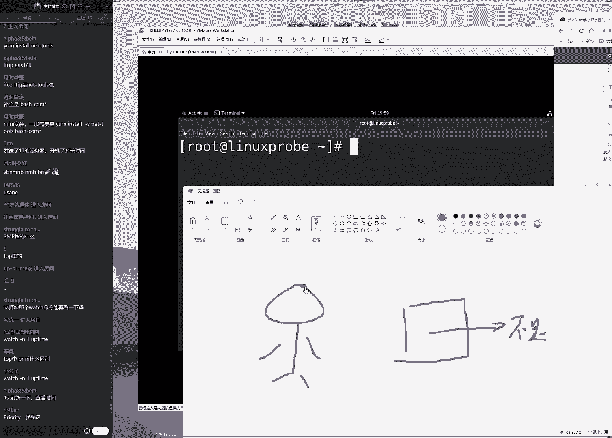
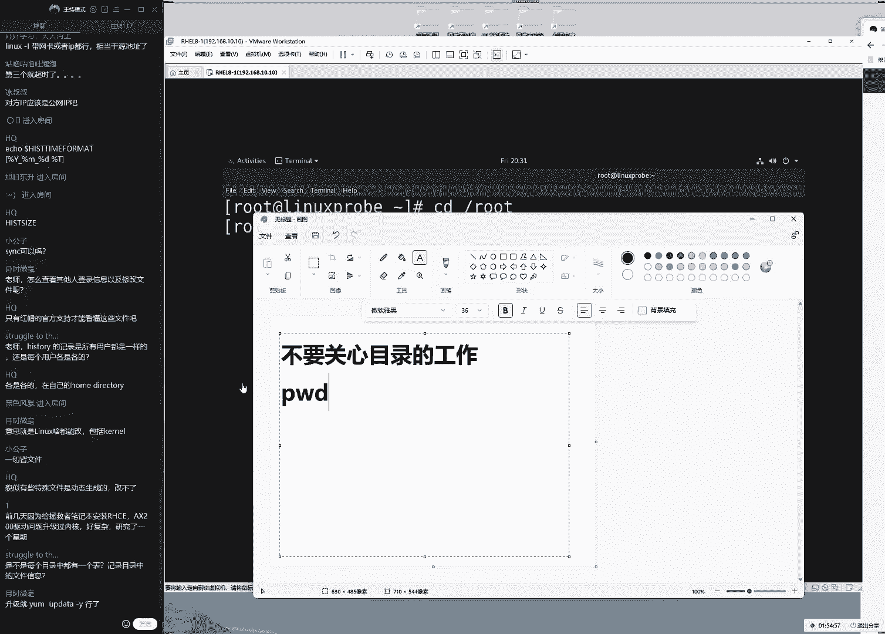
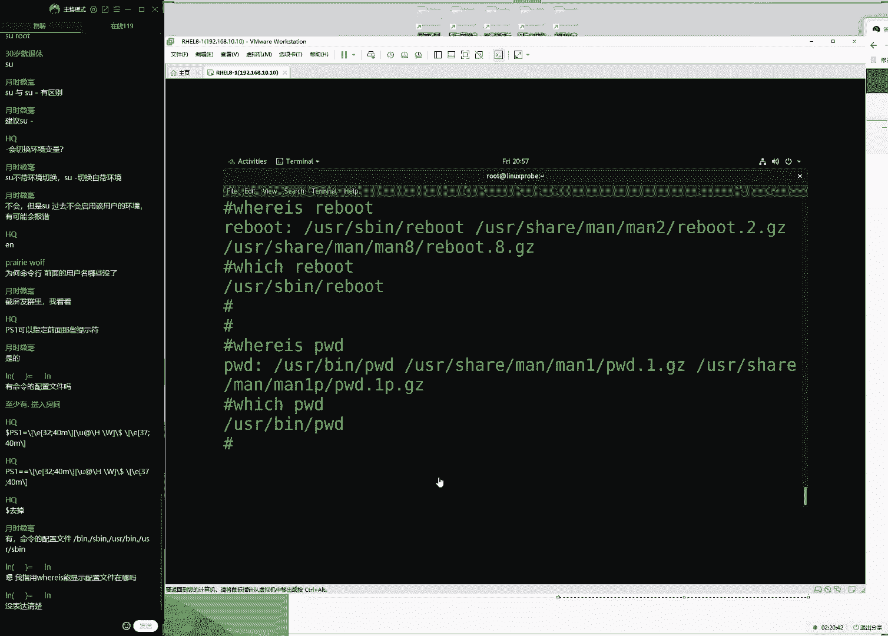

# linux就该这么学第34期 - P3：3【第34期第三节课】红帽RHCE认证培训课程-Linux就该这么学 - 能力努力 - BV1L14y1878S

dna find the way，you，so can i open the window，somebody open the door，there's so many reasons，ok来同学。

我们来看一下我们今天这个课程啊，大家先打一下，一好吧，那我们来测试一下咱们这个沙漠环境，大家听听有没有这个卡顿的情况啊，然后我们看一下这个画面是否清晰，这个语言呢啊啊不，那我啊。

那我们这个声音的话呢是否的清晰啊，是否能够听得清，ok大家打一下，一同学们来看一下同学们能不能看到我们的画面，能不能听到说话的声音，ok没有问题啊，那我们先来给大家说一下我们这个课程安排啊。

今天的话呢我们这个课程安排是要给大家讲一下第二章节。

下午的时候大概背一下啊，我们下午的时候大概背了一节课啊，大概看了一下这个我那我们这边的这个进度的话呢，第二章节今天应该差不多的，然后我们能够讲完，这样的话呢，那么话呢以及环境变量。

所以的话呢我们今天这个课程练的话还是比较大的，今天需要大家比较的多来去记一些我们的相关的linux的命令好，那我们就要开始了，呃上位的话呢我们是讲到了二点，大家发大家先发开书啊，我们看一下。

上回的话呢我们是讲到了，稍等一下啊，我先我因为我这边看的网页没有页书，我先看一下啊，上回我们讲到的是2。3小节，就是第二章里面的第四个啊，第三个小节里边的第九个命令了，如果说啊大家看第一版书的话呢。

可能我们的命令比较少的，所以我们现在使用的是这个第二版的教材，大家看起来就要丰富了很多了，我们第二本的书比第一版的书大概要多了三四十个，命令是特别的丰富的，好了，我们来给大家看一下，首先第2。

3小节里面，的第九个命令，我们是叫做tom命令，这个话的话是用来去查看系统里面这个进程信息的，那么的话以及其他能够去查看到系统当中对一个基本的一个呃，运行情况，就是我们上次给大家做了一个比喻啊。

就是这个套命令的话，就是我们也想有一个像是windows一样，那个叫什么呢，大家一起说出来叫做windows的任务管理器，唉，任务管理器啊，任务管理器一样的一个好用的一个工具。

它是不是就能够将我们这个系统里面，因为这个我们大家记得吗啊就是我们。

我们是叫做p s，然后a u x这样的一个命令，我们呃大家看一下啊，稍等一下啊，是我的啊，是我的疏忽，我刚才忘了关机啊，跟我刚才忘了关那个输入法了啊，好我们现在进入到我们的系统当中呃。

另外给大家强调一下，就是我们登录的时候的话呢，一定要去适应到管理员入群用户登录，不要去使用它不对用户，因此的话呢如果说你使用的是普通用户，那么我们有些病的话呢，那么您是没有权限来，去执行的。

都统一去使用到关联的这个身份来去登录，那好我们在登录之后的话，可以来看一下啊，上节课的话呢去讲一个命令叫做ps命令，然后后面可以加三个参数，这个我们就稍微快一点了。

因为这个我们稍微啊这我们上礼拜日就给大家去呃，讲过了，加三个参数a u x它代表的是显示出来所有的这个进程信息，以及相关的这个手动信息，并且的话他会把我们系统当中后台的没。

有发起用户的这么一个进程都帮我们去显示出来，看到这个的话呢，其实呃那我们啊第一次的这个信息之后就会发现有两个问题，第一个呃，那那那我们的话第一个问题就是这个信息量太大了对吧，那我们找不到重点。

第二点的话呢就是这个信息的话呢，它是一个呃执行过后就没有一个再次更新这样的一个效果。

那我们希望能够有一个像windows一样的，我们可能光说比较抽象啊，好在他们windows还有一个呃好用的工具叫做任务管理器。

所以我们可以来去呃观察一下是不是这样的工具，就，会非常的清晰呢，首先它有一个排序，它能啊它能够把一个最重要的或者作为活跃的一个进程放到最上面，那那那么我们可以让我们的用户呃第一眼就可以看到最重要的信息。

第二的话就是这个信息的话，它会是大概是每一秒吧，它会去变一次，那么每一那那我们可以去呃看到呃，最新的一个进程的一个使用量情况啊，他会去消耗我们新闻当中资本的一个使用量情况。

那么我们现在的话呢在我们性当中也是有一个叫做叫啊。

那么啊那么有一个命令叫做tm命令，他的话呢也能够去，查看到我们系统当中基本的一个呃使用量情况，那么的话呢以及去显示出来最重要的。

或者说我们现在最活跃的一个进程的一个状态，那那我们换呢把这个我们可以把它称作叫做是一个加强版的windows。

任务管理器，它的话呢不仅仅是呃任务管理器，汤面的话呢可以把它比作就是啊是一个加强版的，加强版的一个任务管理器，因为它里边的话呢它还有了很多我们之前没有的一些功能。

那所以我们今天第一节课的话呢，给大家去讲一下这个套命令具体的一些啊的一些小的细节了，好我们现在把它先截张图，大家围绕一张图。

然后我们来给大家去说一下，另外号大家应该能啊，大家应该能够发现啊，就是我啊就是我们现在讲这个命令之前啊，加了很多很多的呃话啊，主要的话原因就是今天这个人数一开始比较少，刚才只有92位同学。

现在的话呢陆陆续续的107了，所以我们刚才的话是有意去等了一下的，但是我们同学们以后的话就千万不要迟到了，今天我们等五分钟对吧，现在是五分50，三秒了，那我们换来以后，同学们就尽量不要迟到了。

因为我们从七点钟开始上课之后，就会马上开始去做啊，啊开始啊，开始讲课了，可能没有一个等待的时间，所以您最好的话是在6。50左右。

就差那么黑啊，就要准备去上线了，好我们来看一下，首先的话呢去输出这个信息，它什么意思呢，第一个信息的话呢就是指的是套命的，它本身了，大家看一下top本身它也就是说它是一个动态的，也不那么好。

他就指的是我们命令的本身，它是啊命令的名称，第二个字的字段的话呢，这个感觉是不是。

不太舒服啊，稍等一下啊，我再给大家重新截张图。

该一张图的话切的呃节奏有点小啊，这样的话呢我们看起来不是很舒服。

我现在再把它重新几张图来，大家看这个比较好一点了，这边左右把它截全了。

好这个字的大小的话，大家应该看起来应该是没有问题，如果说您看起来比较小的话，可以来告诉我，然后我们再把它给调大好，我们来首先来说的话呢就是啊第三次啊，那我们来啊，首先来说的话呢。

这个就是我们的命运的本身了，第二的话呢就是我们系统当中，的这个时间啊，那么大家可以拿一点灰颜色的笔在的书上去做一下标注啊，第二的话呢我们是系统的时间，那也就是说系统的话呢已经开机了34分钟了。

这个话指的是我们当前登录的用户的个数，大家需要注意一下，这个是有问题的，因为的话呢在我们的红帽五和六里边的话呢，这个呢它所代表的是一个终端的一个数量，而在七跟八里边的话呢，它指的是我们的用户的数量。

而他写的话它就它都是叫做user，它那也就是说在五和六，里边这个是有问题的，那五和六里边显示了一个终端的一个数量。

那也就是说当我们这边去啊多开几几个终端的时候，这边的话呢同样的这个数字差啊，那么啊那我们当去开启另外两个终端之后的话呢，在红帽的五和六里边，那么这个数字会变啊，他会啊，他会变成三，所以大家需要注意一下。

如果说您是在我们的这个呃老版本的这个服务器里面的话呢。

如果是五和六这边显示是一个终端的数量，千万不要认为啊，比如说这个数字啊，那么啊比如说它这个数字是个三，那么你可能会被，怀疑，那么他是已经被啊，那么的话呢它是不是已经被人攻击了对吧。

那我们大家啊大家需要注意一下，这个是跟版本有关的，下面的话它指的是系统的一个负载的一个情况，这个的话呢它指的是最近的一分钟，然后这句话这是最近的五分钟，已经15分钟的一个负载情况。

它的话呢指的是cpu的一个负载情况，那么的话呢它也指的就是呃最小值为零，最大的话呢应该是没有上限的，因为我们这边的话呢遇到过几十几百都有可能，这是呃呃那么我们目前没有发现这个具体的上限，因为。

我这边最多应该达到了80多的时候都有啊啊那么话他都有啊，那么它都有这个情况，那么他呃这个零的话，它是一个最低的一个值，那么这个代表的就是一个cpu的一个负载情况，呃如果说零的话。

代表就是它没有一个负载压力，就是说它非常的低，它是一个最低的一个值，那么如果说他到了啊，那么他啊等于的呃，呃稍等一下，他这么几个情况，零最低，然后是a一呃，一的话呢，它代表的就是一个满队列的一个情况。

但是他这个满队列的话，它并不代表说这个cpu里面的这个字诶，稍等一下，一代表是满队列，但是这个e的话呢，哎等一下满队列，怎么这字打不出来呢，满队列ok没有问题。

他的话呢并不代表说我们这个cpu这个资源太不足了，它指的是我们像打饭一样啊，当我们的后面的一个任务正在往前去走的过程当中的话呢，前面那个呃任务正好他被完成了，这样的话呢我们来去执行这个任务的时候。

实际上他并没有被等待，但是的话呢它前面这个队列它是满的，这个我们也可以把利比啊，那我们可以把比作就是一个呃充分去使用cpu资本的，这样的一个呃情况了，那我，们的话还有比如说它这个数字如果超过了五的话呢。

这个有一个词啊在我们，然后呃那么的话呢这在我们行业内叫做凌晨三点健身法，这什么意思呢，就是说啊如果说我们要想让服务器崩溃，如果说我们要想让服务器不稳定的话呢，大家如果想要在凌晨三点钟起来锻炼的话。

那么就可以把这个数字稍微的啊调高，那么就呃那么呃如果这个数字超过了五的话呢，就有可能会导致这个服务器的不稳定性，当然同学们会说呃这个也不太准确，比如说我们的公司对吧，那我这个数字可能，会长期在二和三。

它并不是在一个赛尔塔里面，我们需要面向是一个真实的一个生产环境，这个大家应该是有所共识，那么如果说买一台服务器，肯定是啊，那么它是一个越低越好的，但是对于我们的老板来讲的话呢，那就是说自然被闲置了。

因为那么话呢那我们看啊，因此这个的话呢数字并不是为零越好，我们可以把它比如说一或二都可以，但是总归不要超过五，因为超过五的话呃，我们从经验上来说就，有可能找他们啊，他有啊。

他有可能造成这个服务器的一个不稳定性，但是如果说您的服务器只是用来去处理一些，比如说静态网站这样的这个资源的话呢，可能您到了十了，那么这个网站还都是很好的，那啊那我们放在这个呃也不有什么呃太大的问题。

但是如果说您的这个服务器是书的一些，比如说像是数据库啊，像这样的这种服务的话呢，可能刚到五就有点啊，呃那么呃那么呃那么他就可能是呃出现一些问题了。

那么因此的话呢我们一般情况下会把这个数字保持在一或二或者，的话我们保持在一以下，比如说0。80。9，这也是一个非常理。

那么这也是一个非常理想的一个状态，那好那我们再给大家介绍给大家去说一下。

既然说这个数字的话呢，就是有这么几个呃呃啊这个怎么画呢，这个呃范围对吧，那么话呢从0~1这个话就是一个负载值越低啊，那我换到我们这个这个我们叫做这个中低负载值这么一个区间，那么如果说1~5的话呢。

这个我们叫做高负载值，那么但是的话呢也可以让这个服务器正常来去工作，但是如果抽超过五的话呢，比如说我，们达到20或者30的话呢，就有可能我们叫做这个超过负载了，那么就有可能导致这个服务器不太稳定了。

那么既然知道这个数字的一个作用了，接下来去说一下这个时间啊，大家看一下这个时间。

这个时间的话它指的是最近的一分钟，五分钟，即15分钟的一个负载情况。

那么也就是说我们这个数字它实际上呃越靠近左边，它越是最近的一个信息，也就是说比如说现有这么一个呃信息，大家看一下零点啊，我这边给大家写了0。01，然后的话呢零点啊，比如说啊零点啊零八，然后。

的话呢在零点啊，呃三五就比如说有这么一个数字大啊，先可以来告诉我，如果说我们看到这么一个负载的时候，请问这个负载值，当然它那么的话当然它没有抄对吧，但是这个负载值的话它是越来越高了呢，还是越来越低了呢。

或者我们来去呃理解一下这个数字就是在过去的15分钟对啊，那我们在过去的15分钟里面啊，现在是07：13对吧，那我们在过去的从七点到07：13，如果说这个数字这15分钟内是这么一个体现。

那么我们的系统的负载它是越来越高呢，还是有，点低了呢，大家告诉我是越来越低了对吧，ok没有问题，但啊那啊那啊那我们怎么看到呢，这个数字它是这么着啊，我们慢慢给大家捋啊，它是最近的一分钟，五分钟。

即15分钟的一个负载情况，所以的话呢那我们读起来的时候，实际上是从右往前读的，这样的话呢它越读他越近，对不对，它离我们当前时间它就会越近一点，比如说我给大家举一个例子啊。

说老刘啊从2015年开始创业对吧，那也就是说往前的话呢，比如说15年，那那我开始创业了，往前15年开始啊，去创业，去讲课啊，去，讲我们的这一个啊网络课程，那么当时比如说在北京的话。

他有那么的话我们在北京当时15年之前有35套房对吧，ok这是最近的15年，那么如果说最近的话呢，我们到了5年为一个周期了，那好最近我5年的话呢在北京只有了八套房，那好了。

最后的话呢最后我们当前的1年2022年的时候，哎这么叫咱们这课的话呢并不是录制的啊，来2021~2022年的话呢，那么我们这个啊北京的房产就知道了啊，那么就啊那么就啊啊啊那么就是啊最后啊就这么一个了。

那么，这个请问我们当前的这个资产的话，它人越来越多呢，还是越来越少呢，大家其实一看就可以看得出来资产越来越少了，所以的话呢这个负载同样的从后往前看，负载值越来越低。

那么我们可以来通过这个来进行一个判断好。

然后这是我们的第一行，第二行的话呢它指的是一个进程的一个状态啊，大家看一下，大家问到书说我们这个书讲到哪儿了是吧，39页，2。3小节里边的第九个命令好，接下来我们来给大家看一下第二行。

第二行的话呢指的是进城了，诶，进程它为什么有400，32个呢不要着急，因为我们上节课给大家讲哈，它分为五个常用的进程状态什么呢。

大家想一想啊，我们就怕啊过啊又啊又过了很长时间啊。

就容易忘了啊，所以这个课的话呢最好还是能够连起来上的。

礼拜日人太想啊，礼拜一礼拜二，礼拜三，礼拜四，礼拜五又过了五天了，好崩啊，没啊也不着急，我们要给大家说一下啊，系统当中的话呢有五个镜头状态，大家应啊能够猜得出来对吧，我们叫做运行状态，非常好。

给大家讲课时非常的轻松，ok给大家看啊，首先来说第一个叫r状态代表就是，怎么样呢正常，那么也就是说代表是一个正常的，当前正在为用户去提供服务的这么一个啊进城，大家啊，非常的好啊，可以帮我们打出来了。

t i m同学啊，非常好好，第一个的话我们叫做运行状态，指的是它的当前正在消耗系统的这个资源，它的话也正在为用户去提供服务站的一个进程加油，还有一个叫做呃，那么呃叫做休眠状态啊。

这个它指的就是当前没有被用户去提供服务，它的等待为用户去提供服务，还有一话叫做递进城对吧，代表就是不可被中断，那么它当前可能或者他没有，被用户去提供服务，但是的话呢它不可被中断，它出现一些问题。

接下来是僵尸进程，它会消耗系统的这个资源，但是一起来说出来，但是它没有为后续提供服务，如果说我们要是在这个服务器里面出现了这个z进程的时候，一定要小心，因为这有可能会出现。

比如说它会消耗系统里面很多这个资源，但是他依然没有为我们提供服务，这种啊吃空饷这样的这种情况，这么我们一定要小心，还有一句话叫做这个t啊，叫做stupid，代表就是被停止了，他是没有维护啊。

那么他当前没有去消耗系统的，这个资源也没有被用户去提供服务，这样的一个进程，我们叫做被停止的进入状态，这是五种常用的，那么好，我们还有五种不常用的进程啊，这我们这边啊，那么我们当年遇到之后再给大家去说。

也就这五，那么这五个进程的这个运行的状态。

然后我们来看一下，对照的话呢，总数就是432，但是我们不用着急，为什么呢，当前只有一个正用来被用户去提供服务，其中的话431 一个没有消耗系统的这个资源，等待为用户提供服务，这样的一个状态，是不是我。

然后的话已经被停止了，那么大家啊他们啊这个啊，那么现在到现它就是没有了，这样的话呢，那么以及没有僵尸进程没有问题啊，这就是我们第二行的一个理解，对于进程的一个一起来说总数对吧，这是一个概述。

有点像是就是他们那个windows里面哎。

等一下啊我们再继续讲练练学该怎么学啊，所以我们现在都有一个第三人称啊，去他们的那个windows里边，任务管理器是不是有点像是一个进程总数这样的一个做的一个信息呢，你看我没有找到啊，进，程数量的话呢。

好像这边好像还真看不到呃，但应该有方法去看到啊，但是这个就是运呃系统里面运行的这个状态信息。

我们可以这边去来去看一下，然后接下来看一下第三行，第三行的话呢指的就是一个cpu的负载情况了，但是我们这边不用给大家再去啊关注所有的这个数值。

因为我们的话呢这个主要有一门课叫做r h c里面的r h42 啊，叫做rh 42，里面会给大家去细聊，这个是要去做调优的时候再给大家细讲，当前只需要关注两个这个呃数值，这个话叫做u s，它指的是。

当前正在使用的一个百分比，这句话还有一个叫做呃i d，它指的是当前这呃我们空闲的一个百分比，那所以我们就只看这两个号了，如果说u s变多了，知道么，指就是cpu的话呢，当前负载值比较高了。

那我们可以看一下后面如果他的i d比较高的话，那说明当前cpu还是一个比较啊空闲的这么一个状态好那么好看，那我们这个其他的这些我们先不用看，它指的是跟我们这个cpu跟我还。

他指的是跟我们这个内存和我们这个硬盘进行交互这么一个百分比，这话我们到时候去做题的时，候回来，那么呃那么呃回来来给大家细聊一下，这样的话呢当我们这个cpu出现一些问题的。

比如说我们觉得系统比较慢的时候的话呢，可以通过这些数据来啊来啊来去进一步判断到底是哪出了问题，来去找一下这个短板，接下来的话呢再来我们指的是一个内存的一个使用量情况。

这个话呢指的就是一个物理内存的一个使用量情况，第二的话呢叫做交换分区，我们可以把它叫做交换分区吧，叫交换内存，我们当前的一个使用量情况，我们的话呢我们的物理内存啊，当前的话呢它以兆。

为单位总数的话呢就是两个gb，大家可以看一下。

这个话以站为单位，但是我们这个计算机它去造的时候，就是我们的硬化的硬件，他去造的时候，它是按照一比一啊，他他是呃一比1000这样去造的，但是的话呢它是按照一比1024这样去算的。

它会有一个向下的一个幅度，这属于一个正常情况，就是我们在第一节课给大家安装这个操作系统的时候。

内存是不是给了两个gb啊，但是呢我们到手的话，大家看一下，我们给的是2048。

但是我们之间要去查看的话呢，它呃看到的实际上是，会小一点，这句话它是一个很正常的一个情况，1966这也属于没有问题的。

那这个其实很正常，我们这个呃我们再给大家说一下啊，这个它并不是虚拟机的问题，这是一个行业规范呃，比如说大家去买一个手机，买一个苹果手机啊，现在还出了一个i啊，现在应该是出道13版本了是吧。

那我们买一个比较大一点的一个容量啊，比如说你买了一个512g的一个手机，那么您到手之后刨去系统可能到手呃，使用量的这个容量的话呢，可能只有了480g，咱们都那么好的，可能，都不到，这就是一个很正常啊。

那么它是一个很正常的一个情况，那我们再去算，那么以及我们再去啊，那我们换我们来去使用的时候的话呢，它都会有一个向下的一个浮动，但是我们需要注意点是什么呢，因为大家想要去考验证，它也会有一些。

比如说要求我们同学们对于这个硬盘来进行分区格式化挂载，这样一种小的考题，这个时候怎么办呢，比如从啊大家听到这个题目啊，这是在我们考试的时候经常出现问题的一种情况，比如说我们在考试的时候。

要求大家创建出来一个为512g的一个容量的一个磁盘啊的啊，一个分区，那么这个时候我们就呃如果直接输512g的话呢，那么最后我们下挂出来之后，可能那个磁盘的话呢分区就变成了500啊，那么可能变成498啊。

那么它会有一个变小的这么一个过程，那么我们在分区的时候，如果说把这个数字的话呢设置成522，这样的话呢它最后可能分区之后变成了才会是512，那么这个时候在考试的时候该如何去选择呢。

就是呃考试的时候要求我，们重现出来一个啊指针大小的这么一个分区，那我们该是否以他这个给出来的这个数字为参考依据，然后来进行输入，还是说手动要往上面再去加个百分之呃，0。12啊，不0。

012就是大概这么一个范围，同学们，你们认为这个哪个是正确的呢，在我们考试的时候，这个有他有话有这有些问题啊，在我们上课之后，我们提前给大家说一下。

对于大家考试的时候就会有帮助了呃避免到考试的时候突然就慌了，少吃，为什么我们创造出来的分区明明是512，输入的也没有问题，但是到手就变成498了，那这个时候考试还有没有分啊，所以同学们猜一猜啊。

所以大家问啊，大家说这个都正确不对的，这个大家其实是说对了啊，同学们该没有太自信，对不对啊，他们其实已经打出来了，就是512考题里面啊，考题里面给出来的这个数字。

就是我们同学们去输入那个参数里边具体的一个数字，这个错了可以算我的，好吧啊，这个错可以算我的这个我们已经有7年的经验了啊，这个从来没有错过，考题里边只要提到的是什么样的一个容量，那么啊空间大小，是多少。

那么我们去实际去输入参数的时候。

就用这个，那不要给大家去手动去加，不要给自己加戏啊，下面我们再来，它指的是总大小为1966兆，符合题两个啊，那么换了两个g b符合题意，不要多加啊，我可没有问题哈，呃那我们可以看一下啊，没有问题。

当前的话呢已经使用的是1375兆，没有win 7，然后的话当前跟硬盘的一个交互是不用去看，到时候我们做调优的时候，数字大或小，我们会有一个公式让大家知道到底是内存不行了，还是硬盘不给，力啊。

到时候我们会给大家来说一下。

下面的话我们叫做交换分区，交换分区的话呢就呃就呃这就是在我们第六章介绍给大家去细聊的，叫做s w a p s w f叫交换分区，交换分区的作用就是用来它会将一部分的硬盘里面的这个存储容量。

临时充当了内存去使用的，因为我们知道在这个计算机里边的话呢，硬件里面最快的是cpu第二块了，然后的话呢是我们的这个南桥北桥，再往后的话就是这个内存，再往后的话就是这个硬盘，即便说是一个固态硬盘。

但是它的这个速度的话呢依然，是比内存要慢的对吧，这个我们应该知道的，那么我们就可以啊把内存当中我们一些不常用的数据哦，那我们给大家分开，如果说常用呢正在去使用的这个数据还放到内存里面。

那我们换到不常用的这个数据的话呢，那我们就可以把这个数据临时冲啊，给它存放到硬盘里面的一部分的空间里面，这样的话呢让我们的内存的使用率会更高，充分的去利用我们的这个内存的空间来去让硬盘临时去充当。

那加内存去使用，虽然速度慢了，但是的话呢也可以去当内存不足的时候来去临时，充当一下这样的一个作用，所以的话我们给大家看一下sw ap交换分区，只有一般情况下，只有当内存不足的时候才会被使用。

所以我们有一个公式就是呃那么呃所以我们说有一个原则就是这样的。

如果说我们的呃，如果说您的spa分区被长期使用，大家可以看一下啊，当先可以看到，那我们这个交换分区大小设为两个gb。

当前的话呢它都是空闲的，只被使用了17个账，ok第一个公式啊，第一个原则就是如果我们的四大分区被长七使用了，第二的话呢就是它被长期大量的使用了，第一就，是它被使用了，并且它是一个长期被占有的。

第二的话呢就是他被大量的做占有了，这个我们一定要理解一下，这是两个原则，比如说我们现在的话，突然间有这么几分钟时间，它被大量的使用了，这个没有关系，他的话并不能意味着说我们内存啊，这个话它出现短板了。

但是的话呢如果说他啊被长期的使用了。

但是呢使用量只有几兆或者这么点的话呢。

也没有关系好吧，同学们，但是如果大家记住了，如果说当我们这个交换分区被长期大量的使用了。

那么一定是意味着我们的内存的话呢，当前肯定是空间值会非常非常的低，内存不够了，那么我们需要去扩展一下我们的内存了啊，那我们会有这么一个问题，下一段话它指的就是我们这个进程的一些相关信息了。

首先的话呢id啊，这话呢全称叫做呃proceed tification对吧。

叫做进城的唯一编码，我们可以把它理解成就是一个身份证号码，每一个进程对应的就是一个p i d号码，可以通过一个p i d号码找到一个进程，下面就给大家聊到该如何进行一个使用啊，下面会给大家来去记啊。

来去使用一呃，和大家去说一下啊，下面大家问的，问题大家说那我们分区的时候该怎么去输入啊，这个不用担心啊，这个不用担心，我们到时候会给大家去说，这个是在第六章节的第三个小节会大家来去说的啊。

到时候我们分区的时候会说一下这个参数该怎么去使用好，大家问到另外一个问题，大家说怎么调整啊，这个话默认情况下就已经算成了一啊，一比一比一比1024，这样去算这么一个，数字了啊。

他们同样它显示出来已经是了，那我们来看一下啊，每一个进程的话，它都会有一个p i d值。

它的话p i d号码的话对应的就是某一个进程，下面话它指的是一个发起的一个用户。

我觉得还是这个对这张图给大家去说比较清晰啊，首先进程的号码，然后接下来的话呢这个指的是发起用户的这个名称，接下来给大家看一下这个啊，pr n i它指的是一个优先级，优先级是越低啊，不不啊，数字越低。

那么的话优先级就越高，大家记一下啊，数字越低，优先级越高，数字越高，优先级反而，越低这是什么意思呢，我们看一下啊。

他们windows里边的话呢，是不是也有一个就是如果说我想让比如说qq啊，我那我特别喜欢qq啊，毕竟的话qq也正在讲课，我想要给这个qq的话呢，那么很简单，我只需要去找到啊qq的这个进程对吧啊。

ok再找到我们这个qq啊的这个进程，然后的话呢我们点一下右键，点一下设置优先级，可以去选择成实时高这样的一个进程，它会他们，那么我们设置过后的话呢，他就可以来句实时的最优先去获取我们的硬。

盘内存cpu g哎呀我们先啊相关的这个资源了，那么这的话就是说要通过这个优先级可以来进行一个调整，让我呃我们的某一个进程来去优先去获取这个硬件资源，那么的话还有一个数字，如果说它是呃它们它越低的话。

那么他这个话优先级就会越高，我们一般情况下的话呢，优先值最低是-20，-20就指的是一个答应说出来了啊，是指的是优先级是最高的，它会优先去获取一些资源，但是有一个呃原则来说的话呢。

我们不建议大家去调，因为这个话也对，比如说像windows一样啊，如果，说我们老去调整优先级的话呢，可能会啊，从理论上来说会造成系统的不稳定性，但是说实话我和我我会比较尽量去调。

因为我觉得这个稳定性还是比较可靠的。

我们目前没有遇到这个问题，但是如果我们拿不准的话，可以先不用去调啊，下面的话还有就是我们跟内存硬盘的一些交互值，这个话我们先不用给大家去说，到时候调用的时候，大家才需要去关注一下。

我们这个的话呢指的就是一个呃进程的一个状态信息，这个话呢status它指的是一个状态码，我们可以看到的话呢，大量它都是，一个s啊，下面这个的话呢指就是一个sleeping，还有这个i啊。

它是一个呃不太常用的一个，我们可以看一下，上面是给大家介绍的这块sleeping指的是一个休眠状态，他没有为用户提供服务，他等待为用户提供服务，他没有去消化系统的这个资本，它是有一个休眠状态的一个进程。

现在的话还有这个啊我们的百分比，cpu的还有内存的一个百分比，但是大家需要注意，就这两个数值的话，他总是跟我们这个上面这个数值他是对不上的，他啊这个非常奇怪一个问题，大家看啊。

大家啊大家可以看一下啊，比如说大家看啊，我现在正在疯狂去敲击我的回车，大家看啊，我在疯狂的去敲击我的回车过程当中，突然间我去截图啊，等一下我这个操作大家看一下好，我先给他截张图。

当我再去疯狂去敲击回车或者空格的时候。

我再去截图的时候，大家会发现我们的这个某一个进程，它的摆摊呃，呃那么它这个使用率的话呢，它的这个cpu和内存使用率变成了25%，也就是说一个cpu那我们已经使用了1/4了。

好那他使用了1/4了，但是啊这张图也比较的啊，比较这个啊乱啊，我们再，重新给他截一下，看这边的话已经使用的是1/4了对吧，但是的话呢网上去看这个cpu的话呢，当前百分百被空闲，也就是说没有被占用吗。

啊啊这个怎么理解呢，所以我们给大家讲上面这个数据的话呢，它是比较稳定的，我们比较推荐大家去看的，下面的话它是一个瞬时的，它可能并不那么的严谨，所以我们建议大家去看上面，他可能下一秒之后它变成零了。

大家啊，大家是能够理解一个意思啊，下面的话呢它指的就是我们画的这个系统的一个运行时间了，这个进程的话呢已经发起了多长时间了，最长的话已经发起了14分五九十九九十五秒啊，啊不来不。

那也就是说他发起了14分钟啊这么一个过程，后面的话它指的就是我们画当前的啊，不对他是以啊不，他这是秒啊，他这是秒，刚看了一下，那么这个指的就是我们系统的一个进程的一个名称，那么指的就是这个命啊。

那么这个所对的一个命令啊，它所对应的这么一个名称好，ok没有问题，然后，给大家给大家去说一下，就是这样的啊，我们现在的话呢看完了之后，大家应该能够通过这个命令大概了解一下，比如说我们系统里面这个c啊。

cpu啊，还有这个硬盘，还有这个内存的一个基本的一个使用量情况了，然后大家问了一个问题，大家说pr还有这个rt啊，还有说我们一些其他的数值它都什么意思，这个它指的就是跟我们这个硬盘。

还有我们这个内存进行交互的一个值，比如说我们可以通过这些指代去分辨出来，到底是啊cpu不足啊，还是说我们这个硬盘这个速度太慢了，这个的，话呢我们会在一个课叫442里面会大家去细聊。

然后大家还问到一个问题，就是说我们如果要后面还有一个rt这样了，什么情况呢，它指的就是一个自动的，那那我们可以的话，待会来打动手来去调整一下，看看他怎么来进行一个调整，然后我们来看一下啊。

这个数字我们也可以自己去改的，比如大家比较感兴趣啊，好比如说我现在有一个进程叫做这个top进程，可以看到了这个top进程的话呢，我们正在被使用到，我觉得他这个优先级的话呢是为二零太低了。

它能够去优先获取资源，怎，么办呢，这个时候很简单，我们打开另外一个窗口，来打开另外一个窗口，然后我们来去选一个命令，叫做nice啊，我看这个词现在大家用的比较多啊，好nice来进行调整。

比如说想要把这个进程的话呢调整低一点，我看上去优先去获取一下字啊，比如说它-20，优先级是最高的命令名称top按下回车好，所以大家可以看一下呃，所以的话我们这样做完之后。

我们随便当然也需要截图啊，需要手速，于是大家可以看到了，我们这边的话呢优先级变成了一个-20，也就是说它优先级，的话变高了，这是我们的这个进程的名称呃。

或者说去安装一个比较大型的一个软件的时候，您可以去选择把这个运气稍微调低一点啊不啊，把这个话呢数字调低一点，让它安装起来的话速度更快一点，然后下面的话有一个叫做p i d里啊。

还有下面的话就是我们对于这个p i d值进行一个操作了，好大家先看到了，说我们一个进程的话，它对应的是一个p i d号码，那么这个p i d号码有效到什么样的一个用处呢。

它就是每一个号码，就像一个身份证号码一样。

它会对这一个进程的一个名称，那么这个怎么去使呢，比如说我想要去关注到某一个呃服务，它所对的一个行政号码，那我们就去使用到p i d up命令，接下来啊，接下来我们后面加一个我们的服务的名称。

比如说我们的s h d啊，我们按下回车，就是大家可以看到的话呢，就是我们去获取了一下我们的远程连接在这么一个服务，它所对应的一个进程号码，但是的话呢我们每个人都是不一样的，这个是很正常的。

因为的话呢它指的是呃每一次发起之后，他会去，重新去获取一个pi地址，它并不是一个固定的好，现在的话呢我们来给大家看一下，就是我们已经有了一个某一个服务所对应的一个p i d值了。

那么我们现在的话呢也可以去使用到这个命令叫做system，然后完了这个stus，然后接下来s h d，然后我们来看一下这个运行的状态，当前的话呢是为激活状态，正在运行running啊啊。

active running状态好了，竞争号码的话呢也可以再去对照一下，1200 1200没有问题，如果想要去结束这个进程的时候，那么就很简单了，就是一个q把它给关闭掉，q然后一二。

零零再按一下回车把它给关闭了，再来看一下这个进程的话呢，就变成了一个啊没有被激活的一个状态，已经被停止了，同时的话呢如果说再去获取在这个进程它所对应的一个号码的时候。

那么也会没有信息数据的来来去显示到屏幕上面了，这就是来去关闭一个进程的一个方法，也就是说关闭一个进程很简单，那么还有两个方法，第一个方法就是去使用到我们的命令，然后要不然就去关闭，要么就去重启。

然后要么就把它启用一下，第二个方法的话，也可以通过这个p i d2 命令来，去查看到它所对应的一个竞争信息，好好咱们先问了好几个，问了很多问题啊，然后看一看啊，主要的问题的话呢。

大家都问到说为啥我有三个，还有的话pr n i的一个关系好，现在给大家去说，第一个问题就是我们为什么会有三个呢，比如说您是一个网站服务。

那么它可能是一个并发式的，他会啊他会啊，他会啊，那么他可能会有很多个这样的一个竞争号码，那这个时候如果要想去关闭这个服务的时候，就不会那么容易了，因为它是有一个依赖关系，的一个进程。

那么怎么办呢，如果说我现在一查啊，我现在查完之后，他有很多个，那我要是一个一个这样取关特别的麻烦，那么就有一个很好的一个方法去使用到q2 ，然后后面加上这个服务的名称，可以把他所有的进程的话呢。

所以把他所有的这个进程号码都给他杀掉，于是我们可以看到就没有了，云南话呢同时可以去查看一下这个负的状态，可以看到它的话呢依然啊是被关闭的一个状态啊，没有被启用，可以看到，那么把这个服务正常的给关闭掉了。

顺便回答一下同学们，刚才那个，问题啊就是啊为什么我会看到很多个呢，因为你可能看到这个服务的话，它会也解禁成这样的一个问题，好下面的话呢还有一个问题，大家还有一个问题看一下啊，p i d是永久不会变吗。

当然不是，当然不是，大家看啊，比呃比如说我现在的话呢去重启一个服务，我每一次去重启这个服务，顺便我再去看一下这个服务的p i d，我看到每一次的话他都会是重新去分配一个新的，但是好的。

就是他每一次的话都不会跟别人产生冲突，他每一次都变成一个全新的一个pi地址，好就是它这个，千万不要以个p i d值来去判断一个进程的一个名称，它跟端口号是不一样的。

我觉得大家可能会把它跟端口号给它混淆了，端口号是固定的，但是它的p i地址它并不是一个啊固定的，有点像是我们去健身房里面，我们我们那个呃那呃那就是我们给大家举个例子啊。

有点像是我们去健身房里面那个行李箱，它对应的那个号码，虽然的话呢我们去健身房的时候，每个人都会分到一个柜子对吧，每个人对应的是一个柜子，每一个进程对应的这一个pi地址，它会有冲突的，但是的话呢我。

们每次去健身房的时候，他可能每一次去分配的那个数字又会是不一样的，但是他总不会产生冲突，这就是有点像是我们的这个进程以及pi地址这样的一个关系，大家呃话这也是一个比较呃不是那么准确的一个例子吧。

大家可以来去理解一下啊，或者我们下节课我们可以去思考一下，看有没有更好的一个例子。

好教我们修完了2。3小节之后啊，这就是我们上节课为什么给大家说说不要赶课时，因为赶课时的话呢，就有可能导致我们这个后面比较仓促的，干脆我们踏踏实实地讲，啊讲了40分钟啊，给2。3小节收了个小尾巴。

我们接下来说一下2。4小节，然后画比较基础的问题，大家可以来互相讨论一下啊，大家可以帮我讨论一下，比如说p i d有没有为这个呃这么一个呃范围的话呢，我们可以去搜一下啊，如果没有记错的话。

好像是65535个，跟端口号保持一致，但是如果错的话，大家可以去网上去搜一下好，那么大家的画技术问题先可以互相讨论一下，我们先往后面给大家去说啊，2。4小节，我们来说一下系统的这个状态以及运行的命。

令其实另外啊我们那我们这个p i d值的这个上限啊，大家不用太伤他的话，不用太关心，比如说一个服务器里面运行6万多个进程，我们呃与其关心pad的上限，不如关心一下我们这个呃服务器会被被啊。

那么啊那么可能会变呃，呃非常卡了，对所以的话呢这肯定是够用的，那么接下来的话呢我们就是第一个命令，我们2。4小节叫做啊interface config，我们来查看一下系统里面硬盘啊。

来查看一下网卡以及网络运行状态信息的一个命令啊，我们叫做of config。

大家可能看完这个之后的话呢，会觉得，跟windows比较像的，因为的话在windows里面啊，他的话的名称叫做ip config，现在的话呢在我们的这个呃里面的话呢。

我们就叫做interface config，它指的是网络接口的配置文件，它的话呢这个命令的作用是用来去查看我们的网卡信息，以及网络的运行状态，这么一个命令，大家问了一个问题，大家问了一个问题。

大家说啊我们也可以去说一些简写一些命令吗，其实大家想问的是这个命啊，那么大家很想问的是这个问题吧，我们同学叫这个小公子啊。

呃这个问题的话呢，说明同学们是来自于一个呃网络的一个课，程因为比如说您是配过，比如说您配过啊，思科呀，华为呀什么呃呃啊那我们这个相关的这个呃换到网络设备的话呢，命令是可以缩写的。

比如说我们要想要去看一个网络地址的时候，呃，我们某一个命令可以做缩写，缩写成下面的一部分都可以对吧，但是在我们这个诶linux里边的话呢，命令是不可以缩写的，千万不能够缩写。

他只啊它必须要进行一个完整的输入，并且的话呢这个大小写也要严格的规范，这个大家需要注意一下，它跟网络设备不同的啊，所以说大家记一下啊，不要把这个网，就是这个命不能够缩写。

以及大家写要严格区分命令和参数之间的话，要到空格去做，间隔一定要规范来去写，然后以及参数之间这个长短格式我们该如何进行合并，它就有一套这个原则性的一个问题的好，接下来呢我们再来给大家说一下啊。

接下来再去说一下，就是我们的我们的汉语同学问题啊，下面一个问题说win 3错s7 也是i p a d d r也可以对吧，ok没有问题，但是同学们前，面一个问题说的不对啊，同学们啊，这个有点乱了啊。

我们我们刚才说的是命令的一个缩写问题啊，因为它的ip这个命令是没有问题的，我们说的是一个缩写的问题，不要给他做缩写啊，然后我们接下来给大家去说呃，我们输出这个信息的话呢，大家可能跟我一些略有差异。

那比如同学们现在有问题了，邵老师为什么我们没有地址呢，啊也给大家说说清楚啊，因为这句话尤其是我们第一就是我们刚开始是上课的时候，大家会总是会比较关心老师，为什么我这个跟你老婆一样呢，这个问题。

啊就是因为之前的话呢我在安装系统的时候，我去设置个ip地址，同学们话呢，你们没有去设置过，但这并不重要啊，因为会在第八章节的时候会带大家去讲，该去如何配置我们自己的网卡信息，现在当前就以我这个为准。

把这个重心嘛。

不要管它怎么配置网卡，不要管他啊，就把他这个重心放回到我们查看完啊。

就大家去查看到这个呃王啊，网络信息这么一个地方就好了，然后大家可以来看一下，首先啊首先的话呢我们的网卡名称就是我们这个信息比较多啊。

但是我们应该看什么呢，首，先第一个要看的就是我们的上面一部分，上面一部分的话指的是我们这个网卡信息，下面一部分的话呢，我们叫做网络的环回地址，或者的话呢我们叫做回环地址，这我们怎么叫做可以。

他的话主要就是我们来测试网这个网络连通性的，比如说我们拼一下地址127，然后点零点点一啊这样的一个地址，然后我们可以拼一下了，看一下这个网络驱动有没有正常运来去运行这么一个效果，我们这个不用看。

我们往后面去呃，往后面去来啊，那我拿去裁一下，那也就是说我们需要看的只，是我们的网卡的这个信息，这个网卡信息的话呢，当前这个名称啊可以看一下啊，e s160 ，这是一个网卡的一个名称。

它在不同版本里边的话呢，它有不同的这么一个作用，比如说如果呃不不不不这个说错了啊，他是在不同的这个系统当中的话呢，它会有它会有不同的名称，比如说您是以一个非常老的一个服务器。

比如说是红毛reo 5的话呢，或者红毛real 6的这个服务器的话呢，它的这个名称它是叫做eth h0 ，然后第一个对吧，第二的话呢就是比它它会变成e t h e，然后第二然后第。

三个就是e t h2 啊，比较的这个呃比较的绕口，然后第四个就是呃那么就是三，然后s以此类推，这是我们的红毛real 6里面的一个网卡的一个命名规则，然后在红毛热器里边的话，它就变了对吧，它变成什么呢。

它会变成了，比如说叫做in s啊，比如说啊我们想一想啊，16777728啊对吧，好不好，我们啊33594968啊这样的一个名称了，它它又变了，它变成什么呢，它就变成了我们现在看到了。

比如说啊呃这句话叫e n o吧，我记得是当然是e n o啊，在我们上一个版本里面变成了呃啊变成160啊，in s1601 s192 ，这有什么样的一个用处呢，就这样给大家就讲到了。

还有啊一啊135352，我记得是好，那也就是说我们可以通过这个网卡的名称，当我们第一次去接触到一个服务器之后，但有没有想过一个问题啊，我怎么知道这个啊服务器是什么样一个版本呢，虽然说很多种方法啊。

虽然很多种方法，我这个必须要先给大家说清楚啊，因为我怕大家会觉得诶说我们这种判断方法好像并不严谨啊，我们要先给大家说一个，比较严谨的一个方法，我们可以去看一些比如说发行文件这样的这个文件。

然后的话呢我们的网络同步一些信息，然后我们来大概判断一下这个服务器的一个版本，然后以及这个呃服务器的一个名称，或者我们可以去根据看一下我们的grab引导，或者我们这个内核里面的这个信息。

也可以去看到这个服务器的版本好，我们先给大家说一下啊，能这么去看，但是有些服务器它也没有这些文件了，怎么办呢，简单来说第一步就去顺道去看一下网卡信息，通过网卡的这个名称，然后就可以来。

进就呃呃那我们可以来句初步的去判断出来这个服务器的一个版本了，那么以及网卡的这个相关信息可以顺带一起都给大家去看了啊，说话非常的严谨啊，非要说话严谨好，接下来再给大家去说一下，接下来再给大家去说一下。

就是我们的网卡的ip地址，因为我们第一次给大家去上课的时候，同学们会有很多很多的误会啊，说的是不对呀，为什么我们看其他小朋友们去敲这个啊，miss的时候他们都没有这个ip地址呢。

这就是因为我之前我去配过的那么好，同学没有去配过那么好，还有，同学是之前配过的，他们会有，如果是呃呃呃啊，那么的话如果说您之前没有配额配过我们的静态地址的话呢，当前是为空值。

他的话指的就是网卡的ip地址，然后呢这个自爆源码以及我们的这个广播地址，这个不用管，我们主要看两点，第一点就是网卡的ip地址以及网卡的资本页码，这两个我们去看一下，不用去管。

那第八章节的时候会大家去说该去如何去设置我们的网卡，然后还那么就会看，到同学们也会有地址的，还有没有地址的，会有两个情况啊，主要就是因为你之前安装系统的时候有没有去配过的这一个区别了，但这并不重要。

那我们来看一下这个网卡的mac地址啊，不会啊，这是一个网卡的一个ip地址，下面的话我们看第三眼，第三眼的话呢，我们看这儿叫做网卡的一个mac地址，我们叫做物理地址，这个词的话呢。

我们每个人都是呃那呃呃那么好，那我们每个人看完之后啊，都会有一个不同的感受，mac的话呢如果说是一个白领去看的话，他可能会觉得是一个苹果的笔记，本对不对，然后如果说是杨安啊，那么如果要是一个吃货的话。

他可能会认为这是一个呃巨无霸的一个缩写，那么如果要是一个女生的话，可能会认为他是一个口红的一个品牌，但是我们作为我们呃做运维来讲的话呢，mac地址我们首先的感觉千万不是什么口红啊，笔记本啊。

什么巨无霸什么的，我们的第一反应的话呢，一定是我们的网卡的一个物理地址，好吧，同学们记一下网卡的一个物理地址，这个怎么理解呢，网卡的一个物理地址，从理论上来说它也是一个唯一的呃，举例来说的话呢。

就是我们现在这个互联网，它是基于了我们这个tcp ip协议来进行一个数据传输的，那么如果说我们现在这个服务器它没有一个ip地址，那我们该如何去区分它。

或者我们讲我们通过我们第二cp服务可以去为用户去分配一个ip地址，但是在它分配之前呢，它是个什么呢，所以我们可以通过我们的网卡的一个物理地址，来去规范我们某一个主机这样的一个作用。

可以来看一下网卡的一个物理地址，下面的话就是我们第三眼看完了周刊第四节啊，第四点的话呢指的就是这个啊叫做rx，好，可以看一下rx指的是reserve，就叫做receive对吧，他指的就是收到的啊。

r e c e i v e啊，然后哎i r r r e c e i v e，好吧啊，等一下啊，突然间怎么英语单词对吧，记不太清楚了，r e c e i v e啊对啊，i v e它指的是收到的。

然后的话还有一个这个t的话呢叫做这个transit，它指的就是一个发送或者叫做这个转发好，我们可以看到啊，这个的话呢呃我们的啊，当前是，72k啊，那么就没有，那么它是86k这个数字的话呢。

它并不是一个从我们系统安装之后就一直累计的，但是大家需要注意一下，那既然提到了说这个总大小指的是什么呢，它指的并不是说我们这个从系统安装之后到现在的一个总大小，它指的是上一次他指的同学来说一下。

它指的是上一次我们去啊怎么样重启之后，大家需要注意啊，就是这个信息会在我们的从，前去之后被清零，然后重新做累计，然后我们上节课大家去说啊，说我们这个呃换个服务器非常的稳定。

我记得我有一台服务前稍稍给大家来演示一下，比如这台服务几次比较小，没关系，您可以看一下，录播里面会给大家说到你看啊，比如说我先去台服务器。

这台服务器的话呢就已经发送出去了啊，我们以这个为例吧，大家看一下啊。

这台服务器等稍等一下啊。

没有数据流量，所以的话你可能看到就只有几k几k的，但是我们以这台服务器为例，同学们可以看到今天服务器的话呢已经收到了啊，不说话，然后的话呢发送出去了，这就是大家从我们的网站上面。

然后我们那个下载服务器啊，然后下面的话呢还有一个叫做you name的一个命令。

大家看一下啊，然后接下来说，然后大家问题的话，我看一下啊，啊跟我，们课关系不大啊，大家可以互相讨论一下吧，那我们来接着给大家去说啊，其实我们上课的时候是非常推荐的啊，我们看的同学们可以来去讨论它。

尤其去扩展一些我们书上没有的一些呃内容，但是的话呢咱们讲课的时候就不给大家再互动了，因为我们同学们很多同学是没有基础的，这边在意互动的话，就有可能导致我们这个没有基础的东西会比较紧张。

老师呀呀我是不是错过什么东西，没有怎么大家聊的东西我都跟不上了对吧，所以我们可以在课后啊会给大家来细聊，接下来给，大家去说另外一个命令，我们叫做your name。

这个的话呢是用来去查看系统当中的一个架构以及版本，以及内核信息的一个命令叫做your name，但是我们去敲完这个命令之后的话呢，同学们会看到诶，只输出一个linux，这有点气人了。

就像一个人说你吃饭了吗，然后你吃了什么呀，然后那个人说我吃了饭呀对吧，就是特别的气人啊，那这个怎么回事呢，就是说我们想要去查看一下系统里面这个基本的一个信息，然后以及内核的这个版本。

但他只告诉我们说我们当前使用的这个服务器叫做linux，这不是，这个非常的气人对吧，他没有输出什么有效的。

那么他啊他并没有输出什么，他他有啊，他有呃呃特别好东西啊。

并没有输啊，有用的这个啊信息啊非常的简单的这个信息。

那我们来加一个参数杠a，然后才显示出来了以下信息大家需要注意一下，也就是说这个命令的话呢，标配需要加一个杠a来显示出来所有的这个信息。

来我们来看一下这个所说的这个信息，字比较小，所以我放在这个活动板里面给大家来去解释，首先加了杠一参数之后，它会去输出来的一行字，这行字的话呢，首先还，是啊它是一个linux的一个操作系统，没有问题。

这样的话这个指的是我们的主机名称，好再来这个下面的话呢4。18这个指的就是什么呢。

内核的版本号哎内核的版本号，同学们知道有一个内核的网站吗，啊咱们内核网站的话呢叫做3w。kernel啊，kl的话呢在美国那边呃，也是将军的意思对吧，kernel内核我们看到这个小蜗牛还记得啊。

一圈一圈一圈那个shell，它底边啊就是第二层，就不是那个内核吗，然后我们可以来打开一下那个内核网站啊，我们可以去输入，然后就是3w6 点kl。l i g，现在的话呢红毛reo 8版本的话，它是4。

18版本，你看这个内核版本，现在的话呢我们这个最新的稳定版本是5。17。1，你看最新的啊，现在的话是14点啊，是5。17。1，现在换的这个主线，正在研发的是5。18。

然后呢呃rc一版本我感觉如果不出意外的话，我们在今年年底的时候，您就应该能用上五版本号开头的那盒了，但是的话当前还是4。18，也就是说这个系统的话，它总会是压一个版本号来去发布的。

在红毛肉九可能会使得是5。18，然后去研发六版本的这，个内核，这个话呢版本号这个更新大版本号的更新还是比较慢的，那换到我们按照啊之前给大家讲过的，从理论上来说哦，呃画第一个版本号。

这个不用去说大部分号这个变化是非常大的，然后的话呢大家需要注意这话小版本号你从理论上来说，但是这个好像有一点不太严谨了啊，如果说大家可以去选择，比如说有这么两个可以去选择的时候。

我要我们需要给大家去说一下，有这么几个可以选择，4。13，4。14，4。15，但是我不知，道是否严谨了，如果有这么三个可以去选择的情况下的话呢，啊版本号的第二位啊，去选择偶数的，它的是稳定版。

然后的话呢金属的这个呃是一个测试，或者它并不稳定版，所以的话呢偶数版是我们在服务器生产环境里面，优先去选择的一个地方，版本好好。

大家可以来去补充啊，看我说的对不对，可能这个内容的版本更新，队员都已经发生变化了，但是目前我们可以看到的话，依然可能是这么回事，间了可以往缩小一点看一看啊，怎么样呢，呃呃周三，然后是march。

然后就march是3月份啊，3月13号，是个礼拜三啊，下面的话呢它指的就是我们系统的一个架构，以及我们这个啊主板的一个架构，以及我们呃呃以及我们这个服务器软件的一个版本。

那么可以看到的话，他当前都是六啊，他把它当前都是64位的一个系统。

这个是在红毛reo呃，就是在红毛六七开始，就它变成这样了，在红毛reo 5跟红毛reo啊，那五和六版本里边的话呢，其实它是分为两个版本的，大家可以去选择，你去选择是32位版本还是64位的一个版本。

他也是64g的一个版本啊，不好六啊，64位的版本软件的话最少就是64位。

大家需要注意一下，然后我们来继续来看一下，他说我们这句话。

他是在我们这个开放源代码计划gu对吧啊，就是一个大胡子发起了一个项目ju linux啊，就叫做，开放源代码计划当中的一个子项目啊。

那么它是一个操作系统的一个名称，我记得上一节课的时候，就是在上一期的时候，有同学就问到说老师这个啊到底它是不是一个开源软件呢，它必然是一个开源软件，并且的话他这个点卡的比较让他准。

他就是呃我们的开放源代码计划当中，真u里边一个非常优秀的一个软件好，然后的话呢我们来给大家看一下下面一个命令，我们叫做uptime命令，这个的话呢是用来去查看系统里边时间以及负载情况的这么一个信息。

接下来去说一下啊，首先还，是啊，系统的时间已经开机的时间以及当前用户的数量以及负载值。

负载值为零啊，能换到这啊，换了这个啊，负载值为最近呢一分钟五分钟及15分钟的一个负载情况，这个是不是啊，这个信息是不是看起来比较眼熟呢啊大家会想到了这个，如果说就是如果说我想要去查啊。

去查看一个完整的一个信息，那我们可以去使用到这个tom命令对吧，那么如果说我只想要去看一下这个套路的，这个前面的第一行就是我还要减啊系统的一个简要信息的话呢，那我们就可以去使用到这个命令，来查看一下呃。

我一般情况下的话呢，我会去选择下面一个命令，因为我并不太关心说进程的一个旅行状态，以及个别的运行的这个服务器的一个问题，那么好，我们那我们就可以去使用这个命令。

而且的话呢我比较喜欢使用这个命令，是这样的，叫做watch，它指的就是每天按照时间来进行一个刷新，比如说我们现在这个问啊，换这个命令的话呢，问题还是它不能够动态更新，对不对。

反正我一般情况下我会去使用到这样的一个方法，叫做watch杠n按照几秒去刷新一次呢，我们按照每一秒去刷，新一次后面加上我们想要对应的命令，一般情况下我会这样的，然后我敲一下回车。

他会去呃更新一次这个输出的这个信息，我说我会把这个窗口的话呢放到这个电脑的左上角，或者右啊，或者的话来放到这个右上角，这样的话我可以去干我自己的这个事情，然后我们可以观察这个啊这块这个负载值的一个变化。

还是非常方便的好，然后我们再往后面去看啊，下面叫的这个啊free命令，这句话代表就是查看内存一个使用量情况的好，我们现在57分啊，可以先休息一下，我们休息大概一分钟吧，正好倒杯水，马上回来啊。

大家可以先也休息一下一分钟，现在是56分34秒，我们一分钟我大概57分30秒回来，ok啊回来了，我们来教给大家继续说嗯，我看一下大家的问题啊，大家说我刚才那个卧室还可以看一下吗。

可以没有问题啊，但是打出来了啊，非常好，这个名字真的好长啊，叫咕噜咕噜吐泡泡啊，然后大家说pr跟n i什么区别，p r n i的话，它主要对应的这个信息是不一样的，我如果没有记错的话。

好像是一个对应的是cpu，一个对应的是内存，然后啊具体是不是的话，我们下回再给大家可以去搜一下，然后给大家发我们的群里面吧。

然后我们具体给大家搜一下具体的这个基础，然后的话还，有就是如果大家感兴趣的话，其实可以去使用到啊，那么我们可以使用到闷，后面加上你想要去了解的这个命令，比如说嗯nice对吧，我可以去搜一下啊。

确实没有记住，看一下pr n i的区别，然后搜一下ni啊，pr n i还没有啊，没关系，下课之后吧，下课之后给大家搜一下，发到我们这个群里面具体的一个解释，然后下面的话呢还有就是我们叫做free啊。

大家看一下这个命令的话，叫做free命令，它是用来去查看内存的一个手段情况的，大家其实发现了我们这个2。4小节讲的是啥啊，2。4小节，讲的没啥，就是讲的是一个服务器的一个基本信息里一个查看的一个方法。

也就是说当我们遇到了一个啊，我们还是通过画图吧，就是当我们拿到了一台新的服务器之后，我们能够第一时间啊最简单的了解一下这个服务器的一个运行状态，他怎么回事，什么版本哈哈网卡硬盘内存怎么回事啊。

它有什么这个啊附带值或者一些瓶颈，或者说啊使用量不足的一些问题，我们可以通过这样的2。4角肌的一些命令，今天来去进行一个了解，哎这怎么回事，嗯，那么好，我们下面一个命令，我们，叫做free啊。

不知道为什么把这个小啊。

为什么把这小孩的头换成一个三角形了啊，然后下面来给大家说一下，叫做free命令了，这个free的话呢在英文字面里面我们叫做免费啊，叫做自由，但是在我们心目当中的话呢，是叫做以前来说查看什么信息。

查看是a内存信息，其实我比较心急啊，其实同学们都预期的很好了，我们应该互动一次啊，来看一下啊，free它正来去查看系统里面这个内存信息的，敲完之后啊，给出了一坨东西啊，就是一坨坨这么一大坨东西。

说这个话说实话啊，我不太喜欢去看，为这个cd太乱了，这个问题的话就出在了没有一个单位上面，它是默认的话呢，它是以这个k为单位的，但是太多了，那我们怎么办呢，我们可以加一个小写h参数，叫做对。

大家可以说出来叫做human readable，叫做人类可读，或者我们叫做人类异读模式，好我们给大家举一个例子啊，先敲一下h看一下它是不是就有一个进位了啊，如果说我们前面它是以k为单位的话，啊，不啊对。

那么好。

下面就是啊g或者以兆为单位，那这个我们举一个例子啊，比如说老旅游啊，比如说现在一个抢劫犯把老刘给绑架，了，兜里面把我给绑架了，兜里边的话有五块钱好了，五块钱进账啊，这就是一个五块钱。

如果说再绑架一个人的话呢，王思聪啊对吧，然后爸爸啊再翻兜，他兜里面可能有这么多个钱啊，就比如说就是比如说呃这么多的钱，那我们该怎么去来去说呢，这个是不是太难描述了，比如说啊130518010119快钱。

这个太多了，而且话特别不对啊，那么特别不利于去呃来去说，那我们就可以给他一个单位，比如说130啊，我看一下啊，bin对吧，我们可以给，他一个单位这样的话呢非常的易读了啊，138万啊，不130啊。

10亿那就是1300亿。

这样的话就比较好读一点了对吧，那么这也是同样的效果，那么加一个小写h如果说它能够构成啊进位的话呢，他会直接给他一个单位数值，然后我们就可以显示出来比较啊好读的这么一个格式了。

好这个的话呢它和这个同样的就是一个第一行纸，就是我们的一个物理内存使用量情况，下面的话呢指的就是一个交换分区使用量情况，后面的话指的是跟我们这个硬盘一个交互值，这个，我们不用去看他指的是缓存啊。

当缓存特别多的时候，那我们才会去考虑到是不是硬盘出现问题了啊，这话我们当天下先不用管，下面的话呢还有一个叫做这个who啊，它是用来去查看我们这个性当中有哪些登录用户的啊。

当我们有些时候想要去重启这个服务器之前，我们是不是应该先去护一下，出于尊重，您先护一下，因为避免说正话，正好有同事也正在啊登录这台服务器，人家的话呢工作还没有保存，然后您881重启啊，reboot一下。

结果就产生了一些纠纷对吧，礼拜五就不能够按时间，下班了，那这个时候就出现问题了，那这个时候的话呢去使用到啊，那么在此之前去使用到who，继续查看一下当前有哪些用户正在登录我们的服务器，确认一下。

只有我们自己知道啊，那我们再去重启一下，可以没有问题，下面的话呢再一个叫做last命令来展示一下系统当中登录的记录，可以看一下啊，没有哪些用户登录过我们这个服务器，以及有哪些用户的话正在还在登录当中。

那么我们要给大家说一下啊，这个信息的话它会有一个滞后性，他需要在下一次重启，或者等一个用户去注销，之后他才会去同步一次，那也就是说有些服务器可能你已经啊，那么话你已经可能已经是呃登录了。

但是的话这个信息可能并没有显示出来，或者的话有些用户已经被注销了，但是您这边可能没有看到，就是说您需要去注销一次，然后才能够看一下这个呃，那么呃那么呃那么才能够看到这个啊同步出来这个信息。

但是起码我们现在看一下还是很方便的，能够查看到我们系统，当，中运行的一个状态好不，那我们可以去查看到我们这个系统一个登录的一个状态，那么如果说这个用户的话，它是从远程进行登录的话呢。

此处还会显示出来远程登录的ip地址啊，如果说您怀疑这个服务器被入侵了，那么呃就呃那么就可以去查看一下，有没有从一些呃非法地址去登录这样的一个记录，然后下面的话呢我们来去注意一下这个拼啊。

拼的话呢就是用来啊大家问了两个问题，大家说我们声音能稍微大一点吗，声音已经很合适了，因为我去下个招，式去试了一下，如果把我的声音调大之后会有电流声音啊，我上了节课，调了很长时间不太行。

同学们可以来互动一下，如果有这个问题的话，如果声音还很小的话，我下课之后会把稍微调大一点的，就怕有电，就主要就怕有电流声音，因为我这边把我声音放大了之后，我这边任何的声音都会被放大。

比如说我现在手里边还拿着一张纸对吧，那么这张纸大家听一下这个声音就是会听到，就是任何声音都会被放大，会有电流啊或者终止的声音啊，会比较嘈杂，然后这是第一个问题，然后第二的，话就是大家说这个p i啊p啊。

还有这个啊p t s啥意思，t t s指的是图形化界面，t t y指的是一个文字界面啊，好然后下面的话呢我们叫一个拼啊，拼时用来去检查我们这个网络连通性的，如果说想要知道某一个。

其实这个我们更呃其实更不用说了啊，不用说了，拼第一个我认为这个拼就有点像是一个最基础的一个命令一样啊，如果想要去检查一个某一个网络的一个连通性，拼某一个地址，就后面加上它所，对应的一个ip地址。

这个时候一定要狠狠的去敲一下回车，那我们拼出来这样的这个效果，代表就是这个主机是能够进行通信的，如果说啊怎么样，声音有点稍小，ok下节课我们就把声音调大一点，哎怎么样，还有同学说合适啊行吧。

我们下课之后来他在我们再给大家讨论吧，因为现在天也来不及，我们下课之后，就在这个时候，大家提醒我，我们去做一个小调查，如果大家觉得声音比较小的话呢，呃调整自己音量之后啊，音量之后还是不行啊。

不能够满足大家听课这么一个需求的话呢，下课，之后告诉我哎呀啊，一定要记得告诉我，然后我们下节课给大家去调好之后再去上课了，然后大家看一下啊，如果说想要去测试一下网络这个连通性，那么拼出来这样的效果的话。

就代表就是这个网络是通信的，对方是在线的，如果说我们拼完之后的话呢，是这么一个效果，随便来了啊，同学们不要太在意啊，随便来，比如说是这么一个地址，比如巴拉巴拉巴拉吧啊，看一下得到这么一个信息。

这个信息的话呢无非有两个情况，第一个情况网络不能够通信对吧，网络没有搞好，第二点的话呢就，是对方主基地把我们给屏蔽了啊，这么两个情况好，那也就是拼命令的话。

那是一个非常简单的用来去测试网络天性的这么一个工具，仅此而已，到位了，好下面一个问题啊，下面一个命令叫做trespass。

如果说我们一定要想去啊，进行一个对于某一个主机的一个访问。

比如说现在先拼啊，我们现在以什么为例呢，我们以啊。

我因为我现在没有联网啊，所以我现在取一台取一台我的服务器啊，取消我的服务器，然后我去拼啊，不我取啥服务器。

windows里面也有同样的命令啊，好我就用windows吧，呃大家不要太在。

意啊，因为放到windows里面这个命这两个面它是他们两个是可以啊，他们两个是能够互相去使用的，比如说我现在的话我先去拼一个拼某一个网站，比如说3w。facebook啊，有啊不不啊，以谷歌为例吧。

好现在拼一下谷歌，看一下能不能拼通，嗨小同学们拼一下谷歌，看看能不能拼通，大家问了一个问题，大家说拼书上面的gl和gl拼反了吧，我看一下啊，拼啊gi和gala是反了吧，我这边网页上面是没有反啊。

是这样的。

p后面的话可以加三个参数，第一个是一个小小i它它的话呢指的就是稍等一下啊，拼，的话后面可以加三个参数，第一个话是一个小写，i指的是间隔秒数，然后是一个大写w这个指的是我们这个就当呃呃最多这个等待时间。

还有的话就是杠c指的时候，我们拼的这个次数，这个没有啊，这个是没有写错的。

大家如果要是书上有错的话，那可能是因为是不是我们之间有呃，呃是不是有些问题啊。

大家可以网页为准啊，这是没有问题的哦，比如那我们比如说现在拼一下这个谷歌，但是看到这个谷歌的话呢是拼不通的啊，非常可惜，那我们要知道。

那么是哪里出现问题的呢，比如，说我们现在要想去访问这个谷歌的服务器，可能要经过十个路由器，那么到底是哪一个路由器出现问题了呢，那我们就可以去使用它一个命令叫做transp。

他会来去逐个来去检查我们这个网络啊，那么他去检查这个路由器到底是在哪一条这个路由器的时候，比如说这个出现问题了，那么找到这个问题所在。

好，这个命令我们去敲一下，叫做trespass啊，等一下tresp，然后怎么样啊，拼钢t就完事了哦，这个的话呢是这个样子啊，这个问题是这个样子啊，在我们的这个windows里边的话呢，等稍等一下啊。

怎么讲，课的时候大家这个问题的话呢都很好啊，主要的话但是这个原因的话就是大家这个问题都变啊，大家都给大家啊分段了，所以的话呢您的这个问题的话，我可能会会跟上一个同学给混了啊，没有理解您所说的意思。

好先不要紧，现在我这个思路去说，然后大家发现了一个问题，就是我们欢乐在这个呃，先说第一个问题啊，大家发完了，然后我能够理解的啊，第一个问题就是为什么要加参数对吧，因为的话呢在linux里边的拼的话。

它是不受限的，而是换到在windows里面它是拼四次的。

这是第一个问，题，所以我们需要加参数杠c举例来讲啊，linux里边去拼一个地址，只要能够拼得通，他会一直去拼啊，拼到无穷无尽。

他会一直去拼下去，但是的话呢如果是在windows里面，它只是拼四次啊，它形容不行，他都是四次啊，反正有啊啊非常的话呢啊非常的啊严谨规范啊。

不不不，这不叫严谨规范，非常的呃克制对吧，那换但是我们在这个啊我们这边去拼的话，它是没有一个终止的，所以我们需要加一些参数，比如说啊比如说杠c3 啊，或者杠c4 ，指的是拼四次来看一下。

于是我们加这个杠c4 之后就变，成了拼四次了，因为我现在不呃，我因为后来我现在不太好理解，大家想啊，现在所说的问题是什么意思啊，因为现在问题的话呢就是比较多啊，同学问题都是一段一段的。

我就按照我思路去讲一遍吧，首先来说加c啊，就是杠c4 ，就是拼四次对吧，没有问题，比如说我每间隔一秒拼一次啊，那么我们总共拼四次，那么就这样去写，每个间隔一秒拼一次啊，总共拼四次，就这么去做。

他的话加一个3w，它指的就是我们这个指标，是如果说对方没有响应的话，那我们是否来去进行等待呢，最多等待三秒啊，再就是在不在就是不在或者显示啊，那啊那么则显示出来想超时这样的一个报错，这样的一个作用好。

现在的话来给大家去说一下，就是下面一个问题，如果说在某一个路由器之间啊。

它出现问题了，无法访问了，我们该怎么办呢，我们可以去使用的trespass命令，后面接上这个网址，按下回车啊，等一下啊，下面说出来了，这个命令的话在windows里面也是有的。

只不过只不过啊他这个名称不太一样了，我们来以当前这个为准，但，是执行起来的效果的话呢是个linux的原视，好好好，那我看一下啊，啊大家能说出来t r a c e r t，然后我们来去啊检查一下。

看一下到底是在哪一条路由器的时候出现问题了啊，这个话呢主要嗯好，咱们来看一下，我们现在一跳一跳的，就算去找到底是在哪一跳的时候出现了问题了，但是这个不用多说啊，肯定是什么原因呢，把我们给屏蔽了，对吧啊。

众所周知，中国大陆的话呢，呃我们的领导怕我们学坏，然后啊把一些他们认为非法的一些东西，然后嗯给屏，蔽掉了，所以的话呢我们肯定是在呃，我们初初呃我们在海底光缆之前就被屏蔽掉了。

因为现在换了中国的公民是无法自由的去搭建这个，比如说激战呀对吧，比如说像埃隆马斯克一样发布卫星啊啊，或者的话呢我们去挖光缆，这话这都是做不到的，所以的话我们要去，那么我们要想去上网的话。

那我们就必须要有通过由国家去搭建的这么一开底光缆，所以就是它可以在上面去做任何的限制，而我们必须要去遵守好，我们可以来看到的话，就是说我们现在正在一跳一跳去找啊，去寻找。

这个谷歌到底是在哪一条被dns污染了，然后呃然后无法被访问的，可以看到当他出现某一跳启动超车之后，他会在此后的所有的请求全都是请求超时了，所以大家就能够判断出来哦，大概是在这个服务器出现了问题。

而这个服务器它又是个啥呢，呃大家可以看到，在这个啊服务器后面的所有的这个请求都变成请求超时了，而这个服务器还有那呃，那么它又是什么呢，我们可以打开一个百度啊，我们就可以打开一个网址，叫做ip啊。

叫做ip 138，我记得这么一个网站是在我很小的时候，就在就去使用的一个网站。

然后去输入这个ip地址，于是你可以去搜一下i。

可以看到这是中国联通在北京丰台的一个服务器，然后就后面的所有访问都变成请求超时了，好看来是这个服务器出现了问题，在看来是有人在这个服务器上面去做了一些限制。

可以大概判断出来啊，当我们要想去访问一个网站，但是失败的一个原因，通过这个命令可以来进行一个溯源啊，不叫做这个啊，追踪，下面的话呢，如果想要去查看一下我们这个服务器上面已经有哪些可用啊。

那我那我们有哪些开放的端口，那么话以及就是我们主要想去查看一下。

说当前有哪些用户正在登录我们的服务器，或者它正在使用我们的服务器上面的这个资源，那么怎么办呢，嗯我们来给大家说一下，叫做nestate，然后我一般情况下加上杠a n两个参数就可以了。

大家可以看一下这个表格，二杠12啊，特别的多参数，但是我一般喜欢加杠a n，第一就是显示所有的对吧，n的话呢就是说我们不要去使用域名解析，直接用ip，这样的话速度更快一点啊。

就是这个命令的作用就是说比如说，我现在是一个服务器，我先是一个网站卡吧，同学们，我现在是一个网站，那我现在是方形的一个web网站，现在的话呢还有很多个用户正在向我进行发起连接，一个用户，两个用户。

三个用户，四个用户，他们访问的端口号都是八里营向我发送了这个请求，好访问的端口号都是八零端口号好，我现在有有两个需求，第一个需求我想要知道对方都是哪些人，那么好了，对方的ip地址，那么把它给找到。

第二点的话就是我们能够去呃知道对方来去连接我的时候，他们使用的是呃呃呃那么他那么他，们使用的这个端口号，那都可以通过这个命令来进行一个查看，好先去打开来去看一下吧。

叫做nesta，nestate更in好，可以来看一下。

我们看到最后的话呢。

但是由于我这台讯息他没有联网，大家看完之后是不是很不过瘾啊啊好，我们现在的话来换我们的服务器啊，我们的服务器是货真价实的，是一台网站服务器。

所以我就以他为例了，好我来net state，我来去连接一下杠n于是您可以来看到我，们这边的话呢端口号以及对方连接信息都会在里面显示出来，但是这个信息可能有点敏感啊。

就是每一个啊可以看到有人连接的是我们的八零端口啊，啊啊这个啊呃800它指的是没有加密的，还有看这是我们的加密的这个链接，于是您可以看到这是对方的一个ip地址，以及换了对方的一个服务器的一个端口号啊。

就是他不是我就呃就是他发起的对啊，到时候它所对的啊，对应这个电脑上面这个端口号以及它所对应的一个b地址，于是我们就可以通过这样的命令来进行一个，查看了啊，好然后的话呢我们接下来给大家往后面去说啊。

下面一个命令的话呢叫做啊历史记录history啊，就是我们现在看的不知不觉当中已经去执行了很多个命令了，这些命令的话呢我们呃有哪些记录呢，我们可以去使用到这个命令history来行一个查看。

哎呀不知不觉已经有我的61条命令了，非常的多好，我们可以看到这是我们的历史的一个执行记录，那么我比如说想要再去重复去执行某些命令的时候的话呢，呃我们可以看一下前面的编码，这个编码啊它有好处。

就是能够帮我们，呃规范的显示出来命令的一个执行顺序，以及我可以快速知道，比如说这条命令它是由第39条啊来啊来去啊操作的对吧，然后呢以及这个的话呢它是第五我59条命令这样的一个效果好。

比如说我现在的话呢还有这个编码，53也可以再去用一下，就是加一个叹号，加一个53，这个指的就是去重复去执行53条命令的意思，也就是说前面的编码不仅能够为用户显示出来。

它是第几条去执行的这样的一个提示作用，它有一个实用作用，就是去重复去执行某一条命令，叹号53叹号编码就可以去实现了，好大家问了我，我看我看一看啊，看一看跟我们课相关的问的问题好说第三个就超时了啊。

对因为我们的国家嘛怕我们学坏啊，怕我们有问题啊，所以很多是为很多都是为了我们好吗，嗯好我们来啊，来去之，从此去之，前一下叹号53第53条的命令都被执行下去了，ok没有问题。

然后下面的话呢还有就是如果想要对啊，这个这句话还有一个问题，就同学们说老师这个命令有问题，就是为什么我在我工作的时候，明明我已经去执行过某一些命，令了对吧，但是我的同事诶，他怎么样呢。

他登录这个服务器之后，他去执行history不同步，大家发现这个大家我们发现这个问题好，大家看一下啊，我两个窗口，一个窗口的话呢是啊，我们的服务器a吧，那不还这边有两个用户。

为什么这两个用户查看到这个信息是不同步呢，这个的话呢实际上是我们在红毛六五的时候，大概这个问题是在我在上学的时候了，二零呃，10年的时候发现呢对吧，呃后来的话呢我们去查一下这个文献。

当时我我我当时以为是个问题呢，但是你要说这是个问题的话，已经12年都没有修复，也说不过去了，后来的话我就搜了一下这个原因啊，这个原因的话呢就是说呃history这个啊命令的这个记录的话呢。

是被保存到了每个用户自己这个加目录里面有一个叫做bh，然后的话叫做啊历史这么一个文件，大家可以看到他这个官方介绍里面是这么说的，首先的话呢所有的命令执行记录都会保存到这个文件里面。

这个文件的话呢可以看到它实际上是跟我们这个用户，这个用户去查看到这个信息是一致的，而他并不是给我们当前所查看的是一致的，它少，了30条呃，他少了40条，这是第一个我们的命令执行记录保存的文件。

是这个文件，他的话呢并没有跟我们所去执行的这个病呢是保持同步的的，解释是这样的，我们需要去注销当前用户或者去重启服务器，它才会进行一次写入，也就是说我现在大家看好，我去注销掉这个用户，退出退出。

我先把它给退出，于是我们再来去呃，logo out去推出一下嗯，这就是一个经验的积攒吧，同学们这个并不重要，但是我要给大家说一下，有这么一回事，来来我们不能单纯的把所有的一切，我之前有听过一。

个老师讲课啊，就是把一所有的一切不合理，或者他没有见过这个情况都归结于bug啊，我觉得这个说不过去，因为以这个为例，我们遇到这个bug已经赢了bug 12年了啊，如果是一个小孩的话啊。

从最开始交朋友到现在都影啊，窦窦婴能啊，他们都已经12岁了，这个不可能是bug了，这主要就是一个同步的一个问题，他就是说一个呃同步一个呃周期问题，然后我们来看一下这个办法，再去查看一下。

当前一共有77条，最后几条的话呢是这个样子的好，于是我们再来重新注销之后，再去查看，一下这个文件里面的对应的内容，大家会发现已经同步了，我们认为的话它不是bug啊，大家可以看一下，已经同步了。

作为这个信息跟我们执行命令之后是一样的，所以我们来给大家去说这个他并不是bug，它只是一个同步周期的一个问题，如果要想要来他能够去同步到文件里面，然后以及的话呢。

让您的同事也能够查看到您最后的这个命令执行记录的话，那么就您去从，那么您就只需要去注销掉或者去重启一下就可以了啊，这么一个问题，然后大家现在还有一个问题，就是我们有些时，候的话呢呃会去用一些命令。

比如说比如大家不关心命令的本身啊，比如说我们可以去选择到echo，然后再去输出一个信息，比如说某一个命令的啊，比如我啊，就就啊就这么着吧，比如说我现在去输入一个信息，输入到屏幕上面。

然后呢还有一个命令是用来去重置用户密码了好吧，那我现在给我当前用户去重置下密码，重置成功了，除了这个以外的话呢，我们也可以去使用到我们的echo，然后去输出这个信息，red hat。

然后通过命令去做接收，为何我去重置一下密码好，也就是说不用管它，我现在，怎么完成的，但是事实就是我可以通过这个命令行去来直接被用户去重置密码，这个是用户名称，这个是用户密码，没有问题。

但是就会我突然间那一瞬间我发现了，哎呦坏了，我把密码写入到了命令行里面了，任何人在我下一次住校之后都能够去查看到这个密码了，怎么办，所以怎么办呢，大家说啊，使用s i n c可以同步吗，不可以同步。

它主要指的是内存跟硬盘的同步啊，真啊命令执行记录是不可以的，这个时候怎么办呢，就是我在我执行过后，就是当我去之前过后这个命令之后突然，间我我一拍脑子坏坏了啊，我这个把密码写到了呃。

我我们的哎命令行里面了，我只要一注销任何人再去使用到啊命令去查看的时候，就都能够去查看到我这个用户密码了，怎么办呢，其实也很简单啊，我们的话呢只需要加一个杠c清空就可以了，清空之后再去查看。

就一切都没有了，这个非常的方便，下面的话呢还有一个叫做so啊sos report来进行一个救援模式来，比如说我现在的话呢，我我我这个时间比较久啊，大概得有个两三分钟，我先给大家去敲完了它。

等待过程当中再给大家去讲，按，下回车啊，按下回车，它为i去收集系统当中的一些信息，他要求我们去输入，首先他说啊是否确认开始收集您所对应的这个信息，我们下回车我确认啊。

他说请输入一下您的这个报告的编码号啊，这个无所谓，当前也没有嘛，我们就那么我们就按下回车好，开始去收集里面的这个信息了，这个什么意思啊，就是说当我们这个服务器出现问题之后。

我们要想让别人帮我们做排错的时候，就可以去执行一下这个命令，然后的话它会自动的去收集系统里面这些相关的信息，大家可以看到已经，开始收集了，收集好之后，可以把您的这个问题。

然后后来以及我们之前过的这个记录的话呢，他来帮你去做一下，排错的时候特别有啊，那么啊那么就可以啊，基本的去了解一下我们这个服务器的一个运行状态了，呃一般情况下的话呢，这个很常用。

红帽公司他也会要求我们在每一次去售后之前把这个信息收集一下，然后他帮我们去进行一个简单的一个远程的一个排错，因为大家知道红帽的话呢，它主，要就是它的一个远程的一个运维，他不会说呃，即便我们买的订阅服务。

但是也不会有的，因为这个费用特别的贵啊，我们我记得当时有个同学是在特别偏远的一个地方，然后他当时就出现问题了，费用又特别的高啊，后来的话呢就是通过这样的命令，它进行一个啊简单的一个了解。

如果能够通过网络啊，那么去找到这，个问题所在的话呢就可以减少我们这个啊使用的一个成本了，好那我们可以看一下这个文件的话，那我们可以的话呢把这个文件发送给对方，然后我们也可以自己去看。

就可以进行一个啊简单的一个排错了，然后这个的话我给大家举一个例子啊，其实这个有点像是这个网啊。

他妈这个有点像是这个网络问诊一样哦，就是大家可能会对这个说老师这个管用吗，这个还管用的啊，比如说我现在的话有一个网络问诊的一个小的一个例子。

啊大家特别好理解，比如说老刘啊，今天啊我们上课之前突然发现有点不舒服，怎么能，那我们换一换啊，比如说今天啊嗓子不舒服啊，头疼发热啊，好疼啊，觉得打的话还有一些比如说打喷嚏这样一些症状的话呢。

那么我们有两个选择，第一个选择就是直接去医院，但是现在的话大家可以知道去医院特别的不方便，还要去挂号啊，啊对吧，那我们啊那啊那我们还啊，那我们还要去啊，挂号啊，还要去做核酸，特别的麻烦。

那么我们就可以去先去百度1下，如果我现在我输入完，那我现在打开百度，对不对，我要好，我现在去输入，我现在有一些症状，如果一些简单的问题，比如说啊，那我们啊发热打喷嚏，咳嗽流鼻涕。

如果最后百度出来的这个结果，他说我只是感冒的话，那没有啊，那么就简单吃点药就好了，那我们就避免了我们去花费大量开销以及花费这个时间了，如果说百度告诉我a说你这个病很严重，那到时候我们再去找人去看病。

或者我们再去医院的话也来得及，那也就是说呃一些简单的问题，我们建议大家初步先去执行这个命令，然后我们再去啊，如果他不管用了，然后我们，这话就节省我们的这个花销和以及花费这个时间。

这个命令大家可以去记一下，叫做啊sos report，来大家继续来，可以来去记一下，然后大家下面一个问题，大家说啊，那大家问一个问题，大家说老师啊怎么能能够查看其他用户登录信息以及修改文件呢。

这个文件的话呢是登录记录啊，它是放到这个文件里面的啊。

但是这个有点远啊，不过没关系，如果想要去修改这个登录记录的话呢，它是在vm里面的log里面的日志文件叫做last log，这个文件您可以改啊，嘎嘎一改就行，了，但是这个需要专业软件啊。

这个文件现在再去记一下，也能改啊，也能改啊，所以我们有些时候，反正我个人我不太信任这个命令，因为我知道怎么改我，所以我也默认别人也知道怎么改，所以我不太以他为判断说这个是否被人入侵的一个依据。

如果如果服务器已经被人入侵了，但是这个信息里也没有写他登录记录，但是我也依然会以实际为准好，第二个问题，息是铭文的，任何人都能看得懂，甚至我们学完了之后，你也能看得懂，下面一个问题。

大家说我们的历史知识记录里边的history的记录是所有用户都是一样的吗，还是各个用户各记录各个用户的，各个用户记录，各个用户的，我们不太呃，他是呃他妈他是呃它是不会混的，每个啊没他画的。

每个用户记录自己的这个病的执行速度，那是必然的，否则的话做人都全能啊，那么他就是全乱了，因此的话呢这个文件是保存到各个用户自己的这个加目录里面啊，件吧，第六章节第一小节我给大家讲啊，f h s啊。

目录存储结构和大家讲到它会保存到每个用户自己加目录里面，这个文件好，下面的话呢我们要给大家去说到啊，下面一个文件啊，下面一个章节2。5章节给大家来，俊子来来来啊，来去聊一聊，叫做这个工作目录。

以及去查找一个文件的一个方法。

在我们上节课的时候给大家提了一个小的概念啊，叫做什么呢，叫做linux系统当中的一切就是类类系统中的一切都是文件，所以我们是和我们还给大家开了个玩笑啊，说如果大家是这个呃手，上还有位置的话。

您可以去把这句话给它纹到胳膊上面，因为女朋友可能会换对吧，可能过个5年10年啊，也嗯这个可能换到爱情是被呃时间给冲淡了的话呢，但是这句话是不会变的，就是我们这个话的话。

它永远是啊肯定是在我们的linux里面，它是一句真理啊，即便说以后到了这个十版本11 12 13对吧，到了啊红毛瑞欧200的时候，他都会是啊这个底层的一个逻辑，它是永远不会变的。

叫做linux用的一切都是文件，它是由文件去组成出来的，比如说我们的系统里面的呃硬盘对吧，它把，硬盘都会映射成一个叫做啊硬盘文件保存到dv目录里面。

也就是说信标中的一切到处运行的状态都会被保存到plc文件里面，那也就是说所有一切都会变成了我们的文件保存到我们的服务器里面，那我们接下来有两步要去做了，第一步就是要会去找文件。

要能够有能力去找到某一个文件，第二步的话要有要有能力去来去改一个文件，这是我们这个很好去理解一个逻辑好。

下面来给大家说一下，第一个呃，工作点叫做查找一个文件，我们有一个命令叫做pw d啊，p w d，大家问题大家，问了说啊，那意思就是linux啥能改呗。

在红米2的rh c里面的333系统安全里面就要求大家去改内核，art 4 sr里面也要求大家去改内核，而且是要大家去禁止掉内核里面的某些功能是可以去实现的，然后我们来给大家看啊。

不过的话呢在红毛r h c里面是不要求对于内核这个有什么太多，这个编辑的啊，就是我们来给大家看呃，第一个命令的话呢叫做p w d命令，它用来去显示出来这个当前这个工作目录的这个什么意思呢。

大家会看啊，对比如说我们，的windows啊，大家随便进入到windows之后看一下这个效果。

点开之后啊，点开几些目录啊，大家看到点开这个目录，再随便点一个目录好，大家看到没，这个效果好，我们再点开一个目录，ok点开之后这样子啊，那我们再来再点开一个目录，这点开一个目录，再点开一个目录。

下面给大家提一个问题，为什么我去切换到门啊，不同目录之后，我们所看到的内容是不一样的呢，好下面给大家一个小问题啊，特别简单，但是一定要理解一下底层这个逻辑，为什么我们切换到不同目录之后。

我们所看到的文件是不，一样的，比如说看我先换个目录了，我所看到这个文件也是不一样的了啊，大家可能听完之后一脸懵啊，说老师你是在教基础还是在考智商呢啊那它必然呢对吧，因为我们进入的目录是不同的。

所以他所看到的文件是不一样的，但是为什么呢，是因为您所在的位置是不一样的，这个位置我们有一个专业的术语叫做工作目录，所以要想去查看到某一个文件的时候，实际上我们需要去把自己怎么样的一起来说。

那我们啊大家说出来了啊，大家说了，说是不是我们每个目录里面都会有一个。

表表里边的话呢会有文件的信息，对有啊，这还真有啊，这个话您可以去看一下，还真有这么一个表可以看到，还真有啊，好像每一幕都有这么一个表，第六章节会大家去细聊，但是底层逻辑来说啊，再往上一层啊。

大家说的特别底层了，再往上一层就是因为我们所处的位置不一样的，这个我们叫做工作目录，我们要想去查看到某一个文件的时候，我们要把自己所处在对应的工作目录下，我们才能够去进行查看。

然后我们现在的话大家呃虽然这个可能虽然的话呢这个很难做到，但是我们要，求大家必须做到，就是现在他大家不要关心每一个目的作用。

然后给大家打算不要关心目录的作用，虽然这个很难做到，因为大家太相关去关心了，但是这个会在第六章节的时候，大家去细聊，我们第六个章节的时候不会再给大家去讲切换和查看的命令了，所以大家一定要去。

现在要学好哦，我们同样的现在也不会给大家去讲目录的作用，把重心的话呢放到对应的命令上面，首先第一个叫pw d来查看一下当前所在的工作目录。

所以我现在先去切换切换到某一个目录，作用不用管来p，w d发现它是在这个目录下，好再来e t c在p w d他可以看到啊。

他是换到另外一个目录下的，所以p w d指的是查看一下当前所处的共同目录，ok到此结束就可以到此结束了，木头作用不管它不管它啊，只是说什么叫做root啊，什么叫dna啊，不管他啊。

接下来我们下面一个命令叫做cd命令，cd我们是叫做切换命令，叫做change啊，change啊啊directory对吧，呃叫做切换目录。

cd一个简写，还有几个使用方法，第一切换目录，比如说我们现在再来去使用到cd呃，随便来吧随便来吧，不要关心切换一个目录切换，成功切换一个目录呃，切换成功，切换一个目录，切换成功没有问题。

切换一个目录又切换成功啊，就这么方便好，也就是说我们现在的话呢可以通过cd的命令下，去切换所对应的工作目录。

于是可以直接cd加上一个目录名称，就可以进行一个切换操作了，没有问题，这个面的话没有那么简单，还有一些玩法，比如说cd一个减号，这个指的是饭啊，不先来吧，再加一比较简单一点啊，先定一个波浪线吧。

新的波浪线指的是返回用户加目录，什么叫用户加入呢，就指的是用来保存自己加啊，就是用来，保存自己数据的一些呃目录，比如说我们自己的家庭，比如说我们的公司的工位，比如说我们现在的服务器所保存自己数据的。

比如说我现在这个话呢，我们的windows里面，那他不就是那它不就是那它不就是这个目录嘛对吧，windows然后用户就是指的是这个用户看到没啊，这但这个就是我们自己的这个加目录，一个磁体。

一个不浪线返回到用户所对应的一个佳木鲁。

也叫主目录，那我们按下回车cd波浪线，然后大声说一句走，你一定要气势啊一下把它给镇住，然后加上化才能够切换成功切换成，功之后查看一下p wd查看工作目录，也就是说当前有两点，第一点工作目录切换成功了。

切换第二点该用户的所对应的加目录，我们也能够了解到了，是这个名称没有问题哦，除了这个以外的话呢，还有就是cd点点代表就是返回到上一级所在的目录，比如说我现在有很长的一个目录，大家看啊。

它是在这个vm里面的log里面的一个日志目录啊，vm里面的log里面的呃啊，看一下还有哪些目录随便找啊，laptory啊，就比如说啊比如这本啊，桑巴吧这个词我还是比较啊还比较熟悉，大家看啊，比如说我。

现在切换进入了一个很长的一个目录，好，大家看到了没，12344层好，查看一下当前所对应的一个工作目录，没有问题，12344个目录层级非常的清晰，于是cd点点每一次会往前去走一个cd点点。

然后再来查看cd点点，查看cd点点返回到根目录。

这样的一个效果好，大家记一下cd点点返回到上一集，他所在的目录呃，有点理解一下呃，不不不，这话有呃，我们可以去理解一下，比如说老刘啊，我参加现在的话呢北京市的朝阳区的攀岩街道好了，那我现在的话呢。

比如说我现在的话就是，宇宙对吧，那么就是这个地球，然后里边的话呢就是这个北京，然后的话呢就是朝阳朝阳district啊，然后接下来的话呢就是这个潘家园，潘家园啊街道，然后还有我的家。

好比如说像这么一个啊层级关系，于是的话呢我每一次去c一点点之后的话呢，他都会去往前找到我的上一级所在位置啊，这样的话呢我们找到上一级所在位置，就通过c一点点就可以去完成了，就c d点点。

他的话除了这个以外，还有呃cd一个减号，这个话呢指的是上一次所在目录，这个什么意思呢。

好我给大家举一个例子，比如说我现在的话呢，我先去切换到一个warm录里面的log里面的310个目录，好，作用不管它不管它作用查看一下，切换成功没有，切换成功了好，我现在返回到我自己的这个家目录了。

请问我如果去执行了cd减号之后，我到哪儿了呢，我还到了这边对吧，他又返回到上一级，他又返回到上一次所在目录的又回来了。

也就是说我之前我啊我先这样啊，我之前我是在中国好了，我之前我是在一个目录a，现在我坐着飞机，我坐车到哪了呢，啊我们现在不去美国对吧，因为大家说，现在这个美国的话疫情很严重，我们去哪儿了。

我们去好像疫情都很严重啊，我们去我们去好，那我们就啊，那我们就随便吧，我们现在随便去一个国家，到了地儿之后啊，然后的话有一个人问我们说啊，where i from，那么你来自哪里呢。

我们可以说出来china对吧，因为我上一次我的这个啊来，那我们换来自于哪里，叫这个中国，同样的道理吗，如果到了这个服务。

那我先到一个目录b了之后，那我先后悔了，我就可以去cd一个减号，怎么样呢，来回来去切换吧，一回到这个，那我自己加不住了，在一个cd减号，的话呢待会又回去了。

就这样叫做cd一个减号来进行一个切换的一个操作，然后接下来再来同学们下面一个问题，大家说啊，去乌克兰也行啊也行，下面一个问题大家说cd只能够进入到下一级目录吗。

也不是这个叫做绝路径以及三维路径的一个区分，我来给大家来聊一下哦，不这个不给大家聊啊，但是您现在应该先知道一下，既然提出来了吗，我们不它不仅是能够进入到下一集，他也可以进入到上一级。

因为他的话有两个切换的方式，一种叫做绝对路径，还有一种的话叫什么呢，叫做相，对路径哎叫做这个相对路径啊，它两个切换的方式，这个我们再给大家第六章节的时候给大家去细聊，然后来去说一下具体具体的这个区别。

首先同学们。

你们说的不对啊，他不仅能够去亲王啊，它不仅能够进入到子目录，他也可以去网上去进，进入到上一，它进入到底层目录也可以去实现，但是这个不用管，他们不要管，尽可能的控制自己，不要去管。

只要您当前把cd的命令学会了就足够了好吧。

同学们，这个虽然很难啊，但是我们尽量控制一下自己，就是把重心这个会了没有，ok会了就ok了，第六章节再给大家去讲目录下面一个叫阿洛斯啊。

这个叫做查看目录了，诶，这个不是这个叫做查看文件的，当我们进入到了不同目录下之后，我们能够查看到的目录的，那我们可以查看到的文件也是不同的，因为我们所处的目录是不一样的嘛。

这个意思就是说呃ios的作用查看一下我们目录当中已有哪些文件呃，然后大家看到有两个颜色，有这个黑底白字，有点黑点蓝字的，这个的话呢区别就是黑底白字指的是这个嗯普通文件，或者的话呢我们叫做配置文件。

或者我们把它叫做文本，文件而的话呢这个黑点蓝字的话只是一个目录文件，区别来讲就是呃文本文件是用来去看的，或者我们是人能够读得懂的啊，比如说我现在可以去查看一个文件，这个我们是能够看得懂的。

但是大家可能会问的一个问题，我记得当时特别可爱，我记得好像是第19期，有一个师哥问我一个问题，是老师你说这个能够看得懂，但是我怎么看不懂呢，因为我当时给大家解释这个说什么叫做文本文件，什么叫做配置文件。

什么叫做一般文件，然后我说这种文件我们叫做配置文件，也就是我们，叫做呃文本文件，我们能够看得懂的，大家说老师这个我看不懂啊，这是什么东西啊，我也看不懂啊，但是我想跟大家说的这个字符我们是能够看得懂的。

他是一个英文字符，什么是我们看不懂的，比如说像这样的东西，我们指的是看不懂的，大家能理解啊，有点像是这个一个美剧叫什么来着啊，叫做神盾局特工里边啊，叫就是他们第第呃，第六集还是第七季啊。

人家好像被一一个外星人，然后他们那个语言啊，就像那种感觉一样，这个是我们读不懂的，这个我们叫做设备文件，所以大家画一呃，只要看到了这样的文件，我们都把它叫做配置文件，指的是我们能够看得懂的好。

下面的话呢还有就是如果说是一个蓝色的话呢，它指的是一个目录，目录就能够往里走啊，来看一下，按一下回车就可以往里面切，就可以往里面走。

蓝色可以往里走，白颜色可以看，于是可以记一下小口诀，白色能看，蓝色能切换，但是这个不严谨，为什么呢，它会根据我们这个系统的这个版本会有一些区别，比如说在这个红毛六七里面，它是一个白底黑字的。

于是就是白底黑字黑字都能看啊，蓝色能进对吧。

还有，比如说我们现在连接的这个终端，连接的这个终端颜色也可以改，那我好像下一次我看到这个颜色就不一样了，这个怎么能够去进一步去看呢。

这个先不管啊，这个先不管，也就是这个颜色的话呢，我们可以自己去改，但是这个并不管，我们会啊，在明天吧会给大家来细聊，怎么通过其他的方法来去看，但是总之颜色的区别并不那么的严谨好。

但是它也是一个初步的一个方法好下面的话呢还有我们的啊两个参数，第一个参数的话呢是加一个杠a参数，它指的是查看所有的文件，大家可以，看到加这个杠a之后的话呢，我们当前目录当中多出来的一些文件。

不管它的作用，只是看共同点，请问它多出来的这个文件有什么特点没有，大家看一下，请问我家这个杠a显示出来所有信息之后，他多出来的文件有什么特点吗，来给大家去说啊。

我就不呃，就那么的话我们就不要卖关子了，就是我们宿舍特别的慢啊，于是的话呢我比较心急啊，但是这就是同学们就是啊大家比较辛苦，少一点互动了，其实这个讲课的话还是多点互动比较好，因为毕竟是晚班嘛。

你现在夏天就比较犯困了，也也比较热啊，现在的话我可以看到啊，加一个参数杠a它指的是查看全部文件，它指的是全部文件，什么叫全部文件呢，隐藏文件对啊，隐藏文件就出来了，于是大家都已经说出来了。

它里面加了一个点上，你们看到同学叫做啊tn k e r啊，同学非常的积极啊，已经互动了很多次了，而且每次都说到点上特别好，来看一下啊。

说我们所有多出来这个文件，对比之前这个文件的话呢，它都多了一个点，而且这个点点到哪了呢，前面了大家对比一下是不是啊，对，吧多出来的文件它它前面都多出一个点。

所以我们这边啊引出来两个知识点，第一个知识点就是linux中的话呢，有一点啊，开始的所有一点开头的文件，我们都把它叫做隐藏文件，好大家看一下，1。2开头了都是隐藏文件，没有啊，没有例外。

它只要我们默认情况下不让别人看到的时候，就把前面加一个点啊，非常简单，第二点，我们的杠a参数它是用来去查看出来宣布文件的啊，大家看一下参数以及隐藏文件就感啊，那么就来给大家一台啊。

那那那我们就给大家来操作一下了。

还有一个的，话就是我们的ios gl它用来去显示出来是一个长格式，这句话长歌是可能外国人理解起来好理解，但是我们中国人理解起来就不太理解，到底是多尝试尝什么叫长格式，我不太理解。

唱歌是指的就是我们能够查看到这个信息的一个完整的信息，就是我们能够看到它相关的这个文件的属性啊，编辑时间啊，所有者的所有组啊，大家可以对照一下上面来看一下啊，我们把窗口给大家切换了一下。

上面指的是没有加参数，下面指的是加参数的，所以大家可以很清晰的对比到以下的话呢，加了，我们的文件的属性，文件的大小，文件的所有者，所有组以及修改的是一个时间啊，我们班都帮我们都显示出来了。

它是更加长的一种显示出来的格式，所以我们把它叫做常格式，它的这个参数是加一个消息l大家说为啥我们颜色，因为我刚才改了一下颜色，这个并不重要并不重要，来接下来我们再来呃，比如说的话呢，我们现在有一个目录。

但是这个目录的话呢，我里面还会有一些子目录，我如何去查看到这个目录里面子目录的这个层级关系呢，你可以这么去用。

叫做tree大树嘛，大家理解，一下这个数什么感觉啊，换了这个数，首先是有一个树干对吧，然后底下会有跟跟上面的话呢会有很多这个职业，所以的话呢我们就会知道了，它有一个目录。

目录上面会有分出来很多这样的一个啊倒数重要性的一个子目录。

所以我们就可以去使用到这个train命令，加上你想要去了解了这个目录，所以就可以列举出来了，这个比较大的同学们，我稍微的啊收敛一下啊，刚才那个目录特别的大好，就以这个目录为例，大家可以看到。

那我们就可以把这个以层级的关系显示出来，所有的这个子，目录，比如说我现在里面多出来一些子目录，可以帮我们一下，都得给他列举出来，特别的清晰简便啊，清晰简便，大家几个问题。

第一个问题对我这个颜色只是我随便改了一下，并不是那么的重要啊，第二个问题，大家说说我们这个tram需要去使用e么去安装吗，并不需要去安装，那并不需要去安装，它默认情况下已经自带了。

它就是我们安装的时候叫做思维比斯之外。

这种安装模式里面已经是自带了，没有问题，下面一个命令的话呢，我们是叫做fun的命令，它也是用来去查找我们的文件的，来，他的话也是用来去查看我们的文件的，发病的话呢，它的这个特点稍等一下啊，我稍等一下。

567诶，还可以啊，今天这个时间还比较好。

来567哦，因为第一因为我们现在去取经病的时候，大家不知道会有这种感觉，就是压力特别大，因为这个有点像学英语一样啊，他就接触到一些新的单词，我们学校去记的时候，这个过程是比较痛苦的。

来放到命令他去查找一个文件，待会经常发现一个问题啊，就是我在家里的时候，就是总会发现诶这个脑子不太好使，昨天的话呢我这个出门之后才发，现手机忘记拿了，然后又回来一趟，哎呀这个特别的生气，那我们又啊。

如果遇到了说我能够很自信的知道，我现在这个手机或者我的一个袜子肯定放在家里面了，只不过他放哪里我不知道了，怎么办呢，我们可以去使用呢，放来进行搜索，放个命令，再看一下表格，二杠13参数特别的多。

我们就给大家来去实操一下了啊，大家说到这个放的话呢，特别的重要，没有非常重要，是红帽的考题之一，就是说红帽是一个非常小气的公，司大家众所接他话啊，哈大家都知道对吧，就是对于这个放的命令。

一个命令考一个题只是非常高的一个重视程度啊，只要这道题目大家搞明白了，考试时就能够拿到15分来放的命令去做全盘搜索，写一个斜杠叫做全盘搜索，大家大家可能会问说，老师这个斜杠啥意思呢。

我们简单的理解来说就是叫做全盘搜索，他为什么是叫做全盘搜索，我们怎么理解这事儿呢，第六章节给大家细聊，我们现在先关注一下方的命令本身，后面的话呢介绍一些条件，比如说刚name哎，大家发现了一个问题。

就是说这个长歌是为什么使用的是一个减号呢，上节课刚刚讲过，开始打脸了，说呃长格式是两个减号加一个单词对吧，然后的话短格式是一个减号加一个字母，他明明是一个长歌，是name名称，但是它却是一个减号呢。

这是格式要求啊，这是我们的命的要求，以他为准，后面的话加上一个文件名称，比如说我非常的自信，我的袜子一定放在家里面，只不过的话呢我找不到他了，于是我只需要加，上文件的名称，然后进行一个全盘搜索。

按下回车，他也会在我们的心目当中进行一个全文搜索，直到找到这个文件为止啊，如果没有的话，那啊那啊那么就是没有了，来我们按下回车可以显示出来了以下信息，当然了，袜子这种东西啊，在他是一定在家里面的。

他肯定不会丢的吧，如果要是丢在外的话，现在就是出现一些问题了，来可以看到啊，非常啊，那么会出现一些非常严重的问题了，来现在的话呢我们来去查看到啊，就可以看到了这个文件的话呢。

找到了它会在这个目录里面的这个文，件名称，然后把它找到了，下面的话呢还有比如说一些玩法啊，再去搜索一下，比如说归谁所有发的命令呃，归谁所有呢，所有归属于一个用户叫做linux probe的一个用户。

按下回车，于是他可以搜索到所有归类atest problem这个用户的文件，呃就是我们下面的这个输入器当中的话呢，上半部分出现了一些问题，他说做到这个文件就出现了，它出现报错了。

这个报错的话呢主要是出现在p o c目录里面了，这个作用的话呢，这个目录作用是用来去虚拟目录的，把我们的一切都变成了一个运行状态，不呸呸啊。

就是我们的linux吧哈它所有的信息啊，它所有的文件的话呢，它都把映射成为一个文件的形式保存到我们这个服务器里面，所以我们才讲另类系统中的一切都是文件。

那么也会啊映射成一个文件的一个形式保存到我们的服务器里面，但是的话它又不是一个真正的服务器，这个比较抽象，比较不好理解，就是他也会是一个文件的一个形式，但它并不是一个真正的文件，它只是应射成。

文件形式的一种信息而已，我们可以进入到pll c目录当中，大家来去感受一下这个信息的话呢，它会是一个实时变动的一个数据，比如说同学们可以随便来看啊，随便看一个，就这个文件啊，不我们再找一个。

比如说这个文件我们刚才不是聊过吗，系统的这个负载好，可以看到这个信息的话呢，每一次都是不一样的，它就是一个运行状态，只不过它把它映射成了一个啊文件的这么一个呃。

呃这么一个呃，反正这么一个样子吧，然后我们现在的话呢，所以去找这个文件的时候。

如果要对这个文，件来进行复制啊，还有这个修改的时候，它就会出现一些问题了，因为它毕竟它不是一个真实的文件，所以的话它还会出现一些报错，好这个问题的话只能去看，不能去改，不能去搜，不能去删啊。

它只是一个系统一个运行状态，你能够去看没有问题，然后下面的话我们来继续给大家去说，所有规律的用户的一些文件，然后大家问了一个问题啊，大家问了呃，呃呃没有这么两个问题吧，啊下问题我们下课就给大家去说。

查找系统里面的配置文件一权限不足，第五章就会给大家去说，我们现在每一个文件的话，他后面都会有一个权限使用到长歌时去看，指的是无法去查看这个文件的内容，如果对于目录来讲的话。

就是无法去查看目录中文件列表的权限，所以您没有权限来进行一个搜索，第二个问题就是为什么我们有呃呃呃换了，为什么我们的同学们再去去啊，再去做这个操作的时候呃，我们有些同学是一个井号。

但是的话如果还有同学是一个呃，就是没有。

两个符号，一个是dollar符号，一个是井号呢，这个问题的话主要就是出在没有听话上面了，如果说您的这个是一个dollar符号的话呢，指的是您没有听话，您没有登录到普通，那么您使用是一个普通用户登录的。

最近是权限不足，它使用的是一个井号，它代表的是一个管理员的身份啊。

管理员是井号，用户是一个dollar服务，这样的一个区别非常简单，所以我们一看这个井号就知道了，肯定是自己家人，肯定是管理员，这个的话呢指的是我们登录录的这个终端啊，不呸呸。

这指的是我们当前登录这个工作目录的名称，这指的是我们的主机名称，at符号做间隔服务，指的是这个前面指的是用户的名称，这个也可以改，其实比如说这个就是啊p s e就指的是通过终端啊。

这个啊提他在这个里面的这个提示符，比如说我觉得前面打的太乱了，大家觉得乱不乱，还好我觉得乱啊，我可以这样把这个p s改成一这个变量的形式，就把它改成了这么一个啊非常简约的这么一种样子了。

下面的话呢我们来给大家继续往后面，就是说呃搜索这个文件的话呢。

还有我们，的命令是上分为了四个命令的，我们第一个呢叫做放的，大家在使用到放的时候的话呢，我们会觉得比较的慢对吧，大家也能听啊，大家也能感觉到了速度特别的慢。

主要原因的话就是他因为他他进行的是以一个全盘搜索，全局搜索，全局实时更新，全局实时搜索特别的慢，就是我们现在就像一个重新来到这个家里面的人一样，我现在跟他说我的袜子了啊，是在家里面的。

但是他需要进行一个全局，速度特别的慢，那我们如果说要我只想要去啊，快速去找一下这个文件的话呢，我们就可以，去使用到locate，该来啊，来根据这个数据库来进行搜索，这个什么意思啊。

他就是说会根据一些关键地点来进行搜索，比如说袜子一定是在卧室或者在洗衣房，或者是在阳台，不可能是在厨房的冰箱里面，不可能是在我的办公桌上面，不可能啊是在厕所，比如说走这么几个地点。

那于是我就可以把我比较关键的这个几个这个啊地点的话呢。

更新一下数据库，它会自动帮我们去做一下这个建立，来更新一下数据库，更新好之后，我们就可以去使用到locate来进行搜索了，大家可以感受到再去搜索这，个文件的时候，我就可以把搜索出来了，速度特别快。

这个话的区别就是我们前一个命令它搜索是那必须是严格匹配到的，则也显示出来，这个话涉及到第三章节里面这个通配符，这个我们先不管第三章节里面这个通配符。

我们来啊，会大家去细聊的话呢，可以看到这个区别使用到lok去做，按照这个目录去做，搜索的时候速度特别的快，比如说d dv目录里面的s e b a这么一个文件，快速帮我搜索出来啊，没有任何问题好下。

面还有一个叫做various命令啊，大家可能会想一个问题，舒老师你也讲到了，说我们既然linux里面的一切都是文件，那么文件肯定是有区别的，比如说是配置文件，比如说是目录文件，比如说是链接文件。

比如说是命令文件对吧，命令它也是文件好了，如果说我们现在这人啊，那么如果说我们问过当中最常用的是什么呢，我们肯定是工作面那啊那我们过程当中最常用的肯定是命令文件，最多对命令文件每天要用啊。

那我们命令文件如何快速去搜索的命令文件有专门的一个命令，我们叫做vis命，令如果说我编的并不关心有两个出名的，一个是帮助文档，一个是我们的命令本身好了，我就想搜索到这个命令，我们叫做where is。

去找到这个命令它所对应的这个信息，但是大家需要注意这个vr is的话呢，就是它会更快了，它只需去啊根据我们这个目录，它第一根据目录啊，根据我们这个数据库。

第二的话呢是指去找到我我们这个命令相关的这个文件，以及它会找到这个命令本身啊，哎等一下这个写错了，命令本身以及的话呢命令本身所对应的一些资料，也就是说跟命令相关的这个信息去使用到vr命令。

准没错，来速度很快，使用到vr is，例如说我刚刚去世，经过一些命令，比如说vr is它本身啊这个非常的啊那个啊我们来看一下啊，去啊，那我们去使用这个呃命令，找到它。

命令本身也是可以看到这是命令本身的一个所在地啊的啊，一个所在位置，然后的话呢以及这个命令所对应的帮助文档所对应的一个位置，还有比如说我们的啊查看系统负载啊，up time，于是命令本身以及帮助，文档好。

再来就是找到这个命令以及这个命令所对应的一个帮助文档，于是再来啊，叫做reboot走你啊，一定要有气势，于是命令本身以及帮助文档。

最后大家看到了啊，不然的话就可以去使用这个命令，very is，更快的去找到我们命令所对应的一个路径了，好大家现在又问了一个问题，说老师还是太慢了，我们现在在工作的时候吧，追求的是效率啊，时间就是金钱。

金钱就是呃那么呃那么呃金钱的话呢，就是我们的这个生命啊，啊最花时间就是生命，那好了，这时候怎么办呢，还有另外一个名字叫做，v啊，叫做啊呃which它代表就是我不太关心，所以我跟这个命令同名的，我也不看。

我也并不关心命令的帮助文档。

我只想去找到某一个命令，怎么办呢，which命令这没错，来使用到位置去搜索一个命令本身，于是可以看，那么可以找到它，会只去列举出来，可以对比一下啊，where is跟which的区别啊，这样这样这样啊。

先去啊，where is再去，which you可以看到了吗，帮助文档以及命令本身只找到命令本身再来啊，there is，然后随便来了随便来了，这并不重要了，那我们就啊老k对吧，不不这个不要这么整啊。

这样的话就容，易乱啊，来查看一下帮助文档的命令，我可以找到它再来，然后去使用到which啊，但是我感觉这个好像这有点问题，为什么呢，这个是我的一个疏忽啊，其实我完全可以不用讲这个的，呃。

这个的话呢我们去思索这个命令的时候出现问题了，因为的话呢它是一个内置命令，它叫做内部命令，第三章节里面会给大家讲到使用到红毛弱八的时候，实际上不它不仅是红毛若巴，它命令分为两种。

一种叫做内置命令，一种叫做啊，还有一个叫做呃外还有一种两个命令的这个区，别啊一个换呢叫做内置命令，一个换个叫做外部命令啊，内置和外部我们所讲的这个话呢，历史记录它叫做内置命令。

它无法通病的句子去进行一个查找的。

它属于我们拜仁杰自带的一些功能，我们再来啊，甘肃一个疏忽，我们换一个例子啊，这个不行，我们换一个来等稍等稍等一下啊，啊where is等等一下啊，where is，这怎么过不去了，今天这个非常的尴尬啊。

好来等一下等等等等等，等一下啊，来换一下，所以我现在少去输入来，没有问题吧，然后找到它对比一下区别命令本身以，及啊mini本身的这个输入信息啊，能够明显感觉到它所输入这个信息量是不一样的，好再来啊。

我们还有什么呢，p w d对不对，好随便来吧，学问这么多，结果非得找了一个啊，内置命令是一个非常的强，来看一下这两个区别。

也就是说我们现在有四个命令来进行搜索的话呢，它是一个从啊呃从权到剪的这么一个过程，就想关注一个命令，那么好了，我就想通过这样的方法就可以来进行一个搜索。

是完全没有问题的好然后的话我们直接不往后面就给大家去讲了，这个时间真的是不太够用，然后又讲完了，我们也不太希望给大家太多心理压力，虽然说我们也能够，今天我们想的是给第二章讲完的，但是我想了一想。

还是把我们这个课就要讲的比较扎实一点吧，同学们如果基础不太好的话呢，而且的话呢给大家说句比较良心的话，然后的话呢实际上可能有一些例子嘛，没有必要给大家去举，因为大家也感觉不到我们在偷懒。

但是我们会对自己的这个培训负责任，然后所以的话呢我们这一期的培训可能会，稍微慢一点点嗯，大家一定要体谅，但是我们能够把两个小节我们讲两个小时，而且的话中途没有休息。

这个其实也是对于大家这个书本上的一些知识的一些补充吧，所以大家千万不要催了，我们以后这个课的话呢也会稳扎稳打，咱们这一期慢慢给大家讲好就好了，不要等课时了。

然后然后的话呢我们来给大家呃说一下这个音乐比较哎呀，因为我补啊，因为大家喜欢啊，觉得还好吧，但是就是呃我们讲的这个越扎实越好，但是有同学比较着急，想要去考试，主要是这个原因，所以我们有时。

候讲的慢了之后吧，老师我去考试呢，你这个可能耽误一个礼拜，结果就可能晚拿一个，那那那么我可能就要啊多等一个礼拜去考试，这个比较着急，但是我觉得这个还是不要那么着急，尤其机然后就画画，我们尤其是基础啊。

打好了更好，来我们现在来给大家说一下，说完之后，我喝口水会给大家答疑，好不好，大家问题睡觉啊，然后我来给大家说一下今天的这个诶，等一下我给大家说一下，第二章节肯定是要给大家去复。

不要认为第二章节里面有些东西不用去学了，第二章节里面的命令都要用到以后啊，所以您在前面的第二章节如果把基础打好的话呢，有一个特别明显的一个好处，就是您在后续就可以把先踏实下来，完整的去看，我去做实验了。

开始服务了，不用老去担心，于是老师这个名字干嘛用的，没见过呀，不用担心这种问题了，可以就是踏实下心来，完全的去呃去享受配置服务的这个过程了，而不用老说哎这个命令没见过啊，这个命令怎么用啊，这什么意思啊。

不用管了，所以第二章节里面的命令同学们下课之后当作单词看一看，过过练一练，背一背好吧，接下来我来说一下玉玺，明天的话呢我们还是第二章节给大家收个小尾巴，那这个尾巴大概要收一个半小时。

然后再给大家开始第三章节的这个课程，第三章节我们会讲一下这个管道服务录音啊，管道服务重庆向环境变量啊等等这个信息，然后还有一个问题我们要给大家去说一下啊，116位同学我来给大家说一下，有一点很重要呃。

就是能在线听课，一定要在线听课，然后千万不要啊认为我们会提供一个录播，然后就不去，现在线也培训了，这是两个感觉的，比如说我们在乎过程当中的话呢，同学们提问，我来回答嗯，这个话呢会有一种参与感很强。

就像您再去看电影跟看别人玩游戏的区别，就是您啊不不，这就是说有点类似于就是说您去呃看别人玩游戏跟自己玩游戏的时候，这个偷程度是不一样的，那么我们想要自己去玩游戏啊，你想去看别人玩游戏啊。

但是有参与感的那种对吧对，这就是我们为什么有些时候这个视频后边泄露出去啊，对这个我，们非常的这个啊非常的这也是非常生气啊，因为就是咱们这个视频的话呢，往前几期啊老是被人先露出去，嗯，这个话也不可避免。

因为比如说有些同学可能会有一些软件呢把我们这个课程给他破解了，但是可能不是我们的学员，或者的话呢干脆啊可能就是在台机器上播放，然后再存在村里录一遍，这个我们也无法避免，但是的话呢我们也发现了。

比如说我们先呃身份被泄露出去之后啊，会有一些小朋友们说，老师你这个课呀讲的有点太水了，我们每节课的话呢举例什么的太多了，每，节课的话进展不快，这个话主要原因就是问题不是出在我。

是出在你是因为你是在看视频，你没有在参与，你自己会觉得哎呀怎么就是他也感不强啊，有点慢了，因为这个问题不是你提出来的，所以我们要给大家提出来，就那么今儿那么啊那我们就这点啊，就是同学们既然刚开始上课。

第三节课还来得及，以后的话呢，一定要是坚持在线听课，不要说去看视频，看视频，那个是太感很低的，容易犯困的，那么呃那呃那我们可能看一会，儿自己的话呢可能就是呃就有点犯困了，你可能随时去暂停去点啊。

那么可能就去点外卖了，这个时候会让自己的这个参与感变得特别的低，会有些时候两个月能学完的东西，学了半年就说，然后还有可能就放弃了，好吧这么一点大家需要注意一下啊，机舱不常说啊，机场啊。

后来我们这个呃机舱也不常说。

今天也是第三天，正好给大家来唠叨，那么两分钟，大家好的地方可以来跟你来，可以跟我们去说了，我来给大家回答一下问题，然后明天的话呢还是有课，大家千万不要忘记嗯，我们就可，以来去继续了，来下面一个问题。

大家说我想知道啊，我想知道窗口怎么改颜色啊，讲了这么半天，大家虽然没有，当然当然大家居然啊，我们的啊，今天下课之后，第一个问题居然提的是这个问题。

好，这不是嘛啊performance啊属性，然后点一下这colors，然后这把这个给他扣完了，我们啊那我们把它取消掉，不要去使用系统里面默认的这个样式，然后随便去选一个你喜欢的，然后一点不就不就成了吗。

啊，很简单啊，没想到大家听了这么长时间课，今天最感兴趣的居然是换颜色啊，下面一个问题大家说可以讲，一下考试当中用到的参数吗，不讲啊，因为我们会有考研辅导视频，大家系统来去专业的去讲一遍的。

而不是通过大家一两句话，下面一个问题大家怎么说啊，每次啊每次直播好快就结束了，这两个小时感觉时间被偷走了，我记得当时我们收到一个差评啊，一个看到就是一个看盗版视频的一个小的一个小朋友啊。

哎这个上课太水了，这两个小时时间感觉度日如年啊，我当时我们虽然啊虽然说那人啊，虽然说我们没有义务给大家去回复吧，但是那会儿还比较年轻啊，跟他也是对骂一点啊，就是因为我们对于我们的收费学院负责人。

对于我们看盗版是同学，我们不对他负责任，有些时候我们会调侃一下，比如说我们的视频，哎嗨我们基本上99%的同学啊，如果看盗版视频的话，都会认为非常不错，然后的话都会啊，还有然然啊。

然后的话还会有同学们过来联系，我说老师诶，你这大部分视频我看完了，能不能把你那个啊软件，还有你这个考题我们买一份啊，就是会有这种情况，所以我们要给大家提一下啊，所以我们可以给大家提一个小任务吧。

如果您看了盗版视频啊，再努力看看网上有没有我们的这个盗版的这个呃，考题还可能辅导视频啊，不过肯定辅导视频估计麻烦一点，因为肯定辅导视频我们有两次加密啊，就是那个啊我们那个大黄蜂，还有一个密码加密。

那个比较难啊，估计破解出来成本也挺高的，嗯我觉得网上不花100块钱也买不到好下面啊下面一个问题，下面一个问题大家说啊，这就是我开机了5年那个服务器啊，5年了哎，也它也很长了，那个服务器基本上我不用。

然后现在已经五，年了，因为带宽特别低，它它有一兆啊，所以可能嗯大家想下载，就是同学们，所以从网站上面去下载软件速度特别慢啊，主要就主要因为我那个服务器带宽特别低，好下面一个问题，如果您是上海的话。

您收不到的，您的生活都已经受到影响了，我非常理解，所以等着就好了，然后大家说后期会讲工作排除的思路吗，我们遇到我们过程当中遇到了会给大家去讲，我们是我们做实验的过程当中会遇到会给大家去讲，可以提出来。

啊然后我们给大家做补充，下面一个问题，大家说啊，sos report收集里面的这个信息跟目录里面的log里面的这个日志有啥区别，一个是系统里面当前的运行状态，一个是系统里面记录获得认知。

前一个是还有一个是之前我们举一个很不好的一个例子，比如说老刘啊，我身体不太好，我现在没有啊，是我我现在身体非常的好啊啊我们我因为我们会有很多同行啊，听到老刘说一句话之后非常的开心啊啊啊。

我现在老刘身体非常的好，我感觉我们在讲30年啊，讲40年有可能啊，所以不要，所以，我们同行不要太不要太啊，不要啊不要啊，太开心了，但是以我为例啊，比如说什么叫做呃收集系统里面的这个信息呢。

如果说我先去体检，我就叫做sos report，就是我去检查一下我当前的状态，我现在我之前拍过一些片子，或者说我之前一些检查报告的话呢，那个叫做日志哦，那我们就要去看这个大家指的就是一这是我现在的状态。

一个是我之前的状态，这两个星期的话都很重要，但是一个是现在，一个是当前啊，一个是之前，当然我现在身体非常的好啊，大家放心啊，然后下面一个问题大家说，这一期我们会在什么时间安排考试。

我们这一期的话呢会在4月底安排考试，同学们，大家没有听错，后面考试现在很火爆，现在要提前至少三周预约，所以您4月底或者5月初预约，特别的呃紧俏，下面一个问题。

大家说亚仓库挂载的时候找不到dv目录里面的cd room，啥情况，很简单，只有一个情况，就是俊机设置哎，光盘没有点链接，点链接了吗，点链接了好，底下的文件没有选中啊。

很简单，来下面一个问，题大家说啊，我的教科书没有收到，啥时候能到啊，您是哪位，我们啊没有备注大家的名字，如果没有收到，那么已经超过七天的话，或者您如果不在上海的话，您跟我来联系，我给您发单号。

然后大家看的啊，大家说啊，看到七的盗版买了八的正版啊，挺好，而且还报了一个，而且还报了一个咱们这个培训啊，这就算是我们的老忠实粉丝了，下面一个问题啊，下面一个问题老k能再说一下吗。

就是在去搜索我们的命令呢，待会之后多去试就好了，不用给大家多说，会去试就好了，然后哦这个问题非常，的好这是从前面提了一个问题，加多的这个呃，struggle to the什么什么啊。

但是你的名字被缩写了，努力去干嘛，这位同学提了一个问题呃，如果说我想要将我们这个发动命令搜索到的这个结果，进行二次处理的话，那么同学们，那么我们这么去做呃，搜索到所有的叫这个名字的文件。

这个大家理解了对吧，然后我们可以ex e c将前面所有的这个结果，然后我们给它二次处理，后面接上要去处理的这个命令名称，比如说将这个文件复制过来，但这个命令我们为什么要给大家讲啊，就是因为它会涉。

及到一些其他的命令，有点相当于就是管道符，有点相当于就是那个重庆巷或者管道服，然后将我们所有的这个结果都复制到我们当前目录下，然后就结束缚这样去做，于是你可以在这里面就能够找到，做到了这个结果了。

就这么简单，也很神奇，2022年一直后面一道考题啊，这个会在24s肯定辅导中给大家去细聊，因为它涉及到了其他的服务，比如说像cp啊等等的，明天会给大家再去聊聊的好，大家问了一个问题啊，说从上海跑了。

嗯好啊，下面一个问题，大家说爱死我，s y s r e o r i t o k是系统运行状态啊，是系统运行中信息，对对对，然后好吧，同学们是打错了啊，这个话呢不是它是叫做sos report啊。

叫做这个紧急报告嘛对吧，下面一个问题大家说杭州不知道去哪里考试，杭州的话你就有一个选择，就是上海，南京也有，不要去南京去上海，因为南京的考场我们安排的时间特别的久，来上海考就合适，没关系。

疫情会非常好的啊，不那个呃会控制的非常好的啊，咱们咱们要相信这个中国，这，个对吧，防控能力，其他的其他方面可能我们做不了什么，不要说疫情啊什么对吧，咱们的国体就就是为这种突发情况去设计的。

所以这种呃我觉得没有太大问题，然后下面一个问题的话呢，就是tom里面的1510啊，不他是一五十嗯，然后不知道跟物理机的cpu有啥关系，它就是大概的一个分析值，它会有一个转换。

它并没有跟cpu的百分比有一个完全的一个的一个匹配，但是我们可以通过这个数字大概做一下了解，然后大家会说会，给我们直播考研辅导吗，我们的r h4 c就没有考研辅导直播了，因为太简单了，我们真的太简单了。

我们的hc一会大家直播考虑会导，因为23c我们不是说不，我们不是说瞧不起人家啊，我已经有呃，我从疫情到现在有2年多了吧，我从疫情到现在，我们实话实说，我一个上午的还是cc挂科，我都没见过我。

我我我们约2年半，我们没有过23c挂科了，所以我呃我们是为啥瞧不起上午那门考试了，我觉得上午那门考试你要是怎么讲呢，你要是下午那门考试你要想考满分，我们的二，10c想考满分，那你是个大神，那你很厉害。

你要说上午那波你要能都没考过，那你也挺厉害的，所以我们的20cc不直播了，就直接看视频就可以，ok没有问题，下午的hc eniable那个是要重视，我们会给大家直播下面一个问题。

大家说合肥多长时间去约考，合肥的话，您在4月底吧，也别太早了，成都怎么说，成都也在4月底吧，然后下面一个问题说有mv不行，我没成功，可也可能是我命令没写，对您的这个问题不用着急。

我网上看看您是怎么说的啊，您上一个问题是说一分钟内的百分比，这点问题好，像不太哦，大家哦，您的啊，您是回答了上面一个同学的问题来啊，这个问题的话，我会在明天给大家去说吧。

它实际上就是一个从它就是一个管道服务，同学们，他就是一个管道服的作用符的作用就是将前面一个币的输出结果，然后传递给后面的命令，大家进行一次拉斯处理，就是相当于是我们都喜欢吃烤串对吧，烤串需要分工的。

有一个人负责切肉腌肉，有一个人负责啊，烤串有什么呃，最后一个人负责上菜跟啊吃对吧，那么他总是会把前一个人的处理结果交给第二个人再来这次二。

那，么他来进行一次二次处理啊，把这个肉腌完之后给人去烤，烤完之后去上牌，于是将这个信息依次来进行一次二次处理，这个会掉到管道符同样的作用，明天我给大家去细聊下面一个问题，大家说嗯大家说大家说的一个问题。

不用这么悲观，应该不会的啊，应该不会应该不会的，我也因为我们这边还会给大家赠送的一个呃小礼物，你知道吧，所以我们上一期很多同学上海的考生考过了，因为我们这边小礼物都没有寄出去，是在3月20号的。

时候就想给大家去挤，结果好像因为鸳鸯锅这种封城的形式就被耽搁了，当时说的是4月1号能解封，但是我们现在看到了，都快到4月11号了，依然没有解封呃，不是到4月8号了，我们刷完牙一，我所以现在还是没有解封。

但是我感觉不用那么悲观，我觉得到4月底差不多了，因为上海的经济太重要了，我认为它不会太长时间封了，当然了，我算什么，我们讲好我们自己的课吧，好接下来再来啊，大家说嗯，我待会我们只是预测啊。

因为我们这边的上海的考生也非常的多，我们只是预测，然，后规划一下自己的业务，然后下面一个问题，下面一个问题啊，下面一个问题大家说说，老师我上面没有啊。

dv里面的cd rom这个文件我的威威是我好像跟你不太一样，没有那个没关系，我们会在第六章节给大家去说的，问到说济南什么时候具体能考试啊，就是什么时候都考不了，一定要去青岛去考试啊。

然后然后大家说a w k i c d会学吗，我们现在没有这两个的命令的这个章节的内容，然后大家再说说啊，括弧指的是对我们搜索到的这个结果，但下面一个问题大家，说嗯成都要什么时候去。

您大概是在4月底来约吧，不用太早，因为您太早的话，我们这边也处理不了，4月底我认为合适，大家说武汉本地是不是需要八个人才可以去考试哦，武汉其实不用着急，因为呃我们武汉的考生其实挺多的。

嗯我们武汉考生挺多的，而且我们上一期33期也有考生，三是武汉的，还没有约上的，今天一直在约，而且如果没有猜错的话，现在好像还在跟我约，确实是这么回事啊，所以武汉考生不要着急。

今天今天下午的时候还收到了一个武汉同学，而且特别特而且特别着急，把考试费都交好了，还真是下面一个问题啊，大家说不是济南有考场吗，之前视频里面也说过了，不，那呃如果之前我说过的话，那我说错了。

我现在更正简单，起码我们这边呃没有合作过，我再确认一下，啊确实啊确实没有确实没有，确实没有啊，然后天津什么时候约，天津也4月底也在4月底，最晚就最早也是4月底，不能再早了。

我我我我们所说的4月底你就要看一下日历，到4月29号或者4月30号了，最后一个150和六差不多，然后大家继续来说，西安有吗，西安我可以看一下，我看一下西安的话是，稍等一下西安。

虽然说如果要是连这个两个城市都没有的话，是不是很尴尬，但是西安同学们也没有，西安也没有考上呃，广广西有吗，广西也没有啊，同学们啊，这个广西真的没有，而且我们做培训到现在，我自始至终没有听说过广西有考场。

从来没有，也也是自我们做这个业务以来10年了，考场，从来没有过，号称杭州的话呢，我们建议大家可以去上海，但是常州有后门考场，杭州虽然有，但是我们今天可以来上海，当然杭州有，大家问题我看一下内蒙哪里去考。

内蒙的话，我感觉北京吧，我感觉北京人比较啊，因为我们自己在北京，所以我们对于北京的这个考场的话呢，我特别的在意嗯，有的问题的话呢，我们第一时间给大家解决，所以我觉得上海呃如果能来到北京的话更好。

但是内蒙的话，您可能不好来北京，以前以目前来说可以等到时候疫情好一点的时候到来，我我反正我个人感觉也是我们自己规划了，就是可能会在今年年底，我感觉中国人能够完全的在，就是起码国内是开放的。

我这个词用的是不是太重了，就是这种嗯限制对吧，我感觉年底的时候应该会好一点，所以同学们，如果您要是在当地没有考场的话，您可以更着急去鱼，您可以等到比如说67月份的时候，您再问一下，我可能会尽快会有改观。

就比如说45月份您不能考了，或者34月份您不好约，那没关系，您可以等着等7月份的时候再问一下好了，接下来再来啊，大家说是不是搜索关键词v o e不红帽考试不是v o e考试啊，它不是v e考场。

他们不是跟思考不一样，然后大家说5月份我也在西安考一起考啊，哎我现在好像没有考场好，那大家可以在当地你自己去约一下，而且我们现在可能比较少，我估计我这边约也约不上，确实比较少，如果你当地有的话。

你直接去当地约就行了，价格差不多的话，我觉得是合适的。

好我们就不再多说了啊，我感觉可能就也会出名了啊，虽然老刘也想出名对吧，毕竟作为一个网络主播，我也想出名，但是我不想因为讲一些乱七八糟的话，然后讲一些现在看起来可能不太正规的话，然后嗯不太正确的话。

然后进去了，虽然我也想出名，但我想通过我自己。

