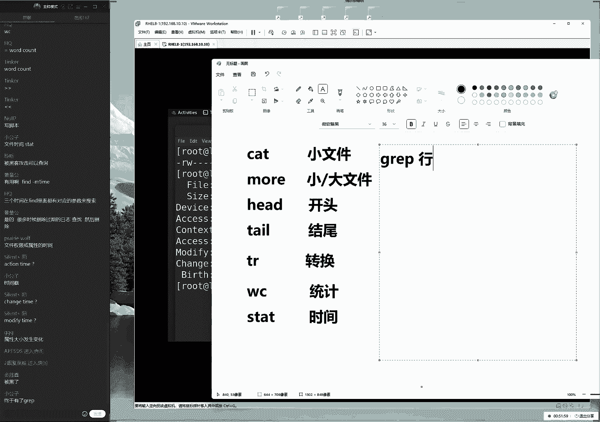
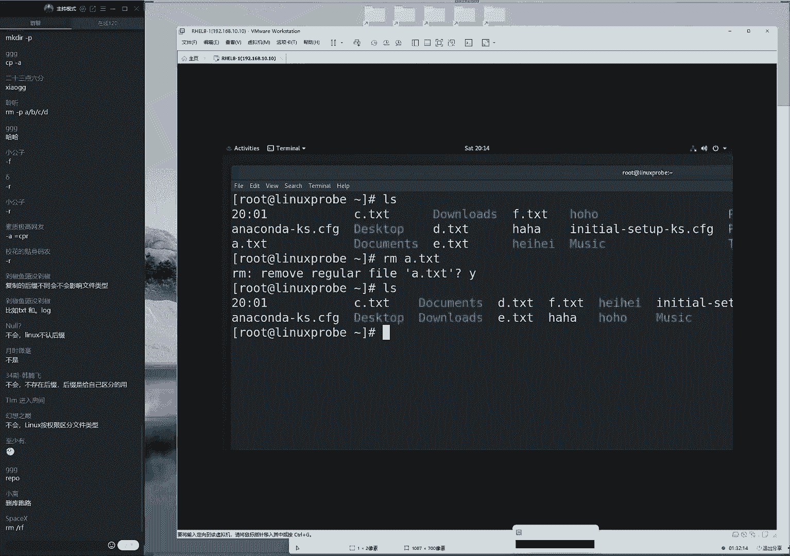
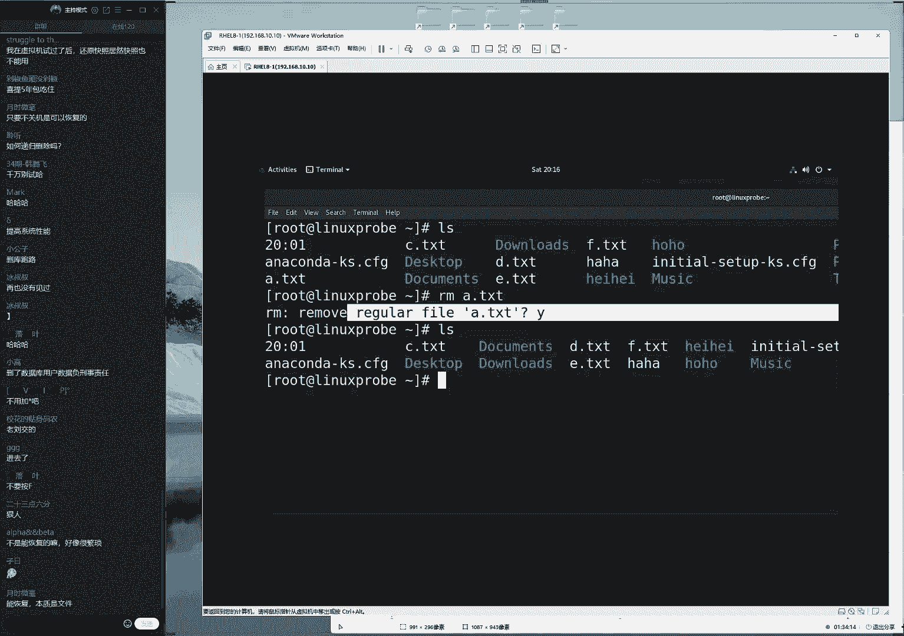
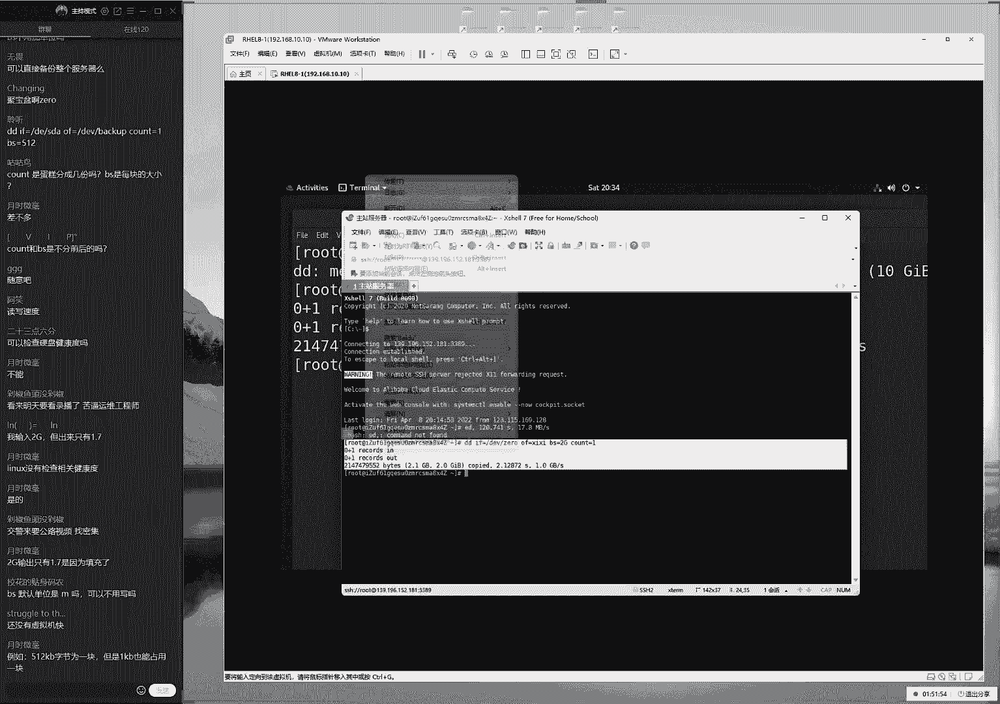
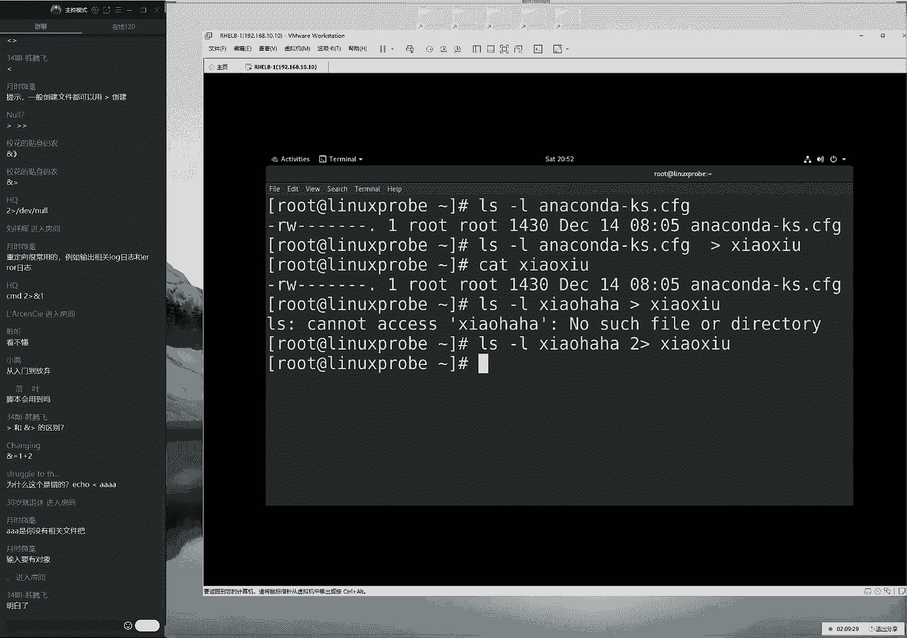
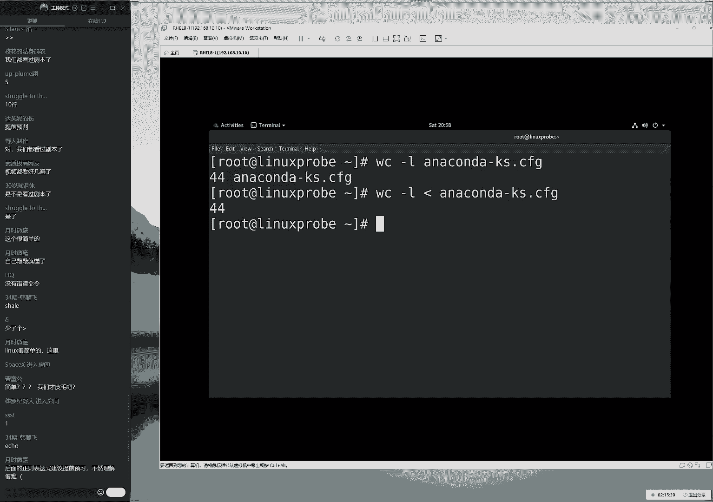

# linux就该这么学第34期 - P4：4【第34期第四节课】红帽RHCE认证培训课程-Linux就该这么学 - 能力努力 - BV1L14y1878S

belongs the words，can't you see you。

standing by we let your b all this time，you could tonight，啊你，ok来各位同学，我们来打一下一，然后我们开始我们今天这个课程啊。

今天的话呢我们依然是时间紧，任务急，我们要开啊，那我们今天的话呢要给大家讲完第二章节，然后的话呢大概会讲到第三章节的3。23小节，我们会带个安啊，对于这个命令之间进行一个相互搭配的一个使用方法啊。

大家先打一下一吧，然后我们来开始我们今天这个课程好，大家先测试一下，我们能听到，那我们能听到说话声音，能不能看到我们的画面啊，这是我们的前期测试啊，进去测试一下我们上课环境，ok没有问题诶。

顺便我们吸取昨天的教训啊，先把水准备好了，避免游戏再去接一杯了啊，大家说声音能不能调大一点啊，声音的话应该没有问题，因为我这边调大了之后，大家会有电流的声音，然后昨天我下课之后听了一下。

那怎么那个视频还好吧啊，也能够听得清，大家看啊啊，所以的话大家尽量要调，大家记得音箱吧，然后如果你实在听不清的话，那然后我们看一看江东区有没有这个问题，因为我昨天听了一下，其实还好的。

因为在大的时候就会把我这边这个声音完全都放大了，然后因为我这边的话呢，比如说这边会有纸的声音啊，会有水的声音啊，啊大家听我喝水的时候呃，会呃就特别的恐怖啊，会把我们这边声音都给他放大了。

好大家先看一下哦。

当然说问题不大是吧，ok那我们继续啊，来2。6小节，所以说如果您的声音声音比较小啊，其实有个小建议，您可以带一个，其实你可以带，其实你可以戴耳机啊，因为我们这边有同学反馈过啊。

音响的话呢可能声音不是很大，但是您戴一个耳机的话就会好很多，好我们来看一下我们这个书籍，2。6小节，我们来说一下这个文本文件的这个编辑命令，其实的话呢他又回归到了我们的前面的一句话啊。

大家抬起您的左胳膊来，哎我们看一看昨天您的这个啊胳膊上纹了一句话是什么呢，啊稍等一下，我先准备一张纸放到我们的桌面上面，这样的话呢，如果上课当中有什么需要我去记的东西，我会记在张纸上面，下好之后。

第一时间去给办了啊，大家先打开您的这个呃，先抬起左，先抬先抬抬，抬起左哥吧，然后我们看一下昨天是不说我们有一句话不到自己的胳膊上面了啊，我们叫做什么呢，叫做linux系统当中的一切。

linux系统中的一切都是文件，所以的话呢我们啊linux系统什么呀中的一切啊都是文件，所以的话呢我们昨天会给大家讲了一下，该去说去找到一个啊对应的文件，第一来说讲了一下大概的一个目录的切换的方法。

然后第二的话呢去寻找一个文件的一个方法，那也就是说我们要知道我们该怎么去找，第二步的话呢，我们既然找到了jo啊，那我们下一步来进行一个编辑和一个查看，其实我昨天说的不太对了。

你看这个其实我们它又分为三步的，第一步的话，那么去找到这个文件，第二步的话要能够进行一个查看，第三步的话才是进行一个编辑，咱们这个课的话也那么也是按照这个顺序来进行一个设计的啊，今天的话呢2。

6小节先来给大家讲一下该去如何去查看一个文件。

如何找到一个文件了，那我们该如何去哎，这是我们的第二步，来，我们123按照这个步骤来去进行一个操作啊，大家说有声音吗啊，有声音的同学们啊，这个是有声音的，声音很大啊。

好那呃呃然后的话呢我这边已经尽量的把这个麦克风已经离得非常近，非常近了，差点退，就这个距离差不多也就有个10cm，已经差不多能塞到我嘴里面了，呃如果要是再近的话，就有点大。

可能听到这个声音反而效果更不好了，所以的话您可以调，大家记得这个音箱我这边啊应该没有问题，好那先来看一下啊，呃新呃，然后的话呢我们昨天给大家讲了一下，查看一个文件，不查看一个目录中文件的一个命令。

我们来看一下ios简单回忆，简单回忆简单回忆啊好那我们来看到呃，现在的话呢当前会有很多个我们的目录，还有一些能够去查看的一个文件对吧，我们来看到这叫做一般文件，一般叫做配置文件，看一下章节2。6小集。

第一个叫做cat命令代表叫它代表的是一个小猫的意思啊，就是啊他啊就像cat它像一个小猫一样，那么我们可以通过这个命令的话来去查看一个文件里面的内容，当然了。

这个的缩写的话呢是叫做呃呃concepts对吧，这个代表啊不叫做肯，nt对吧，它是一个缩写，但是的话呢我们实际上它是用来去读取的一个啊文件的一个方法啊，然后我们也去教训下次这个单词不认识的时候。

我们千万不要去读了，非常尴尬啊，大家可以搜一下这个单词吧，好那我们来看一下啊，去查看一个文件啊，然后我们来输入文件名称，实际上的话它就是一个完整的命令行，就慢慢就把它组成出来了。

这个话呢我们的前面就是我们的命令，后面的话呢就是我们的这个啊命令的所承受的啊，那么它指的就是对象，它是指的是命令的一个承受方啊，非，常的尴尬，听老刘去讲英语啊，特别的尴尬啊，然后我记得啊。

然后我自己都觉得非常尴尬了，这个单词的读音一定是不对的，那我们就啊先跳过啊，让我们先跳过来，现在的话呢我们来去敲一下回车，这个时候大家可以看到将我敲一下，回车之后。

就会显示到了对应的屏幕上面，没有特别啊，没有任何问题，非常的简单啊，非常好用，这个命令的话呢叫做cat命令，其实的话呢我们也发现了一个小小的小问题，就是如果说这个文件特别大，的话它显示在屏幕之后的话呢。

会让我们的屏幕会快速的去显示出来很多信息，但是实际上我们什么都没有看到。

大家来去感受，同学们来看啊，大家来去感受一下啊，大家说这个文件跟我们的a n a c u n d有啥区别，不关心啊，不关心这个文件它有什么区别，不用关心它，把这个重击的话呢放到我们的cat命令上面。

那就仅此而已就可以了，这个文件的话呢我们看到后面加一个k s啊，实际上的话呢这个叫做kick start，这个的区别就是这个叫做应答文件，然后这个的话会在第19章的时，候会给大家来去细聊。

但是这个并不重要啊，并不重要，我们现在先要把这个重心放到这个cat命令上面啊，第二章节讲cat命令不会讲这个呃，应该文件啊，kick star，但是第19章节到时候也不会去讲这个cat命令了。

因此您需要把这个重心放到我们当前所讲的上面，不要动一下西一下了，好，那我们就握住我，那么大家都来取啊，握紧我手中这根小绳子啊，我们这条主线不要乱来cut一下呃，如果说看一个小文件还好，如果看一个大文件。

大家去感受一下啊，同学们感受一下，如果说看一个大文件的，一个日志信息，于是您就会得到这样的一个情形，于是可以看到它就会在屏幕上面的话呢快速的闪动，于是会有这样的一个效果。

这个的话不禁让我回忆到了我上初中的时候，看过一个电影叫做黑客帝国，诶，人的话也算是暴露年龄了，当时的话呢我看过一个电影叫黑客帝国，其中的话里面有一个主人公叫李敖对吧。

然后他他啊就是在这个啊计算机里边就有这样的一个场景，那么他啊他会快速去啊跳动很多很多这个字符，我们的话呢把它叫做数字语，但是说实话哈，就是我们按照正，常的这个角度上来说的话呢，其实您什么都看不懂。

就是这个信息的话，它是快速闪过，而且我们找不到重点的，他也只能是当地是一个屏保去使用的。

那也就是说我们去使用到cad命令的话呢，看小文件还好，看大文件的话有点吃力了，这个时候怎么办呢，不用着急，我们给大家另外一个命令叫做more命令a，那么如果说要想去看一个文件稍微大一点的话呢。

我们一般情况下我们会使用到莫名的，因为的话他可以对于我们的文件大家可以看到，如果去啊，那么如果说去使用当中这个more命令，去看一下日志信息的话呢，那么它以前来说是不是它会有一个翻页的一个效果。

我满速度一点，大家看到大家看到这个左下角会有一个翻页的效果，每按一下回车，它会往下去走一行没啊，每一下空格的话会往下去翻页，于是当我往啊不断的往下去看的过程当中的话呢。

这个左下角也会有我看这个文件的一个百分比，就像看小说一样特别的方便啊，这话说得特别的方便嗯好那么我们现在来可以看一下我们的这个效果，特别的方便，看这个大文件跟小文件的话呢，都可以去使用到这，个莫名令好。

大家现在就会有一个问题了。

说老师，那你听说过有一个叫做呃，那么我国呢啊那么我们呃我那么我们现在看电影有一个非常啊，那我还有一个非常流行的这么一个词叫做悖论对吧，就是呃如果说我们现在没有去看一个文件之前，那我们该怎么去选择它呢。

就是它是一个相互悖论的一个问题，就是我们现在需要先看一下这个文件，然后我们才知道这个文件的话呢，它是一个大文件，那么它还是一个小文件，然后我们再去决定到底是去用啊，那么我们呃然后呃呃然后我们。

再去呃决定去使用哪个命令，但是如果我们没有去看他之前的话呢，那我们也不知道他这个文件里面内容大概它到底是有多少，因此同学们现在就有一个问题了，有点乱啊，但是我们的意思就是，如果说现在有一个场景。

我们无法分辨这个文件是大还是小，我们该如何进行选择呢，大家是用大的啊，没有啊，没有问题，就是如果说我们拿不准的情况下，那么大文件小文件我们都可以去使用到more去看啊。

没有问题啊，more也可以去看小文件，反正我个人来讲的话呢，我不太喜欢去使用到more，因为，他的话需要打四个字符，而我们的这个换了啊。

而我们这个啊上面一个命令啊，cat的话呢，那么只需要打三个字符对吧，那我们这个键盘，那么呃那么呃那我们抄起来的话呢，那么呃那么也会更加方便一点好那我们可以看到的话。

下面就是第二个命令，我们叫做more命令，它的话呢可以啊去看一些大文件，会有一个翻页的，以及左下角的话呢会显示出来去查看进度的一个效果，特别的方便啊，特别的方便，下面的话呢还有一个叫做head命令。

大家先问问一个问题啊，我看一下啊，他同学们说这个，声音的问题啊，也正常，我们基本上每节课开始都会有同学去问这呃，啊都啊待会儿他都有同学去问这个问题来，怎么样呢啊语速稍微慢一点，因为这些东西特别的多啊。

咱们这个语速的话呢就是这么快的，因为大家如果慢之后，大家可以去感受一下，就会觉得特别的容易犯困了，所以咱们的话这个讲课的进度还是很快的啊，语速也稍微快一点，因为我之前看过一个报道说这个话呢呃最好的听课。

这个语速是正常语速的1。5倍，所以在这个哔哩哔哩上面的视频的话呢，一般都是一点，五倍速我催的话呢呃我就是自带的有的这个呃加倍功能了，那大家就省得自己去调了。

那我们看一下这个下面一个命令叫做head的命令，它指的就是去查看一个文件前面的一部分，比如说我们要想去看一个文件的前面的十行或者前面的15行，那好了，我们就去看。

那么就去省的啊had命令去看前面的开头的一部分。

那开头的一部分来，现在的话呢来以hii这个文件为例，大家看到这个文件的话呢，原始内容是这个样子的，那非常的多，那我们现在可以去使用到had命令，然后一个杠n后面，的话加一个数字无所谓是多少。

我们想要看前面的15行，15行走了，唉所以老刘自带一个加倍功能啊，同学你不用自己啊，不用自己再去调这个啊播放器了，来看一下杠n 15，它指的就是我们显示出来这个文件的这个前面的15行。

代表的就是看前面的15行，那么现在大家的话呢啊，还有一个问题就是我们怎么去看后面的这个数字行呢，正好两个我们一起去讲了，后面的话15行指的是叫做跳哎。

那么head是头，那么跳的话呢是尾巴，那么就是结尾从后面开始数哎呀，从后面开始，数的15行，那我们就实现。

那么再去选用到这个tl命令来去呃，指令来一个n 15，后面加上文件的名称，也就指的是对象的名称，按下回车命令的承受方，命令行当中的对象的一个元素n下回车诶，看一下。

于是就会有啊显示出来这个后面的这个15行，当然同学们不要去数啊，它肯定是15行，主要这个命令的格式，大家一定要记住好。

同学们现在的话大家虽然没有t啊，但是我自己提两个好吧，就像我们啊跟一个呃跟一个好朋友去喝酒，一啊之，前的话呢我们先自己先提两杯好不好，那同学们先啊表达一下我的诚意，看一下我先提两个问题，第一个问题呃。

t命令的话呢，除了我们现在去看后面的这个几行以外，之后的话呢，它还有什么样的一个其他的功能呢，同学们这个是，然后上节课给大家，请问太阳命令它有没有其他的功能。

第二个的话呢就是这个杠n的这个参数是干嘛用的对吧。

现在同学们第一次去使用这个命令之前呃，它就有一些具体的功能，比如说，哎大家看一下啊，那杠a参数，那我们加或不加效果很明显，那么画于是杠a指的就是显示出来所有的文件没有问题吧，没有问题好。

那么请问我现在这个hi的命令，或者说我们这个跳命令，他最后他后面接的这个杠n他没有什么意义啊对吧，那看那我们根据这个呃，那我们根据这个命令来去分析一下，首先had它指的是从前往后去看啊。

某呃他们看它是多少行，杠n的话呢，指的是什么的，它那么它指什么意思好，然后接下来是指的是一个函数，后面是指的是文件名称，于是其实我们可以，分析来。

就是说通过这个命令去看一下这个文件里面的前面的15行好了，那么这个杠n什么意思呢，啊这个好像我们之前没有给大家讲过，就是呃它是一个没有实际意义的，但是它又是必须要去有这么一个参数，或者说我们是一个格式。

它指的是它这个参数后面所接的这个数字，是指的是要想去查看的这个行数，有点有点不太好去理解。

于是我啊这给大家举一个小例子啊，同学们的话都参加过高考和中考啊，于是我先用这个数据去给大家去说了，啊呃然后大家都会参加过这个高考跟中考啊，我们知道在这个数学题的最后一道题为应用题。

比如说有一只乌龟有号啊，那么有一个啊乌龟还有一个兔子啊，叫做这个龟兔赛跑啊，龟兔赛跑这么一个应用题，三跑的一个应用题，然后的话呢我们在解这道数学题的之前的话呢，是不是需要先写一个解这个字啊。

然后我们才来去按设对吧，这个啊啊乌龟的速度巴拉巴拉巴拉，然后我们再这样去做，其实的话呢我们很多时候在我们的命令行当中，这个参数的作用就是这个解这个词，如果要，是我们要啊，那么我们如果要是没有去写的话呢。

他会去扣分的，他会去减一分为啊，它叫做格式分，所以我们要是在虚拟知识命令行当中的话呢，如果说你没有去解这个参数，一般情况下他会报错啊，他会给我们来个报错，但是如果说我们在考试的时候直接这个解这个字。

它有分吗，它也没有分，于是一个完整的命令行，它应该是由它的命令以及它的参数，以及它的这个对象共同去组成出来的，其中的话呢参数有些时候我们它本身是没有什么含义的，但是它指的是它后面所接的这个值。

视为他所预定的某一个参数，大家能理解这个意思啊，好这是第一个问题，第二个问题就是我们的tl命令它有什么其他的功能吗，这个我们呃同学们现在应该也编好了，编好去理解，就是如果一个人他想去外地去玩的话呢。

他可以坐飞机，可以坐高铁，那么就会在这个机场的话呢，airports里边哎机场转一个英文，这个词有把握能够读对，所以我们去转一下，就会在这个机场的话呢，这个前面这个大屏幕上面看到这个实时的航班信息。

那么这个信息的话它是一个实时滚动的一个效果，那么我们，能不能也去使用到某些命令，可以去实践出来，对于一个文件的一个持续刷新呢，这个就叫做tail命令的gf参数叫做持续刷新。

我们可以持续去刷新一个文件的这个最新的内容，然后到我们的屏幕上面，然后啊让我们的用户总是能够怎么样呢去看到那个最新的一个信息，于是这个我们叫做tl命令呃，随便选一个文件，比如说我们的呃。

呃那比如说我们来啊日志文件呃，就是一个杠f后面接着我们的日志文件的一个名称，于是就通过这样的方法能够去持续去刷新日志的一个最新的情，况我们一般情况下如果要是做排错呀。

或者您去啊安装一些软件等等的对吧，我们担心自己这个啊命令行啊，执行错误的话，那我们就可以开两个窗口啊，第一个窗口的话呢去持续去刷新这个日志里边的这个信息，然后我们把这个字稍微放小一点。

把这个事啊信息放到左边啊，稍微小一点点，然后的话呢另外一边再开一个窗口啊，稍等一下啊，另外一边的话呢再开一个窗口，随便再去呃，去完成您的工作，我们这边的话可以两边同步去做。

我这个右边的话呢可以去重新去启动一下网卡，例如说我现在重新启动一下网卡啊，不我我们现在不是重启网卡啊，它指的叫做network manager，它指的是网络服务管理器。

这个的话呢我们会在后面给大家讲到叫做network manager，第一个n和下面的m需要大写来我们重启一下它，于是大家看到了，当我去重启这个服务的时候，是不是我们的左边的这个系统的这个日志的话呢。

也产生了变化，它发生了变化了，于是怎么样呢，它也会实时地显示在屏幕上面了，他特别的方便，能够啊实时去刷新最新的一个系统的一个情况，特别的方便，ok没有问题，好大家现，在问了没有啥太重的啊。

没有啥问题是吧，我来继续给大家去说了，其实这个命令的话就像搬砖一样啊，大家可能会觉得这个命令的意义并不大，但是一旦后面尤其是第四章节一写上有脚本的时候，就全都用起来了啊，就算用起来了。

好我们下面的话再来给大家去说一个叫tr命令。

也就是说现在能够去看一个文件啊，能够看大文件，小文件，看文件的前，看文件的后，那我们能不能对于这个文件里面的内容进行一个快速的一个替换呢，啊大家说左侧的信息是哪个文件啊，不管啊，不关心是。

哪个人制文件不关心不关心，只要把这个重心放到跳就足够了啊，就那就可以了，我们现在啊大家虽然呃刚开始学，我们在家给大家啰嗦一下，就是同学们现在这个心情我特别能够理解，那么感觉是跟大家一直一模一样的。

有着呃特别啊，这个怎么讲呢，特别着急，但是的话呢呃自学的话就会东一下，西夏很没有这么一个章法，他很不系统，所以我们学完，了之后会改啊，会感觉自己学了很多，但是依然不知道能够自己去做什么。

这是一个很呃很重要的一个问题，那么我们先是一个系统性的培训的话呢，所以就可能就会有一条主线，这条主线可能看起来不是那么的灵活，不是那么的人性化，但是学完了之后会让大家就这两个小时的话呢很有收获。

所以再给大家总结一句话，就是呃我们现在的话用到了会给大家去讲，以后用到了啊，或者我们以后会给大家讲个东西，就放到以后给大家去讲啊，好我们来给大家下面一个命令叫做tr命令需，要先给大家去说一下。

避免同学会认为邵老师这怎么不讲啊，这不是不讲，以后会给大家聊，比如说系统的日志的索引真是在我们的第五章节就给大家来细聊了，来pr命令来去做一下转换呃，如果说有一个文件我们还是百闻不如一见。

看书不如看实验，我到底看那个啊好那我们来看一看啊，实践操作当中我们该怎么去理解一下这个事儿，比如说有这么一个文件，假如说说有这么一个文件呃，是什么文件不重要，那内容也呃也是啊，没有关系，我们就看啊。

假设说有这么一个文件好吧，同学，们这个文件里边的话呢，它会有小写字母，还会有大写字母，还会有数字好，它非常的多啊，于是的话呢我现在有一个小的一个需求啊，是什么呢。

我想要将这个文件里面所有的这个小写字母给它转换成大写字母，大家不要问我说师为什么会有这个需求啊，不要问啊，不要问就有了，我怎么样能够快速把这个字符由小写转大写，那其实它就是进行一个替代吗。

我说那我们以后也可以把这个文件里面所有的，比如说我现在这个qq号对吧，大家应该加的是5603241，如果说以后我这个，qq号被加满了，那我可能再换成一个对吧，560，比如说4922。

我们随便去换一个qq号，那我们在网站里面可能有100处需要去修改的地方太多了，那我们是不是要进行一个批量替换了，就可以去使用到tr v的相关啊。

这种啊来进行一个相关的一个替换，大家有写出来的就叫做tr做转换，但是的话呢由于这个tr命令它不能够他没有能力去读取一个文件，所以我们只能去怎么样呢，去选用到这个cat命令，然后再一起来去说啊。

那大家问一个问题，大家说能不能替换a为b完全没有，问题而且更简单了啊，那等于说对于我们这个学期的话呢，自己还降级了啊，现在进行的是一个替换啊，先进行的是一个范围替换啊，当然也可以进行一个常量。

或者说某一个字符一个替换，更加简单了，我们现在需要做的就是去使用到cat命令，先去读取这个文件对吧，然然然然后的话呢去按下叫做管道符，第三章节我们会大家讲到了，先按住shift键。

于是的话呢我们来直接a一下我们这个，然后我们再去点一下回车上面那个键，大家一起来打，就是我们要需要同时按住您的这个shift键，然后，的话呢我们来按一下，你会说上面哪个键。

然后来进行一个啊输入这个的话呢叫做管道符。

我们先给大家简单去说啊，这个管道符的作用的话呢，就是我们会把前面的一个命令的输出结果，当做后一个命令的一个数值来进行一个接收，好我们来比如说现在有一个命令a对吧。

那我们之前的话情况就是命令a就是支援过后就没有然后了啊，就没那么就没有然后了，现在的话呢是把它跟命令币之间加一个管道符，它会将我们前面的一个命令的一个输出结果，那大家记一下啊，它会将前。

面的一个命令的一个输出，结果交给命令币，再进行一次二次处理啊，举个例子啊，生活上的例子，其实上课其实上节课给大家讲过了，只是啊那话只不过没有啊，没有给大家啊录到这个视频里面，比如说我们去吃烤串的时候。

就是对吧，那么有话有一个人啊负责腌肉对吧，还有一个人他负责切肉，然后还有一位的话，他负责烤制，然后最后一句话他负责啊，他啊他会负责上桌，他会有这样的一个流程，他总是会把前面一个人的这个处理结果的话呢。

再交给第二个人来进行一次二次，处理这个实际上就是管道服的一个作用，所以大家看到啊，呃我们画的之前是使用的这个cat命令。

就可以把这个信息的话呢直接去输出到屏幕上面了，对吧好，现在我需要加一个管道符，将这个原本要被去输出到屏幕上面的这个内容怎么样呢，交给后面的命令来进行一次二次处理，当然这家还没有跟上，没有关系。

会在待会儿，现在是07：24，大概会的08：24会给大家来去细聊啊，不啊，八点半吧，那我们大概会给大家去聊一下这个管道服务具体的一个作用，好大家问了一，个问题大家说啊tr。

然后一个括弧a和b吗啊不这样写的话呢是错误的，但正确的写法的话呢，会来待会给大家讲到，那大概会在第三章节吧，先来说一下啊，叫做tr命令，大家去做一下替换，这个需要使用到一个通配服务。

既然我的需求是将小写转大写，所以我需要加一个中括号，这样的话呢我们叫做小写的字符啊。

大家叫做这个流水线啊，非常好，我们可以把理啊理解成叫做流水线工作，需要把前面的一个信息交给后面的这个信息来进行一次处理啊，完全没有问题啊。

叫流水线工作啊，可以这么去理解，然后我们现在的话进啊来去做一下通配，这个话代表就是将所有这个小写字母去做啊，来啊来去做一下通配相对字母转大写的字母诶，他小a到小z带到大z，这个时候就差最后一步了。

就像狠狠的去敲一下您的回车，然后说一句揍你哎，就可以看到这个效果，就把我们的文件里面的所有内容的话呢，从大啊，那么从大把从小写转大写的，没有任何问题啊，没有任何问题，只是说同学们问到了说。

那我们能不能把一个a转成b呢，也没毛病啊，也可以的，只不过这个写法很，简单了，大家想复杂了，就直接想要把您转化的这个字符写的这个前面第一位，然后呢，然后把它转成什么呢，写到第二位，于是按下回车。

但同学可以看到了这个里面所有的这个相对字母的a就全都出现，变成了b，比如说我们的亚洲啊，它变成了一个b了对吧，然后其中的话呢还可以看到了很多之前是a的，现在这个场景啊的这个单词变成了b的场景了。

那呃不啊，变成啊变成一个b的字符了，比如说上海对吧，变成这么一个了啊。

好现在就是说我们可以对于这个信息的话呢进行一个，替换同时使用到了这个第三章节才需要去使用到啊，第一个技术的话呢叫做管道服，第二的话呢叫做这个通配符，我们待会儿给大家来一句细聊，咱们有这个课的话呢。

设计好的一点呢，就是总会给大家啊，把这个后面的这个知识的给大家提前放到前面一个章节简单做铺垫，这样的话在第二啊，那我们会在下面一个章节再去看到这个技术的时候，就不会觉得那么的突兀了。

那么的呃陌生了好接下来的话呢来给大家看一下下面一个章节，不下面一，个命令啊，大家不要啊，大家不要啊，大家千万不要害怕啊，没有到下一个章节的下面一个命令叫做wc命令。

这个是用来去统计一个文件里面的行数列数和字节数的，总之它来说他用来去做对于文件的一个统计工作的，我们可以把它理解成就是啊啊wc对吧，就是呃叫做这个厕所嘛，那我们就比较常见的一个说法啊。

就是说呃如果有一个人他特别的无聊，他在这个厕所里面，他可以去读书，可以看，他可以去看报纸，他可以帮我们去统计一下信息，所以他可以把这个命令比作就是有一个人，特别的无聊，他会帮我们去做信息的统计啊。

他在搜索里面特别的无聊，去做一下统计啊。

这个例子举得也不是很好啊，但是有这么一回事来看一下，就是说可以去使用的wc啊，这个居然举了这么一个不太恰当的例子来，同样我们来看一下表格二杠14，其中的话呢我们有三个参数。

第一个如果说我关心说这个文件啊，某一个文件的函数的话，那么就是这样去写命令参数对象，它指的就是命令的承受方，那么于是就是说使用wc的命令统计一下这个文件，它所对应的一个函数来按下回车，统计出来这个命啊。

这块这个文件有44行，再来呃，如果说我想要统计一下这个文件里面的这个单词数的话呢，我们就这样去做，来按下回车没有问题，来再来统计一下这个单，然后再统计一下这个文件里面它的这个字结束的话呢。

字符数的话呢a下回车没有问题，其实我们有一个讲课的一个原则，就是对于一些简单的命令，比如说像这样的命令，他又没有什么组合搭配参数，然后给大家特别的啊特别的呃，就是这个叫这个怎么讲，特别的好，非常的高。

级啊，没有那么高级，这个命令超级简单，大家记一下，ok过了就可以了，下面一个命令的话呢，我们叫做state命令，它用来去查看系统时间的，于是同学们会认为是一个特别没有用的一个命令，我们这个大家看到啊。

这个我们叫做state啊，大家现在问了一个问题啊，大家问到说冠道符后加重定向吗，啊冠道符后面没我们跟大家没有加重定向符，因为重定向符会在第三章节给大家去学到。

所以刚才画的实际上并没有对于这个文件里面的内容的话，进行一个实际的修改，因为并没有把它重新下载，回去啊说明大家思考了这点特别的好好，下面的话呢啊怎么样说的啊，说这个例子都有花都已经啊都已经能够看到了啊。

啊画面感非常的强是吧，来下面给大家看一下这个命令叫做state。

同学们可以把它屏蔽成啊，那么我们可以把啊呃评选成今天最没有用的一个命令了，他用来去查看这个文件的一个时间啊，查看一下文件的这个时间，同学们认会认为这个一点毛病没有啊，我看系统的时间啊。

就是我们来看一下这个文件的这个修改时间，这个没有什么可以啊。

这没有太大用处啊，不这，个的话呢还是有用的，因为我们如果要是单纯的是选用到我们的呃一个消息io哎，来去查看的话呢，这个时间指的是呃，它指的是最后一次的这个修改时间，如果说要想去看一个新呃。

那么如果说要想去看一个文件这个完整时间的话呢，还是要去使用到专业的命令才去完整的，于是您可以看到有三个时间，它会有三个时间。

那么也就是说每个文件上面时间是有三个时间，那么是有哪个时间呢啊大家说是有用是吧啊，有用更好，我们只不过说他有同学认为啊，说这个时间并不那么的重，要是很重要的，因为它分为三个时间，第一个啊。

那a time那访问时间啊，那么给大家做缩写吧，啊a time为访问时间，然后的话呢访问时间它指的是我们最后一次去查看文件内容的时间，我们叫做a time，接下来的话呢c time叫做更改时间。

这个的话呢指的是我们最后一次就是啊叫做这个更改时间，他指的是最后一次去修改这个文件的这个属性的时间，好最后一个time这个指标叫做修改时间，其实我们第一次去看这种东西的时候，会觉得很懵懵的对吧。

因为我们中国人部分说更改跟修改的对，吧你更改跟修改这两个词啊，体会不出来它的这个之间的差异性，但是它两个区别很明显，就是c time，然后我们再给大家总结一下吧，我们不要偷懒了啊。

呃a time指的是最后一次去查看文件内容的这个时间，最后一次去查看内容的时间，然后换了c time，他指的是最后一次去修改文件属性的时间，比如说我变更的这个文件，大家说一下是不是文件的所有者。

文件的所有组属性权限的信息，它叫做属性信息，最后一次去修改它的这个属性，这个信息的时候，还有的话最，后time它指的是最后一次去修改文件内容的时间。

这个于是同学们可以来记一下这三个这个时间的这么一个关系，好的话，现在啊没有问题是吧，但是我给大家提一个问题，就是为什么我们去修改一个文件之后，这三个时间的话呢，它都会发生变化。

或者我们去呃直接往里面去写入信息之后，为什么i'm time跟say time，一般情况下这两个时间会同时变化，大家听一下这个题目啊，就是说如果现在修改了文件内容了。

为什么我们这两个时间它主要是成对出现，他老是一起去改呢，因为这个时间戳，啊a time啊，我大家对这个全称是比较感兴趣是吧啊。

书上有书上有啊，其实咱们这边也有啊，我们三个时间访问时间啊，然后修改时间以及更改时间，为什么我们去修改文件内容之后。

这两个时间它总是成对出呃，进行修改呢，因为大家说属性变化啊，它这个属性大小发生变化啊，没毛病，就是如果说我们先对于一个文件进行修改之后的话呢，首先他的i am time一定是发生变化了，对吧啊。

这没有这个，因为这个没什么可说的嘛，但是呃有一个因果关系，因为文件的内容发生了变化了，所以的话，呢文件占用的空间容量也发生变化了，所以的话呢它的这个空间容量变化的话呢，它这个啊不是这个叫做空间容量。

它所占的空间发生变化了。

它最后我们查看到这个占用的这个容量的话呢也会发生变化，所以的话呢也会体现在它这个属性值上面。

所以我们去接改文件之后的话呢，这两个时间一般都是成对啊。

它会发生变化的啊，ok没有问题好，下面的话呢来啊，对同学们啊，大家会也会比较好奇说，那我们这个时间能不能改呢，啊也能改啊，和大家聊到下面还有一个命令的话呢。

我们，叫做grape，这个的话呢是按行来去做信息提取的好，现在我们给大家提一个小小需求啊，如果说我先是一个公司跨国公司啊，跨啊叫非呃非常大，那么我们现在啊比如说现在这个公司有1万人名员工。

那我想要找到某一个人怎么办呢，那我们如果每行是一个员工信息的话呢，我们可以是按行做提取，我们找到某个关键词所在行不就好了吗，那这个叫做gram命令来按行做提取，大家记一下啊，按行制作一下这个搜索。

按行来进行一个搜索来呃，接下来的话呢我们来去使用到，我先去查看一下，不我们先去查看一下这个文件里面的内容是什么文件，我敲的特别的快，因为这个并不重要啊，文件是什么啊，以及作用并不重要。

来随便以这个文件为例啊，看一下里面有什么信息呢，我们比如说随便去选一个关键词为oo，你看这个词是不是出现了很多次啊，在不同的这个行数都出现了，于是我可以这样去做，去使用到grap，按行做提取。

直接grap后面加关键词，它指的是也是一个参数，它指的是搜索项目吗，参数能够让我们的命令更好去贴合于工作的需求，于是后面加上我们的对象名称啊，同学们，这就是说啊对象名称命令的一个承受方。

这个时候按下回车，大家说啊，终于有了grap，他的话呢却被这个命令单独出一道考题，也就是说这个命令大家只听明白了。

到时候考试时数分就算攥到手里面了，来这个格式是怎么去写的，既然那么重要啊，给大家单独去说一下啊，grab后面加上这个关键词，后面加上我们这个文件名称就这么简单，我呃很难再给大家往身边去讲了。

因为没，因为这个到头了，那这么简单，grab后面加关键词，后面加文件名称，于是就搜索出来了所有的带有的某一个关键词的行，就把它显示出来了，还也能再难一点，比如说这个文件有10万行，现在搜索出来的有五行。

这个五行分别是在第几行呢，哎还有什么呢，还有杠n对，还有一个啊，还有杠v，这这也行，来加一个杠n参数，于是告诉我们不仅能够去告诉我们啊这个啊有第几行啊，也能够告诉我们他这个行是在文件里面的第几行啊。

这个信息是在呃文件当中的第几行，帮我们去显示出来，这是第一个参数，还有，一个呢大家都说出来了，就是一个杠v杠v显示的是一个反选呃，如果说我现在这边我不要加这个杠n了，直接一个杠v，做一下反转啊。

于是我得到这样的场景了。

好呃除了这个之外的话呢，我们再来移交的这个cat命令，当然我们现在给大家讲完了之后，会在明天跟后天两天的时间里面会给大家来进行一个实践操作的，就是今天所讲的这些呃。

会在待会儿以及明天后天会大家进行一个实践操作，到时候您就自然会知道这个命令，到底有什么样的一个用处了，好呃，接下去说一下这个cat，它的话呢是按照列来进行一个信息的一个提取的。

那也就是说前面的grab是按行找到某一个关键词，所对应的一个函数啊，它所对应的一个函数，然后的话呢cat的话呢是按照列来去提取的，因为信息嘛他们可能是按照列来进行排序的，大家知道我看到横是横着的。

数列的话呢，它是竖着的。

如果说要想按照竖着的方式来去做信息的提取，该如何进行操作呢，这个时候我们要先啊先喝先喝口水，ok我们来继续这个北京这个天气啊，作为一个这怎么讲啊，就是觉得这个北京这个天气真的是不太舒服，要么就是超级冷。

要么就是超级热，上周的时候呃，不什么，上周就是在周三的时候，我还穿着羽绒服，今天我就已经开始准备穿短袖了，真的是气温变化超级快，非常的，现在我已经浑身出汗了啊。

然后继续来继续继续继续来去说一下这个cat先找一个对象嘛呀，就是像我们这个在人生当中一样啊，要先有对象，然后才有后面的这个成家立业对吧，来先成家后立业，先随便去找一个文件，比如说etc目录里面的。

随便找，随便找，随便找，基金发挥了，还是以这个文件为例嘛，其实也不算啊，其实也不算即兴了好，那我们来看啊，随随便找一个文件，大家看一下，就以这个文件为例，是什么文件无所谓啊，内容含义也无所谓。

就是大家第一眼看上去什么信息，就是什么字符出现了很多次呢，大家看一下，就是我们现在有什么样的一个字符，他出现了很多次呢，其实大家可以很明显的看到这冒号特别多，什么意思，我不知道，但是冒号特别多对吧。

我要给大家解释一下啊，这个文件的话呢叫做etc目录里面的password，它用来保存用户信息的，它每一行是一行，它啊它每一行是一个用户信息，它的每一个用户字段的话，用它去做冒号做间隔的。

于是大家可以看出来了，就会发现呃，实际上它就是把每个字段的这个信息通过冒号组间隔了，大家能发现这个规律了吗，它就是把一个一个字段的这个信息通过冒号去做间隔了，这个呃信息什么意思呢，简单来给大家说一下啊。

这个司机的话呢指的是用户名称，第二的话呢它指的是用户有密码，密码的话，他会放到另外一个文件里面，那个叫做etc目录里面的沙雕文件啊，我们第五章之后给大家去聊，这个的话呢指的是用户的uid用户的组id啊。

然后这个的话呢指的是用户身份的一个描述信息，后面的话指的是用户所对应的一个加目录，最后指的是用户登录的一个终端，ok没有问题呃，然后大家现在的话呢就是有一个小问题，就是既然里边已经知道了。

它是用来去保存用户信息的，那我们前面的一个字段啊，不我们前面的一个列的话呢，它指的是用户名称。

现在给大家一个小需求啊，请啊请告诉我我们是先有我们两个需求吧，我们给增加点难度啊，来呃第一个需求，请告诉我当前系统当中，当前系统中有多少个有呃，有多少个用户，哦我记得当时我上大学的时候。

有一帮特别水的老师啊，就会上啊，让我们期末考试的时候就会有这样的这个啊考就会有这样的这个题目，因为它非常呃呃因为它非常简单嘛，第二的话呢呃这些用户的名字啊分别是什么，好这边有两个小问题，如果说要是有了。

那我们该怎么去解释，那么来怎么来怎么来进行一个操作呢，首先第一个问题，请问当前系统中有多少个用户呢，这个用户的数量实际上它就是取决于我们的etc目录里面的password，这个文件里面有多少行。

因为每个用户占一行，于是，您有多少个，那么这个呃文件里面有多少行，指的是有多少个用户。

于是你可以去wc galo，然后后面加上文件的名称统计一下函数，那当前系统当中总共是有45个啊，用户大家说啊，45个刚刚查完啊，没有问题啊，那没有45个，那么我们下面再来。

那这个用户的话呢分别都是什么呢，这些用户的名称分别都是些什么，那这也就是说，既然这个文件里面保存用户信息，它第一列的话呢就是指的是用户名称，于是他又那么它又是通过冒号做间隔符的，我们现在需要做什么呢。

实际上它，不就是一个提取吗，cat按列做提取对吧，杠地以什么为间隔符，以冒号为间隔符，以冒号为间隔符，刚f提取出来第一列的信息就这么简单，我觉得不难啊，同学们来按一下回车，所有的用户信息列举出来了。

总共45个用户名称就把它取出来了，如果说我们关心说这个用户，它的用户的呃身份信息啊，他的话这个呃身份证号码，那么我们就把它改成三提取出来啊，以冒号为间隔符提取出来第三列的信息。

于是可以列举出来所有用户一个啊身份证号码，那我们要给他列举出来啊，用户的，身份码，然后我们可以这样的方式铁定啊，来啊来去列举出来，做这个用户信息就这么简单。

这两个命令我们给大家打到屏幕上啊，如果大家需要用到的话，您可以啊记一下，反正一般情况下，如果我接了一台新服务器，除了看这个服务器的一个运行状态，就是昨天讲的cpu啊，内存啊，硬盘啊对吧。

这些我们这个基本的一个情况，然后的话呢我一般问题我也会去看一下，就大概这个性能当中的用户的这个数量，而且话那么我们也会特别常见啊，我会去看一下这个文件的这个名称以及用户的，这个名称啊，用户的这个名称。

因为当时我记得有一台服务器被人入侵过，后来的话系统当中就出现了一个用户啊，这个用户的话呢，我好像如果没有记错的话，好像是个黑客啊，就是这个名字就叫做啊，他把这就叫做啊黑客。

于是我把这个呃用户就把它给删掉了，就是如果说我们要想去看这个文件里面有一些比较奇怪的名字的时候，您就可以去使用这个命令，大概去看一下系统当中有哪些用户的名字是比较奇怪的。

然后大家大概就可以判断出来这个服务器是不是安全啊。

但是这个，比较牵强啊，但是这个是啊确实是我之前发生过一个问题，好下面再来的话呢叫做d f f好了。

今天有这么多需求了，那么下一个需求也不过分，叫做d f f，它用来去做比较的，它用来做比较的好，我们如果有两个文件，它两个是否相等啊，它它两个是否相同。

或者它之间有哪些不同点，我们可以通过这个命令来去做一下这个比较来啊，大家说是看home呢还是看配置表呢啊是看这个文件啊，回答同学们上一个问题啊，虽然已经过去了，但是这个文件的名称大家可以去记一下。

我们会在第五，章节的时候给大家去讲，另外的话第五章的时候，大家可以提醒一下我，因为我总会说一句话，说我们心目当中的一切都是文件，所以大家可能不太相信说老师那用户的信息也是文件吗，对用户信息也是文件。

我们甚至可以通过编辑文件的方法就可以呈现出来一个用户了，我们一般情况下都是通过啊图形化界面，或者通过命令行来创建出来用户对吧，如果大家感兴趣的话，我们可以第五章节的时候拔个高。

我们可以通过编辑文件的方式来从完整的形式来呈现出来一个用户啊，这个，特别有这个话特别的有啊，有意思啊，但有点性感的难度，大家如果感兴趣的话，你可以第五章的时候提醒一下我好。

现在的话呢我们来呃去查看一下这个文啊，不不不，我们现在的话呢大家闭眼，大家先闭眼睛啊，先休息一下，我先创建出来两个文件，当然的话呢如果您睁眼看的话，会有很紧张啊，不会比较的着急啊。

说老师诶这个文件你怎么能给他创造出来的呀，对吧啊，所以大家先闭眼睛吧，不要看啊，不要看，因为第四章节的时候会大家去讲呃，怎么创建出来用户啊，不怎么创建出来的文，件当前的话呢没有必要给大家增加心理压力。

于是您先闭眼睛，不要看，我现在把这两个文件给大家创建出来，同学们把这个重心放到我们定的命令上面就好了，好大家现在可以睁眼了，于是先有两个文件，一个文件的话呢叫做a一个文件的话呢叫做b啊。

a b两个文件提个小问题，请问ab两个文件它是否相同啊，a b两个文件里面的内容是否相同，怎么创建的，不重要啊，不重要，现在ab两个文件了来了，请问同学们，这两个文件的内容是否相同呢，只看文件内容。

其实同学们一眼就可以，看得出来啊，大家问了一个问题，大家说这个命令当中的叹号是不同的啊，当我用到的时候，还好是加号表示多出来的吗，加号叹号它不是它指的是对于用户啊，如果没有理解错的话啊。

因为你只说一个叹号，如果说一个用户信息当中出现叹号的话，只能这个用户被锁定了，它对应的话呢应该是一个小写l的一个参数，这个或者第五章之后给大家说到啊，因为反正我呃我以前也是。

如果要想对于一个用户临时把它给禁止登录的话呢，可以的啊，那啊那么可以在这个用户的后面加一个叹，号啊，这样他就不能够登录了，然后我们也不买一个用户给它删除掉来，现在来看一下，大家看完之后说的话呢。

说这个是不同的啊，这个是不同的，那么我们来看一下具体里面的内容，当然大家看完之后会发现，其实它不是啊，它其实并不是完全不同对吧，比如说看一下第一行，第一行，那和第一行肯定不一样对吧。

这个to变成了这个to这个词特别的长，但是的话呢这个第二行的话又跟他第三行一样了，第四行的话又跟他第三行又不太一样，然后这边多了一行也不一样，但是可以看到后面，这个两行的话呢就一样了。

好那也就是说这个文件里边的话呢有相同点又有不同点，我们比较的客观吧啊非常严谨啊，非常严谨好，那我们现在可以去看一下，那我们进来进行一个比较，如果说我现在我就关心说这两个文件它是否是不同的。

就是呃不我们先就想关心一下这两个文件它是否是相同，它还是不同，我们只关心这一点，并不关心它的这个区别，那怎么办呢，就是d f f后面加一个brief，或者叫做这个休息，如果一个人很累了。

那我们可以说你去，喘口气儿啊啊take a brief啊，喘口气休息一下，叫简短的意思啊，简啊简单报告的意思来，就是这样的话呢，就是说我们对它进行一个比较致比较一下a和b它是否是不同的，按下回车。

他告诉我说a和b它是不同的，好大家现在就会提问了，说导游啊，你这个一呃，那么这个例子举的特别的差，因为这两个文件我一眼就能够看得出来他两个是不一样的，你没有必要啊，再去比较了，我已经看出他俩都不一样了。

好了，现在我们假设一下这个需求，如果说文件a它是那么的话，它有10万行，那么画个，文件b它有10万行，两个文件各有10万行，其中的话呢某一个黑客他给某一个人增加了一点数值，比如说这是我们的银行存款信息。

他给某一个人加了10万块钱啊，加了1000万块钱，请问它加到谁身上了呢，那么就要看一下具体是谁发生了变化。

如果说光有这个命令的话呢，没有太大用处，只能是说因为它呃两个文件不一样，具体的区别我们看不到，这时候怎么办呢，我们可以加一个改一下参数，叫做c啊，来啊进行一个详细信息模式，按下回车，即便它有10万行。

没有关系，它里面只有不同，的行它会用到这个叹号帮我们去列举出来，这指的是文件的话呢，第一行啊到第五行，它文件总是有五行，这支的话是文件有一共有七行，哪一行不同，他们就会在哪一行的这个前面加上一个叹号啊。

加上一个叹号就会给大家去显示出来啊，大家正好问这个问题啊，说这个一逗号五啥意思，就是它指的是第一行到第五行，它文件总共有五行的意思啊，大家指的是行数好大的话，所以千也不用着急提问啊。

因为您的这个问题基本上我都会给大家去聊到，而且我们会给大家啊，而且我们会自，己给自己加戏啊，会提很多咱们这个同学没有想到的问题，其实也是在线培训的一个好处，我们也算自卖自夸一下。

因为啊很多机构的话呢是卖视频，所以您可能啊自己听完之后感觉代入感不强，对于讲师来讲的话呢，我也不知道您到底看完之后是什么感受，或者说大家需要听什么呢，或者更需要讲了去了解什么呢。

呃因此我们从2015年开始到开始到现在7年，一直坚持在线培训，因此我们自认为还是啊收集到了很多同学们的反馈啦，会更有经验的，所以，的话呢同学们提的问题大部分情况下都已经在这个期间当中。

都会有同学已经是提过了，我们会啊，在上课期间的话呢，会把我们前面的7年当中大家提到了重要的问题都给大家做一个汇总，等于说啊这是跨越时间啊，这句话这是啊跨越啊很长一段时间啊，这这么一个总结性的一个课程。

特别的好啊，这话我们从原则上来说，不从按理论上来说，我们会在每一期会比上一期要更丰富，来接下来的话呢我们来看一下下面啊，第11行，第11个命令，它指的是叫做驱虫啊。

啊unique指的是同呃，叫做这个驱虫的一个意思，其实这个词的话大家应该会在生活当中是见过的，这个叫做u大unique，他的话呢实际上是一个单词缩写，叫做u n i q u e对吧，这个其实比较眼熟。

叫优衣库就是一个词嘛，啊就是一个品牌嘛，它是一个卖衣服的，它的话呢这个叫做独一无二的意思啊，u n i q叫做叫做驱虫，还叫做这个独一无二。

如果说好，大家闭眼，我现在创建出来一个文件，如果说某一个文件里面它有很多行是相同的，那么我们该如何的进行一个去重操作，好大家先闭眼，不要看我现在充电，出来一个c。test的一个文件啊。

今天我们既然没有讲到怎么去编辑文件，大家就不要给自己增加心理增加啊，没有意义的这么一个啊心理压力了，我们会在第一啊，会在第四章之后会讲该去如何编辑文件，好大家现在睁眼看一下，现在多出了一个文件叫做c。

test啊，c。test这个文件里边的话呢，前面几行出现了一堆呃，相同的内容我们该怎么去去除呢，很简单，来u n i q直接加上我们我们的文件名称，c。test，于是去重了多重啊。

那么有多个相同行的时候去进行一个驱虫，只保留其中，一行这个时候当中的话呢也挺常用的啊，这句话也挺常用的，比如说我们现在招到很多的学生对吧，然后我们现在的话把学生的这个啊手机号诶，咱给他保存好了啊。

如果以后比如说月考试呢，或者说我们开课的话呢，给大家发短信，那么但是会有一些情况，就是短信号码的话呢，呃可能会我那我们可能会登记重复了，那么您就可能在开课之前的话呢，会重复的收到我们的短信的通知，呃。

我们都花钱了。

你也比较烦说，那你怎么老天要这个管啊，那么啊那么总会有这种啊短，那么还怎么会。

有这种啊，天天就会有这样的这个信息呢，于是我们就可以先进行一个去虫一把，您的这个手机号我们收集好了之后，二的话呢我们去掉重复，这样确保每个人的话只能收到一条。

好吧，这非常简单，叫做u n i q u i，但是这个问题的话呢也就很明显了啊，你们也会很明显的，就是呃它的话呢只能够去除掉相邻的行。

如果要是不相邻的行的话呢，它就不能够去取虫，什么意思呢，比如说现在有这么几行，12314好了，有两个一，但是他最后出他他他去重之后，他得到的效果依然是这样的，因为两个一并没有挨到一起，那么现在有。

那么这个时候怎么办呢，我们就只能是先做排序，先把它按照这个顺序做一下排序，然后再给大家去一下重，于是就得到了1234这样的一个效果好呃，于是再把我们给大家写写，那我去写一个完整吧。

最后去除了之后两个一变成一个111234这样的一个效果好。

这个时候我们该怎么去做呢，我们现在去使用的叫做sort命令，做一下排序好，大家闭眼啊，不要看不要看不要看呃，现在还是新建出来两个文件休息一下眼睛，不要管怎么创建出，来的文件给自己心理增加无畏啊。

没有意义的这个压力啊，第四章节会讲一下vm编译器，会大家去讲，到现在把这个重心还是放到了对于这个文件的比较跟去重跟呃，这个稍等一下啊，先把一点点就串出来吧，避免我们每次讲课的时候都要创造出来，比较麻烦。

稍等一下，我要把这个文件都给他创建出来，这样的话呢咱们讲课的时候就不大，不用让大家老配合着闭眼了，好现在有三个实例，同学们来看一下啊，d e f现在有三个实例了，首先来看一下这个文件，这个文件的话呢。

它形容它是，形容了五个水果，那它里面是形容了五个水果，大家说这个可以去冲，它，可以去除掉中文吗，啊我们从语文上来说是可以，但是我没有试过，你可以去试一下，应该也可行，大家说去除原文件还是不变的吗。

它呃去除了之后，原文件是不变的，因为它呃因为我们没有在往里面再去写入的一步操作，这个会在第三章节就会再待会儿给大家讲到，该去如何去对于这个文件的内容来进行一次写入操作。

然后我们现在的话来看一下这个文件里边的话呢是有五个水果对吧，香蕉梨苹果橘子，还有一，个叫做这个树莓对吧，好现在五个呃水果我们来去做一下排序，如果想要按照这个英文字母来进行排序的话。

那么a肯定是放到最上面的，那么很简单，就直接来一个sr就可以了，直接一个sd后面加上文件名称，于是按照这个字母来进行排序，那么按照这个首字母来进行排序就完成了，好这是第一个，第二个例子的话。

这个非常简单啊，稍微快一点，没有必要给大家去装的非常的这个高级了，好还是这个例子为例啊，大家看到这个是不是就比较的怎么讲，这个就是比较乱了，结果讲呃呃呃，另外的话呢这个也是呃我们现在也是之前见过的对吧。

先有两行是相同的，怎么办呢，我们可以去使用到sort，然后后面加上这个词，也可以按照这个首字母来进行排序，然后干嘛呢，然后我们可以这样去做，去使用到管道符。

将前面要被原本调去输出到屏幕的这个内容来进行一次去虫，于是您得到了这样的一个效果，这个啊文件里面的内容的话呢，他先去做了一次这个排序，然后的话呢他又去做了一次驱虫，于是您得到了这么一个信息啊。

也没有问题，但是我们能不能说这个我要再给它，简化一点的也可以的，叫做thought，然后我们叫做更优啊，直接加上这个参数，然后后面加上文件的名称，也可以直接把它驱虫了。

不用再去使用到我们的刚才那个命令呢，唉unit可就没有必要了，好然后接下来说一下我们的第三个啊，其实这个第三个才是一个很重要的一个问题，就是对于我们这个数字排序的话呢，他总会出现一些问题。

比如说会有这样的这个场景，如果说直接去使用到sort来去进行排序的话呢。

是有问题的，因为它是按照首字母来进行排序，如果说它这个字母是123，然后的，话呢23，然后是35，然后接着是70啊，然后是呃十呢啊，然后呃然后是17，接下来是啊21，那最后我们排完序之后的话呢。

它应该是一，然后是一七，然后是221233对吧，三五大兄弟，我所说的这个意思，因为它是按照这个首字母来进行排序的。

但是我们从啊直接一看就可以看得出来，他肯定是有问题的，因为他没有把它当做是一个数字来去对待，而是把当做是一个字符来去读它啊，它还进行一个处理啊，他啊他还进行处理了，因此您得到这个结果会跟我们的预想是不。

一样的，那这个时候怎么办呢，需要加一个参数就可以直接去选一个salt，然后后面加上一个杠n，后面写上我们的文件名称，一个f test来看一下。

把它当做是一个数字来去做排序，于是得到一个正确的一个效果，也就是说如果说您处理的是一个单词，还是您处理的是一个字母的话呢，那么好了，您可以直接去选到sort后面加上文件名称就可以了。

除此以外您需要加一个杠n来对于这个数字来进行一个排序，大家记一下，就这么简单，非常简单啊，这么两个实用的场景，salt如果是数字就加杠n，如果不啊，他们要是啊非它如果是非啊，它是非数字的话。

则不用去加这个杠n就可以了。

来大家呃，接下来给大家继续往后面去说说一下我们的下面的2。7小节，我们原本啊大家知道第二章节的这个课程的话呢，应该是讲一天啊，但是我们现在有种不祥的预感，我感觉我好像讲了两天了，但是也是好事吧。

我们大家不要这么着急，慢慢给大家去说，然后下面来2。7小节讲一下这个文件的目录以及管理的命令，大家这一期虽然报着了啊，确实这个确实很值了啊啊因为我记得在上一，期的时候就特别的感动，你知道吧。

就是第二章节基本上讲了一天多一点点吧啊，多一点点点点点点点，于是就是大概的过了一遍，也没有举例，也没有太多的这么一个讲解，我觉得呃效果不好，但是特别的奇怪，就是我们的通过率还那么高啊。

可能是因为红帽这个考试难度确实就到这了吧，好接下来的话呢我们来接着给大家去说，大家说既有字母又有数字呢，那么则不能够去使用到所来进行啊，单一的排序，您需要排两次，先排字母，然后还要再去排一次啊。

这个数字这样去做，然后再给大，家去看一下我们叫做文件的一个观点的一个命令了，就是我们现在如果说要想对一个文件来进行管理，我们还是不会的，比如说该怎么出现出来一个文件对吧，增删改查啊，增删改查。

但怎么来对于这个文件来进行建立，怎么来进行改名，怎么来进行删除这些操作，我们简单的去了解一下，首先来说第一个命令叫做touch。

touch，这个命令的意思就是叫做more的意思啊，比如说啊啊英语单词里面的touch啊，指的是触摸这个话，当前的意思的话呢是叫做创建的，叫做创建文件，其实如果要是这么去讲的，话也没有毛病。

但是说的不像人话，为什么呢，因为我们刚才给大家提过的linux系统当中的话呢，一切都是文件对吧，中的一切都是文件，说创建文件这个本身就是一个伪概念，它不可能创建出来啊，没有类型的文件呢。

它的话呢在windows里面对吧，在他们的windows里面是通过什么形，它是通过什么东西来去限定文件类型呢，就是后缀对吧，它是通过后缀来就限定文件类型的，比如说哎e x c，比如说他啊txt。

比如说巴拉巴拉巴拉对吧，我们可以一眼看得出来文件的后缀的这个类型，然后我们通过文件，的后缀，大概判断出来文件的类的这个类型，那么咱们啊那么我们当前怎么来去区分文件类型呢。

我们当前是通过这个啊一般文件或者的话呢我们叫做设备文件，或者我们叫做管道文件，或者我们叫做链接文件，或者我们叫做这个啊块文件等等这样的这个文件类型来进行区分的，也就是说文件它是不通过后缀，不通过后缀。

不通过后缀来去区分类型的，我们通过的是文件类型啊，这个不太好理解，大家要去理解一下，就是在啊linux里面的话呢，区分一个文件它是不通过后缀的，它仅仅是，通过类型来进行区分的，大家说老师你说的不对啊。

你说的不对，我看其他小朋友的这个服务器里面总会有，比如说哎比如说叫哈哈，连txt的一个文件，它也是一台linux的服务器，它为什么会有后缀呢，这个后缀仅仅是为了同学们好去理解，其实他并不需要的好吧。

后缀并不需要并不重要，就是跟windows有别的这个地方之一，好呃接下来的话呢我们来啊，大家说啊，touch个鱼是啥啊啥呀。

好来继续啊，来touch，我们后面建一个啊，我们还没有，我们还没有讲完啊。

touch的话它指的是叫做一般文件，我们叫touch，一般文件叫呃，叫创造出来叫一般文件，touch一般一般文件指的是用户如果读啊，他能够读得懂的，我们叫做文本文件。

或者的话呢我们是把它叫做嗯配置文件好吧，同学们如果想出来创造出来这三类的文件。

我们则要用到是tx命令来完成的，来我们来看一下下面一个命令，touch命令后面加上我们的文件名称，您可以随便去写，比如说比如说你可以加一个叫做哈哈吧，然后因为这个呃因为它这个文，件的名称无所谓。

因此我选择用的哈哈来做代替，这样的话大家可以把自己的这个重心放到这个命令本身上面，一眼就可以知道这个参数是无所谓的哈，啊狠狠的敲一下，回车再来去查看一下，于是您就得到了一个叫做哈哈的一个招冷啊。

同学们啊，比较他是比较的啊，它是比较的这个啊短一点啊，因此它放到这个旁边了，好可以看到的话呢，当前哈哈就出现了，它是一个文本文件。

我们可以对于这个文件的话进行一个查看啊，里面是空白的，没有问题，他知名的话呢充钱出来的是一般文。

件啊，我们给大家写全吧，干嘛那么偷懒啊，来一般文件啊，创建一般文件啊，这个客户对吧，也可以是我们的配置文件，也可以是我们的文本文件，他除了这个以外的话呢。

也可以去修改一下我们的文件的这个时间，比如说我现在是一名黑客，比如说啊不要啊，大家不要千万啊，先不要激动啊，先报先报报警，我们来看一下啊，现在首先看一下这个文件里面这个信息，可以看到这个文件的话呢。

呃4月9号08：01，哎呀这个生产出来的一个文件占用大小的话呢是为零，也就是说这个文件里，面没有任何的内容，08：01创建的好，假如说我是一名黑客，我先定住我，那么我现在已经是入侵了这台服务器了。

已经把它给黑下来了，然后干嘛呢，然后我去修改一下这个文件，比如说这是我的工资本啊，语速来编辑一下这个文件啊，就是我现在啊，i hate this啊，computer随便我就随便写了。

这个语法可能不太对啊，好我现在的话呢我已经入侵了啊，我好像没有这个动词啊，啊i have啊，我已经去入侵了这个电脑，但是这个是不是要用到过去时，不好意思，这个不是我的这个啊，就就把它给忘记了，好。

就比如说我现在的话呢已经对于这个文件内容进行了编辑，编辑好之后查看一下文件里面的内容，大家看到现在对于这个文件的内容进行了编辑，编辑过后的话呢，内容确实发生了变化，等一下怎么computer也拼错了啊。

不好意思不好意思不好意思不好意思啊，啊这个就是属于一个智商问题了，来a一下，保存并退出来，再来看一下啊，看首先文件内容的话呢啊文件内容发生了变化啊，文件内容发生了变化。

然后的话呢我们来看一下文件的这个时间，刚刚那是08：01对吧，现在变成了八，点零三分了，即便我是一名黑客，但是我希望能够低调一点对吧，那好了，我现在即将去修改了这个文件的内容，但是我又希望别人不知道。

这个时候我很纠结啊，那这个时候怎么办呢，可以去使用到touch，touch命令，不仅可以创建出来文件，也可以去修改我们的文件的c time和time，可以去实践的来哦。

我不它可以修改文件的访问时间以及呃修改时间，更改时间无法修改，等于说这是一个保护机制啊，它不能让我们用户再去修改更改时间了，否则呃就没有什么呃，那么就可以把它的信息都给更改了。

来我们现在来去touch一下，后面加上我们要去把它修改的这个时间，比如说把它修改回到08：01，8。01，后面接上我们的文件名称，8。01文件名称哈哈，然后大声说一句走。

你做好之后再来查看一下这个文件的这个最后的时间，嗯啊不好意思啊，加一个gd啊，a time和time同时修改，做好之后来查看一下文件的这个时间，看到这个文件的话呢，最后一次的时间啊，4月9号08：01。

然后的话呢大家看一下这个文件里面的这个内容，会发现依然发生了变化，也就是说我们先给大家讲了之后的话，并不是让大家去做一名黑客，去住星级别的服务器，是要让大家告诉大家啊。

就是说呃如果说您怀疑自己的这个服务器被人入侵了，或者说你怀疑某个文件被修改的话呢，千万不要进行单纯，他认为说这个文件的时间没有发生变化，就没有人来去除侵我，我们要做到什么呢，啊知己知彼，知道怎么回事。

知道他们能做什么事，于是的话呢我们可以加以小心，加以防范好这么一件事情。

做踏实命令，下面的话呢我们还有一个命令叫做mk dr命令，这个话就把充电出来，就是一个目录文件，创建的是目录文件。

目录嘛非常简单，来创建出来一个目录文件，文件是用来看的，目录是用来去进的，来新建一个目录，目录的名称，随便去起了，随便去起了，我就很没溜的，我就随便去用一个哈啊，就是那啊哈哈吼吼了啊，这么啊新建一个啊。

新建一个模组叫做这个吼吼，于是来查看一下当前目录当中就出现了一个目录叫做吼吼，没有问题吧，那非常简单，而且通过这样的名称来命名的话，同学们可以第一时间就知道这个参数是可以啊，自己进行更改的啊。

它是没有关系的，来我们来去切换到这个目录里面，大家可以看到现在已有的这个目录了，切换到里面去看到没，切换成功了，来去使用的pw d查看一下这个文件的，不查呃，呃来去查看一下当前工作目录。

那么就可以看到了，好大家先休息一分钟吧，我就我先去倒杯水，去稍等一下，嗯，我同学们，我们来继续啊，啊怎么样啊，是卡了没有声音了吗，还是老哥可以跑路了啊，今天犯了一个小错误，今天那个水做开了之后。

然后点上保温状态了，所以现在那个水还是99度的，所以我刚才倒了杯水回来好，大家先打一下一吧，我们来就来给大家继续说这个讲课的时候，有时候这个嗓子突然间感觉跑远点啊。

有点啊有点跟不上了，来接下来我们来给大家看一下，诶，正好写错了一个，正好发现一个小问题，发现小bug，来，同学们先打一下一，我们来正式啊，再一次开始，我们今天这个课啊，今天犯了一个小错误。

居然点成保温状态了，那根水，然后我喝了一口之后，我差点吐出来了，而且那个保温性能真是太好了，买了一个小米的那个电水壶，然后点了保温状态了，好烫啊，那一口胖啊并不重要，来继续给大家继续说哎呀。

继续继续继续，这个还是用来创建出来目录的，但是的话呢有些同学的时候说老师不对啊，怎么回事呢，你这个就跟别就是这个怎么讲，就是你创造出来这个呃，创建出来某一个目录的话能够成功，但是回去之后的话呢。

我怎么自己老创建不，成功呢这个时候要给大家讲解一下了，如果说您创建出来的这个目录是啊，它是一个有呃依赖关系的，有一个递归关系的话呢，则您需要加一个参数来按一下回车，大家看到。

如果说你承载出来的目录是有这样的报错的话呢，就是因为您想创造出来一个有呃依赖关系的一个嵌套型的一个目录，那么这个时候你需要加一个参数，加一个杠小p只是叫做递归操作。

它会依次的充电出来这几个目录来按一下回车再来，怎么样啊，可以先别打广告了，是吧啊，对来a然后啊不来讲完，我们创建，出来好之后再来往里面走进去a一下回车，看到没成功了，很简单嘛，ok啊看到没有啊。

没有问题，就是说如果说我们要想创建出来一个有依赖关系的。

有有千大关系的一个目录，那么您需要加一个杠p就可以了，大家可能会说老师，那你一般情况下你加不加呢，说实话我以为我反正我一般情况下我不会去加的，因为只有当当报错的时候，那我们才会给大家去加。

哎那就是创建车也有地位啊，有地位关系，对一个目录递归关系的一个目录，我们则是用一个钢p参数，一般情况下我是不加的，如果说充电的时候他失败了，我才会去加这个参数好吧，同学们啊，这个大家再去记一下就可以了。

一般情况下是用不到的，好，再来就是呃，我们接下来去讲一下我们的复制命令。

如果要来，那么如果要想着去复制一个文件的话呢，我们则是其使用的一个cp名字就叫做copy来进行一个复制操作。

cp命令一个返回走你啊，然后接下来再来呃复制于这个文件，比如说现在有一个文件叫做a。test的a。test，这个名字好，我喜欢，于是啊查看一，下文件的内容是这样的，好我来复制一下，将a。

test这个文件，然后看看同学们谁最后发言了啊，gg同学是吧，那我们叫做这个啊，小g g g好，现在我把它给大家做一下复制，将这个文件给大家复制到另外一个名字，于是按一下回车，这个没有什么好讲的。

其实来那么于是你就可以看到了，那么这话原先的文件内容是这个样子的，新的文件的话内容是这个样子的。

一模一样，这就是来进行复制的一个操作，也就是说要想去复制一个文件，就是cp一个原始文件，原文件，还有一块就是我们的目，标文件两个文件的名称我们对二要写好就好了好，那么我们同学还会发现一个问题。

就是复制目录的时候总会出问题。

如果说要再去复制一个目录的时候，我们还用到cp的话呢，例如说我想要去复制这个啊，刚才创建出来这个目录叫做ho的话呢，将ho ho啊，我们给大家再复制一下，好等会我想一想啊，哈哈啊，用完了。

轰轰也占用了啊，黑黑吧，好来再给大家一个黑黑，那我们来预设按一下回车就会得到这样的一个啊，报错了，他说我们这个是一个目录啊，废话我当然知道了，他说我们需要加，一个杠杆操作。

也就是说如果要想要复制一个目录的话呢，我们比较特殊，就是一个cp杠杆原始文件名称加上目标本文件名称，于是按下回车搞定了，也就是说有很难吗。

不难吧啊啊复制文件的话就直接这样去做，如果要是想要复制目录的话呢，我们就是cp，然后后面一个杠杆操作原目录诶，然后目标目录名称啊，然后往目标名称就这样去做就可以了，来我们来给大家进行一个复制操作。

好下面的话呢我们还有一个叫做mv命令，它用来去做剪切的，这个大家需要截图吗，需要截图的话，可，以截一下啊，因为这个冰特别的多，我就会把待会把它给他就删掉了，下面一个叫做剪切的一个命令。

如果说我们的复制的话呢，是说效果是说原始文件和新的文件它都是在的，大家都也叫做复制嘛，就是我们的有两个文件之前的话呢，这个其实没有必要给大家解释了，大家都大家大家都知道，如果之前有一个文件a对吧。

我再给你解释一下吧，啊呃呃那我们之间有一个文件a那么我们现在的话来复制一遍，就会把这个文件a的话再复制出来一个完全一样的对吧，然后的话呢我们叫，剪切什么意思呢。

剪切如果之前有个文件b那么就会把这个文件币的话呢，剪切走它就会在原始的地方它就没有了对吧，叫做复制跟剪切的一个区别，减七mv大气变了。

大家举个例子，剪切随便来找到做b。test将啊将原始文件的话呢剪切走，剪切到哪里呢，剪切到同学们看一看啊，看看谁能谁都最有发言了啊，韩腾飞啊，这名儿好啊，来叫叫叫做小飞就好了，按下回车啊，走你啊。

来看一下小爱同学的信息，就是原先b。test里面的那个内容，同时的话呢b。test这个文件已经不存在了，就这样，的一个效果好，大家说说啊，那不是后缀吗，linux才任后缀，但是他不完全认后缀。

比如说什么时候用到后缀呢，比如说我们以路径的形式来去执行某个脚本的时候，他还是认的，但是我们从默认情况下我们是不认的啊，主要是给人去看的，您可以去试一下，把这个文本啊，你改成另外一种格式。

或者您不写格式都是可以去读的，比如说这个文本的话，他没有啊，后缀他也可以去读，比如说一个shell脚本，他也可以去他他妈他也可以去进行一个执行，因为他前面加了他调用的命令了，它，限定了他所对应的功能了。

这是可以的，好接下来我们再来的话呢，我们来说一下我们的rm命令进行删除，如果要想去再去删除掉一个文件的时候，则去使用的rm叫做remove命令的特别的厉害，来删掉一个文件。

比如说我想要去删除掉这个叫做a。test文件，没有问题，我把它给删除掉，删掉之后啊，他说我们是否来进行一次确认，我们点一下y确认一下，再来查看一下这个目录里面就没有的那个a。test文件了。

来下面来给大家总结一，下rm命令的一些常见问题，首先r啊r m的命令是用来去做删除的啊，大家怎么样啊，大家打了一条啊，删除所有文件的一个命令是吧，大家同学们千万不要自己去敲啊。

那个命令的意思代表就是删除掉706所有的文件，因为既然来讲那类当中的一切都是文件，所以同学们你们发一条命令的意思就是去删除掉系统当中做的文件，就呃就常常就是一个啊字，就是怎么讲呢。

就是把系统给他搞崩溃的一个这么一个呃命令了，而且删掉之后是无法恢复的，因为linux中的一切都是文件，并且，linux没有啊，没有回收站，它删掉之后就没有了，同学们一定要小心的去执行这个命令。

而且这好像不是笑话，我记得当时好像在第19期的时候，还是第二期的时候，有一个诗歌啊，学到第二章节的时候就学到这个命令了，然后就去执行这个命令了，结果的话呢刚学完第二章。

然后从此之后我然后我就再也没有见过他了，当时我记得之前过啊啊这个命令之后，那个师哥问了一句话，说老师这个数据该怎么恢复啊，然后我说这个会啊，这个数啊没有办法了，因为这个没有回收站，删掉之后，这个。

服务器就崩溃掉了，于是从第二节课开始，那个师哥就再也没有出现过了，如果没有记错的话，那个师哥应该是在公司的服务器上面去执行这个命令了，就给大家提个小醒啊，提个两个小景儿嘛，第一就这个名字的话呢。

不要随便去敲，有点危险啊，代表去删除，叫做这个全盘删除，那叫全盘删除，第二的话呢就是同学们，你们做这个实验的时候，不要在人家公司服务器上面去做，好不好啊，啊来我们接下来给大家说一下，而且好像不是笑话啊。

这是我们之前发生过的一个事情，然后从此以后呃，我们从第二节课开始到现在，我都没有见过那个师哥了，不知道去哪了，可能已经非常的抑郁了，来我们来说一下啊。

rm继续做一下删除，然后如果说我们现在去删除到一个文件的时候，它会进行一次确认，他会问我们说是否来进行一次确认删除，我们敲加y之后才能够进行一次删除，其实这个意义并不大的，就是呃我们在家里面也是啊。

我们会跟家里人说说我想吃饭了，如果说我们每一次说完一个话之后，他们都会问我们在啊，他们都会再去反问一句，说你确认吗，我觉得这是在挑衅呢，就是我觉得很不爽对吧，大家都啊他们啊大家都已经是成年人了。

我们对自己的行为是负责任的，于是我可以加一个杠f进行一个强制删除，你不要再问我了对吧，要不是强制删除，叫做false。

强制删除，不要进行一次二次确认了，我对于我自己的行为是负责任的，于是的话呢rm杠f再去删除掉一个文件的时候，它就不会再进行一次二次确认了。

很简单搞定了，好这个话呢force叫叫大家叫做这个强制，对不对，比如说你看美啊，united states啊，空军啊，有united states啊，然后是呃就是这样的一个写法对吧。

然后呢还有一个啊美国的啊空军力量对吧，大家特别的好记，比如说强制啊，空军啊，力量啊，大家可以这么去理解这个词，然后我们换来杠after是进行一个简写啊。

叫做这个短格式，特别好的记好，现在的话呢已经知道了啊，可以去使用到一个小写的f进行一个强制删除地点test，那么再动手去删一个，哎这话，那么这个没有问啊，也没有任何问题，顺利把它给删掉，了。

于是我们这个换挡信心大涨啊，觉得没有问题了，再来再随便去删除一个文件，比如说删除掉这个文件好了，来按下回抽，他说去来个报错，他告诉我们说是呃当前我们无法与呃，我们是没有办法给删除的。

因为的话呢它是一个目录，又一个说目录的失败，这个原因就是说我们要想去删除在一个目录的时候，我们也需要去使用到dv操作啊。

我们来加一个杠，r是一个小写杠，r代表就是删除的一个目录的一个意思，来要讲删除目录，我们需要加一个杠杆，同学们会问一个问题呃，会问到说，老师为什么既然讲到了，比如说我们才去复制也好啊。

来进行一个删除也好啊，为什么我们对于目录它总是需要添加一个参数呢，大家们发现很多病都是的，如果要想对一个目录来进行操作的话呢，我们要多加一个参数，它实际上是为了保护对吧，呃如果说一个文件把它给误删除了。

没关系，它也只是一个文件，但是一个目录里面可能是有n个文件，所以我们一般，如果要对mo来进行操作的话呢，我们都需要加一个参数数来确认一下，这样的话呢呃即便我们的目录啊写错了。

但是我们啊没有加这个参数的话，那么也是不能啊，那么也是不能够把它给删除的，命令会执行失败的，就是从我们这个感觉上来去给大家去讲，另外的话呢如果说从这个系统上来讲的话呢，我们家这个杠杆指的是一个递归操作。

它指的是将这个目录以及目录里面的数字文件，都来进行一个批量的一个删除，自动的去删除，这个我们叫做dv操作啊，这个我们需要去加一下好，下面的话呢来给大家继续来说叫做这个dd命令。

dd命令的话呢是代表就是按照我们的需求来进行复制的一个意思，因为刚刚给大家讲了，我们我把删掉的同学们还需要截图吗，需要截的话，您解一下，不需要的话，我就下，那我就大家继续了啊，就是我把它翻了啊。

321啊，翻好我们就跳过了，下面给大家去说一个命令的话，叫做dd命令，那我们刚刚的话呢cp命令是这样的，cp命令原先我们的原先内容的话呢，如果说是这个样子的，大家看一下。

如果说里面的内容某啊某一个文件里面内容，是这个样子的，那么我们对它来进行一个复制操作，那么复制好了之后，这个文件里面的内容会是跟他一模一样的好，那我现在我想去复制一个文件了。

但是我又不想要里面的所有信息，我想要去复制，完了之后的话呢，只保留前面的第一行，或者我只想保留前面的50个字节，我们该怎么去做后面的信息，我并不关心，我只是想要去复制某一个文件当中的某一部分啊。

大家按照这个需求来去讲啊，就是我现在只是想去复制某一个文件中的某一部分，这个时候我们就可以去选到dd名字，来去完成了dd命令的话呢，可以按照块来进行一个呃信息的一个复制，或者说叫做创建，也可以。

它有几个重要的参数，首先啊输入来源，然后就要做输出来源，然后接下来是块的这个总的个数，以及我们块的大小大话问了几个问题，我看一下啊，大家说嗯我看一下，大家说能恢复啊，数据还在要调整。

帧框里面的信息没有被完全覆盖啊，是这么回事儿啊，我们同学间提到了给大家来，其实我们跟大家呃，其实我们跟大家来聊一下啊，就是我们同学刚刚聊，其实我们同学刚才聊到，就是如果我们，删除掉一个文件之后的话呢。

它这个硬盘里面实际上还有这个数据的，我们也可以去找一些专业的这个公司或者这个软件的话来说，对于这个全盘信息来进行搜索，因为每一个文件的话呢是由两部分组成的，既然它里面是分为了这个属性块以及这个数据块。

还有一块我们叫做这个数据块，我们删除掉一个文件的时候，只是去删除掉这个文件的属性块了，它会保留它里面所对应的一个数据块，所以我们去删除在一个文件的时候，他才能他可能啊，非常的大一百个gb。

但是我们删除它的时候可能也才几秒钟时间，因为他并没有把这个里面的这个信息完全给他做替换，那么当我们的下一次再去写入信息的时候，才会陆续的把这个文件内容给大家做替换了，于是我们就可以把它这个怎么讲呢。

我们才能够呃有机会把这个数据再恢复回来，我们可以马上断电之后，找一家公司帮我们做一下数据的恢复，但是这个的成本跟精力是非常大的，而且的话呢没有嗯，所以的话呢没有百分百的这个把握能把数据给恢复回来。

所以我们刚才，给大家讲的说，如果说我们在linux里面，我们去删除掉一个文件之后，默认情况下我们是无法恢复的，一个前提就是啊一般情况下是无法恢复的，而且他没有回收站啊，没有这没有问题。

好我们接下来给大家说一下哦，这么有四个参数，当然了，这个跟我们现在这个没有课没有关系啊，我们会在第六章节的时候为大家去聊一下了，第六章第七章会讲一下硬盘的组成原理。

到时候会对您这个知识有一个更加深入的一个讲解，好接下来的话呢我们再来啊，我们再，来给大家说一下这个的三个参数，首先的话呢同学们啊记住第一个词不叫做如果爱他的话呢，全称叫做put file。

千万不要把它读作如果啊啊input file，我们那input file指的是输入文件，第二的话呢指的是输出文件啊，不要把它叫做如果和啊一个介词，一定要是input file和output file。

output file指的是一个输入来源以及我们的输出来源，然后的话呢我们通过这四个参数的这个搭配，就能够去按块来去复制一下这个文件了，下面的话呢count指的是我们的这个数。

它指的少女教完就是这个直接给他去写吧，叫输入来，源，然后还这个叫做输出来源，这个的话呢我们叫做count，它等于叫做块的个数，然后呢bs等于是这个大小。

如果说我要想来复制某一个文件的前面的一部分的话，那我们这样去做，然后换了我们的输入来源，后面写的是我们的文件名称，然后后面再来到随便了，我们就比如说是一个小写f。test，这个文件以这个文件为例。

好吧啊，不这个文件还比较小啊，我们选一个稍微大一点的文件，这是一个输入来源，然后的话呢我们把它复制的话呢，我们输出到哪里呢，我们输出成看看后面是谁提问了，啊看看啊月石碑啊，同学叫做这个啊小豪吧。

小豪同学，那我们给大家去输入到这个文件里面，这样的话呢bs等于我们给它一个块大小块儿大小的话呢，指的就是我们复制它的时候复制多少个字节，比如说想要复制的一个字节为啊30吧，好我们这边去写了30。

看的话呢复制它指的是复制几次，复制一次，按下回车，于是我们可以来看到了这个文件是它原始的内容没有问题吧，然后然后我们看一下小豪小号的文件里面，就只有这个文件的前面的30个字符，大家可以去数一下，只有。

前面的30个字符了。

于是我们就可以根据这样的这个搭配来去找到不，来对他这个信息来进行一个复制来啊，那么来进行一个数据的一个复制呃，原本的话呢我今天是想给大家讲个3。3小节的啊，后来的话现在看一下这个时间。

估计第三章都讲不到了，那我们这样的话呢，与其去改一下课时，那我不如今天就躺平吧，我们今天要讲的第二章节，踏踏实实的把我们这一期给讲好就好了，那于是的话那我就给大家来去啊，后面几个命令我们来给大。

家再去扩展一点啊，会啊会啊，会给大家更新很多吧，呃基于这个命令的话呢，我们给大家扩展两点吧，我们给大家多讲多讲点东西，呃我们分为两点啊，第一点就是大家很会问一个问题，就是我们这两个参数的具体的作用啊。

我们先给大家举一个例子啊，首先来讲的话呢，这两个指的就是我们来去复制的一个总的一个大小，我们的话有一个公式，就是那个大家不要听到公式之后非常的紧张啊，非常简单。

就是count乘以b s就是说个数乘以这个大小，就等于我们去复制了一个总的一个啊大，小了，然后后来我们还有就是这个作用啊，我们先来给大家去聊一聊，首先的话呢也比较关心的就是这个以后工作的时候能不能去啊。

呃他那么它有什么样的一个作用对吧，它那我们来等一下啊，这个突然间突然间发现突然发现写反了作用来，那我们先给大家去说，第一点就是复制的这个文件的这个数啊，先举一个小例子吧，比如说的话呢我们现在有一碗饭。

这碗饭的话呢这个容量啊，它有一个它一碗米饭啊，来有，一碗米饭，一碗米饭的话呢，比如说这个的容量的话呢是500ml，比如说啊好了，每去啊舀一下饭，能够养50ml的饭好了，请问您需要去吃几口呢，那我们知道。

那么就可能就是去吃十口对吧，吃十口每口5ml，最后把它给吃完，没有那么好，这没有问题，那么这个实际上就是我们这块儿跟这个数的一个关系了，只要我们限定说我们想复制的这个呃呃大小的。

比如说我想复制的是500呃，自己那么好的，它有很多种组合方式，比如说count等于，是啊我们来复制几次，复制两次，那我们大小的话就变成了是250对吧，那我们来那么呃那我们也可以，比如说我们复制五次。

然后后来我们每一次是100，这样的话呢我们也啊最后得到的是五啊，500个字节这样的一个效果，也就是说我们只要保证最终乘积的这个大小，等于我们写的这个大小就可以了，其实说这个数跟这个大小的话呢。

它并没有一个严格的一个关系，我们可以自己再去调整，也没有一个呃这个叫呃，这个怎么讲呢，没有一个特别好或者一个特别不好，它对于我们这，个效率上来说的话呢，也没有什么太大的区别啊。

这是我们第一点它两个的关系，第二点的话大家可能会呃大家可能会问到说老师，那这个什么样的一个用处呢，就是我们按照这个啊块来去复制的话，复制出来某个文件的一部分，其实它不仅可以去复制出来。

一般文件它也可以对于我们这个设备来进行这个啊信息的一个复制，我们之前给大家啊，我们第六个章节和大家聊到说要我们每一个磁盘的话呢，我们的第一个扇区非常的重要，他的话算是占有512个字节，其中的话呢。

会有前面的啊一部分，然后它占用的是446个字节，前面的等等一下这个啊，前面的446个字节，它的话呢是占用了啊，代表就是叫做nbl主机导记录，然后的话呢后面还有64个字节，还用来保存我们这个分区信息。

后面的话呢还有两个字节，它用来去保存的叫做结束符，对吧好，就两个字节叫做这个结束符，那也就是说呃，每一个硬盘里面的第一个扇区的。

前面的512个字节都非常的呃重要，那我们就可以做一步操作了，怎么办呢，去使用大dd，然后我们来选择一下，输入来源，输入来源选择到我们的磁盘啊，这个第六章就会大家去细聊，然后的话呢我们来设置一下输出来源。

比如说叫做备份啊，back up，然后的话呢我们的count等于是512，我们搭啊啊啊，不不不不，然后呢我们的看法等于是一bs的话就512，于是我们通过这样的这个操作。

就是不是就可以把我们的分区表信息做一下备份了，非常简单嘛对吧，我们可以看到这样的这个操作就能够把我们的分区表做备份了，特别简单啊，这个非常简单非常简单好，那么他只不过经过加密了，它，我们是看不到。

但是这个分级表备份的方法是没有问题的，这是第一个使用的场景，第二个使用场景的话呢，不这已经是第二个使用场景了，第一个使用场景是按照这个指针大小来去复制一下文件，第二个来注意我们的分区表的一个备份。

还有一个第三个啊，是一个我比较喜欢用的一个方法，当我去买一台云服务器来之后，我怎么知道他有没有呃一些呃问题呢。

比如说对于硬盘的问题，我们一般去买一台服务器之后，他就会告诉我们已经做的非常高级的，比如说哎瑞典一零这样的一，个级别的一个磁盘阵列的一个阵列组了，他已经做了spg列组了。

但是的话呢我们怎么知道他有没有真正去做呢，或者它这个底层的硬盘的这个啊性能啊到底好不好呢。

一般情况下我会是这样去做的，大家看一下啊，我第一时间我会去使用到dd，然后的话呢我们来去设置一下输入来源为我们的叫做零块文件，这个文件的作用的话呢是能够从里面来去无穷调取出来文件的啊。

然后我们来去定义一下输出的来源啊，我们来去定义成输出的这个命令，比如说呃输出的文件吧，好比说我们，的文件名称，我刚才用过了，哈哈吼吼嘿嘿，还有什么呢，呃西西吧，好我们。

然后接下来是b s块大小块大小给他呃，呃适合gb，然后我们看到等于是一，也就是说我从中我现在他的意思啊啊，他说我们现在没有十个g的这个呃容量了，我稍微小一点，不要那么狠了，两个g一组。

他啊他啊他总有我现在的话呢就是去创建出来两个g的一个文件，也就是说我现在的话呢凭空要在我行当中创建出来两个g的文件，这样的一个作用的话呢，大家可以看到待会儿会显示出来呃，同学们会例题啊，也。

会提一个问题，是老师你这个不严谨啊，我一般都用一些专业的工具，然后我来去测试一下这个负责性能啊，这个我当然知道啊，只不过的话呢这样的软件需要去安，而且的话需要配置比较麻烦，我这种是比较轻量级的方法。

然后来进行判断，比如说一个服务器，您用这样的命令创建出来一个2g的文件，卡了十分钟啊，不对不对，那这种情况下的话就不用说肯定是有超售或者肯定是有问题的，这个服务器的硬盘，但是如果说呃反正就怎么讲呢。

通过这样的简单的命令，我们来进行一个初，步的判断，那么也是非常的这个够用的好，然后我们就等他充电完了吧，因为我可能先正在直播啊，所以这个速度稍微慢了一点点啊。

待会我们来看一下这个写入速度是否是在一个合理的范围内啊，大家说cd跟bs是不区分前后吗，对是这样的，大家说看看指的是蛋糕分几份，bs指的是每块大小吗，可以这样去理解，可以的，大家说聚宝盆啊。

这个zero可以的啊，可以这么去理解，那我们现在话题当中它是有两个文件的。

比较特殊，第一个文件的话呢叫做零块文件，叫做zero，你可以把它理解成就是，里边的话呢它是叫做白动文件，这个词呢其实它是一个怎么讲的，有点争议性的，就是说这个白动的话是一个啥玩意儿啊，我们不太理解。

但是它确实是这么一个作用，就是我们然后这个叫做白洞，这个叫做这个我们是叫做黑洞文件，这个两个人的这个作用的话呢，就是说呃像它是两个相反的这个文件的话，作用就是一切信息我们往里面去写入之后的话呢。

就都被删除掉了，我们可以把它理解成就是一个没有回收功能的一个回收站，或者说我们叫做垃圾箱，一些信息写入到里面之后，就被消失掉了，而这个信息的话呢啊而我们这个文件的话呢。

指的是能够从中来去提取出来无穷多的数据，有点像是聚宝盆，大家之前看过这个啊，这个啊很好很多呃，这个呃节目里面是提到了这个聚宝盆啊，我之前还记得孙悦跟啊，好像还说过一个相声啊，就是跟聚宝盆相关的啊。

孙悦啊当然说过聚宝盆里面可以有无穷多个信息，然后再去说说出来啊，大家举个例子还可以吧。

然后看一下啊，然后就写，那么就写入成功了，然后可以看到现在的话呢我写了两个g的这个文件，那么好，于是，我得到的这个结果是每秒17。8兆哦，看到了没，我现在写的这个信息，有的这个速度是每秒17。8兆。

说实话这不正常，就是因为我现在在直播，然后100多人在看，这边的话呢，我还在开着录播这个软件，再来再来再给大家做这个视频，于是你看我的硬盘的这个效率是特别低的。

特别低的，那么什么是正常呢，好，另外还有一点，就是因为我现在就把它安装到的是一个啊。

一个非常老的一个硬盘上面了，所以大家看到我现在这个性能是17。8，我随便我来给大家打开一台我的服务，器呃真的是随便打啊。

因为我就两台，所以我就我就二选一了，来随便打开一台服务器，然后我去投我啊，然后我去执行同样的命令，大家看一下效果，于是您就可以通过这样的方法简单地判断一下这个服务器的硬盘吗，非常有这个性价比非常的高。

您不需要看到了没啊，好好啊，好像看不到啊，因为我现在这个字比较小。

充电完了，于是我现在这台服务器的性能，大家对比一下，刚刚一台服务器每秒出现的是17。8兆，而我们在这台服务器的话呢，每秒出的是一个g b，那么于是您啊，那么，这两个服务器这两个电脑吧。

您觉得哪个性能会更好一点，对于硬盘来讲就会啊那么快就非常的清晰啊，对吧啊，11。8兆每秒，大家就非常清晰的好。

然后的话呢我们来啊继续来，就说我把它删掉，并没有把棒了。

ok撤掉之后继续来给大家说下面一个叫做这个tr命令啊。

不我们下面的话还有一个叫做这个file命令，file命令的话呢，这台服务器能非常的好是吧，创建文件超级的快，来下面一个文件的话呢是叫做file，同学们既然提到了老师，那你接，那也就是说文件的话。

它是不通过这个hold缀，来区分类型的。

你又告诉过我们说不要通过颜色来去区分，因为这个颜色的话呢也可以去调，那我们就没有办法再去进行区分了吗，也可以叫做范围命令file，直接后面加上文件的名称就可以列举出来这个文件所对应的一个类型。

就这么简单，file来查，那呃那我们来进行查看，这个的话它是一个文本文啊，文件类型没有问题，再来的话来随便找一个目录吧。

走你来看一下，它告诉我们说是一个目录，所以说要想去看一个文件的类型，不要看后缀，不要看颜色啊，比较low一点，直接就去使用到方，方面的后面加上文件名，他他他就会告诉我们这个文件的一个类型啊。

通过这样命啊，通过这样的命令，专业的事交给专业的命令去完成，好看一下它它更加准确一点，来叫做这个file命令，下面的话呢还有一个叫做这个tar命令，这个话也是红帽考题之一。

红帽嘛有一道题目15分就看这个了啊，啊怎么在我们的linux里边去，那大家说size的单位是啥，size的单位直接加到后面了啊，我们刚才直接就写到后面了，bs等于大小，比如说我们啊这个话是为自己。

如果要是以照或者以至于单位的话呢，要大写，比如说512兆，或者的话呢512g单位值大写就好了啊，我们默认值为字节数啊，字节啊，他啊他认为自己结束来，我们现在的话呢再来啊，大家说两个输出啊，只有1。7。

因为已经填满了啊，因为那硬盘空间不够了啊，有这种可能性好，那么我们就记得把这个文件，给它删除掉啊，因为这个文件特别大，可能会让您对这个服务器他就问啊，会出现一些问题，当时我记得有我们一台服务器啊。

是一个网站服务器，然后当时就是硬盘被填满了，基于我们这个服务器的一个数据库吧，他在写入这个信息的时候，就老是写入失败了，当啊当时我们这个角度就分析错，因为当时比较年轻嘛，也不知道怎么去排错。

于是我们就老把这个问题归结在我们的事啊，那么哦所以我们当时就想到这个问题，他要想错了，主要就是因为这个硬盘的这个容量的问题，当然我们，第六章节还会给大家讲一下这个测量配额，避免出现这样的问题。

但是啊当前的话就会尽量避免说这个磁盘这个啊涨太多的一个问题吧，好下面我们再来的话呢就是来说一下叫做这个tr命令了，他的话有这两个命令，第一个呢就是进行压缩命令c c v f先给大家去写啊，不用着急。

我要给大家去说它这个作用，后缀是tara啊，叫做啊，大家看一下啊，这样它会有两个这个后缀，我们先给大家去说它的这个作用，它有三啊，他有四个啊，它有四个呃，它有四个参数，这个。

四个参数的话呢分别为c c的吧，它并不压缩，z的话呢，它这个压缩它它指的是压缩格式，v显示的是过程，大家这个关心点啊，其实这个比较简单，v代表是压缩不啊，v代表是显示过程，作为一个小写。

因为的话呢z我们的这个压缩的格式就等同叫做g z，i p two这样的一个压缩格式不啊，他啊他只是这样的一个压一个压缩格式，是一个后缀啊，但是如果说您使用的这个压缩格式，它不适合z的话呢。

我们有另外一种常见的，因为它也有点像是我们在去使用啊，这啊这啊那啊那我们其实也还有两个可以选择，还有一个叫j啊，j的话呢指的是b c i p two，这个的话压缩之后的话。

target busy to啊，大家看一下，这两个压缩格式大家可以去互相替换，如果大家都选择默认情况下的话呢，目录或者文件我们一定要演讲啊，也可以对于目录，那如果说大家去选择是z的话。

那我们的固定的格式就是啊这样的一个形式啊，taran jz好，来大家先用啊，可以来记一下我们的命令，然后我们四个参数给大家去说清楚它的作用，那么如果要想去解压的话，那么则是car。

然后就是一个小写x指的是进行一个压缩的过程，后面我们加上你想要去压啊，那，比如说我们压缩的这个啊，因为看到了他的话压缩格式，那么对应的这个就是z，那么于是我们就解压的时候就加上这个z呃。

就是在所有这个场景下，它会自动去通过系统来进行分析，所以您再去解压的时候，您只需要去通过这样的一个固定名额就可以去完成，它会自，动去分析，然后来进行解压，好我们先给大家讲完了一个理论基础之后。

给大家来一下我们这个实战看看他到底是怎么回事，好例如说的话呢，我们现在有这么几个文件，taran cc vf，随便去写，随便去写，来back up。taran jz压缩到哪个目录呢，我就随便了。

同学们这个随意了啊，来啊配置啊，我们都做配置文件目录，因为它加了参数钢v啊，可以去使用刚刚学过的那个方向命令来查看一下，这个是有问题的呃，呃因为的话呢我当前这个系统时间可能是出问题了啊。

那我们这边啊它并不重要，这个主要的话呢原因就是因为啊这个主要的数据的话呢，就是说我们这个压缩的一个格式好，我们先做好之后的话呢，我觉得这个可能是个bug啊，因为我我刚刚顺便看了。

一眼我这个时间他不就是晚上8。40吗，他为什么写成的是中午12：40，所以这可能是个问题啊，不过我先不管，那我们该怎么进行解压，解压的话它也非常简单，就是一个小写x，然后vf就可以了。

那它所定的这么一个格式，于是您可以进入到这个目录里面，大家看一下解压出来的文件是可，以看到的没有问题，然后大家问了一个问题啊，直接写文件名称是可以的啊，然后大家说不用加这个减号吗。

可以的，我们看到他的话实际上是由四个这个啊，这句话我们它是由四个参数来组成的，但是的话呢我们当前我们的tr命令是可以不用加这个减号，来自动识别的，所以的话这个也算是比较特殊的一个呃。

命令他不用去把这个参数前面的这个减号给它写上，可以省略掉啊，可以把它做省略的，像是我们的p s那个ax这三个参数之前也不用加这个减，号同样的这个效果啊，这是我们的命令方便啊。

它是呃方便于我们来去写这个参数的，特别的方便，然后的话我们来继续给大家往后面去说了啊，我们来给大家说一下这个第三章节讲一下这个重庆，像今天讲了重庆项之后就可以休息了，最后一点点啊。

就一点点来说一下我们这个重庆项啊，再坚持一下下啊，说一下这个重新下，这个重新下的话呢，指的就是我们刚刚的话呢讲的都是第二章节目，讲了很多很多的命令，那我们到底该怎么样能够把这个命令跟文件来。

进行一个有机的结合呢，就是我们现在感觉就是爱自己儿子，那我们现在就是啊我们花当前感觉自己在玩自己的，我们的话呢每个命令是跟自己再去进行一个交互，我们能不能啊。

那我们能不能把一个命令跟一个文件在这个之前的这个呃数据的话呢，我们来进行一个有机的一个交互呢，命令跟文件能够互动起来，互动起来，这个我们叫做重钉降幅，来同学们记一下啊，好像不是。

好像并不是同学们运气很好啊，好这位好，这位同学在给我发信息啊，还能问同学啊，然后我们大家可以提提几个问题啊，来现在来给大家说一下，我们现在给大家讲一下做这个重叠相符，来同学们来记一下重叠相符。

它实际上就是能够让我们的命令嘛跟我们的文件能够互动起来，互动起来就这么一个效果，它分为很多种，先来说一下理论基础，第一的话呢我们叫做输出重定向，哎叫做输出重定向，还有一种的话呢我们叫做输入重定向。

重定向，两个操作符叫做卢啊收听量操作符，输出定向的话呢，其中我们它分为两种，一种的话呢我们叫做清空写，入另外一种的话呢我们是叫做追加写入，这两个区别就是我们可以把这个文件啊。

那我们可以把一个命令它所对应的一个输出结果的话呢，写入到某一个呃，写入到某一个文件里面，然后的话呢我们是否去保留这个文件里面的内容，如果说是一个大于号的话，它指的是清空这个文件里面原有的内容。

然后将命令的这个输出结果的话呢，来去输出到我们的文啊，来去输出到我们的文件里面，然后下面的话呢叫做这个追加小操作来追加写，有操作是将两个大括号来去追加到我们的文，件的后面。

然后保留这个文件原始的这个内容啊，然后我们从这个点以外的话呢，还有我们两个一个叫做标准的写入，来，大家记一下，标准写入的话就是直接使用这样的这个形式就可以去完成了。

如果您要去想要去写入的是一个错误信息的话呢，错误的写入它是这样的，它是一个二一个大于号，或者的话呢二大于号大于号，它是将错误的信息来去学到一个某个文件里面，它是将错误的清空以及错误的追加两个情况啊。

我先来给大家先去讲讲理论基础，然后再给大家说一下具体怎么，回事，因为我们的这个命令的输出结果嘛，它不仅是正确的，它会的，它还有可能是错误的，于是我们可以把这个信息的话呢给他做一个呃分类。

然后除了四以外的话呢，我们也可以这样去做，如果说我现在并不关心，我们现在所输出的这个信息是正确的还是错误的，都给大家输入到文件里面的话呢，还可以使用这样的这个啊形式。

代表就是不区分命令的这个输出结果是正确还是错误，全部都去输入到某个文件里面，这个叫做这个总共是六种，这六种就叫做输出重定向啊，有点抽象，有点，难理解对吧，好待会待会我们给大家带入这个实战就会好去理解了。

接下来请说一下叫输入重叠的香，那么顾名思义嘛，我们刚刚是把我们命令的这个输出结果来去输入到一个文件里面，那么现在反过来了，把一个文件里面这个内容导入到一个命令里面，不叫做输入的一个过程嘛对吧。

因为我们都是以这个命令来说的，那么于是这个的话呢操作符使用的是以一个小于号去完成的，这个就是一个操作方啊，他们啊他就是只有这么一个写法，然后呃同学们也会说是啊，这个我也看过一，些反例啊。

我们也看到这样的一个写法，这个怎么回事呢，这个的话呢也可以理解成叫做输入重定向，只不过的话呢它代表的是一个持续写入的一个重定向，我们一般来说叫做e o f就称我们可以啊啊啊。

那么我们就会啊就会加上这么一个字符，叫做end of a input，叫做结束输入，然后会让用户一直去输入，知道它输入结束的为止，不过他这个用的比较少。

我们主要给大家讲的就是对于这个文件来进行一个写人物的一个过程，好大家听完之后啊啊那我们来做一下总结啊，大家看完这个之，后就已经觉得可以啊，可以放弃了，是不是这个超级难，看起来这么多眼花缭啊。

就是我们这么多呃这些没有见过一些字符，对于我们第三章节的话呢，大家需要背的东西非常的少，就什么大于号小于号，但是同学们要去理解的话，就会呃比较多一点啊，就是说同学们第三章节都有什么大于号小于号啊。

什么这种符号可能看起来其实它并不难，也不需要大家去背，但是您更多可能去来去理解的一个过程来呃。

有点抽象啊，不过没关系，我来给大家说一下这个实战，首先举一个例子。

举一个小，例子啊举一个小例子，前两天我看了一张图啊，特别可爱，是一个啊卡通形象啊，是一个举一个例子啊，啊后来的话因为特别可惜忘了截图了啊，没有找到了，就是啊非常可爱，一个小孩。

他举了一个小例子来给大家画张图吧，来一个小孩举一个小例子来活跃下气氛啊，啵啵啊，一个小的一个小例子啊，那好那么老刘给大家举一个小例子，这个例子是这样的。

这个例子的话呢是啊进门啊，看来赢确实有点比较累了啊，这两个小时了，居然就啊居然想这么一个梗来看一下嗯，就以什么为例呢，就以，这个命令为例吧，好大家看啊，现在我们可以去使用这个命令，好长啊短啊。

稍等一下啊。

我需要还原一下这个虚拟机，为什么呢，因为命令因为它里面的这个文件嘛特别多，同学们如果不在一个屏幕里面的话呢，会觉得特别的视觉上来说特别的乱，找不到重点，我啊，因为我们的重点是命令是参数。

并不是输出的值，所以我们需要给大家还原一下，再来，那再来看一下当前目录里面的文件，没有问题，再来看一下，还有点多，因为我们的视觉生会比较关注于这些信息，而不是关注到这个信息了，那，我换一个命令再换。

比如说这个查看一下系统这个负载信息的一个命令，ok没有问题，比如呢我们比如说哎呀不行，这个命令的话他又没有错误的信息。

所以还是以那个为例吧，假设说我们现在的话查看一下当前目录当中所有的文件啊，绕了一圈又回来了哦，我们看到这个结果会是这个样子的，我们要想把原本要去输入到屏幕的这个信息来去输入到一个文件里面，怎么办呢。

那么就很简单，融到一个大约号后面加一个文件的名称，这个换到文件名称可以没啊，它的话可以没有存在语，速就可以直接来了啊，然后就随便来，比如说想什么呢啊，同学叫做30就退休是吧，那我们叫做这个小修，同学吧。

今天迟到了是吧，现在这个小修来，我们来去来进行一个写入，当我们这样操作做完之后，同学会发现我们原本要被输入到屏幕的这个内容，反而什么都没有了，然后我要去查看一下这个文件，叫做小修的文件。

会发现信息就已经在这个文件里面了，也就是说我们可以通过这样的叫做输出啊，叫做输出重定向服务。

我们的命令原本要被去输入到屏幕上面的这个内容怎么样一。

起来说写入到文件里面，他们就是这样的一个过程，好我们再来好，大家问了两个问题啊，大家问了几个问题啊，大家问了两个问题，同学们第一个问题就还能问，同学问的说这两个符号的这个区别好，这个话呢先不用问啊。

待会给大家去讲第二个问题，大家说为什么我这样去做就错了啊，因为有些病人他是不支持我们这样的这样的话来去做，他来做这个呃输入的，因为您这个命令本身没有任何意义啊，所以的话他是不能这样去做的。

不因为这样的命令它本身没有任何的意义，而且的话，有些病它是并没有支持的，就是一定要保证第一来说我们所敲的命令肯定是有意义的，第二话呢肯定是它是符合语法规则的对吧，这个啊不能够说创造需求，来。

接下来我们再来呃，我们这样先去查看，我们这样啊给大家举个例子，大家不用去想了，我来给大家举例子了，我们有一个文件查看一下这个文件的信息，得到这样的一个输出的结果，没毛病吧。

ok把这个输入的结果写入到文件里面，叫做什么呢，叫做小呃，小胸对吧，来那我们写入到里面去写里面成功了吗，成功了，来查看一下文件，里面的这个信息也没有问题，但是如果说我现在查看的是一个并不存在的一个文件。

比如说我们叫做什么呢，叫做小哈哈了，我们来进行输出，一直大概会发那啊，那我们会发现一个问题，原本我们要被序输入到屏幕的这个内容的话呢，又显示到屏幕上面，也就是说虽然它都是一个黑底白字的一个输出的值。

但是它实际上底层逻辑是不一样的，上面这个信息指的是用户想要看到的程序的一个正常的输出的内容，但是底下的话呢是程序的一个报错信息，所以要想把程序的这个报错信，息啊写入到一个文件里面的话呢，需要加一个二。

于是它代表的是写的是一个报错信息，报错信息才写到文件里面，这有什么样的一个用处呢，是这个用处就是如果我们现在再去跑一个脚本脚本，它是用来安装一个大型软件的，大型软件的话呢，我们安装好了。

那么我们啊这个我们按照啊去跑一个脚本，比如说第，24个或者第35，它没有安装上呢，这个时候我们就可以把它里面的这个仅仅是报错的信息，进入到某个文件里面。

那也就是说我们并不需要它完整的安装的过程以及所有的信息，正确的则不用去输出，只有他报错这个信息写入到某个文件里面。

这样的一个过程，我们叫做啊错误写误操作好，那么这是第一个问题。

我们分清楚了什么叫做啊正确，什么叫做错误了，那么下面再来啊，正确跟错误我们讲明白了，下面的话就要给大家讲一下什么叫做标准输出。

什么叫做清空秀操作，我，们再举一个例子，还是以这个文件为例，这个文件的话它当然是真实存在的，于是的话呢我们就可以把这个信息写到某个文件里面，好可以看到，那么那么这就成功了。

现在的话呢往里面再去依次去写了五次，请问当前文件当中有多少行信息呢，然后大家看一下，请问我们我们现在往里面去写入了多次信息，最终这个文件里面他还有几行信息呢，大家啊已经说是有呃。

大话就说这里面只有最后两行信息对吧，ok没有问题，同学们，你们互动的这么快啊，会有一种假象啊，就想就啊大家这个，互动起来特别的快，尤其我看这位同学好像我这个问题吧，我好我还没有说完呢，大家能说出来。

大可说出来答案了，就会啊，就会有一种假象啊，就好像我们这一期培训好像请了托儿一样了，大家有没有感觉呢，就是好像我这个问题好像还没有说出口呢，这个答案都已经爆出来了，这个非常的尴尬啊。

其实如果是我们的托的话，能不能稍微注意点啊，好来我们看一下啊，当然我没有托尔的，对视频的同志们是做好已经啊，所以我们同学都已经看过视频了啊，来看。

一下会看到最终的话呢我们的文件里面其实只有最后一行的这个信息。

就是因为他每一次都是进行了一个清空器的操作，他每一次都会去删除掉我们这个文件原始的内容之后，再来进行一次写入操作。

所以我们每一次都会是一个全新的文件，最终到手了，就那么就是就呃它只有最后这么一次的信息的这个值，那如果要想进行一个呃写入操作的话呢，就小的操作，那么您就需要使用掉两个大约号，这样1234写入四次。

您再一看八八就是五行了，没有问题吧，啊就是这样的话追加，手操作，我们同学们拿去区分一下啊，我们其中一个是叫做追加小操作，一个是叫做清空小操作，还有话呢叫做标准小操作，一个的话呢叫做错误秀操作。

好同学们听完这个之后有点觉得很难了啊。

还有更难的就是如果说我现在我去输出一个信息，我不想去区分它是正确的还是错误的，把这个信息都去输出到一个文件里面的话呢。

我们则需使用到和的符号来取输出，也就是说现在去查看一个文件，这个文件他在乎不在，我都不关心，你是个报错，我也看好吧，现在看到他是个报错，也可以，他是个啊，它有存在也可以，他都不关心。

我只想看最后的这个结果怎么办呢，我们需要使用到这个符号叫做和的符号，然后怎么样呢，进行追加秀操作啊，第一次我们来叫追加写操作到ho这个文件里面，再来第二个命令再去合作符号p加九操作，ho在我们敲下回车。

这样的话呢，它那不论是正确的还是错误的信息，都会去追加到我们的这个文件的这个最后面，哎，等一下啊，好久失败了吧，为什么我们就看到这个信息啊，没有啊，没有这个失败是因为我们这个厚厚这个文件里面原本有内容。

了，所以我刚才忘记了啊，来我再来把这个文件给它删除掉，再把我们刚才这两个命令的话，再给大家跑一遍，第一个命令，然后第二个命令它一个是正确的，一个是已经存在的，另外一个是它并没有存在的。

但是他都会把这个信息乖乖的去写到文件里面，不会加以区分，这就是叫做和的写操作，等一下啊，又写错了，因为第二次我使用的叫做这个清秀操作嗯，比较担心大家听完这之后会觉得这个linux比较难学啊。

但是这个逻辑操作服嘛他就是很难理解，因为它们是它涉及到一个逻辑关系，对，吧它不同的这个使用场景下来看一下，于是得到这样的场景了。

是正确还是错误，他都把它给其输入到某一个文件里面了，所以大家要记住就好了，电箱的话呢，它实际上它就是让我们的命令跟文件互动起来，它会将我们的命令要被原本敲去输出到我们屏幕上的这个内容的话呢。

来去写到一个文件里面，它是这样的一个效果，而下面的话也比较简单了，怎么样，这个字体怎么突然间变了，是我刚才点到他了吗，没有太在意啊，来我们将一，个命令的话呢，这个啊输入的来源改为一个文件。

我们来进行进行加以处理，呃，我给大家举一个小例子嗯。

刚刚学过的，然后我们来统计一下某一个文件里面的行数列数字结束，取一个文件来看一下，当前文件一共有44行，没毛病吧，啊也非常简单，好我们这样子我们作为一个输入值来做一下导入操作，w啊wc gala。

刚刚的话呢我们是把它作为一个对象来进行一个呃处理，现在的话呢我们是把这个文件的话呢给大家做一下导入，于是得到这样，一个结果变成44，一般情况下，如果我们要是自学的话，你要买一本书啊，花了30多块钱。

40块钱买一本书的话呢，就算啊就认为自己看明白了，但是我们要去生根他啊啊，但是我们要去啊圣物来去了解一下它这个底层逻辑的时候，会发现它其实是有很大不同的，因为它输出的这个值。

它后面它没有加上这个文件名称，而第一个是有文件名称，这个小小的差异，实际上它底层逻辑是完全不同的，比如说以当前为说啊，那啊那么我们就以当前为例啊。

命令啊，稍等一下啊，这个ok那就齐了，然后下面我给大家说一下啊，这个的话呢就是我们上第二节课给大家讲到的，那么先来看一下第一个，如果说一个完整的命令行，它是由三部分组成的，下面就要给大家提问了。

请问这个wc他此处它是充当了一个什么角色呢，他充当了一个什么作用呢，第二章节第一小节讲到shell的时候呃，2。22。2小节对吧，当时我们说过一个完完a啊，换我们一个完整的命令行，是三部分组成的。

wc他充当了什么角色呢，他充当的是一个动词，没问题，啊叫动词，那所以的话并不是英语课了，它有一个专业的名词，我们从命令对吧，它只是说我们要去做这个动作，c是命令，没毛病啊，非常好。

接下来请问这个消息io它是什么样的一个用处，或者我们叫做角色也好，它充当了一个什么样的一个元素，我们同学可以说出来了，它是叫做参数，所以它非常的清晰，它非常非常的清晰，它是一个参数啊，alo是一个参数。

那么请问最后的这个文件名称它是什么样的一个作用呢，也那么也很简单啊，另外同，学说到它是一个副词哦，也可以这么去理解吧，副词修饰动词，总之让我们的命令的话呢，有了参数之后可以更好的去贴合于工作需求。

也可以最后的话呢是什么呢，是啊叫做对象，也叫做目标啊，可以这么去理解b项，它指的是命令的一个承受方，那也就是说我们的理解起来按照我们上一节课啊，啊也就是说通过wc的这个命令。

针对于我们的这个文件统计出来的这个函数对吧，那啊那啊那我们这样的一个逻辑没有问题，那么请问下面的一个命令行，它还是同样的效果吗，我们来看一下，这边的话呢wc如果我没有猜错的话，他应该还是一个命令啊。

这个不是猜啊，这是推理啊，这是推理，那么这个命令它还是一个命令小写l它还是一个参数对吧，但是请问后面的这个文件名称，它还是一个对象吗，他是被处理的一个关系吗，他不是的，同学们，大家是这样的啊。

他此时这个文件它并不是一个被处理的一个关系，它是通过叫做逻辑的操作符给它导入到里面去，就是老子现在不是被你管教，我现在不是被你处理了，我现在是主动的给你了啊，就像这个就像有一句话说啊，这个哦。

我忘了好像是忘了什么啊，怎么怎么样对吧，就是说我们如果要是有一个文件是主动来去找到一个文件里边的话呢，它使用的是一个重庆降幅，它指的是一个输入的一个过程。

他则的话呢它啊让我们的命令他是啊读不到文件的名称的，它会是直接将这个里面的这个内容的话呢，来去直接的导入到我们的命令里面，这样的一个过程，最终的话呢因为他没有读取到文件名称。

而是直接读取到了这个文件里面的内容，因此它只统计出来了行数，并没有文件的名称这样的一个过程，所以可，能只是说缺少了一个文件名称，但是它里面这个逻辑的话呢是大号不同。

大家会之后可以动手去再去多操作几遍好下面我们来给大家去呃，讲完了之后的话，大家可以来提问了，我们来给大家做一下答疑和总结，然后来说一下我们的预期的一个内容。

那我们画的预期就是如果说同学们呃之前两节课的话呢，没有写笔记的话，我我们真的希望大家能够动手去写笔记，大家已经感觉到了是有点压力了，那，我们不妨大家我们这个送书的活动动手之前就开始去写下笔记。

最后一节课会给他送那个小礼物，现在不晚啊，进入到我们的网址里啊，你就能够看到我们那个送书的活动了，同学们先去动呃，呃先动手，先期大家去啊注册一下博客，然后去发就好了，如果您之前已经参加这个活动的话呢。

就要坚持就好了，说一下啊，大家先不先不着急，因为我们每一次下课之后啊，同学们这个人数就会快速下降了，刚才122人才110，17人了就走了五个同学了，就是我们每分每秒都在有这个啊人数都在下降。

所以我赶紧说，第三章节的话呢，我们第二章节的话，把我们的命令的话都去敲一敲，多敲一些命令，之前我们第二章所所学的这个命令的话呢去操作一下啊，就多去进行一个操作，放到明天我们就没有跑了。

第三章节会给大家讲完，然后会带一下第四章节的一部分，同学们就可以去提前做一下，另外的话呢这一期的话呢也确实进度稍微慢了一点点啊，大家呃这个也是一个正如大家的意见吧，因为这一期的话呢确实有点慢了。

我们今天画的第三天讲完了，刚刚讲完第二章，大家想一想确实有点慢了，所以当我们将对大家的意见吧，就是如果大家要是允许的话呢，我们这一期还是会给大家去多扩展一些知识的，书上啊，书上没有的，而不会去赶课时。

然后不不也不叫赶课时，而不会是每一天对应就对应一张，那样的话可能会让我们这个讲课从感觉上来说也稍微轻松一点，也会学到很多书上没有的东西，因为如果要是一天对应一节的话呢，可能会感觉到也还好。

但是您可能会少听一些呃，可能会我们互动啊，或者我们去扩展知识的这个东西就会变少一点了啊，所以大家要是能够啊理解跟支持的话，那我们这一期还是啊我们会稍微的慢一点点，让大家觉得比较扎实。

但是您可能对应的这个课时就要增加了，我们原本规划的可能是20天或者22天，那么到时候可能会变成25或者26天，您的要多付出三四天的时间了，就就就是差不多就是仅此而已的一些区别。

呃大家可以到时候做个调查吧，然后我们或者我们接下课之后可以在群里面发一个投票，如果大家看看是不是同意同意，我们稍微慢一点，如果大家觉得不，我们觉得就想着去考一个认证，我就很着急啊，不这个没有。

其实这也没什么太大问题啊，就是如果老师我们这一期啊，我就我就呃不想拖的时间太长了，我想赶紧考完证之后就去找工作了，这个可以理解，如果我们这些这样的这个情况占大多数的话，我。

们也可以按照之前的进度来给大家去排课，也没也没也没有什么太大问题好，然后我们就给大家说完了，说完了之后的话，大家可以来提问了，我们来给大家互动答疑一下，另外的话呢我们明天还是有课，请大家不要忘记。

然后我们刚才是说错了啊，说后天有课，后天没有课，我们上课时间是五六日，我们明天有课，后天没有课，另外的话呢同学们昨天下课之后再给我发消息，我们今天的话不给大家约的，我们会在4月，底或5月初会大家去约。

因为我们33期还有很多同学没有安排上的，我们需要先去消化一下我们的这个老学员都处理好了，然后再给大家去安排后续这个事情好大啊，我会现在在呃，那我们说完了，同学们现在就可以来提问了。

任啊任何问题您可以来句说出来，您需要我们给大家补充的，您都可以来继续说出来了，来同学们下面一个问题，大家说我们打两个小写l对嘛。

这个命令对，那这个命令的话叫什么呢，这个命令叫，做啊别名命令啊，打打问到了啊，但是您这个名字我真的是不会念，好像是一个数学公式啊，sin啊，cosine，这好像是求导不，这不是，这叫做啊。

这同学这个名字是求一个什么数啊，我想好了数学里面的一个公式，您说的话这个命令我们看一下两个消息，elo叫做别名命令，它等同于说是这么一大长串的一个缩写，因此命令没毛病啊，等同于就这个东西给大家说清楚了。

第二点的话呢，我们看到啊啊取对数啊，很厉害很厉害啊，要取对数，我们来继续来看一下下面一个问题，他说查看文件类型的这个命，令查看目录的时候，为什么一个根目录在后面不应该是以一个根目录开始的吗。

是格式要求吗，不这个并不关心，同学们不要关心第六章节第一小节，如果真的关心的话，去看一下第六章节第一小节一个原则叫做有一个呃，有一个协议叫做fxs。

去了解一下为什么要加这个跟跟加到前面，加到后面的这个区别，如果要是不着急，就不要管，第六章机会，大家去细聊，就怕东一下西一下，然后说完之后也没有太明白，这样不好，所以大家可以先放下心来。

把这个重心的话呢放到我们的命令上面，命，令只要学扎实了就可以了，第六章节会给大家去细聊目录的每个作用，以及该什么时候去加，什么叫叫那我们什么时候去加这个根目录，下面一个问题，大家说啊。

安宝第几节课会讲哈，如果我规划没有问题的话，应该会在第14节课最会给大家去讲，今天不是第四节吗，大概会在第14节时候给大家去讲下面一个问题，大家说下半程不是考试的，是搭建服务用的也对的。

然后说呃笔记每篇都要拍照上传吗，不想每篇都上传图片，那我们无法判断您是不是自己写的笔记啊，主要是这个问，题，所以还是需要你有一张照片的，有一张就可以，然后下面一个问题大家说没有。

我的意思是啊两个消息l这是一个问号啊。

对这个就是一个命令，我的理解来说是这样的，它就等同于我们去查看文件列表以及详细信息，大家说明天讲讲正则表达式吗，不设计，明天是管道服务，重新建环境变量，明天是这么三项东西，大家问了一个问题。

大家说是否可以去使用到dd做系统盘，可以的啊，而啊的话呢这个是我们系统里边的一个特色，一般情况下，如果说你要想去做一个系统盘。

在windows里面，那那，您需要一些专业的软件对吧，比如像这样的软件来去做啊，那么来去对于这个系统来去做一下刻录啊，绿光盘的这个烧录啊，等这些啊，那我们这些啊啊工作，但是在我们心目当中的话呢。

只需要去使用到dd就可以完成，所以这个还是比较方便一点，第一次看到这个之后，我也比较惊讶，然后我说诶系统里面自带有这样的这个烧录软件吗，哎这还真的是可以去实现好，咱们下面一个问题，大家说啊。

我在虚拟机里面去执行的这个命令啊，rm杠rf一个根号啊，呃然后的话我们是一个根目录做，事情过后系统只能去进入到rescue模式啊，怎么样恢复快照之后，为什么恢复快照之后只能登录。

没毛病啊啊删掉系统里面所有信息之后，只能做到救援模式啊，没毛病啊，说恢复快照之后只能登录，也没毛病，是正常的呢，然后下面再来一个问题啊，大家没有说完是吧，但是不能够进行后续操作，然后就报错。

提示内存有问题，然后没办法，就只能去重装了，那么就是您的电脑的问题，正常情况下没有这个问题不会有啊，啊另外的话呢这个实验我们，在上一期的时候做过，大家感兴趣的话，可以去看一下这句话呢，您的电脑的问题。

这种问题的话呢呃跟软件相关，跟呃跟呃硬件无关，你只需要去重启一下人家电脑再去进去就没有问题了，就是重启电脑之后重启您的物理机，然后再去还原一下快照就没有问题了，这个话可能是您的软件问题，下面一个问题。

啊压缩到某个目录下面可以啊，大写c参数对啊，我们同学叫boy说出来了，可能我说慢了，下一个问题，大家说count行可以写，可以不写，对不写的话，默认为复制一个啊，他说考试的时候。

h3 c容器那个题目可以跳过，先做先去做其他的题目吗，没有任何问题，容器题目跟其他题目没有依赖关系，可以先挑后做或者不做都行，大概会占用30分啊，然后说呃所以说如果说你想考23岁，就想考个260 七。

那就可以跳，但如果说我们贝尔，但是我对要求比较高，我就奔着300分去的，那么我们的所有的题目都可以需要去做，但是可以跳上去做，没有依赖关系。

下面一个问题小小梨同学说到说一个web服务器里面api调用出来，了巴拉巴拉巴拉，但是你被打了星号的日志系统里面怎么能判断它是错误级别呢，这个我在第五章的时候给大家呃，第四章的时候给大家去聊一下。

看看您提的这个问题是不是我想给大家去说的，然后大家说tr可以压缩文件夹吗，可以呀，刚才我们那个文件夹etc文件夹，它就是一个目录文件夹，就是目录目录就是文件夹啊，然后看一下下面一个问题。

大家说他是gd的时候，小时和分钟不见了，啥情况，小十分钟可以加到后面啊，然后大家说web报错的时候是有级别的啊，嗯嗯一压不能啊，然，后说然后以前看到说启动参数里面二大于号看不懂，现在懂了是吧。

这个怎么讲呢，我们越不敢自己学会了，因为更不敢说自己学会了，因为有些时候一个大约号可能认为之前好像就是一个间隔服，现在才知道叫做逻辑操作符对吧，然后我们的话有些时候比如说一个权限后面是个点。

我们会发现点号变加号，还代表就是有一个叫做fc了，所以怎么讲呢，这个linux学的越多之后，又会感觉到自己支持的这个空白，以前考过21之后，我感觉老子行了，我觉得，我天下第一了。

后来我考过20c之后才发现啊，自己之前有多么的嗯，怎么讲，我刚才是不是好骂人了啊，ok是这样啊，就说我后来考研是c之后才知道哦，我才刚刚入门，所以嗯我们是允许大家考过20c之后先狂一下了。

但是您要知道后面越学东西会越多的啊，今天第二章的话，刚刚其实有点这种感觉而已，后面会的东西才有意思，觉得哇哇太厉害了，这个我都会用，后来我们到r c的时候，我才会知道啊，我原呃我们原先只是会用，后来。

我们才才需要自己去写一些规则，自己去写的时候才能够去来去更好的去理解这个事情，比如说第六章节里面的ud微服务，同样也是这个意思啊，我们的20c的话呢是一个去使用的一个级别，rhc的话呢。

您是需要去编写的一个级别，但是我觉得没有好没有坏，主要是一个过程问题，好好我们来看一下啊，这是怎么讲的，好像是胡好，这好像是呃以前说过一句话，说闻道有先后，术业有专攻，没有太大问题，这么一个问题。

大家说我刚才讲的dir啊，刚，才讲的d f的时候说为什么上面是一逗号五，后面是一逗号七，能再解释一下吗，它指的是函数文件总共有差多少行嗯，它是仅此而已，不用太多去理解，大家说啊，可以啊。

我们的话能安装的命令叫做dnf in store，然后叫安r r和n z i p，你需要把这两个安上，放了之后，但是您需要去安装一下，而他的话默认已经自带了，然后，接下一个问题。

大家说c不是tm的解压到哪个目录吗，可以啊，也能指定到压缩目录吗，可以啊，它指的就是压缩到哪里去啊，他说呃大家说我之前试过好像不行不，我之前试过是可以的，好可以，那我们下一个问题啊。

大家说这个dd命令去做系统盘命令是个啥，呃比较呃，比如说我在服务器上面插了一个u盘，先把这个服务器做成系统盘，很简单吧，来f系统盘，u盘是啥呀，u盘名称我们就比如，说s e b，比如说我因为我因为我呃。

呃因为的话我不知道您的系统里面挂了几个盘，如果是第二个盘的话，那么就是这个名字of等于随便写啊，比如说real。s就这么去做就可以完成了啊，bs跟count不用去写，当然下面一个问题。

大家说我们打算开始c的课，有打算，但是我打算好1年了，我也一直没有开，所以不要听我瞎说了，我感觉20c我们在这边可能要最快要年底或者年或者明年年初了，早不了了，呃下面一个问题大家知道啊。

大家都不知道做什么操作文件的所有者所有者所有者，变成了nobody，什么情况啊，嗯我知道您做什么操作，您把您的用户给删掉了，文件找不到文件的所有者和所有组，随便nobody了。

您需要把这个用户的话呢充电回来，然后一般情况下就能自动恢复了，如果不能够自动恢复的话，您就需要去守到第五章节，省掉一个命令叫做chino，比如说这个用户名称，用户组再把这个文件名称重新设置一遍就可以了。

说明您删除掉用户了，下面一个问题哦，呃它有两个情况，第一就是您去删除掉这个用户了，第二就是您修改这个用户的ui d号码了，系统找不到匹配用，户了，所以会显示出来nobody这么一个报错，我也不算帮他。

也不算报错吧，属于叫做没有归类的用户好，下面再来一个问题，大家说tr命令呃，说只是替换了显示的内容，没有更改文件的实际内容对吧对，是这样的，因为您需要再去使用到重庆相符，再去做一下写入。

比如说比如说是这样的，cat一下文件名称诶，擦头发的，cat一下名称，比如说哈哈点test，一看这种教案就知道肯定是我写的啊，这种特别特别啊，特别随意的词啊，哈哈了解a到z没毛病吧。

替换成大写a到z做完了吧，做完了好，怎么办呢，成型相符，写回到这个文件啊，或者写另外一个文件吧，这样的话才是真正去编辑的文件里面的内容才做这个替换，然后大家问另外一个问题，说呃怎么样嗯，说ef啥意思。

咋用这个嗯，这个怎么讲呢。

给大家来做一下演示吗，这样的，如果说我们要想往一个文件里面，这个有点怎么讲，有点像一个彩蛋了，有点看，就我们这个电影都已经结束，现在多少了，09：16了，电影啊，电影已经结束16分钟了。

突然间来了一个彩蛋，这感觉对于如果我们早走的同学不太公平了，这还讲不讲呢，好这我们，来讲吧，比如说我们可以这样一起，我们可以去持续去对一个文件里面内容来进行一个小操作，比如说cat后面加一个文件名称。

比如说叫什么呢，叫做小每天这个技术没有把我给难倒了，但是这个这个取名字啊，有点把我给难倒了，叫什么呢，叫做小瓜吧，啊啊叫小瓜，然后我们可以这样去做uf，然后我们可以去持续的往里面去写信息。

直到我去输了uf为止，效果是什么呢，嗯啊他说这文件不存在啊，不不不不不不不不不啊，丢人了丢人了丢人了丢人了，我们刚才哐哐啊关注这个问题了，它的，这个完整格式是这么写的小瓜。

然后这那么与设备可以往里面一直去写入信息是什么呢，知道敲完uf结束掉它，然后我们这个小关里边就会出现了我们刚刚学去写文的内容了，进行一个持续写入的一个效果，大家会发现我们通过这个实践啊去的话。

是不是要比江理论更加的快速，而且有效，更加直观了呢，好下面一个问题，大家说开了c之后会员咋办啊，会员的话呢我们原则上来说可能会让大家去没想好，我们需要去思考这个问题，但是。

r h c的话大家可以反复去听，没毛病，那rtc的话呢，那出了之前我会给大家想出一个办法来的，下面一个问题，大家说这个感觉比vm写入方便了对，但是我们不太喜欢去用，因为有比如说我们写着写着突然间写错了。

怎么办呢，这时候很麻烦了，所以我们比较还是喜欢编译器对吧，那么我们如果要是没有写错的话，还好一旦写错了之后还是比嗯更香一点，然后大家下面一个问题说，就是正则表达式，不不它就代表就是一个啊叫的这个通配符。

通配符说不加，就是精准匹配对吗啊对的，大家问到说说济南真的没有考点了吗，真的没有，这没有必要骗大家啊，这个济南真的没有鸿茅考场啊，然后您需要来青岛，或者你在当地，你进去报考一下，但是可能会也不是很方便。

因为我们现在这个山东的考生也不多，现在主要来青岛去考试，济南是真的没有呃，写脚本的时候用到吧，写脚本的时候我们也一般不会用到，我们会直接去将预定的这个信息写入到一个变量。

然后把变量的值输入到一个文件里面，150 150会这么去用，但是这个脚本吧他就，像百花齐放一样，每个人的写法是不一样的，但是我们可能会注重这些，比如说嗯篇幅的这么一个逻辑嘛。

因为我不想把里面写过太多这个常量，或者说我们很多这种提示信息好，大家可以先继续来提问，我倒杯水去，然后大家可以先好好休息了，然后我先把这个视频也掐掉了，同学们今天晚上就可以来去下载我们的这个视频了啊。

有些同学啊报要报名了是吗，我看一下还真是啊，07：58啊，06：58来来去联系的，感觉非常巧，正好还有两分钟我们就开始上课了，差了一分十，秒钟怎么上课，所以没给他回，不会以为我们跑路了吧。

来下面一个问题啊，那东西不用跑路了吧，好接下来我们再看下面一个问题，说讲到后面声音越来越小了啊，应该没有这个问题，如果要是有的话，那我注意可能是因为嗓子比较累了，我就偷懒了，呃有这种可能性。

我下节课的时候一定要大一点声好，然后大家建议非常好，下面一个问题说cat然后写入到这个小关里面，有同样的效果，ctrl c之后内容也能够去写，这现在就可以报了，不是不是不是不是在报名。

在报名考试是今天有一个同学，在咨询报名培训，然后06：58：50的时候来去咨询的，然后我们没有给大家回嘛，因为要上课了啊，众所周知，我们的原因我自有，我说没有给大家回的原因，当然相信那些同学。

但是如果要是有机会啊，如果你要是报名的话，叫什么啊，叫做仪式繁华同学，如果你要报名的话，你听到我们今天这个视频啊，所以你知道我们没回你的原因啊，你能够知道这个原因了，正好做一个解释好，如果没有报的话。

当我没有说过啊，下面一个问题啊，大家说啊把麦开大点就好了是吧行，大家先好好休息吧，然然后有问题的话，可以来继续来继续说，我先干去渲染一下视频了，要不然这个视频今天晚上12点之前都有点悬。

朋友们继续来说。