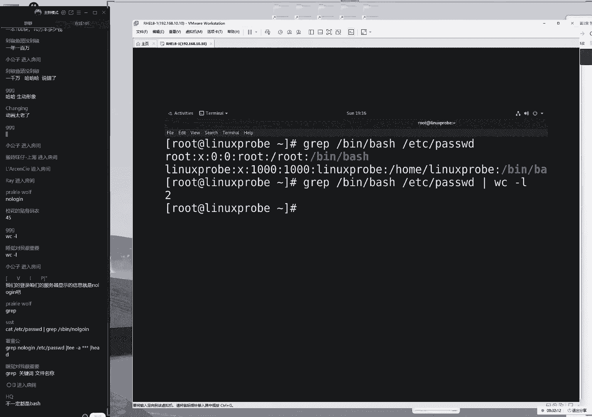
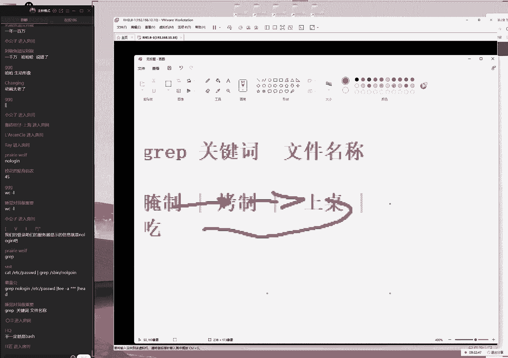
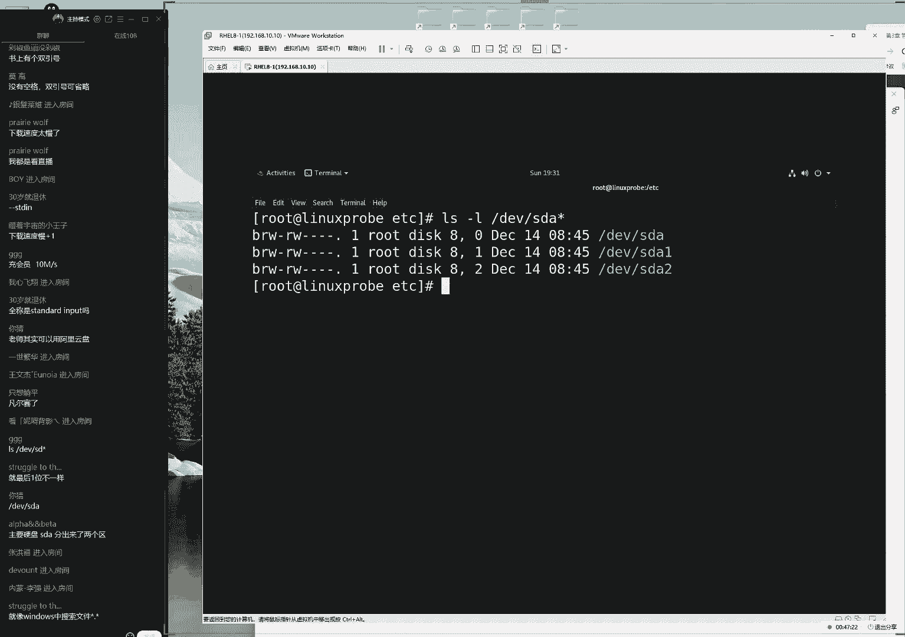
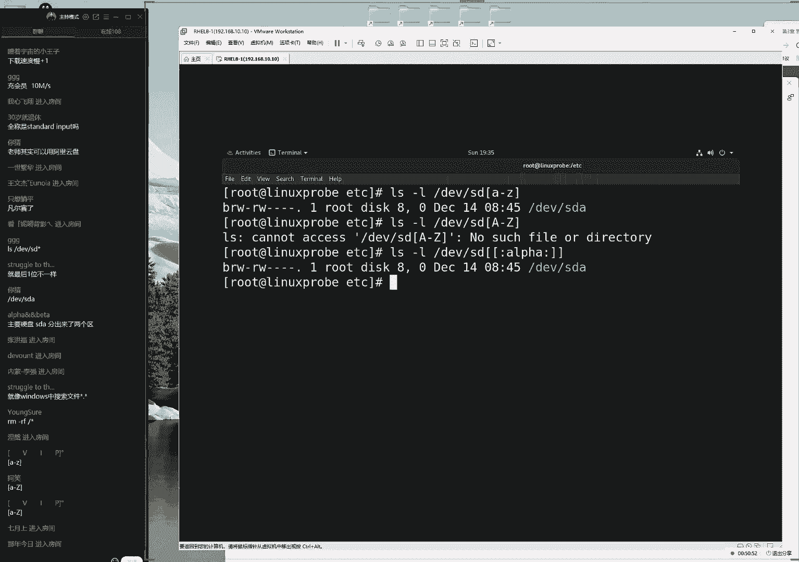
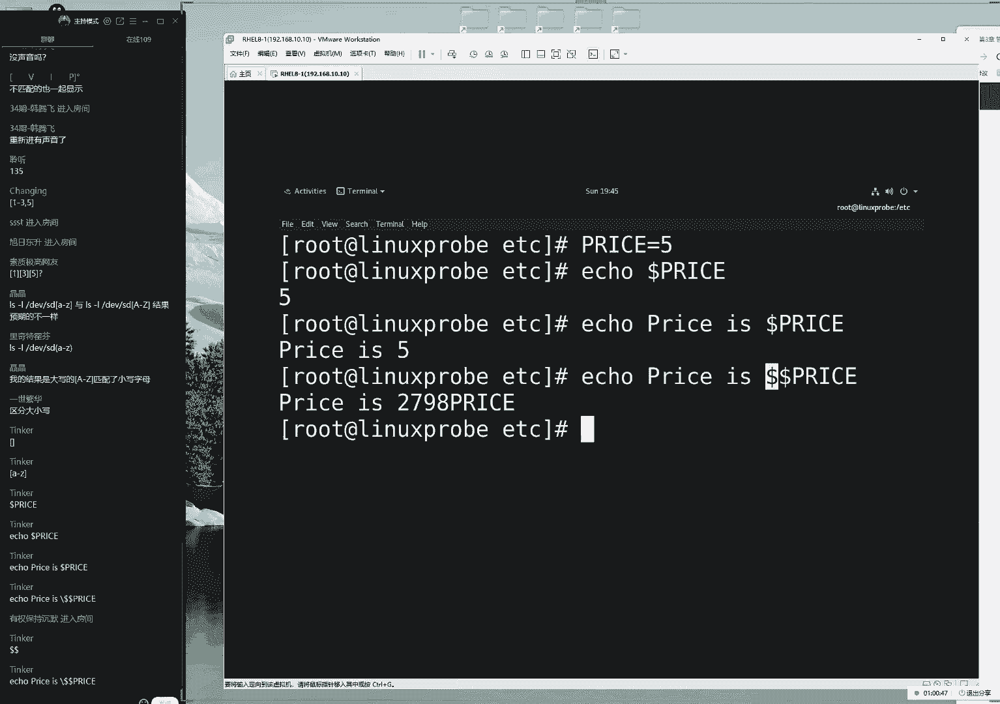
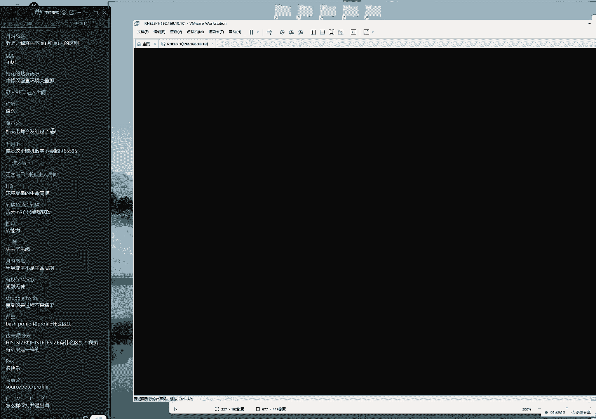
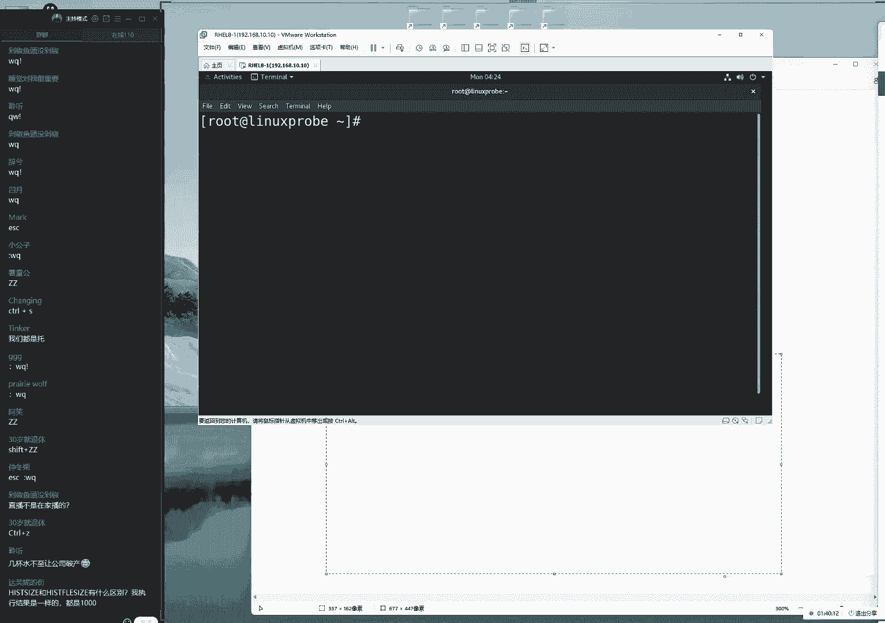
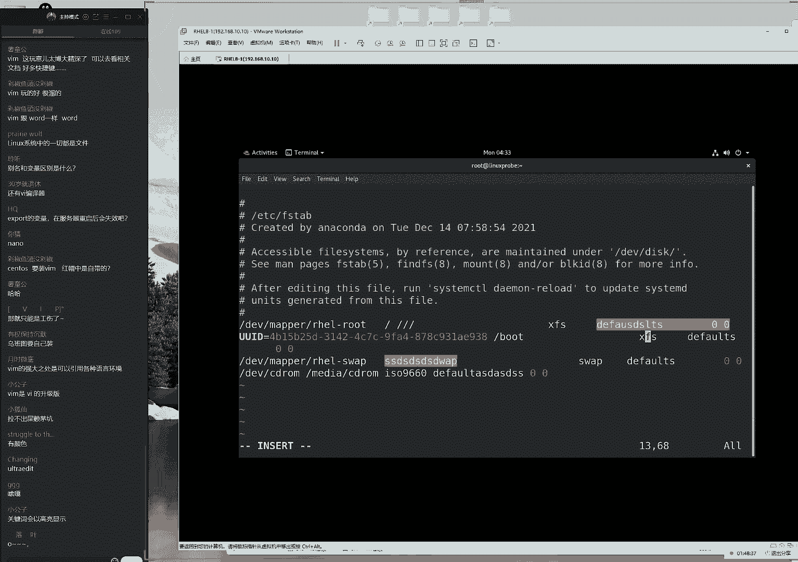
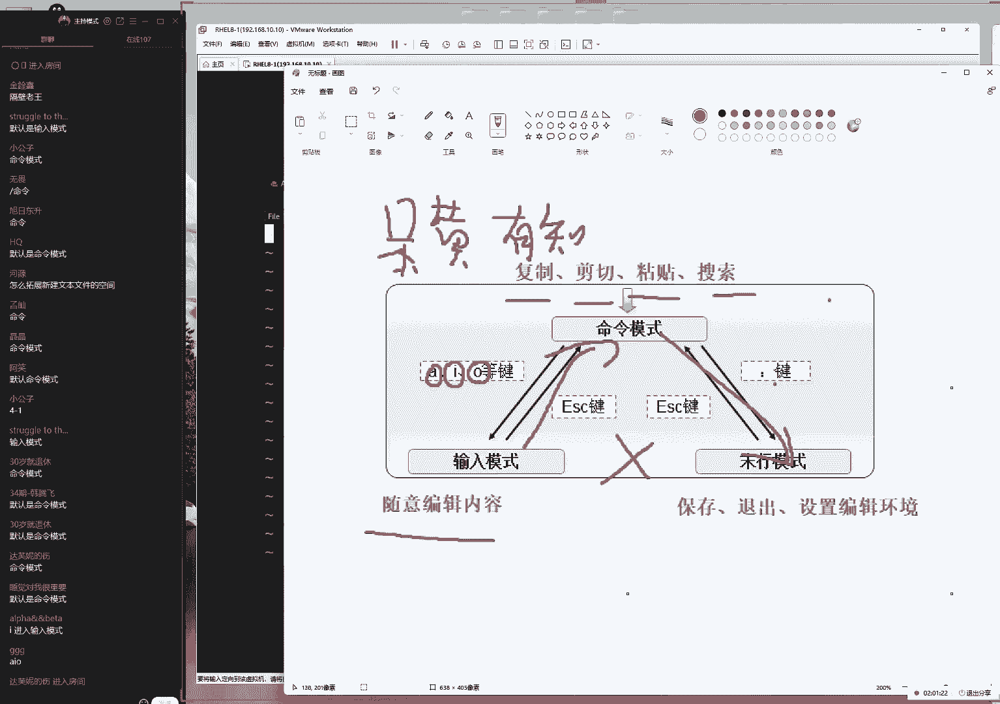
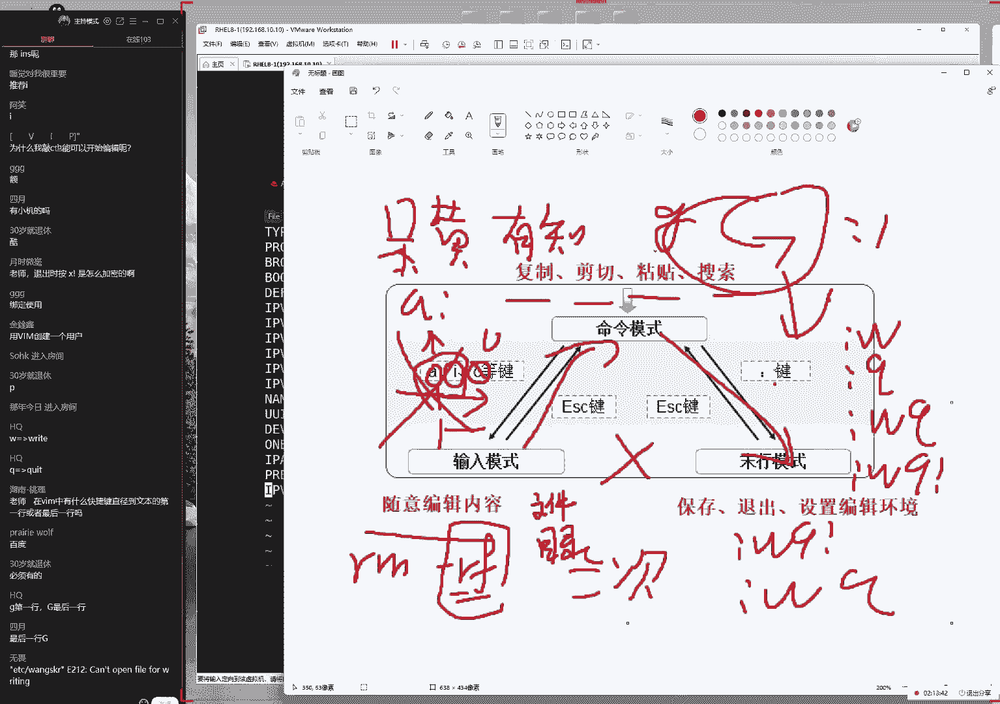

# linux就该这么学第34期 - P5：5【第34期第五节课】红帽RHCE认证培训课程-Linux就该这么学 - 能力努力 - BV1L14y1878S

是啊，did you，ok来过去，我们来开始我们今天这个课程啊，大家们在问什么问题，我看一看啊，大家说今天这个人数有点少啊，都去陪老婆了吗，今天什么日子啊，今天是4月10号啊，这样的话呢我们会说啊。

这样的话呢我们还以为今天是情人节呢，啊好，那我们来开始今天咱们这个正式的课程，大家先打一下一啊，来开始咱们今天正式的课程了啊，那我们先来测试一下我们这个网络测试，大家能听到我说话声音吗。

然后如果没有问题的话，大家可以打一下一啊，然后我们开始今天这个课程，今天的话呢东西还很多啊，这些东西都这么好，每天东西都很多，我们的第三章节，我们的这个管道服，还有这个重庆相以及环境变量。

这个相关的这个知识，那么好呢，我们先做一个简单的回忆行，那我先去回忆一下昨天讲了什么呢，啊先去做一下回忆，昨天的话呢我们讲的这个啊，这个是稍等一下，这个字体好像不是默认字体，不过看起来很舒服，稍等一下。

那我们来说一下的话呢，就是我们昨天讲的什么呢，我们准啊，那我们昨天讲的叫做这个重叠相符，那么后来这个重定向它是分为了两种的，对吧，我们叫做输出重定向，以及叫做输入重定向，再把昨天这个课程啊。

再把昨天这个知识给大家简单去啊，梳理一下，这样的话大家能够找到重点，它可以加以区分好，先来做一个简单的回忆啊，就是我们现在的话要先去说一下昨天的啊，重庆相府，顺便我们等一下我们的同学们啊，刚才88。

现在92啊，那我们又来了几位同学，那先说一下这个重定向的话，它分为了两种，第八第一种的话呢叫做输入重定向，但是因为这个我们昨天是给大家讲过的，所以我们现在就稍微的快一点了，那么如果说您是第一次。

看我们这个课程的同学的话呢，千万不要误以为我们讲课就是这么简单的，然后给大家去过一遍啊，是因为昨天讲过了，因此所以啊话今天才会稍快一点的来，那我们给大家去说一下的话，这个重定向分为两种分类。

叫做输入重定向，以及叫做输出重定向，那么顾名思义，那我们这个输入图中下它最为简单了，输入充电器的话，它主要是作为我们的怎么样呢，它可以加一个文件，给它导入到一个命令里面，所以它这个输入的过程的话呢。

是一个小于号，后面加上文件的名称，就可以将文件里面的内容，然后导入到一个命令里面，所以我们才呃比如说昨天做这个命呢对吧，那我们才看不到文件名称，直接就能够去读取到这个文件里面的内容，是同样的一个意思。

好第二的话呢我们叫做输入重定向，它的话呢就是将我们命令要被，原本就要去输出到屏幕的这个内容来，去输出到一个文件里面，这个的话呢就把它做到输入处形象，它指的是对于我们的main来讲的，一个输出的一个过程。

它分为了很多种，我们第一的话呢叫做清空写入的重定向，第二的话呢叫做这个追加写入的重定向，还有一句话叫做错误的清空西游重庆，像这个话代表就是错误物的啊，追加九重定向，那么我们还有叫做呃合并输出。

它是啊并不区分这个标准跟错误这么几种，这也是我们比较常见的几种情况，好大家问了一个问题，没有红框，以前有吗啊是吗，那么以前可能有啊，那我们现在没有注意好，那么大家问了一个问题，大家说是不是没有录视频啊。

录着呢啊大家可以看一下，我们这边是在录的，然后今天晚上的话呢，还会在12点之前，给同学们传到这个学校页面里面，然后今天的话呢对于说昨天啊，唯一的一个变化就是，北京变得特别的热了啊。

然后我们呃除了这以外的话呢，嗯嗯没有其他的变化了，那我们来开始就到我们今天这个课程啊，3。2小节，现在98个同学，那我们就不那ok那我们就真的不等了，跟大家等了很长时间了，在这个人数差不多100了。

那我们继续来开始今天这个课程的，那也就是说重庆向的话呢，它实际上是作为我们的命令，与我们的文件之间，进行一个交互的这么一个操作符，那么命令跟文件之间，那我们就回答会玩了，那我们接下来今天玩什么呢。

我们今天玩的叫做管道符，他能够去将我们的命令跟我们的命令之间，哎等一下啊，这个的话呢，是将我们的命令跟我们的命令之间，来进行一个有机的一个啊互动，或者说的话，它是将我们的前面一个命令的一个输出。

结果交给我们，后面的命令的话，再来进行一次二次输入，也就是说，之前我们是把命令里面的，这个信息给了文件了，现在的话呢，我们是想将我们面对的这个输入结果，给一个命令，所以这就是一个很呃，那么这啊啊那么好。

这就是一个很关键的一个区别，大家一定要看好，如果说要将命令跟我们的文件来进行一个，信息的传递，我们这把它叫做管，那我们把它叫做重定向服对吧，那么如果说我国内，我们是将命令和命令之间。

来进行一个数据的交互，那我们把它叫做管道符，好，大家先记一下这个区别，所以说这是命令和文件，这是命令和命令，怎么样啊，上海也热的时候啊，哎呀这个你这话啊，这个这个怎么讲。

这个在北京真的是没有感受过春天跟秋天，就是要么就是剧本，要么就是巨热，所以一定要珍惜您在这个北方，尤其是在北京啊，度过的每一个春节跟每一个秋天好，我们啊继续来去说一下管道符，这个管道符的话呢。

我们敲的这个方法，大家是按住我们的这个shift键，然后的话呢您去敲一下回车上面那个键，大家一起来打一下，同学们来按住你的shift键，然后的话呢同时一定要同时不要撒手啊，然后我们按一下回车上面那个键。

于是就会得到一个小书柜啊，这个小no哦啊，那么后来这个小书柜的话呢就叫做管道符，其实我们可以看一下的话，他可跟同学们看一看啊，啊大家说怎么样，嗯没有太大问题啊，怎么马上到上海了啊。

好我们来继续来就说一下，我们看一下这个呃，它的话呢是上面没有这个勾，因为可以看到如果打了一个一的话呢，或者打了一个i的话，其实可以看一下它有很大的区别对吧，或者是一个啊，或者它是一个i的话。

它都有一个很好的一个区别，这个的话呢叫做管道符，他是上面没有那个小揪揪，然后底下也没有这个消费，买的这么一个小书柜，所以我们也可以把它比作叫做任意门啊，这也是我们的一个梗。

就是只要我们参加过我们的培训的同学，大家都知道我们的一个黑化，因为这个我们的这个书籍的话呢，目前每年大概能销量10万多册对吧，我们从15年到现在啊，不我们从出版书籍啊，到现在的话呢我们低调来说。

现在每年10万册也已经67年时间了，然后第二部已经有了呃5年时间了对吧，那我们的话呢我们现在这个换了网站以啊，换了这个每天访问量也能达到600多人，所以我们现在有一个小小的一个黑化啊。

就是我们会把它叫做花，叫做什么呢，叫做任意门，因为有一个呃日本的一个动画片，叫做呃哆啦a梦里面就有这么一个小道具，它的话呢是作为人和物的这么一个传送的，这么一个作用，大家可以看一下，其实这个符号的话。

它又很像当我们一个人，他从这个门旁边的话呢，穿过去的时候，那么就可以对它进行一个数据的一个穿越，所以我们也会把这个管道，佛教的这个任意门啊，那我们以后如同学们以后面试啊，或者说您去面试别人的时候，唉。

在遇到有人说这叫任意门的时候，说明就是我们的同学啊，大家可以互相照顾一下，这也算是黑化，因为从17年到现在，我们也讲了56年了，我们的这个受众的话呢，就呃几花了几10万人，上百人啊。

上百万人应该也是已经都知道怎么回事了，所以这个也算是我们的一个梗吧。

好那我们为了避免站啊，那么好，因为我们上节课我们去问了一下。

说大家有没有看过这个动画片，但是同学们没有看过，所以我就啊特意找一张照片啊，找啊特意找了一张这个图片，然后给大家看一下，这个是这个任意门的一个效果，就只要是一个人或者一个物，穿过去了之后的话呢。

那么就会到另外一个地方了。

那我们这个管道符的话呢作用是相同的，这个管道符的作用就是，如果一个命令的输入结果通过这个管道符，那么到了另外一个命令里面，那么好了，那么这个啊第二个命令就会把前一个命令，这个输出结果的话呢。

当做是他的这个输入值来进行一次二次处，理，我们的写的格式的话呢是这个样子的好，这个非常的贴心，对不对，还给大家找了一个图片啊，还好那我还给大家找一个动态图片，那比如说我们现在的话呢有两个这个命令。

那么这样的话呢，这个疏解方法就是说，会将前面一个命令的输出结果，给了我们的第二个命令，好，这个时候大家会提一个问题，是老师，那也就是说这个管道符只能用一次吗，不换到fk，用到很多次，甚至是无限次。

我们只需要把您需要去处理的这个命令，需要再来进行操作，这个命令放到后面就可以了，我们可以继续去写命令c没有任何问题，这是可行的好接下来的话呢我们再来啊。

接下来我们再来接着再来啊，我们来看一下，现在的话呢有一个使用场景，比如说还是昨天这个小的文件。

我们就按照书上的来说了啊，有文件对吧，那我们这那我们就来听照着词儿说了，那比如说的话呢当前有一个文件，这个文件的话呢是在etc目录里面的password，这个文件上节课给大家去说，到过这个文件的话。

用来是保存用户的这个信息的，它每行是一行用户信息，其中的话呢，它最后一个字段大家可以看一下啊，最后一个字段的话呢，指的是这个用户的这个登录终端，这个登录终端我们放眼望过去。

实际上这个这个这个它都是一模一样的，我们的话呢它只分为了两种，第一种就是这样的，那我们可以看到大部分的人都是这样子，其中的话呢还会有一小部分的人，他的这个解释器的话呢是这个名称，这是什么意思呢。

首先要给大家去讲，如果说一个用户的这个登录终端，它是病里面的bh的话呢，那那那那么它指的是，它能够正常来去登录我啊，我们的服务器并且正常啊，并且的话呢正常来去使用它这个账户，是没有问题的。

no longing的话呢，那么则代表这个用户是不能够登录，我们的服务器，不能够去啊登录到服务器的啊，不能登录到服务器的，它只能够去使用这个用户的身份，来去管理某些的这个服务。

那么我们现在就有一个小问题了啊，就是那如果说一个用户的这个终端，可能分为这两种，当然同学们会说啊，那我们还有其他的这几种啊，都不管，就比如说我们现在这个用户啊，就分为这么两种登录终端了。

那我那那么我现在我想去了解一下，请问第一个问题呃，当前我们这个服务器里面有多少个用户啊。

那边啊，那么这个非常简单，昨天跟昨天我们去玩过的，就是统计一下这个文件的函数就可以了，对吧，那么就统计出来的这个文件里面有多少行，就指的是有多少用户啊，那么就是45个没有问题好，第二个问题，请问这些。

那么请问这些用户他们都叫什么名字呢，好第二个问题，那好了，其实还是用到cat吗，我们来继续做过滤，提取出来第一列，于是我们来提取出来啊，用户的名称。

ok那第二个问题就回答出来了，第三个问题，请问这些用户里面，有谁能够去登录我们的服务器呢，哎这就是一个很呃，那么这就是一个很新鲜的一个问题了，就是第一个问题，我们性当中有多少个用户。

第二个他那他们都是谁，第三个问题，请问他们能否去登录我们的服务器，那实际上就开的是终端嘛，这个终端的名称如果是病里面的bh的话。

指的是它可以除此以外其他的，比如说像这种的话。

那么那么那么他就是不能够动的服务器，所以这个时候的话怎么办呢，很简单，那个叫做graph哦，大家说我们登录咱们的服务器，显示的信息就是no longing吧，好我们可以去试一下啊，试一下。

那如果说这个用户呃，我们说到了它是不能够多个服务器的，就以这个用户为例，可以看到最后叫做sd nology，对吧好了，那么如果说我现在就非得要登录这个用户，那么会得到什么样的一个效果呢。

我们可以去使用到速度去切换一下，直接切换就会告诉我们哎等一下啊，没有复制上吗，啊我啊ok啊，稍等一下，那么的话我们直接去切换一下，这个用户会告诉我们说这个用户当前的话，那不可用。

我们无法使用这个用户身份，来登录到服务器，就这么简单，唉当然这个不是重点啊，这个不是重点呃，我们的话的重点就是，我们该怎么对于这个信息来进行一个提取，提取方法是这样的呃，我们的话呢首先去使用到grap。

实际上按照关键词嘛，按照关键词来做信息的，这个提取grab命令的话怎么去写，一起来说出来它是不是有一个格式啊，非常简单，这个话也是红毛r直塞，这句话也是红毛r h c一道，不是啊，对对啊。

其实我说对了啊，这句话是上午那门考试，而h3 c一到考试原题去使用到grap后面，加上这个关键词，后面加上这个文件名称，就可以去按照我们这个电池来进行搜索，搜索到到底哪一行里面，非常简单啊，这个是啥啊。

怎么啊怎么还啊，这是怎么出来突出一个图标来好，我们来进行，那我们来进行这么一个过滤，哎怎么又出来一个啊。

好那我们继续来啊，来给大家继续往后继续说，那么搜索关键词的话呢，叫做s病里面的nology对吧，我们来进行搜索，后面的话呢尽量文件名称，也就是说命令关键词以及我们的对象，它指的是命令的一个承受方。

a一下回车，然后大声说一句走你啊，于是就可以过滤出来了，所有的我们是不能够登录服务器的，这个用户好，我刚好说错题目了对吧，那我们现在想要去搜索的是，有多少用户能够登那它啊，它是能够登录我们的终端的。

其实刚刚我们也去换那啊，那我们刚刚其实也可以加一个杠v参数，做反选啊，只不过那个有点超纲了，我们就按照这个思路啊，替换一下关键词，搜索一下，有多少个用户能够登录到我们的服务器。

然后大声还是句说一句走你啊，第二次可以看到那边有两个用户，那好了，这是第三个问题，第四个问题，我现在已经知道是谁能够登录服务器了，但假设说我现在这个服务器里边，有10万个用户，其中的话有3万个用户啊。

它是呃它是呃它是能够登录啊，我们的服务器的，现在我想知道具体的数量，这时候怎么办呢，那么就要用到了啊，我确实绕了一大圈啊，第四个问题就要来了，就是我们要想要让呃，那我们要想去统计一下这个用户的个数。

实际上可以看到它每行是一个用户信息，它将这个信息输出到屏幕上面，那那就好了，那就很简单了，去一个w杠l将我们要去通过这个管道符，将前面原本要被去输出到屏幕的内容对吧，然后通过这个管道符传递给后面的命令。

再来进行一次二次处理，于是按下回车得到的就是个二，那么当前有两个用户，他们能够登录我们的服务器，那么就这么简单。

这个的话，就是昨天给大家说的一个小例子啊，但是好像没有录上，就是这样的啊，我们可以把笔的时候就是生活当中，我们去吃烤串儿对吧，然后的话有人负责腌制和烤肉，这好像说过了，好像昨天也讲过了啊。

来那么的话第二个人他负责这个烤制对吧，然后那我们来负责啊烧烤，然后还有人负责啊上桌，最后有人负责吃，那我们总是会将前面一个人的这个处理，结果的话呢，交给第二个人再来进行一次二次处理。

这个我们就把它叫做管道服务，它就会将前面的一个输出，结果给了第二个用户，大家能够理解这个就没有问题了。

那这是一个小例子啊，再给大家举一个更小的一个小例子啊，越来越简单了啊，这书看起来说的很水，然后我们来看一下啊，下面一个啊也很有意思的一个实验，就如果说我们要想大家看到啊，我随便去切换到一个目录里啊。

里面去是什么目录不重要啊，不管他不管他来，我们进入到这个目录里面，第六章节我会给大家去聊啊，etc他个马使大概就是下礼拜下礼拜六日啊，来我们进入到这个目录里面了，来查看一下这个目录信息。

然后查看一下这个里面的文件信息，可以看到啊，这里边的话呢文件多多啊，好多好多文件都有多少个呢，如果说我要想去快速去统计一下，我们的文件的这个数，我们该怎么去做呢，就是我们要想去快速去统计一下。

当前目录当中文件的个数，那就很简单嘛，没那么既然每行啊，它是一个文件信息，于是我们就可以这样子ios gl对吧，我们来做一下wc gl，统计一下，原本要被去输出到屏幕的上面的这个信息。

总共是有几行a下回车啊，可以看到260行，好，下面给大家提一个小问题啊，我们之前给大家说过，就是我们要有两个这个呃，讲课的一个宗旨啊，第一要让我们的技术啊比较啊差，同学的话呢能够吃得饱对吧。

而且我们还能够吃得好，下面给大家提一个问题，做算算算，都是一个扩展知识，请问看一下我们去使用的ios gl，去查看文件的时候，显示出来的这个信息，是每行是一个文件内容对吧好。

那我们现在如果去使用的alliance的话呢，它是每一行它可能会有很多个文件，它可能会有两个或三个，以我为例，现在我现在我看到我是每行有三个文件，对吧，随着我拖动了一下这个窗口。

于是可以看到这个信息变成了一行，变成了两行，变成了五行，变成七行对吧，那我们可以看到，其实我拖动这个窗口，它每行所对应的这个文件的个数，是不一样的，那么这个时候我再去使用的alice，然后统计一下函数。

为什么我统计出来的这个数诶，怎么少一个啊，稍等一下啊，啊为呢啊，那我们为什么也能够统计出来这个数量，那么好呢，其中还是少了一个，当然了，这个其实还是这个涉及到第一个，第六章节啊，少那个文件我们不要管啊。

少那个文件不要管，因为的话呢那个是呃那个点跟点点，它实际上指的是我们的一个目录啊，这个我们先不用管，就是现在给大家一个问题，呃，假说出这两个文件的这个个数是一样的啊，差了一个。

我们第六章会和大家去说少的是什么，那我们为什么也能够统计出来，这个文件的个数呢，这算是一个呃，那那那我们这算是一个扩展知识啊，大家的话先去思考一下，然后我们来给大家去细聊哦，大家已经说出来了啊。

因为这个答案已经是啊说出来啊，说这是小事，那么说这是啊，这句话是一个显示问题，我们叫做小狐仙同学说的啊，啊那么这是一个显示问题，那我们怎么来进行一个佐证呢，来确认一下，他到底是不是一个输出的一个结果呢。

不过他啊，他好像他是不是只是一个输出的一个，显示效果呢，比如说我们现在去学到alice s，查看一下，当前这个每一行的数量是不固定的对吧，大家说这是一个显示问题，那么很简单进行佐证，唉。

ios输出到一个大将，我们原本要被去输出到屏幕的这个信息，输出到一个文件里面对吧，这个非常简单，我们就把它叫做小胡吧，那因为你是第一个同学，发现了这个问题的啊，那就来，那么就一来啊。

来进行一个命名来输入到这个小湖里面，然后再去看一下这个文件会看到是不是啊，果然是哎，那还真是每行这个呃新的话呢，每一行都是一个文件的名称啊，它会把它确实是一个终端显示的一个问题。

因此我们可以通过这样的这个方法，不用加这个gl，也可以统计出来文件的个数，没有毛病啊，这是个显示问题，好下面再来给大家一个问题，就是呃再给大家一个另外一个小例子啊，再给大家个小例子。

比如说我现在还是不理解，说这个管道不到底我们能够干个啥啊，就是我现在啊适用场景有哪些，再给大家举几个，比如说我们稍微给大家讲一个命令，叫做p s a o x，显示出来所有的这个进程信息。

详细的这个介绍一啊，那么强烈，再回车里边的话呢特别多啊，如果没有猜错的话，应该可能会有几千个这么多大，那怎么办呢，首先第一点我想了解一下具体的进程数量，我就可以去使用的wc高l来看一下哦，432。

那么现在有432个，就可以通过这样的这个方法做一下统计，那我除了他统计一下个数以外，我们是不是也可以通过这个gram命令，来去做一下过滤了，让我们去专门去找到某一个进程，就这么简单，就把它给找到了。

或者我们可以换另外一个呃，关键词是不是就可以一下子找到这个服务，它所对应的一个啊这个进程，它所对应的一个具体信息了，这就是管道服的第三个作用，我们可以去发散下去思考一下啊，然后大家现在问了一个问题啊。

大家说啊多列行总计对，因为的话他输出的这个格式里面，它会这个是不一样的，来我们接下来再来啊，大家看一下啊，这样我们来看一下，这是第三个，也就是说它实际上就是将前面的这个输出，结果给了后面的这个命令了。

那我们还有没有其他的例子呢，还有的啊，例如说想要去重置一个，某个用户的这个密码，那我们就这样去做password，后面加上我们的用户名称啊，比如说叫做linux probe啊。

我们刚开始安装的时候有这么个用户啊，真是有来啊，对这个用户进行一个密码的重置，他说请输入您的新密码，那我们就来去敲一下，叫做red hat新密码，他说请重复输入一下您的密码，然后这个时候的话呢。

我们还是再去输入一下密码啊，那可以看到了，这个就已经重置成功了，那现在就有问题了，那我现在如果要想对一个用户，来去重置密码的话，我需要去输入两遍，很麻烦，第二点的话就是如果要要，那么啊。

如果说要想让一个用户进行交互式的，我们怎么去写到下午脚本里面呢，对吧，就像我们去看电影一样。

它会有一个剧本对吧，他会把他会按照这个剧本来去，1234往下去演，那它跟话剧是不一样的，它不需要有人跟他互动的，那这个就是电影跟二人转的一个区别，如果说我们现在要把我们的这个shell脚本。

变成一个电影啊，或者变啊，或者变成一个剧本的一个形式，而不是二人转，它是不需要跟底下人进行互动的。

那这个时候怎么办呢，我们能不能把这个重置的这个操作，给它自动去完成呢，这个就要用到之前给大家讲一个命令呢，叫做io，可以将我们的用户的密码，然后通过这个echo的话呢，是不是就大家去输出到屏幕啊。

那我们可以看到就可以通过战斗命令，将用户的密码去输出到屏幕，然后干嘛呢，然后不就让我们这个命令进行接收，不就可以了吗，那这样的话就可以，通过这样的一个输出的过程中，我啊用这么一句话。

就可以把我们的这个密码的话呢接收过来，然后为用户进行一个重置好，现在给大家提两点，第一点的话呢就是呃第一啊，就是我们一开始给大家讲到的第二章节，打基础很重要，呃，当你把第二章节这个基础学啊。

学好之后的话呢，各个命令的作用掌握之后的话呢，您现在就可以完全投入这，那么您现在就可以完全的投入自己的，这个身心，去感受我们现在这个新的服务，跟这个啊新的知识了，那么如果说您第二章节的话呢，这个知识。

比如说命令还没有掌握扎实的话呢，您总会关系诶，说这个ico眼熟不是，当然我们也不太熟。

这个怎么办呢，要回去翻，那么啊那么就要回啊。

因此再给大家强调一下，就是呃如果说您之前第二章节的话呢，听过一遍的话呢，是不太好的，您建议大家现在赶紧去听第二遍，我们先一边给大家讲课。

同学们现在就一边可以动手，您进入到我们的宣页面里面，去下载一下这个预期视频了，因为为什么要给大家说一下这个问题呢，因为我今天下午的时候还居然还记得，因为我们同呃呃换我们呃，同我们同学发信息啊。

已经讲到了第五节课了，结果还呃呃结果的话呢，还有啊，那我们还是不知道怎么进入到学界面里面，所以同学们记一下，现在要赶紧去介绍里面去下载一下，再这样要是再没去过，再没下过视频的话，就有点说不过去了啊。

因为呃进行的是五节课了。

好那我们接下来给大家去说来去啊，这是第一个问题，第二个问题的话呢，就是去敲一下回车会看到这个设置失败的，因为的话呢并不是所有的命令，他都会默认去支持接收标准输入的，或者我们叫做并不是所有的命令。

他都是默认可以去让啊，信息通过重定向的方法给他来进行一个啊，输入的，这时候怎么办呢，我们可以去选用到man，然后去写上这个命令的名称去看一下，这样的话呢我们来看一下这个用户呃，这个呃命令里面的话呢。

它会有一个子参数，我们找到它好，可以看到这边这个参数的话呢，可以来看一下里面的这个介绍啊，呃这个参数是用来去准备呢指定对吧，一个密码，这个密码的话，可以来看一下它的一个that的定语从句对吧。

他说的话啊，that定语从句后面紧跟他说，这个是用来去设置密码的，并且的话那这个密码应该是从一个啊，标准输入当中来去读取的，后面又加了一个which啊，它叫啊又是限定从句啊。

他要他要是d它又是一个定语从句了，他说这个话它可以是一个管道符，也就是说啊，这要不想让我们的命令，能够通过标准输入的形式来去呃，接收一个呃密码的话呢，我们就必须要加这个参数。

他才能够通过管道服务来进行一个读取，因此加上这个参数了，敲一下回车，谁啊，那啊那我们这事儿一旦也就把它算搞定了，可以来看一下，这就是我们去使用到管道服的一个呃，另外的一个方法啊，另外的一个方法好。

下面再来啊，大家说下载速度太慢了啊，都是看直播最好还是去下一下，慢一下啊，那我们最好去啊，反去反复看一下这个视频来，我们先再来给大家去说一下，就是呃3。3小节吧，我们来给大家往后面去说说一下。

我们的命令的这个通配符，那命令的这个通配符通配符的话呢，它指的是当有一个用啊，当有一个信息，如果说我们只知道它前面的，这一部分的话呢，那我们该怎么来进行一个通配。

比如说我现在这个数量也比较的，例子比较多啊，我先给大家说一个更好理解的，我说的例子不太好理解，我给大家举一个例呃，例如说我先是一个校长啊，那我现在是一个校长，我是一个高中校长，那么我们的同学的话呢。

呃要组成一个篮球队，还有这么一个需求，那么我现在的话呢又作为一个校长，有权利对吧，我的话呢还有我们全校师生的这个信息，我还有数据，现在我需要去找一批人，那么这个打篮球的话呢，众所周知。

像我这啊那啊那么那么那么肯定打不了的，因为的话老这个老刘身高啊，老啊现在的话1米791米七八对吧，那么呃那么这个个子的话呢并不高，那如果说要想打篮球的话，怎么着也1米8以上吧。

我们觉得这个呃1米8以上的同学，可能更喜欢打篮球，或者说更有呃啊，可能性成为篮球队的这个成员，那么于是我现在就可以做一下搜索了，既然我有一个数据库，那么于是我就可以搜索一下所有升高对吧，什么什么什么呢。

为180的，所以的话呢身高为181的，所有的话身高为182的，然后我们来一次，然后189，然后再巴拉巴拉巴拉，然后来做一下通配，然后呃不然后我们的话来进行一个搜索，但是换了这个总是很麻烦的。

因为我们需要一个一个这样去写，那么有没有其他的方法呢，有啊，就是搜索所有以18开头的不就行了吗，对吧，搜索所有人的这个身高是以18开头的，那么只要是为幺八开头了啊，100啊180啊开头的那话呢。

这个呃身高就肯定是符合要求的，那这就叫做通配符对吧，那么我我那，那我们可以根据前面的一部分，这个信息来去做一下同配，只需要去输入前面的一部分。

就可以去找到具体的这个人或者这个事情，好，我们再给大家举一个技术上的一个例子，就是做通配吗，例如呃例如说现在有两个，现在有几个文件dv啊，目录里面的sa，这是第一个文件，第二个文件的话呢叫做呃a1 。

第三个叫a2 啊，巴拉巴拉，可以看到345没有，那也就是说现在的话呢我们有三个文件。

dv目录里面的i啊啊，这我们给大家写下了吧，因为这需要做通配低v目录里边的sa，好的a1 a2 啊，这么两个文件，请问就以目前来说啊，不管它的作用的情况下，这些信息有什么共同点没有啊。

但我说出来这个答案了，同学叫啊，已经打出来了，gg是吧，同学好，ok来大家打一下呃，发现我们规律没有，就这些信息有什么规律啊，实际上它就是以某一个关键词开头了对吧，它所有的这个信息都是以这个开头的。

而且的话大家会发现大家说这个的话，最后一杯不一样，它也有一点特点，就是他最后一位是不一样的，而且的话呢它这啊，这两个文件的最后一位是不一样的，而这个文件的话呢它又没有最后一位，也就是他的啊。

他是我们这个搜索到这个值的本身好，那我们这个时候怎么做通配呢，这个时候好的。

它只有两个，如果说在它要有，它是要有几十个的话呢，那我们就要去啊1234的，然后我们来去拼命的去改，然后再去查看特别的麻烦，通配的方法很简单。

我们第一个通配符的话呢是叫做一个星号，这代表的就是一个全部通配，它可以通配的是一个空值，或者是叫做无穷多的值，都可以叫做空置或者无穷多的值，都可以来进行一个通配，怎么理解呢。

呃如果说等一下等一下等一下哎，这个怎么窗口关不上了，稍等一下，诶，这个窗口很碍事啊，挡住我们的字了，来我们往下一点点啊，来好那我们先来看一下的话，现在可以看到有这么一个这个啊，通配符是一个星号。

星号的话代表是一个空置或者无穷多的，这个信息，我们呃操作当中的话呢，如果是这样的，如果说是dv目录里面的s d a的话，后面如果说是一个星号，那么则代表的就是它能够去怎么样呢。

通配出来它本身因为它可以是一个空值，好ok这没问题吧，好第二个它也可以通配出来，它多后面多了一位，就是它我们实际有的，他的话也可以通配出来dv目录里面的啊，巴拉巴拉巴拉啊，它可以后面黑他啊。

后面还有很多个，所以的话呢它可以通配出来空指啊，一个两个三个，然后以及啊做的这个信息，这个我们叫做呃星号。

那么于是来看一下效果，dv目录里面的s a，然后一个星号看一下效果，得到了这样的一个结果，它能够突破出来，它本身它这样的一个效果好。

下面再来对他画各式跟windows里面是一样的，其实这两个它是它们都是通用的好，下面再来的话呢有一个叫做问号，问号的话呢是代表就是以一个单个字符，单个字符我们可以去使用到，这个问号的话呢。

来去做一下这个通配，问号的话呢是必须要通配到一个的，比如说现在我们去dv目录里面的sda，还以它为例对吧好，我们现在加了一个问号，那么他就不能够匹配出来，大家看一下啊，我先给大家去写吧啊。

然后然后然后这样然后这样，然后再这样，再这样这样再这样这样这样这样好，就比如说我现在有了这么一个信息呃，确实有一个问号这样的一个形式，请问我们一批啊，去通过以下信息能突变出来什么呢。

首先来说这是不可以的，因为这个后面没有信息，它必须是单个字符，那么因此这个是匹配不出来的好吧，第二个的话就是这个信息也，那么也是不可以的，因为它有多个，我们平时是单个信息好，最后的话呢它就是这没有问题。

因为他最后多出来的一位，这就是我们的问号的一个作用好，大家现在可能会问了一个问题啊，说怎么样删除所有文件好，那我们现在的话来给大家说一下，下面一个问题，大家会说老师唉呀。

我觉得你这个吧能够充沛上倒没有问题，但是的话呢跟工作需求不符，工作的时候不会像你这么宽泛对吧，然后这样的话，这个的话这个搜索起来太宽泛了，太不严谨了，那如果说我想要去通配出来，指定的这个信息怎么去做呢。

比如说我想要去通配所有的这个字母啊，因为你看这个是一个单个字符，那也就是说它既有数字又有字符，都可以做通配，但我现在不想，我只想通配出来这个呃字母怎么办呢，我们可以去使用这样的一个形式来进行，我换了我。

我我们换到这个诶，之前我们建议大家是这样去写的，然后但是的话呢就是我们可以这样去写，然后也可以这样去写，大写的a到z，小写的a到z，但是的话这个要去分别去写两次，这个比较麻烦。

它代表的就是通配的是单个的呃英文字母，英文字母啊，稍等一下，英文字母其实这个书上都有，但是我要给大家一个小屏幕上的话呢，正好如果您没带书的话，就省得翻书了，来单个的大写英文字母。

这是我们通背英文字母的一个方法啊。

只通过小写英文字母，或是通过大写英文字母好，我给大家举一个例子啊，来还是这样的dv目录里面的i c，然后我们来做一下通配小写的a到z对吧，作为这个小写字母开头的来，可以看到搜索出来了。

所有的大写字母a到z那么去做，那么来做一下烘焙，我们会发现没有这个文件啊，没有找到啊，那我们来看一下第二个。

那那我们如果要是呃不想去区分，我们这个啊大姐跟小写的话呢，可以这样去写，使用的是两个中括号里面的话呢，呃去写上这么一个单词，为字母的一个意思啊，来，ok没有问题啊，这不代表就是通配所有的这个字母。

单个的英文字母这样的一个方式来。

我们给大家写好了之后来做一下通配，大家需要记住的话，这边是啊，那我们如果里面写的是一个单词的话呢，这边一定要是两个中括号给它括起来啊，a l p h a啊，谷歌公司的这个呃名字来做一下通配。

所以的话呢我们会通配出来，这个做的这个字母，即便这个字母，它是一个小写或是一个大写的形式。

都会为我们去显示出来，那么这个除了这个之外的话呢，还可以通过所有的这个数字，那比如说我想要通过一个数字了，通过一个0~9，那好那我们就这样去做，来通过一个零杠九，那我们还是使用的这个中括号。

给它引起来啊，那我给它扩起来，这个话就代表就是所有这个数字，只要是单个的啊数字，那我们则进行一个单个的数字，则把它进行一个通配画了，这个数字的话呢是不区分大小写的。

这个还要这个还比较简单，来再来做一下通配来，这样的话呢我们去看一下这个效果，dv目录里面的sda它是在的，然后的话呢我们加上一个零杠九，这样的一个情况，于是啊列举出来了啊，一和二这两个情况。

那除了这个之外的话呢，还有什么呢，还有就是同学，那么他会问到老师，那我们现在能够通过出来。

这个单个的这个英文字母的大写小写，还有数字都没有问题，但是如果说我现在在想去宽泛，那呃那么我们现在再想去啊，限定一下这个范围，例如说我想通配一下这个字母啊，这样我们来通便的字母，比如那啊。

那比如说呃a c d e啊对吧，那我们来通过说这个啊指定的某个字母，指定的某个字母。

那我们可以这样去做好了，我来给大家做一下通配，看看效果啊，它并不会去啊，所有的这个消息的a d c都做通配，而是只通配我们所限定的dv目录里面，它是用到逗号做间隔符，那逗号做间隔符。

a逗号c逗号e逗号e对吧，来看一下诶，哦不，这边我都，我这边多写了一个a来看一下效果，于是做一下通背也就出来了，没有问题好，然后的话也可以，对于这个数字来做一下通配，如果说我先不想签订的所有的这个数字。

0~9，我只想通配一下啊，135，那么也很简单，一逗号三逗号五就这样去做，代表就是通过一个指定的某个数字。

这样的一个形式来同样看一下效果，ios，然后dv目录里面的s d a呃，一逗号三逗号五，这样写完之后可以看到这两个项目，只要有的话作为我们到它，作为我们去显示出来，好大的话，听完这个之后我觉得有点难度。

但是我现在的话呢还给大家提了两个问题，如果是数字加字母的话呢，你需要写啊，本来后面去追加就可以了，追加到它的后面，你可以把您的条件继续来去追加啊，追加到后面好，然后这样的话呢去呃去呃。

来进行一个呃严格鉴定，你要去搜索出来这个信息的是什么好呃，然后的话我们现在有这么两个问题了，第一个不像好像我们现有三个问题了，第一个问题就是说，那我们为什么看其他的小朋友们，再去做这个通配的时候。

有人使用的是一个大括号了，而呢这个大括号和中括号，它有什么样的一个区别吗，那大家会发现就在我们这个呃，这呃，这个的话，我们之前见过一些人用到大括号做通配，比如说我们在公司的这个同事什么的。

这个区别是什么呢，这个区别很简单，如果是使用中括号，的话呢要是有则显示出来，要是没有的话呢，则没有啊，则啊不用进行显示，来看一下这个效果，有则显示出来没有的话呢，则啊没有系统显示来。

我们把它改成一个大号大括号的话，效果就是如果要是有则显示出来没有的话，那则报错，这是我们中国号的一个大括号的一个区别，大家可以来呃记下来，但是说出来啊，对吧，嗯嗯没有匹配的话，则显示出来则是一个报错。

大家说啊没有声音吗，有声音啊，只有声音，然后看一下诗人是这样的，大括号和中括号的区别，这是第一个问题，然后大家有可，能说是我怎么看在工作的时候，那其他同时还有一种操作方法呢，就是这样去做你家的逗号了。

但是他有时候他他就啊，那我们啊啊那我们去写这个通配的时候，是用到逗号在每个字段之间进行间隔，那我们那我们为什么看，其他同事们也可以这样去做，也没有问题也行啊，这个话呢我们就说到一个严谨的问题了。

我们先给大家讲的，都是最为严谨的一种操作方式，呃所以的话加上这个逗号，我们能够确定出来，到底每个字段它到底是呃具体的一个数值，如果没有加这个逗号的话呢，这，个其实很不好理解，因为我们可以把它匹配成。

那匹配的是一个呃135吗，还是匹配的是13跟五呢。

还是匹配的对吧，那这个很不好去限定，因此我们现在再给大家讲的话呢，一定是呃最严谨的，那么我们同学们去操作的话呢，以及去输入的时候，尽量要以我们这个为准，然后我们先给大家说一下，因为大家可能会认为说。

老师怎么跟书上不太一样啊，或者跟我们其他的同学在去执行的时候，不太一样呢，这就是一个严谨的一个问题了。

尽量加上去限定每个字段具体的这个值好，然后现，在的话我们看完这个之后啊。

大家刚刚兴问了另外一个问题，就是呃，我们要想来去进行一个信息的一个匹配，那么第三个问题就要来了，那如果说我现在对于这个信息，来进行一个匹配，我想要匹配出来是一个数字加一个字母。

或者说我想要让他去匹配出来网络信息，但是我们最后匹配出来的一个内容的话呢，跟我们预想的是不一样的，这个是怎么回事呢，这个实际上大家可以翻开书，我们往后面去看，这个的话呢我们是叫做转义符。

就是因为您没有让这个计算机能够去，准确的去get，到这些信息就是您呃自己思路很清晰了。

但是的话呢计算机没有读懂啊，我们来给大家看一下，这个的一个叫转义符的一个东西，比如说的话呢我们来啊，大家说啊素质极高网友，然后打了一个这什么东西啊，这个毫无意义，这样的话这个完全错误的。

错误到呃毫无意义了，好我们接下来再给大家呃，呃对对对，那但是我们同学们还又说了一个，另外一个啊，呃另外一种写法。

这个写法的话呢也可以，就是呃，我们现在的话呢匹配的是0~9对吧，并不要求说呃我们必须要是0~9的，其实你，也可以改，比如说啊1~3呀，5~7啊都可以啊，这个一定要灵活，这一定要灵活好，下面还有一个问题。

大家说我们的是这个两个执行结果，但是的话呢预期不一样啊。

您这个预期我预期的是一样的好，我来去试一下啊，来首先您的第一个第呃，第一个命啊，第一个命令对吧，dv目录里面的sd，然后a到怎么样呢，a到小z我的预期会写出来一个文件，它叫做啊dv目录里面的s b a。

这是我的预期，所以我们敲一下回车，ok没有问题，第二个命令我们来看低v目录里面的啊，大写的a到z，于是，来充配一下我的预期是报错，它也没有具体的文件啊，他都找不到，要么调一点回收，发现没有问题。

所以的话呢呃程序是那个程序，只不过大家要去理解一下，它里面这个底层逻辑，然后欢迎我们接下来再来下面的话，其实大家现在想问的一个问题，就是为什么我现在做完这个实验之后，跟你做的这个不一样，是在变魔术吗。

啊这个并没有，是，因为您的计算机没有准确，能够理解您所说这个呃命令是什么意思，比如说现在我们定义一个变量变量的话呢，我们叫做price，比如说这个变量啊，价格，的话呢它叫做价格，价格是v5 。

好大家看一下啊，价格的话呢是v5 ，然后我们下回车，然后我们可以去使用到啊，echo来把我们这个信息，将我们这个变量吧通过dota合作提取，然后的话呢哦，那我们把这个变量通过这个dolf做提取。

然后的话去使用的echo去输出到屏幕上面，那我们就得到了这个变量的这个值变成了，就是说先对这个变量就来进行一个赋值，然后的话呢我们将这个变量里面的值，输入到屏幕上面，因此得到了五，这个非常简单对吧好。

现在的话呢就是哎呀怎么让程序能够读懂，我现在想说的话呢，例如说我现在想说一句话，说什么呢，说价格是五元可以吧，没那么没有那么没有问题啊，那就这样price啊，价格啊，is dollar啊。

price价格为五元，另外的话呢再给大家说一个，我们的严格规范的一个问题，的一个问题就是，严格规范的一个问题，就是您要把您的这个变量的话呢，要写上大写的一个形式，而命令的话一般是小写的。

这个其实我们如果把一个变量写小，写的话呢也行，但是容易让人产生误会，我所以大家记下来，在我们的呃。

在我们的秀当中诶，linux的这个服务器，那么我们一般情况下的话呢，变量是大写的啊，变量我们一般情况下的变量标准格啊，这个严格来说变量要大写，然后的话呢我们的命令要给大家做小写。

然后当我们这样看到之后的话呢，你也可以大概去快速区别，到底是一个变量还是一个命令，这话非常方便啊，好现在给大家看一下。

我们现在这个命令说价格是五元，然后通过调用的方式，调用这个变量里面的值，那就输出到屏幕上面没有问题，说价格是五元，跟我们的预期是一样的，好现在就要来卡bug来了，那好了，如果说我现在我想要啊。

大可说出来这个结果了啊，好那我来我来看一下啊，那我们按照我这个思路来去推理啊，说，那如果说我现在想去提高一下我的需求了，那我想要去输出一说，那那那我们要想去输出，说价格是五美元怎么办呢。

这个时候我们可以用到两个dollar符号，就是我们到前面吧，我们需要在这里就在啊，就是在这个五的前面加一个dollar，符号为五美元，那么于是我再去写一个dollar符号。

当我们再去写一个dollar符号之后，按下回车，但是我们得到的结果啊并并并不是预期，但是我们得到这个结果的话呢，就是得到这么大长串的这个信息，这个信息的话呢是指的是啊，这个数字指的是当前by是这个啊。

p i d号码，那这个什么意思呢，就是在我们这个终端里面，他两个dollar符号碰到一起，它所显示的是当前进程的这个pi地址好，这个问题是出在哪里了呢，这问题就出在了我们的计算机，它没有很好的去理解。

我们想要去做这个事情，大家能理解我现在所说的吧，就是命令是个好命令啊，计算机也没有啊，也没有什么问题，就是他没有把我们想要去做这个事情，理解清楚了，那是谁的问题呢，啊那肯定是我的问题。

我们需要做一下转移，既然来讲第一个我们的dota符号，它仅仅是一个美元的标识。

所以我们需要用到一个叫做反斜杠啊，这个大家还需要吗，呃我们给他，我们还是要保留吧，啊，避免大家待会需要做笔记的时候找不到了，来，那我们来给大家说一下，所以我们现在需要做一个叫做转义符。

它可以将某一个字符给它呃，转译成一个纯粹的一个字符，没有特殊的这个操作功能的。

来我们做一下转移对吧啊，ok转音符，那看来大家对于这个好像预期的很多啊，大家打一下一，就是我们对于第三章节，你打一下一，我们将要看一下这个人数哦，好多呀，那我们这跳过好吧，但我看一下啊，哎呀。

怪不得我讲课的时候，大家互动起来的记性不太高啊，视频就太简单了吧，好我先去倒杯水，马上回来啊，十秒钟，ok来继续啊，凯迪拉这个啊提前看好，您听课的时候就会有一种感觉，就哎再也不慌了啊。

再也不会觉得紧张了，如果说您之前没有看过这一期视频的话，对于我们今天所讲的这个课的话，那是完全的没有概念的，您不知道我们在做什么，你也不知道这个实验做完之后，就是我先这个回车敲下去之后。

得到什么样的一个回血对吧，呃心里没有一个预期，所以你听起来课特别的累，但是如果说你之前看过这个视频的话呢，现在就好很多，基本上就可以躺着可以去学了，来我们继续来给大家说一下啊，什么战啊，战术喝水啊。

对来我们来接下来啊，战术完了之后再继续来，我们继续啊啊该我们去啊，刚才顺便把这个窗户也开了啊，战术开窗，因为今天北京居家太热了，来继续去去输出这个信息呃，将我们这个信息的话呢输出到屏幕上面。

于是大家可以看到了，将这个第一个dot符号的话呢，转化成了一个纯粹的一个符号，也就是说，既然来说dollar符号只是一个标识，作为美元的话，那我们就让他能够理解，我们只啊只是想要把它作为一个美元标识。

没有太多了，你想多了对吧，这就是人和人之间啊。

经常发生物的一种可能性对吧，我们来做一个转移啊，把它转为啊，那就是说我们现在说一句话对吧，您不要想多，我们只是作为一个标识，然后我们可以做一下转义符，这样的话呢就把它给输出出来了，好下面这是第一个问题。

好第二个问题的话呢。

就是呃如果说我现在啊，那么比如说我现在我想要去输出呃，100个道德符号，什么意思呢，就是说我现在我想要去输出啊，dollar dollar，dollar，dollar，dollar，巴拉巴拉巴拉。

我想要去输出这个信息，就是我现在我只想去输出一堆dollar符号，好，我们敲一下回车，但是得到的这个回响的话呢，会是这个样子的啊，同学们不要问我，不要问我为什么会有这样的这个需求啊。

就说我为什么要去输入这个信息，不要问就是有了啊，就是反正就是反反正就是我怎么讲呢，就是有了这个时候怎么办呢，我们按照刚才所讲的，只能做转移，这个计算机的话能够读得懂，我们所说的就是一个一个的去做转译。

同学们，你们不觉得这个很麻烦吗，但同学已经说出来了，这个方法也可以，但是的话呢我现在只有十多个，如果说我现在想要去输出，1000个dollar符号啊，如果说我现在想去输出1000个dollar符号。

这个时候怎么办呢，我们就可以这样去做，使用到两个单引号哎，怎么样呢，把它给括起来，同学们怎么打好多问号啊，啊来我们这样啊，可以是啊，将这个信息的话呢，用一堆单引号给它引起来啊。

不用两个单引号把它给引起来，这样的话呢代表就是进行全局转移的。

全都给他转了啊，就是啊，然后就是我们将完全的所有的，这里面的这个数据的话呢，这个操作符啊，拳头给他转啊，这叫做单个转移，我们给大家研究一边单个转移符，然后呢叫做全局全局转移，将所有的这个逻辑操作符。

全都转化成纯粹的字符，这头就叫做转移来，大家大家记一下啊，将所有的逻辑操作符都转换成字符，都转换成字符，哎这就叫做转译啊，就像这个啊一个电影啊，是姜文拍的啊，就是啊最后我们公布答案了啊，到底什么是惊喜。

这就叫做惊喜来，今天这是我们的第二个呃，这个能够理解的这个事情，然后还想要什么需求呢，还有一个需求大家理解一下啊，就是我们去输出这个信息的时候，实际上我们对于我们所输出的这个信息。

实际上好像也没有太大把握好，我们现在给大家这样去做啊。

去使用的echo，就是现在我们要做什么事情啊，现在做的事情就是我我诶。

我现在的话呢需要把我的指令，然后让这个计算机的话呢，哎呃没有什么损耗的。

能够没有什么误会的来进行一个接收对吧，但是实际上我是做不到的，比如说我现在去使用的echo啊，还是输出a b c d e f，好好去输出以下信息，还有下回车，就连这个我都没有把握，为什么呢。

请问一个问题，当前我们所输出的这个信息当中，这个是命令没有问题，这个是命令要求输出的对象也没有问题，好了，现在请问一下当前我们有几个对象啊，这个有点太色情了啊，好那我们请问一下。

当前我们的命令里面有几个输出的对象，是有几个呢啊大概啊大概画啊，刚打了一个是吧，因为女朋友后面看着呢，来，这个我们刚才再去鉴定一下，我们同学们的刚才的问题啊，就是说就以啊讲这个命令来讲啊。

这个命令它有几个被输出的值，同学们提一个问题，这个命令还有几个被输出的值呢，其实来讲我们是不知道的，是，因为呃，就是您即便知道这个它里面的源码了，您知道它把它当作是什么信息去处理了，但是换一个命令。

你也不知道大家能理解我所说的，因为可以看到我们可以把它比作是，它是一个字符串，它可以是一个字符串对吧，然后呢a空格b c d e对吧，它可以是一个字符串，也可以把你比作是每一个对象之间。

用到空格去做间隔符，1234566个字，那啊六个对象，然后将这个六个对象的话呢，又依次去输出到屏幕上面。

都可以这么去理解好，下面就出问题了，我们呃虽然说使用当中没有用太嗯，没有遇到什么问题，但是它终归是不太行的，这时候怎么办呢，我们建议大家使用的双引号位的，引起来就是有一个原则。

如果说我们的信息当中有空格的话，则需要进行限定，把这个里面的这个字符串的话呢，当做是一个整体啊，则加上作为一个整体来，同学们啊，作为一个整体，同学们现在来句记一下这是啥呀，这是哦我今天安了一个软件啊。

可以自动去找到里面的这个呃错误来，我们就不管它好，大家先看一下我们这个作用啊，就是说呃，如果说您要想去输出这个信息当中，或者的话，您加这个参数里面是有空格的情况下，那么您需要给大家加上一个双引号。

进行限定，当然了，我们现在给大家讲的是最为规范的。

这么一个想法，大家可以举反例啊，就是我们这个反例的话呢特别的多啊，就是您可以去说说你在过程中的话呢，没有加这个双引号也能够工作成功，这么一种案例是可以的，但是的话呢这个不严谨。

到时候我们会给大家去说一些呃，可能会呃，那么呃他可能会出现那些问题，好。

下面的话呢就是我们叫做双引号，这种操作方式，那我们就说这个话呢，转音符单引号，双引号，还有一个符号我们叫做这个啊，叫做反引号，这个号呢，反引号代表就是去执行里面的命令之啊，执行里面的命令。

然后的话呢取返回结果，返回结果，例如说我们现在去了麦当劳，肯德基，我们去点一份套餐，我们需要关心它里边怎么做的吗，应该是不需要对吧，那好了，我只需说出我的这个需求，然后的话呢它里面就来进行一个执行。

他需要把它的返回的结果给我就可以了，那么这个时候的话呢我们可以用到反引号，把我们要想去做这个事情，那么我们就可以通过这两个反引号，大家可以打一下啊，这边的话，您需要把这个输入法先调成英文的啊。

大家先一起操作一下吧，啊需要先把您的这个输入法调节成英文的，然后的话呢点一下您的这个啊大啊，我们还去点一下您的这个呃，大小姐见上面那个键啊，来去点一下您的数据，来看您的这个数字键一的旁边的左边啊。

哎大家进去点一下这个，我看他们都点对了吗，如果您要是点出来这么一个东西就不对了，这个代表就是您的输入法是中文的，来，您需要先去打一下，哎，看看这就不对，因为这个不好找，因为这个平时我们不常用。

比如说带1号，说1号这个老常用，这个号呢不太常用，哎大家先打一下，黄明堂打的一打不对啊，如果说同学打了，另外也打错了，如果说您按住这个shift键，然后您现在去按那打，那么那么的啊。

他打出来是一个波浪线，也不对的，您需要不要按住shift键，然后把输入法调成英文的，再去敲，这个不对，这个也不对啊，这个就对了，大家打一下啊，esc键，esc键下面那个e e s c键下面那个。

一左边那个啊，然后的话呢我们的k b键上面那个，大家打一下哎烟啊，e s c下面那个啊，一左边那个tb键上面那个ok没问题，太大问题了，这就是ok打出来了，嗯好这还是谁啊，我这我看啊。

tvt同学打了一个反斜杠啊，这个就打错了，好错了，太离谱了，好现在我来给大家说一下哈，这个作用啊是用来去执行里面的命令，然后的话呢只取其返回结果，这个什么意思啊，就是我们只要这样去写代表就是呃我们一。

般情况下我们不会用到它，但是的话呢可以放到shell脚本里面的，shell脚本里面去跑一大长串的命令，那命都可以的，长大对啊，大家可以去理解一下，这个里边可以加巴拉巴拉巴拉，加好多好多的命令。

但是我们可以直接去调用就好了，然后调用过后降下这个返回值啊，来进行一个处理就可以了，好现在我们有两个问题，第一个问题老师我没有我我我啊。

没有我发现没有听懂他到底有什么用，它到底有什么用处呢，啊其实很简单，比如说我现在我有这么一个命令，这个命令的话呢是叫做free命，令啊，然后的话呢来查看一下内存使用量情况，这个大家都知道对吧。

然后的话呢嗯哎呀不要这样，第二太难了，嗯也不呃有有，反正有点难吧，就比如就咱就咱比如说，然后的话我们加一个i am啊，这个其实第四章会给大家讲到，那我们以赵为单位显出来内存使用量情况，ok吧。

然后我们再来，然后做一下过滤，我们想要提取出来这一行信息，于是我们就把这个信息的话呢，去做一下取关键词，然后做一下过滤，一把提取出来某一行过键词，然后的话呢，我们再提取出来某一列的这个信息，他这。

个因为间隔符嘛它是空格还是逗号，我们看不到，所以的话呢我们用a w k来进行一个，来进行一个输出，我们来输出一下，我们的这个第四列的这个信息，这样去做，那好了，那我们就不中啊。

那我们就可以通过这样的这个命令，取出来这个信息了，对吧好，我们取出来这个信息了，接下来我们就可以将这个信息，通过这样的一个反引号给它括起来，前面的话呢加上一个变量的名称，比如说叫做哈哈。

也就是说我们现在不需要观察里面，怎么去执行的啊，那我们现在就是把这个命令的话呢执，行结果啊，将这个啊反引号里面，但这个执行结果，然后的话呢，来对于这个哈哈变量来进行赋值啊，变量赋值之后之后的话呢。

大家去输出一下这个结果，会看到已经对它扶持成功了，这就是反引号的一个作用，这是第二个问题，这是第二个问题，这个命令的话呢我们没有给大家去讲，然后我们会给大家去，到时候再给大家去说吧。

既然我们简单理解一下，通过这样的命令，我们能够提取出来一列的信息，第四列的信息通过这样的方法可以做提取，然后的话呢我们可以看到，通过发现号的方，式能够去执行你的命令，然后取其返回结果，这是第一个问题。

大家能够理解他的这个作用，第二个问题的话呢，就是出在了同学们会问到丧尸，为什么我们看其他工作的时候的同事，不是像你这么去做呢，呃为什么加的是一个dollar符号。

一个小括号呢，这就是因为我们这个系统里面的话，它与鱼只有两个写的方法，我们现在给大家写这个方法的话呢，是是通过这个反引号，嘿很气人啊，啊，是通过我们这个反引号将命令给它括起来，这样的一种写法。

还有一种写法是啊，像我等同于是一模一样，一模一样的，也没有谁好谁不好啊，就是这样的使用的是一个dl啊，那么使用是dollar符号，接下来是一个小括号，后面的话写成我们的命令，这两个效果一模一样。

都代表去执行里面的命令，然后取其返回，结果好，下面大家又问了一个问题，特别好，大家说啊，变量定义了吗，变量没定义，变量没有定义，大家需要注意一点，因为这个问题您您能够提出来的话呢，比如说c语言，对不对。

他就是严格要求的，你这个变量的话呢，你需要先定义后使用啊，大家这个原则，先定义的话呢后使用，而我们现在的话呢，去使用到linux系统里边的话呢，变量是直接使用，不用去定义啊，变量之间使用不用定义。

真的不用定义，而且不还是啊它也是定义不了的，所以啊linux的这个变量的话呢，那就用不用定义就可以直接去用了，但是这个会也会有一个好一个不好，好的话就特别的方便啊，不用给你直接用就好了。

但是的话呢坏点就是坏，这个点就是我们无法去限定一个变量里面，具体的这个值到底是什么样的一个类型啊，就是大家区分一下这个啊好坏啊，好处就是更快，了对吧，坏处的话就是无法确定它。

这里面这个信息到底是个什么值，比如说12345，我现在有一个变量变量的话呢，名称就叫做哈哈，然后里面是12345，我们就无法限定的说，它到底是个什么东西了，它可以是个数字，它可以是个数字。

它也可以是个字符串呀，对吧好，那如果说我现在我有两个变量，一个变量叫做哈哈对吧，我们还有一个叫做ho ho ho的话呢，等于呃456789就会出现问题了，请问哈哈，叫厚厚等于多少啊，按照数字计算的话。

大概是我们干嘛给自，己出这么一道难题呀，就就就比如说吧5678 90啊，就比如说我们现在这么一个数字啊，那么呃这是对于数字来进行计算的，那么如果说它是要对于一个呃，他如果是一个字符串的话。

那两个字符串合并之后，那么就会变成这样的一个形式呃，12345，然后456789对吧，那么就会得到这样的一个情况，来进行一个追加操作，那么这个的话也是我们在这种情当中，会常遇到的一个问题。

但是看完了这个会在明天给大家去讲到啊，或者待会给大家去讲到呃，这个话呢先暂且先，按下不表，我们到时候给大家去，大家去细聊，先来往后去翻篇，那看一下。

我们现在有五小节环境变量啊，环境变量大家说我这个能演示一下吗，这没有问题啊，这个就是它是这个不用演示啊，其实是一样的，就是直接就这样去用就好了，其实这个第四章节会大家去说来走你。

然后大声说一句走你就可以了，同学们，如果你要做这个实验，做没有啊，要是没有做成功的话呢，可能就是因为你们没有说那句啊，我们的咒语啊，走你就可以看到没有问题，这两个写法一模一样啊，用这两个写法的话呢。

我们我们也会在明天的时候给大家来，去反复去用，呃，并不是大家在写程序的时候，您两个老是插着用，也没有这个意思，我们的目的是让大家，您能够看得懂别人怎么去写的，因为他们去学啊。

因为我们的同事他们选择哪种写法不一定，所以你两个都要去学，你都要能够看得懂就行了，编写另外一种的时候，你能不能看得懂就足以可以了，喜欢啊，ok啊，这个他这边还有点太偷懒了，然后下面我来给大家继续的啊。

看一下一个问题，其实，我们现在这个学期，就像一个苏格拉底讲的，那个叫产婆术一样啊，总是要通过这个提出问题来进行思考，这话大家记得比较清晰，比如说我现在的话呢，去敲一下某个命令之后。

我们得到了一个回响对吧，我们现在随便去敲几个命令，然后再去敲一下。

比如说reboot命令啊，再来去啊，战略重启一下，顺便喝杯啊，顺便喝口水，那我们现在就有一个问题了，为什么我们敲下命令之后，我们就能够去完成网球工作呢。

好就先去战术喝水。

ok我们来继续啊，随着现在这个北京的天气越来越热，我们的培训机构的这个每天的上课的，这个成本也变得越来越高了啊，以前这个可能是两杯水，现在至少得四杯水起步了，运维成本现在越来越高啊，成本增加了。

来我们废话不多说，开始给大家讲一下，呃，是这样的，我会再回来再去回顾一下我刚才的问题，就是为什么我们敲下命令之后，他能够去完成保修工作，大家可能会想说，老师这不是命令行，他该做的事情吗。

是他该做的事情了。

但是您不想了解它底层的这个逻辑吗，反正我想好，那种话我们于是给大家说一下啊，第一句话就是呃，如果说当你敲下一个命令的时候，如果是用到叫做路径的形式来去执行，就是从根目录开始来去执行的话呢。

比如说啊来开箱什么啊，大家问大家一个问那个问题说不一样啊，为啥有时候是152，有些时候是153啊，因为刚才那个数字的话呢，指的是当前空闲内存值啊，怎么听课听的有点糊涂了，开始的是当前的啊。

当前空闲内存值啊，它是会变的呀，这不是老啊，变来变去的嘛，所以这个是属于一个正常情况啊，刚刚的话那变化还是，比较小的还是比较给面子的好。

下面再来一个问题，就是呃，我们现在如果要是去执行一个命令的时候，如果以路径的形式来去执行，那么一起来说出来，那么就会去直接去执行，就说当有一个用户去执行一个命的时候，优先级最高的啊，效率最高的啊。

当然了，我括弧啊，我所说的这个效率我很不负责任，因为它这个效率是按照几毫秒去做的，用户感知不到的，好吧来呃效果是感知不到的，但是的话呢我们按照理论上来说，优先级最高的一种执行方法方式，是以路径的形式。

加上我们那边的。

名称来去执行的，比如说我们直接来一个查看目录吧，就是叫做bin里面的啊，ios的一个命令，这样的话呢优先级是最高的啊。

这句话呢就是路径加上命啊，命令路径的形式来去执行，右期间即是最高，然后我们会去直接去执行，但是的话呢我们从来也不会这样去做，稍等一下命令文件，好的以及路径的一个形式，那么这句话。

但是我们从来也不会这样去用，因为这个太麻烦了，如果说能去敲我们的ios的时候，谁会去敲那么大长串的命令呢，对吧，那么第二种可能性的话呢，就是我们是否是一个。

别名别名文件啊，嗯alice啊，别名文件，别名alex alex，别名文件好，我a啊，别啊别名文件或者叫别名命令吧，都可以好，因为他命令就是文件嘛，文件就是命令啊，它都它的一切都是文件好。

下面给大家提第二个点，就是叫别名，比如说老师诶，不对啊，你讲的不对啊，你说这两个是一个东西，但为什么第二个是有颜色呢，而第一个没有颜色呢，就是因为他做的别名了，第二个命令的本身他做完了别名了，好。

大家问了一个问题，大家说为啥我这样去做就不行呢，好待会我们来给大家来聊一聊好，那我们现在，的话我待会我们给大家去试一试啊，这叫做别名啊，命令我们可以敲一下回车，这个里边的话呢，就定义了我们所有的已经。

他的话是有别名的，比如说我们刚刚的话呢去执行这个命令，实际上的话呢，它这个底层的逻辑就是去执行的这大长串，大家可以看到了，之前是个这个对吧，当我们去枪毙的时候啊，去敲的谁啊，那我们去啊。

他啊仅仅是敲了两个字母，但是话就等同于去执行了啊。

这么大长串的这个命令，这个的话就有点比作，就是说比如说老刘啊，大，家总会叫我老刘，那么那比如说我是一个啊奇人对吧，但当然这个啊换了，但其实并不是啊，比如说我是啊这个呃少系统护卫啊，啊巴拉巴拉啊。

萨克拉啊，萨和纳拉奇啊，巴拉拉巴拉，然后然后呃老啊啊，然后最后写啊老刘，比如说我是这么想的，觉得这个名字，大家其实听起来也会特别的呃，觉得很绕对吧，所以您干脆给我来一个简写，比如说啊巴拉巴拉最后流传。

所以的话大家可以做一个简写，干脆把它给它写成什么呢，哎老刘就可以了，比如说对于一个很长长的命令，我们可以来进行简写，这个就是命令的这个编程的一个主要作用，大家记一下，面对冰冰的作用就是将命令进行简化。

没有人把这个命令的简单化，然后给它复杂化了，没有人这么去做啊，从来没有压力，是啊压根儿没有这样的一种可能性的来。

比如说我现在有一个命令，是用来去重启网卡的好这个名字特别长，叫做不用管啊，命令叫不用管来，我们因为第八章的时候会和大家去细讲啊，来并不是不讲了，第八章的时候讲，先把这个重心放到别名上面啊。

alex别名命令先把它掌握了，然后后面这个其他的话我再给，大家细聊，比如说这个命令是用来去重启网卡，或者叫做启用网卡的，一下回车诶，网卡自己就启动了，特别的方便好用啊，就啊经济实惠啊，来看一下。

按下回车之后得到这样的一个回响，呃现在的话的命令很长，但是我又经常会需要去重启一下网卡，怎么办呢，很简单，alex同学们刚刚问了一个问题啊，说老师为什么我这样去做的没有成功呢。

您看看您在这个操作跟有什么区别，命令的定义，一般情况下，我们是不建议大家去给他做小写的，比如说我的命令叫做哈哈啊小写，然后等同于我们给，他把这一大长串给它圈起来，按下回车。

这样的话呢我们就每一次去敲哈哈的时候，就等同于的去敲的这么大长串的这个信息，每一次都是按下回车，可以可行，没有问题，大家看到每去敲他，每他每次去敲一次的时候，他都会往下啊，他都会去拿去执行一下。

特别的有特别的有啊有啊，这个效果非常的好啊，很有意思好，这是第二个叫做别名，那么一般情况下的话呢，我们可以来看到alex里面meaning，它里边的话呢也有很多个内置的命令，然后定义好了很多别名。

但是满打满算啊。

看一道，其实他也不，太多嘛，说的多也不多啊，看到其实也就20多个啊对吧。

也就是说大多数情况下的话呢，他肯定也不是别名的形式来去执行的，也就是第三个形式，我们叫做内部命令呃，当它两个它前面两个它都不是的情况下，它会去执行一个叫做内部命令啊，这叫什么呢。

叫做beauty in命令，叫做内部命令，这个的话呢就等同于了，我们就是这个翻译官自己的一些功能，比如说同学们上一节课对吧，我们比如说查看一下历史执行记录啊，巴拉巴拉，还有白人本身这些命令呃。

我们之前给大家讲过，带着解释器，的话呢实际上它就是一个翻译官，他能够把人的语言和指令，转成机器性能听懂的这种啊指令对吧，将人的命令转成机器的指令，然后再将返回，结果的话呢是啊。

输入成人能够看得懂这样的一个信息，那么现在的话呢我们就是呃，如果他是一个翻译官的话，当有一个人向我们提出的问题，比如说现在以后我们这个培训啊，走出中国啊，教美国人去学linux。

就跟美国人叫他们中国人做啊，呃就是我们在做啊，中国饭一样啊，这个虽然这个路很远啊，但如果要一天成了呢，嗯那比如说以后我跟一，个外国人说说老刘啊，讲这个linux的话呢，通过hc的比率很高。

那这个话我们需要翻译官，把他的话转成英语，然后告诉对方，但如果说对方问了一句跟商业无关的，说你们吃饭了吗，这个时候翻译官就没有必要再去问我了，可以说吃货没吃，也就是说啊这个翻译器的话呢。

内置的有一些功能啊，那还还他的话里面有一些内置的这些指令，它可以自动去完成啊，他会啊，他啊他也可以来去处理一部分的这个请求，这也叫做内部命令，但是的话呢绝大多数情况下，都不是我们所说的，绝大多数我们。

比金子还要更加纯度，就是百分之九十九九九，他都不是，那他都不是那只啊，它都不啊，并不是啊啊内置命令，它都是最后一种叫做外部命令啊，外部命令的话呢我们把它叫做呃，把它放到每一个目录里面。

然后的话呢叫做命令文件，因为大家知道我们的linux里面的话，它都是一切都是文件，所以的话呢，我们的命令也把它叫做命令文件，它会把我们的这个用户信息的话呢，以及这个md文件以及设备这个信息。

东映射成文件的形式，保存到我们的服务器里面，比如说我们的b目录里面，巴拉巴。

拉这里可以看到这里面全都是我们的命令，叫做外部命令，也就是说绝大多数情况下，我们都是使用的是叫做外部命令，这样的这个形式来去去工作的，那么现在就又又又多出一个问题来了，说那有现在我呃呃又已经明白了。

说当我们敲下回车之后，底层的逻辑是如何运行的，我们又如何去执行了某个命令，我懂了，但是我又不懂一件事，我系统我那我这个系统这么大，我为什么每一次去执行命令的时候，没有卡呢，大家会发现这个问题吗。

就是我们现在给大家讲完这个之后，您知道命令，执行或者呃他这个流程了，但是的话我我那我我那我们也知道了，大多数情况下都是外部命令，外部命令是保存到服务器里面的。

在某一个文件里面呢，那为什么我们去执行这个命令的时候，他不卡呢，比如说去执行战斗命令，他没有卡一下呢，而但是为什么我们去使用到放了，去进行搜索的时候，他就会那么慢呢，为什么，因为它搜索的范围是不一样的。

就像我们昨天给大家讲过的呃，如果说我要想去找我的袜子，肯定不会去厨房对吧，那么既然是这个样子，既然是这个原理，那我们就可以，把一些命令常去的地方，命令文件常放的这个位置的话呢，给它保存起来。

保存成一个目录啊，这样的话呢，我们再去命令执行的过程当中啊，当我们呃用户去跳呃，当我们啊当这个用户去敲下回车之后，就会在这些目录里面来进行啊精准的查找，这个信息的话呢，保存到一个变量里面。

叫做pass变量，来，我们瞧瞧，回车可以看到这个里面的话，就是通过冒号为间隔符，通过冒号为间隔符，间隔了一个一个的目录，当我有一个用户去执行某个命令的时候，他就会依次的这些他就啊他就会来聚在。

这些目录里面，第一次的去寻找这个啊，命令所对应的一个路径，接下来去执行就好了。

他只需要去搜索这么五个位置，好，我们绕了一大圈子啊，回来了，叫做pass大会啊，能够很清晰的就会知道。

就是如果没有这个path变量的话呢，这个服务器也就无法去运行了。

啊不啊，这个服务器的话它也不能够来去啊，找到我们对应的命令了，这个非常重要，它仅仅是这么一个变量，都有可能影响到我们整台服务器的一个，稳定性对吧，如果没有他那这个命令的话，他，们就都找不到了。

好所以的话呢我们现在要给大家去说一下，另外一个小点叫做叫做这个呃环境变量，这个的话呢我们叫做环境变量，其中的一个，其中的话呢，我们就构成了整台服务器的日常工作，环境的话呢，它有很多的这个常用的环境变量。

我们可以来看一下表格，表格三跟四大概给大家去说一下，那么是由什么来帮我们组成，那么来啊，那我们那么我们来进行组成的呢，首先第一个变量我们是叫做home，另外再给大家去说一下什么叫做变量。

变量的意思的话呢是说我们是一个名称，然后我们这边的话呢可以保存一个啊信息，这个信息的话呢是可以发生变化的，所以我们把它做成变量呃，我们举例来讲的话呢，变量在我们每个人的过程当中的话呢。

以及生活当中都要用到的，你每天都要用，并不是我们的linux系统里面独有的，比如说大家可以一起动手啊，比如说你现在您打开您的手机啊，你看现在打开您的手机，然后的话您打开您的支付宝啊，大家现在打开先啊。

那我先打开一下，然后您看一下您的这个余额好，大家现在把您的余额打到屏幕上面了啊，这个时候大家，会发现一个问题啊，为什么我呃我那么话呢，我那我啊，那么我们每个人的这个支付宝。

都是从那上这个啊商店里面去下载到的，对吧，我们比如说啊苹果手机啊，apple store去下载到的一个支付宝的软件，为什么我们每个人的这个软件，都是从同一个地方下载到的。

但是我们每个人的支付宝里面的余额都，这都这都是一样的吗，好，那么我们为什么我们每个人的这个呃，用户的名称跟余额是不一样呢，就是因为它程序里面都有掉，但是变量吗，变量后来是从数据库里面来去获取的嘛。

啊数据库来，进行一个获取的数据，好的吧，来进行获取的，最后我们给用户来去载，我们的这个前端是显示出来了，也就是说我们通过一个的一个呃，它我们说当中的话呢通过这个变量来啊，那么来啊。

那么他来就构成了我们日常工作的这个，软件的这个环境，其中的话呢呃怎么样-2400啊，交啊大概是交了这个呃我们的学费了是吧，因为到4月底，5月初或者5月中旬又要减去4200了啊，而且能交4200算是好事。

因为有可能会涨钱了，好我们来继续啊，我们继续来看，一下这个home变量，这个指的就是我们拥护这个加工录，加目录指的是用户登录这个主目录对吧，也就是说用户保存自己自己呃，数据的话所对应的一个位置。

我们叫做home啊啊变量，还有话呢叫做这个shell，shell的话呢，指的是这个用户的一个动作终端啊。

它就记指的是它的解释器的名称，我们现在如果想了解一个这个用户，它的这个解释器是谁，那我们就可以去使用到shell对吧，去查看一下哦，他当前使用的是bh好吧，也没有任何问题，然后的话呢。

还有就是他都这是它的这个加目录。

但是这个我，们先不说，第六章节会去讲一下，具体加目录的这么一个作用，先知道这么个变量的意思就可以了，他的话有两个变量，历史执行记录这么一个大小，它指的就是呃我们历史执行呃。

历史的命令的执行的这个记录的话呢，它总共是保存多少条，这个两个变量的话呢，效果是一样的，666跟红毛六七好像和红毛六八。

它用到不同的名称的意思，这个名称变了，但是因为我们这个课嘛，今天让大家能够跨平台，然后去使用以后，您在工作使用的是456，的对吧，比较老的版本，所以我们两个变量都给大家提供了。

这个指的是地址执行的命令当中，我们的啊这个怎么讲啊，历史命的执行过程当中，我们总共保存的这个条数，现在的话来看一眼啊，现在的话当前已经保存了是呃100多少条，110条了，那么最多保存1000条。

就这么点再去实现的，但是如果您觉得这个不够。

你这个也可以改，待会我们要去说到怎么去改这个变量啊，然后想了下面还有再来啊，再来一个叫做mail touch的话，就是这个用户的这个邮件啊，我们会保存到什么位置，下面，我们这个以后也会有一门课啊。

这门课的话呢就会在待会啊，不呸呸啊，就在以后给大家讲到叫做post fix加double call，来部署出一个游戏系统，到时候就要用到这个变量来保存邮件了，还有一个什么呢，还有一个叫做啊语气啊。

来大家记一下语气啊，language语系这个指的是什么呢，语气啊，语言系统，或者说我们用来保存语系，哎呀好来就是说用来保存我们这个服务器，它到底是什么样的一个语言的。

比如说我们安装的时候，它是英文的，那么好了，我要去输出一下我的语气。

得到的就是一个哎呃英语的，一个ut f杠八这样的一个标识，那么好了，如果说您这个大，这个会很常见的一个问题呃，如果说您现在从远程连接到一台，您的服务器，我就老犯这个问题啊，我现在远程电器台服务器啊。

练好了之后还，那么我们会发现里边有好多乱码对吧，这个时候怎么回事呢，就是因为您的这个连接的终端嘛，就是我们来看一下链接的这个终端，您所设置的这个呃环境变量补拍拍啊，这个链接的这个呃语系的话呢。

跟我们的服务器能匹配啊，没有匹配上它两个不一样，您需要做的话，那就是可以看到，小宝这么生疏啊，就找了半天了，居然没有找到，哎呀好，我们找一找嗯，好我看一看，在这儿呢就是说啊如果说你想链接之后。

它显示出来这个啊，语言的话是有乱码的情况下，你就需要把它改成，跟我们这个服务系列保持一致就可以了，好这就是一个系统语系的一个问题，是一个特别的常用，我基本上以前嘛，我们每回蝶结之前都要去调一下。

因为尤其是中文的环境下，它老是有乱码。

这个时候就要注意一下，这个变量的一个问题，然后这化处理方法就是我们先在服务器，就是您先去在服务，器里面去输出一下这个变量，然后看一下语气是什么，然后在您的终端里面再去调一下就可以了。

好接下来再来我们叫做随机字符random，他如果说这在他的意思就是说啊，我们要想去输出一个随机的一个数字来，我们就可以去使用这个变量的话来去实现，这个会在下礼拜五就给大家来去使用一下。

了，来去使用的echo来调用一下这个变量，random，他每一次的话呢会去输出一个几十几百，几千几万啊这么一个数字来，可以看到他最多的话呢可能是有几万，最最早的话呢我反正我见过几百的这，种情况。

他总之他会去输出一个随机的一个数字，这个干嘛用的呢，就说它主要是做一些随机变量的一些啊，就是我们随机一些数字来进行一个，计算的时候用到的啊，我们可以来产生出来一个随机的一个数字，呃，几百几千几万都有。

可能，我们会在下礼拜五的时候，会用到这个变量来去写一些上脚本啊。

如果时间来得及的话，下面的话呢再来我们来p s1 ，这指的就是我们登录终端了，如果说您认为终端的这个提示符，终端提示符不好看，没关系啊。

我们就可以去选用的p i c，然后我们，后面改成你想要的那，例如说我随便来了，这个并不因为它并不重要，来我们按下回车，于是可以看到已经把它改成功了，这就是变量的一个方法。

还有句话就是我们刚才讲的那个path变量，那我们来显示一下我们的命令，执行过后的话呢，它所寻找的一个路径，还有一款叫做编辑器editor，它指的就是呃我们的，但是他好像他好像默认情况下。

好像没有去设定啊，不过这没有关系，指的是我们去修改文件之后，我对它指的是我们要想去修改一个文件，默认使用的编辑器的这个名称，这个没有去设，定啊这个大家可以自己再去设定一下，我们第四章节会给大家去讲一下。

我们我们的编辑器啊，vm好，大家好，现在问了一个问题，其实大家先会问一个问题，嗯大话现在会问一个问题，但是没有问啊，对大家没有问嗯，但是现在我想问一个问题，就是哦大家问啊，其实啊其实问了问了问了问了啊。

大家说嗯我看一下啊，啊问了一些怎么样说啊，老师可以帮我们调多一些支付宝余额啊，这个好像做不到，而且的话大家不要想这种乱七八糟的，因为这个啊，我们如果要是能够自己去改支付宝的余，额了，但大家啊。

大家会发现你就破坏了咱们这个生活，这么一个怎么讲呢，奋斗的目标了，就比如说我现在在玩一个呃，就那么好，我之前好像在春节的时候下过一个游戏啊，特别的难玩，后来的话但是特别有，但是的话特别有意思啊。

因为你需要特别难的情况下，然后你的话你来去闯关特别有意思，后来的话呢我才知道哎这个可以卡bug，那如果说我卡了这个bug，把我这个送的这个金币的话呢，调到最高了之后，然后你就会发现。

自己其实并没有特别的快乐，因为每天的生活就只剩下了，比如，说画画支付宝里的钱呀，然后吃喝玩乐啊，躺平啊对吧，然后每天就只能在自己的邮轮里面，还有自己在自己的这个呃别墅里面。

然后呃很闲下来也没有什么奋斗的目标，然后每天就吃吃喝喝了，人生变得啊索然无味了啊，所以我们这个人生的话呢，还是需要一点动力的，支付宝里面的钱也少一点的，是对于自己来说是有动力的事情，我们啊不要躺平。

然后接下来再来第二个问题啊，怎么会提出这么一个问题，第二个问题说咋修改环境变量哎来了，如果要想修改或的话，那么那么那么如果，说我们要想去修改我们的环境变量的话呢，你可以去改这个变量。

修改这个文件etc目录里面的profile，所以说大家记住我这句话啊，这是一个经验之谈，如果你想要去回答一个游戏的话，你就去下载这个游戏的这个破解文件，一旦这个游戏里面的金币啊或者什么的。

一旦就是我们不用自己，再去通过努力去获得了之后，你会发现这个游戏好意思啊，我们就把它卸载掉，就不玩了，像这个人生一样啊，所以有些时候比如说您去问王思聪啊，或者说一些富二代，你问他们说你快乐吗啊。

也许得到这，个结果并不像我们想象当中那样的啊，当然我们这个也那我们来继续吧，来我们来看一下啊，来编辑一下这个文件，编辑这个文件之后，我们来看一下这个文件里面的话，就定义的就是全局变量所对应的路径了。

比如说同学们问到了，说怎么改还是不改了吗，啊比如说刚才我们说啊，1000条不够啊，1000条不够，2000条够不够啊，那不够再改3000条，四点六五千条，这个啊这个啊这个我们是可以改的。

那我改好了之后保存并退出，这样的话，那我们就啊，达到了这个修改变量的一个方法了，那么，如果说啊大家当我们啊我们修改好了吧，修改好了，然后我们来输出一下，叫做history size，是做好之后吧。

大家会发现说老师这个没有修改成功吗，你该修改成5000了，怎么现在还是1000呢，我们可以去使用到s重新加载来加载一遍，哎等一下啊继续加载一遍，然后再去查看的时候，会发现它这个数字已经变了。

变成5000了，这是大家第二个问题，该去如何去修改一个变量里面的值，第三个问题，哎呀老师不好了，什么呢，你看啊，我现在修改这个p i c不好了，我怎么着呢，巴拉巴拉巴拉巴拉哎呀，我，敲错了哎呀完了。

你看我现在这个终端成这个狗样子了，这怎么办呢，不要慌啊，不要慌，reboot重启一下。

只要没有保存的变量的修改，您只需要重启。

马上回复正常，就这么简单好呃，大家说咱们保存并退出。

哎好这个问题非常好啊，就像我们的托儿一样啊，因为马上五分钟之后。

就要给你讲到编辑器能使用方法了，不要着急，先稍等一下，来稍等一下，稍等一下，现在已经喝到第三杯水了，我感觉我们培训机构的这个啊，成本现在显啊，真的是显著称啊啊真的是显著提高。

第第第三遍就是已经第三杯水了，来今天我们的呃公司的啊，成本啊增加了很多，来我们看一下下面下面下面我们来看一下，有一个问题，就是同学们刚刚听我讲完了之后，你有没有自己去动手去试一下啊。

比如说刚刚有一个变量叫做price对吧，然后我们现在从你知道他肯定没有了啊，到现在就是为什么我们自己都就设置好的，这个变量。

为什么我们其他人用不了呢，就是呃我们在公司的时候，经常会出现这样的这个问题，就是有有一个同事跟我们说，说，我设置了一个变量啊，你可以用啦，然后的话但是你用用不了这个奇怪了，或者说有一个命令对吧。

比如说一个编名做好了，我们做好了，别人他们看不到，这个时候怎么回事呢，都是因为变量的话呢，它分为我们自己的私用的，就是我们自己去使用的一个呃变量，也分为叫做全局变量啊。

这分为两种，如果要想让别人去使用的话，我们提升我们，那我们需要把它提升成交的全局变量，这个时候咱们来给大家演示一下啊，呃另外纠正一下，可能刚才我表述有问题，就是谁说的变量只能看不能用呢。

然后就是我们今天给大家讲的，就是我们今天给大家讲这个变量，变量都是用来看的，都是用到io去输出的，谁说的i o就是我们的边界可以去用的，比如说这样一个目录，这个目录是在根目录里面，我们叫做a里面的bb。

里面的cc里面的d e f g啊，巴拉巴拉巴拉好好，我们现在你就说那目录长不长吧，可真长这么长的目录，你打起来是不是很费劲，很费劲，好怎么办呢，第一个变量随便定义一个变量工作目录，然后的话呢。

把这个信息复制到我们的啊变量里面，然后我们来啊复啊，先去做复制，然后复制啊，先去复制，然后复制给这个变量a一下回车，然后怎么样呢，谁说变量只能看呀，当然也能看啊看啊ok能看到了也可以，怎么样呢。

也可以直接走到里面去，这个是不是就看就特别的简单了，好这样，这样我们来看一下，就切换成功了，也就是说变量我们设定好之后，就可以去使用，也可以去使用的echo去输出，也可以去使用到cd去切换。

没有问题都可以好，下面就有一个问题了，为什么我们的同事做好这个变量了，但是我这个用户大家看好啊，我现在切换一个用户，我切换到一个叫做linux pro的一个用户身份下，按下回车啊。

这个命令的话呢先不给大家去说呃，我们会在第五章的时候给大家去细聊，第五章最后一个小姐给大家去细聊，来先去切到这个用户身份下，然后的话呢我也想去进，那我们就去使用到cd work dl，但是我发啊。

但是我发现我切换失败了，我再去使用的echo去输出，会发现也失败了，我连看都看不到，这怎么回事呢。

就是因为对方没有提升成叫做全局变量，我们需要把它调成全局变量之后，就可以供服务器里面的加用户来去使用了，好我们来继续啊。

怎么样啊，大家说因为它不是全局的啊，他不是全局的，来我们现在的话呢来去退出，返回到我们的管理员root身份下，好export啊，来去输出一下输出变量名称，work dr啊，按下回车再来走啊。

怎么居然去切换到另外一个目录下，现在可以看到的话呢，我们现在另外一个身份叫做linux probe，来去输出，来去输出输出work dl，可以看到这个结果已经过来了。

同时也可以通过c和c d去进行一个切换，也就是说要想让您的这个命令。

一个别名或者一个变量，能够被别人去使用到的话呢，一定要把它提升成叫做全局变量，这么一个事情，大家需要注意，只要大家需要注意，好大的话呢，现在好像啊对于这个vm是比较感兴趣，对不对，呃。

现在大家可以翻翻书，我们今天看了他半个多小时的时间，我们就继续来给大家去讲了，因为今天礼拜日我们如果要是礼拜五的话，就可以稍微的放松一点了，但是今天礼拜日我们明天大家想啊，礼拜一礼拜二，礼拜三。

礼拜四算上礼拜五还这么大，那我们就有五天的时间了，如果今天讲的特别的少的话呢，欢迎大家下礼拜就只能是陪陪女朋友啊，或者说跟公司去团建了，就是我们会啊，让自己沉浸于这种啊怎么讲啊，非常啊就怎么讲啊。

非常快乐，更开心的事情里面了，因此我们今天需要先给大家一点压力，让大家下周除了这些事情以外，还有点事情可以去学好，我们来翻开书看一下第四章，第四章节vm编译器，先不要太紧张了。

我们那我们今天只会讲到这个，就那么那么就可以下课了，这个叫做vm编辑器，编辑器很简单，但是在linux里面的话呢又很难怎么回事啊，我们之前给大家去说了一个呃，第一来说啊，linux啊。

linux中的一切都是文件啊，linux中系统中的一切都是啊，linux系统中的一切都是文件，所以第一点，第一种能力我们要先能够去找到他，第二的话要能够去回看他啊，第三的话呢我们要去进行一个编辑，它。

接下来的话呢，该怎么去写，怎么去编辑一个文件，我们当前的话呢使用的编译器叫做vm，好，大家现在会提问题吗，我看一下啊，啊没有题啊，没有题啊，别名跟别人的区别是啥啊，这个刚刚给大家讲过了。

更多的你需要去思考一下了，变量保存的里面呢是一个值，边缘的话呢，指的是一个命令的一种呃，名称这个完全不一样啊，变量不能够直接去执行，冰冰是可以直接去执行啊，这样的话简单单去理解，最好都去练一练好。

下面来给大家去说一下，就是哦大家提的问题了，大家都提了提了提了啊，他啊他提出来了，那叫做30岁就退休啊，30如果说你的目标是30岁就退休的话，我估计可能很难实现啊，因为如果你说你想要去。

30岁就能退休的话，我相信您应该付出的特别的多，也特别伤心，特别的努力，当你30岁的时候，你一定闲不下来，就像我们一样，对吧啊，所以啊这个换这个啊，那那我们的话人生就像一场马拉松了啊，不要当作是短跑啊。

到四五十岁再退休不也来得及吗，来到这个问题很好啊，这个问题就提到了，说我们使用的编辑器的话呢，还有另外一种叫法叫做vi编辑器，这个他两个的区别关系以及特点，以及我们推荐大家去使用哪一个。

给大家来聊一聊啊，五分多钟给大家聊一聊聊啊，我们去聊明白了，就没有什么顾虑了，首先第一点，vi编辑器的话呢是我们之前用到的，我们之前大概就得在我们当时啊，最开始接触的是2010年。

当时的话呢我们使用的是vi编辑器，后来的话呢它有一个叫做vi improve对吧，就是叫做提高版啊，然后变成了一个叫做v m，它做过来的那个m就是一个提高版，但是大家不觉得这个很奇怪吗。

大家不觉得这个很奇怪吗，就是编辑器哪，那它怎么会有性能的提升呢，就跟这个windows里面记事本一样，你说这个记事本它有什么性能可言吗，我写不出来优美的诗词，是因为我在编辑器不好用吗。

不对是我脑子问题对吧，同样的，那这个编辑器的这个提升提升在哪里呢，大家记住vm编译器的提升，对比如说vi编辑器的提升啊，不呸呸啊，vi啊，vi编辑器，就比如说vi这个提升主要就是一个变化，就是着色。

除此之外都是扯淡，什么什么性能提升啊，什么好用啊，全都是放屁。

记住就是他就是他啊，他就有他就是一个呃颜色变化，大家要记住啊，大家看一下效果，如果说我们一个文件通过vi打开的时候。

这个效果是这个样子的好吧，效果是这样子的，通过vm打开的时候，效果是这个样子的，很那不就很清晰嘛，如果说我去写一个关键词，比如说vm对吧，我啊当我啊不，我们随便换一个文件吧，我们换一个文件，这个文。

它它这个文件里面没有这个着色的变化，特别明显的，来换一个这个文件，使用vi编辑器打开之后是这个样子的，vi编辑器打开之后是这个样子的，然后的话呢如果要是使用到vm，打开之后会是，来加一个就好了。

少抄点啊，上点事来啊，那我们打开之后，这个文件是这个样子的啊，它会有一个颜色着色，当我们写错的时候，比如说有一个参数写错了，怎么样让大家看到这个颜色的着色，马上就把你给丢失掉了。

并且会有一个红颜色的圈圈给我们啊，进行一个提醒，说我们这个参数是写错了，这啊那我看到这个参数的变化特别的明显，写错之后直接提醒，所以要想配置文件不出错。

我们自己也是就去使用vm好吧，所以说您要写小说要用到vi，那，如果要想编辑配置文件，就用vm它一个主色变化，这是一个最关键的，这是第一点，第二点好，这个的话有点像是这个怎么讲呢。

就是我们一个提升版的一个介绍，那大家想一个问题，那我们为什么要去使用呢，vm呢，他比vi好，他又怎么样，他是那他啊，那那那我们现在还有什么优，那那那我们这个呃编辑器，还有其他什么特点呢。

我们要给大家去说有两点，第一点的话呢就是好用啊，第一点的话就是它很好用，第二点的话呢它是具有一个通用性，这句话好像听说过，对不对，好像就是我们第二章，节给大家去提到的叫做bug的时候，我们也这么说的。

接下来说好用啊，因为好用的话呢，这个很难给大家去描述出来一个东西，好像就是我们去看抖音里面那个视频啊，是我一个人去探店去，然后说这个很好吃，然后怎么怎么样，别下了，很难去给大家介绍出来这些具体的味道了。

这个同样也是就是这个编译器的话呢，好用是我们自己的一个感受，很难总结出来，那于是的话呢，现在我们就不浪费时间给大家去去，来来去啊，描述这个菜怎么好吃了，马上就要给大家讲怎么去使用，同学们自己。

去感受一下好不好用好吧，第二点，然后第二点的话呢，就是如果说它不好用，那也没有办法，因为绝大多数的这个服务器，不仅限于红帽这个服务器，绝大多数的linux这个服务器，它内核是肯定是一样的。

它内核只要是一样的话呢，它的编译器绝大多数或者百分之百吧，都会内置有vr或者vm，我目前没有遇到任何一台服务器，没有带vi或者vm，我只见过带vr没带啊，他没有啊，就是我啊，我只见过他大有vr。

没有vm的，但是他这两个一定会有一个它具有通用性，也就是说学完了之后具有一个很好，的一个通用性，但以后建立了一个新的一个服务器之后，不会因为说编辑器找不到，然后来来去影响到您配置这个服务，这是一点。

那就好，那我们这是一点嗯，好大家说啊，怎么样啊，对很多这个服务器的话呢，其他的这个编译器是老没有的，所以我们的vi和vim的话，是具有很好的这个通用性好，下面我来给大家说一下。

我们的vi编辑器的一个使用方法，今天就说到了，第一来说它好用，那就好好去学嘛，那我来去说一下，它更加通用，那也就是说我们必须要去学，第一好好学，第二啊必须学哦，我，们就不给大家讲鸡汤了。

因为这个课嘛很这个时间紧张对吧，时间紧，任务急，讲这话讲这个讲鸡汤的话，他浪费大家这个时间了，说一下怎么去使用呃，我们比较干货啊，然后再去说一下啊，当我们默认就进入到b站，编辑器之后的话呢。

我们它分为三个模，它分为三个模式，第一个模式的话呢，是我们进入之后，默认所看到的一个模式叫做命令模式，这个命令模式的话呢，嗯它是用来去对于这个文件来进行复制，剪切搜索查找啊。

然后的话呢呃作为这个输入模式，跟莫号模式切换的一个桥梁，来就使用的，我说的有点快啊，所以我在专卖店再给大家再去描述一下，命令模式的作用，是用来去做文件的复制剪切啊，搜索查找。

以及作为输入模式跟末行模式切换桥梁的，听到我说完这个之后，大家会发现没有编辑文件什么事儿吧，主要是对文件进行批量编辑，这么一个呃的呃，它这么一个作用，要想去写文件的话呢。

我们需要敲a或者i或者o这三个键，进入到输入模式后才能够去完成，好大家记一下，bd模式是无法对于这个文件来进行，自由的编，辑的，我们需要敲一下a或者i或者o这三个键，其中的一个来进入到输入模式。

输入模式的话呢，还有一些人啊，不还有一些作者啊，国内这个书籍里面不怎么去叫，因为的话呢，这个的英文实际上叫做insert模式，在英文里面我们翻过这个红帽的官方教材，怎么去写的，所以的话呢。

会有一些老师会把它叫做插入模式，可以没毛病啊，所以您会看到一些书里面会把它叫做插入，模式，指的就是这么一回事啊，是一样的，还有老师的话呢会把它，既然它这个从功能上来说嘛，是用来自编辑文件的，所。

以的话呢它回来叫做编辑模式，因此您需要记一下，在很多书里面所说的输入模式，插入模式，编辑模式指的是同一个模式，好我们接下来再来最后返回啊，e s c键敲完之后，i e n s c返回到命令模式。

再来要想进行我们的文件的保存，退出以及设置环境变量，设置环境变量对大家没有听错呃，vm编译器也有环境变量，你那么则是通过末号模式去完成的，我啊不我我啊，我感觉需要给大家打一遍啊，因为这个特别复杂。

我感觉我关羽说可能不好理呃，呃不太好记，大家再总结一下啊，这个，命令模式的话呢我们把它叫做复制，然后的话呢剪切啊，粘贴啊粘贴，然后的话呢还有这个查找等等等等，这样的这个功能，搜索这样的这个功能。

然后这个的话呢叫做命令模式，也是我们默认进入到一个文件之后，所看到的一个模式，第二的话呢叫做这个啊输入模式，就是我们可以去随意编辑，文件内容的一个模式啊，随意编辑啊，随啊随意编辑内容的一个模式。

然后再换个梦幻模式，我们可以对它进行一个保存，退出以及啊退出以及设置编辑环境吧，编辑环境这样的一个作用好编辑环，境这么一个呃环境的一个问题好，然后大家现在可能会有提问题了。

大家说说docker里面的vi也没有啊，有可能，然后大家说在这个七零里面，用的是插入这个词可以，然后我先给大家说一下，我们会遇到的一个问题，我们先给大家说会有两个遇到的问题呃，是这样的啊。

我们现在会遇到两个问题，第一个问题是导师嗯，我们的如果写完了内容了，我们能不能保存呢，是不能够直接保存的，我们需要先返回到命令模式下，然后的话呢在作为，然后再切换到冒号模式下，敲是一个冒号，大家看到。

然后，我们才能够去保存文件内容，因为输入模式跟末行模式之间，没有直接切换的一个桥梁，这是第一点啊，敲击e s z键返回到命令模式下，然后敲冒号进入到冒号模式下，接下来能够对于文件进行保存。

退出和设置编啊，以及设置啊这个啊编辑环境，它输入模式是不能够，直接切换到末号模式的，这是第一点问题，第二点问题好，大家记一下，输入模式是无法直接切换到默号模式的，我们的话呢需要先返回到命令模式下。

然后才能够进入到末号模式，这是第一个问题，第二个问题是老师你讲，的不对，我们看其他的小朋友们在工作的时候，是可以在命令模式下，直接来进行一个保存的，但是的话呢。

呃为什么你在mini模式里面没有提到保存呢，比如说我们在呃在这个呃当中的话，可以敲两个大z啊，也可以进行文件保存，我们这怎么讲呢，我们要对于这个进行一个归类啊，所以的话我们把这个保存退出。

这个行为归到这个末行模式了，这样的话大家会更好的去进行一个学期，跟啊的话，以及大概知道我们每个模式的作用比较好，记，等以后您用熟，了，您到时候可以再把它进行一个呃扩展，但是这个并不是讲错，大家也能理解。

因为就像我们这个啊换了，因为我那我呃因为这样的，因为我们每个人实际上作为一个个体，对于这个社会的这个认识的话呢，也是需要归类的，比如啊那我们比如说比如说这是一个苹果，那我们知道它大概的一个味道。

香蕉的味道，如果是糖尿病的病人，即便这个香蕉它是苦的，但是我也不敢吃，因为我知道我大概也会，那我会认为它是甜的，对比到比如说我们先作为一个人，他会有人种，一般我会认为换到我，那我们现在是黄种人。

那我们就啊b啊，那我们就比较有知识，比较有礼貌，这样的话呢白种人和黑种人的话，他们的身材可能会比较好，体力比较好对吧，但是我们的话主要是有智慧啊，那就是说我们当我们去对一个人。

或者一个事进行归类之后的话呢，会更好让我们能够去理解这个事情，所以当前我们对于这个命令模式的，这个归类的话呢，就是作为了复制剪切，搜索以及粘贴这样的这个作用，它即便能够保存，我们先不聊好。

然后大家的话现在说出这两个问题之后，我们来给大家看一，下这个表格四杠114杠二，然后不要看了吧，因为大家一看完之后会觉得很困。

我们现在来给大家带入实战，看看到底怎么去玩，我们下面的话呢会给大家围绕着，我们这个4。1。1。2。3。4，四个小实验来给大家去讲。

我们编译器的一个使用方法，我们需要有两个事情大家都去关注一下，第一个就是我们会把我们所敲得。

所有的这个字符都会给大家口述出来，您请对照表格，四杠一四杠二，您去对照一下具体的功能好吧，我待会我会说的超级慢，第二点呃，4。1。2。3。4，这个三个小节的话呢是实际上是呃，这个服务的配置文件。

当前只去要求我们去编辑文件内容即可，不要让自己陷于这个配置文件的，这个作用里面，大家能理解，我现在所说的就是，尽量控制住自己的这个思绪，不要把自己陷入到这个配置文件的，这个作用里面，参数的含义里面。

不要这样去做，因为我们后续会针对于这个服务进行一个，深入的讲解呢，到时候不会去讲编译器了，只要能够编译成功，那就那那么就没有任何问题，就非常好，那当前要求的只是编辑成，功就可以了，来大家翻开书4。1。

1小节来编辑一下，呃，如果说我们要想去打开一个文件，文件不存在的话呢，它会自动为我们去新建出来，来来vm，随便给他一个文件名称呃，然后我看看是谁发言了啊，大家说啊讲有条理啊，非常好。

来我们来呃编辑一个文件，文件名称的话呢，可以是随便去写的，它不存在的话呢，会把我们自动去创建出来，我们不需要先去touch，后续创建，没这个必要，同学们直接打开编辑就可以了，一步到位，我们叫什么呢。

我们结果发现讲的挺好，最后总会发现这个取名字，的时候很难啊，他这个太纠结了啊，好那不叫纠结了，叫哈哈吧啊，文件名称无所谓，后缀的话呢也是无所谓的，可以不写，来哈哈走，你进入一个啊变音器模式之后的话呢。

进入变音器之后，我们会有三个模式，命令模式什么来着，一起来说插入模式还有什么来着，末号模式好，我们现在默认情况还是进入到什么模式的，进入到了是命令模式下嗯，就进入到了我们的命令模式下，嗯大家在说什么啊。

王老五怎么突然想到这个词了，跟啥有关啊，来同学们先打开啊，大家这个聊天记录让我看的很莫，名其妙啊，来大家先提个问题，请问当我们进入到一个文件之后，我们呃默认情况下是在什么模式下啊，因为它需要涉及到了。

我们去使用什么命令吗，到底是表格四杠一还表格四杠二，于是大家知道，第一个是在我们的命令模式下，没有问题啊，没有ok没问题，一定要自信，同学们一定要自信，就是明明已经讲得很清楚的话，有一些自信。

就像我比如说老刘啊，现在比如说打拳对吧，拳击什么的，就你这个一定要很自信，当你打出一拳之后，不要说你还有这个保留，既然你，已经很自信他是一个命令模式了，就不要再去纠结了，命令模式不要再变了，好啊。

最后好大，一定要自信一点啊，来看一下表格四杠一，您认准它是命令模式了，好了，ok就不要变了，好看一下表格四杠一他能够去做哪些事情，我们现在需要做的这个事情的话呢，跟表哥四杠一都没有任何关系。

好我们来看一下啊，呃但是如果说我要想去从命令模式下来，进行编辑的话呢，我是做不到的，大家看啊，我现在去敲击键盘上的那个q，大家听到这个声音了吗，啊，大家听，一下我现在在敲击键盘上那个q，大家听到了吗。

听到了，但是没有任何的变化，再来我敲击的w我敲击了100多项了啊，这虽然夸张了吧，那我们看一下啊，敲完w没有反应，敲e没有反应，敲r没有反应，敲t没有反应，敲y没有反应，然后我就觉得特别的这个气氛啊。

这个怎么回事呢，他为什么没有去啊，书里面这个内容呢，就是因为病理模式的作用里面。

没有随意去编辑文件的这么一个功能，您需要敲i或者呃，那么你需要敲a或者i或者o这三个键，来进行切换。

到底是哪一个呢，然后大，家需要记一下哦，不不不不不不，我们这样讲是很不负责任的，我们需要给大家做一下实战啊，来这边打开另外一个文件，打开一个有内容的文件，大家看，如果说我们默认是在命令模式下。

我们现在去敲啊，a或a或o3 个键，进入到编辑模式下，大家看一下区别，首先敲一下a看大家我们把它放大啊，同学们眼睛盯着我的光标，他应该是在r上面啊，rr再看一下，它是在r上面正在闪烁，我现在调a。

大家看一下变化123走，看到了吗，然后我就可以去输入了，变化是什么呢，变化a的变化是，在光标到后一位来进行输入，ok再来返回啊，e s c键再来跳到另外一个地方，我猜一下i ok了。

再来可以进行输入了，也就是说i的话呢。

是在光标当前位置来进行输入，o是什么呀，来再返回来我们的命令模式下啊，e s c键啊，e s c键一定要敲呃，光明所在行对吧，现在是在这边啊，软件仓库来点一下o，同学们看好光标所在位置。

按一下o它是在我们的下一行开始去输入，也就是说它这个实际上就是呃限定了，或者说他家去设置了，我们进入到编辑模式之后，光标它所处的一个位置，我们将那所以我们要求大家。

你只需要去记一下a或a或o就可以了，一般情况下a和i是不用加以区分的，o是可以去再去区分一下，它是在下一行来，结果输入a和i的话呢，只有那些特别的无聊的，没有什么本事，这种老式啊才会给大家上啊，虚荣啊。

就是我们才需要来进行一个区别，我们实际上是不用区别的，因为我们还有这个方向减的对吧，所以a和i这个区别您不用去记a和i，只要去记一下a和i哪个都行，然后o是指的是下一行就可以了。

这个呃如果说我们要是非得要，要求去推荐一下的话呢，这就取决大家如果说你的手比较小，那么你就可以敲一下i的话就比较顺手，那么如果要是一个男生手比较大的话，你可以敲一下这个a这个键，那么就会比较的这个的话。

那也其实也其实也没有太大问题对吧，a和i都可以，o的话呢也是这个他指的他指的是下一行，就是我刚刚实际上我是想转一下，然后我想说一下a和a的区别，但是实际上它是真没有区别，所以这个同学们自己就是啊随意吧。

好，那我们继续啊去返回到我们刚才那个文件。

到点哈哈里面，啊去敲一下a或者i，我们找到我们的编辑的这个内容，来进入到编辑模式下，大家就会发现了，在这个左下角是不是出现了一个叫做insert，插入的一个字样了，然后那么于是你就可以往里面写入内容了。

我洗什么呢，对吧，肯定要写我们的广告嘛，现在老子有三个网站，不是有四个网站啊，你说这个业务数很大吗，第一个网站啊，lt 3 w。lis problem com，这是看这是我们的看书的，对不对啊。

然后的话还有一个linux probe。cool啊，这指的就是我们的命令大全啊，这个特别的好，如果以后我们第二章节有些命令，您觉得不过瘾了，还没有学好啊，或者说您需要更多的案例看看雷雷斯库。

后来的话还有一个叫做linux down对吧，就是说如果说你以后啊除了虹膜系统以外，还想再去尝一些新鲜的这个系统的话，看一下这个网站会有一些推荐，最后的话呢还有一个我们刚买的一个啊，超级贵的一个域名啊。

这个的话呢就是分享一些考试心得，特别好记啊，这也算是我一个我们的啊，嗯一些常用的服务吧，好我们做好之后啊，来点一下e s c键，返回到命令模式下，然后的话呢我们敲一下冒号，进入到，末号模式当中。

接下来再来w保存q退出啊，然后叹号强制保存并退出好。

这是什么意思啊，也就是说我们在末号模式里面，可以有几个啊，那么我们可以有几个操作这个啊，呃命令第一个的话，一个冒号，一个w然后一个回车，它指的是保存一啊猫啊，换来这边他指的是退出啊。

如果那么他如果后面只写一个q的话，指的是退出而没有保存，如果是w q的话，指的是保存并退出，如果说是w q叹号的话，指的是强制保存并退出好，下面给大家提一个问题啊，下面来给大家提一个问题，什么时候。

我就是什么时候我都会去加一个叹号，因为有些时候啊我们保存并退出的时候，要不然他还说我没有权限，要不然他说我们是否确认，来进行一次二次确认，我反正我不太喜欢别人问我这种问题，因为呃随着年龄越来越大嘛。

所以我们现在就是对于自己这个做的，这个事情越来越自信，以及越来越呃能够承担责任了，所以的话呢我们不太特别呃，不太愿意让别人老问我们说，你确认吗，你确认吗，我当然确认了，所以的话呢一般情况下。

我会直接选择wq叹号强，制保存并退出，不要二次确认了哦，大家进行一个直接保存好，单人的话呢，同学们会问到老师，那我不加可不可以呀，可以不加，但是呃90%的情况下，他也没有什么确认呀，也没有什么的。

但是总会有一些确认的一些10号，反正我也不太愿意看到这种呃问题，所以我去删除文件什么的，我老是加一杠杠rf，大家以后我们听课的时候，我总会是啊删除我们的所有文件的时候，进行强制删除，并且带有一个目录。

件我都会加一个杠杆，因为我呃这样的话呢，我们就默认把它作为一个呃，固定的一个搭配的话，我们去山东找文件，删一个目录的时候就不用过脑子了，直接用这样的方式来去删除，但是可能这个不太严谨啊，但这个有什么呃。

但是这也没有什么坏处，那好了，我把它点一下保存并退出啊，然后再来去使用它，然后再去使用到cat，去查看一下这个文件的内容，待会发现已经去显示出来了，这就是我们去编辑文件的一个方法，同学不要去理解啊。

不不不，大家啊，待会我们做这，个实验的时候，不要去陷入到参数的作用里面，只要您能够编辑成功，那就是第一名好吧，同学们，只要您能够编辑成功了，那么就没有任何问题，然后这几个网站的话。

大家可以打开咱们去看一下，也都是我们提供一些免费的服务，然后大家可以有用的话去嗯参考吧啊，ladies pro，大家这个也非常好记啊，就是那个cool嘛，然后我们还有一个分享考试心得的，想看最近同学们。

比如说诗哥师姐们考试心得哎，我们可以来看一看这个网站上的好，接下来再，来给大家说一下啊，如果继续来去想去修改文件的话呢，我们来etc目录里面修改这个文件，etc目录里面叫做house name。

他指的是它指的是主机名称的一个文件，然后我们来敲一下回车，我们这个第一个域名是从2010年买的，然后他来的话呢，我们最后一个域名是20201年买的，这个之间间隔了7年，但是不知道为什么。

这也是特别的巧啊，7年当中随随便便买了三个域名，结果按照这个顺序正好还组成一个词了，啊反正你反正也非常好记嘛，来我们进入到这个文件里面看一下啊，这个里面的话指的就是主机的名称了，还是那个意思。

不要管它的作用怎么去编辑它呢，来看一下我们的这个表格四杠一，表格四杠一里面指的是我们的命令，就那我们要是想要去删除掉，我们光标所在行怎么办呢，实际上指的就是叫做剪切操作，来看一下剪切叫做dd。

于是把它给剪切走了，那好了，姐姐走了之后该怎么去粘贴呢，于是就这样个字p p p p p没去点一下，就会往后面去粘贴一位来看一下表格，四杠一里，面是有的好，那么我们现在的话呢。

如果说要想来去往下一起觉得啊，那我们现在国标组导航是在这个第五行，对吧，他进来我们删掉这个空行，删到第四行，那我现在的话呢如果我想往下呃，来复制五行，那么我们就可以直接来一个500万。

然后我们到我们想去粘贴的地方之后，点一下这个p对就出来了，再点一下这个p不给啊，那么啊就再不再点一下p，那么于是就往下去，接下去可以去占五行，这就是我们的命令模式下，对于文件来进行一个批量的复制。

剪切操作啊，这样的一个方法，然，后现在的话呢我们都不需要它了，我把它给删干净了，我就可以输入一个很大的一个数字，比如说100，然后dd等于说全局做剪切，就等于说清空文件里面的内容，好我们现在来编辑它。

现在的话呢还依然是在我们的命令模式下，需要点击什么呢，a或者i大家觉得o合适吗，我觉得o不太合适，因为您敲了o之后的话呢，就在我们的国标所在行的下一位，开始输入了，但是我们就点一下这个呃。

返回的话呢又回来第一行了，这有什么这个有什么区别吗，没有什么太大的区别，所以做这种操，作的时候不要心里有一种抵触心理，说老师我非得要一对了，到底是a还是i还那么那么还是怎么样的，没有关。

同学们不要求他就不不要啊，不要啊，不要特别纠结啊，不要啊特别纠结这一点来去编辑，它在我们的编辑模式下，则是可以随便去输入的，没什么好说好，我们去修改一下主机名称，修改成叫做lis cool。com。

ok好了吗好了，编辑模式下，无法直接跟末行模式来进行一个保存，需要先敲一好，敲一下，进入到命令模式下，然后呢在命令模式下敲一下冒号，稍等一下吧，缩小一点啊，咱们看得，见好看一下，再左下角敲一下冒号。

进入档末行模式，w是保存对吧，好q退出叹号，我反正我比较喜欢，毕竟这可是老刘讲吧，以后同学们，你们开了培训机构之后，我就比较喜欢加上那个叹号，不要进行一次啊啊，不用进行一次再进行确认了，w q叹号。

然后说一句口号啊，走你数据我们的咒语，这样的话呢，我们这个文件就已经修改成功了，同学们看一下文件，修改成功，没有任何的问题呃，至于说同学们会问到双师，那么那我问什么，这个文件修改过后。

这个主题名称再去查的时候，还是之前那个呢，这个原因就是因为你没有重启，文件没有生效，您重启之后就会生效了，好这是第一个问题，不会啊，这啊那这个话是一个小问题，好来，然后再随便找一个文件啊。

还随便找一个文件，通过这几个例子，同学们可以动手去尝试一下，其实我们还有一个小的一个活动，就是您可以自己编辑一个文件，比如说这个文件叫哈哈啊，点test好吧，然后的话呢。

今天的作业就是回去之后进到里面去，然后去树林的名字，然后呃is a handsome，就是非常，非常非常帅气，写入自己的名字，只要您能够写都成功了，那么这个编译器就算学会了，好我们先再来取另外一个样本。

比如说我想来编辑一下我的网卡的文件，它是在tc目录里面，它是叫做呃system config里面的network scripts，哎叫做呃网络的脚本目录，这个很长，但是这个在10年内都没有变化。

我最开始去进入到这个目录的时候，所以这个目录的话，大家如果感兴趣的话，你可以去记一下里，面保存的是网卡配置文件，所对应的一个路径来主机名啊，接下来是网卡名称，后面具体的这个名称，按下tab键可以补齐。

点一下保存并退出，大家说我们在vm当中有什么快捷键呃，直接能到文本的第一行或者最后一行吗，有啊必须有啊，就是不不不，这个很简单，大家不用说g啊，和这个呃，大写g我个人更喜欢就是一个冒号。

比如说大家看一下我这个光标，我的光标志在这一行对吧，来一个冒号一就走你了啊，来大号啊，来一个啊啊，冒号一就到了最后一行了，然后的话呢我会选择到啊。

最后，一行的话才会去敲一个g，因为我个人不太喜欢敲那个小写g啊，然后我比较喜欢就是一个冒号一，然后指定一下函数也可以，然后的话切到最后一行话，但是同学说的是更严谨的啊，对我们消解，这指的是第一行。

大结局指的是最后一行，因为我真的怎么讲呢，比较喜欢对于一切都这种啊掌控力，比如说我们去吃饭的时候，大家去吃吉野家的时候，他会给你提供筷子，我总会用筷子去吃饭了，因为我老觉得就是要。

对于一切都有一种掌控力，就就是呃即便夹菜，我要能够清晰的知道我自己吃的是哪一口，我我我不太能够接受，就是我们比如说我先去吃饭对吧，我现在还少一块，又菜又犯，哎呀虽然很美味啊，但是我就缺乏一种掌控力。

加一个具体的函数，这种呃这种就非常强迫症的一种啊，反正这种样子吧，那接下来呢我们再来说，那当我们再来说来进入到这个文件之后，来进行编辑，默认情况下的话呢，是在我们的命令模式下，于是的话呢我们来找一。

行编辑一下它公民所的行移动到这里来，我们来编辑一下它，比如说现在的话呢地址是1920点点啊，点啊，幺六八点10：10，于是我再来把它修改一下，随便修改修改成四个点八可不可以啊，没有问题。

e s c键返回到命令模式下，然后冒号，大家看一下，左下角保存退出叹号，大家可能并不认，可是老师没有必要加这个叹号啊对吧，你老敲它干啥呀，但是我们觉得这个也是一个小的一个，怎么说呢。

也是一个小的一个小技巧吧，的时候每个老师都会有一些缺点，我有啊，我也很有缺点，比如说我现敲一个冒号，就没有啥用处的这个冒号嗯，来呃来呃，冒号叹号走，你走，你悄悄回车，这样的话再去查看一下这个文件。

就会发现文件内容发生了变化，已经修改成功了，只是说他怎么能够生效，这里先不讨论第八章的时候，给大家去细聊，当前指向，能够会修改文件里面的内容就足够足够，了非常好好，下面一个问题呃，怎么样。

大家说这个用起来比windows香就特别的香，呃说一句闲话，嗯，不我们先哦哦不我们待会儿再给大家说啊，先给大家最后一个小实验编辑，加入软件仓库的配置文件，编辑软件仓库配置文件。

先进入到etc目录里面的em，点rainbox的目录当中，呃文件名称无所谓，但是后缀的话那必须是呃r e p u结尾，所以我看到学谁发言啊，最后一个同学叫做小小公子，那这样的话名字不就变成了小紫。

点rap了吗，啊不太尊重他家啊，那我们再换一个同学的名字，然后看看谁最后，发言的啊就叫做小修吧，随便吧，叫小修，这样的话呢，我们往里面去写入您的这个信息，默认情况下进入的是一个人啊，命令模式下。

您需要进入到编辑模式下，所以我可以直接敲一个a就开始去写吗，当然至于说这个里面的参数，不要管它的作用，以后会给大家讲的特别的明白的，就是大家不用再说啊，那我们就不用担心，老师你都没有讲参数的作用。

不用讲，我们到时候会给大家把每一行，每一个参数给大家讲明白的，当前只要你能够把这个信息编辑成功，就可以了，当前学的是编辑器啊，来我们往里面一粘ok了，然后我们现在看来是在编辑模式下，返回e z键。

接下来命令模式下啊，冒号啊，保存退出叹号，然后走你没有问题，查看一下这个文件就可以看到编辑成功了，好，然后在大家会问啊，看一下第一行对，然后现在的话呢我们来看一下，编辑过后的话呢。

这个文件就已经能够生效了。

可以看到是很简单的，同学们的话回去之后就要去多练一练了，把这个编辑文件的话呢多去操作一点，能够比如说呃能够去编辑一个文件里面，写入自己的名字呀，或者的话您可以呃就是多，找一些配置文件能够立即生效的话。

你可以多去试一试，在这儿提到一个问题啊，我给大家补充一下，就是同学们问到说会比我们的爱，那么会比他们的windows这个服务器啊，他们会比windows里面这个记事本的话呢，更加丰富，对这个是有的。

比较喜欢与鼓刀，然后话比较喜欢这种诶，极客这种黑客这种精神，然后看到一个外国人啊，他就把这个呃话呢发挥到了极致了，就是说我们普遍认为的话呢，linux里面这个编译器它会比呃，这个服务器的话呢。

它会比windows这个编辑器啊，说话开始都已经开始瞎说了，它要比我们的windows编译器的话呢，这个效率更高一点，然后有一个哥们啊，应该是一个美国的，也是一个比较喜欢linux的一个程序员。

还是个有钱的程序员，他把他们家的车给拆了，然后把那个油门和刹车给拆下来了，我当时看过一个新闻，还而且还而且还还是一件事，比如说啊它是电脑啊对吧，他把他的车给拆了，这是油门，这是刹车诶，反了啊，好ok啊。

这是刹车，就是油门，然后呢它通过usb线给它连接到电脑里面，然后连接，到电脑里面之后的话呢，给他做编程，做掉的话呢，就是保存右脚，就是退出，所以的话呢他要想去保存一个文件的时候。

如果他要想着去退出这个文件，而不用进行保存的话呢，则是踩一下这个啊油门，如果即将保存又想退出，则两个一起去采，这个还真是可行的，同学们，你而且当时我是在202015年的时候，看过这个新闻。

心中最特别的那种怎么讲，震撼啊，羡慕啊，就是怎么叫我心情了，因为我也想去拆一个车去试一试，然后然后把它做好了，后来的话呢我在，大概半年之前吧，在那个淘宝双11的时候，然后他们给我推送的一个东西诶。

看中国已经有了，然后就是made in义乌对吧，然后就是但是它是一个塑料的，然后现在好像也有铁的了，现在它会呃给他啊，有两个踏板，然后大家可以现在去网上去搜淘宝交友，嗯，嗯大家就搜踏板。

然后啊就是这个哦大家可以搜这么整，就是踏板，然后的话呢空格啊，u s b你就搜这个词能搜到的，现在很多义乌的厂商会出，然后您可以买完这个之后的话呢，给他做编程，左脚保存，右脚，刹车，然后啪一踩。

然后就会把这个叫啊，那么就可以把一个文件给它保存起来了，这个的话呢效率呃，我们感觉起来嘛要比windows要好很多好，我们先给大家说完之后好了，您就可以先去淘宝了，我来给大家说一下，肯定就是第四章节。

还有第三章节对吧啊，第三章节我们认为管道不充，电线环境变量都很重要，那我们就挑一个呃，最重要的话，那就应该是这个重庆向了，因为重庆向的话呢，它涉及到了我们的命令跟文件之间进行，交互以后。

我们再去保存文件和内容的时候的话，都很常用，第二的话呢就是这个管道符，管道符的话呢，它它需要将我们的命令的输出，结果再进行一次二次处理的时候常用，所以大家要去多用，还有就是这个编译器vm太过于担心啊。

您就可以去找一个小文件，您去编辑编辑试一试，能够写成功，按照我们的这个流程编译成功了即可，不要把自己陷入到，就尽量控制自己陷入到参数那种呃，呃怎么讲参数的含义里面，那但这个很难做到，13 四。

看到这个参数啊，哦那我们看到这个参数，尤其是这个单词我还认识的情况下，就很难不去了解一下，但是尽量吧，因为这个时候你可能蹲一下，西一下就有点乱了，但是如果了解一点也没有太大坏处，这个操作系统的时候。

最容什么感觉呢，因为有些时候特别着迷的情况下，比如像我特别的着迷，一开始的时候就是没日没啊，就是每天都在学啊，没日没夜的学，基本上我起床之后，我因为这也算是，凡尔赛嘛对吧。

呃我的话呢这个家里的窗户比较大，然后我就看到外面那太阳开始升起了，我就看到这个街上的人越来越多，然后就开始去写书啊，然后当时我就看了这个天，然后慢慢的就变成黄昏了，然后慢慢的有看到我对面的楼又开了灯了。

然后一天又过去了，基本上我经过了几年时间是怎么度过的，可能就是每天的这个时间感觉特别的差的，每天可能起床了之后，到最后睡觉，我会感觉到好像才过了几个小时，或一两个小时，或者刚刚度过了一个虚拟的一。

天虽然但是啊但是这种张斌的这种感觉，我不知道大家会不会有，我会有一种呃情况好，那我们来说一下玉玺的话呢，就是我们会在下礼拜下礼拜呃，五也就是在4月15号，4月15号，45号不是啥节吧。

来4月15号大家不用去陪女朋友什么的，来4月15号我会给大家讲一下第四章节，第四章节应该讲不完，我们来给大家讲一下这个10号脚本编辑，这个大家会发现其实我们也是有套路的，不我们第一天讲的一个历史。

第二天安装系统，第三，第四天通过了复仇零的价，能够让我们的命令之间进行有机的交互了，马上第六天就可以将这些，又进一步的去进行整合，所以同学们不论你有没有做好准备。

但是我们下礼拜都要开始讲shell脚本了，同学们对这个提高会特别快，特别的明显，来b4 月16号，反正我个人的这种呃感觉就是有些技术吧，比如说一些这种技术的东西，我特别的着迷，就像一个怎么讲呢。

就是我从网上去搜那些教程吧，就是我做不到，我不去看哎，就我，不知道大家有没有种情这种情况啊，就是你可以把一个呃就是你可以拿，就是你把一口饭或者一个口香糖，你放到嘴里面，然后你去含半个小时。

你不去嚼这种感觉，不知道大家能不能体会说你做不到，你不去嚼这个东西啊，4月16号啊，这也是很卡，我bug了，来4月17号，我们会给大家讲第六章节先怎么规划的，如果要是讲不到的话呢，到时候我们再调整。

但是我们下周的话呢，上课之前同学们一定要把起码来说要比啊，那么我们啊啊啊，不但是我们在下周上课之前，起码要把这个四五，所以同学们来进入到学员页面里面，来同学们下面来继续来给大家回答问题了。

有问题您来说我来回答一下啊，不知道的话会大家去查好之后，再给大家发到群里面，好下面一个问题，大家说配置软件仓库下节课才讲吗，不不是下节课是在第七章和第八章的时候，第七或者第八章的时候啊，就是这样的。

我的感觉是就是，当时的话呢我们家机构叫欧克兰博，后来被我们搞黄了啊，当然是他们搞黄的啊，我的感觉就是，rtc一阶段是我进步最快的一段时间，其他的一些，我都没有感觉到有这么快的进步的速度。

我不知道这个是我自己的感觉，还是一开始怎么回事啊，这是我认为rtc一阶段是那集，就是那段时间是我进步最快的一段时间，后续的话呢反而很平，就很平淡无奇了，我不知，道同学们能不能学完之后也会有这种感觉。

但是我们的前面的课每天都很紧凑，大家听完之后有压力才是正确的，下面一个问题，大家说本地软件仓库内文件再看一下。

书里面有来这个文件的话呢，是在etc目录里面的rap诶，有了出来了，已经好来这样一个问题，大家说感觉就是随便整的一个玩意儿啊，就感觉啊case语句啊，下面会给大家去聊，大家说我们的说怎么样嗯。

小a到大最跟通配有什么区别，没有什么区别，但是您第一个想法是错误的，就是您如果是通过这个小小跟大写字母，一个字符的话呢，这样去写不严谨，有些时候也能成功，但是他常报错，它长的通配说是失败的。

我们这个遇到过很多次问题了，所以标准写法是啊。

通配字符，通过字母必须是哎嗯a l p h a，来必须要怎么去写通配一个字母，这样更加规范呃，然后大家去充沛的时候的话，这个有些时候也能够成功，但是常常失败好，下面一个问题大家说啊。

s d n这个参数什么意思，这个参数实际上是来自于password这个命令，当时去使用到man的时候，去查了一下这个命令的一个解释，这个的话呢参数我们去这样就可以查到，它的这个参数的话呢。

叫做啊这个参数叫做s t d n，它代表的就是从一个标准呃，输入当中去接收一个值，作为用户的命令，它要在一个that的定语从句，它代表的就是呃，从一个管道符当中进行输入的意思，换句话来说就是加这个参数。

就可以通过eq的这个命令，将一个值通过我们的管道符传递给呃，后面的命令里面的这个用户，来作为它的表来进行重置了，是这样的，下面一个问题，大家说有些时候记不住这个命令，只能去使用浪漫，然后来去查吗。

啊不对了啊，以前是这个样子，现在不是了，现在的话呢如果想要去查的话，您可以进入到这个网站里面了，3w。linux库点com，毕竟啊man的话它是呃英文的，我们这边的话是中文的，而且的话还挺方便。

下面一个问题，这有点广告了啊，这个广告打得非常的软，那下面一个问题，大家说这两个变量有什么区别啊，保存历史执行记录的，我查一下都是一样的，是一样的，我刚才讲过这个的区别，它主要就是这个版本。

它有一个向下的一个兼容性的问题，这两个只要有一个配置大啊，配啊配啊，修改大的时候就可以了，是因为它这个系统呢，它从最开始迭代到现在了，它也是在不断的在去更新当中的，它会有一些延续性。

比如说嗯比如说嗯这一时半会想不起来，举一个很不好的举个例子啊，比如说北京的话呢会有一些老婆小小小区，这老婆小小区的话呢，嗯这例子不太合不太合适，但是给大家说说吧，然后我们然后比如这个小区。

还可能他可能是六层，但是这里边有很多老年人啊，这个时候的话呢，呃政府就会给他们安装一些电梯对吧，那么会给老楼加装一个电梯，呃，安好之后的话呢，就会有一个兼容性，就是他们之间那个楼梯的话也能走。

也就是说他们同时兼备的这个楼梯，跟这个电梯同样的呃，这个也是当我们一个变量，以前被使用过的话，这是一个算是兼容吗，或者一个历史的一个一个的一个问题吧，啊所以它会被它，所以它会有两个变量好。

下面一个问题大家说嗯，其实很长好，下面再来一个问题，大家说vm如何去快速移动到最后一行，跟首行文件老长了，移动光标特别傻干，同学们其实已经说出来了，移动到光标的啊，去移动到文件的第一行是一个小写的g哎。

小写的g还有一个的话呢，就是如果想要去移动到我等一下啊，第一行是一个小写之一，如果想移动到最后一行是一个大写之一，大小写严格区分啊，linux里面的命令参数对象，我指令都要严格区分大小写，awk啥意思。

这是一个命令，大家可以网上去搜一下，我们用的并不多啊，就是我们现在讲课里面用的并不多啊，然后大家继续来说说vm，查看文件的时候会出现星星星啊，这个文件是啥意思啊，这个问题太笼统了。

但是一出现星星星的话呢，是因为您那个词吧，所以我没有看到了，但是如果说按照我的理解来说的话呢，如果说进入文件之后，把呃进入文件之后出现了一些提示信息，或者出现了文件名称的话，那证明您上一次没有正确保存。

是这么回事，那下面一个问题说啊，只要加了我们都会通过，然后可能是因为是不是加满了，我待会下课之后我去看一下，而且我今天我没有收到，今天我没有收到任何人加我，微信的这个通知，就是同学你们可以去查一下。

今天我没有收到任何人加我微信通知，然后接下来从同学说下面一个问题，就是首航n g g才行，一个g不够啊啊那同学说的是对的，一冒号一没有加上微信也没关系，然后因为我们广告嘛。

因为我们这个微信主要很多广告啥的，大家不看也就算了啊，可能叫培训广告啊，什么卖书广告啥的，这么一个问题啊，大家说为什么考试的时候，rh c的分数普遍比h3 s高，不可能从来没有这回事。

而是cc的分数非常高，可能是因为您看到了一两位同学反馈，是这么说的，但是从我们的这个角度上来说，不是这么回事，根本不是rh 4 i c的分值比hc一高，而且很明显的高，然后大家来继续说啊。

下面一个问题没有了，然后你可以先好好休息一下了，如果要是有问题的话，你可以继续来去说，然后我们下礼拜的话还有课，不要忘记，就是在4月15号好，大家辛苦了，我先去把屏幕关一下，然后继续来说我能不能看得到。

今天晚上还会摆啊，还会把我们当天的培训视频，上传到学去页面里面，同学们就可以去下载了啊，如果要是登录学院一面有问题的话，一定要及时反馈，我们来给大家看看是什么问题，比如说账号的问题啊，还有什么问题。

第五节课了，这个问题该解决了，就是比如说你账号还登不了啊，或者您没收到书的话，您可要告诉我，但是书的话，如果你是在上海的话，确实收不到我这边，因为我们这边寄了好多本书，给我们的上海巨人。

但是现在全都被退回了，现在疫情比较严重，唉苏州也收不到是吧，哦对之前我们给大家寄了好多本书，然后都被退回了，而且还有些时候哎呀，我们记完了之后就忘了这回事了，就就就就找不到了，就只能是再买一本给大家。

所以在上海同学要耐心等待一下了，可能最近不是很方便啊，好大家说好，怎么江浙沪不要发，我们一般都给大家先发，因为我们会想去试一试，万一能发的过来呢，来下面一个问题。

大家说考试环境当中显示cpu问题不能还原，考试环境需要怎么办，我们会有一个文档啊，我们会有一个文档告诉大家怎么办，这些都做好了，要么说我们专，业的啊，主要这个太那啥了啊，一调低调低调低调啊。

然后我们来把这个文件给大家拖到里面去，考试环境不能运行的解决办法。

你看不就完了吗，你看这个文件，你看我啊，可大家写的非常的细。

当然了，之所以拖这么快，是因为我们这个视频嘛，有可能被泄露出去啊，如果你要是看盗版视频的话呢，再努努力看看这个文件能不能找点有名啊，这个啊有没有被泄露出去，然后您这个要努力啊，找点盗版的好。

这个文件的话，你可以去下载一下，我，好下面一个问题啊，大家都在平时工作的时候怎么样，红帽会设置成中文的，会有什么影响吗，呃有影响，除此以外没有什么影响，我个人不太喜欢中文的啊，不是不写中文的啊。

只是有点这个容易被人家就劫走，然后当一个鬼畜视频发网上去，然后就被戴一个帽子，我们是认为呃系统当中如果使用中文的，再用到另外一台雷啊，英文的系统，到时候您的两个报错的，这个信息有可能对应不上。

再看英文的话，可能，反应不过来是这么一回事，来下面一个问题，大家说哦，我看一下，我看一下下面的问题，为啥非要三节课就没有什么可以讲的，他主要就是这么去称呼它，比如说我们还有网站三剑客对吧。

dream river frame free啊，他什么来着，忘记了，还有这个呃，就是他会有种3kg，有种叫法，然后这种也算俗称吧，然后下面说，或者说我们认为这三个面的比较常用吧，下面再来说我们的文件的。

r e p u文件都有啥作用，它们调用的顺序在简单里去设定，这个的话呢，我们给大家先简单聊吧，因为这，个实际上在第七章节会给大家去聊，这个i p o嘛，然后的话它这个提供方式有三种。

第一种的话呢叫做网站形式，叫做h t t p，第二种的话呢叫做文件传输协议，叫做f t p，第三种的话呢叫做fil为本地模式，就是说它的这个电路方式的话呢，会有三种这个网站，然后呢文文件传输服务。

还有一个叫做本地模式，这个的先后顺序问题的话呢，就是如果说你现在所有的这个软件仓库，里面的配置文件，它都是网络源，那么则是以就是它如果是前面两项，如果我们所，有仓库里面的配置文件都是前面两项的话。

那么他则是以网速来判别，我们会去通过有网速来去决定这个网站快，这个网站吧，好我们选择那个快的，但是如果说您现在这个里面的话呢，既有这个本地也有网络，则优先以往啊，他好则优先，以本地为准。

如果说您的所有软件园它都是本地的，那么好了，中国号为唯一标识符，由唯一标识符里面的名称的首字母，来进行排序，那么也就是说，啊如果有两个软件园，那它多为本地的，第一个呢叫做apple诶。

第二的话呢叫做banana，哎，那这个时候的话呢则以bana不，他则以苹果这个第一个为优先级最高，这是三个情况好，下面再来啊，大家说企业是建立居网源吗，也可以通过我们的本地再去搭建，也可以去挂载。

可以在本地搭建它，我们可以在本地做搭建，做这个软件源，也可以在公司内网里面搭建一个很简单，这个超级简单，就是我们在本地搭建源，其实你都不用去太上心，因为后面狙击吧，自然会会会开始会配，置了下面的话要来。

同学们有问题下来就说了，我先去这个视频先关上了。

但大家说话我能看得到啊，然后也可以好好休息一下，辛苦了。

您继续说，我能看得到啊。

