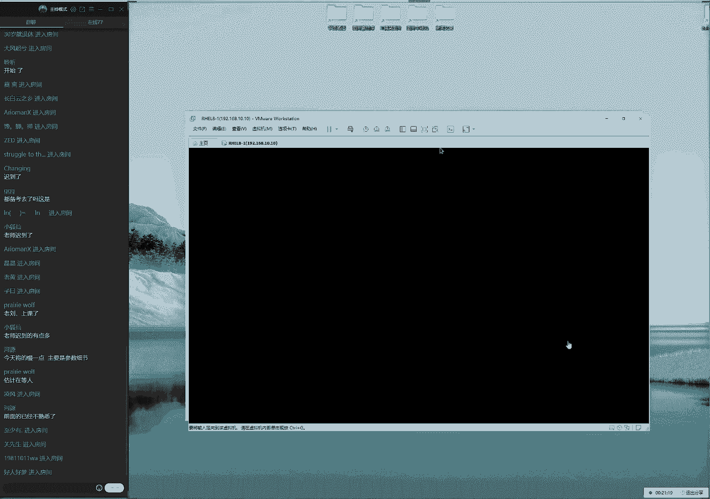
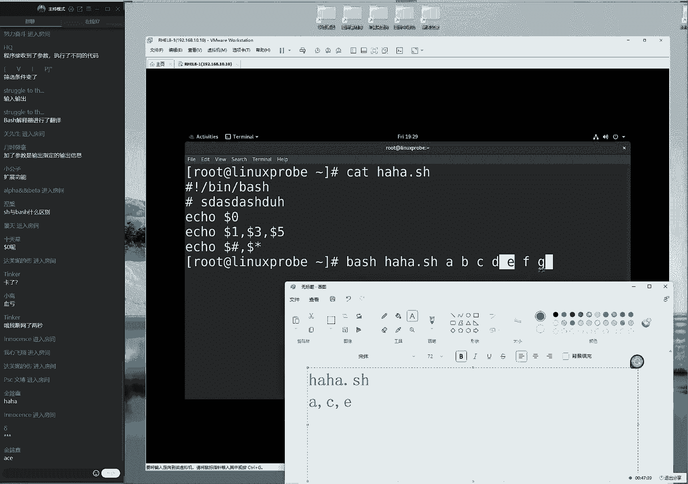
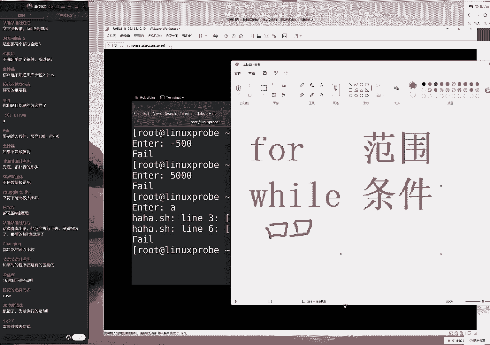
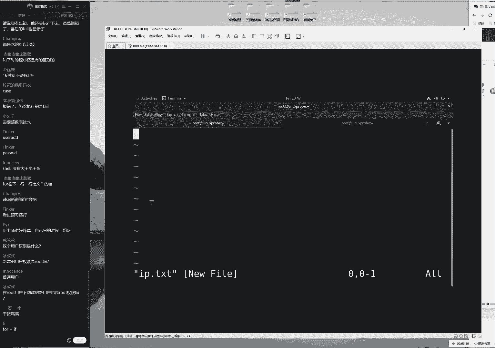
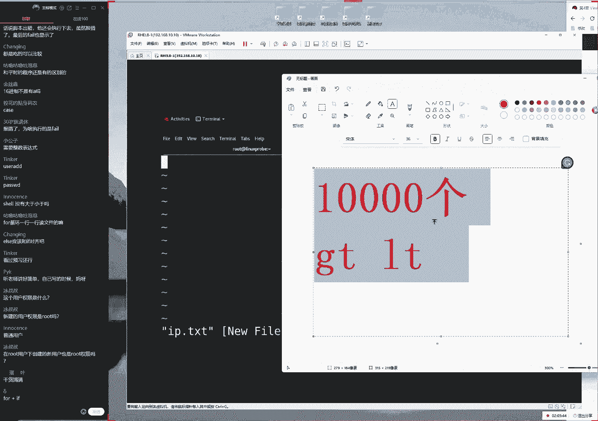

# linux就该这么学第34期 - P6：6【第34期第六节课】红帽RHCE认证培训课程-Linux就该这么学 - 能力努力 - BV1L14y1878S

i can't follow for you when your love，我想为了梦，you in my mind，i will love it，i went to more woryou。

fail the one。

ok我们学我们来开始我们今天这个课程啊，对小小等了三分钟，然后看一下这个人数，77也还好吧，估计今天能破100，好大家先打一下，一我们来开始我们今天这个课程啊，今天的话呢我们的东西照例啊。

还是非常的多的，今天我们要给大家讲第四章节呃，下午的时候大概背了一节课啊，我们的话今天第四章节应该是没有问题，能给大家讲完的，这样的话呢，我们能够把第四章节最后一个小节，买一个计划任务也给大家去打一下。

这样的话您呼吁之后fit啊，那我们呃在呃，那我们再来进行这个实验的时候，就可以来进行一个完整的一个实验，这样的话特别好好看，在这个人数可以了，那我们开始我们接这个课程，大家先看一下，大家先翻开书啊。

同学们先翻开书，看一下我们今天的这个课程安排，今天的话呢是4。2小节开始，我们又过一个礼拜了，同学们啊，我们回忆一下上节课讲到哪儿了呀，自带二小节，对不对。

我们的管道服务，环境变量以及这个重定向服对吧，也就是说我们的重定向，管道服以及环境变量，那么以及编辑器得使用方法，后来的话，所以我们可以呃，那我们进行一个简单的一个回忆啊，那也就是说我们第一章的时候。

我们学了什么呢，战后的话呢，也就是一个任意门，那我们可以通过这个管道符的话呢，可以将多个命令之间进行一个，有机的一个搭配，让我们的命令可以把它的输入结果，当作是后一个命令的一个输入结果。

再来进行一次二次处理，那我们也就是说可以让命令和命令，也可以进行互动了对吧，然后我们这的第四章节的话，就是vm编辑器，今天我们都已经学会了，那我们接下来就可以开始，去写出这个shell脚本了，大家的话。

可能之前会认为，一个shell脚本是一个很难的事情，因为同学们会问到说老师哎，那是教练还不就是编程嘛，编程的话怎么那么简单呢，那他肯定不会那么简单对吧，那我们要给大家去提到的。

就是我们这个shell脚本的话呢，它其实大家不要对它有一个特呃，那我呢呃那么的话我们不要有一个呃，非常大的一个呃先入为主这么一个呃，这个怎么讲啊，我们一个先入为主这么一个感觉，因为的话呢。

呃一个我们常用的shell脚本的话呢，坦白来讲是很复杂的，但是的话呢一个简单的或者一个最终啊，那我们啊或者是一个最基础的一个架构的，shell脚本的话呢，实际上它并不难，它主要是由三部分组成的。

第一部分的话呢我们叫脚本的声明，第二部分的话呢我们叫做脚本的注释，第三部的话呢我们叫做脚本的啊，脚本的命令，但实际上我们再复杂的这个shell，基本它就是由这三部分组成的，我们今天这节课的话呢。

就是要从简单到难，然后我们把我们这个shell脚本的话呢，从最开始可能两三行，到最后的话呢就可能变成三四十行，有一个快速的一个啊去编写这么一个过程，啊，啊那我们同学可以感受一下。

到底这个shell教练我们要从简单，它能有多么的简单，那我们来给大家来去呃，出来去讲一下，然后我们来看一下这个shell脚本的话，大家会问的一个问题，大家说啊今天的声音是不是有点轻是吧。

同学们有这个问题吗，那大家如果要是觉得声音有点小的话，您可以告诉我，比如说大家可以打一下r2 吧，那么如果同学们认为自己这个声音合适的，话，打一下一，然后我们就来做一个小调查，呃。

这个的话呢也是我们在一个看在线培训，跟看录播的一个区别啊，这个因为这个话如果是我们的天啊，在听录播的同学，听起来就会就会觉得特别的啊，浪费时间了对吧，因为啊您的这个声音肯定是托啊，那个视频能够调好的。

但是的话呢，我们这个在线培训，学员的体验一定是最好的，因为它会有一个啊身临其境的一个，互动的感觉，所以我们每一期的话呢，还是为了我们当期的这个学员，在线培训学员为准，因此所以您看了如果是录播的话呢。

可能确实感觉有点慢啊，但是的话呢我们慢，我们要对我们的在线培训的学员负责好，说了那么多，同学们说继续了，我们就感觉可以了是吧，那我们再继续继续啊，说是的，感觉老师有求利啊，这个不可能啊，来我们来继续啊。

完全没有这种感觉，来我们来看一下啊，呃4。14。2。1，我们来讲到了，说的话呢一个完整的shell脚本的话呢，呃不我们呢我们一个简单的shell脚本，它是由三部分组成的，第一部分的话叫脚本的声明。

脚本的声明的话呢，主要是由，那也就是说它啊告诉我们的这个系统，它是由哪个shell脚本，它是由哪个解释器能够来去执行的，里面的bh，所以我们基本的声明都是统一的一个格式，就是一个井号，一个叹号。

大家记一下，那我们的脚本声明的话呢，就是这么去写的，它指的是由哪个解释器可以来去执行，我们的shell脚本，那么我们这个标本声明的话呢，就是一个井号，一个叹号，我们就可以这样去写就ok了，见不得声明。

待会儿我们再去啊跑一下这个脚本的时候，它就会默认通过这个编辑器来调用，我们的shell脚本，这个是我们的脚本声明的一个作用，好接下来的话呢我们再来打这个的话，我们教教本的诸事根本的注释的话呢。

它是以井号行开始的，然后我们可以写一些，我们自己一些说明信息，这个话，它主要是对于我们的服务功能的一种说明，或者的话呢，它是对于我们的一种参数的一种介绍啊，那我们给大家给大家写一些啊。

比如说巴拉巴拉巴拉，那我可以写很多，这样的话呢，我们来对它进行一个呃声明，或者说明，大家都那么可以来记一下下面的注释的话，它可以有很多行，他也可以没有，它是以井号行开始的，这个程序是不会去读的。

只是给用户去看的，它主要的话呢就是我们的服务的一些，功能的一些介绍，或者的话它有一些参数的一些说明，那这样我们的这个信息叫做脚本的主啊，那我们把它叫做脚本的注释，这样的一个内容。

他的话脚本的命令大家知道的话，我们如果一个shell脚本的话，它并没有命令的话，那么他也并啊，那么它也不并不会有任何的功能，所以的话呢脚本的命令的作用，就是让我们的啊功能的话。

能够集合到这个shell脚本里面，我们换句话来说，就是把您想要去做的这个事情，放到我们的shell脚本的后面就可以了，比如说我现在想干什么呢，我想要先去查看一下系统的这个负载情况，大，ok我们看一下。

然后的话呢，我想要去查看一下我的这个内存使用量情，况来再来，那我在想啊，再去查看一下，比如说就没有了，那我再去啊，来去啊，重启一下，那好了，我们就可以按照我们去执行上，那我们就可以来去按照我们去执行。

命的这么一个顺序，从上往下来去执行我们这个相应的命令，实际上那也就是说一个最简单的shell脚本，它就是一些命令的堆积，我们可以这样去理解呢，完全没有问题的，大家可能会听完之后说，老师不可能说呃。

这个编程的话怎么会那么简单呢，但是一个最基础最简单的shell脚本，它就是由这些组成的，并且它就是可以通过命令的堆积，然后他去实现某一种特定的功能，虽然它并没有叫做调节，测试语句或者循环语句。

它赋予他们那种怎么样的啊，唉灵活的以及根据条件来进行判断的，这样的这个功能，但是它也依然能够去实现一些。

固定的一些功能，这样我来给大家来去尝试一下呃，由于我们上节课给大家讲过这个编辑器。

vim呢，但是的话呢有一点可能没有练的特别多啊，所以我们待会儿给大家去敲的时候，我们会呃再给大家出几个小问题。

我所按的哪个按键会给大家去说出来的，如果说您这个啊啊，那我们这个编译器也没有掌握，那呃那么如果说你没有掌握好的话呢，您待会儿不着急，我会给您说一下我敲什么样的一个按键，可以对于上一期的这个培训的话呢。

不我们可以对于上一节课这个培训的话呢，进行一个简单的一个回顾好，那我们来接着给大家去说，大家说软件仓库没有讲啊，软件仓库讲了的软件仓库已经讲了，是在上礼拜的礼拜日，并且的话呢。

软件仓库我们并不会给大家现在来去配置，我们会在第六章节的最后一个小节，会给大家去提到一嘴，然后我们会在第八章节的第一次啊，8。3小节，应该是我们会给大家来去详细去讲解，这仓库的一个配置方法。

然后至于说这样的问题的话，那我们就默认情况下就不再给大家回答了，因为这样的话呢，肯定同学们就是因为您上节课没有来，或者没好好听，所以我们就啊对于这啊，那我们所以说以后我们培训当中的话。

对于这样的问题我们就不再回答了，因为这个时候就要耽误时间了，好我们来开始今天这个正式的课程啊，通过我的呃的努力的话呢，现在也变成了86位同学了啊，73 86啊，正好卡在两个卡上，好废话不多说了。

真的不再多说了，同学们真的不再多说了，第三次正式开始我们今天这个正式的课程，那这个编辑器的话呢，我们的编辑器使用的叫做i v e m，后面的话呢加上我们的shell脚本的名称，比如说随便来了。

随便来随便来，我看一下啊，是哪位小可爱迟到了呀，啊我看一看啊，pk啊，b p y k我就迟到了是吧啊，小象同学好，那我们叫做这个小仙吧，小仙然后点，那我们这个shell脚本的话呢。

一般情况下他可以没有后缀的，但是的话呢，如果说您想要让我们这个其他同事，能够通过后缀来区分shell脚本，这个类型的话呢，你也可以给它一个后缀好，我们给加上那一个小写的，来，我们去加一下它这个后缀。

然后我们来敲一下，回车进入到少将本里面，到大家手，那么我们首先千万不要慌，进入到少将本里边的话呢，我们使用的编译器叫做v m，那个编辑器的三个模式，它默认的话呢进入叫做命令模式里面啊。

然后的话呢我们现在需要签，那需要先去敲什么呢，需要签一下a或者i或者o d3 个键，然后我们随便去选择一个，进入到编辑模式里面，然后我们才可以随便来去编辑，文件里面的这个内容对吧，同学们好，嗯。

所以的话呢我们现在先敲一下a，进入到这个编辑模式下，另外给大家去说一下啊，呃再给大家讲啊，那我们再给大家简单说一下啊。

就是呃一个简单的shell脚本的话呢，它是由三部分组成的，第一句话呢叫脚本的声明，它指的是你觉得它是有哪个shell解释器。

它能够来去执行的，那么或者它是由哪个解释器能够来进行，一个呃多懂这样的一个效果，所以我们现在就是一个井号，一个叹号，其实我们现在所使用的这个解释器的名称，并里面的bug可以怎么样呢，看得懂。

ok没有问题好，第二的话呢我们就有这么的注释，基本的注释的话呢，它是对于我们的服务的功能的一种说明，或者的话，它是对于一行某一行参数有一种介绍信息，例如说哎比如说我今天的话呢这个脚本。

那我先去写了这句话，它是程序不读的，他这个用户进行一个提示的，比如说啊c r i p t，比如说啊这个的话呢，脚本是用来去做测试用的，我随便去写一行，那那我们这呃，然后的话呢我们待会儿也可以低于某一行。

这个参数的话呢，进行一种我们介绍，比如说这个时间的话呢，我们是在2022年对吧，我们在4月我看一下，4月15号唉，我们来去录制了，让我们来去写出来，这个上有脚本，你看这个不就是简单的一个注释的一个。

填写方法了吗，这里边的这个命令的话呢，可以没有完全啊没有语法的这么一个限制，他只是啊那么他只是给人去看的，因此这里面的这个信息的话呢，你可以完全的来进行一个啊书写，这没有什么限制好了。

然后这个的话可以有很多行，那我们也可以没有，这叫做脚本的注释，您可以按照这个呃，那我可以按照自己的需求您去写，那我现在的话就去写这么两行就可以了，再往后的话呢，我们是将那我们把它叫做专门的命令。

如果说就像这个清朝的时候，那我们来去啊写这个文，那我们在写这个作文的话呢，但是我听说过啊，要求非常严格的那种呃新闻那种方式，那么这里会有大量这种呃这种呃格式啊，规范等等特别的多，那大家想。

如果说有一个人光写的这个格式，没有内容的话呢，他能不能去呃，考过的肯定也不可以对吧，那也就是说它既要有格式，它有具体的这个功能，那么我们一个简单的shell脚本的话，它的这个功能。

实际上它就是把我们的命令写到后面。

然后我们进行简单的堆积，就可以这样去实现的，大家不要说哎宋老师这个太瞧不起他了，这个太简单了，对不对，但是啊但是我们后面会有男的先来，怎么去写，我先去写脚本的命啊，命令呃，例如说的话呢。

我现在我随便去解了，我这边去完成几个功能，那我们来去完成几个工作，第一个工作的话呢，是查看一下我们系统的时间，那第二工作的话呢，是查看一下我们当前目录当中，孙呃那呃那我们已经有了文件。

以及想那么以及显示出来这个文件当中呃，这个所有的属性信息，还有呢什么呢，比如说我想去查看一下，我的内存使用量情况，那再加上啊还有什么呢，我现在我想去查看一下我的内核的版本号，随便去写。

同学们这代表就说那我们可以推啊，通过这样的这个方式，来进行一个回忆啊，大家说说井号叹号后可以再跟一个空格吗，没有必要跟啊，也可以跟，但是没有必要，那我们再来干嘛呀，那然后我们点一下保存并退出。

大家说我的字体还是一直是黄颜色的哦，视频上节课调了之后没有调回来是吧，你可以点一下这个属性，然后我们点一下颜色，您只要勾选一下这个就可以了，那么就可以去使用我们的默认颜色，就回来了。

好现在的话呢我们敲击我们的返回键诶，e s c键，接下来的话呢我们在进入到末行模式里面，末行模式用来去，对于我们的文章来进行一个保存，怎么样呢，退出强制保存，推出以及设置编辑环境这样的一个功能。

来点一下回城没有问题。

然后再给大家简单去声明一下，就是同学们之前看过你们的同事，怎么去来去执行了呢。

好大家说这个为什么有的名字是黄颜色，有他有些是白颜色呢，因为黄颜色指的是我们的命运的关键词，因为的话呢它可能是跟其他的某啊，某些关键词的话呢是呃重名了，所以它它会有一个主色。

这个颜色有些时候它它并不准确，这个我们会在我们后面会给大家去说，但是的话呢这个呃没有太好解释，这个只能是说我们的编辑器的一，个着色问题，它慢慢会它会更好的，那我们接下来再来，可能是。

因为它跟某一部件词有这么一个匹配了吧，我们将那咱就呃我们简单来讲，现在这么先进去看好了，然后接下来我们来去说一下，我们在工作的时候的话呢，我们会遇到一种执行方法，就是你可以直接使用到路径的形式。

然后去后面去加上我们的这个文件名称，例如说我们叫做小心点，s h这样的一个执行方式，但是的话呢，由于当前没有给他一个可以执行的权限，我们现在的话呢不能这样去用，我们也用如呃。

那我们如果要是想这么去用的话呢，你需要先给它设置一个可以使用的权限，或者您干脆给一个七七都可以，这么一个全新的设定，但是的话由于现在没有去讲到第五章的，我们第五章时候讲权限，今天先讲事啊。

因此待会我们做的这个shell脚本的话呢，执行方法都通过我们的命令来去调用的，方式来去实现，叫做by，后面加上文件的名称啊，我们是叫做叫什么刀啊，小心点啊，下午先，我没有问题，按一下回车好看。

大家大家的问题，大家说井号不是注释，不知道为什么，井号叹号指的是一个固定格式，井号叹号指的是一个脚本的声明，井号是注释，井号叹号叫它指的是脚本的声明啊，他两个不一样，那我们接下来这个话呢有点像是什么呢。

虽然有的单词可能看起来比较像，但是差一个字母的话，它可能就会差很多，所以大家一定要注意这个细节加啊，它加不加叹号，它指的是注释以及叫做基本的声明，它作用完全相，它做的完全是不同的，大家如果要是英文说。

老师为什么这凭什么这个注释是一个井号，就是为什么他不适合a的，他或他或者他去。

这个我们为什么要去选择使用井号呢，那就只能是说，然后的话呢我们这个这么特别，他们我们使用的是一个井号叹号，完事可能还会用到分号这样的这个格式，我们既然作为运维啊，这个没有太大必要去纠结它了。

就是一个规定，就是一个哎格式要求我们要想的这样去用，我们就必须要这样去用，那么就是这么一个好，那么就是一个很好的解释了，虽然很简单很暴力，但是的话呢确实那么的接地气，就是我们要想去用。

就必须要遵守他这样的这个格式问题好，然后我们接下来再来，其实这个我们学运维的时候，比如说第二章节刚刚讲过的这个参数对吧，我刚刚讲完的这个参数也还有短格式，长格式对吧。

这个短格式的话呢是一个减号加一个字母，长歌式是两个减号加一个单词，刚刚讲完，于是我们自己打脸，第一个命令讲了一个echo，第二话要讲的一个d，结果是这两个命令，完全跟我们刚才讲的那个参数格式。

用它是完全不一样的，并且的话呢，我们后续剧当中遇到了很多的命令，比如说像这样啊，比如说像这样的对吧，遇到了说很多长短格式，要么可以缩写，要么就可以把它即便是一个长歌式，但是它只有一个减号这样的这种形式。

所以在学运维的话呢，我们就是更多的去遵守他们已经编好了，等我们以后去写了这么一个程序之后，您可以把这个注释可以自定义，比如说以后我要写的程序，那我的开头，每一个这个命令的开头都要先写一句，老刘是帅哥。

然后我们才让他去去去编写它的程序，这样的话也可以去实现。

但是我们现在在做运维，不是开发，所以这个问题的话呢就不再纠结了，我们就继续了，那看一下这个命令的执行结果，于是可以看到了，通过调用这个戴尔解释器的话呢。

能够看到，那么当前的这个时间，以及当前文件系统当中啊，当前目录当中的文件列表啊。

以及相应的这个属性信息，以及的话呢内存的使用量情况啊，最后就是我们的内存的版本号就可以去写，就在屏幕上面了，所以说呃同学们会问到一个问题。

就是说我们一个shell脚本哈，它难不难呢，它其实并不难，它最简单的来说就是由三部分组成的，一脚本的声明，第二的话呢脚本的注释我们可以写，可以不写，第三的话，脚本的命令，可以将命令的话呢按照这样的顺序。

1234往下去写，于是你就有了一个最基本的一个shell脚本，当然了。

同学们现在可能会有疑虑，说老师不对的，怎么可能这么简单呢，为什么我们在工作的时候都那么的长，那么的复杂呢，这时候就要对于功能来进行扩展了，我们来给大家举一个小例子啊，其实这个学期就是慢慢来的对吧啊。

比如说我们一开始可能去啊，刚刚出生了，那么我们只会走，后来的话那我们会跑了，后来我们还会跳，后来我们还会去翻跟斗的，那我们要来，那我们来句逐步渐进的来给大家去说，第二部的话呢，我们就要去举一个例子吧。

查看文件的这么一个命令来敲一下，回车得到这样的一个回血，我把字稍微小一点点啊，这样的话大家能够在屏幕里面，看的更舒服一点，好大家先看一下，现在的话呢我们打了一个命令，能够查看到目录里面已有的文件列表。

第二的话呢我们加一个随便加一个参数好，我们加一个杠a来显示出来，所有的这个文件里啊，信息，来我们采访一下a没有问题，能够看到非常的顺利，还有我们再来再加一个参数，一个小写l。

查看一下文件以及详细属性信息，好，我现在敲完了，同学们提个问题，请问为什么我们加了参数的命令的执行，结果跟我们没有加它是不一样的，好现在去啊，喝口水，好同学们来继续来啊，回答一下问题啊。

我现在问的这个问题是让我们画，实际上是有意义的啊，比如同学们刚才问的问题要更加有深度的，同学们先问这个问题了，为什么我们的命令加参数，最后我们得到了这个回血的话呢，做我们得到了这个输入的结果。

跟以前是不一样的，大家可能会呃呃对着屏幕在发呆对吧，因为说到哟你是不是在啊开玩笑啊，因为你家的菜是什么，所以嗯它的输出结果不一样了，但是我们要以第三章节最后一个章节啊，最后一个小节为例给大家去审问一下。

就，是我们敲下回车之后，那一瞬间计算机发生了什么呢，就是我们或者我们换一种问法叫做凭什么，就是凭什么，我们加了参数之后，得到的回血跟之前的不一样呢，好大家问了一个问题。

大家说啊叫做咕噜咕噜吐泡泡的同学说啊，因为程序就是这么去运行的，我们呃不能这么去理解了，因为你现在在做运维，你也想去写shell脚本，我们那我们就不能说简单的去理解一下，说程序就是这样定义的。

所以我们就这样来去使用，不能您现在也自己需要去写了，那我们就去呃探讨一下，那我们首先的，话呢就是说你看啊，首先来讲就是说我们现在的话呢，如果没有加参数，他得到的回血，它是一个默认的一个情况对吧。

然后我们来加一个a，他得到了另外一个回信，这个信息跟这个信息是不一样的，也就是说他有能力来进行一个信息的接收，对吧，这个没有问题吧，同学们这个没有加参数，它的回血是这样的，他加了参数。

那么于是他得到回血是这样的。

也就是说他的这个shell脚本肯定怎么样，以前说出来，他的这个命令肯定是能够去接收参数的，这肯定是必须的对吧，他有能力，他有能力去，接收一个用户输入的参数，这是第一点，我们要给大家讲，他要能够去接收哎。

就叫做接受了，就接收给大家准确一点，我们一定要严谨，要严谨来。

他能够去接收用户所说的这个参数，第二的话大家看一下，刚刚我加了这个参数，两个参数不一样，于是得到的回血的话呢。

得到这个输入的结果也不一样了，也就是说它不仅要能够去接收，还要能够怎么样呢进行一个判断，它的这个接收到的这个参数它的不同，那么也才会得到不同的这么一个响应对吧，那也就是说它需要分两步走，第一步是接。

收第二步是判断，ok没有问题啊，大家说这个解释器的不同步，它跟解释器没有关系，它是我们程序里面内置去接收参数，一种功能，也就是说啊，我们第一步的话能够去接收用户数的参数，然后就会跟我们之前不一样了对吧。

然后的话呢我们看它呃，它会根据输入的这个参数不同，如果说他要是没有办法进行判断的话呢，那我们啊不论说它是输入的是什么参数，它都它它最后输入的这个结果，它都是应该是一样的，但是它里面看到怎么样。

最后它不同的这个参数得到不同的回血，因此他，还有能力进行判断，第一步接收，第二步判断好了，那我们这个shell脚本的话，就要来继续来进行扩展了，第一步，知道我们脚本的一个，基本的一个架构了之后。

第二步就来来，那我们第二啊，该怎么来去接受用户所说的这个参数，这个书的参数的话，大家可以看一张图，这个图里边的话就是指的是，在我们这个shell脚本里面，实际上已经有了一些内置的一些变量了。

这些变量的话呢，我们可以直接就用就可以了，他就是说那我们只要写这个shell脚本的话，那我们就已经有了一，些内置的变量，您可以直接调用这些内置变量，就可以来去实现对于参数一种接收了。

我们给大家举一个例子啊，就是我们在201几年的时候忘记了，但是我们去趟三亚对吧，然后去玩去了，然后的话我们在那个哎，三亚去玩的时候的话呢，是一个非常大的这么一个酒店，然后里边的话呢会有很多很多的功能。

结果他由于那次的话正好赶上了，咱们班去上课了，礼拜五礼拜六礼拜日啊，讲三天，然后后来的话我们一共好像住了四天，结果的话呢我三天都在讲课，然后我们上午是在写书，但，反正就感觉特别的血亏啊，电梯酒店里面。

但是我们三天四天里面，就是我们用地方四天三天都是在上课啊，那我们都是在上班，然后的话我们最后一天我们都已经签啊，他那最后的话呢我们都已经去退房了，这个时候最后的这个前台问了一句，我们说你们有没有去使用。

比如说哎游泳池啊，或者说餐厅啊这样的这种功能呢，然后我们才说哎嗯嗯，那我们的话当时并没有去使用，这就是发生了什么样的一个问题呢，就是这个的话呢，原本酒店里面它已经提供了某些功能，但是由于我们不。

知道结果我们没有去用这样的一种啊，非常惨的这种情况，这个同样的也是，就是这个shell脚本里边的话呢，已经内置了一些功能了，如果说我们要是不知道的话，那么也是非常的可惜的对吧。

好，我们来给大家说一下呃，还是去这么去用吧，我们之前给大家举个例子，比如说现在新建一个文件叫做哈哈点啊，然后这样我们哈哈，然后我们来给大家写一个shell脚本，呃，后面我们先写脚本的声明。

也就是说它里面也一些内置变量了，功能已经有了，我们用不用的话，它都有，那我们先要把它使用起来，我们都是可以随便去写，没有关系，或者我们不用去解就可以了，让我们来输出一下，它里面有一些内置变量。

比如说的话第一个内置变量我们叫做啊，dollar 0，它的话呢指的是我们脚本的名称本身啊，那也就是说他会去输出我们的系统，完他那么他会去输出来这个脚本的名称，接下来的话呢dollar。

然后我们可以去输出12345，这个号指的是接收到的第一个，第二个，第三个和第四个，第五个这个参数，我们可以这样啊，通过逗号来去间隔来去输出第一第三，第五个接收到的这个参数，那么除，了这个以外的话呢。

还有比如说我想要去输出，说我们总共去接收到的这个参数的个数，好了，我们可以这样去做啊，dollar，然后的话呢我们一个呃井号，它指的是我们接收到了这个参数总的个数，还有的话呢什么呢。

还有一个dollar，我们后加一个星号，这个指的是我们接收到的这个参数，它分别都是哪一些，然后我们来这样来，我们点一下保存并退出好，我们做好之后，来查看一下文件里面的这个内容，做到这样的一个信息。

现在我来给大家跑一下呃，现在去操作一下，来去使用到bus，现在就是给大，家去说的就是上药，加班里面也他他已经有一些内置的变量了，如果不用去，那我们要是呃并没有去使的话呢，会剪啊，你们会感觉非常的可惜。

因此我们现在要把它给使用起来，在使用之前先去测试一下，先去知道哪个是哪个对吧好，接下来看一下啊，跑一下这个shell脚本，后面加上a b c d e f g，总共的话呢我们数了一下，有七个参数。

现在先不要去去执行这个shell脚本。

先我们脑子里边去跪一下。

待会儿出现的那个回血，里面的这个值大概会是什么样子的，因为其实来讲结，果并不重要啊，结果并不重要，我们重要是一个思考的过程，您知道他就他啊。

他待会输出这个就他为什么是这样的，这个很重要啊，这个很重要，来首先来讲的话呢是一个呃dollar 0，这个指的就是脚本的名称的本身，所以我现在的话来模拟去输出的这个结果，到了零第一行输出脚本的名称。

我们叫做哈哈，我们有ok没有问题啊，后缀啊，脚本后缀，然后接下来的话再来看一下，他说dota 135接收到了第一个第三个，第五个参数，那也就是啊a然后的话呢c和e对吧。

没有问题，三个参数啊，接收到，第一啊分别是第一个，第三个和第五个参数没有问题吧。

好再来一个dollar井号，它指的是我们总共接收到的参数的总个数。

来看一下，当前的话呢12345677个好。

但我待会儿说说这个结果的话，那就应该是一个七逗号。

再来最后看一下这个话呢，大家指的是接收到的一个参数的，总的这个列表啊。

也就是说，星号指的是所有接收到了这个参数，那因此就是a b c d e f，ok我们来这样啊，g好，我现在的话呢我的猜测大概是这样子的，同学们看看我猜的准不准，按下回收得到回血的话。

是这个样子没有问题吧，好也就是说这个结果其实并不重要，主要是一个思考的过程，这个也是我们以后的语句当中，同学们需要把自己重心放在哪里去，不要说了，这个做出的效果跟我一样就ok了，一定要理解这个过程。

它啊为什么他是凭什么是这样子的，我们一定要有一个思考的过程好，这是最大的吗，这是最简单的一步，就是说啊，我们有能力来去接收用户所述的，这个参数吧，但是这个太简单了，第二步的话就是进行判断了。

判断的话呢就是根据用户输入的不同，我们都给它不同的，回血或者我我们一个啊判断语句，这样的话呢，我们当用户叙述的这个值是不同的情况下，我们引发不同的动作对吧，我们可以调用不同的这个代码。

这个的话呢我们来这个动作，a动作b就是要通过这个判断来去实现的，但是的话呢大家也上节课，我们调去调到一个问题，就是的话呢这个shell解释器，我们认为有一个天然的一个，我认为反正我们认为啊这是一个缺陷。

就是什么呢，就是变量它不分类型对吧，当然这个我们呃当然我们之前给大家说过，比如说有什么啊那啊那啊那么有两，个变量啊，变量的话呢a里面保存的是五变量，b的话，咱们它里面保存的是三，那么a加b等于几呢。

这个如果按照数字去算的话，非常简单，等于是八，但如果是按照字符串计算的话，最后变成了50 53，所以这个怎么去判断呢，我们就要去分类型了，那也就是说，在我们的这个shell脚本里边的话呢，跟对于变量了。

或者说我们对于数值的这个判断，我们是需要手动去分类型的，我们换句话来说就是呃定义变量的时候，我们没有去做这个事情，我们现在需要在后面去手动去完成，它分为四，种第一种的话呢叫做文件测试。

第二种的话呢我们叫做逻辑测试，第三叫做整数比较，第四的话再等等啊，等上等下整数比较，第四种我们叫做字符串比较，也就是说之前没有做到，现在需要去做的，它分为整数逻辑卷啊。

他啊他画的是分为整数和字符这样的几种，常见这种格式好，首先来说一下，我们这个第一个叫做文件一类的话，在这个文件里面又可以去细分，比如说文件里边的话，它又分为很多种，比如说它是一般文件。

我先给大家简单写一下，它分为一般文件什么的，目录文件设备文，件对吧，还有的话呢我们叫做块文件，或者我们叫做链接文件，收到很多种啊，很多种，不要着急啊，块文件也就是我们叫做呃呃呃设备文件，可以。

那么也可以这样理解才这样，这样我们还去理解，其实话的块文件跟设备文件它是一样的，我们就可以写到一起了，还有什么呢，比如说链接文件我们可以这样去记，还有什么管道文件对吧，还有就是说我们现在的话呢。

这个文件类型它有很多种，我们能不能通过这个呃测试语句，能够判断出来一种文件的这个类型呢，啊以及我们能判断出来这个，文件它是否是存在呢，以及它的这个呃，我们的文件上面的权限它有哪些呢。

我们刚才所说这么一多啊，它主要是判断它它啊总共是判断了三种，第一种判断文件类型，第二种判断文件是否存在，第三种判断文件上面这个权限都有哪些，这样的话呢，我们如果说想要对于一个文件来进行，写入操作的时候。

你也需要做两步操作对吧，第一步首先判断一下文件是否是存在的，第二步你也需要判断三次，第一步判断一下文件是否存在，第二步的话呢，判断一下文件它是什么类型的，因为您不可，能向一个目录去写入文件内容对吧。

你肯定要判断一下它是否还是一个哎，一般文件，然后把第三步你要判断一下，你有没有能力去对它进行写入操作，来进行一个呃，是否可以去写入的这么一个判断好，也就是说它需要判断三次。

但是实际上的话呢我们只需要判断三次呃，呃不但是的话，实际上我们只需要判断第三个就可以了，因为他只要能够去写入信息，那么就他就证明了他已经是他的啊，那么他啊他肯定是存在的啊。

或者的话呢呃我们应该发了两次啊，就是我们判断出来它的这，个文件类型，以及它这个写入操作是否有权限，就可以来去进行后续的这个操作了，好我来给大家简单演示一下。

因为可能光说大家会比较的有啊，待会待会比较紧张啊，我怕这个后面这个时间比较难，首先来进行一个判断啊，这个判断的话呢，只是一个中括号里面的话呢，我们按照四杠三表格里面写的，这个操作服务来给大家去讲。

首先判断一个目录是否存在，很简单是一个消息，刚毅来我们这样呃，我们看到一个文件它是否存在的，后面写一个文件名称，比如说啊不重要啊，并不重要，第，一位目录里边随便来给大家去写一个文件，内容的话呢。

跟它的含义没有任何关系，大家随便去敲就可以了，呃第六章节会给大家去讲啊，这个每个文件的这个作用，当前仅仅是把当做是一个文件a而已，就是判断一下这个文件它是保持存在，仅此而已，ok了按下回车。

那么我们就现在这个动作的话呢，是用来去判断我们这个文件，它是否是存在的，于是的话呢我们现在又有两个问题了，第一个问题是老师为什么我就敲错了呢，就是为什么你现在敲对了，但是我会支持我去做这个实验，敲。

错了呢，因为这个实验我们基本上呃，很多同学都会发现一个问题，我们在2017年的时候出了一本书对吧，然后那本书的话呢，第一个差评就是这么来的，当时说了，说我们这个书上的第四章节有一个错误。

然后给了一个差评，说怎么回事呢，说这个命令都已经写得很啊，就是我们这个命令的话呢，明明跳的一模一样，当然却出错了，但原因的话呢就是因为大家看一下，如果说我们这个中括号的这个，里边并没有空格的话。

最后得到这个显示是这样的一啊，那也就是说我们再去使用到linux，这个系统的时候，同学们不仅要去关注到我们的命令本身，还要去关注到空格，这个非常重要，即便差了一个空格也不行啊。

比如说我们前面写到后面没写，还是一样报错的好吧，同学们一定要记住，比较苦逼的一点，密码都写对了，结果你这个还给我犯错了，这个是非常的很气人的一点，后来的话呢我们也是吸取的教训啊。

所以我们在第二版的这个书里边的话呢。

我们是把这一章节的这个啊配啊，那我那话我们是把第二章节里面这个配，图大家可以看到，我们给大家加了这么一个啊，简单这么一个说明啊，然后告诉大家这边是有空格的，大家需要注意一点好。

那我们来接着给大家去说，那也就是说我们现在的话呢，要想对于一个文件来进行判断的时候，这是第一个问题，一定要注意这个格式，然后使用到四杠三里面，这个操作符来进行判断，这样的一个操作就没有问题了。

这是第一个问题，第二个问题大家会问了，说老师，那你就判断出来这个结果是什么样子呢，是，那也就是说我们怎么能够判断出来，这个文件的判断结果，是什么样子的呢，我们需要去使用到一个叫做dollar问号。

这样的一种方式，他指的就是他啊，他指的是去输出上一条语句当中，我们的返回值的这个结果呃，婚女人话来讲的话呢，就是我们去判断。

就是啊看一下他上一条命的这个结果，如果说这个值的话，它是唯一一个零的话呢，证明着那怎么样呢，说上一个一句他是执行成功的，如果他是一个非零值的话，证明说上一局他的师啊啊，它是一个呃执行失败了。

我们一般情况下的话呢是个一，但是这句话并不严谨，大家需要听我给大家再去说一，遍，就是如果说我们现在输出的一个dlt，零的话呢，不呸呸呸啊，那么我们如果要是啊去使用到dollar的号，来进行输出的话呢。

最后这个结果如果说是他要是个零的话呢，证明他的这个上一条语句是执行成功的，或者它叫做上一个语句，它是判断成立的，也就是说下一个我们的语句的话呢，判断是成功的，那它也是一个成立的，它是一个肯定的一个值。

它是一个成立的，判断出来这个结果的话呢，为真这样的一个效果，那么呃如果说上一个语句的这个返回值，是一个非零值，那么的话呢它则上一，个语句所执行的这个判断语句的话呢，它是不成立的，同时的话呢。

它这个判断出来这个结果是为甲啊，为它是为false这样的一个结果，那我们为什么要说叫做非零值呢，因为它这个反应值的话呢，实际上是根据我们要是从理，就是从底层上来说啊。

但是同学们这个其实不用去理解特别的多，因为这个对，因为我们讲的如果特别多的话，大家反而是抓不到重点了，简单去理解吧，就是上一个这个呃，我们这个换了程序，它的这个反馈值里边写那个诶return的话呢。

或者我们退出的时候，他那个码他，一般情况下他会写的是一个一，或者说他退出的时候，他会为一，这话是一个报错值，然后的话呢我们在我们的linux平台下的话呢，一般的程序写的这个值它都是唯一。

但是话总会有一些小可爱啊，这个换了这个啊会有一些小可爱，他们好可能会在其他这个系统里边的话，他可能会换成另外一种呃，数字以前我见过的比较多的，比如说是-1这样的一种情况，我也见过二这个话呃我也见过。

所以的话大家都记住了，只要不是理由都代表值啊，它是一个呃并不成立，他是一个为假的一个值，只，要为零一定成功，只为一个非零值，我们所说的非零值就是只要不是零，它都是啊啊判断是失败的，这样的一个效果好。

这是两个问题，我们现在来看一下最终的结果了，按下回车啊，大家问了一个问题啊，这个问题的话呢啊先不说，我们待会给大家去说的，而且冰打错了啊，同学们这个打错打错了，他是一个dollar符号。

并不是一个百分号，好我们接下来给大家去说，是这样的啊，我们来看一下这个结果，他说这个文件的话呢它并不存在，我来看一下，果然他不行，因为它它因为它的话确实并不存在，我现在给大家换一下。

如果说现在换换到另外一个目录里面，这个话呢文件是存在的，语速我按一下回车再来去查看一下，会发现这个值为零，也就是说这个文件它并没有存在，这个文件它是存在的，就这么去判断就可以了，非常简单啊，非常简单。

我们再来，那我们再来再来，那比如说现在判断是文件是否是存在的，我们想判断一下，说这个文件它既然是存在好吧，那我们来看一下啊，当前这个文件它既然是存在的，那我们的嗯，能不能去对它进行一个写入操作呀。

可以呀，那不那我们进行判，断呀对吧，我们来去写一个w是否写入权限的right，而a在回车按下回车之后来查看一下，v0 指的是可以成立的啊，它为真，也就是说我们能够对于这个文件的话，进行一个写操作。

非常的好啊，这样的一个方式好，大家都知道了，我们该怎么对于文件来进行判断，那么同时同学们也问了一个问题，是老师你这样的话呢太麻烦了，我觉得好low啊，就是你现在判断一个这个信息。

你需要他们，那我们现在就需要去执行两次语句，大家能理解吗，就是我们现在需要先，进行一次判断再去啊，去输出一下上一句的一个执行结果，这个好麻烦啊，这有没有比较简单的方法来去实现，你现在所制定的这个方啊。

这样的一个呃功能呢也它也是有的，我们可以通过我们这个逻辑操作符来去搭，配，去使用这个逻辑操作符的话呢，我们叫做逻辑的与或非好，先来给大家解，这样的话呢，两个合的符号我们把它叫做逻辑的雨，就是哎雨。

然后的话呢或指的是两个竖杠，两个同配呃，那我发了两个管道符，两个管道符就把它叫做或叫做逻辑的，或与或非，它属于叫做条件的，操作符来，还有换到最后一个非是一个叹号，指的是一个取反的意思。

然后大家记一下三个逻辑的操作符，与或非啊，大家没有问题啊，没有问题来给大家看一下，说的话呢，我们的这个两个和的符号叫做逻辑的语，它指的是若前面的一个语句，他是执行成功的，那我们走回去执行后面的这个语句。

来，大家记一下啊，我我我脑简单句写吧，就是说若前面一个语句他是执行成功的，那我们则会去执行我们的后面的这个语句，然后的话呢下面一个或指的是，若前面是执行失败的，那我们走回去执，行，后面这个语句。

最后的话呢逻辑的非它指的是取反值，诶，我们等于说啊，把我们已经取得这个结果的话呢，取一个反之前为真，现在为假，之前为假，现在为真，好，有点抽象，对不对啊，没关系啊。

也没毛病，我现在来给大家去说一下，我们大概一个不，我来给大家简单说一下，我们操作的一个方法，比如呢我们比如说这个文件的话呢，它当然是存在的，大家可以看到当前这个文件它是存在的。

但是我们需要需要去使用到两条命令，才能够看到最后的这个判断结果，很麻烦，对吧好，首先我们可以这，样子，把它这个后面我们啊，我们首先把它前面写好，然后的话呢，把它后面的话呢加上两个和的符号。

它指的是如果前面只执行成功的话，才会去执行后面的这个呃命令，那我朋友们，那么后面可以直接去写输出一个啊，ok ok ok，那也就是说若前面成立才会去他他啊，他才会来去执行后面的这个语句，那也就是说。

只要我们待会儿这个输出的结果里面有了，ok ok ok咦，那么也就证明了这个结果的话，它这个文件是存在的，于是通过这样的这个方式，就可以将我们的判断结果以及我们的命令，的话呢进行一个有机的一个结合。

这就叫做逻辑的语，还有一种情况叫做逻辑的货，他指的是若前面的语句，他是执行失败的话，那我们才会来去执行某一种语句，比如说我们现在有一个变量叫做user，他指的话呢是当前登录的这个用户名称啊。

这个指的是当前登录的用户名称呃，当前的话登录用户叫做root，这个第五章说给大家去讲，他认为管理员他像一个神一样的存在，它的权限是最大的，限制是最小的，它可以对于我们的服务的话呢。

它可对于我们整个的系统啊，它不仅仅是服务进行，那好我们先来给大家做一个判断判断一下，说那既然他这么厉害，那好了，那请问当前登录这个用户名称，是否是为root呢，好可以啊，然后若条件为成，那那弱条件为真。

弱条件成立，我们则去输出，说他是一个管理员啊，这样的一个字样没有问题吧，好也就是说若他这个前面的判断也成功啊，若前面的语句是执行成功的，那么则会去啊，他啊则会去执行后面的这个语句，好按下回车。

于是得到这样的一个回血对吧，现在也就是说因为前面成功了，他确实是为root，于是得到的这个回血的话，去输出这个信息了，好我们再加一个语句，就是说加一个或它指的是，若前辈是执行失败了。

我们才有一个啊备用方案啊，就像跟一个女生去表白一样啊，呃跟一个女生去表白，我们要做好很多时候准备，就比如说今天今天是4月15号啊，下了班了，想约一个女生去看电影对吧，那我们如果要是女生同意的话呢。

赶紧去顺便把饭给定了对吧，然后啊可以准备一个非常浪漫的一个晚餐，那如果说女生失败的话，那赶紧去把电影票给退了，然后我们过来上课了，这同，样的要有一个备用方案，若成功则怎么样，若失败则怎么样。

好我们来给大家一个或若执行失败的，若前面一句是执行失败的话，那证明他不是管理员，那么则会取输出，它只是一个普通用户这样的一个字样，好吧，同学们来按下回车，因为当前用户它视为管理员。

因此得到了这个字样的话呢，是这个样子，还同样的这个语句，我把它复制一下，切换到另外一个用户身份下，这个用户就不是管理员了，至于说怎么切换呢，不用管它啊，不用管，第五章节的时候会去讲这个命令叫做素。

简单理解啊，就，是说切换到另外一个用户身份下了，当前用户名称叫做linux probe，好，ok我们来看一下啊，a下回车去执行一下这个命令，大家看到他去输出的这个结果是这样的，也就是说，同样的命令。

在不同的用户身份下去执行的时候，会有不同的回响的，原因就是逻辑的与和逻辑的。

或若成功则去执行，若失败则去执行这套逻辑的与获好，下面还有一个问题就是同学们会问到了啊，怎么样啊，好没什么正经问题啊，好我们今天再来给大家去说叫做逻辑的，非逻辑的，非叫做取反值，就是说之前的条件的这个。

判断值如果是为真则为假，则为假则为真啊，我们呃中国的话有一句老话叫做啊，做梦是反的对吧，如果说今天的话呢，晚上我做了一个梦，是一个很可怕的一个梦，特别的可怕，就想到我们下一期招生的时候。

比如说招了1000个人啊，特别的累，那好了，那我们这个学员的人数怎么能那么多呢，啊啊啊豆浆啊，那我们可以取一个反之，因为我们醒了之后会有人说哎梦是反的，梦是反的，那这样的话呢。

我们实际上在这个情况的话呢，可能跟我们的预想是不一样的，那我们和他最后招生的人数可，能才有几十人对吧，那也就是说之前我们这个条件是为真。

则前面加一个叹号，作为甲好，我们给大家去操作一下，这个可能通过这个理论去解释，去解释理论很难，没关系，通过例子来去解释，比如说现在的话呢判断一下这个结果，说是否啊当前登录用户，当前登录的用户。

当前登录的用户是否是为root，于是我们就这样去写，来，我下回说当前动力用户是否是为root，得到一个回响来去输出，说他是为数啊，那么啊条件成立，它是为root用户好，现在的话我们来取反值。

就是前面加一个tank，它指的是判，断一下说当前用户它是否是他啊，并不是为管理员啊，好了我们才会再回车，再来说一下这个结果，它强调为一，因为它为管理员大，大家能理解这个意思。

就是说他的话呢呃之前这个条件的话呢，判断结果是啊成立的，那我们来加一个叹号条件为假了，但是他会问到一个问题，是老师你跟这个解释的话呢，感觉有点瑕疵，什么意思呢，因为我感觉这个time号加在这边是可以的。

如果说我现在的话呢，把这个叹号取反值，这个叹号我们能不能加到这里呢，我们这样再去做，再去输出一下这个结果，依然为一，就是说这两个的命令执行结果的话，那是一样的，我们能不能这样去混用呢，是不可以的。

因为的话呢大家记一下这个我们去截图吧，啊这个是不能够这样去用的。

虽然说最后的这个结果是一样的，但是的话呢第一个等一下啊，今天这个截图怎么那么小啊。

哦我这个窗口被调成了50%的，我稍微把它放大一点啊，朋友朋友看得清好，大家可以看一下，那这个是不能这样去用的，第一的话呢指的是取反值，叫逻辑的非吗，但是的话呢第二个这个它可不是取反值了，这个叫做不。

等于好吧，这个叫做不等啊，叫做不等于，同学们一定要记一下这两个的区别，这也是我们常犯的一个错误，因为呃很多时候的话呢，如果是嗯不太严谨的操作的话呢，也可以去实现同样的效果，但是有些时候他还报错了。

而且我们对于这个鱼的这个了解的话呢，呃如果要是出现一些偏差。

也会在您呃当前也许没事，但是以后的话呢可能会遇到一些问题，比如说我给大家举一个例子啊，大家因为总会问说老师，因为上节课讲完之后，大家会问到一个问题，说老师你有没有必要就是把我们的。

这个所有参数的格式讲完呢的戏呢，因为我在工作的时候，我们没有这么注意，也不是也能去执行吗，好我给大家举一个例子，比如说我们对于整数的比较，比如说五是否待啊，那那我们作为判断啊，那比如说五是否大于三呢。

其实这也可以看得出来五大于三，来看一下输出一下结果，ok看一下啊，啊没有五大于三吗，啊他要加一个空格吧，稍等一下，我们这样啊，不不不，我们就这样呃啊他又没有空格，等一下五大于三啊，它这个结果是为甲。

于是就出问题了，因为我还想给大家再去实验几次，比，如说十啊是否大于了五呢，比如来去输出一下这个结果啊，来看一下，最后的话呢，看一下这个结果十是否大于五呢，来看一下这个结果，它是唯一。

也就是说它判断的话呢是并不大于五好，这个原因是这样的啊，当我们在进行这种操作的时候，因为我们刚才想给大家先去看几个，成功的一个事例，但是没有成功好，那我们就直接给大家讲这个失败的案例吧。

这个失败案例是这样的啊，对于整数的比较，我们肉眼可以看得出来十是大于五的，但是的话呢它最后这个结果是唯一，条件为假了，就，像我们欠人家5万块钱，但是我们花了10万块钱还没有还完啊。

高利贷了，这个怎么回事呢，就是因为我们在基于这个数字，比较的时候的话呢，有一个那我那那么我们会常犯一个错误，我们会使用到这个大于号，小于号等于号来进行一个对于数字的比较，但是的话呢。

我们可以看到这个大于号的话呢，我们有一个另外一个操作，那我们会有另外一个啊，这个功能叫做输出重定向，这个方面我们叫做输入重定向，它两个都叫做输啊，叫做重庆相符，而这个的话呢我们叫做赋值。

符也就是说大于号小姨夫啊，那我们有啊，那么好，我们的大鱼号小于号它都是啊，还有这个等号，它都是有一些逻辑操作的功能的，那么这样去做的话就会产生出来歧义了。

为了更好，能够让程序能够知道，我们所做的这个操作的话呢，我们以四杠四表格为例，我们需要给大家讲一下，对于数字比较当中，我们需要去使用它的逻辑的操作符，换句话来说就是呃在工作的时候的话，如果说您这样去用。

有些他的话有些时候也能过去成功，但是他是呃他的话都是一些侥幸心理，最好一定要严格，规范来去执行这样的一个理由，那比如说我再重新去判断一下，说十是否等于十呢，我们来看一下这个结果。

可以看到它这个结果的话呢是为零，k 10等于十，那十是否等于五呢，来看一下，就是这个结果是为一，这个没有什么好说的了，也就是说大家记一下对于整数的比较，您需要怎么样呢，使用到专用的这个操作符。

千万不要啊，这个图种事使用的大约号小于号，然后还有的话呢，比如说判断一下说十啊，随便来吧，十是否大于了这个七好，我们来看一下这个结果，输出结果说是为零，证明条，件为真十大于70，是否大于20呢。

来看一下这个结果，看到这个结果是为一个一为反值，还有就是说我们现在的话，可以通过这样的一个逻辑操作符，对于整数也可以来进行比较了，那好那就给大家举一个小例子了，我们先来举个小例子，既然我们已经会了判断。

获得这个字符串的一个比较，以及对于整数的比较，我们就给大家举一个，当前我正在使用的一个案例，就是我们当前的话呢，信用当中以兆为显示的这个内存值的话呢，它实际上是一个相对固定的这么一个信息，因为可以看。

到的，因为它这个里面的话，单位如果是归于固定的话呢，它里边这个空闲的内存值的话，就是影响到我们整体服务器的一个，稳定性的一个问题哦，现在的话，这个脚本也是我当前正在去使用的，就是怎么回事呢。

这怎么回事呢，我现在就是做了一个脚本。

每天啊每分钟过去啊，他俩去啊啊，不过他每个小时会帮我自动来去判断一下，如果说我们的可用内存值，内存值分为三种对吧，它分为三个字段，第一个字段是为总量，第二个字段的话呢，是为已经占用了已经使用的量。

还是为一个空弦值，现在我做一个脚本是这样的，它每小时去判断一次，如果说空弦值小于了，1024小的一个gb的话，则会向我去发送邮件来进行报警，这样的话呢，我们就可以提前去关注到。

这个服务器性能不足这样的一个问题了。

那这个怎么去实现了呢，我来给大家玩一玩啊，我看一下，我先来给大家剧组玩一玩啊，我同学问了一下问题啊，说什么时候讲安卓软件，安装软件的话，后来第九章节给大家去讲到，还有同学会问到宋老师好。

大家其实看问到说老师啊，我说我们为什么呃刚刚也能够成功呢，就，是因为您刚才去执行的时候，比如说您会遇到这样的这个情况，刚才我少的啊，刚才我少打了一个空格，十大于五吗，可以看一下。

刚才我们去执行这个结果是失败了对吧，然后同学们说啊，看来这个解释这个呃操作符是有必要的，但是大家在工作的时候，有可能您是这样去用的十大于五吗，最后结果是为零，您认为就这样做就是对的了。

结果的话呢我们换一个十大于15嘛，结果会发现结果还是为零啊，高利贷了，这个就是我们会常犯的一种错误，就是呃怎么讲呢，呃前面几次的成功，您就，加重了自己的这个信心，结果的话会发现啊。

最后才会发现之前练的全都是错的，就像我们在去健身当中啊，前面如果要是几个动作，您认为呃做的很标准了，然后后来第二天也会产生疼痛感觉啊，那么您就认为自己的这个动作是很标准，去做对了。

结果的话可能练了1年就练出来，那个肌肉的话，那可能跟人家啊健美啊，这个人练出来的不太一样，就是因为这个从基础，这个一定要严谨的去操作，好了，就不再给大家多说了，就因为同学们刚才又问到，了说这个啊格啊。

对于我们的格式问题有那么重要吗，这么一个小问题来，现在来给大家去说一下free gm，这个就是我当前此时此刻，我们的服务器正在使用的一个脚本，然后也是我写的，我感觉挺方便的，他不需要安装什么软件。

而且的话他消耗系统这个资源几乎为零，那合拢啊，那我们就非常的简单吧啊非常的轻量级，非常的简单免费，而且换了这个好好去维护，这个方法是这样的啊，首先先判断一下说这个值是否是大于一啊，它是否是小于1024。

那第一步是什么呢，第一步不是判断，第二步，那我们第一步先要做提取，我现在只需要提取出来这个值，如果说这么多信息的话，我怎么做操作呢，做不了的，所以我们先做第一步取出来这个值，我们这样去做啊。

首先来说先按行去提，按行的话我们只用的叫做gram，管道服务提取在这一行里面的话呢，我们去使用到grap按行做提取，诶，我好像讲我好像讲错了啊，去使用的管道符，将前面一个信息的这个输出结果的话呢。

将为我们的后面的命令来进行一次，二次处理，然后去使用到grap诶，它，是按行做提取的，然后我们取一个关键词，只取t啊，那我们来啊，只去取出某一行这个信息，就这样去做，只去取出某一行的这个信息没有问题。

然后的话，由于他这个之间的这个间隔符的话，它可能是一个空格，因为他有可能是一个table键，如果再去使用到cut的时候不太合适，所以的话呢当前我们就使用另外一个工具，叫做a w k哎。

这个我们虽然不如大家去深讲，但是呢通过当前这样的一个命令的操作，我那我们是能够把这个信息做提取的，比如说我想要去提取出来一下，这个1234，第四列的这个信息就来一个dollar 4，就这样去做。

那么信息就给它提取出来了，没有问题，然后当我看了一下是什么，有什么问题啊，大家说诶，在路由器的这个前缀也是这样去写的，然后说4。2。3小节，哪些地方会用到一些判断。

会在我们待会儿会去写shell脚本的时候，就要用到了，我们现在所讲的这些话都是在打基础啊，都待会都要去什么到的，那我们接下来再来啊，看一下输出的这个结果，提取成功了吗啊提取成功了好了。

我们又去想一个问题啊，就是我们第三章节的里边，我们是不是。

这个转移符的话呢有什么呢，有这样的一个单个转移，还有什么呢，还有叫做全局转移，两个单引号，全局转移两个双引号叫做整体做n啊，那我们将你们这个所有的指令的话，或者叫将里面所有的这个字符串，作为一个整体。

还有什么呢，还有最后一个叫做反，叫做反应哈，反引号它等同于说我们去执行里面的命令，然后的话呢只取其返回结果。

那好我们现在需要它了，我们怎么办呢，我们现在把这些所有的命令，现在需要将这整行的命令前后加上反引号，诶，前后，加反引号前后加反引号建完了之后，ok吧，那等于说就是去执行里面的命令。

然后只取其返回结果的意思，接下来再来，我们把它作为一个整体来进行判断，它既然作为一个整体了，现在我们这个房啊，那我们现在这个啊，那我们现在里面的话呢，看到就不是一个命令了，而是具体返回出来的一个值。

ok那我们先来做一下判断，判断一下，就说这个值是否小于了1024啊，如果说它并没有了1024兆的话呢，小于了我们所预定的这么一个数值的话，则怎么样呢，使用到逻辑的语，它就，是江湖。

其实这个名字非常的难啊，以及与或非都是搭配去使用，因此这个只要你掌握了，基本基本上，我们前面一个小时的时间就没有白费，那我们来看一下两个核的符号，后面去写，如果前面一句直经成功了，则去输出什么呢。

呃既然说小鱼的102 14，小鱼的1~24的话，总体输出说内存不足，我们就先去写了啊，比如说输出一个不足的一个字样，如果条件失败，则称为，内存值是充足的啊，那我们就可以去写，如果条件成啊，并没有成立。

于是两个或若有条件失败，我们则去执行，说这个信息的话，它是充足的这么一个字，要按下回车瞧一瞧，看一下，最后这个结果，通过这样的命令，于是我们可以看到了，当前的话内存使用量情况是啊。

低于了我们所预定的一个值，因此的话它具有输出的这个结果，指的是逻辑的语的这个指令，它是呃满，他的话是一个满足条件这样的一个情况，然后我们可以把这个值稍微缩小一点，比如说的话表示。

那么就把修改修改成100，再来看一下最后这个输入集，我就满足了逻辑的啊，呃他就满足我们这个第二个，也就是说条件他们要是没有满足的话，他会则取输出，说这个值的话，它是一个充足这样的一个字样。

o呃这个话虽然有点绕，但是我们就算做是刚刚的一个总结，这也是我当前正在使用的，如果大家这个能够理解的话呢，这个是已经是有点超纲了，这有点超纲了，来我们继续来给大家往后面去说，最后的话还有一个小问题啊。

就是我们在工作的时候，如果要是呃去定义一个变量，这个变量的话呢，如果说是同，一个人不，那我们现在去使用一个变量，如果这个变量的话呢被同呃，它会被很多人同时再去使用的话呢。

就会遇到一个问题，我先把一个变量我们作为一个定义，比如说我现在定义一个变量为呃，price，价格的话呢为五，另外一个人又来了，他定义一个price呃为实，然后第三个人的话来了，叫做price。

为这些来了，比如说113好，就以这个为例，请问最后我们这个变量的值为多少呢，好一个小问题啊，说的是一个这个算是一个送分题了，好这个小问题，如果一个变量被反复的定义了三遍，请问最。

终我们要去输出这个变量的时候，它所对应的值是多少呢，大家说出来113对吧，就是因为每一次都是一个覆盖对面啊，没有问题，大家自信啊，我们现在101位同学，但是怎么互动了才不到十位啊，啊好的。

我们啊我们一定要自信啊，来再来再来看一下，那也就是说我们对面的这个定义，它会每一次都会去把前面给它覆盖掉，最终的话呢只得到最后一次，这个复制的一个结果，这个的话呢也有一个小问题，是这样的。

就是如果说我现在前面两个变量，不是我定义的，那么就会是啊，同是a定义的，那我们把人家的变量给覆盖了，不太好吧，大家可能会问一个问题，那老师，那你为什么在定义之前你不去看一下，你可以先去使用到echo。

你去输出一下人家那个信息，要是没有被使用的，然后的话呢你再去定义就好了，那么呃，然后你再定义一下你的变量不就可以了吗，这个需要讲吗，这个需要讲，因为它分为两个情况，第一个就是他输出这个值的吧。

你看这个还是有很，其实是有它是有一个问题的，来去输出一下这个值，我就得到这个回血的话呢，它是一个为空值，但是你怎么，知道它输出的这个值里边不是一堆啊。

空格呢对吧，如果说有一个同志里面，这个变量只是定义了一个空格，那么你怎么去理解对吧，第二个问题，我们在我们去手动去拍啊。

来自定义变量的时候的话呢，是可以这样通过肉眼去看的，但是我们是要写脚本呀，你写脚本的话，你怎么能用用眼睛去看呢，你都要用到脚本自动化去完成对吧。

你不能说我写一个脚本，我现在有12345，有五个步骤，我现在第三个步骤的时候需要停一下，每次那我们123的时候，每次第三次都要停一下，然后我，们肉啊，然后我们通过我们的肉眼去看一眼。

然后再去决定到底要不要去执行。

456，不能这样去做的，这应该不可以，那我们可以这样去做对于字符串的比较啊，不那我们换对于变量的这个定义的话呢，我来啊，我们来对于变量这个定义之前的话呢，需要先去使用的逻辑判断语句。

然后叫啊叫逻辑操作符，一个小写z后面写的变量的名称，比如说我们还是叫做a price对它进行判断，判断一下它是否是为空值，若判断结果是为零的话，则证明这个变量是为一个空值，没有人去使用过，若比有。

某一个变量它为非空值，它已经被占用的话呢，则返回值为一，这样的话呢证明啊它已经被占用了，我们需要换一个名字，这个时候就可以，在我们这个shell脚本里边的话呢，对于我们的这个要想去写入的文件。

要想去对于数字的比较，要想对于变量的定义，都可以提前做一下判断。

这个特别的方便好啊，然后给大家说一下啊，还记得我们刚才讲的是，那么讲的是什么，我们刚才讲的是两点，第一就是凭什么，用户去输入不同的参数之后，能够得到不同的回血，基于这个问题，我们引出来了两点，第。

一点因为啊两个啊，那我们引出来两个元音哎，第一个，因为命令，这样能够去接收用户输入的参数的，这个我们讲了一下，第二的话用啊用户还要能够不脚本，还要能够呃通过判断语句，判断出来不同的用户数的值。

所以我们才将不同参数之后，会有不同的这样的一个输出结果，因此这两个部做完了做完了吗，ok没有问题，呃，现在的话又把我们之前给大家讲的，再总结一下，就是脚本的话呢分为三部分组成的，1e脚本的声明。

脚本的呃，脚本的声明，然后呢脚本的这个注释，脚本的注释，这是，一个格式问题，来等一下哎，等一下这个脚本的注释，其实今天我们这个课会很会很有成就感，就会大家会发现您写的这个事，就会变得越来越长，越来越长。

越来越长，来第第啊，第二行脚本的注释，哎明怎么变成注销了啊，就想着下课了吧，来注释，最后的话脚本的命令由三部分组成的，然后呢，我们一个最基本的一个shell脚本，由三部分组成，那么的话呢它这个功能的话。

最基本的功能它是由两部分组成好，那我们还有一个问题，就是脚本的这个流程控制以及判断，以及循环该由谁去完成呢，它，就是我们要在后面给大家去讲，到4。3小节讲一下，叫做条件的测试语句以及流程控制语句。

是这样的，我们举一个小例子啊，这个需要去使用到四个语句，叫做if叫做条件测试语句，for循环语句，while条件测试语句以及case条件测试语句，或者说我们叫做判断语句。

这个四个我们来让它去实现一个流啊，叫做流程控制，这怎么去理解呢，来简单看一张图，这个有点扎心啊，我们是在四呃呃图片四杠17，比如说我现在看到一个心仪的女生了，好了，我现在的话。

我们的内心里面就演了一个独角，戏对吧，然后我们看一下第一步，我先跟大家去聊天，如果的话呢话很投机，我可以要一下手机号码或者微信对吧，然后我们可以去晚上去吃饭，然后看电影，然后一起出去玩。

就见父母结婚生孩子呃，如果说我，那我们的内心，已经把所有的戏都给他排练好了，最后可能已经都有了孩子了，结果的话呢到第一部的时候，那个女生比如说见面聊天就会换到，发现三观不合，那他讲。

那那那我们既然要啊去终止掉，后面这个所有的这个操作，就赶紧去把这个饭啊，电影都给取消掉了，也就是说呃有一，些这个工作这个情况的话呢，它并不像我们刚才所讲的那么顺利的，他并没有一个从上往下去执行。

这么一个非常流畅的一种可能性，他可能是这样的，123，那他已经成功了，结果的话呢我们去写文件的时候，第四条啊，文件没有啊，换到这个文件没有权限，或者的话呢我们这个文件它并不存在。

结果他第四条它是执行失败的，第四条执行失败的结果的话呢，我们的567就相当失败了，因为电它不存在嘛，那这个时候怎么解决呢，我们就要做调整，那那那我们就要做一下流程的控制了，那做下流程的控制了。

当我们123去执行好了，第四部完全不存在的时候，没关系，有备用方案啊，有那我们要去执行备用方案，这个时候再讲一下第一个，第一个话呢我们叫做if，我们叫做条件测试语句，条件测试语句呃，他的话呢分为三种啊。

他听我们这个课有点压力，对不对，来第一的话它我们叫做单分制，大家怎么说，大家说老刘有点像老司机啊，然后第二个问题啊，然后那第二个问题说，我那我们有一个挂载点，满了容量自动发邮件，这个怎么去写啊。

这个我们会待会给大家去说，因为，这个问题比较私人，然后待会的话您可以下课之后，您再问一遍这个问题来啊，这个特性测试语句的话它分为三种，第一种叫做单分支，第二种叫做双分支。

第三种的话呢我们叫做多分支，实际上的话呢它就分为了就是单根多，这两种来给大家举一个小例子啊，我现在改成图，我也不看图，直接来吧，来看一下这个山药脚本啊，还是以哈哈为例，我们来去来去写，呃，什么呢。

我判断一下文件它是否是存在的，我们先这样啊，我们判断一个文件它是否是存在的，如果文件存在，则怎么那么则啊，怎么，有人那那那么的话啊，如果文件夹它要是存在的话呢，呃则退出，若文件没有存在。

则说明出来文件这么简单的一个小实验啊，就是说他进行两次判断啊。

如果条件成立，就是说若文件已经存在的话呢，那么它已经存在的情况下，则退出这个杀脚本，那么他什么都不做，如果条件它是不存在的话呢，如果条件不存在，那么则创建出来这个文件，然后再推出这么一个效果来。

首先我们来做一下if条件测试语句，首先的话还是使用到if条件测试语句，后面介绍我们的学啊，我们那我们来去后面写，上我们的条件，这个使用到文件测试语句，然后换了里边有空格，大家千万不要忘记嗯。

我们里边去写上文件，比如说我们想要判断，你说这个文件它是否是存在的，我们选一个小写e后面写上，比如说随便来了dv目录里面的，哈哈哈这么一个目录，判断一下这个文件是否是存在的。

判断一下这个文件它是保持存在的，没有ok没有问题吧，呃然后这样我现在的话来去细分一下，因为文件的话它分很多种，它分很多种啊，类型，我们现在只想判断说，它是否是为一个目录类型，允许改成一个小写。

d指的是它是否是为一个目录文件，判断来说，它是否是为一个目录文件类型，ok没有问题吧，再来前面加一个取反值判断一下，说它是否不是一个目录文件啊，有点难对吧，他就是要走出我们的这个舒适区，就要不断的来去。

来去反复去使用，呃，来这样去写好了之后写一个字，那既然啊就写好了，这是一个固定格式，等于说我们后面这个语句它是开始的，如果前面的语句它是经成功的，也就是说它这个目录它并不存在的话呢，我们正则，那么。

这啊那么画怎么样呢，则去创建出来这个目录，再把目录创建出来。

最后我们结束掉它，啊啊啊，那么好呢，我们的这个前面啊给它做反省啊，这是我们的一个结束符，我怕了，开始叫做啊if，然后开头这个话呢，我们的结束fi大家要记住啊，这是开头就是结尾。

然后我们中间的话有一个格式是then，它指的是如果条件成立的话。

我们则怎么样啊，这样的一个关键词，或者我们叫做一个格式要求来这样，做完之后，大家解释一下，首先判断一下这个文件是否只为一个目录，个问题，它是否是不是因为一个目录，然后它如果条件成立的话。

证明该文件不存在，那么则呈现出来这个文件，证明简单的一个小实验来保存并退出，这样先去查看一下这个文件，它是否是存在的，我开另外一个窗口吧，同学们看起来更加的清晰啊，我们避免这个屏幕本身就小。

结果的话呢这个字还特别乱啊，我们可以小，但是你不能乱来，我们按下回车啊，来按一下回车来，来按一下回车来看一下，当前的话呢这个目录是不存在的，于是我们来跑一下bh哈哈点s h，然后大声说一句什么呢。

然后我们的口号和我们的咒语啊，这个走你等一下回车一定要使点劲儿啊，来走带走了，那我们来看一下最后这个结果，走没走呢，走了看到没，这个念就出来了，这个就是怎么讲呢，看似简单，但是里面有内存。

插画里面又内层啊，它又是内藏一些神迹啊，它里面就是进行了一次判断，若它不存在，则创建它这么一个小的实验，叫做单分支的if条件测试。

语句好，我们再来啊，大家说老师这不对，这怎么呢，这太简单了，我们在工作的时候，哪有这么简单的这个适用场景的，这个不太适合于实际啊，呃，在工作的时候我们会怎么着呢，我们可能会那我们可能会进行两次判断。

怎么回事呢，就是如果条件成功，我们的话则会去执行某些语句对吧，然后的话呢如果提前失败的话呢，你怎么退出了，你怎么能够退出呢，我们要进行第二次的语句，有一个备选方案对吧，这个时候我们就要讲到叫做双分支的。

衣服前测试语句了，若成功则怎么样，如果失败的时候的话，你必退出了，你泽泽怎么样啊。

他两个都有这么一个说法啊，好我们来这样给大家去操作一下呃，还是以这个文件名称为例啊，这样的，话，同学们可以把这个重心都放在shell，脚本上面了，不用老是关键啊，去关心文件名称了。

来文件名称统一以后就到哈哈，那没有问题吧，来我们接下来给大家去说一下，这个的操作方法，举一个小例子，举一个小例子，说到说要想去测试一个网络的连通性，我们可以去使用到拼取完成对吧。

然后这个的话呢跟windows的这个区别，就是linux里边的话呢去拼一个ip地址，它是持续品，什么意思啊，1920~8点10：10，他成功也好，失败也好，他会来去一直去拼好，我们现在的话就以这个为例。

那我现在想要知道，一台主机才是保持在线的，那么我们就可以通过这个拼音，来去判断一下，首先拼谁呢，拼dollar 1，指的是这个shell脚本里面，去接收到的第一个参数，那好了，我们去拼一下它好。

待会我们可以让用户来去借一个啊，加这个参数，然后的话还有就是我们拼几次呢，它既然是持续拼，我们就要先定一下这个次数，比如说杠c3 啊，拼三次，然后的话呢每次间隔我们来定义一下，0。2秒。

这样的话我们拼起来效率更高一点，还有一个就是我们叫做响应时间，叫做超时时间，如果说它大约在三秒了。

则自动退出，因为当对方他是一个啊离线状态的话呢，他可能会进行一个长时间的请求，超时他会一直等待啊，用户的这一个啊返回结果，但是如果对方已经是离线的话呢，这个特别的慢啊。

所以我们节省我们的这个时间，就要定义一下我们的总篇的次数，以及间隔秒数，以及我们对啊最多的这个等待时间到了，一指的是用户待会去输入的第一个参数，就是我们需要去拼的ip地址的这么一个值，好，我们这样去做。

然后后面我们来介绍给大家说一下，这个有一个问题，大家看在这个画面屏幕上面，其实有很多这个输出的一个信息啊，大家问了，我看一下有什么问题嗯，大家问了两个问题，这两个问题的话呢，我们该多给大家去说到啊。

不用着急不用着急，其实你很多要问的问题，我们都会在后面给大家去反复去讲解的啊，比如说这个没有讲，肯定就是待会儿给大家去说的啊，说这个不用着急啊，听这门课的话呢，其实第一遍的时候不用那么紧张。

因为你可能会看到很多新鲜的这个，比如说烧烤脚本啊，或者说一些关键词的话呢，呃可能不好理解，但是没关系，就能够去理解它里面这个含义了，因为大家如果是第一次去看，我们这个做实验的话呢，会确实会有很多不理解。

但是做过一次之后就会打，那么就会好很多，让我们看啊，这个为什么后面加上一个输出重定向呢，就是因为它会在屏幕上面去输出，大量的这样的这个信息，是不是看着很乱啊，我们只需要做这个返回结果。

我们并不希望得到这么一期啊复杂的内容。

比如说我先去吃饭去对吧啊，比如说我当时讲完课很累了，我想去吃个饭，我想点一盘菜叫宫爆鸡丁好了，我现在的话呢，我去饭馆里面点一盘菜叫宫保鸡丁，那我需要去啊，对对，ok，宫爆鸡丁怎么就打不好了，宫爆鸡丁。

ok，那我现在只需要他最后返回给我们的，这个结果是做好还是没有做好对吧，有或者没有啊，我问他有没有这个菜啊，他说有或者没有就可以了，他只需要告诉我有或没有，他去后厨看一眼。

而他并不需要去后厨看完之后告诉我说，哎呀我们的话呢今天没有还过了啊，因为后来这个还过的话呢，山东那边的这个货车没有进来，但是的话呢我们已经跟他们去沟通好了，他明天上午就会给我送过来了。

就这么复杂一种介绍，实际上我们并不关心的，我们只关心说有或没有。

这个情况下的话呢，我们就可以把这个信息直接的使用到重庆，降幅，将正确的或者错误的，将标准的，到一个叫做黑洞文件里面，保证我们的屏幕的话呢非常的清爽，我也我感觉这个例子举的比较好啊。

以后我可以写到书里面了，来接下来第一位目录里面的nul，我们叫做黑洞文件，理解一下，就是说这个文件的话呢，实际上就是一个没有回收功能的，一个垃圾站，就被删除掉了，保证我们的屏幕非常的清爽。

这样的一个作用来呃，我先来给大家后面去说吧，下面就来进行判断吧，现在进行判断了，判断一下，说上面一个语句是否是执行成功的，那我们怎么知道上一个语句，是否执行成功呢，那好了，实际上就判断一下。

上一个语句的这个返回值嘛，如果上一个语句的返回值为零，那么则怎么样呢，则未成功，所以我们判断一下说啊，判断一下上一个语句的执行结果，如果返回的这个值它是为零，我们就赞，我们就会去输出。

说这个主机是在线的啊，他is online这样的一个字样，然后我可以给大家增加点趣味性嘛，可以调用一下对方的ip地址，dollar 1，对方输入第一个参数，这样的话更有这个啊代入感。

能够看到具体是哪个主题是在线的，然后来句is online，它是在线的一个状态，其实这个网络在线嘛。

它这个状态实际上它又分为两种，第一种的话呢就是这个在线的，第二种的话呢，它是呃为离线的一个情况对吧，因为这个主机嘛，它在我们互联网里面只有两个情况，第一个的话呢它是在线的情况，第二话是一个离线的状态。

那我们就有两个情况，其实大家可能说老师不对，嗯啊第一个是在线，大家理解也就是叫做关机，其实大家很多说老师不对啊，为什么呢，因为你所说的这个离线的话呢，我们也可以把它叫做关机状态。

但是在我们工作场景下的话呢，我也见到一些负责网络这个部门的话，这个同事的话呢可以通过防火墙，也可以去设置成reject模式，这样的话呢也可以让对方看不到，我们的在线的状态。

也他们最后的话得到这个响应的情况，也是请求超时，这个怎么去理解呢，这个的话呢，我们在我们当前是不加以区分的，因为用户去看的时候，就是在乎不在他不啊，他并不知道他啊，永远不知道你到底是呃关机了。

还是被防火墙禁止掉了，用户是看不到的，那这个我们会在防火墙上的一个章节，会给大家来去细聊的，因此只有两个情况，要么再见。

要么离线，这个离线的话就是叫做啊else，if就是说若条件满足的情况下，那我们则去执行啊，第一个语句，那么啊只要没有满足这个条件的话，他只有再见跟理解，ok他若第一个条件没有满足的话，则会去执行呃。

else第二个语句说dollar 1 is啊，他is啊，离线啊，offline它已经是一个离线状态，最后结束掉我们的天天测试语句，就这样很简单，要么成功，要么失败，而失败的情况下。

他并不退出shell脚本，而是进行了一次第二次呢命令的这个尝试，这样的一个方式来点一下这个保存并退出，做好了吗，没有问题，来跑一下我们家哈哈，点s h，这时候按一下啊，不不不，这个还没有完。

后面还要加一个我们的ip地址，因为刚刚的话定义好了他的这个呃，拼的这个对象嘛，它是需要通过用户去输入的，dollar一用户输入的第一个参数来去获取，下回车，可以看到当前这个主机，它是以一个在线状态。

然后再拼一个当前我们的本呃，当前我们的本地的环回地址，127点点0。1，大声说一句，综艺啊，没有问题，再来我们去输入一个不存在的一个地址，来四个点八，然后东尼可以看一下周边是一个离线状态，呃。

根据用户输入的这个值不同，会有不同的回响，以及最终我们判断一下，这个旅社老师在线的，这样的话非常简单一种小实验吧，大家可以去感受一下，也慢慢的会发现，我们写出来这个shell脚本的话呢。

越来越长了，好大家现在又问了另外一个问题啊，我看到啊怎么样嗯，好大家会问了，说dota一是啥意思，为啥要用dota 1，指的是用户输入的第一个参数，也就是我们shell脚本里面接收到的第一个值，好。

大家说能不能把ip地址写到shell脚本里面呢，可以啊，啊这个话呢我们是使用到for循环语句，同学叫做聆听是吧啊，第二次了，看来之前确实没有啊，然后因为我刚才好像就问了一个这个呃，好像问了一个问题啊。

所以同学们回去之后，因为这个就是我们下面给大家讲的，这个for循环，根据范围来进行循环，可以去实现，首先来说可以去实现啊，但是要提出批评啊，觉得啊老子啊流传啊，你们这些嗯这是怎么讲对吧。

这个词不太文明啊，我这个怎么讲呢，我过来学起来，这一我觉得这个不用听，这都这个就这个还需要思考吗，后来我们才知道啊，这个还是很有难度的，有他有他啊，尤其对于我们没有片中西啊啊，这个怎么讲呢，没有啊。

变成经验的同学来讲是更加的困难一点，我编程底子还是很好的，vb啊，掉粉啊，当时以前我都啊都是玩过的c加加，我都玩过大概1年半了，然后当时2008年那会儿，所以我这个底子还是可以的。

就感觉压力还是比较小的，但是看到我们的其他同学的话呢，就是就感觉就感觉压力比较大了，但是这个就是也是好事吧，说明他们的钱花值了，都是从零开始去学，但是如果说您的底子比较薄弱的话。

第一次去学好消息就是钱花值了，能够听到很多新鲜的东西，第二的话呢，来我们啊为什么开始说，为什么开始说说很多鸡汤了，现在我来给大家说一下第三个啊，叫做e叫做多重分支的条件测试，语句叫多分支的，什么意思呢。

就是我们会有很多很多这样的一个判断，直到成功为止啊，这个什么意思呢，举一个很不好的一个例子啊，但是我又想不到更好的了，给大家随便去呃，去来去来继续说一下啊，但因为这个例子虽然不是很好。

但是的话呢我想不到更好的了，因为这个我并没有准备例子，其实呃就静静发挥吧，比如说有一个人，我们还一个小红人，比如说我吧，说不合适，说谁也别说谁的话也不太合适，说人家的话也不太合适，比如说有这么一个人。

然后他还没有女朋友，他想去找一个对象好了，这边的话呢会有很多的女生，然后刚刚下雪啊，或者说刚刚去逛完街，这个时候的话呢，它可以进行一次多次的判断对吧，比如说啊她可以跟一个女生去叫手机号。

然后说诶你可以做我女朋友吗，如果这个得啊，那么如果得到这个结果是一个否定的，说条件没有成立，要是说条件直接成立的话，那就是一个单分支对吧，应该没有什么意义了，好大家可以进行多次判断。

比如说我现在跟一个女生说，哎那啊不啊，比那啊b那啊不那么比如说某一个人啊啊，并不是我啊，叉叉把自己啊差把自己说进去了，就是这样的，他会向某一个人发起一个请求，判断一下说是否成立了。

如果说他他要是同意的话呢，则同意了，如果没有成立的话，他会想用第二个人发现这个请求，第三个人，第四个人，这个就是这么去判断，直到他成功为止，怎么理解呢，就是直到成功了，比如这个人成功了，他成功了。

直到最后成功了为止，这个我们叫做啊叫做多重分支，条件测试语句，多重啊，分支的条件测试语句，直到成功为止，我来给大家去操作一下。

大家听完这个例子之后怎么样啊，感觉暴露年龄了啊，没有吧，怎么能，这怎么能叫做暴露年龄呢，来接下来再来啊，我看一下啊，明天准备参加高考去了，开玩笑开玩笑，咱们今天压力比较大啊。

同学们先不要说闲话拉开始开始开始开始，其实我们也想给大家表演，就是了解一些段子啊什么的，但是今天第四章节你们还有心情聊天吗，今天真的好有压力啊，很痛苦很痛苦，来这个也能够理解啊，来看一下啊，是这样的。

我们来进行多次判断，你知道他直到成功为止，来我们怎么理解这个意思啊，看一下，首先让用户输入一个值，用户输入这个值的话呢，我们去使用的未命来去读取啊，我们现在让用户去输入一个值，然后的话呢。

我们通过这个瑞典名字来去读取一下呃，让用户输入这个值的话呢，复制给一个变量变量的话呢，可以直接去调用就可以了，不用再去定义，而我们这样变量的名称的话呢，比如说啊我们就按照这个书上去去写了，叫做啊成绩啊。

gra为了让用户知道他该去输入信息了，我们这个时候的话呢需要写一个杠小p，给用户一些提示出来这个信息，这个信息可写可不写，但是主要是给一个用户一个提醒。

如果说我们去了啊，比如说某一个地方，对方这个前台他一呃光照着他啊，他啊光站着他不说话，那我们怎么知道我们需要提供什么信息呢，对吧，他需要先去说说啊，您需要出示您的护照啊，然后我们才能给大家去提供它。

因此需要给用户一些提示出来的这个信息，使用到杠小p后面，直接然后加上就可以了，这样的话的作用就是让用户知道，他该去输入一个信息，然后将用户输入这个信息，赋值给某一个变量，这样的一个方式来啊。

这样做完之后，大家听到老刘说话还是有气无力吗，今天很有活力，对不对，来我们现在来看啊，去去使用到瑞来去读取一个值之后做判断，判断一下这个用户输入的这个值grade，它是否是我们作为一个成绩判断啊。

是否是大于等于了，我们做完之后，大家自然会知道我们今天做这个实验干嘛，用的是否大于等于等于啊，它这个值是否大于等于85，并且的话呢是否等于小于等于100，也就是说现在就是让用户去输入一个值。

然后对于这个数值来进行比较，如果这个值大于小额，若用户输入这个值大于等于85，小于等于100的话，那我们就去输出，说这个成绩的话呢非常的好，基本上就让用户去输入一个成绩入啊，用户输入这个成绩。

在不同的区间或不同的这个显示，是这样的一个小实验，它确实可以进行多次比较吗，来那么就会去说说啊，这个成绩真的是非常好啊，这个非常好，我就属于一个非常好的这么一个字样，特别棒，excellent。

非常好的一个字样，ok没有问题，再来啊，正来去输出，然后他要是没有满足的话，那我们就else if给大家做缩呃，来做一下缩写啊，e l f做下缩写，如果第一个没有满足，则进行第二次比较。

同时回归到我刚才所给大家讲的，我们的多重谈论测试语句，它不仅可以比较一同学们可以做很多次，可以做十条，20条就可以了，我们的else if数量不限，数量是不限的，你可以随便去写这个，我去试过写个十条。

20条都没有关系，所以您可以进行多次比较，直到成功为止，完全没有毛病，来，我们再去做一次，若前面一个语句执行它是失败的啊，不他啊，如果他执行之后没有成立啊，我刚才说这个词不太严谨了。

应该是成立还不是失败啊，它是条件并不成立的情况下的话呢，我们就会去输出，说哎对啊，那我们就会进行第二次的这个判断，判断一下，说他这个成绩是否大于等于的是70，gg e指的是呃great呃等等。

等一下啊，gg e它指的是大于等于了great啊啊great呃，它指的是大于等于的意思，因此q啊啊q u啊，这样去写啊，它等于是大于等于的意思。

因此的话呢我们的85，前面已经被通配走了，那么下边的话呢去写的时候，它就是从84开始了，因为如果它等于85的话呢，它下面就已经被分配走了，好来这样小于等于呢是84，这样进行第二次比较。

如果前面的语句执行失败，则进行第二次比较，说这个成绩的话，70~84之间也还算不错嘛，我们要去输出，说这个程序的话也是通过这样的一个资源，最后的话呢就是说如果说我们前面两个鱼，它都没有被满足。

那我们最后就是一个兜底啊，else后面继续写上这个成绩的话呢是失败了，我们这样去写来，他最后这个成绩是失败的一个字样，他没有及格，最后我们把它给结束掉，这个判断语句好。

大家可能看完这个之后的话有点呃抽象啊，没关系，我们来给大家跑一下，看看最终运行起来的这个效果，首先去选到bug的话，后面加上我们的文件名称啊哈哈，然后说一句走，你按一下回车啊，来找我来去数一下这个值。

当前的话呢是由我们的瑞的命来去读取的，它需要让用户去输入一个值，将这个值的话，复制给一个叫做grey的一个变量，然后对于这个变量来进行比较，大于等于七啊，85小于等于100，会有一个回血，我们来看到啊。

成绩是诶啊，果然这个回血不是我们所预期的，第八行，它出现了问题了，稍等一下，同学们等一下再上一下，第八行出问题了哦，哦这边这边这边，我因为我因为我这边少写了一个字啊，稍等一下帮我孙膑退出来，再来来。

我们输入一个90来看一下，当它满足第一个条件测试语句的时候，他会去输出，说那成绩非常好，再来我们去树立一个75呃，70~84之间随便来了，75按下回车啊，他说成绩已经通过了。

那么当我去输入一个60的时候，得到这个结果，就是说我们现在可以对于这个成绩，来进行判断，以及它会根据不同的这个情况。

会得到不同的回解，这个就叫做多重分支的条件测试语句，这样来去完成好，大家问也会问一个问题，嗯大家今天没有问啊。

但是非常可惜，但是我想问一个问题，但如果说我现在啊，大家说数十会怎么样啊，不这个大家太大话，太收敛了，不要问十，如果说我现在输入的这个值是1万分好了，那请问最终的这个输出的结果会是多少呢。

因为十的话其实不用多说，肯定是成绩失败，因为它在零和呃，其实之间嘛，如果说现在我输的这个值是1万啊。

这这是1万吗啊也也也会啊，也并不重要了，那么他得到这个结果会是什么样子呢，大家可以不用告诉我，最后这个结果可以告诉我1号就可以了，第一个情况，但如果说他还可以输出，说非常棒的一个字，对吧，哦。

那我们今天这个考试考了满分100分，他考了1万分，那他棒不棒，他太棒了对吧，那好吧，那呃如果说您认为它输出的这个结果，是一个非常棒的一个结果，能打一下一就可以了，不用这么的飞键盘啊。

第二的话呢就是说如果他认为通过的话啊，就打那么打一下二，第三如果他要是失败的话，就是咱们没呃没有及格，大家打三就行了，还有一个情况，我们认为大家很多人觉得这个比较多，就是报错，同学们认为1234。

同学们来做出你的判断，到底是1234字乃是哪一个，然后不要看其他人发，他们发的不一定对对吧啊这些我看看啊，我们同学们叫还能被同学特别的自信啊，打了十多个四啊。

特别的自信来啊，同学们自己思考一下，我们最终的这个结果会是什么样子的。

同时的话呢我来给大家思考时间，我们先喝杯水吧，现在去喝杯水，稍等一下一分钟，ok我们来继续哦，大家说说敲一下就可以了。

不不要去敲一下，看结果，结果并不重要，结果一点都不重要，一点都不重要，重要的是一个思考过程。

我们按下回车，最后结果果然是三，就是他就说说说这个成绩是没有啊，他是啊，他是没有及格的，结果的话一点都不重要，听我们讲课的时候会发现，结果的话呢不重要，它主要是一个思考的过程。

就是我们要问一个就是凭什么对吧，我们要是凭什么会有这样的这么一个结果。

来给大家讲一下呃，因为的话，当前实际上作为一个成绩判断的一个实验，他的话就是我们可以画一个数轴嘛，就会这样的一个效果，如果说假设说现在有一个数轴好吧，然后我们设一个呃坐标。

然后的话呢我们这边的话呢是正无穷，这边是正无穷，这边的话呢是一个负无穷，画一个数轴啊，ok啊一个小写x轴这边的话呢，我们在呃我们在这个数轴上面，我们取一个点为原点，我们再取一个点，这个点的话呢为70分。

再取一个点为85分，我们再取一个点为100分，然后我们第一次的话呢作为一个判断语句，叫做多重分支的呃的条件测试语句，其中的第一个判断语句说，如果这个值为85~100之间，则为非常好。

那第二个判断语句的话呢是说叫做else if，如果说条件测试语句当中没有满足第一条，但是的话呢它满足的说大于等于70，小于等于84的话呢，则会取输出，说成绩是通过了，实际上大家现在纠结的这个点就是。

到底我们的这个呃，else的这个范围到底是多少，到底是70~100呢，不呸呸啊，那我们到底这个啊结果是从0~70呢，还是从其他道啊，那我们还是这个我们的这块，这个呃其他的这么一个值呢。

要给大家讲到最后这个else的话，我们有一个词叫做兜底，大家记下这个词叫兜底，就是只要没有满足条件的，只要刚刚前面有一句没有匹配成功的话呢，我们全都叫兜底，我们全都叫兜底，也就是说它是从负无穷到70。

然后的话呢从呃100到正无穷全都叫做else。

所以您啊输是一个1万也可以，那么您说的是一个啊啊稍等一下啊，嗯啊可以去输入一个负数，同样的啊可以去输入一个-500来看一下，那他输入1万的话。

或者输5000，同样的效果，它就大家记下这个词吧，else兜底这个词我我那我们认为非常重要，else兜底，大家能更好去理解它所对应的一个范围了，啊，它所对应的一个范围，大家好，现在有一个问题。

我们现在这个大家讲课嘛，就是我们在给自己大，就是我在给自己在提问题，腾讯也会发现我有一个口头语，就是啊大家问这个问题，这个口头语就是因为大家第一次去听课吧，说实话同学们不知道该提什么问题啊。

所以我们就会给自己加戏。

给大家不断的去拔高，好现在给大家发一个高啊，那好了，也就是说else属于兜底的话，只能说是所有的这个没有被前面两条语句，匹配上的，都叫兜底对吧好了，这是我刚刚讲的，我刚刚讲完了，k老刘说话算数啊。

那好了，敲一个a好，我敲我敲，那我去敲一个字母抱他就会怎么样吧，他会他他会产生一个报错，这个时候怎么那大家怎么回事呢，是我们刚刚讲过了。

刚刚讲过说这个蒋妹啊，他没有被前面有一句匹配成功的话，他就会啊叫做兜底。

为什么我刚刚讲完了，结果又变成了一个报错了，这就是因为啊，很多机构里面不会给大家去讲这种加戏啊，这个原因的话呢，就是因为数字是无法跟字母去做比较的，比如说我现在给大家提一个问题，说a大于等于三吗。

这个不可能的对吧，这个不能做，他不能这么去比较，比如说苹果对吧，跟宫保鸡丁盖饭哪个好吃呢，啊那么我们无法做比较，苹果我也要吃对吧，盖饭我也要吃苹果啊，它不同类型的电影啊，信息是不能够做比较的。

a不能大于等于三五的话，它也不能够小于等于一个苹果，就是这样的一个呃说法好了，也就是说我们在做这样的一个比较的时候，必须要是同一类的数字跟数字，字母跟字母好，那么我们又有一个问题了。

再去啊在这个基础上再去拔一个高诶，一个小人啊，走一台阶之后再去走一个台阶，那么呃呃当我们这样去定义的，也知道这个原则了，但是用户不知道怎么办呢，就是当我们这样定义好。

也那么也知道了这样一个啊原则性的问题，需要同类进来啊，他的进行比较，但是用户不知道，这个时候怎么再去拔一个高呢，就要进行一次判断，判断一下用户输入这个值是什么类型，然后的话呢根据这个类型来做判断。

如果说是为一个数字则做比较，如果他要是为一个字符串，或者说为一个字母的话，则给用户提示出来一个啊温馨提示，然后还让啊让我们用户重新做输入，接下来让程序不啊不要崩溃。

而是给用户一个温馨提示，这个话呢我要去使用到叫做while。

循环语句，叫做呃啊，那么啊以及叫做kiss循环语句，我给大家说一下，首先程序并呃并不崩溃，需要让这个用户来去反复去输入的话呢，我们使用的一个叫做while循环语句，待会的话还要给大家讲一下，这叫啊啊。

这个叫做呃will循环语句，还有话叫做这个kiss，叫做这个判断语句，这个我待会大家去说，到现在给大家说一下，我们这个for循环语句，大家问了一个问题，我看大家问的问题啊，大家说呃不满足前面两个条件。

所以是为三啊，没毛病说，如果不是数字的话，就像我们刚才会有一个报错啊，同学们这个名字很有水平啊，这是几个金啊，这张图再有一个问题，大家说花落脚本出了问题了。

他还会再去执行下去，虽然报错，但是file也显示了，对它也显示了，但是他是一个报错的一个情况，当然会有一个报错，因为他在对于数字比较的时候，a它不能够跟84啊，跟85~100之间做比较。

他也不能够跟70~84之间做比较，之后，他最后只是一个兜底了，待会大家去啊，今天如果来不及的话，我明天给大家讲一下，该如何进行一个判断啊。

然后让这个程序b啊，他啊让我们这个程序不要崩溃，现在给大家继续去讲一个叫做v循环语句，啊，不呸呸呸，我们需要先给大家讲一个叫做这个for，循环语句差给大家跳的一个章节啊，啊非常想啊。

想要做for循环语句，for循环语句的话呢，是根据一定的这个范围啊，或者说我们会根据一个列表来进行一个循，环，怎么理解呢，循环语句是根据一个这个条件来进行，循环的，它是根据条件来进行循环的。

而我们这个for的话呢，是根据范围来进行循环的，比如说我们很多公司的话呢是月初发工资，还有同学是月中发工资，今天月中了，4月15号了，那这个日子也很吉利，4月15号，那好了，那公司要开发工资了。

那每一次这个财务的话呢，会有一个列表对吧啊，云乎名字只为你呃薪水，巴拉巴拉巴拉那么狠啊，那么还有啊会有很多这个信息，它就可以自动的根据我们这个呃，收款信息以及金额的话。

为我们去啊来去转账是吧，来去转工资，那么这个范围的话呢，也就是说我们可以先去新建一个文件，然后把我们要想去呃去批量去循环，这个信息放入到我们这个文件里面，就可以去实现一个批量循环，这样的一个效果好。

听起来之后依然那么的抽象啊，来我们来啊去操作一下，就像大家看一个啊，大家都在看一个电影里面一样啊，光光学理论不可以的，一定要去投入到实战里面来，随便去新建一个文件，文件名称的话，那就以数量为准了。

用户点test后面里面去写，有几个用户的这个名称随便去写了，比如说张三啊，随便去写啊，后面就没有关系啊，张三李四，然后王五赵六随便去结尾几个用户信息，我现在想要去实现一个功能。

就是能够去对于我们的信用当中的用户，进行一个批量的创建，虽然你可能现在看起来意义并不大，因为它有四个用户，但是我假设说现在系统当中一呃，他现在系统当中需要新建1000个用户呢。

现在我们公司来了1000个员工，我们现在来到这个分公司，需要为每个用户开通一个本地的账号，怎么去做啊，一个一个去新建，可能今天4月15号你弄完了，到4月都到都到了啊，就像呃那么需要很长时间对吧。

那么这个时候就可以进行批量的循环，只要呃那么呃那么只要各个用户的名称，那我们就可以批量的去实践出来，去使用到for循环，根据列表来进行循环来还是找到哈哈，点s sh这个文件，按下回车。

还以这个文件为例啊，不要把自己的这个呃注意力的话，投入到其他的文件名称上面的，我们就以这个文件名称啊来给大家做实验，永远也不会变了，呃后面我们这样去做，首先的话呢已经有一个文件里面。

保存的是所有用户的这个信息，这是第一点啊，就现有一个文件里面的话呢，保存的是所有的用户的名称，这是第一点，第二点的话呢，我们希望能够为这个呃，里边里面的所有的用户批量了，新建出来本地的系统账号好。

这是第二点呃，第三点的话呢，我们希望就是能够为这些用户的话呢，再去批量去设置一下密码，好，我们就三点，第一点实际上是去加载一下这个文件，第二点的话呢是去啊创建出来这个用户。

第三步的话呢是去一个用户去设置一下密，码，密码的话怎么来呢，我们可以用这个方式啊来去让用户去输入，现在先去接收一下，用户去输入的一个密码值，让用户去输入一个值，然后的话呢将这个值赋值给key这个变量。

接下来的话呢就可以将这个变量里面的，这个值当做密码，来复制给我们的每个用户啊，这样的一个方式好，我看一下书上面的话呢，这个名称跟我不太一样，为了避免大家产生误会啊，我这个其实无所谓的。

但是我还让这个书上面去改一下吧，跟我们书上保持一致，但是大家要心里要清楚的变啊，变量的名称跟我们这个实验的这个，成功与否，以及这里面里面所对应的含义，是毫无相关的啊，那我们先做好了之后。

我们再去进行一个for循环，首先第一个变量啊，让一个变量啊，然后的话呢这个变量里面的值的话呢，是通过我们去读取这个文件来去获取的，来使用到反引号，通过读取这个文件，然后的话呢将文件里面的这个信息。

来去依次的来复制给这个变量，那这个话呢这个变量里面就依次有了，所有的这个用户啊，这个信息第一个用户叫张三，李四王五赵六来去进行一个依次循环，是属于一个for循环，然后do开始你的循环。

首先判断一下这个用户是否是存在的，他会依次来复，他会得到这个用户的这个名称，第一个用户叫叫做张三，判断一下说张三用户是否是存在的，为了保证我们屏幕非常的清爽，因为大家可以看一下。

如果说这个用户他在或不在，他都会在这个屏幕上面汇聚输出一个信息，对吧，大家看到在或不在都会有信息，这个信息的话呢我们并不关心，我，只关心说它是否呃是在就可以了来，于是我来判断一下这个结果。

同时把信息的话呢，输出到我们的黑洞文件里面，保证我们的屏幕是清爽的，然后第二的话呢我们去进行一次判断，判断一下说上一个语句是否已经成功了，也就是说判断一下，上一个用户是否是存在的弱，反之为零。

证明该用户存在的，我们则去输出说稍等一下，看，这个实际上就是将我们的for循环语句，跟我们的这个啊天啊，跟我们这个做天文测试语句取景，写一个搭配的使用了啊，我们来里面嵌套了一个天文测试语句啊。

啊if填词是语句来句，输出说如果条件成功了，证明该用户已经是存在了，则取输出，说该用户已经存在了这么一个字样来，随便去写了啊，username already已经存在了，a l l r e a d。

等一下啊，hi啊，exist，ok已经存在了，没有问题挺好，这个需要加s吗，啊不用加s吧，没有问题，来当用户的话呢，已经存在的情况下，则会去输出这么一行信息，而什么都不去做，最后的话呢还有一个啊兜底。

就是说，如果前面的条件要是没有被满足的话，证明呃该用户不啊。

它并不存在，那这个时候我们就要去新建出来，这个用户了，新建用户的命令的话呢，是使用的是这个啊u c a d d啊，大家先记一下，use a d d来去新建一下这个用户。

然后呢password是用来去重置用户密码的，这个两个的话呢大家先记下来，第五章节的时候会细聊，大家先就先用一下吧，然后第一个新建用户。

第二个的话呢去重置一下密码，ok没有问题嗯，use add用户名称调用在我们的变量，you name，ok没有问题，然后将用户去新建过程当中，产生出来的这个垃圾信息，输出到黑洞文件里面。

保证我们的屏幕是清爽的，呃同时的话呢去使用的icon的这个命令，将前面所接收到这个变量的值，是不是有点难啊啊因为这个超纲了啊，将用户输入的这个变量的值作为密码啊，通过password这个命令。

然后的话呢通过s t i n这个参数，接收一下，做好之后，对于我们的用户的话进行赋值，是不是感觉到第一次听这个，我们下个脚本的时候，我觉得很难呀，难呀，超纲了啊，这个的话呢。

实际上已经超过了这cd的这个考试难度了，我们第一次去考hc的时候，实际上这个shell脚本的这个难度的话呢，是比较高的，实际上这个就是rh c e，10年之前的考试难度，但是同学们可以看一下。

在r 14 c考题的里面的话呢，现在20c的这个已经没有，shell脚本的这个考题了，呃说是有hc一考，就说我们现就是我们现在考个试吧，说是有这个shell题目，但是实际上就只有两行。

去考shell脚本的时候的话呢，它是需要去写什么的，这么多信息的，这是r是所以以前的考题之一，现在的话已经完全没有了。

为什么会有这么一个变化呢，首先来讲啊，红帽现在这个考题也是在不断的去变化，现在的话主要就是一个自动化运维，安四宝了，呃然后的话呢它对于这个制药脚本的话呢，在偏重的这个程度会降低的很明显。

20c的我们的感触特别的明显，而且我最开始拒绝的时候是在2009年，2010年开始去学的，所以我的感觉是非常深的，现在越来越偏向于比如说什么云计算呀，或者说什么大数据啊，这种方面，现在做的这个。

可能我的经历可能都要比这个，我个人感觉的话呢，要比这个啊系统要更多一点了，反正的话呢，但是我们现在所使用的系统的话呢，还是号称最稳定的系统之一好，那也就是说现在的话虽然考试不考了，能换到很多机会。

也能呃，呃那漫画现在也是不讲了，但是我们今天这个基础打好了之后的话呢，就刚才问到了，说以后我们能不能做开发啊，能不能去做shell脚本。

自动化运维啊，都是有帮助的，好吧，也就是说这个有点超纲了，但不太过于担心这个有点超纲了，当我们考试的时候也没有那么难，呃，你需要用到的时候的话呢，那我们这样做好，做好之后的话呢。

呃最后来去输出一下这个信息，将我们去新建用户，以及重置密码的一个信息，重定向到黑洞文件里面，保证我们的屏幕是非常清爽的，我们还是有必要给大家去多啰嗦几句啊，就说一下，我们现在讲课，这个难度跟考试。

实际上是没有太大相关性的，没有那么难，因为现在人数100，现在是有啊，跑我以外有有，现在是有99位同学对吧，因为现在除了我以外，因为我不太希望说今天我们讲完了之后，明天就剩19 29位同学了。

今天这个难度确实大啊，不不不白啊，不白来啊，都会啊啊啊，大家千万不要，大家千万不要害怕啊，这个更好就不关，最后呢我们去结束点，我们这个条件测试语句，就怕明天突然间人少了很多，来做我们的啊。

敲一下fi结束掉，我们叫做if条件测试语句，然后呢写一下这个down，结束掉我们的这个for循环语句，这样做好之后保存并退出，做好了，然后跑一下嘛，去跑一下，叫做哈哈点s1 h。

跑之前先在另外一个终端下去看张三，然后四这些用户的话，当前都是并不存在的，肯定是不存在的，然后王五，然后最后是赵六，我们系统中没有这么几个无聊的用户啊，那ok没有问题，再来跑一下这脚本，先去数一个值。

这个值的话呢会赋值给一个变，给一个变量啊，pass wd来作为用户的密码来去进行一个赋值，来，我们来随便去输入了没，red hat，按下回车，12344个用户批量创建出来之后，没有任何的回血。

保证屏幕非常的清爽，再来查看一下，首先张三，然后李四将可以看到批量创建出来了，只要有一个列表，然后就可以为我们用户去进行一个，批量的创建，来最后找六回答他，同学们刚才上一个问题。

我们能不能把它写在一个文件里面，来去批量的去执行，那答案是肯定的好，您能够想到今天在今天是08：45，对吧，在七点的时候或者在6。45的时候，您能够想得到，今天我们写出来shell脚本能够这么复杂吗。

啊这个过程是不是感觉很突飞猛进呢，好下面再来啊，写了一个叫做if条件啊，叫做啊if条件。

条件测试语当中叫做双分支的条件，测试语句，叫做if条件测试当中的双分支结构，其中的话呢确实有个叫做拼的语句，判断一个主机是否是在线的，它只有两个情况，就是在线跟不在线，这把大家还是有点印象的啊。

呃然后现在就有一个问题了，如果说我现在的话呢有很多个ip地址，我现在有一个ip地址的一个范围，或者我现在有一个ip地址的一个池，这里边的话呢可能会有1000个ip地址。

他可能有会有很多个ip地址数量特别的多，那么我们怎么让人能够批量的来去判断的，主题是保持在线的，这个很有意思啊，大家再去理解一下，我所说的就是我现在有一个列表，这个主机列表里边的话呢。

会有1万个ip地址，我怎么能够知道这1万个地址里面。

哪些是在线，哪些是他是离线状态呢，这个时候很简单嘛，可以使用到for循环，根据范围来进行循环嘛，根据范围把信息写入到文件里面，然后把它作为范围，然后将来进行循环，每一行是一个，这样的话呢。

我们就可以啊批量的去实现，这就是自动化运维的一个，我们认为一个很有意思的一个小实验啊，下面一个问题大家说这样没有小于等于啊，说啊等一下啊，大家说是没有大于等于吗。

有啊当然有大于等于的话，它是为gt跟啊对啊，这是大鱼，这是小于啊一个消息啊，还有一个t好，大家还有一个问题，大家说呃，一行一行的读文件吗，对是这样的，大家说我们的这个对齐的问题说。

为什么我们的最后的几个语句没有对齐呢，是这样的啊，我们现在的话。

在虹猫热巴里面有一个特殊的一个点，就是我们的vi编辑器的话呢，会有一个呃怎么讲自动换行。

比如说这个话也叫做，比如说给大家举一个例子啊，嗯比如说比如说什么呢，比如说这样去做吧，这个是我们去写emo语言的时候，的一个结构啊不行，这个后缀还不一样，就是怎么讲呢，我们去写到这个判断语句啊。

或者怎么样的时候，它实际上会有一些嗯，等一下我不知道这个他会不会自动换行，就同学们会哦，现在可能这样去看的话，不会那么明显了，等一下还没有自动换行了。

就是我们刚刚去写的时候，它会有一个自动的一个换行，它的话呢会有一个格式的一个推进，这个的话呢对它会自动的推进，但是的话呢一定要记住啊，就是我们在里面去执行这个命令的话呢。

他跟我们这个换行跟这个缩进的话呢，是没有任何关系的，他跟格式无关，同学回答刚才的问题啊，为什么我们刚才最后命令的话呢，没有去进行一个缩进，或者我们刚才缩进的话呢，生命的这个执行结果是没有任何关系的。

缩进跟格，是指，为让我们去看起来更加舒服一点而已啊，然后这个实际上它应该是有一个换行的，或者说它有一个缩进，当然没人大啊，因为我们这个后缀它是一个文本文件啊。

然后这个大家跟我们，实体功能是没有什么关系的，但是的话呢它也仅限于，我需要给大家说的比较严谨一点，因为大家会说老师不对的，会有一些反例啊，比如说我们会给大家说到这个脚本的话呢，是这个样子的。

但是如果说您再去写到yo语言的时候，就是不是这样的，然后这个我们会在后面给大家讲到，这个需要，对于这个格式有一个很严格的要求，并且它是一个横纵向都要一个要求，这个非常的呃，对于这个我们的话。

这个话格式非常的有要有要求的，但是是有脚本的话，则没有要求。

大家需要记一下，好，我们先来给大家说一下ip地址的一个范围，ip。test来写上一些ip地址的一个范围，比如说随便来，一九二零六八点10：10，这个地址我已经有了，我已经把它配置过了，所以我能够拼通。

同学们，如果你们听不通的话，不用关心啊，不用关心，把重心放到shell脚本里面，抓住老刘这个小橙子，然后的话呢，我们会在后面的时候会去讲到啊，那我们会在后面讲到，怎么去配置我们的ip地址以及网卡信息。

查看网络状态，这个不着急，不要走散，来192068。10。30，这，条主线啊，千万不要乱来，10。20。303个地址，第一个已经是存在的，是本机2030，它是并不存在的，然后于是来保全民退出到全屏。

退出地址已经有了，根据范围来进行循环for循环语句，123啊，没有问题，好现在的话呢我们嗯我看一下啊，没有问题，大家说我们如果说一个a类地址怎么去写，这个可以使用到循环语句，这个下课之后给大家去聊一下。

还有同学们还有其他问题，我看一下啊，说这个用户的这个权限是多少，这个用户的这个权限是为普通用户，我们会在明天给大家，讲到我们的用户分为三个类型，为普通用户，系统用户以及管理员啊，我们会在明天给大家讲到。

大概时间是明天的7。8，好，下面一个问题，大家说新建的用户的权限是root吗，当然不是啊，这个问题的话会在明天给大家讨论的，它是为普通用户，对他的ui d号码是从1100开始以后的。

这也是红毛肉巴的一个新开始的，因为在红毛肉七里面，红毛row 6里面的地址了，这个啊用户的这个呃号码的话呢，还是从呃他呃这个先不给大家去说吧，这点太远了，远了远了远了，然后现在给大家给大家。

去说一下地址，已经有了有一个ip地址的一个范围了，实际上我们给大家讲课的时候，也会犯一个小错误，就是思路被带跑偏了，记得上一期啊，有一期的时候，我们讲课的时候说到一个什么呀，忘了啊，结果大家讨论的时候。

全都是讨论北京烤鸭好吃，还是南还是南京的什么啊，烤鸭好吃，结果就是这个好还是啊非常生气啊，而且还在啊啊啊，然后的话大家都在讨论这个问题了，说说北京烤鸭太油了，然后说啊南京跟广州的烤鸭才是最好吃的。

所以这条主线大家千万不要乱啊，有些时候咱们，这个话题一旦被带跑偏了之后，再回来就很大会很难了，尤其是我们讲了一个小时50分钟了，有点累的情况下来，现在这样啊，首先定义一个地址ip啊，不呸呸呸。

你看乱了吧，你看啊，首先定义一个变量为ip，然后的话呢这个ip的底啊，这个ip的这个变量的值的话呢，是从我们这个文件里面来去提取的，它每一行的话呢会是一个呃值，然后会复制给这个变量。

叫做ip来do来去拼一下，做什么事情呢，当每行的这个信息复制给了这个变量啊，ip之后的话呢，我们每一个地址我们都会去拼三，次每次间隔0。2秒，最大响应时间，最大超时时间为三秒，听一下我们的变量叫做ip。

然后把拼的这个返回结果的话呢，全都是输出到我们的黑洞文件里面，保证我们的屏幕是清爽的，这么一个过程下来之后，我们就能够去知道这个主机，它是否是在线的了，当然括弧他不一定是非得是关机状态啊。

如果他是唯一线状态的情况下，他不是关机了，他有可能是防火墙给我们禁止了，它叫做reject这种呃不对，它会有一种禁止模式啊，我们知道防火墙有两种模式，第一个叫做reject，叫做，我们如果是防火墙。

得到这个反应，这个结果的话呢也是离线啊，它也是一个请求超时，但是我们并不关心他，只要他是在线或者离线啊。

让我们得到一个回血就可以了，拉我们这样，我我就是我啊，就是我们当前是从我们看到的，这个现象出发的啊，他即便是装的这个我们不管，因为这个我们说到第八章节的时候，大家再去细聊一下。

具体该如何去区分他是装都不带线，还是他真的是睡了对吧，好，我们现在再来哎，这个例子其实举得很好啊，一个，人是在装睡还是在征税，我们会在后面给大家去细分，当前我们都假设他就是离线状态，来我们判断一下。

说上一个一局是否是反分之为零，若为零，则证明该主机是存在的，证明该主机是在线的，我们就then去输出都可以看到了，换行很明显它有一个缩进啊，还有一个格式的缩进，那么则取输出说该ip地址的话呢。

已经是online状态啊，online它主机是在线的，若条件为零，而弱返回值为零，则数据说它是为在线状态啊，else如果说他的这个返回值为非零值啊，它是为离线状态啊，来给大家写下来啊，offline为。

离线状态啊，offline离线状态天天不满足则去离线状态，它是一个叫做呃，双分支的if条件测试语句实现的一种方式，给它嵌套到了for循环语句当中，然后再来的话呢，我们来结束掉我们的测试啊。

测试语句来个反写f2 就可以了，do开始这个for循环语句，最后这个结束符的话呢是为down结束掉它，来点一下保存并退出，今天的话呢压力很大啊，我知道大家在这听起来话，也会有点会有点会有点难受。

会觉得压力很大，不过没关系，今天下课之后的话呢，您可以我们建议大家这样的啊，今天做完这，个实验之后不用着急提问，您的话呢，会议之后去敲一遍，因为有些时候您敲一遍之后，会有一个很深的一个体会了。

就像我们去打拳呀，或者说我们去做一个健身运动一样，没有人啊，可以通过这个自学看网络教程对吧，然后去学个游泳的，游泳必须要去下水，你不下水看网络视频，你看一辈子也看不懂啊，那啊那么我们下水之后也不会去游。

所以一定要去游一遍的，这个同样的今天我们看完之后，我觉得说老刘怎么做起来那么顺，但是就像变魔术一样，我下课之后我就不行了啊，这怎么那，么神奇呢，就是你下课之后去做一遍的过程当中。

就能够体验到诶哪一个空格，哪一个回车，它对于这个程序这个影响呃，你也会感受到一些细微的变化，好这样做完了之后，来来跑一下这个视角脚本啊，跑一下，然后看一下这个效果，于是可以看到了。

主机是要他他要是在线状态下，它就会显示出来在线，如果是为离线，则为离线，那于是可以去实现出来，对于我们的ip地址的范围，来进行批量的检测，这样的一个效果，这就是我们又针对于刚开始上课的时候。

讲那个呃商务脚本的话呢进行了，一个很好的提高，越来越高，我们所写的这个代码的话呢也会越来越多，以及越来越复杂好，然后的话呢由于我们今天这个时间有限，我们就不再往后面给大家去讲了。

因为这个view循环语句的话讲好了1。2，也得大概25分钟左右，所以的话呢我们就不给大家赶课时了，还是坚持，我们这一期的话呢能够稳扎稳打啊，我们也希望同学们这一期的通过率的话呢，能够再创新高啊。

其实也没什么太大往上提高了这个空间了，因为现在换了题目本，再，考不过也是呃比较小的概率了，但是的话呢，我们这一期还是坚守我们的原则，稍微慢一点好吧，然后同学们来去说一下他啊，不然后我们来给大家去说一下。

以及明天要讲课的内容，的这个工作，同时的话呢如果说您刚才提到问题，但是我没有看到的话，或者我该回答了这个大家的话，您并不满意的话，您可以再去说出来一遍，然后您可以呃，我们会有一个课后一个答疑的一个服务。

到时候你可以来再告诉我一遍，那你此时此，刻现在就可以动手去打出您的问题了，我们现在来给大家讨论一下这漫画，以及如果说您是现在第一遍听课，学员的话呢，也可以不用交一下线，因为有些问题的话呢，我们也是。

或者您也是第一次看到了，第一次遇到这个问题了，现在了解一下，讨论清楚了，这样换了以后，您工作更考试的时候，在遇到的时候就不会那么心慌了，也知道怎么回事了啊，所以说答疑的话呢，实际上可能这个重要性能。

要比我们讲课的话呢，能够各占50%吧，那来说一下啊，不有点太高了，这大概是四六开吧，今天的话呢主要就是第四章节，我们讲一下基本的这个shell语句的话呢，不啊讲了这个shell的一个脚本的话。

它是由三部分组成的，脚本的声明，脚本注释，脚本的命令，它是由三部分来它来去组成的，其中的话它又分为了两个，我们需要去做的这个事情，第一我们的变量的接收，第二的话呢，对于这个已经输入的数值来进行一个判断。

其实我们书上呢大家可以翻译一下，在三角形里面还有一个简单介绍，就是说下一阶段的话呢还分为，两种类型，一种叫做交互，是一种叫做批处理式，我们今天所使用的叫做批处理事，好啊，对我们来给大家去操作一下。

整数比较呃，字符串的比较，以及哎等一下又少了一个，等一下我们就做了四个判断文件，然后呢整数啊逻辑对不对，然后整数逻辑和字符串，我们的一些比较的一些小实验，同学们可以去啊等下字符串啊，还有这个变量。

实际上我们在这它也可以叫做变啊啊，变量的这个比较，就对于这个以上信息的话呢，进行了一个比较，我们就能，够去实现出来，对于一个12脚本的一个基本的一个，结构的啊，大概一个了解。

以及能够去知道该怎么去输入信息，以及对于这个信息来怎么进行判断，就是我们要有能力去做一下，条件测试语的这个判断，您需要能够去做判断，比如空格啊这些的一些小细节，您就要去敲一遍，加快加深一下印象。

以及去做一下if前测试，语句当中呢叫做多重分支条件测试语句，那个也是跟那个那个的话也，是啊温度是更高一点的，多分支的这个调性测试语句，那我们认为这两个是比较重要的，如果您要是有时间的话。

当然您能够把今天这个课完整都去做一遍，那更好啊，但是我就怕同学们因为压力比较大嘛，因为我们连讲再说啊，而且速度很快的情况下，两个多小时，我怕同学们今天下课之后比较累了，明天上午有点什么事情就耽误了。

但是总之就是，如果你有时间或者技术比较好的同学啊，啊那么就对于这个信息，不对于今天所讲的这个内容的话，如果是没有时间的话，那么所以我最近的啊，明天的话呢我们还是第四章节收尾。

大概时间的话呢要一个小时多一点点，一个小时20分钟吧，然后我们会给大家讲一下第五章节，讲一下用户的身份以及文件的权限，至少明天要预计到5。3小节，也就是那个全线章节，我们那我们要能够去熟练的。

今天晚上要去做一下实验，通过去熟练的计算，去换算一下rw x可读可写可执行，对于这个321的，这个权限来进行一个换算的一个小实验，那这个大家一定要比较熟练了，只是说特殊权限的话呢。

s u i d s g i d s b i t的话呢，呃有时间就去学，有没有时间的话呢，也没有太大问题了，因为我呃呃入网手时间的话，主要是没有时间的话呢也没有太大关系，因为我感觉明天应该讲不到这个的。

所以这个是我们明天的一个结合内容，大概一个讲课内容如果讲不到的话，那就讲不到了，下面大家可以来提问了，现在可以来提问了，这个叫我不知道这个词怎么称呼啊，就是我们会每次讲到4。3，小节点3。4的时候。

因为会有一个小互动的一个小游戏，因为平时第一就是大家会，大家会感觉到了今天讲的第六节课吗，嗯您会感觉到很有压力，也没有什么互动，也有很少一点，因为为什么呢，因为前面东西太多了，我们不想说。

刚开始讲课的时候，大，家会认为今天今天这个课呃太过于简单了，于是打不起精神来，因此我们前面的话呢会有一个呃，往前猛冲的一个过程，后面的话就像长跑一样，可能最后会有这个节奏感呃。

所以我们前面的话呢互动也比较少，也是进行一些多一些的互动好吧，这样的话对我们会有一个互相嗯，互相呃讨论的一个的一个环境好啊，这个词用的很不恰当啊，接下来再给大家来说一下问题，同学们有问题来去说了啊。

有问题再去说啊，说北京烤鸭好吃还是南京盐水鸭，好吃啊，来接下来再说啊，说北京烤鸭是从南京传过来的，来下面一个问题，大家说我刚看到第六章，这次我们能不能干到第六章呢，嗯我们感觉这周有点悬，如果能讲的话。

大概也就是6。1小节或6。2小节，我们会讲到f h s跟ud v差不多，就是这样的一个感觉，不会讲太多了，大概就是6。16。2这么一个感觉，好同学，下面一个问题大家说，说到说之前一直用到单引号来去获取。

文件里面的这个信息，一直报错，原来是需要去使用双引号，不，足不能够去做考试环境，考试环境如果你打不开的话，我建议大家您可以去租一个电脑，我们现在没有电脑，你可以去租一个啊，我们同学有租过的。

大概一个月100多块钱吧，100块钱可以租一个i5 的就可以打得开，您比如考试之前备考两个月，300块钱，差差不多可以做到电脑，您可以从网上搜一下电脑租赁，但是您一定要找一个比较靠谱一点的好。

下面一个问题，大家说空格巴拉巴拉，然后说说那边的空格加不加有不同的弦啊，会有不同的现象，不知道为什么哦，是这样的，您需要加，我们同学们的名字叫咕噜咕噜吐泡泡，同学说到这个问题，就是汤浩呃，后面加个空格。

加上变量的名称需要加，如果不加的话呢，实际上就是一个规范问题，那实际上就是一个规范问题，它会有不同的这个效果，它就错误了，另外的话怎么讲课的语速稍微快一点，是正常的，因为根据报道这个啊根据研究显示。

根据研究显示，大脑的接收知识的话是一个最好的状态，那是美国研究的一个结果，如果没有记错的话，应该是斯坦福大学的研究结果，所以大家去看哔哩哔哩视频的，听起来舒服了，是因为这个更加适合于大脑的这个理解。

这个不是我乱说，大家可以去搜一下，因此老刘自带1。5倍速啊，随便说话，这样的话呢，你想这个钱就花值了两个小时的课，听了三个小时的东西，1。5倍吗，这个时候不干活的更多一点了吗，来下面一个问题。

当然如果大家特别快的话，您可以把这个视频调成0。75倍，这样不就慢了吗，变成正常语速了，然后再来啊，没有人说这个问题，只不过我自己给自己加了个戏啊，然后下面一个问题大，家说我书上面这个写那个成绩。

判断是否合格，那个脚本里面留了个小尾巴，我们还需要判断0~74吗，这个可以写，可以不写，不过我认为这算是一个开放式的结局，你可以加可以不加，可以对自己进行一个提高哦，我觉得关系不大，然后呃。

我们觉得这个可以作为一个提高课程，自己去补充好下面一个问题，大家说为什么我这个成绩输入是一个小数，它判断不了，因为它是整数比较它只能判断整数，下面一个问题，他说啊说说说啊，内存1024那个能再看一遍吗。

打出来老报错哦，不，这个大家不用打这个大家可以看一下书，上面书上面是有的一样的，下面一个问题就是您可以打开网页，上面有这么这个代码，你可以直接复制就可以了，特别方便下面一个问题，它叫做这个咕咕鸟同学啊。

我们再去写这个信息之后的话呢，再去使用到cat去查看的时候，里面内容全部丢失了，如果要是在啊您这个文件名称的话呢，被省略掉了，就是您看不到，就是您能够看得到，但是我看到的是三个星号。

如果要是用我这个经验上去猜的话呢，您第一次去读取一个，文件，然后去做tr转转换之后再去使用到重庆，像写回到那个文件的话呢，新老文件同名了对吧，应该是心脑文件同名了啊，您第二次的话呢应该是一个全新的文件。

这也是我们linux里面的一个特色，就是嗯这不算特色的东西，这算是一个bug，如果同一个语句里面，你去读取一个文件，再在同一个文件，再在同一个语句里面去写回，这个文件的时候，就有概率会出现这种问题。

文件丢失或者写入失败，所以您需要把它先，写入到另外一个文件里面，然后做一下覆盖，这个是我们大概是在2015，发现了一个问题，在现在的话呢，还依然有我们呃，我们认为是一个bug，起码我没有看到更好的解释。

有一说一，所以同学们你们遇到这个问题，我也遇到过，然后大家问了一个问题，大家说单引号是强引用，双引号是弱引用，对吧，不对啊，具体看一下咱们第三章节里面，那个转义符啊，在这个作用不要猜，不要猜。

一定要以咱们这个书上面这个为准，不要猜它的作用，大家问了一个问题，大家说请问一下正确，直接修改文件的名称啊，不这是我的问题啊，说请问，一下正确的，直接修改源文件的命令应该是什么，能不能演示一下啊。

这个问题是一位同学是吧，刚才应该解释清楚了，下面一个问题，大家说青岛5月份多久能考，青岛的话呢，我们目前还没有给大家预约，如果说你想要约期青岛到5月份考试的话，您可以在4月底的时候来跟我来联系。

差不多没问题好呃，另外的话呢还有一点就是同学们，今天，如果您要是已经关注了，红帽那个微信公众号的话啊，对红帽还有公众号的，今天推送那个头条，大家，看完之后心里有没有觉得咯噔一下啊。

反正我看完之后我就咯噔了好几下呃，红牌real 9已经进入到了开发阶段了，并且已经有了一些特性的介绍了，呃，他把那个一些服务，比如说今天提到了我们的open啊，把我们的open啊。

把我们的open s s是这样的服务做替换了，然后一些命令的话呢取消掉了，大家看到这个新闻，实际上它释放出来了一个小型号，real 9如果不出意外的情况下呃，会在今年的年底可能确实要发布了。

所以对于我们的话呢很有挑战性，对于同学们的话呢，就是，如果说您想考，赶紧考，到时候您的这个4200块钱的考试费，可能不仅要涨钱，而且的话呢还有可能您考不过，因为这个每次辩题之后。

大概都要有半年到八个月的时间，通过率特别的低，若有七，我们当时的通过率基本上十前，基本上前两个月吧，我们通过率只有10%，2%，十十个人去了考一考过一两个考，就是能有一两个同学能够考得过。

另外八个同学都是去陪跑，了差不多是这种感觉，现在的话呢因为考题很稳定了，并且我们的这个内容的话，已经全部更新为八版本了，所以您现在通过率很高，但是您一定要知道了，现在这个高并不是因为它简单了。

是因为我们的东西丰富了，到了红毛肉久，他的这个考题的话呢，以及我们这个嗯系统一旦变化之后，我们这边也要重新给大家准备材料和书籍，和培训和配套的这个考题服务的话呢，大概也需要半年到八个月时间去稳定一下。

因此同学们这个时间窗口期一定要抓住，这是很重要的一点，好下面一个，问题大家说为什么linux要临时文件和呃维码，有临时文件夹跟黑洞文件呃，临时文件夹，您这个说法是错误的，然后说到黑洞文件的话呢。

它实际上是为了把我们这个垃圾信息，能够去重新降到推动文件里面，保证屏幕的清爽，或者一个信息已经不需要了，可以把它有地方扔掉，它就是这样的一个作用，然后大家说声音咋那么小，声音啊，就是有点小吗。

啊也没关系吧，我们就是大一的过程，大家能够听得见就行，这么一个问题，大家说辩题没有缓冲期吗，一般是有的，但是一般一般情况下只有一，到两个月只有1~2个月，大概就这么一个感觉。

而且不要想着说缓冲期就怎么讲呢，说要辩题了，大概有一两个月时间不要去想这个问题，因为到时候您一定报不上的，因为您知道要辩题了，大家都知道要辩题了，所有人都会去抢那个最后几个位置，也是就一下都头都急了。

不能说重新去学吧，但是起码要有一个60%的一个升级，教室后，您就会很难约位置，这个也是我们历史的一个呃经验吧，因为我们从新说，2015年开始做这个培训培，直到现在还是很有话语权的，7年了。

我们每年到了这个年底的时候，都是一个报名的高峰，每3年到4年啊，然后下面一个问题，大家说34期的什么时候能够学完呢，34期的话呢，我们预计是在5月的中下旬，大概是5月20号左右，好。

大家只要打开手机搜公众号，搜红帽就可以了，然后大家说红帽什么时候变题啊，我们预计的话，呢时间是今年的年底，因为大家算一下吧，上一次的发布时间是2019年，所以我们算一下。

3年的话呢是2022年没有毛病吧，那3年发布一次，所以的话呢今年年底就会发布了，应该没有什么意外了，官网上面就能够看到红毛热肉九的介绍了，公众号里面也推了，我感觉是在做预热了已经，但是没有那么快了。

但是没那么快，不不那么紧张，它也有这种迭代嘛，就是测试版12345，然后就来正式版，但是已经有了这么，一个消息，然后大家说下面一个问题啊，大家说红帽注册账号的地址能发一下吗。

我们会有一个文件呃，当同学们报名的话，我们会有就是最后考试之前呢。

我们会有一个文档，到时候会让大家去注册一个红木的，rh的一个文档，大家问到的话，您可以在群里面下载一下，群里应该也有，没有的话，我们嗯你可以看一下这个网址，可以去注册一下，这个是为了避免重名。

比如说同学们想要去考h c e了对吧，或者想要考hc了，有两个方法，第一个方法发奋图强，好好去学，可以考一下h c e和hc，另，外一个方法，如果您恰巧也姓刘的话，你可以改个名字叫流传啊。

于是拿着我这个证书也可以去找工作去，所以的话呢红帽二为了避免这个问题，从201想不起来了，一九或者18年的1月1号开始，所有的人考试之前，都要去注册这么一个账号啊，红帽的这个卫星网络账号，然后呢。

你考完试之后会跟您的这个证书做绑定，就避免了这个重名，然后冒用的这么一个问题了，应该是这个问题，然后这个的话呢会在大概考试之前吧，4月底的时候会给大家发现在注册boom。

注册那么早，当天注，册就可以了，下面一个问题，大家说考试题目现在就可以开始刷吗，我们认为现在有点早，现在刷了的话呢，您想啊，到时候是不是就忘了呀，我们认为没有必要那么早，我会我个人建议是。

在5月初开始去练就可以了，不要特别早，因为您特别早的话，练的话实际上就那么多东西，当作是就是我们说一句很那什么的啊，当做作文背背两个月已经把它背下来了，反而让自己觉得很懈怠啊。

来接下来再来说一下面一个问题，大家说下午公布的那个发布的那个三，除了s已经停止维护，已经被删掉了，然后下面问题，大家说之前有账号忘记了怎么办，您可以看一下通过邮箱的登录，能不能找回您的账号。

以前我也忘了，后来后来想起来了，因为我邮箱特别少，所以是邮箱登录就找回来了，大家说考试题不会超出模拟题吧，不会超出哦，有可能超出呃，有可能超出一两道题，临时变题，但是目前已经有五个月了啊。

不已经有四个月了，没有辩题，最后一次便是1月1号嘛，等于说现在已经四个多月了，没有变过题了，应该，是比较稳定了，大家其实想一个问题啊，这也是我们做培训机构的一个这个的话，也是我们做培训机构的一个呃。

怎么讲的一个常识，或者我们常跟学员去说的一个问题，就是这个我这个的话，我们也是在给大家录屏啊，做一个预测，如果说您是在听录播的同学，您看看我说的对不对，那如果以后您是年底之后听的话，大家看的对不对。

就是红帽嘛，它这个辩题是它也是有成本的，红帽这个辩题的话呢是一个全球变题，就是说红帽一旦变题了之后，全球所有的考场他多少变化，它不仅是北京，和上海和中国和日本和韩国和美国和呃。

印度啊等等这些国家它是全球辩题的，大家可以去网上去搜一下，印度的考场有200多家，比中国还要多，中国的考场应该是有30多家吧，印度考场在新呃，在在新德里，我看好像有30多家，它是要对于全球去变体的。

那这个时候等于说它对于环境的变更，对于判定脚本的这么一个变更，对于呃考官的这么一个从呃，对于考官重新的一个培训，以及新的这个考试题目，对于硬件系统这个兼容性的问题，它都要考虑到的，因其实大家想一个问题。

如，果说他这个工程量这么大，现在已经4月15好了，他假设他在他的假设说他年底才有辩题，他应该是没有，他应该是嗯，我认为它不会有动力去辩题了，现在这段时间，应该算是一个比较稳定的窗口期，反正这是我理解。

如果我要是说错的话，就以实际为准，如果他要变的话，那就以他变那个为准，但是起码从我的角度上来说，如果4月现在已经4月15号了，11月15号或12月15号，我要辩题，我可能就半年时间了，我变了题了。

我也只能使，用半年了，而且我需要大费周折，全球辩题兼容性问题，考试考官培训啊，重新取出排位脚本啊等等一系列的问题呃，我认为可能动力不是那么的强大啊，当然了，我们可能跟他没有嗯思考的角度，如果是错的话。

那就以他们实际为准，但是我们当时是在2015年的时候，六期的考试题目之后，若有期嘛，然后从2014年的6月份，然后到2015年的3月份，这个期间确确实实没有变过题，大家可以去搜一下，这个季度，从。

14年的年中旬到15年的3月份，大概有个十个月都非常稳定，没有过没啊，没有过辩题，嗯好那么是这样子的，给大家说了一个小预测，但是的话呢可能不那么负责任，起码是我们的经验，下面一个问题大家说说。

我都写入到黑洞文件里面，为什么还能判断成功，黑洞文件的盘写入到黑洞文件，这个判断与我们这个上一个返回值的结果，成功与否没有关系，因为它的逻辑操作符他不是命令，他不返回命令的这个结束符，大家说英语不好。

其实这个问题有点笼统了啊，因为您可，以看一下24考题，只要以考题为准就可以了，英语不好也能够考得过，但是英语不好的话呢，有可能题目看不懂，因此我建议大家可以看一下hc考题，在学员页面里面是有的。

以您看考题为准吧，下面一个问题啊，说输出结果进黑洞文件了，判断已经做完了，从zero聚宝盆里面啊，这个叫做zero 0块文件啊，聚宝盆有点太不官方了，因为他不正式的来，从聚宝盆里面拿出来的数据。

用can怎么去看啊，因为它起源取的叫做零块文件，我看的叫零块文件，我们可以把比如叫做数据文件，或者叫做呃硬，件文件都可以啊，或者叫做呃类，它类似于这种硬盘一样的文件嗯，像dv里面的那种文件一样。

基本都不会怎么变了，我我们的预测是这样的，从14年的年中旬到2015年的3月份，实际上这个红毛热油期的经验，上来看的话呢，也是这个样子的，呃大家现在来有一天来去说吧，然后我们来去渲染一下视频。

今天晚上的话呢，还会在12点之前，把我们今天的培训视频传到学员页面里面，同学们就可以去下载了，好大家辛苦了，今天讲到后面的时候，确实像，我们刚刚同学们所说的有点虚啊，有点有点有点有点有气无力了。

每次讲课两个小时下来之后，都会感觉像跑了一场，就老刘这么虚的身体，就跑了2百米就很虚了，来同学们有问题继续来，就说没有问题的话，可以下下好好休息一下了啊，我就说我啊，我最后说了个啥，你还得糊涂了。

哎嗯大家一块来继续说吧，然后我先去渲染一下视频了，大家也辛苦了，其实很有压力，对不对，语的有点难了，好大家辛苦了辛苦了，先好好休息吧。

今天说一下时间了啊，今天正好说了一下时间，证明下咱们这个课不是录证明一下。

咱们这个课不是录播的，我之前我记得了啊，就有一个小朋友，然后听课说说刘能不能跟我说句话啊，那个我感觉你这个课是录播的，后来当时还年轻，我记得好像唱好像还唱了首歌啊，后来好好好，后来好像还唱了两句。

哎当时想想真的是很年轻啊，当然同学们现在对于我们这个课，这个是一个在线培训，没有什么就叫担忧吗，或者或者感觉质疑吧，没有同学会质疑我们这是一个在线培训吧，他真是在线培训，千万不要误会了啊。

来下面一个问题，大家说后面讲课的时候可以对面的参数多，顺便介绍介绍，我们也熟悉一下，没有问题，可以的，下面问题，大家说hcc和hc可以同时考试吗，他两个就是同时考试的，上午考h c i c。

下午考h c e好，另外我还有一个问题要给大家去说啊，好吧，同学们怎么不在线啊，你们今天是不着急吗，还有一个问题啊，我们要给大家去说啊，就是我们会为了我们的这个在线培训。

我们会为了我们这个在线培训的学员负责，任所以的话呢，如果说你已经是我们的学员了啊，或者你是在看视频的同学，也无所谓，是什么样的情况，你可能会听到我们这个视频里边的话呢，会有互动啊，会有答疑。

会有一些我们会测试，比如说网络连通性啊，或者说我们测试一下是一个商业环境，这种互动的环节，这个都属于正常的，因为我们是对于在线，当期培训的学员负责人，我们并不对于看视频的学员负责人。

因就是如果说你已经报了我们的这个，在线培训的同学，不要说去看视频，有条件的情况下一定要看，一定要参加在线培训班，不要去看视频，因为看视频的话等于说你们看别人玩游戏，跟自己去玩游戏。

这个点的感觉是不一样的，因为看视频的时候，您随时会按下空格键，然后就去暂停掉，然后就去上厕所呀，就去喝水啊，会发现自己特别的不投入，可能嗯这两个小这个两个小时的视频，你可能看了五个小时。

我们比较夸张一点，但是会出现这样的情况，所以你需要有一些他律的条件，我们不能够让大家坐在教室里面嗯，然后大家互相看到对方，但是我们能够在现在培训过程当中的话呢，能够保证您这两个小时的时间。

起码是尽可能地专注的，这是很重要的一点，因此呃今天不晚吧，第六节课还不晚，就是如果说你是在看录播的学员，又是我们的学员的话呢，从明天开始，从下节课开始，尽量能够参加下线的培训，这一点很重要。

好呃接下来同学们继续来说下面的问题，怎么样，怎样质疑就不掏钱了啊，之前有同学有朋友报的时候是4000多块钱，我都没有报4200啊，如果说4000多块钱要报考试，我觉得有点这怎么讲呢。

有点有点在图在他在他在图个什么，不涨完之后是4500，现在的话呢因为我们还没有涨4200，他要是培训费减4200，他那他图个啥啊，评论区我现在都有点怎么讲，很辛苦很辛苦，但是我们不会的说。

而且我们说实话我也在录屏，我不怕得罪人说，其实其实说我们说实话，我每期决定很多，但是我流传的话呢，我不太关心谁报名张三报名，李四报名，我们其实都不太关心的，因为我每期结束都很多。

我觉得我把我们的课讲好了，报不报名是他们的事情，所以我们一直是这么说的，也一直都很多的人吧，我们一直也这么说，同学们可能认为自己报名了之后，我们会很开心，会很这个我们其实并没有太开心。

但这钱是是很开心的啊，就是我们其实并不太关心是谁报名，所以我们会一直去坚持讲好我们自己的课，因此这一期的人数多或少是谁，我们并不重要，我们关心的是我们把我们的课讲好了，所以我们同学。

所以我们实际上是并不为大家负责人的，我们是为了我们的培训机构负责人的，可能听起来有点拧巴，但是事实就是如此的，我们是为了我们的培训机构负责人，这期讲得很烂啊，跟小啊，就跟就啊，这反正就是呃讲得很烂。

像像像像就像一泡屎一样，那我们就会直接体现在，我们下一期的招生的人数上面，所以我们会把我们的每一期的课讲好，是对我们自己的负责人好，说有点像传销了，对不对啊，但是我们都已经报完名了，同学们已经花完钱了。

我们后续没有其他的服务了，不不不，呸呸呸呸，后面没有其他的高级课程了，同学们除了考试费以外，不用再去交钱了，所以我现在再给大家去说，这些应该是比较靠谱一点，不会像收钱的那种对吧，就是有种忽悠性质的。

没有忽悠了，因为后面没有需要给我花钱的地方啊，哦好同学们，有点鸡汤了啊，下面一个问题吧，下面一个问题，大家说我们able是按照考题讲，还是按照书上讲，就是考题，考题就是书上。

我那我那我们会按照这个考题去讲，然后看不懂的时候，您可以看书，是这么一个方式来下面一个问题，大家说啊，好多现在机构都是16800啊，16800有点黑，但是我感觉人家应该不，仅仅是提供的是培训服务。

人家你进去之后线下培训，你进去之后会有一个小姐姐对吧，可能还会穿的很漂亮，穿着高跟鞋，然后给你递一杯饮料，然后的话呢可能会，比如说什么各种的服务啊，电费啊，水费啊什么这些啊啊啊，房租啊什么的，会中开销。

因为以前我们也，我们以前也是做实体培训机构的，只不过我们做黄了对吧，以前我们也是在open那波讲过课的，以前我们的学员过问呢提成是20%，就是你16000啊，你报一个培训吧，16800。

然后你报的一瞬间，你们的前台小姐姐，就要提走大概3500~4000块钱，所以他扣掉这个之后会感觉到，所以那个讲师还是雇来的，可能您的这个16800可能提前到了，这个实际上来说可能也就变成了6000块钱。

然后我们这个不再多说了啊，记得我上面说的一个什么呀，同学们就我记得好像一个不，我们想跳过就跳过这个话题了。

