# linux就该这么学第34期 - P7：7【第34期第七节课】红帽RHCE认证培训课程-Linux就该这么学 - 能力努力 - BV1L14y1878S

ok那我们来第二次正式开始，我们今天这个课程啊，刚刚的话呢是因为这个麦克风声音比较小，大家的话反馈说听不到啊，同学们，我们最后再去测试一下，您听到我现在这个说话声音合适了吗，如果声音还是有点小的话。

来及时反馈，如果要是可以的话，那么大家打一下一啊，我们来开始正式组咱们今天这个课程了，然后要把这个要给大家同学去说一遍了，ok可以可以可以，ok那我们来正来正式开始说到什么呢。

就是说呃我们今天要说到今天要去讲一个叫这个循环语句，讲的这个well循环语句，那么我们昨天一啊，那我们也讲到一个循环语句，我们那我们是叫做for循环语句，for循环的话呢，他两个是有一些共同点的。

它也有一些区别，比如说的话那这个for循环语句它是根据我们一个文件里面的用户列表，或者的话呢它是根据我们文件里面的ip地址的一个范围，然后再进行循环的，那也就是说for循环语句它是根据范围来进行循环的。

只要这个文件里面或者我们的这个呃列表当中的话呢，它只要范围里面有的，或者我们根据列表里面有的话呢，那么则啊会根据这个列表来进行一个批量的循环，那这个我们现在要给大家去讲的叫做这个will循环语句的话呢。

它并不是根据一个范围来进行循环的，它是根据一个条件来进行循环的，也就是说只要条件满足，则会去一直来去循环下去，比如说大家会听到一个呃病毒的话呢，叫做蠕虫病毒，大家应该听说过对吧，叫做蠕虫病毒。

它就是会去哎，当然蠕虫病毒它它会的话呢会一直去消耗我们系统的这个资源，去消耗我们做的这个计算以及存储这个资源之后的话呢，会导致我们这个系统的崩溃，它就是一个循环，它会一直去消耗系统的这个资源。

直到系统崩溃为止，所以说这个的话呢也就是一种循环条件，我们它会啊啊没有限制的，只要条件为真，就是我们只要判断出来，只要条件为真的没真，那么则一直为后的，则一直去循环下去，这样的一个效果则一直循环下去。

只有条件为假要啊，那么也就是说呃只有我们的这个条件，它啊并不成立了，只有条件，他不啊，他并不成立了，只有啊条件不成立了则停止，那么它才会停止吧，我们这样去写更加清晰一点，词汇停止。

因为我们作为一个书籍的作者嘛，今天我们的一段话里面不要出现两个啊，同样的词，这样画起来比较有水平好，那所以大家先记一下我们这个bo循环语句的一个理论基础。

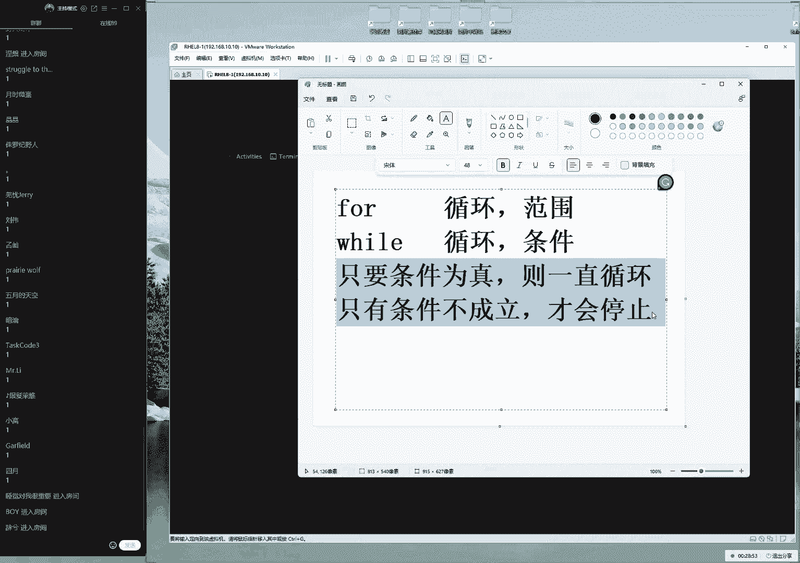

那么同学们来记好之后，来代入一下实战了，还是以我们昨天那个脚本啊名称为例，我们叫做哈哈，这样的话同学们可以把自己的这个就是呃呃呃，那我们可以把我们的这个重心完全都投入到编辑这个脚本里面。

不用老担心什么文件名称后缀什么的，这个不用管了，来打开我们的文件，叫做哈哈点s h，这个时候既然怎么样呢，回忆一下，就是我们一个shell脚本再去解之前，但它有一个格式，这个是不能够少的。

也就是说内容是啊，那么后面这个内容是什么，我们还不知道，但是它的格式一定要是有的，首先是一个脚本的声明，咱们的声明指的是这个呃我们的shell脚本能够被哪个解释器所执行。

或者的话呢是由哪个解释器能够读懂，这样的一个啊注释信息，我们来讲安装白色的这个脚本的声明，并里面的拜师，这就指的是我们可以通过这个解释器来去调用，以及去读取和解析和去执行我们这个shell脚本。

这脚本的声明，第二的话呢我们叫做脚本的注释，脚本的注释的话呢可以有一行，可以没有，它也可以有很多行，它并没有限制，它主要是对于我们的脚本的功能的一种解释的啊。

这种说明或者的话呢它是对于我们某一行参数一种介绍和解释，这样的一个信息看啊，这个是程序它并不读的，只是给人去看的，所以的话这也没有什么语法规则，如果说大家愿意的话，可以随便去写一些。

比如说啊this is a test，比如说我们先用来去测试的一个脚本，那么就可以对它进行一个简单的描述了，好这个话我当天没有用啊，因400给删掉，接收我们这个屏幕的空间，同学们这样黑啊。

可以看到我们这个唉屏幕当中最重要的一个参数了，好那我们今天要给大家举一个小例子啊，说到这个微循环。

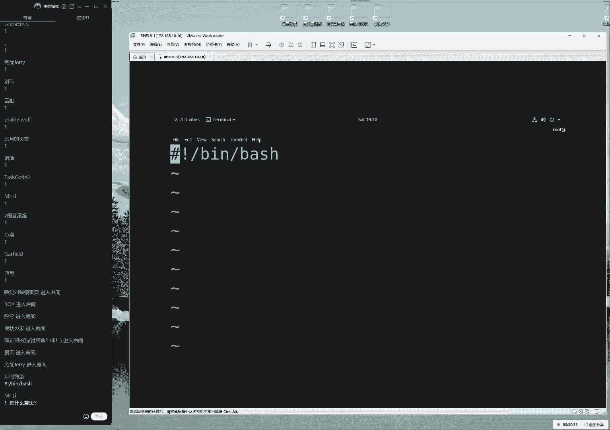

这个view循环的话呢，实际上是来自于我呃，我还是在大概上初中的时候看完一个节目，这个电视购物节目，当时的话有一个主持人叫李咏啊，现在的话呢好像已经是去世了啊，当时有这么一个节目啊，上画是由李咏啊。

他还是由李咏主持的这么一个啊电啊，它是一个电啊电视竞猜的一个节目，然后他就会拿出他这个主持人的话，他会拿出一个东西的，比如说啊是一件啊枕套，或者它是一个四件套，或者它是一个冰箱，这样的话让我们去猜价格。

然后我们可以打电话，通过这个电话去报您的价格，比如说你报的这个价格是400块钱对吧，还能画的啊，那画的我们这边的话，还有人报的是500，号，人报的是600，他会告诉我们说您报这个价格高低了。

会给一次提醒，然后的话应该是去猜三次吧，如果您猜中了的话呢，这个礼物那么就可以啊拿走了，那么如果说我们所有人都猜了一轮，都没有人猜中的话，比如说这个价格是499块钱。

那么谁比较靠近谁就可以拿走这个小礼物了，这是当时我啊这个当时看电视啊，那我看这个话是当时我们看电视那个节目当中第一个小的一个节目啊，然后我们就以这个为例，今天的话呢我们也想去写一个杀手脚本。

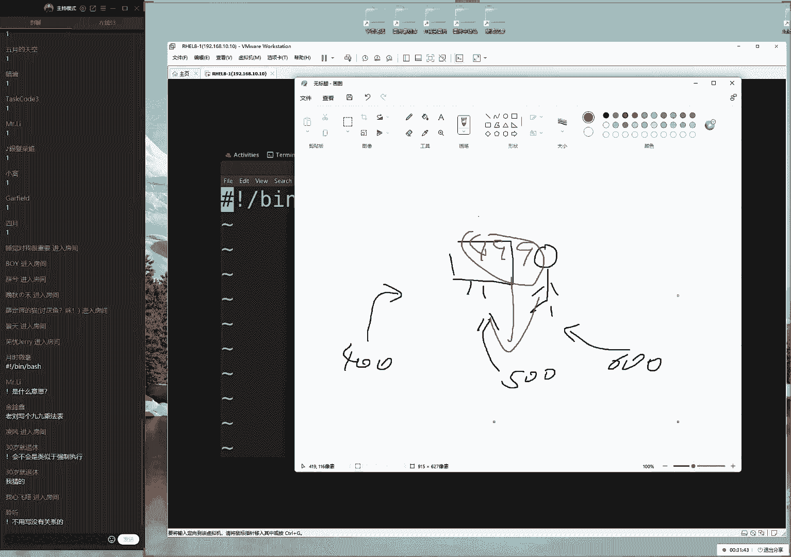

它会随机去啊，它会随机产生出来一个数字。

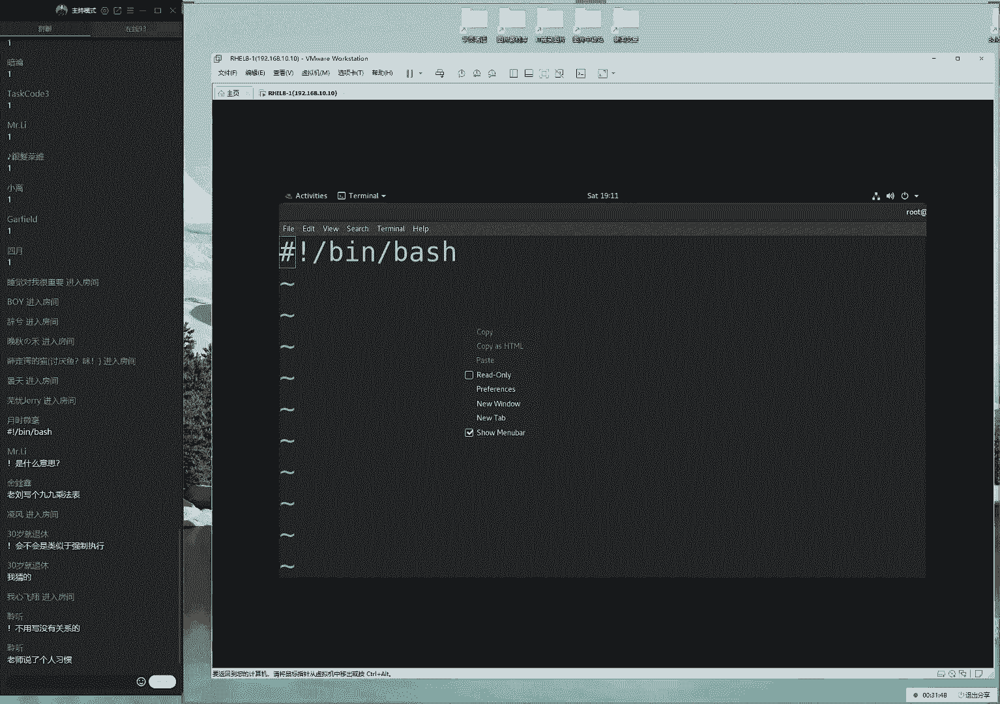

这个数字的话呢，我们可以给大家鉴定一下范围，这样啊，那我们就可以让用户去猜这个啊，最后它啊产生出来的这个数字的一个大小，比如说产生出来的这个数字是500，然后让我们这个用户输入一个值，然后跟他去做比对。

如果说用户输入的是一个300，那么则提示说您猜的太小了，要更加的大胆一点，那么如果说用户猜的是一个800，那我们则告诉用户啊，那么你猜的太高了，需要降低一点，那么如果说用户猜中了的话。

那么就是可以提取出来一个啊，congratulation公已经猜中了这么一个字样，也就是说我们用户输入的是什么信息，他就会根据这个信息来进行一个判断啊，然后的话知道我们猜中了这个循环才会进去啊。

那么他才会去结束这么一个小脚本，那我们来给大家去啊。

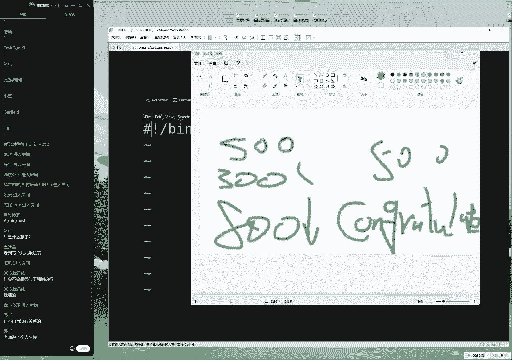

编写来操作一下，同学们尽量能跟上我的这个思路啊，尽量能跟上咱们这个思路好，大家说他号啥意思啊，这个昨天讲过了，我们我们就不再重复了，这个同学们昨天应该是没有来上课吧，来啊啊。

另外的话呢我们今天又报了大概三位同学吧，然后因为是您属于多，但是您属于到第35期选了，我们只是把您先加到这个群里边的话，去感受一下气氛啊，然后今天的话呢并不是开课第一天，所以您可能一开始对吧。

跟不上这是很正常的，那么您可以去看一下我们这个预期视频，在学园页啊，在学员页面里面是有的啊，正好借着这次机会给大家去说一下啊。

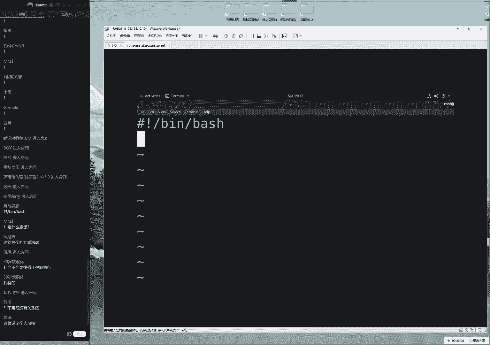

就是呃就是您现在的话呢可以进入到学员页面里面，后面就是我们的网址嘛，后面加上vip 3文字，你就可以先去下载一下预期视频，今天不是第一节课啊，今天并不是第一节课好。

接下来继续来给大家去说这个shell脚本的话呢，用到的一个变量，这个变量实际上就是第三章节最后一个小节去检环节变量当中。

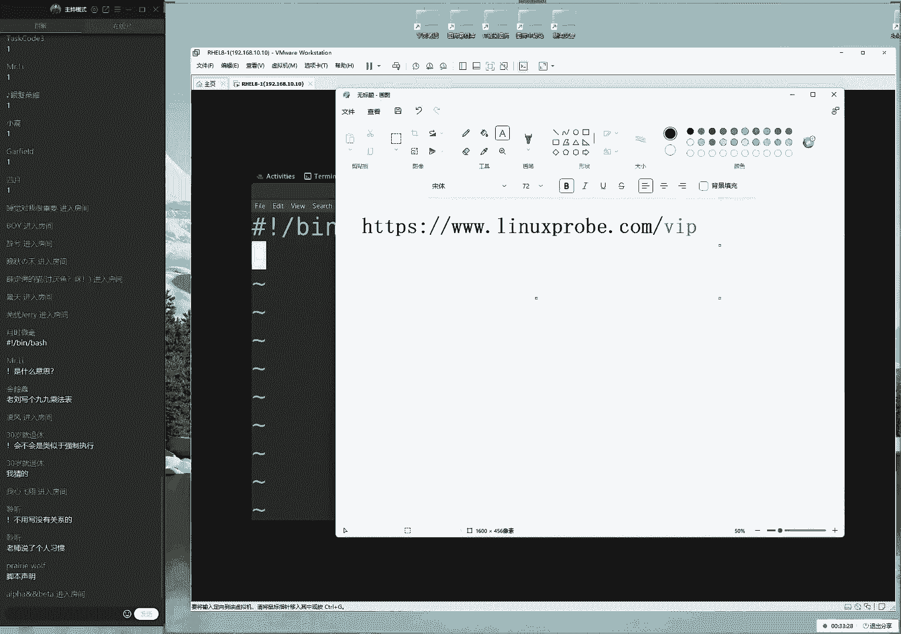

给大家去展示过的一个叫做random的一个变量名称，然后对于我们的变量的话，一般情况下都是一个大写的一个形式，那么那么呃那我们来去敲一下回车，所以这打游戏我们一定要严格进行区分好，接下来看一下这个变量。

这个变量的话呢它是一个随机产生出来的一个数字，这个数字可能是几千，可能是几万，可能是几百都有可能，反正我是见过几百的这种情况，比如说我们可以看到最小的话，当年是2500，最大的话呢是28000啊。

是32000，那那啊那么这并不重要，那也就是说我们现在的话呢，通过这个变量可以产生出来一个随机的一个数字，没有问题，但是的话呢这个数字的话它有点太过于跳了，这个范围真的是太啊。

就是啊啊这样的话范围特别的宽泛，那我们就要想一个办法，我们去选一个啊命令啊，我们来去来进行一个计算，大家注意一下这个命令的话呢。

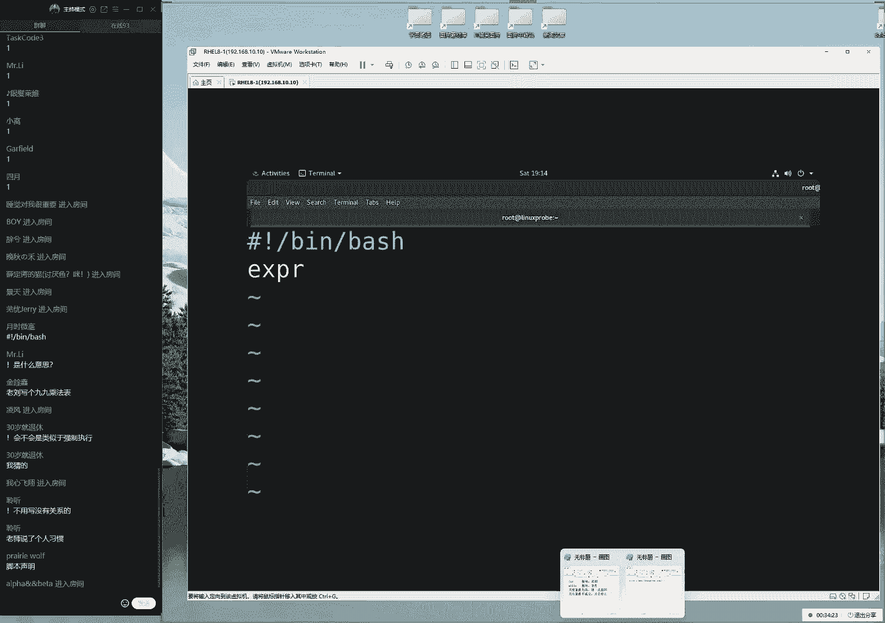

我们的作用是用来去计算后面我们的变量，它所啊对应的一个数字的，因为我们上节课给大家讲到过，变量的话呢，在我们这个shell脚本里面，它是不用定义类型，可以直接去使用的，所以我们不知道它是一个数字。

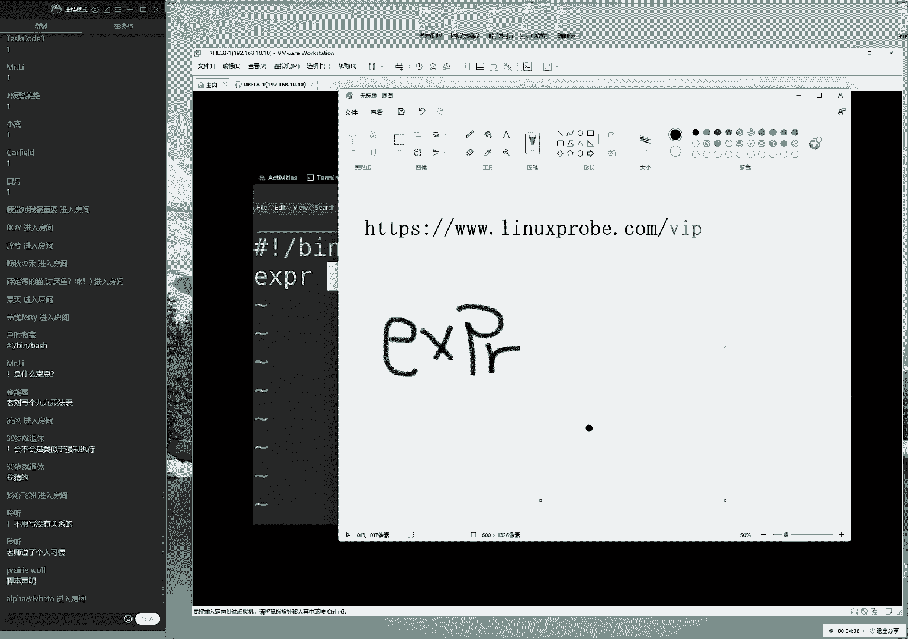

它它啊它还是一个字符串，所以我们需要去使用的一个计算的命令，把我们的这个后面的命令的话来进行一个计算，计算之后，将它的返回结果，然后再复制给一个变量这样的一个思路，于是我们来去进行一个计算。

那么要想去计算一个变量里面的这个值的话呢，我们需要前面加一个dollar符号，这个指的是提取我们这个变量它所对应的一个信息啊，它所对应的一个信息好，大家问了一个问题，大家说说叹号啥意思啊。

说叹号会不会是强制执行的意思啊，我怎么看到有四位同学，我怎么看到有三位同学都是这么说的呢，稍等一下啊，我从来没有说过，大概是这样的，我怎么看到四位同学都在说这个叹号啥意思，说这代表强制吗，还是啥意思。

同学们，怎么这个咱怎么回事啊，啊这是这样的，这个的话呢我们的前面的一个井号，一个叹号，然后后面我们加一个解释器的名称的话呢，这个是我们的脚本的声明啊，脚本的声明指的是能够被哪个显示器能够去运行的意思好。

大家经常说的是这个啊，ok我们来继续啊，怎么样怎么样怎么样，我看一下大家说说的不一样，琢磨了啊，这是一个格式，没有问题没有问题没有啊，这个没有问题的，所以今天大家这个状态感觉好像跟我好像比我还差呀。

咱们这个课是一个晚班啊，七点到九点钟，所以我们呃虽然说今天每天晚上，就是我们虽然每天晚上才会减两个小时，但是我们这一整天都是要去保存自己的体力的，所以到了晚上的时候就总有就会总会有干劲。

但是我今天发现同学们的状态好像不是那么的呃，好像不是那么的，那么这个怎么讲啊，并不是那么的好啊，怎么今天这个昨天刚刚讲过的节目的声明，将们的注释，将们的命令啊，这这是小米的声明，怎么都忘了呀。

啊来这话啊，ah that that，好，我们下面再来啊，所以讲课的时候我们会尽量的有点激情，这样的话呢大家去听见布雷顿啊，容易犯困，尤其是我们讲完了就打九点半了，特别的累。

所以我们讲课的时候会啊投入点感情吧，来我们来去做一下计算，大家看一下哦，现在的话呢这个我们叫百分号符号的话呢，当前的这个作用是用来去取余数的，大家可能会说到这个，我知道这个是干嘛呢。

这个是用来去这个的话呢是用来去进行一个除法的，他放的并不是的。

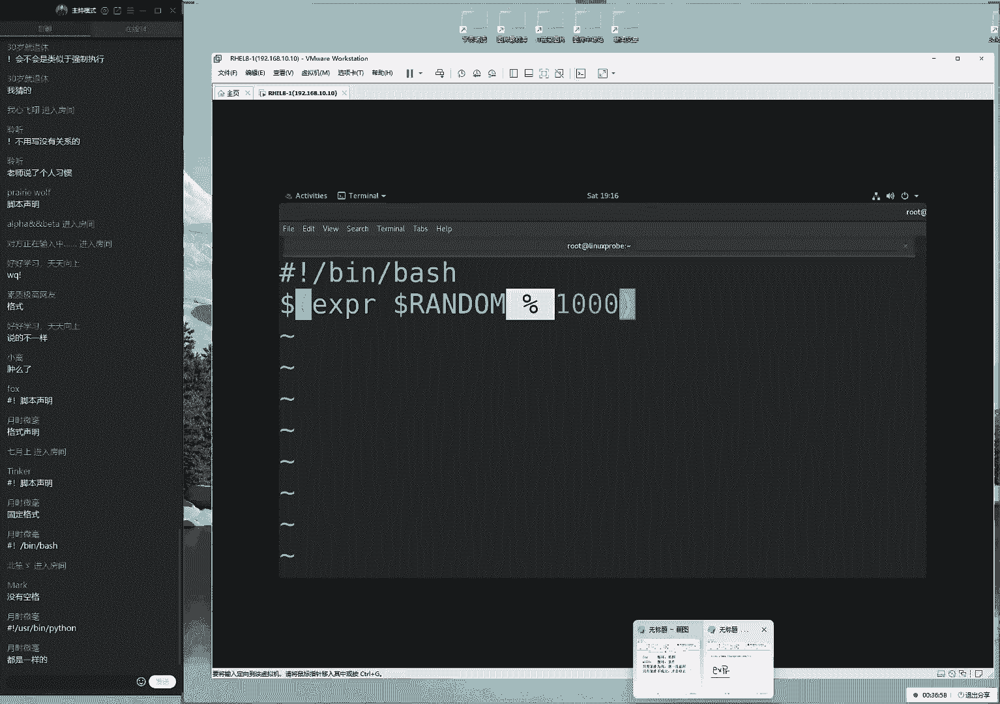

我们在计算机里面的加减乘，然后这是一个星号除，它是这么去解的，加减乘除，而我们的话呢当前这个符号的话呢叫做取余数。

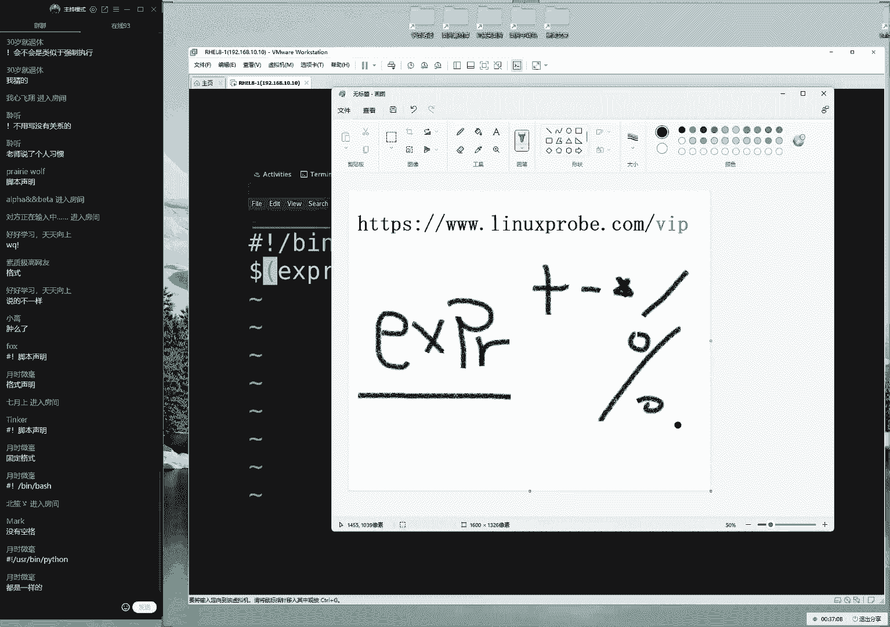

我们简单去理解一下，就是我们会去把这个数字的话呢取一个1000以内的一个范围，这样的一个效果好，这是第一个解释，第二个解释的话。

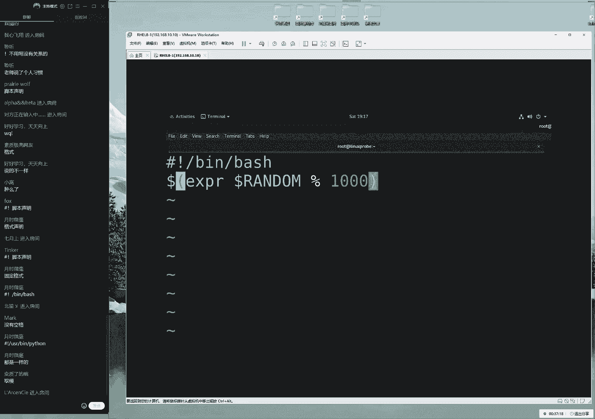

那就是那么我们为什么会前面加了一个dollar符号，加一个小括号呢，这个实际上是来自于第三章节里边那个3。3小节里面的转义符里面，对大家也说这叫做取魔术也可以，但是我们一把叫取余数啊。

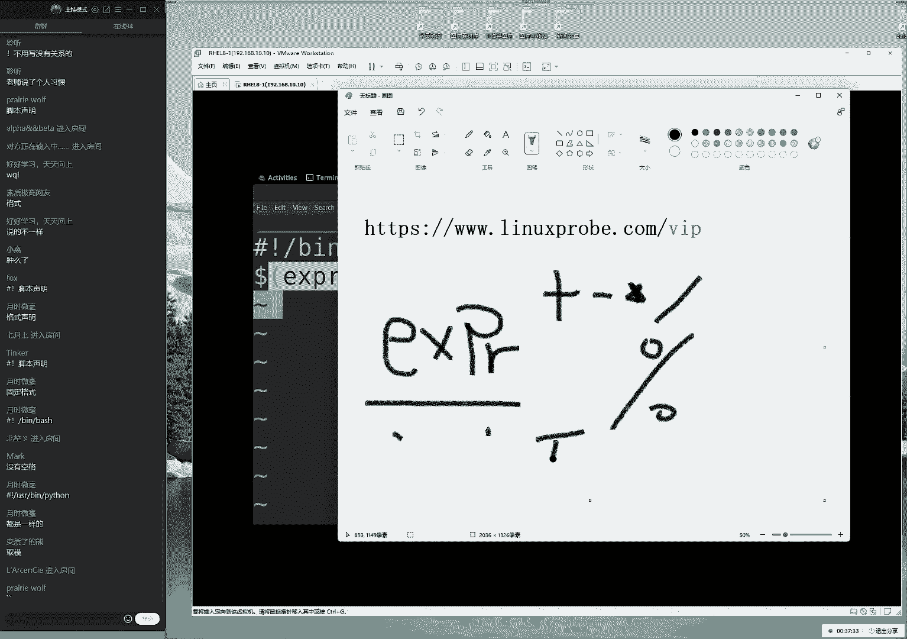

就是一个余量的意思，然后大家会看到这个符号的话呢，就会觉得好像有点眼熟。

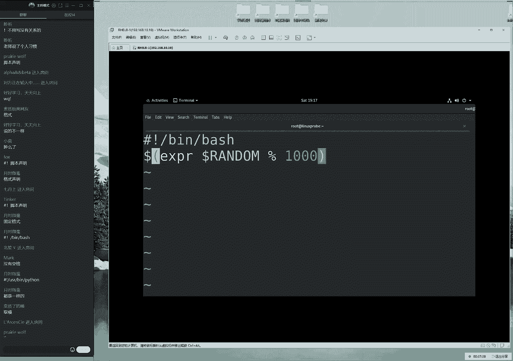

但又想不起来了，就这样来的，那么我们就这样再去逛街的时候，看到了一个熟人一样，好像见过一段时，想不起来在哪里见过的，就是这样的，在我们第三章节的话呢，双引号以及反响号。

这个反引号的话呢作用是用来去执行里面的命令，然后将命令的执行结果来进行一个返回这样的一个效果，当时我们提到过说这样的写法的话，那好啊，那么我们已经用的很多。

但是的话它有一个跟他一模一样的一个功能的一种写法，那我们的这个写法的话呢，是用的一个dollar符号加一个小括号的这样的一个形式来去写，这样的话的效果是相等的，呃我们今天的话呢也会把这两个实验啊。

不我们今天的话也会把这两个方式都给大家来去来去啊，操作一下，那画这样的好处，就是能够让你在工作的时候看别人去写出什么样的格式，都能够反应过来，这样的话我们可以做到，那么这样的话我们去记一下啊。

这两个的这呃这两个效果是相等的，这两个效果是相等的，它都代表着去执行，我就把它写下来吧，执行呃执行里面的命令，然后的话呢只取其防卫警啊，只啊只返回呃执行结果嗯，只返回执行结果来，我给大家写下来。

然后给大家写下来，然后大家问了一个问题，大家说没有声音了啊，有声音是吧啊，可以往视网络原因好，那我们现在给大家说清楚之后啊。

下面一个我们往后面去说，再一个变量叫times，因为这个这个这个这个作用是为了增加趣味性的，我们要想最后去猜的话呢，我们想要去最后统计一下这个猜测，这个次数增加一点趣味性对吧。

那我们大家去定义出来一个变量，它的话它默认值为零，让我们最后猜中了之后，还能够告诉我们猜了多少次，这是不是感觉很有意思的一个小实验啊，ok好，下面再来啊，可以这样啊来进行一个vo循环了，没有循环的话呢。

我们应该后面加是一个条件，但是啊我们不想去加条件，我们可以直接将这个条件设置为真，也就是说这个的条件为永久为真的意思，就是说这个呃循环语句会一直循环下去，知道我们的系统崩溃。

直到我们的系统锻炼知道这个世界被毁灭了才会停止好，也就是说这个的条件为真，大家一定要小心，但是我们现在这样去写的话，没有问题，因为我们会再去设置一个结束的一个强制退出符啊，我们来给大家强制做退出的啊。

现在我们来设置一位调，那么现在把它设成条件为真，他会啊一直在去循环下去，直到碰到了退出服务才会结束一下，他来我们进行一个do循环语句，先让用户去通过我们的read命令来去输入一个值。

将这个值的话呢赋值给一个变量，随便的什么名称都可以，先来给他输入一个提示符的一个信息，后面给他一个变量的名称，让用户去输入的这个值我们可以视为一个整数，将用户输入的这个整数啊，将用户输入这个整数。

然后的话呢我们来复制给这个变量里面，p的这个作用的话呢，是用来去提示一个信息，让用户知道他该去输入什么样的一个信息，好大家怎么说啊，大家说这是一个死循环啊，没毛病，他会来啊，他会来一直一直循环下去。

这个也就是一个最简单的一个就是呃等一个去解病毒的一个方法啊。

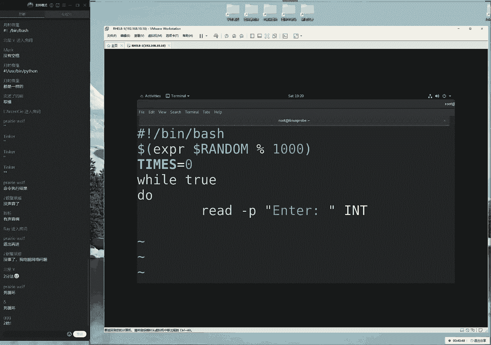

最简单的病毒就是这么去写出来的，它并不是这个啊，呃之前的这个极速服务，它会一直去消耗我们这个系统的资源，好在啊，因为我们这个没有太大问题。

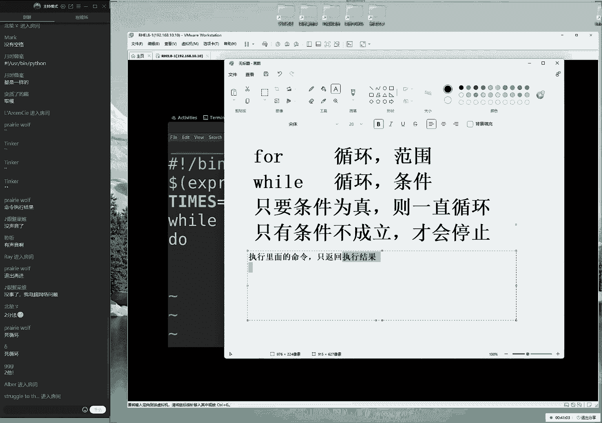

那么为什么呢，因为这个他并不会消耗太多这个系统资源，它只是让用户输入信息，然后来进行判断，而且的话呢他每一次执行之后，我们都会有这么一个read命令来去卡住它，它不会来去拼命的去询问下去。

它会有一个用户输入的一个过程，因此您应该是不会感觉到这个啊不啊，您啊是肯定不会感觉到任何卡顿的情况的，来接下来我们再来当每一次来去执行到这个语句的时候的话呢，我们来去使用到less来让我们进啊。

定义好这个变量的话呢，来去自加上一好，大家先问问两个问题啊，大家先问两个问题，我先来给大家回答第一个问题啊，同学叫做冰叔叔啊，然后问了一个问题，说这个啥意思，这个没有任何含义。

如果说啊如果说我们从c语言从编程角度上来说的话呢，这是一个变量的类型，我们为整数，而我们当前的话呢没有任何的含义，它只是一个变量的名称，我们如果要是不想用这个名称，没关系，我们可以换它只是一个变量名。

我们自己自定义的啊，自定义的，比如说他呃我们换一个，比如我们把呃那我们给它换成啊哈哈，这样吧好吧，我们给他换一个叫做哈哈，其实我们在上课的时候的话呢，我们呃会给大家讲到，会把一些呃变量的话呢。

或者文件的这个名称用到这种词，比如说哈哈啊哈哈啊，然后来进行命名，同学们就问到了，说老师你这样的话好像很不正经啊，就是我们就因为怕说太过于正经了，就会向同学们问到的，说这个值是什么意思啊。

是说我们在工作的时候，或者说我们再去接一个啊，那我再去写这个脚本的时候，必须是这个值吗啊所以我们从现在开始啊，能够替换的这个值就尽量的给它替换成种哈哈吼吼什么的。

同学们一眼能够看得出来它没有一个固定的含义，这样的一个呃好吧，那呃那么我们这样的一个情况，第二的话我们的问题就是刚刚定义的一个变量叫做这个times对吧，然后我们现在的话来着呢啊。

那我们现在需要让它在每一次循环当中的话呢，都会自自加上一，这样的话我们最后呃比如说我们执行了五次，那么最后才会去啊输出信息，恭喜您猜了五次，然后并且恭喜您猜中了那么这样的一个字样。

所以我们让他每一次都自加上一，叫做les，然后是times变量名称加加，然后他每一次都去自加上一好，然后同学们，我认为啊，其实我刚才想说第二个问题的话呢，就是您可能不太好理解这个什么意思。

再给大家解释一下，这个的话呢就是要让我们后面这个变量的这个值的话呢，每一次都是自加上一，那么第一次的话呢他就是0+1，这样的话他就啊最后这个结果就是一，然后当第二次的话呢，就是23456789。

最后啊我们猜中了之后，它会去输出这个变量，那么就知道了，我们总共猜测这个字数呃，其实来讲的话呢，这个我们在一些编程语言里面的写法是这么去写的，叫times，然后怎么样呢。

是不是times等于大家一起说呃，大家说呃不加上let不行吗，当然不行啊，当然不行，呃，我们这个在编程语言里边的话呢，我们是这么去写的，然后我们是加上一这么这种写法啊。

不这个这不这个要用double符号都来去啊，提取一些变量的值，大家可以看一下，70的话呢，这个就等同于的这么去写，他每一次都能把它这个里面的值做调用，然后再加上一，然后再赋值给变量，就是同样的效果。

我们只不过去转了一下这个新鲜的这个操作服而已，大家可以去感受一下，大家会感觉到计算机有两个特别好的好处，第一就是说比较的理性对吧，只要我们给他一个正确的信息的，或者说我们只要给他一个正确的指令。

总是啊能够把我们这个想要用那去处理的，根据执行的这个工作，帮我们自呃自动去完成，可能比人更加的靠谱，第二点的话就是更加的灵活，大家会发现，比如说像我们下面这个啊，哎呦我发现一个问题，我好像忘记把这个值。

这是给它复制到一个变量了，第二个的话呢就是我们在计算机里边的话呢，去操作的时候，这个操作符啊跟命令都特别的灵活，同一种功能可以有时有两种可能性啊，比如说我们现在这个词啊啊那我们可以用啊。

那我们可以很多种写法，比如说这个也是啊，这都是二选一，这也是二选一，我们可以用到啊，翻译号也叫做代替好，我们刚刚的话差了一步啊，差了一步是什么呢，现在去执行里面的命令，然后命令执行结果的话呢。

我们需要去复制给一个变量，让这个变量叫做price去接收刚刚去执行过号的这个命令，执行过后的这个结果，然后我们来去做一下比较，比较一下用户数的这个哈哈，跟他自己产生出来这个price。

它这个价格是一样的吗，如果是一样的，则推出这个循环，如果是不一样的话，就会一直循环下去，然后给用户一个提醒，这样的一个呃思路，这样的一个思路来下面一个问题，下面一个问题啊，大家说呃vo处判断的是啥。

他没有任何的判断，他的条件永远为真，我们直接把它这个等于说结果给他放啊，那我们给它放到条件上面了，它会一直去循环下去，好另外同学问到了同学叫小公子啊，说如果我们的enter后面不留空格会报错吗。

稍等一下啊，如果我们的enter后面不留空格会报错吗，好我没有理解您说的是什么意思，因为我这边好像没有nn或回车没有问题，没有好像没有看到您的问题，就是您可以再去细致的去描述一下。

因为大家可能会认为自己的问题已经描述的很清楚了，但是并不那么的清楚，还是要再去补充一下，因为我们面相可能人比较多啊，你可能上面一条说过一个，下面一条再发的话，又需要把上面那一条再去重复一遍。

最好来我们下面这样啊，下面这样我们来去做一下判断，这就是把我们这个以前的测试语句的话呢，就给大家嵌套在这个while循环语句里面，就像这个管道符一样啊，大家会问到说说到刘诶，你这个管道符只能用一次吗。

当然不是了，管道符可以用很多次吗，将前面一个命令的输入结果给后面一个命令再来进行一次二次处理，然后12345678 90没有上限，我们可以去加100次都可以了，而我们这个的话呢也同样的。

谁说我们的循环语句里边不能签到啊，测试语句呢，那我们在这个测试里，地面我们还可以再去嵌入到循环语句，这样的话它是非常复杂的。

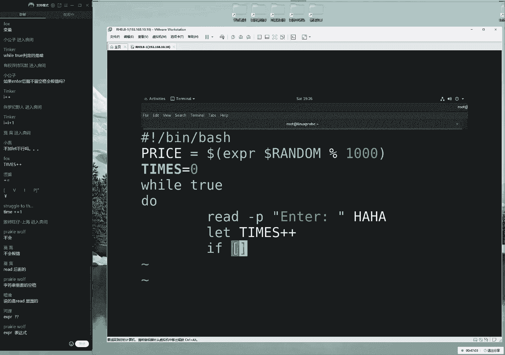

还有那个测试语句，诶if啊for啊，well啊ki，这个他们之间也是可以进行一个搭配的，一个使用特别的灵活的。

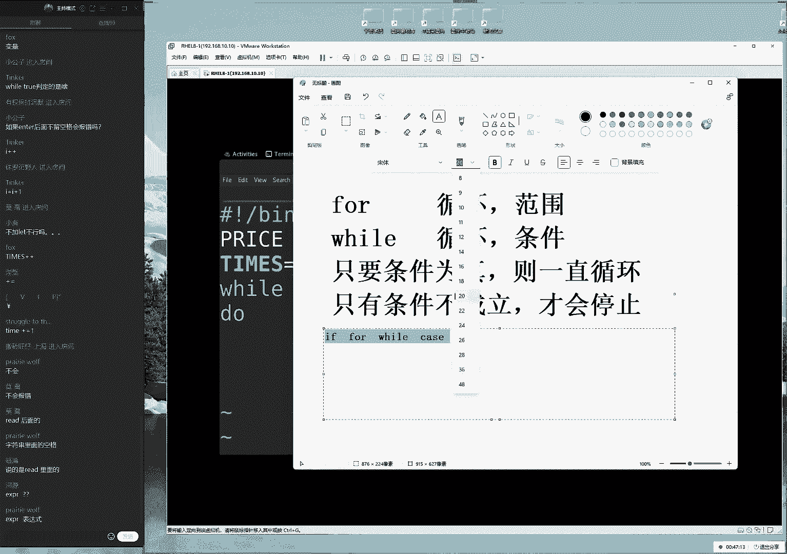

一定要去啊去呃，各种来去尝试啊，我们先来去就下判断，判断一下说用户输入的这个变量叫做哈哈啊，当然了，这个时候大家就千万不要再问我说这个哈哈啥意思啊，变量名称啊，变量名称没有任何含义啊，没有任何含义。

大家要再问的话，就只能把它叫做老牛了啊，或者说我们取一个其他名字，变量名称随便去写啊，没是没有关系的，判断一下用户输入的这个值是否依括等于什么什么呢，等于随机产生出来这个值，这个变量名称变量复制啊。

它进行赋值的时候是不用加dollar符的，而提取这个变量的值，我们需要加一个dollar符，加上这个price，ok这样去做好，大家问了呃，大家啊，大家问了一个问题。

大家说我们这个字符串里面有的这个呃空格呢，这个有什么影响吗，这个没有什么影响啊，这个没有这个没有关系的，然后的话大家也问到说我们这个等号两边是否有这个空格，有还有什么影响吗，呃没有，他没有任何影响。

只不过我们为了照顾大家的这个感觉的话呢，我们可以把它给删掉，但实际上来说是没有问题的啊，是没有问题的，来大家说我们的price拼错了，来p r i s e，果然是p r i s e啊。

这个啊这个有点这个太啊，这个水平就太低了啊，这是一个非常小的一个问题，好我们写下来，就是说当我们这个用户数的这个值跟我们随机产生出来这个值的话呢，是保持一致的话，那我们就会去输出说唉恭喜您猜中了。

然后是跟啊conga grade啊，等一下，这是关乎老刘这个尊严的这个时候了，congrto a len好吧，我们随便去拼一下，我我也不知评论对不对啊，这是官服老刘这个水平的问题了，来这么啊。

如果说我们就猜中了，那么就会去输出一个恭喜的一个这样，并且会去输出一下，我们总共猜测这个次数调用一下刚刚所产生出来的不俗定义的，以及去呃让它每一次都自加上e的这个变量的名称叫做times，好。

大家需要注意一个问题啊，就是为什么我们看我们的这个脚本会显得特别的臃肿，而为什么我们的同事里面写这个shell脚本的话呢，则会看起来特别的舒服呢，其中有一点就是我们所有的判断语句里面。

其实就是我们再去写这个少将本的话呢，都是一定100%会有一个怎么样，一起来说判断语句要去使用到一个if的，然后的话我们要是有if的话。

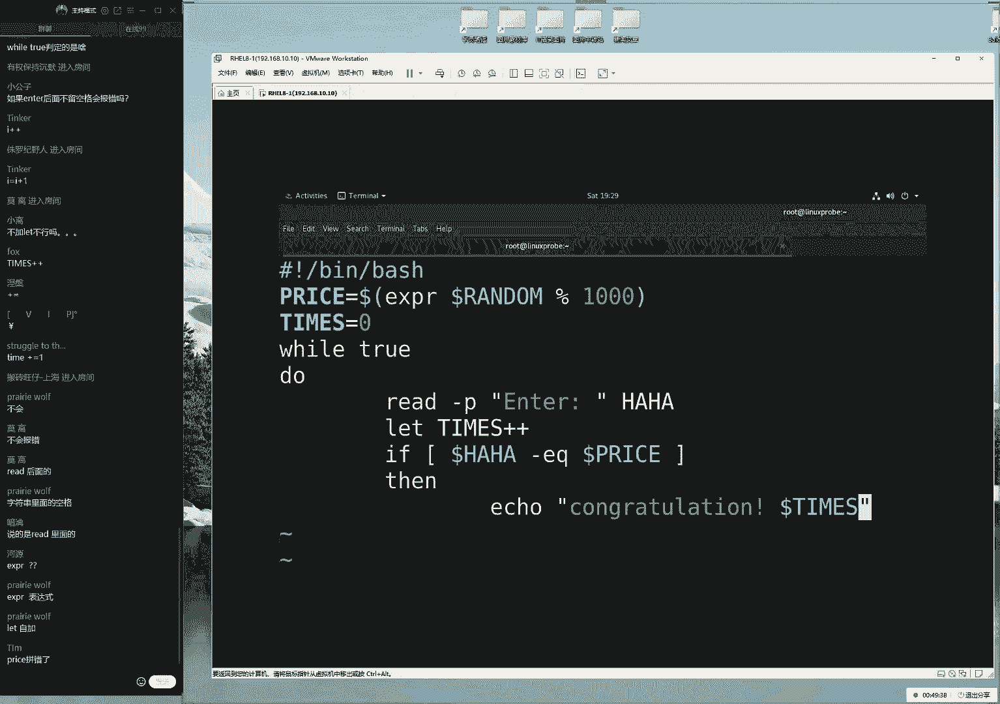

他可能就要有很多的，怎么样呢，还会有很多then对吧，就是我们啊条件满足之后，然后我们该怎么样，它也需要把我们的每一个动作加上一个正，于是你就有可能比如说我们判断语句啊。

去使用到多种分支的天赋测试语句的时候，就有可能比如说判断了十次，那么你的屏幕里面就会出现十次哎。

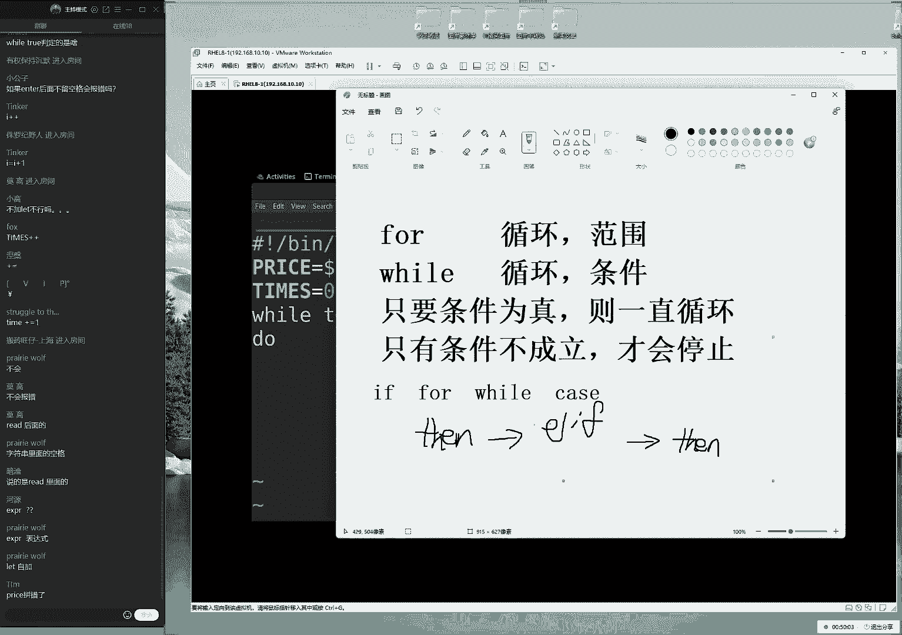

并不夸张啊，就会出现十次，这个字特别的呃乱啊，所以我们可以有一个小方法啊，就是如果说大家觉得这个字特别多的话呢，可以把它放到后面啊，然后我们这个之间加一个分号就可以了，就会这样。

我们看一下是不是屏幕一灰啊，感觉特别的清爽了，然后接下来再来当用户猜中了之后，就可以来去退出了，来去退出掉，我们这个循环强制退出啊，这样做好之后没有任何问题，再来第二层的。

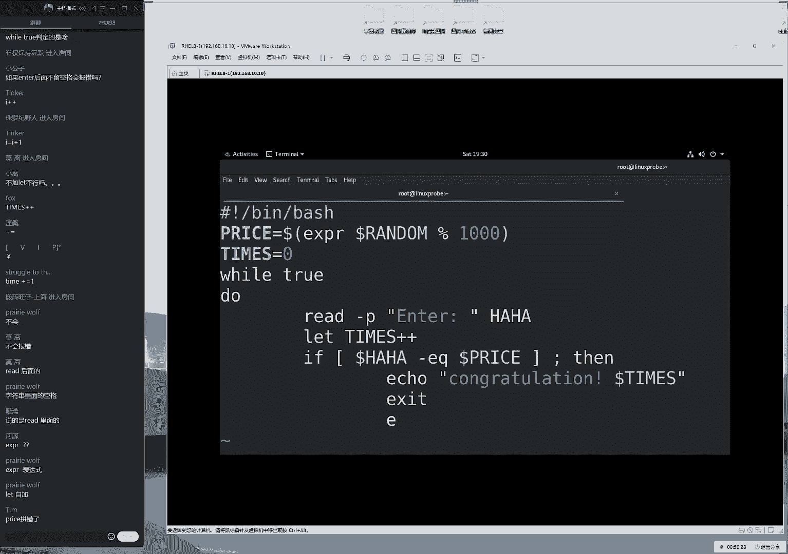

因为它只有三个情况，那他只有三个情况，就像我们在商场里面那个厕所一样啊，它只有两个情况一样，就男跟女这个也是一样的，它也只有三个情况，它没有一个，它没有一个，第四个情况的，第一个情况就是它是相等的。

它是一个相等的一个模式，第二的话呢就是我们所猜的这个次数不，那我们所猜的这个数字它大于了，所以产生出来这个数字，于是就是一个大于的情况，第三个情况就是小于了用户数的这个值小于的。

我们这个就猜到这个呃所产生出来的这个数字，因此它只有这三个情况。

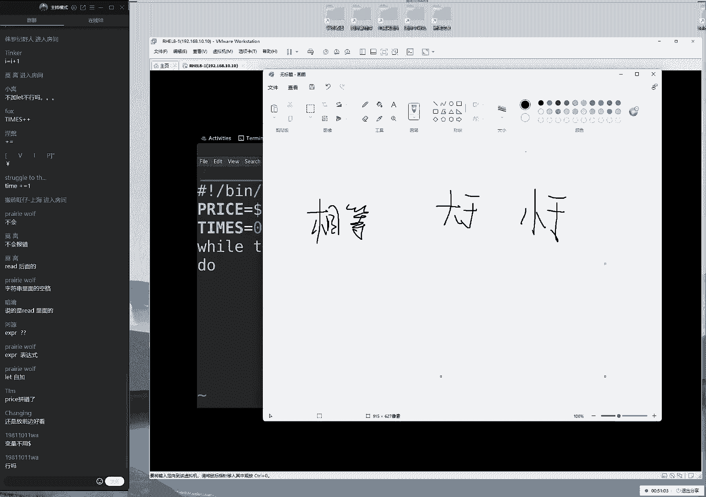

那好了，我们再做一下比较，他如果要是不相等的情况下，那么就判断第二次判断一下用户数的这个值它是否是大余了诶，他大于了杠g t我们就呃等于了啊，不它最后是否大于了我们随机产生出来的一个数字。

然后增放到后面去，让我们屏幕搞啊，保它保持非常的清爽啊，保持非常的清爽，来当然问了一个问题，大家说变量不用dollar行吗，当然不可以啊，当啊当然不可以，因为呃如果我们的变量啊来去进行定义的时候。

是可以不用剪刀的符号的，因为的话呢它进行定义的是定义的我们变量的本身，但是后面的所有的变量都必须要加一个dollar符号，dollar符指的是提取这个变量里面的值，这个怎么理解呢。

就是我们现在进行比较的这个信息，以及我们需要去处理的这个信息，并不是变量它的名称的本身，所以您需要去提取出来里面这个dolf里面的这个啊，不我们需要去通过这个dollar符号去提取这个变量里面的值。

然后来进行一个加工，这个的话有点像是c语言里面那个指针对吧，如果我们定义了一个指针，那么您做计算的时候跟我们去做宣纸的时候，那您是找那个指针的名称吗，纸质的名称没有任何的含义。

我们一定要找到它所对应的那个地址里面的这个值，比如说一个数组也好啊，数组名称没有意义，去取它里面具体里面那个值，这啊是同样的一个效果来啊，当用户输入的那个值它超过了，所以产生出来这个值。

那我们就去输出太高了啊，就是一个high吧，随便去写了，英文也不太好来，就是这个值的话太高了，这么一个字样，再来最后一个else，因为它只有三个情况，要么等于，要么大于，要么就是怎么样，它就是小于。

所以我们最后啊如果前面两项都没有被匹配上的话，我们则去输出说您输入的这个值太低了，这么一个字样啊，太low了，呃就就你们这样去写吧，好我们最后做完了之后把这个结束掉，我们fi啊。

结束掉我们的天文测试语句，哦，我们的啊去拿去接来把它结束掉，再来的话呢，while循环语句，循环语句结束掉它do和done啊。

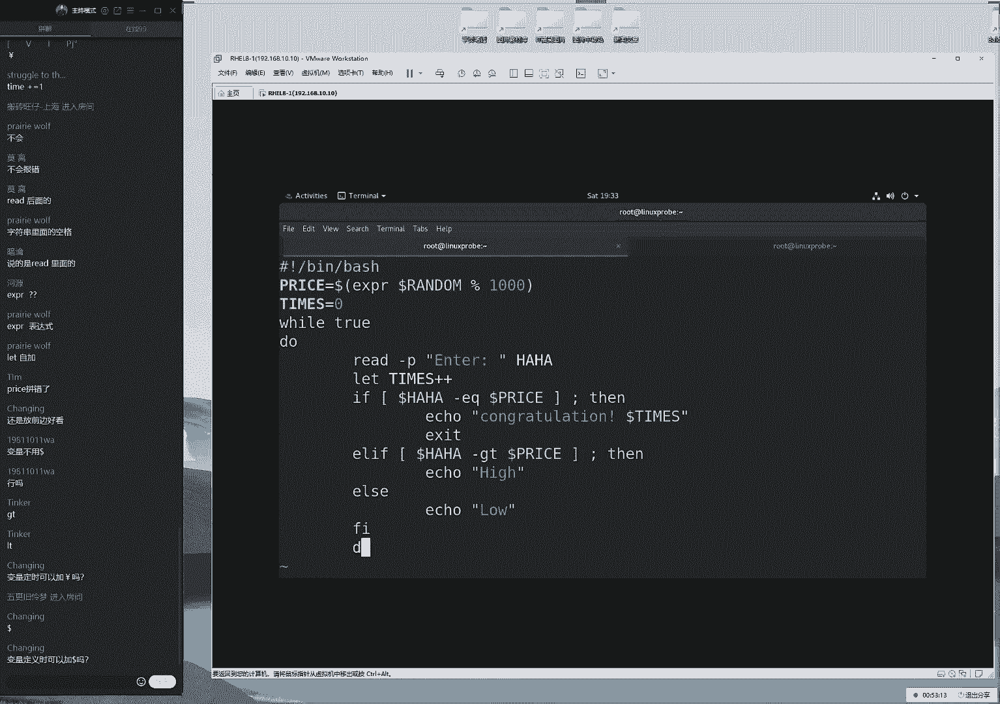

它是一对的，然后的话呢我们前面也是要有if也要fi，它是一个结束符，然后的话呢我们这边也是一个do一个down，我们要给大家去做一下结束符，他有点像是同学都会认为朱老师这个怎么那么的麻烦呢。

这是shell语言里面故意为难我们，那么并不是的，因为它需要让啊我们这个程序员能够准确地告诉他，他在什么地方该停它，什么时候停止了，我们这个循环语句，这个其实在去写网页语言里面，外去写web前端。

学生也是同样的，比如说您去写一个我们的网页语言，我们的html对吧，那比如说现在也想去开启一个块儿，不也这么去写吗，比如说我们开启一个段落对吧，或者的话呢您去想去写一个，比如说呃图片啊，或者说怎么样。

我们最后他们那那么都是要这样去用的，要有一个开始，要有一个结束，他同样的会有这么一个效果对吧，也就是说我们现在的话呢去写这个脚本的时候。

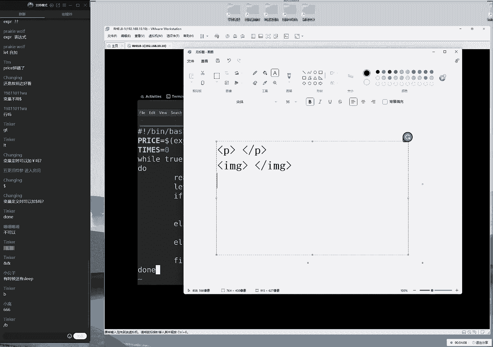

一定要规范他这个有要开始就一定要结束，如果你要没有写写结束的话呢，就有可能导致这个程序会有些问题的，来，我们现在的话呢再来点一下这个保存并退啊冲啊，大家说变量定义的时候可以加dollar服吗，不可以啊。

变量定义的时候不可以加dotf，而且我很我呃，而且的话呢这个是一个怎么讲呢，是一个很简单的一个思路问题啊，大家千万不要被我抓进去了，就是我们现在的话呢去呃调用的时候是用的是一个dollar符号。

那我们定义它的时候的话呢，定义的时候是不加dollar符的，所以您可以看到定义阶段是全都不加dotf的，只有我们去调用的时候才去加dollar符啊，这样到这样的一个这样子的话，我们这样的一个原则好。

大家先看着我们这个实验啊，我们来给大家说一个事儿，就是的话呢呃这也算是一个小的一个时间，也算是一个小的一个活动吧，我们从第一季开始做培训到现在呃，压力的话也也也是很大的，而且我们对于这个课的话呢。

呃前面的话呢确实还有啊，去这个有很多需要去讲的，也没有说他也没有什么太好的互动机会，正好借着这个机会，我们来给大家做一个啊小小的一个活动，是这样的，既然说啊既然说随机产生出来这个数字是1000以内的。

我们的话呢同学们可以去猜一下这个数字。

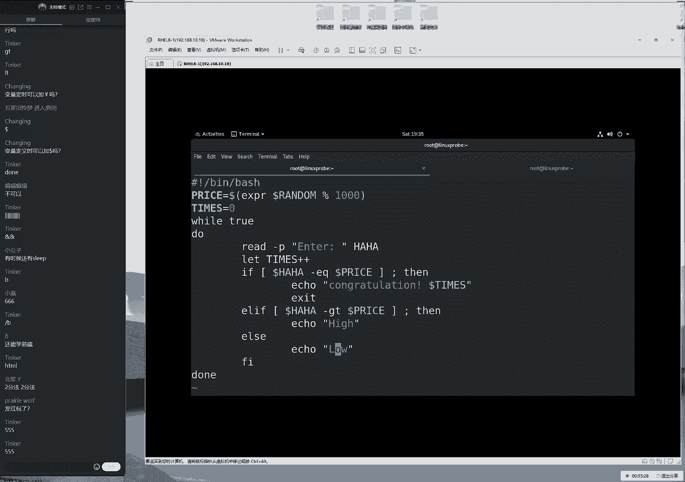

最后的话呢我们就猜中了之后，这也是一个小小的一个活动吧，不是玩这个上限是1000块钱啊，这是也是这个啊啊这个也是我们以前也是一直在做的一个活动啊，呃以前这样呃，然后的话您可以去猜。

比如说我们最好的一个季度好像是猜了五次还是猜了六次啊，然后的话您就去猜，比如说我们最后我们差了五中啊啊不，我们最后差了五次猜中的，那么就是五次乘以100，最后减去这个数就减轻了是500，发500块钱。

如果我们猜了九次猜中呢，那我们就会在群里面发一个啊，嗯那呃那么这个钱就非常那么就非常少了，如果我们猜八次的话，就是200，然后才九次才能，那么就是100就是我们1000减去查了次数啊。

乘以100这么一个小活动呃。

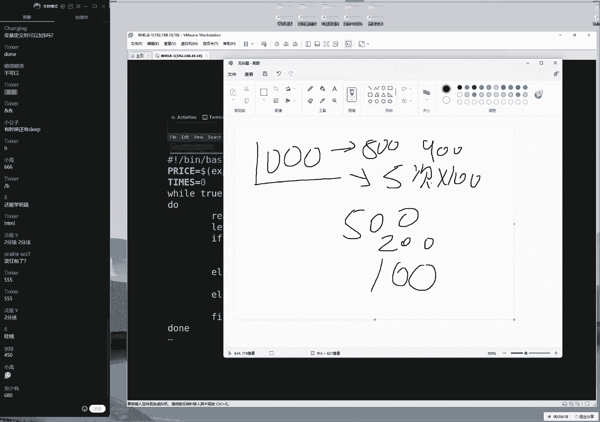

一份的一份小心意吧，正好让我们这个实验更加有更加有乐趣，来我们走，来来来来，正式开始，我们今天这个小徐啊，来去跑一下这个脚本，哈哈点s h第一猜，小朋友们先输入您的第一猜。

现在的话既然这个范围是0~1000开始的啊，不10~1000这个范围的同学们开始您的第一才，我们猜个什么数，同学们猜68啊，他是不是啊，没有听懂，我刚才讲。

我刚想说是不这个自己产生这个出来这个数字是一个0~1000的，68，有点太保守了，同学们哎呀，太低调了，来我随便去选了，比如同学们随便来随便来啊，叫做呃至少有同学是吧。

你好像打了一个650还是六还是600好吧，我选一个600，那就再回车，他告诉我们说太高了啊，他告诉我们说太高了，所以我再来了啊，同学们就知道了，600太高了，那么肯定是600，600以下嘛。

同学叫做team，同学打了一个多少啊，没有看到好吧，下面啊同学们一个同学啊，重新打吧，叫做呃行，只看到这个数字，但没看到是谁啊，那么随便去写了434是哪个同学啊，他因为太快了，按下回车434也太高了。

嗯，还有这个数字比较低嘛，再来同学们，还有同学啊，晶晶同学是吧，我您好像打的是个300，我也没有看清，好像就是300吧，那下回车诶，300还太高了，我现在有点怀疑是不是我这个脚本写错了。

现在的话呢实际上它是判断了第二次了，当第一次如果满足条件的话呢，它就不会再去执行我们下面那个else if了，等于说他进行第二次判断的时候，他说太高了，好，我们再来，同学叫阿笑啊，150行。

你这个挺好啊，来150，阿笑同学来下回说好，他还是又满足了我们的好，他还是满足了我们的第二次判断，else if这样的一个语法好，我们再来啊，同学们说啊，90我们的关先生是吧，90按一下回车诶。

90还太高，同学们，难道第一位同学打的那个68真的是打对了吗，好了我随便啦，同学们叫做呃g g g是吧，打了一个45，按下回收哦，开迪奥哎呦，完了这回感觉是我有点太误导大家了啊。

因为同学们第一同学打一个68，我还说这个太低了啊，实际上好的这个范围就是在45~90之间的，不好意思啊，另外给大家去说一下是什么呢，但这个我们再去去做这个判断的时候的话呢，它不可能是等于的。

也就是说这个我们所有的话都是一个杠之一。

它指的是诶等一下我给大家写下来是great哎，等一下啊，great a g r e a t哎，它是呃大于等于的意思。

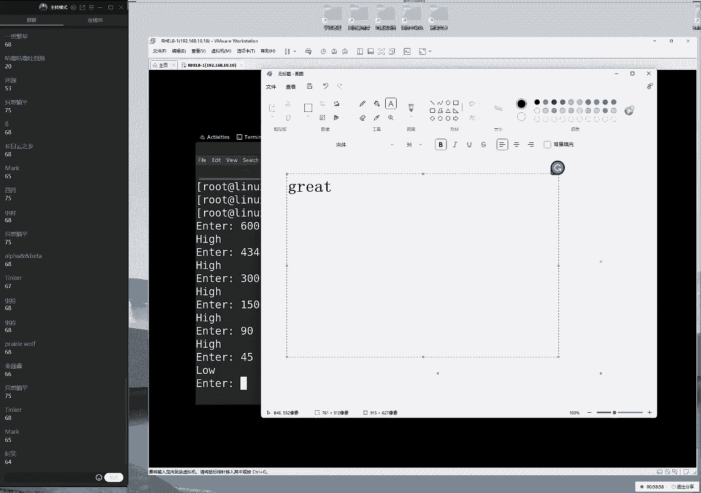

哎我们大于等于的意思，所以的话呢45跟90肯定是没有办法去那什么了，来我们继续啊，同学们叫做哎只想躺平，同学75a加回车啊，大家说这个太高了，其实际上这个范围已经很小了，只有大概30个数了。

同学们再来一猜啊，同学们叫做一世繁华啊，说68，同学们啊，不是不是不是还真的不是六八，还好还好还真的不是六八，如果这是68的话，就真的说不清楚了，就感觉我们这个课是一个录播课了，这样说不清楚了啊。

这还是有这还有还有这个我们还是非常非常有压力的啊，幸亏不是68，68的话，同学们一上来就说到了，而且那么小那么的准就会让我们很难解释了，来随便来，同学们，大家说到72是吧，那太高了，来下面一个同学啊。

同学说啊，我们的嗯同学啊打了一个70，好gg同学第二次看到你了，我来打一下70k 10次，最后我们猜中了，看到最后啊，最终的话这个数字是十次好呃，然后我来给大家去说一下，是这个样子的啊。

首先首先首先首先首先是这样的，我能画到这个是一个非常严才华，这是一个非常严格的公正的这么一个shell脚本，因为说实话，我就啊就是其实就是连我们自己都不知道，它到底所产生出来的个数字到底是多少对吧。

其实我们都不知道，诶啊所以的话呢如果大家以后在公司里面要做团建啊，怎么着的，如果要做一个低成本的，大家听到这个词哦，第一个验证的一个或者说抽奖这么一个小程序，那么你就可以通过这样的这个方法来去实现。

并且的话它是一个开源的，我们就都可以看得到没有人作弊，这个可能性好，但我们可以看到的话，最终还有一点我们的变量叫做tx，然后我们来自加上一，最后我们对吧。

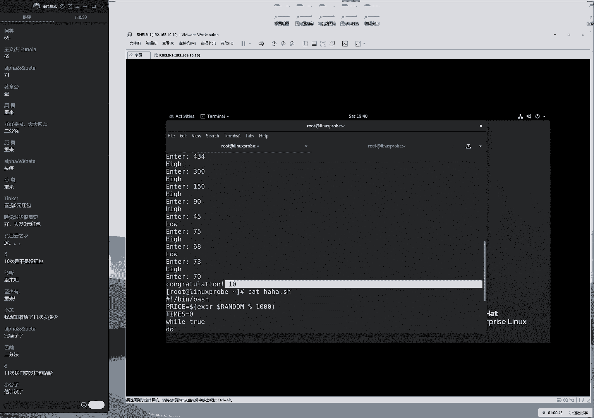

最后会显示出来我们总共猜测这个次数，当我们到了我们的推出符诶，退的时候，他才会去强制退出掉它。

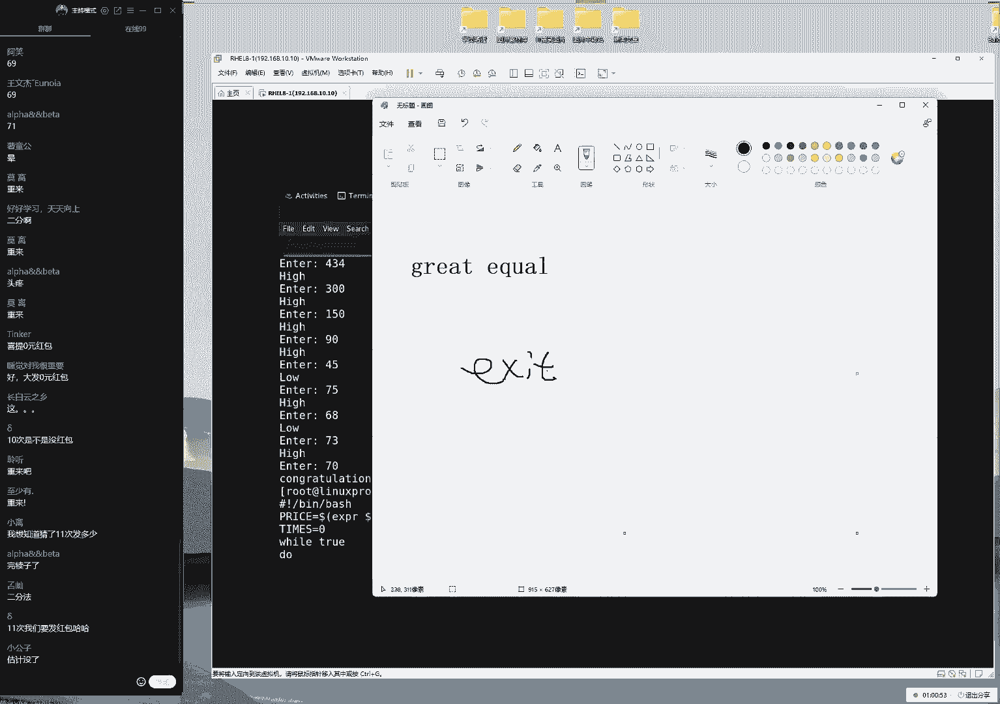

否则的话呢永久条件为真，会一直来继续循环下去的，好呃今天的话呢猜到这个词，大家今天正好的话擦了十次啊，这有点让我没有想到，所以这怎么办呢，所以这个我觉得还是再玩一遍吧，我们稍微快一点啊。

因为这个其实没有想到大家猜了十次，但是为了我们这个活动的话，非常的公平公正啊，但是我们可以再玩一次好吧，同学们再就一分钟时间啊，我们再去玩一次，同学们来告诉我你的结果快速，我们就给大家呃，就是我啊。

来我们快速的告诉我一下，同学们来给我一下啊，来来给我一个理由，给我一个理由，来我们同学啊叫做啊打了一个500啊，咕噜咕噜吐泡泡，同学来按一下回车，这个因为它跟客无关了，所以我们要稍微快一点了。

咕噜咕噜吐泡泡啊，说500啊，大家说250好啊，同学叫叫做晶晶啊，250啊，不是你打的是250，来下面一个问题，不是我们下面啊叫叫叫做啊，打了125啊，没看到是谁好吧，125太低了，我觉得这次看到没有。

这个二分法非常的准啊，非常好啊，非常好，你看这样这样这样非常的理性，一看就能看得出来啊，一看就看得出来就是我们学计算机的一种理性的工科生啊，来我们来再来187是谁打的，把我们来这边来了，187走。

187太高了，再来同学们再来再来，同学们叫做啊校花的贴身码农，嗯，好好啊，我们来看一下，输入一个200，不对啊，187都太高了啊，这个呃呃思路错了啊，再来啊，又打了一个150，150a加回车抬高了。

也就是现在范围的话呢是在125~150之间，同学们再来一下啊，135同学们打的是叫做呃是谁，我我没有我没我没看清啊，好我们打下135来看一下，太低了，也就是说这个范围在里面之内对吧好，也就最后了。

145是谁打的呀，看看143小同学叫莫离143走，143，太高了，范围就这么多了，总共就差了几个数啊，就是七个数了，再来大家说这边来了，同学叫5月的天空，140走太低了，140才第143太高。

那所以就是只有四一和四二同学你们自己发挥吧，41424142，我看看同学们谁大啊啊，同学们打一个叫做啊，同学都打了142比较多啊，142，然后大声说一句，这个我但我现在我们就是两个礼拜选一个啊。

运气不可能这么差的，来走好，总共猜了九次，好九次的话有点太低了，但是好，我们今天给大家发两个吧，我们给大家发两个100块钱，这样的话我们总共200块钱，同学们都讲了，都大家都能抢得到。

要不然的话只是发音的话有点太小了，好同学们准备好了吗，发完之后的话呢，我就继续给大家讲课了，打开手机啊，打开我们的34群啊，我会给大家发两个，这样的话呢我们因为在线人数比较多嘛，所以怕大家抢不到。

给他发两个，准备好了吗，准备好了，同学们开始了啊，啊不好意思啊，又又密码又打又又又又又打错了，每就每一次都是翻翻这个错误，我老输成我那个呃支付宝的密码，稍等一下，密码输错了来呃，同学们。

我们再重新来一遍啊，三二哎一哎走，你可可以了啊，再来再来发一个，同学们，如果没有想到的话，请先来第二个啊，唉然后我们再来三二好走，你好，那我们继续来给大家去说啊，耽误一分钟时间，我们啊非常的啊。

我们非常紧张，我们要给大家往后面去讲了，今天这个课吧，军训特别的多，而且我们这个规划是有问题的，大家发现了吗，我昨天我还说呢，我然后我当时我说咱们俩先被咱们就先别着急了。

因为的话呢这个四点三点小结吧啊4。3。3小节吧，这个讲vo循环语句起码也要20多分钟啊，然后我们现在的话就先不讲了，等我们第二天再去见，那我们再给大家去讲，结果会发现了啊，事实的话就是讲了40分钟了。

这个确实超过了我们的预期了，不过也好，就是昨天我们幸亏没讲，要是讲的话，肯定特别的着急去赶课时，以及要有耐耐心了，会讲得稍微慢一点，可能就是啊所以大家会感觉到有点慢吧，好接下来再来说，接下来再来说啊。

再去讲一下我们这个case语句说到就是我们昨天讲的一个问题，就是当我们有一个用户啊，但有一个小可爱，这个小可爱的话，他输了一个字母，字母跟数字比，你说a它大于等于68吗，它不可能的对吧，它不能这么去比。

于是的话呢避免这样的问题，我们能不能让用户去输入信息之后来进行判断，然后用啊，当用户输入的这个种类啊，它并不正确的时候的话呢，程序并不崩溃，而是给用户一个提示出来的这个信息呢，这个是可以去实现呢。

我们把它叫做kiss语句，也叫做条件测试语句，或者我们叫做判断语句，这样可以去实现哦，这个的话我们今天的这个操作的方法是这个样子的，来去使用the read来去多去读取一下用户输入的一个值。

先让用户去输入一个值，让用户输入的一个值的话呢，来复制给一个变量啊，同学们，今天有同学啊，是刚，刚报名啊，我今天有三位同学刚刚报名，非常开心啊，刚刚进去就发现，来啊给大家去说一下啊。

首先让用户的话呢要去输入一个值，让用户输入的这个值的话呢，赋值给一个变量叫做key啊，这个变量名称的话，我们可以随便去起，没有关系，然后做一下判断，判断一下什么呢，大家会发现我现在这样写，对不对啊。

他不对的，因为我们判断的实际上是这个变量里边所对应的值，而而而它并不是变量啊，而它并不是去匹配的变量的名称对吧，于，是需要用到dotf做一下调用，那提取出来这个变量里边所对应的值。

大家会发现今天我们讲课的时候也是啊特别的着急，为什么呢，讲这个讲的少了吧，还没有压力，然后但是讲得多的话呢，啊有点我们很有压力啊，我们很有压力，因为这个东西其实有很多讲的多了吧，有点太赶了，来我们去评。

那我们去平衡一下这个呃这个相关的这个事情啊，首先判断一下说当用户输入的这个变量叫做k，那么它的话呢所对应的这个范围，如果说哎我们使用的这个通配符吧，如果说是个小a到小z，然后。

这个时候的话我们加一个管道符，这个管道符当前它并不是管道符，而是一个怎么样呢，逻辑的货的意思来，这是在我们这个case语句里边有比较特点的一个操作服，我们叫做霍。

就是说当用户数这个值它是个小a到小z或者是个大a到大z的话，总之它是一个字母的话，那我们就这样去做好，我们给它反光啊，那我们来去写一个反的一个小括号，接下来我们走回去输出说哎您说的是一个字母。

而不要有什么报错来，我们则是输出说您输入的是一个字母来，最后我们给它结束掉它，大家，看到这个之后的话呢会有啊，我们先把它写完吧，我们先写完之后，同学们可能会问两个问题。

这就是我们要给大家讲课的时候的一个好处啊，总能够把之前同学们问的这个问题，然后我们在这个档期的话呢，再去说一遍，我们虽然麻烦了，但是同学们一听是不是感觉到诶，这个我没有想过，但是以后我会遇到啊。

但是以后我会碰到这样的话，我们提前一听就会感觉到这个以后就不慌了，来当用户输的是一个数字的话，则去输出一个数字这样的一个啊信息，最后的话呢还有一个兜底，如果，是一个啊上面没有被匹配到的信息，则视为星号。

星号同啊，它通过的是啊空值，或者说是无穷多的这个信息，也就是说只要前面没有被匹配上的这个信息，我们则全部给大家去输出，说您是一个乱码这样的一个字样，ok没有问题，好大的话，现在会问两个问题，呃。

我先会问三个问题，第一个我们的这个case语句的结束符是什么呢，这个结束符是e s a c，这个是一个做反写这样的一个效果啊，大家说我这边少写了两个分号是吧，哦果然是，这还是照着词儿说啊。

因为这话太过于自信了，所以我，就所以我就没有看词儿说了。

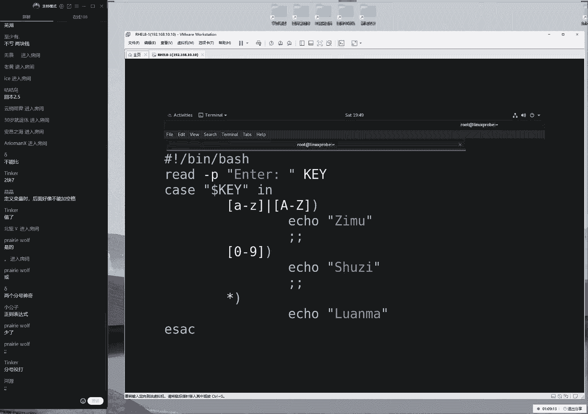

那我们来给大家往后面去说啊，是这样的，大家后来会看到我们现在这个开始的话呢，这个kiss语句的这个语法的话呢，这个关键词叫做kiss，我们在结束的时候，我们的反省是e c a c。

当时我是在2015年的年底的时候，2016年年初的时候的话呢，刚刚开了第一班，然后我第一次去看啊，去讲这个的时候，同学们还问了一个问题，说说这个词啥意思，然后当时的话呢我也比较年轻啊。

因为用的这个确实这就有在其实我问的比较少对吧，然后当时我就想了，一个问题，我说这个怎么念它，它是什么意思啊，后来仔细一看，他不就是把它反写过来了吗，这反常可爱啊。

虽然说我们这个程序员之间的一个呃咱们这个怎么讲呢，对吧是一个非常有意思的一个事情，就是把它给做一下反写，它跟前面是不一样的，好来看一下啊，kg啊，去使用的kg的话，那后面一定要有一个结束符。

结束符就直接把它给它反写了，他并没有正确的发音，它只是把它反写，并不是一个单词，没有人啊，没有什么含义，这第一个问题，第二个问题的话就是我们在2018年的时候，当当网上面收到一条数据的差评。

说我们这个书是的啊，它是一个盗版书，为什么呢，说这个印刷有问题。

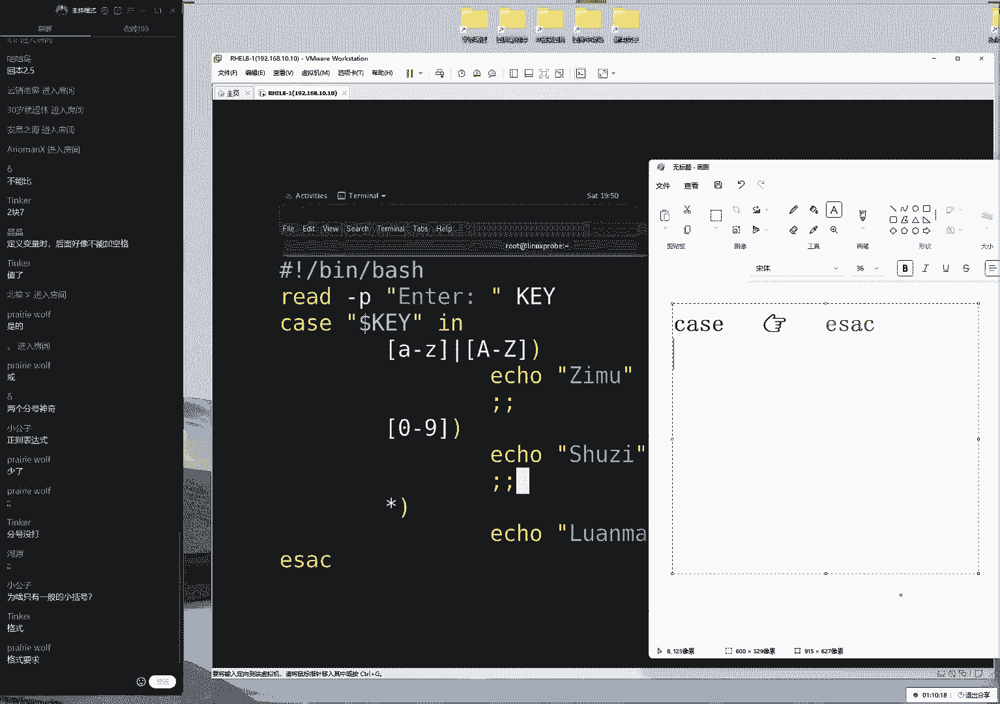

说这个前面的话呢，我们这个小括号被印丢了，然后只有一个后面的一个小括号。

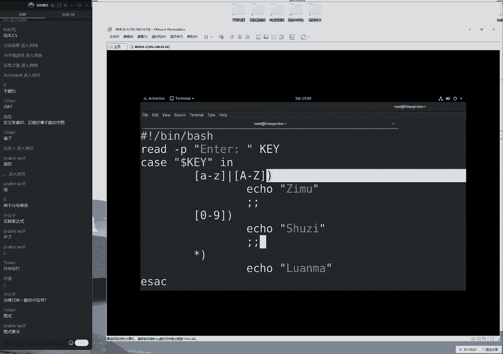

呃这个问题呢我们要给大家解释一下，就是case语句的话呢，只有去做判断的时候，只有右边那个小括号，没有左边那个小括号，这是啊，等会这是一个正确的呃，反而是一个错误的情况，所以大家记一下，它只有哎只啊。

它只有一个右边的一个小括号，它并没有，等一下并没，有左边的小括号，这是大家常犯的一个错误，会把成对的出现，只会认为这个会有这么一个啊小括号的一个左边，大家一定要注意，一定要注意这一点，第三个问题的话呢。

就是我们在去画啊，大家去做判断的时候的话呢。

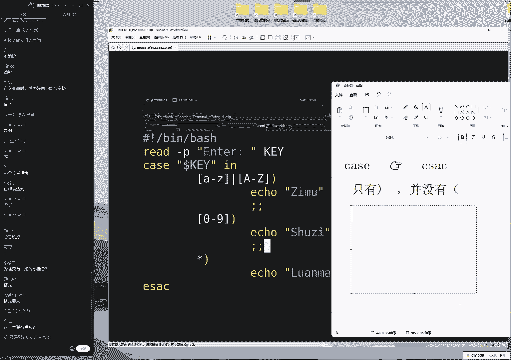

每一个case语句的这个判断结果的下面，就是我们啊直接卖命的之后的话呢。

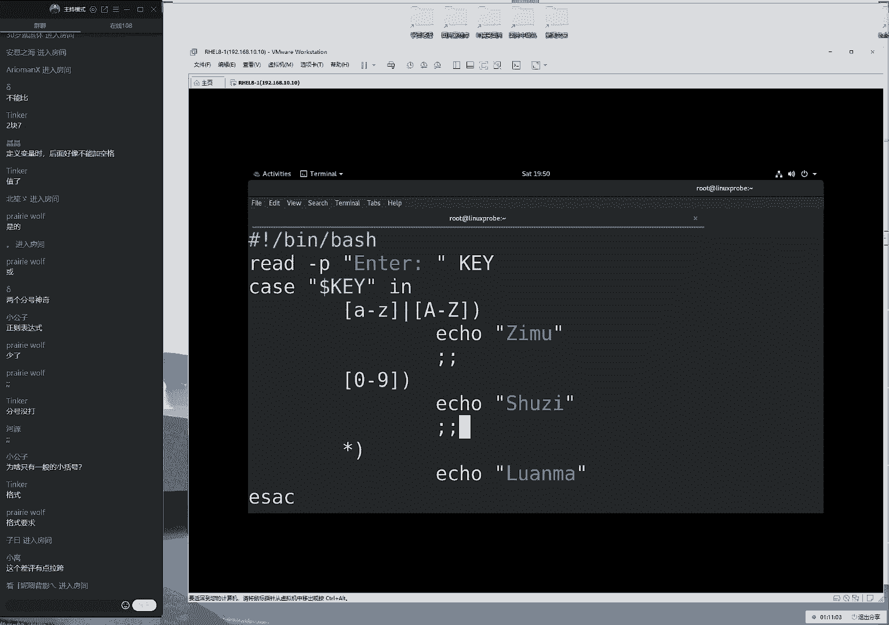

都要给它加一个结束符，这个结束符的话呢是两个分号把它给结束掉，它不要问为什么问号我们没有办法给大家去解释，程序员这样去定义的，然后的话呢我们最后一个这个判断语句。

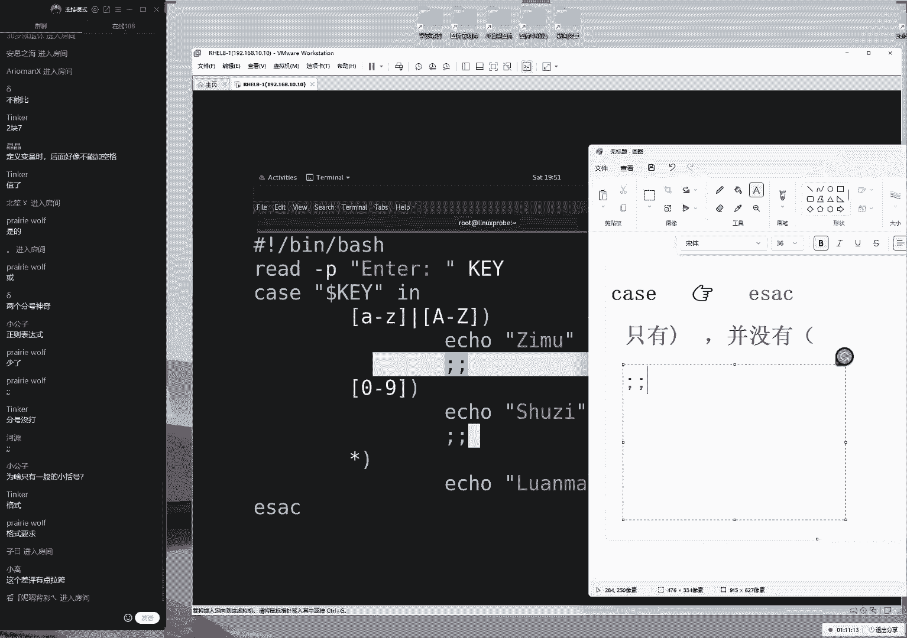

最后我们，啊最后一个语句，你看临近于这个结束符的这里边的话。

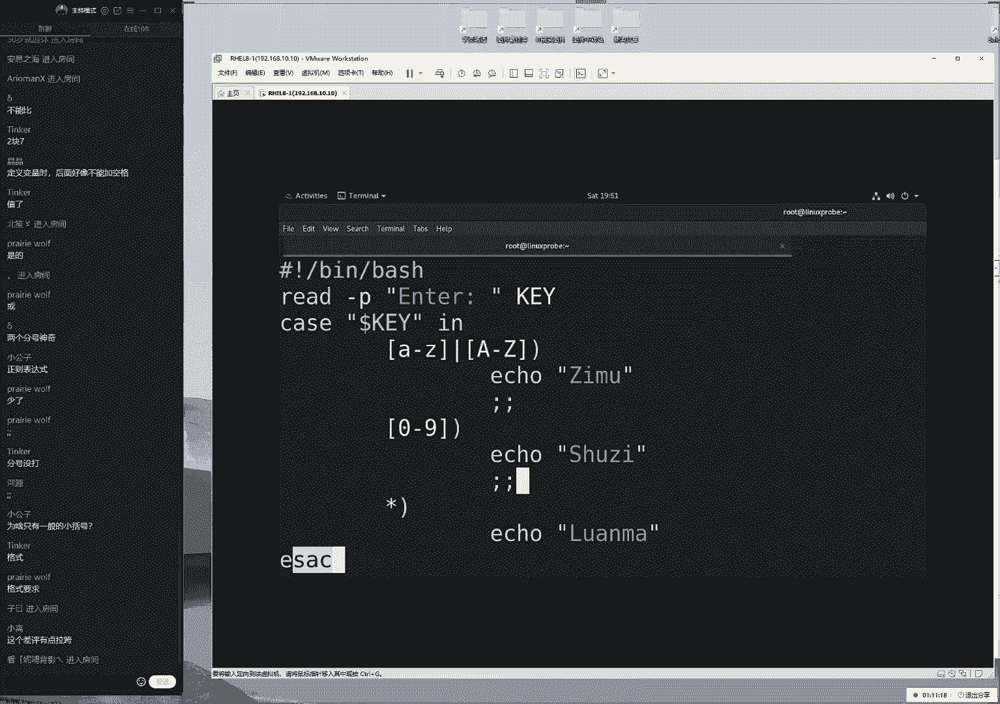

又他又不用去写这个两个分号，如果写的话，那反而报错，也就是说我们的前面的话呢，都需要在这个呃命令的后面都要加这么一两个分号，把它作为结束符，但是的话呢最后一个这个判断语句的后面不要加这个符号啊。

最后不要加上这个分号，反而它会有一个报错，这样这个大家需要去记一下这个的区别，我们能够呃从15年讲课到啊，到现在啊，把大家常发的一些问题给大家做一下总结。

好下面一个问题大家说怎么样少两个分号对说为啥只有一般的小括号，对格式要求没有太好的解释，没有也不需要解释，也不需要解释，问老师说，老师a为什么这么去写啊，他为什么不是那么去写啊，它为什么是这么去写。

没有e啊，这是程序定义的，当以后我们去写的程序了，我可以啊，还是我的一个梦想啊，以后我去写一个程序，这个结束符什么两个分号，那我们就要去写一个啊l啊，这个啊那两个呃两个l啊，最啊是啊好。

那我们那我们每个命的，这个呃结束的话都需要写这么一个字符，叫做老叫做这个老刘最帅了，然后才能作为结束服，因为我们程序员嘛，我们这样的话可以自己去定义自己的程序。

那么如果说要有人要想去使用我们这个程序的话，则必须要去遵守定义的这个规则啊，这也没有太好的解释好，我们接下来往后面去说啊，大家看一下我们这个4。4交集，说一下我们这个计划任务啊。

说一下我们这个计划任务下面有一个计划任务，说哎下面一个问题，因为确因为确实啊，大家可能听完这个之后觉得很不满意，说，老刘你为什么不说说到底为什么这样定义的呢，不需要解释啊。

或者说我们不需要把自己的时间浪费在这里边，就是因为程序这样定义的，知道了，我不知道他都是怎么去用的啊，有一点非常的客观好，我们来继续来给大家去说4。4小节来去说一下计划任务。

现在的话呢我们已经会发现就是你已经可以去解去写出来是有脚本了，我们就可以把就是怎么理解呢，我们现在从最开始来讲啊，然后大家就知道了，是要脚本的话呢，实际上就是可以将您去执行的命令的这个命令的话呢做。

一下堆积呃，就是我们这我们都给大家讲的最简单的一个视角脚本，它实际上就是一些命令的堆积，12345678 90往下去堆积啊。

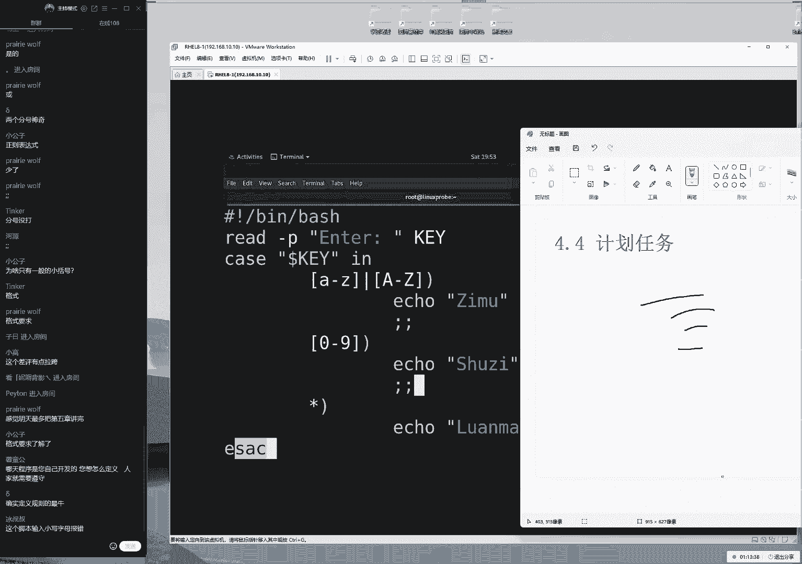

这样的话一条一条来去写，最后的话呢这个程序就会是从上往下来去执行这么一个效果好了，也就是说即便是最简单的一个shell脚本啊，我们没有用到for one kiss什么的，我们也会写了好了。

我们现在就可以把日常的这个工作的话呢，常用的命令我们只要有一套流程了，就可以呃，写到这个shell脚本里面自动的去执行，有点像是什么呢，大家有没有去从网上买过啊，我也买过一个，去年双11的时候买的。

到现在了半年了都没用过啊，好就是说但是它是有这种东西啊，他的话就会有一些呃预设的一些程序，比如说您需要放一下面粉，您的话呢需要放水，您需要放黄油，您需要放果料，您需要啊巴拉巴拉放好东西。

然后的话它会按照这样的一个定义，它会在某一个时间点把这个信息啊，然后呃然后的话呢把这个信息啊，或者把这个啊呃食材的话呢放到具体的这么一个地方，然后加热也好啊，然后加水也，好自动去完成。

还有就是说我们现在既有能力已经去呃自动化去完成，一个是呃在一个什么事情了，但是现在需要做的就是有一个定时的功能了，比如说我现在我每天晚上我特别的苦逼啊，我每天晚上呃都需要在晚上的凌晨的两点。

为什么是凌晨两点呢，因为当时网站的人数肯定是最少对吧，当然这个他呃这个呃那呃那我给大家举一个例子啊，他并不是他并不是一个真实存在的啊，老六也并不苦逼，那是这样啊，当我们有一个需求。

某一个人每天晚上每天晚上的凌晨两点，他都需要，去备份一下网站，就有这么一个事情，然后后来这个备份网站的话呢，比如说需要时长命令，他已经把这时长命令的话都写到上个脚本里面了，他需要做的这个事情就只有一个。

就是到点儿了，按一下回车就ok了啊，他又通过这个脚本自动去完成了，嗯然后就有一个很那么就会很尴尬的一个情况啊，这种情况下怎么去解决呢，其实那么这个实际上也有两个问题，不是它也有两个解决方案啊。

大家先听一下我现在所说的这么一个痛点啊，需求，所以我们已经把工作写入到12脚本里面了，但是的话呢它不能够到点自动去执行，我们怎么办呢，其实有两个办法，第一个办法的话大家知道啊，就是去捡了只小猫。

因为的话呢猫是一个夜行动物，它晚上不睡觉对吧，那么就训练你的小猫啊，以后的话呢去训练出来啊，有一只小猫啊，他第一来说他会看表，第二的话呢它可以到点去踩一下我们的回车也这话这也可以。

但是的话呢这个我们今天这个课啊，先不讲，这有第二个方法，第二个方法的话呢就是去使用到计划任务，计划任务根据时间的限定，根据一套这个规则，到点了自动去，执行这个我们这个我可以给大家讲了啊。

第一个的话呢我啊呃换了第啊这块我们第一个还暂时讲不讲，但是这样的方式大家可以考虑一下，现在给大家说一下啊，计划任务的话它又分为了两种，那计划任务的话它又分为了两种，大家问得好，这个非常好。

大家问了一个问题啊，同学叫做涅槃，对吧啊，是不是我我啊水平不高啊，但是同学们这个名字很复杂，提了一个问题，说这个跟crowd有什么区别，非常好，来给大家说，实际上的话呢，这又提到两个点啊。

首先来说就是第一，个点啊啊跟着我这个思路啊，我这个思路是肯定不会乱的，但是您的这个问题的话呢，属于第二点的问题，第一个点的问题就是计划任务分为两种，第一种叫做at叫做一次性的。

叫做或者叫做单次的计划任务，叫做一次性计划任务，还有一话呢叫做crowd，它是一个有周期性的一个呃的一个计划任务，那困难，那我们就说一个顾名思义嘛，as这个叫做啊，他是只会去执行一次，只执行一次。

然后的话呢只执行一次，然后就会删除呃，呃然后呃然后就没了，然后就没了这么一个效果，他只能执行一次，然后就没了，下面的话呢叫做有周期性的一个计划任务，它是根据定义好的一套时间规则，这个怎么理解呢。

就是听起来时间规则有点呃，有点就是高大上，实际上我们说句人话来讲，就是您给别人，比如说您是一个老板，您要想让您的下属去完成一项什么工作，时间地点人物事情我们不要给大家说清楚啊对吧。

所以的话呢时间给人家要讲清楚了，这就是时间规则，我们要把它定义好，然后的话呢就会自动的什么来去执行，然后他的话还会去执行，自动执行啊，很多次或者的话它是没有上。

限的这样的一种呃就呃我们的话这个计划任务的一种方式，两个啊两个一个是单次有效的，一个是有周期性的，这两个区别，以及它所对应的命令，好同学们的话呢，还有下面一个问题，大家说还有一个问题，对啊同学叫什么啊。

已经打这么多次啊啊没有预期的话呢，也不知道骄傲啊，有这一话也不用打那么多次，这话并不值得骄傲，然后给大家去说一下第二点啊，同学提到这个问题说跟crown tab有什么区别。

第二个问题就是crown type，的话呢实际上是您的配置工具的名称，什么意思呢，crowd它是我们的服务名称，而我们的这个crown type的话呢，是您提到的这个是一个配置工具的名称。

我们举一个例子，服务名称是我们安装以及我们去管理它所使用的，而这个的话crown up，它它是实际上去完成某项配置工作所使用的一个命令以及工具，举一个小例子啊，把07：58了啊，这个一小时过有点快啊。

稍等我先喝口水吧，7。59了，这个时间过得有点快啊，怎么就一小时就过去了，我们讲多少了，就感觉刚刚开始，所以啊不知不觉当中偷走了大概一个小时的时间啊，马上就要偷走大家一个小时的时间了，过得有点快啊。

这个讲的这种网络课程吗，我们要给大家说的就是确实要这种要有要有点干劲儿，跟这种有点算是激情吧，因为这个大家能够理解啊，首先我们是一个网络课程，您除了呃我们这个屏幕您看不到我们的人对吧。

所以您可能在是一个很放松的一个状态下去听课的，比如说你可能现在没有穿鞋，你可能正在吃外卖对吧，您可能现在正在趴在桌子上面去玩手机对吧，都他都他都可能，然后的话呢。

并且我们这还是讲了一个linux的一个课程，linux的话呢它还是一个相对来说比较枯燥的一个系统，大家想它毕竟是一个技术，如果他特别简单，特别好学的话，凭什么学完之后工资这么高啊，不就是因为这个很难学。

大家不愿意去学，所以我们才有一个在公司当中有一个能够拿人的，而且化疗是不可被替代的，这么一个呃怎么讲的，这么一个很好的技术门槛吧，就我们学完了之后能够做一些别人做不了的，我们会别人啊啊啊啊。

那我们可以去会一些别人不会的，所以的话这个确实起起来的话呢还是有一些门槛的啊，这还是有点枯燥的吧，而且的话呢再者说我们讲的是一个晚班，尤其到了夏天，我们一出汗就觉得很累的时候，特别容易犯困啊。

这个特别能理解，因为这个温度一高，加上我们吃点饭，这个啊就很容易崩溃，所以的话呢这个在我们在线上课嘛，我们尽量呢啊有点有点进行动力对吧，我们不要说特别的沉闷了，就是不要那么的沉闷，同学们可以互动起来。

不要特别的害羞啊，因为我们我也不知道同学们，其实也并没有给大家去做备注，所以的话呢我们在上课当中的话呢，我们讲课会的拼了命的去啊，会给大家去讲，同学们的话呢，你们也可以去拼命的去互动的。

如果有任何的问题，比如说没有听懂就说出来对吧，我们花了钱了，或者的话您觉得这个讲得慢了，讲的快了可以去反馈，这些都没有问题，好吧，同学们，sus我们讲课的时候一定要有什么感受，你就去说出来。

当然肯定的感受，可能我们就一少数服从多数吧，诶对吧啊对，那我们来好来就在那我们来做这个调整好了，通过给大家讲点这种鸡汤啊，我也休息了一会儿，现在来机器给大家去说，还有就是说这个什么意思呢。

这就是说实际上它是前面的一个crown tob，那我就不看这话，前面叫做crown的话呢，它是一个服务的名称，而crown type的话呢，它是一个实际的一个配置工具，有点比喻来说，有点比喻来说。

我们是是什么呢，肯德基肯德基和啊啊这个啊麦辣鸡腿堡，麦辣鸡腿堡，哎等一下买辣鸡腿堡，麦辣鸡，我怎么想这么一个名儿，真讨厌啊，鸡腿堡这么复杂好，这就是同样的一个道理，我们要有人去问说你今天吃了什么呀。

我今天吃了肯德基，让我们去肯德基里边，我们不能够在肯德基里边买一个肯德基，我们那我们要去买，在肯德基里面买一个麦辣鸡腿堡，同样的道理，这是我们的公司名称，这是我们的产品名称。

我们实际上去管理和去使用的话呢，我们都要去使用到这个crown tob这个名称，大家能够区分好了，就是我们现在虽然讲的叫crown，但是我们再去使用的话，都是使用的这个crown time来去完成。

来接下来给大家去说一下。

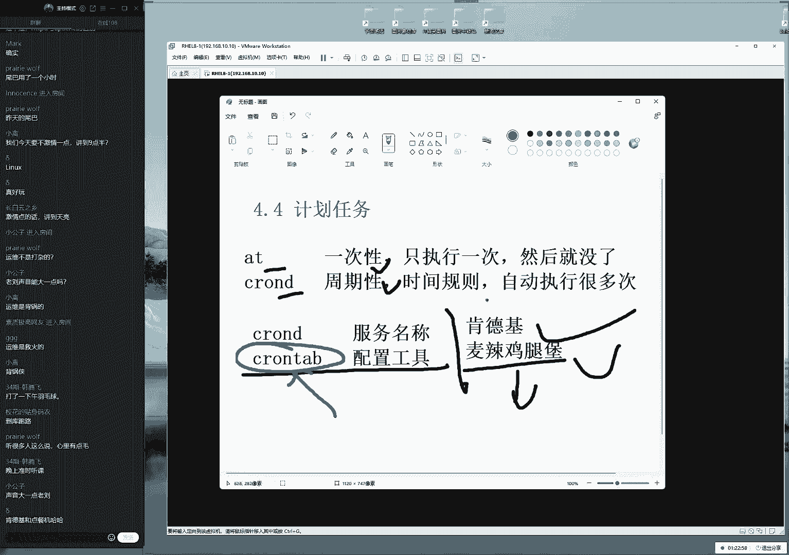

现在我来给大家说一下这个配置的具体的一个方法，首先打开我们的at的单词，有效的计划任务哎，单次有效诶，等一下单次有效的计划任务去使用at去完成，比如说看一下我们的时间，08：03，我先定义一个计划任务。

8。10分好不好好啊，怎么不好啊啊，来8。10分，第一个这个计划任务为8。10分啊，大家说c r o n ie是个啥，我也不知道是个啥，你在哪看下来继续啊，再来8。10分走啊，然后的话呢我们来去写上。

你想去做这个事情，比如说你想让他干什么事情，你就一个一个往里面去写，为了，但但但是啊为了能够让您看的更加清楚一点，我们就用到重启吧，因为重启这个计划任务它特别的明显，它重启的就是成功了对吧。

他呃特别的明显啊，那我们来写好之后，按一下回车，然后还要想去保存您的计划任务，需要按一下ctrl加一个d，然后加上什么呢，加上什么呢，加上走，你来哎，不好意思啊，我点成，不好意思啊，这个点我把点错了。

reboot ctrl加b走好，我们现在做好了，来at，然后gala，那么可以看到了ctrl加d指的是保存，那我们可以看到了这个计划任务的话呢，已经保存到了我们这个系统当中了，他的话呢会在八点哦。

不好意思，我说的这个是我打错了啊，这个时间的话呢是按照20，它是按照二啊，它是按照24小时制去算的，24小时的话呢，现在我们订的是早上起来八点了啊，那同学们为了等这个计划任务。

可能需要等的时间比较长一点了，呃待会那我们怎么办呢，首先我们可以去选的at杠c加上编码，这个编码的话呢是个二好，我们加上二可以查看一下这个计划任务，这个前面是变量，我们不用去看它，只是环境变量。

看一下这个的工作，它叫做reboot，它动作是重启好，那么就是你来查看一下我们已经有的，也就是说他会在礼拜日的4月17号的8。10分，他会来去执行，他的话，这个发起用户是没管理员入群用户。

他的动作是重启好，既然我打错了，打错了怎么办呢，我把它给删掉，叫做at rm，删掉它，at rm删掉它来加一个编码，按下回车，看到就把它给删掉了，如果打错了没关系，可以把它给删掉的。

删掉之后再来再重新起来去设定一下，比如说二零冒号再来什么呢，就别十分了啊，十分距离现在还有五分钟，有点太晚了，我们就8。07吧，好吧，现在我们哎不看一下8。06能不能赶得上啊，08：06能不能赶得上啊。

稍等一下，稍等一下。

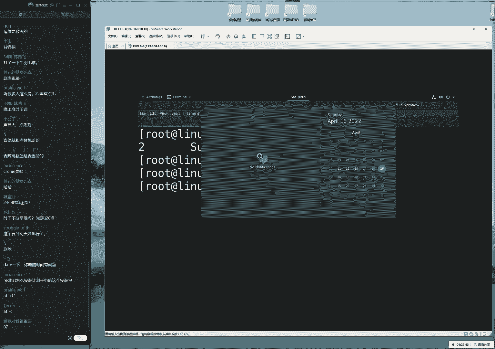

其实能够赶得上，ok现在的话是8。005：00：36。

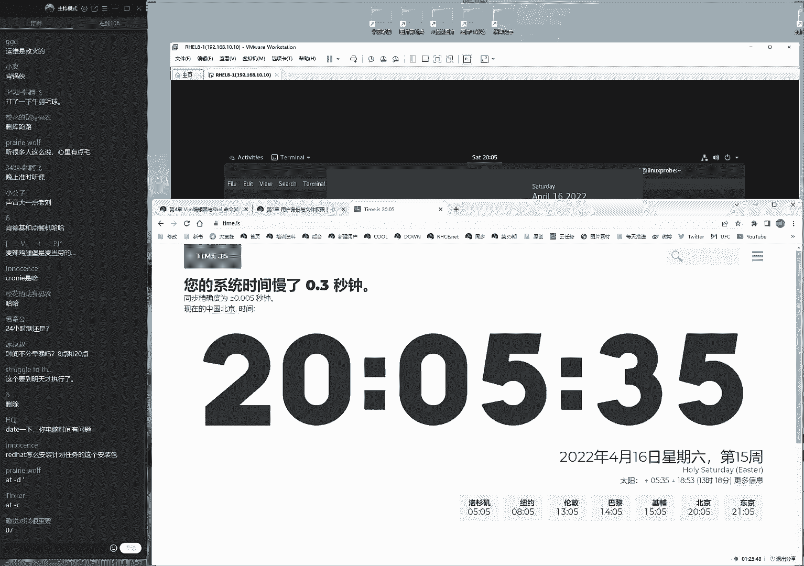

来来零六分吧，按一下回车动作是reboot，按下回车ctrl加d保存来查看一下这个计划任务就被保存上了。

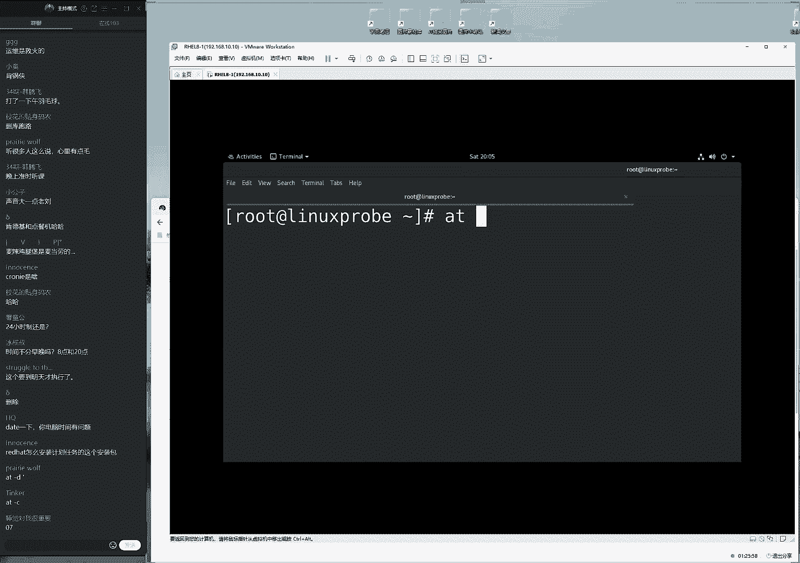

现在的话呢我的手哇完全的离开我的键盘。

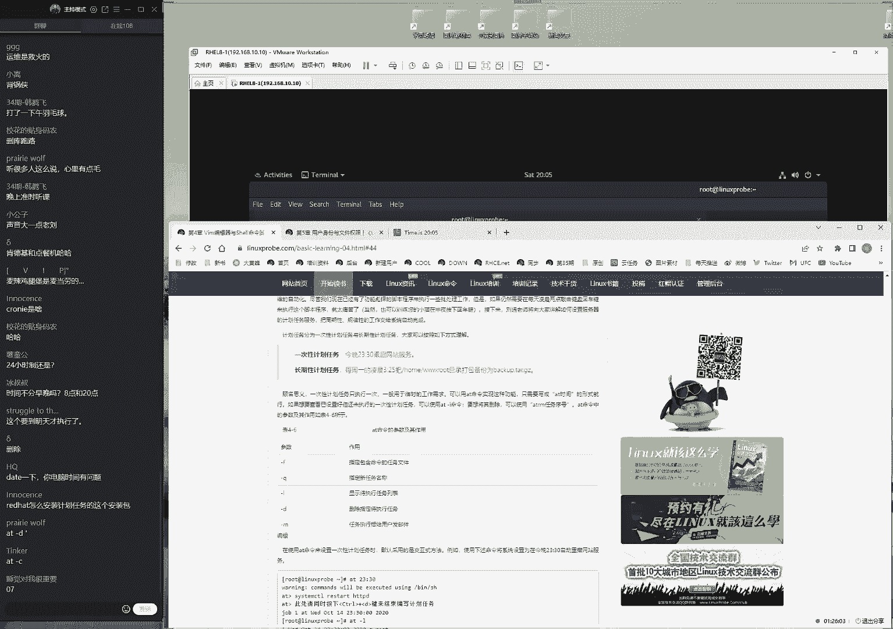

手，现完全离开我的键盘，你看我的鼠标，拿起我的水杯，但是同学们看屏幕，看屏幕里面到点之后自动重启，08：06好走。

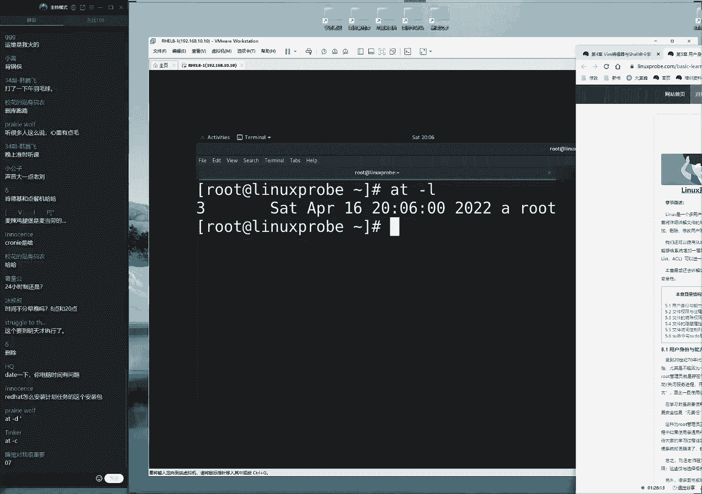

好我们来看一下这个效果好。

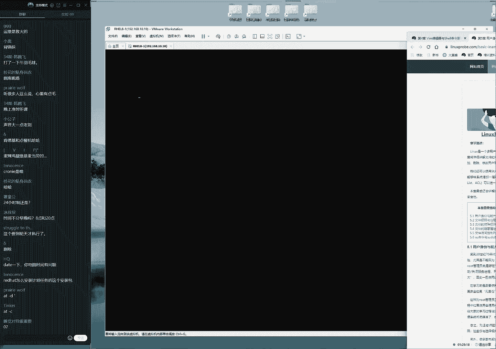

同学们接下来再来啊，同学们问到了，说声音大一点，老刘啊，大家听我这个说话声音有点小是吗啊，同学们现在听我说话声音小吗啊如果要小的话，您可以呃告诉我我们这边可以给大家重启一下。

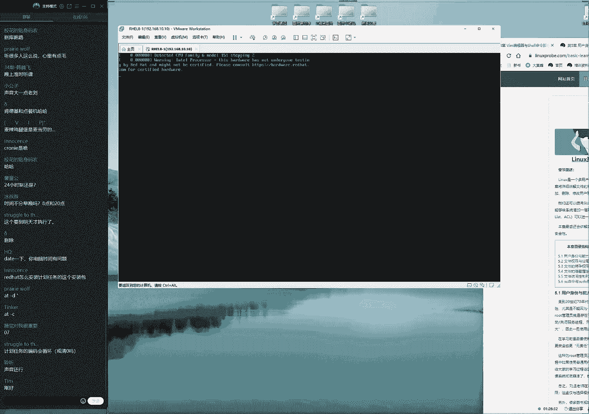

或者重启一下，我这麦都可以的好，大家说还可以啊，还可以是吧，有有点小好，我们大家问了一个问啊，问了一个问题啊，说计划任务的编码会循环吗，或清零吗，at的话它是一个单词有效的计划任务。

我们执行过后再进去之后一看，大家都问到了，清零了没了啊。

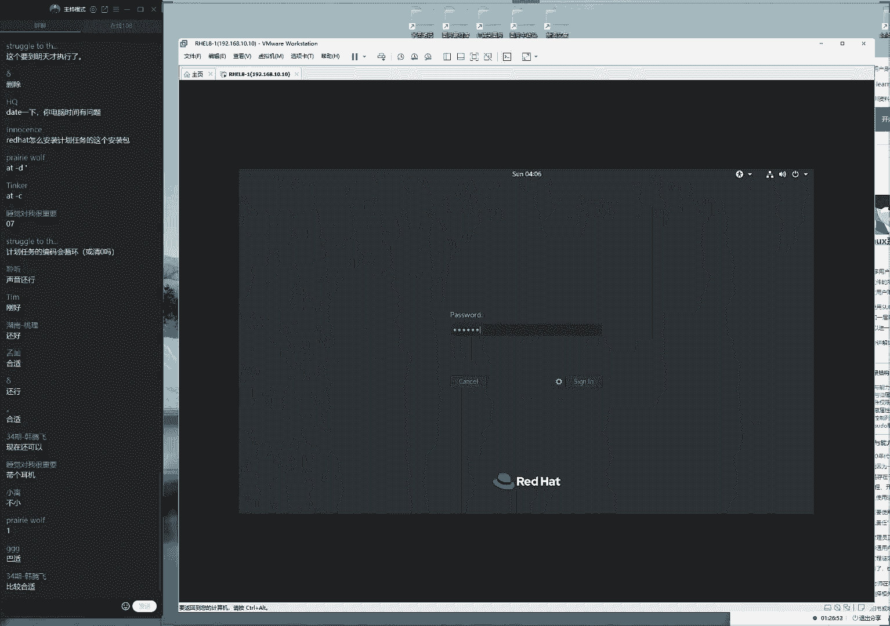

就这么一这么就ok了啊，艾特杠l啊，来看一下，大家说老刘这个显示器有点大。

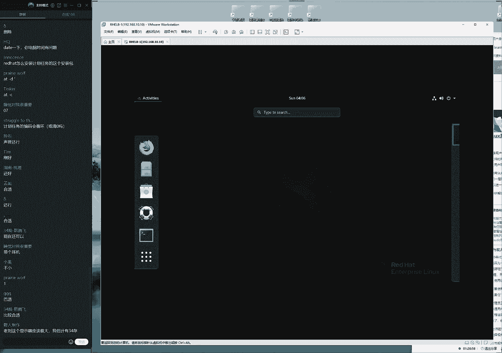

估计34寸啊，不是啊，27寸来继续来继续来at gal看一下就没了，所以大家就可以相信老刘了啊。

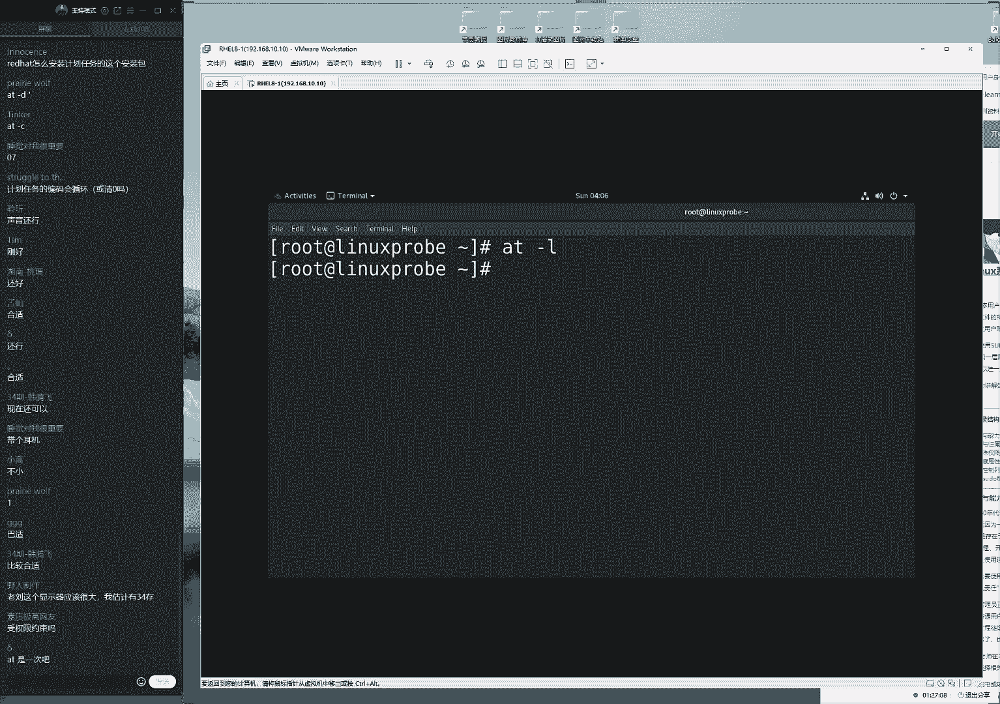

呃看一下就是at的话呢，它是一个单次有效的点题，点题点题at有效的单次的一次性的计划任务执行过后就没了啊，应用的常规点的话呢，就是啊我今天晚上需要去做一个什么事情，而且的话只做一次。

那我们就可以去使用的at命令来去完成下面一个问题，大家说呃我们的这会让我们怎么样啊，退出是吧，是这样的，如果说您再去使用at命令的时候。

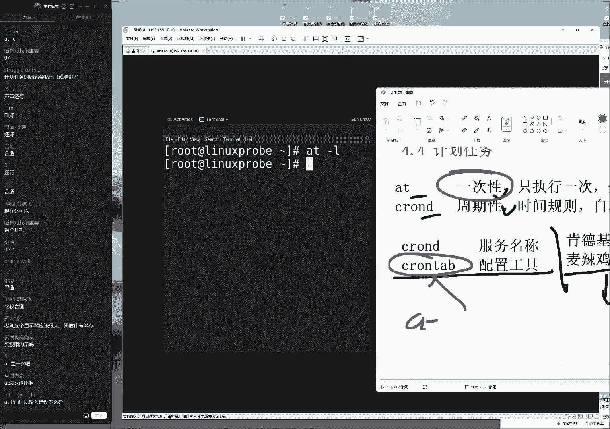

这两个问题正好一起啊，我们一起给大家回答了啊，如果说我们再去解决这个命令的时候，好再去写这个计划任务的时候，如果说我们说是正确的信息，那么怎么保存呢，保存的方法是按住ctrl键加上d。

只要大家记一下ctrl加d就是按住ctrl加上d来去保存退出，如果说我发现我写错了怎么办呢，很简单啊，ctrl加上等等下，我把写错误错误ctrl加上c来把它推出这两个问题，大家记一下这两个情况好。

然后我们现在要给大家，大家先记着啊，你也可以问着，我们现在给大家往后面说着，咱们这个课压力很大，这两个小时这个学到的东西有点多呀，啊来下面来继续给大家去说啊，说这个crown time呃。

或者说我们这个叫做crown计划任务的话呢，它好不好用呢，它当然好用，但是很难用，为什么呢，因为我们很难把时间给他说的清楚，就是我们很难去说清楚一个周期性的一个事情，比如说我们跟我们的孩子们去说啊。

你每天晚上的礼拜六不，然后然后然后的话呢每周一每周三每周五您需呃你需要去打羽毛球，去点点身体，当然后呢礼拜二礼拜四的下午三点钟，你需要去吃一个啊什么东西啊，那我可以去呃做一个什么事情。

就是我们这种时间的定义的话呢，如果变得特别的复杂了，就会感觉到特别的这怎么讲，特别的很难描述，所以的话呢我们对于这个crown type这个计划任务是有一套规则的。

这个话规则的话有一个格式叫做分十日月星期命令好，大家记一下，这是我们给大家总结好的，也是这个crown type服务的话呢，为大家准备好的这么一个格式，只要按照这个格式去填。

那么计算机的话就能够读得懂我们所输入的这么一个内容，是来大家先记下来，大家先记下来，我们来接下来好大的话呢，现在来记一下这个分时日月星期命令这样的一个格式，呃，对于说这个里面的这个操作的话呢。

我们来给大家做几个演示，首先分钟指的是分钟啊，就好这个话好废话，好水啊，咱们这节课感觉就像就算这就是我们这些这个课就讲到感觉特别的啊，像是在呃就是再给大家继续啊，非常的很多废话啊，来说这个不用解释了啊。

分钟就是分钟，小时就是小时日就是日期哎，月份就是月份，新期就是星期，命令就是命令好像也是啊，那还好，ok那我们接着好了啊，下面来给大家去说一下，就是分钟的话呢这个时间是0~60，超过60以后的话呢。

就进一位写小时好了，我们呃所有的字段的话呢，如果没有信息的时候，是用到星号去做占位的，用到星号去做站位好，我来给大家解释一下啊，这个字面意思就是这样了，分时日月七七命令，他如果没有字段的话。

他如果没有内容的话呢，则是用到星号做单位的，做星号做单位中间的话呢是用到空格做间隔的，可以是空格，也可以是呃table键，也可以是一个或者多个空格，没有关系，这个我们其实给大家去尝试过。

所以之间间隔符可以随便举解，没有任何关系啊，table键也好啊，什么空格也好都可以好，首先来说分钟，分钟的话呢我们可以这么去写，比如说写一个二零啊，然后的话呢小时候比如我写一个三小时的。

它是按照1~23去写的，也就是说它是24小时直至好，所以这个什么意思呢，就是它是指的是每天的，因为我们没有指定日期嘛，它指的是每天的03：20回去执行某项计划任务。

另外的话呢我们现在再给大家讲的就稍微快一点了，因为我觉得这个兔子时间太长的话没有太大意义，因为这个可能大家这个其实组合方式嘛，他和他其实这个不啊，他这话其实并不难理解，主要就是一个组合起来的方式。

我们现在的话呢就是稍微快一点，把我能够想得到的一些组合方式给大家去讲出来，然后大家再去看一下，我们能够去组合的一种方式的一种大概的一种格式就可以了，好其实它并，不难理解它有啊，其实也不需要这么去理解。

主要是我们组合的一种方式，第一的话来说就是小时和分钟对吧，小时跟分钟它指的是这两个，如果都写的话，指的是每天的凌晨的03：20会去执行某啊，他会去执行某项计划任务，这个命令的话呢。

命令需要是使用的是一个路径加上一个命令的格式。

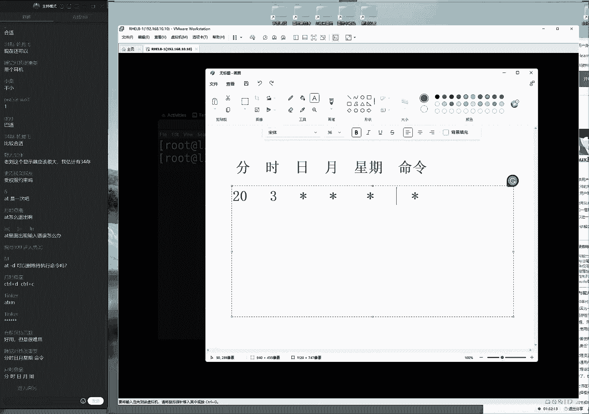

所以我们可以去使用到win命令，去找到某一个命令，它所对应的一个路径，比如说是reboot好吧，找到这个命令，因为我们去使用到which的时候，它是没有这个步骤文档对吧，单独去找你啊，那我们单。

独去找一个命令的话，则是去使用到which这个命令，这是第二章结束，给大家去操作过，到时候去讲了几个命令对吧，其中的话呢大家简单回忆一下啊。

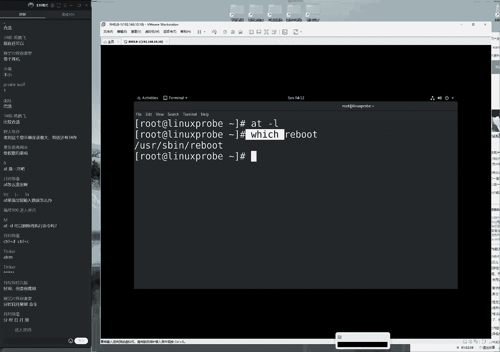

虽然分析课无关吧，讲了这个find，讲了这个where is，讲了这个呃，which讲了这个locate的巴拉巴拉巴拉，其中的话呢当前去使用到这个是比较合适的。

直接找到我们的命令所对应的一个路径，然后一路径的形式加上文件的名称写到我们的后面来。

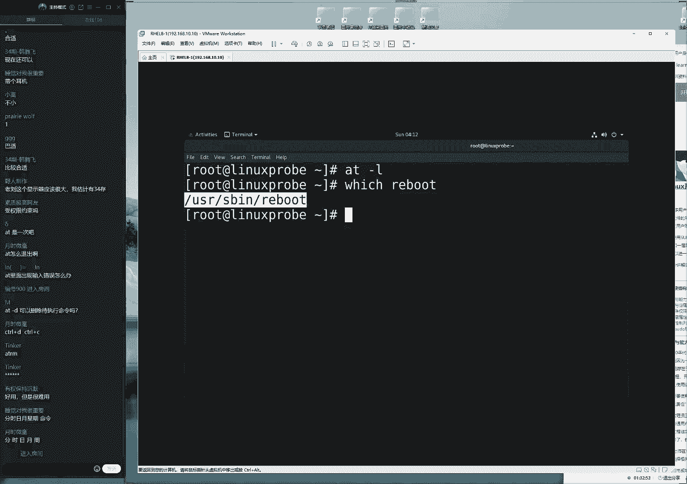

按一下走你来，然后走你这样去写，它就可以在我们这个每天的凌晨的03：20自动去重启一下电脑了，啊去啊，自动去重启一下这个服务器了，好那我们可以加一下这个日期，如果您加了这个日期，比如说加了一个16。

他又指的是每月的16号的凌晨的03：20，回去执行某项啊计划任务，也就是说4月16号，5月16号，6月16，7月16，8月16号的凌晨03：20回去执行某项计划任务，如果说我们写的这个月份的话呢。

就很简单了，它也指的是呃月份，它指的是我们每年的某个月，他会去执行某项计划任务，但也就是说2022年的4月16号到03：20获取执行，我，们的计划任务，以及2023年的4月26号，他会呃啊，4月啊。

4月16号会去执行我们这个重启的计划任务，也就是说他每年才会去执行一次，限定的说只有4月16号才会去执行啊，这样的一个效果好，那么我们同学们会常犯一个错误啊，就是这个日期跟新骑士一直哎。

突然我们会呃呃一起去写，因为这个其实格式非常的简单，大家一看就明白，很难犯错，但大家会常犯一个错误，就是这个日期和星期一起老去写，比如说我现在我这样去写，没毛病对吧，因为我们2022年的四。

月16号到就今天我确实是个礼拜六，我写礼拜六没毛病，计划任务也会打，他的话也会来啊，他的话也可以来去执行，但是您不能够保证2023年24年，25年26年，他到4月16号，他还是礼拜六啊。

那么他还啊他他的啊星期和日期的话呢，我们只能去写一个，比如说我们要想去写星期，你就不要去写日期了啊，比如说我现在这样去做，这就指的是每个礼拜六到凌晨03：20，会去执行我们的某项的计划任务啊，大家说啊。

每个季度呢没有啊，他没有每个季度，但是我可以告，诉大家怎么去写每个季度，每个季度不就是说每跨三个月吗，如果说要讲哪跨三个月可以解一个啊，除的一个呃这么一个呃斜杠叫做反斜杠不啊，就是我们写这么一个呃符号。

它的话就可以指的是我们间隔的这个约束，我们间隔三个月，他不就等于了是啊，我们的一个季度吗，我们这么去写，来我们这么去写，当然了，如果说您还要想着去限定一下这个具体的这么一个日期和月份的话呢。

还可以用到逗号做间隔符，好我们先以这个为例啊，再给大家重复一下，这个指的是每个礼拜六的四，点20分会去执行我们的某项计划任务，这样的一个效果好了，我们再来我们再来哎呀，给大家增加点难度啊。

给大家增加点难度，比如大家问到了对吧，比如我们问到了说我们的这个嗯，比如说我们想取一个嗯某个季度或者的话呢我想去有一个周期性的，例如说我把它给去掉了啊。

每天的话呢我们每一个呃我们每两个小时会去重启一下电脑，怎么办呢，我们这样它除以二，它就代表的就是间隔每隔两个小时会去重启下电脑啊，那就是说二点分回去，从几家电脑，四点分重启。

下电脑六点分回去重启下电脑会有这样的一个效果，每隔两个小时回去重启一下这个呃，服务器这块我们是它使用的方法，就是一个星号写了一个除号这样的一个方式呃，然后的话呢还有啊，这是指的是每隔两个小时。

同样的这个也是这指的是每隔两分钟啊，每它指的是每隔两分钟会去执行一下计划任务，当然了，同学们千万不要这样去用，因为你如果这么去写的话呢，就有那么你每一次从几十号，这是一个死循环了。

就是你每一次去呃进入这个系统的时候，它都会去重启一下，了，因为我我因为我们有一个师哥啊，那个师哥在自己脚上面去做这个实验，正好讲到这个时候就正好去做了一下，顺便去重启了一下，结果的话呢效果特别的好。

自此那个电脑就再也没起来了，因为那个电脑速度特别的慢，他每一次启动和重启啊，它都需要两分钟时间，于是他每一次刚刚一重启，马上他就从他们啊，好像他马上他就被关闭掉了，所以的话这个大家一定要谨慎去使用。

但这个也有，这个其实也有解决办法的，因为我们安装系统的时候，它有三个模式吗，还有三个选项，第三个，模式的话呢叫做这个插播抒情，就是叫排错模式，只不过特别的麻烦啊，我们需要在内存里面先。

那我们需要在这个啊c是在这个呃内核里面做一个断点，然后再去把这个给删掉，然后进入到我们叫做这个单用户模式，给它进入到插播收听，然后给他哎呀，给大家去删掉，就是麻烦就也行。

嗯就是同学们就是这个就讲这个的时候啊，不要保存就好了，这么一听就行了，哪怕你把这个数字写的稍微再大一点啊，这样的话我们每隔十分钟重启一次，也给自己一点生活的，那么啊那么好了，我那啊。

那我们也可以给自己一点啊处理的时间啊，给大家一点处理的这个时间，避免说这个服务器就起不来了啊，提高我们的生啊，提高我们在公司的这个呃说呃呃生存机会好，下面来给大家讲一讲啊，还有什么例子呢。

还有比如说想按照这个具体的数字来去写，例如说是这样的呃小时，如果说我不想每个两个小时了，我想我想写，比如说逗一逗号，三逗号，五逗号，这样等，它代表的就是呃具体的这么一个小时，比如说它指的是呃1。

五点七点跟中午12点，他会去重启一下我们这个计划任务，不他啊，他会去重启我们这个电脑，也就是说可以把具体的这个数字，然后通过这个逗号做间隔符，也可以这样去写啊，没有问题，一逗号三逗号五啊，加个小时也好。

加分钟也好，就可以这样去写，除了这个以外的话呢，也可以设置一个片段，比如说我们可以设置成啊，比如说我想设置的是一逗号，三逗号，四逗号五逗号六，那么这样去做的话呢，也可以直接就是一个一杠五。

它指的就是啊每天的话呢凌晨一点钟，然后的话1。00二点到3。004。0五点，他会去重启一下我们的，电脑和这样的一个效果好，大家先记一下，或者的话呢您可以下播播之后啊，然后去下载一下咱们这个录播视频。

去把我们刚才所讲的这几个事例的话呢，你可以疼到咱们这个书上面，其实我刚才是故意讲的稍微快一点的，因为的话呢我们之前给大家重复了很多遍，去谈到了很多遍，但是我估计大家也没有去看嗯。

所以的话呢我们刚才讲的稍微快一点了，就是给大家强迫一下，今天晚上回去之后可以去看一下这个录播，把我们刚刚给大家讲的这些，案例的话呢你可以藏到书上面，万一以后我们工作时遇到了，您可以选择一个更加适合。

就是我们现在这个啊具体工作场景的对吧，现在的话呢这个录播时间是一分13秒，那于是您可以回去之后有啊去啊。

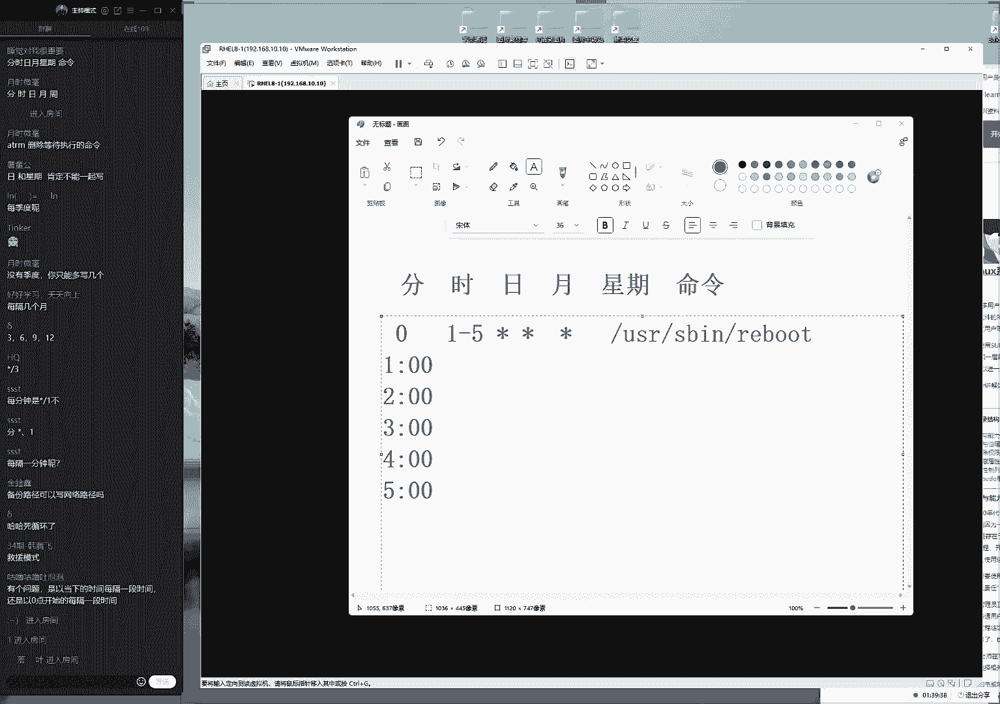

专门去看一下，好，下面一个问题，大家说说备份的路径可以先网络路径吗，不可以这样去做啊，还有一个问题就是我们是不能够先网络路径的。

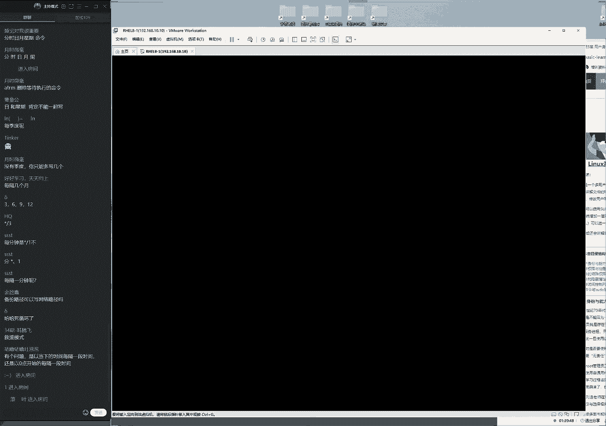

但他这个网络路径的话呢指的是一个比如说网站呀，这种格式是不可以去写的，但是如果说您的这是一个比如说网络的一个存储啊，啊我，们比如说桑巴呀或者说一个网络存储服务器啊，这样一种形式的话。

那挂载过来的是可以的，好吧好，那我们还有一个问题，大家说还有一个问题是说当下的这个时间，每隔一段时间还是以零点开始呢，它是以当下的时间来去算的啊，就是我们先这样的话呢，它指的是每隔零点开始计算的。

如果这边我们没有去几分钟的话呢，则是以当前这个时间为准的，比如说我们现在的话呢就是呃01：20，因为我们现在是八点啊，那那么它就是以当前时间来算的。

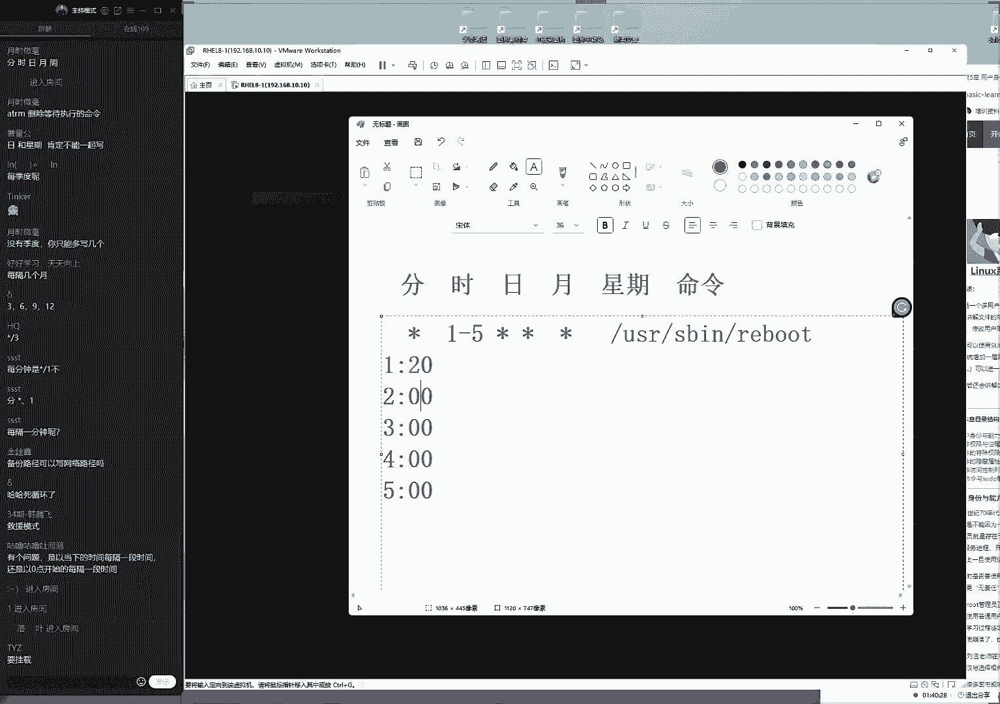

就那么它会有这样的一个效果，它以当前时间来算的来举一个小例子啊。

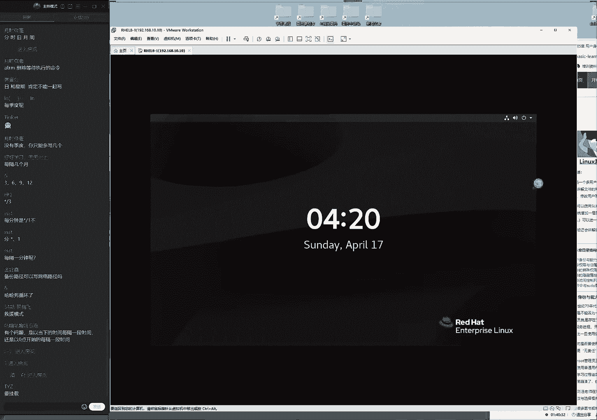

然后我们来配置的话呢，我去使用的呃命令叫做crown type来去配置了，要想去培植自己的这个计划任务的话呢，使用的这个杠e啊，指的是编辑要想同时再去配置别人的这个计划任务的话，加一个参数更优。

加上用户的名称，比如说我想要去配置一个叫做linux pv的一个用户的话，我们就这么去写，当然我们并不需要他，于是把它给删掉，来crown tygi编辑一下我当前这个用户管理员的计划任务。

另外一个小的一个其实不需要去讲，但是好像不讲。

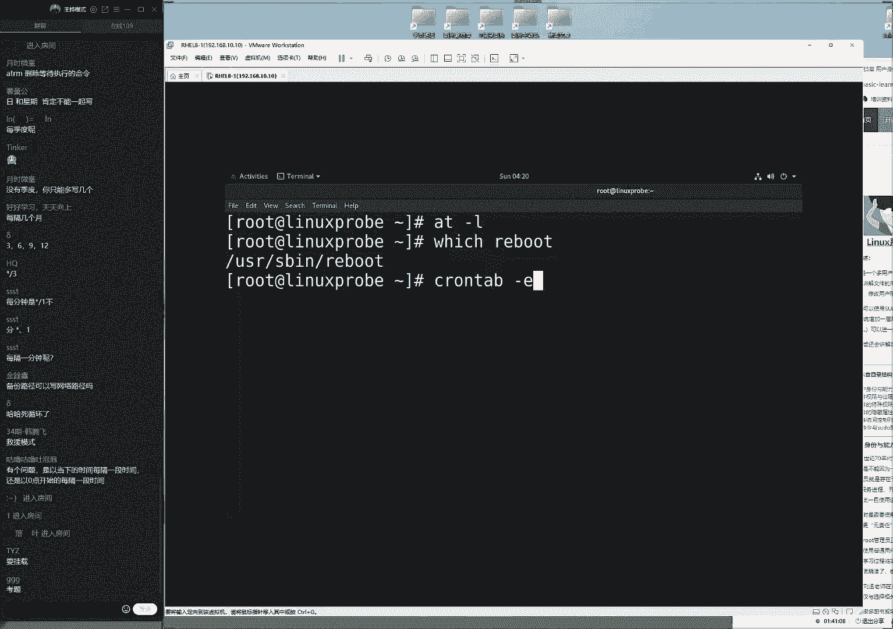

我觉得很不，过瘾的一个事情就是呃我们的管理员啊不仅又怕出现差池啊，管的话，那我们的管理员可以去编辑我们的自己的，就是编辑管理员自己的，以及的话呢我们的所有的普通用户的这个计划任务。

但是的话呢普通用户的话呢只能够去编辑自己的计划任务，大家记一下，也就是说啊管理员可以编辑自己的以及普通用呃，以及普通用户的这个所有人的计划任务，而普通用户只能编辑自己的计划任务。

当然这就是哈哈跟其他的这个服务是一样的。

这个的话呢并没有权他，并没有权限去管理其他人来crown time，其实也不用说大家能够猜到的crown time，然后按下回车，现在去写一下这个格式来分时哎，等一下分呃的分时日月心心命令好。

同学们看到这个之后的话呢，会问了一个问题，但是没有人问是吧，那我给大家提个问题，就是为什么我是这样去用的啊。

那我那呃呃那么的话呢，我们那我们是使用的这个crown tob来去进入到这个计划任务的，而我们在公司的时候的话呢，同时可能用的是另外一种方法，就是直接vm。

然后etc目录里边的crown time文件去打开，这两种有什么区，别又相互有什么好处呢，哎这要跟大家聊一聊。

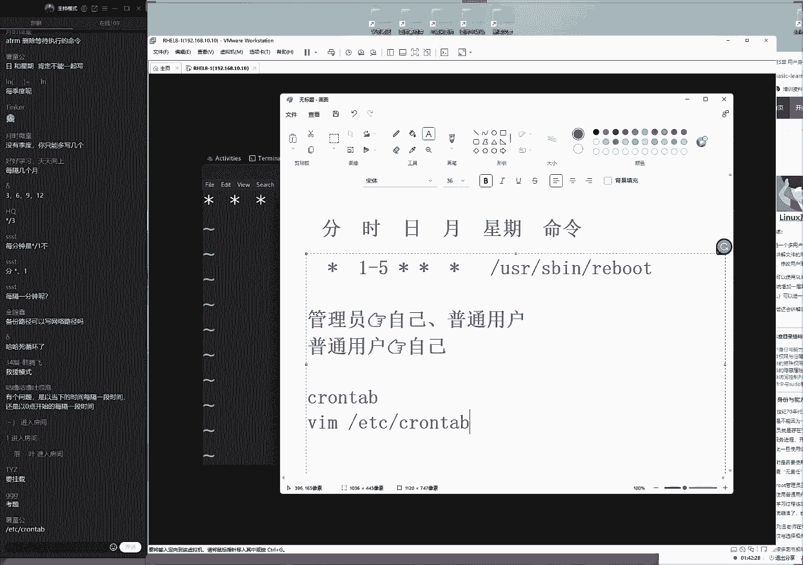

这个在公司里面啊，会一些啊，同事们会这么去用，就是直接因为我们之前给大家讲过说配置。

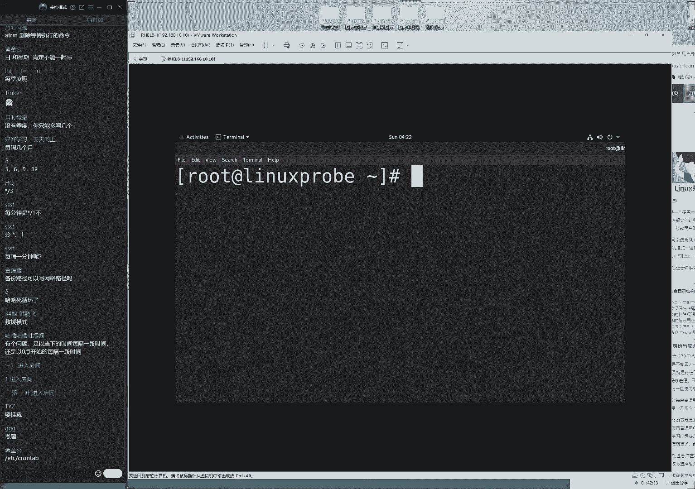

因为在这个服务器当中，所有的一切都是文件，所以的话呢linux中的一切都是文件，然后的话呢要想去配置一个服务的话，也就实际上就是在修改这个服务所对应的配置文件了。

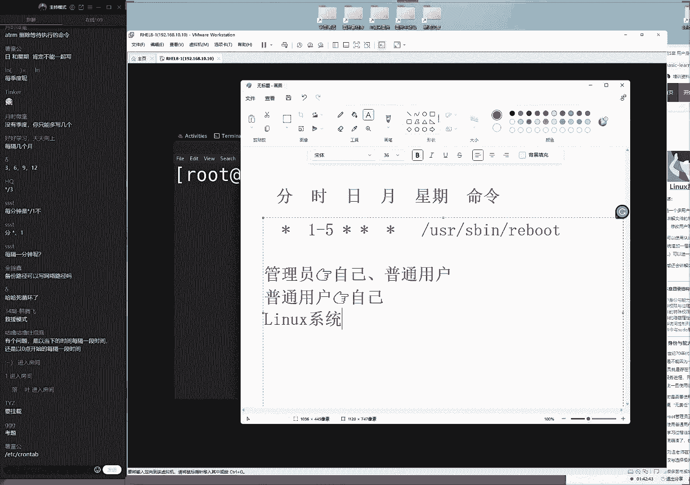

那么因此那我们就可以直接找到这个服务所对应的配置文件，然后加以编辑不就可以了吗，可以去实践啊，没有毛病来按下回车，然后就可以往里面去写，他并且他还告诉我，们一个格式啊。

分是日月星期具体的一个格式往里面去巴拉巴拉去敲，但是这个的方式有什么好处呢，好处就是第一它来说它有注释的对吧，他告诉我我们每个字段需要怎么去填写。

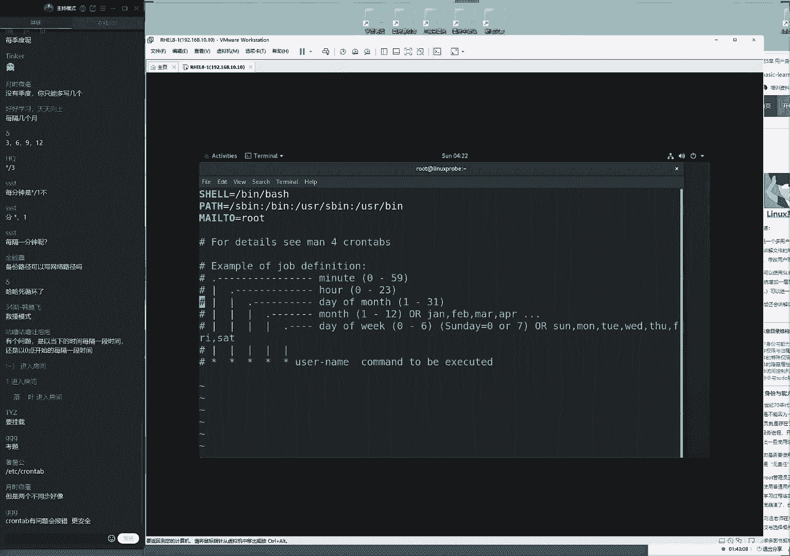

第二个的话呢就是我们不推荐它对大家已经说出来了。

同学叫啊对吧，已经说出来了，这个的话呢虽然它会有一些这个怎么讲，他会有一些注释帮助我们来去写他具体的格式，但是它是一个编辑器，vm编译器没有纠错功能，它只有它只有提示功能啊，就来看一下。

当我们写错的时候，它没有颜色的角色，他或，者他的话他啊他会给我们一个啊提示出来的信息，他们有一个纠错功能，它那我们要是写错的话呢，就有可能导致服务器起不来，是有种可能性的，那好了。

但是当我们去使用到crown tab的时候，这个工具它就有一个纠错功能，比如说我现在啊分时日月信息命令，然后我现在的话去写一下这个字段，突然间我我我发我啊，发现我写错了，我现在随便写一些信息，我写错了。

写错了怎么办呢，之前没有办法啊，之前没有办法保存，之后就啊负极和那他可他他可能起不来了，这个时候就有办法了，首先，啊我们点一下保存，然后退出，强制保存退出，按下回车，这时候可以看到了。

它并没有让我们退出，而是进行一个纠错，他说您树立了一个信息有误，是否来重新编辑呢，我们只有点击这个y，然后它会又回到这个编辑界面下，只有当我们把错误的信息给他删干净了，然后大家一起说出来。

是不是才能够保存退出，这样是不是也和大家安全了，分时日月星期，然后最后命令这样的话也更加安全了，好这是我们会给大家讲的这么一个呃注意事项。

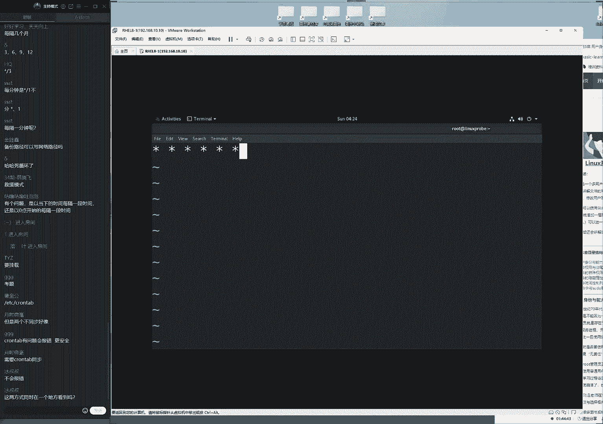

就是我们要去推荐大家去使用的crown type去完成另，外的话同时又讲到了，说这个crown type的话呢，有一个小特点，就是它调用的实际上也是我们的vi编辑器，之前给大家讲了。

说调我们的vi编辑器的话呢，配置很多这个服务的话，它既好用又通用，其中的话呢提到了就是说很多的操作系统，他都默认的是用到这个编译器来去配置这个服务的，当时有点低调了。

它不仅是很多的这个服务会去使用到我们编译器啊，它会是使用到我们编译器来去配置它自己的这个文件，很多的这个服务，比如说我们的crown type对吧，还有很多的服务我能够想象到的，可能并不严谨。

比如说quota我们做磁盘配额，这个服务也是啊磁盘配额的时候也是默认的调用了我们的编译器，哎，vm编译器来去实现的，还有什么呢，还有我们的开源的分布式版本控制系统。

我们呃他的话呢也是呃分布式版本控制系统有点太长了，我们的版本控制吧，它的话呢也是使用到我们vi编辑器来去实现的，所以这个大家第四章节一旦学好了之后，你会发现以后就可以去投入到享受配置服务这个过程当中了。

而不用老去纠结这个服务。

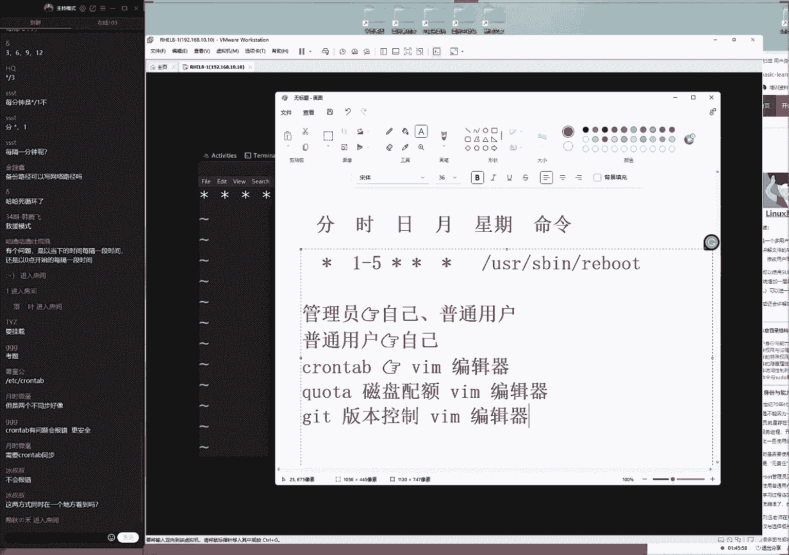

它定量的编译器，我们不会用这种问题了，来现在大家问的一个问题，大家说这两个方式在同一个地方能够看得到吗，它的话呢从理论上来说它会同步的，但是我们在实操的时候的话呢，会发现会有一个延迟性。

然后大家下面有一个问题，大家都有权限吗，有权限啊，可以没有问题啊，因为我们当前使用的用户是管他是为管理员啊，但是同学会问的是这个问题吗，好接下来我们再继续了啊。

分时日月星期命令命令的话要加上这个路径的形式，这是一个历史的经验教训，来where is命令后面加上不，我们去使用到which后面加上命令reboot，为为什么要运用到reboot呢。

因为这put更加明显吧，我们要是比如说在屏幕上面输出一行信息也好啊，或者啊对了，这个信息写的这个啊，它并不能解到前台啊，比如说我们在去往某个文件里面写过信息什么的，这样的话呢并并不那么明显。

所以我们去选择重启，这样他只要能够成功了哦，重启了，那么就实验就算成功了，所以我们选择这个重启啊，分时日月星期命令，就以我当前为例，比如说当前的话呢，我的时间诶怎么变成了04：26了。

这个是这个是什么时候变的，好奇怪啊，好不管啊，不管他不管他啊，我们就这样28分吧，哎等一下现在27分来，我们的二二，我们28分，然后呢是四点，然后分时日月星期命令啊，我们上一个分时日月星期命令。

ok写好了吗，写好了，它会在04：28去重启，我们可以这样子，crown type杠l查看一下k计划任务已经存在了，当前是27分，一分钟之后就会重启了，打开我们等他一下，顺便我去倒杯水。

大家可以先休息一下，到时候重启了，记得告诉我，我倒，我先倒杯水，那看一下说啊。

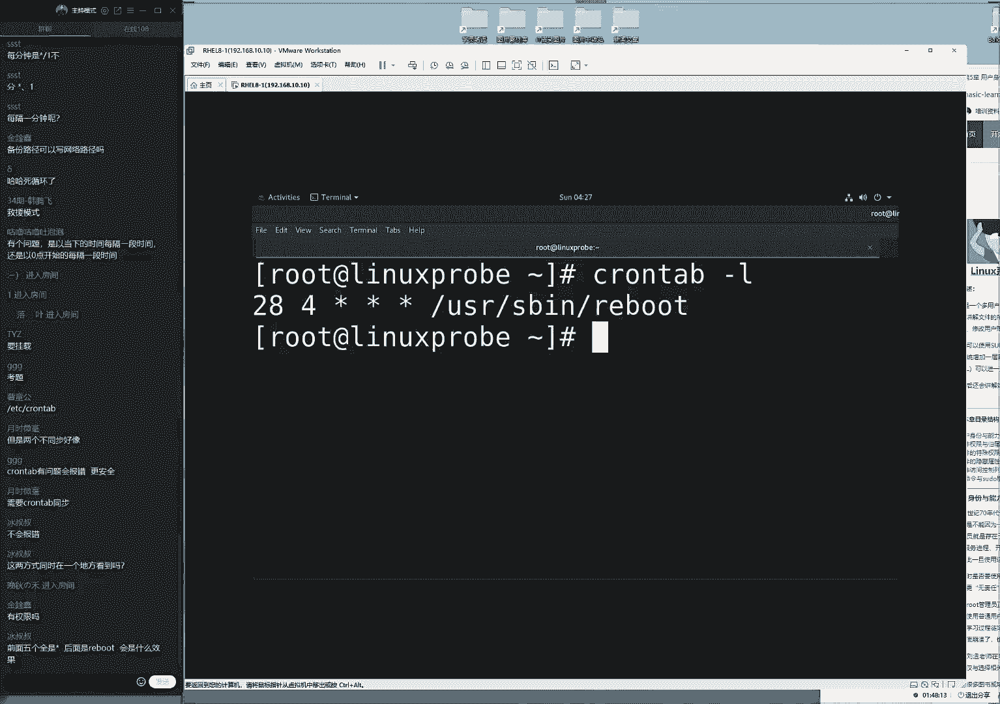

如果前面五个都是星号，后面是后面是个reboot好，他是他重启了会有什么效果。

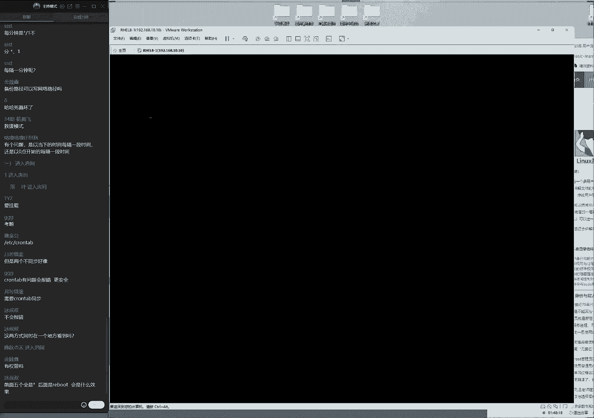

这个程序它不会去执行，因为它是错误的。

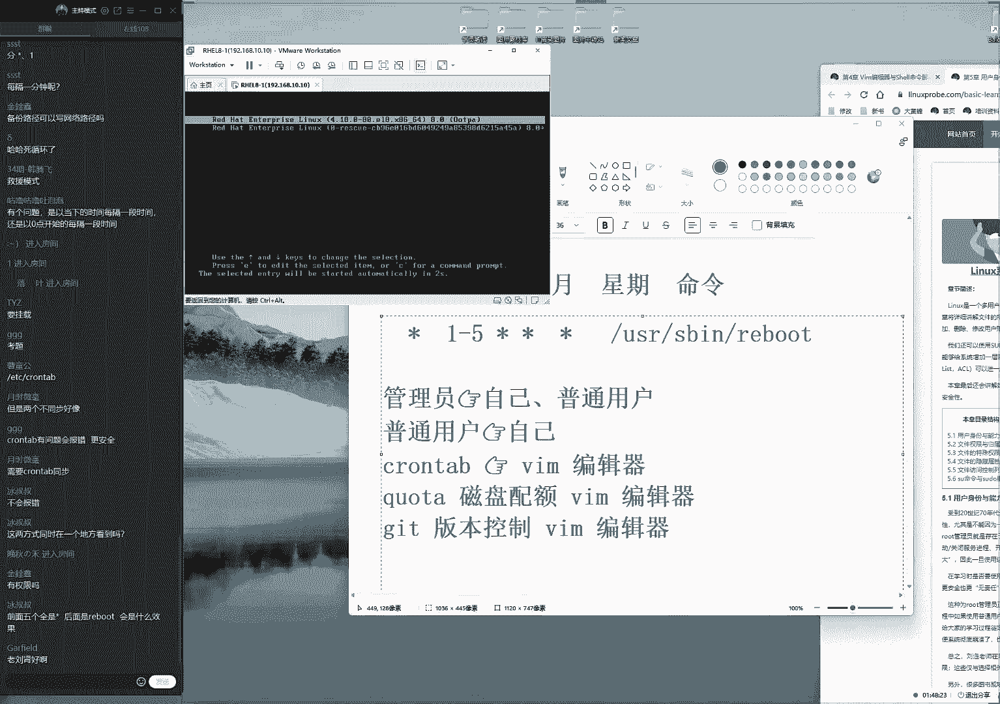

这个语法是错误的，它并不会是生效，而且没有啊，没有意义，这么去写。

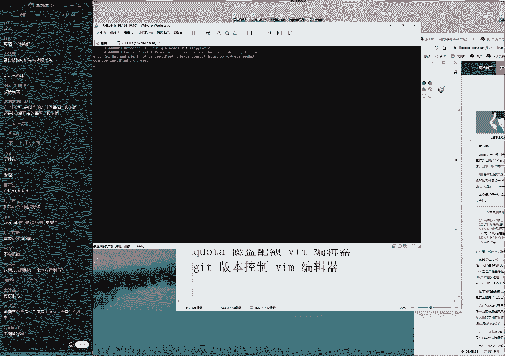

然后大家现在会问啊，没有问问题是吧，但是我想说啊，什么老刘肾好啊。

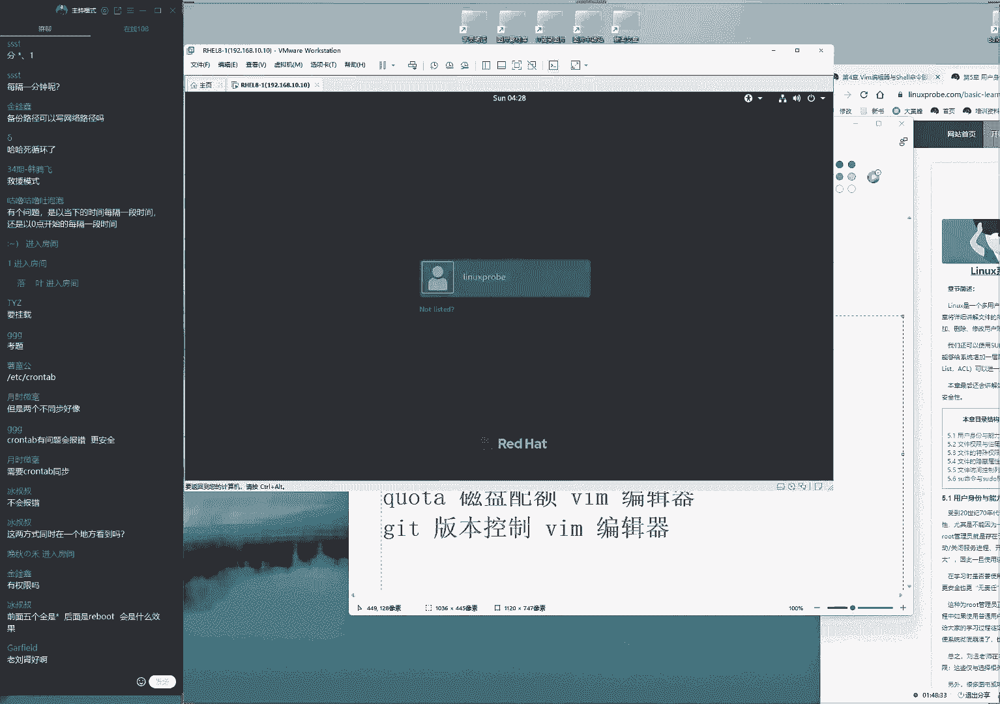

这都看得出来好，那我们现在再来啊，给大家去提到，就是嗯怎么很不过瘾哈，我们要给大家这么去讲的话呢，感觉就是不过瘾，我看看能不能再给大家讲述其他的问题了，其实这也是我们啊顺便给大家讲一个鸡汤啊。

就是我们其实也会在一些学校里面去做一些讲座，当时我从17年开始，然后就会经常去一些学校里面去做讲座嘛，比如说北京啊对吧，我会去做一些讲座，其实这个讲座的话跟讲课就完全不一样了，因为讲课因为话讲座啊。

我们会反正我反正我们的话呢一般情况下啊四个多小时对吧，一呃我呃我们大概四个小时，要不就是上午两小时，下午俩小时，要不就是我们连着四个小时，这个四个小时讲的阿姨很累，但是我们会很轻松，为什么呢。

就是我们心理上很轻松啊，身体上也会，其实也其实也很累的，因为四个小时我们一般这么规划，两个小时的话呢，将这个linux的一个历史哎，两个小时讲了linux的历史，另外两个小时的话呢去安装一下系统。

因为你不可能说讲了一个座，然后最后系统都没有安装出来是吧，哦所以我们一般时间是这么规划啊，两个小时将历史两个小时安装一下系统，就这么跟大家去说吧，我们讲座啊讲的那么大概有个七八次啊，小十次了。

我们每一次都是超级的成功，所有同学们跟我们的反馈都是朱老师讲的特别的好，所以老刘长得又帅，而且话讲课就很清晰，最后系统安装出来又很顺利，我们觉得他讲的挺好的，他废话肯定好对吧。

因为就因为我们首先前面两个小时就是一个linux的历史，只要长了耳朵都能听得懂，因为他因为他没有什么考核嘛，这样历史他说他从什么时间来的，他什么时间走的对吧，他没有什么是这个它没有任何的这个他没有啊。

任何需要大家去背诵和记忆的这么一个知识，下面的话两个小时啊，这个这个它更加简单了，因为它虚拟机里面都是由我们已经啊都已经做好了对吧，他直接把这个系统插到里面去，然后我们安装一下就可以了。

所以我们第一节给大家讲的时候，安装系统实际上才用了十分钟时间，那所以我们现在放到两个小时去讲的话呢，肯定是很有啊赋予时间的，即便是哪位小可爱同学没有跟上对吧，他没有安装出来，没关系啊，两个小时的时间呢。

你有十个同学没有安装出来，我也可以下去之后帮你们自己啊，啊那么啊我那我们也可以帮你们人工给它安装上，所以每个人都下课之后都非常的开心啊，都说这个听懂，而且的话呢说这个系统也安装上了，这就是我们讲课。

这是啊这就是啊，这这个是我们讲座的一个套路啊，给大家透露一下我们行业的一个秘密，但是我们讲课就不会这么去做，因为讲课的话呢大家想如果我们在讲课的时候糊弄大家了，他们会直接体现在就是我们学员去考试的时候。

通过率下快快啊，就是一个快速下降，那么因此那么所以我们因此在讲课的时候就不能有这种套路，就是要把这个难度啊，就拼了命的往上拉啊，拼了命的往上去拉，这样的话大家考试的时候会发现。

如果考试的时候的那个基准线是在这个中部地区，于是你会发现自己的这个能力已经超过了2h c考试的时候，那么出现一些突发情况了，比如说需要排错啊什么的，也就不用担，那么也就不用担心了对吧。

所以这个讲课时候的难度一定往上去拉的一个理由好了，通过说一些废话，我主要去想了一下，我说我还有什么能够把这个再给他去提一下高度呢，好我我我我我突然想到了一个呃，就是同学们配置完了这个计划任务之后。

有可能不成。

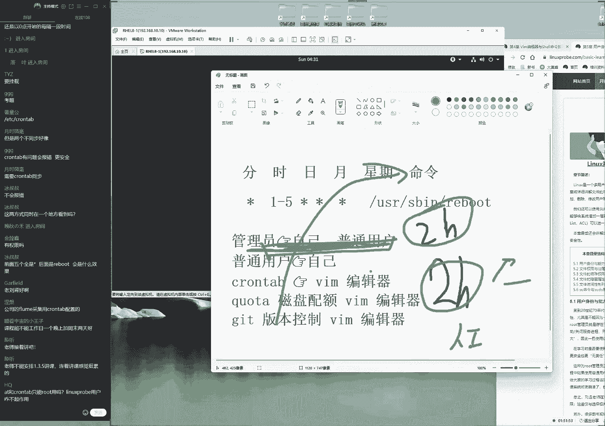

他有啊，他有可能不生效，比如说现在我们是生效了对吧，现在我们是生下了。

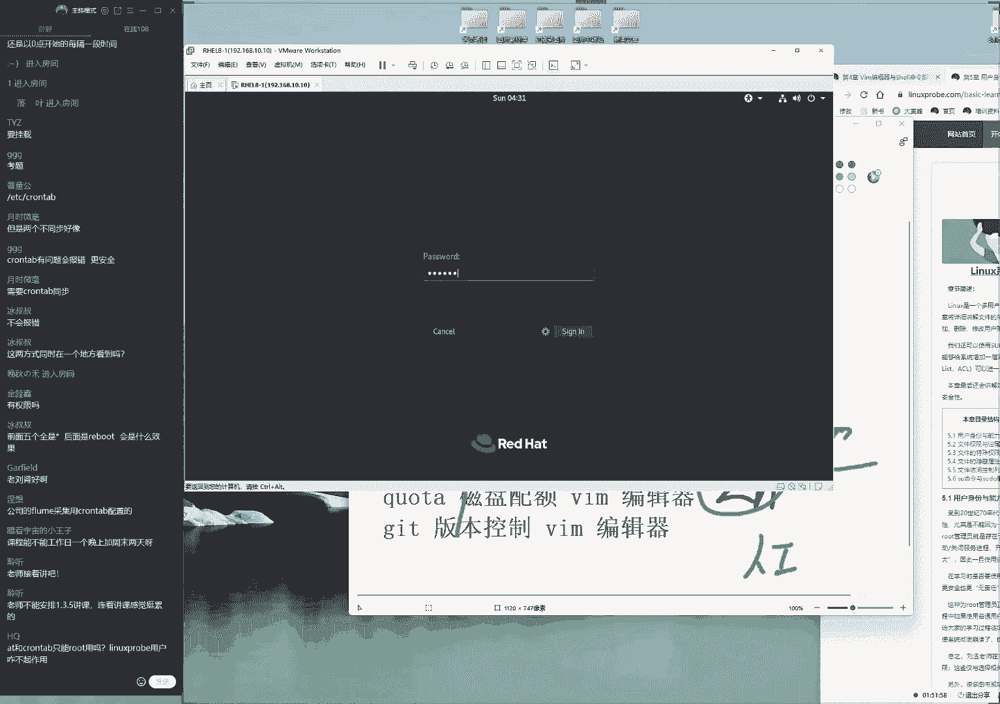

然后去重启了，但是同学们，你们可能并没有生下，我刚才想了一下呃，如果要是以这个角度上去想的话呢，如果有两个可能性，它是什么呢，第一个可能性就是您的接完任务没有被保存上，我们需要去使用到啊tab。

然后gala查看一下您的计划任务有没有被保存上，ok有他有他他已经被保存上了，没有任何问题，这第一个可能性如果没有成功，就检查一下计划任务没有保存上，第二可能性的话呢，就是这个父母没有起来。

现在配置的工具叫crown tab，那么我们要想去配置它的服务的话呢，叫做say some chelle，叫做这个啊，system control，然后我们这样status，然后后面加上服务的名称。

虽然呢再给大家说闲话啊，但是脑子这样的话，我们脑子里边就在疯狂的转啊，非常的不甘心，这样这么多就给大家讲出来，有两个可能出错的这个点，来让我来让我来去看一下这个服务，如果你配置好了这个计划。

任务并没有生效，于是就检查一下这个状态是否为启用状态，是否已经开始运行了，如果说这个服务它被关闭的状态下，那么他也不能够去为用户去执行计划任务的，这时候怎么办呢，那么就很简单，两个命令。

system control，然后是restart后面的服务名称，然后走你啊说一句走，你这个啊非常的关键，然后我们来啊，restart ground，重启一下这个计划任务，再去看它就肯定是已经是起来了。

然后的话呢第二个的话呢就是顺手把这个服务的话呢，加上这个加入到，系统的开机菜单当中，能够让我们的系统在下一次重启的时候依然能够启用，能够为用户一直提供服务，来大家记一下我们这几个命令以及可能性。

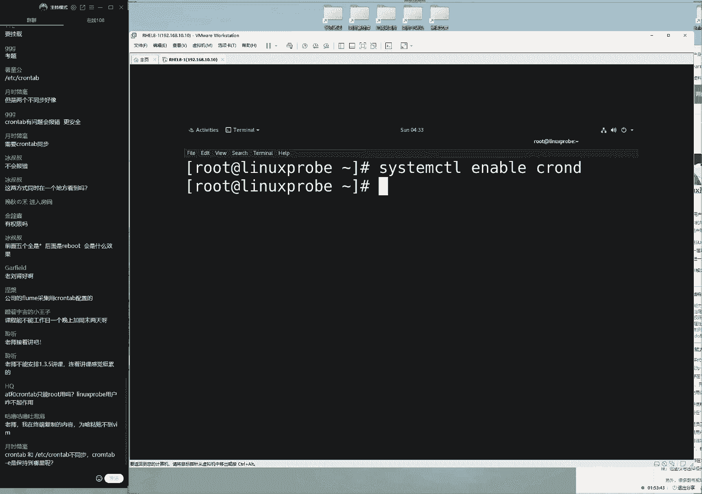

这些都是一些排除的方法嘛，我们在上课的时间段可能给大家提出来，同学们这节课去做实验的时候，就不会至于说遇到一些非预期的解决不了的问题了，我给大家抄到黑板上面，大家可以去记一下crowd。

然后是system，然后是enable crown，诶挺好，有大家想出来两个可能性，又想出来两个可能报错的问题来，大家先记一下，同时的话呢我们来翻开书看一下第六章节大小问题的话，可以继续去发。

我们来给大家去说一下第一部啊，第五章节啊，不好意思啊，太心急了，第五章第五章差点跳了一个章节啊，来第五章，大家先翻开书，同学们，您可以说一下问题了，好大家现在有一个问题，大家说怎么样能不能安排时间。

135听课啊，这样连着讲感觉挺累的，不我不累啊，这没关系，然后下面一个问题大家说呃，我们的at跟crown type只能是使用到入侵用户吗，说我们的linux prop用户打不起作用，可以起作用的。

只不过普通用户没有权限去重启而已，因为它呃也有权限去重启，只不过说当有呃另外一个用户在登录着这个服务器的时候，我们需要单独加一个参数，并不能去使用到这个呃reboot命令直接重启这么一个问题啊。

所以的话呢我们回答同学们的问题啊，就是呃普通用户也可以做计划任务，只不过你的命令你可以换成另外一个再去试一下，好下面一个问题，大家说我们我们在终端复制内容的时候，为什么粘贴不了vm。

因为您没有安装我们的vm ware tooth。

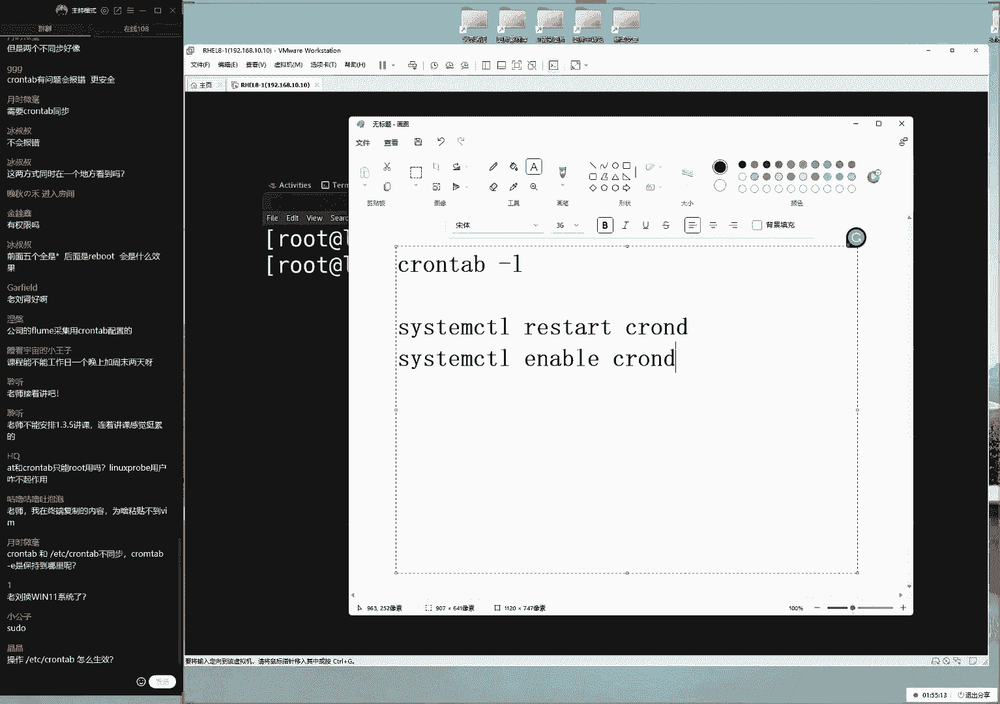

你可以点一下虚拟机，点一下这个啊这个选项，点一下虚拟机选项，点一下这个安装vm tools，这个工具安装好了。

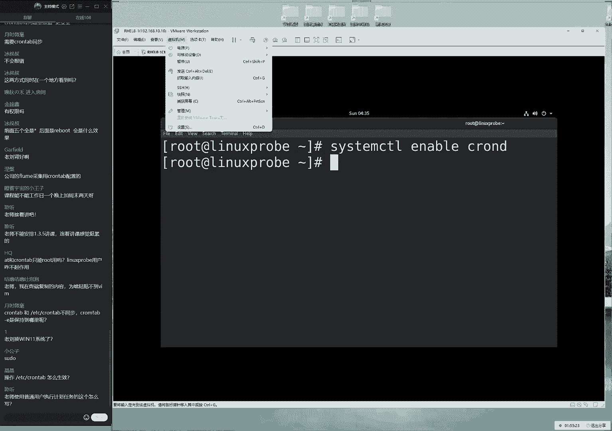

就可以实现推出来这个拖拽跟远程的跟这个复制都可以去实现了，好下面一个问题，下面一个问题大家说我们去使用到呃crown type的时候，跟编辑文件并不同步，这个我刚才给大家说说过这个啊并不同步的问题呃。

crown tab的话保存到哪里去，crown type的话呢啊还真没有，还真没有留意过，如果没有记错的话，应该是我们的自己的加密录里面是不是有啊，播这个我需要给大家去查一下啊，需要大家去查一下。

还真没关注过我们自己的这个加不里边，应该是保存到我们自己加目录里面了，至于说是哪个文件，我下课之后给大家查一查啊，下个周我给大家查一查，其实已经大概能够看得出来，不知道是哪一个啊，没关系。

我下个周给大家尝一下，当下一个问题，大家说啊，说老师使用普通用户执行计划任务的时候，这个怎么写也是一样的啊，写是一样的，这个格式是一模一样的，只不过我们切换用户的时候是啊到另外一个用户身份下。

或者我们加一个杠u加上用户名称，然后的话呢下面一个问题，大家说普通用户是根据普通用户调用的权限问题。

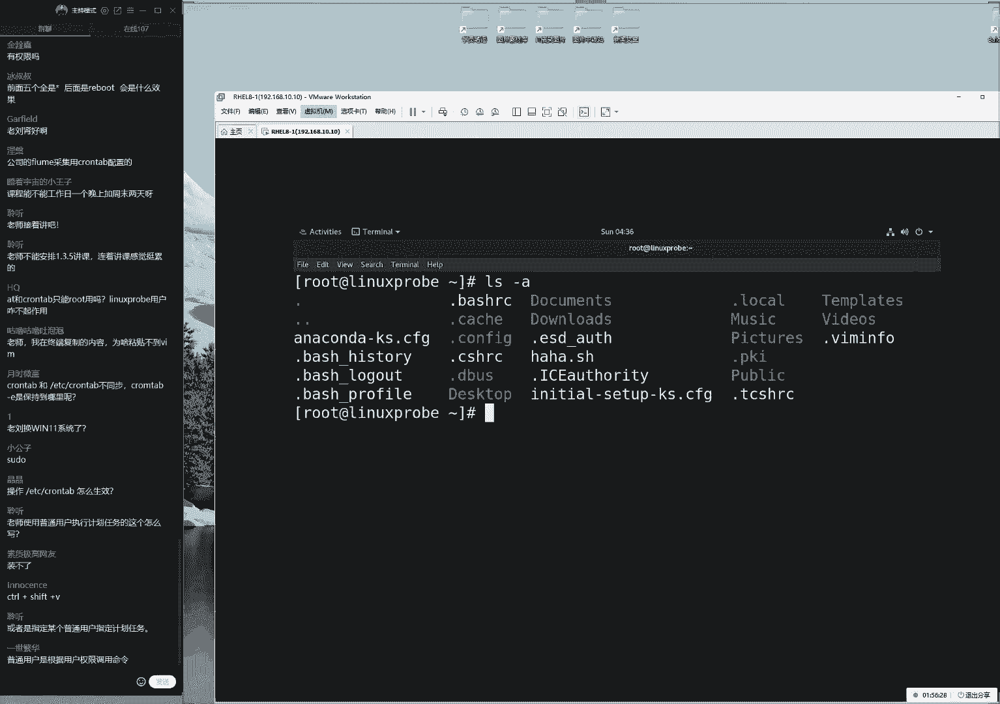

对大家实在话实在话，实际想问的是这个啊，大家想问的实际上是这个就是说为什么我们去使用到普通用户，然后我们去加了一个计划任务对吧，然后的话呢它不它并没有成功，他跟计划任务没关系，跟它的权限相关。

您加的是什么工作呀，比如说您加的是一个重启也好，您加的是一个对于我们的硬盘进行分区格式化也好，他没有权限，所以的话呢我们要去使用到普通用户的时候，您需要，那么您需要去考虑到这个权限的影响。

而不是把这个啊都给它归结于说这个计划任务的问题上，大家能理解吧，啊不是从啊，就是我不是说呃出了问题都是计划任务的，有可能是因为全新的问题好正好引出来，我们今天这个第五章节。

那既然讲到了说那用户的这个权限到底普通用户为什么小，以及普通用户能够做什么样的一个事情，或者那我们的计算机里面为什么会有这么一个普通用户的一个身份，他干嘛用的，下面要给大家去聊一聊啊，他还说七七来了啊。

今天啊今天七七来不了了。

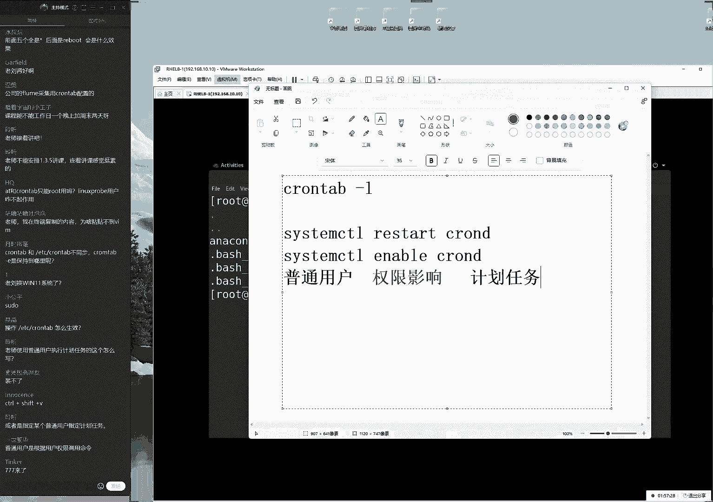

已经8。40了，今天七七来不了了，等明天吧，好今天太晚了，七七今天就不来了，来今天的话呢我们的课程就是5。1小节，我们的稳扎稳打啊，稳打稳扎的，我们讲好就可以了，我们对于这个课就不要赶课时了。

不要赶课时了，就是唉其实怎么讲呢，还是要学的比较扎实一点比较好，来下面的话来去说一下啊。

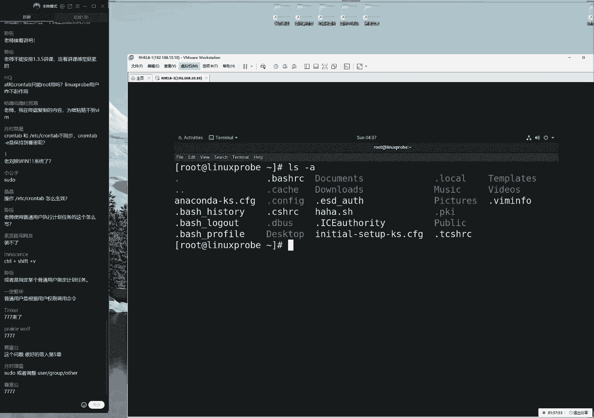

5。1小节简单给大家说一下吧，是这样的啊，不我们如果光点5。1的话，就不用那么的简单了，可以稍稍可以稍微的这个深入一点了，说一下用户的这个身份以及能力啊，用户的身份与能力。

实际上这就是说的一个什么事儿呢，就是它能够干什么，以及它这个权限我们该怎么去理解它，它实际上的用户是被分为了三种类型的，第一种类型的话呢叫做管理员啊，管理员单有一份，就像我们的嗯，不这个例子不要举了啊。

想了一个，但是好像跟政，但是跟政治沾边儿了啊，所以我们不啊，所以我们换一个吧，好就是我们的话呢现在有一个身份叫做管理员，他的话呢是权限是最大的，然后的话呢限制是最小的。

它拥有对于这个系统的一个充分的管理能力，这个话呢身份我们是叫做管理员，第二的话呢我们是叫做系统用户，系统用户的话呢，它指的就是呃它默认情况下是不能够登录我们的服务器的。

它仅仅是能够去用于用这个身份去调用某一个程序，这有什么用处呢，我先给大家解释一下啊，大家听到这个就有点相互矛盾的老师，你说这个是人话吗，说这个用户不能登录我们的系统，但是的话呢它又可以去调用一个程序。

这啥意思啊，是这样的，首先它不能够登录，服务器好处的话呢就是呃即便这个账户的密码被人知道了，但是的话呢黑客也进不来，因为他不能够通过服务器，那么他他又他又能够去调用一个服务的话呢，是什么意思呢。

你可以用他的这个身份去调用一个服务的启动，这样的话呢当有一个黑客区啊，那我们它会有两个情况，当有一名黑客去破解了人间的密码了之后，即便我知道这个的账号和密码，但是的话呢我也依然不能够登录服务器。

这是第一种啊，那么这是第一啊，那么这是第一次保障，第二次保障，当我去通过了入侵别人，的这个网站服务去入侵了网站服务之后的话呢，但是这个程序这个调用者是一个系统用户，它的权限特别小。

那么于是我的破坏范围的话呢，也会受到这个限制，我们叫做插入，叫做牢笼机制对吧，也就是说当有一个用啊，当有一个黑客去入侵了我们的网站了好了，网站已经被入侵了，那么它那么它已经成啊，他经太坏。

已经成一个哎它已经成为一个事实了，就像一个人的话呢，已经长了一个，比如说长了一个呃肿瘤了好了，但是的话呢肿瘤的范围，它这个破坏的范围的话呢被禁锢起来了，当这个网站的话呢，这个权限被限制了之后的话呢。

它最多也只能最多就破坏一下这个网站了，于是的话呢会有这样的一个效果，这样它的权限是更小一点，在满足了网站的就是这个啊在满足了网站的这个权限的基础之上，尽可能少的给它一些额外的一些功能。

这么一个事情证明他啊他这么一个作用啊，叫做系统用户，还有一个我们叫做普通用户，这个普通用户的话呢就是用来啊我们日常完成工作的，比如说我们的同事张三啊，这个啊张三李四他们也要登录到服务器里面，因为我。

们知道这个系统的话呢，最开始就是以一个多用户多任务的一个操作系统，它需要让很多人去通过终端连接到一台服务器里面，然后一起来去完成工作，那好了，每个人要有一个这个单独的用户的身份，我们就把它叫做普通用户。

在红帽诶，怎么没有啊，等一下在这个红帽哎红帽real巴里边的话呢，这个普通用户啊不我们还在红帽弱巴里面哥啊，管理员的ui d号码它是为零，什么叫u i d u i d指的是我们的身份证号码。

叫做ui d就是我们人类生活当中里面那个身份证号码a user啊，identification，对吧好我们identification哈，我们明明已经忘记他了，非得我打一遍啊，好我不知道打的对不对啊。

但是他并不重要，就是说叫做用户的身份的识别码，我们现在就是呃我们换了身份证号码，所以我们人类生活当中的话呢，可以允许有重名，但是我们不允许身份证号码有重名，比如说流传啊，在银行里面，比如说有存款啊。

100元，这钱就是我的，别人都不能拿走好，那么为什么呢，因为我的信息跟我的身份证号码，跟我的姓名绑定到这个账户上面，如果再来一个人叫流传，他能替我讲课来吗，他能去取我的，钱吗，那做梦对不对。

那肯定不可以的，那么于是就是呃重名可以，但是身份证号码它是不能够出名的，那么以及的话呢这个身份证号码也限定了它的一些特写啊，比如说这个哎呀，要是给外国人讲，估计就有点费劲了。

但是我们中国人理解起来特别的好，比如说嗯身份证号码它不仅是一个唯一的对吧，因为在外国没有户口制，它不仅是唯一的，它还有一些标识，比如说老刘的身份证号码对吧，110101巴拉巴拉巴拉巴拉啊，好。

就代表的是首先是北，它代表它代表的就是北京市对吧，然后的话呢这个啊101就是叫做东城区啊，虽然我现在住在朝阳了，但是我深圳号码的话呢，还是啊这个它不会变的，即便我以后我住到了，比如说住到了上海了啊。

那么他这个号码也是一个呃不会变化的，也就是说它里面还会有一些标识信息，第一来说就是唯一，第二的话就是要有一些含义，这个含义含义这个就代表是零的意思，就是说零首先它是唯一值。

并且的话它有一个具体的含义是为官理员，这个有点就是有点呃解释，的太清楚了吧，就是如果有一个用户的这个呃ui d号码为零的话，他一定是一个唯一值，并且他一定是为管理员啊，解释说超级清楚了啊。

给大家举一个生活商当中的一个例子，好，下面的话我们来给大家去说一下我们的这个呃系统，这个系统用户的这个数字是从1~499之间呢，也就是说如果说您的系统是一个老系统，那么您如果说是五或者六的话呢。

那么您对应的这个ui d号码就是1~499，如果说现在是7~8的话，呢那么您的ui d号码就是从一到大家说出来啊，999好，这个就是一个很大的一个范围啊。

下面就是我们的普通用户在如果说您是在红毛五和六里面的话呢，那么您的这一呃号码的话呢是从500开始的，一直到多少能到65535个，也就是说您系统当中最多只能有65000个用户啊。

说咱们说实话肯定是够够的了，肯定没有任何问题，呃然后的话我们在七跟八里边的话呢，我们没有上限，他是从1000开始的，没有上限，我们说这个话是很负责任的，因为我为了讲的，这个课我们不仅是去耍啊。

我们啊不仅是动嘴的，也是也动手了，我们去使用这个脚本啊，不要问我这脚本怎么去写啊，大家都会啊，使用这个脚本，然后的话呢批量新建出来了几10万个用户都可以去实现，没有任何问题，是没有问题的。

所以当前认为是没有上限的，好，大家好了，现在啊问了没有问题，没有问问题，我给大家问问题啊，我们对自己不满意，我要给大家提个问题，请问如果一个用户他的这个身份证号码啊，如果他的呃ui d号码。

他用呃的这个深证号码是555或者666，请问他是一个什么类型的用户，来一个小问题送给大家，如果一个用户的身份证号码的uid号码是555或者666，他的这个身份是什么类型，好同学们想想啊，想一想。

答案已经在题干里边了，答案就在题干里边啊，题干就在咱们的呃屏幕上正在显示出来的，大家说系统用户啊，系统用户其实啊其实的话呢是错误的，其实是错误的，不这个大家会说系统用户是错误的。

因为用户的uid号码是手工指定的，它不能够单纯的通过uid号码区分是系统用户还是不对，用户是啊绕啊，听我给大家去细聊，可以通过ui d号码为零，判别出来它是没管理员还是没普通用户还是系统用户。

就是说它只为零，一定是微观理员，因此它是一个唯一的切含义的一个意思好了，大家看到没，我有我只在这儿写了，这是一个坑啊，我只在管理员上面，我就写了唯一，并且还有含义为零，一定是只有一个含义为管理员。

他一定是管理员，没有问题吧，但是这个ui d号码这个范围区间只是一个参考值，下面两个确实参考值，用户的ui d号码不一定绑定用户的这个身份，他即便是一个普通用户，也可以是555，666，777，888。

也没有任何问题，机动用户的话呢，也可以是啊，1000以后的，比如说巴拉啊，呃呃1500 3500，8899，ok可以的，没有问题好吧，也就是说系统用户跟普通用户是通过功能来以及作用它来进行区分的。

不是通过ui d号码，ui d号码仅是做参考值，好吧，同学们这个非常讲的非常清楚了，而且网上面基本上没有给大家说清楚的，因为网上都是照抄的一篇文章，然后到底拍照抄就抄，还有抄就是就是反正就是他还能啊。

这个质量并不高，记得当时我们去写书的时候，就想配置一个什么服，我忘记了，就发现很多这个网上的文章都是抄来的，然后都是一，如果啊如果要是第一篇错的话，后面都是错的，因此这点大家要去纠正一下自己之前的观点。

就是uid号码不能够去分析的用户和普通用户，以老牛为例啊，比如说我的身份证号码是110101对吧，那好了，我的号码的话，那算是东城的，但是我住在朝阳，这个是一样的啊，那么这个是同样的一个道理。

即便说我一个用户ui d号码是666，但是我催当个普通用户去使用它没有问题啊，可以的好，所以大家记一下，这是参考，就是啊唯一和含义的一个区别特别好，接下来再来给大家解说一些命令。

那么如果说我们要想去看一个用户的基本信息的话呢。

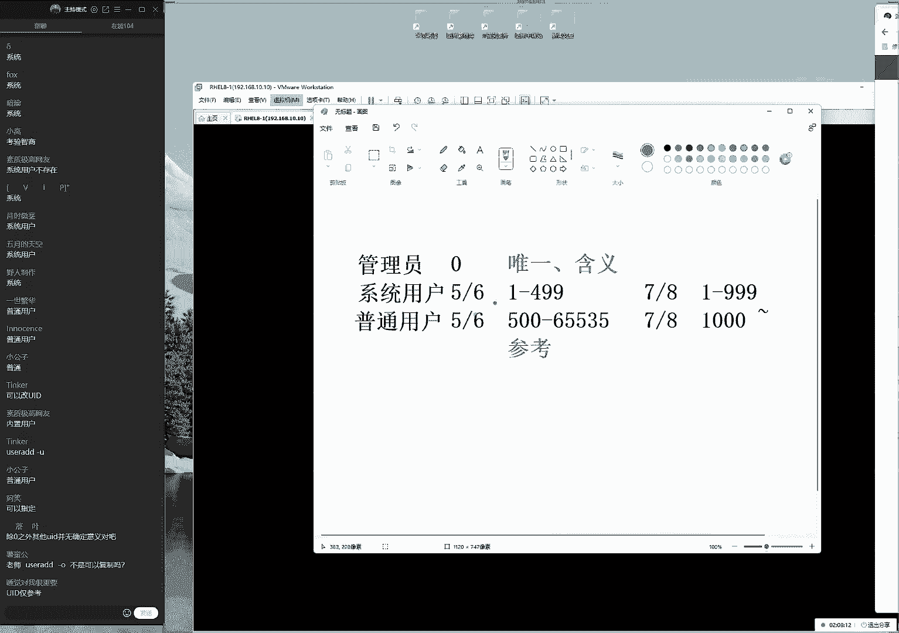

我们就可以去使用到一个叫做i d的命令来查看它i d，然后后面加上用户的名称就可以去看了，比如说i d好，可以先去直接敲一下，回车，指的是看我们自己的来，现在id后面的话呢加上一个用户的名称。

比如说随便去写了，我们必须我们随便去写，刚刚的话呢有一个普通用户叫做linux prom来，我们以它为例，如果说您开始去安装系统的时候，在4月2号的时候，您去安装系统的时候，4月3号去安装系统的时候。

您没有安装啊，那么您没有新建出来这个普通用户或者对其改名的话呢，此时请替换成您新建个用户的名字，来，我们换一下，点一下回车，于是可以看到了这个用户的话呢叫做linux club。

它就是一个用户信息显示出来了，我们可以参考一成，那我们可以参考一下，它是一个普通用户，他的话ui d号码是为1000，阻i d是为1000啊，扩展组啊。

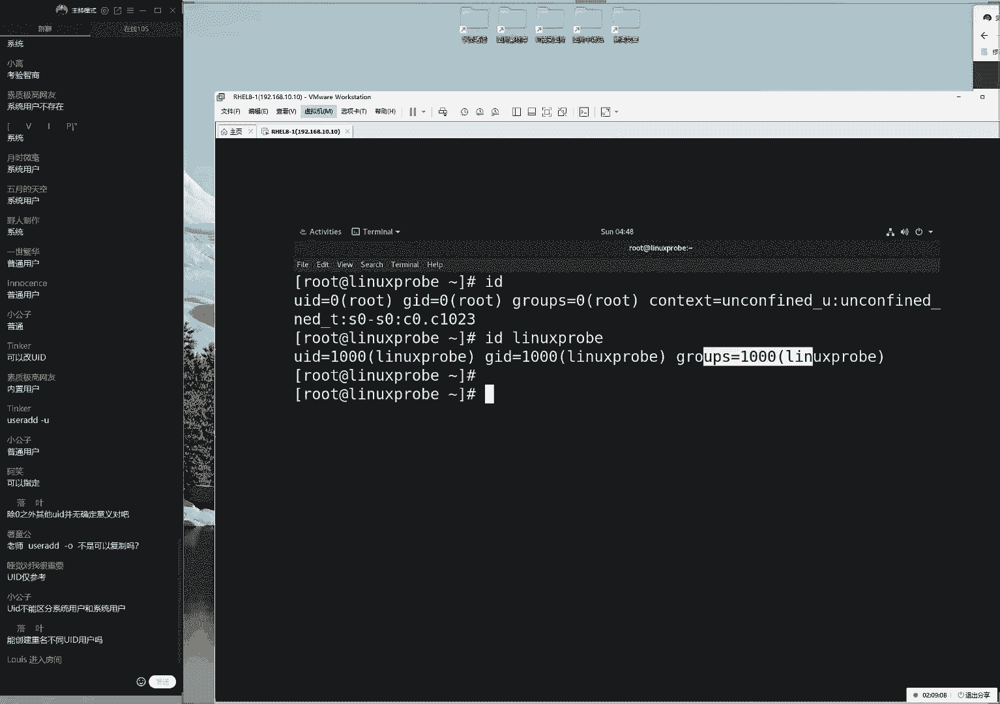

它也是它本身，这是什么意思啊，要又要给大家扩展去讲一下了，呃也就是说我们再去使用到linux系统的时候的话呢，它实际上它又分为了三个字段。

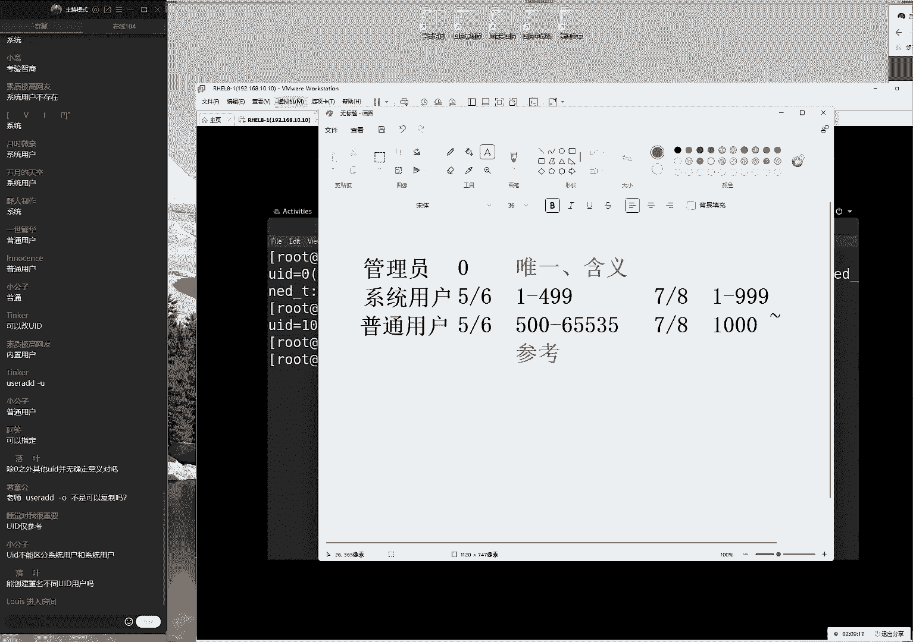

以我们现在为例对吧啊，第一来说的话就是u i d啊。

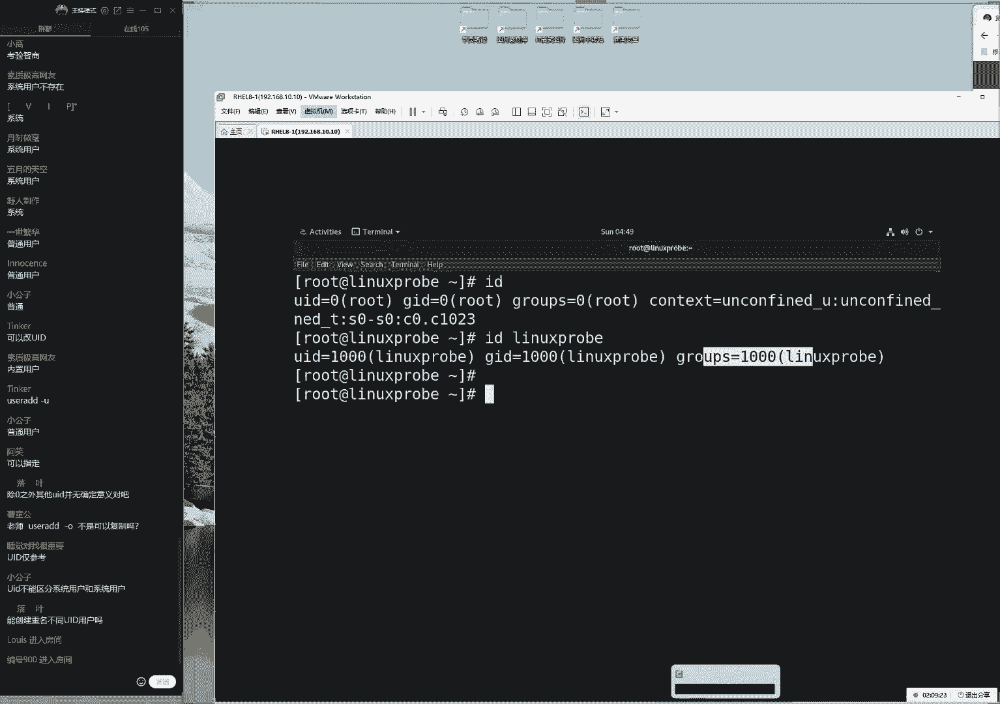

叫叫这个u啊，u叫做这个用户名吧，然后第二个字段的话呢，我们叫做基本组，第三的话，那我们叫做扩展组，这个什么意思啊，基本组扩展组这个我们很呃我们不太好理解，首先呃用户名称这个超好理解。

大家从字面意思上可以知道了，这指的是用户的名称以及用户的这么一个身份证号码，而这个基本组的话呢是一个与生俱来的，我们的一个组，它会随系统啊，它啊它会随用户的建立而产生出来，比如说我现在新建出来一个账啊。

新建出来一个账户叫做张三，那好了，叫我张三，那么我就会有一个与生俱来组，也叫张三，当别人在想我在哦，我再去新建出来一个组叫，那么在新建一个叫叫叫做李四，李四的话，也有一个叫做李四的一个基本组。

这是一个与生俱来的，有点像是我们在出生了之后啊，大家说这个是一个呃主属性，可以这么理解，但是的话呢又用一个技术去解释一个技术了，大家没有发现也会常犯的一个错误，为什么我们讲课大家能听得懂的。

就是因为尽量能用一个生活的一个例子去解释一个技术的一个例子，如果用一个技术的术语去解释一个技术的术语的话呢，听完之后还是比较抽象，我给大家举一个例子啊，比如说因为听到咱们讲课听得最多的就是这个。

比如说这三个字的对吧，但是能够听得懂，就看这三个字后面举的这个例子了，好假设说哈有一天呃有一个人出生了，这个人出生的话呢，他出生那一瞬间就会有一个原生家庭组，这个组是他与生俱来的。

比如说像一个人叫老刘啊，叫做呃呃现在有一天啊，先我先说一人家啊，小刘小刘出生了就会有一个基本组，比如说爸爸妈妈啊，爷爷奶奶啊，这些的话呢叫做唉爷爷奶奶，这叫做基本组，也就是他一个与生俱来的。

当他有这个基本组了之后的话呢，他以后随着自己的这个工作的需要，再去加入其他的这个公司也好，学校也好，这个叫做扩展组，比如说你说他啊，他就他他他他要去上，他要去上学了，学校组好吧啊。

这我们给大家一个学校组加入这个扩展组里面了，为什么我不能够去大家的公司里面去上班呢，啊不不不，这怎么理解，就是我为什么不能去他在公司里面进入到你们的啊，去进入到你们的公司里面呢。

因为我并不是你们的员工对吧好，为了让我们的小刘能够去上学，还有需要先找一个学校成为你们的一个成员，这个叫做他后天去加入的扩展组，然后他以后啊啊上完学了对吧，他以后去啊自承父业过来讲课来了。

他又加了一个组叫做linux prop用户的一个组，于是他可以怎么样呢，加入很多个用于工作方面的这么一个组，它统一我们叫做扩展组好，这是我们第一点，第二点是什么呢。

第二点是一个用户只能有一个客栈组与生俱来的，但是它可以有很多个n个扩展组，大家记一下，扩展组可以有很多个基本组，只有自己大，问说基本组有啥用嗯这个时候我举一个小例子啊，老刘以前我出生的时候。

我也只有我一个基本组，但是我们的团队啊不但是啊，但是我们现在的话呢有公司现在的话人气也很高，我们现在有很多工作需要去忙，我忙不过来了，就会有我的手下，就会啊就啊啊说那个啊手下有点啊太俗了啊。

但是会有我的下属们，会有我的同事们，他们会加入到我的公司里面，他虽然是我的基本组，但是会去去啊，但是却是他们的扩展组，然后他们啊他们就会成他们他们就成为我们公司的这个成员了，他们就是这样的一个效果啊。

所以你要去理解一下啊，这么一个区别啊。

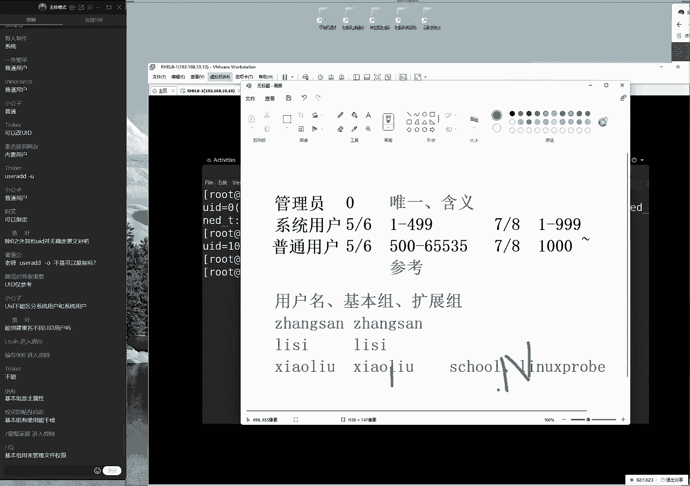

区别好，接下来我们再来给大家去说去使用id查看到信息之后的话呢，也可以去使用到u s a d d去新建一个用户，这个特别有意思啊，比如说我现在再来啊，另外还有一点，另外还有一点我们现在讲的都超级基础。

大家感觉到了，如果大家对于我们现在讲的不满意就太简单了，待会儿下课之后，九点过后啊，就属于我们下课时间了，提醒我可以通过这个编辑文件的方法去新建出来一个用户，来去验证我们前面所讲的那个什么啊。

做的文件啊，啊所有的这个信息都是文件，但是同学们一定要提醒我九点过后啊，然后下课之后给大家去做一下这个演示，来说一下，首先啊use a d d来去新建出来一个用户用户名称，直接写后面就可以了。

比如说看谁发言了呀，叫做呃是不是啊，就这个小狸吧，新建一个用户叫做小狸，于是有了再来查看一下小黎的用户身份，小迪用户新建成功，好，非常好，还在那我们再那我们再新建一个啊，再新建一个用户。

同学们叫什么来着啊，小狼是吧啊，小狼小狼同学啊，于是的话呢我们啊小狼我们再来加一个参数，看一下表格，五杠一加一个参数好不好啊，可以啊，呃杠u只能一下用户的ui d，我刚刚说过了ui地址作为参考。

它不能够去用来直接区分用户的身份，没毛病吧，啊当前他肯定是一个后期建立的普通用户，但是我们却可以加一个杠u是呃我们的身份证号码888啊，这个号非常顺，它是在1100里的，但是它却是一个普通用户。

它是可以怎么样呢，切换到他的没有问题吧，可以切换它视为普通用户，但是他的ui d号码却为八八诶，你看很有意思，辩证辩证而来，那我们反啊，我们辩证的给大家去说，呃这是这是新的用户的一个方法。

大家的话呢会问问题，比如说老刘嗯，用户的这个，然后我们看一下表格，51000里边啊，就不再给大家一个一个去的来去演示了，因为有点没啥意义，比如说再去演示一个吧，比如说新建一个用户用户的阻力，比如说六啊。

6666啊，他可不可以呀，可以呀啊啊不啊，来可以啊，呃用户名称叫做小哈吧，按下回车啊，他说这个组并不存在，好我们这样如果想新建一个组的话，是使用到啊新建组的用户。

来来来新建组命令group a d d后面加一个组的名称，比如说叫做ladies cool，来我们可以新建一个组，然后的话呢我们现在去啊新建一个用户，这个用户叫做哈哈。

给他一个扩展组叫做大写g把它加入到linux库里面去，于是可以看到了，当这个用户第一时间被新建出来的时候，他不仅有了自己的基本组，就是它的基本组，他也有了一个扩展组，这叫做呃新建用户的时候。

可以来去指定这个扩展组的一个方法，还有什么可以说呢，还有同学会问到双you啊，我那我明白了，新建用户的时候，还有啊就是说我们孩子出生的时候可以去修改一些信息，那如果说我现在还有一个用户，还有一个用户。

比如说叫做嗯哎呀，现在这个技术能够掌握的很清楚了，但是这个取名字很费劲啊，这叫做先头门，比如说叫做小啊，叫做啊小狼吧，好现在有一个用户叫小狼，我们这些，那我们也需要把它加入到一个扩展组里面。

或者我们去修改它里面的信息，这个就只能改改，删掉之后再重新取新建吗，就是我们能不能呃，就是我们在后期也可以去修改这个用户信息呢，是可以的，这个命令的话呢叫做use moon命令，可以来去实现啊。

use mod命令采取实现，后面的话呢比如说我想修改什么呢，我想修改一下用户的uid号码，现在的话uid号码是888，可不可以修改呀，后期能不能修改啊，没毛病啊，6666啊，来6666666啊，非常好。

来我们查看一下用户信息，于是查看啊，这东西就是用来去看了一下，ui d他上限不再是65535了，那k 166666没有任何问题，用户信息在后天也可以进行一个修改，同时也可以去这个用户加入到扩展组里面。

比如说加入到linux库里面，这也是我们的亲儿子对吧，这也是我们的一个亲网站，这要在扩展组里面好了之后再去看小狼用户多了一个扩展组，非常简单啊，还有什么呢啊还有还有还有就是嗯新重置一下用户密码啊。

重置下用户密码来password嗯，那password啊，看大家问题啊，大问题大家说呃，我看一下用户名字可以输入数字吗，为啥我会报错，因为不可以啊，这个大家的问题都可能都已经出现在题干里面了。

下面一个问题大家说为什么，除了呃我们管理员就是用的当初以外的话呢，其他用户运行命令都需要加上速度，其实这个您的问题已经就是呃问题就已经在答案已经在题干里面了，就是因为权限的问题。

就是因为您使用的是管理员就没有问题，普通用户是不能够新建普通用户的啊，普通用户是不能够新建用户的，这就是为什么我们一开始让大家去省会里面去方法去来，关于我们这个计算机，第一虚拟机里边的话呢。

没有人去入侵我们的电脑，就是没有人会去去入侵我们的虚拟机，第二的话呢就是我们如果出错了，可以还原快照就好了，第三就是因为权限问题啊，因为呃很多这个操作的话呢，现在也好会看到了，其实他这个过程可以去完成。

如果说我们没有去取管理员发呃，这个时间去操作的话呢，那么如果出错了，您不知道啊，就是啊您不太能确认到底是自己的操作问题，还是因为权限问题导致的，所以我们第一次建议大家都是管理员方法来去实现啊。

然后下面啊来去重置一下用户密码，用户物的话呢名称我们是叫小狼，密码的话呢，当前没有，我们就给大家重置一个新的，比如说随便啊叫做red hat，然后red hat新建好了，这就是重置密码的一个方法。

还有的话呢大家看到了第六个命令就是叫做user delete，那叫做用户的删除命令，好大家问了一个问题，大家说啊基本组有实际的应用地方啊，比如文件的扩展组是值得说文件的所属组是值得扩展组吧。

不呃不用去猜，不用去猜，你明天听完了之后自然就知道了，它的这个组它不区分用户，你是基本组还是扩展组，就是文就是我们这么理解啊，呃我先给大家说一下啊，因为这个确实大家现在不要去猜，就是在这个文件上面。

这个是指的是所有者，这个指的是所有组，所有组并不指的是用户，它的基本组或者扩展组，他不用去区分用户，只要有就行，大家能理解意思吗，比如说老刘啊。

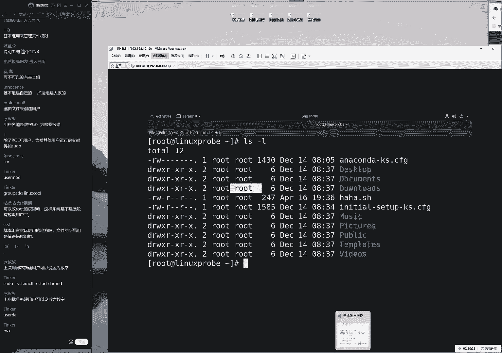

我现在啊老啊，现在的话我有几个钥匙，现在呢比如说哎怎么画那么的丑啊，好就这样吧，再画一个小帽子，我现在有几个钥匙，第一个钥匙，比如说我现在这个家里的话呢，家里的话是啊房间的，第二呢是公司的。

第三的话呢比如说随便了，比如说是一个啊巴拉巴拉巴拉，最后的话呢我们会有一个验证说你有没有啊，不不不，然后我们这有一个文件啊，这句话我那我们的文件上面有一个权限，就是我们只要有这三把钥匙啊。

这个文件的话它是不管我们到底是哪把钥匙的，只要我们这个用户的这个信息当中，不论是基本组还是扩展组，只要你有就行，你有了这把钥匙就去插进去就可以打开了，而它并不区分，说到底是第一把，第二把。

第三把还是我们基本组还呃他还是基本组还是扩展组啊。

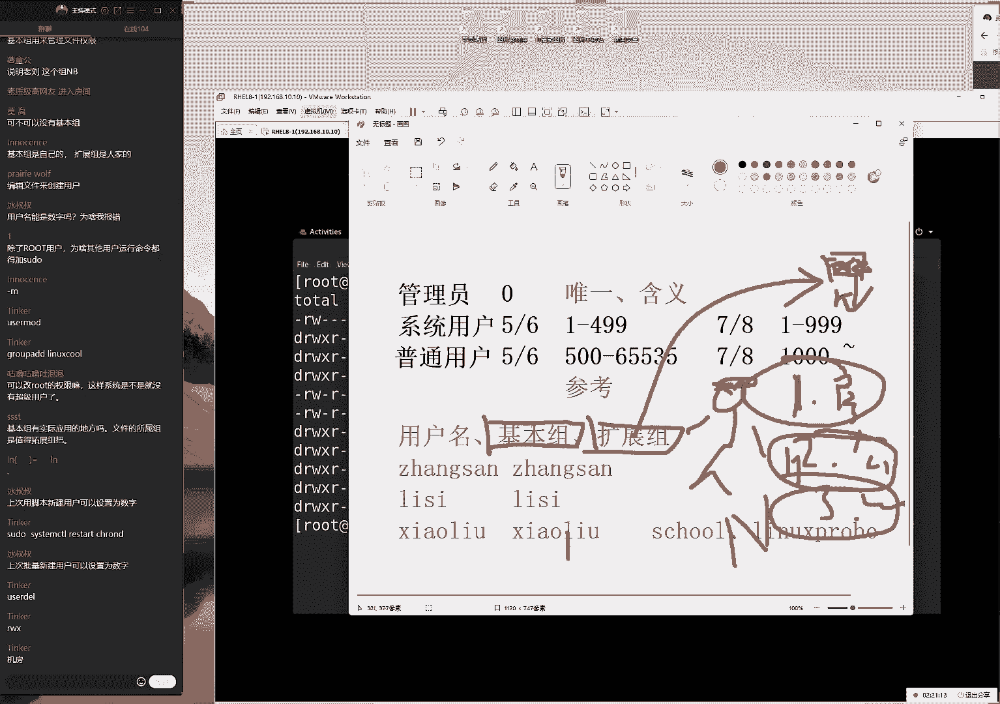

不用区分啊，不用区分好，下面就是来去删掉用户嘛，我们既然会先既然会建立了，我们就把它要在最后去学一下这个啊删除，做一个完美的收官命令的话呢，叫做user delete命令来给它删掉了，删掉的话呢。

用户名称我们这么去写，user delete后面加用户的名称叫做小狼，这把要给删掉，再去查看一下，小狼用户就被删除掉了，没有问题，但是我们再去进入到home目录里面的时候。

会发现这个里面依然有一个目录叫做小狼，这个指的是这个原先用户的这个加目录，什么意思呢，还是啊我会尽量给大家通过这个生活的例子来去解释一个技术的，一个呃的呃，的一个事情啊。

就比如说啊今天的话呢我们跟女朋友吵架了啊，然后的话呢女朋友摔门而出，他说我再也不回来了，于是等于说把这个账户的给他删掉了，当前家里面啊走掉之后就发现没有这个用户信息了，但是但是啊我们进啊走进了卧室。

走进了自己用来保存加不了数据的这么一个目录之后，会发现女朋友的东西哎，尤其是化妆品，只要还在这是老刘的经验啊，只要化妆品还在哎，行李箱也在，衣服也在，说明的话呢只是跟你说气话，他还会回来的。

就是只要我们的，个人的资料还在，这个用户在被新建回来之后，他又能够把这个信息给他做关联了，数据也不会丢好，我们需要去使用到user delete，如果说删除掉一个用户的同时，把它寄给这个家目录。

比如说我们叫哈哈吧，删掉这个用户，同时把他的这个加目录数据也给他删掉了。

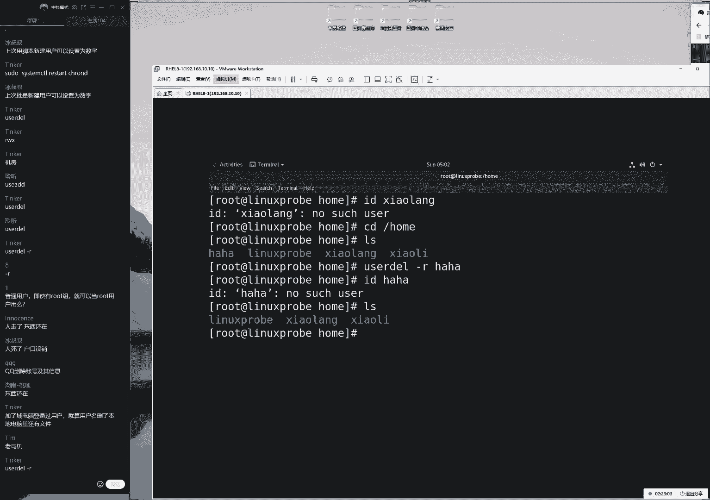

这个用户就无法被回复了，就彻底就走掉了这么一回事啊，于是大家可以来记一下，删掉用户的时候是否加杠，r指的是是否去删除掉这个用户家目录的数据，它是一个完，整删除这样的一个作用啊，怎么样，老司机啊。

来下面一个问题啊，下面一个问题，大家说我们去使用一个普通用户，即使是有root组，也就可以当做输入的用户去使用吗，这个分情况第五章节里面有一个权限叫做s y d s g d s b i t。

如果要是加入到某一个扩展组里面的话呢，使用到s d或者sj d，但是这个的话也可以去感受一下，明天我们我们会给大家去理解一下啊，大家说啊这个例子没有女朋友很难理解嗯，好吧啊，那我们祝大家幸福。

下面一个问题大家说加了电脑域的这个用户，啊你大家加了个玉，跟我们讲的不太一样，说就算用户名删除了本地文件啊，它本地电脑中还有文件呢，大家所说的那个玉的话，你们主要指的是windows里面的a d嘛。

然后的话呢我们在呃系统当中的话呢会去使用到一个啊，我那么大家所说的那个玉啊，应该所说的是windows里面那个a d，然后的话呢我们所说的预告哈。

我们是叫做linux系统当中的话呢是叫做open l d a p l d a p，然后的话呢这种情况下是一样的，就是如果说我们要去使用到一个远程的集中式的任何存储，叫集中的一个认证。

存储我就稍微简单一点就写了呃，金融之类的这种服务的话呢，我们去删掉一个用户之后，也是这个用户的这个信息也是被保留到我们的本地的，他也不会被删干净，我们也需要需要再去手动去删一遍，除非我们这样去做。

然后加上delete杠r是可以的，我不知道windows里面能把它给删干净了，但是linux里边是可以删干净的，是可以通过这个杠杆操作，即便是一个远程的一个用户，也可以把它加目录给他删干净的。

但是一般情况下，以我们的经验为例，比如说是open l d e p，一般他都会再去跟一个，服务搭配到一起去使用，比如说网络存储服务，然后加上凹凸f s这样去实现的，所以的话他也可以没有问题。

好这个就是我们的一个经验，他可以去使用杠杆来去做一下删除，另外的话大家先不要走不要走不要走哦，我我哦我我来给大家去说一个事情哈，就是呃之前之前我说了一句话，说linux中的一话呢。

系统中的一切都是文件啊，系统中的一切都是文件，然后呢感谢我们的同学的话呢。

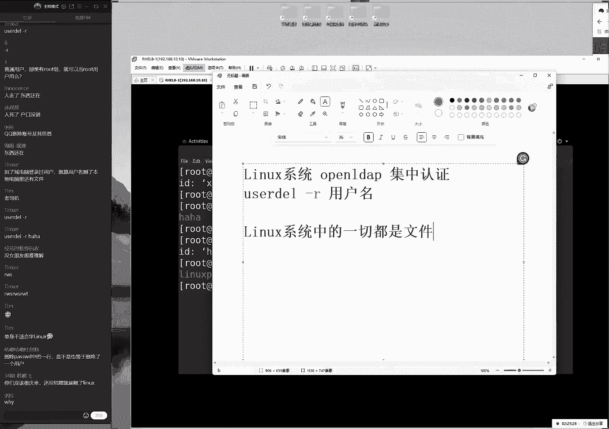

之前因为老刘比较帅啊，所以大家先暂时先啊。

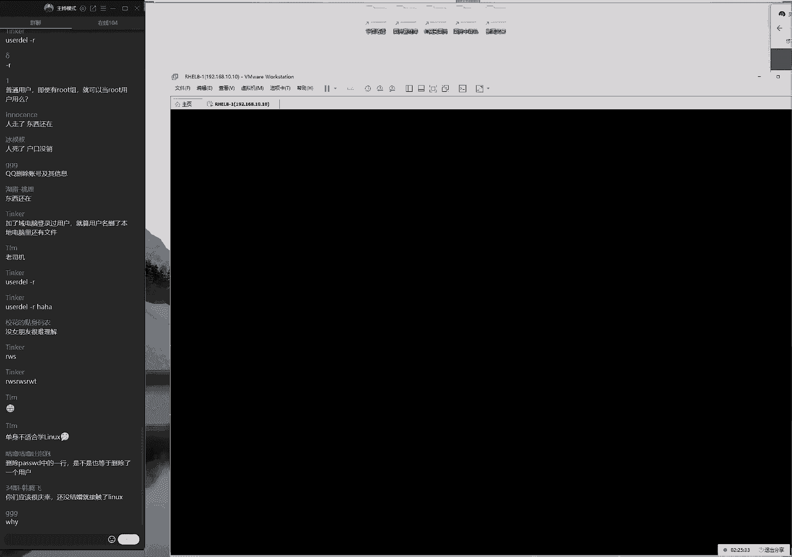

呃相信了我们一种说法，但是大家心理上一定是有一。

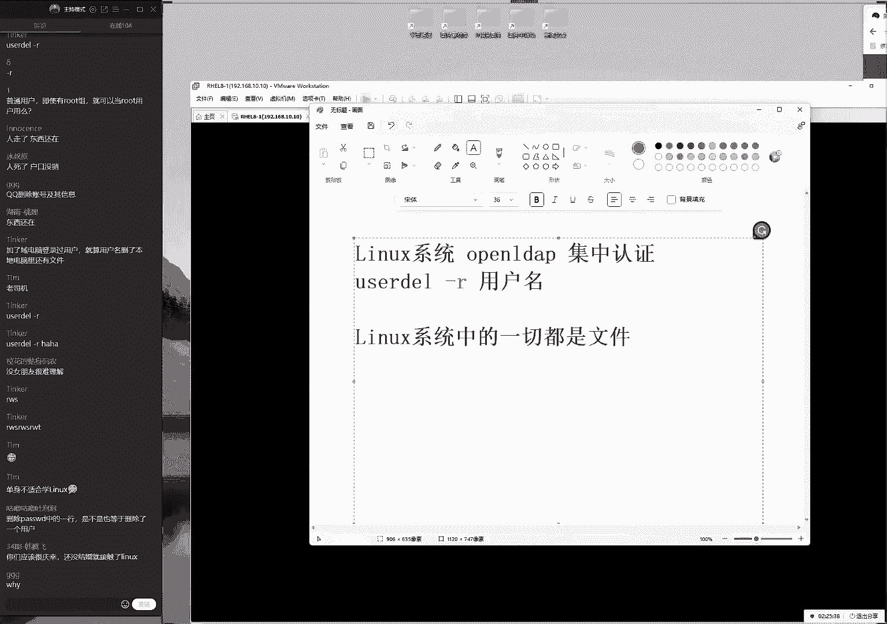

种怎么讲呢，有一种嗯感觉啊太信任的感觉是老师真的是这样吗，它一切都是文件对吧，硬盘啊，键盘啊，光盘啊，连运行状态都是一个文件吗，我怎么不太相信呢，那你给我举一个例子，这个例子就是一个很好的例子啊。

因为我们很难去证明说鼠标是鼠标，键盘吃键盘，但是我们却能够证明说连用户的信息都是被保存到文件里面的，并且的话呢我们可以通过手动的方式去新建一个用户呃，通过这个例子解决两个问题，第一个增加我们的信任感。

诶知道诶确实是由文件组成，的啊，通过修改文件就可以达到一个配置服务的这么一个呃效果，我知道了哦，原来我们所执行的这个命令，它对应的来说又是哪一些操作，它通过啊我们调用的一个命令。

实际上它也就是通过这个命令的帮助我们修改了某个文件啊，就是这么一个效果来嗯，我们给大家讲课的时候。

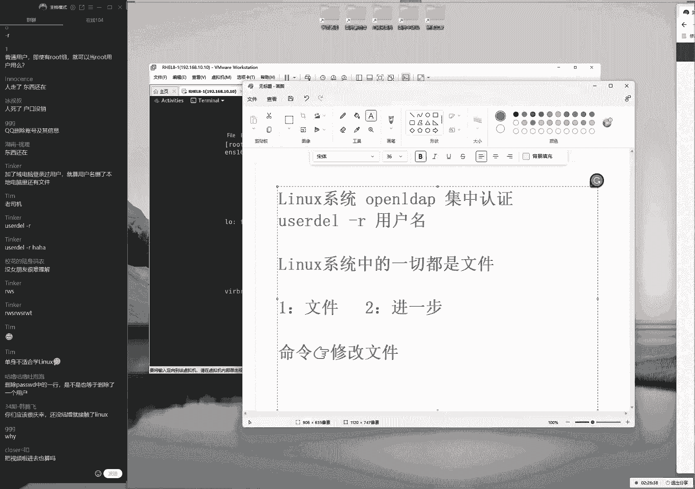

还要既要照顾到技术比较薄弱的同学能够听得懂，正好过了九点了，这算是一个赠送的时间了啊，已经过九点了，这就跟课无关了，我们也要让我们技术比较，好的同学能够看一些书上没有的东西，增加点难度。

但是这个东西我那我那我们必然不敢写到书上面的啊，这种东西我要但凡敢写到书上面，我们至少在当当上面要多五个差评，大家信不信吧啊，只要看不懂，我不知道是从什么时候开始的一个思潮啊，还是什么样的一个感受。

就是只要看不懂，只要他就啊这样就是只要做错了，就是他们书写错了好。

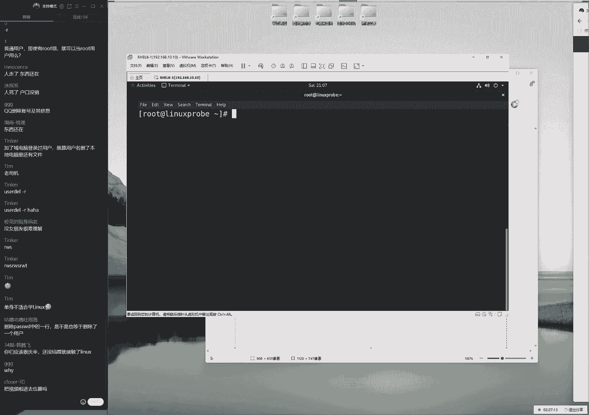

我们来继续，我们来继续啊，我们先不否定数量有错误，但是不可能这么多啊，个个都错，就是来继续啊，还是不要多说了啊，我们的读者都没有，错啊好来继续啊，新建一个用户的话，通过文件的方法去实现。

首先第一步就是编辑这个文件啊，etc目录里面pass wd，通过这个例子啊，大家听不懂没关系，就是您看一下这么一个方式，能够知道底层它怎么去实现呢，首先这个文件的话呢是用来去啊定义用户信息的啊。

对对对对对对，解决啊，先去解决信任问题啊，先去解决信任问题，来这样先去解决新的信任问题，首先啊真的没有一个用户叫做什么呢，随便大家想一个，比如说叫做team这个词，有这个名字有点太特就有点太太普通了。

比如说你，真的没有一个用户叫做linux probe啊，down down down啊，比如说有这么一个用户吧，好我们现在不是这个，我们再换一个啊，linus down吧。

当前的话真的没有一个用户叫这个名字，没有问题吧，ok我来给大家新建出来，通过编辑文件的方法来实现出来，首先第一步直接来来来来，大家说直接vi，然后编辑这个文件里边新增一个用户系统任务好，这个问题非常好。

您的这个问题马上啊，现在是09：08，09：18就能有答案了，再来编辑etc目录里面password嗯，好进入到这个文件里面，保存每个用户信息的，我不知道，大家有没有听完之后什么感觉啊。

反正我们今天讲的课时感觉是很爽的，来啊大家应该有一种感觉的，太对了，如果说您听完了之后感觉不爽，反而很累的话呢，来，let us down，用户名称，第二个字段指的是它是否有密码。

密码的话有没有有有写一个小写x但不用，但是不用管，因为这个密码会有另外一个文件里面保存叫etc目录里面的沙雕文件啊，它超纲啊，我们不管他啊，待会我们会去编辑它的呃，用户的uid号码只要不重复随便去写。

比如，说我我用到6666，哎哎有没有人用啊，没有吧，66666666，然后我们用户组id 6666666，好听好呃，用户的这个呃描述信息我随便去写，lis done is a good bye。

啊啊linus down incom，就是咱们的网站，最后啊用户的这个家目录home目录里面我们是叫做lis down，这个会在第六章节给大家说到home目录的作用，做完了，这是第一步，用户信息就有了。

就这么简单好，第二步用户组还没有，所以他后面没有显示用户组的这个名称，咱们一步一步往后推啊，六组没有，怎，么办呢，编辑文件etc目录里面的group group，走来走，怎么感觉同学们今天那么的沉闷啊。

啊刚刚还互动起来，怎么现在突然不说话了，来，let it stop la linux down，然后这是新的用户组啊，然后呢一个x用户组id是6666唉，几个六来的五个吧，随便吧，保存并退出。

新建了一个用户组，再一看用户组也出来了啊，用户组也出来了，然后还差点事，第一个事是嗯给用户一个密码啊，给用户一个完整的童年，给他一个完整的这个资料，刷到文件，影子文件进到里面去来写啊，linux。

然后到密码的话，那我们就先没有，我们先不写，然后用户ui d是666666，然后后面有四个保存的字段，123哎好他写六个，但是实际上是四个123，ok这样做好保存并退出，密码也有了呃。

然后的话还有什么事来着哦，加木就是我们现在的话大家看啊，信息都已经出来了，你可以看到了，之前没有，后来有了，有了之后的话，足也有了，如果我们现在切换到这个用户的时候，大家看到啊。

如果我现在切换到这个用户的时候，外给我们提示说用户加入都没有，会有一条报错，这时候怎么解决呢，先先啊先退出啊，先退出，我们这样复制一个文件啊，cp杠a有人说啊，不用啊，这不用杠a啊。

因为杠a的话等于杠p杠低，杠r等于说保留文件原始的这个属性信息，不用直接复制它，然后复制到原始文件etc目录里边的这个文件，来，把这个文件的话呢复制到home目录里面的linux stg。

跟它所对齐文件里面保持一致，建好了之后的话呢，再修改一下文件的这个属性，所有者跟所有组用户组啊，用啊用户的这个名称linus down，用户组名称linux down，后面加上我们加入的名称。

做完做完之后啊，非常规范，非常严谨啊，来再来再重新去切换的这个用户身份下，就像一个教科书一样，这个用户就新建出来了，并且用户组已经帮我们建立出来了，文件跟呃所有的信息跟通过命令去建立出来的是一模一样的。

所以的话供大家参考，如果大家有兴趣对于这个linux的底层呃有一个更加深入的了解的话呢，我们认为以后有机会的话，可以给大家讲更多这种实例，就像第三章节最后的时候，是的对吧，当我们按下回车之后。

这个命令它出现了什么样的一个呃，那呃那么我们的系统它出现了一个怎么样的一个过程，然后能够去实现了一些命令的功能，像这样的这个扩展的知识，等到以后没有机会的话，我觉得可以讲更多。

能够把我们的课先能够听得懂，然后我们后面有机会的话会给大家讲更多，这样的话呢我们可以有很好的这一个在工作的时候的一，非常扎实的水平好，下面的话呢我们来给大家，下面来给大家回答一下问题吧。

同学们就可以来提问了，下面可以来提问了啊，怎么样呢，说啊看到刘在做法啊，这个那就请你出去啊，一看就是来捣乱的，是不是啊，开玩笑开玩笑啊，我们希望我们的课的话呢就是可以活跃一点。

我呃但是我们会尽量控制一下，我们说的话，虽然这么说啊，虽然这么说啊，有点不太客气啊，但是我们对于我们的学员是没有任何恶意的啊，大家一定要理解啊，大家可以互动起来，随便去说。

希望我们的课就是不要那么的就是死板啊，然后就是像这种传统意义上来说，就是老师老师的学生是学生，其实完全不是的，我认为这是一个讨论的过程对吧，我们虽然是一个没有一个像欧美是那种圆桌似的。

但但但是我们先是一个网络课程，大家也可以互动起来，随时能够互动起来呃我觉得挺好，我觉得我觉得挺好，我觉得挺好，不用说特别的紧张，然后说老师我怕我回答我提的这个问题有点呃，简单了，不要有这种顾虑。

因为你们这些问题的话呢都很简单，不要心理顾虑的，就所以有什么就就可以去互动起来，其实我们的这个区别就仅仅是因为你们花钱了，我没有花钱，下面一个问题啊就不再多说了，下面给大家换问题了，也没问题。

又刷又被刷上去了，我们同学叫啊，可以的，没有问题，后面一串是什么，没有跟上啊，后面一串你指的是哪，后面一串啊，已经跳过去了，说为啥没有让去输密码，密码的话，我们呃我们默认为空值。

你也可以直接去使用到这个命令，然后来去对这个用户来去设置一下密码，你也可以直接编辑文件，然后的话呢把这个linux probe这个用户的密码，然后的话呢粘到我们的linux down下面。

然后的话呢他也就可以有这个密码了，然后他就是以我们这个啊加密之后那个密码和为准，密码的话呢叫做红木耳red hat，但是这个我给大家写不了，这是一个通过md 5加密出来的，但对大家没有听错啊。

它是一个通过md 5加密出来的的一个密码，这个我给大家手敲不出来，这是只能通过加密，然后系统去实现出来的，这个当然可以通过复制啊，这就得到相同的密码了，可以去实现的。

然后这个md 5的话又给我们呃传统意义上来说那种密码不太一样。

因为大家所因为大家所了解的md 5的话呢，实际上是哎呀我的md 5的认单抽完，我当时就是我就是说我们的认识啊，比如16位啊，或者32位可以被破解的那种密码，然后还可以通过这个装酷一对一的那种这种密码。

但是的话呢呃当前linux系统里面这个密码的话，它是经过加演的，并且它是这个复杂程度非常的高，应该是64位吧，我们目前没有看到任何一个人，然后或者是一个组织破解了linux的密码了啊。

这个算法目前一直没有被破解出来，我之前接上一期的同学们说了，说有人给破解了啊，但是实际上我没有看到，就是我到现在了，用户密码这么一个算法机制，目前没有一个人破解出来，如果要是有的话。

就可能是我的这个新闻面有点窄啊，但是我确实没有看到，好像说有人破解了，但是我依然没有找到那个新闻好，下面一个问题，大家说那大家说怎么样啊，老刘说在座的都是渣渣，没有啊，在座的都是我们的衣食父母。

下面一个问题，大家说修改password文件的时候，password文件怎么不可写入的属性哦，这个问题特别好。

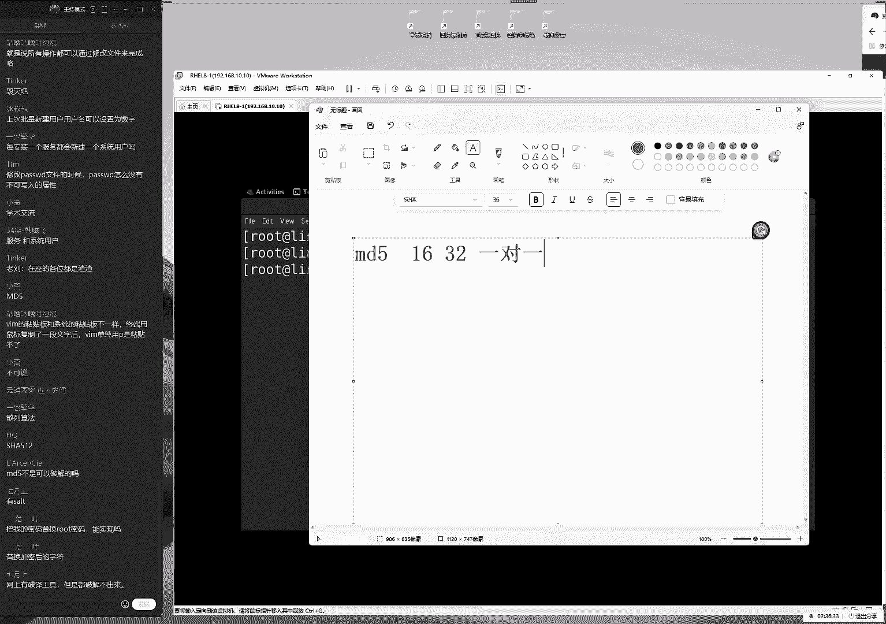

这个问题特别好，老刘你再给你再给我做法，对不对，这个文件他为什么权限是000啊，不不他这个权限为什么是644，但是你有权限去写入呢啊这个问题非常的好，这个文件叫做杀到文件，为什么这个权限是000权限。

但是你依然能够信息的写入呢，这个我们会在明天给大家细聊啊，明天给大家去细聊一下下，好同学们，下面继续来提问，下面来继续来提问，大家说我们去使用的vm粘贴粘制版的时候，在粘贴板的时候跟系统的粘贴板不一样。

终端用鼠标复制了一段文字之后，vm单纯用p粘贴不了，对是这样的，对我们它这个p的粘贴只能是来自于yy复制和dd剪切啊，不能够通过鼠标左右键来去实现，然后说啊md 5不是可以破解吗，哎正好给大家回答了。

我们所说的md 5跟大家不一样，然后下面一个问题大家说啊哥哥超前了啊，下面一个问题对这个问题超前了，像呃其实大家所说的那个破解不是破解，就是装酷。

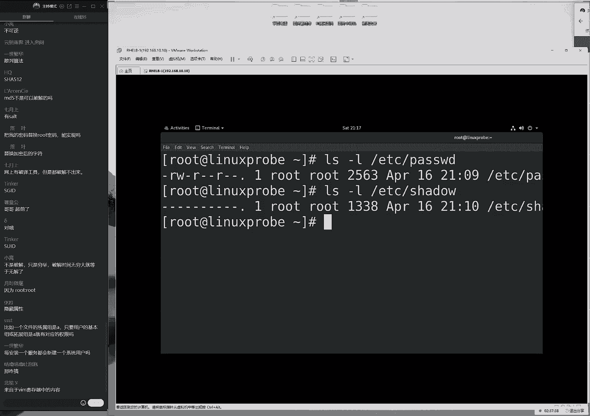

因为他我们传统意义上来说，我们不知道这个叫做什么啊，他加密出来的信息，比如说哈哈它对应的那个信息它是一个固定值，于是就会有可以生出来一个字典对吧，它有一个字点了之后，它就可以反向推了。

只不过就消耗一些时间，字典越大，冲率越高对吧，那大了就强了，强度都大了对吧，就这么一个充值就高了，好下面一个下面一个问题，不不不不不，还有一个问题，就是我现在所说的没有见到一个人把它给破解出来。

现在有一个原因就是密码值它不是一个，它并不是一个固定值，大家看啊，我们同样的将一个信息，比如说red hat linux里面加密过后，他第一次版本是a版本是b，然后是cd，每次都不一样，这个超级厉害。

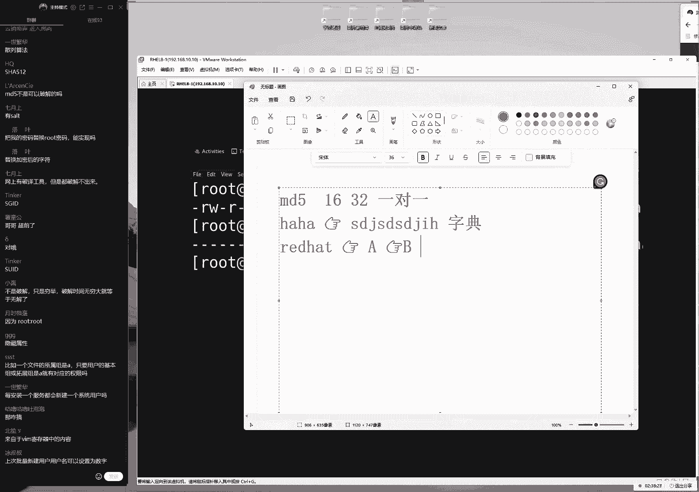

他跟我们之间是不一样，因为它里面加盐了，我也要去演示一下啊，来首先不不不不，首先是这样啊，啊首先首先首先那这不就是一个交流的过程吗，挺好区别就是老刘什么没有交学费而已啊，这个突然间占便宜了。

来我去过滤一下管理员，root好了，看一下，ok没有问题吧，当前管理员是这个嗯，好不对啊，是这个文件来，当前的话呢，管理员的密码是这个没有问题吧，可以看到我现在对于我的密码来进行重置呃。

为了避免大家会误会我每次输入的密码是不一样的，所以我们去使用的echo，然后去使用的s t i n通过标准输入来去接收，嗯，嗯然后目名是root，走他去重置了一下密码为red hat，来看一下。

变没变啊，变了ok这个是之前的，这个是之后的变变变变了好，再来重置，再去重置一遍密码还是red hat，再来看诶，怎么这边就变成这样了，再来再去重置，再去看，再去重置就不用看了。

大家会看到每一次都是不一样的，因为在linux里面的话，密码的话每一次加密之后，它都会是一个全新的，所以这个很难破解，不是那种一对一的那种传统一的这样一种md 5，它都会加盐好。

下面的话就是他等于说每次都会加入一个随机的这个字符，然后去重新去做一下这个计算啊，下面再来一个问题，大家说比如有一个文件的所属组是a嗯，可以的，没有问题，大家说只要用户的基本组或者扩展组有a。

他们则有队友啊，他们则就有对应的权限，是这样的，大家说每安装一个服务都会新建一个系统用户吗，啊不是的，这个服务呃怎么讲呢，只有一些比较大型的，虽然这样说很不严谨吧，有一些稍微比较大一点的服务。

才需要专门的这个系统用户作为调用端，比如说网站服务或者文件传输服务，或者我们听听s服务，这样我们才需要小的服务，比如说crown的服务，他没有必要了，他或者说我们一些小小的命令。

他也没有必要用到单独的这个用户了，还是看这个服务的一个重要性，下面一个问题大家说说上一次批量新建用户的名称可以设置为数字啊，这个我们可以去试一下，我来试试新建一个用户，比如说是为520看一下，失败了。

可以下面一个问题，大家说呃，我就记得有一句话说的特别好，叫做鸟语书有益舍说而救鸟啊对吧，就是如果说您以前在一些系统里面，或者说你以前那些老版本的服务器里面领取，可以形成出来为数字的这个用户，那么好了。

不可以的好，下面一个问题，大家说系统用户怎么去新建系统，用户跟普通用户的区别只是中路啊，它只是登录终端的这个不同，比如说当前有一个用户，它的名称叫做哈哈，他是一个普通用户，它可以被切换，它就叫普通用户。

现在的话呢我们来user mode gue啊，修改一下它的这个登录终端，然后的话呢再去切换，它会发现切换失败了，它不允许登录系统了，它就变成了一个新的用户，他两个就是这么一个区别，一能够通过系统。

就是普通用户，二不能够动系统，就是啊它就是一个啊系统用户就这么一个区别啊，就这么一个区别啊，当然下面一个问题大家说啊，不是我记得哪节课讲过批量新建用户，我使用的是数字啊，对这个咱们两个并不冲突。

说说就讲，如果以前我们去试过，可行的话，当前是不行，以实际为准嗯，然后大家说能够批量的去设置密码，也能够显示出来用户新建成功啊，下面一个问题，大家说安装http服务的时候会产生一个ipad的服务。

这个用户就是一个系统用户，但是权限比较小，它的存在意义是什么哦，这个其实刚刚给大家说过了。

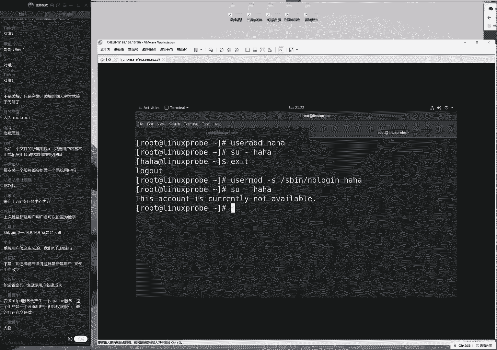

就是它会让我们的破坏范围会更小一点，比如说现在这个服务器里面它有十个服务好吧，现在这个服务器里面有十个服务，其中的话那网站是一个服务，那您希望说这个有一个黑客通过这个网站服务进到您的系统里面了。

之后去影响到其他的服务吗，肯定是不希望的，那好了，网站的服务经被入侵了，既然被入侵已经被入侵了，那我就不管他了，那就是限制它的破坏范围，限制它的破坏范围就仅限于此，就像一个人啊。

比如说呃得了一个瘤或得了一个i对吧，但是它不发展良性的诶，非常好，那么就会带来生存啊，或者带瘤生存了，就不用管它了，即便已经被入侵了，将它的破坏范围去简化，这样的话这个意思啊，这个例子举的不太好啊。

不太的不太吉利，但是这个意思是一样的，总是会两害相权取其轻，然后去取，让他的破坏范围更小一点，让我们的损失也更低一点，大家现在有一个问题，大家说view组的成员都是有速度权限，能否直接呃。

是否需要再修改一下etc目录里面的sos，这个的话我们先不给大家去说，因为这个说完之后会有同学会有压力的呃，首先来说的话呢是他不用再去修改了啊，但是我们最好明天再去听一下。

具体为什么会它会有具体的一个权限，大家问了一个问题，大家说但是文件的i see a linux，ok没有问题，限定死文件的用途了啊，配置文件的话呢，用户的权限并不是新建的ipad用户。

怎么会产生这个问题，我要再去看一遍，好稍等一下啊，大家说，但是啊但是文件的i see a linux限定死文件的作用了，对它是通过我们的i see a linux的安全上下文。

sd它有两个限制的方法对吧，让我们的服务的功能以及文件的话呢更受控，它对于文件的话呢我们叫做s linux的安卓上下文，对于我们的功能的话叫s玉，没毛病啊，好我先理一下啊。

首先来说大家的第一句话是说这个管事儿没问题，管还管事儿，第二个问题好，第二句话说配置文件的用户权限并不是新建的用户啊，我没有读懂，稍等一下，我再读一遍，是我的问题，是我的问题，我没有读懂。

说配置文件的用户权限并不是新建新建的ipad用户，怎么会产生我我我没有读懂，你可以再去对应的问题再描述一下吧，下面一个问题啊，下面一个问题大家说嗯less，然后times加加，我想按照常规的怎么去写。

常规我们就按照这么去写，然后的话你也可以按照您的该这个写法，后面的话呢变量的名称加一个dollar符做调用就可以了，这个加调用，因为我们取它的是具体里面的值，提取变量里面的值，然后再加上一。

最后来句给大家赋值好，然后的话我觉得大家呃同学这个问题叫一世繁华是吧，我没有看懂您再发一遍，是我的问题，有没有理解您的意思，可能应该问题比较多吧，是不是下面还有一些前置条件没有看到啊。

配置用户配置文件的用户，什么叫配置文件的用户权限，并不是新建的ipad用户，怎么会产生，我好像能够理解，但是我不知道理解对不对，我理解一下，是这么回事啊，就是你就是啊您想问我们新建了一个网站服务。

然后的话呢我现在在这个目录里面，我去新建出来的文件，但是我使用的用户，比如说是关于呃管理员，但是为什么我们的这个网站的内容依然能够被呃网站服务所调用，然后也能够让用户能看到里面的内容，是这个意思吗。

如果要试的话，可以打一下一啊，如果不是的话，我再去想嗯，以我现在这个想法为例的话呢，哦对吧，但是有一啊挺好挺好好那好，那我就以这个来说了啊，跟大家这个大一的时候有点啊是我的问题啊。

我需要给大家确认一下啊，是这样的话就要涉及到我们第九章就要给大家讲了linux了，那s的话能安全上下文是打到文件上面的，也打到目录上面的，它有一个特性就是递归权限。

就是如果要是一个目录上面有一个s linux这个戳了，在里面新建出来的所有文件都会自动去继承他的，有点像是s j i d啊，它会就是在这个里面新建出来的所有的文件会打s linux这个圈儿啊。

新建的用户是谁，不重要，指挥他新建的用户是谁，只会影响到这个新建出来的这个文件的所有者跟所有组是谁，不影它不影响s linux这个艾克上下文，所以您的问题是出现在了。

没有正确的理解这个所有者和所有组以及安德森亚文的这个区别，这两个互不冲突，互不干扰，而且s linux张嘉文跟用户无关，好下面一个问题大家说啊，不好意思，没听懂啊，批量新建用户可以用数字。

今年单个新建的不可以吗，不好意思，没听懂啊，是这样的，就是我没有看到，就是您说的就是能够通过数字批量新建出来用户这么一个案例，这个的话呢我的意思是说在黄毛热巴当中，我的理解是不太可它是呃它是不可以了。

因为您的问题特别的嗯宽泛，没有告诉我您的实验环境是不是红毛热巴呀，还是早期的系统，我们没有一个实验平台，就是你可以告诉我一下，并且的话您或者您现在这样吧，您可以把你的脚本发给我。

然后我们现在正好再给大家录屏，我给大家跑一遍，然后我们以实际情况为准，然后给大家看一下不就ok了吗，就很简单，ok可以的。

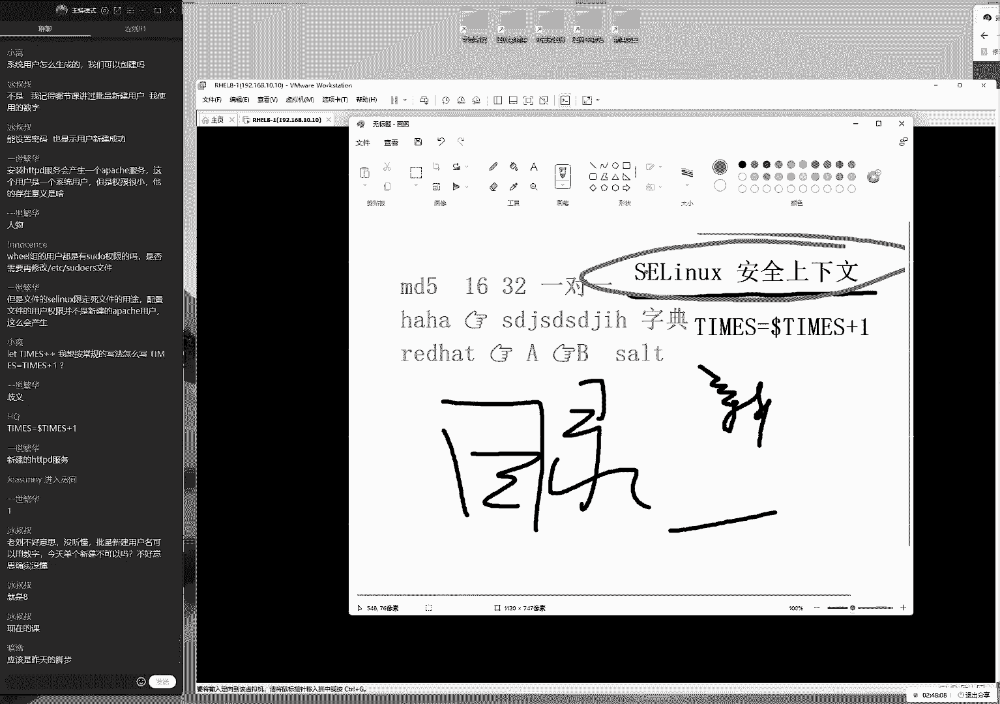

可以的，你把你的脚本发给我，我现在要去跑一下来，然后大家说啊，用数字换啊，用数字哦是可以的是吗，如果是可以的话，我感觉是出bug了。

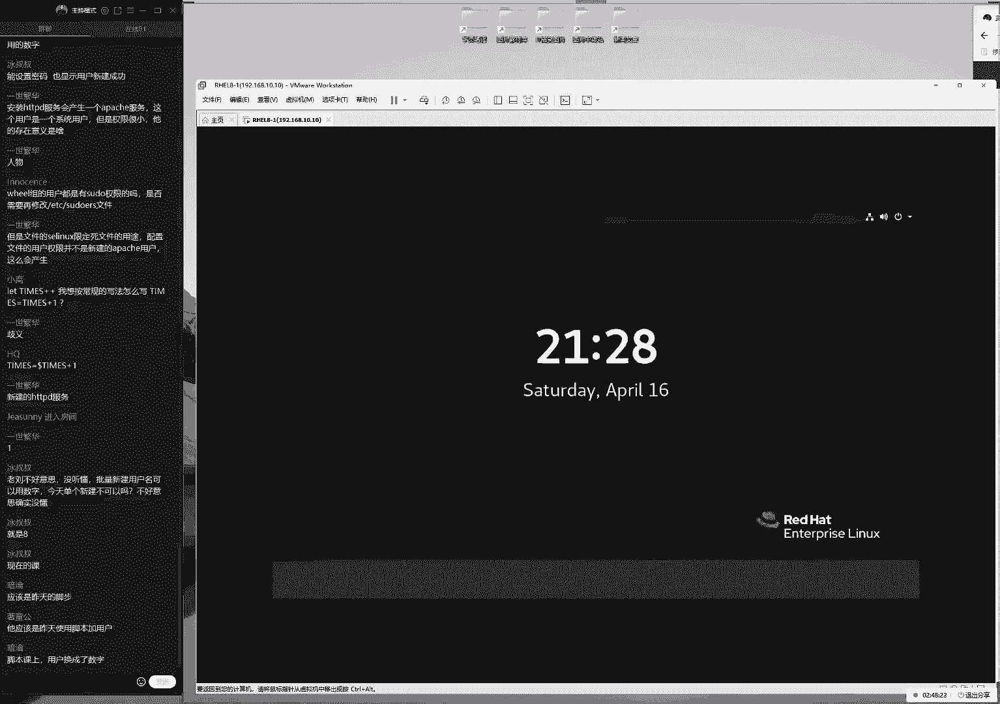

他不应该有，我看一下啊，哦稍等一下，我我我我好像知道大家的意思了，同学们说的是上一节课这个示例对吧，我来试一下，我试一下，这个要是可以的话，我看看我省钱了，来第一个用户叫一一。

用户叫2233344455，可以吧，可以吧，来同学们开始，这次我开始学到东西了啊，这个如果要是这样可行的话，就说明通过脚本可以去实现，如果要是等一下，如果要是手动就建立不了哈哈。

然后是u s a d d，ok没有问题，来跑一下，密码red hat走，不可以不可以啊，依然是不可以的嗯，所以的话呢我觉得问题还是需要您在最好能录个屏，或者您把您的这个脚本发过来。

我看一下用户名称依然是不可以是数字，不可以的嗯，不可以怎么样啊，可爱了是吧啊，不过你也不好吧，同学最好能够大家最好能够成功了之后再告诉我，因为他特别的自信，我还以为大家成功了呢，好看也没有成功，好吧啊。

然后我们来继续来说啊，因为最后输出这个信息了吗，同学们，这个脚本是大家自己写的，应该已经知道的，这个信息的话呢，实际上是有问题的，等于说它指的是呃，我看一下哦，不对不对不对，是因为我们的脚本的问题。

它并没有新建的成功，它是脚本的问题，因为我们没有在做第二次的判断，我们只做了一次判断，我们要做第二次判断，然后我们没有写的原因，用户实际上并没有新建出来，来待会一看，可以来句说，我来给大家回答一下问题。

然后的话你也可以先下线，好好休息一下了，明天好课，大家就千万不要忘记了啊，要以自己新建的实际为准，因为大家说完了之后，我还以为大家已经新建出来的，不可以不可以的。

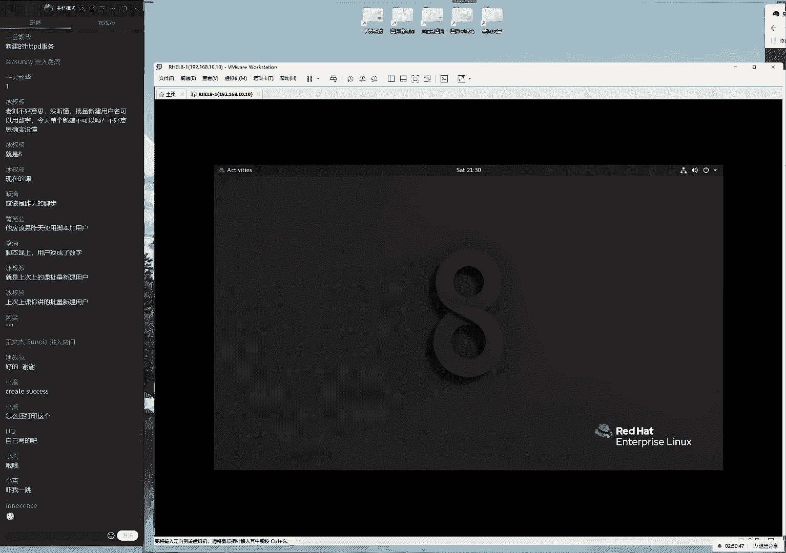

ok大家辛苦了。

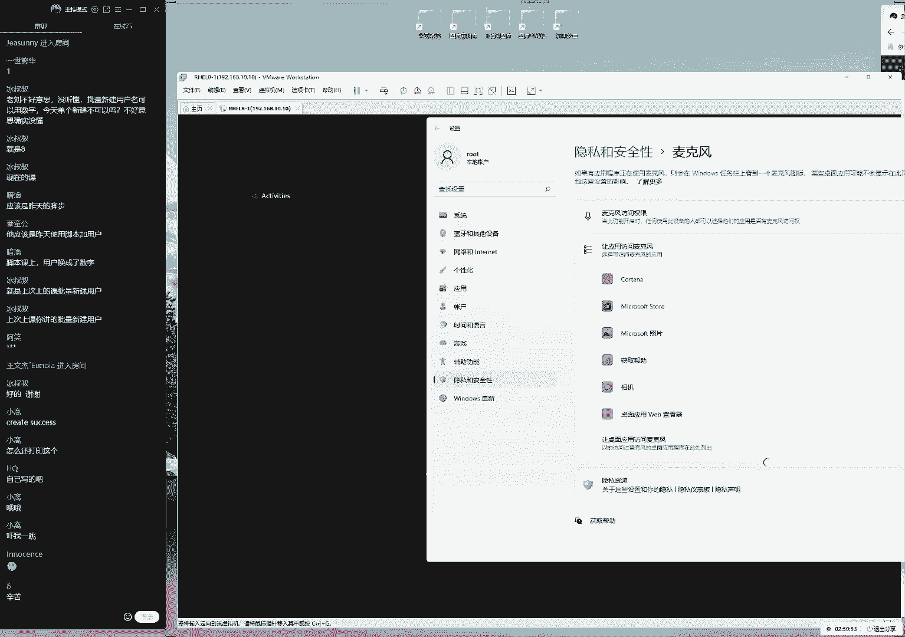

那我就先去渲染一下视频了，大家也要先好好休息吧，ok啊大家说啊，我们去case，还有if，就这啊不我们就是case跟will今天就只讲了这么两个吧，加上计划任务东西很少，但是今天这个完全就超纲了。

如果大家以后去考hc的时候，你一定会知道，今天我们所承受的这个难度跟24考试的难度有多少呢，其实第四章节完全都可以不讲，这两天跟考试无关，阿c的话呢，现在没有，现在没有这个shell脚本了。

现在没有shell脚本，他现在就是从理论上来说是有的，但是实际上那个shell脚本只有一行或者两行，它跟它跟命令行没有什么区别，所以我们现在认为他的shell是不考了，就是送分了吗。

但是我们现在学完了之后，同学们在工作当中就可以呃，比较，比较在这个自信一点，可以完成很多工作了，来大家的话啊，明天的话呢我们会给大家讲到第五章节。

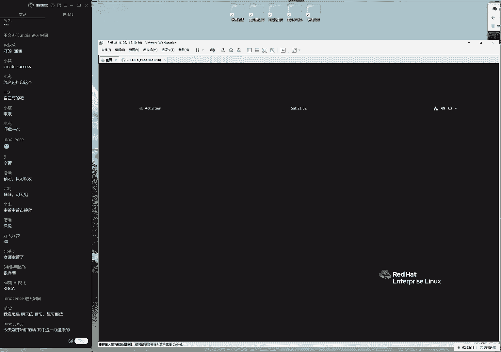