# linux就该这么学第34期 - P8：8 红帽RHCE认证培训课程-Linux就该这么学 - 能力努力 - BV1L14y1878S

ok同学让我们来看一下我们今天这个课程，那大家先打一下一啊，今天的话呢我们还是第五章节跟这个音乐正好配上咱们这个课了啊，54321开始，我们今天正式的课程好呃。

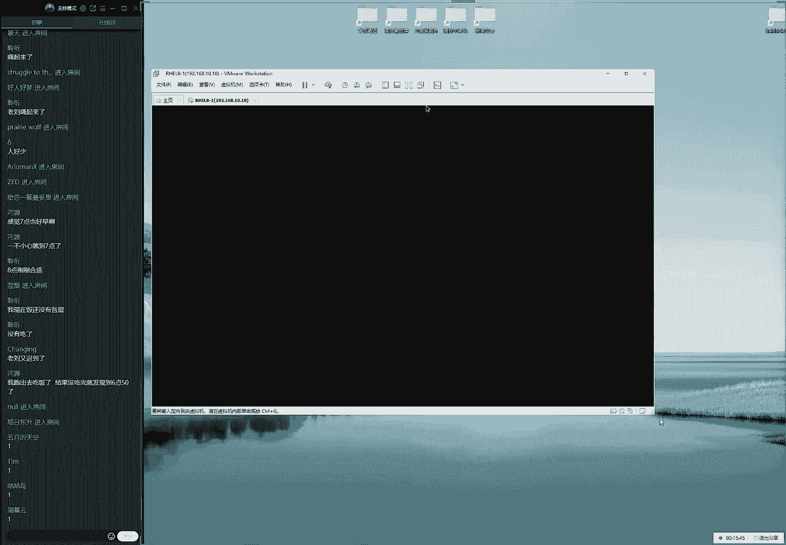

大家的问题说了，怎么样，老六迟到了，老六没有迟到，我早就到了，然后我们看一下这个人数啊，干了60多的同学，我们来等了一下啊，稍微稍稍等一下下好呃，呃怎么样，大家这个声音啊很好是吧，然后声音有点大了啊。

已经阵亡了，好大家先准备测试一下我们的环境，打一下一，我们来开始我们今天这个正式的课程，今天的话呢我们的课程规划是讲完第五章节，时间重要，那我们要是时间允许的话，会给大家讲一下第六章节。

但是不会特别的多，大概也就到6。1或6。2小节左右吧，好我们来给大家看一下第五章节，同学们翻开书，翻开书，今天的话呢我们来从5。2小节开始给大家讲，昨天的话呢简单去了解了一下下啊。

就是这个呃我们的话呢去呃讲到这个用户的身份。

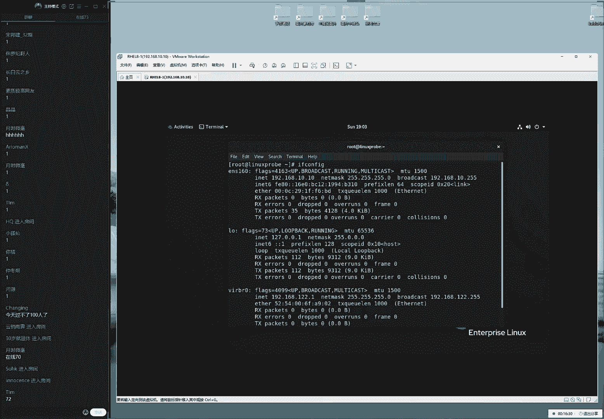

以及现在的这个权限该怎么去进行一个啊账号的一个管理，也就是我们所说的可读可写，可执行这三个权限，我们该如何进行计算，对于文件的这个管理方法好怎么样，大家说今天这人数过不了100啊，应该差不多吧。

应该呃应该差不多，应该差不多，那等啊，那那我们同学等一下啊，我感觉今天这个人数有点少，我在群里面，我现在去吼一嗓子，今天毕竟同学们都有能啊，等稍等稍等一下啊，毕竟都是我们这个已经报名的学员吧。

我们要让大家尽可能的啊能够接上课啊，大家来上课啊，已经开始啊，尽量不要迟到好了，我们正给大家发一条啊，发到咱们的群里面做一个小小的提醒，但是以后的话大家就尽量不要出现这样的这个问题了。

好那我们猴子一嗓子之后啊，现在77个同学应该待会就会上人了，再去说一下我们这个权限啊，那我们稍微快一点了，那就要说到我们这个权限的话呢，那它分为了三个，我们比较常见的，第一的话就是可以去读取前。

那么来的啊，它来进行一个读取的一个权限啊，read，然后的话呢还有一个写入的权限，right，还有的话可以去执行的一个权限，ok啊啊e x e c u t e啊，执行的意思好，那我们可以看一下的话呢。

就是我们现在的话对于一个文件上面，它其实是那我们它呃，它那它的话实际上是有三个我们比较常见的这个权限的，第一个的话呢是可以进行一个读取的，第二的话呢等等稍等小白，我把它写下来吧，正好我们等一下。

正好第一就是读取，第二就是写入，第三就是执行呃，读写执行权限，那么我可以把它做一下简写，那么这个简写过后的话呢，它就是r w x，大家记一下，也就是说待会儿的话呢我们所看到这个文件上面的权限。

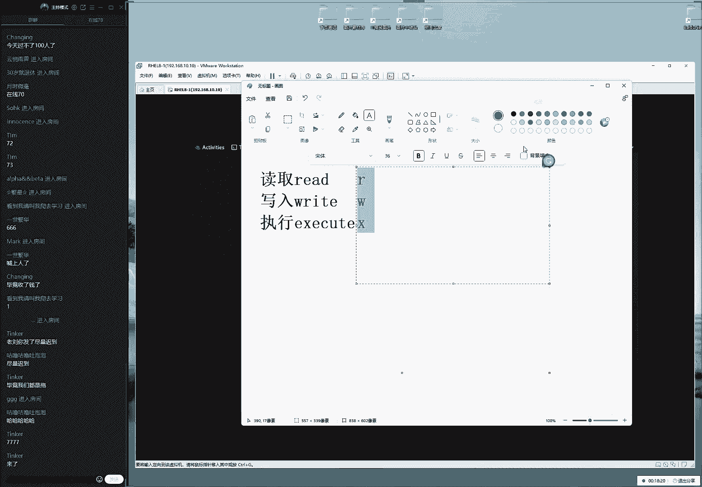

它都是由这三个来去组成出来的，那我们来看一下，在这个系统当中随便找一个文件，这个文件的话呢前面都会有这么一大堆的这么一个对于全新的介绍，这届的话呢都是由我我的安排啊。

他们的话都是由我们现在所说这个可读科技，可执行三个权限来呃组合出来的，那我们那要围绕这给大家去说两点，第一点的话呢是什么呢，第一点的话呢就是它呃我们看到他那可以去数一下，123456789。

那么九的话呢它实际上是分为了三段了。

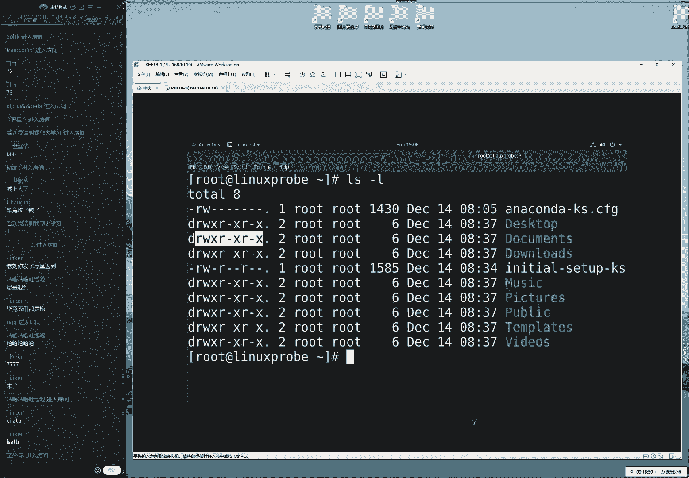

它每一段的话呢是一个所呃，它是一个呃所属的这么一个用户组，那么那呃那我可以看一下的话，那这个的话前三位的话指的是文件的这个所有者，那么就是这个文件虽啊他归谁所有，然后的话这是所有者的这个权限。

然后的话呢我们到我们的这个第二个的话呢指的是文件归纳和组，所有就是文件用户组的这个权限，那也就是说呃如果说我们是归为哪一组里面的话，那么就会去使用这个权限，它的话呢是不区分啊，同学昨天问到了。

他是不区分我们的呃，用户它到底是基本组还是扩展组，它只要是有这个组，那么就可以去继承我们这个权限，最后的话呢三位我们见到其他人，也就是说他总共是有九位组成的，他只要他不是文件的所有者。

也不是文件的所有组，则不会自动的来去，怎么样呢，变成了其他人会他会去使用这个第三个的这个权限哦，大家在做在做下总结啊，也就是说在一个文件上面，他这个权限的话呢是由九位组成的。

它其中的话呢三位三位之间是没有关联的，他第一位指的是文件所有者是谁，第一的话，那我们画中间指的他指的是文件所有组是谁，最后的话呢指的是其他人要去使用的一个权限，那么这是第一点要给大家说到的。

第二点的话呢我们可以看到了，对于这个文件上面的话呢，它有一个可以读，可以写，可以执行的一个权限，其实的话让同学们可能第一眼能够看得明白，但是第二眼的话再去看的时候就不太明白了，为什么呢。

因为对于我们的文件来讲的话呢，这个三个权限是比较好去理解的，我来做一下总结，这个大家也需要写在我们这个书上面啊，因为这个呃今天知道这九位它都是归哪一类用户所有了，但是我们应该呃啊。

但是我们现在应该还要再去了解一下这个可读可写可执行，具体它对应的是哪些功能，我们可以做哪些这个事情，好，大家现在怎么样啊，来我们来给大家看一下大家的问题啊，我看看怎么样，毕竟啊坚持到了是吧。

好毕竟都是托好，那我们来看啊，开始今天正式的课程啊，咱们这个培训没有一个托儿啊，完全没有啊，因为这个也是以前的一个梗啊，就是因为我发现同学们的互动起来特别不积极。

然后所以我说就不会多说我们的这个啊啊托儿吧，来我们来继续啊，来说一下，那这三个权限的话呢，对于我们的一般文件上面，大家都比较好去理解，就是我们可以读，可以写，可以执行，但是的话呢很多同学啊。

他即便是考一下hc了，他其实他都不明白，这对于我们的目录上面这个权限该怎么去理解，所以我们今天趁着第一天啊给大家做一下总结，同学们可以写到自己的这个书上面，首先的话呢我们来说一下我们的一般文件。

那么这个一般文件指的就是我们可以去编辑的配置文件，或者的话呢是一个啊怎么样的配置文件，或者我们的一个说明文件，总之的话它是可以去进行一个信息写入的这么一个文件。

这样的话呢我们对于这个文件的这个可以读的权限，实际上我们是读取文件里面内容的一个权限，大概记一下啊，当我们看到一个文件，然后的话呢我们如果上面有读取权限的话，指的是能够去读取这个文件里面的内容好。

第二的话呢就是去啊可以写入权限，那指的就是我们可以去编辑，或者说我们叫做修改文件里面的内容，这个超级好去理解，同学们呃，大家会啊，直接把跳过的话，没有去认真去思考呢。

原因就是因为大家认为啊这个非常简单啊，认为自己已经掌握了，实际上来看一下啊，那么这个k写入的权限指的是编辑文件内容的一个权限，但是这个跟大家的理解是一样的，最后的话那啊那我看我们的最后一个权限啊。

它指的是执行权限，那么就指的是呃，如果说这个文件它是一个脚本的话呢，那我们就来去执行这个脚本的一个权限，那好了，我们来去就记一下这三个权限，对于我们的一般文件上面，它是怎么来去理解的，这个没有任何问题。

所以大家会摆啊，那么所以大家会把这些跳过了，但是的话呢这个关键点或者说我们能够体现出来自己真正能力的话呢，实际上是对于我们的目录的一个理解，因为大家想一下这个权限，说读取权限，那好了，我们来换句话来讲。

就是去读取一个目录的权限，好像不像好像啊，很难理解，对不对，因为这个目录的话对它进行读取，那么读的是什么呢，因为目录里面并没有吃鸡的内容，它里面是保存的文件，所以的话大家来去呃，来来去记一下。

对于我们的目录的这个读取权限的话呢，实际上指的是去列举啊，或者说的话呢我们来啊显示文件列表的一个权限，显示文件列表的权限，然后也就是说如果说我们对于一个目录有一个可读权限的话。

那只能是能那它指的是能够看到这个目录里面文件列表的一个权限，ok没有问题，然后第二的话呢大家问题啊，大家说前面那个d怎么理解，前面那个d我们会在第六章节给大家继续细说啊，先不管。

那那第二的话呢它指的是可以写入权限好，那我们来去写入一个目录，好像也不太像化对吧，那么这个写入权限的话呢，只能是我们能够在这个目录里面来去新建，然后去这个剪切，还有去这个删除文件的这个权限。

如果说我们要想在这个啊某一个目录里面来去新建一个文件，那么实际上我们就必须要有这个目录的一个小权限，所以大家这么去理解这个事情，最后画，的叫做执行权限，这个更不像话了对吧。

因为我们其实呃之前的一个目录他肯定也说不通，这个话的执行权限指的是能够去进入，或者说我们叫做切进啊，或者叫做这个呃进入的某个目录的一个意思，就是说进入到目录的意思，它是一个功能。

我们对应他们啊啊那么我们对应来说啊，如果要是举一个例子来讲的话呢，我们这个呃一般文件跟我们的目录它所对应的这个命令的话是这样的，呃，对于我们的一般文件的这个读取权限。

那么对应的就是这个cat命令可以进行一个信息的读取，嘛然后对于文件的编辑的话，那就是我们的编辑器vm，那我们来去执行一下这个脚本的话呢，就是我们写那呃那不那我们就是啊直接用过这样的方式。

加上脚本的名称来去执行这个脚本，那么大家记一下，对于我们的一般权限，我们的命令是这样来去啊，来啊他来去执行的啊，当我们有这个权限了，我们就可以去做对应的这个动作，然后对于我们的目录来讲的话呢。

也是显示一下文件列表的权限，实际上就是我们的查看文件的一个命令，然后还有的话就是对于我们的文件来进行一个，建立剪切和删除，实际上就是那个touch啊，还有这个cp啊，还有这个剪切等等这样的命令。

我们对于啊那指的是能够在这个目录里面来去新建出来文件和这个呃，对于以啊它对于已经有的文件的话来进行一个编辑，第三的话呢就是指的是进入一个目录的权限，实际上就是cd嘛能够去切到一个目录里面。

当我们看到一个目录，它有这个可以读，可以写的这个权限，但是走不进去，走进去的时候，它提取出来缺钱不足的话呢，他也会啊，就是因为这个权限所导致的好，然后大家现在有一个问题，啊大家有两个问题。

第一个问题大家说如果目录有了执行权限，是不是一定要有r权限，不是啊，权限可以自由组啊，它可以自由组合，它可以有呃，它可以有我们去切记里面的这个权限，但是他可以没有去呃去呃，他来去查看的这个权限。

最终的效果的话呢，就是用户能够去走到里面去，但是他也不能去查看里面的文件，但是这个权限的话呢，我们可以自由来进行一个组合，然后第二个问题的话，就是说我们如果要是有这个九权限。

就是不是一定要意味着有可以有这个呃读取的权限，实际，上也不是的，我们怎么去理解这个问题呢，啊这个这个呃这个问题的话呢，我觉得这两个问题实际上可以归结成一个问题，就是呃同学们会问到说老师。

那我现在嗯如果说呃这这怎么理解呢，就是说我现在来去搭配一个呃这个权限，那么这个搭配出来的这个权限会不会有这种呃这个怎么讲呢，大家现在这个问题实际上就是说我们的实际的功能的这个呃操作。

跟我们所搭配出来这个权限，如果要是有出入的话，或者说我们搭配出来这个权限跟实际的这个需求它不太符的话，那怎么，去理解呢，比如同学问到说，那我们要想去修改一个文件，那必然就先有这个呃读取的一个权限。

对吧好，这没有问题，那也就是说我们一个文件上面它有三个权限可以读，可以写，可以执行，那我去搭配这个权限的时候，我是不是说我一定要给他一个啊，比如说我要想让用户可以具体对它进行一个写入操作。

这个我们的写权限能不能单独的来去设置呢对吧，大家想问的应该是这个问题呃，还那我他后来还是说这个呃可以写和呃可以这个读的这个权限的话呢，它两个是必须搭配去使用，的应该是两个这个问题。

他两个是否有一个固定的一个搭配它啊，等一下啊，固定呃的一个搭配，它必须要是成对出现的，否则成员设置失败呢啊或者说我们在区域成功当中，我们能不能见到一个只有w一个小权限的一个文件呢，实际上是可以的。

首先我们的话呢针对于这个问题又可以分为两点，第一点的话呢就是呃首先这个是成立的啊，因为的话呢它呃如果说对于一个文件只有一个写入权限，我们也依然可以对它进行一个写入操作。

因为的话呢我们我们可以去使用的echo对吧，然，后我们的话呢比如说写出一个信息，然后我们可以去使用到追加重庆的相符，然后我们写入到这个文件里面，于是可以看一下。

就是我们其实并没有对于这个文件内容进行读取，但是的话呢我们又依然往里面去做写入操作，所以这个话呢权限是成立的，因此我想给大家去说，第一点就是这种情况下是可以存在的，是可以存在的。

并且的话呢也是常常出现的，第二种可能性的话呢，就是不我们要给大家说，第二点的话，就是全线的这个搭配与实际能否被使用没有任何关系及呃，即便说我，们设置了一个权限，它设置错了，但是的话呢在设计当中的话呢。

也可以这样去设置，并不是说这个系统它会有一个自动来去进行一个纠错的一个功能，它是没有的，好啊，这大家就就大家都能够理解的，对不对，ok所以说这个权限的话呢，不要把它想象，那能不能呃，不要想象那么的智能。

它没有的，它需要我们自己来去搭配，所以我们现在需要让大家去做两步走，第一步要能够去理解，第二步，我那么啊那么我们第二步要能够去进行一个搭配，可能您现在看起来没有什么意义的一个权限，实。

际上我们后面可能会用到很复杂的这个功能也会用到啊，好吧呃当然这个我们放到后话去说，没想到大家第一个问题就问，就问他这么有深度，那我们接下来给大家往后面去聊着啊，现在我这个思路给大家去聊了，这张图的话。

大家需要如果截一下子的话，你就截一下子，如果没有结的话，那就去截一下子，我们待会会围绕着这个来给大家去讲解一下的，那么其中的话呢啊对还有一点就是同学们去记就大啊，同学们的话去写那个笔记啊。

写好之后记得发博客上面去做一下打卡，那今天，晚上的话下课一发博客还挺好，而且那个第一版的书已经是嗯绝版了，现在买以前也现现代化，现代化也应该也是买不到了，所以的话也算是有一定的这个收藏意义。

起码以后啊以后我比如说我们要搞活动啊什么的，还是有点纪念意义的啊，所以同学们如果要是想写笔记做活动的话，参加咱们这个送书活动的话，再给他打个广告啊，然后的话呢就是可以赶紧访问一下咱们的网址。

后面加上vip，看一下活动规则，今天，我们就算是最后一天了，如果说还没有参加那个活动，同学就不行了，如果说你之前没参加，现在后悔了，想参加了，我们还是给机会的啊，今天啊去注册博客。

然后把之前的补一补也行好，然后呃然后我们来通用，继续了，继续继续，我们来看一下啊，那么对于这个权限的话呢，看一下它有这个r权限，w权限跟一个x权限，也就是说这个权限的话呢。

我们还可以通过这个数字法来去表示同学会问到的，首先第一个问题，我们总是要先让大家打一下心里的顾虑，就是为什么要去学，就像我上初中，所以我才很荣幸的考上，所以我才当时考上了一个职高。

唉所以我当时就是因为我的父母没有告诉我说为什么要这样去学啊，所以我们教课之前的话呢，于是我先给大家解释一下，为什么好好的r w x我们不写，我们非得要写一个421呢。

就是这个的我们来去对它进行一个设置的一个理由是什么呢，就是因为当我们去设置一个权限，如果是rw x的话呢，它有些时候它是不太利于我们，去啊写根据读的，比如说看到一个权限啊。

比如说看到一个权限是rw减号r减啊，然后的话呢我们的r减减，比如说这那那那那我们比如说看到是这么一个权限，第一反应肯定是乱，第二的话呢我们也不太利于去读，所以的话呢我们需要一个呃数字法来表示。

比如说我们叫做六七啊，不这是6657对吧，那我们可以算出来657啊，同学们最后算出来这个结果的话，啥都有啊，非常好非常好，说明我们这些大会讲啊，就说我们待会儿讲那个课的时候就会很有乐趣的啊。

同学们算这个算，的什么都有来，那我可以看到啊，就是当我们去写出这么一个信息的时候，跟去写出这么一个信息的时候，是不是我们一眼就能看得出来这个更加的清晰呢啊，或者我们看起来更加的这个顺眼一点的。

这就是去使用数字法的一个理由啊，当我们再去设置的时候，别人需要打九下，我只需要打三下对吧，对于我们键盘的话，也那么也是一种保养，来三个权限啊，今天怎么那么贫啊。

来现在我来给大家去说一下三个全限r就是啊4w是二啊，最后x 11大家记一下421啊，大家说我的书还，没有到啊，为啥没有到啊，找找啊，找就找一找，原因是你保命的，保命的晚了，还是说您保命的很久了。

但是您是没有说到，如果没有，如果您报名了很久了，然后您还没有收到，就赶紧跟我联系一下，看看怎么回事啊，啊上海是吧，那上海也不用说了，上海因为现在被被被被封城了，好接下来我们再来最后呃，往后面去说。

而那等于是4w 12，这样的话呢我们的x是1321，我们来进行搭配去使用，那这个什么用呢，先不管了啊，就现在去说一下怎么去换算，也就是说呃我们现在的话就不再给大，家花费时间去解释它有多么的必要性了。

就先不解释了，大家现在呢我这个思路先去相信我们它很有用，然后先我们去学，先去算，待会儿的话呢会给大家来去带一下实战，到时候大家会明白哦，真的很有用，来首先比如说我们看到一个权限，这个权限的话呢是rw啊。

我们还照着我们还照啊，照着书给大家去说吧，因为书上的话呢会有一个样例啊，大家可以看起来更加清晰一点啊，rw啊，rw减号，然后是这样这样这样，然后这样这样这样，就比如说我们看到这样的一个权限了。

那我们怎么给它，换成这个数字法呢，好大家看完这个之后会觉得很痛苦对吧，这是怎么回事呢，这个的话呢我要给大家解释一下，首先这个的话呢我们的前三位他指的是文件所有者，这个权限它指的是文件所有者的话呢。

可以对于这个文件来进行一个读和写权限，第二话呢我们叫做文件所有组的权限，它指的是文件的所有组可以带啊，那么我们啊，那么我们在呃文件所有组的这个用户可以对它进行一个读取，跟一个执行。

最后的话呢我们叫做其他人，只要没有是他啊，他只要不是文件的所有者和文，件的所有组都属于其他人，也就是说所有人对吧，所有的用户减去了文件所有者是谁，再减去的文件所有组数值就等于了。

然后我们的这个其他人占我们呃，他等于说啊只要不是这两个用户，只要不是这个呃文件所有者，不是为了这个所有组都会去使用这个其他人的这个权限，但是其他人的话就只有对他进行一个形容的一个权限。

好大家看一下这三个权限我们怎么去来去理解，然后的话呢我们现在来去看一下，但我算出来了是吧啊，但是算出来的话呢好整齐啊，都是652是吧，行，我看看对不对啊，那同学们也看，我要给大家怎么去算。

首先的话呢它是三位，三位之间一段毫无关联，这个有点差，这个呃这个有点差别，这个话稍微有点难啊，那我们现在给大家去看，第一个的话呢，我们的这个呃r那么对应来说是4w的话呢是二，最后啊没有执行权限啊。

没有一个消息x它指的是啊，它要是有的话，那么就是有一对吧，它没有，那么它如果是减号的话呢，则没有权限，那么选择是一个怎么样的，叫做零啊，非常好啊，非常好，来420，那我们下面三位的话呢就是401啊对吧。

不来看一下啊，401没有问题来，然后第二的话我们第三个他的这个权限，我们对这去抄下来嘛，就是020，大家去算算对吧，然后我那我们提到了说的话，那三位三位之间一段毫无关联。

就比如说我跟马化腾跟王健林跟王思聪，我们大会四个人去吃饭，去吃完饭的话呢，我们就各回各家了，那我们在吃饭的过程当中，我们四个人的经济实力可以撼动整个亚洲对吧，那没有毛病吧，但是我们回到家之后的话呢。

就会回到自己这个家里边了，然后他们去啊去他们的这个啊家里面了，那也就，是说我们的话呢这个资产还是自己的，我们不能够把它相加，再除以四，没有什么意义，虽然我高兴，但是他们也啊，但是他肯定不啊。

但是他啊他们肯定不行，所以这个就是我们的这个权限一定要是自己相加，而不能够啊，而不能够去加别人，那我们加班十周是多少呢，那么就是六，然后就是五，然后就是二。

那么我们还会啊去换算一过后我们就变成了一个652啊，这样的一个形式好，也就是说我们可以通过这样的一个转换的方法，可以将之前阅读起来有点难度的，或者说呃稍微有点乱的，这么一个呃权限法的话呢。

给大家转换成一个数字法好，大家的话对于这个应该是能够理解，因为这个其实并不难，但是我们不太放心，再来给大家小小的小小的再来给大家出一道题目，大家要是能够理解我们就那我们就来直接下一步了啊。

因为同学们讲到这个的时候，老是说他收到了，哎呀我不行，我着急，你讲这个太慢了，所以我有我想跟你一块儿去学，所以不着急了，我来给大家出一道题目，我出完了，同学们要是能够算得出来，我们就呃到下一个。

如果我们说完了，大家没有说出来啊，不不这样太简单了，送分了送分了送分了啊，不行啊，这样啊不行，这样不行，我等一下同学们，你们先不要写啊，你们先不要写，我先自己跟自己先去纠结一下啊，同学们先不要着急。

我先给你自己去纠结一下呃，呃嗯加一个w吧，好我们就把这个x嗯ok可以来大家算一下吧，把这个给大家算出来，如果大家反馈的话都是正确的，那么您就ok挺好，我们就来下一步了，其实我们还是培训吧。

在线培训的好处是个啥啊，他就是根据同学们的反应，然后根据反馈我们来去调整，大家觉得这个好难啊啊，算不出来啊，那我们就多举几个例子好，这个比较简单啊，比较好解决，然后如果大家觉得这个很好，掌握了都会了。

那我们就没有必要再去耗着了，继续往后面去讲了，这样的话呢我们一节课下来学的又多了，学的话呢我们很多书上有没有东西，就基于对于这个基础的话呢，不用反复来去磨它，来大家现在的话呢嗯来怎么样。

大家说这个不直观，这个超直观，只不过您没有用啊，我先看数字法呃，看得特别的顺眼，来现在的话来给大家，看一下大家的打出来啊，好吧都答对了，765，同学们，你们有发现一个事情啊，就是你们如果都答对了的话。

那我是不是没有讲到动力了，同学们，你们应该有稍微能够配合一下，你们稍微的说错几个同学，这样的话呢我才可以说，然后我才可以去借坡下驴啊，然后我才可以说哎你看，所以我先给大家讲一下怎么去得出来的。

但我就都答对了，然后这句话让我很纠结啊，就让我没有办法去往后面去开展咱们的这个课程啊，大家应该故意打错几个才行来啊，12388就过分了，来来我是这，样的东西我看大家应该是已经掌握了啊，如果没有掌握的话。

那就说明自己没有预期好，我们就不给大家呃，大多数同学去耽误时间了，来继续，最后讲一下这怎么去换算出来的，没有听明白就来最后一把了，首先是r是这句话，我们之前讲课的时候会围绕这个讲好长时间。

大概得有20多分钟吧，后来我也想没啥意义，因为就是4217以内的加减法啊，这不可能加错对吧，来三个权限有权限啊，r 14 w啊啊，然后就是421没有权限，就是个零，好吧啊，没有问题吧。

那减号就是零把照抄，下来如果一个权限算下来是这样这样这样这样，那实际上就把照抄下来吧，321，然后怎么样呢，420，这是什么叫401，没有问题吧，好三位三位之间相互相加4+2+1等于就是七。

然后的话呢四二加起来是六，四一的话加起来是五，大家算出来了765，非常好啊，这就感觉啊大家怎么打123啊啊这是为了配合我们是吧。

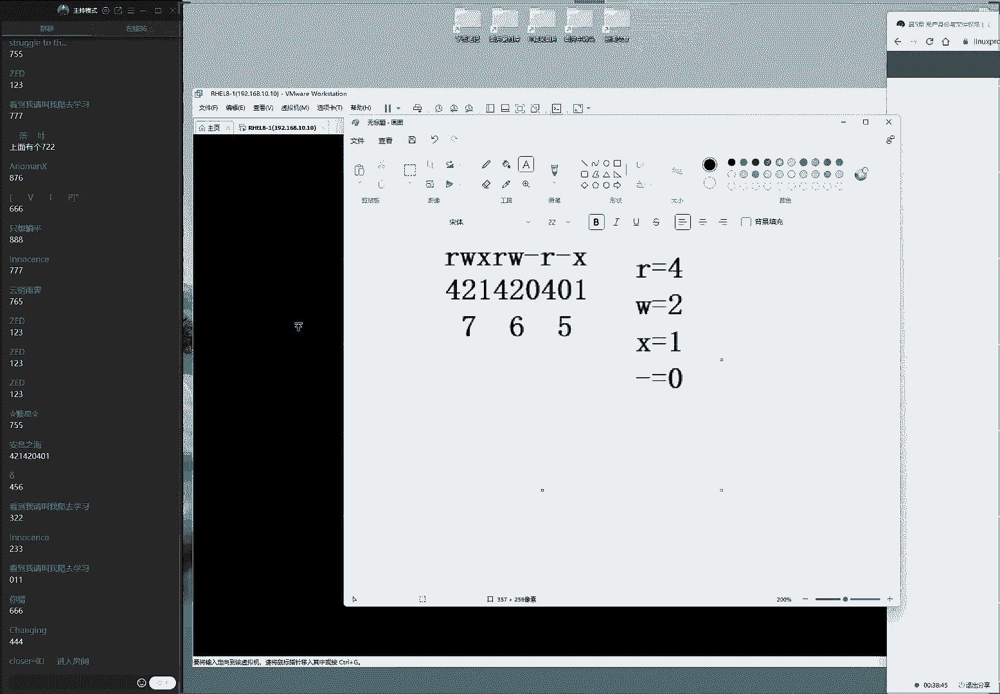

来最后算出来这个结果是765，然后我们再给大家出一道吧，出道吧，出再出一道吧，就比如这个啊，我们现在随便看一个文件的这个权限，最后这个文件权，限的话就得了，那么我们得出来的是这个效果。

那这个效果怎么啊，怎么来去理解呢，来算一下这个效果的话呢，就是4+2+1，42321，然后是四零哇，你们太快了，你们这样太太这样太快的话，会有一种别人以为我们是有托的那种感觉啊，同学们。

你们这样的话有没有感觉，大家有没有看啊，大家有没有考虑过啊，有没有考虑过啊，看啊我们这边视频的同学们的感受啊，因为你们这么快的话，其实我感觉是我们有准备好这种词儿的一样啊，真的没有准备好词儿啊，来七。

然后这个来有点，太有点太说不清了啊，这个我们算下来是七，然后4+1的话呢等于是五，这个4+1等于是5755没有问题，最后的话呢算出来这个结果跟我们的托们说的是一样的。

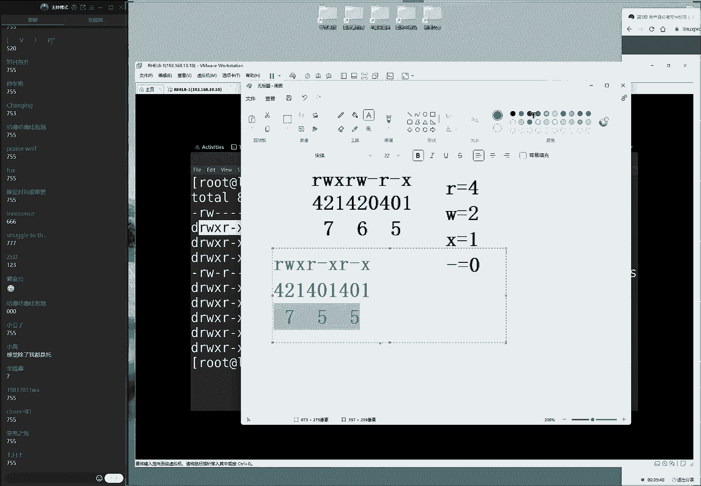

七五啊没有问题，7575挺好，就是说当我们看到一个全景之后。

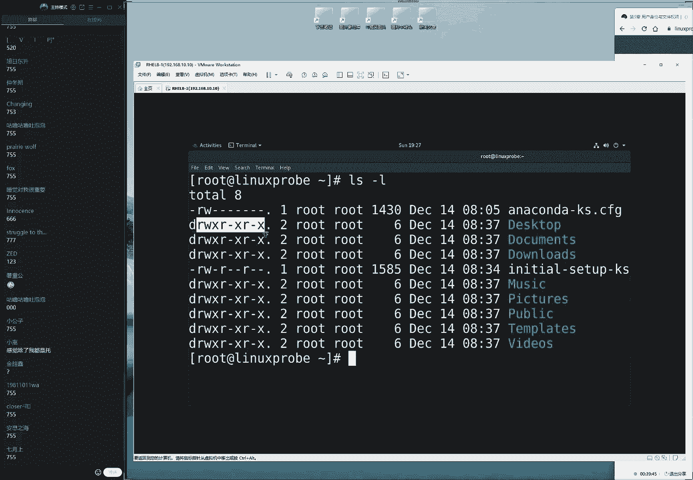

我们能够把它做一下转换的一个方法，然后我再讲一下，我们再讲一下反，那我们再讲一下反算吧，因为同学刚问到了邵老师，这个我看起来不太直观啊，这个原因就是没有看顺眼，看顺眼之后就是超级直观了。

比如说我先给大家举一个例子呃，比如说比，如说543啊，随便给大家出一道题目来，543，请把这个543给大家反向再转化成一个权限法，这个就是有点难度了啊，大家都把怎么样把543转成626啊，非常好，来。

同学们现在可以来告诉我，现在可以来告诉我啊，对稍等一下啊，大家现在先去打一下，突然间死了一件事情了，顺手写到小顺，顺，顺手写到小，顺手写到纸上面，下课之后的话就可以赶紧去干了，挺好。

来大家快速转换一下诶，大家有没有发现一个事情，就是比如说我们同学叫做晶晶是吧，你打出来的十位来了，那就不对了，一定是有九位的，他刚刚打的是空格来的，而且的话呢还有同学打出来的是呃完全不一样的。

大家可以大可以发现就可以发现出来它实际上这个难点是数字发准，从这个权限法，如果说我们要是不是一个在线，培训的话我们看视频看100年，我们也不知道同学们真正到底哪里比较不熟练对吧。

就是这个权限就是这个数字转权限来我给大家讲一下啊，首先的话呢还是把这个写在旁边什么呢，是啊rw x3 个权限是这样的，如果再给大家算起来比较麻烦，没关系啊，我要给大家来去捋一下321，然后就是四二呃。

一零好吧，三个全限额，那我们换上四个全限，欣喜的旁边，我们来依次来给大家对照一下，然后我们现在的话呢，如果说要把这个呃全，那我们要把这个数字法543转成权限法的话呢，我们现在来去做一下计算。

首先五是怎么来的，五的话那很简单，对不对，五的话那就是3+2得来的对吧，3+2得来的一个五，那就是320，这个当然肯定不看，那当然这个是开玩笑的啊，不可能是320，怎么可能是320呢。

它当然等于是3+1+1得来的，对不对，好这肯定也不对，好，那么我们还有什么可能性呢，比如说1+1+1+1啊，这样吗，他他肯定也不行，也就是说他肯定是由4+1加来的，因为首先它只有421。

就是我们看到它只有这个三个权限，421，并且的话呢每，个只能使一个啊，就是说我们这个几个权限的话呢，每个只能使用一次，他的话实际上这个怎么计算出来的啊，这个话呢就是二的零次方。

那么这个的话呢就是说b b5 它就打它就是一个零，然后后来这个是二的零次方，这个是二的二次方，嗯，不对啊，不过这事啊二点啊，这样的话他是这么算出来的啊，012，然后就啊他啊。

所以他们最后的话我们得出来就是0124，但是这块是一个底层，那我们来去进行换算的话，那就是五的话一定是等于是4+1加，来的，那么就是401，然后我们这个v的话不要乱，就是他在哪一位的话呢。

就是我们的r w x，那我们这个最后得来的这个结果就是401对吧，因为他就是5+1嘛，而这个一和这个四它是在前面和在后面的，千万不要乱好，所以我们得到这个结果的话，那就是401。

然后再看一下这个四四的话呢，很简单对吧，他就是零二得来的啊，当然也开玩笑的，他不可能的，它只有040得来的对吧啊，不那也不对的，它应该是400，因为的话呢我们可以读取的权限它是放到第一位的，并且它。

是和四，因此四就是它的本身四的啊，它就直接是一个四，然后还有一个三三的话呢，就是一个呃1+1+1啊，这个都是三位正好站上了，这个也不对啊，我们当然这样哈，这个梗说了很多次啊，大家觉得很无聊了。

主要的原因就是让大家知道这个权限一定要是只能使用一次，并且的话呢这个范围只能是321里面的其中一个啊，它更不可能是5-3减来的啊，好我们来给大家去，最后三的话呢就是021加出来的，那我们就照着去抄嘛啊。

去照着去抄呃，四的话呢是r然后减x然后是，r减减，然后是减w x，大家算一下，对不对啊，同学们，你们算一下，得到这个结果是不是这样的，好大家好，算完这个之后会感觉到是不是比较简单啊，它其实并不难。

可以把我们这个数字法转成权限法好，那我们先来给大家去说另外两点，第一啊，第二啊，那我们来给大家说两个命令啊，再给大家再去重复的去讲一下，第一个命令的话呢，我们叫做china mood。

它用来去修改我们的权限的，然后的话还有一个叫做china own，它是用来去修改我们的这个文件所有者和文件所有者的啊，文件所有者和文件所，有组的它是修改属性的，我来给大家做一个演示。

简单去说一下怎么去使用这两个命令的话呢，首先china欧文的话呢是写的是文件的所有者是谁，然后冒号文件的所有组是谁，后面加上文件名称就可以来自于这个文件的私啊，对咱们就可以对于这个文件的这个呃。

所有者跟所有组来进行一个修改了，等一下啊，文件名称我这样写好之后，大家可以方便去截图，然后的话呢那我们这个全新的设置的时候也是这样的，我们可以直接把这个权限写到后面，比如说543后面加上文件名称，我。

们就这样去做，就可以对于这个文件来进行一个全新的设定了，非常简单，来我先来给大家做一下演示，同学们看一下效果，首先现在的话呢有一个计算题目说的是543。

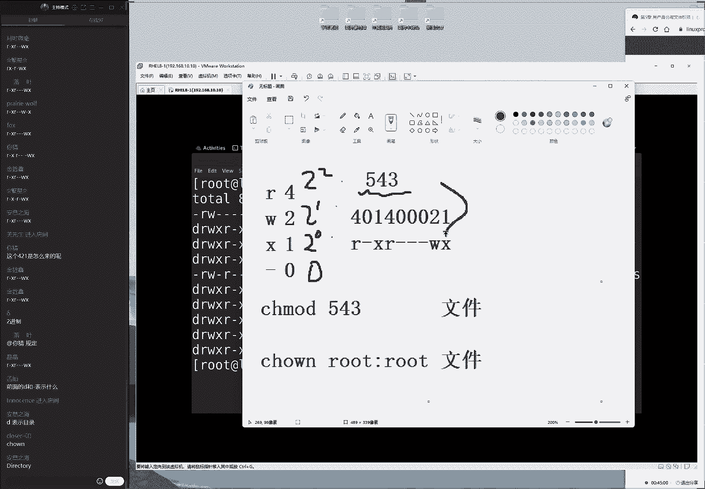

需要把543转成一个权限好了，我先算完了，同学们说对不对呀，好，那我们现在去进行一个演示啊，china mode，然后随便选一个文件吧，先随便去选择一个文件，比以啊以这个文件为例。

现在文件是600对吧啊，然后我们先来去设置一下权限，543设置一下这个文件加上文件名称，按下回车大声说一句。

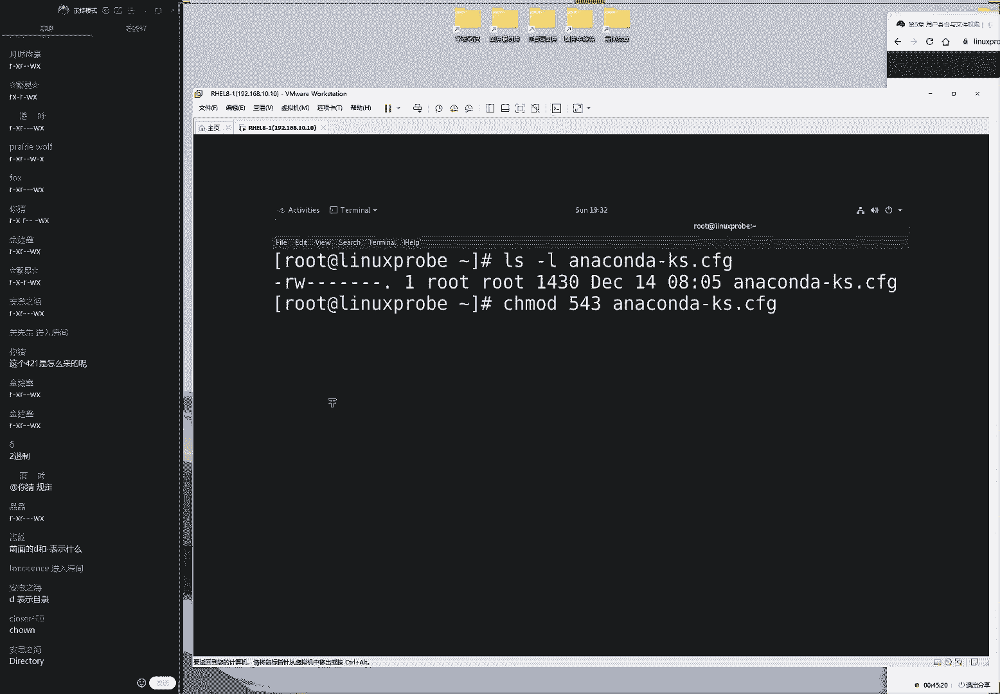

走你啊，再来去查，看一下就会发现543，大家看一下呃，他最后得出来这个结果就这个得呃，那我们呃去得呃，那我们来啊就得出来这个结果跟我们去算出来这个是不是一样的，所以前面说要给大家说到了。

说不要管它有没有用，它一定是有用的，所以我们才用了大概来看三有啊，那我们先去学以后后啊，后面我们再去使用的时候就特别的方便了，同学们应该能够感受到，就是您去打这么一大长串的时候，一定是很麻烦的。

而且的话很容易出错，但是你打五，四三基本上就没有什么太啊就没有什么太大问题了，这样的话我们输入起来更配置起来的话呢，效率更高一点。

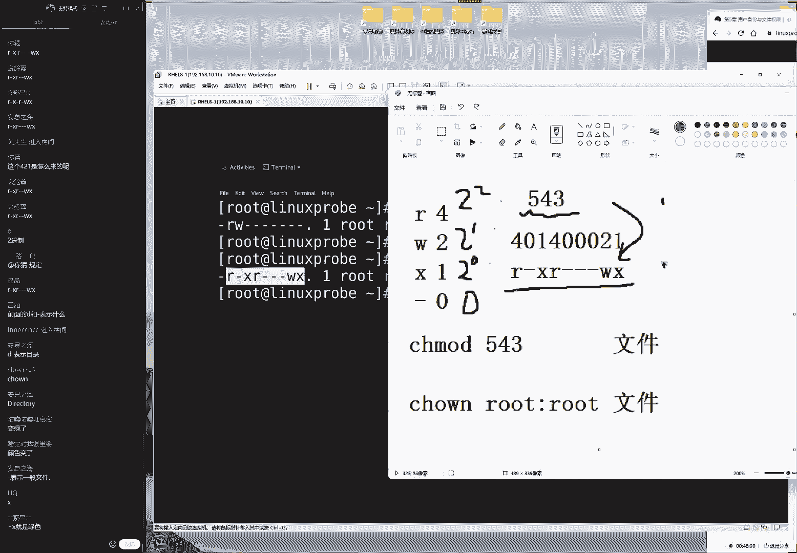

好了，知道这一点了之后的话呢，我们再来啊，我们比如说我现在想把这个文件的这个所啊，那我们先把这个文件的所有者和所有组也修改一下，那么就是channel o n后面显示文件的这个所有者是谁。

我们叫做lis prob，然后用到冒号做间隔符，后面再来文件所有组linux probe，这个广告一定要插入的够多才行，来按一下回车，ok搞定了，没有问题，再去查看一下这个文件的信息，会发现变更了。

文件所有者文件所有啊，好了，我们文带文件所有者，文件所有者文件所有组，文件所有组变更了啊。

没有问题，这就是我们去修改一个文件的这个文件所有者文件所有组的一个方法。

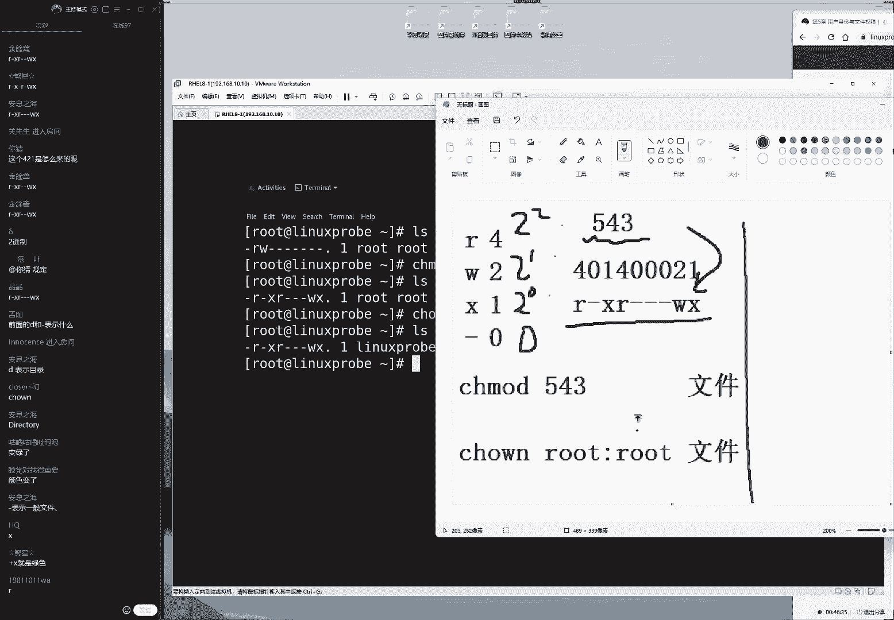

好今天再给大家总结一下下啊，大家说这个变绿了对吧，编剧的话呢是好事，那它指的是能够有执行权限了，来三两个命令，大家先去记一下，首先是文件的所有者是谁，我们也叫做文件所有主是谁啊，我们来文件所有主是谁。

然后的话呢文件所有组是谁加组啊，主跟组，然后后面加的是文件名称，然后下面的话，就要做change a mocha mode，它的话呢是是权限加上文件名这样的一个方式，好大家现在记得自己的这个书上面。

我来给大家往后面去说，另外的话呢还有我们同学们，如果说您学期比较早的话，我记得在2010年之前呃，当然我们当时我们呃就是我们当时去，红方入伍之前的话呢，这个change own这个命令格式没有变。

到现在了，十多年了，也呃也呃没有变过，但是的话呢那会儿的间隔服务时间是个点号，也就是说，是change your own，然后的话呢是所有者啊，是他他的话是呃呃所有者加上一个点号。

加一个所有组这样的一个形式，然后再去进行一个设定的，然后这个的话呢也依然是被延续下来了，也就是说当前的话呢这个间隔符可以是冒号，也可以是一个句号都可以啊，这我可以啊，大家都记一下啊。

就是说我们的话呢现在呃678里面我们可以用到冒号做这个间隔符，然后我们那我们看我们以前五的话呢也可以用冒号，也可以用这个句号，以前的话我们都用的是这个句号，现在变成了一个冒号为间，隔符好。

这是一个问题啊，就算一个小问题呃，然后的话呢再来给大家举一个小例子，再给大家举一个最后一个小例子哈，只是让我能够放心，大家去社会了，然后我们就踏踏实实的往下面走了，好吧，一个数字法转转成权限法。

同学们让拍摄导流去玩一下了，来七呃六五吧，随便了啊，不不这太简单了啊，654吧，呃呃654请把这个权限转化成全呃呃呃起码这个数字转成权限法，转完了咱们就下课不，咱们就啊，这不咱们那咱们就到下一个章。

节啊咱们就下课了啊，这个啊就太过分了，ok大家先算一下，来大家先算一下654陪老刘再最后玩一把，唉最后再玩一把，让我放心就继续了，来大家在打完之后发现嗯基本上不错，基本上不错，基本上也没有什么乱的啊。

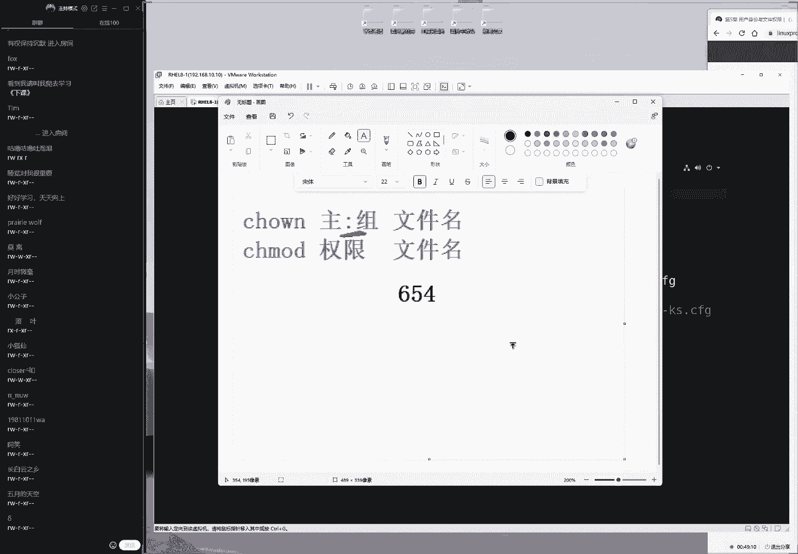

或者说百分百没有乱的好，我来给大家说一下，同学们，你们要会先去算吧，不会吧，没关系，我来给大家去讲，我我我呃，我文化不太希望咱们这个课特别的死板啊，就是就是完全就是灌输这种感觉，会了就会了，会了就啊。

那我们就跳到下，咱们就到下一个这个章节，然后我们往后面去讲，这样还可以讲更多，也更有这么一个呃干劲，不用说，非得这么纠结啊，然后大家看一个问题，大家说我们这么去写，等不等于777呃，不能这么去写。

这个全程是设计师是出错了，他不能这样去用，然后我同学叫叫做叫做叫做小公子啊，打了是打了个啥，是在擦键盘吗，来我再给大家去说着，同学们先自己应该知道了，我来给大家去算。

首先我还是把这个写在旁边啊啊r w x，然后减号这个的话呢对应的这个数字法的权限就分别为4210，没有问题吧，好我们来去算一下，首先六啊，同学们请允许我在最后一次玩这个烂梗行不行啊。

最后再玩一次这个烂梗啊，六的话那肯定就是由4+1加啊，那么这样来去加出来的，这犯了什么样的一个错误呢，这个的错误就犯了，就是说这个权限只能去使用一次了对吧，但是他只能去使用一次。

因此的话呢这个权限一定是由420加出来的，一定是这么去加出来的，还有五的话呢一定是怎么样呢，401加出来的，那四的话一定是400加出来的，没有问题吧，好了我们来继续，然后呢rw一个减号，然后r减x。

然后是r减减，这就是我们去换算的一个方法，好这个大家的话呢呃看明白了之后啊，还有一个问题就是到这里之后就可以了，然后但是呃同学们还有往下面再去换算一步的啊，就是我们有一个师姐。

大概是22期的一个非常可爱的一个小女孩啊，的一个啊非常可爱的小女生啊，然后的话当时给我们算完这个题目之后，给我们来一个什么，然后就是我们说完这个之后啊，又往后啊后面来去做一个这么一个计算，够这么去做。

然后r r然后换了w x减减减减给我换成这个样子了，这个样子的话呢，你要是硬看起来的话呢，你要生出来毛病来对吧，它东西的话呢三个r还有后来这个呃可以写，可以执行，都还好像还都在啊，他还都在啊。

这个四个单位服务他都在呃，东西的话呢没有丢一看就是一个这个怎么讲，就是一个呃喜欢收拾屋子的一个对啊，就是我们可以看到把东西整他们啊，他们还去整理的非常的整齐，呃道明啊，我们一定要注意啊。

就是来去换算的时候看这个其实没有什么，他没有啊，他是没有任何意义了，如果说我们在做换算到这一步的话，它是100分对吧，那么如果说我们再往后面再去换算一遍，它变成零分了，所以大家一定要记住这一点哦。

那我们对于全新的换算就只到这一位就可以了，千万不要往下面再去算了，因为我们的文件所有者，文件所有组以及文件其他人的话呢，这个三位之间是还没有任何关系的，我们不能够把钱花，或者说那我们把这个资源啊来。

那我们来去按照这样的方式来去写，那么就看不出来到底是谁的权限，这大家一定要去收益啊，这也是之前发生过的一个小小小的插曲，好我们接下来再跟大家去说啊，对有点像是强迫症了啊，来我们来给大家后面来解说一下。

呃其实的话呢我们的技术的这个发展，它都是解决一个痛点，然后产生出来的并没有大家想象当中那么高科技，然后其中的话呢有一点就是我们一样啊，就是我我的话我们就是看这个文件的时候，实际上也能够猜得出来了。

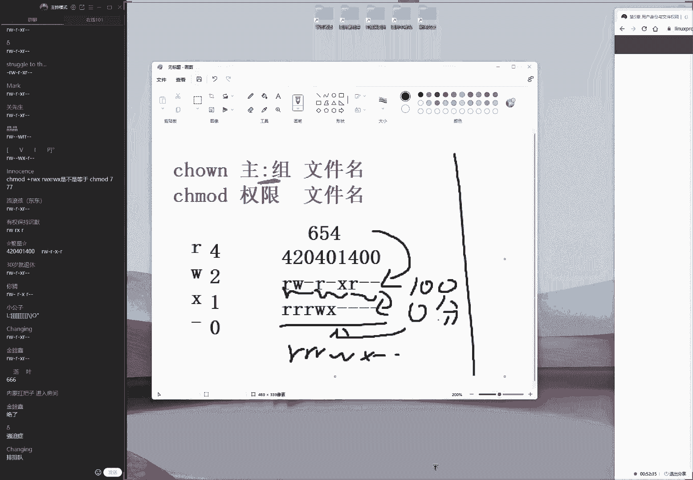

就是因为呃我们的话呢linux里面的这个呃文件的话呢。

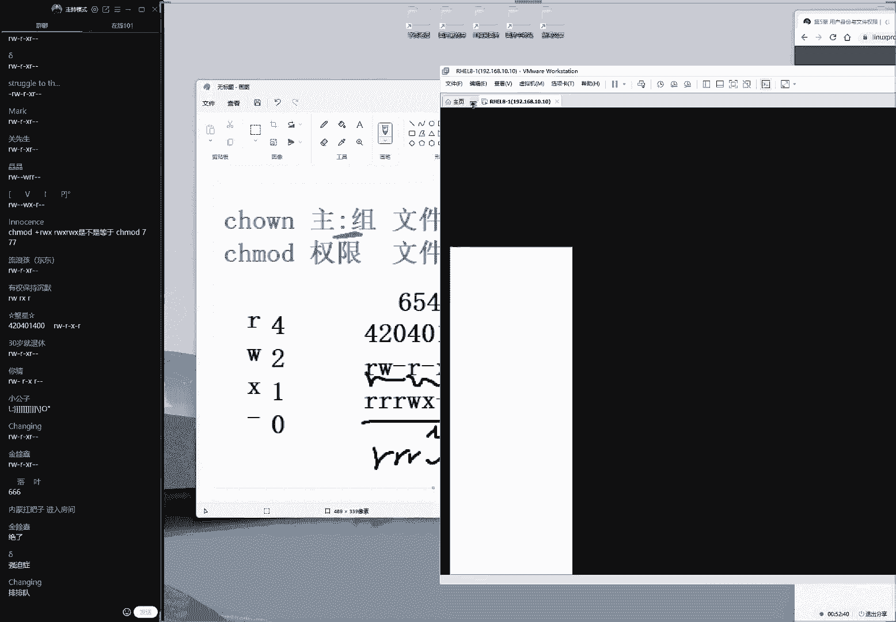

它是不去呃，它的话呢是啊，它是区分文件类型的，但是的话呢我们如果要是没有一个值啊。

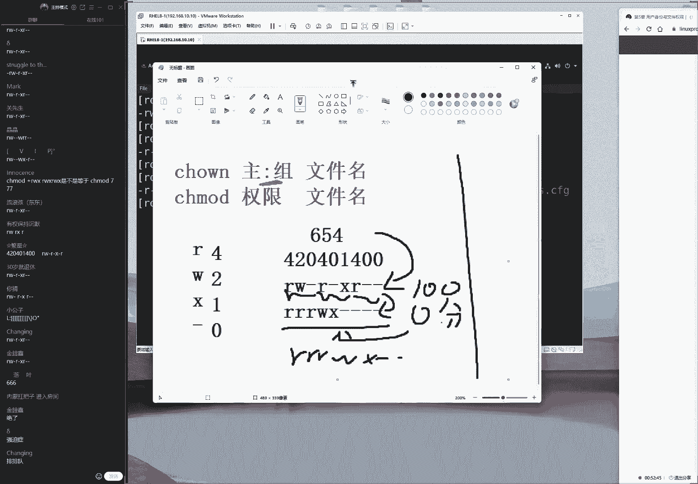

但是我们如果没有一个直观的表示的话呢，也不能够知道这个文件具体是什么类型，大概大啊啊，因为大家问到了，就是比如说我现在去看一下这个目录里边，在这个权限可以看到这个文件的话呢，前面的话呢这个会有一个标识。

这个标识它呢它实际上指的是文件的这个类型啊，我们的话为了去解决说用户想知道文件类型的这样的一个呃痛点吧，它这个前面实际上它不仅是红帽系统里面，它都会有在这个前面再去标注一个我们的文件类型。

它并不属于权限的一部分，它属于属性的一部分，那我们来看一下，当我们这个文件这个权限的前面，如果说它它第一位的话呢是一个减号，它指的就是一个一般文件，或者我们叫做配置文件，大家可以来记一下。

这几种类型叫做一般文件，或者我们叫做配置文件，如果说要想去配置一个服务，实际上就是在修改这个服务所对应的一个配置信息，所以我们大多数情况下配置的都是这么一个减号的这样的一个情况，还有一个什么呢。

还有这个d啊，我们可以看到了这个d的话呢，我们叫做目录文件，这个不用什么去解释了啊，就是我们可以啊去走到里面去目录嘛，可以往里面去做切换，它指的是一个目录文件夹啊。

第一话呢我们还有我想到了比如说我们的链接文件，这句话的链接文件它指的是链接的话，这个链接文件的话呢，它指的就是我们可，以做一个快捷方式，然后我们说话的这个链接方式，我们就得到了这样的一个效果。

来大家看一下，这叫做链接文件，我们当然可以会去做一个链接文件，或在下礼拜五的时候给大家去讲到叫链接文件，除了这个以外的话呢，还有这个管道文件，这个的话呢我们一般看不到的叫做管道符文件啊。

或者我们叫做管道文件，还有一个它呢我们叫做b啊，叫做跨设备，实际上的话呢这个块设备就指的是这个换的块设备，实际上它就是我们的设备文件，比如说我们叫设备文件，比如说我们我们的，硬盘呀。

比如说我们的这个内存啊，这样的这个情况，或者说我们的光盘啊，这样的设备文件，除了这个以外的话呢，我们还有c啊，叫做这个字，这个我们叫做字符设备文件，这句话实际上也属于叫做设备文件。

我们会在我们的第一位目录里边建的比较多一点好了，我们知道这种类型之后的话呢，可以看到了，就是我们一般常见的文件类型，我们要想去对于这个呃文件类型的游戏啊，那我们来进行加以区分的话呢。

您就可以看一下这个文件全啊，那我们可以去看一下文件前，面那第一位就可以了，好大家可以去记一下，我正好的话呢去倒杯水啊，40分钟了，大家先啊，先去记一下，如果说想要去知道一个文件这个类型。

那么你就可以去看一下他前面那个数字，它怎么去写的，文件前面那个数字它的这个呃代表的是文件类型，稍等倒杯水，先，稍等一下，水有点烫，ok我们来继续，刚才犯了一个错误，我刚才去找了啊，我刚才去找了一下。

发现都没有水了好吧，那我们来继续吧，啊怎么样啊，去喝水了是吧，然后现在有声音，现在有声音，现在有声音，我刚才只是去找的话，我我我我刚才只是找了一下水，今天今天犯了一个错误，今天忘了倒水了。

我现在只有一个，现在我只有一壶烧开的热水，我想我现在想喝口水，现在没有，所以我刚才去找了一下没有，那算了吧啊，正好把水给放凉了，来继续继续啊，来继续，我们来说一下我们对于这个文件的一个权限。

那也就是说现在这个话呢我们的文件类型加上文件的这个权限，总是有十位，这个我们能够理解了，下面的话呢就要去想一下这个问题，就是呃我们画的这种话，我们之前就提到一个问题，就是画的linux更加的安全。

而且的话呢对于这个权现在说一个设定的话，那更加灵活，但是他会问呢，说到礼物我我好像并没有感受到说这个更加安全或者更加灵活呀对吧，就是因为我们的一般权限rw x的话，实际上它这个功能还是比较单一的。

就是它功能太简单了，感觉跟windows的话呢，感觉跟他们的那个呃windows系统好像差不了多少，就要给大家提到了，实际上看一下5。3角形，还有一个叫做特殊权限，这个特殊权限的话呢。

实际上就是对于我们一般权限的一种补充说明，他之前啊就像我们之前看一个电视剧里面说啊，你干不了的事，但是我能干对吧，我啊那我们来给大家去看一下rw x的这个基础之上来去讲一下。

它叫做s u i d s g i d和sb i t，它是对于我们的一般权限的种补充说明的一个信息来，我们刚才没有卡，刚刚没有卡，真的没有卡，刚才就是去想去找杯水，然后我翻了一下，确实没有了。

这是一个小问题啊，好我们跳过跳过跳过来继续说一下，有三个权限，第一个呢叫做s u i t权限，它是对于我们的一般权限的一种补充说明，这个的话呢我们没有中文的啊，他拉他啊，他这样啊。

那么我们这个三个这个呃权限的话呢，它没有一个中文的名字，他没有啊，他压根儿就没有一个中文的一个名字，我们就把它叫做s u i d，没有中文名字来，这个权限的话呢。

作用是让我们的这个命令的执行者临时获取了命令的所有者的，这个权限，好大家听听，我给大家去说一下这个全新的呃，作用的话呢，是让命令的这个执行者能够去临时获取到文件所有者这个权限，好。

同学们再去理解一下文件执行者临时获取到的文件所有者这个权限，它有一个特点，就是它必须一定只能是怎么样的设置到的二进制的可执行文件上面，二进制可执行文件或者是一个脚本上面，它不能设置到目录上面来。

可执行文件上面来去设置这个权限，来我给大家来聊一聊啊，来给大家聊一聊啊，说这怎么回事呢，要给大家去提到这个权限啊，说让命令的这个执行者这个关键词就是让这个执行者临时获取的文件，所有者的这个权限。

也就是说他的这个之前权限不足买啊，它是呃呃不满足去完成保教工作，所以的话呢这个全新进行一个临时的提升，比如说我现在有一个文件，这个文件的话呢叫做etc目录里面的沙的文件。

这个换了文件是用来去保存我们所有用户的这个密码信息的，对吧好吧，看一下这个文件的这个权限，同学们一看嗯，大家就说举个例子啊，来给大家举一个来看一下，看一下啊，看一下，以这个文件为例。

这个文件的话呢权限是000没啊，没有任何的这个啊没有任何的这个小权限，也没有任何的这个读取权限，完事的话呢我们先看到这个文件里面的内容，它是在tc目录里面的，杀掉文件。

这个文件的话呢是用来去保存我们用户这个啊密码信息的，他的话是经过加密的一个呃的呃一个呃一个呃密码信息的，然后呢我们当前这个用户叫做linux probe啊。

然后我们现在的话呢把这个它的加密之后的这个密码值，复制到咱们的这个屏幕上面，大家可以看一下，他现在的话呢当前这个用户的密码是这么多信息，也就是说我们实际上去设置用户密码，就是去修改这个文件。

然后里面这一串信息的，然后现在的话同学们可能会比较惊讶，而受到优诶，你不对啊，突然间发现一个小的一个插曲啊，说到u你这个文件不是没有权限吗，你怎么去看的呢，啊所以我现在讲之前再给大家去啊，说这么一句啊。

就是我们的管理员那不受权限的控制，它不受一般权限的控制，所以的话呢如果说呃即便一个文件他没有可以读的权限，或者没有写的权限啊，但是管理员的话呢依然可以进行操作，所以说这个大家一定要啊，这我们一定要小心。

这是一个小问题，好大家先看一下，首先我们有一个文件叫做做啊，etc目录里面的沙的文件里面保存的是用户的密码信息，当前我们的linux prop用户的密码是这么大坨好了，我们现在切换到这个用户身份下。

叫linux prob，然后的话呢我去修改一下我自己的密码，来修改一下我的密码，当前密码叫做red hat，新密码的话呢叫做linux probe，点com广告植入啊，第二次广告植入啊，怎么样，他说啊。

我们的密码不能跟用户名称啊相同，好我们再来，我们现在再给大家换一个，换一个超级复杂的，我自己都不知道的啊，我换一个超级难的，就是我现在在我屏幕上，在我键盘上，我现在去狂敲，然后去敲两次一样的啊，不不不。

他说第一次先去输入一下当前密码，刚刚我太激动了，再来我现在去输入一个超级复杂的，那我刚才说的是啥来着，走好没有，ok没有问题，现在把这个用户密码给重置了，重置好之后的话呢。

返回来返回到我们的管理员这个身份下，再去查看一下这个文件，大家看到这个权限还是000，然后我们去查看一下文件里面的内容，现在的话呢是这个用户的一个新的密码，于是我们来做一下对照来去对做一下对照。

最后这个对照说这个结果是这样子的，好同学们可以很清晰的比对出来这两个密码的值是不一样的，于是的话呢一般人就跳过了，但是我们要想去追问一句，为什么凭什么，也就是说我们要分，为两步走，第一步走的话呢。

就是呃要知道这个底层原理就是实际上我们的啊linux里面的话呢，一切都是文件，所以在去配置一个服务的时候，也都是在修改这个服务所对应的一个配置信息，当我们去修改用户密码的时候。

实际上也就是在修改这个用户所对应的一个密码文件里面的值，因此这是第一步，我们修改成功了，ok这是第一步啊，啊就是去解释一下为什么修改密码的这个操作就会去修改了文件了，就是这么回事。

因为他也底层就是修改了这个文件嘛，这是第一个事情，第二个事，情的话呢就是凭什么他能够进行修改呢，因为可以看一下，当我们去使用到普通用户叫做linux prod的这个用户的时候。

他是能够去修改自己的密码了，他也能够去修改这个文件里面的内容，但是的话呢可以去看到这个用户去看这个文件的时候，它也依然是000的一个权限，大家看一下啊，ios来看一下这个用户去看这个文件是000的权限。

他也不能够去查看问题的内容，他连看到他啊，他都看不了的，但是他怎么去修改呢，就留一下思路，也就是说这个用户修改了自己的密码，但是的话，呢他实际上他连看的出他都没有，他怎么修改成功了呢。

这就要给大家去提到了叫做i s y d权限，诶，大家会发现这个例子举的是不是挺好的啊，大家会感觉啊啊非常的满意啊，非常满意，来给大家说一下怎么去实践呢。

实际上的话呢就是啊问题就出在了一个叫做pass wd的一个啊命令上面了，因为他大家大家的话就要去回忆一下他怎么去修改的，它使用的一个命令叫做pp a s w d，对不对。

这个命令的话呢实际上我们可以去查看一下，去使用到wish查看一下命令所在位置，然后的话呢，我们知道这个所在位置了之后，去查看一下这个命令文件所对应的一个权限，就跟啊我们的破案一样啊，一层一层往里面去找。

那就像找线索一下佛像啊，福尔摩斯一样啊，像福尔摩德一样，我来给大家看一下啊，去找到我们剧中的这个问题所在，当我们看到了，当用户需要去修改密码的时候，实际上是调用这个文件来去实现的，而这个文件的话呢。

前面的这个第一位文件所有者的这个啊，最后一个致敬位上面变成了一个小小s，这就指的是一个命令的嗯s u i t权限，也就是说当有一，个普通用户，他在啊他在去执行这个命令的时候。

他就临时获取到了文件所有者的权限，而我们的管理员入群用户他怎么样呢，它不受一般权限的控制，因此它这个修改操作也就完成了，这个是这么一个流程，再给大家来去说一下啊。

首先第一个思路就是呃配置一个服务以及去修改一个用户的密码，它实际上就是在去修改这个文件，第一点第二点这个文件的话呢叫做啊沙漏文件，它是所有人都不能够对他啊啊啊来对它进行一个读写执行的。

他这个权限是000，所以的话呢连普通，用户都无法进啊，来教它啊，它来进行修改和啊，那么啊以及来进行查看，这是第二点，第三点，但是由于有一个用户它调用了一个文件叫做命令文件，叫做p a s单啊。

p a s s w d用来去修改密码的一个文件，这个密码上面的话呢有一个权限叫做s u i d权限，大家再来往后面去说，第四点，第四点，你啊，由于这个s y d权限的作用。

是让命令的执行者能够去临时获取到文件所有者这个权限，所以第五点啊，用户临时获取到了管理员的权限，而管理员这个权限不受一般权限的控制，于是，修改了他的密码这么一个流程，大家可以去理解一下啊。

就像我们在啊4月13号的时候说过一句话吧，会发现自己越不敢说自己都掌握了，这个越学越深，好大家看到这个，首先啊大家看到说这个颜色有一个不太会会有一个变化，它是一个红颜色的，这个红颜色的话。

那就代表着说这个啊它是一个非常危险的一个权限，大家一定要小心，它有一个特殊权限，好我们现在的话呢再来给大家再去举一个例子啊，这个例子的，话呢更好让大家能够理解一下到底什么是执行者。

什么是啊文件的这个所有者，因为现在你已经能够理解这个全新的作用了，但是你可能不太理解到底什么是文件的所有者文件啊，那么啊那么以及文件这个呃执行者是什么意思，来我给大家举一个例子啊，这也是一个老梗了啊。

如果说您之前没有听明白的话，这个例子一定能让您能够听明白了，说话是这么回事啊，大家有没有看过那种穿越剧中古装剧啊，可以打一下一啊，同学们可以打一下一，比如说您看过一些啊古装剧，现在比较。

流行的芈月传对吧，还有什么啊康熙微服私访记啊，没有看过是吧啊，大家有同学看过是吧，看过有同学有四个同学看过啊，其实这种古装剧还是比较多的，那么啊他都他都是算的啊，毕竟我们比如说啊现在有一个啊在古代啊。

那我换这个清朝的时候吧，随便举一个朝代啊，然后我们现在这个画小草，画一个小太阳，书上有一个叫青山代大臣，主啊他们他专门，完事儿的话呢，他有一天正在路上走，突然间看到一个人哎比如说这个人画的稍微胖一点啊。

上面再写一个贪这个字啊，手啊啊，再画稍微短一点的话，稍微丑一点好，就比如说的话他这画这画这画画太丑了，就比如说有一个呃那么好，这个时候的话呢他想需要把它给惩治了，但是他的这个权限不足。

他他的这个权限的话呢也许非常的小，它不足以去买啊，他的话啊权限，有点小，他没有啊办法去完成它啊的这些工作的话，怎么办呢，这个时候哎没有关系啊，等下换个小笑脸儿啊，他没有关系，所以他啊所以他是笑了。

他想到什么呢，他想到他拎啊拎哈，他临出门之前有一个人，给他一个宝物，是什么呢，是尚方宝剑，大家来看一下啊，如果拿一个尚方宝剑的时候，那个同时是不是他就临时的拥有了一个更高啊，它有一个更加高级的权限。

一般按照古装剧里边怎么说啊，没，有去做求证，但是他的意思就是说啊可以有这个先斩后奏这么一个呃特效对吧，当我们想想去完成某项工作的时候，但是的话呢因为我们这个权限比较小。

或者说对方的这个身份是在非常的重要的情况下，我们就可以怎么样呢，先斩后奏，拿出商业保健的同时，于是就可以啊来啊噗嗤把他给杀死了啊，你把啊，那么就把他给干掉了，让我们去这个其实我们的s u d权限的话呢。

跟当前这个保健的话，这个呃作用是一样的，因为他也都是让我们面对的这，个执行者能够去临时获取到了啊文件所有者这个权限，他能够去临时去提高了我们的呃权限，然后的话就可以去啊完成保障工作了，所以大家在啊。

所以啊所以大家需要需要去记一下，也就是说s u i d的这个本质的话呢，实际上它就是为了能够让我们的用户能够去啊，在全家不足的情况之下来去临时完成某项工作，这是第一点。

第二点的话就是他的这个时间只是一个临时的，当他使用完这个宝剑之后的话呢，它还是它的这个啊本它还是它的本身，而，这个宝剑使用完了之后，他还依然是他本身啊。

也就是说只有这个在直接光当中才会去临时获取得更高的权限啊，呃执行过后的话呢，自动去结束掉这个权限的授权，所以大家要去记一下这个权限的一个特点，这个我们叫做seuid权限好，这个我觉得讲的很透啊。

所以大家再给大家总结一下，就是s y d权限是能够让我们的命令的执行者，在我们的权限不足的情况之下，能够去临时获取文件，所有者这个呃权限呃，所有者这个权限去完成稳定工作好来产生出来这么，一个技术来。

大家话怎么样说啊，呃这话有点丑是吧，来下面一个问题，大家说如果说我们现在把这个杀到文件给它改了，我，那我们是不是就不用去选用到password命令来进行修改了，当然不是。

因为您即便买了这个修改成了777权限了，那我们能够进行编辑了，但是我们的password命令还有一个加密的功能的那个算法，我们还需要去使用的password再去实现一下。

不过的话那这个就跟我们这个课没有太大关系了，我们现在给大家讲的叫做s y d选项，而且大家想一个问题，呃，如果说我们现在能够把，这个我们的密码文件etc目录里面的shadow设置成了一个七七的权限。

那么任何人都可以去看到文件里面的内容，其实这是无所谓的，因为现在呃他还是不能够破解我们的latex里面的密码，但是的话呢它可以去修改别人的密码吧，比如说我现在不知道你的密码，但是我可以把它给修改了。

那么我们也就知道了对吧，那所以这样啊那啊那啊，那我们修改过后也就可以去使用你这个身份来去登录服务器了，因此这个权限千万不要给他这么大的权限，是会啊，这个是会出问题的，然后呢我们来给。

大家说一下第二个权限叫做s g i t权限啊，怎么样说，讲了这么多期啊，唯一没有变的就是老刘的画风还是那么的的还是那么的抽象啊，来我们来给大家看一下下面一个权限叫做sj i d权限。

这个的话呢作用就是呃让知呃命令的这个执行者，临时获取文件所有组的这个权限好，这个没有太好去解释吧。

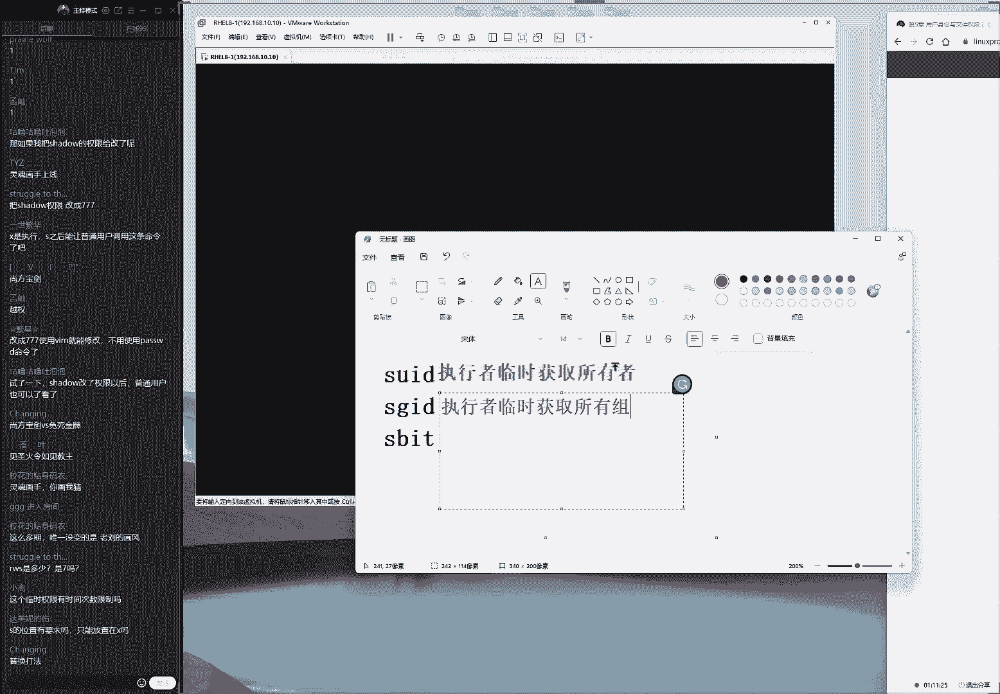

这个也不用解释了，它的作用就是呃会获取到文件所有者的这个权限啊，它会获取到文件所有组的这个权限啊，开始瞎说话了，来比如说我们现在的话呢有一个文件，比如说现在一，个文件，这个文件的话呢。

如果是要他要是有s y d权限的话，那么就会让我们的命令的执行者临时获取到这个用户的这个权限，而我们如果这个文件上面有一个s g i d的话呢。

会让我们的用户临时获取到这个啊用户组的这个权限没有什么问题，而且它非常的简单，但是的话呢我们在工作的时候基本上不会去使用到这个呃文件，所有组这个提升的比较少，特别的少，我们大多数情况下的话呢。

会把s g i d这个权限设置到目录上面，这个我们会比较的常用，如果说我们的s e y，n啊，那我们啊如果说我们的s j d的这个权限，它是对于一个二进制的可执行文件来去设置的时候。

那么我们则自动去使用到这个权限，就是让我们的命令执行者临时获取到文件所有者的这个权限，但是如果说他就是对于一个目录来进行操作的话呢，它是让我们的目录当中新建刷的文件。

去自动去归属于我们的目录的所有组的这个名称啊，大家听完这个之后有点绕是吧，没关系，就总会有一种听天书的感觉是很正常啊，为您就会慢慢去捋思路嘛，就像我们刚刚可能在上课之前还不太理解，现在已经理解了一样。

我再给大家总结一下呃，如果说它是对于一个文件上面来去设置的这个权限，则是让我们的执行者临时获取到文件所有组的权限，ok这就啊那么啊这就是我们跟啊给大家写出来了，就算就过去了。

然后当我们如果说这个权限是对于我们一个目录来去设置的话呢，目录的话啊，那如果说这个权限是对于我们的目录来去设置的话呢，那么目录里新建出来的这个呃文件，那么则自动的归属于它。

这个目录的所有组的名称则自动呃归属目录原有诶这个所有组的名称，所有组的名称，这个看起来有点抽象，实际上这个事儿特别简单，我再给大家一说就明白了啊，或者说我们给大家一演示就明白了好呃这个就啊百闻不如一见。

看书不如看实验，给大家看一下我们这个实验的一个方法啊，大家问了一个问题，特别好，同学叫繁星了是吧，他说怎么样判断说这个文件是有sd还是sj i d呢，不用着急，马上给大家讲到，我们需要先给大家讲之后。

然后给大家说一下该怎么进行查看以及进，行一个设置，先不管他先说一下这个理论啊，好现在去说一下，如果说要想对于一个文件上面来去设置一下s j d权限的话呢，先去举一个样本，比如说在我们的随便来。

在我们的home目录里面，目录名称无所谓啊，不管它含义，不管它新建一个目录，目录名称，好比说叫什么呢，啊同学叫做中训，同学最后发言啊，我们就把它叫做小训吧，同学好吧啊，叫做这个小训。

然后把这个权限的话呢设置的稍微大一点，加一个杠杆操作，这样的话代表就是一个递归，件都去使用到新的这个权限来去完成，然后的话呢再去使用到change mode命令，然后使用到叫做叫做g加s来去设置一下。

我们叫做s gd权限，这个不用着急，我会给大家总结哦，啊这啊这会大家总结的，会给大家总结的，然后我看到同学们再说说怎么样能够去查看啊。

这个部队我们的set和get f cl是我们的文件访问空列表里面去使用的，查看命令，你们呃猜错了，我待会给大家去说怎么去查，不用管，先把自己的制作重心放到我们的这个理论上面，我们每一个技术的话呢。

都会先给大家去讲理，论，然后给大家讲一下实战，现在的话呢还是一个理论过程当中，我们讲完了之后，自然会给大家去说一下啊，和大家总结一下该怎么来去查看以及去设置了，现在不管他们现在就关啊。

现在就关理论能够把这个权限的功能搞明白了就ok了，不要那么心急，同学们不要啊，不要心急，来设置一下这个权限设置好了吗，没有问题好，这个效果是让我呃让我们的这个啊目录里面新产生啊，出来的文件的。

文件的所有组会自动去继承我们这个目录的所有组的名称，比如说我们现在可以看一下，当，前我我们这个目录的这个所有者是root，所有组的话也是root，ok吧啊没有问题好，我现在切换到另外一个用户身份下来。

切换到一个叫做linux pro一个用户身份，同学们总会问到说老师哎呀我那我那么我怎么去记命令呢，我怎么感觉学完了命令之后就老忘了，比如说今天我们上课的时候说个三五十遍啊。

linux pro我估计大家下课之后就完全忘不掉了，就会今天晚上做梦的时候都会梦见啊，linux linux linux problem，没有太好的，这个技巧要是有的话，也大家都要。

如果大家如果要是有好的技巧的话，大家也都会用，大家都用的话也不算是好的技巧好，就我们说说哪儿了啊，说到哪儿了啊，对哦我们去说道去新建出来这个用户了啊，不我们现在要去啊，收到吧，切换到这个啊用户身份下了。

然后的话呢我们现在使用到这个用户，大家看一下，现在的话呢我去使用到这个用户，我去新建出来一个文件，比如说这个文件我们叫做ho，比如说啊我新建出来它，那么我自己新建出来的这个文件。

那么这个文件的所有者课文件，的所有组，大家可以看到，当我去新建出来这个文件，那么这个文件这个所有者和所有组肯定都是我们自己，好好吧，大家看一下新建出来的文件，那么我们文件的这个所有者跟文件所有组的话。

都会是我们自己没有问题，好现在的话呢我们再来我们去呃，我们的话干嘛呢，我们现在就进入到这个home目录里面的啊，叫做小旭同学这个目录里面，再来去新建出来这个目录还叫做厚厚的一个目录。

然后去查看一下它对应的这个权限，才会发现我们的话呢我们的文件所有者还是我们自己，但，是的话呢，文件所有组变成了原先用啊，原先目录的这个所有组的名称了，就是这么回事，我刚才不是故意说特别复杂的。

但是这是理论基础，我们要打好，然后再看一下实战，你啊理论加实战一下就明白了到底它所表达的是什么样的一个含义，对吧，就是让目录里面新建的文件会自动去归属我们目录原有呃，所有者呃。

呃所有组的一个名称就这么简单好，然后再给大家总结一下该怎么去查看以及去设置的一个方法，最后一个话呢我们是叫做s b i t权限，它其实很简单啊，它就是理论，有点复杂，但是这个没有办法。

我们只能通过这个啊先给大家讲一下，要再给大家实战说一下我们的s b i t权限呃，s b i t权限的话呢，实际上我们叫做保护卫啊，它的话呢有一个中文名字叫做年之位。

这个的话实际上这个翻译起来是有问题的，因为这个啊年之位就是直接把它给翻译过来的，实际上这是错误的，本身这三个权限都没有中文名，不知道是哪个呃，但是完了不知道是哪一个呃。

呃呃反正看到就是我们这三个权限的话，之前都没有中文名，不知道是谁啊，最后把这个翻译，出来叫年之位也没有毛病，就是说我们按照这一话呢，直接翻译的话，中文名字就叫年之位。

但是的话呢我们根本就不理解这个权限到底是干嘛用的，所以我们再给大家取一个名字，s b i t的话呢，实际上叫做保护位啊，大家记一下保护卫，这个才是我们认为翻译起来比较好的一个方式。

因为我们看到说如果翻译一篇英文的文章的话也好，怎么样的，我们有三个这个呃档次嘛，就是这个信达雅对吧，我们那我们做到这三点，我们要让我们的这个读者能够一眼能够知道这个权限大概的，一个作用。

所以我们给大家取一个名字叫做保护呗，它的这个功能的话呢，是让我们的用户只能够去删除掉自己的文件，而不能够去删除掉其他的人的文件来，就是它的这个作用就是只能够啊只能删除自己的文件，这有什么样的一个用处呢。

先举一个小例子啊，当时的话呢我上呃呃呃呃大概是我上高中的时候，这是一个真事儿，当时的话呢下了课之后，老师会开一个ftp，然后比如说啊巴拉巴拉给一个地址，让我们每天上，然后去上传到老师呃。

大呃来去上传到老师的电脑里面，上传到电脑里面，然后就会有一些小额，那么他就会有些小坏孩子啊，他们自己不会去做，然后的话呢他们等他们啊，等同学走了之后，他啊他啊最后一个走，他会把别人的文件给他删掉。

就是把别人的文件给它删除掉，然后的话呢把别人的那个文件的名字改成自己的名字，实际上就是一个剪切的一个操作，那好但如果说我现在不想让别人去捡起我的，文件或者说我不啊并不想让别人去删除掉我的文件怎么办呢。

这时候我就可以把这个目录上面加一个保护呗，这样的话就那就是只能自己去管理自己的文件了，好我来给大家做一下演示，只有一个目录啊，叫做tmp目录，它已经自带有的一个t它已经是自带有的这个保护位的一个权限了。

大家看一下这个目录叫做tmp目录，它自带有这个啊保护位权限啊，我们的s b i t现在的话呢我只需要新建出两个用户，一个用户叫做张三，还有一个用户的话呢叫做李四，两个用户用来做测试来，相互去删一下文件。

我们看看是否可行，先去试想，先去切换到张三的这个用户身份下，稍等一下啊，先去切换到张三用户身份下，我记得我想我我我呃，我记得当时大概是20多期的时候，我然后我当时讲的这个例子说啊。

当时的话呢我去提到了说呃，如果说我们在上班的时候，那我们需要让我们的同事，或者说我们需要让我们的学生们来上传到文件到我们的文件的ftp里面，然后的话呢我们来去判成绩，但是总会有一些人去深入到别人的文件。

这个问题该怎么去解决呢，我记得在20，多期吧，然后有一个诗歌就说啊，说这种问题在我们这个啊东北三省应该是不会出现的，因为我们要是就要有这样的这个呃学生的话，我们可以啊通过一些非常暴力的方式。

可以让他吸取一下教训啊，那我们除了这个非常暴力的方法，让他去让他去吸啊，让他来去吸取教训的话呢，除了啊我们除了这个以外，实际上也可以通过这个技术方面，我们比较文明的。

我们比较的啊预先的来去处理掉这样的一个可能性啊，就让他想删也删不掉啊，这样的话我们就呃再去啊保护一下我们的文件，比如说我先进入到tm屏目录里面了，随便取新建一个文件呢，叫做哈哈好了，新建好了。

来查看一下这个哈哈文件就已经出来了，当前新建的这个用户的这个所有者叫做张三好，我现在想干嘛呢，呃我现在很纠结一件事情，就是我要不要把这个我们的文件这个权限乘七七权限，因为按照我们刚刚所讲的。

也是我们讲对了啊，是说我们的呃，对于我们的目录上面的w权限，指的是能够对在这个文件里面的呃，来进行对于文件的这个新建和剪切和删除的这个操作，而我们当前要想去删除一，下这个文件的话呢，与其它本身没有任啊。

那么啊与其本身的权限是没有关联的，我再给大家重复一下，就是我们现在要想去删除一下这个文件，实际上但权限是来自于我们的上一级目录，是否有w球的这个写权限，与呃我们的目录本身权限是没有关系的。

因为它上面的r和w指的是能够对于里面的内容来进行一个编辑，但是由于我们刚开始讲这个权限，大家可能对于我们这个讲的还不太信任，所以的话我先先给大家声明好了，我现在需要做一部毫无意义的事情，就是我要做这么。

一步我现在的话呢需要把我们的文件也设成七七的权限，这样的话呢来保证我们的呃同学们能够看到，现在的话呢上一期目录是一个满权限，七七权限，那么话呢以及这个文件的这个权限的话呢也是七七。

也就是说所有的权限都是满权限，虽然说这个权限跟我们再去删除一下这个文件没有任何关联，但是我们也尽量避免掉这样的误会，好吧这么一个原则，所以大家能够理解一下那么多，做好之后的话呢，看到满权限了没有问题。

理论上来说大家都删除掉这个文件也是可行的，于是，我先切换到另外一个用户叫李四，然后我们的李四的话呢进入到tm p啊，呃等会儿我们进入到这个目录里面，新建一下文这个文件我们去新建出来一个。

好比说我们叫做呵呵的一个文件，好删哦，那我们把它创建出来了，创建出来之后的话呢，来看一下有这个文件叫做呵呵了，于是我可以去删除掉自己的这个文件，没有任何的问题，删掉了可以啊。

再去删除掉其他人的文件来看一下，删除掉其他人的文件叫做哈哈，于是可以看到删除是失败了，即便说我们加了这个杠杆操作了，当我们看，到还是依然失败了，这就是因为我们加了sbt权限。

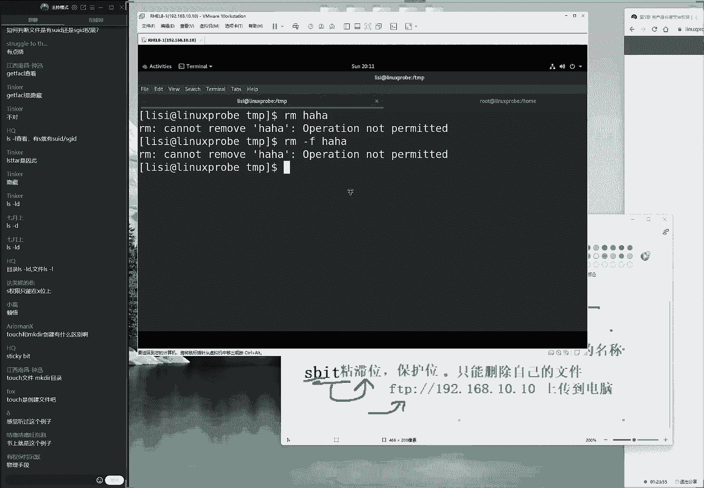

它只能去删除掉自己的文件，这样的一个保护为权限，举这么多例子啊，很烧脑，我们把这个三个权限理论和基础都给大家说完了之后，大家现在已经心理上非常着急的啊，非常好啊，非常的着急了，说老师。

那我怎么样能够知道我现在这个文件上面有哪些权限呢，这个叫特殊位权限，我们这么去看，我们首先来说权限是三位，三位之间一段毫无关联，那好了，rw x rw x rw x3 位三位之间毫无关联，三位一段好了。

那么如果说我们现在在这个所，有者的这个执行位上面我们加了一个s的话，那么指的是它有s uid权限，然后的话呢如果说我们是在文件的所有组上面加了一个s权限的话呢，它指的是s g d权限。

如果说他是在最后一位上面把x变成了一个t的话呢，就这么去看好，这是第一点，第二点，大小写区分呃，如果说稍等一下，如果说他之前是rw x，大家看一下，如果他之前是rw x的话呢。

那么他最后得到这个结果就是rw一个小写s，然后话了再来，那如果说他之前啊，他要是，没有权限的话呢，那么不不先给写下来啊，rw i s，然后r w t啊，那么呃他呃他们他则是一个小小的一个形式。

再来rw x，然后下面如果他要没有权限的话，如果他之前是这个样子的话呢，我们得到这个结果就变成了是rw一个大写s以及rw一个大写t，所以大家先去记一下同学问啊，问到了说啊，说为什么只针对于x位呢。

这个问题啊没有什么呃，这个问题是没有意义的啊，下面一个问题大家说，那如果说rw i s，那么对应的是七吗，对对应的是七好，下面的话来看一下我们现在这个权限。

啊下面大家去看一下这个权限rw x如果说之前有执行位，那么则是一个小写的s或者是一个小写的t，如果说的话，我们之前没有权限的话，那么则是一个大写的s跟一个大写的t这样的一个效果好，这是我们要给大家说的。

前两点，大家先去记一下，先去思考一下，然后大家说一下我们这个后面的这个去设置的一个方法，那么呃啊那么好，我们后面需要给大家去讲啊，大家不要着急啊，问到说我们这个对应的数字是多少啊，不用着急。

马上给大家讲啊，马上给大家讲到啊，嗯不着急啊，大，家正在这正常问的这个问题，马上就要给大家去讲到了，稍等一下，这水凉的差不多了啊，我感觉再讲五分钟就能喝了，哎挺好，来呃看一下这个权限的一个查看方法。

我们会了之后的话呢，来给大家去讲到，就是我们其实啊同学们问到了，比如说同学叫做小狐仙是吧，然后问到说我们这个权限对应的是多少，其实这没有意义，就是我们要给大家去告诉大家一个数字。

那大家记完了之后没有太好的思考的话，没有啥意义，您主要就是一个思考的过程啊，知道为什么怎么来的对吧，所以我们现在不仅要告诉大家怎么啊，我们不仅要告诉大家答案，更要让大家知道怎么去算s u i d的话呢。

对于我们这个数字法来说是个四，所以的话呢s g i d的话呢就是个二，然后的话呢我们的s b i t的话呢对于来说数字是个一，所以同学们来继续说一下，那么所以我们去啊遇到一个权限的时候。

他的话呢实际上我们要看它这个权限上面有哪些一般权限，以及有哪些特殊权限，然后的话呢把这个特殊权限跟这个一般权限的话呢合并去写，它是先写特殊加上一般这么一种格式来去完成的，好听完之后又很抽象了。

我再给大家去说一下下啊，我再给大家说一下，这家需要截图吗，如果需要截的话，你就截一下，不需要的话，我就往下面去拉了啊，是这样的，大家比较心急，老师那你先给我一个例子来告诉我怎么去算好不好啊，来rw啊。

当然好啊，对不对啊，我们rw一个小小s，我给大家一个稍微难啊，稍呃我们稍微难一点的啊，rw啊，一个s，然后是rw t好，对于这个来说，请问我们这个数字法的权限该如何进行计算，很简单啊。

来同学们先去算一下这个该怎么去完成呢，大家先去算着啊，大家先去思考的七七嗯，同学们对还是不对呢，他们说的对不对呢，我们先不管大家先去算着，然后先去思考着，我来给大家往后面去说啊。

那如果说我要想去设置我们的s u i d的话呢，我们这样去设置，如果想要去设置s u i d，那我们去使用呢，我们是叫做啊u加s，然后换s g i d是一个g加s g加s。

然后看到我们s b i t的话呢，它是一个o加t，我们不知道大家学完了之后，今天会有压力啊，反正嗯这个权限或者说我们这个操作系统吧，越学越深，有些小孩子。

然后学完了之后就感觉学一个礼拜感觉自己能飞起来了，但是的话呢像我们这种上头就是像我们这种呃嗯商岁数这种人吧，就是就会觉得自己觉得还是比较的浅薄啊，越觉得吧越觉得自己这个很low啊，比如说现在要看一下啊。

这就是我们去查看的一个方法，然后该去说一下计算的方法了，计算方法就是这样的，比如说我想对于一个权限设置一个o加啊，那我们要想去设置一个s y d权限，那我们则是这样去做。

来大家先记一下我们这个设置的一个方法好，同时的话呢大家先看一下，大家先去啊，大家先记着右边，我们来给大家说说左边这个左边的话呢，首先啊大家看到这个权限的话，实际上它并不难。

他的话呢就涉及到了我们的一般权限跟投入权限，但我们的话呢特殊权限我们先不管它啊，那我们先去说一下这个呃一般权限先把它给它写出来，一般权限r w它是一个小小s指的是他之前有直径位。

那么就是一个x然后的话呢现在可以看到他的话，第二位有一个s u i d和啊，那么他最后的话也是一个小写x好s啊，gd权限最后呢rw一个小写t它最后有执行权限。

也就是说我们的一般权限法它是一个777的一个权限，这个没有问题吧，然后我们可以看到了，那我们由于我们的s y d权限是个呃，然后呢s g i d是个二，然后做成s b i t是个一。

所以4+1+1等于是七，特殊权限法跟一般权限法可以看到我们这是一个会啊，这是一个换算表，然后把特殊权限法加一般权限法是我们写权限的方法，所以我们的版权限是7777，第一个七为特殊权限。

后面三位为一般权限，这么去来的，ok大家算了之后是不是感觉很过瘾，这就是我们对于这个一般权限跟特殊训练的一个换算的一个方法啊，ok那么大家先看着左边啊，我们左边不给大家删掉。

看着左边我们再给大家出一道题目，该一道题目有点简单了，我自己都觉得有点太low了啊，我先给大家出一道难的题目，同学们去算，我给大家说两道题目啊，说完了之后我们就去翻篇来，rw rw rw什么呢。

rw嗯不能太便宜你们了，rw一个大写s rw大写s，然后是r减小写s，然后是减减啊，大写t啊，不就呃嗯就不要了，就这样吧，好因为加上如果要是三个权限都有的话，那不就是有个七吗，大家没有思考过程了。

来这第一个权限，大家先去算，把它转成数字版，然后的话呢我们再来嗯，再给大家出一个稍微难一点的rw，不是r减s，然后是r r减大写s不r减减吧，然后减w嗯，哇塞嗯，小写t来吧，同学们啊，大家说怎么样。

刚才停电了，漏几分钟没有看，那我相信您可能现在看不懂了，有点太难了啊，不着急，先去算，先去算，先去算下去算哎呀，大家觉得很有意，大家是不是感觉到很有难啊，会很有难度，这种东西就像一个外星人语言一样啊。

嗯怎么讲呢，会很有难度，但是一般来讲实力培训的这个节奏感是我们没有是啊，完全比不上我们的，因为以我为例啊，因为我们去年上学的时候继续加h c的时候，我住的比较远，我住在潘家园那边，大家先去算算。

我们先给大家是在给大家时间去算的，你要是会的话，就赶紧去算了，然后我先给大家先聊聊天啊，就是给大家一分钟时间吧，就是因为我当时我上学的时候，我住在潘家园，我住的特别远。

然后当时的话呢我们机构是在知春里海淀那边，我每天的话先需要坐34路，然后先做到劲松，然后坐地铁12线，然后绕一圈，从东南三四环啊，从单啊，从啊东南三环绕到西北三四环之间，然后就特别的远。

当时一般啊实力培训嘛，他还不是那种怎么讲，他还不是那种到啊，他还不到的啊，他还不是到了之后就可以去上课的，你们需要先去抢一下位置，因为做到后面的这个呃位置的话，那么就看不到黑板了，所以我们一般情况下啊。

九点钟开始上课的话，最晚八点钟就要到那儿了，所以的话呢我们一般起床的时候大概就是六点多钟，然后开始去吃早点，然后就开始出发了，七点半八点到了这个好学校，然后我们开始去这个上课，一般情况下啊。

九点钟开始上课，呃，没有呃，我们上课过程当中吧，没有呃，偷情况的话总会出一个问题，大概会开始讲九点钟，讲到九点半，然后突然间老师说哎呦坏了，然后开始出现一个bug，然后开始去排错，一般会排到十点多钟。

十点多钟，然后解决的问题了，再讲一小时，中午就休息了，然后就没有什么了，所以这一天下来的话呢，可能这一上午六点钟到12点钟，可能这六个小时啊，刨去这个车程路程什么的，可能最后满打满算才能加两个小时。

而且那个比较水，我们也都会有一些互动的这个时间什么的，而我们家现在就是把所有时间都给它压榨了，我们在上课的时候就不要特特特啊，会给大家像现在这种呃时候，然后会去留大啊，会有很多时间让大家去计算。

没有这样的这个机会了，这个的话呢就是呃我们像这样的这个机会，也是我们这个整套课程当中嗯仅有的这么一次让大家在，线的时候去换算一下，然后我们来给大家去看一下，换算出来的这个结果是否正确。

这样的一个呃实验的一个环节等以后就确实没有了，我们希望能够把我们这个课程的这个难度跟节奏感提高上去好了，说这么多废话啊，主要等一下，现在画完了，同学们做对不对呢，我来给大家讲一下。

首先对于我们这个特殊权限法转让，我们这个一般权限法的话呢，先去转出来，我们先不用去看这个特殊权限法来，rw是一个大写s啊，它指的是没有权限，一个rw减号，下面的话呢就是r减什么呢，它有没。

有权限它有权限r减x尖尖剪啊，这个非常好啊，他没有任何权限，所以我们来算一下四，然后这个的话呢就是一个五，我呸呸呸呸呸啊，这这个是个六，这个是个五，这个是个零啊，没有问题吧。

然后看它前面因为有s y d权限，又有sgi d权限，4+2等于多少呢，等于是六，所以我们说完了，这个权限是6650，这就是第一个权限怎么来的，好同学们来去算对了吗，好6650，然后下面一个问题啊。

6650好，下面一个问题啊，下面一个题目是说啊，反而现在个答案给大家标注出来啊，这是我，们思考的一个过程，下面一个的话呢是说r减s我们还是啊不关心他的这个呃特殊权限位，先把这个一般权限位给它抄出来。

r减x小写s指的是它有执行位，它是一个小写x然后的话呢r减减没有问题，减w然后的话它是一个小写t指的是之前有直径位，所以还是一个s4 加上一等于是五四，然后的话呢这个是个呃2+1等于是个三，没有问题。

它有s u i d，它有s b i t所以就是4+1=15做换算出啊，最后我们换算之后就是5543好，所以大家呃去呃可以来看一，下自己有没有算对543，当然了，如果大家觉得这个我们还不太过瘾的话。

你可以这样啊，或者说我们啊不知道自己有没有去算对的话呢。

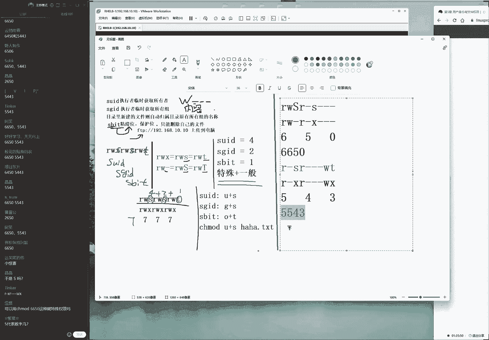

你可以去算一下，比如说6650对吧，我们随便找一个文件，因为它是可以针对于文件来进行设定的，比如说我来给大家举一个例子，随便找一个文件稍等一下啊，随便找一个文件6650。

然后我们随便找一个文件设置一下啊，大家说我们的啊可以用6650来去设置特殊权限吗，可以啊，来稍等一下啊，有人问到了，说我们能不能用到数字法，还，是特殊权限是可以的。

来我先查看一下某个文件是这样的一个权限，当件权限是这个样子的，可以啊，然后是6650，于是我们来设置一下文件。

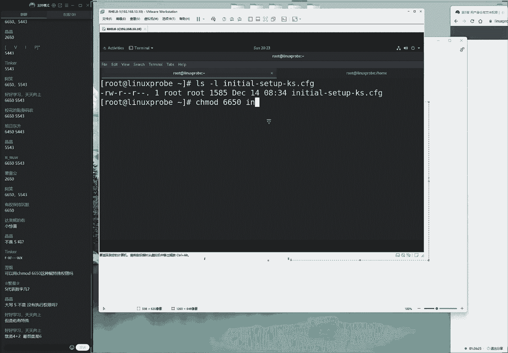

再去看待会，大家会啊，大家会发现是不是跟我们计算出来这个结果是一样的，没有问题吧，大小写都是一样的，好再来5543，来我收拾一下5543，其实同学们下课之后就可以给自己处理啊，就可以自己处理到题目了。

最后看一下自己计算出来，对不对，另外的话此时你也应该能够深刻的感受到，就是通过这种数字法来去设置的话呢，会比，我们这个权限法设置起来更加有效率，对吧啊，回家啊回家啊有效率，这样写起来也更加的便捷。

大家看一下，算出来是没有任何问题的，好下面的话呢我们来给大家往后面再来一句说啊，再给大家出一两道题目，说完了之后，我们就翻篇再往后面去说了，因为这个太过于重要了，我们如果这个不熟的话呢。

下面同学们再去听课的时候就会很有压力了啊，基础一样打牢，最后再给大家去说两个，说两个这个数字法转成这个权限法，说完之后就去下一个了，呃这边来了啊，我来6543654，三然后他再去算一个。

就是这个5555，随便同学们，那不太简单了，54354啊，这不543有了是吧，等一下啊，嗯随便来了，比如说2345吧，好大家把这个给他说啊，给换算一下，把我们的数字法反向转换成权限法，算完之后。

我们就可以踏踏实实的往下面去讲了，其实这个对于权限的转化嘛，大家一定要熟练的，因为呃您可能认为说我们没有必要那么熟练的话啊，但是我们要熟练之后的话呢，同事们再去啊，工作当中会很有效率的话。

以及别人这样去做的时候，就比如啊那我们比，如说别人去执行了这么一条命令，我们自己可以不用啊，当然我们可以不用了，但是别人这样去用的时候，我们看不懂怎么办呢，因此这个还是很重要的，626543。

其实第一次上课的时候，我不太我，我们并不太想要把大多数的时间，因为这个不因为这个，因为这个要是不必要的话，也不会去讲了，所以的话呢大家就先去好，先去记忆一下，后面会有一个利用的一个方法的好。

我们现在的话来给大家去说一下大家问的一个问题，大，家说大写s代表数字几啊，这个问题问错了，下面一个问题，大家说大小s是不是代表没有执行权限呀，对是这样的啊，来给大家继续往后面去说，6543。

另外的话如果没有跟上的话，我看得出来他还没有跟上啊，这个方案很正常，我们基本上这一节课能够有八成，我觉得能够跟上了七成就算不错，因为大家也看到了，我们再给大家讲课的过程中的话呢。

利用了这个大概得有个15分钟了，怎么去讲这个换算的题目是比较浪费时间的，结果如果咱们再换算出来，正反两套又半个多小时出去了，咱们今天这课就会很水啊，所以我们会照顾到基础比较薄弱的同学。

但是你也要努力的往前赶，我们前面给您去呃，慢一点啊，在这个讲课的这个节奏，并不是说我们一味会去迁就我们的基础比较薄弱的同学，能够留足充足的预期时间也好啊，您需要看视频的啊，不能说我们去慢一点了。

然后以后也会慢，也不会这么慢的，来六五十三，我来给大家讲一下啊，这个我的思路是这样的，那么还有哦，那我，们首先来讲的话，这个特殊权限法我们先不用去动它，先算这个一般权限法543，这个没有问题吧，543。

那我们换算之后五，那么五的话就是四零，一，四的话就是4000的话，三的话就是021，这个我们算出来之后，这是我们的一般权限法，一般权限法的话转换成我们的权限法r减x，然后是r减减减w x。

这是我换算出来的一个结果，它有一个六六的话呢，我们是叫做s u i d加上s g i d对吧，那就是4+2，那我们最后算完之后是这样的小，那么啊那么也就是说这位和这位，是有的，它有权限就是一个小小s。

它没有权限，就是一个大小s，最后算出来结果是这样的。

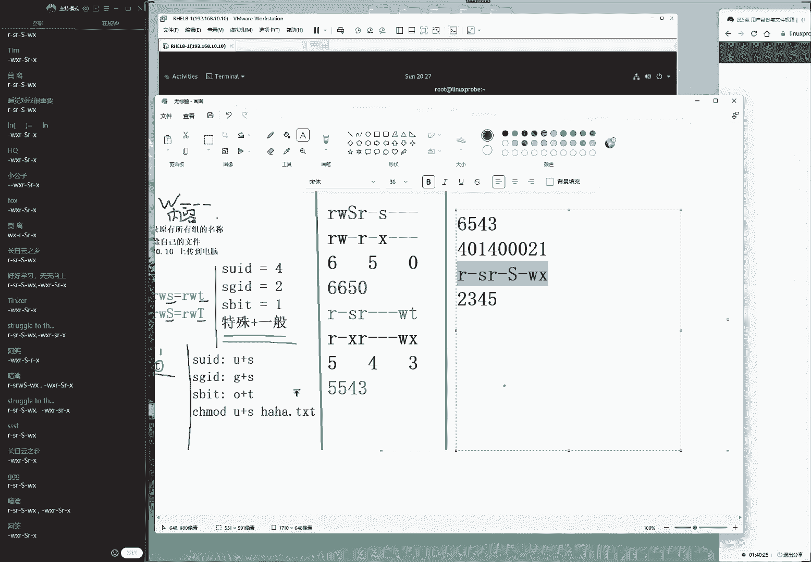

好6543，我最后算出来这个结果是这样的，落实到实战看一下计算出来的这个结果跟我所计算出来的是否一样呢，来看一下最后这个结果还是啊不呃。

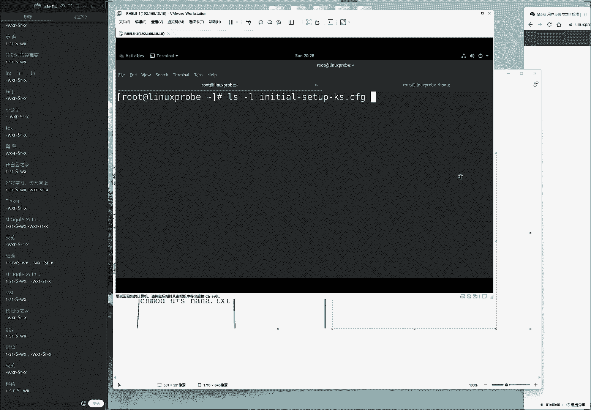

不要去纠结，说这个以后又有没有啊用到了这个机率啊，这个用到几率超级大，我们不再解释，于是来看一下，最后我们换算出来这个结果跟生产出来的是一样的，好这是第二啊，这是第一个。

接下来再来345345转换成这个数字法，那就是，021，然后400401对吧，好转换成权限吧，零二啊，那那啊那啊那啊那么的话就是啊可啊可读可写啊，不可以啊，k都可以执行。

然后读然后的话呢以及可以读可执行，把这个权限的话呢来看一下，这个是个三，它指的是s g i d以及s b i t啊，这两个权限于是加到这一类上面，它有权限吗，它没有，那么于是一个大写s他有没有权限啊。

没有那么那么就那么不呃它是有的，那么因此它是一个小写t最后算出来这个结果是这样的，来算一下啊，2345。

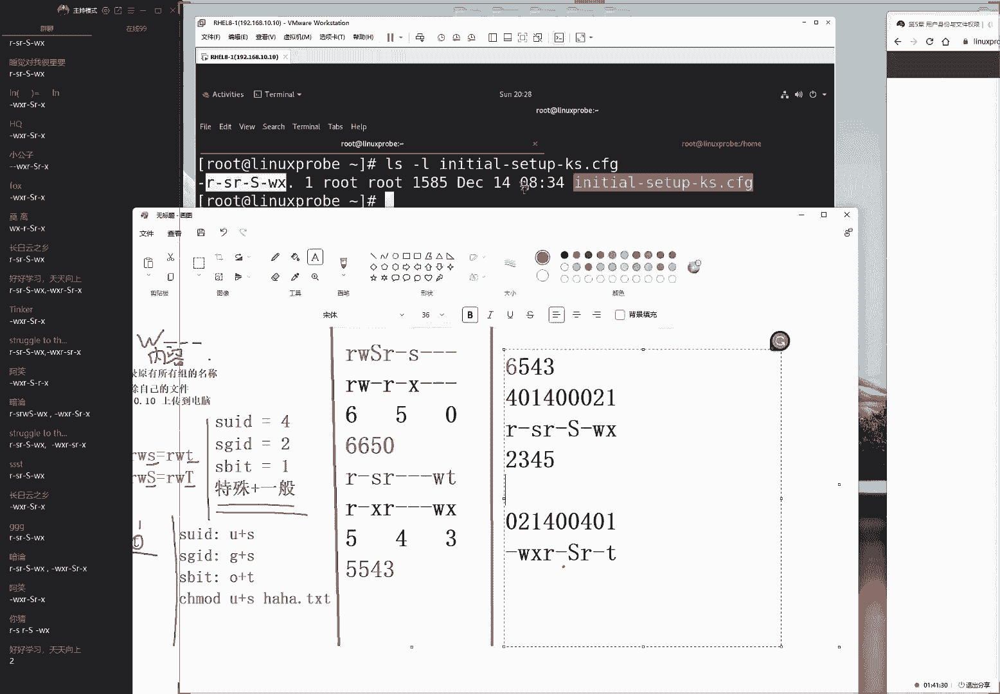

我们看一下最终的这个结果，2345其实对于初学者来讲的话呢。

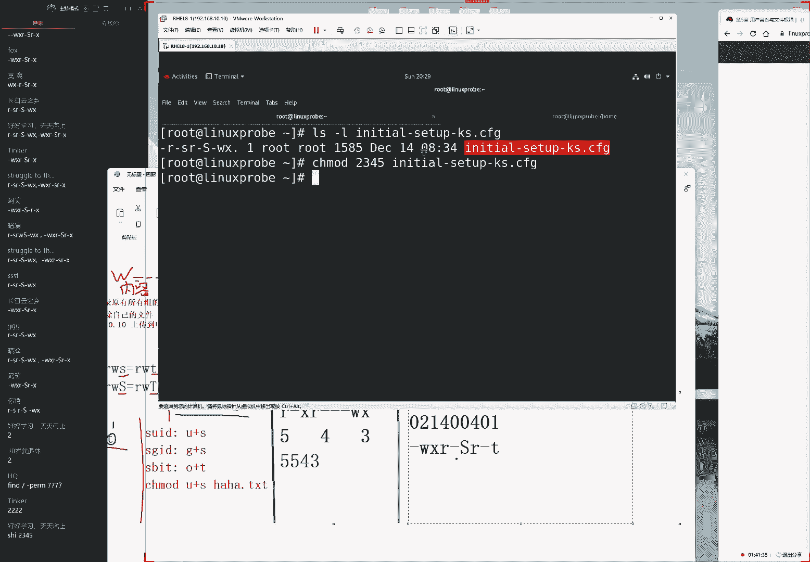

最呃忌讳的是什么呢，大家看一下，最后换算出来这个结果跟我们所预想的是一样的，其实初学者最忌讳的是总是在去纠结，就是哎等一下啊，我是算错了吗，啊23455哦，哦哦不好意思啊，是我算错了。

五的话是4+1加出来的，这是我的问题，不二二啊，不害臊啊，我看错了，他二二的话他就只有最后一位不，他只有他是桌游啊，他只有中间那一位是我算错了，我刚才看成三了，不好意思来，那我们来看一下，这个是个二。

于是的话呢我们最后这个结果，是这个样子，其实我们对于初学者来讲的话呢，呃最忌讳的就是会去老去纠结说老师这个有没有用啊，就老去纠结这种问题，其实的话呢我们给大家讲，对于一个初学者来讲。

你没有能力现在判断说这个东西有没有用的情况下，真的是不要去纠结，然后就去学就好了，因为您总是在判断说这个有没有用，然后去选择性的去学这个没有学，我觉得现在没有用，然后接下来用到的时候就会很发愁了。

这个时候千万是很忌讳的一点好，下面来给大家说，一下这个5。4小节，我们讲一下这个文件的一呃隐藏权限，大家觉得这个到此结束了吗，没有的，我们刚才讲了这个一般权限跟这个特殊权限还没完。

下面一点特叫做隐藏权限要来了，隐藏权限它顾名思义就是被隐藏起来的这个权限，它的话呢是对于我们的这个呃一般权限跟投入权限的这个功能，又进行了一次补充，同学们可以看一下表格，五杠八啊。

这个里边的话呢我们的章节是5。4，表格是5。8，它是对于一些功能的话来去进行一些呃补充，比如说啊我先给大家说一下命，令命令的话呢要选择去设置的时候，是使用的是这个要讲下去查看的话呢，使用的是这个啊。

来去记一下这两个命令，因为卖顾名思义，然后叫做隐藏权限，隐藏权限就是默认我们看不到的一种权限，我们需要去使用到专业的命令，然后来进行一个设定以及去查看，如果要想起来去设置我们的这个权限的话呢。

它使用的是一个加上啊这样的一个权限，这样的一个方式，然后后面写上是文件的名称，然后要等下去取消掉一个权限的话呢，那么则是一个减号，减去一个权限，后面加上文件的，名称这样来去进行一个设定的好。

现在的话我们给大家看一下表格，五港吧，呃给大家随便抽这么几个啊，给大家说一下，首先的话呢第一个我们就来看了啊，第一个比如说是一个消息i它指的是我们设置过后，将无法对于文件来进行任何的修改。

再来进行一个剪切跟新建好吧。

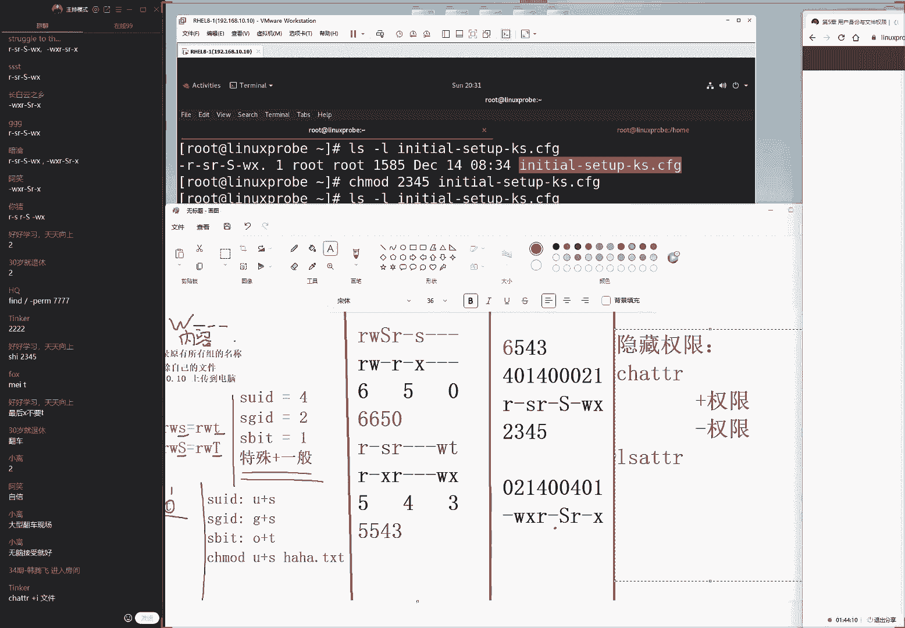

拉巴拉好，我们这样去做，要讲来进行设置的话，那么就是叫做c h a t t r啊，然后的话呢我们来加上一个i啊，后面写上文件的名称，比如说这个文件按下回车啊，给，大家去说两点。

第一点隐藏权限是默认看不到的权限，他才做到隐藏权限，所以我们去查啊，去查看文件的信息的时候，他没有任何的意义啊，但这个意阳他啊这啊这个的话是因为来自于我们前面，不不我们还给他还一下虚拟机吧。

因为大家如果不关心你机会觉得我们好像删不掉。

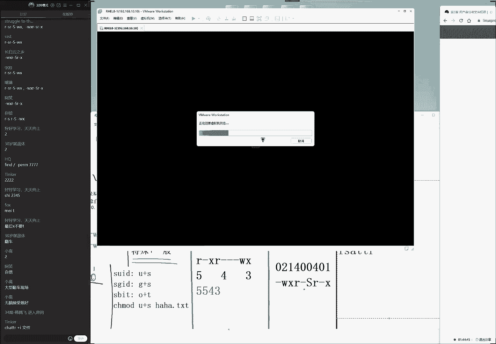

这个文件是跟设置的权限相关了，那我现在还原一下虚拟机了，我现在的话呢再重新的去设置一下这个权限，有一个文件，这个文件的话呢说啊上面就设置一个刚i参数，于是我查看一下这个文件上面的这，个权限讲的第一点。

第一点隐藏权限是默认看不到的权限，所以我们看到这个权限设啊，设置前后没有任何的异样，没有任何的变化，这是第一点，第二点，管理员受一般权限的限制，所以管理员去删掉这个文件的时候也会出错呃。

于是得到这样的一个报错了，稍等我先喝口水，这个的话呢实际上是hc以前那叫考题之一啊，对啊这个也不能删啊，关联也删不了，就是原题红帽h3 c啊，哦对我们是红帽h3 c20 道题300分，每道题目15分。

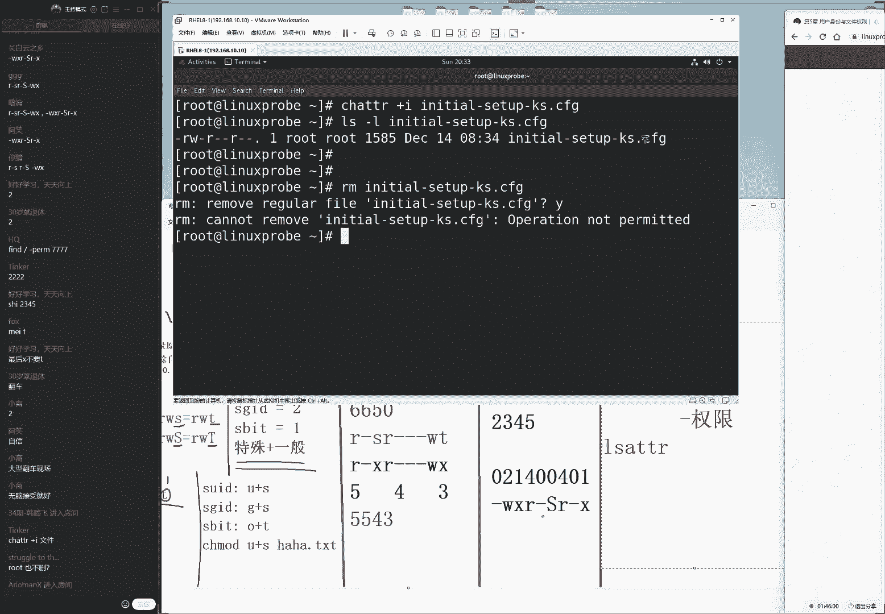

15题啊，他的话15分就考这么一道题，就是我现在有一道题目，它价值的话是15分，这15分只需要让我们去删除掉这个文件就可以了。

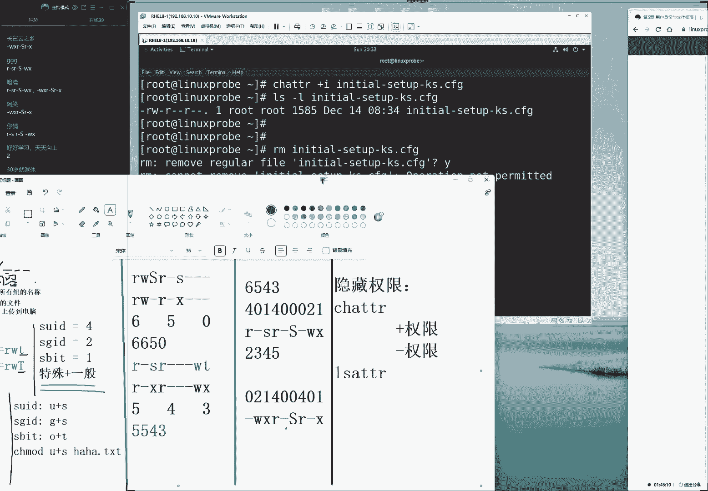

但是我们上不掉，特别的着急嗯，所以的话呢我们才有可能辅导这样的一个视频，占了一种辅导形式，它是之前大家都已经学了啊，但是只不过我们需要进行一个串讲，考试当中又要去使用一些技术的话，再去做一下回忆。

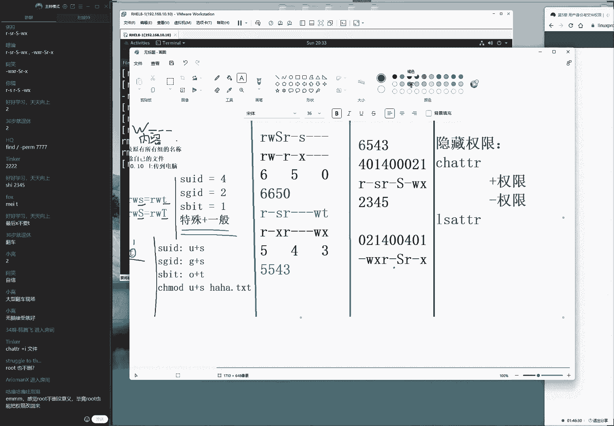

因为就以这个为例，考试的时候我们根本就想不起来是为什么啊，就是我们虽然学了这个隐藏选项，但是我们都想不起来，比如说我先去删除这个文件，我的思路是删不掉的吧，好查看一下我们这个文件的权限没有问题。

查看一下我们这个上一集当前目录的权限也没有问题，然后的话呢我去使用到强制删除加上目录的这个递归操作，删除下这个文件，我还是删不掉，这就是我明明都会，但是我表达不出来，这是考试的时候的一个很大的一个机会。

好现在的话呢我再给大家去说一下怎么把它给删掉，删掉的方法的话呢，就是去查看一下这个文件上面有哪些呃呃呃隐藏权限，然后把它给去掉就可以了，来去使用到这个专业的命令，然后后面加上文件名称查看一下。

看到上面有一个i啊，怎么办呢，c h a t t r减去一个i把它给删掉啊，去掉这个呃文件上面的隐藏权限，接下来再去删的时候就没有任何问题了，是可行的，这个就叫做隐藏权限，好这个大家回问了一个问题。

那我们大家问了两个问题，好大家说说感觉啊，我们这个呃管理员要是没有删的话，没有意义，毕竟我们也可以把权限给它改过来对，因为话呢权限因为我们的管理员嘛，它是可以去修改这个权限的。

所以这个对于管理员这个限制是比较少的，然后大家说怎么权限全都是尖尖减，这叫隐藏权限，指的是他没有啊任何的隐藏权限了。

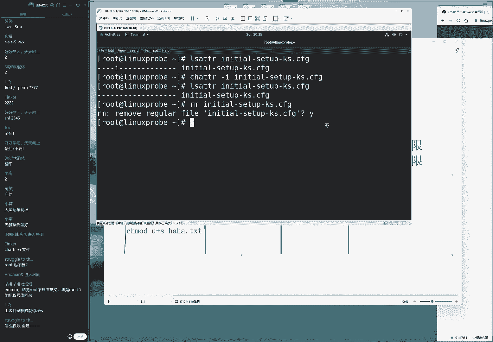

然后的话大家其实这个问题问完了之后，还会再问另外一个问题，说老师那考试的时候，如果说他的这个给的这个值，它不是个i它也不是a它比如它是感这个怎么去理解呢，不用管啊，他要是给的话呢，不管他给的是什么。

我们管他干嘛呀，我们就直接c h a t r它有什么我们就剪什么就可以了，大家记一下啊，考试的时候有什么减什么，不要管它的含义啊，把人家有什么就给它剪掉它就可以了。

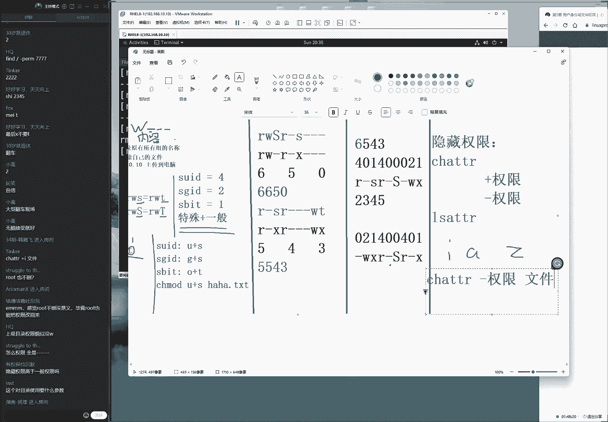

没有问题好，这是第一个啊，这是我们的第一点啊，第一啊这是我们第一点啊，不这是我们要给大家讲的第一个参数叫做i参数，设置过后的话呢，任何人无法编辑文件里面的内容，也无法对文件进行一个剪切和删除。

好这样的话还有比如说呃比如说我们的a对吧，a的话呢指的是呃我们能否对于这个文件里面的内容来进行增加啊，这是大家刚才问到的一个问题，好我们可以来尝试一下，例如说我现在这样。

我现在的话呢对于某个文件去设置一个a参数，这个话呢我们设置好了之后，我们再往里面去写入信息的时候，如果说我使用的是要做清空呃，写入重庆相符，那么我们写过这个文件的时候，他就会失败了。

因为他会去先去清空后写入，所以他会给我们来个报错，因为当前的轻功操作是无法完成的，但是我们的a参数指的是它是允许追加的，于是的话呢我们可以写上两个大于号。

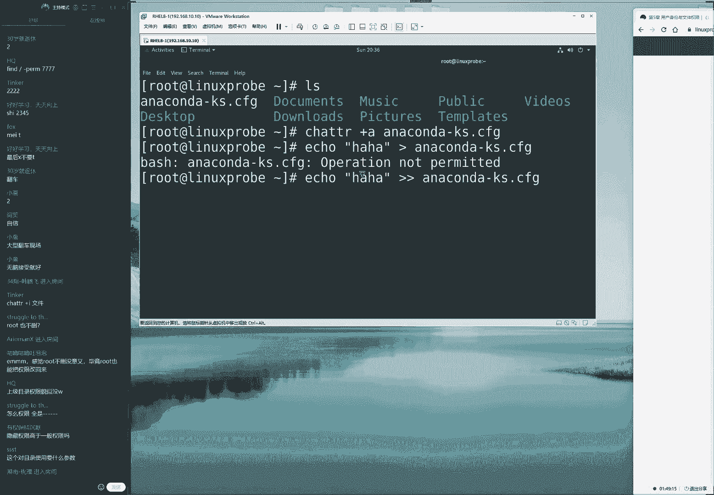

叫做追加写入重定向符啊，叫做啊，这我们叫做呃追加的啊，追加重啊，叫做追加的输出定向符，叫追加的输出重定向，然后所以的话呢我们使用的是两个大于号这样的一个方式来去输出。

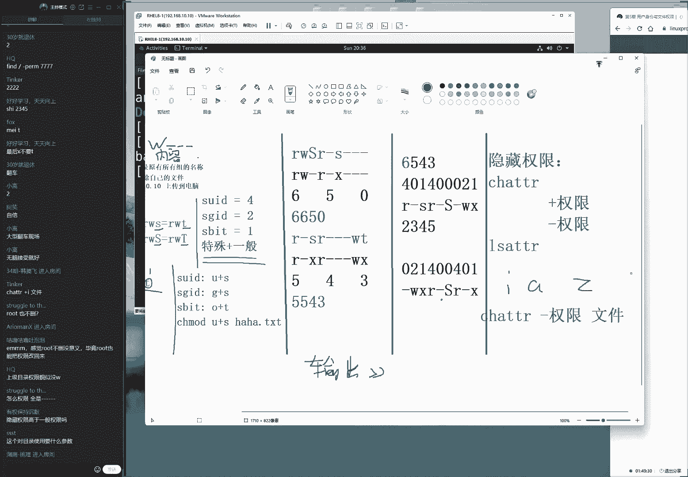

大家可以看一下效果，可以写入成功，没有任何问题，然后以及去查看一下这个文件的最后信息，里面已经是写了这个内容了啊，是这个是写入成功的，这就是a的这个参数的一个作用。

这个大家可能问到说老师这有什么样的一个用处吗，这个是有的。

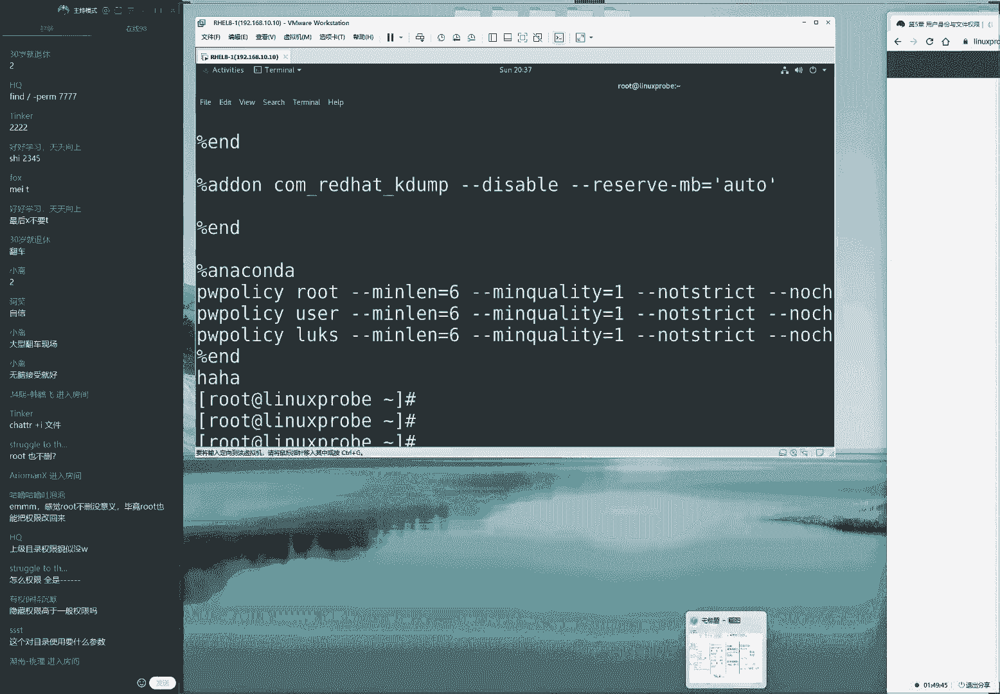

比如说我们可以对于我们的日志文件来去加一个a餐的数，因为大家想一下，因为它的日志只能是增加没有减小的这种啊机会如果说谁会去讲讲呢，比如说黑客去修改了啊，他啊比如说一名黑客，他想去修改我们的信息的时候。

他才会去减少里面的内容，所以的话呢对于我们的a上面加一个a参数，保证说信息只能够进行增加，而不能够进行减少，这就是一种保护的方案，好这个是大家可以来去记下来的一个作用，然后的话呢我们这个75个标啊。

其实的话呢我们的五杠八表格里面给大家介绍了，每个参数的一个作用啊，就会很详细了，呃其中的话呢我们比较常用的话呢，还有一个小小s，但是这个的话呢它需要文件系统的一个支持。

他的话指的是从我们的硬盘当中给它删除掉，而无法进行恢复，其实这个话也是有一个梗可以给大家去说的，就是大家有没有看过一个美剧叫越狱啊，好大家有没有看过一个美剧叫越狱啊，叫做一个电视剧叫越狱。

然后有好多好多年了，我当时我记得看那个时候还是我上大学还是上高中的时候特别的火，还是上初中的时候特别火啊，大家有没有看过啊，这个大家看过是吧，ok看来我们这一中学的话呢比较喜欢看美剧啊。

不太喜欢看清宫剧啊，不太喜欢看穿越剧，说一下这个啊，那啊大家没有看过的话，那我给大家说一下啊，这个话叫越狱啊，是一个美剧说的话有一个剧情说下有啥话，这边的话用飞雷四季啊。

第一季的话呢是有一个啊主人公叫做哎那嗯迈克对吧，然后他的哥哥诶他的呃异父异母的一个哥哥，然后的话呢因为被冤枉了，被送到监狱里面去了，然后的话呢他就正好去见那个监狱的一个工程师。

他就把那个监狱那个图都闻到自己的这个身上面了，然后的话他就去九寨沟去了，然后呢最后一啊第一季的最后他就把他哥给救出来了，这么一个剧情，后来的话第二季怎么回事呢，是第二季有一个探长啊。

它是一个卷毛那个啊啊，然后到第二季的时候，那个卷毛嘛，然后他就去找到那个迈克那个呃啊家里面了，结果的话呢会发现它里面那个家里面那个电脑里面的硬盘的话没有了，因为的话呢第一季的时候那个麦克的话呢。

把那个硬盘顺着窗户给他扔到湖里面去了，啊啊他们给他扔到湖里面去，非常的啊啊那啊啊啊，然后的话第二季那个时候的话，那个探长嘛就找到他们家里面找那个硬盘，然后的话呢就发现那个窗户正好开着的。

好像是我好像忘记了，就说那个啊窗户去找那个硬盘，结果基本上也找回来了，然后的话通过这个呃修复软件，结果他把这个硬盘里面的资源给他就找回来了，也就是说嗯换了也那也就是说实际上我们把这个硬盘给他格式化了。

实际上的话呢还是有人可以把它给恢复出来的，我们这个时候就可以加一个小写s的一个参数，让我们去删除掉一个文件的时候，它不仅是啊把它给删掉了，而它啊它里面的这个话呢。

真实的数据在这个blo块的话呢也会被提升啊，那么也会被填充上零块的数据，这样的话呢我们从理论上来讲，再加上几次格式化，它就无法被恢复了，这样的话呢我们如果第二季这个啊。

那么呃如果说第二季他加了我们这个参数的话，他有可能和后面的话，他也不知道他们啊他们是想去哪儿了，所以的话大家就知道了，我们这个有些时候这个参数的话可以决定我们的命运呢。

如果说我们的这个呃主人公看过咱们的课的话，加过这个参数，只要加一个小写s，那么这个第二季啊，那么我们的第二季第三季就没有了，那会啊第一次啊就可以结束了，好继续看啊，就冲过一个小例子啊。

大家看一下这个参数像小s的一个作用，还有的话那下面这个例子有点呃有点呃牵强啊，但是的话呢再说下印象就好了，下面的话呢还有that的啊，比如说那个b的那个参数是一个小写b。

它指的是无法去修改文件以及目录的一个存取时间，因为我们第二章节的时候哈，刚立就觉得确确实比较牵强啊，就觉得啊都举了一个呃越狱了。

它可以使用一个叫做刚d的参数来去修改我们的文件的a time跟c time，对吧，那么我们今天就可以让他呃文件的话呢无法被修改，那我们如果要是有人去呃入侵了我们的电脑，想要去修改文件之后，去隐藏它。

修改这个时间的话呢，就可以保护我们的这个计算机了，还有的话呢比如说我们的这个呃d吧是吧，那我们来就是啊，它指的是当续作备份的时候来去忽略掉某个文件或者某个目录，这样的话呢来啊不要去他家进行备份。

我们总是把看一下表格，五网吧里面主要就是一些功能，如果说我们需要哪个功能的时候，那么则去使用这个命令，然后针对于我们的文件来啊，他啊进行一个设定就可以了。

这个的话呢它并没有什么难度好我们现在来给大家往后面去说啊，大家学完这个之后的话呢，这个比较简单，我们来往后面去说这个话到下面一个我们叫做文件的访问控制列表，来看一下，我们叫文件的访问库列表。

就是我们前面的学完了之后，我们总结一下，第一话呢我们的前面的一部分，这个实际上我们叫做一般权限对吧，然后的话呢我们这个的话呢叫做特殊权限，这个的话呢我们是叫做隐藏权限，这个学完了之后。

大家有没有发现一个共同点啊，就是我我们现在学了三类权限，但是这个三类权限都有一个卡bug一样的一个共同点，大家可以帮我们总结一下吗，呃或者说我们这个三个权限设置过后，都有哪些用户会受到我们权限的限制。

以这个角度去思考，来，大家来去思考一下，其实我们每一个技术的出现都是为解决一个问题而出现的，不要讲的那么的高级，因为当你知道他去解决什么问题而产生出来的一个技术的时候，你就知道该在什么时候去使用它了。

大家能理解我所说的这个意思啊，大家来以我这个角度上来去思考，嗯，来啊越狱啊，大家比较喜欢看是吧，我还是比较喜欢看一个叫做绝命毒师啊，而且好像看到那个twitter上面有新闻，好像要拍一个续集。

不知道真的假的，还是感觉非常期待的啊，好幼儿远了远了远了远了啊，不过也无所谓了，已经讲了两个多小时了，已经讲了两个小时了，也可以放松一下了，来下面来说一下啊，总结一下，大可说出来了。

是对于所有人或者对于一类人来进行设定的，对不对，也就是说我先对于一个文件上面设置了一个一般权限的话呢，那么只要归他所者，那么他只要归谁所有，归哪个组所有以及其他人的话呢，全都会受到这个限制对吧。

还有的话呢这个特殊权限是对于所有人来进行限制的，好这个话呢隐藏群也是设置过后，我们的管理员也会一起来说啊，也会也会一起说，也会受到这个限制，所以说他也是一个所有人都会受到限制这样的一个权限。

也就是说我们设置过的这个权限，就会对于所有人或者大部分人都去生效的，但是就有问题了，我该去如何去针对某一个文件的某一个人来设置这个权限呢，更加精准的流量的这部啊，更加精准的全新的设定。

能够让我们的工作更加的准确对吧，那我们这个时候就可以去使用到一个技术了，叫做file system啊，不呸呸哦，那这个话我们叫做文件的访问控制列表啊，来给大家写下来呃，这个字有点小吧，来f呃。

exercise control list，文件的访问控制列表权限，它的作用就是能够针对一个人，即一个文件来去进行啊，来进行精准，这个词特别好，精准的权限的设定，我就想针对于张三。

那我们就开始进行的一个设定啊，这样的一个方式哦，给大家演示，然后我们给大家说一下这个命令吧，因为这个比较简单，我们就可以直接就是把理论跟实战融合到一起了，想起来去设置的话呢叫做sfsa。

后面的话呢是一个消息m进入设定，如果想针对于某一个用户来去设定的话呢，他们则是一个小写u，要想针对于某一个用户组来去设定的话，那么则是一个小写g诶好。

那我们针对用户的话则是一个小写u后面加上一个用户名称，比如说啊随便就去写一个用户名，然后我们加上冒号权限，再加上权限，后面加上文件名称，就是这样的一个方式，我们就可以去实践出来，针对于某个啊。

那么可以去实践出来，针对于某一个人的某一个文件来进行一个单独的权限的设定了，然后我们也可以去使用到get fa slo后面加上文件名称来去获取一下，说这个文件上面已经有哪些设定过后的文件防空列表。

这个权限就可以这样来去时间了，大家叫什么啊，啊进入打击啊，没有问题，来我们来继续继续来看一下啊，赛飞slo，然后是一个m修改，后面的话我们的用户名称自己替代，然后权限文件名称来去实现。

这样的话呢是查看的一个命令，同学们有没有觉得今天这个权限看似简单，一讲起来就没完没了了，这个一般权限隐藏权限，特殊权限fc了就会很多啊，一学起来会多会觉得特别多，其实他还没有完事，讲完了之后。

明天还有呢啊，明天讲完了之后，第八章还有呢我们第八章节啊，第九章的时候还有一个i see a linux，那个超级难啊，那叫安全子系统，就是一呃根据这些它是呃有了这些了。

然后的话呢他才让我们这个计算机变得啊特别的啊安全嘛啊。

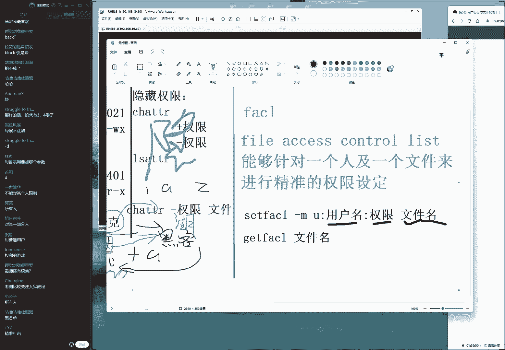

因为越加的这个细致跟复杂的全新的设定，才能够让保证我们这个服务器片的稳定啊，接下来我要说啥来的啊，同学们说脑子啊，现在的话脑子非常的嗡嗡的啊，我也是啊，ok我们不要乱不要乱不要乱不要乱。

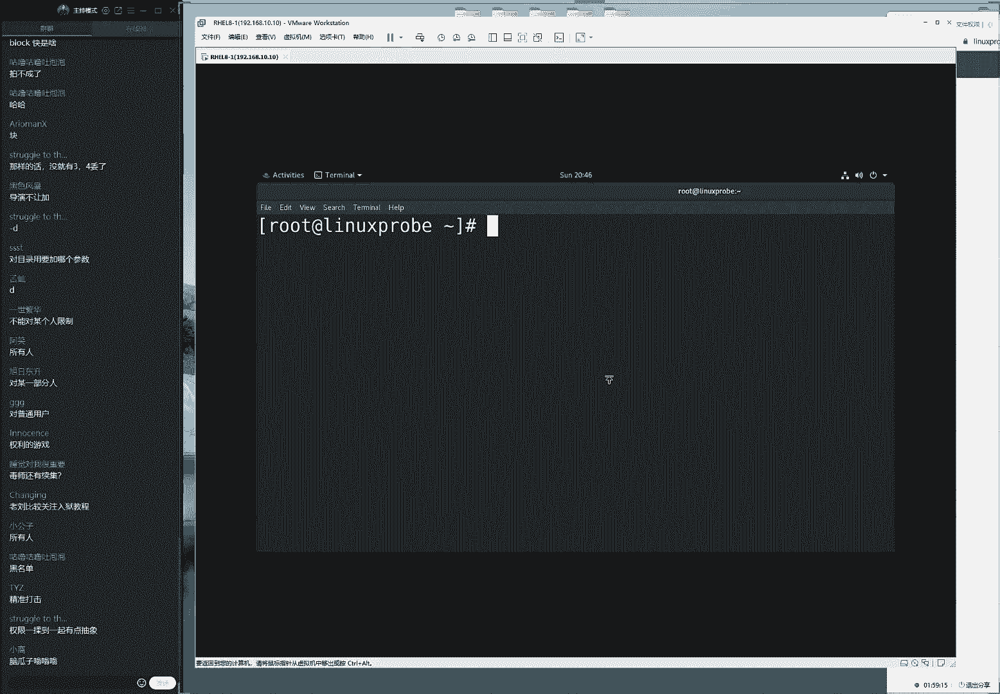

我来给大家说一下，比如说啊比如说我脑也实在是很乱啊。

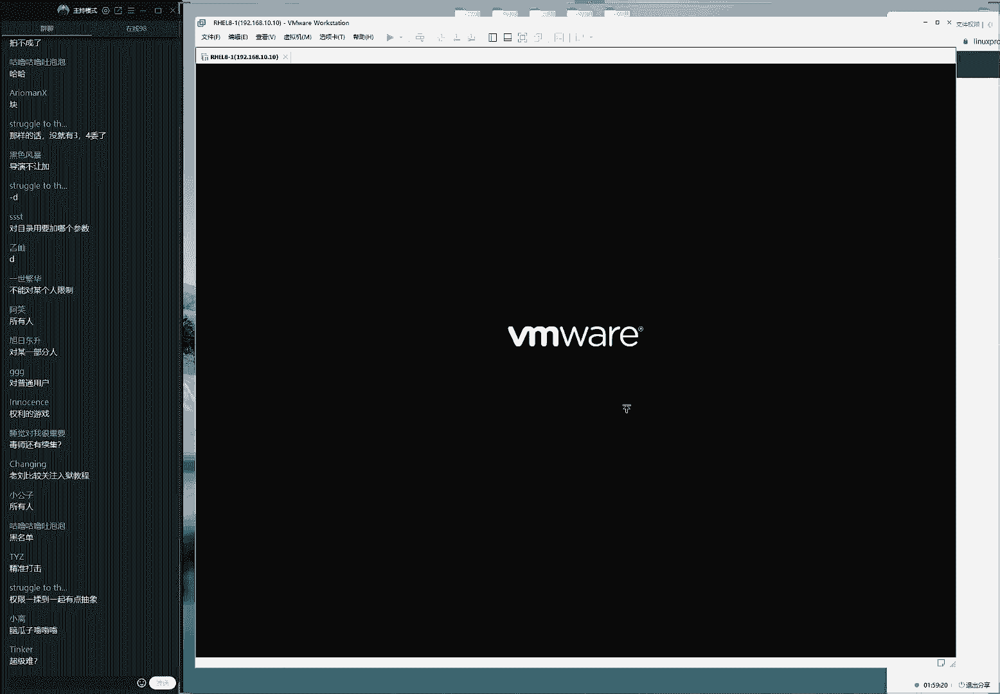

补脑我脑子现在没有乱啊，其实其实啊其实其实其实还有点乱的啊，来是这样的啊，我现在在讲的例子，比如说现在有两个用户，一个叫张三，一个是李四啊，异父异母的亲兄弟啊，同一时间新建出来两个用户。

同一时间新建出来两个用户，一个张三啊，异父异母的亲兄弟一模一样，张三李四两个亲兄弟没有问题吧，然后我先这样，我举个例子啊，嗯我现在新建一个目录好吧，这没毛病吧，新建一个目录，目录名称，我叫什么呢。

我叫做是谁发言了啊，小公子是吧，我叫小紫吧，这个名字不太礼貌，那好吧，就随便吧，新建一个目录叫小紫，然后的话呢我现在把这个小子这个目录我进入到里面去。

然后的话呢我把这个小子这个目录设置这个一个比较大的一点权限，七七权限满权限加上杠r叫递归操作对吧，我们针对于目录里面做文件加上这个操作，针对于小紫这个目录，我们去世了一个七七满权限，然后干嘛呢。

然后去查看一下这个目录的权限，加一个小写d查看目录权限好，七七满权限满了之后干嘛呢，哈哈然后我想想啊，然后我们这样去行的sf一赛了，后面我们加上一个消息m设定一个u。

我针对于李四这个用户来去设置一下这个权限，他的这个权限我们为减减减，它可以有啊，比如说我们要讲给他设置一个权限的话，那么就是一个啊这样的设定就可以了啊，那么换到我们可以这样来试试。

它可以对它进行编辑的这个权限，或者我们这样去设的都可以，那我们根据这个实际需求，射程权限为尖尖减，它没有任何权限，然而针对于哪个目录呢，针对于小紫这个目录。

要想针对于我们的一个目录来进行这么一个权限的设定，我们还需要加一个杠r递归操作，在这个杠杆代表是目录以及目录里面的所有文件，再按一下回车啊，所以我现在这个操作就是这样的。

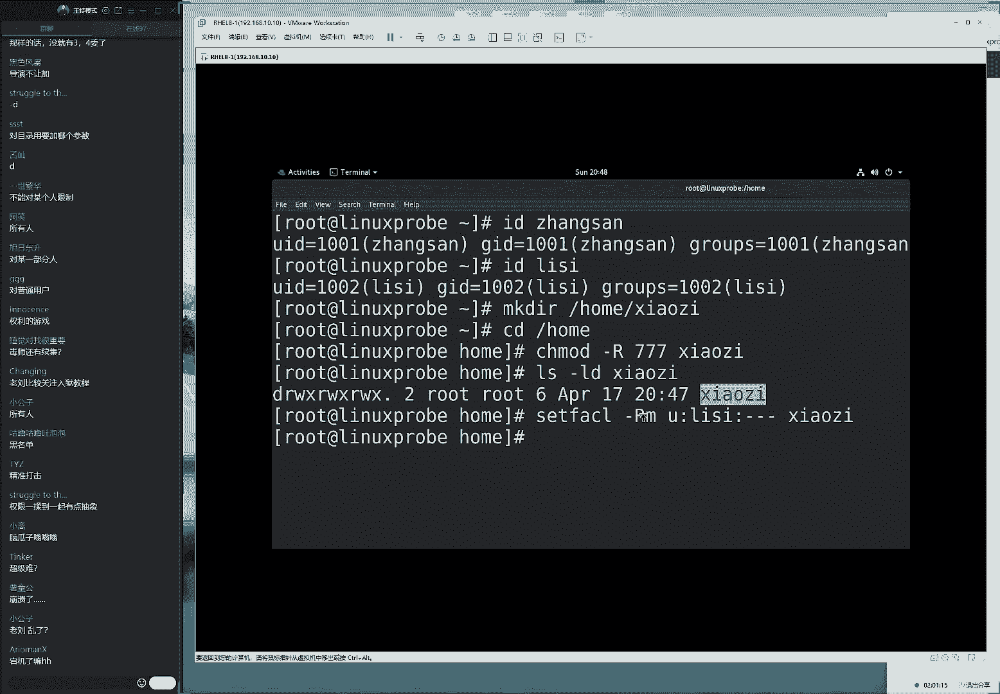

我们也就是说呃默认情况下大家听一下我这个思路啊，同学不要乱了，我现在我现在的话已经跑过来了啊，同学大家不要乱，也就是说我们现在有一个目录叫做小子权限的话呢是七七权限，任何人都可以进行一个读写执行权限。

同学们不要乱啊，千万不要慌，然后的话呢我们现在设置一个单独的f a c了啊，fia fia防空列表，我们现在的话呢就设置成那个李四，只有李四这个用户没有任何的权限。

也就是说每个人都可以对于这个呃目录进行一个读写执行权限。

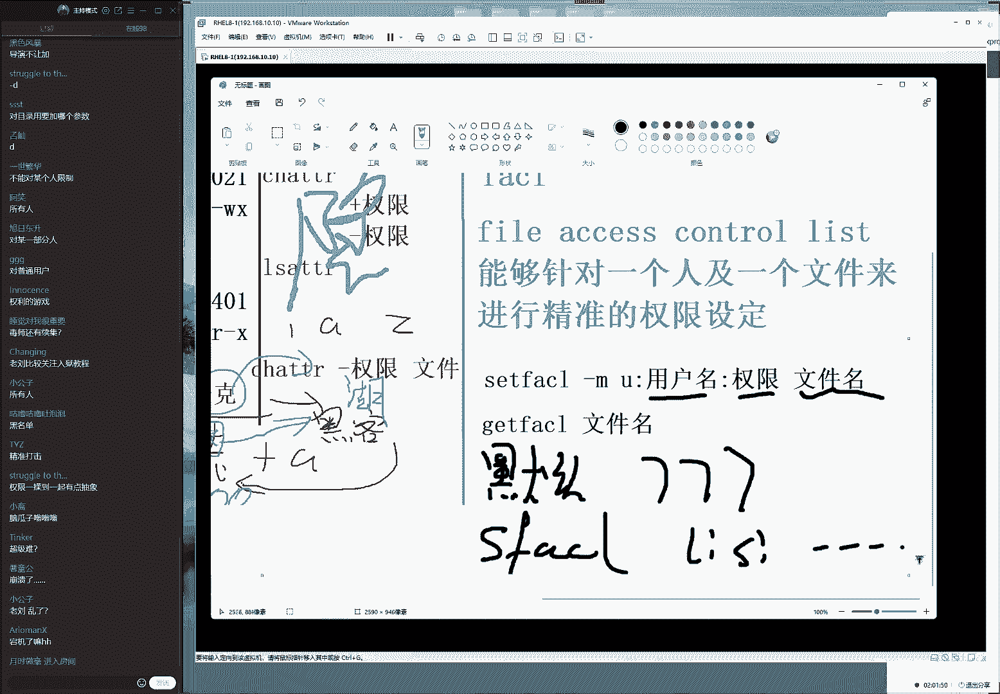

但是只有李四没有任何权限，我现在是这个思路，好吧好，我现在还是这样，首先的话我现在去切换到张三这个用户，张三这个用户，然后我去进入到小紫的这个目录当中，好我们进入到小紫的目录当中去新建一个文件。

叫做哈哈，然后的话呢我们把它给改个名字，ok没有问题，然后我们再来把这个文件给它删除掉，那就是说我们现在新建改名和删除都没有问题，把它给删掉了，可以啊，没有问题好，这个是也它也是一个呃默认情况。

但是我们现在切换切换到李四这个用户切换李四切换到home目录里面，小子看我看到没有，确实没有乱啊，说大家啊，当然我们会发现切换的这个操作就失败了，我连进都进不去，我也没有权限去查看里面的文件。

我更没有去在这个文件夹里面去新建文件的这么一个权限，这个就是老刘没有乱的一个表现啊，是不是啊，这么一个证明啊，确实没有乱，就是可以看到默认情况下。

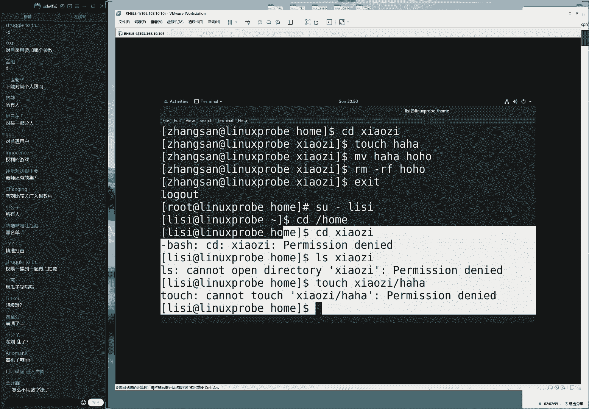

虽然都可以去进行一个增删改的这么一个目录，但是只有李四这个用户被限制了。

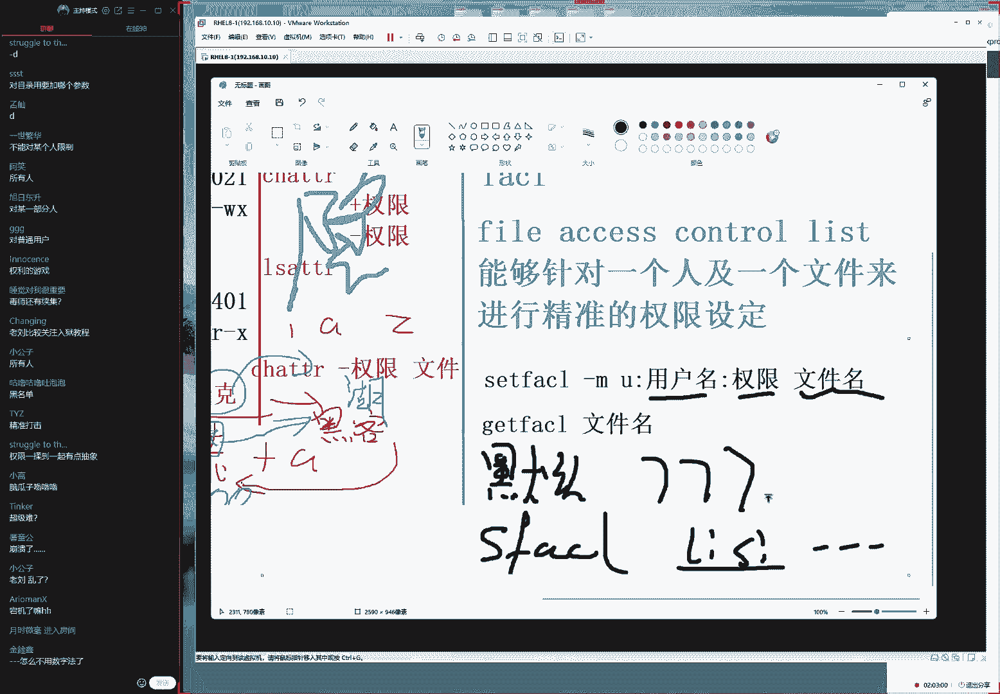

这就叫做f s l，它可以针对于某一个人或者某一个组，来进行一个精准的流量的一个打击啊，这样的一个过程好，大家现在的话呢可能会有两个问题嗯，那大概会有三个问题，第一个问题大家说这个话呢不能用到数字法啊。

他不能用这个的话呢，我们的i啊，这个我们的命令啊，它不支持用数字法去实现，这是第一个问题，第二个问题是啥来着，还是有点乱啊，这我们自己承认啊，第一个问题他们就用数字法，第二个问题大家问到说。

那我们该怎么去查看这个目录上面有哪些epic co呢，命令是这样的，叫做get a style，后面加上文件的名称，比如说小子按下回车，可以看到所有用户都可以进行读写，对吧啊。

但是只有李四这个用户为没有权限，这是我们去查看的一个方法，大家也会问说老师，那我现在我想把它删掉怎么办呢，如果说我现在不想让他有这么一个权限，我把它给删除掉好，那我想把这个限制给它删除掉。

叫做呃呃set才飞sl，如果没有记错的话啊，记错了就记错了，好像是个杠b把它给删掉来，刚b然后后面的话呢我们加上小子这么一个词，然后看一下就会发现里面我最后我们就没有这个限制了。

因此当我们再去进入到这个李四这个用户的时候，他就可以顺利的进入到我们所刚刚进不去的那个目录，以及在这个目录里面去新建文件也好，改名也好，然后去删除也好，也就都可以去做了，这就是我们对于爱我们的啊。

我们的访问控制的一个操作方法啊，然后的话呢我们书上面还有一个实例是对于我们已经被啊，是对于已经设置好了，就我们的权限来进行一个备份，这个我们就把它调，那我们就把它调过，因为这个的话呢用的特别的少。

我们把更多时间的话呢给大家讲一下，5。6小节，讲一下用户的这个切换，以及的话呢我们对于这个权限的一个单独的一个设定，然后我们来看一下这个命令的一个切换的话呢。

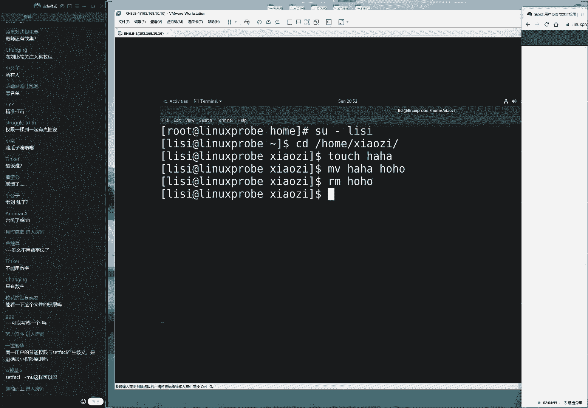

我们使用的是一个宿命令，他的话指的是切换一个用户的身份，这个大家需要截图吗，可以截图啊，然后的话呢我们来给大家去做一下总结，可以看到您的这个书上面啊，正好总结了四个权限。

就是我们的fa cl文件的访问空列表，然后fil system来我们来记一下文件防空列表，一共是有四个权限，然后下面再给大家往后面去说了。

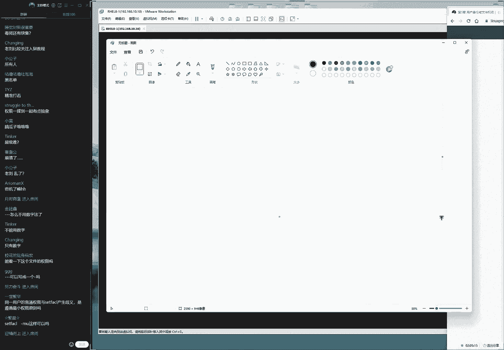

说一下我们的切换用户的一个身份，如果说我要想去切换一个用户身份的时候的话，我们可以去使用到一个叫做素的一个命令，然后再去切换，比如说我想要去切换到某一个用户，我就是这样一个数加上用户的名称。

就这样去切换就可以了，但是同学们会问到邵老师诶，我怎么看其他小朋友们再去切换的时候会加一个减号呢，这个减号的话呢，我们是把它叫做完整的切换，或者我们叫做完全切换。

这个理解起来就是说呃如果说我们要是没有加这个减号的话呢，它变更用户身份之后，它会保留我们这个猪啊，那么它它会保留我们这个用户他之前的一些变量信息，而如果说我们家这个减号的话呢。

指的是进行一个完整的生命变更，它不会保留我们这个用户。

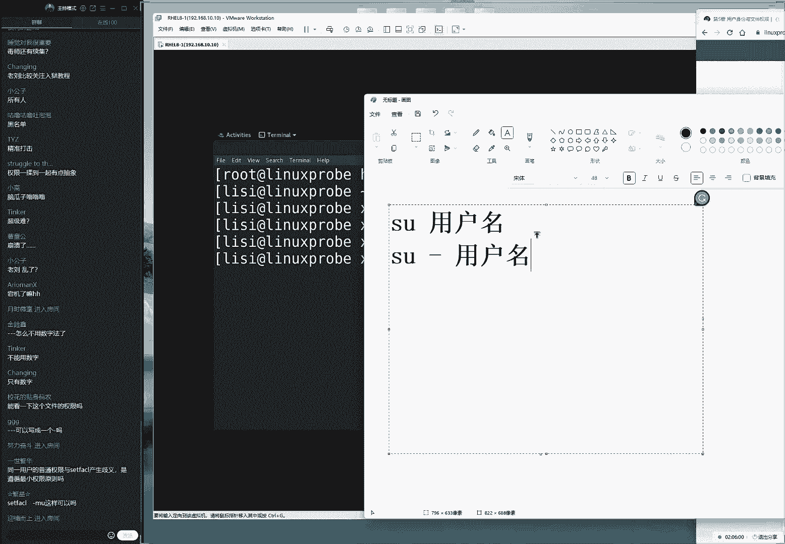

它原先的这个变量信息，它它它进行的是一个完整的一个变更，一般情况下都会去使用的加一个减号，比如说我们现在是去使用管理员切换到我们的用户叫做linux pro，我们切换过后之后的话呢，这个变量啊。

那我们这个用户里面所有正在使用的这个变量，所有的这个比如说我们自己的邮箱啊，巴拉巴拉的，他都是变成自己的了，虽然说可能跟之前是一样的，虽然可能啊跟之前这个用户是一样的。

但是可以看到他这个所有的这个啊变量信息就变成他自己的了，这样的一个变化，所以我们建议大家去选一个减号这样的一个方式。

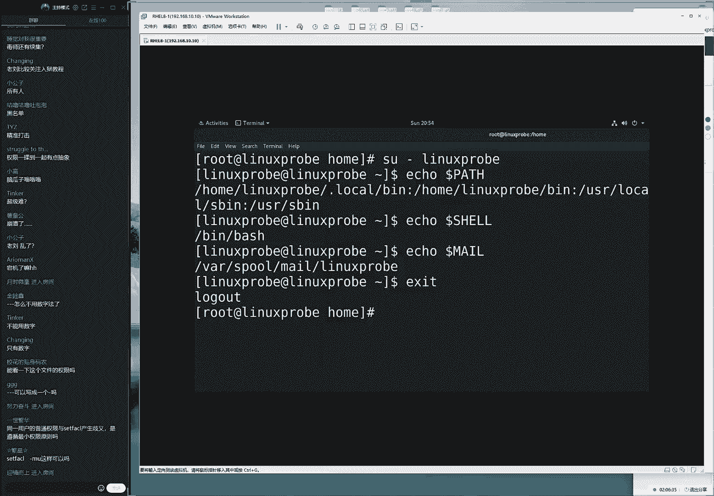

这个没有什么可讲的啊，它超级简单，但是我们有这么一点，大家需要注意一下，就是我们要想去使用到塑形切换的话呢，管理员其实可以去切换到任何人的这个身份啊，切换到任何人员，并且的话呢是不需要密码的啊。

我叫做无需密码来去切换，这个是可以去实现的，管理员可以切到任何人，并且是不用密码的，然后的话呢啊等一下我切换到普通用户吧，普通用户是啊，不用密码了，但是的话呢普通用户他也可以去切。

他也可以去切换到管理员，也可以切换到另外一个普通用户，但是的话它都是需要密码，那都要密码这么一个呃都呃呃这样的一个区别，大家记下就可以了，也就是说宿命的是用来去切换用户身份的。

我们从啊管理员切换到普通用户是不用密码的，但是的话呢从我们的啊普通用户啊，他切换到另外一个人的身份的时候，他不论是谁，他都是需要密码了，这样的一个变化，这样的一个区别好大家下面有一个问题。

大家说如果同一个用户的普通用权限跟我们的sfc clo产生歧义了，是遵循最小权限原则吗，不他不是最小权限原则，它是fc的这个优先级是最高的啊，大家理解一下。

如果说我们现在这个权限在我们的目录上面有可读可写可执行，但是我的fc的话单独设定了你就没有，那么则你没有fc的这个权限是要高于了我们的一般权限的好，然后的话我们再来啊，给大家说一下，我们这么一个问题。

就是说我现在的话呢，如果说我想让我的下属去完成网球工作，那也就是说他如果全程不做情人节，他就需要去登录到我的身份，他需要从他的普通用户切换到管理员，然后才能够去完成两件工作。

但是的话呢我又不想告诉他密码，这个时候怎么去做呢，这也是我们大多数情况下需要去使用到的，也就是说宿命的话呢是一个超简单的一个命令就可以过了，速度啊，速度服务程序。

他来去根据一个用户来进行精准的权限的设定，就是我们这个宿命的话呢，它过于简单了，他必须要让用户进行一个完整的身份变更，他需要告诉对方我的密码，但是如果说我不想让他刚刚密码的情况下。

我该怎么样对它进行全新的放行呢，我们该怎么样对他，让他去执行某些工作呢，我们可以去使用到速度服务，速度服务的作用的话呢，就是可以让某一个人可以去执行某些工作，它可以进行一个单独的权限的设定。

有点像是我们叫做精准的s u i d权限，精准的s u i d，因为我们之前给大家讲了我们的s y d权限的话呢，它实际上是我们怎么理解呢，它是设置过之后，是让所有人都可以在啊，我们设置过后的话。

它是让所有人都可以呃，在执行过程当中临时获取到文件所有者的权限了，但是的话呢我们现在有一个速度服务的一个东东，它能够让我们这个命令的执行过程当中的话呢，这个呃执行者临时获取到了一个更高的权限。

但是的话呢仅限于某个用户，并不是所有人从所有人变成了一个精准的一个用户，所以说它可以被称作叫做精准的s y d权限的设定，呃简单这么理解吧。

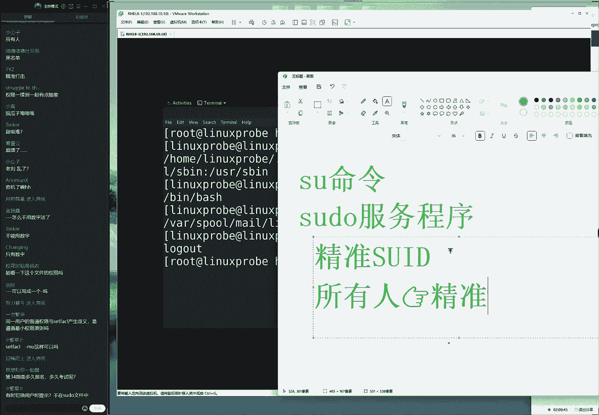

我们来给大家操作一下，同学们看看这个的效果，首先的话呢我们先去还原一下虚拟机。

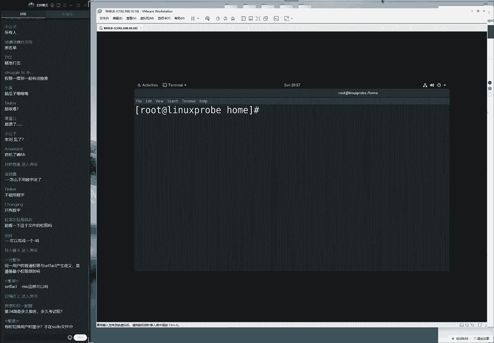

因为的话呢我们每个实验之间吧，他可能会有冲突，我先还原一下。

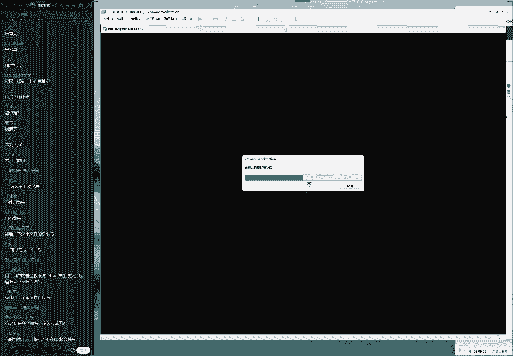

因为我呃呃因为我呃，因为我怕我跟他做过什么操作啊，大家可能会有冲突，因为这个每个作业实验吧，他可能会有一些相关性，好像没有啊。

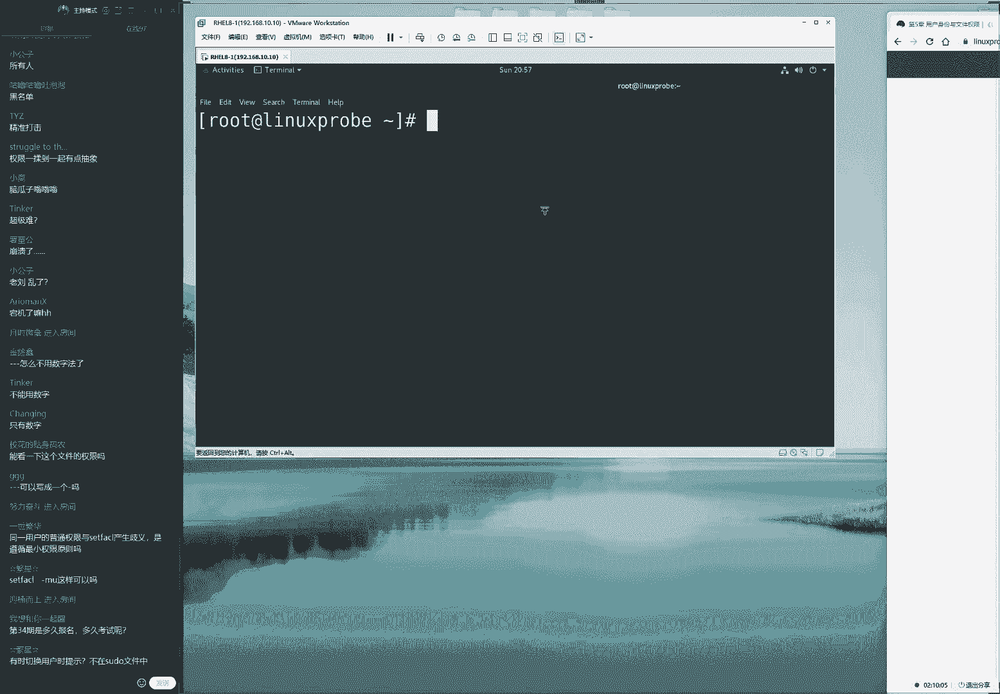

是我刚刚可能是我多虑了，来我们现在的话呢去配置一下，我们可以去使用一个命令叫做vi速度，实际上掉的是我们的编译器vm去实现的vi速度。

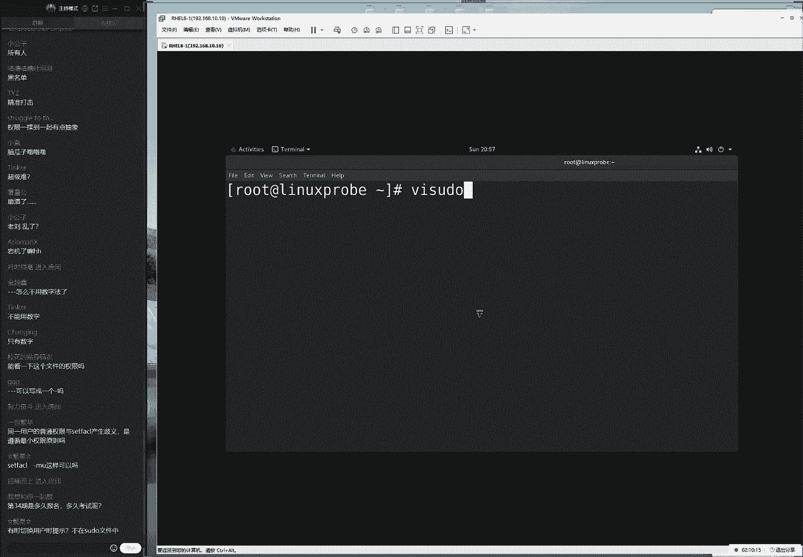

所以说大家只要学会了van啊，走啊走遍天下城啊，就成就全都不怕了，那vn编译器不仅是系统里面通用，而且很多程序的话呢，我们遇到几个了，遇到了大概有两个吧，三个了，比如说crown top啊。

比如说我们的这个呃quarter呀，比如说我们这个速度服务啊，比如说g它都是使用的这边，所以大家这个一定要呃掌握的这个我们一定要使用的很熟练。

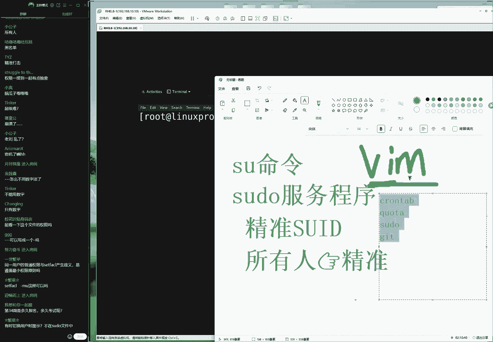

来给大家说一下这个vm编译器的一个操作方法，首先的话呢vi速度进入之后啊，为什么使用这个命令的一个理由，还是如果说里边我们不小心出错信息了的时候的话呢，退出的时候他会给我们提醒啊，等啊稍等一下啊。

如果说我们现在保存并退出，大家可以看到他说我们的123行出错了，那也就是说它会有一个纠错的一个功能，这就是我们去使用vi速度的一个好的理由，这些话也许会有一个好的理由，然后大家问了一个问题啊。

说我想和你一起醒，然后同学问了一个问题，说34期是多久报名考试啊，这个大家好像比较自信啊，听完这个课之后感觉信心满满，准备考试了是吧，我们准备是4月下旬或者5月中旬或者5月上旬给大家报考试。

报的是5月底或6月下旬的啊，或者6月中下旬吧啊，下面一个问题大家说有时候切换用户会提醒说不在速度文件里面对，那，我们就需要进行一个单独的权限设定了，比如说我们现在的话我先来去设定啊。

现在去设置一下这个vi速度，vi速度的话呢，我们先不要太高上往下一点点，因为太高上的话呢，程序没有读完，我们就去写，他有可能导致它不生效，往下走，那行书的话呢，我建议大家嗯100行吧。

我记得是100行左右会有有这么一个事例啊，我们在示例底下去写啊，果然是100行啊，老刘啊，老刘宝刀未老啊，记忆还是很到位的，来100行，我们这么去写呃，首先的话呢是指的是我们要给谁去设置权限，同学问了。

一个问题说我们为什么有时候去切换用户的时候，提示说用户不在速度文件里面，就是因为我们没没啊，没有对他进行权限的放行，他并不是对啊。

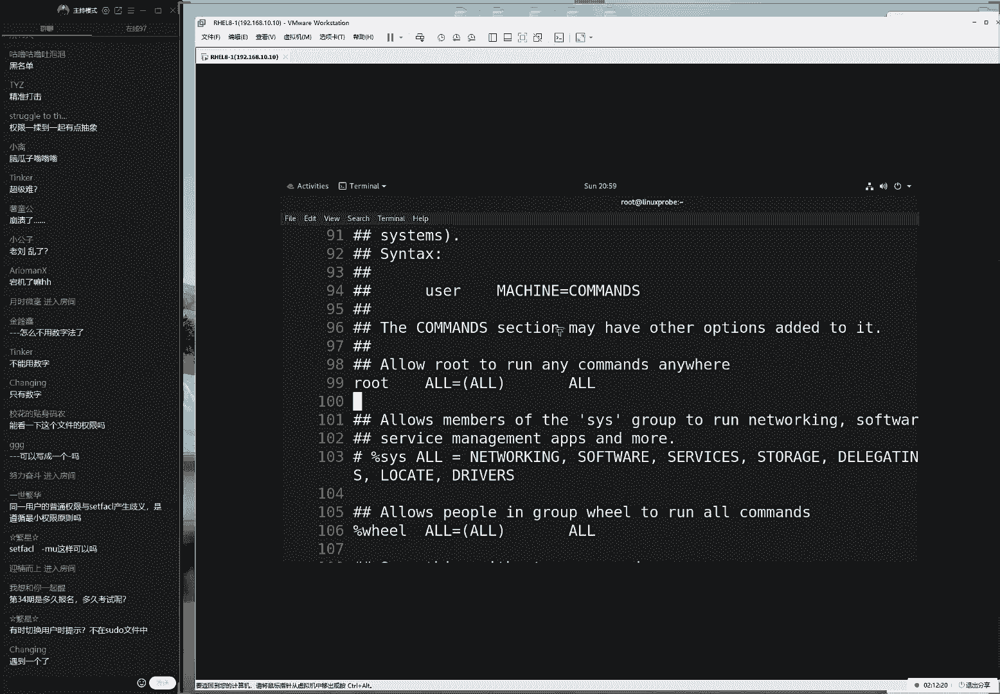

他并不是对于所有人都进行放行的，我们必须要进行一个精准的设计，我们只有这个里面写了你的名字了。

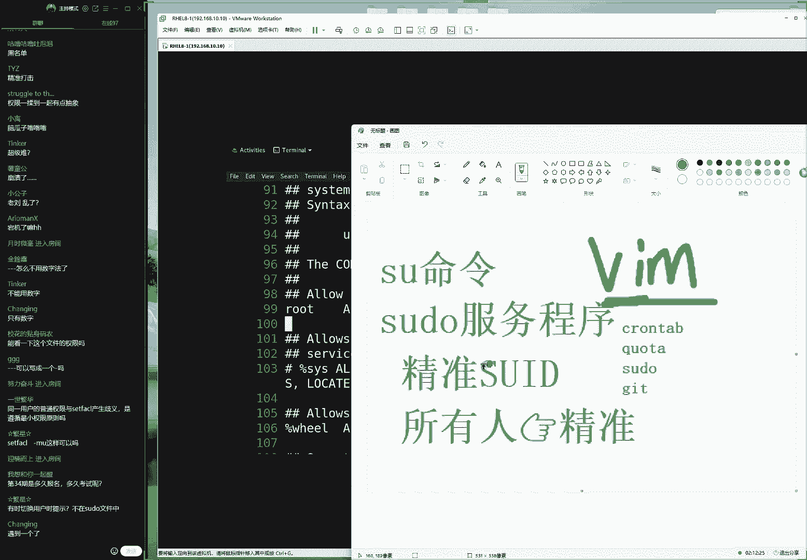

你才可以去使用这个速度服务，呃我们举谁呢，当然是linux prod，对不对，我们家自己的亲儿子啊，我们来继续这个广告植入，非常的顺滑啊，非常丝滑，然后我们第二第呃，第二个o的话呢。

它指的是当这个用户来自于哪个主机的时候，我们可以，对它进行一个呃速度服务的一个放行，这个怎么理解呢，嗯这个理解起来的话呢是嗯比如说我现在的工作，比如说我现在的工作是一个呃银行的职员。

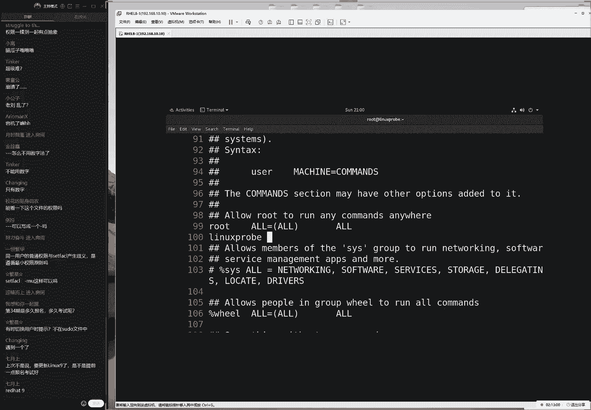

然后的话呢我的工作内容当中的话呢一定有点超，我就肯定一啊，我大家先按照我自动去讲啊，比如说我现在是一个银行的职员，我的工作里面就一定有去打开保险柜啊等等这样的这个行为，但是如果说我是工作日打开还好。

如果是我是啊，比如说我们的今天是2022年4月17号礼拜日晚上九点钟了，我们现在去打开银行的保，险柜大家觉得这个行为还正常吗，我觉得不太正常了对吧，这个时候我们就可以对于这个时间来进行限制，同样的。

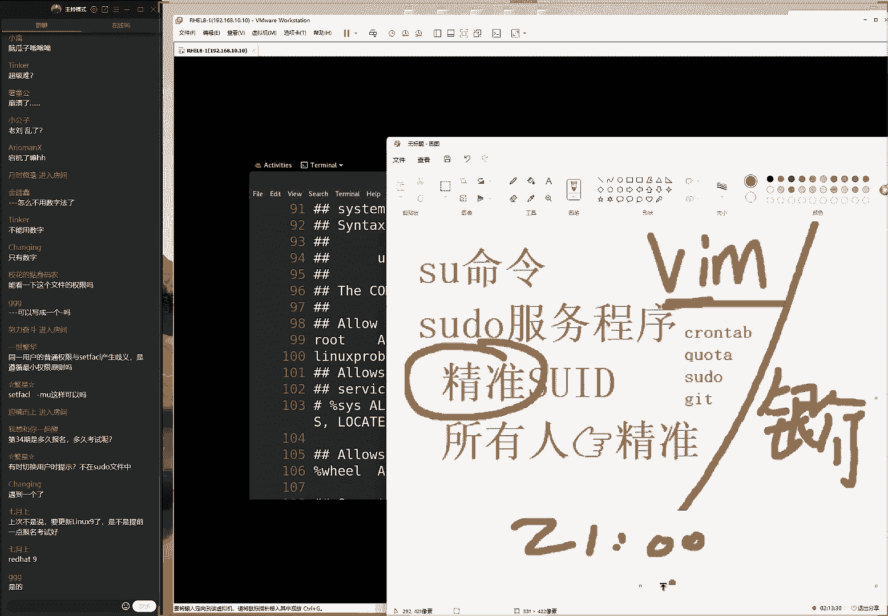

那我们如果说想想，那么那么想要针对于这个呃用户来进行保护的话，它只有来自我们本地去打开这个呃命的时候才可以去操作，那我们可以写上我们本地的地址，或者我们可以写上本集的名称来去限制。

说当它的一个呃来访的一个来源，那么如果说我们可以写成一个o代表不限制用户联网来源啊，他啊不论从哪里来，他都可以去执行这个命令的意思，下面的话第二，个o指的是它可以谁的身份来进行，那我们写一个o的话。

就等于说是管理员叫做root，这两个的话我们可以做替换，像我一样啊，它指的是我啊为呃最大权限为管理员权限，最后这个o的话，它指的是他能够去执行哪些命令，这个命令必须要是以路径的形式来去写，这个很重要。

比如说比如说比如说我们的reboot命令吧，反正啊反正我比较喜欢这个命令，因为的话这个命令特别的直观，要一些小命令吧，看起来不太的过瘾，我们就使用到这样的命令，要去完成a reboot。

后边的话呢我们把它给复制，一下reboot命令，然后往里面一张，如果要是有多个命令的话，用到动画组间隔符，也就是说现在的话呢放心我们的普通用户，linux prop可以去使用的速度命令来进行一个重启啊。

他可以临时回到管理员的这一个身份思路，有了也没太大毛病，我们保存并退出，看看有没有报错啊，没有报错啊，还是挺好的，做好之后的话呢，我可以来给大家去尝试一下，首先切换到我们的管理员。

叫做不先切换到我们的普通用户，叫做linux probe，我们在默认情况下，它是reboot一下，他会给我们提醒说有人正在登录我们的服务，器普通用户是无法直接重启的，这样一个报错，他不让。

这时候怎么办呢，我们可以这样子去使用到速度符，然后的话呢我们后面加上我啊啊，然后我们后面再去加上，你想去做这个动作，叫做reboot，这个时候按下回车，也就是说我们需要分两步走。

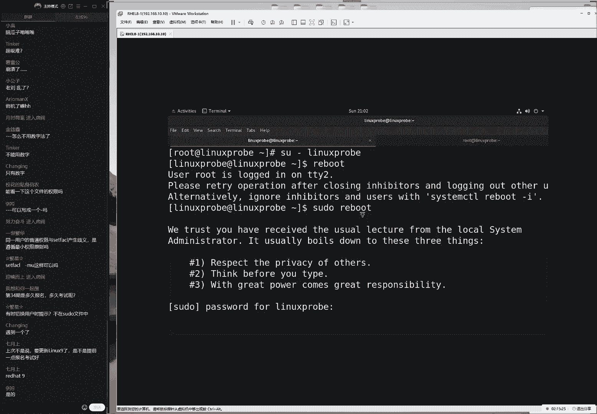

第一步的话需要先把我们这个用户信息写入到我们这个速度文件里面，我们叫vi速度，第二步的话就是要让用户去执行的时候，就是我们这边的话，第一步是要关联去做的，第二步的话是让我们用户去做的。

就是说让用户去执行命令之前先加一个，速度后面加我们的命令名称。

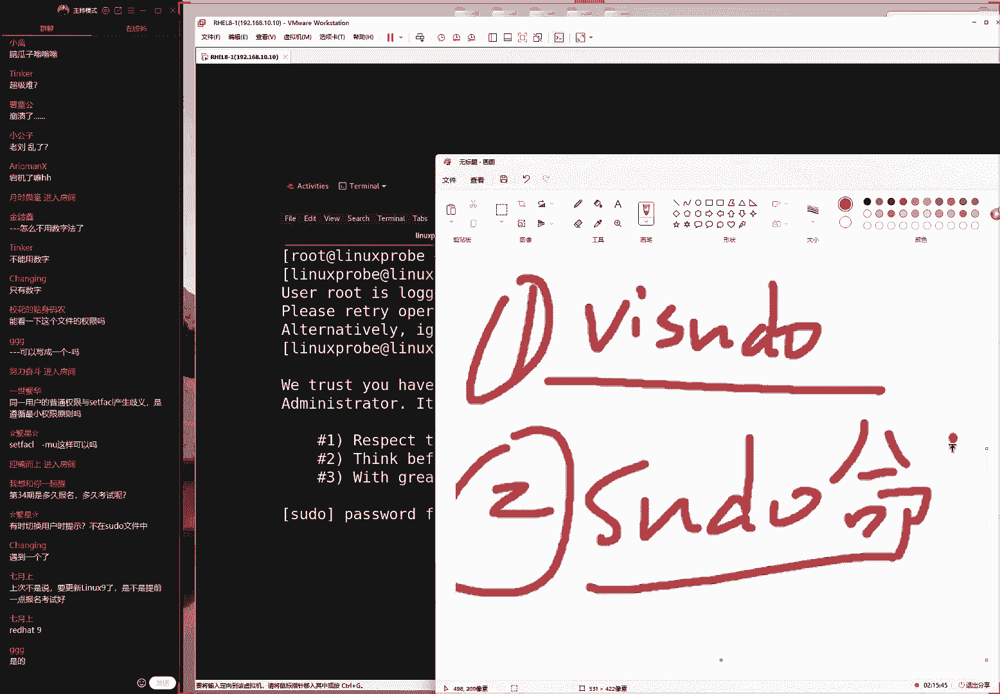

就这样去完成好，我们来看一下，之后的话他会提取出来说啊，很多废话嘛，就是说我们相信你已经收到了这个巴拉巴拉对吧，然后先有三个注意事项，第一个注意事项的话呢，就是说请尊重其他这个用户的隐私啊，好这个好吧。

然后第二个就是说当你敲击之前的话呢，请你去思考一下你的这个行为是否安全，因为的话呢更大的权力将带有更大的责任对吧，然后呢第三句话就是说，如果你并不啊确你所操作的这个命令是什么意思。

那么你不妨报一下老刘的，培训班啊，2400块钱啊，好那我们读完了这个之后的话呢，呃当前最后还有一个输入框说，请注意一下当前用户密码，它的话是输入的是我们自己的密码，确认一下，说是我们自己操作就可以了。

它并不是输入关联的密码，那我们现在就输入一下我们那我们的密码叫做red hat。

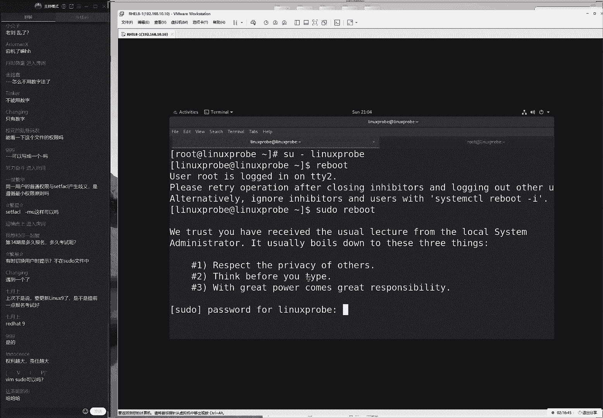

按下回车，于是大家可以看到了就重启成功了啊。

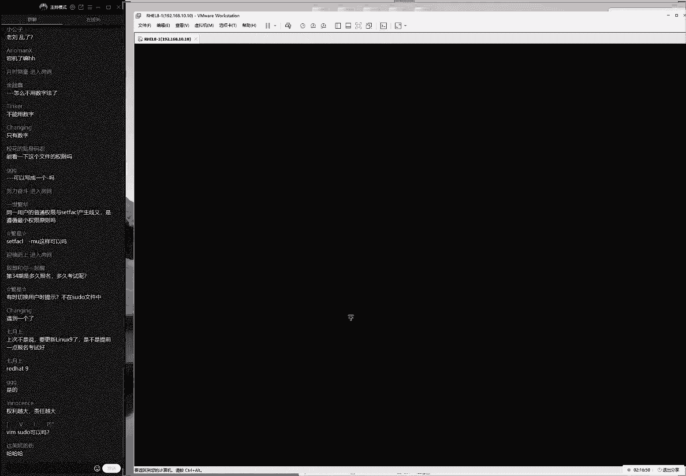

没有问题啊，非常简单啊，好用好好用又好玩，我们来看一下，就，是我们去操作的一个方法，只需要从其他再总结一下啊，那第一步先去vi速度，管理员需要先vi速度对于用户这个权限来进行放行。

把我们的用户的权限加到里面去啊，先管理员先把我们这个用户名称以及它能够做这个事情加到里面去，第二个的话呢就是让我们的这个用户去执行的时候使用到速度，然后后面再加上我们的mini名称就可以去去执行了。

现在还有两个问题啊，我们能够想得到的，我们不希望就是讲课说那么不负责任，讲完就完了，就像一个渣男一样，你们能够希望负责，起来我所以我想了两个可能，但是我刚刚我一直在想，我们去讲课的时候。

同学们可能在听起来就很费劲了，就很就会很累了，其实我一直在动脑子去想，我们还有哪些没有说到的，能够对大家更负责那些事情呢，我又想到两点，第一点的话呢就是有一个原则，第一个原则就是我们的原则啊。

原则就是我们这个权限放行的时候的话呢，最后一个不要写成一个o指的是所有的命令不要这样去写，因为嗯我们有一个原则就是呃在能够满足工作这个前提之下，权限越小越好，因为那就是那那。

也就是说我们在能够满足工作这个前提之下，能够少给权限，就少给权限，不要特别的多的给，比如说有些命令它是非必要的，那么就不要给好吧，这是一个原则问题，第二个问题不要给他能够去编写文件的这个命令，比如说啊。

比如说啊vm，比如说呃echo，比如说巴拉巴拉，就是这样的，这个命令不要给，也就是说同学们不要给一个用户能够去编辑文件这个权限，因为听我再给大家之后，直接去啰嗦一下，因为这一切都是文件对吧。

所以当我们一旦给了他能够去编辑文件这个权限，然后你就失，去对它的控制了，大家能理解吗，就像啊这没有什么就像了啊，就像啊ok啊，比如说我现在给一个用户一个编辑啊。

那我现在啊只是给一个用户去我们编译器的这么一个权限，我只放行这么一个命令，但是这个用户就可以去使用到vi，然后去编辑自己的速度文件，然后进行放行了，于是同学们能够理解我想啊。

那么大家可以知道我知道我想说的啊，不要让别人去卡这个bug，一旦你给别人了编辑文件的这个权限了，即便他不能去执行速度这个命令了，但是他依然可以修改这个文件，于是您，的这个服务器就被沦陷了。

这是两个非常重要的这个点，也是我刚一直在去思考的，能够去补充这两点好，然后下面有什么问题啊，怎么样，大家说嗯，然后说为啥linux probe不能够vr速度，因为普通用户是无法去执行这样的命令的啊。

因为我们普通用户如果要是也能够去编辑自己的这个速度文件的话，就没有什么意义了，就像一个人可以去编辑自己的支付宝的余额一样啊，就会变得啊后半生变得索然无味啊，没有奋斗的目标一样好。

然后的话呢我们来给大家说。

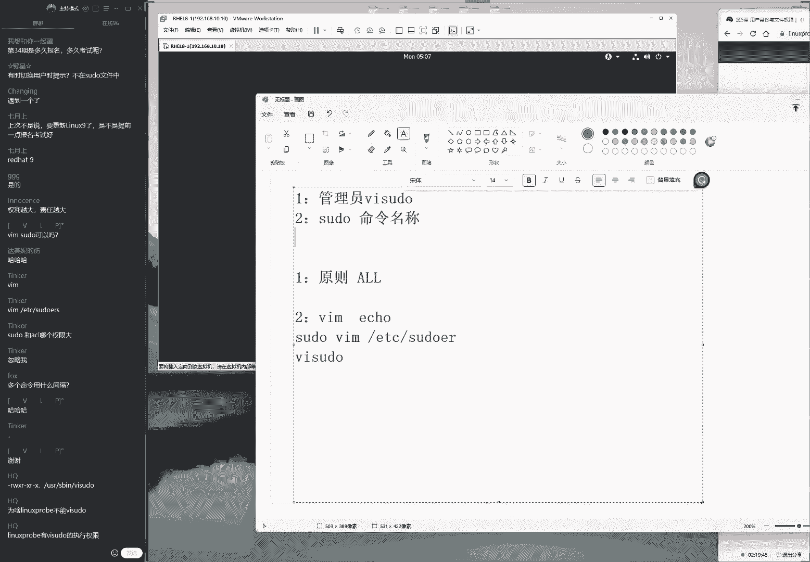

完了之后简单做一下总结，总，结过后的话呢我们来说一下我们的下一周的课程安排。

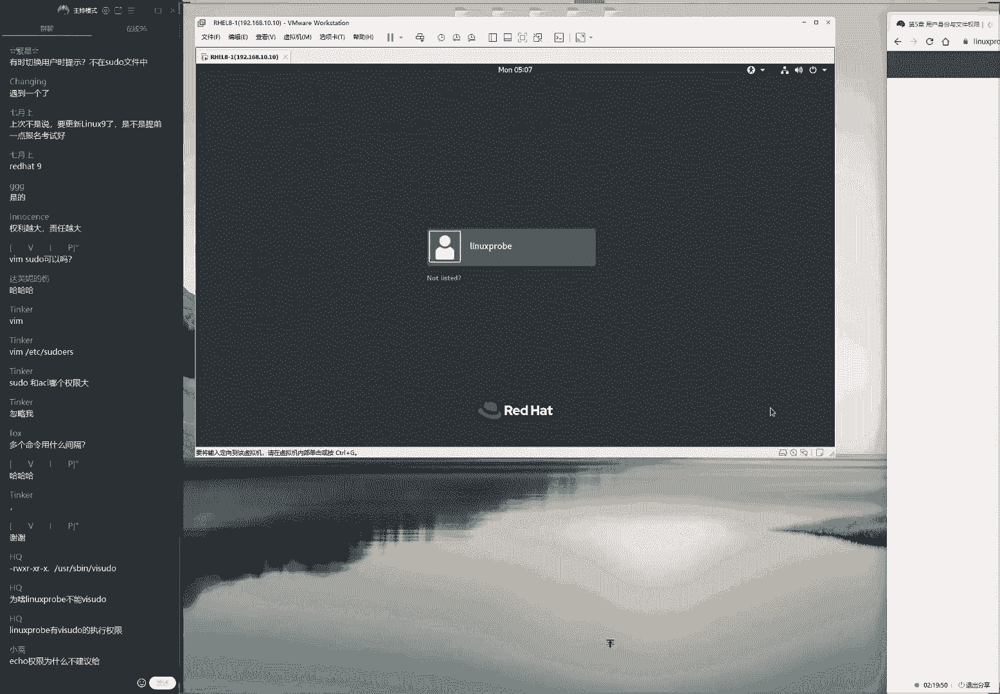

同学们就可以提前做好准备了的话，以及的话呢如果您要是有什么问题的话，我们没有给大家讲啊，没有给大家讲到的点，您都可以去说出来，我们做一个补充，然后今天的话呢我们讲到第五章节，今天的话呢更难的。

今天我们讲了很多，我们讲的一般权限，特殊权限，隐藏权限fc了，速度服务很难啊，今天的话呢我们的重点就是我们的rw x跟421的这个数字法转换，只要这个掌握了就行了，这是一个最基本的一个县，这个不能再低。

了好吧，我们的这个上课时间是在4月22号啊，不对，4月22号礼拜五，我们的话呢会给大家讲一下第六章节，等一下同学们稍等一下，4月22号我们讲一下，第六章节。

我们会讲一下我们的这个对于硬盘的一个分区格式化挂载，在我们第一天给大家讲课的时候，提到了说呃同学们会看一些其他的书，上面的话呢，这个作者以及的话呢，会有一些其他的小朋友们在安装系统的时候会分一些区。

然后我当时就说到了，说我不希，望大家能够像我呃呃，我们不太希望大家能够呃跟我们一起点中同样的效果了，而是真正去理解这个对硬盘的一个分区格式化挂载，以及主引导记录在我们第一个山区里面的这个作用等等等等的。

这样就这样的一个知识，我们会在第六章节会大家去细致讲解一下磁盘组成原理，以及linux里面去管理设备的一种操作方法，好我们的4月22号，还有的话呢就是我们的4月23号，我们的话给大家讲的第七章节。

针对于第六章节，我们的磁盘分区格式挂载以及理论基础之后的话，呢一个高级的课程我们会给大家讲一下realvm，那这两个技术我们会在4月23号的时候去讲一下，再往后的话呢就是4月24号这一天的话呢。

我们会给大家讲一下，第八章节，会讲一下我们的网络配置啊，我们网络配置的话呢也是一开始安装系统的时候给大家欠下来的，以及去讲一下防火墙，这是我们第八章节的这个规划，如果不出意外的话。

我们下周还是6782啊，三个章节每天一个章节规划的啊，当然好像不太准是吧，因为上周规划的时候行了，第六章节也规划进去了，但，是实际上我们上周规划的时候好像讲的是456。

但实际上我们可能这周才讲了452个章节，但是同学们听起来应该会很扎实，不会像我们上一期那么赶了吧啊好，可同学们，现在我们也是在不断生态调整嘛，然后同学们先有什么问题可以去说出来，那就可以来啊，提问了。

大家可以有什么问题你可以去说出来，我们给大家回答一下问题，顺便也先去喝一口小水水啊，大家怎么样，那不快报名了吗，也不会啊，如果要是顺利的话，我感觉最快的情况下大家都报名r h c e的考试，也要在。

4月29号和4月30号去报名，因为我们这一期给大家说实话啊，实际上我们这一期的这个呃这个考生还是特别的多的，有一说一特别的多呃，为什么呢，因为这个很好理解，因为我们是一个网络培训。

我们现在班级里面有100个同学正在在线听课，我们100个人如果说是实力培训的话，100个人到夏天的时候，这屋子没法呆了，就臭死了啊，因为老刘比如说容易出汗这种体质什么的，两个老刘，我你想一想对吧。

这个非常恐怖，一般一，个培训机构里面一个班级二三十个人差不多了啊，而我们考试的时候的话呢，他也是啊最多不超过20个人，在疫情之前，现在疫情之后的话呢，现在是每个考场只能是十个人，就是每场只能考十个人。

我们每个城市的话大概是二三十人，就是2~3场吧，所以就会有一个问题，就是线上培训的培训不授予人员限制，但是线下考试是天时地利人和啊，首先我们要这个的位置，第三啊，这个钱还要到位了，还需要付考试费。

都到齐了才能够，考试，所以就会有一个问题，就是没有考试位置的问题啊，嗯不是搞借这个话，不是搞这个营销，因为我们这个没有任何的差价啊，大家报不报的话，跟我们没有太大关系，但说实话我每期都特别的紧张。

这个位置我们在4月21号，我我哦，我我我们是在4月21号，4月22号，4月23号，4月24号，4月25号，我们要连着考六场啊，就是这个五天我们要考六场，分别是北京。

然后这个广州深圳武汉青岛这几个城市要考六场，这些都是我们的第33期的学员，所以大家的，话第34期的学员，但是我有一个好消息，就是我们把我们的第33期选在下周这六场考试里面，我们就全都安排上了没啊。

就没有33期的学员了，然后所以的话呢，您可以在5月份的时候就全都是给我们34期的考生，但是位置还是相对来说比较紧张的，我们如果顺利的话，会在4月29号，30号和5月1号会大家约考试。

对您需要提前一个月去约的，如果要是不顺利的话，可能会在5月中旬去约一下，5月大学后我就会上学，当然是这么，一个感觉啊，好咱们现在呃大家现在有问题，现在来说我给大家去说了一下我们月考的一些经验。

来大家有什么问题来去说，但另外的话这有点说早了，因为有可能今天呃，因为也有可能特别的顺利，然后就可能一下子比如说约到二三十人啊，四五十人啊，也有可能啊，大家看一下这个人数。

100个同学主要就是北京上海广州深圳，这样我们除一下的话，还有我们群里面的同学，基本上每个城市能够约到二三十人，就要比较打底，好我们不多说了，同学们接下来有什么问题，我们先给大家贩，卖焦虑。

因为有可能我们这一期约的特别的顺利，那我们现在这种担忧不就都是一些白担忧的嘛，啊就是多虑了下面一个问题，大家说他有什么问题，您可以说出来啊，考试费现在还是4200，但是如果您是在看视频的话。

估计已经涨到4500了，然后下面一个问题，大家说广州珠海有没有考场，广州珠海，广东珠海好像没有，好像没有，我们是在深圳跟广州有，珠海好像没有，嗯，下面一个问题大家说上海啊，上一期的学员都考完了吗。

没有考完，我们下周我们要考几场，然后，说上海不知道放到几月份，我感觉应该5月份差不多了吧，这个到时候大家都看吧，然后说说如果要是不想去输密码的话，为什么速度都去输入密码，对这个我们例子没有给大家讲的。

有可能他并他并不生效，所以我们把这个时间调过了，因为我们实测当中有一定概率不生效的，然后大家说咱h c考试的时候说是能主机文件用的第二种方法显示啊，default a p p4 没有被定义。

因为的话呢这个我们是叫做魔法变量啊，啊它就叫做fix，它，是默认看不到的，但是在考试的时候是可行的，来上海的考生确实比较辛苦，而且我们这回而且我们这回的上海的这个学员们确实很辛苦啊。

报名的时候就能够感觉到了，同学们就说啊比较这个比较担忧这个考试啊什么的，我们从3月底到开始到现在4月中旬了，一直会有我们的这个上海的考生比较担忧啊，来下面一个问题。

大家说c h a t t r加s是不是不能够针对于普通用啊，普通文件去用，对他只能针对于我们的目录去做，是删掉目录之后，或者删掉目录里面的文件之后去，利用啊去用零块填充我们的底层的设备。

然后大家说我朋友可以来这里报名吗，啊可以的，100块钱啊，老刘的辛苦费找的是不行的啊，然后就是加100块钱，现在的话呢考试费是4200，然后就变成了4300，如果以后我们涨钱涨到4500的话呢。

4600就是不是我们的考生也可以，除了给钱以外的话呢，还有就是我们会优先我们的学员自己报，报完之后才会有位置的话，你可以跟朋友一起报，或者的话你如果说特别想跟朋友一起考的话，您可以提交的时。

候您提交两个人的信息要一起提交就行了，然后大家说封城能考吗，封城不能考啊，然后武汉的怎么样，武汉也能考啊，我们在20几号的时候就要再去考一场的，武汉可以考，然后大家下面一个问题，大家说上海估计不好约我。

我呃我认为是这个问题啊，我认为大家考试的话，你们约的实际上是6月上旬或者5月底的，我觉得现在担忧考不了是有点太早了，因为现在是4月下旬，是4月17号，但是您的考试时间可能是在5月20号或5月21号。

所以您呃还有40多天呢，我觉得这，个疫情是能够被呃能够被控制住的啊，下面一个问题，因为上海已经被封了20多天了，我觉得差不多了，因为这个上海过于重要嘛，这么一个经济大在这么一个经济重要的一个大都市。

如果被封满60天，我觉得是一个对于国家来讲都是一个很恐怖的事情，我感觉应该不会到60天的，太多了，不可能的，然后下面一个问题啊，大家说南昌上有没有考场的，没有的，你需要找一下您当地的江西是没有的。

下面一个问题，大家说普通权限隐藏权限和啊，和我们的f a c哪，个优先级是最高呢，是我们的fa sl优先级是最高的，大家下面讲啊，大家说啊，问了一个问题啊，说山东有几个考场，山东有一个考场就是在青岛啊。

然后大家再问一个问题，他说前面讲了一个6543权限，不是r减r啊，r减s2 减s大，刚w t书上不是说有持枪权限会自动变t的原则吗，呃我不知道大家在说的是什么，但是没关系，我给大家换算一下。

按照我所说的为准，比如说6543，我给大家换算一下，首先来说543换算成一般权限法，就是401400021好，然后转换成权，限法二减x r减减减w x，然后是一个六，前面的特殊权限法是个六。

所以的话呢指的是有s u i d和s i d啊，4+2嘛，所以的话呢我们就换算完了之后是一个小小s跟一个大写s，这个就是我的思路，如果要是错的话啊，检查一下是不是哪有问题啊，然后大家问的问题啊。

对然后接下来再一个问题呃，然后是young同学，这是个问题吗，还是一个陈述句啊，不好意思啊，是我理解错了啊，这了这是第一个问题，这是第一句话，然后下面有补充不对呀，您这两个不是一个问题啊，好吧。

我们来继续，大家说成都是不是要去外地考，大家说我们已经又被封了40多天了是吗，不是吧，您是上海的考生吗，上海不是刚约刚刚刚刚被封了20多天吧，我看了分析文章里面说的是下半年会穷追猛赶，然后会再说说呃。

说上海可能会在下半年去爆发一次，但是我可能觉得不太靠谱了，因为有很多制造业我得到了，看到了这个消息都是比较低迷，而且不太敢去扩大扩大经营了，确实因为你看比，如说进了很多原材料了，结果突然间封城了。

这个很难去有积极性吗，会很可怕的事情来，那我们不讲老刘是不是我们培训比较的轻量级，比较的简单一点，可能我们最大的准备就是准备了很多小啊，除此以外被封城的话影响也不大好接下来再一个问题，只要不断网。

对我们来说问题不大，但是对于我们的上海考生来讲，确实比较难受了，确实能够体会到的很难受很难受啊，也也能够感受到了好下面，一个问题大家说特殊权限单算啊，ok下面一个问题，大家说深圳现在可以开放考试了吗。

当然了，深圳的话，我们下周就有考试，如果没有记错的话，就是在4月23号，如果说您之前啊关注我们这个培训的话，不如果你之前关注的话，呃，也没什么也没有什么问题了，然后您可以比如说您4月23号的时候。

您可以看一下一个网站叫做hc一点night，我们有考生4月23号考，所以我们您可以进入到这个网站里面去看一下，我们大概会在24或25 两天会把我们考过的学生的证，书然后发到这个网站上面。

您可以去关注一下，也就是说我们的212232425，这几天要考六场，我们会把这个考生的心得会放到啊，会放到咱们这个网站里面，您就可以去访问去啊，可以去留意一下了，可以加到收藏夹里面。

下周五的时候去刷新一下，好下面一个问题，大家说啊，昆明有考场吗，整个云南都没有，据我们所知，大家说青岛的5月初可以考，可以考吗，5月初应该是没有的，我们应该是在5月底或6月下旬，因为青岛人少。

您需要约您需要操作啊，您您需，要凑八个人才可以，具体方法我们会在4月底跟大家去说，怎么样说啊，老刘啊，这个问题被忽略两次了啊，再发一遍，大家说c h a t t l我是对于目录来进行操作。

但是都没有成功啊，不这个问题是问错了，c h a t t r0 b呢是来去设置我们的全隐藏权限的，您需要去说出来，您具体设置什么权限，可以参考一下表格，五杠八，这个问题太笼统了，因为因为那太笼统的问题。

因为你太笼统了，实在不能回答，因为嗯要看具体的参数，下面一个问题，大家说啊，w i p e是一个工具对吧，然后可以擦出我们的i know的数据好，这要给大家讲到了，呃，有点超纲。

第六章节会给大家讲到我们每一个文件的话呢是由两部分组成的，一个的话呢叫做i know，我们的这个属性块话呢叫做blog，我们这个数据块，然后的话呢大家如果说想去参数它i know的话呢。

我相信这个工具是可以擦掉的，甚至说我们去删除掉一个文件的这个操作，rm都可以把它删掉，这个非常简单啊，但是我们主要来讲需要去删除的一个文件啊，而且避免别人给我们找回的话呢，就是呃泄露数据的话呢。

主要删除掉并不是i know的数据，主要是这个blog数据一定要把它给清空，或者做到这个零块填充，而且我看到好像有一个文章说美国的fbi啊，就是好像可以把格式化后的硬盘也可以去尝试恢复，好像有这么去说。

我也不知道到底是靠不靠谱好，所以人家的意思就是我们需要尽量去格式化三次，然后零一，然后再去填充，我们格式化三次以后就保证安全了，好这么去说的啊，我不知道靠不靠谱，但是有这么一种说法。

主要就是这个block块的数据，避免别人恢复好下面一个问题，大家说呃c h a t t r只能针对于文件吗，不它也可以针对于目录，我们来看一下表格，五杠八那里边有针对于目录的权限，比如说是一个表哥。

五杠八里面是有的，他也要针对于我们，大家要看这个介绍，比如说杠c嘛对吧，它就可以默认将我们的文件和目录来进行压缩，像这样的话就知道他就只要是我们文文件系统知识了，它就可以根据目录来进行操作。

但是你一定要看一下，具体是什么样的一个参数，下面一个问题大家说啊，我加什么参数好像都没有用啊，如果可以，我可以演示一下，比如说啊i是不行的，大家看一下介绍啊，比如说第一个介绍就是说i的作用。

它指的是无法对于文件来进行修改啊，哦也可以对应目录是吧。

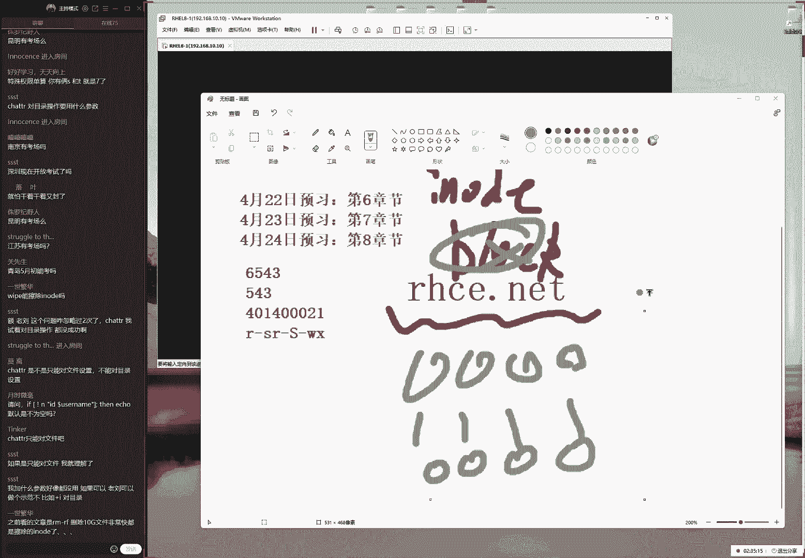

我来试一下，我来试一下，那如果要是这样的话，说明更爱参参数是不能针对于目录来去做的，来我们去休整一下，有可能是因为我偷懒了，我其实表哥五杠八，偷懒了偷懒了是我的问题啊，偷懒了偷懒了啊，来看一下。

还可以啊，可以设置，看一下啊，没有问题，隐藏权限，然后查看一下好了，我看我，我去试了一下，哦等一下等一下我试试成功了，但是我看是看不到的是吧，是不是刚d回杠，而且需要一参数好，不来了吗，可以的。

也就是说我们可以对于目录来进行操作是可行的啊，偷了个懒啊，其中的是表哥五杠八，这本书就直接给套过来了，刚才刚才是有点心虚啊，所以大家提到的时候就开始心虚了一下。

但是我们实际操作过后发现其实可以整理一步来进行操作的，是可行的，好下面一个问题啊啊好，没有了是吧，大家可以先休息一下，然后同学问了一个问题，叫做月食微豪，同学问到了说如果要是使用到if。

然后n i d啊，username这个变量是错误的，then echo默认不为空吗，这个这个变量是错误的，没有这个变量，但是如果要是我们前面调用的变量的话呢，不对，这个问题是我感觉是我没有理解。

我没有理解这个问题，你只要发一下，同学叫乐师为豪，同学没有看到，默默认是不为空吗，是我的问题啊，可能讲两个小时之后反应比较迟钝了，下面有问题，大家说大家说说之前看文件里面啊啊rm rf删掉一个文件。

实际非常快，都是擦出爱闹的了，其实这个是一样的，它不区分是windows还是linux，要去删除掉文件都是删除的，i know的，这个大家特别好学理解。

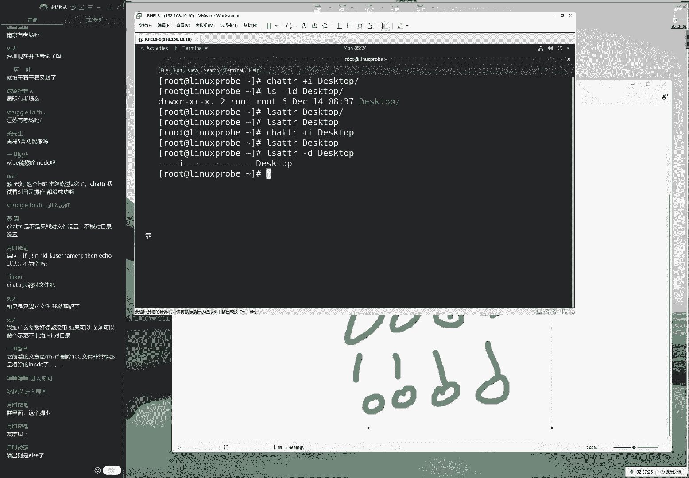

比如说您可以去很好理解吗，比如说有一个u盘，然后我们插到电脑上面了，然后的话呢现在有一个文件200个gb好了，我们往电脑里面拷，大概需要考五分钟对吧，但是如果说我们现在先把这个文件给他删掉的时候。

大概只需要十秒钟，并不是去删除在这个文件所有内容了，它实际上是删除了这个i o的数据库，而这个数据的话呢还是在系统里面保留着，它会等到下一个文件写入的时候，会把这个block块的话呢给它覆盖掉。

它的话它啊它被覆盖之前，这个blog这个数据一直在硬盘里面保存着，所以啊所以说这个实际上去恢复数据的这个原理是什么呢，按照我们的理解啊，但是我并不专业，我只是说一下我的理解，可能会有一些高级的方法。

人家就是啊，但是我们理解是这样的呃，一就有这么一个文件删掉之后的话呢，如果说这个硬盘里面保存的是这个真实的数据，然后的话里面分为两部分，一个是block，一个是i know的。

删除掉这个数据的时候的话呢，实际上只是删除了这个指向我们这个block数据块的一个指针，因为这样的话呢我们用户删掉它之后，就无法通过这样的一个指针找到我们的数据了，于是这文件就被删除掉了。

但是的话呢数据实际上还在一定盘里保存着，所以说当我们去啊错误的去伸出在一个文件之后呢，赶紧把它拔下来，或者把它断电，拿着这个去一个找一个人啊，只要去找一个高手也好，去找一个啊数据啊，数据恢复公司也好。

然后他会使用专业的软件，然后对于我们这个整形的盘来进行扫描，去扫描到我们这个不到数据的这个开头的这个节点，然后去找到它之后，去尝试恢复出来这个数据，也就是说都是在那的，只不过他被关了灯了。

一个房间里面他东西都在，只不过他们现在断电了，没有灯，忘了交电费了，那么这个时候您需要自己去摸着黑去找一下，他找到了一个线头了，就会发现诶能够找出来后面所有的东西了，同样的道理好啊，这是我所说的啊。

但是好像并不专业，可以也许专业的公司有更加专业的方法，嗯，然后但这是一种思路，下面一个问题，大家说群文件里面有个文件额则是输出else，ok待会我来看一下，我先不打开。

因为这个东西群里面现在有同学的发言啊，我怕打扰大家发这个信息要再去猜，很麻烦好，那我先看一下吧，我先打开咱们的群，但我把录播给他关上，因为我怕录到咱们同学发那个咱们学员信息，到时候被录到里面去了。

然后大家问了一个问题，好回答好这个问题之后再看一下群，我们先看一下，大家说啊，大家啊，大家说文件所有者的权限优先级是高于文件所有组吗，不这两个并不冲突，它只要有任何一个满足则可以去访问。

也就是说他两个没有优先级，只要满足有一个就可以访问，是这样的一个原则好，我先把这个录播关一下，然后同学们继续来提问。

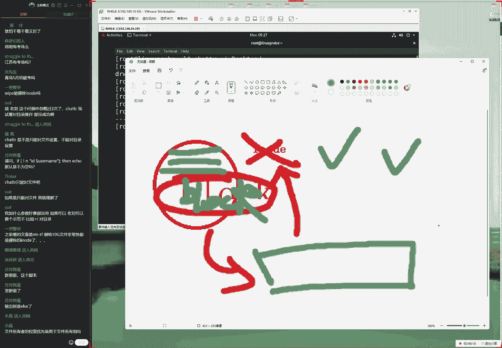

我来看一下群里面大家发文件是什么样子的。