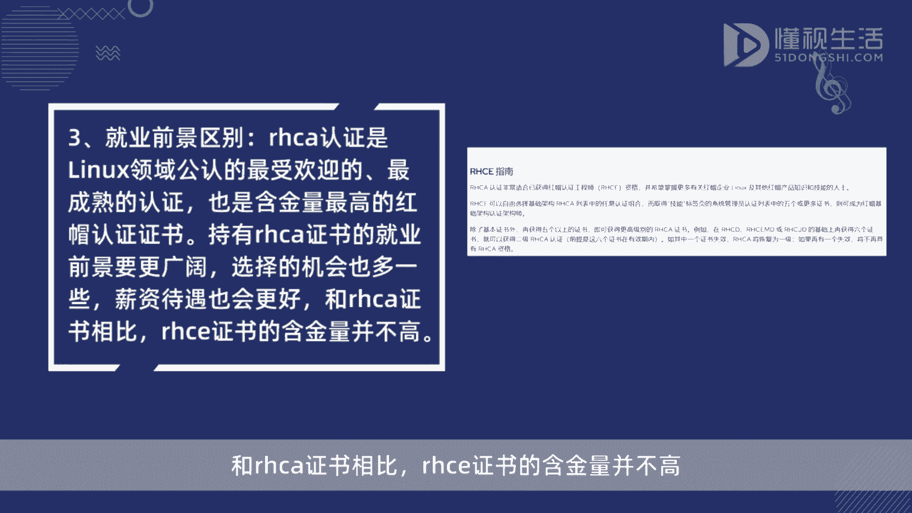
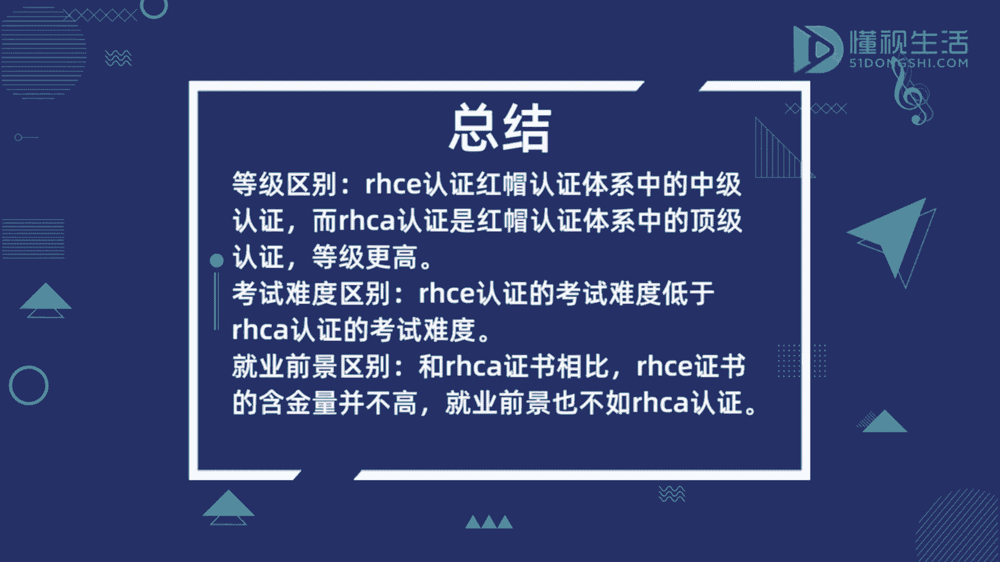

# rhce和rhca区别 - P1 - 懂视 - BV1uc411F73o

🎼RHCE认证的意思是鸿帽认证工程师属于鸿帽认证体系中的终极认证。RHCA认证的意思是鸿帽认证架构师属于鸿帽认证体系中的顶级认证。RHCE认证的考试分两门，考试难度都不是很高。

而RHCA认证的考试有5门。考试难度大，考试时间长。RHCA认证是linux领域公认的最受欢迎的，最成熟的认证，也是含金量最高的鸿帽认证证书。持有RHCA证书的就业前景要更广阔，选择的机会也多一些。

薪资待遇也会更好。和RHCA证书相比，RHCE证书的含金量并不高。

Yeah。

Yeah。