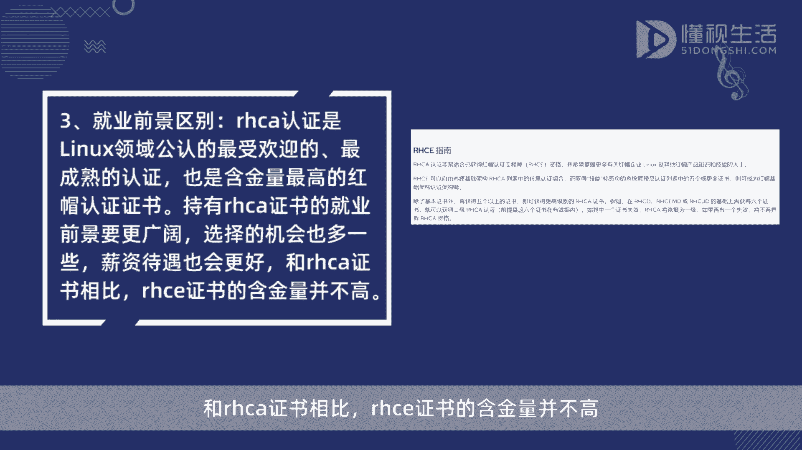
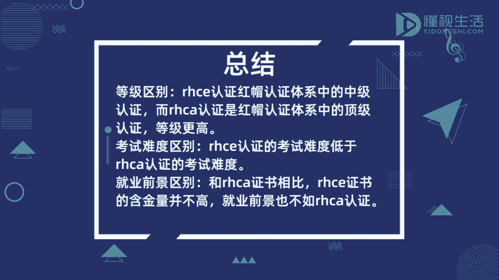

# Linux认证指南：P1：RHCE与RHCA的区别

在本节课中，我们将要学习红帽认证体系中两个核心认证——RHCE与RHCA——之间的主要区别。我们将从认证定位、考试结构、难度、含金量及职业前景等方面进行详细对比，帮助初学者清晰地理解两者的不同。

## 🎓 认证定义与定位

RHCE认证的意思是红帽认证工程师，属于红帽认证体系中的终极认证。

RHCA认证的意思是红帽认证架构师，属于红帽认证体系中的顶级认证。

上一节我们介绍了两个认证的基本定义，本节中我们来看看它们在考试结构上的具体差异。

## 📝 考试结构与难度对比

RHCE认证的考试分两门，考试难度都不是很高。

而RHCA认证的考试有5门。考试难度大，考试时间长。

以下是两者在考试方面的核心区别列表：
*   **考试科目数量**：RHCE为**2门**；RHCA为**5门**。
*   **整体难度**：RHCE难度**不高**；RHCA难度**大**。
*   **考试时长**：RHCA考试时间**更长**。

了解了考试要求后，我们进一步探讨它们在行业内的认可度和价值。

## 💎 含金量与行业认可度

RHCA认证是linux领域公认的最受欢迎的，最成熟的认证，也是含金量最高的红帽认证证书。

和RHCA证书相比，RHCE证书的含金量并不高。

## 🚀 职业前景与薪资

持有RHCA证书的就业前景要更广阔，选择的机会也多一些。薪资待遇也会更好。

本节课中我们一起学习了RHCE与RHCA认证的关键区别。总结如下：RHCE是面向工程师的“终极”认证，考试相对简单；而RHCA是面向架构师的“顶级”认证，需要通过5门高难度考试，其含金量、行业认可度以及带来的职业前景和薪资潜力都远高于RHCE。对于希望在Linux领域深入发展的专业人士而言，RHCA是更具价值的职业发展目标。