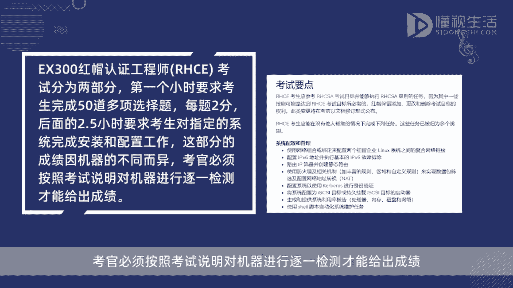
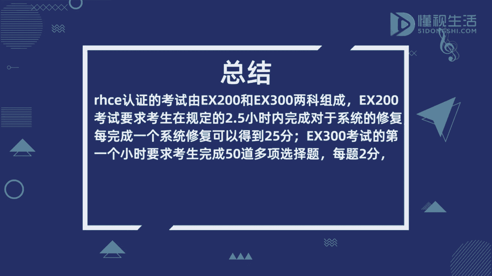

# rhce考试得分标准 - P1 - 懂视 - BV13X4y1E7hJ

而HC1认证的考，是由ex200红帽认证系统管理员考试，和ex300红帽认证工程师RHCE考试，两科组成，每科的总分都为300分，达到总分的70%，也就是每科都在210分及以上，即可通过考试。

ex200红帽认证系统管理员aka考试，要求考生在规定的2。5小时内完成，对于系统的修复，每完成一个系统修复，可以得到25分，ex300红帽认证工程师，RHCE考试分为两部分。

第一个小时要求考生完成50道多项选择题，每题两分，后面的2。5小时，要求考生对指定的系统完成安装和配置工作，这部分的成绩因机器的不同而异，考官必须按照考试说明对机器进行逐一检测。

