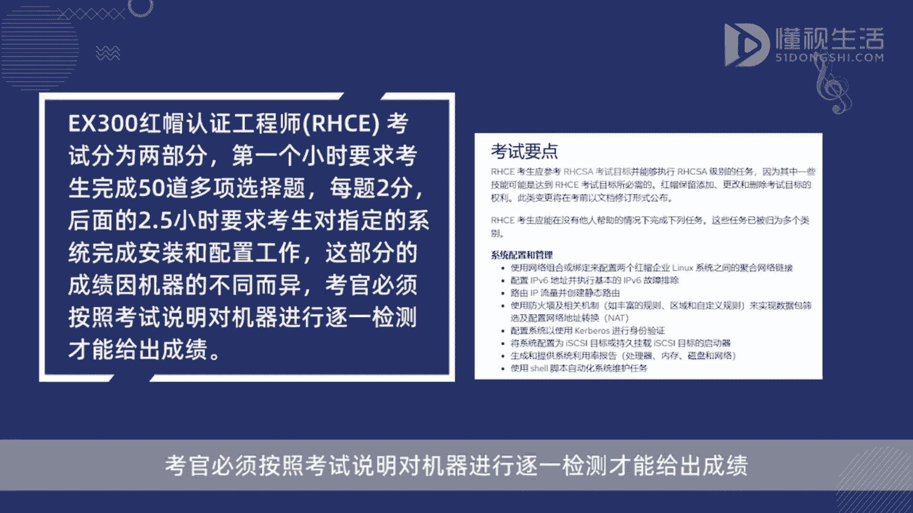
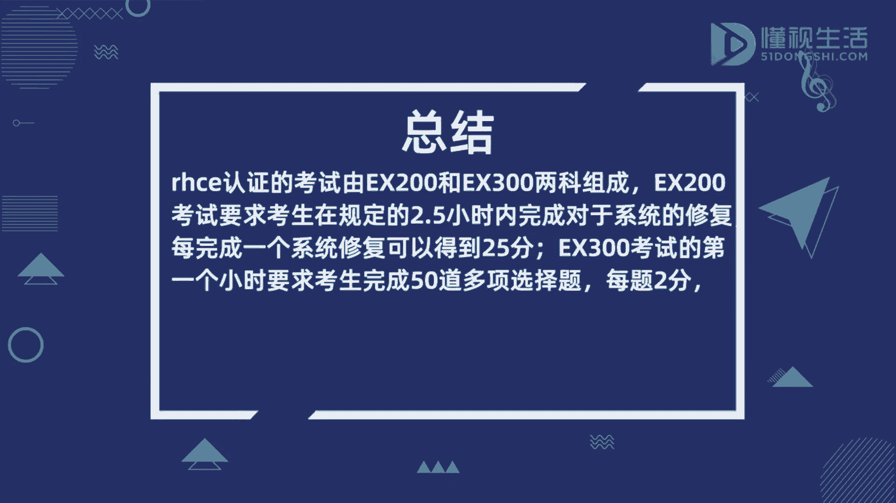

# RHCE考试指南：P1：考试结构与评分标准详解 🎯

在本节课中，我们将详细解析红帽认证工程师（RHCE）考试的结构与评分标准。了解这些信息对于规划备考策略至关重要。

## 概述

RHCE认证考试由两个独立的科目组成，分别是EX200（红帽认证系统管理员）和EX300（红帽认证工程师）。每个科目的总分均为300分，考生需要达到总分的70%（即210分）才能通过该科目考试。

## EX200 红帽认证系统管理员考试

上一节我们了解了RHCE认证的整体构成，本节中我们来看看第一个科目——EX200考试的具体要求。

EX200考试要求考生在规定的2.5小时内完成一系列系统修复任务。考试采用实操形式，重点考察解决实际问题的能力。

以下是EX200考试的评分方式：
*   每成功完成一个系统修复任务，考生可以获得25分。
*   考试总分为300分，考生需要获得至少210分才能通过。

## EX300 红帽认证工程师考试

了解了EX200的考试形式后，我们接下来看看更具挑战性的EX300考试。EX300考试分为两个部分，综合考察理论知识和实践配置能力。

### 第一部分：多项选择题

考试的第一个小时用于完成理论部分。这部分包含50道多项选择题。

以下是关于选择题部分的详细信息：
*   题目数量：50道。
*   每题分值：2分。
*   本部分总分：**`50题 * 2分/题 = 100分`**。

### 第二部分：系统安装与配置

完成选择题后，考生将进入长达2.5小时的实践操作部分。这部分要求考生根据考试说明，对指定的系统完成安装和配置工作。

以下是关于实践操作部分的要点：
*   考试形式：上机实操。
*   任务内容：安装、配置并验证指定的系统服务与功能。
*   评分方式：考官会严格按照考试说明对每台机器进行逐一检测和评分。不同配置任务的分数权重可能不同，具体分值在考试中指明。

## 总结

本节课中我们一起学习了RHCE认证考试的核心结构与评分标准。我们了解到RHCE认证需要通过EX200和EX300两门考试，每门满分300分，需达到210分才能通过。EX200侧重系统修复，按任务计分；EX300则分为选择题（100分）和实操配置两部分，由考官按步骤评分。掌握这些规则有助于你更有针对性地进行备考。