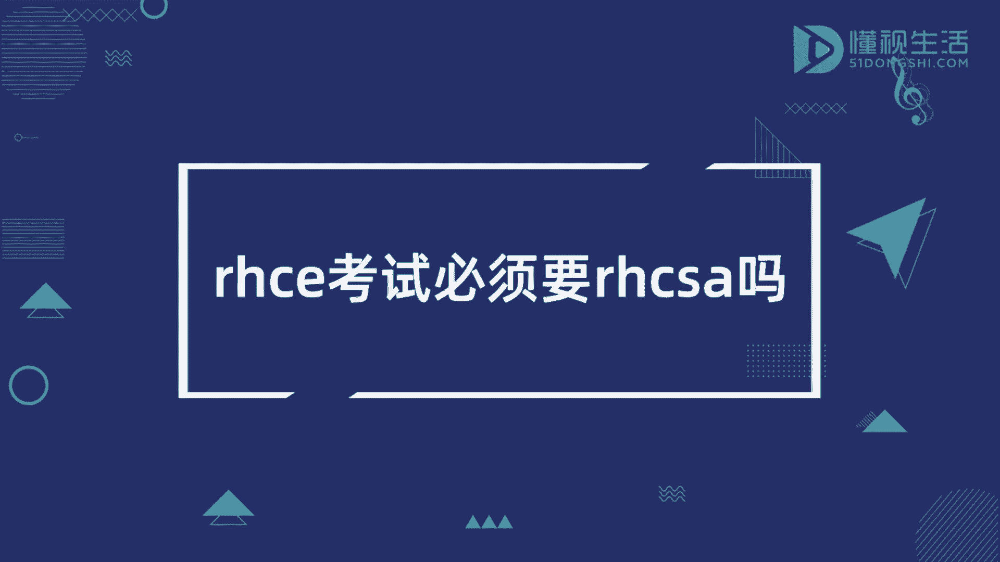
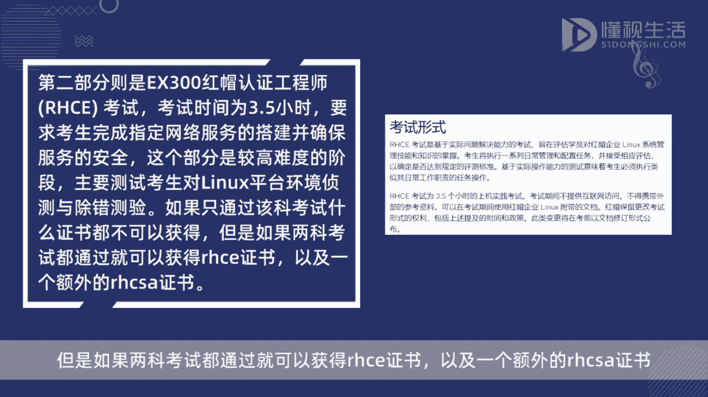
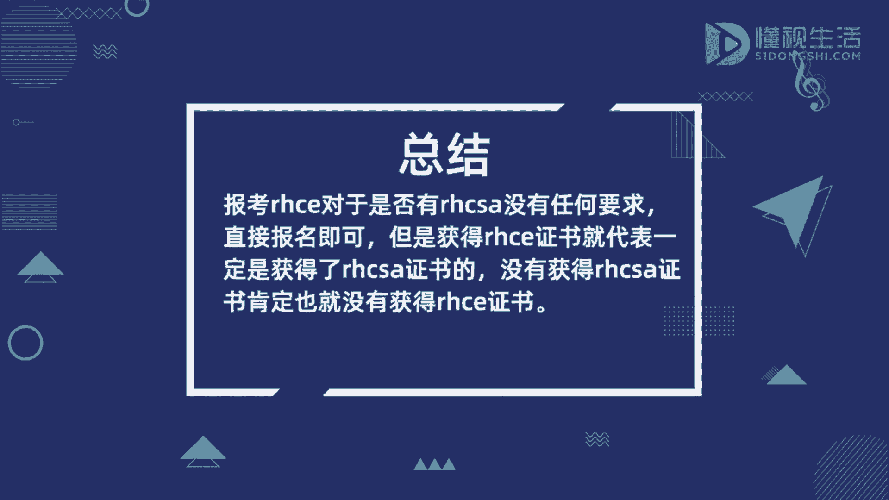

# rhce考试必须要rhcsa吗 - P1 - 懂视 - BV1Cz4y1x7Me

报考2HC1对于是否有犯没有任何要求，直接报名即可，但是获得RHC1证书，就代表一定是获得了阿克萨证书的，没有获得克萨证书，肯定也就没有获得RHC1证书，因为RHC考试由两部分组成。

第一个部分是ex200红帽认证系统管理员，A考试，考试时间为2。5小时，主要考察考生对LINUX系统命令的掌握情况，是测试考生对LINUX服务器安装与网络服务，组态的实际演练，考生要在上午规定的2。

5小时内完成，通过该科考试，可额外获得一个A证书，第二部分则是ax300红帽认证工程师，RHC考试，考试时间为3。5小时，要求考生完成指定网络服务的搭建，并确保服务的安全，这个部分是较高难度的阶段。

主要测试考生对LINUX平台环境侦测与除错测验，如果只通过该科考试，什么证书都不可以获得，但是如果两科考试都通过，就可以获得RHC1证书。

