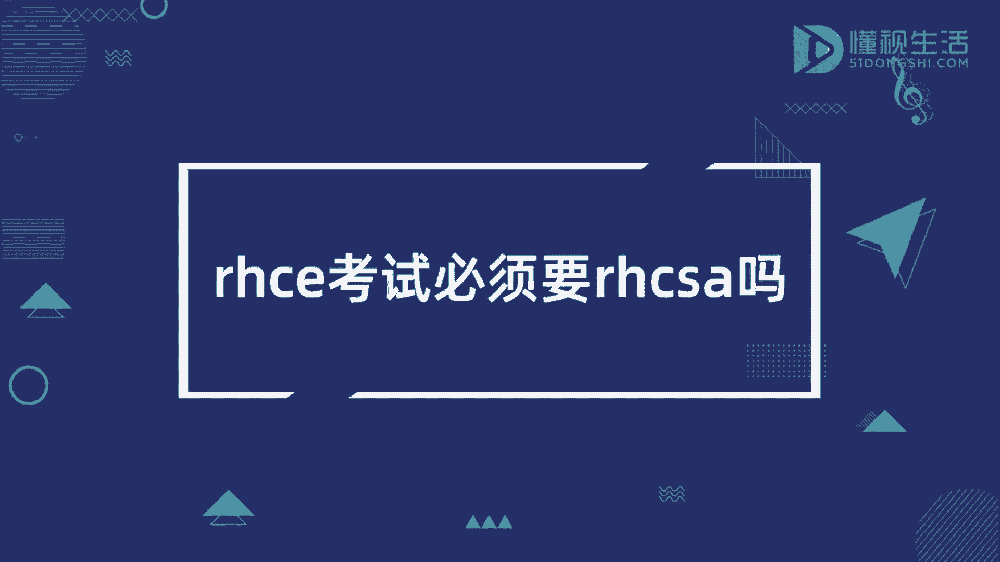
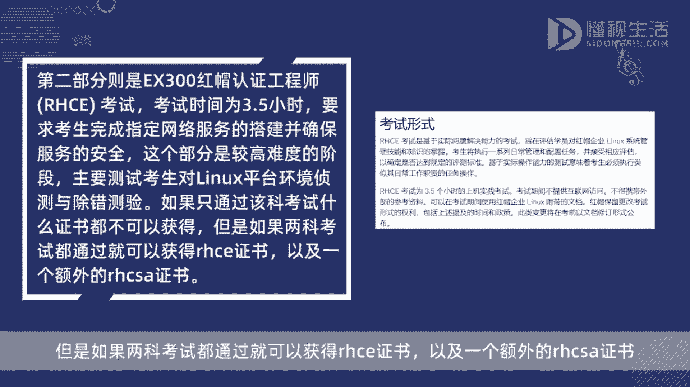
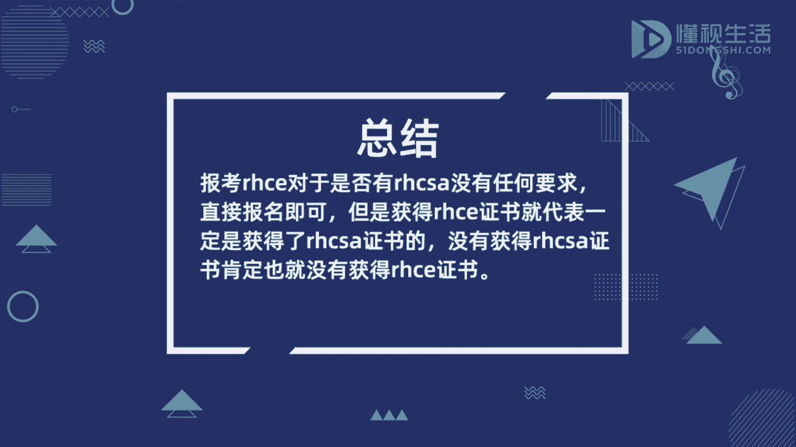

**红帽认证：P1：RHCE考试与RHCSA证书的关系解析 🎯**

在本节课中，我们将要学习红帽认证工程师（RHCE）考试与红帽认证系统管理员（RHCSA）证书之间的关系。这是一个初学者在规划认证路径时最常见的问题之一。

报考RHCE考试对于是否持有RHCSA证书没有任何要求，考生可以直接报名参加RHCE考试。

但是，最终获得RHCE证书，就代表考生一定已经获得了RHCSA证书。反之，如果没有获得RHCSA证书，也就无法获得RHCE证书。

上一节我们明确了报考与获证的区别，本节中我们来看看具体原因。这是因为RHCE考试本身由两个独立的部分组成。

以下是RHCE考试的两个组成部分：

1.  **EX200：红帽认证系统管理员（RHCSA）考试**
    *   考试时长为2.5小时。
    *   主要考察考生对Linux系统基础命令和操作的掌握情况。
    *   考试内容是对Linux服务器安装、配置及基础网络服务设置的实际操作演练。
    *   考生需要在规定时间内完成所有实践任务。**通过此部分考试，即可单独获得RHCSA证书。**

2.  **EX300：红帽认证工程师（RHCE）考试**
    *   考试时长为3.5小时。
    *   要求考生完成指定网络服务（如Web服务、数据库服务等）的搭建与配置，并确保服务的安全性。
    *   此部分难度较高，主要测试考生在Linux平台上进行故障排查和复杂环境调试的能力。
    *   **如果考生仅通过EX300部分的考试，将无法获得任何证书。**

因此，要获得最终的RHCE证书，考生必须**同时通过EX200（RHCSA）和EX300（RHCE）** 两门考试。红帽认证的体系设计确保了工程师级别的认证建立在扎实的系统管理员技能基础之上。

本节课中我们一起学习了RHCE考试的结构及其与RHCSA证书的绑定关系。简单来说，你可以直接报考RHCE，但要想最终拿到RHCE证书，你必须先通过其中的RHCSA考试部分。这确保了每一位RHCE都具备坚实的系统管理基础。