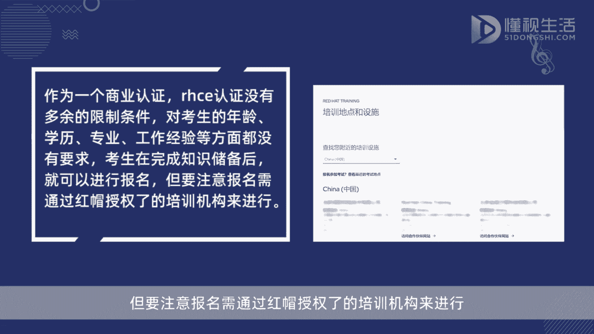
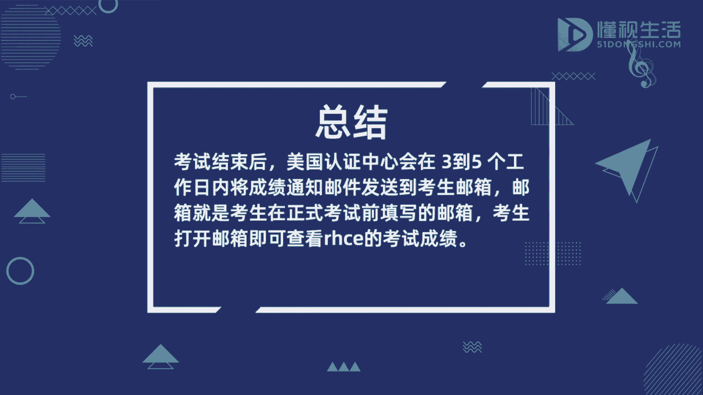

# rhce考试成绩怎么查 - P1 - 懂视 - BV1Q841117Cf

考试结束后，美国认证中心会在3~5个工作日内，将成绩通知邮件发送到考生邮箱，邮箱就是考生在正式考试前填写的邮箱，考生打开邮箱即可查看2HC1的考试成绩，所以填写邮箱时注意一定不要将邮箱填错。

而HC1认证是红帽认证体系中的终极认证，意思是红帽认证工程师，全称为red hat certified engineer，是市场上第一个面向LINUX系统的认证，也是LINUX行业非常具有价值的认证。

作为一个商业认证，RHC1认证没有多余的限制条件，被考生的年龄学历，专业工作经验等方面都没有要求，考生在完成知识储备后就可以进行报名，但要注意。

