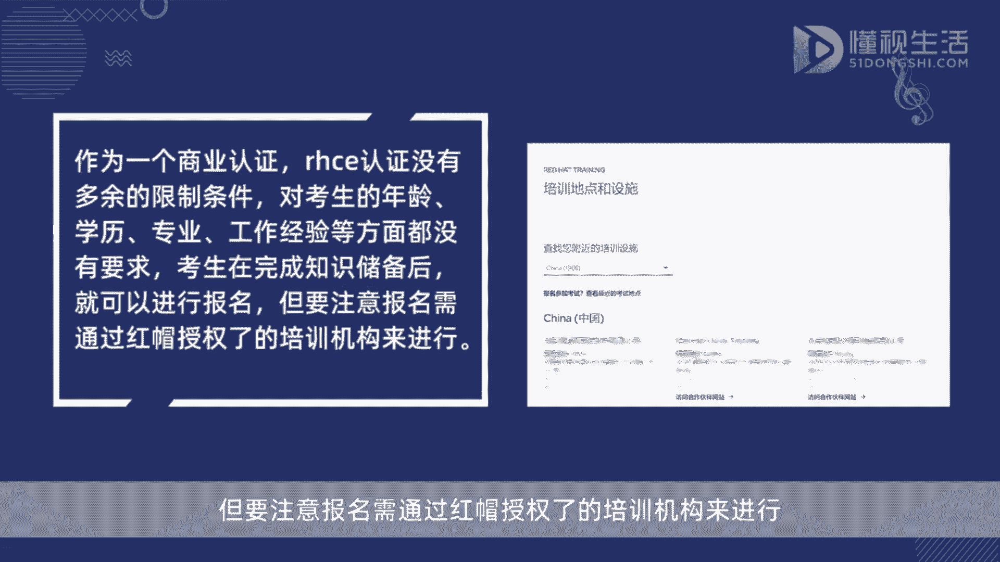
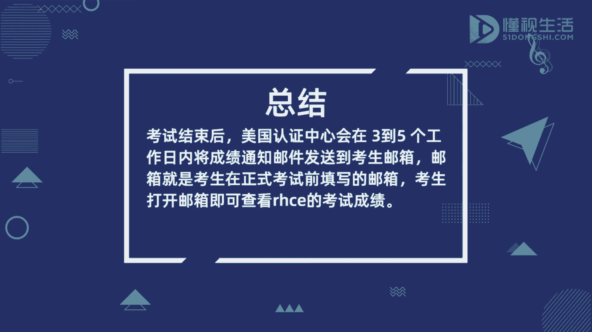

# RHCE认证指南：P1：考试成绩查询与认证简介 🎯

在本节课中，我们将要学习如何查询RHCE考试成绩，并了解RHCE认证的基本概念。这对于准备或已经参加考试的学员至关重要。

## 考试成绩查询方法 📧

上一节我们介绍了课程概述，本节中我们来看看具体的成绩查询流程。

考试结束后，红帽认证中心会在**3至5个工作日**内，将成绩通知邮件发送到考生邮箱。该邮箱是考生在正式考试前填写的联系邮箱。考生只需打开该邮箱即可查看RHCE的考试成绩。

因此，在填写邮箱时务必仔细核对，确保邮箱地址准确无误，以免错过重要通知。

## RHCE认证简介 🏆

了解了成绩查询方式后，我们进一步认识一下RHCE认证本身。

RHCE认证是红帽认证体系中的高级认证，全称为**Red Hat Certified Engineer**（红帽认证工程师）。它是市场上首个面向Linux系统的权威认证，也是Linux领域内极具价值的资质证明。

## 报考条件与注意事项 ⚠️

作为一种专业的技能认证，RHCE没有设置额外的限制条件。它对考生的年龄、学历、专业或工作经验等方面均无要求。考生在完成相关知识的学习和储备后，即可进行报名。

但需要注意，虽然报考门槛宽松，但考试本身对实践技能有较高要求，充分的准备是通过考试的关键。

---

本节课中我们一起学习了RHCE考试成绩的查询方法、RHCE认证的基本定义及其报考条件。牢记正确的查分邮箱是获取成绩的第一步，而理解认证的价值则能更好地规划学习路径。