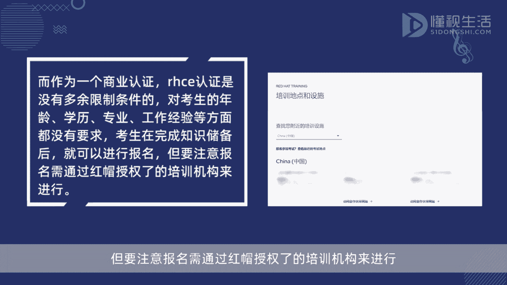
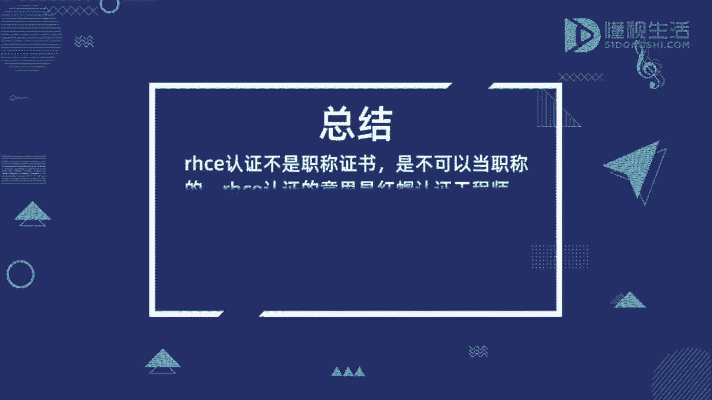

# rhce认证可以当职称吗 - P1 - 懂视 - BV1Hj411d7yZ

而HC1认证不是职称证书，是不可以当职称的，而HC1认证的意思是红帽认证工程师，全称为red hat certified engineer，是市场上第一个面向LINUX系统的认证。

也是LINUX行业非常具有价值的认证，属于红帽认证体系中的终极认证，同时也是一个具有商业性质的认证，和职称是没有任何关系的，而作为一个商业认证，而HC1认证是没有多余限制条件的，对考生的年龄学历。

专业工作经验等方面都没有要求，考生在完成知识储备后就可以进行报名，但要注意报名。

