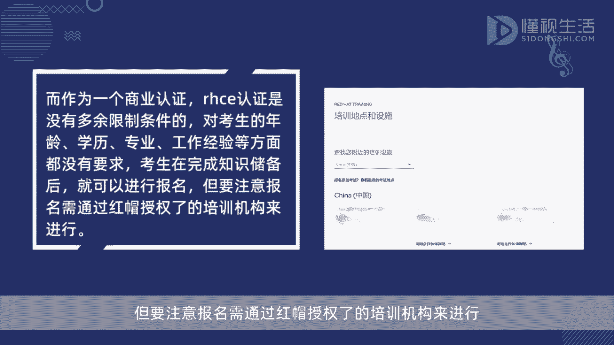
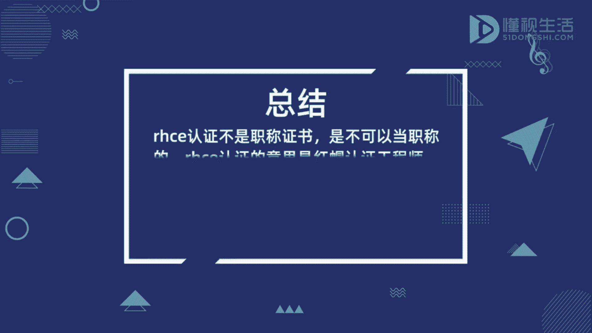

# Linux认证指南：P1：RHCE认证与职称的关系 🔍

在本节课中，我们将要学习RHCE认证的基本概念，并澄清一个常见的误解：RHCE认证是否可以等同于职称。

---

## 概述

RHCE认证不是职称证书，不可以当作职称使用。RHCE认证的全称是红帽认证工程师，英文为 **Red Hat Certified Engineer**。它是市场上第一个面向Linux系统的认证，也是Linux行业中极具价值的认证。RHCE属于红帽认证体系中的高级认证，同时也是一个商业性质的认证，与职称没有任何关系。

上一节我们介绍了RHCE认证的基本定位，本节中我们来看看它作为商业认证的具体特点。

---

## RHCE认证的特点

作为一个商业认证，RHCE认证对报考者没有过多的限制条件。它对考生的年龄、学历、专业以及工作经验等方面都没有硬性要求。考生在完成相关知识储备后，就可以进行报名。

以下是关于RHCE认证报考的几点说明：

*   它对考生的年龄没有要求。
*   它对考生的学历没有要求。
*   它对考生的专业背景没有要求。
*   它对考生的工作经验没有要求。

但需要注意，报名和参加考试仍需遵循红帽官方的具体流程和规定。

---

## 总结

本节课中我们一起学习了RHCE认证的本质。我们明确了**RHCE ≠ 职称**，它是一个由红帽公司推出的、高价值的商业技术认证。其目的是证明持证者在Red Hat Enterprise Linux系统方面的专业技能，而非评定职业等级。同时，我们也了解到该认证的报考门槛相对宽松，主要侧重于考察考生的实际技术能力。