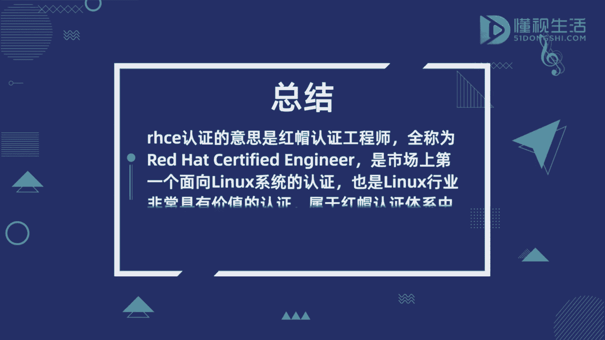

# rhce认证是什么意思 - P1 - 懂视 - BV1Zm4y1L7cu

而HC1认证的意思是红帽认证工程师，全称为red hat certified engineer，是市场上第一个面向LINUX系统的认证，也是LINUX行业非常具有价值的认证。

属于红帽认证体系中的终极认证，作为一个商业认证，RHC1认证没有多余的限制条件，对考生的年龄，学历，专业工作经验等方面都没有要求，考生在完成知识储备后就可以进行报名，但要注意。

报名需通过红帽授权了的培训机构来进行考试，分为ex200，红帽认证系统管理员阿克萨考试和ex300，红帽认证工程师RHCE考试两部分，如果只通过ARPA，没通过RHC则只可以获得克萨证书。

如果需要获得RHC1证书，就必须参加RHC1的补考，并通过考试，如果没通过ARPA，只通过RHCE则什么证书都不可以获得，也不能参加补考，如果两科都通过，则即可以获得阿克赛证书。

