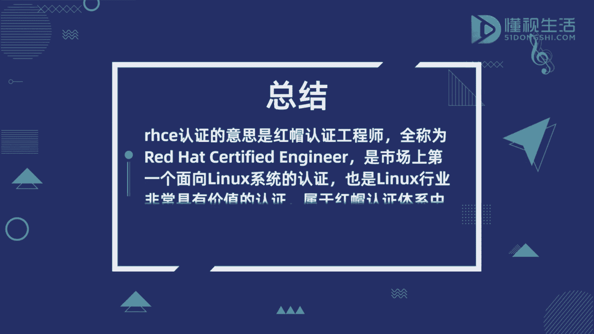

# Linux认证指南：P1：RHCE认证详解 🎓

在本节课中，我们将要学习RHCE认证的含义、它在红帽认证体系中的地位以及相关的考试规则。RHCE是Linux领域一项重要的专业认证，了解其基本概念是规划学习路径的第一步。

## 什么是RHCE认证？

RHCE认证的全称是**Red Hat Certified Engineer**，即红帽认证工程师。它是市场上首个面向Linux系统的专业认证，在Linux行业内被公认为具有很高的价值。

## RHCE在认证体系中的位置

上一节我们介绍了RHCE的基本定义，本节中我们来看看它在整个红帽认证体系中的位置。RHCE属于红帽认证体系中的**终极认证**。作为一个商业认证，它对考生没有额外的限制条件。

以下是RHCE认证的报考特点：
*   对考生的年龄没有要求。
*   对考生的学历没有要求。
*   对考生的专业工作经验没有要求。

考生在完成相关知识储备后即可报名。但需要注意，报名必须通过红帽官方授权的培训机构来进行。

## RHCE考试结构与证书规则

了解了报考条件后，我们来看看具体的考试结构和证书获取规则。RHCE考试分为两个部分：

1.  **EX200**：红帽认证系统管理员（RHCSA）考试。
2.  **EX300**：红帽认证工程师（RHCE）考试。

证书的获取遵循以下规则：
*   如果只通过**RHCSA（EX200）**，未通过**RHCE（EX300）**，则只能获得RHCSA证书。
*   如果需要获得RHCE证书，就必须参加并通过RHCE（EX300）的补考。
*   如果未通过RHCSA（EX200），只通过了RHCE（EX300），则不能获得任何证书，也不能参加补考。
*   如果两科考试都通过，则可以同时获得RHCSA和RHCE证书。

---

本节课中我们一起学习了RHCE认证的核心概念。我们明确了RHCE是红帽认证体系中的高级工程师认证，其考试由RHCSA和RHCE两部分组成，并且证书的获取有明确的组合规则。理解这些基础信息是迈向RHCE认证的第一步。