# RHEL8/CentOS8 容器管理：P10：配置阿里云加速器并运行一个简单容器 🐳

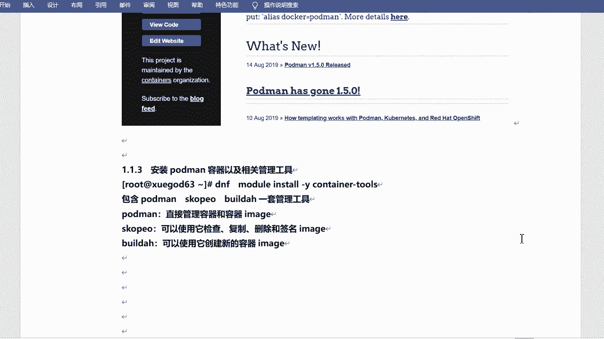

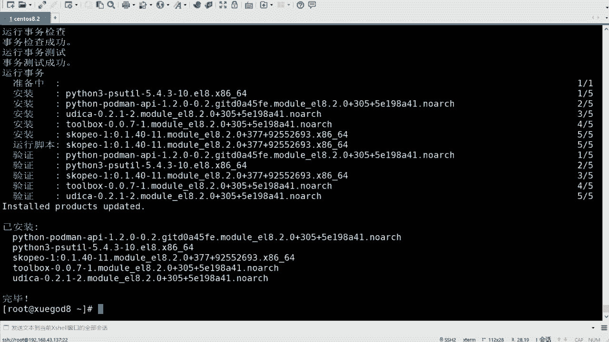

在本节课中，我们将学习如何在 RHEL8/CentOS8 系统上安装 Podman 容器管理工具，配置阿里云镜像加速器以提升镜像拉取速度，并运行一个简单的 CentOS 容器进行体验。

---

## 安装 Podman 工具组

上一节我们介绍了容器技术的基本概念，本节中我们来看看如何在系统上安装管理工具。Podman 在 RHEL8/CentOS8 系统的软件仓库中已经包含，可以直接安装。但需要注意的是，Podman 实际上是一组工具，建议安装整个工具组以获得完整的功能。

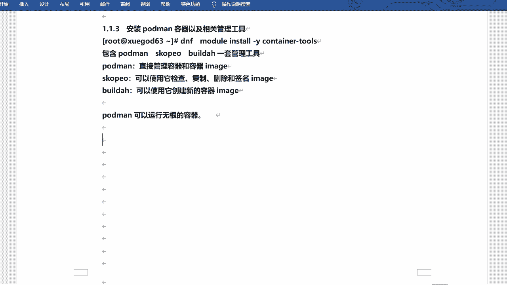

可以使用以下命令进行安装：
```bash
dnf module install container-tools
```
安装过程会包含 `podman`、`podman-docker` API 兼容层以及 `skopeo`、`buildah` 等几个核心包。

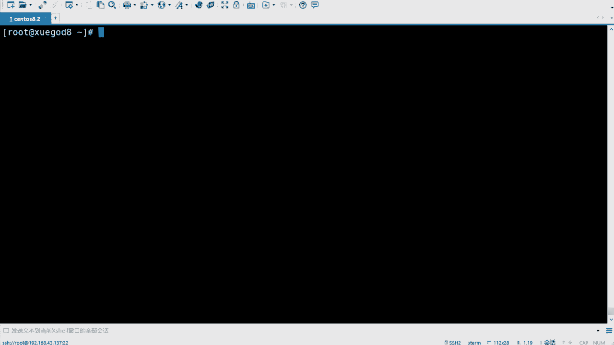

以下是 Podman 工具组包含的主要组件及其功能简述：
*   **podman**：最常用的工具，用于直接管理容器和容器镜像（如运行、停止、删除容器）。
*   **skopeo**：用于检查、复制、删除和签名容器镜像。
*   **buildah**：用于创建新的容器镜像，功能类似于 Dockerfile。

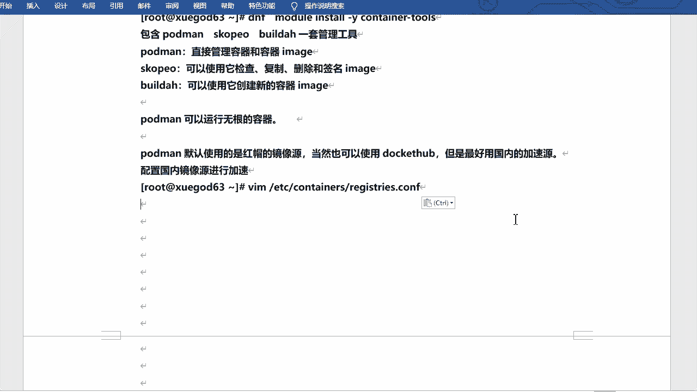

本课程主要使用 `podman` 命令，`skopeo` 可能会用到一两次，`buildah` 则不在 RHCE 考试范围内。Podman 的一个重要特性是支持运行“无根容器”，即非 root 特权用户运行的容器，这能提升安全性，但会有一些限制，例如普通用户运行的容器通常不能映射 1024 以下的端口。

安装完成后，Podman 是一个命令行工具，没有常驻的后台服务进程，因此无需启动或管理服务。

---

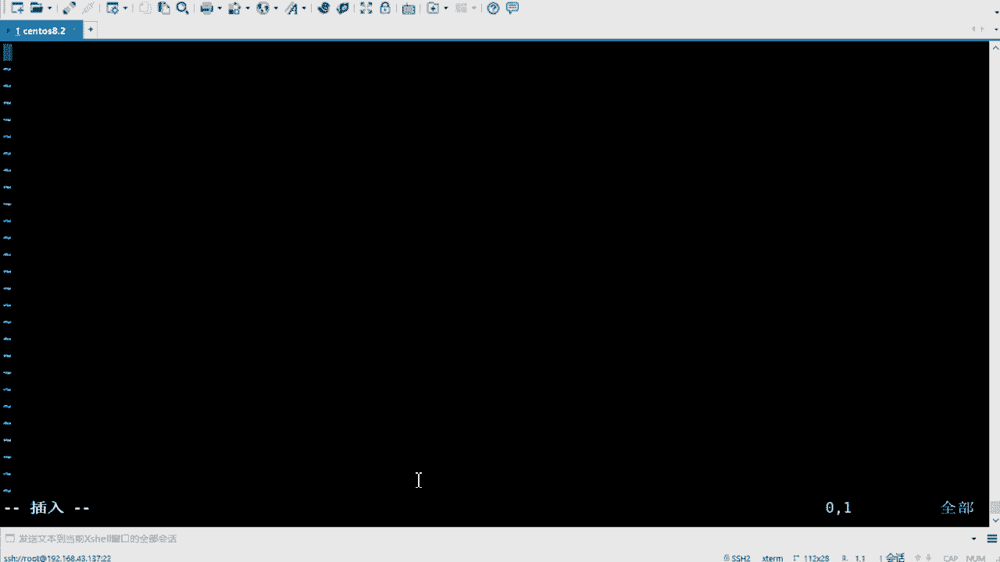

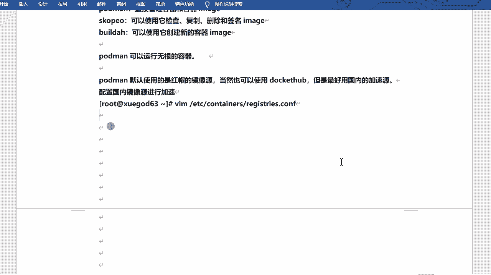

## 配置阿里云镜像加速器

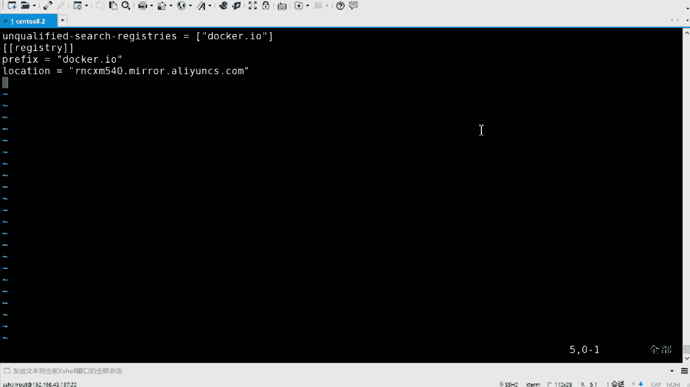

Podman 安装好后，默认会从红帽的官方镜像仓库拉取镜像，但这些仓库在国内访问可能不稳定。为了提高拉取镜像的速度和稳定性，我们需要配置镜像加速器。

Podman 的镜像仓库配置文件位于 `/etc/containers/registries.conf`。默认配置指向的 `registry.access.redhat.com` 和 `registry.redhat.io` 等地址在国内访问可能较慢或不稳定。虽然它也列出了 `docker.io`，但直接访问 Docker Hub 同样受网络环境影响。

我们需要修改此配置文件，将拉取源指向阿里云的镜像加速器。以下是配置步骤：

1.  备份原始配置文件：
    ```bash
    mv /etc/containers/registries.conf /etc/containers/registries.conf.bak
    ```
2.  创建并编辑新的配置文件：
    ```bash
    vi /etc/containers/registries.conf
    ```
3.  将以下配置内容写入新文件。其中 `location` 字段是关键，它指定了实际拉取镜像的加速器地址。
    ```ini
    unqualified-search-registries = ["docker.io"]

    [[registry]]
    prefix = "docker.io"
    location = "你的阿里云加速器地址.mirror.aliyuncs.com"
    ```
    **注意**：请将 `你的阿里云加速器地址` 替换为你从阿里云控制台获取的个人专属加速器地址（仅 `xxx.mirror.aliyuncs.com` 部分，无需 `https://` 前缀）。

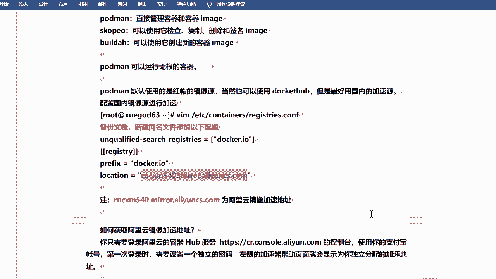

**如何获取阿里云加速器地址：**
1.  登录阿里云控制台。
2.  在顶部搜索栏搜索“容器镜像服务”。
3.  进入“容器镜像服务”控制台页面。
4.  在左侧菜单中找到并点击“镜像加速器”。
5.  页面中会显示为你分配的加速器地址，复制该地址即可。

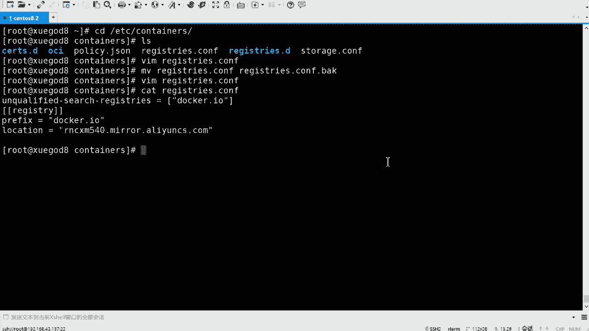

配置完成后无需重启任何服务，Podman 会自动使用新的配置。

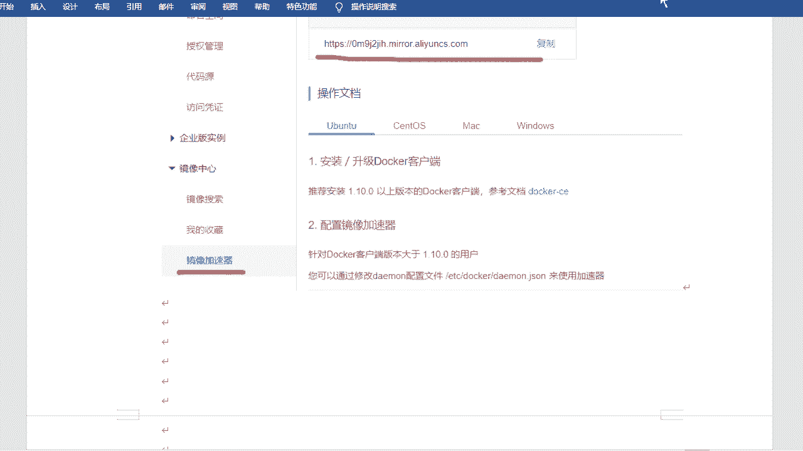

---

## 搜索与拉取容器镜像

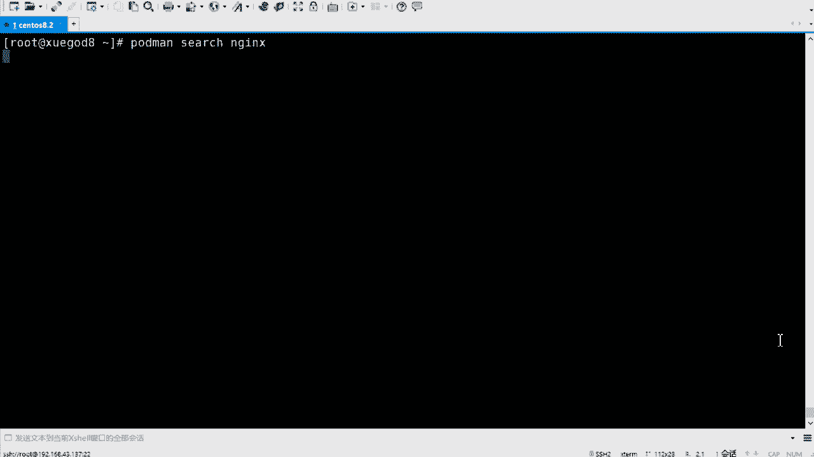

配置文件生效后，我们就可以开始使用 Podman 了。首先，我们可以搜索所需的镜像。

使用 `podman search` 命令可以搜索镜像，例如搜索 CentOS：
```bash
podman search centos
```
搜索结果会显示镜像名称、描述、星标数以及是否为官方镜像等信息。这有助于我们选择合适的镜像。

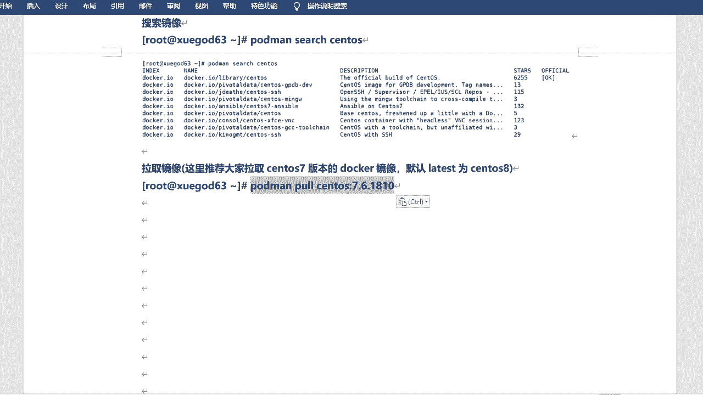

确定镜像后，使用 `podman pull` 命令拉取镜像。例如，拉取 CentOS 7.6.1810 版本：
```bash
podman pull centos:7.6.1810
```
在拉取过程中，你可以打开另一个终端，使用 `ss -antp | grep podman` 命令查看网络连接，确认连接的目标地址是阿里云的加速器地址，这证明了加速配置已生效。

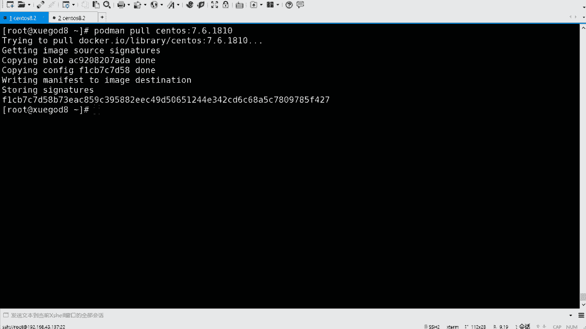

拉取完成后，可以使用 `podman images` 命令查看本地已有的镜像列表。

---

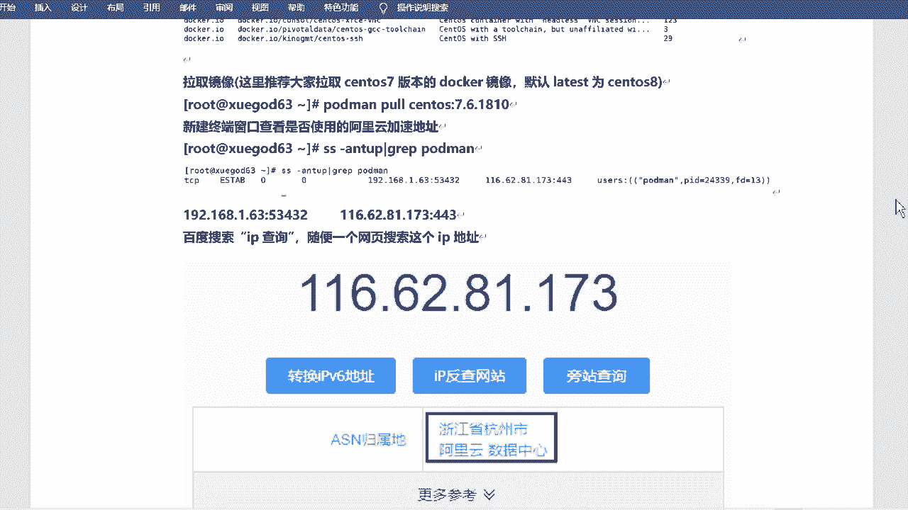

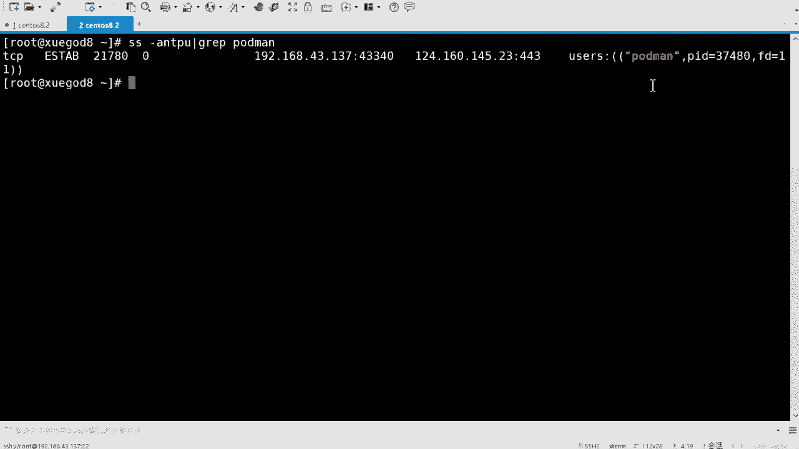

## 运行一个简单的容器

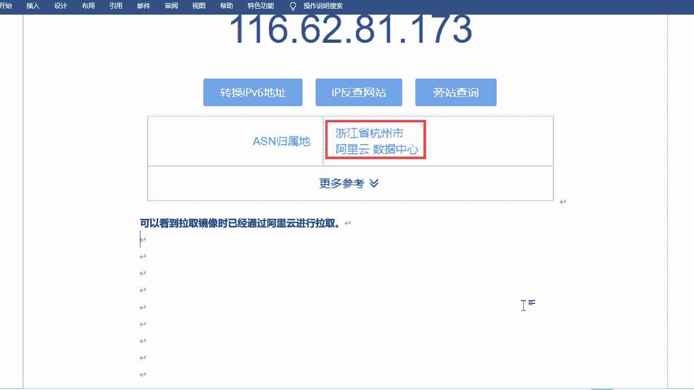

镜像拉取到本地后，就可以创建并运行容器了。我们将运行一个交互式的 CentOS 容器。

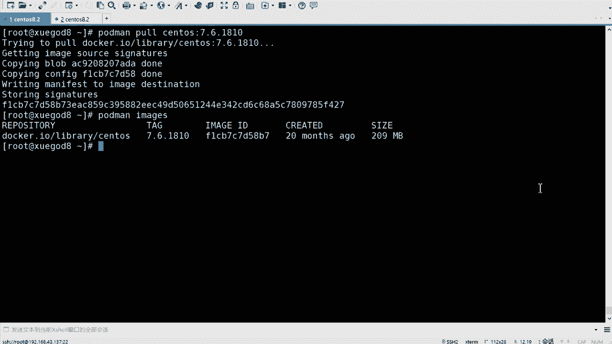

使用以下命令运行容器：
```bash
podman run -it --rm centos:7.6.1810 /bin/bash
```
运行后，你会立刻进入容器的 Bash Shell 环境。

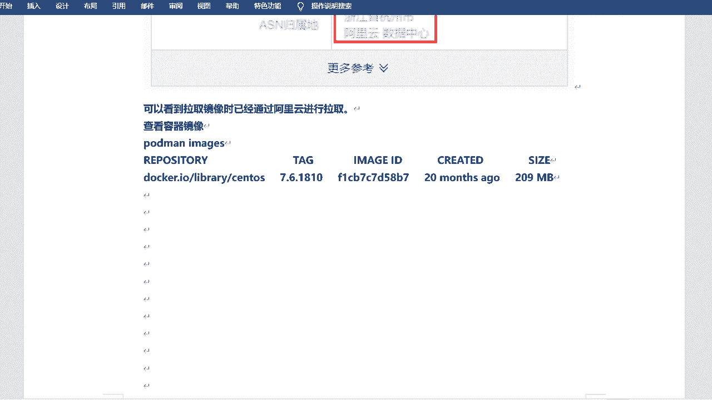

**命令参数解释：**
*   `-it`：这是 `-i` (interactive，保持标准输入打开) 和 `-t` (分配一个伪终端 TTY) 的组合，使我们能以交互模式进入容器。
*   `--rm`：容器停止运行后自动删除该容器。这是一个好习惯，可以避免留下大量停止状态的容器。
*   `centos:7.6.1810`：指定要使用的镜像及标签。
*   `/bin/bash`：容器启动后要执行的命令，这里是启动一个 Bash Shell。

在容器内部，你可以执行一些基础命令来观察环境：
*   `id`：查看当前用户（容器内默认为 root）。
*   `cat /etc/redhat-release`：查看容器内的系统版本（CentOS 7.6）。
*   `uname -r`：查看内核版本（与宿主机内核一致，例如 4.18.x）。
*   `yum list` 或 `rpm -qa`：查看已安装的软件包（比最小化安装的系统包更少）。

要退出容器，只需输入 `exit`。由于使用了 `--rm` 参数，退出后该容器会被自动删除。

---

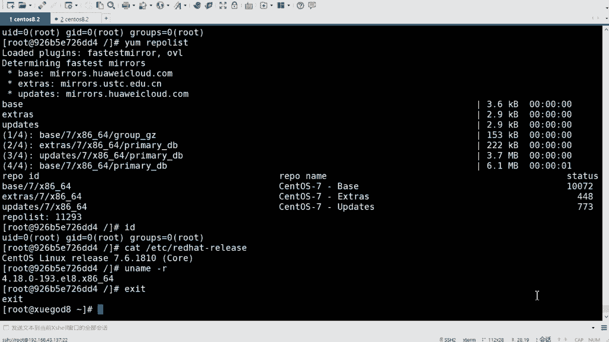

## 总结

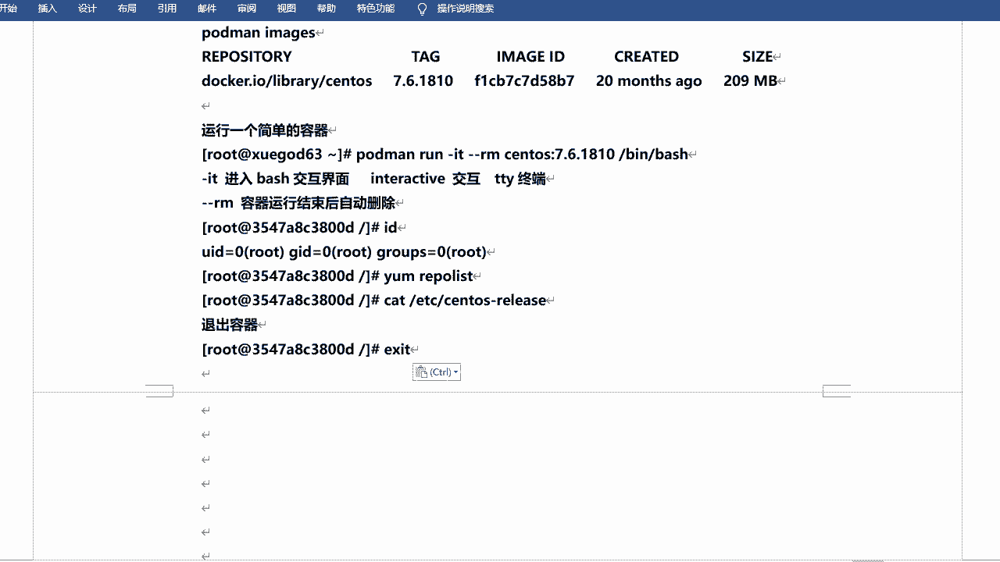

本节课中我们一起学习了在 RHEL8/CentOS8 系统上管理容器的完整入门流程。我们首先安装了 Podman 容器工具组，然后通过配置阿里云镜像加速器解决了国内拉取镜像慢的问题。接着，我们实践了使用 `podman search` 搜索镜像、使用 `podman pull` 拉取镜像，并最终使用 `podman run` 命令成功运行了一个交互式的 CentOS 容器，初步体验了容器环境的隔离特性。这些是后续进行更复杂容器操作的基础。