# Linux容器管理：P12：为容器附加永久存储与Cockpit管理Podman 🐳


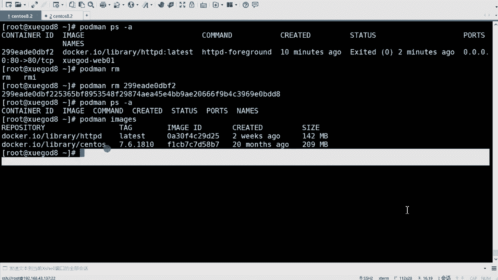

在本节课中，我们将学习如何为Podman容器附加永久存储，以确保容器数据在容器生命周期结束后得以保留。同时，我们也将了解如何使用Cockpit这一Web管理界面来便捷地管理Podman容器。

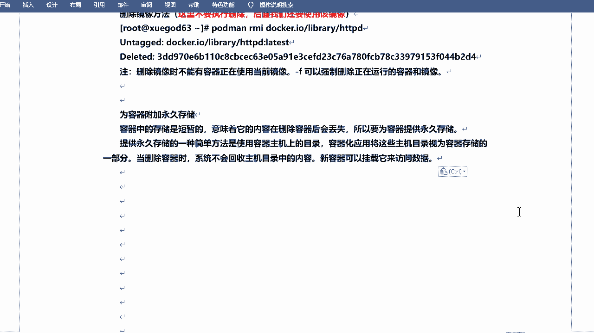

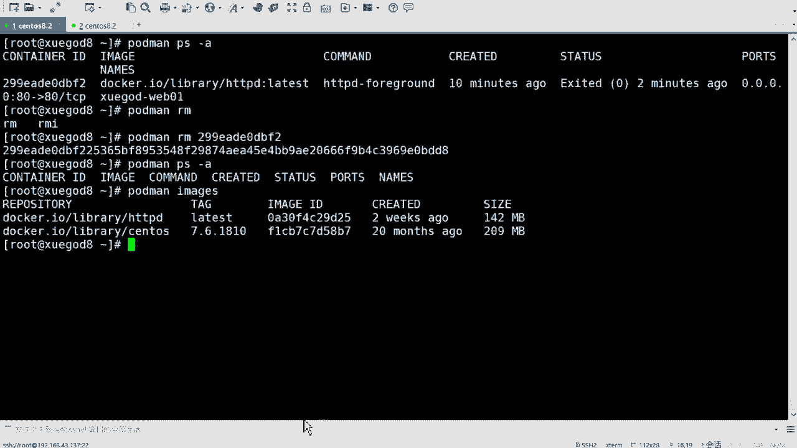

## 概述：为什么需要永久存储？

容器默认使用临时存储，这意味着容器内的所有数据在容器被删除后都会丢失。为了持久化保存数据，例如应用程序的配置文件、数据库或用户上传的内容，我们需要为容器附加永久存储。

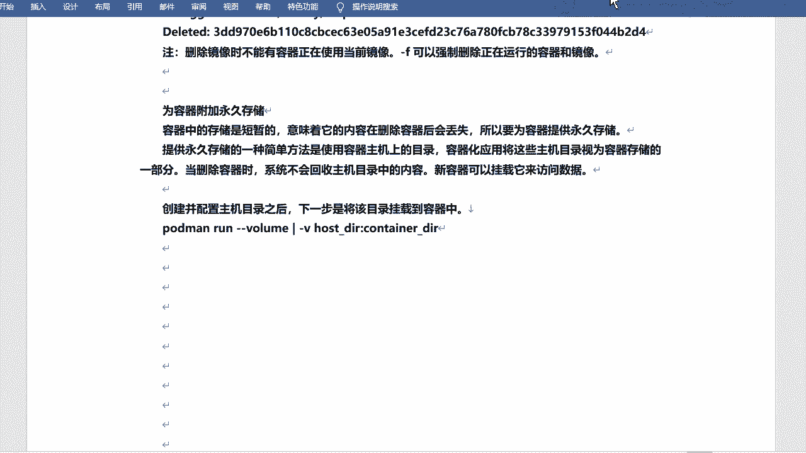

一种简单有效的方法是将宿主机上的目录挂载到容器内部。这样，容器化应用可以将这些主机目录视为其存储的一部分。当容器被删除时，系统只会回收容器内部的数据，而宿主机目录上的内容会被保留，新容器可以重新挂载该目录以访问数据。

## 为容器挂载主机目录

上一节我们介绍了永久存储的必要性，本节中我们来看看如何具体操作。Podman使用 `-v` 或 `--volume` 参数来挂载卷。

其基本命令格式如下：
```bash
podman run -v <宿主机目录>:<容器目录> <其他参数> <镜像名>
```

以下是使用命令行挂载存储的步骤：

1.  **运行一个临时容器并观察**：首先，我们运行一个不挂载存储的HTTPD容器，查看其默认的网站根目录。
    ```bash
    podman run -d --name web-temp httpd
    podman exec -it web-temp /bin/bash
    # 进入容器后，查看 /usr/local/apache2/htdocs/ 目录
    ls /usr/local/apache2/htdocs/
    exit
    podman stop web-temp && podman rm web-temp
    ```

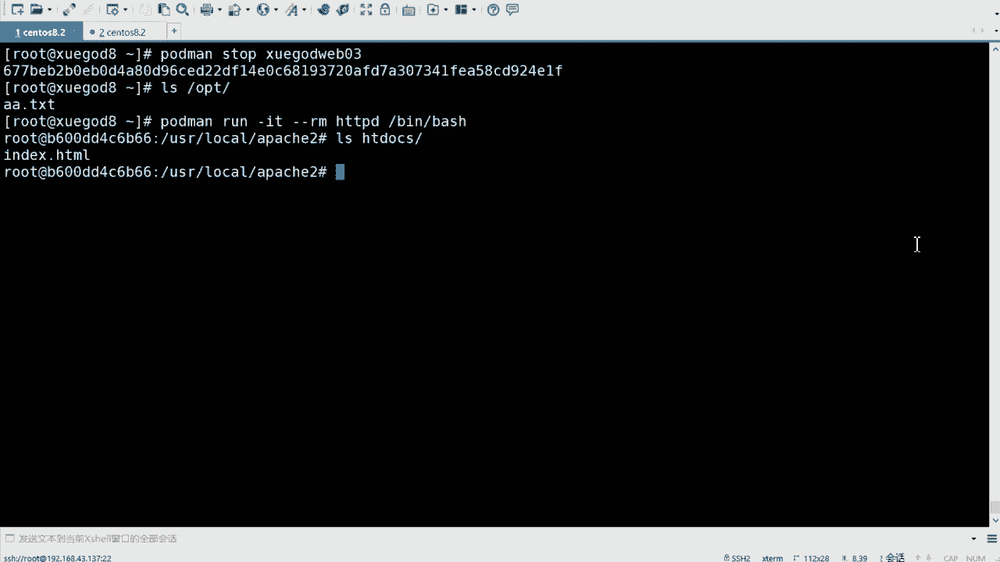

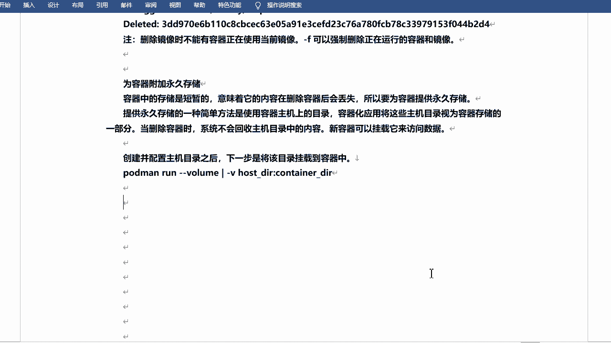

2.  **创建并运行带卷挂载的容器**：接下来，我们创建一个宿主机目录（例如 `/opt/webdata`），并将其挂载到容器的网站根目录。
    ```bash
    podman run -d --name web-permanent -v /opt/webdata:/usr/local/apache2/htdocs httpd
    ```

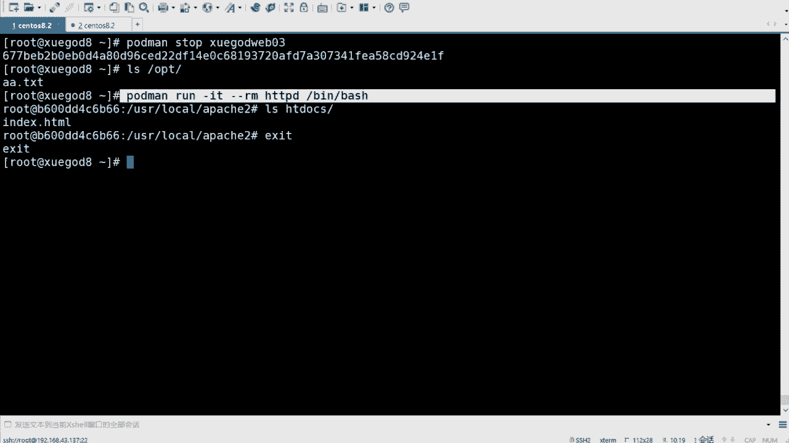

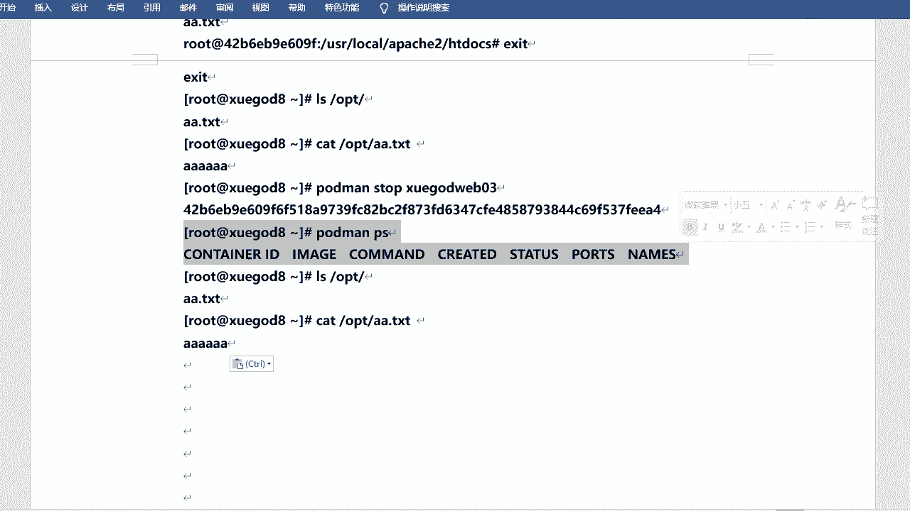

3.  **验证数据持久性**：在容器内创建文件，并确认其在宿主机目录中同步出现。
    ```bash
    podman exec -it web-permanent /bin/bash
    echo "持久化数据测试" > /usr/local/apache2/htdocs/test.txt
    exit
    # 在宿主机上检查
    cat /opt/webdata/test.txt
    ```

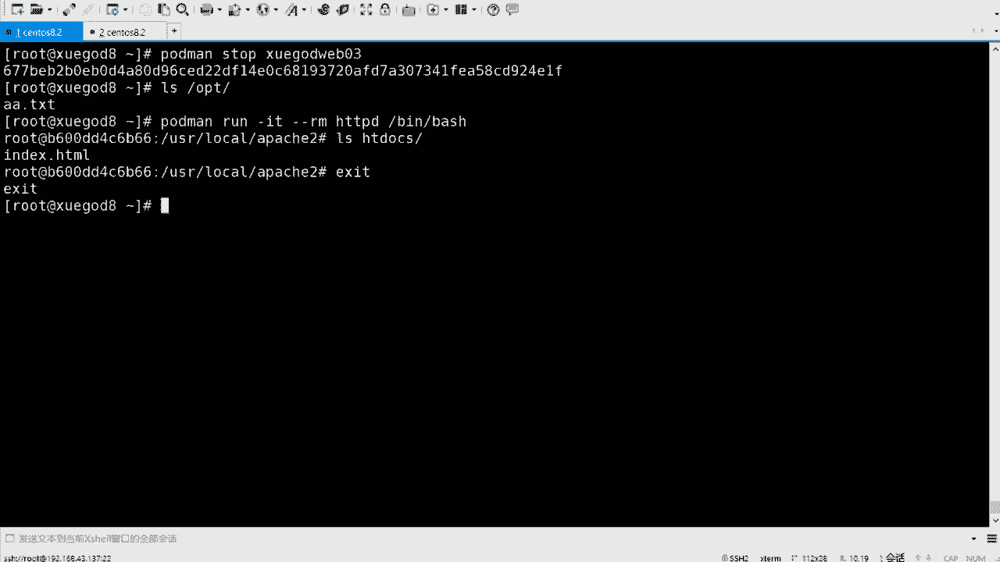

4.  **测试数据保留**：停止并删除旧容器，然后运行一个新容器并挂载同一个宿主机目录，检查数据是否依然存在。
    ```bash
    podman stop web-permanent && podman rm web-permanent
    podman run -d --name web-new -v /opt/webdata:/usr/local/apache2/htdocs httpd
    podman exec web-new cat /usr/local/apache2/htdocs/test.txt
    ```

如果直接运行一个不挂载卷的新容器，则无法看到之前创建的 `test.txt` 文件，这证明了卷挂载对于数据持久化的关键作用。

## 关于SELinux的注意事项

在启用了SELinux的系统（如RHEL/CentOS默认配置）上挂载卷时，可能会遇到权限问题。Podman提供了 `:Z` 或 `:z` 选项来自动调整挂载点的SELinux上下文。

其命令格式如下：
```bash
podman run -v /宿主机/目录:/容器/目录:Z <镜像名>
```
添加 `:Z` 选项后，Podman会自动将 `container_file_t` 这个SELinux上下文应用到宿主机目录，使容器能够正常读写。

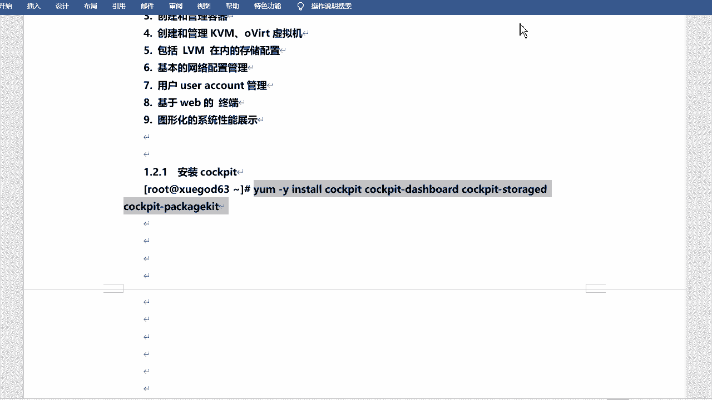

## 使用Cockpit管理Podman容器

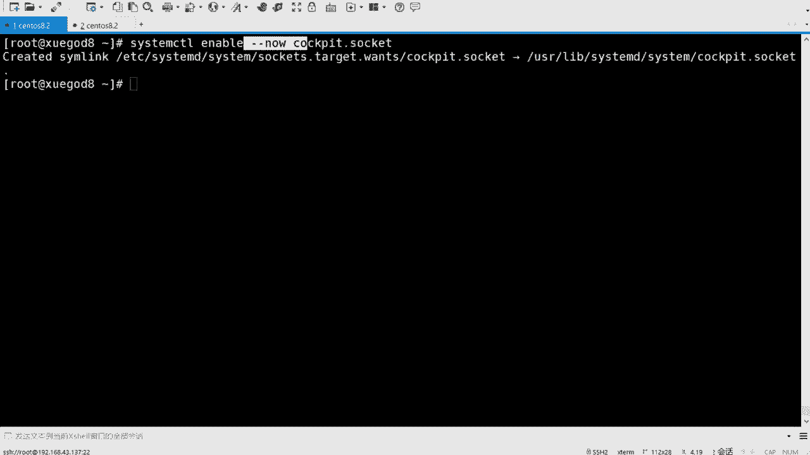

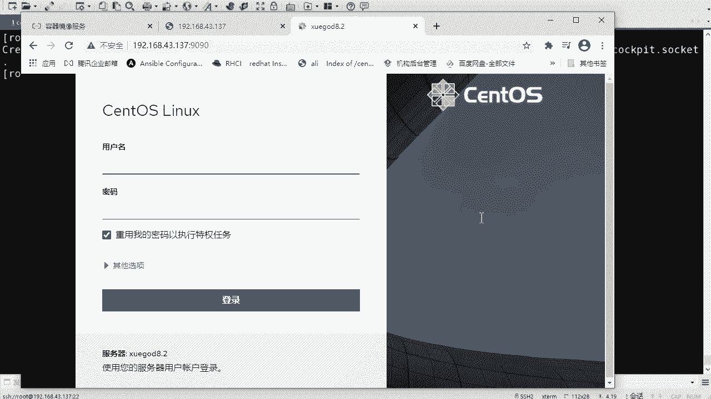

除了命令行，我们还可以使用图形化工具来管理容器。Cockpit是一个免费开源的基于Web的服务器管理工具，它可以管理存储、网络、日志、容器和虚拟机等。

以下是使用Cockpit管理Podman的步骤：

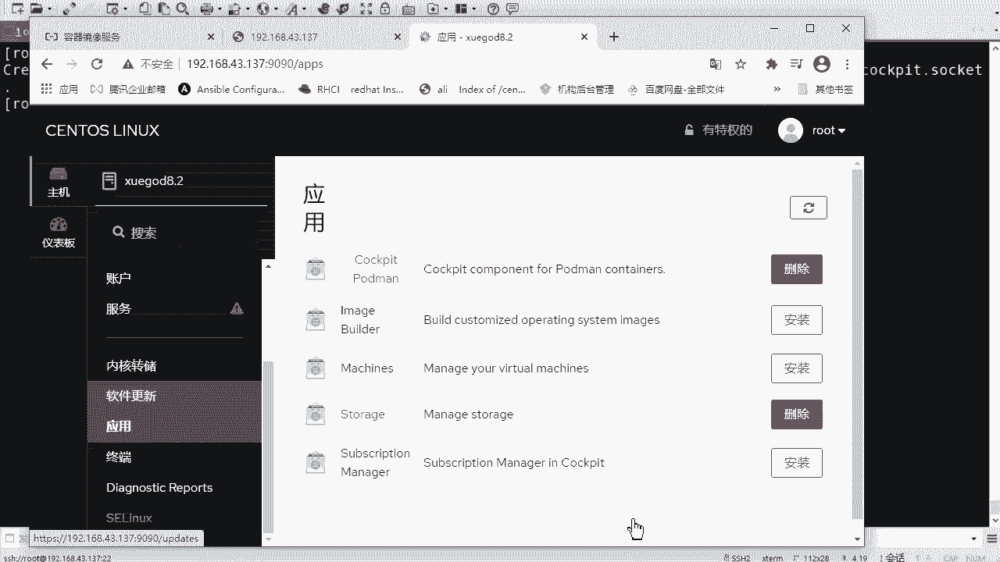

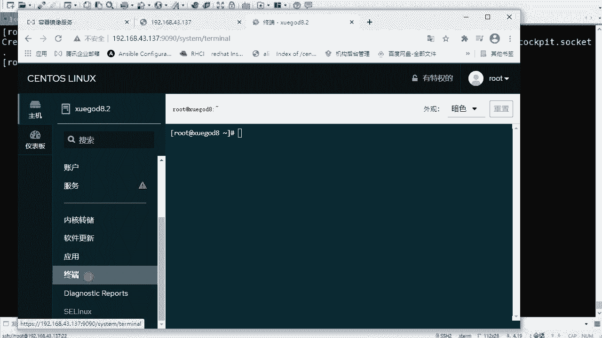

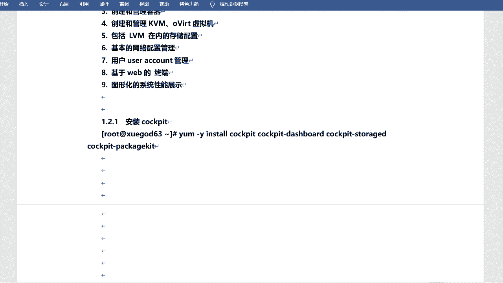

1.  **确保Cockpit已安装并运行**：
    ```bash
    sudo dnf install cockpit cockpit-podman -y
    sudo systemctl enable --now cockpit.socket
    ```

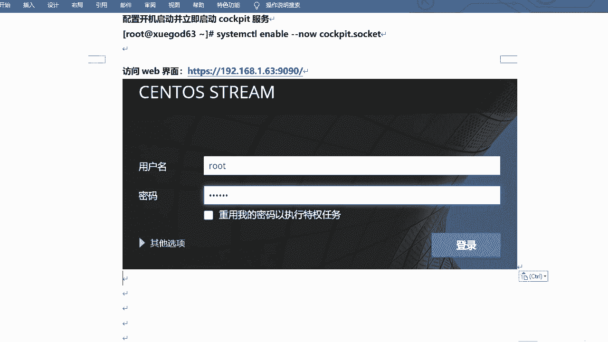

2.  **访问Cockpit**：打开浏览器，访问 `https://<你的服务器IP>:9090`，使用系统用户名和密码登录。

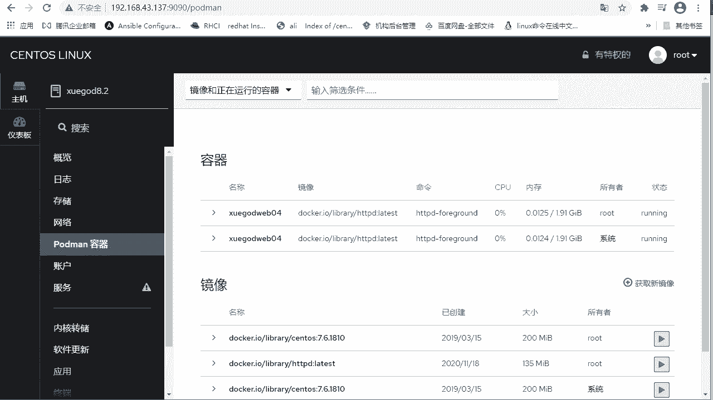

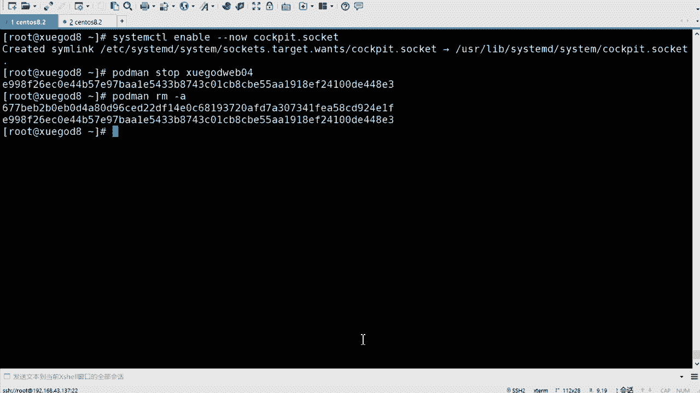

3.  **导航至Podman管理界面**：登录后，在侧边栏找到并点击 **“Podman 容器”**。

4.  **使用Cockpit操作容器**：
    *   **查看镜像与容器**：在界面中，你可以看到当前系统已有的容器镜像和正在运行的容器。
    *   **运行新容器**：点击“运行镜像”，在弹出的对话框中配置容器参数，如容器名称、要映射的端口（例如将容器80端口映射到主机8080端口），以及需要挂载的卷。
    *   **管理容器生命周期**：可以对运行中的容器执行停止、启动、删除等操作。

通过Cockpit界面运行容器，本质上与执行`podman run`命令的效果相同，但它提供了更直观的配置和管理方式，非常适合初学者或不常使用命令行的用户。

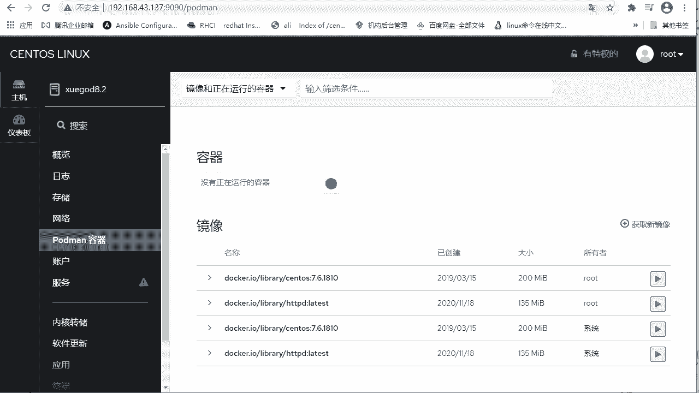

## 总结

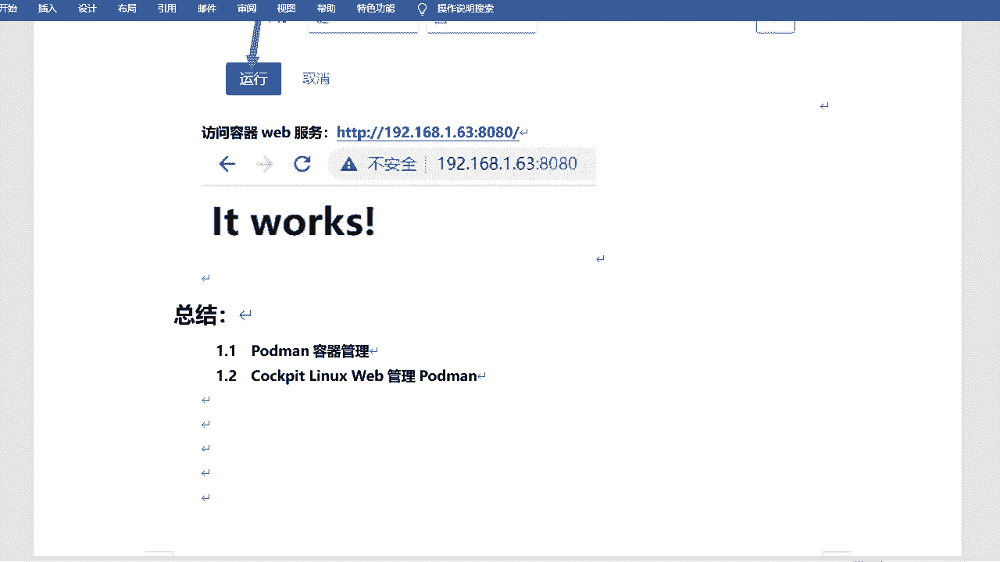

本节课中我们一起学习了Podman容器数据持久化的核心方法。我们掌握了使用 `-v` 参数将宿主机目录挂载为容器卷的技术，并了解了在SELinux环境下需要使用 `:Z` 标志。此外，我们还探索了如何使用Cockpit这一Web管理工具来可视化地管理Podman容器，包括运行、停止和配置容器。结合命令行与图形界面工具，能够更灵活高效地应对容器管理的各种场景。