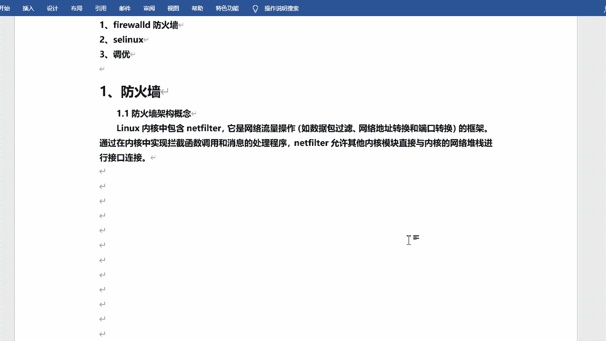
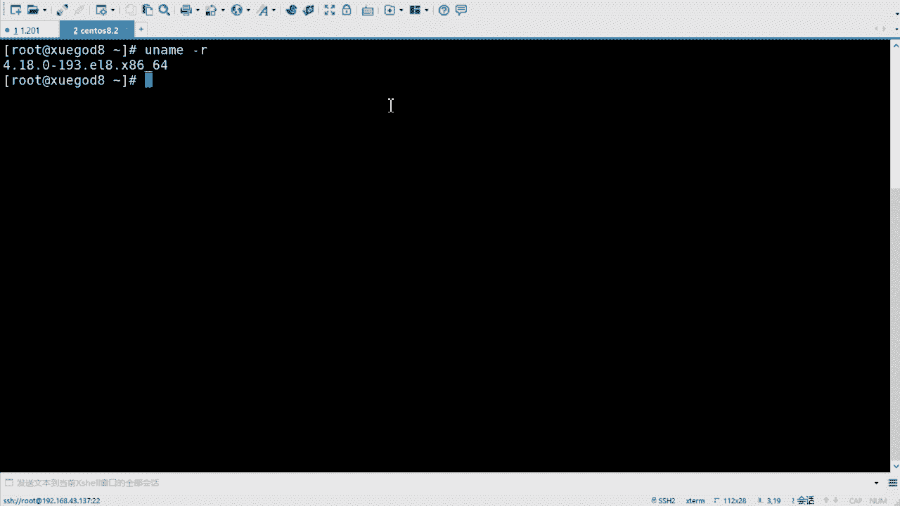
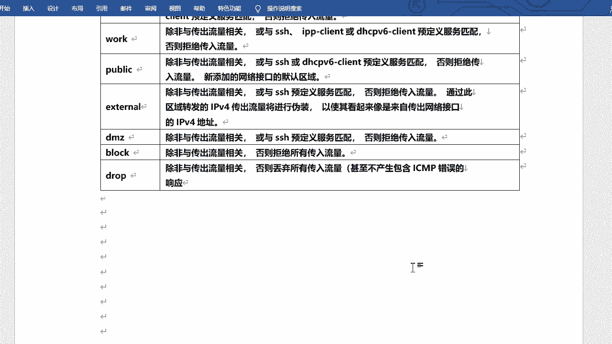
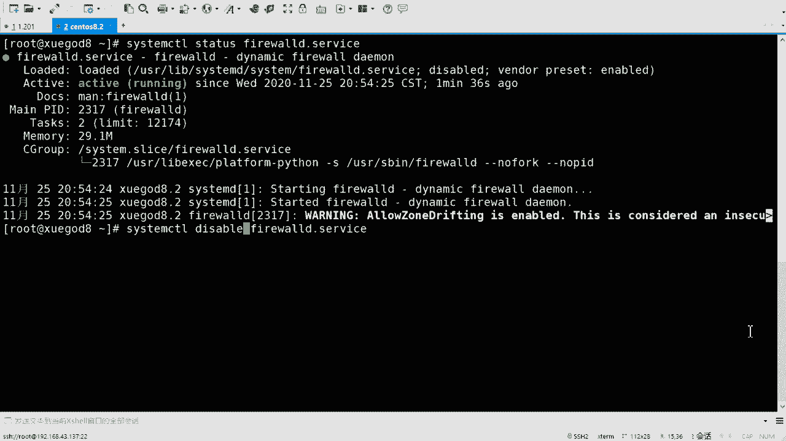
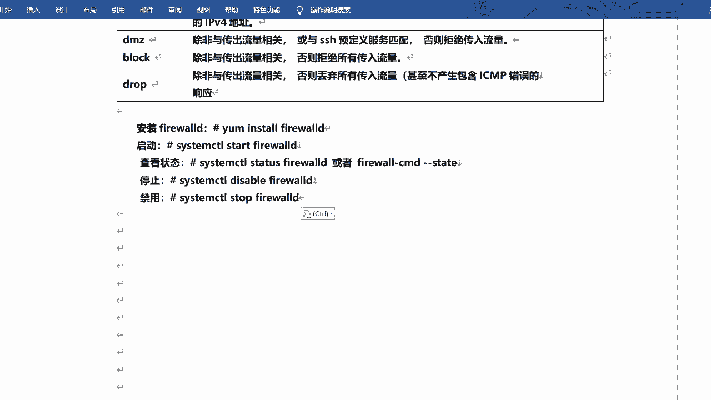
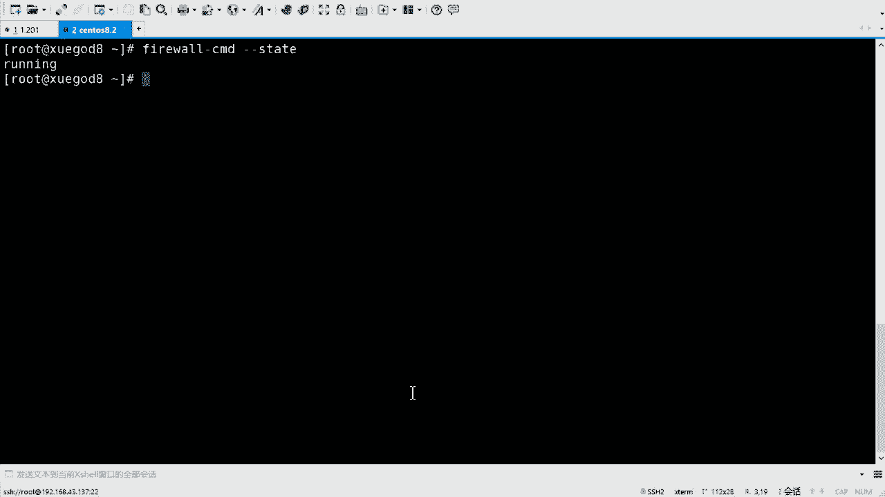
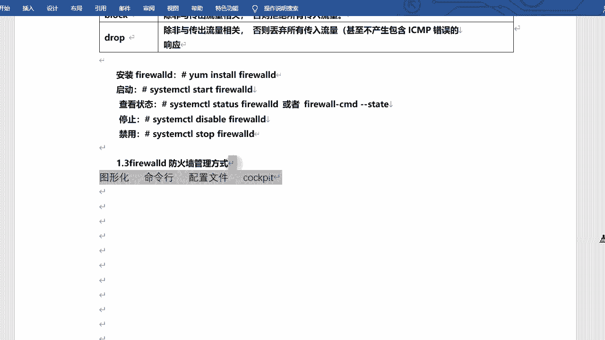

# Linux防火墙管理：P1：firewalld防火墙基础 🛡️

在本节课中，我们将要学习Red Hat Enterprise Linux 8（及其衍生版本如CentOS 8）中的防火墙管理。我们将重点介绍`firewalld`这一动态防火墙管理器，了解其核心概念、工作原理以及基本的管理方式。

## 防火墙的演变与核心组件 🔄





上一节我们介绍了课程概述，本节中我们来看看防火墙技术的发展。

`firewalld`并非Red Hat 8的全新产物，它在7版本中就已开始使用，并在8版本中继续沿用。

严格来说，`firewalld`本身并非真正的防火墙，它是一个**防火墙管理工具**。真正在内核中执行网络流量过滤、网络地址转换等操作的是`netfilter`框架。

`netfilter`是集成在内核中的网络流量操作框架，负责数据包过滤、网络地址转换和端口转换。它通过在内核中实现拦截函数调用和消息处理程序，允许其他内核模块与内核的网络堆栈进行交互。

在基于内核4.10及以上的RHEL 8系统中，除了`netfilter`，内核还包含了一个名为**nftables**的新组件。nftables是一个新的过滤器和数据包分类子系统，它增强了`netfilter`的部分代码，但仍保留了其框架。nftables的优势在于更快的数据包处理速度、更快的规则集更新，以及能够用同一套规则同时处理IPv4和IPv6流量。

nftables与原始的`netfilter`配置接口不同。`netfilter`通过多个工具（如`iptables`、`ip6tables`）进行配置，而这个框架在RHEL 8中已被弃用。nftables则使用单一的`nft`用户空间工具来管理所有协议，解决了以往多个前端工具引起的争用问题。

无论是`netfilter`还是`nftables`，它们都是集成在内核中的**真正的防火墙**。而我们常说的`iptables`和`firewalld`，都是**防火墙的管理工具或管理器**。

在RHEL 8中，`firewalld`作为nftables框架的前端管理工具，使用`nft`命令来管理防火墙规则集。通过`firewalld`，可以将所有网络流量划分为多个**区域**，从而简化防火墙管理。数据包会根据其源IP地址或传入的网络接口等条件被转入相应的区域，并匹配该区域的防火墙规则，以决定是接受、拒绝、丢弃还是转发。

在RHEL 8中，我们还可以直接使用`nft`命令进行管理。防火墙管理工具经历了从`iptables`到`firewalld`，再到`nft`的演变。`nft`命令的功能更强大，语法也更复杂，类似于一种编程语言，支持判断和循环。目前，我们主要学习和使用的仍然是`firewalld`。

## 理解firewalld的核心概念：区域 🗺️

上一节我们了解了防火墙的底层组件，本节中我们来看看`firewalld`引入的核心抽象概念——区域。

`firewalld`将所有网络流量划分为多个**区域**。区域是一套预定义的过滤规则，数据包必须经过某个区域的检查才能进入或离开系统。可以将区域想象成一个个安检门，有的严格，有的宽松，检查的细致程度各不相同。

`firewalld`预定义了9个区域，以下是这些区域的简要说明：

*   **trusted**：信任区域。**允许所有传入流量**。这是最宽松的区域，通常用于完全信任的网络，如回环接口。
*   **home**：家庭区域。通常用于家庭网络。默认允许与预定义服务（如SSH、mdns、ipp-client、samba-client、dhcpv6-client）相关的传入流量，拒绝其他所有流量。
*   **internal**：内部区域。用于内部网络，其默认规则与`home`区域类似。
*   **work**：工作区域。用于工作场所网络。默认允许的传入流量服务比`home`区域少，通常只包括SSH、dhcpv6-client等。
*   **public**：公共区域。**这是新添加网络接口的默认区域**。用于不信任的公共区域，默认只允许SSH和dhcpv6-client等少数服务的传入流量，拒绝其他所有流量。
*   **external**：外部区域。用于启用了伪装的外部网络（如路由器）。通常允许SSH，并对传出流量进行IPv4地址伪装。
*   **dmz**：隔离区（非军事区）。用于对外部公开但内部网络隔离的服务。默认只允许SSH。
*   **block**：限制区域。**拒绝所有传入流量**，并返回一个拒绝（reject）消息。
*   **drop**：丢弃区域。**丢弃所有传入流量**，且不产生任何ICMP错误响应（如`ping`无回应）。

这里需要区分**拒绝**和**丢弃**：
*   **拒绝**：明确告知连接发起方“连接被拒绝”。
*   **丢弃**： silently丢弃数据包，不做任何回应，连接发起方会等待直到超时。

## firewalld服务管理 ⚙️

上一节我们认识了区域的概念，本节中我们来学习如何启动和管理`firewalld`服务本身。

`firewalld`是一个系统服务，需要运行起来才能生效。默认情况下，它通常已经安装并可能已启用。

以下是管理`firewalld`服务的基本命令：

```bash
# 1. 安装firewalld（如果未安装）
sudo yum install firewalld

# 2. 启动firewalld服务
sudo systemctl start firewalld

# 3. 查看firewalld服务状态
sudo systemctl status firewalld
# 或者使用firewalld自带命令
sudo firewall-cmd --state

# 4. 设置firewalld开机自启
sudo systemctl enable firewalld

# 5. 停止firewalld服务
sudo systemctl stop firewalld

# 6. 禁止firewalld开机自启
sudo systemctl disable firewalld



# 7. 重启firewalld服务
sudo systemctl restart firewalld
```

服务启动后，防火墙规则才会生效。如果服务未运行，系统将没有活动的防火墙限制（类似于`trusted`区域）。

## firewalld的管理方式 📋

上一节我们启动了服务，本节中我们来看看管理`firewalld`规则有哪些途径。

在RHEL 8中，管理`firewalld`防火墙主要有四种方式：

1.  **图形化管理工具**：通过`firewall-config`工具进行可视化配置。
2.  **命令行工具**：使用`firewall-cmd`命令进行配置，这是最常用和强大的方式。
3.  **配置文件**：直接编辑`/etc/firewalld/`目录下的XML区域和服务配置文件。
4.  **D-Bus接口**：通过D-Bus接口进行编程式管理。



这些方式都可以用来有效地管理防火墙规则，在后续课程中我们将重点学习命令行工具`firewall-cmd`的使用。



---





本节课中我们一起学习了RHEL 8中防火墙的基础知识。我们了解了真正的防火墙内核组件（`netfilter`/`nftables`）与管理工具（`firewalld`）的区别，认识了`firewalld`的核心概念——**区域**及其预定义的9种类型，掌握了`firewalld`服务的启停管理命令，并知道了管理防火墙的四种主要方式。这些是后续进行具体防火墙规则配置的基石。