# Linux系统管理：P3：SELinux安全机制详解 🔐

在本节课中，我们将要学习SELinux（Security-Enhanced Linux）的基本概念、工作原理以及如何对其进行配置和管理。SELinux是Linux内核中一个强大的安全模块，它通过强制访问控制机制来增强系统的安全性。

## 什么是SELinux？

上一节我们介绍了系统安全的基础知识，本节中我们来看看SELinux。SELinux全称为Security-Enhanced Linux，即安全性增强的Linux。它由美国国家安全局（NSA）开发，构建于Linux内核之上，提供了一个灵活的强制性访问控制（MAC）架构。

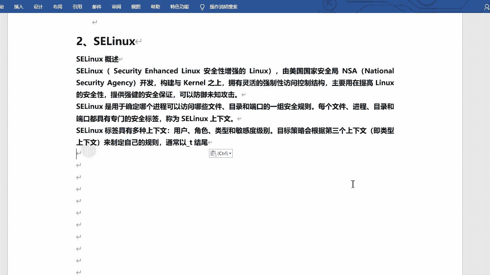

SELinux的主要目标是提高Linux系统的安全性，提供强有力的安全保障，可以防御未知攻击。它通过精确控制进程对文件、目录和端口的访问权限来实现这一目标。

## SELinux的工作原理

SELinux通过一组安全策略规则来控制系统。每个文件、进程、目录和端口都被赋予一个专门的安全标签，这个标签被称为SELinux上下文（Context）。

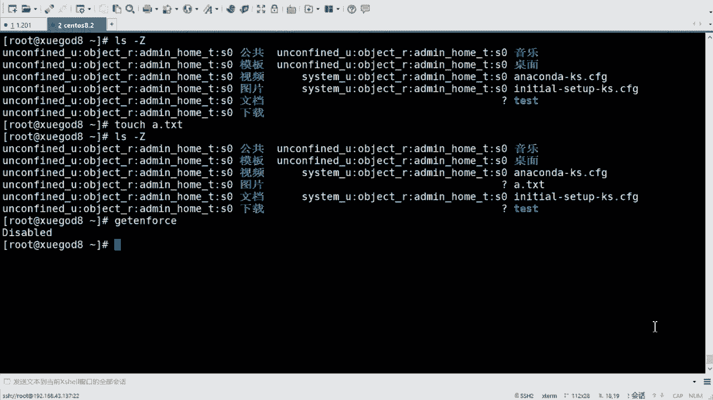

SELinux上下文通常包含四类信息：
*   **用户（User）**：标识SELinux用户。
*   **角色（Role）**：标识角色，用于角色访问控制。
*   **类型（Type）**：这是最常用的部分，用于类型强制策略。
*   **敏感度级别（Sensitivity Level）**：用于多级安全策略。

在日常管理和配置中，我们主要修改和关注的是**类型（Type）**部分。目标策略会根据上下文中的类型来制定访问规则。类型的名称通常以下划线`_t`结尾。

## 查看SELinux上下文

我们可以使用`ls -Z`命令来查看文件或目录的SELinux上下文。

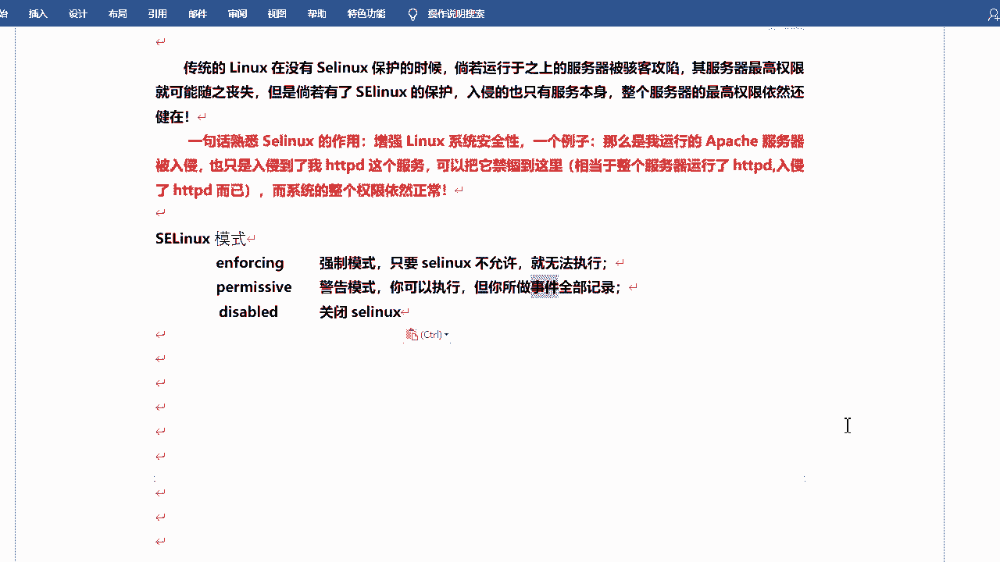

```bash
ls -Z
```

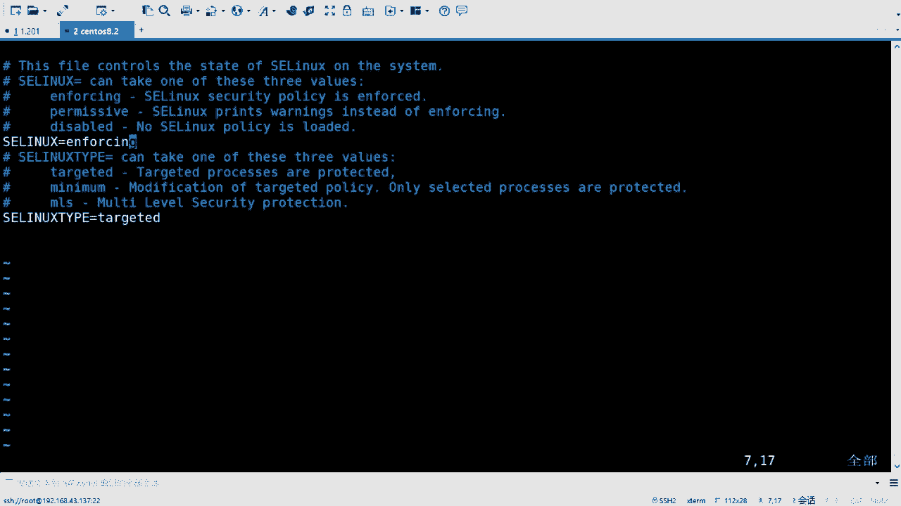

执行该命令后，输出会显示类似`user:role:type:sensitivity`的格式。其中，`type`字段就是我们需要关注的类型信息。

系统自带的文件和目录通常已经被正确打上了SELinux标签。然而，新创建的文件在SELinux未启用或策略未应用时，其上下文可能显示为问号`?`或默认类型。

## SELinux的工作模式

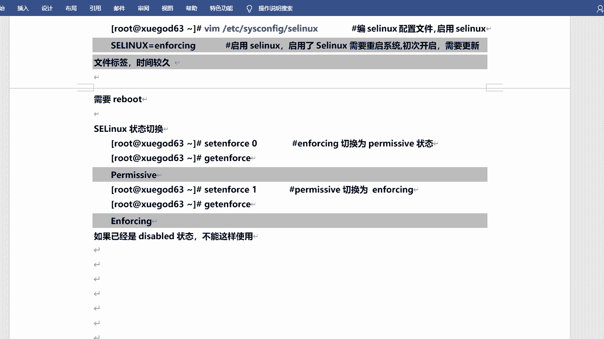

SELinux有三种主要的工作模式，可以通过修改配置文件`/etc/selinux/config`来设置。

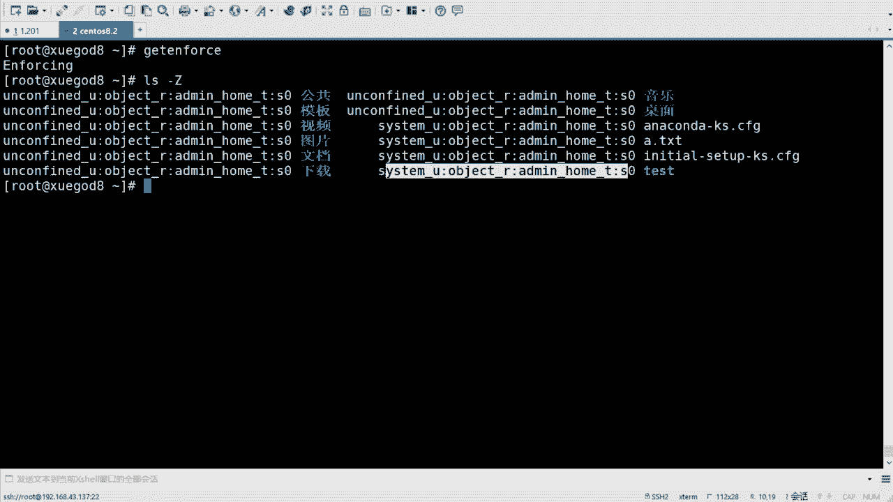

以下是SELinux的三种模式：
*   **Enforcing（强制模式）**：SELinux策略被强制执行，违反策略的行为将被阻止并记录到日志中。
*   **Permissive（宽容模式）**：SELinux策略不被强制执行，但违反策略的行为会被记录到日志中。此模式常用于故障排除和策略调试。
*   **Disabled（禁用模式）**：SELinux被完全关闭。

将`SELINUX=`的值设置为上述模式之一，然后**重启系统**即可生效。重启时，系统可能会重新为文件系统打标签，这个过程可能需要一些时间。

除了修改配置文件，我们也可以使用`setenforce`命令临时切换Enforcing和Permissive模式。

```bash
# 临时切换到Permissive模式（相当于警告模式）
setenforce 0

# 临时切换回Enforcing模式（强制模式）
setenforce 1
```

**请注意**：`setenforce`命令只能在`SELINUX=enforcing`的状态下，用于在`enforcing`和`permissive`之间切换。如果SELinux在配置文件中被设置为`disabled`，则无法使用此命令临时开启。

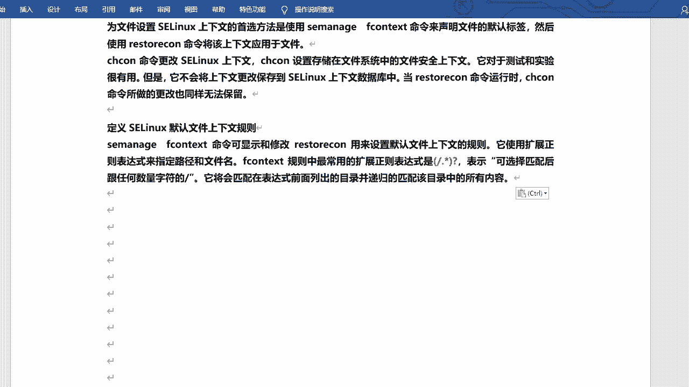

## 管理SELinux上下文

当我们需要让某个服务（如Apache HTTPD）访问非默认目录下的文件时，就需要修改该目录或文件的SELinux上下文类型。

管理SELinux上下文主要有两个命令：`semanage`和`restorecon`。`chcon`命令也可用于更改上下文，但它所做的更改是临时的，不会被保存到SELinux策略数据库中，当执行`restorecon`命令时，`chcon`的更改会被覆盖。因此，我们主要使用`semanage`和`restorecon`。

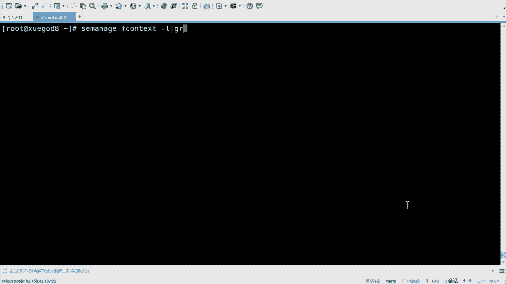

`semanage fcontext`命令用于管理文件上下文的默认规则，`restorecon`命令则用于将规则应用到具体的文件系统上。

`semanage fcontext`命令可以使用正则表达式来指定路径，从而批量修改目录下的文件上下文。一个常用的正则模式是`(/.*)?`，它表示匹配该目录及其下所有子目录和文件。

## 实践示例：为Web目录配置SELinux

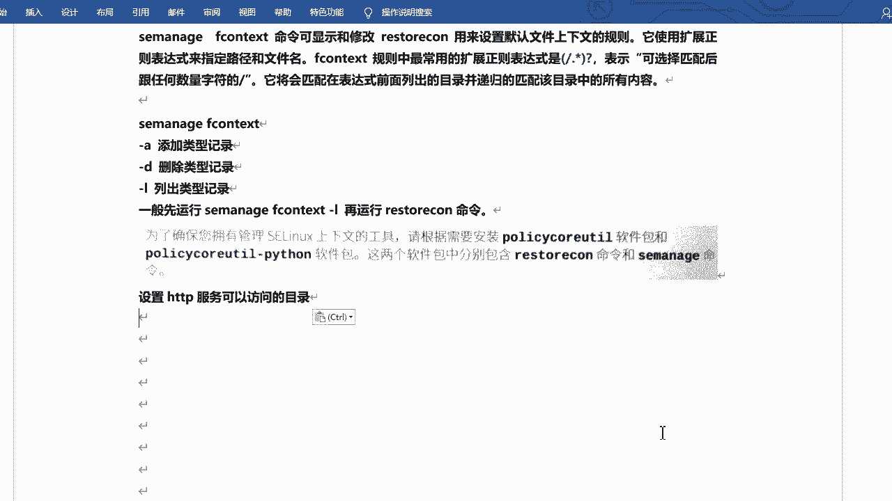

假设我们安装了Apache HTTPD服务，其默认的网页根目录是`/var/www/html/`。该目录下的文件类型为`httpd_sys_content_t`，因此Apache进程可以读取这些文件。

如果我们想创建一个新的Web目录，例如`/web`，并让Apache能够访问其中的内容，就需要将其SELinux上下文类型修改为`httpd_sys_content_t`。

以下是具体操作步骤：

1.  **创建目录和测试文件**
    ```bash
    mkdir /web
    touch /web/index.html
    ```

2.  **查看当前上下文**（此时应为默认类型，如`default_t`）
    ```bash
    ls -Z /web/
    ```

3.  **使用`semanage`添加新的默认上下文规则**
    这条命令告诉SELinux：`/web`目录及其下所有内容的默认类型应该是`httpd_sys_content_t`。
    ```bash
    semanage fcontext -a -t httpd_sys_content_t "/web(/.*)?"
    ```

4.  **使用`restorecon`应用更改**
    这条命令会根据上一步设置的规则，递归地（-R）将新的上下文应用到`/web`目录。
    ```bash
    restorecon -Rv /web
    ```
    参数`-v`会显示详细的重新打标签过程。

5.  **验证更改**
    再次使用`ls -Z`查看，确认`/web`目录和`index.html`文件的类型已变为`httpd_sys_content_t`。
    ```bash
    ls -Z /web/
    ```

完成以上步骤后，Apache HTTPD服务就具备了访问`/web`目录下内容的SELinux权限。

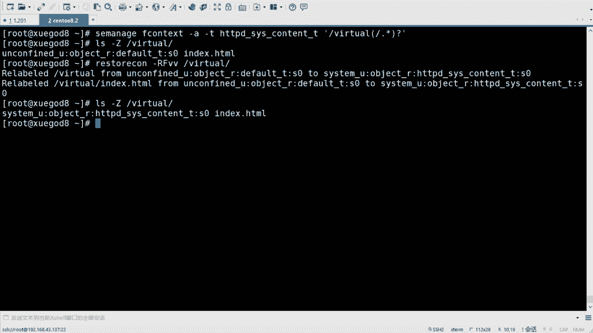

## 总结

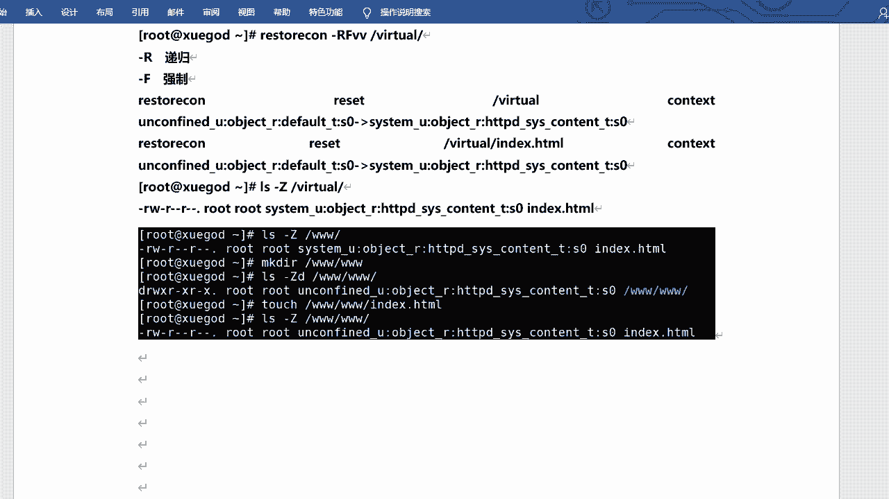

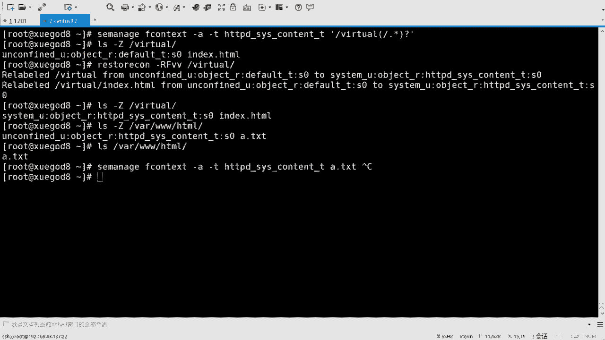

本节课中我们一起学习了SELinux安全机制。我们了解到SELinux通过强制访问控制和上下文标签系统，为Linux提供了细粒度的安全防护。我们学习了如何查看SELinux的三种工作模式（Enforcing, Permissive, Disabled）并进行切换，掌握了使用`semanage fcontext`和`restorecon`命令来管理文件和目录的SELinux上下文，并通过一个Web目录的实例进行了实践。正确配置SELinux可以极大地增强服务间的隔离性，提升系统整体安全性。