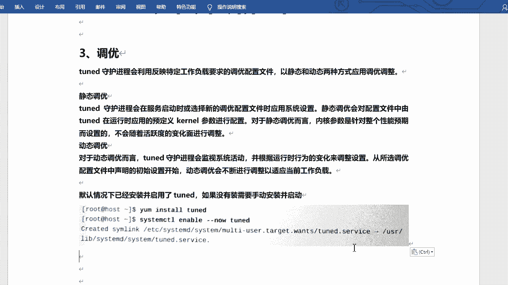
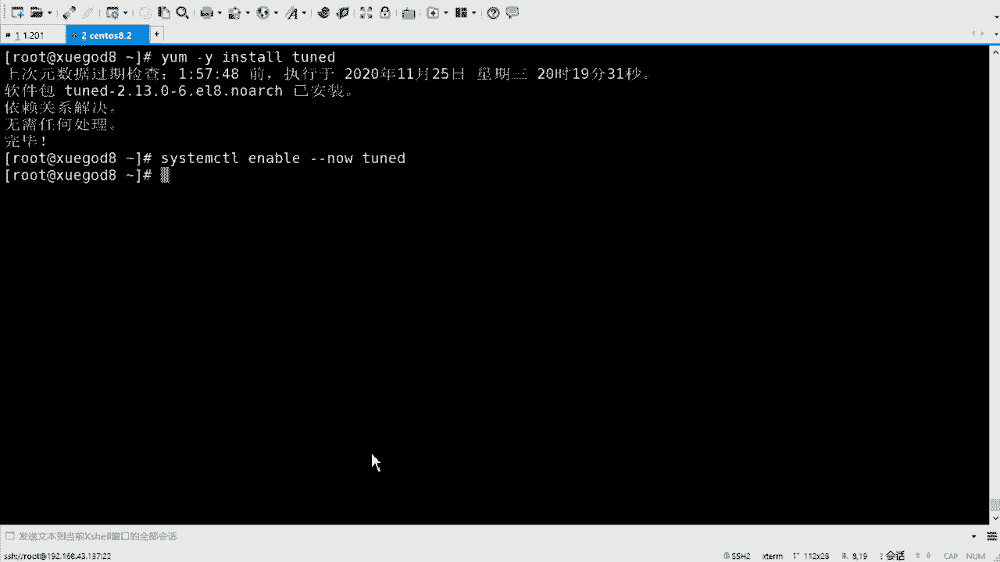
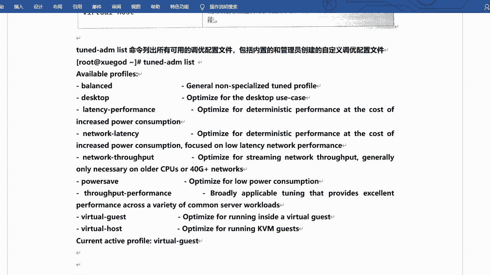
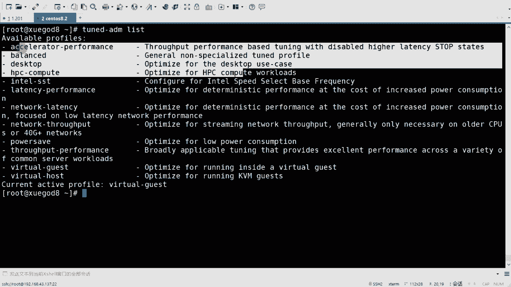
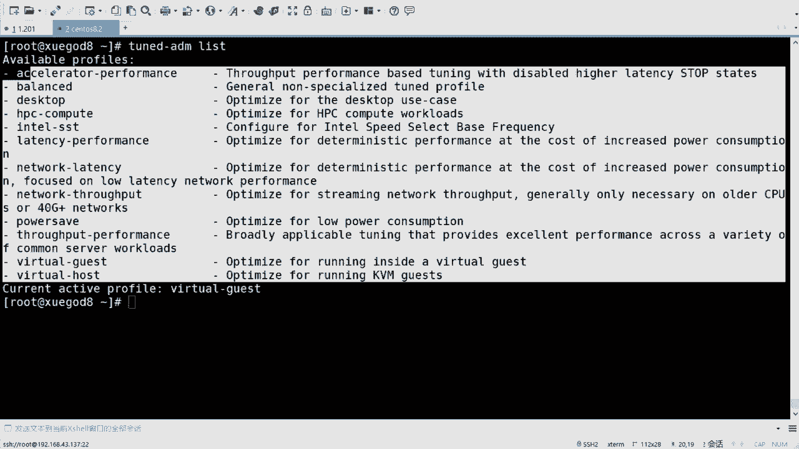
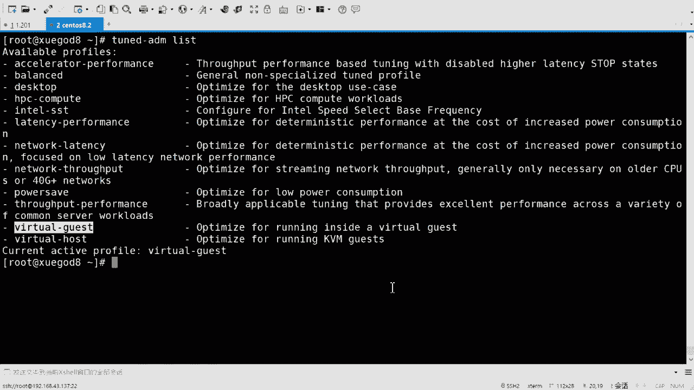
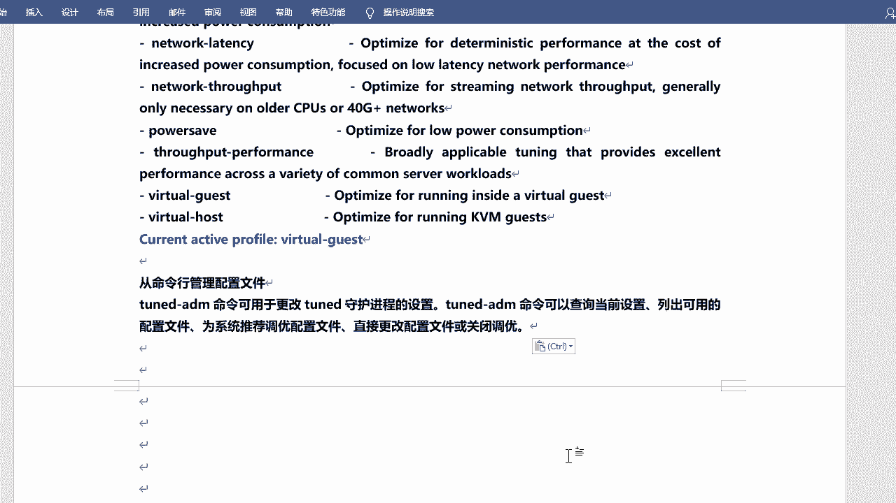
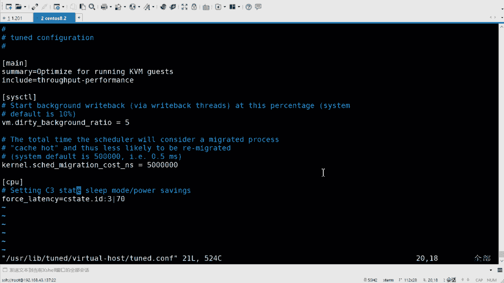
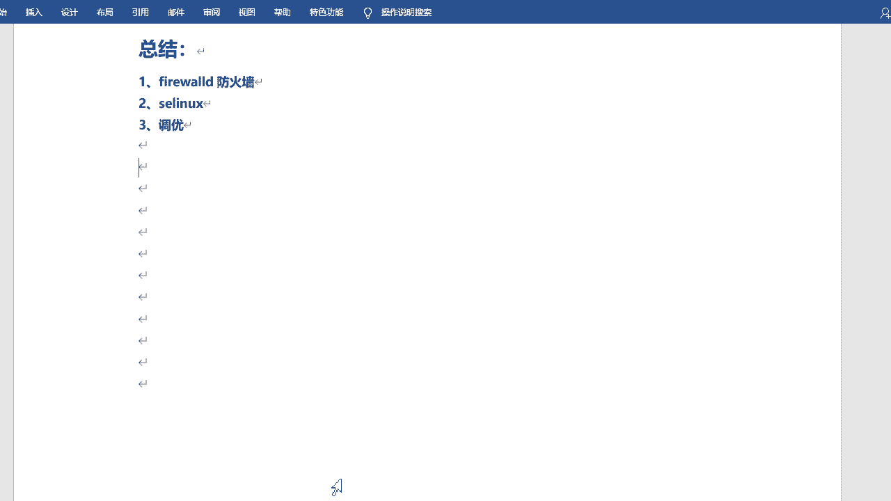

# Linux系统调优：P4：RHEL8调优工具Tuned详解 🔧

在本节课中，我们将学习RHEL8/CentOS8系统中的调优工具Tuned。调优是考试必考内容。它不需要手动修改复杂的系统参数，而是通过预定义的配置文件来应用优化设置，操作相对简单。

## 概述 📋

Tuned是一个守护进程，它利用针对特定工作负载要求的调优配置文件，以静态和动态两种方式应用系统调整。该工具并非RHEL8独有，早在RHEL 6.3版本就已存在，但在RHEL8中被重新强调和使用。

## Tuned的工作原理 ⚙️



Tuned支持静态和动态两种调优方式。

*   **静态调优**：在服务启动或选择新配置文件时应用系统设置。它根据配置文件预定义内核参数进行配置。这些参数是针对预期性能设置的，不会随系统活跃度的变化而调整。
*   **动态调优**：Tuned会监视系统活动，并根据运行时行为的变化动态调整设置。它从所选配置文件的初始设置开始，并不断进行调整以适应实时工作负载。



## 安装与启动服务 🚀

Tuned服务通常默认已安装。我们可以验证并启动它。

以下是验证和启动Tuned服务的步骤：
1.  检查Tuned软件包是否已安装。
2.  如果未安装，使用`yum install tuned`或`dnf install tuned`命令进行安装。
3.  启用Tuned服务使其开机自启。
4.  启动Tuned服务。

```bash
# 安装Tuned（如果未安装）
sudo dnf install tuned -y

# 启用并启动Tuned服务
sudo systemctl enable --now tuned
```

## 配置文件类型 📂

Tuned提供的配置文件主要分为节能型和性能提升型两大类。性能提升型配置文件又侧重于不同方面。



以下是主要的配置文件类型及其简要说明：
*   **balanced**：均衡型。在节能与性能之间取得平衡，适用于大多数通用场景。这是一个动态调优配置文件。
*   **desktop**：桌面型。从balanced衍生而来，优化了交互式应用的响应速度。
*   **throughput-performance**：吞吐量性能型。调优系统以获得最大吞吐量。
*   **latency-performance**：延迟性能型。通过牺牲能耗来降低系统及网络延迟，适用于需要低延迟的服务。
*   **network-latency**：网络延迟型。从latency-performance衍生，启用额外的网络调优参数以提供低网络延迟。
*   **network-throughput**：网络吞吐量型。从throughput-performance衍生，应用网络调优以获得最大网络吞吐量。
*   **powersave**：节能型。最大程度降低系统能耗。
*   **oracle**：针对Oracle数据库负载进行优化。
*   **virtual-guest**：虚拟机客户机型。当系统在虚拟机中运行时，优化以获得最佳性能。
*   **virtual-host**：虚拟机宿主机型。优化作为虚拟机宿主机（如KVM主机）的系统性能。





## 管理Tuned配置 🛠️



上一节我们介绍了Tuned的配置文件类型，本节中我们来看看如何使用命令行工具`tuned-adm`来管理这些配置。

主要的管理命令是`tuned-adm`。它可以查询当前设置、列出可用配置文件、获取系统推荐配置、直接更改配置文件或关闭调优。



### 查看可用配置与当前状态

首先，我们可以查看系统支持的所有配置文件以及当前生效的配置。

```bash
# 列出所有可用的调优配置文件
sudo tuned-adm list

# 查看当前活跃的配置文件
sudo tuned-adm active
```
执行`tuned-adm list`命令会列出所有配置文件，并在输出中明确指示当前活跃的配置（例如：`Current active profile: virtual-guest`）。

### 更改与验证配置

我们可以根据需求手动切换配置文件，也可以查看系统的推荐配置。

以下是配置Tuned的核心操作命令：
1.  **手动设置配置文件**：使用`sudo tuned-adm profile <profile_name>`命令，例如`sudo tuned-adm profile balanced`。
2.  **查看系统推荐配置**：使用`sudo tuned-adm recommend`命令，系统会根据硬件和运行环境给出建议。
3.  **验证配置更改**：更改后，再次使用`sudo tuned-adm active`命令确认当前活跃的配置文件已更新。

```bash
# 示例：切换到balanced配置
sudo tuned-adm profile balanced

# 检查系统推荐使用什么配置
sudo tuned-adm recommend



# 再次确认当前活跃配置
sudo tuned-adm active
```

### 配置文件存储位置

每个调优配置文件的参数定义存储在`/usr/lib/tuned/`目录下对应的子目录中。例如，`virtual-guest`配置文件的参数定义在`/usr/lib/tuned/virtual-guest/tuned.conf`文件中。应用某个配置文件，实质上就是让这些预定义的内核参数生效。

## 总结 📝



本节课中我们一起学习了RHEL8的调优工具Tuned。我们了解到Tuned通过预定义的配置文件简化了系统性能优化，支持静态和动态两种调优模式。我们掌握了使用`tuned-adm`命令查看、修改配置文件以及获取系统推荐配置的方法。关键点包括：启用Tuned服务、理解不同配置文件的适用场景（如`balanced`， `throughput-performance`， `virtual-guest`），以及使用`tuned-adm profile`、`tuned-adm active`和`tuned-adm recommend`等命令进行管理。这为应对相关考试题目和实际系统调优打下了基础。