# Linux存储管理：P5：NFS网络文件系统

在本节课中，我们将要学习NFS网络文件系统。NFS是一种允许不同计算机系统通过网络共享文件和目录的协议。我们将了解其工作原理、配置方法，并学习如何在RHEL 8/CentOS 8系统中部署和使用NFS服务。

## NFS概述

上一节我们介绍了存储管理的基本概念，本节中我们来看看NFS网络文件系统。

NFS，全称Network File System，即网络文件系统。它是一种由Linux、Unix及类似操作系统使用的互联网标准协议，可作为它们的本地网络文件系统。NFS是一种仍在积极开发的开放标准，支持本地文件系统的功能。

在RHEL 8中，默认的NFS版本是4.2。它支持NFS v4和v3的主要版本。NFS v4仅使用TCP协议与服务器通信，而较早的NFS版本可以使用TCP或UDP协议。NFS v2版本已被弃用，不再支持。

## NFS工作原理

NFS的工作流程如下：NFS服务器会导出（export）一个共享目录。客户端可以将这个导出的共享目录挂载（mount）到本地的一个挂载点上。该挂载点必须是一个已存在的目录。

可以通过多种方式挂载NFS共享：
*   **手动挂载**：使用 `mount` 命令。
*   **开机自动挂载**：通过编辑 `/etc/fstab` 文件实现。
*   **按需/触发式挂载**：使用Autofs服务，当访问挂载点时自动挂载，闲置一段时间后自动卸载。

## NFS与RPC

NFS依赖于RPC（Remote Procedure Call，远程过程调用）协议进行通信。RPC定义了一种进程间通过网络进行交互的机制，允许客户端进程向远程服务器进程请求服务，而无需了解底层网络协议。

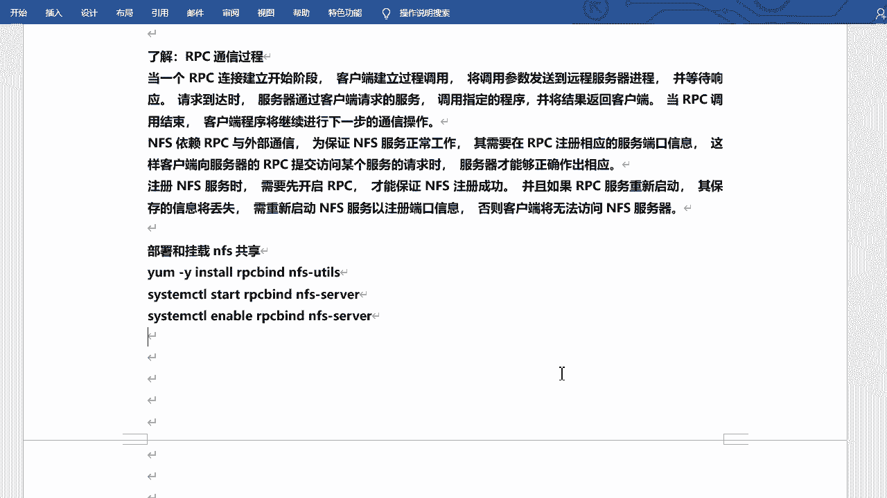

为了保证NFS服务正常运行，需要RPC服务先启动并注册NFS服务的端口信息。如果RPC服务重启，保存的端口信息会丢失，需要重新启动NFS服务以重新注册。

## 配置NFS服务器

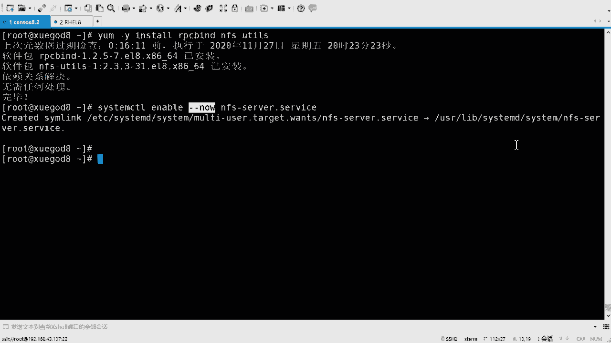

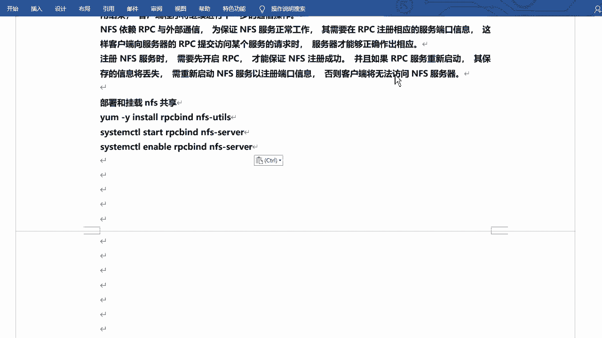

接下来，我们将在服务器端配置NFS服务。

首先，需要安装必要的软件包。以下是安装命令：
```bash
yum install rpcbind nfs-utils -y
```

安装完成后，启动并设置服务开机自启。以下是服务管理命令：
```bash
systemctl enable --now nfs-server
```

NFS服务器的共享配置在 `/etc/exports` 文件中定义。该文件默认是空的。配置格式为：
```
[共享目录路径] [客户端地址(选项)]
```

例如，将 `/media` 目录共享给所有客户端，并赋予读写权限：
```
/media *(rw,sync)
```

编辑保存后，使用以下命令使配置生效并查看共享列表：
```bash
exportfs -rv
```

## 配置NFS客户端

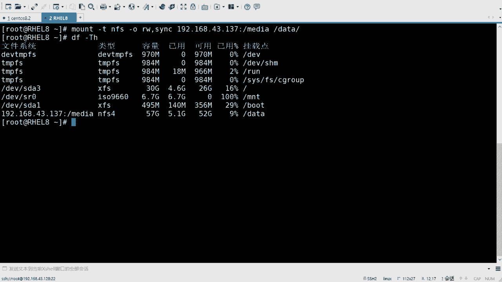

现在，我们切换到客户端来挂载使用NFS共享。

首先，查看服务器端导出的共享列表。以下是查看命令：
```bash
showmount -e [服务器IP地址]
```

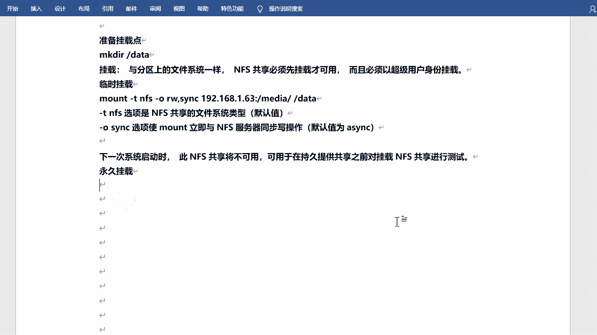

然后，创建本地挂载点并挂载共享。以下是挂载命令：
```bash
mkdir /data
mount -t nfs -o rw,sync [服务器IP地址]:/media /data
```

挂载完成后，可以使用 `df -hT` 命令查看挂载情况。此时，就可以像访问本地目录一样访问 `/data` 目录了。

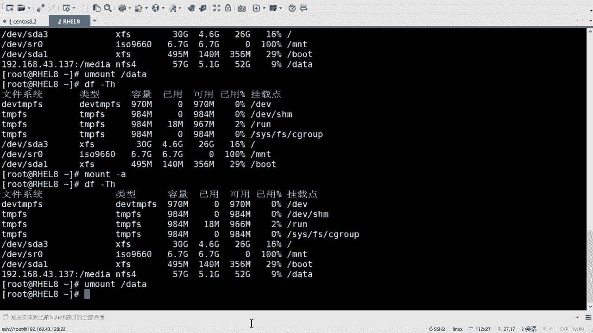

以上是临时挂载。若要实现永久挂载，需要编辑 `/etc/fstab` 文件。添加如下一行：
```
[服务器IP地址]:/media /data nfs rw,sync 0 0
```

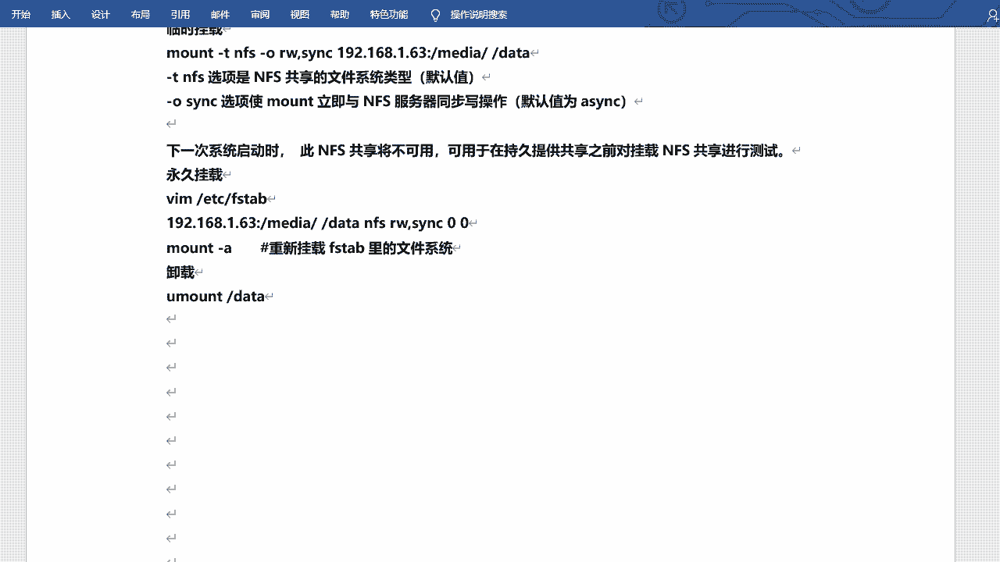

保存后，使用 `mount -a` 命令挂载所有在 `/etc/fstab` 中定义的文件系统。

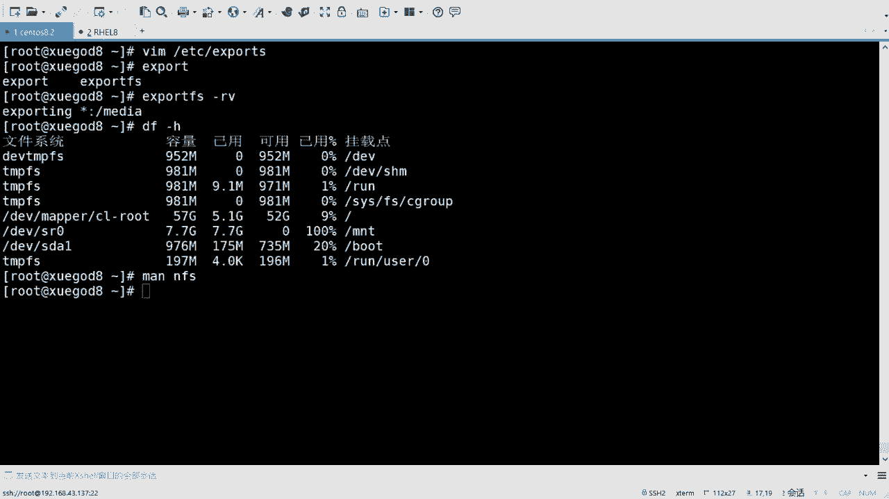

## NFS配置工具 `nfsconf`

RHEL 8引入了新的NFS配置工具 `nfsconf`，用于管理NFS客户端和服务端的配置文件 `/etc/nfs.conf`。

使用该工具可以方便地设置参数。其基本语法为：
```bash
nfsconf --set <section> <key> <value>
```

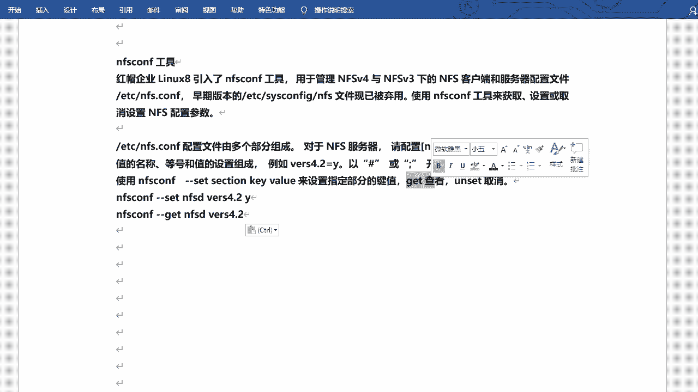

例如，启用NFS 4.2版本支持：
```bash
nfsconf --set nfsd vers4.2 y
```

要查看设置，可以使用：
```bash
nfsconf --get nfsd vers4.2
```

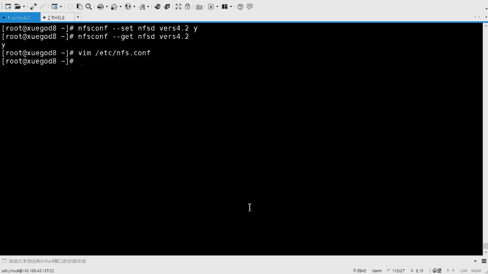


以下是一组配置示例，用于设置一个标准的、仅支持NFS v4的客户端环境：
```bash
nfsconf --set nfsd udp n
nfsconf --set nfsd vers2 n
nfsconf --set nfsd vers3 n
nfsconf --set nfsd tcp y
nfsconf --set nfsd vers4 y
nfsconf --set nfsd vers4.0 y
nfsconf --set nfsd vers4.1 y
nfsconf --set nfsd vers4.2 y
```

## 总结

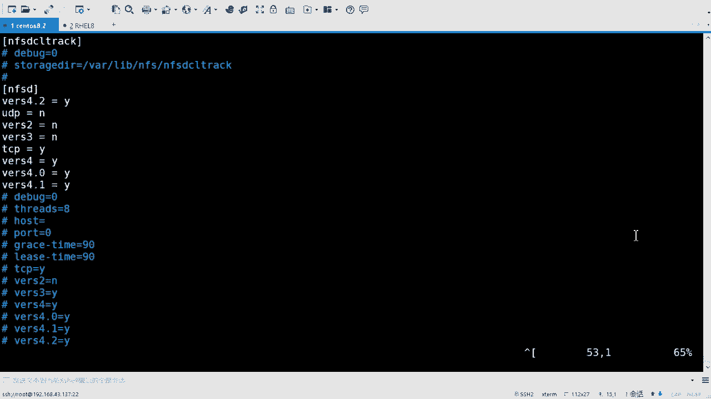


本节课中我们一起学习了NFS网络文件系统。我们了解了NFS的基本概念和工作原理，掌握了在RHEL 8上配置NFS服务器和客户端的方法，包括共享目录、手动与永久挂载。我们还学习了使用新的 `nfsconf` 工具来管理NFS配置。NFS是实现Linux系统间文件共享的重要服务，需要熟练掌握其配置和使用。