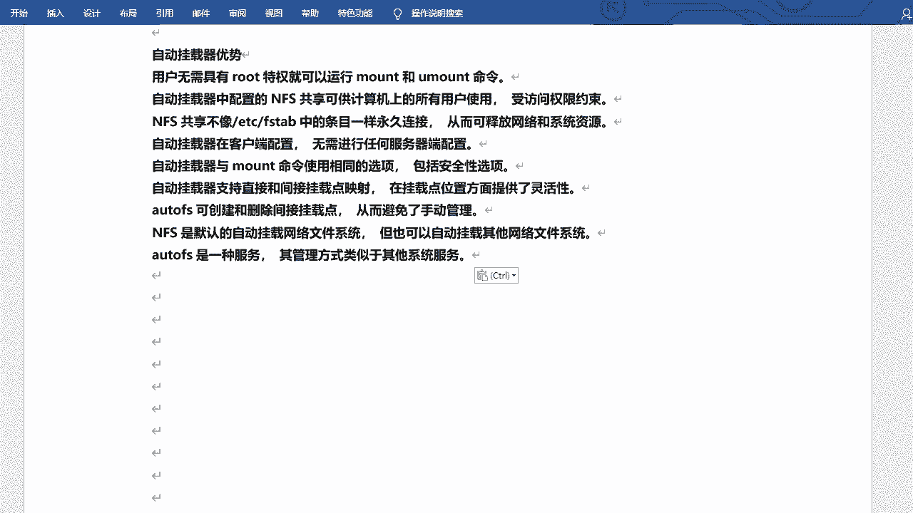
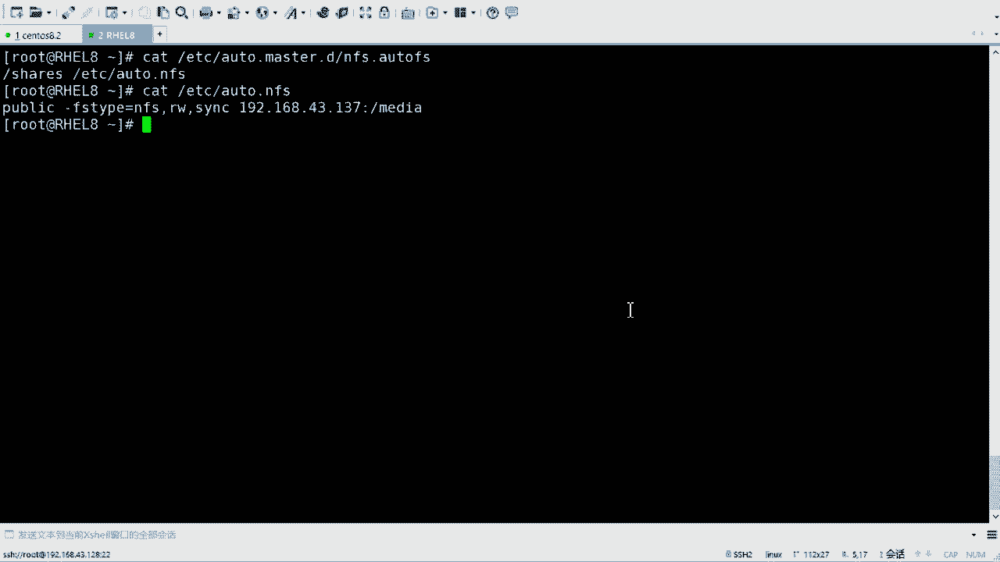
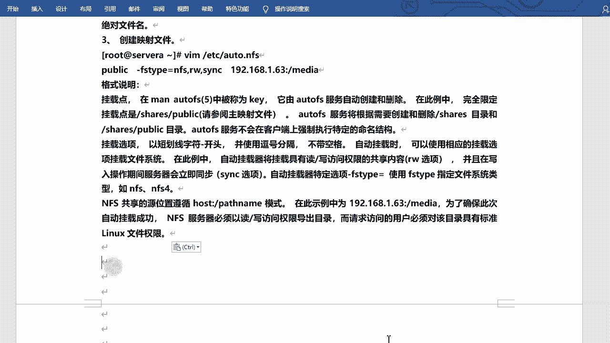
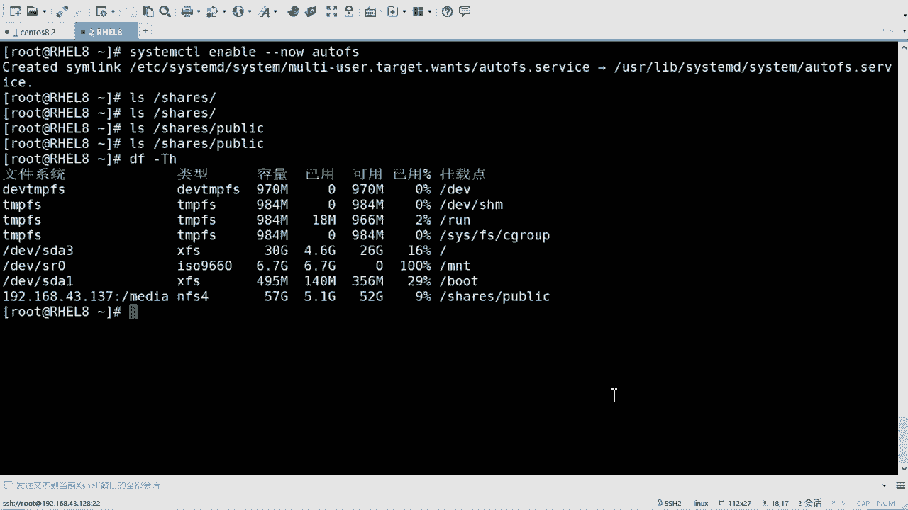
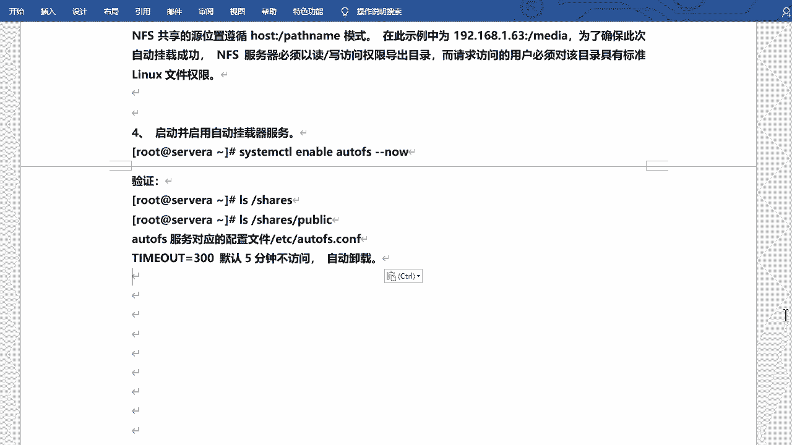
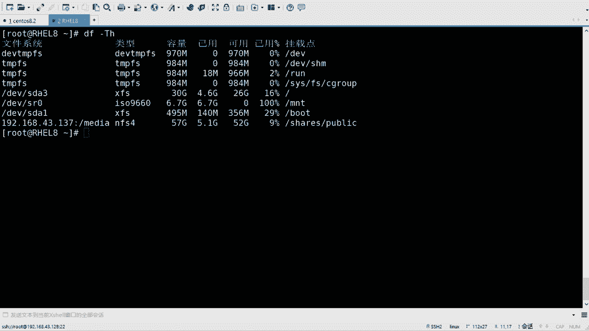
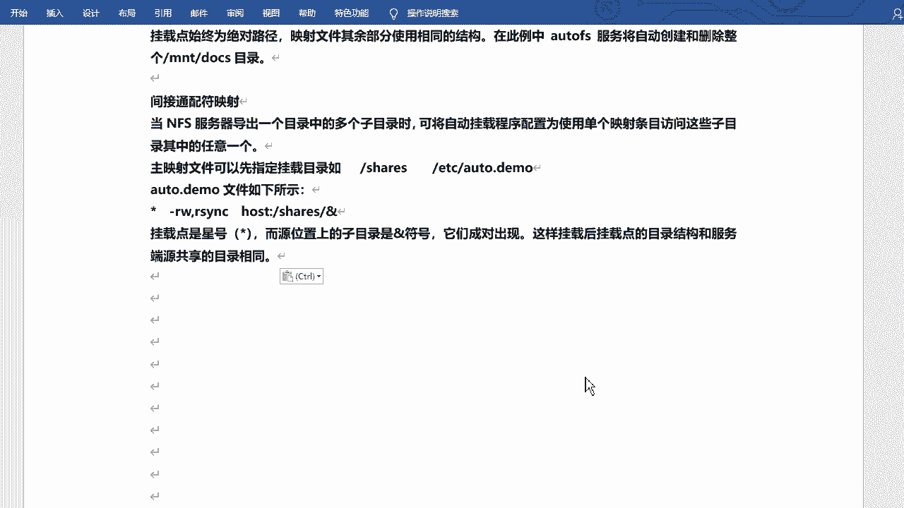

# Linux系统管理：P6：自动挂载服务(Autofs)详解 🗂️

在本节课中，我们将要学习Linux系统中的自动挂载服务——Autofs。它是一种按需挂载网络文件系统（如NFS）的服务，能够在使用时自动挂载，并在闲置一段时间后自动卸载，从而有效节省系统与网络资源。

## 概述

Autofs，常被称为自动挂载服务，是一种触发式挂载机制。它主要优势在于按需挂载，无需root权限即可执行挂载与卸载操作，且配置仅需在客户端进行。

## Autofs的优势与特性

以下是Autofs服务的主要优势与特性：



*   **按需挂载与自动卸载**：仅在访问时挂载NFS共享，闲置一段时间后自动卸载，释放网络和系统资源。
*   **客户端配置**：所有配置均在客户端完成，无需修改NFS服务器端设置。
*   **权限与选项**：挂载时使用的选项（如`rw`， `sync`）与`mount`命令相同，包括安全性选项。文件访问权限仍由标准的Linux文件权限控制。
*   **灵活的映射方式**：支持直接映射和间接映射，满足不同的目录结构需求。
*   **自动管理挂载点**：Autofs服务可以自动创建和删除所需的挂载点目录。
*   **服务化管理**：Autofs本身是一个系统服务，使用`systemctl`命令进行管理。

## 配置Autofs服务

上一节我们介绍了Autofs的概念与优势，本节中我们来看看如何具体配置它。

首先，需要安装`autofs`软件包。

```bash
dnf install autofs -y
```

Autofs的配置主要涉及两个文件：**主映射文件**和**映射文件**。

1.  **主映射文件**：通常为`/etc/auto.master`，用于定义挂载的基础目录和对应的映射文件。
2.  **映射文件**：由主映射文件指定，其中包含具体的挂载点、文件系统类型、选项和服务器共享路径等详细信息。

### 配置示例：间接映射

这是一种常见且灵活的配置方式。我们创建一个自定义的主映射文件以保持配置清晰。



首先，创建并编辑主映射文件 `/etc/auto.master.d/nfs.autofs`：

```
/shares /etc/auto.nfs
```

*   `/shares`：这是客户端上的**基础目录**，Autofs将在此目录下创建实际的挂载点。
*   `/etc/auto.nfs`：这是**映射文件**的绝对路径，其中包含了具体的挂载信息。

接着，创建并编辑映射文件 `/etc/auto.nfs`：

```
public -rw,sync 192.168.137.43:/media/public
```

*   `public`：这是**挂载点名称**。最终完整的挂载路径将是 `/shares/public`。
*   `-rw,sync`：这是挂载**选项**，表示以读写（rw）和同步（sync）模式挂载。
*   `192.168.137.43:/media/public`：这是**NFS服务器共享路径**，格式为`服务器IP或主机名:共享目录`。

配置完成后，启动并启用Autofs服务：

```bash
systemctl enable --now autofs
```

现在，当你访问 `/shares/public` 目录时，Autofs会自动触发挂载。使用 `df -hT` 命令可以查看挂载状态。默认情况下，闲置300秒（5分钟）后，Autofs会自动卸载该共享。



## 映射方式详解

上一节我们通过一个典型示例了解了Autofs的基本配置，本节中我们来看看其他两种映射方式：直接映射和间接通配符映射。



### 直接映射



直接映射用于将NFS共享映射到一个固定的绝对路径挂载点。

在主映射文件（如`/etc/auto.master`）中，配置如下：



```
/- /etc/auto.direct
```

在映射文件 `/etc/auto.direct` 中，配置如下：

```
/mnt/docs -rw,sync 192.168.137.43:/shared/docs
```

*   挂载点被明确指定为绝对路径 `/mnt/docs`。
*   Autofs服务将自动创建和删除整个 `/mnt/docs` 目录。

### 间接通配符映射

当NFS服务器导出一个包含多个子目录的目录时，可以使用间接通配符映射，用一个配置条目访问所有子目录。

在主映射文件中配置基础目录：

```
/shares /etc/auto.wildcard
```

在映射文件 `/etc/auto.wildcard` 中，使用通配符 `*`：

```
* -rw,sync 192.168.137.43:/shared/&
```

*   `*`：代表客户端 `/shares` 目录下任何可能的子目录名。
*   `&`：是一个特殊变量，它会被替换成客户端访问时 `*` 所匹配的实际目录名。
*   例如，访问 `/shares/projectA` 时，Autofs会自动挂载服务器上的 `/shared/projectA` 目录。这样，客户端的目录结构就与服务器端保持一致。

## 总结



本节课中我们一起学习了Linux的Autofs自动挂载服务。我们了解了它按需挂载、节省资源的优势，并掌握了其核心的配置方法，包括主映射文件和映射文件的作用与编写。我们还深入探讨了三种映射方式：典型的间接映射、固定路径的直接映射以及能镜像服务器目录结构的间接通配符映射。通过配置和启用Autofs服务，可以实现NFS共享的智能化、自动化管理。