# Linux存储管理：P8：VDO虚拟数据优化

## 概述
在本节课中，我们将要学习VDO（Virtual Data Optimizer）虚拟数据优化程序。VDO是一种用于块设备的存储优化技术，它通过压缩和删除重复数据来节省磁盘空间，并提高数据吞吐量。我们将了解VDO的工作原理、安装配置方法以及如何在实际环境中使用它。

---

## VDO简介与工作原理

上一节我们介绍了Stratis存储管理，本节中我们来看看另一种存储优化技术——VDO。

VDO是一个Linux设备映射器驱动程序，用于优化块设备上的数据空间占用。它通过减少磁盘空间使用和最大限度地减少重复数据来实现空间节省，同时还能提高数据吞吐量。

VDO主要由两个内核模块构成：
*   **kvdo**：以透明的方式控制数据压缩（Compress）。
*   **uds**：用于删除重复数据（Deduplication）。

VDO位于现有块存储设备（如磁盘或RAID）之上。加密设备、存储层（如LVM逻辑卷）和文件系统则位于VDO设备之上。VDO设备本身需要格式化。

以下是VDO在存储栈中的位置示意图：
> 块设备 -> RAID层 -> VDO层 -> 文件系统 -> 虚拟机/应用

VDO通过三个步骤实现空间优化：

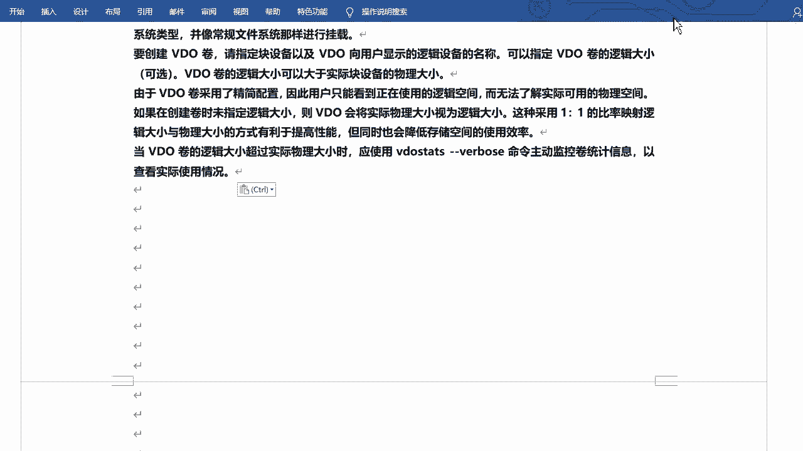

1.  **零区块排除**：在初始化阶段，整块为零的数据块会被元数据记录下来，后续不再占用实际存储空间。
2.  **重复数据删除**：写入数据时，UDS内核模块会判断数据是否冗余。重复的数据块不会被再次写入，系统仅更新元数据指针，指向已存储的原始数据块。
3.  **数据压缩**：完成零块排除和重复数据删除后，kvdo模块会使用LZ4算法对每个单独的数据块进行压缩。压缩后的数据块以固定的4KB大小存储在介质上，以提升读取性能。

---

## 创建与管理VDO卷

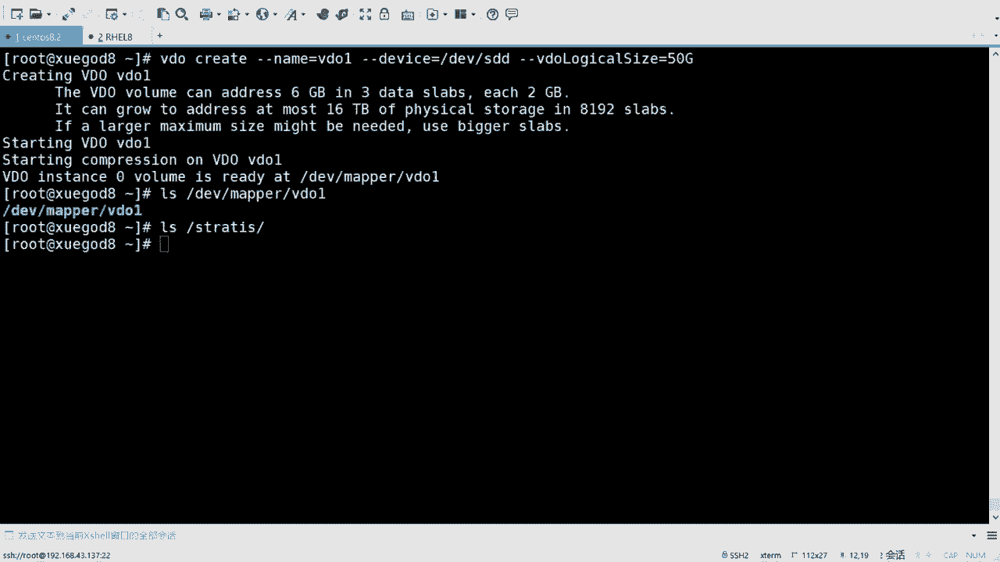

了解了VDO的基本原理后，本节我们来看看如何安装VDO软件并创建VDO卷。

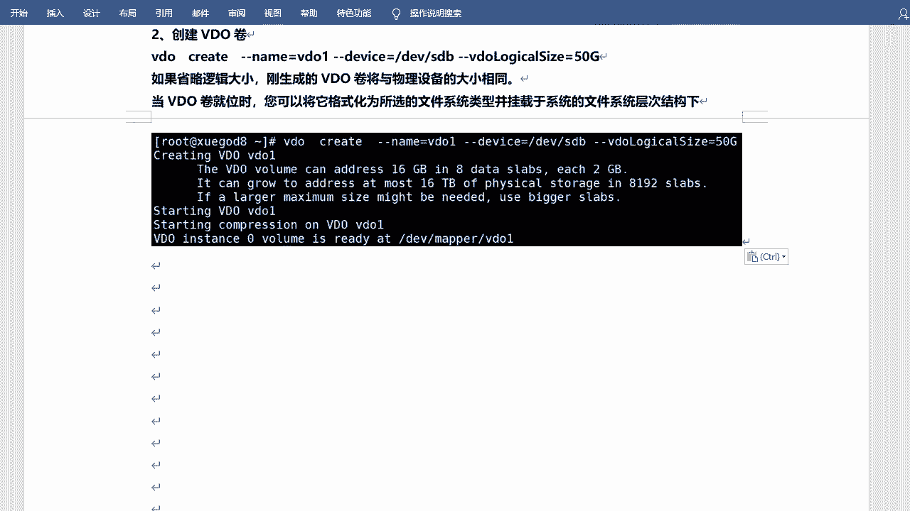

VDO创建的逻辑设备称为VDO卷。这些卷类似于磁盘分区，可以格式化为所需的文件系统（如XFS）并挂载使用。

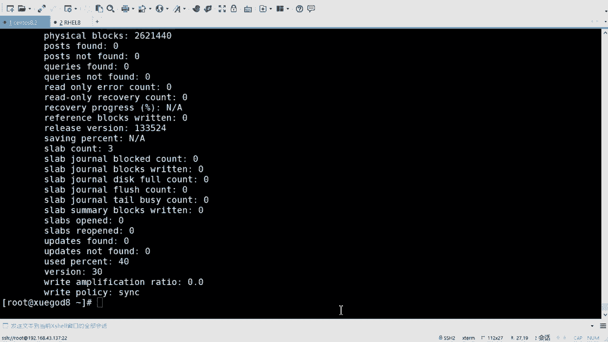

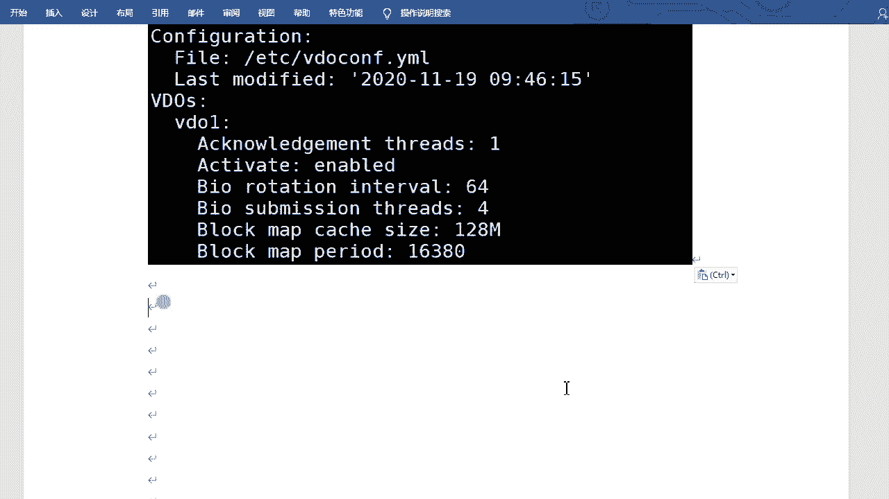

创建VDO卷时，需要指定底层块设备、VDO卷的名称，还可以指定其逻辑大小。VDO卷的逻辑大小可以大于实际物理设备的大小，这称为精简配置。

**安装VDO软件包**
VDO功能由`kmod-kvdo`和`vdo`软件包提供。使用以下命令安装：
```bash
sudo dnf install kmod-kvdo vdo
```
安装后，VDO服务会自动启用并启动。可以使用`systemctl status vdo`命令确认服务状态。

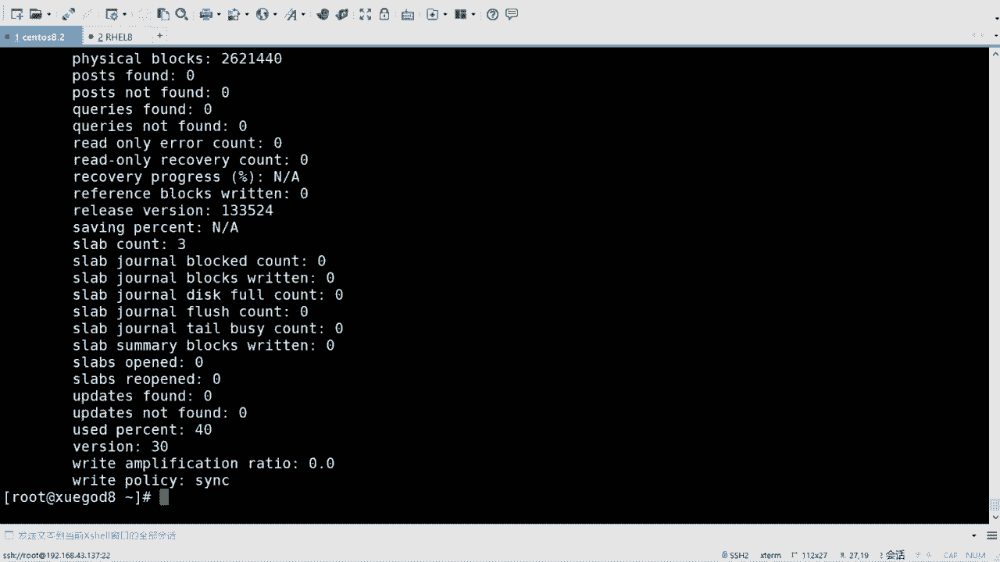

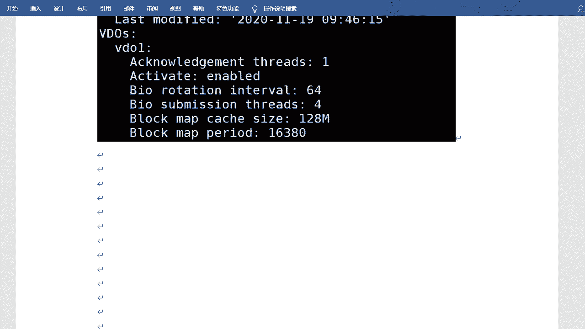

**创建VDO卷**
使用`vdo create`命令创建卷。以下命令创建一个名为`vdo1`的卷，基于`/dev/sdd`设备，并设置逻辑大小为50GB：
```bash
sudo vdo create --name=vdo1 --device=/dev/sdd --vdoLogicalSize=50G
```
创建成功后，VDO卷设备位于`/dev/mapper/vdo1`。

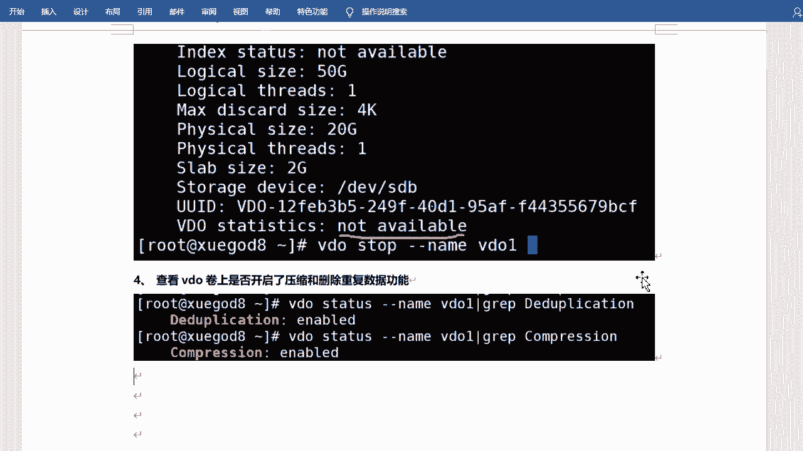

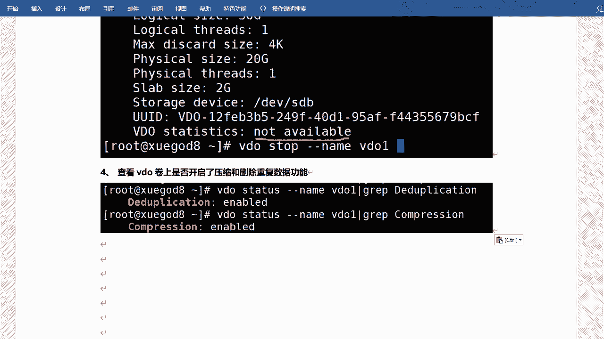

**管理VDO卷**
以下是管理VDO卷的常用命令：
*   查看所有VDO卷：`sudo vdo list`
*   查看指定卷的详细状态：`sudo vdo status --name=vdo1`
*   停止VDO卷：`sudo vdo stop --name=vdo1`
*   启动VDO卷：`sudo vdo start --name=vdo1`

在状态信息中，可以确认压缩和重复数据删除功能是否启用：
```bash
sudo vdo status --name=vdo1 | grep -E “Deduplication|Compression”
```

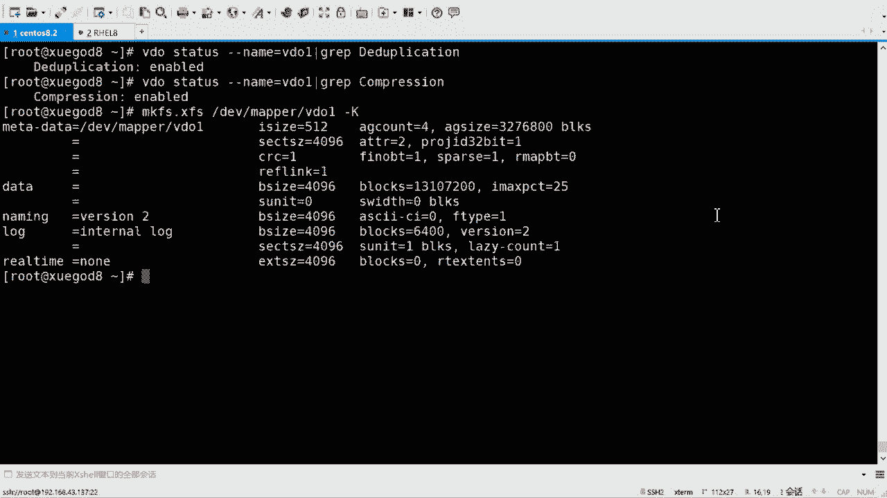

---

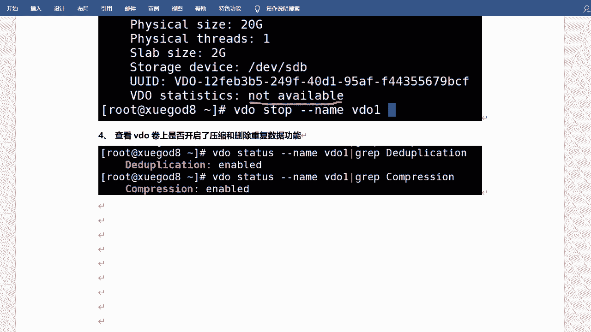

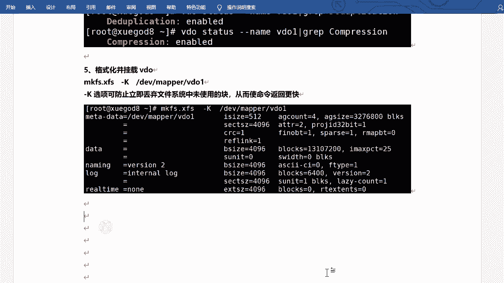

## 使用VDO卷

创建好VDO卷后，下一步就是将其格式化为文件系统并挂载使用。

**格式化VDO卷**
使用`mkfs`命令将VDO卷格式化为XFS文件系统。建议添加`-K`选项以加快格式化速度，该选项可防止立即丢弃未使用的块。
```bash
sudo mkfs.xfs -K /dev/mapper/vdo1
```

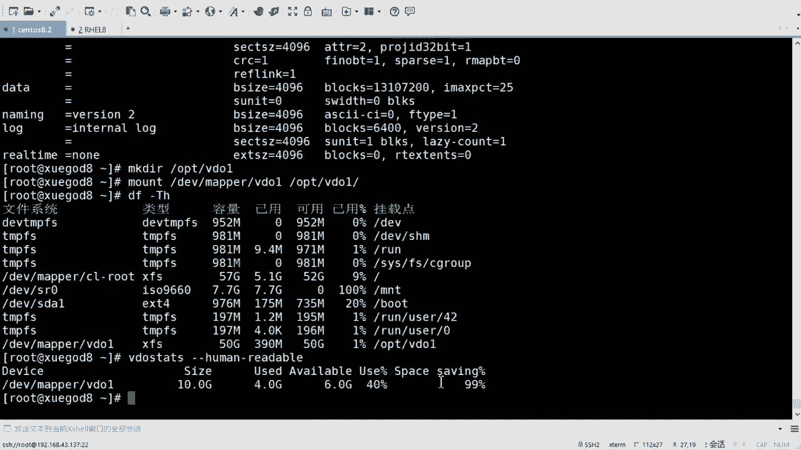

**挂载VDO卷**
创建一个挂载点目录，然后将VDO卷挂载上去。
```bash
sudo mkdir /opt/vdo1
sudo mount /dev/mapper/vdo1 /opt/vdo1
```
使用`df -hT`命令查看挂载情况，此时会显示VDO卷的逻辑大小（例如50GB）。

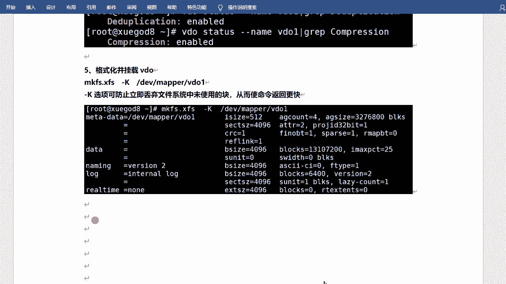

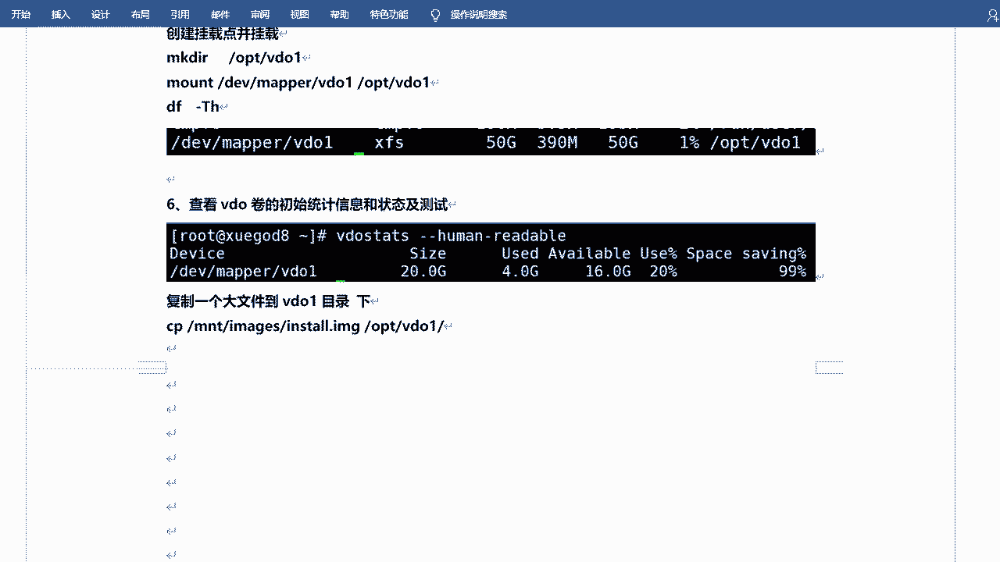

**监控实际空间使用**
由于VDO采用了精简配置，`df`命令显示的是逻辑空间。要查看实际的物理空间使用情况，需使用以下命令：
```bash
sudo vdo status --name=vdo1 --human-readable
```
此命令会显示物理设备的总大小、已用空间和可用空间。

**测试重复数据删除功能**
为了验证VDO的重复数据删除效果，可以向挂载点复制多个相同的文件。
1.  复制一个大文件（如`install.img`）到`/opt/vdo1`。
2.  再次复制同一文件（可重命名）。
3.  观察`df -h`显示的逻辑空间增长。
4.  同时运行`sudo vdo status --name=vdo1 --human-readable`，观察物理空间的使用情况。您会发现，尽管逻辑空间增加了，但物理空间的占用量增长远小于逻辑空间增量，这是因为重复的数据块没有被重复存储。

---

## 配置VDO卷开机自动挂载

与常规文件系统一样，我们需要配置VDO卷在系统启动时自动挂载。

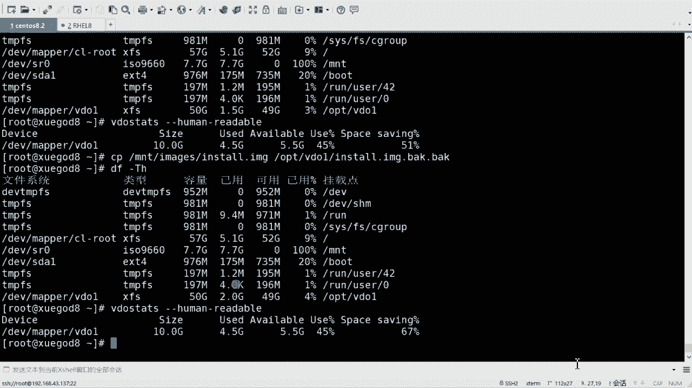

**获取VDO卷的UUID**
使用`blkid`命令获取VDO卷设备的UUID。
```bash
sudo blkid /dev/mapper/vdo1
```

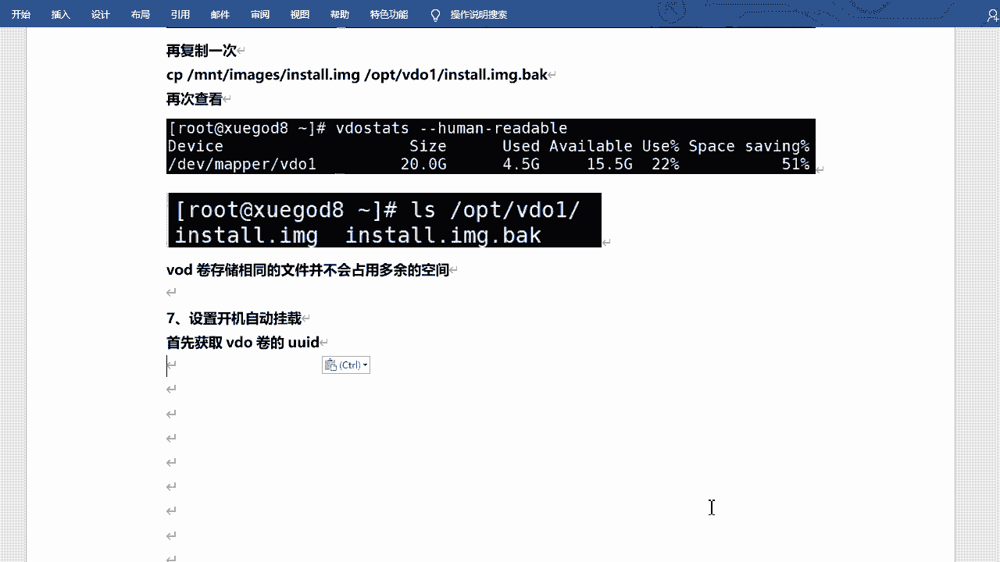

**编辑`/etc/fstab`文件**
在`/etc/fstab`文件中添加一行挂载配置。**必须**使用`x-systemd.requires=vdo.service`选项，以确保挂载操作在VDO服务启动之后进行，避免系统进入紧急模式。
```bash
UUID=<你的VDO卷UUID> /opt/vdo1 xfs defaults,x-systemd.requires=vdo.service 0 0
```

**验证自动挂载**
重启系统后，使用`df -h`或`mount`命令检查VDO卷是否已成功自动挂载。

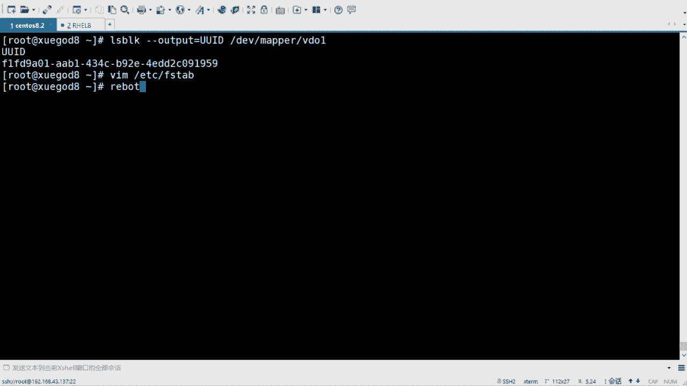

---

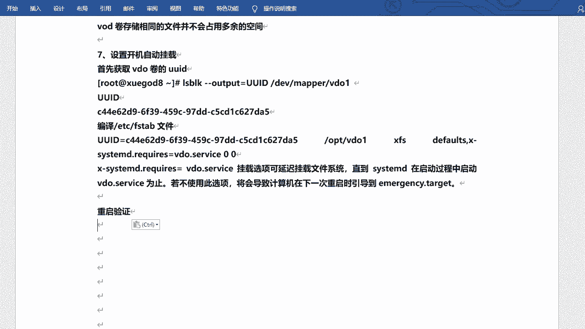

## 总结
本节课中我们一起学习了VDO虚拟数据优化技术。

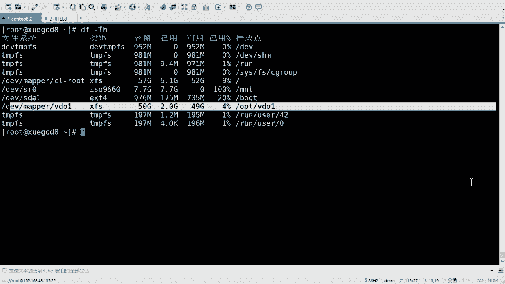

我们首先了解了VDO通过**零块排除**、**重复数据删除**和**数据压缩**三个步骤来节省存储空间的原理。接着，我们实践了如何安装VDO软件、创建和管理VDO卷，并将其格式化和挂载为可用的文件系统。最后，我们通过测试验证了VDO的重复数据删除功能，并配置了VDO卷的开机自动挂载。

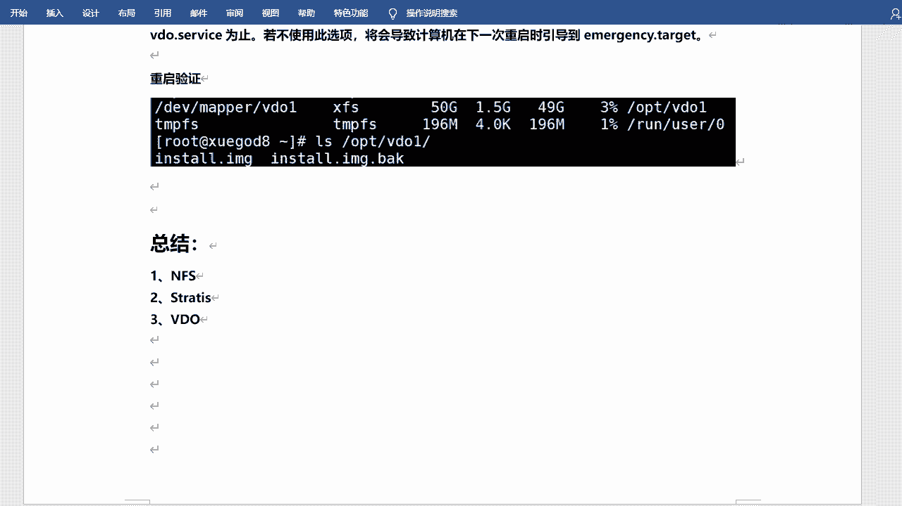

VDO与之前学习的NFS、autofs以及Stratis等技术共同构成了Linux系统中灵活而强大的存储管理方案，能够有效应对不同的存储需求和优化场景。