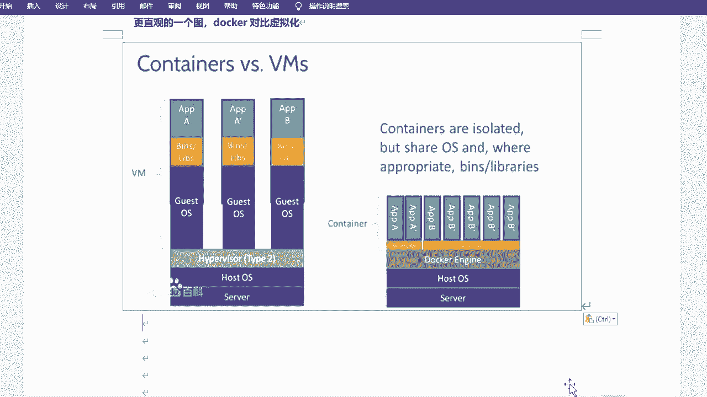
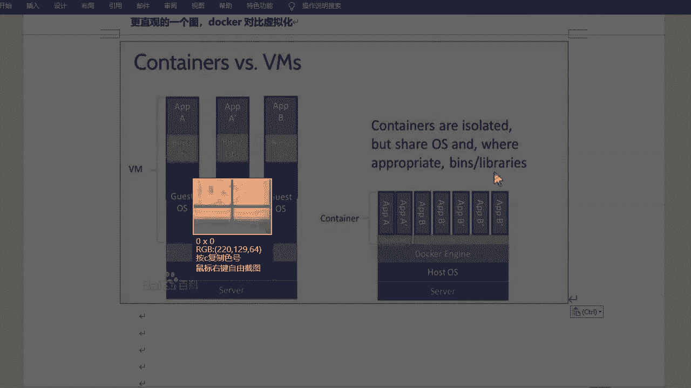
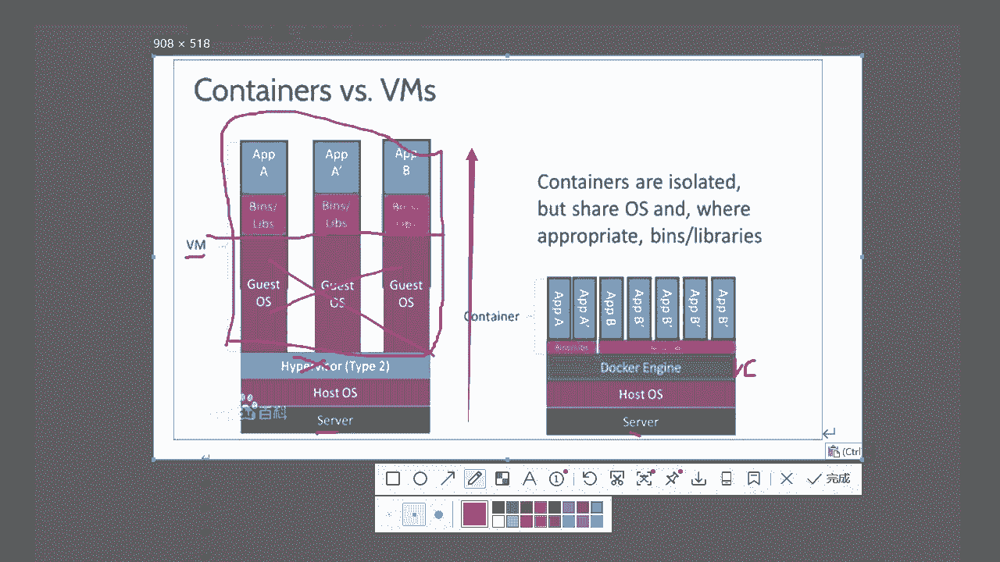
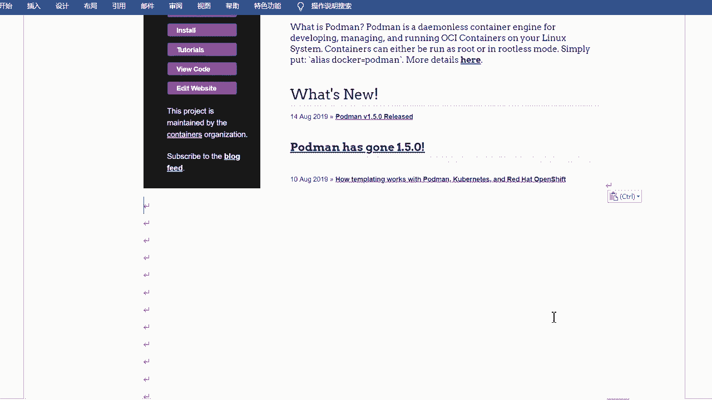

# 容器与Podman入门：P9：容器和Podman介绍 🐳

在本节课中，我们将要学习容器技术的基本概念以及一个名为Podman的容器管理工具。我们将从理解容器是什么、为什么需要它开始，然后介绍Podman的功能和安装方法。

## 什么是容器？ 📦

上一节我们介绍了课程概述，本节中我们来看看什么是容器。

容器是一种轻量级、可移植的软件打包技术。它旨在解决软件在不同系统环境中部署时，因依赖包版本不同或不兼容而产生的冲突问题。

### 容器解决的问题

以下是容器技术旨在解决的核心问题：
*   软件在不同操作系统（如Windows 10与Windows 7）或不同架构（如32位与64位）上可能存在兼容性问题。
*   同一软件在不同版本的Linux发行版（如RHEL 7与RHEL 8）上运行时，所需的依赖包可能不同或不兼容。
*   容器通过将应用程序及其所有依赖项（库、配置文件等）打包在一起，从而确保应用在任何支持容器的环境中都能以一致的方式运行。

### 容器的实现原理

容器技术起源于Linux开源平台，主要基于Linux内核提供的两大机制实现：

1.  **命名空间隔离**：`namespace`。此功能为容器提供独立的进程、网络、文件系统等视图，实现容器间的隔离。
2.  **资源控制组**：`cgroup`。此功能用于限制和分配容器可使用的CPU、内存、磁盘I/O等系统资源。

此外，安全增强型Linux（SELinux）也为容器提供了额外的安全边界，但在基础使用中通常无需特别配置。

### 容器的优势

基于上述原理，容器具备以下关键优势：
*   **高度可移植性**：容器镜像可以在任何具备容器运行时环境（如Podman或Docker）的Linux系统上运行，实现开发、测试、生产环境的一致性。
*   **轻量与高效**：容器共享主机操作系统内核，无需为每个应用加载完整的操作系统，因此启动更快、占用资源更少。
*   **易于管理**：可以保存容器的多个版本，并根据需要快速回滚或部署特定版本。

## 容器 vs. 传统虚拟化 ⚖️

理解了容器的基本概念后，我们来看看它与传统虚拟化技术的区别。

传统虚拟化（如VMware, KVM）与容器化都是虚拟化技术，但实现层级和资源消耗方式不同。

### 架构对比

以下是两者架构的简要对比：

**传统虚拟化架构**：
1.  物理服务器硬件。
2.  主机操作系统。
3.  虚拟机管理程序。
4.  完整的客户机操作系统。
5.  应用程序及其依赖。

**容器化架构**：
1.  物理服务器硬件。
2.  主机操作系统。
3.  容器运行时。
4.  应用程序及其依赖。

### 核心差异

两者的核心差异总结如下：
*   **虚拟化层级**：传统虚拟化虚拟化的是完整的硬件层，需要在虚拟机管理程序上运行完整的客户机操作系统。容器则虚拟化的是操作系统层，多个容器共享主机操作系统内核。
*   **资源占用**：由于无需运行完整的操作系统，容器更加轻量，启动速度更快，对存储和内存的需求更低。
*   **隔离性**：虚拟机通过硬件虚拟化实现强隔离。容器通过内核的命名空间和cgroups实现进程级别的隔离，共享内核带来更高效率，但隔离强度理论上弱于虚拟机。

为了更直观地理解，可以参考以下示意图。左边展示了传统虚拟化堆栈，右边展示了容器化堆栈，清晰体现了容器无需额外操作系统层的特点。

## 什么是Podman？ 🛠️

认识了容器之后，本节我们来学习一个重要的容器管理工具——Podman。

Podman是一个用于在Linux系统上开发、管理和运行容器的开源工具。它的名字来源于“Pod Manager”，其中“Pod”是Kubernetes中一组共享资源的容器的概念。

### Podman的主要特点

以下是Podman的几个关键特性：
*   **无守护进程架构**：与Docker不同，Podman不需要一个常驻后台的守护进程来管理容器。它直接与容器运行时交互，更像一个普通的命令行工具，安装后即可使用。
*   **兼容OCI标准**：Podman遵循开放容器倡议标准，可以管理任何符合OCI标准的容器镜像。
*   **Rootless容器**：普通用户无需`root`权限即可运行和管理容器，这大大增强了系统的安全性。
*   **与Docker命令兼容**：Podman提供了与Docker兼容的命令行前端，大部分常用命令（如 `run`, `ps`, `images`）与Docker相同，学习成本低。

### Podman与Docker的关系

Podman可以视为Docker的一个替代品，尤其在Red Hat Enterprise Linux 8及后续版本中，它是默认的容器工具。你可以使用Podman执行几乎所有Docker操作（除了少数与Docker守护进程深度绑定的命令）。更多信息可以访问Podman的官方网站 `podman.io` 获取公告、博客和安装指南。

## 安装Podman 💻

了解了Podman是什么，接下来我们看看如何安装它。

在基于RHEL 8或CentOS 8的系统上，安装Podman非常简单。由于Podman通常已包含在默认仓库中，只需使用`dnf`包管理器即可完成安装。

以下是安装Podman的具体步骤：
1.  打开终端。
2.  执行安装命令：`sudo dnf install podman`
3.  安装完成后，无需启动任何服务，直接输入 `podman --version` 验证安装是否成功。

本节课中我们一起学习了容器技术的基本概念、它与传统虚拟化的区别，并介绍了Podman这一强大且安全的容器管理工具及其安装方法。掌握这些基础知识是进一步学习容器编排和云原生技术的重要第一步。