# rhel8-centos8-rhce-linux-stream-stratis-vdo-podman-dnf - P10：rhel8-e-3-2配置阿里云加速-运行一个简单容器 - Linux最diao - BV16T4y1K7px

上。装一下potman是吧？portman的话呢，在咱们八版本的系统里边已经。包含了是吧，在光盘镜箱里边啊就已经有了，直接去装就行了，好吧。可以装就行啊。然后如果说你直接装portdman的话也行。

它会有一个portman的包啊包啊。其实呢咱们去装portman的话呢，需要去装一个包组啊，因为它其实包含了一组这个可以管理容镜箱的一个一个一个工具啊，一组工具啊。怎么装呢？

可以用DNF叫model installtcon tools啊装它。

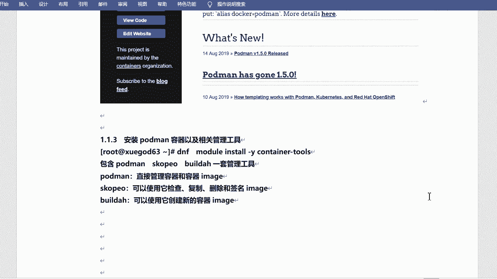

好吧，呃，我目前是8。2的啊，这样去装就可以了。220也是这样的啊。好吧，你看它会有装paasant的portman API。还装一个叫coial to box啊，什么UDSA这几个包。

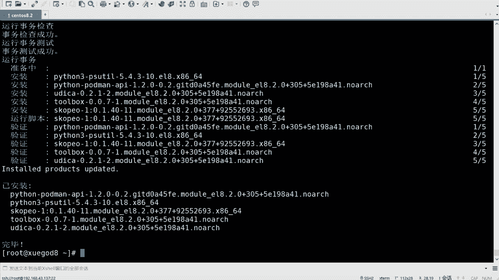

好吧，其实portman的话呢，它是一组一组工具啊，只不过呢会以portman这样去去称呼它是吧？去称呼它啊，它包含了什么呢？包含了portman包含了叫scoial啊，scoial啊。

当然这个这个这个读起来就是这么读啊，可能有点不像英语的一个读法啊，scope和什么build哈build啊啊，这是一组管理工具。呃。

portman的话是咱们最常用的啊最常用的portman可以去直接管理容器和容器的image镜像。啊，然后还有这个叫什么scoial是吧？scope啊。

它可以使用它可以检查复制删除和签名image镜像啊。build r的话呢可以使用它创建新的容器image。是吧这么几个啊这么几个呃，目前咱们现在的话呢。😊。

主要用的就是portmanco可能会用到那么一两次啊，bu达的话呢，不不在咱们这个课程里边，好吧，在CE里边不会去讲这个啊，呃，bu达的话，其实它会去构重新构建镜像，创建镜像是吧？

相当于docker feel。啊，现在找片飞我，这东西。主要是poman啊，了解它就可以了。呃，而且portman的话呢可以去运行叫无根的容器啊。其实刚才简单提了一下。运行无根的容器。

无根啊叫做ruless。ro此意思啊，你不要想歪了是吧？无根的那个根啊，其实也有同学可能会理解根的话，不就是这个根嘛，是吧？就是这个斜杠跟目录嘛，对不对？其实其实这是翻译的问题啊，这是翻译的问题。😊。

呃，root其实就是根的意思嘛，是吧？root是根的意思啊，呃，英文的话它叫root is。😊，是吧就是少根或无根少无根。那么所说这根的话呢，不是说这个根目录啊，不是它是吧，而是指的跟用户。

root用户。啊，注册用户所谓的无根的容器，其实就是什么呢？就是。这个这个不是入存用户去管理的容器，就是普通用户是吧？去管理容器啊，或者叫非特权用户运行的容器叫做无根的容器。好吧，叫无根入器啊。

这样的话肯定会更安全是吧？因为你是普通用户，对对？你不是超级管理员，对吧？当然呢也会有一些限制啊，你比如说无根的。😊，无根的容器，普通用户运行的这个这个容器的话是吧？那呃映射端口，比如说啊映射端口。

它不能使用1024以下的端口，只能用1024以上的才可以。好，还可以啊。到时候咱们讲的话会去说啊。

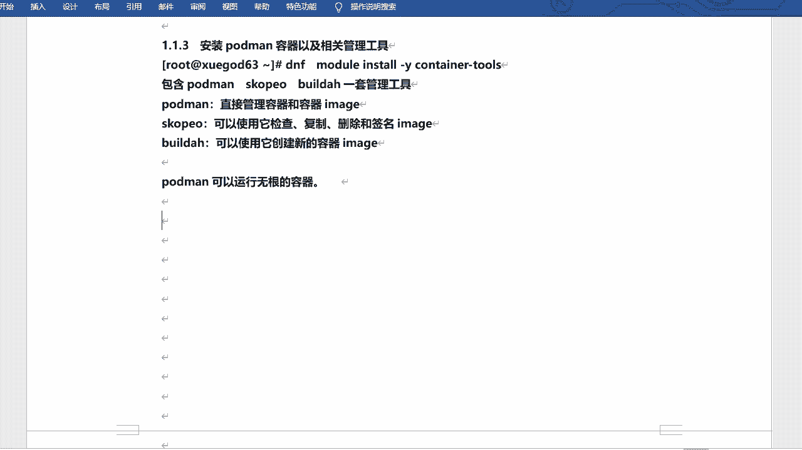

好，那portman就装好了是吧？装好了，装好之后我就可以用portman。对吧然后去去去执行了，对不对？但是呢它没有服务啊，seastem details statusers。好的曼。啊没有啊。

portman D啊也没有是吧，什么start这个都没有啊。是吧没有跑的们啊嗯。一进程也没有啊。哎呀。对吧这个也没有啊，就是它就是相当于就是一个命令啊，可以用它直接去管理。好吧，这去关闭啊。😊。

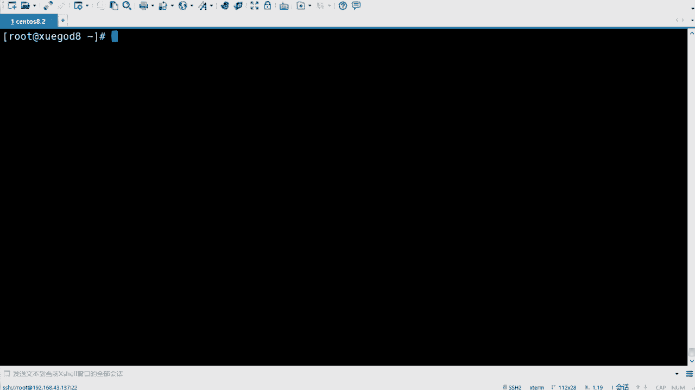

OK然后一般的话呢去使用potman啊，就是怎样呢？就是拉取是吧？拉取镜像啊，取镜像之后跑起来就可以了就可以了。那么拉取镜像的话呢，其实它会去哪儿拉呢？哪哪儿拉呢？默认的话，它会从红帽的那个镜像源去拉。

因为因为这这个就是红帽的嘛，是吧？这就是红帽的呢，它会有一个配置文件去。写去指定了那个那个。拉取镜像的那个那个位置，或者叫镜像圆的位置啊。

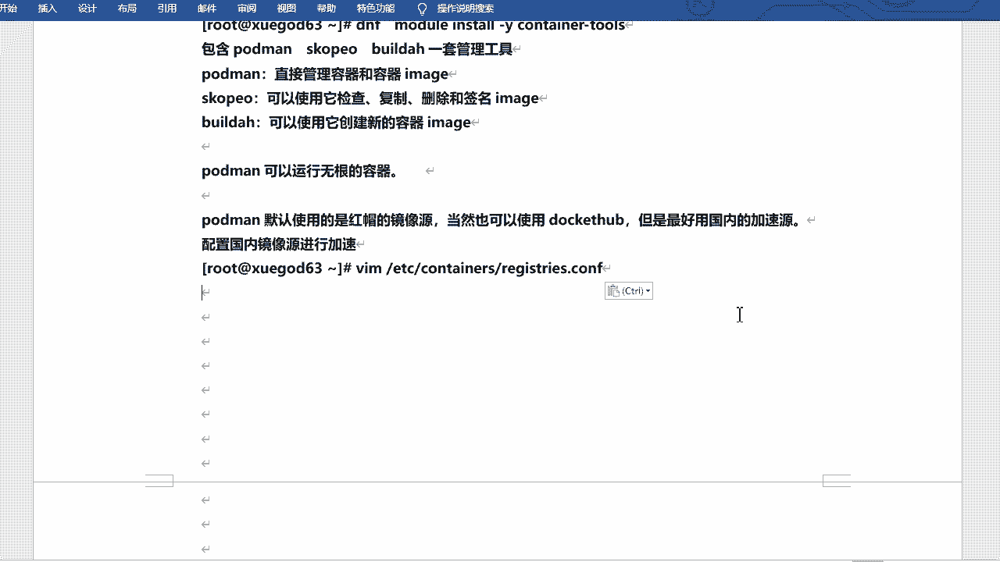

在这儿。我切过来吧，在ETC下有个叫做containers的一个目录啊。叫regtry co啊，regtry co。就是配置文件啊。啊，然后它只有一行生效啊，一行是两行啊，这个不算，看这个吧。

这只有一行。regries是吧，就是从哪去注册啊，从哪去干什么呢？从哪去。😊，拉取一像获取影像。它首先呢是有叫regtryacces点 redhead点com，还要regtry点rehead点IO啊。

这么两个对吧？很不幸啊，这两个你都打不开啊。hu。这两个西都打不开是吧？当是后边呢给了一个doctorO啊，这就是可以从docker hub去下载的。docker hub的话是个开源的是吧？

完了之后可以去下载这个这个容积一像的啊啊，但是是吧哪怕你能用docker hub。😊，的话是吧，他也是属于外网的。对不对？然后下载的话可能会受你的网速啊，包括什么防问长城的问题啊，不稳定啊。

快点慢呀或者干嘛的不稳定，对不对？这些的话都是需要咱们去改的。😊，都是需要他们去改的啊嗯。哎，怎么去改呢？是吧？咱们直接去改一下啊。😊，嗯，叫做我先给他改个名字吧。Regtry their co。

点BAK啊，这是我移动了，改名字相当于啊，然后咱们写个新的啊，regtry点com。好吧，然后格式呢是这样写的啊，格式这样写的。

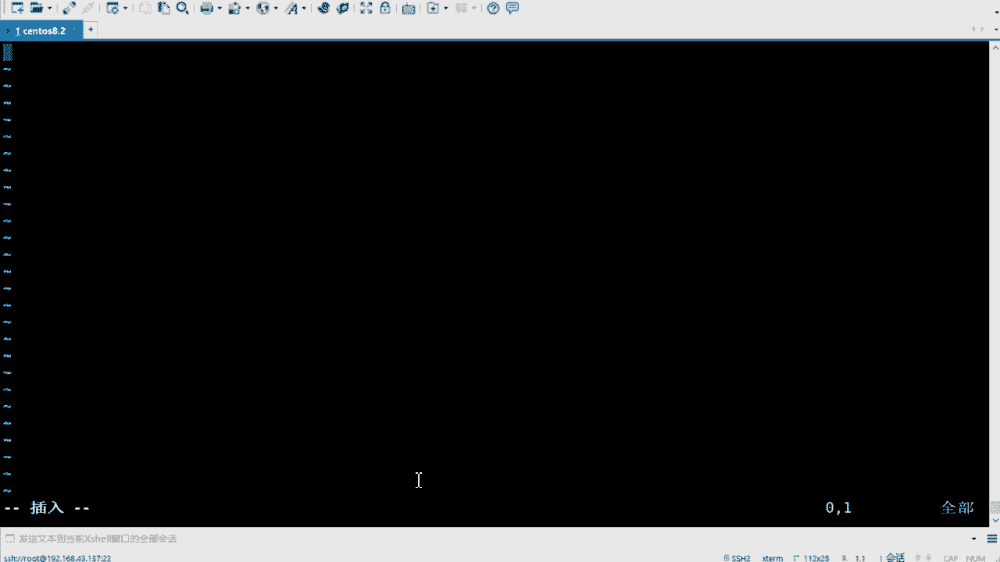

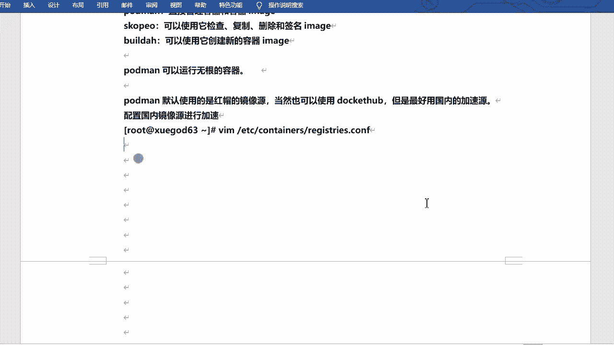

你就直接拿我的配置复制粘贴就可以啊。好吧，这个是配置啊配置啊。什么unqualified searcharch registries是吧，doctorIO还会用它啊。

然后registry perfectfi也是doIO最主要的是locationlocation的话其实就是从哪去下载啊，前面是显示它会显示doctorIO，但是真正去下载的地方，它会在这下载。

这个呢是一个阿里云的加速器的地址。好吧，阿里云压缩器地址啊在这儿。

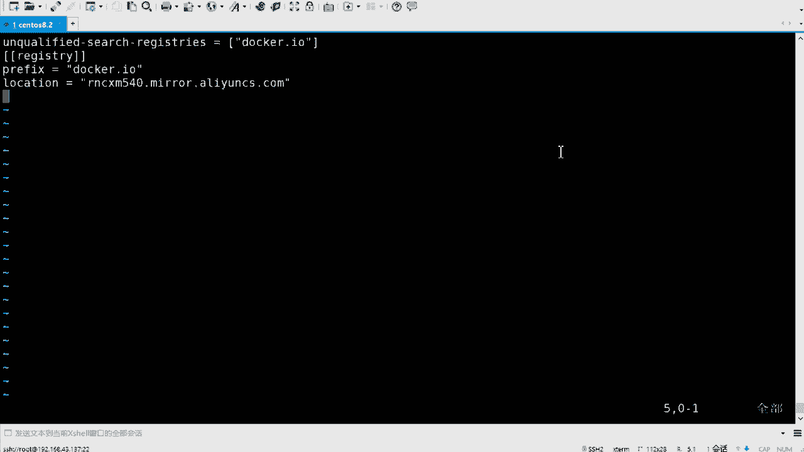

行吧它的格式就这么写啊就这么写，而且你一定要是一个空文件去写的。呃，我试过在原文件里面去改，它不好使。😊，啊，不好使啊，你就直接给他改名，对吧？我备份一下，完了之后用干净的文件去写它就行了。啊。

理解它就可以了。那么这个加速器地址呢，其实呃和之前配置的一个一个docker的加速器地址其实是一样的。就是你从阿里云去获取这个地址就可以了。好吧，阿里云获取地址就可以啊，怎么获取是吧？😊，这个地址啊。

什么什么什么mior点阿里云CS点comcom啊，主要是前面这几个啊好吧，那每一个用户的话呢，他都会给你一个单独的一个加速器的地址。怎么去呢？你可以去打开阿里云的那个控制台啊，控制台去登录。

对吧如果说你没买过云主机的话，你可以用那个支付宝账号是吧，或者淘宝账号去登录都行，好吧。然后第一增录的话呢，它会用到一个独立的密码，在左侧的加速器帮助页面会显示你你的加速器地址啊，但是现在才改版了。

改成这样了啊，改成这样了。可能后边还会改啊，其实你会找就行啊会找就行。嗯，因为现在阿里云的里边的内容特别多嘛，是吧？咱们找产品和服务，产品和服务的话，你去搜啊，这会有搜索功能，搜镜像容器镜像。

它会有一个叫容镜像的服务啊，然后点过来我来之后呢，会有一个镜像加速器，这边会有加速地址。好吧嗯。朋友们大家看看最近有没有更新啊。这个是我好像是前两个月吧，是吧，然后那个啥的啊。嗯，我登录一下啊。哎。

他直接给我跳过来了啊，因为我登录了啊，然后我重新点吧，点这吧，阿里云嗯对吧？你看版本更新，不用管它啊。呃，这是首页啊这是首页啊，完了之后呢一点它。对吧这个是一个向导，相对于或者一个一个一个类目啊。

图是啥啊？产品要服务，产品服务又非常多，好吧，非常多，你找的话很难找，你去搜。搜什么呢？搜这个镜像啊。镜像服务是吧？容器镜像服务啊，你搜容器镜像呀是吧，或者搜这个镜像服务啊都行啊。直接点的话。

它就跳过来了啊，跳过来之后呢，会有一个叫做镜像加速器。看到吗？在这儿啊，哎他会给你一个加速器的地址。是吧讲个地址啊，然后当然你可以复制啊，你可以复制的啊。那这有错的文档，但是这个错的文档的话呢。

是针对于什么呢？针对于嗯。😊，呃，doer去做的看啊。是吧升级都是客户端啊。1。10以上的版本对吧？然后怎么配置，怎么改配置文件啊，还有sno Smac这种的，对吧？这个不适用咱们咱们也不用去看它。

你就只去复制它就可以了。直接复制它就可以了。但是你需要注意的是，你复制出来之后啊，前面会有这个AHTTPS是吧？😊，对不对？你不用去管他啊。你只要后边的HTTPS杠杠后边的那个内种拿过来就可以啊。

不用带上HTTPS啊，好吧。嗯其实他他都不用加啊，他都不用加的啊嗯。

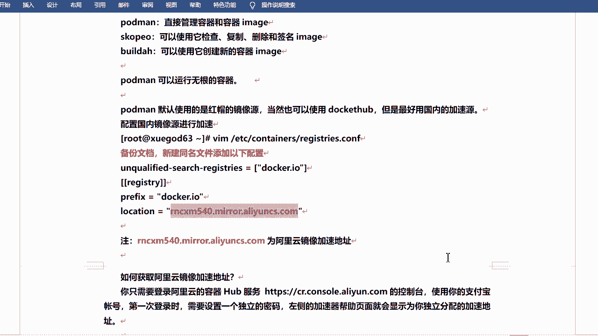

对吧这个网址UL都没有加是吧？都没有加，你就你就直接用用它干净的就可以。

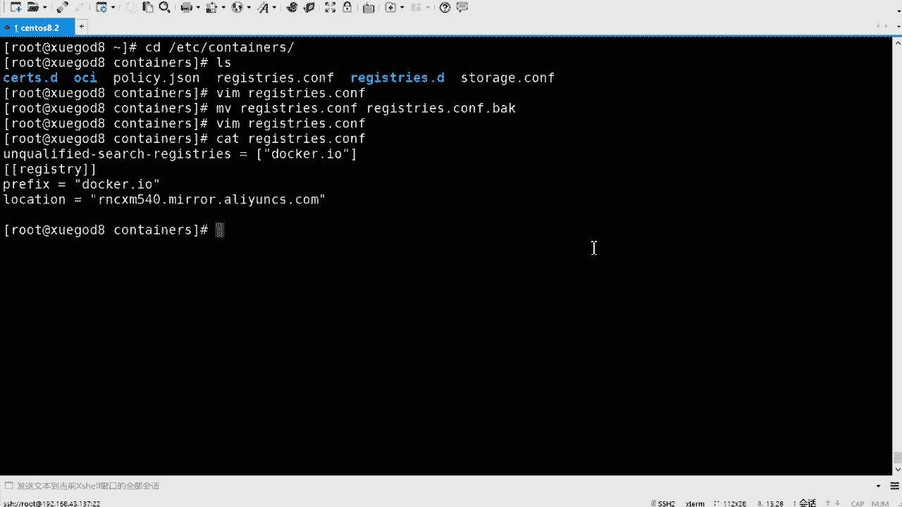

行吧，熨得干净就可以啊。😊，这是获取。加速器地址是吧？这个会了吧，对不对？这是阿里云的啊，嗯当然还有别的啊什么中科大的清华的应该也有啊，你想用的话也可以好吧，但是一般的话用阿里云就挺快的啊。就挺快乐。

嗯，好吧。行，那配好之后啊，配好之后也不用重启服务，对吧？那么咱们直接去用一用，好吧，我去拉去一个镜像。对不对？完了之后我去。呃，看看这个速度怎么样啊，速度怎么样啊。

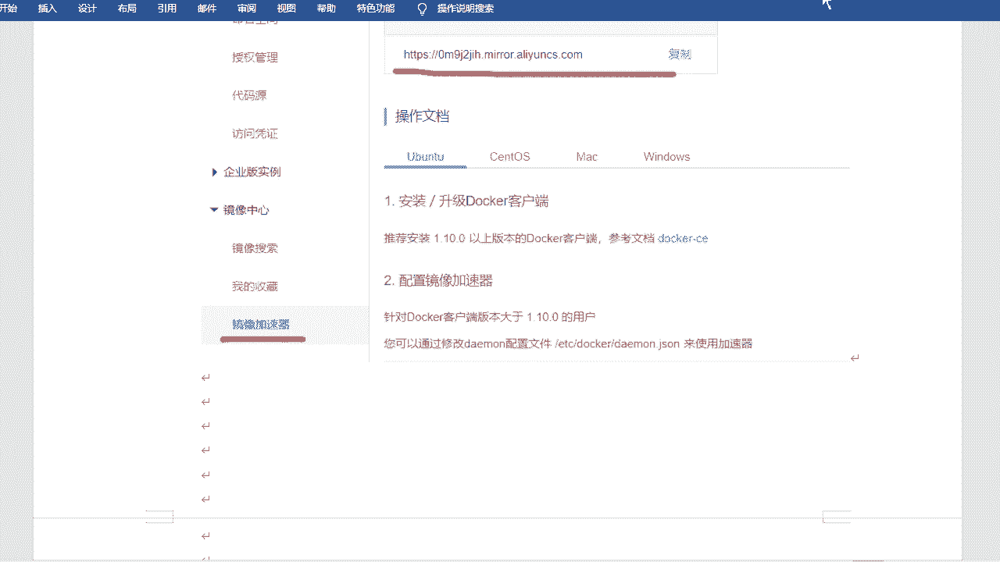

嗯，接我来啊，然后我去。portder曼啊。什么呢？可以先search。search search是搜索的意思啊，比如搜什么搜智能S。搜自S操作系统是吧？那么如果说你不知道你要下什么。

你最好可以先 search试一下，也也相当于设置关键字嘛，对不对？比方说我能下啥呀，是吧？我可以先看一看。😊，好吧，我先先看一看啊嗯。40一箱。直接回车就可以啊。

然后它的显示呢其实还是docker的IO啊，显示还是它。都是ham地址是吧，还是他啊，但是其实咱们去去拉取的话，其实会从阿里云的地址去去拉了。好吧，来在这去看啊，那么你去什么呢？你去看的话呢。

这个是呃呃这是这是一个整体的名字啊，就是你的军像的名字啊。描述信息star的新星数，新星数的话相对于点赞啊，和get up的信息数一样的啊。嗯，OK的话就是不是那个那个official，是不是官方的。

对吧是不是官方的啊，OK的是官方的。一般官方的话肯定是最最放心的是吧？然后可以去直接用的啊，可以用的。当然你也可以看幸用数是吧？下多的话，一般都是没啥问题的。😊，对不对？就是很火嘛是吧？

下在多的话也般没啥问题呢，这几个。好吧，这是search啊， searcharch，明天我se1个NG是吧？

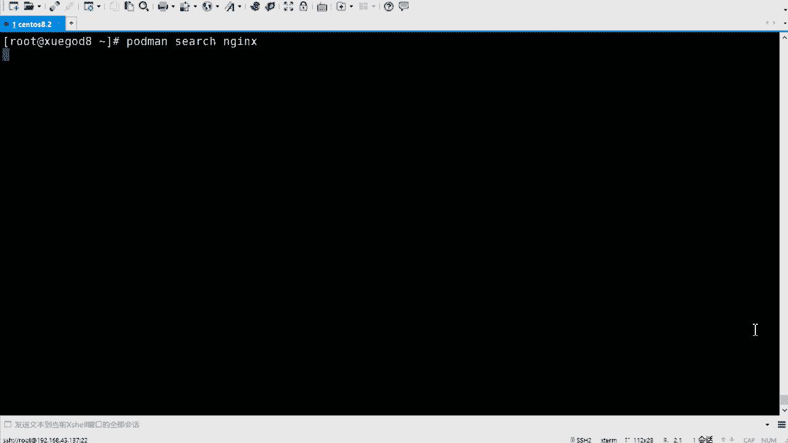

对你可以随便设试啊。搜关键字就可以了。是吧NGNG也有好多。这是14000个star，这个这个就非常的受欢迎。officebuNGX是吧？官方制作的NGX镜像。对吧什么N5上的都有啊。安时波段。

在这也有看没有，在这也有的啊。行，那咱们下一个好吧，下一个啊这是搜索search是搜索啊。O这个好大呀这个。缩小一点。就是搜索是吧，然后咱们下一个啊。下的话呢其实叫拉曲。拉取镜像是吧？叫做铺啊噗啊嗯。

拉距进行啊。ok我这拉的话呢，我拉一个带版本的啊。铺一个ss7。6。1810的一个版本啊，因为默认的话，你去拉取这个s态S的话，它是最新的版本。lati斯它最新版本啊，就是ss8的。对吧咱们下1个7。

7。6的啊。当然你想下最新的话，也可以下次最新的啊，这个这个不是强制的好吧，然后后期比如说考试的时候，他肯定会告诉你下什么版本的是吧，下什么就像啊，他会给你一个完整的名字啊，完整的名字啊。

然后我这铺的话，就是拉1个7。6的1个1810的啊。😊。

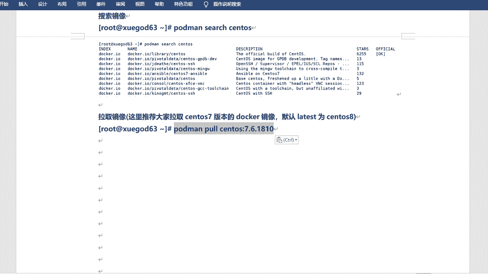

你可以进去。好吧，然后这边他先拉着啊，这边咱们可以去看一下怎么去看呢？SS。😊，啊，杠ANTPUgra一下。跑的吗。为什么要去看这个呢？对吧？因为它在拉取过程中呢，它会从哪儿拉，对不对？从哪儿拉呢？

会给你个地址啊，124110145。23，那这是哪儿呢？是不是这是不是do个 hubub呀，对吧？你看很快啊，非常快就拉完了啊，非常快就拉完了。😊，看上去也不像是外网的是吧？看上去就是咱们国内的啊。

咱们可以搜一下124是哪儿是吧？😊，可以搜1个IP查询的啊嗯。

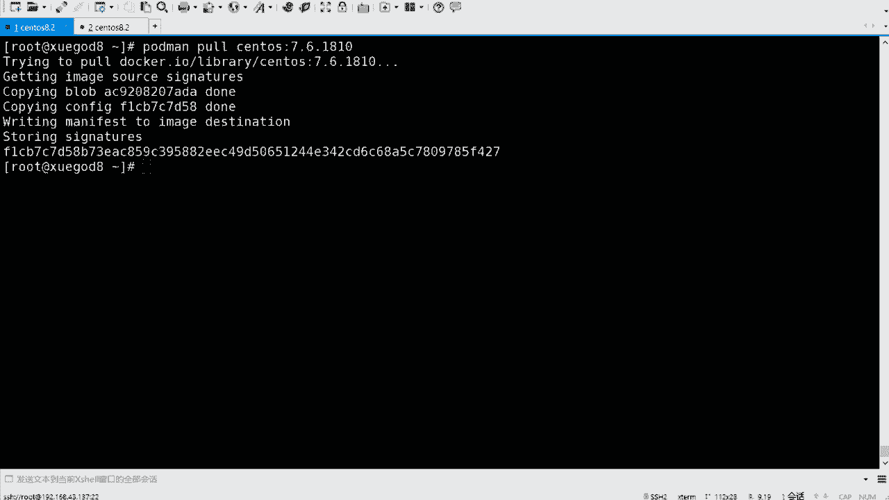

这我就随便打开一个百度一个啊，然后这们搜一下啊。124160145。23，这是我的啊，这是我的啊。搜一下是吧。他这个呢是浙江省嘉兴市联通的一个地址。对不对？这是地址啊。是吧看到浙江你可能会想到阿里是吧？

其实这就是阿里云的一个地址啊，阿里云地址啊呃，以前我去拉的话，他经常会给我一个这个地址啊。经常会给我1个116的啊116的地址。你们来的时候也可以看一看这个地址是哪的，是吧？😊，116的地址的话。

就直接就是阿里云地址。阿里云数据中心地址啊，后来我我搜到过183的。搜作过这个现在现在这么124的是吧，但这种就是其他的地方的位置啊，但是也其实也是属于压力的。好吧，也是属于阿里的啊。对你可以搜一下。

是吧搜一下，就是你这边拉着。啊，再打开一个终端是吧，然后呢去搜用SS啊是吧？用Sstate呀是吧，去查看网络链接，对不对？gra检索一下potman，看它用的是哪个地址啊。当然这边是咱们本机地址。

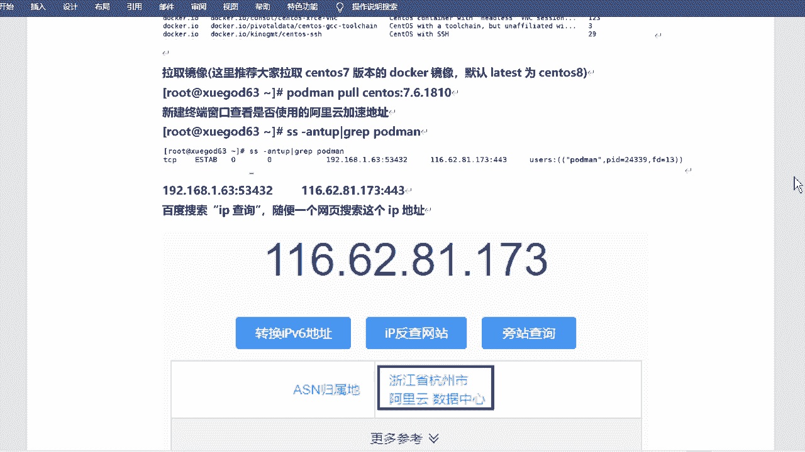

这边是本机地址是吧？这边就是原端地址，从哪下载的，从哪铺的。

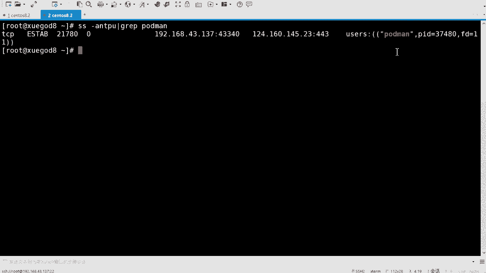

对吧从哪铺的，然后你可以搜一搜，看它是哪儿的。好吧，百度搜索IP查询就行啊。然后搜一下。就可以看到是吧？哎，这个就是阿里云进行挖取的。好吧，阿里云的话进行拉取的啊嗯。

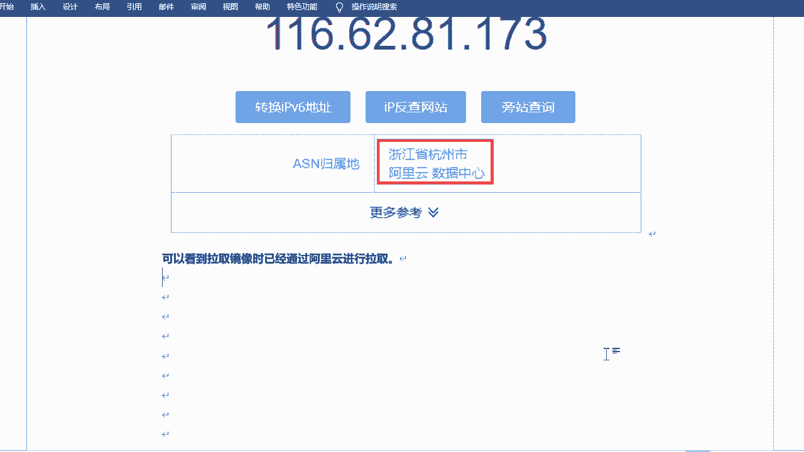

好，那已经拉下来了是吧？里边很快的啊很快的。嗯，怎么去看呢？拉下来之后可以用叫做portman。😊，嗯，image is啊 imageage is。image就是镜像的意思嘛，是吧？

image意思它会显示你当前可用的镜像有哪些啊？😊，对吧这是咱们的镜像。啊，就是还没跑起来之前叫镜像啊，跑起来之后就要容器了啊。呃，这个是它的全称doOOlib是吧？tg标签啊，就是什么版本之类的啊。

7。6点1O1810，这是image IDc的什么时候创建的是吧？多大209兆。看到没有？一个生彩镜像只有209兆。对不对，这要边链接了啊。doctor户是吧，这不就是doctor吗？是吧？

你用的命令是可以这样用的。😊，好吧，你这样你理解也没问题。你把po曼理解成docker也行，好吧，也可以的，方便理解是吧？方便理解啊嗯。

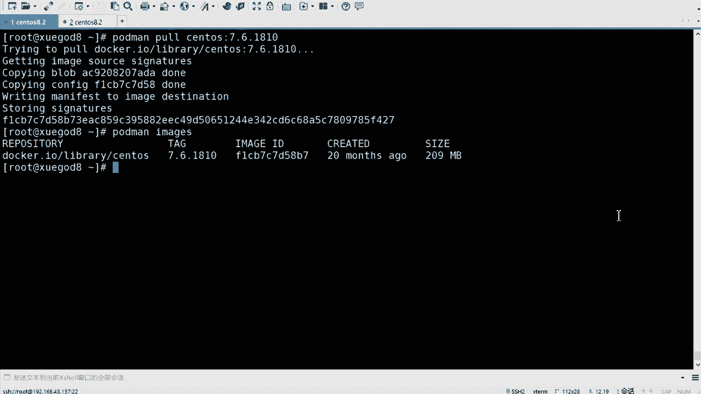

OK啊，这是查看镜像是吧？查看镜像啊。来。好啊，然后就是叫做portman images啊，直接去查看了，好吧，直接查看了啊，简单的容器是吧？可以看一看啊，那你都把它拉下来了是吧？咱们把它跑起来看一看。

好吧。😊，把它跑起来看一看啊。😊，运行一个简单的容器啊。

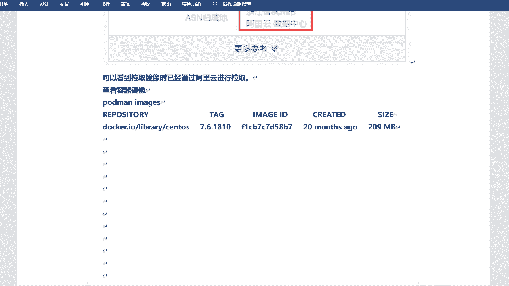

这个就是咱们容器嘛，是吧？那么我可以用potman。run是吧，run的话运行的意思啊运行的意思。😊，呃，杠AT。好吧，杠IT加1个杠杠2M。啊，然后thinkS是吧？你可以直接照人写啊。嗯，加上冒号。

S是你的名字啊。你的名字，然后冒号加上你的t。当然你写全程也可以是吧，写全称也可以啊。哎，然后后边跟上一个叫并线的bsh。好吧，哎，这样的话你就可以进入到一个容器。很快啊是吧？啪一下就进来了，对不对？

啪一下就进来了啊，这就是你的容器里边的东西啊。对不对？这是你的容器里边的内容啊。好吧，那咱们说一下这个这个参数是什么意思啊。大个慢run。跟IT是吧？呃，IT的话是两个参数，I和T。😊。

哎的话呢代表是interactive啊，叫做交互的意思意思。我去运行容器。完了之后呢，我在交互式的打开。是吧那加个TT的话呢，是一个终端。啊，可以分配一个呃分配一个终端啊。

TTY终端T的话就TTY啊分配1个TTY终端。好吧，但是你得给他TTY终端是啥？😊，你不给他的话，这个事这个也起不来啊，这个起不来啊。然后杠杠2M是吧？啊，这个的话其实可以加，可以不用加啊。看你情况。

一般的话其实家还比较好。是吧刚RM的刚RM的话代表是容器运行结束后会自动的话是删除。啊，自动的去删除。就是你比如说我我我目前在这里边是吧，然后我退出我退出退出完之后呢，它会自动把这个容器给你删删删掉。

好吧，自动化给你删掉啊，就这个意思。是吧就这个意思啊，当然你进来之后可以简单敲敲命令啊，比如说ID。对不对？然后yrap list是吧？那这个他会给你配好样品元的啊。H。是吧这么几个啊这么几个圆。

base一update1万多个包是吧？网络源对不对？网络源啊，然后。ID也可以看一下啊，IDID的话是。什么呢？是这个这个这个呃呃镜像是吧？镜像啊不是镜像用户是吧？用户的话是root。啊，是root。

呃，当然咱们当前也是root，就是我这个这个这个。远程过来的也是root是吧，但是这两个root肯定是不一样的啊，这是你容器里面的root。对吧那我的版本呢ETC下的redhead release。

是7。6对吧？是7。6啊，然后咱们看内核。是4点18的是吧，4点18的啊，那我这边呢。相当于它的宿主机啊，你看也是4。18的。😊，193。193是一样的是吧？有没有谁开着七的虚拟机的，你看看你的7。

6或者7。4，7点几的内核是多少。是3点10的是吧？那这个是4。18的对吧？和你的宿主机是一样的啊。速度机是一样的啊。OK然后你就可以退出了啊。😊，退录。

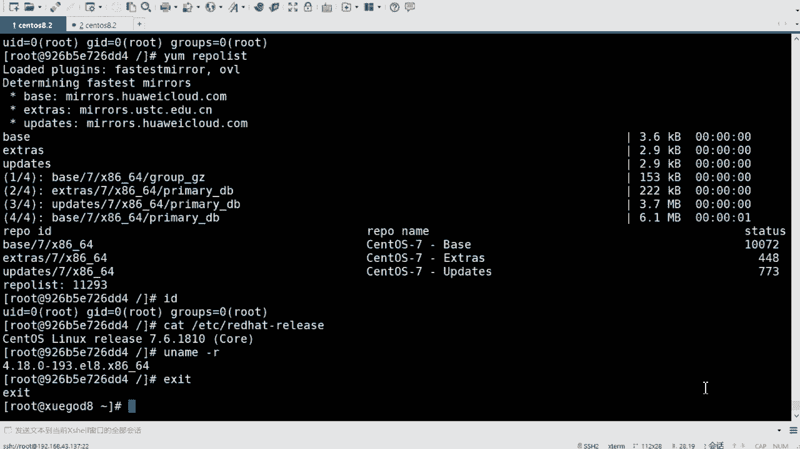

好好的啊，这个里边有过程是吧，这边有过程啊嗯。😊，嗯，这是查看，然后运行杠ATT杠个2M对吧？然后参数的话，我这有解释啊，都是干啥的干啥的，行吧，2M啊ID查看可以可以敲几个命令是吧？

当然你也可以敲别的命令去看一看啊。😊，好吧，然后raprap list应个SIT是吧？呃，你也可以看一下2RPM杠QA是吧，看看它有多少个包啊，其实是没有多少个包啊，很少的。😊。

肯定会比最小化安装的包还要少。

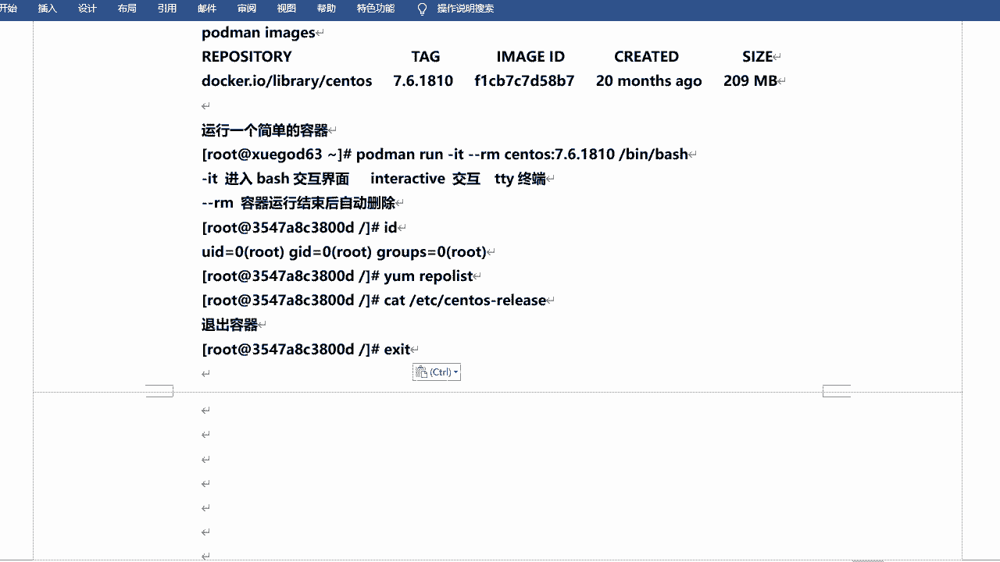

是不是还要稍等啊。