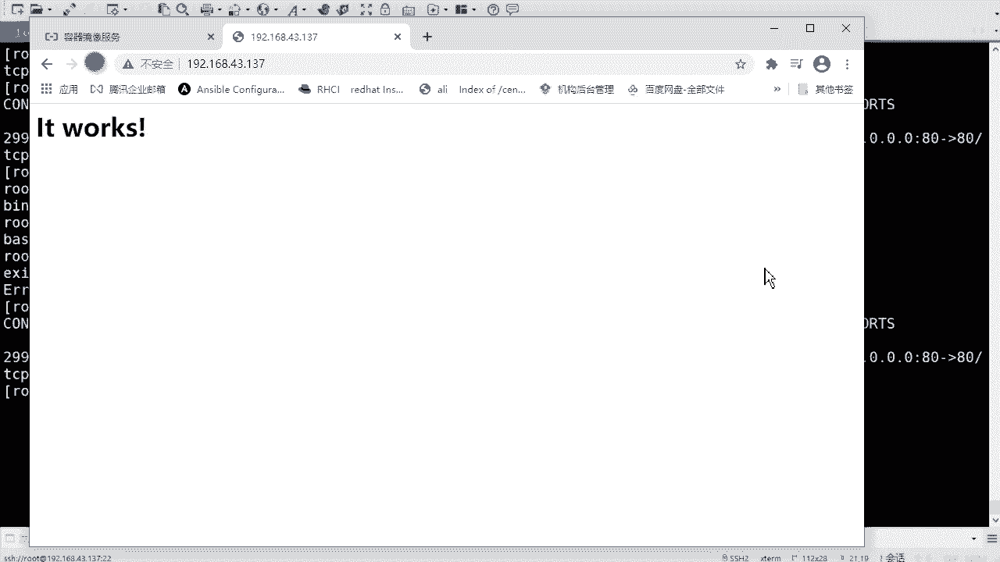

# rhel8-centos8-rhce-linux-stream-stratis-vdo-podman-dnf - P11：rhel8-e-3-3podman容器管理 - Linux最diao - BV16T4y1K7px

来啊，我们看一下，刚才的话呢是一个标准的过程。对，而且我下的话呢，只是下了个s通S啊，有同学刚才还问说哎，我能不能。😊，我是不是需要在增台里边再去装别的应用，对不对？那不是的啊，不是的，好吧。

那你可以直接去。😊，干什么呢？可以去装，可以直下载应用。对你可以直接下载NG阿帕奇什么zaens什么top不开的是吧都行。好吧，都是可以的啊。来那咱们来装一个其他的啊。啊，提前咱们说一个这个啊。

就是如果说你去用什么呢？用这个。呃，破段是吧，然后呢去去运行容器镜像的话啊。如果运行一个容件镜像，但是image镜像呃本地如果说还没有的话怎么办呢？

那么portmanrun命令会将先从regtry中去下载image，然后再运行。好吧，什么意思？就是你没有是吧？然后它能搜到，那么它会去下载，下载完之后呢再再运行。好吧，相当于两步合成一部是吧？

两步合成一步啊，当使用pot one run运行容器的时候，可以使用刚刚内幕选项来设置容器的名字啊，给容器起个名字。😊，但是呢容器的名字必须得是唯一的啊，如果po软命令不包含容器名字的话。

那么portman会生成一个随机的名字。啊，这只是名称的一个问题啊。哎，咱咱们来运行一个web容器，好吧。必息为我上去啊。运行一个阿帕奇，可以吧？

我也不容气啊。跑的慢嗯。润是吧。这回就不杠IT了啊，咱们就不叫欧视的了是吧？咱们加一个叫做杠D。😊，高低的话呢代表后台运行啊后台运行啊。叫这个这个background是吧，后台运行啊。

然后杠P杠P的话呢是加一个。那个那个端口转发啊端国转发啊，880冒号80。呃，2个80，那前面这个80呢是咱们本机的啊，就在这台机器的啊，后边这个80呢是容器的80，因为我一会儿要跑一个帕奇是吧？

那么我要把它的网站相当于映射出来啊，让咱们这个其他的主机可以去访问到这个网站。好吧，这样的啊，然后可以加一个刚刚那。名字是吧，起个名字啊，比如说叫做雪干的。web Web01吧是吧？好，然后run谁呢？

HTTPD。是吧软汤啊软汤，当然目前咱们是没有的，好吧，没有的啊。😊，比如说我去。跑的慢。那个image看一下，目前只有一个自动S。对不对？目前没有他放心啊，他会去给你下载的，好吧。

咱们看过程啊看过程啊。你看他会出 to铺，他也知道他没有我没有，那会他会去铺。好吧，等会去铺啊。嗯，当然这个版本的话是最新版本啊，没有指定的最新版本。这是几张密码啊，大概。差不多有一兆每秒吧。

很快的很快的。对吧哎完了。这已经下下来了。好吧，已经下起来了啊。然后的话那个镜镜像文件。有了。是吧有了啊，那他有没有跑起来呢？你不是 run了吗？是吧？怎么看呢？咱们可以通过叫ponndaman。😊。

PS去看啊。哎，这是你运行着的啊。Sitters up。19秒之前对吧？然后这是你的ID啊，它会给你生成ID那这是名字。记相的名字命令的话，是你的军箱里边指定的命令啊。呃，什么时候创建的运行的？

然后posepos的话呢，这个是转发的是吧？它会有个80对80这个过程。后最后的话是咱们名字。

机象的名字。好吧，你个名字啊。这是。杠D是吧，杠D的话，它就后台运行了，它不会在前台去去展示了，是吧？啊，就是你你不用进去去看是吧，不用进去去看啊。嗯，刚那部取个名字，当然呢你也可以直接去访问。

比如说我我访问一下是吧，这个80端口它能不能通是吧？哦，我的地址目前是43。137啊。对吧你看是吧它是it works啊，这个是可以正常访问的啊，it works。正常是能访问到的。

OK呃，然后PS可以看是吧？😊，还有什么可以看的？还可以用portdman。😊，嗯，叫做port。杠A是吧，那么它会就显示所有的容器的那个那个端口映射关系啊，所以显示啊这个就是80延伸到外边的80。

对不对？当然你也可以指定某一台容器的这个映射关系啊，咱们是学干的尾本01是吧？你可以看，因为目前只有只没有只有这一个容器是吧？只有这一个容器啊。

不是就查看啊去查看。😔，到时候PS上也可以看啊。Port A， port P。呃，当然你也可以看本本机的完，那会儿有没有在监听啊，nstate，当是这个不太明显啊，nstate。

啊，gra一下那个那个80。是吧也在监听，但是它会显示的是一个。什么common的东西啊，这个这个不明显是吧？这不明显啊。O那目前的话朋友们。PS是吧，这个是我在运行的容器。对不对？

就是它啊就是它后台运行的对吧？那我如果说想要去进去去看呢。是吧这个其实咱们也是可以进去的啊，也可以进去的啊啊，你可以用叫做portman。😊，EXEC啊。这里跑的慢是吧？EXEC。Okay。😔，嗯。呃。

杠IT是吧，IT的话也是那个那个交互式的方式啊。然后容器的名字啊，咱们叫叫什么学尬的we灵异是吧？呃，指定并现的认识。啊，进来是吧，哎，这也能进来。对吧也轮进来啊也可以。😊，敲命令是吧。也可以看，哇塞。

y没有这个命令，看到没有？他都没有装样么啊。行，然后退出啊然后退出。嗯，哦他给了个E嘛。OC I runtime error。那但是咱们出来了啊，出来之后咱们再看PS。是吧他还在，并没有。并没有停是吧。

并没有停啊，然后我在这儿呢去。

刷一下啊刷一下。

对吧你看他还是可以访问的。对不对？还是可以访问的啊，就在这儿。嗯，好吧，然后还可以接呢还可以。😊，port曼EXEC啊加杠IT。加上你的这个容器名字，你可以不用进去，然后呢去敲一些命令啊。

他会他可以给你返回啊，他可以你给你返回啊。比如说我去干嘛呢嗯。cat一下是吧，然后ETC下的。嗯，red head生同子吧。release啊。哇塞，没有这个没有这个文件吗？RheadUSD。

Rhead呢。啊，好吧，他现在报错了啊，他不让我敲命了，应该是啊。他不让我敲命了，其实是可以的啊，就是呃你可以通过这个方式呢去执行命令啊，他也会给你返回的，好吧，还会给你返回的啊。他现在给我报错了。

他说没有一个退出的code是吧，这出的code啊。OK啊，然后还可以。哇塞，这个执行也不行啊，还可以这样啊。😊，也EC。嗯，把这个。删了。😔，加杠莱奥也可以。好吧，你看其实这个这包括一样的。

说明没有问题啊。呃，刚癌的话它会记录下来最后的一个容器的名字。好吧，然后去去执行啊，相当于就是什么杠IT，然后指定你的你的这个名字了啊，杠L啊，这个意思好吧，当然这个你可以不用记啊，这个可以不用记啊。

呃，port oneEXEC杠IT进去是吧？就是B的b啊，这个可以记一记。

行吧因为有一些它是后代运行的是吧？然后我我需要再去进去再去进入是吧？那么你就可以用EXDC再去进入，好吧，杠L的话可以不用记啊。啊。run什么基本上？

run的话是你在一开始去执行的时候运行的时候需要去用的。你现在运行起来了是吧？那你就不用run了，你需要EEXEC进入啊或者切换是吧？进入到一个容器啊，进入到容器啊。呃。

这是portman运行一个后端容器啊。

要不引号是吧，呃不是引号的问题啊。嗯比如说我在这儿去把它引起来。是吧你这这又又有其他的报错了啊嗯。啊，run time有问题，not found。No such fail or director。

我现把停了吧。可以用portman stop啊停掉这个容器啊。呃，雪干的外不0。是吧，听的没问题吧。停到啊停掉完之后呢，咱们用那个tomanPS。PS再去看。你就发现没有了是吧。

没有以及正在运行的容器了。好吧，因为这个的话它会显示它运行的容器啊。呃，然后呢你可以用杠A。😊，杠A区看啊，那么杠A去看的话呢，它就会显示不单单是运行的容器啊，它会把所有容器呃所有运行过的是吧？

不管是运行还是停止了，它都不显示出来。好吧，然后这有个状态是吧，它是一个11个it的啊。就是已经已经停止状态啊，已经退出状态是吧，就这个东西啊。😊。

停止容器。是吧呃我刚才用的话都是用的命名字啊，就是name也可以用这个ID啊。

他不是会给你个ID嘛？是吧？你也可以用这个ID去停止是吧，或者去什么记入啥的啊，也可以用这个ID的。啊，然后PS是查看运行的啊。PS杠A的话呢是查看所有的。

PS杠于乘上所有的。嗯，好吧，然后这个docker stop这个我给大家去扩展一下啊。

就是它有一它有好几个参数都可以去用的啊，叫做poman。你也可以table啊，其实有好多。stop是停止的意思是吧？嗯stop停止。对不对你可以查看状态，什么start。呃，好像还有re啊。

还有这个re start是吧，还可以重启。对不对？嗯，他还有一个叫做。K。P在哪呢？啊，这呢哇塞这儿啊。还可以Q杀掉一个容器。对不对？呃，还有一个叫pos啊pos。这个是吧还可以停止。

是不是这些参数其实都可以用啊都可以用的啊。当然你你不用记那么多是吧，你不用记那么多啊，正常常用的什么store start。😊，呃，不用star了吧，就是run。

对吧然后什么stop restart是吧？能记住这几个就可以啊啊，Q也可以记。😊，啊，pos记不记得吧？pos原来也比较少啊，暂停是吧？OK啊，这是查看啊，主要是PS啊PS杠A。平4杠1啊嗯。查看啊。

那么这个的话说明你的容器肯定是运行过的。对不对？瑞行功能啊，然后它会保存保留下来。那么下一次如果你再去用的话。啊，或者说我再去那个那个指定，比如说一个名字，刚刚name的话，那么你就不能用这个名字了。

啊，这个这个血霸01了好吧？那我可以怎呢？我可以删掉它。好吧，我给删掉它啊，我可以让杠A都不显示它啊，那你就可以用重重复用之前的这个名字了。是吧就好像刚才咱们用的1个杠杠RM一样是吧？哎。

我可以在后边扇着它啊，后边扇它也可以的啊。😊，叫做portman。嗯，2M是吧。R也可以的啊，还有RIRI的话，这个一会儿咱们再说啊。呃，删掉这个AD。没有ID吧是吧？下它啊，上完之后呢。

咱们再来看一下。你看杠A都没有了。

是吧刚一的话你都看不到了啊，就就给它删掉了，是吧？呃，它呢也有几个参数M啊也有几个参数。一个是杠F。好吧，杠F强制的意思对不对？强制的意思啊，那么它可以删除正在运行的容器。

你像刚才咱们用那个杠D杠P是吧？

运行的那个啊。就这个啊。这个。前面这个。杠D杠P运行的。哪去了？这是PS的 image。啊，就这个是吧O。😊，后台运行的对不对？呃，一般的话咱们是需要先给它停掉啊，就是stop掉完了之后呢。

你再给它删掉，是不是你也可以直接删啊，也可以直接删，就是加杠F。

啊，portmanM杠F加上ID啊，或加上名字，可以删除一个正在运行的容器。是吧这带运行的容器啊，然后杠A对吧？杠A杠A的话呢是删除主机中所有停止运行的容器。好吧，就是你之前可能运行过好多。

完了之后你都停了是吧？停完之后的话呢，哎，你可以删除一下所有啊所有停止停止的这个容器。好吧，所有听止的容器啊。这是删除容器啊。当然了，你生除容器的话呢，和你的镜像是没关系的。

因为容器是运行的对吧？镜像的话，它是一个静态的啊，它会一直躺在这儿。就是你用那个portman。一枚之意的是吧，去看啊，你的阿帕奇呀、宋S都还在。对不对，都还在啊都还在。

好吧，如果说你想删掉镜像的话，对不对？那得这个干嘛呢？那得用2MI啊2MI啊。嗯。叫portmanRMI啊，加上你的镜像的名字删掉啊，当然咱们这里边先不执行啊，因为还会用它呢是吧？如果说你真的不想要了。

对吧？那你可以给它可以给它删掉。😊，好吧，可以给它删掉啊。你看这是注释啊，删除镜像的时候，不能有容器正在使用当前镜像。好吧，删镜性的是吧，不能有容器正在用这个镜象啊，但是如果你强制的话是吧？

那你用杠F也可以删除正在运行的容器和镜像。好吧，杠F就那个啥是吧？杠F的话就就强制啊，包括这个什么呢，包括RM1样，是吧RM这也可以杠F是吧？RMI的话也可以用杠F好吧。

