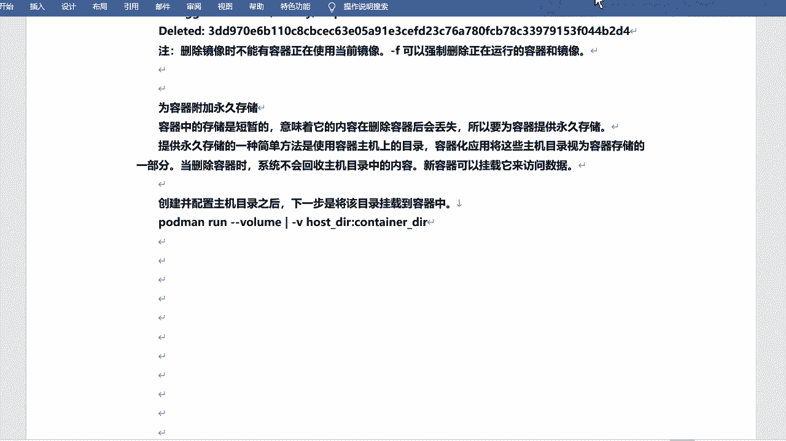
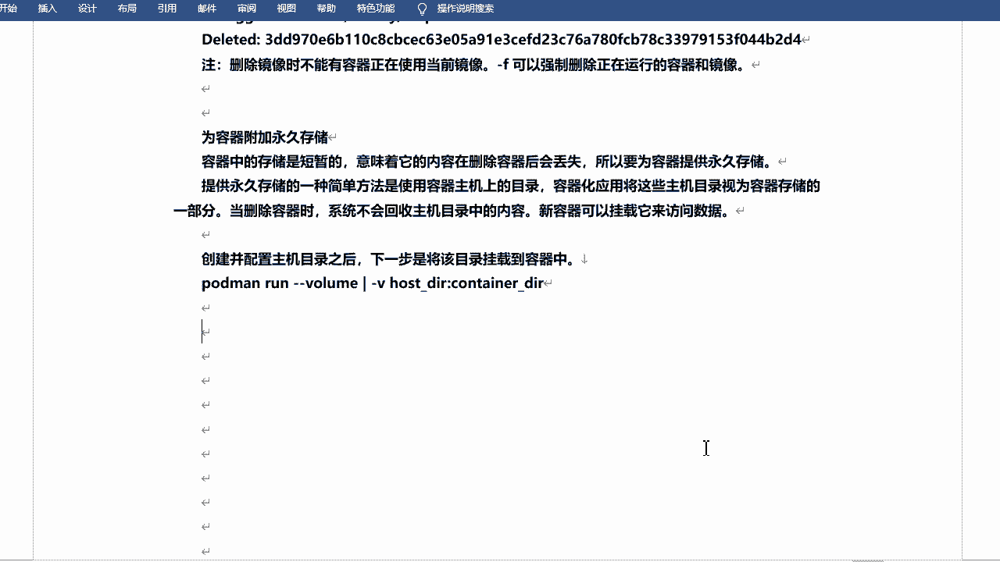

# rhel8-centos8-rhce-linux-stream-stratis-vdo-podman-dnf - P12：rhel8-e-3-4附加永久存储-cockpit管理Podman - Linux最diao - BV16T4y1K7px

好，下面咱们来看一下为容器附加永久存储，好吧。永久存储啊。嗯，这个东西啊。呃，容器的话呢是存储都是短短暂的啊，包括容器也是临时的是吧？也是临时的啊，意味着它的内容在删除容器之后会丢失。

所以说要为容器TO永久存储。对吧因为因为你退出之后，你比如说你写过什么东西啊，或者保存过啥的呀，是吧？其实它也就没有了。好吧，它也就没有了啊。那么TU游戏存储的一种简单方法的话，是使用容器主机上的目录。

就是咱们。😊。

这个啊主机上的目录是吧？完了之后呢，容器化应用将这些主机目录视为容器存储的一部分。那么当删除容器的时候呢，系统不会回收主机目录上的内容啊，它只会回收容器里边内容，好吧，但是呢你的容器。

的这个内容呃，不是容器啊，你的速主机的啊，这台主机的内容是吧，它还是会保留的。好吧，还是会保留的啊。那么新容器的话呢，还可以挂载它挂载它来访问数据。

好吧，就像有学刚才说的，它不适合做数据库是吧？其实也可以做数据库啊。😊，就是你你你可以挂载一个持久的存储。对哪怕你的容器，比如说。停了是吧，或者意外怎怎样怎样了是吧？哎，那你的数据是不会丢的。😊，好吧。

你的数据的话是不会丢的啊，这就是容器是吧？嗯这是容器啊。呃呃，这是挂入存储是吧？然后咱们来挂一挂啊挂一挂。嗯，我去干什么呢？我去。给大家写一下这个。啥线下这个过程是吧？挂的话呢主要有个参数叫杠V。好吧。

杠V参数啊或者叫杠杠volume啊，就是卷的意思是吧？卷的意思啊，然后先指令你的hostDIR就是主机的DIR。然后的话呢，在那个啥呢？在那个指定你的容器的DIR容器的目录是吧？先是主机目录。

然后是容器目录，好吧。你比如说咱们来管一下啊。嗯，想挂这个目录之类的啊，我先。嗯，先干嘛呢？先这个这个先起一下吧，好不好，先起一下啊。

比如我先起一个容器啊。嗯，朋友们。是吧软啊，然后。刚D刚P还是啊。啊，这个就不用杠P了吧。我直接起一下啊，就是说。刚刚那。啊，等于学干。😔，Y802啊，其实呢其HTTP的啊。然后咱们进来，当然你也可以。

哎呀哈我用IT机器也行啊。其实我主要想看一下里边的。😊，里边的目录结构啊，同志们。嗯，EXIT是吧啊，EXEC啊，sorry。杠IT我还得进一下。嗯，并行的标识。大，可以看一下啊嗯。对不对？

这个是我阿帕奇啊，这是阿帕奇啊，里边的是它的目录路径是吧？路径，然后会有这些目录。好吧，你可以灌载其中某公录，对吧？比如说这个是我的网站跟录。HD dos对吧？哎，我可以把它挂出来。对不对？

就是可以映射出来，好吧，然后我在里边存的东西，对不对？那么我可以在外边啊，在我的宿主机里边你可以看到。😊，好吧，也可以看到啊嗯。然后我退出一下啊。我还得把它干掉是吧嗯。同t们。😔，PS你看一下啊。

让我怕他们。😔，Stop。停掉。She got the webin。嗯，没了是吧，然后我删掉。2M。对吧现在就又是干净的了。嗯，还得停掉它，还得那啥。删掉它。😔，删掉它嗯。行吧。

然后呃如果说你你比如说我去运行了一下它是吧？然后我往里边写的东西的，比如说啊往里边创建个文件啊或者干嘛的，好吧，我就不测试了啊，那么你再停掉再重启或者再再再再进去是吧？那里边的逻金它是不会保存的。😊。

好吧，他肯定是不会保存的啊，那我去怎样呢？那我去给它挂载一下卷。对不对？我挂载一下啊，然后让它保存下来，保存到咱们的这个当前当前这个系统，好吧，当前一个主机啊，比如说我是。挂到OPD下吧，好吧好？

OPD应该里边是空的啊啊是空的，往往后我用它挂。行吧，我用开挂啊。比如我跑的曼。啊，是吧是吧。降低啊。还可以加钢皮，可以不用加啊。因为我只是去看这个文件的一个一个对应关系啊。name。杠杠吧是吧。

起名字就是叫学霸的嗯。Y部03吧。然后杠V啊从这开始挂啊，杠VOPT这是咱们宿主机的啊，然后冒号。是刚才咱们看的那个什么you local阿帕旗2。把它拿过来啊。啊。是吧挂到。😊，叫HTdos是吧？

HTDOCS啊，光到这儿。好吧，然后起HTTPD。把它记起来。好吧好的，谢谢了啊。😊，哎。对吧然后。然后进去看吧，进去直接啊。好，那么EXEC。学挂的we03啊，并且在边试。嗯。还是在这儿啊。

然后我切到H dos。是吧目前里边是是空的是吧？目前里边是空的啊，你比如说我去touch一个文件吧。AA点TT是吧？然后往里往里边写点东西啊。挨口嘛，重对箱啊。嗯嗯，好。哎，是吧，这是我的内容。

是不是呃，我看看他目前会不会立马出来啊。OPT。好，立马就出来了是吧，ca一下A点TID。😊，啊，sorry OPT下载声点填加T啊。是不是AA啊，然后就有了。对吧然后就有了啊，然后。退出一下。嗯。

退出一下啊。嗯。行吧，然后怎么再去看呢是吧？怎么再去看呢？你比如说我去。😊，呃。把它。把它停掉吧，是吧？停掉啊，然后跑的慢。嗯，stop。学嘎的Y03啊。嗯，然后你的那个啥，然后你的那个那个。

OPT项是不是还是有的？好吧，还是有的啊还是有的啊。那如果说我不去挂这个存储的话啊，刚才咱们是挂进去的，是不是我不去挂，还是正常的去用。我直接这样吧。我直接抛的慢run吧，运行一下。IT是吧，然后。

HTTPD。对我不后他运行了啊嗯。让我加个那个啥吧。看看二人吧。直接进来啊，咱们看一下。HG do。对不对啊，当然里边index它是默认的啊，是不是？但是没有A点TIT。😊。

对吧没有A点TNT啊。

像这个一样，咱们咱们A点TIT它已经写到了哪儿呢？写到OPD下。已经显这了是吧？那么你得再去挂载，然后它才再能看到A点TIT的是吧？如果说你不挂，像刚才一样啊，裸不是说裸奔吧，就是直接去进入是吧？

直进入之后你是看不见的。

相当于它又他又那个啥了啊，它又初始化了，它又恢恢复快照了是吧？他有会拍照了。要是卷子挂载好吧，卷子挂在啊。Okay。嗯，哎呀，我这要不要再写一下。啊，toptop stop这就不用PS了。😔。

这儿我删一下吧。😔，啊，没有删是吧？不删也行啊，PS不用。

Okay。呃，然后如果说你想再要看到AA点TND的话是吧？那么你得干嘛呢？那么你得那个那个那个加。再加挂载啊杠V，然后再把OPT挂在那个膜下。是吧挂在这个幕前啊。嗯。我这咱们写一下，总结一下啊。嗯。

没有啊，不是没有啊，叫什么。m。呃，使用。使用。run是吧。跟IT的方式啊。直接。启动。容器。直接启用。H是TTE的是吧？发现。嗯，HT doox。葫芦。是吧嗯，并没有。呃，没有了A点TXT文件啊。

好吧，如果你想再看到他是吧？如果一下在看到A。😔，TATT是吧，那。需要。😔，在使用。匡威啊，然后居挂载。OOPT。目录啊到这个。HT do。录啊，当然你可以挂到别的目录下。😊。

对吧如果说你挂到别的目录下的话，那就在别的目录下可以看到这个AA点TIT了。😊，好吧，就这个意思啊。Okay。呃，然后这个有一个需要注意的地方啊，就是说呃如果说你的SElink是开着的。好吧。

后期可能考试会考这个可能啊我是这么想的啊。就是Sinux因为默认是开的是吧？然后咱们在挂载的时候呢，需要用到一个叫做Z的选项啊，叫大Z。叫大灯啊。我把这也写一下啊。嗯。P。こ。大队选项啊。

portman的话会自动将SElinux container feel下面T context啊，就是这个呃SElinux的设置是吧？应用到主目录。啊，用到主目怎么去写呢？

我用这个方式我用咱们这个方式去写一下啊。你比如说这样的是吧？这样的啊。啊，高低高频运行啊，当然这个其实可以碰一下啊。不一定每次都得那啥的。是吧然后加上什么name杠V设置，对不对？然后在这儿。

在这个目录后边啊加一个冒号。打这里就可以了，好吧。打这就可以了啊。冒画不太好看啊。Okay。是吧就相当于你设置了SElinux了啊。对不对？虽然说感觉哇好难呀，是吧？

其实一条命令11个一个字母就可以搞定了啊。加一个刚纳Z就可以了。O啊。来看一下，用copy的去管理这个portman啊。copy呃，copy大家应该不不陌生吧，是吧？这是一个呃web的管理界面是吧？

web的管理界面啊。可比的。Okay。是吧呃介绍的话就不用多说了吧，对不对？这是一个免费开源的基于web的管理工具啊，它可以管理什么存储啊，网络啊。😊，日啊、容器啊都可以啊，都可以啊，包括虚拟机是吧。

都是可以的啊。然后呃可以管理相应的服务的进程。管理网络啊容器、虚拟机存储。啊，除了当然除了LM的话，还会有比如说read呀，是吧？还有那个那个什么scars啊，什么FS啊，都可以啊，都可以VDo是吧？

也可以的啊，网络配置啊，用户web终端啊，什么性呃性能展示就是一些类似于监控的。好吧，类似于监控的啊，一般的话默认的话，它都给咱们装好了是吧？装好了，那么你可以。😊，再装一下吧，是吧？

就是copy的话呢，其实它会有一些。有好几个包啊好几包。嗯。😊，嗯，copy dashboard啊，什么仪表盘，storage存储什么package啥的啊。对吧嗯这几个应我也都装了吧，我看看啊。

默认它其实装了好多啊嗯。啊，有一个带式泵没装啊，他去装吧。呃，装好之后呢，咱们去启动这个服务是吧？叫做sstem跳。你内部刚刚闹。Call个 bit。点fcket是吧？可以直接这样启啊。

就是启动同时设置开机启动啊，设置开机启动啊。

那咱们来访问一下啊访问一下。嗯嗯。我的是43点。137端口是9090，好吧，9090啊，然后登录一下。前往。用户名。

密码。嗯是吧呃，这儿的话就是一些。类似于监控的是吧，监控的啊。CPU用了这么多了，CPU。好，0啊，这还子比较正常啊，呃，这个也可以看吧啊，这也可以看。你的CPU因为当前我只有一个主机啊，是我自己。

CPU内存嗯。网络啊磁盘是吧，它都会显示的。内存用了多少，这是哇塞。CPU是吧？然后咱们看当前主机啊。呃，你们都点过吗？是吧？有没有同学点过这个的？😊，对这个可以点开简单看一看啊。

你可以通过它的鼠标的方式去管理。是吧什么文件。啊，IS是吧，设备。read的卷子Vdeo啊，什么Scar都可以的，网络。网络防护墙是吧？开关设置。然后还有网卡的设置，什么绑定te网球微了啥的。

然后就是poman是吧，但是po man呢默认它是没有叫什么开机自动启动啊，然后给它点燃启动就可以了，好吧。😊，你来起一下啊。账号账户是吧，那么内核专储应用终端这个地方有一些像这个东西没什么用啊。

啊，然后什么SE一个没什么用啊。对。

咱们还是看主要的po的慢吧，好吧。还是主要看podman啊。好的们。😔。

OK其他的话你可以点点去试一试，行吧？😊。

试一试啊，你比如说咱们之前讲过什么。讲过这个LVM是吧，你试试能不能通过copy的去干嘛呢？去创建LVM。对不对？选VDO，能不能创建VDO。对吧NFS怎么创建NFS？怎么能去设置是吧？

这个都可以试一试啊啊，当然这个是咱们可以用的，但是呢考试的时候。就是不建不建议咱们去用的啊，好吧，好时候你别想着靠他去去去干什么事儿啊，还是用命令好。好吧，还容易命令好啊。😊，啊，朋友们啊。嗯。

放大一点吧。

哦，我这有running的是吧，我给它停掉吧。停掉。Stop。学告的你4。是吧，然后我看一下啊。那我用ponmon。嗯，M。抗一吧。Yeah。

把之前停的那个删了啊，嗯我这边刷新一下。对吧目前能看到的就是这个什么呢？就是这个这个镜像啊，没有正能运行的容器。如果有的话，它会显示的，像刚才一样，它会显示的。对不对？镜像的话呢，就是咱们这两个镜像啊。

然后有root有系统的root的话就是咱们刚才设置的啊。如果说你想开的话，可以开。如果说你想获取的话，可以获取镜像。好吧，会进下啊。然后去去去下载都行是吧？但是不建议咱们在这儿去下载是吧？

那那你直接用铺不更好吗，是吧？用铺更好的啊。呃。如果是想运行啊，也可以运行啊，可以运行啊。比如说我点一个运行，还是运行怎么阿帕奇这个吧，H是TTPT啊。😊，运行它会弹出来一个呃对耳框是吧？

这个不能改啊这个不能改，名字可以改名字，比如说叫做雪糕的什么。雪告的朋友们。是吧呃，Y01吧。好吧，命令这个可以不用动啊，分配伪终端是吧？分为终端的话就是会就可以用命令行去登录意思是啊。呃。

一张也可以不分配啊。😊，然后是端口，端口的话呢是这个是容器端啊，比如说还是80吧。容器端啊。80是吧，主机端我设置个别的设置个8080，比如说。好吧，居然如果说你想挂载是吧，那么你可以挂载。😊。

对吧你看这也有的啊，键值的话，这是变量啊，就是也可以设置变量之类的啊，是吧？然后我就直接运行了。好吧，运行了啊，然后它是软景状态。对吧软硬状态啊，然后比如说我去打开一下咱们的地址。137是吧，然后是。

8080是吧。是8080吧。对。好吧，然后也是it works对吧？也已经这个这个映er成功了啊。是吧这是运行状态。哎呦，我去直接停了啊，控制台不能点，看来是啊。😊。

行吧嗯。好的啊。All right。这个就更简单很简单了是吧？直接通过那个什么呢copy的是吧，直接去点就可以了啊。😊，直接去点它就可以了啊。然后这个过程给大家写一下啊。嗯。今天主要是两个方面是吧？

其实里边包含挺多的啊，嗯有portman管理容器，包括什么是容器，对吧？什么是portman，咱们都说了一下啊。完了之后呃copy的管理，然后里边的操作很多是吧？大家可以多去多去敲一敲。好吧。

等一瞧一瞧啊嗯。

行啊，这个就是咱们今天的内容。