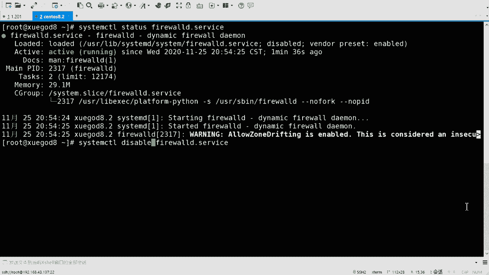

# rhel8-centos8-rhce-linux-stream-stratis-vdo-podman-dnf - P1：rhel8-e-1-1firewalld防火墙上 - Linux最diao - BV16T4y1K7px

啊啊，大家好，我是CD啊。今天的话呢给大家带来呃红帽八的一个这个新的课程是吧？嗯，包括更新的新的东西啊，包括f world防火墙。😊，好吧，然后还有SElin，还有调优啊，还有调优。好吧。

那咱们一起来看一下啊一起来看一下。嗯，首先的话来看一下防火墙啊，防火墙在其实这个farewall话呢，不是八才出来的是吧？在7版本的话呢，就开始去使用了这个fawall啊，版本的话呢还是延续驱用它。

好吧，那咱们就一起来看一看啊，简单也介绍一下是吧？其实你像在fawood之前还有I table，对吧？这样的防火墙，但是其实呢说fawall是个防火墙，嗯，不准确啊，因为它不是真正的防火墙，它是什么呢？

它是叫做防火墙的管理工具。😊，啊，风险的管理工具真正去干活的啊，真正的这个防火箱是谁呢？是吧？叫这个net filter。叫他啊叫他啊net filter。啊，它是在内核中包含的啊，它已经在内核里边了。

它是网络流量操作啊的框架是吧？什么流源呢？比如说数据包的过滤，网络接容转换和端口的转换啊，就是做这个网络流用操作的，是net filter啊，它是真正去做的。好吧。

然后通过在那块中实现蓝截函数调用和消息的处理程序。net filter允许其他内核模块直接与内核的网络对战进行连接的这个接口的连接啊，这是net filter啊，这是net filter。好吧。

然后在8版本的这个系统里边，其实是内核，内核是多少来着？我看啊。

礼盒儿。呃，不是有有 name。嗯。刚看一下啊，4点呃，应该是4。44点10以上啊，4。10的话是8。0，我记得是啊。

对，内核4点10以上开始啊，内核的话又包含了一个新的东西啊，就不单单是有net filter这个翻火墙了啊，它又包含了一个叫做NF tables。好吧，还包含它啊。

这个是一个新的过滤器和数据包的分装子系统啊，增强了net filter的部分代码，但仍保留了net filter的框架。如网络剧战holk啊，这这这这儿提了一下啊，网络对战是吧？

什么根日志啊、日志记录啊是吧，这些啊这些。然后N tables更新的优势在于更快的数据包的处理，更快的规则级的更新，以及相同的规则，同时处理IPV4和IPV6，对吧？对IP6的支持更好啊。

NF tables的话和原始的F filterter之间的另一个主要的区别是它们的接口。那 filterter通过多个实用程序框架进行呃配置啊，其中包括I tablesI6tables。

什么ARP tables和Etables啊，这是之前的啊之前的啊，但是呢这个框架已经被弃用了啊，这是在8本本里边啊。呃，NFTbo呢则使用单个NFT的用户空间来使用啊使用程序。

通过一个接口来管理所有的协议，呃，由此消除了以往不同前端和多个net filter接口引起的争用的问题啊，这是一个新的啊叫NFTbo。内核4小时以后是吧，新增加的啊呃。

它增强了NNF呃呃net filter的部分的代码，但仍保留了net filter的架构啊，这个知道就可以啊。然后呢。

不管是net filter还是NF tables都是在内核中只集成的这是真正的防火墙。😊，真正的去工作的。好吧，那么咱们所说的IP tables，包括faair world都是什么？

都是防火墙的管理工具啊，或者叫管理器啊管理器啊。当然咱们现在主要讲的是fairro啊。好吧，动态防火墙的管理器啊，它是NF tables的前呃框架的前端。呃，其实呢在推出app tables之前。

作为一种改进app tables服务的替代方案，fireair world曾使用app table命来直接配置netfilter。那么这个呢是在8之前再是7的时候。记的时候啊。

因为切的时候呢没有没有这个NF tables，它还是使用的是net filter。好吧，使用net filter，后呢fa world它也是个前呃哪去了？

这啊fa world也是一个前端的这个管理工具啊，然后呢但是fi呃net filter还得去调用，然后呢再去配置net filter啊，就是相当于导了好几手的意思啊。

然后呢在8里边啊在8里边fa world仍然是推进的前端它是用NMT来管理防护墙规则集啊，借助fa world可以将所有网络流量分为多个区域啊，在呃在那个fa world里边是吧？它分了这个纵的概念啊。

有这个纵的概念，从而去简化防墙的管理数据根据数据包与IP地址或传入网络接口等条件流量将转入相应区域的防火墙规则，然后呢再去匹配是吧？我是需要接受啊，我上是拒绝呀还是丢弃啊还是转发呀，对吧？是这个意思啊。

会有这个规则集一个叫规则集叫纵叫区域。😊，好吧，那其实呢在八里边。咱们可以用的的话是这个faair world啊，fa word还有一个啊叫做NFT。这刚才提了一下啊，NFT是吧？

这个命令其实也可以管理。啊，但是呢你会发现我说哎这个防屋型的管理工具怎么这么多呀，是吧？之前有这个IPT完了之后又有fair word，现在又又有一个叫NFT啊。但是目前咱们这个。😊。

红魔八的版本里面是吧，咱们嗯不会去考虑这个NFT啊，但是它确实也是可以去管理的。啊，也是可以去管理的，而且它的这个使用方法更加的。😊，更加的复杂一些吧，是吧？它就相当于怎么说呢？相当于这个这个。😊。

一种编程语言一样啊，它支持什么判断甚至循环啥的啊，这就更更复杂了。好吧。所以说防火前的管理工具的话，嗯，就是没有一个很好的统一啊，经常去经常去换，好吧，经常去换啊。

但是还好咱们现在其实用的话还是这个faair word啊，还是fa。如果说你用之前比如说7版本之前，你用六的系统用这个五的系统是吧？那你还得用这个I table好吧，还这I啊，这个看你先接触的谁是吧？

如果说你先接触AP table会感觉啊I table很好用啊，为什么要换faair word呀是吧？哎，如果说你先接触的这个fa word的话是吧？你会感觉fa word其实也还好，也挺好用的。😊。

对不对？就是它因为会有一个先入为主的一个一个一个东西嘛，是吧？那么不管你之前有没有接触过是吧？那现在的话咱们去讲这个faar word，包括咱们后期去操作是吧？其实也是用faair word啊。

在7版本的考试里面有。😊，呃，有不不能说有几个啊，几乎就是CE的题里边。因为CE的话，咱们700本考的是服务嘛，是吧？每一个题都会涉及到防火墙。好吧，那么在800本的考试里边的话呢。

就没有没有这个服务了，是吧？咱们考的是那个啥搞的是那个那个那个ible是吧？ible的话呢，有有一部分吧，有几个题它会涉及到这个fa world啊，会涉及到好吧？然后涉及到之后呢。

呃用anible的方式去调用这个防火墙的模块就可以了啊，其实说没有那么复杂，好吧，没有那么复杂的啊。😊，来看一下这个。区域是吧，它这里边提到了一个叫做区域啊。嗯，将所有流量分为多个区是吧？

这个也是fair world它去引入的。好吧，它去引入的一个新的概念啊。在之前a table边，它分成了这个表和列是吧？简单提一下啊，Id之前是吧，它是分四个标，5个链的。对不对？

什么芒go roll呀，net filter啊表是吧？列什么input output啊，forwardproing post roing对不对？那么在嗯fward里边的话，就没有这个表和链的概念了。

它是分成区域的。叫做重啊叫做重啊。那么一个纵的话呢，是以套的过滤规则，数据包必须要经过某国纵才能进站或出站。对吧就是我允许你才可以。😊，不拒绝你的话，你就不行啊，就这个意思。不同重中的规则力度、粗细。

安全强度都不尽相同啊，就是它的这个规则的呃不一样啊不一样，可以把纵看作是一个个出站或入站必须经过的安检门，有的严格，有的宽松，有的检查细致，有的检查粗略。啊，就相当于什么呢？相当于咱们的那个。😊，呃。

就就就比如说是大家坐火车是吧，我坐飞机那个安检一样。😊，好吧，就这个意思啊这个意思。然后。是吧你像坐火车的话就是吧？检查的话就就宽松一些。😊，是不是可以带打火机的对吧？坐飞机的话就不行了，是不是？😊。

那么这就是规则力度的粗细不一样啊，严格程度也不一样。是吧那fair world里边有几个这个众呢，一共有9个众啊，九大众。

举个洞啊叫做block DMZd externalho internal publiclic trusted和 work啊，这么几个洞，好吧，这么几个洞啊，然后。嗯。😊，嗯，OK啊。

然后的话呢呃这有个标红的是吧？publish啊。这是独书一帜的是吧？为什么没有它标红呢？因为这个是默认的纵啊，默认的区域就是它好吧，就是它啊。OK然后。然后呢嗯这个纵的话呢。

其实和那个链儿也是有些规则有一些关系的吧，相当于啊这个链儿啊，因为咱们去写的话，把这个规则，你的方向规则具体就是写到这个纵里边去的。😊，是吧table呢也是写到这个链里边的啊，可以可以可以这样理解啊。

然后呢，在在这个这个faair word里边是吧，默认情况下啊，默认的区域就是public。😊，好吧，public，然后当然它会有一些其他的这个这个规则啊，为咱们预备了9个是吧？可以根据场景的不同。

选择不同的这个规则集合。好吧，什么意思呢？是这样啊。😊，是是这样嗯，根据他的名字，其实你可以看出来。名字啊，咱们可以翻译啊，也可以看出来的啊。嗯我在这儿有个表啊，大家可以看一看。😊，就是他的一个。嗯。

默认是干啥的啊，默认是干啥的？有一个表儿啊嗯。叫做faair world预定义的区域，好吧，fa world啊预定义的区域。Okay。呃。这个这个排序无所谓啊，咱们来看一下。

先看那个trus trust的。抄题的话呢是信任的意思是吧？是信任的意思啊，这个是允许所有传入流量的。啊，也就是说不拒绝。对不对？也就是说不拒绝啊，你来访问我，那我就直接接收了。😊，是吧就这个意思啊啊。

当然这个是很危险的。😊，对不对你不管谁来，那我都拒绝，那这个肯定是不行的，是不是肯定是不行的啊。那如果说有有攻击呢是吧？或者有恶意的链接呢，对不对？当然有的时候会用到叉st的，你像那个回环口。

咱们l是吧？就是比如说我自己访问我自己是吧？那这个肯定是可以去允许的啊嗯。😊，是吧。呃，然后是home啊，home的话是加的意思是吧？加的意思啊。呃。

其实home呀、internal啊、work呀、public呀internal啊，还有DM呀，这个这个都差不多啊都差不多啊。只不过它可能会有一些默认的规则。比如说它默认允许谁啊。

然后它可能默认不允许谁啊，就是就是这样细微的差别。但是呢功能差不多，因为它都会怎样呢？它都会预先去呃怎么说呢？预先去呃给你几个几个，比方说服务或者说端口是吧，是允许的，然后其他的话都是拒绝的啊。

就这个意思啊，那么它默认允许的端口可能不一样好吧，你像这个home啊，home的话呢，是除非与传周流量相关或与SSHMDNSAPP什么s啊DV6啊，预定的服务是吧？这些我是允许的啊，其他的话都是拒绝的。

😊，这是homehome是家的意思是吧？呃，inter环内部网络啊，然后其实也是这几个，看到没有？😊，也是一样的啊，对吧？否则拒绝work啊work你看是吧？也是这几个啊，他少了啊。

work的话少了那个桑。对不对？啊啊，12345123啊，少了三把和那个啥MDS。对吧它只允许SSH啊，默认啊，这是默认的啊，它只允许SSH远程是吧？APP啊，什么DHPV6。😊，其他的都是拒绝的。

那么public也是啊，public现在又少了，public的话只有SSH和DACCPV6是默认允许的，其他的话是拒绝的。啊，新添加的网络接口的默认的区域也是帕布雷克。啊，这都是这都是这个默认的啊。

Okay。呃，一个ter是吧，就是外部的啊外部的啊嗯有SSH。呃，然后还有什么伪装是吧？啊，就就就这几个功能啊，SID是否则拒绝，然后通过取区域转发的IPV4传出铃导将进行伪装啊。

伪装的话你不懂也没有关系啊，因为目前咱们也不会用到它啊。呃，看起来像是来自传输网络接口的MPPS地址啊，就是它会去转转换成相当于net啊，转换成比如说公网地址啊呃。

DMZ啊DMZ的话也只放开来SSH否则是拒绝的啊否则是拒绝的。😊，啊，我们是block， block是块的意思是吧？但是呢这个其实在这儿的意思是拒绝的意思，它就是默认是拒绝所有的。默认是拒绝是所有的。

啊，然后是drop drop是DOT的意思啊。丢弃所有传入量啊，甚至不会产生这个ICMP的错误响应啊，就是pin字没有回应啊，这个意思。好吧，然后在这儿的话，我简单说一下，就是拒绝和丢弃啊。

这两个东西是是不一样的。好吧，嗯，有些人如果说之前接触过app table的，应该知道啊，它会有一个叫reject和也是也是拒绝啊，reject。😊，和drop也是叫drop啊。

只不过fair word里边叫叫这个block是吧？呃，拒绝和丢弃啊，什么意思呢？就是回应的不一样。你比如说我你来连接我对吧？或者说你来请求。那么如果说我是拒绝你的话，我会明确告诉你。不行。

你不能连接我啊，这这叫拒绝。好吧，就好像搞对象一样是吧？我能你能做我女朋友吗？他说不行啊，那你就。😊，可能会换下一个是吧？我换一个人。那么这个db的话就比较那啥了啊，drop的话是丢弃。😊。

对吧你连过你你给我发消息啊，你给我去呃，这个这个请求是吧？那我直接把你请求丢弃掉了。然后呢，我还不会告诉你，你可能就在那傻等啊，等等等到超时完了之后断开啊，是这个意思。😊，啊，就就也跟搞对象一样是吧？

如果说你按了一个女神说啊，你咋你能做我女朋友吗？对不对？他不回应你。😊，是不是那这时候你也不知道他是同意还是不同意，对吧？你可能还会继续去努力啊，你也可能会放弃是吧？就是这个过程啊。

然后所以说jo的话可能比较难受啊，但是其实一般的话咱们去做这个拒绝的操作啊，好吧，一般的话其实用的jo还是比较多。😊，啊，因为因为reject如果是直接拒绝的话啊嗯。😊，可能会比较很明显嘛是吧？

很明显啊，然后如果说遇到一些。😊，坏人是吧，一些坏人黑客之类的啊，你去连接他，你啪给他回一个拒绝，可能会勾起他的那种。😊，你懂得是吧？那种欲望啊，哎，你越不让我连，我越要连你是吧？

可是我有这种这种效果啊。所以说其实用的drop，后期就是咱们去去设这个防火墙的话还是比较多的啊，比reject要要要多啊嗯。好吧，把这两个。是吧把这两个你知道它的区别就可以啊。啊，知道区别就可以啊。行。

那咱们来操作一下，好吧，操作一下啊。

嗯。防火墙farewood啊。先装一下是吧？当然默认情况下一般都装好了啊，咱们去压。😊，insstore一个是吧？呃，fa world。呀呀呀。再卡一会儿啊。我了听不见。F what。肯定是装好了啊。

在这呢，如果说没有装啊，当然需要去装一下的是吧？一般你装好装上这个图形化的界面是吧，它都它都装好了。好吧，他都装好了啊。然后怎样呢？然后咱们启动一下啊，sstemP条star。fair word啊。

因为它是个服啊，咱们记一下。嗯，咱们之前有讲过服务吗？有没有讲过服啊？我我我说一下啊。没有是吧啊，服务的话就是什么意思呢？就是呃你比如说我我我有一个什么呢？我有一个阿帕奇吧，web服务啊。

web服务web服务的话是对咱们提供这种网页浏览的啊，简单说啊，网页浏览的是吧？那么你这个服务的话其实是一直去运行的。😊，一直运行的，然后它会有接听端口，会等待客户端来连接我。

然后我会我去给你提供服务啊，这叫这叫服务。啊，这叫服务啊，你像咱们的呃SSH是吧？这也是个服啊，你像我现在用的是叉1要连接的是吧？为什么叉12可以连接上呢？因为我开启了SSHD的服务啊。😊，嗯，叫做。

system这调sters看状态啊，这个是查看状态的，叫SSHD这是咱们的服务，它是running的是吧？running的啊。呃，C咱CTL的话呢是去管理咱们的服务的基本的命令啊。

就跟之前的service一样，相当于啊跟之前service一样。😊，好吧，这是看状态，star的话就是启动是吧？然后那个stop就是停止restar的话就是重启。好吧，就这个意思啊。

那么f world的话呢也是一个服务，它也需要运行的。刚才呢哎我把它启动起来了是吧？然后咱们看一下状态啊。😊，Sysem。几条 status。状态啊叫做fa word哎是吧，它也是活着的是吧？XQ啊。

好吧，那那我就可以去使用什么呢？我就可以去使用这个fireair world了啊，那么防火墙就工作了，然后就生效了。如果说你没有开启的话，那任何人都可以连我的，因为你没有开嘛，是吧？

相当于它默认就是trustted。😊，trusting啊。对吧那开启来之后是吧，那它它现在启用的是public。对不对？这个区域啊，那呃如果是p布这允许，那你可以连接我。如果不允许，那你是么时能连接呢？

好吧，这就是这就是服务啊，因为它的运行。他一直在运行的啊。嗯，这个是状态sstate状态啊，star启动啊，当然你也可以去enable是吧？开机启动，我也说一下啊。Unable。开机启动啊。啊。

我相起了，咱们不是说过吗？咱们不是讲过吗？那个啥那个那个。😊，嗯。视频第二天嘛，还是第三天是吧？咱们讲初始化系统。还记得吧？你防火墙不也关吗？对不对？你们居然说没你们居然说没没没没听过啊。

可能没有没有专门去讲过是吧？但是命令的话应该敲过，对不对？啊，inable是开机启动啊，重启之后呢，它会随着你的系统启动而启动啊，然后还有就是diable是吧？😊。

diisable啊diable的话就是开机不启动啊，然后它也不会随着你的系统的启动而启动。好吧，这个就看你的情况啊，你看你想去。

设置哪个是吧，那去设置哪个啊。嗯，我这写一下啊。哎，咱们主要先把它开起来啊主要先把它开起来。😊，那开起来之后是吧，咱们就可以去使用它啊，就可以去设置它了啊。

呃，哦，这还有一个命令啊，查看状态的话也可以用刚刚state查看啊，刚刚state。So a farwall。刚CMD啊，刚刚sstateate。是不是running的是吧，是不是running的啊？

OK那管理咱们来看一下，那么管理防火墙的方式啊，就是f world的方式啊，有一共有4种，好吧，在八里边有4种啊嗯。

啊，我要不这先写一下吧，是吧，先写一下啊。😊，有哪四种呢？有一个是图形管理啊，图形化。一个是命令行。啊，一个是这个这个。配置文件啊。还有一个是co费的。哎，通过这几种方式呢，都可以去管理咱们的防火墙。

好吧，都可以去管理的啊。