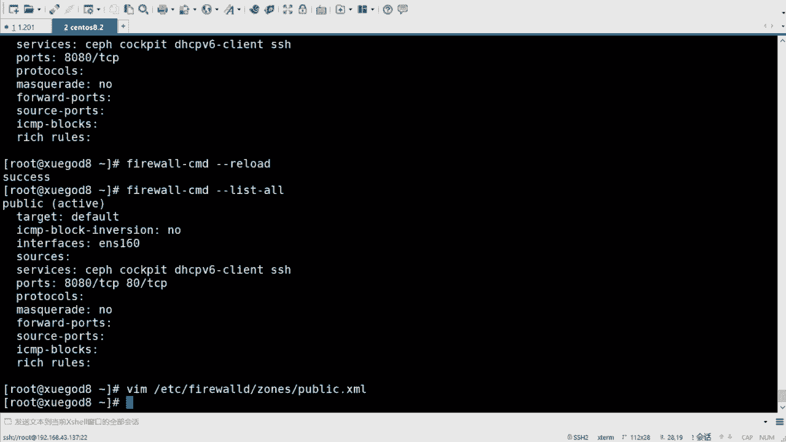
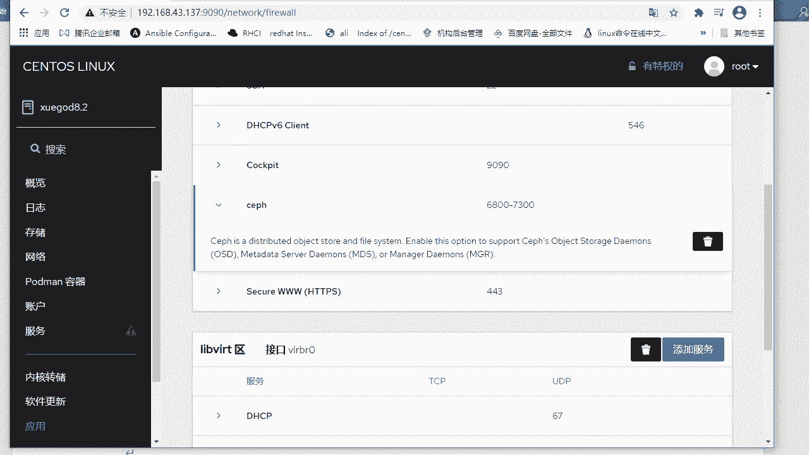
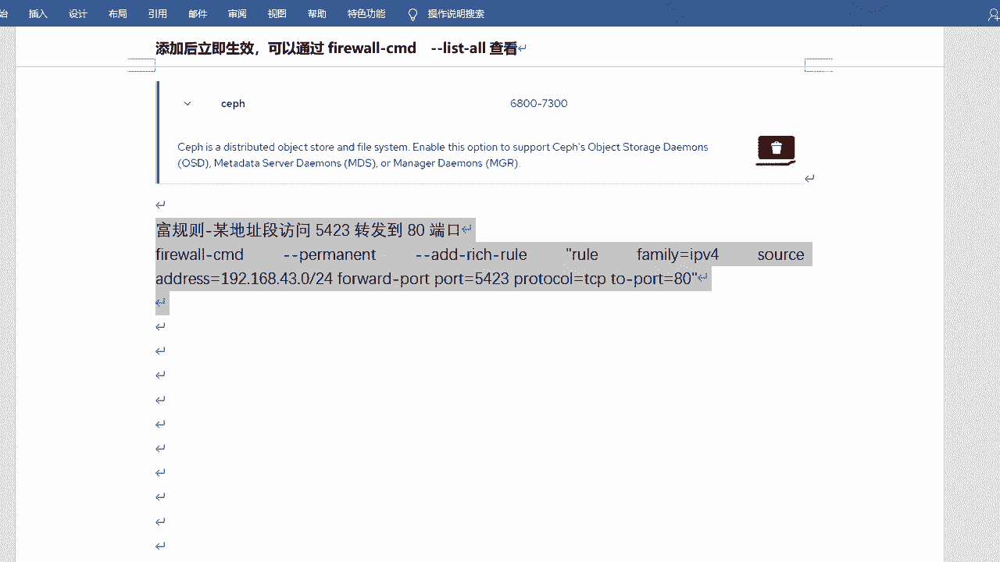

# rhel8-centos8-rhce-linux-stream-stratis-vdo-podman-dnf - P2：rhel8-e-1-2firewalld防火墙下 - Linux最diao - BV16T4y1K7px

呃，先咱们就从前往后去说了是吧，先看那个啥对吧，先看这个图形画的啊。😊，嗯。嗯。

图形化啊图形化的话，它有一个命令啊，叫做。Fairwall。杠肯fi个啊。Config。嗯。哇塞，这个包没装吗？啊，再装一下啊，呃它会提示，因为八里边没有装的话，它会提示你啊。转一下啊。嗯，yes继续。

嗯。他正在装啊。装完之后，他会立马去执行啊，立马去执行啊。哎，我这已经出来了啊。

这个是什么呢？呃，这个是就是faairwall杠config啊，然后图形化的管理。啊，这个大家应该比较喜欢是吧？因为通形化通过点鼠标的方式点点就可以了，是吧？😊，嗯，来看一下啊，呃，先来看这个地方啊。

叫区域是吧？那么咱们可以看到刚才我讲的那什么9种9个区域是吧？block呀、DMZ呀。什么public呀啊charted呀，这种待多了个labor word是吧？这个不用管它啊。

这这这个吐了个这个这个这个不用去管它啊。好吧，然后默认的话就是public，包括咱们一般去设置呢，也是去设置这个public啊。那么里边的话呢，它会有服务啊，就是你比如说你要去放开某狗服务。

在这可以打勾，打勾的话，它默认就放开了啊。呃，那么默认的话，它这个放开的服务的话有co的啊，co的是呃一个web console啊，可以去通过web的方式去管理咱们的系统。一会儿咱们也可以看一下。

还有就是DSPV clientant是吧？😊，自动获学呃，V6地址的啊，然后SSH呢？啊，这么口啊，在这儿呢SS这它是放开的啊，它是放开的。😊，啊，也就是说这么多的服务，他只放开了3个啊。

它只放开了3个。😊，当然这个是服务，如果说你想翻开端口，那么你可以在这儿添加，我可以放开端口协议啊，可以放开添加原端口伪装转发啊，什么ICM过滤器啊，什么副规则啊，什么网卡来源是吧？

这都可以都可以去设置。啊，都可以去设置啊。就是这个啊是这个。但是呢咱们在做的时候要怎样呢？要先去点一个啊。就这儿啊叫配置。叫永久啊。让它永久生效，要不然的话它只是临时生效的。好吧。

这样的话它才会呃永久生效，然后写入到配置文件。好吧，比如说我就放开一个。这么多是吧？哇塞，放开一个sefe吧，好吧，sef与尊处啊。😊，分不存楚。把它加进去。啊，点进去。那么你比如说我加完之后。

加完之后怎么做呢？加完之后要设置一个叫做选项，叫重载防护墙啊，重载防护墙让它生效。哎，好吧，那这样的话呢才才能认识到你放开了这个sf，好吧，放开了sf啊。呃，然后当然这你这也能看见是吧，你这也能看见啊。

这就是图形化的方式。主要就是要是永久。然后然后呢添加完服务端口之后，你要去重载防火墙。😊，啊，这就是图形化的啊，这是图形化的啊。通学话的。

相对来说是吧，相对来说是比较。比较那个啥的啊，比较简单的是吧？以为点点的方式就就可以了，是不是？O啊。嗯。那么你做完之后啊，做完之后的话，咱们可以通过一个叫fwork杠CMD，这是命令行的方式啊。

杠杠list all可以去查看到底有没有生效是吧，有没有生效啊。

fairwall杠CMD啊杠杠list all。嗯。刚才的sf在这呢是吧？copeDCPV6 clientant SAH都在这儿了，这都是允许的。好吧，这都是允许的啊。那么这个就是命令行的命令。啊。

叫做fwall。杠CMD啊，然后你可以看看刚刚version版本是吧？还有刚才的刚刚state。😊，嗯，状态。呃，刚刚help就别看了嘛，刚help他会一个帮助信息啊，这个特别长。😊，特别长啊嗯。

这是怎么去用的啊？好吧，然后当然还有比如说杠杠什么呢？刚刚get。active粽子啊active粽子比如说当当前那个启用的众是谁啊，它会显示两个啊，一个是你的这个这个是虚拟网卡是吧？

la word一个是咱们正常的网卡public啊，这这个是咱们现在用的啊。好吧，这咱们用现在用的啊，然后还有是get粽子，粽子的话它会显示你所有的区域。啊，他会显示所有区域。啊。

这多了个lab word是吧？这个这个不用管它啊。啊，然后还有get default zone。default中就是默认的可以换啊default中。呃，这个删掉了。默认的区域是吧？默认的话。

你看就是public。好吧，默然的话就是public啊。

考试时可以这样吗？考试时候考试的时候啊，80本没有那个啥了啊，8版本没有直接去设置防火墙的，好吧。这个。嗯，就不用去设置了啊。😊，OK关键是你你就知道有一个叫做。永久生效啊，一会儿咱们会讲一个参数。

那个得需要记一下啊，那个得需要记一下。嗯，就是查看啊，包括去。显示默认的区域是吧？Get default住。啊， default纵啊，当然呢我也可以去设置defa纵。

对不对？你。刚才是get嘛是吧？你可以set。😊，赛ad包装啊。呃，等于。比如等于work吧。啊，然后你再get一下。是吧那现在就变成work了。啊，变什，而且它它会立即生效啊，不用去那个啥。

不用去那个那个那个重启啊呃，当然咱们再试着回来啊，还是用public啊。那然后再get一下是吧？嗯。好吧，这个就是告诉你可以去去设置，好吧，可以去设置啊。okK行，那咱们来加一个什么呢？来加一个规则吧。

好吧，加个规则啊。😊，呃，叫fa沃。杠CMD啊杠杠纵啊杠杠纵。如果说你想设置哪个纵，比如我想设置一个walk吧。啊，然后刚刚ADD。呃，Part。对吧哎，我可以设置一个，比如说加加1个8080。啊。

然后TCP是吧？我可以这样讲。好吧，我可以这样讲啊。😊，当然你如果你哎我不加呢是吧？如果你不加，它就会加入到word中。啊，默认的话就是那个那个public啊public啊，就是我可以去加进来。

他提会成功，如果成功，我可以去看一下啊，叫farewall。刚CMD杠刚list。哦啊，这是查看所有的啊。那么80把00加进来了，对不对？但是啊这只是临时的啊，好吧，这是临时的啊，然后呢你去重载叫f沃。

杠CMD刚刚reload啊重改的时候，那么它就没有了。8080又不存在了，是不是？因为它并没有真正的去写入到配置文件啊，然后也也不会生效。好吧，那那怎么办呢？是吧？那我如果说我要去加入这个什么呢？

我要加这个端口呢，是吧？那咱们就加个参数永久生效。还记得咱们刚才去点鼠标的时候点的这个吧。😊。

点的这个是吧，配置对不对？这个地方需要配置永久。那么咱们在用命令行的方式去写写的时候，那么也得去呃设置永久啊。这个参数大家可以记一记啊。😊。

叫做什么呢？叫做杠杠permanent啊 permanentman。permanence嘛就是永久生效的意思。好吧，如果说你记不住是吧，那你能t出来，是不是这个也也可以是吧？也可以的啊。😊，呵呵。走你。

success是吧，成功，然后再看一下。你会发现他反而不在了，对吧？😊，我家里域他反而不在了，别着急啊，咱们reload一下。哎，然后再去查看。是吧现在在了。啊，现在加了啊。

这个这个才是真正的去去生效的。😊，permanent没错啊，permanent啊。就是这个嗯。P2MANENT啊运止生效的啊。

嗯，然后这个是添永久添加啊，永久添加啊。嗯。ああ。加上perman，我这也标红吧，好吧。呃，这个是加端口是吧？加端口啊，如果说你想加服务的话，也可以加服务啊。😊。

嗯。江福。叫做 fair。fairwall杠CMD啊，可以先加杠杠permanent啊，然后杠杠ADD什么呢？ADD还可以加好多的啊。😊，你看到没有？port是是是是是哎，port呢啊。

port在这呢是吧？然后有service就是加服务啊，H有负规则啊，什么源端口这个都可以加啊。呃，service service是比如说加上HTTP吧。好。我去加一下啊。呃，加完之后要reload是吧？

reload啊。😊，然后list all。查看。对不对？HTP也讲起来了。是吧HTP也可以加进来了啊。对，这就是整个的过程啊。😊，嗯，我把这个简单写一下啊。

嗯。加我把这个放这吧。然后把这个。格式啊，那么改一下啊。是加服务是吧，加服务加端口都可以啊。okK然后加完之后一定要reload啊，reload，然后显示可以查看。好吧，显示的话可以查看啊。😊。

好。m。呃，这个是查看是吧？list我看一下啊，刚才咱们加了个HTTP是吧？比如我把它删掉吧，把它删掉啊。那么你删掉的话呢，是。😊，嗯，刚才这个地方是ad是吧？你把它变成 removem啊。

Remove。啊呃，删掉好吧，名部删掉啊。然后你需要注意的是，如果说你是啊当然一般家都是啊，你加了permanent添加的时候，那么你去。删除的时候，你得加permanent。😡，好吧。

删的时候你也得加的啊，那我把它你比如说我先把它删掉，咱们这样去删一下啊，它也会提示你成功是吧？然后咱们list看一眼。然后也没了也没了是吧？然后呢去reload一下。然后再看一下。那他又回来了是吧？😊。

哼他他欺骗你是吧？😊，他来骗啊，来偷袭你是吧？这个时候障眼法啊，所以说你是怎么加的，你怎么删啊，咱们把那个删的时候，把那个permanent也给它加上啊。Remove。啊。删掉。

然后再去reload一下啊。然后再去查看list。对不对？这时候HTTP才没了。

是不是才没了啊。😊，这是移除啊删除。已出付。好吧，这个就是命令行的方式。啊，命令行的方式啊，然后啊然后来看配置文件的方式啊。也可以去通过改配置文件去。是这个防火墙的啊，那配置文件的话呢，它在这儿啊。

ETCETC下叫fwall farwall下边啊，它会有这个叫做粽子和service这个目录。那么粽子的话呢就是去呃记录咱们这些这几个纵是吧？它的一些规则。但如果说你没有改过的话，它它都是默认的啊。

这里边都没有。如果说你去看的话，默认这里边只有一个public。因为刚才咱们改了public它会记录下来，别的没有改，它不会先显示的啊。

然后还有是service serviceservice里边默认也没有，因为我没有去特殊的去指定或者去放开或者去干嘛的，我的某个某个服务，它也不会去产生啊，它也不会产生。当然这里边的话。

尤其是service啊，这里边的话呢，其实咱们可以不用去。😊，写啊，因为他会有一些。呃，例子和示范啊会会会给咱们一个一个一个例子的啊。😊。

有好多的服务咱们都可以参考的啊。这是配置文件的方式啊，在这儿。还有一个目录是专门存放这些服务的啊。在user下的lab下的fare word下面有services。好吧，在这儿啊，这是这是内置的啊。

内置的常用防火墙的规则。

嗯。有。you lab下的叫做fair world下的是吧？然后three啊这么多。都在这儿呢。看到没有？就在这儿啊，但是这些的话你别去改好吧，这些的你别去改啊，别去那个那个手动去改。这些的话呢。

可以把它拷贝复制到咱们ETC下的fair word下的service那个目录下啊，然后你再去改啊，这里边的话默认你就别改。😊，好吧，默认你就别改啊。呃，当然了，如果说你想把他们写到这个综里边，是不是？

那么你可以直接去改那个public那个文件也行啊，直接改public也可以啊。咱们可以简单来看一下啊，比如说我去。😊，给咱们看一下吧，user lab下的fawood下的。嗯，谁呢？

啊service是吧？😊，看一下HTTB吧，刚才咱们咱们看的那个啊点叉m啊，它是这种点叉m的文件啊。你看它里边的话，这是格式啊，这是固定格式，怎么写啊，service short。

什么description啊，然后对，然后port你看HTP它的。这个这个方式也是分在端口，端口的话呢是80。是不是那这个是关键啊，这个地方你可以直接拿过来去用的。😊，好吧，咱后来用啊，写哪去呢？

我先复制一下啊嗯。写哪去呢？可以写到咱们那个。那个那个ETC啊，fairwell下的呃那个那个粽粽子里边public，你可以直接写到这边来啊。你看它这个格式啊，这个格式和和你那个格式差其实是一样的啊。

对，然后下边就是你要放开的服务啊，我放开了SSHDCBV6copy的se和8080，对不对？那我能不能再放开一个？😊，我把你放开，这样写可以吗？😊，对吧这样写可以吗？

我是直接从那个HTTP的配置文件里边直接复制过来的。😊，好吧，当然它和前面可能不太一样啊，这个地方是先是port，然后是protoco啊，然后这个是先是proto，然后是port。

就是先是协议和先示端口的问题啊，格式啥的都都一样。😊，啊，格式啥的都一样啊。那那咱们可以试一试啊。改完之后保存退出好吧，然后我去看一下farewall。杠CMD。刚刚list哦。啊，80并没有在是吧。

然后也没有HTTP的服务，对不对？那我去reload一下啊reload一下啊。O咱们再去看。是不是又出来了？对不对你可以直接去改配置文件啊，这个没有问题。

好吧，这个没有问题啊。反而会感觉哇塞这个好好厉害呀，是吧？是我是不是都可以这样啊啊，但是其实啊咱们不建议是说直接去改配置文件。😊。

好吧，还是用命令行的方式的多一些。如果你去用fbo的防火枪的话啊，好吧，我只是告诉你可以这么用。对吧你可以去用改配直文间的方式，好吧？嗯，那么刚才比如说我加的是端口。是吧。Whatever。

我跟他家端口，那么我我能加服务吗？对不对？是吧大家可以试一试啊。比如说按照他的方式写服务是吧，那你也可以试一试。好吧，你可以试一试啊。嗯，好吧，这个是配置文件的方式。好吧，配以置名的方式啊。对。

然后你当然一开始会不生效啊，你需要去reload。😊。

看这啊。直接改配置文件，通过查看并没有生效，然后呢，你需要是reload。reel的话他单会重新去加载，它会重新去重新去读取的啊，重新读取的啊。OK啊，还有一个方式就是copy。

copywec的方式去管理防火墙啊。嗯，copy的话呢是800本，它自带的这个管理的方式啊，copy的其实挺好的，然后可以帮他们解决很多问题啊，直接单鼠标就可以了。嗯，我去访问一下啊。

copyed的我的是。我地址是43。137吧，好像是啊。拷py的是9090，能打开吗？

嗯，没有开是吧，那我这边服务应该是煤气啊。嗯。System。这条啊这ters。copy的。😔，方闭的。没有起，我起一下啊。你内部。刚刚弄啊嗯。

记一下。然后再访问一下。嗯。他说我不是私频连接啊，这也不管他啊。高级访问是吧？然后登录就可以啊，用你的用户名和密码登录啊。密码是123456。

好吧，这个是co的啊。靠py的可以管理咱们的好多的。东西的。嗯，日志存储网络potman容器，什么账号服务那个核存储什么的都可以管理啊，都可以管理的。嗯，我这截个图吧。嗯。

copy的这管理应该是在网络这啊，防火墙啊在这呢。截个图啊截个图。copyed。トマホ。防火枪。

通过他去管理啊通过他去管理。

哦，当然咱们得启动是吧？嗯，启动的话，我把这个命令拿过来啊。cCTLenable杠刚照啊，什么意思呢？就是enable刚刚照，就是它在启动的同时，然后呢设置开机自启动。

啊，这是开机自启动啊，这个意思。因为默认的话，它没有服务没有启啊，咱们给它起一下，好吧。

再记一下啊。按防火墙就可以啊，点它。方向。好吧，那么这个地方呢有有咱们那个啥的啊，有咱们那个添加的啊。😊，嗯，服务SSH什么copy的se就在这呢啊都在这儿了啊。然后但是它没有端口，看到没有？

它没有端口啊，没有显示端口。就是没有那个什么80和8080啊。嗯，区域是那个啥的？区域是那个只只这个不用添加啊。呃，主要是服务添加服务。嗯，可以进端口。啊，这一端口，但是它没有显示是吧？啊。

他说添加资金端口会将会重新加载fbo。春加载会议将。导致运行配置丢失是吧？这也不用讲了，服务吧，服务这个地方呢我可以选，你就不用写了。好吧，但是你可以搜，比如说我搜1个HTTP。😊。

你看3WHTPHTPS是吧？在这都能选啊都能选。你你选一个。增家服务嗯。对不对？就在这儿呢啊在这儿呢啊。OK然后他会理解成效吗？我看看啊。😊。

S啊，然后我我看一下啊。看一下咱们的系统里边啊。お。啊。哦，加进来了是吧，这个不用点确定啊，这个哇塞，这么直接。😊。

全家福。嗯，我这截个图吧，要不嗯添加服务，然后可以搜啊。嗯。

可以搜索。是吧直接加就可以啊。OK然后添加完之后立即生效是吧嗯？😊，添加。😔，后立即生效。嗯。可以通过。Fwell。

呃，刚好CMD是吧，fare沃还是fre沃的。

Farewell杠MD。刚刚list。哦是吧，查看啊嗯。好吧，通过它的话是吧？通过它的话，你就可以直接去。添加了啊。相当于又是一个一个一个图形化的方式，是吧？😊，相当于又是一个图形化的方式啊。

嗯，再看一下啊。就在这儿是吧，直接加就可以啊。当然如果说你想删的话，也可以删。对不对？你可以删了啊。呃，这个区包括copy的服务，请确定这个区域不对啊。这个删的话是删中所有的啊呃，删单个不能删吗？

删单个的。啊，是那边可以带点啥。

是吧也可以删除的啊，直接干掉它就可以。

这个小垃圾桶是吧？这就是删除啊。Okay。这个也很方便是吧？你看coP的话，其实。copy的其实挺好的啊，但是目前co币的还不能。不能真正的去实现生产的功能是吧？但是但是它其实已经挺完善的啊。

做的其实挺好的了啊。😊，O。

四种方式啊，图形化命令行配置文件和copy对吧？呃，当然比较简单啊，然后咱们可以来看一个稍微复杂一些的啊。刚才咱们通过faairwall。是吧杠CMD然后去添加呀干嘛的，是吧？它都会有这个提示的。对。

但是呢也不是所有的啊，比如说我加一个什么呢？加一个。perperent啊，加一个叫刚刚ADD叫reach true啊，re truereach true的话叫副规则。好吧，副规则。那附规则的话呢。

就是不是通过一条命令或者一条语句，或者说一个端口，一个服务就可以解决的一个问题啊，就是一个比较复杂的一个一个一个规则啊。那那怎样呢？那咱们得去。这个这个呃通过reach show的方式去设置啊去设置啊。

可以不用加等号啊，然后需要给它引起来，好吧，引起来啊。呃，里边写一个比如说写个ru family。啊，入family就是你的叫做地址促啊，就IPV4的。这翻面，然后source。Address。啊。

语言地址或端口从哪儿来的啊？比方说从这一个8。啊，然后我这个是43啊。从这个网段。过来的对不对？然后呢叫做forward。Partt。啊，就是呃那个装转发啊，装转发原端口呢是5423。啊。

然后呢呃protoco。就是协议啊，协议是DCP协议。啊，然后to port。转这个端口呢转到80。🎼啊，也就是说从这个地址来访问我我423端口的请求，我会转发到本机的80端口，是这个意思。好吧。

是这个意思啊，然后这样去添加。😊，啊，填完之后你可以去。看一下啊。啊，去去reload一下，reload在哪呢？然后再去看。对吧他会加进来。啊，回想起来，然后比较痛苦的就是说这个地方啊。

你把它扩起来之后。那这里边的话你就不能t了啊，你就不能t了啊。而我刚CMD刚刚perit。刚刚ADD日出。啊。什么ru family tape tape。这都不好使啊。对，就得手写好吧，手写啊还好是吧？

😊。

这个在咱们班里边不考了啊。Ha。😊。

啊，你们就可以不用去记他了啊。

我把它写一下吧，好吧。reach true啊负规则叫负规则啊。呃，付为的什么呢？原呃。地址。某地址段。嗯。访问是吧，然后5423啊。转发到。发0单号就是看这个的啊。嗯。这就叫负规则。好吧。

这个叫复规则啊。

行，这个是咱们的方光墙。